# Code Review

**Navigation:** [← Previous](./01-agent-sicherheit.md) | [Index](./index.md) | [Next →](./03-arbeiten-mit-dokumentation.md)

---

# Code Review
Source: https://docs.cursor.com/de/cli/cookbook/code-review

Erstell einen GitHub-Actions-Workflow, der die Cursor-CLI verwendet, um Pull Requests automatisch zu prüfen und Feedback zu geben

Dieses Tutorial zeigt dir, wie du Code Reviews mit der Cursor-CLI in GitHub Actions einrichtest. Der Workflow analysiert Pull Requests, identifiziert Probleme und postet Feedback als Kommentare.

<Tip>
  Für die meisten Nutzer empfehlen wir stattdessen [Bugbot](/de/bugbot). Bugbot bietet ein verwaltetes, automatisiertes Code Review ohne Setup. Dieser CLI-Ansatz ist hilfreich, um die Möglichkeiten zu erkunden und für fortgeschrittene Anpassungen.
</Tip>

<div className="space-y-4">
  <Expandable title="vollständige Workflow-Datei">
    ```yaml cursor-code-review.yml theme={null}
    name: Code Review

    on:
      pull_request:
        types: [opened, synchronize, reopened, ready_for_review]

    permissions:
      pull-requests: write
      contents: read
      issues: write

    jobs:
      code-review:
        runs-on: ubuntu-latest
        # Automatisierte Code-Reviews für Entwurfs-PRs überspringen
        if: github.event.pull_request.draft == false
        steps:
          - name: Repository auschecken
            uses: actions/checkout@v4
            with:
              fetch-depth: 0
              ref: ${{ github.event.pull_request.head.sha }}

          - name: Cursor-CLI installieren
            run: |
              curl https://cursor.com/install -fsS | bash
              echo "$HOME/.cursor/bin" >> $GITHUB_PATH

          - name: Git-Identität konfigurieren
            run: |
              git config user.name "Cursor Agent"
              git config user.email "cursoragent@cursor.com"

          - name: Automatisiertes Code-Review durchführen
            env:
              CURSOR_API_KEY: ${{ secrets.CURSOR_API_KEY }}
              MODEL: gpt-5
              GH_TOKEN: ${{ secrets.GITHUB_TOKEN }}
              BLOCKING_REVIEW: ${{ vars.BLOCKING_REVIEW || 'false' }}
            run: |
              cursor-agent --force --model "$MODEL" --output-format=text --print 'Du arbeitest in einem GitHub-Actions-Runner und führst ein automatisiertes Code-Review durch. Die gh-CLI ist verfügbar und über GH_TOKEN authentifiziert. Du darfst Pull Requests kommentieren.

              Kontext:
              - Repo: ${{ github.repository }}
              - PR Number: ${{ github.event.pull_request.number }}
              - PR Head SHA: ${{ github.event.pull_request.head.sha }}
              - PR Base SHA: ${{ github.event.pull_request.base.sha }}
              - Blockierendes Review: ${{ env.BLOCKING_REVIEW }}

              Ziele:
              1) Bestehende Review-Kommentare erneut prüfen und mit resolved antworten, wenn erledigt.
              2) Den aktuellen PR-Diff prüfen und nur eindeutige, schwerwiegende Probleme markieren.
              3) Sehr kurze Inline-Kommentare (1–2 Sätze) ausschließlich auf geänderten Zeilen hinterlassen und am Ende eine kurze Zusammenfassung.

              Vorgehen:
              - Bestehende Kommentare abrufen: gh pr view --json comments
              - Diff abrufen: gh pr diff
              - Geänderte Dateien mit Patches abrufen, um Inline-Positionen zu berechnen: gh api repos/${{ github.repository }}/pulls/${{ github.event.pull_request.number }}/files --paginate --jq '.[] | {filename,patch}'
              - Exakte Inline-Anker für jedes Problem berechnen (Dateipfad + Diff-Position). Kommentare MÜSSEN inline auf der geänderten Zeile im Diff platziert werden, nicht als Top-Level-Kommentare.
              - Frühere Top-Level-Kommentare im Stil „keine Probleme“ erkennen, die von diesem Bot verfasst wurden (Texte wie: "✅ no issues", "No issues found", "LGTM").
              - Wenn beim aktuellen Lauf Probleme gefunden werden und frühere „keine Probleme“-Kommentare existieren:
                - Diese nach Möglichkeit entfernen, um Verwirrung zu vermeiden:
                  - Versuchen, Top-Level-Kommentare zu löschen via: gh api -X DELETE repos/${{ github.repository }}/issues/comments/<comment_id>
                  - Falls Löschen nicht möglich ist, via GraphQL minimieren (minimizeComment) oder so bearbeiten, dass "[Superseded by new findings]" vorangestellt wird.
                - Falls weder Löschen noch Minimieren möglich ist, auf diesen Kommentar antworten: "⚠️ Superseded: issues were found in newer commits".
              - Wenn ein zuvor gemeldetes Problem durch nahe Änderungen behoben erscheint, antworte: ✅ This issue appears to be resolved by the recent changes
              - NUR analysieren auf:
                - Null/undefined-Dereferenzierungen
                - Ressourcenlecks (nicht geschlossene Dateien oder Verbindungen)
                - Injection (SQL/XSS)
                - Nebenläufigkeit/Race Conditions
                - Fehlende Fehlerbehandlung bei kritischen Operationen
                - Offensichtliche Logikfehler mit fehlerhaftem Verhalten
                - Klare Performance-Anti-Patterns mit messbarem Einfluss
                - Eindeutige Sicherheitslücken
              - Duplikate vermeiden: überspringen, wenn ähnliches Feedback bereits auf oder nahe derselben Zeile existiert.

              Kommentarregeln:
              - Maximal 10 Inline-Kommentare insgesamt; priorisiere die kritischsten Probleme
              - Ein Problem pro Kommentar; exakt auf der geänderten Zeile platzieren
              - Alle Problemkommentare MÜSSEN inline sein (an Datei und Zeile/Position im PR-Diff verankert)
              - Natürlicher Ton, spezifisch und umsetzbar; nicht erwähnen, dass es automatisiert ist oder auf hoher Sicherheit beruht
              - Emojis verwenden: 🚨 Kritisch 🔒 Sicherheit ⚡ Performance ⚠️ Logik ✅ Behoben ✨ Verbesserung

              Einreichung:
              - Wenn es KEINE Probleme zu melden gibt und bereits ein bestehender Top-Level-Kommentar vorhanden ist, der „keine Probleme“ angibt (z. B. "✅ no issues", "No issues found", "LGTM"), KEINEN weiteren Kommentar einreichen. Einreichung überspringen, um Redundanz zu vermeiden.
              - Wenn es KEINE Probleme zu melden gibt und KEIN vorheriger „keine Probleme“-Kommentar existiert, einen kurzen Zusammenfassungskommentar einreichen, der keine Probleme vermerkt.
              - Wenn es Probleme zu melden gibt und ein vorheriger „keine Probleme“-Kommentar existiert, sicherstellen, dass der vorherige Kommentar vor Einreichung des neuen Reviews gelöscht/minimiert/als überholt markiert wird.
              - Wenn es Probleme zu melden gibt, EIN Review einreichen, das NUR Inline-Kommentare plus einen optionalen knappen Zusammenfassungstext enthält. Die GitHub-Reviews-API verwenden, um sicherzustellen, dass Kommentare inline sind:
                - Ein JSON-Array von Kommentaren erstellen wie: [{ "path": "<file>", "position": <diff_position>, "body": "..." }]
                - Einreichen via: gh api repos/${{ github.repository }}/pulls/${{ github.event.pull_request.number }}/reviews -f event=COMMENT -f body="$SUMMARY" -f comments='[$COMMENTS_JSON]'
              - NICHT verwenden: gh pr review --approve oder --request-changes

              Blockierendes Verhalten:
              - Wenn BLOCKING_REVIEW true ist und irgendein 🚨- oder 🔒-Problem gepostet wurde: echo "CRITICAL_ISSUES_FOUND=true" >> $GITHUB_ENV
              - Andernfalls: echo "CRITICAL_ISSUES_FOUND=false" >> $GITHUB_ENV
              - CRITICAL_ISSUES_FOUND immer am Ende setzen
              '

          - name: Ergebnisse des blockierenden Reviews prüfen
            if: env.BLOCKING_REVIEW == 'true'
            run: |
              echo "Prüfe auf kritische Probleme..."
              echo "CRITICAL_ISSUES_FOUND: ${CRITICAL_ISSUES_FOUND:-unset}"

              if [ "${CRITICAL_ISSUES_FOUND:-false}" = "true" ]; then
                echo "❌ Kritische Probleme gefunden und blockierendes Review ist aktiviert. Workflow wird fehlgeschlagen."
                exit 1
              else
                echo "✅ Keine blockierenden Probleme gefunden."
              fi
    ```
  </Expandable>

  <Frame>
    
  </Frame>
</div>

<div id="configure-authentication">
  ## Authentifizierung konfigurieren
</div>

[Richte deinen API-Schlüssel und die Repository-Secrets ein](/de/cli/github-actions#authentication), um die Cursor-CLI in GitHub Actions zu authentifizieren.

<div id="set-up-agent-permissions">
  ## Agent-Berechtigungen einrichten
</div>

Erstell eine Konfigurationsdatei, um festzulegen, welche Aktionen der Agent ausführen darf. So verhinderst du unbeabsichtigte Aktionen wie das Pushen von Code oder das Erstellen von Pull Requests.

Erstell `.cursor/cli.json` im Root-Verzeichnis deines Repos:

```json  theme={null}
{
  "permissions": {
    "deny": [
      "Shell(git push)",
      "Shell(gh pr create)",
      "Write(**)"
    ]
  }
}
```

Diese Konfiguration erlaubt dem Agenten, Dateien zu lesen und die GitHub-CLI für Kommentare zu verwenden, verhindert aber, dass er Änderungen an deinem Repository vornimmt. Sieh dir die [Berechtigungsreferenz](/de/cli/reference/permissions) für weitere Konfigurationsoptionen an.

<div id="build-the-github-actions-workflow">
  ## Baue den GitHub-Actions-Workflow
</div>

Lass uns den Workflow jetzt Schritt für Schritt aufsetzen.

<div id="set-up-the-workflow-trigger">
  ### Richte den Workflow-Trigger ein
</div>

Erstelle `.github/workflows/cursor-code-review.yml` und konfiguriere ihn so, dass er bei Pull Requests ausgeführt wird:

```yaml  theme={null}
name: Cursor-Code-Review

on:
  pull_request:
    types: [opened, synchronize, reopened, ready_for_review]

jobs:
  code-review:
    runs-on: ubuntu-latest
    permissions:
      contents: read
      pull-requests: write
    
    steps:
```

<div id="checkout-the-repository">
  ### Repository auschecken
</div>

Füg den Checkout-Schritt hinzu, um auf den Pull-Request-Code zuzugreifen:

```yaml  theme={null}
- name: Repository auschecken
  uses: actions/checkout@v4
  with:
    fetch-depth: 0
    ref: ${{ github.event.pull_request.head.sha }}
```

<div id="install-cursor-cli">
  ### Cursor-CLI installieren
</div>

Füg den CLI-Installationsschritt hinzu:

```yaml  theme={null}
- name: Cursor-CLI installieren
  run: |
    curl https://cursor.com/install -fsS | bash
    echo "$HOME/.cursor/bin" >> $GITHUB_PATH
```

<div id="configure-the-review-agent">
  ### Konfiguriere den Review-Agent
</div>

Bevor wir den vollständigen Review-Schritt implementieren, lass uns die Struktur unseres Review-Prompts verstehen. Dieser Abschnitt beschreibt, wie sich der Agent verhalten soll:

**Ziel**:
Wir wollen, dass der Agent den aktuellen PR-Diff prüft und nur eindeutige, schwerwiegende Probleme markiert, dann sehr kurze Inline-Kommentare (1–2 Sätze) ausschließlich zu geänderten Zeilen hinterlässt, mit einer kurzen Zusammenfassung am Ende. Das hält das Signal-Rausch-Verhältnis ausgewogen.

**Format**:
Wir wollen Kommentare, die kurz und auf den Punkt sind. Wir verwenden Emojis, um das Durchscannen der Kommentare zu erleichtern, und möchten am Ende eine High-Level-Zusammenfassung des gesamten Reviews.

**Abgabe**:
Wenn das Review abgeschlossen ist, soll der Agent einen kurzen Kommentar basierend auf den während des Reviews gefundenen Punkten hinzufügen. Der Agent sollte ein einziges Review einreichen, das Inline-Kommentare plus eine prägnante Zusammenfassung enthält.

**Edge Cases**:
Wir müssen Folgendes handhaben:

* Bereits vorhandene, aufgelöste Kommentare: Der Agent sollte sie als erledigt markieren, wenn sie adressiert wurden
* Duplikate vermeiden: Der Agent sollte das Kommentieren überspringen, wenn ähnliches Feedback bereits auf oder nahe derselben Zeile existiert

**Finaler Prompt**:
Der vollständige Prompt kombiniert all diese Verhaltensanforderungen, um fokussiertes, umsetzbares Feedback zu liefern

Jetzt lass uns den Review-Agent-Schritt implementieren:

```yaml  theme={null}
- name: Code-Review durchführen
  env:
    CURSOR_API_KEY: ${{ secrets.CURSOR_API_KEY }}
    GH_TOKEN: ${{ github.token }}
  run: |
    cursor-agent --force --model "$MODEL" --output-format=text --print "Du arbeitest in einem GitHub-Actions-Runner und führst eine automatisierte Code-Review durch. Die gh-CLI ist verfügbar und über GH_TOKEN authentifiziert. Du darfst Pull Requests kommentieren.
    
    Kontext:
    - Repo: ${{ github.repository }}
    - PR-Nummer: ${{ github.event.pull_request.number }}
    - PR Head SHA: ${{ github.event.pull_request.head.sha }}
    - PR Base SHA: ${{ github.event.pull_request.base.sha }}
    
    Ziele:
    1) Bestehende Review-Kommentare erneut prüfen und bei Erledigung mit „resolved“ antworten
    2) Den aktuellen PR-Diff prüfen und nur eindeutige, schwerwiegende Probleme markieren
    3) Sehr kurze Inline-Kommentare (1–2 Sätze) nur auf geänderten Zeilen hinterlassen und am Ende eine kurze Zusammenfassung
    
    Vorgehen:
    - Vorhandene Kommentare abrufen: gh pr view --json comments
    - Diff abrufen: gh pr diff
    - Wenn ein zuvor gemeldetes Problem durch nahe Änderungen behoben wirkt, antworten: ✅ Dieses Problem scheint durch die jüngsten Änderungen behoben zu sein
    - Duplikate vermeiden: überspringen, wenn ähnliches Feedback bereits auf oder nahe denselben Zeilen existiert
    
    Kommentierregeln:
    - Maximal 10 Inline-Kommentare insgesamt; die kritischsten Probleme priorisieren
    - Ein Problem pro Kommentar; exakt auf der geänderten Zeile platzieren
    - Natürlicher Ton, konkret und umsetzbar; keine Erwähnung von Automatisierung oder hoher Sicherheit
    - Emojis verwenden: 🚨 Kritisch 🔒 Sicherheit ⚡ Performance ⚠️ Logik ✅ Erledigt ✨ Verbesserung
    
    Einreichung:
    - Eine Review einreichen, die Inline-Kommentare plus eine prägnante Zusammenfassung enthält
    - Nur verwenden: gh pr review --comment
    - Nicht verwenden: gh pr review --approve oder --request-changes"
```

```text  theme={null}
.
├── .cursor/
│   └── cli.json
├── .github/
│   └── workflows/
│       └── cursor-code-review.yml
```

<div id="test-your-reviewer">
  ## Teste deinen Reviewer
</div>

Erstell einen Test-Pull-Request, um zu prüfen, dass der Workflow funktioniert und der Agent Review-Kommentare mit Emoji-Feedback postet.

<Frame>
  
</Frame>

<div id="next-steps">
  ## Nächste Schritte
</div>

Du hast jetzt ein funktionierendes, automatisiertes Code-Review-System. Überleg dir diese Erweiterungen:

* Richte zusätzliche Workflows zum [Beheben von CI-Fehlern](/de/cli/cookbook/fix-ci) ein
* Konfiguriere unterschiedliche Review-Stufen für verschiedene Branches
* Integriere den Workflow in den bestehenden Code-Review-Prozess deines Teams
* Passe das Verhalten des Agents für verschiedene Dateitypen oder Verzeichnisse an

<Expandable title="Fortgeschritten: Blockierende Reviews">
  Du kannst den Workflow so konfigurieren, dass er fehlschlägt, wenn kritische Probleme gefunden werden. So wird der Pull Request so lange nicht gemerged, bis sie behoben sind.

  **Blockierendes Verhalten zum Prompt hinzufügen**

  Aktualisiere zuerst deinen Review-Agent-Schritt, um die Umgebungsvariable `BLOCKING_REVIEW` einzuschließen, und füge dieses blockierende Verhalten zum Prompt hinzu:

  ```
  Blocking behavior:
  - If BLOCKING_REVIEW is true and any 🚨 or 🔒 issues were posted: echo "CRITICAL_ISSUES_FOUND=true" >> $GITHUB_ENV
  - Otherwise: echo "CRITICAL_ISSUES_FOUND=false" >> $GITHUB_ENV
  - Always set CRITICAL_ISSUES_FOUND at the end
  ```

  **Blockierenden Prüfschritt hinzufügen**

  Füg anschließend diesen neuen Schritt nach deinem Code-Review-Schritt hinzu:

  ```yaml  theme={null}
        - name: Check blocking review results
          if: env.BLOCKING_REVIEW == 'true'
          run: |
            echo "Checking for critical issues..."
            echo "CRITICAL_ISSUES_FOUND: ${CRITICAL_ISSUES_FOUND:-unset}"

            if [ "${CRITICAL_ISSUES_FOUND:-false}" = "true" ]; then
              echo "❌ Critical issues found and blocking review is enabled. Failing the workflow."
              exit 1
            else
              echo "✅ No blocking issues found."
            fi
  ```
</Expandable>


# CI-Fehler beheben
Source: https://docs.cursor.com/de/cli/cookbook/fix-ci

CI-Probleme in einem Repository mit der Cursor CLI in GitHub Actions beheben

Behebe CI-Fehlschläge mit der Cursor CLI in GitHub Actions. Dieser Workflow analysiert Fehler, nimmt gezielte Fixes vor und erstellt einen Fix-Branch mit einem Quick-Create-PR-Link.

Dieser Workflow überwacht einen bestimmten Workflow anhand seines Namens. Aktualisiere die Liste `workflows`, damit sie dem tatsächlichen Namen deines CI-Workflows entspricht.

<CodeGroup>
  ```yaml auto-fix-ci.yml theme={null}
  name: Fix CI Failures

  on:
    workflow_run:
      workflows: [Test]
      types: [completed]

  permissions:
    contents: write
    pull-requests: write
    actions: read

  jobs:
    attempt-fix:
      if: >-
        ${{ github.event.workflow_run.conclusion == 'failure' && github.event.workflow_run.name != 'Fix CI Failures' }}
      runs-on: ubuntu-latest
      steps:
        - name: Checkout repository
          uses: actions/checkout@v4
          with:
            fetch-depth: 0

        - name: Install Cursor CLI
          run: |
            curl https://cursor.com/install -fsS | bash
            echo "$HOME/.cursor/bin" >> $GITHUB_PATH

        - name: Configure git identity
          run: |
            git config user.name "Cursor Agent"
            git config user.email "cursoragent@cursor.com"

        - name: Fix CI failure
          env:
            CURSOR_API_KEY: ${{ secrets.CURSOR_API_KEY }}
            MODEL: gpt-5
            GH_TOKEN: ${{ secrets.GITHUB_TOKEN }}
            BRANCH_PREFIX: ci-fix
          run: |
            cursor-agent -p "You are operating in a GitHub Actions runner.

            The GitHub CLI is available as `gh` and authenticated via `GH_TOKEN`. Git is available. You have write access to repository contents and can comment on pull requests, but you must not create or edit PRs directly.

            # Context:
            - Repo: ${{ github.repository }}
            - Owner: ${{ github.repository_owner }}
            - Workflow Run ID: ${{ github.event.workflow_run.id }}
            - Workflow Run URL: ${{ github.event.workflow_run.html_url }}
            - Fix Branch Prefix: ${{ env.BRANCH_PREFIX }}

            # Goal:
            - Implement an end-to-end CI fix flow driven by the failing PR, creating a separate persistent fix branch and proposing a quick-create PR back into the original PR's branch.

            # Requirements:
            1) Identify the PR associated with the failed workflow run and determine its base and head branches. Let HEAD_REF be the PR's head branch (the contributor/origin branch).
            2) Maintain a persistent fix branch for this PR head using the Fix Branch Prefix from Context. Create it if missing, update it otherwise, and push changes to origin.
            3) Attempt to resolve the CI failure by making minimal, targeted edits consistent with the repo's style. Keep changes scoped and safe.
            4) You do NOT have permission to create PRs. Instead, post or update a single natural-language PR comment (1–2 sentences) that briefly explains the CI fix and includes an inline compare link to quick-create a PR.

            # Inputs and conventions:
            - Use `gh api`, `gh run view`, `gh pr view`, `gh pr diff`, `gh pr list`, `gh run download`, and git commands as needed to discover the failing PR and branches.
            - Avoid duplicate comments; if a previous bot comment exists, update it instead of posting a new one.
            - If no actionable fix is possible, make no changes and post no comment.

            # Deliverables when updates occur:
            - Pushed commits to the persistent fix branch for this PR head.
            - A single natural-language PR comment on the original PR that includes the inline compare link above.
            " --force --model "$MODEL" --output-format=text

  ```
</CodeGroup>


# Secret Audit
Source: https://docs.cursor.com/de/cli/cookbook/secret-audit

Secrets in einem Repository mit der Cursor CLI in GitHub Actions prüfen

Prüf dein Repository mit der Cursor CLI auf Sicherheitslücken und mögliche Secret-Leaks. Dieser Workflow scannt nach potenziellen Secrets, erkennt riskante Workflow-Muster und schlägt Sicherheitsfixes vor.

<CodeGroup>
  ```yaml auto-secret-audit.yml theme={null}
  name: Secrets Audit

  on:
    schedule:
      - cron: "0 4 * * *"
    workflow_dispatch:

  permissions:
    contents: write
    pull-requests: write
    actions: read

  jobs:
    secrets-audit:
      runs-on: ubuntu-latest
      steps:
        - name: Checkout repository
          uses: actions/checkout@v4
          with:
            fetch-depth: 0

        - name: Install Cursor CLI
          run: |
            curl https://cursor.com/install -fsS | bash
            echo "$HOME/.cursor/bin" >> $GITHUB_PATH

        - name: Configure git identity
          run: |
            git config user.name "Cursor Agent"
            git config user.email "cursoragent@cursor.com"

        - name: Scan and propose hardening
          env:
            CURSOR_API_KEY: ${{ secrets.CURSOR_API_KEY }}
            MODEL: gpt-5
            GH_TOKEN: ${{ secrets.GITHUB_TOKEN }}
            BRANCH_PREFIX: audit
          run: |
            cursor-agent -p "You are operating in a GitHub Actions runner.

            The GitHub CLI is available as `gh` and authenticated via `GH_TOKEN`. Git is available. You have write access to repository contents and can comment on pull requests, but you must not create or edit PRs directly.

            # Context:
            - Repo: ${{ github.repository }}
             - Hardening Branch Prefix: ${{ env.BRANCH_PREFIX }}

            # Goal:
            - Perform a repository secrets exposure and workflow hardening audit on a schedule, and propose minimal safe fixes.

            # Requirements:
            1) Scan for potential secrets in tracked files and recent history; support allowlist patterns if present (e.g., .gitleaks.toml).
            2) Detect risky workflow patterns: unpinned actions, overbroad permissions, unsafe pull_request_target usage, secrets in forked PR contexts, deprecated insecure commands, missing permissions blocks.
            3) Maintain a persistent branch for this run using the Hardening Branch Prefix from Context. Create it if missing, update it otherwise, and push changes to origin.
            4) Propose minimal edits: redact literals where safe, add ignore rules, pin actions to SHA, reduce permissions, add guardrails to workflows, and add a SECURITY_LOG.md summarizing changes and remediation guidance.
            5) Push to origin.
            6) If there is at least one open PR in the repo, post or update a single natural-language comment (1–2 sentences) on the most recently updated open PR that briefly explains the hardening changes and includes an inline compare link to quick-create a PR.
            7) Avoid duplicate comments; update an existing bot comment if present. If no changes or no open PRs, post nothing.

            # Inputs and conventions:
            - Use `gh` to list PRs and to post comments. Avoid duplicate comments.

            # Deliverables when updates occur:
             - Pushed commits to the persistent hardening branch for this run.
            - A single natural-language PR comment with the compare link above (only if an open PR exists).
            " --force --model "$MODEL" --output-format=text

  ```
</CodeGroup>


# Schlüssel übersetzen
Source: https://docs.cursor.com/de/cli/cookbook/translate-keys

Übersetzungs-Schlüssel für ein Repository mit der Cursor-CLI in GitHub Actions übersetzen

Verwalte Übersetzungs-Schlüssel für die Internationalisierung mit der Cursor-CLI. Dieser Workflow erkennt neue oder geänderte i18n-Schlüssel in Pull Requests und ergänzt fehlende Übersetzungen, ohne bestehende zu überschreiben.

<CodeGroup>
  ```yaml auto-translate-keys.yml theme={null}
  name: Translate Keys

  on:
    pull_request:
      types: [opened, synchronize, reopened, ready_for_review]

  permissions:
    contents: write
    pull-requests: write

  jobs:
    i18n:
      if: ${{ !startsWith(github.head_ref, 'translate/') }}
      runs-on: ubuntu-latest
      steps:
        - name: Checkout repository
          uses: actions/checkout@v4
          with:
            fetch-depth: 0

        - name: Install Cursor CLI
          run: |
            curl https://cursor.com/install -fsS | bash
            echo "$HOME/.cursor/bin" >> $GITHUB_PATH

        - name: Configure git identity
          run: |
            git config user.name "Cursor Agent"
            git config user.email "cursoragent@cursor.com"

        - name: Propose i18n updates
          env:
            CURSOR_API_KEY: ${{ secrets.CURSOR_API_KEY }}
            MODEL: gpt-5
            GH_TOKEN: ${{ secrets.GITHUB_TOKEN }}
            BRANCH_PREFIX: translate
          run: |
            cursor-agent -p "You are operating in a GitHub Actions runner.

            The GitHub CLI is available as `gh` and authenticated via `GH_TOKEN`. Git is available. You have write access to repository contents and can comment on pull requests, but you must not create or edit PRs directly.

            # Context:
            - Repo: ${{ github.repository }}
            - PR Number: ${{ github.event.pull_request.number }}
            - Head Ref: ${{ github.head_ref }}
            - Translate Branch Prefix: ${{ env.BRANCH_PREFIX }}

            # Goal:
            - Detect i18n keys added or changed in the PR and fill only missing locales in message files. Never overwrite existing translations.

            # Requirements:
            1) Determine changed keys by inspecting the PR diff (source files and messages files).
            2) Compute missing keys per locale using the source/canonical locale as truth.
            3) Add entries only for missing keys. Preserve all existing values untouched.
            4) Validate JSON formatting and schemas.
            5) Maintain a persistent translate branch for this PR head using the Translate Branch Prefix from Context. Create it if missing, update it otherwise, and push changes to origin.
            6) Post or update a single PR comment on the original PR written in natural language (1–2 sentences) that briefly explains what was updated and why, and includes an inline compare link to quick-create a PR.
            7) Avoid duplicate comments; update a previous bot comment if present.
            8) If no changes are necessary, make no commits and post no comment.

            # Inputs and conventions:
            - Use `gh pr diff` and git history to detect changes.

            # Deliverables when updates occur:
            - Pushed commits to the persistent translate branch for this PR head.
            - A single natural-language PR comment on the original PR with the compare link above.
            " --force --model "$MODEL" --output-format=text

  ```
</CodeGroup>


# Docs aktualisieren
Source: https://docs.cursor.com/de/cli/cookbook/update-docs

Aktualisiere die Doku für ein Repository mit der Cursor-CLI in GitHub Actions

Aktualisiere die Doku mit der Cursor-CLI in GitHub Actions. Zwei Ansätze: vollständige Agent-Autonomie oder deterministischer Workflow, bei dem nur der Agent Dateien ändert.

<CodeGroup>
  ```yaml auto-update-docs.yml theme={null}
  name: Dokumentation aktualisieren

  on:
    pull_request:
      types: [opened, synchronize, reopened, ready_for_review]

  permissions:
    contents: write
    pull-requests: write

  jobs:
    auto-docs:
      if: ${{ !startsWith(github.head_ref, 'docs/') }}
      runs-on: ubuntu-latest
      steps:
        - name: Repository auschecken
          uses: actions/checkout@v4
          with:
            fetch-depth: 0

        - name: Cursor-CLI installieren
          run: |
            curl https://cursor.com/install -fsS | bash
            echo "$HOME/.cursor/bin" >> $GITHUB_PATH

        - name: Git konfigurieren
          run: |
            git config user.name "Cursor Agent"
            git config user.email "cursoragent@cursor.com"

        - name: Docs aktualisieren
          env:
            MODEL: gpt-5
            CURSOR_API_KEY: ${{ secrets.CURSOR_API_KEY }}
            GH_TOKEN: ${{ secrets.GITHUB_TOKEN }}
            BRANCH_PREFIX: docs
          run: |
            cursor-agent -p "Du arbeitest in einem GitHub-Actions-Runner.

            Die GitHub-CLI ist als `gh` verfügbar und über `GH_TOKEN` authentifiziert. Git ist verfügbar. Du hast Schreibzugriff auf die Repository-Inhalte und kannst Pull Requests kommentieren, darfst aber keine PRs erstellen oder bearbeiten.

            # Kontext:
            - Repo: ${{ github.repository }}
            - Owner: ${{ github.repository_owner }}
            - PR Number: ${{ github.event.pull_request.number }}
            - Base Ref: ${{ github.base_ref }}
            - Head Ref: ${{ github.head_ref }}
            - Docs Branch Prefix: ${{ env.BRANCH_PREFIX }}

            # Ziel:
            - Implementiere einen End-to-End-Flow zur Aktualisierung der Docs, gesteuert durch inkrementelle Änderungen am ursprünglichen PR.

            # Anforderungen:
            1) Ermittle, was sich im ursprünglichen PR geändert hat, und falls es mehrere Pushes gab, berechne die inkrementellen Diffs seit der letzten erfolgreichen Docs-Aktualisierung.
            2) Aktualisiere nur die relevanten Docs basierend auf diesen inkrementellen Änderungen.
            3) Pflege den persistenten Docs-Branch für diesen PR-Head mithilfe des Docs-Branch-Präfixes aus dem Kontext. Erstelle ihn, wenn er fehlt, aktualisiere ihn andernfalls und pushe Änderungen nach origin.
            4) Du hast KEINE Berechtigung, PRs zu erstellen. Verfasse stattdessen einen einzelnen, natürlichsprachlichen PR-Kommentar (1–2 Sätze), der die Docs-Updates kurz erklärt und einen Inline-Compare-Link enthält, um schnell einen PR zu erstellen

            # Eingaben und Konventionen:
            - Verwende `gh pr diff` und die Git-Historie, um Änderungen zu erkennen und inkrementelle Bereiche seit der letzten Docs-Aktualisierung abzuleiten.
            - Versuche nicht, PRs direkt zu erstellen oder zu bearbeiten. Verwende das oben genannte Compare-Link-Format.
            - Halte Änderungen minimal und konsistent mit dem Repo-Stil. Wenn keine Docs-Updates notwendig sind, nimm keine Änderungen vor und poste keinen Kommentar.

            # Ergebnisse bei Updates:
            - Gepushte Commits in den persistenten Docs-Branch für diesen PR-Head.
            - Ein einzelner natürlichsprachlicher PR-Kommentar im ursprünglichen PR, der den oben genannten Inline-Compare-Link enthält. Vermeide Duplikate; aktualisiere einen vorherigen Bot-Kommentar, falls vorhanden.
            " --force --model "$MODEL" --output-format=text
  ```

  ```yaml auto-update-docs-deterministic.yml theme={null}
  name: Docs aktualisieren

  on:
    pull_request:
      types: [opened, synchronize, reopened, ready_for_review]

  permissions:
    contents: write
    pull-requests: write

  jobs:
    auto-docs:
      if: ${{ !startsWith(github.head_ref, 'docs/') }}
      runs-on: ubuntu-latest
      steps:
        - name: Repository auschecken
          uses: actions/checkout@v4
          with:
            fetch-depth: 0

        - name: Cursor-CLI installieren
          run: |
            curl https://cursor.com/install -fsS | bash
            echo "$HOME/.cursor/bin" >> $GITHUB_PATH

        - name: Git konfigurieren
          run: |
            git config user.name "Cursor Agent"
            git config user.email "cursoragent@cursor.com"

        - name: Doku-Updates generieren (kein Commit/Push/Kommentar)
          env:
            MODEL: gpt-5
            CURSOR_API_KEY: ${{ secrets.CURSOR_API_KEY }}
            GH_TOKEN: ${{ secrets.GITHUB_TOKEN }}
            BRANCH_PREFIX: docs
          run: |
            cursor-agent -p "Du arbeitest in einem GitHub-Actions-Runner.

            Die GitHub-CLI ist als `gh` verfügbar und über `GH_TOKEN` authentifiziert. Git ist verfügbar.

            WICHTIG: Erstelle keine Branches, nicht committen, nicht pushen und keine PR-Kommentare posten. Änder nur Dateien im Arbeitsverzeichnis, wenn nötig. Ein späterer Workflow-Schritt veröffentlicht die Änderungen und kommentiert die PR.

            # Kontext:
            - Repo: ${{ github.repository }}
            - Owner: ${{ github.repository_owner }}
            - PR Number: ${{ github.event.pull_request.number }}
            - Base Ref: ${{ github.base_ref }}
            - Head Ref: ${{ github.head_ref }}

            # Ziel:
            - Aktualisiere die Repository-Dokumentation basierend auf den inkrementellen Änderungen dieses PR.

            # Anforderungen:
            1) Ermittle, was sich im ursprünglichen PR geändert hat (verwende `gh pr diff` und die Git-Historie nach Bedarf). Falls ein bestehender persistenter Doku-Branch `${{ env.BRANCH_PREFIX }}/${{ github.head_ref }}` existiert, darfst du ihn als schreibgeschützte Referenz nutzen, um frühere Updates nachzuvollziehen.
            2) Aktualisiere nur die relevanten Dokus basierend auf diesen Änderungen. Halte Anpassungen minimal und zum Repo-Stil passend.
            3) Nicht committen, nicht pushen, keine Branches erstellen und keine PR-Kommentare posten. Lass den Working Tree nur mit aktualisierten Dateien zurück; ein späterer Schritt übernimmt das Veröffentlichen.

            # Eingaben und Konventionen:
            - Verwende `gh pr diff` und die Git-Historie, um Änderungen zu erkennen und Doku-Anpassungen gezielt vorzunehmen.
            - Wenn keine Doku-Updates nötig sind, nimm keine Änderungen vor und gib nichts aus.

            # Ergebnisse, wenn Updates erfolgen:
            - Geänderte Dokumentationsdateien nur im Arbeitsverzeichnis (keine Commits/Pushes/Kommentare).
            " --force --model "$MODEL" --output-format=text

        - name: Doku-Branch veröffentlichen
          id: publish_docs
          env:
            BRANCH_PREFIX: docs
            HEAD_REF: ${{ github.head_ref }}
            PR_NUMBER: ${{ github.event.pull_request.number }}
          run: |
            echo "changes_published=false" >> "$GITHUB_OUTPUT"

            DOCS_BRANCH="${BRANCH_PREFIX}/${HEAD_REF}"

            # Sicherstellen, dass wir auf einem lokalen Branch sind, den wir pushen können
            git fetch origin --prune

            # Persistenten Doku-Branch erstellen/wechseln, aktuelle Working-Tree-Änderungen beibehalten
            git checkout -B "$DOCS_BRANCH"

            # Änderungen stagen und erkennen
            git add -A
            if git diff --staged --quiet; then
              echo "Keine Doku-Änderungen zu veröffentlichen. Commit/Push wird übersprungen."
              exit 0
            fi

            COMMIT_MSG="docs: update for PR #${PR_NUMBER} (${HEAD_REF} @ $(git rev-parse --short HEAD))"
            git commit -m "$COMMIT_MSG"
            git push --set-upstream origin "$DOCS_BRANCH"

            echo "changes_published=true" >> "$GITHUB_OUTPUT"

        - name: PR-Kommentar posten oder aktualisieren
          if: steps.publish_docs.outputs.changes_published == 'true'
          env:
            GH_TOKEN: ${{ secrets.GITHUB_TOKEN }}
            BRANCH_PREFIX: docs
            REPO: ${{ github.repository }}
            BASE_REF: ${{ github.base_ref }}
            HEAD_REF: ${{ github.head_ref }}
            PR_NUMBER: ${{ github.event.pull_request.number }}
          run: |

            DOCS_BRANCH="${BRANCH_PREFIX}/${HEAD_REF}"
            COMPARE_URL="https://github.com/${REPO}/compare/${BASE_REF}...${DOCS_BRANCH}?quick_pull=1&title=docs%3A+updates+for+PR+%23${PR_NUMBER}"

            COMMENT_FILE="${RUNNER_TEMP}/auto-docs-comment.md"
            {
              echo "Cursor hat den Doku-Branch aktualisiert: \`${DOCS_BRANCH}\`"
              echo "Du kannst jetzt [den Diff ansehen und schnell eine PR erstellen, um diese Doku-Updates zu mergen](${COMPARE_URL})."
              echo
              echo "_Dieser Kommentar wird bei nachfolgenden Läufen aktualisiert, wenn sich der PR ändert._"
              echo
              echo "<!-- auto-update-docs-split -->"
            } > "$COMMENT_FILE"

            # Falls das Bearbeiten des letzten Bot-Kommentars fehlschlägt (älteres gh), als Fallback einen neuen Kommentar erstellen
            if gh pr comment "$PR_NUMBER" --body-file "$COMMENT_FILE" --edit-last; then
              echo "Bestehenden PR-Kommentar aktualisiert."
            else
              gh pr comment "$PR_NUMBER" --body-file "$COMMENT_FILE"
              gh pr comment "$PR_NUMBER" --body-file "$COMMENT_FILE"
              echo "Neuen PR-Kommentar veröffentlicht."
  ```
</CodeGroup>


# GitHub Actions
Source: https://docs.cursor.com/de/cli/github-actions

Erfahre, wie du die Cursor-CLI in GitHub Actions und anderen Continuous-Integration-Systemen nutzt

Nutze die Cursor-CLI in GitHub Actions und anderen CI/CD-Systemen, um Entwicklungsaufgaben zu automatisieren.

<div id="github-actions-integration">
  ## GitHub-Actions-Integration
</div>

Grundkonfiguration:

```yaml  theme={null}
- name: Cursor-CLI installieren
  run: |
    curl https://cursor.com/install -fsS | bash
    echo "$HOME/.cursor/bin" >> $GITHUB_PATH

- name: Cursor-Agent ausführen
  env:
    CURSOR_API_KEY: ${{ secrets.CURSOR_API_KEY }}
  run: |
    cursor-agent -p "Dein Prompt hier" --model gpt-5
```

<div id="cookbook-examples">
  ## Cookbook-Beispiele
</div>

Schau dir unsere Cookbook-Beispiele für praktische Workflows an: [Dokumentation aktualisieren](/de/cli/cookbook/update-docs) und [CI-Issues beheben](/de/cli/cookbook/fix-ci).

<div id="other-ci-systems">
  ## Andere CI-Systeme
</div>

Verwende die Cursor-CLI in jedem CI/CD-System mit:

* **Ausführung von Shell-Skripten** (bash, zsh usw.)
* **Umgebungsvariablen** zur Konfiguration des API-Keys
* **Internetverbindung**, um die Cursor-API zu erreichen

<div id="autonomy-levels">
  ## Autonomie‑Stufen
</div>

Wähle die Autonomie‑Stufe deines Agents:

<div id="full-autonomy-approach">
  ### Vollautonomer Ansatz
</div>

Gib dem Agenten die vollständige Kontrolle über Git‑Operationen, API‑Aufrufe und externe Interaktionen. Einfacheres Setup, erfordert mehr Vertrauen.

**Beispiel:** In unserem [Update Documentation](/de/cli/cookbook/update-docs)‑Cookbook ermöglicht der erste Workflow dem Agenten:

* PR‑Änderungen analysieren
* Git‑Branches erstellen und verwalten
* Änderungen committen und pushen
* Kommentare zu Pull Requests posten
* Alle Fehlerszenarien behandeln

```yaml  theme={null}
- name: Doku aktualisieren (volle Autonomie)
  run: |
    cursor-agent -p "Du hast vollen Zugriff auf Git, die GitHub-CLI und PR-Operationen. 
    Übernimm den gesamten Doku-Update-Workflow, einschließlich Commits, Pushes und PR-Kommentaren."
```

<div id="restricted-autonomy-approach">
  ### Ansatz mit eingeschränkter Autonomie
</div>

<Note>
  Wir empfehlen, diesen Ansatz mit **berechtigungsbasierten Einschränkungen** für produktive CI-Workflows zu verwenden. So bekommst du das Beste aus beiden Welten: Der Agent kann komplexe Analysen und Dateänderungen intelligent ausführen, während kritische Operationen deterministisch und nachvollziehbar bleiben.
</Note>

Beschränke die Aktionen des Agents und führe kritische Schritte in separaten Workflow-Schritten aus. So erreichst du bessere Kontrolle und Vorhersehbarkeit.

**Beispiel:** Der zweite Workflow im selben Cookbook beschränkt den Agent auf reine Dateänderungen:

```yaml  theme={null}
- name: Docs-Updates generieren (eingeschränkt)
  run: |
    cursor-agent -p "WICHTIG: Keine Branches erstellen, keine Commits, keine Pushes und keine PR-Kommentare posten. 
    Nur Dateien im Arbeitsverzeichnis ändern. Ein späterer Workflow-Schritt übernimmt das Veröffentlichen."

- name: Docs-Branch veröffentlichen (deterministisch)
  run: |
    # Deterministische Git-Operationen werden von CI ausgeführt
    git checkout -B "docs/${{ github.head_ref }}"
    git add -A
    git commit -m "docs: Update für PR"
    git push origin "docs/${{ github.head_ref }}"

- name: PR-Kommentar posten (deterministisch)  
  run: |
    # Deterministisches Posten von PR-Kommentaren wird von CI ausgeführt
    gh pr comment ${{ github.event.pull_request.number }} --body "Docs aktualisiert"
```

<div id="permission-based-restrictions">
  ### Berechtigungsbasierte Einschränkungen
</div>

Verwende [Berechtigungskonfigurationen](/de/cli/reference/permissions), um Einschränkungen auf CLI-Ebene zu erzwingen:

```json  theme={null}
{
  "permissions": {
    "allow": [
      "Read(**/*.md)",
      "Write(docs/**/*)",
      "Shell(grep)",
      "Shell(find)"
    ],
    "deny": [
      "Shell(git)",
      "Shell(gh)", 
      "Write(.env*)",
      "Write(package.json)"
    ]
  }
}
```

<div id="authentication">
  ## Authentifizierung
</div>

<div id="generate-your-api-key">
  ### API-Schlüssel generieren
</div>

Zuerst [einen API-Schlüssel generieren](/de/cli/reference/authentication#api-key-authentication) im Cursor-Dashboard.

<div id="configure-repository-secrets">
  ### Repository-Secrets konfigurieren
</div>

Speichere deinen Cursor-API-Schlüssel sicher in deinem Repository:

1. Geh zu deinem GitHub-Repository
2. Klick auf **Settings** → **Secrets and variables** → **Actions**
3. Klick auf **New repository secret**
4. Nenn ihn `CURSOR_API_KEY`
5. Füg deinen API-Schlüssel als Wert ein
6. Klick auf **Add secret**

<div id="use-in-workflows">
  ### In Workflows verwenden
</div>

Setz deine Umgebungsvariable `CURSOR_API_KEY`:

```yaml  theme={null}
env:
  CURSOR_API_KEY: ${{ secrets.CURSOR_API_KEY }}
```


# Verwendung der Headless-CLI
Source: https://docs.cursor.com/de/cli/headless

Lerne, wie du mit der Cursor-CLI Skripte für automatisierte Codeanalyse, -generierung und -änderung schreibst

Verwende die Cursor-CLI in Skripten und Automatisierungs-Workflows für Codeanalyse, -generierung und Refactoring.

## So funktioniert's

Verwende den [Print-Modus](/de/cli/using#non-interactive-mode) (`-p, --print`) für nicht-interaktives Scripting und Automatisierung.

<div id="file-modification-in-scripts">
  ### Dateiänderungen in Skripten
</div>

Kombiniere `--print` mit `--force`, um Dateien in Skripten zu ändern:

```bash  theme={null}

# Dateiänderungen im Print-Modus aktivieren
cursor-agent -p --force "Refactor this code to use modern ES6+ syntax"


# Ohne --force werden Änderungen nur vorgeschlagen, nicht übernommen
cursor-agent -p "Füge JSDoc-Kommentare zu dieser Datei hinzu"  # Dateien werden nicht geändert


# Stapelverarbeitung mit tatsächlichen Dateiänderungen
find src/ -name "*.js" | while read file; do
  cursor-agent -p --force "Füge ausführliche JSDoc-Kommentare zu $file hinzu"
done
```

<Warning>
  Das Flag `--force` erlaubt dem Agenten, direkte Dateiänderungen ohne Bestätigung vorzunehmen
</Warning>

<div id="setup">
  ## Einrichtung
</div>

Sieh dir [Installation](/de/cli/installation) und [Authentifizierung](/de/cli/reference/authentication) für alle Details zur Einrichtung an.

```bash  theme={null}

# Cursor-CLI installieren
curl https://cursor.com/install -fsS | bash


# API-Schlüssel für Skripte festlegen  
export CURSOR_API_KEY=your_api_key_here
cursor-agent -p "Diesen Code analysieren"
```

<div id="example-scripts">
  ## Beispielskripte
</div>

Verwende je nach Bedarf unterschiedliche Ausgabeformate. Sieh dir [Ausgabeformat](/de/cli/reference/output-format) für Details an.

<div id="searching-the-codebase">
  ### Codebase durchsuchen
</div>

Verwende `--output-format text` für gut lesbare Antworten:

```bash  theme={null}
#!/bin/bash

# Einfache Frage zur Codebase

cursor-agent -p --output-format text "Wozu dient diese Codebase?"
```

<div id="automated-code-review">
  ### Automatisiertes Code-Review
</div>

Verwende `--output-format json` für eine strukturierte Analyse:

```bash  theme={null}
#!/bin/bash

# simple-code-review.sh - Einfaches Code-Review-Skript

echo "Code-Review wird gestartet..."


# Kürzlich vorgenommene Änderungen prüfen
cursor-agent -p --force --output-format text \
  "Prüfe die jüngsten Code-Änderungen und gib Feedback zu:
  - Codequalität und Lesbarkeit  
  - möglichen Bugs oder Problemen
  - Sicherheitsaspekten
  - Einhaltung von Best Practices

  Mach konkrete Verbesserungsvorschläge und schreibe sie in review.txt"

if [ $? -eq 0 ]; then
  echo "✅ Code-Review erfolgreich abgeschlossen"
else
  echo "❌ Code-Review fehlgeschlagen"
  exit 1
fi
```

<div id="real-time-progress-tracking">
  ### Fortschritt in Echtzeit verfolgen
</div>

Verwende `--output-format stream-json`, um den Fortschritt in Echtzeit zu verfolgen:

```bash  theme={null}
#!/bin/bash

# stream-progress.sh - Fortschritt in Echtzeit verfolgen

echo "🚀 Starte Stream-Verarbeitung ..."


# Fortschritt in Echtzeit verfolgen
accumulated_text=""
tool_count=0
start_time=$(date +%s)

cursor-agent -p --force --output-format stream-json \
  "Analysiere diese Projektstruktur und erstelle eine Zusammenfassung in analysis.txt" | \
  while IFS= read -r line; do
    
    type=$(echo "$line" | jq -r '.type // empty')
    subtype=$(echo "$line" | jq -r '.subtype // empty')
    
    case "$type" in
      "system")
        if [ "$subtype" = "init" ]; then
          model=$(echo "$line" | jq -r '.model // "unknown"')
          echo "🤖 Verwendetes Modell: $model"
        fi
        ;;
        
      "assistant")
        # Streaming-Text-Deltas sammeln
        content=$(echo "$line" | jq -r '.message.content[0].text // empty')
        accumulated_text="$accumulated_text$content"
        
        # Live-Fortschritt anzeigen
        printf "\r📝 Generiere: %d Zeichen" ${#accumulated_text}
        ;;
        
      "tool_call")
        if [ "$subtype" = "started" ]; then
          tool_count=$((tool_count + 1))
          
          # Tool-Informationen erfassen
          if echo "$line" | jq -e '.tool_call.writeToolCall' > /dev/null 2>&1; then
            path=$(echo "$line" | jq -r '.tool_call.writeToolCall.args.path // "unknown"')
            echo -e "\n🔧 Tool #$tool_count: Erstelle $path"
          elif echo "$line" | jq -e '.tool_call.readToolCall' > /dev/null 2>&1; then
            path=$(echo "$line" | jq -r '.tool_call.readToolCall.args.path // "unknown"')
            echo -e "\n📖 Tool #$tool_count: Lese $path"
          fi
          
        elif [ "$subtype" = "completed" ]; then
          # Tool-Ergebnisse extrahieren und anzeigen
          if echo "$line" | jq -e '.tool_call.writeToolCall.result.success' > /dev/null 2>&1; then
            lines=$(echo "$line" | jq -r '.tool_call.writeToolCall.result.success.linesCreated // 0')
            size=$(echo "$line" | jq -r '.tool_call.writeToolCall.result.success.fileSize // 0')
            echo "   ✅ Erstellt: $lines Zeilen ($size Byte)"
          elif echo "$line" | jq -e '.tool_call.readToolCall.result.success' > /dev/null 2>&1; then
            lines=$(echo "$line" | jq -r '.tool_call.readToolCall.result.success.totalLines // 0')
            echo "   ✅ Gelesen: $lines Zeilen"
          fi
        fi
        ;;
        
      "result")
        duration=$(echo "$line" | jq -r '.duration_ms // 0')
        end_time=$(date +%s)
        total_time=$((end_time - start_time))
        
        echo -e "\n\n🎯 Abgeschlossen in ${duration} ms (${total_time} s insgesamt)"
        echo "📊 Endstatistik: $tool_count Tools, ${#accumulated_text} Zeichen generiert"
        ;;
    esac
  done
```


# Installation
Source: https://docs.cursor.com/de/cli/installation

Cursor CLI installieren und updaten

<div id="installation">
  ## Installation
</div>

<div id="macos-linux-and-windows-wsl">
  ### macOS, Linux und Windows (WSL)
</div>

Installier die Cursor-CLI mit einem einzigen Befehl:

```bash  theme={null}
curl https://cursor.com/install -fsS | bash
```

<div id="verification">
  ### Überprüfung
</div>

Nach der Installation überprüf, ob die Cursor-CLI korrekt funktioniert:

```bash  theme={null}
cursor-agent --version
```

<div id="post-installation-setup">
  ## Einrichtung nach der Installation
</div>

1. **Füg \~/.local/bin zu deinem PATH hinzu:**

   Für bash:

   ```bash  theme={null}
   echo 'export PATH="$HOME/.local/bin:$PATH"' >> ~/.bashrc
   source ~/.bashrc
   ```

   Für zsh:

   ```bash  theme={null}
   echo 'export PATH="$HOME/.local/bin:$PATH"' >> ~/.zshrc
   source ~/.zshrc
   ```

2. **Cursor Agent starten:**
   ```bash  theme={null}
   cursor-agent
   ```

<div id="updates">
  ## Updates
</div>

Cursor CLI versucht standardmäßig, sich automatisch zu aktualisieren, damit du immer die neueste Version hast.

So aktualisierst du Cursor CLI manuell auf die neueste Version:

```bash  theme={null}
cursor-agent update

# oder 
cursor-agent upgrade
```

Beide Befehle aktualisieren den Cursor-Agent auf die neueste Version.


# MCP
Source: https://docs.cursor.com/de/cli/mcp

Verwende MCP-Server mit cursor-agent, um externe Tools und Datenquellen anzubinden

export const Kbd = ({children, tooltip, os}) => {
  const keysInput = typeof children === 'string' && children.trim() !== '' ? children : null;
  if (!keysInput) {
    return null;
  }
  const isModifier = key => {
    const modifiers = ['⌘', '⇧', '⌥', '⌃', '⏎', '⌫', '⌦', '⎋', '⇥', '⌁', '←', '→', '↑', '↓', 'Ctrl', 'Shift', 'Alt', 'Cmd', 'Opt', 'Return', 'Backspace', 'Delete', 'Escape', 'Tab', 'Space', 'Enter', 'Esc', 'ArrowLeft', 'ArrowRight', 'ArrowUp', 'ArrowDown', 'Left', 'Right', 'Up', 'Down'];
    return modifiers.includes(key.trim());
  };
  const capitalizeFirstLetter = string => {
    return string.charAt(0).toUpperCase() + string.slice(1);
  };
  const isMac = os ? os.toLowerCase() === 'mac' || os.toLowerCase() === 'macos' : typeof navigator !== 'undefined' && (navigator.platform.toUpperCase().indexOf('MAC') >= 0 || navigator.userAgent.toUpperCase().indexOf('MAC') >= 0);
  const convertToSymbols = shortcut => {
    if (isMac) {
      return shortcut.replace(/⌘|Cmd|CMD/gi, '⌘').replace(/⌥|Opt|OPT/gi, '⌥').replace(/⌃|Ctrl/gi, '⌃').replace(/⇧|Shift/gi, '⇧').replace(/⏎|Return/gi, '⏎').replace(/⌫|Backspace/gi, '⌫').replace(/⌦|Delete/gi, '⌦').replace(/␛|Escape/gi, '␛').replace(/⇥|Tab/gi, '⇥').replace(/⌁|Space/gi, '⌁').replace(/←|Arrow\s*Left|ArrowLeft|Left/gi, '←').replace(/→|Arrow\s*Right|ArrowRight|Right/gi, '→').replace(/↑|Arrow\s*Up|ArrowUp|Up/gi, '↑').replace(/↓|Arrow\s*Down|ArrowDown|Down/gi, '↓');
    } else {
      const converted = shortcut.replace(/⌘|Cmd|CMD/gi, 'Ctrl').replace(/⌥|Opt|OPT/gi, 'Alt').replace(/⌃|Ctrl/gi, 'Ctrl').replace(/⇧|Shift/gi, 'Shift').replace(/⏎|Return/gi, 'Enter').replace(/⌫|Backspace/gi, 'Backspace').replace(/⌦|Delete/gi, 'Delete').replace(/⎋|Escape/gi, 'Esc').replace(/⇥|Tab/gi, 'Tab').replace(/⌁|Space/gi, 'Space').replace(/←|Arrow\s*Left|ArrowLeft|Left/gi, 'Arrow-Left').replace(/→|Arrow\s*Right|ArrowRight|Right/gi, 'Arrow-Right').replace(/↑|Arrow\s*Up|ArrowUp|Up/gi, 'Arrow-Up').replace(/↓|Arrow\s*Down|ArrowDown|Down/gi, 'Arrow-Down');
      const keyList = converted.split(/[\+\s]+/).filter(key => key.trim());
      return keyList.join('+');
    }
  };
  const convertToReadableText = shortcut => {
    const converted = shortcut.replace(/⌘|Cmd|CMD/gi, 'Cmd').replace(/⌥|Opt|OPT/gi, 'Opt').replace(/⌃|Ctrl/gi, 'Ctrl').replace(/⇧|Shift/gi, 'Shift').replace(/⏎|Return/gi, 'Return').replace(/⌫|Backspace/gi, 'Backspace').replace(/⌦|Delete/gi, 'Delete').replace(/⎋|Escape/gi, 'Escape').replace(/⇥|Tab/gi, 'Tab').replace(/⌁|Space/gi, 'Space').replace(/←|Arrow\s*Left|ArrowLeft|Left/gi, 'Arrow-Left').replace(/→|Arrow\s*Right|ArrowRight|Right/gi, 'Arrow-Right').replace(/↑|Arrow\s*Up|ArrowUp|Up/gi, 'Arrow-Up').replace(/↓|Arrow\s*Down|ArrowDown|Down/gi, 'Arrow-Down');
    const keyList = converted.split(/[\+\s]+/).filter(key => key.trim());
    return keyList.map(key => {
      const trimmedKey = key.trim();
      return isModifier(trimmedKey) ? trimmedKey : capitalizeFirstLetter(trimmedKey);
    }).join('+');
  };
  const displayShortcut = convertToSymbols(keysInput);
  const tooltipText = isMac ? tooltip ? `${convertToReadableText(keysInput)}: ${tooltip}` : convertToReadableText(keysInput) : tooltip || null;
  const processedKeys = isMac ? displayShortcut.split(/[\+\s]+/).filter(key => key.trim()).map(key => {
    const trimmedKey = key.trim();
    return isModifier(trimmedKey) ? trimmedKey : capitalizeFirstLetter(trimmedKey);
  }).join('') : displayShortcut.split('+').map(key => {
    const trimmedKey = key.trim();
    return isModifier(trimmedKey) ? trimmedKey : capitalizeFirstLetter(trimmedKey);
  }).join('+');
  return tooltipText ? <Tooltip tip={tooltipText}>
      <kbd>
        {processedKeys}
      </kbd>
    </Tooltip> : <kbd>
      {processedKeys}
    </kbd>;
};

<div id="overview">
  ## Überblick
</div>

Die Cursor-CLI unterstützt [Model Context Protocol (MCP)](/de/context/mcp)-Server und ermöglicht dir, externe Tools und Datenquellen mit `cursor-agent` zu verbinden. **MCP in der CLI verwendet dieselbe Konfiguration wie der Editor** – alle von dir eingerichteten MCP-Server funktionieren nahtlos in beiden.

<Card title="Mehr über MCP erfahren" icon="link" href="/de/context/mcp">
  Neu bei MCP? Lies den vollständigen Leitfaden zu Konfiguration, Authentifizierung und verfügbaren Servern
</Card>

<div id="cli-commands">
  ## CLI-Befehle
</div>

Verwende den Befehl `cursor-agent mcp`, um MCP-Server zu verwalten:

<div id="list-configured-servers">
  ### Konfigurierte Server auflisten
</div>

Zeige alle konfigurierten MCP-Server und ihren aktuellen Status an:

```bash  theme={null}
cursor-agent mcp list
```

Das zeigt:

* Servernamen und Bezeichner
* Verbindungsstatus (verbunden/getrennt)
* Konfigurationsquelle (Projekt oder global)
* Transportmethode (stdio, HTTP, SSE)

<div id="list-available-tools">
  ### Verfügbare Tools auflisten
</div>

Tools anzeigen, die von einem bestimmten MCP-Server bereitgestellt werden:

```bash  theme={null}
cursor-agent mcp list-tools <Bezeichner>
```

Dies zeigt:

* Toolnamen und -beschreibungen
* Erforderliche und optionale Parameter
* Parametertypen und -beschränkungen

<div id="login-to-mcp-server">
  ### Beim MCP-Server anmelden
</div>

Authentifiziere dich bei einem in deiner `mcp.json` konfigurierten MCP-Server:

```bash  theme={null}
cursor-agent mcp login <ID>
```

<div id="disable-mcp-server">
  ### MCP-Server deaktivieren
</div>

Entferne einen MCP-Server aus der lokal freigegebenen Liste:

```bash  theme={null}
cursor-agent mcp disable <Bezeichner>
```

<div id="using-mcp-with-agent">
  ## MCP mit Agent verwenden
</div>

Sobald du MCP-Server eingerichtet hast (siehe die [MCP-Hauptanleitung](/de/context/mcp) zur Einrichtung), erkennt und nutzt `cursor-agent` automatisch verfügbare Tools, wenn sie für deine Anfragen relevant sind.

```bash  theme={null}

# Prüfen, welche MCP-Server verfügbar sind
cursor-agent mcp list


# Anzeigen, welche Tools ein bestimmter Server bereitstellt
cursor-agent mcp list-tools playwright


# cursor-agent verwenden – nutzt automatisch MCP-Tools, wenn das sinnvoll ist
cursor-agent --prompt "Navigiere zu google.com und erstelle einen Screenshot der Suchseite"
```

Die CLI verwendet die gleiche Konfigurationsreihenfolge wie der Editor (Projekt → global → verschachtelt) und erkennt Konfigurationen automatisch in übergeordneten Verzeichnissen.

<div id="related">
  ## Verwandt
</div>

<CardGroup cols={2}>
  <Card title="MCP Overview" icon="link" href="/de/context/mcp">
    Umfassende MCP-Anleitung: Einrichtung, Konfiguration und Authentifizierung
  </Card>

  <Card title="Available MCP Tools" icon="table" href="/de/tools">
    Stöbere in vorkonfigurierten MCP-Servern, die du nutzen kannst
  </Card>
</CardGroup>


# Cursor CLI
Source: https://docs.cursor.com/de/cli/overview

Starte mit der Cursor CLI, um in deinem Terminal zu coden

Die Cursor CLI lässt dich direkt aus dem Terminal mit KI-Agents interagieren, um Code zu schreiben, zu reviewen und zu ändern. Egal, ob du ein interaktives Terminal-Interface bevorzugst oder Ausgabe-Automatisierung für Skripte und CI-Pipelines nutzt – die CLI liefert leistungsstarke Coding-Unterstützung genau dort, wo du arbeitest.

```bash  theme={null}

# Installation
curl https://cursor.com/install -fsS | bash


# Interaktive Sitzung starten
cursor-agent
```

<Frame>
  <video src="https://mintcdn.com/cursor/BfJOqJ1Wb8EvuXyr/images/cli/cli-overview.mp4?fit=max&auto=format&n=BfJOqJ1Wb8EvuXyr&q=85&s=b323547dd61e985df8c0d6179c1492bd" autoPlay loop muted playsInline controls data-path="images/cli/cli-overview.mp4" />
</Frame>

<Info>
  Die Cursor-CLI ist derzeit in der Beta – wir freuen uns mega über dein Feedback!
</Info>

<div id="interactive-mode">
  ### Interaktiver Modus
</div>

Starte eine Unterhaltungssession mit dem Agent, um deine Ziele zu beschreiben, vorgeschlagene Änderungen zu prüfen und Befehle zu bestätigen:

```bash  theme={null}

# Interaktive Sitzung starten
cursor-agent


# Mit einer anfänglichen Eingabe starten
cursor-agent "das Auth-Modul auf JWT-Tokens umstellen"
```

<div id="non-interactive-mode">
  ### Nicht-interaktiver Modus
</div>

Verwende den Print-Modus für nicht-interaktive Szenarien wie Skripte, CI-Pipelines oder Automatisierung:

```bash  theme={null}

# Mit einem bestimmten Prompt und Modell ausführen
cursor-agent -p "Leistungsprobleme finden und beheben" --model "gpt-5"


# Mit Git-Änderungen zur Überprüfung verwenden
cursor-agent -p "Diese Änderungen auf Sicherheitsprobleme prüfen" --output-format text
```

<div id="sessions">
  ### Sessions
</div>

Frühere Unterhaltungen wiederaufnehmen, um den Kontext über mehrere Interaktionen hinweg beizubehalten:

```bash  theme={null}

# Alle bisherigen Chats auflisten
cursor-agent ls


# Neueste Unterhaltung fortsetzen  
cursor-agent resume


# Bestimmte Unterhaltung fortsetzen
cursor-agent --resume="chat-id-here"
```


# Authentifizierung
Source: https://docs.cursor.com/de/cli/reference/authentication

Cursor-CLI per Browser-Login oder API-Schlüssel authentifizieren

Die Cursor-CLI unterstützt zwei Authentifizierungsmethoden: Browser-Login (empfohlen) und API-Schlüssel.

<div id="browser-authentication-recommended">
  ## Browser-Authentifizierung (empfohlen)
</div>

Verwende den Browser-Flow für die einfachste Anmeldung:

```bash  theme={null}

# Über den Browser-Flow anmelden
cursor-agent login


# Authentifizierungsstatus prüfen
cursor-agent status


# Abmelden und gespeicherte Authentifizierung löschen
cursor-agent logout
```

Der Login-Befehl öffnet deinen Standardbrowser und fordert dich auf, dich bei deinem Cursor-Konto anzumelden. Anschließend werden deine Anmeldedaten sicher lokal gespeichert.

<div id="api-key-authentication">
  ## API-Schlüssel-Authentifizierung
</div>

Für Automatisierung, Skripte oder CI/CD-Umgebungen verwende die API-Schlüssel-Authentifizierung:

<div id="step-1-generate-an-api-key">
  ### Schritt 1: API-Schlüssel generieren
</div>

Generiere einen API-Schlüssel in deinem Cursor-Dashboard unter Integrations > User API Keys.

<div id="step-2-set-the-api-key">
  ### Schritt 2: API-Schlüssel festlegen
</div>

Du kannst den API-Schlüssel auf zwei Arten angeben:

**Option 1: Umgebungsvariable (empfohlen)**

```bash  theme={null}
export CURSOR_API_KEY=your_api_key_here
cursor-agent "Benutzerauthentifizierung implementieren"
```

**Option 2: Kommandozeilen-Flag**

```bash  theme={null}
cursor-agent --api-key your_api_key_here "Benutzerauthentifizierung implementieren"
```

<div id="authentication-status">
  ## Authentifizierungsstatus
</div>

Prüf deinen aktuellen Authentifizierungsstatus:

```bash  theme={null}
cursor-agent status
```

Dieser Befehl zeigt Folgendes an:

* Ob du angemeldet bist
* Deine Kontodaten
* Aktuelle Endpoint-Konfiguration

<div id="troubleshooting">
  ## Fehlerbehebung
</div>

* **„Not authenticated“-Fehler:** Führ `cursor-agent login` aus oder stell sicher, dass dein API-Schlüssel korrekt gesetzt ist
* **SSL-Zertifikatfehler:** Verwende das Flag `--insecure` für Entwicklungsumgebungen
* **Endpoint-Probleme:** Verwende das Flag `--endpoint`, um einen eigenen API-Endpoint anzugeben


# Konfiguration
Source: https://docs.cursor.com/de/cli/reference/configuration

Konfigurationsreferenz der Agent-CLI für cli-config.json

Konfigurier die Agent-CLI mit der Datei `cli-config.json`.

<div id="file-location">
  ## Speicherort der Datei
</div>

<div class="full-width-table">
  | Typ     | Plattform   | Pfad                                       |
  | :------ | :---------- | :----------------------------------------- |
  | Global  | macOS/Linux | `~/.cursor/cli-config.json`                |
  | Global  | Windows     | `$env:USERPROFILE\.cursor\cli-config.json` |
  | Projekt | Alle        | `<project>/.cursor/cli.json`               |
</div>

<Note>Auf Projektebene lassen sich nur Berechtigungen konfigurieren. Alle anderen CLI-Einstellungen müssen global gesetzt werden.</Note>

Per Umgebungsvariablen überschreiben:

* **`CURSOR_CONFIG_DIR`**: benutzerdefinierter Verzeichnispfad
* **`XDG_CONFIG_HOME`** (Linux/BSD): verwendet `$XDG_CONFIG_HOME/cursor/cli-config.json`

<div id="schema">
  ## Schema
</div>

<div id="required-fields">
  ### Pflichtfelder
</div>

<div class="full-width-table">
  | Feld                | Typ       | Beschreibung                                                               |
  | :------------------ | :-------- | :------------------------------------------------------------------------- |
  | `version`           | number    | Version des Konfigurationsschemas (aktuell: `1`)                           |
  | `editor.vimMode`    | boolean   | Vim-Keybindings aktivieren (Standard: `false`)                             |
  | `permissions.allow` | string\[] | Erlaubte Operationen (siehe [Permissions](/de/cli/reference/permissions))  |
  | `permissions.deny`  | string\[] | Verbotene Operationen (siehe [Permissions](/de/cli/reference/permissions)) |
</div>

<div id="optional-fields">
  ### Optionale Felder
</div>

<div class="full-width-table">
  | Feld                     | Typ     | Beschreibung                                                   |
  | :----------------------- | :------ | :------------------------------------------------------------- |
  | `model`                  | object  | Ausgewählte Modellkonfiguration                                |
  | `hasChangedDefaultModel` | boolean | Vom CLI verwaltetes Flag zum Überschreiben des Standardmodells |
</div>

<div id="examples">
  ## Beispiele
</div>

<div id="minimal-config">
  ### Minimalkonfiguration
</div>

```json  theme={null}
{
  "version": 1,
  "editor": { "vimMode": false },
  "permissions": { "allow": ["Shell(ls)"], "deny": [] }
}
```

<div id="enable-vim-mode">
  ### Vim-Modus einschalten
</div>

```json  theme={null}
{
  "version": 1,
  "editor": { "vimMode": true },
  "permissions": { "allow": ["Shell(ls)"], "deny": [] }
}
```

<div id="configure-permissions">
  ### Berechtigungen konfigurieren
</div>

```json  theme={null}
{
  "version": 1,
  "editor": { "vimMode": false },
  "permissions": {
    "allow": ["Shell(ls)", "Shell(echo)"],
    "deny": ["Shell(rm)"]
  }
}
```

Sieh dir die [Permissions](/de/cli/reference/permissions) für verfügbare Berechtigungstypen und Beispiele an.

<div id="troubleshooting">
  ## Fehlerbehebung
</div>

**Konfigurationsfehler**: Leg die Datei zur Seite und starte neu:

```bash  theme={null}
mv ~/.cursor/cli-config.json ~/.cursor/cli-config.json.bad
```

**Änderungen werden nicht beibehalten**: Achte auf gültiges JSON und ausreichende Schreibrechte. Manche Felder werden vom CLI verwaltet und können überschrieben werden.

<div id="notes">
  ## Hinweise
</div>

* Reines JSON-Format (keine Kommentare)
* Die CLI repariert fehlende Felder automatisch
* Beschädigte Dateien werden als `.bad` gesichert und neu erstellt
* Berechtigungseinträge sind exakte Zeichenketten (siehe [Permissions](/de/cli/reference/permissions) für Details)


# Ausgabeformat
Source: https://docs.cursor.com/de/cli/reference/output-format

Ausgabeschema für Text-, JSON- und Stream-JSON-Formate

Die Cursor Agent CLI bietet mit der Option `--output-format` in Kombination mit `--print` mehrere Ausgabeformate. Dazu zählen strukturierte Formate für die programmgesteuerte Nutzung (`json`, `stream-json`) sowie ein vereinfachtes Textformat für eine gut lesbare Fortschrittsanzeige.

<Note>
  Das Standard-`--output-format` ist `stream-json`. Diese Option ist nur gültig beim Ausgeben (`--print`) oder wenn der Ausgabemodus inferred wird (nicht-TTY-stdout oder per Pipe übergebenes stdin).
</Note>

<div id="json-format">
  ## JSON-Format
</div>

Das `json`-Ausgabeformat gibt bei erfolgreichem Abschluss genau ein JSON-Objekt aus (gefolgt von einem Zeilenumbruch). Deltas und Tool-Ereignisse werden nicht ausgegeben; Text wird zum Endergebnis zusammengefasst.

Im Fehlerfall beendet sich der Prozess mit einem ungleich null gesetzten Rückgabecode und schreibt eine Fehlermeldung nach stderr. In Fehlerfällen wird kein wohlgeformtes JSON-Objekt ausgegeben.

<div id="success-response">
  ### Erfolgs-Response
</div>

Bei Erfolg gibt die CLI ein JSON-Objekt mit der folgenden Struktur aus:

```json  theme={null}
{
  "type": "result",
  "subtype": "success",
  "is_error": false,
  "duration_ms": 1234,
  "duration_api_ms": 1234,
  "result": "<vollständiger Assistant-Text>",
  "session_id": "<uuid>",
  "request_id": "<optionale Request-ID>"
}
```

<div class="full-width-table">
  | Feld              | Beschreibung                                                             |
  | ----------------- | ------------------------------------------------------------------------ |
  | `type`            | Immer `"result"` für Terminal-Ergebnisse                                 |
  | `subtype`         | Immer `"success"` bei erfolgreichen Abschlüssen                          |
  | `is_error`        | Immer `false` bei erfolgreichen Antworten                                |
  | `duration_ms`     | Gesamtausführungszeit in Millisekunden                                   |
  | `duration_api_ms` | API-Anfragezeit in Millisekunden (aktuell identisch mit `duration_ms`)   |
  | `result`          | Vollständiger Antworttext des Assistenten (Verkettung aller Text-Deltas) |
  | `session_id`      | Eindeutige Sitzungskennung                                               |
  | `request_id`      | Optionale Anfragekennung (kann entfallen)                                |
</div>

<div id="stream-json-format">
  ## Stream-JSON-Format
</div>

Das `stream-json`-Ausgabeformat gibt zeilenweise JSON (NDJSON) aus. Jede Zeile enthält ein einzelnes JSON-Objekt, das ein Echtzeit-Ereignis während der Ausführung darstellt.

Der Stream endet bei Erfolg mit einem abschließenden `result`-Event. Bei einem Fehler beendet sich der Prozess mit einem von null verschiedenen Code, und der Stream kann ohne abschließendes Event vorzeitig enden; eine Fehlermeldung wird auf stderr geschrieben.

<div id="event-types">
  ### Ereignistypen
</div>

<div id="system-initialization">
  #### Systeminitialisierung
</div>

Zu Beginn jeder Session einmalig ausgegeben:

```json  theme={null}
{
  "type": "system",
  "subtype": "init",
  "apiKeySource": "env|flag|login",
  "cwd": "/absoluter/pfad",
  "session_id": "<uuid>",
  "model": "<Modellanzeige-Name>",
  "permissionMode": "default"
}
```

<Note>
  In Zukunft könnten Felder wie `tools` und `mcp_servers` zu diesem Event hinzukommen.
</Note>

<div id="user-message">
  #### Benutzernachricht
</div>

Enthält den Prompt des Users:

```json  theme={null}
{
  "type": "user",
  "message": {
    "role": "user",
    "content": [{ "type": "text", "text": "<prompt>" }]
  },
  "session_id": "<uuid>"
}
```

<div id="assistant-text-delta">
  #### Assistant-Text-Delta
</div>

Wird mehrfach ausgegeben, während der Assistant seine Antwort generiert. Diese Ereignisse enthalten fortlaufende Textabschnitte:

```json  theme={null}
{
  "type": "assistant",
  "message": {
    "role": "assistant",
    "content": [{ "type": "text", "text": "<Delta-Chunk>" }]
  },
  "session_id": "<uuid>"
}
```

<Note>
  Verkette alle `message.content[].text`-Werte in der richtigen Reihenfolge, um die vollständige Antwort des Assistenten zu rekonstruieren.
</Note>

<div id="tool-call-events">
  #### Tool-Call-Ereignisse
</div>

Tool-Calls werden mit Start- und Abschlussereignissen protokolliert:

**Tool-Call gestartet:**

```json  theme={null}
{
  "type": "tool_call",
  "subtype": "started",
  "call_id": "<string-id>",
  "tool_call": {
    "readToolCall": {
      "args": { "path": "file.txt" }
    }
  },
  "session_id": "<uuid>"
}
```

**Toolaufruf abgeschlossen:**

```json  theme={null}
{
  "type": "tool_call",
  "subtype": "completed",
  "call_id": "<string id>",
  "tool_call": {
    "readToolCall": {
      "args": { "path": "file.txt" },
      "result": {
        "success": {
          "content": "Dateiinhalt...",
          "isEmpty": false,
          "exceededLimit": false,
          "totalLines": 54,
          "totalChars": 1254
        }
      }
    }
  },
  "session_id": "<uuid>"
}
```

<div id="tool-call-types">
  #### Tool-Call-Typen
</div>

**Read-File-Tool:**

* **Gestartet**: `tool_call.readToolCall.args` enthält `{ "path": "file.txt" }`
* **Abgeschlossen**: `tool_call.readToolCall.result.success` enthält Dateimetadaten und Inhalt

**Write-File-Tool:**

* **Gestartet**: `tool_call.writeToolCall.args` enthält `{ "path": "file.txt", "fileText": "content...", "toolCallId": "id" }`
* **Abgeschlossen**: `tool_call.writeToolCall.result.success` enthält `{ "path": "/absolute/path", "linesCreated": 19, "fileSize": 942 }`

**Weitere Tools:**

* Können die Struktur `tool_call.function` mit `{ "name": "tool_name", "arguments": "..." }` verwenden

<div id="terminal-result">
  #### Terminal-Resultat
</div>

Das letzte Event, das bei erfolgreichem Abschluss emittiert wird:

```json  theme={null}
{
  "type": "result",
  "subtype": "success",
  "duration_ms": 1234,
  "duration_api_ms": 1234,
  "is_error": false,
  "result": "<vollständiger Assistant-Text>",
  "session_id": "<uuid>",
  "request_id": "<optionale Request-ID>"
}
```

<div id="example-sequence">
  ### Beispielsequenz
</div>

Hier ist eine typische NDJSON-Sequenz, die den üblichen Ablauf der Ereignisse zeigt:

```json  theme={null}
{"type":"system","subtype":"init","apiKeySource":"login","cwd":"/Users/user/project","session_id":"c6b62c6f-7ead-4fd6-9922-e952131177ff","model":"Claude 4 Sonnet","permissionMode":"default"}
{"type":"user","message":{"role":"user","content":[{"type":"text","text":"Lies die README.md und erstelle eine Zusammenfassung"}]},"session_id":"c6b62c6f-7ead-4fd6-9922-e952131177ff"}
{"type":"assistant","message":{"role":"assistant","content":[{"type":"text","text":"Ich werde "}]},"session_id":"c6b62c6f-7ead-4fd6-9922-e952131177ff"}
{"type":"assistant","message":{"role":"assistant","content":[{"type":"text","text":"die README.md lesen"}]},"session_id":"c6b62c6f-7ead-4fd6-9922-e952131177ff"}
{"type":"tool_call","subtype":"started","call_id":"toolu_vrtx_01NnjaR886UcE8whekg2MGJd","tool_call":{"readToolCall":{"args":{"path":"README.md"}}},"session_id":"c6b62c6f-7ead-4fd6-9922-e952131177ff"}
{"type":"tool_call","subtype":"completed","call_id":"toolu_vrtx_01NnjaR886UcE8whekg2MGJd","tool_call":{"readToolCall":{"args":{"path":"README.md"},"result":{"success":{"content":"# Projekt\n\nDies ist ein Beispielprojekt...","isEmpty":false,"exceededLimit":false,"totalLines":54,"totalChars":1254}}}},"session_id":"c6b62c6f-7ead-4fd6-9922-e952131177ff"}
{"type":"assistant","message":{"role":"assistant","content":[{"type":"text","text":" und eine Zusammenfassung erstellen"}]},"session_id":"c6b62c6f-7ead-4fd6-9922-e952131177ff"}
{"type":"tool_call","subtype":"started","call_id":"toolu_vrtx_01Q3VHVnWFSKygaRPT7WDxrv","tool_call":{"writeToolCall":{"args":{"path":"summary.txt","fileText":"# README-Zusammenfassung\n\nDieses Projekt enthält...","toolCallId":"toolu_vrtx_01Q3VHVnWFSKygaRPT7WDxrv"}}},"session_id":"c6b62c6f-7ead-4fd6-9922-e952131177ff"}
{"type":"tool_call","subtype":"completed","call_id":"toolu_vrtx_01Q3VHVnWFSKygaRPT7WDxrv","tool_call":{"writeToolCall":{"args":{"path":"summary.txt","fileText":"# README-Zusammenfassung\n\nDieses Projekt enthält...","toolCallId":"toolu_vrtx_01Q3VHVnWFSKygaRPT7WDxrv"},"result":{"success":{"path":"/Users/user/project/summary.txt","linesCreated":19,"fileSize":942}}}},"session_id":"c6b62c6f-7ead-4fd6-9922-e952131177ff"}
{"type":"result","subtype":"success","duration_ms":5234,"duration_api_ms":5234,"is_error":false,"result":"Ich werde die README.md lesen und eine Zusammenfassung erstellen","session_id":"c6b62c6f-7ead-4fd6-9922-e952131177ff","request_id":"10e11780-df2f-45dc-a1ff-4540af32e9c0"}
```

<div id="text-format">
  ## Textformat
</div>

Das Ausgabeformat `text` liefert einen vereinfachten, gut lesbaren Stream von Agent-Aktionen. Statt detaillierter JSON-Events gibt es prägnante Textbeschreibungen dessen aus, was der Agent in Echtzeit tut.

Dieses Format ist hilfreich, um den Fortschritt des Agents zu überwachen, ohne den Overhead beim Parsen strukturierter Daten – ideal für Logging, Debugging oder einfaches Fortschritts-Tracking.

<div id="example-output">
  ### Beispielausgabe
</div>

```
Datei gelesen
Datei bearbeitet
Terminal-Befehl ausgeführt
Neue Datei erstellt
```

Jede Aktion erscheint in einer neuen Zeile, sobald der Agent sie ausführt, und liefert sofortiges Feedback zu seinem Fortschritt bei der Aufgabe.

<div id="implementation-notes">
  ## Hinweise zur Implementierung
</div>

* Jedes Event wird als einzelne Zeile mit `\n` beendet
* `thinking`-Events werden im Print-Modus unterdrückt und erscheinen in keinem der Ausgabeformate
* Feld-Erweiterungen können im Laufe der Zeit rückwärtskompatibel erfolgen (Consumers sollten unbekannte Felder ignorieren)
* Das Stream-Format liefert Echtzeit-Updates, während das JSON-Format bis zum Abschluss wartet und erst dann Ergebnisse ausgibt
* Alle `assistant`-Nachrichten-Deltas zusammenfügen, um die vollständige Antwort zu rekonstruieren
* Tool-Call-IDs können verwendet werden, um Start- und Abschluss-Events zu korrelieren
* Session-IDs bleiben während einer einzelnen Agent-Ausführung konsistent


# Parameter
Source: https://docs.cursor.com/de/cli/reference/parameters

Vollständige Befehlsreferenz für die Cursor-Agent-CLI

<div id="global-options">
  ## Globale Optionen
</div>

Globale Optionen können mit jedem Befehl verwendet werden:

<div class="full-width-table">
  | Option                     | Beschreibung                                                                                                                               |
  | -------------------------- | ------------------------------------------------------------------------------------------------------------------------------------------ |
  | `-v, --version`            | Versionsnummer ausgeben                                                                                                                    |
  | `-a, --api-key <key>`      | API-Schlüssel für die Authentifizierung (du kannst auch die Umgebungsvariable `CURSOR_API_KEY` verwenden)                                  |
  | `-p, --print`              | Antworten in der Konsole ausgeben (für Skripte oder nicht-interaktive Nutzung). Hat Zugriff auf alle Tools, einschließlich write und bash. |
  | `--output-format <format>` | Ausgabeformat (funktioniert nur mit `--print`): `text`, `json` oder `stream-json` (Standard: `stream-json`)                                |
  | `-b, --background`         | Im Hintergrundmodus starten (Composer-Auswahl beim Start öffnen)                                                                           |
  | `--fullscreen`             | Vollbildmodus aktivieren                                                                                                                   |
  | `--resume [chatId]`        | Eine Chatsitzung fortsetzen                                                                                                                |
  | `-m, --model <model>`      | Zu verwendetes Modell                                                                                                                      |
  | `-f, --force`              | Befehle erzwingen, außer sie wurden ausdrücklich verweigert                                                                                |
  | `-h, --help`               | Hilfe für den Befehl anzeigen                                                                                                              |
</div>

<div id="commands">
  ## Befehle
</div>

<div class="full-width-table">
  | Befehl            | Beschreibung                                       | Verwendung                                        |
  | ----------------- | -------------------------------------------------- | ------------------------------------------------- |
  | `login`           | Bei Cursor anmelden                                | `cursor-agent login`                              |
  | `logout`          | Abmelden und gespeicherte Anmeldedaten löschen     | `cursor-agent logout`                             |
  | `status`          | Anmeldestatus prüfen                               | `cursor-agent status`                             |
  | `mcp`             | MCP-Server verwalten                               | `cursor-agent mcp`                                |
  | `update\|upgrade` | Cursor Agent auf die neueste Version aktualisieren | `cursor-agent update` oder `cursor-agent upgrade` |
  | `ls`              | Eine Chat-Sitzung fortsetzen                       | `cursor-agent ls`                                 |
  | `resume`          | Die letzte Chat-Sitzung fortsetzen                 | `cursor-agent resume`                             |
  | `help [command]`  | Hilfe zu einem Befehl anzeigen                     | `cursor-agent help [command]`                     |
</div>

<Note>
  Wenn du keinen Befehl angibst, startet Cursor Agent standardmäßig im interaktiven Chat-Modus.
</Note>

<div id="mcp">
  ## MCP
</div>

Verwalte MCP-Server, die für den Cursor Agent konfiguriert sind.

<div class="full-width-table">
  | Subcommand                | Beschreibung                                                              | Verwendung                                 |
  | ------------------------- | ------------------------------------------------------------------------- | ------------------------------------------ |
  | `login <identifier>`      | Bei einem in `.cursor/mcp.json` konfigurierten MCP-Server anmelden        | `cursor-agent mcp login <identifier>`      |
  | `list`                    | Konfigurierte MCP-Server und ihren Status anzeigen                        | `cursor-agent mcp list`                    |
  | `list-tools <identifier>` | Verfügbare Tools und ihre Argumentnamen für einen bestimmten MCP anzeigen | `cursor-agent mcp list-tools <identifier>` |
</div>

Alle MCP-Befehle unterstützen `-h, --help` für befehlsbezogene Hilfe.

<div id="arguments">
  ## Argumente
</div>

Wenn du im Chat-Modus startest (Standardverhalten), kannst du eine anfängliche Eingabe angeben:

**Argumente:**

* `prompt` — anfänglicher Prompt für den Agent

<div id="getting-help">
  ## Hilfe erhalten
</div>

Alle Befehle unterstützen die globale Option `-h, --help`, um befehlspezifische Hilfe anzuzeigen.


# Berechtigungen
Source: https://docs.cursor.com/de/cli/reference/permissions

Berechtigungstypen zur Steuerung des Agentenzugriffs auf Dateien und Befehle

Konfigurier, was der Agent darf, indem du Berechtigungstokens in deiner CLI-Konfiguration verwendest. Berechtigungen werden in `~/.cursor/cli-config.json` (global) oder `<project>/.cursor/cli.json` (projektspezifisch) festgelegt.

<div id="permission-types">
  ## Berechtigungstypen
</div>

<div id="shell-commands">
  ### Shell-Befehle
</div>

**Format:** `Shell(commandBase)`

Steuert den Zugriff auf Shell-Befehle. `commandBase` ist das erste Token in der Befehlszeile.

<div class="full-width-table">
  | Beispiel     | Beschreibung                                                   |
  | ------------ | -------------------------------------------------------------- |
  | `Shell(ls)`  | Erlaubt das Ausführen von `ls`-Befehlen                        |
  | `Shell(git)` | Erlaubt beliebige `git`-Unterbefehle                           |
  | `Shell(npm)` | Erlaubt Befehle des npm-Paketmanagers                          |
  | `Shell(rm)`  | Verweigert destruktives Löschen von Dateien (häufig in `deny`) |
</div>

<div id="file-reads">
  ### Dateilesen
</div>

**Format:** `Read(pathOrGlob)`

Steuert Lesezugriff auf Dateien und Verzeichnisse. Unterstützt Glob-Muster.

<div class="full-width-table">
  | Beispiel            | Beschreibung                                      |
  | ------------------- | ------------------------------------------------- |
  | `Read(src/**/*.ts)` | Erlaubt das Lesen von TypeScript-Dateien in `src` |
  | `Read(**/*.md)`     | Erlaubt das Lesen von Markdown-Dateien überall    |
  | `Read(.env*)`       | Verweigert das Lesen von Umgebungsdateien         |
  | `Read(/etc/passwd)` | Verweigert das Lesen von Systemdateien            |
</div>

<div id="file-writes">
  ### Dateischreiben
</div>

**Format:** `Write(pathOrGlob)`

Steuert Schreibzugriff auf Dateien und Verzeichnisse. Unterstützt Glob-Muster. Im Print-Modus ist `--force` erforderlich, um Dateien zu schreiben.

<div class="full-width-table">
  | Beispiel              | Beschreibung                                           |
  | --------------------- | ------------------------------------------------------ |
  | `Write(src/**)`       | Erlaubt das Schreiben in beliebige Dateien unter `src` |
  | `Write(package.json)` | Erlaubt das Ändern von package.json                    |
  | `Write(**/*.key)`     | Verweigert das Schreiben privater Schlüsseldateien     |
  | `Write(**/.env*)`     | Verweigert das Schreiben von Umgebungsdateien          |
</div>

<div id="configuration">
  ## Konfiguration
</div>

Füg dem `permissions`-Objekt in deiner CLI-Konfigurationsdatei Berechtigungen hinzu:

```json  theme={null}
{
  "permissions": {
    "allow": [
      "Shell(ls)",
      "Shell(git)", 
      "Read(src/**/*.ts)",
      "Write(package.json)"
    ],
    "deny": [
      "Shell(rm)",
      "Read(.env*)",
      "Write(**/*.key)"
    ]
  }
}
```

<div id="pattern-matching">
  ## Pattern Matching
</div>

* Glob-Muster verwenden die Platzhalter `**`, `*` und `?`
* Relative Pfade sind auf den aktuellen Workspace begrenzt
* Absolute Pfade können auf Dateien außerhalb des Projekts zeigen
* Deny-Regeln haben Vorrang vor Allow-Regeln


# Slash-Befehle
Source: https://docs.cursor.com/de/cli/reference/slash-commands

Schnelle Aktionen in Cursor-CLI-Sessions

<div class="full-width-table">
  | Command               | Description                                                   |
  | --------------------- | ------------------------------------------------------------- |
  | `/model <model>`      | Modelle festlegen oder auflisten                              |
  | `/auto-run [state]`   | Auto-Run umschalten (Standard) oder \[on\|off\|status] setzen |
  | `/new-chat`           | Neue Chat-Session starten                                     |
  | `/vim`                | Vim-Keys umschalten                                           |
  | `/help [command]`     | Hilfe anzeigen (/help \[cmd])                                 |
  | `/feedback <message>` | Feedback ans Team teilen                                      |
  | `/resume <chat>`      | Vorherigen Chat nach Ordnernamen fortsetzen                   |
  | `/copy-req-id`        | Letzte Request-ID kopieren                                    |
  | `/logout`             | Bei Cursor abmelden                                           |
  | `/quit`               | Beenden                                                       |
</div>


# Shell-Modus
Source: https://docs.cursor.com/de/cli/shell-mode

Führ Shell-Befehle direkt in der CLI aus, ohne deinen Chat zu verlassen

export const Kbd = ({children, tooltip, os}) => {
  const keysInput = typeof children === 'string' && children.trim() !== '' ? children : null;
  if (!keysInput) {
    return null;
  }
  const isModifier = key => {
    const modifiers = ['⌘', '⇧', '⌥', '⌃', '⏎', '⌫', '⌦', '⎋', '⇥', '⌁', '←', '→', '↑', '↓', 'Ctrl', 'Shift', 'Alt', 'Cmd', 'Opt', 'Return', 'Backspace', 'Delete', 'Escape', 'Tab', 'Space', 'Enter', 'Esc', 'ArrowLeft', 'ArrowRight', 'ArrowUp', 'ArrowDown', 'Left', 'Right', 'Up', 'Down'];
    return modifiers.includes(key.trim());
  };
  const capitalizeFirstLetter = string => {
    return string.charAt(0).toUpperCase() + string.slice(1);
  };
  const isMac = os ? os.toLowerCase() === 'mac' || os.toLowerCase() === 'macos' : typeof navigator !== 'undefined' && (navigator.platform.toUpperCase().indexOf('MAC') >= 0 || navigator.userAgent.toUpperCase().indexOf('MAC') >= 0);
  const convertToSymbols = shortcut => {
    if (isMac) {
      return shortcut.replace(/⌘|Cmd|CMD/gi, '⌘').replace(/⌥|Opt|OPT/gi, '⌥').replace(/⌃|Ctrl/gi, '⌃').replace(/⇧|Shift/gi, '⇧').replace(/⏎|Return/gi, '⏎').replace(/⌫|Backspace/gi, '⌫').replace(/⌦|Delete/gi, '⌦').replace(/␛|Escape/gi, '␛').replace(/⇥|Tab/gi, '⇥').replace(/⌁|Space/gi, '⌁').replace(/←|Arrow\s*Left|ArrowLeft|Left/gi, '←').replace(/→|Arrow\s*Right|ArrowRight|Right/gi, '→').replace(/↑|Arrow\s*Up|ArrowUp|Up/gi, '↑').replace(/↓|Arrow\s*Down|ArrowDown|Down/gi, '↓');
    } else {
      const converted = shortcut.replace(/⌘|Cmd|CMD/gi, 'Ctrl').replace(/⌥|Opt|OPT/gi, 'Alt').replace(/⌃|Ctrl/gi, 'Ctrl').replace(/⇧|Shift/gi, 'Shift').replace(/⏎|Return/gi, 'Enter').replace(/⌫|Backspace/gi, 'Backspace').replace(/⌦|Delete/gi, 'Delete').replace(/⎋|Escape/gi, 'Esc').replace(/⇥|Tab/gi, 'Tab').replace(/⌁|Space/gi, 'Space').replace(/←|Arrow\s*Left|ArrowLeft|Left/gi, 'Arrow-Left').replace(/→|Arrow\s*Right|ArrowRight|Right/gi, 'Arrow-Right').replace(/↑|Arrow\s*Up|ArrowUp|Up/gi, 'Arrow-Up').replace(/↓|Arrow\s*Down|ArrowDown|Down/gi, 'Arrow-Down');
      const keyList = converted.split(/[\+\s]+/).filter(key => key.trim());
      return keyList.join('+');
    }
  };
  const convertToReadableText = shortcut => {
    const converted = shortcut.replace(/⌘|Cmd|CMD/gi, 'Cmd').replace(/⌥|Opt|OPT/gi, 'Opt').replace(/⌃|Ctrl/gi, 'Ctrl').replace(/⇧|Shift/gi, 'Shift').replace(/⏎|Return/gi, 'Return').replace(/⌫|Backspace/gi, 'Backspace').replace(/⌦|Delete/gi, 'Delete').replace(/⎋|Escape/gi, 'Escape').replace(/⇥|Tab/gi, 'Tab').replace(/⌁|Space/gi, 'Space').replace(/←|Arrow\s*Left|ArrowLeft|Left/gi, 'Arrow-Left').replace(/→|Arrow\s*Right|ArrowRight|Right/gi, 'Arrow-Right').replace(/↑|Arrow\s*Up|ArrowUp|Up/gi, 'Arrow-Up').replace(/↓|Arrow\s*Down|ArrowDown|Down/gi, 'Arrow-Down');
    const keyList = converted.split(/[\+\s]+/).filter(key => key.trim());
    return keyList.map(key => {
      const trimmedKey = key.trim();
      return isModifier(trimmedKey) ? trimmedKey : capitalizeFirstLetter(trimmedKey);
    }).join('+');
  };
  const displayShortcut = convertToSymbols(keysInput);
  const tooltipText = isMac ? tooltip ? `${convertToReadableText(keysInput)}: ${tooltip}` : convertToReadableText(keysInput) : tooltip || null;
  const processedKeys = isMac ? displayShortcut.split(/[\+\s]+/).filter(key => key.trim()).map(key => {
    const trimmedKey = key.trim();
    return isModifier(trimmedKey) ? trimmedKey : capitalizeFirstLetter(trimmedKey);
  }).join('') : displayShortcut.split('+').map(key => {
    const trimmedKey = key.trim();
    return isModifier(trimmedKey) ? trimmedKey : capitalizeFirstLetter(trimmedKey);
  }).join('+');
  return tooltipText ? <Tooltip tip={tooltipText}>
      <kbd>
        {processedKeys}
      </kbd>
    </Tooltip> : <kbd>
      {processedKeys}
    </kbd>;
};

Shell Mode führt Shell-Befehle direkt aus der CLI aus, ohne dass du die Unterhaltung verlassen musst. Nutz ihn für schnelle, nicht interaktive Befehle mit Sicherheitschecks; die Ausgabe wird direkt in der Unterhaltung angezeigt.

<Frame>
  <video src="https://mintcdn.com/cursor/BfJOqJ1Wb8EvuXyr/images/cli/shell-mode/cli-shell-mode.mp4?fit=max&auto=format&n=BfJOqJ1Wb8EvuXyr&q=85&s=5194392f1189eb1eba340d731e86bd5f" autoPlay loop muted playsInline controls data-path="images/cli/shell-mode/cli-shell-mode.mp4" />
</Frame>

<div id="command-execution">
  ## Befehlsausführung
</div>

Befehle laufen in deiner Login-Shell (`$SHELL`) mit dem Arbeitsverzeichnis und der Umgebung der CLI. Verkette Befehle, um sie in anderen Verzeichnissen auszuführen:

```bash  theme={null}
cd subdir && npm test
```

<div id="output">
  ## Ausgabe
</div>

<product_visual type="screenshot">
  Befehlsausgabe mit Kopfzeile samt Exit-Code, Anzeige von stdout/stderr und Steuerelementen zum Kürzen
</product_visual>

Lange Ausgaben werden automatisch gekürzt, und lang laufende Prozesse werden zur Wahrung der Performance nach einer Zeitüberschreitung beendet.

<div id="limitations">
  ## Einschränkungen
</div>

* Befehle laufen nach 30 Sekunden in ein Timeout
* Lang laufende Prozesse, Server und interaktive Eingabeaufforderungen werden nicht unterstützt
* Verwende kurze, nicht interaktive Befehle für die besten Ergebnisse

<div id="permissions">
  ## Berechtigungen
</div>

Bevor Befehle ausgeführt werden, werden sie gegen deine Berechtigungen und Teameinstellungen geprüft. Weitere Details findest du unter [Berechtigungen](/de/cli/reference/permissions).

<product_visual type="screenshot">
  Decision banner showing approval options: Run, Reject/Propose, Add to allowlist, and Auto-run
</product_visual>

Adminrichtlinien können bestimmte Befehle blockieren, und Befehle mit Umleitungen können nicht direkt zur Allowlist hinzugefügt werden.

<div id="usage-guidelines">
  ## Nutzungsrichtlinien
</div>

Shell Mode eignet sich für Statuschecks, schnelle Builds, Dateioperationen und das Überprüfen der Umgebung.

Vermeide lang laufende Server, interaktive Anwendungen und Befehle, die Eingaben erfordern.

Jeder Befehl läuft unabhängig – nutz `cd <dir> && ...`, um Befehle in anderen Verzeichnissen auszuführen.

<div id="troubleshooting">
  ## Fehlerbehebung
</div>

* Wenn ein Befehl hängen bleibt, mit <Kbd>Ctrl+C</Kbd> abbrechen und nicht-interaktive Flags hinzufügen
* Wenn nach Berechtigungen gefragt wird, einmal bestätigen oder mit <Kbd>Tab</Kbd> zur Allowlist hinzufügen
* Bei abgeschnittener Ausgabe mit <Kbd>Ctrl+O</Kbd> erweitern
* Um in verschiedenen Verzeichnissen auszuführen, `cd <dir> && ...` verwenden, da Änderungen nicht bestehen bleiben
* Shell Mode unterstützt zsh und bash basierend auf deiner `$SHELL`-Variable

<div id="faq">
  ## FAQ
</div>

<AccordionGroup>
  <Accordion title="Bleibt `cd` über mehrere Ausführungen hinweg bestehen?">
    Nee. Jeder Befehl läuft für sich. Verwende `cd <dir> && ...`, um Befehle in verschiedenen Verzeichnissen auszuführen.
  </Accordion>

  <Accordion title="Kann ich das Timeout ändern?">
    Nein. Befehle sind auf 30 Sekunden begrenzt und das ist nicht konfigurierbar.
  </Accordion>

  <Accordion title="Wo werden Berechtigungen konfiguriert?">
    Berechtigungen werden über die CLI und die Teamkonfiguration verwaltet. Verwende das Decision-Banner, um Befehle zu Allowlists hinzuzufügen.
  </Accordion>

  <Accordion title="Wie beende ich den Shell-Modus?">
    Drück <Kbd>Escape</Kbd>, wenn das Eingabefeld leer ist, <Kbd>Backspace</Kbd>/<Kbd>Delete</Kbd> bei leerer Eingabe oder <Kbd>Strg+C</Kbd>, um zu leeren und zu beenden.
  </Accordion>
</AccordionGroup>


# Agent in der CLI nutzen
Source: https://docs.cursor.com/de/cli/using

Mit der Cursor-CLI effektiv prompten, reviewen und iterieren

export const Kbd = ({children, tooltip, os}) => {
  const keysInput = typeof children === 'string' && children.trim() !== '' ? children : null;
  if (!keysInput) {
    return null;
  }
  const isModifier = key => {
    const modifiers = ['⌘', '⇧', '⌥', '⌃', '⏎', '⌫', '⌦', '⎋', '⇥', '⌁', '←', '→', '↑', '↓', 'Ctrl', 'Shift', 'Alt', 'Cmd', 'Opt', 'Return', 'Backspace', 'Delete', 'Escape', 'Tab', 'Space', 'Enter', 'Esc', 'ArrowLeft', 'ArrowRight', 'ArrowUp', 'ArrowDown', 'Left', 'Right', 'Up', 'Down'];
    return modifiers.includes(key.trim());
  };
  const capitalizeFirstLetter = string => {
    return string.charAt(0).toUpperCase() + string.slice(1);
  };
  const isMac = os ? os.toLowerCase() === 'mac' || os.toLowerCase() === 'macos' : typeof navigator !== 'undefined' && (navigator.platform.toUpperCase().indexOf('MAC') >= 0 || navigator.userAgent.toUpperCase().indexOf('MAC') >= 0);
  const convertToSymbols = shortcut => {
    if (isMac) {
      return shortcut.replace(/⌘|Cmd|CMD/gi, '⌘').replace(/⌥|Opt|OPT/gi, '⌥').replace(/⌃|Ctrl/gi, '⌃').replace(/⇧|Shift/gi, '⇧').replace(/⏎|Return/gi, '⏎').replace(/⌫|Backspace/gi, '⌫').replace(/⌦|Delete/gi, '⌦').replace(/␛|Escape/gi, '␛').replace(/⇥|Tab/gi, '⇥').replace(/⌁|Space/gi, '⌁').replace(/←|Arrow\s*Left|ArrowLeft|Left/gi, '←').replace(/→|Arrow\s*Right|ArrowRight|Right/gi, '→').replace(/↑|Arrow\s*Up|ArrowUp|Up/gi, '↑').replace(/↓|Arrow\s*Down|ArrowDown|Down/gi, '↓');
    } else {
      const converted = shortcut.replace(/⌘|Cmd|CMD/gi, 'Ctrl').replace(/⌥|Opt|OPT/gi, 'Alt').replace(/⌃|Ctrl/gi, 'Ctrl').replace(/⇧|Shift/gi, 'Shift').replace(/⏎|Return/gi, 'Enter').replace(/⌫|Backspace/gi, 'Backspace').replace(/⌦|Delete/gi, 'Delete').replace(/⎋|Escape/gi, 'Esc').replace(/⇥|Tab/gi, 'Tab').replace(/⌁|Space/gi, 'Space').replace(/←|Arrow\s*Left|ArrowLeft|Left/gi, 'Arrow-Left').replace(/→|Arrow\s*Right|ArrowRight|Right/gi, 'Arrow-Right').replace(/↑|Arrow\s*Up|ArrowUp|Up/gi, 'Arrow-Up').replace(/↓|Arrow\s*Down|ArrowDown|Down/gi, 'Arrow-Down');
      const keyList = converted.split(/[\+\s]+/).filter(key => key.trim());
      return keyList.join('+');
    }
  };
  const convertToReadableText = shortcut => {
    const converted = shortcut.replace(/⌘|Cmd|CMD/gi, 'Cmd').replace(/⌥|Opt|OPT/gi, 'Opt').replace(/⌃|Ctrl/gi, 'Ctrl').replace(/⇧|Shift/gi, 'Shift').replace(/⏎|Return/gi, 'Return').replace(/⌫|Backspace/gi, 'Backspace').replace(/⌦|Delete/gi, 'Delete').replace(/⎋|Escape/gi, 'Escape').replace(/⇥|Tab/gi, 'Tab').replace(/⌁|Space/gi, 'Space').replace(/←|Arrow\s*Left|ArrowLeft|Left/gi, 'Arrow-Left').replace(/→|Arrow\s*Right|ArrowRight|Right/gi, 'Arrow-Right').replace(/↑|Arrow\s*Up|ArrowUp|Up/gi, 'Arrow-Up').replace(/↓|Arrow\s*Down|ArrowDown|Down/gi, 'Arrow-Down');
    const keyList = converted.split(/[\+\s]+/).filter(key => key.trim());
    return keyList.map(key => {
      const trimmedKey = key.trim();
      return isModifier(trimmedKey) ? trimmedKey : capitalizeFirstLetter(trimmedKey);
    }).join('+');
  };
  const displayShortcut = convertToSymbols(keysInput);
  const tooltipText = isMac ? tooltip ? `${convertToReadableText(keysInput)}: ${tooltip}` : convertToReadableText(keysInput) : tooltip || null;
  const processedKeys = isMac ? displayShortcut.split(/[\+\s]+/).filter(key => key.trim()).map(key => {
    const trimmedKey = key.trim();
    return isModifier(trimmedKey) ? trimmedKey : capitalizeFirstLetter(trimmedKey);
  }).join('') : displayShortcut.split('+').map(key => {
    const trimmedKey = key.trim();
    return isModifier(trimmedKey) ? trimmedKey : capitalizeFirstLetter(trimmedKey);
  }).join('+');
  return tooltipText ? <Tooltip tip={tooltipText}>
      <kbd>
        {processedKeys}
      </kbd>
    </Tooltip> : <kbd>
      {processedKeys}
    </kbd>;
};

<div id="prompting">
  ## Prompting
</div>

Formuliere deine Absicht klar, um die besten Ergebnisse zu bekommen. Du kannst zum Beispiel den Prompt „do not write any code“ verwenden, um sicherzustellen, dass der Agent keine Dateien verändert. Das ist besonders hilfreich, wenn du Aufgaben planst, bevor du sie umsetzt.

Der Agent hat derzeit Tools für Dateioperationen, Suche und das Ausführen von Shell-Befehlen. Weitere Tools werden hinzugefügt, ähnlich wie beim IDE-Agenten.

<div id="mcp">
  ## MCP
</div>

Agent unterstützt [MCP (Model Context Protocol)](/de/tools/mcp) für erweiterte Funktionalität und Integrationen. Die CLI erkennt deine `mcp.json`-Konfigurationsdatei automatisch und berücksichtigt sie, sodass dieselben MCP-Server und -Tools genutzt werden, die du für die IDE konfiguriert hast.

<div id="rules">
  ## Regeln
</div>

Der CLI-Agent unterstützt dasselbe [Regelsystem](/de/context/rules) wie die IDE. Du kannst im Verzeichnis `.cursor/rules` Regeln erstellen, um dem Agenten Kontext und Guidance zu geben. Diese Regeln werden basierend auf ihrer Konfiguration automatisch geladen und angewendet, sodass du das Verhalten des Agenten für verschiedene Teile deines Projekts oder bestimmte Dateitypen anpassen kannst.

<Note>
  Die CLI liest außerdem `AGENTS.md` und `CLAUDE.md` im Projektstammverzeichnis (falls vorhanden) und wendet sie zusammen mit `.cursor/rules` als Regeln an.
</Note>

<div id="working-with-agent">
  ## Arbeiten mit Agent
</div>

<div id="navigation">
  ### Navigation
</div>

Vorherige Nachrichten kannst du mit Pfeil nach oben (<Kbd>ArrowUp</Kbd>) aufrufen und durch sie navigieren.

<div id="review">
  ### Review
</div>

Überprüf Änderungen mit <Kbd>Cmd+R</Kbd>. Drück <Kbd>i</Kbd>, um Folgeanweisungen hinzuzufügen. Verwende <Kbd>ArrowUp</Kbd>/<Kbd>ArrowDown</Kbd> zum Scrollen und <Kbd>ArrowLeft</Kbd>/<Kbd>ArrowRight</Kbd> zum Dateiwechsel.

<div id="selecting-context">
  ### Kontext auswählen
</div>

Wähle Dateien und Ordner mit <Kbd>@</Kbd> aus, um sie in den Kontext aufzunehmen. Mach Platz im Kontextfenster, indem du `/compress` ausführst. Details findest du unter [Summarization](/de/agent/chat/summarization).

<div id="history">
  ## Verlauf
</div>

Mach mit einem bestehenden Thread weiter mit `--resume [thread id]`, um den vorherigen Kontext zu laden.

Um die neueste Unterhaltung fortzusetzen, nutz `cursor-agent resume`.

Du kannst auch `cursor-agent ls` ausführen, um eine Liste früherer Unterhaltungen anzuzeigen.

<div id="command-approval">
  ## Befehlsfreigabe
</div>

Bevor Terminalbefehle ausgeführt werden, fragt dich die CLI, ob du die Ausführung erlauben (<Kbd>y</Kbd>) oder ablehnen (<Kbd>n</Kbd>) willst.

<div id="non-interactive-mode">
  ## Nicht-interaktiver Modus
</div>

Verwende `-p` oder `--print`, um Agent im nicht-interaktiven Modus auszuführen. Dadurch wird die Antwort in der Konsole ausgegeben.

Im nicht-interaktiven Modus kannst du Agent nicht-interaktiv aufrufen. So kannst du ihn in Skripte, CI-Pipelines usw. integrieren.

Du kannst das mit `--output-format` kombinieren, um zu steuern, wie die Ausgabe formatiert wird. Verwende zum Beispiel `--output-format json` für strukturierte Ausgaben, die sich in Skripten leichter verarbeiten lassen, oder `--output-format text` für reine Textausgaben.

<Note>
  Cursor hat im nicht-interaktiven Modus vollen Schreibzugriff.
</Note>


# Tastenkürzel
Source: https://docs.cursor.com/de/configuration/kbd

Tastenkürzel und Keybindings in Cursor

export const Kbd = ({children, tooltip, os}) => {
  const keysInput = typeof children === 'string' && children.trim() !== '' ? children : null;
  if (!keysInput) {
    return null;
  }
  const isModifier = key => {
    const modifiers = ['⌘', '⇧', '⌥', '⌃', '⏎', '⌫', '⌦', '⎋', '⇥', '⌁', '←', '→', '↑', '↓', 'Ctrl', 'Shift', 'Alt', 'Cmd', 'Opt', 'Return', 'Backspace', 'Delete', 'Escape', 'Tab', 'Space', 'Enter', 'Esc', 'ArrowLeft', 'ArrowRight', 'ArrowUp', 'ArrowDown', 'Left', 'Right', 'Up', 'Down'];
    return modifiers.includes(key.trim());
  };
  const capitalizeFirstLetter = string => {
    return string.charAt(0).toUpperCase() + string.slice(1);
  };
  const isMac = os ? os.toLowerCase() === 'mac' || os.toLowerCase() === 'macos' : typeof navigator !== 'undefined' && (navigator.platform.toUpperCase().indexOf('MAC') >= 0 || navigator.userAgent.toUpperCase().indexOf('MAC') >= 0);
  const convertToSymbols = shortcut => {
    if (isMac) {
      return shortcut.replace(/⌘|Cmd|CMD/gi, '⌘').replace(/⌥|Opt|OPT/gi, '⌥').replace(/⌃|Ctrl/gi, '⌃').replace(/⇧|Shift/gi, '⇧').replace(/⏎|Return/gi, '⏎').replace(/⌫|Backspace/gi, '⌫').replace(/⌦|Delete/gi, '⌦').replace(/␛|Escape/gi, '␛').replace(/⇥|Tab/gi, '⇥').replace(/⌁|Space/gi, '⌁').replace(/←|Arrow\s*Left|ArrowLeft|Left/gi, '←').replace(/→|Arrow\s*Right|ArrowRight|Right/gi, '→').replace(/↑|Arrow\s*Up|ArrowUp|Up/gi, '↑').replace(/↓|Arrow\s*Down|ArrowDown|Down/gi, '↓');
    } else {
      const converted = shortcut.replace(/⌘|Cmd|CMD/gi, 'Ctrl').replace(/⌥|Opt|OPT/gi, 'Alt').replace(/⌃|Ctrl/gi, 'Ctrl').replace(/⇧|Shift/gi, 'Shift').replace(/⏎|Return/gi, 'Enter').replace(/⌫|Backspace/gi, 'Backspace').replace(/⌦|Delete/gi, 'Delete').replace(/⎋|Escape/gi, 'Esc').replace(/⇥|Tab/gi, 'Tab').replace(/⌁|Space/gi, 'Space').replace(/←|Arrow\s*Left|ArrowLeft|Left/gi, 'Arrow-Left').replace(/→|Arrow\s*Right|ArrowRight|Right/gi, 'Arrow-Right').replace(/↑|Arrow\s*Up|ArrowUp|Up/gi, 'Arrow-Up').replace(/↓|Arrow\s*Down|ArrowDown|Down/gi, 'Arrow-Down');
      const keyList = converted.split(/[\+\s]+/).filter(key => key.trim());
      return keyList.join('+');
    }
  };
  const convertToReadableText = shortcut => {
    const converted = shortcut.replace(/⌘|Cmd|CMD/gi, 'Cmd').replace(/⌥|Opt|OPT/gi, 'Opt').replace(/⌃|Ctrl/gi, 'Ctrl').replace(/⇧|Shift/gi, 'Shift').replace(/⏎|Return/gi, 'Return').replace(/⌫|Backspace/gi, 'Backspace').replace(/⌦|Delete/gi, 'Delete').replace(/⎋|Escape/gi, 'Escape').replace(/⇥|Tab/gi, 'Tab').replace(/⌁|Space/gi, 'Space').replace(/←|Arrow\s*Left|ArrowLeft|Left/gi, 'Arrow-Left').replace(/→|Arrow\s*Right|ArrowRight|Right/gi, 'Arrow-Right').replace(/↑|Arrow\s*Up|ArrowUp|Up/gi, 'Arrow-Up').replace(/↓|Arrow\s*Down|ArrowDown|Down/gi, 'Arrow-Down');
    const keyList = converted.split(/[\+\s]+/).filter(key => key.trim());
    return keyList.map(key => {
      const trimmedKey = key.trim();
      return isModifier(trimmedKey) ? trimmedKey : capitalizeFirstLetter(trimmedKey);
    }).join('+');
  };
  const displayShortcut = convertToSymbols(keysInput);
  const tooltipText = isMac ? tooltip ? `${convertToReadableText(keysInput)}: ${tooltip}` : convertToReadableText(keysInput) : tooltip || null;
  const processedKeys = isMac ? displayShortcut.split(/[\+\s]+/).filter(key => key.trim()).map(key => {
    const trimmedKey = key.trim();
    return isModifier(trimmedKey) ? trimmedKey : capitalizeFirstLetter(trimmedKey);
  }).join('') : displayShortcut.split('+').map(key => {
    const trimmedKey = key.trim();
    return isModifier(trimmedKey) ? trimmedKey : capitalizeFirstLetter(trimmedKey);
  }).join('+');
  return tooltipText ? <Tooltip tip={tooltipText}>
      <kbd>
        {processedKeys}
      </kbd>
    </Tooltip> : <kbd>
      {processedKeys}
    </kbd>;
};

Übersicht der Tastenkürzel in Cursor. Sieh dir alle Tastenkürzel an, indem du <Kbd>Cmd R</Kbd> und dann <Kbd>Cmd S</Kbd> drückst oder die Befehlspalette mit <Kbd>Cmd Shift P</Kbd> öffnest und nach `Keyboard Shortcuts` suchst.

Erfahre mehr über Tastenkürzel in Cursor, wobei [Key Bindings for VS Code](https://code.visualstudio.com/docs/getstarted/keybindings) als Grundlage für Cursors Keybindings dient.

Alle Cursor-Keybindings, einschließlich Cursor-spezifischer Features, kannst du in den Einstellungen für Tastenkürzel neu zuweisen.

<div id="general">
  ## Allgemein
</div>

<div className="full-width-table equal-table-columns">
  | Shortcut               | Aktion                                                  |
  | ---------------------- | ------------------------------------------------------- |
  | <Kbd>Cmd I</Kbd>       | Seitenleiste umschalten (falls nicht an Modus gebunden) |
  | <Kbd>Cmd L</Kbd>       | Seitenleiste umschalten (falls nicht an Modus gebunden) |
  | <Kbd>Cmd E</Kbd>       | Steuerzentrale für Background Agent                     |
  | <Kbd>Cmd .</Kbd>       | Modusmenü                                               |
  | <Kbd>Cmd /</Kbd>       | Zwischen AI-Modellen wechseln                           |
  | <Kbd>Cmd Shift J</Kbd> | Cursor-Einstellungen                                    |
  | <Kbd>Cmd ,</Kbd>       | Allgemeine Einstellungen                                |
  | <Kbd>Cmd Shift P</Kbd> | Befehlspalette                                          |
</div>

<div id="chat">
  ## Chat
</div>

Shortcuts für das Chat-Eingabefeld.

<div className="full-width-table equal-table-columns">
  | Shortcut                                             | Action                                   |
  | ---------------------------------------------------- | ---------------------------------------- |
  | <Kbd>Return</Kbd>                                    | Nudge (Standard)                         |
  | <Kbd>Ctrl Return</Kbd>                               | Nachricht in die Warteschlange           |
  | <Kbd>Cmd Return</Kbd> when typing                    | Senden erzwingen                         |
  | <Kbd>Cmd Shift Backspace</Kbd>                       | Generierung abbrechen                    |
  | <Kbd>Cmd Shift L</Kbd> with code selected            | Ausgewählten Code als Kontext hinzufügen |
  | <Kbd>Cmd V</Kbd> with code or log in clipboard       | Zwischenablage als Kontext hinzufügen    |
  | <Kbd>Cmd Shift V</Kbd> with code or log in clipboard | Zwischenablage ins Eingabefeld einfügen  |
  | <Kbd>Cmd Return</Kbd> with suggested changes         | Alle Änderungen übernehmen               |
  | <Kbd>Cmd Backspace</Kbd>                             | Alle Änderungen verwerfen                |
  | <Kbd>Tab</Kbd>                                       | Zum nächsten Beitrag wechseln            |
  | <Kbd>Shift Tab</Kbd>                                 | Zum vorherigen Beitrag wechseln          |
  | <Kbd>Cmd Opt /</Kbd>                                 | Modell umschalten                        |
  | <Kbd>Cmd N</Kbd> / <Kbd>Cmd R</Kbd>                  | Neuer Chat                               |
  | <Kbd>Cmd T</Kbd>                                     | Neuer Chat-Tab                           |
  | <Kbd>Cmd \[</Kbd>                                    | Vorheriger Chat                          |
  | <Kbd>Cmd ]</Kbd>                                     | Nächster Chat                            |
  | <Kbd>Cmd W</Kbd>                                     | Chat schließen                           |
  | <Kbd>Escape</Kbd>                                    | Fokus vom Feld entfernen                 |
</div>

<div id="inline-edit">
  ## Inline-Edit
</div>

<div className="full-width-table equal-table-columns">
  | Shortcut                       | Aktion                  |
  | ------------------------------ | ----------------------- |
  | <Kbd>Cmd K</Kbd>               | Öffnen                  |
  | <Kbd>Cmd Shift K</Kbd>         | Eingabefokus umschalten |
  | <Kbd>Return</Kbd>              | Absenden                |
  | <Kbd>Cmd Shift Backspace</Kbd> | Abbrechen               |
  | <Kbd>Opt Return</Kbd>          | Kurze Frage stellen     |
</div>

## Codeauswahl & Kontext

<div className="full-width-table equal-table-columns">
  | Shortcut                                                 | Aktion                                        |
  | -------------------------------------------------------- | --------------------------------------------- |
  | <Kbd>@</Kbd>                                             | [@-symbols](/de/context/@-symbols/)           |
  | <Kbd>#</Kbd>                                             | Dateien                                       |
  | <Kbd>/</Kbd>                                             | Shortcut-Befehle                              |
  | <Kbd>Cmd Shift L</Kbd>                                   | Auswahl zum Chat hinzufügen                   |
  | <Kbd>Cmd Shift K</Kbd>                                   | Auswahl zum Edit hinzufügen                   |
  | <Kbd>Cmd L</Kbd>                                         | Auswahl zu neuem Chat hinzufügen              |
  | <Kbd>Cmd M</Kbd>                                         | Dateilesestrategien umschalten                |
  | <Kbd>Cmd →</Kbd>                                         | Nächstes Wort des Vorschlags übernehmen       |
  | <Kbd>Cmd Return</Kbd>                                    | Codebase im Chat durchsuchen                  |
  | Code auswählen, <Kbd>Cmd C</Kbd>, <Kbd>Cmd V</Kbd>       | Kopierten Referenzcode als Kontext hinzufügen |
  | Code auswählen, <Kbd>Cmd C</Kbd>, <Kbd>Cmd Shift V</Kbd> | Kopierten Code als Textkontext hinzufügen     |
</div>

<div id="tab">
  ## Tab
</div>

<div className="full-width-table equal-table-columns">
  | Shortcut         | Aktion                 |
  | ---------------- | ---------------------- |
  | <Kbd>Tab</Kbd>   | Vorschlag annehmen     |
  | <Kbd>Cmd →</Kbd> | Nächstes Wort annehmen |
</div>

<div id="terminal">
  ## Terminal
</div>

<div className="full-width-table equal-table-columns">
  | Shortcut              | Aktion                        |
  | --------------------- | ----------------------------- |
  | <Kbd>Cmd K</Kbd>      | Terminal-Eingabeleiste öffnen |
  | <Kbd>Cmd Return</Kbd> | Generierten Befehl ausführen  |
  | <Kbd>Escape</Kbd>     | Befehl übernehmen             |
</div>


# Shell-Befehle
Source: https://docs.cursor.com/de/configuration/shell

Cursor-Shell-Befehle installieren und verwenden

Cursor stellt Befehlszeilentools bereit, mit denen du Dateien und Ordner direkt aus deinem Terminal öffnen kannst. Installier sowohl die Befehle `cursor` als auch `code`, um Cursor nahtlos in deinen Entwicklungs-Workflow zu integrieren.

<div id="installing-cli-commands">
  ## CLI-Befehle installieren
</div>

Installier die CLI-Befehle über die Command Palette:

1. Öffne die Command Palette (Cmd/Ctrl + P)
2. Tipp „Install“ ein, um Installationsbefehle zu filtern
3. Wähl und führ `Install 'cursor' to shell` aus
4. Wiederhol das und wähl `Install 'code' to shell` aus

<product_visual type="screenshot">
  Command Palette mit CLI-Installationsoptionen
</product_visual>

<div id="using-the-cli-commands">
  ## CLI-Befehle verwenden
</div>

Nach der Installation kannst du mit einem der folgenden Befehle Dateien oder Ordner in Cursor öffnen:

```bash  theme={null}

# Verwendung des cursor-Befehls
cursor pfad/zu/datei.js
cursor pfad/zu/ordner/


# Verwendung des code-Befehls (VS Code-kompatibel)
code pfad/zu/datei.js
code pfad/zu/ordner/
```

<div id="command-options">
  ## Befehlsoptionen
</div>

Beide Befehle unterstützen diese Optionen:

* Datei öffnen: `cursor file.js`
* Ordner öffnen: `cursor ./my-project`
* Mehrere Elemente öffnen: `cursor file1.js file2.js folder1/`
* In neuem Fenster öffnen: `cursor -n` oder `cursor --new-window`
* Auf das Schließen des Fensters warten: `cursor -w` oder `cursor --wait`

<div id="faq">
  ## FAQ
</div>

<AccordionGroup>
  <Accordion title="Was ist der Unterschied zwischen den Befehlen cursor und code?">
    Sie sind identisch. Der Befehl `code` ist für die Kompatibilität mit VS Code vorgesehen.
  </Accordion>

  <Accordion title="Muss ich beide Befehle installieren?">
    Nein, installiere je nach Vorliebe einen der beiden oder beide.
  </Accordion>

  <Accordion title="Wo werden die Befehle installiert?">
    Die Befehle werden in der Standard-Shell-Konfigurationsdatei deines Systems installiert (z. B. `.bashrc`, `.zshrc` oder `.config/fish/config.fish`).
  </Accordion>
</AccordionGroup>


# Themes
Source: https://docs.cursor.com/de/configuration/themes

Erscheinungsbild von Cursor anpassen

Cursor unterstützt sowohl helle als auch dunkle Themes für deine Coding-Umgebung. Cursor übernimmt die Theme-Funktionen von VS Code – nutze jedes VS-Code-Theme, erstelle eigene Themes und installiere Theme-Erweiterungen aus dem Marketplace.

<div id="changing-theme">
  ## Theme ändern
</div>

1. Öffne die Command Palette (Cmd/Ctrl + P)
2. Tippe „theme“, um Befehle zu filtern
3. Wähle „Preferences: Color Theme“
4. Such dir ein Theme aus

<Frame>
  
</Frame>

<div id="faq">
  ## FAQ
</div>

<AccordionGroup>
  <Accordion title="Kann ich meine VS Code-Themes in Cursor verwenden?">
    Ja! Cursor ist mit VS Code-Themes kompatibel. Installier jedes Theme aus dem VS Code Marketplace oder kopier eigene Theme-Dateien.
  </Accordion>

  <Accordion title="Wie erstelle ich ein eigenes Theme?">
    Erstell eigene Themes wie in VS Code. Nutz „Developer: Generate Color Theme From Current Settings“, um von den aktuellen Einstellungen zu starten, oder folg dem VS Code Theme Authoring Guide.
  </Accordion>
</AccordionGroup>


# @Code
Source: https://docs.cursor.com/de/context/@-symbols/@-code

Verweise auf bestimmte Codeausschnitte in Cursor mit @Code

Verweise auf bestimmte Codestellen mit dem Symbol `@Code`. Das gibt dir feinere Kontrolle als [`@Files & Folders`](/de/context/@-symbols/@-files-and-folders), sodass du präzise Codeausschnitte statt ganzer Dateien auswählen kannst.

<Frame>
  
</Frame>


# @Cursor Rules
Source: https://docs.cursor.com/de/context/@-symbols/@-cursor-rules

Projektspezifische Regeln und Richtlinien anwenden

Das Symbol `@Cursor Rules` bietet dir Zugriff auf die von dir eingerichteten [Projektregeln](/de/context/rules) und Richtlinien, damit du sie gezielt in deinem Kontext anwenden kannst.

<Frame>
  
</Frame>


# @Files & Folders
Source: https://docs.cursor.com/de/context/@-symbols/@-files-and-folders

Dateien und Ordner als Kontext in Chat und Inline Edit referenzieren

export const Kbd = ({children, tooltip, os}) => {
  const keysInput = typeof children === 'string' && children.trim() !== '' ? children : null;
  if (!keysInput) {
    return null;
  }
  const isModifier = key => {
    const modifiers = ['⌘', '⇧', '⌥', '⌃', '⏎', '⌫', '⌦', '⎋', '⇥', '⌁', '←', '→', '↑', '↓', 'Ctrl', 'Shift', 'Alt', 'Cmd', 'Opt', 'Return', 'Backspace', 'Delete', 'Escape', 'Tab', 'Space', 'Enter', 'Esc', 'ArrowLeft', 'ArrowRight', 'ArrowUp', 'ArrowDown', 'Left', 'Right', 'Up', 'Down'];
    return modifiers.includes(key.trim());
  };
  const capitalizeFirstLetter = string => {
    return string.charAt(0).toUpperCase() + string.slice(1);
  };
  const isMac = os ? os.toLowerCase() === 'mac' || os.toLowerCase() === 'macos' : typeof navigator !== 'undefined' && (navigator.platform.toUpperCase().indexOf('MAC') >= 0 || navigator.userAgent.toUpperCase().indexOf('MAC') >= 0);
  const convertToSymbols = shortcut => {
    if (isMac) {
      return shortcut.replace(/⌘|Cmd|CMD/gi, '⌘').replace(/⌥|Opt|OPT/gi, '⌥').replace(/⌃|Ctrl/gi, '⌃').replace(/⇧|Shift/gi, '⇧').replace(/⏎|Return/gi, '⏎').replace(/⌫|Backspace/gi, '⌫').replace(/⌦|Delete/gi, '⌦').replace(/␛|Escape/gi, '␛').replace(/⇥|Tab/gi, '⇥').replace(/⌁|Space/gi, '⌁').replace(/←|Arrow\s*Left|ArrowLeft|Left/gi, '←').replace(/→|Arrow\s*Right|ArrowRight|Right/gi, '→').replace(/↑|Arrow\s*Up|ArrowUp|Up/gi, '↑').replace(/↓|Arrow\s*Down|ArrowDown|Down/gi, '↓');
    } else {
      const converted = shortcut.replace(/⌘|Cmd|CMD/gi, 'Ctrl').replace(/⌥|Opt|OPT/gi, 'Alt').replace(/⌃|Ctrl/gi, 'Ctrl').replace(/⇧|Shift/gi, 'Shift').replace(/⏎|Return/gi, 'Enter').replace(/⌫|Backspace/gi, 'Backspace').replace(/⌦|Delete/gi, 'Delete').replace(/⎋|Escape/gi, 'Esc').replace(/⇥|Tab/gi, 'Tab').replace(/⌁|Space/gi, 'Space').replace(/←|Arrow\s*Left|ArrowLeft|Left/gi, 'Arrow-Left').replace(/→|Arrow\s*Right|ArrowRight|Right/gi, 'Arrow-Right').replace(/↑|Arrow\s*Up|ArrowUp|Up/gi, 'Arrow-Up').replace(/↓|Arrow\s*Down|ArrowDown|Down/gi, 'Arrow-Down');
      const keyList = converted.split(/[\+\s]+/).filter(key => key.trim());
      return keyList.join('+');
    }
  };
  const convertToReadableText = shortcut => {
    const converted = shortcut.replace(/⌘|Cmd|CMD/gi, 'Cmd').replace(/⌥|Opt|OPT/gi, 'Opt').replace(/⌃|Ctrl/gi, 'Ctrl').replace(/⇧|Shift/gi, 'Shift').replace(/⏎|Return/gi, 'Return').replace(/⌫|Backspace/gi, 'Backspace').replace(/⌦|Delete/gi, 'Delete').replace(/⎋|Escape/gi, 'Escape').replace(/⇥|Tab/gi, 'Tab').replace(/⌁|Space/gi, 'Space').replace(/←|Arrow\s*Left|ArrowLeft|Left/gi, 'Arrow-Left').replace(/→|Arrow\s*Right|ArrowRight|Right/gi, 'Arrow-Right').replace(/↑|Arrow\s*Up|ArrowUp|Up/gi, 'Arrow-Up').replace(/↓|Arrow\s*Down|ArrowDown|Down/gi, 'Arrow-Down');
    const keyList = converted.split(/[\+\s]+/).filter(key => key.trim());
    return keyList.map(key => {
      const trimmedKey = key.trim();
      return isModifier(trimmedKey) ? trimmedKey : capitalizeFirstLetter(trimmedKey);
    }).join('+');
  };
  const displayShortcut = convertToSymbols(keysInput);
  const tooltipText = isMac ? tooltip ? `${convertToReadableText(keysInput)}: ${tooltip}` : convertToReadableText(keysInput) : tooltip || null;
  const processedKeys = isMac ? displayShortcut.split(/[\+\s]+/).filter(key => key.trim()).map(key => {
    const trimmedKey = key.trim();
    return isModifier(trimmedKey) ? trimmedKey : capitalizeFirstLetter(trimmedKey);
  }).join('') : displayShortcut.split('+').map(key => {
    const trimmedKey = key.trim();
    return isModifier(trimmedKey) ? trimmedKey : capitalizeFirstLetter(trimmedKey);
  }).join('+');
  return tooltipText ? <Tooltip tip={tooltipText}>
      <kbd>
        {processedKeys}
      </kbd>
    </Tooltip> : <kbd>
      {processedKeys}
    </kbd>;
};

<div id="files">
  ## Dateien
</div>

Verweise in Chat und Inline Edit auf ganze Dateien, indem du `@Files & Folders` auswählst und anschließend nach dem Dateinamen suchst. Du kannst Dateien auch direkt aus der Seitenleiste in Agent ziehen, um sie als Kontext hinzuzufügen.

<Frame>
  
</Frame>

<div id="folders">
  ## Ordner
</div>

Wenn du Ordner mit `@Folders` referenzierst, stellt Cursor den Ordnerpfad und eine Übersicht über die Inhalte bereit, damit die KI versteht, was verfügbar ist.

<Tip>
  Nachdem du einen Ordner ausgewählt hast, tippe „/“, um tiefer zu navigieren und alle Unterordner zu sehen.
</Tip>

<Frame>
  
</Frame>

<div id="full-folder-content">
  ### Vollständiger Ordnerinhalt
</div>

Aktiviere **Vollständiger Ordnerinhalt** in den Einstellungen. Wenn aktiviert, versucht Cursor, alle Dateien aus dem Ordner in den Kontext einzubeziehen.

<Frame>
  
</Frame>

Bei großen Ordnern, die das Kontextfenster überschreiten, erscheint eine Gliederungsansicht mit einem Tooltip, der anzeigt, wie viele Dateien einbezogen wurden, während Cursor den verfügbaren Kontext verwaltet.

<Note>
  Die Verwendung des vollständigen Ordnerinhalts mit [aktiviertem Max-Modus](/de/context/max-mode)
  erhöht die Anfragkosten deutlich, da mehr Eingabetokens verbraucht werden.
</Note>

<div id="context-management">
  ## Kontextverwaltung
</div>

Große Dateien und Ordner werden automatisch verdichtet, damit sie in die Kontextgrenzen passen. Details findest du unter [Datei- & Ordnerverdichtung](/de/agent/chats/summarization#file--folder-condensation).


# @Git
Source: https://docs.cursor.com/de/context/@-symbols/@-git

Git-Änderungen und Branch-Unterschiede referenzieren

<Frame>
  
</Frame>

* `@Commit`: Referenziert Änderungen deines aktuellen Arbeitszustands im Vergleich zum letzten Commit. Zeigt alle geänderten, hinzugefügten und gelöschten Dateien, die noch nicht committed sind.
* `@Branch`: Vergleicht die Änderungen deines aktuellen Branches mit dem main-Branch. Zeigt alle Commits und Änderungen in deinem Branch, die nicht in main sind.


# @Link
Source: https://docs.cursor.com/de/context/@-symbols/@-link

Webinhalte einbinden, indem du URLs einfügst

Wenn du eine URL im Chat einfügst, markiert Cursor sie automatisch als `@Link` und ruft die Inhalte als Kontext ab. Dazu gehört auch Support für PDF-Dokumente – Cursor extrahiert und parst den Text aus jeder öffentlich zugänglichen PDF-URL.

<Frame>
  
</Frame>

<div id="unlink">
  ## Verknüpfung aufheben
</div>

So verwendest du eine URL als normalen Text, ohne ihren Inhalt abzurufen:

* Klicke auf den markierten Link und wähle `Unlink`
* Oder füge mit gedrückter `Shift`-Taste ein, um das automatische Taggen zu verhindern

<Frame>
  
</Frame>


# @Linter Errors
Source: https://docs.cursor.com/de/context/@-symbols/@-linter-errors

Greif auf Linting-Fehler in deiner Codebase zu und verweise darauf

Das Symbol `@Linter Errors` erfasst automatisch Linting-Fehler und -Warnungen aus deiner aktuell aktiven Datei und stellt Kontext dazu bereit. [Agent](/de/agent/overview) sieht Lint-Fehler standardmäßig.

<Note>
  Damit Linter-Fehler sichtbar sind, brauchst du den passenden Language Server,
  installiert und für deine Programmiersprache konfiguriert. Cursor erkennt
  installierte Language Server automatisch und verwendet sie, aber für bestimmte
  Sprachen musst du ggf. zusätzliche Erweiterungen oder Tools installieren.
</Note>

<Frame>
  
</Frame>


# @Past Chats
Source: https://docs.cursor.com/de/context/@-symbols/@-past-chats

Zusammengefasste Chats aus dem Verlauf einbeziehen

Wenn du an komplexen Aufgaben in [Chat](/de/chat) arbeitest, musst du eventuell auf Kontext oder Entscheidungen aus früheren Unterhaltungen zurückgreifen. Das `@Past Chats`-Symbol fügt zusammengefasste Versionen früherer Chats als Kontext ein.

Besonders nützlich, wenn:

* du eine lange Chat-Session mit wichtigem Kontext hast, auf den du dich beziehen willst
* du eine neue, verwandte Aufgabe startest und Kontinuität möchtest
* du Überlegungen oder Entscheidungen aus einer früheren Session teilen willst

<Frame>
  
</Frame>


# @Recent Changes
Source: https://docs.cursor.com/de/context/@-symbols/@-recent-changes

Kürzlich geänderten Code als Kontext einbeziehen

Das Symbol `@Recent Changes` nimmt kürzlich geänderten Code als Kontext in KI-Konversationen auf.

* Änderungen sind chronologisch angeordnet
* Die letzten 10 Änderungen werden priorisiert
* Respektiert `.cursorignore`-Einstellungen

<Frame>
  
</Frame>


# @Web
Source: https://docs.cursor.com/de/context/@-symbols/@-web

Im Web nach aktuellen Informationen suchen

Mit `@Web` durchsucht Cursor das Web mit [exa.ai](https://exa.ai), um aktuelle Informationen zu finden und sie als Kontext hinzuzufügen. Dazu gehört auch die Möglichkeit, PDF-Dateien aus direkten Links zu extrahieren.

<Note>
  Die Websuche ist standardmäßig deaktiviert. Aktiviere sie unter Settings → Features → Web Search.
</Note>

<Frame>
  
</Frame>


# Überblick
Source: https://docs.cursor.com/de/context/@-symbols/overview

Verweis mit @-Symbolen auf Code, Dateien und Doku

Navigier durch Vorschläge mit den Pfeiltasten. Drück `Enter`, um auszuwählen. Wenn der Vorschlag eine Kategorie wie `Files` ist, werden die Vorschläge gefiltert und zeigen die relevantesten Einträge innerhalb dieser Kategorie.

<Frame>
  
</Frame>

Hier ist die Liste aller verfügbaren @-Symbole:

* [@Files](/de/context/@-symbols/@-files) - Auf bestimmte Dateien in deinem Projekt verweisen
* [@Folders](/de/context/@-symbols/@-folders) - Auf ganze Ordner für mehr Kontext verweisen
* [@Code](/de/context/@-symbols/@-code) - Auf bestimmte Codeausschnitte oder Symbole aus deiner Codebase verweisen
* [@Docs](/de/context/@-symbols/@-docs) - Auf Dokumentation und Guides zugreifen
* [@Git](/de/context/@-symbols/@-git) - Auf Git-Historie und Änderungen zugreifen
* [@Past Chats](/de/context/@-symbols/@-past-chats) - Mit zusammengefassten Composer-Sessions arbeiten
* [@Cursor Rules](/de/context/@-symbols/@-cursor-rules) - Mit Cursor-Regeln arbeiten
* [@Web](/de/context/@-symbols/@-web) - Auf externe Webressourcen und Doku verweisen
* [@Link (paste)](/de/context/@-symbols/@-link) - Links zu spezifischem Code oder Doku erstellen
* [@Recent Changes](/de/context/@-symbols/@-recent-changes) - Letzte Änderungen referenzieren
* [@Lint Errors](/de/context/@-symbols/@-lint-errors) - Lint-Fehler referenzieren (nur [Chat](/de/chat/overview))
* [@Definitions](/de/context/@-symbols/@-definitions) - Symboldefinitionen nachschlagen (nur [Inline Edit](/de/inline-edit/overview))
* [# Files](/de/context/@-symbols/pill-files) - Dateien zum Kontext hinzufügen, ohne zu referenzieren
* [/ Commands](/de/context/@-symbols/slash-commands) - Geöffnete und aktive Dateien zum Kontext hinzufügen


# #Dateien
Source: https://docs.cursor.com/de/context/@-symbols/pill-files

Spezifische Dateien mit dem Präfix # auswählen

Verwende `#` gefolgt von einem Dateinamen, um dich auf bestimmte Dateien zu konzentrieren. Kombiniere das mit `@`-Symbolen für präzise Kontextsteuerung.

<Frame>
  
</Frame>


# /command
Source: https://docs.cursor.com/de/context/@-symbols/slash-commands

Schnelle Befehle zum Hinzufügen von Dateien und zum Steuern des Kontexts

Der `/`-Befehl bietet schnellen Zugriff auf deine offenen Editor-Tabs, sodass du mehrere Dateien als Kontext hinzufügen kannst.

<Frame>
  
</Frame>

<div id="commands">
  ## Befehle
</div>

* **`/Reset Context`**: Setzt den Kontext auf den Standardzustand zurück
* **`/Generate Cursor Rules`**: Generiert Regeln, denen Cursor folgen soll
* **`/Disable Iterate on Lints`**: Versucht nicht, Linter-Fehler und -Warnungen zu beheben
* **`/Add Open Files to Context`**: Bezieht sich auf alle aktuell geöffneten Editor-Tabs
* **`/Add Active Files to Context`**: Bezieht sich auf alle Editor-Tabs, die gerade im Blick sind (praktisch bei geteilten Layouts)


# Codebase-Indexierung
Source: https://docs.cursor.com/de/context/codebase-indexing

Wie Cursor deine Codebase indexiert, um sie besser zu verstehen

Cursor indexiert deine Codebase, indem es für jede Datei Embeddings berechnet. Das verbessert KI-generierte Antworten zu deinem Code. Wenn du ein Projekt öffnest, startet Cursor automatisch mit der Indexierung. Neue Dateien werden fortlaufend indexiert.
Check den Indexierungsstatus unter: `Cursor Settings` > `Indexing & Docs`

<Frame>
  
</Frame>

<div id="configuration">
  ## Konfiguration
</div>

Cursor indexiert alle Dateien außer denen in [Ignore-Dateien](/de/context/ignore-files) (z. B. `.gitignore`, `.cursorignore`).

Klick auf `Show Settings`, um:

* automatisches Indexieren für neue Repositories zu aktivieren
* festzulegen, welche Dateien ignoriert werden

<Tip>
  [Große Inhaltsdateien zu ignorieren](/de/context/ignore-files) verbessert die Antwortgenauigkeit.
</Tip>

<div id="view-indexed-files">
  ### Indizierte Dateien anzeigen
</div>

So siehst du indizierte Dateipfade: `Cursor Settings` > `Indexing & Docs` > `View included files`

Dadurch wird eine `.txt`-Datei geöffnet, in der alle indizierten Dateien aufgelistet sind.

<div id="multi-root-workspaces">
  ## Multi-Root-Workspaces
</div>

Cursor unterstützt [Multi-Root-Workspaces](https://code.visualstudio.com/docs/editor/workspaces#_multiroot-workspaces), sodass du mit mehreren Codebases arbeiten kannst:

* Alle Codebases werden automatisch indexiert
* Der Kontext jeder Codebase steht der KI zur Verfügung
* `.cursor/rules` gelten in allen Ordnern

<div id="pr-search">
  ## PR-Suche
</div>

Die PR-Suche hilft dir, die Entwicklung deiner Codebase nachzuvollziehen, indem historische Änderungen durchsuchbar und per KI zugänglich werden.

<div id="how-it-works">
  ### So funktioniert’s
</div>

Cursor **indiziert automatisch alle gemergten PRs** aus der Repository-Historie. Zusammenfassungen erscheinen in semantischen Suchergebnissen, mit smarten Filtern zur Priorisierung aktueller Änderungen.

Agent kann **PRs, Commits, Issues oder Branches** per `@[PR number]`, `@[commit hash]` oder `@[branch name]` in den Kontext holen. Bezieht GitHub-Kommentare und Bugbot-Reviews ein, wenn verbunden.

**Plattformunterstützung** umfasst GitHub, GitHub Enterprise und Bitbucket. GitLab wird derzeit nicht unterstützt.

<Note>
  GitHub-Enterprise-User: Das Fetch-Tool greift aufgrund von
  VSCode-Auth-Einschränkungen auf git-Befehle zurück.
</Note>

<div id="using-pr-search">
  ### PR-Suche verwenden
</div>

Stell Fragen wie „Wie sind Services in anderen PRs implementiert?“ und Agent holt automatisch relevante PRs in den Kontext, um umfassende Antworten basierend auf der Historie deines Repos zu liefern.

<div id="faq">
  ## FAQ
</div>

<AccordionGroup>
  <Accordion title="Where can I see all indexed codebases?">
    Es gibt noch keine globale Liste. Schau dir jedes Projekt einzeln an, indem du es in
    Cursor öffnest und die Einstellungen für Codebase Indexing prüfst.
  </Accordion>

  <Accordion title="How do I delete all indexed codebases?">
    Lösch deinen Cursor-Account in den Einstellungen, um alle indizierten Codebases zu entfernen.
    Alternativ lösch einzelne Codebases in den Codebase-Indexing-
    Einstellungen des jeweiligen Projekts.
  </Accordion>

  <Accordion title="How long are indexed codebases retained?">
    Indizierte Codebases werden nach 6 Wochen Inaktivität gelöscht. Das erneute Öffnen des
    Projekts löst eine erneute Indizierung aus.
  </Accordion>

  <Accordion title="Is my source code stored on Cursor servers?">
    Nein. Cursor erstellt Embeddings, ohne Dateinamen oder Quellcode zu speichern. Dateinamen werden verschleiert und Code-Segmente werden verschlüsselt.

    Wenn der Agent die Codebase durchsucht, ruft Cursor die Embeddings vom Server ab und entschlüsselt die Segmente.
  </Accordion>
</AccordionGroup>


# Dateien ignorieren
Source: https://docs.cursor.com/de/context/ignore-files

Datei­zugriff mit .cursorignore und .cursorindexingignore steuern

<div id="overview">
  ## Überblick
</div>

Cursor liest und indexiert den Code deines Projekts, um seine Funktionen bereitzustellen. Steuere, auf welche Verzeichnisse und Dateien Cursor zugreifen kann, indem du eine `.cursorignore`-Datei im Root-Verzeichnis verwendest.

Cursor blockiert den Zugriff auf in `.cursorignore` aufgeführte Dateien für:

* Codebase-Indexierung
* Code, auf den [Tab](/de/tab/overview), [Agent](/de/agent/overview) und [Inline Edit](/de/inline-edit/overview) zugreifen können
* Code, der über [@-Symbol-Referenzen](/de/context/@-symbols/overview) zugänglich ist

<Warning>
  Vom Agent initiierte Tool-Aufrufe, z. B. Terminal und MCP-Server, können
  den Zugriff auf Code, der durch `.cursorignore` gesteuert wird, nicht blockieren
</Warning>

<div id="why-ignore-files">
  ## Warum Dateien ignorieren?
</div>

**Sicherheit**: Den Zugriff auf API-Schlüssel, Zugangsdaten und Secrets einschränken. Cursor blockiert ignorierte Dateien, aber vollständiger Schutz ist wegen der Unvorhersehbarkeit von LLMs nicht garantiert.

**Performance**: In großen Codebases oder Monorepos irrelevante Bereiche ausschließen, um schneller zu indexieren und Dateien genauer zu finden.

<div id="global-ignore-files">
  ## Globale Ignore-Dateien
</div>

Leg in den Benutzereinstellungen Ignore-Muster für alle Projekte fest, um sensible Dateien ohne projektweise Konfiguration auszuschließen.

<Frame>
  
</Frame>

Standardmuster sind:

* Umgebungsdateien: `**/.env`, `**/.env.*`
* Zugangsdaten: `**/credentials.json`, `**/secrets.json`
* Schlüssel: `**/*.key`, `**/*.pem`, `**/id_rsa`

<div id="configuring-cursorignore">
  ## Konfigurieren von `.cursorignore`
</div>

Erstell in deinem Root-Verzeichnis eine `.cursorignore`-Datei mit der `.gitignore`-Syntax.

<div id="pattern-examples">
  ### Beispielmuster
</div>

```sh  theme={null}
config.json      # Konkrete Datei
dist/           # Verzeichnis
*.log           # Dateiendung
**/logs         # Verschachtelte Verzeichnisse
!app/           # Von der Ignorierliste ausnehmen (Negation)
```

<div id="hierarchical-ignore">
  ### Hierarchisches Ignorieren
</div>

Aktiviere `Cursor Settings` > `Features` > `Editor` > `Hierarchical Cursor Ignore`, um in übergeordneten Verzeichnissen nach `.cursorignore`-Dateien zu suchen.

**Hinweise**: Kommentare beginnen mit `#`. Spätere Muster überschreiben frühere. Muster sind relativ zum Speicherort der Datei.

<div id="limit-indexing-with-cursorindexingignore">
  ## Indizierung mit `.cursorindexingignore` begrenzen
</div>

Verwende `.cursorindexingignore`, um Dateien ausschließlich von der Indizierung auszunehmen. Diese Dateien bleiben für AI‑Features zugänglich, werden aber nicht in Codebase‑Suchen angezeigt.

<div id="files-ignored-by-default">
  ## Standardmäßig ignorierte Dateien
</div>

Cursor ignoriert automatisch Dateien in `.gitignore` sowie in der unten aufgeführten Standard-Ignorierliste. Du kannst das mit dem Präfix `!` in `.cursorignore` überschreiben.

<Accordion title="Standard-Ignorierliste">
  Nur für das Indexing werden diese Dateien zusätzlich zu den Dateien in deiner `.gitignore`, `.cursorignore` und `.cursorindexingignore` ignoriert:

  ```sh  theme={null}
  package-lock.json
  pnpm-lock.yaml
  yarn.lock
  composer.lock
  Gemfile.lock
  bun.lockb
  .env*
  .git/
  .svn/
  .hg/
  *.lock
  *.bak
  *.tmp
  *.bin
  *.exe
  *.dll
  *.so
  *.lockb
  *.qwoff
  *.isl
  *.csv
  *.pdf
  *.doc
  *.doc
  *.xls
  *.xlsx
  *.ppt
  *.pptx
  *.odt
  *.ods
  *.odp
  *.odg
  *.odf
  *.sxw
  *.sxc
  *.sxi
  *.sxd
  *.sdc
  *.jpg
  *.jpeg
  *.png
  *.gif
  *.bmp
  *.tif
  *.mp3
  *.wav
  *.wma
  *.ogg
  *.flac
  *.aac
  *.mp4
  *.mov
  *.wmv
  *.flv
  *.avi
  *.zip
  *.tar
  *.gz
  *.7z
  *.rar
  *.tgz
  *.dmg
  *.iso
  *.cue
  *.mdf
  *.mds
  *.vcd
  *.toast
  *.img
  *.apk
  *.msi
  *.cab
  *.tar.gz
  *.tar.xz
  *.tar.bz2
  *.tar.lzma
  *.tar.Z
  *.tar.sz
  *.lzma
  *.ttf
  *.otf
  *.pak
  *.woff
  *.woff2
  *.eot
  *.webp
  *.vsix
  *.rmeta
  *.rlib
  *.parquet
  *.svg
  .egg-info/
  .venv/
  node_modules/
  __pycache__/
  .next/
  .nuxt/
  .cache/
  .sass-cache/
  .gradle/
  .DS_Store/
  .ipynb_checkpoints/
  .pytest_cache/
  .mypy_cache/
  .tox/
  .git/
  .hg/
  .svn/
  .bzr/
  .lock-wscript/
  .Python/
  .jupyter/
  .history/
  .yarn/
  .yarn-cache/
  .eslintcache/
  .parcel-cache/
  .cache-loader/
  .nyc_output/
  .node_repl_history/
  .pnp.js/
  .pnp/
  ```
</Accordion>

<div id="negation-pattern-limitations">
  ### Einschränkungen von Negationsmustern
</div>

Wenn du Negationsmuster verwendest (mit `!` vorangestellt), kannst du eine Datei nicht erneut einbeziehen, wenn ein übergeordnetes Verzeichnis per \* ausgeschlossen wurde.

```sh  theme={null}

# Alle Dateien im Ordner public ignorieren
public/*


# ✅ Das funktioniert, da sich die Datei auf der obersten Ebene befindet
!public/index.html


# ❌ Das funktioniert nicht – Dateien aus verschachtelten Verzeichnissen können nicht erneut eingeschlossen werden
!public/assets/style.css
```

**Workaround**: Verschachtelte Verzeichnisse ausdrücklich ausschließen:

```sh  theme={null}
public/assets/*
!public/assets/style.css # Diese Datei ist jetzt zugänglich
```

Ausgeschlossene Verzeichnisse werden aus Performancegründen nicht durchsucht, daher haben Muster für darin enthaltene Dateien keine Wirkung.
Das entspricht der .gitignore-Implementierung für Negationsmuster in verschachtelten Verzeichnissen. Weitere Details findest du in der [offiziellen Git-Dokumentation zu gitignore-Mustern](https://git-scm.com/docs/gitignore).

<div id="troubleshooting">
  ## Fehlerbehebung
</div>

Teste Muster mit `git check-ignore -v [file]`.


# Model Context Protocol (MCP)
Source: https://docs.cursor.com/de/context/mcp

Externe Tools und Datenquellen per MCP mit Cursor verbinden

export const Kbd = ({children, tooltip, os}) => {
  const keysInput = typeof children === 'string' && children.trim() !== '' ? children : null;
  if (!keysInput) {
    return null;
  }
  const isModifier = key => {
    const modifiers = ['⌘', '⇧', '⌥', '⌃', '⏎', '⌫', '⌦', '⎋', '⇥', '⌁', '←', '→', '↑', '↓', 'Ctrl', 'Shift', 'Alt', 'Cmd', 'Opt', 'Return', 'Backspace', 'Delete', 'Escape', 'Tab', 'Space', 'Enter', 'Esc', 'ArrowLeft', 'ArrowRight', 'ArrowUp', 'ArrowDown', 'Left', 'Right', 'Up', 'Down'];
    return modifiers.includes(key.trim());
  };
  const capitalizeFirstLetter = string => {
    return string.charAt(0).toUpperCase() + string.slice(1);
  };
  const isMac = os ? os.toLowerCase() === 'mac' || os.toLowerCase() === 'macos' : typeof navigator !== 'undefined' && (navigator.platform.toUpperCase().indexOf('MAC') >= 0 || navigator.userAgent.toUpperCase().indexOf('MAC') >= 0);
  const convertToSymbols = shortcut => {
    if (isMac) {
      return shortcut.replace(/⌘|Cmd|CMD/gi, '⌘').replace(/⌥|Opt|OPT/gi, '⌥').replace(/⌃|Ctrl/gi, '⌃').replace(/⇧|Shift/gi, '⇧').replace(/⏎|Return/gi, '⏎').replace(/⌫|Backspace/gi, '⌫').replace(/⌦|Delete/gi, '⌦').replace(/␛|Escape/gi, '␛').replace(/⇥|Tab/gi, '⇥').replace(/⌁|Space/gi, '⌁').replace(/←|Arrow\s*Left|ArrowLeft|Left/gi, '←').replace(/→|Arrow\s*Right|ArrowRight|Right/gi, '→').replace(/↑|Arrow\s*Up|ArrowUp|Up/gi, '↑').replace(/↓|Arrow\s*Down|ArrowDown|Down/gi, '↓');
    } else {
      const converted = shortcut.replace(/⌘|Cmd|CMD/gi, 'Ctrl').replace(/⌥|Opt|OPT/gi, 'Alt').replace(/⌃|Ctrl/gi, 'Ctrl').replace(/⇧|Shift/gi, 'Shift').replace(/⏎|Return/gi, 'Enter').replace(/⌫|Backspace/gi, 'Backspace').replace(/⌦|Delete/gi, 'Delete').replace(/⎋|Escape/gi, 'Esc').replace(/⇥|Tab/gi, 'Tab').replace(/⌁|Space/gi, 'Space').replace(/←|Arrow\s*Left|ArrowLeft|Left/gi, 'Arrow-Left').replace(/→|Arrow\s*Right|ArrowRight|Right/gi, 'Arrow-Right').replace(/↑|Arrow\s*Up|ArrowUp|Up/gi, 'Arrow-Up').replace(/↓|Arrow\s*Down|ArrowDown|Down/gi, 'Arrow-Down');
      const keyList = converted.split(/[\+\s]+/).filter(key => key.trim());
      return keyList.join('+');
    }
  };
  const convertToReadableText = shortcut => {
    const converted = shortcut.replace(/⌘|Cmd|CMD/gi, 'Cmd').replace(/⌥|Opt|OPT/gi, 'Opt').replace(/⌃|Ctrl/gi, 'Ctrl').replace(/⇧|Shift/gi, 'Shift').replace(/⏎|Return/gi, 'Return').replace(/⌫|Backspace/gi, 'Backspace').replace(/⌦|Delete/gi, 'Delete').replace(/⎋|Escape/gi, 'Escape').replace(/⇥|Tab/gi, 'Tab').replace(/⌁|Space/gi, 'Space').replace(/←|Arrow\s*Left|ArrowLeft|Left/gi, 'Arrow-Left').replace(/→|Arrow\s*Right|ArrowRight|Right/gi, 'Arrow-Right').replace(/↑|Arrow\s*Up|ArrowUp|Up/gi, 'Arrow-Up').replace(/↓|Arrow\s*Down|ArrowDown|Down/gi, 'Arrow-Down');
    const keyList = converted.split(/[\+\s]+/).filter(key => key.trim());
    return keyList.map(key => {
      const trimmedKey = key.trim();
      return isModifier(trimmedKey) ? trimmedKey : capitalizeFirstLetter(trimmedKey);
    }).join('+');
  };
  const displayShortcut = convertToSymbols(keysInput);
  const tooltipText = isMac ? tooltip ? `${convertToReadableText(keysInput)}: ${tooltip}` : convertToReadableText(keysInput) : tooltip || null;
  const processedKeys = isMac ? displayShortcut.split(/[\+\s]+/).filter(key => key.trim()).map(key => {
    const trimmedKey = key.trim();
    return isModifier(trimmedKey) ? trimmedKey : capitalizeFirstLetter(trimmedKey);
  }).join('') : displayShortcut.split('+').map(key => {
    const trimmedKey = key.trim();
    return isModifier(trimmedKey) ? trimmedKey : capitalizeFirstLetter(trimmedKey);
  }).join('+');
  return tooltipText ? <Tooltip tip={tooltipText}>
      <kbd>
        {processedKeys}
      </kbd>
    </Tooltip> : <kbd>
      {processedKeys}
    </kbd>;
};

<div id="what-is-mcp">
  ## Was ist MCP?
</div>

Das [Model Context Protocol (MCP)](https://modelcontextprotocol.io/introduction) ermöglicht Cursor die Verbindung zu externen Tools und Datenquellen.

<Frame>
  <video src="https://mintcdn.com/cursor/BfJOqJ1Wb8EvuXyr/images/context/mcp/simple-mcp-call.mp4?fit=max&auto=format&n=BfJOqJ1Wb8EvuXyr&q=85&s=08c642babc501c939ecbec9ef5124ce7" autoPlay loop muted playsInline controls data-path="images/context/mcp/simple-mcp-call.mp4" />
</Frame>

<div id="why-use-mcp">
  ### Warum MCP verwenden?
</div>

MCP verbindet Cursor mit externen Systemen und Daten. Anstatt deine Projektstruktur immer wieder zu erklären, integrier dich direkt mit deinen Tools.

Schreib MCP-Server in jeder Sprache, die auf `stdout` ausgeben oder einen HTTP-Endpoint bereitstellen kann – Python, JavaScript, Go, etc.

### So funktioniert's

MCP-Server stellen Fähigkeiten über das Protokoll bereit und verbinden Cursor mit externen Tools oder Datenquellen.

Cursor unterstützt drei Transportmethoden:

<div className="full-width-table">
  | Transport                                                        | Ausführungsumgebung | Bereitstellung           | Nutzer           | Eingabe                    | Auth    |
  | :--------------------------------------------------------------- | :------------------ | :----------------------- | :--------------- | :------------------------- | :------ |
  | **<span className="whitespace-nowrap">`stdio`</span>**           | Lokal               | Von Cursor verwaltet     | Einzelner Nutzer | Shell-Befehl               | Manuell |
  | **<span className="whitespace-nowrap">`SSE`</span>**             | Lokal/Remote        | Als Server bereitstellen | Mehrere Nutzer   | URL zu einem SSE-Endpunkt  | OAuth   |
  | **<span className="whitespace-nowrap">`Streamable HTTP`</span>** | Lokal/Remote        | Als Server bereitstellen | Mehrere Nutzer   | URL zu einem HTTP-Endpunkt | OAuth   |
</div>

<div id="protocol-support">
  ### Protokollunterstützung
</div>

Cursor unterstützt diese MCP-Protokollfunktionen:

<div className="full-width-table">
  | Feature         | Support   | Description                                                                                            |
  | :-------------- | :-------- | :----------------------------------------------------------------------------------------------------- |
  | **Tools**       | Supported | Funktionen, die das KI-Modell ausführen kann                                                           |
  | **Prompts**     | Supported | Vorlagenbasierte Nachrichten und Workflows für Nutzer                                                  |
  | **Resources**   | Supported | Strukturierte Datenquellen, die gelesen und referenziert werden können                                 |
  | **Roots**       | Supported | Vom Server initiierte Abfragen zu URI- oder Dateisystemgrenzen, innerhalb derer gearbeitet werden kann |
  | **Elicitation** | Supported | Vom Server initiierte Anforderungen nach zusätzlichen Informationen von Nutzern                        |
</div>

<div id="installing-mcp-servers">
  ## MCP-Server installieren
</div>

<div id="one-click-installation">
  ### Installation mit einem Klick
</div>

Installier MCP-Server aus unserer Sammlung und authentifizier dich per OAuth.

<Columns cols={2}>
  <Card title="MCP-Tools durchsuchen" icon="table" horizontal href="/de/tools">
    Verfügbare MCP-Server durchsuchen
  </Card>

  <Card title="„Zu Cursor hinzufügen“-Button" icon="plus" horizontal href="/de/deeplinks">
    Einen „Zu Cursor hinzufügen“-Button erstellen
  </Card>
</Columns>

<div id="using-mcpjson">
  ### Verwendung von `mcp.json`
</div>

Konfigurier benutzerdefinierte MCP-Server mit einer JSON-Datei:

<CodeGroup>
  ```json CLI Server - Node.js theme={null}
  {
    "mcpServers": {
      "server-name": {
        "command": "npx",
        "args": ["-y", "mcp-server"],
        "env": {
          "API_KEY": "value"
        }
      }
    }
  }
  ```

  ```json CLI Server - Python theme={null}
  {
    "mcpServers": {
      "server-name": {
        "command": "python",
        "args": ["mcp-server.py"],
        "env": {
          "API_KEY": "value"
        }
      }
    }
  }
  ```

  ```json Remote Server theme={null}
  // MCP-Server über HTTP oder SSE – läuft auf einem Server
  {
    "mcpServers": {
      "server-name": {
        "url": "http://localhost:3000/mcp",
        "headers": {
          "API_KEY": "value"
        }
      }
    }
  }
  ```
</CodeGroup>

<div id="stdio-server-configuration">
  ### STDIO-Serverkonfiguration
</div>

Für STDIO-Server (lokale Kommandozeilenserver) konfigurier diese Felder in deiner `mcp.json`:

<div className="full-width-table">
  | Feld        | Erforderlich | Beschreibung                                                                                                          | Beispiele                                 |
  | :---------- | :----------- | :-------------------------------------------------------------------------------------------------------------------- | :---------------------------------------- |
  | **type**    | Ja           | Verbindungstyp des Servers                                                                                            | `"stdio"`                                 |
  | **command** | Ja           | Befehl zum Starten der Server-Binary. Muss in deinem Systempfad verfügbar sein oder den vollständigen Pfad enthalten. | `"npx"`, `"node"`, `"python"`, `"docker"` |
  | **args**    | Nein         | Array von Argumenten, die an den Befehl übergeben werden                                                              | `["server.py", "--port", "3000"]`         |
  | **env**     | Nein         | Umgebungsvariablen für den Server                                                                                     | `{"API_KEY": "${input:api-key}"}`         |
  | **envFile** | Nein         | Pfad zu einer Umgebungsdatei, um weitere Variablen zu laden                                                           | `".env"`, `"${workspaceFolder}/.env"`     |
</div>

<div id="using-the-extension-api">
  ### Verwendung der Extension-API
</div>

Für die programmgesteuerte Registrierung von MCP-Servern stellt Cursor eine Extension-API bereit, die eine dynamische Konfiguration ermöglicht, ohne `mcp.json`-Dateien anzupassen. Das ist besonders nützlich für Enterprise-Umgebungen und automatisierte Setup-Workflows.

<Card title="MCP Extension API Reference" icon="code" href="/de/context/mcp-extension-api">
  Erfahre, wie du MCP-Server programmgesteuert mit `vscode.cursor.mcp.registerServer()` registrierst
</Card>

<div id="configuration-locations">
  ### Speicherorte für Konfiguration
</div>

<CardGroup cols={2}>
  <Card title="Projektkonfiguration" icon="folder-tree">
    Erstell in deinem Projekt die Datei `.cursor/mcp.json` für projektspezifische Tools.
  </Card>

  <Card title="Globale Konfiguration" icon="globe">
    Erstell in deinem Home-Verzeichnis die Datei `~/.cursor/mcp.json` für Tools, die überall verfügbar sind.
  </Card>
</CardGroup>

<div id="config-interpolation">
  ### Konfigurationsinterpolation
</div>

Verwende Variablen in `mcp.json`-Werten. Cursor ersetzt Variablen in diesen Feldern: `command`, `args`, `env`, `url` und `headers`.

Unterstützte Syntax:

* `${env:NAME}` Umgebungsvariablen
* `${userHome}` Pfad zu deinem Home-Verzeichnis
* `${workspaceFolder}` Projektstamm (der Ordner, der `.cursor/mcp.json` enthält)
* `${workspaceFolderBasename}` Name des Projektstamms
* `${pathSeparator}` und `${/}` Betriebssystem-Pfadtrennzeichen

Beispiele

```json  theme={null}
{
  "mcpServers": {
    "local-server": {
      "command": "python",
      "args": ["${workspaceFolder}/tools/mcp_server.py"],
      "env": {
        "API_KEY": "${env:API_KEY}"
      }
    }
  }
}
```

```json  theme={null}
{
  "mcpServers": {
    "remote-server": {
      "url": "https://api.example.com/mcp",
      "headers": {
        "Authorization": "Bearer ${env:MY_SERVICE_TOKEN}"
      }
    }
  }
}
```

<div id="authentication">
  ### Authentifizierung
</div>

MCP-Server verwenden Umgebungsvariablen für die Authentifizierung. Übergib API-Schlüssel und Tokens über die Konfiguration.

Cursor unterstützt OAuth für Server, die es erfordern.

<div id="using-mcp-in-chat">
  ## MCP im Chat verwenden
</div>

Der Composer-Agent nutzt automatisch relevante MCP-Tools, die unter `Available Tools` aufgeführt sind. Frag nach einem bestimmten Tool beim Namen oder beschreib, was du brauchst. Aktiviere oder deaktiviere Tools in den Einstellungen.

<div id="toggling-tools">
  ### Tools umschalten
</div>

Aktiviere oder deaktiviere MCP-Tools direkt in der Chatoberfläche. Klick in der Toolliste auf einen Toolnamen, um ihn umzuschalten. Deaktivierte Tools werden nicht in den Kontext geladen und sind für den Agent nicht verfügbar.

<Frame>
  <video src="https://mintcdn.com/cursor/BfJOqJ1Wb8EvuXyr/images/context/mcp/tool-toggle.mp4?fit=max&auto=format&n=BfJOqJ1Wb8EvuXyr&q=85&s=0fa3060f593cae3e5fb7c7d2f041a715" autoPlay loop muted playsInline controls data-path="images/context/mcp/tool-toggle.mp4" />
</Frame>

<div id="tool-approval">
  ### Toolfreigabe
</div>

Der Agent fragt standardmäßig nach deiner Freigabe, bevor er MCP-Tools verwendet. Klick auf den Pfeil neben dem Toolnamen, um die Argumente anzuzeigen.

<Frame></Frame>

<div id="auto-run">
  #### Auto-Run
</div>

Aktiviere Auto-Run, damit der Agent MCP-Tools ohne Rückfrage nutzen kann. Funktioniert wie Terminal-Befehle. Mehr über die Auto-Run-Einstellungen findest du [hier](/de/agent/tools#auto-run).

<div id="tool-response">
  ### Tool-Antwort
</div>

Cursor zeigt die Antwort im Chat mit aufklappbaren Ansichten von Argumenten und Ergebnissen:

<Frame></Frame>

<div id="images-as-context">
  ### Bilder als Kontext
</div>

MCP-Server können Bilder zurückgeben – Screenshots, Diagramme usw. Gib sie als Base64-codierte Strings zurück:

```js  theme={null}
const RED_CIRCLE_BASE64 = "/9j/4AAQSkZJRgABAgEASABIAAD/2w...";
// ^ vollständiger Base64-String aus Gründen der Lesbarkeit gekürzt

server.tool("generate_image", async (params) => {
  return {
    content: [
      {
        type: "image",
        data: RED_CIRCLE_BASE64,
        mimeType: "image/jpeg",
      },
    ],
  };
});
```

Sieh dir diesen [Beispielserver](https://github.com/msfeldstein/mcp-test-servers/blob/main/src/image-server.js) für Implementierungsdetails an. Cursor hängt zurückgegebene Bilder im Chat an. Wenn das Modell Bilder unterstützt, analysiert es sie.

<div id="security-considerations">
  ## Sicherheitshinweise
</div>

Wenn du MCP-Server installierst, beachte diese Sicherheitspraktiken:

* **Quelle überprüfen**: Installiere MCP-Server nur von vertrauenswürdigen Entwickler\*innen und Repositories
* **Berechtigungen prüfen**: Schau nach, auf welche Daten und APIs der Server zugreift
* **API-Schlüssel einschränken**: Verwende eingeschränkte API-Schlüssel mit minimal notwendigen Berechtigungen
* **Code prüfen**: Für kritische Integrationen den Quellcode des Servers überprüfen

Denk daran, dass MCP-Server auf externe Dienste zugreifen und in deinem Namen Code ausführen können. Versteh immer genau, was ein Server macht, bevor du ihn installierst.

<div id="real-world-examples">
  ## Praxisnahe Beispiele
</div>

Für praktische Beispiele von MCP in Aktion schau dir unseren [Web-Development-Guide](/de/guides/tutorials/web-development) an. Er zeigt, wie du Linear, Figma und Browser-Tools in deinen Entwicklungsworkflow integrierst.

<div id="faq">
  ## FAQ
</div>

<AccordionGroup>
  <Accordion title="Wozu sind MCP-Server gut?">
    MCP-Server verbinden Cursor mit externen Tools wie Google Drive, Notion und
    anderen Diensten, um Dokus und Anforderungen direkt in deinen Coding-Workflow zu holen.
  </Accordion>

  {" "}

  <Accordion title="Wie debugge ich Probleme mit MCP-Servern?">
    So checkst du MCP-Logs: 1. Öffne das Output-Panel in Cursor (<Kbd>Cmd+Shift+U</Kbd>)
    2\. Wähle „MCP Logs“ aus dem Dropdown 3. Prüfe auf Verbindungsfehler,
    Authentifizierungsprobleme oder Serverabstürze. Die Logs zeigen Serverinitialisierung,
    Tool-Aufrufe und Fehlermeldungen.
  </Accordion>

  {" "}

  <Accordion title="Kann ich einen MCP-Server vorübergehend deaktivieren?">
    Ja! Du kannst Server an- oder ausschalten, ohne sie zu entfernen: 1. Öffne die Settings (
    <Kbd>Cmd+Shift+J</Kbd>) 2. Geh zu Features → Model Context Protocol 3. Klick
    den Toggle neben einem Server, um ihn zu aktivieren/deaktivieren. Deaktivierte Server werden nicht geladen und
    erscheinen nicht im Chat. Das ist hilfreich fürs Troubleshooting oder um Tool-Clutter zu reduzieren.
  </Accordion>

  {" "}

  <Accordion title="Was passiert, wenn ein MCP-Server abstürzt oder ein Timeout hat?">
    Wenn ein MCP-Server fehlschlägt: - Cursor zeigt eine Fehlermeldung im Chat - Der Tool-
    Aufruf wird als fehlgeschlagen markiert - Du kannst die Aktion erneut ausführen oder die Logs für
    Details checken - Andere MCP-Server laufen normal weiter. Cursor isoliert Server-
    Ausfälle, damit ein Server die anderen nicht beeinflusst.
  </Accordion>

  {" "}

  <Accordion title="Wie aktualisiere ich einen MCP-Server?">
    Für npm-basierte Server: 1. Entferne den Server aus den Settings 2. Leere den npm-Cache:
    `npm cache clean --force` 3. Füge den Server erneut hinzu, um die neueste Version zu erhalten. Für
    Custom-Server aktualisiere deine lokalen Dateien und starte Cursor neu.
  </Accordion>

  <Accordion title="Kann ich MCP-Server mit sensiblen Daten verwenden?">
    Ja, aber befolge Security-Best Practices: - Verwende Environment-Variablen für
    Secrets, niemals hardcoden - Führe sensible Server lokal mit `stdio`-
    Transport aus - Beschränke API-Key-Berechtigungen auf das Nötigste - Reviewe den Server-
    Code, bevor du ihn mit sensiblen Systemen verbindest - Zieh in Betracht, Server in
    isolierten Umgebungen laufen zu lassen
  </Accordion>
</AccordionGroup>


# Memories
Source: https://docs.cursor.com/de/context/memories


Memories sind automatisch erzeugte Regeln, die aus deinen Unterhaltungen im Chat abgeleitet werden. Sie sind projektspezifisch und halten Kontext über Sitzungen hinweg aufrecht.

<Frame>
  <video src="https://mintcdn.com/cursor/BfJOqJ1Wb8EvuXyr/images/context/rules/memories.mp4?fit=max&auto=format&n=BfJOqJ1Wb8EvuXyr&q=85&s=d10452508d962d7a9ec37de1c22245d1" alt="Memories in Cursor" controls data-path="images/context/rules/memories.mp4" />
</Frame>

<div id="how-memories-are-created">
  ## Wie Erinnerungen entstehen
</div>

1. **Sidecar-Beobachtung**: Cursor nutzt einen Sidecar-Ansatz, bei dem ein weiteres Modell deine Unterhaltungen beobachtet und automatisch relevante Erinnerungen extrahiert. Das passiert passiv im Hintergrund, während du arbeitest. Im Hintergrund generierte Erinnerungen erfordern deine Zustimmung, bevor sie gespeichert werden – so behältst du Vertrauen und Kontrolle darüber, was gespeichert wird.

2. **Tool-Aufrufe**: Der Agent kann Erinnerungen direkt über Tool-Aufrufe erstellen, wenn du ihn ausdrücklich bittest, sich etwas zu merken, oder wenn er wichtige Informationen erkennt, die für zukünftige Sessions erhalten bleiben sollten.

<div id="manage-memories">
  ## Erinnerungen verwalten
</div>

Du kannst Erinnerungen in den Cursor-Einstellungen → Rules verwalten.


# Regeln
Source: https://docs.cursor.com/de/context/rules

Steuer, wie sich das Agent-Modell mit wiederverwendbaren, eingegrenzten Anweisungen verhält.

Regeln liefern systemweite Anweisungen für Agent und Inline Edit. Denk daran als persistierenden Kontext, Voreinstellungen oder Workflows für deine Projekte.

Cursor unterstützt vier Arten von Regeln:

<CardGroup cols={2}>
  <Card title="Project Rules" icon="folder-tree">
    Gespeichert in `.cursor/rules`, versionsverwaltet und auf deinen Codebase-Kontext begrenzt.
  </Card>

  <Card title="User Rules" icon="user">
    Global in deiner Cursor-Umgebung. In den Einstellungen definiert und immer angewendet.
  </Card>

  <Card title="AGENTS.md" icon="robot">
    Agent-Anweisungen im Markdown-Format. Eine einfache Alternative zu `.cursor/rules`.
  </Card>

  <Card title=".cursorrules (Legacy)" icon="clock-rotate-left">
    Weiterhin unterstützt, aber veraltet. Verwende stattdessen Project Rules.
  </Card>
</CardGroup>

<div id="how-rules-work">
  ## Wie Regeln funktionieren
</div>

Große Sprachmodelle behalten zwischen Antworten kein Gedächtnis. Regeln liefern beständigen, wiederverwendbaren Kontext auf Prompt-Ebene.

Wenn sie aktiviert sind, werden die Inhalte von Regeln am Anfang des Modellkontexts eingefügt. So bekommt die KI durchgehend konsistente Vorgaben zum Generieren von Code, Interpretieren von Edits oder Unterstützen von Workflows.

<Frame>
  
</Frame>

<Info>
  Regeln gelten für [Chat](/de/chat/overview) und [Inline
  Edit](/de/inline-edit/overview). Aktive Regeln werden in der Agent-Seitenleiste angezeigt.
</Info>

<div id="project-rules">
  ## Projektregeln
</div>

Projektregeln liegen in `.cursor/rules`. Jede Regel ist eine Datei und steht unter Versionskontrolle. Sie können über Pfad-Muster eingegrenzt, manuell ausgeführt oder basierend auf Relevanz einbezogen werden. Unterverzeichnisse können ihr eigenes `.cursor/rules`-Verzeichnis enthalten, das auf diesen Ordner beschränkt ist.

Verwende Projektregeln, um:

* domänenspezifisches Wissen über deine Codebasis zu erfassen
* projektspezifische Workflows oder Vorlagen zu automatisieren
* Stil- oder Architekturentscheidungen zu standardisieren

<div id="rule-anatomy">
  ### Anatomie einer Rule
</div>

Jede Rule-Datei wird in **MDC** (`.mdc`) geschrieben, einem Format, das Metadaten und Inhalt unterstützt. Steuere über das Typ-Dropdown, wie Rules angewendet werden; es ändert die Properties `description`, `globs`, `alwaysApply`.

| <span class="no-wrap">Rule-Typ</span>          | Beschreibung                                                                           |
| :--------------------------------------------- | :------------------------------------------------------------------------------------- |
| <span class="no-wrap">`Always`</span>          | Immer im Model-Kontext enthalten                                                       |
| <span class="no-wrap">`Auto Attached`</span>   | Wird einbezogen, wenn referenzierte Dateien einem Glob-Pattern entsprechen             |
| <span class="no-wrap">`Agent Requested`</span> | Für die AI verfügbar, die entscheidet, ob sie es einbezieht. Beschreibung erforderlich |
| <span class="no-wrap">`Manual`</span>          | Nur enthalten, wenn explizit mit `@ruleName` erwähnt                                   |

```
---
description: RPC-Service-Boilerplate
globs:
alwaysApply: false
---

- Verwende unser internes RPC-Pattern, wenn du Services definierst
- Verwende für Servicenamen immer snake_case.

@service-template.ts
```

<div id="nested-rules">
  ### Verschachtelte Regeln
</div>

Organisier Regeln, indem du sie in `.cursor/rules`-Verzeichnissen überall im Projekt ablegst. Verschachtelte Regeln werden automatisch verknüpft, wenn auf Dateien in ihrem Verzeichnis verwiesen wird.

```
project/
  .cursor/rules/        # Projektweite Regeln
  backend/
    server/
      .cursor/rules/    # Backend-spezifische Regeln
  frontend/
    .cursor/rules/      # Frontend-spezifische Regeln
```

<div id="creating-a-rule">
  ### Eine Regel erstellen
</div>

Erstell Regeln mit dem Befehl `New Cursor Rule` oder über `Cursor Settings > Rules`. Dadurch wird eine neue Regeldatei in `.cursor/rules` erstellt. In den Einstellungen kannst du alle Regeln und ihren Status sehen.

<Frame>
  
</Frame>

<div id="generating-rules">
  ### Regeln generieren
</div>

Generiere Regeln direkt in Unterhaltungen mit dem Befehl `/Generate Cursor Rules`. Praktisch, wenn du Entscheidungen zum Agentenverhalten getroffen hast und sie wiederverwenden willst.

<Frame>
  <video src="https://www.cursor.com/changelog/049/generate-rules.mp4" controls>
    Dein Browser unterstützt das video-Element nicht.
  </video>
</Frame>

<div id="best-practices">
  ## Best Practices
</div>

Gute Regeln sind fokussiert, umsetzbar und klar abgegrenzt.

* Halt Regeln unter 500 Zeilen
* Teil große Regeln in mehrere, kombinierbare Regeln auf
* Gib konkrete Beispiele oder verlinkte Dateien an
* Vermeide vage Anleitungen. Schreib Regeln wie klare interne Doku
* Nutze Regeln wieder, wenn Prompts im Chat wiederholt werden

<div id="examples">
  ## Beispiele
</div>

<AccordionGroup>
  <Accordion title="Standards für Frontend-Komponenten und API-Validierung">
    Diese Regel legt Standards für Frontend-Komponenten fest:

    Im components-Verzeichnis:

    * Immer Tailwind für Styles verwenden
    * Framer Motion für Animationen nutzen
    * Namenskonventionen für Komponenten einhalten

    Diese Regel erzwingt die Validierung für API-Endpunkte:

    Im API-Verzeichnis:

    * zod für alle Validierungen verwenden
    * Rückgabetypen mit zod-Schemas definieren
    * Aus den Schemas generierte Typen exportieren
  </Accordion>

  <Accordion title="Vorlagen für Express-Services und React-Komponenten">
    Diese Regel stellt eine Vorlage für Express-Services bereit:

    Verwende diese Vorlage beim Erstellen eines Express-Services:

    * RESTful-Prinzipien einhalten
    * Error-Handling-Middleware einbinden
    * Sinnvolles Logging einrichten

    @express-service-template.ts

    Diese Regel definiert die Struktur von React-Komponenten:

    React-Komponenten sollten diesem Layout folgen:

    * Props-Interface oben
    * Komponente als benannter Export
    * Styles unten

    @component-template.tsx
  </Accordion>

  <Accordion title="Automatisierung von Entwicklungs-Workflows und Dokumentationsgenerierung">
    Diese Regel automatisiert die App-Analyse:

    Wenn du die App analysieren sollst:

    1. Dev-Server mit `npm run dev` starten
    2. Logs aus der Konsole holen
    3. Performance-Verbesserungen vorschlagen

    Diese Regel unterstützt die Dokumentationsgenerierung:

    Hilf beim Erstellen der Doku durch:

    * Extrahieren von Code-Kommentaren
    * Analysieren der README.md
    * Generieren von Markdown-Dokumentation
  </Accordion>

  <Accordion title="Eine neue Einstellung in Cursor hinzufügen">
    Zuerst eine Property zum Umschalten in `@reactiveStorageTypes.ts` anlegen.

    Standardwert in `INIT_APPLICATION_USER_PERSISTENT_STORAGE` in `@reactiveStorageService.tsx` hinzufügen.

    Für Beta-Features den Toggle in `@settingsBetaTab.tsx` hinzufügen, sonst in `@settingsGeneralTab.tsx`. Toggles können als `<SettingsSubSection>` für allgemeine Checkboxen hinzugefügt werden. Sieh dir den Rest der Datei für Beispiele an.

    ```
    <SettingsSubSection
    				label="Your feature name"
    				description="Your feature description"
    				value={
    					vsContext.reactiveStorageService.applicationUserPersistentStorage
    						.myNewProperty ?? false
    				}
    				onChange={(newVal) => {
    					vsContext.reactiveStorageService.setApplicationUserPersistentStorage(
    						'myNewProperty',
    						newVal
    					);
    				}}
    			/>
    ```

    Um es in der App zu verwenden, `reactiveStorageService` importieren und die Property nutzen:

    ```
    const flagIsEnabled = vsContext.reactiveStorageService.applicationUserPersistentStorage.myNewProperty
    ```
  </Accordion>
</AccordionGroup>

Viele Beispiele sind von Providern und Frameworks verfügbar. Community-beigetragene Regeln finden sich in diversen Crowdsourcing-Sammlungen und Repositories online.

<div id="agentsmd">
  ## AGENTS.md
</div>

`AGENTS.md` ist eine einfache Markdown-Datei, in der du Anweisungen für Agents definierst. Leg sie im Projekt-Root ab – als Alternative zu `.cursor/rules` für unkomplizierte Use Cases.

Im Gegensatz zu den Project Rules ist `AGENTS.md` eine reine Markdown-Datei ohne Metadaten oder komplexe Konfigurationen. Perfekt für Projekte, die einfache, gut lesbare Anweisungen brauchen, ohne den Overhead strukturierter Regeln.

```markdown  theme={null}

# Projektanweisungen

## Codestil
- Für alle neuen Dateien TypeScript verwenden
- In React funktionale Komponenten bevorzugen
- snake_case für Datenbankspalten verwenden

## Architektur
- Dem Repository-Pattern folgen
- Geschäftslogik in Service-Schichten belassen
```

<div id="user-rules">
  ## Benutzerregeln
</div>

Benutzerregeln sind globale Einstellungen, die in **Cursor Settings → Rules** festgelegt werden und für alle Projekte gelten. Sie sind reiner Text und ideal, um deinen bevorzugten Kommunikationsstil oder Coding-Konventionen festzulegen:

```
Antworte bitte knapp. Vermeide unnötige Wiederholungen oder Füllwörter.
```

<div id="cursorrules-legacy">
  ## `.cursorrules` (Legacy)
</div>

Die Datei `.cursorrules` im Projekt-Root wird weiterhin unterstützt, ist aber veraltet. Wir empfehlen, auf Project Rules zu migrieren, um mehr Kontrolle, Flexibilität und Transparenz zu bekommen.

<div id="faq">
  ## FAQ
</div>

<AccordionGroup>
  <Accordion title="Warum wird meine Regel nicht angewendet?">
    Check den Regeltyp. Für `Agent Requested` stell sicher, dass eine Beschreibung definiert ist. Für `Auto Attached` stell sicher, dass das Dateimuster zu den referenzierten Dateien passt.
  </Accordion>

  {" "}

  <Accordion title="Können Regeln andere Regeln oder Dateien referenzieren?">
    Ja. Verwende `@filename.ts`, um Dateien in den Kontext deiner Regel einzubinden.
  </Accordion>

  {" "}

  <Accordion title="Kann ich eine Regel aus dem Chat erstellen?">
    Ja, generiere Projektregeln aus dem Chat mit dem Befehl `/Generate Cursor Rules`.
    Wenn Memories aktiviert sind, werden Memories automatisch erzeugt.
  </Accordion>

  <Accordion title="Beeinflussen Regeln den Cursor Tab oder andere KI‑Features?">
    Nein. Regeln gelten nur für Agent und Inline Edit.
  </Accordion>
</AccordionGroup>


# Konzepte
Source: https://docs.cursor.com/de/get-started/concepts

Lern die wichtigsten Funktionen kennen, die Cursor so leistungsstark machen

export const Kbd = ({children, tooltip, os}) => {
  const keysInput = typeof children === 'string' && children.trim() !== '' ? children : null;
  if (!keysInput) {
    return null;
  }
  const isModifier = key => {
    const modifiers = ['⌘', '⇧', '⌥', '⌃', '⏎', '⌫', '⌦', '⎋', '⇥', '⌁', '←', '→', '↑', '↓', 'Ctrl', 'Shift', 'Alt', 'Cmd', 'Opt', 'Return', 'Backspace', 'Delete', 'Escape', 'Tab', 'Space', 'Enter', 'Esc', 'ArrowLeft', 'ArrowRight', 'ArrowUp', 'ArrowDown', 'Left', 'Right', 'Up', 'Down'];
    return modifiers.includes(key.trim());
  };
  const capitalizeFirstLetter = string => {
    return string.charAt(0).toUpperCase() + string.slice(1);
  };
  const isMac = os ? os.toLowerCase() === 'mac' || os.toLowerCase() === 'macos' : typeof navigator !== 'undefined' && (navigator.platform.toUpperCase().indexOf('MAC') >= 0 || navigator.userAgent.toUpperCase().indexOf('MAC') >= 0);
  const convertToSymbols = shortcut => {
    if (isMac) {
      return shortcut.replace(/⌘|Cmd|CMD/gi, '⌘').replace(/⌥|Opt|OPT/gi, '⌥').replace(/⌃|Ctrl/gi, '⌃').replace(/⇧|Shift/gi, '⇧').replace(/⏎|Return/gi, '⏎').replace(/⌫|Backspace/gi, '⌫').replace(/⌦|Delete/gi, '⌦').replace(/␛|Escape/gi, '␛').replace(/⇥|Tab/gi, '⇥').replace(/⌁|Space/gi, '⌁').replace(/←|Arrow\s*Left|ArrowLeft|Left/gi, '←').replace(/→|Arrow\s*Right|ArrowRight|Right/gi, '→').replace(/↑|Arrow\s*Up|ArrowUp|Up/gi, '↑').replace(/↓|Arrow\s*Down|ArrowDown|Down/gi, '↓');
    } else {
      const converted = shortcut.replace(/⌘|Cmd|CMD/gi, 'Ctrl').replace(/⌥|Opt|OPT/gi, 'Alt').replace(/⌃|Ctrl/gi, 'Ctrl').replace(/⇧|Shift/gi, 'Shift').replace(/⏎|Return/gi, 'Enter').replace(/⌫|Backspace/gi, 'Backspace').replace(/⌦|Delete/gi, 'Delete').replace(/⎋|Escape/gi, 'Esc').replace(/⇥|Tab/gi, 'Tab').replace(/⌁|Space/gi, 'Space').replace(/←|Arrow\s*Left|ArrowLeft|Left/gi, 'Arrow-Left').replace(/→|Arrow\s*Right|ArrowRight|Right/gi, 'Arrow-Right').replace(/↑|Arrow\s*Up|ArrowUp|Up/gi, 'Arrow-Up').replace(/↓|Arrow\s*Down|ArrowDown|Down/gi, 'Arrow-Down');
      const keyList = converted.split(/[\+\s]+/).filter(key => key.trim());
      return keyList.join('+');
    }
  };
  const convertToReadableText = shortcut => {
    const converted = shortcut.replace(/⌘|Cmd|CMD/gi, 'Cmd').replace(/⌥|Opt|OPT/gi, 'Opt').replace(/⌃|Ctrl/gi, 'Ctrl').replace(/⇧|Shift/gi, 'Shift').replace(/⏎|Return/gi, 'Return').replace(/⌫|Backspace/gi, 'Backspace').replace(/⌦|Delete/gi, 'Delete').replace(/⎋|Escape/gi, 'Escape').replace(/⇥|Tab/gi, 'Tab').replace(/⌁|Space/gi, 'Space').replace(/←|Arrow\s*Left|ArrowLeft|Left/gi, 'Arrow-Left').replace(/→|Arrow\s*Right|ArrowRight|Right/gi, 'Arrow-Right').replace(/↑|Arrow\s*Up|ArrowUp|Up/gi, 'Arrow-Up').replace(/↓|Arrow\s*Down|ArrowDown|Down/gi, 'Arrow-Down');
    const keyList = converted.split(/[\+\s]+/).filter(key => key.trim());
    return keyList.map(key => {
      const trimmedKey = key.trim();
      return isModifier(trimmedKey) ? trimmedKey : capitalizeFirstLetter(trimmedKey);
    }).join('+');
  };
  const displayShortcut = convertToSymbols(keysInput);
  const tooltipText = isMac ? tooltip ? `${convertToReadableText(keysInput)}: ${tooltip}` : convertToReadableText(keysInput) : tooltip || null;
  const processedKeys = isMac ? displayShortcut.split(/[\+\s]+/).filter(key => key.trim()).map(key => {
    const trimmedKey = key.trim();
    return isModifier(trimmedKey) ? trimmedKey : capitalizeFirstLetter(trimmedKey);
  }).join('') : displayShortcut.split('+').map(key => {
    const trimmedKey = key.trim();
    return isModifier(trimmedKey) ? trimmedKey : capitalizeFirstLetter(trimmedKey);
  }).join('+');
  return tooltipText ? <Tooltip tip={tooltipText}>
      <kbd>
        {processedKeys}
      </kbd>
    </Tooltip> : <kbd>
      {processedKeys}
    </kbd>;
};

<div className="flex flex-col gap-12">
  <Columns className="gap-4">
    <div>
      <h2 className="text-lg font-medium mb-2">
        <a href="/de/tab/overview" className="hover:text-primary transition-colors">
          Tab
        </a>
      </h2>

      <p className="text-sm">
        Code-Vervollständigung, die mehrzeilige Änderungen vorschlägt. Drück Tab, um
        Vorschläge basierend auf deinem aktuellen Code und den letzten Änderungen zu übernehmen.
      </p>
    </div>

    <Frame>
      
    </Frame>
  </Columns>

  <Columns className="gap-4">
    <div>
      <h3 className="text-lg font-medium mb-2">
        <a href="/de/agent/overview" className="hover:text-primary transition-colors">
          Agent
        </a>
      </h3>

      <p className="text-sm">
        Eine KI, die Code in mehreren Dateien lesen und ändern kann. Beschreib
        die Änderungen in natürlicher Sprache, und der Agent setzt sie um.
      </p>
    </div>

    <div>
      <Frame>
        
      </Frame>
    </div>
  </Columns>

  <Columns className="gap-4">
    <div>
      <h3 className="text-lg font-medium mb-2">
        <a href="/de/background-agent" className="hover:text-primary transition-colors">
          Background Agent
        </a>
      </h3>

      <p className="text-sm">
        Führt Aufgaben asynchron im Hintergrund aus, während du weiterarbeitest. Du kannst ihn über den Editor oder über externe Integrationen wie Slack nutzen.
      </p>
    </div>

    <div>
      <Frame>
        
      </Frame>
    </div>
  </Columns>

  <Columns className="gap-4">
    <div>
      <h3 className="text-lg font-medium mb-2">
        <a href="/de/inline-edit/overview" className="hover:text-primary transition-colors">
          Inline Edit
        </a>
      </h3>

      <p className="text-sm">
        Bearbeite ausgewählten Code mit natürlicher Sprache. Drück <Kbd>Cmd+K</Kbd>, um
        Änderungen zu beschreiben und sie direkt inline anzuwenden.
      </p>
    </div>

    <div>
      <Frame>
        
      </Frame>
    </div>
  </Columns>

  <Columns className="gap-4">
    <div>
      <h3 className="text-lg font-medium mb-2">
        <a href="/de/agent/chats/tabs" className="hover:text-primary transition-colors">
          Chat
        </a>
      </h3>

      <p className="text-sm">
        Interface für KI‑Chats. Unterstützt mehrere Tabs, Chatverlauf, Checkpoints und Exportfunktionen.
      </p>
    </div>

    <div>
      <Frame>
        <video src="https://mintcdn.com/cursor/GnTEh_6SKR7li-hM/images/chat/chat-tabs.mp4?fit=max&auto=format&n=GnTEh_6SKR7li-hM&q=85&s=57fd5305279dc0a3139055b353ce4b7a" autoPlay loop muted playsInline controls data-path="images/chat/chat-tabs.mp4" />
      </Frame>
    </div>
  </Columns>

  <Columns className="gap-4">
    <div>
      <h3 className="text-lg font-medium mb-2">
        <a href="/de/context/rules" className="hover:text-primary transition-colors">
          Regeln
        </a>
      </h3>

      <p className="text-sm">
        Eigene Anweisungen, die das Verhalten der KI festlegen. Definiere Coding‑Standards,
        Framework‑Präferenzen und projektspezifische Konventionen.
      </p>
    </div>

    <div>
      <Frame>
        
      </Frame>
    </div>
  </Columns>

  <Columns className="gap-4">
    <div>
      <h3 className="text-lg font-medium mb-2">
        <a href="/de/context/memories" className="hover:text-primary transition-colors">
          Memories
        </a>
      </h3>

      <p className="text-sm">
        Dauerhafte Speicherung von Projektkontext und Entscheidungen aus früheren
        Gesprächen. Wird bei zukünftigen Interaktionen automatisch herangezogen.
      </p>
    </div>

    <div>
      <Frame>
        <video src="https://mintcdn.com/cursor/BfJOqJ1Wb8EvuXyr/images/context/rules/memories.mp4?fit=max&auto=format&n=BfJOqJ1Wb8EvuXyr&q=85&s=d10452508d962d7a9ec37de1c22245d1" autoPlay loop muted playsInline controls data-path="images/context/rules/memories.mp4" />
      </Frame>
    </div>
  </Columns>

  <Columns className="gap-4">
    <div>
      <h3 className="text-lg font-medium mb-2">
        <a href="/de/context/codebase-indexing" className="hover:text-primary transition-colors">
          Codebase-Indexierung
        </a>
      </h3>

      <p className="text-sm">
        Semantische Analyse deiner Codebase. Ermöglicht Codesuche, das Finden von Referenzen
        und kontextbewusste Vorschläge.
      </p>
    </div>

    <div>
      <Frame>
        
      </Frame>
    </div>
  </Columns>

  <Columns className="gap-4">
    <div>
      <h3 className="text-lg font-medium mb-2">
        <a href="/de/context/mcp" className="hover:text-primary transition-colors">
          MCP
        </a>
      </h3>

      <p className="text-sm">
        Model Context Protocol zur Integration externer Tools. Verbindet
        Datenbanken, APIs und Dokumentationsquellen.
      </p>
    </div>

    <div>
      <Frame>
        <video src="https://mintcdn.com/cursor/BfJOqJ1Wb8EvuXyr/images/context/mcp/simple-mcp-call.mp4?fit=max&auto=format&n=BfJOqJ1Wb8EvuXyr&q=85&s=08c642babc501c939ecbec9ef5124ce7" autoPlay loop muted playsInline controls data-path="images/context/mcp/simple-mcp-call.mp4" />
      </Frame>
    </div>
  </Columns>

  <Columns className="gap-4">
    <div>
      <h3 className="text-lg font-medium mb-2">
        <a href="/de/guides/working-with-context" className="hover:text-primary transition-colors">
          Kontext
        </a>
      </h3>

      <p className="text-sm">
        Informationen, die KI-Modellen während der Codegenerierung zur Verfügung gestellt werden. Umfasst Dateien,
        Symbole und den Gesprächsverlauf.
      </p>
    </div>

    <div>
      <Frame>
        
      </Frame>
    </div>
  </Columns>

  <Columns className="gap-4">
    <div>
      <h3 className="text-lg font-medium mb-2">
        <a href="/de/models" className="hover:text-primary transition-colors">
          Modelle
        </a>
      </h3>

      <p className="text-sm">
        Verschiedene KI-Modelle für die Codegenerierung. Jedes Modell bietet
        unterschiedliche Eigenschaften in Bezug auf Geschwindigkeit und Leistungsfähigkeit.
      </p>
    </div>

    <div>
      <Frame>
        
      </Frame>
    </div>
  </Columns>
</div>


# Installation
Source: https://docs.cursor.com/de/get-started/installation

Cursor in nur wenigen Minuten auf deinem Computer installieren

export const Kbd = ({children, tooltip, os}) => {
  const keysInput = typeof children === 'string' && children.trim() !== '' ? children : null;
  if (!keysInput) {
    return null;
  }
  const isModifier = key => {
    const modifiers = ['⌘', '⇧', '⌥', '⌃', '⏎', '⌫', '⌦', '⎋', '⇥', '⌁', '←', '→', '↑', '↓', 'Ctrl', 'Shift', 'Alt', 'Cmd', 'Opt', 'Return', 'Backspace', 'Delete', 'Escape', 'Tab', 'Space', 'Enter', 'Esc', 'ArrowLeft', 'ArrowRight', 'ArrowUp', 'ArrowDown', 'Left', 'Right', 'Up', 'Down'];
    return modifiers.includes(key.trim());
  };
  const capitalizeFirstLetter = string => {
    return string.charAt(0).toUpperCase() + string.slice(1);
  };
  const isMac = os ? os.toLowerCase() === 'mac' || os.toLowerCase() === 'macos' : typeof navigator !== 'undefined' && (navigator.platform.toUpperCase().indexOf('MAC') >= 0 || navigator.userAgent.toUpperCase().indexOf('MAC') >= 0);
  const convertToSymbols = shortcut => {
    if (isMac) {
      return shortcut.replace(/⌘|Cmd|CMD/gi, '⌘').replace(/⌥|Opt|OPT/gi, '⌥').replace(/⌃|Ctrl/gi, '⌃').replace(/⇧|Shift/gi, '⇧').replace(/⏎|Return/gi, '⏎').replace(/⌫|Backspace/gi, '⌫').replace(/⌦|Delete/gi, '⌦').replace(/␛|Escape/gi, '␛').replace(/⇥|Tab/gi, '⇥').replace(/⌁|Space/gi, '⌁').replace(/←|Arrow\s*Left|ArrowLeft|Left/gi, '←').replace(/→|Arrow\s*Right|ArrowRight|Right/gi, '→').replace(/↑|Arrow\s*Up|ArrowUp|Up/gi, '↑').replace(/↓|Arrow\s*Down|ArrowDown|Down/gi, '↓');
    } else {
      const converted = shortcut.replace(/⌘|Cmd|CMD/gi, 'Ctrl').replace(/⌥|Opt|OPT/gi, 'Alt').replace(/⌃|Ctrl/gi, 'Ctrl').replace(/⇧|Shift/gi, 'Shift').replace(/⏎|Return/gi, 'Enter').replace(/⌫|Backspace/gi, 'Backspace').replace(/⌦|Delete/gi, 'Delete').replace(/⎋|Escape/gi, 'Esc').replace(/⇥|Tab/gi, 'Tab').replace(/⌁|Space/gi, 'Space').replace(/←|Arrow\s*Left|ArrowLeft|Left/gi, 'Arrow-Left').replace(/→|Arrow\s*Right|ArrowRight|Right/gi, 'Arrow-Right').replace(/↑|Arrow\s*Up|ArrowUp|Up/gi, 'Arrow-Up').replace(/↓|Arrow\s*Down|ArrowDown|Down/gi, 'Arrow-Down');
      const keyList = converted.split(/[\+\s]+/).filter(key => key.trim());
      return keyList.join('+');
    }
  };
  const convertToReadableText = shortcut => {
    const converted = shortcut.replace(/⌘|Cmd|CMD/gi, 'Cmd').replace(/⌥|Opt|OPT/gi, 'Opt').replace(/⌃|Ctrl/gi, 'Ctrl').replace(/⇧|Shift/gi, 'Shift').replace(/⏎|Return/gi, 'Return').replace(/⌫|Backspace/gi, 'Backspace').replace(/⌦|Delete/gi, 'Delete').replace(/⎋|Escape/gi, 'Escape').replace(/⇥|Tab/gi, 'Tab').replace(/⌁|Space/gi, 'Space').replace(/←|Arrow\s*Left|ArrowLeft|Left/gi, 'Arrow-Left').replace(/→|Arrow\s*Right|ArrowRight|Right/gi, 'Arrow-Right').replace(/↑|Arrow\s*Up|ArrowUp|Up/gi, 'Arrow-Up').replace(/↓|Arrow\s*Down|ArrowDown|Down/gi, 'Arrow-Down');
    const keyList = converted.split(/[\+\s]+/).filter(key => key.trim());
    return keyList.map(key => {
      const trimmedKey = key.trim();
      return isModifier(trimmedKey) ? trimmedKey : capitalizeFirstLetter(trimmedKey);
    }).join('+');
  };
  const displayShortcut = convertToSymbols(keysInput);
  const tooltipText = isMac ? tooltip ? `${convertToReadableText(keysInput)}: ${tooltip}` : convertToReadableText(keysInput) : tooltip || null;
  const processedKeys = isMac ? displayShortcut.split(/[\+\s]+/).filter(key => key.trim()).map(key => {
    const trimmedKey = key.trim();
    return isModifier(trimmedKey) ? trimmedKey : capitalizeFirstLetter(trimmedKey);
  }).join('') : displayShortcut.split('+').map(key => {
    const trimmedKey = key.trim();
    return isModifier(trimmedKey) ? trimmedKey : capitalizeFirstLetter(trimmedKey);
  }).join('+');
  return tooltipText ? <Tooltip tip={tooltipText}>
      <kbd>
        {processedKeys}
      </kbd>
    </Tooltip> : <kbd>
      {processedKeys}
    </kbd>;
};

<div id="download-cursor">
  ## Cursor herunterladen
</div>

Der Einstieg ist ganz einfach:

1. Geh auf [cursor.com](https://cursor.com) und klick auf „Download“
2. Führ den Installer aus, sobald der Download abgeschlossen ist
3. Öffne Cursor, sobald die Installation fertig ist

<Info>
  Du brauchst eine bestimmte Version? Alle Plattformen und Installationsmethoden findest du auf
  [cursor.com/downloads](https://cursor.com/downloads)
</Info>

<div id="first-time-setup">
  ## Ersteinrichtung
</div>

Wenn du Cursor zum ersten Mal öffnest, führen wir dich durch eine kurze Einrichtung:

* Wähle Tastenkürzel, die sich vertraut anfühlen
* Such dir ein Theme aus, das dir gefällt
* Richte deine Terminaleinstellungen ein

<Frame>
  <video controls width="100%">
    <source src="https://mintcdn.com/cursor/E7JVsKUF5L-IiJRB/images/get-started/cursor-onboarding.mp4?fit=max&auto=format&n=E7JVsKUF5L-IiJRB&q=85&s=cda00fa83569cd85c6b7322c34f4843e" type="video/mp4" data-path="images/get-started/cursor-onboarding.mp4" />

    Dein Browser unterstützt das Video-Tag nicht.
  </video>
</Frame>

<Tip>
  Du kannst den Einrichtungsassistenten jederzeit wieder öffnen, indem du <Kbd>Cmd Shift P</Kbd>{" "}
  drückst und nach `Cursor: Start Onboarding` suchst.
</Tip>

Lies mehr über [Tastenkürzel](/de/kbd), [Themes](/de/settings/themes) und [Shell-Befehle](/de/settings/shell)

<CardGroup cols={3}>
  <Card title="Keyboard shortcuts" href="/de/configuration/kbd" arrow>
    Tastenkürzel anzeigen
  </Card>

  <Card title="Themes" href="/de/configuration/themes" arrow>
    Ein Theme in Cursor auswählen
  </Card>

  <Card title="Shell Commands" href="/de/configuration/shell" arrow>
    Shell-Befehle installieren
  </Card>
</CardGroup>

<div id="moving-from-another-editor">
  ## Wechselst du von einem anderen Editor?
</div>

Wenn du bereits einen anderen Code-Editor nutzt, machen wir dir den Umstieg leicht:

<CardGroup cols={2}>
  <Card title="VS Code" href="/de/guides/migration/vscode" arrow>
    VS-Code-Einstellungen direkt importieren
  </Card>

  <Card title="JetBrains" href="/de/guides/migration/jetbrains" arrow>
    Migrationsguides für JetBrains, Eclipse, Neovim und Sublime
  </Card>
</CardGroup>

Weitere Migrationsguides folgen in Kürze.

<div id="language-support">
  ## Sprachunterstützung
</div>

Cursor funktioniert mit allen gängigen Programmiersprachen. Hier sind einige beliebte Sprachen mit erweiterter KI-Unterstützung:

<CardGroup cols={4}>
  <Card
    title="TypeScript"
    href="/de/guides/languages/javascript"
    icon={<svg xmlns="http://www.w3.org/2000/svg" viewBox="0 0 512 512" fill="none">
<rect width={512} height={512} fill="#3178c6" rx={50} />
<rect width={512} height={512} fill="#3178c6" rx={50} />
<path
fill="#fff"
fillRule="evenodd"
d="M316.939 407.424v50.061c8.138 4.172 17.763 7.3 28.875 9.386S368.637 470 380.949 470c11.999 0 23.397-1.147 34.196-3.442 10.799-2.294 20.268-6.075 28.406-11.342 8.138-5.266 14.581-12.15 19.328-20.65S470 415.559 470 403.044c0-9.074-1.356-17.026-4.069-23.857s-6.625-12.906-11.738-18.225c-5.112-5.319-11.242-10.091-18.389-14.315s-15.207-8.213-24.18-11.967c-6.573-2.712-12.468-5.345-17.685-7.9-5.217-2.556-9.651-5.163-13.303-7.822-3.652-2.66-6.469-5.476-8.451-8.448-1.982-2.973-2.974-6.336-2.974-10.091 0-3.441.887-6.544 2.661-9.308s4.278-5.136 7.512-7.118c3.235-1.981 7.199-3.52 11.894-4.615 4.696-1.095 9.912-1.642 15.651-1.642 4.173 0 8.581.313 13.224.938 4.643.626 9.312 1.591 14.008 2.894a97.514 97.514 0 0 1 13.694 4.928c4.434 1.982 8.529 4.276 12.285 6.884v-46.776c-7.616-2.92-15.937-5.084-24.962-6.492S415.797 238 404.112 238c-11.895 0-23.163 1.278-33.805 3.833s-20.006 6.544-28.093 11.967c-8.086 5.424-14.476 12.333-19.171 20.729-4.695 8.395-7.043 18.433-7.043 30.114 0 14.914 4.304 27.638 12.912 38.172 8.607 10.533 21.675 19.45 39.204 26.751 6.886 2.816 13.303 5.579 19.25 8.291s11.086 5.528 15.415 8.448c4.33 2.92 7.747 6.101 10.252 9.543 2.504 3.441 3.756 7.352 3.756 11.733 0 3.233-.783 6.231-2.348 8.995s-3.939 5.162-7.121 7.196-7.147 3.624-11.894 4.771c-4.748 1.148-10.303 1.721-16.668 1.721-10.851 0-21.597-1.903-32.24-5.71-10.642-3.806-20.502-9.516-29.579-17.13zM232.78 284.082H297V243H118v41.082h63.906V467h50.874z"
clipRule="evenodd"
/>
</svg>}
    arrow
  />

  <Card
    title="Java"
    href="/de/guides/languages/java"
    icon={ <svg
xmlns="http://www.w3.org/2000/svg"
fill="none"
aria-label="Java"
viewBox="0 0 512 512"
width="32"

>

<rect width={512} height={512} fill="#fff" rx="15%" />
<path
fill="#f8981d"
d="M274 235c18 21-5 40-5 40s47-24 25-54-35-42 48-90c0-1-131 32-68 104m20-182s40 40-38 100c-62 49-14 77 0 109-36-33-63-61-45-88 27-40 99-59 83-121"
/>
<path
fill="#5382a1"
d="M206 347s-15 8 10 11 46 3 79-3a137 137 0 0 0 21 10c-74 32-169-1-110-18m-9-42s-16 12 9 15 58 4 102-5a45 45 0 0 0 16 10c-91 26-192 2-127-20m175 73s11 9-12 16c-43 13-179 17-217 1-14-6 15-17 33-17-17-10-98 21-42 30 153 24 278-12 238-30M213 262s-69 16-25 22c19 3 57 2 92-1s57-8 57-8a122 122 0 0 0-17 9c-70 18-206 10-167-9s60-13 60-13m124 69c73-37 39-80 7-66 36-30 101 36-9 68v-2M220 432c69 4 174-2 176-35 0 0-5 12-57 22s-131 10-174 3c1 0 10 7 55 10"
/>

</svg>}
    arrow
  />

  <Card
    title="Python"
    href="/de/guides/languages/python"
    icon={
<svg
xmlns="http://www.w3.org/2000/svg"
width="24"
height="24"
fill="none"
viewBox="0 0 32 32"
>
<path
fill="url(#a)"
fillRule="evenodd"
d="M13.016 2C10.82 2 9.038 3.725 9.038 5.852v2.667h6.886v.74H5.978C3.781 9.26 2 10.984 2 13.111v5.778c0 2.127 1.781 3.852 3.978 3.852h2.295v-3.26c0-2.127 1.781-3.851 3.978-3.851h7.345c1.859 0 3.366-1.46 3.366-3.26V5.852C22.962 3.725 21.18 2 18.984 2h-5.968Zm-.918 4.74c.76 0 1.377-.596 1.377-1.333 0-.736-.616-1.333-1.377-1.333-.76 0-1.377.597-1.377 1.333 0 .737.617 1.334 1.377 1.334Z"
clipRule="evenodd"
/>
<path
fill="url(#b)"
fillRule="evenodd"
d="M18.983 30c2.197 0 3.979-1.724 3.979-3.852v-2.666h-6.886v-.741h9.946c2.197 0 3.978-1.725 3.978-3.852V13.11c0-2.127-1.781-3.852-3.978-3.852h-2.295v3.26c0 2.127-1.782 3.851-3.979 3.851h-7.344c-1.859 0-3.366 1.46-3.366 3.26v6.518c0 2.128 1.781 3.852 3.978 3.852h5.967Zm.918-4.74c-.76 0-1.377.596-1.377 1.333 0 .736.617 1.333 1.377 1.333.761 0 1.378-.597 1.378-1.333 0-.737-.617-1.334-1.378-1.334Z"
clipRule="evenodd"
/>
<defs>
<linearGradient
id="a"
x1={12.481}
x2={12.481}
y1={2}
y2={22.741}
gradientUnits="userSpaceOnUse"
>
<stop stopColor="#327EBD" />
<stop offset={1} stopColor="#1565A7" />
</linearGradient>
<linearGradient
id="b"
x1={19.519}
x2={19.519}
y1={9.259}
y2={30}
gradientUnits="userSpaceOnUse"
>
<stop stopColor="#FFDA4B" />
<stop offset={1} stopColor="#F9C600" />
</linearGradient>
</defs>
</svg>
}
    arrow
  />

  <Card
    title="Swift"
    href="/de/guides/languages/swift"
    icon={
<svg
xmlns="http://www.w3.org/2000/svg"
xmlSpace="preserve"
width="24"
height="24"
viewBox="0 0 59.391 59.391"
>
<path
fill="#F05138"
d="M59.387 16.45a82.463 82.463 0 0 0-.027-1.792c-.035-1.301-.112-2.614-.343-3.9-.234-1.307-.618-2.523-1.222-3.71a12.464 12.464 0 0 0-5.453-5.452C51.156.992 49.941.609 48.635.374c-1.288-.232-2.6-.308-3.902-.343a85.714 85.714 0 0 0-1.792-.027C42.23 0 41.52 0 40.813 0H18.578c-.71 0-1.419 0-2.128.004-.597.004-1.195.01-1.792.027-.325.009-.651.02-.978.036-.978.047-1.959.133-2.924.307-.98.176-1.908.436-2.811.81A12.503 12.503 0 0 0 3.89 3.89a12.46 12.46 0 0 0-2.294 3.158C.992 8.235.61 9.45.374 10.758c-.231 1.286-.308 2.599-.343 3.9a85.767 85.767 0 0 0-.027 1.792C-.001 17.16 0 17.869 0 18.578v22.235c0 .71 0 1.418.004 2.128.004.597.01 1.194.027 1.791.035 1.302.112 2.615.343 3.901.235 1.307.618 2.523 1.222 3.71a12.457 12.457 0 0 0 5.453 5.453c1.186.603 2.401.986 3.707 1.22 1.287.232 2.6.31 3.902.344.597.016 1.195.023 1.793.027.709.005 1.417.004 2.127.004h22.235c.709 0 1.418 0 2.128-.004.597-.004 1.194-.011 1.792-.027 1.302-.035 2.614-.112 3.902-.343 1.306-.235 2.521-.618 3.707-1.222a12.461 12.461 0 0 0 5.453-5.452c.604-1.187.987-2.403 1.222-3.71.231-1.286.308-2.6.343-3.9.016-.598.023-1.194.027-1.792.004-.71.004-1.419.004-2.129V18.578c0-.71 0-1.419-.004-2.128z"
/>
<path
fill="#FFF"
d="m47.06 36.66-.004-.004c.066-.224.134-.446.191-.675 2.465-9.821-3.55-21.432-13.731-27.546 4.461 6.048 6.434 13.374 4.681 19.78-.156.571-.344 1.12-.552 1.653-.225-.148-.51-.316-.89-.527 0 0-10.127-6.252-21.103-17.312-.288-.29 5.852 8.777 12.822 16.14-3.284-1.843-12.434-8.5-18.227-13.802.712 1.187 1.558 2.33 2.489 3.43C17.573 23.932 23.882 31.5 31.44 37.314c-5.31 3.25-12.814 3.502-20.285.003a30.646 30.646 0 0 1-5.193-3.098c3.162 5.058 8.033 9.423 13.96 11.97 7.07 3.039 14.1 2.833 19.336.05l-.004.007c.024-.016.055-.032.08-.047.214-.116.428-.234.636-.358 2.516-1.306 7.485-2.63 10.152 2.559.654 1.27 2.041-5.46-3.061-11.74z"
/>
</svg>
}
    arrow
  />
</CardGroup>

Du kannst Unterstützung für weitere Sprachen über Erweiterungen hinzufügen – genau wie in VS Code.

<div id="creating-your-account">
  ## Dein Konto erstellen
</div>

Cursor funktioniert zwar auch ohne Konto, aber mit einer Registrierung schaltest du alle AI‑Features frei:

1. Während der Einrichtung wirst du zur Registrierung aufgefordert – oder du erledigst das später in den Einstellungen (<Kbd>Cmd Shift J</Kbd>)
2. Sobald du registriert bist, verwalte dein Konto auf [cursor.com/dashboard](https://cursor.com/dashboard)

<div id="understanding-codebase-indexing">
  ## Codebase-Indexierung verstehen
</div>

Wenn du ein Projekt öffnest, beginnt Cursor, deinen Code kennenzulernen. Das nennt man „Indexierung“ und sie sorgt dafür, dass die KI-Vorschläge präzise sind.

<Frame>
  
</Frame>

* Die Indexierung startet automatisch, sobald du ein Projekt öffnest
* Je nach Projektgröße dauert sie etwa 1–15 Minuten
* Je mehr Cursor über deinen Code lernt, desto besser werden die Vorschläge
* Teams können Indizes miteinander teilen, um Zeit zu sparen
* Du kannst den Indexierungsfortschritt in den Einstellungen (<Kbd>Cmd Shift J</Kbd>) → Indexing & Docs prüfen

Willst du mehr erfahren? Schau dir an, [wie die Indexierung funktioniert](/de/context/codebase-indexing)

<div id="next-steps">
  ## Nächste Schritte
</div>

Jetzt, wo Cursor installiert ist, bist du bereit für KI-gestütztes Coden:

* Folge unserer [Schnellstartanleitung](/de/get-started/quickstart), um die Grundlagen in 5 Minuten zu lernen
* Lies die [Kernkonzepte](/de/get-started/concepts), um zu verstehen, wie Cursor funktioniert
* [Stöbere in den Anleitungen](/de/guides), um zu entdecken, was du mit Cursor bauen kannst
* Wenn du auf Probleme stößt, [hol dir Hilfe](/de/troubleshooting/common-issues) in unserem Troubleshooting-Leitfaden
* [Tritt unserer Community bei](https://cursor.com/community), um dich mit anderen Cursor-Nutzer\*innen zu vernetzen


# Schnellstart
Source: https://docs.cursor.com/de/get-started/quickstart

Starte mit Cursor in 5 Minuten

export const Kbd = ({children, tooltip, os}) => {
  const keysInput = typeof children === 'string' && children.trim() !== '' ? children : null;
  if (!keysInput) {
    return null;
  }
  const isModifier = key => {
    const modifiers = ['⌘', '⇧', '⌥', '⌃', '⏎', '⌫', '⌦', '⎋', '⇥', '⌁', '←', '→', '↑', '↓', 'Ctrl', 'Shift', 'Alt', 'Cmd', 'Opt', 'Return', 'Backspace', 'Delete', 'Escape', 'Tab', 'Space', 'Enter', 'Esc', 'ArrowLeft', 'ArrowRight', 'ArrowUp', 'ArrowDown', 'Left', 'Right', 'Up', 'Down'];
    return modifiers.includes(key.trim());
  };
  const capitalizeFirstLetter = string => {
    return string.charAt(0).toUpperCase() + string.slice(1);
  };
  const isMac = os ? os.toLowerCase() === 'mac' || os.toLowerCase() === 'macos' : typeof navigator !== 'undefined' && (navigator.platform.toUpperCase().indexOf('MAC') >= 0 || navigator.userAgent.toUpperCase().indexOf('MAC') >= 0);
  const convertToSymbols = shortcut => {
    if (isMac) {
      return shortcut.replace(/⌘|Cmd|CMD/gi, '⌘').replace(/⌥|Opt|OPT/gi, '⌥').replace(/⌃|Ctrl/gi, '⌃').replace(/⇧|Shift/gi, '⇧').replace(/⏎|Return/gi, '⏎').replace(/⌫|Backspace/gi, '⌫').replace(/⌦|Delete/gi, '⌦').replace(/␛|Escape/gi, '␛').replace(/⇥|Tab/gi, '⇥').replace(/⌁|Space/gi, '⌁').replace(/←|Arrow\s*Left|ArrowLeft|Left/gi, '←').replace(/→|Arrow\s*Right|ArrowRight|Right/gi, '→').replace(/↑|Arrow\s*Up|ArrowUp|Up/gi, '↑').replace(/↓|Arrow\s*Down|ArrowDown|Down/gi, '↓');
    } else {
      const converted = shortcut.replace(/⌘|Cmd|CMD/gi, 'Ctrl').replace(/⌥|Opt|OPT/gi, 'Alt').replace(/⌃|Ctrl/gi, 'Ctrl').replace(/⇧|Shift/gi, 'Shift').replace(/⏎|Return/gi, 'Enter').replace(/⌫|Backspace/gi, 'Backspace').replace(/⌦|Delete/gi, 'Delete').replace(/⎋|Escape/gi, 'Esc').replace(/⇥|Tab/gi, 'Tab').replace(/⌁|Space/gi, 'Space').replace(/←|Arrow\s*Left|ArrowLeft|Left/gi, 'Arrow-Left').replace(/→|Arrow\s*Right|ArrowRight|Right/gi, 'Arrow-Right').replace(/↑|Arrow\s*Up|ArrowUp|Up/gi, 'Arrow-Up').replace(/↓|Arrow\s*Down|ArrowDown|Down/gi, 'Arrow-Down');
      const keyList = converted.split(/[\+\s]+/).filter(key => key.trim());
      return keyList.join('+');
    }
  };
  const convertToReadableText = shortcut => {
    const converted = shortcut.replace(/⌘|Cmd|CMD/gi, 'Cmd').replace(/⌥|Opt|OPT/gi, 'Opt').replace(/⌃|Ctrl/gi, 'Ctrl').replace(/⇧|Shift/gi, 'Shift').replace(/⏎|Return/gi, 'Return').replace(/⌫|Backspace/gi, 'Backspace').replace(/⌦|Delete/gi, 'Delete').replace(/⎋|Escape/gi, 'Escape').replace(/⇥|Tab/gi, 'Tab').replace(/⌁|Space/gi, 'Space').replace(/←|Arrow\s*Left|ArrowLeft|Left/gi, 'Arrow-Left').replace(/→|Arrow\s*Right|ArrowRight|Right/gi, 'Arrow-Right').replace(/↑|Arrow\s*Up|ArrowUp|Up/gi, 'Arrow-Up').replace(/↓|Arrow\s*Down|ArrowDown|Down/gi, 'Arrow-Down');
    const keyList = converted.split(/[\+\s]+/).filter(key => key.trim());
    return keyList.map(key => {
      const trimmedKey = key.trim();
      return isModifier(trimmedKey) ? trimmedKey : capitalizeFirstLetter(trimmedKey);
    }).join('+');
  };
  const displayShortcut = convertToSymbols(keysInput);
  const tooltipText = isMac ? tooltip ? `${convertToReadableText(keysInput)}: ${tooltip}` : convertToReadableText(keysInput) : tooltip || null;
  const processedKeys = isMac ? displayShortcut.split(/[\+\s]+/).filter(key => key.trim()).map(key => {
    const trimmedKey = key.trim();
    return isModifier(trimmedKey) ? trimmedKey : capitalizeFirstLetter(trimmedKey);
  }).join('') : displayShortcut.split('+').map(key => {
    const trimmedKey = key.trim();
    return isModifier(trimmedKey) ? trimmedKey : capitalizeFirstLetter(trimmedKey);
  }).join('+');
  return tooltipText ? <Tooltip tip={tooltipText}>
      <kbd>
        {processedKeys}
      </kbd>
    </Tooltip> : <kbd>
      {processedKeys}
    </kbd>;
};

Dieses Quickstart führt dich durch ein Projekt mit den Kernfunktionen von Cursor. Am Ende bist du mit Tab, Inline Edit und Agent vertraut.

<div id="open-a-project-in-cursor">
  ## Öffne ein Projekt in Cursor
</div>

Verwende ein bestehendes Projekt oder klone unser Beispiel:

<Tabs>
  <Tab title="Beispielprojekt klonen">
    1. Stell sicher, dass Git installiert ist
    2. Klone das Beispielprojekt:

    ```bash  theme={null}
    git clone git@github.com:voxelize/voxelize.git && \
    cd voxelize && \
    cursor .
    ```
  </Tab>

  <Tab title="Bestehendes Projekt nutzen">
    1. Öffne Cursor
    2. Öffne einen Projektordner mit <Kbd>Cmd O</Kbd> oder `cursor <path-to-project>`
  </Tab>
</Tabs>

Wir zeigen das Ganze am Beispielprojekt, aber du kannst jedes beliebige lokale Projekt verwenden.

<div id="autocomplete-with-tab">
  ## Autocomplete mit [Tab](/de/kbd#tab)
</div>

Tab ist das Autocomplete-Modell, das wir intern trainiert haben. Es ist ein guter Weg, um entspannt in KI-unterstütztes Coden reinzukommen, wenn du noch nicht dran gewöhnt bist. Mit Tab kannst du:

* **Mehrere Zeilen und Blöcke** Code automatisch vervollständigen
* **In** Dateien und **über** Dateien hinweg zur nächsten Autocomplete-Eingabe springen

1. Fang an, den Anfang einer Funktion zu tippen:
   ```javascript  theme={null}
   function calculate
   ```
2. Tab-Vorschläge erscheinen automatisch
3. Drück Tab, um den Vorschlag zu übernehmen
4. Cursor schlägt Parameter und Funktionskörper vor

<div id="inline-edit-a-selection">
  ## [Inline Edit](/de/inline-edit) für eine Auswahl
</div>

1. Wähl die Funktion aus, die du gerade erstellt hast
2. Drück <Kbd>Cmd K</Kbd>
3. Tipp „make this function calculate fibonacci numbers“
4. Drück <Kbd>Return</Kbd>, um die Änderungen anzuwenden
5. Cursor fügt Importe und Dokumentation hinzu

<div id="chat-with-agent">
  ## Chat mit [Agent](/de/agent)
</div>

1. Öffne das Chat-Panel (<Kbd>Cmd I</Kbd>)
2. Sag: „Füg dieser Funktion Tests hinzu und führ sie aus“
3. Der Agent erstellt eine Testdatei, schreibt Testfälle und führt sie für dich aus

<div id="bonus">
  ## Bonus
</div>

Erweiterte Funktionen:

<AccordionGroup>
  <Accordion title="Arbeit an den Background Agent übergeben">
    1. Öffne das Background-Agent-Control-Panel (<Kbd>Cmd E</Kbd>)
    2. Frag: „Find and fix a bug in this project“
    3. Der [Background Agent](/de/background-agent) wird:
       * Eine Remote-VM (Virtual Machine) erstellen
       * Dein Projekt erkunden
       * Bugs erkennen
       * Fixes vorschlagen

    Änderungen prüfen und anwenden.
  </Accordion>

  {" "}

  <Accordion title="Eine Regel schreiben">
    1. Öffne die Command Palette (<Kbd>Cmd Shift P</Kbd>) 2. Such: „New Cursor
       Rule“ 3. Benenn sie (z. B. `style-guide`) 4. Wähl als Rule Type „Always“ 5. Definiere
       deinen Stil: `Prefer using camelCase for variable names`
  </Accordion>

  <Accordion title="Einen MCP-Server einrichten">
    1. Besuch unser [MCP-Verzeichnis](https://docs.cursor.com/tools)
    2. Wähl ein Tool
    3. Klick auf „Install“

    Server können auch manuell installiert werden:

    1. Öffne die Cursor Settings (<Kbd>Cmd Shift J</Kbd>)
    2. Geh zu „Tools & Integrations“
    3. Klick auf „New MCP Server“
  </Accordion>
</AccordionGroup>

<div id="next-steps">
  ## Nächste Schritte
</div>

Schau dir diese Guides an, um mehr zu erfahren:

<CardGroup cols={2}>
  <Card title="Working with Context" href="/de/guides/working-with-context">
    Liefere effektiven Kontext für bessere Ergebnisse
  </Card>

  <Card title="Selecting Models" href="/de/guides/selecting-models">
    Wähle das passende Modell für deine Aufgabe
  </Card>
</CardGroup>

Lerne alle [Cursor-Konzepte](/de/get-started/concepts) kennen und leg los!


# Data Science
Source: https://docs.cursor.com/de/guides/advanced/datascience

Lerne, wie du Cursor für Data-Science-Workflows einrichtest – inklusive Python, R und SQL – mit Notebooks, Remote-Umgebungen und KI-gestützter Analyse

export const Kbd = ({children, tooltip, os}) => {
  const keysInput = typeof children === 'string' && children.trim() !== '' ? children : null;
  if (!keysInput) {
    return null;
  }
  const isModifier = key => {
    const modifiers = ['⌘', '⇧', '⌥', '⌃', '⏎', '⌫', '⌦', '⎋', '⇥', '⌁', '←', '→', '↑', '↓', 'Ctrl', 'Shift', 'Alt', 'Cmd', 'Opt', 'Return', 'Backspace', 'Delete', 'Escape', 'Tab', 'Space', 'Enter', 'Esc', 'ArrowLeft', 'ArrowRight', 'ArrowUp', 'ArrowDown', 'Left', 'Right', 'Up', 'Down'];
    return modifiers.includes(key.trim());
  };
  const capitalizeFirstLetter = string => {
    return string.charAt(0).toUpperCase() + string.slice(1);
  };
  const isMac = os ? os.toLowerCase() === 'mac' || os.toLowerCase() === 'macos' : typeof navigator !== 'undefined' && (navigator.platform.toUpperCase().indexOf('MAC') >= 0 || navigator.userAgent.toUpperCase().indexOf('MAC') >= 0);
  const convertToSymbols = shortcut => {
    if (isMac) {
      return shortcut.replace(/⌘|Cmd|CMD/gi, '⌘').replace(/⌥|Opt|OPT/gi, '⌥').replace(/⌃|Ctrl/gi, '⌃').replace(/⇧|Shift/gi, '⇧').replace(/⏎|Return/gi, '⏎').replace(/⌫|Backspace/gi, '⌫').replace(/⌦|Delete/gi, '⌦').replace(/␛|Escape/gi, '␛').replace(/⇥|Tab/gi, '⇥').replace(/⌁|Space/gi, '⌁').replace(/←|Arrow\s*Left|ArrowLeft|Left/gi, '←').replace(/→|Arrow\s*Right|ArrowRight|Right/gi, '→').replace(/↑|Arrow\s*Up|ArrowUp|Up/gi, '↑').replace(/↓|Arrow\s*Down|ArrowDown|Down/gi, '↓');
    } else {
      const converted = shortcut.replace(/⌘|Cmd|CMD/gi, 'Ctrl').replace(/⌥|Opt|OPT/gi, 'Alt').replace(/⌃|Ctrl/gi, 'Ctrl').replace(/⇧|Shift/gi, 'Shift').replace(/⏎|Return/gi, 'Enter').replace(/⌫|Backspace/gi, 'Backspace').replace(/⌦|Delete/gi, 'Delete').replace(/⎋|Escape/gi, 'Esc').replace(/⇥|Tab/gi, 'Tab').replace(/⌁|Space/gi, 'Space').replace(/←|Arrow\s*Left|ArrowLeft|Left/gi, 'Arrow-Left').replace(/→|Arrow\s*Right|ArrowRight|Right/gi, 'Arrow-Right').replace(/↑|Arrow\s*Up|ArrowUp|Up/gi, 'Arrow-Up').replace(/↓|Arrow\s*Down|ArrowDown|Down/gi, 'Arrow-Down');
      const keyList = converted.split(/[\+\s]+/).filter(key => key.trim());
      return keyList.join('+');
    }
  };
  const convertToReadableText = shortcut => {
    const converted = shortcut.replace(/⌘|Cmd|CMD/gi, 'Cmd').replace(/⌥|Opt|OPT/gi, 'Opt').replace(/⌃|Ctrl/gi, 'Ctrl').replace(/⇧|Shift/gi, 'Shift').replace(/⏎|Return/gi, 'Return').replace(/⌫|Backspace/gi, 'Backspace').replace(/⌦|Delete/gi, 'Delete').replace(/⎋|Escape/gi, 'Escape').replace(/⇥|Tab/gi, 'Tab').replace(/⌁|Space/gi, 'Space').replace(/←|Arrow\s*Left|ArrowLeft|Left/gi, 'Arrow-Left').replace(/→|Arrow\s*Right|ArrowRight|Right/gi, 'Arrow-Right').replace(/↑|Arrow\s*Up|ArrowUp|Up/gi, 'Arrow-Up').replace(/↓|Arrow\s*Down|ArrowDown|Down/gi, 'Arrow-Down');
    const keyList = converted.split(/[\+\s]+/).filter(key => key.trim());
    return keyList.map(key => {
      const trimmedKey = key.trim();
      return isModifier(trimmedKey) ? trimmedKey : capitalizeFirstLetter(trimmedKey);
    }).join('+');
  };
  const displayShortcut = convertToSymbols(keysInput);
  const tooltipText = isMac ? tooltip ? `${convertToReadableText(keysInput)}: ${tooltip}` : convertToReadableText(keysInput) : tooltip || null;
  const processedKeys = isMac ? displayShortcut.split(/[\+\s]+/).filter(key => key.trim()).map(key => {
    const trimmedKey = key.trim();
    return isModifier(trimmedKey) ? trimmedKey : capitalizeFirstLetter(trimmedKey);
  }).join('') : displayShortcut.split('+').map(key => {
    const trimmedKey = key.trim();
    return isModifier(trimmedKey) ? trimmedKey : capitalizeFirstLetter(trimmedKey);
  }).join('+');
  return tooltipText ? <Tooltip tip={tooltipText}>
      <kbd>
        {processedKeys}
      </kbd>
    </Tooltip> : <kbd>
      {processedKeys}
    </kbd>;
};

Cursor bietet integrierte Tools für Data-Science-Entwicklung: reproduzierbare Umgebungen, Notebook-Support und KI-gestützte Code-Hilfe. Dieser Guide behandelt essenzielle Setup-Patterns für Python-, R- und SQL-Workflows.

<div id="notebook-development">
  ## Notebook-Entwicklung
</div>

<Note>
  Für vollständige Notebook-Unterstützung lade die Jupyter-Erweiterung (ID: ms-toolsai.jupyter) von ms-toolsai herunter.
</Note>

Cursor unterstützt sowohl `.ipynb`- als auch `.py`-Dateien mit integrierter Zellausführung. Tab, Inline Edit und Agents
funktionieren in Notebooks genauso wie in anderen Code-Dateien.

Wichtige Funktionen:

* **Inline-Zellausführung** führt Code direkt in der Editoroberfläche aus
* **Tab, Inline Edit und Agent** verstehen Data-Science-Bibliotheken, einschließlich pandas, NumPy, scikit-learn und SQL-Magic-Befehlen

<div id="database-integration">
  ## Datenbankintegration
</div>

Datenbanken lassen sich auf zwei Hauptwegen mit Cursor verbinden: über MCP-Server und Extensions.

* **MCP-Server** ermöglichen deinen Agents, eine Verbindung zu deinen Datenbanken herzustellen
* **Extensions** integrieren deine gesamte IDE mit deinen Datenbanken

<div id="via-mcp">
  ### Über MCP
</div>

MCP-Server erlauben deinem Agent, Abfragen direkt gegen deine Datenbank auszuführen. So kann dein Agent entscheiden, deine Datenbank zu queryen, die passende Abfrage zu schreiben, den Befehl auszuführen und die Ergebnisse zu analysieren – alles als Teil einer laufenden Aufgabe.

Zum Beispiel kannst du eine Postgres-Datenbank mit deiner Cursor-Instanz verbinden, indem du die folgende [MCP-Konfiguration](https://github.com/modelcontextprotocol/servers-archived/tree/main/src/postgres) zu Cursor hinzufügst:

```json  theme={null}
{
  "mcpServers": {
    "postgres": {
      "command": "npx",
      "args": [
        "-y",
        "@modelcontextprotocol/server-postgres",
        "postgresql://localhost/mydb"
      ]
    }
  }
}
```

Mehr zu MCP findest du in unserer [MCP-Dokumentation](/de/tools/mcp).

<Frame>
  <video autoPlay loop muted playsInline controls width="100%">
    <source src="https://mintcdn.com/cursor/E7JVsKUF5L-IiJRB/images/guides/advanced/datascience/postgres-mcp.mp4?fit=max&auto=format&n=E7JVsKUF5L-IiJRB&q=85&s=334439f58b7d88b16d97134cf9c147aa" type="video/mp4" data-path="images/guides/advanced/datascience/postgres-mcp.mp4" />

    Dein Browser unterstützt das Video-Tag nicht.
  </video>
</Frame>

<div id="via-extensions">
  ### Über Extensions
</div>

Installiere datenbankspezifische Extensions (PostgreSQL, BigQuery, SQLite, Snowflake), um Queries direkt im Editor auszuführen. Das spart Kontextwechsel zwischen Tools und ermöglicht KI-Unterstützung bei der Query-Optimierung.

```sql  theme={null}
-- Cursor schlägt Indizes, Window-Funktionen und Query-Optimierungen vor
SELECT
    user_id,
    event_type,
    COUNT(*) as event_count,
    RANK() OVER (PARTITION BY user_id ORDER BY COUNT(*) DESC) as frequency_rank
FROM events
WHERE created_at >= NOW() - INTERVAL '7 days'
GROUP BY user_id, event_type;
```

Nutze Agents, um langsame Abfragen zu analysieren, Leistungsverbesserungen vorzuschlagen oder Visualisierungscode für Abfrageergebnisse zu erzeugen. Cursor versteht den SQL-Kontext und kann basierend auf deiner Datenstruktur passende Diagrammtypen empfehlen.

<Frame>
  
</Frame>

<div id="data-visualization">
  ## Datenvisualisierung
</div>

Cursors KI-Unterstützung umfasst Datenvisualisierungsbibliotheken wie Matplotlib, Plotly und Seaborn. Der Agent kann Code für Datenvisualisierung generieren, sodass du Daten schnell und einfach erkunden kannst – und dabei ein reproduzierbares, leicht teilbares Artefakt entsteht.

```python  theme={null}
import plotly.express as px
import pandas as pd


# Die KI schlägt auf Basis der Datenspalten passende Diagrammtypen vor
df = pd.read_csv('sales_data.csv')
fig = px.scatter(df, x='advertising_spend', y='revenue',
                 color='region', size='customer_count',
                 title='Umsatz vs. Werbeausgaben nach Region')
fig.show()
```

<Frame>
  <video autoPlay loop muted playsInline controls width="100%">
    <source src="https://mintcdn.com/cursor/E7JVsKUF5L-IiJRB/images/guides/advanced/datascience/datascience-visualization.mp4?fit=max&auto=format&n=E7JVsKUF5L-IiJRB&q=85&s=0ebce62250db235a6a3740ca3bcb188b" type="video/mp4" data-path="images/guides/advanced/datascience/datascience-visualization.mp4" />

    Dein Browser unterstützt das Videoelement nicht.
  </video>
</Frame>

<div id="frequently-asked-questions">
  ## Häufig gestellte Fragen
</div>

**Kann ich vorhandene Jupyter-Notebooks verwenden?**
Ja, Cursor öffnet `.ipynb`-Dateien mit vollständiger Zellausführung und KI-gestützter Autovervollständigung.

**Wie gehe ich mit großen Datensätzen um, die nicht in den Speicher passen?**
Verwende verteilte Computing-Bibliotheken wie Dask oder verbinde dich per Remote-SSH mit größeren Maschinen und Spark-Clustern.

**Unterstützt Cursor R- und SQL-Dateien?**
Ja, Cursor bietet KI-Unterstützung und Syntaxhervorhebung für R-Skripte (`.R`) und SQL-Dateien (`.sql`).

**Was ist der empfohlene Weg, Entwicklungsumgebungen zu teilen?**
Committe den Ordner `.devcontainer` in die Versionsverwaltung. Teammitglieder können die Umgebung beim Öffnen des Projekts automatisch neu aufsetzen.

**Wie debugge ich Datenverarbeitungspipelines?**
Verwende den integrierten Debugger von Cursor mit Breakpoints in Python-Skripten, oder nutze Agent, um komplexe Datentransformationen Schritt für Schritt zu analysieren und zu erklären.

<div id="environment-reproducibility">
  ## Reproduzierbarkeit der Umgebung
</div>

<div id="development-containers">
  ### Entwicklungscontainer
</div>

Entwicklungscontainer helfen dir, einheitliche Runtimes und Abhängigkeiten über Teammitglieder und Deploy-Umgebungen hinweg sicherzustellen. Sie können umgebungsspezifische Bugs eliminieren und die Einarbeitungszeit für neue Teammitglieder verkürzen.

Um einen Entwicklungscontainer zu verwenden, leg zuerst einen Ordner `.devcontainer` im Root deines Repos an. Erstelle anschließend eine `devcontainer.json`, ein `Dockerfile` und eine `requirements.txt`.

```json  theme={null}
// .devcontainer/devcontainer.json
{
  "name": "ds-env",
  "build": { "dockerfile": "Dockerfile" },
  "features": {
    "ghcr.io/devcontainers/features/python:1": { "version": "3.11" }
  },
  "postCreateCommand": "pip install -r requirements.txt"
}
```

```dockerfile  theme={null}

# .devcontainer/Dockerfile
FROM mcr.microsoft.com/devcontainers/python:3.11
COPY requirements.txt .
RUN pip install --upgrade pip && \
    pip install -r requirements.txt
```

```txt  theme={null}

# requirements.txt
pandas==2.3.0
numpy

# füge weitere Abhängigkeiten hinzu, die du für dein Projekt brauchst
```

Cursor erkennt den Dev Container automatisch und fordert dich auf, dein Projekt in einem Container neu zu öffnen. Alternativ kannst du die Command Palette (<Kbd>Cmd+Shift+P</Kbd>) nutzen und nach `Reopen in Container` suchen, um das Projekt manuell in einem Container neu zu öffnen.

Entwicklungscontainer bieten mehrere Vorteile:

* **Isolierte Abhängigkeiten** verhindern Konflikte zwischen Projekten
* **Reprodizierbare Builds** sorgen für konsistentes Verhalten in Entwicklungs- und Produktionsumgebungen
* **Vereinfachtes Onboarding** ermöglicht neuen Teammitgliedern, ohne manuelle Einrichtung sofort loszulegen

<div id="remote-development-with-ssh">
  ### Remote-Entwicklung mit SSH
</div>

Wenn deine Arbeit zusätzliche Rechenressourcen, GPUs oder Zugriff auf private Datensätze erfordert, verbinde dich mit Remote-Maschinen, während du deine lokale Entwicklungsumgebung beibehältst.

1. Bereitstelle eine Cloud-Instanz oder greife auf einen On-Premises-Server mit den benötigten Ressourcen zu
2. Klone dein Repository auf die Remote-Maschine, einschließlich der `.devcontainer`-Konfiguration
3. Verbinde dich über Cursor: <Kbd>Cmd+Shift+P</Kbd> → „Remote-SSH: Connect to Host“

Dieser Ansatz erhält ein konsistentes Tooling, während die Rechenressourcen bei Bedarf skaliert werden. Die gleiche Entwicklungscontainer-Konfiguration funktioniert sowohl in lokalen als auch in Remote-Umgebungen.


# Große Codebasen
Source: https://docs.cursor.com/de/guides/advanced/large-codebases

So arbeitest du mit großen Codebasen in Cursor

Die Arbeit mit großen Codebasen bringt andere Herausforderungen mit sich als kleinere Projekte. Aus unserer Erfahrung beim Skalieren der eigenen Cursor-Codebase und aus Insights von Kund:innen, die riesige Codebasen managen, haben wir hilfreiche Patterns entdeckt, um die gestiegene Komplexität zu bewältigen.

In diesem Guide gehen wir ein paar Techniken durch, die sich für große Codebasen bewährt haben.

```mermaid  theme={null}
flowchart LR
    A[Codebase-Verständnis aufbauen] --> B[Ergebnis/Diff festlegen]
    B --> C[Änderungen planen]
    C --> D[Änderungen umsetzen]
    D --> A
```



<div id="use-chat-to-quickly-get-up-to-speed-on-unfamiliar-code">
  # Mit Chat schnell bei unbekanntem Code auf den neuesten Stand kommen
</div>

Eine große Codebase zu durchdringen – besonders wenn sie neu für dich ist – kann knifflig sein. Oft greppst du, suchst und klickst dich durch die Dateien, um die konkreten Stellen zu finden, die du brauchst. Mit [Chat](/de/chat/overview) kannst du direkt Fragen stellen, gezielt finden, wonach du suchst, und bekommst eine detaillierte Erklärung, wie es funktioniert.

Hier lassen wir uns helfen, die Implementierungsdetails der Codebase-Indizierung in Cursor zu finden, und bitten sogar um Beispiele, damit das Ganze leichter zu verstehen ist.

<Frame>
  <video src="https://mintcdn.com/cursor/E7JVsKUF5L-IiJRB/images/guides/advanced/large-codebases/qa.mp4?fit=max&auto=format&n=E7JVsKUF5L-IiJRB&q=85&s=d749be91cb35a3d13fa9df4210622029" controls data-path="images/guides/advanced/large-codebases/qa.mp4" />
</Frame>

<div id="write-rules-for-domain-specific-knowledge">
  # Schreib Regeln für domänenspezifisches Wissen
</div>

Wenn du eine neue Kollegin oder einen neuen Kollegen in deiner Codebase onboardest, welchen Kontext würdest du geben, damit sie direkt sinnvoll beitragen können?

Deine Antwort auf diese Frage ist vermutlich auch für Cursor wertvoll. In jeder Organisation oder in jedem Projekt gibt es latentes Wissen, das nicht vollständig in deiner Doku festgehalten ist. Regeln gezielt einzusetzen ist der beste Weg, um sicherzustellen, dass Cursor das volle Bild bekommt.

Wenn du zum Beispiel Anweisungen schreibst, wie ein neues Feature oder ein neuer Service implementiert wird, überleg dir, eine kurze Regel zu verfassen, um das dauerhaft festzuhalten.

```mdc Boilerplate theme={null}
---
description: Einen neuen VSCode-Frontend-Service hinzufügen
---

1. **Schnittstellendefinition:**
   - Definiere eine neue Service-Schnittstelle mit `createDecorator` und stell sicher, dass `_serviceBrand` enthalten ist, um Fehler zu vermeiden.

2. **Service-Implementierung:**
   - Implementiere den Service in einer neuen TypeScript-Datei, erweitere `Disposable` und registriere ihn als Singleton mit `registerSingleton`.

3. **Service-Contribution:**
   - Erstelle eine Contribution-Datei, um den Service zu importieren und zu laden, und registriere ihn im Haupteinstiegspunkt.

4. **Kontextintegration:**
   - Aktualisiere den Kontext, um den neuen Service einzubinden, sodass er in der gesamten Anwendung verfügbar ist.
```

Wenn es gängige Formatierungsmuster gibt, an die sich Cursor halten soll, solltest du in Erwägung ziehen, Regeln basierend auf Glob-Mustern automatisch anzuhängen.

```mdc Formatierung theme={null}
---
globs: *.ts
---
- Verwende bun als Paketmanager. Siehe [package.json](mdc:backend/reddit-eval-tool/package.json) für Skripte
- Verwende kebab-case für Dateinamen
- Verwende camelCase für Funktions- und Variablennamen
- Verwende UPPERCASE_SNAKE_CASE für hardcodierte Konstanten
- Bevorzuge `function foo()` gegenüber `const foo = () =>`
- Verwende `Array<T>` statt `T[]`
- Verwende benannte Exports statt Default-Exports, z. B. (`export const variable ...`, `export function `)
```

<div id="stay-close-to-the-plan-creation-process">
  # Bleib nah am Planerstellungsprozess
</div>

Für größere Änderungen kann es Cursor's Output deutlich verbessern, wenn du überdurchschnittlich viel Zeit investierst, um einen präzisen, klar abgegrenzten Plan zu erstellen.

Wenn du nach ein paar unterschiedlichen Variationen desselben Prompts nicht das Ergebnis bekommst, das du willst, zoom raus und erstell von Grund auf einen detaillierteren Plan – so, als würdest du ein PRD für eine:n Kolleg:in schreiben. Oft ist **der schwierige Teil, herauszufinden, welche** Änderung überhaupt gemacht werden sollte – eine Aufgabe, die besonders gut für Menschen geeignet ist. Mit den richtigen Anweisungen können wir Teile der Implementierung an Cursor delegieren.

Eine Möglichkeit, KI zur Unterstützung der Planerstellung zu nutzen, ist der Ask-Modus. Um einen Plan zu erstellen, schalt in Cursor den Ask-Modus ein und kipp sämtlichen Kontext rein, den du aus deinen Projektmanagement-Systemen, internen Docs oder losen Notizen hast. Überleg dir, welche Dateien und Abhängigkeiten es in der Codebase gibt, die du unbedingt einbeziehen willst. Das kann eine Datei sein, die Codeabschnitte enthält, mit denen du integrieren willst, oder auch ein kompletter Ordner.

Hier ist ein Beispiel-Prompt:

```mdc Planungs-Prompt theme={null}
- erstelle einen Plan, wie wir ein neues Feature bauen sollten (genau wie @existingfeature.ts)
- stell mir Fragen (max. 3), wenn etwas unklar ist
- stell sicher, dass du den Code durchsucht

@Vergangene Chats (meine früheren Erkundungs-Prompts)

hier ist noch mehr Kontext aus dem [Projektmanagement-Tool]:
[eingefügte Ticketbeschreibung]
```

Wir lassen das Modell einen Plan erstellen und Kontext sammeln, indem es dir Fragen stellt und sich auf frühere Explorations‑Prompts sowie die Ticketbeschreibungen bezieht. Ein Thinking‑Modell wie `claude-3.7-sonnet`, `gemini-2.5-pro` oder `o3` wird empfohlen, da es die Absicht der Änderung versteht und einen Plan besser synthetisieren kann.

Darauf aufbauend kannst du den Plan iterativ mit Hilfe von Cursor ausarbeiten, bevor du mit der Implementierung startest.


<div id="pick-the-right-tool-for-the-job">
  # Wähl das richtige Tool für die Aufgabe
</div>

Eine der wichtigsten Fähigkeiten, um Cursor effektiv zu nutzen, ist, das richtige Tool für die jeweilige Aufgabe zu wählen. Überleg dir, was du erreichen willst, und nimm den Ansatz, der dich im Flow hält.

| **Tool**                                    | **Use Case**                                  | **Stärke**                                          | **Einschränkung**        |
| :------------------------------------------ | :-------------------------------------------- | :-------------------------------------------------- | :----------------------- |
| **[Tab](/de/tab/overview)**                 | Schnelle, manuelle Änderungen                 | Volle Kontrolle, schnell                            | Einzeldatei              |
| **[Inline Edit](/de/inline-edit/overview)** | Gezielt abgegrenzte Änderungen in einer Datei | Fokussierte Änderungen                              | Einzeldatei              |
| **[Chat](/de/chat/overview)**               | Größere, mehrdateiige Änderungen              | Sammelt Kontext automatisch, tiefgehende Änderungen | Langsamer, kontextlastig |

Jedes Tool hat seinen Sweet Spot:

* Tab ist dein Go-to für schnelle Änderungen, bei denen du am Steuer sitzen willst
* Inline Edit glänzt, wenn du fokussierte Änderungen an einem bestimmten Codeabschnitt machen musst
* Chat ist perfekt für größere Änderungen, bei denen Cursor den breiteren Kontext verstehen soll

Wenn du den Chat-Modus nutzt (der sich etwas langsamer anfühlen kann, aber unglaublich mächtig ist), hilf ihm, dir zu helfen, indem du guten Kontext lieferst. Verwende [@files](/de/context/@-symbols/@-files), um auf ähnlichen Code zu verweisen, den du nachahmen willst, oder [@folder](/de/context/@-symbols/@-folders), um ein besseres Verständnis deiner Projektstruktur zu geben. Und hab keine Angst, größere Änderungen in kleinere Schritte zu zerlegen – neue Chats zu starten hilft, Dinge fokussiert und effizient zu halten.

<div id="takeaways">
  # Wichtigste Erkenntnisse
</div>

* Änderungen klein halten und nicht zu viel auf einmal machen
* Relevanten Kontext angeben, wenn möglich
* Chat, Inline Edit & Tab jeweils für das nutzen, worin sie am besten sind
* Oft neue Chats erstellen
* Mit [Ask mode](/de/chat/ask) planen, mit [Agent mode](/de/chat/agent) umsetzen


---

**Navigation:** [← Previous](./01-agent-sicherheit.md) | [Index](./index.md) | [Next →](./03-arbeiten-mit-dokumentation.md)