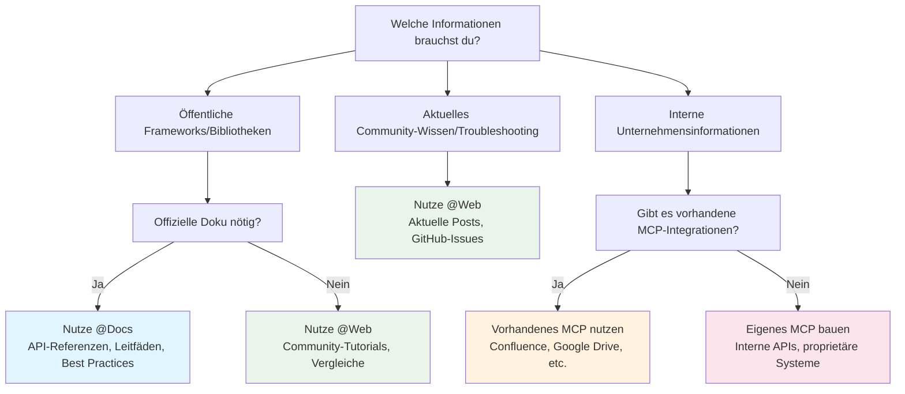
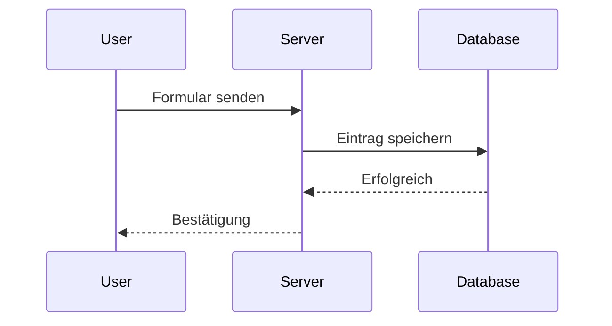
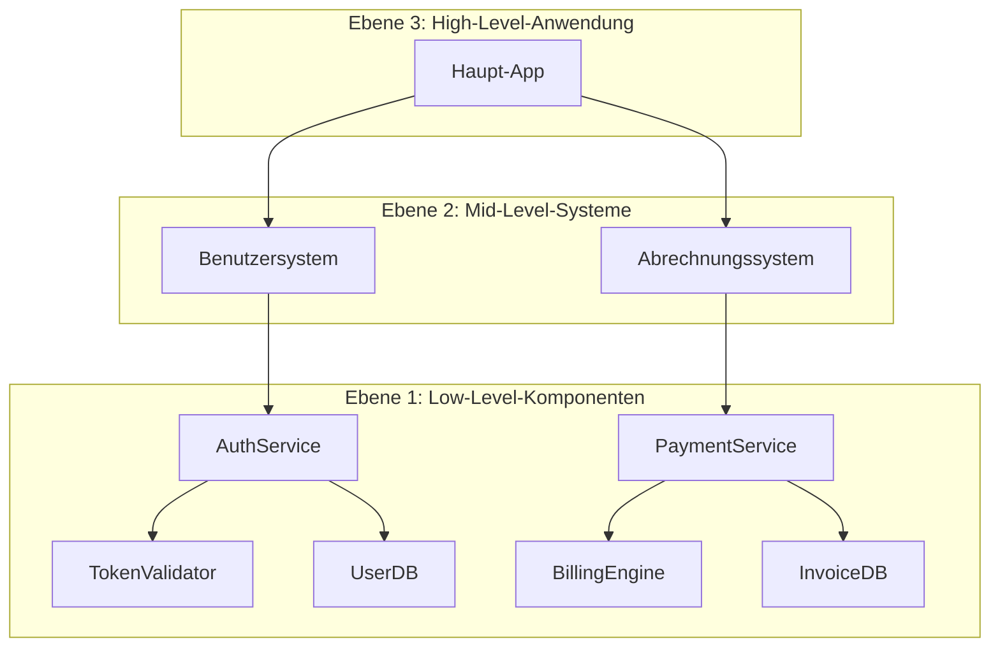
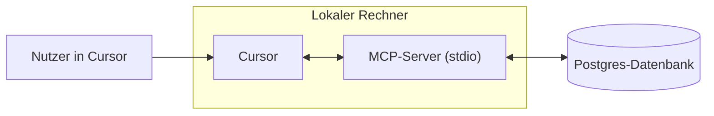
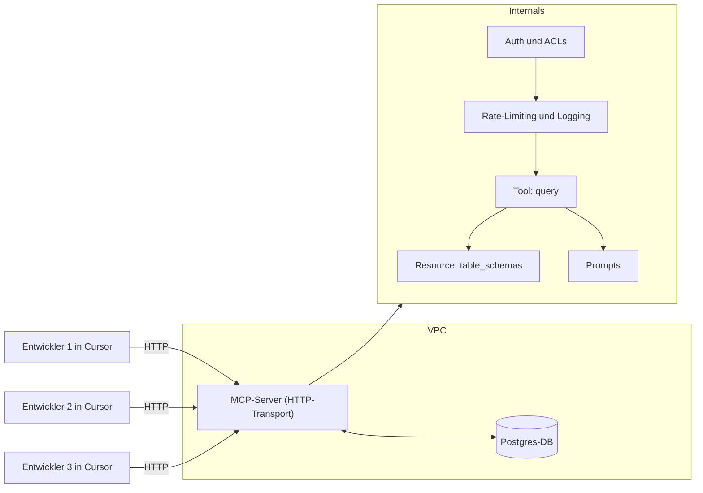
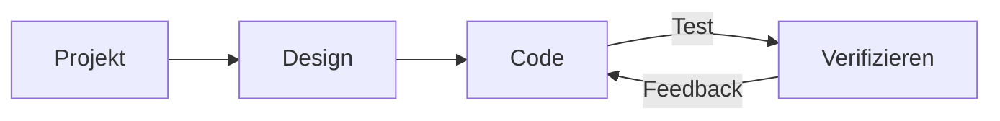
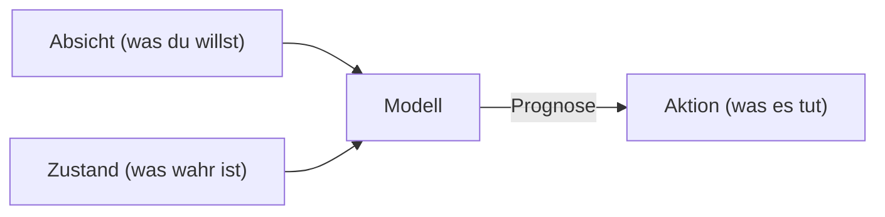

# Arbeiten mit Dokumentation

**Navigation:** [← Previous](./02-code-review.md) | [Index](./index.md) | [Next →](./04-developers.md)

---

# Arbeiten mit Dokumentation
Source: https://docs.cursor.com/de/guides/advanced/working-with-documentation

Wie du Dokumentation in Cursor effektiv nutzt – mit Prompts, externen Quellen und internem Kontext

export const ChatInput = ({content = []}) => {
  const renderContent = () => {
    return content.map((item, index) => {
      if (item.type === 'mention') {
        return <span key={index} className="mention bg-blue-500/20 px-1 py-0.5 rounded-sm">
                        {item.text}
                    </span>;
      }
      return item.text;
    });
  };
  return <>
            <div className="flex flex-col items-stretch border border-neutral-500 rounded-lg p-3 gap-2 bg-neutral-800 relative transition-all duration-100 ease-in-out hover:border-neutral-500">
                <div className="flex flex-col gap-1">
                    <div className="flex flex-col gap-1 outline-none overflow-hidden">
                        <div className="flex-1 flex items-center gap-2">
                            <div className="w-full box-border max-h-10 overflow-hidden">
                                <div className="flex items-center gap-2 w-full flex-nowrap">
                                    <div className="cursor-pointer flex items-center justify-center p-1 h-5 w-5 rounded border border-neutral-600 outline-none flex-shrink-0 hover:bg-neutral-700 bg-neutral-750">
                                        <span className="text-neutral-400 text-sm font-semibold">@</span>
                                    </div>
                                </div>
                            </div>
                        </div>
                    </div>
                </div>

                <div className="relative pt-0">
                    <div className="min-h-6 w-full max-h-60">
                        <div className="relative overflow-y-hidden w-full">
                            <div className="w-full flex flex-wrap overflow-hidden min-h-6">
                                <div className="inline-block w-full min-h-full">
                                    <div className="w-full overflow-visible h-full min-h-6">
                                        <div className="grid relative grid-cols-1 w-full">

                                            <div className="leading-6 text-sm text-neutral-200 bg-transparent block break-words p-0 whitespace-pre-wrap font-medium min-h-6">
                                                {content.length > 0 ? renderContent() : <span className="text-neutral-500">Plan, search, build anything</span>}
                                            </div>

                                        </div>
                                    </div>
                                </div>
                            </div>
                        </div>
                    </div>

                    <div className="flex items-center justify-between gap-3 flex-shrink-0 mt-6">
                        <div className="flex-1 w-full h-full flex items-center flex-col gap-1">
                            <div className="flex items-center justify-between gap-2 flex-shrink-0 w-full">
                                <div className="flex items-center justify-between w-full">
                                    <div className="flex items-center gap-3 flex-shrink min-w-0">
                                        <div className="flex gap-1 text-xs items-center min-w-0 max-w-full px-1.5 py-0.5 flex-shrink-0 cursor-pointer bg-neutral-700 hover:bg-neutral-600 rounded-full">
                                            <div className="flex items-center gap-1 min-w-0 max-w-full overflow-hidden">
                                                <div className="text-xs flex-shrink-0 w-3 h-3 flex items-center justify-center text-neutral-400">
                                                    ∞
                                                </div>
                                                <div className="min-w-0 max-w-full overflow-hidden text-ellipsis whitespace-nowrap flex items-center gap-1 font-medium">
                                                    <span className="text-neutral-300">Agent</span>
                                                    <span className="text-neutral-500 text-[10px]">⌘I</span>
                                                </div>
                                                <Icon icon="chevron-down" size={6} color="currentColor" />
                                            </div>
                                        </div>

                                        <div className="flex gap-2 text-xs items-center cursor-pointer min-w-0 max-w-full px-0 py-1 opacity-90 rounded hover:text-neutral-200">
                                            <div className="flex items-center gap-2 min-w-0 max-w-full overflow-x-hidden">
                                                <div className="min-w-0 text-ellipsis whitespace-nowrap text-neutral-300 flex items-center gap-2 overflow-hidden">
                                                    <div className="overflow-hidden inline-flex gap-2 items-center">
                                                        <span className="whitespace-nowrap overflow-x-hidden text-ellipsis text-xs">
                                                            Auto
                                                        </span>
                                                    </div>
                                                </div>
                                                <Icon icon="chevron-down" size={8} color="currentColor" />
                                            </div>
                                        </div>
                                    </div>

                                    <div className="flex items-center gap-3 justify-end">
                                        <button className="bg-white/80 border-none text-neutral-500 flex w-5 h-5 items-center justify-center hover:text-neutral-400 hover:bg-white/90 rounded-full disabled:opacity-50" disabled={content.length === 0 || !content.some(item => item.text.trim())}>
                                            <span className="text-sm">↑</span>
                                        </button>
                                    </div>
                                </div>
                            </div>
                        </div>
                    </div>
                </div>
            </div>
        </>;
};

<div id="why-documentation-matters">
  # Warum Dokumentation wichtig ist
</div>

Dokumentation liefert aktuellen, verlässlichen Kontext. Ohne sie greifen Modelle auf veraltete oder unvollständige Trainingsdaten zurück. Dokumentation hilft Modellen, Dinge wie Folgendes zu verstehen:

* Aktuelle APIs und Parameter
* Best Practices
* Organisationskonventionen
* Fachterminologie

Und vieles mehr. Lies weiter, um zu erfahren, wie du Dokumentation direkt in Cursor nutzt, ohne den Fokus wechseln zu müssen.

<div id="model-knowledge-cutoff">
  ## Wissensstichtag des Modells
</div>

Große Sprachmodelle werden auf Daten bis zu einem bestimmten Zeitpunkt trainiert, dem sogenannten „Wissensstichtag“. Das bedeutet:

* Kürzliche Updates von Libraries sind eventuell nicht berücksichtigt
* Neue Frameworks oder Tools könnten unbekannt sein
* API-Änderungen nach dem Stichtag fehlen
* Best Practices haben sich seit dem Training möglicherweise weiterentwickelt

Wenn zum Beispiel der Wissensstichtag eines Modells Anfang 2024 liegt, kennt es keine Features, die Ende 2024 veröffentlicht wurden – selbst bei beliebten Frameworks.

<div id="which-tool-should-i-use">
  # Welches Tool sollte ich verwenden?
</div>

Benutze diesen Entscheidungsbaum, um schnell den besten Ansatz für deine Dokumentationsbedürfnisse zu finden:



<div id="mental-model">
  ## Mentales Modell
</div>

<div className="full-width-table">
  | Tool        | Mentales Modell                                  |
  | ----------- | ------------------------------------------------ |
  | **`@Docs`** | Wie das Durchstöbern und Lesen offizieller Dokus |
  | **`@Web`**  | Wie nach Lösungen im Internet suchen             |
  | **MCP**     | Wie auf deine interne Doku zugreifen             |
</div>

<div id="public-documentation">
  # Öffentliche Dokumentation
</div>

Externe Dokumentation umfasst öffentlich verfügbare Informationen, zu denen Modelle womöglich nur begrenztes oder veraltetes Wissen haben. Cursor bietet zwei Hauptwege, auf diese Informationen zuzugreifen.

<div id="using-docs">
  ## Verwendung von @Docs
</div>

`@Docs` verbindet Cursor mit der offiziellen Dokumentation beliebter Tools und Frameworks. Nutz es, wenn du aktuelle, verlässliche Informationen brauchst zu:

* **API-Referenzen**: Funktionssignaturen, Parameter, Rückgabetypen
* **Einstiegshilfen**: Setup, Konfiguration, grundlegende Nutzung
* **Best Practices**: Empfohlene Patterns aus der Quelle
* **Framework-spezifischem Debugging**: Offizielle Troubleshooting-Guides

<ChatInput
  content={[
{ type: 'mention', text: '@Docs Next.js' },
{ type: 'text', text: ' How do I set up dynamic routing with catch-all routes?' }
]}
/>

<div id="using-web">
  ## Verwendung von @Web
</div>

`@Web` durchsucht das Live-Internet nach aktuellen Infos, Blogposts und Community-Diskussionen. Nutz es, wenn du Folgendes brauchst:

* **Aktuelle Tutorials**: Community-erstellte Inhalte und Beispiele
* **Vergleiche**: Artikel, die unterschiedliche Ansätze gegenüberstellen
* **Neueste Updates**: Brandaktuelle Updates oder Ankündigungen
* **Mehrere Perspektiven**: Verschiedene Herangehensweisen an Probleme

<ChatInput
  content={[
{ type: 'mention', text: '@Web' },
{ type: 'text', text: ' latest performance optimizations for React 19' }
]}
/>

<div id="internal-documentation">
  # Interne Dokumentation
</div>

Interne Dokumentation umfasst Informationen, die spezifisch für deine Organisation sind und denen KI-Modelle während des Trainings nie begegnet sind. Das kann Folgendes sein:

* **Interne APIs**: maßgeschneiderte Services und Microservices
* **Unternehmensstandards**: Coding Conventions, Architekturpatterns
* **Proprietäre Systeme**: eigene Tools, Datenbanken, Workflows
* **Domänenwissen**: Business-Logik, Compliance-Anforderungen

<div id="accessing-internal-docs-with-mcp">
  ## Zugriff auf interne Doks mit MCP
</div>

Das Model Context Protocol (MCP) bietet eine standardisierte Möglichkeit, deine private Doku und Systeme in Cursor einzubinden. MCP fungiert als dünne Schicht zwischen Cursor und deinen internen Ressourcen.

**Warum MCP wichtig ist:**

* Modelle kennen deine internen Konventionen nicht
* API-Dokumentationen für eigene Services sind nicht öffentlich verfügbar
* Business-Logik und Domänenwissen sind organisationsspezifisch
* Compliance- und Sicherheitsanforderungen unterscheiden sich je nach Unternehmen

<div id="common-mcp-integrations">
  ### Häufige MCP-Integrationen
</div>

| Integration      | Zugriff                           | Beispiele                                                                                                                 |
| ---------------- | --------------------------------- | ------------------------------------------------------------------------------------------------------------------------- |
| **Confluence**   | Unternehmens-Confluence-Spaces    | Architekturdokumentation, API-Spezifikationen für interne Services, Coding-Standards und Guidelines, Prozessdokumentation |
| **Google Drive** | Geteilte Dokumente und Ordner     | Spezifikationsdokumente, Meeting-Notizen und Entscheidungsprotokolle, Designdokumente und Requirements, Team-Wissensbasen |
| **Notion**       | Workspace-Datenbanken und -Seiten | Projektdokumentation, Team-Wikis, Wissensbasen, Produktanforderungen, technische Spezifikationen                          |
| **Custom**       | Interne Systeme und Datenbanken   | Proprietäre APIs, Legacy-Dokumentationssysteme, eigene Wissensbasen, spezialisierte Tools und Workflows                   |

<div id="custom-solutions">
  #### Custom-Lösungen
</div>

Für besondere Anforderungen kannst du eigene MCP-Server bauen, die:

* interne Websites oder Portale scrapen
* sich mit proprietären Datenbanken verbinden
* auf eigene Dokumentationssysteme zugreifen
* aus internen Wikis oder Wissensbasen ziehen

<Tip>Wenn du einen eigenen MCP-Server baust, kannst du auch Tools bereitstellen, damit Cursor die Dokumentation aktualisieren kann</Tip>

Beispiel für einen eigenen MCP-Server zum Scrapen interner Doks:

<CodeGroup>
  ```javascript TypeScript theme={null}
  import { McpServer, ResourceTemplate } from "@modelcontextprotocol/sdk/server/mcp.js";
  import { StdioServerTransport } from "@modelcontextprotocol/sdk/server/stdio.js";
  import { z } from "zod";
  import TurndownService from "turndown";

  // Create an MCP server for scraping internal docs
  const server = new McpServer({
    name: "internal-docs",
    version: "1.0.0"
  });

  const turndownService = new TurndownService();

  // Add tool to scrape internal documentation
  server.tool("get_doc",
    { url: z.string() },
    async ({ url }) => {
      try {
        const response = await fetch(url);
        const html = await response.text();
        
        // Convert HTML to markdown
        const markdown = turndownService.turndown(html);
        
        return {
          content: [{ type: "text", text: markdown }]
        };
      } catch (error) {
        return {
          content: [{ type: "text", text: `Error scraping ${url}: ${error.message}` }]
        };
      }
    }
  );

  // Start receiving messages on stdin and sending messages on stdout
  const transport = new StdioServerTransport();
  await server.connect(transport);
  ```

  ```python Python theme={null}
  # server.py
  import os
  import asyncio
  from mcp.server.fastmcp import FastMCP
  import aiohttp
  from markdownify import markdownify as md

  # Create an MCP server for scraping internal docs
  mcp = FastMCP("internal-docs")

  @mcp.tool()
  async def get_doc(url: str) -> dict:
      """Scrape internal documentation from a URL"""
      try:
          async with aiohttp.ClientSession() as session:
              async with session.get(url) as response:
                  html = await response.text()
          
          # Convert HTML to markdown
          markdown = md(html)
          
          return {
              "content": [{"type": "text", "text": markdown}]
          }
      except Exception as error:
          return {
              "content": [{"type": "text", "text": f"Error scraping {url}: {str(error)}"}]
          }
  ```
</CodeGroup>

<div id="keeping-docs-up-to-date">
  # Docs aktuell halten
</div>

Dokumentation veraltet schnell. Cursor hilft dir, deine Doku aktuell und nützlich zu halten, indem es sie auf Basis deines tatsächlichen Codes und eurer Gespräche zur Entwicklung erzeugt und aktualisiert.

<div id="from-existing-code">
  ## Aus bestehendem Code
</div>

Nutze Cursor, um Dokumentation direkt aus deiner Codebasis zu erstellen:

<Tabs>
  <Tab title="API-Dokumentation">
    <ChatInput
      content={[
    { type: 'text', text: 'Erzeuge eine API-Dokumentation für diesen Express-Router, inklusive aller Endpunkte, Parameter und Response-Formate' }
  ]}
    />
  </Tab>

  <Tab title="JSDoc-Kommentare">
    <ChatInput
      content={[
    { type: 'text', text: 'Füge dieser Klasse umfassende JSDoc-Kommentare hinzu und dokumentiere alle Methoden samt ihrer Parameter' }
  ]}
    />
  </Tab>

  <Tab title="README-Erstellung">
    <ChatInput
      content={[
    { type: 'text', text: 'Erstelle ein README für dieses Projekt mit Setup-Anleitung, Nutzungsbeispielen und einem API-Überblick' }
  ]}
    />
  </Tab>
</Tabs>

<div id="from-chat-sessions">
  ## Aus Chat-Sessions
</div>

Deine Unterhaltungen mit Cursor enthalten wertvolle Absichten, die in Dokumentation verwandelt werden können.

<Tabs>
  <Tab title="Problem Solving">
    **Nach der Lösung eines komplexen Problems:**

    <ChatInput
      content={[
    { type: 'text', text: 'Fass unsere Unterhaltung über das Einrichten von Authentifizierung zu einer Schritt-für-Schritt-Anleitung fürs Team-Wiki zusammen' }
  ]}
    />
  </Tab>

  <Tab title="Architecture">
    **Nach Architekturentscheidungen:**

    <ChatInput
      content={[
    { type: 'text', text: 'Erstell eine Doku, die erklärt, warum wir dieses Datenbankdesign gewählt haben, inklusive der Trade-offs, die wir besprochen haben' }
  ]}
    />
  </Tab>

  <Tab title="Debugging">
    **Nach Debugging-Sessions:**

    <ChatInput
      content={[
    { type: 'text', text: 'Schreib einen Troubleshooting-Guide basierend auf dem Bug, den wir gerade gefixt haben, inklusive Symptomen und Schritten zur Behebung' }
  ]}
    />
  </Tab>
</Tabs>

<div id="takeaways">
  ## Takeaways
</div>

* Dokumentation als Kontext macht Cursor präziser und aktueller
* Nutze `@Docs` für offizielle Dokumentation und `@Web` für Community-Wissen
* MCP schlägt die Brücke zwischen Cursor und deinen internen Systemen
* Generiere Dokumentation aus Code und Unterhaltungen, um Wissen aktuell zu halten
* Kombiniere externe und interne Dokumentationsquellen für ein umfassendes Verständnis


# Java
Source: https://docs.cursor.com/de/guides/languages/java

Java-Entwicklung mit JDK, Erweiterungen und Build-Tools einrichten

Dieser Guide hilft dir, Cursor für die Java-Entwicklung zu konfigurieren – inklusive Einrichtung des JDK, Installation der benötigten Erweiterungen, Debugging, Ausführen von Java-Anwendungen und Integration von Build-Tools wie Maven und Gradle. Außerdem behandelt er Workflow-Features, die IntelliJ oder VS Code ähneln.

<Note>
  Bevor du startest, stell sicher, dass du Cursor installiert und auf die
  neueste Version aktualisiert hast.
</Note>

<div id="setting-up-java-for-cursor">
  ## Java für Cursor einrichten
</div>

<div id="java-installation">
  ### Java-Installation
</div>

Bevor du Cursor einrichtest, muss Java auf deinem Rechner installiert sein.

<Warning>
  Cursor enthält keinen Java-Compiler, daher musst du ein JDK installieren, falls du das noch nicht getan hast.
</Warning>

<CardGroup cols={1}>
  <Card title="Windows-Installation" icon="windows">
    Lade ein JDK herunter und installiere es (z. B. OpenJDK, Oracle JDK, Microsoft Build of OpenJDK).

    <br />

    Setz JAVA\_HOME und füge JAVA\_HOME\bin zu deinem PATH hinzu.
  </Card>

  <Card title="macOS-Installation" icon="apple">
    Installiere über Homebrew (`brew install openjdk`) oder lade einen Installer herunter.

    <br />

    Stell sicher, dass JAVA\_HOME auf das installierte JDK zeigt.
  </Card>

  <Card title="Linux-Installation" icon="linux">
    Verwende deinen Paketmanager (`sudo apt install openjdk-17-jdk` oder Äquivalent) oder installiere über SDKMAN.
  </Card>
</CardGroup>

Um die Installation zu prüfen, führe Folgendes aus:

```bash  theme={null}
java -version
javac -version
```

<Info>
  Wenn Cursor dein JDK nicht erkennt, konfigurier es manuell in der settings.json:
</Info>

```json  theme={null}
{
  "java.jdt.ls.java.home": "/path/to/jdk",
  "java.configuration.runtimes": [
    {
      "name": "JavaSE-17",
      "path": "/path/to/jdk-17",
      "default": true
    }
  ]
}
```

<Warning>Starte Cursor neu, damit die Änderungen wirksam werden.</Warning>

<div id="cursor-setup">
  ### Cursor-Setup
</div>

<Info>Cursor unterstützt VS Code-Erweiterungen. Installiere die folgenden manuell:</Info>

<CardGroup cols={2}>
  <Card title="Extension Pack for Java" icon="java" href="cursor:extension/vscjava.vscode-java-pack">
    Enthält Java-Sprachunterstützung, Debugger, Test-Runner, Maven-Support und
    Projektverwaltung
  </Card>

  <Card title="Gradle for Java" icon="gears" href="cursor:extension/vscjava.vscode-gradle">
    Unverzichtbar für die Arbeit mit dem Gradle-Build-System
  </Card>

  <Card title="Spring Boot Extension Pack" icon="leaf" href="cursor:extension/vmware.vscode-boot-dev-pack">
    Erforderlich für die Entwicklung mit Spring Boot
  </Card>

  <Card title="Kotlin" icon="window" href="cursor:extension/fwcd.kotlin">
    Notwendig für die Entwicklung von Kotlin-Anwendungen
  </Card>
</CardGroup>

<div id="configure-build-tools">
  ### Build-Tools konfigurieren
</div>

<div id="maven">
  #### Maven
</div>

Stell sicher, dass Maven installiert ist (`mvn -version`). Bei Bedarf von [maven.apache.org](https://maven.apache.org/download.cgi) installieren:

1. Binärarchiv herunterladen
2. An den gewünschten Ort entpacken
3. Umgebungsvariable MAVEN\_HOME auf den entpackten Ordner setzen
4. %MAVEN\_HOME%\bin (Windows) oder \$MAVEN\_HOME/bin (Unix) zur PATH-Variable hinzufügen

<div id="gradle">
  #### Gradle
</div>

Stell sicher, dass Gradle installiert ist (`gradle -version`). Bei Bedarf von [gradle.org](https://gradle.org/install/) installieren:

1. Binärdistribution herunterladen
2. An den gewünschten Ort entpacken
3. Umgebungsvariable GRADLE\_HOME auf den entpackten Ordner setzen
4. %GRADLE\_HOME%\bin (Windows) oder \$GRADLE\_HOME/bin (Unix) zur PATH-Variable hinzufügen

Alternativ kannst du den Gradle Wrapper verwenden, der automatisch die passende Gradle-Version herunterlädt und nutzt:

<div id="running-and-debugging">
  ## Ausführen und Debuggen
</div>

Alles ist eingerichtet – Zeit, deinen Java-Code auszuführen und zu debuggen.
Je nach Bedarf kannst du folgende Methoden verwenden:

<CardGroup cols={2}>
  <Card title="Run" icon="play">
    Klick auf den „Run“-Link, der oberhalb jeder main-Methode erscheint, um dein
    Programm schnell auszuführen
  </Card>

  <Card title="Debug" icon="bug">
    Öffne das Seitenleisten-Panel „Run and Debug“ und nutz den „Run“-Button, um
    deine Anwendung zu starten
  </Card>
</CardGroup>

<CardGroup cols={1}>
  <Card title="Terminal" icon="terminal">
    Ausführen über die Kommandozeile mit Maven- oder Gradle-Befehlen
  </Card>

  <Card title="Spring Boot" icon="leaf">
    Starte Spring-Boot-Anwendungen direkt über die „Spring Boot Dashboard“-
    Erweiterung
  </Card>
</CardGroup>

<div id="java-x-cursor-workflow">
  ## Java x Cursor-Workflow
</div>

Die KI-Features von Cursor können deinen Java-Workflow deutlich verbessern. So nutzt du Cursors Fähigkeiten speziell für Java:

<CardGroup cols={2}>
  <Card title="Tab Completion" icon="arrow-right">
    <div className="text-sm">
      Smarte Vervollständigungen für Methoden, Signaturen und Java-Boilerplate wie
      Getter/Setter.
    </div>
  </Card>

  <Card title="Agent Mode" icon="pen-to-square">
    <div className="text-sm">
      Design-Patterns umsetzen, Code refaktorisieren oder Klassen mit korrekter
      Vererbung generieren.
    </div>
  </Card>

  <Card title="Inline Edit" icon="code">
    <div className="text-sm">
      Schnelle Inline-Änderungen an Methoden vornehmen, Fehler beheben oder Unit-Tests generieren –
      ohne deinen Flow zu unterbrechen.
    </div>
  </Card>

  <Card title="Chat" icon="message">
    <div className="text-sm">
      Hilfe zu Java-Konzepten bekommen, Exceptions debuggen oder Framework-
      Features verstehen.
    </div>
  </Card>
</CardGroup>

<div id="example-workflows">
  ### Beispiel-Workflows
</div>

1. **Java-Boilerplate generieren**\
   Verwende die [Tab completion](/de/tab/overview), um schnell Konstruktoren, Getter/Setter, equals-/hashCode-Methoden und andere repetitive Java-Muster zu erstellen.

2. **Komplexe Java-Exceptions debuggen**\
   Wenn du auf einen kryptischen Java-Stacktrace stößt, markier ihn und nutze [Ask](/de/chat/overview), um die Ursache zu erklären und mögliche Fixes vorzuschlagen.

3. **Legacy-Java-Code refaktorisieren**\
   Nutze den [Agent mode](/de/chat/agent), um älteren Java-Code zu modernisieren – anonyme Klassen in Lambdas umwandeln, auf neuere Java-Sprachfeatures upgraden oder Design-Patterns implementieren.

4. **Framework-Entwicklung**\
   Füg deine Doku mit @docs zum Cursor-Kontext hinzu und generier framework-spezifischen Code überall in Cursor.


# JavaScript & TypeScript
Source: https://docs.cursor.com/de/guides/languages/javascript

JavaScript- und TypeScript-Entwicklung mit Framework-Unterstützung

Willkommen bei der JavaScript- und TypeScript-Entwicklung in Cursor! Der Editor bietet über sein Erweiterungs-Ökosystem hervorragende Unterstützung für JS/TS. Hier ist, was du wissen musst, um das Beste aus Cursor herauszuholen.

<div id="essential-extensions">
  ## Wichtige Erweiterungen
</div>

Cursor funktioniert zwar gut mit allen Erweiterungen, die du magst, aber für den Einstieg empfehlen wir diese:

* **ESLint** – erforderlich für Cursors KI-gestützte Lint-Fix-Funktionen
* **JavaScript and TypeScript Language Features** – erweiterte Sprachunterstützung und IntelliSense
* **Path Intellisense** – intelligente Pfadvervollständigung für Dateipfade

<div id="cursor-features">
  ## Cursor-Funktionen
</div>

Cursor erweitert deinen bestehenden JavaScript/TypeScript-Workflow um:

* **Tab-Vervollständigungen**: Kontextbewusste Code-Vervollständigungen, die deine Projektstruktur verstehen
* **Automatische Importe**: Tab kann Bibliotheken automatisch importieren, sobald du sie verwendest
* **Inline-Editing**: Nutze `CMD+K` in jeder Zeile, um mit perfekter Syntax zu bearbeiten
* **Composer-Guidance**: Plane und bearbeite deinen Code über mehrere Dateien hinweg mit dem Composer

<div id="framework-intelligence-with-docs">
  ### Framework-Intelligence mit @Docs
</div>

Das @Docs-Feature von Cursor lässt dich deine JavaScript-Entwicklung auf ein neues Level heben, indem du benutzerdefinierte Dokumentationsquellen hinzufügst, auf die die KI zugreifen kann. Füge Dokumentation von MDN, Node.js oder deinem Lieblings-Framework hinzu, um präzisere und kontextbezogene Codevorschläge zu erhalten.

<Card title="Erfahre mehr über @Docs" icon="book" href="/de/context/@-symbols/@-docs">
  Entdecke, wie du benutzerdefinierte Dokumentationsquellen in Cursor hinzufügen und verwalten kannst.
</Card>

<div id="automatic-linting-resolution">
  ### Automatische Linting-Behebung
</div>

Eines der herausragenden Features von Cursor ist die nahtlose Integration mit Linter-Erweiterungen.
Stell sicher, dass du einen Linter wie ESLint eingerichtet hast und aktiviere die Einstellung „Iterate on Lints“.

Wenn du dann den Agent-Modus im Composer verwendest, liest die KI, nachdem sie deine Anfrage beantwortet und Codeänderungen vorgenommen hat, automatisch die Ausgabe des Linters und versucht, alle Lint-Fehler zu beheben, die ihr möglicherweise zuvor nicht bekannt waren.

<div id="framework-support">
  ## Framework-Unterstützung
</div>

Cursor funktioniert nahtlos mit allen gängigen JavaScript-Frameworks und -Bibliotheken, zum Beispiel:

### React & Next.js

* Vollständige JSX/TSX-Unterstützung mit intelligenten Komponenten-Vorschlägen
* Intelligenz für Server Components und API-Routen in Next.js
* Empfohlen: [**React Developer Tools**](cursor:extension/msjsdiag.vscode-react-native) Erweiterung

<div id="vuejs">
  ### Vue.js
</div>

* Unterstützung der Template-Syntax mit Volar-Integration
* Autovervollständigung für Komponenten und Typprüfung
* Empfohlen: [**Vue Language Features**](cursor:extension/vue.volar)

<div id="angular">
  ### Angular
</div>

* Template-Validierung und Unterstützung für TypeScript-Decorators
* Generierung von Komponenten und Services
* Empfohlen: [**Angular Language Service**](cursor:extension/Angular.ng-template)

<div id="svelte">
  ### Svelte
</div>

* Syntaxhervorhebung für Komponenten und intelligente Vervollständigungen
* Vorschläge für reaktive Statements und Stores
* Empfohlen: [**Svelte for VS Code**](cursor:extension/svelte.svelte-vscode)

<div id="backend-frameworks-expressnestjs">
  ### Backend-Frameworks (Express/NestJS)
</div>

* Intelligenz für Routen und Middleware
* Unterstützung für TypeScript-Decorators in NestJS
* Integration von API-Testtools

Denk dran: Die KI-Features von Cursor funktionieren mit all diesen Frameworks richtig gut, verstehen ihre Patterns und Best Practices und liefern passende Vorschläge. Die KI kann bei allem helfen – von der Komponentenerstellung bis hin zu komplexen Refactorings – und respektiert dabei die bestehenden Patterns in deinem Projekt.


# Python
Source: https://docs.cursor.com/de/guides/languages/python

Python-Entwicklung mit Erweiterungen und Linting-Tools einrichten

<Note>
  Dieser Guide wurde maßgeblich von [Jack Fields](https://x.com/OrdinaryInds)
  und seinem
  [Artikel](https://medium.com/ordinaryindustries/the-ultimate-vs-code-setup-for-python-538026b34d94)
  zum Einrichten von VS Code für Python-Entwicklung inspiriert. Schau dir für
  weitere Details seinen Artikel an.
</Note>

<div id="prerequisites">
  ## Voraussetzungen
</div>

Bevor wir starten, stell sicher, dass du Folgendes eingerichtet hast:

* [Python](https://python.org) installiert (empfohlen: 3.8 oder höher)
* [Git](https://git-scm.com/) für Versionskontrolle
* Cursor installiert und auf die neueste Version aktualisiert

<div id="essential-extensions">
  ## Unverzichtbare Erweiterungen
</div>

Die folgenden Erweiterungen statten Cursor vollständig für die Python-Entwicklung aus. Sie bieten dir Syntaxhervorhebung, Linting, Debugging und Unit-Tests.

<CardGroup cols={2}>
  <Card title="Python" icon="python" href="cursor:extension/ms-python.python">
    Zentrale Sprachunterstützung von Microsoft
  </Card>

  <Card title="Cursor Pyright" icon="bolt" href="cursor:extension/anysphere.cursorpyright">
    Schneller Python-Sprachserver
  </Card>

  <Card title="Python Debugger" icon="bug" href="cursor:extension/ms-python.debugpy">
    Erweiterte Debugging-Funktionen
  </Card>

  <Card title="Ruff" icon="wand-magic-sparkles" href="cursor:extension/charliermarsh.ruff">
    Python-Linter und -Formatter
  </Card>
</CardGroup>

<div id="advanced-python-tooling">
  ### Erweiterte Python-Tools
</div>

Während die oben genannten Erweiterungen bisher zu den beliebtesten für die Python-Entwicklung in Cursor gehörten, haben wir außerdem zusätzliche Erweiterungen hinzugefügt, die dir helfen können, das Beste aus deiner Python-Entwicklung herauszuholen.

<div id="uv-python-environment-manager">
  #### `uv` – Python-Umgebungsmanager
</div>

[uv](https://github.com/astral-sh/uv) ist ein moderner Python-Paketmanager, mit dem du virtuelle Umgebungen erstellen und verwalten kannst und der pip als Standard-Paketmanager ersetzen kann.

Um uv zu installieren, führe den folgenden Befehl in deinem Terminal aus:

```bash  theme={null}
pip install uv
```

<div id="ruff-python-linter-and-formatter">
  #### `ruff` - Python-Linter und -Formatter
</div>

[Ruff](https://docs.astral.sh/ruff/) ist ein moderner Python-Linter und -Formatter, der Programmierfehler aufspürt, die Einhaltung von Code-Standards unterstützt und Refactorings vorschlägt. Er kann zusammen mit Black für die Codeformatierung verwendet werden.

Um Ruff zu installieren, führ den folgenden Befehl in deinem Terminal aus:

```bash  theme={null}
pip install ruff
```

<div id="cursor-configuration">
  ## Cursor-Konfiguration
</div>

<div id="1-python-interpreter">
  ### 1. Python-Interpreter
</div>

Konfigurier deinen Python-Interpreter in Cursor:

1. Öffne die Befehlspalette (Cmd/Ctrl + Shift + P)
2. Such nach „Python: Select Interpreter“
3. Wähl deinen Python-Interpreter aus (oder eine virtuelle Umgebung, wenn du eine verwendest)

<div id="2-code-formatting">
  ### 2. Codeformatierung
</div>

Richte automatische Codeformatierung mit Black ein:

<Note>
  Black ist ein Code-Formatter, der deinen Code automatisch in einen
  konsistenten Stil bringt. Er benötigt keine Konfiguration und ist in der
  Python-Community weit verbreitet.
</Note>

Um Black zu installieren, führ den folgenden Befehl in deinem Terminal aus:

```bash  theme={null}
pip install black
```

Konfigurier danach Cursor so, dass Black fürs Code-Formatieren verwendet wird, indem du Folgendes zu deiner Datei `settings.json` hinzufügst:

```json  theme={null}
{
  "python.formatting.provider": "black",
  "editor.formatOnSave": true,
  "python.formatting.blackArgs": ["--line-length", "88"]
}
```

<div id="3-linting">
  ### 3. Linting
</div>

Mit PyLint kannst du Programmierfehler erkennen, die Einhaltung von Coding-Standards sicherstellen und Vorschläge zur Refaktorisierung erhalten.

Um PyLint zu installieren, führe den folgenden Befehl in deinem Terminal aus:

```bash  theme={null}
pip install pylint
```

```json  theme={null}
{
  "python.linting.enabled": true,
  "python.linting.pylintEnabled": true,
  "python.linting.lintOnSave": true
}
```

<div id="4-type-checking">
  ### 4. Typprüfung
</div>

Zusätzlich zum Linting können wir MyPy verwenden, um nach Typfehlern zu suchen.

Um MyPy zu installieren, führ in deinem Terminal den folgenden Befehl aus:

```bash  theme={null}
pip install mypy
```

```json  theme={null}
{
  "python.linting.mypyEnabled": true
}
```

<div id="debugging">
  ## Debugging
</div>

Cursor bietet leistungsstarke Debugging-Funktionen für Python:

1. Setz Breakpoints, indem du in die Gutter klickst
2. Nutz das Debug-Panel (Cmd/Ctrl + Shift + D)
3. Konfigurier `launch.json` für benutzerdefinierte Debug-Konfigurationen

<div id="recommended-features">
  ## Empfohlene Features
</div>

<CardGroup cols={3}>
  <Card title="Tab Completion" icon="wand-magic-sparkles" href="/de/tab/overview">
    Intelligente Code-Vervollständigungen, die deine Aktionen verstehen
  </Card>

  <Card title="Chat" icon="comments" href="/de/chat/overview">
    Erkunde und versteh Code durch natürliche Unterhaltungen
  </Card>

  <Card title="Agent" icon="robot" href="/de/chat/agent">
    Bewältige komplexe Entwicklungsaufgaben mit KI-Unterstützung
  </Card>

  <Card title="Context" icon="network-wired" href="/de/context/model-context-protocol">
    Zieh Kontext aus Drittanbieter-Systemen heran
  </Card>

  <Card title="Auto-Imports" icon="file-import" href="/de/tab/auto-import">
    Importiere Module automatisch, während du codest
  </Card>

  <Card title="AI Review" icon="check-double" href="/de/tab/overview#quality">
    Cursor prüft deinen Code kontinuierlich mit KI
  </Card>
</CardGroup>

<div id="framework-support">
  ## Framework-Unterstützung
</div>

Cursor arbeitet nahtlos mit gängigen Python-Frameworks:

* **Web-Frameworks**: Django, Flask, FastAPI
* **Data Science**: Jupyter, NumPy, Pandas
* **Machine Learning**: TensorFlow, PyTorch, scikit-learn
* **Testing**: pytest, unittest
* **APIs**: requests, aiohttp
* **Datenbanken**: SQLAlchemy, psycopg2


# iOS & macOS (Swift)
Source: https://docs.cursor.com/de/guides/languages/swift

Integriere Cursor mit Xcode für Swift-Entwicklung

Willkommen bei der Swift-Entwicklung in Cursor! Egal, ob du iOS-Apps, macOS-Anwendungen oder serverseitige Swift-Projekte entwickelst – wir haben dich abgedeckt. Dieser Leitfaden hilft dir, deine Swift-Umgebung in Cursor einzurichten – startend mit den Grundlagen und anschließend mit fortgeschrittenen Features.

<div id="basic-workflow">
  ## Basis-Workflow
</div>

Der einfachste Weg, Cursor mit Swift zu nutzen, ist, ihn als deinen primären Code-Editor zu verwenden und Xcode weiterhin zum Builden und Ausführen deiner Apps zu verwenden. Du bekommst starke Features wie:

* Smarte Code-Vervollständigung
* KI-gestützte Coding-Unterstützung (probier [CMD+K](/de/inline-edit/overview) in jeder Zeile)
* Schnellzugriff auf Doku mit [@Docs](/de/context/@-symbols/@-docs)
* Syntax-Highlighting
* Grundlegende Code-Navigation

Wenn du deine App builden oder ausführen willst, wechsel einfach zu Xcode. Dieser Workflow ist perfekt für Devs, die Cursors KI nutzen wollen und für Debugging und Deployment bei den gewohnten Xcode-Tools bleiben.

<div id="hot-reloading">
  ### Hot Reloading
</div>

Wenn du Xcode-Workspaces oder -Projekte verwendest (statt einen Ordner direkt in Xcode zu öffnen), kann es passieren, dass Xcode Änderungen an deinen Dateien ignoriert, die in Cursor oder generell außerhalb von Xcode vorgenommen wurden.

Zwar kannst du den Ordner in Xcode öffnen, um das zu beheben, aber je nach Swift-Workflow brauchst du eventuell ein Projekt.

Eine starke Lösung dafür ist [Inject](https://github.com/krzysztofzablocki/Inject), eine Hot-Reloading-Bibliothek für Swift, die deiner App echtes Hot Reloading ermöglicht und sie sofort aktualisiert, sobald du Änderungen machst. Das ist nicht von den Nebenwirkungen des Xcode-Workspace/-Projekt-Themas betroffen und erlaubt dir, Änderungen in Cursor vorzunehmen und sie unmittelbar in deiner App zu sehen.

<CardGroup cols={1}>
  <Card title="Inject – Hot Reloading für Swift" horizontal icon="fire" href="https://github.com/krzysztofzablocki/Inject">
    Erfahre mehr über Inject und wie du es in deinen Swift-Projekten einsetzt.
  </Card>
</CardGroup>

<div id="advanced-swift-development">
  ## Fortgeschrittene Swift-Entwicklung
</div>

<Note>
  Dieser Abschnitt des Guides wurde stark von [Thomas
  Ricouard](https://x.com/Dimillian) und seinem
  [Artikel](https://dimillian.medium.com/how-to-use-cursor-for-ios-development-54b912c23941)
  über die Verwendung von Cursor für iOS-Entwicklung inspiriert. Schau dir seinen Artikel für mehr
  Details an und lass ihm gern ein Follow da für mehr Swift-Content.
</Note>

Wenn du nur einen Editor gleichzeitig geöffnet haben willst und vermeiden möchtest, zwischen Xcode und Cursor zu wechseln, kannst du eine Erweiterung wie [Sweetpad](https://sweetpad.hyzyla.dev/) verwenden, um Cursor direkt in das zugrunde liegende Buildsysteem von Xcode zu integrieren.

Sweetpad ist eine leistungsstarke Erweiterung, mit der du deine Swift-Projekte direkt in Cursor bauen, ausführen und debuggen kannst, ohne auf Xcodes Funktionen zu verzichten.

Um mit Sweetpad loszulegen, musst du Xcode weiterhin auf deinem Mac installiert haben – es ist die Grundlage der Swift-Entwicklung. Du kannst Xcode aus dem [Mac App Store](https://apps.apple.com/us/app/xcode/id497799835) herunterladen. Sobald Xcode eingerichtet ist, lass uns deine Entwicklungsumgebung in Cursor mit ein paar essenziellen Tools verbessern.

Öffne dein Terminal und führe Folgendes aus:

```bash  theme={null}

# Baut deine Projekte, ohne dass Xcode geöffnet sein muss
brew install xcode-build-server


# Gibt die Ausgabe von `xcodebuild` hübsch formatiert im Cursor-Terminal aus
brew install xcbeautify


# Bietet fortgeschrittene Formatierung und Sprachfeatures
brew install swiftformat
```

Als Nächstes installier die Erweiterung [Swift Language Support](cursor:extension/chrisatwindsurf.swift-vscode) in Cursor. Damit bekommst du sofort Syntax-Highlighting und grundlegende Sprachfunktionen out of the box.

Dann können wir die Erweiterung [Sweetpad](https://sweetpad.hyzyla.dev/) installieren, um Cursor mit Xcode zu integrieren. Sweetpad legt eine Menge Shortcuts rund um das `xcodebuild`-CLI (und mehr) obendrauf und erlaubt dir, deine Targets zu scannen, das Ziel auszuwählen, zu bauen und deine App wie in Xcode auszuführen. Außerdem richtet es dein Projekt für den Xcode Build Server ein, damit du alle oben erwähnten Features bekommst.

<div id="sweetpad-usage">
  ### Sweetpad verwenden
</div>

Sobald Sweetpad installiert ist und du ein Swift-Projekt in Cursor geöffnet hast, solltest du zuerst den Befehl `Sweetpad: Generate Build Server Config` ausführen. Dadurch wird im Root deines Projekts eine `buildServer.json`-Datei erzeugt, die dem Xcode Build Server ermöglicht, mit deinem Projekt zu arbeiten.

Anschließend kannst du entweder über die Command Palette oder die Sweetpad-Seitenleiste das Target auswählen, das du bauen und ausführen willst.

<Note>
  {" "}

  Du musst dein Projekt einmal bauen, um Auto-Completion, Jump to Definition
  und andere Sprachfunktionen zu aktivieren.{" "}
</Note>

Du kannst jetzt auch F5 drücken, um dein Projekt mit einem Debugger zu bauen und auszuführen – eventuell musst du zuerst eine Launch-Konfiguration erstellen; wähl dann einfach Sweetpad aus der Liste, wenn du dazu aufgefordert wirst!

Wie bei vielen Erweiterungen in Cursor kannst du viele der Sweetpad-Befehle Tastenkürzeln zuweisen, um deinen Workflow noch effizienter zu machen.

Wenn du mehr über Sweetpad erfahren willst, schau dir diese Ressourcen an:

<CardGroup>
  <Card title="Sweetpad Website" horizontal icon="globe" href="https://sweetpad.hyzyla.dev/">
    Offizielle Sweetpad-Website mit Features und Installationsanleitung
  </Card>

  <Card title="Sweetpad Guide" horizontal icon="book" href="https://sweetpad.hyzyla.dev/docs/intro">
    Umfassender Guide zu Konfiguration, Nutzung und erweiterten Features
  </Card>
</CardGroup>


# JetBrains
Source: https://docs.cursor.com/de/guides/migration/jetbrains

Mit vertrauten Tools von JetBrains-IDEs zu Cursor wechseln

Cursor bietet ein modernes, KI-gestütztes Coding-Erlebnis, das deine JetBrains-IDEs ersetzen kann. Auch wenn sich der Umstieg anfangs ungewohnt anfühlt, bietet Cursors auf VS Code basierende Grundlage leistungsstarke Features und umfangreiche Anpassungsmöglichkeiten.

<div id="editor-components">
  ## Editor Components
</div>

<div id="extensions">
  ### Extensions
</div>

JetBrains-IDEs sind großartige Tools, da sie bereits für die vorgesehenen Sprachen und Frameworks vorkonfiguriert sind.

Cursor ist anders – als leere Leinwand out of the box kannst du es nach deinen Vorlieben anpassen, ohne durch die Sprachen und Frameworks eingeschränkt zu sein, für die die IDE gedacht war.

Cursor hat Zugriff auf ein riesiges Ökosystem an Erweiterungen, und fast die gesamte Funktionalität (und mehr!), die JetBrains-IDEs bieten, lässt sich über diese Erweiterungen nachbilden.

Schau dir unten einige dieser beliebten Erweiterungen an:

<CardGroup cols={4}>
  <Card title="Remote SSH" icon="network-wired" href="cursor:extension/anysphere.remote-ssh">
    SSH-Erweiterung
  </Card>

  <Card title="Project Manager" icon="folder-tree" href="cursor:extension/alefragnani.project-manager">
    Mehrere Projekte verwalten
  </Card>

  <Card title="GitLens" icon="git" href="cursor:extension/eamodio.gitlens">
    Erweiterte Git-Integration
  </Card>

  <Card title="Local History" icon="clock-rotate-left" href="cursor:extension/xyz.local-history">
    Lokale Dateiversionshistorie nachverfolgen
  </Card>

  <Card title="Error Lens" icon="bug" href="cursor:extension/usernamehw.errorlens">
    Inline-Fehlerhervorhebung
  </Card>

  <Card title="ESLint" icon="code-compare" href="cursor:extension/dbaeumer.vscode-eslint">
    Code-Linting
  </Card>

  <Card title="Prettier" icon="wand-magic-sparkles" href="cursor:extension/esbenp.prettier-vscode">
    Code-Formatierung
  </Card>

  <Card title="Todo Tree" icon="folder-tree" href="cursor:extension/Gruntfuggly.todo-tree">
    TODOs und FIXMEs nachverfolgen
  </Card>
</CardGroup>

<div id="keyboard-shortcuts">
  ### Keyboard Shortcuts
</div>

Cursor hat einen integrierten Shortcut-Manager, mit dem du deine Lieblingskürzel Aktionen zuordnen kannst.

Mit dieser Erweiterung kannst du fast alle Shortcuts der JetBrains-IDEs direkt in Cursor verwenden!
Lies unbedingt die Dokumentation der Erweiterung, um zu erfahren, wie du sie nach deinen Wünschen konfigurierst:

<Card title="IntelliJ IDEA Keybindings" icon="keyboard" href="cursor:extension/k--kato.intellij-idea-keybindings">
  Installiere diese Erweiterung, um JetBrains-IDE-Shortcuts in Cursor zu nutzen.
</Card>

<Note>
  Häufig abweichende Shortcuts:

  * Aktion finden: ⌘/Ctrl+Shift+P  (vs. ⌘/Ctrl+Shift+A)
  * Quick Fix: ⌘/Ctrl+.  (vs. Alt+Enter)
  * Datei öffnen: ⌘/Ctrl+P  (vs. ⌘/Ctrl+Shift+N)
</Note>

<div id="themes">
  ### Themes
</div>

Repliziere das Look-and-Feel deiner Lieblings-JetBrains-IDEs in Cursor mit diesen Community-Themes.

Wähle das Standard-Darcula-Theme oder ein Theme, das zum Syntax-Highlighting deiner JetBrains-Tools passt.

<CardGroup cols={1}>
  <Card title="JetBrains - Darcula Theme" icon="moon" horizontal href="cursor:extension/rokoroku.vscode-theme-darcula">
    Erlebe das klassische JetBrains-Darcula-Dark-Theme
  </Card>
</CardGroup>

<CardGroup cols={2}>
  <Card title="JetBrains PyCharm" icon="python" horizontal href="cursor:extension/gabemahoney.pycharm-dark-theme-for-python" />

  <Card title="IntelliJ" icon="java" horizontal href="cursor:extension/compassak.intellij-idea-new-ui" />

  <Card title="JetBrains Fleet" icon="code" horizontal href="cursor:extension/MichaelZhou.fleet-theme" />

  <Card title="JetBrains Rider" icon="hashtag" horizontal href="cursor:extension/muhammad-sammy.rider-theme" />
</CardGroup>

<CardGroup cols={1}>
  <Card title="JetBrains Icons" icon="icons" horizontal href="cursor:extension/ardonplay.vscode-jetbrains-icon-theme">
    Hol dir die vertrauten JetBrains-Datei- und Ordnersymbole
  </Card>
</CardGroup>

<div id="font">
  ### Font
</div>

Um dein JetBrains-ähnliches Setup abzurunden, kannst du die offizielle Schriftart JetBrains Mono verwenden:

1. Lade die Schriftart JetBrains Mono herunter und installiere sie auf deinem System:

<CardGroup cols={1}>
  <Card title="Download JetBrains Mono" icon="link" horizontal href="https://www.jetbrains.com/lp/mono/" />
</CardGroup>

2. Starte Cursor nach der Installation der Schriftart neu
3. Öffne die Einstellungen in Cursor (⌘/Ctrl + ,)
4. Suche nach "Font Family"
5. Setze die Schriftfamilie auf 'JetBrains Mono'

<Note>
  Für das beste Erlebnis kannst du außerdem Schriftligaturen aktivieren, indem du in deinen Einstellungen `"editor.fontLigatures": true` festlegst.
</Note>

<div id="ide-specific-migration">
  ## IDE-spezifische Migration
</div>

Viele Nutzer lieben die JetBrains-IDEs wegen ihrer Out-of-the-box-Unterstützung für die Sprachen und Frameworks, für die sie gedacht sind. Cursor ist anders – als leere Leinwand out of the box kannst du ihn nach deinem Geschmack anpassen, ohne durch die Sprachen und Frameworks eingeschränkt zu sein, für die die IDE ursprünglich vorgesehen war.

Cursor hat bereits Zugriff auf das Erweiterungs-Ökosystem von VS Code, und fast die gesamte Funktionalität (und mehr!), die JetBrains-IDEs bieten, lässt sich durch diese Erweiterungen nachbilden.

Schau dir die folgenden empfohlenen Erweiterungen für jede JetBrains-IDE an.

<div id="intellij-idea-java">
  ### IntelliJ IDEA (Java)
</div>

<CardGroup cols={2}>
  <Card title="Language Support for Java" icon="java" href="cursor:extension/redhat.java">
    Zentrale Java-Sprachfunktionen
  </Card>

  <Card title="Debugger for Java" icon="bug" href="cursor:extension/vscjava.vscode-java-debug">
    Java-Debugging
  </Card>

  <Card title="Test Runner for Java" icon="vial" href="cursor:extension/vscjava.vscode-java-test">
    Java-Tests ausführen und debuggen
  </Card>

  <Card title="Maven for Java" icon="box" href="cursor:extension/vscjava.vscode-maven">
    Maven-Unterstützung
  </Card>
</CardGroup>

<CardGroup cols={1}>
  <Card title="Project Manager for Java" icon="folder-tree" href="cursor:extension/vscjava.vscode-java-dependency" horizontal>
    Projektmanagement-Tools
  </Card>
</CardGroup>

<Warning>
  Wesentliche Unterschiede:

  * Build-/Run-Konfigurationen werden über launch.json verwaltet
  * Spring-Boot-Tools über die Erweiterung ["Spring Boot Extension Pack"](cursor:extension/vmware.vscode-boot-dev-pack) verfügbar
  * Gradle-Unterstützung über die Erweiterung ["Gradle for Java"](cursor:extension/vscjava.vscode-gradle)
</Warning>

<div id="pycharm-python">
  ### PyCharm (Python)
</div>

<CardGroup cols={2}>
  <Card title="Python" icon="python" href="cursor:extension/ms-python.python">
    Zentrale Python-Unterstützung
  </Card>

  <Card title="Cursor Pyright" icon="bolt" href="cursor:extension/anysphere.cursorpyright">
    Schnelles Type-Checking
  </Card>

  <Card title="Jupyter" icon="notebook" href="cursor:extension/ms-toolsai.jupyter">
    Notebook-Unterstützung
  </Card>

  <Card title="Ruff" icon="wand-magic-sparkles" href="cursor:extension/charliermarsh.ruff">
    Python-Formatter und Linter
  </Card>
</CardGroup>

<Note>
  Wesentliche Unterschiede:

  * Virtuelle Umgebungen über die Befehlspalette verwaltet
  * Debug-Konfigurationen in launch.json
  * Requirements-Management über requirements.txt oder Poetry
</Note>

<div id="webstorm-javascripttypescript">
  ### WebStorm (JavaScript/TypeScript)
</div>

<CardGroup cols={2}>
  <Card title="JavaScript and TypeScript Nightly" icon="js" href="cursor:extension/ms-vscode.vscode-typescript-next">
    Neueste Sprachfeatures
  </Card>

  <Card title="ES7+ React/Redux Snippets" icon="react" href="cursor:extension/dsznajder.es7-react-js-snippets">
    React-Entwicklung
  </Card>

  <Card title="Vue Language Features" icon="vuejs" href="cursor:extension/Vue.volar">
    Vue.js-Unterstützung
  </Card>

  <Card title="Angular Language Service" icon="angular" href="cursor:extension/Angular.ng-template">
    Angular-Entwicklung
  </Card>
</CardGroup>

<Info>
  Die meisten WebStorm-Features sind in Cursor/VS Code integriert, darunter:

  * npm-Skripte-Ansicht
  * Debugging
  * Git-Integration
  * TypeScript-Unterstützung
</Info>

<div id="phpstorm-php">
  ### PhpStorm (PHP)
</div>

<CardGroup cols={2}>
  <Card title="PHP Intelephense" icon="php" href="cursor:extension/bmewburn.vscode-intelephense-client">
    PHP Language Server
  </Card>

  <Card title="PHP Debug" icon="bug" href="cursor:extension/xdebug.php-debug">
    Xdebug-Integration
  </Card>

  <Card title="PHP Intellisense" icon="brain" href="cursor:extension/felixfbecker.php-intellisense">
    Code-Intelligenz
  </Card>

  <Card title="PHP DocBlocker" icon="comment-dots" href="cursor:extension/neilbrayfield.php-docblocker">
    Dokumentations-Tools
  </Card>
</CardGroup>

<Note>
  Wesentliche Unterschiede:

  * Xdebug-Konfiguration über launch.json
  * Composer-Integration über das Terminal
  * Datenbank-Tools über die Erweiterung ["SQLTools"](cursor:extension/mtxr.sqltools)
</Note>

<div id="rider-net">
  ### Rider (.NET)
</div>

<CardGroup cols={2}>
  <Card title="C#" icon="code" href="cursor:extension/anysphere.csharp">
    Kernsupport für C#
  </Card>

  <Card title="DotRush" icon="toolbox" href="cursor:extension/nromanov.dotrush">
    Open-Source-C#-Entwicklungsumgebung
  </Card>

  <Card title="ReSharper Plugin" icon="box" href="https://www.jetbrains.com/help/resharper-vscode/Get_started.html#installation">
    JetBrains-C#-Plugin
  </Card>

  <Card title=".NET Install Tool" icon="box-open" href="cursor:extension/ms-dotnettools.vscode-dotnet-runtime">
    .NET-SDK-Management
  </Card>
</CardGroup>

<Warning>
  Wesentliche Unterschiede:

  * Projektmappen-Explorer über Dateiexplorer
  * NuGet-Paketmanagement über CLI oder Erweiterungen
  * Testrunner-Integration über Test-Explorer
</Warning>

<div id="goland-go">
  ### GoLand (Go)
</div>

<CardGroup cols={1}>
  <Card title="Go" icon="golang" href="cursor:extension/golang.Go">
    Offizielle Go-Erweiterung
  </Card>
</CardGroup>

<Note>
  Wesentliche Unterschiede:

  * Installation der Go-Tools wird automatisch angestoßen
  * Debugging über launch.json
  * Paketmanagement integriert mit go.mod
</Note>

<div id="tips-for-a-smooth-transition">
  ## Tipps für einen reibungslosen Umstieg
</div>

<Steps>
  <Step title="Befehlspalette verwenden">
    Drück <kbd>⌘</kbd>/<kbd>Ctrl</kbd> + <kbd>Shift</kbd> + <kbd>P</kbd>, um Befehle zu finden
  </Step>

  <Step title="KI-Funktionen">
    Nutz die KI-Funktionen von Cursor für Codevervollständigung und Refactoring
  </Step>

  <Step title="Einstellungen anpassen">
    Feine deine settings.json für einen optimalen Workflow ab
  </Step>

  <Step title="Terminal-Integration">
    Nutz das integrierte Terminal für Befehlszeilen-Operationen
  </Step>

  <Step title="Erweiterungen">
    Stöber im VS Code Marketplace nach zusätzlichen Tools
  </Step>
</Steps>

<Info>
  Denk dran: Auch wenn einige Workflows anders sind, bietet Cursor leistungsstarke KI-unterstützte Coding-Funktionen, die deine Produktivität über die Möglichkeiten traditioneller IDEs hinaus steigern können.
</Info>


# VS Code
Source: https://docs.cursor.com/de/guides/migration/vscode

VS-Code-Einstellungen und -Erweiterungen mit einem Klick importieren

Cursor basiert auf dem VS-Code-Codebasis, sodass wir uns darauf konzentrieren können, die beste KI-gestützte Coding-Erfahrung zu bieten – bei gleichzeitig vertrauter Bearbeitungsumgebung. So kannst du deine vorhandenen VS-Code-Einstellungen ganz einfach zu Cursor migrieren.

<div id="profile-migration">
  ## Profilmigration
</div>

<div id="one-click-import">
  ### Import mit einem Klick
</div>

So holst du dir dein komplettes VS Code-Setup mit einem Klick:

1. Öffne die Cursor-Einstellungen (<kbd>⌘</kbd>/<kbd>Ctrl</kbd> + <kbd>Shift</kbd> + <kbd>J</kbd>)
2. Navigiere zu General > Account
3. Klicke unter „VS Code Import“ auf die Schaltfläche „Import“

<Frame>
  
</Frame>

Damit werden folgende Elemente übernommen:

* Extensions
* Themes
* Settings
* Keybindings

<div id="manual-profile-migration">
  ### Manuelle Profilmigration
</div>

Wenn du zwischen Rechnern wechselst oder mehr Kontrolle über deine Einstellungen willst, kannst du dein Profil manuell migrieren.

<div id="exporting-a-profile">
  #### Profil exportieren
</div>

1. Öffne in deiner VS Code-Instanz die Command Palette (<kbd>⌘</kbd>/<kbd>Ctrl</kbd> + <kbd>Shift</kbd> + <kbd>P</kbd>)
2. Suche nach „Preferences: Open Profiles (UI)“
3. Finde in der linken Sidebar das Profil, das du exportieren möchtest
4. Klicke auf das 3-Punkte-Menü und wähle „Export Profile“
5. Wähle, ob du es auf deinen lokalen Rechner exportieren oder in einem GitHub Gist speichern möchtest

<div id="importing-a-profile">
  #### Profil importieren
</div>

1. Öffne in deiner Cursor-Instanz die Command Palette (<kbd>⌘</kbd>/<kbd>Ctrl</kbd> + <kbd>Shift</kbd> + <kbd>P</kbd>)
2. Suche nach „Preferences: Open Profiles (UI)“
3. Klicke auf das Dropdown-Menü neben „New Profile“ und dann auf „Import Profile“
4. Füge entweder die URL des GitHub Gists ein oder wähle „Select File“, um eine lokale Datei hochzuladen
5. Klicke unten im Dialog auf „Import“, um das Profil zu speichern
6. Wähle schließlich in der Sidebar das neue Profil und klicke auf das Häkchen, um es zu aktivieren

<div id="settings-and-interface">
  ## Einstellungen und Oberfläche
</div>

<div id="settings-menus">
  ### Einstellungsmenüs
</div>

<CardGroup>
  <Card title="Cursor Settings" icon="gear">
    Zugriff über die Befehlspalette (<kbd>⌘</kbd>/<kbd>Ctrl</kbd> + <kbd>Shift</kbd>{" "}

    * <kbd>P</kbd>), dann „Cursor Settings“ eingeben
  </Card>

  <Card title="VS Code Settings" icon="code">
    Zugriff über die Befehlspalette (<kbd>⌘</kbd>/<kbd>Ctrl</kbd> + <kbd>Shift</kbd>{" "}

    * <kbd>P</kbd>), dann „Preferences: Open Settings (UI)“ eingeben
  </Card>
</CardGroup>

<div id="version-updates">
  ### Versionsupdates
</div>

<Card title="Version Updates" icon="code-merge">
  Wir rebasen Cursor regelmäßig auf die neueste VS-Code-Version, um bei
  Features und Fixes auf dem neuesten Stand zu bleiben. Für mehr Stabilität
  verwendet Cursor oft leicht ältere VS-Code-Versionen.
</Card>

<div id="activity-bar-orientation">
  ### Ausrichtung der Aktivitätsleiste
</div>

<Frame>
  
</Frame>

Wir haben sie horizontal gestaltet, um Platz für die AI-Chat-Oberfläche zu optimieren. Wenn dir die vertikale Ausrichtung lieber ist:

1. Öffne die Befehlspalette (<kbd>⌘</kbd>/<kbd>Ctrl</kbd> + <kbd>Shift</kbd> + <kbd>P</kbd>)
2. Suche nach „Preferences: Open Settings (UI)“
3. Suche nach `workbench.activityBar.orientation`
4. Setze den Wert auf `vertical`
5. Starte Cursor neu


# Architekturschaubilder
Source: https://docs.cursor.com/de/guides/tutorials/architectural-diagrams

Lerne, mit Mermaid Architekturschaubilder zu erstellen, um Systemstruktur und Datenfluss zu visualisieren

Architekturschaubilder helfen dir, zu verstehen, wie dein System funktioniert. Du kannst sie nutzen, um Logik zu erkunden, Datenflüsse nachzuvollziehen und Strukturen zu kommunizieren. Cursor unterstützt das Generieren dieser Diagramme direkt mit Tools wie Mermaid, sodass du in nur wenigen Prompts vom Code zur Visualisierung kommst.

<Frame>
  
</Frame>

<div id="why-diagrams-matter">
  ## Warum Diagramme wichtig sind
</div>

Diagramme zeigen klar, wie Daten fließen und wie Komponenten miteinander interagieren. Sie sind nützlich, wenn du:

* den Kontrollfluss in deiner Codebase verstehen willst
* die Datenherkunft vom Input bis zum Output nachverfolgen musst
* andere onboardest oder dein System dokumentierst

Sie sind auch super fürs Debuggen und um smartere Fragen zu stellen. Visuals helfen dir (und dem Modell), das große Ganze zu sehen.

<div id="two-dimensions-to-consider">
  ## Zwei Dimensionen, die du berücksichtigen solltest
</div>

Es gibt ein paar verschiedene Perspektiven, über die du nachdenken kannst:

* **Zweck**: Kartierst du Logik, Datenfluss, Infrastruktur oder etwas anderes?
* **Format**: Willst du etwas Schnelles (wie ein Mermaid-Diagramm) oder etwas Formelles (wie UML)?

<div id="how-to-prompt">
  ## So promptest du richtig
</div>

Starte mit einem klaren Ziel. Hier sind ein paar gängige Arten zu fragen:

* **Ablauf**: „Zeig mir, wie Requests vom Controller bis zur Datenbank laufen.“
* **Datenlinie**: „Verfolge diese Variable vom Eintrittspunkt bis zu ihrem Ziel.“
* **Struktur**: „Gib mir eine komponentenbasierte Ansicht dieses Services.“

Du kannst Start- und Endpunkte angeben oder Cursor bitten, den gesamten Pfad zu finden.

<div id="working-with-mermaid">
  ## Arbeiten mit Mermaid
</div>

Mermaid ist leicht zu lernen und rendert direkt in Markdown (mit der richtigen Erweiterung). Cursor kann Diagramme generieren wie:

* `flowchart` für Logik und Abläufe
* `sequenceDiagram` für Interaktionen
* `classDiagram` für Objektstrukturen
* `graph TD` für einfache gerichtete Diagramme



Du kannst die [Mermaid-Erweiterung](https://marketplace.cursorapi.com/items?itemName=bierner.markdown-mermaid) installieren, um Diagramme in der Vorschau anzuzeigen.

1. Geh zum Reiter Extensions
2. Such nach Mermaid
3. Installieren

<Frame>
  
</Frame>

<div id="diagram-strategy">
  ## Diagrammstrategie
</div>

Fang klein an. Versuch nicht, alles auf einmal zu erfassen.

* Such dir eine einzelne Funktion, Route oder einen Prozess aus
* Bitte Cursor, diesen Teil mit Mermaid zu visualisieren
* Wenn du ein paar hast, bitte es, sie zu kombinieren

Das entspricht dem **C4‑Modell** – du startest auf einer niedrigen Ebene (Code oder Komponenten) und arbeitest dich zu höher­stufigen Übersichten nach oben.

<div id="recommended-flow">
  ### Empfohlener Ablauf
</div>

1. Starte mit einem detaillierten, niedrigstufigen Diagramm
2. Fasse es zu einer mittleren Ansicht zusammen
3. Wiederhole das, bis du die gewünschte Abstraktionsebene erreichst
4. Bitte Cursor, sie zu einem einzigen Diagramm oder einer Systemübersicht zusammenzuführen



<div id="takeaways">
  ## Takeaways
</div>

* Nutze Diagramme, um Fluss, Logik und Daten zu verstehen
* Starte mit kleinen Prompts und erweitere dein Diagramm von dort aus
* Mermaid ist das beste Format, um in Cursor zu arbeiten
* Starte auf niedriger Ebene und abstrahiere nach oben – wie im C4-Modell
* Cursor hilft dir, Diagramme mühelos zu generieren, zu verfeinern und zu kombinieren


# Einen MCP-Server erstellen
Source: https://docs.cursor.com/de/guides/tutorials/building-mcp-server

Lerne, wie du einen Model Context Protocol (MCP)-Server mit PostgreSQL-Integration für Cursor erstellst

<div id="introduction">
  ## Einführung
</div>

MCP-Server lassen dich eigene Datenquellen anbinden und in Cursor verfügbar machen. Das ist besonders nützlich, wenn du Kontext aus Quellen wie Browsern, Datenbanken oder Fehler- und System-Logs brauchst. Das Einrichten eines MCP-Servers ist unkompliziert und mit Cursor schnell erledigt.

In diesem Guide zeigen wir, wie du einen MCP-Server für Postgres baust. Unser Ziel ist, Cursor zu ermöglichen, SQL-Abfragen direkt gegen eine Postgres-Datenbank auszuführen und Tabellenschemata strukturiert bereitzustellen.

<Note>
  Dieses Tutorial soll dir die Grundlagen zum Erstellen von MCP-Servern vermitteln.
</Note>

<video autoPlay loop muted playsInline controls>
  <source src="https://mintcdn.com/cursor/Qpa6MBK62Try_xlf/images/guides/tutorials/building-mcp-server/demo.mp4?fit=max&auto=format&n=Qpa6MBK62Try_xlf&q=85&s=8e02b011bd0956d62135db5779f7ead5" type="video/mp4" data-path="images/guides/tutorials/building-mcp-server/demo.mp4" />
</video>



<div id="what-is-an-mcp-server">
  ## Was ist ein MCP-Server?
</div>

Ein [MCP-Server](/de/context/mcp) ist ein Prozess, der mit Cursor kommuniziert und Zugriff auf externe Daten oder Aktionen bereitstellt. Er kann auf mehrere Arten implementiert werden, aber hier nutzen wir die einfachste Methode: einen Server, der lokal auf deinem Computer über [stdio](https://en.wikipedia.org/wiki/Standard_streams) (Standard-Ein-/Ausgabeströme) läuft. Das vermeidet komplizierte Sicherheitsüberlegungen und lässt uns auf die MCP-Logik selbst fokussieren.

Einer der häufigsten Anwendungsfälle für MCP ist der Datenbankzugriff. Beim Erstellen von Dashboards, dem Ausführen von Analysen oder dem Erstellen von Migrationen ist es oft notwendig, eine Datenbank zu abzufragen und zu inspizieren. Unser Postgres-MCP-Server wird zwei Kernfunktionen unterstützen: das Ausführen beliebiger Abfragen und das Auflisten von Tabellenschemata.

Obwohl beide Aufgaben auch mit reinem SQL erledigt werden könnten, bietet MCP Funktionen, die sie mächtiger und allgemein nützlicher machen. Tools bieten eine Möglichkeit, Aktionen wie das Ausführen von Abfragen bereitzustellen, während Ressourcen es ermöglichen, standardisierten Kontext wie Schemainformationen zu teilen. Später in diesem Guide schauen wir uns auch Prompts an, die fortgeschrittenere Workflows ermöglichen.

Unter der Haube verlassen wir uns auf das npm-Paket postgres, um SQL-Anweisungen gegen die Datenbank auszuführen. Das MCP-SDK dient als Wrapper um diese Aufrufe und ermöglicht es uns, Postgres-Funktionalität nahtlos in Cursor zu integrieren.

<div id="how-to-build-the-mcp-server">
  ## So baust du den MCP-Server
</div>

Der erste Schritt beim Erstellen des Servers ist, ein neues Projekt aufzusetzen. Wir fangen damit an, einen neuen Ordner zu erstellen und ein Bun-Projekt zu initialisieren.

```bash  theme={null}
> mkdir postgres-mcp-server
> Bun init
```

Von hier aus wählen wir das `Blank`-Projekt. Sobald unser Boilerplate eingerichtet ist, müssen wir die benötigten Abhängigkeiten installieren. `zod` wird benötigt, um Schemas für I/O im MCP-SDK zu definieren

```bash  theme={null}
bun add postgres @modelcontextprotocol/sdk zod
```

Von hier aus gehen wir zu den Repos der jeweiligen Libraries und holen uns den Link zu den Rohinhalten der jeweiligen README-Dateien. Die nutzen wir als Kontext, wenn wir den Server bauen.

* `postgres`
  * Repo:  [https://github.com/porsager/postgres](https://github.com/porsager/postgres),
  * README: [https://raw.githubusercontent.com/porsager/postgres/refs/heads/master/README.md](https://raw.githubusercontent.com/porsager/postgres/refs/heads/master/README.md)
* `@modelcontextprotocol/sdk`:
  * Repo: [https://github.com/modelcontextprotocol/typescript-sdk](https://github.com/modelcontextprotocol/typescript-sdk)
  * README: [https://raw.githubusercontent.com/modelcontextprotocol/typescript-sdk/refs/heads/main/README.md](https://raw.githubusercontent.com/modelcontextprotocol/typescript-sdk/refs/heads/main/README.md)

Jetzt definieren wir, wie sich der Server verhalten soll. Dafür erstellen wir eine `spec.md` und schreiben die übergeordneten Ziele auf.

```markdown  theme={null}

# Spezifikation

- Definieren von DATABASE_URL über MCP-Umgebungskonfiguration erlauben
- Postgres-Daten über ein Tool abfragen
  - Standardmäßig schreibgeschützt
  - Schreiboperationen erlauben, indem ENV `DANGEROUSLY_ALLOW_WRITE_OPS=true|1` gesetzt wird
- Auf Tabellen als `resources` zugreifen
- Zod für Schema-Definitionen verwenden
```

Wie du siehst, ist das eine ziemlich schlanke Spezifikation. Fühl dich frei, bei Bedarf weitere Details hinzuzufügen. Zusammen mit den README-Links erstellen wir den finalen Prompt.

```markdown  theme={null}
Lies das Folgende und halte dich an @spec.md, um zu verstehen, was wir wollen. Alle erforderlichen Abhängigkeiten sind installiert
- @https://raw.githubusercontent.com/modelcontextprotocol/typescript-sdk/refs/heads/main/README.md
- @https://raw.githubusercontent.com/porsager/postgres/refs/heads/master/README.md
```

Mit diesen drei Komponenten (der Spezifikation, der MCP-SDK-Dokumentation und der Postgres-Bibliotheksdokumentation) können wir Cursor nutzen, um die Serverimplementierung zu scaffolden. Cursor hilft uns, die Bausteine zusammenzuführen und den Code zu generieren, der das MCP-SDK mit Postgres verbindet.

Nach einigem Hin und Her beim Prompting haben wir jetzt eine erste Version des MCP-Servers am Start. Um sie auszuprobieren, können wir den [MCP Inspector](https://modelcontextprotocol.io/legacy/tools/inspector) verwenden

```bash  theme={null}
npx @modelcontextprotocol/inspector bun run index.ts
```

<div id="testing-the-mcp-server">
  ## Testen des MCP-Servers
</div>

Sobald die erste Implementierung steht, können wir sie mit dem MCP Inspector testen. Der Inspector zeigt, was der Server bereitstellt, und hilft zu prüfen, ob Tools und Ressourcen wie erwartet funktionieren. Wir sollten sicherstellen, dass Abfragen ausgeführt werden können und Schema-Informationen korrekt zurückgegeben werden.


Wenn alles passt, können wir den Server mit Cursor verbinden und ihn in einer realen Umgebung testen. Ab diesem Zeitpunkt kann Cursor den Postgres-MCP-Server wie eine integrierte Funktion nutzen, sodass wir die Datenbank direkt abfragen und inspizieren können.

<video autoPlay loop muted playsInline controls>
  <source src="https://mintcdn.com/cursor/Qpa6MBK62Try_xlf/images/guides/tutorials/building-mcp-server/mcp-mermaid.mp4?fit=max&auto=format&n=Qpa6MBK62Try_xlf&q=85&s=06fe972734d9f15bc64032f28c4e3e52" type="video/mp4" data-path="images/guides/tutorials/building-mcp-server/mcp-mermaid.mp4" />
</video>

<div id="next-steps">
  ## Nächste Schritte
</div>

Den MCP-Server lokal über stdio auszuführen, ist ein super Einstieg, aber Teams brauchen oft gemeinsamen Zugriff auf dieselbe Datenbank über ihren MCP-Server. In solchen Fällen ist es nötig, den MCP-Server als zentralisierten HTTP-Dienst zu deployen.

Ein bereitgestellter MCP-Server bietet mehrere Vorteile gegenüber einzelnen stdio-Instanzen:

* **Gemeinsamer Datenbankzugriff:** Mehrere Teammitglieder können über Cursor dieselbe Datenbankinstanz abfragen
* **Zentralisierte Konfiguration:** Schema-Updates und Berechtigungsänderungen werden an einem Ort verwaltet
* **Erhöhte Sicherheit:** Saubere Authentifizierung, Rate-Limiting und Zugriffskontrollen können implementiert werden
* **Observability:** Nutzungsmuster und Performance-Metriken können teamweit überwacht werden

Dafür würdest du die Transportmethode von stdio auf HTTP umstellen.

Wir decken nicht das komplette Setup ab, aber hier ist ein guter Start-Prompt, den du Cursor geben kannst

```
Auf Basis des bestehenden MCP-Servers eine neue Datei erstellen, die das HTTP-Protokoll implementiert.

Gemeinsame Logik nach mcp-core auslagern und jede Transport-Implementierung eindeutig benennen (mcp-server-stdio, mcp-server-http)

@https://raw.githubusercontent.com/modelcontextprotocol/typescript-sdk/refs/heads/main/README.md 
```

Die finalen Ergebnisse findest du hier: [pg-mcp-server](https://github.com/ericzakariasson/pg-mcp-server)




# Webentwicklung
Source: https://docs.cursor.com/de/guides/tutorials/web-development

So richtest du Cursor für die Webentwicklung ein

export const McpInstallButtonPrimary = ({server, showIcon = true, prompt = null}) => {
  const [showModal, setShowModal] = useState(false);
  const generateDeepLink = () => {
    if (!server || !server.name || !server.install) {
      return null;
    }
    try {
      if (typeof server.install === 'string') {
        return server.install;
      }
      if (server.install.url) {
        const config = {
          ...server.install
        };
        const jsonString = JSON.stringify(config);
        const utf8Bytes = new TextEncoder().encode(jsonString);
        const base64Config = btoa(Array.from(utf8Bytes).map(b => String.fromCharCode(b)).join(''));
        const safeBase64Config = base64Config.replace(/\+/g, '%2B');
        return `cursor://anysphere.cursor-deeplink/mcp/install?name=${encodeURIComponent(server.name)}&config=${encodeURIComponent(safeBase64Config)}`;
      }
      if (server.install.command) {
        let config = {
          command: server.install.command,
          ...server.install.args && ({
            args: server.install.args
          }),
          ...server.install.env && ({
            env: server.install.env
          })
        };
        if (config.command && config.args) {
          const argsString = config.args.join(" ");
          config.command = `${config.command} ${argsString}`;
          delete config.args;
        }
        const jsonString = JSON.stringify(config);
        const utf8Bytes = new TextEncoder().encode(jsonString);
        const base64Config = btoa(Array.from(utf8Bytes).map(b => String.fromCharCode(b)).join(''));
        const safeBase64Config = base64Config.replace(/\+/g, '%2B');
        return `cursor://anysphere.cursor-deeplink/mcp/install?name=${encodeURIComponent(server.name)}&config=${encodeURIComponent(safeBase64Config)}`;
      }
      return null;
    } catch (e) {
      console.error("Error generating deep link:", e);
      return null;
    }
  };
  const handleButtonClick = () => {
    setShowModal(true);
  };
  const handleClose = () => {
    setShowModal(false);
  };
  const deepLink = generateDeepLink();
  const isDocumentationOnly = typeof server?.install === 'string';
  const hasConfirmation = prompt || isDocumentationOnly;
  const InstallModal = ({isOpen, onClose, deepLink, server, children}) => {
    useEffect(() => {
      const handleKeyDown = event => {
        if (event.key === 'Escape') {
          onClose();
        }
      };
      if (isOpen) {
        document.addEventListener('keydown', handleKeyDown);
      }
      return () => {
        document.removeEventListener('keydown', handleKeyDown);
      };
    }, [isOpen, onClose]);
    if (!isOpen) return null;
    return <div className="fixed inset-0 bg-black bg-opacity-50 flex items-center justify-center z-50 transition-opacity duration-200" onClick={onClose}>
        <div className="bg-white dark:bg-neutral-900 rounded-lg p-6 max-w-md w-full mx-4 border border-neutral-200 dark:border-neutral-700 transition-all duration-200 transform" onClick={e => e.stopPropagation()}>
          <div className="mb-4">
            <h3 className="text-lg font-semibold text-black dark:text-white mb-2">
              Install {server?.name}
            </h3>
            <div className="text-neutral-600 dark:text-neutral-400">
              {children}
            </div>
          </div>
          <div className="flex gap-3 justify-end">
            <button onClick={onClose} className="px-4 py-2 text-sm font-medium rounded-lg transition-colors duration-200 text-neutral-600 dark:text-neutral-400 hover:text-black dark:hover:text-white border border-neutral-200 dark:border-neutral-700 hover:bg-neutral-100 dark:hover:bg-neutral-800">
              Cancel
            </button>
            <a href={deepLink} onClick={onClose} target="_blank" className="px-4 py-2 text-sm font-medium rounded-lg transition-colors duration-200 bg-black text-white hover:bg-neutral-800 dark:bg-white dark:text-black dark:hover:bg-neutral-200 inline-flex items-center justify-center no-underline">
              Continue
            </a>
          </div>
        </div>
      </div>;
  };
  return <>
      {hasConfirmation ? <button onClick={handleButtonClick} className="inline-flex justify-center items-center gap-2 px-4 py-2 text-sm font-medium rounded-lg transition-colors duration-200 not-prose text-white bg-black hover:bg-neutral-800 dark:bg-white dark:text-black dark:hover:bg-neutral-200 border border-black dark:border-white">
          {showIcon && <Icon icon="plus" size={16} color="currentColor" />}
          Add to Cursor
        </button> : <a href={deepLink} className="inline-flex justify-center items-center gap-2 px-4 py-2 text-sm font-medium rounded-lg transition-colors duration-200 not-prose text-white bg-black hover:bg-neutral-800 dark:bg-white dark:text-black dark:hover:bg-neutral-200 border border-black dark:border-white">
          {showIcon && <Icon icon="plus" size={16} color="currentColor" />}
          Add to Cursor
        </a>}

      {hasConfirmation && <InstallModal isOpen={showModal} onClose={handleClose} deepLink={deepLink} server={server}>
          {prompt}
        </InstallModal>}
    </>;
};

Webentwicklung lebt von schnellen Iterationen und einem engen Feedback-Loop zwischen Cursor und externen Tools wie Figma oder dem Browser. Bei Cursor haben wir Workflows entwickelt, die diesen Loop weiter verkürzen. Klare Aufgabenabgrenzung, Wiederverwendung von Komponenten und der Einsatz von Designsystemen halten alles schnell und konsistent.

Dieser Guide zeigt dir, wie du Cursor für die Webentwicklung einrichtest und den Feedback-Loop weiter verkürzt.



<div id="start-orchestrating-in-cursor">
  # Orchestrierung in Cursor starten
</div>

**Chat** ist super, um Änderungen zu starten. Sobald die großen Teile stehen, helfen **Inline Edit** und **Tab** dabei, in deinem Flow zu bleiben.

Nachdem du Cursor eingerichtet hast, kannst du Workflows über verschiedene Tools hinweg orchestrieren. Unten siehst du eine Demo dessen, was möglich ist: ein Snake-Game, erstellt durch die Kombination von Linear, Figma und Browser-Tools. Reale Projekte sind in der Regel komplexer, aber dieses Beispiel zeigt das Potenzial dieser integrierten Workflows.

<Frame>
  <video src="https://mintcdn.com/cursor/E7JVsKUF5L-IiJRB/images/guides/tutorials/web-development/snake.mp4?fit=max&auto=format&n=E7JVsKUF5L-IiJRB&q=85&s=e029fbdff2ec06e1e4393ac580824b5a" controls data-path="images/guides/tutorials/web-development/snake.mp4" />
</Frame>

<div id="connect-to-your-project-management-tools">
  # Verbinde Cursor mit deinen Projektmanagement-Tools
</div>

Du kannst Cursor über verschiedene Tools in deine bestehende Projektmanagement-Software integrieren. In diesem Guide schauen wir uns die Integration von Linear mit dessen MCP-Server an.

<div id="installation">
  ### Installation
</div>

<McpInstallButtonPrimary
  server={{
name: "Linear",
install: {
command: "npx",
args: ["-y", "mcp-remote", "https://mcp.linear.app/sse"],
},
}}
/>

Oder füge den Linear-MCP-Server manuell zu `mcp.json` hinzu:

```jsx  theme={null}
{
  "mcpServers": {
    "Linear": {
      "command": "npx",
      "args": [
        "-y",
        "mcp-remote",
        "https://mcp.linear.app/sse"
      ]
    }
  }
}
```

Dann:

1. Stell sicher, dass du Linear in den MCP-Einstellungen aktivierst
2. Ein Webbrowser öffnet sich und du wirst aufgefordert, dich bei Linear zu authentifizieren
   <Info>
     Aufgrund des aktuellen Stands von MCP kann die Einrichtung mehrere Versuche erfordern.
     Wenn die Integration nicht funktioniert, versuch in den Cursor-Einstellungen den Server zu „reloaden“.
   </Info>

<div id="using-linear-in-cursor">
  ### Linear in Cursor verwenden
</div>

Linear-MCP-Server stellen verschiedene Tools bereit, die Cursor zum Lesen und Verwalten von Issues nutzen kann. Geh zu den MCP-Einstellungen und such den Linear-Server, um eine Liste aller Tools zu sehen. Zum Überprüfen, probier diesen Prompt im Chat:

```jsx  theme={null}
alle Issues zu diesem Projekt auflisten
```

<Frame>
  
</Frame>

Wenn die Integration korrekt eingerichtet ist, sollte eine Liste von Issues zurückgegeben werden.

<div id="bring-in-your-figma-designs">
  # Hol dir deine Figma-Designs ins Projekt
</div>

Designs und Mockups sind zentral für die Webentwicklung. Mit dem offiziellen MCP-Server für Figma kannst du in Cursor direkt auf Design-Dateien zugreifen und damit arbeiten. Um loszulegen, folg der Einrichtung unter [Figma Dev Mode MCP Server](https://help.figma.com/hc/en-us/articles/32132100833559-Guide-to-the-Dev-Mode-MCP-Server).

<div id="installation">
  ### Installation
</div>

Du kannst unten auf den Button klicken, um den MCP-Server zu installieren.

<McpInstallButtonPrimary
  server={{
name: "Figma",
install: {
url: "http://127.0.0.1:3845/sse",
},
}}
/>

Oder manuell zu deiner `mcp.json` hinzufügen:

```jsx  theme={null}
{
  "mcpServers": {
    "Figma": {
      "url": "http://127.0.0.1:3845/sse"
    }
  }
}
```

<div id="usage">
  ### Verwendung
</div>

Der Server stellt mehrere Tools bereit, die du in deinen Prompts nutzen kannst. Probier zum Beispiel, dir die Designs der aktuellen Auswahl in Figma ausgeben zu lassen. Mehr dazu in der [Dokumentation](https://help.figma.com/hc/en-us/articles/32132100833559-Guide-to-the-Dev-Mode-MCP-Server).

<Frame>
  
</Frame>

<div id="keep-your-code-scaffolding-consistent">
  # Halte dein Code-Scaffolding konsistent
</div>

Du hast wahrscheinlich bestehenden Code, ein Designsystem oder etablierte Konventionen, die du wiederverwenden willst. Beim Arbeiten mit Modellen ist es hilfreich, auf Muster zu verweisen, die bereits in deiner Codebase existieren, zum Beispiel Dropdown-Menüs oder andere gängige Komponenten.

Wir arbeiten selbst in einer großen webbasierten Codebase und haben festgestellt, dass deklarativer Code besonders gut funktioniert – vor allem mit React und JSX.

Wenn du ein Designsystem hast, kannst du dem Agent helfen, es zu erkennen, indem du eine entsprechende Regel vorgibst. Hier ist eine `ui-components.mdc`-Datei, mit der wir nach Möglichkeit die Wiederverwendung von Komponenten erzwingen:

```mdc components.mdc theme={null}
---
description: Designs umsetzen und UI erstellen
---
- vorhandene UI-Komponenten aus `/src/components/ui` wiederverwenden. Das sind die Bausteine, mit denen wir arbeiten
- neue Komponenten erstellen, indem du UI-Komponenten orchestrierst, wenn es keine vorhandene gibt, die das Problem löst
- den Menschen fragen, wie er weiter vorgehen will, wenn Komponenten und Designs fehlen
```

Wenn deine Komponentenbibliothek wächst, füge entsprechend neue Regeln hinzu. Wenn es zu viele Regeln werden, überleg dir, sie in spezifischere Kategorien aufzuteilen, zum Beispiel „nur anwenden, wenn mit Benutzereingaben gearbeitet wird“.

<Frame>
  
</Frame>

<div id="give-cursor-access-to-browser">
  # Cursor Zugriff auf den Browser geben
</div>

Um Cursors Fähigkeiten zu erweitern, kannst du den Browser-Tools-MCP-Server einrichten, der Zugriff auf Konsolenlogs und Netzwerkrequests bereitstellt. Sobald er konfiguriert ist, kannst du deine Änderungen überprüfen, indem du die Konsolenausgabe und die Netzwerkaktivität beobachtest. Dieses Setup hilft sicherzustellen, dass deine Implementierung deiner Absicht entspricht. Folge den Anweisungen hier, um den MCP-Server einzurichten: [https://browsertools.agentdesk.ai/installation](https://browsertools.agentdesk.ai/installation)

<Frame>
  
</Frame>

<Note>
  Wir arbeiten daran, die native Integration in Cursor zu vereinfachen.
</Note>

<div id="takeaways">
  # Erkenntnisse
</div>

* Enge Feedback-Schleifen sind in der Webentwicklung entscheidend. Nutze Cursor zusammen mit Tools wie Figma, Linear und dem Browser, um schnell voranzukommen und im Flow zu bleiben.
* MCP-Server ermöglichen dir, externe Systeme direkt in Cursor zu integrieren, was Kontextwechsel reduziert und die Aufgabenausführung verbessert.
* Das Wiederverwenden von Komponenten und Designsystemen hilft dem Modell, saubereren, konsistenteren Code und Ergebnisse zu erzeugen.
* Klar formulierte, klar abgegrenzte Aufgaben führen zu besseren Ergebnissen. Sei bewusst darin, wie du promptest und worum du bittest.
* Wenn du keine guten Ergebnisse bekommst, versuch Folgendes anzupassen:
  * **Instructions:** Nutze Regeln, Prompts und gib Zugriff auf mehr Kontext, z. B. mit MCP-Servern.
  * **Systems:** Muster, Abstraktionen und Klarheit machen es dem Modell leichter, zu verstehen, zu helfen und autonomer zu arbeiten.
* Du kannst den Kontext des Modells erweitern, indem du Laufzeitinfos wie Console-Logs, Network-Requests und UI-Element-Daten einbeziehst.
* Nicht alles muss automatisiert werden. Wenn dein System zu komplex wird, greif auf gezielte Änderungen mit Tab und Inline Edit zurück.
* Cursor ist am stärksten, wenn es ein Co-Pilot ist, kein Autopilot. Nutze es, um deine eigene Entscheidungsfindung zu verbessern, nicht zu ersetzen.


# Arbeiten mit Kontext
Source: https://docs.cursor.com/de/guides/working-with-context

Wie du in Cursor mit Kontext arbeitest

Erstmal: Was ist ein Kontextfenster? Und wie hängt das damit zusammen, effektiv mit Cursor zu coden?

Um kurz rauszuzoomen: Ein Large Language Model (LLM) ist ein KI‑Modell, das darauf trainiert ist, Text vorherzusagen und zu generieren, indem es Muster aus riesigen Datensätzen lernt. Es treibt Tools wie Cursor an, indem es deine Eingaben versteht und basierend auf früheren Beispielen Code oder Text vorschlägt.

Tokens sind die Ein- und Ausgaben dieser Modelle. Es sind Textstücke, oft Fragmente eines Wortes, die ein LLM nacheinander verarbeitet. Modelle lesen nicht ganze Sätze auf einmal; sie sagen das nächste Token auf Basis der vorherigen voraus.

Um zu sehen, wie Text tokenisiert wird, kannst du einen Tokenizer wie [diesen hier](https://tiktokenizer.vercel.app/) verwenden.


<div id="what-is-context">
  # Was ist Kontext?
</div>

Wenn wir in Cursor einen Codevorschlag generieren, bezieht sich „Kontext“ auf die Informationen, die dem Modell bereitgestellt werden (in Form von „Input-Tokens“), die das Modell dann verwendet, um die nachfolgenden Informationen zu erzeugen (in Form von „Output-Tokens“).

Es gibt zwei Arten von Kontext:

1. **Intent-Kontext** definiert, was der User vom Modell will. Zum Beispiel dienen Systemprompts normalerweise als High-Level-Anweisungen dafür, wie sich das Modell verhalten soll. Das meiste „Prompting“ in Cursor ist Intent-Kontext. „Mach den Button von blau zu grün“ ist ein Beispiel für geäußerte Intention; das ist präskriptiv.
2. **State-Kontext** beschreibt den aktuellen Zustand. Cursor mit Fehlermeldungen, Konsolen-Logs, Bildern und Codeausschnitten zu versorgen, sind Beispiele für zustandsbezogenen Kontext. Er ist deskriptiv, nicht präskriptiv.

Zusammen arbeiten diese beiden Arten von Kontext harmonisch, indem sie den aktuellen und den gewünschten zukünftigen Zustand beschreiben und Cursor so ermöglichen, hilfreiche Coding-Vorschläge zu machen.



<div id="providing-context-in-cursor">
  # Kontext in Cursor bereitstellen
</div>

Je mehr relevanten Kontext du einem Modell gibst, desto nützlicher wird es. Wenn in Cursor nicht genug Kontext vorhanden ist, versucht das Modell, die Aufgabe ohne die nötigen Informationen zu lösen. Das führt typischerweise zu:

1. Halluzinationen, bei denen das Modell versucht, Muster zu erkennen (obwohl es keine gibt), was zu unerwarteten Ergebnissen führt. Das kann bei Modellen wie `claude-3.5-sonnet` häufig passieren, wenn sie nicht genug Kontext bekommen.
2. Der Agent versucht, sich den Kontext selbst zu beschaffen, indem er die Codebase durchsucht, Dateien liest und Tools aufruft. Ein starkes Thinking-Modell (wie `claude-3.7-sonnet`) kann mit dieser Strategie ziemlich weit kommen, und der richtige initiale Kontext setzt die Richtung.

Die gute Nachricht ist: Cursor ist von Grund auf mit Kontextbewusstsein gebaut und so konzipiert, dass du so wenig wie möglich eingreifen musst. Cursor zieht automatisch die Teile deiner Codebase heran, die das Modell als relevant einschätzt, etwa die aktuelle Datei, semantisch ähnliche Stellen in anderen Dateien und weitere Informationen aus deiner Session.

Trotzdem gibt es sehr viel Kontext, aus dem gezogen werden kann. Daher ist es hilfreich, den Kontext, von dem du weißt, dass er für die Aufgabe relevant ist, manuell anzugeben, um die Modelle in die richtige Richtung zu lenken.

<div id="symbol">
  ## @-symbol
</div>

Der einfachste Weg, expliziten Kontext bereitzustellen, ist das @-Symbol. Das ist super, wenn du genau weißt, welche Datei, welcher Ordner, welche Website oder welches andere Stück Kontext einbezogen werden soll. Je spezifischer du sein kannst, desto besser. Hier ist eine Übersicht, wie du noch gezielter mit Kontext arbeiten kannst:

| Symbol    | Example              | Use case                                                                               | Drawback                                                                               |
| --------- | -------------------- | -------------------------------------------------------------------------------------- | -------------------------------------------------------------------------------------- |
| `@code`   | `@LRUCachedFunction` | Du weißt, welche Funktion, Konstante oder welches Symbol für den Output relevant ist   | Erfordert viel Wissen über die Codebasis                                               |
| `@file`   | `cache.ts`           | Du weißt, welche Datei gelesen oder bearbeitet werden soll, aber nicht genau, wo darin | Könnte je nach Dateigröße viel irrelevanten Kontext für die aktuelle Aufgabe enthalten |
| `@folder` | `utils/`             | Alles oder der Großteil der Dateien in einem Ordner ist relevant                       | Könnte viel irrelevanten Kontext für die aktuelle Aufgabe enthalten                    |


<div id="rules">
  ## Regeln
</div>

Denk an Regeln wie an ein Langzeitgedächtnis, auf das du oder andere aus deinem Team zugreifen können. Domänenspezifischen Kontext festzuhalten – inklusive Workflows, Formatierung und anderer Konventionen – ist ein super Ausgangspunkt, um Regeln zu schreiben.

Regeln lassen sich auch aus bestehenden Unterhaltungen mit `/Generate Cursor Rules` erstellen. Wenn du eine längere Unterhaltung mit viel Prompting geführt hast, gibt es wahrscheinlich nützliche Vorgaben oder allgemeine Regeln, die du später wiederverwenden willst.


<div id="mcp">
  ## MCP
</div>

[Model Context Protocol](https://modelcontextprotocol.io/introduction) ist eine Erweiterungsebene, mit der du Cursor die Möglichkeit gibst, Aktionen auszuführen und externen Kontext einzubinden.

Je nach deinem Development-Setup willst du vielleicht verschiedene Arten von Servern nutzen; zwei Kategorien, die sich als besonders nützlich erwiesen haben, sind:

* **Interne Dokumentation**: z. B. Notion, Confluence, Google Docs
* **Projektmanagement**: z. B. Linear, Jira

Wenn du bereits Tools hast, um über eine API auf Kontext zuzugreifen und Aktionen auszuführen, kannst du dafür einen MCP-Server bauen. Hier ist eine kurze Anleitung zum Erstellen von [MCP-Servern](https://modelcontextprotocol.io/tutorials/building-mcp-with-llms).


<div id="self-gathering-context">
  ## Selbstständig Kontext sammeln
</div>

Ein leistungsfähiges Muster, das viele nutzen, ist, den Agenten kurzfristige Tools schreiben zu lassen, die er dann ausführt, um mehr Kontext zu sammeln. Das ist besonders effektiv in Human-in-the-Loop-Workflows, bei denen du den Code überprüfst, bevor er ausgeführt wird.

Wenn du zum Beispiel Debug-Ausgaben in deinen Code einbaust, ihn ausführst und das Modell die Ausgabe inspizieren lässt, erhält es Zugriff auf dynamischen Kontext, den es statisch nicht ableiten könnte.

In Python kannst du das erreichen, indem du den Agenten dazu aufforderst:

1. Füge print("debugging: ...")-Ausgaben an relevanten Stellen im Code ein
2. Führe den Code oder die Tests im Terminal aus

Der Agent liest die Terminalausgabe und entscheidet, was als Nächstes zu tun ist. Die Kernidee ist, dem Agenten Zugriff auf das tatsächliche Laufzeitverhalten zu geben – nicht nur auf den statischen Code.


<div id="takeaways">
  # Wichtigste Erkenntnisse
</div>

* Kontext ist die Grundlage effektiven AI-Codings und besteht aus Absicht (was du willst) und Zustand (was bereits existiert). Wenn du beides lieferst, kann Cursor präzise Vorhersagen treffen.
* Nutze gezielten Kontext mit @-Symbolen (@code, @file, @folder), um Cursor präzise zu steuern, statt dich nur auf automatische Kontextsammlung zu verlassen.
* Halte wiederverwendbares Wissen in Regeln fest, um es teamweit zu teilen, und erweitere Cursors Fähigkeiten mit dem Model Context Protocol, um externe Systeme anzubinden.
* Zu wenig Kontext führt zu Halluzinationen oder Ineffizienz, während zu viel irrelevanter Kontext das Signal verwässert. Finde das richtige Gleichgewicht für optimale Ergebnisse.


# Inline Edit
Source: https://docs.cursor.com/de/inline-edit/overview

Bearbeite Code und stelle Fragen mit Inline Edit (Cmd/Ctrl+K) in Cursor

export const Kbd = ({children, tooltip, os}) => {
  const keysInput = typeof children === 'string' && children.trim() !== '' ? children : null;
  if (!keysInput) {
    return null;
  }
  const isModifier = key => {
    const modifiers = ['⌘', '⇧', '⌥', '⌃', '⏎', '⌫', '⌦', '⎋', '⇥', '⌁', '←', '→', '↑', '↓', 'Ctrl', 'Shift', 'Alt', 'Cmd', 'Opt', 'Return', 'Backspace', 'Delete', 'Escape', 'Tab', 'Space', 'Enter', 'Esc', 'ArrowLeft', 'ArrowRight', 'ArrowUp', 'ArrowDown', 'Left', 'Right', 'Up', 'Down'];
    return modifiers.includes(key.trim());
  };
  const capitalizeFirstLetter = string => {
    return string.charAt(0).toUpperCase() + string.slice(1);
  };
  const isMac = os ? os.toLowerCase() === 'mac' || os.toLowerCase() === 'macos' : typeof navigator !== 'undefined' && (navigator.platform.toUpperCase().indexOf('MAC') >= 0 || navigator.userAgent.toUpperCase().indexOf('MAC') >= 0);
  const convertToSymbols = shortcut => {
    if (isMac) {
      return shortcut.replace(/⌘|Cmd|CMD/gi, '⌘').replace(/⌥|Opt|OPT/gi, '⌥').replace(/⌃|Ctrl/gi, '⌃').replace(/⇧|Shift/gi, '⇧').replace(/⏎|Return/gi, '⏎').replace(/⌫|Backspace/gi, '⌫').replace(/⌦|Delete/gi, '⌦').replace(/␛|Escape/gi, '␛').replace(/⇥|Tab/gi, '⇥').replace(/⌁|Space/gi, '⌁').replace(/←|Arrow\s*Left|ArrowLeft|Left/gi, '←').replace(/→|Arrow\s*Right|ArrowRight|Right/gi, '→').replace(/↑|Arrow\s*Up|ArrowUp|Up/gi, '↑').replace(/↓|Arrow\s*Down|ArrowDown|Down/gi, '↓');
    } else {
      const converted = shortcut.replace(/⌘|Cmd|CMD/gi, 'Ctrl').replace(/⌥|Opt|OPT/gi, 'Alt').replace(/⌃|Ctrl/gi, 'Ctrl').replace(/⇧|Shift/gi, 'Shift').replace(/⏎|Return/gi, 'Enter').replace(/⌫|Backspace/gi, 'Backspace').replace(/⌦|Delete/gi, 'Delete').replace(/⎋|Escape/gi, 'Esc').replace(/⇥|Tab/gi, 'Tab').replace(/⌁|Space/gi, 'Space').replace(/←|Arrow\s*Left|ArrowLeft|Left/gi, 'Arrow-Left').replace(/→|Arrow\s*Right|ArrowRight|Right/gi, 'Arrow-Right').replace(/↑|Arrow\s*Up|ArrowUp|Up/gi, 'Arrow-Up').replace(/↓|Arrow\s*Down|ArrowDown|Down/gi, 'Arrow-Down');
      const keyList = converted.split(/[\+\s]+/).filter(key => key.trim());
      return keyList.join('+');
    }
  };
  const convertToReadableText = shortcut => {
    const converted = shortcut.replace(/⌘|Cmd|CMD/gi, 'Cmd').replace(/⌥|Opt|OPT/gi, 'Opt').replace(/⌃|Ctrl/gi, 'Ctrl').replace(/⇧|Shift/gi, 'Shift').replace(/⏎|Return/gi, 'Return').replace(/⌫|Backspace/gi, 'Backspace').replace(/⌦|Delete/gi, 'Delete').replace(/⎋|Escape/gi, 'Escape').replace(/⇥|Tab/gi, 'Tab').replace(/⌁|Space/gi, 'Space').replace(/←|Arrow\s*Left|ArrowLeft|Left/gi, 'Arrow-Left').replace(/→|Arrow\s*Right|ArrowRight|Right/gi, 'Arrow-Right').replace(/↑|Arrow\s*Up|ArrowUp|Up/gi, 'Arrow-Up').replace(/↓|Arrow\s*Down|ArrowDown|Down/gi, 'Arrow-Down');
    const keyList = converted.split(/[\+\s]+/).filter(key => key.trim());
    return keyList.map(key => {
      const trimmedKey = key.trim();
      return isModifier(trimmedKey) ? trimmedKey : capitalizeFirstLetter(trimmedKey);
    }).join('+');
  };
  const displayShortcut = convertToSymbols(keysInput);
  const tooltipText = isMac ? tooltip ? `${convertToReadableText(keysInput)}: ${tooltip}` : convertToReadableText(keysInput) : tooltip || null;
  const processedKeys = isMac ? displayShortcut.split(/[\+\s]+/).filter(key => key.trim()).map(key => {
    const trimmedKey = key.trim();
    return isModifier(trimmedKey) ? trimmedKey : capitalizeFirstLetter(trimmedKey);
  }).join('') : displayShortcut.split('+').map(key => {
    const trimmedKey = key.trim();
    return isModifier(trimmedKey) ? trimmedKey : capitalizeFirstLetter(trimmedKey);
  }).join('+');
  return tooltipText ? <Tooltip tip={tooltipText}>
      <kbd>
        {processedKeys}
      </kbd>
    </Tooltip> : <kbd>
      {processedKeys}
    </kbd>;
};

Inline Edit lässt dich mit <Kbd>Cmd+K</Kbd> direkt im Editor Code bearbeiten oder Fragen stellen. Dadurch öffnet sich ein Eingabefeld, in dem dein ausgewählter Code zusammen mit deinen Anweisungen deine Anfrage bildet.

<Frame>
  
</Frame>

<div id="modes">
  ## Modi
</div>

<div id="edit-selection">
  ### Auswahl bearbeiten
</div>

Mit ausgewähltem Code bearbeitet <Kbd>Cmd+K</Kbd> genau diesen Code nach deinen Anweisungen.

<Frame>
  
</Frame>

Ohne Auswahl generiert Cursor neuen Code an der Cursor-Position. Die KI bezieht relevanten umgebenden Code als Kontext ein. Wenn du z. B. eine Funktion auslöst, wird die gesamte Funktion einbezogen.

<div id="quick-question">
  ### Kurze Frage
</div>

Drück <Kbd>Opt+Return</Kbd> im Inline-Editor, um Fragen zum ausgewählten Code zu stellen.

Nachdem du eine Antwort bekommen hast, tipp „do it“ oder eine ähnliche Formulierung, um den Vorschlag in Code zu übernehmen. So kannst du Ideen erkunden, bevor du sie umsetzt.

<Frame>
  
</Frame>

<div id="full-file-edits">
  ### Gesamte Datei bearbeiten
</div>

Für Änderungen an der gesamten Datei drück <Kbd>Cmd+Shift+Return</Kbd>. Dieser Modus ermöglicht umfassende Änderungen bei voller Kontrolle.

<Frame>
  
</Frame>

<div id="send-to-chat">
  ### An Chat senden
</div>

Für mehrdateiliche Edits oder fortgeschrittene Features drück <Kbd>Cmd+L</Kbd>, um ausgewählten Code an [Chat](/de/agent/modes#agent) zu senden. Das bietet Bearbeitung über mehrere Dateien, detaillierte Erklärungen und erweiterte KI-Funktionen.

<Frame>
  <video src="https://mintcdn.com/cursor/E7JVsKUF5L-IiJRB/images/inline-edit/send-to-chat.mp4?fit=max&auto=format&n=E7JVsKUF5L-IiJRB&q=85&s=04a84c73c8736a733f1748fd86ac437f" autoPlay loop muted playsInline controls data-path="images/inline-edit/send-to-chat.mp4" />
</Frame>

<div id="follow-up-instructions">
  ## Folgeanweisungen
</div>

Nach jeder Bearbeitung kannst du die Ergebnisse weiter verfeinern, indem du zusätzliche Anweisungen hinzufügst und <Kbd>Return</Kbd> drückst. Die KI aktualisiert die Änderungen basierend auf deinem Feedback.

<div id="default-context">
  ## Standardkontext
</div>

Inline Edit enthält einen Standardkontext, um die Codegenerierung über alle [@-Symbole](/de/context/@-symbols/@-files) hinaus zu verbessern, die du hinzufügst.

Dazu gehören verwandte Dateien, zuletzt angesehener Code und relevante Informationen. Cursor priorisiert den relevantesten Kontext für bessere Ergebnisse.


# Terminal
Source: https://docs.cursor.com/de/inline-edit/terminal

Terminalbefehle mit Cmd/Ctrl+K erstellen

export const Kbd = ({children, tooltip, os}) => {
  const keysInput = typeof children === 'string' && children.trim() !== '' ? children : null;
  if (!keysInput) {
    return null;
  }
  const isModifier = key => {
    const modifiers = ['⌘', '⇧', '⌥', '⌃', '⏎', '⌫', '⌦', '⎋', '⇥', '⌁', '←', '→', '↑', '↓', 'Ctrl', 'Shift', 'Alt', 'Cmd', 'Opt', 'Return', 'Backspace', 'Delete', 'Escape', 'Tab', 'Space', 'Enter', 'Esc', 'ArrowLeft', 'ArrowRight', 'ArrowUp', 'ArrowDown', 'Left', 'Right', 'Up', 'Down'];
    return modifiers.includes(key.trim());
  };
  const capitalizeFirstLetter = string => {
    return string.charAt(0).toUpperCase() + string.slice(1);
  };
  const isMac = os ? os.toLowerCase() === 'mac' || os.toLowerCase() === 'macos' : typeof navigator !== 'undefined' && (navigator.platform.toUpperCase().indexOf('MAC') >= 0 || navigator.userAgent.toUpperCase().indexOf('MAC') >= 0);
  const convertToSymbols = shortcut => {
    if (isMac) {
      return shortcut.replace(/⌘|Cmd|CMD/gi, '⌘').replace(/⌥|Opt|OPT/gi, '⌥').replace(/⌃|Ctrl/gi, '⌃').replace(/⇧|Shift/gi, '⇧').replace(/⏎|Return/gi, '⏎').replace(/⌫|Backspace/gi, '⌫').replace(/⌦|Delete/gi, '⌦').replace(/␛|Escape/gi, '␛').replace(/⇥|Tab/gi, '⇥').replace(/⌁|Space/gi, '⌁').replace(/←|Arrow\s*Left|ArrowLeft|Left/gi, '←').replace(/→|Arrow\s*Right|ArrowRight|Right/gi, '→').replace(/↑|Arrow\s*Up|ArrowUp|Up/gi, '↑').replace(/↓|Arrow\s*Down|ArrowDown|Down/gi, '↓');
    } else {
      const converted = shortcut.replace(/⌘|Cmd|CMD/gi, 'Ctrl').replace(/⌥|Opt|OPT/gi, 'Alt').replace(/⌃|Ctrl/gi, 'Ctrl').replace(/⇧|Shift/gi, 'Shift').replace(/⏎|Return/gi, 'Enter').replace(/⌫|Backspace/gi, 'Backspace').replace(/⌦|Delete/gi, 'Delete').replace(/⎋|Escape/gi, 'Esc').replace(/⇥|Tab/gi, 'Tab').replace(/⌁|Space/gi, 'Space').replace(/←|Arrow\s*Left|ArrowLeft|Left/gi, 'Arrow-Left').replace(/→|Arrow\s*Right|ArrowRight|Right/gi, 'Arrow-Right').replace(/↑|Arrow\s*Up|ArrowUp|Up/gi, 'Arrow-Up').replace(/↓|Arrow\s*Down|ArrowDown|Down/gi, 'Arrow-Down');
      const keyList = converted.split(/[\+\s]+/).filter(key => key.trim());
      return keyList.join('+');
    }
  };
  const convertToReadableText = shortcut => {
    const converted = shortcut.replace(/⌘|Cmd|CMD/gi, 'Cmd').replace(/⌥|Opt|OPT/gi, 'Opt').replace(/⌃|Ctrl/gi, 'Ctrl').replace(/⇧|Shift/gi, 'Shift').replace(/⏎|Return/gi, 'Return').replace(/⌫|Backspace/gi, 'Backspace').replace(/⌦|Delete/gi, 'Delete').replace(/⎋|Escape/gi, 'Escape').replace(/⇥|Tab/gi, 'Tab').replace(/⌁|Space/gi, 'Space').replace(/←|Arrow\s*Left|ArrowLeft|Left/gi, 'Arrow-Left').replace(/→|Arrow\s*Right|ArrowRight|Right/gi, 'Arrow-Right').replace(/↑|Arrow\s*Up|ArrowUp|Up/gi, 'Arrow-Up').replace(/↓|Arrow\s*Down|ArrowDown|Down/gi, 'Arrow-Down');
    const keyList = converted.split(/[\+\s]+/).filter(key => key.trim());
    return keyList.map(key => {
      const trimmedKey = key.trim();
      return isModifier(trimmedKey) ? trimmedKey : capitalizeFirstLetter(trimmedKey);
    }).join('+');
  };
  const displayShortcut = convertToSymbols(keysInput);
  const tooltipText = isMac ? tooltip ? `${convertToReadableText(keysInput)}: ${tooltip}` : convertToReadableText(keysInput) : tooltip || null;
  const processedKeys = isMac ? displayShortcut.split(/[\+\s]+/).filter(key => key.trim()).map(key => {
    const trimmedKey = key.trim();
    return isModifier(trimmedKey) ? trimmedKey : capitalizeFirstLetter(trimmedKey);
  }).join('') : displayShortcut.split('+').map(key => {
    const trimmedKey = key.trim();
    return isModifier(trimmedKey) ? trimmedKey : capitalizeFirstLetter(trimmedKey);
  }).join('+');
  return tooltipText ? <Tooltip tip={tooltipText}>
      <kbd>
        {processedKeys}
      </kbd>
    </Tooltip> : <kbd>
      {processedKeys}
    </kbd>;
};

Im Cursor-Terminal drück <Kbd>Cmd+K</Kbd>, um unten eine Eingabeleiste zu öffnen.
Beschreib die gewünschte Aktion, dann erzeugt Inline Edit den passenden Befehl.

<Frame>
  
</Frame>

Inline Edit im Terminal nutzt deine jüngste Terminal-Historie, deine Anweisungen und den Prompt-Inhalt als Kontext.


# Git
Source: https://docs.cursor.com/de/integrations/git

KI-gestützte Git-Funktionen, darunter das Generieren von Commit-Nachrichten und das Lösen von Merge-Konflikten

export const Kbd = ({children, tooltip, os}) => {
  const keysInput = typeof children === 'string' && children.trim() !== '' ? children : null;
  if (!keysInput) {
    return null;
  }
  const isModifier = key => {
    const modifiers = ['⌘', '⇧', '⌥', '⌃', '⏎', '⌫', '⌦', '⎋', '⇥', '⌁', '←', '→', '↑', '↓', 'Ctrl', 'Shift', 'Alt', 'Cmd', 'Opt', 'Return', 'Backspace', 'Delete', 'Escape', 'Tab', 'Space', 'Enter', 'Esc', 'ArrowLeft', 'ArrowRight', 'ArrowUp', 'ArrowDown', 'Left', 'Right', 'Up', 'Down'];
    return modifiers.includes(key.trim());
  };
  const capitalizeFirstLetter = string => {
    return string.charAt(0).toUpperCase() + string.slice(1);
  };
  const isMac = os ? os.toLowerCase() === 'mac' || os.toLowerCase() === 'macos' : typeof navigator !== 'undefined' && (navigator.platform.toUpperCase().indexOf('MAC') >= 0 || navigator.userAgent.toUpperCase().indexOf('MAC') >= 0);
  const convertToSymbols = shortcut => {
    if (isMac) {
      return shortcut.replace(/⌘|Cmd|CMD/gi, '⌘').replace(/⌥|Opt|OPT/gi, '⌥').replace(/⌃|Ctrl/gi, '⌃').replace(/⇧|Shift/gi, '⇧').replace(/⏎|Return/gi, '⏎').replace(/⌫|Backspace/gi, '⌫').replace(/⌦|Delete/gi, '⌦').replace(/␛|Escape/gi, '␛').replace(/⇥|Tab/gi, '⇥').replace(/⌁|Space/gi, '⌁').replace(/←|Arrow\s*Left|ArrowLeft|Left/gi, '←').replace(/→|Arrow\s*Right|ArrowRight|Right/gi, '→').replace(/↑|Arrow\s*Up|ArrowUp|Up/gi, '↑').replace(/↓|Arrow\s*Down|ArrowDown|Down/gi, '↓');
    } else {
      const converted = shortcut.replace(/⌘|Cmd|CMD/gi, 'Ctrl').replace(/⌥|Opt|OPT/gi, 'Alt').replace(/⌃|Ctrl/gi, 'Ctrl').replace(/⇧|Shift/gi, 'Shift').replace(/⏎|Return/gi, 'Enter').replace(/⌫|Backspace/gi, 'Backspace').replace(/⌦|Delete/gi, 'Delete').replace(/⎋|Escape/gi, 'Esc').replace(/⇥|Tab/gi, 'Tab').replace(/⌁|Space/gi, 'Space').replace(/←|Arrow\s*Left|ArrowLeft|Left/gi, 'Arrow-Left').replace(/→|Arrow\s*Right|ArrowRight|Right/gi, 'Arrow-Right').replace(/↑|Arrow\s*Up|ArrowUp|Up/gi, 'Arrow-Up').replace(/↓|Arrow\s*Down|ArrowDown|Down/gi, 'Arrow-Down');
      const keyList = converted.split(/[\+\s]+/).filter(key => key.trim());
      return keyList.join('+');
    }
  };
  const convertToReadableText = shortcut => {
    const converted = shortcut.replace(/⌘|Cmd|CMD/gi, 'Cmd').replace(/⌥|Opt|OPT/gi, 'Opt').replace(/⌃|Ctrl/gi, 'Ctrl').replace(/⇧|Shift/gi, 'Shift').replace(/⏎|Return/gi, 'Return').replace(/⌫|Backspace/gi, 'Backspace').replace(/⌦|Delete/gi, 'Delete').replace(/⎋|Escape/gi, 'Escape').replace(/⇥|Tab/gi, 'Tab').replace(/⌁|Space/gi, 'Space').replace(/←|Arrow\s*Left|ArrowLeft|Left/gi, 'Arrow-Left').replace(/→|Arrow\s*Right|ArrowRight|Right/gi, 'Arrow-Right').replace(/↑|Arrow\s*Up|ArrowUp|Up/gi, 'Arrow-Up').replace(/↓|Arrow\s*Down|ArrowDown|Down/gi, 'Arrow-Down');
    const keyList = converted.split(/[\+\s]+/).filter(key => key.trim());
    return keyList.map(key => {
      const trimmedKey = key.trim();
      return isModifier(trimmedKey) ? trimmedKey : capitalizeFirstLetter(trimmedKey);
    }).join('+');
  };
  const displayShortcut = convertToSymbols(keysInput);
  const tooltipText = isMac ? tooltip ? `${convertToReadableText(keysInput)}: ${tooltip}` : convertToReadableText(keysInput) : tooltip || null;
  const processedKeys = isMac ? displayShortcut.split(/[\+\s]+/).filter(key => key.trim()).map(key => {
    const trimmedKey = key.trim();
    return isModifier(trimmedKey) ? trimmedKey : capitalizeFirstLetter(trimmedKey);
  }).join('') : displayShortcut.split('+').map(key => {
    const trimmedKey = key.trim();
    return isModifier(trimmedKey) ? trimmedKey : capitalizeFirstLetter(trimmedKey);
  }).join('+');
  return tooltipText ? <Tooltip tip={tooltipText}>
      <kbd>
        {processedKeys}
      </kbd>
    </Tooltip> : <kbd>
      {processedKeys}
    </kbd>;
};

Cursor bietet KI-gestützte Git-Funktionen, die deinen Workflow vereinfachen, darunter das automatische Generieren von Commit-Nachrichten und die intelligente Auflösung von Merge-Konflikten.

<div id="ai-commit-message">
  ## KI-Commit-Nachricht
</div>

Cursor generiert Commit-Nachrichten aus gestagten Änderungen.

1. Dateien für den Commit stagen
2. Den Git-Tab in der Seitenleiste öffnen
3. Auf das Funkel-Icon (✨) neben dem Commit-Nachrichtenfeld klicken

Die generierten Nachrichten berücksichtigen die gestagten Änderungen und die Git-Historie des Repos. Wenn du Konventionen wie [Conventional Commits](https://www.conventionalcommits.org/) nutzt, folgen die Nachrichten demselben Muster.

<div id="add-shortcut">
  ### Shortcut hinzufügen
</div>

An eine Tastenkombination binden:

1. Zu Keyboard Shortcuts gehen (<Kbd>Cmd+R Cmd+S</Kbd> oder <Kbd>Cmd+Shift+P</Kbd> und nach "Open Keyboard Shortcuts (JSON)" suchen)
2. Dieses Binding für <Kbd>Cmd+M</Kbd> hinzufügen:
   ```json  theme={null}
   {
     "key": "cmd+m",
     "command": "cursor.generateGitCommitMessage"
   }
   ```
3. Speichern

<Info>
  Du kannst die Generierung von Commit-Nachrichten nicht anpassen. Cursor passt sich deinem bestehenden Commit-Stil an.
</Info>

<div id="ai-resolve-conflicts">
  ## Konflikte mit KI lösen
</div>

Wenn Merge-Konflikte auftreten, kann der Cursor-Agent helfen, sie zu lösen, indem er beide Seiten des Konflikts versteht und eine Lösung vorschlägt.

<div id="how-to-use">
  ### So verwendest du’s
</div>

1. Wenn ein Merge-Konflikt auftritt, siehst du die Konfliktmarkierungen in deiner Datei
2. Klick auf den **Resolve in Chat**-Button, der in der Merge-Konflikt-UI erscheint
3. Der Agent analysiert beide Versionen und schlägt eine Lösung vor
4. Schau dir die vorgeschlagenen Änderungen an und übernimm sie


# GitHub
Source: https://docs.cursor.com/de/integrations/github

Offizielle Cursor-GitHub-App für Background Agents

[Background Agents](/de/background-agent) und [Bugbot](/de/bugbot) benötigen die Cursor-GitHub-App, um Repositories zu klonen und Änderungen zu pushen.

<div id="installation">
  ## Installation
</div>

1. Geh zu [Integrations im Dashboard](https://cursor.com/dashboard?tab=integrations)
2. Klick auf **Connect** neben GitHub
3. Wähl das Repository: entweder **All repositories** oder **Selected repositories**

Um dein GitHub-Konto zu trennen, geh zurück zum Integrations-Dashboard und klick auf **Disconnect Account**.

<div id="using-agent-in-github">
  ## Agent in GitHub verwenden
</div>

Die GitHub-Integration ermöglicht Hintergrund-Workflows mit dem Agent direkt aus Pull Requests und Issues. Du kannst einen Agent starten, der Kontext liest, Fixes umsetzt und Commits pusht, indem du `@cursor [prompt]` in einem beliebigen PR oder Issue kommentierst.

Wenn du [Bugbot](/de/bugbot) aktiviert hast, kannst du `@cursor fix` kommentieren, damit der Agent den von Bugbot vorgeschlagenen Fix übernimmt und das Problem im Hintergrund angeht.

<div id="permissions">
  ## Berechtigungen
</div>

Die GitHub-App benötigt bestimmte Berechtigungen, um mit Hintergrundagenten zu arbeiten:

<div className="full-width-table">
  | Berechtigung              | Zweck                                                          |
  | ------------------------- | -------------------------------------------------------------- |
  | **Repository-Zugriff**    | Deinen Code klonen und Arbeitsbranches erstellen               |
  | **Pull Requests**         | PRs mit Änderungen der Agenten zu deiner Überprüfung erstellen |
  | **Issues**                | Bugs und Tasks verfolgen, die Agenten entdecken oder beheben   |
  | **Checks und Status**     | Über Codequalität und Testergebnisse berichten                 |
  | **Actions und Workflows** | CI/CD-Pipelines und Deployments überwachen                     |
</div>

Alle Berechtigungen folgen dem Prinzip der geringsten erforderlichen Rechte, die für die Funktionalität von Hintergrundagenten nötig sind.

<div id="ip-allow-list-configuration">
  ## Konfiguration der IP-Allowlist
</div>

Wenn deine Organisation die IP-Allowlist-Funktion von GitHub nutzt, um den Zugriff auf deine Repositories zu beschränken, musst du zuerst den Support kontaktieren, damit die Allowlist-Funktion für dein Team aktiviert wird.

<div id="contact-support">
  ### Support kontaktieren
</div>

Bevor du IP-Allowlists konfigurierst, schreib an [hi@cursor.com](mailto:hi@cursor.com), damit dieses Feature für dein Team aktiviert wird. Das ist für beide Konfigurationsmethoden unten erforderlich.

<div id="enable-ip-allow-list-configuration-for-installed-github-apps-recommended">
  ### IP-Allowlist-Konfiguration für installierte GitHub-Apps aktivieren (empfohlen)
</div>

Die Cursor-GitHub-App hat die IP-Liste bereits vorkonfiguriert. Du kannst die Allowlist für installierte Apps aktivieren, damit sie diese Liste automatisch übernehmen. Das ist der **empfohlene Ansatz**, weil wir die Liste aktualisieren können und deine Organisation Updates automatisch erhält.

So aktivierst du das:

1. Geh zu den Sicherheitseinstellungen deiner Organisation
2. Navigiere zu den Einstellungen der IP-Allowlist
3. Aktiviere „Allow access by GitHub Apps“

Ausführliche Anweisungen findest du in [GitHubs Dokumentation](https://docs.github.com/en/enterprise-cloud@latest/organizations/keeping-your-organization-secure/managing-security-settings-for-your-organization/managing-allowed-ip-addresses-for-your-organization#allowing-access-by-github-apps).

<div id="add-ips-directly-to-your-allowlist">
  ### IPs direkt zu deiner Allowlist hinzufügen
</div>

Wenn deine Organisation IdP-definierte Allowlists in GitHub verwendet oder die vorkonfigurierte Allowlist nicht nutzen kann, kannst du die IP-Adressen manuell hinzufügen:

```
184.73.225.134
3.209.66.12
52.44.113.131
```

<Note>
  Die Liste der IP-Adressen kann sich gelegentlich ändern. Teams, die IP-Allowlists verwenden, werden im Voraus benachrichtigt, bevor IP-Adressen hinzugefügt oder entfernt werden.
</Note>

<div id="troubleshooting">
  ## Fehlerbehebung
</div>

<AccordionGroup>
  <Accordion title="Agent kann nicht auf das Repository zugreifen">
    * Installier die GitHub-App mit Repository-Zugriff
    * Check die Repository-Berechtigungen für private Repos
    * Prüf die Berechtigungen deines GitHub-Kontos
  </Accordion>

  <Accordion title="Zugriff auf Pull Requests verweigert">
    * Gewähr der App Schreibzugriff auf Pull Requests
    * Prüf die Branch-Schutzregeln
    * Installier neu, wenn die App-Installation abgelaufen ist
  </Accordion>

  <Accordion title="App in den GitHub-Einstellungen nicht sichtbar">
    * Prüf, ob sie auf Organisationsebene installiert ist
    * Installier neu über [github.com/apps/cursor](https://github.com/apps/cursor)
    * Kontaktiere den Support, wenn die Installation beschädigt ist
  </Accordion>
</AccordionGroup>


# Linear
Source: https://docs.cursor.com/de/integrations/linear

Mit Background Agents in Linear arbeiten

Nutze [Background Agents](/de/background-agent) direkt in Linear, indem du Issues an Cursor delegierst oder `@Cursor` in Kommentaren erwähnst.

<Frame>
  <video src="https://mintcdn.com/cursor/E7JVsKUF5L-IiJRB/images/integrations/linear/linear-agent.mp4?fit=max&auto=format&n=E7JVsKUF5L-IiJRB&q=85&s=ac4bacf6bf42c541f45325ba72f8c25f" controls autoPlay muted loop playsInline data-path="images/integrations/linear/linear-agent.mp4" />
</Frame>

<div id="get-started">
  ## Leg direkt los
</div>

<div id="installation">
  ### Installation
</div>

<Note>
  Du musst Cursor-Admin sein, um die Linear-Integration zu verbinden. Andere Team-Einstellungen sind auch für Nicht-Admins verfügbar.
</Note>

1. Geh zu [Cursor-Integrationen](https://www.cursor.com/en/dashboard?tab=integrations)
2. Klick auf *Connect* neben Linear
3. Verbinde deinen Linear-Workspace und wähle ein Team aus
4. Klick auf *Authorize*
5. Schließ die restliche Einrichtung des Background Agents in Cursor ab:
   * Verbinde GitHub und wähle das Standard-Repository
   * Aktivier nutzungsbasierte Abrechnung
   * Bestätige die Datenschutzeinstellungen

<div id="account-linking">
  ### Kontoverknüpfung
</div>

Beim ersten Verwenden wird die Kontoverknüpfung zwischen Cursor und Linear angestoßen. Für das Erstellen von PRs ist eine GitHub-Verbindung erforderlich.

## So geht's

Delegier Issues an Cursor oder erwähn `@Cursor` in Kommentaren. Cursor analysiert Issues und filtert automatisch Nicht-Development-Aufgaben heraus.

<div id="delegating-issues">
  ### Issues delegieren
</div>

1. Linear-Issue öffnen
2. Auf das Assignee-Feld klicken
3. „Cursor“ auswählen

<Frame>
  
</Frame>

<div id="mentioning-cursor">
  ### Cursor erwähnen
</div>

Erwähn `@Cursor` in einem Kommentar, um einen neuen Agenten zuzuweisen oder zusätzliche Anweisungen zu geben, zum Beispiel: `@Cursor fix the authentication bug described above`.

<div id="workflow">
  ## Workflow
</div>

Background Agents zeigen in Linear den Status in Echtzeit an und erstellen nach Abschluss automatisch PRs. Verfolge den Fortschritt im [Cursor-Dashboard](https://www.cursor.com/dashboard?tab=background-agents).

<Frame>
  
</Frame>

<div id="follow-up-instructions">
  ### Follow-up-Anweisungen
</div>

Du kannst in der Agent-Session antworten, dann wird deine Nachricht als Follow-up an den Agent gesendet. Erwähne einfach `@Cursor` in einem Linear-Kommentar, um einem laufenden Background Agent zusätzliche Hinweise zu geben.

<div id="configuration">
  ## Konfiguration
</div>

Konfigurier die Background-Agent-Einstellungen über [Dashboard → Background Agents](https://www.cursor.com/dashboard?tab=background-agents).

<div className="full-width-table">
  | Einstellung             | Ort              | Beschreibung                                                               |
  | :---------------------- | :--------------- | :------------------------------------------------------------------------- |
  | **Standard-Repository** | Cursor-Dashboard | Primäres Repository, wenn kein Projekt-Repository konfiguriert ist         |
  | **Standardmodell**      | Cursor-Dashboard | KI-Modell für Background Agents                                            |
  | **Basis-Branch**        | Cursor-Dashboard | Branch, von dem PRs erstellt werden (typischerweise `main` oder `develop`) |
</div>

<div id="configuration-options">
  ### Konfigurationsoptionen
</div>

Du kannst das Verhalten des Background Agents auf mehrere Arten konfigurieren:

**Issue-Beschreibung oder Kommentare**: Verwende die `[key=value]`-Syntax, zum Beispiel:

* `@cursor please fix [repo=anysphere/everysphere]`
* `@cursor implement feature [model=claude-3.5-sonnet] [branch=feature-branch]`

**Issue-Labels**: Verwende eine Parent-Child-Label-Struktur, bei der das Parent-Label der Konfigurationsschlüssel und das Child-Label der Wert ist.

**Projekt-Labels**: Gleiche Parent-Child-Struktur wie bei Issue-Labels, angewendet auf Projektebene.

Unterstützte Konfigurationsschlüssel:

* `repo`: Ziel-Repository angeben (z. B. `owner/repository`)
* `branch`: Basis-Branch für die PR-Erstellung angeben
* `model`: Zu verwendetes KI-Modell angeben

<div id="repository-selection">
  ### Repository-Auswahl
</div>

Cursor legt anhand dieser Priorität fest, in welchem Repository gearbeitet wird:

1. **Issue-Beschreibung/Kommentare**: `[repo=owner/repository]`-Syntax im Issue-Text oder in Kommentaren
2. **Issue-Labels**: Repository-Labels, die dem spezifischen Linear-Issue zugewiesen sind
3. **Projekt-Labels**: Repository-Labels, die dem Linear-Projekt zugewiesen sind
4. **Standard-Repository**: Im Cursor-Dashboard festgelegtes Repository

<div id="setting-up-repository-labels">
  #### Repository-Labels einrichten
</div>

So erstellst du Repository-Labels in Linear:

1. Geh zu **Settings** in deinem Linear-Workspace
2. Klick auf **Labels**
3. Klick auf **New group**
4. Benenn die Gruppe „repo“ (Groß-/Kleinschreibung egal – muss genau „repo“ sein, nicht „Repository“ oder andere Varianten)
5. Erstell innerhalb dieser Gruppe Labels für jedes Repository im Format `owner/repo`

Diese Labels kannst du dann Issues oder Projekten zuweisen, um festzulegen, in welchem Repository der Background Agent arbeiten soll.

<Frame>
  
</Frame>

{/* ### Getting help

  Check [agent activity](https://www.cursor.com/dashboard?tab=background-agents) and include request IDs when contacting support.

  ## Feedback

  Share feedback through Linear comments or your Cursor dashboard support channels. */}


# Slack
Source: https://docs.cursor.com/de/integrations/slack

Mit Background Agents in Slack arbeiten

export const SlackThread = ({messages = []}) => {
  const MessageWithMentions = ({text}) => {
    const parts = text.split(/(@\w+)/g);
    return <>
        {parts.map((part, index) => {
      if (part.startsWith('@')) {
        return <span key={index} className="text-[#1264A3] bg-[#1264A3]/10 dark:bg-[#1264A3]/25 px-0.5 py-0.5 rounded hover:bg-[#1264A3]/20 cursor-pointer transition-colors">
                {part}
              </span>;
      }
      return <span key={index}>{part}</span>;
    })}
      </>;
  };
  return <div className="border border-neutral-200 dark:border-neutral-700 rounded-lg bg-neutral-50 dark:bg-neutral-900/50 py-4 overflow-hidden">
      {messages.map((msg, index) => <div key={index} className={`group hover:bg-[#f0f0f0] dark:hover:bg-[#333] px-6 py-2 -mx-2 -my-1 transition-colors`}>
          <div className="flex items-start gap-3">
            <div className="w-9 h-9 rounded-md bg-neutral-300 dark:bg-neutral-800 flex items-center justify-center text-white text-sm font-semibold flex-shrink-0">
              {msg.name ? msg.name.charAt(0).toUpperCase() : 'U'}
            </div>

            <div className="flex-1 min-w-0">
              <div className="flex items-baseline gap-2">
                <span className="font-semibold text-neutral-900 dark:text-neutral-100 text-sm">
                  {msg.name || 'User'}
                </span>
                <span className="text-xs text-neutral-500 dark:text-neutral-400">
                  {msg.timestamp || ''}
                </span>
              </div>
              <div className="text-neutral-900 dark:text-neutral-100 text-[15px] leading-relaxed">
                <MessageWithMentions text={msg.message} />
              </div>

              {msg.reactions && msg.reactions.length > 0 && <div className="flex gap-1 mt-1">
                  {msg.reactions.map((reaction, rIndex) => <div key={rIndex} className="inline-flex items-center gap-0.5 px-1.5 py-0.5 bg-white dark:bg-neutral-800 border border-neutral-200 dark:border-neutral-700 rounded text-xs hover:bg-neutral-100 dark:hover:bg-neutral-700 transition-colors cursor-pointer">
                      <span>{reaction.emoji}</span>
                      <span className="text-neutral-600 dark:text-neutral-400">{reaction.count}</span>
                    </div>)}
                </div>}
            </div>
          </div>
        </div>)}
    </div>;
};

export const SlackInlineMessage = ({message}) => {
  const MessageWithMentions = ({text}) => {
    const parts = text.split(/(@\w+)/g);
    return <>
        {parts.map((part, index) => {
      if (part.startsWith('@')) {
        return <span key={index} className="text-[#1264A3] hover:bg-[#1264A3]/10 dark:hover:bg-[#1264A3]/25 px-0.5 rounded">
                {part}
              </span>;
      }
      return <span key={index}>{part}</span>;
    })}
      </>;
  };
  return <span className="inline rounded p-0.5 bg-neutral-50 dark:bg-neutral-800/30">
      <MessageWithMentions text={message} />
    </span>;
};

export const SlackUserMessage = ({message, reactions = [], replies = null}) => {
  const MessageWithMentions = ({text}) => {
    const parts = text.split(/(@\w+)/g);
    return <>
        {parts.map((part, index) => {
      if (part.startsWith('@')) {
        return <span key={index} className="text-[#1264A3] bg-[#1264A3]/10 dark:bg-[#1264A3]/25 px-0.5 py-0.5 rounded hover:bg-[#1264A3]/20 cursor-pointer transition-colors">
                {part}
              </span>;
      }
      return <span key={index}>{part}</span>;
    })}
      </>;
  };
  return <div className="border border-neutral-200 dark:border-neutral-700 rounded-lg hover:bg-neutral-50 dark:hover:bg-neutral-800/50 transition-colors px-5 py-3 group">
      <div className="text-neutral-900 dark:text-neutral-100 text-[15px] leading-relaxed">
        <MessageWithMentions text={message} />
      </div>

      {reactions.length > 0 && <div className="flex gap-1 mt-1">
          {reactions.map((reaction, index) => <div key={index} className="inline-flex items-center gap-0.5 px-1.5 py-0.5 bg-neutral-100 dark:bg-neutral-800 rounded text-xs hover:bg-neutral-200 dark:hover:bg-neutral-700 transition-colors cursor-pointer">
              <span>{reaction.emoji}</span>
              <span className="text-neutral-600 dark:text-neutral-400">{reaction.count}</span>
            </div>)}
        </div>}

      {replies && <div className="flex items-center gap-1.5 mt-2 text-[#1264A3] hover:underline cursor-pointer">
          <svg className="w-4 h-4" fill="currentColor" viewBox="0 0 20 20">
            <path d="M7.707 10.293a1 1 0 10-1.414 1.414l3 3a1 1 0 001.414 0l3-3a1 1 0 00-1.414-1.414L11 11.586V6h5a2 2 0 012 2v7a2 2 0 01-2 2H4a2 2 0 01-2-2V8a2 2 0 012-2h5v5.586l-1.293-1.293z" />
          </svg>
          <span className="text-sm font-medium">{replies.count} {replies.count === 1 ? 'reply' : 'replies'}</span>
          {replies.lastReplyTime && <span className="text-xs text-neutral-500 dark:text-neutral-400">{replies.lastReplyTime}</span>}
        </div>}
    </div>;
};

Mit der Cursor-Integration für Slack kannst du [Background Agents](/de/background-agent) nutzen, um direkt in Slack an deinen Aufgaben zu arbeiten, indem du <SlackInlineMessage message="@Cursor" /> mit einem Prompt erwähnst.

<Frame>
  <video src="https://mintcdn.com/cursor/GnTEh_6SKR7li-hM/images/background-agent/slack/slack-agent.mp4?fit=max&auto=format&n=GnTEh_6SKR7li-hM&q=85&s=aa7aa2681db1e363047334c6a8e33f72" controls autoplay muted loop data-path="images/background-agent/slack/slack-agent.mp4" />
</Frame>

<div id="get-started">
  ## Einstieg
</div>

<div id="installation">
  ### Installation
</div>

1. Geh zu [Cursor Integrations](https://www.cursor.com/en/dashboard?tab=integrations)

2. Klick auf *Connect* neben Slack oder geh von hier zur [Installationsseite](https://cursor.com/api/install-slack-app)

3. Du wirst aufgefordert, die Cursor-App für Slack in deinem Workspace zu installieren.

4. Nachdem du die Installation in Slack abgeschlossen hast, wirst du zurück zu Cursor weitergeleitet, um das Setup abzuschließen

   1. GitHub verbinden (falls noch nicht verbunden) und ein Standard-Repository auswählen
   2. Nutzungsbasierte Abrechnung aktivieren
   3. Datenschutzeinstellungen bestätigen

5. Starte mit Background Agents in Slack, indem du <SlackInlineMessage message="@Cursor" /> erwähnst

<Frame>
  <video src="https://mintcdn.com/cursor/GnTEh_6SKR7li-hM/images/background-agent/slack/cursor-slack-install.mp4?fit=max&auto=format&n=GnTEh_6SKR7li-hM&q=85&s=bd5b3c65b1a0de08b46c90515b6056a6" controls autoplay muted loop data-path="images/background-agent/slack/cursor-slack-install.mp4" />
</Frame>

<div id="how-to-use">
  ## So verwendest du’s
</div>

Erwähne <SlackInlineMessage message="@Cursor" /> und gib deinen Prompt ein. Das deckt die meisten Use-Cases ab, aber du kannst auch die folgenden Befehle verwenden, um deinen Agent anzupassen.

Zum Beispiel kannst du <SlackInlineMessage message="@Cursor fix the login bug" /> direkt in der Unterhaltung erwähnen oder spezifische Befehle wie <SlackInlineMessage message="@Cursor [repo=torvalds/linux] fix bug" /> verwenden, um ein bestimmtes Repository anzusteuern.

<div id="commands">
  ### Commands
</div>

Führe <SlackInlineMessage message="@Cursor help" /> aus, um eine aktuelle Befehlsliste zu erhalten.

<div className="full-width-table">
  | Command                                                     | Description                                                                                                 |
  | :---------------------------------------------------------- | :---------------------------------------------------------------------------------------------------------- |
  | <SlackInlineMessage message="@Cursor [prompt]" />           | Startet einen Background Agent. In Threads mit bestehenden Agenten werden Follow-up-Anweisungen hinzugefügt |
  | <SlackInlineMessage message="@Cursor settings" />           | Standardwerte und das Standard-Repository des Channels konfigurieren                                        |
  | <SlackInlineMessage message="@Cursor [options] [prompt]" /> | Erweiterte Optionen verwenden: `branch`, `model`, `repo`                                                    |
  | <SlackInlineMessage message="@Cursor agent [prompt]" />     | Erzwingt das Erstellen eines neuen Agenten in einem Thread                                                  |
  | <SlackInlineMessage message="@Cursor list my agents" />     | Zeig deine laufenden Agenten                                                                                |
</div>

<div id="options">
  #### Options
</div>

Passe das Verhalten des Background Agent mit diesen Optionen an:

<div className="full-width-table">
  | Option   | Description                                 | Example           |
  | :------- | :------------------------------------------ | :---------------- |
  | `branch` | Basis-Branch festlegen                      | `branch=main`     |
  | `model`  | AI-Modell wählen                            | `model=o3`        |
  | `repo`   | Spezifisches Repository angeben             | `repo=owner/repo` |
  | `autopr` | Automatische PR-Erstellung ein-/ausschalten | `autopr=false`    |
</div>

<div id="syntax-formats">
  ##### Syntax Formats
</div>

Verwende Optionen auf mehrere Arten:

1. **Bracket-Format**

   <SlackInlineMessage message="@Cursor [branch=dev, model=o3, repo=owner/repo, autopr=false] Fix the login bug" />

2. **Inline-Format**
   <SlackInlineMessage message="@Cursor branch=dev model=o3 repo=owner/repo autopr=false Fix the login bug" />

<div id="option-precedence">
  ##### Option precedence
</div>

Beim Kombinieren von Optionen gilt:

* **Explizite Werte** überschreiben Defaults
* **Spätere Werte** überschreiben frühere bei Duplikaten
* **Inline-Optionen** haben Vorrang vor Defaults im Settings-Modal

Der Bot parst Optionen überall im Text der Nachricht, was natürliches Schreiben von Befehlen ermöglicht.

<div id="using-thread-context">
  #### Thread-Kontext verwenden
</div>

Background Agents verstehen und nutzen Kontext aus bestehenden Thread-Diskussionen. Nützlich, wenn dein Team ein Issue diskutiert und du willst, dass der Agent die Lösung basierend auf dieser Unterhaltung umsetzt.

<SlackThread
  messages={[
{
  message:
    "Hey team, we're getting reports that users can't log in after the latest deploy",
  timestamp: "2:30 PM",
  name: "Sarah",
},
{
  message:
    "I checked the logs - looks like the auth token validation is failing on line 247 of auth.js",
  timestamp: "2:32 PM",
  name: "Mike",
},
{
  message:
    "Oh, I think it's because we changed the token format but didn't update the validation regex",
  timestamp: "2:33 PM",
  name: "Alex",
},
{
  message:
    "Yeah, the regex still expects the old format. We need to update it to handle both old and new formats for backwards compatibility",
  timestamp: "2:35 PM",
  name: "Sarah",
},
{
  message: "@Cursor fix this",
  timestamp: "2:36 PM",
  name: "You",
  reactions: [{ emoji: "⏳", count: 1 }],
},
]}
/>

<Note>
  Background Agents lesen beim Aufruf den gesamten Thread als Kontext,
  verstehen die Diskussion des Teams und setzen darauf basierend Lösungen um.
</Note>

<div id="when-to-use-force-commands">
  #### Wann Force-Befehle verwenden
</div>

**Wann brauch ich <SlackInlineMessage message="@Cursor agent" />?**

In Threads mit bestehenden Agenten fügt <SlackInlineMessage message="@Cursor [prompt]" /> Follow-up-Anweisungen hinzu (funktioniert nur, wenn der Agent dir gehört). Verwende <SlackInlineMessage message="@Cursor agent [prompt]" />, um einen separaten Agent zu starten.

**Wann brauch ich `Add follow-up` (über das Kontextmenü)?**

Verwende das Kontextmenü (⋯) bei der Antwort eines Agenten für Follow-up-Anweisungen. Nützlich, wenn mehrere Agenten in einem Thread existieren und du angeben musst, auf welchen du dich beziehst.

### Status-Updates & Handoff

Wenn der Background Agent läuft, bekommst du zuerst die Option, *Open in Cursor* zu öffnen.

<Frame>
  
</Frame>

Wenn der Background Agent fertig ist, bekommst du eine Benachrichtigung in Slack und kannst den erstellten PR auf GitHub ansehen.

<Frame>
  
</Frame>

<div id="managing-agents">
  ### Agents verwalten
</div>

Um alle laufenden Agents zu sehen, führe <SlackInlineMessage message="@Cursor list my agents" /> aus.

Verwalte Background Agents über das Kontextmenü, indem du auf die drei Punkte (⋯) in einer Agent-Nachricht klickst.

<Frame>
  
</Frame>

Verfügbare Optionen:

* **Add follow-up**: Füge einem bestehenden Agent weitere Anweisungen hinzu
* **Delete**: Stoppe und archiviere den Background Agent
* **View request ID**: Zeige die eindeutige Request-ID zur Problembehebung an (mit angeben, wenn du den Support kontaktierst)
* **Give feedback**: Gib Feedback zur Agent-Performance

<div id="configuration">
  ## Konfiguration
</div>

Verwalte Standard-Einstellungen und Datenschutzoptionen im [Dashboard → Background Agents](https://www.cursor.com/dashboard?tab=background-agents).

<div id="settings">
  ### Einstellungen
</div>

<div id="default-model">
  #### Standardmodell
</div>

Wird verwendet, wenn kein Modell explizit mit <SlackInlineMessage message="@Cursor [model=...]" /> angegeben ist. Siehe [Einstellungen](https://www.cursor.com/dashboard?tab=background-agents) für verfügbare Optionen.

<div id="default-repository">
  #### Standard-Repository
</div>

Wird verwendet, wenn kein Repository angegeben ist. Nutze diese Formate:

* `https://github.com/org/repository`
* `org/repository`

<Note>
  Wenn du ein nicht vorhandenes Repository angibst, wirkt es so, als hättest du
  keinen Zugriff. Das zeigt sich in der Fehlermeldung, wenn der Background Agent nicht startet.
</Note>

<div id="base-branch">
  #### Basis-Branch
</div>

Start-Branch für Background Agent. Leer lassen, um den Standard-Branch des Repositorys zu verwenden (oft `main`)

<div id="channel-settings">
  ### Kanaleinstellungen
</div>

Konfiguriere Standard-Einstellungen auf Kanalebene mit <SlackInlineMessage message="@Cursor settings" />. Diese Einstellungen gelten pro Team und überschreiben deine persönlichen Standardwerte für diesen Kanal.

Besonders nützlich, wenn:

* Unterschiedliche Kanäle an unterschiedlichen Repositories arbeiten
* Teams konsistente Einstellungen für alle Mitglieder wollen
* Du vermeiden willst, das Repository in jedem Befehl anzugeben

So konfigurierst du Kanaleinstellungen:

1. Führe <SlackInlineMessage message="@Cursor settings" /> im gewünschten Kanal aus
2. Setze das Standard-Repository für diesen Kanal
3. Alle Teammitglieder, die Background Agents in diesem Kanal verwenden, nutzen diese Standardwerte

<Note>
  Kanaleinstellungen haben Vorrang vor persönlichen Standardwerten, können aber durch
  explizite Optionen wie{" "}
  <SlackInlineMessage message="@Cursor [repo=...] [prompt]" /> überschrieben werden
</Note>

<div id="privacy">
  ### Datenschutz
</div>

Background Agents unterstützen den Privacy Mode.

Lies mehr über den [Privacy Mode](https://www.cursor.com/privacy-overview) oder verwalte deine [Datenschutzeinstellungen](https://www.cursor.com/dashboard?tab=background-agents).

<Warning>
  Privacy Mode (Legacy) wird nicht unterstützt. Background Agents benötigen während der Ausführung temporären
  Codespeicher.
</Warning>

<div id="display-agent-summary">
  #### Agent-Zusammenfassung anzeigen
</div>

Zeige Agent-Zusammenfassungen und Diff-Bilder an. Kann Dateipfade oder Code-Snippets enthalten. Kann ein-/ausgeschaltet werden.

<div id="display-agent-summary-in-external-channels">
  #### Agent-Zusammenfassung in externen Kanälen anzeigen
</div>

Für Slack Connect mit anderen Workspaces oder Kanälen mit externen Mitgliedern wie Gästen kannst du festlegen, ob Agent-Zusammenfassungen in externen Kanälen angezeigt werden.

<div id="permissions">
  ## Berechtigungen
</div>

Cursor fordert diese Slack-Berechtigungen an, damit Background Agents in deinem Workspace funktionieren:

<div className="full-width-table">
  | Permission          | Description                                                                                                      |
  | :------------------ | :--------------------------------------------------------------------------------------------------------------- |
  | `app_mentions:read` | Erkennt @-Erwähnungen, um Background Agents zu starten und auf Anfragen zu reagieren                             |
  | `channels:history`  | Liest frühere Nachrichten in Threads, um beim Hinzufügen von Folgeanweisungen Kontext zu haben                   |
  | `channels:join`     | Tritt öffentlichen Channels automatisch bei, wenn eingeladen oder angefordert                                    |
  | `channels:read`     | Greift auf Channel-Metadaten (IDs und Namen) zu, um Antworten und Updates zu posten                              |
  | `chat:write`        | Sendet Status-Updates, Abschlussbenachrichtigungen und PR-Links, sobald Agents fertig sind                       |
  | `files:read`        | Lädt geteilte Dateien (Logs, Screenshots, Codebeispiele) für zusätzlichen Kontext herunter                       |
  | `files:write`       | Lädt visuelle Zusammenfassungen von Agent-Änderungen für eine schnelle Durchsicht hoch                           |
  | `groups:history`    | Liest frühere Nachrichten in privaten Channels, um Kontext in mehrstufigen Gesprächen zu haben                   |
  | `groups:read`       | Greift auf Metadaten privater Channels zu, um Antworten zu posten und den Gesprächsfluss aufrechtzuerhalten      |
  | `im:history`        | Greift auf den Verlauf von Direktnachrichten zu, um Kontext in fortgesetzten Gesprächen zu haben                 |
  | `im:read`           | Liest DM-Metadaten, um Teilnehmende zu identifizieren und korrektes Threading sicherzustellen                    |
  | `im:write`          | Startet Direktnachrichten für private Benachrichtigungen oder individuelle Kommunikation                         |
  | `mpim:history`      | Greift auf den Verlauf von Gruppen-DMs zu, um Gespräche mit mehreren Teilnehmenden zu unterstützen               |
  | `mpim:read`         | Liest Gruppen-DM-Metadaten, um Teilnehmende anzusprechen und eine korrekte Zustellung sicherzustellen            |
  | `reactions:read`    | Beobachtet Emoji-Reaktionen als Nutzerfeedback und Statussignale                                                 |
  | `reactions:write`   | Fügt Emoji-Reaktionen hinzu, um den Status zu markieren – ⏳ für läuft, ✅ für abgeschlossen, ❌ für fehlgeschlagen |
  | `team:read`         | Identifiziert Workspace-Details, um Installationen zu trennen und Einstellungen anzuwenden                       |
  | `users:read`        | Ordnet Slack-Nutzer:innen Cursor-Konten zu, um Berechtigungen und sicheren Zugriff zu gewährleisten              |
</div>


# Modelle
Source: https://docs.cursor.com/de/models

Verfügbare Modelle in Cursor

export const ModelsTable = ({isPricing}) => {
  const MODEL_LIST = [{
    "id": "claude-4-sonnet",
    "name": "Claude 4 Sonnet",
    "provider": "Anthropic",
    "link": "https://www.anthropic.com/claude/sonnet",
    "isAgent": true,
    "requests": 1,
    "tokenInput": 3,
    "tokenInputCached": 0.3,
    "tokenOutput": 15,
    "contextWindow": "200k",
    "maxContextWindow": "-",
    "isMax": false,
    "thinking": true,
    "badges": [],
    "notes": [],
    "subRows": [{
      "id": "claude-4-sonnet-thinking",
      "name": "Thinking",
      "requests": 2
    }]
  }, {
    "id": "claude-4-sonnet-1m",
    "name": "Claude 4 Sonnet 1M",
    "provider": "Anthropic",
    "link": "https://www.anthropic.com/claude/sonnet",
    "isAgent": true,
    "requests": 1,
    "tokenInput": 3,
    "tokenInputCached": 0.3,
    "tokenOutput": 15,
    "contextWindow": "-",
    "maxContextWindow": "1M",
    "isMax": "only",
    "thinking": true,
    "badges": [],
    "notes": ["This model can be very expensive due to the large context window", "The cost is 2x when the input exceeds 200k tokens"],
    "subRows": [{
      "id": "claude-4-sonnet-1m-thinking",
      "name": "Thinking",
      "requests": 2
    }]
  }, {
    "id": "claude-4-opus",
    "name": "Claude 4 Opus",
    "provider": "Anthropic",
    "link": "https://www.anthropic.com/claude/sonnet",
    "isAgent": true,
    "requests": 0.75,
    "tokenInput": 15,
    "tokenInputCached": 1.5,
    "tokenOutput": 75,
    "contextWindow": "-",
    "maxContextWindow": "200k",
    "isMax": "only",
    "thinking": true,
    "hidden": true,
    "badges": [],
    "notes": []
  }, {
    "id": "claude-4.1-opus",
    "name": "Claude 4.1 Opus",
    "provider": "Anthropic",
    "link": "https://www.anthropic.com/claude/opus",
    "isAgent": true,
    "requests": 0.75,
    "tokenInput": 15,
    "tokenInputCached": 1.5,
    "tokenOutput": 75,
    "contextWindow": "-",
    "maxContextWindow": "200k",
    "isMax": "only",
    "thinking": true,
    "badges": [],
    "notes": []
  }, {
    "id": "claude-3.7-sonnet",
    "name": "Claude 3.7 Sonnet",
    "provider": "Anthropic",
    "link": "https://www.anthropic.com/claude/sonnet",
    "isAgent": true,
    "requests": 1,
    "tokenInput": 3,
    "tokenInputCached": 0.3,
    "tokenOutput": 15,
    "contextWindow": "200k",
    "maxContextWindow": "-",
    "isMax": false,
    "thinking": true,
    "badges": [],
    "notes": [],
    "trait": "Powerful but eager to make changes",
    "hidden": true,
    "subRows": [{
      "id": "claude-3.7-sonnet-thinking",
      "name": "Thinking",
      "requests": 2,
      "notes": ["More requests due to token intensive"]
    }]
  }, {
    "id": "claude-3.5-sonnet",
    "name": "Claude 3.5 Sonnet",
    "provider": "Anthropic",
    "link": "https://www.anthropic.com/claude/sonnet",
    "isAgent": true,
    "requests": 1,
    "tokenInput": 3,
    "tokenInputCached": 0.3,
    "tokenOutput": 15,
    "contextWindow": "200k",
    "maxContextWindow": "-",
    "isMax": false,
    "thinking": true,
    "badges": [],
    "notes": [],
    "trait": "Great all rounder for most tasks",
    "hidden": true
  }, {
    "id": "claude-3.5-haiku",
    "name": "Claude 3.5 Haiku",
    "provider": "Anthropic",
    "link": "https://www.anthropic.com/claude/haiku",
    "isAgent": false,
    "requests": 0.3333333333333333,
    "contextWindow": "60k",
    "maxContextWindow": "-",
    "isMax": false,
    "thinking": false,
    "badges": [],
    "notes": [],
    "hidden": true
  }, {
    "id": "claude-3-opus",
    "name": "Claude 3 Opus",
    "provider": "Anthropic",
    "link": "https://www.anthropic.com/news/claude-3-family",
    "isAgent": false,
    "requests": 2.5,
    "contextWindow": "60k",
    "maxContextWindow": "-",
    "isMax": false,
    "thinking": true,
    "badges": [],
    "notes": [],
    "hidden": true
  }, {
    "id": "cursor-small",
    "name": "Cursor Small",
    "provider": "Cursor",
    "link": null,
    "isAgent": false,
    "requests": 0,
    "contextWindow": "60k",
    "maxContextWindow": "-",
    "isMax": false,
    "thinking": false,
    "badges": [],
    "notes": [],
    "hidden": true
  }, {
    "id": "deepseek-v3",
    "name": "Deepseek V3",
    "provider": "DeepSeek",
    "link": "https://www.deepseek.com/",
    "isAgent": true,
    "requests": 0.3333333333333333,
    "contextWindow": "60k",
    "maxContextWindow": "-",
    "isMax": false,
    "thinking": false,
    "badges": [],
    "notes": [],
    "hidden": true
  }, {
    "id": "deepseek-v3-1",
    "name": "Deepseek V3.1",
    "provider": "DeepSeek",
    "link": "https://www.deepseek.com/",
    "isAgent": true,
    "requests": 0.3333333333333333,
    "contextWindow": "60k",
    "maxContextWindow": "-",
    "isMax": false,
    "thinking": false,
    "badges": [],
    "notes": [],
    "hidden": true
  }, {
    "id": "deepseek-r1",
    "name": "Deepseek R1",
    "provider": "DeepSeek",
    "link": "https://www.deepseek.com/",
    "isAgent": false,
    "requests": 1,
    "tokenInput": 1,
    "tokenInputCached": 2,
    "tokenOutput": 1,
    "contextWindow": "60k",
    "maxContextWindow": "-",
    "isMax": false,
    "thinking": true,
    "badges": [],
    "notes": [],
    "hidden": true
  }, {
    "id": "deepseek-r1-0528",
    "name": "Deepseek R1 (05/28)",
    "provider": "DeepSeek",
    "link": "https://www.deepseek.com/",
    "isAgent": false,
    "requests": 1,
    "tokenInput": 1,
    "tokenInputCached": 2,
    "tokenOutput": 1,
    "contextWindow": "60k",
    "maxContextWindow": "-",
    "isMax": false,
    "thinking": true,
    "badges": [],
    "notes": [],
    "hidden": true
  }, {
    "id": "gemini-2.5-pro-exp",
    "name": "Gemini 2.5 Pro",
    "provider": "Google",
    "link": "https://blog.google/technology/google-deepmind/gemini-model-thinking-updates-march-2025/",
    "isAgent": true,
    "requests": 1,
    "tokenInput": 1.25,
    "tokenInputCached": 0.31,
    "tokenOutput": 10,
    "docs": "https://ai.google.dev/gemini-api/docs/pricing",
    "contextWindow": "200k",
    "maxContextWindow": "1M",
    "thinking": true,
    "isMax": true,
    "badges": [],
    "notes": [],
    "trait": "Careful and precise",
    "subRows": [{
      "id": "gemini-2.5-pro-exp-long",
      "name": "Long Context (>200k)",
      "tokenInput": 2.5,
      "tokenInputCached": 0.625,
      "tokenOutput": 15,
      "isMax": true
    }]
  }, {
    "id": "gemini-2.5-flash-preview-5-20",
    "name": "Gemini 2.5 Flash",
    "provider": "Google",
    "link": "https://developers.googleblog.com/en/start-building-with-gemini-25-flash/",
    "isAgent": true,
    "thinking": true,
    "requests": 0,
    "tokenInput": 0.15,
    "tokenInputCached": 0.0375,
    "tokenOutput": 3.5,
    "docs": "https://ai.google.dev/gemini-api/docs/pricing",
    "contextWindow": "-",
    "maxContextWindow": "1M",
    "isMax": "only",
    "badges": [],
    "notes": []
  }, {
    "id": "gemini-2.0-pro-exp",
    "name": "Gemini 2.0 Pro (exp)",
    "provider": "Google",
    "link": "https://blog.google/technology/google-deepmind/gemini-model-updates-february-2025/",
    "isAgent": false,
    "requests": 1,
    "contextWindow": "60k",
    "maxContextWindow": "-",
    "thinking": true,
    "isMax": false,
    "badges": [],
    "notes": [],
    "hidden": true
  }, {
    "id": "gpt-4o",
    "name": "GPT-4o",
    "provider": "OpenAI",
    "link": "https://openai.com/index/hello-gpt-4o/",
    "isAgent": true,
    "requests": 1,
    "tokenInput": 2.5,
    "tokenInputCached": 1.25,
    "tokenOutput": 10,
    "docs": "https://platform.openai.com/docs/models/gpt-4o",
    "contextWindow": "128k",
    "maxContextWindow": "-",
    "isMax": false,
    "thinking": true,
    "badges": [],
    "notes": [],
    "hidden": true
  }, {
    "id": "gpt-4o-mini",
    "name": "GPT-4o mini",
    "provider": "OpenAI",
    "link": "https://openai.com/gpt-4o-mini",
    "isAgent": false,
    "requests": 0,
    "tokenInput": 0.15,
    "tokenInputCached": 0.075,
    "tokenOutput": 0.6,
    "docs": "https://platform.openai.com/docs/models/gpt-4o-mini",
    "contextWindow": "60k",
    "maxContextWindow": "-",
    "isMax": false,
    "thinking": false,
    "badges": [],
    "notes": ["500 requests/day with free plan"],
    "hidden": true
  }, {
    "id": "gpt-4.5-preview",
    "name": "GPT 4.5 Preview",
    "provider": "OpenAI",
    "link": "https://openai.com/index/introducing-gpt-4-5/",
    "isAgent": false,
    "requests": 50,
    "contextWindow": "60k",
    "maxContextWindow": "-",
    "isMax": false,
    "thinking": true,
    "badges": [],
    "notes": [],
    "hidden": true
  }, {
    "id": "gpt-4.1",
    "name": "GPT 4.1",
    "provider": "OpenAI",
    "link": "https://openai.com/index/gpt-4-1/",
    "isAgent": true,
    "requests": 1,
    "tokenInput": 2,
    "tokenInputCached": 0.5,
    "tokenOutput": 8,
    "contextWindow": "200k",
    "maxContextWindow": "1M",
    "thinking": false,
    "isMax": true,
    "badges": [],
    "notes": []
  }, {
    "id": "gpt-5",
    "name": "GPT-5",
    "provider": "OpenAI",
    "link": "https://openai.com/index/gpt-5/",
    "isAgent": true,
    "requests": 1,
    "tokenInput": 3,
    "tokenInputCached": 0.75,
    "tokenOutput": 15,
    "docs": "https://platform.openai.com/docs/models/gpt-5",
    "contextWindow": "272k",
    "maxContextWindow": "-",
    "isMax": false,
    "thinking": true,
    "badges": [],
    "notes": ["Agentic and reasoning capabilities", "Available reasoning effort variant is gpt-5-high"],
    "trait": "Advanced reasoning and agent capabilities"
  }, {
    "id": "gpt-5-nano",
    "name": "GPT-5 Nano",
    "provider": "OpenAI",
    "link": "https://openai.com/index/gpt-5/",
    "isAgent": true,
    "requests": 0.25,
    "tokenInput": 3,
    "tokenInputCached": 0.75,
    "tokenOutput": 15,
    "docs": "https://platform.openai.com/docs/models/gpt-5",
    "contextWindow": "272k",
    "maxContextWindow": "-",
    "isMax": false,
    "thinking": true,
    "hidden": true,
    "badges": [],
    "notes": []
  }, {
    "id": "gpt-5-mini",
    "name": "GPT-5 Mini",
    "provider": "OpenAI",
    "link": "https://openai.com/index/gpt-5/",
    "isAgent": true,
    "requests": 0.5,
    "tokenInput": 3,
    "tokenInputCached": 0.75,
    "tokenOutput": 15,
    "docs": "https://platform.openai.com/docs/models/gpt-5",
    "contextWindow": "272k",
    "maxContextWindow": "-",
    "isMax": false,
    "thinking": true,
    "hidden": true,
    "badges": [],
    "notes": []
  }, {
    "id": "gpt-5-fast",
    "name": "GPT-5 Fast",
    "provider": "OpenAI",
    "link": "https://openai.com/index/gpt-5/",
    "isAgent": true,
    "requests": 0.75,
    "tokenInput": 3,
    "tokenInputCached": 0.75,
    "tokenOutput": 15,
    "docs": "https://platform.openai.com/docs/models/gpt-5",
    "contextWindow": "272k",
    "maxContextWindow": "-",
    "isMax": false,
    "thinking": true,
    "badges": [],
    "notes": ["Faster speed but 2x price", "Available reasoning effort variants are gpt-5-high-fast, gpt-5-low-fast"]
  }, {
    "id": "o1",
    "name": "o1",
    "provider": "OpenAI",
    "link": "https://openai.com/index/learning-to-reason-with-llms/",
    "isAgent": false,
    "requests": 10,
    "contextWindow": "200k",
    "maxContextWindow": "-",
    "thinking": true,
    "badges": [],
    "notes": [],
    "hidden": true
  }, {
    "id": "o1-mini",
    "name": "o1 Mini",
    "provider": "OpenAI",
    "link": "https://openai.com/index/openai-o1-mini-advancing-cost-efficient-reasoning/",
    "isAgent": false,
    "requests": 2.5,
    "contextWindow": "128k",
    "maxContextWindow": "-",
    "thinking": true,
    "badges": [],
    "notes": [],
    "hidden": true
  }, {
    "id": "o3",
    "name": "o3",
    "provider": "OpenAI",
    "link": "https://openai.com/index/introducing-o3-and-o4-mini/",
    "isAgent": true,
    "requests": 1,
    "tokenInput": 2,
    "tokenInputCached": 0.5,
    "tokenOutput": 8,
    "docs": "https://platform.openai.com/docs/models/o3",
    "contextWindow": "200k",
    "maxContextWindow": "-",
    "thinking": true,
    "isMax": true,
    "badges": [],
    "hidden": true,
    "notes": ["High reasoning effort"],
    "description": "For the most complex tasks"
  }, {
    "id": "o3-mini",
    "name": "o3-mini",
    "provider": "OpenAI",
    "link": "https://openai.com/index/openai-o3-mini/",
    "isAgent": true,
    "requests": 0.25,
    "tokenInput": 1.1,
    "tokenInputCached": 0.55,
    "tokenOutput": 4.4,
    "contextWindow": "200k",
    "maxContextWindow": "-",
    "thinking": true,
    "badges": [],
    "notes": ["High reasoning effort"],
    "hidden": true
  }, {
    "id": "o4-mini",
    "name": "o4-mini",
    "provider": "OpenAI",
    "link": "https://openai.com/index/introducing-o3-and-o4-mini/",
    "isAgent": true,
    "requests": 1,
    "tokenInput": 1.1,
    "tokenInputCached": 0.275,
    "tokenOutput": 4.4,
    "contextWindow": "200k",
    "maxContextWindow": "-",
    "isMax": true,
    "hidden": true,
    "thinking": true,
    "badges": [],
    "notes": ["High reasoning effort"]
  }, {
    "id": "grok-2",
    "name": "Grok 2",
    "provider": "xAI",
    "link": "https://x.ai/blog/grok-1212",
    "isAgent": false,
    "requests": 1,
    "contextWindow": "60k",
    "maxContextWindow": "-",
    "thinking": false,
    "badges": [],
    "notes": [],
    "hidden": true
  }, {
    "id": "grok-3-beta",
    "name": "Grok 3 Beta",
    "provider": "xAI",
    "link": "https://x.ai/news/grok-3",
    "isAgent": true,
    "requests": 1,
    "tokenInput": 3,
    "tokenOutput": 15,
    "contextWindow": "132k",
    "maxContextWindow": "-",
    "thinking": true,
    "isMax": true,
    "badges": [],
    "hidden": true,
    "notes": [],
    "docs": "https://docs.x.ai/docs/models#models-and-pricing"
  }, {
    "id": "grok-3-mini",
    "name": "Grok 3 Mini",
    "provider": "xAI",
    "link": "https://x.ai/news/grok-3",
    "isAgent": true,
    "requests": 0,
    "contextWindow": "132k",
    "maxContextWindow": "-",
    "thinking": false,
    "isMax": true,
    "tokenInput": 0.3,
    "tokenInputCached": 0.3,
    "tokenOutput": 1,
    "hidden": true,
    "badges": [],
    "notes": [],
    "docs": "https://docs.x.ai/docs/models#models-and-pricing"
  }, {
    "id": "grok-4",
    "name": "Grok 4",
    "provider": "xAI",
    "link": "https://docs.x.ai/docs/models/grok-4",
    "isAgent": true,
    "requests": 1,
    "tokenInput": 3,
    "tokenInputCached": 0.75,
    "tokenOutput": 15,
    "contextWindow": "256k",
    "maxContextWindow": "-",
    "thinking": true,
    "isMax": true,
    "hidden": true,
    "badges": [],
    "notes": [],
    "docs": "https://docs.x.ai/docs/models/grok-4"
  }, {
    "id": "grok-code-fast-1",
    "name": "Grok Code",
    "provider": "xAI",
    "isAgent": true,
    "link": "https://docs.x.ai/docs/models#models-and-pricing",
    "requests": 1,
    "tokenInput": 0.2,
    "tokenInputCached": 0.02,
    "tokenOutput": 1.5,
    "contextWindow": "256k",
    "maxContextWindow": "-",
    "thinking": true,
    "isMax": false,
    "badges": [],
    "hidden": false,
    "notes": [],
    "docs": "https://docs.x.ai/docs/models#models-and-pricing"
  }];
  const calculateRequestsFromCost = costPerMillionTokens => {
    const margin = 0.2;
    let reqs = costPerMillionTokens / 0.04 * (1 + margin);
    reqs = Number(reqs).toFixed(2);
    reqs = parseFloat(reqs).toString();
    return <><span className="font-medium">{reqs}</span></>;
  };
  const parseContextWindow = contextString => {
    if (!contextString) return 0;
    const value = parseFloat(contextString);
    const unit = contextString.slice(-1).toUpperCase();
    if (unit === 'k') {
      return value * 1000;
    } else if (unit === 'M') {
      return value * 1000000;
    } else {
      return value;
    }
  };
  const [showHidden, setShowHidden] = useState(false);
  const [sortConfig, setSortConfig] = useState({
    key: 'name',
    direction: 'ascending'
  });
  const requestSort = key => {
    let direction = 'ascending';
    if (sortConfig.key === key && sortConfig.direction === 'ascending') {
      direction = 'descending';
    }
    setSortConfig({
      key,
      direction
    });
  };
  const getSortIndicator = key => {
    const isActive = sortConfig.key === key;
    return <span className="inline-flex w-4 h-4 ml-0.5" style={{
      transform: "translateY(4px)"
    }}>
        {isActive ? sortConfig.direction === "ascending" ? <svg className="w-full h-full" viewBox="0 0 24 24" fill="currentColor">
              <path d="M7.41 15.41L12 10.83l4.59 4.58L18 14l-6-6-6 6z"></path>
            </svg> : <svg className="w-full h-full" viewBox="0 0 24 24" fill="currentColor">
              <path d="M7.41 8.59L12 13.17l4.59-4.58L18 10l-6 6-6-6 1.41-1.41z"></path>
            </svg> : <svg className="w-full h-full opacity-0" viewBox="0 0 24 24">
            <path d="M7.41 15.41L12 10.83l4.59 4.58L18 14l-6-6-6 6z"></path>
          </svg>}
      </span>;
  };
  const Badge = ({badge, style}) => {
    return <span key={badge} style={style} className="flex-inline capitalize items-center px-1 py-0.5 rounded-sm text-xs font-medium">{badge}</span>;
  };
  const renderBadge = badge => {
    const badgeLower = badge.toLowerCase();
    const badgeStyles = {
      new: {
        backgroundColor: 'rgb(219 234 254)',
        color: 'rgb(30 64 175)',
        darkBackgroundColor: 'rgb(30 58 138)',
        darkColor: 'rgb(191 219 254)'
      },
      trending: {
        backgroundColor: 'rgb(243 232 255)',
        color: 'rgb(107 33 168)',
        darkBackgroundColor: 'rgb(88 28 135)',
        darkColor: 'rgb(233 213 255)'
      },
      recommended: {
        backgroundColor: 'rgb(197, 41, 176)',
        color: 'rgb(255 255 255)',
        darkBackgroundColor: 'rgb(197, 53, 101)',
        darkColor: 'rgb(255 255 255)'
      }
    };
    const style = badgeStyles[badgeLower] || ({
      backgroundColor: 'rgb(229 229 229)',
      color: 'rgb(38 38 38)',
      darkBackgroundColor: 'rgb(64 64 64)',
      darkColor: 'rgb(229 229 229)'
    });
    return <Badge badge={badge} style={{
      backgroundColor: style.backgroundColor,
      color: style.color,
      '@media (prefers-color-scheme: dark)': {
        backgroundColor: style.darkBackgroundColor,
        color: style.darkColor
      }
    }} />;
  };
  const getProviderSymbol = provider => {
    const urlPrefix = "https://mintlify.s3.us-west-1.amazonaws.com/cursor";
    switch (provider.toLowerCase()) {
      case 'openai':
        return <Tooltip tip="OpenAI">
          
          
        </Tooltip>;
      case 'anthropic':
        return <Tooltip tip="Anthropic">
          
          
        </Tooltip>;
      case 'google':
        return <Tooltip tip="Google">
          
        </Tooltip>;
      case 'deepseek':
        return <Tooltip tip="DeepSeek">
          
        </Tooltip>;
      case 'xai':
        return <Tooltip tip="xAI">
          
          
        </Tooltip>;
      case 'cursor':
        return <Tooltip tip="Cursor"></Tooltip>;
      default:
        return <Tooltip tip={provider}><span>{provider[0]}</span></Tooltip>;
    }
  };
  const renderTableContent = isMaxMode => {
    const COLUMNS = {
      NAME: {
        id: 'name',
        style: {
          minWidth: '200px'
        },
        label: 'Name',
        sortable: true,
        render: model => {
          const isMaxOnly = !isMaxMode && model.isMax === "only";
          return <div className="flex items-center flex-wrap gap-1">
              <span className="mr-1 flex items-center">{getProviderSymbol(model.provider)}</span>
              {model.name}
              {model.notes.length > 0 && !isMaxOnly && <Tooltip tip={model.notes.join(', ')}>
                  <span className="relative inline-block ml-2">
                    <span className="w-4 h-4 bg-neutral-100 dark:bg-neutral-700 rounded-full inline-flex items-center justify-center text-xs font-bold text-neutral-600 dark:text-neutral-300">
                      <Icon icon="info" size={8} />
                    </span>
                  </span>
                </Tooltip>}
            </div>;
        }
      },
      CONTEXT: {
        id: 'contextWindow',
        label: 'Default Context',
        sortable: true,
        render: model => {
          if (model.isMax === "only") {
            return '-';
          }
          return <span>{model.contextWindow}</span>;
        }
      },
      MAX_CONTEXT: {
        id: 'maxContextWindow',
        label: 'Max Mode',
        sortable: true,
        render: model => {
          return <span>{model.maxContextWindow}</span>;
        }
      },
      TOKEN_INPUT: {
        id: 'tokenInput',
        label: `Input (MTok)`,
        tooltip: "Requests / 1M input tokens",
        render: model => model.isMax && model.hasOwnProperty('tokenInput') ? calculateRequestsFromCost(model.tokenInput) : ""
      },
      TOKEN_INPUT_CACHED: {
        id: 'tokenInputCached',
        label: `Cached Input (MTok)`,
        tooltip: "Requests / 1M cached input tokens",
        render: model => model.isMax && model.hasOwnProperty("tokenInputCached") ? calculateRequestsFromCost(model.tokenInputCached) : ""
      },
      TOKEN_OUTPUT: {
        id: 'tokenOutput',
        label: `Output (MTok)`,
        tooltip: "Requests / 1M output tokens",
        render: model => model.isMax ? calculateRequestsFromCost(model.tokenOutput) : ""
      },
      COST: {
        id: 'requests',
        label: `Cost (requests/message)`,
        sortable: true,
        tooltip: 'How resources are counted towards your quota',
        render: model => {
          if (isMaxMode && model.isMax) {
            return null;
          }
          if (!isMaxMode && model.isMax === "only") {
            return null;
          }
          return <>{model.requests === 0 ? 'Free' : `${Number(Number(model.requests).toFixed(2))}`}</>;
        }
      },
      CAPABILITIES: {
        id: 'capabilities',
        label: 'Capabilities',
        sortable: true,
        tooltip: 'Capabilities are the features and functionalities that an AI model can perform. These capabilities are determined by the model\'s design and training data.',
        render: model => {
          return <div className="grid grid-cols-3 gap-1 max-w-16">
              {model.isAgent ? <Tooltip tip="Agent: Can use tools">
                <svg width="14" height="7" viewBox="0 0 14 7" fill="none" className="text-black dark:text-white">
                  <path d="M0.432617 3.47461C0.432617 2.85938 0.55306 2.32389 0.793945 1.86816C1.03809 1.41243 1.37826 1.05924 1.81445 0.808594C2.25065 0.554688 2.75521 0.427734 3.32812 0.427734C3.78711 0.427734 4.2168 0.527018 4.61719 0.725586C5.02083 0.920898 5.42936 1.21712 5.84277 1.61426L7 2.73242L8.15723 1.61426C8.57064 1.21712 8.97917 0.920898 9.38281 0.725586C9.78646 0.527018 10.2161 0.427734 10.6719 0.427734C11.2448 0.427734 11.7493 0.554688 12.1855 0.808594C12.6217 1.05924 12.9603 1.41243 13.2012 1.86816C13.4453 2.32389 13.5674 2.85938 13.5674 3.47461C13.5674 4.08984 13.4453 4.62533 13.2012 5.08105C12.9603 5.53678 12.6217 5.8916 12.1855 6.14551C11.7493 6.39616 11.2448 6.52148 10.6719 6.52148C10.2161 6.52148 9.78646 6.42383 9.38281 6.22852C8.97917 6.02995 8.57064 5.7321 8.15723 5.33496L7 4.2168L5.84277 5.33496C5.42936 5.7321 5.02083 6.02995 4.61719 6.22852C4.2168 6.42383 3.78711 6.52148 3.32812 6.52148C2.75521 6.52148 2.25065 6.39616 1.81445 6.14551C1.37826 5.8916 1.03809 5.53678 0.793945 5.08105C0.55306 4.62533 0.432617 4.08984 0.432617 3.47461ZM1.52637 3.47461C1.52637 3.86849 1.60124 4.21354 1.75098 4.50977C1.90397 4.80273 2.11556 5.02897 2.38574 5.18848C2.65592 5.34798 2.97005 5.42773 3.32812 5.42773C3.6276 5.42773 3.91732 5.35449 4.19727 5.20801C4.47721 5.06152 4.77018 4.84505 5.07617 4.55859L6.2334 3.47461L5.08105 2.39062C4.77181 2.10417 4.47721 1.8877 4.19727 1.74121C3.91732 1.59473 3.6276 1.52148 3.32812 1.52148C2.97005 1.52148 2.65592 1.60124 2.38574 1.76074C2.11556 1.92025 1.90397 2.14648 1.75098 2.43945C1.60124 2.73242 1.52637 3.07747 1.52637 3.47461ZM7.7666 3.47461L8.92383 4.55859C9.22982 4.84505 9.52279 5.06152 9.80273 5.20801C10.0827 5.35449 10.3724 5.42773 10.6719 5.42773C11.0299 5.42773 11.3441 5.34798 11.6143 5.18848C11.8844 5.02897 12.0944 4.80273 12.2441 4.50977C12.3971 4.21354 12.4736 3.86849 12.4736 3.47461C12.4736 3.07747 12.3971 2.73242 12.2441 2.43945C12.0944 2.14648 11.8844 1.92025 11.6143 1.76074C11.3441 1.60124 11.0299 1.52148 10.6719 1.52148C10.3724 1.52148 10.0827 1.59473 9.80273 1.74121C9.52279 1.8877 9.22819 2.10417 8.91895 2.39062L7.7666 3.47461Z" fill="currentColor" />
                  <path d="M0.432617 3.47461C0.432617 2.85938 0.55306 2.32389 0.793945 1.86816C1.03809 1.41243 1.37826 1.05924 1.81445 0.808594C2.25065 0.554688 2.75521 0.427734 3.32812 0.427734C3.78711 0.427734 4.2168 0.527018 4.61719 0.725586C5.02083 0.920898 5.42936 1.21712 5.84277 1.61426L7 2.73242L8.15723 1.61426C8.57064 1.21712 8.97917 0.920898 9.38281 0.725586C9.78646 0.527018 10.2161 0.427734 10.6719 0.427734C11.2448 0.427734 11.7493 0.554688 12.1855 0.808594C12.6217 1.05924 12.9603 1.41243 13.2012 1.86816C13.4453 2.32389 13.5674 2.85938 13.5674 3.47461C13.5674 4.08984 13.4453 4.62533 13.2012 5.08105C12.9603 5.53678 12.6217 5.8916 12.1855 6.14551C11.7493 6.39616 11.2448 6.52148 10.6719 6.52148C10.2161 6.52148 9.78646 6.42383 9.38281 6.22852C8.97917 6.02995 8.57064 5.7321 8.15723 5.33496L7 4.2168L5.84277 5.33496C5.42936 5.7321 5.02083 6.02995 4.61719 6.22852C4.2168 6.42383 3.78711 6.52148 3.32812 6.52148C2.75521 6.52148 2.25065 6.39616 1.81445 6.14551C1.37826 5.8916 1.03809 5.53678 0.793945 5.08105C0.55306 4.62533 0.432617 4.08984 0.432617 3.47461ZM1.52637 3.47461C1.52637 3.86849 1.60124 4.21354 1.75098 4.50977C1.90397 4.80273 2.11556 5.02897 2.38574 5.18848C2.65592 5.34798 2.97005 5.42773 3.32812 5.42773C3.6276 5.42773 3.91732 5.35449 4.19727 5.20801C4.47721 5.06152 4.77018 4.84505 5.07617 4.55859L6.2334 3.47461L5.08105 2.39062C4.77181 2.10417 4.47721 1.8877 4.19727 1.74121C3.91732 1.59473 3.6276 1.52148 3.32812 1.52148C2.97005 1.52148 2.65592 1.60124 2.38574 1.76074C2.11556 1.92025 1.90397 2.14648 1.75098 2.43945C1.60124 2.73242 1.52637 3.07747 1.52637 3.47461ZM7.7666 3.47461L8.92383 4.55859C9.22982 4.84505 9.52279 5.06152 9.80273 5.20801C10.0827 5.35449 10.3724 5.42773 10.6719 5.42773C11.0299 5.42773 11.3441 5.34798 11.6143 5.18848C11.8844 5.02897 12.0944 4.80273 12.2441 4.50977C12.3971 4.21354 12.4736 3.86849 12.4736 3.47461C12.4736 3.07747 12.3971 2.73242 12.2441 2.43945C12.0944 2.14648 11.8844 1.92025 11.6143 1.76074C11.3441 1.60124 11.0299 1.52148 10.6719 1.52148C10.3724 1.52148 10.0827 1.59473 9.80273 1.74121C9.52279 1.8877 9.22819 2.10417 8.91895 2.39062L7.7666 3.47461Z" fill="currentColor" />
                </svg>
              </Tooltip> : <span />}
              {model.thinking ? <Tooltip tip="Thinking: Uses reasoning tokens">
                <svg width="12" height="10" viewBox="0 0 12 10" fill="none" className="text-black dark:text-white">
                  <path opacity="0.65" d="M0.503906 4.95312C0.503906 4.64583 0.55599 4.35156 0.660156 4.07031C0.764323 3.78646 0.91276 3.52995 1.10547 3.30078C1.29818 3.06901 1.52865 2.8776 1.79688 2.72656L2.25781 3.49609C1.98958 3.64193 1.77865 3.84505 1.625 4.10547C1.47396 4.36328 1.39844 4.64453 1.39844 4.94922C1.39844 5.28516 1.47005 5.57812 1.61328 5.82812C1.75911 6.07552 1.96224 6.26823 2.22266 6.40625C2.48307 6.54427 2.78776 6.61328 3.13672 6.61328C3.47526 6.61328 3.77083 6.55469 4.02344 6.4375C4.27604 6.31771 4.47266 6.15104 4.61328 5.9375C4.75391 5.72396 4.82422 5.47396 4.82422 5.1875C4.82422 5.05469 4.80599 4.9375 4.76953 4.83594C4.73307 4.73438 4.67969 4.65104 4.60938 4.58594C4.52083 4.5026 4.45052 4.4375 4.39844 4.39062C4.34635 4.34375 4.30859 4.29688 4.28516 4.25C4.26172 4.20052 4.25 4.13542 4.25 4.05469C4.25 3.9401 4.29036 3.84505 4.37109 3.76953C4.45443 3.69401 4.5599 3.65625 4.6875 3.65625C4.77083 3.65625 4.84635 3.67188 4.91406 3.70312C4.98438 3.73177 5.0638 3.78385 5.15234 3.85938C5.32943 4.00781 5.46484 4.19792 5.55859 4.42969C5.65495 4.65885 5.70312 4.91667 5.70312 5.20312C5.70312 5.66146 5.59505 6.0638 5.37891 6.41016C5.16536 6.75391 4.86458 7.02214 4.47656 7.21484C4.08854 7.40495 3.63672 7.5 3.12109 7.5C2.60026 7.5 2.14323 7.39453 1.75 7.18359C1.35677 6.97005 1.05078 6.67318 0.832031 6.29297C0.613281 5.91016 0.503906 5.46354 0.503906 4.95312ZM1.55859 2.8125C1.55859 2.47917 1.64062 2.1849 1.80469 1.92969C1.96875 1.67188 2.1901 1.47005 2.46875 1.32422C2.75 1.17578 3.0638 1.10156 3.41016 1.10156C3.65495 1.10156 3.89974 1.14323 4.14453 1.22656C4.39193 1.3099 4.6224 1.4349 4.83594 1.60156L4.30859 2.33203C4.16797 2.21745 4.02083 2.13281 3.86719 2.07812C3.71354 2.02083 3.55859 1.99219 3.40234 1.99219C3.22005 1.99219 3.05729 2.02734 2.91406 2.09766C2.77083 2.16797 2.65755 2.26432 2.57422 2.38672C2.49349 2.50911 2.45312 2.65104 2.45312 2.8125C2.45312 2.96094 2.48568 3.09115 2.55078 3.20312C2.61589 3.3151 2.70964 3.40365 2.83203 3.46875C2.95443 3.53125 3.09896 3.5625 3.26562 3.5625C3.38802 3.5625 3.49219 3.60677 3.57812 3.69531C3.66667 3.78125 3.71094 3.88542 3.71094 4.00781C3.71094 4.13021 3.66667 4.23568 3.57812 4.32422C3.49219 4.41016 3.38802 4.45312 3.26562 4.45312C2.92188 4.45312 2.6224 4.38411 2.36719 4.24609C2.11198 4.10807 1.91276 3.91536 1.76953 3.66797C1.62891 3.42057 1.55859 3.13542 1.55859 2.8125ZM3.71875 2.66016C3.72656 2.26172 3.82292 1.91016 4.00781 1.60547C4.19271 1.30078 4.44141 1.0625 4.75391 0.890625C5.06901 0.71875 5.42318 0.632812 5.81641 0.632812C6.09505 0.632812 6.35938 0.6875 6.60938 0.796875C6.85938 0.903646 7.07161 1.05208 7.24609 1.24219C7.29036 1.23438 7.33203 1.22786 7.37109 1.22266C7.41276 1.21745 7.44922 1.21484 7.48047 1.21484C7.76172 1.21484 8.02734 1.26823 8.27734 1.375C8.52734 1.48177 8.7474 1.63281 8.9375 1.82812C9.1276 2.02083 9.27604 2.25 9.38281 2.51562C9.49219 2.77865 9.54688 3.06641 9.54688 3.37891C9.54688 3.77474 9.48568 4.10677 9.36328 4.375C9.24349 4.64062 9.08854 4.86458 8.89844 5.04688C8.70833 5.22917 8.50651 5.38672 8.29297 5.51953C8.07943 5.65234 7.8776 5.77995 7.6875 5.90234C7.4974 6.02214 7.34115 6.15495 7.21875 6.30078C7.09896 6.44661 7.03906 6.625 7.03906 6.83594C7.03906 7.09375 7.14323 7.28776 7.35156 7.41797C7.5625 7.54557 7.84766 7.60938 8.20703 7.60938C8.27734 7.60938 8.33724 7.60938 8.38672 7.60938C8.4362 7.60677 8.47917 7.60547 8.51562 7.60547C8.57031 7.60547 8.61328 7.62109 8.64453 7.65234C8.67839 7.68359 8.69531 7.72526 8.69531 7.77734C8.69531 7.94922 8.71615 8.11589 8.75781 8.27734C8.80208 8.4388 8.86719 8.57031 8.95312 8.67188C9.03906 8.77604 9.14453 8.82812 9.26953 8.82812C9.39714 8.82812 9.51562 8.76562 9.625 8.64062C9.73438 8.51823 9.82292 8.33984 9.89062 8.10547C9.95833 7.87109 9.99219 7.58854 9.99219 7.25781C9.99219 7.04167 9.98307 6.84766 9.96484 6.67578C9.94922 6.5013 9.93099 6.32552 9.91016 6.14844L10.7969 5.90625C10.8203 6.09115 10.8398 6.28776 10.8555 6.49609C10.8711 6.70443 10.8789 6.96224 10.8789 7.26953C10.8789 7.60547 10.8424 7.92188 10.7695 8.21875C10.6966 8.51562 10.5911 8.77604 10.4531 9C10.3151 9.22656 10.1458 9.40365 9.94531 9.53125C9.7474 9.65885 9.52214 9.72266 9.26953 9.72266C9.04297 9.72266 8.83984 9.66276 8.66016 9.54297C8.48047 9.42318 8.33073 9.26302 8.21094 9.0625C8.09375 8.86458 8.01172 8.64583 7.96484 8.40625C7.9362 8.40885 7.90625 8.41016 7.875 8.41016C7.84635 8.41276 7.81771 8.41406 7.78906 8.41406C7.46094 8.41406 7.16927 8.35026 6.91406 8.22266C6.65885 8.09766 6.45833 7.92057 6.3125 7.69141C6.16927 7.45964 6.09766 7.1888 6.09766 6.87891C6.09766 6.56641 6.15885 6.30339 6.28125 6.08984C6.40625 5.8737 6.5651 5.6875 6.75781 5.53125C6.95312 5.375 7.15885 5.22917 7.375 5.09375C7.59375 4.95573 7.79948 4.8112 7.99219 4.66016C8.1875 4.50911 8.34635 4.33203 8.46875 4.12891C8.59375 3.92318 8.65625 3.67318 8.65625 3.37891C8.65625 3.12891 8.59635 2.91016 8.47656 2.72266C8.35938 2.53255 8.20443 2.38411 8.01172 2.27734C7.81901 2.16797 7.61068 2.11198 7.38672 2.10938C7.32161 2.10938 7.25651 2.11328 7.19141 2.12109C7.12891 2.12891 7.06901 2.14062 7.01172 2.15625C6.94922 2.16927 6.89583 2.17057 6.85156 2.16016C6.80729 2.14714 6.77083 2.11458 6.74219 2.0625C6.66927 1.90104 6.54818 1.77083 6.37891 1.67188C6.20964 1.57292 6.02083 1.52344 5.8125 1.52344C5.58333 1.52344 5.37891 1.57422 5.19922 1.67578C5.02214 1.77734 4.88021 1.91667 4.77344 2.09375C4.66927 2.26823 4.61328 2.47005 4.60547 2.69922C4.59766 2.83464 4.55208 2.94271 4.46875 3.02344C4.38802 3.10156 4.28516 3.14062 4.16016 3.14062C4.03255 3.14062 3.92578 3.09635 3.83984 3.00781C3.75651 2.91667 3.71615 2.80078 3.71875 2.66016ZM8.44141 6.63672C8.44141 6.51172 8.48568 6.40365 8.57422 6.3125C8.66536 6.22135 8.77344 6.18099 8.89844 6.19141C9.35677 6.23307 9.72266 6.14062 9.99609 5.91406C10.2695 5.6875 10.4062 5.36719 10.4062 4.95312C10.4062 4.5599 10.2839 4.2487 10.0391 4.01953C9.79688 3.79036 9.47656 3.6888 9.07812 3.71484L9.23047 2.80469C9.63932 2.84896 9.9987 2.96875 10.3086 3.16406C10.6211 3.35938 10.8646 3.61198 11.0391 3.92188C11.2135 4.22917 11.3008 4.57292 11.3008 4.95312C11.3008 5.41146 11.1992 5.80599 10.9961 6.13672C10.793 6.46745 10.5104 6.71615 10.1484 6.88281C9.78646 7.04948 9.36458 7.11589 8.88281 7.08203C8.75781 7.07422 8.65234 7.02865 8.56641 6.94531C8.48307 6.86198 8.44141 6.75911 8.44141 6.63672ZM6.51172 6.98438L6.82031 7.83984C6.61979 7.90755 6.41667 7.95833 6.21094 7.99219C6.00521 8.02344 5.80469 8.03906 5.60938 8.03906C5.19531 8.03906 4.8138 7.97135 4.46484 7.83594C4.11849 7.69792 3.83203 7.51302 3.60547 7.28125L4.46875 6.66406C4.54948 6.76562 4.65495 6.85286 4.78516 6.92578C4.91536 6.99609 5.0599 7.05078 5.21875 7.08984C5.38021 7.12891 5.54427 7.14844 5.71094 7.14844C5.84635 7.14844 5.98307 7.13411 6.12109 7.10547C6.26172 7.07682 6.39193 7.03646 6.51172 6.98438ZM5.00391 4.33203C5.38672 4.29557 5.66016 4.19661 5.82422 4.03516C5.98828 3.87109 6.0638 3.6276 6.05078 3.30469C6.04557 3.18229 6.08594 3.07812 6.17188 2.99219C6.25781 2.90365 6.36198 2.85938 6.48438 2.85938C6.60677 2.85938 6.71354 2.90365 6.80469 2.99219C6.89583 3.07812 6.94271 3.18229 6.94531 3.30469C6.95833 3.82552 6.82552 4.2474 6.54688 4.57031C6.27083 4.89323 5.85807 5.10156 5.30859 5.19531L5.00391 4.33203Z" fill="currentColor" />
                </svg>
              </Tooltip> : <span />}
            </div>;
        }
      },
      TRAIT: {
        id: 'trait',
        label: 'Description',
        sortable: true,
        tooltip: 'Model behaviour and goot to know',
        render: model => {
          return <div className="flex text-sm flex-col items-start gap-2"><p className="text-balance">{model.trait}</p>
            {!isPricing && model.badges.length === 1 && model.badges.map(renderBadge)}</div>;
        }
      }
    };
    const columns = isPricing ? isMaxMode ? [COLUMNS.NAME, COLUMNS.TOKEN_INPUT, COLUMNS.TOKEN_INPUT_CACHED, COLUMNS.TOKEN_OUTPUT] : [COLUMNS.NAME, COLUMNS.COST] : [COLUMNS.NAME, COLUMNS.CONTEXT, COLUMNS.MAX_CONTEXT, COLUMNS.CAPABILITIES];
    const sortedModels = useMemo(() => {
      let sortableItems = [...MODEL_LIST];
      sortableItems.sort((a, b) => {
        const hiddenA = a && a.hasOwnProperty('hidden');
        const hiddenB = b && b.hasOwnProperty('hidden');
        if (!showHidden) {
          if (hiddenA && !hiddenB) {
            return 1;
          }
          if (!hiddenA && hiddenB) {
            return -1;
          }
        }
        if (sortConfig !== null) {
          const aValue = a[sortConfig.key];
          const bValue = b[sortConfig.key];
          let comparison = 0;
          if (sortConfig.key === 'contextWindow' || sortConfig.key === 'maxContextWindow') {
            comparison = parseContextWindow(aValue) - parseContextWindow(bValue);
          } else if (typeof aValue === 'number' && typeof bValue === 'number') {
            comparison = aValue - bValue;
          } else if (typeof aValue === 'boolean' && typeof bValue === 'boolean') {
            comparison = aValue === bValue ? 0 : aValue ? -1 : 1;
          } else {
            comparison = String(aValue).toLowerCase().localeCompare(String(bValue).toLowerCase());
          }
          return sortConfig.direction === 'ascending' ? comparison : comparison * -1;
        }
        return 0;
      });
      return sortableItems.filter(model => {
        if (!showHidden && model.hasOwnProperty('hidden') && model.hidden === true) {
          return false;
        }
        return true;
      });
    }, [MODEL_LIST, sortConfig, showHidden]);
    return <div className="space-y-4">
        {isPricing && <div>
            {isMaxMode ? "Cost in requests per 1M token (MTok) from provider" : "Cost in requests per message"}
          </div>}

        <div className="overflow-x-auto border dark:border-neutral-700 rounded-md">
          <table className="min-w-full divide-y divide-neutral-200 dark:divide-neutral-700 bg-white dark:bg-neutral-900">
            <thead className="dark:text-neutral-300">
              <tr>
                {columns.map(column => <th scope="col" style={column.style} className="px-4 py-3 text-left text-xs font-medium whitespace-nowrap cursor-pointer" onClick={() => requestSort(column.id)}>
                      {column.tooltip ? <Tooltip tip={column.tooltip}>
                          <span>{column.label}</span>
                        </Tooltip> : <span>{column.label}</span>}
                      {getSortIndicator(column.id)}
                    </th>)}
              </tr>
            </thead>
            <tbody className="divide-y divide-neutral-200 dark:divide-neutral-700">
              {sortedModels.map(model => <>
                  <tr key={model.id} className="align-text-top">
                    {columns.map(column => <td key={column.id} className="px-4 py-4 text-sm whitespace-nowrap text-black dark:text-white">
                        {column.id === 'name' && isPricing && model.subRows && model.subRows.some(subRow => subRow.hasOwnProperty(!isMaxMode ? 'requests' : 'tokenInput')) ? <div className="flex flex-col gap-1">
                            <div>{column.render ? column.render(model) : model[column.id]}</div>
                            {model.subRows.map(subRow => <div key={subRow.id} className="flex items-center gap-2 text-neutral-500 dark:text-neutral-400">
                                <span className="ml-6">{subRow.name}</span>
                                {subRow.notes?.map((note, index) => <Tooltip key={index} tip={note}>
                                    <span className="relative inline-block">
                                      <span className="w-4 h-4 bg-neutral-100 dark:bg-neutral-700 rounded-full inline-flex items-center justify-center text-xs font-bold text-neutral-600 dark:text-neutral-300">
                                        <Icon icon="info" size={8} />
                                      </span>
                                    </span>
                                  </Tooltip>)}
                              </div>)}
                          </div> : isPricing && model.subRows && model.subRows.some(subRow => subRow.hasOwnProperty(!isMaxMode ? 'requests' : 'tokenInput')) ? <div className="flex flex-col gap-1">
                            <div>{column.render ? column.render(model) : model[column.id]}</div>
                            {model.subRows.map(subRow => <div key={subRow.id} className="text-neutral-500 dark:text-neutral-400">
                                {column.render ? column.render(subRow) : subRow[column.id]}
                              </div>)}
                          </div> : column.render ? column.render(model) : model[column.id]}
                      </td>)}
                  </tr>
                </>)}
            </tbody>
          </table>
        </div>

        <div className="flex justify-center mt-4">
          <button onClick={() => setShowHidden(!showHidden)} className="px-3 py-1 text-sm text-neutral-800 dark:text-neutral-200 rounded-full hover:bg-neutral-300 dark:hover:bg-neutral-600 transition-colors border border-neutral-200 dark:border-neutral-500">
            {showHidden ? "Hide models" : "Show more models"}
          </button>
        </div>
      </div>;
  };
  return <div className="not-prose space-y-4">{renderTableContent(false)}</div>;
};

Cursor unterstützt alle wegweisenden Coding-Modelle aller großen Anbieter.

<ModelsTable />

<div className="hidden">
  

  

  

  

  

  

  

  

  
</div>

<div id="model-pricing">
  ## Modellpreise
</div>

Die Cursor-[Pläne](/de/account/pricing) umfassen Nutzung zu den API-Tarifen der jeweiligen Modelle. Zum Beispiel werden die im Pro-Plan enthaltenen 20 \$ entsprechend deiner Modellauswahl und dem jeweiligen Preis verbraucht.

Deine Nutzungslimits siehst du im Editor basierend auf deinem aktuellen Verbrauch. Alle Modell-API-Preise findest du in der Dokumentation der Anbieter:

* [OpenAI Pricing](https://openai.com/api/pricing/)
* [Anthropic Pricing](https://www.anthropic.com/pricing#api)
* [Google Gemini Pricing](https://ai.google.dev/gemini-api/docs/pricing)
* [xAI Pricing](https://docs.x.ai/docs/models)

<div id="auto">
  ## Auto
</div>

Wenn Auto aktiviert ist, wählt Cursor abhängig von der aktuellen Auslastung das Premium-Modell, das am besten zur jeweiligen Aufgabe passt und die höchste Zuverlässigkeit bietet. Dieses Feature kann eine nachlassende Ausgabeleistung erkennen und automatisch das Modell wechseln, um sie zu beheben.

<Frame>
  
</Frame>

<div id="context-windows">
  ## Kontextfenster
</div>

Ein [Kontextfenster](/de/guides/working-with-context) ist die maximale Anzahl von Tokens (Text und Code), die ein LLM auf einmal berücksichtigen kann – einschließlich sowohl des Eingabeprompts als auch der vom Modell generierten Ausgabe.

Jeder Chat in Cursor hat sein eigenes Kontextfenster. Je mehr Prompts, angehängte Dateien und Antworten in einer Sitzung enthalten sind, desto größer wird das Kontextfenster.

Erfahre mehr über das [Arbeiten mit Kontext](/de/guides/working-with-context) in Cursor.

<div id="max-mode">
  ## Max Mode
</div>

Normalerweise nutzt Cursor ein Kontextfenster von 200k Tokens (\~15.000 Zeilen Code). Max Mode erweitert das Kontextfenster für einige Modelle auf das maximal Verfügbare. Das ist etwas langsamer und teurer. Am relevantesten ist es für Gemini 2.5 Flash, Gemini 2.5 Pro, GPT 4.1 und Grok 4, die Kontextfenster größer als 200k haben.

<div id="faq">
  ## FAQ
</div>

<AccordionGroup>
  <Accordion title="Wo werden Modelle gehostet?">
    Modelle werden auf US-amerikanischer Infrastruktur gehostet – entweder vom jeweiligen Anbieter, einem vertrauenswürdigen Partner oder direkt von Cursor.

    Wenn der Privacy Mode aktiviert ist, speichern weder Cursor noch die Modellanbieter deine Daten. Alle Daten werden nach jeder Anfrage gelöscht. Details findest du auf unseren Seiten [Privacy](/de/account/privacy), [Privacy Policy](https://cursor.com/privacy) und [Security](https://cursor.com/security).
  </Accordion>
</AccordionGroup>


# API-Schlüssel
Source: https://docs.cursor.com/de/settings/api-keys

Verwende deinen eigenen LLM-Anbieter

Verwende deine eigenen API-Schlüssel, um unbegrenzt AI-Nachrichten auf eigene Kosten zu senden. Wenn eingerichtet, nutzt Cursor deine API-Schlüssel, um LLM-Anbieter direkt aufzurufen.

Um deinen API-Schlüssel zu verwenden, geh zu `Cursor Settings` > `Models` und gib deine API-Schlüssel ein. Klick auf **Verify**. Nach erfolgreicher Prüfung ist dein API-Schlüssel aktiviert.

<Warning>
  Eigene API-Schlüssel funktionieren nur mit Standard-Chatmodellen. Features, die spezialisierte Modelle erfordern (z. B. Tab Completion), verwenden weiterhin die integrierten Modelle von Cursor.
</Warning>

<div id="supported-providers">
  ## Unterstützte Anbieter
</div>

* **OpenAI** - Nur Standard-Chatmodelle ohne Reasoning. Der Model-Picker zeigt die verfügbaren OpenAI-Modelle an.
* **Anthropic** - Alle Claude-Modelle, die über die Anthropic-API verfügbar sind.
* **Google** - Gemini-Modelle, die über die Google AI API verfügbar sind.
* **Azure OpenAI** - In deiner Azure OpenAI Service-Instanz bereitgestellte Modelle.
* **AWS Bedrock** - Verwende AWS Access Keys, Secret Keys oder IAM-Rollen. Funktioniert mit Modellen, die in deiner Bedrock-Konfiguration verfügbar sind.

Nach der Validierung deiner Bedrock-IAM-Rolle wird eine eindeutige externe ID generiert, die du für zusätzliche Sicherheit der Trust-Policy deiner IAM-Rolle hinzufügen kannst.

<div id="faq">
  ## FAQ
</div>

<AccordionGroup>
  <Accordion title="Wird mein API-Schlüssel gespeichert oder verlässt er mein Gerät?">
    Dein API-Schlüssel wird nicht gespeichert, aber bei jeder Anfrage an unseren Server gesendet. Alle Anfragen laufen über unser Backend, wo der endgültige Prompt zusammengestellt wird.
  </Accordion>
</AccordionGroup>


# Tab
Source: https://docs.cursor.com/de/tab/overview

Autovervollständigung mit mehrzeiligen Edits, dateiübergreifenden Vorschlägen und kontextsensitiven Code-Vervollständigungen

export const Kbd = ({children, tooltip, os}) => {
  const keysInput = typeof children === 'string' && children.trim() !== '' ? children : null;
  if (!keysInput) {
    return null;
  }
  const isModifier = key => {
    const modifiers = ['⌘', '⇧', '⌥', '⌃', '⏎', '⌫', '⌦', '⎋', '⇥', '⌁', '←', '→', '↑', '↓', 'Ctrl', 'Shift', 'Alt', 'Cmd', 'Opt', 'Return', 'Backspace', 'Delete', 'Escape', 'Tab', 'Space', 'Enter', 'Esc', 'ArrowLeft', 'ArrowRight', 'ArrowUp', 'ArrowDown', 'Left', 'Right', 'Up', 'Down'];
    return modifiers.includes(key.trim());
  };
  const capitalizeFirstLetter = string => {
    return string.charAt(0).toUpperCase() + string.slice(1);
  };
  const isMac = os ? os.toLowerCase() === 'mac' || os.toLowerCase() === 'macos' : typeof navigator !== 'undefined' && (navigator.platform.toUpperCase().indexOf('MAC') >= 0 || navigator.userAgent.toUpperCase().indexOf('MAC') >= 0);
  const convertToSymbols = shortcut => {
    if (isMac) {
      return shortcut.replace(/⌘|Cmd|CMD/gi, '⌘').replace(/⌥|Opt|OPT/gi, '⌥').replace(/⌃|Ctrl/gi, '⌃').replace(/⇧|Shift/gi, '⇧').replace(/⏎|Return/gi, '⏎').replace(/⌫|Backspace/gi, '⌫').replace(/⌦|Delete/gi, '⌦').replace(/␛|Escape/gi, '␛').replace(/⇥|Tab/gi, '⇥').replace(/⌁|Space/gi, '⌁').replace(/←|Arrow\s*Left|ArrowLeft|Left/gi, '←').replace(/→|Arrow\s*Right|ArrowRight|Right/gi, '→').replace(/↑|Arrow\s*Up|ArrowUp|Up/gi, '↑').replace(/↓|Arrow\s*Down|ArrowDown|Down/gi, '↓');
    } else {
      const converted = shortcut.replace(/⌘|Cmd|CMD/gi, 'Ctrl').replace(/⌥|Opt|OPT/gi, 'Alt').replace(/⌃|Ctrl/gi, 'Ctrl').replace(/⇧|Shift/gi, 'Shift').replace(/⏎|Return/gi, 'Enter').replace(/⌫|Backspace/gi, 'Backspace').replace(/⌦|Delete/gi, 'Delete').replace(/⎋|Escape/gi, 'Esc').replace(/⇥|Tab/gi, 'Tab').replace(/⌁|Space/gi, 'Space').replace(/←|Arrow\s*Left|ArrowLeft|Left/gi, 'Arrow-Left').replace(/→|Arrow\s*Right|ArrowRight|Right/gi, 'Arrow-Right').replace(/↑|Arrow\s*Up|ArrowUp|Up/gi, 'Arrow-Up').replace(/↓|Arrow\s*Down|ArrowDown|Down/gi, 'Arrow-Down');
      const keyList = converted.split(/[\+\s]+/).filter(key => key.trim());
      return keyList.join('+');
    }
  };
  const convertToReadableText = shortcut => {
    const converted = shortcut.replace(/⌘|Cmd|CMD/gi, 'Cmd').replace(/⌥|Opt|OPT/gi, 'Opt').replace(/⌃|Ctrl/gi, 'Ctrl').replace(/⇧|Shift/gi, 'Shift').replace(/⏎|Return/gi, 'Return').replace(/⌫|Backspace/gi, 'Backspace').replace(/⌦|Delete/gi, 'Delete').replace(/⎋|Escape/gi, 'Escape').replace(/⇥|Tab/gi, 'Tab').replace(/⌁|Space/gi, 'Space').replace(/←|Arrow\s*Left|ArrowLeft|Left/gi, 'Arrow-Left').replace(/→|Arrow\s*Right|ArrowRight|Right/gi, 'Arrow-Right').replace(/↑|Arrow\s*Up|ArrowUp|Up/gi, 'Arrow-Up').replace(/↓|Arrow\s*Down|ArrowDown|Down/gi, 'Arrow-Down');
    const keyList = converted.split(/[\+\s]+/).filter(key => key.trim());
    return keyList.map(key => {
      const trimmedKey = key.trim();
      return isModifier(trimmedKey) ? trimmedKey : capitalizeFirstLetter(trimmedKey);
    }).join('+');
  };
  const displayShortcut = convertToSymbols(keysInput);
  const tooltipText = isMac ? tooltip ? `${convertToReadableText(keysInput)}: ${tooltip}` : convertToReadableText(keysInput) : tooltip || null;
  const processedKeys = isMac ? displayShortcut.split(/[\+\s]+/).filter(key => key.trim()).map(key => {
    const trimmedKey = key.trim();
    return isModifier(trimmedKey) ? trimmedKey : capitalizeFirstLetter(trimmedKey);
  }).join('') : displayShortcut.split('+').map(key => {
    const trimmedKey = key.trim();
    return isModifier(trimmedKey) ? trimmedKey : capitalizeFirstLetter(trimmedKey);
  }).join('+');
  return tooltipText ? <Tooltip tip={tooltipText}>
      <kbd>
        {processedKeys}
      </kbd>
    </Tooltip> : <kbd>
      {processedKeys}
    </kbd>;
};

Tab ist ein spezialisertes Cursor-Modell für Autovervollständigung. Je mehr du es nutzt, desto besser wird es, weil du deine Absicht vermittelst, indem du Vorschläge mit <Kbd>Tab</Kbd> annimmst oder mit <Kbd>Escape</Kbd> ablehnst. Mit Tab kannst du:

* Mehrere Zeilen auf einmal ändern
* Import-Anweisungen hinzufügen, wenn sie fehlen
* Innerhalb einer Datei und über Dateien hinweg springen, um koordinierte Änderungen vorzunehmen
* Vorschläge auf Basis jüngster Änderungen, Linter-Fehler und angenommener Änderungen erhalten

<Frame>
  <video src="https://mintcdn.com/cursor/kWfPDXl84scQFWmx/images/tab/simple-tab.mp4?fit=max&auto=format&n=kWfPDXl84scQFWmx&q=85&s=0532505f07a7c78595f86d15ea1cae2f" autoPlay loop muted playsInline controls data-path="images/tab/simple-tab.mp4" />
</Frame>

<div id="suggestions">
  ## Vorschläge
</div>

Wenn du Text hinzufügst, erscheinen Vervollständigungen als halbtransparenter Ghost-Text. Beim Ändern von bestehendem Code werden sie als Diff-Popup rechts neben deiner aktuellen Zeile angezeigt.

<Frame className="flex items-stretch justify-center">
  

  
</Frame>

Nimm Vorschläge mit <Kbd>Tab</Kbd> an, lehne mit <Kbd>Escape</Kbd> ab oder akzeptier sie wortweise mit <Kbd>Cmd+Arrow Right</Kbd>. Tipp weiter oder drück <Kbd>Escape</Kbd>, um Vorschläge auszublenden.

<div id="jump-in-file">
  ### Im File springen
</div>

Tab sagt deine nächste Edit-Position im File voraus und schlägt Sprünge vor. Nachdem du einen Edit akzeptiert hast, drück <Kbd>Tab</Kbd> nochmal, um zur nächsten Stelle zu springen.

<Frame>
  
</Frame>

<div id="jump-across-files">
  ### Über Files springen
</div>

Tab prognostiziert kontextabhängige Edits über mehrere Files hinweg. Unten erscheint ein Portal-Fenster, wenn ein Cross-File-Sprung vorgeschlagen wird.

<Frame>
  
</Frame>

<div id="auto-import">
  ### Auto-Import
</div>

In TypeScript und Python fügt Tab fehlende Import-Statements automatisch hinzu. Nutzt du eine Methode aus einem anderen File, schlägt Tab den Import vor. Beim Akzeptieren wird er eingefügt, ohne deinen Flow zu stören.

Wenn Auto-Import nicht funktioniert:

* Stell sicher, dass dein Projekt den richtigen Language Server oder die richtigen Extensions hat
* Teste mit <Kbd>Cmd .</Kbd>, um zu prüfen, ob der Import in den *Quick Fix*-Vorschlägen auftaucht

<Frame>
  
</Frame>

<div id="tab-in-peek">
  ### Tab in Peek
</div>

Tab funktioniert in den Peek-Views von *Go to Definition* und *Go to Type Definition*. Praktisch, um Funktionssignaturen zu ändern und Call-Sites zu fixen.

<Frame>
  
</Frame>

In Vim zusammen mit `gd` nutzen, um zu Definitionen zu springen, Änderungen vorzunehmen und Referenzen in einem Flow aufzulösen.

<div id="partial-accepts">
  ### Teilweises Akzeptieren
</div>

Akzeptier ein Wort nach dem anderen mit <Kbd>Cmd Right</Kbd> oder setz dein Keybinding via `editor.action.inlineSuggest.acceptNextWord`. Aktivieren unter: `Cursor Settings` → `Tab`.

<div id="settings">
  ## Einstellungen
</div>

<div className="full-width-table">
  | Einstellung                       | Beschreibung                                                                                |
  | :-------------------------------- | :------------------------------------------------------------------------------------------ |
  | **Cursor Tab**                    | Kontextabhängige, mehrzeilige Vorschläge an deinem Cursor basierend auf jüngsten Änderungen |
  | **Teilweise übernehmen**          | Übernimm das nächste Wort eines Vorschlags mit <Kbd>Cmd Right</Kbd>                         |
  | **Vorschläge in Kommentaren**     | Aktivier Tab innerhalb von Kommentarblöcken                                                 |
  | **Nur-Whitespace-Vorschläge**     | Erlaub Änderungen, die nur das Format betreffen                                             |
  | **Imports**                       | Aktivier Auto-Import für TypeScript                                                         |
  | **Auto-Import für Python (Beta)** | Aktivier Auto-Import für Python-Projekte                                                    |
</div>

<div id="toggling">
  ### Umschalten
</div>

Benutz die Statusleiste (unten rechts), um:

* **Snooze**: Deaktivier Tab vorübergehend für eine festgelegte Dauer
* **Global deaktivieren**: Deaktivier Tab für alle Dateien
* **Für Endungen deaktivieren**: Deaktivier Tab für bestimmte Dateiendungen (z. B. Markdown oder JSON)

<div id="faq">
  ## FAQ
</div>

<AccordionGroup>
  <Accordion title="Tab stört beim Schreiben von Kommentaren – was kann ich tun?">
    Deaktiviere Tab in Kommentaren, indem du zu `Cursor Settings` → `Tab Completion` gehst und **Trigger in comments** deaktivierst.
  </Accordion>

  <Accordion title="Kann ich das Tastenkürzel für Tab-Vorschläge ändern?">
    Belege Annehmen und Ablehnen von Vorschlägen mit beliebigen Tasten, indem du `Accept Cursor Tab Suggestions` in den `Keyboard Shortcuts`-Einstellungen verwendest.
  </Accordion>

  <Accordion title="Wie generiert Tab Vorschläge?">
    Cursor nimmt einen kleinen Teil des relevanten Codes in das Kontextfenster auf. Der Kontext wird verschlüsselt und an unser Backend gesendet. Das Backend entschlüsselt ihn und liest den Kontext sicher. Anschließend sagt das Cursor-Tab-Modell einen Codevorschlag voraus und sendet ihn an den Client zurück, um ihn im Editor anzuzeigen.
  </Accordion>
</AccordionGroup>


---

**Navigation:** [← Previous](./02-code-review.md) | [Index](./index.md) | [Next →](./04-developers.md)