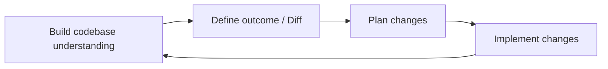
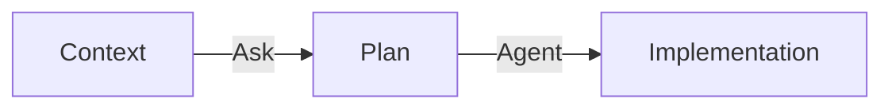
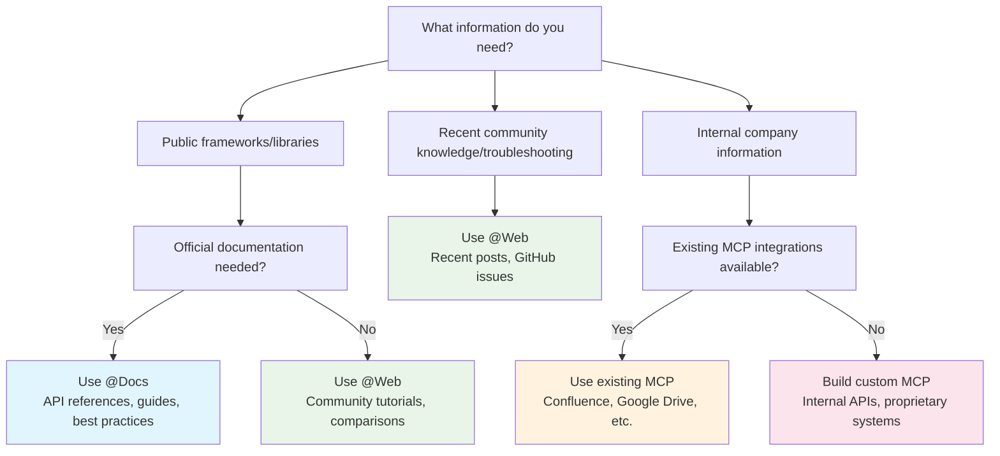
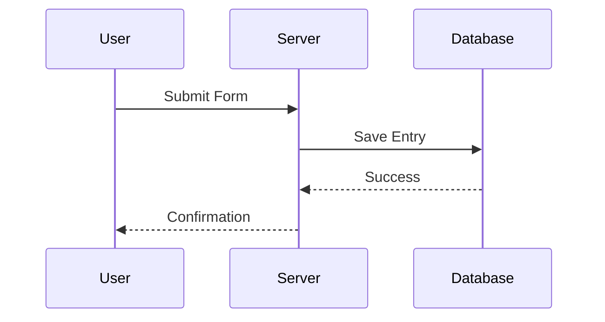
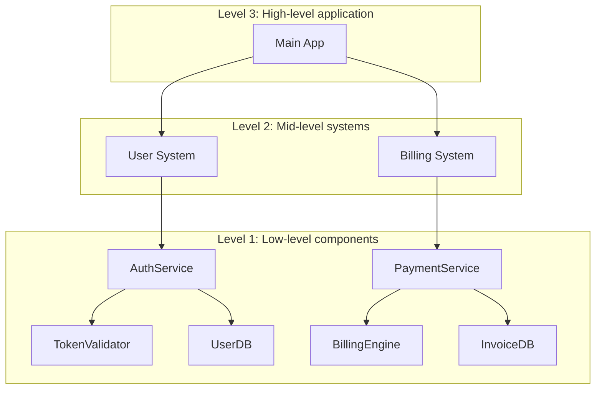
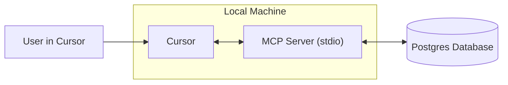
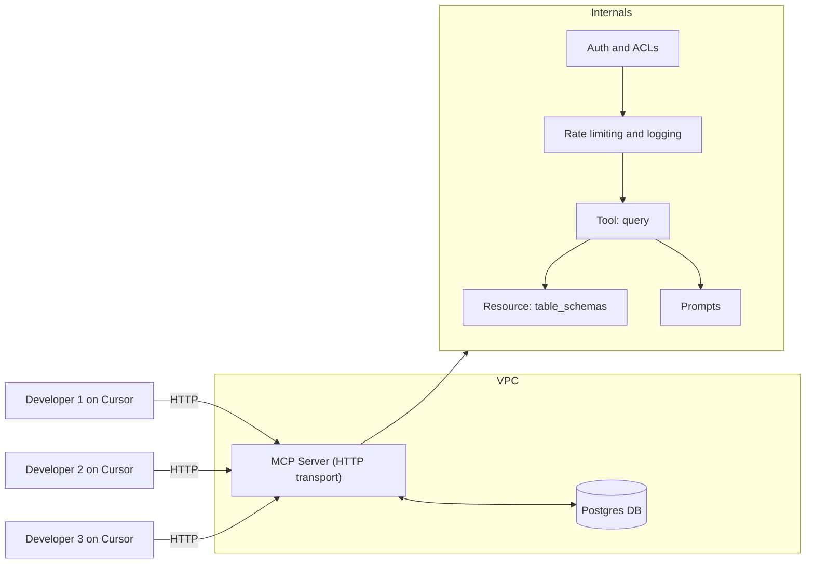
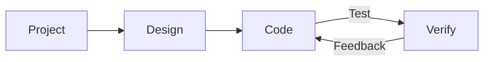
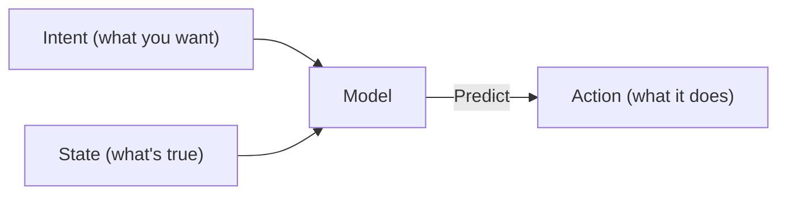

# Overview

**Navigation:** [← Previous](./05-scim.md) | [Index](./index.md) | [Next →](./07-slack.md)

---

# Overview
Source: https://docs.cursor.com/en/context/@-symbols/overview

Reference code, files, and documentation using @ symbols

Navigate suggestions using arrow keys. Press `Enter` to select. If the suggestion is a category like `Files`, the suggestions filter to show the most relevant items within that category.

<Frame>
  
</Frame>

Here's the list of all @ symbols available:

* [@Files](/en/context/@-symbols/@-files) - Reference specific files in your project
* [@Folders](/en/context/@-symbols/@-folders) - Reference entire folders for broader context
* [@Code](/en/context/@-symbols/@-code) - Reference specific code snippets or symbols from your codebase
* [@Docs](/en/context/@-symbols/@-docs) - Access documentation and guides
* [@Git](/en/context/@-symbols/@-git) - Access git history and changes
* [@Past Chats](/en/context/@-symbols/@-past-chats) - Work with summarized composer sessions
* [@Cursor Rules](/en/context/@-symbols/@-cursor-rules) - Work with cursor rules
* [@Web](/en/context/@-symbols/@-web) - Reference external web resources and documentation
* [@Link (paste)](/en/context/@-symbols/@-link) - Create links to specific code or documentation
* [@Recent Changes](/en/context/@-symbols/@-recent-changes) - Create links to specific code or documentation
* [@Lint Errors](/en/context/@-symbols/@-lint-errors) - Reference lint errors ([Chat](/en/chat/overview) only)
* [@Definitions](/en/context/@-symbols/@-definitions) - Look up symbol definitions ([Inline Edit](/en/inline-edit/overview) only)
* [# Files](/en/context/@-symbols/pill-files) - Add files to the context without referencing
* [/ Commands](/en/context/@-symbols/slash-commands) - Add open and active files to the context


# #Files
Source: https://docs.cursor.com/en/context/@-symbols/pill-files

Select specific files using the # prefix

Use `#` followed by a filename to focus on specific files. Combine with `@` symbols for precise context control.

<Frame>
  
</Frame>


# /command
Source: https://docs.cursor.com/en/context/@-symbols/slash-commands

Quick commands to add files and control context

The `/` command provides quick access to your open editor tabs, letting you add multiple files as context.

<Frame>
  
</Frame>

## Commands

* **`/Reset Context`**: Resets context to default state
* **`/Generate Cursor Rules`**: Generates rules for Cursor to follow
* **`/Disable Iterate on Lints`**: Will not try to fix linter errors and warnings
* **`/Add Open Files to Context`**: References all editor tabs currently open
* **`/Add Active Files to Context`**: References all editor tabs currently in view (useful with split layouts)


# Codebase Indexing
Source: https://docs.cursor.com/en/context/codebase-indexing

How Cursor learns your codebase for better understanding

Cursor indexes your codebase by computing embeddings for each file. This improves AI-generated answers about your code. When you open a project, Cursor starts indexing automatically. New files are indexed incrementally.
Check indexing status at: `Cursor Settings` > `Indexing & Docs`

<Frame>
  
</Frame>

## Configuration

Cursor indexes all files except those in [ignore files](/en/context/ignore-files) (e.g. `.gitignore`, `.cursorignore`).

Click `Show Settings` to:

* Enable automatic indexing for new repositories
* Configure which files to ignore

<Tip>
  [Ignoring large content files](/en/context/ignore-files) improves answer
  accuracy.
</Tip>

### View indexed files

To see indexed file paths: `Cursor Settings` > `Indexing & Docs` > `View included files`

This opens a `.txt` file listing all indexed files.

## Multi-root workspaces

Cursor supports [multi-root workspaces](https://code.visualstudio.com/docs/editor/workspaces#_multiroot-workspaces), letting you work with multiple codebases:

* All codebases get indexed automatically
* Each codebase's context is available to AI
* `.cursor/rules` work in all folders

## PR search

PR search helps you understand your codebase's evolution by making historical changes searchable and accessible through AI.

### How it works

Cursor automatically **indexes all merged PRs** from your repository history. Summaries appear in semantic search results, with smart filtering to prioritize recent changes.

Agent can **fetch PRs, commits, issues, or branches** into context using `@[PR number]`, `@[commit hash]`, or `@[branch name]`. Includes GitHub comments and Bugbot reviews when connected.

**Platform support** includes GitHub, GitHub Enterprise, and Bitbucket. GitLab is not currently supported.

<Note>
  GitHub Enterprise users: The fetch tool falls back to git commands due to
  VSCode auth limitations.
</Note>

### Using PR search

Ask questions like "How are services implemented in other PRs?" and Agent will automatically fetch relevant PRs into context to provide comprehensive answers based on your repository's history.

## FAQ

<AccordionGroup>
  <Accordion title="Where can I see all indexed codebases?">
    No global list exists yet. Check each project individually by opening it in
    Cursor and checking Codebase Indexing settings.
  </Accordion>

  <Accordion title="How do I delete all indexed codebases?">
    Delete your Cursor account from Settings to remove all indexed codebases.
    Otherwise, delete individual codebases from each project's Codebase Indexing
    settings.
  </Accordion>

  <Accordion title="How long are indexed codebases retained?">
    Indexed codebases are deleted after 6 weeks of inactivity. Reopening the
    project triggers re-indexing.
  </Accordion>

  <Accordion title="Is my source code stored on Cursor servers?">
    No. Cursor creates embeddings without storing filenames or source code. Filenames are obfuscated and code chunks are encrypted.

    When Agent searches the codebase, Cursor retrieves the embeddings from the server and decrypts the chunks.
  </Accordion>
</AccordionGroup>


# Ignore files
Source: https://docs.cursor.com/en/context/ignore-files

Control file access with .cursorignore and .cursorindexingignore

## Overview

Cursor reads and indexes your project's codebase to power its features. Control which directories and files Cursor can access using a `.cursorignore` file in your root directory.

Cursor blocks access to files listed in `.cursorignore` from:

* Codebase indexing
* Code accessible by [Tab](/en/tab/overview), [Agent](/en/agent/overview), and [Inline Edit](/en/inline-edit/overview)
* Code accessible via [@ symbol references](/en/context/@-symbols/overview)

<Warning>
  Tool calls initiated by Agent, like terminal and MCP servers, cannot block
  access to code governed by `.cursorignore`
</Warning>

## Why ignore files?

**Security**: Restrict access to API keys, credentials, and secrets. While Cursor blocks ignored files, complete protection isn't guaranteed due to LLM unpredictability.

**Performance**: In large codebases or monorepos, exclude irrelevant portions for faster indexing and more accurate file discovery.

## Global ignore files

Set ignore patterns for all projects in user settings to exclude sensitive files without per-project configuration.

<Frame>
  
</Frame>

Default patterns include:

* Environment files: `**/.env`, `**/.env.*`
* Credentials: `**/credentials.json`, `**/secrets.json`
* Keys: `**/*.key`, `**/*.pem`, `**/id_rsa`

## Configuring `.cursorignore`

Create a `.cursorignore` file in your root directory using `.gitignore` syntax.

### Pattern examples

```sh  theme={null}
config.json      # Specific file
dist/           # Directory
*.log           # File extension
**/logs         # Nested directories
!app/           # Exclude from ignore (negate)
```

### Hierarchical ignore

Enable `Cursor Settings` > `Features` > `Editor` > `Hierarchical Cursor Ignore` to search parent directories for `.cursorignore` files.

**Notes**: Comments start with `#`. Later patterns override earlier ones. Patterns are relative to file location.

## Limit indexing with `.cursorindexingignore`

Use `.cursorindexingignore` to exclude files from indexing only. These files remain accessible to AI features but won't appear in codebase searches.

## Files ignored by default

Cursor automatically ignores files in `.gitignore` and the default ignore list below. Override with `!` prefix in `.cursorignore`.

<Accordion title="Default Ignore List">
  For indexing only, these files are ignored in addition to files in your `.gitignore`, `.cursorignore` and `.cursorindexingignore`:

  ```sh  theme={null}
  package-lock.json
  pnpm-lock.yaml
  yarn.lock
  composer.lock
  Gemfile.lock
  bun.lockb
  .env*
  .git/
  .svn/
  .hg/
  *.lock
  *.bak
  *.tmp
  *.bin
  *.exe
  *.dll
  *.so
  *.lockb
  *.qwoff
  *.isl
  *.csv
  *.pdf
  *.doc
  *.doc
  *.xls
  *.xlsx
  *.ppt
  *.pptx
  *.odt
  *.ods
  *.odp
  *.odg
  *.odf
  *.sxw
  *.sxc
  *.sxi
  *.sxd
  *.sdc
  *.jpg
  *.jpeg
  *.png
  *.gif
  *.bmp
  *.tif
  *.mp3
  *.wav
  *.wma
  *.ogg
  *.flac
  *.aac
  *.mp4
  *.mov
  *.wmv
  *.flv
  *.avi
  *.zip
  *.tar
  *.gz
  *.7z
  *.rar
  *.tgz
  *.dmg
  *.iso
  *.cue
  *.mdf
  *.mds
  *.vcd
  *.toast
  *.img
  *.apk
  *.msi
  *.cab
  *.tar.gz
  *.tar.xz
  *.tar.bz2
  *.tar.lzma
  *.tar.Z
  *.tar.sz
  *.lzma
  *.ttf
  *.otf
  *.pak
  *.woff
  *.woff2
  *.eot
  *.webp
  *.vsix
  *.rmeta
  *.rlib
  *.parquet
  *.svg
  .egg-info/
  .venv/
  node_modules/
  __pycache__/
  .next/
  .nuxt/
  .cache/
  .sass-cache/
  .gradle/
  .DS_Store/
  .ipynb_checkpoints/
  .pytest_cache/
  .mypy_cache/
  .tox/
  .git/
  .hg/
  .svn/
  .bzr/
  .lock-wscript/
  .Python/
  .jupyter/
  .history/
  .yarn/
  .yarn-cache/
  .eslintcache/
  .parcel-cache/
  .cache-loader/
  .nyc_output/
  .node_repl_history/
  .pnp.js/
  .pnp/
  ```
</Accordion>

### Negation pattern limitations

When using negation patterns (prefixed with `!`), you cannot re-include a file if a parent directory is excluded via \*.

```sh  theme={null}

# Ignore all files in public folder
public/*


# ✅ This works, as the file exists at the top level
!public/index.html


# ❌ This doesn't work - cannot re-include files from nested directories
!public/assets/style.css
```

**Workaround**: Explicitly exclude nested directories:

```sh  theme={null}
public/assets/*
!public/assets/style.css # This file is now accessible
```

Excluded directories are not traversed for performance, so patterns on contained files have no effect.
This matches the .gitignore implementation for negation patterns in nested directories. For more details, see the [official Git documentation on gitignore patterns](https://git-scm.com/docs/gitignore).

## Troubleshooting

Test patterns with `git check-ignore -v [file]`.


# Model Context Protocol (MCP)
Source: https://docs.cursor.com/en/context/mcp

Connect external tools and data sources to Cursor using MCP

export const Kbd = ({children, tooltip, os}) => {
  const keysInput = typeof children === 'string' && children.trim() !== '' ? children : null;
  if (!keysInput) {
    return null;
  }
  const isModifier = key => {
    const modifiers = ['⌘', '⇧', '⌥', '⌃', '⏎', '⌫', '⌦', '⎋', '⇥', '⌁', '←', '→', '↑', '↓', 'Ctrl', 'Shift', 'Alt', 'Cmd', 'Opt', 'Return', 'Backspace', 'Delete', 'Escape', 'Tab', 'Space', 'Enter', 'Esc', 'ArrowLeft', 'ArrowRight', 'ArrowUp', 'ArrowDown', 'Left', 'Right', 'Up', 'Down'];
    return modifiers.includes(key.trim());
  };
  const capitalizeFirstLetter = string => {
    return string.charAt(0).toUpperCase() + string.slice(1);
  };
  const isMac = os ? os.toLowerCase() === 'mac' || os.toLowerCase() === 'macos' : typeof navigator !== 'undefined' && (navigator.platform.toUpperCase().indexOf('MAC') >= 0 || navigator.userAgent.toUpperCase().indexOf('MAC') >= 0);
  const convertToSymbols = shortcut => {
    if (isMac) {
      return shortcut.replace(/⌘|Cmd|CMD/gi, '⌘').replace(/⌥|Opt|OPT/gi, '⌥').replace(/⌃|Ctrl/gi, '⌃').replace(/⇧|Shift/gi, '⇧').replace(/⏎|Return/gi, '⏎').replace(/⌫|Backspace/gi, '⌫').replace(/⌦|Delete/gi, '⌦').replace(/␛|Escape/gi, '␛').replace(/⇥|Tab/gi, '⇥').replace(/⌁|Space/gi, '⌁').replace(/←|Arrow\s*Left|ArrowLeft|Left/gi, '←').replace(/→|Arrow\s*Right|ArrowRight|Right/gi, '→').replace(/↑|Arrow\s*Up|ArrowUp|Up/gi, '↑').replace(/↓|Arrow\s*Down|ArrowDown|Down/gi, '↓');
    } else {
      const converted = shortcut.replace(/⌘|Cmd|CMD/gi, 'Ctrl').replace(/⌥|Opt|OPT/gi, 'Alt').replace(/⌃|Ctrl/gi, 'Ctrl').replace(/⇧|Shift/gi, 'Shift').replace(/⏎|Return/gi, 'Enter').replace(/⌫|Backspace/gi, 'Backspace').replace(/⌦|Delete/gi, 'Delete').replace(/⎋|Escape/gi, 'Esc').replace(/⇥|Tab/gi, 'Tab').replace(/⌁|Space/gi, 'Space').replace(/←|Arrow\s*Left|ArrowLeft|Left/gi, 'Arrow-Left').replace(/→|Arrow\s*Right|ArrowRight|Right/gi, 'Arrow-Right').replace(/↑|Arrow\s*Up|ArrowUp|Up/gi, 'Arrow-Up').replace(/↓|Arrow\s*Down|ArrowDown|Down/gi, 'Arrow-Down');
      const keyList = converted.split(/[\+\s]+/).filter(key => key.trim());
      return keyList.join('+');
    }
  };
  const convertToReadableText = shortcut => {
    const converted = shortcut.replace(/⌘|Cmd|CMD/gi, 'Cmd').replace(/⌥|Opt|OPT/gi, 'Opt').replace(/⌃|Ctrl/gi, 'Ctrl').replace(/⇧|Shift/gi, 'Shift').replace(/⏎|Return/gi, 'Return').replace(/⌫|Backspace/gi, 'Backspace').replace(/⌦|Delete/gi, 'Delete').replace(/⎋|Escape/gi, 'Escape').replace(/⇥|Tab/gi, 'Tab').replace(/⌁|Space/gi, 'Space').replace(/←|Arrow\s*Left|ArrowLeft|Left/gi, 'Arrow-Left').replace(/→|Arrow\s*Right|ArrowRight|Right/gi, 'Arrow-Right').replace(/↑|Arrow\s*Up|ArrowUp|Up/gi, 'Arrow-Up').replace(/↓|Arrow\s*Down|ArrowDown|Down/gi, 'Arrow-Down');
    const keyList = converted.split(/[\+\s]+/).filter(key => key.trim());
    return keyList.map(key => {
      const trimmedKey = key.trim();
      return isModifier(trimmedKey) ? trimmedKey : capitalizeFirstLetter(trimmedKey);
    }).join('+');
  };
  const displayShortcut = convertToSymbols(keysInput);
  const tooltipText = isMac ? tooltip ? `${convertToReadableText(keysInput)}: ${tooltip}` : convertToReadableText(keysInput) : tooltip || null;
  const processedKeys = isMac ? displayShortcut.split(/[\+\s]+/).filter(key => key.trim()).map(key => {
    const trimmedKey = key.trim();
    return isModifier(trimmedKey) ? trimmedKey : capitalizeFirstLetter(trimmedKey);
  }).join('') : displayShortcut.split('+').map(key => {
    const trimmedKey = key.trim();
    return isModifier(trimmedKey) ? trimmedKey : capitalizeFirstLetter(trimmedKey);
  }).join('+');
  return tooltipText ? <Tooltip tip={tooltipText}>
      <kbd>
        {processedKeys}
      </kbd>
    </Tooltip> : <kbd>
      {processedKeys}
    </kbd>;
};

## What is MCP?

[Model Context Protocol (MCP)](https://modelcontextprotocol.io/introduction) enables Cursor to connect to external tools and data sources.

<Frame>
  <video src="https://mintcdn.com/cursor/BfJOqJ1Wb8EvuXyr/images/context/mcp/simple-mcp-call.mp4?fit=max&auto=format&n=BfJOqJ1Wb8EvuXyr&q=85&s=08c642babc501c939ecbec9ef5124ce7" autoPlay loop muted playsInline controls data-path="images/context/mcp/simple-mcp-call.mp4" />
</Frame>

### Why use MCP?

MCP connects Cursor to external systems and data. Instead of explaining your project structure repeatedly, integrate directly with your tools.

Write MCP servers in any language that can print to `stdout` or serve an HTTP endpoint - Python, JavaScript, Go, etc.

### How it works

MCP servers expose capabilities through the protocol, connecting Cursor to external tools or data sources.

Cursor supports three transport methods:

<div className="full-width-table">
  | Transport                                                        | Execution environment | Deployment       | Users          | Input                   | Auth   |
  | :--------------------------------------------------------------- | :-------------------- | :--------------- | :------------- | :---------------------- | :----- |
  | **<span className="whitespace-nowrap">`stdio`</span>**           | Local                 | Cursor manages   | Single user    | Shell command           | Manual |
  | **<span className="whitespace-nowrap">`SSE`</span>**             | Local/Remote          | Deploy as server | Multiple users | URL to an SSE endpoint  | OAuth  |
  | **<span className="whitespace-nowrap">`Streamable HTTP`</span>** | Local/Remote          | Deploy as server | Multiple users | URL to an HTTP endpoint | OAuth  |
</div>

### Protocol support

Cursor supports these MCP protocol capabilities:

<div className="full-width-table">
  | Feature         | Support   | Description                                                                |
  | :-------------- | :-------- | :------------------------------------------------------------------------- |
  | **Tools**       | Supported | Functions for the AI model to execute                                      |
  | **Prompts**     | Supported | Templated messages and workflows for users                                 |
  | **Resources**   | Supported | Structured data sources that can be read and referenced                    |
  | **Roots**       | Supported | Server-initiated inquiries into uri or filesystem boundaries to operate in |
  | **Elicitation** | Supported | Server-initiated requests for additional information from users            |
</div>

## Installing MCP servers

### One-click installation

Install MCP servers from our collection and authenticate with OAuth.

<Columns cols={2}>
  <Card title="Browse MCP Tools" icon="table" horizontal href="/en/tools">
    Browse available MCP servers
  </Card>

  <Card title="Add to Cursor Button" icon="plus" horizontal href="/en/deeplinks">
    Create an "Add to Cursor" button
  </Card>
</Columns>

### Using `mcp.json`

Configure custom MCP servers with a JSON file:

<CodeGroup>
  ```json CLI Server - Node.js theme={null}
  {
    "mcpServers": {
      "server-name": {
        "command": "npx",
        "args": ["-y", "mcp-server"],
        "env": {
          "API_KEY": "value"
        }
      }
    }
  }
  ```

  ```json CLI Server - Python theme={null}
  {
    "mcpServers": {
      "server-name": {
        "command": "python",
        "args": ["mcp-server.py"],
        "env": {
          "API_KEY": "value"
        }
      }
    }
  }
  ```

  ```json Remote Server theme={null}
  // MCP server using HTTP or SSE - runs on a server
  {
    "mcpServers": {
      "server-name": {
        "url": "http://localhost:3000/mcp",
        "headers": {
          "API_KEY": "value"
        }
      }
    }
  }
  ```
</CodeGroup>

### STDIO server configuration

For STDIO servers (local command-line servers), configure these fields in your `mcp.json`:

<div className="full-width-table">
  | Field       | Required | Description                                                                                             | Examples                                  |
  | :---------- | :------- | :------------------------------------------------------------------------------------------------------ | :---------------------------------------- |
  | **type**    | Yes      | Server connection type                                                                                  | `"stdio"`                                 |
  | **command** | Yes      | Command to start the server executable. Must be available on your system path or contain its full path. | `"npx"`, `"node"`, `"python"`, `"docker"` |
  | **args**    | No       | Array of arguments passed to the command                                                                | `["server.py", "--port", "3000"]`         |
  | **env**     | No       | Environment variables for the server                                                                    | `{"API_KEY": "${input:api-key}"}`         |
  | **envFile** | No       | Path to an environment file to load more variables                                                      | `".env"`, `"${workspaceFolder}/.env"`     |
</div>

### Using the Extension API

For programmatic MCP server registration, Cursor provides an extension API that allows dynamic configuration without modifying `mcp.json` files. This is particularly useful for enterprise environments and automated setup workflows.

<Card title="MCP Extension API Reference" icon="code" href="/en/context/mcp-extension-api">
  Learn how to register MCP servers programmatically using `vscode.cursor.mcp.registerServer()`
</Card>

### Configuration locations

<CardGroup cols={2}>
  <Card title="Project Configuration" icon="folder-tree">
    Create `.cursor/mcp.json` in your project for project-specific tools.
  </Card>

  <Card title="Global Configuration" icon="globe">
    Create `~/.cursor/mcp.json` in your home directory for tools available everywhere.
  </Card>
</CardGroup>

### Config interpolation

Use variables in `mcp.json` values. Cursor resolves variables in these fields: `command`, `args`, `env`, `url`, and `headers`.

Supported syntax:

* `${env:NAME}` environment variables
* `${userHome}` path to your home folder
* `${workspaceFolder}` project root (the folder that contains `.cursor/mcp.json`)
* `${workspaceFolderBasename}` name of the project root
* `${pathSeparator}` and `${/}` OS path separator

Examples

```json  theme={null}
{
  "mcpServers": {
    "local-server": {
      "command": "python",
      "args": ["${workspaceFolder}/tools/mcp_server.py"],
      "env": {
        "API_KEY": "${env:API_KEY}"
      }
    }
  }
}
```

```json  theme={null}
{
  "mcpServers": {
    "remote-server": {
      "url": "https://api.example.com/mcp",
      "headers": {
        "Authorization": "Bearer ${env:MY_SERVICE_TOKEN}"
      }
    }
  }
}
```

### Authentication

MCP servers use environment variables for authentication. Pass API keys and tokens through the config.

Cursor supports OAuth for servers that require it.

## Using MCP in chat

The Composer Agent automatically uses MCP tools listed under `Available Tools` when relevant. Ask for a specific tool by name or describe what you need. Enable or disable tools from settings.

### Toggling tools

Enable or disable MCP tools directly from the chat interface. Click a tool name in the tools list to toggle it. Disabled tools won't be loaded into context or available to Agent.

<Frame>
  <video src="https://mintcdn.com/cursor/BfJOqJ1Wb8EvuXyr/images/context/mcp/tool-toggle.mp4?fit=max&auto=format&n=BfJOqJ1Wb8EvuXyr&q=85&s=0fa3060f593cae3e5fb7c7d2f041a715" autoPlay loop muted playsInline controls data-path="images/context/mcp/tool-toggle.mp4" />
</Frame>

### Tool approval

Agent asks for approval before using MCP tools by default. Click the arrow next to the tool name to see arguments.

<Frame></Frame>

#### Auto-run

Enable auto-run for Agent to use MCP tools without asking. Works like terminal commands. Read more about Auto-run settings [here](/en/agent/tools#auto-run).

### Tool response

Cursor shows the response in chat with expandable views of arguments and responses:

<Frame></Frame>

### Images as context

MCP servers can return images - screenshots, diagrams, etc. Return them as base64 encoded strings:

```js  theme={null}
const RED_CIRCLE_BASE64 = "/9j/4AAQSkZJRgABAgEASABIAAD/2w...";
// ^ full base64 clipped for readability

server.tool("generate_image", async (params) => {
  return {
    content: [
      {
        type: "image",
        data: RED_CIRCLE_BASE64,
        mimeType: "image/jpeg",
      },
    ],
  };
});
```

See this [example server](https://github.com/msfeldstein/mcp-test-servers/blob/main/src/image-server.js) for implementation details. Cursor attaches returned images to the chat. If the model supports images, it analyzes them.

## Security considerations

When installing MCP servers, consider these security practices:

* **Verify the source**: Only install MCP servers from trusted developers and repositories
* **Review permissions**: Check what data and APIs the server will access
* **Limit API keys**: Use restricted API keys with minimal required permissions
* **Audit code**: For critical integrations, review the server's source code

Remember that MCP servers can access external services and execute code on your behalf. Always understand what a server does before installation.

## Real-world examples

For practical examples of MCP in action, see our [Web Development guide](/en/guides/tutorials/web-development) which demonstrates integrating Linear, Figma, and browser tools into your development workflow.

## FAQ

<AccordionGroup>
  <Accordion title="What's the point of MCP servers?">
    MCP servers connect Cursor to external tools like Google Drive, Notion, and
    other services to bring docs and requirements into your coding workflow.
  </Accordion>

  {" "}

  <Accordion title="How do I debug MCP server issues?">
    View MCP logs by: 1. Open the Output panel in Cursor (<Kbd>Cmd+Shift+U</Kbd>)
    2\. Select "MCP Logs" from the dropdown 3. Check for connection errors,
    authentication issues, or server crashes The logs show server initialization,
    tool calls, and error messages.
  </Accordion>

  {" "}

  <Accordion title="Can I temporarily disable an MCP server?">
    Yes! Toggle servers on/off without removing them: 1. Open Settings (
    <Kbd>Cmd+Shift+J</Kbd>) 2. Go to Features → Model Context Protocol 3. Click
    the toggle next to any server to enable/disable Disabled servers won't load or
    appear in chat. This is useful for troubleshooting or reducing tool clutter.
  </Accordion>

  {" "}

  <Accordion title="What happens if an MCP server crashes or times out?">
    If an MCP server fails: - Cursor shows an error message in chat - The tool
    call is marked as failed - You can retry the operation or check logs for
    details - Other MCP servers continue working normally Cursor isolates server
    failures to prevent one server from affecting others.
  </Accordion>

  {" "}

  <Accordion title="How do I update an MCP server?">
    For npm-based servers: 1. Remove the server from settings 2. Clear npm cache:
    `npm cache clean --force` 3. Re-add the server to get the latest version For
    custom servers, update your local files and restart Cursor.
  </Accordion>

  <Accordion title="Can I use MCP servers with sensitive data?">
    Yes, but follow security best practices: - Use environment variables for
    secrets, never hardcode them - Run sensitive servers locally with `stdio`
    transport - Limit API key permissions to minimum required - Review server
    code before connecting to sensitive systems - Consider running servers in
    isolated environments
  </Accordion>
</AccordionGroup>


# Memories
Source: https://docs.cursor.com/en/context/memories


Memories are automatically generated rules based on your conversations in Chat. These memories are scoped to your project and maintain context across sessions.

<Frame>
  <video src="https://mintcdn.com/cursor/BfJOqJ1Wb8EvuXyr/images/context/rules/memories.mp4?fit=max&auto=format&n=BfJOqJ1Wb8EvuXyr&q=85&s=d10452508d962d7a9ec37de1c22245d1" alt="Memories in Cursor" controls data-path="images/context/rules/memories.mp4" />
</Frame>

## How memories are created

1. **Sidecar observation**: Cursor uses a sidecar approach where another model observes your conversations and automatically extracts relevant memories. This happens passively in the background as you work. Background-generated memories require user approval before being saved, ensuring trust and control over what gets remembered.

2. **Tool calls**: Agent can directly create memories using tool calls when you explicitly ask it to remember something or when it notices important information that should be preserved for future sessions.

## Manage memories

You can manage memories from Cursor Settings → Rules.


# Rules
Source: https://docs.cursor.com/en/context/rules

Control how the Agent model behaves with reusable, scoped instructions.

Rules provide system-level instructions to Agent and Inline Edit. Think of them as persistent context, preferences, or workflows for your projects.

Cursor supports four types of rules:

<CardGroup cols={2}>
  <Card title="Project Rules" icon="folder-tree">
    Stored in `.cursor/rules`, version-controlled and scoped to your codebase.
  </Card>

  <Card title="User Rules" icon="user">
    Global to your Cursor environment. Defined in settings and always applied.
  </Card>

  <Card title="AGENTS.md" icon="robot">
    Agent instructions in markdown format. Simple alternative to `.cursor/rules`.
  </Card>

  <Card title=".cursorrules (Legacy)" icon="clock-rotate-left">
    Still supported, but deprecated. Use Project Rules instead.
  </Card>
</CardGroup>

## How rules work

Large language models don't retain memory between completions. Rules provide persistent, reusable context at the prompt level.

When applied, rule contents are included at the start of the model context. This gives the AI consistent guidance for generating code, interpreting edits, or helping with workflows.

<Frame>
  
</Frame>

<Info>
  Rules apply to [Chat](/en/chat/overview) and [Inline
  Edit](/en/inline-edit/overview). Active rules show in the Agent sidebar.
</Info>

## Project rules

Project rules live in `.cursor/rules`. Each rule is a file and version-controlled. They can be scoped using path patterns, invoked manually, or included based on relevance. Subdirectories can include their own `.cursor/rules` directory scoped to that folder.

Use project rules to:

* Encode domain-specific knowledge about your codebase
* Automate project-specific workflows or templates
* Standardize style or architecture decisions

### Rule anatomy

Each rule file is written in **MDC** (`.mdc`), a format supporting metadata and content. Control how rules are applied from the type dropdown which changes properties `description`, `globs`, `alwaysApply`.

| <span class="no-wrap">Rule Type</span>         | Description                                                                      |
| :--------------------------------------------- | :------------------------------------------------------------------------------- |
| <span class="no-wrap">`Always`</span>          | Always included in model context                                                 |
| <span class="no-wrap">`Auto Attached`</span>   | Included when files matching a glob pattern are referenced                       |
| <span class="no-wrap">`Agent Requested`</span> | Available to AI, which decides whether to include it. Must provide a description |
| <span class="no-wrap">`Manual`</span>          | Only included when explicitly mentioned using `@ruleName`                        |

```
---
description: RPC Service boilerplate
globs:
alwaysApply: false
---

- Use our internal RPC pattern when defining services
- Always use snake_case for service names.

@service-template.ts
```

### Nested rules

Organize rules by placing them in `.cursor/rules` directories throughout your project. Nested rules automatically attach when files in their directory are referenced.

```
project/
  .cursor/rules/        # Project-wide rules
  backend/
    server/
      .cursor/rules/    # Backend-specific rules
  frontend/
    .cursor/rules/      # Frontend-specific rules
```

### Creating a rule

Create rules using the `New Cursor Rule` command or going to `Cursor Settings > Rules`. This creates a new rule file in `.cursor/rules`. From settings you can see all rules and their status.

<Frame>
  
</Frame>

### Generating rules

Generate rules directly in conversations using the `/Generate Cursor Rules` command. Useful when you've made decisions about agent behavior and want to reuse them.

<Frame>
  <video src="https://www.cursor.com/changelog/049/generate-rules.mp4" controls>
    Your browser does not support the video tag.
  </video>
</Frame>

## Best practices

Good rules are focused, actionable, and scoped.

* Keep rules under 500 lines
* Split large rules into multiple, composable rules
* Provide concrete examples or referenced files
* Avoid vague guidance. Write rules like clear internal docs
* Reuse rules when repeating prompts in chat

## Examples

<AccordionGroup>
  <Accordion title="Standards for frontend components and API validation">
    This rule provides standards for frontend components:

    When working in components directory:

    * Always use Tailwind for styling
    * Use Framer Motion for animations
    * Follow component naming conventions

    This rule enforces validation for API endpoints:

    In API directory:

    * Use zod for all validation
    * Define return types with zod schemas
    * Export types generated from schemas
  </Accordion>

  <Accordion title="Templates for Express services and React components">
    This rule provides a template for Express services:

    Use this template when creating Express service:

    * Follow RESTful principles
    * Include error handling middleware
    * Set up proper logging

    @express-service-template.ts

    This rule defines React component structure:

    React components should follow this layout:

    * Props interface at top
    * Component as named export
    * Styles at bottom

    @component-template.tsx
  </Accordion>

  <Accordion title="Automating development workflows and documentation generation">
    This rule automates app analysis:

    When asked to analyze the app:

    1. Run dev server with `npm run dev`
    2. Fetch logs from console
    3. Suggest performance improvements

    This rule helps generate documentation:

    Help draft documentation by:

    * Extracting code comments
    * Analyzing README.md
    * Generating markdown documentation
  </Accordion>

  <Accordion title="Adding a new setting in Cursor">
    First create a property to toggle in `@reactiveStorageTypes.ts`.

    Add default value in `INIT_APPLICATION_USER_PERSISTENT_STORAGE` in `@reactiveStorageService.tsx`.

    For beta features, add toggle in `@settingsBetaTab.tsx`, otherwise add in `@settingsGeneralTab.tsx`. Toggles can be added as `<SettingsSubSection>` for general checkboxes. Look at the rest of the file for examples.

    ```
    <SettingsSubSection
    				label="Your feature name"
    				description="Your feature description"
    				value={
    					vsContext.reactiveStorageService.applicationUserPersistentStorage
    						.myNewProperty ?? false
    				}
    				onChange={(newVal) => {
    					vsContext.reactiveStorageService.setApplicationUserPersistentStorage(
    						'myNewProperty',
    						newVal
    					);
    				}}
    			/>
    ```

    To use in the app, import reactiveStorageService and use the property:

    ```
    const flagIsEnabled = vsContext.reactiveStorageService.applicationUserPersistentStorage.myNewProperty
    ```
  </Accordion>
</AccordionGroup>

Many examples available from providers and frameworks. Community-contributed rules are found across crowdsourced collections and repositories online.

## AGENTS.md

`AGENTS.md` is a simple markdown file for defining agent instructions. Place it in your project root as an alternative to `.cursor/rules` for straightforward use cases.

Unlike Project Rules, `AGENTS.md` is a plain markdown file without metadata or complex configurations. It's perfect for projects that need simple, readable instructions without the overhead of structured rules.

```markdown  theme={null}

# Project Instructions

## Code Style
- Use TypeScript for all new files
- Prefer functional components in React
- Use snake_case for database columns

## Architecture
- Follow the repository pattern
- Keep business logic in service layers
```

## User Rules

User rules are global preferences defined in **Cursor Settings → Rules** that apply across all projects. They're plain text and perfect for setting preferred communication style or coding conventions:

```
Please reply in a concise style. Avoid unnecessary repetition or filler language.
```

## `.cursorrules` (Legacy)

The `.cursorrules` file in your project root is still supported but will be deprecated. We recommend migrating to Project Rules for more control, flexibility, and visibility.

## FAQ

<AccordionGroup>
  <Accordion title="Why isn't my rule being applied?">
    Check the rule type. For `Agent Requested`, ensure a description is defined. For `Auto Attached`, ensure the file pattern matches referenced files.
  </Accordion>

  {" "}

  <Accordion title="Can rules reference other rules or files?">
    Yes. Use `@filename.ts` to include files in your rule's context.
  </Accordion>

  {" "}

  <Accordion title="Can I create a rule from chat?">
    Yes, generate project rules from chat using the `/Generate Cursor Rules`
    command. If Memories are enabled, memories are generated automatically.
  </Accordion>

  <Accordion title="Do rules impact Cursor Tab or other AI features?">
    No. Rules only apply to Agent and Inline Edit
  </Accordion>
</AccordionGroup>


# Concepts
Source: https://docs.cursor.com/en/get-started/concepts

Learn the key features that make Cursor powerful

export const Kbd = ({children, tooltip, os}) => {
  const keysInput = typeof children === 'string' && children.trim() !== '' ? children : null;
  if (!keysInput) {
    return null;
  }
  const isModifier = key => {
    const modifiers = ['⌘', '⇧', '⌥', '⌃', '⏎', '⌫', '⌦', '⎋', '⇥', '⌁', '←', '→', '↑', '↓', 'Ctrl', 'Shift', 'Alt', 'Cmd', 'Opt', 'Return', 'Backspace', 'Delete', 'Escape', 'Tab', 'Space', 'Enter', 'Esc', 'ArrowLeft', 'ArrowRight', 'ArrowUp', 'ArrowDown', 'Left', 'Right', 'Up', 'Down'];
    return modifiers.includes(key.trim());
  };
  const capitalizeFirstLetter = string => {
    return string.charAt(0).toUpperCase() + string.slice(1);
  };
  const isMac = os ? os.toLowerCase() === 'mac' || os.toLowerCase() === 'macos' : typeof navigator !== 'undefined' && (navigator.platform.toUpperCase().indexOf('MAC') >= 0 || navigator.userAgent.toUpperCase().indexOf('MAC') >= 0);
  const convertToSymbols = shortcut => {
    if (isMac) {
      return shortcut.replace(/⌘|Cmd|CMD/gi, '⌘').replace(/⌥|Opt|OPT/gi, '⌥').replace(/⌃|Ctrl/gi, '⌃').replace(/⇧|Shift/gi, '⇧').replace(/⏎|Return/gi, '⏎').replace(/⌫|Backspace/gi, '⌫').replace(/⌦|Delete/gi, '⌦').replace(/␛|Escape/gi, '␛').replace(/⇥|Tab/gi, '⇥').replace(/⌁|Space/gi, '⌁').replace(/←|Arrow\s*Left|ArrowLeft|Left/gi, '←').replace(/→|Arrow\s*Right|ArrowRight|Right/gi, '→').replace(/↑|Arrow\s*Up|ArrowUp|Up/gi, '↑').replace(/↓|Arrow\s*Down|ArrowDown|Down/gi, '↓');
    } else {
      const converted = shortcut.replace(/⌘|Cmd|CMD/gi, 'Ctrl').replace(/⌥|Opt|OPT/gi, 'Alt').replace(/⌃|Ctrl/gi, 'Ctrl').replace(/⇧|Shift/gi, 'Shift').replace(/⏎|Return/gi, 'Enter').replace(/⌫|Backspace/gi, 'Backspace').replace(/⌦|Delete/gi, 'Delete').replace(/⎋|Escape/gi, 'Esc').replace(/⇥|Tab/gi, 'Tab').replace(/⌁|Space/gi, 'Space').replace(/←|Arrow\s*Left|ArrowLeft|Left/gi, 'Arrow-Left').replace(/→|Arrow\s*Right|ArrowRight|Right/gi, 'Arrow-Right').replace(/↑|Arrow\s*Up|ArrowUp|Up/gi, 'Arrow-Up').replace(/↓|Arrow\s*Down|ArrowDown|Down/gi, 'Arrow-Down');
      const keyList = converted.split(/[\+\s]+/).filter(key => key.trim());
      return keyList.join('+');
    }
  };
  const convertToReadableText = shortcut => {
    const converted = shortcut.replace(/⌘|Cmd|CMD/gi, 'Cmd').replace(/⌥|Opt|OPT/gi, 'Opt').replace(/⌃|Ctrl/gi, 'Ctrl').replace(/⇧|Shift/gi, 'Shift').replace(/⏎|Return/gi, 'Return').replace(/⌫|Backspace/gi, 'Backspace').replace(/⌦|Delete/gi, 'Delete').replace(/⎋|Escape/gi, 'Escape').replace(/⇥|Tab/gi, 'Tab').replace(/⌁|Space/gi, 'Space').replace(/←|Arrow\s*Left|ArrowLeft|Left/gi, 'Arrow-Left').replace(/→|Arrow\s*Right|ArrowRight|Right/gi, 'Arrow-Right').replace(/↑|Arrow\s*Up|ArrowUp|Up/gi, 'Arrow-Up').replace(/↓|Arrow\s*Down|ArrowDown|Down/gi, 'Arrow-Down');
    const keyList = converted.split(/[\+\s]+/).filter(key => key.trim());
    return keyList.map(key => {
      const trimmedKey = key.trim();
      return isModifier(trimmedKey) ? trimmedKey : capitalizeFirstLetter(trimmedKey);
    }).join('+');
  };
  const displayShortcut = convertToSymbols(keysInput);
  const tooltipText = isMac ? tooltip ? `${convertToReadableText(keysInput)}: ${tooltip}` : convertToReadableText(keysInput) : tooltip || null;
  const processedKeys = isMac ? displayShortcut.split(/[\+\s]+/).filter(key => key.trim()).map(key => {
    const trimmedKey = key.trim();
    return isModifier(trimmedKey) ? trimmedKey : capitalizeFirstLetter(trimmedKey);
  }).join('') : displayShortcut.split('+').map(key => {
    const trimmedKey = key.trim();
    return isModifier(trimmedKey) ? trimmedKey : capitalizeFirstLetter(trimmedKey);
  }).join('+');
  return tooltipText ? <Tooltip tip={tooltipText}>
      <kbd>
        {processedKeys}
      </kbd>
    </Tooltip> : <kbd>
      {processedKeys}
    </kbd>;
};

<div className="flex flex-col gap-12">
  <Columns className="gap-4">
    <div>
      <h2 className="text-lg font-medium mb-2">
        <a href="/en/tab/overview" className="hover:text-primary transition-colors">
          Tab
        </a>
      </h2>

      <p className="text-sm">
        Code completion that predicts multi-line edits. Press Tab to accept
        suggestions based on your current code and recent changes.
      </p>
    </div>

    <Frame>
      
    </Frame>
  </Columns>

  <Columns className="gap-4">
    <div>
      <h3 className="text-lg font-medium mb-2">
        <a href="/en/agent/overview" className="hover:text-primary transition-colors">
          Agent
        </a>
      </h3>

      <p className="text-sm">
        An AI that can read and modify code across multiple files. Describe
        changes in natural language and Agent executes them.
      </p>
    </div>

    <div>
      <Frame>
        
      </Frame>
    </div>
  </Columns>

  <Columns className="gap-4">
    <div>
      <h3 className="text-lg font-medium mb-2">
        <a href="/en/background-agent" className="hover:text-primary transition-colors">
          Background Agent
        </a>
      </h3>

      <p className="text-sm">
        Runs tasks asynchronously while you continue working. Can be accessed
        through the editor or external integrations like Slack.
      </p>
    </div>

    <div>
      <Frame>
        
      </Frame>
    </div>
  </Columns>

  <Columns className="gap-4">
    <div>
      <h3 className="text-lg font-medium mb-2">
        <a href="/en/inline-edit/overview" className="hover:text-primary transition-colors">
          Inline Edit
        </a>
      </h3>

      <p className="text-sm">
        Edit selected code with natural language. Press <Kbd>Cmd+K</Kbd> to
        describe changes and see them applied in place.
      </p>
    </div>

    <div>
      <Frame>
        
      </Frame>
    </div>
  </Columns>

  <Columns className="gap-4">
    <div>
      <h3 className="text-lg font-medium mb-2">
        <a href="/en/agent/chats/tabs" className="hover:text-primary transition-colors">
          Chat
        </a>
      </h3>

      <p className="text-sm">
        Interface for AI conversations. Supports multiple tabs, conversation
        history, checkpoints, and export functionality.
      </p>
    </div>

    <div>
      <Frame>
        <video src="https://mintcdn.com/cursor/GnTEh_6SKR7li-hM/images/chat/chat-tabs.mp4?fit=max&auto=format&n=GnTEh_6SKR7li-hM&q=85&s=57fd5305279dc0a3139055b353ce4b7a" autoPlay loop muted playsInline controls data-path="images/chat/chat-tabs.mp4" />
      </Frame>
    </div>
  </Columns>

  <Columns className="gap-4">
    <div>
      <h3 className="text-lg font-medium mb-2">
        <a href="/en/context/rules" className="hover:text-primary transition-colors">
          Rules
        </a>
      </h3>

      <p className="text-sm">
        Custom instructions that define AI behavior. Set coding standards,
        framework preferences, and project-specific conventions.
      </p>
    </div>

    <div>
      <Frame>
        
      </Frame>
    </div>
  </Columns>

  <Columns className="gap-4">
    <div>
      <h3 className="text-lg font-medium mb-2">
        <a href="/en/context/memories" className="hover:text-primary transition-colors">
          Memories
        </a>
      </h3>

      <p className="text-sm">
        Persistent storage of project context and decisions from past
        conversations. Automatically referenced in future interactions.
      </p>
    </div>

    <div>
      <Frame>
        <video src="https://mintcdn.com/cursor/BfJOqJ1Wb8EvuXyr/images/context/rules/memories.mp4?fit=max&auto=format&n=BfJOqJ1Wb8EvuXyr&q=85&s=d10452508d962d7a9ec37de1c22245d1" autoPlay loop muted playsInline controls data-path="images/context/rules/memories.mp4" />
      </Frame>
    </div>
  </Columns>

  <Columns className="gap-4">
    <div>
      <h3 className="text-lg font-medium mb-2">
        <a href="/en/context/codebase-indexing" className="hover:text-primary transition-colors">
          Codebase Indexing
        </a>
      </h3>

      <p className="text-sm">
        Semantic analysis of your codebase. Enables code search, reference
        finding, and context-aware suggestions.
      </p>
    </div>

    <div>
      <Frame>
        
      </Frame>
    </div>
  </Columns>

  <Columns className="gap-4">
    <div>
      <h3 className="text-lg font-medium mb-2">
        <a href="/en/context/mcp" className="hover:text-primary transition-colors">
          MCP
        </a>
      </h3>

      <p className="text-sm">
        Model Context Protocol for integrating external tools. Connects to
        databases, APIs, and documentation sources.
      </p>
    </div>

    <div>
      <Frame>
        <video src="https://mintcdn.com/cursor/BfJOqJ1Wb8EvuXyr/images/context/mcp/simple-mcp-call.mp4?fit=max&auto=format&n=BfJOqJ1Wb8EvuXyr&q=85&s=08c642babc501c939ecbec9ef5124ce7" autoPlay loop muted playsInline controls data-path="images/context/mcp/simple-mcp-call.mp4" />
      </Frame>
    </div>
  </Columns>

  <Columns className="gap-4">
    <div>
      <h3 className="text-lg font-medium mb-2">
        <a href="/en/guides/working-with-context" className="hover:text-primary transition-colors">
          Context
        </a>
      </h3>

      <p className="text-sm">
        Information provided to AI models during code generation. Includes files,
        symbols, and conversation history.
      </p>
    </div>

    <div>
      <Frame>
        
      </Frame>
    </div>
  </Columns>

  <Columns className="gap-4">
    <div>
      <h3 className="text-lg font-medium mb-2">
        <a href="/en/models" className="hover:text-primary transition-colors">
          Models
        </a>
      </h3>

      <p className="text-sm">
        Different AI models available for code generation. Each model has
        different speed and capability characteristics.
      </p>
    </div>

    <div>
      <Frame>
        
      </Frame>
    </div>
  </Columns>
</div>


# Installation
Source: https://docs.cursor.com/en/get-started/installation

Get Cursor installed on your computer in just a few minutes

export const Kbd = ({children, tooltip, os}) => {
  const keysInput = typeof children === 'string' && children.trim() !== '' ? children : null;
  if (!keysInput) {
    return null;
  }
  const isModifier = key => {
    const modifiers = ['⌘', '⇧', '⌥', '⌃', '⏎', '⌫', '⌦', '⎋', '⇥', '⌁', '←', '→', '↑', '↓', 'Ctrl', 'Shift', 'Alt', 'Cmd', 'Opt', 'Return', 'Backspace', 'Delete', 'Escape', 'Tab', 'Space', 'Enter', 'Esc', 'ArrowLeft', 'ArrowRight', 'ArrowUp', 'ArrowDown', 'Left', 'Right', 'Up', 'Down'];
    return modifiers.includes(key.trim());
  };
  const capitalizeFirstLetter = string => {
    return string.charAt(0).toUpperCase() + string.slice(1);
  };
  const isMac = os ? os.toLowerCase() === 'mac' || os.toLowerCase() === 'macos' : typeof navigator !== 'undefined' && (navigator.platform.toUpperCase().indexOf('MAC') >= 0 || navigator.userAgent.toUpperCase().indexOf('MAC') >= 0);
  const convertToSymbols = shortcut => {
    if (isMac) {
      return shortcut.replace(/⌘|Cmd|CMD/gi, '⌘').replace(/⌥|Opt|OPT/gi, '⌥').replace(/⌃|Ctrl/gi, '⌃').replace(/⇧|Shift/gi, '⇧').replace(/⏎|Return/gi, '⏎').replace(/⌫|Backspace/gi, '⌫').replace(/⌦|Delete/gi, '⌦').replace(/␛|Escape/gi, '␛').replace(/⇥|Tab/gi, '⇥').replace(/⌁|Space/gi, '⌁').replace(/←|Arrow\s*Left|ArrowLeft|Left/gi, '←').replace(/→|Arrow\s*Right|ArrowRight|Right/gi, '→').replace(/↑|Arrow\s*Up|ArrowUp|Up/gi, '↑').replace(/↓|Arrow\s*Down|ArrowDown|Down/gi, '↓');
    } else {
      const converted = shortcut.replace(/⌘|Cmd|CMD/gi, 'Ctrl').replace(/⌥|Opt|OPT/gi, 'Alt').replace(/⌃|Ctrl/gi, 'Ctrl').replace(/⇧|Shift/gi, 'Shift').replace(/⏎|Return/gi, 'Enter').replace(/⌫|Backspace/gi, 'Backspace').replace(/⌦|Delete/gi, 'Delete').replace(/⎋|Escape/gi, 'Esc').replace(/⇥|Tab/gi, 'Tab').replace(/⌁|Space/gi, 'Space').replace(/←|Arrow\s*Left|ArrowLeft|Left/gi, 'Arrow-Left').replace(/→|Arrow\s*Right|ArrowRight|Right/gi, 'Arrow-Right').replace(/↑|Arrow\s*Up|ArrowUp|Up/gi, 'Arrow-Up').replace(/↓|Arrow\s*Down|ArrowDown|Down/gi, 'Arrow-Down');
      const keyList = converted.split(/[\+\s]+/).filter(key => key.trim());
      return keyList.join('+');
    }
  };
  const convertToReadableText = shortcut => {
    const converted = shortcut.replace(/⌘|Cmd|CMD/gi, 'Cmd').replace(/⌥|Opt|OPT/gi, 'Opt').replace(/⌃|Ctrl/gi, 'Ctrl').replace(/⇧|Shift/gi, 'Shift').replace(/⏎|Return/gi, 'Return').replace(/⌫|Backspace/gi, 'Backspace').replace(/⌦|Delete/gi, 'Delete').replace(/⎋|Escape/gi, 'Escape').replace(/⇥|Tab/gi, 'Tab').replace(/⌁|Space/gi, 'Space').replace(/←|Arrow\s*Left|ArrowLeft|Left/gi, 'Arrow-Left').replace(/→|Arrow\s*Right|ArrowRight|Right/gi, 'Arrow-Right').replace(/↑|Arrow\s*Up|ArrowUp|Up/gi, 'Arrow-Up').replace(/↓|Arrow\s*Down|ArrowDown|Down/gi, 'Arrow-Down');
    const keyList = converted.split(/[\+\s]+/).filter(key => key.trim());
    return keyList.map(key => {
      const trimmedKey = key.trim();
      return isModifier(trimmedKey) ? trimmedKey : capitalizeFirstLetter(trimmedKey);
    }).join('+');
  };
  const displayShortcut = convertToSymbols(keysInput);
  const tooltipText = isMac ? tooltip ? `${convertToReadableText(keysInput)}: ${tooltip}` : convertToReadableText(keysInput) : tooltip || null;
  const processedKeys = isMac ? displayShortcut.split(/[\+\s]+/).filter(key => key.trim()).map(key => {
    const trimmedKey = key.trim();
    return isModifier(trimmedKey) ? trimmedKey : capitalizeFirstLetter(trimmedKey);
  }).join('') : displayShortcut.split('+').map(key => {
    const trimmedKey = key.trim();
    return isModifier(trimmedKey) ? trimmedKey : capitalizeFirstLetter(trimmedKey);
  }).join('+');
  return tooltipText ? <Tooltip tip={tooltipText}>
      <kbd>
        {processedKeys}
      </kbd>
    </Tooltip> : <kbd>
      {processedKeys}
    </kbd>;
};

## Download Cursor

Getting started is simple:

1. Go to [cursor.com](https://cursor.com) and click "Download"
2. Run the installer once it downloads
3. Open Cursor when installation finishes

<Info>
  Need a specific version? Find all platforms and installation methods at
  [cursor.com/downloads](https://cursor.com/downloads)
</Info>

## First-time setup

When you open Cursor for the first time, we'll walk you through a quick setup:

* Choose keyboard shortcuts that feel familiar
* Pick a theme you like
* Set up your terminal preferences

<Frame>
  <video controls width="100%">
    <source src="https://mintcdn.com/cursor/E7JVsKUF5L-IiJRB/images/get-started/cursor-onboarding.mp4?fit=max&auto=format&n=E7JVsKUF5L-IiJRB&q=85&s=cda00fa83569cd85c6b7322c34f4843e" type="video/mp4" data-path="images/get-started/cursor-onboarding.mp4" />

    Your browser does not support the video tag.
  </video>
</Frame>

<Tip>
  You can revisit the setup wizard anytime by pressing <Kbd>Cmd Shift P</Kbd>{" "}
  and searching for `Cursor: Start Onboarding`.
</Tip>

Read more about [Keyboard Shortcuts](/en/kbd), [Themes](/en/settings/themes) and [Shell Commands](/en/settings/shell)

<CardGroup cols={3}>
  <Card title="Keyboard shortcuts" href="/en/configuration/kbd" arrow>
    See keyboard shortcuts
  </Card>

  <Card title="Themes" href="/en/configuration/themes" arrow>
    Selecting a theme in Cursor
  </Card>

  <Card title="Shell Commands" href="/en/configuration/shell" arrow>
    Install shell commands
  </Card>
</CardGroup>

## Moving from another editor?

If you're already using another code editor, we make it easy to switch:

<CardGroup cols={2}>
  <Card title="VS Code" href="/en/guides/migration/vscode" arrow>
    Import VS Code settings directly
  </Card>

  <Card title="Jetbrains" href="/en/guides/migration/jetbrains" arrow>
    Migration guides for JetBrains, Eclipse, Neovim, and Sublime
  </Card>
</CardGroup>

More migration guides coming soon.

## Language support

Cursor works with all major programming languages. Here are some popular ones with enhanced AI support:

<CardGroup cols={4}>
  <Card
    title="TypeScript"
    href="/en/guides/languages/javascript"
    icon={<svg xmlns="http://www.w3.org/2000/svg" viewBox="0 0 512 512" fill="none">
  <rect width={512} height={512} fill="#3178c6" rx={50} />
  <rect width={512} height={512} fill="#3178c6" rx={50} />
  <path
    fill="#fff"
    fillRule="evenodd"
    d="M316.939 407.424v50.061c8.138 4.172 17.763 7.3 28.875 9.386S368.637 470 380.949 470c11.999 0 23.397-1.147 34.196-3.442 10.799-2.294 20.268-6.075 28.406-11.342 8.138-5.266 14.581-12.15 19.328-20.65S470 415.559 470 403.044c0-9.074-1.356-17.026-4.069-23.857s-6.625-12.906-11.738-18.225c-5.112-5.319-11.242-10.091-18.389-14.315s-15.207-8.213-24.18-11.967c-6.573-2.712-12.468-5.345-17.685-7.9-5.217-2.556-9.651-5.163-13.303-7.822-3.652-2.66-6.469-5.476-8.451-8.448-1.982-2.973-2.974-6.336-2.974-10.091 0-3.441.887-6.544 2.661-9.308s4.278-5.136 7.512-7.118c3.235-1.981 7.199-3.52 11.894-4.615 4.696-1.095 9.912-1.642 15.651-1.642 4.173 0 8.581.313 13.224.938 4.643.626 9.312 1.591 14.008 2.894a97.514 97.514 0 0 1 13.694 4.928c4.434 1.982 8.529 4.276 12.285 6.884v-46.776c-7.616-2.92-15.937-5.084-24.962-6.492S415.797 238 404.112 238c-11.895 0-23.163 1.278-33.805 3.833s-20.006 6.544-28.093 11.967c-8.086 5.424-14.476 12.333-19.171 20.729-4.695 8.395-7.043 18.433-7.043 30.114 0 14.914 4.304 27.638 12.912 38.172 8.607 10.533 21.675 19.45 39.204 26.751 6.886 2.816 13.303 5.579 19.25 8.291s11.086 5.528 15.415 8.448c4.33 2.92 7.747 6.101 10.252 9.543 2.504 3.441 3.756 7.352 3.756 11.733 0 3.233-.783 6.231-2.348 8.995s-3.939 5.162-7.121 7.196-7.147 3.624-11.894 4.771c-4.748 1.148-10.303 1.721-16.668 1.721-10.851 0-21.597-1.903-32.24-5.71-10.642-3.806-20.502-9.516-29.579-17.13zM232.78 284.082H297V243H118v41.082h63.906V467h50.874z"
    clipRule="evenodd"
  />
</svg>}
    arrow
  />

  <Card
    title="Java"
    href="/en/guides/languages/java"
    icon={ <svg
  xmlns="http://www.w3.org/2000/svg"
  fill="none"
  aria-label="Java"
  viewBox="0 0 512 512"
  width="32"

>

  <rect width={512} height={512} fill="#fff" rx="15%" />
  <path
    fill="#f8981d"
    d="M274 235c18 21-5 40-5 40s47-24 25-54-35-42 48-90c0-1-131 32-68 104m20-182s40 40-38 100c-62 49-14 77 0 109-36-33-63-61-45-88 27-40 99-59 83-121"
  />
  <path
    fill="#5382a1"
    d="M206 347s-15 8 10 11 46 3 79-3a137 137 0 0 0 21 10c-74 32-169-1-110-18m-9-42s-16 12 9 15 58 4 102-5a45 45 0 0 0 16 10c-91 26-192 2-127-20m175 73s11 9-12 16c-43 13-179 17-217 1-14-6 15-17 33-17-17-10-98 21-42 30 153 24 278-12 238-30M213 262s-69 16-25 22c19 3 57 2 92-1s57-8 57-8a122 122 0 0 0-17 9c-70 18-206 10-167-9s60-13 60-13m124 69c73-37 39-80 7-66 36-30 101 36-9 68v-2M220 432c69 4 174-2 176-35 0 0-5 12-57 22s-131 10-174 3c1 0 10 7 55 10"
  />

</svg>}
    arrow
  />

  <Card
    title="Python"
    href="/en/guides/languages/python"
    icon={
  <svg
  xmlns="http://www.w3.org/2000/svg"
  width="24"
  height="24"
  fill="none"
  viewBox="0 0 32 32"
>
  <path
    fill="url(#a)"
    fillRule="evenodd"
    d="M13.016 2C10.82 2 9.038 3.725 9.038 5.852v2.667h6.886v.74H5.978C3.781 9.26 2 10.984 2 13.111v5.778c0 2.127 1.781 3.852 3.978 3.852h2.295v-3.26c0-2.127 1.781-3.851 3.978-3.851h7.345c1.859 0 3.366-1.46 3.366-3.26V5.852C22.962 3.725 21.18 2 18.984 2h-5.968Zm-.918 4.74c.76 0 1.377-.596 1.377-1.333 0-.736-.616-1.333-1.377-1.333-.76 0-1.377.597-1.377 1.333 0 .737.617 1.334 1.377 1.334Z"
    clipRule="evenodd"
  />
  <path
    fill="url(#b)"
    fillRule="evenodd"
    d="M18.983 30c2.197 0 3.979-1.724 3.979-3.852v-2.666h-6.886v-.741h9.946c2.197 0 3.978-1.725 3.978-3.852V13.11c0-2.127-1.781-3.852-3.978-3.852h-2.295v3.26c0 2.127-1.782 3.851-3.979 3.851h-7.344c-1.859 0-3.366 1.46-3.366 3.26v6.518c0 2.128 1.781 3.852 3.978 3.852h5.967Zm.918-4.74c-.76 0-1.377.596-1.377 1.333 0 .736.617 1.333 1.377 1.333.761 0 1.378-.597 1.378-1.333 0-.737-.617-1.334-1.378-1.334Z"
    clipRule="evenodd"
  />
  <defs>
    <linearGradient
      id="a"
      x1={12.481}
      x2={12.481}
      y1={2}
      y2={22.741}
      gradientUnits="userSpaceOnUse"
    >
      <stop stopColor="#327EBD" />
      <stop offset={1} stopColor="#1565A7" />
    </linearGradient>
    <linearGradient
      id="b"
      x1={19.519}
      x2={19.519}
      y1={9.259}
      y2={30}
      gradientUnits="userSpaceOnUse"
    >
      <stop stopColor="#FFDA4B" />
      <stop offset={1} stopColor="#F9C600" />
    </linearGradient>
  </defs>
</svg>
}
    arrow
  />

  <Card
    title="Swift"
    href="/en/guides/languages/swift"
    icon={
    <svg
  xmlns="http://www.w3.org/2000/svg"
  xmlSpace="preserve"
  width="24"
  height="24"
  viewBox="0 0 59.391 59.391"
>
  <path
    fill="#F05138"
    d="M59.387 16.45a82.463 82.463 0 0 0-.027-1.792c-.035-1.301-.112-2.614-.343-3.9-.234-1.307-.618-2.523-1.222-3.71a12.464 12.464 0 0 0-5.453-5.452C51.156.992 49.941.609 48.635.374c-1.288-.232-2.6-.308-3.902-.343a85.714 85.714 0 0 0-1.792-.027C42.23 0 41.52 0 40.813 0H18.578c-.71 0-1.419 0-2.128.004-.597.004-1.195.01-1.792.027-.325.009-.651.02-.978.036-.978.047-1.959.133-2.924.307-.98.176-1.908.436-2.811.81A12.503 12.503 0 0 0 3.89 3.89a12.46 12.46 0 0 0-2.294 3.158C.992 8.235.61 9.45.374 10.758c-.231 1.286-.308 2.599-.343 3.9a85.767 85.767 0 0 0-.027 1.792C-.001 17.16 0 17.869 0 18.578v22.235c0 .71 0 1.418.004 2.128.004.597.01 1.194.027 1.791.035 1.302.112 2.615.343 3.901.235 1.307.618 2.523 1.222 3.71a12.457 12.457 0 0 0 5.453 5.453c1.186.603 2.401.986 3.707 1.22 1.287.232 2.6.31 3.902.344.597.016 1.195.023 1.793.027.709.005 1.417.004 2.127.004h22.235c.709 0 1.418 0 2.128-.004.597-.004 1.194-.011 1.792-.027 1.302-.035 2.614-.112 3.902-.343 1.306-.235 2.521-.618 3.707-1.222a12.461 12.461 0 0 0 5.453-5.452c.604-1.187.987-2.403 1.222-3.71.231-1.286.308-2.6.343-3.9.016-.598.023-1.194.027-1.792.004-.71.004-1.419.004-2.129V18.578c0-.71 0-1.419-.004-2.128z"
  />
  <path
    fill="#FFF"
    d="m47.06 36.66-.004-.004c.066-.224.134-.446.191-.675 2.465-9.821-3.55-21.432-13.731-27.546 4.461 6.048 6.434 13.374 4.681 19.78-.156.571-.344 1.12-.552 1.653-.225-.148-.51-.316-.89-.527 0 0-10.127-6.252-21.103-17.312-.288-.29 5.852 8.777 12.822 16.14-3.284-1.843-12.434-8.5-18.227-13.802.712 1.187 1.558 2.33 2.489 3.43C17.573 23.932 23.882 31.5 31.44 37.314c-5.31 3.25-12.814 3.502-20.285.003a30.646 30.646 0 0 1-5.193-3.098c3.162 5.058 8.033 9.423 13.96 11.97 7.07 3.039 14.1 2.833 19.336.05l-.004.007c.024-.016.055-.032.08-.047.214-.116.428-.234.636-.358 2.516-1.306 7.485-2.63 10.152 2.559.654 1.27 2.041-5.46-3.061-11.74z"
  />
</svg>
}
    arrow
  />
</CardGroup>

You can add support for more languages through extensions, just like VS Code.

## Creating your account

While Cursor works without an account, signing up unlocks all AI features:

1. You'll be prompted to sign up during setup, or you can do it later in Settings (<Kbd>Cmd Shift J</Kbd>)
2. Once signed up, manage your account at [cursor.com/dashboard](https://cursor.com/dashboard)

## Understanding codebase indexing

When you open a project, Cursor starts learning about your code. This is called "indexing" and it's what makes the AI suggestions accurate.

<Frame>
  
</Frame>

* Indexing starts automatically when you open a project
* It takes about 1-15 minutes depending on your project size
* The more Cursor learns about your code, the smarter its suggestions become
* Teams can share indexes with each other to save time
* You can check indexing progress in Settings (<Kbd>Cmd Shift J</Kbd>) → Indexing & Docs

Want to learn more? See [how indexing works](/en/context/codebase-indexing)

## Next steps

Now that Cursor is installed, you're ready to experience AI-powered coding:

* Follow our [quickstart guide](/en/get-started/quickstart) to learn the basics in 5 minutes
* Read about [key concepts](/en/get-started/concepts) to understand how Cursor works
* [Browse guides](/en/guides) to explore what you can build with Cursor
* If you run into issues, [get help](/en/troubleshooting/common-issues) from our troubleshooting guide
* [Join our community](https://cursor.com/community) to connect with other Cursor users


# Quickstart
Source: https://docs.cursor.com/en/get-started/quickstart

Get started with Cursor in 5 minutes

export const Kbd = ({children, tooltip, os}) => {
  const keysInput = typeof children === 'string' && children.trim() !== '' ? children : null;
  if (!keysInput) {
    return null;
  }
  const isModifier = key => {
    const modifiers = ['⌘', '⇧', '⌥', '⌃', '⏎', '⌫', '⌦', '⎋', '⇥', '⌁', '←', '→', '↑', '↓', 'Ctrl', 'Shift', 'Alt', 'Cmd', 'Opt', 'Return', 'Backspace', 'Delete', 'Escape', 'Tab', 'Space', 'Enter', 'Esc', 'ArrowLeft', 'ArrowRight', 'ArrowUp', 'ArrowDown', 'Left', 'Right', 'Up', 'Down'];
    return modifiers.includes(key.trim());
  };
  const capitalizeFirstLetter = string => {
    return string.charAt(0).toUpperCase() + string.slice(1);
  };
  const isMac = os ? os.toLowerCase() === 'mac' || os.toLowerCase() === 'macos' : typeof navigator !== 'undefined' && (navigator.platform.toUpperCase().indexOf('MAC') >= 0 || navigator.userAgent.toUpperCase().indexOf('MAC') >= 0);
  const convertToSymbols = shortcut => {
    if (isMac) {
      return shortcut.replace(/⌘|Cmd|CMD/gi, '⌘').replace(/⌥|Opt|OPT/gi, '⌥').replace(/⌃|Ctrl/gi, '⌃').replace(/⇧|Shift/gi, '⇧').replace(/⏎|Return/gi, '⏎').replace(/⌫|Backspace/gi, '⌫').replace(/⌦|Delete/gi, '⌦').replace(/␛|Escape/gi, '␛').replace(/⇥|Tab/gi, '⇥').replace(/⌁|Space/gi, '⌁').replace(/←|Arrow\s*Left|ArrowLeft|Left/gi, '←').replace(/→|Arrow\s*Right|ArrowRight|Right/gi, '→').replace(/↑|Arrow\s*Up|ArrowUp|Up/gi, '↑').replace(/↓|Arrow\s*Down|ArrowDown|Down/gi, '↓');
    } else {
      const converted = shortcut.replace(/⌘|Cmd|CMD/gi, 'Ctrl').replace(/⌥|Opt|OPT/gi, 'Alt').replace(/⌃|Ctrl/gi, 'Ctrl').replace(/⇧|Shift/gi, 'Shift').replace(/⏎|Return/gi, 'Enter').replace(/⌫|Backspace/gi, 'Backspace').replace(/⌦|Delete/gi, 'Delete').replace(/⎋|Escape/gi, 'Esc').replace(/⇥|Tab/gi, 'Tab').replace(/⌁|Space/gi, 'Space').replace(/←|Arrow\s*Left|ArrowLeft|Left/gi, 'Arrow-Left').replace(/→|Arrow\s*Right|ArrowRight|Right/gi, 'Arrow-Right').replace(/↑|Arrow\s*Up|ArrowUp|Up/gi, 'Arrow-Up').replace(/↓|Arrow\s*Down|ArrowDown|Down/gi, 'Arrow-Down');
      const keyList = converted.split(/[\+\s]+/).filter(key => key.trim());
      return keyList.join('+');
    }
  };
  const convertToReadableText = shortcut => {
    const converted = shortcut.replace(/⌘|Cmd|CMD/gi, 'Cmd').replace(/⌥|Opt|OPT/gi, 'Opt').replace(/⌃|Ctrl/gi, 'Ctrl').replace(/⇧|Shift/gi, 'Shift').replace(/⏎|Return/gi, 'Return').replace(/⌫|Backspace/gi, 'Backspace').replace(/⌦|Delete/gi, 'Delete').replace(/⎋|Escape/gi, 'Escape').replace(/⇥|Tab/gi, 'Tab').replace(/⌁|Space/gi, 'Space').replace(/←|Arrow\s*Left|ArrowLeft|Left/gi, 'Arrow-Left').replace(/→|Arrow\s*Right|ArrowRight|Right/gi, 'Arrow-Right').replace(/↑|Arrow\s*Up|ArrowUp|Up/gi, 'Arrow-Up').replace(/↓|Arrow\s*Down|ArrowDown|Down/gi, 'Arrow-Down');
    const keyList = converted.split(/[\+\s]+/).filter(key => key.trim());
    return keyList.map(key => {
      const trimmedKey = key.trim();
      return isModifier(trimmedKey) ? trimmedKey : capitalizeFirstLetter(trimmedKey);
    }).join('+');
  };
  const displayShortcut = convertToSymbols(keysInput);
  const tooltipText = isMac ? tooltip ? `${convertToReadableText(keysInput)}: ${tooltip}` : convertToReadableText(keysInput) : tooltip || null;
  const processedKeys = isMac ? displayShortcut.split(/[\+\s]+/).filter(key => key.trim()).map(key => {
    const trimmedKey = key.trim();
    return isModifier(trimmedKey) ? trimmedKey : capitalizeFirstLetter(trimmedKey);
  }).join('') : displayShortcut.split('+').map(key => {
    const trimmedKey = key.trim();
    return isModifier(trimmedKey) ? trimmedKey : capitalizeFirstLetter(trimmedKey);
  }).join('+');
  return tooltipText ? <Tooltip tip={tooltipText}>
      <kbd>
        {processedKeys}
      </kbd>
    </Tooltip> : <kbd>
      {processedKeys}
    </kbd>;
};

This quickstart will walk you through a project using Cursor's core features. By the end, you'll be familiar with Tab, Inline Edit, and Agent.

## Open a project in Cursor

Use an existing project or clone our example:

<Tabs>
  <Tab title="Clone example project">
    1. Ensure git is installed
    2. Clone the example project:

    ```bash  theme={null}
    git clone git@github.com:voxelize/voxelize.git && \
    cd voxelize && \
    cursor .
    ```
  </Tab>

  <Tab title="Use existing project">
    1. Open Cursor
    2. Open a project folder with <Kbd>Cmd O</Kbd> or `cursor <path-to-project>`
  </Tab>
</Tabs>

We'll be showcasing using the example project, but you can use any project you have locally.

## Autocomplete with [Tab](/en/kbd#tab)

Tab is the autocomplete model we've trained in-house. It's a great way to ease into AI assisted coding if you're not used to it. With Tab, you can:

* Autocomplete **multiple lines and blocks** of code
* Jump **in** and **across** files to the next autocomplete suggestion

1. Start typing the beginning of a function:
   ```javascript  theme={null}
   function calculate
   ```
2. Tab suggestions appear automatically
3. Press Tab to accept the suggestion
4. Cursor suggests parameters and function bodies

## [Inline Edit](/en/inline-edit) a selection

1. Select the function you just created
2. Press <Kbd>Cmd K</Kbd>
3. Type "make this function calculate fibonacci numbers"
4. Press <Kbd>Return</Kbd> to apply the changes
5. Cursor adds imports and documentation

## Chat with [Agent](/en/agent)

1. Open the Chat panel (<Kbd>Cmd I</Kbd>)
2. Ask: "Add tests for this function and run them"
3. Agent will create a test file, write test cases, and run them for you

## Bonus

Advanced features:

<AccordionGroup>
  <Accordion title="Handoff work to Background Agent">
    1. Open the Background Agent control panel (<Kbd>Cmd E</Kbd>)
    2. Ask: "Find and fix a bug in this project"
    3. [Background Agent](/en/background-agent) will:
       * Create a remote Virtual Machine (VM)
       * Explore your project
       * Detect bugs
       * Propose fixes

    Review and apply changes.
  </Accordion>

  {" "}

  <Accordion title="Write a rule">
    1. Open the command palette (<Kbd>Cmd Shift P</Kbd>) 2. Search: "New Cursor
       Rule" 3. Name it (e.g., `style-guide`) 4. Select Rule Type "Always" 5. Define
       your style: `Prefer using camelCase for variable names`
  </Accordion>

  <Accordion title="Set up an MCP server">
    1. Visit our [MCP directory](https://docs.cursor.com/tools)
    2. Choose a tool
    3. Click "Install"

    Servers can also be installed manually:

    1. Open Cursor Settings (<Kbd>Cmd Shift J</Kbd>)
    2. Go to "Tools & Integrations"
    3. Click "New MCP Server"
  </Accordion>
</AccordionGroup>

## Next steps

Explore these guides to learn more:

<CardGroup cols={2}>
  <Card title="Working with Context" href="/en/guides/working-with-context">
    Provide effective context for better results
  </Card>

  <Card title="Selecting Models" href="/en/guides/selecting-models">
    Choose the right model for your task
  </Card>
</CardGroup>

Learn all [Cursor concepts](/en/get-started/concepts) and start building!


# Data Science
Source: https://docs.cursor.com/en/guides/advanced/datascience

Learn how to set up Cursor for data science workflows including Python, R, and SQL with notebooks, remote environments, and AI-powered analysis

export const Kbd = ({children, tooltip, os}) => {
  const keysInput = typeof children === 'string' && children.trim() !== '' ? children : null;
  if (!keysInput) {
    return null;
  }
  const isModifier = key => {
    const modifiers = ['⌘', '⇧', '⌥', '⌃', '⏎', '⌫', '⌦', '⎋', '⇥', '⌁', '←', '→', '↑', '↓', 'Ctrl', 'Shift', 'Alt', 'Cmd', 'Opt', 'Return', 'Backspace', 'Delete', 'Escape', 'Tab', 'Space', 'Enter', 'Esc', 'ArrowLeft', 'ArrowRight', 'ArrowUp', 'ArrowDown', 'Left', 'Right', 'Up', 'Down'];
    return modifiers.includes(key.trim());
  };
  const capitalizeFirstLetter = string => {
    return string.charAt(0).toUpperCase() + string.slice(1);
  };
  const isMac = os ? os.toLowerCase() === 'mac' || os.toLowerCase() === 'macos' : typeof navigator !== 'undefined' && (navigator.platform.toUpperCase().indexOf('MAC') >= 0 || navigator.userAgent.toUpperCase().indexOf('MAC') >= 0);
  const convertToSymbols = shortcut => {
    if (isMac) {
      return shortcut.replace(/⌘|Cmd|CMD/gi, '⌘').replace(/⌥|Opt|OPT/gi, '⌥').replace(/⌃|Ctrl/gi, '⌃').replace(/⇧|Shift/gi, '⇧').replace(/⏎|Return/gi, '⏎').replace(/⌫|Backspace/gi, '⌫').replace(/⌦|Delete/gi, '⌦').replace(/␛|Escape/gi, '␛').replace(/⇥|Tab/gi, '⇥').replace(/⌁|Space/gi, '⌁').replace(/←|Arrow\s*Left|ArrowLeft|Left/gi, '←').replace(/→|Arrow\s*Right|ArrowRight|Right/gi, '→').replace(/↑|Arrow\s*Up|ArrowUp|Up/gi, '↑').replace(/↓|Arrow\s*Down|ArrowDown|Down/gi, '↓');
    } else {
      const converted = shortcut.replace(/⌘|Cmd|CMD/gi, 'Ctrl').replace(/⌥|Opt|OPT/gi, 'Alt').replace(/⌃|Ctrl/gi, 'Ctrl').replace(/⇧|Shift/gi, 'Shift').replace(/⏎|Return/gi, 'Enter').replace(/⌫|Backspace/gi, 'Backspace').replace(/⌦|Delete/gi, 'Delete').replace(/⎋|Escape/gi, 'Esc').replace(/⇥|Tab/gi, 'Tab').replace(/⌁|Space/gi, 'Space').replace(/←|Arrow\s*Left|ArrowLeft|Left/gi, 'Arrow-Left').replace(/→|Arrow\s*Right|ArrowRight|Right/gi, 'Arrow-Right').replace(/↑|Arrow\s*Up|ArrowUp|Up/gi, 'Arrow-Up').replace(/↓|Arrow\s*Down|ArrowDown|Down/gi, 'Arrow-Down');
      const keyList = converted.split(/[\+\s]+/).filter(key => key.trim());
      return keyList.join('+');
    }
  };
  const convertToReadableText = shortcut => {
    const converted = shortcut.replace(/⌘|Cmd|CMD/gi, 'Cmd').replace(/⌥|Opt|OPT/gi, 'Opt').replace(/⌃|Ctrl/gi, 'Ctrl').replace(/⇧|Shift/gi, 'Shift').replace(/⏎|Return/gi, 'Return').replace(/⌫|Backspace/gi, 'Backspace').replace(/⌦|Delete/gi, 'Delete').replace(/⎋|Escape/gi, 'Escape').replace(/⇥|Tab/gi, 'Tab').replace(/⌁|Space/gi, 'Space').replace(/←|Arrow\s*Left|ArrowLeft|Left/gi, 'Arrow-Left').replace(/→|Arrow\s*Right|ArrowRight|Right/gi, 'Arrow-Right').replace(/↑|Arrow\s*Up|ArrowUp|Up/gi, 'Arrow-Up').replace(/↓|Arrow\s*Down|ArrowDown|Down/gi, 'Arrow-Down');
    const keyList = converted.split(/[\+\s]+/).filter(key => key.trim());
    return keyList.map(key => {
      const trimmedKey = key.trim();
      return isModifier(trimmedKey) ? trimmedKey : capitalizeFirstLetter(trimmedKey);
    }).join('+');
  };
  const displayShortcut = convertToSymbols(keysInput);
  const tooltipText = isMac ? tooltip ? `${convertToReadableText(keysInput)}: ${tooltip}` : convertToReadableText(keysInput) : tooltip || null;
  const processedKeys = isMac ? displayShortcut.split(/[\+\s]+/).filter(key => key.trim()).map(key => {
    const trimmedKey = key.trim();
    return isModifier(trimmedKey) ? trimmedKey : capitalizeFirstLetter(trimmedKey);
  }).join('') : displayShortcut.split('+').map(key => {
    const trimmedKey = key.trim();
    return isModifier(trimmedKey) ? trimmedKey : capitalizeFirstLetter(trimmedKey);
  }).join('+');
  return tooltipText ? <Tooltip tip={tooltipText}>
      <kbd>
        {processedKeys}
      </kbd>
    </Tooltip> : <kbd>
      {processedKeys}
    </kbd>;
};

Cursor provides integrated tooling for data science development through reproducible environments, notebook
support, and AI-powered code assistance. This guide covers essential setup patterns for Python, R, and SQL
workflows.

## Notebook development

<Note>
  For full notebook support, download the Jupyter (id: ms-toolsai.jupyter) extension, published by ms-toolsai.
</Note>

Cursor supports both `.ipynb` and `.py` files with integrated cell execution. Tab, Inline Edit, and Agents
work within notebooks, just as they do in other code files.

Key capabilities:

* **Inline cell execution** runs code directly within the editor interface
* **Tab, Inline Edit, and Agent** all understand data science libraries including pandas, NumPy, scikit-learn, and SQL magic commands

## Database integration

Databases can be integrated with Cursor through two main mechanisms: MCP servers and Extensions.

* **MCP Servers** let your Agents connect with your databases
* **Extensions** integrate your broader IDE with your databases

### Via MCP

MCP servers allow your agent to make queries directly against your database. This allows your agent to choose to query your database, write the appropriate query, run the command and analyze outputs, all as part of an ongoing task.

For example, you can connect a Postgres database to your Cursor instance by adding the following [MCP config](https://github.com/modelcontextprotocol/servers-archived/tree/main/src/postgres) to Cursor:

```json  theme={null}
{
  "mcpServers": {
    "postgres": {
      "command": "npx",
      "args": [
        "-y",
        "@modelcontextprotocol/server-postgres",
        "postgresql://localhost/mydb"
      ]
    }
  }
}
```

For more on MCP, see our [MCP documentation](/en/tools/mcp).

<Frame>
  <video autoPlay loop muted playsInline controls width="100%">
    <source src="https://mintcdn.com/cursor/E7JVsKUF5L-IiJRB/images/guides/advanced/datascience/postgres-mcp.mp4?fit=max&auto=format&n=E7JVsKUF5L-IiJRB&q=85&s=334439f58b7d88b16d97134cf9c147aa" type="video/mp4" data-path="images/guides/advanced/datascience/postgres-mcp.mp4" />

    Your browser does not support the video tag.
  </video>
</Frame>

### Via Extensions

Install database-specific extensions (PostgreSQL, BigQuery, SQLite, Snowflake) to execute queries directly from the editor. This eliminates context switching between tools and enables AI assistance for query optimization.

```sql  theme={null}
-- Cursor provides suggestions for indexes, window functions, and query optimization
SELECT
    user_id,
    event_type,
    COUNT(*) as event_count,
    RANK() OVER (PARTITION BY user_id ORDER BY COUNT(*) DESC) as frequency_rank
FROM events
WHERE created_at >= NOW() - INTERVAL '7 days'
GROUP BY user_id, event_type;
```

Use Agents to analyze slow queries, suggest performance improvements, or generate visualization code for query results. Cursor understands SQL context and can recommend appropriate chart types based on your data structure.

<Frame>
  
</Frame>

## Data visualization

Cursor's AI assistance extends to data visualization libraries including Matplotlib, Plotly, and Seaborn. The agent can generate code for data visualization, helping you quickly and easily explore data, while creating a replicable and shareable artifact.

```python  theme={null}
import plotly.express as px
import pandas as pd


# AI suggests relevant plot types based on data columns
df = pd.read_csv('sales_data.csv')
fig = px.scatter(df, x='advertising_spend', y='revenue',
                 color='region', size='customer_count',
                 title='Revenue vs Advertising Spend by Region')
fig.show()
```

<Frame>
  <video autoPlay loop muted playsInline controls width="100%">
    <source src="https://mintcdn.com/cursor/E7JVsKUF5L-IiJRB/images/guides/advanced/datascience/datascience-visualization.mp4?fit=max&auto=format&n=E7JVsKUF5L-IiJRB&q=85&s=0ebce62250db235a6a3740ca3bcb188b" type="video/mp4" data-path="images/guides/advanced/datascience/datascience-visualization.mp4" />

    Your browser does not support the video tag.
  </video>
</Frame>

## Frequently asked questions

**Can I use existing Jupyter notebooks?**
Yes, Cursor opens `.ipynb` files with full cell execution and AI completion support.

**How do I handle large datasets that don't fit in memory?**
Use distributed computing libraries like Dask or connect to Spark clusters through Remote-SSH connections to larger machines.

**Does Cursor support R and SQL files?**
Yes, Cursor provides AI assistance and syntax highlighting for R scripts (`.R`) and SQL files (`.sql`).

**What's the recommended way to share development environments?**
Commit the `.devcontainer` folder to version control. Team members can rebuild the environment automatically when opening the project.

**How do I debug data processing pipelines?**
Use Cursor's integrated debugger with breakpoints in Python scripts, or leverage Agent to analyze and explain complex data transformations step by step.

## Environment reproducibility

### Development containers

Development containers help you ensure consistent runtimes and dependencies across team members and deployment environments. They can eliminate environment-specific bugs and reduce onboarding time for new team members.

To use a development container, start by creating a `.devcontainer` folder in your repository root. Next, create a `devcontainer.json`, `Dockerfile`, and `requirements.txt` file.

```json  theme={null}
// .devcontainer/devcontainer.json
{
  "name": "ds-env",
  "build": { "dockerfile": "Dockerfile" },
  "features": {
    "ghcr.io/devcontainers/features/python:1": { "version": "3.11" }
  },
  "postCreateCommand": "pip install -r requirements.txt"
}
```

```dockerfile  theme={null}

# .devcontainer/Dockerfile
FROM mcr.microsoft.com/devcontainers/python:3.11
COPY requirements.txt .
RUN pip install --upgrade pip && \
    pip install -r requirements.txt
```

```txt  theme={null}

# requirements.txt
pandas==2.3.0
numpy

# add other dependencies you need for your project
```

Cursor will automatically detect the devcontainer and prompt you to reopen your project within a container. Alternatively, you can manually reopen in a container using the Command Palette (<Kbd>Cmd+Shift+P</Kbd>) and searching for `Reopen in Container`.

Development containers provide several advantages:

* **Dependency isolation** prevents conflicts between projects
* **Reproducible builds** ensure consistent behavior across development and production environments
* **Simplified onboarding** allows new team members to start immediately without manual setup

### Remote development with SSH

When your analysis requires additional compute resources, GPUs, or access to private datasets, connect to remote machines while maintaining your local development environment.

1. Provision a cloud instance or access an on-premises server with required resources
2. Clone your repository to the remote machine, including the `.devcontainer` configuration
3. Connect through Cursor: <Kbd>Cmd+Shift+P</Kbd> → "Remote-SSH: Connect to Host"

This approach maintains consistent tooling while scaling compute resources as needed. The same development container configuration works across local and remote environments.


# Large Codebases
Source: https://docs.cursor.com/en/guides/advanced/large-codebases

How to work with large codebases in Cursor

Working with large codebases introduces a new set of challenges than working on smaller projects. Drawing from both our experience scaling Cursor's own codebase and insights from customers managing massive codebases, we've discovered some useful patterns for handling increased complexity.

In this guide, we'll walk through some of these techniques that we've found be useful for large codebases.




# Use Chat to quickly get up to speed on unfamiliar code

Navigating a large codebase, especially if it's new to you, can be challenging. You often grep, search, and click around to find the specific parts of the codebase you're looking for. With [Chat](/en/chat/overview), you can start asking questions to find what you're looking for and get a detailed explanation of how it works.

Here we're getting help to find implementation details of codebase indexing in Cursor, and even asking for some examples to make it easier to understand.

<Frame>
  <video src="https://mintcdn.com/cursor/E7JVsKUF5L-IiJRB/images/guides/advanced/large-codebases/qa.mp4?fit=max&auto=format&n=E7JVsKUF5L-IiJRB&q=85&s=d749be91cb35a3d13fa9df4210622029" controls data-path="images/guides/advanced/large-codebases/qa.mp4" />
</Frame>


# Write rules for domain-specific knowledge

If you were onboarding a new collaborator into your codebase, what context would you give them to make sure they can start doing meaningful contributions?

Your answer to this question is likely valuable information for Cursor to understand as well. For every organization or project, there's latent knowledge that might not be fully captured in your documentation. Using rules effectively is the single best way to ensure Cursor is getting the full picture.

For example, if you're writing instructions for how to implement a new feature or service, consider writing a short rule to document it for posterity.

```mdc Boilerplate theme={null}
---
description: Add a new VSCode frontend service
---

1. **Interface Definition:**
   - Define a new service interface using `createDecorator` and ensure `_serviceBrand` is included to avoid errors.

2. **Service Implementation:**
   - Implement the service in a new TypeScript file, extending `Disposable`, and register it as a singleton with `registerSingleton`.

3. **Service Contribution:**
   - Create a contribution file to import and load the service, and register it in the main entrypoint.

4. **Context Integration:**
   - Update the context to include the new service, allowing access throughout the application.
```

If there are common formatting patterns that you want to make sure Cursor adheres to, consider auto-attaching rules based on glob patterns.

```mdc Formatting theme={null}
---
globs: *.ts
---
- Use bun as package manager. See [package.json](mdc:backend/reddit-eval-tool/package.json) for scripts
- Use kebab-case for file names
- Use camelCase for function and variable names
- Use UPPERCASE_SNAKE_CASE for hardcoded constants
- Prefer `function foo()` over `const foo = () =>`
- Use `Array<T>` instead of `T[]`
- Use named exports over default exports, e.g (`export const variable ...`, `export function `)
```


# Stay close to the plan-creation process

For larger changes, spending an above-average amount of thought to create a precise, well-scoped plan can significantly improve Cursor's output.

If you find that you're not getting the result you want after a few different variations of the same prompt, consider zooming out and creating a more detailed plan from scratch, as if you were creating a PRD for a coworker. Oftentimes **the hard part is figuring out what** change should be made, a task suited well for humans. With the right instructions, we can delegate some parts of the implementation to Cursor.

One way to use AI to augment the plan-creation process is to use Ask mode. To create a plan, turn on Ask mode in Cursor and dump whatever context you have from your project management systems, internal docs, or loose thoughts. Think about what files and dependencies you have in the codebase that you already know you want to include. This can be a file that includes pieces of code you want to integrate with, or perhaps a whole folder.

Here's an example prompt:

```mdc Planning prompt theme={null}
- create a plan for how we shoud create a new feature (just like @existingfeature.ts)
- ask me questions (max 3) if anything is unclear
- make sure to search the codebase

@Past Chats (my earlier exploration prompts)

here's some more context from [project management tool]:
[pasted ticket description]
```

We're asking the model to create a plan and gather context by asking the human questions, referencing any earlier exploration prompts and also the ticket descriptions. Using a thinking model like `claude-3.7-sonnet`, `gemini-2.5-pro`, or `o3` is recommended as they can understand the intent of the change and better synthesize a plan.

From this, you can iteratively formulate the plan with the help of Cursor before starting implementation.




# Pick the right tool for the job

One of the most important skills in using Cursor effectively is choosing the right tool for the job. Think about what you're trying to accomplish and pick the approach that will keep you in flow.

| **Tool**                                    | **Use case**               | **Strength**                     | **Limitation**        |
| :------------------------------------------ | :------------------------- | :------------------------------- | :-------------------- |
| **[Tab](/en/tab/overview)**                 | Quick, manual changes      | Full control, fast               | Single-file           |
| **[Inline Edit](/en/inline-edit/overview)** | Scoped changes in one file | Focused edits                    | Single-file           |
| **[Chat](/en/chat/overview)**               | Larger, multi-file changes | Auto-gathers context, deep edits | Slower, context-heavy |

Each tool has its sweet spot:

* Tab is your go-to for quick edits where you want to be in the driver's seat
* Inline Edit shines when you need to make focused changes to a specific section of code
* Chat is perfect for those bigger changes where you need Cursor to understand the broader context

When you're using Chat mode (which can feel a bit slower but is incredibly powerful), help it help you by providing good context. Use [@files](/en/context/@-symbols/@-files) to point to similar code you want to emulate, or [@folder](/en/context/@-symbols/@-folders) to give it a better understanding of your project structure. And don't be afraid to break bigger changes into smaller chunks - starting fresh chats helps keep things focused and efficient.


# Takeaways

* Scope down changes and don't try to do too much at once
* Include relevant context when you can
* Use Chat, Inline Edit & Tab for what they're best at
* Create new chats often
* Plan with [Ask mode](/en/chat/ask), implement with [Agent mode](/en/chat/agent)


# Working with Documentation
Source: https://docs.cursor.com/en/guides/advanced/working-with-documentation

How to leverage documentation effectively in Cursor through prompting, external sources, and internal context

export const ChatInput = ({content = []}) => {
  const renderContent = () => {
    return content.map((item, index) => {
      if (item.type === 'mention') {
        return <span key={index} className="mention bg-blue-500/20 px-1 py-0.5 rounded-sm">
                        {item.text}
                    </span>;
      }
      return item.text;
    });
  };
  return <>
            <div className="flex flex-col items-stretch border border-neutral-500 rounded-lg p-3 gap-2 bg-neutral-800 relative transition-all duration-100 ease-in-out hover:border-neutral-500">
                <div className="flex flex-col gap-1">
                    <div className="flex flex-col gap-1 outline-none overflow-hidden">
                        <div className="flex-1 flex items-center gap-2">
                            <div className="w-full box-border max-h-10 overflow-hidden">
                                <div className="flex items-center gap-2 w-full flex-nowrap">
                                    <div className="cursor-pointer flex items-center justify-center p-1 h-5 w-5 rounded border border-neutral-600 outline-none flex-shrink-0 hover:bg-neutral-700 bg-neutral-750">
                                        <span className="text-neutral-400 text-sm font-semibold">@</span>
                                    </div>
                                </div>
                            </div>
                        </div>
                    </div>
                </div>

                <div className="relative pt-0">
                    <div className="min-h-6 w-full max-h-60">
                        <div className="relative overflow-y-hidden w-full">
                            <div className="w-full flex flex-wrap overflow-hidden min-h-6">
                                <div className="inline-block w-full min-h-full">
                                    <div className="w-full overflow-visible h-full min-h-6">
                                        <div className="grid relative grid-cols-1 w-full">

                                            <div className="leading-6 text-sm text-neutral-200 bg-transparent block break-words p-0 whitespace-pre-wrap font-medium min-h-6">
                                                {content.length > 0 ? renderContent() : <span className="text-neutral-500">Plan, search, build anything</span>}
                                            </div>

                                        </div>
                                    </div>
                                </div>
                            </div>
                        </div>
                    </div>

                    <div className="flex items-center justify-between gap-3 flex-shrink-0 mt-6">
                        <div className="flex-1 w-full h-full flex items-center flex-col gap-1">
                            <div className="flex items-center justify-between gap-2 flex-shrink-0 w-full">
                                <div className="flex items-center justify-between w-full">
                                    <div className="flex items-center gap-3 flex-shrink min-w-0">
                                        <div className="flex gap-1 text-xs items-center min-w-0 max-w-full px-1.5 py-0.5 flex-shrink-0 cursor-pointer bg-neutral-700 hover:bg-neutral-600 rounded-full">
                                            <div className="flex items-center gap-1 min-w-0 max-w-full overflow-hidden">
                                                <div className="text-xs flex-shrink-0 w-3 h-3 flex items-center justify-center text-neutral-400">
                                                    ∞
                                                </div>
                                                <div className="min-w-0 max-w-full overflow-hidden text-ellipsis whitespace-nowrap flex items-center gap-1 font-medium">
                                                    <span className="text-neutral-300">Agent</span>
                                                    <span className="text-neutral-500 text-[10px]">⌘I</span>
                                                </div>
                                                <Icon icon="chevron-down" size={6} color="currentColor" />
                                            </div>
                                        </div>

                                        <div className="flex gap-2 text-xs items-center cursor-pointer min-w-0 max-w-full px-0 py-1 opacity-90 rounded hover:text-neutral-200">
                                            <div className="flex items-center gap-2 min-w-0 max-w-full overflow-x-hidden">
                                                <div className="min-w-0 text-ellipsis whitespace-nowrap text-neutral-300 flex items-center gap-2 overflow-hidden">
                                                    <div className="overflow-hidden inline-flex gap-2 items-center">
                                                        <span className="whitespace-nowrap overflow-x-hidden text-ellipsis text-xs">
                                                            Auto
                                                        </span>
                                                    </div>
                                                </div>
                                                <Icon icon="chevron-down" size={8} color="currentColor" />
                                            </div>
                                        </div>
                                    </div>

                                    <div className="flex items-center gap-3 justify-end">
                                        <button className="bg-white/80 border-none text-neutral-500 flex w-5 h-5 items-center justify-center hover:text-neutral-400 hover:bg-white/90 rounded-full disabled:opacity-50" disabled={content.length === 0 || !content.some(item => item.text.trim())}>
                                            <span className="text-sm">↑</span>
                                        </button>
                                    </div>
                                </div>
                            </div>
                        </div>
                    </div>
                </div>
            </div>
        </>;
};


# Why documentation matters

Documentation provides current, accurate context. Without it, models use outdated or incomplete training data. Documentation helps models understand things like:

* Current APIs and parameters
* Best practices
* Organization conventions
* Domain terminology

And much more. Read on to learn how to use documentation right in Cursor without having to context switch.

## Model knowledge cutoff

Large language models are trained on data up to a specific point in time, called a "knowledge cutoff." This means:

* Recent library updates might not be reflected
* New frameworks or tools may be unknown
* API changes after the cutoff date are missed
* Best practices may have evolved since training

For example, if a model's knowledge cutoff is early 2024, it won't know about features released in late 2024, even for popular frameworks.


# Which tool should I use?

Use this decision tree to quickly determine the best approach for your documentation needs:



## Mental model

<div className="full-width-table">
  | Tool        | Mental Model                                     |
  | ----------- | ------------------------------------------------ |
  | **`@Docs`** | Like browsing and reading official documentation |
  | **`@Web`**  | Like searching for solutions on the internet     |
  | **MCP**     | Like accessing your internal documentation       |
</div>


# Public documentation

External documentation covers publicly available information that models might have limited or outdated knowledge about. Cursor provides two primary ways to access this information.

## Using @Docs

`@Docs` connects Cursor to official documentation from popular tools and frameworks. Use it when you need current, authoritative information about:

* **API references**: Function signatures, parameters, return types
* **Getting started guides**: Setup, configuration, basic usage
* **Best practices**: Recommended patterns from the source
* **Framework-specific debugging**: Official troubleshooting guides

<ChatInput
  content={[
{ type: 'mention', text: '@Docs Next.js' },
{ type: 'text', text: ' How do I set up dynamic routing with catch-all routes?' }
]}
/>

## Using @Web

`@Web` searches the live internet for current information, blog posts, and community discussions. Use it when you need:

* **Recent tutorials**: Community-generated content and examples
* **Comparisons**: Articles comparing different approaches
* **Recent updates**: Very recent updates or announcements
* **Multiple perspectives**: Different approaches to problems

<ChatInput
  content={[
{ type: 'mention', text: '@Web' },
{ type: 'text', text: ' latest performance optimizations for React 19' }
]}
/>


# Internal documentation

Internal documentation includes information specific to your organization that AI models have never encountered during training. This might be:

* **Internal APIs**: Custom services and microservices
* **Company standards**: Coding conventions, architecture patterns
* **Proprietary systems**: Custom tools, databases, workflows
* **Domain knowledge**: Business logic, compliance requirements

## Accessing internal docs with MCP

Model Context Protocol (MCP) provides a standardized way to bring your private documentation and systems into Cursor. MCP acts as a thin layer between Cursor and your internal resources.

**Why MCP matters:**

* Models can't guess your internal conventions
* API documentation for custom services isn't publicly available
* Business logic and domain knowledge is unique to your organization
* Compliance and security requirements vary by company

### Common MCP integrations

| Integration      | Access                         | Examples                                                                                                                     |
| ---------------- | ------------------------------ | ---------------------------------------------------------------------------------------------------------------------------- |
| **Confluence**   | Company Confluence spaces      | Architecture documentation, API specifications for internal services, coding standards and guidelines, process documentation |
| **Google Drive** | Shared documents and folders   | Specification documents, meeting notes and decision records, design documents and requirements, team knowledge bases         |
| **Notion**       | Workspace databases and pages  | Project documentation, team wikis, knowledge bases, product requirements, technical specifications                           |
| **Custom**       | Internal systems and databases | Proprietary APIs, legacy documentation systems, custom knowledge bases, specialized tools and workflows                      |

#### Custom solutions

For unique needs, you can build custom MCP servers that:

* Scrape internal websites or portals
* Connect to proprietary databases
* Access custom documentation systems
* Pull from internal wikis or knowledge bases

<Tip>If you build a custom MCP server, you can also expose tools for Cursor to update the documentation</Tip>

Example custom MCP server for scraping internal docs:

<CodeGroup>
  ```javascript TypeScript theme={null}
  import { McpServer, ResourceTemplate } from "@modelcontextprotocol/sdk/server/mcp.js";
  import { StdioServerTransport } from "@modelcontextprotocol/sdk/server/stdio.js";
  import { z } from "zod";
  import TurndownService from "turndown";

  // Create an MCP server for scraping internal docs
  const server = new McpServer({
    name: "internal-docs",
    version: "1.0.0"
  });

  const turndownService = new TurndownService();

  // Add tool to scrape internal documentation
  server.tool("get_doc",
    { url: z.string() },
    async ({ url }) => {
      try {
        const response = await fetch(url);
        const html = await response.text();
        
        // Convert HTML to markdown
        const markdown = turndownService.turndown(html);
        
        return {
          content: [{ type: "text", text: markdown }]
        };
      } catch (error) {
        return {
          content: [{ type: "text", text: `Error scraping ${url}: ${error.message}` }]
        };
      }
    }
  );

  // Start receiving messages on stdin and sending messages on stdout
  const transport = new StdioServerTransport();
  await server.connect(transport);
  ```

  ```python Python theme={null}
  # server.py
  import os
  import asyncio
  from mcp.server.fastmcp import FastMCP
  import aiohttp
  from markdownify import markdownify as md

  # Create an MCP server for scraping internal docs
  mcp = FastMCP("internal-docs")

  @mcp.tool()
  async def get_doc(url: str) -> dict:
      """Scrape internal documentation from a URL"""
      try:
          async with aiohttp.ClientSession() as session:
              async with session.get(url) as response:
                  html = await response.text()
          
          # Convert HTML to markdown
          markdown = md(html)
          
          return {
              "content": [{"type": "text", "text": markdown}]
          }
      except Exception as error:
          return {
              "content": [{"type": "text", "text": f"Error scraping {url}: {str(error)}"}]
          }
  ```
</CodeGroup>


# Keeping docs up to date

Documentation becomes stale quickly. Cursor can help you maintain current, useful documentation by generating and updating it based on your actual code and development conversations.

## From existing code

Use Cursor to create documentation directly from your codebase:

<Tabs>
  <Tab title="API Documentation">
    <ChatInput
      content={[
    { type: 'text', text: 'Generate API documentation for this Express router, including all endpoints, parameters, and response formats' }
  ]}
    />
  </Tab>

  <Tab title="JSDoc Comments">
    <ChatInput
      content={[
    { type: 'text', text: 'Add comprehensive JSDoc comments to this class, documenting all methods and their parameters' }
  ]}
    />
  </Tab>

  <Tab title="README Creation">
    <ChatInput
      content={[
    { type: 'text', text: 'Create a README for this project that includes setup instructions, usage examples, and API overview' }
  ]}
    />
  </Tab>
</Tabs>

## From chat sessions

Your conversations with Cursor contain valuable intent that can be turned into documentation.

<Tabs>
  <Tab title="Problem Solving">
    **After solving a complex problem:**

    <ChatInput
      content={[
    { type: 'text', text: 'Summarize our conversation about setting up authentication into a step-by-step guide for the team wiki' }
  ]}
    />
  </Tab>

  <Tab title="Architecture">
    **After architectural decisions:**

    <ChatInput
      content={[
    { type: 'text', text: 'Create documentation explaining why we chose this database design, including the trade-offs we discussed' }
  ]}
    />
  </Tab>

  <Tab title="Debugging">
    **After debugging sessions:**

    <ChatInput
      content={[
    { type: 'text', text: 'Write a troubleshooting guide based on this bug we just fixed, including symptoms and resolution steps' }
  ]}
    />
  </Tab>
</Tabs>

## Takeaways

* Documentation as context makes Cursor more accurate and current
* Use `@Docs` for official documentation and `@Web` for community knowledge
* MCP bridges the gap between Cursor and your internal systems
* Generate documentation from code and conversations to keep knowledge current
* Combine external and internal documentation sources for comprehensive understanding


# Java
Source: https://docs.cursor.com/en/guides/languages/java

Set up Java development with JDK, extensions, and build tools

This guide will help you configure Cursor for Java development, including setting up the JDK, installing necessary extensions, debugging, running Java applications, and integrating build tools like Maven and Gradle. It also covers workflow features similar to IntelliJ or VS Code.

<Note>
  Before starting, ensure you have Cursor installed and updated to the latest
  version.
</Note>

## Setting up Java for Cursor

### Java Installation

Before setting up Cursor itself, you will need Java installed on your machine.

<Warning>
  Cursor does not ship with a Java compiler, so you need to install a JDK if you
  haven't already.
</Warning>

<CardGroup cols={1}>
  <Card title="Windows Installation" icon="windows">
    Download and install a JDK (e.g., OpenJDK, Oracle JDK, Microsoft Build of
    OpenJDK).

    <br />

    Set JAVA\_HOME and add JAVA\_HOME\bin to your PATH.
  </Card>

  <Card title="macOS Installation" icon="apple">
    Install via Homebrew (`brew install openjdk`) or download an installer.

    <br />

    Ensure JAVA\_HOME points to the installed JDK.
  </Card>

  <Card title="Linux Installation" icon="linux">
    Use your package manager (`sudo apt install openjdk-17-jdk` or equivalent)
    or install via SDKMAN.
  </Card>
</CardGroup>

To check installation, run:

```bash  theme={null}
java -version
javac -version
```

<Info>
  If Cursor does not detect your JDK, configure it manually in settings.json:
</Info>

```json  theme={null}
{
  "java.jdt.ls.java.home": "/path/to/jdk",
  "java.configuration.runtimes": [
    {
      "name": "JavaSE-17",
      "path": "/path/to/jdk-17",
      "default": true
    }
  ]
}
```

<Warning>Restart Cursor to apply changes.</Warning>

### Cursor Setup

<Info>Cursor supports VS Code extensions. Install the following manually:</Info>

<CardGroup cols={2}>
  <Card title="Extension Pack for Java" icon="java" href="cursor:extension/vscjava.vscode-java-pack">
    Includes Java language support, debugger, test runner, Maven support, and
    project manager
  </Card>

  <Card title="Gradle for Java" icon="gears" href="cursor:extension/vscjava.vscode-gradle">
    Essential for working with Gradle build system
  </Card>

  <Card title="Spring Boot Extension Pack" icon="leaf" href="cursor:extension/vmware.vscode-boot-dev-pack">
    Required for Spring Boot development
  </Card>

  <Card title="Kotlin" icon="window" href="cursor:extension/fwcd.kotlin">
    Necessary for Kotlin application development
  </Card>
</CardGroup>

### Configure Build Tools

#### Maven

Ensure Maven is installed (`mvn -version`). Install from [maven.apache.org](https://maven.apache.org/download.cgi) if needed:

1. Download the binary archive
2. Extract to desired location
3. Set MAVEN\_HOME environment variable to the extracted folder
4. Add %MAVEN\_HOME%\bin (Windows) or \$MAVEN\_HOME/bin (Unix) to PATH

#### Gradle

Ensure Gradle is installed (`gradle -version`). Install from [gradle.org](https://gradle.org/install/) if needed:

1. Download the binary distribution
2. Extract to desired location
3. Set GRADLE\_HOME environment variable to the extracted folder
4. Add %GRADLE\_HOME%\bin (Windows) or \$GRADLE\_HOME/bin (Unix) to PATH

Alternatively, use the Gradle Wrapper which will automatically download and use the correct Gradle version:

## Running and Debugging

Now you are all set up, it's time to run and debug your Java code.
Depending on your needs, you can use the following methods:

<CardGroup cols={2}>
  <Card title="Run" icon="play">
    Click the "Run" link that appears above any main method to quickly execute
    your program
  </Card>

  <Card title="Debug" icon="bug">
    Open the Run and Debug sidebar panel and use the Run button to start your
    application
  </Card>
</CardGroup>

<CardGroup cols={1}>
  <Card title="Terminal" icon="terminal">
    Execute from command line using Maven or Gradlecommands
  </Card>

  <Card title="Spring Boot" icon="leaf">
    Launch Spring Boot applications directly from the Spring Boot Dashboard
    extension
  </Card>
</CardGroup>

## Java x Cursor Workflow

Cursor's AI-powered features can significantly enhance your Java development workflow. Here are some ways to leverage Cursor's capabilities specifically for Java:

<CardGroup cols={2}>
  <Card title="Tab Completion" icon="arrow-right">
    <div className="text-sm">
      Smart completions for methods, signatures, and Java boilerplate like
      getters/setters.
    </div>
  </Card>

  <Card title="Agent Mode" icon="pen-to-square">
    <div className="text-sm">
      Implement design patterns, refactor code, or generate classes with proper
      inheritance.
    </div>
  </Card>

  <Card title="Inline Edit" icon="code">
    <div className="text-sm">
      Quick inline edits to methods, fix errors, or generate unit tests without
      breaking flow.
    </div>
  </Card>

  <Card title="Chat" icon="message">
    <div className="text-sm">
      Get help with Java concepts, debug exceptions, or understand framework
      features.
    </div>
  </Card>
</CardGroup>

### Example Workflows

1. **Generate Java Boilerplate**\
   Use [Tab completion](/en/tab/overview) to quickly generate constructors, getters/setters, equals/hashCode methods, and other repetitive Java patterns.

2. **Debug Complex Java Exceptions**\
   When facing a cryptic Java stack trace, highlight it and use [Ask](/en/chat/overview) to explain the root cause and suggest potential fixes.

3. **Refactor Legacy Java Code**\
   Use [Agent mode](/en/chat/agent) to modernize older Java code - convert anonymous classes to lambdas, upgrade to newer Java language features, or implement design patterns.

4. **Frameworks Development**\
   Add your documentation to Cursor's context with @docs, and generate framework-specific code throughout Cursor.


# JavaScript & TypeScript
Source: https://docs.cursor.com/en/guides/languages/javascript

JavaScript and TypeScript development with framework support

Welcome to JavaScript and TypeScript development in Cursor! The editor provides exceptional support for JS/TS development through its extension ecosystem. Here's what you need to know to get the most out of Cursor.

## Essential Extensions

While Cursor works great with any extensions you prefer, we recommend these for those just getting started:

* **ESLint** - Required for Cursor's AI-powered lint fixing capabilities
* **JavaScript and TypeScript Language Features** - Enhanced language support and IntelliSense
* **Path Intellisense** - Intelligent path completion for file paths

## Cursor Features

Cursor enhances your existing JavaScript/TypeScript workflow with:

* **Tab Completions**: Context-aware code completions that understand your project structure
* **Automatic Imports**: Tab can automatically import libraries as soon as you use them
* **Inline Editing**: Use `CMD+K` on any line to edit with perfect syntax
* **Composer Guidance**: Plan and edit your code across multiple files with the Composer

### Framework Intelligence with @Docs

Cursor's @Docs feature lets you supercharge your JavaScript development by adding custom documentation sources that the AI can reference. Add documentation from MDN, Node.js, or your favorite framework to get more accurate and contextual code suggestions.

<Card title="Learn more about @Docs" icon="book" href="/en/context/@-symbols/@-docs">
  Discover how to add and manage custom documentation sources in Cursor.
</Card>

### Automatic Linting Resolution

One of Cursor's standout features is its seamless integration with Linter extensions.
Ensure you have a linter, like ESLint, setup, and enable the 'Iterate on Lints' setting.

Then, when using the Agent mode in Composer, once the AI has attempted to answer your query, and has made any code changes, it will automatically read the output of the linter and will attempt to fix any lint errors it might not have known about.

## Framework Support

Cursor works seamlessly with all major JavaScript frameworks and libraries, such as:

### React & Next.js

* Full JSX/TSX support with intelligent component suggestions
* Server component and API route intelligence for Next.js
* Recommended: [**React Developer Tools**](cursor:extension/msjsdiag.vscode-react-native) extension

### Vue.js

* Template syntax support with Volar integration
* Component auto-completion and type checking
* Recommended: [**Vue Language Features**](cursor:extension/vue.volar)

### Angular

* Template validation and TypeScript decorator support
* Component and service generation
* Recommended: [**Angular Language Service**](cursor:extension/Angular.ng-template)

### Svelte

* Component syntax highlighting and intelligent completions
* Reactive statement and store suggestions
* Recommended: [**Svelte for VS Code**](cursor:extension/svelte.svelte-vscode)

### Backend Frameworks (Express/NestJS)

* Route and middleware intelligence
* TypeScript decorator support for NestJS
* API testing tools integration

Remember, Cursor's AI features work well with all these frameworks, understanding their patterns and best practices to provide relevant suggestions. The AI can help with everything from component creation to complex refactoring tasks, while respecting your project's existing patterns.


# Python
Source: https://docs.cursor.com/en/guides/languages/python

Set up Python development with extensions and linting tools

<Note>
  This guide was heavily inspired by [Jack Fields](https://x.com/OrdinaryInds)
  and his
  [article](https://medium.com/ordinaryindustries/the-ultimate-vs-code-setup-for-python-538026b34d94)
  about setting up VS Code for Python development. Please check his article for
  more details.
</Note>

## Prerequisites

Before we begin, ensure you have:

* [Python](https://python.org) installed (3.8 or higher recommended)
* [Git](https://git-scm.com/) for version control
* Cursor installed and updated to the latest version

## Essential Extensions

The following extensions setup Cursor to be fully featured for Python development. These provide you with syntax highlighting, linting, debugging and unit testing.

<CardGroup cols={2}>
  <Card title="Python" icon="python" href="cursor:extension/ms-python.python">
    Core language support from Microsoft
  </Card>

  <Card title="Cursor Pyright" icon="bolt" href="cursor:extension/anysphere.cursorpyright">
    Fast Python language server
  </Card>

  <Card title="Python Debugger" icon="bug" href="cursor:extension/ms-python.debugpy">
    Enhanced debugging capabilities
  </Card>

  <Card title="Ruff" icon="wand-magic-sparkles" href="cursor:extension/charliermarsh.ruff">
    Python linter and formatter
  </Card>
</CardGroup>

### Advanced Python Tooling

While the above extensions have previously been the most popular extensions for Python development in Cursor, we've also added some additional extensions that can help you get the most out of your Python development.

#### `uv` - Python Environment Manager

[uv](https://github.com/astral-sh/uv) is a modern Python package manager that can be used to create and manage virtual environments, in addition to replacing pip as the default package manager.

To install uv, run the following command in your terminal:

```bash  theme={null}
pip install uv
```

#### `ruff` - Python Linter and Formatter

[Ruff](https://docs.astral.sh/ruff/) is a modern Python linter and formatter that can be used to check for programming errors, helps enforce coding standards, and can suggest refactoring. It can be used alongside Black for code formatting.

To install Ruff, run the following command in your terminal:

```bash  theme={null}
pip install ruff
```

## Cursor Configuration

### 1. Python Interpreter

Configure your Python interpreter in Cursor:

1. Open Command Palette (Cmd/Ctrl + Shift + P)
2. Search for "Python: Select Interpreter"
3. Choose your Python interpreter (or virtual environment if you're using one)

### 2. Code Formatting

Set up automatic code formatting with Black:

<Note>
  Black is a code formatter that automatically formats your code to follow a
  consistent style. It requires zero configuration and is widely adopted in the
  Python community.
</Note>

To install Black, run the following command in your terminal:

```bash  theme={null}
pip install black
```

Then, configure Cursor to use Black for code formatting, by adding the following to your `settings.json` file:

```json  theme={null}
{
  "python.formatting.provider": "black",
  "editor.formatOnSave": true,
  "python.formatting.blackArgs": ["--line-length", "88"]
}
```

### 3. Linting

We can use PyLint to check for programming errors, helps enforce coding standards, and can suggest refactoring.

To install PyLint, run the following command in your terminal:

```bash  theme={null}
pip install pylint
```

```json  theme={null}
{
  "python.linting.enabled": true,
  "python.linting.pylintEnabled": true,
  "python.linting.lintOnSave": true
}
```

### 4. Type Checking

In addition to linting, we can use MyPy to check for type errors.

To install MyPy, run the following command in your terminal:

```bash  theme={null}
pip install mypy
```

```json  theme={null}
{
  "python.linting.mypyEnabled": true
}
```

## Debugging

Cursor provides powerful debugging capabilities for Python:

1. Set breakpoints by clicking the gutter
2. Use the Debug panel (Cmd/Ctrl + Shift + D)
3. Configure `launch.json` for custom debug configurations

## Recommended Features

<CardGroup cols={3}>
  <Card title="Tab Completion" icon="wand-magic-sparkles" href="/en/tab/overview">
    Intelligent code suggestions that understand your actions
  </Card>

  <Card title="Chat" icon="comments" href="/en/chat/overview">
    Explore and understand code through natural conversations
  </Card>

  <Card title="Agent" icon="robot" href="/en/chat/agent">
    Handle complex development tasks with AI assistance
  </Card>

  <Card title="Context" icon="network-wired" href="/en/context/model-context-protocol">
    Pull in context from 3rd party systems
  </Card>

  <Card title="Auto-Imports" icon="file-import" href="/en/tab/auto-import">
    Automatically import modules as you code
  </Card>

  <Card title="AI Review" icon="check-double" href="/en/tab/overview#quality">
    Cursor constantly reviews your code with AI
  </Card>
</CardGroup>

## Framework Support

Cursor works seamlessly with popular Python frameworks:

* **Web Frameworks**: Django, Flask, FastAPI
* **Data Science**: Jupyter, NumPy, Pandas
* **Machine Learning**: TensorFlow, PyTorch, scikit-learn
* **Testing**: pytest, unittest
* **API**: requests, aiohttp
* **Database**: SQLAlchemy, psycopg2


# iOS & macOS (Swift)
Source: https://docs.cursor.com/en/guides/languages/swift

Integrate Cursor with Xcode for Swift development

Welcome to Swift development in Cursor! Whether you're building iOS apps, macOS applications, or server-side Swift projects, we've got you covered. This guide will help you set up your Swift environment in Cursor, starting with the basics and moving on to more advanced features.

## Basic Workflow

The simplest way to use Cursor with Swift is to treat it as your primary code editor while still relying on Xcode for building and running your apps. You'll get great features like:

* Smart code completion
* AI-powered coding assistance (try [CMD+K](/en/inline-edit/overview) on any line)
* Quick access to documentation with [@Docs](/en/context/@-symbols/@-docs)
* Syntax highlighting
* Basic code navigation

When you need to build or run your app, simply switch to Xcode. This workflow is perfect for developers who want to leverage Cursor's AI capabilities while sticking to familiar Xcode tools for debugging and deployment.

### Hot Reloading

When using Xcode workspaces or projects (instead of opening a folder directly in Xcode), Xcode can often ignore changes to your files that were made in Cursor, or outside of Xcode in general.

While you can open the folder in Xcode to resolve this, you may need to use a project for your Swift development workflow.

A great solution to this is to use [Inject](https://github.com/krzysztofzablocki/Inject), a hot reloading library for Swift that allows your app to "hot reload" and update as soon as changes are made in real time. This does not suffer from the side effects of the Xcode workspace/project issue, and allows you to make changes in Cursor and have them reflected in your app immediately.

<CardGroup cols={1}>
  <Card title="Inject - Hot Reloading for Swift" horizontal icon="fire" href="https://github.com/krzysztofzablocki/Inject">
    Learn more about Inject and how to use it in your Swift projects.
  </Card>
</CardGroup>

## Advanced Swift Development

<Note>
  This section of the guide was heavily inspired by [Thomas
  Ricouard](https://x.com/Dimillian) and his
  [article](https://dimillian.medium.com/how-to-use-cursor-for-ios-development-54b912c23941)
  about using Cursor for iOS development. Please check his article for more
  details and drop him a follow for more Swift content.
</Note>

If you are looking to only need one editor open at a time, and want to avoid the need to switch between Xcode and Cursor, you can use an extension like [Sweetpad](https://sweetpad.hyzyla.dev/) to integrate Cursor directly with Xcode's underlying build system.

Sweetpad is a powerful extension that allows you to build, run and debug your Swift projects directly in Cursor, without compromising on Xcode's features.

To get started with Sweetpad, you'll still need to have Xcode installed on your Mac - it's the foundation of Swift development. You can download Xcode from the [Mac App Store](https://apps.apple.com/us/app/xcode/id497799835). Once you have Xcode set up, let's enhance your development experience in Cursor with a few essential tools.

Open your terminal and run:

```bash  theme={null}

# Builds your projects without needing Xcode open
brew install xcode-build-server


# Pretty print's the `xcodebuild` command output into Cursor's terminal
brew install xcbeautify


# Allows for advanced formating and language features
brew install swiftformat
```

Next, install the [Swift Language Support](cursor:extension/chrisatwindsurf.swift-vscode) extension in Cursor. This will give you syntax highlighting and basic language features right out of the box.

Then, we can install the [Sweetpad](https://sweetpad.hyzyla.dev/) extension to integrate Cursor with Xcode. Sweetpad wraps a bunch of shortcuts around the `xcodebuild` CLI (and much more), and allows you to scan your targets, select the destination, build, and run your app just like Xcode. On top of that, it’ll set up your project for Xcode Build Server so you get all the features mentioned above.

### Sweetpad Usage

Once Sweetpad is installed, and you have a Swift project open in Cursor, you should first run the `Sweetpad: Generate Build Server Config` command. This will generate a `buildServer.json` file in the root of your project that allows the Xcode Build Server to work with your project.

Then, from either the Command Palette or the Sweetpad sidebar, you can select the target you want to build and run.

<Note>
  {" "}

  You need to build your project once to enable auto-completion, jump to definition,
  and other language features.{" "}
</Note>

You can also now hit F5 to build and run your project with a debugger - you might need to create a launch configuration first, but just select Sweetpad from the list when prompted!

As with many extensions in Cursor, you can bind many of the Sweetpad commands to keyboard shortcuts, to make your workflow even more efficient.

To learn more about Sweetpad, check out these resources:

<CardGroup>
  <Card title="Sweetpad Website" horizontal icon="globe" href="https://sweetpad.hyzyla.dev/">
    Official Sweetpad website with features and installation instructions
  </Card>

  <Card title="Sweetpad Guide" horizontal icon="book" href="https://sweetpad.hyzyla.dev/docs/intro">
    Comprehensive guide covering configuration, usage and advanced features
  </Card>
</CardGroup>


# JetBrains
Source: https://docs.cursor.com/en/guides/migration/jetbrains

Migrate from JetBrains IDEs to Cursor with familiar tools

Cursor offers a modern, AI-powered coding experience that can replace your JetBrains IDEs. While the transition might feel different at first, Cursor's VS Code-based foundation provides powerful features and extensive customization options.

## Editor Components

### Extensions

JetBrains IDEs are great tools, as they come already pre-configured for the languages and frameworks they are intended for.

Cursor is different - being a blank canvas out of the box, you can customize it to your liking, not being limited by the languages and frameworks the IDE was intended for.

Cursor has access to a vast ecosystem of extensions, and almost all of the functionality (and more!) that JetBrains IDEs offer can be recreated through these extensions.

Take a look at some of these popular extensions below:

<CardGroup cols={4}>
  <Card title="Remote SSH" icon="network-wired" href="cursor:extension/anysphere.remote-ssh">
    SSH Extension
  </Card>

  <Card title="Project Manager" icon="folder-tree" href="cursor:extension/alefragnani.project-manager">
    Manage multiple projects
  </Card>

  <Card title="GitLens" icon="git" href="cursor:extension/eamodio.gitlens">
    Enhanced Git integration
  </Card>

  <Card title="Local History" icon="clock-rotate-left" href="cursor:extension/xyz.local-history">
    Track local file changes
  </Card>

  <Card title="Error Lens" icon="bug" href="cursor:extension/usernamehw.errorlens">
    Inline error highlighting
  </Card>

  <Card title="ESLint" icon="code-compare" href="cursor:extension/dbaeumer.vscode-eslint">
    Code linting
  </Card>

  <Card title="Prettier" icon="wand-magic-sparkles" href="cursor:extension/esbenp.prettier-vscode">
    Code formatting
  </Card>

  <Card title="Todo Tree" icon="folder-tree" href="cursor:extension/Gruntfuggly.todo-tree">
    Track TODOs and FIXMEs
  </Card>
</CardGroup>

### Keyboard Shortcuts

Cursor has a built-in keyboard shortcut manager that allows you to map your favorite keyboard shortcuts to actions.

With this extension, you can bring almost all of the JetBrains IDEs shortcuts directly to Cursor!
Be sure to read the extension's documentation to learn how to configure it to your liking:

<Card title="IntelliJ IDEA Keybindings" icon="keyboard" href="cursor:extension/k--kato.intellij-idea-keybindings">
  Install this extension to bring JetBrains IDEs keyboard shortcuts to Cursor.
</Card>

<Note>
  Common shortcuts that differ:

  * Find Action: ⌘/Ctrl+Shift+P  (vs. ⌘/Ctrl+Shift+A)
  * Quick Fix: ⌘/Ctrl+.  (vs. Alt+Enter)
  * Go to File: ⌘/Ctrl+P  (vs. ⌘/Ctrl+Shift+N)
</Note>

### Themes

Recreate the look and feel of your favorite JetBrains IDEs in Cursor with these community themes.

Choose from the standard Darcula Theme, or pick a theme to match the syntax highlighting of your JetBrains tools.

<CardGroup cols={1}>
  <Card title="JetBrains - Darcula Theme" icon="moon" horizontal href="cursor:extension/rokoroku.vscode-theme-darcula">
    Experience the classic JetBrains Darcula dark theme
  </Card>
</CardGroup>

<CardGroup cols={2}>
  <Card title="JetBrains PyCharm" icon="python" horizontal href="cursor:extension/gabemahoney.pycharm-dark-theme-for-python" />

  <Card title="IntelliJ" icon="java" horizontal href="cursor:extension/compassak.intellij-idea-new-ui" />

  <Card title="JetBrains Fleet" icon="code" horizontal href="cursor:extension/MichaelZhou.fleet-theme" />

  <Card title="JetBrains Rider" icon="hashtag" horizontal href="cursor:extension/muhammad-sammy.rider-theme" />
</CardGroup>

<CardGroup cols={1}>
  <Card title="JetBrains Icons" icon="icons" horizontal href="cursor:extension/ardonplay.vscode-jetbrains-icon-theme">
    Get the familiar JetBrains file and folder icons
  </Card>
</CardGroup>

### Font

To complete your JetBrains-like experience, you can use the official JetBrains Mono font:

1. Download and install JetBrains Mono font onto your system:

<CardGroup cols={1}>
  <Card title="Download JetBrains Mono" icon="link" horizontal href="https://www.jetbrains.com/lp/mono/" />
</CardGroup>

2. Restart Cursor after installing the font
3. Open Settings in Cursor (⌘/Ctrl + ,)
4. Search for "Font Family"
5. Set the font family to `'JetBrains Mono'`

<Note>
  For the best experience, you can also enable font ligatures by setting `"editor.fontLigatures": true` in your settings.
</Note>

## IDE-Specific Migration

Many users loved the JetBrains IDEs for their out-the-box support for the languages and frameworks they were intended for. Cursor is different - being a blank canvas out of the box, you can customize it to your liking, not being limited by the languages and frameworks the IDE was intended for.

Cursor already has access to the extension ecosystem of VS Code, and almost all of the functionality (and more!) that JetBrains IDEs offer can be recreated through these extensions.

Take a look at the following suggested extensions for each JetBrains IDE below.

### IntelliJ IDEA (Java)

<CardGroup cols={2}>
  <Card title="Language Support for Java" icon="java" href="cursor:extension/redhat.java">
    Core Java language features
  </Card>

  <Card title="Debugger for Java" icon="bug" href="cursor:extension/vscjava.vscode-java-debug">
    Java debugging support
  </Card>

  <Card title="Test Runner for Java" icon="vial" href="cursor:extension/vscjava.vscode-java-test">
    Run and debug Java tests
  </Card>

  <Card title="Maven for Java" icon="box" href="cursor:extension/vscjava.vscode-maven">
    Maven support
  </Card>
</CardGroup>

<CardGroup cols={1}>
  <Card title="Project Manager for Java" icon="folder-tree" href="cursor:extension/vscjava.vscode-java-dependency" horizontal>
    Project management tools
  </Card>
</CardGroup>

<Warning>
  Key differences:

  * Build/Run configurations are managed through launch.json
  * Spring Boot tools available through ["Spring Boot Extension Pack"](cursor:extension/vmware.vscode-boot-dev-pack) extension
  * Gradle support via ["Gradle for Java"](cursor:extension/vscjava.vscode-gradle) extension
</Warning>

### PyCharm (Python)

<CardGroup cols={2}>
  <Card title="Python" icon="python" href="cursor:extension/ms-python.python">
    Core Python support
  </Card>

  <Card title="Cursor Pyright" icon="bolt" href="cursor:extension/anysphere.cursorpyright">
    Fast type checking
  </Card>

  <Card title="Jupyter" icon="notebook" href="cursor:extension/ms-toolsai.jupyter">
    Notebook support
  </Card>

  <Card title="Ruff" icon="wand-magic-sparkles" href="cursor:extension/charliermarsh.ruff">
    Python formatter and linter
  </Card>
</CardGroup>

<Note>
  Key differences:

  * Virtual environments managed through command palette
  * Debug configurations in launch.json
  * Requirements management through requirements.txt or Poetry
</Note>

### WebStorm (JavaScript/TypeScript)

<CardGroup cols={2}>
  <Card title="JavaScript and TypeScript Nightly" icon="js" href="cursor:extension/ms-vscode.vscode-typescript-next">
    Latest language features
  </Card>

  <Card title="ES7+ React/Redux Snippets" icon="react" href="cursor:extension/dsznajder.es7-react-js-snippets">
    React development
  </Card>

  <Card title="Vue Language Features" icon="vuejs" href="cursor:extension/Vue.volar">
    Vue.js support
  </Card>

  <Card title="Angular Language Service" icon="angular" href="cursor:extension/Angular.ng-template">
    Angular development
  </Card>
</CardGroup>

<Info>
  Most WebStorm features are built into Cursor/VS Code, including:

  * npm scripts view
  * Debugging
  * Git integration
  * TypeScript support
</Info>

### PhpStorm (PHP)

<CardGroup cols={2}>
  <Card title="PHP Intelephense" icon="php" href="cursor:extension/bmewburn.vscode-intelephense-client">
    PHP language server
  </Card>

  <Card title="PHP Debug" icon="bug" href="cursor:extension/xdebug.php-debug">
    Xdebug integration
  </Card>

  <Card title="PHP Intellisense" icon="brain" href="cursor:extension/felixfbecker.php-intellisense">
    Code intelligence
  </Card>

  <Card title="PHP DocBlocker" icon="comment-dots" href="cursor:extension/neilbrayfield.php-docblocker">
    Documentation tools
  </Card>
</CardGroup>

<Note>
  Key differences:

  * Xdebug configuration through launch.json
  * Composer integration via terminal
  * Database tools through ["SQLTools"](cursor:extension/mtxr.sqltools) extension
</Note>

### Rider (.NET)

<CardGroup cols={2}>
  <Card title="C#" icon="code" href="cursor:extension/anysphere.csharp">
    Core C# support
  </Card>

  <Card title="DotRush" icon="toolbox" href="cursor:extension/nromanov.dotrush">
    Open-Source C# Development Environment
  </Card>

  <Card title="ReSharper Plugin" icon="box" href="https://www.jetbrains.com/help/resharper-vscode/Get_started.html#installation">
    JetBrains C# Plugin
  </Card>

  <Card title=".NET Install Tool" icon="box-open" href="cursor:extension/ms-dotnettools.vscode-dotnet-runtime">
    .NET SDK management
  </Card>
</CardGroup>

<Warning>
  Key differences:

  * Solution explorer through file explorer
  * NuGet package management through CLI or extensions
  * Test runner integration through test explorer
</Warning>

### GoLand (Go)

<CardGroup cols={1}>
  <Card title="Go" icon="golang" href="cursor:extension/golang.Go">
    Official Go extension
  </Card>
</CardGroup>

<Note>
  Key differences:

  * Go tools installation prompted automatically
  * Debugging through launch.json
  * Package management integrated with go.mod
</Note>

## Tips for a Smooth Transition

<Steps>
  <Step title="Use Command Palette">
    Press <kbd>⌘</kbd>/<kbd>Ctrl</kbd> + <kbd>Shift</kbd> + <kbd>P</kbd> to find commands
  </Step>

  <Step title="AI Features">
    Leverage Cursor's AI features for code completion and refactoring
  </Step>

  <Step title="Customize Settings">
    Fine-tune your settings.json for optimal workflow
  </Step>

  <Step title="Terminal Integration">
    Use the built-in terminal for command-line operations
  </Step>

  <Step title="Extensions">
    Browse the VS Code marketplace for additional tools
  </Step>
</Steps>

<Info>
  Remember that while some workflows might be different, Cursor offers powerful AI-assisted coding features that can enhance your productivity beyond traditional IDE capabilities.
</Info>


# VS Code
Source: https://docs.cursor.com/en/guides/migration/vscode

Import VS Code settings and extensions with one click

Cursor is based upon the VS Code codebase, allowing us to focus on making the best AI-powered coding experience while maintaining a familiar editing environment. This makes it easy to migrate your existing VS Code settings to Cursor.

## Profile Migration

### One-click Import

Here's how to get your entire VS Code setup in one click:

1. Open the Cursor Settings (<kbd>⌘</kbd>/<kbd>Ctrl</kbd> + <kbd>Shift</kbd> + <kbd>J</kbd>)
2. Navigate to General > Account
3. Under "VS Code Import", click the Import button

<Frame>
  
</Frame>

This will transfer your:

* Extensions
* Themes
* Settings
* Keybindings

### Manual Profile Migration

If you are moving between machines, or want more control over your settings, you can manually migrate your profile.

#### Exporting a Profile

1. On your VS Code instance, open the Command Palette (<kbd>⌘</kbd>/<kbd>Ctrl</kbd> + <kbd>Shift</kbd> + <kbd>P</kbd>)
2. Search for "Preferences: Open Profiles (UI)"
3. Find the profile you want to export on the left sidebar
4. Click the 3-dot menu and select "Export Profile"
5. Choose to export it either to your local machine or to a GitHub Gist

#### Importing a Profile

1. On your Cursor instance, open the Command Palette (<kbd>⌘</kbd>/<kbd>Ctrl</kbd> + <kbd>Shift</kbd> + <kbd>P</kbd>)
2. Search for "Preferences: Open Profiles (UI)"
3. Click the dropdown menu next to 'New Profile' and click 'Import Profile'
4. Either paste in the URL of the GitHub Gist or choose 'Select File' to upload a local file
5. Click 'Import' at the bottom of the dialog to save the profile
6. Finally, in the sidebar, choose the new profile and click the tick icon to active it

## Settings and Interface

### Settings Menus

<CardGroup>
  <Card title="Cursor Settings" icon="gear">
    Access via Command Palette (<kbd>⌘</kbd>/<kbd>Ctrl</kbd> + <kbd>Shift</kbd>{" "}

    * <kbd>P</kbd>), then type "Cursor Settings"
  </Card>

  <Card title="VS Code Settings" icon="code">
    Access via Command Palette (<kbd>⌘</kbd>/<kbd>Ctrl</kbd> + <kbd>Shift</kbd>{" "}

    * <kbd>P</kbd>), then type "Preferences: Open Settings (UI)"
  </Card>
</CardGroup>

### Version Updates

<Card title="Version Updates" icon="code-merge">
  We regularly rebase Cursor onto the latest VS Code version to stay current
  with features and fixes. To ensure stability, Cursor often uses slightly older
  VS Code versions.
</Card>

### Activity Bar Orientation

<Frame>
  
</Frame>

We made it horizontal to optimize space for the AI chat interface. If you prefer vertical:

1. Open the Command Palette (<kbd>⌘</kbd>/<kbd>Ctrl</kbd> + <kbd>Shift</kbd> + <kbd>P</kbd>)
2. Search for "Preferences: Open Settings (UI)"
3. Search for `workbench.activityBar.orientation`
4. Set the value to `vertical`
5. Restart Cursor


# Architectural Diagrams
Source: https://docs.cursor.com/en/guides/tutorials/architectural-diagrams

Learn to generate architectural diagrams using Mermaid to visualize system structure and data flow

Architectural diagrams help you make sense of how your system works. You can use them to explore logic, track data, and communicate structure. Cursor supports generating these diagrams directly using tools like Mermaid, so you can go from code to visual in just a few prompts.

<Frame>
  
</Frame>

## Why diagrams matter

Diagrams clarify how data flows and how components interact. They're useful when you:

* Want to understand flow control in your codebase
* Need to trace data lineage from input to output
* Are onboarding others or documenting your system

They're also great for debugging and asking smarter questions. Visuals help you (and the model) see the bigger picture.

## Two dimensions to consider

There are a few different angles to think about:

* **Purpose**: Are you mapping logic, data flow, infrastructure, or something else?
* **Format**: Do you want something quick (like a Mermaid diagram) or formal (like UML)?

## How to prompt

Start with a clear goal. Here are some common ways to ask:

* **Flow control**: "Show me how requests go from the controller to the database."
* **Data lineage**: "Trace this variable from where it enters to where it ends up."
* **Structure**: "Give me a component-level view of this service."

You can include start and end points, or ask Cursor to find the full path.

## Working with Mermaid

Mermaid is simple to learn and renders directly in Markdown (with the right extension). Cursor can generate diagrams like:

* `flowchart` for logic and sequences
* `sequenceDiagram` for interactions
* `classDiagram` for object structure
* `graph TD` for simple directional maps



You can install the [Mermaid extension](https://marketplace.cursorapi.com/items?itemName=bierner.markdown-mermaid) to preview diagrams.

1. Go to Extensions tab
2. Search for Mermaid
3. Install

<Frame>
  
</Frame>

## Diagram strategy

Start small. Don't aim to map everything at once.

* Pick one function, route, or process
* Ask Cursor to diagram that part using Mermaid
* Once you have a few, ask it to combine them

This mirrors the **C4 model** – where you start at a low level (code or components) and work upward to higher-level overviews.

### Recommended flow

1. Start with a detailed, low-level diagram
2. Summarize it into a mid-level view
3. Repeat until you reach the level of abstraction you want
4. Ask Cursor to merge them into a single diagram or system map



## Takeaways

* Use diagrams to understand flow, logic, and data
* Start with small prompts and grow your diagram from there
* Mermaid is the easiest format to work with in Cursor
* Start low-level and abstract upward, just like in the C4 model
* Cursor can help you generate, refine, and combine diagrams with ease


# Building an MCP Server
Source: https://docs.cursor.com/en/guides/tutorials/building-mcp-server

Learn how to build a Model Context Protocol (MCP) server with PostgreSQL integration for Cursor

## Introduction

MCP servers let you connect custom data sources and make them available for use inside Cursor. This is particularly useful when you need context from places such as browsers, databases, or error and system logs. Setting up an MCP server is straightforward, and with Cursor it can be done quickly.

In this guide, we will walk through how to build an MCP server for Postgres. Our goal is to enable Cursor to run SQL queries directly against a Postgres database and to expose table schemas in a structured way.

<Note>
  This tutorial is designed to teach the fundamentals of building MCP servers.
</Note>

<video autoPlay loop muted playsInline controls>
  <source src="https://mintcdn.com/cursor/Qpa6MBK62Try_xlf/images/guides/tutorials/building-mcp-server/demo.mp4?fit=max&auto=format&n=Qpa6MBK62Try_xlf&q=85&s=8e02b011bd0956d62135db5779f7ead5" type="video/mp4" data-path="images/guides/tutorials/building-mcp-server/demo.mp4" />
</video>



## What is an MCP Server?

An [MCP server](/en/context/mcp) is a process that communicates with Cursor and provides access to external data or actions. It can be implemented in several ways, but here we will use the simplest method: a server that runs locally on your computer over [stdio](https://en.wikipedia.org/wiki/Standard_streams) (standard input/output streams). This avoids complicated security considerations and allows us to focus on the MCP logic itself.

One of the most common use cases for MCP is database access. When building dashboards, running analyses, or creating migrations, it is often necessary to query and inspect a database. Our Postgres MCP server will support two core capabilities: running arbitrary queries and listing table schemas.

Although both of these tasks could be performed with plain SQL, MCP offers features that make them more powerful and more generally useful. Tools provide a way to expose actions such as executing queries, while resources allow us to share standardized context such as schema information. Later in this guide we will also look at prompts, which enable more advanced workflows.

Under the hood, we will rely on the postgres npm package to execute SQL statements against the database. The MCP SDK will serve as a wrapper around these calls, letting us integrate Postgres functionality seamlessly into Cursor.

## How to Build the MCP Server

The first step in building the server is to setup a new project. We’ll start with creating a new folder and initializing a Bun project

```bash  theme={null}
> mkdir postgres-mcp-server
> Bun init
```

From here, we’ll select `Blank` project. Once our boilerplate is setup, we need to install the required dependencies. `zod` is required to define schemas for i/o in MCP sdk

```bash  theme={null}
bun add postgres @modelcontextprotocol/sdk zod
```

From here, we’ll go to the repositories for each of the libraries and get the link to the raw file contents of each respective README files. We’ll use these for context when building the server

* `postgres`
  * Repo:  [https://github.com/porsager/postgres](https://github.com/porsager/postgres),
  * README: [https://raw.githubusercontent.com/porsager/postgres/refs/heads/master/README.md](https://raw.githubusercontent.com/porsager/postgres/refs/heads/master/README.md)
* `@modelcontextprotocol/sdk`:
  * Repo: [https://github.com/modelcontextprotocol/typescript-sdk](https://github.com/modelcontextprotocol/typescript-sdk)
  * README: [https://raw.githubusercontent.com/modelcontextprotocol/typescript-sdk/refs/heads/main/README.md](https://raw.githubusercontent.com/modelcontextprotocol/typescript-sdk/refs/heads/main/README.md)

Now, we’ll define how we want the server to behave. To do that, we’ll create a `spec.md` and write out the high level goals

```markdown  theme={null}

# Spec

- Allow defining DATABASE_URL through MCP env configuration
- Query postgres data through tool
  - By default, make it readonly
  - Allow write ops by setting ENV `DANGEROUSLY_ALLOW_WRITE_OPS=true|1`
- Access tables as `resources`
- Use Zod for schema definitions
```

As you can see, this is quite a lightweight spec.Fee free to ad more details as needed.. Together with the README links, we’ll construct the final prompt

```markdown  theme={null}
Read the following and follow @spec.md to understand what we want. All necesary dependeies are installed
- @https://raw.githubusercontent.com/modelcontextprotocol/typescript-sdk/refs/heads/main/README.md
- @https://raw.githubusercontent.com/porsager/postgres/refs/heads/master/README.md
```

With these three components in place (the specification, the MCP SDK documentation, and the Postgres library documentation), we can use Cursor to scaffold the server implementation. Cursor will help us stitch the pieces together, generating the code that connects the MCP SDK with Postgres.

After some back and forth prompting, we now have a first version of the MCP server going. To try it out, we can use the [MCP Inspector](https://modelcontextprotocol.io/legacy/tools/inspector)

```bash  theme={null}
npx @modelcontextprotocol/inspector bun run index.ts
```

## Testing the MCP Server

Once the initial implementation is complete, we can test it using the MCP Inspector. The inspector provides a way to see what the server exposes and to verify that the tools and resources behave as expected. We should confirm that queries can be executed and that schema information is returned correctly.


When everything looks good, we can connect the server to Cursor itself and test it in a real environment. At this point, Cursor will be able to use the Postgres MCP server as if it were a built-in capability, letting us query and inspect the database directly.

<video autoPlay loop muted playsInline controls>
  <source src="https://mintcdn.com/cursor/Qpa6MBK62Try_xlf/images/guides/tutorials/building-mcp-server/mcp-mermaid.mp4?fit=max&auto=format&n=Qpa6MBK62Try_xlf&q=85&s=06fe972734d9f15bc64032f28c4e3e52" type="video/mp4" data-path="images/guides/tutorials/building-mcp-server/mcp-mermaid.mp4" />
</video>

## Next Steps

Running the MCP server locally over stdio is a great starting point, but teams often require shared access to the same database through their MCP server. In these scenarios, deploying the MCP server as a centralized HTTP service becomes necessary.

A deployed MCP server offers several advantages over individual stdio instances:

* **Shared database access:** Multiple team members can query the same database instance through Cursor
* **Centralized configuration:** Schema updates and permission changes are managed in one location
* **Enhanced security:** Proper authentication, rate limiting, and access controls can be implemented
* **Observability:** Usage patterns and performance metrics can be monitored across the team

To achieve this, you would switch the transport method from stdio to HTTP.

While we won’t cover the whole setup, here’s a good starting prompt you can give to Cursor

```
Based on the existing MCP server, create a new file that implements the HTTP protocol.

Move shared logic to mcp-core, and name each transport implementation by name (mcp-server-stdio, mcp-server-http)

@https://raw.githubusercontent.com/modelcontextprotocol/typescript-sdk/refs/heads/main/README.md 
```

The final results can be seen here: [pg-mcp-server](https://github.com/ericzakariasson/pg-mcp-server)




# Web Development
Source: https://docs.cursor.com/en/guides/tutorials/web-development

How to set up Cursor for web development

export const McpInstallButtonPrimary = ({server, showIcon = true, prompt = null}) => {
  const [showModal, setShowModal] = useState(false);
  const generateDeepLink = () => {
    if (!server || !server.name || !server.install) {
      return null;
    }
    try {
      if (typeof server.install === 'string') {
        return server.install;
      }
      if (server.install.url) {
        const config = {
          ...server.install
        };
        const jsonString = JSON.stringify(config);
        const utf8Bytes = new TextEncoder().encode(jsonString);
        const base64Config = btoa(Array.from(utf8Bytes).map(b => String.fromCharCode(b)).join(''));
        const safeBase64Config = base64Config.replace(/\+/g, '%2B');
        return `cursor://anysphere.cursor-deeplink/mcp/install?name=${encodeURIComponent(server.name)}&config=${encodeURIComponent(safeBase64Config)}`;
      }
      if (server.install.command) {
        let config = {
          command: server.install.command,
          ...server.install.args && ({
            args: server.install.args
          }),
          ...server.install.env && ({
            env: server.install.env
          })
        };
        if (config.command && config.args) {
          const argsString = config.args.join(" ");
          config.command = `${config.command} ${argsString}`;
          delete config.args;
        }
        const jsonString = JSON.stringify(config);
        const utf8Bytes = new TextEncoder().encode(jsonString);
        const base64Config = btoa(Array.from(utf8Bytes).map(b => String.fromCharCode(b)).join(''));
        const safeBase64Config = base64Config.replace(/\+/g, '%2B');
        return `cursor://anysphere.cursor-deeplink/mcp/install?name=${encodeURIComponent(server.name)}&config=${encodeURIComponent(safeBase64Config)}`;
      }
      return null;
    } catch (e) {
      console.error("Error generating deep link:", e);
      return null;
    }
  };
  const handleButtonClick = () => {
    setShowModal(true);
  };
  const handleClose = () => {
    setShowModal(false);
  };
  const deepLink = generateDeepLink();
  const isDocumentationOnly = typeof server?.install === 'string';
  const hasConfirmation = prompt || isDocumentationOnly;
  const InstallModal = ({isOpen, onClose, deepLink, server, children}) => {
    useEffect(() => {
      const handleKeyDown = event => {
        if (event.key === 'Escape') {
          onClose();
        }
      };
      if (isOpen) {
        document.addEventListener('keydown', handleKeyDown);
      }
      return () => {
        document.removeEventListener('keydown', handleKeyDown);
      };
    }, [isOpen, onClose]);
    if (!isOpen) return null;
    return <div className="fixed inset-0 bg-black bg-opacity-50 flex items-center justify-center z-50 transition-opacity duration-200" onClick={onClose}>
        <div className="bg-white dark:bg-neutral-900 rounded-lg p-6 max-w-md w-full mx-4 border border-neutral-200 dark:border-neutral-700 transition-all duration-200 transform" onClick={e => e.stopPropagation()}>
          <div className="mb-4">
            <h3 className="text-lg font-semibold text-black dark:text-white mb-2">
              Install {server?.name}
            </h3>
            <div className="text-neutral-600 dark:text-neutral-400">
              {children}
            </div>
          </div>
          <div className="flex gap-3 justify-end">
            <button onClick={onClose} className="px-4 py-2 text-sm font-medium rounded-lg transition-colors duration-200 text-neutral-600 dark:text-neutral-400 hover:text-black dark:hover:text-white border border-neutral-200 dark:border-neutral-700 hover:bg-neutral-100 dark:hover:bg-neutral-800">
              Cancel
            </button>
            <a href={deepLink} onClick={onClose} target="_blank" className="px-4 py-2 text-sm font-medium rounded-lg transition-colors duration-200 bg-black text-white hover:bg-neutral-800 dark:bg-white dark:text-black dark:hover:bg-neutral-200 inline-flex items-center justify-center no-underline">
              Continue
            </a>
          </div>
        </div>
      </div>;
  };
  return <>
      {hasConfirmation ? <button onClick={handleButtonClick} className="inline-flex justify-center items-center gap-2 px-4 py-2 text-sm font-medium rounded-lg transition-colors duration-200 not-prose text-white bg-black hover:bg-neutral-800 dark:bg-white dark:text-black dark:hover:bg-neutral-200 border border-black dark:border-white">
          {showIcon && <Icon icon="plus" size={16} color="currentColor" />}
          Add to Cursor
        </button> : <a href={deepLink} className="inline-flex justify-center items-center gap-2 px-4 py-2 text-sm font-medium rounded-lg transition-colors duration-200 not-prose text-white bg-black hover:bg-neutral-800 dark:bg-white dark:text-black dark:hover:bg-neutral-200 border border-black dark:border-white">
          {showIcon && <Icon icon="plus" size={16} color="currentColor" />}
          Add to Cursor
        </a>}

      {hasConfirmation && <InstallModal isOpen={showModal} onClose={handleClose} deepLink={deepLink} server={server}>
          {prompt}
        </InstallModal>}
    </>;
};

Web development involves fast iterations and tight feedback loops between Cursor and external tools like Figma or the browser. At Cursor, we've found workflows that tighten this loop. Clear task scoping, reusing components, and leveraging design systems help keep things fast and consistent.

This guide covers how to set up Cursor to support web development and tighten the feedback loop.




# Start orchestrating in Cursor

**Chat** is great for bootstrapping changes. Once the major pieces are in place, switching to **Inline Edit** and **Tab** helps maintain your flow state.

After setting up Cursor, you'll be able to orchestrate workflows across different tools. Below is a demonstration of what's possible: a snake game created by combining Linear, Figma, and browser tools. While real-world projects are typically more complex, this example showcases the potential of these integrated workflows.

<Frame>
  <video src="https://mintcdn.com/cursor/E7JVsKUF5L-IiJRB/images/guides/tutorials/web-development/snake.mp4?fit=max&auto=format&n=E7JVsKUF5L-IiJRB&q=85&s=e029fbdff2ec06e1e4393ac580824b5a" controls data-path="images/guides/tutorials/web-development/snake.mp4" />
</Frame>


# Connect to your project management tools

You can integrate Cursor into your existing project management software using different tooling. In this guide, we'll look at integrating Linear with their MCP server.

### Installation

<McpInstallButtonPrimary
  server={{
  name: "Linear",
  install: {
    command: "npx",
    args: ["-y", "mcp-remote", "https://mcp.linear.app/sse"],
  },
}}
/>

Or manually add the Linear MCP server to `mcp.json`:

```jsx  theme={null}
{
  "mcpServers": {
    "Linear": {
      "command": "npx",
      "args": [
        "-y",
        "mcp-remote",
        "https://mcp.linear.app/sse"
      ]
    }
  }
}
```

Then:

1. Make sure to enable Linear from MCP settings
2. Web browser will open and you will be prompted to authorize with Linear
   <Info>
     Due to the current state of MCP, the set up can require multiple attempts.
     If the integration is not working, try to "Reload" server from Cursor
     settings.
   </Info>

### Using Linear in Cursor

Linear MCP servers expose different tools that Cursor can use to read and manage issues. Go to MCP settings an locate the Linear server to see a list of all tools. To verify, try this prompt in Chat:

```jsx  theme={null}
list all issues related to this project
```

<Frame>
  
</Frame>

It should return a list of issues if the integration is set up properly.


# Bring in your Figma designs

Designs and mockups are core to web development. Using the official MCP server for Figma, you can directly access and work with design files in Cursor. To get started, follow the set up instructions at [Figma Dev Mode MCP Server](https://help.figma.com/hc/en-us/articles/32132100833559-Guide-to-the-Dev-Mode-MCP-Server).

### Installation

You can click the button below to install the MCP server.

<McpInstallButtonPrimary
  server={{
  name: "Figma",
  install: {
    url: "http://127.0.0.1:3845/sse",
  },
}}
/>

Or manually add to your `mcp.json`:

```jsx  theme={null}
{
  "mcpServers": {
    "Figma": {
      "url": "http://127.0.0.1:3845/sse"
    }
  }
}
```

### Usage

The server exposes multiple tools you can use in your prompts. E.g try to ask for the designs of the current selection in Figma. Read more in the [documentation](https://help.figma.com/hc/en-us/articles/32132100833559-Guide-to-the-Dev-Mode-MCP-Server).

<Frame>
  
</Frame>


# Keep your code scaffolding consistent

You probably have existing code, a design system, or established conventions you want to reuse. When working with models, it's helpful to reference patterns already in your codebase, such as dropdown menus or other common components.

Working in a large web-based codebase ourselves, we've found that declarative code works especially well, particularly for React and JSX.

If you have a design system, you can help the agent discover it by providing a rule for it. Here's a `ui-components.mdc` file where we try to enforce reuse of components when possible:

```mdc components.mdc theme={null}
---
description: Implementing designs and building UI
---
- reuse existing UI components from `/src/components/ui`. these are the primitives we can build with
- create new components by orchestrating ui components if you can't find any existing that solves the problem
- ask the human how they want to proceed when there are missing components and designs
```

As your component library grows, add new rules accordingly. When the rules become too numerous, consider splitting them into more specific categories, such as "only apply when working with user inputs."

<Frame>
  
</Frame>


# Give Cursor access to browser

To extend Cursor's capabilities, you can set up the browser tools MCP server, which provides access to console logs and network requests. Once configured, you can verify your changes by monitoring console output and network activity. This set up helps ensure your implementation matches your intention. Follow the instructions here to set up the MCP server: [https://browsertools.agentdesk.ai/installation](https://browsertools.agentdesk.ai/installation)

<Frame>
  
</Frame>

<Note>
  We're working on making this easier to integrate natively in Cursor.
</Note>


# Takeaways

* Tight feedback loops are essential in web development. Use Cursor alongside tools like Figma, Linear, and the browser to move quickly and stay in flow.
* MCP servers let you integrate external systems directly into Cursor, reducing context switching and improving task execution.
* Reusing components and design systems helps the model produce cleaner, more consistent code and outputs.
* Clear, scoped tasks lead to better results. Be intentional with how you prompt and what you ask for.
* If you're not getting good outputs, try adjusting:
  * **Instructions:** Use rules, prompts, and give access to more context with e.g., MCP servers.
  * **Systems:** Patterns, abstractions, and clarity make it easier for the model to understand, help, and work more autonomously
* You can extend the model's context by including runtime info like console logs, network requests, and UI element data.
* Not everything needs to be automated. If your system becomes too complex, fall back to more surgical edits with Tab and Inline Edit.
* Cursor is most powerful when it's a co-pilot, not an autopilot. Use it to improve, not replace, your own decision-making.


# Working with Context
Source: https://docs.cursor.com/en/guides/working-with-context

How to work with context in Cursor

First, what is a context window? And how does it relate to effectively coding with Cursor?

To zoom out a bit, a large language model (LLM) is an artificial intelligence model trained to predict and generate text by learning patterns from massive datasets. It powers tools like Cursor by understanding your input and suggesting code or text based on what it’s seen before.

Tokens are the inputs and outputs of these models. They are chunks of text, often a fragment of a word, that an LLM processes one-by-one. Models don’t read entire sentences at once; they predict the next token based on the ones that came before.

To see how some text tokenizes, you can use a tokenizer like [this one](https://tiktokenizer.vercel.app/).


# What is context?

When we’re generating a code suggestion in Cursor, “context” refers to the information that is provided to the model (in the form of "input tokens") that the model then uses to predict the subsequent information (in the form of “output tokens”).

There are two types of context:

1. **Intent context** defines what the user wants to get out of the model. For example, a system prompt usually serves as high-level instructions for how the user wants the model to behave. Most of the "prompting" done in Cursor is intent context. “Turn that button from blue to green” is an example of stated intent; it is prescriptive.
2. **State context** describes the state of the current world. Providing Cursor with error messages, console logs, images, and chunks of code are examples of context related to state. It is descriptive, not prescriptive.

Together, these two types of context work in harmony by describing the current state and desired future state, enabling Cursor to make useful coding suggestions.




# Providing context in Cursor

The more relevant context you can provide a model, the more useful it will be. If insufficient context is provided in Cursor, the model will try to solve it without the relevant information. This typically results in:

1. Hallucinations where the model tries to pattern match (when there’s no pattern) causing unexpected results. This can happen frequently for models like `claude-3.5-sonnet` when it’s not given enough context.
2. The Agent trying to gather context by itself by searching the codebase, reading files, and calling tools. A strong thinking model (like `claude-3.7-sonnet`) can go quite far with this strategy, and providing the right initial context will determine the trajectory.

The good news is that Cursor is built with contextual awareness at its core and is designed to require minimal intervention from the user. Cursor automatically pulls in the parts of your codebase that the model estimates are relevant, such as the current file, semantically-similar patterns in other files, and other information from your session.

However, there’s a lot of context that can be pulled from, so manually specifying the context that you know is relevant to the task is a helpful way to steer the models in the right direction.

## @-symbol

The easiest way to provide explicit context is with the @-symbol. These are great when you know specifically what file, folder, website, or other piece of context you want to include. The more specific you can be, the better. Here’s a breakdown of how to get more surgical with context:

| Symbol    | Example              | Use case                                                                                | Drawback                                                                              |
| --------- | -------------------- | --------------------------------------------------------------------------------------- | ------------------------------------------------------------------------------------- |
| `@code`   | `@LRUCachedFunction` | You know which function, constant or symbol is relevant to the output you’re generating | Requires a lot of knowledge of codebase                                               |
| `@file`   | `cache.ts`           | You know which file should be read or edited, but not exactly where in the file         | Might include a lot of irrelevant context for the task at hand depending on file size |
| `@folder` | `utils/`             | Everything or majority of files in a folder is relevant                                 | Might include a lot of irrelevant context for the task at hand                        |


## Rules

You should think of rules as long-term memory that you want you or other members of your team to have access to. Capturing domain-specific context, including workflows, formatting and other conventions, is a great starting point for writing rules.

Rules can also be generated from existing conversations by using `/Generate Cursor Rules`. If you’ve had a long back and forth conversation with lots of prompting, there’s probably some useful directives or general rules that you might want to reuse later.


## MCP

[Model Context Protocol](https://modelcontextprotocol.io/introduction) is an extensibility layer where you can give Cursor capabilities to perform actions and pull in external context.

Depending on your development setup, you might want to leverage different types of servers, but two categories that we’ve seen be particularly useful are:

* **Internal documentation**: e.g., Notion, Confluence, Google Docs
* **Project management**: e.g., Linear, Jira

If you have existing tooling for accessing context and performing actions through an API, you can build an MCP server for it. Here’s a short guide on how to build [MCP servers](https://modelcontextprotocol.io/tutorials/building-mcp-with-llms).


## Self-gathering context

A powerful pattern many users are adopting is letting the Agent write short-lived tools that it can then run to gather more context. This is especially effective in human-in-the-loop workflows where you review the code before it’s executed.

For example, adding debugging statements to your code, running it, and letting the model inspect the output gives it access to dynamic context it couldn’t infer statically.

In Python, you can do this by prompting the Agent to:

1. Add print("debugging: ...") statements in relevant parts of the code
2. Run the code or tests using the terminal

The Agent will read the terminal output and decide what to do next. The core idea is to give the Agent access to the actual runtime behavior, not just the static code.


# Takeaways

* Context is the foundation of effective AI coding, consisting of intent (what you want) and state (what exists). Providing both helps Cursor make accurate predictions.
* Use surgical context with @-symbols (@code, @file, @folder) to guide Cursor precisely, rather than relying solely on automatic context gathering.
* Capture repeatable knowledge in rules for team-wide reuse, and extend Cursor's capabilities with Model Context Protocol to connect external systems.
* Insufficient context leads to hallucinations or inefficiency, while too much irrelevant context dilutes the signal. Strike the right balance for optimal results.


# Inline Edit
Source: https://docs.cursor.com/en/inline-edit/overview

Edit and ask questions with Inline Edit (Cmd/Ctrl+K) in Cursor

export const Kbd = ({children, tooltip, os}) => {
  const keysInput = typeof children === 'string' && children.trim() !== '' ? children : null;
  if (!keysInput) {
    return null;
  }
  const isModifier = key => {
    const modifiers = ['⌘', '⇧', '⌥', '⌃', '⏎', '⌫', '⌦', '⎋', '⇥', '⌁', '←', '→', '↑', '↓', 'Ctrl', 'Shift', 'Alt', 'Cmd', 'Opt', 'Return', 'Backspace', 'Delete', 'Escape', 'Tab', 'Space', 'Enter', 'Esc', 'ArrowLeft', 'ArrowRight', 'ArrowUp', 'ArrowDown', 'Left', 'Right', 'Up', 'Down'];
    return modifiers.includes(key.trim());
  };
  const capitalizeFirstLetter = string => {
    return string.charAt(0).toUpperCase() + string.slice(1);
  };
  const isMac = os ? os.toLowerCase() === 'mac' || os.toLowerCase() === 'macos' : typeof navigator !== 'undefined' && (navigator.platform.toUpperCase().indexOf('MAC') >= 0 || navigator.userAgent.toUpperCase().indexOf('MAC') >= 0);
  const convertToSymbols = shortcut => {
    if (isMac) {
      return shortcut.replace(/⌘|Cmd|CMD/gi, '⌘').replace(/⌥|Opt|OPT/gi, '⌥').replace(/⌃|Ctrl/gi, '⌃').replace(/⇧|Shift/gi, '⇧').replace(/⏎|Return/gi, '⏎').replace(/⌫|Backspace/gi, '⌫').replace(/⌦|Delete/gi, '⌦').replace(/␛|Escape/gi, '␛').replace(/⇥|Tab/gi, '⇥').replace(/⌁|Space/gi, '⌁').replace(/←|Arrow\s*Left|ArrowLeft|Left/gi, '←').replace(/→|Arrow\s*Right|ArrowRight|Right/gi, '→').replace(/↑|Arrow\s*Up|ArrowUp|Up/gi, '↑').replace(/↓|Arrow\s*Down|ArrowDown|Down/gi, '↓');
    } else {
      const converted = shortcut.replace(/⌘|Cmd|CMD/gi, 'Ctrl').replace(/⌥|Opt|OPT/gi, 'Alt').replace(/⌃|Ctrl/gi, 'Ctrl').replace(/⇧|Shift/gi, 'Shift').replace(/⏎|Return/gi, 'Enter').replace(/⌫|Backspace/gi, 'Backspace').replace(/⌦|Delete/gi, 'Delete').replace(/⎋|Escape/gi, 'Esc').replace(/⇥|Tab/gi, 'Tab').replace(/⌁|Space/gi, 'Space').replace(/←|Arrow\s*Left|ArrowLeft|Left/gi, 'Arrow-Left').replace(/→|Arrow\s*Right|ArrowRight|Right/gi, 'Arrow-Right').replace(/↑|Arrow\s*Up|ArrowUp|Up/gi, 'Arrow-Up').replace(/↓|Arrow\s*Down|ArrowDown|Down/gi, 'Arrow-Down');
      const keyList = converted.split(/[\+\s]+/).filter(key => key.trim());
      return keyList.join('+');
    }
  };
  const convertToReadableText = shortcut => {
    const converted = shortcut.replace(/⌘|Cmd|CMD/gi, 'Cmd').replace(/⌥|Opt|OPT/gi, 'Opt').replace(/⌃|Ctrl/gi, 'Ctrl').replace(/⇧|Shift/gi, 'Shift').replace(/⏎|Return/gi, 'Return').replace(/⌫|Backspace/gi, 'Backspace').replace(/⌦|Delete/gi, 'Delete').replace(/⎋|Escape/gi, 'Escape').replace(/⇥|Tab/gi, 'Tab').replace(/⌁|Space/gi, 'Space').replace(/←|Arrow\s*Left|ArrowLeft|Left/gi, 'Arrow-Left').replace(/→|Arrow\s*Right|ArrowRight|Right/gi, 'Arrow-Right').replace(/↑|Arrow\s*Up|ArrowUp|Up/gi, 'Arrow-Up').replace(/↓|Arrow\s*Down|ArrowDown|Down/gi, 'Arrow-Down');
    const keyList = converted.split(/[\+\s]+/).filter(key => key.trim());
    return keyList.map(key => {
      const trimmedKey = key.trim();
      return isModifier(trimmedKey) ? trimmedKey : capitalizeFirstLetter(trimmedKey);
    }).join('+');
  };
  const displayShortcut = convertToSymbols(keysInput);
  const tooltipText = isMac ? tooltip ? `${convertToReadableText(keysInput)}: ${tooltip}` : convertToReadableText(keysInput) : tooltip || null;
  const processedKeys = isMac ? displayShortcut.split(/[\+\s]+/).filter(key => key.trim()).map(key => {
    const trimmedKey = key.trim();
    return isModifier(trimmedKey) ? trimmedKey : capitalizeFirstLetter(trimmedKey);
  }).join('') : displayShortcut.split('+').map(key => {
    const trimmedKey = key.trim();
    return isModifier(trimmedKey) ? trimmedKey : capitalizeFirstLetter(trimmedKey);
  }).join('+');
  return tooltipText ? <Tooltip tip={tooltipText}>
      <kbd>
        {processedKeys}
      </kbd>
    </Tooltip> : <kbd>
      {processedKeys}
    </kbd>;
};

Inline Edit lets you edit code or ask questions directly in your editor with <Kbd>Cmd+K</Kbd>, which opens an input field where your selected code and instructions create your request.

<Frame>
  
</Frame>

## Modes

### Edit Selection

With code selected, <Kbd>Cmd+K</Kbd> edits that specific code based on your instructions.

<Frame>
  
</Frame>

Without selection, Cursor generates new code at your cursor position. The AI includes relevant surrounding code for context. For example, triggering on a function name includes the entire function.

### Quick Question

Press <Kbd>Opt+Return</Kbd> in the inline editor to ask questions about selected code.

After getting an answer, type "do it" or similar wording to convert the suggestion into code. This lets you explore ideas before implementing.

<Frame>
  
</Frame>

### Full File Edits

For file-wide changes, use <Kbd>Cmd+Shift+Return</Kbd>. This mode enables comprehensive changes while maintaining control.

<Frame>
  
</Frame>

### Send to Chat

For multi-file edits or advanced features, use <Kbd>Cmd+L</Kbd> to send selected code to [Chat](/en/agent/modes#agent). This provides multi-file editing, detailed explanations, and advanced AI capabilities.

<Frame>
  <video src="https://mintcdn.com/cursor/E7JVsKUF5L-IiJRB/images/inline-edit/send-to-chat.mp4?fit=max&auto=format&n=E7JVsKUF5L-IiJRB&q=85&s=04a84c73c8736a733f1748fd86ac437f" autoPlay loop muted playsInline controls data-path="images/inline-edit/send-to-chat.mp4" />
</Frame>

## Follow-up instructions

After each edit, refine results by adding instructions and pressing <Kbd>Return</Kbd>. The AI updates changes based on your feedback.

## Default context

Inline Edit includes default context to improve code generation beyond any [@ symbols](/en/context/@-symbols/@-files) you add.

This includes related files, recently viewed code, and relevant information. Cursor prioritizes the most relevant context for better results.


# Terminal
Source: https://docs.cursor.com/en/inline-edit/terminal

Generate terminal commands with Cmd/Ctrl+K

export const Kbd = ({children, tooltip, os}) => {
  const keysInput = typeof children === 'string' && children.trim() !== '' ? children : null;
  if (!keysInput) {
    return null;
  }
  const isModifier = key => {
    const modifiers = ['⌘', '⇧', '⌥', '⌃', '⏎', '⌫', '⌦', '⎋', '⇥', '⌁', '←', '→', '↑', '↓', 'Ctrl', 'Shift', 'Alt', 'Cmd', 'Opt', 'Return', 'Backspace', 'Delete', 'Escape', 'Tab', 'Space', 'Enter', 'Esc', 'ArrowLeft', 'ArrowRight', 'ArrowUp', 'ArrowDown', 'Left', 'Right', 'Up', 'Down'];
    return modifiers.includes(key.trim());
  };
  const capitalizeFirstLetter = string => {
    return string.charAt(0).toUpperCase() + string.slice(1);
  };
  const isMac = os ? os.toLowerCase() === 'mac' || os.toLowerCase() === 'macos' : typeof navigator !== 'undefined' && (navigator.platform.toUpperCase().indexOf('MAC') >= 0 || navigator.userAgent.toUpperCase().indexOf('MAC') >= 0);
  const convertToSymbols = shortcut => {
    if (isMac) {
      return shortcut.replace(/⌘|Cmd|CMD/gi, '⌘').replace(/⌥|Opt|OPT/gi, '⌥').replace(/⌃|Ctrl/gi, '⌃').replace(/⇧|Shift/gi, '⇧').replace(/⏎|Return/gi, '⏎').replace(/⌫|Backspace/gi, '⌫').replace(/⌦|Delete/gi, '⌦').replace(/␛|Escape/gi, '␛').replace(/⇥|Tab/gi, '⇥').replace(/⌁|Space/gi, '⌁').replace(/←|Arrow\s*Left|ArrowLeft|Left/gi, '←').replace(/→|Arrow\s*Right|ArrowRight|Right/gi, '→').replace(/↑|Arrow\s*Up|ArrowUp|Up/gi, '↑').replace(/↓|Arrow\s*Down|ArrowDown|Down/gi, '↓');
    } else {
      const converted = shortcut.replace(/⌘|Cmd|CMD/gi, 'Ctrl').replace(/⌥|Opt|OPT/gi, 'Alt').replace(/⌃|Ctrl/gi, 'Ctrl').replace(/⇧|Shift/gi, 'Shift').replace(/⏎|Return/gi, 'Enter').replace(/⌫|Backspace/gi, 'Backspace').replace(/⌦|Delete/gi, 'Delete').replace(/⎋|Escape/gi, 'Esc').replace(/⇥|Tab/gi, 'Tab').replace(/⌁|Space/gi, 'Space').replace(/←|Arrow\s*Left|ArrowLeft|Left/gi, 'Arrow-Left').replace(/→|Arrow\s*Right|ArrowRight|Right/gi, 'Arrow-Right').replace(/↑|Arrow\s*Up|ArrowUp|Up/gi, 'Arrow-Up').replace(/↓|Arrow\s*Down|ArrowDown|Down/gi, 'Arrow-Down');
      const keyList = converted.split(/[\+\s]+/).filter(key => key.trim());
      return keyList.join('+');
    }
  };
  const convertToReadableText = shortcut => {
    const converted = shortcut.replace(/⌘|Cmd|CMD/gi, 'Cmd').replace(/⌥|Opt|OPT/gi, 'Opt').replace(/⌃|Ctrl/gi, 'Ctrl').replace(/⇧|Shift/gi, 'Shift').replace(/⏎|Return/gi, 'Return').replace(/⌫|Backspace/gi, 'Backspace').replace(/⌦|Delete/gi, 'Delete').replace(/⎋|Escape/gi, 'Escape').replace(/⇥|Tab/gi, 'Tab').replace(/⌁|Space/gi, 'Space').replace(/←|Arrow\s*Left|ArrowLeft|Left/gi, 'Arrow-Left').replace(/→|Arrow\s*Right|ArrowRight|Right/gi, 'Arrow-Right').replace(/↑|Arrow\s*Up|ArrowUp|Up/gi, 'Arrow-Up').replace(/↓|Arrow\s*Down|ArrowDown|Down/gi, 'Arrow-Down');
    const keyList = converted.split(/[\+\s]+/).filter(key => key.trim());
    return keyList.map(key => {
      const trimmedKey = key.trim();
      return isModifier(trimmedKey) ? trimmedKey : capitalizeFirstLetter(trimmedKey);
    }).join('+');
  };
  const displayShortcut = convertToSymbols(keysInput);
  const tooltipText = isMac ? tooltip ? `${convertToReadableText(keysInput)}: ${tooltip}` : convertToReadableText(keysInput) : tooltip || null;
  const processedKeys = isMac ? displayShortcut.split(/[\+\s]+/).filter(key => key.trim()).map(key => {
    const trimmedKey = key.trim();
    return isModifier(trimmedKey) ? trimmedKey : capitalizeFirstLetter(trimmedKey);
  }).join('') : displayShortcut.split('+').map(key => {
    const trimmedKey = key.trim();
    return isModifier(trimmedKey) ? trimmedKey : capitalizeFirstLetter(trimmedKey);
  }).join('+');
  return tooltipText ? <Tooltip tip={tooltipText}>
      <kbd>
        {processedKeys}
      </kbd>
    </Tooltip> : <kbd>
      {processedKeys}
    </kbd>;
};

In Cursor terminal, press <Kbd>Cmd+K</Kbd> to open a prompt bar at the bottom.
Describe your desired action and Inline Edit generates a command.

<Frame>
  
</Frame>

Inline Edit in terminal uses your recent terminal history, instructions, and prompt content as context.


# Git
Source: https://docs.cursor.com/en/integrations/git

AI-powered Git features including commit message generation and merge conflict resolution

export const Kbd = ({children, tooltip, os}) => {
  const keysInput = typeof children === 'string' && children.trim() !== '' ? children : null;
  if (!keysInput) {
    return null;
  }
  const isModifier = key => {
    const modifiers = ['⌘', '⇧', '⌥', '⌃', '⏎', '⌫', '⌦', '⎋', '⇥', '⌁', '←', '→', '↑', '↓', 'Ctrl', 'Shift', 'Alt', 'Cmd', 'Opt', 'Return', 'Backspace', 'Delete', 'Escape', 'Tab', 'Space', 'Enter', 'Esc', 'ArrowLeft', 'ArrowRight', 'ArrowUp', 'ArrowDown', 'Left', 'Right', 'Up', 'Down'];
    return modifiers.includes(key.trim());
  };
  const capitalizeFirstLetter = string => {
    return string.charAt(0).toUpperCase() + string.slice(1);
  };
  const isMac = os ? os.toLowerCase() === 'mac' || os.toLowerCase() === 'macos' : typeof navigator !== 'undefined' && (navigator.platform.toUpperCase().indexOf('MAC') >= 0 || navigator.userAgent.toUpperCase().indexOf('MAC') >= 0);
  const convertToSymbols = shortcut => {
    if (isMac) {
      return shortcut.replace(/⌘|Cmd|CMD/gi, '⌘').replace(/⌥|Opt|OPT/gi, '⌥').replace(/⌃|Ctrl/gi, '⌃').replace(/⇧|Shift/gi, '⇧').replace(/⏎|Return/gi, '⏎').replace(/⌫|Backspace/gi, '⌫').replace(/⌦|Delete/gi, '⌦').replace(/␛|Escape/gi, '␛').replace(/⇥|Tab/gi, '⇥').replace(/⌁|Space/gi, '⌁').replace(/←|Arrow\s*Left|ArrowLeft|Left/gi, '←').replace(/→|Arrow\s*Right|ArrowRight|Right/gi, '→').replace(/↑|Arrow\s*Up|ArrowUp|Up/gi, '↑').replace(/↓|Arrow\s*Down|ArrowDown|Down/gi, '↓');
    } else {
      const converted = shortcut.replace(/⌘|Cmd|CMD/gi, 'Ctrl').replace(/⌥|Opt|OPT/gi, 'Alt').replace(/⌃|Ctrl/gi, 'Ctrl').replace(/⇧|Shift/gi, 'Shift').replace(/⏎|Return/gi, 'Enter').replace(/⌫|Backspace/gi, 'Backspace').replace(/⌦|Delete/gi, 'Delete').replace(/⎋|Escape/gi, 'Esc').replace(/⇥|Tab/gi, 'Tab').replace(/⌁|Space/gi, 'Space').replace(/←|Arrow\s*Left|ArrowLeft|Left/gi, 'Arrow-Left').replace(/→|Arrow\s*Right|ArrowRight|Right/gi, 'Arrow-Right').replace(/↑|Arrow\s*Up|ArrowUp|Up/gi, 'Arrow-Up').replace(/↓|Arrow\s*Down|ArrowDown|Down/gi, 'Arrow-Down');
      const keyList = converted.split(/[\+\s]+/).filter(key => key.trim());
      return keyList.join('+');
    }
  };
  const convertToReadableText = shortcut => {
    const converted = shortcut.replace(/⌘|Cmd|CMD/gi, 'Cmd').replace(/⌥|Opt|OPT/gi, 'Opt').replace(/⌃|Ctrl/gi, 'Ctrl').replace(/⇧|Shift/gi, 'Shift').replace(/⏎|Return/gi, 'Return').replace(/⌫|Backspace/gi, 'Backspace').replace(/⌦|Delete/gi, 'Delete').replace(/⎋|Escape/gi, 'Escape').replace(/⇥|Tab/gi, 'Tab').replace(/⌁|Space/gi, 'Space').replace(/←|Arrow\s*Left|ArrowLeft|Left/gi, 'Arrow-Left').replace(/→|Arrow\s*Right|ArrowRight|Right/gi, 'Arrow-Right').replace(/↑|Arrow\s*Up|ArrowUp|Up/gi, 'Arrow-Up').replace(/↓|Arrow\s*Down|ArrowDown|Down/gi, 'Arrow-Down');
    const keyList = converted.split(/[\+\s]+/).filter(key => key.trim());
    return keyList.map(key => {
      const trimmedKey = key.trim();
      return isModifier(trimmedKey) ? trimmedKey : capitalizeFirstLetter(trimmedKey);
    }).join('+');
  };
  const displayShortcut = convertToSymbols(keysInput);
  const tooltipText = isMac ? tooltip ? `${convertToReadableText(keysInput)}: ${tooltip}` : convertToReadableText(keysInput) : tooltip || null;
  const processedKeys = isMac ? displayShortcut.split(/[\+\s]+/).filter(key => key.trim()).map(key => {
    const trimmedKey = key.trim();
    return isModifier(trimmedKey) ? trimmedKey : capitalizeFirstLetter(trimmedKey);
  }).join('') : displayShortcut.split('+').map(key => {
    const trimmedKey = key.trim();
    return isModifier(trimmedKey) ? trimmedKey : capitalizeFirstLetter(trimmedKey);
  }).join('+');
  return tooltipText ? <Tooltip tip={tooltipText}>
      <kbd>
        {processedKeys}
      </kbd>
    </Tooltip> : <kbd>
      {processedKeys}
    </kbd>;
};

Cursor provides AI-powered Git features to streamline your workflow, including automatic commit message generation and intelligent merge conflict resolution.

## AI Commit Message

Cursor generates commit messages from staged changes.

1. Stage files to commit
2. Open the Git tab in the sidebar
3. Click the sparkle (✨) icon next to the commit message input

Generated messages use staged changes and repository git history. If you use conventions like [Conventional Commits](https://www.conventionalcommits.org/), messages follow the same pattern.

### Add shortcut

To bind to a keyboard shortcut:

1. Go to Keyboard Shortcuts (<Kbd>Cmd+R Cmd+S</Kbd> or <Kbd>Cmd+Shift+P</Kbd> and search "Open Keyboard Shortcuts (JSON)")
2. Add this binding for <Kbd>Cmd+M</Kbd>:
   ```json  theme={null}
   {
     "key": "cmd+m",
     "command": "cursor.generateGitCommitMessage"
   }
   ```
3. Save

<Info>
  You cannot customize commit message generation. Cursor adapts to your existing commit style.
</Info>

## AI Resolve Conflicts

When merge conflicts occur, Cursor Agent can help resolve them by understanding both sides of the conflict and proposing a resolution.

### How to use

1. When a merge conflict occurs, you'll see the conflict markers in your file
2. Click the **Resolve in Chat** button that appears in the merge conflict UI
3. Agent will analyze both versions and suggest a resolution
4. Review the proposed changes and apply them


# GitHub
Source: https://docs.cursor.com/en/integrations/github

Official Cursor GitHub app for background agents

[Background Agents](/en/background-agent) and [Bugbot](/en/bugbot) require the Cursor GitHub app to clone repositories and push changes.

## Installation

1. Go to [Integrations in Dashboard](https://cursor.com/dashboard?tab=integrations)
2. Click **Connect** next to GitHub
3. Choose repository either **All repositories** or **Selected repositories**

To disconnect your GitHub account, return to the integrations dashboard and click **Disconnect Account**.

## Using Agent in GitHub

The GitHub integration enables background agent workflows directly from pull requests and issues. You can trigger an agent to read context, implement fixes, and push commits by commenting `@cursor [prompt]` on any PR or issue.

If you have [Bugbot](/en/bugbot) enabled, you can comment `@cursor fix` to read the suggested fix from Bugbot to trigger a background agent to address the issue.

## Permissions

The GitHub app requires specific permissions to work with background agents:

<div className="full-width-table">
  | Permission                | Purpose                                          |
  | ------------------------- | ------------------------------------------------ |
  | **Repository access**     | Clone your code and create working branches      |
  | **Pull requests**         | Create PRs with agent changes for your review    |
  | **Issues**                | Track bugs and tasks that agents discover or fix |
  | **Checks and statuses**   | Report on code quality and test results          |
  | **Actions and workflows** | Monitor CI/CD pipelines and deployment status    |
</div>

All permissions follow the principle of least privilege needed for background agent functionality.

## IP Allow List Configuration

If your organization uses GitHub's IP allow list feature to restrict access to your repositories, you'll need to contact support first to enable IP allowlist functionality for your team.

### Contact Support

Before configuring IP allowlists, contact [hi@cursor.com](mailto:hi@cursor.com) to enable this feature for your team. This is required for both configuration methods below.

### Enable IP allow list configuration for installed GitHub Apps (Recommended)

The Cursor GitHub app has the IP list already pre-configured. You can enable the allowlist for installed apps to automatically inherit this list. This is the **recommended approach**, as it allows us to update the list and your organization receives updates automatically.

To enable this:

1. Go to your organization's Security settings
2. Navigate to IP allow list settings
3. Check **"Allow access by GitHub Apps"**

For detailed instructions, see [GitHub's documentation](https://docs.github.com/en/enterprise-cloud@latest/organizations/keeping-your-organization-secure/managing-security-settings-for-your-organization/managing-allowed-ip-addresses-for-your-organization#allowing-access-by-github-apps).

### Add IPs directly to your allowlist

If your organization uses IdP-defined allowlists in GitHub or otherwise cannot use the pre-configured allowlist, you can manually add the IP addresses:

```
184.73.225.134
3.209.66.12
52.44.113.131
```

<Note>
  The list of IP addresses may infrequently change. Teams using IP allow lists will be given advanced notice before IP addresses are added or removed.
</Note>

## Troubleshooting

<AccordionGroup>
  <Accordion title="Agent can't access repository">
    * Install the GitHub app with repository access
    * Check repository permissions for private repos
    * Verify your GitHub account permissions
  </Accordion>

  <Accordion title="Permission denied for pull requests">
    * Grant the app write access to pull requests
    * Check branch protection rules
    * Reinstall if the app installation expired
  </Accordion>

  <Accordion title="App not visible in GitHub settings">
    * Check if installed at organization level
    * Reinstall from [github.com/apps/cursor](https://github.com/apps/cursor)
    * Contact support if installation is corrupted
  </Accordion>
</AccordionGroup>


# Linear
Source: https://docs.cursor.com/en/integrations/linear

Work with Background Agents from Linear

Use [Background Agents](/en/background-agent) directly from Linear by delegating issues to Cursor or mentioning `@Cursor` in comments.

<Frame>
  <video src="https://mintcdn.com/cursor/E7JVsKUF5L-IiJRB/images/integrations/linear/linear-agent.mp4?fit=max&auto=format&n=E7JVsKUF5L-IiJRB&q=85&s=ac4bacf6bf42c541f45325ba72f8c25f" controls autoPlay muted loop playsInline data-path="images/integrations/linear/linear-agent.mp4" />
</Frame>

## Get started

### Installation

<Note>
  You must be a Cursor admin to connect the Linear integration. Other team settings are available to non-admin members.
</Note>

1. Go to [Cursor integrations](https://www.cursor.com/en/dashboard?tab=integrations)
2. Click *Connect* next to Linear
3. Connect your Linear workspace and select team
4. Click *Authorize*
5. Complete any remaining Background Agent setup in Cursor:
   * Connect GitHub and select default repository
   * Enable usage-based pricing
   * Confirm privacy settings

### Account linking

First use prompts account linking between Cursor and Linear. GitHub connection required for PR creation.

## How to use

Delegate issues to Cursor or mention `@Cursor` in comments. Cursor analyzes issues and filters out non-development work automatically.

### Delegating issues

1. Open Linear issue
2. Click assignee field
3. Select "Cursor"

<Frame>
  
</Frame>

### Mentioning Cursor

Mention `@Cursor` in a comment to assign a new agent or provide additional instructions, for example: `@Cursor fix the authentication bug described above`.

## Workflow

Background Agents show real-time status in Linear and create PRs automatically when complete. Track progress in [Cursor dashboard](https://www.cursor.com/dashboard?tab=background-agents).

<Frame>
  
</Frame>

### Follow-up instructions

You can respond in the agent session and it'll get sent as a follow-up to the agent. Simply mention `@Cursor` in a Linear comment to provide additional guidance to a running Background Agent.

## Configuration

Configure Background Agent settings from [Dashboard → Background Agents](https://www.cursor.com/dashboard?tab=background-agents).

<div className="full-width-table">
  | Setting                | Location         | Description                                               |
  | :--------------------- | :--------------- | :-------------------------------------------------------- |
  | **Default Repository** | Cursor Dashboard | Primary repository when no project repository configured  |
  | **Default Model**      | Cursor Dashboard | AI model for Background Agents                            |
  | **Base Branch**        | Cursor Dashboard | Branch to create PRs from (typically `main` or `develop`) |
</div>

### Configuration options

You can configure Background Agent behavior using several methods:

**Issue description or comments**: Use `[key=value]` syntax, for example:

* `@cursor please fix [repo=anysphere/everysphere]`
* `@cursor implement feature [model=claude-3.5-sonnet] [branch=feature-branch]`

**Issue labels**: Use parent-child label structure where the parent label is the configuration key and the child label is the value.

**Project labels**: Same parent-child structure as issue labels, applied at the project level.

Supported configuration keys:

* `repo`: Specify target repository (e.g., `owner/repository`)
* `branch`: Specify base branch for PR creation
* `model`: Specify AI model to use

### Repository selection

Cursor determines which repository to work on using this priority order:

1. **Issue description/comments**: `[repo=owner/repository]` syntax in issue text or comments
2. **Issue labels**: Repository labels attached to the specific Linear issue
3. **Project labels**: Repository labels attached to the Linear project
4. **Default repository**: Repository specified in Cursor dashboard settings

#### Setting up repository labels

To create repository labels in Linear:

1. Go to **Settings** in your Linear workspace
2. Click **Labels**
3. Click **New group**
4. Name the group "repo" (case insensitive - must be exactly "repo", not "Repository" or other variations)
5. Within that group, create labels for each repository using the format `owner/repo`

These labels can then be assigned to issues or projects to specify which repository the Background Agent should work on.

<Frame>
  
</Frame>

{/* ### Getting help

  Check [agent activity](https://www.cursor.com/dashboard?tab=background-agents) and include request IDs when contacting support.

  ## Feedback

  Share feedback through Linear comments or your Cursor dashboard support channels. */}


---

**Navigation:** [← Previous](./05-scim.md) | [Index](./index.md) | [Next →](./07-slack.md)