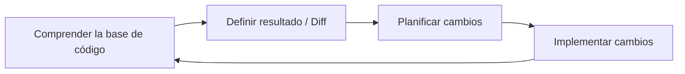
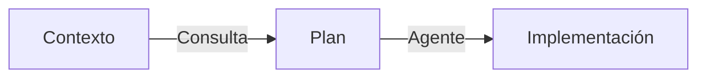
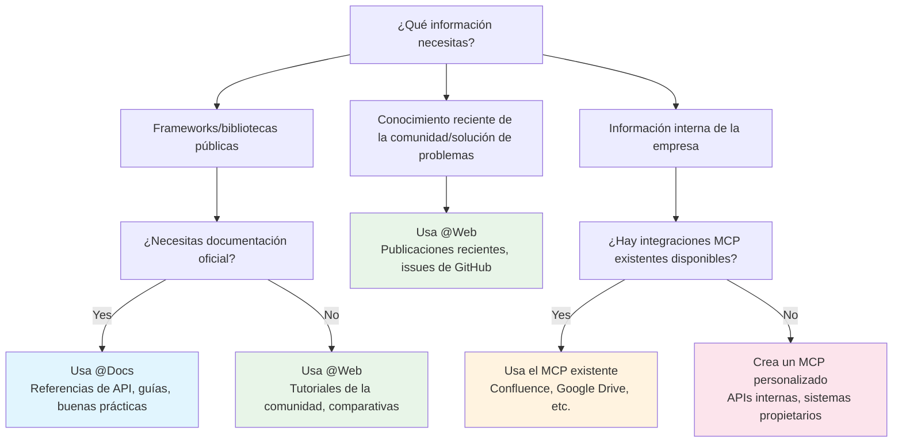
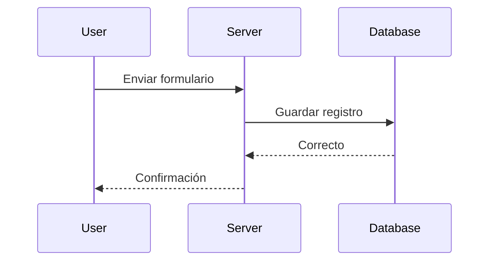
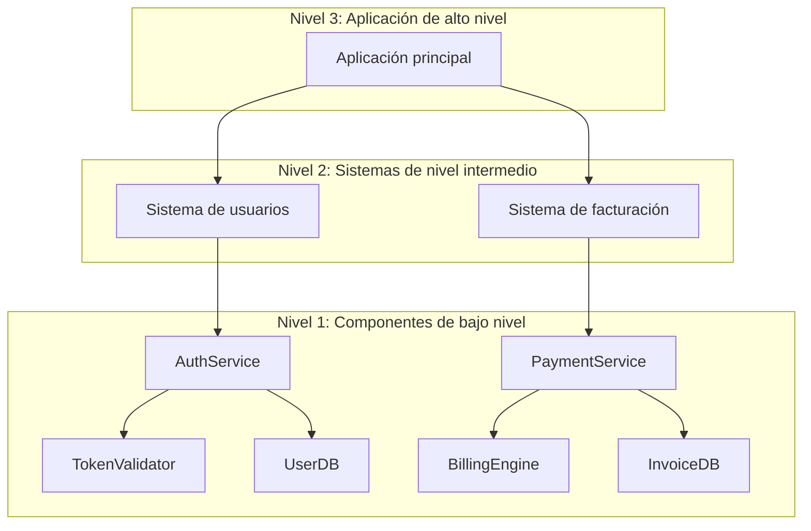
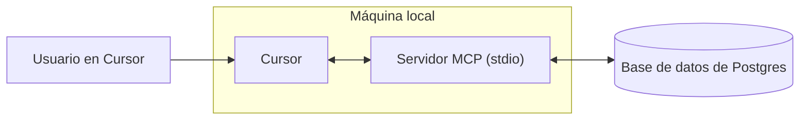
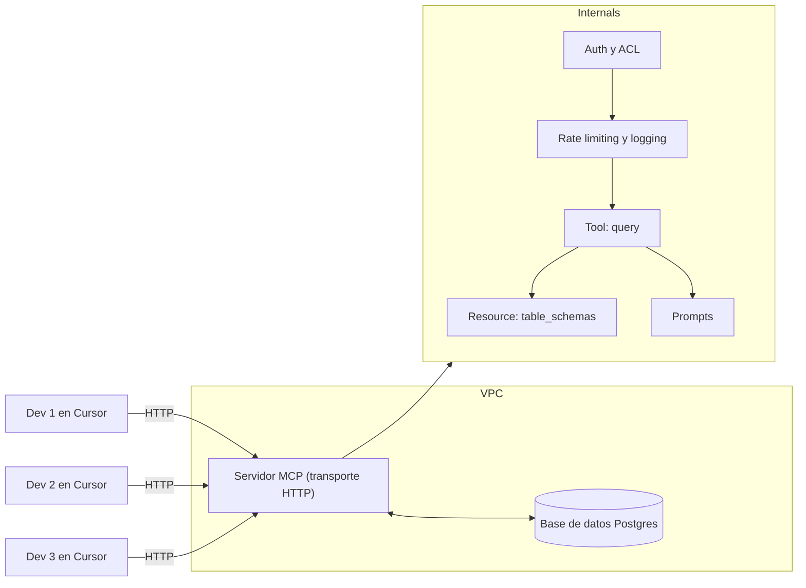
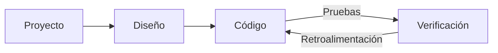
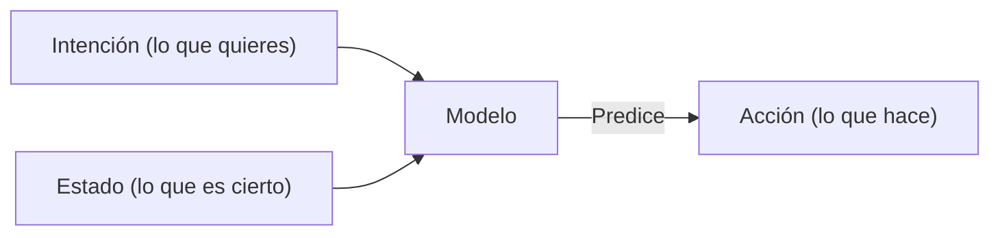

# Large Codebases

**Navigation:** [← Previous](./09-code-review.md) | [Index](./index.md) | [Next →](./11-desarrolladores.md)

---

# Large Codebases
Source: https://docs.cursor.com/es/guides/advanced/large-codebases

Cómo trabajar con bases de código grandes en Cursor

Trabajar con bases de código grandes introduce un conjunto distinto de desafíos frente a los proyectos más pequeños. A partir de nuestra experiencia escalando la base de código de Cursor y de los aprendizajes de clientes que gestionan bases masivas, descubrimos patrones útiles para manejar la complejidad creciente.

En esta guía, vamos a recorrer algunas de las técnicas que nos han resultado útiles para bases de código grandes.



<div id="use-chat-to-quickly-get-up-to-speed-on-unfamiliar-code">
  # Usa Chat para ponerte al día rápidamente con código que no conoces
</div>

Recorrer una base de código grande, sobre todo si es nueva para ti, puede ser todo un reto. A menudo haces grep, buscas y haces clic por todas partes para dar con las partes específicas que necesitas. Con [Chat](/es/chat/overview), puedes empezar a hacer preguntas para encontrar lo que buscas y obtener una explicación detallada de cómo funciona.

Aquí pedimos ayuda para encontrar detalles de implementación del indexado de la base de código en Cursor, e incluso solicitamos algunos ejemplos para que sea más fácil de entender.

<Frame>
  <video src="https://mintcdn.com/cursor/E7JVsKUF5L-IiJRB/images/guides/advanced/large-codebases/qa.mp4?fit=max&auto=format&n=E7JVsKUF5L-IiJRB&q=85&s=d749be91cb35a3d13fa9df4210622029" controls data-path="images/guides/advanced/large-codebases/qa.mp4" />
</Frame>

<div id="write-rules-for-domain-specific-knowledge">
  # Escribe reglas para el conocimiento específico del dominio
</div>

Si estuvieras incorporando a un nuevo colaborador a tu base de código, ¿qué contexto le darías para asegurarte de que pueda empezar a hacer contribuciones significativas?

Tu respuesta a esta pregunta probablemente sea información valiosa para que Cursor también la entienda. En cada organización o proyecto hay conocimiento latente que puede no estar completamente reflejado en tu documentación. Usar reglas de forma efectiva es la mejor manera de asegurarte de que Cursor tenga el panorama completo.

Por ejemplo, si estás escribiendo instrucciones sobre cómo implementar una nueva funcionalidad o servicio, considera escribir una regla breve para documentarlo para la posteridad.

```mdc Plantilla theme={null}
---
description: Agrega un nuevo servicio de frontend de VSCode
---

1. **Definición de la interfaz:**
   - Define una nueva interfaz de servicio con `createDecorator` y asegúrate de incluir `_serviceBrand` para evitar errores.

2. **Implementación del servicio:**
   - Implementa el servicio en un nuevo archivo de TypeScript, extiende `Disposable` y regístralo como singleton con `registerSingleton`.

3. **Contribución del servicio:**
   - Crea un archivo de contribución para importar y cargar el servicio y regístralo en el punto de entrada principal.

4. **Integración en el contexto:**
   - Actualiza el contexto para incluir el nuevo servicio y permitir su acceso en toda la aplicación.
```

Si hay patrones de formato comunes que quieres que Cursor respete, considera autoadjuntar reglas basadas en patrones glob.

```mdc Formato theme={null}
---
globs: *.ts
---
- Usa bun como gestor de paquetes. Consulta [package.json](mdc:backend/reddit-eval-tool/package.json) para ver los scripts
- Usa kebab-case para los nombres de archivos
- Usa camelCase para los nombres de funciones y variables
- Usa UPPERCASE_SNAKE_CASE para las constantes codificadas de forma fija
- Prefiere `function foo()` en lugar de `const foo = () =>`
- Usa `Array<T>` en lugar de `T[]`
- Usa exportaciones con nombre en lugar de exportaciones por defecto, p. ej. (`export const variable ...`, `export function `)
```

<div id="stay-close-to-the-plan-creation-process">
  # Mantente cerca del proceso de creación del plan
</div>

Para cambios más grandes, dedicar más reflexión de lo habitual para crear un plan preciso y bien acotado puede mejorar significativamente los resultados de Cursor.

Si ves que no estás obteniendo el resultado que quieres tras algunas variaciones del mismo prompt, considera tomar perspectiva y crear un plan más detallado desde cero, como si estuvieras redactando un PRD para un compañero. A menudo **lo difícil es decidir qué** cambio se debe hacer, una tarea muy adecuada para las personas. Con las instrucciones correctas, podemos delegar algunas partes de la implementación a Cursor.

Una forma de usar la IA para fortalecer el proceso de creación del plan es usar el modo Ask. Para crear un plan, activa el modo Ask en Cursor y vuelca cualquier contexto que tengas de tus sistemas de gestión de proyectos, documentación interna o ideas sueltas. Piensa en qué archivos y dependencias tienes en el código base que ya sabes que quieres incluir. Puede ser un archivo que contenga fragmentos de código con los que quieras integrarte o, quizá, una carpeta completa.

Aquí tienes un ejemplo de prompt:

```mdc Indicaciones de planificación theme={null}
- crea un plan sobre cómo deberíamos implementar una nueva feature (igual que @existingfeature.ts)
- hazme preguntas (máx. 3) si algo no está claro
- asegúrate de buscar en el codebase

@Chats anteriores (mis prompts de exploración previos)

aquí tienes más contexto de [project management tool]:
[descripción del ticket pegada]
```

Le estamos pidiendo al modelo que elabore un plan y reúna contexto haciendo preguntas a la persona, referenciando cualquier prompt de exploración anterior y también las descripciones del ticket. Se recomienda usar un modelo de razonamiento como `claude-3.7-sonnet`, `gemini-2.5-pro` u `o3`, ya que pueden comprender la intención del cambio y sintetizar un plan de manera más efectiva.

A partir de esto, podés ir formulando el plan de manera iterativa con la ayuda de Cursor antes de iniciar la implementación.



<div id="pick-the-right-tool-for-the-job">
  # Elige la herramienta adecuada para la tarea
</div>

Una de las habilidades más importantes para usar Cursor de forma efectiva es elegir la herramienta adecuada para la tarea. Piensa en lo que quieres lograr y elige el enfoque que te mantenga en flow.

| **Tool**                                    | **Use case**                   | **Strength**                                        | **Limitation**                      |
| :------------------------------------------ | :----------------------------- | :-------------------------------------------------- | :---------------------------------- |
| **[Tab](/es/tab/overview)**                 | Cambios rápidos y manuales     | Control total, muy rápido                           | Un solo archivo                     |
| **[Inline Edit](/es/inline-edit/overview)** | Cambios acotados en un archivo | Ediciones focalizadas                               | Un solo archivo                     |
| **[Chat](/es/chat/overview)**               | Cambios grandes multiarchivo   | Reúne contexto automáticamente, ediciones profundas | Más lento, dependiente del contexto |

Cada herramienta tiene su punto ideal:

* Tab es tu opción para ediciones rápidas cuando quieres ir al volante
* Inline Edit brilla cuando necesitas hacer cambios puntuales en una sección específica del código
* Chat es perfecto para esos cambios más grandes donde necesitas que Cursor entienda el contexto más amplio

Cuando uses el modo Chat (que puede sentirse un poco más lento pero es increíblemente potente), ayúdalo dándole buen contexto. Usa [@files](/es/context/@-symbols/@-files) para señalar código similar que quieras emular, o [@folder](/es/context/@-symbols/@-folders) para darle un mejor entendimiento de la estructura de tu proyecto. Y no tengas miedo de dividir cambios más grandes en partes más pequeñas: empezar chats nuevos ayuda a mantener todo enfocado y eficiente.

<div id="takeaways">
  # Conclusiones
</div>

* Acota los cambios y no intentes hacer demasiado de una vez
* Incluye el contexto relevante cuando puedas
* Usa Chat, Inline Edit y Tab para lo que mejor se les da
* Crea chats nuevos con frecuencia
* Planifica con [Ask mode](/es/chat/ask) e implementa con [Agent mode](/es/chat/agent)


# Trabajar con la documentación
Source: https://docs.cursor.com/es/guides/advanced/working-with-documentation

Cómo sacar el máximo partido a la documentación en Cursor mediante indicaciones, fuentes externas y contexto interno

export const ChatInput = ({content = []}) => {
  const renderContent = () => {
    return content.map((item, index) => {
      if (item.type === 'mention') {
        return <span key={index} className="mention bg-blue-500/20 px-1 py-0.5 rounded-sm">
                        {item.text}
                    </span>;
      }
      return item.text;
    });
  };
  return <>
            <div className="flex flex-col items-stretch border border-neutral-500 rounded-lg p-3 gap-2 bg-neutral-800 relative transition-all duration-100 ease-in-out hover:border-neutral-500">
                <div className="flex flex-col gap-1">
                    <div className="flex flex-col gap-1 outline-none overflow-hidden">
                        <div className="flex-1 flex items-center gap-2">
                            <div className="w-full box-border max-h-10 overflow-hidden">
                                <div className="flex items-center gap-2 w-full flex-nowrap">
                                    <div className="cursor-pointer flex items-center justify-center p-1 h-5 w-5 rounded border border-neutral-600 outline-none flex-shrink-0 hover:bg-neutral-700 bg-neutral-750">
                                        <span className="text-neutral-400 text-sm font-semibold">@</span>
                                    </div>
                                </div>
                            </div>
                        </div>
                    </div>
                </div>

                <div className="relative pt-0">
                    <div className="min-h-6 w-full max-h-60">
                        <div className="relative overflow-y-hidden w-full">
                            <div className="w-full flex flex-wrap overflow-hidden min-h-6">
                                <div className="inline-block w-full min-h-full">
                                    <div className="w-full overflow-visible h-full min-h-6">
                                        <div className="grid relative grid-cols-1 w-full">

                                            <div className="leading-6 text-sm text-neutral-200 bg-transparent block break-words p-0 whitespace-pre-wrap font-medium min-h-6">
                                                {content.length > 0 ? renderContent() : <span className="text-neutral-500">Plan, search, build anything</span>}
                                            </div>

                                        </div>
                                    </div>
                                </div>
                            </div>
                        </div>
                    </div>

                    <div className="flex items-center justify-between gap-3 flex-shrink-0 mt-6">
                        <div className="flex-1 w-full h-full flex items-center flex-col gap-1">
                            <div className="flex items-center justify-between gap-2 flex-shrink-0 w-full">
                                <div className="flex items-center justify-between w-full">
                                    <div className="flex items-center gap-3 flex-shrink min-w-0">
                                        <div className="flex gap-1 text-xs items-center min-w-0 max-w-full px-1.5 py-0.5 flex-shrink-0 cursor-pointer bg-neutral-700 hover:bg-neutral-600 rounded-full">
                                            <div className="flex items-center gap-1 min-w-0 max-w-full overflow-hidden">
                                                <div className="text-xs flex-shrink-0 w-3 h-3 flex items-center justify-center text-neutral-400">
                                                    ∞
                                                </div>
                                                <div className="min-w-0 max-w-full overflow-hidden text-ellipsis whitespace-nowrap flex items-center gap-1 font-medium">
                                                    <span className="text-neutral-300">Agent</span>
                                                    <span className="text-neutral-500 text-[10px]">⌘I</span>
                                                </div>
                                                <Icon icon="chevron-down" size={6} color="currentColor" />
                                            </div>
                                        </div>

                                        <div className="flex gap-2 text-xs items-center cursor-pointer min-w-0 max-w-full px-0 py-1 opacity-90 rounded hover:text-neutral-200">
                                            <div className="flex items-center gap-2 min-w-0 max-w-full overflow-x-hidden">
                                                <div className="min-w-0 text-ellipsis whitespace-nowrap text-neutral-300 flex items-center gap-2 overflow-hidden">
                                                    <div className="overflow-hidden inline-flex gap-2 items-center">
                                                        <span className="whitespace-nowrap overflow-x-hidden text-ellipsis text-xs">
                                                            Auto
                                                        </span>
                                                    </div>
                                                </div>
                                                <Icon icon="chevron-down" size={8} color="currentColor" />
                                            </div>
                                        </div>
                                    </div>

                                    <div className="flex items-center gap-3 justify-end">
                                        <button className="bg-white/80 border-none text-neutral-500 flex w-5 h-5 items-center justify-center hover:text-neutral-400 hover:bg-white/90 rounded-full disabled:opacity-50" disabled={content.length === 0 || !content.some(item => item.text.trim())}>
                                            <span className="text-sm">↑</span>
                                        </button>
                                    </div>
                                </div>
                            </div>
                        </div>
                    </div>
                </div>
            </div>
        </>;
};

<div id="why-documentation-matters">
  # Por qué la documentación importa
</div>

La documentación proporciona contexto actualizado y preciso. Sin ella, los modelos usan datos de entrenamiento obsoletos o incompletos. La documentación ayuda a los modelos a entender cosas como:

* APIs y parámetros vigentes
* Mejores prácticas
* Convenciones de la organización
* Terminología del dominio

Y mucho más. Sigue leyendo para aprender a usar la documentación directamente en Cursor sin tener que cambiar de contexto.

<div id="model-knowledge-cutoff">
  ## Límite de conocimiento del modelo
</div>

Los modelos de lenguaje grandes se entrenan con datos hasta un punto específico en el tiempo, llamado "límite de conocimiento". Esto implica:

* Es posible que las actualizaciones recientes de bibliotecas no estén reflejadas
* Es probable que frameworks o herramientas nuevos no sean conocidos
* Los cambios de API posteriores a la fecha de corte no se contemplan
* Las buenas prácticas pueden haber evolucionado desde el entrenamiento

Por ejemplo, si el límite de conocimiento de un modelo es a inicios de 2024, no conocerá funciones lanzadas a finales de 2024, incluso en frameworks populares.

<div id="which-tool-should-i-use">
  # ¿Qué herramienta debería usar?
</div>

Usa este árbol de decisión para determinar rápidamente el mejor enfoque para tus necesidades de documentación:



<div id="mental-model">
  ## Modelo mental
</div>

<div className="full-width-table">
  | Herramienta | Modelo mental                                |
  | ----------- | -------------------------------------------- |
  | **`@Docs`** | Como navegar y leer la documentación oficial |
  | **`@Web`**  | Como buscar soluciones en internet           |
  | **MCP**     | Como acceder a tu documentación interna      |
</div>

<div id="public-documentation">
  # Documentación pública
</div>

La documentación externa abarca información pública sobre la que los modelos pueden tener un conocimiento limitado o desactualizado. Cursor ofrece dos formas principales de acceder a esta información.

<div id="using-docs">
  ## Uso de @Docs
</div>

`@Docs` conecta Cursor con la documentación oficial de herramientas y frameworks populares. Úsalo cuando necesites información actual y autorizada sobre:

* **Referencias de API**: Firmas de funciones, parámetros, tipos de retorno
* **Guías de introducción**: Configuración, ajustes, uso básico
* **Mejores prácticas**: Patrones recomendados por la fuente oficial
* **Depuración específica de frameworks**: Guías oficiales de solución de problemas

<ChatInput
  content={[
{ type: 'mention', text: '@Docs Next.js' },
{ type: 'text', text: ' How do I set up dynamic routing with catch-all routes?' }
]}
/>

<div id="using-web">
  ## Uso de @Web
</div>

`@Web` busca en la web información actual, entradas de blog y discusiones de la comunidad. Úsalo cuando necesites:

* **Tutoriales recientes**: contenido y ejemplos generados por la comunidad
* **Comparaciones**: artículos que comparan diferentes enfoques
* **Novedades recientes**: actualizaciones o anuncios muy recientes
* **Múltiples perspectivas**: distintos enfoques para resolver problemas

<ChatInput
  content={[
{ type: 'mention', text: '@Web' },
{ type: 'text', text: ' latest performance optimizations for React 19' }
]}
/>

<div id="internal-documentation">
  # Documentación interna
</div>

La documentación interna incluye información específica de tu organización que los modelos de IA nunca han visto durante su entrenamiento. Esto puede incluir:

* **APIs internas**: Servicios y microservicios personalizados
* **Estándares de la empresa**: Convenciones de codificación, patrones de arquitectura
* **Sistemas propietarios**: Herramientas, bases de datos y flujos de trabajo personalizados
* **Conocimiento del dominio**: Lógica de negocio, requisitos de cumplimiento normativo

<div id="accessing-internal-docs-with-mcp">
  ## Acceder a documentación interna con MCP
</div>

Model Context Protocol (MCP) proporciona una forma estandarizada de incorporar tu documentación y sistemas privados en Cursor. MCP actúa como una capa ligera entre Cursor y tus recursos internos.

**Por qué MCP importa:**

* Los modelos no pueden adivinar tus convenciones internas
* La documentación de las APIs de servicios personalizados no está disponible públicamente
* La lógica de negocio y el conocimiento del dominio son exclusivos de tu organización
* Los requisitos de cumplimiento y seguridad varían según la empresa

<div id="common-mcp-integrations">
  ### Integraciones comunes de MCP
</div>

| Integración      | Acceso                                 | Ejemplos                                                                                                                                        |
| ---------------- | -------------------------------------- | ----------------------------------------------------------------------------------------------------------------------------------------------- |
| **Confluence**   | Espacios de Confluence de la empresa   | Documentación de arquitectura, especificaciones de API para servicios internos, estándares y guías de codificación, documentación de procesos   |
| **Google Drive** | Documentos y carpetas compartidos      | Documentos de especificación, notas de reuniones y registros de decisiones, documentos de diseño y requisitos, bases de conocimiento del equipo |
| **Notion**       | Bases de datos y páginas del workspace | Documentación de proyectos, wikis de equipo, bases de conocimiento, requisitos de producto, especificaciones técnicas                           |
| **Custom**       | Sistemas y bases de datos internos     | APIs propietarias, sistemas de documentación heredados, bases de conocimiento personalizadas, herramientas y flujos de trabajo especializados   |

<div id="custom-solutions">
  #### Soluciones personalizadas
</div>

Para necesidades específicas, puedes crear servidores MCP personalizados que:

* Hagan scraping de sitios web o portales internos
* Se conecten a bases de datos propietarias
* Accedan a sistemas de documentación personalizados
* Extraigan información de wikis internos o bases de conocimiento

<Tip>Si creas un servidor MCP personalizado, también puedes exponer herramientas para que Cursor actualice la documentación</Tip>

Ejemplo de servidor MCP personalizado para hacer scraping de documentación interna:

<CodeGroup>
  ```javascript TypeScript theme={null}
  import { McpServer, ResourceTemplate } from "@modelcontextprotocol/sdk/server/mcp.js";
  import { StdioServerTransport } from "@modelcontextprotocol/sdk/server/stdio.js";
  import { z } from "zod";
  import TurndownService from "turndown";

  // Create an MCP server for scraping internal docs
  const server = new McpServer({
    name: "internal-docs",
    version: "1.0.0"
  });

  const turndownService = new TurndownService();

  // Add tool to scrape internal documentation
  server.tool("get_doc",
    { url: z.string() },
    async ({ url }) => {
      try {
        const response = await fetch(url);
        const html = await response.text();
        
        // Convert HTML to markdown
        const markdown = turndownService.turndown(html);
        
        return {
          content: [{ type: "text", text: markdown }]
        };
      } catch (error) {
        return {
          content: [{ type: "text", text: `Error scraping ${url}: ${error.message}` }]
        };
      }
    }
  );

  // Start receiving messages on stdin and sending messages on stdout
  const transport = new StdioServerTransport();
  await server.connect(transport);
  ```

  ```python Python theme={null}
  # server.py
  import os
  import asyncio
  from mcp.server.fastmcp import FastMCP
  import aiohttp
  from markdownify import markdownify as md

  # Create an MCP server for scraping internal docs
  mcp = FastMCP("internal-docs")

  @mcp.tool()
  async def get_doc(url: str) -> dict:
      """Scrape internal documentation from a URL"""
      try:
          async with aiohttp.ClientSession() as session:
              async with session.get(url) as response:
                  html = await response.text()
          
          # Convert HTML to markdown
          markdown = md(html)
          
          return {
              "content": [{"type": "text", "text": markdown}]
          }
      except Exception as error:
          return {
              "content": [{"type": "text", "text": f"Error scraping {url}: {str(error)}"}]
          }
  ```
</CodeGroup>

<div id="keeping-docs-up-to-date">
  # Mantener la documentación actualizada
</div>

La documentación se queda obsoleta rápido. Cursor puede ayudarte a mantenerla al día y útil, generándola y actualizándola a partir de tu código real y de tus conversaciones de desarrollo.

<div id="from-existing-code">
  ## Desde código existente
</div>

Usa Cursor para generar documentación directamente desde tu código:

<Tabs>
  <Tab title="Documentación de API">
    <ChatInput
      content={[
    { type: 'text', text: 'Genera documentación de la API para este router de Express, incluyendo todos los endpoints, parámetros y formatos de respuesta' }
  ]}
    />
  </Tab>

  <Tab title="Comentarios JSDoc">
    <ChatInput
      content={[
    { type: 'text', text: 'Agrega comentarios JSDoc detallados a esta clase, documentando todos los métodos y sus parámetros' }
  ]}
    />
  </Tab>

  <Tab title="Creación de README">
    <ChatInput
      content={[
    { type: 'text', text: 'Crea un README para este proyecto que incluya instrucciones de instalación, ejemplos de uso y una visión general de la API' }
  ]}
    />
  </Tab>
</Tabs>

<div id="from-chat-sessions">
  ## Desde sesiones de chat
</div>

Tus conversaciones con Cursor contienen información valiosa que puede convertirse en documentación.

<Tabs>
  <Tab title="Resolución de problemas">
    **Después de resolver un problema complejo:**

    <ChatInput
      content={[
    { type: 'text', text: 'Resume nuestra conversación sobre cómo configurar la autenticación en una guía paso a paso para el wiki del equipo' }
  ]}
    />
  </Tab>

  <Tab title="Arquitectura">
    **Después de tomar decisiones de arquitectura:**

    <ChatInput
      content={[
    { type: 'text', text: 'Crea documentación que explique por qué elegimos este diseño de base de datos, incluyendo los compromisos que discutimos' }
  ]}
    />
  </Tab>

  <Tab title="Depuración">
    **Después de sesiones de depuración:**

    <ChatInput
      content={[
    { type: 'text', text: 'Escribe una guía de solución de problemas basada en este bug que acabamos de corregir, incluyendo los síntomas y los pasos para resolverlo' }
  ]}
    />
  </Tab>
</Tabs>

<div id="takeaways">
  ## Puntos clave
</div>

* Usar la documentación como contexto hace que Cursor sea más preciso y esté al día
* Usa `@Docs` para la documentación oficial y `@Web` para el conocimiento de la comunidad
* MCP conecta Cursor con tus sistemas internos
* Genera documentación a partir del código y las conversaciones para mantener el conocimiento actualizado
* Combina documentación externa e interna para una comprensión completa


# Java
Source: https://docs.cursor.com/es/guides/languages/java

Configura el desarrollo en Java con el JDK, extensiones y herramientas de build

Esta guía te ayuda a configurar Cursor para desarrollar en Java: preparar el JDK, instalar extensiones necesarias, depurar, ejecutar aplicaciones Java e integrar herramientas de build como Maven y Gradle. También cubre funciones de flujo de trabajo similares a IntelliJ o VS Code.

<Note>
  Antes de empezar, asegúrate de tener Cursor instalado y actualizado a la última versión.
</Note>

<div id="setting-up-java-for-cursor">
  ## Configurar Java para Cursor
</div>

<div id="java-installation">
  ### Instalación de Java
</div>

Antes de configurar Cursor, necesitas tener Java instalado en tu equipo.

<Warning>
  Cursor no incluye un compilador de Java, así que necesitas instalar un JDK si
  aún no lo tienes.
</Warning>

<CardGroup cols={1}>
  <Card title="Instalación en Windows" icon="windows">
    Descarga e instala un JDK (p. ej., OpenJDK, Oracle JDK, Microsoft Build of
    OpenJDK).

    <br />

    Configura JAVA\_HOME y agrega JAVA\_HOME\bin a tu PATH.
  </Card>

  <Card title="Instalación en macOS" icon="apple">
    Instala con Homebrew (`brew install openjdk`) o descarga un instalador.

    <br />

    Asegúrate de que JAVA\_HOME apunte al JDK instalado.
  </Card>

  <Card title="Instalación en Linux" icon="linux">
    Usa tu gestor de paquetes (`sudo apt install openjdk-17-jdk` o equivalente)
    o instala con SDKMAN.
  </Card>
</CardGroup>

Para comprobar la instalación, ejecuta:

```bash  theme={null}
java -version
javac -version
```

<Info>
  Si Cursor no detecta tu JDK, configúralo manualmente en settings.json:
</Info>

```json  theme={null}
{
  "java.jdt.ls.java.home": "/path/to/jdk",
  "java.configuration.runtimes": [
    {
      "name": "JavaSE-17",
      "path": "/path/to/jdk-17",
      "default": true
    }
  ]
}
```

<Warning>Reinicia Cursor para aplicar los cambios.</Warning>

<div id="cursor-setup">
  ### Configuración de Cursor
</div>

<Info>Cursor es compatible con extensiones de VS Code. Instala las siguientes manualmente:</Info>

<CardGroup cols={2}>
  <Card title="Extension Pack for Java" icon="java" href="cursor:extension/vscjava.vscode-java-pack">
    Incluye soporte para el lenguaje Java, depurador, ejecutor de pruebas, soporte para Maven y
    administrador de proyectos
  </Card>

  <Card title="Gradle for Java" icon="gears" href="cursor:extension/vscjava.vscode-gradle">
    Esencial para trabajar con el sistema de compilación Gradle
  </Card>

  <Card title="Spring Boot Extension Pack" icon="leaf" href="cursor:extension/vmware.vscode-boot-dev-pack">
    Requisito para el desarrollo con Spring Boot
  </Card>

  <Card title="Kotlin" icon="window" href="cursor:extension/fwcd.kotlin">
    Necesario para el desarrollo de aplicaciones en Kotlin
  </Card>
</CardGroup>

<div id="configure-build-tools">
  ### Configurar herramientas de compilación
</div>

<div id="maven">
  #### Maven
</div>

Asegúrate de que Maven esté instalado (`mvn -version`). Instálalo desde [maven.apache.org](https://maven.apache.org/download.cgi) si es necesario:

1. Descarga el archivo binario
2. Extráelo en la ubicación deseada
3. Configura la variable de entorno MAVEN\_HOME al directorio extraído
4. Agrega %MAVEN\_HOME%\bin (Windows) o \$MAVEN\_HOME/bin (Unix) al PATH

<div id="gradle">
  #### Gradle
</div>

Asegúrate de que Gradle esté instalado (`gradle -version`). Instálalo desde [gradle.org](https://gradle.org/install/) si es necesario:

1. Descarga la distribución binaria
2. Extráela en la ubicación deseada
3. Configura la variable de entorno GRADLE\_HOME al directorio extraído
4. Agrega %GRADLE\_HOME%\bin (Windows) o \$GRADLE\_HOME/bin (Unix) al PATH

Como alternativa, usa el Gradle Wrapper, que descargará y usará automáticamente la versión correcta de Gradle:

<div id="running-and-debugging">
  ## Ejecución y depuración
</div>

Ahora que ya está todo listo, es momento de ejecutar y depurar tu código Java.
Según lo que necesites, podés usar los siguientes métodos:

<CardGroup cols={2}>
  <Card title="Run" icon="play">
    Hacé clic en el enlace "Run" que aparece sobre cualquier método main para ejecutar
    tu programa rápidamente
  </Card>

  <Card title="Debug" icon="bug">
    Abrí el panel lateral "Run and Debug" y usá el botón "Run" para iniciar tu
    aplicación
  </Card>
</CardGroup>

<CardGroup cols={1}>
  <Card title="Terminal" icon="terminal">
    Ejecutá desde la línea de comandos usando Maven o Gradle
  </Card>

  <Card title="Spring Boot" icon="leaf">
    Iniciá aplicaciones Spring Boot directamente desde la extensión "Spring Boot Dashboard"
  </Card>
</CardGroup>

<div id="java-x-cursor-workflow">
  ## Flujo de trabajo de Java x Cursor
</div>

Las funciones con IA de Cursor pueden mejorar significativamente tu flujo de trabajo de desarrollo en Java. Aquí tienes algunas formas de aprovechar las capacidades de Cursor específicamente para Java:

<CardGroup cols={2}>
  <Card title="Tab Completion" icon="arrow-right">
    <div className="text-sm">
      Completado inteligente para métodos, firmas y boilerplate de Java como
      getters/setters.
    </div>
  </Card>

  <Card title="Agent Mode" icon="pen-to-square">
    <div className="text-sm">
      Implementa patrones de diseño, refactoriza código o genera clases con
      la herencia adecuada.
    </div>
  </Card>

  <Card title="Inline Edit" icon="code">
    <div className="text-sm">
      Ediciones rápidas en línea en métodos, corrige errores o genera pruebas unitarias sin
      romper el flujo.
    </div>
  </Card>

  <Card title="Chat" icon="message">
    <div className="text-sm">
      Obtén ayuda con conceptos de Java, depura excepciones o comprende características de
      frameworks.
    </div>
  </Card>
</CardGroup>

<div id="example-workflows">
  ### Flujos de trabajo de ejemplo
</div>

1. **Generar boilerplate de Java**\
   Usa [Tab completion](/es/tab/overview) para generar rápidamente constructores, getters/setters, métodos equals/hashCode y otros patrones repetitivos de Java.

2. **Depurar excepciones complejas de Java**\
   Cuando te encuentres con un stack trace críptico de Java, selecciónalo y usa [Ask](/es/chat/overview) para explicar la causa raíz y sugerir posibles soluciones.

3. **Refactorizar código legado de Java**\
   Usa [Agent mode](/es/chat/agent) para modernizar código antiguo de Java: convierte clases anónimas en lambdas, actualiza a nuevas características del lenguaje Java o implementa patrones de diseño.

4. **Desarrollo con frameworks**\
   Agrega tu documentación al contexto de Cursor con @docs y genera código específico del framework en todo Cursor.


# JavaScript & TypeScript
Source: https://docs.cursor.com/es/guides/languages/javascript

Desarrollo de JavaScript y TypeScript con soporte para frameworks

¡Bienvenido al desarrollo de JavaScript y TypeScript en Cursor! El editor ofrece soporte excepcional para el desarrollo en JS/TS a través de su ecosistema de extensiones. Esto es lo que necesitas saber para sacarle el máximo partido a Cursor.

<div id="essential-extensions">
  ## Extensiones esenciales
</div>

Aunque Cursor funciona muy bien con cualquier extensión que prefieras, recomendamos estas si apenas estás empezando:

* **ESLint** - Necesario para las funciones de corrección de lint con IA de Cursor
* **JavaScript and TypeScript Language Features** - Compatibilidad de lenguaje e IntelliSense mejoradas
* **Path Intellisense** - Autocompletado inteligente de rutas de archivos

<div id="cursor-features">
  ## Funciones de Cursor
</div>

Cursor potencia tu flujo de trabajo en JavaScript/TypeScript con:

* **Tab Completions**: autocompletados con contexto que entienden la estructura de tu proyecto
* **Automatic Imports**: Tab puede importar bibliotecas automáticamente en cuanto las usas
* **Inline Editing**: usa `CMD+K` en cualquier línea para editar con sintaxis perfecta
* **Composer Guidance**: planifica y edita tu código en múltiples archivos con el Composer

<div id="framework-intelligence-with-docs">
  ### Inteligencia de frameworks con @Docs
</div>

La función @Docs de Cursor te permite potenciar tu desarrollo en JavaScript agregando fuentes de documentación personalizadas que la IA puede consultar. Agrega documentación de MDN, Node.js o tu framework favorito para obtener sugerencias de código más precisas y con más contexto.

<Card title="Learn more about @Docs" icon="book" href="/es/context/@-symbols/@-docs">
  Descubre cómo agregar y gestionar fuentes de documentación personalizadas en Cursor.
</Card>

<div id="automatic-linting-resolution">
  ### Resolución automática de lint
</div>

Una de las funciones destacadas de Cursor es su integración fluida con extensiones de linters.
Asegúrate de tener configurado un linter, como ESLint, y habilita la opción "Iterate on Lints".

Luego, cuando uses el modo Agent en Composer, una vez que la IA haya intentado responder tu consulta y haya realizado cambios en el código, leerá automáticamente la salida del linter e intentará corregir cualquier error de lint que quizá no haya detectado.

<div id="framework-support">
  ## Compatibilidad con frameworks
</div>

Cursor funciona sin problemas con los principales frameworks y librerías de JavaScript, como:

### React & Next.js

* Soporte completo para JSX/TSX con sugerencias inteligentes de componentes
* Inteligencia para server components y rutas de API en Next.js
* Recomendado: extensión [**React Developer Tools**](cursor:extension/msjsdiag.vscode-react-native)

<div id="vuejs">
  ### Vue.js
</div>

* Soporte de sintaxis de plantillas con integración de Volar
* Autocompletado de componentes y comprobación de tipos
* Recomendado: [**Vue Language Features**](cursor:extension/vue.volar)

<div id="angular">
  ### Angular
</div>

* Validación de plantillas y soporte para decoradores de TypeScript
* Generación de componentes y servicios
* Recomendado: [**Angular Language Service**](cursor:extension/Angular.ng-template)

<div id="svelte">
  ### Svelte
</div>

* Resaltado de sintaxis de componentes y sugerencias inteligentes
* Sugerencias para sentencias reactivas y stores
* Recomendado: [**Svelte for VS Code**](cursor:extension/svelte.svelte-vscode)

<div id="backend-frameworks-expressnestjs">
  ### Frameworks de backend (Express/NestJS)
</div>

* Inteligencia para rutas y middleware
* Soporte para decoradores de TypeScript en NestJS
* Integración con herramientas de prueba de APIs

Recuerda: las funciones de IA de Cursor funcionan bien con todos estos frameworks, entienden sus patrones y mejores prácticas para ofrecer sugerencias relevantes. La IA puede ayudarte con todo, desde la creación de componentes hasta refactorizaciones complejas, respetando los patrones existentes de tu proyecto.


# Python
Source: https://docs.cursor.com/es/guides/languages/python

Configura el desarrollo en Python con extensiones y herramientas de linting

<Note>
  Esta guía se inspiró mucho en [Jack Fields](https://x.com/OrdinaryInds)
  y su
  [artículo](https://medium.com/ordinaryindustries/the-ultimate-vs-code-setup-for-python-538026b34d94)
  sobre cómo configurar VS Code para desarrollar en Python. Échale un vistazo a su artículo para
  más detalles.
</Note>

<div id="prerequisites">
  ## Requisitos previos
</div>

Antes de empezar, asegúrate de tener:

* [Python](https://python.org) instalado (se recomienda 3.8 o superior)
* [Git](https://git-scm.com/) para control de versiones
* Cursor instalado y actualizado a la última versión

<div id="essential-extensions">
  ## Extensiones esenciales
</div>

Las siguientes extensiones configuran Cursor para que quede completamente equipado para el desarrollo en Python. Te ofrecen resaltado de sintaxis, linting, depuración y pruebas unitarias.

<CardGroup cols={2}>
  <Card title="Python" icon="python" href="cursor:extension/ms-python.python">
    Compatibilidad básica del lenguaje por parte de Microsoft
  </Card>

  <Card title="Cursor Pyright" icon="bolt" href="cursor:extension/anysphere.cursorpyright">
    Servidor de lenguaje para Python, rápido
  </Card>

  <Card title="Python Debugger" icon="bug" href="cursor:extension/ms-python.debugpy">
    Capacidades de depuración mejoradas
  </Card>

  <Card title="Ruff" icon="wand-magic-sparkles" href="cursor:extension/charliermarsh.ruff">
    Linter y formateador para Python
  </Card>
</CardGroup>

<div id="advanced-python-tooling">
  ### Herramientas avanzadas para Python
</div>

Aunque las extensiones anteriores han sido las más populares para el desarrollo en Python en Cursor, también agregamos algunas adicionales que pueden ayudarte a sacarle el máximo partido a tu desarrollo en Python.

<div id="uv-python-environment-manager">
  #### `uv` - Gestor de entornos de Python
</div>

[uv](https://github.com/astral-sh/uv) es un gestor moderno de paquetes de Python que puede usarse para crear y administrar entornos virtuales, además de reemplazar pip como gestor de paquetes predeterminado.

Para instalar uv, ejecuta el siguiente comando en tu terminal:

```bash  theme={null}
pip install uv
```

<div id="ruff-python-linter-and-formatter">
  #### `ruff` - Linter y formateador de Python
</div>

[Ruff](https://docs.astral.sh/ruff/) es un linter y formateador moderno para Python que podés usar para detectar errores de programación, hacer cumplir estándares de código y sugerir refactorizaciones. Podés usarlo junto con Black para el formateo del código.

Para instalar Ruff, ejecutá el siguiente comando en tu terminal:

```bash  theme={null}
pip install ruff
```

<div id="cursor-configuration">
  ## Configuración de Cursor
</div>

<div id="1-python-interpreter">
  ### 1. Intérprete de Python
</div>

Configura tu intérprete de Python en Cursor:

1. Abre la paleta de comandos (Cmd/Ctrl + Shift + P)
2. Busca "Python: Select Interpreter"
3. Elige tu intérprete de Python (o el entorno virtual si estás usando uno)

<div id="2-code-formatting">
  ### 2. Formateo de código
</div>

Configura el formateo automático de código con Black:

<Note>
  Black es un formateador que aplica automáticamente un estilo consistente a tu código.
  No requiere configuración y está ampliamente adoptado en la comunidad de Python.
</Note>

Para instalar Black, ejecuta el siguiente comando en tu terminal:

```bash  theme={null}
pip install black
```

Luego, configura Cursor para usar Black como formateador de código, agregando lo siguiente a tu archivo `settings.json`:

```json  theme={null}
{
  "python.formatting.provider": "black",
  "editor.formatOnSave": true,
  "python.formatting.blackArgs": ["--line-length", "88"]
}
```

<div id="3-linting">
  ### 3. Linting
</div>

Podemos usar PyLint para detectar errores de programación, hacer cumplir los estándares de código y sugerir refactorizaciones.

Para instalar PyLint, ejecuta el siguiente comando en tu terminal:

```bash  theme={null}
pip install pylint
```

```json  theme={null}
{
  "python.linting.enabled": true,
  "python.linting.pylintEnabled": true,
  "python.linting.lintOnSave": true
}
```

<div id="4-type-checking">
  ### 4. Comprobación de tipos
</div>

Además del linting, podemos usar MyPy para verificar errores de tipo.

Para instalar MyPy, ejecuta el siguiente comando en tu terminal:

```bash  theme={null}
pip install mypy
```

```json  theme={null}
{
  "python.linting.mypyEnabled": true
}
```

<div id="debugging">
  ## Depuración
</div>

Cursor ofrece potentes funciones de depuración para Python:

1. Colocá puntos de interrupción haciendo clic en el gutter
2. Usá el panel Debug (Cmd/Ctrl + Shift + D)
3. Configurá `launch.json` para definir configuraciones de depuración personalizadas

<div id="recommended-features">
  ## Funciones recomendadas
</div>

<CardGroup cols={3}>
  <Card title="Tab Completion" icon="wand-magic-sparkles" href="/es/tab/overview">
    Sugerencias de código inteligentes que entienden lo que haces
  </Card>

  <Card title="Chat" icon="comments" href="/es/chat/overview">
    Explora y comprende el código mediante conversaciones naturales
  </Card>

  <Card title="Agent" icon="robot" href="/es/chat/agent">
    Resuelve tareas de desarrollo complejas con ayuda de IA
  </Card>

  <Card title="Context" icon="network-wired" href="/es/context/model-context-protocol">
    Trae contexto de sistemas de terceros
  </Card>

  <Card title="Auto-Imports" icon="file-import" href="/es/tab/auto-import">
    Importa módulos automáticamente mientras programas
  </Card>

  <Card title="AI Review" icon="check-double" href="/es/tab/overview#quality">
    Cursor revisa tu código constantemente con IA
  </Card>
</CardGroup>

<div id="framework-support">
  ## Compatibilidad con frameworks
</div>

Cursor funciona a la perfección con los frameworks más populares de Python:

* **Frameworks web**: Django, Flask, FastAPI
* **Ciencia de datos**: Jupyter, NumPy, Pandas
* **Aprendizaje automático**: TensorFlow, PyTorch, scikit-learn
* **Pruebas**: pytest, unittest
* **API**: requests, aiohttp
* **Bases de datos**: SQLAlchemy, psycopg2


# iOS y macOS (Swift)
Source: https://docs.cursor.com/es/guides/languages/swift

Integra Cursor con Xcode para desarrollo en Swift

¡Bienvenido al desarrollo de Swift en Cursor! Ya sea que estés creando apps para iOS, aplicaciones para macOS o proyectos de Swift del lado del servidor, te tenemos cubierto. Esta guía te ayudará a configurar tu entorno de Swift en Cursor, empezando por lo básico y pasando a funciones más avanzadas.

<div id="basic-workflow">
  ## Flujo de trabajo básico
</div>

La forma más sencilla de usar Cursor con Swift es tratarlo como tu editor de código principal y seguir usando Xcode para compilar y ejecutar tus apps. Vas a obtener funciones geniales como:

* Autocompletado inteligente de código
* Asistencia de código con IA (prueba [CMD+K](/es/inline-edit/overview) en cualquier línea)
* Acceso rápido a la documentación con [@Docs](/es/context/@-symbols/@-docs)
* Resaltado de sintaxis
* Navegación básica de código

Cuando necesites compilar o ejecutar tu app, simplemente cambia a Xcode. Este flujo de trabajo es perfecto para desarrolladores que quieren aprovechar las capacidades de IA de Cursor mientras se quedan con las herramientas conocidas de Xcode para depuración y distribución.

<div id="hot-reloading">
  ### Recarga en caliente
</div>

Cuando usas workspaces o proyectos de Xcode (en lugar de abrir una carpeta directamente en Xcode), Xcode a menudo puede ignorar cambios en tus archivos que se hicieron en Cursor, o fuera de Xcode en general.

Aunque puedes abrir la carpeta en Xcode para resolver esto, puede que necesites usar un proyecto para tu flujo de trabajo de desarrollo en Swift.

Una gran solución es usar [Inject](https://github.com/krzysztofzablocki/Inject), una librería de recarga en caliente para Swift que permite que tu app haga “hot reload” y se actualice en cuanto detecta cambios, en tiempo real. Esto no sufre los efectos secundarios del problema de los workspaces/proyectos de Xcode y te permite hacer cambios en Cursor y verlos reflejados en tu app al instante.

<CardGroup cols={1}>
  <Card title="Inject - Recarga en caliente para Swift" horizontal icon="fire" href="https://github.com/krzysztofzablocki/Inject">
    Aprende más sobre Inject y cómo usarlo en tus proyectos Swift.
  </Card>
</CardGroup>

<div id="advanced-swift-development">
  ## Desarrollo avanzado con Swift
</div>

<Note>
  Esta sección de la guía está muy inspirada en [Thomas
  Ricouard](https://x.com/Dimillian) y su
  [artículo](https://dimillian.medium.com/how-to-use-cursor-for-ios-development-54b912c23941)
  sobre cómo usar Cursor para desarrollo en iOS. Échale un ojo a su artículo para más
  detalles y síguelo para más contenido sobre Swift.
</Note>

Si quieres tener solo un editor abierto a la vez y evitar cambiar entre Xcode y Cursor, puedes usar una extensión como [Sweetpad](https://sweetpad.hyzyla.dev/) para integrar Cursor directamente con el sistema de compilación de Xcode.

Sweetpad es una extensión potente que te permite compilar, ejecutar y depurar tus proyectos Swift directamente en Cursor, sin renunciar a las funcionalidades de Xcode.

Para empezar con Sweetpad, aún necesitas tener Xcode instalado en tu Mac: es la base del desarrollo con Swift. Puedes descargar Xcode desde la [Mac App Store](https://apps.apple.com/us/app/xcode/id497799835). Una vez que tengas Xcode configurado, vamos a potenciar tu experiencia de desarrollo en Cursor con algunas herramientas esenciales.

Abre tu terminal y ejecuta:

```bash  theme={null}

# Compila tus proyectos sin tener Xcode abierto
brew install xcode-build-server


# Da un formateo limpio a la salida del comando `xcodebuild` en la terminal de Cursor
brew install xcbeautify


# Permite un formateo avanzado y características del lenguaje
brew install swiftformat
```

A continuación, instalá la extensión [Swift Language Support](cursor:extension/chrisatwindsurf.swift-vscode) en Cursor. Te va a dar resaltado de sintaxis y funciones básicas del lenguaje listas para usar.

Después, instalemos la extensión [Sweetpad](https://sweetpad.hyzyla.dev/) para integrar Cursor con Xcode. Sweetpad envuelve varios atajos alrededor de la CLI `xcodebuild` (y mucho más), y te permite escanear tus targets, elegir el destino, compilar y ejecutar tu app igual que en Xcode. Además, configura tu proyecto para Xcode Build Server para que tengas todas las funciones mencionadas arriba.

<div id="sweetpad-usage">
  ### Uso de Sweetpad
</div>

Una vez que tengas Sweetpad instalado y un proyecto Swift abierto en Cursor, primero deberías ejecutar el comando `Sweetpad: Generate Build Server Config`. Esto va a generar un archivo `buildServer.json` en la raíz de tu proyecto que permite que Xcode Build Server funcione con tu proyecto.

Luego, desde el Command Palette o la barra lateral de Sweetpad, podés seleccionar el target que querés compilar y ejecutar.

<Note>
  {" "}

  Necesitás compilar tu proyecto una vez para habilitar el autocompletado, ir a la definición
  y otras funciones del lenguaje.{" "}
</Note>

También podés presionar F5 para compilar y ejecutar tu proyecto con el depurador; quizá necesites crear primero una configuración de lanzamiento, pero simplemente seleccioná Sweetpad de la lista cuando se te indique.

Como con muchas extensiones en Cursor, podés vincular varios comandos de Sweetpad a atajos de teclado para hacer tu flujo de trabajo aún más eficiente.

Para aprender más sobre Sweetpad, mirá estos recursos:

<CardGroup>
  <Card title="Sweetpad Website" horizontal icon="globe" href="https://sweetpad.hyzyla.dev/">
    Sitio oficial de Sweetpad con funciones e instrucciones de instalación
  </Card>

  <Card title="Sweetpad Guide" horizontal icon="book" href="https://sweetpad.hyzyla.dev/docs/intro">
    Guía completa que cubre configuración, uso y funciones avanzadas
  </Card>
</CardGroup>


# JetBrains
Source: https://docs.cursor.com/es/guides/migration/jetbrains

Migra de los IDE de JetBrains a Cursor con herramientas familiares

Cursor ofrece una experiencia de programación moderna con IA que puede reemplazar tus IDE de JetBrains. Aunque el cambio pueda sentirse distinto al principio, la base de Cursor en VS Code ofrece funciones potentes y amplias opciones de personalización.

<div id="editor-components">
  ## Componentes del editor
</div>

<div id="extensions">
  ### Extensiones
</div>

Los IDE de JetBrains son herramientas geniales, ya que vienen preconfigurados para los lenguajes y frameworks para los que están pensados.

Cursor es diferente: como un lienzo en blanco desde el principio, podés personalizarlo a tu gusto, sin estar limitado por los lenguajes y frameworks para los que el IDE fue pensado.

Cursor tiene acceso a un vasto ecosistema de extensiones, y casi todas las funcionalidades (¡y más!) que ofrecen los IDE de JetBrains se pueden recrear mediante estas extensiones.

Mirá algunas de estas extensiones populares a continuación:

<CardGroup cols={4}>
  <Card title="Remote SSH" icon="network-wired" href="cursor:extension/anysphere.remote-ssh">
    Extensión SSH
  </Card>

  <Card title="Project Manager" icon="folder-tree" href="cursor:extension/alefragnani.project-manager">
    Gestioná múltiples proyectos
  </Card>

  <Card title="GitLens" icon="git" href="cursor:extension/eamodio.gitlens">
    Integración de Git mejorada
  </Card>

  <Card title="Local History" icon="clock-rotate-left" href="cursor:extension/xyz.local-history">
    Rastreá cambios locales de archivos
  </Card>

  <Card title="Error Lens" icon="bug" href="cursor:extension/usernamehw.errorlens">
    Resaltado de errores en línea
  </Card>

  <Card title="ESLint" icon="code-compare" href="cursor:extension/dbaeumer.vscode-eslint">
    Linting de código
  </Card>

  <Card title="Prettier" icon="wand-magic-sparkles" href="cursor:extension/esbenp.prettier-vscode">
    Formateo de código
  </Card>

  <Card title="Todo Tree" icon="folder-tree" href="cursor:extension/Gruntfuggly.todo-tree">
    Rastreá TODO y FIXME
  </Card>
</CardGroup>

<div id="keyboard-shortcuts">
  ### Atajos de teclado
</div>

Cursor tiene un gestor de atajos de teclado incorporado que te permite mapear tus atajos favoritos a acciones.

Con esta extensión, podés traer casi todos los atajos de los IDE de JetBrains directamente a Cursor.
Asegurate de leer la documentación de la extensión para aprender cómo configurarla a tu gusto:

<Card title="IntelliJ IDEA Keybindings" icon="keyboard" href="cursor:extension/k--kato.intellij-idea-keybindings">
  Instalá esta extensión para traer los atajos de los IDE de JetBrains a Cursor.
</Card>

<Note>
  Atajos comunes que difieren:

  * Find Action: ⌘/Ctrl+Shift+P  (vs. ⌘/Ctrl+Shift+A)
  * Quick Fix: ⌘/Ctrl+.  (vs. Alt+Enter)
  * Go to File: ⌘/Ctrl+P  (vs. ⌘/Ctrl+Shift+N)
</Note>

<div id="themes">
  ### Temas
</div>

Recreá la apariencia y la sensación de tus IDE favoritos de JetBrains en Cursor con estos temas de la comunidad.

Elegí entre el tema estándar Darcula o seleccioná un tema que coincida con el resaltado de sintaxis de tus herramientas de JetBrains.

<CardGroup cols={1}>
  <Card title="JetBrains - Darcula Theme" icon="moon" horizontal href="cursor:extension/rokoroku.vscode-theme-darcula">
    Experimentá el clásico tema oscuro Darcula de JetBrains
  </Card>
</CardGroup>

<CardGroup cols={2}>
  <Card title="JetBrains PyCharm" icon="python" horizontal href="cursor:extension/gabemahoney.pycharm-dark-theme-for-python" />

  <Card title="IntelliJ" icon="java" horizontal href="cursor:extension/compassak.intellij-idea-new-ui" />

  <Card title="JetBrains Fleet" icon="code" horizontal href="cursor:extension/MichaelZhou.fleet-theme" />

  <Card title="JetBrains Rider" icon="hashtag" horizontal href="cursor:extension/muhammad-sammy.rider-theme" />
</CardGroup>

<CardGroup cols={1}>
  <Card title="JetBrains Icons" icon="icons" horizontal href="cursor:extension/ardonplay.vscode-jetbrains-icon-theme">
    Obtené los íconos de archivos y carpetas de JetBrains que ya conocés
  </Card>
</CardGroup>

<div id="font">
  ### Fuente
</div>

Para completar tu experiencia al estilo JetBrains, podés usar la fuente oficial JetBrains Mono:

1. Descargá e instalá la fuente JetBrains Mono en tu sistema:

<CardGroup cols={1}>
  <Card title="Download JetBrains Mono" icon="link" horizontal href="https://www.jetbrains.com/lp/mono/" />
</CardGroup>

2. Reiniciá Cursor después de instalar la fuente
3. Abrí Settings en Cursor (⌘/Ctrl + ,)
4. Buscá "Font Family"
5. Configurá la familia tipográfica en `'JetBrains Mono'`

<Note>
  Para una mejor experiencia, también podés habilitar las ligaduras tipográficas configurando "editor.fontLigatures": true en tus ajustes.
</Note>

<div id="ide-specific-migration">
  ## Migración específica del IDE
</div>

A muchxs usuarixs les encantaban los IDE de JetBrains por su soporte listo para usar para los lenguajes y frameworks para los que fueron diseñados. Cursor es diferente: como un lienzo en blanco desde el inicio, podés personalizarlo a tu gusto, sin estar limitadx por los lenguajes y frameworks para los que el IDE fue pensado.

Cursor ya tiene acceso al ecosistema de extensiones de VS Code, y casi toda la funcionalidad (¡y más!) que ofrecen los IDE de JetBrains se puede recrear mediante estas extensiones.

Echale un vistazo a las siguientes extensiones sugeridas para cada IDE de JetBrains.

<div id="intellij-idea-java">
  ### IntelliJ IDEA (Java)
</div>

<CardGroup cols={2}>
  <Card title="Language Support for Java" icon="java" href="cursor:extension/redhat.java">
    Funcionalidades básicas del lenguaje Java
  </Card>

  <Card title="Debugger for Java" icon="bug" href="cursor:extension/vscjava.vscode-java-debug">
    Soporte de depuración para Java
  </Card>

  <Card title="Test Runner for Java" icon="vial" href="cursor:extension/vscjava.vscode-java-test">
    Ejecutá y depurá tests de Java
  </Card>

  <Card title="Maven for Java" icon="box" href="cursor:extension/vscjava.vscode-maven">
    Soporte para Maven
  </Card>
</CardGroup>

<CardGroup cols={1}>
  <Card title="Project Manager for Java" icon="folder-tree" href="cursor:extension/vscjava.vscode-java-dependency" horizontal>
    Herramientas de gestión de proyectos
  </Card>
</CardGroup>

<Warning>
  Diferencias clave:

  * Las configuraciones de Build/Run se gestionan mediante launch.json
  * Herramientas de Spring Boot disponibles a través de la extensión ["Spring Boot Extension Pack"](cursor:extension/vmware.vscode-boot-dev-pack)
  * Soporte para Gradle mediante la extensión ["Gradle for Java"](cursor:extension/vscjava.vscode-gradle)
</Warning>

<div id="pycharm-python">
  ### PyCharm (Python)
</div>

<CardGroup cols={2}>
  <Card title="Python" icon="python" href="cursor:extension/ms-python.python">
    Soporte básico para Python
  </Card>

  <Card title="Cursor Pyright" icon="bolt" href="cursor:extension/anysphere.cursorpyright">
    Chequeo de tipos rápido
  </Card>

  <Card title="Jupyter" icon="notebook" href="cursor:extension/ms-toolsai.jupyter">
    Soporte para notebooks
  </Card>

  <Card title="Ruff" icon="wand-magic-sparkles" href="cursor:extension/charliermarsh.ruff">
    Formateador y linter de Python
  </Card>
</CardGroup>

<Note>
  Diferencias clave:

  * Entornos virtuales gestionados desde la paleta de comandos
  * Configuraciones de depuración en launch.json
  * Gestión de dependencias con requirements.txt o Poetry
</Note>

<div id="webstorm-javascripttypescript">
  ### WebStorm (JavaScript/TypeScript)
</div>

<CardGroup cols={2}>
  <Card title="JavaScript and TypeScript Nightly" icon="js" href="cursor:extension/ms-vscode.vscode-typescript-next">
    Últimas funcionalidades del lenguaje
  </Card>

  <Card title="ES7+ React/Redux Snippets" icon="react" href="cursor:extension/dsznajder.es7-react-js-snippets">
    Desarrollo con React
  </Card>

  <Card title="Vue Language Features" icon="vuejs" href="cursor:extension/Vue.volar">
    Soporte para Vue.js
  </Card>

  <Card title="Angular Language Service" icon="angular" href="cursor:extension/Angular.ng-template">
    Desarrollo con Angular
  </Card>
</CardGroup>

<Info>
  La mayoría de las funcionalidades de WebStorm están integradas en Cursor/VS Code, incluidas:

  * Vista de scripts de npm
  * Depuración
  * Integración con Git
  * Soporte para TypeScript
</Info>

<div id="phpstorm-php">
  ### PhpStorm (PHP)
</div>

<CardGroup cols={2}>
  <Card title="PHP Intelephense" icon="php" href="cursor:extension/bmewburn.vscode-intelephense-client">
    Servidor de lenguaje para PHP
  </Card>

  <Card title="PHP Debug" icon="bug" href="cursor:extension/xdebug.php-debug">
    Integración con Xdebug
  </Card>

  <Card title="PHP Intellisense" icon="brain" href="cursor:extension/felixfbecker.php-intellisense">
    Inteligencia de código
  </Card>

  <Card title="PHP DocBlocker" icon="comment-dots" href="cursor:extension/neilbrayfield.php-docblocker">
    Herramientas de documentación
  </Card>
</CardGroup>

<Note>
  Diferencias clave:

  * Configuración de Xdebug mediante launch.json
  * Integración con Composer vía terminal
  * Herramientas de base de datos a través de la extensión ["SQLTools"](cursor:extension/mtxr.sqltools)
</Note>

<div id="rider-net">
  ### Rider (.NET)
</div>

<CardGroup cols={2}>
  <Card title="C#" icon="code" href="cursor:extension/anysphere.csharp">
    Compatibilidad básica con C#
  </Card>

  <Card title="DotRush" icon="toolbox" href="cursor:extension/nromanov.dotrush">
    Entorno de desarrollo C# de código abierto
  </Card>

  <Card title="ReSharper Plugin" icon="box" href="https://www.jetbrains.com/help/resharper-vscode/Get_started.html#installation">
    Complemento de JetBrains para C#
  </Card>

  <Card title=".NET Install Tool" icon="box-open" href="cursor:extension/ms-dotnettools.vscode-dotnet-runtime">
    Gestión del SDK de .NET
  </Card>
</CardGroup>

<Warning>
  Diferencias clave:

  * Explorador de soluciones a través del explorador de archivos
  * Gestión de paquetes NuGet mediante CLI o extensiones
  * Integración del runner de tests a través del explorador de tests
</Warning>

<div id="goland-go">
  ### GoLand (Go)
</div>

<CardGroup cols={1}>
  <Card title="Go" icon="golang" href="cursor:extension/golang.Go">
    Extensión oficial de Go
  </Card>
</CardGroup>

<Note>
  Diferencias clave:

  * Instalación de herramientas de Go solicitada automáticamente
  * Depuración mediante launch.json
  * Gestión de paquetes integrada con go.mod
</Note>

<div id="tips-for-a-smooth-transition">
  ## Consejos para una transición fluida
</div>

<Steps>
  <Step title="Usa la paleta de comandos">
    Presiona <kbd>⌘</kbd>/<kbd>Ctrl</kbd> + <kbd>Shift</kbd> + <kbd>P</kbd> para buscar comandos
  </Step>

  <Step title="Funciones de IA">
    Aprovecha las funciones de IA de Cursor para autocompletar y refactorizar código
  </Step>

  <Step title="Personaliza la configuración">
    Ajusta tu settings.json para un flujo de trabajo óptimo
  </Step>

  <Step title="Integración del terminal">
    Usa el terminal integrado para operaciones en la línea de comandos
  </Step>

  <Step title="Extensiones">
    Explora el Marketplace de VS Code para herramientas adicionales
  </Step>
</Steps>

<Info>
  Recuerda que, aunque algunos flujos de trabajo pueden ser diferentes, Cursor ofrece potentes funciones de programación asistida por IA que pueden aumentar tu productividad más allá de las capacidades de los IDE tradicionales.
</Info>


# VS Code
Source: https://docs.cursor.com/es/guides/migration/vscode

Importa la configuración y las extensiones de VS Code con un clic

Cursor se basa en la base de código de VS Code, lo que nos permite enfocarnos en ofrecer la mejor experiencia de programación con IA mientras mantenemos un entorno de edición familiar. Esto hace que sea fácil migrar tu configuración de VS Code a Cursor.

<div id="profile-migration">
  ## Migración de perfil
</div>

<div id="one-click-import">
  ### Importación con un clic
</div>

Así puedes traer toda tu configuración de VS Code en un solo clic:

1. Abre la configuración de Cursor (<kbd>⌘</kbd>/<kbd>Ctrl</kbd> + <kbd>Shift</kbd> + <kbd>J</kbd>)
2. Ve a General > Account
3. En "VS Code Import", haz clic en el botón Import

<Frame>
  
</Frame>

Esto transferirá tus:

* Extensiones
* Temas
* Configuraciones
* Atajos de teclado

<div id="manual-profile-migration">
  ### Migración manual del perfil
</div>

Si estás cambiando de máquina o quieres más control sobre tu configuración, puedes migrar tu perfil manualmente.

<div id="exporting-a-profile">
  #### Exportar un perfil
</div>

1. En tu instancia de VS Code, abre la Command Palette (<kbd>⌘</kbd>/<kbd>Ctrl</kbd> + <kbd>Shift</kbd> + <kbd>P</kbd>)
2. Busca "Preferences: Open Profiles (UI)"
3. Encuentra el perfil que quieres exportar en la barra lateral izquierda
4. Haz clic en el menú de 3 puntos y selecciona "Export Profile"
5. Elige exportarlo a tu equipo local o a un GitHub Gist

<div id="importing-a-profile">
  #### Importar un perfil
</div>

1. En tu instancia de Cursor, abre la Command Palette (<kbd>⌘</kbd>/<kbd>Ctrl</kbd> + <kbd>Shift</kbd> + <kbd>P</kbd>)
2. Busca "Preferences: Open Profiles (UI)"
3. Haz clic en el menú desplegable junto a "New Profile" y luego en "Import Profile"
4. Pega la URL del GitHub Gist o elige "Select File" para subir un archivo local
5. Haz clic en "Import" en la parte inferior del cuadro de diálogo para guardar el perfil
6. Por último, en la barra lateral, elige el nuevo perfil y haz clic en el ícono de check para activarlo

<div id="settings-and-interface">
  ## Configuración e interfaz
</div>

<div id="settings-menus">
  ### Menús de configuración
</div>

<CardGroup>
  <Card title="Cursor Settings" icon="gear">
    Accedé desde la Command Palette (<kbd>⌘</kbd>/<kbd>Ctrl</kbd> + <kbd>Shift</kbd>{" "}

    * <kbd>P</kbd>), luego escribí "Cursor Settings"
  </Card>

  <Card title="VS Code Settings" icon="code">
    Accedé desde la Command Palette (<kbd>⌘</kbd>/<kbd>Ctrl</kbd> + <kbd>Shift</kbd>{" "}

    * <kbd>P</kbd>), luego escribí "Preferences: Open Settings (UI)"
  </Card>
</CardGroup>

<div id="version-updates">
  ### Actualizaciones de versión
</div>

<Card title="Actualizaciones de versión" icon="code-merge">
  Regularmente rebasemos Cursor sobre la última versión de VS Code para mantenernos al día
  con las funciones y correcciones. Para garantizar la estabilidad, Cursor suele usar versiones
  de VS Code ligeramente anteriores.
</Card>

<div id="activity-bar-orientation">
  ### Orientación de la Activity Bar
</div>

<Frame>
  
</Frame>

La pusimos horizontal para optimizar el espacio de la interfaz de chat con IA. Si la preferís vertical:

1. Abrí la Command Palette (<kbd>⌘</kbd>/<kbd>Ctrl</kbd> + <kbd>Shift</kbd> + <kbd>P</kbd>)
2. Buscá "Preferences: Open Settings (UI)"
3. Buscá `workbench.activityBar.orientation`
4. Configurá el valor en `vertical`
5. Reiniciá Cursor


# Diagramas de arquitectura
Source: https://docs.cursor.com/es/guides/tutorials/architectural-diagrams

Aprende a generar diagramas de arquitectura con Mermaid para visualizar la estructura del sistema y el flujo de datos

Los diagramas de arquitectura te ayudan a entender cómo funciona tu sistema. Podés usarlos para explorar la lógica, seguir el recorrido de los datos y comunicar la estructura. Cursor permite generar estos diagramas directamente con herramientas como Mermaid, así que podés pasar de código a visual en solo unos pocos prompts.

<Frame>
  
</Frame>

<div id="why-diagrams-matter">
  ## Por qué importan los diagramas
</div>

Los diagramas aclaran cómo fluye la información y cómo interactúan los componentes. Son útiles cuando:

* Quieres entender el control de flujo en tu base de código
* Necesitas trazar el linaje de datos desde la entrada hasta la salida
* Estás incorporando a otras personas o documentando tu sistema

También son muy útiles para depurar y hacer preguntas más inteligentes. Las visualizaciones te ayudan (a ti y al modelo) a ver el panorama completo.

<div id="two-dimensions-to-consider">
  ## Dos dimensiones a considerar
</div>

Hay varias maneras de enfocarlo:

* **Propósito**: ¿estás mapeando la lógica, el flujo de datos, la infraestructura u otra cosa?
* **Formato**: ¿quieres algo rápido (como un diagrama de Mermaid) o algo formal (como UML)?

<div id="how-to-prompt">
  ## Cómo hacer prompts
</div>

Empieza con un objetivo claro. Aquí tienes algunas formas comunes de preguntar:

* **Control de flujo**: "Muéstrame cómo pasan las solicitudes del controlador a la base de datos."
* **Trazabilidad de datos**: "Sigue esta variable desde donde entra hasta donde termina."
* **Estructura**: "Dame una vista a nivel de componentes de este servicio."

Puedes incluir puntos de inicio y fin, o pedirle a Cursor que encuentre la ruta completa.

<div id="working-with-mermaid">
  ## Trabajar con Mermaid
</div>

Mermaid es fácil de aprender y se renderiza directamente en Markdown (con la extensión adecuada). Cursor puede generar diagramas como:

* `flowchart` para lógica y secuencias
* `sequenceDiagram` para interacciones
* `classDiagram` para estructuras de objetos
* `graph TD` para mapas direccionales simples



Puedes instalar la [extensión Mermaid](https://marketplace.cursorapi.com/items?itemName=bierner.markdown-mermaid) para obtener una vista previa de los diagramas.

1. Ve a la pestaña Extensions
2. Busca Mermaid
3. Instálala

<Frame>
  
</Frame>

<div id="diagram-strategy">
  ## Estrategia de diagramas
</div>

Empieza en pequeño. No intentes mapear todo de una.

* Elige una función, ruta o proceso
* Pídele a Cursor que diagrame esa parte usando Mermaid
* Cuando tengas varias, pídele que las combine

Esto sigue el **modelo C4**: empiezas en un nivel bajo (código o componentes) y vas subiendo hacia vistas de mayor nivel.

<div id="recommended-flow">
  ### Flujo recomendado
</div>

1. Empieza con un diagrama detallado y de bajo nivel
2. Resúmelo en una vista de nivel intermedio
3. Repite hasta llegar al nivel de abstracción que quieres
4. Pídele a Cursor que los fusione en un solo diagrama o mapa del sistema



<div id="takeaways">
  ## Conclusiones
</div>

* Usa diagramas para entender el flujo, la lógica y los datos
* Empieza con prompts pequeños y ve ampliando tu diagrama desde ahí
* Mermaid es el formato más fácil de usar en Cursor
* Empieza a bajo nivel y ve abstrayendo hacia arriba, igual que en el modelo C4
* Cursor puede ayudarte a generar, refinar y combinar diagramas con facilidad


# Cómo crear un servidor MCP
Source: https://docs.cursor.com/es/guides/tutorials/building-mcp-server

Aprende a crear un servidor del Model Context Protocol (MCP) con integración de PostgreSQL para Cursor

<div id="introduction">
  ## Introducción
</div>

Los servidores MCP te permiten conectar fuentes de datos personalizadas y hacerlas disponibles para usarlas dentro de Cursor. Esto es especialmente útil cuando necesitás contexto de lugares como navegadores, bases de datos o registros de errores y del sistema. Configurar un servidor MCP es sencillo y, con Cursor, podés hacerlo rápido.

En esta guía, vamos a ver cómo crear un servidor MCP para Postgres. Nuestro objetivo es habilitar que Cursor ejecute consultas SQL directamente contra una base de datos Postgres y exponer los esquemas de tablas de forma estructurada.

<Note>
  Este tutorial está diseñado para enseñar los fundamentos de cómo crear servidores MCP.
</Note>

<video autoPlay loop muted playsInline controls>
  <source src="https://mintcdn.com/cursor/Qpa6MBK62Try_xlf/images/guides/tutorials/building-mcp-server/demo.mp4?fit=max&auto=format&n=Qpa6MBK62Try_xlf&q=85&s=8e02b011bd0956d62135db5779f7ead5" type="video/mp4" data-path="images/guides/tutorials/building-mcp-server/demo.mp4" />
</video>



<div id="what-is-an-mcp-server">
  ## ¿Qué es un servidor MCP?
</div>

Un [servidor MCP](/es/context/mcp) es un proceso que se comunica con Cursor y proporciona acceso a datos o acciones externas. Se puede implementar de varias maneras, pero aquí usaremos el método más simple: un servidor que se ejecuta localmente en tu computadora sobre [stdio](https://en.wikipedia.org/wiki/Standard_streams) (flujos estándar de entrada/salida). Esto evita consideraciones de seguridad complicadas y nos permite enfocarnos en la lógica de MCP en sí.

Uno de los casos de uso más comunes de MCP es el acceso a bases de datos. Al crear dashboards, ejecutar análisis o crear migraciones, a menudo es necesario consultar e inspeccionar una base de datos. Nuestro servidor MCP de Postgres admitirá dos capacidades fundamentales: ejecutar consultas arbitrarias y listar los esquemas de tablas.

Aunque ambas tareas podrían realizarse con SQL puro, MCP ofrece funciones que las hacen más potentes y, en general, más útiles. Las herramientas proporcionan una forma de exponer acciones como ejecutar consultas, mientras que los recursos nos permiten compartir contexto estandarizado, como la información de esquemas. Más adelante en esta guía también veremos prompts, que habilitan flujos de trabajo más avanzados.

Bajo el capó, usaremos el paquete npm postgres para ejecutar sentencias SQL contra la base de datos. El SDK de MCP actuará como un contenedor alrededor de estas llamadas, permitiéndonos integrar la funcionalidad de Postgres sin fricciones en Cursor.

<div id="how-to-build-the-mcp-server">
  ## Cómo crear el servidor MCP
</div>

El primer paso para crear el servidor es configurar un proyecto nuevo. Vamos a empezar creando una carpeta nueva e inicializando un proyecto de Bun

```bash  theme={null}
> mkdir postgres-mcp-server
> Bun init
```

Desde aquí, vamos a seleccionar el proyecto `Blank`. Una vez que nuestro boilerplate esté configurado, necesitamos instalar las dependencias necesarias. `zod` es necesario para definir esquemas de i/o en el SDK de MCP

```bash  theme={null}
bun add postgres @modelcontextprotocol/sdk zod
```

Desde aquí, iremos a los repositorios de cada una de las librerías y obtendremos el enlace al contenido sin procesar de los respectivos archivos README. Usaremos esos como contexto al construir el servidor

* `postgres`
  * Repo:  [https://github.com/porsager/postgres](https://github.com/porsager/postgres),
  * README: [https://raw.githubusercontent.com/porsager/postgres/refs/heads/master/README.md](https://raw.githubusercontent.com/porsager/postgres/refs/heads/master/README.md)
* `@modelcontextprotocol/sdk`:
  * Repo: [https://github.com/modelcontextprotocol/typescript-sdk](https://github.com/modelcontextprotocol/typescript-sdk)
  * README: [https://raw.githubusercontent.com/modelcontextprotocol/typescript-sdk/refs/heads/main/README.md](https://raw.githubusercontent.com/modelcontextprotocol/typescript-sdk/refs/heads/main/README.md)

Ahora definiremos cómo queremos que se comporte el servidor. Para hacerlo, crearemos un `spec.md` y escribiremos los objetivos generales

```markdown  theme={null}

# Especificación

- Permitir definir DATABASE_URL mediante la configuración de entorno de MCP
- Consultar datos de Postgres a través de la herramienta
  - De forma predeterminada, en modo solo lectura
  - Permitir operaciones de escritura estableciendo la variable de entorno `DANGEROUSLY_ALLOW_WRITE_OPS=true|1`
- Acceder a las tablas como `resources`
- Usar Zod para las definiciones de esquema
```

Como puedes ver, es una especificación bastante ligera. Siéntete libre de agregar más detalles según sea necesario. Junto con los enlaces del README, construiremos el prompt final.

```markdown  theme={null}
Lee lo siguiente y sigue @spec.md para entender lo que queremos. Todas las dependencias necesarias están instaladas
- @https://raw.githubusercontent.com/modelcontextprotocol/typescript-sdk/refs/heads/main/README.md
- @https://raw.githubusercontent.com/porsager/postgres/refs/heads/master/README.md
```

Con estos tres componentes listos (la especificación, la documentación del SDK de MCP y la documentación de la biblioteca de Postgres), podemos usar Cursor para crear el scaffolding de la implementación del servidor. Cursor nos va a ayudar a encajar las piezas, generando el código que conecta el SDK de MCP con Postgres.

Después de varios idas y vueltas con los prompts, ya tenemos una primera versión del servidor MCP funcionando. Para probarla, podemos usar el [MCP Inspector](https://modelcontextprotocol.io/legacy/tools/inspector)

```bash  theme={null}
npx @modelcontextprotocol/inspector bun run index.ts
```

<div id="testing-the-mcp-server">
  ## Probar el servidor MCP
</div>

Una vez completada la implementación inicial, podemos probarla con el MCP Inspector. El inspector permite ver qué expone el servidor y verificar que las herramientas y los recursos se comporten como se espera. También conviene confirmar que las consultas se ejecutan y que la información del esquema se devuelve correctamente.


Cuando todo se vea bien, podemos conectar el servidor a Cursor y probarlo en un entorno real. En ese punto, Cursor podrá usar el servidor MCP de Postgres como si fuera una capacidad integrada, permitiéndonos consultar e inspeccionar la base de datos directamente.

<video autoPlay loop muted playsInline controls>
  <source src="https://mintcdn.com/cursor/Qpa6MBK62Try_xlf/images/guides/tutorials/building-mcp-server/mcp-mermaid.mp4?fit=max&auto=format&n=Qpa6MBK62Try_xlf&q=85&s=06fe972734d9f15bc64032f28c4e3e52" type="video/mp4" data-path="images/guides/tutorials/building-mcp-server/mcp-mermaid.mp4" />
</video>

<div id="next-steps">
  ## Próximos pasos
</div>

Ejecutar el servidor MCP localmente por stdio es un gran punto de partida, pero los equipos a menudo necesitan acceso compartido a la misma base de datos a través de su servidor MCP. En esos casos, desplegar el servidor MCP como un servicio HTTP centralizado se vuelve necesario.

Un servidor MCP desplegado ofrece varias ventajas frente a instancias individuales por stdio:

* **Acceso compartido a la base de datos:** Varias personas del equipo pueden consultar la misma instancia de base de datos desde Cursor
* **Configuración centralizada:** Las actualizaciones del esquema y los cambios de permisos se gestionan en un solo lugar
* **Seguridad mejorada:** Se pueden implementar autenticación, limitación de solicitudes y controles de acceso adecuados
* **Observabilidad:** Los patrones de uso y las métricas de rendimiento se pueden monitorear en todo el equipo

Para lograrlo, cambiarías el método de transporte de stdio a HTTP.

Aunque no cubriremos toda la configuración, aquí tienes un buen prompt inicial que puedes darle a Cursor

```
Basándote en el servidor MCP existente, crea un archivo nuevo que implemente el protocolo HTTP.

Mueve la lógica compartida a mcp-core y asigna un nombre a cada implementación de transporte (mcp-server-stdio, mcp-server-http)

@https://raw.githubusercontent.com/modelcontextprotocol/typescript-sdk/refs/heads/main/README.md 
```

Los resultados finales pueden verse aquí: [pg-mcp-server](https://github.com/ericzakariasson/pg-mcp-server)




# Desarrollo web
Source: https://docs.cursor.com/es/guides/tutorials/web-development

Cómo configurar Cursor para el desarrollo web

export const McpInstallButtonPrimary = ({server, showIcon = true, prompt = null}) => {
  const [showModal, setShowModal] = useState(false);
  const generateDeepLink = () => {
    if (!server || !server.name || !server.install) {
      return null;
    }
    try {
      if (typeof server.install === 'string') {
        return server.install;
      }
      if (server.install.url) {
        const config = {
          ...server.install
        };
        const jsonString = JSON.stringify(config);
        const utf8Bytes = new TextEncoder().encode(jsonString);
        const base64Config = btoa(Array.from(utf8Bytes).map(b => String.fromCharCode(b)).join(''));
        const safeBase64Config = base64Config.replace(/\+/g, '%2B');
        return `cursor://anysphere.cursor-deeplink/mcp/install?name=${encodeURIComponent(server.name)}&config=${encodeURIComponent(safeBase64Config)}`;
      }
      if (server.install.command) {
        let config = {
          command: server.install.command,
          ...server.install.args && ({
            args: server.install.args
          }),
          ...server.install.env && ({
            env: server.install.env
          })
        };
        if (config.command && config.args) {
          const argsString = config.args.join(" ");
          config.command = `${config.command} ${argsString}`;
          delete config.args;
        }
        const jsonString = JSON.stringify(config);
        const utf8Bytes = new TextEncoder().encode(jsonString);
        const base64Config = btoa(Array.from(utf8Bytes).map(b => String.fromCharCode(b)).join(''));
        const safeBase64Config = base64Config.replace(/\+/g, '%2B');
        return `cursor://anysphere.cursor-deeplink/mcp/install?name=${encodeURIComponent(server.name)}&config=${encodeURIComponent(safeBase64Config)}`;
      }
      return null;
    } catch (e) {
      console.error("Error generating deep link:", e);
      return null;
    }
  };
  const handleButtonClick = () => {
    setShowModal(true);
  };
  const handleClose = () => {
    setShowModal(false);
  };
  const deepLink = generateDeepLink();
  const isDocumentationOnly = typeof server?.install === 'string';
  const hasConfirmation = prompt || isDocumentationOnly;
  const InstallModal = ({isOpen, onClose, deepLink, server, children}) => {
    useEffect(() => {
      const handleKeyDown = event => {
        if (event.key === 'Escape') {
          onClose();
        }
      };
      if (isOpen) {
        document.addEventListener('keydown', handleKeyDown);
      }
      return () => {
        document.removeEventListener('keydown', handleKeyDown);
      };
    }, [isOpen, onClose]);
    if (!isOpen) return null;
    return <div className="fixed inset-0 bg-black bg-opacity-50 flex items-center justify-center z-50 transition-opacity duration-200" onClick={onClose}>
        <div className="bg-white dark:bg-neutral-900 rounded-lg p-6 max-w-md w-full mx-4 border border-neutral-200 dark:border-neutral-700 transition-all duration-200 transform" onClick={e => e.stopPropagation()}>
          <div className="mb-4">
            <h3 className="text-lg font-semibold text-black dark:text-white mb-2">
              Install {server?.name}
            </h3>
            <div className="text-neutral-600 dark:text-neutral-400">
              {children}
            </div>
          </div>
          <div className="flex gap-3 justify-end">
            <button onClick={onClose} className="px-4 py-2 text-sm font-medium rounded-lg transition-colors duration-200 text-neutral-600 dark:text-neutral-400 hover:text-black dark:hover:text-white border border-neutral-200 dark:border-neutral-700 hover:bg-neutral-100 dark:hover:bg-neutral-800">
              Cancel
            </button>
            <a href={deepLink} onClick={onClose} target="_blank" className="px-4 py-2 text-sm font-medium rounded-lg transition-colors duration-200 bg-black text-white hover:bg-neutral-800 dark:bg-white dark:text-black dark:hover:bg-neutral-200 inline-flex items-center justify-center no-underline">
              Continue
            </a>
          </div>
        </div>
      </div>;
  };
  return <>
      {hasConfirmation ? <button onClick={handleButtonClick} className="inline-flex justify-center items-center gap-2 px-4 py-2 text-sm font-medium rounded-lg transition-colors duration-200 not-prose text-white bg-black hover:bg-neutral-800 dark:bg-white dark:text-black dark:hover:bg-neutral-200 border border-black dark:border-white">
          {showIcon && <Icon icon="plus" size={16} color="currentColor" />}
          Add to Cursor
        </button> : <a href={deepLink} className="inline-flex justify-center items-center gap-2 px-4 py-2 text-sm font-medium rounded-lg transition-colors duration-200 not-prose text-white bg-black hover:bg-neutral-800 dark:bg-white dark:text-black dark:hover:bg-neutral-200 border border-black dark:border-white">
          {showIcon && <Icon icon="plus" size={16} color="currentColor" />}
          Add to Cursor
        </a>}

      {hasConfirmation && <InstallModal isOpen={showModal} onClose={handleClose} deepLink={deepLink} server={server}>
          {prompt}
        </InstallModal>}
    </>;
};

El desarrollo web implica iteraciones rápidas y ciclos de feedback ajustados entre Cursor y herramientas externas como Figma o el navegador. En Cursor, hemos dado con flujos de trabajo que acortan este ciclo. Definir bien el alcance de las tareas, reutilizar componentes y apoyarse en sistemas de diseño ayuda a mantener todo rápido y consistente.

Esta guía explica cómo configurar Cursor para potenciar el desarrollo web y acortar el ciclo de feedback.



<div id="start-orchestrating-in-cursor">
  # Empieza a orquestar en Cursor
</div>

**Chat** va genial para poner en marcha cambios. Cuando las piezas principales ya están, pasar a **Inline Edit** y **Tab** te ayuda a mantener el flow.

Después de configurar Cursor, vas a poder orquestar flujos de trabajo entre distintas herramientas. Aquí tienes una demo de lo que se puede hacer: un juego de la serpiente creado combinando Linear, Figma y herramientas del navegador. Aunque los proyectos reales suelen ser más complejos, este ejemplo muestra el potencial de estos flujos de trabajo integrados.

<Frame>
  <video src="https://mintcdn.com/cursor/E7JVsKUF5L-IiJRB/images/guides/tutorials/web-development/snake.mp4?fit=max&auto=format&n=E7JVsKUF5L-IiJRB&q=85&s=e029fbdff2ec06e1e4393ac580824b5a" controls data-path="images/guides/tutorials/web-development/snake.mp4" />
</Frame>

<div id="connect-to-your-project-management-tools">
  # Conecta tus herramientas de gestión de proyectos
</div>

Podés integrar Cursor en tu software de gestión de proyectos existente usando distintas herramientas. En esta guía, vamos a ver cómo integrar Linear con su servidor MCP.

<div id="installation">
  ### Instalación
</div>

<McpInstallButtonPrimary
  server={{
name: "Linear",
install: {
command: "npx",
args: ["-y", "mcp-remote", "https://mcp.linear.app/sse"],
},
}}
/>

O agregá manualmente el servidor MCP de Linear en `mcp.json`:

```jsx  theme={null}
{
  "mcpServers": {
    "Linear": {
      "command": "npx",
      "args": [
        "-y",
        "mcp-remote",
        "https://mcp.linear.app/sse"
      ]
    }
  }
}
```

Then:

1. Asegúrate de habilitar Linear desde la configuración de MCP
2. Se abrirá el navegador web y se te pedirá que autorices con Linear
   <Info>
     Debido al estado actual de MCP, la configuración puede requerir varios intentos.
     Si la integración no está funcionando, intenta “Reload” del servidor desde la configuración de Cursor.
   </Info>

<div id="using-linear-in-cursor">
  ### Usar Linear en Cursor
</div>

Los servidores MCP de Linear exponen distintas herramientas que Cursor puede usar para leer y gestionar incidencias. Ve a la configuración de MCP y localiza el servidor de Linear para ver la lista de todas las herramientas. Para verificar, prueba este prompt en Chat:

```jsx  theme={null}
lista todos los issues relacionados con este proyecto
```

<Frame>
  
</Frame>

Debería devolver una lista de incidencias si la integración está configurada correctamente.

<div id="bring-in-your-figma-designs">
  # Importá tus diseños de Figma
</div>

Los diseños y los mockups son fundamentales para el desarrollo web. Con el servidor MCP oficial para Figma, podés acceder directamente a los archivos de diseño y trabajar con ellos en Cursor. Para empezar, seguí las instrucciones de configuración en [Figma Dev Mode MCP Server](https://help.figma.com/hc/en-us/articles/32132100833559-Guide-to-the-Dev-Mode-MCP-Server).

<div id="installation">
  ### Instalación
</div>

Podés hacer clic en el botón de abajo para instalar el servidor MCP.

<McpInstallButtonPrimary
  server={{
name: "Figma",
install: {
url: "http://127.0.0.1:3845/sse",
},
}}
/>

O agregalo manualmente a tu `mcp.json`:

```jsx  theme={null}
{
  "mcpServers": {
    "Figma": {
      "url": "http://127.0.0.1:3845/sse"
    }
  }
}
```

<div id="usage">
  ### Uso
</div>

El servidor expone varias herramientas que podés usar en tus prompts. Por ejemplo, probá pedir los diseños de la selección actual en Figma. Leé más en la [documentación](https://help.figma.com/hc/en-us/articles/32132100833559-Guide-to-the-Dev-Mode-MCP-Server).

<Frame>
  
</Frame>

<div id="keep-your-code-scaffolding-consistent">
  # Mantén coherente el scaffolding de tu código
</div>

Probablemente ya tengas código existente, un sistema de diseño o convenciones establecidas que quieres reutilizar. Al trabajar con modelos, es útil hacer referencia a patrones que ya están en tu codebase, como menús desplegables u otros componentes comunes.

Trabajando nosotros mismos en una codebase web grande, hemos descubierto que el código declarativo funciona especialmente bien, en particular con React y JSX.

Si tienes un sistema de diseño, puedes ayudar al agente a descubrirlo proporcionando una regla para ese sistema. Aquí tienes un archivo `ui-components.mdc` donde intentamos aplicar la reutilización de componentes siempre que sea posible:

```mdc components.mdc theme={null}
---
description: Implementar diseños y construir la UI
---
- reutiliza componentes de UI existentes de `/src/components/ui`. estos son los primitivos con los que podemos construir
- crea nuevos componentes orquestando componentes de UI si no encuentras ninguno existente que resuelva el problema
- pregúntale a la persona cómo quiere proceder cuando falten componentes o diseños
```

A medida que tu biblioteca de componentes crezca, ve añadiendo nuevas reglas según corresponda. Cuando las reglas sean demasiadas, plantéate dividirlas en categorías más específicas, como “aplicar solo cuando se trabaje con entradas de usuario”.

<Frame>
  
</Frame>

<div id="give-cursor-access-to-browser">
  # Dale a Cursor acceso al navegador
</div>

Para ampliar las capacidades de Cursor, podés configurar el servidor MCP de Browser Tools, que ofrece acceso a los registros de la consola y a las solicitudes de red. Una vez configurado, podés verificar tus cambios monitoreando la salida de la consola y la actividad de la red. Esta configuración ayuda a garantizar que tu implementación coincida con tu intención. Seguí las instrucciones acá para configurar el servidor MCP: [https://browsertools.agentdesk.ai/installation](https://browsertools.agentdesk.ai/installation)

<Frame>
  
</Frame>

<Note>
  Estamos trabajando para que sea más fácil integrarlo de forma nativa en Cursor.
</Note>

<div id="takeaways">
  # Conclusiones
</div>

* Los ciclos de feedback rápidos son esenciales en el desarrollo web. Usá Cursor junto con herramientas como Figma, Linear y el navegador para moverte rápido y mantener el flow.
* Los servidores MCP te permiten integrar sistemas externos directamente en Cursor, reduciendo el cambio de contexto y mejorando la ejecución de tareas.
* Reutilizar componentes y sistemas de diseño ayuda al modelo a producir código y resultados más limpios y consistentes.
* Tareas claras y bien acotadas llevan a mejores resultados. Sé intencional con cómo pedís y qué pedís.
* Si no estás obteniendo buenos resultados, intentá ajustar:
  * **Instrucciones:** Usá reglas, prompts y dale acceso a más contexto, por ejemplo, con servidores MCP.
  * **Sistemas:** Patrones, abstracciones y claridad facilitan que el modelo entienda, ayude y trabaje de forma más autónoma.
* Podés extender el contexto del modelo incluyendo info de runtime como logs de consola, requests de red y datos de elementos de UI.
* No todo tiene que estar automatizado. Si tu sistema se vuelve demasiado complejo, volvé a ediciones más quirúrgicas con Tab e Inline Edit.
* Cursor es más potente cuando es copiloto, no piloto automático. Usalo para mejorar, no para reemplazar, tu propia toma de decisiones.


# Working with Context
Source: https://docs.cursor.com/es/guides/working-with-context

Cómo trabajar con el contexto en Cursor

Primero, ¿qué es una ventana de contexto? ¿Y cómo se relaciona con programar de forma efectiva con Cursor?

Tomando un poco de perspectiva, un modelo de lenguaje grande (LLM) es un modelo de inteligencia artificial entrenado para predecir y generar texto aprendiendo patrones a partir de conjuntos de datos masivos. Impulsa herramientas como Cursor al entender tu entrada y sugerir código o texto según lo que ha visto antes.

Los tokens son las entradas y salidas de estos modelos. Son fragmentos de texto, a menudo una parte de una palabra, que un LLM procesa uno por uno. Los modelos no leen oraciones completas de una vez; predicen el siguiente token en función de los anteriores.

Para ver cómo se tokeniza un texto, puedes usar un tokenizador como [este](https://tiktokenizer.vercel.app/).


<div id="what-is-context">
  # ¿Qué es el contexto?
</div>

Cuando generamos una sugerencia de código en Cursor, “contexto” se refiere a la información que se le proporciona al modelo (en forma de “tokens de entrada”) y que el modelo usa para predecir la información siguiente (en forma de “tokens de salida”).

Hay dos tipos de contexto:

1. **Contexto de intención** define lo que el usuario quiere obtener del modelo. Por ejemplo, un system prompt normalmente sirve como instrucciones de alto nivel sobre cómo el usuario quiere que el modelo se comporte. La mayor parte del “prompting” que se hace en Cursor es contexto de intención. “Cambia ese botón de azul a verde” es un ejemplo de intención declarada; es prescriptivo.
2. **Contexto de estado** describe el estado del mundo actual. Proporcionar a Cursor mensajes de error, registros de consola, imágenes y fragmentos de código son ejemplos de contexto relacionado con el estado. Es descriptivo, no prescriptivo.

Juntos, estos dos tipos de contexto trabajan en armonía al describir el estado actual y el estado futuro deseado, lo que permite a Cursor hacer sugerencias de código útiles.



<div id="providing-context-in-cursor">
  # Proporcionar contexto en Cursor
</div>

Cuanto más contexto relevante le des a un modelo, más útil será. Si no se proporciona suficiente contexto en Cursor, el modelo intentará resolver la tarea sin la información necesaria. Esto suele resultar en:

1. Alucinaciones donde el modelo intenta hacer pattern matching (cuando no hay un patrón), lo que provoca resultados inesperados. Esto puede suceder con frecuencia en modelos como `claude-3.5-sonnet` cuando no reciben suficiente contexto.
2. El Agent intentando reunir contexto por su cuenta buscando en el código, leyendo archivos y llamando a herramientas. Un modelo con strong thinking (como `claude-3.7-sonnet`) puede llegar bastante lejos con esta estrategia, y proporcionar el contexto inicial correcto marcará la trayectoria.

La buena noticia es que Cursor está construido con conciencia contextual en su núcleo y está diseñado para requerir una intervención mínima por parte del usuario. Cursor extrae automáticamente las partes de tu base de código que el modelo estima relevantes, como el archivo actual, patrones semánticamente similares en otros archivos y otra información de tu sesión.

Aun así, hay mucho contexto del que se puede tirar, así que especificar manualmente el contexto que sabes que es relevante para la tarea es una forma útil de orientar a los modelos en la dirección correcta.

<div id="symbol">
  ## Símbolo @
</div>

La forma más fácil de aportar contexto explícito es con el símbolo @. Van genial cuando sabes exactamente qué archivo, carpeta, sitio web u otro elemento de contexto quieres incluir. Cuanto más específico puedas ser, mejor. Aquí tienes un desglose de cómo ser más preciso con el contexto:

| Símbolo   | Ejemplo              | Caso de uso                                                                               | Desventaja                                                                         |
| --------- | -------------------- | ----------------------------------------------------------------------------------------- | ---------------------------------------------------------------------------------- |
| `@code`   | `@LRUCachedFunction` | Sabes qué función, constante o símbolo es relevante para el resultado que estás generando | Requiere conocer muy bien la base de código                                        |
| `@file`   | `cache.ts`           | Sabes qué archivo debe leerse o editarse, pero no exactamente en qué parte del archivo    | Puede incluir mucho contexto irrelevante para la tarea en cuestión según el tamaño |
| `@folder` | `utils/`             | Todo o la mayoría de los archivos de una carpeta son relevantes                           | Puede incluir mucho contexto irrelevante para la tarea en cuestión                 |


<div id="rules">
  ## Reglas
</div>

Pensá en las reglas como una memoria a largo plazo a la que querés que vos u otros miembros de tu equipo puedan acceder. Capturar contexto específico del dominio —incluidos flujos de trabajo, formatos y otras convenciones— es un excelente punto de partida para redactar reglas.

También podés generar reglas a partir de conversaciones existentes usando `/Generate Cursor Rules`. Si tuviste una conversación larga, con mucho ida y vuelta y muchos prompts, probablemente haya directrices útiles o reglas generales que quieras reutilizar después.


<div id="mcp">
  ## MCP
</div>

[Model Context Protocol](https://modelcontextprotocol.io/introduction) es una capa de extensibilidad donde podés darle a Cursor capacidades para ejecutar acciones e incorporar contexto externo.

Según tu entorno de desarrollo, quizá quieras aprovechar distintos tipos de servidores, pero dos categorías que vimos especialmente útiles son:

* **Documentación interna**: p. ej., Notion, Confluence, Google Docs
* **Gestión de proyectos**: p. ej., Linear, Jira

Si ya tenés herramientas para acceder a contexto y ejecutar acciones mediante una API, podés construir un servidor MCP para eso. Acá hay una guía breve sobre cómo crear [servidores MCP](https://modelcontextprotocol.io/tutorials/building-mcp-with-llms).


<div id="self-gathering-context">
  ## Auto-recolección de contexto
</div>

Un patrón potente que muchxs usuarios están adoptando es dejar que el Agent escriba herramientas efímeras que luego pueda ejecutar para reunir más contexto. Esto es especialmente efectivo en flujos con humano en el bucle (human-in-the-loop) donde revisas el código antes de que se ejecute.

Por ejemplo, añadir sentencias de depuración a tu código, ejecutarlo y dejar que el modelo inspeccione la salida le da acceso a contexto dinámico que no podría inferir de forma estática.

En Python, puedes hacer esto pidiéndole al Agent que:

1. Añada print("debugging: ...") en partes relevantes del código
2. Ejecute el código o las pruebas usando la terminal

El Agent leerá la salida de la terminal y decidirá qué hacer después. La idea central es darle al Agent acceso al comportamiento real en tiempo de ejecución, no solo al código estático.


<div id="takeaways">
  # Conclusiones
</div>

* El contexto es la base de una codificación con IA efectiva y está compuesto por la intención (lo que querés) y el estado (lo que existe). Incluir ambos ayuda a Cursor a hacer predicciones precisas.
* Usá contexto quirúrgico con símbolos @ (@code, @file, @folder) para guiar a Cursor con precisión, en vez de depender solo de la recolección automática de contexto.
* Capturá el conocimiento repetible en reglas para reutilizarlo a nivel de equipo y ampliá las capacidades de Cursor con Model Context Protocol para conectar sistemas externos.
* Un contexto insuficiente lleva a alucinaciones o ineficiencia, mientras que demasiado contexto irrelevante diluye la señal. Encontrá el equilibrio adecuado para obtener resultados óptimos.


# Edición inline
Source: https://docs.cursor.com/es/inline-edit/overview

Edita y pregunta con Edición inline (Cmd/Ctrl+K) en Cursor

export const Kbd = ({children, tooltip, os}) => {
  const keysInput = typeof children === 'string' && children.trim() !== '' ? children : null;
  if (!keysInput) {
    return null;
  }
  const isModifier = key => {
    const modifiers = ['⌘', '⇧', '⌥', '⌃', '⏎', '⌫', '⌦', '⎋', '⇥', '⌁', '←', '→', '↑', '↓', 'Ctrl', 'Shift', 'Alt', 'Cmd', 'Opt', 'Return', 'Backspace', 'Delete', 'Escape', 'Tab', 'Space', 'Enter', 'Esc', 'ArrowLeft', 'ArrowRight', 'ArrowUp', 'ArrowDown', 'Left', 'Right', 'Up', 'Down'];
    return modifiers.includes(key.trim());
  };
  const capitalizeFirstLetter = string => {
    return string.charAt(0).toUpperCase() + string.slice(1);
  };
  const isMac = os ? os.toLowerCase() === 'mac' || os.toLowerCase() === 'macos' : typeof navigator !== 'undefined' && (navigator.platform.toUpperCase().indexOf('MAC') >= 0 || navigator.userAgent.toUpperCase().indexOf('MAC') >= 0);
  const convertToSymbols = shortcut => {
    if (isMac) {
      return shortcut.replace(/⌘|Cmd|CMD/gi, '⌘').replace(/⌥|Opt|OPT/gi, '⌥').replace(/⌃|Ctrl/gi, '⌃').replace(/⇧|Shift/gi, '⇧').replace(/⏎|Return/gi, '⏎').replace(/⌫|Backspace/gi, '⌫').replace(/⌦|Delete/gi, '⌦').replace(/␛|Escape/gi, '␛').replace(/⇥|Tab/gi, '⇥').replace(/⌁|Space/gi, '⌁').replace(/←|Arrow\s*Left|ArrowLeft|Left/gi, '←').replace(/→|Arrow\s*Right|ArrowRight|Right/gi, '→').replace(/↑|Arrow\s*Up|ArrowUp|Up/gi, '↑').replace(/↓|Arrow\s*Down|ArrowDown|Down/gi, '↓');
    } else {
      const converted = shortcut.replace(/⌘|Cmd|CMD/gi, 'Ctrl').replace(/⌥|Opt|OPT/gi, 'Alt').replace(/⌃|Ctrl/gi, 'Ctrl').replace(/⇧|Shift/gi, 'Shift').replace(/⏎|Return/gi, 'Enter').replace(/⌫|Backspace/gi, 'Backspace').replace(/⌦|Delete/gi, 'Delete').replace(/⎋|Escape/gi, 'Esc').replace(/⇥|Tab/gi, 'Tab').replace(/⌁|Space/gi, 'Space').replace(/←|Arrow\s*Left|ArrowLeft|Left/gi, 'Arrow-Left').replace(/→|Arrow\s*Right|ArrowRight|Right/gi, 'Arrow-Right').replace(/↑|Arrow\s*Up|ArrowUp|Up/gi, 'Arrow-Up').replace(/↓|Arrow\s*Down|ArrowDown|Down/gi, 'Arrow-Down');
      const keyList = converted.split(/[\+\s]+/).filter(key => key.trim());
      return keyList.join('+');
    }
  };
  const convertToReadableText = shortcut => {
    const converted = shortcut.replace(/⌘|Cmd|CMD/gi, 'Cmd').replace(/⌥|Opt|OPT/gi, 'Opt').replace(/⌃|Ctrl/gi, 'Ctrl').replace(/⇧|Shift/gi, 'Shift').replace(/⏎|Return/gi, 'Return').replace(/⌫|Backspace/gi, 'Backspace').replace(/⌦|Delete/gi, 'Delete').replace(/⎋|Escape/gi, 'Escape').replace(/⇥|Tab/gi, 'Tab').replace(/⌁|Space/gi, 'Space').replace(/←|Arrow\s*Left|ArrowLeft|Left/gi, 'Arrow-Left').replace(/→|Arrow\s*Right|ArrowRight|Right/gi, 'Arrow-Right').replace(/↑|Arrow\s*Up|ArrowUp|Up/gi, 'Arrow-Up').replace(/↓|Arrow\s*Down|ArrowDown|Down/gi, 'Arrow-Down');
    const keyList = converted.split(/[\+\s]+/).filter(key => key.trim());
    return keyList.map(key => {
      const trimmedKey = key.trim();
      return isModifier(trimmedKey) ? trimmedKey : capitalizeFirstLetter(trimmedKey);
    }).join('+');
  };
  const displayShortcut = convertToSymbols(keysInput);
  const tooltipText = isMac ? tooltip ? `${convertToReadableText(keysInput)}: ${tooltip}` : convertToReadableText(keysInput) : tooltip || null;
  const processedKeys = isMac ? displayShortcut.split(/[\+\s]+/).filter(key => key.trim()).map(key => {
    const trimmedKey = key.trim();
    return isModifier(trimmedKey) ? trimmedKey : capitalizeFirstLetter(trimmedKey);
  }).join('') : displayShortcut.split('+').map(key => {
    const trimmedKey = key.trim();
    return isModifier(trimmedKey) ? trimmedKey : capitalizeFirstLetter(trimmedKey);
  }).join('+');
  return tooltipText ? <Tooltip tip={tooltipText}>
      <kbd>
        {processedKeys}
      </kbd>
    </Tooltip> : <kbd>
      {processedKeys}
    </kbd>;
};

Inline Edit te permite editar código o hacer preguntas directamente en tu editor con <Kbd>Cmd+K</Kbd>, lo que abre un campo de entrada donde el código que selecciones y tus instrucciones forman tu solicitud.

<Frame>
  
</Frame>

<div id="modes">
  ## Modos
</div>

<div id="edit-selection">
  ### Editar selección
</div>

Con código seleccionado, <Kbd>Cmd+K</Kbd> edita ese código específico según tus instrucciones.

<Frame>
  
</Frame>

Sin selección, Cursor genera código nuevo en la posición del cursor. La IA incluye el código circundante relevante como contexto. Por ejemplo, activarlo sobre el nombre de una función incluye la función completa.

<div id="quick-question">
  ### Pregunta rápida
</div>

Presiona <Kbd>Opt+Return</Kbd> en el editor en línea para hacer preguntas sobre el código seleccionado.

Después de obtener una respuesta, escribe "do it" u otra frase similar para convertir la sugerencia en código. Esto te permite explorar ideas antes de implementarlas.

<Frame>
  
</Frame>

<div id="full-file-edits">
  ### Ediciones de archivo completo
</div>

Para cambios en todo el archivo, usa <Kbd>Cmd+Shift+Return</Kbd>. Este modo permite cambios de gran alcance manteniendo el control.

<Frame>
  
</Frame>

<div id="send-to-chat">
  ### Enviar al chat
</div>

Para ediciones en múltiples archivos o funciones avanzadas, usa <Kbd>Cmd+L</Kbd> para enviar el código seleccionado a [Chat](/es/agent/modes#agent). Esto ofrece edición en múltiples archivos, explicaciones detalladas y capacidades avanzadas de IA.

<Frame>
  <video src="https://mintcdn.com/cursor/E7JVsKUF5L-IiJRB/images/inline-edit/send-to-chat.mp4?fit=max&auto=format&n=E7JVsKUF5L-IiJRB&q=85&s=04a84c73c8736a733f1748fd86ac437f" autoPlay loop muted playsInline controls data-path="images/inline-edit/send-to-chat.mp4" />
</Frame>

<div id="follow-up-instructions">
  ## Instrucciones de seguimiento
</div>

Después de cada edición, afina los resultados añadiendo instrucciones y presionando <Kbd>Return</Kbd>. La IA aplicará los cambios según tu feedback.

<div id="default-context">
  ## Contexto predeterminado
</div>

Inline Edit incluye contexto predeterminado para mejorar la generación de código más allá de cualquier [símbolo @](/es/context/@-symbols/@-files) que agregues.

Esto incluye archivos relacionados, código que viste recientemente e información relevante. Cursor prioriza el contexto más relevante para obtener mejores resultados.


# Terminal
Source: https://docs.cursor.com/es/inline-edit/terminal

Generá comandos de terminal con Cmd/Ctrl+K

export const Kbd = ({children, tooltip, os}) => {
  const keysInput = typeof children === 'string' && children.trim() !== '' ? children : null;
  if (!keysInput) {
    return null;
  }
  const isModifier = key => {
    const modifiers = ['⌘', '⇧', '⌥', '⌃', '⏎', '⌫', '⌦', '⎋', '⇥', '⌁', '←', '→', '↑', '↓', 'Ctrl', 'Shift', 'Alt', 'Cmd', 'Opt', 'Return', 'Backspace', 'Delete', 'Escape', 'Tab', 'Space', 'Enter', 'Esc', 'ArrowLeft', 'ArrowRight', 'ArrowUp', 'ArrowDown', 'Left', 'Right', 'Up', 'Down'];
    return modifiers.includes(key.trim());
  };
  const capitalizeFirstLetter = string => {
    return string.charAt(0).toUpperCase() + string.slice(1);
  };
  const isMac = os ? os.toLowerCase() === 'mac' || os.toLowerCase() === 'macos' : typeof navigator !== 'undefined' && (navigator.platform.toUpperCase().indexOf('MAC') >= 0 || navigator.userAgent.toUpperCase().indexOf('MAC') >= 0);
  const convertToSymbols = shortcut => {
    if (isMac) {
      return shortcut.replace(/⌘|Cmd|CMD/gi, '⌘').replace(/⌥|Opt|OPT/gi, '⌥').replace(/⌃|Ctrl/gi, '⌃').replace(/⇧|Shift/gi, '⇧').replace(/⏎|Return/gi, '⏎').replace(/⌫|Backspace/gi, '⌫').replace(/⌦|Delete/gi, '⌦').replace(/␛|Escape/gi, '␛').replace(/⇥|Tab/gi, '⇥').replace(/⌁|Space/gi, '⌁').replace(/←|Arrow\s*Left|ArrowLeft|Left/gi, '←').replace(/→|Arrow\s*Right|ArrowRight|Right/gi, '→').replace(/↑|Arrow\s*Up|ArrowUp|Up/gi, '↑').replace(/↓|Arrow\s*Down|ArrowDown|Down/gi, '↓');
    } else {
      const converted = shortcut.replace(/⌘|Cmd|CMD/gi, 'Ctrl').replace(/⌥|Opt|OPT/gi, 'Alt').replace(/⌃|Ctrl/gi, 'Ctrl').replace(/⇧|Shift/gi, 'Shift').replace(/⏎|Return/gi, 'Enter').replace(/⌫|Backspace/gi, 'Backspace').replace(/⌦|Delete/gi, 'Delete').replace(/⎋|Escape/gi, 'Esc').replace(/⇥|Tab/gi, 'Tab').replace(/⌁|Space/gi, 'Space').replace(/←|Arrow\s*Left|ArrowLeft|Left/gi, 'Arrow-Left').replace(/→|Arrow\s*Right|ArrowRight|Right/gi, 'Arrow-Right').replace(/↑|Arrow\s*Up|ArrowUp|Up/gi, 'Arrow-Up').replace(/↓|Arrow\s*Down|ArrowDown|Down/gi, 'Arrow-Down');
      const keyList = converted.split(/[\+\s]+/).filter(key => key.trim());
      return keyList.join('+');
    }
  };
  const convertToReadableText = shortcut => {
    const converted = shortcut.replace(/⌘|Cmd|CMD/gi, 'Cmd').replace(/⌥|Opt|OPT/gi, 'Opt').replace(/⌃|Ctrl/gi, 'Ctrl').replace(/⇧|Shift/gi, 'Shift').replace(/⏎|Return/gi, 'Return').replace(/⌫|Backspace/gi, 'Backspace').replace(/⌦|Delete/gi, 'Delete').replace(/⎋|Escape/gi, 'Escape').replace(/⇥|Tab/gi, 'Tab').replace(/⌁|Space/gi, 'Space').replace(/←|Arrow\s*Left|ArrowLeft|Left/gi, 'Arrow-Left').replace(/→|Arrow\s*Right|ArrowRight|Right/gi, 'Arrow-Right').replace(/↑|Arrow\s*Up|ArrowUp|Up/gi, 'Arrow-Up').replace(/↓|Arrow\s*Down|ArrowDown|Down/gi, 'Arrow-Down');
    const keyList = converted.split(/[\+\s]+/).filter(key => key.trim());
    return keyList.map(key => {
      const trimmedKey = key.trim();
      return isModifier(trimmedKey) ? trimmedKey : capitalizeFirstLetter(trimmedKey);
    }).join('+');
  };
  const displayShortcut = convertToSymbols(keysInput);
  const tooltipText = isMac ? tooltip ? `${convertToReadableText(keysInput)}: ${tooltip}` : convertToReadableText(keysInput) : tooltip || null;
  const processedKeys = isMac ? displayShortcut.split(/[\+\s]+/).filter(key => key.trim()).map(key => {
    const trimmedKey = key.trim();
    return isModifier(trimmedKey) ? trimmedKey : capitalizeFirstLetter(trimmedKey);
  }).join('') : displayShortcut.split('+').map(key => {
    const trimmedKey = key.trim();
    return isModifier(trimmedKey) ? trimmedKey : capitalizeFirstLetter(trimmedKey);
  }).join('+');
  return tooltipText ? <Tooltip tip={tooltipText}>
      <kbd>
        {processedKeys}
      </kbd>
    </Tooltip> : <kbd>
      {processedKeys}
    </kbd>;
};

En la terminal de Cursor, presiona <Kbd>Cmd+K</Kbd> para abrir una barra de comandos en la parte inferior.
Describe la acción que quieres y Inline Edit generará un comando.

<Frame>
  
</Frame>

Inline Edit en la terminal usa tu historial reciente, tus instrucciones y el contenido del prompt como contexto.


# Git
Source: https://docs.cursor.com/es/integrations/git

Funcionalidades de Git con IA, incluida la generación de mensajes de commit y la resolución de conflictos de merge

export const Kbd = ({children, tooltip, os}) => {
  const keysInput = typeof children === 'string' && children.trim() !== '' ? children : null;
  if (!keysInput) {
    return null;
  }
  const isModifier = key => {
    const modifiers = ['⌘', '⇧', '⌥', '⌃', '⏎', '⌫', '⌦', '⎋', '⇥', '⌁', '←', '→', '↑', '↓', 'Ctrl', 'Shift', 'Alt', 'Cmd', 'Opt', 'Return', 'Backspace', 'Delete', 'Escape', 'Tab', 'Space', 'Enter', 'Esc', 'ArrowLeft', 'ArrowRight', 'ArrowUp', 'ArrowDown', 'Left', 'Right', 'Up', 'Down'];
    return modifiers.includes(key.trim());
  };
  const capitalizeFirstLetter = string => {
    return string.charAt(0).toUpperCase() + string.slice(1);
  };
  const isMac = os ? os.toLowerCase() === 'mac' || os.toLowerCase() === 'macos' : typeof navigator !== 'undefined' && (navigator.platform.toUpperCase().indexOf('MAC') >= 0 || navigator.userAgent.toUpperCase().indexOf('MAC') >= 0);
  const convertToSymbols = shortcut => {
    if (isMac) {
      return shortcut.replace(/⌘|Cmd|CMD/gi, '⌘').replace(/⌥|Opt|OPT/gi, '⌥').replace(/⌃|Ctrl/gi, '⌃').replace(/⇧|Shift/gi, '⇧').replace(/⏎|Return/gi, '⏎').replace(/⌫|Backspace/gi, '⌫').replace(/⌦|Delete/gi, '⌦').replace(/␛|Escape/gi, '␛').replace(/⇥|Tab/gi, '⇥').replace(/⌁|Space/gi, '⌁').replace(/←|Arrow\s*Left|ArrowLeft|Left/gi, '←').replace(/→|Arrow\s*Right|ArrowRight|Right/gi, '→').replace(/↑|Arrow\s*Up|ArrowUp|Up/gi, '↑').replace(/↓|Arrow\s*Down|ArrowDown|Down/gi, '↓');
    } else {
      const converted = shortcut.replace(/⌘|Cmd|CMD/gi, 'Ctrl').replace(/⌥|Opt|OPT/gi, 'Alt').replace(/⌃|Ctrl/gi, 'Ctrl').replace(/⇧|Shift/gi, 'Shift').replace(/⏎|Return/gi, 'Enter').replace(/⌫|Backspace/gi, 'Backspace').replace(/⌦|Delete/gi, 'Delete').replace(/⎋|Escape/gi, 'Esc').replace(/⇥|Tab/gi, 'Tab').replace(/⌁|Space/gi, 'Space').replace(/←|Arrow\s*Left|ArrowLeft|Left/gi, 'Arrow-Left').replace(/→|Arrow\s*Right|ArrowRight|Right/gi, 'Arrow-Right').replace(/↑|Arrow\s*Up|ArrowUp|Up/gi, 'Arrow-Up').replace(/↓|Arrow\s*Down|ArrowDown|Down/gi, 'Arrow-Down');
      const keyList = converted.split(/[\+\s]+/).filter(key => key.trim());
      return keyList.join('+');
    }
  };
  const convertToReadableText = shortcut => {
    const converted = shortcut.replace(/⌘|Cmd|CMD/gi, 'Cmd').replace(/⌥|Opt|OPT/gi, 'Opt').replace(/⌃|Ctrl/gi, 'Ctrl').replace(/⇧|Shift/gi, 'Shift').replace(/⏎|Return/gi, 'Return').replace(/⌫|Backspace/gi, 'Backspace').replace(/⌦|Delete/gi, 'Delete').replace(/⎋|Escape/gi, 'Escape').replace(/⇥|Tab/gi, 'Tab').replace(/⌁|Space/gi, 'Space').replace(/←|Arrow\s*Left|ArrowLeft|Left/gi, 'Arrow-Left').replace(/→|Arrow\s*Right|ArrowRight|Right/gi, 'Arrow-Right').replace(/↑|Arrow\s*Up|ArrowUp|Up/gi, 'Arrow-Up').replace(/↓|Arrow\s*Down|ArrowDown|Down/gi, 'Arrow-Down');
    const keyList = converted.split(/[\+\s]+/).filter(key => key.trim());
    return keyList.map(key => {
      const trimmedKey = key.trim();
      return isModifier(trimmedKey) ? trimmedKey : capitalizeFirstLetter(trimmedKey);
    }).join('+');
  };
  const displayShortcut = convertToSymbols(keysInput);
  const tooltipText = isMac ? tooltip ? `${convertToReadableText(keysInput)}: ${tooltip}` : convertToReadableText(keysInput) : tooltip || null;
  const processedKeys = isMac ? displayShortcut.split(/[\+\s]+/).filter(key => key.trim()).map(key => {
    const trimmedKey = key.trim();
    return isModifier(trimmedKey) ? trimmedKey : capitalizeFirstLetter(trimmedKey);
  }).join('') : displayShortcut.split('+').map(key => {
    const trimmedKey = key.trim();
    return isModifier(trimmedKey) ? trimmedKey : capitalizeFirstLetter(trimmedKey);
  }).join('+');
  return tooltipText ? <Tooltip tip={tooltipText}>
      <kbd>
        {processedKeys}
      </kbd>
    </Tooltip> : <kbd>
      {processedKeys}
    </kbd>;
};

Cursor ofrece funciones de Git con IA para agilizar tu flujo de trabajo, incluido el autogenerado de mensajes de commit y la resolución inteligente de conflictos de merge.

<div id="ai-commit-message">
  ## Mensaje de commit con IA
</div>

Cursor genera mensajes de commit a partir de los cambios en stage.

1. Pon en stage los archivos que quieras commitear
2. Abrí la pestaña de Git en la barra lateral
3. Hacé clic en el ícono de brillo (✨) junto al campo del mensaje de commit

Los mensajes generados usan los cambios en stage y el historial de Git del repositorio. Si usás convenciones como [Conventional Commits](https://www.conventionalcommits.org/), los mensajes siguen el mismo patrón.

<div id="add-shortcut">
  ### Agregar atajo
</div>

Para asignarlo a un atajo de teclado:

1. Andá a Atajos de Teclado (<Kbd>Cmd+R Cmd+S</Kbd> o <Kbd>Cmd+Shift+P</Kbd> y buscá "Open Keyboard Shortcuts (JSON)")
2. Agregá este binding para <Kbd>Cmd+M</Kbd>:
   ```json  theme={null}
   {
     "key": "cmd+m",
     "command": "cursor.generateGitCommitMessage"
   }
   ```
3. Guardá

<Info>
  No podés personalizar la generación del mensaje de commit. Cursor se adapta a tu estilo de commits.
</Info>

<div id="ai-resolve-conflicts">
  ## Resolver conflictos con IA
</div>

Cuando se producen conflictos de merge, Cursor Agent puede ayudar a resolverlos al comprender ambos lados del conflicto y proponer una resolución.

<div id="how-to-use">
  ### Cómo usarlo
</div>

1. Cuando se produzca un conflicto de merge, verás los marcadores de conflicto en tu archivo
2. Haz clic en el botón **Resolve in Chat** que aparece en la interfaz del conflicto de merge
3. Agent analizará ambas versiones y sugerirá una resolución
4. Revisa los cambios propuestos y aplícalos


# GitHub
Source: https://docs.cursor.com/es/integrations/github

App oficial de Cursor para GitHub para agentes en segundo plano

[Background Agents](/es/background-agent) y [Bugbot](/es/bugbot) necesitan la app de GitHub de Cursor para clonar repositorios y enviar cambios.

<div id="installation">
  ## Instalación
</div>

1. Ve a [Integrations in Dashboard](https://cursor.com/dashboard?tab=integrations)
2. Haz clic en **Connect** junto a GitHub
3. Elige entre **All repositories** o **Selected repositories**

Para desconectar tu cuenta de GitHub, vuelve al panel de integraciones y haz clic en **Disconnect Account**.

<div id="using-agent-in-github">
  ## Usar Agent en GitHub
</div>

La integración con GitHub habilita flujos de trabajo de agentes en segundo plano directamente desde pull requests e issues. Podés activar un agente para leer el contexto, aplicar correcciones y hacer push de commits comentando `@cursor [prompt]` en cualquier PR o issue.

Si tenés [Bugbot](/es/bugbot) habilitado, podés comentar `@cursor fix` para leer la corrección sugerida por Bugbot y activar un agente en segundo plano que resuelva el problema.

<div id="permissions">
  ## Permisos
</div>

La app de GitHub requiere permisos específicos para trabajar con agentes en segundo plano:

<div className="full-width-table">
  | Permiso                   | Propósito                                                                  |
  | ------------------------- | -------------------------------------------------------------------------- |
  | **Acceso al repositorio** | Clonar tu código y crear ramas de trabajo                                  |
  | **Pull requests**         | Crear PR con cambios del agente para tu revisión                           |
  | **Issues**                | Hacer seguimiento de errores y tareas que los agentes descubren o corrigen |
  | **Checks and statuses**   | Informar sobre la calidad del código y los resultados de las pruebas       |
  | **Actions and workflows** | Supervisar pipelines de CI/CD y el estado del despliegue                   |
</div>

Todos los permisos siguen el principio de mínimo privilegio necesario para la funcionalidad de los agentes en segundo plano.

<div id="ip-allow-list-configuration">
  ## Configuración de la lista de IP permitidas
</div>

Si tu organización usa la función de lista de IP permitidas de GitHub para restringir el acceso a tus repositorios, primero tienes que contactar al soporte para habilitar esta funcionalidad para tu equipo.

<div id="contact-support">
  ### Contactar al soporte
</div>

Antes de configurar las listas de IP permitidas, contacta a [hi@cursor.com](mailto:hi@cursor.com) para habilitar esta función para tu equipo. Esto es obligatorio para ambos métodos de configuración a continuación.

<div id="enable-ip-allow-list-configuration-for-installed-github-apps-recommended">
  ### Habilitar la configuración de la lista de IP permitidas para las GitHub Apps instaladas (recomendado)
</div>

La app de GitHub de Cursor ya tiene la lista de IP preconfigurada. Puedes habilitar la lista de permitidos para las apps instaladas y heredar automáticamente esta lista. Este es el **enfoque recomendado**, ya que nos permite actualizar la lista y tu organización recibe las actualizaciones automáticamente.

Para habilitar esto:

1. Ve a la configuración de Seguridad de tu organización
2. Ve a la configuración de la lista de IP permitidas
3. Marca **"Allow access by GitHub Apps"**

Para ver instrucciones detalladas, consulta la [documentación de GitHub](https://docs.github.com/en/enterprise-cloud@latest/organizations/keeping-your-organization-secure/managing-security-settings-for-your-organization/managing-allowed-ip-addresses-for-your-organization#allowing-access-by-github-apps).

<div id="add-ips-directly-to-your-allowlist">
  ### Agregar IP directamente a tu lista de permitidos
</div>

Si tu organización usa listas de permitidos definidas por un IdP en GitHub o por algún motivo no puede usar la lista preconfigurada, puedes agregar manualmente las direcciones IP:

```
184.73.225.134
3.209.66.12
52.44.113.131
```

<Note>
  La lista de direcciones IP puede cambiar esporádicamente. A los equipos que usan listas de permitidos de IP se les avisará con anticipación antes de agregar o quitar direcciones IP.
</Note>

<div id="troubleshooting">
  ## Solución de problemas
</div>

<AccordionGroup>
  <Accordion title="El agente no puede acceder al repositorio">
    * Instala la app de GitHub con acceso al repositorio
    * Revisa los permisos del repositorio para repos privados
    * Verifica los permisos de tu cuenta de GitHub
  </Accordion>

  <Accordion title="Permiso denegado para pull requests">
    * Dale a la app acceso de escritura a los pull requests
    * Revisa las reglas de protección de ramas
    * Reinstala si la instalación de la app venció
  </Accordion>

  <Accordion title="La app no aparece en la configuración de GitHub">
    * Revisa si está instalada a nivel de organización
    * Reinstala desde [github.com/apps/cursor](https://github.com/apps/cursor)
    * Contacta al soporte si la instalación está dañada
  </Accordion>
</AccordionGroup>


# Linear
Source: https://docs.cursor.com/es/integrations/linear

Trabaja con Background Agents desde Linear

Usa [Background Agents](/es/background-agent) directamente desde Linear delegando tareas a Cursor o mencionando `@Cursor` en los comentarios.

<Frame>
  <video src="https://mintcdn.com/cursor/E7JVsKUF5L-IiJRB/images/integrations/linear/linear-agent.mp4?fit=max&auto=format&n=E7JVsKUF5L-IiJRB&q=85&s=ac4bacf6bf42c541f45325ba72f8c25f" controls autoPlay muted loop playsInline data-path="images/integrations/linear/linear-agent.mp4" />
</Frame>

<div id="get-started">
  ## Empezá
</div>

<div id="installation">
  ### Instalación
</div>

<Note>
  Tenés que ser admin de Cursor para conectar la integración con Linear. Otras configuraciones del equipo están disponibles para miembros que no son admins.
</Note>

1. Andá a [Integraciones de Cursor](https://www.cursor.com/en/dashboard?tab=integrations)
2. Hacé clic en *Connect* junto a Linear
3. Conectá tu workspace de Linear y seleccioná el team
4. Hacé clic en *Authorize*
5. Completá cualquier configuración pendiente del Background Agent en Cursor:
   * Conectá GitHub y seleccioná el repositorio predeterminado
   * Activá el pricing basado en uso
   * Confirmá la configuración de privacidad

<div id="account-linking">
  ### Vinculación de cuenta
</div>

En el primer uso se te pide vincular las cuentas entre Cursor y Linear. Se requiere la conexión a GitHub para crear PR.

<div id="how-to-use">
  ## Cómo usar
</div>

Delegá issues a Cursor o mencioná `@Cursor` en los comentarios. Cursor analiza los issues y filtra automáticamente el trabajo que no es de desarrollo.

<div id="delegating-issues">
  ### Delegar issues
</div>

1. Abrí el issue en Linear
2. Hacé clic en el campo de asignación
3. Seleccioná "Cursor"

<Frame>
  
</Frame>

<div id="mentioning-cursor">
  ### Mencionar a Cursor
</div>

Mencioná `@Cursor` en un comentario para asignar un nuevo agente o dar instrucciones adicionales, por ejemplo: `@Cursor, solucioná el bug de autenticación descrito arriba`.

<div id="workflow">
  ## Flujo de trabajo
</div>

Los Background Agents muestran el estado en tiempo real en Linear y crean PR automáticamente cuando finalizan. Seguí el progreso en el [dashboard de Cursor](https://www.cursor.com/dashboard?tab=background-agents).

<Frame>
  
</Frame>

<div id="follow-up-instructions">
  ### Instrucciones de seguimiento
</div>

Podés responder en la sesión del agente y se enviará como un seguimiento al propio agente. Simplemente mencioná `@Cursor` en un comentario de Linear para darle indicaciones adicionales a un Background Agent en ejecución.

<div id="configuration">
  ## Configuración
</div>

Configurá los ajustes de Background Agents desde [Dashboard → Background Agents](https://www.cursor.com/dashboard?tab=background-agents).

<div className="full-width-table">
  | Setting                | Location         | Description                                                                |
  | :--------------------- | :--------------- | :------------------------------------------------------------------------- |
  | **Default Repository** | Cursor Dashboard | Repositorio principal cuando no hay un repositorio de proyecto configurado |
  | **Default Model**      | Cursor Dashboard | Modelo de IA para Background Agents                                        |
  | **Base Branch**        | Cursor Dashboard | Rama desde la que crear PR (normalmente `main` o `develop`)                |
</div>

<div id="configuration-options">
  ### Opciones de configuración
</div>

Podés configurar el comportamiento de Background Agents usando varios métodos:

**Descripción del issue o comentarios**: Usá la sintaxis `[key=value]`, por ejemplo:

* `@cursor please fix [repo=anysphere/everysphere]`
* `@cursor implement feature [model=claude-3.5-sonnet] [branch=feature-branch]`

**Etiquetas del issue**: Usá una estructura de etiquetas padre-hijo donde la etiqueta padre es la clave de configuración y la etiqueta hija es el valor.

**Etiquetas del proyecto**: Misma estructura padre-hijo que las etiquetas del issue, aplicada a nivel de proyecto.

Claves de configuración admitidas:

* `repo`: Especificá el repositorio de destino (p. ej., `owner/repository`)
* `branch`: Especificá la rama base para la creación del PR
* `model`: Especificá el modelo de IA a usar

<div id="repository-selection">
  ### Selección de repositorio
</div>

Cursor determina en qué repositorio trabajar usando este orden de prioridad:

1. **Descripción/comentarios del issue**: Sintaxis `[repo=owner/repository]` en el texto del issue o comentarios
2. **Etiquetas del issue**: Etiquetas de repositorio asociadas al issue específico de Linear
3. **Etiquetas del proyecto**: Etiquetas de repositorio asociadas al proyecto de Linear
4. **Repositorio predeterminado**: Repositorio especificado en la configuración del dashboard de Cursor

<div id="setting-up-repository-labels">
  #### Configuración de etiquetas de repositorio
</div>

Para crear etiquetas de repositorio en Linear:

1. Andá a **Settings** en tu espacio de trabajo de Linear
2. Hacé clic en **Labels**
3. Hacé clic en **New group**
4. Nombrá el grupo "repo" (no distingue mayúsculas/minúsculas; debe ser exactamente "repo", no "Repository" ni otras variaciones)
5. Dentro de ese grupo, creá etiquetas para cada repositorio usando el formato `owner/repo`

Después podés asignar estas etiquetas a issues o proyectos para especificar en qué repositorio debería trabajar el Background Agent.

<Frame>
  
</Frame>

{/* ### Getting help

  Check [agent activity](https://www.cursor.com/dashboard?tab=background-agents) and include request IDs when contacting support.

  ## Feedback

  Share feedback through Linear comments or your Cursor dashboard support channels. */}


# Slack
Source: https://docs.cursor.com/es/integrations/slack

Trabajá con agentes en segundo plano desde Slack

export const SlackThread = ({messages = []}) => {
  const MessageWithMentions = ({text}) => {
    const parts = text.split(/(@\w+)/g);
    return <>
        {parts.map((part, index) => {
      if (part.startsWith('@')) {
        return <span key={index} className="text-[#1264A3] bg-[#1264A3]/10 dark:bg-[#1264A3]/25 px-0.5 py-0.5 rounded hover:bg-[#1264A3]/20 cursor-pointer transition-colors">
                {part}
              </span>;
      }
      return <span key={index}>{part}</span>;
    })}
      </>;
  };
  return <div className="border border-neutral-200 dark:border-neutral-700 rounded-lg bg-neutral-50 dark:bg-neutral-900/50 py-4 overflow-hidden">
      {messages.map((msg, index) => <div key={index} className={`group hover:bg-[#f0f0f0] dark:hover:bg-[#333] px-6 py-2 -mx-2 -my-1 transition-colors`}>
          <div className="flex items-start gap-3">
            <div className="w-9 h-9 rounded-md bg-neutral-300 dark:bg-neutral-800 flex items-center justify-center text-white text-sm font-semibold flex-shrink-0">
              {msg.name ? msg.name.charAt(0).toUpperCase() : 'U'}
            </div>

            <div className="flex-1 min-w-0">
              <div className="flex items-baseline gap-2">
                <span className="font-semibold text-neutral-900 dark:text-neutral-100 text-sm">
                  {msg.name || 'User'}
                </span>
                <span className="text-xs text-neutral-500 dark:text-neutral-400">
                  {msg.timestamp || ''}
                </span>
              </div>
              <div className="text-neutral-900 dark:text-neutral-100 text-[15px] leading-relaxed">
                <MessageWithMentions text={msg.message} />
              </div>

              {msg.reactions && msg.reactions.length > 0 && <div className="flex gap-1 mt-1">
                  {msg.reactions.map((reaction, rIndex) => <div key={rIndex} className="inline-flex items-center gap-0.5 px-1.5 py-0.5 bg-white dark:bg-neutral-800 border border-neutral-200 dark:border-neutral-700 rounded text-xs hover:bg-neutral-100 dark:hover:bg-neutral-700 transition-colors cursor-pointer">
                      <span>{reaction.emoji}</span>
                      <span className="text-neutral-600 dark:text-neutral-400">{reaction.count}</span>
                    </div>)}
                </div>}
            </div>
          </div>
        </div>)}
    </div>;
};

export const SlackInlineMessage = ({message}) => {
  const MessageWithMentions = ({text}) => {
    const parts = text.split(/(@\w+)/g);
    return <>
        {parts.map((part, index) => {
      if (part.startsWith('@')) {
        return <span key={index} className="text-[#1264A3] hover:bg-[#1264A3]/10 dark:hover:bg-[#1264A3]/25 px-0.5 rounded">
                {part}
              </span>;
      }
      return <span key={index}>{part}</span>;
    })}
      </>;
  };
  return <span className="inline rounded p-0.5 bg-neutral-50 dark:bg-neutral-800/30">
      <MessageWithMentions text={message} />
    </span>;
};

export const SlackUserMessage = ({message, reactions = [], replies = null}) => {
  const MessageWithMentions = ({text}) => {
    const parts = text.split(/(@\w+)/g);
    return <>
        {parts.map((part, index) => {
      if (part.startsWith('@')) {
        return <span key={index} className="text-[#1264A3] bg-[#1264A3]/10 dark:bg-[#1264A3]/25 px-0.5 py-0.5 rounded hover:bg-[#1264A3]/20 cursor-pointer transition-colors">
                {part}
              </span>;
      }
      return <span key={index}>{part}</span>;
    })}
      </>;
  };
  return <div className="border border-neutral-200 dark:border-neutral-700 rounded-lg hover:bg-neutral-50 dark:hover:bg-neutral-800/50 transition-colors px-5 py-3 group">
      <div className="text-neutral-900 dark:text-neutral-100 text-[15px] leading-relaxed">
        <MessageWithMentions text={message} />
      </div>

      {reactions.length > 0 && <div className="flex gap-1 mt-1">
          {reactions.map((reaction, index) => <div key={index} className="inline-flex items-center gap-0.5 px-1.5 py-0.5 bg-neutral-100 dark:bg-neutral-800 rounded text-xs hover:bg-neutral-200 dark:hover:bg-neutral-700 transition-colors cursor-pointer">
              <span>{reaction.emoji}</span>
              <span className="text-neutral-600 dark:text-neutral-400">{reaction.count}</span>
            </div>)}
        </div>}

      {replies && <div className="flex items-center gap-1.5 mt-2 text-[#1264A3] hover:underline cursor-pointer">
          <svg className="w-4 h-4" fill="currentColor" viewBox="0 0 20 20">
            <path d="M7.707 10.293a1 1 0 10-1.414 1.414l3 3a1 1 0 001.414 0l3-3a1 1 0 00-1.414-1.414L11 11.586V6h5a2 2 0 012 2v7a2 2 0 01-2 2H4a2 2 0 01-2-2V8a2 2 0 012-2h5v5.586l-1.293-1.293z" />
          </svg>
          <span className="text-sm font-medium">{replies.count} {replies.count === 1 ? 'reply' : 'replies'}</span>
          {replies.lastReplyTime && <span className="text-xs text-neutral-500 dark:text-neutral-400">{replies.lastReplyTime}</span>}
        </div>}
    </div>;
};

Con la integración de Cursor para Slack, podés usar [Background Agents](/es/background-agent) para trabajar en tus tareas directamente desde Slack mencionando <SlackInlineMessage message="@Cursor" /> junto con un prompt.

<Frame>
  <video src="https://mintcdn.com/cursor/GnTEh_6SKR7li-hM/images/background-agent/slack/slack-agent.mp4?fit=max&auto=format&n=GnTEh_6SKR7li-hM&q=85&s=aa7aa2681db1e363047334c6a8e33f72" controls autoplay muted loop data-path="images/background-agent/slack/slack-agent.mp4" />
</Frame>

<div id="get-started">
  ## Empezá
</div>

<div id="installation">
  ### Instalación
</div>

1. Andá a [Cursor integrations](https://www.cursor.com/en/dashboard?tab=integrations)

2. Hacé clic en *Connect* junto a Slack o andá a la [installation page](https://cursor.com/api/install-slack-app) desde acá

3. Se te va a pedir que instales la app de Cursor para Slack en tu workspace.

4. Después de instalar en Slack, vas a ser redirigido a Cursor para finalizar la configuración

   1. Conectá GitHub (si todavía no está conectado) y elegí un repositorio predeterminado
   2. Activá el pricing basado en uso
   3. Confirmá la configuración de privacidad

5. Empezá a usar Background Agents en Slack mencionando <SlackInlineMessage message="@Cursor" />

<Frame>
  <video src="https://mintcdn.com/cursor/GnTEh_6SKR7li-hM/images/background-agent/slack/cursor-slack-install.mp4?fit=max&auto=format&n=GnTEh_6SKR7li-hM&q=85&s=bd5b3c65b1a0de08b46c90515b6056a6" controls autoplay muted loop data-path="images/background-agent/slack/cursor-slack-install.mp4" />
</Frame>

<div id="how-to-use">
  ## Cómo usar
</div>

Mencioná a <SlackInlineMessage message="@Cursor" /> y pasale tu prompt. Esto cubre la mayoría de los casos de uso, pero también podés usar los comandos de abajo para personalizar tu agente.

Por ejemplo, mencioná <SlackInlineMessage message="@Cursor fix the login bug" /> directamente en la conversación, o usá comandos específicos como <SlackInlineMessage message="@Cursor [repo=torvalds/linux] fix bug" /> para apuntar a un repositorio en particular.

<div id="commands">
  ### Comandos
</div>

Ejecutá <SlackInlineMessage message="@Cursor help" /> para ver una lista de comandos actualizada.

<div className="full-width-table">
  | Command                                                     | Description                                                                                      |
  | :---------------------------------------------------------- | :----------------------------------------------------------------------------------------------- |
  | <SlackInlineMessage message="@Cursor [prompt]" />           | Inicia un Background Agent. En hilos con agentes existentes, agrega instrucciones de seguimiento |
  | <SlackInlineMessage message="@Cursor settings" />           | Configurá los valores predeterminados y el repositorio predeterminado del canal                  |
  | <SlackInlineMessage message="@Cursor [options] [prompt]" /> | Usá opciones avanzadas: `branch`, `model`, `repo`                                                |
  | <SlackInlineMessage message="@Cursor agent [prompt]" />     | Forzá la creación de un agente nuevo en un hilo                                                  |
  | <SlackInlineMessage message="@Cursor list my agents" />     | Mostrá tus agentes en ejecución                                                                  |
</div>

<div id="options">
  #### Opciones
</div>

Personalizá el comportamiento del Background Agent con estas opciones:

<div className="full-width-table">
  | Option   | Description                                       | Example           |
  | :------- | :------------------------------------------------ | :---------------- |
  | `branch` | Especificá la rama base                           | `branch=main`     |
  | `model`  | Elegí el modelo de IA                             | `model=o3`        |
  | `repo`   | Apuntá a un repositorio específico                | `repo=owner/repo` |
  | `autopr` | Habilitá/deshabilitá la creación automática de PR | `autopr=false`    |
</div>

<div id="syntax-formats">
  ##### Formatos de sintaxis
</div>

Podés usar las opciones de varias maneras:

1. **Formato con corchetes**

   <SlackInlineMessage message="@Cursor [branch=dev, model=o3, repo=owner/repo, autopr=false] Fix the login bug" />

2. **Formato inline**
   <SlackInlineMessage message="@Cursor branch=dev model=o3 repo=owner/repo autopr=false Fix the login bug" />

<div id="option-precedence">
  ##### Precedencia de opciones
</div>

Al combinar opciones:

* Los valores explícitos sobrescriben los predeterminados
* Los valores posteriores sobrescriben a los anteriores si están duplicados
* Las opciones inline tienen prioridad sobre los valores predeterminados del modal de configuración

El bot analiza opciones desde cualquier parte del mensaje, permitiendo escribir comandos de forma natural.

<div id="using-thread-context">
  #### Uso del contexto del hilo
</div>

Los Background Agents entienden y usan el contexto de las discusiones existentes en el hilo. Es útil cuando tu equipo está discutiendo un problema y querés que el agente implemente la solución basada en esa conversación.

<SlackThread
  messages={[
{
  message:
    "Hey team, we're getting reports that users can't log in after the latest deploy",
  timestamp: "2:30 PM",
  name: "Sarah",
},
{
  message:
    "I checked the logs - looks like the auth token validation is failing on line 247 of auth.js",
  timestamp: "2:32 PM",
  name: "Mike",
},
{
  message:
    "Oh, I think it's because we changed the token format but didn't update the validation regex",
  timestamp: "2:33 PM",
  name: "Alex",
},
{
  message:
    "Yeah, the regex still expects the old format. We need to update it to handle both old and new formats for backwards compatibility",
  timestamp: "2:35 PM",
  name: "Sarah",
},
{
  message: "@Cursor fix this",
  timestamp: "2:36 PM",
  name: "You",
  reactions: [{ emoji: "⏳", count: 1 }],
},
]}
/>

<Note>
  Los Background Agents leen el hilo completo para obtener contexto cuando se invocan,
  entendiendo e implementando soluciones basadas en la discusión del equipo.
</Note>

<div id="when-to-use-force-commands">
  #### Cuándo usar comandos forzados
</div>

**¿Cuándo necesito <SlackInlineMessage message="@Cursor agent" />?**

En hilos con agentes existentes, <SlackInlineMessage message="@Cursor [prompt]" /> agrega instrucciones de seguimiento (solo funciona si sos el dueño del agente). Usá <SlackInlineMessage message="@Cursor agent [prompt]" /> para lanzar un agente aparte.

**¿Cuándo necesito `Add follow-up` (desde el menú contextual)?**

Usá el menú contextual (⋯) en la respuesta de un agente para dar instrucciones de seguimiento. Es útil cuando hay varios agentes en un hilo y necesitás especificar a cuál darle seguimiento.

<div id="status-updates-handoff">
  ### Actualizaciones de estado y handoff
</div>

Cuando se ejecuta el Background Agent, primero vas a ver la opción *Open in Cursor*.

<Frame>
  
</Frame>

Cuando Background Agent termina, recibes una notificación en Slack y la opción de ver el PR creado en GitHub.

<Frame>
  
</Frame>

<div id="managing-agents">
  ### Administración de agentes
</div>

Para ver todos los agentes en ejecución, ejecuta <SlackInlineMessage message="@Cursor list my agents" />.

Gestiona los Background Agents usando el menú contextual haciendo clic en los tres puntos (⋯) en cualquier mensaje del agente.

<Frame>
  
</Frame>

Opciones disponibles:

* **Add follow-up**: agregar instrucciones a un agente existente
* **Delete**: detener y archivar el Background Agent
* **View request ID**: ver el ID de solicitud único para solucionar problemas (inclúyelo al contactar con soporte)
* **Give feedback**: enviar comentarios sobre el rendimiento del agente

<div id="configuration">
  ## Configuración
</div>

Administra la configuración predeterminada y las opciones de privacidad desde [Dashboard → Background Agents](https://www.cursor.com/dashboard?tab=background-agents).

<div id="settings">
  ### Configuración
</div>

<div id="default-model">
  #### Modelo predeterminado
</div>

Se usa cuando no se especifica explícitamente un modelo con <SlackInlineMessage message="@Cursor [model=...]" />. Consulta la [configuración](https://www.cursor.com/dashboard?tab=background-agents) para ver las opciones disponibles.

<div id="default-repository">
  #### Repositorio predeterminado
</div>

Se usa cuando no se especifica un repositorio. Usa estos formatos:

* `https://github.com/org/repository`
* `org/repository`

<Note>
  Si haces referencia a un repositorio que no existe, parecerá que no tienes
  acceso. Esto se muestra en el mensaje de error cuando Background Agent no logra iniciarse.
</Note>

<div id="base-branch">
  #### Rama base
</div>

Rama inicial para Background Agent. Déjalo en blanco para usar la rama predeterminada del repositorio (normalmente `main`)

<div id="channel-settings">
  ### Configuración del canal
</div>

Configura valores predeterminados a nivel de canal usando <SlackInlineMessage message="@Cursor settings" />. Estas configuraciones son por equipo y sustituyen tus valores predeterminados personales para ese canal.

Es especialmente útil cuando:

* Distintos canales trabajan en diferentes repositorios
* Los equipos quieren configuraciones coherentes para todos los miembros
* Quieres evitar especificar el repositorio en cada comando

Para configurar la configuración del canal:

1. Ejecuta <SlackInlineMessage message="@Cursor settings" /> en el canal deseado
2. Establece el repositorio predeterminado para ese canal
3. Todos los miembros del equipo que usen Background Agents en ese canal usarán estos valores predeterminados

<Note>
  La configuración del canal tiene prioridad sobre los valores predeterminados personales, pero puede sobrescribirse
  con opciones explícitas como{" "}

  <SlackInlineMessage message="@Cursor [repo=...] [prompt]" />
</Note>

<div id="privacy">
  ### Privacidad
</div>

Los Background Agents admiten el Modo de Privacidad.

Lee más sobre el [Modo de Privacidad](https://www.cursor.com/privacy-overview) o administra tu [configuración de privacidad](https://www.cursor.com/dashboard?tab=background-agents).

<Warning>
  El Modo de Privacidad (Legacy) no es compatible. Los Background Agents requieren
  almacenamiento temporal de código mientras se ejecutan.
</Warning>

<div id="display-agent-summary">
  #### Mostrar resumen del agente
</div>

Muestra resúmenes del agente e imágenes de diferencias. Puede contener rutas de archivos o fragmentos de código. Se puede activar/desactivar.

<div id="display-agent-summary-in-external-channels">
  #### Mostrar resumen del agente en canales externos
</div>

Para Slack Connect con otros espacios de trabajo o canales con miembros externos como invitados, elige si quieres mostrar resúmenes del agente en canales externos.

<div id="permissions">
  ## Permisos
</div>

Cursor solicita estos permisos de Slack para que los Background Agents funcionen en tu espacio de trabajo:

<div className="full-width-table">
  | Permission          | Description                                                                                                    |
  | :------------------ | :------------------------------------------------------------------------------------------------------------- |
  | `app_mentions:read` | Detecta @mentions para iniciar Background Agents y responder a solicitudes                                     |
  | `channels:history`  | Lee mensajes anteriores en hilos para aportar contexto al agregar instrucciones de seguimiento                 |
  | `channels:join`     | Se une automáticamente a canales públicos cuando lo invitan o lo solicitan                                     |
  | `channels:read`     | Accede a metadatos de canales (IDs y nombres) para publicar respuestas y actualizaciones                       |
  | `chat:write`        | Envía actualizaciones de estado, notificaciones de finalización y enlaces a PR cuando los agentes terminan     |
  | `files:read`        | Descarga archivos compartidos (logs, capturas de pantalla, ejemplos de código) para aportar contexto adicional |
  | `files:write`       | Sube resúmenes visuales de los cambios del agente para una revisión rápida                                     |
  | `groups:history`    | Lee mensajes anteriores en canales privados para contexto en conversaciones de varios turnos                   |
  | `groups:read`       | Accede a metadatos de canales privados para publicar respuestas y mantener el flujo de la conversación         |
  | `im:history`        | Accede al historial de mensajes directos para contexto en conversaciones continuadas                           |
  | `im:read`           | Lee metadatos de MD para identificar participantes y mantener el encadenamiento correcto                       |
  | `im:write`          | Inicia mensajes directos para notificaciones privadas o comunicación individual                                |
  | `mpim:history`      | Accede al historial de MD grupales para conversaciones con múltiples participantes                             |
  | `mpim:read`         | Lee metadatos de MD grupales para dirigirse a los participantes y asegurar una entrega adecuada                |
  | `reactions:read`    | Observa reacciones de emoji para feedback del usuario y señales de estado                                      |
  | `reactions:write`   | Agrega reacciones de emoji para marcar el estado: ⏳ en ejecución, ✅ completado, ❌ con error                    |
  | `team:read`         | Identifica detalles del espacio de trabajo para separar instalaciones y aplicar configuraciones                |
  | `users:read`        | Asocia usuarios de Slack con cuentas de Cursor para permisos y acceso seguro                                   |
</div>


# Modelos
Source: https://docs.cursor.com/es/models

Modelos disponibles en Cursor

export const ModelsTable = ({isPricing}) => {
  const MODEL_LIST = [{
    "id": "claude-4-sonnet",
    "name": "Claude 4 Sonnet",
    "provider": "Anthropic",
    "link": "https://www.anthropic.com/claude/sonnet",
    "isAgent": true,
    "requests": 1,
    "tokenInput": 3,
    "tokenInputCached": 0.3,
    "tokenOutput": 15,
    "contextWindow": "200k",
    "maxContextWindow": "-",
    "isMax": false,
    "thinking": true,
    "badges": [],
    "notes": [],
    "subRows": [{
      "id": "claude-4-sonnet-thinking",
      "name": "Thinking",
      "requests": 2
    }]
  }, {
    "id": "claude-4-sonnet-1m",
    "name": "Claude 4 Sonnet 1M",
    "provider": "Anthropic",
    "link": "https://www.anthropic.com/claude/sonnet",
    "isAgent": true,
    "requests": 1,
    "tokenInput": 3,
    "tokenInputCached": 0.3,
    "tokenOutput": 15,
    "contextWindow": "-",
    "maxContextWindow": "1M",
    "isMax": "only",
    "thinking": true,
    "badges": [],
    "notes": ["This model can be very expensive due to the large context window", "The cost is 2x when the input exceeds 200k tokens"],
    "subRows": [{
      "id": "claude-4-sonnet-1m-thinking",
      "name": "Thinking",
      "requests": 2
    }]
  }, {
    "id": "claude-4-opus",
    "name": "Claude 4 Opus",
    "provider": "Anthropic",
    "link": "https://www.anthropic.com/claude/sonnet",
    "isAgent": true,
    "requests": 0.75,
    "tokenInput": 15,
    "tokenInputCached": 1.5,
    "tokenOutput": 75,
    "contextWindow": "-",
    "maxContextWindow": "200k",
    "isMax": "only",
    "thinking": true,
    "hidden": true,
    "badges": [],
    "notes": []
  }, {
    "id": "claude-4.1-opus",
    "name": "Claude 4.1 Opus",
    "provider": "Anthropic",
    "link": "https://www.anthropic.com/claude/opus",
    "isAgent": true,
    "requests": 0.75,
    "tokenInput": 15,
    "tokenInputCached": 1.5,
    "tokenOutput": 75,
    "contextWindow": "-",
    "maxContextWindow": "200k",
    "isMax": "only",
    "thinking": true,
    "badges": [],
    "notes": []
  }, {
    "id": "claude-3.7-sonnet",
    "name": "Claude 3.7 Sonnet",
    "provider": "Anthropic",
    "link": "https://www.anthropic.com/claude/sonnet",
    "isAgent": true,
    "requests": 1,
    "tokenInput": 3,
    "tokenInputCached": 0.3,
    "tokenOutput": 15,
    "contextWindow": "200k",
    "maxContextWindow": "-",
    "isMax": false,
    "thinking": true,
    "badges": [],
    "notes": [],
    "trait": "Powerful but eager to make changes",
    "hidden": true,
    "subRows": [{
      "id": "claude-3.7-sonnet-thinking",
      "name": "Thinking",
      "requests": 2,
      "notes": ["More requests due to token intensive"]
    }]
  }, {
    "id": "claude-3.5-sonnet",
    "name": "Claude 3.5 Sonnet",
    "provider": "Anthropic",
    "link": "https://www.anthropic.com/claude/sonnet",
    "isAgent": true,
    "requests": 1,
    "tokenInput": 3,
    "tokenInputCached": 0.3,
    "tokenOutput": 15,
    "contextWindow": "200k",
    "maxContextWindow": "-",
    "isMax": false,
    "thinking": true,
    "badges": [],
    "notes": [],
    "trait": "Great all rounder for most tasks",
    "hidden": true
  }, {
    "id": "claude-3.5-haiku",
    "name": "Claude 3.5 Haiku",
    "provider": "Anthropic",
    "link": "https://www.anthropic.com/claude/haiku",
    "isAgent": false,
    "requests": 0.3333333333333333,
    "contextWindow": "60k",
    "maxContextWindow": "-",
    "isMax": false,
    "thinking": false,
    "badges": [],
    "notes": [],
    "hidden": true
  }, {
    "id": "claude-3-opus",
    "name": "Claude 3 Opus",
    "provider": "Anthropic",
    "link": "https://www.anthropic.com/news/claude-3-family",
    "isAgent": false,
    "requests": 2.5,
    "contextWindow": "60k",
    "maxContextWindow": "-",
    "isMax": false,
    "thinking": true,
    "badges": [],
    "notes": [],
    "hidden": true
  }, {
    "id": "cursor-small",
    "name": "Cursor Small",
    "provider": "Cursor",
    "link": null,
    "isAgent": false,
    "requests": 0,
    "contextWindow": "60k",
    "maxContextWindow": "-",
    "isMax": false,
    "thinking": false,
    "badges": [],
    "notes": [],
    "hidden": true
  }, {
    "id": "deepseek-v3",
    "name": "Deepseek V3",
    "provider": "DeepSeek",
    "link": "https://www.deepseek.com/",
    "isAgent": true,
    "requests": 0.3333333333333333,
    "contextWindow": "60k",
    "maxContextWindow": "-",
    "isMax": false,
    "thinking": false,
    "badges": [],
    "notes": [],
    "hidden": true
  }, {
    "id": "deepseek-v3-1",
    "name": "Deepseek V3.1",
    "provider": "DeepSeek",
    "link": "https://www.deepseek.com/",
    "isAgent": true,
    "requests": 0.3333333333333333,
    "contextWindow": "60k",
    "maxContextWindow": "-",
    "isMax": false,
    "thinking": false,
    "badges": [],
    "notes": [],
    "hidden": true
  }, {
    "id": "deepseek-r1",
    "name": "Deepseek R1",
    "provider": "DeepSeek",
    "link": "https://www.deepseek.com/",
    "isAgent": false,
    "requests": 1,
    "tokenInput": 1,
    "tokenInputCached": 2,
    "tokenOutput": 1,
    "contextWindow": "60k",
    "maxContextWindow": "-",
    "isMax": false,
    "thinking": true,
    "badges": [],
    "notes": [],
    "hidden": true
  }, {
    "id": "deepseek-r1-0528",
    "name": "Deepseek R1 (05/28)",
    "provider": "DeepSeek",
    "link": "https://www.deepseek.com/",
    "isAgent": false,
    "requests": 1,
    "tokenInput": 1,
    "tokenInputCached": 2,
    "tokenOutput": 1,
    "contextWindow": "60k",
    "maxContextWindow": "-",
    "isMax": false,
    "thinking": true,
    "badges": [],
    "notes": [],
    "hidden": true
  }, {
    "id": "gemini-2.5-pro-exp",
    "name": "Gemini 2.5 Pro",
    "provider": "Google",
    "link": "https://blog.google/technology/google-deepmind/gemini-model-thinking-updates-march-2025/",
    "isAgent": true,
    "requests": 1,
    "tokenInput": 1.25,
    "tokenInputCached": 0.31,
    "tokenOutput": 10,
    "docs": "https://ai.google.dev/gemini-api/docs/pricing",
    "contextWindow": "200k",
    "maxContextWindow": "1M",
    "thinking": true,
    "isMax": true,
    "badges": [],
    "notes": [],
    "trait": "Careful and precise",
    "subRows": [{
      "id": "gemini-2.5-pro-exp-long",
      "name": "Long Context (>200k)",
      "tokenInput": 2.5,
      "tokenInputCached": 0.625,
      "tokenOutput": 15,
      "isMax": true
    }]
  }, {
    "id": "gemini-2.5-flash-preview-5-20",
    "name": "Gemini 2.5 Flash",
    "provider": "Google",
    "link": "https://developers.googleblog.com/en/start-building-with-gemini-25-flash/",
    "isAgent": true,
    "thinking": true,
    "requests": 0,
    "tokenInput": 0.15,
    "tokenInputCached": 0.0375,
    "tokenOutput": 3.5,
    "docs": "https://ai.google.dev/gemini-api/docs/pricing",
    "contextWindow": "-",
    "maxContextWindow": "1M",
    "isMax": "only",
    "badges": [],
    "notes": []
  }, {
    "id": "gemini-2.0-pro-exp",
    "name": "Gemini 2.0 Pro (exp)",
    "provider": "Google",
    "link": "https://blog.google/technology/google-deepmind/gemini-model-updates-february-2025/",
    "isAgent": false,
    "requests": 1,
    "contextWindow": "60k",
    "maxContextWindow": "-",
    "thinking": true,
    "isMax": false,
    "badges": [],
    "notes": [],
    "hidden": true
  }, {
    "id": "gpt-4o",
    "name": "GPT-4o",
    "provider": "OpenAI",
    "link": "https://openai.com/index/hello-gpt-4o/",
    "isAgent": true,
    "requests": 1,
    "tokenInput": 2.5,
    "tokenInputCached": 1.25,
    "tokenOutput": 10,
    "docs": "https://platform.openai.com/docs/models/gpt-4o",
    "contextWindow": "128k",
    "maxContextWindow": "-",
    "isMax": false,
    "thinking": true,
    "badges": [],
    "notes": [],
    "hidden": true
  }, {
    "id": "gpt-4o-mini",
    "name": "GPT-4o mini",
    "provider": "OpenAI",
    "link": "https://openai.com/gpt-4o-mini",
    "isAgent": false,
    "requests": 0,
    "tokenInput": 0.15,
    "tokenInputCached": 0.075,
    "tokenOutput": 0.6,
    "docs": "https://platform.openai.com/docs/models/gpt-4o-mini",
    "contextWindow": "60k",
    "maxContextWindow": "-",
    "isMax": false,
    "thinking": false,
    "badges": [],
    "notes": ["500 requests/day with free plan"],
    "hidden": true
  }, {
    "id": "gpt-4.5-preview",
    "name": "GPT 4.5 Preview",
    "provider": "OpenAI",
    "link": "https://openai.com/index/introducing-gpt-4-5/",
    "isAgent": false,
    "requests": 50,
    "contextWindow": "60k",
    "maxContextWindow": "-",
    "isMax": false,
    "thinking": true,
    "badges": [],
    "notes": [],
    "hidden": true
  }, {
    "id": "gpt-4.1",
    "name": "GPT 4.1",
    "provider": "OpenAI",
    "link": "https://openai.com/index/gpt-4-1/",
    "isAgent": true,
    "requests": 1,
    "tokenInput": 2,
    "tokenInputCached": 0.5,
    "tokenOutput": 8,
    "contextWindow": "200k",
    "maxContextWindow": "1M",
    "thinking": false,
    "isMax": true,
    "badges": [],
    "notes": []
  }, {
    "id": "gpt-5",
    "name": "GPT-5",
    "provider": "OpenAI",
    "link": "https://openai.com/index/gpt-5/",
    "isAgent": true,
    "requests": 1,
    "tokenInput": 3,
    "tokenInputCached": 0.75,
    "tokenOutput": 15,
    "docs": "https://platform.openai.com/docs/models/gpt-5",
    "contextWindow": "272k",
    "maxContextWindow": "-",
    "isMax": false,
    "thinking": true,
    "badges": [],
    "notes": ["Agentic and reasoning capabilities", "Available reasoning effort variant is gpt-5-high"],
    "trait": "Advanced reasoning and agent capabilities"
  }, {
    "id": "gpt-5-nano",
    "name": "GPT-5 Nano",
    "provider": "OpenAI",
    "link": "https://openai.com/index/gpt-5/",
    "isAgent": true,
    "requests": 0.25,
    "tokenInput": 3,
    "tokenInputCached": 0.75,
    "tokenOutput": 15,
    "docs": "https://platform.openai.com/docs/models/gpt-5",
    "contextWindow": "272k",
    "maxContextWindow": "-",
    "isMax": false,
    "thinking": true,
    "hidden": true,
    "badges": [],
    "notes": []
  }, {
    "id": "gpt-5-mini",
    "name": "GPT-5 Mini",
    "provider": "OpenAI",
    "link": "https://openai.com/index/gpt-5/",
    "isAgent": true,
    "requests": 0.5,
    "tokenInput": 3,
    "tokenInputCached": 0.75,
    "tokenOutput": 15,
    "docs": "https://platform.openai.com/docs/models/gpt-5",
    "contextWindow": "272k",
    "maxContextWindow": "-",
    "isMax": false,
    "thinking": true,
    "hidden": true,
    "badges": [],
    "notes": []
  }, {
    "id": "gpt-5-fast",
    "name": "GPT-5 Fast",
    "provider": "OpenAI",
    "link": "https://openai.com/index/gpt-5/",
    "isAgent": true,
    "requests": 0.75,
    "tokenInput": 3,
    "tokenInputCached": 0.75,
    "tokenOutput": 15,
    "docs": "https://platform.openai.com/docs/models/gpt-5",
    "contextWindow": "272k",
    "maxContextWindow": "-",
    "isMax": false,
    "thinking": true,
    "badges": [],
    "notes": ["Faster speed but 2x price", "Available reasoning effort variants are gpt-5-high-fast, gpt-5-low-fast"]
  }, {
    "id": "o1",
    "name": "o1",
    "provider": "OpenAI",
    "link": "https://openai.com/index/learning-to-reason-with-llms/",
    "isAgent": false,
    "requests": 10,
    "contextWindow": "200k",
    "maxContextWindow": "-",
    "thinking": true,
    "badges": [],
    "notes": [],
    "hidden": true
  }, {
    "id": "o1-mini",
    "name": "o1 Mini",
    "provider": "OpenAI",
    "link": "https://openai.com/index/openai-o1-mini-advancing-cost-efficient-reasoning/",
    "isAgent": false,
    "requests": 2.5,
    "contextWindow": "128k",
    "maxContextWindow": "-",
    "thinking": true,
    "badges": [],
    "notes": [],
    "hidden": true
  }, {
    "id": "o3",
    "name": "o3",
    "provider": "OpenAI",
    "link": "https://openai.com/index/introducing-o3-and-o4-mini/",
    "isAgent": true,
    "requests": 1,
    "tokenInput": 2,
    "tokenInputCached": 0.5,
    "tokenOutput": 8,
    "docs": "https://platform.openai.com/docs/models/o3",
    "contextWindow": "200k",
    "maxContextWindow": "-",
    "thinking": true,
    "isMax": true,
    "badges": [],
    "hidden": true,
    "notes": ["High reasoning effort"],
    "description": "For the most complex tasks"
  }, {
    "id": "o3-mini",
    "name": "o3-mini",
    "provider": "OpenAI",
    "link": "https://openai.com/index/openai-o3-mini/",
    "isAgent": true,
    "requests": 0.25,
    "tokenInput": 1.1,
    "tokenInputCached": 0.55,
    "tokenOutput": 4.4,
    "contextWindow": "200k",
    "maxContextWindow": "-",
    "thinking": true,
    "badges": [],
    "notes": ["High reasoning effort"],
    "hidden": true
  }, {
    "id": "o4-mini",
    "name": "o4-mini",
    "provider": "OpenAI",
    "link": "https://openai.com/index/introducing-o3-and-o4-mini/",
    "isAgent": true,
    "requests": 1,
    "tokenInput": 1.1,
    "tokenInputCached": 0.275,
    "tokenOutput": 4.4,
    "contextWindow": "200k",
    "maxContextWindow": "-",
    "isMax": true,
    "hidden": true,
    "thinking": true,
    "badges": [],
    "notes": ["High reasoning effort"]
  }, {
    "id": "grok-2",
    "name": "Grok 2",
    "provider": "xAI",
    "link": "https://x.ai/blog/grok-1212",
    "isAgent": false,
    "requests": 1,
    "contextWindow": "60k",
    "maxContextWindow": "-",
    "thinking": false,
    "badges": [],
    "notes": [],
    "hidden": true
  }, {
    "id": "grok-3-beta",
    "name": "Grok 3 Beta",
    "provider": "xAI",
    "link": "https://x.ai/news/grok-3",
    "isAgent": true,
    "requests": 1,
    "tokenInput": 3,
    "tokenOutput": 15,
    "contextWindow": "132k",
    "maxContextWindow": "-",
    "thinking": true,
    "isMax": true,
    "badges": [],
    "hidden": true,
    "notes": [],
    "docs": "https://docs.x.ai/docs/models#models-and-pricing"
  }, {
    "id": "grok-3-mini",
    "name": "Grok 3 Mini",
    "provider": "xAI",
    "link": "https://x.ai/news/grok-3",
    "isAgent": true,
    "requests": 0,
    "contextWindow": "132k",
    "maxContextWindow": "-",
    "thinking": false,
    "isMax": true,
    "tokenInput": 0.3,
    "tokenInputCached": 0.3,
    "tokenOutput": 1,
    "hidden": true,
    "badges": [],
    "notes": [],
    "docs": "https://docs.x.ai/docs/models#models-and-pricing"
  }, {
    "id": "grok-4",
    "name": "Grok 4",
    "provider": "xAI",
    "link": "https://docs.x.ai/docs/models/grok-4",
    "isAgent": true,
    "requests": 1,
    "tokenInput": 3,
    "tokenInputCached": 0.75,
    "tokenOutput": 15,
    "contextWindow": "256k",
    "maxContextWindow": "-",
    "thinking": true,
    "isMax": true,
    "hidden": true,
    "badges": [],
    "notes": [],
    "docs": "https://docs.x.ai/docs/models/grok-4"
  }, {
    "id": "grok-code-fast-1",
    "name": "Grok Code",
    "provider": "xAI",
    "isAgent": true,
    "link": "https://docs.x.ai/docs/models#models-and-pricing",
    "requests": 1,
    "tokenInput": 0.2,
    "tokenInputCached": 0.02,
    "tokenOutput": 1.5,
    "contextWindow": "256k",
    "maxContextWindow": "-",
    "thinking": true,
    "isMax": false,
    "badges": [],
    "hidden": false,
    "notes": [],
    "docs": "https://docs.x.ai/docs/models#models-and-pricing"
  }];
  const calculateRequestsFromCost = costPerMillionTokens => {
    const margin = 0.2;
    let reqs = costPerMillionTokens / 0.04 * (1 + margin);
    reqs = Number(reqs).toFixed(2);
    reqs = parseFloat(reqs).toString();
    return <><span className="font-medium">{reqs}</span></>;
  };
  const parseContextWindow = contextString => {
    if (!contextString) return 0;
    const value = parseFloat(contextString);
    const unit = contextString.slice(-1).toUpperCase();
    if (unit === 'k') {
      return value * 1000;
    } else if (unit === 'M') {
      return value * 1000000;
    } else {
      return value;
    }
  };
  const [showHidden, setShowHidden] = useState(false);
  const [sortConfig, setSortConfig] = useState({
    key: 'name',
    direction: 'ascending'
  });
  const requestSort = key => {
    let direction = 'ascending';
    if (sortConfig.key === key && sortConfig.direction === 'ascending') {
      direction = 'descending';
    }
    setSortConfig({
      key,
      direction
    });
  };
  const getSortIndicator = key => {
    const isActive = sortConfig.key === key;
    return <span className="inline-flex w-4 h-4 ml-0.5" style={{
      transform: "translateY(4px)"
    }}>
        {isActive ? sortConfig.direction === "ascending" ? <svg className="w-full h-full" viewBox="0 0 24 24" fill="currentColor">
              <path d="M7.41 15.41L12 10.83l4.59 4.58L18 14l-6-6-6 6z"></path>
            </svg> : <svg className="w-full h-full" viewBox="0 0 24 24" fill="currentColor">
              <path d="M7.41 8.59L12 13.17l4.59-4.58L18 10l-6 6-6-6 1.41-1.41z"></path>
            </svg> : <svg className="w-full h-full opacity-0" viewBox="0 0 24 24">
            <path d="M7.41 15.41L12 10.83l4.59 4.58L18 14l-6-6-6 6z"></path>
          </svg>}
      </span>;
  };
  const Badge = ({badge, style}) => {
    return <span key={badge} style={style} className="flex-inline capitalize items-center px-1 py-0.5 rounded-sm text-xs font-medium">{badge}</span>;
  };
  const renderBadge = badge => {
    const badgeLower = badge.toLowerCase();
    const badgeStyles = {
      new: {
        backgroundColor: 'rgb(219 234 254)',
        color: 'rgb(30 64 175)',
        darkBackgroundColor: 'rgb(30 58 138)',
        darkColor: 'rgb(191 219 254)'
      },
      trending: {
        backgroundColor: 'rgb(243 232 255)',
        color: 'rgb(107 33 168)',
        darkBackgroundColor: 'rgb(88 28 135)',
        darkColor: 'rgb(233 213 255)'
      },
      recommended: {
        backgroundColor: 'rgb(197, 41, 176)',
        color: 'rgb(255 255 255)',
        darkBackgroundColor: 'rgb(197, 53, 101)',
        darkColor: 'rgb(255 255 255)'
      }
    };
    const style = badgeStyles[badgeLower] || ({
      backgroundColor: 'rgb(229 229 229)',
      color: 'rgb(38 38 38)',
      darkBackgroundColor: 'rgb(64 64 64)',
      darkColor: 'rgb(229 229 229)'
    });
    return <Badge badge={badge} style={{
      backgroundColor: style.backgroundColor,
      color: style.color,
      '@media (prefers-color-scheme: dark)': {
        backgroundColor: style.darkBackgroundColor,
        color: style.darkColor
      }
    }} />;
  };
  const getProviderSymbol = provider => {
    const urlPrefix = "https://mintlify.s3.us-west-1.amazonaws.com/cursor";
    switch (provider.toLowerCase()) {
      case 'openai':
        return <Tooltip tip="OpenAI">
          
          
        </Tooltip>;
      case 'anthropic':
        return <Tooltip tip="Anthropic">
          
          
        </Tooltip>;
      case 'google':
        return <Tooltip tip="Google">
          
        </Tooltip>;
      case 'deepseek':
        return <Tooltip tip="DeepSeek">
          
        </Tooltip>;
      case 'xai':
        return <Tooltip tip="xAI">
          
          
        </Tooltip>;
      case 'cursor':
        return <Tooltip tip="Cursor"></Tooltip>;
      default:
        return <Tooltip tip={provider}><span>{provider[0]}</span></Tooltip>;
    }
  };
  const renderTableContent = isMaxMode => {
    const COLUMNS = {
      NAME: {
        id: 'name',
        style: {
          minWidth: '200px'
        },
        label: 'Name',
        sortable: true,
        render: model => {
          const isMaxOnly = !isMaxMode && model.isMax === "only";
          return <div className="flex items-center flex-wrap gap-1">
              <span className="mr-1 flex items-center">{getProviderSymbol(model.provider)}</span>
              {model.name}
              {model.notes.length > 0 && !isMaxOnly && <Tooltip tip={model.notes.join(', ')}>
                  <span className="relative inline-block ml-2">
                    <span className="w-4 h-4 bg-neutral-100 dark:bg-neutral-700 rounded-full inline-flex items-center justify-center text-xs font-bold text-neutral-600 dark:text-neutral-300">
                      <Icon icon="info" size={8} />
                    </span>
                  </span>
                </Tooltip>}
            </div>;
        }
      },
      CONTEXT: {
        id: 'contextWindow',
        label: 'Default Context',
        sortable: true,
        render: model => {
          if (model.isMax === "only") {
            return '-';
          }
          return <span>{model.contextWindow}</span>;
        }
      },
      MAX_CONTEXT: {
        id: 'maxContextWindow',
        label: 'Max Mode',
        sortable: true,
        render: model => {
          return <span>{model.maxContextWindow}</span>;
        }
      },
      TOKEN_INPUT: {
        id: 'tokenInput',
        label: `Input (MTok)`,
        tooltip: "Requests / 1M input tokens",
        render: model => model.isMax && model.hasOwnProperty('tokenInput') ? calculateRequestsFromCost(model.tokenInput) : ""
      },
      TOKEN_INPUT_CACHED: {
        id: 'tokenInputCached',
        label: `Cached Input (MTok)`,
        tooltip: "Requests / 1M cached input tokens",
        render: model => model.isMax && model.hasOwnProperty("tokenInputCached") ? calculateRequestsFromCost(model.tokenInputCached) : ""
      },
      TOKEN_OUTPUT: {
        id: 'tokenOutput',
        label: `Output (MTok)`,
        tooltip: "Requests / 1M output tokens",
        render: model => model.isMax ? calculateRequestsFromCost(model.tokenOutput) : ""
      },
      COST: {
        id: 'requests',
        label: `Cost (requests/message)`,
        sortable: true,
        tooltip: 'How resources are counted towards your quota',
        render: model => {
          if (isMaxMode && model.isMax) {
            return null;
          }
          if (!isMaxMode && model.isMax === "only") {
            return null;
          }
          return <>{model.requests === 0 ? 'Free' : `${Number(Number(model.requests).toFixed(2))}`}</>;
        }
      },
      CAPABILITIES: {
        id: 'capabilities',
        label: 'Capabilities',
        sortable: true,
        tooltip: 'Capabilities are the features and functionalities that an AI model can perform. These capabilities are determined by the model\'s design and training data.',
        render: model => {
          return <div className="grid grid-cols-3 gap-1 max-w-16">
              {model.isAgent ? <Tooltip tip="Agent: Can use tools">
                <svg width="14" height="7" viewBox="0 0 14 7" fill="none" className="text-black dark:text-white">
                  <path d="M0.432617 3.47461C0.432617 2.85938 0.55306 2.32389 0.793945 1.86816C1.03809 1.41243 1.37826 1.05924 1.81445 0.808594C2.25065 0.554688 2.75521 0.427734 3.32812 0.427734C3.78711 0.427734 4.2168 0.527018 4.61719 0.725586C5.02083 0.920898 5.42936 1.21712 5.84277 1.61426L7 2.73242L8.15723 1.61426C8.57064 1.21712 8.97917 0.920898 9.38281 0.725586C9.78646 0.527018 10.2161 0.427734 10.6719 0.427734C11.2448 0.427734 11.7493 0.554688 12.1855 0.808594C12.6217 1.05924 12.9603 1.41243 13.2012 1.86816C13.4453 2.32389 13.5674 2.85938 13.5674 3.47461C13.5674 4.08984 13.4453 4.62533 13.2012 5.08105C12.9603 5.53678 12.6217 5.8916 12.1855 6.14551C11.7493 6.39616 11.2448 6.52148 10.6719 6.52148C10.2161 6.52148 9.78646 6.42383 9.38281 6.22852C8.97917 6.02995 8.57064 5.7321 8.15723 5.33496L7 4.2168L5.84277 5.33496C5.42936 5.7321 5.02083 6.02995 4.61719 6.22852C4.2168 6.42383 3.78711 6.52148 3.32812 6.52148C2.75521 6.52148 2.25065 6.39616 1.81445 6.14551C1.37826 5.8916 1.03809 5.53678 0.793945 5.08105C0.55306 4.62533 0.432617 4.08984 0.432617 3.47461ZM1.52637 3.47461C1.52637 3.86849 1.60124 4.21354 1.75098 4.50977C1.90397 4.80273 2.11556 5.02897 2.38574 5.18848C2.65592 5.34798 2.97005 5.42773 3.32812 5.42773C3.6276 5.42773 3.91732 5.35449 4.19727 5.20801C4.47721 5.06152 4.77018 4.84505 5.07617 4.55859L6.2334 3.47461L5.08105 2.39062C4.77181 2.10417 4.47721 1.8877 4.19727 1.74121C3.91732 1.59473 3.6276 1.52148 3.32812 1.52148C2.97005 1.52148 2.65592 1.60124 2.38574 1.76074C2.11556 1.92025 1.90397 2.14648 1.75098 2.43945C1.60124 2.73242 1.52637 3.07747 1.52637 3.47461ZM7.7666 3.47461L8.92383 4.55859C9.22982 4.84505 9.52279 5.06152 9.80273 5.20801C10.0827 5.35449 10.3724 5.42773 10.6719 5.42773C11.0299 5.42773 11.3441 5.34798 11.6143 5.18848C11.8844 5.02897 12.0944 4.80273 12.2441 4.50977C12.3971 4.21354 12.4736 3.86849 12.4736 3.47461C12.4736 3.07747 12.3971 2.73242 12.2441 2.43945C12.0944 2.14648 11.8844 1.92025 11.6143 1.76074C11.3441 1.60124 11.0299 1.52148 10.6719 1.52148C10.3724 1.52148 10.0827 1.59473 9.80273 1.74121C9.52279 1.8877 9.22819 2.10417 8.91895 2.39062L7.7666 3.47461Z" fill="currentColor" />
                  <path d="M0.432617 3.47461C0.432617 2.85938 0.55306 2.32389 0.793945 1.86816C1.03809 1.41243 1.37826 1.05924 1.81445 0.808594C2.25065 0.554688 2.75521 0.427734 3.32812 0.427734C3.78711 0.427734 4.2168 0.527018 4.61719 0.725586C5.02083 0.920898 5.42936 1.21712 5.84277 1.61426L7 2.73242L8.15723 1.61426C8.57064 1.21712 8.97917 0.920898 9.38281 0.725586C9.78646 0.527018 10.2161 0.427734 10.6719 0.427734C11.2448 0.427734 11.7493 0.554688 12.1855 0.808594C12.6217 1.05924 12.9603 1.41243 13.2012 1.86816C13.4453 2.32389 13.5674 2.85938 13.5674 3.47461C13.5674 4.08984 13.4453 4.62533 13.2012 5.08105C12.9603 5.53678 12.6217 5.8916 12.1855 6.14551C11.7493 6.39616 11.2448 6.52148 10.6719 6.52148C10.2161 6.52148 9.78646 6.42383 9.38281 6.22852C8.97917 6.02995 8.57064 5.7321 8.15723 5.33496L7 4.2168L5.84277 5.33496C5.42936 5.7321 5.02083 6.02995 4.61719 6.22852C4.2168 6.42383 3.78711 6.52148 3.32812 6.52148C2.75521 6.52148 2.25065 6.39616 1.81445 6.14551C1.37826 5.8916 1.03809 5.53678 0.793945 5.08105C0.55306 4.62533 0.432617 4.08984 0.432617 3.47461ZM1.52637 3.47461C1.52637 3.86849 1.60124 4.21354 1.75098 4.50977C1.90397 4.80273 2.11556 5.02897 2.38574 5.18848C2.65592 5.34798 2.97005 5.42773 3.32812 5.42773C3.6276 5.42773 3.91732 5.35449 4.19727 5.20801C4.47721 5.06152 4.77018 4.84505 5.07617 4.55859L6.2334 3.47461L5.08105 2.39062C4.77181 2.10417 4.47721 1.8877 4.19727 1.74121C3.91732 1.59473 3.6276 1.52148 3.32812 1.52148C2.97005 1.52148 2.65592 1.60124 2.38574 1.76074C2.11556 1.92025 1.90397 2.14648 1.75098 2.43945C1.60124 2.73242 1.52637 3.07747 1.52637 3.47461ZM7.7666 3.47461L8.92383 4.55859C9.22982 4.84505 9.52279 5.06152 9.80273 5.20801C10.0827 5.35449 10.3724 5.42773 10.6719 5.42773C11.0299 5.42773 11.3441 5.34798 11.6143 5.18848C11.8844 5.02897 12.0944 4.80273 12.2441 4.50977C12.3971 4.21354 12.4736 3.86849 12.4736 3.47461C12.4736 3.07747 12.3971 2.73242 12.2441 2.43945C12.0944 2.14648 11.8844 1.92025 11.6143 1.76074C11.3441 1.60124 11.0299 1.52148 10.6719 1.52148C10.3724 1.52148 10.0827 1.59473 9.80273 1.74121C9.52279 1.8877 9.22819 2.10417 8.91895 2.39062L7.7666 3.47461Z" fill="currentColor" />
                </svg>
              </Tooltip> : <span />}
              {model.thinking ? <Tooltip tip="Thinking: Uses reasoning tokens">
                <svg width="12" height="10" viewBox="0 0 12 10" fill="none" className="text-black dark:text-white">
                  <path opacity="0.65" d="M0.503906 4.95312C0.503906 4.64583 0.55599 4.35156 0.660156 4.07031C0.764323 3.78646 0.91276 3.52995 1.10547 3.30078C1.29818 3.06901 1.52865 2.8776 1.79688 2.72656L2.25781 3.49609C1.98958 3.64193 1.77865 3.84505 1.625 4.10547C1.47396 4.36328 1.39844 4.64453 1.39844 4.94922C1.39844 5.28516 1.47005 5.57812 1.61328 5.82812C1.75911 6.07552 1.96224 6.26823 2.22266 6.40625C2.48307 6.54427 2.78776 6.61328 3.13672 6.61328C3.47526 6.61328 3.77083 6.55469 4.02344 6.4375C4.27604 6.31771 4.47266 6.15104 4.61328 5.9375C4.75391 5.72396 4.82422 5.47396 4.82422 5.1875C4.82422 5.05469 4.80599 4.9375 4.76953 4.83594C4.73307 4.73438 4.67969 4.65104 4.60938 4.58594C4.52083 4.5026 4.45052 4.4375 4.39844 4.39062C4.34635 4.34375 4.30859 4.29688 4.28516 4.25C4.26172 4.20052 4.25 4.13542 4.25 4.05469C4.25 3.9401 4.29036 3.84505 4.37109 3.76953C4.45443 3.69401 4.5599 3.65625 4.6875 3.65625C4.77083 3.65625 4.84635 3.67188 4.91406 3.70312C4.98438 3.73177 5.0638 3.78385 5.15234 3.85938C5.32943 4.00781 5.46484 4.19792 5.55859 4.42969C5.65495 4.65885 5.70312 4.91667 5.70312 5.20312C5.70312 5.66146 5.59505 6.0638 5.37891 6.41016C5.16536 6.75391 4.86458 7.02214 4.47656 7.21484C4.08854 7.40495 3.63672 7.5 3.12109 7.5C2.60026 7.5 2.14323 7.39453 1.75 7.18359C1.35677 6.97005 1.05078 6.67318 0.832031 6.29297C0.613281 5.91016 0.503906 5.46354 0.503906 4.95312ZM1.55859 2.8125C1.55859 2.47917 1.64062 2.1849 1.80469 1.92969C1.96875 1.67188 2.1901 1.47005 2.46875 1.32422C2.75 1.17578 3.0638 1.10156 3.41016 1.10156C3.65495 1.10156 3.89974 1.14323 4.14453 1.22656C4.39193 1.3099 4.6224 1.4349 4.83594 1.60156L4.30859 2.33203C4.16797 2.21745 4.02083 2.13281 3.86719 2.07812C3.71354 2.02083 3.55859 1.99219 3.40234 1.99219C3.22005 1.99219 3.05729 2.02734 2.91406 2.09766C2.77083 2.16797 2.65755 2.26432 2.57422 2.38672C2.49349 2.50911 2.45312 2.65104 2.45312 2.8125C2.45312 2.96094 2.48568 3.09115 2.55078 3.20312C2.61589 3.3151 2.70964 3.40365 2.83203 3.46875C2.95443 3.53125 3.09896 3.5625 3.26562 3.5625C3.38802 3.5625 3.49219 3.60677 3.57812 3.69531C3.66667 3.78125 3.71094 3.88542 3.71094 4.00781C3.71094 4.13021 3.66667 4.23568 3.57812 4.32422C3.49219 4.41016 3.38802 4.45312 3.26562 4.45312C2.92188 4.45312 2.6224 4.38411 2.36719 4.24609C2.11198 4.10807 1.91276 3.91536 1.76953 3.66797C1.62891 3.42057 1.55859 3.13542 1.55859 2.8125ZM3.71875 2.66016C3.72656 2.26172 3.82292 1.91016 4.00781 1.60547C4.19271 1.30078 4.44141 1.0625 4.75391 0.890625C5.06901 0.71875 5.42318 0.632812 5.81641 0.632812C6.09505 0.632812 6.35938 0.6875 6.60938 0.796875C6.85938 0.903646 7.07161 1.05208 7.24609 1.24219C7.29036 1.23438 7.33203 1.22786 7.37109 1.22266C7.41276 1.21745 7.44922 1.21484 7.48047 1.21484C7.76172 1.21484 8.02734 1.26823 8.27734 1.375C8.52734 1.48177 8.7474 1.63281 8.9375 1.82812C9.1276 2.02083 9.27604 2.25 9.38281 2.51562C9.49219 2.77865 9.54688 3.06641 9.54688 3.37891C9.54688 3.77474 9.48568 4.10677 9.36328 4.375C9.24349 4.64062 9.08854 4.86458 8.89844 5.04688C8.70833 5.22917 8.50651 5.38672 8.29297 5.51953C8.07943 5.65234 7.8776 5.77995 7.6875 5.90234C7.4974 6.02214 7.34115 6.15495 7.21875 6.30078C7.09896 6.44661 7.03906 6.625 7.03906 6.83594C7.03906 7.09375 7.14323 7.28776 7.35156 7.41797C7.5625 7.54557 7.84766 7.60938 8.20703 7.60938C8.27734 7.60938 8.33724 7.60938 8.38672 7.60938C8.4362 7.60677 8.47917 7.60547 8.51562 7.60547C8.57031 7.60547 8.61328 7.62109 8.64453 7.65234C8.67839 7.68359 8.69531 7.72526 8.69531 7.77734C8.69531 7.94922 8.71615 8.11589 8.75781 8.27734C8.80208 8.4388 8.86719 8.57031 8.95312 8.67188C9.03906 8.77604 9.14453 8.82812 9.26953 8.82812C9.39714 8.82812 9.51562 8.76562 9.625 8.64062C9.73438 8.51823 9.82292 8.33984 9.89062 8.10547C9.95833 7.87109 9.99219 7.58854 9.99219 7.25781C9.99219 7.04167 9.98307 6.84766 9.96484 6.67578C9.94922 6.5013 9.93099 6.32552 9.91016 6.14844L10.7969 5.90625C10.8203 6.09115 10.8398 6.28776 10.8555 6.49609C10.8711 6.70443 10.8789 6.96224 10.8789 7.26953C10.8789 7.60547 10.8424 7.92188 10.7695 8.21875C10.6966 8.51562 10.5911 8.77604 10.4531 9C10.3151 9.22656 10.1458 9.40365 9.94531 9.53125C9.7474 9.65885 9.52214 9.72266 9.26953 9.72266C9.04297 9.72266 8.83984 9.66276 8.66016 9.54297C8.48047 9.42318 8.33073 9.26302 8.21094 9.0625C8.09375 8.86458 8.01172 8.64583 7.96484 8.40625C7.9362 8.40885 7.90625 8.41016 7.875 8.41016C7.84635 8.41276 7.81771 8.41406 7.78906 8.41406C7.46094 8.41406 7.16927 8.35026 6.91406 8.22266C6.65885 8.09766 6.45833 7.92057 6.3125 7.69141C6.16927 7.45964 6.09766 7.1888 6.09766 6.87891C6.09766 6.56641 6.15885 6.30339 6.28125 6.08984C6.40625 5.8737 6.5651 5.6875 6.75781 5.53125C6.95312 5.375 7.15885 5.22917 7.375 5.09375C7.59375 4.95573 7.79948 4.8112 7.99219 4.66016C8.1875 4.50911 8.34635 4.33203 8.46875 4.12891C8.59375 3.92318 8.65625 3.67318 8.65625 3.37891C8.65625 3.12891 8.59635 2.91016 8.47656 2.72266C8.35938 2.53255 8.20443 2.38411 8.01172 2.27734C7.81901 2.16797 7.61068 2.11198 7.38672 2.10938C7.32161 2.10938 7.25651 2.11328 7.19141 2.12109C7.12891 2.12891 7.06901 2.14062 7.01172 2.15625C6.94922 2.16927 6.89583 2.17057 6.85156 2.16016C6.80729 2.14714 6.77083 2.11458 6.74219 2.0625C6.66927 1.90104 6.54818 1.77083 6.37891 1.67188C6.20964 1.57292 6.02083 1.52344 5.8125 1.52344C5.58333 1.52344 5.37891 1.57422 5.19922 1.67578C5.02214 1.77734 4.88021 1.91667 4.77344 2.09375C4.66927 2.26823 4.61328 2.47005 4.60547 2.69922C4.59766 2.83464 4.55208 2.94271 4.46875 3.02344C4.38802 3.10156 4.28516 3.14062 4.16016 3.14062C4.03255 3.14062 3.92578 3.09635 3.83984 3.00781C3.75651 2.91667 3.71615 2.80078 3.71875 2.66016ZM8.44141 6.63672C8.44141 6.51172 8.48568 6.40365 8.57422 6.3125C8.66536 6.22135 8.77344 6.18099 8.89844 6.19141C9.35677 6.23307 9.72266 6.14062 9.99609 5.91406C10.2695 5.6875 10.4062 5.36719 10.4062 4.95312C10.4062 4.5599 10.2839 4.2487 10.0391 4.01953C9.79688 3.79036 9.47656 3.6888 9.07812 3.71484L9.23047 2.80469C9.63932 2.84896 9.9987 2.96875 10.3086 3.16406C10.6211 3.35938 10.8646 3.61198 11.0391 3.92188C11.2135 4.22917 11.3008 4.57292 11.3008 4.95312C11.3008 5.41146 11.1992 5.80599 10.9961 6.13672C10.793 6.46745 10.5104 6.71615 10.1484 6.88281C9.78646 7.04948 9.36458 7.11589 8.88281 7.08203C8.75781 7.07422 8.65234 7.02865 8.56641 6.94531C8.48307 6.86198 8.44141 6.75911 8.44141 6.63672ZM6.51172 6.98438L6.82031 7.83984C6.61979 7.90755 6.41667 7.95833 6.21094 7.99219C6.00521 8.02344 5.80469 8.03906 5.60938 8.03906C5.19531 8.03906 4.8138 7.97135 4.46484 7.83594C4.11849 7.69792 3.83203 7.51302 3.60547 7.28125L4.46875 6.66406C4.54948 6.76562 4.65495 6.85286 4.78516 6.92578C4.91536 6.99609 5.0599 7.05078 5.21875 7.08984C5.38021 7.12891 5.54427 7.14844 5.71094 7.14844C5.84635 7.14844 5.98307 7.13411 6.12109 7.10547C6.26172 7.07682 6.39193 7.03646 6.51172 6.98438ZM5.00391 4.33203C5.38672 4.29557 5.66016 4.19661 5.82422 4.03516C5.98828 3.87109 6.0638 3.6276 6.05078 3.30469C6.04557 3.18229 6.08594 3.07812 6.17188 2.99219C6.25781 2.90365 6.36198 2.85938 6.48438 2.85938C6.60677 2.85938 6.71354 2.90365 6.80469 2.99219C6.89583 3.07812 6.94271 3.18229 6.94531 3.30469C6.95833 3.82552 6.82552 4.2474 6.54688 4.57031C6.27083 4.89323 5.85807 5.10156 5.30859 5.19531L5.00391 4.33203Z" fill="currentColor" />
                </svg>
              </Tooltip> : <span />}
            </div>;
        }
      },
      TRAIT: {
        id: 'trait',
        label: 'Description',
        sortable: true,
        tooltip: 'Model behaviour and goot to know',
        render: model => {
          return <div className="flex text-sm flex-col items-start gap-2"><p className="text-balance">{model.trait}</p>
            {!isPricing && model.badges.length === 1 && model.badges.map(renderBadge)}</div>;
        }
      }
    };
    const columns = isPricing ? isMaxMode ? [COLUMNS.NAME, COLUMNS.TOKEN_INPUT, COLUMNS.TOKEN_INPUT_CACHED, COLUMNS.TOKEN_OUTPUT] : [COLUMNS.NAME, COLUMNS.COST] : [COLUMNS.NAME, COLUMNS.CONTEXT, COLUMNS.MAX_CONTEXT, COLUMNS.CAPABILITIES];
    const sortedModels = useMemo(() => {
      let sortableItems = [...MODEL_LIST];
      sortableItems.sort((a, b) => {
        const hiddenA = a && a.hasOwnProperty('hidden');
        const hiddenB = b && b.hasOwnProperty('hidden');
        if (!showHidden) {
          if (hiddenA && !hiddenB) {
            return 1;
          }
          if (!hiddenA && hiddenB) {
            return -1;
          }
        }
        if (sortConfig !== null) {
          const aValue = a[sortConfig.key];
          const bValue = b[sortConfig.key];
          let comparison = 0;
          if (sortConfig.key === 'contextWindow' || sortConfig.key === 'maxContextWindow') {
            comparison = parseContextWindow(aValue) - parseContextWindow(bValue);
          } else if (typeof aValue === 'number' && typeof bValue === 'number') {
            comparison = aValue - bValue;
          } else if (typeof aValue === 'boolean' && typeof bValue === 'boolean') {
            comparison = aValue === bValue ? 0 : aValue ? -1 : 1;
          } else {
            comparison = String(aValue).toLowerCase().localeCompare(String(bValue).toLowerCase());
          }
          return sortConfig.direction === 'ascending' ? comparison : comparison * -1;
        }
        return 0;
      });
      return sortableItems.filter(model => {
        if (!showHidden && model.hasOwnProperty('hidden') && model.hidden === true) {
          return false;
        }
        return true;
      });
    }, [MODEL_LIST, sortConfig, showHidden]);
    return <div className="space-y-4">
        {isPricing && <div>
            {isMaxMode ? "Cost in requests per 1M token (MTok) from provider" : "Cost in requests per message"}
          </div>}

        <div className="overflow-x-auto border dark:border-neutral-700 rounded-md">
          <table className="min-w-full divide-y divide-neutral-200 dark:divide-neutral-700 bg-white dark:bg-neutral-900">
            <thead className="dark:text-neutral-300">
              <tr>
                {columns.map(column => <th scope="col" style={column.style} className="px-4 py-3 text-left text-xs font-medium whitespace-nowrap cursor-pointer" onClick={() => requestSort(column.id)}>
                      {column.tooltip ? <Tooltip tip={column.tooltip}>
                          <span>{column.label}</span>
                        </Tooltip> : <span>{column.label}</span>}
                      {getSortIndicator(column.id)}
                    </th>)}
              </tr>
            </thead>
            <tbody className="divide-y divide-neutral-200 dark:divide-neutral-700">
              {sortedModels.map(model => <>
                  <tr key={model.id} className="align-text-top">
                    {columns.map(column => <td key={column.id} className="px-4 py-4 text-sm whitespace-nowrap text-black dark:text-white">
                        {column.id === 'name' && isPricing && model.subRows && model.subRows.some(subRow => subRow.hasOwnProperty(!isMaxMode ? 'requests' : 'tokenInput')) ? <div className="flex flex-col gap-1">
                            <div>{column.render ? column.render(model) : model[column.id]}</div>
                            {model.subRows.map(subRow => <div key={subRow.id} className="flex items-center gap-2 text-neutral-500 dark:text-neutral-400">
                                <span className="ml-6">{subRow.name}</span>
                                {subRow.notes?.map((note, index) => <Tooltip key={index} tip={note}>
                                    <span className="relative inline-block">
                                      <span className="w-4 h-4 bg-neutral-100 dark:bg-neutral-700 rounded-full inline-flex items-center justify-center text-xs font-bold text-neutral-600 dark:text-neutral-300">
                                        <Icon icon="info" size={8} />
                                      </span>
                                    </span>
                                  </Tooltip>)}
                              </div>)}
                          </div> : isPricing && model.subRows && model.subRows.some(subRow => subRow.hasOwnProperty(!isMaxMode ? 'requests' : 'tokenInput')) ? <div className="flex flex-col gap-1">
                            <div>{column.render ? column.render(model) : model[column.id]}</div>
                            {model.subRows.map(subRow => <div key={subRow.id} className="text-neutral-500 dark:text-neutral-400">
                                {column.render ? column.render(subRow) : subRow[column.id]}
                              </div>)}
                          </div> : column.render ? column.render(model) : model[column.id]}
                      </td>)}
                  </tr>
                </>)}
            </tbody>
          </table>
        </div>

        <div className="flex justify-center mt-4">
          <button onClick={() => setShowHidden(!showHidden)} className="px-3 py-1 text-sm text-neutral-800 dark:text-neutral-200 rounded-full hover:bg-neutral-300 dark:hover:bg-neutral-600 transition-colors border border-neutral-200 dark:border-neutral-500">
            {showHidden ? "Hide models" : "Show more models"}
          </button>
        </div>
      </div>;
  };
  return <div className="not-prose space-y-4">{renderTableContent(false)}</div>;
};

Cursor es compatible con todos los modelos de vanguardia para programación de todos los principales proveedores.

<ModelsTable />

<div className="hidden">
  

  

  

  

  

  

  

  

  
</div>

<div id="model-pricing">
  ## Precios de modelos
</div>

Los [planes](/es/account/pricing) de Cursor incluyen uso a las tarifas del API de modelos. Por ejemplo, los \$20 de uso incluido en el plan Pro se consumirán según el modelo que elijas y su precio.

En el editor se muestran los límites de uso según tu consumo actual. Para ver todas las tarifas del API de modelos, consulta la documentación del proveedor:

* [Precios de OpenAI](https://openai.com/api/pricing/)
* [Precios de Anthropic](https://www.anthropic.com/pricing#api)
* [Precios de Google Gemini](https://ai.google.dev/gemini-api/docs/pricing)
* [Precios de xAI](https://docs.x.ai/docs/models)

<div id="auto">
  ## Auto
</div>

Al activar Auto, Cursor elige el modelo premium más adecuado para la tarea en curso y con la mayor confiabilidad según la demanda actual. Esta función puede detectar una caída en el rendimiento de salida y cambiar de modelo automáticamente para solucionarlo.

<Frame>
  
</Frame>

<div id="context-windows">
  ## Ventanas de contexto
</div>

Una [ventana de contexto](/es/guides/working-with-context) es el máximo rango de tokens (texto y código) que un LLM puede considerar a la vez, incluyendo tanto el prompt de entrada como la salida generada por el modelo.

Cada chat en Cursor mantiene su propia ventana de contexto. Cuantos más prompts, archivos adjuntos y respuestas se incluyan en una sesión, más grande se vuelve la ventana de contexto.

Aprende más sobre [cómo trabajar con el contexto](/es/guides/working-with-context) en Cursor.

<div id="max-mode">
  ## Max Mode
</div>

Normalmente, Cursor usa una ventana de contexto de 200k tokens (\~15.000 líneas de código). Max Mode amplía la ventana de contexto al máximo disponible para unos cuantos modelos. Esto será un poco más lento y más costoso. Es especialmente relevante para Gemini 2.5 Flash, Gemini 2.5 Pro, GPT 4.1 y Grok 4, que tienen ventanas de contexto superiores a 200k.

<div id="faq">
  ## Preguntas frecuentes
</div>

<AccordionGroup>
  <Accordion title="¿Dónde están alojados los modelos?">
    Los modelos se alojan en infraestructura ubicada en EE. UU. por el proveedor del modelo, un socio de confianza o directamente por Cursor.

    Cuando el Modo de privacidad está activado, ni Cursor ni los proveedores de modelos almacenan tus datos. Todos los datos se eliminan después de cada solicitud. Para más detalles, consulta nuestras páginas de [Privacidad](/es/account/privacy), [Política de privacidad](https://cursor.com/privacy) y [Seguridad](https://cursor.com/security).
  </Accordion>
</AccordionGroup>


# API Keys
Source: https://docs.cursor.com/es/settings/api-keys

Usa tu propio proveedor de LLM

Usa tus propias claves de API para enviar mensajes de IA ilimitados por tu cuenta. Cuando lo configures, Cursor usará tus claves de API para llamar directamente a los proveedores de LLM.

Para usar tu clave de API, ve a `Cursor Settings` > `Models` y escribe tus claves de API. Haz clic en **Verify**. Una vez validada, tu clave de API quedará habilitada.

<Warning>
  Las claves de API personalizadas solo funcionan con modelos de chat estándar. Las funciones que requieren modelos especializados (como Tab Completion) seguirán usando los modelos integrados de Cursor.
</Warning>

<div id="supported-providers">
  ## Proveedores compatibles
</div>

* **OpenAI** - Solo modelos de chat estándar, sin razonamiento. El selector de modelos mostrará los modelos de OpenAI disponibles.
* **Anthropic** - Todos los modelos de Claude disponibles a través de la API de Anthropic.
* **Google** - Modelos Gemini disponibles a través de la API de Google AI.
* **Azure OpenAI** - Modelos implementados en tu instancia de Azure OpenAI Service.
* **AWS Bedrock** - Usa claves de acceso de AWS, claves secretas o roles de IAM. Funciona con los modelos disponibles en tu configuración de Bedrock.

Se genera un ID externo único tras validar tu rol de IAM de Bedrock, que puedes añadir a la política de confianza de tu rol de IAM para mayor seguridad.

<div id="faq">
  ## Preguntas frecuentes
</div>

<AccordionGroup>
  <Accordion title="¿Mi clave de API se almacenará o saldrá de mi dispositivo?">
    Tu clave de API no se almacena, pero se envía a nuestro servidor con cada solicitud. Todas las solicitudes pasan por nuestro backend para el ensamblado final del prompt.
  </Accordion>
</AccordionGroup>


# Tab
Source: https://docs.cursor.com/es/tab/overview

Autocompletado con ediciones multilínea, sugerencias entre archivos y completado de código con reconocimiento de contexto

export const Kbd = ({children, tooltip, os}) => {
  const keysInput = typeof children === 'string' && children.trim() !== '' ? children : null;
  if (!keysInput) {
    return null;
  }
  const isModifier = key => {
    const modifiers = ['⌘', '⇧', '⌥', '⌃', '⏎', '⌫', '⌦', '⎋', '⇥', '⌁', '←', '→', '↑', '↓', 'Ctrl', 'Shift', 'Alt', 'Cmd', 'Opt', 'Return', 'Backspace', 'Delete', 'Escape', 'Tab', 'Space', 'Enter', 'Esc', 'ArrowLeft', 'ArrowRight', 'ArrowUp', 'ArrowDown', 'Left', 'Right', 'Up', 'Down'];
    return modifiers.includes(key.trim());
  };
  const capitalizeFirstLetter = string => {
    return string.charAt(0).toUpperCase() + string.slice(1);
  };
  const isMac = os ? os.toLowerCase() === 'mac' || os.toLowerCase() === 'macos' : typeof navigator !== 'undefined' && (navigator.platform.toUpperCase().indexOf('MAC') >= 0 || navigator.userAgent.toUpperCase().indexOf('MAC') >= 0);
  const convertToSymbols = shortcut => {
    if (isMac) {
      return shortcut.replace(/⌘|Cmd|CMD/gi, '⌘').replace(/⌥|Opt|OPT/gi, '⌥').replace(/⌃|Ctrl/gi, '⌃').replace(/⇧|Shift/gi, '⇧').replace(/⏎|Return/gi, '⏎').replace(/⌫|Backspace/gi, '⌫').replace(/⌦|Delete/gi, '⌦').replace(/␛|Escape/gi, '␛').replace(/⇥|Tab/gi, '⇥').replace(/⌁|Space/gi, '⌁').replace(/←|Arrow\s*Left|ArrowLeft|Left/gi, '←').replace(/→|Arrow\s*Right|ArrowRight|Right/gi, '→').replace(/↑|Arrow\s*Up|ArrowUp|Up/gi, '↑').replace(/↓|Arrow\s*Down|ArrowDown|Down/gi, '↓');
    } else {
      const converted = shortcut.replace(/⌘|Cmd|CMD/gi, 'Ctrl').replace(/⌥|Opt|OPT/gi, 'Alt').replace(/⌃|Ctrl/gi, 'Ctrl').replace(/⇧|Shift/gi, 'Shift').replace(/⏎|Return/gi, 'Enter').replace(/⌫|Backspace/gi, 'Backspace').replace(/⌦|Delete/gi, 'Delete').replace(/⎋|Escape/gi, 'Esc').replace(/⇥|Tab/gi, 'Tab').replace(/⌁|Space/gi, 'Space').replace(/←|Arrow\s*Left|ArrowLeft|Left/gi, 'Arrow-Left').replace(/→|Arrow\s*Right|ArrowRight|Right/gi, 'Arrow-Right').replace(/↑|Arrow\s*Up|ArrowUp|Up/gi, 'Arrow-Up').replace(/↓|Arrow\s*Down|ArrowDown|Down/gi, 'Arrow-Down');
      const keyList = converted.split(/[\+\s]+/).filter(key => key.trim());
      return keyList.join('+');
    }
  };
  const convertToReadableText = shortcut => {
    const converted = shortcut.replace(/⌘|Cmd|CMD/gi, 'Cmd').replace(/⌥|Opt|OPT/gi, 'Opt').replace(/⌃|Ctrl/gi, 'Ctrl').replace(/⇧|Shift/gi, 'Shift').replace(/⏎|Return/gi, 'Return').replace(/⌫|Backspace/gi, 'Backspace').replace(/⌦|Delete/gi, 'Delete').replace(/⎋|Escape/gi, 'Escape').replace(/⇥|Tab/gi, 'Tab').replace(/⌁|Space/gi, 'Space').replace(/←|Arrow\s*Left|ArrowLeft|Left/gi, 'Arrow-Left').replace(/→|Arrow\s*Right|ArrowRight|Right/gi, 'Arrow-Right').replace(/↑|Arrow\s*Up|ArrowUp|Up/gi, 'Arrow-Up').replace(/↓|Arrow\s*Down|ArrowDown|Down/gi, 'Arrow-Down');
    const keyList = converted.split(/[\+\s]+/).filter(key => key.trim());
    return keyList.map(key => {
      const trimmedKey = key.trim();
      return isModifier(trimmedKey) ? trimmedKey : capitalizeFirstLetter(trimmedKey);
    }).join('+');
  };
  const displayShortcut = convertToSymbols(keysInput);
  const tooltipText = isMac ? tooltip ? `${convertToReadableText(keysInput)}: ${tooltip}` : convertToReadableText(keysInput) : tooltip || null;
  const processedKeys = isMac ? displayShortcut.split(/[\+\s]+/).filter(key => key.trim()).map(key => {
    const trimmedKey = key.trim();
    return isModifier(trimmedKey) ? trimmedKey : capitalizeFirstLetter(trimmedKey);
  }).join('') : displayShortcut.split('+').map(key => {
    const trimmedKey = key.trim();
    return isModifier(trimmedKey) ? trimmedKey : capitalizeFirstLetter(trimmedKey);
  }).join('+');
  return tooltipText ? <Tooltip tip={tooltipText}>
      <kbd>
        {processedKeys}
      </kbd>
    </Tooltip> : <kbd>
      {processedKeys}
    </kbd>;
};

Tab es un modelo especializado de Cursor para autocompletado. Cuanto más lo uses, mejor se vuelve, porque incorporás intención al aceptar sugerencias con <Kbd>Tab</Kbd> o rechazarlas con <Kbd>Escape</Kbd>. Con Tab, podés:

* Modificar varias líneas a la vez
* Agregar sentencias de import cuando falten
* Saltar dentro de un archivo y entre archivos para hacer ediciones coordinadas
* Obtener sugerencias basadas en cambios recientes, errores del linter y ediciones aceptadas

<Frame>
  <video src="https://mintcdn.com/cursor/kWfPDXl84scQFWmx/images/tab/simple-tab.mp4?fit=max&auto=format&n=kWfPDXl84scQFWmx&q=85&s=0532505f07a7c78595f86d15ea1cae2f" autoPlay loop muted playsInline controls data-path="images/tab/simple-tab.mp4" />
</Frame>

<div id="suggestions">
  ## Sugerencias
</div>

Al agregar texto, las completions aparecen como texto fantasma semitransparente. Al modificar código existente, se muestran como un popup de diff a la derecha de tu línea actual.

<Frame className="flex items-stretch justify-center">
  

  
</Frame>

Acepta sugerencias con <Kbd>Tab</Kbd>, recházalas con <Kbd>Escape</Kbd> o acepta palabra por palabra con <Kbd>Cmd+Arrow Right</Kbd>. Sigue escribiendo o presiona <Kbd>Escape</Kbd> para ocultar las sugerencias.

<div id="jump-in-file">
  ### Saltar en el archivo
</div>

Tab predice tu próximo punto de edición en el archivo y sugiere saltos. Después de aceptar una edición, presiona <Kbd>Tab</Kbd> otra vez para saltar a la siguiente ubicación.

<Frame>
  
</Frame>

<div id="jump-across-files">
  ### Saltar entre archivos
</div>

Tab predice ediciones con contexto entre archivos. Aparece una ventana de portal en la parte inferior cuando se sugiere un salto entre archivos.

<Frame>
  
</Frame>

<div id="auto-import">
  ### Autoimport
</div>

En TypeScript y Python, Tab agrega automáticamente sentencias de import cuando faltan. Usa un método de otro archivo y Tab sugiere el import. Al aceptar, lo agrega sin interrumpir tu flujo.

Si el autoimport no funciona:

* Asegúrate de que tu proyecto tenga el language server o las extensiones correctas
* Prueba con <Kbd>Cmd .</Kbd> para verificar si el import aparece en *Quick Fix*

<Frame>
  
</Frame>

<div id="tab-in-peek">
  ### Tab en Peek
</div>

Tab funciona en las vistas de peek de *Go to Definition* o *Go to Type Definition*. Útil para modificar firmas de funciones y arreglar call sites.

<Frame>
  
</Frame>

En Vim, úsalo con `gd` para saltar a definiciones, modificar y resolver referencias en un solo flujo.

<div id="partial-accepts">
  ### Aceptaciones parciales
</div>

Acepta una palabra a la vez con <Kbd>Cmd Right</Kbd>, o configura tu keybinding con `editor.action.inlineSuggest.acceptNextWord`. Actívalo en: `Cursor Settings` → `Tab`.

<div id="settings">
  ## Configuración
</div>

<div className="full-width-table">
  | Configuración                      | Descripción                                                                           |
  | :--------------------------------- | :------------------------------------------------------------------------------------ |
  | **Cursor Tab**                     | Sugerencias contextuales y multilínea cerca del cursor basadas en ediciones recientes |
  | **Aceptaciones parciales**         | Acepta la siguiente palabra de una sugerencia con <Kbd>Cmd Right</Kbd>                |
  | **Sugerencias al comentar**        | Habilita Tab dentro de bloques de comentarios                                         |
  | **Sugerencias solo de espacio**    | Permite ediciones que solo afectan al formato                                         |
  | **Imports**                        | Habilita el auto-import para TypeScript                                               |
  | **Auto Import para Python (beta)** | Habilita el auto-import para proyectos de Python                                      |
</div>

<div id="toggling">
  ### Conmutación
</div>

Usa la barra de estado (abajo a la derecha) para:

* **Snooze**: desactiva temporalmente Tab por un tiempo determinado
* **Desactivar globalmente**: desactiva Tab para todos los archivos
* **Desactivar por extensiones**: desactiva Tab para extensiones de archivo específicas (p. ej., Markdown o JSON)

<div id="faq">
  ## Preguntas frecuentes
</div>

<AccordionGroup>
  <Accordion title="Tab se interpone al escribir comentarios, ¿qué puedo hacer?">
    Desactiva Tab en comentarios yendo a `Cursor Settings` → `Tab Completion` y desmarcando **Trigger in comments**.
  </Accordion>

  <Accordion title="¿Puedo cambiar el atajo de teclado para las sugerencias de Tab?">
    Reasigna las acciones de aceptar y rechazar sugerencias a cualquier tecla usando `Accept Cursor Tab Suggestions` en `Keyboard Shortcuts`.
  </Accordion>

  <Accordion title="¿Cómo genera sugerencias Tab?">
    Cursor incluye una parte del código relevante en la ventana de contexto. El contexto se cifra y se envía a nuestro backend. Nuestro backend lo descifra y lo lee de forma segura. Luego, el modelo de Cursor Tab predice una sugerencia de código y la devuelve al cliente para mostrarla en el editor.
  </Accordion>
</AccordionGroup>


---

**Navigation:** [← Previous](./09-code-review.md) | [Index](./index.md) | [Next →](./11-desarrolladores.md)