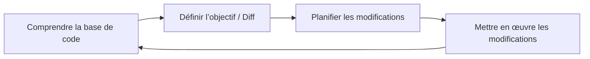
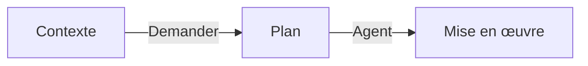
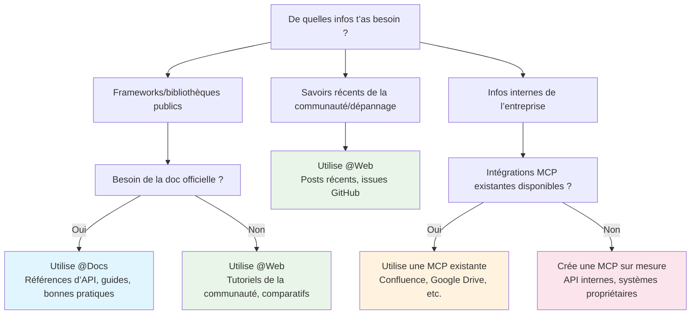
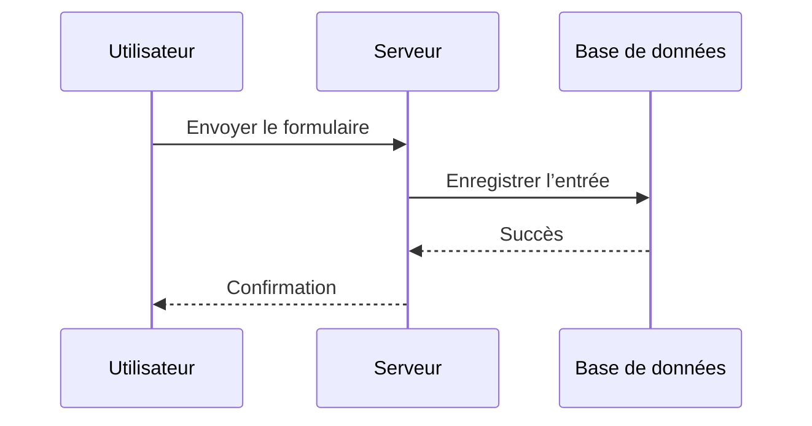
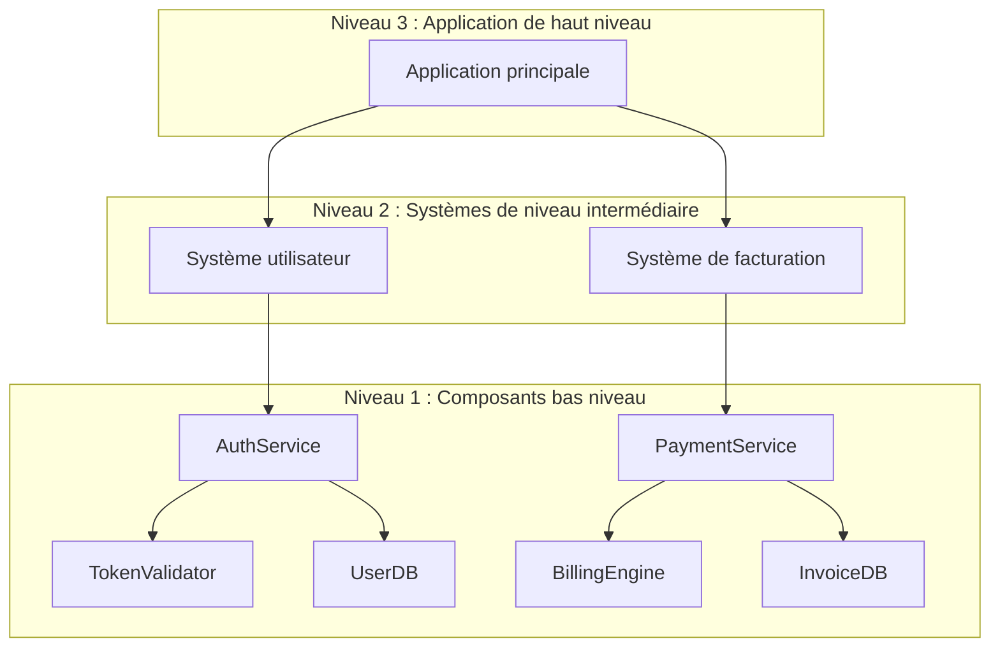
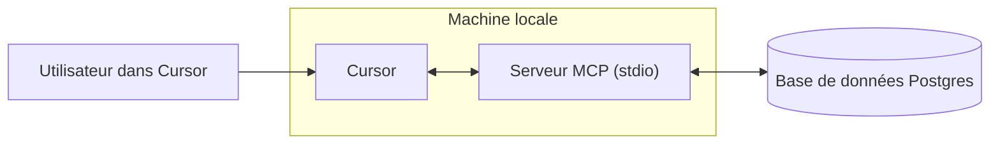
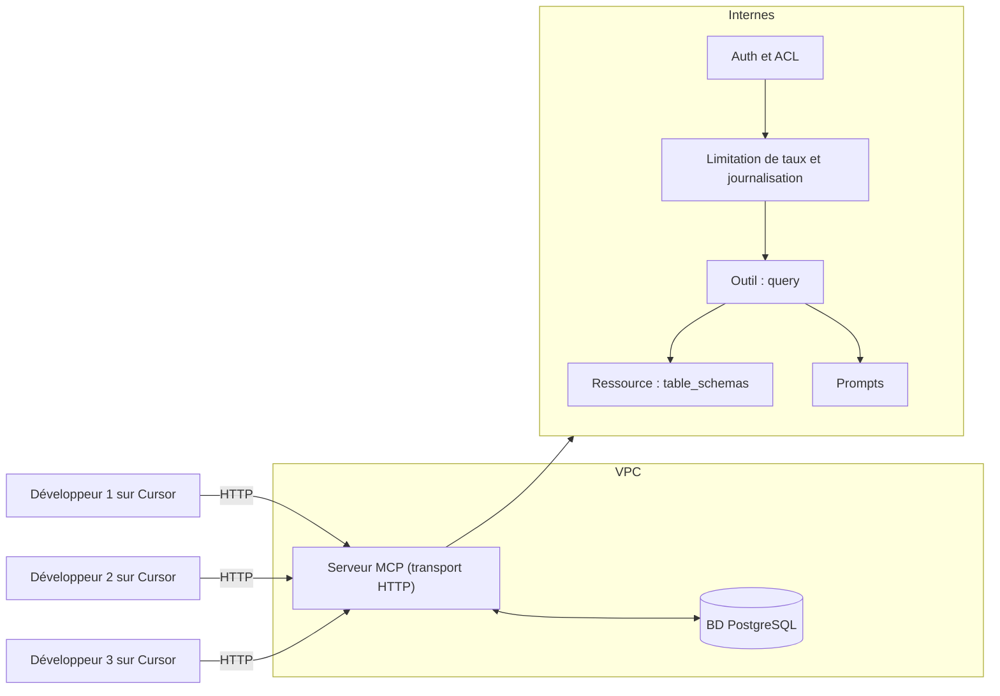

# Mode Shell

**Navigation:** [← Previous](./12-paramètres-enterprise.md) | [Index](./index.md) | [Next →](./14-développement-web.md)

---

# Mode Shell
Source: https://docs.cursor.com/fr/cli/shell-mode

Exécute des commandes shell directement depuis le CLI sans quitter ta conversation

export const Kbd = ({children, tooltip, os}) => {
  const keysInput = typeof children === 'string' && children.trim() !== '' ? children : null;
  if (!keysInput) {
    return null;
  }
  const isModifier = key => {
    const modifiers = ['⌘', '⇧', '⌥', '⌃', '⏎', '⌫', '⌦', '⎋', '⇥', '⌁', '←', '→', '↑', '↓', 'Ctrl', 'Shift', 'Alt', 'Cmd', 'Opt', 'Return', 'Backspace', 'Delete', 'Escape', 'Tab', 'Space', 'Enter', 'Esc', 'ArrowLeft', 'ArrowRight', 'ArrowUp', 'ArrowDown', 'Left', 'Right', 'Up', 'Down'];
    return modifiers.includes(key.trim());
  };
  const capitalizeFirstLetter = string => {
    return string.charAt(0).toUpperCase() + string.slice(1);
  };
  const isMac = os ? os.toLowerCase() === 'mac' || os.toLowerCase() === 'macos' : typeof navigator !== 'undefined' && (navigator.platform.toUpperCase().indexOf('MAC') >= 0 || navigator.userAgent.toUpperCase().indexOf('MAC') >= 0);
  const convertToSymbols = shortcut => {
    if (isMac) {
      return shortcut.replace(/⌘|Cmd|CMD/gi, '⌘').replace(/⌥|Opt|OPT/gi, '⌥').replace(/⌃|Ctrl/gi, '⌃').replace(/⇧|Shift/gi, '⇧').replace(/⏎|Return/gi, '⏎').replace(/⌫|Backspace/gi, '⌫').replace(/⌦|Delete/gi, '⌦').replace(/␛|Escape/gi, '␛').replace(/⇥|Tab/gi, '⇥').replace(/⌁|Space/gi, '⌁').replace(/←|Arrow\s*Left|ArrowLeft|Left/gi, '←').replace(/→|Arrow\s*Right|ArrowRight|Right/gi, '→').replace(/↑|Arrow\s*Up|ArrowUp|Up/gi, '↑').replace(/↓|Arrow\s*Down|ArrowDown|Down/gi, '↓');
    } else {
      const converted = shortcut.replace(/⌘|Cmd|CMD/gi, 'Ctrl').replace(/⌥|Opt|OPT/gi, 'Alt').replace(/⌃|Ctrl/gi, 'Ctrl').replace(/⇧|Shift/gi, 'Shift').replace(/⏎|Return/gi, 'Enter').replace(/⌫|Backspace/gi, 'Backspace').replace(/⌦|Delete/gi, 'Delete').replace(/⎋|Escape/gi, 'Esc').replace(/⇥|Tab/gi, 'Tab').replace(/⌁|Space/gi, 'Space').replace(/←|Arrow\s*Left|ArrowLeft|Left/gi, 'Arrow-Left').replace(/→|Arrow\s*Right|ArrowRight|Right/gi, 'Arrow-Right').replace(/↑|Arrow\s*Up|ArrowUp|Up/gi, 'Arrow-Up').replace(/↓|Arrow\s*Down|ArrowDown|Down/gi, 'Arrow-Down');
      const keyList = converted.split(/[\+\s]+/).filter(key => key.trim());
      return keyList.join('+');
    }
  };
  const convertToReadableText = shortcut => {
    const converted = shortcut.replace(/⌘|Cmd|CMD/gi, 'Cmd').replace(/⌥|Opt|OPT/gi, 'Opt').replace(/⌃|Ctrl/gi, 'Ctrl').replace(/⇧|Shift/gi, 'Shift').replace(/⏎|Return/gi, 'Return').replace(/⌫|Backspace/gi, 'Backspace').replace(/⌦|Delete/gi, 'Delete').replace(/⎋|Escape/gi, 'Escape').replace(/⇥|Tab/gi, 'Tab').replace(/⌁|Space/gi, 'Space').replace(/←|Arrow\s*Left|ArrowLeft|Left/gi, 'Arrow-Left').replace(/→|Arrow\s*Right|ArrowRight|Right/gi, 'Arrow-Right').replace(/↑|Arrow\s*Up|ArrowUp|Up/gi, 'Arrow-Up').replace(/↓|Arrow\s*Down|ArrowDown|Down/gi, 'Arrow-Down');
    const keyList = converted.split(/[\+\s]+/).filter(key => key.trim());
    return keyList.map(key => {
      const trimmedKey = key.trim();
      return isModifier(trimmedKey) ? trimmedKey : capitalizeFirstLetter(trimmedKey);
    }).join('+');
  };
  const displayShortcut = convertToSymbols(keysInput);
  const tooltipText = isMac ? tooltip ? `${convertToReadableText(keysInput)}: ${tooltip}` : convertToReadableText(keysInput) : tooltip || null;
  const processedKeys = isMac ? displayShortcut.split(/[\+\s]+/).filter(key => key.trim()).map(key => {
    const trimmedKey = key.trim();
    return isModifier(trimmedKey) ? trimmedKey : capitalizeFirstLetter(trimmedKey);
  }).join('') : displayShortcut.split('+').map(key => {
    const trimmedKey = key.trim();
    return isModifier(trimmedKey) ? trimmedKey : capitalizeFirstLetter(trimmedKey);
  }).join('+');
  return tooltipText ? <Tooltip tip={tooltipText}>
      <kbd>
        {processedKeys}
      </kbd>
    </Tooltip> : <kbd>
      {processedKeys}
    </kbd>;
};

Le mode Shell exécute des commandes shell directement depuis le CLI sans quitter ta conversation. Utilise-le pour des commandes rapides et non interactives, avec des garde-fous et un affichage des résultats directement dans la conversation.

<Frame>
  <video src="https://mintcdn.com/cursor/BfJOqJ1Wb8EvuXyr/images/cli/shell-mode/cli-shell-mode.mp4?fit=max&auto=format&n=BfJOqJ1Wb8EvuXyr&q=85&s=5194392f1189eb1eba340d731e86bd5f" autoPlay loop muted playsInline controls data-path="images/cli/shell-mode/cli-shell-mode.mp4" />
</Frame>

<div id="command-execution">
  ## Exécution des commandes
</div>

Les commandes s’exécutent dans ton shell de connexion (`$SHELL`) avec le répertoire de travail et l’environnement du CLI. Enchaîne les commandes pour les exécuter dans d’autres répertoires :

```bash  theme={null}
cd subdir && npm test
```

<div id="output">
  ## Sortie
</div>

<product_visual type="screenshot">
  Sortie de commande affichant un en-tête avec le code de retour, l’affichage de stdout/stderr et des contrôles de troncature
</product_visual>

Les sorties volumineuses sont automatiquement tronquées et les processus longue durée expirent pour maintenir les performances.

<div id="limitations">
  ## Limitations
</div>

* Les commandes expirent au bout de 30 secondes
* Les processus longue durée, les serveurs et les invites interactives ne sont pas pris en charge
* Utilise des commandes courtes et non interactives pour de meilleurs résultats

<div id="permissions">
  ## Permissions
</div>

Les commandes sont vérifiées par rapport à tes permissions et aux paramètres de ton équipe avant exécution. Consulte [Permissions](/fr/cli/reference/permissions) pour une configuration détaillée.

<product_visual type="screenshot">
  Bandeau de décision affichant les options d’approbation : Run, Reject/Propose, Add to allowlist et Auto‑run
</product_visual>

Les politiques d’admin peuvent bloquer certaines commandes, et les commandes avec redirection ne peuvent pas être ajoutées à la allowlist en ligne.

<div id="usage-guidelines">
  ## Recommandations d’utilisation
</div>

Le mode Shell est idéal pour les vérifications d’état, les builds rapides, les opérations sur les fichiers et l’inspection de l’environnement.

Évite les serveurs longue durée, les applications interactives et les commandes nécessitant une entrée.

Chaque commande s’exécute indépendamment — utilise `cd <dir> && ...` pour lancer des commandes dans d’autres répertoires.

<div id="troubleshooting">
  ## Dépannage
</div>

* Si une commande se fige, annule avec <Kbd>Ctrl+C</Kbd> et ajoute des options non interactives
* Quand on te demande des autorisations, approuve une fois ou ajoute à la allowlist avec <Kbd>Tab</Kbd>
* Si la sortie est tronquée, utilise <Kbd>Ctrl+O</Kbd> pour l’étendre
* Pour exécuter dans d’autres répertoires, utilise `cd <dir> && ...` car les changements ne persistent pas
* Le mode Shell prend en charge zsh et bash d’après ta variable `$SHELL`

<div id="faq">
  ## FAQ
</div>

<AccordionGroup>
  <Accordion title="Est-ce que `cd` persiste entre les exécutions ?">
    Non. Chaque commande s'exécute indépendamment. Utilise `cd <dir> && ...` pour lancer des commandes dans différents répertoires.
  </Accordion>

  <Accordion title="Puis-je changer le délai d'expiration ?">
    Non. Les commandes sont limitées à 30 secondes et ce n'est pas configurable.
  </Accordion>

  <Accordion title="Où configure-t-on les autorisations ?">
    Les autorisations sont gérées par la configuration du CLI et de l'équipe. Utilise la bannière de décision pour ajouter des commandes aux listes d'autorisation.
  </Accordion>

  <Accordion title="Comment quitter le mode Shell ?">
    Appuie sur <Kbd>Échap</Kbd> quand le champ est vide, sur <Kbd>Retour arrière</Kbd>/<Kbd>Suppr</Kbd> quand l'entrée est vide, ou <Kbd>Ctrl+C</Kbd> pour tout effacer et quitter.
  </Accordion>
</AccordionGroup>


# Utiliser Agent dans le CLI
Source: https://docs.cursor.com/fr/cli/using

Exécute des prompts, révise et itère efficacement avec le CLI Cursor

export const Kbd = ({children, tooltip, os}) => {
  const keysInput = typeof children === 'string' && children.trim() !== '' ? children : null;
  if (!keysInput) {
    return null;
  }
  const isModifier = key => {
    const modifiers = ['⌘', '⇧', '⌥', '⌃', '⏎', '⌫', '⌦', '⎋', '⇥', '⌁', '←', '→', '↑', '↓', 'Ctrl', 'Shift', 'Alt', 'Cmd', 'Opt', 'Return', 'Backspace', 'Delete', 'Escape', 'Tab', 'Space', 'Enter', 'Esc', 'ArrowLeft', 'ArrowRight', 'ArrowUp', 'ArrowDown', 'Left', 'Right', 'Up', 'Down'];
    return modifiers.includes(key.trim());
  };
  const capitalizeFirstLetter = string => {
    return string.charAt(0).toUpperCase() + string.slice(1);
  };
  const isMac = os ? os.toLowerCase() === 'mac' || os.toLowerCase() === 'macos' : typeof navigator !== 'undefined' && (navigator.platform.toUpperCase().indexOf('MAC') >= 0 || navigator.userAgent.toUpperCase().indexOf('MAC') >= 0);
  const convertToSymbols = shortcut => {
    if (isMac) {
      return shortcut.replace(/⌘|Cmd|CMD/gi, '⌘').replace(/⌥|Opt|OPT/gi, '⌥').replace(/⌃|Ctrl/gi, '⌃').replace(/⇧|Shift/gi, '⇧').replace(/⏎|Return/gi, '⏎').replace(/⌫|Backspace/gi, '⌫').replace(/⌦|Delete/gi, '⌦').replace(/␛|Escape/gi, '␛').replace(/⇥|Tab/gi, '⇥').replace(/⌁|Space/gi, '⌁').replace(/←|Arrow\s*Left|ArrowLeft|Left/gi, '←').replace(/→|Arrow\s*Right|ArrowRight|Right/gi, '→').replace(/↑|Arrow\s*Up|ArrowUp|Up/gi, '↑').replace(/↓|Arrow\s*Down|ArrowDown|Down/gi, '↓');
    } else {
      const converted = shortcut.replace(/⌘|Cmd|CMD/gi, 'Ctrl').replace(/⌥|Opt|OPT/gi, 'Alt').replace(/⌃|Ctrl/gi, 'Ctrl').replace(/⇧|Shift/gi, 'Shift').replace(/⏎|Return/gi, 'Enter').replace(/⌫|Backspace/gi, 'Backspace').replace(/⌦|Delete/gi, 'Delete').replace(/⎋|Escape/gi, 'Esc').replace(/⇥|Tab/gi, 'Tab').replace(/⌁|Space/gi, 'Space').replace(/←|Arrow\s*Left|ArrowLeft|Left/gi, 'Arrow-Left').replace(/→|Arrow\s*Right|ArrowRight|Right/gi, 'Arrow-Right').replace(/↑|Arrow\s*Up|ArrowUp|Up/gi, 'Arrow-Up').replace(/↓|Arrow\s*Down|ArrowDown|Down/gi, 'Arrow-Down');
      const keyList = converted.split(/[\+\s]+/).filter(key => key.trim());
      return keyList.join('+');
    }
  };
  const convertToReadableText = shortcut => {
    const converted = shortcut.replace(/⌘|Cmd|CMD/gi, 'Cmd').replace(/⌥|Opt|OPT/gi, 'Opt').replace(/⌃|Ctrl/gi, 'Ctrl').replace(/⇧|Shift/gi, 'Shift').replace(/⏎|Return/gi, 'Return').replace(/⌫|Backspace/gi, 'Backspace').replace(/⌦|Delete/gi, 'Delete').replace(/⎋|Escape/gi, 'Escape').replace(/⇥|Tab/gi, 'Tab').replace(/⌁|Space/gi, 'Space').replace(/←|Arrow\s*Left|ArrowLeft|Left/gi, 'Arrow-Left').replace(/→|Arrow\s*Right|ArrowRight|Right/gi, 'Arrow-Right').replace(/↑|Arrow\s*Up|ArrowUp|Up/gi, 'Arrow-Up').replace(/↓|Arrow\s*Down|ArrowDown|Down/gi, 'Arrow-Down');
    const keyList = converted.split(/[\+\s]+/).filter(key => key.trim());
    return keyList.map(key => {
      const trimmedKey = key.trim();
      return isModifier(trimmedKey) ? trimmedKey : capitalizeFirstLetter(trimmedKey);
    }).join('+');
  };
  const displayShortcut = convertToSymbols(keysInput);
  const tooltipText = isMac ? tooltip ? `${convertToReadableText(keysInput)}: ${tooltip}` : convertToReadableText(keysInput) : tooltip || null;
  const processedKeys = isMac ? displayShortcut.split(/[\+\s]+/).filter(key => key.trim()).map(key => {
    const trimmedKey = key.trim();
    return isModifier(trimmedKey) ? trimmedKey : capitalizeFirstLetter(trimmedKey);
  }).join('') : displayShortcut.split('+').map(key => {
    const trimmedKey = key.trim();
    return isModifier(trimmedKey) ? trimmedKey : capitalizeFirstLetter(trimmedKey);
  }).join('+');
  return tooltipText ? <Tooltip tip={tooltipText}>
      <kbd>
        {processedKeys}
      </kbd>
    </Tooltip> : <kbd>
      {processedKeys}
    </kbd>;
};

<div id="prompting">
  ## Prompting
</div>

Énoncer clairement ton intention est recommandé pour obtenir les meilleurs résultats. Par exemple, tu peux utiliser l’invite « do not write any code » pour t’assurer que l’agent n’éditera aucun fichier. C’est généralement utile quand tu planifies des tâches avant de les implémenter.

L’agent dispose actuellement d’outils pour les opérations sur les fichiers, la recherche et l’exécution de commandes shell. D’autres outils sont en cours d’ajout, similaires à ceux de l’agent IDE.

<div id="mcp">
  ## MCP
</div>

Agent prend en charge le [MCP (Model Context Protocol)](/fr/tools/mcp) pour des fonctionnalités étendues et des intégrations. Le CLI détecte automatiquement et respecte ton fichier de configuration `mcp.json`, ce qui active les mêmes serveurs et outils MCP que t’as configurés pour l’IDE.

<div id="rules">
  ## Règles
</div>

L’agent CLI prend en charge le même [système de règles](/fr/context/rules) que l’IDE. Tu peux créer des règles dans le répertoire `.cursor/rules` pour fournir du contexte et des indications à l’agent. Ces règles sont automatiquement chargées et appliquées selon leur configuration, ce qui te permet de personnaliser le comportement de l’agent pour différentes parties de ton projet ou pour des types de fichiers spécifiques.

<Note>
  Le CLI lit aussi `AGENTS.md` et `CLAUDE.md` à la racine du projet (s’ils sont présents) et les applique comme règles, en complément de `.cursor/rules`.
</Note>

<div id="working-with-agent">
  ## Travailler avec Agent
</div>

<div id="navigation">
  ### Navigation
</div>

Parcours les messages précédents avec la flèche haut (<Kbd>ArrowUp</Kbd>).

<div id="review">
  ### Relecture
</div>

Passe en revue les modifications avec <Kbd>Cmd+R</Kbd>. Appuie sur <Kbd>i</Kbd> pour ajouter des instructions complémentaires. Utilise <Kbd>ArrowUp</Kbd>/<Kbd>ArrowDown</Kbd> pour faire défiler, et <Kbd>ArrowLeft</Kbd>/<Kbd>ArrowRight</Kbd> pour changer de fichier.

<div id="selecting-context">
  ### Sélection du contexte
</div>

Sélectionne des fichiers et des dossiers à inclure dans le contexte avec <Kbd>@</Kbd>. Libère de l’espace dans la fenêtre de contexte en exécutant `/compress`. Consulte [Summarization](/fr/agent/chat/summarization) pour plus de détails.

<div id="history">
  ## Historique
</div>

Reprends un fil existant avec `--resume [thread id]` pour charger le contexte précédent.

Pour reprendre la conversation la plus récente, utilise `cursor-agent resume`.

Tu peux aussi lancer `cursor-agent ls` pour voir la liste des conversations précédentes.

<div id="command-approval">
  ## Validation des commandes
</div>

Avant d'exécuter des commandes dans le terminal, le CLI te demandera de valider (<Kbd>y</Kbd>) ou d'annuler (<Kbd>n</Kbd>) l'exécution.

<div id="non-interactive-mode">
  ## Mode non interactif
</div>

Utilise `-p` ou `--print` pour lancer Agent en mode non interactif. Ça affichera la réponse dans la console.

En mode non interactif, tu peux invoquer Agent sans interaction. Ça te permet de l’intégrer à des scripts, des pipelines CI, etc.

Tu peux combiner ça avec `--output-format` pour contrôler le format de la sortie. Par exemple, utilise `--output-format json` pour une sortie structurée plus simple à analyser dans des scripts, ou `--output-format text` pour une sortie en texte brut.

<Note>
  Cursor dispose d’un accès en écriture complet en mode non interactif.
</Note>


# Raccourcis clavier
Source: https://docs.cursor.com/fr/configuration/kbd

Raccourcis clavier et raccourcis de touches dans Cursor

export const Kbd = ({children, tooltip, os}) => {
  const keysInput = typeof children === 'string' && children.trim() !== '' ? children : null;
  if (!keysInput) {
    return null;
  }
  const isModifier = key => {
    const modifiers = ['⌘', '⇧', '⌥', '⌃', '⏎', '⌫', '⌦', '⎋', '⇥', '⌁', '←', '→', '↑', '↓', 'Ctrl', 'Shift', 'Alt', 'Cmd', 'Opt', 'Return', 'Backspace', 'Delete', 'Escape', 'Tab', 'Space', 'Enter', 'Esc', 'ArrowLeft', 'ArrowRight', 'ArrowUp', 'ArrowDown', 'Left', 'Right', 'Up', 'Down'];
    return modifiers.includes(key.trim());
  };
  const capitalizeFirstLetter = string => {
    return string.charAt(0).toUpperCase() + string.slice(1);
  };
  const isMac = os ? os.toLowerCase() === 'mac' || os.toLowerCase() === 'macos' : typeof navigator !== 'undefined' && (navigator.platform.toUpperCase().indexOf('MAC') >= 0 || navigator.userAgent.toUpperCase().indexOf('MAC') >= 0);
  const convertToSymbols = shortcut => {
    if (isMac) {
      return shortcut.replace(/⌘|Cmd|CMD/gi, '⌘').replace(/⌥|Opt|OPT/gi, '⌥').replace(/⌃|Ctrl/gi, '⌃').replace(/⇧|Shift/gi, '⇧').replace(/⏎|Return/gi, '⏎').replace(/⌫|Backspace/gi, '⌫').replace(/⌦|Delete/gi, '⌦').replace(/␛|Escape/gi, '␛').replace(/⇥|Tab/gi, '⇥').replace(/⌁|Space/gi, '⌁').replace(/←|Arrow\s*Left|ArrowLeft|Left/gi, '←').replace(/→|Arrow\s*Right|ArrowRight|Right/gi, '→').replace(/↑|Arrow\s*Up|ArrowUp|Up/gi, '↑').replace(/↓|Arrow\s*Down|ArrowDown|Down/gi, '↓');
    } else {
      const converted = shortcut.replace(/⌘|Cmd|CMD/gi, 'Ctrl').replace(/⌥|Opt|OPT/gi, 'Alt').replace(/⌃|Ctrl/gi, 'Ctrl').replace(/⇧|Shift/gi, 'Shift').replace(/⏎|Return/gi, 'Enter').replace(/⌫|Backspace/gi, 'Backspace').replace(/⌦|Delete/gi, 'Delete').replace(/⎋|Escape/gi, 'Esc').replace(/⇥|Tab/gi, 'Tab').replace(/⌁|Space/gi, 'Space').replace(/←|Arrow\s*Left|ArrowLeft|Left/gi, 'Arrow-Left').replace(/→|Arrow\s*Right|ArrowRight|Right/gi, 'Arrow-Right').replace(/↑|Arrow\s*Up|ArrowUp|Up/gi, 'Arrow-Up').replace(/↓|Arrow\s*Down|ArrowDown|Down/gi, 'Arrow-Down');
      const keyList = converted.split(/[\+\s]+/).filter(key => key.trim());
      return keyList.join('+');
    }
  };
  const convertToReadableText = shortcut => {
    const converted = shortcut.replace(/⌘|Cmd|CMD/gi, 'Cmd').replace(/⌥|Opt|OPT/gi, 'Opt').replace(/⌃|Ctrl/gi, 'Ctrl').replace(/⇧|Shift/gi, 'Shift').replace(/⏎|Return/gi, 'Return').replace(/⌫|Backspace/gi, 'Backspace').replace(/⌦|Delete/gi, 'Delete').replace(/⎋|Escape/gi, 'Escape').replace(/⇥|Tab/gi, 'Tab').replace(/⌁|Space/gi, 'Space').replace(/←|Arrow\s*Left|ArrowLeft|Left/gi, 'Arrow-Left').replace(/→|Arrow\s*Right|ArrowRight|Right/gi, 'Arrow-Right').replace(/↑|Arrow\s*Up|ArrowUp|Up/gi, 'Arrow-Up').replace(/↓|Arrow\s*Down|ArrowDown|Down/gi, 'Arrow-Down');
    const keyList = converted.split(/[\+\s]+/).filter(key => key.trim());
    return keyList.map(key => {
      const trimmedKey = key.trim();
      return isModifier(trimmedKey) ? trimmedKey : capitalizeFirstLetter(trimmedKey);
    }).join('+');
  };
  const displayShortcut = convertToSymbols(keysInput);
  const tooltipText = isMac ? tooltip ? `${convertToReadableText(keysInput)}: ${tooltip}` : convertToReadableText(keysInput) : tooltip || null;
  const processedKeys = isMac ? displayShortcut.split(/[\+\s]+/).filter(key => key.trim()).map(key => {
    const trimmedKey = key.trim();
    return isModifier(trimmedKey) ? trimmedKey : capitalizeFirstLetter(trimmedKey);
  }).join('') : displayShortcut.split('+').map(key => {
    const trimmedKey = key.trim();
    return isModifier(trimmedKey) ? trimmedKey : capitalizeFirstLetter(trimmedKey);
  }).join('+');
  return tooltipText ? <Tooltip tip={tooltipText}>
      <kbd>
        {processedKeys}
      </kbd>
    </Tooltip> : <kbd>
      {processedKeys}
    </kbd>;
};

Aperçu des raccourcis clavier dans Cursor. Vois tous les raccourcis clavier en appuyant sur <Kbd>Cmd R</Kbd> puis <Kbd>Cmd S</Kbd>, ou en ouvrant la palette de commandes avec <Kbd>Cmd Shift P</Kbd> et en cherchant `Keyboard Shortcuts`.

Pour en savoir plus sur les raccourcis clavier dans Cursor, utilise [Key Bindings for VS Code](https://code.visualstudio.com/docs/getstarted/keybindings) comme référence de base pour les raccourcis de Cursor.

Tous les raccourcis de Cursor, y compris les fonctionnalités spécifiques à Cursor, peuvent être remappés dans les paramètres Keyboard Shortcuts.

<div id="general">
  ## Général
</div>

<div className="full-width-table equal-table-columns">
  | Raccourci              | Action                                                          |
  | ---------------------- | --------------------------------------------------------------- |
  | <Kbd>Cmd I</Kbd>       | Afficher/masquer le panneau latéral (sauf si associé à un mode) |
  | <Kbd>Cmd L</Kbd>       | Afficher/masquer le panneau latéral (sauf si associé à un mode) |
  | <Kbd>Cmd E</Kbd>       | Panneau de contrôle de l’agent en arrière-plan                  |
  | <Kbd>Cmd .</Kbd>       | Menu des modes                                                  |
  | <Kbd>Cmd /</Kbd>       | Basculer entre les modèles d’IA                                 |
  | <Kbd>Cmd Shift J</Kbd> | Paramètres de Cursor                                            |
  | <Kbd>Cmd ,</Kbd>       | Paramètres généraux                                             |
  | <Kbd>Cmd Shift P</Kbd> | Palette de commandes                                            |
</div>

<div id="chat">
  ## Chat
</div>

Raccourcis pour la zone de saisie du chat.

<div className="full-width-table equal-table-columns">
  | Raccourci                                            | Action                                                      |
  | ---------------------------------------------------- | ----------------------------------------------------------- |
  | <Kbd>Return</Kbd>                                    | Nudge (par défaut)                                          |
  | <Kbd>Ctrl Return</Kbd>                               | Mettre le message en file d’attente                         |
  | <Kbd>Cmd Return</Kbd> when typing                    | Forcer l’envoi du message                                   |
  | <Kbd>Cmd Shift Backspace</Kbd>                       | Annuler la génération                                       |
  | <Kbd>Cmd Shift L</Kbd> with code selected            | Ajouter le code sélectionné au contexte                     |
  | <Kbd>Cmd V</Kbd> with code or log in clipboard       | Ajouter le contenu du presse‑papiers au contexte            |
  | <Kbd>Cmd Shift V</Kbd> with code or log in clipboard | Ajouter le contenu du presse‑papiers dans la zone de saisie |
  | <Kbd>Cmd Return</Kbd> with suggested changes         | Accepter toutes les modifications                           |
  | <Kbd>Cmd Backspace</Kbd>                             | Rejeter toutes les modifications                            |
  | <Kbd>Tab</Kbd>                                       | Passer au message suivant                                   |
  | <Kbd>Shift Tab</Kbd>                                 | Revenir au message précédent                                |
  | <Kbd>Cmd Opt /</Kbd>                                 | Basculer de modèle                                          |
  | <Kbd>Cmd N</Kbd> / <Kbd>Cmd R</Kbd>                  | Nouveau chat                                                |
  | <Kbd>Cmd T</Kbd>                                     | Nouvel onglet de chat                                       |
  | <Kbd>Cmd \[</Kbd>                                    | Chat précédent                                              |
  | <Kbd>Cmd ]</Kbd>                                     | Chat suivant                                                |
  | <Kbd>Cmd W</Kbd>                                     | Fermer le chat                                              |
  | <Kbd>Escape</Kbd>                                    | Retirer le focus du champ                                   |
</div>

<div id="inline-edit">
  ## Édition en ligne
</div>

<div className="full-width-table equal-table-columns">
  | Raccourci                      | Action                        |
  | ------------------------------ | ----------------------------- |
  | <Kbd>Cmd K</Kbd>               | Ouvrir                        |
  | <Kbd>Cmd Shift K</Kbd>         | Basculer le focus de l’entrée |
  | <Kbd>Return</Kbd>              | Valider                       |
  | <Kbd>Cmd Shift Backspace</Kbd> | Annuler                       |
  | <Kbd>Opt Return</Kbd>          | Poser une question rapide     |
</div>

<div id="code-selection-context">
  ## Sélection de code et contexte
</div>

<div className="full-width-table equal-table-columns">
  | Raccourci                                                     | Action                                            |
  | ------------------------------------------------------------- | ------------------------------------------------- |
  | <Kbd>@</Kbd>                                                  | [Symboles @](/fr/context/@-symbols/)              |
  | <Kbd>#</Kbd>                                                  | Fichiers                                          |
  | <Kbd>/</Kbd>                                                  | Commandes rapides                                 |
  | <Kbd>Cmd Shift L</Kbd>                                        | Ajouter la sélection au chat                      |
  | <Kbd>Cmd Shift K</Kbd>                                        | Ajouter la sélection à Edit                       |
  | <Kbd>Cmd L</Kbd>                                              | Ajouter la sélection à une nouvelle discussion    |
  | <Kbd>Cmd M</Kbd>                                              | Basculer la stratégie de lecture des fichiers     |
  | <Kbd>Cmd →</Kbd>                                              | Accepter le mot suivant de la suggestion          |
  | <Kbd>Cmd Return</Kbd>                                         | Rechercher la base de code dans le chat           |
  | Sélectionne du code, <Kbd>Cmd C</Kbd>, <Kbd>Cmd V</Kbd>       | Ajouter le code de référence copié comme contexte |
  | Sélectionne du code, <Kbd>Cmd C</Kbd>, <Kbd>Cmd Shift V</Kbd> | Ajouter le code copié comme contexte texte        |
</div>

<div id="tab">
  ## Tab
</div>

<div className="full-width-table equal-table-columns">
  | Raccourci        | Action                  |
  | ---------------- | ----------------------- |
  | <Kbd>Tab</Kbd>   | Accepter la suggestion  |
  | <Kbd>Cmd →</Kbd> | Accepter le mot suivant |
</div>

<div id="terminal">
  ## Terminal
</div>

<div className="full-width-table equal-table-columns">
  | Raccourci             | Action                               |
  | --------------------- | ------------------------------------ |
  | <Kbd>Cmd K</Kbd>      | Ouvrir la barre d’invite du terminal |
  | <Kbd>Cmd Return</Kbd> | Exécuter la commande générée         |
  | <Kbd>Escape</Kbd>     | Valider la commande                  |
</div>


# Commandes shell
Source: https://docs.cursor.com/fr/configuration/shell

Installer et utiliser les commandes shell de Cursor

Cursor fournit des outils en ligne de commande pour ouvrir des fichiers et des dossiers depuis ton terminal. Installe les commandes `cursor` et `code` pour intégrer Cursor à ton flux de travail de développement.

<div id="installing-cli-commands">
  ## Installation des commandes CLI
</div>

Installe les commandes CLI via la palette de commandes :

1. Ouvre la palette de commandes (Cmd/Ctrl + P)
2. Tape « Install » pour filtrer les commandes d’installation
3. Sélectionne et exécute `Install 'cursor' to shell`
4. Répète et sélectionne `Install 'code' to shell`

<product_visual type="screenshot">
  Palette de commandes affichant les options d’installation CLI
</product_visual>

<div id="using-the-cli-commands">
  ## Utiliser les commandes CLI
</div>

Après l’installation, utilise l’une de ces commandes pour ouvrir des fichiers ou des dossiers dans Cursor :

```bash  theme={null}

# Utiliser la commande cursor
cursor chemin/vers/fichier.js
cursor chemin/vers/dossier/


# Utiliser la commande code (compatible avec VS Code)
code chemin/vers/fichier.js
code chemin/vers/dossier/
```

<div id="command-options">
  ## Options de commande
</div>

Les deux commandes prennent en charge ces options :

* Ouvrir un fichier : `cursor file.js`
* Ouvrir un dossier : `cursor ./my-project`
* Ouvrir plusieurs éléments : `cursor file1.js file2.js folder1/`
* Ouvrir dans une nouvelle fenêtre : `cursor -n` ou `cursor --new-window`
* Attendre la fermeture de la fenêtre : `cursor -w` ou `cursor --wait`

<div id="faq">
  ## FAQ
</div>

<AccordionGroup>
  <Accordion title="Quelle est la différence entre les commandes cursor et code ?">
    Elles sont identiques. La commande `code` est fournie pour la compatibilité avec VS Code.
  </Accordion>

  <Accordion title="Dois-je installer les deux commandes ?">
    Non, installe l’une ou les deux selon ta préférence.
  </Accordion>

  <Accordion title="Où les commandes sont-elles installées ?">
    Les commandes sont installées dans le fichier de configuration du shell par défaut de ton système (p. ex. `.bashrc`, `.zshrc` ou `.config/fish/config.fish`).
  </Accordion>
</AccordionGroup>


# Thèmes
Source: https://docs.cursor.com/fr/configuration/themes

Personnalise l’apparence de Cursor

Cursor prend en charge les thèmes clair et sombre pour ton environnement de code. Cursor hérite des fonctionnalités de thème de VS Code : utilise n’importe quel thème VS Code, crée des thèmes personnalisés et installe des extensions de thème depuis la marketplace.

<div id="changing-theme">
  ## Changer de thème
</div>

1. Ouvre la palette de commandes (Cmd/Ctrl + P)
2. Tape « theme » pour filtrer les commandes
3. Sélectionne « Preferences: Color Theme »
4. Choisis un thème

<Frame>
  
</Frame>

<div id="faq">
  ## FAQ
</div>

<AccordionGroup>
  <Accordion title="Puis-je utiliser mes thèmes VS Code dans Cursor ?">
    Oui ! Cursor est compatible avec les thèmes VS Code. Installe n’importe quel thème du Marketplace VS Code ou copie des fichiers de thème personnalisés.
  </Accordion>

  <Accordion title="Comment créer un thème personnalisé ?">
    Crée des thèmes personnalisés comme dans VS Code. Utilise « Developer: Generate Color Theme From Current Settings » pour partir de tes paramètres actuels, ou suis le guide de création de thèmes VS Code.
  </Accordion>
</AccordionGroup>


# @Code
Source: https://docs.cursor.com/fr/context/@-symbols/@-code

Référence des extraits de code spécifiques dans Cursor avec @Code

Référence des sections de code spécifiques avec le symbole `@Code`. Ça te donne un contrôle plus fin que [`@Files & Folders`](/fr/context/@-symbols/@-files-and-folders), et te permet de sélectionner des extraits de code précis plutôt que des fichiers entiers.

<Frame>
  
</Frame>


# @Cursor Rules
Source: https://docs.cursor.com/fr/context/@-symbols/@-cursor-rules

Appliquer des règles et des consignes propres au projet

Le symbole `@Cursor Rules` te donne accès aux [règles du projet](/fr/context/rules) et aux consignes que tu as configurées, pour que tu puisses les appliquer explicitement à ton contexte.

<Frame>
  
</Frame>


# @Files & Folders
Source: https://docs.cursor.com/fr/context/@-symbols/@-files-and-folders

Référencer des fichiers et des dossiers comme contexte dans Chat et Inline Edit

export const Kbd = ({children, tooltip, os}) => {
  const keysInput = typeof children === 'string' && children.trim() !== '' ? children : null;
  if (!keysInput) {
    return null;
  }
  const isModifier = key => {
    const modifiers = ['⌘', '⇧', '⌥', '⌃', '⏎', '⌫', '⌦', '⎋', '⇥', '⌁', '←', '→', '↑', '↓', 'Ctrl', 'Shift', 'Alt', 'Cmd', 'Opt', 'Return', 'Backspace', 'Delete', 'Escape', 'Tab', 'Space', 'Enter', 'Esc', 'ArrowLeft', 'ArrowRight', 'ArrowUp', 'ArrowDown', 'Left', 'Right', 'Up', 'Down'];
    return modifiers.includes(key.trim());
  };
  const capitalizeFirstLetter = string => {
    return string.charAt(0).toUpperCase() + string.slice(1);
  };
  const isMac = os ? os.toLowerCase() === 'mac' || os.toLowerCase() === 'macos' : typeof navigator !== 'undefined' && (navigator.platform.toUpperCase().indexOf('MAC') >= 0 || navigator.userAgent.toUpperCase().indexOf('MAC') >= 0);
  const convertToSymbols = shortcut => {
    if (isMac) {
      return shortcut.replace(/⌘|Cmd|CMD/gi, '⌘').replace(/⌥|Opt|OPT/gi, '⌥').replace(/⌃|Ctrl/gi, '⌃').replace(/⇧|Shift/gi, '⇧').replace(/⏎|Return/gi, '⏎').replace(/⌫|Backspace/gi, '⌫').replace(/⌦|Delete/gi, '⌦').replace(/␛|Escape/gi, '␛').replace(/⇥|Tab/gi, '⇥').replace(/⌁|Space/gi, '⌁').replace(/←|Arrow\s*Left|ArrowLeft|Left/gi, '←').replace(/→|Arrow\s*Right|ArrowRight|Right/gi, '→').replace(/↑|Arrow\s*Up|ArrowUp|Up/gi, '↑').replace(/↓|Arrow\s*Down|ArrowDown|Down/gi, '↓');
    } else {
      const converted = shortcut.replace(/⌘|Cmd|CMD/gi, 'Ctrl').replace(/⌥|Opt|OPT/gi, 'Alt').replace(/⌃|Ctrl/gi, 'Ctrl').replace(/⇧|Shift/gi, 'Shift').replace(/⏎|Return/gi, 'Enter').replace(/⌫|Backspace/gi, 'Backspace').replace(/⌦|Delete/gi, 'Delete').replace(/⎋|Escape/gi, 'Esc').replace(/⇥|Tab/gi, 'Tab').replace(/⌁|Space/gi, 'Space').replace(/←|Arrow\s*Left|ArrowLeft|Left/gi, 'Arrow-Left').replace(/→|Arrow\s*Right|ArrowRight|Right/gi, 'Arrow-Right').replace(/↑|Arrow\s*Up|ArrowUp|Up/gi, 'Arrow-Up').replace(/↓|Arrow\s*Down|ArrowDown|Down/gi, 'Arrow-Down');
      const keyList = converted.split(/[\+\s]+/).filter(key => key.trim());
      return keyList.join('+');
    }
  };
  const convertToReadableText = shortcut => {
    const converted = shortcut.replace(/⌘|Cmd|CMD/gi, 'Cmd').replace(/⌥|Opt|OPT/gi, 'Opt').replace(/⌃|Ctrl/gi, 'Ctrl').replace(/⇧|Shift/gi, 'Shift').replace(/⏎|Return/gi, 'Return').replace(/⌫|Backspace/gi, 'Backspace').replace(/⌦|Delete/gi, 'Delete').replace(/⎋|Escape/gi, 'Escape').replace(/⇥|Tab/gi, 'Tab').replace(/⌁|Space/gi, 'Space').replace(/←|Arrow\s*Left|ArrowLeft|Left/gi, 'Arrow-Left').replace(/→|Arrow\s*Right|ArrowRight|Right/gi, 'Arrow-Right').replace(/↑|Arrow\s*Up|ArrowUp|Up/gi, 'Arrow-Up').replace(/↓|Arrow\s*Down|ArrowDown|Down/gi, 'Arrow-Down');
    const keyList = converted.split(/[\+\s]+/).filter(key => key.trim());
    return keyList.map(key => {
      const trimmedKey = key.trim();
      return isModifier(trimmedKey) ? trimmedKey : capitalizeFirstLetter(trimmedKey);
    }).join('+');
  };
  const displayShortcut = convertToSymbols(keysInput);
  const tooltipText = isMac ? tooltip ? `${convertToReadableText(keysInput)}: ${tooltip}` : convertToReadableText(keysInput) : tooltip || null;
  const processedKeys = isMac ? displayShortcut.split(/[\+\s]+/).filter(key => key.trim()).map(key => {
    const trimmedKey = key.trim();
    return isModifier(trimmedKey) ? trimmedKey : capitalizeFirstLetter(trimmedKey);
  }).join('') : displayShortcut.split('+').map(key => {
    const trimmedKey = key.trim();
    return isModifier(trimmedKey) ? trimmedKey : capitalizeFirstLetter(trimmedKey);
  }).join('+');
  return tooltipText ? <Tooltip tip={tooltipText}>
      <kbd>
        {processedKeys}
      </kbd>
    </Tooltip> : <kbd>
      {processedKeys}
    </kbd>;
};

<div id="files">
  ## Fichiers
</div>

Réfère des fichiers entiers dans Chat et Inline Edit en sélectionnant `@Files & Folders`, puis le nom du fichier à rechercher. Tu peux aussi faire glisser des fichiers depuis la barre latérale directement dans Agent pour les ajouter au contexte.

<Frame>
  
</Frame>

<div id="folders">
  ## Dossiers
</div>

Quand tu fais référence à des dossiers avec `@Folders`, Cursor fournit le chemin du dossier et un aperçu de son contenu pour aider l’IA à comprendre ce qui est disponible.

<Tip>
  Après avoir sélectionné un dossier, tape « / » pour descendre dans l’arborescence et voir tous les sous-dossiers.
</Tip>

<Frame>
  
</Frame>

<div id="full-folder-content">
  ### Contenu intégral du dossier
</div>

Active **Contenu intégral du dossier** dans les paramètres. Une fois activé, Cursor tente d’inclure tous les fichiers du dossier dans le contexte.

<Frame>
  
</Frame>

Pour les dossiers volumineux dépassant la fenêtre de contexte, une vue d’ensemble apparaît avec une info-bulle indiquant le nombre de fichiers inclus, tandis que Cursor gère l’espace de contexte disponible.

<Note>
  Utiliser le contenu intégral du dossier avec le [mode Max activé](/fr/context/max-mode)
  augmente sensiblement le coût des requêtes, car davantage de tokens d’entrée sont consommés.
</Note>

<div id="context-management">
  ## Gestion du contexte
</div>

Les fichiers et dossiers volumineux sont automatiquement condensés pour respecter les limites de contexte. Consulte [condensation des fichiers et dossiers](/fr/agent/chats/summarization#file--folder-condensation) pour plus de détails.


# @Git
Source: https://docs.cursor.com/fr/context/@-symbols/@-git

Référencer les changements Git et les différences entre branches

<Frame>
  
</Frame>

* `@Commit`: Référence les changements de ton espace de travail actuel par rapport au dernier commit. Affiche tous les fichiers modifiés, ajoutés et supprimés qui ne sont pas encore commités.
* `@Branch`: Compare les changements de ta branche actuelle avec la branche main. Affiche tous les commits et changements présents dans ta branche mais pas dans main.


# @Link
Source: https://docs.cursor.com/fr/context/@-symbols/@-link

Inclure du contenu web en collant des URL

Quand tu colles une URL dans Chat, Cursor l’identifie automatiquement comme un `@Link` et récupère le contenu pour l’utiliser comme contexte. Ça inclut la prise en charge des PDF — Cursor extrait et analyse le texte de toute URL de PDF accessible publiquement.

<Frame>
  
</Frame>

<div id="unlink">
  ## Dissocier
</div>

Pour utiliser une URL comme texte brut sans en récupérer le contenu :

* Clique sur le lien balisé et sélectionne `Dissocier`
* Ou colle en maintenant `Maj` pour empêcher le balisage automatique

<Frame>
  
</Frame>


# @Linter Errors
Source: https://docs.cursor.com/fr/context/@-symbols/@-linter-errors

Accéder aux erreurs de lint et t’y référer dans ta base de code

Le symbole `@Linter Errors` capture automatiquement et fournit du contexte sur les erreurs et avertissements de lint dans ton fichier actif. Par défaut, [Agent](/fr/agent/overview) peut voir les erreurs de lint.

<Note>
  Pour rendre les erreurs du linter visibles, tu dois avoir le language server approprié
  installé et configuré pour ton langage de programmation. Cursor détecte
  automatiquement et utilise les language servers installés, mais tu pourrais avoir besoin d’installer
  des extensions ou des outils supplémentaires pour certains langages.
</Note>

<Frame>
  
</Frame>


# @Past Chats
Source: https://docs.cursor.com/fr/context/@-symbols/@-past-chats

Inclure des chats résumés depuis l’historique

Quand tu bosses sur des tâches complexes dans [Chat](/fr/chat), tu peux avoir besoin de te référer au contexte ou aux décisions prises lors de conversations précédentes. Le symbole `@Past Chats` inclut des versions résumées des chats précédents comme contexte.

Particulièrement utile quand :

* Tu as une longue session de Chat avec un contexte important à retrouver
* Tu démarres une nouvelle tâche liée et tu veux garder de la continuité
* Tu veux partager le raisonnement ou les décisions d’une session précédente

<Frame>
  
</Frame>


# @Recent Changes
Source: https://docs.cursor.com/fr/context/@-symbols/@-recent-changes

Inclure le code récemment modifié comme contexte

Le symbole `@Recent Changes` inclut les modifications de code récentes comme contexte dans les conversations avec l’IA.

* Modifications triées par ordre chronologique
* Met en priorité les 10 dernières modifications
* Respecte les réglages de `.cursorignore`

<Frame>
  
</Frame>


# @Web
Source: https://docs.cursor.com/fr/context/@-symbols/@-web

Rechercher des informations récentes sur le Web

Avec `@Web`, Cursor effectue des recherches sur le Web via [exa.ai](https://exa.ai) pour trouver des informations à jour et les ajouter au contexte. Ça inclut aussi l’analyse de fichiers PDF à partir de liens directs.

<Note>
  La recherche Web est désactivée par défaut. Active-la dans Settings → Features → Web
  Search.
</Note>

<Frame>
  
</Frame>


# Vue d’ensemble
Source: https://docs.cursor.com/fr/context/@-symbols/overview

Référence du code, des fichiers et de la documentation avec des symboles @

Navigue dans les suggestions avec les flèches. Appuie sur `Enter` pour sélectionner. Si la suggestion est une catégorie comme `Files`, les suggestions se filtrent pour afficher les éléments les plus pertinents dans cette catégorie.

<Frame>
  
</Frame>

Voici la liste de tous les symboles @ disponibles :

* [@Files](/fr/context/@-symbols/@-files) - Référence des fichiers précis dans ton projet
* [@Folders](/fr/context/@-symbols/@-folders) - Référence des dossiers entiers pour un contexte plus large
* [@Code](/fr/context/@-symbols/@-code) - Référence des extraits ou des symboles spécifiques de ta base de code
* [@Docs](/fr/context/@-symbols/@-docs) - Accède à la documentation et aux guides
* [@Git](/fr/context/@-symbols/@-git) - Accède à l’historique et aux modifications Git
* [@Past Chats](/fr/context/@-symbols/@-past-chats) - Travaille avec des sessions de compositeur résumées
* [@Cursor Rules](/fr/context/@-symbols/@-cursor-rules) - Travaille avec les règles Cursor
* [@Web](/fr/context/@-symbols/@-web) - Référence des ressources web externes et de la documentation
* [@Link (paste)](/fr/context/@-symbols/@-link) - Crée des liens vers du code ou de la documentation spécifiques
* [@Recent Changes](/fr/context/@-symbols/@-recent-changes) - Crée des liens vers du code ou de la documentation spécifiques
* [@Lint Errors](/fr/context/@-symbols/@-lint-errors) - Référence des erreurs de lint ([Chat](/fr/chat/overview) uniquement)
* [@Definitions](/fr/context/@-symbols/@-definitions) - Recherche des définitions de symboles ([Inline Edit](/fr/inline-edit/overview) uniquement)
* [# Files](/fr/context/@-symbols/pill-files) - Ajoute des fichiers au contexte sans les référencer
* [/ Commands](/fr/context/@-symbols/slash-commands) - Ajoute les fichiers ouverts et actifs au contexte


# #Files
Source: https://docs.cursor.com/fr/context/@-symbols/pill-files

Sélectionne des fichiers précis avec le préfixe #

Utilise « # » suivi d’un nom de fichier pour cibler des fichiers précis. Combine avec les symboles « @ » pour un contrôle de contexte précis.

<Frame>
  
</Frame>


# /command
Source: https://docs.cursor.com/fr/context/@-symbols/slash-commands

Commandes rapides pour ajouter des fichiers et gérer le contexte

La commande « / » te donne un accès rapide à tes onglets d’éditeur ouverts et te permet d’ajouter plusieurs fichiers au contexte.

<Frame>
  
</Frame>

<div id="commands">
  ## Commandes
</div>

* **`/Reset Context`**: Réinitialise le contexte à l’état par défaut
* **`/Generate Cursor Rules`**: Génère des règles que Cursor devra suivre
* **`/Disable Iterate on Lints`**: N’essaiera pas de corriger les erreurs et avertissements du linter
* **`/Add Open Files to Context`**: Ajoute tous les onglets de l’éditeur actuellement ouverts au contexte
* **`/Add Active Files to Context`**: Ajoute au contexte tous les onglets de l’éditeur actuellement visibles (pratique avec une mise en page en panneaux)


# Indexation de la base de code
Source: https://docs.cursor.com/fr/context/codebase-indexing

Comment Cursor apprend ta base de code pour mieux la comprendre

Cursor indexe ta base de code en calculant des embeddings pour chaque fichier. Ça améliore les réponses générées par l’IA sur ton code. Quand tu ouvres un projet, Cursor commence l’indexation automatiquement. Les nouveaux fichiers sont indexés au fil de l’eau.
Vérifie l’état de l’indexation dans : `Cursor Settings` > `Indexing & Docs`

<Frame>
  
</Frame>

<div id="configuration">
  ## Configuration
</div>

Cursor indexe tous les fichiers, sauf ceux dans les [fichiers d’exclusion](/fr/context/ignore-files) (p. ex. `.gitignore`, `.cursorignore`).

Clique sur `Show Settings` pour :

* Activer l’indexation automatique pour les nouveaux dépôts
* Configurer les fichiers à ignorer

<Tip>
  [Ignorer les fichiers volumineux](/fr/context/ignore-files) améliore la précision des réponses.
</Tip>

<div id="view-indexed-files">
  ### Voir les fichiers indexés
</div>

Pour voir les chemins des fichiers indexés : `Cursor Settings` > `Indexing & Docs` > `View included files`

Ça ouvre un fichier `.txt` listant tous les fichiers indexés.

<div id="multi-root-workspaces">
  ## Espaces de travail multi-racines
</div>

Cursor prend en charge les [espaces de travail multi‑racines](https://code.visualstudio.com/docs/editor/workspaces#_multiroot-workspaces), ce qui te permet de bosser avec plusieurs bases de code :

* Toutes les bases de code sont indexées automatiquement
* Le contexte de chaque base de code est accessible à l’IA
* `.cursor/rules` s’applique dans tous les dossiers

<div id="pr-search">
  ## Recherche de PR
</div>

La recherche de PR t’aide à comprendre l’évolution de ta base de code en rendant les changements historiques consultables et accessibles via l’IA.

<div id="how-it-works">
  ### Comment ça marche
</div>

Cursor **indexe automatiquement toutes les PR fusionnées** dans l’historique de ton dépôt. Des résumés apparaissent dans les résultats de recherche sémantique, avec un filtrage intelligent pour donner la priorité aux changements récents.

Agent peut **ajouter des PR, commits, issues ou branches** au contexte en utilisant `@[PR number]`, `@[commit hash]` ou `@[branch name]`. Inclut les commentaires GitHub et les revues Bugbot lorsqu’il est connecté.

**Plateformes prises en charge** : GitHub, GitHub Enterprise et Bitbucket. GitLab n’est pas encore pris en charge.

<Note>
  Utilisateurs GitHub Enterprise : l’outil de récupération bascule sur des commandes git en raison
  des limitations d’authentification de VSCode.
</Note>

<div id="using-pr-search">
  ### Utiliser la recherche de PR
</div>

Pose des questions comme « Comment les services sont-ils implémentés dans d’autres PR ? » et Agent récupérera automatiquement les PR pertinentes dans le contexte pour fournir des réponses complètes basées sur l’historique de ton dépôt.

<div id="faq">
  ## FAQ
</div>

<AccordionGroup>
  <Accordion title="Where can I see all indexed codebases?">
    Il n’existe pas encore de liste globale. Vérifie chaque projet individuellement en l’ouvrant dans
    Cursor et en consultant les paramètres de Codebase Indexing.
  </Accordion>

  <Accordion title="How do I delete all indexed codebases?">
    Supprime ton compte Cursor depuis Settings pour retirer toutes les bases de code indexées.
    Sinon, supprime les bases de code individuellement dans les paramètres de Codebase Indexing
    de chaque projet.
  </Accordion>

  <Accordion title="How long are indexed codebases retained?">
    Les bases de code indexées sont supprimées après 6 semaines d’inactivité. La réouverture du
    projet déclenche un réindexage.
  </Accordion>

  <Accordion title="Is my source code stored on Cursor servers?">
    Non. Cursor crée des embeddings sans stocker les noms de fichiers ni le code source. Les noms de fichiers sont masqués et les fragments de code sont chiffrés.

    Quand Agent recherche dans la base de code, Cursor récupère les embeddings depuis le serveur et déchiffre les fragments.
  </Accordion>
</AccordionGroup>


# Ignorer des fichiers
Source: https://docs.cursor.com/fr/context/ignore-files

Gérer l’accès aux fichiers avec .cursorignore et .cursorindexingignore

<div id="overview">
  ## Vue d’ensemble
</div>

Cursor lit et indexe le code de ton projet pour alimenter ses fonctionnalités. Contrôle les répertoires et fichiers auxquels Cursor peut accéder avec un fichier `.cursorignore` à la racine de ton projet.

Cursor bloque l’accès aux fichiers listés dans `.cursorignore` pour :

* L’indexation du codebase
* Le code accessible via [Tab](/fr/tab/overview), [Agent](/fr/agent/overview) et [Inline Edit](/fr/inline-edit/overview)
* Le code accessible via les [références avec le symbole @](/fr/context/@-symbols/overview)

<Warning>
  Les appels d’outils lancés par Agent, comme le terminal et les serveurs MCP, ne peuvent pas bloquer
  l’accès au code régi par `.cursorignore`
</Warning>

<div id="why-ignore-files">
  ## Pourquoi ignorer des fichiers ?
</div>

**Sécurité** : Restreins l’accès aux clés d’API, identifiants et secrets. Même si Cursor bloque les fichiers ignorés, une protection totale n’est pas garantie à cause de l’imprévisibilité des LLM.

**Performance** : Dans de grandes bases de code ou des monorepos, exclue les parties non pertinentes pour un indexage plus rapide et une découverte de fichiers plus précise.

<div id="global-ignore-files">
  ## Fichiers d’ignore globaux
</div>

Définis des patterns d’exclusion pour tous les projets dans tes paramètres utilisateur afin d’écarter les fichiers sensibles sans configurer chaque projet individuellement.

<Frame>
  
</Frame>

Les patterns par défaut incluent :

* Fichiers d’environnement : `**/.env`, `**/.env.*`
* Identifiants : `**/credentials.json`, `**/secrets.json`
* Clés : `**/*.key`, `**/*.pem`, `**/id_rsa`

<div id="configuring-cursorignore">
  ## Configurer `.cursorignore`
</div>

Crée un fichier `.cursorignore` à la racine de ton projet en utilisant la syntaxe de `.gitignore`.

<div id="pattern-examples">
  ### Exemples de modèles
</div>

```sh  theme={null}
config.json      # Fichier spécifique
dist/           # Répertoire
*.log           # Extension de fichier
**/logs         # Répertoires imbriqués
!app/           # Annuler l’ignorance (négation)
```

<div id="hierarchical-ignore">
  ### Ignorer hiérarchique
</div>

Active `Cursor Settings` > `Features` > `Editor` > `Hierarchical Cursor Ignore` pour rechercher des fichiers `.cursorignore` dans les répertoires parents.

**Notes** : Les commentaires commencent par `#`. Les règles définies plus tard écrasent les précédentes. Les règles sont relatives à l’emplacement du fichier.

<div id="limit-indexing-with-cursorindexingignore">
  ## Limiter l’indexation avec `.cursorindexingignore`
</div>

Utilise `.cursorindexingignore` pour exclure des fichiers de l’indexation uniquement. Ces fichiers restent accessibles aux fonctionnalités d’IA, mais n’apparaîtront pas dans les recherches du codebase.

<div id="files-ignored-by-default">
  ## Fichiers ignorés par défaut
</div>

Cursor ignore automatiquement les fichiers listés dans `.gitignore` ainsi que la liste d’exclusion par défaut ci-dessous. Tu peux les rétablir avec le préfixe `!` dans `.cursorignore`.

<Accordion title="Liste d’exclusion par défaut">
  Uniquement pour l’indexation, ces fichiers sont ignorés en plus de ceux présents dans ton `.gitignore`, `.cursorignore` et `.cursorindexingignore` :

  ```sh  theme={null}
  package-lock.json
  pnpm-lock.yaml
  yarn.lock
  composer.lock
  Gemfile.lock
  bun.lockb
  .env*
  .git/
  .svn/
  .hg/
  *.lock
  *.bak
  *.tmp
  *.bin
  *.exe
  *.dll
  *.so
  *.lockb
  *.qwoff
  *.isl
  *.csv
  *.pdf
  *.doc
  *.doc
  *.xls
  *.xlsx
  *.ppt
  *.pptx
  *.odt
  *.ods
  *.odp
  *.odg
  *.odf
  *.sxw
  *.sxc
  *.sxi
  *.sxd
  *.sdc
  *.jpg
  *.jpeg
  *.png
  *.gif
  *.bmp
  *.tif
  *.mp3
  *.wav
  *.wma
  *.ogg
  *.flac
  *.aac
  *.mp4
  *.mov
  *.wmv
  *.flv
  *.avi
  *.zip
  *.tar
  *.gz
  *.7z
  *.rar
  *.tgz
  *.dmg
  *.iso
  *.cue
  *.mdf
  *.mds
  *.vcd
  *.toast
  *.img
  *.apk
  *.msi
  *.cab
  *.tar.gz
  *.tar.xz
  *.tar.bz2
  *.tar.lzma
  *.tar.Z
  *.tar.sz
  *.lzma
  *.ttf
  *.otf
  *.pak
  *.woff
  *.woff2
  *.eot
  *.webp
  *.vsix
  *.rmeta
  *.rlib
  *.parquet
  *.svg
  .egg-info/
  .venv/
  node_modules/
  __pycache__/
  .next/
  .nuxt/
  .cache/
  .sass-cache/
  .gradle/
  .DS_Store/
  .ipynb_checkpoints/
  .pytest_cache/
  .mypy_cache/
  .tox/
  .git/
  .hg/
  .svn/
  .bzr/
  .lock-wscript/
  .Python/
  .jupyter/
  .history/
  .yarn/
  .yarn-cache/
  .eslintcache/
  .parcel-cache/
  .cache-loader/
  .nyc_output/
  .node_repl_history/
  .pnp.js/
  .pnp/
  ```
</Accordion>

<div id="negation-pattern-limitations">
  ### Limitations des motifs de négation
</div>

Quand tu utilises des motifs de négation (préfixés par `!`), tu ne peux pas réinclure un fichier si un répertoire parent est exclu via \*.

```sh  theme={null}

# Ignorer tous les fichiers du dossier public
public/*


# ✅ Ça fonctionne, car le fichier se trouve à la racine
!public/index.html


# ❌ Ça ne fonctionne pas — impossible de réinclure des fichiers depuis des sous-répertoires
!public/assets/style.css
```

**Solution de contournement** : exclure explicitement les sous-répertoires :

```sh  theme={null}
public/assets/*
!public/assets/style.css # Ce fichier est désormais accessible
```

Les répertoires exclus ne sont pas parcourus pour des raisons de performances, donc les motifs visant les fichiers qu’ils contiennent n’ont aucun effet.
Cela correspond à l’implémentation de .gitignore pour les motifs de négation dans les répertoires imbriqués. Pour plus de détails, consulte la [documentation officielle de Git sur les motifs gitignore](https://git-scm.com/docs/gitignore).

<div id="troubleshooting">
  ## Dépannage
</div>

Teste les patterns avec `git check-ignore -v [file]`.


# Model Context Protocol (MCP)
Source: https://docs.cursor.com/fr/context/mcp

Connecte des outils externes et des sources de données à Cursor via MCP

export const Kbd = ({children, tooltip, os}) => {
  const keysInput = typeof children === 'string' && children.trim() !== '' ? children : null;
  if (!keysInput) {
    return null;
  }
  const isModifier = key => {
    const modifiers = ['⌘', '⇧', '⌥', '⌃', '⏎', '⌫', '⌦', '⎋', '⇥', '⌁', '←', '→', '↑', '↓', 'Ctrl', 'Shift', 'Alt', 'Cmd', 'Opt', 'Return', 'Backspace', 'Delete', 'Escape', 'Tab', 'Space', 'Enter', 'Esc', 'ArrowLeft', 'ArrowRight', 'ArrowUp', 'ArrowDown', 'Left', 'Right', 'Up', 'Down'];
    return modifiers.includes(key.trim());
  };
  const capitalizeFirstLetter = string => {
    return string.charAt(0).toUpperCase() + string.slice(1);
  };
  const isMac = os ? os.toLowerCase() === 'mac' || os.toLowerCase() === 'macos' : typeof navigator !== 'undefined' && (navigator.platform.toUpperCase().indexOf('MAC') >= 0 || navigator.userAgent.toUpperCase().indexOf('MAC') >= 0);
  const convertToSymbols = shortcut => {
    if (isMac) {
      return shortcut.replace(/⌘|Cmd|CMD/gi, '⌘').replace(/⌥|Opt|OPT/gi, '⌥').replace(/⌃|Ctrl/gi, '⌃').replace(/⇧|Shift/gi, '⇧').replace(/⏎|Return/gi, '⏎').replace(/⌫|Backspace/gi, '⌫').replace(/⌦|Delete/gi, '⌦').replace(/␛|Escape/gi, '␛').replace(/⇥|Tab/gi, '⇥').replace(/⌁|Space/gi, '⌁').replace(/←|Arrow\s*Left|ArrowLeft|Left/gi, '←').replace(/→|Arrow\s*Right|ArrowRight|Right/gi, '→').replace(/↑|Arrow\s*Up|ArrowUp|Up/gi, '↑').replace(/↓|Arrow\s*Down|ArrowDown|Down/gi, '↓');
    } else {
      const converted = shortcut.replace(/⌘|Cmd|CMD/gi, 'Ctrl').replace(/⌥|Opt|OPT/gi, 'Alt').replace(/⌃|Ctrl/gi, 'Ctrl').replace(/⇧|Shift/gi, 'Shift').replace(/⏎|Return/gi, 'Enter').replace(/⌫|Backspace/gi, 'Backspace').replace(/⌦|Delete/gi, 'Delete').replace(/⎋|Escape/gi, 'Esc').replace(/⇥|Tab/gi, 'Tab').replace(/⌁|Space/gi, 'Space').replace(/←|Arrow\s*Left|ArrowLeft|Left/gi, 'Arrow-Left').replace(/→|Arrow\s*Right|ArrowRight|Right/gi, 'Arrow-Right').replace(/↑|Arrow\s*Up|ArrowUp|Up/gi, 'Arrow-Up').replace(/↓|Arrow\s*Down|ArrowDown|Down/gi, 'Arrow-Down');
      const keyList = converted.split(/[\+\s]+/).filter(key => key.trim());
      return keyList.join('+');
    }
  };
  const convertToReadableText = shortcut => {
    const converted = shortcut.replace(/⌘|Cmd|CMD/gi, 'Cmd').replace(/⌥|Opt|OPT/gi, 'Opt').replace(/⌃|Ctrl/gi, 'Ctrl').replace(/⇧|Shift/gi, 'Shift').replace(/⏎|Return/gi, 'Return').replace(/⌫|Backspace/gi, 'Backspace').replace(/⌦|Delete/gi, 'Delete').replace(/⎋|Escape/gi, 'Escape').replace(/⇥|Tab/gi, 'Tab').replace(/⌁|Space/gi, 'Space').replace(/←|Arrow\s*Left|ArrowLeft|Left/gi, 'Arrow-Left').replace(/→|Arrow\s*Right|ArrowRight|Right/gi, 'Arrow-Right').replace(/↑|Arrow\s*Up|ArrowUp|Up/gi, 'Arrow-Up').replace(/↓|Arrow\s*Down|ArrowDown|Down/gi, 'Arrow-Down');
    const keyList = converted.split(/[\+\s]+/).filter(key => key.trim());
    return keyList.map(key => {
      const trimmedKey = key.trim();
      return isModifier(trimmedKey) ? trimmedKey : capitalizeFirstLetter(trimmedKey);
    }).join('+');
  };
  const displayShortcut = convertToSymbols(keysInput);
  const tooltipText = isMac ? tooltip ? `${convertToReadableText(keysInput)}: ${tooltip}` : convertToReadableText(keysInput) : tooltip || null;
  const processedKeys = isMac ? displayShortcut.split(/[\+\s]+/).filter(key => key.trim()).map(key => {
    const trimmedKey = key.trim();
    return isModifier(trimmedKey) ? trimmedKey : capitalizeFirstLetter(trimmedKey);
  }).join('') : displayShortcut.split('+').map(key => {
    const trimmedKey = key.trim();
    return isModifier(trimmedKey) ? trimmedKey : capitalizeFirstLetter(trimmedKey);
  }).join('+');
  return tooltipText ? <Tooltip tip={tooltipText}>
      <kbd>
        {processedKeys}
      </kbd>
    </Tooltip> : <kbd>
      {processedKeys}
    </kbd>;
};

<div id="what-is-mcp">
  ## C’est quoi MCP ?
</div>

[Model Context Protocol (MCP)](https://modelcontextprotocol.io/introduction) permet à Cursor de se connecter à des outils et des sources de données externes.

<Frame>
  <video src="https://mintcdn.com/cursor/BfJOqJ1Wb8EvuXyr/images/context/mcp/simple-mcp-call.mp4?fit=max&auto=format&n=BfJOqJ1Wb8EvuXyr&q=85&s=08c642babc501c939ecbec9ef5124ce7" autoPlay loop muted playsInline controls data-path="images/context/mcp/simple-mcp-call.mp4" />
</Frame>

<div id="why-use-mcp">
  ### Pourquoi utiliser MCP ?
</div>

MCP relie Cursor à des systèmes et données externes. Au lieu de réexpliquer la structure de ton projet en boucle, connecte-toi directement à tes outils.

Écris des serveurs MCP dans n’importe quel langage capable d’écrire sur `stdout` ou d’exposer un endpoint HTTP — Python, JavaScript, Go, etc.

<div id="how-it-works">
  ### Comment ça marche
</div>

Les serveurs MCP exposent des fonctionnalités via le protocole, ce qui connecte Cursor à des outils externes ou à des sources de données.

Cursor prend en charge trois méthodes de transport :

<div className="full-width-table">
  | Transport                                                        | Environnement d’exécution | Déploiement                 | Utilisateurs           | Entrée                 | Authentification |
  | :--------------------------------------------------------------- | :------------------------ | :-------------------------- | :--------------------- | :--------------------- | :--------------- |
  | **<span className="whitespace-nowrap">`stdio`</span>**           | Local                     | Géré par Cursor             | Un seul utilisateur    | Commande shell         | Manuelle         |
  | **<span className="whitespace-nowrap">`SSE`</span>**             | Local/Remote              | Déployé en tant que serveur | Plusieurs utilisateurs | URL d’un endpoint SSE  | OAuth            |
  | **<span className="whitespace-nowrap">`Streamable HTTP`</span>** | Local/Remote              | Déployé en tant que serveur | Plusieurs utilisateurs | URL d’un endpoint HTTP | OAuth            |
</div>

<div id="protocol-support">
  ### Prise en charge du protocole
</div>

Cursor prend en charge les capacités suivantes du protocole MCP :

<div className="full-width-table">
  | Fonctionnalité  | Prise en charge | Description                                                                                                         |
  | :-------------- | :-------------- | :------------------------------------------------------------------------------------------------------------------ |
  | **Tools**       | Pris en charge  | Fonctions que le modèle d’IA peut exécuter                                                                          |
  | **Prompts**     | Pris en charge  | Messages et workflows paramétrés pour les utilisateurs                                                              |
  | **Resources**   | Pris en charge  | Sources de données structurées pouvant être lues et référencées                                                     |
  | **Roots**       | Pris en charge  | Requêtes initiées par le serveur pour déterminer les limites d’URI ou du système de fichiers dans lesquelles opérer |
  | **Elicitation** | Pris en charge  | Demandes initiées par le serveur pour obtenir des informations supplémentaires auprès des utilisateurs              |
</div>

<div id="installing-mcp-servers">
  ## Installation de serveurs MCP
</div>

<div id="one-click-installation">
  ### Installation en un clic
</div>

Installe des serveurs MCP depuis notre collection et authentifie-toi via OAuth.

<Columns cols={2}>
  <Card title="Parcourir les outils MCP" icon="table" horizontal href="/fr/tools">
    Parcours les serveurs MCP disponibles
  </Card>

  <Card title="Bouton « Ajouter à Cursor »" icon="plus" horizontal href="/fr/deeplinks">
    Crée un bouton « Ajouter à Cursor »
  </Card>
</Columns>

<div id="using-mcpjson">
  ### Utiliser `mcp.json`
</div>

Configure des serveurs MCP personnalisés avec un fichier JSON :

<CodeGroup>
  ```json CLI Server - Node.js theme={null}
  {
    "mcpServers": {
      "server-name": {
        "command": "npx",
        "args": ["-y", "mcp-server"],
        "env": {
          "API_KEY": "value"
        }
      }
    }
  }
  ```

  ```json CLI Server - Python theme={null}
  {
    "mcpServers": {
      "server-name": {
        "command": "python",
        "args": ["mcp-server.py"],
        "env": {
          "API_KEY": "value"
        }
      }
    }
  }
  ```

  ```json Remote Server theme={null}
  // Serveur MCP via HTTP ou SSE — s’exécute sur un serveur
  {
    "mcpServers": {
      "server-name": {
        "url": "http://localhost:3000/mcp",
        "headers": {
          "API_KEY": "value"
        }
      }
    }
  }
  ```
</CodeGroup>

<div id="stdio-server-configuration">
  ### Configuration du serveur STDIO
</div>

Pour les serveurs STDIO (serveurs locaux en ligne de commande), configure ces champs dans ton `mcp.json` :

<div className="full-width-table">
  | Champ       | Requis | Description                                                                                                             | Exemples                                  |
  | :---------- | :----- | :---------------------------------------------------------------------------------------------------------------------- | :---------------------------------------- |
  | **type**    | Oui    | Type de connexion du serveur                                                                                            | `"stdio"`                                 |
  | **command** | Oui    | Commande pour lancer l’exécutable du serveur. Doit être disponible dans ton PATH système ou inclure son chemin complet. | `"npx"`, `"node"`, `"python"`, `"docker"` |
  | **args**    | Non    | Tableau d’arguments passés à la commande                                                                                | `["server.py", "--port", "3000"]`         |
  | **env**     | Non    | Variables d’environnement pour le serveur                                                                               | `{"API_KEY": "${input:api-key}"}`         |
  | **envFile** | Non    | Chemin vers un fichier d’environnement pour charger d’autres variables                                                  | `".env"`, `"${workspaceFolder}/.env"`     |
</div>

<div id="using-the-extension-api">
  ### Utiliser l’API d’extension
</div>

Pour enregistrer des serveurs MCP par programmation, Cursor fournit une API d’extension qui permet une configuration dynamique sans modifier les fichiers `mcp.json`. C’est particulièrement utile dans les environnements d’entreprise et pour les workflows d’installation automatisés.

<Card title="Référence de l’API d’extension MCP" icon="code" href="/fr/context/mcp-extension-api">
  Découvre comment enregistrer des serveurs MCP par programmation avec `vscode.cursor.mcp.registerServer()`
</Card>

<div id="configuration-locations">
  ### Emplacements de configuration
</div>

<CardGroup cols={2}>
  <Card title="Configuration du projet" icon="folder-tree">
    Crée le fichier `.cursor/mcp.json` dans ton projet pour des outils spécifiques à ce projet.
  </Card>

  <Card title="Configuration globale" icon="globe">
    Crée le fichier `~/.cursor/mcp.json` dans ton dossier personnel pour des outils disponibles partout.
  </Card>
</CardGroup>

<div id="config-interpolation">
  ### Interpolation de configuration
</div>

Utilise des variables dans les valeurs de `mcp.json`. Cursor résout les variables dans ces champs : `command`, `args`, `env`, `url` et `headers`.

Syntaxe prise en charge :

* `${env:NAME}` variables d’environnement
* `${userHome}` chemin vers ton dossier personnel
* `${workspaceFolder}` racine du projet (le dossier qui contient `.cursor/mcp.json`)
* `${workspaceFolderBasename}` nom de la racine du projet
* `${pathSeparator}` et `${/}` séparateur de chemins du système d’exploitation

Exemples

```json  theme={null}
{
  "mcpServers": {
    "local-server": {
      "command": "python",
      "args": ["${workspaceFolder}/tools/mcp_server.py"],
      "env": {
        "API_KEY": "${env:API_KEY}"
      }
    }
  }
}
```

```json  theme={null}
{
  "mcpServers": {
    "remote-server": {
      "url": "https://api.example.com/mcp",
      "headers": {
        "Authorization": "Bearer ${env:MY_SERVICE_TOKEN}"
      }
    }
  }
}
```

<div id="authentication">
  ### Authentification
</div>

Les serveurs MCP utilisent des variables d’environnement pour l’authentification. Passe les clés d’API et les jetons via la config.

Cursor prend en charge OAuth pour les serveurs qui en ont besoin.

<div id="using-mcp-in-chat">
  ## Utiliser MCP dans le chat
</div>

Le Composer Agent utilise automatiquement les outils MCP répertoriés sous `Available Tools` quand c’est pertinent. Demande un outil précis par son nom ou décris ce dont tu as besoin. Active ou désactive des outils dans les paramètres.

<div id="toggling-tools">
  ### Activer/désactiver des outils
</div>

Active ou désactive des outils MCP directement depuis l’interface de chat. Clique sur le nom d’un outil dans la liste pour l’activer ou le désactiver. Les outils désactivés ne seront pas chargés dans le contexte et ne seront pas disponibles pour Agent.

<Frame>
  <video src="https://mintcdn.com/cursor/BfJOqJ1Wb8EvuXyr/images/context/mcp/tool-toggle.mp4?fit=max&auto=format&n=BfJOqJ1Wb8EvuXyr&q=85&s=0fa3060f593cae3e5fb7c7d2f041a715" autoPlay loop muted playsInline controls data-path="images/context/mcp/tool-toggle.mp4" />
</Frame>

<div id="tool-approval">
  ### Approbation des outils
</div>

Par défaut, l’agent demande une approbation avant d’utiliser les outils MCP. Clique sur la flèche à côté du nom de l’outil pour afficher les arguments.

<Frame></Frame>

<div id="auto-run">
  #### Exécution automatique
</div>

Active l’exécution automatique pour que Agent utilise les outils MCP sans te demander. Fonctionne comme des commandes de terminal. En savoir plus sur les paramètres d’exécution automatique [ici](/fr/agent/tools#auto-run).

<div id="tool-response">
  ### Réponse de l’outil
</div>

Cursor affiche la réponse dans le chat avec des volets déroulants pour les arguments et les réponses :

<Frame></Frame>

<div id="images-as-context">
  ### Images comme contexte
</div>

Les serveurs MCP peuvent retourner des images — captures d’écran, schémas, etc. Retourne-les sous forme de chaînes encodées en base64 :

```js  theme={null}
const RED_CIRCLE_BASE64 = "/9j/4AAQSkZJRgABAgEASABIAAD/2w...";
// ^ base64 complet supprimé pour plus de lisibilité

server.tool("generate_image", async (params) => {
  return {
    content: [
      {
        type: "image",
        data: RED_CIRCLE_BASE64,
        mimeType: "image/jpeg",
      },
    ],
  };
});
```

Consulte cet [exemple de serveur](https://github.com/msfeldstein/mcp-test-servers/blob/main/src/image-server.js) pour les détails de l’implémentation. Cursor joint les images renvoyées à la conversation. Si le modèle prend en charge les images, il les analyse.

<div id="security-considerations">
  ## Considérations de sécurité
</div>

Quand t’installes des serveurs MCP, garde en tête ces bonnes pratiques :

* **Vérifie la source** : installe uniquement des serveurs MCP provenant de développeurs et de dépôts fiables
* **Passe en revue les autorisations** : regarde à quelles données et quelles API le serveur aura accès
* **Limite les clés API** : utilise des clés API restreintes avec le minimum d’autorisations nécessaire
* **Audit du code** : pour les intégrations critiques, examine le code source du serveur

Souviens-toi que les serveurs MCP peuvent accéder à des services externes et exécuter du code en ton nom. Assure-toi toujours de comprendre ce que fait un serveur avant de l’installer.

<div id="real-world-examples">
  ## Exemples concrets
</div>

Pour des exemples pratiques de MCP en action, consulte notre [guide de développement web](/fr/guides/tutorials/web-development), qui montre comment intégrer Linear, Figma et des outils de navigateur dans ton workflow de développement.

<div id="faq">
  ## FAQ
</div>

<AccordionGroup>
  <Accordion title="À quoi servent les serveurs MCP ?">
    Les serveurs MCP connectent Cursor à des outils externes comme Google Drive, Notion,
    et d'autres services pour intégrer des docs et des specs dans ton workflow de code.
  </Accordion>

  {" "}

  <Accordion title="Comment déboguer des problèmes de serveur MCP ?">
    Consulte les logs MCP de cette façon : 1. Ouvre le panneau Output dans Cursor (<Kbd>Cmd+Shift+U</Kbd>) 2. Sélectionne "MCP Logs" dans le menu déroulant 3. Vérifie les erreurs de connexion, les problèmes d'authentification ou les crashs serveur. Les logs affichent l'initialisation du serveur, les appels d'outils et les messages d'erreur.
  </Accordion>

  {" "}

  <Accordion title="Puis-je désactiver temporairement un serveur MCP ?">
    Oui ! Active/désactive des serveurs sans les supprimer : 1. Ouvre Settings (<Kbd>Cmd+Shift+J</Kbd>) 2. Va dans Features → Model Context Protocol 3. Clique sur le toggle à côté de n'importe quel serveur pour l'activer/désactiver. Les serveurs désactivés ne se chargent pas et n'apparaissent pas dans le chat. C'est utile pour dépanner ou réduire l'encombrement des outils.
  </Accordion>

  {" "}

  <Accordion title="Que se passe-t-il si un serveur MCP plante ou expire ?">
    Si un serveur MCP échoue : Cursor affiche un message d'erreur dans le chat. L'appel d'outil est marqué comme échoué. Tu peux réessayer l'opération ou consulter les logs pour plus de détails. Les autres serveurs MCP continuent de fonctionner normalement. Cursor isole les échecs des serveurs pour éviter qu'un serveur n'affecte les autres.
  </Accordion>

  {" "}

  <Accordion title="Comment mettre à jour un serveur MCP ?">
    Pour les serveurs basés sur npm : 1. Supprime le serveur dans les paramètres 2. Vide le cache npm : `npm cache clean --force` 3. Ajoute à nouveau le serveur pour obtenir la dernière version. Pour les serveurs custom, mets à jour tes fichiers locaux et redémarre Cursor.
  </Accordion>

  <Accordion title="Puis-je utiliser des serveurs MCP avec des données sensibles ?">
    Oui, mais suis les bonnes pratiques de sécu : utilise des variables d'environnement pour les secrets, ne les hard-code jamais ; exécute les serveurs sensibles en local avec le transport `stdio` ; limite les permissions des clés API au strict nécessaire ; passe en revue le code du serveur avant de le connecter à des systèmes sensibles ; et envisage d'exécuter les serveurs dans des environnements isolés.
  </Accordion>
</AccordionGroup>


# Memories
Source: https://docs.cursor.com/fr/context/memories


Les Memories sont des règles générées automatiquement à partir de tes conversations dans Chat. Elles sont propres à ton projet et conservent le contexte d’une session à l’autre.

<Frame>
  <video src="https://mintcdn.com/cursor/BfJOqJ1Wb8EvuXyr/images/context/rules/memories.mp4?fit=max&auto=format&n=BfJOqJ1Wb8EvuXyr&q=85&s=d10452508d962d7a9ec37de1c22245d1" alt="Memories dans Cursor" controls data-path="images/context/rules/memories.mp4" />
</Frame>

<div id="how-memories-are-created">
  ## Comment les souvenirs sont créés
</div>

1. **Observation en sidecar** : Cursor utilise une approche sidecar où un autre modèle observe tes conversations et extrait automatiquement des souvenirs pertinents. Ça se fait passivement en arrière-plan pendant que tu travailles. Les souvenirs générés en arrière-plan nécessitent ton approbation avant d’être enregistrés, garantissant la confiance et le contrôle sur ce qui est retenu.

2. **Appels d’outils** : l’agent peut créer directement des souvenirs via des appels d’outils quand tu lui demandes explicitement de retenir quelque chose ou quand il repère des informations importantes qui devraient être conservées pour de futures sessions.

<div id="manage-memories">
  ## Gérer les mémoires
</div>

Tu peux gérer les mémoires dans Cursor → Settings → Rules.


# Règles
Source: https://docs.cursor.com/fr/context/rules

Contrôle le comportement du modèle Agent avec des instructions réutilisables et à portée définie.

Les règles fournissent des instructions au niveau système à Agent et Inline Edit. Pense-les comme un contexte persistant, des préférences ou des workflows pour tes projets.

Cursor prend en charge quatre types de règles :

<CardGroup cols={2}>
  <Card title="Project Rules" icon="folder-tree">
    Stockées dans `.cursor/rules`, versionnées et limitées à ta base de code.
  </Card>

  <Card title="User Rules" icon="user">
    Globales à ton environnement Cursor. Définies dans les paramètres et toujours appliquées.
  </Card>

  <Card title="AGENTS.md" icon="robot">
    Instructions d’Agent au format Markdown. Alternative simple à `.cursor/rules`.
  </Card>

  <Card title=".cursorrules (Legacy)" icon="clock-rotate-left">
    Toujours pris en charge, mais obsolète. Utilise plutôt les Project Rules.
  </Card>
</CardGroup>

<div id="how-rules-work">
  ## Comment fonctionnent les règles
</div>

Les grands modèles de langage ne gardent pas de mémoire entre les complétions. Les règles fournissent un contexte persistant et réutilisable au niveau du prompt.

Quand elles sont appliquées, le contenu des règles est inclus au début du contexte du modèle. Ça donne à l’IA des consignes cohérentes pour générer du code, interpréter des modifications ou aider dans les workflows.

<Frame>
  
</Frame>

<Info>
  Les règles s’appliquent à [Chat](/fr/chat/overview) et à [Inline
  Edit](/fr/inline-edit/overview). Les règles actives s’affichent dans la barre latérale de l’Agent.
</Info>

<div id="project-rules">
  ## Règles du projet
</div>

Les règles du projet se trouvent dans `.cursor/rules`. Chaque règle est un fichier versionné. Elles peuvent être ciblées via des motifs de chemin, invoquées manuellement, ou incluses en fonction de leur pertinence. Les sous-répertoires peuvent inclure leur propre dossier `.cursor/rules` limité à ce dossier.

Utilise les règles du projet pour :

* Encoder des connaissances spécifiques à ton codebase
* Automatiser des workflows ou des templates propres au projet
* Standardiser les décisions de style ou d’architecture

<div id="rule-anatomy">
  ### Anatomie d’une règle
</div>

Chaque fichier de règle est écrit en **MDC** (`.mdc`), un format qui prend en charge les métadonnées et le contenu. Gère comment les règles sont appliquées via la liste déroulante du type, qui modifie les propriétés `description`, `globs`, `alwaysApply`.

| <span class="no-wrap">Rule Type</span>         | Description                                                                        |
| :--------------------------------------------- | :--------------------------------------------------------------------------------- |
| <span class="no-wrap">`Always`</span>          | Toujours inclus dans le contexte du modèle                                         |
| <span class="no-wrap">`Auto Attached`</span>   | Inclus quand des fichiers correspondant à un motif glob sont référencés            |
| <span class="no-wrap">`Agent Requested`</span> | Disponible pour l’IA, qui décide s’il faut l’inclure. Doit fournir une description |
| <span class="no-wrap">`Manual`</span>          | Inclus uniquement quand il est explicitement mentionné avec `@ruleName`            |

```
---
description: Modèle de service RPC
globs:
alwaysApply: false
---

- Utilise notre schéma RPC interne pour définir les services
- Utilise toujours snake_case pour les noms de services.

@service-template.ts
```

<div id="nested-rules">
  ### Règles imbriquées
</div>

Organise les règles en les plaçant dans des répertoires `.cursor/rules` à travers ton projet. Les règles imbriquées s’appliquent automatiquement quand des fichiers de leur répertoire sont référencés.

```
project/
  .cursor/rules/        # Règles à l’échelle du projet
  backend/
    server/
      .cursor/rules/    # Règles spécifiques au backend
  frontend/
    .cursor/rules/      # Règles spécifiques au frontend
```

<div id="creating-a-rule">
  ### Créer une règle
</div>

Crée des règles avec la commande `New Cursor Rule` ou via `Cursor Settings > Rules`. Ça crée un nouveau fichier de règle dans `.cursor/rules`. Depuis les paramètres, tu peux voir toutes les règles et leur état.

<Frame>
  
</Frame>

<div id="generating-rules">
  ### Génération de règles
</div>

Génère des règles directement dans les conversations avec la commande `/Generate Cursor Rules`. Pratique quand t’as défini le comportement de l’agent et que tu veux le réutiliser.

<Frame>
  <video src="https://www.cursor.com/changelog/049/generate-rules.mp4" controls>
    Ton navigateur ne prend pas en charge la balise vidéo.
  </video>
</Frame>

<div id="best-practices">
  ## Bonnes pratiques
</div>

De bonnes règles sont ciblées, actionnables et bien délimitées.

* Garde les règles sous la barre des 500 lignes
* Scinde les règles volumineuses en plusieurs règles composables
* Fournis des exemples concrets ou des fichiers de référence
* Évite les consignes vagues. Écris les règles comme une doc interne claire
* Réutilise les règles quand tu répètes des prompts dans le chat

<div id="examples">
  ## Exemples
</div>

<AccordionGroup>
  <Accordion title="Normes pour les composants frontend et la validation d’API">
    Cette règle définit des normes pour les composants frontend :

    Dans le répertoire components :

    * Utilise toujours Tailwind pour le style
    * Utilise Framer Motion pour les animations
    * Suis les conventions de nommage des composants

    Cette règle impose la validation des endpoints d’API :

    Dans le répertoire API :

    * Utilise zod pour toute validation
    * Définit les types de retour avec des schémas zod
    * Exporte les types générés à partir des schémas
  </Accordion>

  <Accordion title="Modèles pour les services Express et les composants React">
    Cette règle fournit un modèle pour les services Express :

    Utilise ce modèle lors de la création d’un service Express :

    * Suis les principes RESTful
    * Inclue un middleware de gestion des erreurs
    * Mets en place une journalisation adéquate

    @express-service-template.ts

    Cette règle définit la structure des composants React :

    Les composants React doivent suivre cette structure :

    * Interface des props en haut
    * Composant exporté nommément
    * Styles en bas

    @component-template.tsx
  </Accordion>

  <Accordion title="Automatisation des workflows de dev et génération de documentation">
    Cette règle automatise l’analyse de l’app :

    Quand on te demande d’analyser l’app :

    1. Lance le serveur de dev avec `npm run dev`
    2. Récupère les logs depuis la console
    3. Propose des améliorations de performance

    Cette règle aide à générer la documentation :

    Aide à rédiger la doc en :

    * Extrayant les commentaires de code
    * Analysant README.md
    * Générant de la documentation Markdown
  </Accordion>

  <Accordion title="Ajouter un nouveau réglage dans Cursor">
    Commence par créer une propriété à basculer dans `@reactiveStorageTypes.ts`.

    Ajoute une valeur par défaut dans `INIT_APPLICATION_USER_PERSISTENT_STORAGE` dans `@reactiveStorageService.tsx`.

    Pour les fonctionnalités bêta, ajoute un toggle dans `@settingsBetaTab.tsx`, sinon ajoute-le dans `@settingsGeneralTab.tsx`. Les toggles peuvent être ajoutés comme `<SettingsSubSection>` pour les cases à cocher générales. Regarde le reste du fichier pour des exemples.

    ```
    <SettingsSubSection
    				label="Your feature name"
    				description="Your feature description"
    				value={
    					vsContext.reactiveStorageService.applicationUserPersistentStorage
    						.myNewProperty ?? false
    				}
    				onChange={(newVal) => {
    					vsContext.reactiveStorageService.setApplicationUserPersistentStorage(
    						'myNewProperty',
    						newVal
    					);
    				}}
    			/>
    ```

    Pour l’utiliser dans l’app, importe reactiveStorageService et utilise la propriété :

    ```
    const flagIsEnabled = vsContext.reactiveStorageService.applicationUserPersistentStorage.myNewProperty
    ```
  </Accordion>
</AccordionGroup>

De nombreux exemples sont disponibles auprès des fournisseurs et des frameworks. Des règles proposées par la communauté se trouvent dans des collections et dépôts collaboratifs en ligne.

<div id="agentsmd">
  ## AGENTS.md
</div>

`AGENTS.md` est un simple fichier Markdown pour définir des instructions d’agent. Place-le à la racine de ton projet comme alternative à `.cursor/rules` pour des cas d’usage simples.

Contrairement aux règles de projet, `AGENTS.md` est un fichier Markdown brut, sans métadonnées ni configurations complexes. C’est parfait pour les projets qui ont besoin d’instructions simples et lisibles, sans le surcoût de règles structurées.

```markdown  theme={null}

# Instructions du projet

## Style de code
- Utilise TypeScript pour tous les nouveaux fichiers
- Privilégie les composants fonctionnels dans React
- Utilise snake_case pour les colonnes de la base de données

## Architecture
- Suis le pattern « repository »
- Conserve la logique métier dans les couches de service
```

<div id="user-rules">
  ## Règles utilisateur
</div>

Les règles utilisateur sont des préférences globales définies dans **Cursor Settings → Rules** et qui s’appliquent à tous les projets. Elles sont en texte brut, idéal pour définir ton style de communication préféré ou tes conventions de code :

```
Réponds de façon concise. Évite les répétitions inutiles et le remplissage.
```

<div id="cursorrules-legacy">
  ## `.cursorrules` (Ancien)
</div>

Le fichier `.cursorrules` à la racine de ton projet est toujours pris en charge, mais il sera bientôt obsolète. On te recommande de migrer vers Project Rules pour plus de contrôle, de flexibilité et de visibilité.

<div id="faq">
  ## FAQ
</div>

<AccordionGroup>
  <Accordion title="Pourquoi ma règle n’est-elle pas appliquée ?">
    Vérifie le type de règle. Pour `Agent Requested`, assure-toi qu’une description est définie. Pour `Auto Attached`, assure-toi que le pattern de fichier correspond aux fichiers référencés.
  </Accordion>

  {" "}

  <Accordion title="Les règles peuvent-elles référencer d’autres règles ou fichiers ?">
    Oui. Utilise `@filename.ts` pour inclure des fichiers dans le contexte de ta règle.
  </Accordion>

  {" "}

  <Accordion title="Puis-je créer une règle depuis le chat ?">
    Oui, génère des règles de projet depuis le chat avec la commande `/Generate Cursor Rules`.
    Si Memories est activé, des memories sont générées automatiquement.
  </Accordion>

  <Accordion title="Les règles impactent-elles Cursor Tab ou d’autres fonctionnalités d’IA ?">
    Non. Les règles s’appliquent uniquement à Agent et à Inline Edit.
  </Accordion>
</AccordionGroup>


# Concepts
Source: https://docs.cursor.com/fr/get-started/concepts

Découvre les fonctionnalités clés qui rendent Cursor si puissant

export const Kbd = ({children, tooltip, os}) => {
  const keysInput = typeof children === 'string' && children.trim() !== '' ? children : null;
  if (!keysInput) {
    return null;
  }
  const isModifier = key => {
    const modifiers = ['⌘', '⇧', '⌥', '⌃', '⏎', '⌫', '⌦', '⎋', '⇥', '⌁', '←', '→', '↑', '↓', 'Ctrl', 'Shift', 'Alt', 'Cmd', 'Opt', 'Return', 'Backspace', 'Delete', 'Escape', 'Tab', 'Space', 'Enter', 'Esc', 'ArrowLeft', 'ArrowRight', 'ArrowUp', 'ArrowDown', 'Left', 'Right', 'Up', 'Down'];
    return modifiers.includes(key.trim());
  };
  const capitalizeFirstLetter = string => {
    return string.charAt(0).toUpperCase() + string.slice(1);
  };
  const isMac = os ? os.toLowerCase() === 'mac' || os.toLowerCase() === 'macos' : typeof navigator !== 'undefined' && (navigator.platform.toUpperCase().indexOf('MAC') >= 0 || navigator.userAgent.toUpperCase().indexOf('MAC') >= 0);
  const convertToSymbols = shortcut => {
    if (isMac) {
      return shortcut.replace(/⌘|Cmd|CMD/gi, '⌘').replace(/⌥|Opt|OPT/gi, '⌥').replace(/⌃|Ctrl/gi, '⌃').replace(/⇧|Shift/gi, '⇧').replace(/⏎|Return/gi, '⏎').replace(/⌫|Backspace/gi, '⌫').replace(/⌦|Delete/gi, '⌦').replace(/␛|Escape/gi, '␛').replace(/⇥|Tab/gi, '⇥').replace(/⌁|Space/gi, '⌁').replace(/←|Arrow\s*Left|ArrowLeft|Left/gi, '←').replace(/→|Arrow\s*Right|ArrowRight|Right/gi, '→').replace(/↑|Arrow\s*Up|ArrowUp|Up/gi, '↑').replace(/↓|Arrow\s*Down|ArrowDown|Down/gi, '↓');
    } else {
      const converted = shortcut.replace(/⌘|Cmd|CMD/gi, 'Ctrl').replace(/⌥|Opt|OPT/gi, 'Alt').replace(/⌃|Ctrl/gi, 'Ctrl').replace(/⇧|Shift/gi, 'Shift').replace(/⏎|Return/gi, 'Enter').replace(/⌫|Backspace/gi, 'Backspace').replace(/⌦|Delete/gi, 'Delete').replace(/⎋|Escape/gi, 'Esc').replace(/⇥|Tab/gi, 'Tab').replace(/⌁|Space/gi, 'Space').replace(/←|Arrow\s*Left|ArrowLeft|Left/gi, 'Arrow-Left').replace(/→|Arrow\s*Right|ArrowRight|Right/gi, 'Arrow-Right').replace(/↑|Arrow\s*Up|ArrowUp|Up/gi, 'Arrow-Up').replace(/↓|Arrow\s*Down|ArrowDown|Down/gi, 'Arrow-Down');
      const keyList = converted.split(/[\+\s]+/).filter(key => key.trim());
      return keyList.join('+');
    }
  };
  const convertToReadableText = shortcut => {
    const converted = shortcut.replace(/⌘|Cmd|CMD/gi, 'Cmd').replace(/⌥|Opt|OPT/gi, 'Opt').replace(/⌃|Ctrl/gi, 'Ctrl').replace(/⇧|Shift/gi, 'Shift').replace(/⏎|Return/gi, 'Return').replace(/⌫|Backspace/gi, 'Backspace').replace(/⌦|Delete/gi, 'Delete').replace(/⎋|Escape/gi, 'Escape').replace(/⇥|Tab/gi, 'Tab').replace(/⌁|Space/gi, 'Space').replace(/←|Arrow\s*Left|ArrowLeft|Left/gi, 'Arrow-Left').replace(/→|Arrow\s*Right|ArrowRight|Right/gi, 'Arrow-Right').replace(/↑|Arrow\s*Up|ArrowUp|Up/gi, 'Arrow-Up').replace(/↓|Arrow\s*Down|ArrowDown|Down/gi, 'Arrow-Down');
    const keyList = converted.split(/[\+\s]+/).filter(key => key.trim());
    return keyList.map(key => {
      const trimmedKey = key.trim();
      return isModifier(trimmedKey) ? trimmedKey : capitalizeFirstLetter(trimmedKey);
    }).join('+');
  };
  const displayShortcut = convertToSymbols(keysInput);
  const tooltipText = isMac ? tooltip ? `${convertToReadableText(keysInput)}: ${tooltip}` : convertToReadableText(keysInput) : tooltip || null;
  const processedKeys = isMac ? displayShortcut.split(/[\+\s]+/).filter(key => key.trim()).map(key => {
    const trimmedKey = key.trim();
    return isModifier(trimmedKey) ? trimmedKey : capitalizeFirstLetter(trimmedKey);
  }).join('') : displayShortcut.split('+').map(key => {
    const trimmedKey = key.trim();
    return isModifier(trimmedKey) ? trimmedKey : capitalizeFirstLetter(trimmedKey);
  }).join('+');
  return tooltipText ? <Tooltip tip={tooltipText}>
      <kbd>
        {processedKeys}
      </kbd>
    </Tooltip> : <kbd>
      {processedKeys}
    </kbd>;
};

<div className="flex flex-col gap-12">
  <Columns className="gap-4">
    <div>
      <h2 className="text-lg font-medium mb-2">
        <a href="/fr/tab/overview" className="hover:text-primary transition-colors">
          Tab
        </a>
      </h2>

      <p className="text-sm">
        Complétion de code qui prédit des modifications sur plusieurs lignes. Appuie sur Tab pour accepter
        des suggestions basées sur ton code actuel et tes changements récents.
      </p>
    </div>

    <Frame>
      
    </Frame>
  </Columns>

  <Columns className="gap-4">
    <div>
      <h3 className="text-lg font-medium mb-2">
        <a href="/fr/agent/overview" className="hover:text-primary transition-colors">
          Agent
        </a>
      </h3>

      <p className="text-sm">
        Une IA capable de lire et de modifier du code dans plusieurs fichiers. Décris
        les changements en langage naturel et Agent les exécute.
      </p>
    </div>

    <div>
      <Frame>
        
      </Frame>
    </div>
  </Columns>

  <Columns className="gap-4">
    <div>
      <h3 className="text-lg font-medium mb-2">
        <a href="/fr/background-agent" className="hover:text-primary transition-colors">
          Agent en arrière-plan
        </a>
      </h3>

      <p className="text-sm">
        Lance des tâches de façon asynchrone pendant que tu continues à travailler. Accessible
        depuis l’éditeur ou via des intégrations externes comme Slack.
      </p>
    </div>

    <div>
      <Frame>
        
      </Frame>
    </div>
  </Columns>

  <Columns className="gap-4">
    <div>
      <h3 className="text-lg font-medium mb-2">
        <a href="/fr/inline-edit/overview" className="hover:text-primary transition-colors">
          Édition inline
        </a>
      </h3>

      <p className="text-sm">
        Modifie le code sélectionné en langage naturel. Appuie sur <Kbd>Cmd+K</Kbd> pour
        décrire les modifications et les voir appliquées directement.
      </p>
    </div>

    <div>
      <Frame>
        
      </Frame>
    </div>
  </Columns>

  <Columns className="gap-4">
    <div>
      <h3 className="text-lg font-medium mb-2">
        <a href="/fr/agent/chats/tabs" className="hover:text-primary transition-colors">
          Chat
        </a>
      </h3>

      <p className="text-sm">
        Interface de conversations avec l’IA. Prend en charge plusieurs onglets, l’historique des conversations, des checkpoints et l’export.
      </p>
    </div>

    <div>
      <Frame>
        <video src="https://mintcdn.com/cursor/GnTEh_6SKR7li-hM/images/chat/chat-tabs.mp4?fit=max&auto=format&n=GnTEh_6SKR7li-hM&q=85&s=57fd5305279dc0a3139055b353ce4b7a" autoPlay loop muted playsInline controls data-path="images/chat/chat-tabs.mp4" />
      </Frame>
    </div>
  </Columns>

  <Columns className="gap-4">
    <div>
      <h3 className="text-lg font-medium mb-2">
        <a href="/fr/context/rules" className="hover:text-primary transition-colors">
          Règles
        </a>
      </h3>

      <p className="text-sm">
        Instructions personnalisées qui définissent le comportement de l’IA. Définis des normes de codage,
        des préférences de framework et des conventions propres au projet.
      </p>
    </div>

    <div>
      <Frame>
        
      </Frame>
    </div>
  </Columns>

  <Columns className="gap-4">
    <div>
      <h3 className="text-lg font-medium mb-2">
        <a href="/fr/context/memories" className="hover:text-primary transition-colors">
          Mémoires
        </a>
      </h3>

      <p className="text-sm">
        Stockage persistant du contexte du projet et des décisions prises lors de
        conversations précédentes. Référencées automatiquement dans les interactions à venir.
      </p>
    </div>

    <div>
      <Frame>
        <video src="https://mintcdn.com/cursor/BfJOqJ1Wb8EvuXyr/images/context/rules/memories.mp4?fit=max&auto=format&n=BfJOqJ1Wb8EvuXyr&q=85&s=d10452508d962d7a9ec37de1c22245d1" autoPlay loop muted playsInline controls data-path="images/context/rules/memories.mp4" />
      </Frame>
    </div>
  </Columns>

  <Columns className="gap-4">
    <div>
      <h3 className="text-lg font-medium mb-2">
        <a href="/fr/context/codebase-indexing" className="hover:text-primary transition-colors">
          Indexation du codebase
        </a>
      </h3>

      <p className="text-sm">
        Analyse sémantique de ton codebase. Active la recherche dans le code, la
        découverte de références et des suggestions contextuelles.
      </p>
    </div>

    <div>
      <Frame>
        
      </Frame>
    </div>
  </Columns>

  <Columns className="gap-4">
    <div>
      <h3 className="text-lg font-medium mb-2">
        <a href="/fr/context/mcp" className="hover:text-primary transition-colors">
          MCP
        </a>
      </h3>

      <p className="text-sm">
        Model Context Protocol pour intégrer des outils externes. Se connecte à des
        bases de données, des API et des sources de documentation.
      </p>
    </div>

    <div>
      <Frame>
        <video src="https://mintcdn.com/cursor/BfJOqJ1Wb8EvuXyr/images/context/mcp/simple-mcp-call.mp4?fit=max&auto=format&n=BfJOqJ1Wb8EvuXyr&q=85&s=08c642babc501c939ecbec9ef5124ce7" autoPlay loop muted playsInline controls data-path="images/context/mcp/simple-mcp-call.mp4" />
      </Frame>
    </div>
  </Columns>

  <Columns className="gap-4">
    <div>
      <h3 className="text-lg font-medium mb-2">
        <a href="/fr/guides/working-with-context" className="hover:text-primary transition-colors">
          Contexte
        </a>
      </h3>

      <p className="text-sm">
        Données fournies aux modèles d’IA lors de la génération de code : fichiers,
        symboles et historique de conversation.
      </p>
    </div>

    <div>
      <Frame>
        
      </Frame>
    </div>
  </Columns>

  <Columns className="gap-4">
    <div>
      <h3 className="text-lg font-medium mb-2">
        <a href="/fr/models" className="hover:text-primary transition-colors">
          Modèles
        </a>
      </h3>

      <p className="text-sm">
        Différents modèles d’IA sont disponibles pour la génération de code. Chaque modèle a
        des caractéristiques distinctes en termes de vitesse et de capacités.
      </p>
    </div>

    <div>
      <Frame>
        
      </Frame>
    </div>
  </Columns>
</div>


# Installation
Source: https://docs.cursor.com/fr/get-started/installation

Installe Cursor sur ton ordinateur en quelques minutes

export const Kbd = ({children, tooltip, os}) => {
  const keysInput = typeof children === 'string' && children.trim() !== '' ? children : null;
  if (!keysInput) {
    return null;
  }
  const isModifier = key => {
    const modifiers = ['⌘', '⇧', '⌥', '⌃', '⏎', '⌫', '⌦', '⎋', '⇥', '⌁', '←', '→', '↑', '↓', 'Ctrl', 'Shift', 'Alt', 'Cmd', 'Opt', 'Return', 'Backspace', 'Delete', 'Escape', 'Tab', 'Space', 'Enter', 'Esc', 'ArrowLeft', 'ArrowRight', 'ArrowUp', 'ArrowDown', 'Left', 'Right', 'Up', 'Down'];
    return modifiers.includes(key.trim());
  };
  const capitalizeFirstLetter = string => {
    return string.charAt(0).toUpperCase() + string.slice(1);
  };
  const isMac = os ? os.toLowerCase() === 'mac' || os.toLowerCase() === 'macos' : typeof navigator !== 'undefined' && (navigator.platform.toUpperCase().indexOf('MAC') >= 0 || navigator.userAgent.toUpperCase().indexOf('MAC') >= 0);
  const convertToSymbols = shortcut => {
    if (isMac) {
      return shortcut.replace(/⌘|Cmd|CMD/gi, '⌘').replace(/⌥|Opt|OPT/gi, '⌥').replace(/⌃|Ctrl/gi, '⌃').replace(/⇧|Shift/gi, '⇧').replace(/⏎|Return/gi, '⏎').replace(/⌫|Backspace/gi, '⌫').replace(/⌦|Delete/gi, '⌦').replace(/␛|Escape/gi, '␛').replace(/⇥|Tab/gi, '⇥').replace(/⌁|Space/gi, '⌁').replace(/←|Arrow\s*Left|ArrowLeft|Left/gi, '←').replace(/→|Arrow\s*Right|ArrowRight|Right/gi, '→').replace(/↑|Arrow\s*Up|ArrowUp|Up/gi, '↑').replace(/↓|Arrow\s*Down|ArrowDown|Down/gi, '↓');
    } else {
      const converted = shortcut.replace(/⌘|Cmd|CMD/gi, 'Ctrl').replace(/⌥|Opt|OPT/gi, 'Alt').replace(/⌃|Ctrl/gi, 'Ctrl').replace(/⇧|Shift/gi, 'Shift').replace(/⏎|Return/gi, 'Enter').replace(/⌫|Backspace/gi, 'Backspace').replace(/⌦|Delete/gi, 'Delete').replace(/⎋|Escape/gi, 'Esc').replace(/⇥|Tab/gi, 'Tab').replace(/⌁|Space/gi, 'Space').replace(/←|Arrow\s*Left|ArrowLeft|Left/gi, 'Arrow-Left').replace(/→|Arrow\s*Right|ArrowRight|Right/gi, 'Arrow-Right').replace(/↑|Arrow\s*Up|ArrowUp|Up/gi, 'Arrow-Up').replace(/↓|Arrow\s*Down|ArrowDown|Down/gi, 'Arrow-Down');
      const keyList = converted.split(/[\+\s]+/).filter(key => key.trim());
      return keyList.join('+');
    }
  };
  const convertToReadableText = shortcut => {
    const converted = shortcut.replace(/⌘|Cmd|CMD/gi, 'Cmd').replace(/⌥|Opt|OPT/gi, 'Opt').replace(/⌃|Ctrl/gi, 'Ctrl').replace(/⇧|Shift/gi, 'Shift').replace(/⏎|Return/gi, 'Return').replace(/⌫|Backspace/gi, 'Backspace').replace(/⌦|Delete/gi, 'Delete').replace(/⎋|Escape/gi, 'Escape').replace(/⇥|Tab/gi, 'Tab').replace(/⌁|Space/gi, 'Space').replace(/←|Arrow\s*Left|ArrowLeft|Left/gi, 'Arrow-Left').replace(/→|Arrow\s*Right|ArrowRight|Right/gi, 'Arrow-Right').replace(/↑|Arrow\s*Up|ArrowUp|Up/gi, 'Arrow-Up').replace(/↓|Arrow\s*Down|ArrowDown|Down/gi, 'Arrow-Down');
    const keyList = converted.split(/[\+\s]+/).filter(key => key.trim());
    return keyList.map(key => {
      const trimmedKey = key.trim();
      return isModifier(trimmedKey) ? trimmedKey : capitalizeFirstLetter(trimmedKey);
    }).join('+');
  };
  const displayShortcut = convertToSymbols(keysInput);
  const tooltipText = isMac ? tooltip ? `${convertToReadableText(keysInput)}: ${tooltip}` : convertToReadableText(keysInput) : tooltip || null;
  const processedKeys = isMac ? displayShortcut.split(/[\+\s]+/).filter(key => key.trim()).map(key => {
    const trimmedKey = key.trim();
    return isModifier(trimmedKey) ? trimmedKey : capitalizeFirstLetter(trimmedKey);
  }).join('') : displayShortcut.split('+').map(key => {
    const trimmedKey = key.trim();
    return isModifier(trimmedKey) ? trimmedKey : capitalizeFirstLetter(trimmedKey);
  }).join('+');
  return tooltipText ? <Tooltip tip={tooltipText}>
      <kbd>
        {processedKeys}
      </kbd>
    </Tooltip> : <kbd>
      {processedKeys}
    </kbd>;
};

<div id="download-cursor">
  ## Télécharger Cursor
</div>

C’est super simple de commencer :

1. Va sur [cursor.com](https://cursor.com) et clique sur « Download »
2. Lance l’installateur une fois le téléchargement terminé
3. Ouvre Cursor quand l’installation est terminée

<Info>
  Tu as besoin d’une version précise ? Retrouve toutes les plateformes et les méthodes d’installation sur
  [cursor.com/downloads](https://cursor.com/downloads)
</Info>

<div id="first-time-setup">
  ## Première configuration
</div>

Quand tu ouvres Cursor pour la première fois, on te guide à travers une configuration rapide :

* Choisis des raccourcis clavier familiers
* Choisis un thème qui te plaît
* Configure tes préférences de terminal

<Frame>
  <video controls width="100%">
    <source src="https://mintcdn.com/cursor/E7JVsKUF5L-IiJRB/images/get-started/cursor-onboarding.mp4?fit=max&auto=format&n=E7JVsKUF5L-IiJRB&q=85&s=cda00fa83569cd85c6b7322c34f4843e" type="video/mp4" data-path="images/get-started/cursor-onboarding.mp4" />

    Your browser does not support the video tag.
  </video>
</Frame>

<Tip>
  Tu peux relancer l’assistant de configuration à tout moment en appuyant sur <Kbd>Cmd Shift P</Kbd>{" "}
  et en recherchant `Cursor: Start Onboarding`.
</Tip>

En savoir plus sur les [raccourcis clavier](/fr/kbd), les [thèmes](/fr/settings/themes) et les [commandes shell](/fr/settings/shell)

<CardGroup cols={3}>
  <Card title="Keyboard shortcuts" href="/fr/configuration/kbd" arrow>
    Voir les raccourcis clavier
  </Card>

  <Card title="Themes" href="/fr/configuration/themes" arrow>
    Choisir un thème dans Cursor
  </Card>

  <Card title="Shell Commands" href="/fr/configuration/shell" arrow>
    Installer les commandes shell
  </Card>
</CardGroup>

<div id="moving-from-another-editor">
  ## Tu viens d’un autre éditeur ?
</div>

Si tu utilises déjà un autre éditeur de code, on te facilite le passage :

<CardGroup cols={2}>
  <Card title="VS Code" href="/fr/guides/migration/vscode" arrow>
    Importe directement tes réglages VS Code
  </Card>

  <Card title="Jetbrains" href="/fr/guides/migration/jetbrains" arrow>
    Guides de migration pour JetBrains, Eclipse, Neovim et Sublime
  </Card>
</CardGroup>

D’autres guides de migration arrivent bientôt.

<div id="language-support">
  ## Prise en charge des langages
</div>

Cursor fonctionne avec tous les principaux langages de programmation. Voici quelques langages populaires bénéficiant d’une prise en charge IA améliorée :

<CardGroup cols={4}>
  <Card
    title="TypeScript"
    href="/fr/guides/languages/javascript"
    icon={<svg xmlns="http://www.w3.org/2000/svg" viewBox="0 0 512 512" fill="none">
<rect width={512} height={512} fill="#3178c6" rx={50} />
<rect width={512} height={512} fill="#3178c6" rx={50} />
<path
fill="#fff"
fillRule="evenodd"
d="M316.939 407.424v50.061c8.138 4.172 17.763 7.3 28.875 9.386S368.637 470 380.949 470c11.999 0 23.397-1.147 34.196-3.442 10.799-2.294 20.268-6.075 28.406-11.342 8.138-5.266 14.581-12.15 19.328-20.65S470 415.559 470 403.044c0-9.074-1.356-17.026-4.069-23.857s-6.625-12.906-11.738-18.225c-5.112-5.319-11.242-10.091-18.389-14.315s-15.207-8.213-24.18-11.967c-6.573-2.712-12.468-5.345-17.685-7.9-5.217-2.556-9.651-5.163-13.303-7.822-3.652-2.66-6.469-5.476-8.451-8.448-1.982-2.973-2.974-6.336-2.974-10.091 0-3.441.887-6.544 2.661-9.308s4.278-5.136 7.512-7.118c3.235-1.981 7.199-3.52 11.894-4.615 4.696-1.095 9.912-1.642 15.651-1.642 4.173 0 8.581.313 13.224.938 4.643.626 9.312 1.591 14.008 2.894a97.514 97.514 0 0 1 13.694 4.928c4.434 1.982 8.529 4.276 12.285 6.884v-46.776c-7.616-2.92-15.937-5.084-24.962-6.492S415.797 238 404.112 238c-11.895 0-23.163 1.278-33.805 3.833s-20.006 6.544-28.093 11.967c-8.086 5.424-14.476 12.333-19.171 20.729-4.695 8.395-7.043 18.433-7.043 30.114 0 14.914 4.304 27.638 12.912 38.172 8.607 10.533 21.675 19.45 39.204 26.751 6.886 2.816 13.303 5.579 19.25 8.291s11.086 5.528 15.415 8.448c4.33 2.92 7.747 6.101 10.252 9.543 2.504 3.441 3.756 7.352 3.756 11.733 0 3.233-.783 6.231-2.348 8.995s-3.939 5.162-7.121 7.196-7.147 3.624-11.894 4.771c-4.748 1.148-10.303 1.721-16.668 1.721-10.851 0-21.597-1.903-32.24-5.71-10.642-3.806-20.502-9.516-29.579-17.13zM232.78 284.082H297V243H118v41.082h63.906V467h50.874z"
clipRule="evenodd"
/>
</svg>}
    arrow
  />

  <Card
    title="Java"
    href="/fr/guides/languages/java"
    icon={ <svg
xmlns="http://www.w3.org/2000/svg"
fill="none"
aria-label="Java"
viewBox="0 0 512 512"
width="32"

>

<rect width={512} height={512} fill="#fff" rx="15%" />
<path
fill="#f8981d"
d="M274 235c18 21-5 40-5 40s47-24 25-54-35-42 48-90c0-1-131 32-68 104m20-182s40 40-38 100c-62 49-14 77 0 109-36-33-63-61-45-88 27-40 99-59 83-121"
/>
<path
fill="#5382a1"
d="M206 347s-15 8 10 11 46 3 79-3a137 137 0 0 0 21 10c-74 32-169-1-110-18m-9-42s-16 12 9 15 58 4 102-5a45 45 0 0 0 16 10c-91 26-192 2-127-20m175 73s11 9-12 16c-43 13-179 17-217 1-14-6 15-17 33-17-17-10-98 21-42 30 153 24 278-12 238-30M213 262s-69 16-25 22c19 3 57 2 92-1s57-8 57-8a122 122 0 0 0-17 9c-70 18-206 10-167-9s60-13 60-13m124 69c73-37 39-80 7-66 36-30 101 36-9 68v-2M220 432c69 4 174-2 176-35 0 0-5 12-57 22s-131 10-174 3c1 0 10 7 55 10"
/>

</svg>}
    arrow
  />

  <Card
    title="Python"
    href="/fr/guides/languages/python"
    icon={
<svg
xmlns="http://www.w3.org/2000/svg"
width="24"
height="24"
fill="none"
viewBox="0 0 32 32"
>
<path
fill="url(#a)"
fillRule="evenodd"
d="M13.016 2C10.82 2 9.038 3.725 9.038 5.852v2.667h6.886v.74H5.978C3.781 9.26 2 10.984 2 13.111v5.778c0 2.127 1.781 3.852 3.978 3.852h2.295v-3.26c0-2.127 1.781-3.851 3.978-3.851h7.345c1.859 0 3.366-1.46 3.366-3.26V5.852C22.962 3.725 21.18 2 18.984 2h-5.968Zm-.918 4.74c.76 0 1.377-.596 1.377-1.333 0-.736-.616-1.333-1.377-1.333-.76 0-1.377.597-1.377 1.333 0 .737.617 1.334 1.377 1.334Z"
clipRule="evenodd"
/>
<path
fill="url(#b)"
fillRule="evenodd"
d="M18.983 30c2.197 0 3.979-1.724 3.979-3.852v-2.666h-6.886v-.741h9.946c2.197 0 3.978-1.725 3.978-3.852V13.11c0-2.127-1.781-3.852-3.978-3.852h-2.295v3.26c0 2.127-1.782 3.851-3.979 3.851h-7.344c-1.859 0-3.366 1.46-3.366 3.26v6.518c0 2.128 1.781 3.852 3.978 3.852h5.967Zm.918-4.74c-.76 0-1.377.596-1.377 1.333 0 .736.617 1.333 1.377 1.333.761 0 1.378-.597 1.378-1.333 0-.737-.617-1.334-1.378-1.334Z"
clipRule="evenodd"
/>
<defs>
<linearGradient
id="a"
x1={12.481}
x2={12.481}
y1={2}
y2={22.741}
gradientUnits="userSpaceOnUse"
>
<stop stopColor="#327EBD" />
<stop offset={1} stopColor="#1565A7" />
</linearGradient>
<linearGradient
id="b"
x1={19.519}
x2={19.519}
y1={9.259}
y2={30}
gradientUnits="userSpaceOnUse"
>
<stop stopColor="#FFDA4B" />
<stop offset={1} stopColor="#F9C600" />
</linearGradient>
</defs>
</svg>
}
    arrow
  />

  <Card
    title="Swift"
    href="/fr/guides/languages/swift"
    icon={
<svg
xmlns="http://www.w3.org/2000/svg"
xmlSpace="preserve"
width="24"
height="24"
viewBox="0 0 59.391 59.391"
>
<path
fill="#F05138"
d="M59.387 16.45a82.463 82.463 0 0 0-.027-1.792c-.035-1.301-.112-2.614-.343-3.9-.234-1.307-.618-2.523-1.222-3.71a12.464 12.464 0 0 0-5.453-5.452C51.156.992 49.941.609 48.635.374c-1.288-.232-2.6-.308-3.902-.343a85.714 85.714 0 0 0-1.792-.027C42.23 0 41.52 0 40.813 0H18.578c-.71 0-1.419 0-2.128.004-.597.004-1.195.01-1.792.027-.325.009-.651.02-.978.036-.978.047-1.959.133-2.924.307-.98.176-1.908.436-2.811.81A12.503 12.503 0 0 0 3.89 3.89a12.46 12.46 0 0 0-2.294 3.158C.992 8.235.61 9.45.374 10.758c-.231 1.286-.308 2.599-.343 3.9a85.767 85.767 0 0 0-.027 1.792C-.001 17.16 0 17.869 0 18.578v22.235c0 .71 0 1.418.004 2.128.004.597.01 1.194.027 1.791.035 1.302.112 2.615.343 3.901.235 1.307.618 2.523 1.222 3.71a12.457 12.457 0 0 0 5.453 5.453c1.186.603 2.401.986 3.707 1.22 1.287.232 2.6.31 3.902.344.597.016 1.195.023 1.793.027.709.005 1.417.004 2.127.004h22.235c.709 0 1.418 0 2.128-.004.597-.004 1.194-.011 1.792-.027 1.302-.035 2.614-.112 3.902-.343 1.306-.235 2.521-.618 3.707-1.222a12.461 12.461 0 0 0 5.453-5.452c.604-1.187.987-2.403 1.222-3.71.231-1.286.308-2.6.343-3.9.016-.598.023-1.194.027-1.792.004-.71.004-1.419.004-2.129V18.578c0-.71 0-1.419-.004-2.128z"
/>
<path
fill="#FFF"
d="m47.06 36.66-.004-.004c.066-.224.134-.446.191-.675 2.465-9.821-3.55-21.432-13.731-27.546 4.461 6.048 6.434 13.374 4.681 19.78-.156.571-.344 1.12-.552 1.653-.225-.148-.51-.316-.89-.527 0 0-10.127-6.252-21.103-17.312-.288-.29 5.852 8.777 12.822 16.14-3.284-1.843-12.434-8.5-18.227-13.802.712 1.187 1.558 2.33 2.489 3.43C17.573 23.932 23.882 31.5 31.44 37.314c-5.31 3.25-12.814 3.502-20.285.003a30.646 30.646 0 0 1-5.193-3.098c3.162 5.058 8.033 9.423 13.96 11.97 7.07 3.039 14.1 2.833 19.336.05l-.004.007c.024-.016.055-.032.08-.047.214-.116.428-.234.636-.358 2.516-1.306 7.485-2.63 10.152 2.559.654 1.27 2.041-5.46-3.061-11.74z"
/>
</svg>
}
    arrow
  />
</CardGroup>

Tu peux ajouter la prise en charge de langues supplémentaires via des extensions, comme dans VS Code.

<div id="creating-your-account">
  ## Créer ton compte
</div>

Même si Cursor fonctionne sans compte, t’inscrire débloque toutes les fonctionnalités d’IA :

1. On te proposera de t’inscrire pendant la configuration, ou tu peux le faire plus tard dans Settings (<Kbd>Cmd Shift J</Kbd>)
2. Une fois inscrit·e, gère ton compte sur [cursor.com/dashboard](https://cursor.com/dashboard)

<div id="understanding-codebase-indexing">
  ## Comprendre l’indexation de la base de code
</div>

Quand tu ouvres un projet, Cursor commence à apprendre ton code. C’est ce qu’on appelle « l’indexation » et c’est ce qui rend les suggestions de l’IA pertinentes.

<Frame>
  
</Frame>

* L’indexation démarre automatiquement quand tu ouvres un projet
* Ça prend environ 1 à 15 minutes selon la taille de ton projet
* Plus Cursor apprend ton code, plus ses suggestions deviennent pertinentes
* Les équipes peuvent partager leurs index entre elles pour gagner du temps
* Tu peux vérifier la progression de l’indexation dans Settings (<Kbd>Cmd Shift J</Kbd>) → Indexing & Docs

Tu veux en savoir plus ? Consulte [comment fonctionne l’indexation](/fr/context/codebase-indexing)

<div id="next-steps">
  ## Prochaines étapes
</div>

Maintenant que Cursor est installé, tu es prêt·e à découvrir le code assisté par l’IA :

* Suis notre [guide de démarrage rapide](/fr/get-started/quickstart) pour apprendre les bases en 5 minutes
* Découvre les [concepts clés](/fr/get-started/concepts) pour comprendre comment Cursor fonctionne
* [Parcours les guides](/fr/guides) pour explorer ce que tu peux créer avec Cursor
* Si tu rencontres des problèmes, [obtiens de l’aide](/fr/troubleshooting/common-issues) grâce à notre guide de dépannage
* [Rejoins notre communauté](https://cursor.com/community) pour échanger avec d’autres utilisateurs de Cursor


# Démarrage rapide
Source: https://docs.cursor.com/fr/get-started/quickstart

Prends en main Cursor en 5 minutes

export const Kbd = ({children, tooltip, os}) => {
  const keysInput = typeof children === 'string' && children.trim() !== '' ? children : null;
  if (!keysInput) {
    return null;
  }
  const isModifier = key => {
    const modifiers = ['⌘', '⇧', '⌥', '⌃', '⏎', '⌫', '⌦', '⎋', '⇥', '⌁', '←', '→', '↑', '↓', 'Ctrl', 'Shift', 'Alt', 'Cmd', 'Opt', 'Return', 'Backspace', 'Delete', 'Escape', 'Tab', 'Space', 'Enter', 'Esc', 'ArrowLeft', 'ArrowRight', 'ArrowUp', 'ArrowDown', 'Left', 'Right', 'Up', 'Down'];
    return modifiers.includes(key.trim());
  };
  const capitalizeFirstLetter = string => {
    return string.charAt(0).toUpperCase() + string.slice(1);
  };
  const isMac = os ? os.toLowerCase() === 'mac' || os.toLowerCase() === 'macos' : typeof navigator !== 'undefined' && (navigator.platform.toUpperCase().indexOf('MAC') >= 0 || navigator.userAgent.toUpperCase().indexOf('MAC') >= 0);
  const convertToSymbols = shortcut => {
    if (isMac) {
      return shortcut.replace(/⌘|Cmd|CMD/gi, '⌘').replace(/⌥|Opt|OPT/gi, '⌥').replace(/⌃|Ctrl/gi, '⌃').replace(/⇧|Shift/gi, '⇧').replace(/⏎|Return/gi, '⏎').replace(/⌫|Backspace/gi, '⌫').replace(/⌦|Delete/gi, '⌦').replace(/␛|Escape/gi, '␛').replace(/⇥|Tab/gi, '⇥').replace(/⌁|Space/gi, '⌁').replace(/←|Arrow\s*Left|ArrowLeft|Left/gi, '←').replace(/→|Arrow\s*Right|ArrowRight|Right/gi, '→').replace(/↑|Arrow\s*Up|ArrowUp|Up/gi, '↑').replace(/↓|Arrow\s*Down|ArrowDown|Down/gi, '↓');
    } else {
      const converted = shortcut.replace(/⌘|Cmd|CMD/gi, 'Ctrl').replace(/⌥|Opt|OPT/gi, 'Alt').replace(/⌃|Ctrl/gi, 'Ctrl').replace(/⇧|Shift/gi, 'Shift').replace(/⏎|Return/gi, 'Enter').replace(/⌫|Backspace/gi, 'Backspace').replace(/⌦|Delete/gi, 'Delete').replace(/⎋|Escape/gi, 'Esc').replace(/⇥|Tab/gi, 'Tab').replace(/⌁|Space/gi, 'Space').replace(/←|Arrow\s*Left|ArrowLeft|Left/gi, 'Arrow-Left').replace(/→|Arrow\s*Right|ArrowRight|Right/gi, 'Arrow-Right').replace(/↑|Arrow\s*Up|ArrowUp|Up/gi, 'Arrow-Up').replace(/↓|Arrow\s*Down|ArrowDown|Down/gi, 'Arrow-Down');
      const keyList = converted.split(/[\+\s]+/).filter(key => key.trim());
      return keyList.join('+');
    }
  };
  const convertToReadableText = shortcut => {
    const converted = shortcut.replace(/⌘|Cmd|CMD/gi, 'Cmd').replace(/⌥|Opt|OPT/gi, 'Opt').replace(/⌃|Ctrl/gi, 'Ctrl').replace(/⇧|Shift/gi, 'Shift').replace(/⏎|Return/gi, 'Return').replace(/⌫|Backspace/gi, 'Backspace').replace(/⌦|Delete/gi, 'Delete').replace(/⎋|Escape/gi, 'Escape').replace(/⇥|Tab/gi, 'Tab').replace(/⌁|Space/gi, 'Space').replace(/←|Arrow\s*Left|ArrowLeft|Left/gi, 'Arrow-Left').replace(/→|Arrow\s*Right|ArrowRight|Right/gi, 'Arrow-Right').replace(/↑|Arrow\s*Up|ArrowUp|Up/gi, 'Arrow-Up').replace(/↓|Arrow\s*Down|ArrowDown|Down/gi, 'Arrow-Down');
    const keyList = converted.split(/[\+\s]+/).filter(key => key.trim());
    return keyList.map(key => {
      const trimmedKey = key.trim();
      return isModifier(trimmedKey) ? trimmedKey : capitalizeFirstLetter(trimmedKey);
    }).join('+');
  };
  const displayShortcut = convertToSymbols(keysInput);
  const tooltipText = isMac ? tooltip ? `${convertToReadableText(keysInput)}: ${tooltip}` : convertToReadableText(keysInput) : tooltip || null;
  const processedKeys = isMac ? displayShortcut.split(/[\+\s]+/).filter(key => key.trim()).map(key => {
    const trimmedKey = key.trim();
    return isModifier(trimmedKey) ? trimmedKey : capitalizeFirstLetter(trimmedKey);
  }).join('') : displayShortcut.split('+').map(key => {
    const trimmedKey = key.trim();
    return isModifier(trimmedKey) ? trimmedKey : capitalizeFirstLetter(trimmedKey);
  }).join('+');
  return tooltipText ? <Tooltip tip={tooltipText}>
      <kbd>
        {processedKeys}
      </kbd>
    </Tooltip> : <kbd>
      {processedKeys}
    </kbd>;
};

Ce guide de démarrage rapide te fera parcourir un projet qui utilise les fonctionnalités clés de Cursor. À la fin, tu seras à l’aise avec Tab, Inline Edit et Agent.

<div id="open-a-project-in-cursor">
  ## Ouvre un projet dans Cursor
</div>

Utilise un projet existant ou clone notre exemple :

<Tabs>
  <Tab title="Cloner le projet d’exemple">
    1. Assure-toi que git est installé
    2. Clone le projet d’exemple :

    ```bash  theme={null}
    git clone git@github.com:voxelize/voxelize.git && \
    cd voxelize && \
    cursor .
    ```
  </Tab>

  <Tab title="Utiliser un projet existant">
    1. Ouvre Cursor
    2. Ouvre un dossier de projet avec <Kbd>Cmd O</Kbd> ou `cursor <path-to-project>`
  </Tab>
</Tabs>

On va montrer l’exemple avec le projet d’exemple, mais tu peux utiliser n’importe quel projet que tu as en local.

<div id="autocomplete-with-tab">
  ## Autocomplete avec [Tab](/fr/kbd#tab)
</div>

Tab est le modèle d'autocomplétion qu'on a entraîné en interne. C'est un super moyen d'entrer en douceur dans le codage assisté par l'IA si t'y es pas encore habitué. Avec Tab, tu peux :

* Autocompléter **plusieurs lignes et blocs** de code
* Passer **dans** et **entre** les fichiers jusqu'à la prochaine suggestion d'autocomplétion

1. Commence à taper le début d'une fonction :
   ```javascript  theme={null}
   function calculate
   ```
2. Les suggestions Tab apparaissent automatiquement
3. Appuie sur Tab pour accepter la suggestion
4. Cursor propose des paramètres et des corps de fonction

<div id="inline-edit-a-selection">
  ## [Inline Edit](/fr/inline-edit) d’une sélection
</div>

1. Sélectionne la fonction que tu viens de créer
2. Appuie sur <Kbd>Cmd K</Kbd>
3. Tape « make this function calculate fibonacci numbers »
4. Appuie sur <Kbd>Return</Kbd> pour appliquer les modifications
5. Cursor ajoute les imports et la documentation

<div id="chat-with-agent">
  ## Discuter avec [Agent](/fr/agent)
</div>

1. Ouvre le panneau Chat (<Kbd>Cmd I</Kbd>)
2. Demande : « Ajoute des tests pour cette fonction et exécute-les »
3. Agent va créer un fichier de test, écrire des tests et les lancer pour toi

<div id="bonus">
  ## Bonus
</div>

Fonctionnalités avancées :

<AccordionGroup>
  <Accordion title="Confier le travail au Background Agent">
    1. Ouvre le panneau de contrôle du Background Agent (<Kbd>Cmd E</Kbd>)
    2. Demande : « Find and fix a bug in this project »
    3. [Background Agent](/fr/background-agent) va :
       * Créer une machine virtuelle (VM) distante
       * Explorer ton projet
       * Détecter des bugs
       * Proposer des correctifs

    Passe en revue et applique les modifications.
  </Accordion>

  {" "}

  <Accordion title="Écrire une règle">
    1. Ouvre la palette de commandes (<Kbd>Cmd Shift P</Kbd>) 2. Recherche : « New Cursor
       Rule » 3. Donne-lui un nom (p. ex. : `style-guide`) 4. Sélectionne le type de règle « Always » 5. Définis
       ton style : `Prefer using camelCase for variable names`
  </Accordion>

  <Accordion title="Configurer un serveur MCP">
    1. Va sur notre [répertoire MCP](https://docs.cursor.com/tools)
    2. Choisis un outil
    3. Clique sur « Install »

    Les serveurs peuvent aussi être installés manuellement :

    1. Ouvre les paramètres de Cursor (<Kbd>Cmd Shift J</Kbd>)
    2. Va dans « Tools & Integrations »
    3. Clique sur « New MCP Server »
  </Accordion>
</AccordionGroup>

<div id="next-steps">
  ## Prochaines étapes
</div>

Parcours ces guides pour en savoir plus :

<CardGroup cols={2}>
  <Card title="Working with Context" href="/fr/guides/working-with-context">
    Fournis un contexte pertinent pour de meilleurs résultats
  </Card>

  <Card title="Selecting Models" href="/fr/guides/selecting-models">
    Choisis le bon modèle pour ta tâche
  </Card>
</CardGroup>

Découvre tous les [concepts de Cursor](/fr/get-started/concepts) et lance-toi !


# Data Science
Source: https://docs.cursor.com/fr/guides/advanced/datascience

Découvre comment configurer Cursor pour des workflows de data science, incluant Python, R et SQL, avec des notebooks, des environnements distants et des analyses propulsées par l’IA

export const Kbd = ({children, tooltip, os}) => {
  const keysInput = typeof children === 'string' && children.trim() !== '' ? children : null;
  if (!keysInput) {
    return null;
  }
  const isModifier = key => {
    const modifiers = ['⌘', '⇧', '⌥', '⌃', '⏎', '⌫', '⌦', '⎋', '⇥', '⌁', '←', '→', '↑', '↓', 'Ctrl', 'Shift', 'Alt', 'Cmd', 'Opt', 'Return', 'Backspace', 'Delete', 'Escape', 'Tab', 'Space', 'Enter', 'Esc', 'ArrowLeft', 'ArrowRight', 'ArrowUp', 'ArrowDown', 'Left', 'Right', 'Up', 'Down'];
    return modifiers.includes(key.trim());
  };
  const capitalizeFirstLetter = string => {
    return string.charAt(0).toUpperCase() + string.slice(1);
  };
  const isMac = os ? os.toLowerCase() === 'mac' || os.toLowerCase() === 'macos' : typeof navigator !== 'undefined' && (navigator.platform.toUpperCase().indexOf('MAC') >= 0 || navigator.userAgent.toUpperCase().indexOf('MAC') >= 0);
  const convertToSymbols = shortcut => {
    if (isMac) {
      return shortcut.replace(/⌘|Cmd|CMD/gi, '⌘').replace(/⌥|Opt|OPT/gi, '⌥').replace(/⌃|Ctrl/gi, '⌃').replace(/⇧|Shift/gi, '⇧').replace(/⏎|Return/gi, '⏎').replace(/⌫|Backspace/gi, '⌫').replace(/⌦|Delete/gi, '⌦').replace(/␛|Escape/gi, '␛').replace(/⇥|Tab/gi, '⇥').replace(/⌁|Space/gi, '⌁').replace(/←|Arrow\s*Left|ArrowLeft|Left/gi, '←').replace(/→|Arrow\s*Right|ArrowRight|Right/gi, '→').replace(/↑|Arrow\s*Up|ArrowUp|Up/gi, '↑').replace(/↓|Arrow\s*Down|ArrowDown|Down/gi, '↓');
    } else {
      const converted = shortcut.replace(/⌘|Cmd|CMD/gi, 'Ctrl').replace(/⌥|Opt|OPT/gi, 'Alt').replace(/⌃|Ctrl/gi, 'Ctrl').replace(/⇧|Shift/gi, 'Shift').replace(/⏎|Return/gi, 'Enter').replace(/⌫|Backspace/gi, 'Backspace').replace(/⌦|Delete/gi, 'Delete').replace(/⎋|Escape/gi, 'Esc').replace(/⇥|Tab/gi, 'Tab').replace(/⌁|Space/gi, 'Space').replace(/←|Arrow\s*Left|ArrowLeft|Left/gi, 'Arrow-Left').replace(/→|Arrow\s*Right|ArrowRight|Right/gi, 'Arrow-Right').replace(/↑|Arrow\s*Up|ArrowUp|Up/gi, 'Arrow-Up').replace(/↓|Arrow\s*Down|ArrowDown|Down/gi, 'Arrow-Down');
      const keyList = converted.split(/[\+\s]+/).filter(key => key.trim());
      return keyList.join('+');
    }
  };
  const convertToReadableText = shortcut => {
    const converted = shortcut.replace(/⌘|Cmd|CMD/gi, 'Cmd').replace(/⌥|Opt|OPT/gi, 'Opt').replace(/⌃|Ctrl/gi, 'Ctrl').replace(/⇧|Shift/gi, 'Shift').replace(/⏎|Return/gi, 'Return').replace(/⌫|Backspace/gi, 'Backspace').replace(/⌦|Delete/gi, 'Delete').replace(/⎋|Escape/gi, 'Escape').replace(/⇥|Tab/gi, 'Tab').replace(/⌁|Space/gi, 'Space').replace(/←|Arrow\s*Left|ArrowLeft|Left/gi, 'Arrow-Left').replace(/→|Arrow\s*Right|ArrowRight|Right/gi, 'Arrow-Right').replace(/↑|Arrow\s*Up|ArrowUp|Up/gi, 'Arrow-Up').replace(/↓|Arrow\s*Down|ArrowDown|Down/gi, 'Arrow-Down');
    const keyList = converted.split(/[\+\s]+/).filter(key => key.trim());
    return keyList.map(key => {
      const trimmedKey = key.trim();
      return isModifier(trimmedKey) ? trimmedKey : capitalizeFirstLetter(trimmedKey);
    }).join('+');
  };
  const displayShortcut = convertToSymbols(keysInput);
  const tooltipText = isMac ? tooltip ? `${convertToReadableText(keysInput)}: ${tooltip}` : convertToReadableText(keysInput) : tooltip || null;
  const processedKeys = isMac ? displayShortcut.split(/[\+\s]+/).filter(key => key.trim()).map(key => {
    const trimmedKey = key.trim();
    return isModifier(trimmedKey) ? trimmedKey : capitalizeFirstLetter(trimmedKey);
  }).join('') : displayShortcut.split('+').map(key => {
    const trimmedKey = key.trim();
    return isModifier(trimmedKey) ? trimmedKey : capitalizeFirstLetter(trimmedKey);
  }).join('+');
  return tooltipText ? <Tooltip tip={tooltipText}>
      <kbd>
        {processedKeys}
      </kbd>
    </Tooltip> : <kbd>
      {processedKeys}
    </kbd>;
};

Cursor fournit des outils intégrés pour le développement en data science, avec des environnements reproductibles, la prise en charge des notebooks et une assistance au code propulsée par l’IA. Ce guide présente les configurations essentielles pour les workflows Python, R et SQL.

<div id="notebook-development">
  ## Développement de notebooks
</div>

<Note>
  Pour une prise en charge complète des notebooks, télécharge l’extension Jupyter (id : ms-toolsai.jupyter), publiée par ms-toolsai.
</Note>

Cursor prend en charge les fichiers `.ipynb` et `.py` avec exécution de cellules intégrée. Tab, Inline Edit et Agents
fonctionnent dans les notebooks, comme dans les autres fichiers de code.

Fonctionnalités clés :

* **L’exécution de cellules en ligne** lance le code directement dans l’interface de l’éditeur
* **Tab, Inline Edit et Agent** comprennent les bibliothèques de data science, notamment pandas, NumPy, scikit-learn, ainsi que les commandes magiques SQL

<div id="database-integration">
  ## Intégration des bases de données
</div>

Les bases de données peuvent être intégrées à Cursor via deux mécanismes principaux : les serveurs MCP et les extensions.

* Les **serveurs MCP** permettent à tes agents de se connecter à tes bases de données
* Les **extensions** intègrent ton IDE au sens large avec tes bases de données

<div id="via-mcp">
  ### Via MCP
</div>

Les serveurs MCP permettent à ton agent d’exécuter des requêtes directement sur ta base de données. Ça permet à ton agent de choisir d’interroger la base, d’écrire la requête appropriée, d’exécuter la commande et d’analyser les résultats, le tout dans le cadre d’une tâche en cours.

Par exemple, tu peux connecter une base de données Postgres à ton instance Cursor en ajoutant la [config MCP](https://github.com/modelcontextprotocol/servers-archived/tree/main/src/postgres) suivante à Cursor :

```json  theme={null}
{
  "mcpServers": {
    "postgres": {
      "command": "npx",
      "args": [
        "-y",
        "@modelcontextprotocol/server-postgres",
        "postgresql://localhost/ma_bdd"
      ]
    }
  }
}
```

Pour en savoir plus sur MCP, consulte notre [documentation MCP](/fr/tools/mcp).

<Frame>
  <video autoPlay loop muted playsInline controls width="100%">
    <source src="https://mintcdn.com/cursor/E7JVsKUF5L-IiJRB/images/guides/advanced/datascience/postgres-mcp.mp4?fit=max&auto=format&n=E7JVsKUF5L-IiJRB&q=85&s=334439f58b7d88b16d97134cf9c147aa" type="video/mp4" data-path="images/guides/advanced/datascience/postgres-mcp.mp4" />

    Ton navigateur ne prend pas en charge la balise vidéo.
  </video>
</Frame>

<div id="via-extensions">
  ### Via des extensions
</div>

Installe des extensions spécifiques aux bases de données (PostgreSQL, BigQuery, SQLite, Snowflake) pour exécuter des requêtes directement depuis l’éditeur. Ça évite de jongler entre les outils et permet à l’IA d’aider à optimiser tes requêtes.

```sql  theme={null}
-- Cursor suggère des index, des fonctions de fenêtre et des optimisations de requêtes
SELECT
    user_id,
    event_type,
    COUNT(*) AS nombre_d’événements,
    RANK() OVER (PARTITION BY user_id ORDER BY COUNT(*) DESC) AS rang_de_fréquence
FROM events
WHERE created_at >= NOW() - INTERVAL '7 days'
GROUP BY user_id, event_type;
```

Utilise les Agents pour analyser des requêtes lentes, proposer des optimisations de performance ou générer du code de visualisation pour les résultats. Cursor comprend le contexte SQL et peut recommander des types de graphiques adaptés à ta structure de données.

<Frame>
  
</Frame>

<div id="data-visualization">
  ## Visualisation de données
</div>

L’assistant IA de Cursor fonctionne avec des bibliothèques de visualisation comme Matplotlib, Plotly et Seaborn. L’agent peut générer du code de visualisation pour t’aider à explorer rapidement tes données, tout en créant un artefact reproductible et partageable.

```python  theme={null}
import plotly.express as px
import pandas as pd


# L’IA suggère des types de graphiques pertinents en fonction des colonnes de données
df = pd.read_csv('sales_data.csv')
fig = px.scatter(df, x='advertising_spend', y='revenue',
                 color='region', size='customer_count',
                 title='Revenus vs dépenses publicitaires par région')
fig.show()
```

<Frame>
  <video autoPlay loop muted playsInline controls width="100%">
    <source src="https://mintcdn.com/cursor/E7JVsKUF5L-IiJRB/images/guides/advanced/datascience/datascience-visualization.mp4?fit=max&auto=format&n=E7JVsKUF5L-IiJRB&q=85&s=0ebce62250db235a6a3740ca3bcb188b" type="video/mp4" data-path="images/guides/advanced/datascience/datascience-visualization.mp4" />

    Ton navigateur ne prend pas en charge la balise video.
  </video>
</Frame>

<div id="frequently-asked-questions">
  ## Foire aux questions
</div>

**Est-ce que je peux utiliser des notebooks Jupyter existants ?**
Oui, Cursor ouvre les fichiers `.ipynb` avec exécution complète des cellules et prise en charge de l'autocomplétion par IA.

**Comment gérer de gros jeux de données qui ne tiennent pas en mémoire ?**
Utilise des bibliothèques de calcul distribué comme Dask, ou connecte-toi à des clusters Spark via des connexions Remote-SSH vers des machines plus puissantes.

**Est-ce que Cursor prend en charge les fichiers R et SQL ?**
Oui, Cursor fournit une assistance IA et la coloration syntaxique pour les scripts R (`.R`) et les fichiers SQL (`.sql`).

**Quelle est la façon recommandée de partager des environnements de développement ?**
Valide le dossier `.devcontainer` dans le système de gestion de versions. Les membres de l'équipe peuvent reconstruire l'environnement automatiquement à l'ouverture du projet.

**Comment déboguer des pipelines de traitement de données ?**
Utilise le débogueur intégré de Cursor avec des points d'arrêt dans les scripts Python, ou utilise Agent pour analyser et expliquer étape par étape des transformations de données complexes.

<div id="environment-reproducibility">
  ## Reproductibilité de l’environnement
</div>

<div id="development-containers">
  ### Conteneurs de développement
</div>

Les conteneurs de développement t’aident à garantir des runtimes et des dépendances cohérents entre les membres de l’équipe et les environnements de déploiement. Ils peuvent éliminer les bugs liés à l’environnement et réduire le temps d’intégration des nouveaux membres de l’équipe.

Pour utiliser un conteneur de développement, commence par créer un dossier `.devcontainer` à la racine de ton dépôt. Ensuite, crée les fichiers `devcontainer.json`, `Dockerfile` et `requirements.txt`.

```json  theme={null}
// .devcontainer/devcontainer.json
{
  "name": "ds-env",
  "build": { "dockerfile": "Dockerfile" },
  "features": {
    "ghcr.io/devcontainers/features/python:1": { "version": "3.11" }
  },
  "postCreateCommand": "pip install -r requirements.txt"
}
```

```dockerfile  theme={null}

# .devcontainer/Dockerfile
FROM mcr.microsoft.com/devcontainers/python:3.11
COPY requirements.txt .
RUN pip install --upgrade pip && \
    pip install -r requirements.txt
```

```txt  theme={null}

# requirements.txt
pandas==2.3.0
numpy

# ajoute d’autres dépendances dont tu as besoin pour ton projet
```

Cursor détectera automatiquement le devcontainer et te proposera de rouvrir ton projet dans un conteneur. Tu peux aussi rouvrir manuellement dans un conteneur via la Command Palette (<Kbd>Cmd+Shift+P</Kbd>) en recherchant `Reopen in Container`.

Les conteneurs de développement offrent plusieurs avantages :

* **Isolation des dépendances** pour éviter les conflits entre projets
* **Builds reproductibles** garantissant un comportement cohérent entre les environnements de développement et de production
* **Onboarding simplifié** permettant aux nouveaux membres de l’équipe de démarrer immédiatement sans configuration manuelle

<div id="remote-development-with-ssh">
  ### Développement à distance avec SSH
</div>

Quand ton travail nécessite des ressources de calcul supplémentaires, des GPU, ou l’accès à des jeux de données privés, connecte-toi à des machines distantes tout en conservant ton environnement de développement local.

1. Mets à disposition une instance cloud ou accède à un serveur on-premises avec les ressources requises
2. Clone ton dépôt sur la machine distante, y compris la configuration `.devcontainer`
3. Connecte-toi via Cursor : <Kbd>Cmd+Shift+P</Kbd> → "Remote-SSH: Connect to Host"

Cette approche conserve un outillage cohérent tout en faisant évoluer les ressources de calcul selon les besoins. La même configuration de conteneur de développement fonctionne aussi bien en local qu’à distance.


# Grandes bases de code
Source: https://docs.cursor.com/fr/guides/advanced/large-codebases

Comment travailler avec de grandes bases de code dans Cursor

Travailler avec de grandes bases de code pose des défis différents de ceux des petits projets. Forts de notre expérience à faire évoluer la base de code de Cursor et des retours de clients gérant des bases de code massives, on a identifié des approches utiles pour gérer la complexité croissante.

Dans ce guide, on va parcourir quelques techniques qu’on a trouvées utiles pour les grandes bases de code.



<div id="use-chat-to-quickly-get-up-to-speed-on-unfamiliar-code">
  # Utilise Chat pour te mettre rapidement à jour sur un code que tu ne connais pas
</div>

Parcourir une grande base de code, surtout si elle est nouvelle pour toi, peut être difficile. Tu vas souvent greper, chercher et cliquer un peu partout pour trouver les parties spécifiques qui t’intéressent. Avec [Chat](/fr/chat/overview), tu peux poser des questions pour trouver ce que tu cherches et obtenir une explication détaillée de son fonctionnement.

Ici, on demande de l’aide pour trouver des détails d’implémentation de l’indexation de la base de code dans Cursor, et on demande même des exemples pour que ce soit plus facile à comprendre.

<Frame>
  <video src="https://mintcdn.com/cursor/E7JVsKUF5L-IiJRB/images/guides/advanced/large-codebases/qa.mp4?fit=max&auto=format&n=E7JVsKUF5L-IiJRB&q=85&s=d749be91cb35a3d13fa9df4210622029" controls data-path="images/guides/advanced/large-codebases/qa.mp4" />
</Frame>

<div id="write-rules-for-domain-specific-knowledge">
  # Écris des règles pour les connaissances spécifiques au domaine
</div>

Si tu accueillais un·e nouveau·elle collaborateur·rice dans ta base de code, quel contexte lui donnerais-tu pour qu’il·elle puisse commencer à apporter des contributions utiles ?

Ta réponse à cette question est probablement une information précieuse pour aider Cursor à comprendre aussi. Dans chaque organisation ou projet, il existe des connaissances latentes qui ne sont pas forcément entièrement reflétées dans ta documentation. Utiliser des règles de manière efficace est le meilleur moyen de s’assurer que Cursor ait une vision complète.

Par exemple, si tu écris des instructions sur la manière d’implémenter une nouvelle fonctionnalité ou un nouveau service, pense à rédiger une courte règle pour la documenter et la pérenniser.

```mdc Modèle standard theme={null}
---
description: Ajouter un nouveau service frontend VSCode
---

1. **Définition de l’interface :**
   - Définir une nouvelle interface de service avec `createDecorator` et s’assurer que `_serviceBrand` est présent pour éviter les erreurs.

2. **Implémentation du service :**
   - Implémenter le service dans un nouveau fichier TypeScript, en étendant `Disposable`, puis l’enregistrer comme singleton avec `registerSingleton`.

3. **Contribution du service :**
   - Créer un fichier de contribution pour importer et charger le service, puis l’enregistrer dans le point d’entrée principal.

4. **Intégration au contexte :**
   - Mettre à jour le contexte pour inclure le nouveau service, afin de le rendre accessible dans toute l’application.
```

S'il existe des modèles de mise en forme courants que tu veux que Cursor respecte, envisage d'attacher automatiquement des règles basées sur des motifs glob.

```mdc Mise en forme theme={null}
---
globs: *.ts
---
- Utilise bun comme gestionnaire de packages. Voir [package.json](mdc:backend/reddit-eval-tool/package.json) pour les scripts
- Utilise le kebab-case pour les noms de fichiers
- Utilise le camelCase pour les noms de fonctions et de variables
- Utilise UPPERCASE_SNAKE_CASE pour les constantes codées en dur
- Préfère `function foo()` à `const foo = () =>`
- Utilise `Array<T>` plutôt que `T[]`
- Utilise des exports nommés plutôt que des exports par défaut, p. ex. (`export const variable ...`, `export function `)
```

<div id="stay-close-to-the-plan-creation-process">
  # Reste proche du processus de création du plan
</div>

Pour des changements plus importants, passer plus de temps que d’habitude à élaborer un plan précis et bien délimité peut améliorer considérablement les résultats de Cursor.

Si tu constates que tu n’obtiens pas le résultat voulu après quelques variantes du même prompt, pense à prendre du recul et à créer un plan plus détaillé depuis zéro, comme si tu rédigeais un PRD pour un collègue. Souvent, **le plus difficile est de déterminer quelle** modification doit être apportée, une tâche qui convient bien aux humains. Avec les bonnes instructions, on peut déléguer certaines parties de la mise en œuvre à Cursor.

Une façon d’utiliser l’IA pour renforcer le processus de création du plan est d’utiliser le mode Ask. Pour créer un plan, active le mode Ask dans Cursor et balance tout le contexte que tu as depuis tes outils de gestion de projet, tes docs internes ou tes idées en vrac. Réfléchis aux fichiers et dépendances de la base de code que tu sais déjà vouloir inclure. Ça peut être un fichier contenant des portions de code avec lesquelles tu veux t’intégrer, ou même un dossier entier.

Voici un exemple de prompt :

```mdc Invite de planification theme={null}
- prépare un plan pour la création d’une nouvelle fonctionnalité (comme @existingfeature.ts)
- pose-moi des questions (max 3) si quelque chose n’est pas clair
- pense à chercher dans la base de code

@Past Chats (mes prompts d’exploration précédents)

voici un peu plus de contexte depuis [outil de gestion de projet] :
[description du ticket]
```

On demande au modèle d’élaborer un plan et de rassembler du contexte en posant des questions à l’humain, en se référant aux éventuelles invites d’exploration précédentes ainsi qu’aux descriptions des tickets. L’utilisation d’un modèle de raisonnement comme `claude-3.7-sonnet`, `gemini-2.5-pro` ou `o3` est recommandée, car ces modèles comprennent l’intention de la modification et synthétisent plus efficacement un plan.

À partir de là, tu peux affiner le plan de manière itérative avec l’aide de Cursor avant de commencer l’implémentation.



<div id="pick-the-right-tool-for-the-job">
  # Choisis le bon outil pour la bonne tâche
</div>

L’une des compétences clés pour utiliser Cursor efficacement, c’est de choisir le bon outil pour la bonne tâche. Pense à ce que tu veux accomplir et choisis l’approche qui te garde dans le flow.

| **Tool**                                    | **Use case**                             | **Strength**                                                      | **Limitation**               |
| :------------------------------------------ | :--------------------------------------- | :---------------------------------------------------------------- | :--------------------------- |
| **[Tab](/fr/tab/overview)**                 | Petites modifications manuelles          | Contrôle total, rapidité                                          | Un seul fichier              |
| **[Inline Edit](/fr/inline-edit/overview)** | Modifications ciblées dans un fichier    | Modifications focalisées                                          | Un seul fichier              |
| **[Chat](/fr/chat/overview)**               | Modifications plus larges multi-fichiers | Regroupe automatiquement le contexte, modifications en profondeur | Plus lent, lourd en contexte |

Chaque outil a sa zone de confort :

* Tab est ton go-to pour des modifs rapides où tu veux garder la main
* Inline Edit brille quand tu dois apporter des changements ciblés à une section précise du code
* Chat est parfait pour les gros changements où Cursor doit comprendre le contexte global

Quand tu utilises le mode Chat (qui peut paraître un peu plus lent mais est super puissant), aide-le en donnant un bon contexte. Utilise [@files](/fr/context/@-symbols/@-files) pour pointer vers du code similaire à reproduire, ou [@folder](/fr/context/@-symbols/@-folders) pour lui donner une meilleure compréhension de la structure de ton projet. Et n’aie pas peur de découper les gros changements en plus petits morceaux — démarrer des chats tout neufs aide à garder le focus et l’efficacité.

<div id="takeaways">
  # Points clés
</div>

* Réduis la portée des changements et n’essaie pas d’en faire trop d’un coup
* Ajoute du contexte pertinent quand tu peux
* Utilise Chat, Inline Edit et Tab pour ce à quoi ils sont le plus adaptés
* Crée souvent de nouveaux chats
* Planifie avec le [mode Ask](/fr/chat/ask), implémente avec le [mode Agent](/fr/chat/agent)


# Travailler avec la documentation
Source: https://docs.cursor.com/fr/guides/advanced/working-with-documentation

Comment exploiter efficacement la documentation dans Cursor grâce aux prompts, aux sources externes et au contexte interne

export const ChatInput = ({content = []}) => {
  const renderContent = () => {
    return content.map((item, index) => {
      if (item.type === 'mention') {
        return <span key={index} className="mention bg-blue-500/20 px-1 py-0.5 rounded-sm">
                        {item.text}
                    </span>;
      }
      return item.text;
    });
  };
  return <>
            <div className="flex flex-col items-stretch border border-neutral-500 rounded-lg p-3 gap-2 bg-neutral-800 relative transition-all duration-100 ease-in-out hover:border-neutral-500">
                <div className="flex flex-col gap-1">
                    <div className="flex flex-col gap-1 outline-none overflow-hidden">
                        <div className="flex-1 flex items-center gap-2">
                            <div className="w-full box-border max-h-10 overflow-hidden">
                                <div className="flex items-center gap-2 w-full flex-nowrap">
                                    <div className="cursor-pointer flex items-center justify-center p-1 h-5 w-5 rounded border border-neutral-600 outline-none flex-shrink-0 hover:bg-neutral-700 bg-neutral-750">
                                        <span className="text-neutral-400 text-sm font-semibold">@</span>
                                    </div>
                                </div>
                            </div>
                        </div>
                    </div>
                </div>

                <div className="relative pt-0">
                    <div className="min-h-6 w-full max-h-60">
                        <div className="relative overflow-y-hidden w-full">
                            <div className="w-full flex flex-wrap overflow-hidden min-h-6">
                                <div className="inline-block w-full min-h-full">
                                    <div className="w-full overflow-visible h-full min-h-6">
                                        <div className="grid relative grid-cols-1 w-full">

                                            <div className="leading-6 text-sm text-neutral-200 bg-transparent block break-words p-0 whitespace-pre-wrap font-medium min-h-6">
                                                {content.length > 0 ? renderContent() : <span className="text-neutral-500">Plan, search, build anything</span>}
                                            </div>

                                        </div>
                                    </div>
                                </div>
                            </div>
                        </div>
                    </div>

                    <div className="flex items-center justify-between gap-3 flex-shrink-0 mt-6">
                        <div className="flex-1 w-full h-full flex items-center flex-col gap-1">
                            <div className="flex items-center justify-between gap-2 flex-shrink-0 w-full">
                                <div className="flex items-center justify-between w-full">
                                    <div className="flex items-center gap-3 flex-shrink min-w-0">
                                        <div className="flex gap-1 text-xs items-center min-w-0 max-w-full px-1.5 py-0.5 flex-shrink-0 cursor-pointer bg-neutral-700 hover:bg-neutral-600 rounded-full">
                                            <div className="flex items-center gap-1 min-w-0 max-w-full overflow-hidden">
                                                <div className="text-xs flex-shrink-0 w-3 h-3 flex items-center justify-center text-neutral-400">
                                                    ∞
                                                </div>
                                                <div className="min-w-0 max-w-full overflow-hidden text-ellipsis whitespace-nowrap flex items-center gap-1 font-medium">
                                                    <span className="text-neutral-300">Agent</span>
                                                    <span className="text-neutral-500 text-[10px]">⌘I</span>
                                                </div>
                                                <Icon icon="chevron-down" size={6} color="currentColor" />
                                            </div>
                                        </div>

                                        <div className="flex gap-2 text-xs items-center cursor-pointer min-w-0 max-w-full px-0 py-1 opacity-90 rounded hover:text-neutral-200">
                                            <div className="flex items-center gap-2 min-w-0 max-w-full overflow-x-hidden">
                                                <div className="min-w-0 text-ellipsis whitespace-nowrap text-neutral-300 flex items-center gap-2 overflow-hidden">
                                                    <div className="overflow-hidden inline-flex gap-2 items-center">
                                                        <span className="whitespace-nowrap overflow-x-hidden text-ellipsis text-xs">
                                                            Auto
                                                        </span>
                                                    </div>
                                                </div>
                                                <Icon icon="chevron-down" size={8} color="currentColor" />
                                            </div>
                                        </div>
                                    </div>

                                    <div className="flex items-center gap-3 justify-end">
                                        <button className="bg-white/80 border-none text-neutral-500 flex w-5 h-5 items-center justify-center hover:text-neutral-400 hover:bg-white/90 rounded-full disabled:opacity-50" disabled={content.length === 0 || !content.some(item => item.text.trim())}>
                                            <span className="text-sm">↑</span>
                                        </button>
                                    </div>
                                </div>
                            </div>
                        </div>
                    </div>
                </div>
            </div>
        </>;
};

<div id="why-documentation-matters">
  # Pourquoi la documentation compte
</div>

La documentation fournit un contexte à jour et précis. Sans elle, les modèles s'appuient sur des données d’entraînement obsolètes ou incomplètes. La documentation aide les modèles à comprendre, par exemple :

* Les API et leurs paramètres actuels
* Les bonnes pratiques
* Les conventions de l’organisation
* La terminologie du domaine

Et bien plus encore. Lis la suite pour découvrir comment utiliser la documentation directement dans Cursor, sans avoir à changer de contexte.

<div id="model-knowledge-cutoff">
  ## Date de coupure des connaissances du modèle
</div>

Les grands modèles de langage sont entraînés sur des données jusqu'à un moment précis, appelé « date de coupure des connaissances ». Ça veut dire que :

* Les mises à jour récentes des bibliothèques peuvent ne pas être prises en compte
* De nouveaux frameworks ou outils peuvent être inconnus
* Les changements d’API après la date de coupure passent à la trappe
* Les bonnes pratiques ont peut-être évolué depuis l’entraînement

Par exemple, si la date de coupure des connaissances d’un modèle est début 2024, il ne saura rien des fonctionnalités sorties fin 2024, même pour des frameworks populaires.

<div id="which-tool-should-i-use">
  # Quel outil utiliser ?
</div>

Utilise cet arbre de décision pour déterminer rapidement la meilleure approche pour ta documentation :



<div id="mental-model">
  ## Modèle mental
</div>

<div className="full-width-table">
  | Outil       | Modèle mental                             |
  | ----------- | ----------------------------------------- |
  | **`@Docs`** | Comme parcourir et lire la doc officielle |
  | **`@Web`**  | Comme chercher des solutions sur le web   |
  | **MCP**     | Comme accéder à ta doc interne            |
</div>

<div id="public-documentation">
  # Documentation publique
</div>

La documentation externe couvre des informations publiques dont les modèles peuvent avoir une connaissance limitée ou obsolète. Cursor propose deux principales façons d’y accéder.

<div id="using-docs">
  ## Utiliser @Docs
</div>

`@Docs` relie Cursor à la doc officielle des outils et frameworks populaires. Utilise-le quand t’as besoin d’infos à jour et fiables sur :

* **Références d’API** : Signatures de fonctions, paramètres, types de retour
* **Guides de prise en main** : Installation, configuration, usage de base
* **Bonnes pratiques** : Patterns recommandés par la source
* **Débogage spécifique aux frameworks** : Guides de dépannage officiels

<ChatInput
  content={[
{ type: 'mention', text: '@Docs Next.js' },
{ type: 'text', text: ' How do I set up dynamic routing with catch-all routes?' }
]}
/>

<div id="using-web">
  ## Utiliser @Web
</div>

`@Web` parcourt le web en temps réel pour trouver des informations à jour, des articles de blog et des discussions de la communauté. Utilise-le quand tu as besoin de :

* **Tutoriels récents** : contenu et exemples issus de la communauté
* **Comparaisons** : articles qui comparent différentes approches
* **Mises à jour récentes** : annonces ou nouveautés toutes fraîches
* **Multiples points de vue** : différentes façons d’aborder un problème

<ChatInput
  content={[
{ type: 'mention', text: '@Web' },
{ type: 'text', text: ' dernières optimisations de performance pour React 19' }
]}
/>

<div id="internal-documentation">
  # Documentation interne
</div>

La documentation interne comprend des informations propres à ton organisation que les modèles d’IA n’ont jamais vues pendant leur entraînement. Ça peut être :

* **API internes** : Services et microservices personnalisés
* **Standards de l’entreprise** : Conventions de code, patterns d’architecture
* **Systèmes propriétaires** : Outils, bases de données, workflows personnalisés
* **Connaissances métier** : Logique métier, exigences de conformité

<div id="accessing-internal-docs-with-mcp">
  ## Accéder à la doc interne avec MCP
</div>

Le Model Context Protocol (MCP) offre un moyen standardisé d’intégrer ta documentation privée et tes systèmes dans Cursor. MCP sert de fine couche entre Cursor et tes ressources internes.

**Pourquoi MCP compte :**

* Les modèles ne peuvent pas deviner tes conventions internes
* La doc d’API pour des services custom n’est pas publique
* La logique métier et la connaissance du domaine sont propres à ton organisation
* Les exigences de conformité et de sécurité varient selon les entreprises

<div id="common-mcp-integrations">
  ### Intégrations MCP courantes
</div>

| Intégration      | Accès                                         | Exemples                                                                                                               |
| ---------------- | --------------------------------------------- | ---------------------------------------------------------------------------------------------------------------------- |
| **Confluence**   | Espaces Confluence de l’entreprise            | Doc d’architecture, spécifications d’API pour les services internes, standards et guidelines de code, doc de processus |
| **Google Drive** | Documents et dossiers partagés                | Docs de spécification, notes de réunion et décisions, docs de conception et exigences, bases de connaissances d’équipe |
| **Notion**       | Bases de données et pages d’espace de travail | Doc de projet, wikis d’équipe, bases de connaissances, exigences produit, specs techniques                             |
| **Custom**       | Systèmes et bases de données internes         | APIs propriétaires, systèmes de doc hérités, bases de connaissances custom, outils et workflows spécialisés            |

<div id="custom-solutions">
  #### Solutions custom
</div>

Pour des besoins spécifiques, tu peux construire des serveurs MCP custom qui :

* Scrappent des sites web ou portails internes
* Se connectent à des bases de données propriétaires
* Accèdent à des systèmes de doc personnalisés
* Récupèrent des contenus depuis des wikis internes ou des bases de connaissances

<Tip>Si tu construis un serveur MCP custom, tu peux aussi exposer des tools pour que Cursor mette à jour la doc</Tip>

Exemple de serveur MCP custom pour scraper la doc interne :

<CodeGroup>
  ```javascript TypeScript theme={null}
  import { McpServer, ResourceTemplate } from "@modelcontextprotocol/sdk/server/mcp.js";
  import { StdioServerTransport } from "@modelcontextprotocol/sdk/server/stdio.js";
  import { z } from "zod";
  import TurndownService from "turndown";

  // Create an MCP server for scraping internal docs
  const server = new McpServer({
    name: "internal-docs",
    version: "1.0.0"
  });

  const turndownService = new TurndownService();

  // Add tool to scrape internal documentation
  server.tool("get_doc",
    { url: z.string() },
    async ({ url }) => {
      try {
        const response = await fetch(url);
        const html = await response.text();
        
        // Convert HTML to markdown
        const markdown = turndownService.turndown(html);
        
        return {
          content: [{ type: "text", text: markdown }]
        };
      } catch (error) {
        return {
          content: [{ type: "text", text: `Error scraping ${url}: ${error.message}` }]
        };
      }
    }
  );

  // Start receiving messages on stdin and sending messages on stdout
  const transport = new StdioServerTransport();
  await server.connect(transport);
  ```

  ```python Python theme={null}
  # server.py
  import os
  import asyncio
  from mcp.server.fastmcp import FastMCP
  import aiohttp
  from markdownify import markdownify as md

  # Create an MCP server for scraping internal docs
  mcp = FastMCP("internal-docs")

  @mcp.tool()
  async def get_doc(url: str) -> dict:
      """Scrape internal documentation from a URL"""
      try:
          async with aiohttp.ClientSession() as session:
              async with session.get(url) as response:
                  html = await response.text()
          
          # Convert HTML to markdown
          markdown = md(html)
          
          return {
              "content": [{"type": "text", "text": markdown}]
          }
      except Exception as error:
          return {
              "content": [{"type": "text", "text": f"Error scraping {url}: {str(error)}"}]
          }
  ```
</CodeGroup>

<div id="keeping-docs-up-to-date">
  # Garder la doc à jour
</div>

La documentation devient vite obsolète. Cursor peut t’aider à maintenir une documentation à jour et utile en la générant et en la mettant à jour à partir de ton code et de tes conversations de développement.

<div id="from-existing-code">
  ## À partir du code existant
</div>

Utilise Cursor pour générer de la documentation directement depuis ton code :

<Tabs>
  <Tab title="Documentation API">
    <ChatInput
      content={[
    { type: 'text', text: 'Génère la documentation API pour ce routeur Express, en incluant tous les endpoints, les paramètres et les formats de réponse' }
  ]}
    />
  </Tab>

  <Tab title="Commentaires JSDoc">
    <ChatInput
      content={[
    { type: 'text', text: 'Ajoute des commentaires JSDoc complets à cette classe, en documentant toutes les méthodes et leurs paramètres' }
  ]}
    />
  </Tab>

  <Tab title="Création du README">
    <ChatInput
      content={[
    { type: 'text', text: 'Crée un README pour ce projet qui inclut les instructions d’installation, des exemples d’utilisation et une vue d’ensemble de l’API' }
  ]}
    />
  </Tab>
</Tabs>

<div id="from-chat-sessions">
  ## À partir des sessions de chat
</div>

Tes conversations avec Cursor contiennent des informations précieuses qui peuvent être transformées en documentation.

<Tabs>
  <Tab title="Problem Solving">
    **Après avoir résolu un problème complexe :**

    <ChatInput
      content={[
    { type: 'text', text: 'Résume notre conversation sur la mise en place de l’authentification en un guide étape par étape pour le wiki de l’équipe' }
  ]}
    />
  </Tab>

  <Tab title="Architecture">
    **Après des décisions d’architecture :**

    <ChatInput
      content={[
    { type: 'text', text: 'Crée une documentation expliquant pourquoi on a choisi ce schéma de base de données, avec les compromis qu’on a discutés' }
  ]}
    />
  </Tab>

  <Tab title="Debugging">
    **Après des sessions de débogage :**

    <ChatInput
      content={[
    { type: 'text', text: 'Écris un guide de dépannage à partir du bug qu’on vient de corriger, avec les symptômes et les étapes de résolution' }
  ]}
    />
  </Tab>
</Tabs>

<div id="takeaways">
  ## Points à retenir
</div>

* Utiliser la documentation comme contexte rend Cursor plus précis et à jour
* Utilise `@Docs` pour la doc officielle et `@Web` pour la connaissance de la communauté
* MCP fait le lien entre Cursor et tes systèmes internes
* Génère de la documentation à partir du code et des conversations pour garder la connaissance à jour
* Combine des sources de doc externes et internes pour une compréhension globale


# Java
Source: https://docs.cursor.com/fr/guides/languages/java

Configurer le développement Java avec le JDK, des extensions et des outils de build

Ce guide t’aide à configurer Cursor pour le développement Java : installer et configurer le JDK, ajouter les extensions nécessaires, déboguer, exécuter des applications Java, et intégrer des outils de build comme Maven et Gradle. Il couvre aussi des fonctionnalités de workflow similaires à IntelliJ ou VS Code.

<Note>
  Avant de commencer, assure-toi d’avoir installé Cursor et de l’avoir mis à jour
  vers la dernière version.
</Note>

<div id="setting-up-java-for-cursor">
  ## Configuration de Java pour Cursor
</div>

<div id="java-installation">
  ### Installation de Java
</div>

Avant de configurer Cursor, tu dois avoir Java installé sur ta machine.

<Warning>
  Cursor n’embarque pas de compilateur Java, donc tu dois installer un JDK si tu
  ne l’as pas déjà fait.
</Warning>

<CardGroup cols={1}>
  <Card title="Installation sur Windows" icon="windows">
    Télécharge et installe un JDK (p. ex. OpenJDK, Oracle JDK, Microsoft Build of
    OpenJDK).

    <br />

    Configure JAVA\_HOME et ajoute JAVA\_HOME\bin à ton PATH.
  </Card>

  <Card title="Installation sur macOS" icon="apple">
    Installe via Homebrew (`brew install openjdk`) ou télécharge un programme d’installation.

    <br />

    Assure-toi que JAVA\_HOME pointe vers le JDK installé.
  </Card>

  <Card title="Installation sur Linux" icon="linux">
    Utilise ton gestionnaire de paquets (`sudo apt install openjdk-17-jdk` ou équivalent)
    ou installe via SDKMAN.
  </Card>
</CardGroup>

Pour vérifier l’installation, exécute :

```bash  theme={null}
java -version
javac -version
```

<Info>
  Si Cursor ne détecte pas ton JDK, configure-le manuellement dans settings.json :
</Info>

```json  theme={null}
{
  "java.jdt.ls.java.home": "/chemin/vers/jdk",
  "java.configuration.runtimes": [
    {
      "name": "JavaSE-17",
      "path": "/chemin/vers/jdk-17",
      "default": true
    }
  ]
}
```

<Warning>Redémarre Cursor pour appliquer les changements.</Warning>

<div id="cursor-setup">
  ### Configuration de Cursor
</div>

<Info>Cursor est compatible avec les extensions VS Code. Installe celles-ci manuellement :</Info>

<CardGroup cols={2}>
  <Card title="Extension Pack for Java" icon="java" href="cursor:extension/vscjava.vscode-java-pack">
    Inclut la prise en charge du langage Java, le débogueur, l’exécution de tests, la prise en charge de Maven et
    le gestionnaire de projets
  </Card>

  <Card title="Gradle for Java" icon="gears" href="cursor:extension/vscjava.vscode-gradle">
    Indispensable pour travailler avec le système de build Gradle
  </Card>

  <Card title="Spring Boot Extension Pack" icon="leaf" href="cursor:extension/vmware.vscode-boot-dev-pack">
    Requis pour le développement Spring Boot
  </Card>

  <Card title="Kotlin" icon="window" href="cursor:extension/fwcd.kotlin">
    Nécessaire pour développer des applications Kotlin
  </Card>
</CardGroup>

<div id="configure-build-tools">
  ### Configurer les outils de build
</div>

<div id="maven">
  #### Maven
</div>

Assure-toi que Maven est installé (`mvn -version`). Installe-le depuis [maven.apache.org](https://maven.apache.org/download.cgi) si besoin :

1. Télécharge l’archive binaire
2. Extrais-la à l’emplacement souhaité
3. Définis la variable d’environnement MAVEN\_HOME sur le dossier extrait
4. Ajoute %MAVEN\_HOME%\bin (Windows) ou \$MAVEN\_HOME/bin (Unix) au PATH

<div id="gradle">
  #### Gradle
</div>

Assure-toi que Gradle est installé (`gradle -version`). Installe-le depuis [gradle.org](https://gradle.org/install/) si besoin :

1. Télécharge la distribution binaire
2. Extrais-la à l’emplacement souhaité
3. Définis la variable d’environnement GRADLE\_HOME sur le dossier extrait
4. Ajoute %GRADLE\_HOME%\bin (Windows) ou \$GRADLE\_HOME/bin (Unix) au PATH

Sinon, utilise le Gradle Wrapper, qui téléchargera et utilisera automatiquement la bonne version de Gradle :

<div id="running-and-debugging">
  ## Exécution et débogage
</div>

Maintenant que tout est en place, il est temps d’exécuter et de déboguer ton code Java.
Selon tes besoins, tu peux utiliser les méthodes suivantes :

<CardGroup cols={2}>
  <Card title="Run" icon="play">
    Clique sur le lien « Run » qui apparaît au-dessus de n’importe quelle méthode main pour exécuter rapidement
    ton programme
  </Card>

  <Card title="Debug" icon="bug">
    Ouvre le panneau latéral « Run and Debug » et utilise le bouton « Run » pour démarrer ton
    application
  </Card>
</CardGroup>

<CardGroup cols={1}>
  <Card title="Terminal" icon="terminal">
    Exécute depuis la ligne de commande avec des commandes Maven ou Gradle
  </Card>

  <Card title="Spring Boot" icon="leaf">
    Lance des applications Spring Boot directement depuis l’extension « Spring Boot Dashboard »
  </Card>
</CardGroup>

<div id="java-x-cursor-workflow">
  ## Java x Cursor : flux de travail
</div>

Les fonctionnalités IA de Cursor peuvent nettement booster ton flux de travail en Java. Voici quelques façons de tirer parti des capacités de Cursor spécifiquement pour Java :

<CardGroup cols={2}>
  <Card title="Tab Completion" icon="arrow-right">
    <div className="text-sm">
      Des complétions intelligentes pour les méthodes, les signatures et le
      boilerplate Java, comme les getters/setters.
    </div>
  </Card>

  <Card title="Agent Mode" icon="pen-to-square">
    <div className="text-sm">
      Implémente des patrons de conception, refactorise du code ou génère des classes
      avec une bonne hiérarchie d’héritage.
    </div>
  </Card>

  <Card title="Inline Edit" icon="code">
    <div className="text-sm">
      Fais des modifications rapides en ligne sur des méthodes, corrige des erreurs
      ou génère des tests unitaires sans casser ton flux.
    </div>
  </Card>

  <Card title="Chat" icon="message">
    <div className="text-sm">
      Obtiens de l’aide sur des concepts Java, débogue des exceptions ou
      comprends des fonctionnalités de frameworks.
    </div>
  </Card>
</CardGroup>

<div id="example-workflows">
  ### Exemples de flux de travail
</div>

1. **Générer du boilerplate Java**\
   Utilise la [tab completion](/fr/tab/overview) pour générer rapidement des constructeurs, des getters/setters, des méthodes equals/hashCode et d’autres motifs Java répétitifs.

2. **Déboguer des exceptions Java complexes**\
   Face à une stack trace Java cryptique, surligne-la et utilise [Ask](/fr/chat/overview) pour expliquer la cause racine et proposer des correctifs possibles.

3. **Refactoriser du code Java legacy**\
   Utilise le [mode Agent](/fr/chat/agent) pour moderniser du code Java ancien : convertis des classes anonymes en lambdas, migre vers des fonctionnalités plus récentes du langage Java ou implémente des patrons de conception.

4. **Développement avec des frameworks**\
   Ajoute ta doc au contexte de Cursor avec @docs et génère du code spécifique aux frameworks partout dans Cursor.


# JavaScript & TypeScript
Source: https://docs.cursor.com/fr/guides/languages/javascript

Développement JavaScript et TypeScript avec prise en charge des frameworks

Bienvenue dans le développement JavaScript et TypeScript avec Cursor ! L’éditeur offre une excellente prise en charge du dev JS/TS grâce à son écosystème d’extensions. Voici ce qu’il faut savoir pour tirer le meilleur parti de Cursor.

<div id="essential-extensions">
  ## Extensions essentielles
</div>

Même si Cursor fonctionne très bien avec les extensions que tu préfères, on te recommande celles-ci pour bien démarrer :

* **ESLint** - Requis pour les capacités de correction de lint propulsées par l'IA de Cursor
* **JavaScript and TypeScript Language Features** - Prise en charge du langage améliorée et IntelliSense
* **Path Intellisense** - Autocomplétion intelligente des chemins de fichiers

<div id="cursor-features">
  ## Fonctionnalités de Cursor
</div>

Cursor améliore ton workflow JavaScript/TypeScript avec :

* **Complétions par tabulation** : des propositions de code contextuelles qui comprennent la structure de ton projet
* **Imports automatiques** : Tab peut importer automatiquement les bibliothèques dès que tu les utilises
* **Édition inline** : utilise `CMD+K` sur n’importe quelle ligne pour modifier avec une syntaxe parfaite
* **Assistance du Composer** : planifie et édite ton code sur plusieurs fichiers avec le Composer

<div id="framework-intelligence-with-docs">
  ### Intelligence des frameworks avec @Docs
</div>

La fonctionnalité @Docs de Cursor te permet de booster ton développement JavaScript en ajoutant des sources de documentation personnalisées que l’IA peut consulter. Ajoute de la documentation depuis MDN, Node.js ou ton framework préféré pour obtenir des suggestions de code plus précises et contextuelles.

<Card title="En savoir plus sur @Docs" icon="book" href="/fr/context/@-symbols/@-docs">
  Découvre comment ajouter et gérer des sources de documentation personnalisées dans Cursor.
</Card>

<div id="automatic-linting-resolution">
  ### Résolution automatique des lints
</div>

L’une des fonctionnalités phares de Cursor est son intégration fluide avec les extensions de linter.
Assure-toi d’avoir configuré un linter, comme ESLint, et active le paramètre « Iterate on Lints ».

Ensuite, quand tu utilises le mode Agent dans le Composer, une fois que l’IA a tenté de répondre à ta requête et a apporté des modifications au code, elle lira automatiquement la sortie du linter et tentera de corriger les erreurs de lint qu’elle n’aurait pas détectées.

<div id="framework-support">
  ## Prise en charge des frameworks
</div>

Cursor fonctionne parfaitement avec tous les principaux frameworks et bibliothèques JavaScript, comme :

### React & Next.js

* Prise en charge complète de JSX/TSX avec des suggestions de composants intelligentes
* Intelligence pour les Server Components et les routes API dans Next.js
* Recommandé : extension [**React Developer Tools**](cursor:extension/msjsdiag.vscode-react-native)

<div id="vuejs">
  ### Vue.js
</div>

* Prise en charge de la syntaxe des templates avec intégration Volar
* Auto-complétion des composants et vérification des types
* Recommandé : [**Vue Language Features**](cursor:extension/vue.volar)

<div id="angular">
  ### Angular
</div>

* Validation des templates et prise en charge des décorateurs TypeScript
* Génération de composants et de services
* Recommandé : [**Angular Language Service**](cursor:extension/Angular.ng-template)

<div id="svelte">
  ### Svelte
</div>

* Surlignage de la syntaxe des composants et complétions intelligentes
* Suggestions pour les statements réactifs et les stores
* Recommandé : [**Svelte for VS Code**](cursor:extension/svelte.svelte-vscode)

<div id="backend-frameworks-expressnestjs">
  ### Frameworks backend (Express/NestJS)
</div>

* Intelligence pour les routes et les middlewares
* Prise en charge des décorateurs TypeScript pour NestJS
* Intégration d’outils de test d’API

N’oublie pas : les fonctionnalités d’IA de Cursor fonctionnent avec tous ces frameworks, comprennent leurs patterns et bonnes pratiques, et fournissent des suggestions pertinentes. L’IA peut t’aider pour tout, de la création de composants aux refactorings complexes, tout en respectant les patterns existants de ton projet.


# Python
Source: https://docs.cursor.com/fr/guides/languages/python

Configurer un environnement Python avec des extensions et des outils de linting

<Note>
  Ce guide s’inspire largement de [Jack Fields](https://x.com/OrdinaryInds)
  et de son
  [article](https://medium.com/ordinaryindustries/the-ultimate-vs-code-setup-for-python-538026b34d94)
  sur la configuration de VS Code pour le développement Python. Va lire son article pour
  plus de détails.
</Note>

<div id="prerequisites">
  ## Prérequis
</div>

Avant de commencer, assure-toi d’avoir :

* [Python](https://python.org) installé (3.8 ou version ultérieure recommandée)
* [Git](https://git-scm.com/) pour le contrôle de version
* Cursor installé et à jour avec la dernière version

<div id="essential-extensions">
  ## Extensions essentielles
</div>

Les extensions suivantes configurent Cursor pour offrir un environnement Python complet. Elles te fournissent la coloration syntaxique, le linting, le débogage et les tests unitaires.

<CardGroup cols={2}>
  <Card title="Python" icon="python" href="cursor:extension/ms-python.python">
    Prise en charge principale du langage par Microsoft
  </Card>

  <Card title="Cursor Pyright" icon="bolt" href="cursor:extension/anysphere.cursorpyright">
    Serveur de langage Python ultra-rapide
  </Card>

  <Card title="Python Debugger" icon="bug" href="cursor:extension/ms-python.debugpy">
    Capacités de débogage avancées
  </Card>

  <Card title="Ruff" icon="wand-magic-sparkles" href="cursor:extension/charliermarsh.ruff">
    Linter et formateur pour Python
  </Card>
</CardGroup>

<div id="advanced-python-tooling">
  ### Outils Python avancés
</div>

Même si les extensions ci-dessus ont longtemps été les plus populaires pour le développement Python dans Cursor, on a aussi ajouté d’autres extensions pour t’aider à tirer le maximum de ton workflow Python.

<div id="uv-python-environment-manager">
  #### `uv` - Gestionnaire d’environnements Python
</div>

[uv](https://github.com/astral-sh/uv) est un gestionnaire de paquets Python moderne qui permet de créer et gérer des environnements virtuels, et peut remplacer pip comme gestionnaire de paquets par défaut.

Pour installer uv, exécute la commande suivante dans ton terminal :

```bash  theme={null}
pip install uv
```

<div id="ruff-python-linter-and-formatter">
  #### `ruff` - Linter et formateur Python
</div>

[Ruff](https://docs.astral.sh/ruff/) est un linter et formateur Python moderne qui permet de détecter des erreurs de programmation, d’appliquer les conventions de code et de suggérer des refactorings. Il peut être utilisé avec Black pour le formatage du code.

Pour installer Ruff, exécute la commande suivante dans ton terminal :

```bash  theme={null}
pip install ruff
```

<div id="cursor-configuration">
  ## Configuration de Cursor
</div>

<div id="1-python-interpreter">
  ### 1. Interpréteur Python
</div>

Configure ton interpréteur Python dans Cursor :

1. Ouvre la palette de commandes (Cmd/Ctrl + Shift + P)
2. Cherche « Python: Select Interpreter »
3. Choisis ton interpréteur Python (ou ton environnement virtuel si tu en utilises un)

<div id="2-code-formatting">
  ### 2. Formatage du code
</div>

Mets en place le formatage automatique du code avec Black :

<Note>
  Black est un formateur qui aligne automatiquement ton code sur un
  style cohérent. Il ne nécessite aucune configuration et est largement adopté par la
  communauté Python.
</Note>

Pour installer Black, exécute la commande suivante dans ton terminal :

```bash  theme={null}
pip install black
```

Ensuite, configure Cursor pour utiliser Black pour le formatage du code en ajoutant ce qui suit à ton fichier `settings.json` :

```json  theme={null}
{
  "python.formatting.provider": "black",
  "editor.formatOnSave": true,
  "python.formatting.blackArgs": ["--line-length", "88"]
}
```

<div id="3-linting">
  ### 3. Linting
</div>

On peut utiliser PyLint pour détecter les erreurs de programmation, faire respecter les conventions de code et suggérer des refactorisations.

Pour installer PyLint, exécute la commande suivante dans ton terminal :

```bash  theme={null}
pip install pylint
```

```json  theme={null}
{
  "python.linting.enabled": true,
  "python.linting.pylintEnabled": true,
  "python.linting.lintOnSave": true
}
```

<div id="4-type-checking">
  ### 4. Vérification des types
</div>

En plus du linting, on peut utiliser MyPy pour détecter les erreurs de type.

Pour installer MyPy, exécute la commande suivante dans ton terminal :

```bash  theme={null}
pip install mypy
```

```json  theme={null}
{
  "python.linting.mypyEnabled": true
}
```

<div id="debugging">
  ## Débogage
</div>

Cursor offre de puissantes fonctionnalités de débogage pour Python :

1. Place des points d’arrêt en cliquant dans la gouttière
2. Utilise le panneau Débogage (Cmd/Ctrl + Shift + D)
3. Configure `launch.json` pour des configurations de débogage personnalisées

<div id="recommended-features">
  ## Fonctionnalités recommandées
</div>

<CardGroup cols={3}>
  <Card title="Tab Completion" icon="wand-magic-sparkles" href="/fr/tab/overview">
    Des suggestions de code intelligentes qui comprennent ce que tu fais
  </Card>

  <Card title="Chat" icon="comments" href="/fr/chat/overview">
    Explore et comprends le code grâce à des conversations naturelles
  </Card>

  <Card title="Agent" icon="robot" href="/fr/chat/agent">
    Gère des tâches de développement complexes avec l’aide de l’IA
  </Card>

  <Card title="Context" icon="network-wired" href="/fr/context/model-context-protocol">
    Récupère du contexte depuis des systèmes tiers
  </Card>

  <Card title="Auto-Imports" icon="file-import" href="/fr/tab/auto-import">
    Importe automatiquement les modules pendant que tu codes
  </Card>

  <Card title="AI Review" icon="check-double" href="/fr/tab/overview#quality">
    Cursor passe ton code en revue en continu grâce à l’IA
  </Card>
</CardGroup>

<div id="framework-support">
  ## Prise en charge des frameworks
</div>

Cursor s’intègre parfaitement aux principaux frameworks Python :

* **Frameworks web** : Django, Flask, FastAPI
* **Data science** : Jupyter, NumPy, Pandas
* **Machine learning** : TensorFlow, PyTorch, scikit-learn
* **Tests** : pytest, unittest
* **API** : requests, aiohttp
* **Bases de données** : SQLAlchemy, psycopg2


# iOS & macOS (Swift)
Source: https://docs.cursor.com/fr/guides/languages/swift

Intègre Cursor à Xcode pour le développement Swift

Bienvenue dans le développement Swift avec Cursor ! Que tu crées des apps iOS, des applications macOS ou des projets Swift côté serveur, on a ce qu’il te faut. Ce guide t’aidera à configurer ton environnement Swift dans Cursor, en commençant par les bases avant de passer à des fonctionnalités plus avancées.

<div id="basic-workflow">
  ## Flux de travail de base
</div>

La façon la plus simple d'utiliser Cursor avec Swift, c'est d'en faire ton éditeur de code principal tout en t'appuyant sur Xcode pour la compilation et l'exécution de tes apps. Tu profiteras de fonctionnalités au top comme :

* Complétion de code intelligente
* Assistance de codage par IA (essaie [CMD+K](/fr/inline-edit/overview) sur n'importe quelle ligne)
* Accès rapide à la doc avec [@Docs](/fr/context/@-symbols/@-docs)
* Coloration syntaxique
* Navigation de code basique

Quand tu dois builder ou lancer ton app, bascule simplement sur Xcode. Ce flux de travail est parfait si tu veux tirer parti des capacités d'IA de Cursor tout en gardant tes outils Xcode habituels pour le débogage et le déploiement.

<div id="hot-reloading">
  ### Hot Reloading
</div>

Quand tu utilises des workspaces ou des projets Xcode (au lieu d'ouvrir directement un dossier dans Xcode), Xcode peut souvent ignorer les modifications apportées à tes fichiers depuis Cursor, ou plus généralement en dehors de Xcode.

Même si ouvrir le dossier dans Xcode peut régler ça, tu peux avoir besoin d'utiliser un projet pour ton flux de travail Swift.

Une super solution, c'est d'utiliser [Inject](https://github.com/krzysztofzablocki/Inject), une bibliothèque de hot reloading pour Swift qui permet à ton app de “hot reload” et de se mettre à jour en temps réel dès que tu fais des changements. Cette approche n'est pas sujette aux effets de bord liés aux workspaces/projets Xcode et te permet de modifier ton code dans Cursor et de voir les changements reflétés immédiatement dans ton app.

<CardGroup cols={1}>
  <Card title="Inject - Hot Reloading pour Swift" horizontal icon="fire" href="https://github.com/krzysztofzablocki/Inject">
    En savoir plus sur Inject et comment l'utiliser dans tes projets Swift.
  </Card>
</CardGroup>

<div id="advanced-swift-development">
  ## Développement Swift avancé
</div>

<Note>
  Cette section du guide s’inspire largement de [Thomas
  Ricouard](https://x.com/Dimillian) et de son
  [article](https://dimillian.medium.com/how-to-use-cursor-for-ios-development-54b912c23941)
  sur l’utilisation de Cursor pour le développement iOS. Va lire son article pour plus
  de détails et abonne-toi pour plus de contenu Swift.
</Note>

Si tu veux n’avoir qu’un seul éditeur ouvert à la fois et éviter d’alterner entre Xcode et Cursor, tu peux utiliser une extension comme [Sweetpad](https://sweetpad.hyzyla.dev/) pour intégrer Cursor directement au système de build sous-jacent de Xcode.

Sweetpad est une extension puissante qui te permet de compiler, lancer et déboguer tes projets Swift directement dans Cursor, sans rien sacrifier des fonctionnalités de Xcode.

Pour démarrer avec Sweetpad, tu auras quand même besoin d’avoir Xcode installé sur ton Mac — c’est la base du développement Swift. Tu peux télécharger Xcode depuis le [Mac App Store](https://apps.apple.com/us/app/xcode/id497799835). Une fois Xcode configuré, on va améliorer ton expérience de dev dans Cursor avec quelques outils essentiels.

Ouvre ton terminal et exécute :

```bash  theme={null}

# Compile tes projets sans avoir besoin d’ouvrir Xcode
brew install xcode-build-server


# Met en forme la sortie de la commande `xcodebuild` dans le terminal de Cursor
brew install xcbeautify


# Offre un formatage avancé et des fonctionnalités du langage
brew install swiftformat
```

Next, install the [Swift Language Support](cursor:extension/chrisatwindsurf.swift-vscode) extension in Cursor. This will give you syntax highlighting and basic language features right out of the box.

Then, we can install the [Sweetpad](https://sweetpad.hyzyla.dev/) extension to integrate Cursor with Xcode. Sweetpad wraps a bunch of shortcuts around the `xcodebuild` CLI (and much more), and allows you to scan your targets, select the destination, build, and run your app just like Xcode. On top of that, it’ll set up your project for Xcode Build Server so you get all the features mentioned above.

<div id="sweetpad-usage">
  ### Utilisation de Sweetpad
</div>

Une fois Sweetpad installé et un projet Swift ouvert dans Cursor, lance d’abord la commande `Sweetpad: Generate Build Server Config`. Ça va générer un fichier `buildServer.json` à la racine de ton projet pour permettre à Xcode Build Server de fonctionner avec ton projet.

Ensuite, depuis la palette de commandes ou la barre latérale de Sweetpad, tu peux sélectionner la cible que tu veux builder et exécuter.

<Note>
  {" "}

  Tu dois builder ton projet une fois pour activer l’auto-complétion, Aller à la définition,
  et d’autres fonctionnalités du langage.{" "}
</Note>

Tu peux aussi maintenant appuyer sur F5 pour builder et lancer ton projet avec un débogueur — tu devras peut‑être créer d’abord une configuration de lancement, mais sélectionne simplement Sweetpad dans la liste quand on te le demande !

Comme pour beaucoup d’extensions dans Cursor, tu peux associer de nombreuses commandes de Sweetpad à des raccourcis clavier pour rendre ton workflow encore plus efficace.

Pour en savoir plus sur Sweetpad, jette un œil à ces ressources :

<CardGroup>
  <Card title="Sweetpad Website" horizontal icon="globe" href="https://sweetpad.hyzyla.dev/">
    Site officiel de Sweetpad avec les fonctionnalités et les instructions d’installation
  </Card>

  <Card title="Sweetpad Guide" horizontal icon="book" href="https://sweetpad.hyzyla.dev/docs/intro">
    Guide complet couvrant la configuration, l’utilisation et les fonctionnalités avancées
  </Card>
</CardGroup>


# JetBrains
Source: https://docs.cursor.com/fr/guides/migration/jetbrains

Passe des IDE JetBrains à Cursor avec des outils familiers

Cursor offre une expérience de développement moderne, alimentée par l’IA, qui peut remplacer tes IDE JetBrains. Même si la transition peut sembler déroutante au début, la base de Cursor sur VS Code apporte des fonctionnalités puissantes et de vastes options de personnalisation.

<div id="editor-components">
  ## Composants de l’éditeur
</div>

<div id="extensions">
  ### Extensions
</div>

Les IDE JetBrains sont d’excellents outils, car ils arrivent déjà préconfigurés pour les langages et frameworks auxquels ils sont destinés.

Cursor est différent — c’est une toile vierge dès l’installation : tu peux le personnaliser comme tu veux, sans être limité par les langages et frameworks pour lesquels l’IDE a été conçu.

Cursor a accès à un vaste écosystème d’extensions, et presque toutes les fonctionnalités (et plus encore !) offertes par les IDE JetBrains peuvent être reproduites via ces extensions.

Jette un œil à quelques-unes des extensions populaires ci-dessous :

<CardGroup cols={4}>
  <Card title="Remote SSH" icon="network-wired" href="cursor:extension/anysphere.remote-ssh">
    Extension SSH
  </Card>

  <Card title="Project Manager" icon="folder-tree" href="cursor:extension/alefragnani.project-manager">
    Gérer plusieurs projets
  </Card>

  <Card title="GitLens" icon="git" href="cursor:extension/eamodio.gitlens">
    Intégration Git avancée
  </Card>

  <Card title="Local History" icon="clock-rotate-left" href="cursor:extension/xyz.local-history">
    Suivre les modifications locales des fichiers
  </Card>

  <Card title="Error Lens" icon="bug" href="cursor:extension/usernamehw.errorlens">
    Surlignage des erreurs en ligne
  </Card>

  <Card title="ESLint" icon="code-compare" href="cursor:extension/dbaeumer.vscode-eslint">
    Linting du code
  </Card>

  <Card title="Prettier" icon="wand-magic-sparkles" href="cursor:extension/esbenp.prettier-vscode">
    Formatage du code
  </Card>

  <Card title="Todo Tree" icon="folder-tree" href="cursor:extension/Gruntfuggly.todo-tree">
    Suivre les TODO et FIXME
  </Card>
</CardGroup>

<div id="keyboard-shortcuts">
  ### Raccourcis clavier
</div>

Cursor dispose d’un gestionnaire intégré de raccourcis clavier qui te permet d’associer tes raccourcis préférés à des actions.

Avec cette extension, tu peux retrouver presque tous les raccourcis des IDE JetBrains directement dans Cursor !
Assure-toi de lire la doc de l’extension pour apprendre à la configurer comme tu veux :

<Card title="IntelliJ IDEA Keybindings" icon="keyboard" href="cursor:extension/k--kato.intellij-idea-keybindings">
  Installe cette extension pour retrouver les raccourcis clavier des IDE JetBrains dans Cursor.
</Card>

<Note>
  Raccourcis courants qui diffèrent :

  * Find Action : ⌘/Ctrl+Shift+P  (vs ⌘/Ctrl+Shift+A)
  * Quick Fix : ⌘/Ctrl+.  (vs Alt+Enter)
  * Go to File : ⌘/Ctrl+P  (vs ⌘/Ctrl+Shift+N)
</Note>

<div id="themes">
  ### Thèmes
</div>

Recrée l’apparence de tes IDE JetBrains préférés dans Cursor avec ces thèmes de la communauté.

Choisis le thème standard Darcula, ou prends un thème qui correspond à la coloration syntaxique de tes outils JetBrains.

<CardGroup cols={1}>
  <Card title="JetBrains - Darcula Theme" icon="moon" horizontal href="cursor:extension/rokoroku.vscode-theme-darcula">
    Découvre le classique thème sombre JetBrains Darcula
  </Card>
</CardGroup>

<CardGroup cols={2}>
  <Card title="JetBrains PyCharm" icon="python" horizontal href="cursor:extension/gabemahoney.pycharm-dark-theme-for-python" />

  <Card title="IntelliJ" icon="java" horizontal href="cursor:extension/compassak.intellij-idea-new-ui" />

  <Card title="JetBrains Fleet" icon="code" horizontal href="cursor:extension/MichaelZhou.fleet-theme" />

  <Card title="JetBrains Rider" icon="hashtag" horizontal href="cursor:extension/muhammad-sammy.rider-theme" />
</CardGroup>

<CardGroup cols={1}>
  <Card title="JetBrains Icons" icon="icons" horizontal href="cursor:extension/ardonplay.vscode-jetbrains-icon-theme">
    Retrouve les icônes de fichiers et dossiers familières de JetBrains
  </Card>
</CardGroup>

<div id="font">
  ### Police
</div>

Pour compléter ton expérience façon JetBrains, tu peux utiliser la police officielle JetBrains Mono :

1. Télécharge et installe la police JetBrains Mono sur ton système :

<CardGroup cols={1}>
  <Card title="Download JetBrains Mono" icon="link" horizontal href="https://www.jetbrains.com/lp/mono/" />
</CardGroup>

2. Redémarre Cursor après l’installation de la police
3. Ouvre les paramètres de Cursor (⌘/Ctrl+,)
4. Recherche « Font Family »
5. Définis la famille de polices sur `'JetBrains Mono'`

<Note>
  Pour une meilleure expérience, tu peux aussi activer les ligatures de police en ajoutant « "editor.fontLigatures": true » dans tes paramètres.
</Note>

<div id="ide-specific-migration">
  ## Migration spécifique à chaque IDE
</div>

Beaucoup d'utilisateurs adoraient les IDE JetBrains pour leur prise en charge prête à l'emploi des langages et frameworks auxquels ils étaient destinés. Cursor est différent : c’est une toile vierge dès l’installation, tu peux le personnaliser comme tu veux, sans être limité par les langages et frameworks pour lesquels l’IDE était prévu.

Cursor a déjà accès à l’écosystème d’extensions de VS Code, et presque toutes les fonctionnalités (et plus encore !) offertes par les IDE JetBrains peuvent être recréées via ces extensions.

Jette un œil aux extensions recommandées ci-dessous pour chaque IDE JetBrains.

<div id="intellij-idea-java">
  ### IntelliJ IDEA (Java)
</div>

<CardGroup cols={2}>
  <Card title="Language Support for Java" icon="java" href="cursor:extension/redhat.java">
    Fonctionnalités de base du langage Java
  </Card>

  <Card title="Debugger for Java" icon="bug" href="cursor:extension/vscjava.vscode-java-debug">
    Prise en charge du débogage Java
  </Card>

  <Card title="Test Runner for Java" icon="vial" href="cursor:extension/vscjava.vscode-java-test">
    Exécuter et déboguer des tests Java
  </Card>

  <Card title="Maven for Java" icon="box" href="cursor:extension/vscjava.vscode-maven">
    Prise en charge de Maven
  </Card>
</CardGroup>

<CardGroup cols={1}>
  <Card title="Project Manager for Java" icon="folder-tree" href="cursor:extension/vscjava.vscode-java-dependency" horizontal>
    Outils de gestion de projet
  </Card>
</CardGroup>

<Warning>
  Principales différences :

  * Les configurations Build/Run sont gérées via launch.json
  * Outils Spring Boot disponibles via l’extension ["Spring Boot Extension Pack"](cursor:extension/vmware.vscode-boot-dev-pack)
  * Prise en charge de Gradle via l’extension ["Gradle for Java"](cursor:extension/vscjava.vscode-gradle)
</Warning>

<div id="pycharm-python">
  ### PyCharm (Python)
</div>

<CardGroup cols={2}>
  <Card title="Python" icon="python" href="cursor:extension/ms-python.python">
    Prise en charge de base de Python
  </Card>

  <Card title="Cursor Pyright" icon="bolt" href="cursor:extension/anysphere.cursorpyright">
    Vérification de types rapide
  </Card>

  <Card title="Jupyter" icon="notebook" href="cursor:extension/ms-toolsai.jupyter">
    Prise en charge des notebooks
  </Card>

  <Card title="Ruff" icon="wand-magic-sparkles" href="cursor:extension/charliermarsh.ruff">
    Formateur et linter Python
  </Card>
</CardGroup>

<Note>
  Principales différences :

  * Environnements virtuels gérés via la palette de commandes
  * Configurations de débogage dans launch.json
  * Gestion des dépendances via requirements.txt ou Poetry
</Note>

<div id="webstorm-javascripttypescript">
  ### WebStorm (JavaScript/TypeScript)
</div>

<CardGroup cols={2}>
  <Card title="JavaScript and TypeScript Nightly" icon="js" href="cursor:extension/ms-vscode.vscode-typescript-next">
    Dernières fonctionnalités du langage
  </Card>

  <Card title="ES7+ React/Redux Snippets" icon="react" href="cursor:extension/dsznajder.es7-react-js-snippets">
    Développement React
  </Card>

  <Card title="Vue Language Features" icon="vuejs" href="cursor:extension/Vue.volar">
    Prise en charge de Vue.js
  </Card>

  <Card title="Angular Language Service" icon="angular" href="cursor:extension/Angular.ng-template">
    Développement Angular
  </Card>
</CardGroup>

<Info>
  La plupart des fonctionnalités de WebStorm sont intégrées à Cursor/VS Code, notamment :

  * Vue des scripts npm
  * Débogage
  * Intégration Git
  * Prise en charge de TypeScript
</Info>

<div id="phpstorm-php">
  ### PhpStorm (PHP)
</div>

<CardGroup cols={2}>
  <Card title="PHP Intelephense" icon="php" href="cursor:extension/bmewburn.vscode-intelephense-client">
    Serveur de langage PHP
  </Card>

  <Card title="PHP Debug" icon="bug" href="cursor:extension/xdebug.php-debug">
    Intégration Xdebug
  </Card>

  <Card title="PHP Intellisense" icon="brain" href="cursor:extension/felixfbecker.php-intellisense">
    Intelligence de code
  </Card>

  <Card title="PHP DocBlocker" icon="comment-dots" href="cursor:extension/neilbrayfield.php-docblocker">
    Outils de documentation
  </Card>
</CardGroup>

<Note>
  Principales différences :

  * Configuration de Xdebug via launch.json
  * Intégration de Composer via le terminal
  * Outils de base de données via l’extension ["SQLTools"](cursor:extension/mtxr.sqltools)
</Note>

<div id="rider-net">
  ### Rider (.NET)
</div>

<CardGroup cols={2}>
  <Card title="C#" icon="code" href="cursor:extension/anysphere.csharp">
    Prise en charge C# essentielle
  </Card>

  <Card title="DotRush" icon="toolbox" href="cursor:extension/nromanov.dotrush">
    Environnement de développement C# open source
  </Card>

  <Card title="ReSharper Plugin" icon="box" href="https://www.jetbrains.com/help/resharper-vscode/Get_started.html#installation">
    Plugin C# JetBrains
  </Card>

  <Card title=".NET Install Tool" icon="box-open" href="cursor:extension/ms-dotnettools.vscode-dotnet-runtime">
    Gestion du SDK .NET
  </Card>
</CardGroup>

<Warning>
  Principales différences :

  * Explorateur de solutions via l’explorateur de fichiers
  * Gestion des packages NuGet via la CLI ou des extensions
  * Intégration du test runner via l’explorateur de tests
</Warning>

<div id="goland-go">
  ### GoLand (Go)
</div>

<CardGroup cols={1}>
  <Card title="Go" icon="golang" href="cursor:extension/golang.Go">
    Extension Go officielle
  </Card>
</CardGroup>

<Note>
  Principales différences :

  * Installation des outils Go proposée automatiquement
  * Débogage via launch.json
  * Gestion des packages intégrée avec go.mod
</Note>

<div id="tips-for-a-smooth-transition">
  ## Conseils pour une transition fluide
</div>

<Steps>
  <Step title="Use Command Palette">
    Appuie sur <kbd>⌘</kbd>/<kbd>Ctrl</kbd> + <kbd>Shift</kbd> + <kbd>P</kbd> pour rechercher des commandes
  </Step>

  <Step title="AI Features">
    Exploite les fonctionnalités d’IA de Cursor pour l’autocomplétion et le refactoring de code
  </Step>

  <Step title="Customize Settings">
    Peaufine ton settings.json pour un workflow optimal
  </Step>

  <Step title="Terminal Integration">
    Utilise le terminal intégré pour les opérations en ligne de commande
  </Step>

  <Step title="Extensions">
    Parcours la marketplace de VS Code pour des outils supplémentaires
  </Step>
</Steps>

<Info>
  Souviens-toi que même si certains workflows peuvent être différents, Cursor propose de puissantes fonctionnalités de codage assisté par IA qui peuvent booster ta productivité au-delà des capacités d’un IDE traditionnel.
</Info>


# VS Code
Source: https://docs.cursor.com/fr/guides/migration/vscode

Importer les paramètres et extensions de VS Code en un clic

Cursor est basé sur la base de code de VS Code, ce qui nous permet de nous concentrer sur la meilleure expérience de codage propulsée par l’IA tout en conservant un environnement d’édition familier. Ça te permet de migrer facilement tes paramètres VS Code existants vers Cursor.

<div id="profile-migration">
  ## Migration de profil
</div>

<div id="one-click-import">
  ### Import en un clic
</div>

Voici comment récupérer toute ta config VS Code en un clic :

1. Ouvre les paramètres de Cursor (<kbd>⌘</kbd>/<kbd>Ctrl</kbd> + <kbd>Shift</kbd> + <kbd>J</kbd>)
2. Va dans General > Account
3. Sous "VS Code Import", clique sur le bouton Import

<Frame>
  
</Frame>

Ça va transférer tes :

* Extensions
* Thèmes
* Paramètres
* Raccourcis clavier

<div id="manual-profile-migration">
  ### Migration manuelle du profil
</div>

Si tu passes d’une machine à une autre, ou si tu veux plus de contrôle sur tes paramètres, tu peux migrer ton profil manuellement.

<div id="exporting-a-profile">
  #### Exporter un profil
</div>

1. Dans ton instance VS Code, ouvre la Command Palette (<kbd>⌘</kbd>/<kbd>Ctrl</kbd> + <kbd>Shift</kbd> + <kbd>P</kbd>)
2. Recherche "Preferences: Open Profiles (UI)"
3. Trouve le profil que tu veux exporter dans la barre latérale gauche
4. Clique sur le menu à 3 points et sélectionne "Export Profile"
5. Choisis de l’exporter soit sur ta machine locale, soit vers un GitHub Gist

<div id="importing-a-profile">
  #### Importer un profil
</div>

1. Dans ton instance Cursor, ouvre la Command Palette (<kbd>⌘</kbd>/<kbd>Ctrl</kbd> + <kbd>Shift</kbd> + <kbd>P</kbd>)
2. Recherche "Preferences: Open Profiles (UI)"
3. Clique sur le menu déroulant à côté de "New Profile" et clique sur "Import Profile"
4. Colle l’URL du GitHub Gist ou choisis "Select File" pour importer un fichier local
5. Clique sur "Import" en bas de la boîte de dialogue pour enregistrer le profil
6. Enfin, dans la barre latérale, sélectionne le nouveau profil et clique sur l’icône en forme de coche pour l’activer

<div id="settings-and-interface">
  ## Paramètres et interface
</div>

<div id="settings-menus">
  ### Menus des paramètres
</div>

<CardGroup>
  <Card title="Cursor Settings" icon="gear">
    Accède à la Command Palette (<kbd>⌘</kbd>/<kbd>Ctrl</kbd> + <kbd>Shift</kbd>{" "}

    * <kbd>P</kbd>), puis tape "Cursor Settings"
  </Card>

  <Card title="VS Code Settings" icon="code">
    Accède à la Command Palette (<kbd>⌘</kbd>/<kbd>Ctrl</kbd> + <kbd>Shift</kbd>{" "}

    * <kbd>P</kbd>), puis tape "Preferences: Open Settings (UI)"
  </Card>
</CardGroup>

<div id="version-updates">
  ### Mises à jour de version
</div>

<Card title="Version Updates" icon="code-merge">
  On rebase régulièrement Cursor sur la dernière version de VS Code pour rester à jour
  avec les fonctionnalités et correctifs. Pour garantir la stabilité, Cursor utilise souvent des versions de
  VS Code légèrement plus anciennes.
</Card>

<div id="activity-bar-orientation">
  ### Orientation de la barre d’activité
</div>

<Frame>
  
</Frame>

On l’a mise à l’horizontale pour optimiser l’espace de l’interface de chat IA. Si tu préfères en vertical :

1. Ouvre la Command Palette (<kbd>⌘</kbd>/<kbd>Ctrl</kbd> + <kbd>Shift</kbd> + <kbd>P</kbd>)
2. Recherche "Preferences: Open Settings (UI)"
3. Recherche `workbench.activityBar.orientation`
4. Défini la valeur sur `vertical`
5. Redémarre Cursor


# Schémas d’architecture
Source: https://docs.cursor.com/fr/guides/tutorials/architectural-diagrams

Apprends à générer des schémas d’architecture avec Mermaid pour visualiser la structure du système et les flux de données

Les schémas d’architecture t’aident à comprendre le fonctionnement de ton système. Tu peux t’en servir pour explorer la logique, suivre les données et communiquer la structure. Cursor permet de générer ces schémas directement avec des outils comme Mermaid, pour passer du code au visuel en seulement quelques prompts.

<Frame>
  
</Frame>

<div id="why-diagrams-matter">
  ## Pourquoi les diagrammes comptent
</div>

Les diagrammes clarifient comment les données circulent et comment les composants interagissent. Ils sont utiles quand tu :

* Veux comprendre le contrôle de flux dans ton codebase
* Dois retracer la lignée des données de l’entrée à la sortie
* Fais l’onboarding d’autres personnes ou documentes ton système

Ils sont aussi super pour déboguer et poser de meilleures questions. Les visuels t’aident (toi et le modèle) à voir l’ensemble.

<div id="two-dimensions-to-consider">
  ## Deux dimensions à prendre en compte
</div>

Il y a plusieurs angles à considérer :

* **Objectif** : Est-ce que tu représentes la logique, le flux de données, l’infrastructure, ou autre chose ?
* **Format** : Tu veux quelque chose de rapide (comme un diagramme Mermaid) ou de plus formel (comme UML) ?

<div id="how-to-prompt">
  ## Comment formuler une requête
</div>

Commence avec un objectif clair. Voici quelques façons courantes de demander :

* **Contrôle du flux** : « Montre-moi comment les requêtes passent du contrôleur à la base de données. »
* **Traçabilité des données** : « Retrace cette variable depuis son point d’entrée jusqu’à sa destination. »
* **Structure** : « Donne-moi une vue au niveau des composants de ce service. »

Tu peux inclure des points de départ et d’arrivée, ou demander à Cursor de retrouver le chemin complet.

<div id="working-with-mermaid">
  ## Travailler avec Mermaid
</div>

Mermaid est facile à apprendre et se rend directement dans Markdown (avec la bonne extension). Cursor peut générer des diagrammes comme :

* `flowchart` pour la logique et les séquences
* `sequenceDiagram` pour les interactions
* `classDiagram` pour la structure des objets
* `graph TD` pour des graphes directionnels simples



Tu peux installer l’[extension Mermaid](https://marketplace.cursorapi.com/items?itemName=bierner.markdown-mermaid) pour afficher un aperçu des diagrammes.

1. Va dans l’onglet Extensions
2. Cherche « Mermaid »
3. Clique sur Installer

<Frame>
  
</Frame>

<div id="diagram-strategy">
  ## Stratégie de diagramme
</div>

Commence petit. N’essaie pas de tout modéliser d’un coup.

* Choisis une fonction, une route ou un processus
* Demande à Cursor de diagrammer cette partie avec Mermaid
* Une fois que t’en as quelques-uns, demande-lui de les combiner

Ça reprend le **modèle C4** — où tu pars d’un niveau bas (code ou composants) et tu montes vers des vues de plus haut niveau.

<div id="recommended-flow">
  ### Parcours recommandé
</div>

1. Commence par un diagramme détaillé de bas niveau
2. Résume-le en une vue de niveau intermédiaire
3. Répète jusqu’à atteindre le niveau d’abstraction que tu veux
4. Demande à Cursor de les fusionner en un seul diagramme ou une carte du système



<div id="takeaways">
  ## Points clés
</div>

* Utilise des diagrammes pour comprendre les flux, la logique et les données
* Commence avec de petits prompts et fais évoluer ton diagramme à partir de là
* Mermaid est le format le plus simple à utiliser dans Cursor
* Pars du bas niveau et abstrais vers le haut, comme dans le modèle C4
* Cursor peut t’aider à générer, affiner et combiner des diagrammes facilement


# Créer un serveur MCP
Source: https://docs.cursor.com/fr/guides/tutorials/building-mcp-server

Apprends à créer un serveur Model Context Protocol (MCP) avec intégration à PostgreSQL pour Cursor

<div id="introduction">
  ## Introduction
</div>

Les serveurs MCP te permettent de connecter des sources de données personnalisées et de les rendre disponibles dans Cursor. C’est particulièrement utile quand tu as besoin de contexte depuis un navigateur, une base de données ou des journaux d’erreurs et système. Configurer un serveur MCP est simple, et avec Cursor, ça se fait rapidement.

Dans ce guide, on va voir comment créer un serveur MCP pour Postgres. L’objectif est de permettre à Cursor d’exécuter des requêtes SQL directement sur une base de données Postgres et d’exposer les schémas de tables de façon structurée.

<Note>
  Ce tutoriel est conçu pour enseigner les bases de la création de serveurs MCP.
</Note>

<video autoPlay loop muted playsInline controls>
  <source src="https://mintcdn.com/cursor/Qpa6MBK62Try_xlf/images/guides/tutorials/building-mcp-server/demo.mp4?fit=max&auto=format&n=Qpa6MBK62Try_xlf&q=85&s=8e02b011bd0956d62135db5779f7ead5" type="video/mp4" data-path="images/guides/tutorials/building-mcp-server/demo.mp4" />
</video>



<div id="what-is-an-mcp-server">
  ## Qu’est-ce qu’un serveur MCP ?
</div>

Un [serveur MCP](/fr/context/mcp) est un processus qui communique avec Cursor et donne accès à des données ou actions externes. Il peut être implémenté de plusieurs façons, mais ici on va utiliser la méthode la plus simple : un serveur qui tourne en local sur ton ordinateur via [stdio](https://en.wikipedia.org/wiki/Standard_streams) (flux standard d’entrée/sortie). Ça évite des considérations de sécurité complexes et nous permet de nous concentrer sur la logique MCP elle-même.

L’un des cas d’usage les plus courants de MCP est l’accès aux bases de données. Quand tu construis des dashboards, exécutes des analyses ou crées des migrations, il est souvent nécessaire d’interroger et d’inspecter une base de données. Notre serveur MCP pour Postgres prendra en charge deux capacités principales : exécuter des requêtes arbitraires et lister les schémas de tables.

Même si ces deux tâches pourraient être réalisées en SQL « pur », MCP offre des fonctionnalités qui les rendent plus puissantes et plus largement utiles. Les outils permettent d’exposer des actions comme l’exécution de requêtes, tandis que les ressources nous permettent de partager un contexte standardisé, par exemple des informations de schéma. Plus loin dans ce guide, on verra aussi les prompts, qui permettent des workflows plus avancés.

Sous le capot, on va s’appuyer sur le package npm postgres pour exécuter des instructions SQL sur la base de données. Le SDK MCP servira de wrapper autour de ces appels, ce qui nous permet d’intégrer les fonctionnalités de Postgres de manière transparente dans Cursor.

<div id="how-to-build-the-mcp-server">
  ## Comment créer le serveur MCP
</div>

La première étape pour créer le serveur, c’est de configurer un nouveau projet. On commence par créer un nouveau dossier et initialiser un projet Bun

```bash  theme={null}
> mkdir postgres-mcp-server
> Bun init
```

À partir d’ici, on va sélectionner le projet `Blank`. Une fois notre boilerplate en place, on doit installer les dépendances nécessaires. `zod` est requis pour définir des schémas d’E/S dans le SDK MCP

```bash  theme={null}
bun add postgres @modelcontextprotocol/sdk zod
```

À partir d’ici, on va aller sur les dépôts de chacune des bibliothèques et récupérer le lien vers le contenu brut de leurs README respectifs. On s’en servira comme contexte pour construire le serveur

* `postgres`
  * Repo:  [https://github.com/porsager/postgres](https://github.com/porsager/postgres),
  * README: [https://raw.githubusercontent.com/porsager/postgres/refs/heads/master/README.md](https://raw.githubusercontent.com/porsager/postgres/refs/heads/master/README.md)
* `@modelcontextprotocol/sdk`:
  * Repo: [https://github.com/modelcontextprotocol/typescript-sdk](https://github.com/modelcontextprotocol/typescript-sdk)
  * README: [https://raw.githubusercontent.com/modelcontextprotocol/typescript-sdk/refs/heads/main/README.md](https://raw.githubusercontent.com/modelcontextprotocol/typescript-sdk/refs/heads/main/README.md)

Maintenant, on va définir le comportement attendu du serveur. Pour ça, on va créer un `spec.md` et décrire les objectifs de haut niveau

```markdown  theme={null}

# Spécifications

- Autoriser la définition de DATABASE_URL via la configuration d’environnement MCP
- Interroger les données Postgres via l’outil
  - Par défaut, en lecture seule
  - Autoriser les opérations d’écriture en définissant la variable d’environnement `DANGEROUSLY_ALLOW_WRITE_OPS=true|1`
- Accéder aux tables comme des `resources`
- Utiliser Zod pour les définitions de schémas
```

Comme tu peux le voir, c’est une spec assez légère. N’hésite pas à ajouter des détails supplémentaires si besoin. Avec les liens du README, on construira le prompt final.

```markdown  theme={null}
Lis ce qui suit et suis @spec.md pour comprendre ce qu’on veut. Toutes les dépendances nécessaires sont installées
- @https://raw.githubusercontent.com/modelcontextprotocol/typescript-sdk/refs/heads/main/README.md
- @https://raw.githubusercontent.com/porsager/postgres/refs/heads/master/README.md
```

Avec ces trois composants en place (la spécification, la doc du SDK MCP et la doc de la bibliothèque Postgres), on peut utiliser Cursor pour générer l’ossature de l’implémentation du serveur. Cursor va nous aider à assembler les pièces en générant le code qui connecte le SDK MCP à Postgres.

Après quelques aller-retours dans les prompts, on a maintenant une première version du serveur MCP qui tourne. Pour l’essayer, on peut utiliser le [MCP Inspector](https://modelcontextprotocol.io/legacy/tools/inspector)

```bash  theme={null}
npx @modelcontextprotocol/inspector bun run index.ts
```

<div id="testing-the-mcp-server">
  ## Tester le serveur MCP
</div>

Une fois la première implémentation terminée, on peut la tester avec MCP Inspector. L’inspecteur permet de voir ce que le serveur expose et de vérifier que les outils et les ressources se comportent comme prévu. Il faut confirmer que les requêtes peuvent être exécutées et que les informations de schéma sont renvoyées correctement.


Quand tout semble correct, on peut connecter le serveur à Cursor et le tester dans un environnement réel. À ce stade, Cursor pourra utiliser le serveur MCP Postgres comme s’il s’agissait d’une fonctionnalité intégrée, ce qui nous permettra d’interroger et d’inspecter la base de données directement.

<video autoPlay loop muted playsInline controls>
  <source src="https://mintcdn.com/cursor/Qpa6MBK62Try_xlf/images/guides/tutorials/building-mcp-server/mcp-mermaid.mp4?fit=max&auto=format&n=Qpa6MBK62Try_xlf&q=85&s=06fe972734d9f15bc64032f28c4e3e52" type="video/mp4" data-path="images/guides/tutorials/building-mcp-server/mcp-mermaid.mp4" />
</video>

<div id="next-steps">
  ## Prochaines étapes
</div>

Exécuter le serveur MCP localement via stdio est un excellent point de départ, mais les équipes ont souvent besoin d’un accès partagé à la même base de données via leur serveur MCP. Dans ces cas, déployer le serveur MCP comme service HTTP centralisé devient nécessaire.

Un serveur MCP déployé offre plusieurs avantages par rapport aux instances stdio individuelles :

* **Accès partagé à la base de données :** plusieurs membres de l’équipe peuvent interroger la même instance de base de données via Cursor
* **Configuration centralisée :** les mises à jour de schéma et les modifications d’autorisations sont gérées en un seul endroit
* **Sécurité renforcée :** authentification adaptée, limitation de débit et contrôles d’accès peuvent être mis en place
* **Observabilité :** les schémas d’utilisation et les métriques de performance peuvent être suivis à l’échelle de l’équipe

Pour y parvenir, tu passerais du transport stdio à HTTP.

On ne couvrira pas toute la configuration, mais voici une bonne consigne de départ que tu peux donner à Cursor

```
Sur la base du serveur MCP existant, crée un nouveau fichier qui implémente le protocole HTTP.

Déplace la logique partagée dans mcp-core, et nomme chaque implémentation de transport explicitement (mcp-server-stdio, mcp-server-http)

@https://raw.githubusercontent.com/modelcontextprotocol/typescript-sdk/refs/heads/main/README.md 
```

Les résultats finaux sont disponibles ici : [pg-mcp-server](https://github.com/ericzakariasson/pg-mcp-server)




---

**Navigation:** [← Previous](./12-paramètres-enterprise.md) | [Index](./index.md) | [Next →](./14-développement-web.md)