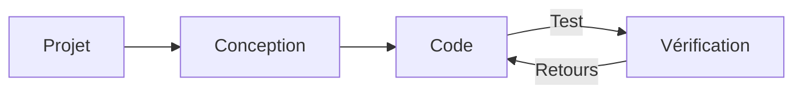
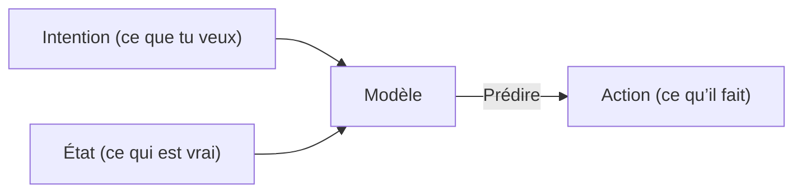

# Développement web

**Navigation:** [← Previous](./13-mode-shell.md) | [Index](./index.md) | [Next →](./15-serveurs-mcp.md)

---

# Développement web
Source: https://docs.cursor.com/fr/guides/tutorials/web-development

Comment configurer Cursor pour le développement web

export const McpInstallButtonPrimary = ({server, showIcon = true, prompt = null}) => {
  const [showModal, setShowModal] = useState(false);
  const generateDeepLink = () => {
    if (!server || !server.name || !server.install) {
      return null;
    }
    try {
      if (typeof server.install === 'string') {
        return server.install;
      }
      if (server.install.url) {
        const config = {
          ...server.install
        };
        const jsonString = JSON.stringify(config);
        const utf8Bytes = new TextEncoder().encode(jsonString);
        const base64Config = btoa(Array.from(utf8Bytes).map(b => String.fromCharCode(b)).join(''));
        const safeBase64Config = base64Config.replace(/\+/g, '%2B');
        return `cursor://anysphere.cursor-deeplink/mcp/install?name=${encodeURIComponent(server.name)}&config=${encodeURIComponent(safeBase64Config)}`;
      }
      if (server.install.command) {
        let config = {
          command: server.install.command,
          ...server.install.args && ({
            args: server.install.args
          }),
          ...server.install.env && ({
            env: server.install.env
          })
        };
        if (config.command && config.args) {
          const argsString = config.args.join(" ");
          config.command = `${config.command} ${argsString}`;
          delete config.args;
        }
        const jsonString = JSON.stringify(config);
        const utf8Bytes = new TextEncoder().encode(jsonString);
        const base64Config = btoa(Array.from(utf8Bytes).map(b => String.fromCharCode(b)).join(''));
        const safeBase64Config = base64Config.replace(/\+/g, '%2B');
        return `cursor://anysphere.cursor-deeplink/mcp/install?name=${encodeURIComponent(server.name)}&config=${encodeURIComponent(safeBase64Config)}`;
      }
      return null;
    } catch (e) {
      console.error("Error generating deep link:", e);
      return null;
    }
  };
  const handleButtonClick = () => {
    setShowModal(true);
  };
  const handleClose = () => {
    setShowModal(false);
  };
  const deepLink = generateDeepLink();
  const isDocumentationOnly = typeof server?.install === 'string';
  const hasConfirmation = prompt || isDocumentationOnly;
  const InstallModal = ({isOpen, onClose, deepLink, server, children}) => {
    useEffect(() => {
      const handleKeyDown = event => {
        if (event.key === 'Escape') {
          onClose();
        }
      };
      if (isOpen) {
        document.addEventListener('keydown', handleKeyDown);
      }
      return () => {
        document.removeEventListener('keydown', handleKeyDown);
      };
    }, [isOpen, onClose]);
    if (!isOpen) return null;
    return <div className="fixed inset-0 bg-black bg-opacity-50 flex items-center justify-center z-50 transition-opacity duration-200" onClick={onClose}>
        <div className="bg-white dark:bg-neutral-900 rounded-lg p-6 max-w-md w-full mx-4 border border-neutral-200 dark:border-neutral-700 transition-all duration-200 transform" onClick={e => e.stopPropagation()}>
          <div className="mb-4">
            <h3 className="text-lg font-semibold text-black dark:text-white mb-2">
              Install {server?.name}
            </h3>
            <div className="text-neutral-600 dark:text-neutral-400">
              {children}
            </div>
          </div>
          <div className="flex gap-3 justify-end">
            <button onClick={onClose} className="px-4 py-2 text-sm font-medium rounded-lg transition-colors duration-200 text-neutral-600 dark:text-neutral-400 hover:text-black dark:hover:text-white border border-neutral-200 dark:border-neutral-700 hover:bg-neutral-100 dark:hover:bg-neutral-800">
              Cancel
            </button>
            <a href={deepLink} onClick={onClose} target="_blank" className="px-4 py-2 text-sm font-medium rounded-lg transition-colors duration-200 bg-black text-white hover:bg-neutral-800 dark:bg-white dark:text-black dark:hover:bg-neutral-200 inline-flex items-center justify-center no-underline">
              Continue
            </a>
          </div>
        </div>
      </div>;
  };
  return <>
      {hasConfirmation ? <button onClick={handleButtonClick} className="inline-flex justify-center items-center gap-2 px-4 py-2 text-sm font-medium rounded-lg transition-colors duration-200 not-prose text-white bg-black hover:bg-neutral-800 dark:bg-white dark:text-black dark:hover:bg-neutral-200 border border-black dark:border-white">
          {showIcon && <Icon icon="plus" size={16} color="currentColor" />}
          Add to Cursor
        </button> : <a href={deepLink} className="inline-flex justify-center items-center gap-2 px-4 py-2 text-sm font-medium rounded-lg transition-colors duration-200 not-prose text-white bg-black hover:bg-neutral-800 dark:bg-white dark:text-black dark:hover:bg-neutral-200 border border-black dark:border-white">
          {showIcon && <Icon icon="plus" size={16} color="currentColor" />}
          Add to Cursor
        </a>}

      {hasConfirmation && <InstallModal isOpen={showModal} onClose={handleClose} deepLink={deepLink} server={server}>
          {prompt}
        </InstallModal>}
    </>;
};

Le développement web implique des itérations rapides et des boucles de feedback rapprochées entre Cursor et des outils externes comme Figma ou le navigateur. Chez Cursor, on a identifié des workflows qui resserrent cette boucle. Une bonne définition des tâches, la réutilisation des composants et l’utilisation de design systems permettent de rester rapide et cohérent.

Ce guide explique comment configurer Cursor pour le développement web et resserrer la boucle de feedback.



<div id="start-orchestrating-in-cursor">
  # Commence à orchestrer dans Cursor
</div>

**Chat** est top pour amorcer des changements. Une fois les éléments majeurs en place, passer à **Inline Edit** et **Tab** t’aide à rester dans le flow.

Après avoir configuré Cursor, tu pourras orchestrer des workflows avec différents outils. Ci-dessous, une démo de ce qui est possible : un jeu Snake créé en combinant Linear, Figma et des outils de navigateur. Même si les projets réels sont généralement plus complexes, cet exemple illustre le potentiel de ces workflows intégrés.

<Frame>
  <video src="https://mintcdn.com/cursor/E7JVsKUF5L-IiJRB/images/guides/tutorials/web-development/snake.mp4?fit=max&auto=format&n=E7JVsKUF5L-IiJRB&q=85&s=e029fbdff2ec06e1e4393ac580824b5a" controls data-path="images/guides/tutorials/web-development/snake.mp4" />
</Frame>

<div id="connect-to-your-project-management-tools">
  # Connecte tes outils de gestion de projet
</div>

Tu peux intégrer Cursor à ton logiciel de gestion de projet existant à l’aide de différents outils. Dans ce guide, on va voir comment intégrer Linear avec son serveur MCP.

<div id="installation">
  ### Installation
</div>

<McpInstallButtonPrimary
  server={{
name: "Linear",
install: {
command: "npx",
args: ["-y", "mcp-remote", "https://mcp.linear.app/sse"],
},
}}
/>

Ou ajoute manuellement le serveur MCP de Linear dans `mcp.json` :

```jsx  theme={null}
{
  "mcpServers": {
    "Linear": {
      "command": "npx",
      "args": [
        "-y",
        "mcp-remote",
        "https://mcp.linear.app/sse"
      ]
    }
  }
}
```

Then:

1. Assure-toi d’activer Linear dans les paramètres MCP
2. Le navigateur web s’ouvrira et tu seras invité·e à autoriser Linear
   <Info>
     En raison de l’état actuel de MCP, la configuration peut nécessiter plusieurs tentatives.
     Si l’intégration ne fonctionne pas, essaie de « Reload » le serveur depuis les paramètres
     de Cursor.
   </Info>

<div id="using-linear-in-cursor">
  ### Utiliser Linear dans Cursor
</div>

Les serveurs MCP de Linear exposent différents outils que Cursor peut utiliser pour lire et gérer les tickets. Va dans les paramètres MCP et repère le serveur Linear pour voir la liste de tous les outils. Pour vérifier, essaie cette invite dans Chat :

```jsx  theme={null}
liste toutes les issues liées à ce projet
```

<Frame>
  
</Frame>

Ça devrait renvoyer une liste de tickets si l’intégration est correctement configurée.

<div id="bring-in-your-figma-designs">
  # Importer tes designs Figma
</div>

Les designs et maquettes sont au cœur du développement web. Avec le serveur MCP officiel pour Figma, tu peux accéder directement aux fichiers de design et travailler dessus dans Cursor. Pour commencer, suis les instructions de configuration sur [Figma Dev Mode MCP Server](https://help.figma.com/hc/en-us/articles/32132100833559-Guide-to-the-Dev-Mode-MCP-Server).

<div id="installation">
  ### Installation
</div>

Tu peux cliquer sur le bouton ci-dessous pour installer le serveur MCP.

<McpInstallButtonPrimary
  server={{
name: "Figma",
install: {
url: "http://127.0.0.1:3845/sse",
},
}}
/>

Ou ajoute-le manuellement à ton `mcp.json` :

```jsx  theme={null}
{
  "mcpServers": {
    "Figma": {
      "url": "http://127.0.0.1:3845/sse"
    }
  }
}
```

<div id="usage">
  ### Utilisation
</div>

Le serveur met à disposition plusieurs outils que tu peux utiliser dans tes prompts. Par exemple, essaie de demander les designs de la sélection en cours dans Figma. En savoir plus dans la [documentation](https://help.figma.com/hc/en-us/articles/32132100833559-Guide-to-the-Dev-Mode-MCP-Server).

<Frame>
  
</Frame>

<div id="keep-your-code-scaffolding-consistent">
  # Garde ton scaffolding de code cohérent
</div>

Tu as probablement déjà du code, un design system ou des conventions établies que tu veux réutiliser. Quand tu bosses avec des modèles, c’est utile de t’appuyer sur les patterns déjà présents dans ta codebase, comme des menus déroulants ou d’autres composants courants.

En bossant nous-mêmes sur une grosse codebase web, on a constaté que le code déclaratif marche particulièrement bien, surtout pour React et JSX.

Si t’as un design system, tu peux aider l’agent à le découvrir en lui fournissant une règle. Voici un fichier `ui-components.mdc` où on essaie de faire respecter la réutilisation des composants quand c’est possible :

```mdc components.mdc theme={null}
---
description: Implémenter les designs et construire l’UI
---
- réutilise les composants d’UI existants de `/src/components/ui`. ce sont les primitives sur lesquelles on peut s’appuyer
- crée de nouveaux composants en orchestrant des composants d’UI si tu n’en trouves aucun qui résout le problème
- demande à l’humain comment il veut procéder lorsqu’il manque des composants et des designs
```

Au fur et à mesure que ta bibliothèque de composants s’étoffe, ajoute de nouvelles règles en conséquence. Quand elles deviennent trop nombreuses, pense à les répartir en catégories plus spécifiques, par exemple « à appliquer uniquement lors de la gestion des saisies utilisateur ».

<Frame>
  
</Frame>

<div id="give-cursor-access-to-browser">
  # Donner à Cursor l’accès au navigateur
</div>

Pour étendre les capacités de Cursor, tu peux configurer le serveur MCP de Browser Tools, qui donne accès aux journaux de console et aux requêtes réseau. Une fois configuré, tu peux valider tes modifications en surveillant la sortie de la console et l’activité réseau. Cette configuration aide à s’assurer que ton implémentation correspond à ton intention. Suis les instructions ici pour configurer le serveur MCP : [https://browsertools.agentdesk.ai/installation](https://browsertools.agentdesk.ai/installation)

<Frame>
  
</Frame>

<Note>
  On travaille à rendre ça plus simple à intégrer nativement dans Cursor.
</Note>

<div id="takeaways">
  # Points clés
</div>

* Des boucles de feedback rapides sont essentielles en développement web. Utilise Cursor avec des outils comme Figma, Linear et le navigateur pour avancer vite et rester dans le flow.
* Les serveurs MCP te permettent d’intégrer des systèmes externes directement dans Cursor, réduisant le switch de contexte et améliorant l’exécution des tâches.
* Réutiliser des composants et des design systems aide le modèle à produire un code et des résultats plus propres et plus cohérents.
* Des tâches claires et bien cadrées donnent de meilleurs résultats. Sois intentionnel dans la façon dont tu rédiges tes prompts et ce que tu demandes.
* Si tu n’obtiens pas de bons résultats, essaie d’ajuster :
  * **Instructions :** Utilise des règles, des prompts, et donne accès à plus de contexte, p. ex. avec des serveurs MCP.
  * **Systèmes :** Des patterns, des abstractions et de la clarté facilitent la compréhension du modèle, son aide et un fonctionnement plus autonome.
* Tu peux étendre le contexte du modèle en incluant des infos d’exécution comme des logs de console, des requêtes réseau et des données d’éléments d’UI.
* Tout n’a pas besoin d’être automatisé. Si ton système devient trop complexe, reviens à des modifications plus chirurgicales avec Tab et Inline Edit.
* Cursor est le plus puissant quand c’est un copilote, pas un autopilote. Utilise-le pour améliorer — pas remplacer — ta propre prise de décision.


# Travailler avec le contexte
Source: https://docs.cursor.com/fr/guides/working-with-context

Comment travailler avec le contexte dans Cursor

D’abord, c’est quoi une fenêtre de contexte ? Et quel rapport avec le fait de coder efficacement avec Cursor ?

Pour prendre un peu de recul, un large language model (LLM) est un modèle d’IA entraîné à prédire et générer du texte en apprenant des motifs à partir d’énormes jeux de données. Il alimente des outils comme Cursor en comprenant ce que tu saisis et en suggérant du code ou du texte en fonction de ce qu’il a déjà vu.

Les tokens sont les entrées et sorties de ces modèles. Ce sont des morceaux de texte, souvent des fragments de mots, qu’un LLM traite un par un. Les modèles ne lisent pas des phrases entières d’un coup ; ils prédisent le token suivant à partir de ceux qui le précèdent.

Pour voir comment du texte est tokenisé, tu peux utiliser un tokenizer comme [celui-ci](https://tiktokenizer.vercel.app/).


<div id="what-is-context">
  # C’est quoi le contexte ?
</div>

Quand on génère une suggestion de code dans Cursor, le « contexte » désigne les informations fournies au modèle (sous forme de « jetons d’entrée ») que le modèle utilise ensuite pour prédire la suite (sous forme de « jetons de sortie »).

Il existe deux types de contexte :

1. **Contexte d’intention**: ce que tu veux obtenir du modèle. Par exemple, un system prompt sert généralement d’instructions de haut niveau sur la façon dont tu veux que le modèle se comporte. La plupart du « prompting » dans Cursor relève du contexte d’intention. « Passe ce bouton du bleu au vert » est un exemple d’intention explicite ; c’est prescriptif.
2. **Contexte d’état**: l’état du monde à l’instant T. Fournir à Cursor des messages d’erreur, des logs de console, des images ou des extraits de code sont des exemples de contexte lié à l’état. C’est descriptif, pas prescriptif.

Ensemble, ces deux types de contexte fonctionnent de concert en décrivant l’état actuel et l’état futur souhaité, ce qui permet à Cursor de proposer des suggestions de code pertinentes.



<div id="providing-context-in-cursor">
  # Fournir du contexte dans Cursor
</div>

Plus tu fournis de contexte pertinent à un modèle, plus il sera utile. Si le contexte donné dans Cursor est insuffisant, le modèle va tenter de résoudre le problème sans les infos nécessaires. Ça mène généralement à :

1. Des hallucinations où le modèle essaie de faire du pattern matching (alors qu’il n’y a pas de pattern), entraînant des résultats inattendus. Ça peut arriver souvent avec des modèles comme `claude-3.5-sonnet` quand ils n’ont pas assez de contexte.
2. L’Agent qui cherche à réunir le contexte par lui-même en explorant la codebase, en lisant des fichiers et en appelant des outils. Un modèle avec de fortes capacités de raisonnement (comme `claude-3.7-sonnet`) peut aller assez loin avec cette stratégie, et fournir le bon contexte initial va en déterminer la trajectoire.

La bonne nouvelle, c’est que Cursor est conçu avec la conscience du contexte au cœur et vise à nécessiter un minimum d’intervention de ta part. Cursor récupère automatiquement les parties de ta codebase que le modèle estime pertinentes, comme le fichier en cours, des patterns sémantiquement similaires dans d’autres fichiers, et d’autres infos de ta session.

Cependant, il y a énormément de contexte possible à exploiter, donc préciser manuellement le contexte que tu sais pertinent pour la tâche est une bonne façon d’orienter les modèles dans la bonne direction.

<div id="symbol">
  ## Symbole @
</div>

La façon la plus simple de fournir un contexte explicite, c’est d’utiliser le symbole @. C’est idéal quand tu sais précisément quel fichier, dossier, site web ou autre élément de contexte tu veux inclure. Plus tu es précis, mieux c’est. Voici comment affiner le contexte de manière plus ciblée :

| Symbole   | Exemple              | Cas d’usage                                                                             | Inconvénient                                                                             |
| --------- | -------------------- | --------------------------------------------------------------------------------------- | ---------------------------------------------------------------------------------------- |
| `@code`   | `@LRUCachedFunction` | Tu sais quelle fonction, constante ou quel symbole est pertinent pour la sortie générée | Nécessite une bonne connaissance de la base de code                                      |
| `@file`   | `cache.ts`           | Tu sais quel fichier doit être lu ou modifié, mais pas exactement où dans le fichier    | Peut inclure beaucoup de contexte non pertinent pour la tâche selon la taille du fichier |
| `@folder` | `utils/`             | Tous ou la majorité des fichiers d’un dossier sont pertinents                           | Peut inclure beaucoup de contexte non pertinent pour la tâche                            |


<div id="rules">
  ## Règles
</div>

Pense aux règles comme à une mémoire à long terme à laquelle toi ou les autres membres de ton équipe pouvez accéder. Capturer le contexte spécifique à ton domaine — workflows, formatage et autres conventions — est un excellent point de départ pour rédiger des règles.

Tu peux aussi générer des règles à partir de conversations existantes avec `/Generate Cursor Rules`. Si tu as eu une longue conversation en aller-retour avec beaucoup de prompts, il y a probablement des directives utiles ou des règles générales que tu voudras réutiliser plus tard.


<div id="mcp">
  ## MCP
</div>

Le [Model Context Protocol](https://modelcontextprotocol.io/introduction) est une couche d’extensibilité qui permet à Cursor d’exécuter des actions et d’ingérer du contexte externe.

Selon ta config de développement, tu peux t’appuyer sur différents types de serveurs, mais deux catégories qu’on trouve particulièrement utiles sont :

* **Documentation interne** : p. ex. Notion, Confluence, Google Docs
* **Gestion de projet** : p. ex. Linear, Jira

Si tu as déjà des outils pour accéder au contexte et exécuter des actions via une API, tu peux créer un serveur MCP pour ça. Voici un court guide pour construire des [serveurs MCP](https://modelcontextprotocol.io/tutorials/building-mcp-with-llms).


<div id="self-gathering-context">
  ## Auto-collecte de contexte
</div>

Un modèle d’utilisation puissant que beaucoup d’utilisateurs adoptent consiste à laisser l’Agent écrire de petits outils temporaires qu’il peut ensuite exécuter pour rassembler plus de contexte. C’est particulièrement efficace dans des workflows avec humain dans la boucle, où tu passes en revue le code avant son exécution.

Par exemple, ajouter des instructions de débogage à ton code, l’exécuter, puis laisser le modèle inspecter la sortie lui donne accès à un contexte dynamique qu’il ne pourrait pas déduire de manière statique.

En Python, tu peux faire ça en demandant à l’Agent de :

1. Ajouter des print("debugging: ...") aux endroits pertinents du code
2. Exécuter le code ou les tests via le terminal

L’Agent lira la sortie du terminal et décidera de la suite. L’idée centrale est de donner à l’Agent accès au comportement réel à l’exécution, pas seulement au code statique.


<div id="takeaways">
  # Points clés
</div>

* Le contexte est la base d’un codage IA efficace. Il se compose de l’intention (ce que tu veux) et de l’état (ce qui existe). Fournir les deux aide Cursor à faire des prédictions précises.
* Utilise un contexte chirurgical avec les symboles @ (@code, @file, @folder) pour guider Cursor avec précision, plutôt que de te reposer uniquement sur la collecte automatique de contexte.
* Capture les connaissances récurrentes dans des règles pour les réutiliser à l’échelle de l’équipe, et étends les capacités de Cursor avec le Model Context Protocol pour connecter des systèmes externes.
* Un contexte insuffisant mène à des hallucinations ou à de l’inefficacité, tandis qu’un excès de contexte non pertinent dilue le signal. Trouve le bon équilibre pour des résultats optimaux.


# Modification en ligne
Source: https://docs.cursor.com/fr/inline-edit/overview

Modifie et pose des questions avec la modification en ligne (Cmd/Ctrl+K) dans Cursor

export const Kbd = ({children, tooltip, os}) => {
  const keysInput = typeof children === 'string' && children.trim() !== '' ? children : null;
  if (!keysInput) {
    return null;
  }
  const isModifier = key => {
    const modifiers = ['⌘', '⇧', '⌥', '⌃', '⏎', '⌫', '⌦', '⎋', '⇥', '⌁', '←', '→', '↑', '↓', 'Ctrl', 'Shift', 'Alt', 'Cmd', 'Opt', 'Return', 'Backspace', 'Delete', 'Escape', 'Tab', 'Space', 'Enter', 'Esc', 'ArrowLeft', 'ArrowRight', 'ArrowUp', 'ArrowDown', 'Left', 'Right', 'Up', 'Down'];
    return modifiers.includes(key.trim());
  };
  const capitalizeFirstLetter = string => {
    return string.charAt(0).toUpperCase() + string.slice(1);
  };
  const isMac = os ? os.toLowerCase() === 'mac' || os.toLowerCase() === 'macos' : typeof navigator !== 'undefined' && (navigator.platform.toUpperCase().indexOf('MAC') >= 0 || navigator.userAgent.toUpperCase().indexOf('MAC') >= 0);
  const convertToSymbols = shortcut => {
    if (isMac) {
      return shortcut.replace(/⌘|Cmd|CMD/gi, '⌘').replace(/⌥|Opt|OPT/gi, '⌥').replace(/⌃|Ctrl/gi, '⌃').replace(/⇧|Shift/gi, '⇧').replace(/⏎|Return/gi, '⏎').replace(/⌫|Backspace/gi, '⌫').replace(/⌦|Delete/gi, '⌦').replace(/␛|Escape/gi, '␛').replace(/⇥|Tab/gi, '⇥').replace(/⌁|Space/gi, '⌁').replace(/←|Arrow\s*Left|ArrowLeft|Left/gi, '←').replace(/→|Arrow\s*Right|ArrowRight|Right/gi, '→').replace(/↑|Arrow\s*Up|ArrowUp|Up/gi, '↑').replace(/↓|Arrow\s*Down|ArrowDown|Down/gi, '↓');
    } else {
      const converted = shortcut.replace(/⌘|Cmd|CMD/gi, 'Ctrl').replace(/⌥|Opt|OPT/gi, 'Alt').replace(/⌃|Ctrl/gi, 'Ctrl').replace(/⇧|Shift/gi, 'Shift').replace(/⏎|Return/gi, 'Enter').replace(/⌫|Backspace/gi, 'Backspace').replace(/⌦|Delete/gi, 'Delete').replace(/⎋|Escape/gi, 'Esc').replace(/⇥|Tab/gi, 'Tab').replace(/⌁|Space/gi, 'Space').replace(/←|Arrow\s*Left|ArrowLeft|Left/gi, 'Arrow-Left').replace(/→|Arrow\s*Right|ArrowRight|Right/gi, 'Arrow-Right').replace(/↑|Arrow\s*Up|ArrowUp|Up/gi, 'Arrow-Up').replace(/↓|Arrow\s*Down|ArrowDown|Down/gi, 'Arrow-Down');
      const keyList = converted.split(/[\+\s]+/).filter(key => key.trim());
      return keyList.join('+');
    }
  };
  const convertToReadableText = shortcut => {
    const converted = shortcut.replace(/⌘|Cmd|CMD/gi, 'Cmd').replace(/⌥|Opt|OPT/gi, 'Opt').replace(/⌃|Ctrl/gi, 'Ctrl').replace(/⇧|Shift/gi, 'Shift').replace(/⏎|Return/gi, 'Return').replace(/⌫|Backspace/gi, 'Backspace').replace(/⌦|Delete/gi, 'Delete').replace(/⎋|Escape/gi, 'Escape').replace(/⇥|Tab/gi, 'Tab').replace(/⌁|Space/gi, 'Space').replace(/←|Arrow\s*Left|ArrowLeft|Left/gi, 'Arrow-Left').replace(/→|Arrow\s*Right|ArrowRight|Right/gi, 'Arrow-Right').replace(/↑|Arrow\s*Up|ArrowUp|Up/gi, 'Arrow-Up').replace(/↓|Arrow\s*Down|ArrowDown|Down/gi, 'Arrow-Down');
    const keyList = converted.split(/[\+\s]+/).filter(key => key.trim());
    return keyList.map(key => {
      const trimmedKey = key.trim();
      return isModifier(trimmedKey) ? trimmedKey : capitalizeFirstLetter(trimmedKey);
    }).join('+');
  };
  const displayShortcut = convertToSymbols(keysInput);
  const tooltipText = isMac ? tooltip ? `${convertToReadableText(keysInput)}: ${tooltip}` : convertToReadableText(keysInput) : tooltip || null;
  const processedKeys = isMac ? displayShortcut.split(/[\+\s]+/).filter(key => key.trim()).map(key => {
    const trimmedKey = key.trim();
    return isModifier(trimmedKey) ? trimmedKey : capitalizeFirstLetter(trimmedKey);
  }).join('') : displayShortcut.split('+').map(key => {
    const trimmedKey = key.trim();
    return isModifier(trimmedKey) ? trimmedKey : capitalizeFirstLetter(trimmedKey);
  }).join('+');
  return tooltipText ? <Tooltip tip={tooltipText}>
      <kbd>
        {processedKeys}
      </kbd>
    </Tooltip> : <kbd>
      {processedKeys}
    </kbd>;
};

Inline Edit te permet de modifier du code ou de poser des questions directement dans ton éditeur avec <Kbd>Cmd+K</Kbd>. Ça ouvre un champ de saisie où le code que tu as sélectionné et tes instructions forment ta requête.

<Frame>
  
</Frame>

<div id="modes">
  ## Modes
</div>

<div id="edit-selection">
  ### Modifier la sélection
</div>

Avec du code sélectionné, <Kbd>Cmd+K</Kbd> modifie ce code précis selon tes instructions.

<Frame>
  
</Frame>

Sans sélection, Cursor génère du nouveau code à la position de ton curseur. L’IA inclut le code environnant pertinent pour le contexte. Par exemple, déclencher sur un nom de fonction inclut toute la fonction.

<div id="quick-question">
  ### Question rapide
</div>

Appuie sur <Kbd>Opt+Return</Kbd> dans l’éditeur inline pour poser des questions sur le code sélectionné.

Après avoir obtenu une réponse, tape « do it » ou une formulation similaire pour convertir la suggestion en code. Ça te permet d’explorer des idées avant de les implémenter.

<Frame>
  
</Frame>

<div id="full-file-edits">
  ### Modifications du fichier complet
</div>

Pour des changements à l’échelle du fichier, utilise <Kbd>Cmd+Shift+Return</Kbd>. Ce mode permet des modifications globales tout en gardant le contrôle.

<Frame>
  
</Frame>

<div id="send-to-chat">
  ### Envoyer au chat
</div>

Pour des modifications multi-fichiers ou des fonctionnalités avancées, utilise <Kbd>Cmd+L</Kbd> pour envoyer le code sélectionné au [Chat](/fr/agent/modes#agent). Ça offre l’édition multi-fichiers, des explications détaillées et des capacités d’IA avancées.

<Frame>
  <video src="https://mintcdn.com/cursor/E7JVsKUF5L-IiJRB/images/inline-edit/send-to-chat.mp4?fit=max&auto=format&n=E7JVsKUF5L-IiJRB&q=85&s=04a84c73c8736a733f1748fd86ac437f" autoPlay loop muted playsInline controls data-path="images/inline-edit/send-to-chat.mp4" />
</Frame>

<div id="follow-up-instructions">
  ## Instructions de suivi
</div>

Après chaque modification, affine le résultat en ajoutant des instructions, puis appuie sur <Kbd>Return</Kbd>. L’IA met à jour les changements en fonction de ton retour.

<div id="default-context">
  ## Contexte par défaut
</div>

Inline Edit inclut un contexte par défaut pour améliorer la génération de code, en plus de tous les [symboles @](/fr/context/@-symbols/@-files) que tu ajoutes.

Cela inclut des fichiers connexes, du code récemment consulté et des informations pertinentes. Cursor privilégie le contexte le plus pertinent pour de meilleurs résultats.


# Terminal
Source: https://docs.cursor.com/fr/inline-edit/terminal

Génère des commandes pour le terminal avec Cmd/Ctrl+K

export const Kbd = ({children, tooltip, os}) => {
  const keysInput = typeof children === 'string' && children.trim() !== '' ? children : null;
  if (!keysInput) {
    return null;
  }
  const isModifier = key => {
    const modifiers = ['⌘', '⇧', '⌥', '⌃', '⏎', '⌫', '⌦', '⎋', '⇥', '⌁', '←', '→', '↑', '↓', 'Ctrl', 'Shift', 'Alt', 'Cmd', 'Opt', 'Return', 'Backspace', 'Delete', 'Escape', 'Tab', 'Space', 'Enter', 'Esc', 'ArrowLeft', 'ArrowRight', 'ArrowUp', 'ArrowDown', 'Left', 'Right', 'Up', 'Down'];
    return modifiers.includes(key.trim());
  };
  const capitalizeFirstLetter = string => {
    return string.charAt(0).toUpperCase() + string.slice(1);
  };
  const isMac = os ? os.toLowerCase() === 'mac' || os.toLowerCase() === 'macos' : typeof navigator !== 'undefined' && (navigator.platform.toUpperCase().indexOf('MAC') >= 0 || navigator.userAgent.toUpperCase().indexOf('MAC') >= 0);
  const convertToSymbols = shortcut => {
    if (isMac) {
      return shortcut.replace(/⌘|Cmd|CMD/gi, '⌘').replace(/⌥|Opt|OPT/gi, '⌥').replace(/⌃|Ctrl/gi, '⌃').replace(/⇧|Shift/gi, '⇧').replace(/⏎|Return/gi, '⏎').replace(/⌫|Backspace/gi, '⌫').replace(/⌦|Delete/gi, '⌦').replace(/␛|Escape/gi, '␛').replace(/⇥|Tab/gi, '⇥').replace(/⌁|Space/gi, '⌁').replace(/←|Arrow\s*Left|ArrowLeft|Left/gi, '←').replace(/→|Arrow\s*Right|ArrowRight|Right/gi, '→').replace(/↑|Arrow\s*Up|ArrowUp|Up/gi, '↑').replace(/↓|Arrow\s*Down|ArrowDown|Down/gi, '↓');
    } else {
      const converted = shortcut.replace(/⌘|Cmd|CMD/gi, 'Ctrl').replace(/⌥|Opt|OPT/gi, 'Alt').replace(/⌃|Ctrl/gi, 'Ctrl').replace(/⇧|Shift/gi, 'Shift').replace(/⏎|Return/gi, 'Enter').replace(/⌫|Backspace/gi, 'Backspace').replace(/⌦|Delete/gi, 'Delete').replace(/⎋|Escape/gi, 'Esc').replace(/⇥|Tab/gi, 'Tab').replace(/⌁|Space/gi, 'Space').replace(/←|Arrow\s*Left|ArrowLeft|Left/gi, 'Arrow-Left').replace(/→|Arrow\s*Right|ArrowRight|Right/gi, 'Arrow-Right').replace(/↑|Arrow\s*Up|ArrowUp|Up/gi, 'Arrow-Up').replace(/↓|Arrow\s*Down|ArrowDown|Down/gi, 'Arrow-Down');
      const keyList = converted.split(/[\+\s]+/).filter(key => key.trim());
      return keyList.join('+');
    }
  };
  const convertToReadableText = shortcut => {
    const converted = shortcut.replace(/⌘|Cmd|CMD/gi, 'Cmd').replace(/⌥|Opt|OPT/gi, 'Opt').replace(/⌃|Ctrl/gi, 'Ctrl').replace(/⇧|Shift/gi, 'Shift').replace(/⏎|Return/gi, 'Return').replace(/⌫|Backspace/gi, 'Backspace').replace(/⌦|Delete/gi, 'Delete').replace(/⎋|Escape/gi, 'Escape').replace(/⇥|Tab/gi, 'Tab').replace(/⌁|Space/gi, 'Space').replace(/←|Arrow\s*Left|ArrowLeft|Left/gi, 'Arrow-Left').replace(/→|Arrow\s*Right|ArrowRight|Right/gi, 'Arrow-Right').replace(/↑|Arrow\s*Up|ArrowUp|Up/gi, 'Arrow-Up').replace(/↓|Arrow\s*Down|ArrowDown|Down/gi, 'Arrow-Down');
    const keyList = converted.split(/[\+\s]+/).filter(key => key.trim());
    return keyList.map(key => {
      const trimmedKey = key.trim();
      return isModifier(trimmedKey) ? trimmedKey : capitalizeFirstLetter(trimmedKey);
    }).join('+');
  };
  const displayShortcut = convertToSymbols(keysInput);
  const tooltipText = isMac ? tooltip ? `${convertToReadableText(keysInput)}: ${tooltip}` : convertToReadableText(keysInput) : tooltip || null;
  const processedKeys = isMac ? displayShortcut.split(/[\+\s]+/).filter(key => key.trim()).map(key => {
    const trimmedKey = key.trim();
    return isModifier(trimmedKey) ? trimmedKey : capitalizeFirstLetter(trimmedKey);
  }).join('') : displayShortcut.split('+').map(key => {
    const trimmedKey = key.trim();
    return isModifier(trimmedKey) ? trimmedKey : capitalizeFirstLetter(trimmedKey);
  }).join('+');
  return tooltipText ? <Tooltip tip={tooltipText}>
      <kbd>
        {processedKeys}
      </kbd>
    </Tooltip> : <kbd>
      {processedKeys}
    </kbd>;
};

Dans le terminal de Cursor, appuie sur <Kbd>Cmd+K</Kbd> pour ouvrir une barre de commande en bas.
Décris l’action que tu veux effectuer et Inline Edit génère la commande.

<Frame>
  
</Frame>

Dans le terminal, Inline Edit utilise ton historique récent, tes instructions et le contenu de ta demande comme contexte.


# Git
Source: https://docs.cursor.com/fr/integrations/git

Fonctionnalités Git propulsées par l’IA, notamment la génération de messages de commit et la résolution de conflits de fusion

export const Kbd = ({children, tooltip, os}) => {
  const keysInput = typeof children === 'string' && children.trim() !== '' ? children : null;
  if (!keysInput) {
    return null;
  }
  const isModifier = key => {
    const modifiers = ['⌘', '⇧', '⌥', '⌃', '⏎', '⌫', '⌦', '⎋', '⇥', '⌁', '←', '→', '↑', '↓', 'Ctrl', 'Shift', 'Alt', 'Cmd', 'Opt', 'Return', 'Backspace', 'Delete', 'Escape', 'Tab', 'Space', 'Enter', 'Esc', 'ArrowLeft', 'ArrowRight', 'ArrowUp', 'ArrowDown', 'Left', 'Right', 'Up', 'Down'];
    return modifiers.includes(key.trim());
  };
  const capitalizeFirstLetter = string => {
    return string.charAt(0).toUpperCase() + string.slice(1);
  };
  const isMac = os ? os.toLowerCase() === 'mac' || os.toLowerCase() === 'macos' : typeof navigator !== 'undefined' && (navigator.platform.toUpperCase().indexOf('MAC') >= 0 || navigator.userAgent.toUpperCase().indexOf('MAC') >= 0);
  const convertToSymbols = shortcut => {
    if (isMac) {
      return shortcut.replace(/⌘|Cmd|CMD/gi, '⌘').replace(/⌥|Opt|OPT/gi, '⌥').replace(/⌃|Ctrl/gi, '⌃').replace(/⇧|Shift/gi, '⇧').replace(/⏎|Return/gi, '⏎').replace(/⌫|Backspace/gi, '⌫').replace(/⌦|Delete/gi, '⌦').replace(/␛|Escape/gi, '␛').replace(/⇥|Tab/gi, '⇥').replace(/⌁|Space/gi, '⌁').replace(/←|Arrow\s*Left|ArrowLeft|Left/gi, '←').replace(/→|Arrow\s*Right|ArrowRight|Right/gi, '→').replace(/↑|Arrow\s*Up|ArrowUp|Up/gi, '↑').replace(/↓|Arrow\s*Down|ArrowDown|Down/gi, '↓');
    } else {
      const converted = shortcut.replace(/⌘|Cmd|CMD/gi, 'Ctrl').replace(/⌥|Opt|OPT/gi, 'Alt').replace(/⌃|Ctrl/gi, 'Ctrl').replace(/⇧|Shift/gi, 'Shift').replace(/⏎|Return/gi, 'Enter').replace(/⌫|Backspace/gi, 'Backspace').replace(/⌦|Delete/gi, 'Delete').replace(/⎋|Escape/gi, 'Esc').replace(/⇥|Tab/gi, 'Tab').replace(/⌁|Space/gi, 'Space').replace(/←|Arrow\s*Left|ArrowLeft|Left/gi, 'Arrow-Left').replace(/→|Arrow\s*Right|ArrowRight|Right/gi, 'Arrow-Right').replace(/↑|Arrow\s*Up|ArrowUp|Up/gi, 'Arrow-Up').replace(/↓|Arrow\s*Down|ArrowDown|Down/gi, 'Arrow-Down');
      const keyList = converted.split(/[\+\s]+/).filter(key => key.trim());
      return keyList.join('+');
    }
  };
  const convertToReadableText = shortcut => {
    const converted = shortcut.replace(/⌘|Cmd|CMD/gi, 'Cmd').replace(/⌥|Opt|OPT/gi, 'Opt').replace(/⌃|Ctrl/gi, 'Ctrl').replace(/⇧|Shift/gi, 'Shift').replace(/⏎|Return/gi, 'Return').replace(/⌫|Backspace/gi, 'Backspace').replace(/⌦|Delete/gi, 'Delete').replace(/⎋|Escape/gi, 'Escape').replace(/⇥|Tab/gi, 'Tab').replace(/⌁|Space/gi, 'Space').replace(/←|Arrow\s*Left|ArrowLeft|Left/gi, 'Arrow-Left').replace(/→|Arrow\s*Right|ArrowRight|Right/gi, 'Arrow-Right').replace(/↑|Arrow\s*Up|ArrowUp|Up/gi, 'Arrow-Up').replace(/↓|Arrow\s*Down|ArrowDown|Down/gi, 'Arrow-Down');
    const keyList = converted.split(/[\+\s]+/).filter(key => key.trim());
    return keyList.map(key => {
      const trimmedKey = key.trim();
      return isModifier(trimmedKey) ? trimmedKey : capitalizeFirstLetter(trimmedKey);
    }).join('+');
  };
  const displayShortcut = convertToSymbols(keysInput);
  const tooltipText = isMac ? tooltip ? `${convertToReadableText(keysInput)}: ${tooltip}` : convertToReadableText(keysInput) : tooltip || null;
  const processedKeys = isMac ? displayShortcut.split(/[\+\s]+/).filter(key => key.trim()).map(key => {
    const trimmedKey = key.trim();
    return isModifier(trimmedKey) ? trimmedKey : capitalizeFirstLetter(trimmedKey);
  }).join('') : displayShortcut.split('+').map(key => {
    const trimmedKey = key.trim();
    return isModifier(trimmedKey) ? trimmedKey : capitalizeFirstLetter(trimmedKey);
  }).join('+');
  return tooltipText ? <Tooltip tip={tooltipText}>
      <kbd>
        {processedKeys}
      </kbd>
    </Tooltip> : <kbd>
      {processedKeys}
    </kbd>;
};

Cursor propose des fonctionnalités Git boostées par l’IA pour fluidifier ton workflow, comme la génération automatique de messages de commit et la résolution intelligente des conflits de merge.

<div id="ai-commit-message">
  ## Message de commit IA
</div>

Cursor génère des messages de commit à partir des modifications indexées.

1. Indexe les fichiers à committer
2. Ouvre l’onglet Git dans la barre latérale
3. Clique sur l’icône scintillante (✨) à côté du champ du message de commit

Les messages générés s’appuient sur les modifications indexées et l’historique Git du dépôt. Si tu utilises des conventions comme [Conventional Commits](https://www.conventionalcommits.org/), les messages suivent le même format.

<div id="add-shortcut">
  ### Ajouter un raccourci
</div>

Pour l’associer à un raccourci clavier :

1. Va dans Keyboard Shortcuts (<Kbd>Cmd+R Cmd+S</Kbd> ou <Kbd>Cmd+Shift+P</Kbd> puis recherche "Open Keyboard Shortcuts (JSON)")
2. Ajoute cette association pour <Kbd>Cmd+M</Kbd> :
   ```json  theme={null}
   {
     "key": "cmd+m",
     "command": "cursor.generateGitCommitMessage"
   }
   ```
3. Enregistre

<Info>
  Tu ne peux pas personnaliser la génération des messages de commit. Cursor s’adapte à ton style de commit actuel.
</Info>

<div id="ai-resolve-conflicts">
  ## Résoudre les conflits avec l’IA
</div>

Quand des conflits de fusion surviennent, Cursor Agent peut aider à les résoudre en comprenant les deux côtés du conflit et en proposant une résolution.

<div id="how-to-use">
  ### Comment l’utiliser
</div>

1. Quand un conflit de fusion se produit, tu verras les marqueurs de conflit dans ton fichier
2. Clique sur le bouton **Resolve in Chat** qui apparaît dans l’interface de résolution de conflit
3. L’Agent analysera les deux versions et proposera une résolution
4. Passe en revue les modifications proposées et applique-les


# GitHub
Source: https://docs.cursor.com/fr/integrations/github

Application GitHub officielle de Cursor pour les agents en arrière-plan

[Background Agents](/fr/background-agent) et [Bugbot](/fr/bugbot) requièrent l’application GitHub de Cursor pour cloner des dépôts et pousser des modifications.

<div id="installation">
  ## Installation
</div>

1. Va sur [Intégrations dans le tableau de bord](https://cursor.com/dashboard?tab=integrations)
2. Clique sur **Connect** à côté de GitHub
3. Choisis le dépôt : **All repositories** ou **Selected repositories**

Pour déconnecter ton compte GitHub, retourne sur le tableau de bord des intégrations et clique sur **Disconnect Account**.

<div id="using-agent-in-github">
  ## Utiliser Agent dans GitHub
</div>

L’intégration GitHub permet d’exécuter des workflows d’agent en arrière‑plan directement depuis les pull requests et les issues. Tu peux déclencher un agent pour lire le contexte, appliquer des correctifs et pousser des commits en commentant `@cursor [prompt]` sur n’importe quel PR ou issue.

Si tu as [Bugbot](/fr/bugbot) activé, tu peux commenter `@cursor fix` pour lire la correction suggérée par Bugbot et déclencher un agent en arrière‑plan pour traiter le problème.

<div id="permissions">
  ## Permissions
</div>

L’appli GitHub a besoin d’autorisations spécifiques pour fonctionner avec les agents en arrière-plan :

<div className="full-width-table">
  | Permission                | Purpose                                                                     |
  | ------------------------- | --------------------------------------------------------------------------- |
  | **Repository access**     | Cloner ton code et créer des branches de travail                            |
  | **Pull requests**         | Créer des PR avec les changements des agents pour que tu puisses les relire |
  | **Issues**                | Suivre les bugs et les tâches que les agents découvrent ou corrigent        |
  | **Checks and statuses**   | Rendre compte de la qualité du code et des résultats de tests               |
  | **Actions and workflows** | Surveiller les pipelines CI/CD et l’état des déploiements                   |
</div>

Toutes les autorisations respectent le principe du moindre privilège nécessaire au fonctionnement des agents en arrière-plan.

<div id="ip-allow-list-configuration">
  ## Configuration de la liste d’autorisation d’IP
</div>

Si ton organisation utilise la fonctionnalité de liste d’autorisation d’IP de GitHub pour restreindre l’accès à tes dépôts, tu dois d’abord contacter le support pour activer la fonctionnalité de liste d’autorisation d’IP pour ton équipe.

<div id="contact-support">
  ### Contacter le support
</div>

Avant de configurer des listes d’autorisation d’IP, contacte [hi@cursor.com](mailto:hi@cursor.com) pour activer cette fonctionnalité pour ton équipe. C’est requis pour les deux méthodes de configuration ci-dessous.

<div id="enable-ip-allow-list-configuration-for-installed-github-apps-recommended">
  ### Activer la configuration de la liste d’autorisation d’IP pour les applications GitHub installées (recommandé)
</div>

L’application GitHub Cursor a déjà la liste d’IP préconfigurée. Tu peux activer la liste d’autorisation pour les applications installées afin d’hériter automatiquement de cette liste. C’est l’approche **recommandée**, car elle nous permet de mettre à jour la liste et ton organisation reçoit les mises à jour automatiquement.

Pour l’activer :

1. Va dans les paramètres de sécurité de ton organisation
2. Accède aux paramètres de la liste d’autorisation d’IP
3. Coche **« Allow access by GitHub Apps »**

Pour des instructions détaillées, consulte [la documentation de GitHub](https://docs.github.com/en/enterprise-cloud@latest/organizations/keeping-your-organization-secure/managing-security-settings-for-your-organization/managing-allowed-ip-addresses-for-your-organization#allowing-access-by-github-apps).

<div id="add-ips-directly-to-your-allowlist">
  ### Ajouter des IP directement à ta liste d’autorisation
</div>

Si ton organisation utilise des listes d’autorisation définies par un IdP dans GitHub ou ne peut pas utiliser la liste d’autorisation préconfigurée, tu peux ajouter les adresses IP manuellement :

```
184.73.225.134
3.209.66.12
52.44.113.131
```

<Note>
  La liste d’adresses IP peut occasionnellement changer. Les équipes utilisant des listes d’autorisation d’IP seront prévenues à l’avance avant tout ajout ou suppression d’adresses IP.
</Note>

<div id="troubleshooting">
  ## Dépannage
</div>

<AccordionGroup>
  <Accordion title="L'agent ne peut pas accéder au dépôt">
    * Installe l'app GitHub avec accès au dépôt
    * Vérifie les permissions du dépôt pour les dépôts privés
    * Vérifie les permissions de ton compte GitHub
  </Accordion>

  <Accordion title="Accès refusé pour les pull requests">
    * Accorde à l'app l'accès en écriture aux pull requests
    * Vérifie les règles de protection de branches
    * Réinstalle si l'installation de l'app a expiré
  </Accordion>

  <Accordion title="App non visible dans les paramètres GitHub">
    * Vérifie si elle est installée au niveau de l'organisation
    * Réinstalle depuis [github.com/apps/cursor](https://github.com/apps/cursor)
    * Contacte le support si l'installation est corrompue
  </Accordion>
</AccordionGroup>


# Linear
Source: https://docs.cursor.com/fr/integrations/linear

Utilise des Background Agents depuis Linear

Utilise les [Background Agents](/fr/background-agent) directement depuis Linear en déléguant des tickets à Cursor ou en mentionnant `@Cursor` dans les commentaires.

<Frame>
  <video src="https://mintcdn.com/cursor/E7JVsKUF5L-IiJRB/images/integrations/linear/linear-agent.mp4?fit=max&auto=format&n=E7JVsKUF5L-IiJRB&q=85&s=ac4bacf6bf42c541f45325ba72f8c25f" controls autoPlay muted loop playsInline data-path="images/integrations/linear/linear-agent.mp4" />
</Frame>

<div id="get-started">
  ## Pour commencer
</div>

<div id="installation">
  ### Installation
</div>

<Note>
  Tu dois être admin Cursor pour connecter l’intégration Linear. D’autres réglages d’équipe sont disponibles pour les membres non admins.
</Note>

1. Va sur [Cursor integrations](https://www.cursor.com/en/dashboard?tab=integrations)
2. Clique sur *Connect* à côté de Linear
3. Connecte ton espace de travail Linear et sélectionne l’équipe
4. Clique sur *Authorize*
5. Termine la configuration restante de Background Agent dans Cursor :
   * Connecte GitHub et sélectionne le dépôt par défaut
   * Active la tarification à l’usage
   * Confirme les paramètres de confidentialité

<div id="account-linking">
  ### Association de compte
</div>

La première utilisation déclenche l’association de compte entre Cursor et Linear. Connexion à GitHub requise pour créer des PR.

<div id="how-to-use">
  ## Comment l’utiliser
</div>

Délègue des tickets à Cursor ou mentionne `@Cursor` dans les commentaires. Cursor analyse les tickets et filtre automatiquement les tâches non liées au développement.

<div id="delegating-issues">
  ### Déléguer des tickets
</div>

1. Ouvre le ticket Linear
2. Clique sur le champ d’assignation
3. Sélectionne « Cursor »

<Frame>
  
</Frame>

<div id="mentioning-cursor">
  ### Mentionner Cursor
</div>

Mentionne `@Cursor` dans un commentaire pour créer un nouvel agent ou fournir des instructions supplémentaires, par exemple : `@Cursor corrige le bug d’authentification décrit ci-dessus`.

<div id="workflow">
  ## Flux de travail
</div>

Les Background Agents affichent leur statut en temps réel dans Linear et créent des PR automatiquement une fois terminés. Suis l’avancement dans le [dashboard Cursor](https://www.cursor.com/dashboard?tab=background-agents).

<Frame>
  
</Frame>

<div id="follow-up-instructions">
  ### Instructions de suivi
</div>

Tu peux répondre dans la session de l’agent et ton message sera envoyé comme suivi à l’agent. Mentionne simplement `@Cursor` dans un commentaire Linear pour donner des indications supplémentaires à un Background Agent en cours d’exécution.

<div id="configuration">
  ## Configuration
</div>

Configure les paramètres de Background Agents depuis [Dashboard → Background Agents](https://www.cursor.com/dashboard?tab=background-agents).

<div className="full-width-table">
  | Paramètre             | Emplacement      | Description                                                                  |
  | :-------------------- | :--------------- | :--------------------------------------------------------------------------- |
  | **Dépôt par défaut**  | Cursor Dashboard | Dépôt principal lorsqu’aucun dépôt de projet n’est configuré                 |
  | **Modèle par défaut** | Cursor Dashboard | Modèle d’IA pour les Background Agents                                       |
  | **Branche de base**   | Cursor Dashboard | Branche à partir de laquelle créer les PR (généralement `main` ou `develop`) |
</div>

<div id="configuration-options">
  ### Options de configuration
</div>

Tu peux configurer le comportement de Background Agents via plusieurs méthodes :

**Description de l’issue ou commentaires** : utilise la syntaxe `[key=value]`, par exemple :

* `@cursor please fix [repo=anysphere/everysphere]`
* `@cursor implement feature [model=claude-3.5-sonnet] [branch=feature-branch]`

**Labels d’issue** : utilise une structure parent-enfant où le label parent est la clé de configuration et le label enfant est la valeur.

**Labels de projet** : même structure parent-enfant que les labels d’issue, appliquée au niveau du projet.

Clés de configuration prises en charge :

* `repo` : spécifie le dépôt cible (p. ex. `owner/repository`)
* `branch` : spécifie la branche de base pour la création de PR
* `model` : spécifie le modèle d’IA à utiliser

<div id="repository-selection">
  ### Sélection du dépôt
</div>

Cursor détermine sur quel dépôt travailler selon cet ordre de priorité :

1. **Description/commentaires de l’issue** : syntaxe `[repo=owner/repository]` dans le texte de l’issue ou les commentaires
2. **Labels d’issue** : labels de dépôt attachés à l’issue Linear concernée
3. **Labels de projet** : labels de dépôt attachés au projet Linear
4. **Dépôt par défaut** : dépôt spécifié dans les paramètres du dashboard Cursor

<div id="setting-up-repository-labels">
  #### Configuration des labels de dépôt
</div>

Pour créer des labels de dépôt dans Linear :

1. Va dans **Settings** de ton workspace Linear
2. Clique sur **Labels**
3. Clique sur **New group**
4. Nomme le groupe "repo" (insensible à la casse — doit être exactement "repo", pas "Repository" ni d’autres variantes)
5. Dans ce groupe, crée des labels pour chaque dépôt au format `owner/repo`

Ces labels peuvent ensuite être assignés aux issues ou aux projets pour indiquer sur quel dépôt les Background Agents doivent travailler.

<Frame>
  
</Frame>

{/* ### Getting help

  Check [agent activity](https://www.cursor.com/dashboard?tab=background-agents) and include request IDs when contacting support.

  ## Feedback

  Share feedback through Linear comments or your Cursor dashboard support channels. */}


# Slack
Source: https://docs.cursor.com/fr/integrations/slack

Utiliser les Background Agents depuis Slack

export const SlackThread = ({messages = []}) => {
  const MessageWithMentions = ({text}) => {
    const parts = text.split(/(@\w+)/g);
    return <>
        {parts.map((part, index) => {
      if (part.startsWith('@')) {
        return <span key={index} className="text-[#1264A3] bg-[#1264A3]/10 dark:bg-[#1264A3]/25 px-0.5 py-0.5 rounded hover:bg-[#1264A3]/20 cursor-pointer transition-colors">
                {part}
              </span>;
      }
      return <span key={index}>{part}</span>;
    })}
      </>;
  };
  return <div className="border border-neutral-200 dark:border-neutral-700 rounded-lg bg-neutral-50 dark:bg-neutral-900/50 py-4 overflow-hidden">
      {messages.map((msg, index) => <div key={index} className={`group hover:bg-[#f0f0f0] dark:hover:bg-[#333] px-6 py-2 -mx-2 -my-1 transition-colors`}>
          <div className="flex items-start gap-3">
            <div className="w-9 h-9 rounded-md bg-neutral-300 dark:bg-neutral-800 flex items-center justify-center text-white text-sm font-semibold flex-shrink-0">
              {msg.name ? msg.name.charAt(0).toUpperCase() : 'U'}
            </div>

            <div className="flex-1 min-w-0">
              <div className="flex items-baseline gap-2">
                <span className="font-semibold text-neutral-900 dark:text-neutral-100 text-sm">
                  {msg.name || 'User'}
                </span>
                <span className="text-xs text-neutral-500 dark:text-neutral-400">
                  {msg.timestamp || ''}
                </span>
              </div>
              <div className="text-neutral-900 dark:text-neutral-100 text-[15px] leading-relaxed">
                <MessageWithMentions text={msg.message} />
              </div>

              {msg.reactions && msg.reactions.length > 0 && <div className="flex gap-1 mt-1">
                  {msg.reactions.map((reaction, rIndex) => <div key={rIndex} className="inline-flex items-center gap-0.5 px-1.5 py-0.5 bg-white dark:bg-neutral-800 border border-neutral-200 dark:border-neutral-700 rounded text-xs hover:bg-neutral-100 dark:hover:bg-neutral-700 transition-colors cursor-pointer">
                      <span>{reaction.emoji}</span>
                      <span className="text-neutral-600 dark:text-neutral-400">{reaction.count}</span>
                    </div>)}
                </div>}
            </div>
          </div>
        </div>)}
    </div>;
};

export const SlackInlineMessage = ({message}) => {
  const MessageWithMentions = ({text}) => {
    const parts = text.split(/(@\w+)/g);
    return <>
        {parts.map((part, index) => {
      if (part.startsWith('@')) {
        return <span key={index} className="text-[#1264A3] hover:bg-[#1264A3]/10 dark:hover:bg-[#1264A3]/25 px-0.5 rounded">
                {part}
              </span>;
      }
      return <span key={index}>{part}</span>;
    })}
      </>;
  };
  return <span className="inline rounded p-0.5 bg-neutral-50 dark:bg-neutral-800/30">
      <MessageWithMentions text={message} />
    </span>;
};

export const SlackUserMessage = ({message, reactions = [], replies = null}) => {
  const MessageWithMentions = ({text}) => {
    const parts = text.split(/(@\w+)/g);
    return <>
        {parts.map((part, index) => {
      if (part.startsWith('@')) {
        return <span key={index} className="text-[#1264A3] bg-[#1264A3]/10 dark:bg-[#1264A3]/25 px-0.5 py-0.5 rounded hover:bg-[#1264A3]/20 cursor-pointer transition-colors">
                {part}
              </span>;
      }
      return <span key={index}>{part}</span>;
    })}
      </>;
  };
  return <div className="border border-neutral-200 dark:border-neutral-700 rounded-lg hover:bg-neutral-50 dark:hover:bg-neutral-800/50 transition-colors px-5 py-3 group">
      <div className="text-neutral-900 dark:text-neutral-100 text-[15px] leading-relaxed">
        <MessageWithMentions text={message} />
      </div>

      {reactions.length > 0 && <div className="flex gap-1 mt-1">
          {reactions.map((reaction, index) => <div key={index} className="inline-flex items-center gap-0.5 px-1.5 py-0.5 bg-neutral-100 dark:bg-neutral-800 rounded text-xs hover:bg-neutral-200 dark:hover:bg-neutral-700 transition-colors cursor-pointer">
              <span>{reaction.emoji}</span>
              <span className="text-neutral-600 dark:text-neutral-400">{reaction.count}</span>
            </div>)}
        </div>}

      {replies && <div className="flex items-center gap-1.5 mt-2 text-[#1264A3] hover:underline cursor-pointer">
          <svg className="w-4 h-4" fill="currentColor" viewBox="0 0 20 20">
            <path d="M7.707 10.293a1 1 0 10-1.414 1.414l3 3a1 1 0 001.414 0l3-3a1 1 0 00-1.414-1.414L11 11.586V6h5a2 2 0 012 2v7a2 2 0 01-2 2H4a2 2 0 01-2-2V8a2 2 0 012-2h5v5.586l-1.293-1.293z" />
          </svg>
          <span className="text-sm font-medium">{replies.count} {replies.count === 1 ? 'reply' : 'replies'}</span>
          {replies.lastReplyTime && <span className="text-xs text-neutral-500 dark:text-neutral-400">{replies.lastReplyTime}</span>}
        </div>}
    </div>;
};

Avec l’intégration de Cursor pour Slack, tu peux utiliser les [Background Agents](/fr/background-agent) pour bosser sur tes tâches directement depuis Slack en mentionnant <SlackInlineMessage message="@Cursor" /> avec un prompt.

<Frame>
  <video src="https://mintcdn.com/cursor/GnTEh_6SKR7li-hM/images/background-agent/slack/slack-agent.mp4?fit=max&auto=format&n=GnTEh_6SKR7li-hM&q=85&s=aa7aa2681db1e363047334c6a8e33f72" controls autoplay muted loop data-path="images/background-agent/slack/slack-agent.mp4" />
</Frame>

<div id="get-started">
  ## Bien démarrer
</div>

<div id="installation">
  ### Installation
</div>

1. Va sur [Cursor integrations](https://www.cursor.com/en/dashboard?tab=integrations)

2. Clique sur *Connect* à côté de Slack ou ouvre la [page d’installation](https://cursor.com/api/install-slack-app) depuis ici

3. On te demandera d’installer l’app Cursor pour Slack dans ton espace de travail.

4. Après l’installation dans Slack, tu seras redirigé vers Cursor pour finaliser la configuration

   1. Connecte GitHub (si ce n’est pas déjà fait) et choisis un dépôt par défaut
   2. Active la tarification à l’usage
   3. Confirme les paramètres de confidentialité

5. Commence à utiliser les Background Agents dans Slack en mentionnant <SlackInlineMessage message="@Cursor" />

<Frame>
  <video src="https://mintcdn.com/cursor/GnTEh_6SKR7li-hM/images/background-agent/slack/cursor-slack-install.mp4?fit=max&auto=format&n=GnTEh_6SKR7li-hM&q=85&s=bd5b3c65b1a0de08b46c90515b6056a6" controls autoplay muted loop data-path="images/background-agent/slack/cursor-slack-install.mp4" />
</Frame>

<div id="how-to-use">
  ## Comment utiliser
</div>

Mentionne <SlackInlineMessage message="@Cursor" /> et donne ton prompt. Ça couvre la plupart des cas d’usage, mais tu peux aussi utiliser les commandes ci-dessous pour personnaliser ton agent.

Par exemple, mentionne <SlackInlineMessage message="@Cursor fix the login bug" /> directement dans la conversation, ou utilise des commandes spécifiques comme <SlackInlineMessage message="@Cursor [repo=torvalds/linux] fix bug" /> pour cibler un dépôt particulier.

<div id="commands">
  ### Commandes
</div>

Lance <SlackInlineMessage message="@Cursor help" /> pour obtenir la liste de commandes à jour.

<div className="full-width-table">
  | Commande                                                    | Description                                                                                            |
  | :---------------------------------------------------------- | :----------------------------------------------------------------------------------------------------- |
  | <SlackInlineMessage message="@Cursor [prompt]" />           | Démarre un Background Agent. Dans les fils avec des agents existants, ajoute des instructions de suivi |
  | <SlackInlineMessage message="@Cursor settings" />           | Configure les paramètres par défaut et le dépôt par défaut du canal                                    |
  | <SlackInlineMessage message="@Cursor [options] [prompt]" /> | Utilise des options avancées : `branch`, `model`, `repo`                                               |
  | <SlackInlineMessage message="@Cursor agent [prompt]" />     | Force la création d’un nouvel agent dans un fil                                                        |
  | <SlackInlineMessage message="@Cursor list my agents" />     | Affiche tes agents en cours d’exécution                                                                |
</div>

<div id="options">
  #### Options
</div>

Personnalise le comportement du Background Agent avec ces options :

<div className="full-width-table">
  | Option   | Description                                    | Exemple           |
  | :------- | :--------------------------------------------- | :---------------- |
  | `branch` | Spécifie la branche de base                    | `branch=main`     |
  | `model`  | Choisis le modèle d’IA                         | `model=o3`        |
  | `repo`   | Cible un dépôt spécifique                      | `repo=owner/repo` |
  | `autopr` | Active/désactive la création automatique de PR | `autopr=false`    |
</div>

<div id="syntax-formats">
  ##### Formats de syntaxe
</div>

Utilise les options de plusieurs manières :

1. Format entre crochets

   <SlackInlineMessage message="@Cursor [branch=dev, model=o3, repo=owner/repo, autopr=false] Fix the login bug" />

2. Format inline
   <SlackInlineMessage message="@Cursor branch=dev model=o3 repo=owner/repo autopr=false Fix the login bug" />

<div id="option-precedence">
  ##### Priorité des options
</div>

Quand tu combines des options :

* Les valeurs explicites remplacent les valeurs par défaut
* Les valeurs plus tardives remplacent les précédentes en cas de duplication
* Les options inline priment sur les valeurs par défaut du modal de paramètres

Le bot analyse les options où qu’elles se trouvent dans le message, ce qui permet d’écrire des commandes naturellement.

<div id="using-thread-context">
  #### Utiliser le contexte du fil
</div>

Les Background Agents comprennent et utilisent le contexte des discussions existantes du fil. Pratique quand ton équipe discute d’un problème et que tu veux que l’agent implémente la solution en se basant sur cette conversation.

<SlackThread
  messages={[
{
  message:
    "Hey team, we're getting reports that users can't log in after the latest deploy",
  timestamp: "2:30 PM",
  name: "Sarah",
},
{
  message:
    "I checked the logs - looks like the auth token validation is failing on line 247 of auth.js",
  timestamp: "2:32 PM",
  name: "Mike",
},
{
  message:
    "Oh, I think it's because we changed the token format but didn't update the validation regex",
  timestamp: "2:33 PM",
  name: "Alex",
},
{
  message:
    "Yeah, the regex still expects the old format. We need to update it to handle both old and new formats for backwards compatibility",
  timestamp: "2:35 PM",
  name: "Sarah",
},
{
  message: "@Cursor fix this",
  timestamp: "2:36 PM",
  name: "You",
  reactions: [{ emoji: "⏳", count: 1 }],
},
]}
/>

<Note>
  Les Background Agents lisent l’intégralité du fil pour le contexte lors de l’invocation
  et comprennent puis implémentent des solutions en se basant sur la discussion de l’équipe.
</Note>

<div id="when-to-use-force-commands">
  #### Quand utiliser les commandes de forçage
</div>

Quand ai-je besoin de <SlackInlineMessage message="@Cursor agent" /> ?

Dans les fils avec des agents existants, <SlackInlineMessage message="@Cursor [prompt]" /> ajoute des instructions de suivi (ne fonctionne que si tu es propriétaire de l’agent). Utilise <SlackInlineMessage message="@Cursor agent [prompt]" /> pour lancer un agent distinct.

Quand ai-je besoin de Add follow-up (depuis le menu contextuel) ?

Utilise le menu contextuel (⋯) sur la réponse d’un agent pour ajouter des instructions de suivi. Pratique quand plusieurs agents existent dans un fil et que tu dois préciser lequel relancer.

<div id="status-updates-handoff">
  ### Mises à jour de statut et passation
</div>

Quand le Background Agent s’exécute, tu vois d’abord l’option Open in Cursor.

<Frame>
  
</Frame>

Quand Background Agent a fini, tu reçois une notif dans Slack et tu peux ouvrir la PR créée sur GitHub.

<Frame>
  
</Frame>

<div id="managing-agents">
  ### Gérer les agents
</div>

Pour voir tous les agents en cours, lance <SlackInlineMessage message="@Cursor list my agents" />.

Gère les Background Agents via le menu contextuel en cliquant sur les trois points (⋯) d’un message de l’agent.

<Frame>
  
</Frame>

Options disponibles :

* **Add follow-up**: Ajouter des instructions à un agent existant
* **Delete**: Arrêter et archiver le Background Agent
* **View request ID**: Afficher l’ID de requête unique pour le dépannage (à inclure quand tu contactes le support)
* **Give feedback**: Donner un feedback sur les performances de l’agent

<div id="configuration">
  ## Configuration
</div>

Gère les paramètres par défaut et les options de confidentialité depuis [Dashboard → Background Agents](https://www.cursor.com/dashboard?tab=background-agents).

<div id="settings">
  ### Paramètres
</div>

<div id="default-model">
  #### Modèle par défaut
</div>

Utilisé quand aucun modèle n’est explicitement spécifié avec <SlackInlineMessage message="@Cursor [model=...]" />. Consulte les [paramètres](https://www.cursor.com/dashboard?tab=background-agents) pour les options disponibles.

<div id="default-repository">
  #### Dépôt par défaut
</div>

Utilisé quand aucun dépôt n’est spécifié. Utilise ces formats :

* `https://github.com/org/repository`
* `org/repository`

<Note>
  Si tu fais référence à un dépôt inexistant, ça peut donner l’impression que tu n’as pas
  accès. L’erreur s’affiche quand Background Agent ne parvient pas à démarrer.
</Note>

<div id="base-branch">
  #### Branche de base
</div>

Branche de départ pour Background Agent. Laisse vide pour utiliser la branche par défaut du dépôt (souvent `main`)

<div id="channel-settings">
  ### Paramètres de canal
</div>

Configure des paramètres par défaut au niveau du canal avec <SlackInlineMessage message="@Cursor settings" />. Ces paramètres sont définis par équipe et remplacent tes valeurs par défaut personnelles pour ce canal.

Particulièrement utile quand :

* Différents canaux travaillent sur différents dépôts
* Les équipes veulent des paramètres cohérents pour tous les membres
* Tu veux éviter de spécifier le dépôt dans chaque commande

Pour configurer les paramètres du canal :

1. Exécute <SlackInlineMessage message="@Cursor settings" /> dans le canal souhaité
2. Définit le dépôt par défaut pour ce canal
3. Tous les membres de l’équipe qui utilisent Background Agents dans ce canal utilisent ces valeurs par défaut

<Note>
  Les paramètres du canal priment sur les paramètres personnels mais peuvent être remplacés
  par des options explicites comme{" "}

  <SlackInlineMessage message="@Cursor [repo=...] [prompt]" />
</Note>

<div id="privacy">
  ### Confidentialité
</div>

Les Background Agents prennent en charge le mode Confidentialité.

En savoir plus sur le [mode Confidentialité](https://www.cursor.com/privacy-overview) ou gère tes [paramètres de confidentialité](https://www.cursor.com/dashboard?tab=background-agents).

<Warning>
  Le mode Confidentialité (héritage) n’est pas pris en charge. Les Background Agents nécessitent
  un stockage temporaire du code pendant l’exécution.
</Warning>

<div id="display-agent-summary">
  #### Afficher le résumé de l’agent
</div>

Affiche les résumés d’agent et les images de diff. Peut contenir des chemins de fichiers ou des extraits de code. Peut être activé/désactivé.

<div id="display-agent-summary-in-external-channels">
  #### Afficher le résumé de l’agent dans les canaux externes
</div>

Pour Slack Connect avec d’autres espaces de travail ou des canaux avec des membres externes comme des invités, choisis d’afficher les résumés d’agent dans les canaux externes.

<div id="permissions">
  ## Permissions
</div>

Cursor demande ces permissions Slack pour que les Background Agents fonctionnent dans ton espace de travail :

<div className="full-width-table">
  | Permission          | Description                                                                                                     |
  | :------------------ | :-------------------------------------------------------------------------------------------------------------- |
  | `app_mentions:read` | Détecte les @mentions pour lancer les Background Agents et répondre aux demandes                                |
  | `channels:history`  | Lit les messages précédents dans les fils pour le contexte lors de l’ajout d’instructions de suivi              |
  | `channels:join`     | Rejoint automatiquement les canaux publics lorsqu’il est invité ou sollicité                                    |
  | `channels:read`     | Accède aux métadonnées des canaux (ID et noms) pour publier des réponses et des mises à jour                    |
  | `chat:write`        | Envoie des mises à jour de statut, des notifications d’achèvement et des liens de PR quand les agents ont fini  |
  | `files:read`        | Télécharge les fichiers partagés (journaux, captures d’écran, extraits de code) pour un contexte supplémentaire |
  | `files:write`       | Met en ligne des résumés visuels des changements des agents pour une revue rapide                               |
  | `groups:history`    | Lit les messages précédents dans les canaux privés pour le contexte des conversations multi‑tours               |
  | `groups:read`       | Accède aux métadonnées des canaux privés pour publier des réponses et maintenir le flux de conversation         |
  | `im:history`        | Accède à l’historique des messages directs pour le contexte des conversations en continu                        |
  | `im:read`           | Lit les métadonnées des MD pour identifier les participants et maintenir le bon fil de discussion               |
  | `im:write`          | Démarre des messages directs pour des notifications privées ou une communication individuelle                   |
  | `mpim:history`      | Accède à l’historique des MD de groupe pour des conversations multi‑participants                                |
  | `mpim:read`         | Lit les métadonnées des MD de groupe pour s’adresser aux participants et assurer une bonne livraison            |
  | `reactions:read`    | Observe les réactions émoji pour les retours utilisateur et les signaux de statut                               |
  | `reactions:write`   | Ajoute des réactions émoji pour marquer le statut : ⏳ en cours, ✅ terminé, ❌ échec                              |
  | `team:read`         | Identifie les détails de l’espace de travail pour séparer les installations et appliquer les paramètres         |
  | `users:read`        | Fait correspondre les utilisateurs Slack aux comptes Cursor pour les permissions et un accès sécurisé           |
</div>


# Modèles
Source: https://docs.cursor.com/fr/models

Modèles disponibles dans Cursor

export const ModelsTable = ({isPricing}) => {
  const MODEL_LIST = [{
    "id": "claude-4-sonnet",
    "name": "Claude 4 Sonnet",
    "provider": "Anthropic",
    "link": "https://www.anthropic.com/claude/sonnet",
    "isAgent": true,
    "requests": 1,
    "tokenInput": 3,
    "tokenInputCached": 0.3,
    "tokenOutput": 15,
    "contextWindow": "200k",
    "maxContextWindow": "-",
    "isMax": false,
    "thinking": true,
    "badges": [],
    "notes": [],
    "subRows": [{
      "id": "claude-4-sonnet-thinking",
      "name": "Thinking",
      "requests": 2
    }]
  }, {
    "id": "claude-4-sonnet-1m",
    "name": "Claude 4 Sonnet 1M",
    "provider": "Anthropic",
    "link": "https://www.anthropic.com/claude/sonnet",
    "isAgent": true,
    "requests": 1,
    "tokenInput": 3,
    "tokenInputCached": 0.3,
    "tokenOutput": 15,
    "contextWindow": "-",
    "maxContextWindow": "1M",
    "isMax": "only",
    "thinking": true,
    "badges": [],
    "notes": ["This model can be very expensive due to the large context window", "The cost is 2x when the input exceeds 200k tokens"],
    "subRows": [{
      "id": "claude-4-sonnet-1m-thinking",
      "name": "Thinking",
      "requests": 2
    }]
  }, {
    "id": "claude-4-opus",
    "name": "Claude 4 Opus",
    "provider": "Anthropic",
    "link": "https://www.anthropic.com/claude/sonnet",
    "isAgent": true,
    "requests": 0.75,
    "tokenInput": 15,
    "tokenInputCached": 1.5,
    "tokenOutput": 75,
    "contextWindow": "-",
    "maxContextWindow": "200k",
    "isMax": "only",
    "thinking": true,
    "hidden": true,
    "badges": [],
    "notes": []
  }, {
    "id": "claude-4.1-opus",
    "name": "Claude 4.1 Opus",
    "provider": "Anthropic",
    "link": "https://www.anthropic.com/claude/opus",
    "isAgent": true,
    "requests": 0.75,
    "tokenInput": 15,
    "tokenInputCached": 1.5,
    "tokenOutput": 75,
    "contextWindow": "-",
    "maxContextWindow": "200k",
    "isMax": "only",
    "thinking": true,
    "badges": [],
    "notes": []
  }, {
    "id": "claude-3.7-sonnet",
    "name": "Claude 3.7 Sonnet",
    "provider": "Anthropic",
    "link": "https://www.anthropic.com/claude/sonnet",
    "isAgent": true,
    "requests": 1,
    "tokenInput": 3,
    "tokenInputCached": 0.3,
    "tokenOutput": 15,
    "contextWindow": "200k",
    "maxContextWindow": "-",
    "isMax": false,
    "thinking": true,
    "badges": [],
    "notes": [],
    "trait": "Powerful but eager to make changes",
    "hidden": true,
    "subRows": [{
      "id": "claude-3.7-sonnet-thinking",
      "name": "Thinking",
      "requests": 2,
      "notes": ["More requests due to token intensive"]
    }]
  }, {
    "id": "claude-3.5-sonnet",
    "name": "Claude 3.5 Sonnet",
    "provider": "Anthropic",
    "link": "https://www.anthropic.com/claude/sonnet",
    "isAgent": true,
    "requests": 1,
    "tokenInput": 3,
    "tokenInputCached": 0.3,
    "tokenOutput": 15,
    "contextWindow": "200k",
    "maxContextWindow": "-",
    "isMax": false,
    "thinking": true,
    "badges": [],
    "notes": [],
    "trait": "Great all rounder for most tasks",
    "hidden": true
  }, {
    "id": "claude-3.5-haiku",
    "name": "Claude 3.5 Haiku",
    "provider": "Anthropic",
    "link": "https://www.anthropic.com/claude/haiku",
    "isAgent": false,
    "requests": 0.3333333333333333,
    "contextWindow": "60k",
    "maxContextWindow": "-",
    "isMax": false,
    "thinking": false,
    "badges": [],
    "notes": [],
    "hidden": true
  }, {
    "id": "claude-3-opus",
    "name": "Claude 3 Opus",
    "provider": "Anthropic",
    "link": "https://www.anthropic.com/news/claude-3-family",
    "isAgent": false,
    "requests": 2.5,
    "contextWindow": "60k",
    "maxContextWindow": "-",
    "isMax": false,
    "thinking": true,
    "badges": [],
    "notes": [],
    "hidden": true
  }, {
    "id": "cursor-small",
    "name": "Cursor Small",
    "provider": "Cursor",
    "link": null,
    "isAgent": false,
    "requests": 0,
    "contextWindow": "60k",
    "maxContextWindow": "-",
    "isMax": false,
    "thinking": false,
    "badges": [],
    "notes": [],
    "hidden": true
  }, {
    "id": "deepseek-v3",
    "name": "Deepseek V3",
    "provider": "DeepSeek",
    "link": "https://www.deepseek.com/",
    "isAgent": true,
    "requests": 0.3333333333333333,
    "contextWindow": "60k",
    "maxContextWindow": "-",
    "isMax": false,
    "thinking": false,
    "badges": [],
    "notes": [],
    "hidden": true
  }, {
    "id": "deepseek-v3-1",
    "name": "Deepseek V3.1",
    "provider": "DeepSeek",
    "link": "https://www.deepseek.com/",
    "isAgent": true,
    "requests": 0.3333333333333333,
    "contextWindow": "60k",
    "maxContextWindow": "-",
    "isMax": false,
    "thinking": false,
    "badges": [],
    "notes": [],
    "hidden": true
  }, {
    "id": "deepseek-r1",
    "name": "Deepseek R1",
    "provider": "DeepSeek",
    "link": "https://www.deepseek.com/",
    "isAgent": false,
    "requests": 1,
    "tokenInput": 1,
    "tokenInputCached": 2,
    "tokenOutput": 1,
    "contextWindow": "60k",
    "maxContextWindow": "-",
    "isMax": false,
    "thinking": true,
    "badges": [],
    "notes": [],
    "hidden": true
  }, {
    "id": "deepseek-r1-0528",
    "name": "Deepseek R1 (05/28)",
    "provider": "DeepSeek",
    "link": "https://www.deepseek.com/",
    "isAgent": false,
    "requests": 1,
    "tokenInput": 1,
    "tokenInputCached": 2,
    "tokenOutput": 1,
    "contextWindow": "60k",
    "maxContextWindow": "-",
    "isMax": false,
    "thinking": true,
    "badges": [],
    "notes": [],
    "hidden": true
  }, {
    "id": "gemini-2.5-pro-exp",
    "name": "Gemini 2.5 Pro",
    "provider": "Google",
    "link": "https://blog.google/technology/google-deepmind/gemini-model-thinking-updates-march-2025/",
    "isAgent": true,
    "requests": 1,
    "tokenInput": 1.25,
    "tokenInputCached": 0.31,
    "tokenOutput": 10,
    "docs": "https://ai.google.dev/gemini-api/docs/pricing",
    "contextWindow": "200k",
    "maxContextWindow": "1M",
    "thinking": true,
    "isMax": true,
    "badges": [],
    "notes": [],
    "trait": "Careful and precise",
    "subRows": [{
      "id": "gemini-2.5-pro-exp-long",
      "name": "Long Context (>200k)",
      "tokenInput": 2.5,
      "tokenInputCached": 0.625,
      "tokenOutput": 15,
      "isMax": true
    }]
  }, {
    "id": "gemini-2.5-flash-preview-5-20",
    "name": "Gemini 2.5 Flash",
    "provider": "Google",
    "link": "https://developers.googleblog.com/en/start-building-with-gemini-25-flash/",
    "isAgent": true,
    "thinking": true,
    "requests": 0,
    "tokenInput": 0.15,
    "tokenInputCached": 0.0375,
    "tokenOutput": 3.5,
    "docs": "https://ai.google.dev/gemini-api/docs/pricing",
    "contextWindow": "-",
    "maxContextWindow": "1M",
    "isMax": "only",
    "badges": [],
    "notes": []
  }, {
    "id": "gemini-2.0-pro-exp",
    "name": "Gemini 2.0 Pro (exp)",
    "provider": "Google",
    "link": "https://blog.google/technology/google-deepmind/gemini-model-updates-february-2025/",
    "isAgent": false,
    "requests": 1,
    "contextWindow": "60k",
    "maxContextWindow": "-",
    "thinking": true,
    "isMax": false,
    "badges": [],
    "notes": [],
    "hidden": true
  }, {
    "id": "gpt-4o",
    "name": "GPT-4o",
    "provider": "OpenAI",
    "link": "https://openai.com/index/hello-gpt-4o/",
    "isAgent": true,
    "requests": 1,
    "tokenInput": 2.5,
    "tokenInputCached": 1.25,
    "tokenOutput": 10,
    "docs": "https://platform.openai.com/docs/models/gpt-4o",
    "contextWindow": "128k",
    "maxContextWindow": "-",
    "isMax": false,
    "thinking": true,
    "badges": [],
    "notes": [],
    "hidden": true
  }, {
    "id": "gpt-4o-mini",
    "name": "GPT-4o mini",
    "provider": "OpenAI",
    "link": "https://openai.com/gpt-4o-mini",
    "isAgent": false,
    "requests": 0,
    "tokenInput": 0.15,
    "tokenInputCached": 0.075,
    "tokenOutput": 0.6,
    "docs": "https://platform.openai.com/docs/models/gpt-4o-mini",
    "contextWindow": "60k",
    "maxContextWindow": "-",
    "isMax": false,
    "thinking": false,
    "badges": [],
    "notes": ["500 requests/day with free plan"],
    "hidden": true
  }, {
    "id": "gpt-4.5-preview",
    "name": "GPT 4.5 Preview",
    "provider": "OpenAI",
    "link": "https://openai.com/index/introducing-gpt-4-5/",
    "isAgent": false,
    "requests": 50,
    "contextWindow": "60k",
    "maxContextWindow": "-",
    "isMax": false,
    "thinking": true,
    "badges": [],
    "notes": [],
    "hidden": true
  }, {
    "id": "gpt-4.1",
    "name": "GPT 4.1",
    "provider": "OpenAI",
    "link": "https://openai.com/index/gpt-4-1/",
    "isAgent": true,
    "requests": 1,
    "tokenInput": 2,
    "tokenInputCached": 0.5,
    "tokenOutput": 8,
    "contextWindow": "200k",
    "maxContextWindow": "1M",
    "thinking": false,
    "isMax": true,
    "badges": [],
    "notes": []
  }, {
    "id": "gpt-5",
    "name": "GPT-5",
    "provider": "OpenAI",
    "link": "https://openai.com/index/gpt-5/",
    "isAgent": true,
    "requests": 1,
    "tokenInput": 3,
    "tokenInputCached": 0.75,
    "tokenOutput": 15,
    "docs": "https://platform.openai.com/docs/models/gpt-5",
    "contextWindow": "272k",
    "maxContextWindow": "-",
    "isMax": false,
    "thinking": true,
    "badges": [],
    "notes": ["Agentic and reasoning capabilities", "Available reasoning effort variant is gpt-5-high"],
    "trait": "Advanced reasoning and agent capabilities"
  }, {
    "id": "gpt-5-nano",
    "name": "GPT-5 Nano",
    "provider": "OpenAI",
    "link": "https://openai.com/index/gpt-5/",
    "isAgent": true,
    "requests": 0.25,
    "tokenInput": 3,
    "tokenInputCached": 0.75,
    "tokenOutput": 15,
    "docs": "https://platform.openai.com/docs/models/gpt-5",
    "contextWindow": "272k",
    "maxContextWindow": "-",
    "isMax": false,
    "thinking": true,
    "hidden": true,
    "badges": [],
    "notes": []
  }, {
    "id": "gpt-5-mini",
    "name": "GPT-5 Mini",
    "provider": "OpenAI",
    "link": "https://openai.com/index/gpt-5/",
    "isAgent": true,
    "requests": 0.5,
    "tokenInput": 3,
    "tokenInputCached": 0.75,
    "tokenOutput": 15,
    "docs": "https://platform.openai.com/docs/models/gpt-5",
    "contextWindow": "272k",
    "maxContextWindow": "-",
    "isMax": false,
    "thinking": true,
    "hidden": true,
    "badges": [],
    "notes": []
  }, {
    "id": "gpt-5-fast",
    "name": "GPT-5 Fast",
    "provider": "OpenAI",
    "link": "https://openai.com/index/gpt-5/",
    "isAgent": true,
    "requests": 0.75,
    "tokenInput": 3,
    "tokenInputCached": 0.75,
    "tokenOutput": 15,
    "docs": "https://platform.openai.com/docs/models/gpt-5",
    "contextWindow": "272k",
    "maxContextWindow": "-",
    "isMax": false,
    "thinking": true,
    "badges": [],
    "notes": ["Faster speed but 2x price", "Available reasoning effort variants are gpt-5-high-fast, gpt-5-low-fast"]
  }, {
    "id": "o1",
    "name": "o1",
    "provider": "OpenAI",
    "link": "https://openai.com/index/learning-to-reason-with-llms/",
    "isAgent": false,
    "requests": 10,
    "contextWindow": "200k",
    "maxContextWindow": "-",
    "thinking": true,
    "badges": [],
    "notes": [],
    "hidden": true
  }, {
    "id": "o1-mini",
    "name": "o1 Mini",
    "provider": "OpenAI",
    "link": "https://openai.com/index/openai-o1-mini-advancing-cost-efficient-reasoning/",
    "isAgent": false,
    "requests": 2.5,
    "contextWindow": "128k",
    "maxContextWindow": "-",
    "thinking": true,
    "badges": [],
    "notes": [],
    "hidden": true
  }, {
    "id": "o3",
    "name": "o3",
    "provider": "OpenAI",
    "link": "https://openai.com/index/introducing-o3-and-o4-mini/",
    "isAgent": true,
    "requests": 1,
    "tokenInput": 2,
    "tokenInputCached": 0.5,
    "tokenOutput": 8,
    "docs": "https://platform.openai.com/docs/models/o3",
    "contextWindow": "200k",
    "maxContextWindow": "-",
    "thinking": true,
    "isMax": true,
    "badges": [],
    "hidden": true,
    "notes": ["High reasoning effort"],
    "description": "For the most complex tasks"
  }, {
    "id": "o3-mini",
    "name": "o3-mini",
    "provider": "OpenAI",
    "link": "https://openai.com/index/openai-o3-mini/",
    "isAgent": true,
    "requests": 0.25,
    "tokenInput": 1.1,
    "tokenInputCached": 0.55,
    "tokenOutput": 4.4,
    "contextWindow": "200k",
    "maxContextWindow": "-",
    "thinking": true,
    "badges": [],
    "notes": ["High reasoning effort"],
    "hidden": true
  }, {
    "id": "o4-mini",
    "name": "o4-mini",
    "provider": "OpenAI",
    "link": "https://openai.com/index/introducing-o3-and-o4-mini/",
    "isAgent": true,
    "requests": 1,
    "tokenInput": 1.1,
    "tokenInputCached": 0.275,
    "tokenOutput": 4.4,
    "contextWindow": "200k",
    "maxContextWindow": "-",
    "isMax": true,
    "hidden": true,
    "thinking": true,
    "badges": [],
    "notes": ["High reasoning effort"]
  }, {
    "id": "grok-2",
    "name": "Grok 2",
    "provider": "xAI",
    "link": "https://x.ai/blog/grok-1212",
    "isAgent": false,
    "requests": 1,
    "contextWindow": "60k",
    "maxContextWindow": "-",
    "thinking": false,
    "badges": [],
    "notes": [],
    "hidden": true
  }, {
    "id": "grok-3-beta",
    "name": "Grok 3 Beta",
    "provider": "xAI",
    "link": "https://x.ai/news/grok-3",
    "isAgent": true,
    "requests": 1,
    "tokenInput": 3,
    "tokenOutput": 15,
    "contextWindow": "132k",
    "maxContextWindow": "-",
    "thinking": true,
    "isMax": true,
    "badges": [],
    "hidden": true,
    "notes": [],
    "docs": "https://docs.x.ai/docs/models#models-and-pricing"
  }, {
    "id": "grok-3-mini",
    "name": "Grok 3 Mini",
    "provider": "xAI",
    "link": "https://x.ai/news/grok-3",
    "isAgent": true,
    "requests": 0,
    "contextWindow": "132k",
    "maxContextWindow": "-",
    "thinking": false,
    "isMax": true,
    "tokenInput": 0.3,
    "tokenInputCached": 0.3,
    "tokenOutput": 1,
    "hidden": true,
    "badges": [],
    "notes": [],
    "docs": "https://docs.x.ai/docs/models#models-and-pricing"
  }, {
    "id": "grok-4",
    "name": "Grok 4",
    "provider": "xAI",
    "link": "https://docs.x.ai/docs/models/grok-4",
    "isAgent": true,
    "requests": 1,
    "tokenInput": 3,
    "tokenInputCached": 0.75,
    "tokenOutput": 15,
    "contextWindow": "256k",
    "maxContextWindow": "-",
    "thinking": true,
    "isMax": true,
    "hidden": true,
    "badges": [],
    "notes": [],
    "docs": "https://docs.x.ai/docs/models/grok-4"
  }, {
    "id": "grok-code-fast-1",
    "name": "Grok Code",
    "provider": "xAI",
    "isAgent": true,
    "link": "https://docs.x.ai/docs/models#models-and-pricing",
    "requests": 1,
    "tokenInput": 0.2,
    "tokenInputCached": 0.02,
    "tokenOutput": 1.5,
    "contextWindow": "256k",
    "maxContextWindow": "-",
    "thinking": true,
    "isMax": false,
    "badges": [],
    "hidden": false,
    "notes": [],
    "docs": "https://docs.x.ai/docs/models#models-and-pricing"
  }];
  const calculateRequestsFromCost = costPerMillionTokens => {
    const margin = 0.2;
    let reqs = costPerMillionTokens / 0.04 * (1 + margin);
    reqs = Number(reqs).toFixed(2);
    reqs = parseFloat(reqs).toString();
    return <><span className="font-medium">{reqs}</span></>;
  };
  const parseContextWindow = contextString => {
    if (!contextString) return 0;
    const value = parseFloat(contextString);
    const unit = contextString.slice(-1).toUpperCase();
    if (unit === 'k') {
      return value * 1000;
    } else if (unit === 'M') {
      return value * 1000000;
    } else {
      return value;
    }
  };
  const [showHidden, setShowHidden] = useState(false);
  const [sortConfig, setSortConfig] = useState({
    key: 'name',
    direction: 'ascending'
  });
  const requestSort = key => {
    let direction = 'ascending';
    if (sortConfig.key === key && sortConfig.direction === 'ascending') {
      direction = 'descending';
    }
    setSortConfig({
      key,
      direction
    });
  };
  const getSortIndicator = key => {
    const isActive = sortConfig.key === key;
    return <span className="inline-flex w-4 h-4 ml-0.5" style={{
      transform: "translateY(4px)"
    }}>
        {isActive ? sortConfig.direction === "ascending" ? <svg className="w-full h-full" viewBox="0 0 24 24" fill="currentColor">
              <path d="M7.41 15.41L12 10.83l4.59 4.58L18 14l-6-6-6 6z"></path>
            </svg> : <svg className="w-full h-full" viewBox="0 0 24 24" fill="currentColor">
              <path d="M7.41 8.59L12 13.17l4.59-4.58L18 10l-6 6-6-6 1.41-1.41z"></path>
            </svg> : <svg className="w-full h-full opacity-0" viewBox="0 0 24 24">
            <path d="M7.41 15.41L12 10.83l4.59 4.58L18 14l-6-6-6 6z"></path>
          </svg>}
      </span>;
  };
  const Badge = ({badge, style}) => {
    return <span key={badge} style={style} className="flex-inline capitalize items-center px-1 py-0.5 rounded-sm text-xs font-medium">{badge}</span>;
  };
  const renderBadge = badge => {
    const badgeLower = badge.toLowerCase();
    const badgeStyles = {
      new: {
        backgroundColor: 'rgb(219 234 254)',
        color: 'rgb(30 64 175)',
        darkBackgroundColor: 'rgb(30 58 138)',
        darkColor: 'rgb(191 219 254)'
      },
      trending: {
        backgroundColor: 'rgb(243 232 255)',
        color: 'rgb(107 33 168)',
        darkBackgroundColor: 'rgb(88 28 135)',
        darkColor: 'rgb(233 213 255)'
      },
      recommended: {
        backgroundColor: 'rgb(197, 41, 176)',
        color: 'rgb(255 255 255)',
        darkBackgroundColor: 'rgb(197, 53, 101)',
        darkColor: 'rgb(255 255 255)'
      }
    };
    const style = badgeStyles[badgeLower] || ({
      backgroundColor: 'rgb(229 229 229)',
      color: 'rgb(38 38 38)',
      darkBackgroundColor: 'rgb(64 64 64)',
      darkColor: 'rgb(229 229 229)'
    });
    return <Badge badge={badge} style={{
      backgroundColor: style.backgroundColor,
      color: style.color,
      '@media (prefers-color-scheme: dark)': {
        backgroundColor: style.darkBackgroundColor,
        color: style.darkColor
      }
    }} />;
  };
  const getProviderSymbol = provider => {
    const urlPrefix = "https://mintlify.s3.us-west-1.amazonaws.com/cursor";
    switch (provider.toLowerCase()) {
      case 'openai':
        return <Tooltip tip="OpenAI">
          
          
        </Tooltip>;
      case 'anthropic':
        return <Tooltip tip="Anthropic">
          
          
        </Tooltip>;
      case 'google':
        return <Tooltip tip="Google">
          
        </Tooltip>;
      case 'deepseek':
        return <Tooltip tip="DeepSeek">
          
        </Tooltip>;
      case 'xai':
        return <Tooltip tip="xAI">
          
          
        </Tooltip>;
      case 'cursor':
        return <Tooltip tip="Cursor"></Tooltip>;
      default:
        return <Tooltip tip={provider}><span>{provider[0]}</span></Tooltip>;
    }
  };
  const renderTableContent = isMaxMode => {
    const COLUMNS = {
      NAME: {
        id: 'name',
        style: {
          minWidth: '200px'
        },
        label: 'Name',
        sortable: true,
        render: model => {
          const isMaxOnly = !isMaxMode && model.isMax === "only";
          return <div className="flex items-center flex-wrap gap-1">
              <span className="mr-1 flex items-center">{getProviderSymbol(model.provider)}</span>
              {model.name}
              {model.notes.length > 0 && !isMaxOnly && <Tooltip tip={model.notes.join(', ')}>
                  <span className="relative inline-block ml-2">
                    <span className="w-4 h-4 bg-neutral-100 dark:bg-neutral-700 rounded-full inline-flex items-center justify-center text-xs font-bold text-neutral-600 dark:text-neutral-300">
                      <Icon icon="info" size={8} />
                    </span>
                  </span>
                </Tooltip>}
            </div>;
        }
      },
      CONTEXT: {
        id: 'contextWindow',
        label: 'Default Context',
        sortable: true,
        render: model => {
          if (model.isMax === "only") {
            return '-';
          }
          return <span>{model.contextWindow}</span>;
        }
      },
      MAX_CONTEXT: {
        id: 'maxContextWindow',
        label: 'Max Mode',
        sortable: true,
        render: model => {
          return <span>{model.maxContextWindow}</span>;
        }
      },
      TOKEN_INPUT: {
        id: 'tokenInput',
        label: `Input (MTok)`,
        tooltip: "Requests / 1M input tokens",
        render: model => model.isMax && model.hasOwnProperty('tokenInput') ? calculateRequestsFromCost(model.tokenInput) : ""
      },
      TOKEN_INPUT_CACHED: {
        id: 'tokenInputCached',
        label: `Cached Input (MTok)`,
        tooltip: "Requests / 1M cached input tokens",
        render: model => model.isMax && model.hasOwnProperty("tokenInputCached") ? calculateRequestsFromCost(model.tokenInputCached) : ""
      },
      TOKEN_OUTPUT: {
        id: 'tokenOutput',
        label: `Output (MTok)`,
        tooltip: "Requests / 1M output tokens",
        render: model => model.isMax ? calculateRequestsFromCost(model.tokenOutput) : ""
      },
      COST: {
        id: 'requests',
        label: `Cost (requests/message)`,
        sortable: true,
        tooltip: 'How resources are counted towards your quota',
        render: model => {
          if (isMaxMode && model.isMax) {
            return null;
          }
          if (!isMaxMode && model.isMax === "only") {
            return null;
          }
          return <>{model.requests === 0 ? 'Free' : `${Number(Number(model.requests).toFixed(2))}`}</>;
        }
      },
      CAPABILITIES: {
        id: 'capabilities',
        label: 'Capabilities',
        sortable: true,
        tooltip: 'Capabilities are the features and functionalities that an AI model can perform. These capabilities are determined by the model\'s design and training data.',
        render: model => {
          return <div className="grid grid-cols-3 gap-1 max-w-16">
              {model.isAgent ? <Tooltip tip="Agent: Can use tools">
                <svg width="14" height="7" viewBox="0 0 14 7" fill="none" className="text-black dark:text-white">
                  <path d="M0.432617 3.47461C0.432617 2.85938 0.55306 2.32389 0.793945 1.86816C1.03809 1.41243 1.37826 1.05924 1.81445 0.808594C2.25065 0.554688 2.75521 0.427734 3.32812 0.427734C3.78711 0.427734 4.2168 0.527018 4.61719 0.725586C5.02083 0.920898 5.42936 1.21712 5.84277 1.61426L7 2.73242L8.15723 1.61426C8.57064 1.21712 8.97917 0.920898 9.38281 0.725586C9.78646 0.527018 10.2161 0.427734 10.6719 0.427734C11.2448 0.427734 11.7493 0.554688 12.1855 0.808594C12.6217 1.05924 12.9603 1.41243 13.2012 1.86816C13.4453 2.32389 13.5674 2.85938 13.5674 3.47461C13.5674 4.08984 13.4453 4.62533 13.2012 5.08105C12.9603 5.53678 12.6217 5.8916 12.1855 6.14551C11.7493 6.39616 11.2448 6.52148 10.6719 6.52148C10.2161 6.52148 9.78646 6.42383 9.38281 6.22852C8.97917 6.02995 8.57064 5.7321 8.15723 5.33496L7 4.2168L5.84277 5.33496C5.42936 5.7321 5.02083 6.02995 4.61719 6.22852C4.2168 6.42383 3.78711 6.52148 3.32812 6.52148C2.75521 6.52148 2.25065 6.39616 1.81445 6.14551C1.37826 5.8916 1.03809 5.53678 0.793945 5.08105C0.55306 4.62533 0.432617 4.08984 0.432617 3.47461ZM1.52637 3.47461C1.52637 3.86849 1.60124 4.21354 1.75098 4.50977C1.90397 4.80273 2.11556 5.02897 2.38574 5.18848C2.65592 5.34798 2.97005 5.42773 3.32812 5.42773C3.6276 5.42773 3.91732 5.35449 4.19727 5.20801C4.47721 5.06152 4.77018 4.84505 5.07617 4.55859L6.2334 3.47461L5.08105 2.39062C4.77181 2.10417 4.47721 1.8877 4.19727 1.74121C3.91732 1.59473 3.6276 1.52148 3.32812 1.52148C2.97005 1.52148 2.65592 1.60124 2.38574 1.76074C2.11556 1.92025 1.90397 2.14648 1.75098 2.43945C1.60124 2.73242 1.52637 3.07747 1.52637 3.47461ZM7.7666 3.47461L8.92383 4.55859C9.22982 4.84505 9.52279 5.06152 9.80273 5.20801C10.0827 5.35449 10.3724 5.42773 10.6719 5.42773C11.0299 5.42773 11.3441 5.34798 11.6143 5.18848C11.8844 5.02897 12.0944 4.80273 12.2441 4.50977C12.3971 4.21354 12.4736 3.86849 12.4736 3.47461C12.4736 3.07747 12.3971 2.73242 12.2441 2.43945C12.0944 2.14648 11.8844 1.92025 11.6143 1.76074C11.3441 1.60124 11.0299 1.52148 10.6719 1.52148C10.3724 1.52148 10.0827 1.59473 9.80273 1.74121C9.52279 1.8877 9.22819 2.10417 8.91895 2.39062L7.7666 3.47461Z" fill="currentColor" />
                  <path d="M0.432617 3.47461C0.432617 2.85938 0.55306 2.32389 0.793945 1.86816C1.03809 1.41243 1.37826 1.05924 1.81445 0.808594C2.25065 0.554688 2.75521 0.427734 3.32812 0.427734C3.78711 0.427734 4.2168 0.527018 4.61719 0.725586C5.02083 0.920898 5.42936 1.21712 5.84277 1.61426L7 2.73242L8.15723 1.61426C8.57064 1.21712 8.97917 0.920898 9.38281 0.725586C9.78646 0.527018 10.2161 0.427734 10.6719 0.427734C11.2448 0.427734 11.7493 0.554688 12.1855 0.808594C12.6217 1.05924 12.9603 1.41243 13.2012 1.86816C13.4453 2.32389 13.5674 2.85938 13.5674 3.47461C13.5674 4.08984 13.4453 4.62533 13.2012 5.08105C12.9603 5.53678 12.6217 5.8916 12.1855 6.14551C11.7493 6.39616 11.2448 6.52148 10.6719 6.52148C10.2161 6.52148 9.78646 6.42383 9.38281 6.22852C8.97917 6.02995 8.57064 5.7321 8.15723 5.33496L7 4.2168L5.84277 5.33496C5.42936 5.7321 5.02083 6.02995 4.61719 6.22852C4.2168 6.42383 3.78711 6.52148 3.32812 6.52148C2.75521 6.52148 2.25065 6.39616 1.81445 6.14551C1.37826 5.8916 1.03809 5.53678 0.793945 5.08105C0.55306 4.62533 0.432617 4.08984 0.432617 3.47461ZM1.52637 3.47461C1.52637 3.86849 1.60124 4.21354 1.75098 4.50977C1.90397 4.80273 2.11556 5.02897 2.38574 5.18848C2.65592 5.34798 2.97005 5.42773 3.32812 5.42773C3.6276 5.42773 3.91732 5.35449 4.19727 5.20801C4.47721 5.06152 4.77018 4.84505 5.07617 4.55859L6.2334 3.47461L5.08105 2.39062C4.77181 2.10417 4.47721 1.8877 4.19727 1.74121C3.91732 1.59473 3.6276 1.52148 3.32812 1.52148C2.97005 1.52148 2.65592 1.60124 2.38574 1.76074C2.11556 1.92025 1.90397 2.14648 1.75098 2.43945C1.60124 2.73242 1.52637 3.07747 1.52637 3.47461ZM7.7666 3.47461L8.92383 4.55859C9.22982 4.84505 9.52279 5.06152 9.80273 5.20801C10.0827 5.35449 10.3724 5.42773 10.6719 5.42773C11.0299 5.42773 11.3441 5.34798 11.6143 5.18848C11.8844 5.02897 12.0944 4.80273 12.2441 4.50977C12.3971 4.21354 12.4736 3.86849 12.4736 3.47461C12.4736 3.07747 12.3971 2.73242 12.2441 2.43945C12.0944 2.14648 11.8844 1.92025 11.6143 1.76074C11.3441 1.60124 11.0299 1.52148 10.6719 1.52148C10.3724 1.52148 10.0827 1.59473 9.80273 1.74121C9.52279 1.8877 9.22819 2.10417 8.91895 2.39062L7.7666 3.47461Z" fill="currentColor" />
                </svg>
              </Tooltip> : <span />}
              {model.thinking ? <Tooltip tip="Thinking: Uses reasoning tokens">
                <svg width="12" height="10" viewBox="0 0 12 10" fill="none" className="text-black dark:text-white">
                  <path opacity="0.65" d="M0.503906 4.95312C0.503906 4.64583 0.55599 4.35156 0.660156 4.07031C0.764323 3.78646 0.91276 3.52995 1.10547 3.30078C1.29818 3.06901 1.52865 2.8776 1.79688 2.72656L2.25781 3.49609C1.98958 3.64193 1.77865 3.84505 1.625 4.10547C1.47396 4.36328 1.39844 4.64453 1.39844 4.94922C1.39844 5.28516 1.47005 5.57812 1.61328 5.82812C1.75911 6.07552 1.96224 6.26823 2.22266 6.40625C2.48307 6.54427 2.78776 6.61328 3.13672 6.61328C3.47526 6.61328 3.77083 6.55469 4.02344 6.4375C4.27604 6.31771 4.47266 6.15104 4.61328 5.9375C4.75391 5.72396 4.82422 5.47396 4.82422 5.1875C4.82422 5.05469 4.80599 4.9375 4.76953 4.83594C4.73307 4.73438 4.67969 4.65104 4.60938 4.58594C4.52083 4.5026 4.45052 4.4375 4.39844 4.39062C4.34635 4.34375 4.30859 4.29688 4.28516 4.25C4.26172 4.20052 4.25 4.13542 4.25 4.05469C4.25 3.9401 4.29036 3.84505 4.37109 3.76953C4.45443 3.69401 4.5599 3.65625 4.6875 3.65625C4.77083 3.65625 4.84635 3.67188 4.91406 3.70312C4.98438 3.73177 5.0638 3.78385 5.15234 3.85938C5.32943 4.00781 5.46484 4.19792 5.55859 4.42969C5.65495 4.65885 5.70312 4.91667 5.70312 5.20312C5.70312 5.66146 5.59505 6.0638 5.37891 6.41016C5.16536 6.75391 4.86458 7.02214 4.47656 7.21484C4.08854 7.40495 3.63672 7.5 3.12109 7.5C2.60026 7.5 2.14323 7.39453 1.75 7.18359C1.35677 6.97005 1.05078 6.67318 0.832031 6.29297C0.613281 5.91016 0.503906 5.46354 0.503906 4.95312ZM1.55859 2.8125C1.55859 2.47917 1.64062 2.1849 1.80469 1.92969C1.96875 1.67188 2.1901 1.47005 2.46875 1.32422C2.75 1.17578 3.0638 1.10156 3.41016 1.10156C3.65495 1.10156 3.89974 1.14323 4.14453 1.22656C4.39193 1.3099 4.6224 1.4349 4.83594 1.60156L4.30859 2.33203C4.16797 2.21745 4.02083 2.13281 3.86719 2.07812C3.71354 2.02083 3.55859 1.99219 3.40234 1.99219C3.22005 1.99219 3.05729 2.02734 2.91406 2.09766C2.77083 2.16797 2.65755 2.26432 2.57422 2.38672C2.49349 2.50911 2.45312 2.65104 2.45312 2.8125C2.45312 2.96094 2.48568 3.09115 2.55078 3.20312C2.61589 3.3151 2.70964 3.40365 2.83203 3.46875C2.95443 3.53125 3.09896 3.5625 3.26562 3.5625C3.38802 3.5625 3.49219 3.60677 3.57812 3.69531C3.66667 3.78125 3.71094 3.88542 3.71094 4.00781C3.71094 4.13021 3.66667 4.23568 3.57812 4.32422C3.49219 4.41016 3.38802 4.45312 3.26562 4.45312C2.92188 4.45312 2.6224 4.38411 2.36719 4.24609C2.11198 4.10807 1.91276 3.91536 1.76953 3.66797C1.62891 3.42057 1.55859 3.13542 1.55859 2.8125ZM3.71875 2.66016C3.72656 2.26172 3.82292 1.91016 4.00781 1.60547C4.19271 1.30078 4.44141 1.0625 4.75391 0.890625C5.06901 0.71875 5.42318 0.632812 5.81641 0.632812C6.09505 0.632812 6.35938 0.6875 6.60938 0.796875C6.85938 0.903646 7.07161 1.05208 7.24609 1.24219C7.29036 1.23438 7.33203 1.22786 7.37109 1.22266C7.41276 1.21745 7.44922 1.21484 7.48047 1.21484C7.76172 1.21484 8.02734 1.26823 8.27734 1.375C8.52734 1.48177 8.7474 1.63281 8.9375 1.82812C9.1276 2.02083 9.27604 2.25 9.38281 2.51562C9.49219 2.77865 9.54688 3.06641 9.54688 3.37891C9.54688 3.77474 9.48568 4.10677 9.36328 4.375C9.24349 4.64062 9.08854 4.86458 8.89844 5.04688C8.70833 5.22917 8.50651 5.38672 8.29297 5.51953C8.07943 5.65234 7.8776 5.77995 7.6875 5.90234C7.4974 6.02214 7.34115 6.15495 7.21875 6.30078C7.09896 6.44661 7.03906 6.625 7.03906 6.83594C7.03906 7.09375 7.14323 7.28776 7.35156 7.41797C7.5625 7.54557 7.84766 7.60938 8.20703 7.60938C8.27734 7.60938 8.33724 7.60938 8.38672 7.60938C8.4362 7.60677 8.47917 7.60547 8.51562 7.60547C8.57031 7.60547 8.61328 7.62109 8.64453 7.65234C8.67839 7.68359 8.69531 7.72526 8.69531 7.77734C8.69531 7.94922 8.71615 8.11589 8.75781 8.27734C8.80208 8.4388 8.86719 8.57031 8.95312 8.67188C9.03906 8.77604 9.14453 8.82812 9.26953 8.82812C9.39714 8.82812 9.51562 8.76562 9.625 8.64062C9.73438 8.51823 9.82292 8.33984 9.89062 8.10547C9.95833 7.87109 9.99219 7.58854 9.99219 7.25781C9.99219 7.04167 9.98307 6.84766 9.96484 6.67578C9.94922 6.5013 9.93099 6.32552 9.91016 6.14844L10.7969 5.90625C10.8203 6.09115 10.8398 6.28776 10.8555 6.49609C10.8711 6.70443 10.8789 6.96224 10.8789 7.26953C10.8789 7.60547 10.8424 7.92188 10.7695 8.21875C10.6966 8.51562 10.5911 8.77604 10.4531 9C10.3151 9.22656 10.1458 9.40365 9.94531 9.53125C9.7474 9.65885 9.52214 9.72266 9.26953 9.72266C9.04297 9.72266 8.83984 9.66276 8.66016 9.54297C8.48047 9.42318 8.33073 9.26302 8.21094 9.0625C8.09375 8.86458 8.01172 8.64583 7.96484 8.40625C7.9362 8.40885 7.90625 8.41016 7.875 8.41016C7.84635 8.41276 7.81771 8.41406 7.78906 8.41406C7.46094 8.41406 7.16927 8.35026 6.91406 8.22266C6.65885 8.09766 6.45833 7.92057 6.3125 7.69141C6.16927 7.45964 6.09766 7.1888 6.09766 6.87891C6.09766 6.56641 6.15885 6.30339 6.28125 6.08984C6.40625 5.8737 6.5651 5.6875 6.75781 5.53125C6.95312 5.375 7.15885 5.22917 7.375 5.09375C7.59375 4.95573 7.79948 4.8112 7.99219 4.66016C8.1875 4.50911 8.34635 4.33203 8.46875 4.12891C8.59375 3.92318 8.65625 3.67318 8.65625 3.37891C8.65625 3.12891 8.59635 2.91016 8.47656 2.72266C8.35938 2.53255 8.20443 2.38411 8.01172 2.27734C7.81901 2.16797 7.61068 2.11198 7.38672 2.10938C7.32161 2.10938 7.25651 2.11328 7.19141 2.12109C7.12891 2.12891 7.06901 2.14062 7.01172 2.15625C6.94922 2.16927 6.89583 2.17057 6.85156 2.16016C6.80729 2.14714 6.77083 2.11458 6.74219 2.0625C6.66927 1.90104 6.54818 1.77083 6.37891 1.67188C6.20964 1.57292 6.02083 1.52344 5.8125 1.52344C5.58333 1.52344 5.37891 1.57422 5.19922 1.67578C5.02214 1.77734 4.88021 1.91667 4.77344 2.09375C4.66927 2.26823 4.61328 2.47005 4.60547 2.69922C4.59766 2.83464 4.55208 2.94271 4.46875 3.02344C4.38802 3.10156 4.28516 3.14062 4.16016 3.14062C4.03255 3.14062 3.92578 3.09635 3.83984 3.00781C3.75651 2.91667 3.71615 2.80078 3.71875 2.66016ZM8.44141 6.63672C8.44141 6.51172 8.48568 6.40365 8.57422 6.3125C8.66536 6.22135 8.77344 6.18099 8.89844 6.19141C9.35677 6.23307 9.72266 6.14062 9.99609 5.91406C10.2695 5.6875 10.4062 5.36719 10.4062 4.95312C10.4062 4.5599 10.2839 4.2487 10.0391 4.01953C9.79688 3.79036 9.47656 3.6888 9.07812 3.71484L9.23047 2.80469C9.63932 2.84896 9.9987 2.96875 10.3086 3.16406C10.6211 3.35938 10.8646 3.61198 11.0391 3.92188C11.2135 4.22917 11.3008 4.57292 11.3008 4.95312C11.3008 5.41146 11.1992 5.80599 10.9961 6.13672C10.793 6.46745 10.5104 6.71615 10.1484 6.88281C9.78646 7.04948 9.36458 7.11589 8.88281 7.08203C8.75781 7.07422 8.65234 7.02865 8.56641 6.94531C8.48307 6.86198 8.44141 6.75911 8.44141 6.63672ZM6.51172 6.98438L6.82031 7.83984C6.61979 7.90755 6.41667 7.95833 6.21094 7.99219C6.00521 8.02344 5.80469 8.03906 5.60938 8.03906C5.19531 8.03906 4.8138 7.97135 4.46484 7.83594C4.11849 7.69792 3.83203 7.51302 3.60547 7.28125L4.46875 6.66406C4.54948 6.76562 4.65495 6.85286 4.78516 6.92578C4.91536 6.99609 5.0599 7.05078 5.21875 7.08984C5.38021 7.12891 5.54427 7.14844 5.71094 7.14844C5.84635 7.14844 5.98307 7.13411 6.12109 7.10547C6.26172 7.07682 6.39193 7.03646 6.51172 6.98438ZM5.00391 4.33203C5.38672 4.29557 5.66016 4.19661 5.82422 4.03516C5.98828 3.87109 6.0638 3.6276 6.05078 3.30469C6.04557 3.18229 6.08594 3.07812 6.17188 2.99219C6.25781 2.90365 6.36198 2.85938 6.48438 2.85938C6.60677 2.85938 6.71354 2.90365 6.80469 2.99219C6.89583 3.07812 6.94271 3.18229 6.94531 3.30469C6.95833 3.82552 6.82552 4.2474 6.54688 4.57031C6.27083 4.89323 5.85807 5.10156 5.30859 5.19531L5.00391 4.33203Z" fill="currentColor" />
                </svg>
              </Tooltip> : <span />}
            </div>;
        }
      },
      TRAIT: {
        id: 'trait',
        label: 'Description',
        sortable: true,
        tooltip: 'Model behaviour and goot to know',
        render: model => {
          return <div className="flex text-sm flex-col items-start gap-2"><p className="text-balance">{model.trait}</p>
            {!isPricing && model.badges.length === 1 && model.badges.map(renderBadge)}</div>;
        }
      }
    };
    const columns = isPricing ? isMaxMode ? [COLUMNS.NAME, COLUMNS.TOKEN_INPUT, COLUMNS.TOKEN_INPUT_CACHED, COLUMNS.TOKEN_OUTPUT] : [COLUMNS.NAME, COLUMNS.COST] : [COLUMNS.NAME, COLUMNS.CONTEXT, COLUMNS.MAX_CONTEXT, COLUMNS.CAPABILITIES];
    const sortedModels = useMemo(() => {
      let sortableItems = [...MODEL_LIST];
      sortableItems.sort((a, b) => {
        const hiddenA = a && a.hasOwnProperty('hidden');
        const hiddenB = b && b.hasOwnProperty('hidden');
        if (!showHidden) {
          if (hiddenA && !hiddenB) {
            return 1;
          }
          if (!hiddenA && hiddenB) {
            return -1;
          }
        }
        if (sortConfig !== null) {
          const aValue = a[sortConfig.key];
          const bValue = b[sortConfig.key];
          let comparison = 0;
          if (sortConfig.key === 'contextWindow' || sortConfig.key === 'maxContextWindow') {
            comparison = parseContextWindow(aValue) - parseContextWindow(bValue);
          } else if (typeof aValue === 'number' && typeof bValue === 'number') {
            comparison = aValue - bValue;
          } else if (typeof aValue === 'boolean' && typeof bValue === 'boolean') {
            comparison = aValue === bValue ? 0 : aValue ? -1 : 1;
          } else {
            comparison = String(aValue).toLowerCase().localeCompare(String(bValue).toLowerCase());
          }
          return sortConfig.direction === 'ascending' ? comparison : comparison * -1;
        }
        return 0;
      });
      return sortableItems.filter(model => {
        if (!showHidden && model.hasOwnProperty('hidden') && model.hidden === true) {
          return false;
        }
        return true;
      });
    }, [MODEL_LIST, sortConfig, showHidden]);
    return <div className="space-y-4">
        {isPricing && <div>
            {isMaxMode ? "Cost in requests per 1M token (MTok) from provider" : "Cost in requests per message"}
          </div>}

        <div className="overflow-x-auto border dark:border-neutral-700 rounded-md">
          <table className="min-w-full divide-y divide-neutral-200 dark:divide-neutral-700 bg-white dark:bg-neutral-900">
            <thead className="dark:text-neutral-300">
              <tr>
                {columns.map(column => <th scope="col" style={column.style} className="px-4 py-3 text-left text-xs font-medium whitespace-nowrap cursor-pointer" onClick={() => requestSort(column.id)}>
                      {column.tooltip ? <Tooltip tip={column.tooltip}>
                          <span>{column.label}</span>
                        </Tooltip> : <span>{column.label}</span>}
                      {getSortIndicator(column.id)}
                    </th>)}
              </tr>
            </thead>
            <tbody className="divide-y divide-neutral-200 dark:divide-neutral-700">
              {sortedModels.map(model => <>
                  <tr key={model.id} className="align-text-top">
                    {columns.map(column => <td key={column.id} className="px-4 py-4 text-sm whitespace-nowrap text-black dark:text-white">
                        {column.id === 'name' && isPricing && model.subRows && model.subRows.some(subRow => subRow.hasOwnProperty(!isMaxMode ? 'requests' : 'tokenInput')) ? <div className="flex flex-col gap-1">
                            <div>{column.render ? column.render(model) : model[column.id]}</div>
                            {model.subRows.map(subRow => <div key={subRow.id} className="flex items-center gap-2 text-neutral-500 dark:text-neutral-400">
                                <span className="ml-6">{subRow.name}</span>
                                {subRow.notes?.map((note, index) => <Tooltip key={index} tip={note}>
                                    <span className="relative inline-block">
                                      <span className="w-4 h-4 bg-neutral-100 dark:bg-neutral-700 rounded-full inline-flex items-center justify-center text-xs font-bold text-neutral-600 dark:text-neutral-300">
                                        <Icon icon="info" size={8} />
                                      </span>
                                    </span>
                                  </Tooltip>)}
                              </div>)}
                          </div> : isPricing && model.subRows && model.subRows.some(subRow => subRow.hasOwnProperty(!isMaxMode ? 'requests' : 'tokenInput')) ? <div className="flex flex-col gap-1">
                            <div>{column.render ? column.render(model) : model[column.id]}</div>
                            {model.subRows.map(subRow => <div key={subRow.id} className="text-neutral-500 dark:text-neutral-400">
                                {column.render ? column.render(subRow) : subRow[column.id]}
                              </div>)}
                          </div> : column.render ? column.render(model) : model[column.id]}
                      </td>)}
                  </tr>
                </>)}
            </tbody>
          </table>
        </div>

        <div className="flex justify-center mt-4">
          <button onClick={() => setShowHidden(!showHidden)} className="px-3 py-1 text-sm text-neutral-800 dark:text-neutral-200 rounded-full hover:bg-neutral-300 dark:hover:bg-neutral-600 transition-colors border border-neutral-200 dark:border-neutral-500">
            {showHidden ? "Hide models" : "Show more models"}
          </button>
        </div>
      </div>;
  };
  return <div className="not-prose space-y-4">{renderTableContent(false)}</div>;
};

Cursor prend en charge tous les modèles de pointe pour le code proposés par tous les principaux fournisseurs.

<ModelsTable />

<div className="hidden">
  

  

  

  

  

  

  

  

  
</div>

<div id="model-pricing">
  ## Tarification des modèles
</div>

Les [offres](/fr/account/pricing) de Cursor incluent une utilisation facturée aux tarifs des API de modèles. Par exemple, 20 \$ d'utilisation incluse dans l’offre Pro seront consommés selon le modèle que tu choisis et son prix.

Les limites d'utilisation s'affichent dans l’éditeur en fonction de ta consommation actuelle. Pour consulter l’ensemble des tarifs des API de modèles, vois la documentation des fournisseurs :

* [Tarifs OpenAI](https://openai.com/api/pricing/)
* [Tarifs Anthropic](https://www.anthropic.com/pricing#api)
* [Tarifs Google Gemini](https://ai.google.dev/gemini-api/docs/pricing)
* [Tarifs xAI](https://docs.x.ai/docs/models)

<div id="auto">
  ## Auto
</div>

Activer Auto permet à Cursor de choisir le modèle premium le mieux adapté à la tâche en cours et le plus fiable selon la demande actuelle. Cette fonctionnalité peut détecter une baisse de performance des réponses et basculer automatiquement de modèle pour y remédier.

<Frame>
  
</Frame>

<div id="context-windows">
  ## Fenêtres de contexte
</div>

Une [fenêtre de contexte](/fr/guides/working-with-context) est l’étendue maximale de tokens (texte et code) qu’un LLM peut prendre en compte en une seule fois, incluant à la fois le prompt d’entrée et la sortie générée par le modèle.

Chaque chat dans Cursor possède sa propre fenêtre de contexte. Plus une session inclut de prompts, de fichiers joints et de réponses, plus la fenêtre de contexte s’agrandit.

Découvre-en plus sur la [gestion du contexte](/fr/guides/working-with-context) dans Cursor.

<div id="max-mode">
  ## Mode Max
</div>

Normalement, Cursor utilise une fenêtre de contexte de 200 k tokens (\~15 000 lignes de code). Le mode Max étend cette fenêtre au maximum disponible pour quelques modèles. Ce sera un peu plus lent et plus coûteux. C’est particulièrement pertinent pour Gemini 2.5 Flash, Gemini 2.5 Pro, GPT‑4.1 et Grok 4, qui disposent de fenêtres de contexte supérieures à 200 k.

<div id="faq">
  ## FAQ
</div>

<AccordionGroup>
  <Accordion title="Où les modèles sont-ils hébergés ?">
    Les modèles sont hébergés sur une infrastructure située aux États‑Unis, par le fournisseur du modèle, un partenaire de confiance ou directement par Cursor.

    Quand le mode Confidentialité est activé, ni Cursor ni les fournisseurs de modèles ne conservent tes données. Toutes les données sont supprimées après chaque requête. Pour plus de détails, consulte nos pages [Confidentialité](/fr/account/privacy), [Politique de confidentialité](https://cursor.com/privacy) et [Sécurité](https://cursor.com/security).
  </Accordion>
</AccordionGroup>


# Clés API
Source: https://docs.cursor.com/fr/settings/api-keys

Utilise ton propre fournisseur de LLM

Utilise tes propres clés API pour envoyer un nombre illimité de messages IA à tes frais. Une fois configuré, Cursor utilisera tes clés API pour appeler directement les fournisseurs de LLM.

Pour utiliser ta clé API, va dans `Cursor Settings` > `Models` et saisis tes clés API. Clique sur **Verify**. Une fois validée, ta clé API est activée.

<Warning>
  Les clés API personnalisées ne fonctionnent qu’avec les modèles de chat standard. Les fonctionnalités qui nécessitent des modèles spécialisés (comme Tab Completion) continueront d’utiliser les modèles intégrés de Cursor.
</Warning>

<div id="supported-providers">
  ## Fournisseurs pris en charge
</div>

* **OpenAI** - Uniquement des modèles de chat standard, sans raisonnement. Le sélecteur de modèles affichera les modèles OpenAI disponibles.
* **Anthropic** - Tous les modèles Claude disponibles via l’API Anthropic.
* **Google** - Modèles Gemini disponibles via l’API Google AI.
* **Azure OpenAI** - Modèles déployés dans ton instance Azure OpenAI Service.
* **AWS Bedrock** - Utilise des clés d’accès AWS, des clés secrètes ou des rôles IAM. Fonctionne avec les modèles disponibles dans ta configuration Bedrock.

Un ID externe unique est généré après validation de ton rôle IAM Bedrock, que tu peux ajouter à la stratégie d’approbation (trust policy) de ton rôle IAM pour renforcer la sécurité.

<div id="faq">
  ## FAQ
</div>

<AccordionGroup>
  <Accordion title="Est-ce que ma clé API sera stockée ou quittera mon appareil ?">
    Ta clé API n'est pas stockée, mais elle est envoyée à notre serveur à chaque requête. Toutes les requêtes passent par notre backend pour l'assemblage final du prompt.
  </Accordion>
</AccordionGroup>


# Tab
Source: https://docs.cursor.com/fr/tab/overview

Autocomplétion avec modifications multilignes, suggestions interfichiers et complétions de code contextuelles

export const Kbd = ({children, tooltip, os}) => {
  const keysInput = typeof children === 'string' && children.trim() !== '' ? children : null;
  if (!keysInput) {
    return null;
  }
  const isModifier = key => {
    const modifiers = ['⌘', '⇧', '⌥', '⌃', '⏎', '⌫', '⌦', '⎋', '⇥', '⌁', '←', '→', '↑', '↓', 'Ctrl', 'Shift', 'Alt', 'Cmd', 'Opt', 'Return', 'Backspace', 'Delete', 'Escape', 'Tab', 'Space', 'Enter', 'Esc', 'ArrowLeft', 'ArrowRight', 'ArrowUp', 'ArrowDown', 'Left', 'Right', 'Up', 'Down'];
    return modifiers.includes(key.trim());
  };
  const capitalizeFirstLetter = string => {
    return string.charAt(0).toUpperCase() + string.slice(1);
  };
  const isMac = os ? os.toLowerCase() === 'mac' || os.toLowerCase() === 'macos' : typeof navigator !== 'undefined' && (navigator.platform.toUpperCase().indexOf('MAC') >= 0 || navigator.userAgent.toUpperCase().indexOf('MAC') >= 0);
  const convertToSymbols = shortcut => {
    if (isMac) {
      return shortcut.replace(/⌘|Cmd|CMD/gi, '⌘').replace(/⌥|Opt|OPT/gi, '⌥').replace(/⌃|Ctrl/gi, '⌃').replace(/⇧|Shift/gi, '⇧').replace(/⏎|Return/gi, '⏎').replace(/⌫|Backspace/gi, '⌫').replace(/⌦|Delete/gi, '⌦').replace(/␛|Escape/gi, '␛').replace(/⇥|Tab/gi, '⇥').replace(/⌁|Space/gi, '⌁').replace(/←|Arrow\s*Left|ArrowLeft|Left/gi, '←').replace(/→|Arrow\s*Right|ArrowRight|Right/gi, '→').replace(/↑|Arrow\s*Up|ArrowUp|Up/gi, '↑').replace(/↓|Arrow\s*Down|ArrowDown|Down/gi, '↓');
    } else {
      const converted = shortcut.replace(/⌘|Cmd|CMD/gi, 'Ctrl').replace(/⌥|Opt|OPT/gi, 'Alt').replace(/⌃|Ctrl/gi, 'Ctrl').replace(/⇧|Shift/gi, 'Shift').replace(/⏎|Return/gi, 'Enter').replace(/⌫|Backspace/gi, 'Backspace').replace(/⌦|Delete/gi, 'Delete').replace(/⎋|Escape/gi, 'Esc').replace(/⇥|Tab/gi, 'Tab').replace(/⌁|Space/gi, 'Space').replace(/←|Arrow\s*Left|ArrowLeft|Left/gi, 'Arrow-Left').replace(/→|Arrow\s*Right|ArrowRight|Right/gi, 'Arrow-Right').replace(/↑|Arrow\s*Up|ArrowUp|Up/gi, 'Arrow-Up').replace(/↓|Arrow\s*Down|ArrowDown|Down/gi, 'Arrow-Down');
      const keyList = converted.split(/[\+\s]+/).filter(key => key.trim());
      return keyList.join('+');
    }
  };
  const convertToReadableText = shortcut => {
    const converted = shortcut.replace(/⌘|Cmd|CMD/gi, 'Cmd').replace(/⌥|Opt|OPT/gi, 'Opt').replace(/⌃|Ctrl/gi, 'Ctrl').replace(/⇧|Shift/gi, 'Shift').replace(/⏎|Return/gi, 'Return').replace(/⌫|Backspace/gi, 'Backspace').replace(/⌦|Delete/gi, 'Delete').replace(/⎋|Escape/gi, 'Escape').replace(/⇥|Tab/gi, 'Tab').replace(/⌁|Space/gi, 'Space').replace(/←|Arrow\s*Left|ArrowLeft|Left/gi, 'Arrow-Left').replace(/→|Arrow\s*Right|ArrowRight|Right/gi, 'Arrow-Right').replace(/↑|Arrow\s*Up|ArrowUp|Up/gi, 'Arrow-Up').replace(/↓|Arrow\s*Down|ArrowDown|Down/gi, 'Arrow-Down');
    const keyList = converted.split(/[\+\s]+/).filter(key => key.trim());
    return keyList.map(key => {
      const trimmedKey = key.trim();
      return isModifier(trimmedKey) ? trimmedKey : capitalizeFirstLetter(trimmedKey);
    }).join('+');
  };
  const displayShortcut = convertToSymbols(keysInput);
  const tooltipText = isMac ? tooltip ? `${convertToReadableText(keysInput)}: ${tooltip}` : convertToReadableText(keysInput) : tooltip || null;
  const processedKeys = isMac ? displayShortcut.split(/[\+\s]+/).filter(key => key.trim()).map(key => {
    const trimmedKey = key.trim();
    return isModifier(trimmedKey) ? trimmedKey : capitalizeFirstLetter(trimmedKey);
  }).join('') : displayShortcut.split('+').map(key => {
    const trimmedKey = key.trim();
    return isModifier(trimmedKey) ? trimmedKey : capitalizeFirstLetter(trimmedKey);
  }).join('+');
  return tooltipText ? <Tooltip tip={tooltipText}>
      <kbd>
        {processedKeys}
      </kbd>
    </Tooltip> : <kbd>
      {processedKeys}
    </kbd>;
};

Tab est un modèle Cursor spécialisé dans l’autocomplétion. Plus tu l’utilises, meilleur il devient, car tu transmets ton intention en acceptant les suggestions avec <Kbd>Tab</Kbd> ou en les rejetant avec <Kbd>Escape</Kbd>. Avec Tab, tu peux :

* Modifier plusieurs lignes à la fois
* Ajouter des imports quand ils manquent
* Naviguer dans un fichier et entre plusieurs fichiers pour des modifications coordonnées
* Obtenir des suggestions basées sur les changements récents, les erreurs du linter et les modifications acceptées

<Frame>
  <video src="https://mintcdn.com/cursor/kWfPDXl84scQFWmx/images/tab/simple-tab.mp4?fit=max&auto=format&n=kWfPDXl84scQFWmx&q=85&s=0532505f07a7c78595f86d15ea1cae2f" autoPlay loop muted playsInline controls data-path="images/tab/simple-tab.mp4" />
</Frame>

<div id="suggestions">
  ## Suggestions
</div>

Quand tu ajoutes du texte, les complétions apparaissent sous forme de texte fantôme semi-opaque. Quand tu modifies du code existant, elles s’affichent sous forme de popup de diff à droite de ta ligne actuelle.

<Frame className="flex items-stretch justify-center">
  

  
</Frame>

Accepte les suggestions avec <Kbd>Tab</Kbd>, rejette-les avec <Kbd>Escape</Kbd>, ou accepte mot par mot avec <Kbd>Cmd+Arrow Right</Kbd>. Continue à taper ou appuie sur <Kbd>Escape</Kbd> pour masquer les suggestions.

<div id="jump-in-file">
  ### Sauts dans le fichier
</div>

Tab prédit ton prochain emplacement d’édition dans le fichier et suggère des sauts. Après avoir accepté une modification, appuie à nouveau sur <Kbd>Tab</Kbd> pour passer à l’emplacement suivant.

<Frame>
  
</Frame>

<div id="jump-across-files">
  ### Sauts entre fichiers
</div>

Tab prédit des modifications contextuelles à travers les fichiers. Une fenêtre portail apparaît en bas lorsqu’un saut inter-fichiers est suggéré.

<Frame>
  
</Frame>

<div id="auto-import">
  ### Auto-import
</div>

En TypeScript et Python, Tab ajoute automatiquement les instructions d’import quand elles manquent. Utilise une méthode d’un autre fichier et Tab suggère l’import. En l’acceptant, il est ajouté sans casser ton flow.

Si l’auto-import ne fonctionne pas :

* Assure-toi que ton projet dispose du bon serveur de langage ou des bonnes extensions
* Teste avec <Kbd>Cmd .</Kbd> pour vérifier si l’import apparaît dans les suggestions Quick Fix

<Frame>
  
</Frame>

<div id="tab-in-peek">
  ### Tab dans Peek
</div>

Tab fonctionne dans les vues Peek *Go to Definition* et *Go to Type Definition*. Pratique pour modifier des signatures de fonctions et corriger les call sites.

<Frame>
  
</Frame>

Dans Vim, utilise-le avec `gd` pour aller aux définitions, modifier et résoudre les références en un seul flow.

<div id="partial-accepts">
  ### Acceptations partielles
</div>

Accepte un mot à la fois avec <Kbd>Cmd Right</Kbd>, ou configure ton raccourci via `editor.action.inlineSuggest.acceptNextWord`. Active-le dans : `Cursor Settings` → `Tab`.

<div id="settings">
  ## Paramètres
</div>

<div className="full-width-table">
  | Paramètre                                | Description                                                                                         |
  | :--------------------------------------- | :-------------------------------------------------------------------------------------------------- |
  | **Cursor Tab**                           | Suggestions contextuelles multi‑lignes autour de ton curseur, basées sur tes modifications récentes |
  | **Acceptations partielles**              | Accepter le mot suivant d’une suggestion via <Kbd>Cmd Right</Kbd>                                   |
  | **Suggestions pendant les commentaires** | Activer Tab à l’intérieur des blocs de commentaires                                                 |
  | **Suggestions limitées aux espaces**     | Autoriser les modifications n’affectant que le formatage                                            |
  | **Imports**                              | Activer l’auto‑import pour TypeScript                                                               |
  | **Auto‑import pour Python (bêta)**       | Activer l’auto‑import pour les projets Python                                                       |
</div>

<div id="toggling">
  ### Activation/désactivation
</div>

Utilise la barre d’état (en bas à droite) pour :

* **Snooze** : désactiver temporairement Tab pendant une durée choisie
* **Désactiver globalement** : désactiver Tab pour tous les fichiers
* **Désactiver pour des extensions** : désactiver Tab pour certaines extensions de fichier (p. ex. Markdown ou JSON)

<div id="faq">
  ## FAQ
</div>

<AccordionGroup>
  <Accordion title="Tab gêne quand j’écris des commentaires, je fais quoi ?">
    Désactive Tab dans les commentaires en allant dans `Cursor Settings` → `Tab Completion` et en décochant **Trigger in comments**.
  </Accordion>

  <Accordion title="Je peux changer le raccourci clavier pour les suggestions avec Tab ?">
    Re-map l’acceptation et le rejet des suggestions sur n’importe quelle touche via `Accept Cursor Tab Suggestions` dans les paramètres `Keyboard Shortcuts`.
  </Accordion>

  <Accordion title="Comment Tab génère des suggestions ?">
    Cursor inclut une petite portion de code pertinent dans la fenêtre de contexte. Le contexte est chiffré et envoyé à notre backend. Le backend le déchiffre et lit le contexte en toute sécurité. Ensuite, le modèle Cursor Tab prédit une suggestion de code et la renvoie au client pour l’afficher dans l’éditeur.
  </Accordion>
</AccordionGroup>


# Développeurs
Source: https://docs.cursor.com/fr/tools/developers

Génère des liens d’installation pour les outils et les serveurs MCP

export const McpInstallLinkGenerator = () => {
  const [config, setConfig] = useState("");
  const [error, setError] = useState("");
  const [showOverlay, setShowOverlay] = useState(null);
  const [extractedServerName, setExtractedServerName] = useState("");
  const debounceTimerRef = useRef(null);
  useEffect(() => {
    return () => {
      if (debounceTimerRef.current) {
        clearTimeout(debounceTimerRef.current);
      }
    };
  }, []);
  const handleConfigChange = e => {
    const configValue = e.target.value;
    setConfig(configValue);
    setError("");
    setExtractedServerName("");
    if (debounceTimerRef.current) {
      clearTimeout(debounceTimerRef.current);
    }
    if (configValue.trim()) {
      debounceTimerRef.current = setTimeout(() => {
        validateConfigWithValue(configValue);
      }, 500);
    }
  };
  const handleBlur = () => {
    if (debounceTimerRef.current) {
      clearTimeout(debounceTimerRef.current);
      debounceTimerRef.current = null;
    }
    if (config.trim()) {
      validateConfig();
    }
  };
  const validateConfig = () => {
    return validateConfigWithValue(config);
  };
  const validateConfigWithValue = configValue => {
    try {
      if (!configValue.trim()) {
        setError("");
        setExtractedServerName("");
        return false;
      }
      const parsedConfig = JSON.parse(configValue);
      if (typeof parsedConfig !== 'object' || parsedConfig === null) {
        throw new Error("Config must be a JSON object");
      }
      const configToUse = parsedConfig.mcpServers || parsedConfig;
      const serverName = Object.keys(configToUse)[0];
      if (!serverName) {
        throw new Error("No server configuration found");
      }
      const serverConfig = configToUse[serverName];
      if (typeof serverConfig !== 'object' || serverConfig === null) {
        throw new Error("Server config must be an object");
      }
      if (!serverConfig.command && !serverConfig.url) {
        throw new Error("Server config must have either 'command' or 'url' property");
      }
      if (serverConfig.command && typeof serverConfig.command !== 'string') {
        throw new Error("'command' must be a string");
      }
      if (serverConfig.url && typeof serverConfig.url !== 'string') {
        throw new Error("'url' must be a string");
      }
      if (serverConfig.args && !Array.isArray(serverConfig.args)) {
        throw new Error("'args' must be an array");
      }
      if (serverConfig.env && (typeof serverConfig.env !== 'object' || serverConfig.env === null)) {
        throw new Error("'env' must be an object");
      }
      setError("");
      setExtractedServerName(serverName);
      return true;
    } catch (e) {
      setError(e.message || "Invalid JSON configuration");
      setExtractedServerName("");
      return false;
    }
  };
  const INSTALL_BUTTON_IMAGE_URL = {
    DARK: "https://cursor.com/deeplink/mcp-install-dark.svg",
    LIGHT: "https://cursor.com/deeplink/mcp-install-light.svg"
  };
  const generateDeepLink = () => {
    if (!config.trim()) {
      setError("Config is required");
      return null;
    }
    try {
      const parsedConfig = JSON.parse(config);
      const configToUse = parsedConfig.mcpServers || parsedConfig;
      const serverName = Object.keys(configToUse)[0];
      let serverConfig = {
        ...configToUse[serverName]
      };
      if (serverConfig.command && serverConfig.args) {
        const argsString = serverConfig.args.join(" ");
        serverConfig.command = `${serverConfig.command} ${argsString}`;
        delete serverConfig.args;
      }
      const jsonString = JSON.stringify(serverConfig);
      const utf8Bytes = new TextEncoder().encode(jsonString);
      const base64Config = btoa(Array.from(utf8Bytes).map(b => String.fromCharCode(b)).join(''));
      const safeBase64Config = base64Config.replace(/\+/g, '%2B');
      const protocol = window.location.hostname === 'localhost' ? 'cursor-dev' : 'cursor';
      return `${protocol}://anysphere.cursor-deeplink/mcp/install?name=${encodeURIComponent(serverName)}&config=${encodeURIComponent(safeBase64Config)}`;
    } catch (e) {
      setError(e.message || "Invalid JSON configuration");
      return null;
    }
  };
  const generateWebLink = () => {
    if (!config.trim()) {
      setError("Config is required");
      return null;
    }
    try {
      const parsedConfig = JSON.parse(config);
      const configToUse = parsedConfig.mcpServers || parsedConfig;
      const serverName = Object.keys(configToUse)[0];
      let serverConfig = {
        ...configToUse[serverName]
      };
      if (serverConfig.command && serverConfig.args) {
        const argsString = serverConfig.args.join(" ");
        serverConfig.command = `${serverConfig.command} ${argsString}`;
        delete serverConfig.args;
      }
      const jsonString = JSON.stringify(serverConfig);
      const utf8Bytes = new TextEncoder().encode(jsonString);
      const base64Config = btoa(Array.from(utf8Bytes).map(b => String.fromCharCode(b)).join(''));
      return `https://cursor.com/en/install-mcp?name=${encodeURIComponent(serverName)}&config=${encodeURIComponent(base64Config)}`;
    } catch (e) {
      setError(e.message || "Invalid JSON configuration");
      return null;
    }
  };
  const copyDeepLink = () => {
    const link = generateDeepLink();
    if (link) {
      navigator.clipboard.writeText(link);
      setShowOverlay('link');
      setTimeout(() => setShowOverlay(null), 1500);
    }
  };
  const copyWebLink = () => {
    const link = generateWebLink();
    if (link) {
      navigator.clipboard.writeText(link);
      setShowOverlay('weblink');
      setTimeout(() => setShowOverlay(null), 1500);
    }
  };
  const copyHtmlLink = theme => {
    const link = generateWebLink();
    if (link) {
      const imageUrl = INSTALL_BUTTON_IMAGE_URL[theme];
      const htmlLink = `<a href="${link}"></a>`;
      navigator.clipboard.writeText(htmlLink);
      setShowOverlay(theme.toLowerCase());
      setTimeout(() => setShowOverlay(null), 1500);
    }
  };
  const copyMarkdownLink = theme => {
    const link = generateWebLink();
    if (link) {
      const imageUrl = INSTALL_BUTTON_IMAGE_URL[theme];
      const markdownLink = `[](${link})`;
      navigator.clipboard.writeText(markdownLink);
      setShowOverlay(`${theme.toLowerCase()}-md`);
      setTimeout(() => setShowOverlay(null), 1500);
    }
  };
  const copyJsxLink = theme => {
    const link = generateWebLink();
    if (link) {
      const imageUrl = INSTALL_BUTTON_IMAGE_URL[theme];
      const jsxLink = `<a href="${link}"></a>`;
      navigator.clipboard.writeText(jsxLink);
      setShowOverlay(`${theme.toLowerCase()}-jsx`);
      setTimeout(() => setShowOverlay(null), 1500);
    }
  };
  return <div className="flex flex-col gap-3 w-full">
      <div className="relative">
        <textarea value={config} onChange={handleConfigChange} onBlur={handleBlur} placeholder={`{
  "postgres": {
    "command": "npx",
    "args": [
      "-y",
      "@modelcontextprotocol/server-postgres",
      "postgresql://localhost/mydb"
    ]
  }
}`} className="font-mono h-[250px] p-2 rounded border text-sm w-full rounded-t-xl border-neutral-300 dark:border-neutral-600 bg-white dark:bg-neutral-900 text-black dark:text-white placeholder-neutral-400 dark:placeholder-neutral-500" />
        {error && <div className="absolute bottom-5 px-2 py-1 text-red-500 rounded-lg left-3 bg-red-100 text-sm animate-in fade-in-0 slide-in-from-bottom-1 duration-200">
            {error}
          </div>}
      </div>
      <div className="flex flex-col sm:flex-row sm:items-center sm:justify-between gap-2 py-2 px-4 pr-2 border border-neutral-200 dark:border-neutral-500 rounded-lg transition-all duration-200">
        <div className="flex items-center gap-2 font-medium capitalize transition-colors duration-200">
          {extractedServerName.length > 0 ? <span className="animate-in fade-in-0 slide-in-from-left-2 duration-300">
              {extractedServerName}
            </span> : <span className="text-neutral-300">No server detected</span>}
        </div>
        <div className="flex gap-2">
          <div className="relative">
            <button onClick={copyDeepLink} disabled={!extractedServerName} className="border border-neutral-300 dark:border-neutral-600 text-neutral-700 dark:text-neutral-300 py-1 px-2 rounded-lg hover:bg-neutral-100 dark:hover:bg-neutral-800 bg-white dark:bg-neutral-900 text-sm transition-all duration-200 disabled:opacity-50 disabled:cursor-not-allowed">
              Copy deeplink
            </button>
            {showOverlay === 'link' && <div className="absolute inset-0 border border-neutral-300 bg-neutral-100 dark:bg-neutral-800 rounded-lg flex items-center justify-center animate-in fade-in-0 zoom-in-95 duration-200">
                <Icon icon="check" size={16} />
                <span className="text-sm">Copied</span>
              </div>}
          </div>
          <div className="relative">
            <button onClick={copyWebLink} disabled={!extractedServerName} className="border border-neutral-300 dark:border-neutral-600 text-neutral-700 dark:text-neutral-300 py-1 px-2 rounded-lg hover:bg-neutral-100 dark:hover:bg-neutral-800 bg-white dark:bg-neutral-900 text-sm transition-all duration-200 disabled:opacity-50 disabled:cursor-not-allowed">
              Copy web link
            </button>
            {showOverlay === 'weblink' && <div className="absolute inset-0 border border-neutral-300 bg-neutral-100 dark:bg-neutral-800 rounded-lg flex items-center justify-center animate-in fade-in-0 zoom-in-95 duration-200">
                <Icon icon="check" size={16} />
                <span className="text-sm">Copied</span>
              </div>}
          </div>
        </div>
      </div>
      <div className="flex flex-col gap-2 p-1">
        <div className="flex flex-col gap-2">
          <Tabs>
            <Tab title="Markdown">
              <div className="flex flex-col sm:flex-row gap-2 justify-center pt-2">
                <div className="flex flex-col gap-1 items-center">
                  <div className="relative">
                    <button onClick={() => copyMarkdownLink("DARK")} className="p-2 border border-neutral-200 border-dashed rounded hover:opacity-90">
                      <div style={{
    backgroundImage: `url(${INSTALL_BUTTON_IMAGE_URL.DARK})`,
    backgroundSize: "cover",
    backgroundPosition: "center",
    backgroundRepeat: "no-repeat"
  }}>
                        
                      </div>
                    </button>
                    {showOverlay === 'dark-md' && <div className="top-2 right-2 bottom-2 left-2 absolute inset-0 border border-neutral-200 border-dashed bg-neutral-800 rounded flex items-center justify-center animate-in fade-in-0 zoom-in-95 duration-200 gap-2">
                        <Icon icon="check" size={16} color="white" />
                        <span className="text-sm text-white">Copied</span>
                      </div>}
                  </div>
                </div>
                <div className="flex flex-col gap-1 items-center">
                  <div className="relative">
                    <button onClick={() => copyMarkdownLink("LIGHT")} className="p-2 border border-neutral-200 border-dashed rounded hover:opacity-90">
                      <div style={{
    backgroundImage: `url(${INSTALL_BUTTON_IMAGE_URL.LIGHT})`,
    backgroundSize: "cover",
    backgroundPosition: "center",
    backgroundRepeat: "no-repeat"
  }}>
                        
                      </div>
                    </button>
                    {showOverlay === 'light-md' && <div className="absolute top-2 right-2 bottom-2 left-2 inset-0 border border-neutral-200 border-dashed bg-white dark:bg-neutral-800 rounded flex items-center justify-center animate-in fade-in-0 zoom-in-95 duration-200 gap-2">
                        <Icon icon="check" size={16} className="text-black dark:text-white" />
                        <span className="text-sm text-black dark:text-white">Copied</span>
                      </div>}
                  </div>
                </div>
              </div>
              <p className="text-center mt-3 mb-2">Click to copy. Paste in README</p>
            </Tab>
            <Tab title="HTML">
              <div className="flex flex-col sm:flex-row gap-2 justify-center pt-2">
                <div className="flex flex-col gap-1 items-center">
                  <div className="relative">
                    <button onClick={() => copyHtmlLink("DARK")} className="p-2 border border-neutral-200 border-dashed rounded hover:opacity-90">
                      <div style={{
    backgroundImage: `url(${INSTALL_BUTTON_IMAGE_URL.DARK})`,
    backgroundSize: "cover",
    backgroundPosition: "center",
    backgroundRepeat: "no-repeat"
  }}>
                        
                      </div>
                    </button>
                    {showOverlay === 'dark' && <div className="absolute top-2 right-2 bottom-2 left-2 inset-0 border border-neutral-200 border-dashed bg-neutral-800 rounded flex items-center justify-center animate-in fade-in-0 zoom-in-95 duration-200 gap-2">
                        <Icon icon="check" size={16} color="white" />
                        <span className="text-sm text-white">Copied</span>
                      </div>}
                  </div>
                </div>
                <div className="flex flex-col gap-1 items-center">
                  <div className="relative">
                    <button onClick={() => copyHtmlLink("LIGHT")} className="p-2 border border-neutral-200 border-dashed rounded hover:opacity-90">
                      <div style={{
    backgroundImage: `url(${INSTALL_BUTTON_IMAGE_URL.LIGHT})`,
    backgroundSize: "cover",
    backgroundPosition: "center",
    backgroundRepeat: "no-repeat"
  }}>
                        
                      </div>
                    </button>
                    {showOverlay === 'light' && <div className="absolute top-2 right-2 bottom-2 left-2 inset-0 border border-neutral-200 border-dashed bg-white dark:bg-neutral-800 rounded flex items-center justify-center animate-in fade-in-0 zoom-in-95 duration-200 gap-2">
                        <Icon icon="check" size={16} className="text-black dark:text-white" />
                        <span className="text-sm text-black dark:text-white">Copied</span>
                      </div>}
                  </div>
                </div>
              </div>
              <p className="text-center mt-3 mb-2">Click to copy. Paste in README</p>
            </Tab>
            <Tab title="JSX">
              <div className="flex flex-col sm:flex-row gap-2 justify-center pt-2">
                <div className="flex flex-col gap-1 items-center">
                  <div className="relative">
                    <button onClick={() => copyJsxLink("DARK")} className="p-2 border border-neutral-200 border-dashed rounded hover:opacity-90">
                      <div style={{
    backgroundImage: `url(${INSTALL_BUTTON_IMAGE_URL.DARK})`,
    backgroundSize: "cover",
    backgroundPosition: "center",
    backgroundRepeat: "no-repeat"
  }}>
                        
                      </div>
                    </button>
                    {showOverlay === 'dark-jsx' && <div className="absolute top-2 right-2 bottom-2 left-2 inset-0 border border-neutral-200 border-dashed bg-neutral-800 rounded flex items-center justify-center animate-in fade-in-0 zoom-in-95 duration-200 gap-2">
                        <Icon icon="check" size={16} color="white" />
                        <span className="text-sm text-white">Copied</span>
                      </div>}
                  </div>
                </div>
                <div className="flex flex-col gap-1 items-center">
                  <div className="relative">
                    <button onClick={() => copyJsxLink("LIGHT")} className="p-2 border border-neutral-200 border-dashed rounded hover:opacity-90">
                      <div style={{
    backgroundImage: `url(${INSTALL_BUTTON_IMAGE_URL.LIGHT})`,
    backgroundSize: "cover",
    backgroundPosition: "center",
    backgroundRepeat: "no-repeat"
  }}>
                        
                      </div>
                    </button>
                    {showOverlay === 'light-jsx' && <div className="absolute top-2 right-2 bottom-2 left-2 inset-0 border border-neutral-200 border-dashed bg-white dark:bg-neutral-800 rounded flex items-center justify-center animate-in fade-in-0 zoom-in-95 duration-200 gap-2">
                        <Icon icon="check" size={16} className="text-black dark:text-white" />
                        <span className="text-sm text-black dark:text-white">Copied</span>
                      </div>}
                  </div>
                </div>
              </div>
              <p className="text-center mt-3 mb-2">Click to copy. Paste in JSX components</p>
            </Tab>

          </Tabs>
        </div>
      </div>
    </div>;
};

<div id="mcp-servers">
  # Serveurs MCP
</div>

Tu peux installer des serveurs MCP avec des deeplinks Cursor. Ils utilisent le même format que [`mcp.json`](/fr/context/model-context-protocol.mdx), avec un nom et une configuration de transport.

Liens d’installation :

```
cursor://anysphere.cursor-deeplink/mcp/install?name=$NAME&config=$BASE64_ENCODED_CONFIG
```

<div className="full-width-table">
  | Composant                   | Description                                                       |
  | :-------------------------- | :---------------------------------------------------------------- |
  | `cursor://`                 | Schéma de protocole                                               |
  | `anysphere.cursor-deeplink` | Gestionnaire de deeplink                                          |
  | `/mcp/install`              | Chemin                                                            |
  | `name`                      | Paramètre de requête pour le nom du serveur                       |
  | `config`                    | Paramètre de requête pour la configuration JSON encodée en base64 |
</div>

<div id="generate-install-link">
  ## Générer un lien d’installation
</div>

1. Récupère le nom et la configuration JSON du serveur
2. Fais un `JSON.stringify` de la config puis encode-la en base64
3. Remplace `$NAME` et `$BASE64_ENCODED_CONFIG` par le nom et la config encodée

Outil pour générer des liens :

<Frame>
  <McpInstallLinkGenerator />
</Frame>

<div id="example">
  ## Exemple
</div>

Essaie ce JSON dans le générateur de liens d’installation MCP :

```json Configuration d’un seul serveur MCP theme={null}
{
  "postgres": {
    "command": "npx",
    "args": [
      "-y",
      "@modelcontextprotocol/server-postgres",
      "postgresql://localhost/ma_base"
    ]
  }
}
```

Résultat :

<div className="full-width-table mcp-install-examples">
  | Format       | Exemple                                                                                                                                                                                                                                                                                                                                                               |
  | ------------ | --------------------------------------------------------------------------------------------------------------------------------------------------------------------------------------------------------------------------------------------------------------------------------------------------------------------------------------------------------------------- |
  | Lien texte   | [cursor://anysphere.curs...](cursor://anysphere.cursor-deeplink/mcp/install?name=postgres\&config=eyJjb21tYW5kIjoibnB4IiwiYXJncyI6WyIteSIsIkBtb2RlbGNvbnRleHRwcm90b2NvbC9zZXJ2ZXItcG9zdGdyZXMiLCJwb3N0Z3Jlc3FsOi8vbG9jYWxob3N0L215ZGIiXX0=)                                                                                                                           |
  | Bouton foncé | <a href="cursor://anysphere.cursor-deeplink/mcp/install?name=postgres&config=eyJjb21tYW5kIjoibnB4IiwiYXJncyI6WyIteSIsIkBtb2RlbGNvbnRleHRwcm90b2NvbC9zZXJ2ZXItcG9zdGryZXMiLCJwb3N0Z3Jlc3FsOi8vbG9jYWxob3N0L215ZGIiXX0=">  </a>  |
  | Bouton clair | <a href="cursor://anysphere.cursor-deeplink/mcp/install?name=postgres&config=eyJjb21tYW5kIjoibnB4IiwiYXJncyI6WyIteSIsIkBtb2RlbGNvbnRleHRwcm90b2NvbC9zZXJ2ZXItcG9zdGryZXMiLCJwb3N0Z3Jlc3FsOi8vbG9jYWxob3N0L215ZGIiXX0=">  </a> |
</div>

<div id="install-server">
  ## Installer le serveur
</div>

1. Clique sur le lien ou colle-le dans ton navigateur
2. Cursor te propose d’installer le serveur
3. Utilise le serveur dans Cursor


---

**Navigation:** [← Previous](./13-mode-shell.md) | [Index](./index.md) | [Next →](./15-serveurs-mcp.md)