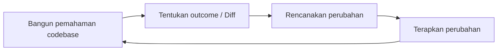
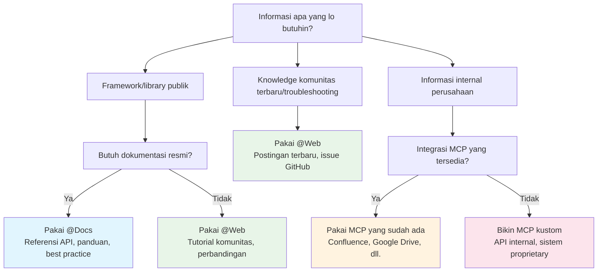
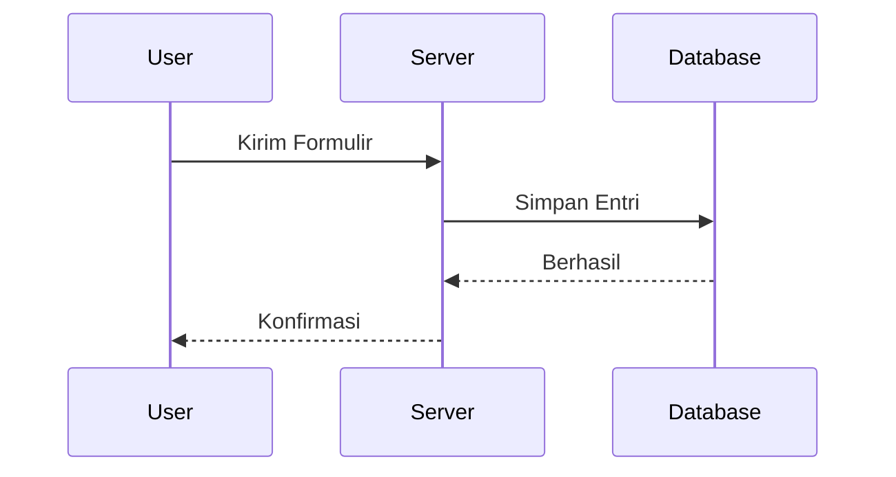
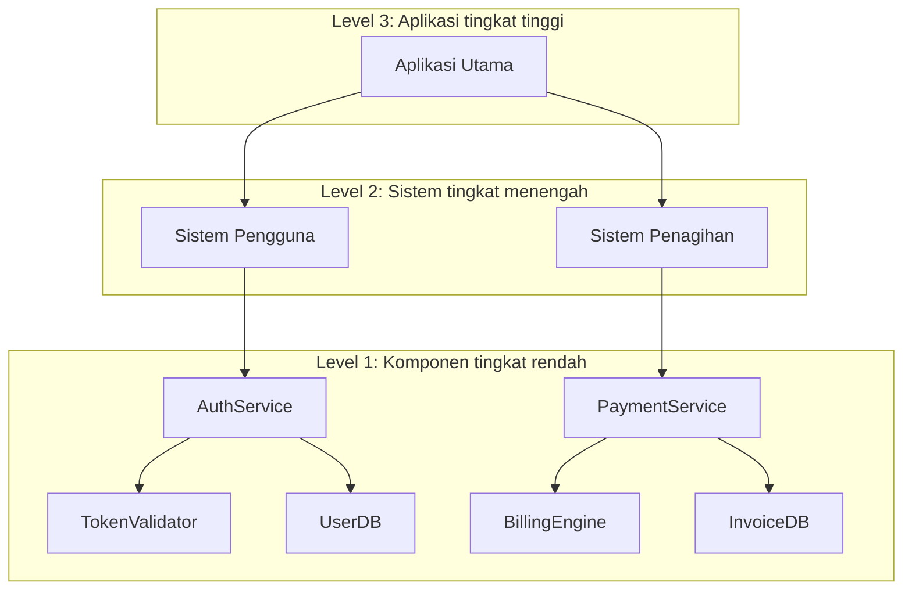
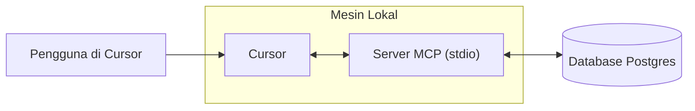
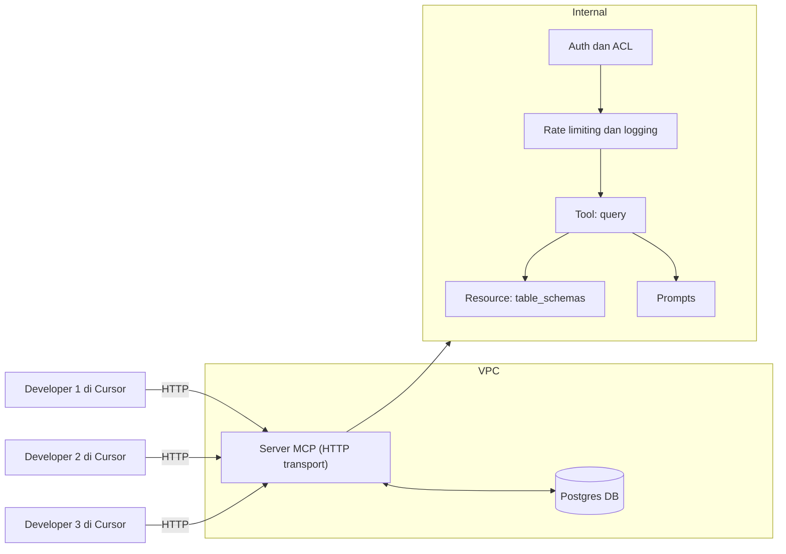
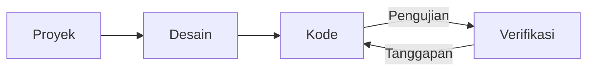
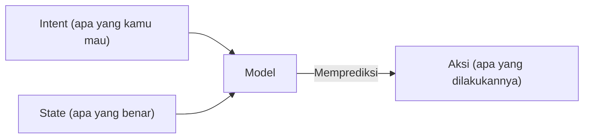

# @Web

**Navigation:** [← Previous](./16-sso.md) | [Index](./index.md) | [Next →](./18-slack.md)

---

# @Web
Source: https://docs.cursor.com/id/context/@-symbols/@-web

Cari di web untuk informasi terkini

Dengan `@Web`, Cursor menelusuri web menggunakan [exa.ai](https://exa.ai) untuk menemukan informasi paling mutakhir dan menambahkannya sebagai konteks. Fitur ini juga bisa memproses file PDF dari tautan langsung.

<Note>
  Penelusuran web nonaktif secara default. Aktifkan di Settings → Features → Web
  Search.
</Note>

<Frame>
  
</Frame>


# Gambaran Umum
Source: https://docs.cursor.com/id/context/@-symbols/overview

Referensikan kode, file, dan dokumentasi pakai simbol @

Navigasi saran pakai tombol panah. Tekan `Enter` buat milih. Kalau sarannya kategori kayak `Files`, daftar saran bakal kefilter buat nampilin item paling relevan di kategori itu.

<Frame>
  
</Frame>

Ini daftar semua simbol @ yang tersedia:

* [@Files](/id/context/@-symbols/@-files) - Referensikan file tertentu di project lo
* [@Folders](/id/context/@-symbols/@-folders) - Referensikan seluruh folder buat konteks yang lebih luas
* [@Code](/id/context/@-symbols/@-code) - Referensikan cuplikan kode atau simbol tertentu dari codebase lo
* [@Docs](/id/context/@-symbols/@-docs) - Akses dokumentasi dan panduan
* [@Git](/id/context/@-symbols/@-git) - Akses riwayat dan perubahan git
* [@Past Chats](/id/context/@-symbols/@-past-chats) - Kerja bareng sesi composer yang sudah diringkas
* [@Cursor Rules](/id/context/@-symbols/@-cursor-rules) - Kerja bareng aturan Cursor
* [@Web](/id/context/@-symbols/@-web) - Referensikan sumber daya web eksternal dan dokumentasi
* [@Link (paste)](/id/context/@-symbols/@-link) - Bikin link ke kode atau dokumentasi tertentu
* [@Recent Changes](/id/context/@-symbols/@-recent-changes) - Lihat perubahan terbaru di kode atau dokumentasi
* [@Lint Errors](/id/context/@-symbols/@-lint-errors) - Referensikan error lint (khusus [Chat](/id/chat/overview))
* [@Definitions](/id/context/@-symbols/@-definitions) - Cari definisi simbol (khusus [Inline Edit](/id/inline-edit/overview))
* [# Files](/id/context/@-symbols/pill-files) - Tambahin file ke konteks tanpa referensi
* [/ Commands](/id/context/@-symbols/slash-commands) - Tambahin file yang kebuka dan aktif ke konteks


# #Files
Source: https://docs.cursor.com/id/context/@-symbols/pill-files

Pilih file tertentu dengan awalan #

Gunakan `#` diikuti nama file untuk menargetkan file tertentu. Padukan dengan simbol `@` untuk kontrol konteks yang lebih presisi.

<Frame>
  
</Frame>


# /command
Source: https://docs.cursor.com/id/context/@-symbols/slash-commands

Perintah cepat untuk menambahkan file dan mengontrol konteks

Perintah `/` ngasih akses cepat ke tab editor yang lagi kebuka, jadi lo bisa nambahin banyak file sebagai konteks.

<Frame>
  
</Frame>

<div id="commands">
  ## Perintah
</div>

* **`/Reset Context`**: Mengatur ulang konteks ke keadaan default
* **`/Generate Cursor Rules`**: Membuat aturan yang akan diikuti Cursor
* **`/Disable Iterate on Lints`**: Nggak akan mencoba memperbaiki error dan peringatan dari linter
* **`/Add Open Files to Context`**: Merujuk semua tab editor yang lagi terbuka
* **`/Add Active Files to Context`**: Merujuk semua tab editor yang lagi kelihatan (berguna buat tata letak terpisah)


# Pengindeksan Codebase
Source: https://docs.cursor.com/id/context/codebase-indexing

Cara Cursor mempelajari codebase kamu untuk pemahaman yang lebih baik

Cursor mengindeks codebase kamu dengan menghitung embedding untuk setiap file. Ini meningkatkan kualitas jawaban AI tentang kodenya. Saat kamu membuka proyek, Cursor mulai mengindeks secara otomatis. File baru diindeks secara bertahap.
Cek status pengindeksan di: `Cursor Settings` > `Indexing & Docs`

<Frame>
  
</Frame>

<div id="configuration">
  ## Konfigurasi
</div>

Cursor mengindeks semua file kecuali yang ada di [ignore files](/id/context/ignore-files) (misalnya `.gitignore`, `.cursorignore`).

Klik `Show Settings` untuk:

* Mengaktifkan pengindeksan otomatis untuk repositori baru
* Menentukan file mana yang ingin diabaikan

<Tip>
  [Mengabaikan file konten berukuran besar](/id/context/ignore-files) dapat meningkatkan akurasi jawaban.
</Tip>

<div id="view-indexed-files">
  ### Lihat file yang diindeks
</div>

Untuk melihat path file yang diindeks: `Cursor Settings` > `Indexing & Docs` > `View included files`

Ini akan membuka file `.txt` yang mencantumkan semua file yang diindeks.

<div id="multi-root-workspaces">
  ## Workspace multi-root
</div>

Cursor mendukung [workspace multi-root](https://code.visualstudio.com/docs/editor/workspaces#_multiroot-workspaces), bikin lo bisa kerja bareng banyak codebase:

* Semua codebase keindeks otomatis
* Konteks tiap codebase tersedia buat AI
* `.cursor/rules` jalan di semua folder

<div id="pr-search">
  ## Pencarian PR
</div>

Pencarian PR bantu lo ngerti evolusi codebase lo dengan bikin perubahan historis bisa dicari dan diakses lewat AI.

<div id="how-it-works">
  ### Cara kerjanya
</div>

Cursor otomatis **mengindeks semua PR yang sudah di-merge** dari riwayat repositori lo. Ringkasan muncul di hasil pencarian semantik, dengan penyaringan pintar yang memprioritaskan perubahan terbaru.

Agent bisa **ngambil PR, commit, issue, atau branch** ke konteks pakai `@[PR number]`, `@[commit hash]`, atau `@[branch name]`. Termasuk komentar GitHub dan review Bugbot kalau terhubung.

**Dukungan platform** mencakup GitHub, GitHub Enterprise, dan Bitbucket. GitLab saat ini belum didukung.

<Note>
  Pengguna GitHub Enterprise: Tool fetch bakal fallback ke perintah git karena
  keterbatasan autentikasi VSCode.
</Note>

<div id="using-pr-search">
  ### Menggunakan pencarian PR
</div>

Tanyain hal-hal kayak "Gimana layanan diimplementasi di PR lain?" dan Agent bakal otomatis ngambil PR yang relevan ke konteks buat ngasih jawaban komprehensif berdasarkan riwayat repositori lo.

<div id="faq">
  ## FAQ
</div>

<AccordionGroup>
  <Accordion title="Di mana aku bisa lihat semua codebase yang terindeks?">
    Belum ada daftar global. Cek tiap proyek satu per satu dengan membukanya di
    Cursor dan mengecek pengaturan Codebase Indexing.
  </Accordion>

  <Accordion title="Gimana cara hapus semua codebase yang terindeks?">
    Hapus akun Cursor kamu dari Settings untuk menghapus semua codebase yang terindeks.
    Atau, hapus codebase satu per satu dari pengaturan Codebase Indexing di tiap proyek.
  </Accordion>

  <Accordion title="Berapa lama codebase yang terindeks dipertahankan?">
    Codebase yang terindeks akan dihapus setelah 6 minggu tanpa aktivitas. Membuka kembali
    proyek akan memicu reindexing.
  </Accordion>

  <Accordion title="Apakah source code-ku disimpan di server Cursor?">
    Tidak. Cursor membuat embedding tanpa menyimpan nama file atau source code. Nama file diobfuski dan potongan kode dienkripsi.

    Saat Agent mencari di codebase, Cursor mengambil embedding dari server dan mendekripsi potongan tersebut.
  </Accordion>
</AccordionGroup>


# Mengabaikan file
Source: https://docs.cursor.com/id/context/ignore-files

Kendalikan akses file dengan .cursorignore dan .cursorindexingignore

<div id="overview">
  ## Gambaran Umum
</div>

Cursor membaca dan mengindeks codebase proyekmu untuk mendukung fitur-fiturnya. Atur direktori dan file mana yang boleh diakses Cursor pakai file `.cursorignore` di direktori root.

Cursor memblokir akses ke file yang tercantum di `.cursorignore` dari:

* Pengindeksan codebase
* Kode yang bisa diakses oleh [Tab](/id/tab/overview), [Agent](/id/agent/overview), dan [Inline Edit](/id/inline-edit/overview)
* Kode yang bisa diakses lewat [referensi simbol @](/id/context/@-symbols/overview)

<Warning>
  Panggilan tool yang dijalankan oleh Agent, seperti terminal dan server MCP, nggak bisa memblokir
  akses ke kode yang diatur oleh `.cursorignore`
</Warning>

<div id="why-ignore-files">
  ## Kenapa nge-ignore file?
</div>

**Keamanan**: Batasi akses ke API key, kredensial, dan secret. Meski Cursor ngeblokir file yang di-ignore, perlindungan penuh tetap nggak bisa dijamin karena ketidakpastian LLM.

**Performa**: Di codebase besar atau monorepo, exclude bagian yang nggak relevan biar indexing lebih cepat dan penemuan file lebih akurat.

<div id="global-ignore-files">
  ## Global ignore files
</div>

Atur pola ignore untuk semua project di user settings biar file sensitif otomatis dikecualikan tanpa perlu konfigurasi per project.

<Frame>
  
</Frame>

Pola default mencakup:

* File environment: `**/.env`, `**/.env.*`
* Kredensial: `**/credentials.json`, `**/secrets.json`
* Kunci: `**/*.key`, `**/*.pem`, `**/id_rsa`

<div id="configuring-cursorignore">
  ## Mengonfigurasi `.cursorignore`
</div>

Buat file `.cursorignore` di direktori root kamu dengan sintaks `.gitignore`.

<div id="pattern-examples">
  ### Contoh pola
</div>

```sh  theme={null}
config.json      # File spesifik
dist/           # Direktori
*.log           # Ekstensi file
**/logs         # Direktori bertingkat
!app/           # Jangan diabaikan (negasi)
```

<div id="hierarchical-ignore">
  ### Pengabaian hierarkis
</div>

Aktifkan `Cursor Settings` > `Features` > `Editor` > `Hierarchical Cursor Ignore` untuk mencari file `.cursorignore` di direktori induk.

**Catatan**: Komentar diawali dengan `#`. Pola yang muncul belakangan akan menimpa yang lebih awal. Pola bersifat relatif terhadap lokasi file.

<div id="limit-indexing-with-cursorindexingignore">
  ## Batasi pengindeksan dengan `.cursorindexingignore`
</div>

Gunakan `.cursorindexingignore` untuk mengecualikan file hanya dari pengindeksan. File ini tetap bisa diakses oleh fitur AI, tapi nggak akan muncul di pencarian codebase.

<div id="files-ignored-by-default">
  ## File yang diabaikan secara default
</div>

Cursor otomatis mengabaikan file di `.gitignore` dan daftar abaikan default di bawah. Kamu bisa menimpanya dengan awalan `!` di `.cursorignore`.

<Accordion title="Daftar Abaikan Default">
  Hanya untuk pengindeksan, file-file berikut diabaikan selain yang ada di `.gitignore`, `.cursorignore`, dan `.cursorindexingignore` kamu:

  ```sh  theme={null}
  package-lock.json
  pnpm-lock.yaml
  yarn.lock
  composer.lock
  Gemfile.lock
  bun.lockb
  .env*
  .git/
  .svn/
  .hg/
  *.lock
  *.bak
  *.tmp
  *.bin
  *.exe
  *.dll
  *.so
  *.lockb
  *.qwoff
  *.isl
  *.csv
  *.pdf
  *.doc
  *.doc
  *.xls
  *.xlsx
  *.ppt
  *.pptx
  *.odt
  *.ods
  *.odp
  *.odg
  *.odf
  *.sxw
  *.sxc
  *.sxi
  *.sxd
  *.sdc
  *.jpg
  *.jpeg
  *.png
  *.gif
  *.bmp
  *.tif
  *.mp3
  *.wav
  *.wma
  *.ogg
  *.flac
  *.aac
  *.mp4
  *.mov
  *.wmv
  *.flv
  *.avi
  *.zip
  *.tar
  *.gz
  *.7z
  *.rar
  *.tgz
  *.dmg
  *.iso
  *.cue
  *.mdf
  *.mds
  *.vcd
  *.toast
  *.img
  *.apk
  *.msi
  *.cab
  *.tar.gz
  *.tar.xz
  *.tar.bz2
  *.tar.lzma
  *.tar.Z
  *.tar.sz
  *.lzma
  *.ttf
  *.otf
  *.pak
  *.woff
  *.woff2
  *.eot
  *.webp
  *.vsix
  *.rmeta
  *.rlib
  *.parquet
  *.svg
  .egg-info/
  .venv/
  node_modules/
  __pycache__/
  .next/
  .nuxt/
  .cache/
  .sass-cache/
  .gradle/
  .DS_Store/
  .ipynb_checkpoints/
  .pytest_cache/
  .mypy_cache/
  .tox/
  .git/
  .hg/
  .svn/
  .bzr/
  .lock-wscript/
  .Python/
  .jupyter/
  .history/
  .yarn/
  .yarn-cache/
  .eslintcache/
  .parcel-cache/
  .cache-loader/
  .nyc_output/
  .node_repl_history/
  .pnp.js/
  .pnp/
  ```
</Accordion>

<div id="negation-pattern-limitations">
  ### Batasan pola negasi
</div>

Saat pakai pola negasi (diawali `!`), lo nggak bisa menyertakan ulang file kalau direktori induknya dikecualikan pakai \*.

```sh  theme={null}

# Abaikan semua file di folder public
public/*


# ✅ Ini berfungsi, karena file berada di tingkat teratas
!public/index.html


# ❌ Ini tidak berfungsi — tidak bisa menyertakan kembali file dari direktori bertingkat
!public/assets/style.css
```

**Solusi sementara**: Kecualikan direktori bertingkat secara eksplisit:

```sh  theme={null}
public/assets/*
!public/assets/style.css # File ini sekarang bisa diakses
```

Direktori yang dikecualikan nggak ditelusuri demi performa, jadi pola pada file di dalamnya nggak berpengaruh.
Ini sesuai dengan implementasi .gitignore untuk pola negasi di direktori bertingkat. Buat detail lebih lanjut, cek [dokumentasi resmi Git tentang pola gitignore](https://git-scm.com/docs/gitignore).

<div id="troubleshooting">
  ## Pemecahan masalah
</div>

Uji pola dengan `git check-ignore -v [file]`.


# Model Context Protocol (MCP)
Source: https://docs.cursor.com/id/context/mcp

Hubungkan alat eksternal dan sumber data ke Cursor menggunakan MCP

export const Kbd = ({children, tooltip, os}) => {
  const keysInput = typeof children === 'string' && children.trim() !== '' ? children : null;
  if (!keysInput) {
    return null;
  }
  const isModifier = key => {
    const modifiers = ['⌘', '⇧', '⌥', '⌃', '⏎', '⌫', '⌦', '⎋', '⇥', '⌁', '←', '→', '↑', '↓', 'Ctrl', 'Shift', 'Alt', 'Cmd', 'Opt', 'Return', 'Backspace', 'Delete', 'Escape', 'Tab', 'Space', 'Enter', 'Esc', 'ArrowLeft', 'ArrowRight', 'ArrowUp', 'ArrowDown', 'Left', 'Right', 'Up', 'Down'];
    return modifiers.includes(key.trim());
  };
  const capitalizeFirstLetter = string => {
    return string.charAt(0).toUpperCase() + string.slice(1);
  };
  const isMac = os ? os.toLowerCase() === 'mac' || os.toLowerCase() === 'macos' : typeof navigator !== 'undefined' && (navigator.platform.toUpperCase().indexOf('MAC') >= 0 || navigator.userAgent.toUpperCase().indexOf('MAC') >= 0);
  const convertToSymbols = shortcut => {
    if (isMac) {
      return shortcut.replace(/⌘|Cmd|CMD/gi, '⌘').replace(/⌥|Opt|OPT/gi, '⌥').replace(/⌃|Ctrl/gi, '⌃').replace(/⇧|Shift/gi, '⇧').replace(/⏎|Return/gi, '⏎').replace(/⌫|Backspace/gi, '⌫').replace(/⌦|Delete/gi, '⌦').replace(/␛|Escape/gi, '␛').replace(/⇥|Tab/gi, '⇥').replace(/⌁|Space/gi, '⌁').replace(/←|Arrow\s*Left|ArrowLeft|Left/gi, '←').replace(/→|Arrow\s*Right|ArrowRight|Right/gi, '→').replace(/↑|Arrow\s*Up|ArrowUp|Up/gi, '↑').replace(/↓|Arrow\s*Down|ArrowDown|Down/gi, '↓');
    } else {
      const converted = shortcut.replace(/⌘|Cmd|CMD/gi, 'Ctrl').replace(/⌥|Opt|OPT/gi, 'Alt').replace(/⌃|Ctrl/gi, 'Ctrl').replace(/⇧|Shift/gi, 'Shift').replace(/⏎|Return/gi, 'Enter').replace(/⌫|Backspace/gi, 'Backspace').replace(/⌦|Delete/gi, 'Delete').replace(/⎋|Escape/gi, 'Esc').replace(/⇥|Tab/gi, 'Tab').replace(/⌁|Space/gi, 'Space').replace(/←|Arrow\s*Left|ArrowLeft|Left/gi, 'Arrow-Left').replace(/→|Arrow\s*Right|ArrowRight|Right/gi, 'Arrow-Right').replace(/↑|Arrow\s*Up|ArrowUp|Up/gi, 'Arrow-Up').replace(/↓|Arrow\s*Down|ArrowDown|Down/gi, 'Arrow-Down');
      const keyList = converted.split(/[\+\s]+/).filter(key => key.trim());
      return keyList.join('+');
    }
  };
  const convertToReadableText = shortcut => {
    const converted = shortcut.replace(/⌘|Cmd|CMD/gi, 'Cmd').replace(/⌥|Opt|OPT/gi, 'Opt').replace(/⌃|Ctrl/gi, 'Ctrl').replace(/⇧|Shift/gi, 'Shift').replace(/⏎|Return/gi, 'Return').replace(/⌫|Backspace/gi, 'Backspace').replace(/⌦|Delete/gi, 'Delete').replace(/⎋|Escape/gi, 'Escape').replace(/⇥|Tab/gi, 'Tab').replace(/⌁|Space/gi, 'Space').replace(/←|Arrow\s*Left|ArrowLeft|Left/gi, 'Arrow-Left').replace(/→|Arrow\s*Right|ArrowRight|Right/gi, 'Arrow-Right').replace(/↑|Arrow\s*Up|ArrowUp|Up/gi, 'Arrow-Up').replace(/↓|Arrow\s*Down|ArrowDown|Down/gi, 'Arrow-Down');
    const keyList = converted.split(/[\+\s]+/).filter(key => key.trim());
    return keyList.map(key => {
      const trimmedKey = key.trim();
      return isModifier(trimmedKey) ? trimmedKey : capitalizeFirstLetter(trimmedKey);
    }).join('+');
  };
  const displayShortcut = convertToSymbols(keysInput);
  const tooltipText = isMac ? tooltip ? `${convertToReadableText(keysInput)}: ${tooltip}` : convertToReadableText(keysInput) : tooltip || null;
  const processedKeys = isMac ? displayShortcut.split(/[\+\s]+/).filter(key => key.trim()).map(key => {
    const trimmedKey = key.trim();
    return isModifier(trimmedKey) ? trimmedKey : capitalizeFirstLetter(trimmedKey);
  }).join('') : displayShortcut.split('+').map(key => {
    const trimmedKey = key.trim();
    return isModifier(trimmedKey) ? trimmedKey : capitalizeFirstLetter(trimmedKey);
  }).join('+');
  return tooltipText ? <Tooltip tip={tooltipText}>
      <kbd>
        {processedKeys}
      </kbd>
    </Tooltip> : <kbd>
      {processedKeys}
    </kbd>;
};

<div id="what-is-mcp">
  ## Apa itu MCP?
</div>

[Model Context Protocol (MCP)](https://modelcontextprotocol.io/introduction) memungkinkan Cursor terhubung ke alat eksternal dan sumber data.

<Frame>
  <video src="https://mintcdn.com/cursor/BfJOqJ1Wb8EvuXyr/images/context/mcp/simple-mcp-call.mp4?fit=max&auto=format&n=BfJOqJ1Wb8EvuXyr&q=85&s=08c642babc501c939ecbec9ef5124ce7" autoPlay loop muted playsInline controls data-path="images/context/mcp/simple-mcp-call.mp4" />
</Frame>

<div id="why-use-mcp">
  ### Kenapa pakai MCP?
</div>

MCP menghubungkan Cursor ke sistem dan data eksternal. Daripada ngejelasin struktur proyek berulang kali, integrasiin langsung sama tool yang dipakai.

Tulis server MCP pakai bahasa apa pun yang bisa nge-print ke `stdout` atau nyediain endpoint HTTP — Python, JavaScript, Go, dll.

<div id="how-it-works">
  ### Cara kerjanya
</div>

Server MCP mengekspos kemampuan melalui protokol, menghubungkan Cursor ke alat atau sumber data eksternal.

Cursor mendukung tiga metode transport:

<div className="full-width-table">
  | Transport                                                        | Lingkungan eksekusi | Deployment              | Pengguna        | Input                | Auth   |
  | :--------------------------------------------------------------- | :------------------ | :---------------------- | :-------------- | :------------------- | :----- |
  | **<span className="whitespace-nowrap">`stdio`</span>**           | Lokal               | Dikelola oleh Cursor    | Satu pengguna   | Perintah shell       | Manual |
  | **<span className="whitespace-nowrap">`SSE`</span>**             | Lokal/Jarak jauh    | Dideploy sebagai server | Banyak pengguna | URL ke endpoint SSE  | OAuth  |
  | **<span className="whitespace-nowrap">`Streamable HTTP`</span>** | Lokal/Jarak jauh    | Dideploy sebagai server | Banyak pengguna | URL ke endpoint HTTP | OAuth  |
</div>

<div id="protocol-support">
  ### Dukungan protokol
</div>

Cursor mendukung kapabilitas protokol MCP berikut:

<div className="full-width-table">
  | Fitur           | Dukungan | Deskripsi                                                                              |
  | :-------------- | :------- | :------------------------------------------------------------------------------------- |
  | **Tools**       | Didukung | Fungsi yang dieksekusi oleh model AI                                                   |
  | **Prompts**     | Didukung | Pesan dan alur kerja bertemplate untuk pengguna                                        |
  | **Resources**   | Didukung | Sumber data terstruktur yang dapat dibaca dan dirujuk                                  |
  | **Roots**       | Didukung | Kueri yang diprakarsai server ke batas URI atau sistem berkas tempat operasi dilakukan |
  | **Elicitation** | Didukung | Permintaan yang diprakarsai server untuk informasi tambahan dari pengguna              |
</div>

<div id="installing-mcp-servers">
  ## Menginstal server MCP
</div>

<div id="one-click-installation">
  ### Instal sekali klik
</div>

Instal server MCP dari koleksi kami dan lakukan autentikasi dengan OAuth.

<Columns cols={2}>
  <Card title="Browse MCP Tools" icon="table" horizontal href="/id/tools">
    Jelajahi server MCP yang tersedia
  </Card>

  <Card title="Add to Cursor Button" icon="plus" horizontal href="/id/deeplinks">
    Bikin tombol "Add to Cursor"
  </Card>
</Columns>

<div id="using-mcpjson">
  ### Menggunakan `mcp.json`
</div>

Konfigurasikan server MCP kustom dengan file JSON:

<CodeGroup>
  ```json CLI Server - Node.js theme={null}
  {
    "mcpServers": {
      "server-name": {
        "command": "npx",
        "args": ["-y", "mcp-server"],
        "env": {
          "API_KEY": "value"
        }
      }
    }
  }
  ```

  ```json CLI Server - Python theme={null}
  {
    "mcpServers": {
      "server-name": {
        "command": "python",
        "args": ["mcp-server.py"],
        "env": {
          "API_KEY": "value"
        }
      }
    }
  }
  ```

  ```json Remote Server theme={null}
  // Server MCP menggunakan HTTP atau SSE - berjalan di server
  {
    "mcpServers": {
      "server-name": {
        "url": "http://localhost:3000/mcp",
        "headers": {
          "API_KEY": "value"
        }
      }
    }
  }
  ```
</CodeGroup>

<div id="stdio-server-configuration">
  ### Konfigurasi server STDIO
</div>

Untuk server STDIO (server command line lokal), atur field berikut di `mcp.json`:

<div className="full-width-table">
  | Field       | Wajib | Deskripsi                                                                                     | Contoh                                    |
  | :---------- | :---- | :-------------------------------------------------------------------------------------------- | :---------------------------------------- |
  | **type**    | Ya    | Jenis koneksi server                                                                          | `"stdio"`                                 |
  | **command** | Ya    | Perintah untuk menjalankan executable server. Harus ada di system path atau pakai path penuh. | `"npx"`, `"node"`, `"python"`, `"docker"` |
  | **args**    | Nggak | Array argumen yang dikirim ke perintah                                                        | `["server.py", "--port", "3000"]`         |
  | **env**     | Nggak | Variabel environment untuk server                                                             | `{"API_KEY": "${input:api-key}"}`         |
  | **envFile** | Nggak | Path ke file environment untuk memuat lebih banyak variabel                                   | `".env"`, `"${workspaceFolder}/.env"`     |
</div>

<div id="using-the-extension-api">
  ### Menggunakan Extension API
</div>

Buat pendaftaran server MCP secara terprogram, Cursor nyediain Extension API yang memungkinkan konfigurasi dinamis tanpa perlu ngubah file `mcp.json`. Ini khususnya berguna buat lingkungan enterprise dan workflow setup otomatis.

<Card title="Referensi MCP Extension API" icon="code" href="/id/context/mcp-extension-api">
  Pelajari cara nge-register server MCP secara terprogram pakai `vscode.cursor.mcp.registerServer()`
</Card>

<div id="configuration-locations">
  ### Lokasi konfigurasi
</div>

<CardGroup cols={2}>
  <Card title="Konfigurasi Proyek" icon="folder-tree">
    Bikin `.cursor/mcp.json` di proyek lo buat alat yang khusus proyek.
  </Card>

  <Card title="Konfigurasi Global" icon="globe">
    Bikin `~/.cursor/mcp.json` di direktori home lo buat alat yang tersedia di mana-mana.
  </Card>
</CardGroup>

<div id="config-interpolation">
  ### Interpolasi konfigurasi
</div>

Gunakan variabel dalam nilai `mcp.json`. Cursor me-resolve variabel di bidang berikut: `command`, `args`, `env`, `url`, dan `headers`.

Sintaks yang didukung:

* `${env:NAME}` variabel environment
* `${userHome}` jalur ke folder home kamu
* `${workspaceFolder}` root proyek (folder yang berisi `.cursor/mcp.json`)
* `${workspaceFolderBasename}` nama root proyek
* `${pathSeparator}` dan `${/}` pemisah jalur OS

Contoh

```json  theme={null}
{
  "mcpServers": {
    "local-server": {
      "command": "python",
      "args": ["${workspaceFolder}/tools/mcp_server.py"],
      "env": {
        "API_KEY": "${env:API_KEY}"
      }
    }
  }
}
```

```json  theme={null}
{
  "mcpServers": {
    "remote-server": {
      "url": "https://api.example.com/mcp",
      "headers": {
        "Authorization": "Bearer ${env:MY_SERVICE_TOKEN}"
      }
    }
  }
}
```

<div id="authentication">
  ### Autentikasi
</div>

Server MCP menggunakan variabel lingkungan untuk autentikasi. Lewatkan kunci API dan token lewat konfigurasi.

Cursor mendukung OAuth untuk server yang memerlukannya.

<div id="using-mcp-in-chat">
  ## Menggunakan MCP di chat
</div>

Composer Agent otomatis pakai tool MCP yang tercantum di `Available Tools` saat relevan. Minta tool tertentu berdasarkan nama atau jelasin apa yang lo butuhin. Aktifin atau nonaktifin tool dari Settings.

<div id="toggling-tools">
  ### Mengaktifkan/nonaktifkan tool
</div>

Aktifkan atau nonaktifkan tool MCP langsung dari antarmuka chat. Klik nama tool di daftar tool untuk menyalakan atau mematikannya. Tool yang dinonaktifkan nggak akan dimuat ke konteks atau tersedia buat Agent.

<Frame>
  <video src="https://mintcdn.com/cursor/BfJOqJ1Wb8EvuXyr/images/context/mcp/tool-toggle.mp4?fit=max&auto=format&n=BfJOqJ1Wb8EvuXyr&q=85&s=0fa3060f593cae3e5fb7c7d2f041a715" autoPlay loop muted playsInline controls data-path="images/context/mcp/tool-toggle.mp4" />
</Frame>

<div id="tool-approval">
  ### Persetujuan tool
</div>

Secara default, Agent bakal minta persetujuan sebelum pakai tool MCP. Klik panah di sebelah nama tool buat lihat argumen.

<Frame></Frame>

<div id="auto-run">
  #### Auto-run
</div>

Aktifkan auto-run biar Agent bisa pakai tool MCP tanpa perlu konfirmasi. Cara kerjanya mirip perintah terminal. Baca selengkapnya tentang pengaturan Auto-run [di sini](/id/agent/tools#auto-run).

<div id="tool-response">
  ### Respons tool
</div>

Cursor menampilkan respons di chat dengan tampilan argumen dan respons yang bisa diperluas:

<Frame></Frame>

<div id="images-as-context">
  ### Gambar sebagai konteks
</div>

Server MCP bisa mengembalikan gambar—screenshot, diagram, dan sebagainya. Kembalikan gambar sebagai string yang dienkode base64:

```js  theme={null}
const RED_CIRCLE_BASE64 = "/9j/4AAQSkZJRgABAgEASABIAAD/2w...";
// ^ seluruh base64 dipangkas untuk keterbacaan

server.tool("generate_image", async (params) => {
  return {
    content: [
      {
        type: "image",
        data: RED_CIRCLE_BASE64,
        mimeType: "image/jpeg",
      },
    ],
  };
});
```

Lihat [server contoh](https://github.com/msfeldstein/mcp-test-servers/blob/main/src/image-server.js) ini untuk detail implementasi. Cursor menautkan gambar yang dikembalikan ke obrolan. Kalau model mendukung gambar, model bakal menganalisisnya.

<div id="security-considerations">
  ## Pertimbangan keamanan
</div>

Saat menginstal server MCP, pertimbangkan praktik keamanan berikut:

* **Verifikasi sumber**: Hanya pasang server MCP dari pengembang dan repositori tepercaya
* **Tinjau perizinan**: Periksa data dan API apa yang akan diakses server
* **Batasi kunci API**: Gunakan kunci API dengan batasan dan izin minimum yang dibutuhkan
* **Audit kode**: Untuk integrasi yang krusial, tinjau kode sumber server

Ingat, server MCP bisa mengakses layanan eksternal dan mengeksekusi kode atas namamu. Selalu pahami apa yang dilakukan server sebelum menginstalnya.

<div id="real-world-examples">
  ## Contoh dunia nyata
</div>

Untuk contoh praktis MCP yang benar-benar digunakan, lihat [panduan Web Development](/id/guides/tutorials/web-development) yang menunjukkan cara mengintegrasikan Linear, Figma, dan alat peramban ke dalam workflow pengembangan lo.

<div id="faq">
  ## FAQ
</div>

<AccordionGroup>
  <Accordion title="Apa gunanya server MCP?">
    Server MCP menghubungkan Cursor ke tool eksternal seperti Google Drive, Notion,
    dan layanan lain untuk memasukkan dokumen dan requirement ke alur kerja pengkodean Anda.
  </Accordion>

  {" "}

  <Accordion title="Gimana cara debug masalah server MCP?">
    Lihat log MCP dengan: 1. Buka panel Output di Cursor (<Kbd>Cmd+Shift+U</Kbd>) 2.
    Pilih "MCP Logs" dari dropdown 3. Cek error koneksi, masalah autentikasi, atau server
    crash. Log menampilkan inisialisasi server, pemanggilan tool, dan pesan error.
  </Accordion>

  {" "}

  <Accordion title="Bisa nggak gue nonaktifin server MCP sementara?">
    Bisa! Toggle server on/off tanpa menghapusnya: 1. Buka Settings (<Kbd>Cmd+Shift+J</Kbd>) 2.
    Masuk ke Features → Model Context Protocol 3. Klik toggle di samping server mana pun untuk
    mengaktifkan/menonaktifkan. Server yang dinonaktifkan tidak akan dimuat atau muncul di chat.
    Ini berguna untuk troubleshooting atau mengurangi clutter tool.
  </Accordion>

  {" "}

  <Accordion title="Apa yang terjadi kalau server MCP crash atau timeout?">
    Jika server MCP gagal: Cursor menampilkan pesan error di chat. Pemanggilan tool ditandai gagal.
    Anda bisa mencoba ulang operasi atau memeriksa log untuk detailnya. Server MCP lain tetap bekerja normal.
    Cursor mengisolasi kegagalan server agar satu server tidak memengaruhi yang lain.
  </Accordion>

  {" "}

  <Accordion title="Gimana cara update server MCP?">
    Untuk server berbasis npm: 1. Hapus server dari settings 2. Bersihkan cache npm:
    `npm cache clean --force` 3. Tambahkan kembali server untuk mendapatkan versi terbaru. Untuk server kustom,
    perbarui file lokal Anda dan restart Cursor.
  </Accordion>

  <Accordion title="Bisa nggak pakai server MCP dengan data sensitif?">
    Bisa, tapi ikuti praktik keamanan terbaik: gunakan environment variables untuk
    secret dan jangan pernah hardcode; jalankan server sensitif secara lokal dengan transport `stdio`;
    batasi izin API key seminimal mungkin; tinjau kode server sebelum menyambungkan ke sistem sensitif;
    pertimbangkan menjalankan server di lingkungan terisolasi.
  </Accordion>
</AccordionGroup>


# Memories
Source: https://docs.cursor.com/id/context/memories


Memories adalah aturan yang otomatis dibuat berdasarkan obrolan lo di Chat. Memories ini berlaku pada proyek lo dan tetap menjaga konteks di seluruh sesi.

<Frame>
  <video src="https://mintcdn.com/cursor/BfJOqJ1Wb8EvuXyr/images/context/rules/memories.mp4?fit=max&auto=format&n=BfJOqJ1Wb8EvuXyr&q=85&s=d10452508d962d7a9ec37de1c22245d1" alt="Memories di Cursor" controls data-path="images/context/rules/memories.mp4" />
</Frame>

<div id="how-memories-are-created">
  ## Cara memori dibuat
</div>

1. **Observasi sidecar**: Cursor pakai pendekatan sidecar, di mana model lain mengamati obrolan lo dan otomatis mengekstrak memori yang relevan. Ini terjadi pasif di latar belakang saat lo kerja. Memori yang dihasilkan di latar belakang butuh persetujuan lo sebelum disimpan, biar lo tetap punya kontrol dan rasa aman atas apa yang diingat.

2. **Panggilan tool**: Agent bisa langsung bikin memori lewat panggilan tool ketika lo secara eksplisit minta buat nginget sesuatu atau ketika Agent sadar ada informasi penting yang perlu dipertahankan buat sesi berikutnya.

<div id="manage-memories">
  ## Kelola memori
</div>

Kamu bisa mengelola memori lewat Cursor Settings → Rules.


# Rules
Source: https://docs.cursor.com/id/context/rules

Kendalikan perilaku model Agent dengan instruksi yang reusable dan scoped.

Rules ngasih instruksi level sistem buat Agent dan Inline Edit. Anggap aja ini sebagai konteks, preferensi, atau workflow yang persistent buat proyek lo.

Cursor mendukung empat jenis rules:

<CardGroup cols={2}>
  <Card title="Project Rules" icon="folder-tree">
    Disimpan di `.cursor/rules`, di-version control dan di-scope ke codebase lo.
  </Card>

  <Card title="User Rules" icon="user">
    Global buat environment Cursor lo. Didefinisikan di settings dan selalu diterapkan.
  </Card>

  <Card title="AGENTS.md" icon="robot">
    Instruksi Agent dalam format markdown. Alternatif simpel buat `.cursor/rules`.
  </Card>

  <Card title=".cursorrules (Legacy)" icon="clock-rotate-left">
    Masih didukung, tapi deprecated. Mending pake Project Rules.
  </Card>
</CardGroup>

<div id="how-rules-work">
  ## Cara kerja rules
</div>

Large language models nggak nyimpen memori antar completion. Rules ngasih konteks yang persisten dan bisa dipakai ulang di level prompt.

Saat diterapkan, isi rule bakal disertakan di awal konteks model. Ini kasih panduan yang konsisten buat AI untuk ngasilin kode, ngeinterpretasi edit, atau bantuin workflow.

<Frame>
  
</Frame>

<Info>
  Rules berlaku untuk [Chat](/id/chat/overview) dan [Inline
  Edit](/id/inline-edit/overview). Rules yang aktif bakal muncul di sidebar Agent.
</Info>

<div id="project-rules">
  ## Aturan proyek
</div>

Aturan proyek ada di `.cursor/rules`. Setiap aturan adalah sebuah file dan dilacak dengan kontrol versi. Aturan bisa dibatasi dengan pola path, dipanggil secara manual, atau disertakan berdasarkan relevansi. Subdirektori bisa memiliki direktori `.cursor/rules` sendiri yang cakupannya hanya folder tersebut.

Gunakan aturan proyek untuk:

* Menyandikan pengetahuan domain-spesifik tentang codebase kamu
* Mengotomatiskan alur kerja atau templat khusus proyek
* Menyeragamkan keputusan gaya atau arsitektur

<div id="rule-anatomy">
  ### Anatomi rule
</div>

Setiap file rule ditulis dalam **MDC** (`.mdc`), format yang mendukung metadata dan konten. Atur bagaimana rule diterapkan lewat dropdown tipe yang mengubah properti `description`, `globs`, `alwaysApply`.

| <span class="no-wrap">Tipe Rule</span>         | Deskripsi                                                                                  |
| :--------------------------------------------- | :----------------------------------------------------------------------------------------- |
| <span class="no-wrap">`Always`</span>          | Selalu disertakan dalam konteks model                                                      |
| <span class="no-wrap">`Auto Attached`</span>   | Disertakan saat file yang cocok dengan pola glob direferensikan                            |
| <span class="no-wrap">`Agent Requested`</span> | Tersedia untuk AI, yang memutuskan apakah akan menyertakannya. Harus menyertakan deskripsi |
| <span class="no-wrap">`Manual`</span>          | Hanya disertakan saat disebutkan secara eksplisit menggunakan `@ruleName`                  |

```
---
description: Boilerplate layanan RPC
globs:
alwaysApply: false
---

- Gunakan pola RPC internal kami saat mendefinisikan layanan
- Selalu gunakan snake_case untuk nama layanan.

@service-template.ts
```

<div id="nested-rules">
  ### Aturan bertingkat
</div>

Susun aturan dengan menaruhnya di direktori `.cursor/rules` di seluruh proyek lo. Aturan bertingkat bakal otomatis nempel saat file di direktori itu direferensiin.

```
project/
  .cursor/rules/        # Aturan untuk seluruh proyek
  backend/
    server/
      .cursor/rules/    # Aturan khusus backend
  frontend/
    .cursor/rules/      # Aturan khusus frontend
```

<div id="creating-a-rule">
  ### Membuat rule
</div>

Bikin rule pakai perintah `New Cursor Rule` atau lewat `Cursor Settings > Rules`. Ini bakal bikin file rule baru di `.cursor/rules`. Dari Settings kamu bisa lihat semua rule beserta statusnya.

<Frame>
  
</Frame>

<div id="creating-a-rule">
  ### Membuat rule
</div>

Bikin rule langsung di percakapan pakai perintah `/Generate Cursor Rules`. Berguna kalau kamu udah nentuin perilaku agent dan pengin pakai ulang.

<Frame>
  <video src="https://www.cursor.com/changelog/049/generate-rules.mp4" controls>
    Browser kamu tidak mendukung tag video.
  </video>
</Frame>

<div id="best-practices">
  ## Praktik terbaik
</div>

Aturan yang bagus itu fokus, bisa dieksekusi, dan jelas ruang lingkupnya.

* Jaga aturan tetap di bawah 500 baris
* Pecah aturan besar jadi beberapa aturan yang bisa dikomposisikan
* Sertakan contoh konkret atau file rujukan
* Hindari panduan yang samar. Tulis aturan seperti dok internal yang jelas
* Pakai ulang aturan saat ngeulang prompt di chat

<div id="examples">
  ## Contoh
</div>

<AccordionGroup>
  <Accordion title="Standar untuk komponen frontend dan validasi API">
    Aturan ini menetapkan standar untuk komponen frontend:

    Saat bekerja di direktori components:

    * Selalu pakai Tailwind untuk styling
    * Pakai Framer Motion untuk animasi
    * Ikuti konvensi penamaan komponen

    Aturan ini juga menegakkan validasi untuk endpoint API:

    Di direktori API:

    * Pakai zod untuk semua validasi
    * Definisikan return type dengan skema zod
    * Ekspor tipe yang dihasilkan dari skema
  </Accordion>

  <Accordion title="Template untuk layanan Express dan komponen React">
    Aturan ini menyediakan template untuk layanan Express:

    Pakai template ini saat bikin layanan Express:

    * Ikuti prinsip RESTful
    * Sertakan middleware penanganan error
    * Siapkan logging yang proper

    @express-service-template.ts

    Aturan ini mendefinisikan struktur komponen React:

    Komponen React harus mengikuti layout berikut:

    * Interface Props di bagian atas
    * Komponen sebagai named export
    * Styles di bagian bawah

    @component-template.tsx
  </Accordion>

  <Accordion title="Mengotomatiskan alur kerja pengembangan dan pembuatan dokumentasi">
    Aturan ini mengotomatiskan analisis app:

    Saat diminta menganalisis app:

    1. Jalankan dev server dengan `npm run dev`
    2. Ambil log dari console
    3. Sarankan peningkatan performa

    Aturan ini membantu generasi dokumentasi:

    Bantu menyusun dokumentasi dengan:

    * Mengekstrak komentar kode
    * Menganalisis README.md
    * Menghasilkan dokumentasi markdown
  </Accordion>

  <Accordion title="Menambahkan pengaturan baru di Cursor">
    Pertama, bikin properti toggle di `@reactiveStorageTypes.ts`.

    Tambahkan nilai default di `INIT_APPLICATION_USER_PERSISTENT_STORAGE` dalam `@reactiveStorageService.tsx`.

    Untuk fitur beta, tambahkan toggle di `@settingsBetaTab.tsx`, kalau bukan, tambahkan di `@settingsGeneralTab.tsx`. Toggle bisa ditambahkan sebagai `<SettingsSubSection>` untuk checkbox umum. Lihat bagian lain file untuk contoh.

    ```
    <SettingsSubSection
    				label="Nama fitur kamu"
    				description="Deskripsi fitur kamu"
    				value={
    					vsContext.reactiveStorageService.applicationUserPersistentStorage
    						.myNewProperty ?? false
    				}
    				onChange={(newVal) => {
    					vsContext.reactiveStorageService.setApplicationUserPersistentStorage(
    						'myNewProperty',
    						newVal
    					);
    				}}
    			/>
    ```

    Untuk dipakai di app, import reactiveStorageService dan gunakan propertinya:

    ```
    const flagIsEnabled = vsContext.reactiveStorageService.applicationUserPersistentStorage.myNewProperty
    ```
  </Accordion>
</AccordionGroup>

Banyak contoh tersedia dari berbagai provider dan framework. Aturan yang dikontribusikan komunitas bisa ditemukan di beragam koleksi dan repositori crowdsourced online.

<div id="agentsmd">
  ## AGENTS.md
</div>

`AGENTS.md` adalah file markdown sederhana untuk mendefinisikan instruksi agent. Simpan di root proyek sebagai alternatif `.cursor/rules` untuk use case yang straightforward.

Berbeda dari Project Rules, `AGENTS.md` adalah file markdown polos tanpa metadata atau konfigurasi yang kompleks. Pas banget buat proyek yang butuh instruksi sederhana, mudah dibaca, tanpa overhead aturan terstruktur.

```markdown  theme={null}

# Instruksi Proyek

## Gaya Kode
- Gunakan TypeScript untuk semua file baru
- Utamakan komponen fungsional di React
- Gunakan snake_case untuk kolom database

## Arsitektur
- Ikuti pola repository
- Letakkan logika bisnis di layer service
```

<div id="user-rules">
  ## Aturan Pengguna
</div>

Aturan pengguna adalah preferensi global yang ditetapkan di **Cursor Settings → Rules** dan berlaku di semua proyek. Aturan ini berupa teks biasa dan pas buat ngatur gaya komunikasi yang kamu mau atau konvensi penulisan kode:

```
Balas dengan ringkas. Hindari pengulangan atau kata-kata pengisi yang nggak perlu.
```

<div id="cursorrules-legacy">
  ## `.cursorrules` (Legacy)
</div>

File `.cursorrules` di root project lo masih didukung, tapi bakal ditinggalkan. Disaranin migrasi ke Project Rules buat kontrol, fleksibilitas, dan visibilitas yang lebih baik.

<div id="faq">
  ## FAQ
</div>

<AccordionGroup>
  <Accordion title="Kenapa aturan aku nggak diterapkan?">
    Cek tipe aturan. Untuk `Agent Requested`, pastikan deskripsi sudah ditentukan. Untuk `Auto Attached`, pastikan pola file cocok dengan file yang direferensikan.
  </Accordion>

  {" "}

  <Accordion title="Apa aturan bisa mereferensikan aturan lain atau file?">
    Bisa. Gunakan `@filename.ts` untuk menyertakan file ke konteks aturan kamu.
  </Accordion>

  {" "}

  <Accordion title="Apa aku bisa bikin aturan dari chat?">
    Bisa, bikin aturan proyek dari chat pakai perintah `/Generate Cursor Rules`.
    Kalau Memories diaktifkan, Memories bakal dibuat otomatis.
  </Accordion>

  <Accordion title="Apa aturan berdampak ke Cursor Tab atau fitur AI lainnya?">
    Nggak. Aturan cuma berlaku untuk Agent dan Inline Edit
  </Accordion>
</AccordionGroup>


# Konsep
Source: https://docs.cursor.com/id/get-started/concepts

Pelajari fitur-fitur kunci yang membuat Cursor begitu powerful

export const Kbd = ({children, tooltip, os}) => {
  const keysInput = typeof children === 'string' && children.trim() !== '' ? children : null;
  if (!keysInput) {
    return null;
  }
  const isModifier = key => {
    const modifiers = ['⌘', '⇧', '⌥', '⌃', '⏎', '⌫', '⌦', '⎋', '⇥', '⌁', '←', '→', '↑', '↓', 'Ctrl', 'Shift', 'Alt', 'Cmd', 'Opt', 'Return', 'Backspace', 'Delete', 'Escape', 'Tab', 'Space', 'Enter', 'Esc', 'ArrowLeft', 'ArrowRight', 'ArrowUp', 'ArrowDown', 'Left', 'Right', 'Up', 'Down'];
    return modifiers.includes(key.trim());
  };
  const capitalizeFirstLetter = string => {
    return string.charAt(0).toUpperCase() + string.slice(1);
  };
  const isMac = os ? os.toLowerCase() === 'mac' || os.toLowerCase() === 'macos' : typeof navigator !== 'undefined' && (navigator.platform.toUpperCase().indexOf('MAC') >= 0 || navigator.userAgent.toUpperCase().indexOf('MAC') >= 0);
  const convertToSymbols = shortcut => {
    if (isMac) {
      return shortcut.replace(/⌘|Cmd|CMD/gi, '⌘').replace(/⌥|Opt|OPT/gi, '⌥').replace(/⌃|Ctrl/gi, '⌃').replace(/⇧|Shift/gi, '⇧').replace(/⏎|Return/gi, '⏎').replace(/⌫|Backspace/gi, '⌫').replace(/⌦|Delete/gi, '⌦').replace(/␛|Escape/gi, '␛').replace(/⇥|Tab/gi, '⇥').replace(/⌁|Space/gi, '⌁').replace(/←|Arrow\s*Left|ArrowLeft|Left/gi, '←').replace(/→|Arrow\s*Right|ArrowRight|Right/gi, '→').replace(/↑|Arrow\s*Up|ArrowUp|Up/gi, '↑').replace(/↓|Arrow\s*Down|ArrowDown|Down/gi, '↓');
    } else {
      const converted = shortcut.replace(/⌘|Cmd|CMD/gi, 'Ctrl').replace(/⌥|Opt|OPT/gi, 'Alt').replace(/⌃|Ctrl/gi, 'Ctrl').replace(/⇧|Shift/gi, 'Shift').replace(/⏎|Return/gi, 'Enter').replace(/⌫|Backspace/gi, 'Backspace').replace(/⌦|Delete/gi, 'Delete').replace(/⎋|Escape/gi, 'Esc').replace(/⇥|Tab/gi, 'Tab').replace(/⌁|Space/gi, 'Space').replace(/←|Arrow\s*Left|ArrowLeft|Left/gi, 'Arrow-Left').replace(/→|Arrow\s*Right|ArrowRight|Right/gi, 'Arrow-Right').replace(/↑|Arrow\s*Up|ArrowUp|Up/gi, 'Arrow-Up').replace(/↓|Arrow\s*Down|ArrowDown|Down/gi, 'Arrow-Down');
      const keyList = converted.split(/[\+\s]+/).filter(key => key.trim());
      return keyList.join('+');
    }
  };
  const convertToReadableText = shortcut => {
    const converted = shortcut.replace(/⌘|Cmd|CMD/gi, 'Cmd').replace(/⌥|Opt|OPT/gi, 'Opt').replace(/⌃|Ctrl/gi, 'Ctrl').replace(/⇧|Shift/gi, 'Shift').replace(/⏎|Return/gi, 'Return').replace(/⌫|Backspace/gi, 'Backspace').replace(/⌦|Delete/gi, 'Delete').replace(/⎋|Escape/gi, 'Escape').replace(/⇥|Tab/gi, 'Tab').replace(/⌁|Space/gi, 'Space').replace(/←|Arrow\s*Left|ArrowLeft|Left/gi, 'Arrow-Left').replace(/→|Arrow\s*Right|ArrowRight|Right/gi, 'Arrow-Right').replace(/↑|Arrow\s*Up|ArrowUp|Up/gi, 'Arrow-Up').replace(/↓|Arrow\s*Down|ArrowDown|Down/gi, 'Arrow-Down');
    const keyList = converted.split(/[\+\s]+/).filter(key => key.trim());
    return keyList.map(key => {
      const trimmedKey = key.trim();
      return isModifier(trimmedKey) ? trimmedKey : capitalizeFirstLetter(trimmedKey);
    }).join('+');
  };
  const displayShortcut = convertToSymbols(keysInput);
  const tooltipText = isMac ? tooltip ? `${convertToReadableText(keysInput)}: ${tooltip}` : convertToReadableText(keysInput) : tooltip || null;
  const processedKeys = isMac ? displayShortcut.split(/[\+\s]+/).filter(key => key.trim()).map(key => {
    const trimmedKey = key.trim();
    return isModifier(trimmedKey) ? trimmedKey : capitalizeFirstLetter(trimmedKey);
  }).join('') : displayShortcut.split('+').map(key => {
    const trimmedKey = key.trim();
    return isModifier(trimmedKey) ? trimmedKey : capitalizeFirstLetter(trimmedKey);
  }).join('+');
  return tooltipText ? <Tooltip tip={tooltipText}>
      <kbd>
        {processedKeys}
      </kbd>
    </Tooltip> : <kbd>
      {processedKeys}
    </kbd>;
};

<div className="flex flex-col gap-12">
  <Columns className="gap-4">
    <div>
      <h2 className="text-lg font-medium mb-2">
        <a href="/id/tab/overview" className="hover:text-primary transition-colors">
          Tab
        </a>
      </h2>

      <p className="text-sm">
        Pelengkapan kode yang memprediksi perubahan multi-baris. Tekan Tab untuk menerima
        saran berdasarkan kode kamu saat ini dan perubahan terbaru.
      </p>
    </div>

    <Frame>
      
    </Frame>
  </Columns>

  <Columns className="gap-4">
    <div>
      <h3 className="text-lg font-medium mb-2">
        <a href="/id/agent/overview" className="hover:text-primary transition-colors">
          Agent
        </a>
      </h3>

      <p className="text-sm">
        AI yang bisa membaca dan mengubah kode di banyak file. Jelasin
        perubahan pakai bahasa natural, nanti Agent yang eksekusi.
      </p>
    </div>

    <div>
      <Frame>
        
      </Frame>
    </div>
  </Columns>

  <Columns className="gap-4">
    <div>
      <h3 className="text-lg font-medium mb-2">
        <a href="/id/background-agent" className="hover:text-primary transition-colors">
          Background Agent
        </a>
      </h3>

      <p className="text-sm">
        Menjalankan tugas secara asinkron saat kamu tetap bekerja. Bisa diakses
        lewat editor atau integrasi eksternal seperti Slack.
      </p>
    </div>

    <div>
      <Frame>
        
      </Frame>
    </div>
  </Columns>

  <Columns className="gap-4">
    <div>
      <h3 className="text-lg font-medium mb-2">
        <a href="/id/inline-edit/overview" className="hover:text-primary transition-colors">
          Inline Edit
        </a>
      </h3>

      <p className="text-sm">
        Edit kode yang dipilih pakai bahasa natural. Tekan <Kbd>Cmd+K</Kbd> buat
        jelasin perubahan dan lihat hasilnya diterapkan langsung di tempat.
      </p>
    </div>

    <div>
      <Frame>
        
      </Frame>
    </div>
  </Columns>

  <Columns className="gap-4">
    <div>
      <h3 className="text-lg font-medium mb-2">
        <a href="/id/agent/chats/tabs" className="hover:text-primary transition-colors">
          Chat
        </a>
      </h3>

      <p className="text-sm">
        Antarmuka untuk percakapan AI. Mendukung banyak tab, riwayat
        percakapan, checkpoint, dan fitur ekspor.
      </p>
    </div>

    <div>
      <Frame>
        <video src="https://mintcdn.com/cursor/GnTEh_6SKR7li-hM/images/chat/chat-tabs.mp4?fit=max&auto=format&n=GnTEh_6SKR7li-hM&q=85&s=57fd5305279dc0a3139055b353ce4b7a" autoPlay loop muted playsInline controls data-path="images/chat/chat-tabs.mp4" />
      </Frame>
    </div>
  </Columns>

  <Columns className="gap-4">
    <div>
      <h3 className="text-lg font-medium mb-2">
        <a href="/id/context/rules" className="hover:text-primary transition-colors">
          Rules
        </a>
      </h3>

      <p className="text-sm">
        Instruksi khusus yang menentukan perilaku AI. Atur standar penulisan kode,
        preferensi framework, dan konvensi khusus proyek.
      </p>
    </div>

    <div>
      <Frame>
        
      </Frame>
    </div>
  </Columns>

  <Columns className="gap-4">
    <div>
      <h3 className="text-lg font-medium mb-2">
        <a href="/id/context/memories" className="hover:text-primary transition-colors">
          Memories
        </a>
      </h3>

      <p className="text-sm">
        Penyimpanan berkelanjutan untuk konteks proyek dan keputusan dari
        percakapan sebelumnya. Secara otomatis dijadikan referensi dalam interaksi berikutnya.
      </p>
    </div>

    <div>
      <Frame>
        <video src="https://mintcdn.com/cursor/BfJOqJ1Wb8EvuXyr/images/context/rules/memories.mp4?fit=max&auto=format&n=BfJOqJ1Wb8EvuXyr&q=85&s=d10452508d962d7a9ec37de1c22245d1" autoPlay loop muted playsInline controls data-path="images/context/rules/memories.mp4" />
      </Frame>
    </div>
  </Columns>

  <Columns className="gap-4">
    <div>
      <h3 className="text-lg font-medium mb-2">
        <a href="/id/context/codebase-indexing" className="hover:text-primary transition-colors">
          Pengindeksan Codebase
        </a>
      </h3>

      <p className="text-sm">
        Analisis semantik untuk codebase lo. Memungkinkan pencarian kode, pelacakan referensi, dan saran yang peka konteks.
      </p>
    </div>

    <div>
      <Frame>
        
      </Frame>
    </div>
  </Columns>

  <Columns className="gap-4">
    <div>
      <h3 className="text-lg font-medium mb-2">
        <a href="/id/context/mcp" className="hover:text-primary transition-colors">
          MCP
        </a>
      </h3>

      <p className="text-sm">
        Model Context Protocol untuk mengintegrasikan alat eksternal. Terhubung ke
        basis data, API, dan sumber dokumentasi.
      </p>
    </div>

    <div>
      <Frame>
        <video src="https://mintcdn.com/cursor/BfJOqJ1Wb8EvuXyr/images/context/mcp/simple-mcp-call.mp4?fit=max&auto=format&n=BfJOqJ1Wb8EvuXyr&q=85&s=08c642babc501c939ecbec9ef5124ce7" autoPlay loop muted playsInline controls data-path="images/context/mcp/simple-mcp-call.mp4" />
      </Frame>
    </div>
  </Columns>

  <Columns className="gap-4">
    <div>
      <h3 className="text-lg font-medium mb-2">
        <a href="/id/guides/working-with-context" className="hover:text-primary transition-colors">
          Context
        </a>
      </h3>

      <p className="text-sm">
        Informasi yang diberikan ke model AI saat menghasilkan kode. Mencakup file,
        simbol, dan riwayat percakapan.
      </p>
    </div>

    <div>
      <Frame>
        
      </Frame>
    </div>
  </Columns>

  <Columns className="gap-4">
    <div>
      <h3 className="text-lg font-medium mb-2">
        <a href="/id/models" className="hover:text-primary transition-colors">
          Model
        </a>
      </h3>

      <p className="text-sm">
        Tersedia beragam model AI untuk menghasilkan kode. Tiap model punya
        karakteristik kecepatan dan kemampuan yang berbeda.
      </p>
    </div>

    <div>
      <Frame>
        
      </Frame>
    </div>
  </Columns>
</div>


# Instalasi
Source: https://docs.cursor.com/id/get-started/installation

Instal Cursor di komputermu dalam beberapa menit

export const Kbd = ({children, tooltip, os}) => {
  const keysInput = typeof children === 'string' && children.trim() !== '' ? children : null;
  if (!keysInput) {
    return null;
  }
  const isModifier = key => {
    const modifiers = ['⌘', '⇧', '⌥', '⌃', '⏎', '⌫', '⌦', '⎋', '⇥', '⌁', '←', '→', '↑', '↓', 'Ctrl', 'Shift', 'Alt', 'Cmd', 'Opt', 'Return', 'Backspace', 'Delete', 'Escape', 'Tab', 'Space', 'Enter', 'Esc', 'ArrowLeft', 'ArrowRight', 'ArrowUp', 'ArrowDown', 'Left', 'Right', 'Up', 'Down'];
    return modifiers.includes(key.trim());
  };
  const capitalizeFirstLetter = string => {
    return string.charAt(0).toUpperCase() + string.slice(1);
  };
  const isMac = os ? os.toLowerCase() === 'mac' || os.toLowerCase() === 'macos' : typeof navigator !== 'undefined' && (navigator.platform.toUpperCase().indexOf('MAC') >= 0 || navigator.userAgent.toUpperCase().indexOf('MAC') >= 0);
  const convertToSymbols = shortcut => {
    if (isMac) {
      return shortcut.replace(/⌘|Cmd|CMD/gi, '⌘').replace(/⌥|Opt|OPT/gi, '⌥').replace(/⌃|Ctrl/gi, '⌃').replace(/⇧|Shift/gi, '⇧').replace(/⏎|Return/gi, '⏎').replace(/⌫|Backspace/gi, '⌫').replace(/⌦|Delete/gi, '⌦').replace(/␛|Escape/gi, '␛').replace(/⇥|Tab/gi, '⇥').replace(/⌁|Space/gi, '⌁').replace(/←|Arrow\s*Left|ArrowLeft|Left/gi, '←').replace(/→|Arrow\s*Right|ArrowRight|Right/gi, '→').replace(/↑|Arrow\s*Up|ArrowUp|Up/gi, '↑').replace(/↓|Arrow\s*Down|ArrowDown|Down/gi, '↓');
    } else {
      const converted = shortcut.replace(/⌘|Cmd|CMD/gi, 'Ctrl').replace(/⌥|Opt|OPT/gi, 'Alt').replace(/⌃|Ctrl/gi, 'Ctrl').replace(/⇧|Shift/gi, 'Shift').replace(/⏎|Return/gi, 'Enter').replace(/⌫|Backspace/gi, 'Backspace').replace(/⌦|Delete/gi, 'Delete').replace(/⎋|Escape/gi, 'Esc').replace(/⇥|Tab/gi, 'Tab').replace(/⌁|Space/gi, 'Space').replace(/←|Arrow\s*Left|ArrowLeft|Left/gi, 'Arrow-Left').replace(/→|Arrow\s*Right|ArrowRight|Right/gi, 'Arrow-Right').replace(/↑|Arrow\s*Up|ArrowUp|Up/gi, 'Arrow-Up').replace(/↓|Arrow\s*Down|ArrowDown|Down/gi, 'Arrow-Down');
      const keyList = converted.split(/[\+\s]+/).filter(key => key.trim());
      return keyList.join('+');
    }
  };
  const convertToReadableText = shortcut => {
    const converted = shortcut.replace(/⌘|Cmd|CMD/gi, 'Cmd').replace(/⌥|Opt|OPT/gi, 'Opt').replace(/⌃|Ctrl/gi, 'Ctrl').replace(/⇧|Shift/gi, 'Shift').replace(/⏎|Return/gi, 'Return').replace(/⌫|Backspace/gi, 'Backspace').replace(/⌦|Delete/gi, 'Delete').replace(/⎋|Escape/gi, 'Escape').replace(/⇥|Tab/gi, 'Tab').replace(/⌁|Space/gi, 'Space').replace(/←|Arrow\s*Left|ArrowLeft|Left/gi, 'Arrow-Left').replace(/→|Arrow\s*Right|ArrowRight|Right/gi, 'Arrow-Right').replace(/↑|Arrow\s*Up|ArrowUp|Up/gi, 'Arrow-Up').replace(/↓|Arrow\s*Down|ArrowDown|Down/gi, 'Arrow-Down');
    const keyList = converted.split(/[\+\s]+/).filter(key => key.trim());
    return keyList.map(key => {
      const trimmedKey = key.trim();
      return isModifier(trimmedKey) ? trimmedKey : capitalizeFirstLetter(trimmedKey);
    }).join('+');
  };
  const displayShortcut = convertToSymbols(keysInput);
  const tooltipText = isMac ? tooltip ? `${convertToReadableText(keysInput)}: ${tooltip}` : convertToReadableText(keysInput) : tooltip || null;
  const processedKeys = isMac ? displayShortcut.split(/[\+\s]+/).filter(key => key.trim()).map(key => {
    const trimmedKey = key.trim();
    return isModifier(trimmedKey) ? trimmedKey : capitalizeFirstLetter(trimmedKey);
  }).join('') : displayShortcut.split('+').map(key => {
    const trimmedKey = key.trim();
    return isModifier(trimmedKey) ? trimmedKey : capitalizeFirstLetter(trimmedKey);
  }).join('+');
  return tooltipText ? <Tooltip tip={tooltipText}>
      <kbd>
        {processedKeys}
      </kbd>
    </Tooltip> : <kbd>
      {processedKeys}
    </kbd>;
};

<div id="download-cursor">
  ## Download Cursor
</div>

Mulai itu gampang:

1. Kunjungi [cursor.com](https://cursor.com) lalu klik "Download"
2. Jalankan installer setelah selesai diunduh
3. Buka Cursor begitu instalasi selesai

<Info>
  Butuh versi tertentu? Cek semua platform dan metode instalasi di
  [cursor.com/downloads](https://cursor.com/downloads)
</Info>

<div id="first-time-setup">
  ## Penyiapan pertama kali
</div>

Saat kamu membuka Cursor untuk pertama kali, kami bakal ngarahin kamu lewat penyiapan singkat:

* Pilih pintasan keyboard yang familiar
* Pilih tema yang kamu suka
* Atur preferensi terminal kamu

<Frame>
  <video controls width="100%">
    <source src="https://mintcdn.com/cursor/E7JVsKUF5L-IiJRB/images/get-started/cursor-onboarding.mp4?fit=max&auto=format&n=E7JVsKUF5L-IiJRB&q=85&s=cda00fa83569cd85c6b7322c34f4843e" type="video/mp4" data-path="images/get-started/cursor-onboarding.mp4" />

    Browser kamu tidak mendukung tag video.
  </video>
</Frame>

<Tip>
  Kamu bisa membuka lagi wizard penyiapan kapan saja dengan menekan <Kbd>Cmd Shift P</Kbd>{" "}
  lalu mencari `Cursor: Start Onboarding`.
</Tip>

Baca selengkapnya tentang [Keyboard Shortcuts](/id/kbd), [Themes](/id/settings/themes), dan [Shell Commands](/id/settings/shell)

<CardGroup cols={3}>
  <Card title="Keyboard shortcuts" href="/id/configuration/kbd" arrow>
    Lihat pintasan keyboard
  </Card>

  <Card title="Themes" href="/id/configuration/themes" arrow>
    Memilih tema di Cursor
  </Card>

  <Card title="Shell Commands" href="/id/configuration/shell" arrow>
    Pasang perintah shell
  </Card>
</CardGroup>

<div id="moving-from-another-editor">
  ## Pindah dari editor lain?
</div>

Kalau kamu sudah pakai editor kode lain, kita bikin proses pindahnya mudah:

<CardGroup cols={2}>
  <Card title="VS Code" href="/id/guides/migration/vscode" arrow>
    Impor pengaturan VS Code secara langsung
  </Card>

  <Card title="Jetbrains" href="/id/guides/migration/jetbrains" arrow>
    Panduan migrasi untuk JetBrains, Eclipse, Neovim, dan Sublime
  </Card>
</CardGroup>

Panduan migrasi lainnya akan segera hadir.

<div id="language-support">
  ## Dukungan bahasa
</div>

Cursor mendukung semua bahasa pemrograman utama. Berikut beberapa yang populer dengan dukungan AI yang lebih canggih:

<CardGroup cols={4}>
  <Card
    title="TypeScript"
    href="/id/guides/languages/javascript"
    icon={<svg xmlns="http://www.w3.org/2000/svg" viewBox="0 0 512 512" fill="none">
<rect width={512} height={512} fill="#3178c6" rx={50} />
<rect width={512} height={512} fill="#3178c6" rx={50} />
<path
fill="#fff"
fillRule="evenodd"
d="M316.939 407.424v50.061c8.138 4.172 17.763 7.3 28.875 9.386S368.637 470 380.949 470c11.999 0 23.397-1.147 34.196-3.442 10.799-2.294 20.268-6.075 28.406-11.342 8.138-5.266 14.581-12.15 19.328-20.65S470 415.559 470 403.044c0-9.074-1.356-17.026-4.069-23.857s-6.625-12.906-11.738-18.225c-5.112-5.319-11.242-10.091-18.389-14.315s-15.207-8.213-24.18-11.967c-6.573-2.712-12.468-5.345-17.685-7.9-5.217-2.556-9.651-5.163-13.303-7.822-3.652-2.66-6.469-5.476-8.451-8.448-1.982-2.973-2.974-6.336-2.974-10.091 0-3.441.887-6.544 2.661-9.308s4.278-5.136 7.512-7.118c3.235-1.981 7.199-3.52 11.894-4.615 4.696-1.095 9.912-1.642 15.651-1.642 4.173 0 8.581.313 13.224.938 4.643.626 9.312 1.591 14.008 2.894a97.514 97.514 0 0 1 13.694 4.928c4.434 1.982 8.529 4.276 12.285 6.884v-46.776c-7.616-2.92-15.937-5.084-24.962-6.492S415.797 238 404.112 238c-11.895 0-23.163 1.278-33.805 3.833s-20.006 6.544-28.093 11.967c-8.086 5.424-14.476 12.333-19.171 20.729-4.695 8.395-7.043 18.433-7.043 30.114 0 14.914 4.304 27.638 12.912 38.172 8.607 10.533 21.675 19.45 39.204 26.751 6.886 2.816 13.303 5.579 19.25 8.291s11.086 5.528 15.415 8.448c4.33 2.92 7.747 6.101 10.252 9.543 2.504 3.441 3.756 7.352 3.756 11.733 0 3.233-.783 6.231-2.348 8.995s-3.939 5.162-7.121 7.196-7.147 3.624-11.894 4.771c-4.748 1.148-10.303 1.721-16.668 1.721-10.851 0-21.597-1.903-32.24-5.71-10.642-3.806-20.502-9.516-29.579-17.13zM232.78 284.082H297V243H118v41.082h63.906V467h50.874z"
clipRule="evenodd"
/>
</svg>}
    arrow
  />

  <Card
    title="Java"
    href="/id/guides/languages/java"
    icon={ <svg
xmlns="http://www.w3.org/2000/svg"
fill="none"
aria-label="Java"
viewBox="0 0 512 512"
width="32"

>

<rect width={512} height={512} fill="#fff" rx="15%" />
<path
fill="#f8981d"
d="M274 235c18 21-5 40-5 40s47-24 25-54-35-42 48-90c0-1-131 32-68 104m20-182s40 40-38 100c-62 49-14 77 0 109-36-33-63-61-45-88 27-40 99-59 83-121"
/>
<path
fill="#5382a1"
d="M206 347s-15 8 10 11 46 3 79-3a137 137 0 0 0 21 10c-74 32-169-1-110-18m-9-42s-16 12 9 15 58 4 102-5a45 45 0 0 0 16 10c-91 26-192 2-127-20m175 73s11 9-12 16c-43 13-179 17-217 1-14-6 15-17 33-17-17-10-98 21-42 30 153 24 278-12 238-30M213 262s-69 16-25 22c19 3 57 2 92-1s57-8 57-8a122 122 0 0 0-17 9c-70 18-206 10-167-9s60-13 60-13m124 69c73-37 39-80 7-66 36-30 101 36-9 68v-2M220 432c69 4 174-2 176-35 0 0-5 12-57 22s-131 10-174 3c1 0 10 7 55 10"
/>

</svg>}
    arrow
  />

  <Card
    title="Python"
    href="/id/guides/languages/python"
    icon={
<svg
xmlns="http://www.w3.org/2000/svg"
width="24"
height="24"
fill="none"
viewBox="0 0 32 32"
>
<path
fill="url(#a)"
fillRule="evenodd"
d="M13.016 2C10.82 2 9.038 3.725 9.038 5.852v2.667h6.886v.74H5.978C3.781 9.26 2 10.984 2 13.111v5.778c0 2.127 1.781 3.852 3.978 3.852h2.295v-3.26c0-2.127 1.781-3.851 3.978-3.851h7.345c1.859 0 3.366-1.46 3.366-3.26V5.852C22.962 3.725 21.18 2 18.984 2h-5.968Zm-.918 4.74c.76 0 1.377-.596 1.377-1.333 0-.736-.616-1.333-1.377-1.333-.76 0-1.377.597-1.377 1.333 0 .737.617 1.334 1.377 1.334Z"
clipRule="evenodd"
/>
<path
fill="url(#b)"
fillRule="evenodd"
d="M18.983 30c2.197 0 3.979-1.724 3.979-3.852v-2.666h-6.886v-.741h9.946c2.197 0 3.978-1.725 3.978-3.852V13.11c0-2.127-1.781-3.852-3.978-3.852h-2.295v3.26c0 2.127-1.782 3.851-3.979 3.851h-7.344c-1.859 0-3.366 1.46-3.366 3.26v6.518c0 2.128 1.781 3.852 3.978 3.852h5.967Zm.918-4.74c-.76 0-1.377.596-1.377 1.333 0 .736.617 1.333 1.377 1.333.761 0 1.378-.597 1.378-1.333 0-.737-.617-1.334-1.378-1.334Z"
clipRule="evenodd"
/>
<defs>
<linearGradient
id="a"
x1={12.481}
x2={12.481}
y1={2}
y2={22.741}
gradientUnits="userSpaceOnUse"
>
<stop stopColor="#327EBD" />
<stop offset={1} stopColor="#1565A7" />
</linearGradient>
<linearGradient
id="b"
x1={19.519}
x2={19.519}
y1={9.259}
y2={30}
gradientUnits="userSpaceOnUse"
>
<stop stopColor="#FFDA4B" />
<stop offset={1} stopColor="#F9C600" />
</linearGradient>
</defs>
</svg>
}
    arrow
  />

  <Card
    title="Swift"
    href="/id/guides/languages/swift"
    icon={
<svg
xmlns="http://www.w3.org/2000/svg"
xmlSpace="preserve"
width="24"
height="24"
viewBox="0 0 59.391 59.391"
>
<path
fill="#F05138"
d="M59.387 16.45a82.463 82.463 0 0 0-.027-1.792c-.035-1.301-.112-2.614-.343-3.9-.234-1.307-.618-2.523-1.222-3.71a12.464 12.464 0 0 0-5.453-5.452C51.156.992 49.941.609 48.635.374c-1.288-.232-2.6-.308-3.902-.343a85.714 85.714 0 0 0-1.792-.027C42.23 0 41.52 0 40.813 0H18.578c-.71 0-1.419 0-2.128.004-.597.004-1.195.01-1.792.027-.325.009-.651.02-.978.036-.978.047-1.959.133-2.924.307-.98.176-1.908.436-2.811.81A12.503 12.503 0 0 0 3.89 3.89a12.46 12.46 0 0 0-2.294 3.158C.992 8.235.61 9.45.374 10.758c-.231 1.286-.308 2.599-.343 3.9a85.767 85.767 0 0 0-.027 1.792C-.001 17.16 0 17.869 0 18.578v22.235c0 .71 0 1.418.004 2.128.004.597.01 1.194.027 1.791.035 1.302.112 2.615.343 3.901.235 1.307.618 2.523 1.222 3.71a12.457 12.457 0 0 0 5.453 5.453c1.186.603 2.401.986 3.707 1.22 1.287.232 2.6.31 3.902.344.597.016 1.195.023 1.793.027.709.005 1.417.004 2.127.004h22.235c.709 0 1.418 0 2.128-.004.597-.004 1.194-.011 1.792-.027 1.302-.035 2.614-.112 3.902-.343 1.306-.235 2.521-.618 3.707-1.222a12.461 12.461 0 0 0 5.453-5.452c.604-1.187.987-2.403 1.222-3.71.231-1.286.308-2.6.343-3.9.016-.598.023-1.194.027-1.792.004-.71.004-1.419.004-2.129V18.578c0-.71 0-1.419-.004-2.128z"
/>
<path
fill="#FFF"
d="m47.06 36.66-.004-.004c.066-.224.134-.446.191-.675 2.465-9.821-3.55-21.432-13.731-27.546 4.461 6.048 6.434 13.374 4.681 19.78-.156.571-.344 1.12-.552 1.653-.225-.148-.51-.316-.89-.527 0 0-10.127-6.252-21.103-17.312-.288-.29 5.852 8.777 12.822 16.14-3.284-1.843-12.434-8.5-18.227-13.802.712 1.187 1.558 2.33 2.489 3.43C17.573 23.932 23.882 31.5 31.44 37.314c-5.31 3.25-12.814 3.502-20.285.003a30.646 30.646 0 0 1-5.193-3.098c3.162 5.058 8.033 9.423 13.96 11.97 7.07 3.039 14.1 2.833 19.336.05l-.004.007c.024-.016.055-.032.08-.047.214-.116.428-.234.636-.358 2.516-1.306 7.485-2.63 10.152 2.559.654 1.27 2.041-5.46-3.061-11.74z"
/>
</svg>
}
    arrow
  />
</CardGroup>

Kamu bisa nambahin dukungan untuk lebih banyak bahasa lewat ekstensi, sama kayak di VS Code.

<div id="creating-your-account">
  ## Bikin akun lo
</div>

Walau Cursor bisa dipakai tanpa akun, daftar bakal ngebuka semua fitur AI:

1. Lo bakal diminta buat daftar waktu setup, atau bisa nanti lewat Settings (<Kbd>Cmd Shift J</Kbd>)
2. Setelah daftar, kelola akun lo di [cursor.com/dashboard](https://cursor.com/dashboard)

<div id="understanding-codebase-indexing">
  ## Memahami pengindeksan codebase
</div>

Saat kamu membuka sebuah project, Cursor mulai mempelajari kodenya. Ini disebut “pengindeksan” dan inilah yang membuat saran AI jadi akurat.

<Frame>
  
</Frame>

* Pengindeksan mulai otomatis saat kamu membuka sebuah project
* Butuh sekitar 1–15 menit tergantung ukuran project kamu
* Semakin banyak yang dipelajari Cursor tentang kodenya, semakin pintar sarannya
* Tim bisa saling berbagi indeks untuk menghemat waktu
* Kamu bisa cek progres pengindeksan di Settings (<Kbd>Cmd Shift J</Kbd>) → Indexing & Docs

Mau belajar lebih lanjut? Lihat [cara kerja pengindeksan](/id/context/codebase-indexing)

<div id="next-steps">
  ## Langkah selanjutnya
</div>

Sekarang Cursor udah terpasang, siap buat ngerasain coding bertenaga AI:

* Ikutin [panduan cepat](/id/get-started/quickstart) buat belajar dasar-dasarnya dalam 5 menit
* Baca [konsep-konsep utama](/id/get-started/concepts) biar paham cara kerja Cursor
* [Jelajahi panduan](/id/guides) buat eksplor apa aja yang bisa kamu bangun dengan Cursor
* Kalau ketemu masalah, [minta bantuan](/id/troubleshooting/common-issues) dari panduan troubleshooting kami
* [Gabung komunitas kami](https://cursor.com/community) buat nyambung dengan pengguna Cursor lainnya


# Quickstart
Source: https://docs.cursor.com/id/get-started/quickstart

Mulai dengan Cursor dalam 5 menit

export const Kbd = ({children, tooltip, os}) => {
  const keysInput = typeof children === 'string' && children.trim() !== '' ? children : null;
  if (!keysInput) {
    return null;
  }
  const isModifier = key => {
    const modifiers = ['⌘', '⇧', '⌥', '⌃', '⏎', '⌫', '⌦', '⎋', '⇥', '⌁', '←', '→', '↑', '↓', 'Ctrl', 'Shift', 'Alt', 'Cmd', 'Opt', 'Return', 'Backspace', 'Delete', 'Escape', 'Tab', 'Space', 'Enter', 'Esc', 'ArrowLeft', 'ArrowRight', 'ArrowUp', 'ArrowDown', 'Left', 'Right', 'Up', 'Down'];
    return modifiers.includes(key.trim());
  };
  const capitalizeFirstLetter = string => {
    return string.charAt(0).toUpperCase() + string.slice(1);
  };
  const isMac = os ? os.toLowerCase() === 'mac' || os.toLowerCase() === 'macos' : typeof navigator !== 'undefined' && (navigator.platform.toUpperCase().indexOf('MAC') >= 0 || navigator.userAgent.toUpperCase().indexOf('MAC') >= 0);
  const convertToSymbols = shortcut => {
    if (isMac) {
      return shortcut.replace(/⌘|Cmd|CMD/gi, '⌘').replace(/⌥|Opt|OPT/gi, '⌥').replace(/⌃|Ctrl/gi, '⌃').replace(/⇧|Shift/gi, '⇧').replace(/⏎|Return/gi, '⏎').replace(/⌫|Backspace/gi, '⌫').replace(/⌦|Delete/gi, '⌦').replace(/␛|Escape/gi, '␛').replace(/⇥|Tab/gi, '⇥').replace(/⌁|Space/gi, '⌁').replace(/←|Arrow\s*Left|ArrowLeft|Left/gi, '←').replace(/→|Arrow\s*Right|ArrowRight|Right/gi, '→').replace(/↑|Arrow\s*Up|ArrowUp|Up/gi, '↑').replace(/↓|Arrow\s*Down|ArrowDown|Down/gi, '↓');
    } else {
      const converted = shortcut.replace(/⌘|Cmd|CMD/gi, 'Ctrl').replace(/⌥|Opt|OPT/gi, 'Alt').replace(/⌃|Ctrl/gi, 'Ctrl').replace(/⇧|Shift/gi, 'Shift').replace(/⏎|Return/gi, 'Enter').replace(/⌫|Backspace/gi, 'Backspace').replace(/⌦|Delete/gi, 'Delete').replace(/⎋|Escape/gi, 'Esc').replace(/⇥|Tab/gi, 'Tab').replace(/⌁|Space/gi, 'Space').replace(/←|Arrow\s*Left|ArrowLeft|Left/gi, 'Arrow-Left').replace(/→|Arrow\s*Right|ArrowRight|Right/gi, 'Arrow-Right').replace(/↑|Arrow\s*Up|ArrowUp|Up/gi, 'Arrow-Up').replace(/↓|Arrow\s*Down|ArrowDown|Down/gi, 'Arrow-Down');
      const keyList = converted.split(/[\+\s]+/).filter(key => key.trim());
      return keyList.join('+');
    }
  };
  const convertToReadableText = shortcut => {
    const converted = shortcut.replace(/⌘|Cmd|CMD/gi, 'Cmd').replace(/⌥|Opt|OPT/gi, 'Opt').replace(/⌃|Ctrl/gi, 'Ctrl').replace(/⇧|Shift/gi, 'Shift').replace(/⏎|Return/gi, 'Return').replace(/⌫|Backspace/gi, 'Backspace').replace(/⌦|Delete/gi, 'Delete').replace(/⎋|Escape/gi, 'Escape').replace(/⇥|Tab/gi, 'Tab').replace(/⌁|Space/gi, 'Space').replace(/←|Arrow\s*Left|ArrowLeft|Left/gi, 'Arrow-Left').replace(/→|Arrow\s*Right|ArrowRight|Right/gi, 'Arrow-Right').replace(/↑|Arrow\s*Up|ArrowUp|Up/gi, 'Arrow-Up').replace(/↓|Arrow\s*Down|ArrowDown|Down/gi, 'Arrow-Down');
    const keyList = converted.split(/[\+\s]+/).filter(key => key.trim());
    return keyList.map(key => {
      const trimmedKey = key.trim();
      return isModifier(trimmedKey) ? trimmedKey : capitalizeFirstLetter(trimmedKey);
    }).join('+');
  };
  const displayShortcut = convertToSymbols(keysInput);
  const tooltipText = isMac ? tooltip ? `${convertToReadableText(keysInput)}: ${tooltip}` : convertToReadableText(keysInput) : tooltip || null;
  const processedKeys = isMac ? displayShortcut.split(/[\+\s]+/).filter(key => key.trim()).map(key => {
    const trimmedKey = key.trim();
    return isModifier(trimmedKey) ? trimmedKey : capitalizeFirstLetter(trimmedKey);
  }).join('') : displayShortcut.split('+').map(key => {
    const trimmedKey = key.trim();
    return isModifier(trimmedKey) ? trimmedKey : capitalizeFirstLetter(trimmedKey);
  }).join('+');
  return tooltipText ? <Tooltip tip={tooltipText}>
      <kbd>
        {processedKeys}
      </kbd>
    </Tooltip> : <kbd>
      {processedKeys}
    </kbd>;
};

Quickstart ini bakal ngebimbing lo lewat sebuah proyek yang pakai fitur inti Cursor. Di akhir, lo bakal familiar dengan Tab, Inline Edit, dan Agent.

<div id="open-a-project-in-cursor">
  ## Buka proyek di Cursor
</div>

Pakai proyek yang sudah ada atau clone contoh dari kami:

<Tabs>
  <Tab title="Clone example project">
    1. Pastikan git sudah terpasang
    2. Clone proyek contoh:

    ```bash  theme={null}
    git clone git@github.com:voxelize/voxelize.git && \
    cd voxelize && \
    cursor .
    ```
  </Tab>

  <Tab title="Use existing project">
    1. Buka Cursor
    2. Buka folder proyek dengan <Kbd>Cmd O</Kbd> atau `cursor <path-to-project>`
  </Tab>
</Tabs>

Kita bakal demo pakai proyek contoh, tapi lo bisa pakai proyek apa pun yang lo punya secara lokal.

<div id="autocomplete-with-tab">
  ## Autocomplete dengan [Tab](/id/kbd#tab)
</div>

Tab adalah model autocomplete yang kami latih sendiri. Ini cara yang pas buat mulai pakai coding berbantuan AI kalau kamu belum terbiasa. Dengan Tab, kamu bisa:

* Melengkapi **banyak baris dan blok** kode
* Melompat **di dalam** dan **antar** file ke saran autocomplete berikutnya

1. Mulai mengetik awal sebuah fungsi:
   ```javascript  theme={null}
   function calculate
   ```
2. Saran Tab muncul otomatis
3. Tekan Tab untuk menerima saran
4. Cursor menyarankan parameter dan body fungsi

<div id="inline-edit-a-selection">
  ## [Inline Edit](/id/inline-edit) pada sebuah pilihan
</div>

1. Pilih fungsi yang baru aja kamu buat
2. Tekan <Kbd>Cmd K</Kbd>
3. Ketik "make this function calculate fibonacci numbers"
4. Tekan <Kbd>Return</Kbd> untuk menerapkan perubahan
5. Cursor menambahkan import dan dokumentasi

<div id="chat-with-agent">
  ## Ngobrol dengan [Agent](/id/agent)
</div>

1. Buka panel Chat (<Kbd>Cmd I</Kbd>)
2. Tanyain: "Add tests for this function and run them"
3. Agent bakal bikin file test, nulis test case, dan ngejalaninnya buat lo

<div id="bonus">
  ## Bonus
</div>

Fitur lanjutan:

<AccordionGroup>
  <Accordion title="Serahkan pekerjaan ke Background Agent">
    1. Buka panel kontrol Background Agent (<Kbd>Cmd E</Kbd>)
    2. Tanyakan: "Find and fix a bug in this project"
    3. [Background Agent](/id/background-agent) akan:
       * Membuat Virtual Machine (VM) remote
       * Menjelajahi proyek lo
       * Mendeteksi bug
       * Mengusulkan perbaikan

    Tinjau dan terapkan perubahan.
  </Accordion>

  {" "}

  <Accordion title="Tulis rule">
    1. Buka command palette (<Kbd>Cmd Shift P</Kbd>) 2. Cari: "New Cursor
       Rule" 3. Kasih nama (mis., `style-guide`) 4. Pilih Rule Type "Always" 5. Tentukan
       gaya lo: `Prefer using camelCase for variable names`
  </Accordion>

  <Accordion title="Siapkan server MCP">
    1. Kunjungi [direktori MCP](https://docs.cursor.com/tools) kami
    2. Pilih tool
    3. Klik "Install"

    Server juga bisa diinstal secara manual:

    1. Buka Cursor Settings (<Kbd>Cmd Shift J</Kbd>)
    2. Masuk ke "Tools & Integrations"
    3. Klik "New MCP Server"
  </Accordion>
</AccordionGroup>

<div id="next-steps">
  ## Langkah berikutnya
</div>

Jelajahi panduan ini untuk belajar lebih lanjut:

<CardGroup cols={2}>
  <Card title="Working with Context" href="/id/guides/working-with-context">
    Kasih konteks yang efektif biar hasilnya lebih bagus
  </Card>

  <Card title="Selecting Models" href="/id/guides/selecting-models">
    Pilih model yang pas buat tugas lo
  </Card>
</CardGroup>

Pelajari semua [konsep Cursor](/id/get-started/concepts) dan mulai berkarya!


# Data Science
Source: https://docs.cursor.com/id/guides/advanced/datascience

Pelajari cara menyiapkan Cursor untuk workflow data science mencakup Python, R, dan SQL dengan notebook, environment remote, dan analisis bertenaga AI

export const Kbd = ({children, tooltip, os}) => {
  const keysInput = typeof children === 'string' && children.trim() !== '' ? children : null;
  if (!keysInput) {
    return null;
  }
  const isModifier = key => {
    const modifiers = ['⌘', '⇧', '⌥', '⌃', '⏎', '⌫', '⌦', '⎋', '⇥', '⌁', '←', '→', '↑', '↓', 'Ctrl', 'Shift', 'Alt', 'Cmd', 'Opt', 'Return', 'Backspace', 'Delete', 'Escape', 'Tab', 'Space', 'Enter', 'Esc', 'ArrowLeft', 'ArrowRight', 'ArrowUp', 'ArrowDown', 'Left', 'Right', 'Up', 'Down'];
    return modifiers.includes(key.trim());
  };
  const capitalizeFirstLetter = string => {
    return string.charAt(0).toUpperCase() + string.slice(1);
  };
  const isMac = os ? os.toLowerCase() === 'mac' || os.toLowerCase() === 'macos' : typeof navigator !== 'undefined' && (navigator.platform.toUpperCase().indexOf('MAC') >= 0 || navigator.userAgent.toUpperCase().indexOf('MAC') >= 0);
  const convertToSymbols = shortcut => {
    if (isMac) {
      return shortcut.replace(/⌘|Cmd|CMD/gi, '⌘').replace(/⌥|Opt|OPT/gi, '⌥').replace(/⌃|Ctrl/gi, '⌃').replace(/⇧|Shift/gi, '⇧').replace(/⏎|Return/gi, '⏎').replace(/⌫|Backspace/gi, '⌫').replace(/⌦|Delete/gi, '⌦').replace(/␛|Escape/gi, '␛').replace(/⇥|Tab/gi, '⇥').replace(/⌁|Space/gi, '⌁').replace(/←|Arrow\s*Left|ArrowLeft|Left/gi, '←').replace(/→|Arrow\s*Right|ArrowRight|Right/gi, '→').replace(/↑|Arrow\s*Up|ArrowUp|Up/gi, '↑').replace(/↓|Arrow\s*Down|ArrowDown|Down/gi, '↓');
    } else {
      const converted = shortcut.replace(/⌘|Cmd|CMD/gi, 'Ctrl').replace(/⌥|Opt|OPT/gi, 'Alt').replace(/⌃|Ctrl/gi, 'Ctrl').replace(/⇧|Shift/gi, 'Shift').replace(/⏎|Return/gi, 'Enter').replace(/⌫|Backspace/gi, 'Backspace').replace(/⌦|Delete/gi, 'Delete').replace(/⎋|Escape/gi, 'Esc').replace(/⇥|Tab/gi, 'Tab').replace(/⌁|Space/gi, 'Space').replace(/←|Arrow\s*Left|ArrowLeft|Left/gi, 'Arrow-Left').replace(/→|Arrow\s*Right|ArrowRight|Right/gi, 'Arrow-Right').replace(/↑|Arrow\s*Up|ArrowUp|Up/gi, 'Arrow-Up').replace(/↓|Arrow\s*Down|ArrowDown|Down/gi, 'Arrow-Down');
      const keyList = converted.split(/[\+\s]+/).filter(key => key.trim());
      return keyList.join('+');
    }
  };
  const convertToReadableText = shortcut => {
    const converted = shortcut.replace(/⌘|Cmd|CMD/gi, 'Cmd').replace(/⌥|Opt|OPT/gi, 'Opt').replace(/⌃|Ctrl/gi, 'Ctrl').replace(/⇧|Shift/gi, 'Shift').replace(/⏎|Return/gi, 'Return').replace(/⌫|Backspace/gi, 'Backspace').replace(/⌦|Delete/gi, 'Delete').replace(/⎋|Escape/gi, 'Escape').replace(/⇥|Tab/gi, 'Tab').replace(/⌁|Space/gi, 'Space').replace(/←|Arrow\s*Left|ArrowLeft|Left/gi, 'Arrow-Left').replace(/→|Arrow\s*Right|ArrowRight|Right/gi, 'Arrow-Right').replace(/↑|Arrow\s*Up|ArrowUp|Up/gi, 'Arrow-Up').replace(/↓|Arrow\s*Down|ArrowDown|Down/gi, 'Arrow-Down');
    const keyList = converted.split(/[\+\s]+/).filter(key => key.trim());
    return keyList.map(key => {
      const trimmedKey = key.trim();
      return isModifier(trimmedKey) ? trimmedKey : capitalizeFirstLetter(trimmedKey);
    }).join('+');
  };
  const displayShortcut = convertToSymbols(keysInput);
  const tooltipText = isMac ? tooltip ? `${convertToReadableText(keysInput)}: ${tooltip}` : convertToReadableText(keysInput) : tooltip || null;
  const processedKeys = isMac ? displayShortcut.split(/[\+\s]+/).filter(key => key.trim()).map(key => {
    const trimmedKey = key.trim();
    return isModifier(trimmedKey) ? trimmedKey : capitalizeFirstLetter(trimmedKey);
  }).join('') : displayShortcut.split('+').map(key => {
    const trimmedKey = key.trim();
    return isModifier(trimmedKey) ? trimmedKey : capitalizeFirstLetter(trimmedKey);
  }).join('+');
  return tooltipText ? <Tooltip tip={tooltipText}>
      <kbd>
        {processedKeys}
      </kbd>
    </Tooltip> : <kbd>
      {processedKeys}
    </kbd>;
};

Cursor menyediakan alat terintegrasi untuk pengembangan data science melalui lingkungan yang dapat direplikasi, dukungan notebook, dan bantuan kode berbasis AI. Panduan ini membahas pola penyiapan penting untuk alur kerja Python, R, dan SQL.

<div id="notebook-development">
  ## Pengembangan notebook
</div>

<Note>
  Untuk dukungan notebook lengkap, unduh ekstensi Jupyter (id: ms-toolsai.jupyter) yang dipublikasikan oleh ms-toolsai.
</Note>

Cursor mendukung file `.ipynb` dan `.py` dengan eksekusi sel terintegrasi. Tab, Inline Edit, dan Agent
berfungsi di dalam notebook, sama seperti di file kode lainnya.

Kemampuan utama:

* **Eksekusi sel inline** menjalankan kode langsung di dalam antarmuka editor
* **Tab, Inline Edit, dan Agent** semuanya memahami pustaka data science termasuk pandas, NumPy, scikit-learn, dan perintah SQL magic

<div id="database-integration">
  ## Integrasi database
</div>

Database bisa diintegrasikan dengan Cursor lewat dua mekanisme utama: server MCP dan ekstensi.

* **Server MCP** bikin agent lo bisa terhubung ke database lo
* **Ekstensi** ngintegrasiin IDE lo secara lebih luas dengan database lo

<div id="via-mcp">
  ### Lewat MCP
</div>

Server MCP memungkinkan agent lo buat ngejalanin kueri langsung ke database lo. Ini bikin agent lo bisa milih buat ngekueri database lo, nulis kueri yang sesuai, ngejalanin perintah, dan nganalisis output, semuanya sebagai bagian dari task yang lagi berjalan.

Misalnya, lo bisa nyambungin database Postgres ke instance Cursor lo dengan nambahin [konfigurasi MCP](https://github.com/modelcontextprotocol/servers-archived/tree/main/src/postgres) berikut ke Cursor:

```json  theme={null}
{
  "mcpServers": {
    "postgres": {
      "command": "npx",
      "args": [
        "-y",
        "@modelcontextprotocol/server-postgres",
        "postgresql://localhost/mydb"
      ]
    }
  }
}
```

Untuk info lebih lanjut tentang MCP, lihat [dokumentasi MCP](/id/tools/mcp) kami.

<Frame>
  <video autoPlay loop muted playsInline controls width="100%">
    <source src="https://mintcdn.com/cursor/E7JVsKUF5L-IiJRB/images/guides/advanced/datascience/postgres-mcp.mp4?fit=max&auto=format&n=E7JVsKUF5L-IiJRB&q=85&s=334439f58b7d88b16d97134cf9c147aa" type="video/mp4" data-path="images/guides/advanced/datascience/postgres-mcp.mp4" />

    Browser lo nggak mendukung tag video.
  </video>
</Frame>

<div id="via-extensions">
  ### Via Extensions
</div>

Install ekstensi khusus database (PostgreSQL, BigQuery, SQLite, Snowflake) buat ngejalanin query langsung dari editor. Ini ngilangin context switching antar alat dan bikin AI bisa bantu ngeoptimalin query.

```sql  theme={null}
-- Cursor ngasih saran buat indeks, window function, dan optimasi kueri
SELECT
    user_id,
    event_type,
    COUNT(*) as jumlah_event,
    RANK() OVER (PARTITION BY user_id ORDER BY COUNT(*) DESC) as peringkat_frekuensi
FROM events
WHERE created_at >= NOW() - INTERVAL '7 hari'
GROUP BY user_id, event_type;
```

Gunakan Agents untuk menganalisis query yang lambat, ngasih saran peningkatan performa, atau ngehasilin kode visualisasi buat hasil query. Cursor paham konteks SQL dan bisa ngerekomendasiin tipe chart yang pas berdasarkan struktur data lo.

<Frame>
  
</Frame>

<div id="data-visualization">
  ## Visualisasi data
</div>

Bantuan AI dari Cursor mencakup pustaka visualisasi data seperti Matplotlib, Plotly, dan Seaborn. Agen bisa ngasilin kode buat visualisasi data, bantu lo eksplor data dengan cepat dan mudah, sambil bikin artefak yang bisa direplikasi dan dibagikan.

```python  theme={null}
import plotly.express as px
import pandas as pd


# AI menyarankan jenis plot yang relevan berdasarkan kolom data
df = pd.read_csv('sales_data.csv')
fig = px.scatter(df, x='advertising_spend', y='revenue',
                 color='region', size='customer_count',
                 title='Pendapatan vs Pengeluaran Iklan per Wilayah')
fig.show()
```

<Frame>
  <video autoPlay loop muted playsInline controls width="100%">
    <source src="https://mintcdn.com/cursor/E7JVsKUF5L-IiJRB/images/guides/advanced/datascience/datascience-visualization.mp4?fit=max&auto=format&n=E7JVsKUF5L-IiJRB&q=85&s=0ebce62250db235a6a3740ca3bcb188b" type="video/mp4" data-path="images/guides/advanced/datascience/datascience-visualization.mp4" />

    Browser kamu nggak mendukung tag video.
  </video>
</Frame>

<div id="frequently-asked-questions">
  ## Pertanyaan yang sering ditanyakan
</div>

**Bisa pakai Jupyter notebook yang sudah ada?**
Bisa, Cursor bisa membuka file `.ipynb` dengan eksekusi sel penuh dan dukungan AI completion.

**Gimana cara menangani dataset besar yang nggak muat di memori?**
Pakai library komputasi terdistribusi seperti Dask, atau sambungkan ke cluster Spark lewat koneksi Remote-SSH ke mesin yang lebih besar.

**Apakah Cursor mendukung file R dan SQL?**
Ya, Cursor menyediakan bantuan AI dan penyorotan sintaks untuk skrip R (`.R`) dan file SQL (`.sql`).

**Apa cara yang direkomendasikan buat berbagi environment pengembangan?**
Commit folder `.devcontainer` ke version control. Anggota tim bisa membangun ulang environment secara otomatis saat membuka proyek.

**Gimana cara nge-debug data processing pipeline?**
Pakai debugger terintegrasi Cursor dengan breakpoint di skrip Python, atau manfaatkan Agent buat menganalisis dan ngejelasin transformasi data yang kompleks langkah demi langkah.

<div id="environment-reproducibility">
  ## Reprodusibilitas lingkungan
</div>

<div id="development-containers">
  ### Container pengembangan
</div>

Container pengembangan bantu kamu memastikan runtime dan dependensi tetap konsisten di seluruh anggota tim dan lingkungan deployment. Ini bisa menghilangkan bug yang spesifik terhadap lingkungan dan mengurangi waktu onboarding anggota tim baru.

Untuk pakai container pengembangan, mulai dengan membuat folder `.devcontainer` di root repository kamu. Selanjutnya, buat file `devcontainer.json`, `Dockerfile`, dan `requirements.txt`.

```json  theme={null}
// .devcontainer/devcontainer.json
{
  "name": "ds-env",
  "build": { "dockerfile": "Dockerfile" },
  "features": {
    "ghcr.io/devcontainers/features/python:1": { "version": "3.11" }
  },
  "postCreateCommand": "pip install -r requirements.txt"
}
```

```dockerfile  theme={null}

# .devcontainer/Dockerfile
FROM mcr.microsoft.com/devcontainers/python:3.11
COPY requirements.txt .
RUN pip install --upgrade pip && \
    pip install -r requirements.txt
```

```txt  theme={null}

# requirements.txt
pandas==2.3.0
numpy

# tambahkan dependensi lain yang kamu butuhkan untuk proyekmu
```

Cursor bakal otomatis mendeteksi devcontainer dan nge-prompt lo buat buka ulang project lo di dalam container. Atau, lo bisa buka ulang manual di container via Command Palette (<Kbd>Cmd+Shift+P</Kbd>) dan cari `Reopen in Container`.

Development container ngasih beberapa keuntungan:

* **Isolasi dependency** mencegah konflik antaproject
* **Build yang dapat direproduksi** memastikan perilaku konsisten di seluruh environment development dan production
* **Onboarding yang simpel** bikin anggota tim baru bisa langsung mulai tanpa setup manual

<div id="remote-development-with-ssh">
  ### Remote development dengan SSH
</div>

Kalau analisis lo butuh resource komputasi tambahan, GPU, atau akses ke dataset privat, sambung ke mesin remote sambil tetap ngejaga environment development lokal lo.

1. Sediain instance cloud atau akses server on‑premises dengan resource yang diperlukan
2. Clone repository lo ke mesin remote, termasuk konfigurasi `.devcontainer`
3. Connect lewat Cursor: <Kbd>Cmd+Shift+P</Kbd> → "Remote-SSH: Connect to Host"

Pendekatan ini ngejaga tooling tetap konsisten sambil ngescaled up/down resource komputasi sesuai kebutuhan. Konfigurasi development container yang sama jalan di environment lokal maupun remote.


# Basis Kode Skala Besar
Source: https://docs.cursor.com/id/guides/advanced/large-codebases

Cara bekerja dengan basis kode skala besar di Cursor

Bekerja dengan basis kode skala besar menghadirkan serangkaian tantangan baru dibandingkan proyek yang lebih kecil. Berdasarkan pengalaman kami menskalakan basis kode Cursor sendiri dan wawasan dari pelanggan yang mengelola basis kode masif, kami menemukan beberapa pola berguna untuk menangani kompleksitas yang meningkat.

Di panduan ini, kami bakal ngejelasin beberapa teknik yang kami temukan berguna buat basis kode skala besar.



<div id="use-chat-to-quickly-get-up-to-speed-on-unfamiliar-code">
  # Pakai Chat buat cepat paham kode yang belum familiar
</div>

Menavigasi codebase besar, apalagi kalau baru, memang menantang. Kamu sering harus grep, cari, dan klik sana-sini buat nemuin bagian spesifik yang kamu butuhin. Dengan [Chat](/id/chat/overview), kamu bisa langsung tanya buat nyari yang kamu cari dan dapet penjelasan detail tentang cara kerjanya.

Di sini kita minta bantuan buat nemuin detail implementasi indexing codebase di Cursor, dan bahkan minta beberapa contoh biar lebih gampang dipahami.

<Frame>
  <video src="https://mintcdn.com/cursor/E7JVsKUF5L-IiJRB/images/guides/advanced/large-codebases/qa.mp4?fit=max&auto=format&n=E7JVsKUF5L-IiJRB&q=85&s=d749be91cb35a3d13fa9df4210622029" controls data-path="images/guides/advanced/large-codebases/qa.mp4" />
</Frame>

<div id="write-rules-for-domain-specific-knowledge">
  # Tulis rule untuk pengetahuan domain-spesifik
</div>

Kalau kamu lagi onboarding kolaborator baru ke codebase kamu, konteks apa yang bakal kamu kasih supaya mereka bisa mulai ngasih kontribusi yang bermakna?

Jawaban kamu untuk pertanyaan ini kemungkinan besar juga berharga buat Cursor. Di setiap organisasi atau proyek, selalu ada pengetahuan tersirat yang mungkin belum sepenuhnya tertuang di dokumentasi kamu. Memakai rule secara efektif adalah cara terbaik buat memastikan Cursor mendapatkan gambaran yang utuh.

Misalnya, kalau kamu lagi nulis instruksi tentang cara mengimplementasikan fitur atau layanan baru, pertimbangkan buat nulis rule singkat untuk mendokumentasikannya sebagai rujukan ke depannya.

```mdc Templat dasar theme={null}
---
description: Tambahkan layanan frontend VSCode baru
---

1. **Definisi Antarmuka:**
   - Definisikan antarmuka layanan baru menggunakan `createDecorator` dan pastikan `_serviceBrand` disertakan untuk menghindari galat.

2. **Implementasi Layanan:**
   - Implementasikan layanan dalam file TypeScript baru, memperluas `Disposable`, dan daftarkan sebagai singleton dengan `registerSingleton`.

3. **Kontribusi Layanan:**
   - Buat file kontribusi untuk mengimpor dan memuat layanan, lalu daftarkan di entry point utama.

4. **Integrasi Konteks:**
   - Perbarui konteks untuk menyertakan layanan baru, sehingga bisa diakses di seluruh aplikasi.
```

Kalau ada pola pemformatan umum yang pengin kamu pastikan dipatuhi Cursor, pertimbangkan buat otomatis melampirkan rules berdasarkan pola glob.

```mdc Pemformatan theme={null}
---
globs: *.ts
---
- Gunakan bun sebagai pengelola paket. Lihat [package.json](mdc:backend/reddit-eval-tool/package.json) untuk skripnya
- Gunakan kebab-case untuk nama file
- Gunakan camelCase untuk nama fungsi dan variabel
- Gunakan UPPERCASE_SNAKE_CASE untuk konstanta yang di-hardcode
- Lebih utamakan `function foo()` daripada `const foo = () =>`
- Gunakan `Array<T>` alih-alih `T[]`
- Gunakan named export alih-alih default export, mis. (`export const variable ...`, `export function `)
```

<div id="stay-close-to-the-plan-creation-process">
  # Tetap dekat dengan proses penyusunan rencana
</div>

Untuk perubahan yang lebih besar, meluangkan waktu dan pemikiran ekstra untuk menyusun rencana yang presisi dan terdefinisi dengan jelas bisa secara signifikan meningkatkan output Cursor.

Kalau ngerasa hasilnya belum sesuai setelah beberapa variasi dari prompt yang sama, coba zoom out dan bikin rencana yang lebih detail dari nol, seolah-olah lagi bikin PRD buat rekan kerja. Sering kali **bagian tersulit adalah mencari tahu perubahan apa** yang harus dibuat—tugas yang memang lebih cocok untuk manusia. Dengan instruksi yang tepat, sebagian implementasi bisa didelegasikan ke Cursor.

Salah satu cara pakai AI untuk membantu proses penyusunan rencana adalah dengan pakai Ask mode. Untuk bikin rencana, nyalain Ask mode di Cursor dan tuangkan konteks apa pun yang kamu punya dari sistem manajemen proyek, dokumen internal, atau catatan lepas. Pikirin file dan dependency apa yang ada di codebase yang sudah kamu tahu mau kamu sertakan. Ini bisa berupa file yang berisi potongan kode yang mau kamu integrasikan, atau bahkan satu folder penuh.

Berikut contoh prompt:

```mdc Prompt perencanaan theme={null}
- bikin rencana gimana kita mau bikin fitur baru (kayak @existingfeature.ts)
- tanya aku (maks 3) kalau ada yang kurang jelas
- jangan lupa cari di codebase

@Past Chats (prompt eksplorasi aku sebelumnya)

ini ada konteks tambahan dari [project management tool]:
[deskripsi tiket yang ditempel]
```

Kita minta model untuk bikin rencana dan ngumpulin konteks dengan nanya ke manusia, merujuk prompt eksplorasi sebelumnya, dan juga deskripsi tiket. Disarankan pakai thinking model seperti `claude-3.7-sonnet`, `gemini-2.5-pro`, atau `o3` karena model-model ini bisa paham intent perubahan dan lebih bagus dalam menyintesis rencana.

Dari sini, kamu bisa nyusun rencana secara iteratif bareng Cursor sebelum mulai implementasi.

```mermaid  theme={null}
diagram alir LR
    A[Konteks] -- Tanya --> B[Rencana]
    B -- Agen --> C[Implementasi]
```

<div id="pick-the-right-tool-for-the-job">
  # Pilih tool yang tepat buat tugasnya
</div>

Salah satu skill terpenting buat make Cursor secara efektif adalah milih tool yang tepat buat tugasnya. Pikirin apa yang lagi kamu coba capai dan pilih pendekatan yang bikin kamu tetap in flow.

| **Tool**                                    | **Use case**                   | **Strength**                              | **Limitation**              |
| :------------------------------------------ | :----------------------------- | :---------------------------------------- | :-------------------------- |
| **[Tab](/id/tab/overview)**                 | Perubahan cepat, manual        | Kontrol penuh, cepat                      | Satu file                   |
| **[Inline Edit](/id/inline-edit/overview)** | Perubahan terarah di satu file | Edit terfokus                             | Satu file                   |
| **[Chat](/id/chat/overview)**               | Perubahan besar, multi-file    | Otomatis ngumpulin konteks, edit mendalam | Lebih lambat, berat konteks |

Setiap tool punya sweet spot:

* Tab adalah andalan kamu buat edit cepat ketika kamu pengin tetap pegang kendali
* Inline Edit paling pas saat kamu perlu ngelakuin perubahan terfokus di bagian kode tertentu
* Chat cocok banget buat perubahan yang lebih besar ketika kamu butuh Cursor paham konteks yang lebih luas

Saat kamu pakai mode Chat (yang bisa kerasa agak lambat tapi super powerful), bantu dengan ngasih konteks yang bagus. Pakai [@files](/id/context/@-symbols/@-files) buat nunjukin kode serupa yang pengin kamu tiru, atau [@folder](/id/context/@-symbols/@-folders) buat ngasih pemahaman yang lebih baik tentang struktur proyek kamu. Dan jangan ragu buat mecah perubahan besar jadi bagian yang lebih kecil — mulai chat baru bantu bikin semuanya tetap fokus dan efisien.

<div id="takeaways">
  # Intisari
</div>

* Batasi ruang perubahan dan jangan coba ngerjain terlalu banyak sekaligus
* Sertakan konteks yang relevan kapan pun bisa
* Pakai Chat, Inline Edit, & Tab sesuai keunggulannya masing-masing
* Sering bikin chat baru
* Rencanakan dengan [Ask mode](/id/chat/ask), eksekusi dengan [Agent mode](/id/chat/agent)


# Bekerja dengan Dokumentasi
Source: https://docs.cursor.com/id/guides/advanced/working-with-documentation

Cara memanfaatkan dokumentasi secara efektif di Cursor melalui prompting, sumber eksternal, dan konteks internal

export const ChatInput = ({content = []}) => {
  const renderContent = () => {
    return content.map((item, index) => {
      if (item.type === 'mention') {
        return <span key={index} className="mention bg-blue-500/20 px-1 py-0.5 rounded-sm">
                        {item.text}
                    </span>;
      }
      return item.text;
    });
  };
  return <>
            <div className="flex flex-col items-stretch border border-neutral-500 rounded-lg p-3 gap-2 bg-neutral-800 relative transition-all duration-100 ease-in-out hover:border-neutral-500">
                <div className="flex flex-col gap-1">
                    <div className="flex flex-col gap-1 outline-none overflow-hidden">
                        <div className="flex-1 flex items-center gap-2">
                            <div className="w-full box-border max-h-10 overflow-hidden">
                                <div className="flex items-center gap-2 w-full flex-nowrap">
                                    <div className="cursor-pointer flex items-center justify-center p-1 h-5 w-5 rounded border border-neutral-600 outline-none flex-shrink-0 hover:bg-neutral-700 bg-neutral-750">
                                        <span className="text-neutral-400 text-sm font-semibold">@</span>
                                    </div>
                                </div>
                            </div>
                        </div>
                    </div>
                </div>

                <div className="relative pt-0">
                    <div className="min-h-6 w-full max-h-60">
                        <div className="relative overflow-y-hidden w-full">
                            <div className="w-full flex flex-wrap overflow-hidden min-h-6">
                                <div className="inline-block w-full min-h-full">
                                    <div className="w-full overflow-visible h-full min-h-6">
                                        <div className="grid relative grid-cols-1 w-full">

                                            <div className="leading-6 text-sm text-neutral-200 bg-transparent block break-words p-0 whitespace-pre-wrap font-medium min-h-6">
                                                {content.length > 0 ? renderContent() : <span className="text-neutral-500">Plan, search, build anything</span>}
                                            </div>

                                        </div>
                                    </div>
                                </div>
                            </div>
                        </div>
                    </div>

                    <div className="flex items-center justify-between gap-3 flex-shrink-0 mt-6">
                        <div className="flex-1 w-full h-full flex items-center flex-col gap-1">
                            <div className="flex items-center justify-between gap-2 flex-shrink-0 w-full">
                                <div className="flex items-center justify-between w-full">
                                    <div className="flex items-center gap-3 flex-shrink min-w-0">
                                        <div className="flex gap-1 text-xs items-center min-w-0 max-w-full px-1.5 py-0.5 flex-shrink-0 cursor-pointer bg-neutral-700 hover:bg-neutral-600 rounded-full">
                                            <div className="flex items-center gap-1 min-w-0 max-w-full overflow-hidden">
                                                <div className="text-xs flex-shrink-0 w-3 h-3 flex items-center justify-center text-neutral-400">
                                                    ∞
                                                </div>
                                                <div className="min-w-0 max-w-full overflow-hidden text-ellipsis whitespace-nowrap flex items-center gap-1 font-medium">
                                                    <span className="text-neutral-300">Agent</span>
                                                    <span className="text-neutral-500 text-[10px]">⌘I</span>
                                                </div>
                                                <Icon icon="chevron-down" size={6} color="currentColor" />
                                            </div>
                                        </div>

                                        <div className="flex gap-2 text-xs items-center cursor-pointer min-w-0 max-w-full px-0 py-1 opacity-90 rounded hover:text-neutral-200">
                                            <div className="flex items-center gap-2 min-w-0 max-w-full overflow-x-hidden">
                                                <div className="min-w-0 text-ellipsis whitespace-nowrap text-neutral-300 flex items-center gap-2 overflow-hidden">
                                                    <div className="overflow-hidden inline-flex gap-2 items-center">
                                                        <span className="whitespace-nowrap overflow-x-hidden text-ellipsis text-xs">
                                                            Auto
                                                        </span>
                                                    </div>
                                                </div>
                                                <Icon icon="chevron-down" size={8} color="currentColor" />
                                            </div>
                                        </div>
                                    </div>

                                    <div className="flex items-center gap-3 justify-end">
                                        <button className="bg-white/80 border-none text-neutral-500 flex w-5 h-5 items-center justify-center hover:text-neutral-400 hover:bg-white/90 rounded-full disabled:opacity-50" disabled={content.length === 0 || !content.some(item => item.text.trim())}>
                                            <span className="text-sm">↑</span>
                                        </button>
                                    </div>
                                </div>
                            </div>
                        </div>
                    </div>
                </div>
            </div>
        </>;
};

<div id="why-documentation-matters">
  # Kenapa dokumentasi itu penting
</div>

Dokumentasi ngasih konteks yang up-to-date dan akurat. Tanpanya, model bakal pakai data pelatihan yang sudah ketinggalan atau nggak lengkap. Dokumentasi bantu model ngerti hal-hal seperti:

* API dan parameter yang berlaku saat ini
* Praktik terbaik
* Konvensi organisasi
* Istilah-istilah dalam domain

Dan masih banyak lagi. Lanjut baca buat tahu cara pakai dokumentasi langsung di Cursor tanpa harus ganti konteks.

<div id="model-knowledge-cutoff">
  ## Batas pengetahuan model
</div>

Model bahasa besar dilatih pada data sampai titik waktu tertentu, yang disebut “knowledge cutoff.” Ini berarti:

* Pembaruan library terbaru mungkin belum tercermin
* Framework atau tool baru bisa jadi belum diketahui
* Perubahan API setelah tanggal cutoff akan terlewat
* Best practice mungkin sudah berkembang sejak pelatihan

Contohnya, kalau batas pengetahuan model ada di awal 2024, model nggak akan tahu fitur yang dirilis di akhir 2024, bahkan untuk framework populer.

<div id="which-tool-should-i-use">
  # Harus pakai tool yang mana?
</div>

Pakai pohon keputusan ini buat cepat nentuin pendekatan terbaik buat kebutuhan dokumentasi lo:



<div id="mental-model">
  ## Model mental
</div>

<div className="full-width-table">
  | Tool        | Model mental                                   |
  | ----------- | ---------------------------------------------- |
  | **`@Docs`** | Mirip menjelajah dan membaca dokumentasi resmi |
  | **`@Web`**  | Mirip mencari solusi di internet               |
  | **MCP**     | Mirip mengakses dokumentasi internal kamu      |
</div>

<div id="public-documentation">
  # Dokumentasi publik
</div>

Dokumentasi eksternal mencakup informasi yang tersedia untuk umum yang mungkin pengetahuan model tentangnya terbatas atau sudah kedaluwarsa. Cursor menyediakan dua cara utama untuk mengakses informasi ini.

<div id="using-docs">
  ## Menggunakan @Docs
</div>

`@Docs` menghubungkan Cursor ke dokumentasi resmi dari tool dan framework populer. Pakai ini saat butuh info terbaru dan tepercaya tentang:

* **Referensi API**: Signature fungsi, parameter, tipe return
* **Panduan memulai**: Setup, konfigurasi, penggunaan dasar
* **Praktik terbaik**: Pola yang direkomendasikan dari sumber resmi
* **Debugging khusus framework**: Panduan troubleshooting resmi

<ChatInput
  content={[
{ type: 'mention', text: '@Docs Next.js' },
{ type: 'text', text: ' How do I set up dynamic routing with catch-all routes?' }
]}
/>

<div id="using-web">
  ## Menggunakan @Web
</div>

`@Web` mencari internet secara real-time untuk informasi terbaru, postingan blog, dan diskusi komunitas. Pakai ini pas lo butuh:

* **Tutorial terbaru**: Konten dan contoh dari komunitas
* **Perbandingan**: Artikel yang membandingkan berbagai pendekatan
* **Pembaru­an terkini**: Update atau pengumuman yang sangat baru
* **Berbagai perspektif**: Pendekatan berbeda untuk suatu masalah

<ChatInput
  content={[
{ type: 'mention', text: '@Web' },
{ type: 'text', text: ' latest performance optimizations for React 19' }
]}
/>

<div id="internal-documentation">
  # Dokumentasi internal
</div>

Dokumentasi internal mencakup informasi khusus untuk organisasimu yang belum pernah ditemui model AI saat pelatihan. Ini bisa berupa:

* **API internal**: Layanan kustom dan mikroservis
* **Standar perusahaan**: Konvensi penulisan kode, pola arsitektur
* **Sistem proprietary**: Alat kustom, basis data, alur kerja
* **Pengetahuan domain**: Logika bisnis, persyaratan kepatuhan

<div id="accessing-internal-docs-with-mcp">
  ## Mengakses dokumentasi internal dengan MCP
</div>

Model Context Protocol (MCP) menyediakan cara standar buat ngebawa dokumentasi dan sistem privat lo ke Cursor. MCP bertindak sebagai lapisan tipis antara Cursor dan resource internal lo.

**Kenapa MCP penting:**

* Model nggak bisa nebak konvensi internal lo
* Dokumentasi API untuk layanan kustom nggak tersedia publik
* Business logic dan domain knowledge itu unik buat organisasi lo
* Kebutuhan compliance dan keamanan beda-beda tiap perusahaan

<div id="common-mcp-integrations">
  ### Integrasi MCP yang umum
</div>

| Integrasi        | Akses                          | Contoh                                                                                                         |
| ---------------- | ------------------------------ | -------------------------------------------------------------------------------------------------------------- |
| **Confluence**   | Space Confluence perusahaan    | Dokumentasi arsitektur, spesifikasi API untuk layanan internal, standar dan pedoman coding, dokumentasi proses |
| **Google Drive** | Dokumen dan folder bersama     | Dokumen spesifikasi, catatan meeting dan keputusan, dokumen desain dan requirement, knowledge base tim         |
| **Notion**       | Database dan halaman workspace | Dokumentasi proyek, wiki tim, knowledge base, product requirement, spesifikasi teknis                          |
| **Custom**       | Sistem dan database internal   | API proprietari, sistem dokumentasi legacy, knowledge base kustom, tool dan workflow khusus                    |

<div id="custom-solutions">
  #### Solusi kustom
</div>

Buat kebutuhan unik, lo bisa bikin server MCP kustom yang:

* Nge-scrape situs atau portal internal
* Tersambung ke database proprietari
* Akses sistem dokumentasi kustom
* Narik data dari wiki internal atau knowledge base

<Tip>Kalau lo bikin server MCP kustom, lo juga bisa ngekspos tools biar Cursor bisa ngupdate dokumentasi</Tip>

Contoh server MCP kustom buat scraping dokumen internal:

<CodeGroup>
  ```javascript TypeScript theme={null}
  import { McpServer, ResourceTemplate } from "@modelcontextprotocol/sdk/server/mcp.js";
  import { StdioServerTransport } from "@modelcontextprotocol/sdk/server/stdio.js";
  import { z } from "zod";
  import TurndownService from "turndown";

  // Create an MCP server for scraping internal docs
  const server = new McpServer({
    name: "internal-docs",
    version: "1.0.0"
  });

  const turndownService = new TurndownService();

  // Add tool to scrape internal documentation
  server.tool("get_doc",
    { url: z.string() },
    async ({ url }) => {
      try {
        const response = await fetch(url);
        const html = await response.text();
        
        // Convert HTML to markdown
        const markdown = turndownService.turndown(html);
        
        return {
          content: [{ type: "text", text: markdown }]
        };
      } catch (error) {
        return {
          content: [{ type: "text", text: `Error scraping ${url}: ${error.message}` }]
        };
      }
    }
  );

  // Start receiving messages on stdin and sending messages on stdout
  const transport = new StdioServerTransport();
  await server.connect(transport);
  ```

  ```python Python theme={null}
  # server.py
  import os
  import asyncio
  from mcp.server.fastmcp import FastMCP
  import aiohttp
  from markdownify import markdownify as md

  # Create an MCP server for scraping internal docs
  mcp = FastMCP("internal-docs")

  @mcp.tool()
  async def get_doc(url: str) -> dict:
      """Scrape internal documentation from a URL"""
      try:
          async with aiohttp.ClientSession() as session:
              async with session.get(url) as response:
                  html = await response.text()
          
          # Convert HTML to markdown
          markdown = md(html)
          
          return {
              "content": [{"type": "text", "text": markdown}]
          }
      except Exception as error:
          return {
              "content": [{"type": "text", "text": f"Error scraping {url}: {str(error)}"}]
          }
  ```
</CodeGroup>

<div id="keeping-docs-up-to-date">
  # Menjaga dokumentasi tetap mutakhir
</div>

Dokumentasi cepat ketinggalan zaman. Cursor bisa bantu lo ngerawat dokumentasi yang up-to-date dan berguna dengan ngembangin serta nge-update-nya berdasarkan kode lo yang sebenarnya dan percakapan lo selama pengembangan.

<div id="from-existing-code">
  ## Dari kode yang sudah ada
</div>

Gunakan Cursor buat bikin dokumentasi langsung dari codebase lo:

<Tabs>
  <Tab title="API Documentation">
    <ChatInput
      content={[
    { type: 'text', text: 'Generate API documentation for this Express router, including all endpoints, parameters, and response formats' }
  ]}
    />
  </Tab>

  <Tab title="JSDoc Comments">
    <ChatInput
      content={[
    { type: 'text', text: 'Add comprehensive JSDoc comments to this class, documenting all methods and their parameters' }
  ]}
    />
  </Tab>

  <Tab title="README Creation">
    <ChatInput
      content={[
    { type: 'text', text: 'Create a README for this project that includes setup instructions, usage examples, and API overview' }
  ]}
    />
  </Tab>
</Tabs>

<div id="from-chat-sessions">
  ## Dari sesi chat
</div>

Percakapan lo dengan Cursor punya konteks intent berharga yang bisa diubah jadi dokumentasi.

<Tabs>
  <Tab title="Problem Solving">
    **Setelah menyelesaikan masalah kompleks:**

    <ChatInput
      content={[
    { type: 'text', text: 'Ringkas percakapan kita tentang setup authentication jadi panduan langkah demi langkah buat wiki tim' }
  ]}
    />
  </Tab>

  <Tab title="Architecture">
    **Setelah ada keputusan arsitektur:**

    <ChatInput
      content={[
    { type: 'text', text: 'Bikin dokumentasi yang jelasin kenapa kita milih desain database ini, termasuk trade-off yang kita bahas' }
  ]}
    />
  </Tab>

  <Tab title="Debugging">
    **Setelah sesi debugging:**

    <ChatInput
      content={[
    { type: 'text', text: 'Tulis panduan troubleshooting berdasarkan bug yang baru aja kita perbaiki, termasuk gejala dan langkah penyelesaiannya' }
  ]}
    />
  </Tab>
</Tabs>

<div id="takeaways">
  ## Intisari
</div>

* Dokumentasi sebagai konteks bikin Cursor lebih akurat dan mutakhir
* Pakai `@Docs` buat dokumentasi resmi dan `@Web` buat pengetahuan komunitas
* MCP menjembatani jarak antara Cursor dan sistem internal lo
* Hasilkan dokumentasi dari kode dan percakapan biar pengetahuan tetap up-to-date
* Gabungkan sumber dokumentasi eksternal dan internal buat pemahaman yang menyeluruh


# Java
Source: https://docs.cursor.com/id/guides/languages/java

Menyiapkan pengembangan Java dengan JDK, ekstensi, dan alat build

Panduan ini bantu lo ngonfigurasi Cursor buat pengembangan Java, termasuk nyiapin JDK, install ekstensi yang diperlukan, debugging, ngejalanin aplikasi Java, dan integrasi alat build kayak Maven dan Gradle. Panduan ini juga ngebahas fitur alur kerja yang mirip IntelliJ atau VS Code.

<Note>
  Sebelum mulai, pastiin lo udah install Cursor dan update ke versi terbaru.
</Note>

<div id="setting-up-java-for-cursor">
  ## Menyiapkan Java untuk Cursor
</div>

<div id="java-installation">
  ### Instalasi Java
</div>

Sebelum menyiapkan Cursor, kamu perlu punya Java terpasang di mesinmu.

<Warning>
  Cursor nggak menyertakan kompiler Java, jadi kamu perlu menginstal JDK kalau
  belum ada.
</Warning>

<CardGroup cols={1}>
  <Card title="Instalasi Windows" icon="windows">
    Unduh dan instal JDK (misalnya OpenJDK, Oracle JDK, Microsoft Build of
    OpenJDK).

    <br />

    Setel JAVA\_HOME dan tambahkan JAVA\_HOME\bin ke PATH kamu.
  </Card>

  <Card title="Instalasi macOS" icon="apple">
    Instal via Homebrew (`brew install openjdk`) atau unduh installer.

    <br />

    Pastikan JAVA\_HOME mengarah ke JDK yang terpasang.
  </Card>

  <Card title="Instalasi Linux" icon="linux">
    Pakai manajer paket kamu (`sudo apt install openjdk-17-jdk` atau yang setara)
    atau instal via SDKMAN.
  </Card>
</CardGroup>

Untuk mengecek instalasi, jalankan:

```bash  theme={null}
java -version
javac -version
```

<Info>
  Kalau Cursor nggak mendeteksi JDK kamu, atur sendiri di settings.json:
</Info>

```json  theme={null}
{
  "java.jdt.ls.java.home": "/path/to/jdk",
  "java.configuration.runtimes": [
    {
      "name": "JavaSE-17",
      "path": "/path/to/jdk-17",
      "default": true
    }
  ]
}
```

<Warning>Restart Cursor untuk menerapkan perubahan.</Warning>

<div id="cursor-setup">
  ### Penyiapan Cursor
</div>

<Info>Cursor mendukung ekstensi VS Code. Instal yang berikut ini secara manual:</Info>

<CardGroup cols={2}>
  <Card title="Extension Pack for Java" icon="java" href="cursor:extension/vscjava.vscode-java-pack">
    Mencakup dukungan bahasa Java, debugger, test runner, dukungan Maven, dan
    manajer proyek
  </Card>

  <Card title="Gradle for Java" icon="gears" href="cursor:extension/vscjava.vscode-gradle">
    Penting untuk bekerja dengan sistem build Gradle
  </Card>

  <Card title="Spring Boot Extension Pack" icon="leaf" href="cursor:extension/vmware.vscode-boot-dev-pack">
    Diperlukan untuk pengembangan Spring Boot
  </Card>

  <Card title="Kotlin" icon="window" href="cursor:extension/fwcd.kotlin">
    Diperlukan untuk pengembangan aplikasi Kotlin
  </Card>
</CardGroup>

<div id="configure-build-tools">
  ### Konfigurasi Alat Build
</div>

<div id="maven">
  #### Maven
</div>

Pastikan Maven terpasang (`mvn -version`). Instal dari [maven.apache.org](https://maven.apache.org/download.cgi) jika perlu:

1. Unduh arsip biner
2. Ekstrak ke lokasi yang diinginkan
3. Setel variabel lingkungan MAVEN\_HOME ke folder hasil ekstraksi
4. Tambahkan %MAVEN\_HOME%\bin (Windows) atau \$MAVEN\_HOME/bin (Unix) ke PATH

<div id="gradle">
  #### Gradle
</div>

Pastikan Gradle terpasang (`gradle -version`). Instal dari [gradle.org](https://gradle.org/install/) jika perlu:

1. Unduh distribusi biner
2. Ekstrak ke lokasi yang diinginkan
3. Setel variabel lingkungan GRADLE\_HOME ke folder hasil ekstraksi
4. Tambahkan %GRADLE\_HOME%\bin (Windows) atau \$GRADLE\_HOME/bin (Unix) ke PATH

Atau gunakan Gradle Wrapper yang akan otomatis mengunduh dan memakai versi Gradle yang tepat:

<div id="running-and-debugging">
  ## Menjalankan dan Debugging
</div>

Sekarang semuanya sudah siap, saatnya nge-run dan nge-debug kode Java lo.
Tergantung kebutuhan lo, lo bisa pakai cara berikut:

<CardGroup cols={2}>
  <Card title="Run" icon="play">
    Klik tautan "Run" yang muncul di atas method main mana pun buat cepat ngejalanin
    program lo
  </Card>

  <Card title="Debug" icon="bug">
    Buka panel sidebar Run and Debug dan pakai tombol Run buat mulai
    aplikasi lo
  </Card>
</CardGroup>

<CardGroup cols={1}>
  <Card title="Terminal" icon="terminal">
    Jalanin dari command line pakai perintah Maven atau Gradle
  </Card>

  <Card title="Spring Boot" icon="leaf">
    Launch aplikasi Spring Boot langsung dari ekstensi Spring Boot Dashboard
  </Card>
</CardGroup>

<div id="java-x-cursor-workflow">
  ## Alur Kerja Java x Cursor
</div>

Fitur bertenaga AI dari Cursor bisa secara signifikan ningkatin alur kerja pengembangan Java. Berikut beberapa cara buat ngegunain kemampuan Cursor khusus buat Java:

<CardGroup cols={2}>
  <Card title="Tab Completion" icon="arrow-right">
    <div className="text-sm">
      Saran cerdas buat method, signature, dan boilerplate Java kayak
      getter/setter.
    </div>
  </Card>

  <Card title="Agent Mode" icon="pen-to-square">
    <div className="text-sm">
      Nerapin design pattern, refactor kode, atau ngegenerasi class dengan
      inheritance yang bener.
    </div>
  </Card>

  <Card title="Inline Edit" icon="code">
    <div className="text-sm">
      Edit inline cepat buat method, benerin error, atau ngegenerasi unit test tanpa
      ganggu flow.
    </div>
  </Card>

  <Card title="Chat" icon="message">
    <div className="text-sm">
      Dapet bantuan soal konsep Java, debug exception, atau paham fitur
      framework.
    </div>
  </Card>
</CardGroup>

<div id="example-workflows">
  ### Contoh Alur Kerja
</div>

1. **Generate Java Boilerplate**\
   Pakai [Tab completion](/id/tab/overview) buat cepat ngegenerasi constructor, getter/setter, method equals/hashCode, dan pola Java repetitif lainnya.

2. **Debug Exception Java yang Kompleks**\
   Pas nemu stack trace Java yang susah dimengerti, highlight dan pakai [Ask](/id/chat/overview) buat jelasin akar masalah dan ngasih saran perbaikan.

3. **Refactor Kode Java Legacy**\
   Pakai [Agent mode](/id/chat/agent) buat modernisasi kode Java lama—ubah anonymous class jadi lambda, upgrade ke fitur bahasa Java yang lebih baru, atau nerapin design pattern.

4. **Pengembangan Framework**\
   Tambahin dokumentasi ke konteks Cursor dengan @docs, dan ngegenerasi kode spesifik framework langsung di Cursor.


# JavaScript & TypeScript
Source: https://docs.cursor.com/id/guides/languages/javascript

Pengembangan JavaScript dan TypeScript dengan dukungan framework

Selamat datang di pengembangan JavaScript dan TypeScript di Cursor! Editor ini punya dukungan yang sangat baik untuk pengembangan JS/TS lewat ekosistem ekstensi. Berikut yang perlu kamu tahu untuk memaksimalkan penggunaan Cursor.

<div id="essential-extensions">
  ## Ekstensi Esensial
</div>

Meski Cursor bekerja lancar dengan ekstensi apa pun yang kamu pakai, kami rekomendasikan yang ini buat kamu yang baru mulai:

* **ESLint** - Diperlukan untuk kemampuan perbaikan lint berbasis AI di Cursor
* **JavaScript and TypeScript Language Features** - Dukungan bahasa dan IntelliSense yang lebih kaya
* **Path Intellisense** - Pelengkapan jalur cerdas untuk path file

<div id="cursor-features">
  ## Fitur Cursor
</div>

Cursor ngasih tenaga ke alur kerja JavaScript/TypeScript yang sudah kamu pakai dengan:

* **Tab Completions**: Saran kode kontekstual yang paham struktur proyek kamu
* **Automatic Imports**: Tab bisa otomatis mengimpor library begitu kamu pakai
* **Inline Editing**: Pakai `CMD+K` di baris mana pun untuk ngedit dengan sintaks yang rapi
* **Composer Guidance**: Rencanakan dan edit kode kamu lintas banyak file dengan Composer

<div id="framework-intelligence-with-docs">
  ### Framework Intelligence dengan @Docs
</div>

Fitur @Docs dari Cursor bikin pengembangan JavaScript kamu makin ngebut dengan nambahin sumber dokumentasi kustom yang bisa dirujuk AI. Tambahin dokumentasi dari MDN, Node.js, atau framework favorit kamu biar saran kode jadi lebih akurat dan kontekstual.

<Card title="Pelajari lebih lanjut tentang @Docs" icon="book" href="/id/context/@-symbols/@-docs">
  Pelajari cara nambah dan ngelola sumber dokumentasi kustom di Cursor.
</Card>

<div id="automatic-linting-resolution">
  ### Penyelesaian Linting Otomatis
</div>

Salah satu fitur unggulan Cursor adalah integrasi mulusnya dengan ekstensi linter.
Pastikan kamu punya linter seperti ESLint yang sudah disetel, dan aktifkan pengaturan 'Iterate on Lints'.

Terus, pas kamu pakai Agent mode di Composer, begitu AI nyoba jawab pertanyaan kamu dan bikin perubahan kode, AI bakal otomatis baca output dari linter dan coba benerin error lint yang mungkin belum ketangkep sebelumnya.

<div id="framework-support">
  ## Dukungan Framework
</div>

Cursor bekerja mulus dengan semua framework dan library JavaScript utama, seperti:

### React & Next.js

* Dukungan penuh JSX/TSX dengan saran komponen yang cerdas
* Kecerdasan untuk server component dan rute API di Next.js
* Rekomendasi: ekstensi [**React Developer Tools**](cursor:extension/msjsdiag.vscode-react-native)

<div id="vuejs">
  ### Vue.js
</div>

* Dukungan sintaks template dengan integrasi Volar
* Pelengkapan otomatis komponen dan pemeriksaan tipe
* Rekomendasi: [**Vue Language Features**](cursor:extension/vue.volar)

<div id="angular">
  ### Angular
</div>

* Validasi template dan dukungan decorator TypeScript
* Pembuatan komponen dan service
* Rekomendasi: [**Angular Language Service**](cursor:extension/Angular.ng-template)

<div id="svelte">
  ### Svelte
</div>

* Highlighting sintaks komponen dan pelengkapan cerdas
* Saran untuk reactive statement dan store
* Rekomendasi: [**Svelte for VS Code**](cursor:extension/svelte.svelte-vscode)

<div id="backend-frameworks-expressnestjs">
  ### Backend Frameworks (Express/NestJS)
</div>

* Kecerdasan untuk route dan middleware
* Dukungan decorator TypeScript untuk NestJS
* Integrasi alat pengujian API

Ingat, fitur AI Cursor bekerja dengan baik di semua framework ini, memahami pola dan best practice mereka untuk ngasih saran yang relevan. AI bisa bantu dari pembuatan komponen sampai refactoring yang kompleks, sambil tetap menghormati pola yang sudah ada di proyek lo.


# Python
Source: https://docs.cursor.com/id/guides/languages/python

Menyiapkan pengembangan Python dengan ekstensi dan alat linting

<Note>
  Panduan ini banyak terinspirasi oleh [Jack Fields](https://x.com/OrdinaryInds)
  dan
  [artikelnya](https://medium.com/ordinaryindustries/the-ultimate-vs-code-setup-for-python-538026b34d94)
  tentang setup VS Code untuk pengembangan Python. Cek artikelnya buat
  detail lebih lanjut.
</Note>

<div id="prerequisites">
  ## Prasyarat
</div>

Sebelum mulai, pastikan kamu punya:

* [Python](https://python.org) terinstal (disarankan versi 3.8 atau lebih baru)
* [Git](https://git-scm.com/) untuk kontrol versi
* Cursor terinstal dan diperbarui ke versi terbaru

<div id="essential-extensions">
  ## Ekstensi Esensial
</div>

Ekstensi berikut menyiapkan Cursor agar lengkap untuk pengembangan Python. Ekstensi ini ngasih kamu syntax highlighting, linting, debugging, dan unit testing.

<CardGroup cols={2}>
  <Card title="Python" icon="python" href="cursor:extension/ms-python.python">
    Dukungan bahasa inti dari Microsoft
  </Card>

  <Card title="Cursor Pyright" icon="bolt" href="cursor:extension/anysphere.cursorpyright">
    Server bahasa Python yang cepat
  </Card>

  <Card title="Python Debugger" icon="bug" href="cursor:extension/ms-python.debugpy">
    Kemampuan debugging yang lebih kaya
  </Card>

  <Card title="Ruff" icon="wand-magic-sparkles" href="cursor:extension/charliermarsh.ruff">
    Linter dan formatter untuk Python
  </Card>
</CardGroup>

<div id="advanced-python-tooling">
  ### Tooling Python Lanjutan
</div>

Walaupun ekstensi di atas sebelumnya jadi yang paling populer buat pengembangan Python di Cursor, kami juga nambahin beberapa ekstensi tambahan yang bisa bantu kamu maksimalin workflow Python kamu.

<div id="uv-python-environment-manager">
  #### `uv` - Pengelola Environment Python
</div>

[uv](https://github.com/astral-sh/uv) adalah package manager Python modern yang bisa dipakai untuk bikin dan ngelola virtual environment, sekaligus bisa gantiin pip sebagai package manager default.

Untuk instal uv, jalanin perintah berikut di terminal kamu:

```bash  theme={null}
pip install uv
```

<div id="ruff-python-linter-and-formatter">
  #### `ruff` - Linter dan Formatter Python
</div>

[Ruff](https://docs.astral.sh/ruff/) adalah linter dan formatter Python modern yang bisa dipakai buat memeriksa kesalahan pemrograman, membantu menegakkan standar penulisan kode, dan menyarankan refactoring. Ruff bisa dipakai bareng Black untuk formatting kode.

Buat memasang Ruff, jalanin perintah berikut di terminal:

```bash  theme={null}
pip install ruff
```

<div id="cursor-configuration">
  ## Konfigurasi Cursor
</div>

<div id="1-python-interpreter">
  ### 1. Interpreter Python
</div>

Atur interpreter Python kamu di Cursor:

1. Buka Command Palette (Cmd/Ctrl + Shift + P)
2. Cari "Python: Select Interpreter"
3. Pilih interpreter Python kamu (atau virtual environment kalau kamu memakainya)

<div id="2-code-formatting">
  ### 2. Pemformatan Kode
</div>

Siapkan pemformatan kode otomatis dengan Black:

<Note>
  Black adalah pemformat kode yang secara otomatis merapikan kode kamu agar mengikuti
  gaya yang konsisten. Black tidak memerlukan konfigurasi dan sudah banyak diadopsi oleh
  komunitas Python.
</Note>

Untuk menginstal Black, jalankan perintah berikut di terminal kamu:

```bash  theme={null}
pip install black
```

Lalu, atur Cursor buat pakai Black untuk format kode, dengan nambahin yang berikut ke file `settings.json` lo:

```json  theme={null}
{
  "python.formatting.provider": "black",
  "editor.formatOnSave": true,
  "python.formatting.blackArgs": ["--line-length", "88"]
}
```

<div id="3-linting">
  ### 3. Linting
</div>

Kita bisa pakai PyLint buat ngecek error pemrograman, bantu menegakkan standar penulisan kode, dan ngasih saran refactoring.

Untuk menginstal PyLint, jalankan perintah berikut di terminal:

```bash  theme={null}
pip install pylint
```

```json  theme={null}
{
  "python.linting.enabled": true,
  "python.linting.pylintEnabled": true,
  "python.linting.lintOnSave": true
}
```

<div id="4-type-checking">
  ### 4. Pemeriksaan Tipe
</div>

Selain linting, kita bisa pakai MyPy buat ngecek error tipe.

Untuk memasang MyPy, jalanin perintah berikut di terminal:

```bash  theme={null}
pip install mypy
```

```json  theme={null}
{
  "python.linting.mypyEnabled": true
}
```

<div id="debugging">
  ## Debugging
</div>

Cursor menyediakan kemampuan debugging yang powerful untuk Python:

1. Pasang breakpoint dengan klik di gutter
2. Buka panel Debug (Cmd/Ctrl + Shift + D)
3. Atur `launch.json` untuk konfigurasi debug kustom

<div id="recommended-features">
  ## Fitur Rekomendasi
</div>

<CardGroup cols={3}>
  <Card title="Tab Completion" icon="wand-magic-sparkles" href="/id/tab/overview">
    Saran kode cerdas yang paham konteks dan tindakan lo
  </Card>

  <Card title="Chat" icon="comments" href="/id/chat/overview">
    Jelajahi dan pahami kode lewat percakapan natural
  </Card>

  <Card title="Agent" icon="robot" href="/id/chat/agent">
    Tangani tugas pengembangan kompleks dengan bantuan AI
  </Card>

  <Card title="Context" icon="network-wired" href="/id/context/model-context-protocol">
    Ambil konteks dari sistem pihak ketiga
  </Card>

  <Card title="Auto-Imports" icon="file-import" href="/id/tab/auto-import">
    Impor modul otomatis saat lo ngoding
  </Card>

  <Card title="AI Review" icon="check-double" href="/id/tab/overview#quality">
    Cursor terus nge-review kode lo pakai AI
  </Card>
</CardGroup>

<div id="framework-support">
  ## Dukungan Framework
</div>

Cursor bekerja mulus dengan berbagai framework Python populer:

* **Web Frameworks**: Django, Flask, FastAPI
* **Data Science**: Jupyter, NumPy, Pandas
* **Machine Learning**: TensorFlow, PyTorch, scikit-learn
* **Testing**: pytest, unittest
* **API**: requests, aiohttp
* **Database**: SQLAlchemy, psycopg2


# iOS & macOS (Swift)
Source: https://docs.cursor.com/id/guides/languages/swift

Integrasikan Cursor dengan Xcode untuk pengembangan Swift

Selamat datang di pengembangan Swift di Cursor! Mau bikin app iOS, aplikasi macOS, atau proyek Swift sisi server, semuanya aman. Panduan ini bakal bantu lo nyiapin environment Swift di Cursor, mulai dari dasar sampai fitur yang lebih advanced.

<div id="basic-workflow">
  ## Alur Dasar
</div>

Cara paling sederhana buat pakai Cursor dengan Swift adalah menjadikannya editor kode utama sambil tetap mengandalkan Xcode untuk build dan ngejalanin app. Kamu bakal dapat fitur-fitur keren seperti:

* Pelengkapan kode pintar
* Bantuan ngoding bertenaga AI (coba [CMD+K](/id/inline-edit/overview) di baris mana pun)
* Akses cepat ke dokumentasi lewat [@Docs](/id/context/@-symbols/@-docs)
* Highlighting sintaks
* Navigasi kode dasar

Kalau perlu build atau jalanin app, cukup pindah ke Xcode. Alur kerja ini pas buat developer yang mau manfaatin kapabilitas AI dari Cursor sambil tetap pakai tool Xcode yang familiar buat debugging dan deployment.

<div id="hot-reloading">
  ### Hot Reloading
</div>

Saat pakai workspace atau project Xcode (bukannya buka folder langsung di Xcode), Xcode sering kali bisa ngeabaikan perubahan pada file kamu yang dibuat di Cursor, atau di luar Xcode pada umumnya.

Walau kamu bisa buka foldernya di Xcode buat beresin ini, kamu mungkin perlu tetap pakai project untuk alur kerja pengembangan Swift.

Solusi yang oke adalah pakai [Inject](https://github.com/krzysztofzablocki/Inject), library hot reloading untuk Swift yang memungkinkan app kamu “hot reload” dan ke-update seketika begitu ada perubahan secara real-time. Ini gak kena efek samping dari masalah workspace/project Xcode, dan memungkinkan kamu ngelakuin perubahan di Cursor lalu langsung tercermin di app kamu.

<CardGroup cols={1}>
  <Card title="Inject - Hot Reloading untuk Swift" horizontal icon="fire" href="https://github.com/krzysztofzablocki/Inject">
    Pelajari lebih lanjut tentang Inject dan cara makainya di project Swift kamu.
  </Card>
</CardGroup>

<div id="advanced-swift-development">
  ## Pengembangan Swift Lanjutan
</div>

<Note>
  Bagian panduan ini banyak terinspirasi dari [Thomas
  Ricouard](https://x.com/Dimillian) dan
  [artikelnya](https://dimillian.medium.com/how-to-use-cursor-for-ios-development-54b912c23941)
  tentang penggunaan Cursor untuk pengembangan iOS. Cek artikelnya buat
  detail lebih lanjut dan follow dia untuk konten Swift lainnya.
</Note>

Kalau kamu pengin cuma buka satu editor sekaligus dan mau ngindarin bolak-balik antara Xcode dan Cursor, kamu bisa pakai ekstensi seperti [Sweetpad](https://sweetpad.hyzyla.dev/) buat mengintegrasikan Cursor langsung dengan sistem build inti Xcode.

Sweetpad adalah ekstensi yang powerful yang memungkinkan kamu build, run, dan debug proyek Swift langsung di Cursor, tanpa mengorbankan fitur-fitur Xcode.

Buat mulai pakai Sweetpad, kamu tetap perlu Xcode terpasang di Mac kamu—itu fondasi pengembangan Swift. Kamu bisa mengunduh Xcode dari [Mac App Store](https://apps.apple.com/us/app/xcode/id497799835). Setelah Xcode siap, yuk tingkatkan pengalaman pengembangan kamu di Cursor dengan beberapa tool penting.

Buka terminal kamu dan jalankan:

```bash  theme={null}

# Build proyek kamu tanpa perlu membuka Xcode
brew install xcode-build-server


# Memformat rapi output perintah `xcodebuild` di terminal Cursor
brew install xcbeautify


# Mengaktifkan pemformatan lanjutan dan fitur bahasa
brew install swiftformat
```

Selanjutnya, install ekstensi [Swift Language Support](cursor:extension/chrisatwindsurf.swift-vscode) di Cursor. Ini bakal ngasih highlight sintaks dan fitur bahasa dasar yang langsung siap pakai.

Lanjut, kita bisa install ekstensi [Sweetpad](https://sweetpad.hyzyla.dev/) buat ngeintegrasiin Cursor dengan Xcode. Sweetpad ngebungkus banyak shortcut di atas CLI `xcodebuild` (dan banyak lagi), dan memungkinkan kamu buat scan target, pilih destination, build, dan jalanin app kamu layaknya di Xcode. Selain itu, Sweetpad bakal nyiapin project kamu buat Xcode Build Server biar kamu dapet semua fitur yang disebut di atas.

<div id="sweetpad-usage">
  ### Cara Pakai Sweetpad
</div>

Begitu Sweetpad terpasang, dan kamu punya project Swift yang kebuka di Cursor, pertama jalanin perintah `Sweetpad: Generate Build Server Config`. Ini bakal ngebuat file `buildServer.json` di root project kamu yang memungkinkan Xcode Build Server bekerja dengan project kamu.

Lalu, dari Command Palette atau sidebar Sweetpad, kamu bisa pilih target yang mau kamu build dan jalanin.

<Note>
  {" "}

  Kamu perlu build project kamu sekali buat ngaktifin auto-completion, lompat ke definisi,
  dan fitur bahasa lainnya.{" "}
</Note>

Sekarang kamu juga bisa pencet F5 buat build dan jalanin project kamu dengan debugger — kamu mungkin perlu bikin launch configuration dulu, tapi tinggal pilih Sweetpad dari daftar pas diminta!

Kayak banyak ekstensi di Cursor, kamu bisa nge-bind banyak perintah Sweetpad ke shortcut keyboard, biar workflow kamu makin efisien.

Buat belajar lebih lanjut tentang Sweetpad, cek resource berikut:

<CardGroup>
  <Card title="Sweetpad Website" horizontal icon="globe" href="https://sweetpad.hyzyla.dev/">
    Website resmi Sweetpad berisi fitur dan instruksi instalasi
  </Card>

  <Card title="Sweetpad Guide" horizontal icon="book" href="https://sweetpad.hyzyla.dev/docs/intro">
    Panduan lengkap yang membahas konfigurasi, penggunaan, dan fitur lanjutan
  </Card>
</CardGroup>


# JetBrains
Source: https://docs.cursor.com/id/guides/migration/jetbrains

Migrasi dari IDE JetBrains ke Cursor dengan alat yang sudah familier

Cursor menawarkan pengalaman ngoding modern bertenaga AI yang bisa menggantikan IDE JetBrains. Meski perpindahannya mungkin terasa berbeda di awal, fondasi Cursor yang berbasis VS Code menghadirkan fitur-fitur canggih dan opsi kustomisasi yang luas.

<div id="editor-components">
  ## Komponen Editor
</div>

<div id="extensions">
  ### Ekstensi
</div>

JetBrains IDE adalah alat yang keren, karena sudah dikonfigurasi sebelumnya untuk bahasa dan framework yang dituju.

Cursor berbeda — sebagai kanvas kosong sejak awal, kamu bisa menyesuaikannya sesuka hati, tanpa dibatasi oleh bahasa dan framework yang ditargetkan IDE.

Cursor punya akses ke ekosistem ekstensi yang luas, dan hampir semua fungsionalitas (bahkan lebih!) yang ditawarkan JetBrains IDE bisa direplikasi lewat ekstensi-ekstensi ini.

Lihat beberapa ekstensi populer berikut:

<CardGroup cols={4}>
  <Card title="Remote SSH" icon="network-wired" href="cursor:extension/anysphere.remote-ssh">
    Ekstensi SSH
  </Card>

  <Card title="Project Manager" icon="folder-tree" href="cursor:extension/alefragnani.project-manager">
    Kelola banyak proyek
  </Card>

  <Card title="GitLens" icon="git" href="cursor:extension/eamodio.gitlens">
    Integrasi Git yang lebih kaya
  </Card>

  <Card title="Local History" icon="clock-rotate-left" href="cursor:extension/xyz.local-history">
    Lacak perubahan file lokal
  </Card>

  <Card title="Error Lens" icon="bug" href="cursor:extension/usernamehw.errorlens">
    Sorotan error inline
  </Card>

  <Card title="ESLint" icon="code-compare" href="cursor:extension/dbaeumer.vscode-eslint">
    Linting kode
  </Card>

  <Card title="Prettier" icon="wand-magic-sparkles" href="cursor:extension/esbenp.prettier-vscode">
    Pemformatan kode
  </Card>

  <Card title="Todo Tree" icon="folder-tree" href="cursor:extension/Gruntfuggly.todo-tree">
    Lacak TODO dan FIXME
  </Card>
</CardGroup>

<div id="keyboard-shortcuts">
  ### Pintasan Keyboard
</div>

Cursor punya manajer pintasan keyboard bawaan yang memungkinkan kamu memetakan pintasan favorit ke aksi-aksi.

Dengan ekstensi ini, kamu bisa membawa hampir semua pintasan JetBrains IDE langsung ke Cursor!
Pastikan baca dokumentasi ekstensi untuk tahu cara mengonfigurasinya sesuai selera:

<Card title="IntelliJ IDEA Keybindings" icon="keyboard" href="cursor:extension/k--kato.intellij-idea-keybindings">
  Instal ekstensi ini untuk membawa pintasan keyboard JetBrains IDE ke Cursor.
</Card>

<Note>
  Pintasan umum yang berbeda:

  * Find Action: ⌘/Ctrl+Shift+P  (vs. ⌘/Ctrl+Shift+A)
  * Quick Fix: ⌘/Ctrl+.  (vs. Alt+Enter)
  * Go to File: ⌘/Ctrl+P  (vs. ⌘/Ctrl+Shift+N)
</Note>

<div id="themes">
  ### Tema
</div>

Reka ulang tampilan dan nuansa JetBrains IDE favorit kamu di Cursor dengan tema komunitas ini.

Pilih Darcula Theme standar, atau pilih tema yang cocok dengan penyorotan sintaks alat JetBrains kamu.

<CardGroup cols={1}>
  <Card title="JetBrains - Darcula Theme" icon="moon" horizontal href="cursor:extension/rokoroku.vscode-theme-darcula">
    Rasakan tema gelap klasik JetBrains Darcula
  </Card>
</CardGroup>

<CardGroup cols={2}>
  <Card title="JetBrains PyCharm" icon="python" horizontal href="cursor:extension/gabemahoney.pycharm-dark-theme-for-python" />

  <Card title="IntelliJ" icon="java" horizontal href="cursor:extension/compassak.intellij-idea-new-ui" />

  <Card title="JetBrains Fleet" icon="code" horizontal href="cursor:extension/MichaelZhou.fleet-theme" />

  <Card title="JetBrains Rider" icon="hashtag" horizontal href="cursor:extension/muhammad-sammy.rider-theme" />
</CardGroup>

<CardGroup cols={1}>
  <Card title="JetBrains Icons" icon="icons" horizontal href="cursor:extension/ardonplay.vscode-jetbrains-icon-theme">
    Dapatkan ikon file dan folder JetBrains yang familiar
  </Card>
</CardGroup>

<div id="font">
  ### Font
</div>

Untuk melengkapi pengalaman ala JetBrains, kamu bisa pakai font resmi JetBrains Mono:

1. Unduh dan instal font JetBrains Mono ke sistem kamu:

<CardGroup cols={1}>
  <Card title="Download JetBrains Mono" icon="link" horizontal href="https://www.jetbrains.com/lp/mono/" />
</CardGroup>

2. Restart Cursor setelah menginstal font
3. Buka Settings di Cursor (⌘/Ctrl + ,)
4. Cari "Font Family"
5. Setel font family ke `'JetBrains Mono'`

<Note>
  Biar makin optimal, lo juga bisa nyalain ligatur font dengan nge-set "editor.fontLigatures": true di settings lo.
</Note>

<div id="ide-specific-migration">
  ## Migrasi Spesifik IDE
</div>

Banyak pengguna suka JetBrains IDE karena dukungan bawaan untuk bahasa dan framework yang jadi fokusnya. Cursor beda—sebagai kanvas kosong sejak awal, kamu bisa ngustom sesuai selera, tanpa dibatasi bahasa dan framework yang jadi target IDE tersebut.

Cursor sudah punya akses ke ekosistem ekstensi VS Code, dan hampir semua fungsionalitas (bahkan lebih!) yang ditawarkan JetBrains IDE bisa direplikasi lewat ekstensi-ekstensi ini.

Lihat ekstensi yang disarankan untuk tiap JetBrains IDE di bawah.

<div id="intellij-idea-java">
  ### IntelliJ IDEA (Java)
</div>

<CardGroup cols={2}>
  <Card title="Language Support for Java" icon="java" href="cursor:extension/redhat.java">
    Fitur inti bahasa Java
  </Card>

  <Card title="Debugger for Java" icon="bug" href="cursor:extension/vscjava.vscode-java-debug">
    Dukungan debugging Java
  </Card>

  <Card title="Test Runner for Java" icon="vial" href="cursor:extension/vscjava.vscode-java-test">
    Menjalankan dan debugging test Java
  </Card>

  <Card title="Maven for Java" icon="box" href="cursor:extension/vscjava.vscode-maven">
    Dukungan Maven
  </Card>
</CardGroup>

<CardGroup cols={1}>
  <Card title="Project Manager for Java" icon="folder-tree" href="cursor:extension/vscjava.vscode-java-dependency" horizontal>
    Alat manajemen proyek
  </Card>
</CardGroup>

<Warning>
  Perbedaan utama:

  * Konfigurasi Build/Run dikelola lewat launch.json
  * Alat Spring Boot tersedia lewat ekstensi ["Spring Boot Extension Pack"](cursor:extension/vmware.vscode-boot-dev-pack)
  * Dukungan Gradle lewat ekstensi ["Gradle for Java"](cursor:extension/vscjava.vscode-gradle)
</Warning>

<div id="pycharm-python">
  ### PyCharm (Python)
</div>

<CardGroup cols={2}>
  <Card title="Python" icon="python" href="cursor:extension/ms-python.python">
    Dukungan Python inti
  </Card>

  <Card title="Cursor Pyright" icon="bolt" href="cursor:extension/anysphere.cursorpyright">
    Pengecekan tipe yang cepat
  </Card>

  <Card title="Jupyter" icon="notebook" href="cursor:extension/ms-toolsai.jupyter">
    Dukungan notebook
  </Card>

  <Card title="Ruff" icon="wand-magic-sparkles" href="cursor:extension/charliermarsh.ruff">
    Formatter dan linter Python
  </Card>
</CardGroup>

<Note>
  Perbedaan utama:

  * Virtual environment dikelola lewat command palette
  * Konfigurasi debugging di launch.json
  * Manajemen dependencies lewat requirements.txt atau Poetry
</Note>

<div id="webstorm-javascripttypescript">
  ### WebStorm (JavaScript/TypeScript)
</div>

<CardGroup cols={2}>
  <Card title="JavaScript and TypeScript Nightly" icon="js" href="cursor:extension/ms-vscode.vscode-typescript-next">
    Fitur bahasa terbaru
  </Card>

  <Card title="ES7+ React/Redux Snippets" icon="react" href="cursor:extension/dsznajder.es7-react-js-snippets">
    Pengembangan React
  </Card>

  <Card title="Vue Language Features" icon="vuejs" href="cursor:extension/Vue.volar">
    Dukungan Vue.js
  </Card>

  <Card title="Angular Language Service" icon="angular" href="cursor:extension/Angular.ng-template">
    Pengembangan Angular
  </Card>
</CardGroup>

<Info>
  Sebagian besar fitur WebStorm sudah built-in di Cursor/VS Code, termasuk:

  * Tampilan skrip npm
  * Debugging
  * Integrasi Git
  * Dukungan TypeScript
</Info>

<div id="phpstorm-php">
  ### PhpStorm (PHP)
</div>

<CardGroup cols={2}>
  <Card title="PHP Intelephense" icon="php" href="cursor:extension/bmewburn.vscode-intelephense-client">
    Server bahasa PHP
  </Card>

  <Card title="PHP Debug" icon="bug" href="cursor:extension/xdebug.php-debug">
    Integrasi Xdebug
  </Card>

  <Card title="PHP Intellisense" icon="brain" href="cursor:extension/felixfbecker.php-intellisense">
    Kecerdasan kode
  </Card>

  <Card title="PHP DocBlocker" icon="comment-dots" href="cursor:extension/neilbrayfield.php-docblocker">
    Alat dokumentasi
  </Card>
</CardGroup>

<Note>
  Perbedaan utama:

  * Konfigurasi Xdebug lewat launch.json
  * Integrasi Composer lewat terminal
  * Alat basis data lewat ekstensi ["SQLTools"](cursor:extension/mtxr.sqltools)
</Note>

<div id="rider-net">
  ### Rider (.NET)
</div>

<CardGroup cols={2}>
  <Card title="C#" icon="code" href="cursor:extension/anysphere.csharp">
    Dukungan inti C#
  </Card>

  <Card title="DotRush" icon="toolbox" href="cursor:extension/nromanov.dotrush">
    Lingkungan pengembangan C# open source
  </Card>

  <Card title="ReSharper Plugin" icon="box" href="https://www.jetbrains.com/help/resharper-vscode/Get_started.html#installation">
    Plugin C# dari JetBrains
  </Card>

  <Card title=".NET Install Tool" icon="box-open" href="cursor:extension/ms-dotnettools.vscode-dotnet-runtime">
    Pengelolaan .NET SDK
  </Card>
</CardGroup>

<Warning>
  Perbedaan utama:

  * Solution Explorer melalui File Explorer
  * Pengelolaan paket NuGet melalui CLI atau ekstensi
  * Integrasi test runner melalui Test Explorer
</Warning>

<div id="goland-go">
  ### GoLand (Go)
</div>

<CardGroup cols={1}>
  <Card title="Go" icon="golang" href="cursor:extension/golang.Go">
    Ekstensi resmi Go
  </Card>
</CardGroup>

<Note>
  Perbedaan utama:

  * Instalasi alat Go dipicu secara otomatis
  * Debugging melalui launch.json
  * Pengelolaan paket terintegrasi dengan go.mod
</Note>

<div id="tips-for-a-smooth-transition">
  ## Tips untuk Transisi yang Mulus
</div>

<Steps>
  <Step title="Gunakan Command Palette">
    Tekan <kbd>⌘</kbd>/<kbd>Ctrl</kbd> + <kbd>Shift</kbd> + <kbd>P</kbd> buat nyari perintah
  </Step>

  <Step title="Fitur AI">
    Manfaatkan fitur AI Cursor buat pelengkapan kode dan refactoring
  </Step>

  <Step title="Sesuaikan Settings">
    Fine-tune file settings.json biar workflow makin optimal
  </Step>

  <Step title="Integrasi Terminal">
    Gunakan terminal bawaan buat operasi command-line
  </Step>

  <Step title="Extensions">
    Jelajahi marketplace VS Code buat alat tambahan
  </Step>
</Steps>

<Info>
  Ingat, meskipun beberapa workflow mungkin beda, Cursor nawarin fitur coding berbasis AI yang powerful dan bisa ningkatin produktivitas melampaui kemampuan IDE tradisional.
</Info>


# VS Code
Source: https://docs.cursor.com/id/guides/migration/vscode

Impor pengaturan dan ekstensi VS Code dengan sekali klik

Cursor dibangun di atas codebase VS Code, jadi kita bisa fokus bikin pengalaman ngoding bertenaga AI yang maksimal sambil tetap mempertahankan lingkungan editor yang familiar. Ini memudahkan kamu buat migrasi pengaturan VS Code yang sudah ada ke Cursor.

<div id="profile-migration">
  ## Migrasi Profil
</div>

<div id="one-click-import">
  ### Impor Sekali Klik
</div>

Begini cara dapetin seluruh setup VS Code kamu dalam satu klik:

1. Buka Cursor Settings (<kbd>⌘</kbd>/<kbd>Ctrl</kbd> + <kbd>Shift</kbd> + <kbd>J</kbd>)
2. Masuk ke General > Account
3. Di bawah "VS Code Import", klik tombol Import

<Frame>
  
</Frame>

Ini bakal mindahin:

* Extensions
* Themes
* Settings
* Keybindings

<div id="manual-profile-migration">
  ### Migrasi Profil Manual
</div>

Kalau kamu pindah perangkat, atau pengen kontrol lebih atas pengaturan kamu, kamu bisa migrasi profil secara manual.

<div id="exporting-a-profile">
  #### Mengekspor Profil
</div>

1. Di VS Code kamu, buka Command Palette (<kbd>⌘</kbd>/<kbd>Ctrl</kbd> + <kbd>Shift</kbd> + <kbd>P</kbd>)
2. Cari "Preferences: Open Profiles (UI)"
3. Temukan profil yang mau diekspor di sidebar kiri
4. Klik menu 3 titik dan pilih "Export Profile"
5. Pilih untuk mengekspornya ke perangkat lokal kamu atau ke GitHub Gist

<div id="importing-a-profile">
  #### Mengimpor Profil
</div>

1. Di Cursor kamu, buka Command Palette (<kbd>⌘</kbd>/<kbd>Ctrl</kbd> + <kbd>Shift</kbd> + <kbd>P</kbd>)
2. Cari "Preferences: Open Profiles (UI)"
3. Klik menu dropdown di sebelah 'New Profile' dan klik 'Import Profile'
4. Tempel URL GitHub Gist atau pilih 'Select File' untuk mengunggah file lokal
5. Klik 'Import' di bagian bawah dialog untuk nyimpen profil
6. Terakhir, di sidebar, pilih profil baru dan klik ikon centang buat ngaktifinnya

<div id="settings-and-interface">
  ## Pengaturan dan Antarmuka
</div>

<div id="settings-menus">
  ### Menu Pengaturan
</div>

<CardGroup>
  <Card title="Cursor Settings" icon="gear">
    Akses via Command Palette (<kbd>⌘</kbd>/<kbd>Ctrl</kbd> + <kbd>Shift</kbd>{" "}

    * <kbd>P</kbd>), lalu ketik "Cursor Settings"
  </Card>

  <Card title="VS Code Settings" icon="code">
    Akses via Command Palette (<kbd>⌘</kbd>/<kbd>Ctrl</kbd> + <kbd>Shift</kbd>{" "}

    * <kbd>P</kbd>), lalu ketik "Preferences: Open Settings (UI)"
  </Card>
</CardGroup>

<div id="version-updates">
  ### Pembaruan Versi
</div>

<Card title="Version Updates" icon="code-merge">
  Kami rutin me-rebase Cursor ke versi VS Code terbaru supaya tetap mengikuti
  fitur dan perbaikan terkini. Demi stabilitas, Cursor sering memakai versi
  VS Code yang sedikit lebih lama.
</Card>

<div id="activity-bar-orientation">
  ### Orientasi Activity Bar
</div>

<Frame>
  
</Frame>

Kami bikin horizontal supaya ruang untuk antarmuka chat AI lebih optimal. Kalau lebih suka vertikal:

1. Buka Command Palette (<kbd>⌘</kbd>/<kbd>Ctrl</kbd> + <kbd>Shift</kbd> + <kbd>P</kbd>)
2. Cari "Preferences: Open Settings (UI)"
3. Cari `workbench.activityBar.orientation`
4. Set nilainya ke `vertical`
5. Restart Cursor


# Diagram Arsitektur
Source: https://docs.cursor.com/id/guides/tutorials/architectural-diagrams

Pelajari cara bikin diagram arsitektur pakai Mermaid untuk memvisualisasikan struktur sistem dan alur data

Diagram arsitektur bantu lo ngeh gimana sistem lo bekerja. Lo bisa pakai ini buat ngeksplor logika, ngelacak data, dan ngejelasin struktur. Cursor dukung bikin diagram ini langsung pakai tool kayak Mermaid, jadi lo bisa dari kode ke visual cuma dalam beberapa prompt.

<Frame>
  
</Frame>

<div id="why-diagrams-matter">
  ## Kenapa diagram penting
</div>

Diagram ngebantu ngejelasin gimana data ngalir dan gimana komponen saling berinteraksi. Diagram berguna ketika lo:

* Pengen ngerti flow control di codebase lo
* Perlu ngelacak data lineage dari input sampai output
* Lagi onboarding orang lain atau lagi mendokumentasikan sistem lo

Diagram juga kece buat debugging dan ngebantu lo nanya pertanyaan yang lebih cerdas. Visual ngebantu lo (dan model) ngeliat gambaran besar.

<div id="two-dimensions-to-consider">
  ## Dua dimensi yang perlu dipertimbangkan
</div>

Ada beberapa sudut pandang yang bisa kamu ambil:

* **Tujuan**: Kamu lagi memetakan logika, alur data, infrastruktur, atau yang lain?
* **Format**: Kamu butuh yang cepat (misalnya diagram Mermaid) atau yang formal (seperti UML)?

<div id="how-to-prompt">
  ## Cara membuat prompt
</div>

Mulai dengan tujuan yang jelas. Berikut beberapa cara umum buat nanya:

* **Alur eksekusi**: "Tunjukin gimana request jalan dari controller ke database."
* **Asal-usul data (data lineage)**: "Lacak variabel ini dari titik masuk sampai ke tujuan akhirnya."
* **Struktur**: "Kasih gue view per komponen dari service ini."

Lo bisa tentuin titik awal dan akhir, atau minta Cursor buat nemuin jalur lengkapnya.

<div id="working-with-mermaid">
  ## Bekerja dengan Mermaid
</div>

Mermaid mudah dipelajari dan bisa dirender langsung di Markdown (dengan ekstensi yang tepat). Cursor bisa menghasilkan diagram seperti:

* `flowchart` untuk logika dan alur
* `sequenceDiagram` untuk interaksi
* `classDiagram` untuk struktur objek
* `graph TD` untuk peta berarah sederhana



Kamu bisa pasang [ekstensi Mermaid](https://marketplace.cursorapi.com/items?itemName=bierner.markdown-mermaid) buat nge-preview diagram.

1. Buka tab Extensions
2. Cari Mermaid
3. Pasang

<Frame>
  
</Frame>

<div id="diagram-strategy">
  ## Strategi diagram
</div>

Mulai kecil dulu. Jangan coba memetakan semuanya sekaligus.

* Pilih satu fungsi, rute, atau proses
* Minta Cursor membuat diagram bagian itu dengan Mermaid
* Setelah kamu punya beberapa, minta untuk menggabungkannya

Ini selaras dengan **model C4** – kamu mulai dari level rendah (kode atau komponen) lalu naik ke ringkasan level yang lebih tinggi.

<div id="recommended-flow">
  ### Alur yang direkomendasikan
</div>

1. Mulai dengan diagram detail level rendah
2. Ringkas jadi tampilan level menengah
3. Ulangi sampai mencapai tingkat abstraksi yang kamu inginkan
4. Minta Cursor menggabungkannya jadi satu diagram atau peta sistem



<div id="takeaways">
  ## Ringkasan
</div>

* Gunakan diagram untuk memahami alur, logika, dan data
* Mulai dengan prompt kecil dan kembangkan diagram dari sana
* Mermaid adalah format yang paling mudah digunakan di Cursor
* Mulai dari level rendah lalu naikkan abstraksinya, seperti di model C4
* Cursor bisa bantu kamu membuat, menyempurnakan, dan menggabungkan diagram dengan mudah


# Membangun Server MCP
Source: https://docs.cursor.com/id/guides/tutorials/building-mcp-server

Pelajari cara membangun server Model Context Protocol (MCP) dengan integrasi PostgreSQL untuk Cursor

<div id="introduction">
  ## Pengantar
</div>

Server MCP memungkinkan lo menghubungkan sumber data kustom dan membuatnya bisa dipakai langsung di dalam Cursor. Ini khususnya berguna saat lo butuh konteks dari tempat seperti browser, database, atau log error dan sistem. Menyiapkan server MCP itu straightforward, dan dengan Cursor bisa dilakukan cepat.

Di panduan ini, kita bakal ngebahas cara bikin server MCP buat Postgres. Tujuan kita adalah memungkinkan Cursor ngejalanin query SQL langsung ke database Postgres dan ngekspos skema tabel secara terstruktur.

<Note>
  Tutorial ini dirancang buat ngajarin fundamental membangun server MCP.
</Note>

<video autoPlay loop muted playsInline controls>
  <source src="https://mintcdn.com/cursor/Qpa6MBK62Try_xlf/images/guides/tutorials/building-mcp-server/demo.mp4?fit=max&auto=format&n=Qpa6MBK62Try_xlf&q=85&s=8e02b011bd0956d62135db5779f7ead5" type="video/mp4" data-path="images/guides/tutorials/building-mcp-server/demo.mp4" />
</video>



<div id="what-is-an-mcp-server">
  ## Apa itu MCP Server?
</div>

[MCP server](/id/context/mcp) adalah proses yang berkomunikasi dengan Cursor dan menyediakan akses ke data atau tindakan eksternal. Ini bisa diimplementasikan dengan beberapa cara, tapi di sini kita bakal pakai metode paling sederhana: server yang berjalan lokal di komputermu lewat [stdio](https://en.wikipedia.org/wiki/Standard_streams) (aliran standar input/output). Ini menghindari pertimbangan keamanan yang rumit dan memungkinkan kita fokus pada logika MCP itu sendiri.

Salah satu use case paling umum untuk MCP adalah akses database. Saat membangun dashboard, menjalankan analisis, atau membuat migrasi, sering kali perlu menjalankan query dan menginspeksi database. Postgres MCP server kita akan mendukung dua kapabilitas inti: menjalankan query sewenang-wenang dan menampilkan daftar skema tabel.

Walaupun kedua tugas ini bisa dilakukan dengan SQL biasa, MCP menawarkan fitur yang bikin keduanya lebih kuat dan lebih umum berguna. Tools menyediakan cara untuk mengekspos tindakan seperti mengeksekusi query, sementara resources memungkinkan kita berbagi konteks terstandardisasi seperti informasi skema. Nanti di panduan ini kita juga akan melihat prompts, yang memungkinkan alur kerja yang lebih canggih.

Di balik layar, kita akan mengandalkan paket postgres dari npm untuk mengeksekusi pernyataan SQL ke database. MCP SDK akan berfungsi sebagai pembungkus di sekitar pemanggilan ini, memungkinkan kita mengintegrasikan fungsionalitas Postgres secara mulus ke dalam Cursor.

<div id="how-to-build-the-mcp-server">
  ## Cara Membangun Server MCP
</div>

Langkah pertama untuk membangun server adalah menyiapkan proyek baru. Kita mulai dengan membuat folder baru dan menginisialisasi proyek Bun

```bash  theme={null}
> mkdir postgres-mcp-server
> Bun init
```

Dari sini, kita bakal pilih proyek `Blank`. Setelah boilerplate siap, kita perlu install dependency yang diperlukan. `zod` wajib buat nentuin skema i/o di MCP SDK

```bash  theme={null}
bun add postgres @modelcontextprotocol/sdk zod
```

Dari sini, kita bakal masuk ke repositori masing-masing library dan ambil tautan ke konten mentah dari README masing-masing. Ini bakal kita pakai sebagai konteks waktu ngebangun server

* `postgres`
  * Repo:  [https://github.com/porsager/postgres](https://github.com/porsager/postgres),
  * README: [https://raw.githubusercontent.com/porsager/postgres/refs/heads/master/README.md](https://raw.githubusercontent.com/porsager/postgres/refs/heads/master/README.md)
* `@modelcontextprotocol/sdk`:
  * Repo: [https://github.com/modelcontextprotocol/typescript-sdk](https://github.com/modelcontextprotocol/typescript-sdk)
  * README: [https://raw.githubusercontent.com/modelcontextprotocol/typescript-sdk/refs/heads/main/README.md](https://raw.githubusercontent.com/modelcontextprotocol/typescript-sdk/refs/heads/main/README.md)

Sekarang, kita bakal nentuin gimana perilaku yang kita pengin dari server. Untuk itu, kita bakal bikin `spec.md` dan nulis tujuan tingkat-tingginya

```markdown  theme={null}

# Spesifikasi

- Izinkan mendefinisikan DATABASE_URL lewat konfigurasi env MCP
- Query data Postgres lewat tool
  - Secara default, buat hanya-baca (readonly)
  - Izinkan operasi tulis dengan menyetel ENV `DANGEROUSLY_ALLOW_WRITE_OPS=true|1`
- Akses tabel sebagai `resources`
- Gunakan Zod untuk definisi skema
```

Seperti yang bisa kamu lihat, ini spesifikasi yang cukup ringan. Bebas tambahkan detail lain sesuai kebutuhan. Bersama tautan README, kita bakal menyusun prompt final

```markdown  theme={null}
Baca yang berikut dan ikuti @spec.md untuk ngerti apa yang kita mau. Semua dependensi yang diperlukan sudah diinstal
- @https://raw.githubusercontent.com/modelcontextprotocol/typescript-sdk/refs/heads/main/README.md
- @https://raw.githubusercontent.com/porsager/postgres/refs/heads/master/README.md
```

Dengan tiga komponen ini (spesifikasi, dokumentasi MCP SDK, dan dokumentasi pustaka Postgres), kita bisa pakai Cursor untuk membuat scaffold implementasi server. Cursor bakal bantu kita menyatukan bagiannya, menghasilkan kode yang menghubungkan MCP SDK dengan Postgres.

Setelah beberapa kali prompt bolak-balik, sekarang kita punya versi pertama server MCP yang berjalan. Buat nyoba, kita bisa pakai [MCP Inspector](https://modelcontextprotocol.io/legacy/tools/inspector)

```bash  theme={null}
npx @modelcontextprotocol/inspector bun run index.ts
```

<div id="testing-the-mcp-server">
  ## Menguji Server MCP
</div>

Setelah implementasi awal selesai, kita bisa mengujinya pakai MCP Inspector. Inspector memberi cara untuk melihat apa saja yang diekspos server dan memverifikasi bahwa tool dan resource berperilaku sesuai ekspektasi. Pastikan query bisa dijalankan dan informasi skema dikembalikan dengan benar.


Kalau semuanya sudah oke, kita bisa menyambungkan server ke Cursor langsung dan mengujinya di lingkungan nyata. Pada tahap ini, Cursor bisa menggunakan server MCP Postgres seolah fitur bawaan, sehingga kita bisa menjalankan query dan menelusuri database secara langsung.

<video autoPlay loop muted playsInline controls>
  <source src="https://mintcdn.com/cursor/Qpa6MBK62Try_xlf/images/guides/tutorials/building-mcp-server/mcp-mermaid.mp4?fit=max&auto=format&n=Qpa6MBK62Try_xlf&q=85&s=06fe972734d9f15bc64032f28c4e3e52" type="video/mp4" data-path="images/guides/tutorials/building-mcp-server/mcp-mermaid.mp4" />
</video>

<div id="next-steps">
  ## Langkah Selanjutnya
</div>

Menjalankan server MCP secara lokal lewat stdio itu titik awal yang bagus, tapi tim sering butuh akses bersama ke database yang sama lewat server MCP mereka. Dalam skenario ini, men-deploy server MCP sebagai layanan HTTP terpusat jadi perlu.

Server MCP yang di-deploy punya beberapa keunggulan dibanding instance stdio individual:

* **Akses database bersama:** Banyak anggota tim bisa menjalankan query ke instance database yang sama lewat Cursor
* **Konfigurasi terpusat:** Pembaruan skema dan perubahan izin dikelola di satu tempat
* **Keamanan yang lebih baik:** Autentikasi yang tepat, rate limiting, dan kontrol akses bisa diterapkan
* **Observability:** Pola penggunaan dan metrik kinerja bisa dipantau di seluruh tim

Untuk mencapai ini, kamu bakal mengganti metode transport dari stdio ke HTTP.

Walau kita nggak bakal membahas seluruh setup, ini prompt awal yang bagus yang bisa kamu kasih ke Cursor

```
Berdasarkan server MCP yang sudah ada, buat file baru yang mengimplementasikan protokol HTTP.

Pindahkan logika yang digunakan bersama ke mcp-core, dan beri nama setiap implementasi transport sesuai jenisnya (mcp-server-stdio, mcp-server-http)

@https://raw.githubusercontent.com/modelcontextprotocol/typescript-sdk/refs/heads/main/README.md 
```

Hasil final bisa dilihat di sini: [pg-mcp-server](https://github.com/ericzakariasson/pg-mcp-server)




# Pengembangan Web
Source: https://docs.cursor.com/id/guides/tutorials/web-development

Cara mengonfigurasi Cursor untuk pengembangan web

export const McpInstallButtonPrimary = ({server, showIcon = true, prompt = null}) => {
  const [showModal, setShowModal] = useState(false);
  const generateDeepLink = () => {
    if (!server || !server.name || !server.install) {
      return null;
    }
    try {
      if (typeof server.install === 'string') {
        return server.install;
      }
      if (server.install.url) {
        const config = {
          ...server.install
        };
        const jsonString = JSON.stringify(config);
        const utf8Bytes = new TextEncoder().encode(jsonString);
        const base64Config = btoa(Array.from(utf8Bytes).map(b => String.fromCharCode(b)).join(''));
        const safeBase64Config = base64Config.replace(/\+/g, '%2B');
        return `cursor://anysphere.cursor-deeplink/mcp/install?name=${encodeURIComponent(server.name)}&config=${encodeURIComponent(safeBase64Config)}`;
      }
      if (server.install.command) {
        let config = {
          command: server.install.command,
          ...server.install.args && ({
            args: server.install.args
          }),
          ...server.install.env && ({
            env: server.install.env
          })
        };
        if (config.command && config.args) {
          const argsString = config.args.join(" ");
          config.command = `${config.command} ${argsString}`;
          delete config.args;
        }
        const jsonString = JSON.stringify(config);
        const utf8Bytes = new TextEncoder().encode(jsonString);
        const base64Config = btoa(Array.from(utf8Bytes).map(b => String.fromCharCode(b)).join(''));
        const safeBase64Config = base64Config.replace(/\+/g, '%2B');
        return `cursor://anysphere.cursor-deeplink/mcp/install?name=${encodeURIComponent(server.name)}&config=${encodeURIComponent(safeBase64Config)}`;
      }
      return null;
    } catch (e) {
      console.error("Error generating deep link:", e);
      return null;
    }
  };
  const handleButtonClick = () => {
    setShowModal(true);
  };
  const handleClose = () => {
    setShowModal(false);
  };
  const deepLink = generateDeepLink();
  const isDocumentationOnly = typeof server?.install === 'string';
  const hasConfirmation = prompt || isDocumentationOnly;
  const InstallModal = ({isOpen, onClose, deepLink, server, children}) => {
    useEffect(() => {
      const handleKeyDown = event => {
        if (event.key === 'Escape') {
          onClose();
        }
      };
      if (isOpen) {
        document.addEventListener('keydown', handleKeyDown);
      }
      return () => {
        document.removeEventListener('keydown', handleKeyDown);
      };
    }, [isOpen, onClose]);
    if (!isOpen) return null;
    return <div className="fixed inset-0 bg-black bg-opacity-50 flex items-center justify-center z-50 transition-opacity duration-200" onClick={onClose}>
        <div className="bg-white dark:bg-neutral-900 rounded-lg p-6 max-w-md w-full mx-4 border border-neutral-200 dark:border-neutral-700 transition-all duration-200 transform" onClick={e => e.stopPropagation()}>
          <div className="mb-4">
            <h3 className="text-lg font-semibold text-black dark:text-white mb-2">
              Install {server?.name}
            </h3>
            <div className="text-neutral-600 dark:text-neutral-400">
              {children}
            </div>
          </div>
          <div className="flex gap-3 justify-end">
            <button onClick={onClose} className="px-4 py-2 text-sm font-medium rounded-lg transition-colors duration-200 text-neutral-600 dark:text-neutral-400 hover:text-black dark:hover:text-white border border-neutral-200 dark:border-neutral-700 hover:bg-neutral-100 dark:hover:bg-neutral-800">
              Cancel
            </button>
            <a href={deepLink} onClick={onClose} target="_blank" className="px-4 py-2 text-sm font-medium rounded-lg transition-colors duration-200 bg-black text-white hover:bg-neutral-800 dark:bg-white dark:text-black dark:hover:bg-neutral-200 inline-flex items-center justify-center no-underline">
              Continue
            </a>
          </div>
        </div>
      </div>;
  };
  return <>
      {hasConfirmation ? <button onClick={handleButtonClick} className="inline-flex justify-center items-center gap-2 px-4 py-2 text-sm font-medium rounded-lg transition-colors duration-200 not-prose text-white bg-black hover:bg-neutral-800 dark:bg-white dark:text-black dark:hover:bg-neutral-200 border border-black dark:border-white">
          {showIcon && <Icon icon="plus" size={16} color="currentColor" />}
          Add to Cursor
        </button> : <a href={deepLink} className="inline-flex justify-center items-center gap-2 px-4 py-2 text-sm font-medium rounded-lg transition-colors duration-200 not-prose text-white bg-black hover:bg-neutral-800 dark:bg-white dark:text-black dark:hover:bg-neutral-200 border border-black dark:border-white">
          {showIcon && <Icon icon="plus" size={16} color="currentColor" />}
          Add to Cursor
        </a>}

      {hasConfirmation && <InstallModal isOpen={showModal} onClose={handleClose} deepLink={deepLink} server={server}>
          {prompt}
        </InstallModal>}
    </>;
};

Pengembangan web butuh iterasi cepat dan loop umpan balik yang ketat antara Cursor dan tool eksternal seperti Figma atau browser. Di Cursor, kami menemukan alur kerja yang mempersempit loop ini. Perumusan tugas yang jelas, reuse komponen, dan pemanfaatan design system membantu menjaga semuanya tetap cepat dan konsisten.

Panduan ini membahas cara menyiapkan Cursor untuk mendukung pengembangan web dan memperketat loop umpan balik.



<div id="start-orchestrating-in-cursor">
  # Mulai mengorkestrasi di Cursor
</div>

**Chat** mantap buat nge-bootstrap perubahan. Begitu komponen utama sudah siap, pindah ke **Inline Edit** dan **Tab** bakal bantu kamu tetap dalam flow.

Setelah nyiapin Cursor, kamu bisa mengorkestrasi alur kerja lintas berbagai tool. Di bawah ini contoh demo tentang apa yang bisa dilakukan: game snake yang dibuat dengan nggabungin Linear, Figma, dan tool browser. Walaupun proyek dunia nyata biasanya lebih kompleks, contoh ini nunjukin potensi dari alur kerja terintegrasi ini.

<Frame>
  <video src="https://mintcdn.com/cursor/E7JVsKUF5L-IiJRB/images/guides/tutorials/web-development/snake.mp4?fit=max&auto=format&n=E7JVsKUF5L-IiJRB&q=85&s=e029fbdff2ec06e1e4393ac580824b5a" controls data-path="images/guides/tutorials/web-development/snake.mp4" />
</Frame>

<div id="connect-to-your-project-management-tools">
  # Sambungkan ke tools manajemen proyek lo
</div>

Lo bisa ngintegrasiin Cursor ke software manajemen proyek yang udah lo pake lewat berbagai tooling. Di panduan ini, kita bakal lihat cara ngintegrasiin Linear dengan MCP server mereka.

<div id="installation">
  ### Instalasi
</div>

<McpInstallButtonPrimary
  server={{
name: "Linear",
install: {
command: "npx",
args: ["-y", "mcp-remote", "https://mcp.linear.app/sse"],
},
}}
/>

Atau tambahin Linear MCP server secara manual ke `mcp.json`:

```jsx  theme={null}
{
  "mcpServers": {
    "Linear": {
      "command": "npx",
      "args": [
        "-y",
        "mcp-remote",
        "https://mcp.linear.app/sse"
      ]
    }
  }
}
```

Lalu:

1. Pastikan ngaktifin Linear dari pengaturan MCP
2. Browser bakal kebuka dan lo bakal diminta buat otorisasi dengan Linear
   <Info>
     Karena kondisi MCP saat ini, setup bisa butuh beberapa kali percobaan.
     Kalau integrasinya nggak jalan, coba "Reload" server dari pengaturan
     Cursor.
   </Info>

<div id="using-linear-in-cursor">
  ### Pakai Linear di Cursor
</div>

Server MCP Linear nyediain berbagai tools yang bisa dipakai Cursor buat baca dan ngelola issue. Buka pengaturan MCP dan cari server Linear buat lihat daftar semua tools. Buat verifikasi, coba prompt ini di Chat:

```jsx  theme={null}
tampilkan semua issue yang terkait dengan proyek ini
```

<Frame>
  
</Frame>

Kalau integrasinya sudah dikonfigurasi dengan benar, ini bakal menampilkan daftar issue.

<div id="bring-in-your-figma-designs">
  # Bawa desain Figma lo
</div>

Desain dan mockup itu inti dari pengembangan web. Dengan server MCP resmi buat Figma, lo bisa langsung akses dan kerjain file desain di Cursor. Buat mulai, ikutin instruksi setup di [Figma Dev Mode MCP Server](https://help.figma.com/hc/en-us/articles/32132100833559-Guide-to-the-Dev-Mode-MCP-Server).

<div id="installation">
  ### Instalasi
</div>

Lo bisa klik tombol di bawah buat install server MCP.

<McpInstallButtonPrimary
  server={{
name: "Figma",
install: {
url: "http://127.0.0.1:3845/sse",
},
}}
/>

Atau tambahin manual ke `mcp.json` lo:

```jsx  theme={null}
{
  "mcpServers": {
    "Figma": {
      "url": "http://127.0.0.1:3845/sse"
    }
  }
}
```

<div id="usage">
  ### Penggunaan
</div>

Server mengekspose beberapa tool yang bisa kamu pakai di prompt. Misalnya, coba minta desain dari seleksi yang sedang dipilih di Figma. Baca selengkapnya di [dokumentasi](https://help.figma.com/hc/en-us/articles/32132100833559-Guide-to-the-Dev-Mode-MCP-Server).

<Frame>
  
</Frame>

<div id="keep-your-code-scaffolding-consistent">
  # Jaga scaffolding kode tetap konsisten
</div>

Mungkin kamu sudah punya kode yang ada, design system, atau konvensi yang sudah mapan dan ingin dipakai ulang. Saat bekerja dengan model, bakal membantu kalau merujuk pola yang sudah ada di codebase kamu, seperti menu dropdown atau komponen umum lainnya.

Di codebase web besar yang kami kerjakan, kami menemukan bahwa kode deklaratif bekerja sangat baik, terutama untuk React dan JSX.

Kalau kamu punya design system, kamu bisa bantu agent menemukannya dengan menyediakan aturan untuk itu. Berikut file `ui-components.mdc` di mana kami mencoba menegakkan reuse komponen sebisa mungkin:

```mdc components.mdc theme={null}
---
description: Mengimplementasikan desain dan membangun UI
---
- pakai ulang komponen UI yang sudah ada dari `/src/components/ui`. ini adalah primitive yang jadi dasar untuk kita bangun
- buat komponen baru dengan mengorkestrasikan komponen UI kalau kamu nggak menemukan yang sudah ada yang bisa menyelesaikan masalah
- tanya pengguna bagaimana mereka mau lanjut kalau ada komponen atau desain yang belum ada
```

Seiring pustaka komponenmu berkembang, tambahkan aturan baru sesuai kebutuhan. Kalau aturan sudah terlalu banyak, pertimbangkan untuk membaginya ke kategori yang lebih spesifik, misalnya “hanya diterapkan saat bekerja dengan input pengguna.”

<Frame>
  
</Frame>

<div id="give-cursor-access-to-browser">
  # Beri Cursor akses ke browser
</div>

Untuk memperluas kapabilitas Cursor, kamu bisa menyiapkan server MCP browser tools, yang memberi akses ke console log dan network request. Setelah dikonfigurasi, kamu bisa memverifikasi perubahan dengan memantau output console dan aktivitas jaringan. Setup ini membantu memastikan implementasimu sesuai dengan intent kamu. Ikuti instruksi di sini untuk menyiapkan server MCP: [https://browsertools.agentdesk.ai/installation](https://browsertools.agentdesk.ai/installation)

<Frame>
  
</Frame>

<Note>
  Kita lagi ngerjain supaya ini lebih gampang diintegrasikan secara native di Cursor.
</Note>

<div id="takeaways">
  # Ringkasan
</div>

* Loop umpan balik yang cepat itu krusial di pengembangan web. Pakai Cursor bareng alat seperti Figma, Linear, dan browser biar gerak cepat dan tetap in-flow.
* Server MCP bikin lo bisa mengintegrasikan sistem eksternal langsung ke Cursor, ngurangin context switching dan ningkatin eksekusi tugas.
* Ngegunain ulang komponen dan design system bantu model ngeluarin kode dan output yang lebih bersih dan konsisten.
* Tugas yang jelas dengan ruang lingkup yang terdefinisi ngasih hasil yang lebih bagus. Lebih sadar dalam cara lo nge-prompt dan apa yang lo minta.
* Kalau output-nya belum oke, coba sesuaikan:
  * **Instruksi:** Pakai rules, prompt, dan kasih akses ke lebih banyak konteks, misalnya lewat server MCP.
  * **Sistem:** Pola, abstraksi, dan kejelasan bikin model lebih gampang paham, bantu, dan kerja lebih otonom.
* Lo bisa ngeluasin konteks model dengan nyertain info runtime kayak console logs, network requests, dan data elemen UI.
* Nggak semua hal perlu diotomasi. Kalau sistem lo jadi terlalu kompleks, balik ke edit yang lebih presisi pakai Tab dan Inline Edit.
* Cursor paling kuat saat jadi co-pilot, bukan autopilot. Pakai buat ningkatin, bukan gantiin, pengambilan keputusan lo sendiri.


# Bekerja dengan Konteks
Source: https://docs.cursor.com/id/guides/working-with-context

Cara bekerja dengan konteks di Cursor

Pertama, apa itu context window? Dan gimana hubungannya dengan ngoding lebih efektif pakai Cursor?

Biar lihat gambaran besarnya dulu: large language model (LLM) adalah model AI yang dilatih buat memprediksi dan menghasilkan teks dengan belajar pola dari dataset yang sangat besar. Ini yang menggerakkan tool seperti Cursor dengan ngerti input kamu dan nyaranin kode atau teks berdasarkan yang pernah dilihat sebelumnya.

Token adalah input dan output dari model-model ini. Token berupa potongan teks, sering kali fragmen kata, yang diproses LLM satu per satu. Model nggak baca satu kalimat penuh sekaligus; mereka memprediksi token berikutnya berdasarkan token-token sebelumnya.

Buat lihat gimana sebuah teks di-tokenize, kamu bisa pakai tokenizer seperti [yang ini](https://tiktokenizer.vercel.app/).


<div id="what-is-context">
  # Apa itu konteks?
</div>

Saat kita menghasilkan saran kode di Cursor, “konteks” mengacu pada informasi yang diberikan ke model (dalam bentuk "input tokens") yang kemudian dipakai model untuk memprediksi informasi berikutnya (dalam bentuk “output tokens”).

Ada dua jenis konteks:

1. **Konteks intent** menjelaskan apa yang user pengin dari model. Misalnya, system prompt biasanya berfungsi sebagai instruksi tingkat tinggi tentang gimana user pengin model berperilaku. Kebanyakan "prompting" yang dilakukan di Cursor adalah konteks intent. “Ubah tombol itu dari biru jadi hijau” adalah contoh intent yang dinyatakan; sifatnya preskriptif.
2. **Konteks state** menggambarkan keadaan dunia saat ini. Ngasih Cursor pesan error, log console, gambar, dan potongan kode adalah contoh konteks yang terkait dengan state. Ini deskriptif, bukan preskriptif.

Dua jenis konteks ini bekerja bareng dengan menggambarkan keadaan saat ini dan keadaan yang diinginkan ke depan, sehingga bantu Cursor ngasih saran coding yang berguna.



<div id="providing-context-in-cursor">
  # Memberikan konteks di Cursor
</div>

Semakin relevan konteks yang kamu kasih ke model, semakin berguna hasilnya. Kalau konteks yang dikasih di Cursor kurang, model bakal coba nyelesain tanpa informasi yang relevan. Biasanya ini bikin:

1. Halusinasi, di mana model coba ngepasin pola (padahal nggak ada polanya) dan hasilnya jadi nggak terduga. Ini bisa sering kejadian di model kayak `claude-3.5-sonnet` kalau nggak dikasih konteks yang cukup.
2. Agent coba ngumpulin konteks sendiri dengan nyari di codebase, baca file, dan manggil tools. Model dengan kemampuan berpikir yang kuat (kayak `claude-3.7-sonnet`) bisa melangkah cukup jauh dengan strategi ini, dan ngasih konteks awal yang tepat bakal nentuin trajektorinya.

Kabar baiknya, Cursor dibangun dengan kesadaran konteks sebagai inti dan didesain supaya butuh intervensi minimal dari pengguna. Cursor otomatis narik bagian-bagian dari codebase kamu yang diperkirakan relevan oleh model, seperti file yang lagi kamu buka, pola yang secara semantik mirip di file lain, dan informasi lain dari sesi kamu.

Tapi karena ada banyak sumber konteks yang bisa ditarik, ngeset konteks secara manual yang kamu tahu relevan buat task itu cara yang efektif buat ngarahin model ke arah yang benar.

<div id="symbol">
  ## Simbol @
</div>

Cara paling gampang buat ngasih konteks eksplisit adalah pakai simbol @. Ini cocok kalau lo udah tahu persis file, folder, website, atau bagian konteks lain yang mau disertakan. Makin spesifik, makin bagus. Berikut rincian cara bikin konteks jadi lebih presisi:

| Symbol    | Example              | Use case                                                                                 | Drawback                                                                          |
| --------- | -------------------- | ---------------------------------------------------------------------------------------- | --------------------------------------------------------------------------------- |
| `@code`   | `@LRUCachedFunction` | Lo tahu fungsi, konstanta, atau simbol mana yang relevan buat output yang lagi lo bikin  | Butuh banyak pengetahuan tentang codebase                                         |
| `@file`   | `cache.ts`           | Lo tahu file mana yang harus dibaca atau diedit, tapi belum pasti di bagian mana di file | Bisa nyertain banyak konteks yang nggak relevan buat tugas tergantung ukuran file |
| `@folder` | `utils/`             | Semua atau sebagian besar file di dalam satu folder relevan                              | Bisa nyertain banyak konteks yang nggak relevan buat tugas yang lagi dikerjain    |


<div id="rules">
  ## Aturan
</div>

Anggap aturan sebagai memori jangka panjang yang pengin kamu atau anggota tim lain bisa akses. Menangkap konteks spesifik domain, termasuk alur kerja, pemformatan, dan konvensi lainnya, adalah titik awal yang bagus buat nulis aturan.

Aturan juga bisa dihasilkan dari percakapan yang sudah ada dengan pakai `/Generate Cursor Rules`. Kalau kamu punya percakapan panjang bolak-balik dengan banyak prompt, kemungkinan ada beberapa arahan atau aturan umum yang berguna yang mungkin pengin kamu pakai lagi nanti.


<div id="mcp">
  ## MCP
</div>

[Model Context Protocol](https://modelcontextprotocol.io/introduction) adalah lapisan ekstensi yang bikin Cursor bisa menjalankan aksi dan ngambil konteks eksternal.

Tergantung setup pengembangan lo, lo mungkin mau pakai tipe server yang berbeda, tapi dua kategori yang menurut kami paling berguna adalah:

* **Dokumentasi internal**: misalnya Notion, Confluence, Google Docs
* **Manajemen proyek**: misalnya Linear, Jira

Kalau lo sudah punya tooling buat ngakses konteks dan ngejalanin aksi lewat API, lo bisa bikin server MCP buat itu. Ini panduan singkat tentang cara bikin [server MCP](https://modelcontextprotocol.io/tutorials/building-mcp-with-llms).


<div id="self-gathering-context">
  ## Mengumpulkan konteks secara mandiri
</div>

Salah satu pola ampuh yang banyak dipakai pengguna adalah membiarkan Agent menulis tool berumur pendek yang bisa dijalankan untuk mengumpulkan konteks tambahan. Ini khususnya efektif dalam alur kerja human-in-the-loop, di mana kamu meninjau kode sebelum dieksekusi.

Misalnya, menambahkan pernyataan debugging ke kodenmu, menjalankannya, dan membiarkan model memeriksa output memberi akses ke konteks dinamis yang nggak bisa disimpulkan secara statis.

Di Python, kamu bisa melakukan ini dengan meminta Agent untuk:

1. Menambahkan pernyataan print("debugging: ...") di bagian kode yang relevan
2. Menjalankan kode atau test menggunakan terminal

Agent akan membaca output terminal dan memutuskan langkah berikutnya. Inti idenya adalah memberi Agent akses ke perilaku saat runtime, bukan cuma kode statis.


<div id="takeaways">
  # Ringkasan
</div>

* Konteks adalah dasar coding AI yang efektif, terdiri dari intent (apa yang kamu inginkan) dan state (apa yang sudah ada). Memberikan keduanya membantu Cursor membuat prediksi yang akurat.
* Gunakan konteks yang presisi dengan simbol @ (@code, @file, @folder) untuk mengarahkan Cursor secara tepat, alih-alih hanya mengandalkan pengumpulan konteks otomatis.
* Tangkap pengetahuan yang bisa diulang dalam rules agar bisa dipakai seluruh tim, dan perluas kemampuan Cursor dengan Model Context Protocol untuk menghubungkan sistem eksternal.
* Konteks yang kurang memadai bisa memicu halusinasi atau inefisiensi, sementara terlalu banyak konteks yang tidak relevan akan mengaburkan sinyal. Temukan keseimbangan yang pas untuk hasil optimal.


# Edit Inline
Source: https://docs.cursor.com/id/inline-edit/overview

Edit dan tanya langsung dengan Edit Inline (Cmd/Ctrl+K) di Cursor

export const Kbd = ({children, tooltip, os}) => {
  const keysInput = typeof children === 'string' && children.trim() !== '' ? children : null;
  if (!keysInput) {
    return null;
  }
  const isModifier = key => {
    const modifiers = ['⌘', '⇧', '⌥', '⌃', '⏎', '⌫', '⌦', '⎋', '⇥', '⌁', '←', '→', '↑', '↓', 'Ctrl', 'Shift', 'Alt', 'Cmd', 'Opt', 'Return', 'Backspace', 'Delete', 'Escape', 'Tab', 'Space', 'Enter', 'Esc', 'ArrowLeft', 'ArrowRight', 'ArrowUp', 'ArrowDown', 'Left', 'Right', 'Up', 'Down'];
    return modifiers.includes(key.trim());
  };
  const capitalizeFirstLetter = string => {
    return string.charAt(0).toUpperCase() + string.slice(1);
  };
  const isMac = os ? os.toLowerCase() === 'mac' || os.toLowerCase() === 'macos' : typeof navigator !== 'undefined' && (navigator.platform.toUpperCase().indexOf('MAC') >= 0 || navigator.userAgent.toUpperCase().indexOf('MAC') >= 0);
  const convertToSymbols = shortcut => {
    if (isMac) {
      return shortcut.replace(/⌘|Cmd|CMD/gi, '⌘').replace(/⌥|Opt|OPT/gi, '⌥').replace(/⌃|Ctrl/gi, '⌃').replace(/⇧|Shift/gi, '⇧').replace(/⏎|Return/gi, '⏎').replace(/⌫|Backspace/gi, '⌫').replace(/⌦|Delete/gi, '⌦').replace(/␛|Escape/gi, '␛').replace(/⇥|Tab/gi, '⇥').replace(/⌁|Space/gi, '⌁').replace(/←|Arrow\s*Left|ArrowLeft|Left/gi, '←').replace(/→|Arrow\s*Right|ArrowRight|Right/gi, '→').replace(/↑|Arrow\s*Up|ArrowUp|Up/gi, '↑').replace(/↓|Arrow\s*Down|ArrowDown|Down/gi, '↓');
    } else {
      const converted = shortcut.replace(/⌘|Cmd|CMD/gi, 'Ctrl').replace(/⌥|Opt|OPT/gi, 'Alt').replace(/⌃|Ctrl/gi, 'Ctrl').replace(/⇧|Shift/gi, 'Shift').replace(/⏎|Return/gi, 'Enter').replace(/⌫|Backspace/gi, 'Backspace').replace(/⌦|Delete/gi, 'Delete').replace(/⎋|Escape/gi, 'Esc').replace(/⇥|Tab/gi, 'Tab').replace(/⌁|Space/gi, 'Space').replace(/←|Arrow\s*Left|ArrowLeft|Left/gi, 'Arrow-Left').replace(/→|Arrow\s*Right|ArrowRight|Right/gi, 'Arrow-Right').replace(/↑|Arrow\s*Up|ArrowUp|Up/gi, 'Arrow-Up').replace(/↓|Arrow\s*Down|ArrowDown|Down/gi, 'Arrow-Down');
      const keyList = converted.split(/[\+\s]+/).filter(key => key.trim());
      return keyList.join('+');
    }
  };
  const convertToReadableText = shortcut => {
    const converted = shortcut.replace(/⌘|Cmd|CMD/gi, 'Cmd').replace(/⌥|Opt|OPT/gi, 'Opt').replace(/⌃|Ctrl/gi, 'Ctrl').replace(/⇧|Shift/gi, 'Shift').replace(/⏎|Return/gi, 'Return').replace(/⌫|Backspace/gi, 'Backspace').replace(/⌦|Delete/gi, 'Delete').replace(/⎋|Escape/gi, 'Escape').replace(/⇥|Tab/gi, 'Tab').replace(/⌁|Space/gi, 'Space').replace(/←|Arrow\s*Left|ArrowLeft|Left/gi, 'Arrow-Left').replace(/→|Arrow\s*Right|ArrowRight|Right/gi, 'Arrow-Right').replace(/↑|Arrow\s*Up|ArrowUp|Up/gi, 'Arrow-Up').replace(/↓|Arrow\s*Down|ArrowDown|Down/gi, 'Arrow-Down');
    const keyList = converted.split(/[\+\s]+/).filter(key => key.trim());
    return keyList.map(key => {
      const trimmedKey = key.trim();
      return isModifier(trimmedKey) ? trimmedKey : capitalizeFirstLetter(trimmedKey);
    }).join('+');
  };
  const displayShortcut = convertToSymbols(keysInput);
  const tooltipText = isMac ? tooltip ? `${convertToReadableText(keysInput)}: ${tooltip}` : convertToReadableText(keysInput) : tooltip || null;
  const processedKeys = isMac ? displayShortcut.split(/[\+\s]+/).filter(key => key.trim()).map(key => {
    const trimmedKey = key.trim();
    return isModifier(trimmedKey) ? trimmedKey : capitalizeFirstLetter(trimmedKey);
  }).join('') : displayShortcut.split('+').map(key => {
    const trimmedKey = key.trim();
    return isModifier(trimmedKey) ? trimmedKey : capitalizeFirstLetter(trimmedKey);
  }).join('+');
  return tooltipText ? <Tooltip tip={tooltipText}>
      <kbd>
        {processedKeys}
      </kbd>
    </Tooltip> : <kbd>
      {processedKeys}
    </kbd>;
};

Inline Edit ngebantu lo ngedit kode atau nanya langsung di editor lewat <Kbd>Cmd+K</Kbd>, yang bakal ngebuka input field tempat kode yang lo pilih dan instruksi lo ngejelasin permintaan lo.

<Frame>
  
</Frame>

<div id="modes">
  ## Mode
</div>

<div id="edit-selection">
  ### Edit Selection
</div>

Dengan kode yang dipilih, <Kbd>Cmd+K</Kbd> ngedit kode itu sesuai instruksi lo.

<Frame>
  
</Frame>

Tanpa seleksi, Cursor bakal ngehasilin kode baru di posisi kursor lo. AI bakal nyertain kode sekitar yang relevan sebagai konteks. Misalnya, nge-trigger di nama fungsi bakal nyertakan seluruh fungsi.

<div id="quick-question">
  ### Quick Question
</div>

Tekan <Kbd>Opt+Return</Kbd> di inline editor buat nanya soal kode yang dipilih.

Abis dapet jawaban, ketik "do it" atau frasa serupa buat ngeubah saran jadi kode. Ini bikin lo bisa eksplor ide dulu sebelum ngejalanin.

<Frame>
  
</Frame>

<div id="full-file-edits">
  ### Full File Edits
</div>

Buat perubahan satu file penuh, pakai <Kbd>Cmd+Shift+Return</Kbd>. Mode ini ngizinin perubahan komprehensif sambil tetap ngejaga kontrol.

<Frame>
  
</Frame>

<div id="send-to-chat">
  ### Send to Chat
</div>

Buat edit multi-file atau fitur lanjutan, pakai <Kbd>Cmd+L</Kbd> buat ngirim kode yang dipilih ke [Chat](/id/agent/modes#agent). Ini nyediain pengeditan multi-file, penjelasan mendetail, dan kapabilitas AI tingkat lanjut.

<Frame>
  <video src="https://mintcdn.com/cursor/E7JVsKUF5L-IiJRB/images/inline-edit/send-to-chat.mp4?fit=max&auto=format&n=E7JVsKUF5L-IiJRB&q=85&s=04a84c73c8736a733f1748fd86ac437f" autoPlay loop muted playsInline controls data-path="images/inline-edit/send-to-chat.mp4" />
</Frame>

<div id="follow-up-instructions">
  ## Instruksi lanjutan
</div>

Setelah setiap edit, halusin hasilnya dengan menambahkan instruksi lalu tekan <Kbd>Return</Kbd>. AI bakal ngupdate perubahan berdasarkan feedback lo.

<div id="default-context">
  ## Konteks bawaan
</div>

Inline Edit menyertakan konteks bawaan untuk meningkatkan generasi kode, di luar [@ symbols](/id/context/@-symbols/@-files) yang kamu tambahkan.

Ini mencakup file terkait, kode yang baru saja kamu lihat, dan informasi relevan. Cursor memprioritaskan konteks yang paling relevan untuk hasil yang lebih baik.


# Terminal
Source: https://docs.cursor.com/id/inline-edit/terminal

Buat perintah terminal dengan Cmd/Ctrl+K

export const Kbd = ({children, tooltip, os}) => {
  const keysInput = typeof children === 'string' && children.trim() !== '' ? children : null;
  if (!keysInput) {
    return null;
  }
  const isModifier = key => {
    const modifiers = ['⌘', '⇧', '⌥', '⌃', '⏎', '⌫', '⌦', '⎋', '⇥', '⌁', '←', '→', '↑', '↓', 'Ctrl', 'Shift', 'Alt', 'Cmd', 'Opt', 'Return', 'Backspace', 'Delete', 'Escape', 'Tab', 'Space', 'Enter', 'Esc', 'ArrowLeft', 'ArrowRight', 'ArrowUp', 'ArrowDown', 'Left', 'Right', 'Up', 'Down'];
    return modifiers.includes(key.trim());
  };
  const capitalizeFirstLetter = string => {
    return string.charAt(0).toUpperCase() + string.slice(1);
  };
  const isMac = os ? os.toLowerCase() === 'mac' || os.toLowerCase() === 'macos' : typeof navigator !== 'undefined' && (navigator.platform.toUpperCase().indexOf('MAC') >= 0 || navigator.userAgent.toUpperCase().indexOf('MAC') >= 0);
  const convertToSymbols = shortcut => {
    if (isMac) {
      return shortcut.replace(/⌘|Cmd|CMD/gi, '⌘').replace(/⌥|Opt|OPT/gi, '⌥').replace(/⌃|Ctrl/gi, '⌃').replace(/⇧|Shift/gi, '⇧').replace(/⏎|Return/gi, '⏎').replace(/⌫|Backspace/gi, '⌫').replace(/⌦|Delete/gi, '⌦').replace(/␛|Escape/gi, '␛').replace(/⇥|Tab/gi, '⇥').replace(/⌁|Space/gi, '⌁').replace(/←|Arrow\s*Left|ArrowLeft|Left/gi, '←').replace(/→|Arrow\s*Right|ArrowRight|Right/gi, '→').replace(/↑|Arrow\s*Up|ArrowUp|Up/gi, '↑').replace(/↓|Arrow\s*Down|ArrowDown|Down/gi, '↓');
    } else {
      const converted = shortcut.replace(/⌘|Cmd|CMD/gi, 'Ctrl').replace(/⌥|Opt|OPT/gi, 'Alt').replace(/⌃|Ctrl/gi, 'Ctrl').replace(/⇧|Shift/gi, 'Shift').replace(/⏎|Return/gi, 'Enter').replace(/⌫|Backspace/gi, 'Backspace').replace(/⌦|Delete/gi, 'Delete').replace(/⎋|Escape/gi, 'Esc').replace(/⇥|Tab/gi, 'Tab').replace(/⌁|Space/gi, 'Space').replace(/←|Arrow\s*Left|ArrowLeft|Left/gi, 'Arrow-Left').replace(/→|Arrow\s*Right|ArrowRight|Right/gi, 'Arrow-Right').replace(/↑|Arrow\s*Up|ArrowUp|Up/gi, 'Arrow-Up').replace(/↓|Arrow\s*Down|ArrowDown|Down/gi, 'Arrow-Down');
      const keyList = converted.split(/[\+\s]+/).filter(key => key.trim());
      return keyList.join('+');
    }
  };
  const convertToReadableText = shortcut => {
    const converted = shortcut.replace(/⌘|Cmd|CMD/gi, 'Cmd').replace(/⌥|Opt|OPT/gi, 'Opt').replace(/⌃|Ctrl/gi, 'Ctrl').replace(/⇧|Shift/gi, 'Shift').replace(/⏎|Return/gi, 'Return').replace(/⌫|Backspace/gi, 'Backspace').replace(/⌦|Delete/gi, 'Delete').replace(/⎋|Escape/gi, 'Escape').replace(/⇥|Tab/gi, 'Tab').replace(/⌁|Space/gi, 'Space').replace(/←|Arrow\s*Left|ArrowLeft|Left/gi, 'Arrow-Left').replace(/→|Arrow\s*Right|ArrowRight|Right/gi, 'Arrow-Right').replace(/↑|Arrow\s*Up|ArrowUp|Up/gi, 'Arrow-Up').replace(/↓|Arrow\s*Down|ArrowDown|Down/gi, 'Arrow-Down');
    const keyList = converted.split(/[\+\s]+/).filter(key => key.trim());
    return keyList.map(key => {
      const trimmedKey = key.trim();
      return isModifier(trimmedKey) ? trimmedKey : capitalizeFirstLetter(trimmedKey);
    }).join('+');
  };
  const displayShortcut = convertToSymbols(keysInput);
  const tooltipText = isMac ? tooltip ? `${convertToReadableText(keysInput)}: ${tooltip}` : convertToReadableText(keysInput) : tooltip || null;
  const processedKeys = isMac ? displayShortcut.split(/[\+\s]+/).filter(key => key.trim()).map(key => {
    const trimmedKey = key.trim();
    return isModifier(trimmedKey) ? trimmedKey : capitalizeFirstLetter(trimmedKey);
  }).join('') : displayShortcut.split('+').map(key => {
    const trimmedKey = key.trim();
    return isModifier(trimmedKey) ? trimmedKey : capitalizeFirstLetter(trimmedKey);
  }).join('+');
  return tooltipText ? <Tooltip tip={tooltipText}>
      <kbd>
        {processedKeys}
      </kbd>
    </Tooltip> : <kbd>
      {processedKeys}
    </kbd>;
};

Di terminal Cursor, tekan <Kbd>Cmd+K</Kbd> buat ngebuka prompt bar di bagian bawah.
Jelasin aksi yang lo mau, dan Inline Edit bakal ngeluarin perintah.

<Frame>
  
</Frame>

Inline Edit di terminal bakal pake riwayat terminal terbaru lo, instruksi, dan isi prompt sebagai konteks.


# Git
Source: https://docs.cursor.com/id/integrations/git

Fitur Git berbasis AI, termasuk pembuatan pesan commit dan penyelesaian konflik merge

export const Kbd = ({children, tooltip, os}) => {
  const keysInput = typeof children === 'string' && children.trim() !== '' ? children : null;
  if (!keysInput) {
    return null;
  }
  const isModifier = key => {
    const modifiers = ['⌘', '⇧', '⌥', '⌃', '⏎', '⌫', '⌦', '⎋', '⇥', '⌁', '←', '→', '↑', '↓', 'Ctrl', 'Shift', 'Alt', 'Cmd', 'Opt', 'Return', 'Backspace', 'Delete', 'Escape', 'Tab', 'Space', 'Enter', 'Esc', 'ArrowLeft', 'ArrowRight', 'ArrowUp', 'ArrowDown', 'Left', 'Right', 'Up', 'Down'];
    return modifiers.includes(key.trim());
  };
  const capitalizeFirstLetter = string => {
    return string.charAt(0).toUpperCase() + string.slice(1);
  };
  const isMac = os ? os.toLowerCase() === 'mac' || os.toLowerCase() === 'macos' : typeof navigator !== 'undefined' && (navigator.platform.toUpperCase().indexOf('MAC') >= 0 || navigator.userAgent.toUpperCase().indexOf('MAC') >= 0);
  const convertToSymbols = shortcut => {
    if (isMac) {
      return shortcut.replace(/⌘|Cmd|CMD/gi, '⌘').replace(/⌥|Opt|OPT/gi, '⌥').replace(/⌃|Ctrl/gi, '⌃').replace(/⇧|Shift/gi, '⇧').replace(/⏎|Return/gi, '⏎').replace(/⌫|Backspace/gi, '⌫').replace(/⌦|Delete/gi, '⌦').replace(/␛|Escape/gi, '␛').replace(/⇥|Tab/gi, '⇥').replace(/⌁|Space/gi, '⌁').replace(/←|Arrow\s*Left|ArrowLeft|Left/gi, '←').replace(/→|Arrow\s*Right|ArrowRight|Right/gi, '→').replace(/↑|Arrow\s*Up|ArrowUp|Up/gi, '↑').replace(/↓|Arrow\s*Down|ArrowDown|Down/gi, '↓');
    } else {
      const converted = shortcut.replace(/⌘|Cmd|CMD/gi, 'Ctrl').replace(/⌥|Opt|OPT/gi, 'Alt').replace(/⌃|Ctrl/gi, 'Ctrl').replace(/⇧|Shift/gi, 'Shift').replace(/⏎|Return/gi, 'Enter').replace(/⌫|Backspace/gi, 'Backspace').replace(/⌦|Delete/gi, 'Delete').replace(/⎋|Escape/gi, 'Esc').replace(/⇥|Tab/gi, 'Tab').replace(/⌁|Space/gi, 'Space').replace(/←|Arrow\s*Left|ArrowLeft|Left/gi, 'Arrow-Left').replace(/→|Arrow\s*Right|ArrowRight|Right/gi, 'Arrow-Right').replace(/↑|Arrow\s*Up|ArrowUp|Up/gi, 'Arrow-Up').replace(/↓|Arrow\s*Down|ArrowDown|Down/gi, 'Arrow-Down');
      const keyList = converted.split(/[\+\s]+/).filter(key => key.trim());
      return keyList.join('+');
    }
  };
  const convertToReadableText = shortcut => {
    const converted = shortcut.replace(/⌘|Cmd|CMD/gi, 'Cmd').replace(/⌥|Opt|OPT/gi, 'Opt').replace(/⌃|Ctrl/gi, 'Ctrl').replace(/⇧|Shift/gi, 'Shift').replace(/⏎|Return/gi, 'Return').replace(/⌫|Backspace/gi, 'Backspace').replace(/⌦|Delete/gi, 'Delete').replace(/⎋|Escape/gi, 'Escape').replace(/⇥|Tab/gi, 'Tab').replace(/⌁|Space/gi, 'Space').replace(/←|Arrow\s*Left|ArrowLeft|Left/gi, 'Arrow-Left').replace(/→|Arrow\s*Right|ArrowRight|Right/gi, 'Arrow-Right').replace(/↑|Arrow\s*Up|ArrowUp|Up/gi, 'Arrow-Up').replace(/↓|Arrow\s*Down|ArrowDown|Down/gi, 'Arrow-Down');
    const keyList = converted.split(/[\+\s]+/).filter(key => key.trim());
    return keyList.map(key => {
      const trimmedKey = key.trim();
      return isModifier(trimmedKey) ? trimmedKey : capitalizeFirstLetter(trimmedKey);
    }).join('+');
  };
  const displayShortcut = convertToSymbols(keysInput);
  const tooltipText = isMac ? tooltip ? `${convertToReadableText(keysInput)}: ${tooltip}` : convertToReadableText(keysInput) : tooltip || null;
  const processedKeys = isMac ? displayShortcut.split(/[\+\s]+/).filter(key => key.trim()).map(key => {
    const trimmedKey = key.trim();
    return isModifier(trimmedKey) ? trimmedKey : capitalizeFirstLetter(trimmedKey);
  }).join('') : displayShortcut.split('+').map(key => {
    const trimmedKey = key.trim();
    return isModifier(trimmedKey) ? trimmedKey : capitalizeFirstLetter(trimmedKey);
  }).join('+');
  return tooltipText ? <Tooltip tip={tooltipText}>
      <kbd>
        {processedKeys}
      </kbd>
    </Tooltip> : <kbd>
      {processedKeys}
    </kbd>;
};

Cursor menyediakan fitur Git berbasis AI untuk memperlancar workflow lo, termasuk pembuatan pesan commit otomatis dan penyelesaian konflik merge yang cerdas.

<div id="ai-commit-message">
  ## Pesan Commit AI
</div>

Cursor bikin pesan commit dari perubahan yang udah di-stage.

1. Stage file yang mau di-commit
2. Buka tab Git di sidebar
3. Klik ikon sparkle (✨) di samping input pesan commit

Pesan yang dihasilkan pakai perubahan yang di-stage dan riwayat git repository. Kalau lo pakai konvensi kayak [Conventional Commits](https://www.conventionalcommits.org/), pesannya bakal ngikutin pola yang sama.

<div id="add-shortcut">
  ### Tambahin shortcut
</div>

Buat nge-bind ke shortcut keyboard:

1. Buka Keyboard Shortcuts (<Kbd>Cmd+R Cmd+S</Kbd> atau <Kbd>Cmd+Shift+P</Kbd> dan cari "Open Keyboard Shortcuts (JSON)")
2. Tambahin binding ini buat <Kbd>Cmd+M</Kbd>:
   ```json  theme={null}
   {
     "key": "cmd+m",
     "command": "cursor.generateGitCommitMessage"
   }
   ```
3. Simpan

<Info>
  Lo nggak bisa ngustomisasi pembuatan pesan commit. Cursor bakal nyesuaiin sama gaya commit lo yang ada.
</Info>

<div id="ai-resolve-conflicts">
  ## AI Menyelesaikan Konflik
</div>

Saat terjadi konflik merge, Cursor Agent bisa bantu menyelesaikannya dengan memahami kedua sisi konflik dan mengusulkan resolusi.

<div id="how-to-use">
  ### Cara pakai
</div>

1. Saat konflik merge terjadi, kamu akan melihat conflict marker di file kamu
2. Klik tombol **Resolve in Chat** yang muncul di UI konflik merge
3. Agent akan menganalisis kedua versi dan menyarankan resolusi
4. Tinjau perubahan yang diusulkan dan terapkan


# GitHub
Source: https://docs.cursor.com/id/integrations/github

Aplikasi GitHub Cursor resmi untuk agen latar belakang

[Background Agents](/id/background-agent) dan [Bugbot](/id/bugbot) memerlukan aplikasi GitHub Cursor untuk mengklona repositori dan mendorong perubahan.

<div id="installation">
  ## Instalasi
</div>

1. Buka [Integrations di Dashboard](https://cursor.com/dashboard?tab=integrations)
2. Klik **Connect** di sebelah GitHub
3. Pilih repositori: **All repositories** atau **Selected repositories**

Untuk memutuskan sambungan akun GitHub, kembali ke dashboard Integrations dan klik **Disconnect Account**.

<div id="using-agent-in-github">
  ## Menggunakan Agent di GitHub
</div>

Integrasi GitHub memungkinkan alur kerja agent di latar belakang langsung dari pull request dan issue. Lo bisa memicu agent untuk membaca konteks, menerapkan perbaikan, dan nge-push commit dengan komentar `@cursor [prompt]` di PR atau issue apa pun.

Kalau lo ngaktifin [Bugbot](/id/bugbot), lo bisa komentar `@cursor fix` buat ngebaca perbaikan yang direkomendasi Bugbot dan nge-trigger agent di latar belakang buat nangani issue tersebut.

<div id="permissions">
  ## Permissions
</div>

Aplikasi GitHub memerlukan izin tertentu untuk bekerja dengan agen latar belakang:

<div className="full-width-table">
  | Permission                | Purpose                                                   |
  | ------------------------- | --------------------------------------------------------- |
  | **Repository access**     | Nge-clone kode lo dan bikin working branch                |
  | **Pull requests**         | Bikin PR berisi perubahan dari agen buat lo review        |
  | **Issues**                | Ngelacak bug dan task yang ditemukan atau diperbaiki agen |
  | **Checks and statuses**   | Ngelaporin kualitas kode dan hasil test                   |
  | **Actions and workflows** | Memonitor pipeline CI/CD dan status deployment            |
</div>

Semua izin mengikuti prinsip least privilege yang diperlukan untuk fungsionalitas agen latar belakang.

<div id="ip-allow-list-configuration">
  ## Konfigurasi Daftar Izinkan IP
</div>

Kalau organisasi lo pakai fitur daftar izinkan IP GitHub buat ngebatesin akses ke repositori, lo perlu kontak support dulu buat ngaktifin fungsionalitas daftar izinkan IP buat tim lo.

<div id="contact-support">
  ### Hubungi Support
</div>

Sebelum ngonfigurasi daftar izinkan IP, kontak [hi@cursor.com](mailto:hi@cursor.com) buat ngaktifin fitur ini buat tim lo. Ini wajib buat kedua metode konfigurasi di bawah.

<div id="enable-ip-allow-list-configuration-for-installed-github-apps-recommended">
  ### Aktifkan konfigurasi daftar izinkan IP untuk GitHub Apps yang terpasang (Direkomendasikan)
</div>

Aplikasi GitHub Cursor udah punya daftar IP yang preconfigured. Lo bisa ngaktifin allowlist buat aplikasi yang terpasang biar otomatis mewarisi daftar ini. Ini **pendekatan yang direkomendasikan**, karena memungkinkan kami memperbarui daftar dan organisasi lo bakal nerima pembaruan secara otomatis.

Untuk ngaktifinnya:

1. Buka pengaturan Security organisasi lo
2. Masuk ke pengaturan daftar izinkan IP
3. Centang **"Allow access by GitHub Apps"**

Buat instruksi lengkap, lihat [dokumentasi GitHub](https://docs.github.com/en/enterprise-cloud@latest/organizations/keeping-your-organization-secure/managing-security-settings-for-your-organization/managing-allowed-ip-addresses-for-your-organization#allowing-access-by-github-apps).

<div id="add-ips-directly-to-your-allowlist">
  ### Tambahin IP langsung ke allowlist lo
</div>

Kalau organisasi lo pakai allowlist yang ditentuin IdP di GitHub atau nggak bisa pakai allowlist yang preconfigured, lo bisa nambahin alamat IP secara manual:

```
184.73.225.134
3.209.66.12
52.44.113.131
```

<Note>
  Daftar alamat IP bisa sesekali berubah. Tim yang pakai allowlist IP bakal dapat pemberitahuan terlebih dulu sebelum alamat IP ditambahkan atau dihapus.
</Note>

<div id="troubleshooting">
  ## Pemecahan Masalah
</div>

<AccordionGroup>
  <Accordion title="Agent nggak bisa akses repository">
    * Install app GitHub dengan akses ke repository
    * Cek permission repository buat repo privat
    * Verifikasi permission akun GitHub lo
  </Accordion>

  <Accordion title="Permission ditolak buat pull request">
    * Kasih app akses write ke pull request
    * Cek aturan proteksi branch
    * Install ulang kalau instalasi app udah kedaluwarsa
  </Accordion>

  <Accordion title="App nggak kelihatan di pengaturan GitHub">
    * Cek apakah di-install di level organisasi
    * Install ulang dari [github.com/apps/cursor](https://github.com/apps/cursor)
    * Hubungi support kalau instalasinya corrupt
  </Accordion>
</AccordionGroup>


# Linear
Source: https://docs.cursor.com/id/integrations/linear

Gunakan Background Agents dari Linear

Pakai [Background Agents](/id/background-agent) langsung dari Linear dengan mendelegasikan isu ke Cursor atau menyebut `@Cursor` di komentar.

<Frame>
  <video src="https://mintcdn.com/cursor/E7JVsKUF5L-IiJRB/images/integrations/linear/linear-agent.mp4?fit=max&auto=format&n=E7JVsKUF5L-IiJRB&q=85&s=ac4bacf6bf42c541f45325ba72f8c25f" controls autoPlay muted loop playsInline data-path="images/integrations/linear/linear-agent.mp4" />
</Frame>

<div id="get-started">
  ## Mulai
</div>

<div id="installation">
  ### Instalasi
</div>

<Note>
  Kamu harus jadi admin Cursor untuk menyambungkan integrasi Linear. Pengaturan tim lainnya tersedia untuk anggota non-admin.
</Note>

1. Buka [integrasi Cursor](https://www.cursor.com/en/dashboard?tab=integrations)
2. Klik *Connect* di samping Linear
3. Sambungkan workspace Linear kamu dan pilih tim
4. Klik *Authorize*
5. Selesaikan sisa pengaturan Background Agent di Cursor:
   * Sambungkan GitHub dan pilih repositori default
   * Aktifkan penagihan berbasis penggunaan
   * Konfirmasi pengaturan privasi

<div id="account-linking">
  ### Penautan akun
</div>

Pertama kali dipakai, kamu akan diminta menautkan akun Cursor dan Linear. Koneksi GitHub diperlukan untuk membuat PR.

<div id="how-to-use">
  ## Cara menggunakan
</div>

Delegasikan issue ke Cursor atau mention `@Cursor` di komentar. Cursor bakal menganalisis issue dan otomatis nyaring pekerjaan non-development.

<div id="delegating-issues">
  ### Mendelegasikan issue
</div>

1. Buka issue di Linear
2. Klik field assignee
3. Pilih "Cursor"

<Frame>
  
</Frame>

<div id="mentioning-cursor">
  ### Mention Cursor
</div>

Mention `@Cursor` di komentar buat nge-assign agen baru atau kasih instruksi tambahan, misalnya: `@Cursor tolong perbaiki bug autentikasi yang dijelaskan di atas`.

<div id="workflow">
  ## Alur kerja
</div>

Background Agent menampilkan status real-time di Linear dan otomatis bikin PR saat selesai. Lacak progres di [dashboard Cursor](https://www.cursor.com/dashboard?tab=background-agents).

<Frame>
  
</Frame>

<div id="follow-up-instructions">
  ### Instruksi tindak lanjut
</div>

Lo bisa balas di sesi agent dan pesannya bakal dikirim sebagai tindak lanjut ke agent. Cukup mention `@Cursor` di komentar Linear buat ngasih panduan tambahan ke Background Agent yang lagi jalan.

<div id="configuration">
  ## Konfigurasi
</div>

Atur pengaturan Background Agent dari [Dashboard → Background Agents](https://www.cursor.com/dashboard?tab=background-agents).

<div className="full-width-table">
  | Setting                | Location         | Description                                                          |
  | :--------------------- | :--------------- | :------------------------------------------------------------------- |
  | **Default Repository** | Cursor Dashboard | Repository utama saat nggak ada repository proyek yang dikonfigurasi |
  | **Default Model**      | Cursor Dashboard | Model AI untuk Background Agents                                     |
  | **Base Branch**        | Cursor Dashboard | Branch asal untuk membuat PR (umumnya `main` atau `develop`)         |
</div>

<div id="configuration-options">
  ### Opsi konfigurasi
</div>

Kamu bisa ngatur perilaku Background Agent lewat beberapa cara:

**Deskripsi issue atau komentar**: Pakai sintaks `[key=value]`, misalnya:

* `@cursor please fix [repo=anysphere/everysphere]`
* `@cursor implement feature [model=claude-3.5-sonnet] [branch=feature-branch]`

**Label issue**: Pakai struktur label induk–anak, di mana label induk adalah key konfigurasi dan label anak adalah valuenya.

**Label proyek**: Struktur induk–anak yang sama seperti label issue, diterapkan di level proyek.

Key konfigurasi yang didukung:

* `repo`: Tentukan repository target (misalnya, `owner/repository`)
* `branch`: Tentukan base branch untuk pembuatan PR
* `model`: Tentukan model AI yang dipakai

<div id="repository-selection">
  ### Pemilihan repository
</div>

Cursor nentuin repository yang akan dikerjain pakai urutan prioritas ini:

1. **Deskripsi/komentar issue**: Sintaks `[repo=owner/repository]` di teks issue atau komentar
2. **Label issue**: Label repository yang ditempel ke issue Linear tersebut
3. **Label proyek**: Label repository yang ditempel ke proyek Linear
4. **Default repository**: Repository yang disetel di pengaturan Cursor Dashboard

<div id="setting-up-repository-labels">
  #### Menyiapkan label repository
</div>

Buat label repository di Linear dengan langkah berikut:

1. Buka **Settings** di workspace Linear kamu
2. Klik **Labels**
3. Klik **New group**
4. Kasih nama grup "repo" (nggak case-sensitive — harus persis "repo", bukan "Repository" atau variasi lain)
5. Di dalam grup itu, buat label untuk tiap repository pakai format `owner/repo`

Label ini bisa kamu pasang ke issue atau proyek buat nunjukin repository tempat Background Agent bakal kerja.

<Frame>
  
</Frame>

{/* ### Getting help

  Check [agent activity](https://www.cursor.com/dashboard?tab=background-agents) and include request IDs when contacting support.

  ## Feedback

  Share feedback through Linear comments or your Cursor dashboard support channels. */}


---

**Navigation:** [← Previous](./16-sso.md) | [Index](./index.md) | [Next →](./18-slack.md)