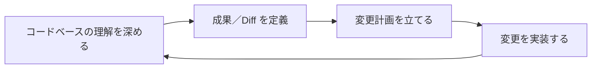
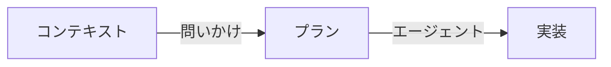
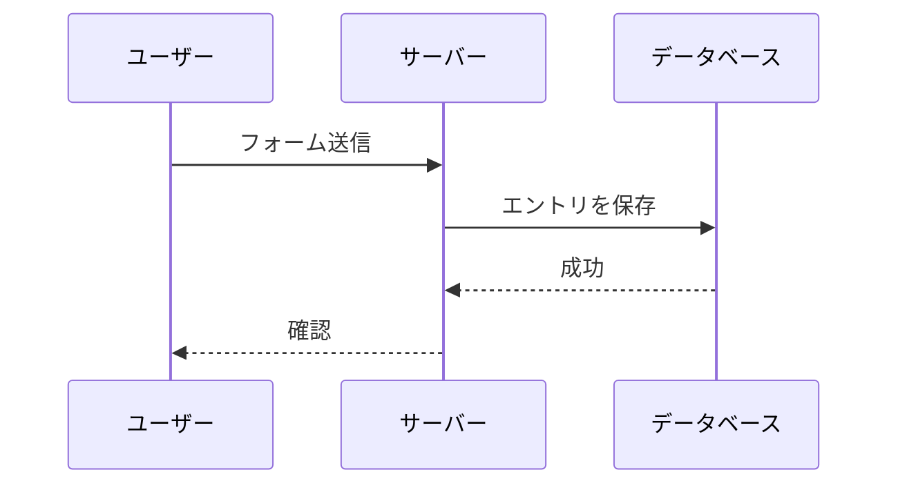
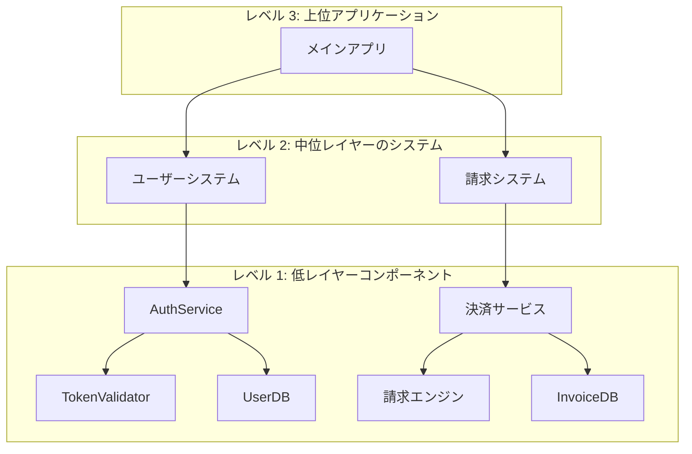
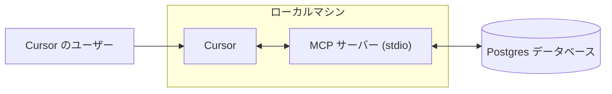
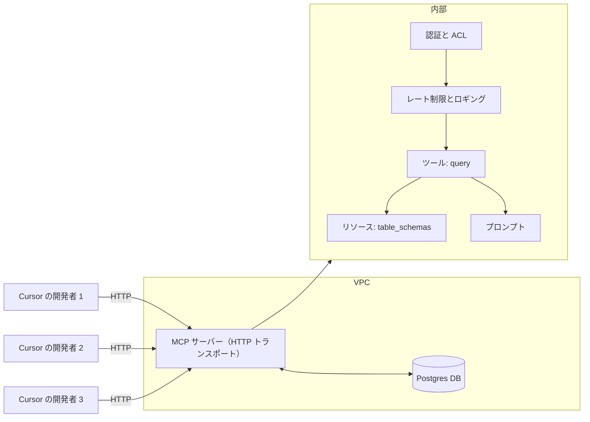
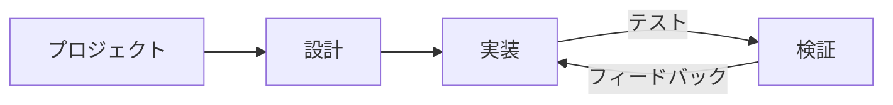
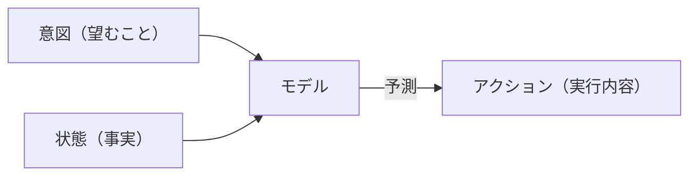

# データサイエンス

**Navigation:** [← Previous](./20-bugbot.md) | [Index](./index.md) | [Next →](./22-tab.md)

---

# データサイエンス
Source: https://docs.cursor.com/ja/guides/advanced/datascience

Python、R、SQL を含むデータサイエンスのワークフローを、ノートブック、リモート環境、AI を活用した分析とともに Cursor でセットアップする方法を学ぶ

export const Kbd = ({children, tooltip, os}) => {
  const keysInput = typeof children === 'string' && children.trim() !== '' ? children : null;
  if (!keysInput) {
    return null;
  }
  const isModifier = key => {
    const modifiers = ['⌘', '⇧', '⌥', '⌃', '⏎', '⌫', '⌦', '⎋', '⇥', '⌁', '←', '→', '↑', '↓', 'Ctrl', 'Shift', 'Alt', 'Cmd', 'Opt', 'Return', 'Backspace', 'Delete', 'Escape', 'Tab', 'Space', 'Enter', 'Esc', 'ArrowLeft', 'ArrowRight', 'ArrowUp', 'ArrowDown', 'Left', 'Right', 'Up', 'Down'];
    return modifiers.includes(key.trim());
  };
  const capitalizeFirstLetter = string => {
    return string.charAt(0).toUpperCase() + string.slice(1);
  };
  const isMac = os ? os.toLowerCase() === 'mac' || os.toLowerCase() === 'macos' : typeof navigator !== 'undefined' && (navigator.platform.toUpperCase().indexOf('MAC') >= 0 || navigator.userAgent.toUpperCase().indexOf('MAC') >= 0);
  const convertToSymbols = shortcut => {
    if (isMac) {
      return shortcut.replace(/⌘|Cmd|CMD/gi, '⌘').replace(/⌥|Opt|OPT/gi, '⌥').replace(/⌃|Ctrl/gi, '⌃').replace(/⇧|Shift/gi, '⇧').replace(/⏎|Return/gi, '⏎').replace(/⌫|Backspace/gi, '⌫').replace(/⌦|Delete/gi, '⌦').replace(/␛|Escape/gi, '␛').replace(/⇥|Tab/gi, '⇥').replace(/⌁|Space/gi, '⌁').replace(/←|Arrow\s*Left|ArrowLeft|Left/gi, '←').replace(/→|Arrow\s*Right|ArrowRight|Right/gi, '→').replace(/↑|Arrow\s*Up|ArrowUp|Up/gi, '↑').replace(/↓|Arrow\s*Down|ArrowDown|Down/gi, '↓');
    } else {
      const converted = shortcut.replace(/⌘|Cmd|CMD/gi, 'Ctrl').replace(/⌥|Opt|OPT/gi, 'Alt').replace(/⌃|Ctrl/gi, 'Ctrl').replace(/⇧|Shift/gi, 'Shift').replace(/⏎|Return/gi, 'Enter').replace(/⌫|Backspace/gi, 'Backspace').replace(/⌦|Delete/gi, 'Delete').replace(/⎋|Escape/gi, 'Esc').replace(/⇥|Tab/gi, 'Tab').replace(/⌁|Space/gi, 'Space').replace(/←|Arrow\s*Left|ArrowLeft|Left/gi, 'Arrow-Left').replace(/→|Arrow\s*Right|ArrowRight|Right/gi, 'Arrow-Right').replace(/↑|Arrow\s*Up|ArrowUp|Up/gi, 'Arrow-Up').replace(/↓|Arrow\s*Down|ArrowDown|Down/gi, 'Arrow-Down');
      const keyList = converted.split(/[\+\s]+/).filter(key => key.trim());
      return keyList.join('+');
    }
  };
  const convertToReadableText = shortcut => {
    const converted = shortcut.replace(/⌘|Cmd|CMD/gi, 'Cmd').replace(/⌥|Opt|OPT/gi, 'Opt').replace(/⌃|Ctrl/gi, 'Ctrl').replace(/⇧|Shift/gi, 'Shift').replace(/⏎|Return/gi, 'Return').replace(/⌫|Backspace/gi, 'Backspace').replace(/⌦|Delete/gi, 'Delete').replace(/⎋|Escape/gi, 'Escape').replace(/⇥|Tab/gi, 'Tab').replace(/⌁|Space/gi, 'Space').replace(/←|Arrow\s*Left|ArrowLeft|Left/gi, 'Arrow-Left').replace(/→|Arrow\s*Right|ArrowRight|Right/gi, 'Arrow-Right').replace(/↑|Arrow\s*Up|ArrowUp|Up/gi, 'Arrow-Up').replace(/↓|Arrow\s*Down|ArrowDown|Down/gi, 'Arrow-Down');
    const keyList = converted.split(/[\+\s]+/).filter(key => key.trim());
    return keyList.map(key => {
      const trimmedKey = key.trim();
      return isModifier(trimmedKey) ? trimmedKey : capitalizeFirstLetter(trimmedKey);
    }).join('+');
  };
  const displayShortcut = convertToSymbols(keysInput);
  const tooltipText = isMac ? tooltip ? `${convertToReadableText(keysInput)}: ${tooltip}` : convertToReadableText(keysInput) : tooltip || null;
  const processedKeys = isMac ? displayShortcut.split(/[\+\s]+/).filter(key => key.trim()).map(key => {
    const trimmedKey = key.trim();
    return isModifier(trimmedKey) ? trimmedKey : capitalizeFirstLetter(trimmedKey);
  }).join('') : displayShortcut.split('+').map(key => {
    const trimmedKey = key.trim();
    return isModifier(trimmedKey) ? trimmedKey : capitalizeFirstLetter(trimmedKey);
  }).join('+');
  return tooltipText ? <Tooltip tip={tooltipText}>
      <kbd>
        {processedKeys}
      </kbd>
    </Tooltip> : <kbd>
      {processedKeys}
    </kbd>;
};

Cursor は、再現可能な環境、ノートブックのサポート、AI 搭載のコードアシストを通じて、データサイエンス開発向けの統合ツール群を提供する。このガイドでは、Python、R、SQL ワークフローの基本的なセットアップパターンを解説する。

<div id="notebook-development">
  ## ノートブック開発
</div>

<Note>
  ノートブックをフルサポートするには、ms-toolsai が公開している Jupyter（id: ms-toolsai.jupyter）拡張機能をダウンロードしてね。
</Note>

Cursor は、セル実行が統合された `.ipynb` と `.py` の両方のファイルに対応してる。Tab、Inline Edit、Agents は、ほかのコードファイルと同様にノートブック内でも動作する。

主な機能:

* **インラインでのセル実行** により、エディタ内で直接コードを実行できる
* **Tab、Inline Edit、Agent** は、pandas、NumPy、scikit-learn、SQL マジックコマンドなどのデータサイエンス系ライブラリを理解してる

<div id="database-integration">
  ## データベース統合
</div>

データベースは主に2つの仕組みでCursorに統合できる：MCPサーバーと拡張機能。

* **MCPサーバー** はエージェントがデータベースに接続できるようにする
* **拡張機能** はIDE全体をデータベースと統合する

<div id="via-mcp">
  ### MCP経由
</div>

MCPサーバーを使うと、エージェントがデータベースに対して直接クエリを実行できる。これにより、エージェントはデータベースにクエリするかどうかを判断し、適切なクエリを作成してコマンドを実行し、出力を分析するところまで、進行中のタスクの一部として行える。

例えば、次の [MCP構成](https://github.com/modelcontextprotocol/servers-archived/tree/main/src/postgres) をCursorに追加すると、Postgresデータベースを自分のCursorインスタンスに接続できる：

```json  theme={null}
{
  "mcpServers": {
    "postgres": {
      "command": "npx",
      "args": [
        "-y",
        "@modelcontextprotocol/server-postgres",
        "postgresql://localhost/mydb"
      ]
    }
  }
}
```

MCPの詳細は[MCPドキュメント](/ja/tools/mcp)を参照。

<Frame>
  <video autoPlay loop muted playsInline controls width="100%">
    <source src="https://mintcdn.com/cursor/E7JVsKUF5L-IiJRB/images/guides/advanced/datascience/postgres-mcp.mp4?fit=max&auto=format&n=E7JVsKUF5L-IiJRB&q=85&s=334439f58b7d88b16d97134cf9c147aa" type="video/mp4" data-path="images/guides/advanced/datascience/postgres-mcp.mp4" />

    ブラウザが video タグをサポートしていない。
  </video>
</Frame>

<div id="via-extensions">
  ### 拡張機能経由
</div>

データベースごとの拡張機能（PostgreSQL、BigQuery、SQLite、Snowflake）をインストールすると、エディタから直接クエリを実行できる。これでツール間のコンテキスト切り替えが不要になり、クエリ最適化に向けたAI支援も使える。

```sql  theme={null}
-- Cursor はインデックス、ウィンドウ関数、クエリ最適化の提案を行う
SELECT
    user_id,
    event_type,
    COUNT(*) as event_count,
    RANK() OVER (PARTITION BY user_id ORDER BY COUNT(*) DESC) as frequency_rank
FROM events
WHERE created_at >= NOW() - INTERVAL '7 days'
GROUP BY user_id, event_type;
```

Agents を使って、遅いクエリの分析、パフォーマンス改善の提案、クエリ結果の可視化コードの生成ができる。Cursor は SQL の文脈を理解しており、データ構造に応じて適切なチャートタイプをおすすめする。

<Frame>
  
</Frame>

<div id="data-visualization">
  ## データ可視化
</div>

CursorのAIアシストは、Matplotlib、Plotly、Seabornといったデータ可視化ライブラリにも対応。エージェントが可視化用のコードを生成してくれるから、データをすばやく手軽に探索できて、再現性があり共有しやすいアーティファクトも作れる。

```python  theme={null}
import plotly.express as px
import pandas as pd


# AIがデータの列に基づいて適切な可視化タイプを提案
df = pd.read_csv('sales_data.csv')
fig = px.scatter(df, x='advertising_spend', y='revenue',
                 color='region', size='customer_count',
                 title='地域別の収益と広告費の関係'
fig.show()
```

<Frame>
  <video autoPlay loop muted playsInline controls width="100%">
    <source src="https://mintcdn.com/cursor/E7JVsKUF5L-IiJRB/images/guides/advanced/datascience/datascience-visualization.mp4?fit=max&auto=format&n=E7JVsKUF5L-IiJRB&q=85&s=0ebce62250db235a6a3740ca3bcb188b" type="video/mp4" data-path="images/guides/advanced/datascience/datascience-visualization.mp4" />

    お使いのブラウザは video タグをサポートしていません。
  </video>
</Frame>

<div id="frequently-asked-questions">
  ## よくある質問
</div>

**既存の Jupyter ノートブックは使える？**
うん、Cursor は `.ipynb` ファイルを開けて、セル実行と AI 補完にフル対応だよ。

**メモリに収まらない巨大なデータセットはどう扱えばいい？**
Dask みたいな分散処理ライブラリを使うか、Remote-SSH で大きなマシン上の Spark クラスターに接続しよう。

**Cursor は R と SQL ファイルに対応してる？**
うん、Cursor は R スクリプト（`.R`）と SQL ファイル（`.sql`）の AI アシストとシンタックスハイライトに対応してるよ。

**開発環境を共有するおすすめの方法は？**
`.devcontainer` フォルダをバージョン管理にコミットしておこう。プロジェクトを開くときにチームメンバーが自動で環境を再構築できるよ。

**データ処理パイプラインはどうやってデバッグするの？**
Python スクリプトでブレークポイントが使える Cursor の統合デバッガを使うか、Agent に任せて複雑なデータ変換をステップごとに解析・説明してもらおう。

<div id="environment-reproducibility">
  ## 環境の再現性
</div>

<div id="development-containers">
  ### 開発コンテナ
</div>

開発コンテナは、チーム内やデプロイ環境間でランタイムと依存関係を揃えて一貫性を保つのに役立つ。環境依存のバグをなくし、新しいメンバーのオンボーディングも短縮できる。

開発コンテナを使うには、まずリポジトリのルートに `.devcontainer` フォルダを作成。次に `devcontainer.json`、`Dockerfile`、`requirements.txt` を用意しよう。

```json  theme={null}
// .devcontainer/devcontainer.json
{
  "name": "ds-env",
  "build": { "dockerfile": "Dockerfile" },
  "features": {
    "ghcr.io/devcontainers/features/python:1": { "version": "3.11" }
  },
  "postCreateCommand": "pip install -r requirements.txt"
}
```

```dockerfile  theme={null}

# .devcontainer/Dockerfile
FROM mcr.microsoft.com/devcontainers/python:3.11
COPY requirements.txt .
RUN pip install --upgrade pip && \
    pip install -r requirements.txt
```

```txt  theme={null}

# requirements.txt
pandas==2.3.0
numpy

# プロジェクトに必要な他の依存関係を追加する
```

Cursor は devcontainer を自動検出して、コンテナ内でプロジェクトを再オープンするよう促す。別の方法として、Command Palette (<Kbd>Cmd+Shift+P</Kbd>) を使って `Reopen in Container` を検索し、手動でコンテナ内で再オープンできる。

Development containers にはいくつかの利点がある:

* **依存関係の分離** により、プロジェクト間の競合を防ぐ
* **再現可能なビルド** により、開発・本番環境で一貫した動作を保証する
* **オンボーディングの簡素化** により、新しいチームメンバーが手動セットアップなしですぐに始められる

<div id="remote-development-with-ssh">
  ### SSH を使ったリモート開発
</div>

分析に追加の計算リソース、GPU、またはプライベートデータセットへのアクセスが必要な場合は、ローカルの開発環境を維持したままリモートマシンに接続しよう。

1. 必要なリソースを備えたクラウドインスタンスを用意するか、オンプレミスサーバーにアクセスする
2. `.devcontainer` 構成を含めてリポジトリをリモートマシンにクローンする
3. Cursor から接続: <Kbd>Cmd+Shift+P</Kbd> → "Remote-SSH: Connect to Host"

このアプローチは、必要に応じて計算リソースをスケールしつつ、ツールチェーンの一貫性を維持する。同じ development container 構成がローカルとリモートの両方の環境で機能する。


# 大規模コードベース
Source: https://docs.cursor.com/ja/guides/advanced/large-codebases

Cursor で大規模コードベースを扱う方法

大規模なコードベースを扱うと、小規模プロジェクトとは異なる新たな課題が出てくる。Cursor 自身のコードベースをスケールしてきた経験と、巨大なコードベースを運用しているユーザーから得た知見から、増す複雑さに対処するための有用なパターンをいくつか見つけてきた。

このガイドでは、大規模コードベースで役立つことがわかったテクニックをいくつか紹介していく。



<div id="use-chat-to-quickly-get-up-to-speed-on-unfamiliar-code">
  # Chat を使って不慣れなコードを手早く把握しよう
</div>

大規模なコードベースを読み解くのは、特に初見だと骨が折れる。目的の箇所を見つけるために grep したり検索したり、あちこちクリックして回ることになる。[Chat](/ja/chat/overview) を使えば、知りたいことを質問して探し当てられるし、仕組みについての詳しい解説も得られる。

ここでは、Cursor のコードベースのインデックス化の実装詳細を探すのを手伝ってもらい、理解しやすいようにサンプルまで出してもらっている。

<Frame>
  <video src="https://mintcdn.com/cursor/E7JVsKUF5L-IiJRB/images/guides/advanced/large-codebases/qa.mp4?fit=max&auto=format&n=E7JVsKUF5L-IiJRB&q=85&s=d749be91cb35a3d13fa9df4210622029" controls data-path="images/guides/advanced/large-codebases/qa.mp4" />
</Frame>

<div id="write-rules-for-domain-specific-knowledge">
  # ドメイン固有の知識のルールを書こう
</div>

新しいコラボレーターをコードベースにオンボードするとしたら、意味のある貢献をすぐ始められるように、どんな背景情報を共有する？

この問いへの答えは、Cursorにとっても貴重な情報。どんな組織やプロジェクトにも、ドキュメントだけでは取り切れていない暗黙知がある。ルールを効果的に使うことが、Cursorに全体像を正確に把握してもらういちばん確実な方法だよ。

たとえば、新機能やサービスの実装手順を書いているなら、将来のためにそれを残す短いルールも併せて用意しておこう。

```mdc ボイラープレート theme={null}
---
description: 新しい VSCode フロントエンドサービスを追加する
---

1. **インターフェイス定義:**
   - `createDecorator` を使って新しいサービスインターフェイスを定義し、エラーを避けるために `_serviceBrand` を含めること。

2. **サービスの実装:**
   - 新しい TypeScript ファイルでサービスを実装し、`Disposable` を継承して `registerSingleton` でシングルトンとして登録する。

3. **サービスの組み込み:**
   - サービスをインポートしてロードするための貢献（contribution）ファイルを作成し、メインのエントリポイントで登録する。

4. **コンテキスト統合:**
   - アプリ全体からアクセスできるよう、新しいサービスをコンテキストに追加する。
```

共通のフォーマットパターンがあって、それをCursorに確実に守らせたいなら、globパターンに基づくルールの自動適用を検討してみて。

```mdc フォーマット theme={null}
---
globs: *.ts
---
- パッケージマネージャーは bun を使う。スクリプトは [package.json](mdc:backend/reddit-eval-tool/package.json) を参照
- ファイル名は kebab-case を使う
- 関数名と変数名は camelCase を使う
- ハードコードした定数には UPPERCASE_SNAKE_CASE を使う
- `const foo = () =>` よりも `function foo()` を優先する
- `T[]` ではなく `Array<T>` を使う
- デフォルトエクスポートより名前付きエクスポートを使う（例: `export const variable ...`、`export function ...`）
```

<div id="stay-close-to-the-plan-creation-process">
  # 計画作成のプロセスにとことん付き合おう
</div>

大きな変更では、精密でスコープが明確なプランをしっかり練るほど、Cursorの出力は大きく良くなる。

同じプロンプトを少しずつ変えてもなかなか狙いどおりの結果にならないなら、いったん引いて、同僚向けのPRDを書くつもりでゼロからより詳細なプランを作り直そう。多くの場合、\*\*本当に難しいのは「何を」\*\*変えるべきかを見極めることで、ここは人間が得意な領域。適切な指示さえあれば、実装の一部はCursorに任せられる。

計画作成をAIでブーストする方法のひとつがAskモードの活用。プランを作るときは、CursorでAskモードをオンにして、プロジェクト管理ツールや社内ドキュメント、頭の中のメモでも何でも、持っているコンテキストを全部流し込もう。コードベースのどのファイルや依存関係を取り込むか、あらかじめ含めたいものを洗い出しておくといい。統合したいコード片を含む特定のファイルでもいいし、場合によってはフォルダ丸ごとでもOK。

次はプロンプトの例:

```mdc 計画用プロンプト theme={null}
- 新機能の作り方について計画を立てて（@existingfeature.ts と同様に）
- 不明点があれば質問して（最大3件まで）
- コードベースを必ず検索して

@Past Chats（過去の探索用プロンプト）

[project management tool] からの追加コンテキストは次のとおり：
[pasted ticket description]
```

モデルには、プランを作成し、人に質問してコンテキストを集め、これまでの探索用プロンプトやチケットの説明も参照するように指示してる。変更の意図を理解してより適切なプランをまとめられるから、`claude-3.7-sonnet`、`gemini-2.5-pro`、`o3` といった思考系モデルの利用をおすすめする。

ここからは、実装に入る前に、Cursor のサポートを受けながらプランを反復的にブラッシュアップしていける。



<div id="pick-the-right-tool-for-the-job">
  # 仕事に最適なツールを選ぶ
</div>

Cursorを効果的に使ううえで大事なのは、やりたいことに合ったツールを選ぶこと。何を達成したいかを考えて、フローを途切れさせないアプローチを選ぼう。

| **Tool**                                    | **Use case**   | **Strength**    | **Limitation** |
| :------------------------------------------ | :------------- | :-------------- | :------------- |
| **[Tab](/ja/tab/overview)**                 | 素早い手動の変更       | 完全なコントロール、高速    | 単一ファイル         |
| **[Inline Edit](/ja/inline-edit/overview)** | 1ファイル内の限定的な変更  | 的を絞った編集         | 単一ファイル         |
| **[Chat](/ja/chat/overview)**               | 規模の大きい複数ファイル変更 | コンテキスト自動収集、深い編集 | やや遅い、コンテキスト依存  |

各ツールには得意領域がある:

* Tab は、手早く自分で細かくコントロールしながら編集したいときの定番
* Inline Edit は、コードの特定セクションに絞った変更で真価を発揮
* Chat は、広いコンテキスト理解が必要な大きな変更にぴったり

Chat モードを使うとき（体感は少し遅めだけど、とても強力）、良いコンテキストを渡してうまく使おう。真似したい似たコードを指すなら [@files](/ja/context/@-symbols/@-files)、プロジェクト構造を把握させるなら [@folder](/ja/context/@-symbols/@-folders) を使ってね。大きな変更は遠慮せず小さく分割しよう。新しいチャットに分けて進めると、フォーカスと効率を保てる。

<div id="takeaways">
  # Takeaways
</div>

* 変更範囲は絞って、一度にやりすぎない
* 可能な限り関連するコンテキストを共有する
* Chat、Inline Edit、Tab はそれぞれの得意分野で使い分ける
* チャットはこまめに新規作成する
* [Ask モード](/ja/chat/ask)で計画し、[Agent モード](/ja/chat/agent)で実装する


# ドキュメントの活用
Source: https://docs.cursor.com/ja/guides/advanced/working-with-documentation

プロンプト、外部ソース、内部コンテキストを活用して、Cursor でドキュメントを効果的に使う方法

export const ChatInput = ({content = []}) => {
  const renderContent = () => {
    return content.map((item, index) => {
      if (item.type === 'mention') {
        return <span key={index} className="mention bg-blue-500/20 px-1 py-0.5 rounded-sm">
                        {item.text}
                    </span>;
      }
      return item.text;
    });
  };
  return <>
            <div className="flex flex-col items-stretch border border-neutral-500 rounded-lg p-3 gap-2 bg-neutral-800 relative transition-all duration-100 ease-in-out hover:border-neutral-500">
                <div className="flex flex-col gap-1">
                    <div className="flex flex-col gap-1 outline-none overflow-hidden">
                        <div className="flex-1 flex items-center gap-2">
                            <div className="w-full box-border max-h-10 overflow-hidden">
                                <div className="flex items-center gap-2 w-full flex-nowrap">
                                    <div className="cursor-pointer flex items-center justify-center p-1 h-5 w-5 rounded border border-neutral-600 outline-none flex-shrink-0 hover:bg-neutral-700 bg-neutral-750">
                                        <span className="text-neutral-400 text-sm font-semibold">@</span>
                                    </div>
                                </div>
                            </div>
                        </div>
                    </div>
                </div>

                <div className="relative pt-0">
                    <div className="min-h-6 w-full max-h-60">
                        <div className="relative overflow-y-hidden w-full">
                            <div className="w-full flex flex-wrap overflow-hidden min-h-6">
                                <div className="inline-block w-full min-h-full">
                                    <div className="w-full overflow-visible h-full min-h-6">
                                        <div className="grid relative grid-cols-1 w-full">

                                            <div className="leading-6 text-sm text-neutral-200 bg-transparent block break-words p-0 whitespace-pre-wrap font-medium min-h-6">
                                                {content.length > 0 ? renderContent() : <span className="text-neutral-500">Plan, search, build anything</span>}
                                            </div>

                                        </div>
                                    </div>
                                </div>
                            </div>
                        </div>
                    </div>

                    <div className="flex items-center justify-between gap-3 flex-shrink-0 mt-6">
                        <div className="flex-1 w-full h-full flex items-center flex-col gap-1">
                            <div className="flex items-center justify-between gap-2 flex-shrink-0 w-full">
                                <div className="flex items-center justify-between w-full">
                                    <div className="flex items-center gap-3 flex-shrink min-w-0">
                                        <div className="flex gap-1 text-xs items-center min-w-0 max-w-full px-1.5 py-0.5 flex-shrink-0 cursor-pointer bg-neutral-700 hover:bg-neutral-600 rounded-full">
                                            <div className="flex items-center gap-1 min-w-0 max-w-full overflow-hidden">
                                                <div className="text-xs flex-shrink-0 w-3 h-3 flex items-center justify-center text-neutral-400">
                                                    ∞
                                                </div>
                                                <div className="min-w-0 max-w-full overflow-hidden text-ellipsis whitespace-nowrap flex items-center gap-1 font-medium">
                                                    <span className="text-neutral-300">Agent</span>
                                                    <span className="text-neutral-500 text-[10px]">⌘I</span>
                                                </div>
                                                <Icon icon="chevron-down" size={6} color="currentColor" />
                                            </div>
                                        </div>

                                        <div className="flex gap-2 text-xs items-center cursor-pointer min-w-0 max-w-full px-0 py-1 opacity-90 rounded hover:text-neutral-200">
                                            <div className="flex items-center gap-2 min-w-0 max-w-full overflow-x-hidden">
                                                <div className="min-w-0 text-ellipsis whitespace-nowrap text-neutral-300 flex items-center gap-2 overflow-hidden">
                                                    <div className="overflow-hidden inline-flex gap-2 items-center">
                                                        <span className="whitespace-nowrap overflow-x-hidden text-ellipsis text-xs">
                                                            Auto
                                                        </span>
                                                    </div>
                                                </div>
                                                <Icon icon="chevron-down" size={8} color="currentColor" />
                                            </div>
                                        </div>
                                    </div>

                                    <div className="flex items-center gap-3 justify-end">
                                        <button className="bg-white/80 border-none text-neutral-500 flex w-5 h-5 items-center justify-center hover:text-neutral-400 hover:bg-white/90 rounded-full disabled:opacity-50" disabled={content.length === 0 || !content.some(item => item.text.trim())}>
                                            <span className="text-sm">↑</span>
                                        </button>
                                    </div>
                                </div>
                            </div>
                        </div>
                    </div>
                </div>
            </div>
        </>;
};

<div id="why-documentation-matters">
  # なぜドキュメントが重要なのか
</div>

ドキュメントは最新かつ正確なコンテキストを提供する。これがないと、モデルは古く不完全な学習データに頼ってしまう。ドキュメントがあると、モデルは次のような点を把握しやすくなる:

* 最新のAPIとパラメータ
* ベストプラクティス
* 組織の規約・慣習
* ドメインの用語

ほかにもいろいろ。コンテキストを切り替えずに、Cursorの中でドキュメントを活用する方法をこの先で紹介するよ。

<div id="model-knowledge-cutoff">
  ## モデルの知識カットオフ
</div>

大規模言語モデルは、ある時点までのデータで学習される。この時点を「知識カットオフ」と呼ぶ。つまり、次のようなことが起こりうる:

* 直近のライブラリ更新が反映されていない
* 新しいフレームワークやツールを知らない場合がある
* カットオフ以降のAPI変更を把握していない
* 学習以降にベストプラクティスが変わっている可能性がある

たとえば、モデルの知識カットオフが2024年初頭なら、2024年後半にリリースされた機能は、人気のフレームワークでも把握していない。

<div id="which-tool-should-i-use">
  # どのツールを使うべき？
</div>

このディシジョンツリーを使って、ドキュメントに最適なアプローチをすばやく見つけよう:

```mermaid  theme={null}
flowchart TD
    A[どんな情報が必要？] --> B[公開フレームワーク／ライブラリ]
    A --> C[最新のコミュニティ知見／トラブルシューティング]
    A --> D[社内情報]
    
    B --> E[公式ドキュメントが必要？]
    E -->|Yes| F[@Docs を使う<br/>API リファレンス、ガイド、ベストプラクティス]
    E -->|No| G[@Web を使う<br/>コミュニティのチュートリアル、比較]
    
    C --> H[@Web を使う<br/>最新投稿、GitHub の Issue]
    
    D --> I[既存の MCP 連携はある？]
    I -->|Yes| J[既存の MCP を使う<br/>Confluence、Google Drive など]
    I -->|No| K[カスタム MCP を構築<br/>社内 API、独自システム]
    
    style F fill:#e1f5fe
    style G fill:#e8f5e8  
    style H fill:#e8f5e8
    style J fill:#fff3e0
    style K fill:#fce4ec
```

<div id="mental-model">
  ## メンタルモデル
</div>

<div className="full-width-table">
  | Tool        | メンタルモデル                 |
  | ----------- | ----------------------- |
  | **`@Docs`** | 公式ドキュメントを参照・閲覧するイメージ    |
  | **`@Web`**  | インターネットで解決策を検索するイメージ    |
  | **MCP**     | 自社（内部）ドキュメントにアクセスするイメージ |
</div>

<div id="public-documentation">
  # 公開ドキュメント
</div>

外部ドキュメントは、モデルの知識が限定的だったり古くなっている可能性がある公開情報を扱う。Cursor では、この情報にアクセスするための主要な方法を2つ用意してる。

<div id="using-docs">
  ## @Docs の使い方
</div>

`@Docs` は、人気のツールやフレームワークの公式ドキュメントに Cursor をつなぐ機能。最新かつ信頼できる情報が必要なときに使ってね:

* **API リファレンス**: 関数シグネチャ、パラメータ、戻り値の型
* **はじめ方ガイド**: セットアップ、設定、基本的な使い方
* **ベストプラクティス**: 公式が推奨するパターン
* **フレームワーク別のデバッグ**: 公式のトラブルシューティングガイド

<ChatInput
  content={[
{ type: 'mention', text: '@Docs Next.js' },
{ type: 'text', text: ' How do I set up dynamic routing with catch-all routes?' }
]}
/>

<div id="using-web">
  ## @Web の使い方
</div>

`@Web` は、最新の情報、ブログ記事、コミュニティでの議論をインターネット上からリアルタイム検索する。こんなときに使おう:

* **最新のチュートリアル**: コミュニティ発のコンテンツやサンプル
* **比較**: 異なるアプローチを比較した記事
* **最新アップデート**: 直近の更新やアナウンス
* **複数の視点**: 問題に対する別々のアプローチ

<ChatInput
  content={[
{ type: 'mention', text: '@Web' },
{ type: 'text', text: ' latest performance optimizations for React 19' }
]}
/>

<div id="internal-documentation">
  # 社内ドキュメント
</div>

社内ドキュメントには、AIモデルが学習時に扱っていない、組織固有の情報が含まれる。例えば次のようなもの:

* **内部API**: カスタムサービスやマイクロサービス
* **社内標準**: コーディング規約、アーキテクチャパターン
* **プロプライエタリシステム**: カスタムツール、データベース、ワークフロー
* **ドメイン知識**: ビジネスロジック、コンプライアンス要件

<div id="accessing-internal-docs-with-mcp">
  ## MCP で社内ドキュメントにアクセスする
</div>

Model Context Protocol (MCP) は、プライベートなドキュメントやシステムを Cursor に取り込むための標準化された仕組み。MCP は Cursor と社内リソースの間にある薄いレイヤーとして機能する。

**MCP が重要な理由:**

* モデルは社内の慣習を推測できない
* カスタムサービスの API ドキュメントは公開されていない
* ビジネスロジックやドメイン知識は組織固有
* コンプライアンスやセキュリティ要件は会社ごとに異なる

<div id="common-mcp-integrations">
  ### よく使われる MCP 連携
</div>

| Integration      | Access              | Examples                                               |
| ---------------- | ------------------- | ------------------------------------------------------ |
| **Confluence**   | 会社の Confluence スペース | アーキテクチャドキュメント、社内サービスの API 仕様、コーディング標準とガイドライン、プロセス文書    |
| **Google Drive** | 共有ドキュメントとフォルダ       | 仕様書、会議メモと意思決定記録、設計ドキュメントと要件、チームのナレッジベース                |
| **Notion**       | ワークスペースのデータベースとページ  | プロジェクトドキュメント、チーム Wiki、ナレッジベース、プロダクト要件、技術仕様             |
| **Custom**       | 社内システムとデータベース       | プロプライエタリな API、レガシーなドキュメントシステム、カスタムナレッジベース、特化ツールやワークフロー |

<div id="custom-solutions">
  #### カスタムソリューション
</div>

固有のニーズには、次のことができるカスタム MCP サーバーを構築できる:

* 社内ウェブサイトやポータルをスクレイピングする
* プロプライエタリなデータベースに接続する
* カスタムドキュメントシステムにアクセスする
* 社内 Wiki やナレッジベースから取得する

<Tip>カスタム MCP サーバーを構築したら、Cursor がドキュメントを更新できるようにツールを公開することもできる</Tip>

社内ドキュメントをスクレイピングするカスタム MCP サーバーの例:

<CodeGroup>
  ```javascript TypeScript theme={null}
  import { McpServer, ResourceTemplate } from "@modelcontextprotocol/sdk/server/mcp.js";
  import { StdioServerTransport } from "@modelcontextprotocol/sdk/server/stdio.js";
  import { z } from "zod";
  import TurndownService from "turndown";

  // Create an MCP server for scraping internal docs
  const server = new McpServer({
    name: "internal-docs",
    version: "1.0.0"
  });

  const turndownService = new TurndownService();

  // Add tool to scrape internal documentation
  server.tool("get_doc",
    { url: z.string() },
    async ({ url }) => {
      try {
        const response = await fetch(url);
        const html = await response.text();
        
        // Convert HTML to markdown
        const markdown = turndownService.turndown(html);
        
        return {
          content: [{ type: "text", text: markdown }]
        };
      } catch (error) {
        return {
          content: [{ type: "text", text: `Error scraping ${url}: ${error.message}` }]
        };
      }
    }
  );

  // Start receiving messages on stdin and sending messages on stdout
  const transport = new StdioServerTransport();
  await server.connect(transport);
  ```

  ```python Python theme={null}
  # server.py
  import os
  import asyncio
  from mcp.server.fastmcp import FastMCP
  import aiohttp
  from markdownify import markdownify as md

  # Create an MCP server for scraping internal docs
  mcp = FastMCP("internal-docs")

  @mcp.tool()
  async def get_doc(url: str) -> dict:
      """Scrape internal documentation from a URL"""
      try:
          async with aiohttp.ClientSession() as session:
              async with session.get(url) as response:
                  html = await response.text()
          
          # Convert HTML to markdown
          markdown = md(html)
          
          return {
              "content": [{"type": "text", "text": markdown}]
          }
      except Exception as error:
          return {
              "content": [{"type": "text", "text": f"Error scraping {url}: {str(error)}"}]
          }
  ```
</CodeGroup>

<div id="keeping-docs-up-to-date">
  # ドキュメントを最新に保つ
</div>

ドキュメントはすぐ古くなる。Cursor なら、実際のコードや開発中の会話に基づいてドキュメントを生成・更新してくれるから、常に最新で使えるドキュメントを維持できる。

<div id="from-existing-code">
  ## 既存コードから
</div>

Cursor を使ってコードベースから直接ドキュメントを作成しよう:

<Tabs>
  <Tab title="API Documentation">
    <ChatInput
      content={[
    { type: 'text', text: 'この Express ルーターの API ドキュメントを生成して。すべてのエンドポイント、パラメーター、レスポンス形式を含めて' }
  ]}
    />
  </Tab>

  <Tab title="JSDoc Comments">
    <ChatInput
      content={[
    { type: 'text', text: 'このクラスに網羅的な JSDoc コメントを追加して。すべてのメソッドとそのパラメーターをドキュメント化して' }
  ]}
    />
  </Tab>

  <Tab title="README Creation">
    <ChatInput
      content={[
    { type: 'text', text: 'このプロジェクトの README を作成して。セットアップ手順、使用例、API の概要を含めて' }
  ]}
    />
  </Tab>
</Tabs>

<div id="from-chat-sessions">
  ## チャットセッションから
</div>

Cursor との会話には、ドキュメント化できる有用な意図が含まれてる。

<Tabs>
  <Tab title="Problem Solving">
    **複雑な問題を解決したあと:**

    <ChatInput
      content={[
    { type: 'text', text: '認証のセットアップについての会話を、チームのwiki向けのステップバイステップガイドに要約して' }
  ]}
    />
  </Tab>

  <Tab title="Architecture">
    **アーキテクチャの決定後:**

    <ChatInput
      content={[
    { type: 'text', text: 'このデータベース設計を選んだ理由を、議論したトレードオフも含めて説明するドキュメントを作成して' }
  ]}
    />
  </Tab>

  <Tab title="Debugging">
    **デバッグセッションのあと:**

    <ChatInput
      content={[
    { type: 'text', text: 'さっき修正したバグをもとに、症状と解決手順を含むトラブルシューティングガイドを書いて' }
  ]}
    />
  </Tab>
</Tabs>

<div id="takeaways">
  ## まとめ
</div>

* ドキュメントをコンテキストに使うと、Cursor の精度と最新性が上がる
* 公式ドキュメントには `@Docs`、コミュニティ由来の知識には `@Web` を使う
* MCP は Cursor と社内システムをつなぐブリッジになる
* 知識を最新に保つために、コードや会話からドキュメントを生成する
* より網羅的に理解するには、外部と内部のドキュメントソースを組み合わせる


# Java
Source: https://docs.cursor.com/ja/guides/languages/java

JDK、拡張機能、ビルドツールで Java 開発環境をセットアップする

このガイドでは、Cursor を Java 開発向けにセットアップする方法を解説する。JDK の導入、必要な拡張機能のインストール、デバッグ、Java アプリの実行、Maven や Gradle などのビルドツールの連携までカバー。IntelliJ や VS Code に近いワークフロー機能についても取り上げる。

<Note>
  始める前に、Cursor をインストールして最新バージョンにアップデートしておいてね。
</Note>

<div id="setting-up-java-for-cursor">
  ## Cursor 用の Java セットアップ
</div>

<div id="java-installation">
  ### Java のインストール
</div>

Cursor をセットアップする前に、マシンに Java をインストールしておく必要があるよ。

<Warning>
  Cursor には Java コンパイラが同梱されていないから、まだなら JDK をインストールしてね。
</Warning>

<CardGroup cols={1}>
  <Card title="Windows Installation" icon="windows">
    JDK（例: OpenJDK、Oracle JDK、Microsoft Build of OpenJDK）をダウンロードしてインストールする。

    <br />

    JAVA\_HOME を設定して、PATH に JAVA\_HOME\bin を追加する。
  </Card>

  <Card title="macOS Installation" icon="apple">
    Homebrew（`brew install openjdk`）でインストールするか、インストーラをダウンロードする。

    <br />

    JAVA\_HOME がインストール済みの JDK を指すように設定してね。
  </Card>

  <Card title="Linux Installation" icon="linux">
    パッケージマネージャ（`sudo apt install openjdk-17-jdk` など）を使うか、SDKMAN でインストールする。
  </Card>
</CardGroup>

インストールを確認するには、次を実行:

```bash  theme={null}
java -version
javac -version
```

<Info>
  Cursor が JDK を検出できない場合は、settings.json で手動設定してね：
</Info>

```json  theme={null}
{
  "java.jdt.ls.java.home": "/path/to/jdk",
  "java.configuration.runtimes": [
    {
      "name": "JavaSE-17",
      "path": "/path/to/jdk-17",
      "default": true
    }
  ]
}
```

<Warning>変更を反映するには Cursor を再起動して。</Warning>

<div id="cursor-setup">
  ### Cursor のセットアップ
</div>

<Info>Cursor は VS Code の拡張機能に対応。次を手動でインストールしてね：</Info>

<CardGroup cols={2}>
  <Card title="Extension Pack for Java" icon="java" href="cursor:extension/vscjava.vscode-java-pack">
    Java の言語サポート、デバッガー、テストランナー、Maven サポート、プロジェクトマネージャーを含む
  </Card>

  <Card title="Gradle for Java" icon="gears" href="cursor:extension/vscjava.vscode-gradle">
    Gradle ビルドシステムでの作業に必須
  </Card>

  <Card title="Spring Boot Extension Pack" icon="leaf" href="cursor:extension/vmware.vscode-boot-dev-pack">
    Spring Boot 開発に必須
  </Card>

  <Card title="Kotlin" icon="window" href="cursor:extension/fwcd.kotlin">
    Kotlin アプリ開発に必要
  </Card>
</CardGroup>

<div id="configure-build-tools">
  ### ビルドツールの設定
</div>

<div id="maven">
  #### Maven
</div>

Maven がインストール済みか確認してね（`mvn -version`）。必要なら [maven.apache.org](https://maven.apache.org/download.cgi) からインストール：

1. バイナリアーカイブをダウンロード
2. 任意の場所に展開
3. 展開先フォルダを MAVEN\_HOME 環境変数に設定
4. %MAVEN\_HOME%\bin（Windows）または \$MAVEN\_HOME/bin（Unix）を PATH に追加

<div id="gradle">
  #### Gradle
</div>

Gradle がインストール済みか確認してね（`gradle -version`）。必要なら [gradle.org](https://gradle.org/install/) からインストール：

1. バイナリ配布物をダウンロード
2. 任意の場所に展開
3. 展開先フォルダを GRADLE\_HOME 環境変数に設定
4. %GRADLE\_HOME%\bin（Windows）または \$GRADLE\_HOME/bin（Unix）を PATH に追加

または、Gradle Wrapper を使えば、適切な Gradle バージョンを自動でダウンロードして使用できる：

<div id="running-and-debugging">
  ## 実行とデバッグ
</div>

セットアップが完了したら、Java コードを実行してデバッグしよう。
ニーズに合わせて、次の方法が使えるよ:

<CardGroup cols={2}>
  <Card title="Run" icon="play">
    どの main メソッドの上にも表示される「Run」リンクをクリックして、
    プログラムを素早く実行
  </Card>

  <Card title="Debug" icon="bug">
    Run and Debug サイドバーを開いて、Run ボタンで
    アプリケーションを起動
  </Card>
</CardGroup>

<CardGroup cols={1}>
  <Card title="Terminal" icon="terminal">
    コマンドラインから Maven または Gradle のコマンドで実行
  </Card>

  <Card title="Spring Boot" icon="leaf">
    Spring Boot Dashboard 拡張機能から
    Spring Boot アプリケーションを直接起動
  </Card>
</CardGroup>

<div id="java-x-cursor-workflow">
  ## Java x Cursor ワークフロー
</div>

Cursor の AI 機能は、Java の開発ワークフローを大きく底上げしてくれる。ここでは、Java 向けに Cursor の機能を活用するコツを紹介する:

<CardGroup cols={2}>
  <Card title="Tab Completion" icon="arrow-right">
    <div className="text-sm">
      メソッドやシグネチャ、getters/setters といった Java のボイラープレートをスマートに補完。
    </div>
  </Card>

  <Card title="Agent Mode" icon="pen-to-square">
    <div className="text-sm">
      デザインパターンの実装、コードのリファクタリング、適切な継承を備えたクラスの生成。
    </div>
  </Card>

  <Card title="Inline Edit" icon="code">
    <div className="text-sm">
      フローを崩さずにメソッドをすばやくインライン編集、エラー修正、ユニットテストの生成。
    </div>
  </Card>

  <Card title="Chat" icon="message">
    <div className="text-sm">
      Java の概念の理解を助けたり、例外をデバッグしたり、フレームワークの機能を把握したりできる。
    </div>
  </Card>
</CardGroup>

<div id="example-workflows">
  ### 例となるワークフロー
</div>

1. **Java ボイラープレートの生成**\
   [Tab completion](/ja/tab/overview) を使って、コンストラクタ、getters/setters、equals/hashCode メソッドなどの反復的な Java パターンを素早く生成。

2. **複雑な Java 例外のデバッグ**\
   難解な Java スタックトレースに当たったら、ハイライトして [Ask](/ja/chat/overview) で根本原因の説明と修正案を聞こう。

3. **レガシー Java コードのリファクタリング**\
   [Agent mode](/ja/chat/agent) を使って古い Java コードをモダナイズ。無名クラスをラムダに変換、新しい Java 言語機能へのアップグレード、あるいはデザインパターンの実装。

4. **フレームワーク開発**\
   @docs でドキュメントを Cursor のコンテキストに追加して、Cursor 全体でフレームワーク特化のコードを生成しよう。


# JavaScript & TypeScript
Source: https://docs.cursor.com/ja/guides/languages/javascript

フレームワーク対応の JavaScript／TypeScript 開発

Cursor での JavaScript／TypeScript 開発へようこそ！このエディタは拡張機能エコシステムを通じて JS/TS 開発を強力にサポートしてる。ここでは Cursor を最大限に活用するために知っておきたいポイントを紹介する。

<div id="essential-extensions">
  ## 必須拡張機能
</div>

Cursor は好きな拡張機能と問題なく使えるけど、これから始めるなら次をおすすめするよ:

* **ESLint** - Cursor の AI を使ったリント修正機能に必須
* **JavaScript and TypeScript Language Features** - 言語サポートと IntelliSense を強化
* **Path Intellisense** - ファイルパスの賢い補完

<div id="cursor-features">
  ## Cursor の機能
</div>

Cursor は既存の JavaScript/TypeScript ワークフローを次の機能で強化するよ:

* **Tab Completions**: プロジェクト構成を理解するコンテキスト対応のコード補完
* **Automatic Imports**: 使った瞬間にライブラリを自動インポート
* **Inline Editing**: どの行でも `CMD+K` で正しい構文のまま編集
* **Composer Guidance**: Composer で複数ファイルにまたがってコードを計画・編集

<div id="framework-intelligence-with-docs">
  ### @Docs によるフレームワークインテリジェンス
</div>

Cursor の @Docs 機能は、AI が参照できるカスタムドキュメントソースを追加して、JavaScript 開発をさらに加速できる。MDN、Node.js、好きなフレームワークのドキュメントを追加して、より正確で文脈に沿ったコード提案を受け取ろう。

<Card title="Learn more about @Docs" icon="book" href="/ja/context/@-symbols/@-docs">
  Cursor でカスタムドキュメントソースを追加・管理する方法をチェックしよう。
</Card>

<div id="automatic-linting-resolution">
  ### 自動リンティング解決
</div>

Cursor の目玉のひとつが、Linter 拡張機能とのシームレスな統合。\
ESLint のような linter をセットアップして、"Iterate on Lints" 設定を有効にしておこう。

そのうえで Composer の Agent モードを使うと、AI が問い合わせに回答してコード変更を行ったあと、linter の出力を自動で読み取り、見落としていたかもしれない lint エラーの修正を試みるよ。

<div id="framework-support">
  ## フレームワーク対応
</div>

Cursor は、次の主要な JavaScript フレームワークやライブラリとシームレスに連携するよ:

### React & Next.js

* コンポーネントに最適化されたインテリジェント提案つきの完全な JSX/TSX 対応
* Next.js の Server Components と API Routes を理解したインテリジェンス
* 推奨: [**React Developer Tools**](cursor:extension/msjsdiag.vscode-react-native) 拡張機能

<div id="vuejs">
  ### Vue.js
</div>

* Volar 連携によるテンプレート構文サポート
* コンポーネントの補完と型チェック
* 推奨: [**Vue Language Features**](cursor:extension/vue.volar)

<div id="angular">
  ### Angular
</div>

* テンプレート検証と TypeScript デコレーター対応
* コンポーネント／サービスの生成
* 推奨: [**Angular Language Service**](cursor:extension/Angular.ng-template)

<div id="svelte">
  ### Svelte
</div>

* コンポーネント構文のハイライトとインテリジェント補完
* reactive 文と store の提案
* 推奨: [**Svelte for VS Code**](cursor:extension/svelte.svelte-vscode)

<div id="backend-frameworks-expressnestjs">
  ### バックエンドフレームワーク（Express/NestJS）
</div>

* ルーティングとミドルウェアのインテリジェンス
* NestJS 向け TypeScript デコレーター対応
* API テストツールとの連携

覚えておいて、Cursor の AI 機能はこれらすべてのフレームワークでしっかり機能し、各フレームワークのパターンやベストプラクティスを踏まえた関連性の高い提案をしてくれる。AI は、コンポーネント作成から複雑なリファクタリングまで、プロジェクトの既存パターンを尊重しながら手助けするよ。


# Python
Source: https://docs.cursor.com/ja/guides/languages/python

拡張機能とリンターでPython開発環境をセットアップ

<Note>
  このガイドは
  [Jack Fields](https://x.com/OrdinaryInds)
  の
  [記事](https://medium.com/ordinaryindustries/the-ultimate-vs-code-setup-for-python-538026b34d94)
  「VS CodeでのPython開発環境の究極セットアップ」から大きくインスピレーションを受けてる。詳しくは彼の記事もチェックしてね。
</Note>

<div id="prerequisites">
  ## 前提条件
</div>

始める前に、次を用意しておいてね:

* [Python](https://python.org) がインストールされていること（3.8以上を推奨）
* バージョン管理用の [Git](https://git-scm.com/)
* Cursor が最新バージョンにアップデート済みであること

<div id="essential-extensions">
  ## 必須拡張機能
</div>

以下の拡張機能で、Cursor を Python 開発向けにフル機能で使えるように構成できる。構文ハイライト、Lint、デバッグ、ユニットテストを提供するよ。

<CardGroup cols={2}>
  <Card title="Python" icon="python" href="cursor:extension/ms-python.python">
    Microsoft によるコア言語サポート
  </Card>

  <Card title="Cursor Pyright" icon="bolt" href="cursor:extension/anysphere.cursorpyright">
    高速な Python 言語サーバー
  </Card>

  <Card title="Python Debugger" icon="bug" href="cursor:extension/ms-python.debugpy">
    進化したデバッグ機能
  </Card>

  <Card title="Ruff" icon="wand-magic-sparkles" href="cursor:extension/charliermarsh.ruff">
    Python のリンター兼フォーマッター
  </Card>
</CardGroup>

<div id="advanced-python-tooling">
  ### 高度な Python ツーリング
</div>

上記はこれまで Cursor における Python 開発で最も人気の拡張機能だったけど、Python 開発をさらに活用できるよう、追加の拡張機能もいくつか用意してる。

<div id="uv-python-environment-manager">
  #### `uv` - Python 環境マネージャー
</div>

[uv](https://github.com/astral-sh/uv) はモダンな Python パッケージマネージャーで、pip の置き換えとして使えるだけでなく、仮想環境の作成と管理にも使える。

uv をインストールするには、ターミナルで次のコマンドを実行してね:

```bash  theme={null}
pip install uv
```

<div id="ruff-python-linter-and-formatter">
  #### `ruff` - Pythonのリンター兼フォーマッター
</div>

[Ruff](https://docs.astral.sh/ruff/) は、プログラミングエラーの検出、コーディング規約の順守支援、リファクタリング提案ができる、モダンな Python のリンター兼フォーマッター。コード整形では Black と併用できる。

Ruff をインストールするには、ターミナルで次のコマンドを実行:

```bash  theme={null}
pip install ruff
```

<div id="cursor-configuration">
  ## Cursor の設定
</div>

<div id="1-python-interpreter">
  ### 1. Python インタープリタ
</div>

Cursor で Python インタープリタを設定しよう:

1. Command Palette を開く（Cmd/Ctrl + Shift + P）
2. 「Python: Select Interpreter」を検索
3. Python インタープリタを選ぶ（仮想環境を使っている場合はその環境を選ぶ）

<div id="2-code-formatting">
  ### 2. コード整形
</div>

Black で自動コード整形を設定しよう:

<Note>
  Black はコードフォーマッタで、コードを自動的に整形して
  一貫したスタイルに保ってくれる。設定は不要で、Python コミュニティで
  広く採用されている。
</Note>

Black をインストールするには、ターミナルで次のコマンドを実行:

```bash  theme={null}
pip install black
```

次に、コード整形に Black を使うよう Cursor を設定するため、`settings.json` に次を追加してね：

```json  theme={null}
{
  "python.formatting.provider": "black",
  "editor.formatOnSave": true,
  "python.formatting.blackArgs": ["--line-length", "88"]
}
```

<div id="3-linting">
  ### 3. Linting
</div>

PyLint を使えば、プログラミングエラーの検出、コーディング規約の順守、リファクタリングの提案までカバーできる。

PyLint をインストールするには、ターミナルで次のコマンドを実行してね:

```bash  theme={null}
pip install pylint
```

```json  theme={null}
{
  "python.linting.enabled": true,
  "python.linting.pylintEnabled": true,
  "python.linting.lintOnSave": true
}
```

<div id="4-type-checking">
  ### 4. 型チェック
</div>

lint に加えて、MyPy を使って型エラーをチェックできる。

MyPy をインストールするには、ターミナルで次のコマンドを実行して：

```bash  theme={null}
pip install mypy
```

```json  theme={null}
{
  "python.linting.mypyEnabled": true
}
```

<div id="debugging">
  ## デバッグ
</div>

Cursor には Python 向けの強力なデバッグ機能がある:

1. ガターをクリックしてブレークポイントを設定
2. Debug パネルを使う（Cmd/Ctrl + Shift + D）
3. `launch.json` を設定してカスタムデバッグ構成を作成

<div id="recommended-features">
  ## おすすめ機能
</div>

<CardGroup cols={3}>
  <Card title="Tab Completion" icon="wand-magic-sparkles" href="/ja/tab/overview">
    操作の意図を理解して提案するスマートなコード補完
  </Card>

  <Card title="Chat" icon="comments" href="/ja/chat/overview">
    自然な対話でコードを読み解いて探索できる
  </Card>

  <Card title="Agent" icon="robot" href="/ja/chat/agent">
    AI と一緒に複雑な開発タスクをこなす
  </Card>

  <Card title="Context" icon="network-wired" href="/ja/context/model-context-protocol">
    外部サービスから必要なコンテキストを取り込む
  </Card>

  <Card title="Auto-Imports" icon="file-import" href="/ja/tab/auto-import">
    コーディング中に必要なモジュールを自動でインポート
  </Card>

  <Card title="AI Review" icon="check-double" href="/ja/tab/overview#quality">
    Cursor が常に AI でコード品質をチェック
  </Card>
</CardGroup>

<div id="framework-support">
  ## フレームワーク対応
</div>

Cursor は主要な Python フレームワークとシームレスに連携する：

* **Web フレームワーク**: Django、Flask、FastAPI
* **データサイエンス**: Jupyter、NumPy、Pandas
* **機械学習**: TensorFlow、PyTorch、scikit-learn
* **テスト**: pytest、unittest
* **API**: requests、aiohttp
* **データベース**: SQLAlchemy、psycopg2


# iOS & macOS (Swift)
Source: https://docs.cursor.com/ja/guides/languages/swift

Swift開発のためにCursorをXcodeと連携する

CursorでのSwift開発へようこそ！iOSアプリ、macOSアプリケーション、サーバーサイドのSwiftプロジェクトまで、しっかりサポートするよ。このガイドでは、基本から始めて高度な機能へと進みながら、CursorでSwift環境をセットアップする方法を紹介する。

<div id="basic-workflow">
  ## 基本的なワークフロー
</div>

Swift で Cursor を使ういちばんシンプルな方法は、ビルドやアプリの実行には Xcode を使いつつ、メインのコードエディタとして Cursor を使うこと。次のような便利な機能が使えるよ:

* スマートなコード補完
* AI ベースのコーディング支援（どの行でも [CMD+K](/ja/inline-edit/overview) を試してみて）
* [@Docs](/ja/context/@-symbols/@-docs) でドキュメントにすばやくアクセス
* シンタックスハイライト
* 基本的なコードナビゲーション

ビルドや実行が必要になったら、Xcode に切り替えるだけ。このワークフローは、デバッグやデプロイは慣れた Xcode のツールを使いながら、Cursor の AI 機能を活用したい開発者に最適だよ。

<div id="hot-reloading">
  ### ホットリロード
</div>

Xcode でフォルダを直接開くのではなく、workspace や project を使っている場合、Cursor で行った変更や Xcode の外で行われた変更を Xcode が無視してしまうことがある。

フォルダを Xcode で開けば解消できるけど、Swift の開発ワークフローとしては project を使う必要がある場合もある。

そんなときの有力な解決策が [Inject](https://github.com/krzysztofzablocki/Inject)。Swift 向けのホットリロードライブラリで、変更が加わるとリアルタイムでアプリを「ホットリロード」して更新できる。これは Xcode の workspace/project に起因する問題の副作用を受けず、Cursor での変更がアプリに即座に反映されるよ。

<CardGroup cols={1}>
  <Card title="Inject - Swift のためのホットリロード" horizontal icon="fire" href="https://github.com/krzysztofzablocki/Inject">
    Swift プロジェクトでの Inject の概要と使い方をチェックしよう。
  </Card>
</CardGroup>

<div id="advanced-swift-development">
  ## 高度な Swift 開発
</div>

<Note>
  このセクションは、[Thomas
  Ricouard](https://x.com/Dimillian) と、iOS 開発での Cursor の使い方を解説した
  [記事](https://dimillian.medium.com/how-to-use-cursor-for-ios-development-54b912c23941)
  に大きくインスパイアされてるよ。詳しくは記事をチェックして、Swift コンテンツが気に入ったらフォローしてみて。
</Note>

同時に開くエディタを 1 つに絞って、Xcode と Cursor の切り替えを避けたいなら、[Sweetpad](https://sweetpad.hyzyla.dev/) のような拡張機能で、Cursor を Xcode のビルドシステムに直接統合できる。

Sweetpad は、Xcode の機能を損なうことなく、Cursor から Swift プロジェクトを直接ビルド・実行・デバッグできる強力な拡張機能だよ。

Sweetpad を使い始めるには、まず Mac に Xcode をインストールしておく必要がある—Swift 開発の基盤だからね。Xcode は [Mac App Store](https://apps.apple.com/us/app/xcode/id497799835) からダウンロードできる。Xcode のセットアップができたら、いくつかの必須ツールで Cursor の開発体験を強化していこう。

ターミナルを開いて、次を実行してね:

```bash  theme={null}

# Xcode を起動せずにプロジェクトをビルドする
brew install xcode-build-server


# `xcodebuild` の出力を Cursor のターミナルで見やすく整形する
brew install xcbeautify


# 高度なフォーマットと言語機能を利用可能にする
brew install swiftformat
```

次に、Cursor に [Swift Language Support](cursor:extension/chrisatwindsurf.swift-vscode) 拡張機能をインストールしよう。これで、すぐに使える構文ハイライトと基本的な言語機能が手に入る。

そのあと、Xcode と連携するために [Sweetpad](https://sweetpad.hyzyla.dev/) 拡張機能を入れよう。Sweetpad は `xcodebuild` CLI（など）をショートカットで包み、ターゲットのスキャン、デスティネーションの選択、ビルド、実行を Xcode と同じ感覚でできるようにしてくれる。さらに、Xcode Build Server 用のプロジェクト設定も自動で整えて、上で挙げた機能をすべて使えるようにしてくれる。

<div id="sweetpad-usage">
  ### Sweetpad の使い方
</div>

Sweetpad をインストールし、Cursor で Swift プロジェクトを開いたら、まず `Sweetpad: Generate Build Server Config` コマンドを実行しよう。プロジェクトのルートに `buildServer.json` が生成され、Xcode Build Server がプロジェクトと連携できるようになる。

その後は、Command Palette か Sweetpad のサイドバーから、ビルド・実行したいターゲットを選べばOK。

<Note>
  {" "}

  オートコンプリート、定義へのジャンプ、その他の言語機能を有効にするには、
  プロジェクトを一度ビルドする必要がある。{" "}
</Note>

F5 を押せば、デバッガ付きでプロジェクトをビルド＆実行できる。最初に launch 設定を作成する必要があるかもしれないけど、プロンプトが出たらリストから Sweetpad を選べばOK。

Cursor の多くの拡張機能と同様、Sweetpad の各種コマンドはキーボードショートカットに割り当てられるから、ワークフローをさらに効率化できる。

Sweetpad について詳しく知りたいなら、以下をチェック:

<CardGroup>
  <Card title="Sweetpad Website" horizontal icon="globe" href="https://sweetpad.hyzyla.dev/">
    機能とインストール手順をまとめた Sweetpad の公式サイト
  </Card>

  <Card title="Sweetpad Guide" horizontal icon="book" href="https://sweetpad.hyzyla.dev/docs/intro">
    設定、使い方、上級機能を網羅した総合ガイド
  </Card>
</CardGroup>


# JetBrains
Source: https://docs.cursor.com/ja/guides/migration/jetbrains

なじみのあるツールで JetBrains の IDE から Cursor へ移行

Cursor は、JetBrains の IDE を置き換えられる、最新の AI 搭載のコーディング体験を提供する。最初は違いを感じるかもしれないが、Cursor の VS Code ベースの基盤は強力な機能と幅広いカスタマイズ性を備えている。

<div id="editor-components">
  ## エディターコンポーネント
</div>

<div id="extensions">
  ### 拡張機能
</div>

JetBrains IDE は、対象の言語やフレームワーク向けにあらかじめ最適化されていて、とても優れたツール。

Cursor は少し違う。箱から出した直後はまっさらなキャンバスだから、IDE が想定している言語やフレームワークに縛られず、好きなようにカスタマイズできる。

Cursor は豊富な拡張機能エコシステムにアクセスできて、JetBrains IDE が提供するほぼすべての機能（それ以上も！）を拡張で再現できる。

以下の人気拡張をチェック:

<CardGroup cols={4}>
  <Card title="Remote SSH" icon="network-wired" href="cursor:extension/anysphere.remote-ssh">
    SSH 拡張
  </Card>

  <Card title="Project Manager" icon="folder-tree" href="cursor:extension/alefragnani.project-manager">
    複数プロジェクトを管理
  </Card>

  <Card title="GitLens" icon="git" href="cursor:extension/eamodio.gitlens">
    強力な Git 連携
  </Card>

  <Card title="Local History" icon="clock-rotate-left" href="cursor:extension/xyz.local-history">
    ローカルのファイル変更を追跡
  </Card>

  <Card title="Error Lens" icon="bug" href="cursor:extension/usernamehw.errorlens">
    インラインでエラーをハイライト
  </Card>

  <Card title="ESLint" icon="code-compare" href="cursor:extension/dbaeumer.vscode-eslint">
    コードのリント
  </Card>

  <Card title="Prettier" icon="wand-magic-sparkles" href="cursor:extension/esbenp.prettier-vscode">
    コード整形
  </Card>

  <Card title="Todo Tree" icon="folder-tree" href="cursor:extension/Gruntfuggly.todo-tree">
    TODO と FIXME を追跡
  </Card>
</CardGroup>

<div id="keyboard-shortcuts">
  ### キーボードショートカット
</div>

Cursor にはショートカットマネージャーが内蔵されていて、お気に入りのキーボードショートカットをアクションに割り当てられる。

この拡張を使えば、JetBrains IDE のショートカットをほぼそのまま Cursor に持ち込める！
好みに合わせた設定方法は、拡張のドキュメントを必ず読んでね:

<Card title="IntelliJ IDEA Keybindings" icon="keyboard" href="cursor:extension/k--kato.intellij-idea-keybindings">
  この拡張を入れて、JetBrains IDE のショートカットを Cursor で使おう。
</Card>

<Note>
  よく違いが出る共通ショートカット:

  * Find Action: ⌘/Ctrl+Shift+P  (vs. ⌘/Ctrl+Shift+A)
  * Quick Fix: ⌘/Ctrl+.  (vs. Alt+Enter)
  * Go to File: ⌘/Ctrl+P  (vs. ⌘/Ctrl+Shift+N)
</Note>

<div id="themes">
  ### テーマ
</div>

コミュニティ製テーマで、好きな JetBrains IDE の見た目と使い心地を Cursor で再現しよう。

標準の Darcula テーマを選ぶか、JetBrains ツールのシンタックスハイライトに合わせたテーマを選べる。

<CardGroup cols={1}>
  <Card title="JetBrains - Darcula Theme" icon="moon" horizontal href="cursor:extension/rokoroku.vscode-theme-darcula">
    クラシックな JetBrains Darcula のダークテーマを体験
  </Card>
</CardGroup>

<CardGroup cols={2}>
  <Card title="JetBrains PyCharm" icon="python" horizontal href="cursor:extension/gabemahoney.pycharm-dark-theme-for-python" />

  <Card title="IntelliJ" icon="java" horizontal href="cursor:extension/compassak.intellij-idea-new-ui" />

  <Card title="JetBrains Fleet" icon="code" horizontal href="cursor:extension/MichaelZhou.fleet-theme" />

  <Card title="JetBrains Rider" icon="hashtag" horizontal href="cursor:extension/muhammad-sammy.rider-theme" />
</CardGroup>

<CardGroup cols={1}>
  <Card title="JetBrains Icons" icon="icons" horizontal href="cursor:extension/ardonplay.vscode-jetbrains-icon-theme">
    見慣れた JetBrains のファイル／フォルダーアイコンを入手
  </Card>
</CardGroup>

<div id="font">
  ### フォント
</div>

JetBrains らしい体験を仕上げるなら、公式の JetBrains Mono フォントを使おう:

1. JetBrains Mono フォントをダウンロードしてシステムにインストール

<CardGroup cols={1}>
  <Card title="Download JetBrains Mono" icon="link" horizontal href="https://www.jetbrains.com/lp/mono/" />
</CardGroup>

2. フォントをインストールしたら Cursor を再起動
3. Cursor の Settings を開く (⌘/Ctrl + ,)
4. 「Font Family」を検索
5. フォントファミリーを 'JetBrains Mono' に設定

<Note>
  最適な体験のために、設定で "editor.fontLigatures": true を指定してフォント合字を有効にしよう。
</Note>

<div id="ide-specific-migration">
  ## IDEごとの移行
</div>

多くのユーザーは、対象の言語やフレームワークに最初から最適化されたサポートがある点でJetBrains製IDEを気に入ってる。Cursorはちょっと違う——初期状態は白紙のキャンバス。IDEが想定している言語やフレームワークに縛られず、好きなようにカスタマイズできる。

CursorはすでにVS Codeの拡張機能エコシステムにアクセスできて、JetBrains製IDEが提供する機能のほぼすべて（それ以上も！）を拡張機能で再現できる。

以下は各JetBrains IDE向けのおすすめ拡張だよ。

<div id="intellij-idea-java">
  ### IntelliJ IDEA (Java)
</div>

<CardGroup cols={2}>
  <Card title="Language Support for Java" icon="java" href="cursor:extension/redhat.java">
    Javaのコア言語機能
  </Card>

  <Card title="Debugger for Java" icon="bug" href="cursor:extension/vscjava.vscode-java-debug">
    Javaのデバッグサポート
  </Card>

  <Card title="Test Runner for Java" icon="vial" href="cursor:extension/vscjava.vscode-java-test">
    Javaテストの実行とデバッグ
  </Card>

  <Card title="Maven for Java" icon="box" href="cursor:extension/vscjava.vscode-maven">
    Mavenサポート
  </Card>
</CardGroup>

<CardGroup cols={1}>
  <Card title="Project Manager for Java" icon="folder-tree" href="cursor:extension/vscjava.vscode-java-dependency" horizontal>
    プロジェクト管理ツール
  </Card>
</CardGroup>

<Warning>
  主な相違点:

  * Build/Run構成はlaunch.jsonで管理
  * Spring Bootツールは["Spring Boot Extension Pack"](cursor:extension/vmware.vscode-boot-dev-pack)拡張で提供
  * Gradleサポートは["Gradle for Java"](cursor:extension/vscjava.vscode-gradle)拡張経由
</Warning>

<div id="pycharm-python">
  ### PyCharm (Python)
</div>

<CardGroup cols={2}>
  <Card title="Python" icon="python" href="cursor:extension/ms-python.python">
    Pythonのコアサポート
  </Card>

  <Card title="Cursor Pyright" icon="bolt" href="cursor:extension/anysphere.cursorpyright">
    高速な型チェック
  </Card>

  <Card title="Jupyter" icon="notebook" href="cursor:extension/ms-toolsai.jupyter">
    Notebookサポート
  </Card>

  <Card title="Ruff" icon="wand-magic-sparkles" href="cursor:extension/charliermarsh.ruff">
    Pythonのフォーマッタとリンター
  </Card>
</CardGroup>

<Note>
  主な相違点:

  * 仮想環境はコマンドパレットで管理
  * デバッグ構成はlaunch.json
  * 依存関係管理はrequirements.txtまたはPoetry
</Note>

<div id="webstorm-javascripttypescript">
  ### WebStorm (JavaScript/TypeScript)
</div>

<CardGroup cols={2}>
  <Card title="JavaScript and TypeScript Nightly" icon="js" href="cursor:extension/ms-vscode.vscode-typescript-next">
    最新の言語機能
  </Card>

  <Card title="ES7+ React/Redux Snippets" icon="react" href="cursor:extension/dsznajder.es7-react-js-snippets">
    React開発
  </Card>

  <Card title="Vue Language Features" icon="vuejs" href="cursor:extension/Vue.volar">
    Vue.jsサポート
  </Card>

  <Card title="Angular Language Service" icon="angular" href="cursor:extension/Angular.ng-template">
    Angular開発
  </Card>
</CardGroup>

<Info>
  WebStormの機能の大半はCursor/VS Codeに標準で含まれているよ。例:

  * npmスクリプトビュー
  * デバッグ
  * Git連携
  * TypeScriptサポート
</Info>

<div id="phpstorm-php">
  ### PhpStorm (PHP)
</div>

<CardGroup cols={2}>
  <Card title="PHP Intelephense" icon="php" href="cursor:extension/bmewburn.vscode-intelephense-client">
    PHP言語サーバー
  </Card>

  <Card title="PHP Debug" icon="bug" href="cursor:extension/xdebug.php-debug">
    Xdebug連携
  </Card>

  <Card title="PHP Intellisense" icon="brain" href="cursor:extension/felixfbecker.php-intellisense">
    コードインテリジェンス
  </Card>

  <Card title="PHP DocBlocker" icon="comment-dots" href="cursor:extension/neilbrayfield.php-docblocker">
    ドキュメント作成ツール
  </Card>
</CardGroup>

<Note>
  主な相違点:

  * Xdebugの設定はlaunch.json経由
  * Composer連携はターミナル経由
  * データベースツールは["SQLTools"](cursor:extension/mtxr.sqltools)拡張
</Note>

<div id="rider-net">
  ### Rider (.NET)
</div>

<CardGroup cols={2}>
  <Card title="C#" icon="code" href="cursor:extension/anysphere.csharp">
    C# の基本サポート
  </Card>

  <Card title="DotRush" icon="toolbox" href="cursor:extension/nromanov.dotrush">
    オープンソースの C# 開発環境
  </Card>

  <Card title="ReSharper Plugin" icon="box" href="https://www.jetbrains.com/help/resharper-vscode/Get_started.html#installation">
    JetBrains 製 C# プラグイン
  </Card>

  <Card title=".NET Install Tool" icon="box-open" href="cursor:extension/ms-dotnettools.vscode-dotnet-runtime">
    .NET SDK の管理
  </Card>
</CardGroup>

<Warning>
  主な違い:

  * ファイル エクスプローラーからのソリューション エクスプローラー
  * CLI または拡張機能を使った NuGet パッケージ管理
  * テスト エクスプローラー経由のテスト ランナー統合
</Warning>

<div id="goland-go">
  ### GoLand (Go)
</div>

<CardGroup cols={1}>
  <Card title="Go" icon="golang" href="cursor:extension/golang.Go">
    公式 Go 拡張機能
  </Card>
</CardGroup>

<Note>
  主な違い:

  * Go ツールのインストールが自動で促される
  * launch.json を使ったデバッグ
  * go.mod と統合されたパッケージ管理
</Note>

<div id="tips-for-a-smooth-transition">
  ## スムーズに移行するためのヒント
</div>

<Steps>
  <Step title="コマンドパレットを使う">
    コマンドを探すには <kbd>⌘</kbd>/<kbd>Ctrl</kbd> + <kbd>Shift</kbd> + <kbd>P</kbd> を押す
  </Step>

  <Step title="AI 機能">
    コード補完やリファクタリングに Cursor の AI 機能を活用する
  </Step>

  <Step title="設定をカスタマイズ">
    最適なワークフローのために settings.json を細かく調整する
  </Step>

  <Step title="ターミナル統合">
    コマンドライン操作には内蔵ターミナルを使う
  </Step>

  <Step title="拡張機能">
    追加ツールは VS Code Marketplace をチェックする
  </Step>
</Steps>

<Info>
  一部のワークフローは異なるかもしれないけど、Cursor は従来の IDE を超える生産性を引き出す強力な AI 支援コーディング機能を備えてる。
</Info>


# VS Code
Source: https://docs.cursor.com/ja/guides/migration/vscode

ワンクリックで VS Code の設定と拡張機能をインポート

Cursor は VS Code のコードベース上に構築されているため、親しみのある編集環境を保ちながら、最高の AI 搭載コーディング体験の実現に集中できる。これにより、既存の VS Code の設定を簡単に Cursor に移行できる。

<div id="profile-migration">
  ## プロファイル移行
</div>

<div id="one-click-import">
  ### ワンクリックインポート
</div>

VS Code のセットアップをワンクリックでまるごと取り込む手順:

1. Cursor の設定を開く（<kbd>⌘</kbd>/<kbd>Ctrl</kbd> + <kbd>Shift</kbd> + <kbd>J</kbd>）
2. General > Account に移動
3. 「VS Code Import」の下にある Import ボタンをクリック

<Frame>
  
</Frame>

これで以下が移行される:

* Extensions
* Themes
* Settings
* Keybindings

<div id="manual-profile-migration">
  ### 手動でのプロファイル移行
</div>

マシン間で移行する場合や、設定を細かくコントロールしたい場合は、プロファイルを手動で移行できる。

<div id="exporting-a-profile">
  #### プロファイルのエクスポート
</div>

1. VS Code で Command Palette を開く（<kbd>⌘</kbd>/<kbd>Ctrl</kbd> + <kbd>Shift</kbd> + <kbd>P</kbd>）
2. 「Preferences: Open Profiles (UI)」を検索
3. 左サイドバーでエクスポートしたいプロファイルを見つける
4. 3 点メニューをクリックして「Export Profile」を選択
5. ローカルマシンまたは GitHub Gist へのエクスポートを選ぶ

<div id="importing-a-profile">
  #### プロファイルのインポート
</div>

1. Cursor で Command Palette を開く（<kbd>⌘</kbd>/<kbd>Ctrl</kbd> + <kbd>Shift</kbd> + <kbd>P</kbd>）
2. 「Preferences: Open Profiles (UI)」を検索
3. 「New Profile」の横にあるドロップダウンメニューをクリックし、「Import Profile」をクリック
4. GitHub Gist の URL を貼り付けるか、「Select File」を選んでローカルファイルをアップロード
5. ダイアログ下部の「Import」をクリックしてプロファイルを保存
6. 最後に、サイドバーで新しいプロファイルを選び、チェックアイコンをクリックして有効化する

<div id="settings-and-interface">
  ## 設定とインターフェース
</div>

<div id="settings-menus">
  ### 設定メニュー
</div>

<CardGroup>
  <Card title="Cursor Settings" icon="gear">
    Command Palette（<kbd>⌘</kbd>/<kbd>Ctrl</kbd> + <kbd>Shift</kbd>{" "}

    * <kbd>P</kbd>）を開いて、"Cursor Settings" と入力
  </Card>

  <Card title="VS Code Settings" icon="code">
    Command Palette（<kbd>⌘</kbd>/<kbd>Ctrl</kbd> + <kbd>Shift</kbd>{" "}

    * <kbd>P</kbd>）を開いて、"Preferences: Open Settings (UI)" と入力
  </Card>
</CardGroup>

<div id="version-updates">
  ### バージョンアップデート
</div>

<Card title="Version Updates" icon="code-merge">
  最新の VS Code バージョンに追従するため、Cursor は定期的にリベースして
  機能や修正を取り込んでいる。安定性を確保するために、Cursor はあえて少し古い
  VS Code バージョンを使うことがある。
</Card>

<div id="activity-bar-orientation">
  ### アクティビティバーの向き
</div>

<Frame>
  
</Frame>

AI チャットインターフェースのスペースを最適化するために横向きにしている。縦向きが良ければ:

1. Command Palette（<kbd>⌘</kbd>/<kbd>Ctrl</kbd> + <kbd>Shift</kbd> + <kbd>P</kbd>）を開く
2. "Preferences: Open Settings (UI)" を検索
3. `workbench.activityBar.orientation` を検索
4. 値を `vertical` に設定
5. Cursor を再起動


# アーキテクチャ図
Source: https://docs.cursor.com/ja/guides/tutorials/architectural-diagrams

Mermaid を使ってシステム構造とデータフローを可視化するアーキテクチャ図の生成方法を学ぶ

アーキテクチャ図は、システムの仕組みを把握するのに役立つ。ロジックの検討、データの流れの追跡、構造の共有に使える。Cursor は Mermaid などのツールでこれらの図を直接生成できるから、少ないプロンプトでコードからビジュアルまで一気にいける。

<Frame>
  
</Frame>

<div id="why-diagrams-matter">
  ## 図が重要な理由
</div>

図はデータフローやコンポーネント間の相互作用を明確にしてくれる。こんなときに役立つよ:

* コードベースのフロー制御を理解したいとき
* 入力から出力までのデータリネージを追跡する必要があるとき
* 他のメンバーのオンボーディングやシステムのドキュメント化をするとき

デバッグや、より的確な質問をするのにも効果的。ビジュアルは、きみ（そしてモデル）が全体像をつかむのに役立つ。

<div id="two-dimensions-to-consider">
  ## 検討すべき2つの側面
</div>

いくつかの観点から考えよう:

* **目的**: マッピングするのはロジック、データフロー、インフラ、それとも別のもの？
* **形式**: さっと作れるもの（Mermaidのダイアグラムなど）にする？ それともフォーマルなもの（UMLなど）にする？

<div id="how-to-prompt">
  ## プロンプトの作り方
</div>

まずは明確なゴールを決めよう。よくある聞き方はこんな感じ:

* **フロー**: 「リクエストがコントローラからデータベースまでどう流れるか見せて」
* **データリネージ**: 「この変数がどこで入って最終的にどこに行くか追って」
* **構造**: 「このサービスのコンポーネントレベルのビューを見せて」

開始点と終点を指定してもいいし、Cursorにパス全体を見つけてもらってもOK。

<div id="working-with-mermaid">
  ## Mermaid を使う
</div>

Mermaid は覚えやすく、（適切な拡張機能があれば）Markdown 上でそのままレンダリングできる。Cursor は次のようなダイアグラムを生成できる：

* ロジックや処理の流れには `flowchart`
* やり取りには `sequenceDiagram`
* オブジェクト構造には `classDiagram`
* シンプルな有向グラフには `graph TD`



ダイアグラムをプレビューするには、[Mermaid 拡張機能](https://marketplace.cursorapi.com/items?itemName=bierner.markdown-mermaid)をインストールしよう。

1. Extensions タブを開く
2. Mermaid を検索
3. インストール

<Frame>
  
</Frame>

<div id="diagram-strategy">
  ## ダイアグラム戦略
</div>

小さく始めよう。最初から全部をマッピングしようとしない。

* 関数・ルート・プロセスのどれかを1つ選ぶ
* その部分をMermaidで図解するようにCursorに頼む
* いくつかできたら、まとめて統合してもらう

これは**C4モデル**と同じ考え方で、低レベル（コードやコンポーネント）から始めて、より高レベルの概観へ段階的に上げていく。

<div id="recommended-flow">
  ### 推奨フロー
</div>

1. 詳細な低レベルのダイアグラムから始める
2. それを中レベルのビューに要約する
3. 望む抽象度に達するまで繰り返す
4. 最後に、単一のダイアグラムやシステムマップにまとめるようにCursorに頼む



<div id="takeaways">
  ## 重要なポイント
</div>

* フロー、ロジック、データを理解するために図を使う
* 小さなプロンプトから始めて、そこから図を広げていく
* Cursor では Mermaid が最も扱いやすいフォーマット
* C4 モデルと同様に、低レイヤーから始めて上位へ抽象化していく
* Cursor なら図の生成・ブラッシュアップ・統合までスムーズにできる


# MCP サーバーの構築
Source: https://docs.cursor.com/ja/guides/tutorials/building-mcp-server

Cursor 向けに PostgreSQL 連携を備えた Model Context Protocol（MCP）サーバーの構築方法を学ぶ

<div id="introduction">
  ## はじめに
</div>

MCP サーバーを使うと、カスタムデータソースに接続して、そのデータを Cursor 内で利用できる。ブラウザ、データベース、エラーやシステムログといった場所からコンテキストが必要なときに特に便利。MCP サーバーのセットアップはシンプルで、Cursor ならすぐに完了する。

このガイドでは、Postgres 向けの MCP サーバーの作り方を解説する。目的は、Cursor が Postgres データベースに対して直接 SQL クエリを実行できるようにし、テーブルスキーマを構造化して公開すること。

<Note>
  このチュートリアルは、MCP サーバー構築の基礎を学ぶためのものだよ。
</Note>

<video autoPlay loop muted playsInline controls>
  <source src="https://mintcdn.com/cursor/Qpa6MBK62Try_xlf/images/guides/tutorials/building-mcp-server/demo.mp4?fit=max&auto=format&n=Qpa6MBK62Try_xlf&q=85&s=8e02b011bd0956d62135db5779f7ead5" type="video/mp4" data-path="images/guides/tutorials/building-mcp-server/demo.mp4" />
</video>



<div id="what-is-an-mcp-server">
  ## MCP サーバーとは？
</div>

[MCP サーバー](/ja/context/mcp) は Cursor と通信し、外部データやアクションへのアクセスを提供するプロセス。いくつか実装方法はあるけど、ここではいちばんシンプルな方法を使う: [stdio](https://en.wikipedia.org/wiki/Standard_streams)（標準入出力ストリーム）経由でローカルマシン上で動くサーバー。これなら複雑なセキュリティ検討を避けつつ、MCP のロジック自体に集中できる。

MCP の代表的なユースケースのひとつがデータベースアクセス。ダッシュボードの構築、分析の実行、マイグレーションの作成では、データベースに対するクエリや確認がよく必要になる。ここで作る Postgres MCP サーバーはコア機能として、任意クエリの実行とテーブルスキーマの一覧取得をサポートする。

これらは素の SQL だけでもできるけど、MCP はそれらをより強力かつ汎用的にする機能を提供してくれる。Tools はクエリ実行のようなアクションを公開する手段を提供し、Resources はスキーマ情報のような標準化されたコンテキストを共有できるようにする。このガイドの後半では、より高度なワークフローを可能にする Prompts も見ていく。

内部的には、postgres の npm パッケージに依存してデータベースに対して SQL 文を実行する。MCP SDK はこれらの呼び出しのラッパーとして機能し、Postgres の機能を Cursor にシームレスに統合できるようにしてくれる。

<div id="how-to-build-the-mcp-server">
  ## MCP サーバーの構築方法
</div>

サーバー構築の最初のステップは、新規プロジェクトのセットアップ。まずは新しいフォルダを作成して、Bun プロジェクトを初期化しよう

```bash  theme={null}
> mkdir postgres-mcp-server
> Bun init
```

ここでは `Blank` プロジェクトを選ぶ。ボイラープレートのセットアップが終わったら、必要な依存関係をインストールしよう。`zod` は MCP SDK で入出力のスキーマを定義するために必須だ。

```bash  theme={null}
bun add postgres @modelcontextprotocol/sdk zod
```

ここからは、各ライブラリのリポジトリに移動して、それぞれの README の raw ファイルへのリンクを取得する。サーバーを作るときのコンテキストとして使う

* `postgres`
  * Repo:  [https://github.com/porsager/postgres](https://github.com/porsager/postgres),
  * README: [https://raw.githubusercontent.com/porsager/postgres/refs/heads/master/README.md](https://raw.githubusercontent.com/porsager/postgres/refs/heads/master/README.md)
* `@modelcontextprotocol/sdk`:
  * Repo: [https://github.com/modelcontextprotocol/typescript-sdk](https://github.com/modelcontextprotocol/typescript-sdk)
  * README: [https://raw.githubusercontent.com/modelcontextprotocol/typescript-sdk/refs/heads/main/README.md](https://raw.githubusercontent.com/modelcontextprotocol/typescript-sdk/refs/heads/main/README.md)

次に、サーバーの振る舞いをどうさせたいかを定義する。そのために `spec.md` を作成して、上位レベルの目標を書き出す

```markdown  theme={null}

# 仕様

- MCP の環境変数設定で DATABASE_URL を定義できるようにする
- ツール経由で Postgres のデータをクエリできるようにする
  - 既定では読み取り専用
  - 環境変数 `DANGEROUSLY_ALLOW_WRITE_OPS=true|1` を設定すると書き込みを許可
- テーブルは `resources` としてアクセスする
- スキーマ定義には Zod を使用する
```

見てのとおり、これはかなり軽量な仕様だよ。必要に応じて詳細をどんどん追加してね。README のリンクと合わせて、最終的なプロンプトを組み立てるよ

```markdown  theme={null}
以下を読み、@spec.md に従って求めている内容を把握すること。必要な依存関係はすべてインストール済み
- @https://raw.githubusercontent.com/modelcontextprotocol/typescript-sdk/refs/heads/main/README.md
- @https://raw.githubusercontent.com/porsager/postgres/refs/heads/master/README.md
```

これら3つのコンポーネント（仕様、MCP SDKのドキュメント、Postgresライブラリのドキュメント）が揃ったら、Cursorでサーバー実装のスキャフォルドを作れる。Cursorが各要素をつなぎ合わせ、MCP SDKとPostgresを接続するコードを生成してくれる。

何度かプロンプトを往復させて、MCPサーバーの最初のバージョンが動くところまできた。試すには、[MCP Inspector](https://modelcontextprotocol.io/legacy/tools/inspector) を使おう。

```bash  theme={null}
npx @modelcontextprotocol/inspector bun run index.ts
```

<div id="testing-the-mcp-server">
  ## MCPサーバーのテスト
</div>

初期実装が完了したら、MCP Inspector を使って動作確認しよう。Inspector は、サーバーが公開している内容を可視化し、ツールやリソースが期待どおりに動くかを検証できる。クエリを実行できること、スキーマ情報が正しく返ってくることを確認しておこう。


問題なさそうなら、サーバーを Cursor 本体に接続して実環境でテストしよう。この時点で、Cursor は Postgres MCP サーバーをネイティブ機能のように扱えるようになり、データベースに直接クエリしたり、インスペクトしたりできる。

<video autoPlay loop muted playsInline controls>
  <source src="https://mintcdn.com/cursor/Qpa6MBK62Try_xlf/images/guides/tutorials/building-mcp-server/mcp-mermaid.mp4?fit=max&auto=format&n=Qpa6MBK62Try_xlf&q=85&s=06fe972734d9f15bc64032f28c4e3e52" type="video/mp4" data-path="images/guides/tutorials/building-mcp-server/mcp-mermaid.mp4" />
</video>

<div id="next-steps">
  ## 次のステップ
</div>

stdio 経由でローカルに MCP サーバーを動かすのはいい出発点だけど、チームでは MCP サーバー経由で同じデータベースへの共有アクセスが必要になることが多い。そんな場合は、MCP サーバーを中央集約型の HTTP サービスとしてデプロイする必要がある。

デプロイ済みの MCP サーバーには、個別の stdio インスタンスに比べて次の利点がある:

* **共有データベースアクセス:** 複数のチームメンバーが Cursor を通じて同じデータベースインスタンスにクエリできる
* **集中管理された設定:** スキーマ更新や権限変更を 1 か所で管理できる
* **セキュリティ強化:** 適切な認証、レート制限、アクセス制御を実装できる
* **可観測性:** チーム全体の利用状況やパフォーマンスメトリクスを監視できる

これを実現するには、トランスポート方式を stdio から HTTP に切り替えよう。

セットアップ全体は扱わないけど、まずは Cursor に渡せる良いプロンプトを紹介するね

```
既存の MCP サーバーをベースに、HTTP プロトコルを実装する新しいファイルを作成する。

共通ロジックを mcp-core に移し、各トランスポート実装に名前を付ける（mcp-server-stdio、mcp-server-http）。

@https://raw.githubusercontent.com/modelcontextprotocol/typescript-sdk/refs/heads/main/README.md 
```

最終結果はここで確認できるよ: [pg-mcp-server](https://github.com/ericzakariasson/pg-mcp-server)




# Web開発
Source: https://docs.cursor.com/ja/guides/tutorials/web-development

Web開発向けにCursorを設定する方法

export const McpInstallButtonPrimary = ({server, showIcon = true, prompt = null}) => {
  const [showModal, setShowModal] = useState(false);
  const generateDeepLink = () => {
    if (!server || !server.name || !server.install) {
      return null;
    }
    try {
      if (typeof server.install === 'string') {
        return server.install;
      }
      if (server.install.url) {
        const config = {
          ...server.install
        };
        const jsonString = JSON.stringify(config);
        const utf8Bytes = new TextEncoder().encode(jsonString);
        const base64Config = btoa(Array.from(utf8Bytes).map(b => String.fromCharCode(b)).join(''));
        const safeBase64Config = base64Config.replace(/\+/g, '%2B');
        return `cursor://anysphere.cursor-deeplink/mcp/install?name=${encodeURIComponent(server.name)}&config=${encodeURIComponent(safeBase64Config)}`;
      }
      if (server.install.command) {
        let config = {
          command: server.install.command,
          ...server.install.args && ({
            args: server.install.args
          }),
          ...server.install.env && ({
            env: server.install.env
          })
        };
        if (config.command && config.args) {
          const argsString = config.args.join(" ");
          config.command = `${config.command} ${argsString}`;
          delete config.args;
        }
        const jsonString = JSON.stringify(config);
        const utf8Bytes = new TextEncoder().encode(jsonString);
        const base64Config = btoa(Array.from(utf8Bytes).map(b => String.fromCharCode(b)).join(''));
        const safeBase64Config = base64Config.replace(/\+/g, '%2B');
        return `cursor://anysphere.cursor-deeplink/mcp/install?name=${encodeURIComponent(server.name)}&config=${encodeURIComponent(safeBase64Config)}`;
      }
      return null;
    } catch (e) {
      console.error("Error generating deep link:", e);
      return null;
    }
  };
  const handleButtonClick = () => {
    setShowModal(true);
  };
  const handleClose = () => {
    setShowModal(false);
  };
  const deepLink = generateDeepLink();
  const isDocumentationOnly = typeof server?.install === 'string';
  const hasConfirmation = prompt || isDocumentationOnly;
  const InstallModal = ({isOpen, onClose, deepLink, server, children}) => {
    useEffect(() => {
      const handleKeyDown = event => {
        if (event.key === 'Escape') {
          onClose();
        }
      };
      if (isOpen) {
        document.addEventListener('keydown', handleKeyDown);
      }
      return () => {
        document.removeEventListener('keydown', handleKeyDown);
      };
    }, [isOpen, onClose]);
    if (!isOpen) return null;
    return <div className="fixed inset-0 bg-black bg-opacity-50 flex items-center justify-center z-50 transition-opacity duration-200" onClick={onClose}>
        <div className="bg-white dark:bg-neutral-900 rounded-lg p-6 max-w-md w-full mx-4 border border-neutral-200 dark:border-neutral-700 transition-all duration-200 transform" onClick={e => e.stopPropagation()}>
          <div className="mb-4">
            <h3 className="text-lg font-semibold text-black dark:text-white mb-2">
              Install {server?.name}
            </h3>
            <div className="text-neutral-600 dark:text-neutral-400">
              {children}
            </div>
          </div>
          <div className="flex gap-3 justify-end">
            <button onClick={onClose} className="px-4 py-2 text-sm font-medium rounded-lg transition-colors duration-200 text-neutral-600 dark:text-neutral-400 hover:text-black dark:hover:text-white border border-neutral-200 dark:border-neutral-700 hover:bg-neutral-100 dark:hover:bg-neutral-800">
              Cancel
            </button>
            <a href={deepLink} onClick={onClose} target="_blank" className="px-4 py-2 text-sm font-medium rounded-lg transition-colors duration-200 bg-black text-white hover:bg-neutral-800 dark:bg-white dark:text-black dark:hover:bg-neutral-200 inline-flex items-center justify-center no-underline">
              Continue
            </a>
          </div>
        </div>
      </div>;
  };
  return <>
      {hasConfirmation ? <button onClick={handleButtonClick} className="inline-flex justify-center items-center gap-2 px-4 py-2 text-sm font-medium rounded-lg transition-colors duration-200 not-prose text-white bg-black hover:bg-neutral-800 dark:bg-white dark:text-black dark:hover:bg-neutral-200 border border-black dark:border-white">
          {showIcon && <Icon icon="plus" size={16} color="currentColor" />}
          Add to Cursor
        </button> : <a href={deepLink} className="inline-flex justify-center items-center gap-2 px-4 py-2 text-sm font-medium rounded-lg transition-colors duration-200 not-prose text-white bg-black hover:bg-neutral-800 dark:bg-white dark:text-black dark:hover:bg-neutral-200 border border-black dark:border-white">
          {showIcon && <Icon icon="plus" size={16} color="currentColor" />}
          Add to Cursor
        </a>}

      {hasConfirmation && <InstallModal isOpen={showModal} onClose={handleClose} deepLink={deepLink} server={server}>
          {prompt}
        </InstallModal>}
    </>;
};

Web開発では、Cursor と Figma やブラウザなどの外部ツールとの間で、高速な反復と密なフィードバックループが欠かせない。Cursor では、このループをさらに短くするワークフローを確立してきた。タスクの明確なスコープ設定、コンポーネントの再利用、デザインシステムの活用が、スピードと一貫性の維持に効く。

このガイドでは、Web 開発を支援し、フィードバックループをさらに短縮するための Cursor のセットアップ方法を紹介する。



<div id="start-orchestrating-in-cursor">
  # Cursorでのオーケストレーションを始めよう
</div>

**Chat** は変更のブートストラップに最適。主要な要素が揃ったら、**Inline Edit** と **Tab** に切り替えるとフローを崩さずに進められる。

Cursor をセットアップすると、複数のツールをまたいだワークフローをオーケストレーションできるようになる。下はそのデモ例：Linear、Figma、ブラウザーツールを組み合わせて作ったスネークゲーム。実プロジェクトは通常もっと複雑だけど、この例で統合ワークフローのポテンシャルがわかるはず。

<Frame>
  <video src="https://mintcdn.com/cursor/E7JVsKUF5L-IiJRB/images/guides/tutorials/web-development/snake.mp4?fit=max&auto=format&n=E7JVsKUF5L-IiJRB&q=85&s=e029fbdff2ec06e1e4393ac580824b5a" controls data-path="images/guides/tutorials/web-development/snake.mp4" />
</Frame>

<div id="connect-to-your-project-management-tools">
  # プロジェクト管理ツールに接続する
</div>

Cursor は、既存のプロジェクト管理ソフトウェアといろんなツール経由で連携できる。このガイドでは、Linear を MCP サーバー経由で連携する方法を紹介する。

<div id="installation">
  ### インストール
</div>

<McpInstallButtonPrimary
  server={{
name: "Linear",
install: {
command: "npx",
args: ["-y", "mcp-remote", "https://mcp.linear.app/sse"],
},
}}
/>

または `mcp.json` に Linear の MCP サーバーを手動で追加する:

```jsx  theme={null}
{
  "mcpServers": {
    "Linear": {
      "command": "npx",
      "args": [
        "-y",
        "mcp-remote",
        "https://mcp.linear.app/sse"
      ]
    }
  }
}
```

Then:

1. MCP settings で Linear を有効化する
2. Web ブラウザが開き、Linear への認可を求められる
   <Info>
     現在の MCP の状況により、セットアップに複数回の試行が必要になる場合がある。
     連携がうまくいかない場合は、Cursor の settings から「Reload」server を試してみて。
   </Info>

<div id="using-linear-in-cursor">
  ### Cursor で Linear を使う
</div>

Linear MCP servers は、Cursor が課題を読み取り・管理するために使える各種ツールを公開している。すべてのツール一覧を見るには MCP settings に進み、Linear server を見つけて。確認するには、Chat で次のプロンプトを試してみて:

```jsx  theme={null}
このプロジェクトに関連する課題をすべて一覧表示
```

<Frame>
  
</Frame>

統合が正しく設定されていれば、課題の一覧が返ってくるはずだよ。

<div id="bring-in-your-figma-designs">
  # Figma のデザインを取り込む
</div>

デザインやモックアップは Web 開発の核。公式の Figma 向け MCP サーバーを使えば、Cursor でデザインファイルに直接アクセスして作業できる。始めるには、[Figma Dev Mode MCP Server](https://help.figma.com/hc/en-us/articles/32132100833559-Guide-to-the-Dev-Mode-MCP-Server) のセットアップ手順に従ってね。

<div id="installation">
  ### インストール
</div>

下のボタンをクリックして MCP サーバーをインストールしよう。

<McpInstallButtonPrimary
  server={{
name: "Figma",
install: {
url: "http://127.0.0.1:3845/sse",
},
}}
/>

または `mcp.json` に手動で追加する:

```jsx  theme={null}
{
  "mcpServers": {
    "Figma": {
      "url": "http://127.0.0.1:3845/sse"
    }
  }
}
```

<div id="usage">
  ### 使い方
</div>

サーバーは、プロンプト内で使える複数のツールを提供してる。たとえば、Figma で現在の選択対象のデザインを問い合わせてみて。詳しくは[ドキュメント](https://help.figma.com/hc/en-us/articles/32132100833559-Guide-to-the-Dev-Mode-MCP-Server)を参照してね。

<Frame>
  
</Frame>

<div id="keep-your-code-scaffolding-consistent">
  # コードのスキャフォールディングを一貫させよう
</div>

既存のコードやデザインシステム、再利用したい既定の規約があるはず。モデルを扱うときは、ドロップダウンメニューやほかの一般的なコンポーネントみたいに、コードベースに既にあるパターンを参照すると便利だよ。

自分たちも大規模なウェブベースのコードベースで作業してきて、宣言的なコードが特にうまく機能することがわかった。とりわけ React と JSX では効果的だよ。

もしデザインシステムがあるなら、ルールを用意してエージェントがそれを見つけられるようにできる。たとえば、可能な限りコンポーネントの再利用を徹底するための `ui-components.mdc` ファイルはこんな感じ:

```mdc components.mdc theme={null}
---
description: デザインの実装と UI 構築
---
- `/src/components/ui` にある既存の UI コンポーネントを再利用する。これは組み立ての基盤となるプリミティブ
- 既存のもので解決できない場合は、UI コンポーネントを組み合わせて新しいコンポーネントを作成する
- コンポーネントやデザインが不足している場合は、どう進めるか人に確認する
```

コンポーネントライブラリが成長したら、それに合わせて新しいルールを追加しよう。ルールが多くなりすぎたら、「ユーザー入力を扱う場合にのみ適用」など、より具体的なカテゴリに分けることを検討してね。

<Frame>
  
</Frame>

<div id="give-cursor-access-to-browser">
  # Cursor にブラウザアクセスを付与する
</div>

Cursor の機能を拡張するには、コンソールログやネットワークリクエストにアクセスできる Browser Tools MCP サーバーをセットアップしよう。設定後は、コンソール出力とネットワークアクティビティを監視して変更内容を検証できる。こうしたセットアップにより、実装が意図どおりになっているかを確実に確認できる。MCP サーバーのセットアップ手順はこちら: [https://browsertools.agentdesk.ai/installation](https://browsertools.agentdesk.ai/installation)

<Frame>
  
</Frame>

<Note>
  Cursor へのネイティブ統合をより簡単にできるよう改善に取り組んでるよ。
</Note>

<div id="takeaways">
  # まとめ
</div>

* Web開発では素早いフィードバックループが不可欠。CursorをFigma、Linear、ブラウザと併用して、速く動きつつフローを保とう。
* MCPサーバーで外部システムをCursorに直接統合でき、コンテキスト切り替えが減ってタスク遂行が向上する。
* コンポーネントやデザインシステムの再利用は、モデルによりクリーンで一貫したコードや出力を出させやすくする。
* 明確でスコープが定まったタスクは結果が良くなる。プロンプトの設計と依頼内容は意図的に決めよう。
* 良い出力が得られない場合は、次を調整してみて:
  * **Instructions:** ルールやプロンプトを整え、例えばMCPサーバーでより多くのコンテキストにアクセスさせる。
  * **Systems:** パターン化、抽象化、明確化によって、モデルが理解しやすくなり、支援と自律的な作業が進む。
* コンソールログ、ネットワークリクエスト、UI要素データなどのランタイム情報を含めて、モデルのコンテキストを拡張できる。
* すべてを自動化する必要はない。システムが複雑になりすぎたら、TabやInline Editでピンポイントに編集しよう。
* Cursorはオートパイロットではなくコパイロットとして最も強力。意思決定を置き換えるのではなく、磨くために使おう。


# コンテキストの扱い方
Source: https://docs.cursor.com/ja/guides/working-with-context

Cursor でコンテキストを扱う方法

まず、コンテキストウィンドウって何？それが Cursor で効率よくコーディングすることとどう関係してる？

少し引いて説明すると、Large Language Model（LLM）は大規模データセットからパターンを学習し、テキストを予測・生成するように訓練された人工知能モデル。これまでに見たものに基づいて入力を理解し、コードやテキストを提案することで Cursor のようなツールを動かしてる。

トークンはこうしたモデルの入出力。単語の一部などのテキスト断片で、LLM はこれを1つずつ処理する。モデルは文章全体を一度に読むわけじゃなく、直前までのトークンに基づいて次のトークンを予測する。

テキストがどうトークナイズされるか確認したいなら、[このトークナイザー](https://tiktokenizer.vercel.app/)を使ってみて。


<div id="what-is-context">
  # コンテキストって何？
</div>

Cursorでコード提案を生成するとき、「コンテキスト」とはモデルに渡される情報（「input tokens」の形）を指し、モデルはそれを使って後続の情報（「output tokens」の形）を予測する。

コンテキストには2種類ある:

1. **インテントコンテキスト** は、ユーザーがモデルに何をしてほしいかを定義する。たとえば、システムプロンプトはモデルにどう振る舞ってほしいかを示す高レベルな指示として機能する。Cursorで行われる多くの「プロンプト作成」はインテントコンテキストにあたる。「そのボタンを青から緑に変えて」は明示的なインテントの例で、これは指示的。
2. **ステートコンテキスト** は、現在の状態を記述する。エラーメッセージ、コンソールログ、画像、コード片をCursorに提供するのは、状態に関するコンテキストの例。これは記述的で、指示的ではない。

この2種類のコンテキストが現在の状態と望ましい将来の状態を合わせて示すことで、Cursorは有用なコーディング提案を行えるようになる。



<div id="providing-context-in-cursor">
  # Cursor でコンテキストを提供する
</div>

モデルに関連性の高いコンテキストを渡せば渡すほど、出力は有用になる。Cursor で十分なコンテキストが与えられない場合、モデルは関連情報なしで解こうとしてしまう。典型的には次のような結果になる:

1. パターンがないのにパターンマッチしようとして幻覚が生じ、想定外の結果になる。これはコンテキストが不足しているとき、`claude-3.5-sonnet` のようなモデルで頻繁に起こりうる。
2. Agent がコードベース検索、ファイルの読み取り、ツール呼び出しによって自力でコンテキスト収集を試みる。強力な思考系モデル（`claude-3.7-sonnet` など）はこの戦略でかなり進められるが、最初に適切な初期コンテキストを与えるかどうかで以後の軌道が決まる。

良いニュースとして、Cursor はコアにコンテキスト認識を備え、ユーザーの介入を最小限にするよう設計されている。モデルが関連すると見なしたコードベースの部分、たとえば現在のファイル、他ファイルの意味的に類似したパターン、セッション由来のその他の情報を Cursor が自動で取り込む。

とはいえ取り込めるコンテキストは多いから、タスクに関連するとわかっているコンテキストを手動で指定するのは、モデルを正しい方向に導くうえで有効だよ。

<div id="symbol">
  ## @-symbol
</div>

明示的なコンテキストを渡すいちばん簡単な方法が @-symbol。含めたいファイルやフォルダ、サイトなどのコンテキストがはっきり分かっているときに便利。具体的であればあるほど良い。コンテキストをもっとピンポイントに扱うためのガイドは次のとおり:

| Symbol    | Example              | Use case                          | Drawback                               |
| --------- | -------------------- | --------------------------------- | -------------------------------------- |
| `@code`   | `@LRUCachedFunction` | 生成する出力に関係する関数・定数・シンボルがどれか分かっているとき | コードベースについて幅広い知識が必要                     |
| `@file`   | `cache.ts`           | 読む/編集すべきファイルは分かるが、ファイル内の正確な位置は不明  | ファイルサイズ次第で、タスクに無関係なコンテキストが多く含まれる可能性がある |
| `@folder` | `utils/`             | フォルダ内のすべて/大半のファイルが関連しているとき        | タスクに無関係なコンテキストが多く含まれる可能性がある            |


<div id="rules">
  ## ルール
</div>

ルールは、自分やチームのメンバーが長期的に参照できる「長期記憶」と考えるといい。ワークフローやフォーマット、その他の慣習といったドメイン固有のコンテキストを記録するのは、ルール作成の良い出発点になる。

ルールは、既存の会話から `/Generate Cursor Rules` を使って生成することもできる。長いやり取りでプロンプトを多用していたなら、あとで再利用したくなる有用な指示や一般的なルールが見つかるはず。


<div id="mcp">
  ## MCP
</div>

[Model Context Protocol](https://modelcontextprotocol.io/introduction) は、Cursor にアクションの実行や外部コンテキストの取り込みといった機能を追加できる拡張レイヤーだよ。

開発環境によって使いたいサーバーの種類は変わるけど、特に役立つのは次の2カテゴリ:

* **内部ドキュメント**: 例: Notion、Confluence、Google Docs
* **プロジェクト管理**: 例: Linear、Jira

もし API 経由でコンテキスト取得やアクション実行ができる既存ツールがあるなら、そのための MCP サーバーを作れるよ。ここに [MCP サーバーの作り方](https://modelcontextprotocol.io/tutorials/building-mcp-with-llms) の短いガイドがあるよ。


<div id="self-gathering-context">
  ## 自己収集コンテキスト
</div>

多くのユーザーが取り入れている強力なパターンが、Agent に短期間使い捨てのツールを書かせ、それを実行して追加のコンテキストを集める方法。とくに、実行前にコードをレビューする human-in-the-loop 型のワークフローで効果的。

たとえば、コードにデバッグ用のステートメントを追加して実行し、モデルに出力を確認させると、静的解析では得られない動的なコンテキストにアクセスできる。

Python では、次のように Agent に指示するといい:

1. コードの適切な箇所に print("debugging: ...") ステートメントを追加する
2. ターミナルでコードやテストを実行する

Agent はターミナル出力を読み取り、次のアクションを決める。ポイントは、静的なコードだけでなく、実際の実行時の挙動へのアクセスを Agent に与えること。


<div id="takeaways">
  # まとめ
</div>

* コンテキストは効果的なAIコーディングの基盤で、意図（何をしたいか）と状態（何があるか）で構成される。両方を提供すると、Cursorがより正確に予測できる。
* 自動コンテキスト収集だけに頼らず、@記号（@code、@file、@folder）を使ったピンポイントなコンテキスト指定で、Cursorを的確に誘導する。
* 繰り返し使う知識はルールとして体系化してチームで再利用し、Model Context Protocolで外部システムと接続してCursorの機能を拡張する。
* コンテキストが不十分だとハルシネーションや非効率を招き、無関係なコンテキストが多すぎるとシグナルが希薄化する。最適な結果のために適切なバランスを取る。


# インライン編集
Source: https://docs.cursor.com/ja/inline-edit/overview

Cursor のインライン編集（Cmd/Ctrl+K）で編集や質問ができる

export const Kbd = ({children, tooltip, os}) => {
  const keysInput = typeof children === 'string' && children.trim() !== '' ? children : null;
  if (!keysInput) {
    return null;
  }
  const isModifier = key => {
    const modifiers = ['⌘', '⇧', '⌥', '⌃', '⏎', '⌫', '⌦', '⎋', '⇥', '⌁', '←', '→', '↑', '↓', 'Ctrl', 'Shift', 'Alt', 'Cmd', 'Opt', 'Return', 'Backspace', 'Delete', 'Escape', 'Tab', 'Space', 'Enter', 'Esc', 'ArrowLeft', 'ArrowRight', 'ArrowUp', 'ArrowDown', 'Left', 'Right', 'Up', 'Down'];
    return modifiers.includes(key.trim());
  };
  const capitalizeFirstLetter = string => {
    return string.charAt(0).toUpperCase() + string.slice(1);
  };
  const isMac = os ? os.toLowerCase() === 'mac' || os.toLowerCase() === 'macos' : typeof navigator !== 'undefined' && (navigator.platform.toUpperCase().indexOf('MAC') >= 0 || navigator.userAgent.toUpperCase().indexOf('MAC') >= 0);
  const convertToSymbols = shortcut => {
    if (isMac) {
      return shortcut.replace(/⌘|Cmd|CMD/gi, '⌘').replace(/⌥|Opt|OPT/gi, '⌥').replace(/⌃|Ctrl/gi, '⌃').replace(/⇧|Shift/gi, '⇧').replace(/⏎|Return/gi, '⏎').replace(/⌫|Backspace/gi, '⌫').replace(/⌦|Delete/gi, '⌦').replace(/␛|Escape/gi, '␛').replace(/⇥|Tab/gi, '⇥').replace(/⌁|Space/gi, '⌁').replace(/←|Arrow\s*Left|ArrowLeft|Left/gi, '←').replace(/→|Arrow\s*Right|ArrowRight|Right/gi, '→').replace(/↑|Arrow\s*Up|ArrowUp|Up/gi, '↑').replace(/↓|Arrow\s*Down|ArrowDown|Down/gi, '↓');
    } else {
      const converted = shortcut.replace(/⌘|Cmd|CMD/gi, 'Ctrl').replace(/⌥|Opt|OPT/gi, 'Alt').replace(/⌃|Ctrl/gi, 'Ctrl').replace(/⇧|Shift/gi, 'Shift').replace(/⏎|Return/gi, 'Enter').replace(/⌫|Backspace/gi, 'Backspace').replace(/⌦|Delete/gi, 'Delete').replace(/⎋|Escape/gi, 'Esc').replace(/⇥|Tab/gi, 'Tab').replace(/⌁|Space/gi, 'Space').replace(/←|Arrow\s*Left|ArrowLeft|Left/gi, 'Arrow-Left').replace(/→|Arrow\s*Right|ArrowRight|Right/gi, 'Arrow-Right').replace(/↑|Arrow\s*Up|ArrowUp|Up/gi, 'Arrow-Up').replace(/↓|Arrow\s*Down|ArrowDown|Down/gi, 'Arrow-Down');
      const keyList = converted.split(/[\+\s]+/).filter(key => key.trim());
      return keyList.join('+');
    }
  };
  const convertToReadableText = shortcut => {
    const converted = shortcut.replace(/⌘|Cmd|CMD/gi, 'Cmd').replace(/⌥|Opt|OPT/gi, 'Opt').replace(/⌃|Ctrl/gi, 'Ctrl').replace(/⇧|Shift/gi, 'Shift').replace(/⏎|Return/gi, 'Return').replace(/⌫|Backspace/gi, 'Backspace').replace(/⌦|Delete/gi, 'Delete').replace(/⎋|Escape/gi, 'Escape').replace(/⇥|Tab/gi, 'Tab').replace(/⌁|Space/gi, 'Space').replace(/←|Arrow\s*Left|ArrowLeft|Left/gi, 'Arrow-Left').replace(/→|Arrow\s*Right|ArrowRight|Right/gi, 'Arrow-Right').replace(/↑|Arrow\s*Up|ArrowUp|Up/gi, 'Arrow-Up').replace(/↓|Arrow\s*Down|ArrowDown|Down/gi, 'Arrow-Down');
    const keyList = converted.split(/[\+\s]+/).filter(key => key.trim());
    return keyList.map(key => {
      const trimmedKey = key.trim();
      return isModifier(trimmedKey) ? trimmedKey : capitalizeFirstLetter(trimmedKey);
    }).join('+');
  };
  const displayShortcut = convertToSymbols(keysInput);
  const tooltipText = isMac ? tooltip ? `${convertToReadableText(keysInput)}: ${tooltip}` : convertToReadableText(keysInput) : tooltip || null;
  const processedKeys = isMac ? displayShortcut.split(/[\+\s]+/).filter(key => key.trim()).map(key => {
    const trimmedKey = key.trim();
    return isModifier(trimmedKey) ? trimmedKey : capitalizeFirstLetter(trimmedKey);
  }).join('') : displayShortcut.split('+').map(key => {
    const trimmedKey = key.trim();
    return isModifier(trimmedKey) ? trimmedKey : capitalizeFirstLetter(trimmedKey);
  }).join('+');
  return tooltipText ? <Tooltip tip={tooltipText}>
      <kbd>
        {processedKeys}
      </kbd>
    </Tooltip> : <kbd>
      {processedKeys}
    </kbd>;
};

Inline Edit は、エディタ内で<Kbd>Cmd+K</Kbd>を使ってコードを編集したり質問したりできる機能。選択中のコードと指示が入力欄に取り込まれ、それらを元にリクエストが作成される。

<Frame>
  
</Frame>

<div id="modes">
  ## モード
</div>

<div id="edit-selection">
  ### 選択範囲の編集
</div>

コードを選択した状態で <Kbd>Cmd+K</Kbd> を押すと、指示に基づいてその部分のコードを編集するよ。

<Frame>
  
</Frame>

選択がない場合は、カーソル位置に新しいコードを生成する。AI は文脈として関連する周辺コードを取り込む。例えば、関数名で起動すると関数全体が対象になるよ。

<div id="quick-question">
  ### クイック質問
</div>

インラインエディタで <Kbd>Opt+Return</Kbd> を押すと、選択したコードについて質問できる。

回答をもらったら、"do it" などと入力して提案をコードに反映してね。実装前にアイデアを試せるよ。

<Frame>
  
</Frame>

<div id="full-file-edits">
  ### ファイル全体の編集
</div>

ファイル全体にわたる変更には <Kbd>Cmd+Shift+Return</Kbd> を使おう。このモードでは、コントロールを保ちながら大きな変更をまとめて適用できる。

<Frame>
  
</Frame>

<div id="send-to-chat">
  ### Chat に送る
</div>

複数ファイルの編集や高度な機能には、<Kbd>Cmd+L</Kbd> で選択したコードを [Chat](/ja/agent/modes#agent) に送ろう。これで、複数ファイルの編集、詳細な解説、高度な AI 機能が使えるよ。

<Frame>
  <video src="https://mintcdn.com/cursor/E7JVsKUF5L-IiJRB/images/inline-edit/send-to-chat.mp4?fit=max&auto=format&n=E7JVsKUF5L-IiJRB&q=85&s=04a84c73c8736a733f1748fd86ac437f" autoPlay loop muted playsInline controls data-path="images/inline-edit/send-to-chat.mp4" />
</Frame>

<div id="follow-up-instructions">
  ## 追加入力のコツ
</div>

各編集のあとに指示を足して <Kbd>Return</Kbd> を押すと、結果をさらに良くできる。AI はフィードバックに基づいて更新する。

<div id="default-context">
  ## デフォルトのコンテキスト
</div>

Inline Edit には、追加した [@ symbols](/ja/context/@-symbols/@-files) 以外にもコード生成を高めるためのデフォルトのコンテキストが含まれてる。

これには、関連ファイル、最近閲覧したコード、関連情報が含まれる。Cursor は、より良い結果のために最も関連性の高いコンテキストを優先する。


# Terminal
Source: https://docs.cursor.com/ja/inline-edit/terminal

Cmd/Ctrl+K でターミナルコマンドを生成

export const Kbd = ({children, tooltip, os}) => {
  const keysInput = typeof children === 'string' && children.trim() !== '' ? children : null;
  if (!keysInput) {
    return null;
  }
  const isModifier = key => {
    const modifiers = ['⌘', '⇧', '⌥', '⌃', '⏎', '⌫', '⌦', '⎋', '⇥', '⌁', '←', '→', '↑', '↓', 'Ctrl', 'Shift', 'Alt', 'Cmd', 'Opt', 'Return', 'Backspace', 'Delete', 'Escape', 'Tab', 'Space', 'Enter', 'Esc', 'ArrowLeft', 'ArrowRight', 'ArrowUp', 'ArrowDown', 'Left', 'Right', 'Up', 'Down'];
    return modifiers.includes(key.trim());
  };
  const capitalizeFirstLetter = string => {
    return string.charAt(0).toUpperCase() + string.slice(1);
  };
  const isMac = os ? os.toLowerCase() === 'mac' || os.toLowerCase() === 'macos' : typeof navigator !== 'undefined' && (navigator.platform.toUpperCase().indexOf('MAC') >= 0 || navigator.userAgent.toUpperCase().indexOf('MAC') >= 0);
  const convertToSymbols = shortcut => {
    if (isMac) {
      return shortcut.replace(/⌘|Cmd|CMD/gi, '⌘').replace(/⌥|Opt|OPT/gi, '⌥').replace(/⌃|Ctrl/gi, '⌃').replace(/⇧|Shift/gi, '⇧').replace(/⏎|Return/gi, '⏎').replace(/⌫|Backspace/gi, '⌫').replace(/⌦|Delete/gi, '⌦').replace(/␛|Escape/gi, '␛').replace(/⇥|Tab/gi, '⇥').replace(/⌁|Space/gi, '⌁').replace(/←|Arrow\s*Left|ArrowLeft|Left/gi, '←').replace(/→|Arrow\s*Right|ArrowRight|Right/gi, '→').replace(/↑|Arrow\s*Up|ArrowUp|Up/gi, '↑').replace(/↓|Arrow\s*Down|ArrowDown|Down/gi, '↓');
    } else {
      const converted = shortcut.replace(/⌘|Cmd|CMD/gi, 'Ctrl').replace(/⌥|Opt|OPT/gi, 'Alt').replace(/⌃|Ctrl/gi, 'Ctrl').replace(/⇧|Shift/gi, 'Shift').replace(/⏎|Return/gi, 'Enter').replace(/⌫|Backspace/gi, 'Backspace').replace(/⌦|Delete/gi, 'Delete').replace(/⎋|Escape/gi, 'Esc').replace(/⇥|Tab/gi, 'Tab').replace(/⌁|Space/gi, 'Space').replace(/←|Arrow\s*Left|ArrowLeft|Left/gi, 'Arrow-Left').replace(/→|Arrow\s*Right|ArrowRight|Right/gi, 'Arrow-Right').replace(/↑|Arrow\s*Up|ArrowUp|Up/gi, 'Arrow-Up').replace(/↓|Arrow\s*Down|ArrowDown|Down/gi, 'Arrow-Down');
      const keyList = converted.split(/[\+\s]+/).filter(key => key.trim());
      return keyList.join('+');
    }
  };
  const convertToReadableText = shortcut => {
    const converted = shortcut.replace(/⌘|Cmd|CMD/gi, 'Cmd').replace(/⌥|Opt|OPT/gi, 'Opt').replace(/⌃|Ctrl/gi, 'Ctrl').replace(/⇧|Shift/gi, 'Shift').replace(/⏎|Return/gi, 'Return').replace(/⌫|Backspace/gi, 'Backspace').replace(/⌦|Delete/gi, 'Delete').replace(/⎋|Escape/gi, 'Escape').replace(/⇥|Tab/gi, 'Tab').replace(/⌁|Space/gi, 'Space').replace(/←|Arrow\s*Left|ArrowLeft|Left/gi, 'Arrow-Left').replace(/→|Arrow\s*Right|ArrowRight|Right/gi, 'Arrow-Right').replace(/↑|Arrow\s*Up|ArrowUp|Up/gi, 'Arrow-Up').replace(/↓|Arrow\s*Down|ArrowDown|Down/gi, 'Arrow-Down');
    const keyList = converted.split(/[\+\s]+/).filter(key => key.trim());
    return keyList.map(key => {
      const trimmedKey = key.trim();
      return isModifier(trimmedKey) ? trimmedKey : capitalizeFirstLetter(trimmedKey);
    }).join('+');
  };
  const displayShortcut = convertToSymbols(keysInput);
  const tooltipText = isMac ? tooltip ? `${convertToReadableText(keysInput)}: ${tooltip}` : convertToReadableText(keysInput) : tooltip || null;
  const processedKeys = isMac ? displayShortcut.split(/[\+\s]+/).filter(key => key.trim()).map(key => {
    const trimmedKey = key.trim();
    return isModifier(trimmedKey) ? trimmedKey : capitalizeFirstLetter(trimmedKey);
  }).join('') : displayShortcut.split('+').map(key => {
    const trimmedKey = key.trim();
    return isModifier(trimmedKey) ? trimmedKey : capitalizeFirstLetter(trimmedKey);
  }).join('+');
  return tooltipText ? <Tooltip tip={tooltipText}>
      <kbd>
        {processedKeys}
      </kbd>
    </Tooltip> : <kbd>
      {processedKeys}
    </kbd>;
};

Cursor のターミナルで <Kbd>Cmd+K</Kbd> を押すと、下部にプロンプトバーが開く。
やりたい操作を説明すると、Inline Edit がコマンドを生成する。

<Frame>
  
</Frame>

ターミナルの Inline Edit は、直近のターミナル履歴や指示、プロンプトの内容をコンテキストとして利用する。


# Git
Source: https://docs.cursor.com/ja/integrations/git

コミットメッセージの自動生成やマージコンフリクト解消など、AI を活用した Git 機能

export const Kbd = ({children, tooltip, os}) => {
  const keysInput = typeof children === 'string' && children.trim() !== '' ? children : null;
  if (!keysInput) {
    return null;
  }
  const isModifier = key => {
    const modifiers = ['⌘', '⇧', '⌥', '⌃', '⏎', '⌫', '⌦', '⎋', '⇥', '⌁', '←', '→', '↑', '↓', 'Ctrl', 'Shift', 'Alt', 'Cmd', 'Opt', 'Return', 'Backspace', 'Delete', 'Escape', 'Tab', 'Space', 'Enter', 'Esc', 'ArrowLeft', 'ArrowRight', 'ArrowUp', 'ArrowDown', 'Left', 'Right', 'Up', 'Down'];
    return modifiers.includes(key.trim());
  };
  const capitalizeFirstLetter = string => {
    return string.charAt(0).toUpperCase() + string.slice(1);
  };
  const isMac = os ? os.toLowerCase() === 'mac' || os.toLowerCase() === 'macos' : typeof navigator !== 'undefined' && (navigator.platform.toUpperCase().indexOf('MAC') >= 0 || navigator.userAgent.toUpperCase().indexOf('MAC') >= 0);
  const convertToSymbols = shortcut => {
    if (isMac) {
      return shortcut.replace(/⌘|Cmd|CMD/gi, '⌘').replace(/⌥|Opt|OPT/gi, '⌥').replace(/⌃|Ctrl/gi, '⌃').replace(/⇧|Shift/gi, '⇧').replace(/⏎|Return/gi, '⏎').replace(/⌫|Backspace/gi, '⌫').replace(/⌦|Delete/gi, '⌦').replace(/␛|Escape/gi, '␛').replace(/⇥|Tab/gi, '⇥').replace(/⌁|Space/gi, '⌁').replace(/←|Arrow\s*Left|ArrowLeft|Left/gi, '←').replace(/→|Arrow\s*Right|ArrowRight|Right/gi, '→').replace(/↑|Arrow\s*Up|ArrowUp|Up/gi, '↑').replace(/↓|Arrow\s*Down|ArrowDown|Down/gi, '↓');
    } else {
      const converted = shortcut.replace(/⌘|Cmd|CMD/gi, 'Ctrl').replace(/⌥|Opt|OPT/gi, 'Alt').replace(/⌃|Ctrl/gi, 'Ctrl').replace(/⇧|Shift/gi, 'Shift').replace(/⏎|Return/gi, 'Enter').replace(/⌫|Backspace/gi, 'Backspace').replace(/⌦|Delete/gi, 'Delete').replace(/⎋|Escape/gi, 'Esc').replace(/⇥|Tab/gi, 'Tab').replace(/⌁|Space/gi, 'Space').replace(/←|Arrow\s*Left|ArrowLeft|Left/gi, 'Arrow-Left').replace(/→|Arrow\s*Right|ArrowRight|Right/gi, 'Arrow-Right').replace(/↑|Arrow\s*Up|ArrowUp|Up/gi, 'Arrow-Up').replace(/↓|Arrow\s*Down|ArrowDown|Down/gi, 'Arrow-Down');
      const keyList = converted.split(/[\+\s]+/).filter(key => key.trim());
      return keyList.join('+');
    }
  };
  const convertToReadableText = shortcut => {
    const converted = shortcut.replace(/⌘|Cmd|CMD/gi, 'Cmd').replace(/⌥|Opt|OPT/gi, 'Opt').replace(/⌃|Ctrl/gi, 'Ctrl').replace(/⇧|Shift/gi, 'Shift').replace(/⏎|Return/gi, 'Return').replace(/⌫|Backspace/gi, 'Backspace').replace(/⌦|Delete/gi, 'Delete').replace(/⎋|Escape/gi, 'Escape').replace(/⇥|Tab/gi, 'Tab').replace(/⌁|Space/gi, 'Space').replace(/←|Arrow\s*Left|ArrowLeft|Left/gi, 'Arrow-Left').replace(/→|Arrow\s*Right|ArrowRight|Right/gi, 'Arrow-Right').replace(/↑|Arrow\s*Up|ArrowUp|Up/gi, 'Arrow-Up').replace(/↓|Arrow\s*Down|ArrowDown|Down/gi, 'Arrow-Down');
    const keyList = converted.split(/[\+\s]+/).filter(key => key.trim());
    return keyList.map(key => {
      const trimmedKey = key.trim();
      return isModifier(trimmedKey) ? trimmedKey : capitalizeFirstLetter(trimmedKey);
    }).join('+');
  };
  const displayShortcut = convertToSymbols(keysInput);
  const tooltipText = isMac ? tooltip ? `${convertToReadableText(keysInput)}: ${tooltip}` : convertToReadableText(keysInput) : tooltip || null;
  const processedKeys = isMac ? displayShortcut.split(/[\+\s]+/).filter(key => key.trim()).map(key => {
    const trimmedKey = key.trim();
    return isModifier(trimmedKey) ? trimmedKey : capitalizeFirstLetter(trimmedKey);
  }).join('') : displayShortcut.split('+').map(key => {
    const trimmedKey = key.trim();
    return isModifier(trimmedKey) ? trimmedKey : capitalizeFirstLetter(trimmedKey);
  }).join('+');
  return tooltipText ? <Tooltip tip={tooltipText}>
      <kbd>
        {processedKeys}
      </kbd>
    </Tooltip> : <kbd>
      {processedKeys}
    </kbd>;
};

Cursor は、ワークフローを効率化する AI 搭載の Git 機能を提供していて、自動コミットメッセージ生成や賢いマージコンフリクト解決もできるよ。

<div id="ai-commit-message">
  ## AI Commit Message
</div>

Cursor はステージした変更からコミットメッセージを生成するよ。

1. コミットするファイルをステージする
2. サイドバーの Git タブを開く
3. コミットメッセージ入力欄の横にあるスパークル（✨）アイコンをクリック

生成されるメッセージは、ステージした変更とリポジトリの Git 履歴を元にしてる。もし [Conventional Commits](https://www.conventionalcommits.org/) みたいな規約を使ってるなら、同じパターンに従うよ。

<div id="add-shortcut">
  ### ショートカットを追加
</div>

キーボードショートカットに割り当てるには:

1. Keyboard Shortcuts を開く（<Kbd>Cmd+R Cmd+S</Kbd> または <Kbd>Cmd+Shift+P</Kbd> で "Open Keyboard Shortcuts (JSON)" を検索）
2. <Kbd>Cmd+M</Kbd> に次のバインディングを追加:
   ```json  theme={null}
   {
     "key": "cmd+m",
     "command": "cursor.generateGitCommitMessage"
   }
   ```
3. 保存

<Info>
  コミットメッセージの生成はカスタマイズできないよ。Cursor が既存のコミットスタイルに合わせる。
</Info>

<div id="ai-resolve-conflicts">
  ## AI 競合解決
</div>

マージ競合が起きたら、Cursor Agent が両側の変更を理解して、解決案を提案してくれる。

<div id="how-to-use">
  ### 使い方
</div>

1. マージ競合が発生すると、ファイルに競合マーカーが表示される
2. マージ競合のUIに表示される **Resolve in Chat** ボタンをクリック
3. Agent が両方の版を解析して解決案を提案する
4. 提案内容を確認して適用する


# GitHub
Source: https://docs.cursor.com/ja/integrations/github

バックグラウンドエージェント向けの公式 Cursor GitHub アプリ

[Background Agents](/ja/background-agent) と [Bugbot](/ja/bugbot) がリポジトリをクローンし、変更をプッシュするには、Cursor GitHub アプリが必要だ。

<div id="installation">
  ## インストール
</div>

1. [ダッシュボードの Integrations](https://cursor.com/dashboard?tab=integrations) に移動
2. GitHub の横にある **Connect** をクリック
3. リポジトリは **All repositories** か **Selected repositories** を選択

GitHub アカウントを切断するには、Integrations ダッシュボードに戻って **Disconnect Account** をクリック。

<div id="using-agent-in-github">
  ## GitHub で Agent を使う
</div>

GitHub 連携を使うと、pull request や issue から直接、バックグラウンドのエージェントワークフローを実行できる。任意の PR や issue に `@cursor [prompt]` とコメントすると、エージェントがコンテキストを読み取り、修正を実装して、コミットをプッシュする。

[Bugbot](/ja/bugbot) を有効にしてる場合は、`@cursor fix` とコメントするだけで、Bugbot の提案修正を読み取り、問題に対応するバックグラウンドエージェントを起動できる。

<div id="permissions">
  ## 権限
</div>

GitHub アプリはバックグラウンドエージェントと連携するために特定の権限が必要だよ:

<div className="full-width-table">
  | 権限                        | 目的                            |
  | ------------------------- | ----------------------------- |
  | **Repository access**     | コードをクローンして作業用ブランチを作成          |
  | **Pull requests**         | エージェントの変更を含む PR を作成してレビュー用に提出 |
  | **Issues**                | エージェントが見つけた／修正したバグやタスクを追跡     |
  | **Checks and statuses**   | コード品質とテスト結果をレポート              |
  | **Actions and workflows** | CI/CD パイプラインとデプロイ状況を監視        |
</div>

すべての権限は、バックグラウンドエージェントの機能に必要な最小権限の原則に従っている。

<div id="ip-allow-list-configuration">
  ## IP許可リストの設定
</div>

組織でGitHubのIP許可リスト機能を使ってリポジトリへのアクセスを制限してる場合、チームでIP許可リスト機能を有効にするために、まずサポートに連絡してね。

<div id="contact-support">
  ### サポートへの連絡
</div>

IP許可リストを設定する前に、この機能をチーム向けに有効化してもらうため [hi@cursor.com](mailto:hi@cursor.com) に連絡してね。これは以下のどちらの設定方法でも必須だよ。

<div id="enable-ip-allow-list-configuration-for-installed-github-apps-recommended">
  ### インストール済みのGitHubアプリ向けにIP許可リスト設定を有効化する（推奨）
</div>

Cursor GitHubアプリには、あらかじめIPリストが設定されてる。インストール済みアプリ向けの許可リストを有効化すると、このリストを自動的に継承できる。これは「推奨の方法」で、こっちでリストを更新すると、組織側にも自動で反映されるよ。

有効化する手順:

1. 組織のSecurity設定へ移動
2. IP許可リスト設定へ進む
3. 「Allow access by GitHub Apps」をチェック

詳しい手順は、[GitHubのドキュメント](https://docs.github.com/en/enterprise-cloud@latest/organizations/keeping-your-organization-secure/managing-security-settings-for-your-organization/managing-allowed-ip-addresses-for-your-organization#allowing-access-by-github-apps)を参照してね。

<div id="add-ips-directly-to-your-allowlist">
  ### 許可リストにIPを直接追加する
</div>

組織がGitHubでIdP定義の許可リストを使っている、または事前設定済みの許可リストを使えない場合は、IPアドレスを手動で追加できるよ。

```
184.73.225.134
3.209.66.12
52.44.113.131
```

<Note>
  IP アドレス一覧はまれに変更されることがある。IP アローリストを使っているチームには、IP アドレスの追加や削除の前に事前に案内する。
</Note>

<div id="troubleshooting">
  ## トラブルシューティング
</div>

<AccordionGroup>
  <Accordion title="エージェントがリポジトリにアクセスできない">
    * リポジトリにアクセス権のある GitHub アプリをインストールする
    * プライベートリポジトリの権限を確認する
    * 自分の GitHub アカウントの権限を確認する
  </Accordion>

  <Accordion title="プルリクエストで Permission denied が発生する">
    * アプリにプルリクエストへの書き込み権限を付与する
    * ブランチ保護ルールを確認する
    * アプリのインストールが期限切れの場合は再インストールする
  </Accordion>

  <Accordion title="GitHub 設定にアプリが表示されない">
    * 組織レベルでインストールされているか確認する
    * [github.com/apps/cursor](https://github.com/apps/cursor) から再インストールする
    * インストールが破損している場合はサポートに連絡する
  </Accordion>
</AccordionGroup>


# Linear
Source: https://docs.cursor.com/ja/integrations/linear

Linear から Background Agents を利用する

Linear から直接 [Background Agents](/ja/background-agent) を使えるよ。課題を Cursor に委任するか、コメントで `@Cursor` をメンションしてね。

<Frame>
  <video src="https://mintcdn.com/cursor/E7JVsKUF5L-IiJRB/images/integrations/linear/linear-agent.mp4?fit=max&auto=format&n=E7JVsKUF5L-IiJRB&q=85&s=ac4bacf6bf42c541f45325ba72f8c25f" controls autoPlay muted loop playsInline data-path="images/integrations/linear/linear-agent.mp4" />
</Frame>

<div id="get-started">
  ## はじめよう
</div>

<div id="installation">
  ### インストール
</div>

<Note>
  Linear 連携を有効化するには、Cursor の管理者である必要があるよ。ほかのチーム設定は管理者以外のメンバーでも使える。
</Note>

1. [Cursor integrations](https://www.cursor.com/en/dashboard?tab=integrations) に移動
2. Linear の横の *Connect* をクリック
3. Linear ワークスペースに接続してチームを選択
4. *Authorize* をクリック
5. Cursor で残りの Background Agent のセットアップを完了:
   * GitHub を接続してデフォルトのリポジトリを選択
   * 従量課金を有効化
   * プライバシー設定を確認

<div id="account-linking">
  ### アカウント連携
</div>

初回利用時に Cursor と Linear のアカウント連携が求められるよ。PR を作成するには GitHub の接続が必要。

<div id="how-to-use">
  ## 使い方
</div>

課題を Cursor にアサインするか、コメントで `@Cursor` をメンションしてね。Cursor は課題を解析して、開発タスク以外を自動で除外するよ。

<div id="delegating-issues">
  ### 課題を委任する
</div>

1. Linear の課題を開く
2. 担当者フィールドをクリック
3. 「Cursor」を選択

<Frame>
  
</Frame>

<div id="mentioning-cursor">
  ### Cursor をメンションする
</div>

新しくエージェントを割り当てたり、追加の指示を出したいときは、コメントで `@Cursor` をメンションしてね。例: `@Cursor 上で説明した認証バグを修正して`

<div id="workflow">
  ## ワークフロー
</div>

Background Agents は Linear 上でリアルタイムにステータスを表示し、完了すると自動で PR を作成する。進捗は [Cursor dashboard](https://www.cursor.com/dashboard?tab=background-agents) で確認できる。

<Frame>
  
</Frame>

<div id="follow-up-instructions">
  ### フォローアップ手順
</div>

エージェントのセッションに返信すると、そのままフォローアップとしてエージェントに送信される。実行中の Background Agent に追加の指示を出すには、Linear のコメントで `@Cursor` をメンションすれば OK。

<div id="configuration">
  ## 設定
</div>

[Dashboard → Background Agents](https://www.cursor.com/dashboard?tab=background-agents) から Background Agent の設定を行おう。

<div className="full-width-table">
  | Setting                | Location         | Description                                 |
  | :--------------------- | :--------------- | :------------------------------------------ |
  | **Default Repository** | Cursor Dashboard | プロジェクトのリポジトリが未設定のときに使うデフォルトのリポジトリ           |
  | **Default Model**      | Cursor Dashboard | Background Agents で使用する AI モデル              |
  | **Base Branch**        | Cursor Dashboard | PR の作成元となるベースブランチ（通常は `main` または `develop`） |
</div>

<div id="configuration-options">
  ### 設定オプション
</div>

Background Agent の挙動は複数の方法で設定できる:

**Issue の説明やコメント**: `[key=value]` 構文を使う。例:

* `@cursor please fix [repo=anysphere/everysphere]`
* `@cursor implement feature [model=claude-3.5-sonnet] [branch=feature-branch]`

**Issue ラベル**: 親子ラベル構造を使い、親ラベルを設定キー、子ラベルを値にする。

**Project ラベル**: Issue ラベルと同じ親子構造をプロジェクトレベルに適用。

サポートされている設定キー:

* `repo`: 対象リポジトリを指定（例: `owner/repository`）
* `branch`: PR 作成時のベースブランチを指定
* `model`: 使用する AI モデルを指定

<div id="repository-selection">
  ### リポジトリの選択
</div>

Cursor は次の優先順位で作業対象のリポジトリを決定する:

1. **Issue の説明/コメント**: Issue テキストやコメント内の `[repo=owner/repository]` 構文
2. **Issue ラベル**: 該当 Linear Issue に付与されたリポジトリラベル
3. **Project ラベル**: Linear プロジェクトに付与されたリポジトリラベル
4. **Default repository**: Cursor ダッシュボード設定で指定されたリポジトリ

<div id="setting-up-repository-labels">
  #### リポジトリラベルのセットアップ
</div>

Linear でリポジトリラベルを作成する手順:

1. Linear ワークスペースの **Settings** に移動
2. **Labels** をクリック
3. **New group** をクリック
4. グループ名を "repo" にする（大文字小文字は不問。正確に "repo" で、"Repository" などは不可）
5. そのグループ内で、`owner/repo` 形式で各リポジトリのラベルを作成

これらのラベルを Issue や Project に付与することで、Background Agent が作業すべきリポジトリを指定できる。

<Frame>
  
</Frame>

{/* ### Getting help

  Check [agent activity](https://www.cursor.com/dashboard?tab=background-agents) and include request IDs when contacting support.

  ## Feedback

  Share feedback through Linear comments or your Cursor dashboard support channels. */}


# Slack
Source: https://docs.cursor.com/ja/integrations/slack

Slack から Background Agents を操作する

export const SlackThread = ({messages = []}) => {
  const MessageWithMentions = ({text}) => {
    const parts = text.split(/(@\w+)/g);
    return <>
        {parts.map((part, index) => {
      if (part.startsWith('@')) {
        return <span key={index} className="text-[#1264A3] bg-[#1264A3]/10 dark:bg-[#1264A3]/25 px-0.5 py-0.5 rounded hover:bg-[#1264A3]/20 cursor-pointer transition-colors">
                {part}
              </span>;
      }
      return <span key={index}>{part}</span>;
    })}
      </>;
  };
  return <div className="border border-neutral-200 dark:border-neutral-700 rounded-lg bg-neutral-50 dark:bg-neutral-900/50 py-4 overflow-hidden">
      {messages.map((msg, index) => <div key={index} className={`group hover:bg-[#f0f0f0] dark:hover:bg-[#333] px-6 py-2 -mx-2 -my-1 transition-colors`}>
          <div className="flex items-start gap-3">
            <div className="w-9 h-9 rounded-md bg-neutral-300 dark:bg-neutral-800 flex items-center justify-center text-white text-sm font-semibold flex-shrink-0">
              {msg.name ? msg.name.charAt(0).toUpperCase() : 'U'}
            </div>

            <div className="flex-1 min-w-0">
              <div className="flex items-baseline gap-2">
                <span className="font-semibold text-neutral-900 dark:text-neutral-100 text-sm">
                  {msg.name || 'User'}
                </span>
                <span className="text-xs text-neutral-500 dark:text-neutral-400">
                  {msg.timestamp || ''}
                </span>
              </div>
              <div className="text-neutral-900 dark:text-neutral-100 text-[15px] leading-relaxed">
                <MessageWithMentions text={msg.message} />
              </div>

              {msg.reactions && msg.reactions.length > 0 && <div className="flex gap-1 mt-1">
                  {msg.reactions.map((reaction, rIndex) => <div key={rIndex} className="inline-flex items-center gap-0.5 px-1.5 py-0.5 bg-white dark:bg-neutral-800 border border-neutral-200 dark:border-neutral-700 rounded text-xs hover:bg-neutral-100 dark:hover:bg-neutral-700 transition-colors cursor-pointer">
                      <span>{reaction.emoji}</span>
                      <span className="text-neutral-600 dark:text-neutral-400">{reaction.count}</span>
                    </div>)}
                </div>}
            </div>
          </div>
        </div>)}
    </div>;
};

export const SlackInlineMessage = ({message}) => {
  const MessageWithMentions = ({text}) => {
    const parts = text.split(/(@\w+)/g);
    return <>
        {parts.map((part, index) => {
      if (part.startsWith('@')) {
        return <span key={index} className="text-[#1264A3] hover:bg-[#1264A3]/10 dark:hover:bg-[#1264A3]/25 px-0.5 rounded">
                {part}
              </span>;
      }
      return <span key={index}>{part}</span>;
    })}
      </>;
  };
  return <span className="inline rounded p-0.5 bg-neutral-50 dark:bg-neutral-800/30">
      <MessageWithMentions text={message} />
    </span>;
};

export const SlackUserMessage = ({message, reactions = [], replies = null}) => {
  const MessageWithMentions = ({text}) => {
    const parts = text.split(/(@\w+)/g);
    return <>
        {parts.map((part, index) => {
      if (part.startsWith('@')) {
        return <span key={index} className="text-[#1264A3] bg-[#1264A3]/10 dark:bg-[#1264A3]/25 px-0.5 py-0.5 rounded hover:bg-[#1264A3]/20 cursor-pointer transition-colors">
                {part}
              </span>;
      }
      return <span key={index}>{part}</span>;
    })}
      </>;
  };
  return <div className="border border-neutral-200 dark:border-neutral-700 rounded-lg hover:bg-neutral-50 dark:hover:bg-neutral-800/50 transition-colors px-5 py-3 group">
      <div className="text-neutral-900 dark:text-neutral-100 text-[15px] leading-relaxed">
        <MessageWithMentions text={message} />
      </div>

      {reactions.length > 0 && <div className="flex gap-1 mt-1">
          {reactions.map((reaction, index) => <div key={index} className="inline-flex items-center gap-0.5 px-1.5 py-0.5 bg-neutral-100 dark:bg-neutral-800 rounded text-xs hover:bg-neutral-200 dark:hover:bg-neutral-700 transition-colors cursor-pointer">
              <span>{reaction.emoji}</span>
              <span className="text-neutral-600 dark:text-neutral-400">{reaction.count}</span>
            </div>)}
        </div>}

      {replies && <div className="flex items-center gap-1.5 mt-2 text-[#1264A3] hover:underline cursor-pointer">
          <svg className="w-4 h-4" fill="currentColor" viewBox="0 0 20 20">
            <path d="M7.707 10.293a1 1 0 10-1.414 1.414l3 3a1 1 0 001.414 0l3-3a1 1 0 00-1.414-1.414L11 11.586V6h5a2 2 0 012 2v7a2 2 0 01-2 2H4a2 2 0 01-2-2V8a2 2 0 012-2h5v5.586l-1.293-1.293z" />
          </svg>
          <span className="text-sm font-medium">{replies.count} {replies.count === 1 ? 'reply' : 'replies'}</span>
          {replies.lastReplyTime && <span className="text-xs text-neutral-500 dark:text-neutral-400">{replies.lastReplyTime}</span>}
        </div>}
    </div>;
};

Cursor の Slack 連携を使えば、Slack で <SlackInlineMessage message="@Cursor" /> にプロンプトを添えてメンションするだけで、[Background Agents](/ja/background-agent) がタスクを直接実行してくれる。

<Frame>
  <video src="https://mintcdn.com/cursor/GnTEh_6SKR7li-hM/images/background-agent/slack/slack-agent.mp4?fit=max&auto=format&n=GnTEh_6SKR7li-hM&q=85&s=aa7aa2681db1e363047334c6a8e33f72" controls autoplay muted loop data-path="images/background-agent/slack/slack-agent.mp4" />
</Frame>

<div id="get-started">
  ## はじめよう
</div>

<div id="installation">
  ### インストール
</div>

1. [Cursor integrations](https://www.cursor.com/en/dashboard?tab=integrations) に移動

2. Slack の横にある *Connect* をクリック、またはここから [installation page](https://cursor.com/api/install-slack-app) へ移動

3. ワークスペースに Cursor の Slack アプリをインストールするよう求められる

4. Slack にインストール後、セットアップを完了するために Cursor にリダイレクトされる

   1. GitHub を接続（未接続の場合）し、デフォルトのリポジトリを選ぶ
   2. 従量課金を有効にする
   3. プライバシー設定を確認する

5. <SlackInlineMessage message="@Cursor" /> をメンションして、Slack で Background Agents の利用を開始

<Frame>
  <video src="https://mintcdn.com/cursor/GnTEh_6SKR7li-hM/images/background-agent/slack/cursor-slack-install.mp4?fit=max&auto=format&n=GnTEh_6SKR7li-hM&q=85&s=bd5b3c65b1a0de08b46c90515b6056a6" controls autoplay muted loop data-path="images/background-agent/slack/cursor-slack-install.mp4" />
</Frame>

<div id="how-to-use">
  ## 使い方
</div>

<SlackInlineMessage message="@Cursor" /> にメンションしてプロンプトを送るだけ。これでほとんどのケースはカバーできるけど、エージェントをカスタマイズしたい場合は下のコマンドも使える。

たとえば会話の中で <SlackInlineMessage message="@Cursor fix the login bug" /> と直接メンションするか、特定のリポジトリを対象にするなら <SlackInlineMessage message="@Cursor [repo=torvalds/linux] fix bug" /> みたいに専用のコマンドを使う。

<div id="commands">
  ### コマンド
</div>

最新のコマンド一覧は <SlackInlineMessage message="@Cursor help" /> を実行。

<div className="full-width-table">
  | Command                                                     | Description                                    |
  | :---------------------------------------------------------- | :--------------------------------------------- |
  | <SlackInlineMessage message="@Cursor [prompt]" />           | Background Agent を起動。既存のエージェントがいるスレッドでは追加入力を渡す |
  | <SlackInlineMessage message="@Cursor settings" />           | デフォルト設定とチャンネルのデフォルトリポジトリを設定                    |
  | <SlackInlineMessage message="@Cursor [options] [prompt]" /> | 高度なオプションを使用: `branch`, `model`, `repo`         |
  | <SlackInlineMessage message="@Cursor agent [prompt]" />     | スレッド内に新しいエージェントを強制的に作成                         |
  | <SlackInlineMessage message="@Cursor list my agents" />     | 実行中の自分のエージェントを表示                               |
</div>

<div id="options">
  #### オプション
</div>

以下のオプションで Background Agent の動作をカスタマイズ:

<div className="full-width-table">
  | Option   | Description  | Example           |
  | :------- | :----------- | :---------------- |
  | `branch` | ベースブランチを指定   | `branch=main`     |
  | `model`  | AIモデルを選択     | `model=o3`        |
  | `repo`   | 対象リポジトリを指定   | `repo=owner/repo` |
  | `autopr` | 自動PR作成の有効/無効 | `autopr=false`    |
</div>

<div id="syntax-formats">
  ##### 構文フォーマット
</div>

オプションは複数の方法で指定できる:

1. **ブラケット形式**

   <SlackInlineMessage message="@Cursor [branch=dev, model=o3, repo=owner/repo, autopr=false] Fix the login bug" />

2. **インライン形式**
   <SlackInlineMessage message="@Cursor branch=dev model=o3 repo=owner/repo autopr=false Fix the login bug" />

<div id="option-precedence">
  ##### オプションの優先順位
</div>

オプションを組み合わせる場合:

* 明示的な値がデフォルトを上書き
* 重複した場合は後に指定した値が前を上書き
* インライン指定は設定モーダルのデフォルトより優先

ボットはメッセージ内のどこからでもオプションを解析するから、自然な書き方でコマンドを書ける。

<div id="using-thread-context">
  #### スレッドコンテキストの活用
</div>

Background Agents は既存のスレッドの議論からコンテキストを理解して活用する。チームで課題を議論して、その会話に基づいてエージェントに実装してほしいときに便利。

<SlackThread
  messages={[
{
  message:
    "Hey team, we're getting reports that users can't log in after the latest deploy",
  timestamp: "2:30 PM",
  name: "Sarah",
},
{
  message:
    "I checked the logs - looks like the auth token validation is failing on line 247 of auth.js",
  timestamp: "2:32 PM",
  name: "Mike",
},
{
  message:
    "Oh, I think it's because we changed the token format but didn't update the validation regex",
  timestamp: "2:33 PM",
  name: "Alex",
},
{
  message:
    "Yeah, the regex still expects the old format. We need to update it to handle both old and new formats for backwards compatibility",
  timestamp: "2:35 PM",
  name: "Sarah",
},
{
  message: "@Cursor fix this",
  timestamp: "2:36 PM",
  name: "You",
  reactions: [{ emoji: "⏳", count: 1 }],
},
]}
/>

<Note>
  Background Agents は呼び出されたときにスレッド全体を読み込みコンテキストを取得し、
  チームの議論に基づいて解決策を理解して実装する。
</Note>

<div id="when-to-use-force-commands">
  #### 強制コマンドを使うタイミング
</div>

**<SlackInlineMessage message="@Cursor agent" /> はいつ必要？**

既存のエージェントがいるスレッドでは、<SlackInlineMessage message="@Cursor [prompt]" /> は追加入力を渡す（そのエージェントの所有者である場合のみ有効）。別のエージェントを起動したいときは <SlackInlineMessage message="@Cursor agent [prompt]" /> を使う。

**`Add follow-up`（コンテキストメニュー）はいつ必要？**

エージェントのレスポンスのコンテキストメニュー（⋯）から追加入力を渡せる。スレッド内に複数のエージェントがいる場合に、どれにフォローアップするかを指定したいときに便利。

<div id="status-updates-handoff">
  ### ステータス更新と引き継ぎ
</div>

Background Agent が走り始めると、最初に「Open in Cursor」のオプションが出る。

<Frame>
  
</Frame>

Background Agent の処理が完了すると、Slack に通知が届いて、GitHub で作成された PR を表示できるよ。

<Frame>
  
</Frame>

<div id="managing-agents">
  ### エージェントの管理
</div>

実行中のエージェントをすべて見るには、<SlackInlineMessage message="@Cursor list my agents" /> を実行してね。

任意のエージェントメッセージの三点（⋯）をクリックして、コンテキストメニューから Background Agent を管理できるよ。

<Frame>
  
</Frame>

利用できるオプション:

* **Add follow-up**: 既存のエージェントに追加入力（指示）を送る
* **Delete**: Background Agent を停止してアーカイブする
* **View request ID**: トラブルシューティング用の一意のリクエスト ID を表示（サポートに連絡する際に含めてね）
* **Give feedback**: エージェントのパフォーマンスに関するフィードバックを送る

<div id="configuration">
  ## 設定
</div>

[Dashboard → Background Agents](https://www.cursor.com/dashboard?tab=background-agents) からデフォルト設定とプライバシーオプションを管理できる。

<div id="settings">
  ### 設定
</div>

<div id="default-model">
  #### デフォルトモデル
</div>

<SlackInlineMessage message="@Cursor [model=...]" /> で明示的にモデルを指定していない場合に使用される。利用可能なオプションは [settings](https://www.cursor.com/dashboard?tab=background-agents) を参照。

<div id="default-repository">
  #### デフォルトリポジトリ
</div>

リポジトリが指定されていない場合に使用される。次の形式を使う:

* `https://github.com/org/repository`
* `org/repository`

<Note>
  存在しないリポジトリを参照すると、アクセス権がないように見える。
  これは Background Agent の起動失敗時のエラーメッセージに表示される。
</Note>

<div id="base-branch">
  #### ベースブランチ
</div>

Background Agent の開始ブランチ。空欄にするとリポジトリのデフォルトブランチ（多くは `main`）が使用される。

<div id="channel-settings">
  ### チャンネル設定
</div>

<SlackInlineMessage message="@Cursor settings" /> を使ってチャンネル単位でデフォルト設定を構成する。これらの設定はチーム単位で、そのチャンネルにおける個人のデフォルトを上書きする。

特に便利なケース:

* チャンネルごとに異なるリポジトリで作業している
* チームでメンバー間の設定を統一したい
* 毎回コマンドでリポジトリを指定するのを避けたい

チャンネル設定の手順:

1. 対象のチャンネルで <SlackInlineMessage message="@Cursor settings" /> を実行
2. そのチャンネルのデフォルトリポジトリを設定
3. そのチャンネルで Background Agents を使用するチームメンバー全員がこのデフォルトを使用

<Note>
  チャンネル設定は個人のデフォルトより優先されるが、{" "}
  <SlackInlineMessage message="@Cursor [repo=...] [prompt]" /> のような明示的なオプションで上書きできる
</Note>

<div id="privacy">
  ### プライバシー
</div>

Background Agents はプライバシーモードをサポートしている。

[Privacy Mode](https://www.cursor.com/privacy-overview) の詳細を読むか、[privacy settings](https://www.cursor.com/dashboard?tab=background-agents) を管理しよう。

<Warning>
  プライバシーモード（レガシー）はサポートされていない。Background Agents は実行中に一時的な
  コードの保存を必要とする。
</Warning>

<div id="display-agent-summary">
  #### エージェントサマリーの表示
</div>

エージェントのサマリーと差分画像を表示。ファイルパスやコードスニペットを含む場合がある。オン/オフ切り替え可。

<div id="display-agent-summary-in-external-channels">
  #### 外部チャンネルでのエージェントサマリー表示
</div>

他のワークスペースとの Slack Connect や、ゲストなど外部メンバーがいるチャンネルで、エージェントサマリーを表示するかどうかを選択。

<div id="permissions">
  ## 権限
</div>

Cursor は、ワークスペースで Background Agents が動作するために次の Slack 権限をリクエストする:

<div className="full-width-table">
  | Permission          | Description                                        |
  | :------------------ | :------------------------------------------------- |
  | `app_mentions:read` | @メンションを検出して Background Agents を起動し、リクエストに応答する      |
  | `channels:history`  | 追加入力の指示を追加する際のコンテキストとして、スレッド内の過去メッセージを読む           |
  | `channels:join`     | 招待やリクエストに応じて自動的にパブリックチャンネルに参加する                    |
  | `channels:read`     | 返信や更新を投稿するために、チャンネルのメタデータ（ID・名前）にアクセスする            |
  | `chat:write`        | エージェント完了時にステータス更新、完了通知、PR リンクを送信する                 |
  | `files:read`        | 追加コンテキストのために、共有ファイル（ログ、スクリーンショット、コードサンプル）をダウンロードする |
  | `files:write`       | 迅速なレビューのために、エージェントの変更点をビジュアルサマリーとしてアップロードする        |
  | `groups:history`    | マルチターン会話のコンテキストとして、プライベートチャンネルの過去メッセージを読む          |
  | `groups:read`       | 応答の投稿や会話の流れ維持のために、プライベートチャンネルのメタデータにアクセスする         |
  | `im:history`        | 継続中の会話のコンテキストとして、ダイレクトメッセージの履歴にアクセスする              |
  | `im:read`           | 参加者の特定と適切なスレッド運用のために、DM のメタデータを読む                  |
  | `im:write`          | プライベート通知や個別コミュニケーションのために、ダイレクトメッセージを開始する           |
  | `mpim:history`      | 複数人の会話のために、グループ DM の履歴にアクセスする                      |
  | `mpim:read`         | 参加者へのアドレス指定と適切な配信のために、グループ DM のメタデータを読む            |
  | `reactions:read`    | ユーザーのフィードバックやステータス信号として、絵文字リアクションを確認する             |
  | `reactions:write`   | ステータスを示す絵文字リアクションを追加する（⏳ 実行中、✅ 完了、❌ 失敗）            |
  | `team:read`         | ワークスペースの詳細を特定してインストールを分離し、設定を適用する                  |
  | `users:read`        | 権限とセキュアなアクセスのために、Slack ユーザーと Cursor アカウントを照合する     |
</div>


# モデル
Source: https://docs.cursor.com/ja/models

Cursorで利用可能なモデル

export const ModelsTable = ({isPricing}) => {
  const MODEL_LIST = [{
    "id": "claude-4-sonnet",
    "name": "Claude 4 Sonnet",
    "provider": "Anthropic",
    "link": "https://www.anthropic.com/claude/sonnet",
    "isAgent": true,
    "requests": 1,
    "tokenInput": 3,
    "tokenInputCached": 0.3,
    "tokenOutput": 15,
    "contextWindow": "200k",
    "maxContextWindow": "-",
    "isMax": false,
    "thinking": true,
    "badges": [],
    "notes": [],
    "subRows": [{
      "id": "claude-4-sonnet-thinking",
      "name": "Thinking",
      "requests": 2
    }]
  }, {
    "id": "claude-4-sonnet-1m",
    "name": "Claude 4 Sonnet 1M",
    "provider": "Anthropic",
    "link": "https://www.anthropic.com/claude/sonnet",
    "isAgent": true,
    "requests": 1,
    "tokenInput": 3,
    "tokenInputCached": 0.3,
    "tokenOutput": 15,
    "contextWindow": "-",
    "maxContextWindow": "1M",
    "isMax": "only",
    "thinking": true,
    "badges": [],
    "notes": ["This model can be very expensive due to the large context window", "The cost is 2x when the input exceeds 200k tokens"],
    "subRows": [{
      "id": "claude-4-sonnet-1m-thinking",
      "name": "Thinking",
      "requests": 2
    }]
  }, {
    "id": "claude-4-opus",
    "name": "Claude 4 Opus",
    "provider": "Anthropic",
    "link": "https://www.anthropic.com/claude/sonnet",
    "isAgent": true,
    "requests": 0.75,
    "tokenInput": 15,
    "tokenInputCached": 1.5,
    "tokenOutput": 75,
    "contextWindow": "-",
    "maxContextWindow": "200k",
    "isMax": "only",
    "thinking": true,
    "hidden": true,
    "badges": [],
    "notes": []
  }, {
    "id": "claude-4.1-opus",
    "name": "Claude 4.1 Opus",
    "provider": "Anthropic",
    "link": "https://www.anthropic.com/claude/opus",
    "isAgent": true,
    "requests": 0.75,
    "tokenInput": 15,
    "tokenInputCached": 1.5,
    "tokenOutput": 75,
    "contextWindow": "-",
    "maxContextWindow": "200k",
    "isMax": "only",
    "thinking": true,
    "badges": [],
    "notes": []
  }, {
    "id": "claude-3.7-sonnet",
    "name": "Claude 3.7 Sonnet",
    "provider": "Anthropic",
    "link": "https://www.anthropic.com/claude/sonnet",
    "isAgent": true,
    "requests": 1,
    "tokenInput": 3,
    "tokenInputCached": 0.3,
    "tokenOutput": 15,
    "contextWindow": "200k",
    "maxContextWindow": "-",
    "isMax": false,
    "thinking": true,
    "badges": [],
    "notes": [],
    "trait": "Powerful but eager to make changes",
    "hidden": true,
    "subRows": [{
      "id": "claude-3.7-sonnet-thinking",
      "name": "Thinking",
      "requests": 2,
      "notes": ["More requests due to token intensive"]
    }]
  }, {
    "id": "claude-3.5-sonnet",
    "name": "Claude 3.5 Sonnet",
    "provider": "Anthropic",
    "link": "https://www.anthropic.com/claude/sonnet",
    "isAgent": true,
    "requests": 1,
    "tokenInput": 3,
    "tokenInputCached": 0.3,
    "tokenOutput": 15,
    "contextWindow": "200k",
    "maxContextWindow": "-",
    "isMax": false,
    "thinking": true,
    "badges": [],
    "notes": [],
    "trait": "Great all rounder for most tasks",
    "hidden": true
  }, {
    "id": "claude-3.5-haiku",
    "name": "Claude 3.5 Haiku",
    "provider": "Anthropic",
    "link": "https://www.anthropic.com/claude/haiku",
    "isAgent": false,
    "requests": 0.3333333333333333,
    "contextWindow": "60k",
    "maxContextWindow": "-",
    "isMax": false,
    "thinking": false,
    "badges": [],
    "notes": [],
    "hidden": true
  }, {
    "id": "claude-3-opus",
    "name": "Claude 3 Opus",
    "provider": "Anthropic",
    "link": "https://www.anthropic.com/news/claude-3-family",
    "isAgent": false,
    "requests": 2.5,
    "contextWindow": "60k",
    "maxContextWindow": "-",
    "isMax": false,
    "thinking": true,
    "badges": [],
    "notes": [],
    "hidden": true
  }, {
    "id": "cursor-small",
    "name": "Cursor Small",
    "provider": "Cursor",
    "link": null,
    "isAgent": false,
    "requests": 0,
    "contextWindow": "60k",
    "maxContextWindow": "-",
    "isMax": false,
    "thinking": false,
    "badges": [],
    "notes": [],
    "hidden": true
  }, {
    "id": "deepseek-v3",
    "name": "Deepseek V3",
    "provider": "DeepSeek",
    "link": "https://www.deepseek.com/",
    "isAgent": true,
    "requests": 0.3333333333333333,
    "contextWindow": "60k",
    "maxContextWindow": "-",
    "isMax": false,
    "thinking": false,
    "badges": [],
    "notes": [],
    "hidden": true
  }, {
    "id": "deepseek-v3-1",
    "name": "Deepseek V3.1",
    "provider": "DeepSeek",
    "link": "https://www.deepseek.com/",
    "isAgent": true,
    "requests": 0.3333333333333333,
    "contextWindow": "60k",
    "maxContextWindow": "-",
    "isMax": false,
    "thinking": false,
    "badges": [],
    "notes": [],
    "hidden": true
  }, {
    "id": "deepseek-r1",
    "name": "Deepseek R1",
    "provider": "DeepSeek",
    "link": "https://www.deepseek.com/",
    "isAgent": false,
    "requests": 1,
    "tokenInput": 1,
    "tokenInputCached": 2,
    "tokenOutput": 1,
    "contextWindow": "60k",
    "maxContextWindow": "-",
    "isMax": false,
    "thinking": true,
    "badges": [],
    "notes": [],
    "hidden": true
  }, {
    "id": "deepseek-r1-0528",
    "name": "Deepseek R1 (05/28)",
    "provider": "DeepSeek",
    "link": "https://www.deepseek.com/",
    "isAgent": false,
    "requests": 1,
    "tokenInput": 1,
    "tokenInputCached": 2,
    "tokenOutput": 1,
    "contextWindow": "60k",
    "maxContextWindow": "-",
    "isMax": false,
    "thinking": true,
    "badges": [],
    "notes": [],
    "hidden": true
  }, {
    "id": "gemini-2.5-pro-exp",
    "name": "Gemini 2.5 Pro",
    "provider": "Google",
    "link": "https://blog.google/technology/google-deepmind/gemini-model-thinking-updates-march-2025/",
    "isAgent": true,
    "requests": 1,
    "tokenInput": 1.25,
    "tokenInputCached": 0.31,
    "tokenOutput": 10,
    "docs": "https://ai.google.dev/gemini-api/docs/pricing",
    "contextWindow": "200k",
    "maxContextWindow": "1M",
    "thinking": true,
    "isMax": true,
    "badges": [],
    "notes": [],
    "trait": "Careful and precise",
    "subRows": [{
      "id": "gemini-2.5-pro-exp-long",
      "name": "Long Context (>200k)",
      "tokenInput": 2.5,
      "tokenInputCached": 0.625,
      "tokenOutput": 15,
      "isMax": true
    }]
  }, {
    "id": "gemini-2.5-flash-preview-5-20",
    "name": "Gemini 2.5 Flash",
    "provider": "Google",
    "link": "https://developers.googleblog.com/en/start-building-with-gemini-25-flash/",
    "isAgent": true,
    "thinking": true,
    "requests": 0,
    "tokenInput": 0.15,
    "tokenInputCached": 0.0375,
    "tokenOutput": 3.5,
    "docs": "https://ai.google.dev/gemini-api/docs/pricing",
    "contextWindow": "-",
    "maxContextWindow": "1M",
    "isMax": "only",
    "badges": [],
    "notes": []
  }, {
    "id": "gemini-2.0-pro-exp",
    "name": "Gemini 2.0 Pro (exp)",
    "provider": "Google",
    "link": "https://blog.google/technology/google-deepmind/gemini-model-updates-february-2025/",
    "isAgent": false,
    "requests": 1,
    "contextWindow": "60k",
    "maxContextWindow": "-",
    "thinking": true,
    "isMax": false,
    "badges": [],
    "notes": [],
    "hidden": true
  }, {
    "id": "gpt-4o",
    "name": "GPT-4o",
    "provider": "OpenAI",
    "link": "https://openai.com/index/hello-gpt-4o/",
    "isAgent": true,
    "requests": 1,
    "tokenInput": 2.5,
    "tokenInputCached": 1.25,
    "tokenOutput": 10,
    "docs": "https://platform.openai.com/docs/models/gpt-4o",
    "contextWindow": "128k",
    "maxContextWindow": "-",
    "isMax": false,
    "thinking": true,
    "badges": [],
    "notes": [],
    "hidden": true
  }, {
    "id": "gpt-4o-mini",
    "name": "GPT-4o mini",
    "provider": "OpenAI",
    "link": "https://openai.com/gpt-4o-mini",
    "isAgent": false,
    "requests": 0,
    "tokenInput": 0.15,
    "tokenInputCached": 0.075,
    "tokenOutput": 0.6,
    "docs": "https://platform.openai.com/docs/models/gpt-4o-mini",
    "contextWindow": "60k",
    "maxContextWindow": "-",
    "isMax": false,
    "thinking": false,
    "badges": [],
    "notes": ["500 requests/day with free plan"],
    "hidden": true
  }, {
    "id": "gpt-4.5-preview",
    "name": "GPT 4.5 Preview",
    "provider": "OpenAI",
    "link": "https://openai.com/index/introducing-gpt-4-5/",
    "isAgent": false,
    "requests": 50,
    "contextWindow": "60k",
    "maxContextWindow": "-",
    "isMax": false,
    "thinking": true,
    "badges": [],
    "notes": [],
    "hidden": true
  }, {
    "id": "gpt-4.1",
    "name": "GPT 4.1",
    "provider": "OpenAI",
    "link": "https://openai.com/index/gpt-4-1/",
    "isAgent": true,
    "requests": 1,
    "tokenInput": 2,
    "tokenInputCached": 0.5,
    "tokenOutput": 8,
    "contextWindow": "200k",
    "maxContextWindow": "1M",
    "thinking": false,
    "isMax": true,
    "badges": [],
    "notes": []
  }, {
    "id": "gpt-5",
    "name": "GPT-5",
    "provider": "OpenAI",
    "link": "https://openai.com/index/gpt-5/",
    "isAgent": true,
    "requests": 1,
    "tokenInput": 3,
    "tokenInputCached": 0.75,
    "tokenOutput": 15,
    "docs": "https://platform.openai.com/docs/models/gpt-5",
    "contextWindow": "272k",
    "maxContextWindow": "-",
    "isMax": false,
    "thinking": true,
    "badges": [],
    "notes": ["Agentic and reasoning capabilities", "Available reasoning effort variant is gpt-5-high"],
    "trait": "Advanced reasoning and agent capabilities"
  }, {
    "id": "gpt-5-nano",
    "name": "GPT-5 Nano",
    "provider": "OpenAI",
    "link": "https://openai.com/index/gpt-5/",
    "isAgent": true,
    "requests": 0.25,
    "tokenInput": 3,
    "tokenInputCached": 0.75,
    "tokenOutput": 15,
    "docs": "https://platform.openai.com/docs/models/gpt-5",
    "contextWindow": "272k",
    "maxContextWindow": "-",
    "isMax": false,
    "thinking": true,
    "hidden": true,
    "badges": [],
    "notes": []
  }, {
    "id": "gpt-5-mini",
    "name": "GPT-5 Mini",
    "provider": "OpenAI",
    "link": "https://openai.com/index/gpt-5/",
    "isAgent": true,
    "requests": 0.5,
    "tokenInput": 3,
    "tokenInputCached": 0.75,
    "tokenOutput": 15,
    "docs": "https://platform.openai.com/docs/models/gpt-5",
    "contextWindow": "272k",
    "maxContextWindow": "-",
    "isMax": false,
    "thinking": true,
    "hidden": true,
    "badges": [],
    "notes": []
  }, {
    "id": "gpt-5-fast",
    "name": "GPT-5 Fast",
    "provider": "OpenAI",
    "link": "https://openai.com/index/gpt-5/",
    "isAgent": true,
    "requests": 0.75,
    "tokenInput": 3,
    "tokenInputCached": 0.75,
    "tokenOutput": 15,
    "docs": "https://platform.openai.com/docs/models/gpt-5",
    "contextWindow": "272k",
    "maxContextWindow": "-",
    "isMax": false,
    "thinking": true,
    "badges": [],
    "notes": ["Faster speed but 2x price", "Available reasoning effort variants are gpt-5-high-fast, gpt-5-low-fast"]
  }, {
    "id": "o1",
    "name": "o1",
    "provider": "OpenAI",
    "link": "https://openai.com/index/learning-to-reason-with-llms/",
    "isAgent": false,
    "requests": 10,
    "contextWindow": "200k",
    "maxContextWindow": "-",
    "thinking": true,
    "badges": [],
    "notes": [],
    "hidden": true
  }, {
    "id": "o1-mini",
    "name": "o1 Mini",
    "provider": "OpenAI",
    "link": "https://openai.com/index/openai-o1-mini-advancing-cost-efficient-reasoning/",
    "isAgent": false,
    "requests": 2.5,
    "contextWindow": "128k",
    "maxContextWindow": "-",
    "thinking": true,
    "badges": [],
    "notes": [],
    "hidden": true
  }, {
    "id": "o3",
    "name": "o3",
    "provider": "OpenAI",
    "link": "https://openai.com/index/introducing-o3-and-o4-mini/",
    "isAgent": true,
    "requests": 1,
    "tokenInput": 2,
    "tokenInputCached": 0.5,
    "tokenOutput": 8,
    "docs": "https://platform.openai.com/docs/models/o3",
    "contextWindow": "200k",
    "maxContextWindow": "-",
    "thinking": true,
    "isMax": true,
    "badges": [],
    "hidden": true,
    "notes": ["High reasoning effort"],
    "description": "For the most complex tasks"
  }, {
    "id": "o3-mini",
    "name": "o3-mini",
    "provider": "OpenAI",
    "link": "https://openai.com/index/openai-o3-mini/",
    "isAgent": true,
    "requests": 0.25,
    "tokenInput": 1.1,
    "tokenInputCached": 0.55,
    "tokenOutput": 4.4,
    "contextWindow": "200k",
    "maxContextWindow": "-",
    "thinking": true,
    "badges": [],
    "notes": ["High reasoning effort"],
    "hidden": true
  }, {
    "id": "o4-mini",
    "name": "o4-mini",
    "provider": "OpenAI",
    "link": "https://openai.com/index/introducing-o3-and-o4-mini/",
    "isAgent": true,
    "requests": 1,
    "tokenInput": 1.1,
    "tokenInputCached": 0.275,
    "tokenOutput": 4.4,
    "contextWindow": "200k",
    "maxContextWindow": "-",
    "isMax": true,
    "hidden": true,
    "thinking": true,
    "badges": [],
    "notes": ["High reasoning effort"]
  }, {
    "id": "grok-2",
    "name": "Grok 2",
    "provider": "xAI",
    "link": "https://x.ai/blog/grok-1212",
    "isAgent": false,
    "requests": 1,
    "contextWindow": "60k",
    "maxContextWindow": "-",
    "thinking": false,
    "badges": [],
    "notes": [],
    "hidden": true
  }, {
    "id": "grok-3-beta",
    "name": "Grok 3 Beta",
    "provider": "xAI",
    "link": "https://x.ai/news/grok-3",
    "isAgent": true,
    "requests": 1,
    "tokenInput": 3,
    "tokenOutput": 15,
    "contextWindow": "132k",
    "maxContextWindow": "-",
    "thinking": true,
    "isMax": true,
    "badges": [],
    "hidden": true,
    "notes": [],
    "docs": "https://docs.x.ai/docs/models#models-and-pricing"
  }, {
    "id": "grok-3-mini",
    "name": "Grok 3 Mini",
    "provider": "xAI",
    "link": "https://x.ai/news/grok-3",
    "isAgent": true,
    "requests": 0,
    "contextWindow": "132k",
    "maxContextWindow": "-",
    "thinking": false,
    "isMax": true,
    "tokenInput": 0.3,
    "tokenInputCached": 0.3,
    "tokenOutput": 1,
    "hidden": true,
    "badges": [],
    "notes": [],
    "docs": "https://docs.x.ai/docs/models#models-and-pricing"
  }, {
    "id": "grok-4",
    "name": "Grok 4",
    "provider": "xAI",
    "link": "https://docs.x.ai/docs/models/grok-4",
    "isAgent": true,
    "requests": 1,
    "tokenInput": 3,
    "tokenInputCached": 0.75,
    "tokenOutput": 15,
    "contextWindow": "256k",
    "maxContextWindow": "-",
    "thinking": true,
    "isMax": true,
    "hidden": true,
    "badges": [],
    "notes": [],
    "docs": "https://docs.x.ai/docs/models/grok-4"
  }, {
    "id": "grok-code-fast-1",
    "name": "Grok Code",
    "provider": "xAI",
    "isAgent": true,
    "link": "https://docs.x.ai/docs/models#models-and-pricing",
    "requests": 1,
    "tokenInput": 0.2,
    "tokenInputCached": 0.02,
    "tokenOutput": 1.5,
    "contextWindow": "256k",
    "maxContextWindow": "-",
    "thinking": true,
    "isMax": false,
    "badges": [],
    "hidden": false,
    "notes": [],
    "docs": "https://docs.x.ai/docs/models#models-and-pricing"
  }];
  const calculateRequestsFromCost = costPerMillionTokens => {
    const margin = 0.2;
    let reqs = costPerMillionTokens / 0.04 * (1 + margin);
    reqs = Number(reqs).toFixed(2);
    reqs = parseFloat(reqs).toString();
    return <><span className="font-medium">{reqs}</span></>;
  };
  const parseContextWindow = contextString => {
    if (!contextString) return 0;
    const value = parseFloat(contextString);
    const unit = contextString.slice(-1).toUpperCase();
    if (unit === 'k') {
      return value * 1000;
    } else if (unit === 'M') {
      return value * 1000000;
    } else {
      return value;
    }
  };
  const [showHidden, setShowHidden] = useState(false);
  const [sortConfig, setSortConfig] = useState({
    key: 'name',
    direction: 'ascending'
  });
  const requestSort = key => {
    let direction = 'ascending';
    if (sortConfig.key === key && sortConfig.direction === 'ascending') {
      direction = 'descending';
    }
    setSortConfig({
      key,
      direction
    });
  };
  const getSortIndicator = key => {
    const isActive = sortConfig.key === key;
    return <span className="inline-flex w-4 h-4 ml-0.5" style={{
      transform: "translateY(4px)"
    }}>
        {isActive ? sortConfig.direction === "ascending" ? <svg className="w-full h-full" viewBox="0 0 24 24" fill="currentColor">
              <path d="M7.41 15.41L12 10.83l4.59 4.58L18 14l-6-6-6 6z"></path>
            </svg> : <svg className="w-full h-full" viewBox="0 0 24 24" fill="currentColor">
              <path d="M7.41 8.59L12 13.17l4.59-4.58L18 10l-6 6-6-6 1.41-1.41z"></path>
            </svg> : <svg className="w-full h-full opacity-0" viewBox="0 0 24 24">
            <path d="M7.41 15.41L12 10.83l4.59 4.58L18 14l-6-6-6 6z"></path>
          </svg>}
      </span>;
  };
  const Badge = ({badge, style}) => {
    return <span key={badge} style={style} className="flex-inline capitalize items-center px-1 py-0.5 rounded-sm text-xs font-medium">{badge}</span>;
  };
  const renderBadge = badge => {
    const badgeLower = badge.toLowerCase();
    const badgeStyles = {
      new: {
        backgroundColor: 'rgb(219 234 254)',
        color: 'rgb(30 64 175)',
        darkBackgroundColor: 'rgb(30 58 138)',
        darkColor: 'rgb(191 219 254)'
      },
      trending: {
        backgroundColor: 'rgb(243 232 255)',
        color: 'rgb(107 33 168)',
        darkBackgroundColor: 'rgb(88 28 135)',
        darkColor: 'rgb(233 213 255)'
      },
      recommended: {
        backgroundColor: 'rgb(197, 41, 176)',
        color: 'rgb(255 255 255)',
        darkBackgroundColor: 'rgb(197, 53, 101)',
        darkColor: 'rgb(255 255 255)'
      }
    };
    const style = badgeStyles[badgeLower] || ({
      backgroundColor: 'rgb(229 229 229)',
      color: 'rgb(38 38 38)',
      darkBackgroundColor: 'rgb(64 64 64)',
      darkColor: 'rgb(229 229 229)'
    });
    return <Badge badge={badge} style={{
      backgroundColor: style.backgroundColor,
      color: style.color,
      '@media (prefers-color-scheme: dark)': {
        backgroundColor: style.darkBackgroundColor,
        color: style.darkColor
      }
    }} />;
  };
  const getProviderSymbol = provider => {
    const urlPrefix = "https://mintlify.s3.us-west-1.amazonaws.com/cursor";
    switch (provider.toLowerCase()) {
      case 'openai':
        return <Tooltip tip="OpenAI">
          
          
        </Tooltip>;
      case 'anthropic':
        return <Tooltip tip="Anthropic">
          
          
        </Tooltip>;
      case 'google':
        return <Tooltip tip="Google">
          
        </Tooltip>;
      case 'deepseek':
        return <Tooltip tip="DeepSeek">
          
        </Tooltip>;
      case 'xai':
        return <Tooltip tip="xAI">
          
          
        </Tooltip>;
      case 'cursor':
        return <Tooltip tip="Cursor"></Tooltip>;
      default:
        return <Tooltip tip={provider}><span>{provider[0]}</span></Tooltip>;
    }
  };
  const renderTableContent = isMaxMode => {
    const COLUMNS = {
      NAME: {
        id: 'name',
        style: {
          minWidth: '200px'
        },
        label: 'Name',
        sortable: true,
        render: model => {
          const isMaxOnly = !isMaxMode && model.isMax === "only";
          return <div className="flex items-center flex-wrap gap-1">
              <span className="mr-1 flex items-center">{getProviderSymbol(model.provider)}</span>
              {model.name}
              {model.notes.length > 0 && !isMaxOnly && <Tooltip tip={model.notes.join(', ')}>
                  <span className="relative inline-block ml-2">
                    <span className="w-4 h-4 bg-neutral-100 dark:bg-neutral-700 rounded-full inline-flex items-center justify-center text-xs font-bold text-neutral-600 dark:text-neutral-300">
                      <Icon icon="info" size={8} />
                    </span>
                  </span>
                </Tooltip>}
            </div>;
        }
      },
      CONTEXT: {
        id: 'contextWindow',
        label: 'Default Context',
        sortable: true,
        render: model => {
          if (model.isMax === "only") {
            return '-';
          }
          return <span>{model.contextWindow}</span>;
        }
      },
      MAX_CONTEXT: {
        id: 'maxContextWindow',
        label: 'Max Mode',
        sortable: true,
        render: model => {
          return <span>{model.maxContextWindow}</span>;
        }
      },
      TOKEN_INPUT: {
        id: 'tokenInput',
        label: `Input (MTok)`,
        tooltip: "Requests / 1M input tokens",
        render: model => model.isMax && model.hasOwnProperty('tokenInput') ? calculateRequestsFromCost(model.tokenInput) : ""
      },
      TOKEN_INPUT_CACHED: {
        id: 'tokenInputCached',
        label: `Cached Input (MTok)`,
        tooltip: "Requests / 1M cached input tokens",
        render: model => model.isMax && model.hasOwnProperty("tokenInputCached") ? calculateRequestsFromCost(model.tokenInputCached) : ""
      },
      TOKEN_OUTPUT: {
        id: 'tokenOutput',
        label: `Output (MTok)`,
        tooltip: "Requests / 1M output tokens",
        render: model => model.isMax ? calculateRequestsFromCost(model.tokenOutput) : ""
      },
      COST: {
        id: 'requests',
        label: `Cost (requests/message)`,
        sortable: true,
        tooltip: 'How resources are counted towards your quota',
        render: model => {
          if (isMaxMode && model.isMax) {
            return null;
          }
          if (!isMaxMode && model.isMax === "only") {
            return null;
          }
          return <>{model.requests === 0 ? 'Free' : `${Number(Number(model.requests).toFixed(2))}`}</>;
        }
      },
      CAPABILITIES: {
        id: 'capabilities',
        label: 'Capabilities',
        sortable: true,
        tooltip: 'Capabilities are the features and functionalities that an AI model can perform. These capabilities are determined by the model\'s design and training data.',
        render: model => {
          return <div className="grid grid-cols-3 gap-1 max-w-16">
              {model.isAgent ? <Tooltip tip="Agent: Can use tools">
                <svg width="14" height="7" viewBox="0 0 14 7" fill="none" className="text-black dark:text-white">
                  <path d="M0.432617 3.47461C0.432617 2.85938 0.55306 2.32389 0.793945 1.86816C1.03809 1.41243 1.37826 1.05924 1.81445 0.808594C2.25065 0.554688 2.75521 0.427734 3.32812 0.427734C3.78711 0.427734 4.2168 0.527018 4.61719 0.725586C5.02083 0.920898 5.42936 1.21712 5.84277 1.61426L7 2.73242L8.15723 1.61426C8.57064 1.21712 8.97917 0.920898 9.38281 0.725586C9.78646 0.527018 10.2161 0.427734 10.6719 0.427734C11.2448 0.427734 11.7493 0.554688 12.1855 0.808594C12.6217 1.05924 12.9603 1.41243 13.2012 1.86816C13.4453 2.32389 13.5674 2.85938 13.5674 3.47461C13.5674 4.08984 13.4453 4.62533 13.2012 5.08105C12.9603 5.53678 12.6217 5.8916 12.1855 6.14551C11.7493 6.39616 11.2448 6.52148 10.6719 6.52148C10.2161 6.52148 9.78646 6.42383 9.38281 6.22852C8.97917 6.02995 8.57064 5.7321 8.15723 5.33496L7 4.2168L5.84277 5.33496C5.42936 5.7321 5.02083 6.02995 4.61719 6.22852C4.2168 6.42383 3.78711 6.52148 3.32812 6.52148C2.75521 6.52148 2.25065 6.39616 1.81445 6.14551C1.37826 5.8916 1.03809 5.53678 0.793945 5.08105C0.55306 4.62533 0.432617 4.08984 0.432617 3.47461ZM1.52637 3.47461C1.52637 3.86849 1.60124 4.21354 1.75098 4.50977C1.90397 4.80273 2.11556 5.02897 2.38574 5.18848C2.65592 5.34798 2.97005 5.42773 3.32812 5.42773C3.6276 5.42773 3.91732 5.35449 4.19727 5.20801C4.47721 5.06152 4.77018 4.84505 5.07617 4.55859L6.2334 3.47461L5.08105 2.39062C4.77181 2.10417 4.47721 1.8877 4.19727 1.74121C3.91732 1.59473 3.6276 1.52148 3.32812 1.52148C2.97005 1.52148 2.65592 1.60124 2.38574 1.76074C2.11556 1.92025 1.90397 2.14648 1.75098 2.43945C1.60124 2.73242 1.52637 3.07747 1.52637 3.47461ZM7.7666 3.47461L8.92383 4.55859C9.22982 4.84505 9.52279 5.06152 9.80273 5.20801C10.0827 5.35449 10.3724 5.42773 10.6719 5.42773C11.0299 5.42773 11.3441 5.34798 11.6143 5.18848C11.8844 5.02897 12.0944 4.80273 12.2441 4.50977C12.3971 4.21354 12.4736 3.86849 12.4736 3.47461C12.4736 3.07747 12.3971 2.73242 12.2441 2.43945C12.0944 2.14648 11.8844 1.92025 11.6143 1.76074C11.3441 1.60124 11.0299 1.52148 10.6719 1.52148C10.3724 1.52148 10.0827 1.59473 9.80273 1.74121C9.52279 1.8877 9.22819 2.10417 8.91895 2.39062L7.7666 3.47461Z" fill="currentColor" />
                  <path d="M0.432617 3.47461C0.432617 2.85938 0.55306 2.32389 0.793945 1.86816C1.03809 1.41243 1.37826 1.05924 1.81445 0.808594C2.25065 0.554688 2.75521 0.427734 3.32812 0.427734C3.78711 0.427734 4.2168 0.527018 4.61719 0.725586C5.02083 0.920898 5.42936 1.21712 5.84277 1.61426L7 2.73242L8.15723 1.61426C8.57064 1.21712 8.97917 0.920898 9.38281 0.725586C9.78646 0.527018 10.2161 0.427734 10.6719 0.427734C11.2448 0.427734 11.7493 0.554688 12.1855 0.808594C12.6217 1.05924 12.9603 1.41243 13.2012 1.86816C13.4453 2.32389 13.5674 2.85938 13.5674 3.47461C13.5674 4.08984 13.4453 4.62533 13.2012 5.08105C12.9603 5.53678 12.6217 5.8916 12.1855 6.14551C11.7493 6.39616 11.2448 6.52148 10.6719 6.52148C10.2161 6.52148 9.78646 6.42383 9.38281 6.22852C8.97917 6.02995 8.57064 5.7321 8.15723 5.33496L7 4.2168L5.84277 5.33496C5.42936 5.7321 5.02083 6.02995 4.61719 6.22852C4.2168 6.42383 3.78711 6.52148 3.32812 6.52148C2.75521 6.52148 2.25065 6.39616 1.81445 6.14551C1.37826 5.8916 1.03809 5.53678 0.793945 5.08105C0.55306 4.62533 0.432617 4.08984 0.432617 3.47461ZM1.52637 3.47461C1.52637 3.86849 1.60124 4.21354 1.75098 4.50977C1.90397 4.80273 2.11556 5.02897 2.38574 5.18848C2.65592 5.34798 2.97005 5.42773 3.32812 5.42773C3.6276 5.42773 3.91732 5.35449 4.19727 5.20801C4.47721 5.06152 4.77018 4.84505 5.07617 4.55859L6.2334 3.47461L5.08105 2.39062C4.77181 2.10417 4.47721 1.8877 4.19727 1.74121C3.91732 1.59473 3.6276 1.52148 3.32812 1.52148C2.97005 1.52148 2.65592 1.60124 2.38574 1.76074C2.11556 1.92025 1.90397 2.14648 1.75098 2.43945C1.60124 2.73242 1.52637 3.07747 1.52637 3.47461ZM7.7666 3.47461L8.92383 4.55859C9.22982 4.84505 9.52279 5.06152 9.80273 5.20801C10.0827 5.35449 10.3724 5.42773 10.6719 5.42773C11.0299 5.42773 11.3441 5.34798 11.6143 5.18848C11.8844 5.02897 12.0944 4.80273 12.2441 4.50977C12.3971 4.21354 12.4736 3.86849 12.4736 3.47461C12.4736 3.07747 12.3971 2.73242 12.2441 2.43945C12.0944 2.14648 11.8844 1.92025 11.6143 1.76074C11.3441 1.60124 11.0299 1.52148 10.6719 1.52148C10.3724 1.52148 10.0827 1.59473 9.80273 1.74121C9.52279 1.8877 9.22819 2.10417 8.91895 2.39062L7.7666 3.47461Z" fill="currentColor" />
                </svg>
              </Tooltip> : <span />}
              {model.thinking ? <Tooltip tip="Thinking: Uses reasoning tokens">
                <svg width="12" height="10" viewBox="0 0 12 10" fill="none" className="text-black dark:text-white">
                  <path opacity="0.65" d="M0.503906 4.95312C0.503906 4.64583 0.55599 4.35156 0.660156 4.07031C0.764323 3.78646 0.91276 3.52995 1.10547 3.30078C1.29818 3.06901 1.52865 2.8776 1.79688 2.72656L2.25781 3.49609C1.98958 3.64193 1.77865 3.84505 1.625 4.10547C1.47396 4.36328 1.39844 4.64453 1.39844 4.94922C1.39844 5.28516 1.47005 5.57812 1.61328 5.82812C1.75911 6.07552 1.96224 6.26823 2.22266 6.40625C2.48307 6.54427 2.78776 6.61328 3.13672 6.61328C3.47526 6.61328 3.77083 6.55469 4.02344 6.4375C4.27604 6.31771 4.47266 6.15104 4.61328 5.9375C4.75391 5.72396 4.82422 5.47396 4.82422 5.1875C4.82422 5.05469 4.80599 4.9375 4.76953 4.83594C4.73307 4.73438 4.67969 4.65104 4.60938 4.58594C4.52083 4.5026 4.45052 4.4375 4.39844 4.39062C4.34635 4.34375 4.30859 4.29688 4.28516 4.25C4.26172 4.20052 4.25 4.13542 4.25 4.05469C4.25 3.9401 4.29036 3.84505 4.37109 3.76953C4.45443 3.69401 4.5599 3.65625 4.6875 3.65625C4.77083 3.65625 4.84635 3.67188 4.91406 3.70312C4.98438 3.73177 5.0638 3.78385 5.15234 3.85938C5.32943 4.00781 5.46484 4.19792 5.55859 4.42969C5.65495 4.65885 5.70312 4.91667 5.70312 5.20312C5.70312 5.66146 5.59505 6.0638 5.37891 6.41016C5.16536 6.75391 4.86458 7.02214 4.47656 7.21484C4.08854 7.40495 3.63672 7.5 3.12109 7.5C2.60026 7.5 2.14323 7.39453 1.75 7.18359C1.35677 6.97005 1.05078 6.67318 0.832031 6.29297C0.613281 5.91016 0.503906 5.46354 0.503906 4.95312ZM1.55859 2.8125C1.55859 2.47917 1.64062 2.1849 1.80469 1.92969C1.96875 1.67188 2.1901 1.47005 2.46875 1.32422C2.75 1.17578 3.0638 1.10156 3.41016 1.10156C3.65495 1.10156 3.89974 1.14323 4.14453 1.22656C4.39193 1.3099 4.6224 1.4349 4.83594 1.60156L4.30859 2.33203C4.16797 2.21745 4.02083 2.13281 3.86719 2.07812C3.71354 2.02083 3.55859 1.99219 3.40234 1.99219C3.22005 1.99219 3.05729 2.02734 2.91406 2.09766C2.77083 2.16797 2.65755 2.26432 2.57422 2.38672C2.49349 2.50911 2.45312 2.65104 2.45312 2.8125C2.45312 2.96094 2.48568 3.09115 2.55078 3.20312C2.61589 3.3151 2.70964 3.40365 2.83203 3.46875C2.95443 3.53125 3.09896 3.5625 3.26562 3.5625C3.38802 3.5625 3.49219 3.60677 3.57812 3.69531C3.66667 3.78125 3.71094 3.88542 3.71094 4.00781C3.71094 4.13021 3.66667 4.23568 3.57812 4.32422C3.49219 4.41016 3.38802 4.45312 3.26562 4.45312C2.92188 4.45312 2.6224 4.38411 2.36719 4.24609C2.11198 4.10807 1.91276 3.91536 1.76953 3.66797C1.62891 3.42057 1.55859 3.13542 1.55859 2.8125ZM3.71875 2.66016C3.72656 2.26172 3.82292 1.91016 4.00781 1.60547C4.19271 1.30078 4.44141 1.0625 4.75391 0.890625C5.06901 0.71875 5.42318 0.632812 5.81641 0.632812C6.09505 0.632812 6.35938 0.6875 6.60938 0.796875C6.85938 0.903646 7.07161 1.05208 7.24609 1.24219C7.29036 1.23438 7.33203 1.22786 7.37109 1.22266C7.41276 1.21745 7.44922 1.21484 7.48047 1.21484C7.76172 1.21484 8.02734 1.26823 8.27734 1.375C8.52734 1.48177 8.7474 1.63281 8.9375 1.82812C9.1276 2.02083 9.27604 2.25 9.38281 2.51562C9.49219 2.77865 9.54688 3.06641 9.54688 3.37891C9.54688 3.77474 9.48568 4.10677 9.36328 4.375C9.24349 4.64062 9.08854 4.86458 8.89844 5.04688C8.70833 5.22917 8.50651 5.38672 8.29297 5.51953C8.07943 5.65234 7.8776 5.77995 7.6875 5.90234C7.4974 6.02214 7.34115 6.15495 7.21875 6.30078C7.09896 6.44661 7.03906 6.625 7.03906 6.83594C7.03906 7.09375 7.14323 7.28776 7.35156 7.41797C7.5625 7.54557 7.84766 7.60938 8.20703 7.60938C8.27734 7.60938 8.33724 7.60938 8.38672 7.60938C8.4362 7.60677 8.47917 7.60547 8.51562 7.60547C8.57031 7.60547 8.61328 7.62109 8.64453 7.65234C8.67839 7.68359 8.69531 7.72526 8.69531 7.77734C8.69531 7.94922 8.71615 8.11589 8.75781 8.27734C8.80208 8.4388 8.86719 8.57031 8.95312 8.67188C9.03906 8.77604 9.14453 8.82812 9.26953 8.82812C9.39714 8.82812 9.51562 8.76562 9.625 8.64062C9.73438 8.51823 9.82292 8.33984 9.89062 8.10547C9.95833 7.87109 9.99219 7.58854 9.99219 7.25781C9.99219 7.04167 9.98307 6.84766 9.96484 6.67578C9.94922 6.5013 9.93099 6.32552 9.91016 6.14844L10.7969 5.90625C10.8203 6.09115 10.8398 6.28776 10.8555 6.49609C10.8711 6.70443 10.8789 6.96224 10.8789 7.26953C10.8789 7.60547 10.8424 7.92188 10.7695 8.21875C10.6966 8.51562 10.5911 8.77604 10.4531 9C10.3151 9.22656 10.1458 9.40365 9.94531 9.53125C9.7474 9.65885 9.52214 9.72266 9.26953 9.72266C9.04297 9.72266 8.83984 9.66276 8.66016 9.54297C8.48047 9.42318 8.33073 9.26302 8.21094 9.0625C8.09375 8.86458 8.01172 8.64583 7.96484 8.40625C7.9362 8.40885 7.90625 8.41016 7.875 8.41016C7.84635 8.41276 7.81771 8.41406 7.78906 8.41406C7.46094 8.41406 7.16927 8.35026 6.91406 8.22266C6.65885 8.09766 6.45833 7.92057 6.3125 7.69141C6.16927 7.45964 6.09766 7.1888 6.09766 6.87891C6.09766 6.56641 6.15885 6.30339 6.28125 6.08984C6.40625 5.8737 6.5651 5.6875 6.75781 5.53125C6.95312 5.375 7.15885 5.22917 7.375 5.09375C7.59375 4.95573 7.79948 4.8112 7.99219 4.66016C8.1875 4.50911 8.34635 4.33203 8.46875 4.12891C8.59375 3.92318 8.65625 3.67318 8.65625 3.37891C8.65625 3.12891 8.59635 2.91016 8.47656 2.72266C8.35938 2.53255 8.20443 2.38411 8.01172 2.27734C7.81901 2.16797 7.61068 2.11198 7.38672 2.10938C7.32161 2.10938 7.25651 2.11328 7.19141 2.12109C7.12891 2.12891 7.06901 2.14062 7.01172 2.15625C6.94922 2.16927 6.89583 2.17057 6.85156 2.16016C6.80729 2.14714 6.77083 2.11458 6.74219 2.0625C6.66927 1.90104 6.54818 1.77083 6.37891 1.67188C6.20964 1.57292 6.02083 1.52344 5.8125 1.52344C5.58333 1.52344 5.37891 1.57422 5.19922 1.67578C5.02214 1.77734 4.88021 1.91667 4.77344 2.09375C4.66927 2.26823 4.61328 2.47005 4.60547 2.69922C4.59766 2.83464 4.55208 2.94271 4.46875 3.02344C4.38802 3.10156 4.28516 3.14062 4.16016 3.14062C4.03255 3.14062 3.92578 3.09635 3.83984 3.00781C3.75651 2.91667 3.71615 2.80078 3.71875 2.66016ZM8.44141 6.63672C8.44141 6.51172 8.48568 6.40365 8.57422 6.3125C8.66536 6.22135 8.77344 6.18099 8.89844 6.19141C9.35677 6.23307 9.72266 6.14062 9.99609 5.91406C10.2695 5.6875 10.4062 5.36719 10.4062 4.95312C10.4062 4.5599 10.2839 4.2487 10.0391 4.01953C9.79688 3.79036 9.47656 3.6888 9.07812 3.71484L9.23047 2.80469C9.63932 2.84896 9.9987 2.96875 10.3086 3.16406C10.6211 3.35938 10.8646 3.61198 11.0391 3.92188C11.2135 4.22917 11.3008 4.57292 11.3008 4.95312C11.3008 5.41146 11.1992 5.80599 10.9961 6.13672C10.793 6.46745 10.5104 6.71615 10.1484 6.88281C9.78646 7.04948 9.36458 7.11589 8.88281 7.08203C8.75781 7.07422 8.65234 7.02865 8.56641 6.94531C8.48307 6.86198 8.44141 6.75911 8.44141 6.63672ZM6.51172 6.98438L6.82031 7.83984C6.61979 7.90755 6.41667 7.95833 6.21094 7.99219C6.00521 8.02344 5.80469 8.03906 5.60938 8.03906C5.19531 8.03906 4.8138 7.97135 4.46484 7.83594C4.11849 7.69792 3.83203 7.51302 3.60547 7.28125L4.46875 6.66406C4.54948 6.76562 4.65495 6.85286 4.78516 6.92578C4.91536 6.99609 5.0599 7.05078 5.21875 7.08984C5.38021 7.12891 5.54427 7.14844 5.71094 7.14844C5.84635 7.14844 5.98307 7.13411 6.12109 7.10547C6.26172 7.07682 6.39193 7.03646 6.51172 6.98438ZM5.00391 4.33203C5.38672 4.29557 5.66016 4.19661 5.82422 4.03516C5.98828 3.87109 6.0638 3.6276 6.05078 3.30469C6.04557 3.18229 6.08594 3.07812 6.17188 2.99219C6.25781 2.90365 6.36198 2.85938 6.48438 2.85938C6.60677 2.85938 6.71354 2.90365 6.80469 2.99219C6.89583 3.07812 6.94271 3.18229 6.94531 3.30469C6.95833 3.82552 6.82552 4.2474 6.54688 4.57031C6.27083 4.89323 5.85807 5.10156 5.30859 5.19531L5.00391 4.33203Z" fill="currentColor" />
                </svg>
              </Tooltip> : <span />}
            </div>;
        }
      },
      TRAIT: {
        id: 'trait',
        label: 'Description',
        sortable: true,
        tooltip: 'Model behaviour and goot to know',
        render: model => {
          return <div className="flex text-sm flex-col items-start gap-2"><p className="text-balance">{model.trait}</p>
            {!isPricing && model.badges.length === 1 && model.badges.map(renderBadge)}</div>;
        }
      }
    };
    const columns = isPricing ? isMaxMode ? [COLUMNS.NAME, COLUMNS.TOKEN_INPUT, COLUMNS.TOKEN_INPUT_CACHED, COLUMNS.TOKEN_OUTPUT] : [COLUMNS.NAME, COLUMNS.COST] : [COLUMNS.NAME, COLUMNS.CONTEXT, COLUMNS.MAX_CONTEXT, COLUMNS.CAPABILITIES];
    const sortedModels = useMemo(() => {
      let sortableItems = [...MODEL_LIST];
      sortableItems.sort((a, b) => {
        const hiddenA = a && a.hasOwnProperty('hidden');
        const hiddenB = b && b.hasOwnProperty('hidden');
        if (!showHidden) {
          if (hiddenA && !hiddenB) {
            return 1;
          }
          if (!hiddenA && hiddenB) {
            return -1;
          }
        }
        if (sortConfig !== null) {
          const aValue = a[sortConfig.key];
          const bValue = b[sortConfig.key];
          let comparison = 0;
          if (sortConfig.key === 'contextWindow' || sortConfig.key === 'maxContextWindow') {
            comparison = parseContextWindow(aValue) - parseContextWindow(bValue);
          } else if (typeof aValue === 'number' && typeof bValue === 'number') {
            comparison = aValue - bValue;
          } else if (typeof aValue === 'boolean' && typeof bValue === 'boolean') {
            comparison = aValue === bValue ? 0 : aValue ? -1 : 1;
          } else {
            comparison = String(aValue).toLowerCase().localeCompare(String(bValue).toLowerCase());
          }
          return sortConfig.direction === 'ascending' ? comparison : comparison * -1;
        }
        return 0;
      });
      return sortableItems.filter(model => {
        if (!showHidden && model.hasOwnProperty('hidden') && model.hidden === true) {
          return false;
        }
        return true;
      });
    }, [MODEL_LIST, sortConfig, showHidden]);
    return <div className="space-y-4">
        {isPricing && <div>
            {isMaxMode ? "Cost in requests per 1M token (MTok) from provider" : "Cost in requests per message"}
          </div>}

        <div className="overflow-x-auto border dark:border-neutral-700 rounded-md">
          <table className="min-w-full divide-y divide-neutral-200 dark:divide-neutral-700 bg-white dark:bg-neutral-900">
            <thead className="dark:text-neutral-300">
              <tr>
                {columns.map(column => <th scope="col" style={column.style} className="px-4 py-3 text-left text-xs font-medium whitespace-nowrap cursor-pointer" onClick={() => requestSort(column.id)}>
                      {column.tooltip ? <Tooltip tip={column.tooltip}>
                          <span>{column.label}</span>
                        </Tooltip> : <span>{column.label}</span>}
                      {getSortIndicator(column.id)}
                    </th>)}
              </tr>
            </thead>
            <tbody className="divide-y divide-neutral-200 dark:divide-neutral-700">
              {sortedModels.map(model => <>
                  <tr key={model.id} className="align-text-top">
                    {columns.map(column => <td key={column.id} className="px-4 py-4 text-sm whitespace-nowrap text-black dark:text-white">
                        {column.id === 'name' && isPricing && model.subRows && model.subRows.some(subRow => subRow.hasOwnProperty(!isMaxMode ? 'requests' : 'tokenInput')) ? <div className="flex flex-col gap-1">
                            <div>{column.render ? column.render(model) : model[column.id]}</div>
                            {model.subRows.map(subRow => <div key={subRow.id} className="flex items-center gap-2 text-neutral-500 dark:text-neutral-400">
                                <span className="ml-6">{subRow.name}</span>
                                {subRow.notes?.map((note, index) => <Tooltip key={index} tip={note}>
                                    <span className="relative inline-block">
                                      <span className="w-4 h-4 bg-neutral-100 dark:bg-neutral-700 rounded-full inline-flex items-center justify-center text-xs font-bold text-neutral-600 dark:text-neutral-300">
                                        <Icon icon="info" size={8} />
                                      </span>
                                    </span>
                                  </Tooltip>)}
                              </div>)}
                          </div> : isPricing && model.subRows && model.subRows.some(subRow => subRow.hasOwnProperty(!isMaxMode ? 'requests' : 'tokenInput')) ? <div className="flex flex-col gap-1">
                            <div>{column.render ? column.render(model) : model[column.id]}</div>
                            {model.subRows.map(subRow => <div key={subRow.id} className="text-neutral-500 dark:text-neutral-400">
                                {column.render ? column.render(subRow) : subRow[column.id]}
                              </div>)}
                          </div> : column.render ? column.render(model) : model[column.id]}
                      </td>)}
                  </tr>
                </>)}
            </tbody>
          </table>
        </div>

        <div className="flex justify-center mt-4">
          <button onClick={() => setShowHidden(!showHidden)} className="px-3 py-1 text-sm text-neutral-800 dark:text-neutral-200 rounded-full hover:bg-neutral-300 dark:hover:bg-neutral-600 transition-colors border border-neutral-200 dark:border-neutral-500">
            {showHidden ? "Hide models" : "Show more models"}
          </button>
        </div>
      </div>;
  };
  return <div className="not-prose space-y-4">{renderTableContent(false)}</div>;
};

Cursor は、主要プロバイダーの最先端のコーディング向けモデルをすべてサポートしてる。

<ModelsTable />

<div className="hidden">
  

  

  

  

  

  

  

  

  
</div>

<div id="model-pricing">
  ## モデルの料金
</div>

Cursor の[プラン](/ja/account/pricing)には、モデルの API 料金に基づく利用分が含まれてる。たとえば、Pro プランに含まれる \$20 の利用分は、選んだモデルとその価格に応じて消費される。

利用上限は、現在の利用状況に基づいてエディタ内に表示される。すべてのモデル API の料金を確認するなら、各プロバイダーのドキュメントを見てね:

* [OpenAI Pricing](https://openai.com/api/pricing/)
* [Anthropic Pricing](https://www.anthropic.com/pricing#api)
* [Google Gemini Pricing](https://ai.google.dev/gemini-api/docs/pricing)
* [xAI Pricing](https://docs.x.ai/docs/models)

<div id="auto">
  ## Auto
</div>

Auto を有効にすると、現在の需要に応じて、目の前のタスクに最適かつ信頼性の高いプレミアムモデルを Cursor が選んでくれる。出力パフォーマンスの低下を検知すると、自動的にモデルを切り替えて対処する。

<Frame>
  
</Frame>

<div id="context-windows">
  ## コンテキストウィンドウ
</div>

[コンテキストウィンドウ](/ja/guides/working-with-context)は、入力プロンプトとモデルが生成する出力の両方を含め、LLMが一度に扱えるトークン（テキストやコード）の最大範囲のこと。

Cursor の各チャットは、それぞれ独自のコンテキストウィンドウを持つ。セッションにプロンプト、添付ファイル、レスポンスが増えるほど、コンテキストウィンドウは大きくなる。

Cursor における[コンテキストの扱い方](/ja/guides/working-with-context)をさらに知ろう。

<div id="max-mode">
  ## Max Mode
</div>

通常、Cursor は 200k トークン（約 15,000 行のコード）のコンテキストウィンドウを使う。Max Mode は、一部のモデルで利用可能な最大サイズまでコンテキストウィンドウを拡張する。このモードはやや遅くなり、コストも高くなる。特に、200k を超えるコンテキストウィンドウを持つ Gemini 2.5 Flash、Gemini 2.5 Pro、GPT 4.1、Grok 4 で有用だよ。

<div id="faq">
  ## よくある質問
</div>

<AccordionGroup>
  <Accordion title="モデルはどこでホストされていますか？">
    モデルは、モデル提供元、信頼できるパートナー、または Cursor が直接運用する米国内のインフラでホストされてる。

    Privacy Mode を有効にすると、Cursor もモデル提供元もデータを保存しない。すべてのデータは各リクエスト後に削除される。詳しくは [Privacy](/ja/account/privacy)、[Privacy Policy](https://cursor.com/privacy)、[Security](https://cursor.com/security) を参照してね。
  </Accordion>
</AccordionGroup>


# API Keys
Source: https://docs.cursor.com/ja/settings/api-keys

自分の LLM プロバイダーを使う

自分の API キーを使えば、費用は自己負担で AI メッセージを無制限に送れる。設定すると、Cursor はその API キーで LLM プロバイダーに直接アクセスする。

API キーを使うには、`Cursor Settings` > `Models` に進み、API キーを入力して **Verify** をクリック。検証に成功すると、API キーが有効になる。

<Warning>
  カスタム API キーが使えるのは標準のチャットモデルのみ。専用モデルが必要な機能（Tab Completion など）は、引き続き Cursor の組み込みモデルを使用する。
</Warning>

<div id="supported-providers">
  ## 対応プロバイダー
</div>

* **OpenAI** - 標準の非推論型チャットモデルのみ。モデルピッカーには利用可能な OpenAI モデルが表示される。
* **Anthropic** - Anthropic API で利用可能なすべての Claude モデル。
* **Google** - Google AI API で利用可能な Gemini モデル。
* **Azure OpenAI** - 自分の Azure OpenAI Service インスタンスにデプロイしたモデル。
* **AWS Bedrock** - AWS アクセスキー、シークレットキー、または IAM ロールを使用。Bedrock の設定で有効なモデルで動作する。

Bedrock の IAM ロールを検証すると一意の外部 ID が生成され、追加のセキュリティのために IAM ロールの信頼ポリシーに追加できる。

<div id="faq">
  ## FAQ
</div>

<AccordionGroup>
  <Accordion title="API キーは保存されたり、デバイスの外に送られたりする？">
    API キーは保存されないけど、リクエストごとにサーバーに送られるよ。すべてのリクエストは、最終的なプロンプトを組み立てるためにバックエンド経由で処理される。
  </Accordion>
</AccordionGroup>


---

**Navigation:** [← Previous](./20-bugbot.md) | [Index](./index.md) | [Next →](./22-tab.md)