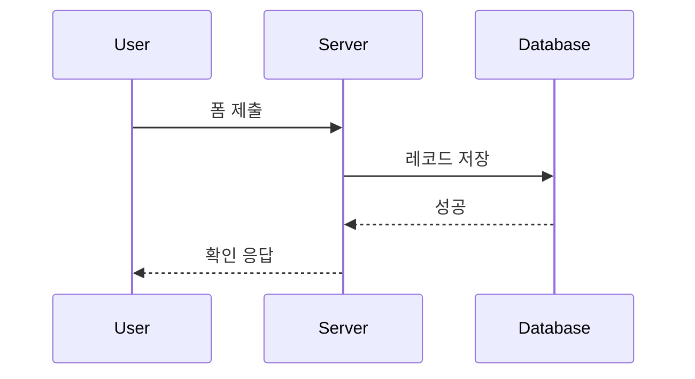
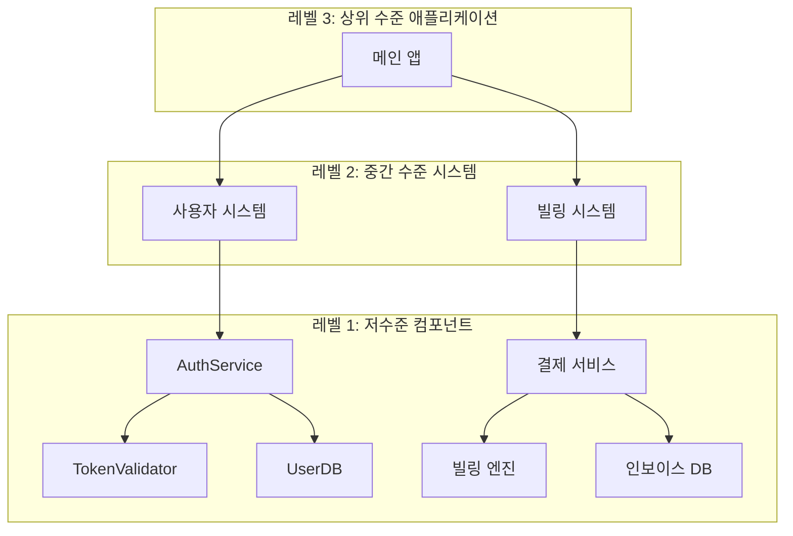
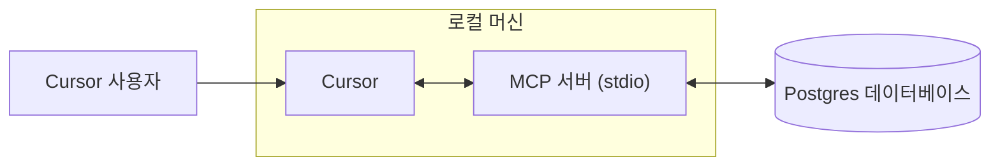
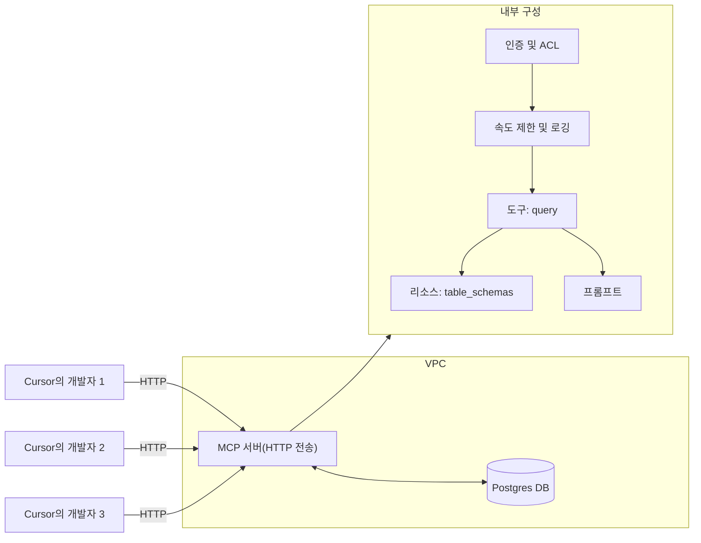

# Shell 모드

**Navigation:** [← Previous](./23-dashboard.md) | [Index](./index.md) | [Next →](./25-웹-개발.md)

---

# Shell 모드
Source: https://docs.cursor.com/ko/cli/shell-mode

대화 흐름을 유지한 채 CLI에서 바로 셸 명령을 실행해

export const Kbd = ({children, tooltip, os}) => {
  const keysInput = typeof children === 'string' && children.trim() !== '' ? children : null;
  if (!keysInput) {
    return null;
  }
  const isModifier = key => {
    const modifiers = ['⌘', '⇧', '⌥', '⌃', '⏎', '⌫', '⌦', '⎋', '⇥', '⌁', '←', '→', '↑', '↓', 'Ctrl', 'Shift', 'Alt', 'Cmd', 'Opt', 'Return', 'Backspace', 'Delete', 'Escape', 'Tab', 'Space', 'Enter', 'Esc', 'ArrowLeft', 'ArrowRight', 'ArrowUp', 'ArrowDown', 'Left', 'Right', 'Up', 'Down'];
    return modifiers.includes(key.trim());
  };
  const capitalizeFirstLetter = string => {
    return string.charAt(0).toUpperCase() + string.slice(1);
  };
  const isMac = os ? os.toLowerCase() === 'mac' || os.toLowerCase() === 'macos' : typeof navigator !== 'undefined' && (navigator.platform.toUpperCase().indexOf('MAC') >= 0 || navigator.userAgent.toUpperCase().indexOf('MAC') >= 0);
  const convertToSymbols = shortcut => {
    if (isMac) {
      return shortcut.replace(/⌘|Cmd|CMD/gi, '⌘').replace(/⌥|Opt|OPT/gi, '⌥').replace(/⌃|Ctrl/gi, '⌃').replace(/⇧|Shift/gi, '⇧').replace(/⏎|Return/gi, '⏎').replace(/⌫|Backspace/gi, '⌫').replace(/⌦|Delete/gi, '⌦').replace(/␛|Escape/gi, '␛').replace(/⇥|Tab/gi, '⇥').replace(/⌁|Space/gi, '⌁').replace(/←|Arrow\s*Left|ArrowLeft|Left/gi, '←').replace(/→|Arrow\s*Right|ArrowRight|Right/gi, '→').replace(/↑|Arrow\s*Up|ArrowUp|Up/gi, '↑').replace(/↓|Arrow\s*Down|ArrowDown|Down/gi, '↓');
    } else {
      const converted = shortcut.replace(/⌘|Cmd|CMD/gi, 'Ctrl').replace(/⌥|Opt|OPT/gi, 'Alt').replace(/⌃|Ctrl/gi, 'Ctrl').replace(/⇧|Shift/gi, 'Shift').replace(/⏎|Return/gi, 'Enter').replace(/⌫|Backspace/gi, 'Backspace').replace(/⌦|Delete/gi, 'Delete').replace(/⎋|Escape/gi, 'Esc').replace(/⇥|Tab/gi, 'Tab').replace(/⌁|Space/gi, 'Space').replace(/←|Arrow\s*Left|ArrowLeft|Left/gi, 'Arrow-Left').replace(/→|Arrow\s*Right|ArrowRight|Right/gi, 'Arrow-Right').replace(/↑|Arrow\s*Up|ArrowUp|Up/gi, 'Arrow-Up').replace(/↓|Arrow\s*Down|ArrowDown|Down/gi, 'Arrow-Down');
      const keyList = converted.split(/[\+\s]+/).filter(key => key.trim());
      return keyList.join('+');
    }
  };
  const convertToReadableText = shortcut => {
    const converted = shortcut.replace(/⌘|Cmd|CMD/gi, 'Cmd').replace(/⌥|Opt|OPT/gi, 'Opt').replace(/⌃|Ctrl/gi, 'Ctrl').replace(/⇧|Shift/gi, 'Shift').replace(/⏎|Return/gi, 'Return').replace(/⌫|Backspace/gi, 'Backspace').replace(/⌦|Delete/gi, 'Delete').replace(/⎋|Escape/gi, 'Escape').replace(/⇥|Tab/gi, 'Tab').replace(/⌁|Space/gi, 'Space').replace(/←|Arrow\s*Left|ArrowLeft|Left/gi, 'Arrow-Left').replace(/→|Arrow\s*Right|ArrowRight|Right/gi, 'Arrow-Right').replace(/↑|Arrow\s*Up|ArrowUp|Up/gi, 'Arrow-Up').replace(/↓|Arrow\s*Down|ArrowDown|Down/gi, 'Arrow-Down');
    const keyList = converted.split(/[\+\s]+/).filter(key => key.trim());
    return keyList.map(key => {
      const trimmedKey = key.trim();
      return isModifier(trimmedKey) ? trimmedKey : capitalizeFirstLetter(trimmedKey);
    }).join('+');
  };
  const displayShortcut = convertToSymbols(keysInput);
  const tooltipText = isMac ? tooltip ? `${convertToReadableText(keysInput)}: ${tooltip}` : convertToReadableText(keysInput) : tooltip || null;
  const processedKeys = isMac ? displayShortcut.split(/[\+\s]+/).filter(key => key.trim()).map(key => {
    const trimmedKey = key.trim();
    return isModifier(trimmedKey) ? trimmedKey : capitalizeFirstLetter(trimmedKey);
  }).join('') : displayShortcut.split('+').map(key => {
    const trimmedKey = key.trim();
    return isModifier(trimmedKey) ? trimmedKey : capitalizeFirstLetter(trimmedKey);
  }).join('+');
  return tooltipText ? <Tooltip tip={tooltipText}>
      <kbd>
        {processedKeys}
      </kbd>
    </Tooltip> : <kbd>
      {processedKeys}
    </kbd>;
};

Shell Mode는 대화를 떠나지 않고 CLI에서 셸 명령을 바로 실행해. 안전 검사를 거치고, 출력은 대화에 표시되니까 빠른 비대화형 명령에 써봐.

<Frame>
  <video src="https://mintcdn.com/cursor/BfJOqJ1Wb8EvuXyr/images/cli/shell-mode/cli-shell-mode.mp4?fit=max&auto=format&n=BfJOqJ1Wb8EvuXyr&q=85&s=5194392f1189eb1eba340d731e86bd5f" autoPlay loop muted playsInline controls data-path="images/cli/shell-mode/cli-shell-mode.mp4" />
</Frame>

<div id="command-execution">
  ## 명령 실행
</div>

명령은 로그인 셸(`$SHELL`)에서, CLI의 작업 디렉터리와 환경을 그대로 사용해 실행돼. 다른 디렉터리에서 실행하려면 명령을 체인으로 이어서 실행해:

```bash  theme={null}
cd subdir && npm test
```

<div id="output">
  ## 출력
</div>

<product_visual type="screenshot">
  종료 코드가 표시된 헤더, stdout/stderr 표시, 그리고 잘림 제어가 있는 명령 출력
</product_visual>

큰 출력은 자동으로 잘리고, 오래 실행되는 프로세스는 성능 유지를 위해 타임아웃돼.

<div id="limitations">
  ## 제한 사항
</div>

* 명령은 30초 후에 타임아웃돼
* 장시간 실행 프로세스, 서버, 대화형 프롬프트는 지원하지 않아
* 최상의 결과를 위해 짧은 비대화형 명령을 사용해

<div id="permissions">
  ## 권한
</div>

명령은 실행 전에 너의 권한과 팀 설정에 맞춰 확인돼. 자세한 설정은 [Permissions](/ko/cli/reference/permissions)를 참고해.

<product_visual type="screenshot">
  승인 옵션을 보여주는 결정 배너: Run, Reject/Propose, Add to allowlist, Auto-run
</product_visual>

관리자 정책이 특정 명령을 막을 수 있고, 리디렉션이 있는 명령은 인라인으로 allowlist에 추가할 수 없어.

<div id="usage-guidelines">
  ## 사용 가이드라인
</div>

Shell Mode는 상태 확인, 빠른 빌드, 파일 작업, 환경 점검에 잘 맞아.

오래 돌아가는 서버, 대화형 앱, 입력이 필요한 명령은 피해.

각 명령은 독립적으로 실행돼 — 다른 디렉터리에서 실행하려면 `cd <dir> && ...`를 써.

<div id="troubleshooting">
  ## 문제 해결
</div>

* 명령이 멈추면 <Kbd>Ctrl+C</Kbd>로 취소하고 비대화형 플래그를 추가해
* 권한 요청이 뜨면 한 번 승인하거나 <Kbd>Tab</Kbd>으로 allowlist에 추가해
* 출력이 잘리면 <Kbd>Ctrl+O</Kbd>로 펼쳐
* 다른 디렉터리에서 실행하려면 변경 사항이 유지되지 않으니까 `cd <dir> && ...`를 써
* Shell Mode는 `$SHELL` 변수에 설정된 zsh와 bash를 지원해

<div id="faq">
  ## FAQ
</div>

<AccordionGroup>
  <Accordion title="`cd`는 실행 사이에 유지돼?">
    아니. 각 명령은 독립적으로 실행돼. 다른 디렉터리에서 명령을 실행하려면 `cd &lt;dir&gt; &amp;&amp; ...`를 써.
  </Accordion>

  <Accordion title="타임아웃을 바꿀 수 있어?">
    아니. 명령은 30초로 제한돼 있고 이건 설정할 수 없어.
  </Accordion>

  <Accordion title="권한은 어디에서 설정해?">
    권한은 CLI와 팀 설정으로 관리돼. 허용 목록에 명령을 추가하려면 결정 배너를 써.
  </Accordion>

  <Accordion title="Shell Mode는 어떻게 종료해?">
    입력이 비어 있을 때 <Kbd>Escape</Kbd>를 누르거나, 비어 있는 상태에서 <Kbd>Backspace</Kbd>/<Kbd>Delete</Kbd>를 누르거나, <Kbd>Ctrl+C</Kbd>로 지우고 종료해.
  </Accordion>
</AccordionGroup>


# CLI에서 에이전트 사용하기
Source: https://docs.cursor.com/ko/cli/using

Cursor CLI로 효과적으로 프롬프트하고, 리뷰하고, 반복하기

export const Kbd = ({children, tooltip, os}) => {
  const keysInput = typeof children === 'string' && children.trim() !== '' ? children : null;
  if (!keysInput) {
    return null;
  }
  const isModifier = key => {
    const modifiers = ['⌘', '⇧', '⌥', '⌃', '⏎', '⌫', '⌦', '⎋', '⇥', '⌁', '←', '→', '↑', '↓', 'Ctrl', 'Shift', 'Alt', 'Cmd', 'Opt', 'Return', 'Backspace', 'Delete', 'Escape', 'Tab', 'Space', 'Enter', 'Esc', 'ArrowLeft', 'ArrowRight', 'ArrowUp', 'ArrowDown', 'Left', 'Right', 'Up', 'Down'];
    return modifiers.includes(key.trim());
  };
  const capitalizeFirstLetter = string => {
    return string.charAt(0).toUpperCase() + string.slice(1);
  };
  const isMac = os ? os.toLowerCase() === 'mac' || os.toLowerCase() === 'macos' : typeof navigator !== 'undefined' && (navigator.platform.toUpperCase().indexOf('MAC') >= 0 || navigator.userAgent.toUpperCase().indexOf('MAC') >= 0);
  const convertToSymbols = shortcut => {
    if (isMac) {
      return shortcut.replace(/⌘|Cmd|CMD/gi, '⌘').replace(/⌥|Opt|OPT/gi, '⌥').replace(/⌃|Ctrl/gi, '⌃').replace(/⇧|Shift/gi, '⇧').replace(/⏎|Return/gi, '⏎').replace(/⌫|Backspace/gi, '⌫').replace(/⌦|Delete/gi, '⌦').replace(/␛|Escape/gi, '␛').replace(/⇥|Tab/gi, '⇥').replace(/⌁|Space/gi, '⌁').replace(/←|Arrow\s*Left|ArrowLeft|Left/gi, '←').replace(/→|Arrow\s*Right|ArrowRight|Right/gi, '→').replace(/↑|Arrow\s*Up|ArrowUp|Up/gi, '↑').replace(/↓|Arrow\s*Down|ArrowDown|Down/gi, '↓');
    } else {
      const converted = shortcut.replace(/⌘|Cmd|CMD/gi, 'Ctrl').replace(/⌥|Opt|OPT/gi, 'Alt').replace(/⌃|Ctrl/gi, 'Ctrl').replace(/⇧|Shift/gi, 'Shift').replace(/⏎|Return/gi, 'Enter').replace(/⌫|Backspace/gi, 'Backspace').replace(/⌦|Delete/gi, 'Delete').replace(/⎋|Escape/gi, 'Esc').replace(/⇥|Tab/gi, 'Tab').replace(/⌁|Space/gi, 'Space').replace(/←|Arrow\s*Left|ArrowLeft|Left/gi, 'Arrow-Left').replace(/→|Arrow\s*Right|ArrowRight|Right/gi, 'Arrow-Right').replace(/↑|Arrow\s*Up|ArrowUp|Up/gi, 'Arrow-Up').replace(/↓|Arrow\s*Down|ArrowDown|Down/gi, 'Arrow-Down');
      const keyList = converted.split(/[\+\s]+/).filter(key => key.trim());
      return keyList.join('+');
    }
  };
  const convertToReadableText = shortcut => {
    const converted = shortcut.replace(/⌘|Cmd|CMD/gi, 'Cmd').replace(/⌥|Opt|OPT/gi, 'Opt').replace(/⌃|Ctrl/gi, 'Ctrl').replace(/⇧|Shift/gi, 'Shift').replace(/⏎|Return/gi, 'Return').replace(/⌫|Backspace/gi, 'Backspace').replace(/⌦|Delete/gi, 'Delete').replace(/⎋|Escape/gi, 'Escape').replace(/⇥|Tab/gi, 'Tab').replace(/⌁|Space/gi, 'Space').replace(/←|Arrow\s*Left|ArrowLeft|Left/gi, 'Arrow-Left').replace(/→|Arrow\s*Right|ArrowRight|Right/gi, 'Arrow-Right').replace(/↑|Arrow\s*Up|ArrowUp|Up/gi, 'Arrow-Up').replace(/↓|Arrow\s*Down|ArrowDown|Down/gi, 'Arrow-Down');
    const keyList = converted.split(/[\+\s]+/).filter(key => key.trim());
    return keyList.map(key => {
      const trimmedKey = key.trim();
      return isModifier(trimmedKey) ? trimmedKey : capitalizeFirstLetter(trimmedKey);
    }).join('+');
  };
  const displayShortcut = convertToSymbols(keysInput);
  const tooltipText = isMac ? tooltip ? `${convertToReadableText(keysInput)}: ${tooltip}` : convertToReadableText(keysInput) : tooltip || null;
  const processedKeys = isMac ? displayShortcut.split(/[\+\s]+/).filter(key => key.trim()).map(key => {
    const trimmedKey = key.trim();
    return isModifier(trimmedKey) ? trimmedKey : capitalizeFirstLetter(trimmedKey);
  }).join('') : displayShortcut.split('+').map(key => {
    const trimmedKey = key.trim();
    return isModifier(trimmedKey) ? trimmedKey : capitalizeFirstLetter(trimmedKey);
  }).join('+');
  return tooltipText ? <Tooltip tip={tooltipText}>
      <kbd>
        {processedKeys}
      </kbd>
    </Tooltip> : <kbd>
      {processedKeys}
    </kbd>;
};

<div id="prompting">
  ## 프롬프트 작성
</div>

의도를 명확하게 밝히면 가장 좋은 결과를 얻을 수 있어. 예를 들어, 에이전트가 어떤 파일도 수정하지 않게 하려면 "코드를 작성하지 마" 같은 프롬프트를 쓰면 돼. 구현에 들어가기 전에 작업을 계획할 때 특히 유용해.

에이전트는 현재 파일 작업, 검색, 셸 명령 실행을 위한 도구를 갖추고 있어. IDE 에이전트처럼 더 많은 도구가 계속 추가되고 있어.

<div id="mcp">
  ## MCP
</div>

Agent는 확장 기능과 통합을 위해 [MCP(Model Context Protocol)](/ko/tools/mcp)을 지원해. CLI가 `mcp.json` 구성 파일을 자동으로 감지하고 따르니까, IDE에서 설정해 둔 MCP 서버와 도구를 그대로 쓸 수 있어.

<div id="rules">
  ## 규칙
</div>

CLI 에이전트는 IDE와 동일한 [규칙 시스템](/ko/context/rules)을 지원해. `.cursor/rules` 디렉터리에 규칙을 만들어 에이전트에 컨텍스트와 가이드라인을 제공할 수 있어. 이 규칙들은 설정에 따라 자동으로 로드되고 적용되니까, 프로젝트의 다양한 부분이나 특정 파일 유형에 맞춰 에이전트 동작을 커스터마이즈할 수 있어.

<Note>
  CLI는 프로젝트 루트에 있는(있다면) `AGENTS.md`와 `CLAUDE.md`도 읽어서 `.cursor/rules`와 함께 규칙으로 적용해.
</Note>

<div id="working-with-agent">
  ## Agent 사용하기
</div>

<div id="navigation">
  ### 탐색
</div>

이전 메시지는 위쪽 화살표(<Kbd>ArrowUp</Kbd>)로 불러와서 순환할 수 있어.

<div id="review">
  ### 검토
</div>

<Kbd>Cmd+R</Kbd>로 변경 사항을 검토해. 후속 지시를 추가하려면 <Kbd>i</Kbd>를 눌러. 스크롤은 <Kbd>ArrowUp</Kbd>/<Kbd>ArrowDown</Kbd>, 파일 전환은 <Kbd>ArrowLeft</Kbd>/<Kbd>ArrowRight</Kbd>를 써.

<div id="selecting-context">
  ### 컨텍스트 선택
</div>

<Kbd>@</Kbd>로 컨텍스트에 포함할 파일과 폴더를 선택해. `/compress`를 실행해 컨텍스트 창의 공간을 확보해. 자세한 내용은 [Summarization](/ko/agent/chat/summarization)을 확인해.

<div id="history">
  ## 기록
</div>

이전 컨텍스트를 불러오려면 `--resume [thread id]`로 기존 스레드에서 이어가.

가장 최근 대화를 다시 시작하려면 `cursor-agent resume`를 써.

이전 대화 목록을 보려면 `cursor-agent ls`를 실행해.

<div id="command-approval">
  ## 명령 승인
</div>

터미널 명령을 실행하기 전에 CLI가 실행을 승인(<Kbd>y</Kbd>)할지 거부(<Kbd>n</Kbd>)할지 물어봐.

<div id="non-interactive-mode">
  ## 비대화형 모드
</div>

`-p` 또는 `--print`를 사용해 Agent를 비대화형 모드로 실행해. 그러면 콘솔에 응답이 출력돼.

비대화형 모드에선 Agent를 대화 없이 호출할 수 있어. 스크립트, CI 파이프라인 등에 통합하기 좋아.

출력 형식을 제어하려면 `--output-format`과 함께 써. 예를 들어, 스크립트에서 파싱하기 쉬운 구조화된 출력을 원하면 `--output-format json`을, 일반 텍스트 출력을 원하면 `--output-format text`를 사용해.

<Note>
  비대화형 모드에서 Cursor는 전체 쓰기 권한을 가지고 있어.
</Note>


# Keyboard Shortcuts
Source: https://docs.cursor.com/ko/configuration/kbd

Cursor의 키보드 단축키와 키 바인딩

export const Kbd = ({children, tooltip, os}) => {
  const keysInput = typeof children === 'string' && children.trim() !== '' ? children : null;
  if (!keysInput) {
    return null;
  }
  const isModifier = key => {
    const modifiers = ['⌘', '⇧', '⌥', '⌃', '⏎', '⌫', '⌦', '⎋', '⇥', '⌁', '←', '→', '↑', '↓', 'Ctrl', 'Shift', 'Alt', 'Cmd', 'Opt', 'Return', 'Backspace', 'Delete', 'Escape', 'Tab', 'Space', 'Enter', 'Esc', 'ArrowLeft', 'ArrowRight', 'ArrowUp', 'ArrowDown', 'Left', 'Right', 'Up', 'Down'];
    return modifiers.includes(key.trim());
  };
  const capitalizeFirstLetter = string => {
    return string.charAt(0).toUpperCase() + string.slice(1);
  };
  const isMac = os ? os.toLowerCase() === 'mac' || os.toLowerCase() === 'macos' : typeof navigator !== 'undefined' && (navigator.platform.toUpperCase().indexOf('MAC') >= 0 || navigator.userAgent.toUpperCase().indexOf('MAC') >= 0);
  const convertToSymbols = shortcut => {
    if (isMac) {
      return shortcut.replace(/⌘|Cmd|CMD/gi, '⌘').replace(/⌥|Opt|OPT/gi, '⌥').replace(/⌃|Ctrl/gi, '⌃').replace(/⇧|Shift/gi, '⇧').replace(/⏎|Return/gi, '⏎').replace(/⌫|Backspace/gi, '⌫').replace(/⌦|Delete/gi, '⌦').replace(/␛|Escape/gi, '␛').replace(/⇥|Tab/gi, '⇥').replace(/⌁|Space/gi, '⌁').replace(/←|Arrow\s*Left|ArrowLeft|Left/gi, '←').replace(/→|Arrow\s*Right|ArrowRight|Right/gi, '→').replace(/↑|Arrow\s*Up|ArrowUp|Up/gi, '↑').replace(/↓|Arrow\s*Down|ArrowDown|Down/gi, '↓');
    } else {
      const converted = shortcut.replace(/⌘|Cmd|CMD/gi, 'Ctrl').replace(/⌥|Opt|OPT/gi, 'Alt').replace(/⌃|Ctrl/gi, 'Ctrl').replace(/⇧|Shift/gi, 'Shift').replace(/⏎|Return/gi, 'Enter').replace(/⌫|Backspace/gi, 'Backspace').replace(/⌦|Delete/gi, 'Delete').replace(/⎋|Escape/gi, 'Esc').replace(/⇥|Tab/gi, 'Tab').replace(/⌁|Space/gi, 'Space').replace(/←|Arrow\s*Left|ArrowLeft|Left/gi, 'Arrow-Left').replace(/→|Arrow\s*Right|ArrowRight|Right/gi, 'Arrow-Right').replace(/↑|Arrow\s*Up|ArrowUp|Up/gi, 'Arrow-Up').replace(/↓|Arrow\s*Down|ArrowDown|Down/gi, 'Arrow-Down');
      const keyList = converted.split(/[\+\s]+/).filter(key => key.trim());
      return keyList.join('+');
    }
  };
  const convertToReadableText = shortcut => {
    const converted = shortcut.replace(/⌘|Cmd|CMD/gi, 'Cmd').replace(/⌥|Opt|OPT/gi, 'Opt').replace(/⌃|Ctrl/gi, 'Ctrl').replace(/⇧|Shift/gi, 'Shift').replace(/⏎|Return/gi, 'Return').replace(/⌫|Backspace/gi, 'Backspace').replace(/⌦|Delete/gi, 'Delete').replace(/⎋|Escape/gi, 'Escape').replace(/⇥|Tab/gi, 'Tab').replace(/⌁|Space/gi, 'Space').replace(/←|Arrow\s*Left|ArrowLeft|Left/gi, 'Arrow-Left').replace(/→|Arrow\s*Right|ArrowRight|Right/gi, 'Arrow-Right').replace(/↑|Arrow\s*Up|ArrowUp|Up/gi, 'Arrow-Up').replace(/↓|Arrow\s*Down|ArrowDown|Down/gi, 'Arrow-Down');
    const keyList = converted.split(/[\+\s]+/).filter(key => key.trim());
    return keyList.map(key => {
      const trimmedKey = key.trim();
      return isModifier(trimmedKey) ? trimmedKey : capitalizeFirstLetter(trimmedKey);
    }).join('+');
  };
  const displayShortcut = convertToSymbols(keysInput);
  const tooltipText = isMac ? tooltip ? `${convertToReadableText(keysInput)}: ${tooltip}` : convertToReadableText(keysInput) : tooltip || null;
  const processedKeys = isMac ? displayShortcut.split(/[\+\s]+/).filter(key => key.trim()).map(key => {
    const trimmedKey = key.trim();
    return isModifier(trimmedKey) ? trimmedKey : capitalizeFirstLetter(trimmedKey);
  }).join('') : displayShortcut.split('+').map(key => {
    const trimmedKey = key.trim();
    return isModifier(trimmedKey) ? trimmedKey : capitalizeFirstLetter(trimmedKey);
  }).join('+');
  return tooltipText ? <Tooltip tip={tooltipText}>
      <kbd>
        {processedKeys}
      </kbd>
    </Tooltip> : <kbd>
      {processedKeys}
    </kbd>;
};

Cursor의 키보드 단축키 개요. 모든 키보드 단축키는 <Kbd>Cmd R</Kbd>을 누른 다음 <Kbd>Cmd S</Kbd>를 누르거나, 명령 팔레트 <Kbd>Cmd Shift P</Kbd>를 열고 `Keyboard Shortcuts`를 검색해서 확인할 수 있어.

Cursor의 키보드 단축키를 더 알아보려면, Cursor 키 바인딩의 기준이 되는 [Key Bindings for VS Code](https://code.visualstudio.com/docs/getstarted/keybindings)를 참고해.

Cursor 전용 기능을 포함한 모든 Cursor 키 바인딩은 Keyboard Shortcuts 설정에서 재매핑할 수 있어.

<div id="general">
  ## 일반
</div>

<div className="full-width-table equal-table-columns">
  | 단축키                    | 동작                          |
  | ---------------------- | --------------------------- |
  | <Kbd>Cmd I</Kbd>       | 사이드패널 토글(모드에 연결되어 있지 않은 경우) |
  | <Kbd>Cmd L</Kbd>       | 사이드패널 토글(모드에 연결되어 있지 않은 경우) |
  | <Kbd>Cmd E</Kbd>       | 백그라운드 에이전트 제어 패널            |
  | <Kbd>Cmd .</Kbd>       | 모드 메뉴                       |
  | <Kbd>Cmd /</Kbd>       | AI 모델 순환                    |
  | <Kbd>Cmd Shift J</Kbd> | Cursor 설정                   |
  | <Kbd>Cmd ,</Kbd>       | 일반 설정                       |
  | <Kbd>Cmd Shift P</Kbd> | 커맨드 팔레트                     |
</div>

<div id="chat">
  ## 채팅
</div>

채팅 입력창 단축키.

<div className="full-width-table equal-table-columns">
  | Shortcut                                             | Action           |
  | ---------------------------------------------------- | ---------------- |
  | <Kbd>Return</Kbd>                                    | 넛지(기본)           |
  | <Kbd>Ctrl Return</Kbd>                               | 메시지를 대기열에 추가     |
  | <Kbd>Cmd Return</Kbd> when typing                    | 강제로 전송           |
  | <Kbd>Cmd Shift Backspace</Kbd>                       | 생성 취소            |
  | <Kbd>Cmd Shift L</Kbd> with code selected            | 선택한 코드를 컨텍스트에 추가 |
  | <Kbd>Cmd V</Kbd> with code or log in clipboard       | 클립보드를 컨텍스트에 추가   |
  | <Kbd>Cmd Shift V</Kbd> with code or log in clipboard | 클립보드를 입력창에 추가    |
  | <Kbd>Cmd Return</Kbd> with suggested changes         | 제안된 변경 사항 모두 수락  |
  | <Kbd>Cmd Backspace</Kbd>                             | 제안된 변경 사항 모두 거부  |
  | <Kbd>Tab</Kbd>                                       | 다음 메시지로 이동       |
  | <Kbd>Shift Tab</Kbd>                                 | 이전 메시지로 이동       |
  | <Kbd>Cmd Opt /</Kbd>                                 | 모델 전환            |
  | <Kbd>Cmd N</Kbd> / <Kbd>Cmd R</Kbd>                  | 새 채팅             |
  | <Kbd>Cmd T</Kbd>                                     | 새 채팅 탭           |
  | <Kbd>Cmd \[</Kbd>                                    | 이전 채팅            |
  | <Kbd>Cmd ]</Kbd>                                     | 다음 채팅            |
  | <Kbd>Cmd W</Kbd>                                     | 채팅 닫기            |
  | <Kbd>Escape</Kbd>                                    | 필드 포커스 해제        |
</div>

<div id="inline-edit">
  ## 인라인 편집
</div>

<div className="full-width-table equal-table-columns">
  | 단축키                            | 작업        |
  | ------------------------------ | --------- |
  | <Kbd>Cmd K</Kbd>               | 열기        |
  | <Kbd>Cmd Shift K</Kbd>         | 입력 포커스 토글 |
  | <Kbd>Return</Kbd>              | 제출        |
  | <Kbd>Cmd Shift Backspace</Kbd> | 취소        |
  | <Kbd>Opt Return</Kbd>          | 빠른 질문     |
</div>

## 코드 선택 & 컨텍스트

<div className="full-width-table equal-table-columns">
  | Shortcut                                        | Action                              |
  | ----------------------------------------------- | ----------------------------------- |
  | <Kbd>@</Kbd>                                    | [@-symbols](/ko/context/@-symbols/) |
  | <Kbd>#</Kbd>                                    | 파일                                  |
  | <Kbd>/</Kbd>                                    | 단축어 명령                              |
  | <Kbd>Cmd Shift L</Kbd>                          | 선택 영역을 Chat에 추가                     |
  | <Kbd>Cmd Shift K</Kbd>                          | 선택 영역을 Edit에 추가                     |
  | <Kbd>Cmd L</Kbd>                                | 선택 영역으로 새 채팅 시작                     |
  | <Kbd>Cmd M</Kbd>                                | 파일 읽기 전략 토글                         |
  | <Kbd>Cmd →</Kbd>                                | 제안의 다음 단어 받아들이기                     |
  | <Kbd>Cmd Return</Kbd>                           | 채팅에서 코드베이스 검색                       |
  | 코드 선택, <Kbd>Cmd C</Kbd>, <Kbd>Cmd V</Kbd>       | 복사한 참조 코드를 컨텍스트로 추가                 |
  | 코드 선택, <Kbd>Cmd C</Kbd>, <Kbd>Cmd Shift V</Kbd> | 복사한 코드를 텍스트 컨텍스트로 추가                |
</div>

<div id="tab">
  ## Tab
</div>

<div className="full-width-table equal-table-columns">
  | Shortcut         | Action      |
  | ---------------- | ----------- |
  | <Kbd>Tab</Kbd>   | 제안 받아들이기    |
  | <Kbd>Cmd →</Kbd> | 다음 단어 받아들이기 |
</div>

<div id="terminal">
  ## 터미널
</div>

<div className="full-width-table equal-table-columns">
  | 단축키                   | 동작            |
  | --------------------- | ------------- |
  | <Kbd>Cmd K</Kbd>      | 터미널 프롬프트 바 열기 |
  | <Kbd>Cmd Return</Kbd> | 생성된 명령 실행     |
  | <Kbd>Escape</Kbd>     | 명령 확정         |
</div>


# Shell Commands
Source: https://docs.cursor.com/ko/configuration/shell

Cursor 셸 명령 설치 및 사용

Cursor는 터미널에서 파일과 폴더를 열 수 있는 커맨드라인 도구를 제공해. 개발 워크플로에 Cursor를 통합하려면 `cursor`와 `code` 명령을 둘 다 설치해.

<div id="installing-cli-commands">
  ## CLI 명령 설치
</div>

Command Palette에서 CLI 명령을 설치해:

1. Command Palette 열기 (Cmd/Ctrl + P)
2. "Install" 입력해서 설치 명령 필터링
3. `Install 'cursor' to shell` 선택 후 실행
4. 한 번 더 실행해서 `Install 'code' to shell` 선택

<product_visual type="screenshot">
  CLI 설치 옵션을 보여주는 Command Palette
</product_visual>

<div id="using-the-cli-commands">
  ## CLI 명령어 사용하기
</div>

설치한 뒤, 아래 명령어 중 하나로 Cursor에서 파일이나 폴더를 열면 돼:

```bash  theme={null}

# cursor 명령어 사용하기
cursor path/to/file.js
cursor path/to/folder/


# code 명령어 사용하기 (VS Code 호환)
code path/to/file.js
code path/to/folder/
```

<div id="command-options">
  ## 명령 옵션
</div>

두 명령 모두 다음 옵션을 지원해:

* 파일 열기: `cursor file.js`
* 폴더 열기: `cursor ./my-project`
* 여러 항목 열기: `cursor file1.js file2.js folder1/`
* 새 창으로 열기: `cursor -n` 또는 `cursor --new-window`
* 창이 닫힐 때까지 기다리기: `cursor -w` 또는 `cursor --wait`

<div id="faq">
  ## FAQ
</div>

<AccordionGroup>
  <Accordion title="cursor랑 code 명령의 차이는 뭐야?">
    같아. `code` 명령은 VS Code 호환을 위해 제공돼.
  </Accordion>

  <Accordion title="둘 다 설치해야 해?">
    아니, 취향에 따라 하나만 설치해도 되고 둘 다 설치해도 돼.
  </Accordion>

  <Accordion title="명령은 어디에 설치돼?">
    명령은 시스템 기본 셸 설정 파일에 추가돼 (예: `.bashrc`, `.zshrc`, `.config/fish/config.fish`).
  </Accordion>
</AccordionGroup>


# 테마
Source: https://docs.cursor.com/ko/configuration/themes

Cursor의 모양 꾸미기

Cursor는 코딩 환경에서 라이트/다크 테마를 모두 지원해. VS Code의 테마 기능을 그대로 쓰니까, 어떤 VS Code 테마든 쓸 수 있고, 커스텀 테마를 만들거나 마켓플레이스에서 테마 확장도 설치할 수 있어.

<div id="changing-theme">
  ## 테마 변경
</div>

1. Command Palette 열기(Cmd/Ctrl + P)
2. "theme"를 입력해 명령어 필터링하기
3. "Preferences: Color Theme" 선택
4. 원하는 테마 선택

<Frame>
  
</Frame>

<div id="faq">
  ## 자주 묻는 질문
</div>

<AccordionGroup>
  <Accordion title="Cursor에서 VS Code 테마를 쓸 수 있어?">
    당연하지! Cursor는 VS Code 테마와 호환돼. VS Code 마켓플레이스의 아무 테마나 설치하거나 커스텀 테마 파일을 복사해서 쓰면 돼.
  </Accordion>

  <Accordion title="커스텀 테마는 어떻게 만들어?">
    VS Code에서 하듯이 커스텀 테마를 만들면 돼. 현재 설정을 기반으로 시작하려면 "Developer: Generate Color Theme From Current Settings"를 쓰거나, VS Code 테마 제작 가이드를 따라가.
  </Accordion>
</AccordionGroup>


# @Code
Source: https://docs.cursor.com/ko/context/@-symbols/@-code

Cursor에서 @Code로 특정 코드 스니펫 참조하기

`@Code` 심볼로 특정 코드 구간을 참조해. 전체 파일 대신 정확한 코드 스니펫을 고를 수 있어서, [`@Files & Folders`](/ko/context/@-symbols/@-files-and-folders)보다 더 세밀하게 제어할 수 있어.

<Frame>
  
</Frame>


# @Cursor Rules
Source: https://docs.cursor.com/ko/context/@-symbols/@-cursor-rules

프로젝트별 규칙과 가이드라인 적용

`@Cursor Rules` 심볼은 네가 설정해 둔 [프로젝트 규칙](/ko/context/rules)과 가이드라인에 접근할 수 있게 해주고, 이를 너의 컨텍스트에 명시적으로 적용할 수 있게 해줘.

<Frame>
  
</Frame>


# @Files & Folders
Source: https://docs.cursor.com/ko/context/@-symbols/@-files-and-folders

Chat과 Inline Edit에서 파일과 폴더를 컨텍스트로 참조

export const Kbd = ({children, tooltip, os}) => {
  const keysInput = typeof children === 'string' && children.trim() !== '' ? children : null;
  if (!keysInput) {
    return null;
  }
  const isModifier = key => {
    const modifiers = ['⌘', '⇧', '⌥', '⌃', '⏎', '⌫', '⌦', '⎋', '⇥', '⌁', '←', '→', '↑', '↓', 'Ctrl', 'Shift', 'Alt', 'Cmd', 'Opt', 'Return', 'Backspace', 'Delete', 'Escape', 'Tab', 'Space', 'Enter', 'Esc', 'ArrowLeft', 'ArrowRight', 'ArrowUp', 'ArrowDown', 'Left', 'Right', 'Up', 'Down'];
    return modifiers.includes(key.trim());
  };
  const capitalizeFirstLetter = string => {
    return string.charAt(0).toUpperCase() + string.slice(1);
  };
  const isMac = os ? os.toLowerCase() === 'mac' || os.toLowerCase() === 'macos' : typeof navigator !== 'undefined' && (navigator.platform.toUpperCase().indexOf('MAC') >= 0 || navigator.userAgent.toUpperCase().indexOf('MAC') >= 0);
  const convertToSymbols = shortcut => {
    if (isMac) {
      return shortcut.replace(/⌘|Cmd|CMD/gi, '⌘').replace(/⌥|Opt|OPT/gi, '⌥').replace(/⌃|Ctrl/gi, '⌃').replace(/⇧|Shift/gi, '⇧').replace(/⏎|Return/gi, '⏎').replace(/⌫|Backspace/gi, '⌫').replace(/⌦|Delete/gi, '⌦').replace(/␛|Escape/gi, '␛').replace(/⇥|Tab/gi, '⇥').replace(/⌁|Space/gi, '⌁').replace(/←|Arrow\s*Left|ArrowLeft|Left/gi, '←').replace(/→|Arrow\s*Right|ArrowRight|Right/gi, '→').replace(/↑|Arrow\s*Up|ArrowUp|Up/gi, '↑').replace(/↓|Arrow\s*Down|ArrowDown|Down/gi, '↓');
    } else {
      const converted = shortcut.replace(/⌘|Cmd|CMD/gi, 'Ctrl').replace(/⌥|Opt|OPT/gi, 'Alt').replace(/⌃|Ctrl/gi, 'Ctrl').replace(/⇧|Shift/gi, 'Shift').replace(/⏎|Return/gi, 'Enter').replace(/⌫|Backspace/gi, 'Backspace').replace(/⌦|Delete/gi, 'Delete').replace(/⎋|Escape/gi, 'Esc').replace(/⇥|Tab/gi, 'Tab').replace(/⌁|Space/gi, 'Space').replace(/←|Arrow\s*Left|ArrowLeft|Left/gi, 'Arrow-Left').replace(/→|Arrow\s*Right|ArrowRight|Right/gi, 'Arrow-Right').replace(/↑|Arrow\s*Up|ArrowUp|Up/gi, 'Arrow-Up').replace(/↓|Arrow\s*Down|ArrowDown|Down/gi, 'Arrow-Down');
      const keyList = converted.split(/[\+\s]+/).filter(key => key.trim());
      return keyList.join('+');
    }
  };
  const convertToReadableText = shortcut => {
    const converted = shortcut.replace(/⌘|Cmd|CMD/gi, 'Cmd').replace(/⌥|Opt|OPT/gi, 'Opt').replace(/⌃|Ctrl/gi, 'Ctrl').replace(/⇧|Shift/gi, 'Shift').replace(/⏎|Return/gi, 'Return').replace(/⌫|Backspace/gi, 'Backspace').replace(/⌦|Delete/gi, 'Delete').replace(/⎋|Escape/gi, 'Escape').replace(/⇥|Tab/gi, 'Tab').replace(/⌁|Space/gi, 'Space').replace(/←|Arrow\s*Left|ArrowLeft|Left/gi, 'Arrow-Left').replace(/→|Arrow\s*Right|ArrowRight|Right/gi, 'Arrow-Right').replace(/↑|Arrow\s*Up|ArrowUp|Up/gi, 'Arrow-Up').replace(/↓|Arrow\s*Down|ArrowDown|Down/gi, 'Arrow-Down');
    const keyList = converted.split(/[\+\s]+/).filter(key => key.trim());
    return keyList.map(key => {
      const trimmedKey = key.trim();
      return isModifier(trimmedKey) ? trimmedKey : capitalizeFirstLetter(trimmedKey);
    }).join('+');
  };
  const displayShortcut = convertToSymbols(keysInput);
  const tooltipText = isMac ? tooltip ? `${convertToReadableText(keysInput)}: ${tooltip}` : convertToReadableText(keysInput) : tooltip || null;
  const processedKeys = isMac ? displayShortcut.split(/[\+\s]+/).filter(key => key.trim()).map(key => {
    const trimmedKey = key.trim();
    return isModifier(trimmedKey) ? trimmedKey : capitalizeFirstLetter(trimmedKey);
  }).join('') : displayShortcut.split('+').map(key => {
    const trimmedKey = key.trim();
    return isModifier(trimmedKey) ? trimmedKey : capitalizeFirstLetter(trimmedKey);
  }).join('+');
  return tooltipText ? <Tooltip tip={tooltipText}>
      <kbd>
        {processedKeys}
      </kbd>
    </Tooltip> : <kbd>
      {processedKeys}
    </kbd>;
};

<div id="files">
  ## Files
</div>

Chat와 Inline Edit에서 전체 파일을 참조하려면 `@Files & Folders`를 선택한 다음 검색할 파일명을 선택해. 사이드바에서 파일을 Agent로 바로 드래그해 컨텍스트로 추가할 수도 있어.

<Frame>
  
</Frame>

<div id="folders">
  ## Folders
</div>

`@Folders`로 폴더를 참조하면, Cursor가 폴더 경로와 내용 개요를 제공해 AI가 무엇을 사용할 수 있는지 파악하도록 도와줘.

<Tip>
  폴더를 선택한 뒤 `/`를 입력해서 더 깊이 탐색하고 모든 하위 폴더를 확인해봐.
</Tip>

<Frame>
  
</Frame>

<div id="full-folder-content">
  ### 전체 폴더 콘텐츠
</div>

설정에서 **전체 폴더 콘텐츠**를 켜줘. 켜면 Cursor가 해당 폴더의 모든 파일을 컨텍스트에 포함하려고 시도해.

<Frame>
  
</Frame>

컨텍스트 윈도우를 초과하는 큰 폴더의 경우, 포함된 파일 수를 보여주는 툴팁과 함께 개요 보기가 나타나고 Cursor가 사용 가능한 컨텍스트 공간을 관리해.

<Note>
  [Max 모드 활성화](/ko/context/max-mode)와 함께 전체 폴더 콘텐츠를 사용하면
  더 많은 입력 토큰이 소모되어 요청 비용이 크게 증가해.
</Note>

<div id="context-management">
  ## 컨텍스트 관리
</div>

큰 파일과 폴더는 컨텍스트 한도에 맞게 자동으로 요약돼. 자세한 내용은 [file & folder condensation](/ko/agent/chats/summarization#file--folder-condensation)을 참고해.


# @Git
Source: https://docs.cursor.com/ko/context/@-symbols/@-git

Git 변경 사항과 브랜치 간 차이점 참조

<Frame>
  
</Frame>

* `@Commit`: 마지막 커밋과 비교해 현재 작업 상태의 변경 사항을 참조. 아직 커밋되지 않은 수정·추가·삭제된 모든 파일을 표시.
* `@Branch`: 현재 브랜치의 변경 사항을 main 브랜치와 비교. main에는 없고 현재 브랜치에만 있는 모든 커밋과 변경 사항을 표시.


# @Link
Source: https://docs.cursor.com/ko/context/@-symbols/@-link

URL을 붙여넣어 웹 콘텐츠 포함하기

Chat에 URL을 붙여넣으면 Cursor가 자동으로 그걸 `@Link`로 태그하고, 내용을 가져와 컨텍스트로 써. PDF 문서도 지원돼 — 공개적으로 접근 가능한 어떤 PDF URL이든 텍스트를 추출하고 파싱해.

<Frame>
  
</Frame>

<div id="unlink">
  ## 링크 해제
</div>

URL의 내용을 가져오지 않고 일반 텍스트로 사용하려면:

* 태그된 링크를 클릭한 뒤 `Unlink` 선택
* 또는 자동 태깅을 막으려면 `Shift`를 누른 채로 붙여넣기

<Frame>
  
</Frame>


# @Linter Errors
Source: https://docs.cursor.com/ko/context/@-symbols/@-linter-errors

코드베이스의 린트 오류에 접근하고 참조하기

`@Linter Errors` 심볼은 현재 활성 파일의 린트 오류와 경고를 자동으로 수집하고, 관련 컨텍스트를 제공해. [Agent](/ko/agent/overview)는 기본적으로 린트 오류를 볼 수 있어.

<Note>
  린트 오류가 보이려면 사용하는 프로그래밍 언어에 맞는 Language Server가
  설치되고 설정되어 있어야 해. Cursor는 설치된 Language Server를 자동으로
  감지해 사용하지만, 특정 언어의 경우 추가 확장 기능이나 도구를 설치해야 할 수도 있어.
</Note>

<Frame>
  
</Frame>


# @Past Chats
Source: https://docs.cursor.com/ko/context/@-symbols/@-past-chats

기록의 요약된 채팅 포함

[Chat](/ko/chat)에서 복잡한 작업을 할 때 이전 대화의 컨텍스트나 결정 사항을 참고해야 할 수도 있어. `@Past Chats` 심볼은 이전 채팅의 요약본을 컨텍스트로 포함해 줘.

특히 유용한 경우:

* 참고해야 할 중요한 컨텍스트가 있는 긴 Chat 세션이 있을 때
* 관련된 새 작업을 시작하면서 흐름을 이어가고 싶을 때
* 이전 세션의 추론이나 결정을 공유하고 싶을 때

<Frame>
  
</Frame>


# @Recent Changes
Source: https://docs.cursor.com/ko/context/@-symbols/@-recent-changes

최근 수정된 코드를 컨텍스트로 포함

`@Recent Changes` 심볼은 최근 코드 변경을 AI 대화의 컨텍스트로 포함해.

* 변경은 시간순으로 정렬돼
* 가장 최근의 10개 변경을 우선해
* `.cursorignore` 설정을 준수해

<Frame>
  
</Frame>


# @Web
Source: https://docs.cursor.com/ko/context/@-symbols/@-web

최신 정보를 웹에서 검색

`@Web`을(를) 사용하면 Cursor가 [exa.ai](https://exa.ai)를 통해 웹을 검색해 최신 정보를 찾아 컨텍스트로 추가해. 직접 링크로 제공된 PDF 파일을 파싱하는 기능도 포함돼.

<Note>
  웹 검색은 기본적으로 비활성화되어 있어. Settings → Features → Web
  Search에서 켜줘.
</Note>

<Frame>
  
</Frame>


# 개요
Source: https://docs.cursor.com/ko/context/@-symbols/overview

@ 기호로 코드, 파일, 문서를 참조해

화살표 키로 제안을 이동해. 선택하려면 `Enter`를 눌러. 제안이 `Files` 같은 카테고리면, 해당 카테고리에서 가장 관련 있는 항목만 보이도록 필터링돼.

<Frame>
  
</Frame>

사용 가능한 모든 @ 기호 목록이야:

* [@Files](/ko/context/@-symbols/@-files) - 프로젝트의 특정 파일을 참조해
* [@Folders](/ko/context/@-symbols/@-folders) - 더 넓은 컨텍스트를 위해 전체 폴더를 참조해
* [@Code](/ko/context/@-symbols/@-code) - 코드베이스의 특정 코드 스니펫이나 심볼을 참조해
* [@Docs](/ko/context/@-symbols/@-docs) - 문서와 가이드를 확인해
* [@Git](/ko/context/@-symbols/@-git) - git 기록과 변경 사항을 확인해
* [@Past Chats](/ko/context/@-symbols/@-past-chats) - 요약된 Composer 세션으로 작업해
* [@Cursor Rules](/ko/context/@-symbols/@-cursor-rules) - Cursor 규칙으로 작업해
* [@Web](/ko/context/@-symbols/@-web) - 외부 웹 리소스와 문서를 참조해
* [@Link (paste)](/ko/context/@-symbols/@-link) - 특정 코드나 문서로 연결되는 링크를 만들어
* [@Recent Changes](/ko/context/@-symbols/@-recent-changes) - 최근 변경 사항을 참조해
* [@Lint Errors](/ko/context/@-symbols/@-lint-errors) - 린트 오류를 참조해 ([Chat](/ko/chat/overview) 전용)
* [@Definitions](/ko/context/@-symbols/@-definitions) - 심볼 정의를 찾아봐 ([Inline Edit](/ko/inline-edit/overview) 전용)
* [# Files](/ko/context/@-symbols/pill-files) - 참조 없이 파일을 컨텍스트에 추가해
* [/ Commands](/ko/context/@-symbols/slash-commands) - 열린 파일과 활성 파일을 컨텍스트에 추가해


# #Files
Source: https://docs.cursor.com/ko/context/@-symbols/pill-files


# 접두사로 특정 파일 선택

`#` 뒤에 파일 이름을 붙여서 특정 파일에 초점을 맞춰. 정확한 컨텍스트 제어를 위해 `@` 기호와 함께 써.

<Frame>
  
</Frame>


# /command
Source: https://docs.cursor.com/ko/context/@-symbols/slash-commands

파일을 추가하고 컨텍스트를 제어하는 빠른 명령

`/` 명령은 열린 에디터 탭에 빠르게 접근해서 여러 파일을 컨텍스트로 추가할 수 있게 해줘.

<Frame>
  
</Frame>

<div id="commands">
  ## Commands
</div>

* **`/Reset Context`**: 컨텍스트를 기본 상태로 초기화
* **`/Generate Cursor Rules`**: Cursor가 따라야 할 규칙 생성
* **`/Disable Iterate on Lints`**: 린터 오류와 경고를 고치려 하지 않음
* **`/Add Open Files to Context`**: 현재 열려 있는 모든 에디터 탭을 컨텍스트에 추가
* **`/Add Active Files to Context`**: 현재 화면에 보이는 모든 에디터 탭을 컨텍스트에 추가(분할 레이아웃에서 유용)


# Codebase Indexing
Source: https://docs.cursor.com/ko/context/codebase-indexing

Cursor가 코드베이스를 더 잘 이해하기 위해 학습하는 방법

Cursor는 각 파일의 임베딩을 계산해 코드베이스를 인덱싱해. 이렇게 하면 코드에 대한 AI 답변이 더 정확해져. 프로젝트를 열면 Cursor가 자동으로 인덱싱을 시작해. 새 파일은 점진적으로 인덱싱돼.
인덱싱 상태 확인: `Cursor Settings` > `Indexing & Docs`

<Frame>
  
</Frame>

<div id="configuration">
  ## 구성
</div>

Cursor는 [ignore files](/ko/context/ignore-files) (예: `.gitignore`, `.cursorignore`)에 포함된 파일을 제외하고 모든 파일을 인덱싱해.

`Show Settings`를 클릭해서:

* 새 저장소에 대한 자동 인덱싱 활성화
* 무시할 파일 설정

<Tip>
  [대용량 콘텐츠 파일 무시](/ko/context/ignore-files)는 답변
  정확도를 높여.
</Tip>

<div id="view-indexed-files">
  ### 인덱싱된 파일 보기
</div>

인덱싱된 파일 경로를 보려면: `Cursor Settings` > `Indexing & Docs` > `View included files`

그러면 인덱싱된 모든 파일이 나열된 `.txt` 파일이 열려.

<div id="multi-root-workspaces">
  ## 멀티 루트 워크스페이스
</div>

Cursor는 [멀티 루트 워크스페이스](https://code.visualstudio.com/docs/editor/workspaces#_multiroot-workspaces)를 지원해서 여러 코드베이스로 작업할 수 있어:

* 모든 코드베이스가 자동으로 인덱싱돼
* 각 코드베이스의 컨텍스트가 AI에 제공돼
* `.cursor/rules`가 모든 폴더에서 적용돼

<div id="pr-search">
  ## PR search
</div>

PR search는 과거 변경 사항을 검색 가능하게 만들고 AI로 접근할 수 있게 해서 코드베이스의 변화를 이해하는 데 도움을 줘.

<div id="how-it-works">
  ### How it works
</div>

Cursor는 저장소 히스토리에서 **머지된 모든 PR을 자동으로 인덱싱**해. 요약은 시맨틱 검색 결과에 표시되고, 최근 변경을 우선하는 스마트 필터링이 적용돼.

Agent는 `@[PR number]`, `@[commit hash]`, `@[branch name]`를 사용해 **PR, 커밋, 이슈, 브랜치**를 컨텍스트로 가져올 수 있어. GitHub 댓글과 Bugbot 리뷰도 연결되어 있으면 포함돼.

**지원 플랫폼**에는 GitHub, GitHub Enterprise, Bitbucket이 포함돼. GitLab은 현재 지원하지 않아.

<Note>
  GitHub Enterprise users: The fetch tool falls back to git commands due to
  VSCode auth limitations.
</Note>

<div id="using-pr-search">
  ### Using PR search
</div>

"다른 PR에서 서비스는 어떻게 구현돼?" 같은 질문을 해봐. Agent가 자동으로 관련 PR을 컨텍스트로 가져와서 저장소 히스토리에 기반한 포괄적인 답변을 제공해.

<div id="faq">
  ## FAQ
</div>

<AccordionGroup>
  <Accordion title="인덱싱된 코드베이스를 한눈에 어디서 볼 수 있어?">
    아직 전역 목록은 없어. 각 프로젝트를 Cursor에서 열고 Codebase Indexing 설정에서
    확인해봐.
  </Accordion>

  <Accordion title="인덱싱된 코드베이스를 전부 어떻게 삭제해?">
    Settings에서 Cursor 계정을 삭제하면 인덱싱된 모든 코드베이스가 제거돼.
    아니면 각 프로젝트의 Codebase Indexing 설정에서 개별 코드베이스를
    삭제해.
  </Accordion>

  <Accordion title="인덱싱된 코드베이스는 얼마나 오래 보관돼?">
    인덱싱된 코드베이스는 6주 동안 활동이 없으면 삭제돼. 프로젝트를 다시 열면
    재인덱싱이 진행돼.
  </Accordion>

  <Accordion title="내 소스 코드는 Cursor 서버에 저장돼?">
    아니. Cursor는 파일명이나 소스 코드를 저장하지 않고 임베딩만 생성해. 파일명은 난독화되고 코드 청크는 암호화돼.

    Agent가 코드베이스를 검색할 때, Cursor가 서버에서 임베딩을 가져와 청크를 복호화해.
  </Accordion>
</AccordionGroup>


# 파일 무시
Source: https://docs.cursor.com/ko/context/ignore-files

.cursorignore와 .cursorindexingignore로 파일 접근 제어

<div id="overview">
  ## 개요
</div>

Cursor는 프로젝트 코드베이스를 읽고 인덱싱해서 기능을 제공해. 루트 디렉토리의 `.cursorignore` 파일로 Cursor가 접근할 수 있는 디렉토리와 파일을 제어해.

Cursor는 `.cursorignore`에 나열된 파일에 대한 접근을 다음에서 막아:

* 코드베이스 인덱싱
* [Tab](/ko/tab/overview), [Agent](/ko/agent/overview), [Inline Edit](/ko/inline-edit/overview)에서 접근 가능한 코드
* [@ symbol references](/ko/context/@-symbols/overview)를 통한 코드 접근

<Warning>
  Agent가 실행하는 도구 호출(예: 터미널, MCP 서버)은
  `.cursorignore`로 제어되는 코드에 대한 접근을 막을 수 없어
</Warning>

<div id="why-ignore-files">
  ## 왜 파일을 무시할까?
</div>

**보안**: API 키, 크리덴셜, 시크릿 같은 민감 정보에 대한 접근을 제한해. Cursor가 무시된 파일은 차단하지만, LLM 특성상 완전한 보호를 100% 보장하긴 어려워.

**성능**: 대규모 코드베이스나 모노레포에선 인덱싱을 더 빠르게 하고 파일 검색 정확도를 높이려고, 관련 없는 부분은 제외하는 게 좋아.

<div id="global-ignore-files">
  ## 전역 ignore 파일
</div>

프로젝트마다 설정하지 않아도 되도록, 사용자 설정에서 모든 프로젝트에 적용될 ignore 패턴을 설정해. 민감한 파일을 제외할 수 있어.

<Frame>
  
</Frame>

기본 패턴은 다음을 포함해:

* 환경 파일: `**/.env`, `**/.env.*`
* 자격 증명: `**/credentials.json`, `**/secrets.json`
* 키: `**/*.key`, `**/*.pem`, `**/id_rsa`

<div id="configuring-cursorignore">
  ## `.cursorignore` 구성
</div>

루트 디렉터리에 `.gitignore` 문법으로 `.cursorignore` 파일을 만들어.

<div id="pattern-examples">
  ### 패턴 예제
</div>

```sh  theme={null}
config.json      # 특정 파일
dist/           # 디렉터리
*.log           # 파일 확장자
**/logs         # 중첩 디렉터리
!app/           # 무시 목록에서 제외(부정)
```

<div id="hierarchical-ignore">
  ### 계층적 무시
</div>

부모 디렉터리에서 `.cursorignore` 파일을 찾으려면 `Cursor Settings` > `Features` > `Editor` > `Hierarchical Cursor Ignore`를 켜.

**참고**: 주석은 `#`로 시작해. 나중에 나온 패턴이 이전 패턴을 덮어써. 패턴은 파일 위치를 기준으로 해.

<div id="limit-indexing-with-cursorindexingignore">
  ## `.cursorindexingignore`로 인덱싱 제한하기
</div>

`.cursorindexingignore`를 사용해 인덱싱에서만 파일을 제외해. 이 파일들은 AI 기능에선 계속 접근할 수 있지만, 코드베이스 검색에는 표시되지 않아.

<div id="files-ignored-by-default">
  ## 기본적으로 무시되는 파일
</div>

Cursor는 `.gitignore`와 아래 기본 무시 목록에 있는 파일을 자동으로 무시해. `.cursorignore`에서 `!` 접두사를 붙여서 예외 처리할 수 있어.

<Accordion title="기본 무시 목록">
  인덱싱에 한해, 네 `.gitignore`, `.cursorignore`, `.cursorindexingignore`에 있는 항목 외에도 다음 파일들이 추가로 무시돼:

  ```sh  theme={null}
  package-lock.json
  pnpm-lock.yaml
  yarn.lock
  composer.lock
  Gemfile.lock
  bun.lockb
  .env*
  .git/
  .svn/
  .hg/
  *.lock
  *.bak
  *.tmp
  *.bin
  *.exe
  *.dll
  *.so
  *.lockb
  *.qwoff
  *.isl
  *.csv
  *.pdf
  *.doc
  *.doc
  *.xls
  *.xlsx
  *.ppt
  *.pptx
  *.odt
  *.ods
  *.odp
  *.odg
  *.odf
  *.sxw
  *.sxc
  *.sxi
  *.sxd
  *.sdc
  *.jpg
  *.jpeg
  *.png
  *.gif
  *.bmp
  *.tif
  *.mp3
  *.wav
  *.wma
  *.ogg
  *.flac
  *.aac
  *.mp4
  *.mov
  *.wmv
  *.flv
  *.avi
  *.zip
  *.tar
  *.gz
  *.7z
  *.rar
  *.tgz
  *.dmg
  *.iso
  *.cue
  *.mdf
  *.mds
  *.vcd
  *.toast
  *.img
  *.apk
  *.msi
  *.cab
  *.tar.gz
  *.tar.xz
  *.tar.bz2
  *.tar.lzma
  *.tar.Z
  *.tar.sz
  *.lzma
  *.ttf
  *.otf
  *.pak
  *.woff
  *.woff2
  *.eot
  *.webp
  *.vsix
  *.rmeta
  *.rlib
  *.parquet
  *.svg
  .egg-info/
  .venv/
  node_modules/
  __pycache__/
  .next/
  .nuxt/
  .cache/
  .sass-cache/
  .gradle/
  .DS_Store/
  .ipynb_checkpoints/
  .pytest_cache/
  .mypy_cache/
  .tox/
  .git/
  .hg/
  .svn/
  .bzr/
  .lock-wscript/
  .Python/
  .jupyter/
  .history/
  .yarn/
  .yarn-cache/
  .eslintcache/
  .parcel-cache/
  .cache-loader/
  .nyc_output/
  .node_repl_history/
  .pnp.js/
  .pnp/
  ```
</Accordion>

<div id="negation-pattern-limitations">
  ### 부정 패턴의 한계
</div>

부정 패턴(`!`로 시작)을 쓸 때, 상위 디렉터리가 `*`로 제외되어 있으면 해당 파일을 다시 포함할 수 없어.

```sh  theme={null}

# public 폴더의 모든 파일 무시
public/*


# ✅ 이건 잘 작동함 — 파일이 최상위에 있기 때문
!public/index.html


# ❌ 이건 작동하지 않음 — 중첩 디렉터리의 파일은 다시 포함할 수 없음
!public/assets/style.css
```

**우회 방법**: 중첩 디렉터리를 명시적으로 제외하기:

```sh  theme={null}
public/assets/*
!public/assets/style.css # 이제 이 파일에 접근할 수 있어
```

성능을 위해 제외된 디렉터리는 순회하지 않으니까, 그 안의 파일에 대한 패턴은 적용되지 않아.
이건 중첩 디렉터리에서의 부정 패턴 처리 방식이 .gitignore 구현과 같아. 더 자세한 내용은 [gitignore 패턴에 대한 공식 Git 문서](https://git-scm.com/docs/gitignore)를 참고해.

<div id="troubleshooting">
  ## 문제 해결
</div>

`git check-ignore -v [file]`로 패턴을 테스트해봐.


# Model Context Protocol (MCP)
Source: https://docs.cursor.com/ko/context/mcp

MCP로 외부 도구와 데이터 소스를 Cursor에 연결하기

export const Kbd = ({children, tooltip, os}) => {
  const keysInput = typeof children === 'string' && children.trim() !== '' ? children : null;
  if (!keysInput) {
    return null;
  }
  const isModifier = key => {
    const modifiers = ['⌘', '⇧', '⌥', '⌃', '⏎', '⌫', '⌦', '⎋', '⇥', '⌁', '←', '→', '↑', '↓', 'Ctrl', 'Shift', 'Alt', 'Cmd', 'Opt', 'Return', 'Backspace', 'Delete', 'Escape', 'Tab', 'Space', 'Enter', 'Esc', 'ArrowLeft', 'ArrowRight', 'ArrowUp', 'ArrowDown', 'Left', 'Right', 'Up', 'Down'];
    return modifiers.includes(key.trim());
  };
  const capitalizeFirstLetter = string => {
    return string.charAt(0).toUpperCase() + string.slice(1);
  };
  const isMac = os ? os.toLowerCase() === 'mac' || os.toLowerCase() === 'macos' : typeof navigator !== 'undefined' && (navigator.platform.toUpperCase().indexOf('MAC') >= 0 || navigator.userAgent.toUpperCase().indexOf('MAC') >= 0);
  const convertToSymbols = shortcut => {
    if (isMac) {
      return shortcut.replace(/⌘|Cmd|CMD/gi, '⌘').replace(/⌥|Opt|OPT/gi, '⌥').replace(/⌃|Ctrl/gi, '⌃').replace(/⇧|Shift/gi, '⇧').replace(/⏎|Return/gi, '⏎').replace(/⌫|Backspace/gi, '⌫').replace(/⌦|Delete/gi, '⌦').replace(/␛|Escape/gi, '␛').replace(/⇥|Tab/gi, '⇥').replace(/⌁|Space/gi, '⌁').replace(/←|Arrow\s*Left|ArrowLeft|Left/gi, '←').replace(/→|Arrow\s*Right|ArrowRight|Right/gi, '→').replace(/↑|Arrow\s*Up|ArrowUp|Up/gi, '↑').replace(/↓|Arrow\s*Down|ArrowDown|Down/gi, '↓');
    } else {
      const converted = shortcut.replace(/⌘|Cmd|CMD/gi, 'Ctrl').replace(/⌥|Opt|OPT/gi, 'Alt').replace(/⌃|Ctrl/gi, 'Ctrl').replace(/⇧|Shift/gi, 'Shift').replace(/⏎|Return/gi, 'Enter').replace(/⌫|Backspace/gi, 'Backspace').replace(/⌦|Delete/gi, 'Delete').replace(/⎋|Escape/gi, 'Esc').replace(/⇥|Tab/gi, 'Tab').replace(/⌁|Space/gi, 'Space').replace(/←|Arrow\s*Left|ArrowLeft|Left/gi, 'Arrow-Left').replace(/→|Arrow\s*Right|ArrowRight|Right/gi, 'Arrow-Right').replace(/↑|Arrow\s*Up|ArrowUp|Up/gi, 'Arrow-Up').replace(/↓|Arrow\s*Down|ArrowDown|Down/gi, 'Arrow-Down');
      const keyList = converted.split(/[\+\s]+/).filter(key => key.trim());
      return keyList.join('+');
    }
  };
  const convertToReadableText = shortcut => {
    const converted = shortcut.replace(/⌘|Cmd|CMD/gi, 'Cmd').replace(/⌥|Opt|OPT/gi, 'Opt').replace(/⌃|Ctrl/gi, 'Ctrl').replace(/⇧|Shift/gi, 'Shift').replace(/⏎|Return/gi, 'Return').replace(/⌫|Backspace/gi, 'Backspace').replace(/⌦|Delete/gi, 'Delete').replace(/⎋|Escape/gi, 'Escape').replace(/⇥|Tab/gi, 'Tab').replace(/⌁|Space/gi, 'Space').replace(/←|Arrow\s*Left|ArrowLeft|Left/gi, 'Arrow-Left').replace(/→|Arrow\s*Right|ArrowRight|Right/gi, 'Arrow-Right').replace(/↑|Arrow\s*Up|ArrowUp|Up/gi, 'Arrow-Up').replace(/↓|Arrow\s*Down|ArrowDown|Down/gi, 'Arrow-Down');
    const keyList = converted.split(/[\+\s]+/).filter(key => key.trim());
    return keyList.map(key => {
      const trimmedKey = key.trim();
      return isModifier(trimmedKey) ? trimmedKey : capitalizeFirstLetter(trimmedKey);
    }).join('+');
  };
  const displayShortcut = convertToSymbols(keysInput);
  const tooltipText = isMac ? tooltip ? `${convertToReadableText(keysInput)}: ${tooltip}` : convertToReadableText(keysInput) : tooltip || null;
  const processedKeys = isMac ? displayShortcut.split(/[\+\s]+/).filter(key => key.trim()).map(key => {
    const trimmedKey = key.trim();
    return isModifier(trimmedKey) ? trimmedKey : capitalizeFirstLetter(trimmedKey);
  }).join('') : displayShortcut.split('+').map(key => {
    const trimmedKey = key.trim();
    return isModifier(trimmedKey) ? trimmedKey : capitalizeFirstLetter(trimmedKey);
  }).join('+');
  return tooltipText ? <Tooltip tip={tooltipText}>
      <kbd>
        {processedKeys}
      </kbd>
    </Tooltip> : <kbd>
      {processedKeys}
    </kbd>;
};

<div id="what-is-mcp">
  ## MCP란?
</div>

[Model Context Protocol(MCP)](https://modelcontextprotocol.io/introduction)은 Cursor가 외부 도구와 데이터 소스에 연결하도록 해준다.

<Frame>
  <video src="https://mintcdn.com/cursor/BfJOqJ1Wb8EvuXyr/images/context/mcp/simple-mcp-call.mp4?fit=max&auto=format&n=BfJOqJ1Wb8EvuXyr&q=85&s=08c642babc501c939ecbec9ef5124ce7" autoPlay loop muted playsInline controls data-path="images/context/mcp/simple-mcp-call.mp4" />
</Frame>

<div id="why-use-mcp">
  ### 왜 MCP를 써야 할까?
</div>

MCP는 Cursor를 외부 시스템과 데이터에 연결해. 프로젝트 구조를 매번 설명하는 대신, 네 도구랑 바로 통합하면 돼.

`stdout`에 출력하거나 HTTP 엔드포인트를 제공할 수만 있다면 어떤 언어로든 MCP 서버를 만들 수 있어 — Python, JavaScript, Go 등.

<div id="how-it-works">
  ### 작동 방식
</div>

MCP 서버는 프로토콜을 통해 기능을 제공해서 Cursor를 외부 도구나 데이터 소스와 연결해.

Cursor는 세 가지 전송 방식을 지원해:

<div className="full-width-table">
  | Transport                                                        | Execution environment | Deployment       | Users          | Input                   | Auth   |
  | :--------------------------------------------------------------- | :-------------------- | :--------------- | :------------- | :---------------------- | :----- |
  | **<span className="whitespace-nowrap">`stdio`</span>**           | Local                 | Cursor manages   | Single user    | Shell command           | Manual |
  | **<span className="whitespace-nowrap">`SSE`</span>**             | Local/Remote          | Deploy as server | Multiple users | URL to an SSE endpoint  | OAuth  |
  | **<span className="whitespace-nowrap">`Streamable HTTP`</span>** | Local/Remote          | Deploy as server | Multiple users | URL to an HTTP endpoint | OAuth  |
</div>

<div id="protocol-support">
  ### 프로토콜 지원
</div>

Cursor는 다음 MCP 프로토콜 기능을 지원해:

<div className="full-width-table">
  | Feature         | Support   | Description                      |
  | :-------------- | :-------- | :------------------------------- |
  | **Tools**       | Supported | AI 모델이 실행할 함수                    |
  | **Prompts**     | Supported | 사용자용 템플릿 메시지와 워크플로               |
  | **Resources**   | Supported | 읽고 참조할 수 있는 구조화된 데이터 소스          |
  | **Roots**       | Supported | 작업을 수행할 URI 또는 파일 시스템 경계를 서버가 조회 |
  | **Elicitation** | Supported | 사용자에게 추가 정보를 요청하는 서버 주도 요청       |
</div>

<div id="installing-mcp-servers">
  ## MCP 서버 설치
</div>

<div id="one-click-installation">
  ### 원클릭 설치
</div>

컬렉션에서 MCP 서버를 설치하고 OAuth로 인증해.

<Columns cols={2}>
  <Card title="Browse MCP Tools" icon="table" horizontal href="/ko/tools">
    사용 가능한 MCP 서버 살펴보기
  </Card>

  <Card title="Add to Cursor Button" icon="plus" horizontal href="/ko/deeplinks">
    "Add to Cursor" 버튼 만들기
  </Card>
</Columns>

<div id="using-mcpjson">
  ### `mcp.json` 사용하기
</div>

JSON 파일로 커스텀 MCP 서버를 설정해:

<CodeGroup>
  ```json CLI Server - Node.js theme={null}
  {
    "mcpServers": {
      "server-name": {
        "command": "npx",
        "args": ["-y", "mcp-server"],
        "env": {
          "API_KEY": "value"
        }
      }
    }
  }
  ```

  ```json CLI Server - Python theme={null}
  {
    "mcpServers": {
      "server-name": {
        "command": "python",
        "args": ["mcp-server.py"],
        "env": {
          "API_KEY": "value"
        }
      }
    }
  }
  ```

  ```json Remote Server theme={null}
  // HTTP 또는 SSE를 사용하는 MCP 서버 - 서버에서 실행
  {
    "mcpServers": {
      "server-name": {
        "url": "http://localhost:3000/mcp",
        "headers": {
          "API_KEY": "value"
        }
      }
    }
  }
  ```
</CodeGroup>

<div id="stdio-server-configuration">
  ### STDIO 서버 구성
</div>

STDIO 서버(로컬 커맨드라인 서버)의 경우, `mcp.json`에서 다음 필드를 설정해:

<div className="full-width-table">
  | Field       | Required | Description                                    | Examples                                  |
  | :---------- | :------- | :--------------------------------------------- | :---------------------------------------- |
  | **type**    | Yes      | 서버 연결 유형                                       | `"stdio"`                                 |
  | **command** | Yes      | 서버 실행 파일을 시작할 명령. 시스템 PATH에 있거나 전체 경로를 포함해야 해. | `"npx"`, `"node"`, `"python"`, `"docker"` |
  | **args**    | No       | 명령에 전달되는 인수 배열                                 | `["server.py", "--port", "3000"]`         |
  | **env**     | No       | 서버용 환경 변수                                      | `{"API_KEY": "${input:api-key}"}`         |
  | **envFile** | No       | 추가 변수를 로드할 환경 파일 경로                            | `".env"`, `"${workspaceFolder}/.env"`     |
</div>

<div id="using-the-extension-api">
  ### Extension API 사용하기
</div>

코드로 MCP 서버를 등록할 수 있도록, Cursor는 `mcp.json` 파일을 수정하지 않고도 동적으로 설정을 구성할 수 있는 확장 API를 제공해. 엔터프라이즈 환경이나 자동화된 설정 워크플로에 특히 유용해.

<Card title="MCP Extension API Reference" icon="code" href="/ko/context/mcp-extension-api">
  `vscode.cursor.mcp.registerServer()`로 코드에서 MCP 서버를 등록하는 방법 알아보기
</Card>

<div id="configuration-locations">
  ### 구성 위치
</div>

<CardGroup cols={2}>
  <Card title="프로젝트 구성" icon="folder-tree">
    프로젝트 전용 도구는 프로젝트 루트에 `.cursor/mcp.json` 만들어줘.
  </Card>

  <Card title="전역 구성" icon="globe">
    어디서나 쓰는 도구는 홈 디렉터리에 `~/.cursor/mcp.json` 만들어줘.
  </Card>
</CardGroup>

<div id="config-interpolation">
  ### 구성 보간
</div>

`mcp.json` 값에서 변수를 써. Cursor는 다음 필드의 변수를 해석해: `command`, `args`, `env`, `url`, `headers`.

지원되는 문법:

* `${env:NAME}` 환경 변수
* `${userHome}` 홈 폴더 경로
* `${workspaceFolder}` 프로젝트 루트(“.cursor/mcp.json”이 들어 있는 폴더)
* `${workspaceFolderBasename}` 프로젝트 루트 이름
* `${pathSeparator}` 및 `${/}` OS 경로 구분자

예제

```json  theme={null}
{
  "mcpServers": {
    "local-server": {
      "command": "python",
      "args": ["${workspaceFolder}/tools/mcp_server.py"],
      "env": {
        "API_KEY": "${env:API_KEY}"
      }
    }
  }
}
```

```json  theme={null}
{
  "mcpServers": {
    "remote-server": {
      "url": "https://api.example.com/mcp",
      "headers": {
        "Authorization": "Bearer ${env:MY_SERVICE_TOKEN}"
      }
    }
  }
}
```

<div id="authentication">
  ### 인증
</div>

MCP 서버는 인증에 환경 변수를 사용해. API 키와 토큰은 config로 전달해.

Cursor는 OAuth가 필요한 서버를 지원해.

<div id="using-mcp-in-chat">
  ## 채팅에서 MCP 사용하기
</div>

Composer Agent는 상황에 맞으면 `Available Tools`에 표시된 MCP 도구를 자동으로 써. 특정 도구를 이름으로 지목하거나, 필요한 걸 설명해 줘. 설정에서 도구를 켜거나 끌 수 있어.

<div id="toggling-tools">
  ### 도구 토글하기
</div>

채팅 인터페이스에서 MCP 도구를 바로 켜거나 꺼. 도구 목록에서 도구 이름을 클릭하면 토글돼. 비활성화된 도구는 컨텍스트에 로드되지 않고 Agent에서도 사용할 수 없어.

<Frame>
  <video src="https://mintcdn.com/cursor/BfJOqJ1Wb8EvuXyr/images/context/mcp/tool-toggle.mp4?fit=max&auto=format&n=BfJOqJ1Wb8EvuXyr&q=85&s=0fa3060f593cae3e5fb7c7d2f041a715" autoPlay loop muted playsInline controls data-path="images/context/mcp/tool-toggle.mp4" />
</Frame>

<div id="tool-approval">
  ### 도구 승인
</div>

에이전트는 기본적으로 MCP 도구를 쓰기 전에 승인을 먼저 받아. 인자를 보려면 도구 이름 옆 화살표를 클릭해.

<Frame></Frame>

<div id="auto-run">
  #### 자동 실행
</div>

Agent가 묻지 않고 MCP 도구를 쓰도록 자동 실행을 켜줘. 터미널 명령처럼 동작해. 자동 실행 설정은 [여기](/ko/agent/tools#auto-run)에서 더 알아봐.

<div id="tool-response">
  ### 도구 응답
</div>

Cursor는 인수와 응답을 펼쳐볼 수 있는 보기와 함께, 채팅에 응답을 표시해:

<Frame></Frame>

<div id="images-as-context">
  ### 컨텍스트로서의 이미지
</div>

MCP 서버는 스크린샷, 다이어그램 등 이미지를 반환할 수 있어. base64로 인코딩한 문자열로 반환해:

```js  theme={null}
const RED_CIRCLE_BASE64 = "/9j/4AAQSkZJRgABAgEASABIAAD/2w...";
// ^ 가독성을 위해 전체 base64는 잘렸어

server.tool("generate_image", async (params) => {
  return {
    content: [
      {
        type: "image",
        data: RED_CIRCLE_BASE64,
        mimeType: "image/jpeg",
      },
    ],
  };
});
```

구현 방식은 이 [예시 서버](https://github.com/msfeldstein/mcp-test-servers/blob/main/src/image-server.js)를 참고해. Cursor는 반환된 이미지를 채팅에 첨부해. 모델이 이미지를 지원하면 해당 이미지를 분석해.

<div id="security-considerations">
  ## 보안 고려사항
</div>

MCP 서버를 설치할 때는 다음 보안 모범 사례를 고려해봐:

* **소스 검증**: 신뢰할 수 있는 개발자와 저장소에서 제공하는 MCP 서버만 설치하기
* **권한 검토**: 서버가 어떤 데이터와 API에 접근하는지 확인하기
* **API 키 제한**: 최소 권한으로 제한된 API 키 사용하기
* **코드 검토**: 중요한 통합의 경우 서버의 소스 코드를 리뷰하기

MCP 서버는 외부 서비스에 접근하고 네 대신 코드를 실행할 수 있다는 점을 기억해. 설치 전에 서버가 무엇을 하는지 항상 정확히 이해해둬.

<div id="real-world-examples">
  ## 실제 사례
</div>

MCP가 실제로 어떻게 쓰이는지 보려면, 개발 워크플로우에 Linear, Figma, 그리고 브라우저 도구를 통합하는 방법을 보여주는 [웹 개발 가이드](/ko/guides/tutorials/web-development)를 확인해봐.

<div id="faq">
  ## 자주 묻는 질문
</div>

<AccordionGroup>
  <Accordion title="MCP 서버를 쓰는 이유가 뭐야?">
    MCP 서버는 Cursor를 Google Drive, Notion 같은 외부 도구와 서비스에 연결해서 문서와 요구사항을 네 코딩 워크플로에 바로 가져와.
  </Accordion>

  {" "}

  <Accordion title="MCP 서버 문제를 어떻게 디버그해?">
    MCP 로그를 보려면: 1. Cursor에서 Output 패널 열기 (<Kbd>Cmd+Shift+U</Kbd>) 2. 드롭다운에서 "MCP Logs" 선택 3. 연결 오류, 인증 문제, 서버 크래시 확인 로그에는 서버 초기화, 도구 호출, 오류 메시지가 표시돼.
  </Accordion>

  {" "}

  <Accordion title="MCP 서버를 잠깐 꺼둘 수 있어?">
    물론! 제거하지 않고 서버를 켜거나 끌 수 있어: 1. 설정 열기 (<Kbd>Cmd+Shift+J</Kbd>) 2. Features → Model Context Protocol로 이동 3. 원하는 서버 옆 토글을 클릭해서 활성화/비활성화 비활성화한 서버는 로드되지 않고 채팅에 나타나지 않아. 문제 해결이나 도구가 너무 많을 때 정리하는 데 유용해.
  </Accordion>

  {" "}

  <Accordion title="MCP 서버가 크래시 나거나 타임아웃되면 어떻게 돼?">
    MCP 서버가 실패하면: - Cursor가 채팅에 오류 메시지를 보여줘 - 도구 호출은 실패로 표시돼 - 작업을 다시 시도하거나 로그에서 상세 정보를 확인할 수 있어 - 다른 MCP 서버는 정상적으로 계속 동작해 Cursor는 한 서버의 실패가 다른 서버에 영향 주지 않도록 격리해.
  </Accordion>

  {" "}

  <Accordion title="MCP 서버는 어떻게 업데이트해?">
    npm 기반 서버의 경우: 1. 설정에서 서버 제거 2. npm 캐시 비우기: `npm cache clean --force` 3. 최신 버전을 받으려면 서버 다시 추가 커스텀 서버는 로컬 파일을 업데이트하고 Cursor를 재시작해.
  </Accordion>

  <Accordion title="민감한 데이터로 MCP 서버를 써도 돼?">
    가능해, 대신 보안 모범 사례를 따라야 해: - 시크릿은 환경 변수로 관리하고 하드코딩하지 마 - 민감한 서버는 `stdio` 트랜스포트로 로컬에서 실행해 - API 키 권한은 필요한 최소로 제한해 - 민감한 시스템에 연결하기 전에 서버 코드를 검토해 - 격리된 환경에서 서버를 실행하는 것도 고려해
  </Accordion>
</AccordionGroup>


# Memories
Source: https://docs.cursor.com/ko/context/memories


Memories는 Chat에서의 대화를 바탕으로 자동으로 생성되는 규칙이야. 프로젝트 단위로 적용되고, 세션이 바뀌어도 컨텍스트를 계속 유지해.

<Frame>
  <video src="https://mintcdn.com/cursor/BfJOqJ1Wb8EvuXyr/images/context/rules/memories.mp4?fit=max&auto=format&n=BfJOqJ1Wb8EvuXyr&q=85&s=d10452508d962d7a9ec37de1c22245d1" alt="Cursor의 Memories" controls data-path="images/context/rules/memories.mp4" />
</Frame>

<div id="how-memories-are-created">
  ## 메모리가 생성되는 방식
</div>

1. **사이드카 관찰**: Cursor는 사이드카 방식을 사용해서 다른 모델이 너의 대화를 관찰하고 관련 메모리를 자동으로 추출해. 이건 네가 작업하는 동안 백그라운드에서 수동적으로 일어나. 백그라운드에서 생성된 메모리는 저장되기 전에 사용자 승인이 필요해서, 무엇을 기억할지에 대한 신뢰와 통제를 보장해.

2. **도구 호출**: Agent는 기억해 달라고 명시적으로 요청했을 때나, 이후 세션을 위해 보존해야 할 중요한 정보를 감지했을 때 도구 호출로 직접 메모리를 만들 수 있어.

<div id="manage-memories">
  ## 메모리 관리
</div>

Cursor Settings → Rules에서 메모리를 관리할 수 있어.


# Rules
Source: https://docs.cursor.com/ko/context/rules

재사용 가능하고 스코프가 지정된 지침으로 Agent 모델의 동작을 제어해.

Rules는 Agent와 Inline Edit에 시스템 수준 지침을 제공해. 프로젝트에 대한 지속적인 컨텍스트, 기본 설정, 워크플로로 생각하면 돼.

Cursor는 네 가지 유형의 Rules를 지원해:

<CardGroup cols={2}>
  <Card title="Project Rules" icon="folder-tree">
    `.cursor/rules`에 저장돼. 버전 관리되며 코드베이스 스코프에만 적용돼.
  </Card>

  <Card title="User Rules" icon="user">
    Cursor 환경 전체에 전역 적용돼. 설정에서 정의되며 항상 적용돼.
  </Card>

  <Card title="AGENTS.md" icon="robot">
    마크다운 형식의 Agent 지침. `.cursor/rules`의 간단한 대안이야.
  </Card>

  <Card title=".cursorrules (Legacy)" icon="clock-rotate-left">
    여전히 지원되지만 더는 권장하지 않아. 대신 Project Rules를 사용해.
  </Card>
</CardGroup>

<div id="how-rules-work">
  ## 규칙의 동작 방식
</div>

대규모 언어 모델은 완료 사이의 상태를 기억하지 않아. 규칙은 프롬프트 수준에서 지속적이고 재사용 가능한 컨텍스트를 제공해.

규칙이 적용되면, 규칙 내용이 모델 컨텍스트의 시작에 포함돼. 이렇게 하면 AI가 코드 생성, 편집 해석, 워크플로 지원에서 일관된 가이드를 따르게 돼.

<Frame>
  
</Frame>

<Info>
  규칙은 [Chat](/ko/chat/overview)과 [Inline
  Edit](/ko/inline-edit/overview)에 적용돼. 활성화된 규칙은 Agent 사이드바에 표시돼.
</Info>

<div id="project-rules">
  ## Project rules
</div>

프로젝트 규칙은 `.cursor/rules`에 있어. 각 규칙은 파일 단위로 관리되고, 버전 관리돼. 경로 패턴으로 범위를 지정하거나, 수동으로 실행하거나, 관련성에 따라 포함할 수도 있어. 하위 디렉터리는 해당 폴더 범위로 적용되는 자체 `.cursor/rules` 디렉터리를 둘 수 있어.

프로젝트 규칙은 이런 데 써봐:

* 코드베이스에 대한 도메인 지식을 정의
* 프로젝트 특화 워크플로우나 템플릿 자동화
* 스타일이나 아키텍처 결정 표준화

<div id="rule-anatomy">
  ### 규칙 구조
</div>

각 규칙 파일은 메타데이터와 콘텐츠를 지원하는 **MDC**(`.mdc`) 형식으로 작성돼. 타입 드롭다운에서 `description`, `globs`, `alwaysApply` 속성을 바꿔 규칙이 적용되는 방식을 제어할 수 있어.

| <span class="no-wrap">Rule Type</span>         | Description                                         |
| :--------------------------------------------- | :-------------------------------------------------- |
| <span class="no-wrap">`Always`</span>          | 항상 모델 컨텍스트에 포함돼                                     |
| <span class="no-wrap">`Auto Attached`</span>   | glob 패턴과 일치하는 파일이 참조될 때 포함돼                         |
| <span class="no-wrap">`Agent Requested`</span> | AI가 포함 여부를 결정할 수 있도록 제공돼. `description`은 반드시 제공해야 해 |
| <span class="no-wrap">`Manual`</span>          | `@ruleName`을 사용해 명시적으로 언급된 경우에만 포함돼                 |

```
---
description: RPC 서비스 보일러플레이트
globs:
alwaysApply: false
---

- 서비스를 정의할 때는 내부 RPC 패턴을 사용해
- 서비스 이름은 항상 snake_case를 사용해

@service-template.ts
```

<div id="nested-rules">
  ### 중첩 규칙
</div>

프로젝트 곳곳에 `.cursor/rules` 디렉터리를 두고 규칙을 정리해. 해당 디렉터리 안의 파일이 참조되면, 중첩 규칙이 자동으로 적용돼.

```
project/
  .cursor/rules/        # 프로젝트 전체 규칙
  backend/
    server/
      .cursor/rules/    # 백엔드 전용 규칙
  frontend/
    .cursor/rules/      # 프런트엔드 전용 규칙
```

<div id="creating-a-rule">
  ### 규칙 만들기
</div>

`New Cursor Rule` 명령을 사용하거나 `Cursor Settings > Rules`로 가서 규칙을 만들어. 그러면 `.cursor/rules`에 새 규칙 파일이 생성돼. 설정에서 모든 규칙과 상태를 한눈에 볼 수 있어.

<Frame>
  
</Frame>

<div id="generating-rules">
  ### 규칙 생성
</div>

대화 중에 `/Generate Cursor Rules` 명령으로 규칙을 바로 만들어. 에이전트 동작을 어떻게 할지 정했고, 그걸 계속 쓰고 싶을 때 유용해.

<Frame>
  <video src="https://www.cursor.com/changelog/049/generate-rules.mp4" controls>
    사용 중인 브라우저가 video 태그를 지원하지 않아.
  </video>
</Frame>

<div id="best-practices">
  ## 모범 사례
</div>

좋은 규칙은 명확한 초점, 실행 가능성, 그리고 적절한 범위를 갖춰야 해.

* 규칙은 500줄 이하로 유지하기
* 큰 규칙은 여러 개의 조합 가능한 규칙으로 나누기
* 구체적인 예시나 참조 파일 제공하기
* 애매한 가이드는 피하고, 내부 문서처럼 명확하게 쓰기
* 채팅에서 프롬프트를 반복할 땐 규칙을 재사용하기

<div id="examples">
  ## 예시
</div>

<AccordionGroup>
  <Accordion title="프론트엔드 컴포넌트와 API 검증 표준">
    이 규칙은 프론트엔드 컴포넌트의 기준을 정해:

    components 디렉터리에서 작업할 때:

    * 스타일링은 항상 Tailwind 사용
    * 애니메이션은 Framer Motion 사용
    * 컴포넌트 네이밍 컨벤션 준수

    이 규칙은 API 엔드포인트 검증을 강제해:

    API 디렉터리에서:

    * 모든 검증에 zod 사용
    * zod 스키마로 반환 타입 정의
    * 스키마에서 생성된 타입 export
  </Accordion>

  <Accordion title="Express 서비스와 React 컴포넌트 템플릿">
    이 규칙은 Express 서비스 템플릿을 제공해:

    Express 서비스를 만들 때 이 템플릿을 써:

    * RESTful 원칙 준수
    * 에러 핸들링 미들웨어 포함
    * 적절한 로깅 설정

    @express-service-template.ts

    이 규칙은 React 컴포넌트 구조를 정의해:

    React 컴포넌트는 다음 레이아웃을 따라야 해:

    * 맨 위에 Props 인터페이스
    * 컴포넌트는 named export
    * 스타일은 하단에 배치

    @component-template.tsx
  </Accordion>

  <Accordion title="개발 워크플로 자동화와 문서 생성">
    이 규칙은 앱 분석을 자동화해:

    앱 분석을 요청받으면:

    1. `npm run dev`로 dev 서버 실행
    2. 콘솔 로그 수집
    3. 성능 개선안 제안

    이 규칙은 문서 생성을 도와:

    문서 초안 작성 시:

    * 코드 주석 추출
    * README.md 분석
    * 마크다운 문서 생성
  </Accordion>

  <Accordion title="Cursor에 새 설정 추가하기">
    먼저 `@reactiveStorageTypes.ts`에 토글할 프로퍼티를 만들어.

    `@reactiveStorageService.tsx`의 `INIT_APPLICATION_USER_PERSISTENT_STORAGE`에 기본값을 추가해.

    베타 기능이면 `@settingsBetaTab.tsx`에 토글을 추가하고, 아니면 `@settingsGeneralTab.tsx`에 추가해. 일반 체크박스는 `<SettingsSubSection>`으로 추가할 수 있어. 예시는 파일의 나머지 부분을 참고해.

    ```
    <SettingsSubSection
    				label="Your feature name"
    				description="Your feature description"
    				value={
    					vsContext.reactiveStorageService.applicationUserPersistentStorage
    						.myNewProperty ?? false
    				}
    				onChange={(newVal) => {
    					vsContext.reactiveStorageService.setApplicationUserPersistentStorage(
    						'myNewProperty',
    						newVal
    					);
    				}}
    			/>
    ```

    앱에서 사용하려면 reactiveStorageService를 import해서 해당 프로퍼티를 써:

    ```
    const flagIsEnabled = vsContext.reactiveStorageService.applicationUserPersistentStorage.myNewProperty
    ```
  </Accordion>
</AccordionGroup>

프로바이더와 프레임워크에서 제공되는 예시가 많아. 커뮤니티가 기여한 규칙은 크라우드소싱 컬렉션과 온라인 레포지토리 전반에서 찾아볼 수 있어.

<div id="agentsmd">
  ## AGENTS.md
</div>

`AGENTS.md`는 에이전트 지침을 정의하는 간단한 마크다운 파일이야. 간단한 사용 사례라면 프로젝트 루트에 두고 `.cursor/rules`의 대안으로 쓰면 돼.

Project Rules와 달리 `AGENTS.md`는 메타데이터나 복잡한 설정이 없는 순수 마크다운 파일이야. 구조화된 규칙의 오버헤드 없이 간단하고 읽기 쉬운 지침이 필요한 프로젝트에 딱이야.

```markdown  theme={null}

# 프로젝트 지침

## 코드 스타일
- 신규 파일은 모두 TypeScript를 써
- React에선 함수형 컴포넌트를 우선 사용해
- 데이터베이스 컬럼은 snake_case를 써

## 아키텍처
- 리포지토리 패턴을 따라
- 비즈니스 로직은 서비스 레이어에 두어
```

<div id="user-rules">
  ## User Rules
</div>

User rules는 모든 프로젝트에 적용되는 전역 기본 설정으로, **Cursor Settings → Rules**에서 정의돼. 일반 텍스트라서 선호하는 커뮤니케이션 스타일이나 코딩 컨벤션을 설정하기에 딱 좋아:

```
간결하게 답장해 줘. 불필요한 반복이나 군더더기 표현은 피해 줘.
```

<div id="cursorrules-legacy">
  ## `.cursorrules` (레거시)
</div>

프로젝트 루트의 `.cursorrules` 파일은 아직 지원되지만 곧 사용 중단될 예정이야. 더 나은 제어, 유연성, 가시성을 위해 Project Rules로 옮기는 걸 추천해.

<div id="faq">
  ## FAQ
</div>

<AccordionGroup>
  <Accordion title="왜 내 규칙이 적용되지 않을까?">
    규칙 유형을 확인해. `Agent Requested`라면 description이 정의되어 있는지 확인하고, `Auto Attached`라면 file pattern이 참조된 파일과 일치하는지 확인해.
  </Accordion>

  {" "}

  <Accordion title="규칙에서 다른 규칙이나 파일을 참조할 수 있어?">
    가능해. 규칙의 context에 파일을 포함하려면 `@filename.ts`를 사용해.
  </Accordion>

  {" "}

  <Accordion title="채팅에서 규칙을 만들 수 있어?">
    가능해. `/Generate Cursor Rules` 명령어로 채팅에서 프로젝트 규칙을 생성할 수 있어. Memories가 활성화되어 있으면, memories는 자동으로 생성돼.
  </Accordion>

  <Accordion title="규칙이 Cursor Tab이나 다른 AI 기능에 영향이 있어?">
    아니. 규칙은 Agent와 Inline Edit에만 적용돼.
  </Accordion>
</AccordionGroup>


# 개념
Source: https://docs.cursor.com/ko/get-started/concepts

Cursor를 강력하게 만드는 핵심 기능 알아보기

export const Kbd = ({children, tooltip, os}) => {
  const keysInput = typeof children === 'string' && children.trim() !== '' ? children : null;
  if (!keysInput) {
    return null;
  }
  const isModifier = key => {
    const modifiers = ['⌘', '⇧', '⌥', '⌃', '⏎', '⌫', '⌦', '⎋', '⇥', '⌁', '←', '→', '↑', '↓', 'Ctrl', 'Shift', 'Alt', 'Cmd', 'Opt', 'Return', 'Backspace', 'Delete', 'Escape', 'Tab', 'Space', 'Enter', 'Esc', 'ArrowLeft', 'ArrowRight', 'ArrowUp', 'ArrowDown', 'Left', 'Right', 'Up', 'Down'];
    return modifiers.includes(key.trim());
  };
  const capitalizeFirstLetter = string => {
    return string.charAt(0).toUpperCase() + string.slice(1);
  };
  const isMac = os ? os.toLowerCase() === 'mac' || os.toLowerCase() === 'macos' : typeof navigator !== 'undefined' && (navigator.platform.toUpperCase().indexOf('MAC') >= 0 || navigator.userAgent.toUpperCase().indexOf('MAC') >= 0);
  const convertToSymbols = shortcut => {
    if (isMac) {
      return shortcut.replace(/⌘|Cmd|CMD/gi, '⌘').replace(/⌥|Opt|OPT/gi, '⌥').replace(/⌃|Ctrl/gi, '⌃').replace(/⇧|Shift/gi, '⇧').replace(/⏎|Return/gi, '⏎').replace(/⌫|Backspace/gi, '⌫').replace(/⌦|Delete/gi, '⌦').replace(/␛|Escape/gi, '␛').replace(/⇥|Tab/gi, '⇥').replace(/⌁|Space/gi, '⌁').replace(/←|Arrow\s*Left|ArrowLeft|Left/gi, '←').replace(/→|Arrow\s*Right|ArrowRight|Right/gi, '→').replace(/↑|Arrow\s*Up|ArrowUp|Up/gi, '↑').replace(/↓|Arrow\s*Down|ArrowDown|Down/gi, '↓');
    } else {
      const converted = shortcut.replace(/⌘|Cmd|CMD/gi, 'Ctrl').replace(/⌥|Opt|OPT/gi, 'Alt').replace(/⌃|Ctrl/gi, 'Ctrl').replace(/⇧|Shift/gi, 'Shift').replace(/⏎|Return/gi, 'Enter').replace(/⌫|Backspace/gi, 'Backspace').replace(/⌦|Delete/gi, 'Delete').replace(/⎋|Escape/gi, 'Esc').replace(/⇥|Tab/gi, 'Tab').replace(/⌁|Space/gi, 'Space').replace(/←|Arrow\s*Left|ArrowLeft|Left/gi, 'Arrow-Left').replace(/→|Arrow\s*Right|ArrowRight|Right/gi, 'Arrow-Right').replace(/↑|Arrow\s*Up|ArrowUp|Up/gi, 'Arrow-Up').replace(/↓|Arrow\s*Down|ArrowDown|Down/gi, 'Arrow-Down');
      const keyList = converted.split(/[\+\s]+/).filter(key => key.trim());
      return keyList.join('+');
    }
  };
  const convertToReadableText = shortcut => {
    const converted = shortcut.replace(/⌘|Cmd|CMD/gi, 'Cmd').replace(/⌥|Opt|OPT/gi, 'Opt').replace(/⌃|Ctrl/gi, 'Ctrl').replace(/⇧|Shift/gi, 'Shift').replace(/⏎|Return/gi, 'Return').replace(/⌫|Backspace/gi, 'Backspace').replace(/⌦|Delete/gi, 'Delete').replace(/⎋|Escape/gi, 'Escape').replace(/⇥|Tab/gi, 'Tab').replace(/⌁|Space/gi, 'Space').replace(/←|Arrow\s*Left|ArrowLeft|Left/gi, 'Arrow-Left').replace(/→|Arrow\s*Right|ArrowRight|Right/gi, 'Arrow-Right').replace(/↑|Arrow\s*Up|ArrowUp|Up/gi, 'Arrow-Up').replace(/↓|Arrow\s*Down|ArrowDown|Down/gi, 'Arrow-Down');
    const keyList = converted.split(/[\+\s]+/).filter(key => key.trim());
    return keyList.map(key => {
      const trimmedKey = key.trim();
      return isModifier(trimmedKey) ? trimmedKey : capitalizeFirstLetter(trimmedKey);
    }).join('+');
  };
  const displayShortcut = convertToSymbols(keysInput);
  const tooltipText = isMac ? tooltip ? `${convertToReadableText(keysInput)}: ${tooltip}` : convertToReadableText(keysInput) : tooltip || null;
  const processedKeys = isMac ? displayShortcut.split(/[\+\s]+/).filter(key => key.trim()).map(key => {
    const trimmedKey = key.trim();
    return isModifier(trimmedKey) ? trimmedKey : capitalizeFirstLetter(trimmedKey);
  }).join('') : displayShortcut.split('+').map(key => {
    const trimmedKey = key.trim();
    return isModifier(trimmedKey) ? trimmedKey : capitalizeFirstLetter(trimmedKey);
  }).join('+');
  return tooltipText ? <Tooltip tip={tooltipText}>
      <kbd>
        {processedKeys}
      </kbd>
    </Tooltip> : <kbd>
      {processedKeys}
    </kbd>;
};

<div className="flex flex-col gap-12">
  <Columns className="gap-4">
    <div>
      <h2 className="text-lg font-medium mb-2">
        <a href="/ko/tab/overview" className="hover:text-primary transition-colors">
          Tab
        </a>
      </h2>

      <p className="text-sm">
        여러 줄 편집까지 예측하는 코드 자동완성. 현재 코드와 최근 변경 사항을 바탕으로 나온
        제안을 받아들이려면 Tab을 눌러.
      </p>
    </div>

    <Frame>
      
    </Frame>
  </Columns>

  <Columns className="gap-4">
    <div>
      <h3 className="text-lg font-medium mb-2">
        <a href="/ko/agent/overview" className="hover:text-primary transition-colors">
          Agent
        </a>
      </h3>

      <p className="text-sm">
        여러 파일의 코드를 읽고 수정할 수 있는 AI. 자연어로
        변경 내용을 설명하면 Agent가 그대로 실행해줘.
      </p>
    </div>

    <div>
      <Frame>
        
      </Frame>
    </div>
  </Columns>

  <Columns className="gap-4">
    <div>
      <h3 className="text-lg font-medium mb-2">
        <a href="/ko/background-agent" className="hover:text-primary transition-colors">
          Background Agent
        </a>
      </h3>

      <p className="text-sm">
        백그라운드에서 비동기로 작업을 돌리면서 계속 개발할 수 있어. 에디터나 Slack 같은 외부 통합을 통해서도 쓸 수 있어.
      </p>
    </div>

    <div>
      <Frame>
        
      </Frame>
    </div>
  </Columns>

  <Columns className="gap-4">
    <div>
      <h3 className="text-lg font-medium mb-2">
        <a href="/ko/inline-edit/overview" className="hover:text-primary transition-colors">
          인라인 편집
        </a>
      </h3>

      <p className="text-sm">
        자연어로 선택한 코드를 편집해. <Kbd>Cmd+K</Kbd>를 눌러
        바꿀 내용을 설명하면 바로 그 자리에서 적용되는 걸 볼 수 있어.
      </p>
    </div>

    <div>
      <Frame>
        
      </Frame>
    </div>
  </Columns>

  <Columns className="gap-4">
    <div>
      <h3 className="text-lg font-medium mb-2">
        <a href="/ko/agent/chats/tabs" className="hover:text-primary transition-colors">
          채팅
        </a>
      </h3>

      <p className="text-sm">
        AI와 대화하는 인터페이스야. 여러 탭, 대화 기록, 체크포인트, 내보내기까지 지원해.
      </p>
    </div>

    <div>
      <Frame>
        <video src="https://mintcdn.com/cursor/GnTEh_6SKR7li-hM/images/chat/chat-tabs.mp4?fit=max&auto=format&n=GnTEh_6SKR7li-hM&q=85&s=57fd5305279dc0a3139055b353ce4b7a" autoPlay loop muted playsInline controls data-path="images/chat/chat-tabs.mp4" />
      </Frame>
    </div>
  </Columns>

  <Columns className="gap-4">
    <div>
      <h3 className="text-lg font-medium mb-2">
        <a href="/ko/context/rules" className="hover:text-primary transition-colors">
          Rules
        </a>
      </h3>

      <p className="text-sm">
        AI 동작을 정의하는 커스텀 지침. 코딩 규칙, 선호하는 프레임워크, 프로젝트별 컨벤션을 설정해.
      </p>
    </div>

    <div>
      <Frame>
        
      </Frame>
    </div>
  </Columns>

  <Columns className="gap-4">
    <div>
      <h3 className="text-lg font-medium mb-2">
        <a href="/ko/context/memories" className="hover:text-primary transition-colors">
          Memories
        </a>
      </h3>

      <p className="text-sm">
        과거 대화에서 나온 프로젝트 문맥과 결정 사항을 지속적으로 저장하고,
        이후 상호작용에서 자동으로 참조해.
      </p>
    </div>

    <div>
      <Frame>
        <video src="https://mintcdn.com/cursor/BfJOqJ1Wb8EvuXyr/images/context/rules/memories.mp4?fit=max&auto=format&n=BfJOqJ1Wb8EvuXyr&q=85&s=d10452508d962d7a9ec37de1c22245d1" autoPlay loop muted playsInline controls data-path="images/context/rules/memories.mp4" />
      </Frame>
    </div>
  </Columns>

  <Columns className="gap-4">
    <div>
      <h3 className="text-lg font-medium mb-2">
        <a href="/ko/context/codebase-indexing" className="hover:text-primary transition-colors">
          코드베이스 인덱싱
        </a>
      </h3>

      <p className="text-sm">
        코드베이스를 시맨틱하게 분석해. 코드 검색, 참조 찾기, 컨텍스트 인식 제안을 지원해.
      </p>
    </div>

    <div>
      <Frame>
        
      </Frame>
    </div>
  </Columns>

  <Columns className="gap-4">
    <div>
      <h3 className="text-lg font-medium mb-2">
        <a href="/ko/context/mcp" className="hover:text-primary transition-colors">
          MCP
        </a>
      </h3>

      <p className="text-sm">
        외부 도구를 통합하는 Model Context Protocol. 데이터베이스, API, 문서 소스와 연결돼.
      </p>
    </div>

    <div>
      <Frame>
        <video src="https://mintcdn.com/cursor/BfJOqJ1Wb8EvuXyr/images/context/mcp/simple-mcp-call.mp4?fit=max&auto=format&n=BfJOqJ1Wb8EvuXyr&q=85&s=08c642babc501c939ecbec9ef5124ce7" autoPlay loop muted playsInline controls data-path="images/context/mcp/simple-mcp-call.mp4" />
      </Frame>
    </div>
  </Columns>

  <Columns className="gap-4">
    <div>
      <h3 className="text-lg font-medium mb-2">
        <a href="/ko/guides/working-with-context" className="hover:text-primary transition-colors">
          컨텍스트
        </a>
      </h3>

      <p className="text-sm">
        코드 생성 시 AI 모델에 제공되는 정보. 파일,
        심볼, 대화 기록을 포함한다.
      </p>
    </div>

    <div>
      <Frame>
        
      </Frame>
    </div>
  </Columns>

  <Columns className="gap-4">
    <div>
      <h3 className="text-lg font-medium mb-2">
        <a href="/ko/models" className="hover:text-primary transition-colors">
          모델
        </a>
      </h3>

      <p className="text-sm">
        코드 생성을 위한 다양한 AI 모델을 쓸 수 있어. 각 모델마다
        속도와 능력이 달라.
      </p>
    </div>

    <div>
      <Frame>
        
      </Frame>
    </div>
  </Columns>
</div>


# 설치
Source: https://docs.cursor.com/ko/get-started/installation

몇 분이면 컴퓨터에 Cursor를 설치할 수 있어

export const Kbd = ({children, tooltip, os}) => {
  const keysInput = typeof children === 'string' && children.trim() !== '' ? children : null;
  if (!keysInput) {
    return null;
  }
  const isModifier = key => {
    const modifiers = ['⌘', '⇧', '⌥', '⌃', '⏎', '⌫', '⌦', '⎋', '⇥', '⌁', '←', '→', '↑', '↓', 'Ctrl', 'Shift', 'Alt', 'Cmd', 'Opt', 'Return', 'Backspace', 'Delete', 'Escape', 'Tab', 'Space', 'Enter', 'Esc', 'ArrowLeft', 'ArrowRight', 'ArrowUp', 'ArrowDown', 'Left', 'Right', 'Up', 'Down'];
    return modifiers.includes(key.trim());
  };
  const capitalizeFirstLetter = string => {
    return string.charAt(0).toUpperCase() + string.slice(1);
  };
  const isMac = os ? os.toLowerCase() === 'mac' || os.toLowerCase() === 'macos' : typeof navigator !== 'undefined' && (navigator.platform.toUpperCase().indexOf('MAC') >= 0 || navigator.userAgent.toUpperCase().indexOf('MAC') >= 0);
  const convertToSymbols = shortcut => {
    if (isMac) {
      return shortcut.replace(/⌘|Cmd|CMD/gi, '⌘').replace(/⌥|Opt|OPT/gi, '⌥').replace(/⌃|Ctrl/gi, '⌃').replace(/⇧|Shift/gi, '⇧').replace(/⏎|Return/gi, '⏎').replace(/⌫|Backspace/gi, '⌫').replace(/⌦|Delete/gi, '⌦').replace(/␛|Escape/gi, '␛').replace(/⇥|Tab/gi, '⇥').replace(/⌁|Space/gi, '⌁').replace(/←|Arrow\s*Left|ArrowLeft|Left/gi, '←').replace(/→|Arrow\s*Right|ArrowRight|Right/gi, '→').replace(/↑|Arrow\s*Up|ArrowUp|Up/gi, '↑').replace(/↓|Arrow\s*Down|ArrowDown|Down/gi, '↓');
    } else {
      const converted = shortcut.replace(/⌘|Cmd|CMD/gi, 'Ctrl').replace(/⌥|Opt|OPT/gi, 'Alt').replace(/⌃|Ctrl/gi, 'Ctrl').replace(/⇧|Shift/gi, 'Shift').replace(/⏎|Return/gi, 'Enter').replace(/⌫|Backspace/gi, 'Backspace').replace(/⌦|Delete/gi, 'Delete').replace(/⎋|Escape/gi, 'Esc').replace(/⇥|Tab/gi, 'Tab').replace(/⌁|Space/gi, 'Space').replace(/←|Arrow\s*Left|ArrowLeft|Left/gi, 'Arrow-Left').replace(/→|Arrow\s*Right|ArrowRight|Right/gi, 'Arrow-Right').replace(/↑|Arrow\s*Up|ArrowUp|Up/gi, 'Arrow-Up').replace(/↓|Arrow\s*Down|ArrowDown|Down/gi, 'Arrow-Down');
      const keyList = converted.split(/[\+\s]+/).filter(key => key.trim());
      return keyList.join('+');
    }
  };
  const convertToReadableText = shortcut => {
    const converted = shortcut.replace(/⌘|Cmd|CMD/gi, 'Cmd').replace(/⌥|Opt|OPT/gi, 'Opt').replace(/⌃|Ctrl/gi, 'Ctrl').replace(/⇧|Shift/gi, 'Shift').replace(/⏎|Return/gi, 'Return').replace(/⌫|Backspace/gi, 'Backspace').replace(/⌦|Delete/gi, 'Delete').replace(/⎋|Escape/gi, 'Escape').replace(/⇥|Tab/gi, 'Tab').replace(/⌁|Space/gi, 'Space').replace(/←|Arrow\s*Left|ArrowLeft|Left/gi, 'Arrow-Left').replace(/→|Arrow\s*Right|ArrowRight|Right/gi, 'Arrow-Right').replace(/↑|Arrow\s*Up|ArrowUp|Up/gi, 'Arrow-Up').replace(/↓|Arrow\s*Down|ArrowDown|Down/gi, 'Arrow-Down');
    const keyList = converted.split(/[\+\s]+/).filter(key => key.trim());
    return keyList.map(key => {
      const trimmedKey = key.trim();
      return isModifier(trimmedKey) ? trimmedKey : capitalizeFirstLetter(trimmedKey);
    }).join('+');
  };
  const displayShortcut = convertToSymbols(keysInput);
  const tooltipText = isMac ? tooltip ? `${convertToReadableText(keysInput)}: ${tooltip}` : convertToReadableText(keysInput) : tooltip || null;
  const processedKeys = isMac ? displayShortcut.split(/[\+\s]+/).filter(key => key.trim()).map(key => {
    const trimmedKey = key.trim();
    return isModifier(trimmedKey) ? trimmedKey : capitalizeFirstLetter(trimmedKey);
  }).join('') : displayShortcut.split('+').map(key => {
    const trimmedKey = key.trim();
    return isModifier(trimmedKey) ? trimmedKey : capitalizeFirstLetter(trimmedKey);
  }).join('+');
  return tooltipText ? <Tooltip tip={tooltipText}>
      <kbd>
        {processedKeys}
      </kbd>
    </Tooltip> : <kbd>
      {processedKeys}
    </kbd>;
};

<div id="download-cursor">
  ## Cursor 다운로드
</div>

시작은 간단해:

1. [cursor.com](https://cursor.com)에 가서 "Download" 클릭
2. 다운로드가 끝나면 설치 프로그램 실행
3. 설치가 완료되면 Cursor 열기

<Info>
  특정 버전이 필요해? 모든 플랫폼과 설치 방법은
  [cursor.com/downloads](https://cursor.com/downloads)에서 확인해
</Info>

<div id="first-time-setup">
  ## 첫 설정
</div>

처음 Cursor를 열면 짧은 설정 과정을 함께 진행해:

* 익숙한 키보드 단축키 고르기
* 마음에 드는 테마 선택
* 터미널 환경 설정하기

<Frame>
  <video controls width="100%">
    <source src="https://mintcdn.com/cursor/E7JVsKUF5L-IiJRB/images/get-started/cursor-onboarding.mp4?fit=max&auto=format&n=E7JVsKUF5L-IiJRB&q=85&s=cda00fa83569cd85c6b7322c34f4843e" type="video/mp4" data-path="images/get-started/cursor-onboarding.mp4" />

    사용하는 브라우저가 video 태그를 지원하지 않아.
  </video>
</Frame>

<Tip>
  언제든지 <Kbd>Cmd Shift P</Kbd>{" "}
  를 누르고 `Cursor: Start Onboarding` 를 검색해서 설정 마법사를 다시 열 수 있어.
</Tip>

[Keyboard Shortcuts](/ko/kbd), [Themes](/ko/settings/themes), [Shell Commands](/ko/settings/shell) 에 대해 더 알아봐

<CardGroup cols={3}>
  <Card title="Keyboard shortcuts" href="/ko/configuration/kbd" arrow>
    키보드 단축키 보기
  </Card>

  <Card title="Themes" href="/ko/configuration/themes" arrow>
    Cursor에서 테마 선택하기
  </Card>

  <Card title="Shell Commands" href="/ko/configuration/shell" arrow>
    셸 명령 설치
  </Card>
</CardGroup>

<div id="moving-from-another-editor">
  ## 다른 에디터에서 옮겨오고 있어?
</div>

이미 다른 코드 에디터를 쓰고 있다면, 쉽게 갈아탈 수 있어:

<CardGroup cols={2}>
  <Card title="VS Code" href="/ko/guides/migration/vscode" arrow>
    VS Code 설정 바로 가져오기
  </Card>

  <Card title="Jetbrains" href="/ko/guides/migration/jetbrains" arrow>
    JetBrains, Eclipse, Neovim, Sublime용 마이그레이션 가이드
  </Card>
</CardGroup>

더 많은 마이그레이션 가이드도 곧 추가될 예정이야.

<div id="language-support">
  ## 언어 지원
</div>

Cursor는 모든 주요 프로그래밍 언어를 지원해. 아래는 AI 지원이 강화된 인기 있는 언어들이야:

<CardGroup cols={4}>
  <Card
    title="TypeScript"
    href="/ko/guides/languages/javascript"
    icon={<svg xmlns="http://www.w3.org/2000/svg" viewBox="0 0 512 512" fill="none">
<rect width={512} height={512} fill="#3178c6" rx={50} />
<rect width={512} height={512} fill="#3178c6" rx={50} />
<path
fill="#fff"
fillRule="evenodd"
d="M316.939 407.424v50.061c8.138 4.172 17.763 7.3 28.875 9.386S368.637 470 380.949 470c11.999 0 23.397-1.147 34.196-3.442 10.799-2.294 20.268-6.075 28.406-11.342 8.138-5.266 14.581-12.15 19.328-20.65S470 415.559 470 403.044c0-9.074-1.356-17.026-4.069-23.857s-6.625-12.906-11.738-18.225c-5.112-5.319-11.242-10.091-18.389-14.315s-15.207-8.213-24.18-11.967c-6.573-2.712-12.468-5.345-17.685-7.9-5.217-2.556-9.651-5.163-13.303-7.822-3.652-2.66-6.469-5.476-8.451-8.448-1.982-2.973-2.974-6.336-2.974-10.091 0-3.441.887-6.544 2.661-9.308s4.278-5.136 7.512-7.118c3.235-1.981 7.199-3.52 11.894-4.615 4.696-1.095 9.912-1.642 15.651-1.642 4.173 0 8.581.313 13.224.938 4.643.626 9.312 1.591 14.008 2.894a97.514 97.514 0 0 1 13.694 4.928c4.434 1.982 8.529 4.276 12.285 6.884v-46.776c-7.616-2.92-15.937-5.084-24.962-6.492S415.797 238 404.112 238c-11.895 0-23.163 1.278-33.805 3.833s-20.006 6.544-28.093 11.967c-8.086 5.424-14.476 12.333-19.171 20.729-4.695 8.395-7.043 18.433-7.043 30.114 0 14.914 4.304 27.638 12.912 38.172 8.607 10.533 21.675 19.45 39.204 26.751 6.886 2.816 13.303 5.579 19.25 8.291s11.086 5.528 15.415 8.448c4.33 2.92 7.747 6.101 10.252 9.543 2.504 3.441 3.756 7.352 3.756 11.733 0 3.233-.783 6.231-2.348 8.995s-3.939 5.162-7.121 7.196-7.147 3.624-11.894 4.771c-4.748 1.148-10.303 1.721-16.668 1.721-10.851 0-21.597-1.903-32.24-5.71-10.642-3.806-20.502-9.516-29.579-17.13zM232.78 284.082H297V243H118v41.082h63.906V467h50.874z"
clipRule="evenodd"
/>
</svg>}
    arrow
  />

  <Card
    title="Java"
    href="/ko/guides/languages/java"
    icon={ <svg
xmlns="http://www.w3.org/2000/svg"
fill="none"
aria-label="Java"
viewBox="0 0 512 512"
width="32"

>

<rect width={512} height={512} fill="#fff" rx="15%" />
<path
fill="#f8981d"
d="M274 235c18 21-5 40-5 40s47-24 25-54-35-42 48-90c0-1-131 32-68 104m20-182s40 40-38 100c-62 49-14 77 0 109-36-33-63-61-45-88 27-40 99-59 83-121"
/>
<path
fill="#5382a1"
d="M206 347s-15 8 10 11 46 3 79-3a137 137 0 0 0 21 10c-74 32-169-1-110-18m-9-42s-16 12 9 15 58 4 102-5a45 45 0 0 0 16 10c-91 26-192 2-127-20m175 73s11 9-12 16c-43 13-179 17-217 1-14-6 15-17 33-17-17-10-98 21-42 30 153 24 278-12 238-30M213 262s-69 16-25 22c19 3 57 2 92-1s57-8 57-8a122 122 0 0 0-17 9c-70 18-206 10-167-9s60-13 60-13m124 69c73-37 39-80 7-66 36-30 101 36-9 68v-2M220 432c69 4 174-2 176-35 0 0-5 12-57 22s-131 10-174 3c1 0 10 7 55 10"
/>

</svg>}
    arrow
  />

  <Card
    title="Python"
    href="/ko/guides/languages/python"
    icon={
<svg
xmlns="http://www.w3.org/2000/svg"
width="24"
height="24"
fill="none"
viewBox="0 0 32 32"
>
<path
fill="url(#a)"
fillRule="evenodd"
d="M13.016 2C10.82 2 9.038 3.725 9.038 5.852v2.667h6.886v.74H5.978C3.781 9.26 2 10.984 2 13.111v5.778c0 2.127 1.781 3.852 3.978 3.852h2.295v-3.26c0-2.127 1.781-3.851 3.978-3.851h7.345c1.859 0 3.366-1.46 3.366-3.26V5.852C22.962 3.725 21.18 2 18.984 2h-5.968Zm-.918 4.74c.76 0 1.377-.596 1.377-1.333 0-.736-.616-1.333-1.377-1.333-.76 0-1.377.597-1.377 1.333 0 .737.617 1.334 1.377 1.334Z"
clipRule="evenodd"
/>
<path
fill="url(#b)"
fillRule="evenodd"
d="M18.983 30c2.197 0 3.979-1.724 3.979-3.852v-2.666h-6.886v-.741h9.946c2.197 0 3.978-1.725 3.978-3.852V13.11c0-2.127-1.781-3.852-3.978-3.852h-2.295v3.26c0 2.127-1.782 3.851-3.979 3.851h-7.344c-1.859 0-3.366 1.46-3.366 3.26v6.518c0 2.128 1.781 3.852 3.978 3.852h5.967Zm.918-4.74c-.76 0-1.377.596-1.377 1.333 0 .736.617 1.333 1.377 1.333.761 0 1.378-.597 1.378-1.333 0-.737-.617-1.334-1.378-1.334Z"
clipRule="evenodd"
/>
<defs>
<linearGradient
id="a"
x1={12.481}
x2={12.481}
y1={2}
y2={22.741}
gradientUnits="userSpaceOnUse"
>
<stop stopColor="#327EBD" />
<stop offset={1} stopColor="#1565A7" />
</linearGradient>
<linearGradient
id="b"
x1={19.519}
x2={19.519}
y1={9.259}
y2={30}
gradientUnits="userSpaceOnUse"
>
<stop stopColor="#FFDA4B" />
<stop offset={1} stopColor="#F9C600" />
</linearGradient>
</defs>
</svg>
}
    arrow
  />

  <Card
    title="Swift"
    href="/ko/guides/languages/swift"
    icon={
<svg
xmlns="http://www.w3.org/2000/svg"
xmlSpace="preserve"
width="24"
height="24"
viewBox="0 0 59.391 59.391"
>
<path
fill="#F05138"
d="M59.387 16.45a82.463 82.463 0 0 0-.027-1.792c-.035-1.301-.112-2.614-.343-3.9-.234-1.307-.618-2.523-1.222-3.71a12.464 12.464 0 0 0-5.453-5.452C51.156.992 49.941.609 48.635.374c-1.288-.232-2.6-.308-3.902-.343a85.714 85.714 0 0 0-1.792-.027C42.23 0 41.52 0 40.813 0H18.578c-.71 0-1.419 0-2.128.004-.597.004-1.195.01-1.792.027-.325.009-.651.02-.978.036-.978.047-1.959.133-2.924.307-.98.176-1.908.436-2.811.81A12.503 12.503 0 0 0 3.89 3.89a12.46 12.46 0 0 0-2.294 3.158C.992 8.235.61 9.45.374 10.758c-.231 1.286-.308 2.599-.343 3.9a85.767 85.767 0 0 0-.027 1.792C-.001 17.16 0 17.869 0 18.578v22.235c0 .71 0 1.418.004 2.128.004.597.01 1.194.027 1.791.035 1.302.112 2.615.343 3.901.235 1.307.618 2.523 1.222 3.71a12.457 12.457 0 0 0 5.453 5.453c1.186.603 2.401.986 3.707 1.22 1.287.232 2.6.31 3.902.344.597.016 1.195.023 1.793.027.709.005 1.417.004 2.127.004h22.235c.709 0 1.418 0 2.128-.004.597-.004 1.194-.011 1.792-.027 1.302-.035 2.614-.112 3.902-.343 1.306-.235 2.521-.618 3.707-1.222a12.461 12.461 0 0 0 5.453-5.452c.604-1.187.987-2.403 1.222-3.71.231-1.286.308-2.6.343-3.9.016-.598.023-1.194.027-1.792.004-.71.004-1.419.004-2.129V18.578c0-.71 0-1.419-.004-2.128z"
/>
<path
fill="#FFF"
d="m47.06 36.66-.004-.004c.066-.224.134-.446.191-.675 2.465-9.821-3.55-21.432-13.731-27.546 4.461 6.048 6.434 13.374 4.681 19.78-.156.571-.344 1.12-.552 1.653-.225-.148-.51-.316-.89-.527 0 0-10.127-6.252-21.103-17.312-.288-.29 5.852 8.777 12.822 16.14-3.284-1.843-12.434-8.5-18.227-13.802.712 1.187 1.558 2.33 2.489 3.43C17.573 23.932 23.882 31.5 31.44 37.314c-5.31 3.25-12.814 3.502-20.285.003a30.646 30.646 0 0 1-5.193-3.098c3.162 5.058 8.033 9.423 13.96 11.97 7.07 3.039 14.1 2.833 19.336.05l-.004.007c.024-.016.055-.032.08-.047.214-.116.428-.234.636-.358 2.516-1.306 7.485-2.63 10.152 2.559.654 1.27 2.041-5.46-3.061-11.74z"
/>
</svg>
}
    arrow
  />
</CardGroup>

VS Code처럼 확장 프로그램으로 더 많은 언어 지원을 추가할 수 있어.

<div id="creating-your-account">
  ## 계정 만들기
</div>

Cursor는 계정 없이도 쓸 수 있지만, 가입하면 모든 AI 기능을 사용할 수 있어:

1. 설정 과정에서 가입하라는 안내가 뜨거나, 나중에 Settings에서 할 수도 있어 (<Kbd>Cmd Shift J</Kbd>)
2. 가입을 마치면 [cursor.com/dashboard](https://cursor.com/dashboard)에서 계정을 관리하면 돼

<div id="understanding-codebase-indexing">
  ## 코드베이스 인덱싱 이해하기
</div>

프로젝트를 열면 Cursor가 네 코드를 파악하기 시작해. 이걸 "인덱싱"이라고 하고, AI 제안을 정확하게 만드는 핵심이야.

<Frame>
  
</Frame>

* 프로젝트를 열면 인덱싱이 자동으로 시작돼
* 프로젝트 크기에 따라 약 1–15분 정도 걸려
* Cursor가 네 코드를 더 많이 알수록 제안이 더 똑똑해져
* 팀끼리 인덱스를 공유해서 시간을 아낄 수 있어
* 설정(<Kbd>Cmd Shift J</Kbd>) → Indexing & Docs에서 인덱싱 진행 상황을 확인할 수 있어

더 알고 싶다면 [인덱싱 작동 방식](/ko/context/codebase-indexing)을 확인해봐

<div id="next-steps">
  ## 다음 단계
</div>

이제 Cursor를 설치했으니, AI 기반 코딩을 바로 시작해봐:

* 5분 만에 기본기를 익히려면 [빠른 시작 가이드](/ko/get-started/quickstart) 따라오기
* Cursor가 어떻게 작동하는지 이해하려면 [핵심 개념](/ko/get-started/concepts) 읽어보기
* Cursor로 무엇을 만들 수 있는지 알아보려면 [가이드 둘러보기](/ko/guides)
* 문제가 생기면 [문제 해결 가이드](/ko/troubleshooting/common-issues)에서 도움 받기
* 다른 Cursor 사용자들과 소통하려면 [커뮤니티에 참여하기](https://cursor.com/community)


# 빠르게 시작하기
Source: https://docs.cursor.com/ko/get-started/quickstart

5분 만에 Cursor 시작하기

export const Kbd = ({children, tooltip, os}) => {
  const keysInput = typeof children === 'string' && children.trim() !== '' ? children : null;
  if (!keysInput) {
    return null;
  }
  const isModifier = key => {
    const modifiers = ['⌘', '⇧', '⌥', '⌃', '⏎', '⌫', '⌦', '⎋', '⇥', '⌁', '←', '→', '↑', '↓', 'Ctrl', 'Shift', 'Alt', 'Cmd', 'Opt', 'Return', 'Backspace', 'Delete', 'Escape', 'Tab', 'Space', 'Enter', 'Esc', 'ArrowLeft', 'ArrowRight', 'ArrowUp', 'ArrowDown', 'Left', 'Right', 'Up', 'Down'];
    return modifiers.includes(key.trim());
  };
  const capitalizeFirstLetter = string => {
    return string.charAt(0).toUpperCase() + string.slice(1);
  };
  const isMac = os ? os.toLowerCase() === 'mac' || os.toLowerCase() === 'macos' : typeof navigator !== 'undefined' && (navigator.platform.toUpperCase().indexOf('MAC') >= 0 || navigator.userAgent.toUpperCase().indexOf('MAC') >= 0);
  const convertToSymbols = shortcut => {
    if (isMac) {
      return shortcut.replace(/⌘|Cmd|CMD/gi, '⌘').replace(/⌥|Opt|OPT/gi, '⌥').replace(/⌃|Ctrl/gi, '⌃').replace(/⇧|Shift/gi, '⇧').replace(/⏎|Return/gi, '⏎').replace(/⌫|Backspace/gi, '⌫').replace(/⌦|Delete/gi, '⌦').replace(/␛|Escape/gi, '␛').replace(/⇥|Tab/gi, '⇥').replace(/⌁|Space/gi, '⌁').replace(/←|Arrow\s*Left|ArrowLeft|Left/gi, '←').replace(/→|Arrow\s*Right|ArrowRight|Right/gi, '→').replace(/↑|Arrow\s*Up|ArrowUp|Up/gi, '↑').replace(/↓|Arrow\s*Down|ArrowDown|Down/gi, '↓');
    } else {
      const converted = shortcut.replace(/⌘|Cmd|CMD/gi, 'Ctrl').replace(/⌥|Opt|OPT/gi, 'Alt').replace(/⌃|Ctrl/gi, 'Ctrl').replace(/⇧|Shift/gi, 'Shift').replace(/⏎|Return/gi, 'Enter').replace(/⌫|Backspace/gi, 'Backspace').replace(/⌦|Delete/gi, 'Delete').replace(/⎋|Escape/gi, 'Esc').replace(/⇥|Tab/gi, 'Tab').replace(/⌁|Space/gi, 'Space').replace(/←|Arrow\s*Left|ArrowLeft|Left/gi, 'Arrow-Left').replace(/→|Arrow\s*Right|ArrowRight|Right/gi, 'Arrow-Right').replace(/↑|Arrow\s*Up|ArrowUp|Up/gi, 'Arrow-Up').replace(/↓|Arrow\s*Down|ArrowDown|Down/gi, 'Arrow-Down');
      const keyList = converted.split(/[\+\s]+/).filter(key => key.trim());
      return keyList.join('+');
    }
  };
  const convertToReadableText = shortcut => {
    const converted = shortcut.replace(/⌘|Cmd|CMD/gi, 'Cmd').replace(/⌥|Opt|OPT/gi, 'Opt').replace(/⌃|Ctrl/gi, 'Ctrl').replace(/⇧|Shift/gi, 'Shift').replace(/⏎|Return/gi, 'Return').replace(/⌫|Backspace/gi, 'Backspace').replace(/⌦|Delete/gi, 'Delete').replace(/⎋|Escape/gi, 'Escape').replace(/⇥|Tab/gi, 'Tab').replace(/⌁|Space/gi, 'Space').replace(/←|Arrow\s*Left|ArrowLeft|Left/gi, 'Arrow-Left').replace(/→|Arrow\s*Right|ArrowRight|Right/gi, 'Arrow-Right').replace(/↑|Arrow\s*Up|ArrowUp|Up/gi, 'Arrow-Up').replace(/↓|Arrow\s*Down|ArrowDown|Down/gi, 'Arrow-Down');
    const keyList = converted.split(/[\+\s]+/).filter(key => key.trim());
    return keyList.map(key => {
      const trimmedKey = key.trim();
      return isModifier(trimmedKey) ? trimmedKey : capitalizeFirstLetter(trimmedKey);
    }).join('+');
  };
  const displayShortcut = convertToSymbols(keysInput);
  const tooltipText = isMac ? tooltip ? `${convertToReadableText(keysInput)}: ${tooltip}` : convertToReadableText(keysInput) : tooltip || null;
  const processedKeys = isMac ? displayShortcut.split(/[\+\s]+/).filter(key => key.trim()).map(key => {
    const trimmedKey = key.trim();
    return isModifier(trimmedKey) ? trimmedKey : capitalizeFirstLetter(trimmedKey);
  }).join('') : displayShortcut.split('+').map(key => {
    const trimmedKey = key.trim();
    return isModifier(trimmedKey) ? trimmedKey : capitalizeFirstLetter(trimmedKey);
  }).join('+');
  return tooltipText ? <Tooltip tip={tooltipText}>
      <kbd>
        {processedKeys}
      </kbd>
    </Tooltip> : <kbd>
      {processedKeys}
    </kbd>;
};

이 퀵스타트는 Cursor의 핵심 기능을 활용한 프로젝트를 직접 따라가며 살펴보게 해줄 거야. 끝까지 하면 Tab, Inline Edit, 그리고 Agent에 익숙해질 수 있어.

<div id="open-a-project-in-cursor">
  ## Cursor에서 프로젝트 열기
</div>

기존 프로젝트를 쓰거나 예제를 클론해봐:

<Tabs>
  <Tab title="예제 프로젝트 클론">
    1. git이 설치되어 있는지 확인하기
    2. 예제 프로젝트 클론하기:

    ```bash  theme={null}
    git clone git@github.com:voxelize/voxelize.git && \
    cd voxelize && \
    cursor .
    ```
  </Tab>

  <Tab title="기존 프로젝트 사용">
    1. Cursor 열기
    2. <Kbd>Cmd O</Kbd> 또는 `cursor <path-to-project>`로 프로젝트 폴더 열기
  </Tab>
</Tabs>

여기선 예제 프로젝트로 시연하지만, 로컬에 있는 어떤 프로젝트든 써도 돼.

<div id="autocomplete-with-tab">
  ## [Tab](/ko/kbd#tab)으로 자동 완성
</div>

Tab은 우리가 직접 학습시킨 자동 완성 모델이야. AI 보조 코딩이 아직 익숙하지 않다면 자연스럽게 시작하기 좋은 방법이야. Tab으로 할 수 있는 건:

* 코드의 **여러 줄과 블록** 자동 완성
* 다음 자동 완성 제안으로 파일 **내**에서 또는 **다른 파일로** 점프

1. 함수의 시작을 타이핑해:
   ```javascript  theme={null}
   function calculate
   ```
2. Tab 제안이 자동으로 나타나
3. 제안을 받아들이려면 Tab을 눌러
4. Cursor가 매개변수와 함수 본문을 제안해

<div id="inline-edit-a-selection">
  ## [Inline Edit](/ko/inline-edit) 선택 편집
</div>

1. 방금 만든 함수를 선택해
2. <Kbd>Cmd K</Kbd>를 눌러
3. "make this function calculate fibonacci numbers"라고 입력해
4. 변경 사항을 적용하려면 <Kbd>Return</Kbd>을 눌러
5. Cursor가 import와 문서를 추가해

<div id="chat-with-agent">
  ## [Agent](/ko/agent)과 대화하기
</div>

1. Chat 패널 열기 (<Kbd>Cmd I</Kbd>)
2. 이렇게 물어봐: "이 함수에 테스트를 추가하고 실행해줘"
3. Agent가 테스트 파일을 만들고, 테스트 케이스를 작성하고, 실행까지 해줄 거야

<div id="bonus">
  ## 보너스
</div>

고급 기능:

<AccordionGroup>
  <Accordion title="작업을 Background Agent에 넘기기">
    1. Background Agent 제어 패널 열기 (<Kbd>Cmd E</Kbd>)
    2. 이렇게 물어봐: "이 프로젝트에서 버그를 찾아서 고쳐줘"
    3. [Background Agent](/ko/background-agent)가 다음을 수행해:
       * 원격 Virtual Machine(VM) 생성
       * 프로젝트 탐색
       * 버그 감지
       * 수정안 제안

    변경 사항을 검토하고 적용해.
  </Accordion>

  {" "}

  <Accordion title="규칙 작성하기">
    1. 명령 팔레트 열기 (<Kbd>Cmd Shift P</Kbd>) 2. 검색: "New Cursor
       Rule" 3. 이름 지정(예: `style-guide`) 4. Rule Type에서 "Always" 선택 5. 스타일 정의:
       `변수 이름은 camelCase를 사용해`
  </Accordion>

  <Accordion title="MCP 서버 설정하기">
    1. 우리 [MCP 디렉터리](https://docs.cursor.com/tools) 방문
    2. 도구 선택
    3. "Install" 클릭

    서버는 수동으로 설치할 수도 있어:

    1. Cursor Settings 열기 (<Kbd>Cmd Shift J</Kbd>)
    2. "Tools & Integrations"로 이동
    3. "New MCP Server" 클릭
  </Accordion>
</AccordionGroup>

<div id="next-steps">
  ## 다음 단계
</div>

더 알아보려면 아래 가이드들을 살펴봐:

<CardGroup cols={2}>
  <Card title="Working with Context" href="/ko/guides/working-with-context">
    더 좋은 결과를 위해 컨텍스트를 효과적으로 제공하기
  </Card>

  <Card title="Selecting Models" href="/ko/guides/selecting-models">
    내 작업에 맞는 모델 고르기
  </Card>
</CardGroup>

[Cursor의 핵심 개념](/ko/get-started/concepts)을 모두 익히고 바로 만들어봐!


# 데이터 사이언스
Source: https://docs.cursor.com/ko/guides/advanced/datascience

노트북, 원격 환경, AI 기반 분석을 활용해 Python, R, SQL을 포함한 데이터 사이언스 워크플로를 위한 Cursor 설정 방법 알아보기

export const Kbd = ({children, tooltip, os}) => {
  const keysInput = typeof children === 'string' && children.trim() !== '' ? children : null;
  if (!keysInput) {
    return null;
  }
  const isModifier = key => {
    const modifiers = ['⌘', '⇧', '⌥', '⌃', '⏎', '⌫', '⌦', '⎋', '⇥', '⌁', '←', '→', '↑', '↓', 'Ctrl', 'Shift', 'Alt', 'Cmd', 'Opt', 'Return', 'Backspace', 'Delete', 'Escape', 'Tab', 'Space', 'Enter', 'Esc', 'ArrowLeft', 'ArrowRight', 'ArrowUp', 'ArrowDown', 'Left', 'Right', 'Up', 'Down'];
    return modifiers.includes(key.trim());
  };
  const capitalizeFirstLetter = string => {
    return string.charAt(0).toUpperCase() + string.slice(1);
  };
  const isMac = os ? os.toLowerCase() === 'mac' || os.toLowerCase() === 'macos' : typeof navigator !== 'undefined' && (navigator.platform.toUpperCase().indexOf('MAC') >= 0 || navigator.userAgent.toUpperCase().indexOf('MAC') >= 0);
  const convertToSymbols = shortcut => {
    if (isMac) {
      return shortcut.replace(/⌘|Cmd|CMD/gi, '⌘').replace(/⌥|Opt|OPT/gi, '⌥').replace(/⌃|Ctrl/gi, '⌃').replace(/⇧|Shift/gi, '⇧').replace(/⏎|Return/gi, '⏎').replace(/⌫|Backspace/gi, '⌫').replace(/⌦|Delete/gi, '⌦').replace(/␛|Escape/gi, '␛').replace(/⇥|Tab/gi, '⇥').replace(/⌁|Space/gi, '⌁').replace(/←|Arrow\s*Left|ArrowLeft|Left/gi, '←').replace(/→|Arrow\s*Right|ArrowRight|Right/gi, '→').replace(/↑|Arrow\s*Up|ArrowUp|Up/gi, '↑').replace(/↓|Arrow\s*Down|ArrowDown|Down/gi, '↓');
    } else {
      const converted = shortcut.replace(/⌘|Cmd|CMD/gi, 'Ctrl').replace(/⌥|Opt|OPT/gi, 'Alt').replace(/⌃|Ctrl/gi, 'Ctrl').replace(/⇧|Shift/gi, 'Shift').replace(/⏎|Return/gi, 'Enter').replace(/⌫|Backspace/gi, 'Backspace').replace(/⌦|Delete/gi, 'Delete').replace(/⎋|Escape/gi, 'Esc').replace(/⇥|Tab/gi, 'Tab').replace(/⌁|Space/gi, 'Space').replace(/←|Arrow\s*Left|ArrowLeft|Left/gi, 'Arrow-Left').replace(/→|Arrow\s*Right|ArrowRight|Right/gi, 'Arrow-Right').replace(/↑|Arrow\s*Up|ArrowUp|Up/gi, 'Arrow-Up').replace(/↓|Arrow\s*Down|ArrowDown|Down/gi, 'Arrow-Down');
      const keyList = converted.split(/[\+\s]+/).filter(key => key.trim());
      return keyList.join('+');
    }
  };
  const convertToReadableText = shortcut => {
    const converted = shortcut.replace(/⌘|Cmd|CMD/gi, 'Cmd').replace(/⌥|Opt|OPT/gi, 'Opt').replace(/⌃|Ctrl/gi, 'Ctrl').replace(/⇧|Shift/gi, 'Shift').replace(/⏎|Return/gi, 'Return').replace(/⌫|Backspace/gi, 'Backspace').replace(/⌦|Delete/gi, 'Delete').replace(/⎋|Escape/gi, 'Escape').replace(/⇥|Tab/gi, 'Tab').replace(/⌁|Space/gi, 'Space').replace(/←|Arrow\s*Left|ArrowLeft|Left/gi, 'Arrow-Left').replace(/→|Arrow\s*Right|ArrowRight|Right/gi, 'Arrow-Right').replace(/↑|Arrow\s*Up|ArrowUp|Up/gi, 'Arrow-Up').replace(/↓|Arrow\s*Down|ArrowDown|Down/gi, 'Arrow-Down');
    const keyList = converted.split(/[\+\s]+/).filter(key => key.trim());
    return keyList.map(key => {
      const trimmedKey = key.trim();
      return isModifier(trimmedKey) ? trimmedKey : capitalizeFirstLetter(trimmedKey);
    }).join('+');
  };
  const displayShortcut = convertToSymbols(keysInput);
  const tooltipText = isMac ? tooltip ? `${convertToReadableText(keysInput)}: ${tooltip}` : convertToReadableText(keysInput) : tooltip || null;
  const processedKeys = isMac ? displayShortcut.split(/[\+\s]+/).filter(key => key.trim()).map(key => {
    const trimmedKey = key.trim();
    return isModifier(trimmedKey) ? trimmedKey : capitalizeFirstLetter(trimmedKey);
  }).join('') : displayShortcut.split('+').map(key => {
    const trimmedKey = key.trim();
    return isModifier(trimmedKey) ? trimmedKey : capitalizeFirstLetter(trimmedKey);
  }).join('+');
  return tooltipText ? <Tooltip tip={tooltipText}>
      <kbd>
        {processedKeys}
      </kbd>
    </Tooltip> : <kbd>
      {processedKeys}
    </kbd>;
};

Cursor는 재현 가능한 환경, 노트북 지원, 그리고 AI 기반 코드 어시스트를 통해 데이터 사이언스 개발을 위한 통합 툴을 제공해. 이 가이드는 Python, R, 그리고 SQL 워크플로에 필요한 필수 설정 패턴을 다뤄.

<div id="notebook-development">
  ## 노트북 개발
</div>

<Note>
  전체 노트북 지원을 위해 ms-toolsai에서 배포한 Jupyter 확장(id: ms-toolsai.jupyter)을 다운로드해.
</Note>

Cursor는 통합 셀 실행과 함께 `.ipynb`와 `.py` 파일을 모두 지원해. Tab, Inline Edit, 그리고 Agents는
다른 코드 파일에서처럼 노트북에서도 동일하게 작동해.

핵심 기능:

* **인라인 셀 실행**으로 에디터 안에서 코드를 바로 실행할 수 있어
* **Tab, Inline Edit, 그리고 Agent**는 pandas, NumPy, scikit-learn, 그리고 SQL 매직 명령을 포함한 데이터 사이언스 라이브러리를 모두 이해해

<div id="database-integration">
  ## 데이터베이스 통합
</div>

데이터베이스는 MCP 서버와 확장 프로그램, 두 가지 주요 방식으로 Cursor와 통합할 수 있어.

* **MCP Servers** 는 에이전트가 너의 데이터베이스에 연결하게 해줘
* **Extensions** 는 IDE 전반을 너의 데이터베이스와 통합해줘

<div id="via-mcp">
  ### MCP를 통해
</div>

MCP 서버를 쓰면 에이전트가 데이터베이스에 직접 쿼리를 날릴 수 있어. 이를 통해 에이전트는 데이터베이스를 조회할지 결정하고, 적절한 쿼리를 작성하고, 명령을 실행하고, 결과를 분석하는 전 과정을 진행 중인 작업의 일부로 수행할 수 있어.

예를 들어, 다음 [MCP config](https://github.com/modelcontextprotocol/servers-archived/tree/main/src/postgres)를 Cursor에 추가해서 Postgres 데이터베이스를 너의 Cursor 인스턴스에 연결할 수 있어:

```json  theme={null}
{
  "mcpServers": {
    "postgres": {
      "command": "npx",
      "args": [
        "-y",
        "@modelcontextprotocol/server-postgres",
        "postgresql://localhost/mydb"
      ]
    }
  }
}
```

MCP에 대해 더 알아보려면 [MCP 문서](/ko/tools/mcp)를 확인해.

<Frame>
  <video autoPlay loop muted playsInline controls width="100%">
    <source src="https://mintcdn.com/cursor/E7JVsKUF5L-IiJRB/images/guides/advanced/datascience/postgres-mcp.mp4?fit=max&auto=format&n=E7JVsKUF5L-IiJRB&q=85&s=334439f58b7d88b16d97134cf9c147aa" type="video/mp4" data-path="images/guides/advanced/datascience/postgres-mcp.mp4" />

    사용 중인 브라우저가 video 태그를 지원하지 않아.
  </video>
</Frame>

<div id="via-extensions">
  ### 확장 프로그램을 통해
</div>

에디터에서 바로 쿼리를 실행하려면 데이터베이스별 확장 프로그램(PostgreSQL, BigQuery, SQLite, Snowflake)을 설치해. 이렇게 하면 도구 간 컨텍스트 전환을 없애고, 쿼리 최적화를 위한 AI 도움도 받을 수 있어.

```sql  theme={null}
-- Cursor는 인덱스, 윈도 함수, 쿼리 최적화에 대한 제안을 제공해
SELECT
    user_id,
    event_type,
    COUNT(*) as event_count,
    RANK() OVER (PARTITION BY user_id ORDER BY COUNT(*) DESC) as frequency_rank
FROM events
WHERE created_at >= NOW() - INTERVAL '7 days'
GROUP BY user_id, event_type;
```

느린 쿼리를 분석하고 성능 개선을 제안하거나, 쿼리 결과를 위한 시각화 코드를 생성하려면 Agents를 써봐. Cursor는 SQL 문맥을 이해하고 데이터 구조에 맞는 적절한 차트 유형을 추천해줄 수 있어.

<Frame>
  
</Frame>

<div id="data-visualization">
  ## 데이터 시각화
</div>

Cursor의 AI 지원은 Matplotlib, Plotly, Seaborn 같은 데이터 시각화 라이브러리까지 커버해. 에이전트가 시각화 코드를 생성해줘서 데이터를 빠르고 쉽게 탐색할 수 있고, 재현 가능하고 공유하기 좋은 아티팩트도 만들어줘.

```python  theme={null}
import plotly.express as px
import pandas as pd


# AI가 데이터 열을 바탕으로 적합한 그래프 유형을 제안함
df = pd.read_csv('sales_data.csv')
fig = px.scatter(df, x='advertising_spend', y='revenue',
                 color='region', size='customer_count',
                 title='지역별 광고비와 매출'
fig.show()
```

<Frame>
  <video autoPlay loop muted playsInline controls width="100%">
    <source src="https://mintcdn.com/cursor/E7JVsKUF5L-IiJRB/images/guides/advanced/datascience/datascience-visualization.mp4?fit=max&auto=format&n=E7JVsKUF5L-IiJRB&q=85&s=0ebce62250db235a6a3740ca3bcb188b" type="video/mp4" data-path="images/guides/advanced/datascience/datascience-visualization.mp4" />

    이 브라우저는 video 태그를 지원하지 않아.
  </video>
</Frame>

<div id="frequently-asked-questions">
  ## 자주 묻는 질문
</div>

**기존 Jupyter 노트북을 사용할 수 있어?**
응, Cursor는 `.ipynb` 파일을 열어서 셀 단위 실행과 AI 코드 보완을 완전히 지원해.

**메모리에 안 들어가는 대규모 데이터셋은 어떻게 처리해?**
Dask 같은 분산 컴퓨팅 라이브러리를 쓰거나, Remote-SSH로 더 큰 머신의 Spark 클러스터에 연결해.

**Cursor가 R이랑 SQL 파일도 지원해?**
응, Cursor는 R 스크립트(`.R`)랑 SQL 파일(`.sql`)에 대해 AI 지원이랑 구문 하이라이팅을 제공해.

**개발 환경을 공유하는 권장 방법이 뭐야?**
`.devcontainer` 폴더를 버전 관리에 커밋해. 팀원이 프로젝트를 열면 환경을 자동으로 다시 빌드할 수 있어.

**데이터 처리 파이프라인은 어떻게 디버깅해?**
Cursor의 통합 디버거로 Python 스크립트에 브레이크포인트를 걸어 디버깅하거나, Agent를 활용해 복잡한 데이터 변환을 단계별로 분석하고 설명받아.

<div id="environment-reproducibility">
  ## 환경 재현성
</div>

<div id="development-containers">
  ### 개발 컨테이너
</div>

개발 컨테이너는 팀원과 배포 환경 전반에서 런타임과 의존성을 일관되게 유지하는 데 도움을 줘. 환경 특이적 버그를 없애고 새 팀원의 온보딩 시간을 줄일 수 있어.

개발 컨테이너를 쓰려면 저장소 루트에 `.devcontainer` 폴더를 만드는 것부터 시작해. 그다음 `devcontainer.json`, `Dockerfile`, `requirements.txt` 파일을 만들어.

```json  theme={null}
// .devcontainer/devcontainer.json
{
  "name": "ds-env",
  "build": { "dockerfile": "Dockerfile" },
  "features": {
    "ghcr.io/devcontainers/features/python:1": { "version": "3.11" }
  },
  "postCreateCommand": "pip install -r requirements.txt"
}
```

```dockerfile  theme={null}

# .devcontainer/Dockerfile
FROM mcr.microsoft.com/devcontainers/python:3.11
COPY requirements.txt .
RUN pip install --upgrade pip && \
    pip install -r requirements.txt
```

```txt  theme={null}

# requirements.txt
pandas==2.3.0
numpy

# 프로젝트에 필요한 다른 의존성을 추가해줘
```

Cursor가 devcontainer를 자동으로 감지하고 컨테이너에서 프로젝트를 다시 열도록 안내해줘. 아니면 Command Palette(<Kbd>Cmd+Shift+P</Kbd>)에서 `Reopen in Container`를 검색해 수동으로 컨테이너에서 다시 열어도 돼.

Development container는 다음과 같은 이점을 제공해:

* **의존성 격리**로 프로젝트 간 충돌을 방지
* **재현 가능한 빌드**로 개발 및 프로덕션 환경 전반에서 일관된 동작 보장
* **온보딩 단순화**로 신규 팀원이 수동 설정 없이 바로 시작 가능

<div id="remote-development-with-ssh">
  ### SSH를 통한 원격 개발
</div>

분석에 추가 연산 리소스, GPU, 또는 프라이빗 데이터셋 접근이 필요할 땐, 로컬 개발 환경은 그대로 유지하면서 원격 머신에 연결해.

1. 필요한 리소스를 갖춘 클라우드 인스턴스를 프로비저닝하거나 온프레미스 서버에 접근
2. `.devcontainer` 구성을 포함해 저장소를 원격 머신에 클론
3. Cursor로 연결: <Kbd>Cmd+Shift+P</Kbd> → "Remote-SSH: Connect to Host"

이 방식은 필요한 만큼 연산 리소스를 확장하면서도 일관된 도구 체인을 유지해. 동일한 development container 구성은 로컬과 원격 환경 모두에서 똑같이 동작해.


# 대규모 코드베이스
Source: https://docs.cursor.com/ko/guides/advanced/large-codebases

Cursor에서 대규모 코드베이스로 작업하는 방법

대규모 코드베이스로 작업하면 소규모 프로젝트와는 다른 종류의 과제가 생겨. Cursor의 코드베이스를 직접 스케일해 온 경험과 거대한 코드베이스를 운영하는 고객들의 인사이트를 바탕으로, 늘어나는 복잡도를 다루는 데 유용한 몇 가지 패턴을 찾아냈어.

이 가이드에서는 대규모 코드베이스에 특히 효과적이었던 몇 가지 기법을 함께 살펴볼게.

```mermaid  theme={null}
flowchart LR
    A[코드베이스 이해 구축] --> B[목표/차이(Diff) 정의]
    B --> C[변경 계획]
    C --> D[변경 구현]
    D --> A
```

<div id="use-chat-to-quickly-get-up-to-speed-on-unfamiliar-code">
  # Chat으로 낯선 코드를 빠르게 파악하기
</div>

특히 처음 접하는 대규모 코드베이스를 살피는 건 쉽지 않아. 보통은 원하는 부분을 찾으려고 grep하고, 검색하고, 이곳저곳 클릭하게 되지. [Chat](/ko/chat/overview)을 쓰면 궁금한 걸 바로 물어보면서 찾고, 동작 방식에 대한 자세한 설명도 받아볼 수 있어.

여기서는 Cursor에서 코드베이스 인덱싱의 구현 세부를 찾는 걸 도와달라고 하고, 이해를 돕기 위해 예시까지 요청하고 있어.

<Frame>
  <video src="https://mintcdn.com/cursor/E7JVsKUF5L-IiJRB/images/guides/advanced/large-codebases/qa.mp4?fit=max&auto=format&n=E7JVsKUF5L-IiJRB&q=85&s=d749be91cb35a3d13fa9df4210622029" controls data-path="images/guides/advanced/large-codebases/qa.mp4" />
</Frame>

<div id="write-rules-for-domain-specific-knowledge">
  # 도메인 특화 지식을 위한 규칙 작성하기
</div>

새로운 협업자가 코드베이스에 합류했다면, 어떤 배경 정보를 알려줘야 바로 의미 있는 기여를 시작할 수 있을까?

이 질문에 대한 답은 Cursor가 이해하는 데도 꽤 가치 있는 정보야. 어떤 조직이나 프로젝트든 문서에 다 담기지 않은 암묵지가 있기 마련이거든. 규칙을 잘 활용하는 게 Cursor가 전체 맥락을 정확히 파악하도록 보장하는 가장 좋은 방법이야.

예를 들어, 새 기능이나 서비스를 구현하는 방법을 문서화하고 있다면, 나중을 위해 짧은 규칙으로 남겨두는 걸 고려해봐.

```mdc 보일러플레이트 theme={null}
---
description: 새로운 VSCode 프런트엔드 서비스 추가
---

1. **인터페이스 정의:**
   - `createDecorator`로 새 서비스 인터페이스를 정의하고, 오류를 피하기 위해 `_serviceBrand`가 포함되어 있는지 확인해.

2. **서비스 구현:**
   - 새 TypeScript 파일에서 서비스를 구현하고 `Disposable`을 상속한 다음, `registerSingleton`으로 싱글턴으로 등록해.

3. **서비스 등록(컨트리뷰션):**
   - 서비스를 가져와 로드하는 컨트리뷰션 파일을 만들고, 메인 엔트리포인트에 등록해.

4. **컨텍스트 통합:**
   - 애플리케이션 전반에서 접근할 수 있도록 컨텍스트를 업데이트해 새 서비스를 포함해.
```

공통 서식 패턴을 Cursor가 꼭 따르길 원한다면, glob 패턴에 따라 규칙을 자동으로 첨부하도록 설정하는 걸 고려해봐.

```mdc 서식 theme={null}
---
globs: *.ts
---
- 패키지 관리자는 bun을 써. 스크립트는 [package.json](mdc:backend/reddit-eval-tool/package.json)을 참고해
- 파일 이름은 kebab-case를 써
- 함수와 변수 이름은 camelCase를 써
- 하드코딩된 상수는 UPPERCASE_SNAKE_CASE를 써
- `const foo = () =>`보다 `function foo()`를 권장해
- `T[]` 대신 `Array<T>`를 써
- 기본 export보다 named export를 써. 예: (`export const variable ...`, `export function `)
```

<div id="stay-close-to-the-plan-creation-process">
  # 계획 수립 과정에 밀착하기
</div>

큰 변경을 다룰 땐, 정확하고 범위가 명확한 계획을 세우기 위해 평소보다 더 깊이 고민하면 Cursor의 결과물이 훨씬 좋아져.

같은 프롬프트를 몇 번 바꿔도 원하는 결과가 안 나오면, 한 발 물러나서 동료에게 줄 PRD를 쓰듯 처음부터 더 구체적인 계획을 잡아봐. 많은 경우 **어려운 건 무엇을** 바꿔야 하는지 정하는 일이고, 이건 사람이 잘하는 일이야. 올바른 지침만 있으면 구현의 일부는 Cursor에 맡길 수 있어.

계획 수립을 AI로 보강하는 한 가지 방법은 Ask 모드를 쓰는 거야. 계획을 만들려면 Cursor에서 Ask 모드를 켜고, 프로젝트 관리 시스템, 내부 문서, 흩어진 생각 등 가지고 있는 모든 컨텍스트를 그대로 넣어. 코드베이스에서 포함하고 싶다고 이미 알고 있는 파일과 의존성을 떠올려봐. 통합하려는 코드 조각이 들어 있는 특정 파일일 수도 있고, 아예 폴더 전체일 수도 있어.

다음은 예시 프롬프트야:

```mdc 계획 수립 프롬프트 theme={null}
- 새로운 기능을 어떻게 만들지 계획을 세워줘 (@existingfeature.ts처럼)
- 애매한 부분이 있으면 질문해줘 (최대 3개)
- 코드베이스를 꼭 찾아보고 진행해줘

@Past Chats (이전에 했던 탐색용 프롬프트)

[project management tool]에서 가져온 추가 컨텍스트가 있어:
[붙여넣은 티켓 설명]
```

모델이 계획을 세우고 컨텍스트를 수집하도록, 사람에게 질문하고 이전 탐색용 프롬프트와 티켓 설명을 참조하게 해. `claude-3.7-sonnet`, `gemini-2.5-pro`, `o3` 같은 사고 모델을 권장해. 이런 모델은 변경 의도를 파악하고 더 나은 계획을 종합해낼 수 있어.

이걸 바탕으로 구현을 시작하기 전에 Cursor 도움을 받아 계획을 반복적으로 다듬으면 돼.


<div id="pick-the-right-tool-for-the-job">
  # 일에 맞는 도구를 고르기
</div>

Cursor를 제대로 쓰려면 가장 중요한 스킬 중 하나가 상황에 딱 맞는 도구를 고르는 거야. 무엇을 하려는지 먼저 생각하고, 플로우를 끊지 않는 접근을 선택해.

| **Tool**                                    | **Use case**    | **Strength**      | **Limitation** |
| :------------------------------------------ | :-------------- | :---------------- | :------------- |
| **[Tab](/ko/tab/overview)**                 | 빠른 수동 변경        | 완전한 제어, 매우 빠름     | 단일 파일          |
| **[Inline Edit](/ko/inline-edit/overview)** | 한 파일 내 범위 제한 변경 | 특정 영역에 집중한 편집     | 단일 파일          |
| **[Chat](/ko/chat/overview)**               | 대규모, 다중 파일 변경   | 컨텍스트 자동 수집, 깊은 편집 | 더 느림, 컨텍스트 부담  |

각 도구가 활약하는 구간이 있어:

* Tab은 네가 직접 운전대 잡고 빠르게 수정할 때 기본 선택이야
* Inline Edit는 특정 코드 구간에 집중해서 바꿔야 할 때 빛나
* Chat은 더 큰 변경처럼 Cursor가 넓은 컨텍스트를 이해해야 할 때 딱 좋아

Chat 모드(조금 느리게 느껴질 수 있지만 정말 강력해)를 쓸 때는, 좋은 컨텍스트를 줘서 잘 도와줄 수 있게 해줘. 따라 하고 싶은 유사 코드를 가리키려면 [@files](/ko/context/@-symbols/@-files), 프로젝트 구조를 더 잘 이해시키려면 [@folder](/ko/context/@-symbols/@-folders)를 활용해. 그리고 큰 변경은 과감히 더 작은 단위로 쪼개도 좋아 — 새 챗으로 시작하면 포커스를 유지하고 효율적이야.

<div id="takeaways">
  # 핵심 포인트
</div>

* 변경 범위를 좁히고 한 번에 너무 많은 걸 하려고 하지 마
* 가능하면 관련 컨텍스트를 함께 제공해
* Chat, Inline Edit, Tab은 각자 잘하는 데 써
* 새 챗을 자주 만들어
* [Ask 모드](/ko/chat/ask)로 계획하고 [Agent 모드](/ko/chat/agent)로 구현해


# 문서 활용하기
Source: https://docs.cursor.com/ko/guides/advanced/working-with-documentation

프롬프트, 외부 소스, 내부 컨텍스트를 통해 Cursor에서 문서를 효과적으로 활용하는 방법

export const ChatInput = ({content = []}) => {
  const renderContent = () => {
    return content.map((item, index) => {
      if (item.type === 'mention') {
        return <span key={index} className="mention bg-blue-500/20 px-1 py-0.5 rounded-sm">
                        {item.text}
                    </span>;
      }
      return item.text;
    });
  };
  return <>
            <div className="flex flex-col items-stretch border border-neutral-500 rounded-lg p-3 gap-2 bg-neutral-800 relative transition-all duration-100 ease-in-out hover:border-neutral-500">
                <div className="flex flex-col gap-1">
                    <div className="flex flex-col gap-1 outline-none overflow-hidden">
                        <div className="flex-1 flex items-center gap-2">
                            <div className="w-full box-border max-h-10 overflow-hidden">
                                <div className="flex items-center gap-2 w-full flex-nowrap">
                                    <div className="cursor-pointer flex items-center justify-center p-1 h-5 w-5 rounded border border-neutral-600 outline-none flex-shrink-0 hover:bg-neutral-700 bg-neutral-750">
                                        <span className="text-neutral-400 text-sm font-semibold">@</span>
                                    </div>
                                </div>
                            </div>
                        </div>
                    </div>
                </div>

                <div className="relative pt-0">
                    <div className="min-h-6 w-full max-h-60">
                        <div className="relative overflow-y-hidden w-full">
                            <div className="w-full flex flex-wrap overflow-hidden min-h-6">
                                <div className="inline-block w-full min-h-full">
                                    <div className="w-full overflow-visible h-full min-h-6">
                                        <div className="grid relative grid-cols-1 w-full">

                                            <div className="leading-6 text-sm text-neutral-200 bg-transparent block break-words p-0 whitespace-pre-wrap font-medium min-h-6">
                                                {content.length > 0 ? renderContent() : <span className="text-neutral-500">Plan, search, build anything</span>}
                                            </div>

                                        </div>
                                    </div>
                                </div>
                            </div>
                        </div>
                    </div>

                    <div className="flex items-center justify-between gap-3 flex-shrink-0 mt-6">
                        <div className="flex-1 w-full h-full flex items-center flex-col gap-1">
                            <div className="flex items-center justify-between gap-2 flex-shrink-0 w-full">
                                <div className="flex items-center justify-between w-full">
                                    <div className="flex items-center gap-3 flex-shrink min-w-0">
                                        <div className="flex gap-1 text-xs items-center min-w-0 max-w-full px-1.5 py-0.5 flex-shrink-0 cursor-pointer bg-neutral-700 hover:bg-neutral-600 rounded-full">
                                            <div className="flex items-center gap-1 min-w-0 max-w-full overflow-hidden">
                                                <div className="text-xs flex-shrink-0 w-3 h-3 flex items-center justify-center text-neutral-400">
                                                    ∞
                                                </div>
                                                <div className="min-w-0 max-w-full overflow-hidden text-ellipsis whitespace-nowrap flex items-center gap-1 font-medium">
                                                    <span className="text-neutral-300">Agent</span>
                                                    <span className="text-neutral-500 text-[10px]">⌘I</span>
                                                </div>
                                                <Icon icon="chevron-down" size={6} color="currentColor" />
                                            </div>
                                        </div>

                                        <div className="flex gap-2 text-xs items-center cursor-pointer min-w-0 max-w-full px-0 py-1 opacity-90 rounded hover:text-neutral-200">
                                            <div className="flex items-center gap-2 min-w-0 max-w-full overflow-x-hidden">
                                                <div className="min-w-0 text-ellipsis whitespace-nowrap text-neutral-300 flex items-center gap-2 overflow-hidden">
                                                    <div className="overflow-hidden inline-flex gap-2 items-center">
                                                        <span className="whitespace-nowrap overflow-x-hidden text-ellipsis text-xs">
                                                            Auto
                                                        </span>
                                                    </div>
                                                </div>
                                                <Icon icon="chevron-down" size={8} color="currentColor" />
                                            </div>
                                        </div>
                                    </div>

                                    <div className="flex items-center gap-3 justify-end">
                                        <button className="bg-white/80 border-none text-neutral-500 flex w-5 h-5 items-center justify-center hover:text-neutral-400 hover:bg-white/90 rounded-full disabled:opacity-50" disabled={content.length === 0 || !content.some(item => item.text.trim())}>
                                            <span className="text-sm">↑</span>
                                        </button>
                                    </div>
                                </div>
                            </div>
                        </div>
                    </div>
                </div>
            </div>
        </>;
};

<div id="why-documentation-matters">
  # 왜 문서가 중요할까
</div>

문서는 최신이고 정확한 문맥을 제공해. 그게 없으면 모델은 오래되거나 불완전한 학습 데이터를 쓰게 돼. 문서는 모델이 다음을 이해하는 데 도움을 줘:

* 최신 API와 파라미터
* 모범 사례
* 조직 내 관례
* 도메인 용어

그리고 더 많지. 컨텍스트 전환 없이 Cursor 안에서 문서를 제대로 쓰는 법을 계속 읽어봐.

<div id="model-knowledge-cutoff">
  ## 모델 지식 컷오프
</div>

대규모 언어 모델은 특정 시점까지의 데이터로 학습되고, 그 시점을 "지식 컷오프"라고 불러. 이건 곧 다음을 의미해:

* 최근 라이브러리 업데이트가 반영되지 않았을 수 있음
* 새로운 프레임워크나 도구를 모를 수 있음
* 컷오프 이후의 API 변경 사항을 놓칠 수 있음
* 학습 이후 모범 사례가 달라졌을 수 있음

예를 들어, 모델의 지식 컷오프가 2024년 초라면, 2024년 후반에 나온 기능들은 인기 있는 프레임워크라도 알지 못해.

<div id="which-tool-should-i-use">
  # 어떤 도구를 써야 할까?
</div>

이 결정 트리를 사용해서 문서화 요구에 가장 잘 맞는 접근 방식을 빠르게 정해봐:

```mermaid  theme={null}
flowchart TD
    A[어떤 정보가 필요해?] --> B[오픈소스 프레임워크/라이브러리]
    A --> C[최신 커뮤니티 지식/트러블슈팅]
    A --> D[사내 정보]
    
    B --> E[공식 문서가 필요해?]
    E -->|Yes| F[@Docs 사용<br/>API 레퍼런스, 가이드, 모범 사례]
    E -->|No| G[@Web 사용<br/>커뮤니티 튜토리얼, 비교]
    
    C --> H[@Web 사용<br/>최신 게시물, GitHub 이슈]
    
    D --> I[기존 MCP 통합이 있어?]
    I -->|Yes| J[기존 MCP 사용<br/>Confluence, Google Drive 등]
    I -->|No| K[커스텀 MCP 구축<br/>내부 API, 독점 시스템]
    
    style F fill:#e1f5fe
    style G fill:#e8f5e8  
    style H fill:#e8f5e8
    style J fill:#fff3e0
    style K fill:#fce4ec
```

<div id="mental-model">
  ## 멘탈 모델
</div>

<div className="full-width-table">
  | Tool        | 멘탈 모델              |
  | ----------- | ------------------ |
  | **`@Docs`** | 공식 문서를 둘러보고 읽는 느낌  |
  | **`@Web`**  | 인터넷에서 해결책을 찾아보는 느낌 |
  | **MCP**     | 내부 문서에 접근하는 느낌     |
</div>

<div id="public-documentation">
  # Public documentation
</div>

외부 문서는 모델이 제한적이거나 오래됐을 수 있는 공개 정보들을 다뤄. Cursor는 이 정보에 접근하는 두 가지 주요 방법을 제공해.

<div id="using-docs">
  ## @Docs 사용하기
</div>

`@Docs`는 Cursor를 인기 있는 도구와 프레임워크의 공식 문서에 연결해줘. 최신의 신뢰할 수 있는 정보가 필요할 때 써봐:

* **API 레퍼런스**: 함수 시그니처, 매개변수, 반환 타입
* **빠른 시작 가이드**: 설치, 설정, 기본 사용법
* **모범 사례**: 원문에서 권장하는 패턴
* **프레임워크별 디버깅**: 공식 문제 해결 가이드

<ChatInput
  content={[
{ type: 'mention', text: '@Docs Next.js' },
{ type: 'text', text: ' How do I set up dynamic routing with catch-all routes?' }
]}
/>

<div id="using-web">
  ## @Web 사용하기
</div>

`@Web`은 최신 정보, 블로그 글, 커뮤니티 토론을 실시간으로 찾아줘. 이런 게 필요할 때 써봐:

* **최신 튜토리얼**: 커뮤니티가 만든 콘텐츠와 예제
* **비교 자료**: 서로 다른 접근 방식을 비교한 글
* **최근 업데이트**: 막 올라온 업데이트나 공지
* **여러 관점**: 문제에 대한 다양한 접근 방식

<ChatInput
  content={[
{ type: 'mention', text: '@Web' },
{ type: 'text', text: ' latest performance optimizations for React 19' }
]}
/>

<div id="internal-documentation">
  # 내부 문서
</div>

내부 문서는 AI 모델이 학습 중에 접한 적 없는, 조직 특화 정보를 담고 있어. 예를 들면:

* **내부 API**: 커스텀 서비스와 마이크로서비스
* **회사 표준**: 코딩 컨벤션, 아키텍처 패턴
* **독점 시스템**: 커스텀 도구, 데이터베이스, 워크플로
* **도메인 지식**: 비즈니스 로직, 규정 준수 요구사항

<div id="accessing-internal-docs-with-mcp">
  ## MCP로 내부 문서에 접근하기
</div>

Model Context Protocol(MCP)는 개인 문서와 시스템을 Cursor로 가져오는 표준화된 방법을 제공해. MCP는 Cursor와 내부 리소스 사이의 얇은 레이어로 동작해.

**MCP가 중요한 이유:**

* 모델은 네 조직의 내부 컨벤션을 추측할 수 없어
* 커스텀 서비스의 API 문서는 공개되어 있지 않아
* 비즈니스 로직과 도메인 지식은 조직마다 고유해
* 컴플라이언스와 보안 요구 사항은 회사마다 달라

<div id="common-mcp-integrations">
  ### 일반적인 MCP 연동
</div>

| Integration      | Access             | Examples                                       |
| ---------------- | ------------------ | ---------------------------------------------- |
| **Confluence**   | 회사 Confluence 스페이스 | 아키텍처 문서, 내부 서비스용 API 스펙, 코딩 표준과 가이드라인, 프로세스 문서 |
| **Google Drive** | 공유 문서와 폴더          | 스펙 문서, 미팅 노트와 의사결정 기록, 설계 문서와 요구사항, 팀 지식베이스    |
| **Notion**       | 워크스페이스 데이터베이스와 페이지 | 프로젝트 문서, 팀 위키, 지식베이스, 제품 요구사항, 기술 스펙           |
| **Custom**       | 내부 시스템과 데이터베이스     | 사내 전용 API, 레거시 문서 시스템, 커스텀 지식베이스, 특화된 도구와 워크플로 |

<div id="custom-solutions">
  #### 커스텀 솔루션
</div>

특별한 요구가 있다면, 다음을 수행하는 커스텀 MCP 서버를 만들 수 있어:

* 내부 웹사이트나 포털 스크레이핑
* 전용 데이터베이스에 연결
* 커스텀 문서 시스템에 접근
* 내부 위키나 지식베이스에서 가져오기

<Tip>커스텀 MCP 서버를 만들면, Cursor가 문서를 업데이트할 수 있는 툴도 노출할 수 있어</Tip>

내부 문서를 스크레이핑하는 커스텀 MCP 서버 예시:

<CodeGroup>
  ```javascript TypeScript theme={null}
  import { McpServer, ResourceTemplate } from "@modelcontextprotocol/sdk/server/mcp.js";
  import { StdioServerTransport } from "@modelcontextprotocol/sdk/server/stdio.js";
  import { z } from "zod";
  import TurndownService from "turndown";

  // Create an MCP server for scraping internal docs
  const server = new McpServer({
    name: "internal-docs",
    version: "1.0.0"
  });

  const turndownService = new TurndownService();

  // Add tool to scrape internal documentation
  server.tool("get_doc",
    { url: z.string() },
    async ({ url }) => {
      try {
        const response = await fetch(url);
        const html = await response.text();
        
        // Convert HTML to markdown
        const markdown = turndownService.turndown(html);
        
        return {
          content: [{ type: "text", text: markdown }]
        };
      } catch (error) {
        return {
          content: [{ type: "text", text: `Error scraping ${url}: ${error.message}` }]
        };
      }
    }
  );

  // Start receiving messages on stdin and sending messages on stdout
  const transport = new StdioServerTransport();
  await server.connect(transport);
  ```

  ```python Python theme={null}
  # server.py
  import os
  import asyncio
  from mcp.server.fastmcp import FastMCP
  import aiohttp
  from markdownify import markdownify as md

  # Create an MCP server for scraping internal docs
  mcp = FastMCP("internal-docs")

  @mcp.tool()
  async def get_doc(url: str) -> dict:
      """Scrape internal documentation from a URL"""
      try:
          async with aiohttp.ClientSession() as session:
              async with session.get(url) as response:
                  html = await response.text()
          
          # Convert HTML to markdown
          markdown = md(html)
          
          return {
              "content": [{"type": "text", "text": markdown}]
          }
      except Exception as error:
          return {
              "content": [{"type": "text", "text": f"Error scraping {url}: {str(error)}"}]
          }
  ```
</CodeGroup>

<div id="keeping-docs-up-to-date">
  # 문서를 최신 상태로 유지하기
</div>

문서는 금방 낡아져. Cursor는 실제 코드와 개발 대화를 바탕으로 문서를 생성하고 업데이트해서, 최신이면서도 유용한 문서를 유지하도록 도와줘.

<div id="from-existing-code">
  ## 기존 코드에서
</div>

Cursor로 코드베이스에서 바로 문서를 만들어:

<Tabs>
  <Tab title="API Documentation">
    <ChatInput
      content={[
    { type: 'text', text: '이 Express 라우터의 API 문서를 생성해. 모든 엔드포인트, 매개변수, 응답 형식을 포함해' }
  ]}
    />
  </Tab>

  <Tab title="JSDoc Comments">
    <ChatInput
      content={[
    { type: 'text', text: '이 클래스에 포괄적인 JSDoc 주석을 추가해. 모든 메서드와 그 매개변수를 문서화해' }
  ]}
    />
  </Tab>

  <Tab title="README Creation">
    <ChatInput
      content={[
    { type: 'text', text: '이 프로젝트용 README를 만들어줘. 설정 방법, 사용 예제, API 개요를 포함해' }
  ]}
    />
  </Tab>
</Tabs>

<div id="from-chat-sessions">
  ## 채팅 세션에서
</div>

Cursor랑 주고받은 대화엔 문서로 바로 옮길 수 있는 가치 있는 내용이 담겨 있어.

<Tabs>
  <Tab title="Problem Solving">
    **복잡한 문제를 해결한 뒤:**

    <ChatInput
      content={[
    { type: 'text', text: '팀 위키에 올릴 인증 설정 단계별 가이드를 우리 대화 내용으로 요약해 줘' }
  ]}
    />
  </Tab>

  <Tab title="Architecture">
    **아키텍처 결정을 내린 뒤:**

    <ChatInput
      content={[
    { type: 'text', text: '우리가 이 데이터베이스 설계를 선택한 이유와 논의했던 트레이드오프를 포함해 문서를 만들어 줘' }
  ]}
    />
  </Tab>

  <Tab title="Debugging">
    **디버깅 세션이 끝난 뒤:**

    <ChatInput
      content={[
    { type: 'text', text: '방금 고친 버그를 바탕으로 증상과 해결 절차를 포함한 트러블슈팅 가이드를 작성해 줘' }
  ]}
    />
  </Tab>
</Tabs>

<div id="takeaways">
  ## 핵심 정리
</div>

* 문서를 컨텍스트로 쓰면 Cursor의 정확도와 최신성이 더 좋아져
* 공식 문서는 `@Docs`, 커뮤니티 지식은 `@Web`을 써
* MCP는 Cursor와 내부 시스템을 이어주는 다리야
* 지식을 최신으로 유지하려면 코드와 대화에서 문서를 생성해
* 폭넓게 이해하려면 외부와 내부 문서 소스를 함께 활용해


# Java
Source: https://docs.cursor.com/ko/guides/languages/java

JDK, 확장 프로그램, 빌드 도구로 Java 개발 환경 설정

이 가이드는 Cursor를 Java 개발에 맞게 설정하는 과정을 다뤄. JDK 설정, 필요한 확장 프로그램 설치, 디버깅, Java 애플리케이션 실행, 그리고 Maven과 Gradle 같은 빌드 도구 연동까지 포함돼. 또 IntelliJ나 VS Code와 유사한 워크플로우 기능도 안내해.

<Note>
  시작하기 전에 Cursor가 설치되어 있고 최신 버전으로 업데이트돼 있는지
  확인해.
</Note>

<div id="setting-up-java-for-cursor">
  ## Cursor에서 Java 설정하기
</div>

<div id="java-installation">
  ### Java 설치
</div>

Cursor를 설정하기 전에, 먼저 컴퓨터에 Java가 설치되어 있어야 해.

<Warning>
  Cursor에는 Java 컴파일러가 포함되어 있지 않아서, 아직 설치하지 않았다면 JDK를 설치해야 해.
</Warning>

<CardGroup cols={1}>
  <Card title="Windows 설치" icon="windows">
    JDK를 다운로드해 설치해 (예: OpenJDK, Oracle JDK, Microsoft Build of
    OpenJDK).

    <br />

    JAVA\_HOME을 설정하고 PATH에 JAVA\_HOME\bin을 추가해.
  </Card>

  <Card title="macOS 설치" icon="apple">
    Homebrew로 설치해 (`brew install openjdk`) 또는 설치 프로그램을 다운로드해.

    <br />

    JAVA\_HOME이 설치된 JDK를 가리키는지 확인해.
  </Card>

  <Card title="Linux 설치" icon="linux">
    패키지 관리자를 사용해 (`sudo apt install openjdk-17-jdk` 또는 이에 준하는 명령)
    혹은 SDKMAN으로 설치해.
  </Card>
</CardGroup>

설치를 확인하려면 다음을 실행해:

```bash  theme={null}
java -version
javac -version
```

<Info>
  Cursor가 JDK를 감지하지 못하면 settings.json에서 직접 설정해:
</Info>

```json  theme={null}
{
  "java.jdt.ls.java.home": "/path/to/jdk",
  "java.configuration.runtimes": [
    {
      "name": "JavaSE-17",
      "path": "/path/to/jdk-17",
      "default": true
    }
  ]
}
```

<Warning>변경 사항을 적용하려면 Cursor를 다시 시작해.</Warning>

<div id="cursor-setup">
  ### Cursor 설정
</div>

<Info>Cursor는 VS Code 확장을 지원해. 아래 확장들을 수동으로 설치해:</Info>

<CardGroup cols={2}>
  <Card title="Extension Pack for Java" icon="java" href="cursor:extension/vscjava.vscode-java-pack">
    Java 언어 지원, 디버거, 테스트 러너, Maven 지원, 프로젝트 매니저를 포함해
  </Card>

  <Card title="Gradle for Java" icon="gears" href="cursor:extension/vscjava.vscode-gradle">
    Gradle 빌드 시스템 작업에 필수야
  </Card>

  <Card title="Spring Boot Extension Pack" icon="leaf" href="cursor:extension/vmware.vscode-boot-dev-pack">
    Spring Boot 개발에 필수야
  </Card>

  <Card title="Kotlin" icon="window" href="cursor:extension/fwcd.kotlin">
    Kotlin 애플리케이션 개발에 필요해
  </Card>
</CardGroup>

<div id="configure-build-tools">
  ### 빌드 도구 구성
</div>

<div id="maven">
  #### Maven
</div>

Maven이 설치되어 있는지 확인해 (`mvn -version`). 필요하면 [maven.apache.org](https://maven.apache.org/download.cgi)에서 설치해:

1. 바이너리 아카이브 다운로드
2. 원하는 위치에 압축 해제
3. 추출한 폴더를 MAVEN\_HOME 환경 변수로 설정
4. PATH에 %MAVEN\_HOME%\bin(Windows) 또는 \$MAVEN\_HOME/bin(Unix) 추가

<div id="gradle">
  #### Gradle
</div>

Gradle이 설치되어 있는지 확인해 (`gradle -version`). 필요하면 [gradle.org](https://gradle.org/install/)에서 설치해:

1. 바이너리 배포판 다운로드
2. 원하는 위치에 압축 해제
3. 추출한 폴더를 GRADLE\_HOME 환경 변수로 설정
4. PATH에 %GRADLE\_HOME%\bin(Windows) 또는 \$GRADLE\_HOME/bin(Unix) 추가

또는 Gradle Wrapper를 쓰면 올바른 Gradle 버전을 자동으로 다운로드해서 사용해:

<div id="running-and-debugging">
  ## 실행 및 디버깅
</div>

이제 설정이 끝났으니, Java 코드를 실행하고 디버깅해 보자.
필요에 따라 아래 방법을 쓸 수 있어:

<CardGroup cols={2}>
  <Card title="Run" icon="play">
    main 메서드 위에 나타나는 "Run" 링크를 클릭해 프로그램을 빠르게 실행해
  </Card>

  <Card title="Debug" icon="bug">
    Run and Debug 사이드바 패널을 열고 Run 버튼으로 애플리케이션을 시작해
  </Card>
</CardGroup>

<CardGroup cols={1}>
  <Card title="Terminal" icon="terminal">
    명령줄에서 Maven 또는 Gradle 명령으로 실행해
  </Card>

  <Card title="Spring Boot" icon="leaf">
    Spring Boot Dashboard 확장 프로그램에서 Spring Boot 애플리케이션을 바로 실행해
  </Card>
</CardGroup>

<div id="java-x-cursor-workflow">
  ## Java x Cursor 워크플로우
</div>

Cursor의 AI 기능은 Java 개발 워크플로우를 크게 끌어올려줘. 아래는 Java에 맞춰 Cursor를 활용하는 방법이야:

<CardGroup cols={2}>
  <Card title="Tab Completion" icon="arrow-right">
    <div className="text-sm">
      메서드, 시그니처, 그리고 getter/setter 같은 Java 보일러플레이트를 위한 스마트 자동완성.
    </div>
  </Card>

  <Card title="Agent Mode" icon="pen-to-square">
    <div className="text-sm">
      디자인 패턴 구현, 코드 리팩터링, 올바른 상속 구조를 갖춘 클래스 생성.
    </div>
  </Card>

  <Card title="Inline Edit" icon="code">
    <div className="text-sm">
      흐름 끊김 없이 메서드 인라인 수정, 오류 수정, 단위 테스트 생성.
    </div>
  </Card>

  <Card title="Chat" icon="message">
    <div className="text-sm">
      Java 개념 도움 받기, 예외 디버깅, 프레임워크 기능 이해하기.
    </div>
  </Card>
</CardGroup>

<div id="example-workflows">
  ### 예시 워크플로우
</div>

1. **Java 보일러플레이트 생성**\
   [Tab completion](/ko/tab/overview)을 사용해 생성자, getter/setter, equals/hashCode 메서드 등 반복적인 Java 패턴을 빠르게 생성해.

2. **복잡한 Java 예외 디버깅**\
   난해한 Java 스택 트레이스를 마주하면 해당 부분을 강조 표시하고 [Ask](/ko/chat/overview)로 근본 원인 설명과 가능한 해결책을 받아봐.

3. **레거시 Java 코드 리팩터링**\
   [Agent mode](/ko/chat/agent)로 오래된 Java 코드를 현대화해봐 — 익명 클래스를 람다로 바꾸고, 최신 Java 언어 기능으로 업그레이드하거나, 디자인 패턴을 적용해.

4. **프레임워크 개발**\
   @docs로 문서를 Cursor 컨텍스트에 추가하고, Cursor 전반에서 프레임워크 특화 코드를 생성해.


# JavaScript & TypeScript
Source: https://docs.cursor.com/ko/guides/languages/javascript

프레임워크 지원을 갖춘 JavaScript 및 TypeScript 개발

Cursor에서 JavaScript와 TypeScript 개발을 시작해봐! 이 에디터는 확장 생태계를 통해 JS/TS 개발을 강력하게 지원해. Cursor를 최대한 활용하려면 아래 내용을 참고해.

<div id="essential-extensions">
  ## 필수 확장 프로그램
</div>

Cursor는 어떤 확장 프로그램이든 잘 어울리지만, 처음 시작한다면 아래 걸 추천해:

* **ESLint** - Cursor의 AI 기반 린트 자동 수정 기능에 꼭 필요
* **JavaScript and TypeScript Language Features** - 강화된 언어 지원과 IntelliSense
* **Path Intellisense** - 파일 경로 스마트 자동 완성

<div id="cursor-features">
  ## Cursor 기능
</div>

Cursor는 기존 JavaScript/TypeScript 워크플로우를 다음으로 강화해줘:

* **탭 자동완성**: 프로젝트 구조를 이해하는 컨텍스트 인식 코드 자동완성
* **자동 임포트**: 사용하자마자 라이브러리를 자동으로 임포트해 줘
* **인라인 편집**: 어떤 줄에서든 `CMD+K`로 문법에 맞게 즉시 편집
* **Composer 가이드**: Composer로 여러 파일에 걸쳐 코드 계획과 편집

<div id="framework-intelligence-with-docs">
  ### @Docs로 강화된 프레임워크 인텔리전스
</div>

Cursor의 @Docs 기능은 AI가 참조할 수 있는 사용자 지정 문서 소스를 추가해 JavaScript 개발을 한층 끌어올려줘. MDN, Node.js, 또는 즐겨 쓰는 프레임워크의 문서를 추가해서 더 정확하고 문맥에 맞는 코드 제안을 받아봐.

<Card title="@Docs에 대해 더 알아보기" icon="book" href="/ko/context/@-symbols/@-docs">
  Cursor에서 사용자 지정 문서 소스를 추가하고 관리하는 방법을 알아봐.
</Card>

<div id="automatic-linting-resolution">
  ### 린트 자동 해결
</div>

Cursor의 돋보이는 기능 중 하나는 Linter 확장과의 매끄러운 통합이야.
ESLint 같은 linter를 설정하고, 'Iterate on Lints' 설정을 활성화해 둬.

그러면 Composer에서 Agent 모드를 사용할 때, AI가 질의에 답하고 코드 변경을 수행한 뒤 linter 출력 결과를 자동으로 읽고, 놓쳤을 수도 있는 lint 오류를 고치려고 시도해.

<div id="framework-support">
  ## 프레임워크 지원
</div>

Cursor는 다음과 같은 주요 JavaScript 프레임워크와 라이브러리에서 매끄럽게 동작해:

### React & Next.js

* 지능형 컴포넌트 제안이 포함된 완전한 JSX/TSX 지원
* Next.js용 서버 컴포넌트 및 API 라우트 인텔리전스
* 추천: [**React Developer Tools**](cursor:extension/msjsdiag.vscode-react-native) 확장

<div id="vuejs">
  ### Vue.js
</div>

* Volar 통합 기반 템플릿 문법 지원
* 컴포넌트 자동 완성 및 타입 체크
* 추천: [**Vue Language Features**](cursor:extension/vue.volar)

<div id="angular">
  ### Angular
</div>

* 템플릿 검증 및 TypeScript 데코레이터 지원
* 컴포넌트/서비스 생성
* 추천: [**Angular Language Service**](cursor:extension/Angular.ng-template)

<div id="svelte">
  ### Svelte
</div>

* 컴포넌트 문법 하이라이팅과 지능형 자동 완성
* 반응형 구문 및 스토어 제안
* 추천: [**Svelte for VS Code**](cursor:extension/svelte.svelte-vscode)

<div id="backend-frameworks-expressnestjs">
  ### 백엔드 프레임워크 (Express/NestJS)
</div>

* 라우트와 미들웨어 인텔리전스
* NestJS용 TypeScript 데코레이터 지원
* API 테스트 도구 연동

기억해줘, Cursor의 AI 기능은 이 모든 프레임워크에서 잘 작동하고, 각 프레임워크의 패턴과 베스트 프랙티스를 이해해 관련성 높은 제안을 제공해. AI는 컴포넌트 생성부터 복잡한 리팩터링까지 도와주면서, 프로젝트의 기존 패턴을 존중해.


# Python
Source: https://docs.cursor.com/ko/guides/languages/python

확장과 린팅 도구로 Python 개발 환경 설정하기

<Note>
  이 가이드는 [Jack Fields](https://x.com/OrdinaryInds)의
  [아티클](https://medium.com/ordinaryindustries/the-ultimate-vs-code-setup-for-python-538026b34d94)에서 큰 영감을 받았어. Python 개발을 위한 VS Code 설정에 대한 더 자세한 내용은 해당 아티클을 참고해줘.
</Note>

<div id="prerequisites">
  ## 사전 준비 사항
</div>

시작하기 전에 다음이 준비되어 있는지 확인해:

* [Python](https://python.org) 설치(권장: 3.8 이상)
* 버전 관리를 위한 [Git](https://git-scm.com/)
* 최신 버전으로 업데이트된 Cursor

<div id="essential-extensions">
  ## 필수 확장 프로그램
</div>

다음 확장 프로그램은 Cursor를 Python 개발에 최적화된 풀 스택 기능으로 설정해 줘. 구문 하이라이팅, 린팅, 디버깅, 유닛 테스트를 제공해.

<CardGroup cols={2}>
  <Card title="Python" icon="python" href="cursor:extension/ms-python.python">
    Microsoft의 핵심 언어 지원
  </Card>

  <Card title="Cursor Pyright" icon="bolt" href="cursor:extension/anysphere.cursorpyright">
    빠른 Python 언어 서버
  </Card>

  <Card title="Python Debugger" icon="bug" href="cursor:extension/ms-python.debugpy">
    향상된 디버깅 기능
  </Card>

  <Card title="Ruff" icon="wand-magic-sparkles" href="cursor:extension/charliermarsh.ruff">
    Python 린터 및 포매터
  </Card>
</CardGroup>

<div id="advanced-python-tooling">
  ### 고급 Python 도구
</div>

위 확장 프로그램들이 그동안 Cursor에서 Python 개발에 가장 인기 있었지만, Python 개발 효율을 최대한 끌어올릴 수 있도록 추가 확장 프로그램도 넣었어.

<div id="uv-python-environment-manager">
  #### `uv` - Python 환경 관리자
</div>

[uv](https://github.com/astral-sh/uv)는 최신 Python 패키지 관리자야. 기본 패키지 관리자인 pip을 대체할 수 있을 뿐 아니라, 가상 환경을 생성하고 관리하는 데도 쓸 수 있어.

uv를 설치하려면 터미널에서 다음 명령을 실행해:

```bash  theme={null}
pip install uv
```

<div id="ruff-python-linter-and-formatter">
  #### `ruff` - Python Linter와 Formatter
</div>

[Ruff](https://docs.astral.sh/ruff/)는 프로그래밍 오류를 검사하고, 코딩 표준 준수를 돕고, 리팩터링을 제안해 주는 최신 Python linter 겸 formatter야. 코드 포매팅엔 Black이랑 같이 써도 좋아.

Ruff를 설치하려면 터미널에서 다음 명령을 실행해:

```bash  theme={null}
pip install ruff
```

<div id="cursor-configuration">
  ## Cursor 설정
</div>

<div id="1-python-interpreter">
  ### 1. Python 인터프리터
</div>

Cursor에서 Python 인터프리터를 설정해:

1. Command Palette 열기 (Cmd/Ctrl + Shift + P)
2. "Python: Select Interpreter" 검색
3. Python 인터프리터 선택 (가상환경을 쓰고 있다면 해당 환경 선택)

<div id="2-code-formatting">
  ### 2. 코드 포매팅
</div>

Black으로 자동 코드 포매팅 설정:

<Note>
  Black은 코드를 자동으로 포매팅해 일관된 스타일을 맞춰주는
  코드 포매터야. 별도 설정이 필요 없고 Python 커뮤니티에서 널리 쓰이고 있어.
</Note>

Black을 설치하려면 터미널에서 다음 명령을 실행해:

```bash  theme={null}
pip install black
```

그다음 `settings.json` 파일에 다음을 추가해서 코드 포매팅에 Black을 쓰도록 Cursor를 설정해줘:

```json  theme={null}
{
  "python.formatting.provider": "black",
  "editor.formatOnSave": true,
  "python.formatting.blackArgs": ["--line-length", "88"]
}
```

<div id="3-linting">
  ### 3. 린팅
</div>

`PyLint`로 프로그래밍 오류를 검사하고, 코딩 표준을 강제하며, 리팩터링을 제안받을 수 있어.

`PyLint`를 설치하려면 터미널에서 아래 명령을 실행해:

```bash  theme={null}
pip install pylint
```

```json  theme={null}
{
  "python.linting.enabled": true,
  "python.linting.pylintEnabled": true,
  "python.linting.lintOnSave": true
}
```

<div id="4-type-checking">
  ### 4. 타입 체크
</div>

린팅 외에도 MyPy로 타입 오류를 확인할 수 있어.

MyPy를 설치하려면 터미널에서 아래 명령을 실행해:

```bash  theme={null}
pip install mypy
```

```json  theme={null}
{
  "python.linting.mypyEnabled": true
}
```

<div id="debugging">
  ## 디버깅
</div>

Cursor는 Python용 강력한 디버깅 기능을 제공해:

1. 거터를 클릭해 브레이크포인트 설정하기
2. 디버그 패널 사용하기 (Cmd/Ctrl + Shift + D)
3. 커스텀 디버그 구성을 위해 `launch.json` 설정하기

<div id="recommended-features">
  ## 추천 기능
</div>

<CardGroup cols={3}>
  <Card title="Tab Completion" icon="wand-magic-sparkles" href="/ko/tab/overview">
    작업 흐름을 이해하는 지능형 코드 제안
  </Card>

  <Card title="Chat" icon="comments" href="/ko/chat/overview">
    자연스러운 대화로 코드를 탐색하고 이해하기
  </Card>

  <Card title="Agent" icon="robot" href="/ko/chat/agent">
    AI 도움으로 복잡한 개발 작업 처리
  </Card>

  <Card title="Context" icon="network-wired" href="/ko/context/model-context-protocol">
    서드파티 시스템의 컨텍스트 끌어오기
  </Card>

  <Card title="Auto-Imports" icon="file-import" href="/ko/tab/auto-import">
    코딩 중 모듈 자동 임포트
  </Card>

  <Card title="AI Review" icon="check-double" href="/ko/tab/overview#quality">
    Cursor가 AI로 코드를 계속 리뷰해
  </Card>
</CardGroup>

<div id="framework-support">
  ## 프레임워크 지원
</div>

Cursor는 인기 있는 Python 프레임워크와 자연스럽게 호환돼:

* **웹 프레임워크**: Django, Flask, FastAPI
* **데이터 사이언스**: Jupyter, NumPy, Pandas
* **머신러닝**: TensorFlow, PyTorch, scikit-learn
* **테스트**: pytest, unittest
* **API**: requests, aiohttp
* **데이터베이스**: SQLAlchemy, psycopg2


# iOS & macOS (Swift)
Source: https://docs.cursor.com/ko/guides/languages/swift

Swift 개발을 위해 Cursor를 Xcode와 통합하기

Cursor에서 Swift 개발을 시작해봐! iOS 앱, macOS 앱, 서버사이드 Swift 프로젝트까지 전부 커버해. 이 가이드는 기본부터 시작해서 고급 기능까지, Cursor에서 Swift 환경을 설정하는 방법을 안내할게.

<div id="basic-workflow">
  ## 기본 워크플로우
</div>

Swift에서 Cursor를 가장 간단하게 쓰는 방법은, 앱 빌드와 실행은 계속 Xcode에 맡기면서 Cursor를 주 코드 에디터로 사용하는 거야. 그러면 다음 같은 훌륭한 기능들을 즐길 수 있어:

* 스마트 코드 자동 완성
* AI 기반 코딩 어시스트(아무 줄에서든 [CMD+K](/ko/inline-edit/overview) 써봐)
* [@Docs](/ko/context/@-symbols/@-docs)로 문서를 빠르게 열람
* 구문 하이라이트
* 기본 코드 탐색

앱을 빌드하거나 실행해야 할 땐 Xcode로 그냥 전환하면 돼. 이 워크플로우는 Cursor의 AI 기능을 최대한 활용하면서도 디버깅과 배포는 익숙한 Xcode 도구를 그대로 쓰고 싶은 개발자에게 딱이야.

<div id="hot-reloading">
  ### 핫 리로딩
</div>

Xcode에서 폴더를 직접 여는 대신 워크스페이스나 프로젝트를 사용할 때, Xcode가 Cursor에서 변경했거나 전반적으로 Xcode 외부에서 변경된 파일을 무시하는 경우가 종종 있어.

이걸 해결하려고 폴더를 Xcode에서 열 수도 있지만, Swift 개발 워크플로우상 프로젝트를 써야 할 때가 있어.

이때 좋은 해결책은 [Inject](https://github.com/krzysztofzablocki/Inject)를 쓰는 거야. Swift용 핫 리로딩 라이브러리로, 실시간 변경이 발생하면 앱을 즉시 “핫 리로드”하고 업데이트해 줘. Xcode 워크스페이스/프로젝트 이슈의 부작용에도 영향받지 않고, Cursor에서 한 변경이 앱에 곧바로 반영돼.

<CardGroup cols={1}>
  <Card title="Inject - Swift용 핫 리로딩" horizontal icon="fire" href="https://github.com/krzysztofzablocki/Inject">
    Swift 프로젝트에서 Inject를 더 알아보고 사용하는 방법을 확인해봐.
  </Card>
</CardGroup>

<div id="advanced-swift-development">
  ## 고급 Swift 개발
</div>

<Note>
  이 가이드의 이 섹션은 [Thomas
  Ricouard](https://x.com/Dimillian)와 그가 작성한
  [기사](https://dimillian.medium.com/how-to-use-cursor-for-ios-development-54b912c23941)에서
  큰 영감을 받았어. iOS 개발에서 Cursor를 사용하는 방법에 대한 더 자세한 내용은
  그의 글을 확인하고, Swift 관련 콘텐츠를 더 보려면 팔로우도 해줘.
</Note>

한 번에 하나의 에디터만 열어두고 Xcode와 Cursor 사이를 오가야 하는 상황을 피하고 싶다면, [Sweetpad](https://sweetpad.hyzyla.dev/) 같은 확장을 사용해서 Cursor를 Xcode의 기본 빌드 시스템과 직접 통합할 수 있어.

Sweetpad는 Xcode의 기능을 놓치지 않으면서도 Cursor에서 Swift 프로젝트를 바로 빌드, 실행, 디버깅할 수 있게 해주는 강력한 확장이야.

Sweetpad를 사용하려면 Mac에 Xcode가 설치되어 있어야 해 — Swift 개발의 기반이니까. [Mac App Store](https://apps.apple.com/us/app/xcode/id497799835)에서 Xcode를 다운로드할 수 있어. Xcode 설정을 마쳤다면, 이제 몇 가지 필수 도구로 Cursor에서의 개발 경험을 업그레이드해 보자.

터미널을 열고 다음을 실행해:

```bash  theme={null}

# Xcode를 켜지 않고도 프로젝트를 빌드해
brew install xcode-build-server


# Cursor 터미널에서 `xcodebuild` 출력을 보기 좋게 포매팅해
brew install xcbeautify


# 고급 포매팅과 언어 기능을 제공해
brew install swiftformat
```

Next, install the [Swift Language Support](cursor:extension/chrisatwindsurf.swift-vscode) extension in Cursor. This will give you syntax highlighting and basic language features right out of the box.

Then, we can install the [Sweetpad](https://sweetpad.hyzyla.dev/) extension to integrate Cursor with Xcode. Sweetpad wraps a bunch of shortcuts around the `xcodebuild` CLI (and much more), and allows you to scan your targets, select the destination, build, and run your app just like Xcode. On top of that, it’ll set up your project for Xcode Build Server so you get all the features mentioned above.

<div id="sweetpad-usage">
  ### Sweetpad 사용법
</div>

Sweetpad를 설치하고 Cursor에서 Swift 프로젝트를 열었다면, 먼저 `Sweetpad: Generate Build Server Config` 명령을 실행해. 이 작업은 프로젝트 루트에 `buildServer.json` 파일을 생성해서 Xcode Build Server가 프로젝트와 연동되도록 해줘.

그다음 Command Palette나 Sweetpad 사이드바에서 빌드·실행할 타깃을 선택하면 돼.

<Note>
  {" "}

  자동완성, 정의로 이동 등 언어 기능을 활성화하려면 프로젝트를 한 번 빌드해야 해.{" "}
</Note>

이제 F5를 눌러 디버거로 프로젝트를 빌드하고 실행할 수도 있어 — 먼저 launch 구성(launch configuration)을 만들어야 할 수도 있는데, 프롬프트가 뜨면 목록에서 Sweetpad만 선택하면 돼!

Cursor의 많은 확장과 마찬가지로, Sweetpad 명령을 키보드 단축키에 매핑해서 워크플로를 더 효율적으로 만들 수 있어.

Sweetpad를 더 알아보려면 아래 자료를 확인해봐:

<CardGroup>
  <Card title="Sweetpad Website" horizontal icon="globe" href="https://sweetpad.hyzyla.dev/">
    기능과 설치 방법이 정리된 Sweetpad 공식 웹사이트
  </Card>

  <Card title="Sweetpad Guide" horizontal icon="book" href="https://sweetpad.hyzyla.dev/docs/intro">
    설정, 사용법, 고급 기능을 포괄적으로 다루는 가이드
  </Card>
</CardGroup>


# JetBrains
Source: https://docs.cursor.com/ko/guides/migration/jetbrains

익숙한 도구로 JetBrains IDE에서 Cursor로 마이그레이션

Cursor는 JetBrains IDE를 대체할 수 있는 현대적인 AI 기반 코딩 경험을 제공해. 처음엔 전환이 다르게 느껴질 수 있지만, VS Code 기반인 Cursor는 강력한 기능과 폭넓은 커스터마이징 옵션을 제공해.

<div id="editor-components">
  ## Editor Components
</div>

<div id="extensions">
  ### Extensions
</div>

JetBrains IDE는 대상 언어와 프레임워크에 맞게 이미 사전 구성되어 있어서 훌륭한 도구야.

Cursor는 달라 — 처음엔 말 그대로 빈 캔버스라 IDE가 의도한 언어나 프레임워크에 묶이지 않고 원하는 대로 커스터마이즈할 수 있어.

Cursor는 거대한 확장 생태계에 접근할 수 있고, JetBrains IDE가 제공하는 거의 모든 기능(그 이상도!)을 이 확장들로 재현할 수 있어.

아래 인기 확장들을 살펴봐:

<CardGroup cols={4}>
  <Card title="Remote SSH" icon="network-wired" href="cursor:extension/anysphere.remote-ssh">
    SSH 확장
  </Card>

  <Card title="Project Manager" icon="folder-tree" href="cursor:extension/alefragnani.project-manager">
    여러 프로젝트 관리
  </Card>

  <Card title="GitLens" icon="git" href="cursor:extension/eamodio.gitlens">
    강화된 Git 통합
  </Card>

  <Card title="Local History" icon="clock-rotate-left" href="cursor:extension/xyz.local-history">
    로컬 파일 변경 추적
  </Card>

  <Card title="Error Lens" icon="bug" href="cursor:extension/usernamehw.errorlens">
    인라인 오류 하이라이트
  </Card>

  <Card title="ESLint" icon="code-compare" href="cursor:extension/dbaeumer.vscode-eslint">
    코드 린팅
  </Card>

  <Card title="Prettier" icon="wand-magic-sparkles" href="cursor:extension/esbenp.prettier-vscode">
    코드 포매팅
  </Card>

  <Card title="Todo Tree" icon="folder-tree" href="cursor:extension/Gruntfuggly.todo-tree">
    TODO와 FIXME 추적
  </Card>
</CardGroup>

<div id="keyboard-shortcuts">
  ### Keyboard Shortcuts
</div>

Cursor엔 즐겨 쓰는 키보드 단축키를 액션에 매핑할 수 있는 내장 단축키 관리자가 있어.

이 확장으로 JetBrains IDE의 단축키 대부분을 그대로 Cursor에 가져올 수 있어!
원하는 대로 설정하려면 확장 문서를 꼭 읽어봐:

<Card title="IntelliJ IDEA Keybindings" icon="keyboard" href="cursor:extension/k--kato.intellij-idea-keybindings">
  JetBrains IDE의 키보드 단축키를 Cursor로 가져오려면 이 확장을 설치해.
</Card>

<Note>
  달라지는 대표 단축키:

  * Find Action: ⌘/Ctrl+Shift+P  (vs. ⌘/Ctrl+Shift+A)
  * Quick Fix: ⌘/Ctrl+.  (vs. Alt+Enter)
  * Go to File: ⌘/Ctrl+P  (vs. ⌘/Ctrl+Shift+N)
</Note>

<div id="themes">
  ### Themes
</div>

이 커뮤니티 테마로 Cursor에서 좋아하는 JetBrains IDE의 룩앤필을 그대로 재현해.

표준 Darcula 테마를 쓰거나, JetBrains 도구의 문법 하이라이트와 맞는 테마를 골라봐.

<CardGroup cols={1}>
  <Card title="JetBrains - Darcula Theme" icon="moon" horizontal href="cursor:extension/rokoroku.vscode-theme-darcula">
    클래식한 JetBrains Darcula 다크 테마를 경험해봐
  </Card>
</CardGroup>

<CardGroup cols={2}>
  <Card title="JetBrains PyCharm" icon="python" horizontal href="cursor:extension/gabemahoney.pycharm-dark-theme-for-python" />

  <Card title="IntelliJ" icon="java" horizontal href="cursor:extension/compassak.intellij-idea-new-ui" />

  <Card title="JetBrains Fleet" icon="code" horizontal href="cursor:extension/MichaelZhou.fleet-theme" />

  <Card title="JetBrains Rider" icon="hashtag" horizontal href="cursor:extension/muhammad-sammy.rider-theme" />
</CardGroup>

<CardGroup cols={1}>
  <Card title="JetBrains Icons" icon="icons" horizontal href="cursor:extension/ardonplay.vscode-jetbrains-icon-theme">
    익숙한 JetBrains 파일·폴더 아이콘 사용
  </Card>
</CardGroup>

<div id="font">
  ### Font
</div>

JetBrains 같은 경험을 완성하려면 공식 JetBrains Mono 폰트를 써봐:

1. 시스템에 JetBrains Mono 폰트를 다운로드해 설치해:

<CardGroup cols={1}>
  <Card title="Download JetBrains Mono" icon="link" horizontal href="https://www.jetbrains.com/lp/mono/" />
</CardGroup>

2. 폰트 설치 후 Cursor를 재시작해
3. Cursor에서 Settings 열기 (⌘/Ctrl + ,)
4. "Font Family"를 검색해
5. 폰트 패밀리를 'JetBrains Mono'로 설정해

<Note>
  최적의 사용 경험을 위해 설정에서 "editor.fontLigatures": true 로 설정해 폰트 합자를 활성화할 수도 있어.
</Note>

<div id="ide-specific-migration">
  ## IDE별 마이그레이션
</div>

많은 사용자가 각 언어와 프레임워크에 최적화된 기본 지원 때문에 JetBrains IDE를 좋아했어. Cursor는 달라 — 처음부터 빈 캔버스라서, IDE가 의도한 언어나 프레임워크에 얽매이지 않고 원하는 대로 커스터마이즈할 수 있어.

Cursor는 이미 VS Code의 확장 생태계를 그대로 쓸 수 있고, JetBrains IDE가 제공하는 거의 모든 기능(그 이상!)을 이 확장들로 재현할 수 있어.

아래에서 각 JetBrains IDE별 추천 확장을 확인해봐.

<div id="intellij-idea-java">
  ### IntelliJ IDEA (Java)
</div>

<CardGroup cols={2}>
  <Card title="Language Support for Java" icon="java" href="cursor:extension/redhat.java">
    핵심 Java 언어 기능
  </Card>

  <Card title="Debugger for Java" icon="bug" href="cursor:extension/vscjava.vscode-java-debug">
    Java 디버깅 지원
  </Card>

  <Card title="Test Runner for Java" icon="vial" href="cursor:extension/vscjava.vscode-java-test">
    Java 테스트 실행 및 디버깅
  </Card>

  <Card title="Maven for Java" icon="box" href="cursor:extension/vscjava.vscode-maven">
    Maven 지원
  </Card>
</CardGroup>

<CardGroup cols={1}>
  <Card title="Project Manager for Java" icon="folder-tree" href="cursor:extension/vscjava.vscode-java-dependency" horizontal>
    프로젝트 관리 도구
  </Card>
</CardGroup>

<Warning>
  주요 차이:

  * 빌드/실행 설정은 launch.json에서 관리
  * Spring Boot 도구는 ["Spring Boot Extension Pack"](cursor:extension/vmware.vscode-boot-dev-pack) 확장을 통해 제공
  * Gradle 지원은 ["Gradle for Java"](cursor:extension/vscjava.vscode-gradle) 확장을 통해 제공
</Warning>

<div id="pycharm-python">
  ### PyCharm (Python)
</div>

<CardGroup cols={2}>
  <Card title="Python" icon="python" href="cursor:extension/ms-python.python">
    핵심 Python 지원
  </Card>

  <Card title="Cursor Pyright" icon="bolt" href="cursor:extension/anysphere.cursorpyright">
    빠른 타입 체크
  </Card>

  <Card title="Jupyter" icon="notebook" href="cursor:extension/ms-toolsai.jupyter">
    노트북 지원
  </Card>

  <Card title="Ruff" icon="wand-magic-sparkles" href="cursor:extension/charliermarsh.ruff">
    Python 포매터 및 린터
  </Card>
</CardGroup>

<Note>
  주요 차이:

  * 가상 환경은 커맨드 팔레트에서 관리
  * 디버그 설정은 launch.json에 정의
  * 의존성 관리는 requirements.txt 또는 Poetry로 수행
</Note>

<div id="webstorm-javascripttypescript">
  ### WebStorm (JavaScript/TypeScript)
</div>

<CardGroup cols={2}>
  <Card title="JavaScript and TypeScript Nightly" icon="js" href="cursor:extension/ms-vscode.vscode-typescript-next">
    최신 언어 기능
  </Card>

  <Card title="ES7+ React/Redux Snippets" icon="react" href="cursor:extension/dsznajder.es7-react-js-snippets">
    React 개발
  </Card>

  <Card title="Vue Language Features" icon="vuejs" href="cursor:extension/Vue.volar">
    Vue.js 지원
  </Card>

  <Card title="Angular Language Service" icon="angular" href="cursor:extension/Angular.ng-template">
    Angular 개발
  </Card>
</CardGroup>

<Info>
  대부분의 WebStorm 기능은 Cursor/VS Code에 기본 포함돼 있어:

  * npm 스크립트 뷰
  * 디버깅
  * Git 통합
  * TypeScript 지원
</Info>

<div id="phpstorm-php">
  ### PhpStorm (PHP)
</div>

<CardGroup cols={2}>
  <Card title="PHP Intelephense" icon="php" href="cursor:extension/bmewburn.vscode-intelephense-client">
    PHP 언어 서버
  </Card>

  <Card title="PHP Debug" icon="bug" href="cursor:extension/xdebug.php-debug">
    Xdebug 통합
  </Card>

  <Card title="PHP Intellisense" icon="brain" href="cursor:extension/felixfbecker.php-intellisense">
    코드 인텔리전스
  </Card>

  <Card title="PHP DocBlocker" icon="comment-dots" href="cursor:extension/neilbrayfield.php-docblocker">
    문서화 도구
  </Card>
</CardGroup>

<Note>
  주요 차이:

  * Xdebug 설정은 launch.json으로 관리
  * Composer는 터미널로 통합 사용
  * 데이터베이스 도구는 ["SQLTools"](cursor:extension/mtxr.sqltools) 확장을 통해 제공
</Note>

<div id="rider-net">
  ### Rider (.NET)
</div>

<CardGroup cols={2}>
  <Card title="C#" icon="code" href="cursor:extension/anysphere.csharp">
    기본 C# 지원
  </Card>

  <Card title="DotRush" icon="toolbox" href="cursor:extension/nromanov.dotrush">
    오픈 소스 C# 개발 환경
  </Card>

  <Card title="ReSharper Plugin" icon="box" href="https://www.jetbrains.com/help/resharper-vscode/Get_started.html#installation">
    JetBrains C# 플러그인
  </Card>

  <Card title=".NET Install Tool" icon="box-open" href="cursor:extension/ms-dotnettools.vscode-dotnet-runtime">
    .NET SDK 관리
  </Card>
</CardGroup>

<Warning>
  주요 차이:

  * 파일 탐색기를 통한 솔루션 탐색
  * CLI 또는 확장을 통한 NuGet 패키지 관리
  * 테스트 탐색기를 통한 테스트 러너 통합
</Warning>

<div id="goland-go">
  ### GoLand (Go)
</div>

<CardGroup cols={1}>
  <Card title="Go" icon="golang" href="cursor:extension/golang.Go">
    공식 Go 확장
  </Card>
</CardGroup>

<Note>
  주요 차이:

  * Go 도구 설치 자동 안내
  * launch.json 기반 디버깅
  * go.mod와 통합된 패키지 관리
</Note>

<div id="tips-for-a-smooth-transition">
  ## 원활한 전환을 위한 팁
</div>

<Steps>
  <Step title="Command Palette 사용">
    명령을 찾으려면 <kbd>⌘</kbd>/<kbd>Ctrl</kbd> + <kbd>Shift</kbd> + <kbd>P</kbd> 눌러
  </Step>

  <Step title="AI 기능">
    코드 자동 완성과 리팩터링에 Cursor의 AI 기능을 적극 활용해
  </Step>

  <Step title="설정 사용자화">
    최적의 워크플로를 위해 settings.json을 세밀하게 조정해
  </Step>

  <Step title="터미널 통합">
    커맨드라인 작업에는 내장 터미널을 써
  </Step>

  <Step title="확장 프로그램">
    추가 도구는 VS Code 마켓플레이스에서 찾아봐
  </Step>
</Steps>

<Info>
  워크플로가 조금 달라질 수는 있지만, Cursor는 전통적인 IDE를 넘어 생산성을 높여주는 강력한 AI 보조 코딩 기능을 제공해.
</Info>


# VS Code
Source: https://docs.cursor.com/ko/guides/migration/vscode

클릭 한 번으로 VS Code 설정과 확장 프로그램 가져오기

Cursor는 VS Code 코드베이스를 기반으로 만들어져, 익숙한 편집 환경을 유지하면서 최고의 AI 기반 코딩 경험을 만드는 데 집중할 수 있어. 덕분에 기존 VS Code 설정을 Cursor로 쉽게 마이그레이션할 수 있어.

<div id="profile-migration">
  ## 프로필 마이그레이션
</div>

<div id="one-click-import">
  ### 원클릭 가져오기
</div>

클릭 한 번으로 VS Code 설정 전체를 가져오는 방법:

1. Cursor 설정 열기 (<kbd>⌘</kbd>/<kbd>Ctrl</kbd> + <kbd>Shift</kbd> + <kbd>J</kbd>)
2. General > Account로 이동
3. "VS Code Import"에서 Import 버튼 클릭

<Frame>
  
</Frame>

다음이 전부 옮겨져:

* Extensions
* Themes
* Settings
* Keybindings

<div id="manual-profile-migration">
  ### 수동 프로필 마이그레이션
</div>

기기를 바꾸거나 설정을 더 세밀하게 컨트롤하고 싶다면, 프로필을 수동으로 마이그레이션해도 돼.

<div id="exporting-a-profile">
  #### 프로필 내보내기
</div>

1. VS Code에서 Command Palette 열기 (<kbd>⌘</kbd>/<kbd>Ctrl</kbd> + <kbd>Shift</kbd> + <kbd>P</kbd>)
2. "Preferences: Open Profiles (UI)" 검색
3. 왼쪽 사이드바에서 내보낼 프로필 찾기
4. 점 3개 메뉴를 클릭하고 "Export Profile" 선택
5. 로컬 머신이나 GitHub Gist로 내보내기 선택

<div id="importing-a-profile">
  #### 프로필 가져오기
</div>

1. Cursor에서 Command Palette 열기 (<kbd>⌘</kbd>/<kbd>Ctrl</kbd> + <kbd>Shift</kbd> + <kbd>P</kbd>)
2. "Preferences: Open Profiles (UI)" 검색
3. 'New Profile' 옆 드롭다운 메뉴를 클릭하고 'Import Profile' 클릭
4. GitHub Gist URL을 붙여넣거나 'Select File'을 선택해 로컬 파일 업로드
5. 대화상자 하단의 'Import'를 클릭해 프로필 저장
6. 마지막으로 사이드바에서 새 프로필을 선택하고 체크 아이콘을 클릭해 활성화

<div id="settings-and-interface">
  ## 설정 및 인터페이스
</div>

<div id="settings-menus">
  ### 설정 메뉴
</div>

<CardGroup>
  <Card title="Cursor Settings" icon="gear">
    Command Palette (<kbd>⌘</kbd>/<kbd>Ctrl</kbd> + <kbd>Shift</kbd>{" "}

    * <kbd>P</kbd>)를 열고 "Cursor Settings"를 입력해
  </Card>

  <Card title="VS Code Settings" icon="code">
    Command Palette (<kbd>⌘</kbd>/<kbd>Ctrl</kbd> + <kbd>Shift</kbd>{" "}

    * <kbd>P</kbd>)를 열고 "Preferences: Open Settings (UI)"를 입력해
  </Card>
</CardGroup>

<div id="version-updates">
  ### 버전 업데이트
</div>

<Card title="Version Updates" icon="code-merge">
  최신 VS Code의 기능과 수정 사항을 반영하기 위해 Cursor를 정기적으로 최신 버전에 리베이스해.
  안정성을 위해 Cursor는 가끔 약간 이전의 VS Code 버전을 사용해.
</Card>

<div id="activity-bar-orientation">
  ### Activity Bar 방향
</div>

<Frame>
  
</Frame>

AI 채팅 인터페이스 공간을 최적화하려고 가로 배치를 기본으로 했어. 세로가 더 좋다면:

1. Command Palette (<kbd>⌘</kbd>/<kbd>Ctrl</kbd> + <kbd>Shift</kbd> + <kbd>P</kbd>) 열기
2. "Preferences: Open Settings (UI)" 검색
3. `workbench.activityBar.orientation` 검색
4. 값을 `vertical`로 설정
5. Cursor 재시작


# 아키텍처 다이어그램
Source: https://docs.cursor.com/ko/guides/tutorials/architectural-diagrams

Mermaid로 시스템 구조와 데이터 흐름을 시각화하는 아키텍처 다이어그램을 생성하는 방법 알아보기

아키텍처 다이어그램은 시스템이 어떻게 동작하는지 이해하는 데 도움이 돼. 논리를 탐색하고, 데이터를 추적하고, 구조를 전달하는 데 쓸 수 있어. Cursor는 Mermaid 같은 도구로 다이어그램을 바로 생성하는 걸 지원해서, 몇 번의 프롬프트만으로 코드에서 시각화까지 곧바로 이어갈 수 있어.

<Frame>
  
</Frame>

<div id="why-diagrams-matter">
  ## 다이어그램이 중요한 이유
</div>

다이어그램은 데이터 흐름과 컴포넌트 상호작용을 명확하게 보여줘. 이런 상황에서 특히 유용해:

* 코드베이스의 흐름 제어를 이해하고 싶을 때
* 입력부터 출력까지 데이터 계보(lineage)를 추적해야 할 때
* 새 팀원을 온보딩하거나 시스템을 문서화할 때

디버깅에도 좋고, 더 똑똑한 질문을 던질 수 있게 해줘. 시각 자료는 너(그리고 모델)가 전체 그림을 보게 도와줘.

<div id="two-dimensions-to-consider">
  ## 고려해야 할 두 가지 차원
</div>

몇 가지 관점에서 생각해볼 수 있어:

* **Purpose**: 로직, 데이터 흐름, 인프라, 아니면 다른 걸 매핑하려는 거야?
* **Format**: 빠르게 그릴 수 있는 것(예: Mermaid 다이어그램)으로 갈래, 아니면 더 형식적인 것(예: UML)으로 갈래?

<div id="how-to-prompt">
  ## 프롬프트 작성 방법
</div>

명확한 목표부터 시작해. 이런 식으로 많이 물어봐:

* **Flow control**: "요청이 컨트롤러에서 데이터베이스로 어떻게 흐르는지 보여줘."
* **Data lineage**: "이 변수가 어디서 들어와서 어디로 가는지 추적해줘."
* **Structure**: "이 서비스의 컴포넌트 수준 구조를 보여줘."

시작점과 끝점을 지정해도 되고, Cursor한테 전체 경로를 찾아달라고 해도 돼.

<div id="working-with-mermaid">
  ## Mermaid 다루기
</div>

Mermaid는 배우기 쉽고(적절한 확장 기능이 있으면) Markdown에서 바로 렌더링돼. Cursor는 이런 다이어그램을 만들어줄 수 있어:

* 로직과 순서를 위한 `flowchart`
* 상호작용을 위한 `sequenceDiagram`
* 객체 구조를 위한 `classDiagram`
* 단순한 방향 그래프를 위한 `graph TD`



다이어그램을 미리 보려면 [Mermaid 확장](https://marketplace.cursorapi.com/items?itemName=bierner.markdown-mermaid)을 설치하면 돼.

1. Extensions 탭으로 이동
2. Mermaid 검색
3. 설치

<Frame>
  
</Frame>

<div id="diagram-strategy">
  ## 다이어그램 전략
</div>

작게 시작해. 한꺼번에 다 매핑하려고 하지 마.

* 함수, 라우트, 또는 프로세스 하나만 골라
* 그 부분을 Mermaid로 다이어그램 그려달라고 Cursor한테 요청해
* 몇 개가 모이면 합쳐달라고 해

이건 **C4 모델**과 비슷해 — 낮은 수준(코드나 컴포넌트)에서 시작해서 더 높은 수준의 개요로 올라가는 방식이야.

<div id="recommended-flow">
  ### 추천 흐름
</div>

1. 자세한 저수준 다이어그램부터 시작해
2. 그걸 중간 수준의 뷰로 요약해
3. 원하는 추상화 수준에 도달할 때까지 반복해
4. 하나의 다이어그램이나 시스템 맵으로 합쳐달라고 Cursor한테 요청해



<div id="takeaways">
  ## 요약
</div>

* 흐름, 로직, 데이터를 이해할 땐 다이어그램을 활용해
* 작은 프롬프트로 시작해서 다이어그램을 거기서부터 확장해
* Mermaid가 Cursor에서 다루기 가장 쉬운 포맷이야
* C4 모델처럼 낮은 수준에서 시작해 점점 추상화해
* Cursor로 다이어그램을 손쉽게 생성하고, 다듬고, 결합할 수 있어


# MCP 서버 구축
Source: https://docs.cursor.com/ko/guides/tutorials/building-mcp-server

Cursor에서 PostgreSQL을 통합한 Model Context Protocol(MCP) 서버를 만드는 방법 알아봐

<div id="introduction">
  ## 소개
</div>

MCP 서버를 쓰면 커스텀 데이터 소스에 연결하고, 그걸 Cursor 안에서 바로 쓸 수 있어. 브라우저, 데이터베이스, 오류·시스템 로그 같은 곳의 컨텍스트가 필요할 때 특히 유용해. MCP 서버 설정은 간단하고, Cursor에서라면 금방 끝낼 수 있어.

이 가이드에선 Postgres용 MCP 서버를 만드는 방법을 차근차근 살펴볼게. 목표는 Cursor가 Postgres 데이터베이스에 직접 SQL 쿼리를 실행하고, 테이블 스키마를 구조화된 형태로 제공하도록 하는 거야.

<Note>
  이 튜토리얼은 MCP 서버를 만드는 기본기를 익히도록 설계되어 있어.
</Note>

<video autoPlay loop muted playsInline controls>
  <source src="https://mintcdn.com/cursor/Qpa6MBK62Try_xlf/images/guides/tutorials/building-mcp-server/demo.mp4?fit=max&auto=format&n=Qpa6MBK62Try_xlf&q=85&s=8e02b011bd0956d62135db5779f7ead5" type="video/mp4" data-path="images/guides/tutorials/building-mcp-server/demo.mp4" />
</video>



<div id="what-is-an-mcp-server">
  ## MCP 서버란 뭐야?
</div>

[MCP 서버](/ko/context/mcp)는 Cursor와 통신하고 외부 데이터나 작업에 접근할 수 있게 해주는 프로세스야. 구현 방법은 여러 가지가 있지만, 여기서는 가장 단순한 방법을 쓸 거야: 네 컴퓨터에서 [stdio](https://en.wikipedia.org/wiki/Standard_streams) (표준 입력/출력 스트림)로 로컬 실행되는 서버. 이렇게 하면 복잡한 보안 이슈를 피하고 MCP 로직 자체에 집중할 수 있어.

MCP의 가장 흔한 사용 사례 중 하나는 데이터베이스 액세스야. 대시보드를 만들거나, 분석을 돌리거나, 마이그레이션을 만들 때는 데이터베이스를 쿼리하고 살펴봐야 할 때가 많지. 우리가 만들 Postgres MCP 서버는 핵심 기능 두 가지를 지원해: 임의 쿼리 실행과 테이블 스키마 나열.

이 작업들은 순수 SQL만으로도 할 수 있지만, MCP는 이를 더 강력하고 범용적으로 유용하게 만들어주는 기능을 제공해. 툴은 쿼리 실행 같은 작업을 노출하는 수단을 제공하고, 리소스는 스키마 정보 같은 표준화된 컨텍스트를 공유할 수 있게 해줘. 이 가이드 뒤에서는 더 고급 워크플로를 가능하게 하는 프롬프트도 살펴볼 거야.

내부적으로는 postgres npm 패키지를 사용해 데이터베이스에 SQL 문을 실행할 거야. MCP SDK는 이런 호출을 감싸는 래퍼로 동작해서 Postgres 기능을 Cursor에 자연스럽게 통합할 수 있게 해줄 거야.

<div id="how-to-build-the-mcp-server">
  ## MCP 서버를 빌드하는 방법
</div>

서버를 빌드하는 첫 단계는 새 프로젝트를 설정하는 거야. 새 폴더를 만들고 Bun 프로젝트를 초기화하는 것부터 시작하자

```bash  theme={null}
> mkdir postgres-mcp-server
> Bun init
```

여기서 `Blank` 프로젝트를 선택할 거야. 보일러플레이트 설정이 끝나면 필요한 의존성을 설치해야 해. `zod`는 MCP SDK에서 I/O 스키마를 정의하는 데 필요해

```bash  theme={null}
bun add postgres @modelcontextprotocol/sdk zod
```

여기부터 각 라이브러리의 저장소로 이동해서 해당 README 파일의 원시 파일 콘텐츠 링크를 가져올 거야. 서버를 만들 때 이걸 컨텍스트로 사용할 거야

* `postgres`
  * Repo:  [https://github.com/porsager/postgres](https://github.com/porsager/postgres),
  * README: [https://raw.githubusercontent.com/porsager/postgres/refs/heads/master/README.md](https://raw.githubusercontent.com/porsager/postgres/refs/heads/master/README.md)
* `@modelcontextprotocol/sdk`:
  * Repo: [https://github.com/modelcontextprotocol/typescript-sdk](https://github.com/modelcontextprotocol/typescript-sdk)
  * README: [https://raw.githubusercontent.com/modelcontextprotocol/typescript-sdk/refs/heads/main/README.md](https://raw.githubusercontent.com/modelcontextprotocol/typescript-sdk/refs/heads/main/README.md)

이제 서버가 어떻게 동작하길 원하는지 정의하자. 그러려면 `spec.md`를 만들고 상위 수준의 목표를 작성할 거야

```markdown  theme={null}

# 사양

- MCP 환경 설정을 통해 DATABASE_URL 정의 허용
- 도구를 통해 Postgres 데이터 쿼리
  - 기본값은 읽기 전용
  - ENV `DANGEROUSLY_ALLOW_WRITE_OPS=true|1` 설정 시 쓰기 작업 허용
- 테이블에 `resources`로 접근
- 스키마 정의에 Zod 사용
```

보다시피, 이건 꽤 가벼운 스펙이야. 필요하면 더 자세한 내용을 자유롭게 추가해줘. README 링크들과 함께 최종 프롬프트를 구성할 거야.

```markdown  theme={null}
우리가 원하는 바를 파악하려면 아래 내용을 읽고 @spec.md를 따르자. 필요한 종속성은 모두 설치되어 있어
- @https://raw.githubusercontent.com/modelcontextprotocol/typescript-sdk/refs/heads/main/README.md
- @https://raw.githubusercontent.com/porsager/postgres/refs/heads/master/README.md
```

이 세 가지 구성 요소(스펙, MCP SDK 문서, Postgres 라이브러리 문서)가 준비됐으니, Cursor로 서버 구현을 스캐폴딩할 수 있어. Cursor가 MCP SDK와 Postgres를 연결하는 코드를 생성해서, 각각의 조각을 잘 엮어 줄 거야.

몇 번의 프롬프트 주고받기를 거쳐 이제 MCP 서버의 첫 버전이 돌아가고 있어. 직접 써 보려면 [MCP Inspector](https://modelcontextprotocol.io/legacy/tools/inspector)를 사용하면 돼

```bash  theme={null}
npx @modelcontextprotocol/inspector bun run index.ts
```

<div id="testing-the-mcp-server">
  ## MCP 서버 테스트하기
</div>

초기 구현이 끝나면 MCP Inspector로 테스트할 수 있어. Inspector는 서버가 어떤 기능을 노출하는지 확인하고, 도구와 리소스가 기대대로 동작하는지 검증할 수 있는 방법을 제공해. 쿼리가 실행되는지, 스키마 정보가 정확히 반환되는지 확인하자.


모든 게 괜찮아 보이면, 서버를 Cursor에 직접 연결해서 실제 환경에서 테스트해 봐. 이 시점부터 Cursor는 Postgres MCP 서버를 기본 제공 기능처럼 사용할 수 있어서, 데이터베이스를 직접 쿼리하고 살펴볼 수 있어.

<video autoPlay loop muted playsInline controls>
  <source src="https://mintcdn.com/cursor/Qpa6MBK62Try_xlf/images/guides/tutorials/building-mcp-server/mcp-mermaid.mp4?fit=max&auto=format&n=Qpa6MBK62Try_xlf&q=85&s=06fe972734d9f15bc64032f28c4e3e52" type="video/mp4" data-path="images/guides/tutorials/building-mcp-server/mcp-mermaid.mp4" />
</video>

<div id="next-steps">
  ## 다음 단계
</div>

stdio로 로컬에서 MCP 서버를 실행하는 건 좋은 시작이지만, 팀에선 종종 MCP 서버를 통해 같은 데이터베이스에 공동으로 접근할 필요가 있어. 이런 상황에선 MCP 서버를 중앙집중식 HTTP 서비스로 배포하는 게 필요해.

배포된 MCP 서버는 개별 stdio 인스턴스보다 여러 가지 장점이 있어:

* **공유 데이터베이스 접근:** 여러 팀원이 Cursor를 통해 동일한 데이터베이스 인스턴스를 조회할 수 있어
* **중앙집중식 구성:** 스키마 업데이트와 권한 변경을 한 곳에서 관리할 수 있어
* **강화된 보안:** 적절한 인증, 레이트 리미팅, 접근 제어를 적용할 수 있어
* **가시성:** 팀 전반의 사용 패턴과 성능 지표를 모니터링할 수 있어

이걸 달성하려면 전송 방식을 stdio에서 HTTP로 전환하면 돼.

전체 설정을 전부 다루진 않지만, Cursor에 이렇게 시작하기 좋은 프롬프트를 줄 수 있어

```
기존 MCP 서버를 기반으로 HTTP 프로토콜을 구현하는 새 파일을 만들어.

공유 로직은 mcp-core로 옮기고, 각 전송 구현은 이름으로 분리해 (mcp-server-stdio, mcp-server-http)

@https://raw.githubusercontent.com/modelcontextprotocol/typescript-sdk/refs/heads/main/README.md 
```

최종 결과는 여기에서 볼 수 있어: [pg-mcp-server](https://github.com/ericzakariasson/pg-mcp-server)




---

**Navigation:** [← Previous](./23-dashboard.md) | [Index](./index.md) | [Next →](./25-웹-개발.md)