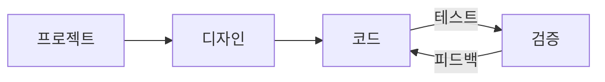
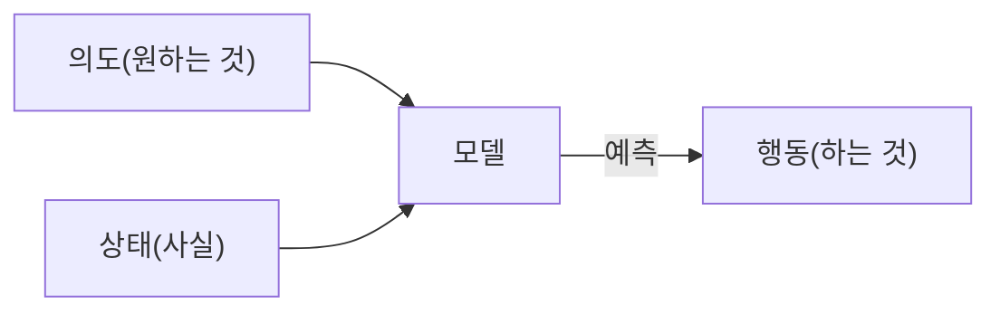

# 웹 개발

**Navigation:** [← Previous](./24-shell-모드.md) | [Index](./index.md) | [Next →](./26-mcp-서버.md)

---

# 웹 개발
Source: https://docs.cursor.com/ko/guides/tutorials/web-development

웹 개발을 위한 Cursor 설정 가이드

export const McpInstallButtonPrimary = ({server, showIcon = true, prompt = null}) => {
  const [showModal, setShowModal] = useState(false);
  const generateDeepLink = () => {
    if (!server || !server.name || !server.install) {
      return null;
    }
    try {
      if (typeof server.install === 'string') {
        return server.install;
      }
      if (server.install.url) {
        const config = {
          ...server.install
        };
        const jsonString = JSON.stringify(config);
        const utf8Bytes = new TextEncoder().encode(jsonString);
        const base64Config = btoa(Array.from(utf8Bytes).map(b => String.fromCharCode(b)).join(''));
        const safeBase64Config = base64Config.replace(/\+/g, '%2B');
        return `cursor://anysphere.cursor-deeplink/mcp/install?name=${encodeURIComponent(server.name)}&config=${encodeURIComponent(safeBase64Config)}`;
      }
      if (server.install.command) {
        let config = {
          command: server.install.command,
          ...server.install.args && ({
            args: server.install.args
          }),
          ...server.install.env && ({
            env: server.install.env
          })
        };
        if (config.command && config.args) {
          const argsString = config.args.join(" ");
          config.command = `${config.command} ${argsString}`;
          delete config.args;
        }
        const jsonString = JSON.stringify(config);
        const utf8Bytes = new TextEncoder().encode(jsonString);
        const base64Config = btoa(Array.from(utf8Bytes).map(b => String.fromCharCode(b)).join(''));
        const safeBase64Config = base64Config.replace(/\+/g, '%2B');
        return `cursor://anysphere.cursor-deeplink/mcp/install?name=${encodeURIComponent(server.name)}&config=${encodeURIComponent(safeBase64Config)}`;
      }
      return null;
    } catch (e) {
      console.error("Error generating deep link:", e);
      return null;
    }
  };
  const handleButtonClick = () => {
    setShowModal(true);
  };
  const handleClose = () => {
    setShowModal(false);
  };
  const deepLink = generateDeepLink();
  const isDocumentationOnly = typeof server?.install === 'string';
  const hasConfirmation = prompt || isDocumentationOnly;
  const InstallModal = ({isOpen, onClose, deepLink, server, children}) => {
    useEffect(() => {
      const handleKeyDown = event => {
        if (event.key === 'Escape') {
          onClose();
        }
      };
      if (isOpen) {
        document.addEventListener('keydown', handleKeyDown);
      }
      return () => {
        document.removeEventListener('keydown', handleKeyDown);
      };
    }, [isOpen, onClose]);
    if (!isOpen) return null;
    return <div className="fixed inset-0 bg-black bg-opacity-50 flex items-center justify-center z-50 transition-opacity duration-200" onClick={onClose}>
        <div className="bg-white dark:bg-neutral-900 rounded-lg p-6 max-w-md w-full mx-4 border border-neutral-200 dark:border-neutral-700 transition-all duration-200 transform" onClick={e => e.stopPropagation()}>
          <div className="mb-4">
            <h3 className="text-lg font-semibold text-black dark:text-white mb-2">
              Install {server?.name}
            </h3>
            <div className="text-neutral-600 dark:text-neutral-400">
              {children}
            </div>
          </div>
          <div className="flex gap-3 justify-end">
            <button onClick={onClose} className="px-4 py-2 text-sm font-medium rounded-lg transition-colors duration-200 text-neutral-600 dark:text-neutral-400 hover:text-black dark:hover:text-white border border-neutral-200 dark:border-neutral-700 hover:bg-neutral-100 dark:hover:bg-neutral-800">
              Cancel
            </button>
            <a href={deepLink} onClick={onClose} target="_blank" className="px-4 py-2 text-sm font-medium rounded-lg transition-colors duration-200 bg-black text-white hover:bg-neutral-800 dark:bg-white dark:text-black dark:hover:bg-neutral-200 inline-flex items-center justify-center no-underline">
              Continue
            </a>
          </div>
        </div>
      </div>;
  };
  return <>
      {hasConfirmation ? <button onClick={handleButtonClick} className="inline-flex justify-center items-center gap-2 px-4 py-2 text-sm font-medium rounded-lg transition-colors duration-200 not-prose text-white bg-black hover:bg-neutral-800 dark:bg-white dark:text-black dark:hover:bg-neutral-200 border border-black dark:border-white">
          {showIcon && <Icon icon="plus" size={16} color="currentColor" />}
          Add to Cursor
        </button> : <a href={deepLink} className="inline-flex justify-center items-center gap-2 px-4 py-2 text-sm font-medium rounded-lg transition-colors duration-200 not-prose text-white bg-black hover:bg-neutral-800 dark:bg-white dark:text-black dark:hover:bg-neutral-200 border border-black dark:border-white">
          {showIcon && <Icon icon="plus" size={16} color="currentColor" />}
          Add to Cursor
        </a>}

      {hasConfirmation && <InstallModal isOpen={showModal} onClose={handleClose} deepLink={deepLink} server={server}>
          {prompt}
        </InstallModal>}
    </>;
};

웹 개발은 Cursor와 Figma나 브라우저 같은 외부 도구 사이에서 빠른 반복과 긴밀한 피드백 루프가 핵심이야. Cursor에서는 이 루프를 더 단단하게 만드는 워크플로를 찾아왔어. 명확한 작업 범위 설정, 컴포넌트 재사용, 디자인 시스템 활용이 속도와 일관성을 유지하는 데 도움이 돼.

이 가이드는 웹 개발을 지원하고 피드백 루프를 더 타이트하게 만들 수 있도록 Cursor를 설정하는 방법을 다뤄.



<div id="start-orchestrating-in-cursor">
  # Cursor에서 오케스트레이션 시작하기
</div>

**Chat**은 변경 작업을 빠르게 시작하기에 좋아. 큰 덩어리가 자리 잡으면 **Inline Edit**랑 **Tab**으로 전환해서 플로우를 계속 유지해.

Cursor를 설정하면 서로 다른 도구를 아우르는 워크플로를 오케스트레이션할 수 있어. 아래는 그 가능성을 보여주는 데모야: Linear, Figma, 그리고 브라우저 도구를 결합해 만든 스네이크 게임. 실제 프로젝트는 보통 더 복잡하지만, 이 예시는 이런 통합 워크플로의 잠재력을 잘 보여줘.

<Frame>
  <video src="https://mintcdn.com/cursor/E7JVsKUF5L-IiJRB/images/guides/tutorials/web-development/snake.mp4?fit=max&auto=format&n=E7JVsKUF5L-IiJRB&q=85&s=e029fbdff2ec06e1e4393ac580824b5a" controls data-path="images/guides/tutorials/web-development/snake.mp4" />
</Frame>

<div id="connect-to-your-project-management-tools">
  # 프로젝트 관리 도구에 연결하기
</div>

여러 가지 도구를 통해 Cursor를 기존 프로젝트 관리 소프트웨어에 통합할 수 있어. 이 가이드에서는 Linear의 MCP 서버와 연동하는 방법을 살펴볼게.

<div id="installation">
  ### 설치
</div>

<McpInstallButtonPrimary
  server={{
name: "Linear",
install: {
command: "npx",
args: ["-y", "mcp-remote", "https://mcp.linear.app/sse"],
},
}}
/>

또는 `mcp.json`에 Linear MCP 서버를 직접 추가해:

```jsx  theme={null}
{
  "mcpServers": {
    "Linear": {
      "command": "npx",
      "args": [
        "-y",
        "mcp-remote",
        "https://mcp.linear.app/sse"
      ]
    }
  }
}
```

그다음:

1. MCP 설정에서 Linear가 활성화되어 있는지 확인해
2. 웹 브라우저가 열리고 Linear 인증을 요청할 거야
   <Info>
     MCP의 현재 상태 때문에 설정이 여러 번 필요할 수 있어.
     통합이 작동하지 않으면 Cursor 설정에서 서버 "Reload"를 시도해봐.
   </Info>

<div id="using-linear-in-cursor">
  ### Cursor에서 Linear 사용하기
</div>

Linear MCP 서버는 Cursor가 이슈를 읽고 관리할 수 있도록 다양한 도구를 제공해. 모든 도구 목록을 보려면 MCP 설정에서 Linear 서버를 찾아봐. 확인하려면 Chat에서 이 프롬프트를 시도해봐:

```jsx  theme={null}
이 프로젝트와 관련된 모든 이슈를 나열해 줘
```

<Frame>
  
</Frame>

통합이 제대로 설정돼 있으면 이슈 목록이 반환돼.

<div id="bring-in-your-figma-designs">
  # Figma 디자인 가져오기
</div>

디자인과 목업은 웹 개발의 핵심이야. 공식 Figma용 MCP 서버를 사용하면 Cursor에서 디자인 파일에 바로 접근하고 작업할 수 있어. 시작하려면 [Figma Dev Mode MCP Server](https://help.figma.com/hc/en-us/articles/32132100833559-Guide-to-the-Dev-Mode-MCP-Server)의 설정 가이드를 따라줘.

<div id="installation">
  ### 설치
</div>

아래 버튼을 클릭해서 MCP 서버를 설치할 수 있어.

<McpInstallButtonPrimary
  server={{
name: "Figma",
install: {
url: "http://127.0.0.1:3845/sse",
},
}}
/>

또는 `mcp.json`에 수동으로 추가해:

```jsx  theme={null}
{
  "mcpServers": {
    "Figma": {
      "url": "http://127.0.0.1:3845/sse"
    }
  }
}
```

<div id="usage">
  ### 사용법
</div>

서버는 프롬프트에서 쓸 수 있는 여러 도구를 공개하고 있어. 예를 들어 Figma에서 현재 선택한 항목의 디자인을 요청해봐. 자세한 내용은 [문서](https://help.figma.com/hc/en-us/articles/32132100833559-Guide-to-the-Dev-Mode-MCP-Server)에서 확인해.

<Frame>
  
</Frame>

<div id="keep-your-code-scaffolding-consistent">
  # 코드 스캐폴딩을 일관되게 유지하기
</div>

이미 있는 코드나 디자인 시스템, 다시 쓰고 싶은 구축된 컨벤션이 있을 거야. 모델이랑 작업할 땐 드롭다운 메뉴 같은 공통 컴포넌트 등, 코드베이스에 이미 있는 패턴을 참고하는 게 좋아.

우리가 대규모 웹 기반 코드베이스에서 직접 일해 보니, 선언적 코드는 특히 React와 JSX에서 아주 잘 맞았어.

디자인 시스템이 있다면, 그에 대한 규칙을 제공해서 에이전트가 그걸 인지하도록 도울 수 있어. 여긴 가능한 경우 컴포넌트 재사용을 강제하려는 `ui-components.mdc` 파일 예시가 있어:

```mdc components.mdc theme={null}
---
description: 디자인 구현 및 UI 빌드
---
- `/src/components/ui`의 기존 UI 컴포넌트를 재사용해. 이건 우리가 조합해서 만들 수 있는 기본 프리미티브야
- 문제를 해결할 기존 컴포넌트를 찾을 수 없다면, UI 컴포넌트들을 조합해 새 컴포넌트를 만들어
- 누락된 컴포넌트나 디자인이 있으면, 어떻게 진행할지 사람에게 물어봐
```

컴포넌트 라이브러리가 커질수록 그에 맞게 새로운 규칙을 추가해. 규칙이 너무 많아지면 "사용자 입력을 다룰 때만 적용"처럼 더 구체적인 카테고리로 나누는 걸 고려해.

<Frame>
  
</Frame>

<div id="give-cursor-access-to-browser">
  # Cursor가 브라우저에 접근하도록 허용하기
</div>

Cursor의 기능을 확장하려면 콘솔 로그와 네트워크 요청에 접근할 수 있는 browser tools MCP 서버를 설정하면 돼. 설정이 끝나면 콘솔 출력과 네트워크 트래픽을 모니터링해서 변경 사항을 확인할 수 있어. 이 설정은 구현이 의도와 일치하는지 확인하는 데 도움이 돼. MCP 서버 설정 방법은 여기에서 확인해줘: [https://browsertools.agentdesk.ai/installation](https://browsertools.agentdesk.ai/installation)

<Frame>
  
</Frame>

<Note>
  Cursor에 네이티브로 더 쉽게 통합할 수 있도록 작업 중이야.
</Note>

<div id="takeaways">
  # 핵심 내용
</div>

* 웹 개발에선 빠른 피드백 루프가 필수야. Cursor를 Figma, Linear, 브라우저 같은 도구와 함께 써서 속도 유지하고 플로우 끊기지 않게 해.
* MCP 서버로 외부 시스템을 Cursor에 직접 통합하면 컨텍스트 전환이 줄고 작업 실행이 더 좋아져.
* 컴포넌트와 디자인 시스템을 재사용하면 모델이 더 깔끔하고 일관된 코드와 결과물을 내는 데 도움이 돼.
* 명확하게 범위가 정해진 태스크가 더 좋은 결과를 만들어. 프롬프트를 어떻게 쓰고 무엇을 요청할지 의도적으로 정해.
* 출력이 마음에 들지 않으면 다음을 조정해봐:
  * **Instructions:** 규칙과 프롬프트를 활용하고, 예를 들어 MCP 서버처럼 더 많은 컨텍스트에 접근할 수 있게 해줘.
  * **Systems:** 패턴, 추상화, 명료성을 갖추면 모델이 더 잘 이해하고 도우며 더 자율적으로 일하기 쉬워져.
* 콘솔 로그, 네트워크 요청, UI 요소 데이터 같은 런타임 정보를 포함해서 모델 컨텍스트를 확장할 수 있어.
* 모든 걸 자동화할 필요는 없어. 시스템이 너무 복잡해지면 Tab과 Inline Edit로 더 정밀한 수정을 해.
* Cursor는 자동 조종 장치가 아니라 코파일럿일 때 가장 강력해. 네 의사결정을 대체하지 말고 개선하는 데 써.


# 컨텍스트 활용하기
Source: https://docs.cursor.com/ko/guides/working-with-context

Cursor에서 컨텍스트를 다루는 방법

먼저, 컨텍스트 윈도우가 뭘까? 그리고 이게 Cursor로 효율적으로 코딩하는 데 어떻게 이어질까?

조금만 거리를 두고 보면, 대규모 언어 모델(LLM)은 방대한 데이터셋에서 패턴을 학습해 텍스트를 예측하고 생성하도록 훈련된 인공지능 모델이야. 이전에 본 내용을 바탕으로 입력을 이해하고 코드나 텍스트를 제안하면서 Cursor 같은 도구를 구동해.

토큰은 이런 모델의 입력이자 출력이야. 보통 단어의 일부 같은 텍스트 조각으로, LLM이 하나씩 처리해. 모델은 문장을 한 번에 읽지 않고, 앞에 나온 토큰들을 바탕으로 다음 토큰을 예측해.

어떤 텍스트가 어떻게 토크나이즈되는지 확인하려면 [이 토크나이저](https://tiktokenizer.vercel.app/)를 써봐.


<div id="what-is-context">
  # 컨텍스트란 뭐야?
</div>

Cursor에서 코드 제안을 생성할 때 “컨텍스트”는 모델에 제공되는 정보(“input tokens” 형태)를 말하고, 모델은 그걸 바탕으로 다음 정보를(“output tokens” 형태) 예측해.

컨텍스트에는 두 가지 종류가 있어:

1. **의도 컨텍스트**는 사용자가 모델에서 얻고 싶은 걸 정의해. 예를 들어 시스템 프롬프트는 보통 사용자가 모델이 어떻게 행동하길 원하는지에 대한 상위 수준의 지침 역할을 해. Cursor에서 이루어지는 대부분의 “프롬프트 입력”은 의도 컨텍스트야. “그 버튼을 파란색에서 초록색으로 바꿔줘” 같은 건 명시된 의도의 예시고, 처방적이야.
2. **상태 컨텍스트**는 현재 환경의 상태를 설명해. Cursor에 에러 메시지, 콘솔 로그, 이미지, 코드 조각을 제공하는 건 상태와 관련된 컨텍스트의 예시야. 이건 처방적이 아니라 서술적이야.

이 두 가지 컨텍스트가 함께 작동해서 현재 상태와 원하는 미래 상태를 설명하고, Cursor가 유용한 코드 제안을 하게 만들어줘.



<div id="providing-context-in-cursor">
  # Cursor에서 컨텍스트 제공하기
</div>

모델에 더 관련성 높은 컨텍스트를 줄수록 더 유용해져. Cursor에서 컨텍스트가 충분하지 않으면, 모델은 관련 정보 없이 문제를 풀려고 해. 이건 보통 다음을 초래해:

1. 패턴이 없는데도 모델이 패턴 매칭을 시도하면서 생기는 환각. 컨텍스트가 부족하면 `claude-3.5-sonnet` 같은 모델에서 자주 일어날 수 있어.
2. Agent가 코드를 검색하고, 파일을 읽고, 툴을 호출해서 스스로 컨텍스트를 모으려는 시도. 강력한 사고 모델(예: `claude-3.7-sonnet`)은 이 전략만으로도 꽤 멀리 갈 수 있고, 올바른 초기 컨텍스트가 있으면 진행 궤적이 결정돼.

좋은 소식은 Cursor가 처음부터 컨텍스트 인지에 최적화되어 있고, 사용자 개입을 최소화하도록 설계되어 있다는 점이야. Cursor는 현재 파일, 다른 파일의 의미적으로 유사한 패턴, 세션의 기타 정보 등 모델이 관련 있다고 판단한 코드베이스의 부분들을 자동으로 끌어와.

다만 끌어올 수 있는 컨텍스트가 워낙 많아서, 작업에 확실히 관련된 컨텍스트를 직접 지정해 주면 모델을 올바른 방향으로 더 잘 이끌 수 있어.

<div id="symbol">
  ## @-기호
</div>

명시적으로 컨텍스트를 제공하는 가장 쉬운 방법은 @-기호를 쓰는 거야. 포함할 파일, 폴더, 웹사이트 같은 컨텍스트를 정확히 알고 있을 때 특히 좋아. 구체적일수록 더 좋아. 컨텍스트를 더 정밀하게 다루는 방법은 아래를 참고해:

| Symbol    | Example              | Use case                                    | Drawback                               |
| --------- | -------------------- | ------------------------------------------- | -------------------------------------- |
| `@code`   | `@LRUCachedFunction` | 생성하려는 출력과 관련된 함수, 상수, 혹은 심볼을 정확히 알고 있을 때    | 코드베이스 전반에 대한 높은 이해가 필요함                |
| `@file`   | `cache.ts`           | 어떤 파일을 읽거나 수정해야 하는지는 알지만, 파일 내 정확한 위치는 모를 때 | 파일 크기에 따라 현재 작업과 무관한 컨텍스트가 많이 포함될 수 있음 |
| `@folder` | `utils/`             | 폴더 내 모든 파일 또는 대부분의 파일이 관련 있을 때              | 현재 작업과 무관한 컨텍스트가 많이 포함될 수 있음           |


<div id="rules">
  ## 규칙
</div>

규칙은 너나 팀원들이 오래도록 참고할 수 있는 일종의 장기 메모리라고 생각하면 돼. 워크플로, 포맷팅, 기타 관례 같은 도메인별 컨텍스트를 담아두는 게 규칙을 만들 때 훌륭한 출발점이야.

규칙은 기존 대화에서도 `/Generate Cursor Rules`로 뽑아낼 수 있어. 프롬프트가 오간 긴 대화를 했다면, 나중에 재사용하고 싶은 유용한 지시나 일반 규칙이 꽤 있을 거야.


<div id="mcp">
  ## MCP
</div>

[Model Context Protocol](https://modelcontextprotocol.io/introduction)은 Cursor에 액션 수행과 외부 컨텍스트 불러오기 능력을 더해 주는 확장 레이어야.

개발 환경에 따라 다양한 유형의 서버를 쓰고 싶을 수 있는데, 우리가 특히 유용하다고 본 카테고리는 두 가지야:

* **내부 문서**: 예) Notion, Confluence, Google Docs
* **프로젝트 관리**: 예) Linear, Jira

이미 API로 컨텍스트에 접근하고 액션을 수행하는 도구가 있다면, 그걸 위한 MCP 서버를 만들 수 있어. 여기 [MCP 서버](https://modelcontextprotocol.io/tutorials/building-mcp-with-llms)를 만드는 짧은 가이드가 있어.


<div id="self-gathering-context">
  ## 자체 컨텍스트 수집
</div>

많은 사용자가 채택한 강력한 패턴은 Agent가 짧게 쓰고 버릴 도구를 직접 만들어 실행해, 더 많은 컨텍스트를 수집하게 하는 거야. 이건 코드를 실행하기 전에 네가 검토하는 human-in-the-loop 워크플로우에서 특히 효과적이야.

예를 들어, 코드에 디버깅 구문을 추가하고 실행한 다음, 모델이 출력을 확인하게 하면 정적으로는 알 수 없던 동적 컨텍스트에 접근할 수 있어.

Python에서는 Agent에게 다음을 지시해서 이렇게 할 수 있어:

1. 코드의 관련 부분에 print("debugging: ...") 구문을 추가하기
2. 터미널을 사용해 코드나 테스트 실행하기

Agent는 터미널 출력을 읽고 다음에 뭘 할지 결정해. 핵심 아이디어는 정적인 코드만이 아니라 실제 런타임 동작에 Agent가 접근할 수 있게 해 주는 거야.


<div id="takeaways">
  # 핵심 요점
</div>

* 컨텍스트는 효과적인 AI 코딩의 토대이며, 의도(무엇을 원하는지)와 상태(현재 무엇이 있는지)로 구성돼. 둘 다 제공하면 Cursor가 더 정확하게 예측해.
* 자동 컨텍스트 수집에만 맡기지 말고, @기호(@code, @file, @folder)를 써서 정밀한 컨텍스트로 Cursor를 정확히 안내해.
* 재사용 가능한 지식은 규칙으로 정리해 팀 전체가 쓰게 하고, 외부 시스템을 연결하려면 Model Context Protocol로 Cursor의 기능을 확장해.
* 컨텍스트가 부족하면 환각이나 비효율이 생기고, 관련 없는 컨텍스트가 너무 많으면 신호가 약해져. 최적의 결과를 위해 균형을 맞춰.


# 인라인 편집
Source: https://docs.cursor.com/ko/inline-edit/overview

Cursor에서 인라인 편집(Cmd/Ctrl+K)으로 코드 수정하고 질문하기

export const Kbd = ({children, tooltip, os}) => {
  const keysInput = typeof children === 'string' && children.trim() !== '' ? children : null;
  if (!keysInput) {
    return null;
  }
  const isModifier = key => {
    const modifiers = ['⌘', '⇧', '⌥', '⌃', '⏎', '⌫', '⌦', '⎋', '⇥', '⌁', '←', '→', '↑', '↓', 'Ctrl', 'Shift', 'Alt', 'Cmd', 'Opt', 'Return', 'Backspace', 'Delete', 'Escape', 'Tab', 'Space', 'Enter', 'Esc', 'ArrowLeft', 'ArrowRight', 'ArrowUp', 'ArrowDown', 'Left', 'Right', 'Up', 'Down'];
    return modifiers.includes(key.trim());
  };
  const capitalizeFirstLetter = string => {
    return string.charAt(0).toUpperCase() + string.slice(1);
  };
  const isMac = os ? os.toLowerCase() === 'mac' || os.toLowerCase() === 'macos' : typeof navigator !== 'undefined' && (navigator.platform.toUpperCase().indexOf('MAC') >= 0 || navigator.userAgent.toUpperCase().indexOf('MAC') >= 0);
  const convertToSymbols = shortcut => {
    if (isMac) {
      return shortcut.replace(/⌘|Cmd|CMD/gi, '⌘').replace(/⌥|Opt|OPT/gi, '⌥').replace(/⌃|Ctrl/gi, '⌃').replace(/⇧|Shift/gi, '⇧').replace(/⏎|Return/gi, '⏎').replace(/⌫|Backspace/gi, '⌫').replace(/⌦|Delete/gi, '⌦').replace(/␛|Escape/gi, '␛').replace(/⇥|Tab/gi, '⇥').replace(/⌁|Space/gi, '⌁').replace(/←|Arrow\s*Left|ArrowLeft|Left/gi, '←').replace(/→|Arrow\s*Right|ArrowRight|Right/gi, '→').replace(/↑|Arrow\s*Up|ArrowUp|Up/gi, '↑').replace(/↓|Arrow\s*Down|ArrowDown|Down/gi, '↓');
    } else {
      const converted = shortcut.replace(/⌘|Cmd|CMD/gi, 'Ctrl').replace(/⌥|Opt|OPT/gi, 'Alt').replace(/⌃|Ctrl/gi, 'Ctrl').replace(/⇧|Shift/gi, 'Shift').replace(/⏎|Return/gi, 'Enter').replace(/⌫|Backspace/gi, 'Backspace').replace(/⌦|Delete/gi, 'Delete').replace(/⎋|Escape/gi, 'Esc').replace(/⇥|Tab/gi, 'Tab').replace(/⌁|Space/gi, 'Space').replace(/←|Arrow\s*Left|ArrowLeft|Left/gi, 'Arrow-Left').replace(/→|Arrow\s*Right|ArrowRight|Right/gi, 'Arrow-Right').replace(/↑|Arrow\s*Up|ArrowUp|Up/gi, 'Arrow-Up').replace(/↓|Arrow\s*Down|ArrowDown|Down/gi, 'Arrow-Down');
      const keyList = converted.split(/[\+\s]+/).filter(key => key.trim());
      return keyList.join('+');
    }
  };
  const convertToReadableText = shortcut => {
    const converted = shortcut.replace(/⌘|Cmd|CMD/gi, 'Cmd').replace(/⌥|Opt|OPT/gi, 'Opt').replace(/⌃|Ctrl/gi, 'Ctrl').replace(/⇧|Shift/gi, 'Shift').replace(/⏎|Return/gi, 'Return').replace(/⌫|Backspace/gi, 'Backspace').replace(/⌦|Delete/gi, 'Delete').replace(/⎋|Escape/gi, 'Escape').replace(/⇥|Tab/gi, 'Tab').replace(/⌁|Space/gi, 'Space').replace(/←|Arrow\s*Left|ArrowLeft|Left/gi, 'Arrow-Left').replace(/→|Arrow\s*Right|ArrowRight|Right/gi, 'Arrow-Right').replace(/↑|Arrow\s*Up|ArrowUp|Up/gi, 'Arrow-Up').replace(/↓|Arrow\s*Down|ArrowDown|Down/gi, 'Arrow-Down');
    const keyList = converted.split(/[\+\s]+/).filter(key => key.trim());
    return keyList.map(key => {
      const trimmedKey = key.trim();
      return isModifier(trimmedKey) ? trimmedKey : capitalizeFirstLetter(trimmedKey);
    }).join('+');
  };
  const displayShortcut = convertToSymbols(keysInput);
  const tooltipText = isMac ? tooltip ? `${convertToReadableText(keysInput)}: ${tooltip}` : convertToReadableText(keysInput) : tooltip || null;
  const processedKeys = isMac ? displayShortcut.split(/[\+\s]+/).filter(key => key.trim()).map(key => {
    const trimmedKey = key.trim();
    return isModifier(trimmedKey) ? trimmedKey : capitalizeFirstLetter(trimmedKey);
  }).join('') : displayShortcut.split('+').map(key => {
    const trimmedKey = key.trim();
    return isModifier(trimmedKey) ? trimmedKey : capitalizeFirstLetter(trimmedKey);
  }).join('+');
  return tooltipText ? <Tooltip tip={tooltipText}>
      <kbd>
        {processedKeys}
      </kbd>
    </Tooltip> : <kbd>
      {processedKeys}
    </kbd>;
};

Inline Edit는 <Kbd>Cmd+K</Kbd>로 에디터에서 바로 코드를 수정하거나 질문할 수 있게 해줘. 선택한 코드랑 지시사항이 입력 필드에서 합쳐져서 네 요청이 만들어져.

<Frame>
  
</Frame>

<div id="modes">
  ## 모드
</div>

<div id="edit-selection">
  ### 선택 영역 편집
</div>

코드를 선택한 상태에서 <Kbd>Cmd+K</Kbd>를 누르면 네 지시에 따라 해당 코드만 편집해.

<Frame>
  
</Frame>

선택이 없으면 Cursor가 커서 위치에 새 코드를 만들어. AI가 문맥을 위해 주변의 관련 코드를 포함해. 예를 들어, 함수 이름에서 트리거하면 전체 함수가 포함돼.

<div id="quick-question">
  ### 빠른 질문
</div>

인라인 에디터에서 <Kbd>Opt+Return</Kbd>을 눌러 선택한 코드에 대해 질문해.

답을 받은 뒤 "do it" 같은 문구를 입력하면 제안을 코드로 바꿔줘. 구현하기 전에 아이디어를 탐색할 수 있어.

<Frame>
  
</Frame>

<div id="full-file-edits">
  ### 전체 파일 편집
</div>

파일 전체 변경에는 <Kbd>Cmd+Shift+Return</Kbd>을 써. 이 모드는 제어를 유지하면서도 폭넓은 변경을 할 수 있게 해.

<Frame>
  
</Frame>

<div id="send-to-chat">
  ### 채팅으로 보내기
</div>

여러 파일 편집이나 고급 기능이 필요하면 <Kbd>Cmd+L</Kbd>로 선택한 코드를 [Chat](/ko/agent/modes#agent)으로 보내. 다중 파일 편집, 자세한 설명, 고급 AI 기능을 제공해.

<Frame>
  <video src="https://mintcdn.com/cursor/E7JVsKUF5L-IiJRB/images/inline-edit/send-to-chat.mp4?fit=max&auto=format&n=E7JVsKUF5L-IiJRB&q=85&s=04a84c73c8736a733f1748fd86ac437f" autoPlay loop muted playsInline controls data-path="images/inline-edit/send-to-chat.mp4" />
</Frame>

<div id="follow-up-instructions">
  ## 후속 지침
</div>

각 편집 후에 지침을 덧붙이고 <Kbd>Return</Kbd>을 눌러 결과를 더 정교하게 다듬어. AI는 네 피드백을 반영해 변경 내용을 업데이트해.

<div id="default-context">
  ## 기본 컨텍스트
</div>

Inline Edit에는 네가 추가하는 [@ symbols](/ko/context/@-symbols/@-files) 외에도 코드 생성을 개선하는 기본 컨텍스트가 포함돼.

여기에는 관련 파일, 최근에 본 코드, 그리고 관련 정보가 포함돼. Cursor는 더 나은 결과를 위해 가장 관련성 높은 컨텍스트를 우선순위에 둬.


# Terminal
Source: https://docs.cursor.com/ko/inline-edit/terminal

Cmd/Ctrl+K로 터미널 명령 생성

export const Kbd = ({children, tooltip, os}) => {
  const keysInput = typeof children === 'string' && children.trim() !== '' ? children : null;
  if (!keysInput) {
    return null;
  }
  const isModifier = key => {
    const modifiers = ['⌘', '⇧', '⌥', '⌃', '⏎', '⌫', '⌦', '⎋', '⇥', '⌁', '←', '→', '↑', '↓', 'Ctrl', 'Shift', 'Alt', 'Cmd', 'Opt', 'Return', 'Backspace', 'Delete', 'Escape', 'Tab', 'Space', 'Enter', 'Esc', 'ArrowLeft', 'ArrowRight', 'ArrowUp', 'ArrowDown', 'Left', 'Right', 'Up', 'Down'];
    return modifiers.includes(key.trim());
  };
  const capitalizeFirstLetter = string => {
    return string.charAt(0).toUpperCase() + string.slice(1);
  };
  const isMac = os ? os.toLowerCase() === 'mac' || os.toLowerCase() === 'macos' : typeof navigator !== 'undefined' && (navigator.platform.toUpperCase().indexOf('MAC') >= 0 || navigator.userAgent.toUpperCase().indexOf('MAC') >= 0);
  const convertToSymbols = shortcut => {
    if (isMac) {
      return shortcut.replace(/⌘|Cmd|CMD/gi, '⌘').replace(/⌥|Opt|OPT/gi, '⌥').replace(/⌃|Ctrl/gi, '⌃').replace(/⇧|Shift/gi, '⇧').replace(/⏎|Return/gi, '⏎').replace(/⌫|Backspace/gi, '⌫').replace(/⌦|Delete/gi, '⌦').replace(/␛|Escape/gi, '␛').replace(/⇥|Tab/gi, '⇥').replace(/⌁|Space/gi, '⌁').replace(/←|Arrow\s*Left|ArrowLeft|Left/gi, '←').replace(/→|Arrow\s*Right|ArrowRight|Right/gi, '→').replace(/↑|Arrow\s*Up|ArrowUp|Up/gi, '↑').replace(/↓|Arrow\s*Down|ArrowDown|Down/gi, '↓');
    } else {
      const converted = shortcut.replace(/⌘|Cmd|CMD/gi, 'Ctrl').replace(/⌥|Opt|OPT/gi, 'Alt').replace(/⌃|Ctrl/gi, 'Ctrl').replace(/⇧|Shift/gi, 'Shift').replace(/⏎|Return/gi, 'Enter').replace(/⌫|Backspace/gi, 'Backspace').replace(/⌦|Delete/gi, 'Delete').replace(/⎋|Escape/gi, 'Esc').replace(/⇥|Tab/gi, 'Tab').replace(/⌁|Space/gi, 'Space').replace(/←|Arrow\s*Left|ArrowLeft|Left/gi, 'Arrow-Left').replace(/→|Arrow\s*Right|ArrowRight|Right/gi, 'Arrow-Right').replace(/↑|Arrow\s*Up|ArrowUp|Up/gi, 'Arrow-Up').replace(/↓|Arrow\s*Down|ArrowDown|Down/gi, 'Arrow-Down');
      const keyList = converted.split(/[\+\s]+/).filter(key => key.trim());
      return keyList.join('+');
    }
  };
  const convertToReadableText = shortcut => {
    const converted = shortcut.replace(/⌘|Cmd|CMD/gi, 'Cmd').replace(/⌥|Opt|OPT/gi, 'Opt').replace(/⌃|Ctrl/gi, 'Ctrl').replace(/⇧|Shift/gi, 'Shift').replace(/⏎|Return/gi, 'Return').replace(/⌫|Backspace/gi, 'Backspace').replace(/⌦|Delete/gi, 'Delete').replace(/⎋|Escape/gi, 'Escape').replace(/⇥|Tab/gi, 'Tab').replace(/⌁|Space/gi, 'Space').replace(/←|Arrow\s*Left|ArrowLeft|Left/gi, 'Arrow-Left').replace(/→|Arrow\s*Right|ArrowRight|Right/gi, 'Arrow-Right').replace(/↑|Arrow\s*Up|ArrowUp|Up/gi, 'Arrow-Up').replace(/↓|Arrow\s*Down|ArrowDown|Down/gi, 'Arrow-Down');
    const keyList = converted.split(/[\+\s]+/).filter(key => key.trim());
    return keyList.map(key => {
      const trimmedKey = key.trim();
      return isModifier(trimmedKey) ? trimmedKey : capitalizeFirstLetter(trimmedKey);
    }).join('+');
  };
  const displayShortcut = convertToSymbols(keysInput);
  const tooltipText = isMac ? tooltip ? `${convertToReadableText(keysInput)}: ${tooltip}` : convertToReadableText(keysInput) : tooltip || null;
  const processedKeys = isMac ? displayShortcut.split(/[\+\s]+/).filter(key => key.trim()).map(key => {
    const trimmedKey = key.trim();
    return isModifier(trimmedKey) ? trimmedKey : capitalizeFirstLetter(trimmedKey);
  }).join('') : displayShortcut.split('+').map(key => {
    const trimmedKey = key.trim();
    return isModifier(trimmedKey) ? trimmedKey : capitalizeFirstLetter(trimmedKey);
  }).join('+');
  return tooltipText ? <Tooltip tip={tooltipText}>
      <kbd>
        {processedKeys}
      </kbd>
    </Tooltip> : <kbd>
      {processedKeys}
    </kbd>;
};

Cursor 터미널에서 <Kbd>Cmd+K</Kbd>를 눌러 아래쪽에 프롬프트 바를 열어.
원하는 작업을 설명하면 Inline Edit가 명령을 만들어줘.

<Frame>
  
</Frame>

터미널의 Inline Edit는 최근 터미널 기록, 지시사항, 그리고 프롬프트 내용을 컨텍스트로 활용해.


# Git
Source: https://docs.cursor.com/ko/integrations/git

커밋 메시지 생성과 머지 충돌 해결을 포함한 AI 지원 Git 기능

export const Kbd = ({children, tooltip, os}) => {
  const keysInput = typeof children === 'string' && children.trim() !== '' ? children : null;
  if (!keysInput) {
    return null;
  }
  const isModifier = key => {
    const modifiers = ['⌘', '⇧', '⌥', '⌃', '⏎', '⌫', '⌦', '⎋', '⇥', '⌁', '←', '→', '↑', '↓', 'Ctrl', 'Shift', 'Alt', 'Cmd', 'Opt', 'Return', 'Backspace', 'Delete', 'Escape', 'Tab', 'Space', 'Enter', 'Esc', 'ArrowLeft', 'ArrowRight', 'ArrowUp', 'ArrowDown', 'Left', 'Right', 'Up', 'Down'];
    return modifiers.includes(key.trim());
  };
  const capitalizeFirstLetter = string => {
    return string.charAt(0).toUpperCase() + string.slice(1);
  };
  const isMac = os ? os.toLowerCase() === 'mac' || os.toLowerCase() === 'macos' : typeof navigator !== 'undefined' && (navigator.platform.toUpperCase().indexOf('MAC') >= 0 || navigator.userAgent.toUpperCase().indexOf('MAC') >= 0);
  const convertToSymbols = shortcut => {
    if (isMac) {
      return shortcut.replace(/⌘|Cmd|CMD/gi, '⌘').replace(/⌥|Opt|OPT/gi, '⌥').replace(/⌃|Ctrl/gi, '⌃').replace(/⇧|Shift/gi, '⇧').replace(/⏎|Return/gi, '⏎').replace(/⌫|Backspace/gi, '⌫').replace(/⌦|Delete/gi, '⌦').replace(/␛|Escape/gi, '␛').replace(/⇥|Tab/gi, '⇥').replace(/⌁|Space/gi, '⌁').replace(/←|Arrow\s*Left|ArrowLeft|Left/gi, '←').replace(/→|Arrow\s*Right|ArrowRight|Right/gi, '→').replace(/↑|Arrow\s*Up|ArrowUp|Up/gi, '↑').replace(/↓|Arrow\s*Down|ArrowDown|Down/gi, '↓');
    } else {
      const converted = shortcut.replace(/⌘|Cmd|CMD/gi, 'Ctrl').replace(/⌥|Opt|OPT/gi, 'Alt').replace(/⌃|Ctrl/gi, 'Ctrl').replace(/⇧|Shift/gi, 'Shift').replace(/⏎|Return/gi, 'Enter').replace(/⌫|Backspace/gi, 'Backspace').replace(/⌦|Delete/gi, 'Delete').replace(/⎋|Escape/gi, 'Esc').replace(/⇥|Tab/gi, 'Tab').replace(/⌁|Space/gi, 'Space').replace(/←|Arrow\s*Left|ArrowLeft|Left/gi, 'Arrow-Left').replace(/→|Arrow\s*Right|ArrowRight|Right/gi, 'Arrow-Right').replace(/↑|Arrow\s*Up|ArrowUp|Up/gi, 'Arrow-Up').replace(/↓|Arrow\s*Down|ArrowDown|Down/gi, 'Arrow-Down');
      const keyList = converted.split(/[\+\s]+/).filter(key => key.trim());
      return keyList.join('+');
    }
  };
  const convertToReadableText = shortcut => {
    const converted = shortcut.replace(/⌘|Cmd|CMD/gi, 'Cmd').replace(/⌥|Opt|OPT/gi, 'Opt').replace(/⌃|Ctrl/gi, 'Ctrl').replace(/⇧|Shift/gi, 'Shift').replace(/⏎|Return/gi, 'Return').replace(/⌫|Backspace/gi, 'Backspace').replace(/⌦|Delete/gi, 'Delete').replace(/⎋|Escape/gi, 'Escape').replace(/⇥|Tab/gi, 'Tab').replace(/⌁|Space/gi, 'Space').replace(/←|Arrow\s*Left|ArrowLeft|Left/gi, 'Arrow-Left').replace(/→|Arrow\s*Right|ArrowRight|Right/gi, 'Arrow-Right').replace(/↑|Arrow\s*Up|ArrowUp|Up/gi, 'Arrow-Up').replace(/↓|Arrow\s*Down|ArrowDown|Down/gi, 'Arrow-Down');
    const keyList = converted.split(/[\+\s]+/).filter(key => key.trim());
    return keyList.map(key => {
      const trimmedKey = key.trim();
      return isModifier(trimmedKey) ? trimmedKey : capitalizeFirstLetter(trimmedKey);
    }).join('+');
  };
  const displayShortcut = convertToSymbols(keysInput);
  const tooltipText = isMac ? tooltip ? `${convertToReadableText(keysInput)}: ${tooltip}` : convertToReadableText(keysInput) : tooltip || null;
  const processedKeys = isMac ? displayShortcut.split(/[\+\s]+/).filter(key => key.trim()).map(key => {
    const trimmedKey = key.trim();
    return isModifier(trimmedKey) ? trimmedKey : capitalizeFirstLetter(trimmedKey);
  }).join('') : displayShortcut.split('+').map(key => {
    const trimmedKey = key.trim();
    return isModifier(trimmedKey) ? trimmedKey : capitalizeFirstLetter(trimmedKey);
  }).join('+');
  return tooltipText ? <Tooltip tip={tooltipText}>
      <kbd>
        {processedKeys}
      </kbd>
    </Tooltip> : <kbd>
      {processedKeys}
    </kbd>;
};

Cursor는 자동 커밋 메시지 생성과 스마트한 머지 충돌 해결 등 워크플로를 간소화하는 AI 기반 Git 기능을 제공해.

<div id="ai-commit-message">
  ## AI 커밋 메시지
</div>

Cursor는 스테이징된 변경 사항을 바탕으로 커밋 메시지를 생성해.

1. 커밋할 파일 스테이징하기
2. 사이드바에서 Git 탭 열기
3. 커밋 메시지 입력창 옆 반짝이(✨) 아이콘 클릭하기

생성된 메시지는 스테이징된 변경 사항과 리포지토리 Git 기록을 활용해. [Conventional Commits](https://www.conventionalcommits.org/) 같은 규칙을 쓰면 메시지도 같은 패턴을 따라.

<div id="add-shortcut">
  ### 단축키 추가
</div>

키보드 단축키에 바인딩하려면:

1. Keyboard Shortcuts 열기 (<Kbd>Cmd+R Cmd+S</Kbd> 또는 <Kbd>Cmd+Shift+P</Kbd> 후 "Open Keyboard Shortcuts (JSON)" 검색)
2. <Kbd>Cmd+M</Kbd>에 아래 바인딩 추가:
   ```json  theme={null}
   {
     "key": "cmd+m",
     "command": "cursor.generateGitCommitMessage"
   }
   ```
3. 저장

<Info>
  커밋 메시지 생성은 커스터마이즈할 수 없어. Cursor가 네가 쓰는 기존 커밋 스타일에 맞춰줘.
</Info>

<div id="ai-resolve-conflicts">
  ## AI 충돌 해결
</div>

머지 충돌이 생기면 Cursor Agent가 충돌의 양쪽 변경 내용을 파악해서 해결안을 제안해줘.

<div id="how-to-use">
  ### 사용 방법
</div>

1. 머지 충돌이 생기면 파일에 충돌 마커가 보여
2. 머지 충돌 UI에 표시되는 **Resolve in Chat** 버튼을 클릭해
3. Agent가 두 버전을 분석하고 해결안을 제안해
4. 제안된 변경 사항을 확인하고 적용해


# GitHub
Source: https://docs.cursor.com/ko/integrations/github

백그라운드 에이전트를 위한 공식 Cursor GitHub 앱

[Background Agents](/ko/background-agent)와 [Bugbot](/ko/bugbot)은 리포지토리를 클론하고 변경 사항을 푸시하려면 Cursor GitHub 앱이 필요해.

<div id="installation">
  ## 설치
</div>

1. [Dashboard의 Integrations](https://cursor.com/dashboard?tab=integrations)로 이동
2. GitHub 옆의 **Connect** 클릭
3. 리포지토리를 **All repositories** 또는 **Selected repositories** 중에서 선택

GitHub 계정을 연결 해제하려면 Integrations 대시보드로 돌아가 **Disconnect Account**를 클릭해.

<div id="using-agent-in-github">
  ## GitHub에서 Agent 사용하기
</div>

GitHub 통합을 통해 풀 리퀘스트와 이슈에서 바로 백그라운드 에이전트 워크플로를 실행할 수 있어. 어떤 PR이나 이슈에 `@cursor [prompt]`라고 댓글을 달면, 에이전트가 컨텍스트를 읽고, 수정 사항을 적용하고, 커밋을 푸시하도록 트리거할 수 있어.

[Bugbot](/ko/bugbot)을 켜놨다면, `@cursor fix`라고 댓글을 달아서 Bugbot이 제안한 수정안을 읽고 이슈를 해결할 백그라운드 에이전트를 트리거할 수 있어.

<div id="permissions">
  ## 권한
</div>

GitHub 앱이 백그라운드 에이전트랑 함께 작동하려면 특정 권한이 필요해:

<div className="full-width-table">
  | 권한                        | 목적                           |
  | ------------------------- | ---------------------------- |
  | **Repository access**     | 코드를 클론하고 작업 브랜치를 만들어         |
  | **Pull requests**         | 네 리뷰를 위해 에이전트 변경을 담은 PR을 만들어 |
  | **Issues**                | 에이전트가 찾거나 고친 버그와 작업을 추적해     |
  | **Checks and statuses**   | 코드 품질과 테스트 결과를 보고해           |
  | **Actions and workflows** | CI/CD 파이프라인과 배포 상태를 모니터링해    |
</div>

모든 권한은 백그라운드 에이전트 기능에 필요한 최소 권한 원칙을 따르고 있어.

<div id="ip-allow-list-configuration">
  ## IP 허용 목록 구성
</div>

조직에서 GitHub의 IP 허용 목록 기능으로 리포지토리 접근을 제한하고 있다면, 팀에 IP 허용 목록 기능을 켜 달라고 먼저 지원팀에 연락해야 해.

<div id="contact-support">
  ### 지원팀에 문의
</div>

IP 허용 목록을 설정하기 전에, 이 기능을 팀에 활성화하려면 [hi@cursor.com](mailto:hi@cursor.com)으로 먼저 연락해 줘. 아래 두 가지 구성 방식 모두에 필요한 절차야.

<div id="enable-ip-allow-list-configuration-for-installed-github-apps-recommended">
  ### 설치된 GitHub 앱에 대해 IP 허용 목록 구성 활성화(권장)
</div>

Cursor GitHub 앱에는 IP 목록이 이미 미리 설정돼 있어. 설치된 앱에 대해 허용 목록을 활성화하면 이 목록을 자동으로 승계할 수 있어. 이게 가장 권장되는 방법이야. 우리가 목록을 업데이트하면 조직도 자동으로 최신 목록을 받게 되거든.

활성화 방법:

1. 조직의 Security 설정으로 이동
2. IP 허용 목록 설정으로 이동
3. **"Allow access by GitHub Apps"** 체크

자세한 안내는 [GitHub 문서](https://docs.github.com/en/enterprise-cloud@latest/organizations/keeping-your-organization-secure/managing-security-settings-for-your-organization/managing-allowed-ip-addresses-for-your-organization#allowing-access-by-github-apps)를 참고해 줘.

<div id="add-ips-directly-to-your-allowlist">
  ### 허용 목록에 IP를 직접 추가
</div>

조직이 GitHub에서 IdP로 정의한 허용 목록을 사용하거나, 미리 구성된 허용 목록을 사용할 수 없다면 IP 주소를 직접 수동으로 추가하면 돼:

```
184.73.225.134
3.209.66.12
52.44.113.131
```

<Note>
  IP 주소 목록은 가끔 변경될 수 있어. IP allowlist를 사용하는 팀에는 IP 주소가 추가되거나 제거되기 전에 미리 알려줄게.
</Note>

<div id="troubleshooting">
  ## 문제 해결
</div>

<AccordionGroup>
  <Accordion title="에이전트가 리포지토리에 접근할 수 없음">
    * 리포지토리 접근 권한으로 GitHub 앱 설치하기
    * 비공개 리포지토리의 권한 설정 확인하기
    * GitHub 계정 권한 확인하기
  </Accordion>

  <Accordion title="풀 리퀘스트 권한 거부됨">
    * 앱에 풀 리퀘스트 쓰기 권한 부여하기
    * 브랜치 보호 규칙 확인하기
    * 앱 설치가 만료됐다면 재설치하기
  </Accordion>

  <Accordion title="GitHub 설정에서 앱이 보이지 않음">
    * 조직 단위로 설치됐는지 확인하기
    * [github.com/apps/cursor](https://github.com/apps/cursor)에서 재설치하기
    * 설치가 손상된 경우 지원팀에 문의하기
  </Accordion>
</AccordionGroup>


# Linear
Source: https://docs.cursor.com/ko/integrations/linear

Linear에서 Background Agents 사용하기

이슈를 Cursor에 위임하거나 댓글에서 `@Cursor`를 멘션해서 Linear에서 바로 [Background Agents](/ko/background-agent)를 사용해.

<Frame>
  <video src="https://mintcdn.com/cursor/E7JVsKUF5L-IiJRB/images/integrations/linear/linear-agent.mp4?fit=max&auto=format&n=E7JVsKUF5L-IiJRB&q=85&s=ac4bacf6bf42c541f45325ba72f8c25f" controls autoPlay muted loop playsInline data-path="images/integrations/linear/linear-agent.mp4" />
</Frame>

<div id="get-started">
  ## 시작하기
</div>

<div id="installation">
  ### 설치
</div>

<Note>
  Linear 통합을 연결하려면 Cursor 관리자여야 해. 다른 팀 설정은 비관리자 멤버도 사용할 수 있어.
</Note>

1. [Cursor integrations](https://www.cursor.com/en/dashboard?tab=integrations)로 이동
2. Linear 옆의 *Connect* 클릭
3. Linear 워크스페이스를 연결하고 팀 선택
4. *Authorize* 클릭
5. Cursor에서 남은 Background Agent 설정 마무리:
   * GitHub 연결하고 기본 리포지토리 선택
   * 사용량 기반 과금 켜기
   * 개인정보 설정 확인

<div id="account-linking">
  ### 계정 연결
</div>

처음 사용할 때 Cursor랑 Linear 계정을 연결해야 해. PR 만들려면 GitHub 연결이 필요해.

<div id="how-to-use">
  ## 사용 방법
</div>

이슈를 Cursor에 맡기거나 댓글에 `@Cursor`를 멘션해. Cursor가 이슈를 분석해서 비개발 업무는 자동으로 걸러줘.

<div id="delegating-issues">
  ### 이슈 위임하기
</div>

1. Linear 이슈 열기
2. 담당자 필드 클릭
3. "Cursor" 선택

<Frame>
  
</Frame>

<div id="mentioning-cursor">
  ### Cursor 멘션하기
</div>

새 에이전트를 배정하거나 추가 지침을 알려주려면 댓글에 `@Cursor`를 멘션해. 예: `@Cursor 위에 설명한 인증 버그를 고쳐줘`.

<div id="workflow">
  ## 워크플로우
</div>

Background Agents는 Linear에서 실시간 상태를 표시하고 완료되면 자동으로 PR을 만들어. 진행 상황은 [Cursor 대시보드](https://www.cursor.com/dashboard?tab=background-agents)에서 확인할 수 있어.

<Frame>
  
</Frame>

<div id="follow-up-instructions">
  ### 후속 안내
</div>

에이전트 세션에서 답장하면 에이전트에 대한 후속 메시지로 전송돼. 실행 중인 Background Agent에 추가 지침을 주려면 Linear 댓글에서 `@Cursor`를 멘션하면 돼.

<div id="configuration">
  ## 구성
</div>

[Dashboard → Background Agents](https://www.cursor.com/dashboard?tab=background-agents)에서 Background Agent 설정을 관리해.

<div className="full-width-table">
  | Setting                | Location         | Description                            |
  | :--------------------- | :--------------- | :------------------------------------- |
  | **Default Repository** | Cursor Dashboard | 프로젝트 리포지토리가 지정되지 않았을 때 사용할 기본 리포지토리    |
  | **Default Model**      | Cursor Dashboard | Background Agents에 사용할 AI 모델           |
  | **Base Branch**        | Cursor Dashboard | PR을 생성할 기준 브랜치(보통 `main` 또는 `develop`) |
</div>

<div id="configuration-options">
  ### 구성 옵션
</div>

Background Agent 동작은 여러 방법으로 설정할 수 있어:

**Issue description or comments**: `[key=value]` 문법을 써. 예:

* `@cursor please fix [repo=anysphere/everysphere]`
* `@cursor implement feature [model=claude-3.5-sonnet] [branch=feature-branch]`

**Issue labels**: 상위-하위 레이블 구조를 사용해. 상위 레이블은 구성 키, 하위 레이블은 값이야.

**Project labels**: 이슈 레이블과 동일한 상위-하위 구조를 프로젝트 레벨에 적용해.

지원되는 구성 키:

* `repo`: 대상 리포지토리 지정(예: `owner/repository`)
* `branch`: PR 생성 시 기준 브랜치 지정
* `model`: 사용할 AI 모델 지정

<div id="repository-selection">
  ### 리포지토리 선택
</div>

Cursor는 다음 우선순위로 작업할 리포지토리를 결정해:

1. **Issue description/comments**: 이슈 본문이나 코멘트의 `[repo=owner/repository]` 문법
2. **Issue labels**: 해당 Linear 이슈에 연결된 리포지토리 레이블
3. **Project labels**: Linear 프로젝트에 연결된 리포지토리 레이블
4. **Default repository**: Cursor 대시보드 설정에 지정된 리포지토리

<div id="setting-up-repository-labels">
  #### 리포지토리 레이블 설정
</div>

Linear에서 리포지토리 레이블을 만들려면:

1. Linear 워크스페이스의 **Settings**로 이동
2. **Labels** 클릭
3. **New group** 클릭
4. 그룹 이름을 "repo"로 지정(대소문자 무시 - 반드시 정확히 "repo"여야 하고 "Repository" 등 변형은 불가)
5. 해당 그룹 안에 `owner/repo` 형식으로 각 리포지토리 레이블 생성

이 레이블을 이슈나 프로젝트에 할당해서 Background Agent가 작업할 리포지토리를 지정할 수 있어.

<Frame>
  
</Frame>

{/* ### Getting help

  Check [agent activity](https://www.cursor.com/dashboard?tab=background-agents) and include request IDs when contacting support.

  ## Feedback

  Share feedback through Linear comments or your Cursor dashboard support channels. */}


# Slack
Source: https://docs.cursor.com/ko/integrations/slack

Slack에서 Background Agents와 함께 작업하기

export const SlackThread = ({messages = []}) => {
  const MessageWithMentions = ({text}) => {
    const parts = text.split(/(@\w+)/g);
    return <>
        {parts.map((part, index) => {
      if (part.startsWith('@')) {
        return <span key={index} className="text-[#1264A3] bg-[#1264A3]/10 dark:bg-[#1264A3]/25 px-0.5 py-0.5 rounded hover:bg-[#1264A3]/20 cursor-pointer transition-colors">
                {part}
              </span>;
      }
      return <span key={index}>{part}</span>;
    })}
      </>;
  };
  return <div className="border border-neutral-200 dark:border-neutral-700 rounded-lg bg-neutral-50 dark:bg-neutral-900/50 py-4 overflow-hidden">
      {messages.map((msg, index) => <div key={index} className={`group hover:bg-[#f0f0f0] dark:hover:bg-[#333] px-6 py-2 -mx-2 -my-1 transition-colors`}>
          <div className="flex items-start gap-3">
            <div className="w-9 h-9 rounded-md bg-neutral-300 dark:bg-neutral-800 flex items-center justify-center text-white text-sm font-semibold flex-shrink-0">
              {msg.name ? msg.name.charAt(0).toUpperCase() : 'U'}
            </div>

            <div className="flex-1 min-w-0">
              <div className="flex items-baseline gap-2">
                <span className="font-semibold text-neutral-900 dark:text-neutral-100 text-sm">
                  {msg.name || 'User'}
                </span>
                <span className="text-xs text-neutral-500 dark:text-neutral-400">
                  {msg.timestamp || ''}
                </span>
              </div>
              <div className="text-neutral-900 dark:text-neutral-100 text-[15px] leading-relaxed">
                <MessageWithMentions text={msg.message} />
              </div>

              {msg.reactions && msg.reactions.length > 0 && <div className="flex gap-1 mt-1">
                  {msg.reactions.map((reaction, rIndex) => <div key={rIndex} className="inline-flex items-center gap-0.5 px-1.5 py-0.5 bg-white dark:bg-neutral-800 border border-neutral-200 dark:border-neutral-700 rounded text-xs hover:bg-neutral-100 dark:hover:bg-neutral-700 transition-colors cursor-pointer">
                      <span>{reaction.emoji}</span>
                      <span className="text-neutral-600 dark:text-neutral-400">{reaction.count}</span>
                    </div>)}
                </div>}
            </div>
          </div>
        </div>)}
    </div>;
};

export const SlackInlineMessage = ({message}) => {
  const MessageWithMentions = ({text}) => {
    const parts = text.split(/(@\w+)/g);
    return <>
        {parts.map((part, index) => {
      if (part.startsWith('@')) {
        return <span key={index} className="text-[#1264A3] hover:bg-[#1264A3]/10 dark:hover:bg-[#1264A3]/25 px-0.5 rounded">
                {part}
              </span>;
      }
      return <span key={index}>{part}</span>;
    })}
      </>;
  };
  return <span className="inline rounded p-0.5 bg-neutral-50 dark:bg-neutral-800/30">
      <MessageWithMentions text={message} />
    </span>;
};

export const SlackUserMessage = ({message, reactions = [], replies = null}) => {
  const MessageWithMentions = ({text}) => {
    const parts = text.split(/(@\w+)/g);
    return <>
        {parts.map((part, index) => {
      if (part.startsWith('@')) {
        return <span key={index} className="text-[#1264A3] bg-[#1264A3]/10 dark:bg-[#1264A3]/25 px-0.5 py-0.5 rounded hover:bg-[#1264A3]/20 cursor-pointer transition-colors">
                {part}
              </span>;
      }
      return <span key={index}>{part}</span>;
    })}
      </>;
  };
  return <div className="border border-neutral-200 dark:border-neutral-700 rounded-lg hover:bg-neutral-50 dark:hover:bg-neutral-800/50 transition-colors px-5 py-3 group">
      <div className="text-neutral-900 dark:text-neutral-100 text-[15px] leading-relaxed">
        <MessageWithMentions text={message} />
      </div>

      {reactions.length > 0 && <div className="flex gap-1 mt-1">
          {reactions.map((reaction, index) => <div key={index} className="inline-flex items-center gap-0.5 px-1.5 py-0.5 bg-neutral-100 dark:bg-neutral-800 rounded text-xs hover:bg-neutral-200 dark:hover:bg-neutral-700 transition-colors cursor-pointer">
              <span>{reaction.emoji}</span>
              <span className="text-neutral-600 dark:text-neutral-400">{reaction.count}</span>
            </div>)}
        </div>}

      {replies && <div className="flex items-center gap-1.5 mt-2 text-[#1264A3] hover:underline cursor-pointer">
          <svg className="w-4 h-4" fill="currentColor" viewBox="0 0 20 20">
            <path d="M7.707 10.293a1 1 0 10-1.414 1.414l3 3a1 1 0 001.414 0l3-3a1 1 0 00-1.414-1.414L11 11.586V6h5a2 2 0 012 2v7a2 2 0 01-2 2H4a2 2 0 01-2-2V8a2 2 0 012-2h5v5.586l-1.293-1.293z" />
          </svg>
          <span className="text-sm font-medium">{replies.count} {replies.count === 1 ? 'reply' : 'replies'}</span>
          {replies.lastReplyTime && <span className="text-xs text-neutral-500 dark:text-neutral-400">{replies.lastReplyTime}</span>}
        </div>}
    </div>;
};

Cursor의 Slack 연동을 쓰면, <SlackInlineMessage message="@Cursor" />를 멘션하고 프롬프트를 적어서 [Background Agents](/ko/background-agent)로 Slack에서 바로 작업을 처리할 수 있어.

<Frame>
  <video src="https://mintcdn.com/cursor/GnTEh_6SKR7li-hM/images/background-agent/slack/slack-agent.mp4?fit=max&auto=format&n=GnTEh_6SKR7li-hM&q=85&s=aa7aa2681db1e363047334c6a8e33f72" controls autoplay muted loop data-path="images/background-agent/slack/slack-agent.mp4" />
</Frame>

<div id="get-started">
  ## 시작하기
</div>

<div id="installation">
  ### 설치
</div>

1. [Cursor integrations](https://www.cursor.com/en/dashboard?tab=integrations)로 이동

2. Slack 옆의 \_Connect\_를 클릭하거나 여기에서 [installation page](https://cursor.com/api/install-slack-app)로 이동

3. 워크스페이스에 Slack용 Cursor 앱을 설치하라는 안내가 표시돼

4. Slack에 설치한 뒤, 설정을 마무리하려고 Cursor로 돌아가게 돼

   1. GitHub 연결(아직 안 했다면)하고 기본 리포지토리 선택
   2. 사용량 기반 과금 켜기
   3. 개인정보 설정 확인

5. Slack에서 <SlackInlineMessage message="@Cursor" />를 멘션해서 Background Agents 사용 시작

<Frame>
  <video src="https://mintcdn.com/cursor/GnTEh_6SKR7li-hM/images/background-agent/slack/cursor-slack-install.mp4?fit=max&auto=format&n=GnTEh_6SKR7li-hM&q=85&s=bd5b3c65b1a0de08b46c90515b6056a6" controls autoplay muted loop data-path="images/background-agent/slack/cursor-slack-install.mp4" />
</Frame>

<div id="how-to-use">
  ## 사용 방법
</div>

<SlackInlineMessage message="@Cursor" />를 멘션하고 프롬프트를 입력해. 대부분의 경우 이렇게 하면 충분하지만, 아래 명령어로 에이전트를 더 커스터마이즈할 수도 있어.

예를 들어, 대화 중에 바로 <SlackInlineMessage message="@Cursor fix the login bug" />처럼 멘션하거나, 특정 리포지토리를 지정하려면 <SlackInlineMessage message="@Cursor [repo=torvalds/linux] fix bug" />처럼 구체적인 명령을 써.

<div id="commands">
  ### 명령어
</div>

최신 명령어 목록은 <SlackInlineMessage message="@Cursor help" />를 실행해서 확인해.

<div className="full-width-table">
  | Command                                                     | Description                                         |
  | :---------------------------------------------------------- | :-------------------------------------------------- |
  | <SlackInlineMessage message="@Cursor [prompt]" />           | Background Agent를 시작해. 기존 에이전트가 있는 스레드에선 후속 지시를 추가해 |
  | <SlackInlineMessage message="@Cursor settings" />           | 기본값과 채널의 기본 리포지토리를 설정해                              |
  | <SlackInlineMessage message="@Cursor [options] [prompt]" /> | 고급 옵션 사용: `branch`, `model`, `repo`                 |
  | <SlackInlineMessage message="@Cursor agent [prompt]" />     | 스레드에 새 에이전트를 강제로 생성해                                |
  | <SlackInlineMessage message="@Cursor list my agents" />     | 실행 중인 에이전트를 보여줘                                     |
</div>

<div id="options">
  #### 옵션
</div>

다음 옵션으로 Background Agent 동작을 커스터마이즈해:

<div className="full-width-table">
  | Option   | Description    | Example           |
  | :------- | :------------- | :---------------- |
  | `branch` | 기준 브랜치 지정      | `branch=main`     |
  | `model`  | AI 모델 선택       | `model=o3`        |
  | `repo`   | 대상 리포지토리 지정    | `repo=owner/repo` |
  | `autopr` | 자동 PR 생성 켜기/끄기 | `autopr=false`    |
</div>

<div id="syntax-formats">
  ##### 구문 형식
</div>

옵션은 여러 방식으로 쓸 수 있어:

1. **Bracket 형식**

   <SlackInlineMessage message="@Cursor [branch=dev, model=o3, repo=owner/repo, autopr=false] Fix the login bug" />

2. **Inline 형식**
   <SlackInlineMessage message="@Cursor branch=dev model=o3 repo=owner/repo autopr=false Fix the login bug" />

<div id="option-precedence">
  ##### 옵션 우선순위
</div>

옵션을 조합할 때:

* **명시적 값**이 기본값보다 우선이야
* **나중 값**이 중복되면 이전 값을 덮어써
* **Inline 옵션**이 설정 모달의 기본값보다 우선이야

봇은 메시지 어디에 있든 옵션을 파싱하니까, 자연스럽게 명령을 작성해도 돼.

<div id="using-thread-context">
  #### 스레드 컨텍스트 사용
</div>

Background Agents는 기존 스레드 논의의 컨텍스트를 이해하고 활용해. 팀이 이슈를 논의했고 그 대화를 바탕으로 에이전트가 솔루션을 구현하길 원할 때 유용해.

<SlackThread
  messages={[
{
  message:
    "Hey team, we're getting reports that users can't log in after the latest deploy",
  timestamp: "2:30 PM",
  name: "Sarah",
},
{
  message:
    "I checked the logs - looks like the auth token validation is failing on line 247 of auth.js",
  timestamp: "2:32 PM",
  name: "Mike",
},
{
  message:
    "Oh, I think it's because we changed the token format but didn't update the validation regex",
  timestamp: "2:33 PM",
  name: "Alex",
},
{
  message:
    "Yeah, the regex still expects the old format. We need to update it to handle both old and new formats for backwards compatibility",
  timestamp: "2:35 PM",
  name: "Sarah",
},
{
  message: "@Cursor fix this",
  timestamp: "2:36 PM",
  name: "You",
  reactions: [{ emoji: "⏳", count: 1 }],
},
]}
/>

<Note>
  Background Agents는 호출되면 컨텍스트를 위해 전체 스레드를 읽고,
  팀 논의를 바탕으로 솔루션을 이해하고 구현해.
</Note>

<div id="when-to-use-force-commands">
  #### 강제 명령을 사용할 때
</div>

**언제 <SlackInlineMessage message="@Cursor agent" />가 필요해?**

기존 에이전트가 있는 스레드에선 <SlackInlineMessage message="@Cursor [prompt]" />가 후속 지시를 추가해 (네가 그 에이전트를 소유한 경우에만 작동). 별도 에이전트를 띄우려면 <SlackInlineMessage message="@Cursor agent [prompt]" />를 사용해.

**언제 `Add follow-up`이 필요해 (컨텍스트 메뉴)?**

에이전트의 응답에서 컨텍스트 메뉴(⋯)를 사용해 후속 지시를 추가해. 스레드에 여러 에이전트가 있고, 어느 에이전트에 후속 작업할지 지정해야 할 때 유용해.

<div id="status-updates-handoff">
  ### 상태 업데이트 및 핸드오프
</div>

Background Agent가 실행되면, 먼저 *Open in Cursor* 옵션이 보여.

<Frame>
  
</Frame>

Background Agent 작업이 완료되면 Slack에서 알림이 오고, GitHub에서 생성된 PR을 바로 볼 수 있어.

<Frame>
  
</Frame>

<div id="managing-agents">
  ### 에이전트 관리
</div>

실행 중인 모든 에이전트를 보려면 <SlackInlineMessage message="@Cursor list my agents" />를 입력해.

에이전트 메시지의 세 점(⋯)을 클릭해서 표시되는 컨텍스트 메뉴에서 Background Agent를 관리할 수 있어.

<Frame>
  
</Frame>

사용 가능한 옵션:

* **Add follow-up**: 기존 에이전트에 추가 지시사항을 넣기
* **Delete**: Background Agent 중지 및 보관
* **View request ID**: 문제 해결용 고유 요청 ID 확인(지원 문의 시 포함)
* **Give feedback**: 에이전트 성능에 대한 피드백 보내기

<div id="configuration">
  ## 구성
</div>

[Dashboard → Background Agents](https://www.cursor.com/dashboard?tab=background-agents)에서 기본 설정과 프라이버시 옵션을 관리해.

<div id="settings">
  ### 설정
</div>

<div id="default-model">
  #### 기본 모델
</div>

<SlackInlineMessage message="@Cursor [model=...]" />로 모델을 명시하지 않았을 때 사용돼. 사용 가능한 옵션은 [settings](https://www.cursor.com/dashboard?tab=background-agents)에서 확인해.

<div id="default-repository">
  #### 기본 리포지토리
</div>

리포지토리를 지정하지 않았을 때 사용돼. 다음 형식을 사용해:

* `https://github.com/org/repository`
* `org/repository`

<Note>
  존재하지 않는 리포지토리를 참조하면 접근 권한이 없는 것처럼 보여.
  Background Agent가 시작에 실패할 때 오류 메시지로 표시돼.
</Note>

<div id="base-branch">
  #### 기본 브랜치
</div>

Background Agent가 시작할 때 기준이 되는 브랜치야. 비워 두면 리포지토리의 기본 브랜치(보통 `main`)를 사용해.

<div id="channel-settings">
  ### 채널 설정
</div>

<SlackInlineMessage message="@Cursor settings" />로 채널 단위 기본 설정을 구성해. 이 설정은 팀 단위이며 해당 채널에서 네 개인 기본값을 덮어써.

특히 유용한 경우:

* 채널마다 다른 리포지토리에서 작업할 때
* 팀이 모든 구성원에게 일관된 설정을 원할 때
* 매번 명령에 리포지토리를 지정하지 않으려 할 때

채널 설정을 구성하려면:

1. 원하는 채널에서 <SlackInlineMessage message="@Cursor settings" />를 실행해
2. 그 채널의 기본 리포지토리를 설정해
3. 그 채널에서 Background Agents를 쓰는 모든 팀원이 이 기본값을 사용해

<Note>
  채널 설정이 개인 기본값보다 우선하지만,{" "}
  <SlackInlineMessage message="@Cursor [repo=...] [prompt]" /> 같은 명시적 옵션으로
  덮어쓸 수 있어
</Note>

<div id="privacy">
  ### 프라이버시
</div>

Background Agents는 Privacy Mode를 지원해.

[Privacy Mode](https://www.cursor.com/privacy-overview)에 대해 더 알아보거나 [privacy settings](https://www.cursor.com/dashboard?tab=background-agents)를 관리해.

<Warning>
  Privacy Mode(레거시)는 지원되지 않아. Background Agents는 실행 중에
  임시 코드 저장이 필요해.
</Warning>

<div id="display-agent-summary">
  #### 에이전트 요약 표시
</div>

에이전트 요약과 diff 이미지를 표시해. 파일 경로나 코드 스니펫이 포함될 수 있어. On/Off로 전환할 수 있어.

<div id="display-agent-summary-in-external-channels">
  #### 외부 채널에서 에이전트 요약 표시
</div>

다른 워크스페이스와의 Slack Connect나 Guests 같은 외부 구성원이 있는 채널에서는, 외부 채널에 에이전트 요약을 표시할지 선택해.

<div id="permissions">
  ## 권한
</div>

Cursor는 Background Agents가 워크스페이스에서 작동하도록 다음 Slack 권한을 요청해:

<div className="full-width-table">
  | 권한                  | 설명                                        |
  | :------------------ | :---------------------------------------- |
  | `app_mentions:read` | @멘션을 감지해 Background Agents를 시작하고 요청에 응답   |
  | `channels:history`  | 후속 지시를 추가할 때 컨텍스트로 스레드의 이전 메시지를 읽음        |
  | `channels:join`     | 초대되거나 요청되면 공개 채널에 자동으로 참여                 |
  | `channels:read`     | 답글과 업데이트를 올리기 위해 채널 메타데이터(ID, 이름)에 접근     |
  | `chat:write`        | 에이전트 작업이 끝나면 상태 업데이트, 완료 알림, PR 링크를 전송    |
  | `files:read`        | 추가 컨텍스트를 위해 공유 파일(로그, 스크린샷, 코드 샘플)을 다운로드  |
  | `files:write`       | 빠른 리뷰를 위해 에이전트 변경 사항의 시각적 요약을 업로드         |
  | `groups:history`    | 멀티턴 대화 컨텍스트로 비공개 채널의 이전 메시지를 읽음           |
  | `groups:read`       | 응답을 올리고 대화 흐름을 유지하기 위해 비공개 채널 메타데이터에 접근   |
  | `im:history`        | 이어지는 대화의 컨텍스트로 다이렉트 메시지 기록에 접근            |
  | `im:read`           | 참가자를 식별하고 올바른 스레딩을 유지하려고 DM 메타데이터를 읽음     |
  | `im:write`          | 비공개 알림이나 1:1 커뮤니케이션을 위해 다이렉트 메시지를 시작      |
  | `mpim:history`      | 다자간 대화를 위해 그룹 DM 기록에 접근                   |
  | `mpim:read`         | 참가자를 지정하고 정확한 전달을 위해 그룹 DM 메타데이터를 읽음      |
  | `reactions:read`    | 사용자 피드백과 상태 신호를 위해 이모지 리액션을 확인            |
  | `reactions:write`   | 상태 표시용 이모지 리액션 추가 - ⏳ 실행 중, ✅ 완료, ❌ 실패    |
  | `team:read`         | 설치를 분리하고 설정을 적용하려고 워크스페이스 세부 정보를 식별       |
  | `users:read`        | 권한 부여와 보안 접근을 위해 Slack 사용자와 Cursor 계정을 매칭 |
</div>


# 모델
Source: https://docs.cursor.com/ko/models

Cursor에서 사용할 수 있는 모델

export const ModelsTable = ({isPricing}) => {
  const MODEL_LIST = [{
    "id": "claude-4-sonnet",
    "name": "Claude 4 Sonnet",
    "provider": "Anthropic",
    "link": "https://www.anthropic.com/claude/sonnet",
    "isAgent": true,
    "requests": 1,
    "tokenInput": 3,
    "tokenInputCached": 0.3,
    "tokenOutput": 15,
    "contextWindow": "200k",
    "maxContextWindow": "-",
    "isMax": false,
    "thinking": true,
    "badges": [],
    "notes": [],
    "subRows": [{
      "id": "claude-4-sonnet-thinking",
      "name": "Thinking",
      "requests": 2
    }]
  }, {
    "id": "claude-4-sonnet-1m",
    "name": "Claude 4 Sonnet 1M",
    "provider": "Anthropic",
    "link": "https://www.anthropic.com/claude/sonnet",
    "isAgent": true,
    "requests": 1,
    "tokenInput": 3,
    "tokenInputCached": 0.3,
    "tokenOutput": 15,
    "contextWindow": "-",
    "maxContextWindow": "1M",
    "isMax": "only",
    "thinking": true,
    "badges": [],
    "notes": ["This model can be very expensive due to the large context window", "The cost is 2x when the input exceeds 200k tokens"],
    "subRows": [{
      "id": "claude-4-sonnet-1m-thinking",
      "name": "Thinking",
      "requests": 2
    }]
  }, {
    "id": "claude-4-opus",
    "name": "Claude 4 Opus",
    "provider": "Anthropic",
    "link": "https://www.anthropic.com/claude/sonnet",
    "isAgent": true,
    "requests": 0.75,
    "tokenInput": 15,
    "tokenInputCached": 1.5,
    "tokenOutput": 75,
    "contextWindow": "-",
    "maxContextWindow": "200k",
    "isMax": "only",
    "thinking": true,
    "hidden": true,
    "badges": [],
    "notes": []
  }, {
    "id": "claude-4.1-opus",
    "name": "Claude 4.1 Opus",
    "provider": "Anthropic",
    "link": "https://www.anthropic.com/claude/opus",
    "isAgent": true,
    "requests": 0.75,
    "tokenInput": 15,
    "tokenInputCached": 1.5,
    "tokenOutput": 75,
    "contextWindow": "-",
    "maxContextWindow": "200k",
    "isMax": "only",
    "thinking": true,
    "badges": [],
    "notes": []
  }, {
    "id": "claude-3.7-sonnet",
    "name": "Claude 3.7 Sonnet",
    "provider": "Anthropic",
    "link": "https://www.anthropic.com/claude/sonnet",
    "isAgent": true,
    "requests": 1,
    "tokenInput": 3,
    "tokenInputCached": 0.3,
    "tokenOutput": 15,
    "contextWindow": "200k",
    "maxContextWindow": "-",
    "isMax": false,
    "thinking": true,
    "badges": [],
    "notes": [],
    "trait": "Powerful but eager to make changes",
    "hidden": true,
    "subRows": [{
      "id": "claude-3.7-sonnet-thinking",
      "name": "Thinking",
      "requests": 2,
      "notes": ["More requests due to token intensive"]
    }]
  }, {
    "id": "claude-3.5-sonnet",
    "name": "Claude 3.5 Sonnet",
    "provider": "Anthropic",
    "link": "https://www.anthropic.com/claude/sonnet",
    "isAgent": true,
    "requests": 1,
    "tokenInput": 3,
    "tokenInputCached": 0.3,
    "tokenOutput": 15,
    "contextWindow": "200k",
    "maxContextWindow": "-",
    "isMax": false,
    "thinking": true,
    "badges": [],
    "notes": [],
    "trait": "Great all rounder for most tasks",
    "hidden": true
  }, {
    "id": "claude-3.5-haiku",
    "name": "Claude 3.5 Haiku",
    "provider": "Anthropic",
    "link": "https://www.anthropic.com/claude/haiku",
    "isAgent": false,
    "requests": 0.3333333333333333,
    "contextWindow": "60k",
    "maxContextWindow": "-",
    "isMax": false,
    "thinking": false,
    "badges": [],
    "notes": [],
    "hidden": true
  }, {
    "id": "claude-3-opus",
    "name": "Claude 3 Opus",
    "provider": "Anthropic",
    "link": "https://www.anthropic.com/news/claude-3-family",
    "isAgent": false,
    "requests": 2.5,
    "contextWindow": "60k",
    "maxContextWindow": "-",
    "isMax": false,
    "thinking": true,
    "badges": [],
    "notes": [],
    "hidden": true
  }, {
    "id": "cursor-small",
    "name": "Cursor Small",
    "provider": "Cursor",
    "link": null,
    "isAgent": false,
    "requests": 0,
    "contextWindow": "60k",
    "maxContextWindow": "-",
    "isMax": false,
    "thinking": false,
    "badges": [],
    "notes": [],
    "hidden": true
  }, {
    "id": "deepseek-v3",
    "name": "Deepseek V3",
    "provider": "DeepSeek",
    "link": "https://www.deepseek.com/",
    "isAgent": true,
    "requests": 0.3333333333333333,
    "contextWindow": "60k",
    "maxContextWindow": "-",
    "isMax": false,
    "thinking": false,
    "badges": [],
    "notes": [],
    "hidden": true
  }, {
    "id": "deepseek-v3-1",
    "name": "Deepseek V3.1",
    "provider": "DeepSeek",
    "link": "https://www.deepseek.com/",
    "isAgent": true,
    "requests": 0.3333333333333333,
    "contextWindow": "60k",
    "maxContextWindow": "-",
    "isMax": false,
    "thinking": false,
    "badges": [],
    "notes": [],
    "hidden": true
  }, {
    "id": "deepseek-r1",
    "name": "Deepseek R1",
    "provider": "DeepSeek",
    "link": "https://www.deepseek.com/",
    "isAgent": false,
    "requests": 1,
    "tokenInput": 1,
    "tokenInputCached": 2,
    "tokenOutput": 1,
    "contextWindow": "60k",
    "maxContextWindow": "-",
    "isMax": false,
    "thinking": true,
    "badges": [],
    "notes": [],
    "hidden": true
  }, {
    "id": "deepseek-r1-0528",
    "name": "Deepseek R1 (05/28)",
    "provider": "DeepSeek",
    "link": "https://www.deepseek.com/",
    "isAgent": false,
    "requests": 1,
    "tokenInput": 1,
    "tokenInputCached": 2,
    "tokenOutput": 1,
    "contextWindow": "60k",
    "maxContextWindow": "-",
    "isMax": false,
    "thinking": true,
    "badges": [],
    "notes": [],
    "hidden": true
  }, {
    "id": "gemini-2.5-pro-exp",
    "name": "Gemini 2.5 Pro",
    "provider": "Google",
    "link": "https://blog.google/technology/google-deepmind/gemini-model-thinking-updates-march-2025/",
    "isAgent": true,
    "requests": 1,
    "tokenInput": 1.25,
    "tokenInputCached": 0.31,
    "tokenOutput": 10,
    "docs": "https://ai.google.dev/gemini-api/docs/pricing",
    "contextWindow": "200k",
    "maxContextWindow": "1M",
    "thinking": true,
    "isMax": true,
    "badges": [],
    "notes": [],
    "trait": "Careful and precise",
    "subRows": [{
      "id": "gemini-2.5-pro-exp-long",
      "name": "Long Context (>200k)",
      "tokenInput": 2.5,
      "tokenInputCached": 0.625,
      "tokenOutput": 15,
      "isMax": true
    }]
  }, {
    "id": "gemini-2.5-flash-preview-5-20",
    "name": "Gemini 2.5 Flash",
    "provider": "Google",
    "link": "https://developers.googleblog.com/en/start-building-with-gemini-25-flash/",
    "isAgent": true,
    "thinking": true,
    "requests": 0,
    "tokenInput": 0.15,
    "tokenInputCached": 0.0375,
    "tokenOutput": 3.5,
    "docs": "https://ai.google.dev/gemini-api/docs/pricing",
    "contextWindow": "-",
    "maxContextWindow": "1M",
    "isMax": "only",
    "badges": [],
    "notes": []
  }, {
    "id": "gemini-2.0-pro-exp",
    "name": "Gemini 2.0 Pro (exp)",
    "provider": "Google",
    "link": "https://blog.google/technology/google-deepmind/gemini-model-updates-february-2025/",
    "isAgent": false,
    "requests": 1,
    "contextWindow": "60k",
    "maxContextWindow": "-",
    "thinking": true,
    "isMax": false,
    "badges": [],
    "notes": [],
    "hidden": true
  }, {
    "id": "gpt-4o",
    "name": "GPT-4o",
    "provider": "OpenAI",
    "link": "https://openai.com/index/hello-gpt-4o/",
    "isAgent": true,
    "requests": 1,
    "tokenInput": 2.5,
    "tokenInputCached": 1.25,
    "tokenOutput": 10,
    "docs": "https://platform.openai.com/docs/models/gpt-4o",
    "contextWindow": "128k",
    "maxContextWindow": "-",
    "isMax": false,
    "thinking": true,
    "badges": [],
    "notes": [],
    "hidden": true
  }, {
    "id": "gpt-4o-mini",
    "name": "GPT-4o mini",
    "provider": "OpenAI",
    "link": "https://openai.com/gpt-4o-mini",
    "isAgent": false,
    "requests": 0,
    "tokenInput": 0.15,
    "tokenInputCached": 0.075,
    "tokenOutput": 0.6,
    "docs": "https://platform.openai.com/docs/models/gpt-4o-mini",
    "contextWindow": "60k",
    "maxContextWindow": "-",
    "isMax": false,
    "thinking": false,
    "badges": [],
    "notes": ["500 requests/day with free plan"],
    "hidden": true
  }, {
    "id": "gpt-4.5-preview",
    "name": "GPT 4.5 Preview",
    "provider": "OpenAI",
    "link": "https://openai.com/index/introducing-gpt-4-5/",
    "isAgent": false,
    "requests": 50,
    "contextWindow": "60k",
    "maxContextWindow": "-",
    "isMax": false,
    "thinking": true,
    "badges": [],
    "notes": [],
    "hidden": true
  }, {
    "id": "gpt-4.1",
    "name": "GPT 4.1",
    "provider": "OpenAI",
    "link": "https://openai.com/index/gpt-4-1/",
    "isAgent": true,
    "requests": 1,
    "tokenInput": 2,
    "tokenInputCached": 0.5,
    "tokenOutput": 8,
    "contextWindow": "200k",
    "maxContextWindow": "1M",
    "thinking": false,
    "isMax": true,
    "badges": [],
    "notes": []
  }, {
    "id": "gpt-5",
    "name": "GPT-5",
    "provider": "OpenAI",
    "link": "https://openai.com/index/gpt-5/",
    "isAgent": true,
    "requests": 1,
    "tokenInput": 3,
    "tokenInputCached": 0.75,
    "tokenOutput": 15,
    "docs": "https://platform.openai.com/docs/models/gpt-5",
    "contextWindow": "272k",
    "maxContextWindow": "-",
    "isMax": false,
    "thinking": true,
    "badges": [],
    "notes": ["Agentic and reasoning capabilities", "Available reasoning effort variant is gpt-5-high"],
    "trait": "Advanced reasoning and agent capabilities"
  }, {
    "id": "gpt-5-nano",
    "name": "GPT-5 Nano",
    "provider": "OpenAI",
    "link": "https://openai.com/index/gpt-5/",
    "isAgent": true,
    "requests": 0.25,
    "tokenInput": 3,
    "tokenInputCached": 0.75,
    "tokenOutput": 15,
    "docs": "https://platform.openai.com/docs/models/gpt-5",
    "contextWindow": "272k",
    "maxContextWindow": "-",
    "isMax": false,
    "thinking": true,
    "hidden": true,
    "badges": [],
    "notes": []
  }, {
    "id": "gpt-5-mini",
    "name": "GPT-5 Mini",
    "provider": "OpenAI",
    "link": "https://openai.com/index/gpt-5/",
    "isAgent": true,
    "requests": 0.5,
    "tokenInput": 3,
    "tokenInputCached": 0.75,
    "tokenOutput": 15,
    "docs": "https://platform.openai.com/docs/models/gpt-5",
    "contextWindow": "272k",
    "maxContextWindow": "-",
    "isMax": false,
    "thinking": true,
    "hidden": true,
    "badges": [],
    "notes": []
  }, {
    "id": "gpt-5-fast",
    "name": "GPT-5 Fast",
    "provider": "OpenAI",
    "link": "https://openai.com/index/gpt-5/",
    "isAgent": true,
    "requests": 0.75,
    "tokenInput": 3,
    "tokenInputCached": 0.75,
    "tokenOutput": 15,
    "docs": "https://platform.openai.com/docs/models/gpt-5",
    "contextWindow": "272k",
    "maxContextWindow": "-",
    "isMax": false,
    "thinking": true,
    "badges": [],
    "notes": ["Faster speed but 2x price", "Available reasoning effort variants are gpt-5-high-fast, gpt-5-low-fast"]
  }, {
    "id": "o1",
    "name": "o1",
    "provider": "OpenAI",
    "link": "https://openai.com/index/learning-to-reason-with-llms/",
    "isAgent": false,
    "requests": 10,
    "contextWindow": "200k",
    "maxContextWindow": "-",
    "thinking": true,
    "badges": [],
    "notes": [],
    "hidden": true
  }, {
    "id": "o1-mini",
    "name": "o1 Mini",
    "provider": "OpenAI",
    "link": "https://openai.com/index/openai-o1-mini-advancing-cost-efficient-reasoning/",
    "isAgent": false,
    "requests": 2.5,
    "contextWindow": "128k",
    "maxContextWindow": "-",
    "thinking": true,
    "badges": [],
    "notes": [],
    "hidden": true
  }, {
    "id": "o3",
    "name": "o3",
    "provider": "OpenAI",
    "link": "https://openai.com/index/introducing-o3-and-o4-mini/",
    "isAgent": true,
    "requests": 1,
    "tokenInput": 2,
    "tokenInputCached": 0.5,
    "tokenOutput": 8,
    "docs": "https://platform.openai.com/docs/models/o3",
    "contextWindow": "200k",
    "maxContextWindow": "-",
    "thinking": true,
    "isMax": true,
    "badges": [],
    "hidden": true,
    "notes": ["High reasoning effort"],
    "description": "For the most complex tasks"
  }, {
    "id": "o3-mini",
    "name": "o3-mini",
    "provider": "OpenAI",
    "link": "https://openai.com/index/openai-o3-mini/",
    "isAgent": true,
    "requests": 0.25,
    "tokenInput": 1.1,
    "tokenInputCached": 0.55,
    "tokenOutput": 4.4,
    "contextWindow": "200k",
    "maxContextWindow": "-",
    "thinking": true,
    "badges": [],
    "notes": ["High reasoning effort"],
    "hidden": true
  }, {
    "id": "o4-mini",
    "name": "o4-mini",
    "provider": "OpenAI",
    "link": "https://openai.com/index/introducing-o3-and-o4-mini/",
    "isAgent": true,
    "requests": 1,
    "tokenInput": 1.1,
    "tokenInputCached": 0.275,
    "tokenOutput": 4.4,
    "contextWindow": "200k",
    "maxContextWindow": "-",
    "isMax": true,
    "hidden": true,
    "thinking": true,
    "badges": [],
    "notes": ["High reasoning effort"]
  }, {
    "id": "grok-2",
    "name": "Grok 2",
    "provider": "xAI",
    "link": "https://x.ai/blog/grok-1212",
    "isAgent": false,
    "requests": 1,
    "contextWindow": "60k",
    "maxContextWindow": "-",
    "thinking": false,
    "badges": [],
    "notes": [],
    "hidden": true
  }, {
    "id": "grok-3-beta",
    "name": "Grok 3 Beta",
    "provider": "xAI",
    "link": "https://x.ai/news/grok-3",
    "isAgent": true,
    "requests": 1,
    "tokenInput": 3,
    "tokenOutput": 15,
    "contextWindow": "132k",
    "maxContextWindow": "-",
    "thinking": true,
    "isMax": true,
    "badges": [],
    "hidden": true,
    "notes": [],
    "docs": "https://docs.x.ai/docs/models#models-and-pricing"
  }, {
    "id": "grok-3-mini",
    "name": "Grok 3 Mini",
    "provider": "xAI",
    "link": "https://x.ai/news/grok-3",
    "isAgent": true,
    "requests": 0,
    "contextWindow": "132k",
    "maxContextWindow": "-",
    "thinking": false,
    "isMax": true,
    "tokenInput": 0.3,
    "tokenInputCached": 0.3,
    "tokenOutput": 1,
    "hidden": true,
    "badges": [],
    "notes": [],
    "docs": "https://docs.x.ai/docs/models#models-and-pricing"
  }, {
    "id": "grok-4",
    "name": "Grok 4",
    "provider": "xAI",
    "link": "https://docs.x.ai/docs/models/grok-4",
    "isAgent": true,
    "requests": 1,
    "tokenInput": 3,
    "tokenInputCached": 0.75,
    "tokenOutput": 15,
    "contextWindow": "256k",
    "maxContextWindow": "-",
    "thinking": true,
    "isMax": true,
    "hidden": true,
    "badges": [],
    "notes": [],
    "docs": "https://docs.x.ai/docs/models/grok-4"
  }, {
    "id": "grok-code-fast-1",
    "name": "Grok Code",
    "provider": "xAI",
    "isAgent": true,
    "link": "https://docs.x.ai/docs/models#models-and-pricing",
    "requests": 1,
    "tokenInput": 0.2,
    "tokenInputCached": 0.02,
    "tokenOutput": 1.5,
    "contextWindow": "256k",
    "maxContextWindow": "-",
    "thinking": true,
    "isMax": false,
    "badges": [],
    "hidden": false,
    "notes": [],
    "docs": "https://docs.x.ai/docs/models#models-and-pricing"
  }];
  const calculateRequestsFromCost = costPerMillionTokens => {
    const margin = 0.2;
    let reqs = costPerMillionTokens / 0.04 * (1 + margin);
    reqs = Number(reqs).toFixed(2);
    reqs = parseFloat(reqs).toString();
    return <><span className="font-medium">{reqs}</span></>;
  };
  const parseContextWindow = contextString => {
    if (!contextString) return 0;
    const value = parseFloat(contextString);
    const unit = contextString.slice(-1).toUpperCase();
    if (unit === 'k') {
      return value * 1000;
    } else if (unit === 'M') {
      return value * 1000000;
    } else {
      return value;
    }
  };
  const [showHidden, setShowHidden] = useState(false);
  const [sortConfig, setSortConfig] = useState({
    key: 'name',
    direction: 'ascending'
  });
  const requestSort = key => {
    let direction = 'ascending';
    if (sortConfig.key === key && sortConfig.direction === 'ascending') {
      direction = 'descending';
    }
    setSortConfig({
      key,
      direction
    });
  };
  const getSortIndicator = key => {
    const isActive = sortConfig.key === key;
    return <span className="inline-flex w-4 h-4 ml-0.5" style={{
      transform: "translateY(4px)"
    }}>
        {isActive ? sortConfig.direction === "ascending" ? <svg className="w-full h-full" viewBox="0 0 24 24" fill="currentColor">
              <path d="M7.41 15.41L12 10.83l4.59 4.58L18 14l-6-6-6 6z"></path>
            </svg> : <svg className="w-full h-full" viewBox="0 0 24 24" fill="currentColor">
              <path d="M7.41 8.59L12 13.17l4.59-4.58L18 10l-6 6-6-6 1.41-1.41z"></path>
            </svg> : <svg className="w-full h-full opacity-0" viewBox="0 0 24 24">
            <path d="M7.41 15.41L12 10.83l4.59 4.58L18 14l-6-6-6 6z"></path>
          </svg>}
      </span>;
  };
  const Badge = ({badge, style}) => {
    return <span key={badge} style={style} className="flex-inline capitalize items-center px-1 py-0.5 rounded-sm text-xs font-medium">{badge}</span>;
  };
  const renderBadge = badge => {
    const badgeLower = badge.toLowerCase();
    const badgeStyles = {
      new: {
        backgroundColor: 'rgb(219 234 254)',
        color: 'rgb(30 64 175)',
        darkBackgroundColor: 'rgb(30 58 138)',
        darkColor: 'rgb(191 219 254)'
      },
      trending: {
        backgroundColor: 'rgb(243 232 255)',
        color: 'rgb(107 33 168)',
        darkBackgroundColor: 'rgb(88 28 135)',
        darkColor: 'rgb(233 213 255)'
      },
      recommended: {
        backgroundColor: 'rgb(197, 41, 176)',
        color: 'rgb(255 255 255)',
        darkBackgroundColor: 'rgb(197, 53, 101)',
        darkColor: 'rgb(255 255 255)'
      }
    };
    const style = badgeStyles[badgeLower] || ({
      backgroundColor: 'rgb(229 229 229)',
      color: 'rgb(38 38 38)',
      darkBackgroundColor: 'rgb(64 64 64)',
      darkColor: 'rgb(229 229 229)'
    });
    return <Badge badge={badge} style={{
      backgroundColor: style.backgroundColor,
      color: style.color,
      '@media (prefers-color-scheme: dark)': {
        backgroundColor: style.darkBackgroundColor,
        color: style.darkColor
      }
    }} />;
  };
  const getProviderSymbol = provider => {
    const urlPrefix = "https://mintlify.s3.us-west-1.amazonaws.com/cursor";
    switch (provider.toLowerCase()) {
      case 'openai':
        return <Tooltip tip="OpenAI">
          
          
        </Tooltip>;
      case 'anthropic':
        return <Tooltip tip="Anthropic">
          
          
        </Tooltip>;
      case 'google':
        return <Tooltip tip="Google">
          
        </Tooltip>;
      case 'deepseek':
        return <Tooltip tip="DeepSeek">
          
        </Tooltip>;
      case 'xai':
        return <Tooltip tip="xAI">
          
          
        </Tooltip>;
      case 'cursor':
        return <Tooltip tip="Cursor"></Tooltip>;
      default:
        return <Tooltip tip={provider}><span>{provider[0]}</span></Tooltip>;
    }
  };
  const renderTableContent = isMaxMode => {
    const COLUMNS = {
      NAME: {
        id: 'name',
        style: {
          minWidth: '200px'
        },
        label: 'Name',
        sortable: true,
        render: model => {
          const isMaxOnly = !isMaxMode && model.isMax === "only";
          return <div className="flex items-center flex-wrap gap-1">
              <span className="mr-1 flex items-center">{getProviderSymbol(model.provider)}</span>
              {model.name}
              {model.notes.length > 0 && !isMaxOnly && <Tooltip tip={model.notes.join(', ')}>
                  <span className="relative inline-block ml-2">
                    <span className="w-4 h-4 bg-neutral-100 dark:bg-neutral-700 rounded-full inline-flex items-center justify-center text-xs font-bold text-neutral-600 dark:text-neutral-300">
                      <Icon icon="info" size={8} />
                    </span>
                  </span>
                </Tooltip>}
            </div>;
        }
      },
      CONTEXT: {
        id: 'contextWindow',
        label: 'Default Context',
        sortable: true,
        render: model => {
          if (model.isMax === "only") {
            return '-';
          }
          return <span>{model.contextWindow}</span>;
        }
      },
      MAX_CONTEXT: {
        id: 'maxContextWindow',
        label: 'Max Mode',
        sortable: true,
        render: model => {
          return <span>{model.maxContextWindow}</span>;
        }
      },
      TOKEN_INPUT: {
        id: 'tokenInput',
        label: `Input (MTok)`,
        tooltip: "Requests / 1M input tokens",
        render: model => model.isMax && model.hasOwnProperty('tokenInput') ? calculateRequestsFromCost(model.tokenInput) : ""
      },
      TOKEN_INPUT_CACHED: {
        id: 'tokenInputCached',
        label: `Cached Input (MTok)`,
        tooltip: "Requests / 1M cached input tokens",
        render: model => model.isMax && model.hasOwnProperty("tokenInputCached") ? calculateRequestsFromCost(model.tokenInputCached) : ""
      },
      TOKEN_OUTPUT: {
        id: 'tokenOutput',
        label: `Output (MTok)`,
        tooltip: "Requests / 1M output tokens",
        render: model => model.isMax ? calculateRequestsFromCost(model.tokenOutput) : ""
      },
      COST: {
        id: 'requests',
        label: `Cost (requests/message)`,
        sortable: true,
        tooltip: 'How resources are counted towards your quota',
        render: model => {
          if (isMaxMode && model.isMax) {
            return null;
          }
          if (!isMaxMode && model.isMax === "only") {
            return null;
          }
          return <>{model.requests === 0 ? 'Free' : `${Number(Number(model.requests).toFixed(2))}`}</>;
        }
      },
      CAPABILITIES: {
        id: 'capabilities',
        label: 'Capabilities',
        sortable: true,
        tooltip: 'Capabilities are the features and functionalities that an AI model can perform. These capabilities are determined by the model\'s design and training data.',
        render: model => {
          return <div className="grid grid-cols-3 gap-1 max-w-16">
              {model.isAgent ? <Tooltip tip="Agent: Can use tools">
                <svg width="14" height="7" viewBox="0 0 14 7" fill="none" className="text-black dark:text-white">
                  <path d="M0.432617 3.47461C0.432617 2.85938 0.55306 2.32389 0.793945 1.86816C1.03809 1.41243 1.37826 1.05924 1.81445 0.808594C2.25065 0.554688 2.75521 0.427734 3.32812 0.427734C3.78711 0.427734 4.2168 0.527018 4.61719 0.725586C5.02083 0.920898 5.42936 1.21712 5.84277 1.61426L7 2.73242L8.15723 1.61426C8.57064 1.21712 8.97917 0.920898 9.38281 0.725586C9.78646 0.527018 10.2161 0.427734 10.6719 0.427734C11.2448 0.427734 11.7493 0.554688 12.1855 0.808594C12.6217 1.05924 12.9603 1.41243 13.2012 1.86816C13.4453 2.32389 13.5674 2.85938 13.5674 3.47461C13.5674 4.08984 13.4453 4.62533 13.2012 5.08105C12.9603 5.53678 12.6217 5.8916 12.1855 6.14551C11.7493 6.39616 11.2448 6.52148 10.6719 6.52148C10.2161 6.52148 9.78646 6.42383 9.38281 6.22852C8.97917 6.02995 8.57064 5.7321 8.15723 5.33496L7 4.2168L5.84277 5.33496C5.42936 5.7321 5.02083 6.02995 4.61719 6.22852C4.2168 6.42383 3.78711 6.52148 3.32812 6.52148C2.75521 6.52148 2.25065 6.39616 1.81445 6.14551C1.37826 5.8916 1.03809 5.53678 0.793945 5.08105C0.55306 4.62533 0.432617 4.08984 0.432617 3.47461ZM1.52637 3.47461C1.52637 3.86849 1.60124 4.21354 1.75098 4.50977C1.90397 4.80273 2.11556 5.02897 2.38574 5.18848C2.65592 5.34798 2.97005 5.42773 3.32812 5.42773C3.6276 5.42773 3.91732 5.35449 4.19727 5.20801C4.47721 5.06152 4.77018 4.84505 5.07617 4.55859L6.2334 3.47461L5.08105 2.39062C4.77181 2.10417 4.47721 1.8877 4.19727 1.74121C3.91732 1.59473 3.6276 1.52148 3.32812 1.52148C2.97005 1.52148 2.65592 1.60124 2.38574 1.76074C2.11556 1.92025 1.90397 2.14648 1.75098 2.43945C1.60124 2.73242 1.52637 3.07747 1.52637 3.47461ZM7.7666 3.47461L8.92383 4.55859C9.22982 4.84505 9.52279 5.06152 9.80273 5.20801C10.0827 5.35449 10.3724 5.42773 10.6719 5.42773C11.0299 5.42773 11.3441 5.34798 11.6143 5.18848C11.8844 5.02897 12.0944 4.80273 12.2441 4.50977C12.3971 4.21354 12.4736 3.86849 12.4736 3.47461C12.4736 3.07747 12.3971 2.73242 12.2441 2.43945C12.0944 2.14648 11.8844 1.92025 11.6143 1.76074C11.3441 1.60124 11.0299 1.52148 10.6719 1.52148C10.3724 1.52148 10.0827 1.59473 9.80273 1.74121C9.52279 1.8877 9.22819 2.10417 8.91895 2.39062L7.7666 3.47461Z" fill="currentColor" />
                  <path d="M0.432617 3.47461C0.432617 2.85938 0.55306 2.32389 0.793945 1.86816C1.03809 1.41243 1.37826 1.05924 1.81445 0.808594C2.25065 0.554688 2.75521 0.427734 3.32812 0.427734C3.78711 0.427734 4.2168 0.527018 4.61719 0.725586C5.02083 0.920898 5.42936 1.21712 5.84277 1.61426L7 2.73242L8.15723 1.61426C8.57064 1.21712 8.97917 0.920898 9.38281 0.725586C9.78646 0.527018 10.2161 0.427734 10.6719 0.427734C11.2448 0.427734 11.7493 0.554688 12.1855 0.808594C12.6217 1.05924 12.9603 1.41243 13.2012 1.86816C13.4453 2.32389 13.5674 2.85938 13.5674 3.47461C13.5674 4.08984 13.4453 4.62533 13.2012 5.08105C12.9603 5.53678 12.6217 5.8916 12.1855 6.14551C11.7493 6.39616 11.2448 6.52148 10.6719 6.52148C10.2161 6.52148 9.78646 6.42383 9.38281 6.22852C8.97917 6.02995 8.57064 5.7321 8.15723 5.33496L7 4.2168L5.84277 5.33496C5.42936 5.7321 5.02083 6.02995 4.61719 6.22852C4.2168 6.42383 3.78711 6.52148 3.32812 6.52148C2.75521 6.52148 2.25065 6.39616 1.81445 6.14551C1.37826 5.8916 1.03809 5.53678 0.793945 5.08105C0.55306 4.62533 0.432617 4.08984 0.432617 3.47461ZM1.52637 3.47461C1.52637 3.86849 1.60124 4.21354 1.75098 4.50977C1.90397 4.80273 2.11556 5.02897 2.38574 5.18848C2.65592 5.34798 2.97005 5.42773 3.32812 5.42773C3.6276 5.42773 3.91732 5.35449 4.19727 5.20801C4.47721 5.06152 4.77018 4.84505 5.07617 4.55859L6.2334 3.47461L5.08105 2.39062C4.77181 2.10417 4.47721 1.8877 4.19727 1.74121C3.91732 1.59473 3.6276 1.52148 3.32812 1.52148C2.97005 1.52148 2.65592 1.60124 2.38574 1.76074C2.11556 1.92025 1.90397 2.14648 1.75098 2.43945C1.60124 2.73242 1.52637 3.07747 1.52637 3.47461ZM7.7666 3.47461L8.92383 4.55859C9.22982 4.84505 9.52279 5.06152 9.80273 5.20801C10.0827 5.35449 10.3724 5.42773 10.6719 5.42773C11.0299 5.42773 11.3441 5.34798 11.6143 5.18848C11.8844 5.02897 12.0944 4.80273 12.2441 4.50977C12.3971 4.21354 12.4736 3.86849 12.4736 3.47461C12.4736 3.07747 12.3971 2.73242 12.2441 2.43945C12.0944 2.14648 11.8844 1.92025 11.6143 1.76074C11.3441 1.60124 11.0299 1.52148 10.6719 1.52148C10.3724 1.52148 10.0827 1.59473 9.80273 1.74121C9.52279 1.8877 9.22819 2.10417 8.91895 2.39062L7.7666 3.47461Z" fill="currentColor" />
                </svg>
              </Tooltip> : <span />}
              {model.thinking ? <Tooltip tip="Thinking: Uses reasoning tokens">
                <svg width="12" height="10" viewBox="0 0 12 10" fill="none" className="text-black dark:text-white">
                  <path opacity="0.65" d="M0.503906 4.95312C0.503906 4.64583 0.55599 4.35156 0.660156 4.07031C0.764323 3.78646 0.91276 3.52995 1.10547 3.30078C1.29818 3.06901 1.52865 2.8776 1.79688 2.72656L2.25781 3.49609C1.98958 3.64193 1.77865 3.84505 1.625 4.10547C1.47396 4.36328 1.39844 4.64453 1.39844 4.94922C1.39844 5.28516 1.47005 5.57812 1.61328 5.82812C1.75911 6.07552 1.96224 6.26823 2.22266 6.40625C2.48307 6.54427 2.78776 6.61328 3.13672 6.61328C3.47526 6.61328 3.77083 6.55469 4.02344 6.4375C4.27604 6.31771 4.47266 6.15104 4.61328 5.9375C4.75391 5.72396 4.82422 5.47396 4.82422 5.1875C4.82422 5.05469 4.80599 4.9375 4.76953 4.83594C4.73307 4.73438 4.67969 4.65104 4.60938 4.58594C4.52083 4.5026 4.45052 4.4375 4.39844 4.39062C4.34635 4.34375 4.30859 4.29688 4.28516 4.25C4.26172 4.20052 4.25 4.13542 4.25 4.05469C4.25 3.9401 4.29036 3.84505 4.37109 3.76953C4.45443 3.69401 4.5599 3.65625 4.6875 3.65625C4.77083 3.65625 4.84635 3.67188 4.91406 3.70312C4.98438 3.73177 5.0638 3.78385 5.15234 3.85938C5.32943 4.00781 5.46484 4.19792 5.55859 4.42969C5.65495 4.65885 5.70312 4.91667 5.70312 5.20312C5.70312 5.66146 5.59505 6.0638 5.37891 6.41016C5.16536 6.75391 4.86458 7.02214 4.47656 7.21484C4.08854 7.40495 3.63672 7.5 3.12109 7.5C2.60026 7.5 2.14323 7.39453 1.75 7.18359C1.35677 6.97005 1.05078 6.67318 0.832031 6.29297C0.613281 5.91016 0.503906 5.46354 0.503906 4.95312ZM1.55859 2.8125C1.55859 2.47917 1.64062 2.1849 1.80469 1.92969C1.96875 1.67188 2.1901 1.47005 2.46875 1.32422C2.75 1.17578 3.0638 1.10156 3.41016 1.10156C3.65495 1.10156 3.89974 1.14323 4.14453 1.22656C4.39193 1.3099 4.6224 1.4349 4.83594 1.60156L4.30859 2.33203C4.16797 2.21745 4.02083 2.13281 3.86719 2.07812C3.71354 2.02083 3.55859 1.99219 3.40234 1.99219C3.22005 1.99219 3.05729 2.02734 2.91406 2.09766C2.77083 2.16797 2.65755 2.26432 2.57422 2.38672C2.49349 2.50911 2.45312 2.65104 2.45312 2.8125C2.45312 2.96094 2.48568 3.09115 2.55078 3.20312C2.61589 3.3151 2.70964 3.40365 2.83203 3.46875C2.95443 3.53125 3.09896 3.5625 3.26562 3.5625C3.38802 3.5625 3.49219 3.60677 3.57812 3.69531C3.66667 3.78125 3.71094 3.88542 3.71094 4.00781C3.71094 4.13021 3.66667 4.23568 3.57812 4.32422C3.49219 4.41016 3.38802 4.45312 3.26562 4.45312C2.92188 4.45312 2.6224 4.38411 2.36719 4.24609C2.11198 4.10807 1.91276 3.91536 1.76953 3.66797C1.62891 3.42057 1.55859 3.13542 1.55859 2.8125ZM3.71875 2.66016C3.72656 2.26172 3.82292 1.91016 4.00781 1.60547C4.19271 1.30078 4.44141 1.0625 4.75391 0.890625C5.06901 0.71875 5.42318 0.632812 5.81641 0.632812C6.09505 0.632812 6.35938 0.6875 6.60938 0.796875C6.85938 0.903646 7.07161 1.05208 7.24609 1.24219C7.29036 1.23438 7.33203 1.22786 7.37109 1.22266C7.41276 1.21745 7.44922 1.21484 7.48047 1.21484C7.76172 1.21484 8.02734 1.26823 8.27734 1.375C8.52734 1.48177 8.7474 1.63281 8.9375 1.82812C9.1276 2.02083 9.27604 2.25 9.38281 2.51562C9.49219 2.77865 9.54688 3.06641 9.54688 3.37891C9.54688 3.77474 9.48568 4.10677 9.36328 4.375C9.24349 4.64062 9.08854 4.86458 8.89844 5.04688C8.70833 5.22917 8.50651 5.38672 8.29297 5.51953C8.07943 5.65234 7.8776 5.77995 7.6875 5.90234C7.4974 6.02214 7.34115 6.15495 7.21875 6.30078C7.09896 6.44661 7.03906 6.625 7.03906 6.83594C7.03906 7.09375 7.14323 7.28776 7.35156 7.41797C7.5625 7.54557 7.84766 7.60938 8.20703 7.60938C8.27734 7.60938 8.33724 7.60938 8.38672 7.60938C8.4362 7.60677 8.47917 7.60547 8.51562 7.60547C8.57031 7.60547 8.61328 7.62109 8.64453 7.65234C8.67839 7.68359 8.69531 7.72526 8.69531 7.77734C8.69531 7.94922 8.71615 8.11589 8.75781 8.27734C8.80208 8.4388 8.86719 8.57031 8.95312 8.67188C9.03906 8.77604 9.14453 8.82812 9.26953 8.82812C9.39714 8.82812 9.51562 8.76562 9.625 8.64062C9.73438 8.51823 9.82292 8.33984 9.89062 8.10547C9.95833 7.87109 9.99219 7.58854 9.99219 7.25781C9.99219 7.04167 9.98307 6.84766 9.96484 6.67578C9.94922 6.5013 9.93099 6.32552 9.91016 6.14844L10.7969 5.90625C10.8203 6.09115 10.8398 6.28776 10.8555 6.49609C10.8711 6.70443 10.8789 6.96224 10.8789 7.26953C10.8789 7.60547 10.8424 7.92188 10.7695 8.21875C10.6966 8.51562 10.5911 8.77604 10.4531 9C10.3151 9.22656 10.1458 9.40365 9.94531 9.53125C9.7474 9.65885 9.52214 9.72266 9.26953 9.72266C9.04297 9.72266 8.83984 9.66276 8.66016 9.54297C8.48047 9.42318 8.33073 9.26302 8.21094 9.0625C8.09375 8.86458 8.01172 8.64583 7.96484 8.40625C7.9362 8.40885 7.90625 8.41016 7.875 8.41016C7.84635 8.41276 7.81771 8.41406 7.78906 8.41406C7.46094 8.41406 7.16927 8.35026 6.91406 8.22266C6.65885 8.09766 6.45833 7.92057 6.3125 7.69141C6.16927 7.45964 6.09766 7.1888 6.09766 6.87891C6.09766 6.56641 6.15885 6.30339 6.28125 6.08984C6.40625 5.8737 6.5651 5.6875 6.75781 5.53125C6.95312 5.375 7.15885 5.22917 7.375 5.09375C7.59375 4.95573 7.79948 4.8112 7.99219 4.66016C8.1875 4.50911 8.34635 4.33203 8.46875 4.12891C8.59375 3.92318 8.65625 3.67318 8.65625 3.37891C8.65625 3.12891 8.59635 2.91016 8.47656 2.72266C8.35938 2.53255 8.20443 2.38411 8.01172 2.27734C7.81901 2.16797 7.61068 2.11198 7.38672 2.10938C7.32161 2.10938 7.25651 2.11328 7.19141 2.12109C7.12891 2.12891 7.06901 2.14062 7.01172 2.15625C6.94922 2.16927 6.89583 2.17057 6.85156 2.16016C6.80729 2.14714 6.77083 2.11458 6.74219 2.0625C6.66927 1.90104 6.54818 1.77083 6.37891 1.67188C6.20964 1.57292 6.02083 1.52344 5.8125 1.52344C5.58333 1.52344 5.37891 1.57422 5.19922 1.67578C5.02214 1.77734 4.88021 1.91667 4.77344 2.09375C4.66927 2.26823 4.61328 2.47005 4.60547 2.69922C4.59766 2.83464 4.55208 2.94271 4.46875 3.02344C4.38802 3.10156 4.28516 3.14062 4.16016 3.14062C4.03255 3.14062 3.92578 3.09635 3.83984 3.00781C3.75651 2.91667 3.71615 2.80078 3.71875 2.66016ZM8.44141 6.63672C8.44141 6.51172 8.48568 6.40365 8.57422 6.3125C8.66536 6.22135 8.77344 6.18099 8.89844 6.19141C9.35677 6.23307 9.72266 6.14062 9.99609 5.91406C10.2695 5.6875 10.4062 5.36719 10.4062 4.95312C10.4062 4.5599 10.2839 4.2487 10.0391 4.01953C9.79688 3.79036 9.47656 3.6888 9.07812 3.71484L9.23047 2.80469C9.63932 2.84896 9.9987 2.96875 10.3086 3.16406C10.6211 3.35938 10.8646 3.61198 11.0391 3.92188C11.2135 4.22917 11.3008 4.57292 11.3008 4.95312C11.3008 5.41146 11.1992 5.80599 10.9961 6.13672C10.793 6.46745 10.5104 6.71615 10.1484 6.88281C9.78646 7.04948 9.36458 7.11589 8.88281 7.08203C8.75781 7.07422 8.65234 7.02865 8.56641 6.94531C8.48307 6.86198 8.44141 6.75911 8.44141 6.63672ZM6.51172 6.98438L6.82031 7.83984C6.61979 7.90755 6.41667 7.95833 6.21094 7.99219C6.00521 8.02344 5.80469 8.03906 5.60938 8.03906C5.19531 8.03906 4.8138 7.97135 4.46484 7.83594C4.11849 7.69792 3.83203 7.51302 3.60547 7.28125L4.46875 6.66406C4.54948 6.76562 4.65495 6.85286 4.78516 6.92578C4.91536 6.99609 5.0599 7.05078 5.21875 7.08984C5.38021 7.12891 5.54427 7.14844 5.71094 7.14844C5.84635 7.14844 5.98307 7.13411 6.12109 7.10547C6.26172 7.07682 6.39193 7.03646 6.51172 6.98438ZM5.00391 4.33203C5.38672 4.29557 5.66016 4.19661 5.82422 4.03516C5.98828 3.87109 6.0638 3.6276 6.05078 3.30469C6.04557 3.18229 6.08594 3.07812 6.17188 2.99219C6.25781 2.90365 6.36198 2.85938 6.48438 2.85938C6.60677 2.85938 6.71354 2.90365 6.80469 2.99219C6.89583 3.07812 6.94271 3.18229 6.94531 3.30469C6.95833 3.82552 6.82552 4.2474 6.54688 4.57031C6.27083 4.89323 5.85807 5.10156 5.30859 5.19531L5.00391 4.33203Z" fill="currentColor" />
                </svg>
              </Tooltip> : <span />}
            </div>;
        }
      },
      TRAIT: {
        id: 'trait',
        label: 'Description',
        sortable: true,
        tooltip: 'Model behaviour and goot to know',
        render: model => {
          return <div className="flex text-sm flex-col items-start gap-2"><p className="text-balance">{model.trait}</p>
            {!isPricing && model.badges.length === 1 && model.badges.map(renderBadge)}</div>;
        }
      }
    };
    const columns = isPricing ? isMaxMode ? [COLUMNS.NAME, COLUMNS.TOKEN_INPUT, COLUMNS.TOKEN_INPUT_CACHED, COLUMNS.TOKEN_OUTPUT] : [COLUMNS.NAME, COLUMNS.COST] : [COLUMNS.NAME, COLUMNS.CONTEXT, COLUMNS.MAX_CONTEXT, COLUMNS.CAPABILITIES];
    const sortedModels = useMemo(() => {
      let sortableItems = [...MODEL_LIST];
      sortableItems.sort((a, b) => {
        const hiddenA = a && a.hasOwnProperty('hidden');
        const hiddenB = b && b.hasOwnProperty('hidden');
        if (!showHidden) {
          if (hiddenA && !hiddenB) {
            return 1;
          }
          if (!hiddenA && hiddenB) {
            return -1;
          }
        }
        if (sortConfig !== null) {
          const aValue = a[sortConfig.key];
          const bValue = b[sortConfig.key];
          let comparison = 0;
          if (sortConfig.key === 'contextWindow' || sortConfig.key === 'maxContextWindow') {
            comparison = parseContextWindow(aValue) - parseContextWindow(bValue);
          } else if (typeof aValue === 'number' && typeof bValue === 'number') {
            comparison = aValue - bValue;
          } else if (typeof aValue === 'boolean' && typeof bValue === 'boolean') {
            comparison = aValue === bValue ? 0 : aValue ? -1 : 1;
          } else {
            comparison = String(aValue).toLowerCase().localeCompare(String(bValue).toLowerCase());
          }
          return sortConfig.direction === 'ascending' ? comparison : comparison * -1;
        }
        return 0;
      });
      return sortableItems.filter(model => {
        if (!showHidden && model.hasOwnProperty('hidden') && model.hidden === true) {
          return false;
        }
        return true;
      });
    }, [MODEL_LIST, sortConfig, showHidden]);
    return <div className="space-y-4">
        {isPricing && <div>
            {isMaxMode ? "Cost in requests per 1M token (MTok) from provider" : "Cost in requests per message"}
          </div>}

        <div className="overflow-x-auto border dark:border-neutral-700 rounded-md">
          <table className="min-w-full divide-y divide-neutral-200 dark:divide-neutral-700 bg-white dark:bg-neutral-900">
            <thead className="dark:text-neutral-300">
              <tr>
                {columns.map(column => <th scope="col" style={column.style} className="px-4 py-3 text-left text-xs font-medium whitespace-nowrap cursor-pointer" onClick={() => requestSort(column.id)}>
                      {column.tooltip ? <Tooltip tip={column.tooltip}>
                          <span>{column.label}</span>
                        </Tooltip> : <span>{column.label}</span>}
                      {getSortIndicator(column.id)}
                    </th>)}
              </tr>
            </thead>
            <tbody className="divide-y divide-neutral-200 dark:divide-neutral-700">
              {sortedModels.map(model => <>
                  <tr key={model.id} className="align-text-top">
                    {columns.map(column => <td key={column.id} className="px-4 py-4 text-sm whitespace-nowrap text-black dark:text-white">
                        {column.id === 'name' && isPricing && model.subRows && model.subRows.some(subRow => subRow.hasOwnProperty(!isMaxMode ? 'requests' : 'tokenInput')) ? <div className="flex flex-col gap-1">
                            <div>{column.render ? column.render(model) : model[column.id]}</div>
                            {model.subRows.map(subRow => <div key={subRow.id} className="flex items-center gap-2 text-neutral-500 dark:text-neutral-400">
                                <span className="ml-6">{subRow.name}</span>
                                {subRow.notes?.map((note, index) => <Tooltip key={index} tip={note}>
                                    <span className="relative inline-block">
                                      <span className="w-4 h-4 bg-neutral-100 dark:bg-neutral-700 rounded-full inline-flex items-center justify-center text-xs font-bold text-neutral-600 dark:text-neutral-300">
                                        <Icon icon="info" size={8} />
                                      </span>
                                    </span>
                                  </Tooltip>)}
                              </div>)}
                          </div> : isPricing && model.subRows && model.subRows.some(subRow => subRow.hasOwnProperty(!isMaxMode ? 'requests' : 'tokenInput')) ? <div className="flex flex-col gap-1">
                            <div>{column.render ? column.render(model) : model[column.id]}</div>
                            {model.subRows.map(subRow => <div key={subRow.id} className="text-neutral-500 dark:text-neutral-400">
                                {column.render ? column.render(subRow) : subRow[column.id]}
                              </div>)}
                          </div> : column.render ? column.render(model) : model[column.id]}
                      </td>)}
                  </tr>
                </>)}
            </tbody>
          </table>
        </div>

        <div className="flex justify-center mt-4">
          <button onClick={() => setShowHidden(!showHidden)} className="px-3 py-1 text-sm text-neutral-800 dark:text-neutral-200 rounded-full hover:bg-neutral-300 dark:hover:bg-neutral-600 transition-colors border border-neutral-200 dark:border-neutral-500">
            {showHidden ? "Hide models" : "Show more models"}
          </button>
        </div>
      </div>;
  };
  return <div className="not-prose space-y-4">{renderTableContent(false)}</div>;
};

Cursor는 주요 모델 제공업체의 최신 코딩 모델을 모두 지원해.

<ModelsTable />

<div className="hidden">
  

  

  

  

  

  

  

  

  
</div>

<div id="model-pricing">
  ## 모델 가격
</div>

Cursor [플랜](/ko/account/pricing)에는 모델 API 요금 기준의 사용량이 포함돼. 예를 들어 Pro 플랜에 포함된 20달러 사용량은 선택한 모델과 해당 요금에 따라 차감돼.

사용 한도는 현재 사용량을 기준으로 에디터에 표시돼. 모든 모델 API 가격을 보려면 제공업체 문서를 확인해:

* [OpenAI Pricing](https://openai.com/api/pricing/)
* [Anthropic Pricing](https://www.anthropic.com/pricing#api)
* [Google Gemini Pricing](https://ai.google.dev/gemini-api/docs/pricing)
* [xAI Pricing](https://docs.x.ai/docs/models)

<div id="auto">
  ## Auto
</div>

Auto를 켜면 Cursor가 현재 수요를 고려해 신뢰성이 가장 높고 당장 작업에 가장 잘 맞는 프리미엄 모델을 골라줘. 이 기능은 출력 품질 저하를 감지하면 문제를 해결하려고 자동으로 모델을 전환해.

<Frame>
  
</Frame>

<div id="context-windows">
  ## 컨텍스트 윈도우
</div>

[컨텍스트 윈도우](/ko/guides/working-with-context)는 모델이 한 번에 고려할 수 있는 토큰(텍스트와 코드)의 최대 범위를 말해. 입력 프롬프트와 모델이 생성한 출력 둘 다 포함돼.

Cursor에서 각 채팅은 자체 컨텍스트 윈도우를 유지해. 세션에 프롬프트, 첨부 파일, 응답이 많아질수록 컨텍스트 윈도우도 커져.

Cursor에서 [컨텍스트로 작업하기](/ko/guides/working-with-context)에 대해 더 알아봐.

<div id="max-mode">
  ## Max Mode
</div>

보통 Cursor는 200k 토큰(약 15,000줄 코드)짜리 컨텍스트 윈도를 써. Max Mode는 일부 모델에서 가능한 최대치까지 컨텍스트 윈도를 확장해 줘. 조금 느려지고 비용도 더 들 수 있어. 200k보다 더 큰 컨텍스트 윈도를 가진 Gemini 2.5 Flash, Gemini 2.5 Pro, GPT 4.1, Grok 4에서 특히 유용해.

<div id="faq">
  ## FAQ
</div>

<AccordionGroup>
  <Accordion title="모델은 어디에 호스팅돼?">
    모델은 미국 내 인프라에서, 모델 제공자나 신뢰할 수 있는 파트너, 또는 Cursor가 직접 호스팅하고 있어.

    Privacy Mode가 켜져 있으면 Cursor와 모델 제공자는 너의 데이터를 저장하지 않아. 모든 데이터는 각 요청이 끝난 뒤 삭제돼. 자세한 내용은 [Privacy](/ko/account/privacy), [Privacy Policy](https://cursor.com/privacy), 그리고 [Security](https://cursor.com/security) 페이지를 확인해.
  </Accordion>
</AccordionGroup>


# API Keys
Source: https://docs.cursor.com/ko/settings/api-keys

직접 LLM 제공업체 사용

네 비용으로 무제한 AI 메시지를 보내려면 네 API 키를 사용하면 돼. 설정해두면 Cursor가 네 API 키로 LLM 제공업체를 직접 호출해.

API 키를 쓰려면 `Cursor Settings` > `Models`로 가서 API 키를 입력해. 그런 다음 **Verify**를 클릭해. 검증이 끝나면 API 키가 활성화돼.

<Warning>
  커스텀 API 키는 표준 채팅 모델에서만 동작해. 특수 모델이 필요한 기능(예: Tab Completion)은 계속 Cursor의 기본 제공 모델을 사용할 거야.
</Warning>

<div id="supported-providers">
  ## 지원되는 제공자
</div>

* **OpenAI** - 표준(비-추론) 채팅 모델만 지원. 모델 선택기에서 사용 가능한 OpenAI 모델이 보여.
* **Anthropic** - Anthropic API를 통해 제공되는 모든 Claude 모델.
* **Google** - Google AI API를 통해 제공되는 Gemini 모델.
* **Azure OpenAI** - 너의 Azure OpenAI Service 인스턴스에 배포된 모델.
* **AWS Bedrock** - AWS 액세스 키, 시크릿 키, 또는 IAM 역할 사용. 너의 Bedrock 구성에서 사용 가능한 모델과 함께 작동해.

Bedrock IAM 역할을 검증한 후 고유한 External ID가 생성되고, 추가 보안을 위해 이 값을 IAM 역할 신뢰 정책에 추가할 수 있어.

<div id="faq">
  ## FAQ
</div>

<AccordionGroup>
  <Accordion title="내 API 키가 저장되거나 기기를 벗어나?">
    네 API 키는 저장되지 않지만, 요청마다 우리 서버로 전송돼. 모든 요청은 최종 프롬프트 구성을 위해 우리 백엔드를 통해 라우팅돼.
  </Accordion>
</AccordionGroup>


# Tab
Source: https://docs.cursor.com/ko/tab/overview

여러 줄 편집, 파일 간 제안, 컨텍스트 기반 코드 완성을 지원하는 자동완성

export const Kbd = ({children, tooltip, os}) => {
  const keysInput = typeof children === 'string' && children.trim() !== '' ? children : null;
  if (!keysInput) {
    return null;
  }
  const isModifier = key => {
    const modifiers = ['⌘', '⇧', '⌥', '⌃', '⏎', '⌫', '⌦', '⎋', '⇥', '⌁', '←', '→', '↑', '↓', 'Ctrl', 'Shift', 'Alt', 'Cmd', 'Opt', 'Return', 'Backspace', 'Delete', 'Escape', 'Tab', 'Space', 'Enter', 'Esc', 'ArrowLeft', 'ArrowRight', 'ArrowUp', 'ArrowDown', 'Left', 'Right', 'Up', 'Down'];
    return modifiers.includes(key.trim());
  };
  const capitalizeFirstLetter = string => {
    return string.charAt(0).toUpperCase() + string.slice(1);
  };
  const isMac = os ? os.toLowerCase() === 'mac' || os.toLowerCase() === 'macos' : typeof navigator !== 'undefined' && (navigator.platform.toUpperCase().indexOf('MAC') >= 0 || navigator.userAgent.toUpperCase().indexOf('MAC') >= 0);
  const convertToSymbols = shortcut => {
    if (isMac) {
      return shortcut.replace(/⌘|Cmd|CMD/gi, '⌘').replace(/⌥|Opt|OPT/gi, '⌥').replace(/⌃|Ctrl/gi, '⌃').replace(/⇧|Shift/gi, '⇧').replace(/⏎|Return/gi, '⏎').replace(/⌫|Backspace/gi, '⌫').replace(/⌦|Delete/gi, '⌦').replace(/␛|Escape/gi, '␛').replace(/⇥|Tab/gi, '⇥').replace(/⌁|Space/gi, '⌁').replace(/←|Arrow\s*Left|ArrowLeft|Left/gi, '←').replace(/→|Arrow\s*Right|ArrowRight|Right/gi, '→').replace(/↑|Arrow\s*Up|ArrowUp|Up/gi, '↑').replace(/↓|Arrow\s*Down|ArrowDown|Down/gi, '↓');
    } else {
      const converted = shortcut.replace(/⌘|Cmd|CMD/gi, 'Ctrl').replace(/⌥|Opt|OPT/gi, 'Alt').replace(/⌃|Ctrl/gi, 'Ctrl').replace(/⇧|Shift/gi, 'Shift').replace(/⏎|Return/gi, 'Enter').replace(/⌫|Backspace/gi, 'Backspace').replace(/⌦|Delete/gi, 'Delete').replace(/⎋|Escape/gi, 'Esc').replace(/⇥|Tab/gi, 'Tab').replace(/⌁|Space/gi, 'Space').replace(/←|Arrow\s*Left|ArrowLeft|Left/gi, 'Arrow-Left').replace(/→|Arrow\s*Right|ArrowRight|Right/gi, 'Arrow-Right').replace(/↑|Arrow\s*Up|ArrowUp|Up/gi, 'Arrow-Up').replace(/↓|Arrow\s*Down|ArrowDown|Down/gi, 'Arrow-Down');
      const keyList = converted.split(/[\+\s]+/).filter(key => key.trim());
      return keyList.join('+');
    }
  };
  const convertToReadableText = shortcut => {
    const converted = shortcut.replace(/⌘|Cmd|CMD/gi, 'Cmd').replace(/⌥|Opt|OPT/gi, 'Opt').replace(/⌃|Ctrl/gi, 'Ctrl').replace(/⇧|Shift/gi, 'Shift').replace(/⏎|Return/gi, 'Return').replace(/⌫|Backspace/gi, 'Backspace').replace(/⌦|Delete/gi, 'Delete').replace(/⎋|Escape/gi, 'Escape').replace(/⇥|Tab/gi, 'Tab').replace(/⌁|Space/gi, 'Space').replace(/←|Arrow\s*Left|ArrowLeft|Left/gi, 'Arrow-Left').replace(/→|Arrow\s*Right|ArrowRight|Right/gi, 'Arrow-Right').replace(/↑|Arrow\s*Up|ArrowUp|Up/gi, 'Arrow-Up').replace(/↓|Arrow\s*Down|ArrowDown|Down/gi, 'Arrow-Down');
    const keyList = converted.split(/[\+\s]+/).filter(key => key.trim());
    return keyList.map(key => {
      const trimmedKey = key.trim();
      return isModifier(trimmedKey) ? trimmedKey : capitalizeFirstLetter(trimmedKey);
    }).join('+');
  };
  const displayShortcut = convertToSymbols(keysInput);
  const tooltipText = isMac ? tooltip ? `${convertToReadableText(keysInput)}: ${tooltip}` : convertToReadableText(keysInput) : tooltip || null;
  const processedKeys = isMac ? displayShortcut.split(/[\+\s]+/).filter(key => key.trim()).map(key => {
    const trimmedKey = key.trim();
    return isModifier(trimmedKey) ? trimmedKey : capitalizeFirstLetter(trimmedKey);
  }).join('') : displayShortcut.split('+').map(key => {
    const trimmedKey = key.trim();
    return isModifier(trimmedKey) ? trimmedKey : capitalizeFirstLetter(trimmedKey);
  }).join('+');
  return tooltipText ? <Tooltip tip={tooltipText}>
      <kbd>
        {processedKeys}
      </kbd>
    </Tooltip> : <kbd>
      {processedKeys}
    </kbd>;
};

Tab은 자동완성을 위한 특화된 Cursor 모델이야. <Kbd>Tab</Kbd>으로 제안을 수락하거나 <Kbd>Escape</Kbd>로 거절해 의도를 반영할수록 더 똑똑해져. Tab으로 할 수 있는 것:

* 여러 줄을 한 번에 수정하기
* 누락된 import 문 자동 추가
* 파일 안팎으로 이동하며 연계 편집 수행
* 최근 변경, linter 오류, 수락된 편집을 바탕으로 제안 받기

<Frame>
  <video src="https://mintcdn.com/cursor/kWfPDXl84scQFWmx/images/tab/simple-tab.mp4?fit=max&auto=format&n=kWfPDXl84scQFWmx&q=85&s=0532505f07a7c78595f86d15ea1cae2f" autoPlay loop muted playsInline controls data-path="images/tab/simple-tab.mp4" />
</Frame>

<div id="suggestions">
  ## 제안
</div>

텍스트를 추가할 땐 반투명한 고스트 텍스트로 자동 완성이 보여. 기존 코드를 수정할 땐 현재 줄 오른쪽에 diff 팝업으로 표시돼.

<Frame className="flex items-stretch justify-center">
  

  
</Frame>

<Kbd>Tab</Kbd>으로 제안을 수락하고, <Kbd>Escape</Kbd>로 거절하거나, <Kbd>Cmd+Arrow Right</Kbd>로 단어 단위로 수락해. 계속 타이핑하거나 <Kbd>Escape</Kbd>를 눌러 제안을 숨겨.

<div id="jump-in-file">
  ### 파일 내 점프
</div>

Tab은 파일에서 다음 편집 위치를 예측해 점프를 제안해. 편집을 수락한 뒤 <Kbd>Tab</Kbd>을 다시 눌러 다음 위치로 이동해.

<Frame>
  
</Frame>

<div id="jump-across-files">
  ### 파일 간 점프
</div>

Tab은 파일 전반에서 컨텍스트 인식 편집을 예측해. 교차 파일 점프가 제안되면 하단에 포털 창이 떠.

<Frame>
  
</Frame>

<div id="auto-import">
  ### 자동 import
</div>

TypeScript와 Python에선 Tab이 누락된 import를 자동으로 추가해. 다른 파일의 메서드를 쓰면 Tab이 import를 제안해. 수락하면 흐름을 끊지 않고 추가돼.

자동 import가 안 되면:

* 프로젝트에 맞는 언어 서버나 확장 기능이 있는지 확인해
* <Kbd>Cmd .</Kbd>로 테스트해서 *Quick Fix* 제안에 import가 뜨는지 확인해

<Frame>
  
</Frame>

<div id="tab-in-peek">
  ### Peek에서 Tab
</div>

Tab은 *Go to Definition* 또는 *Go to Type Definition* peek 뷰에서도 동작해. 함수 시그니처를 수정하고 호출부를 고칠 때 유용해.

<Frame>
  
</Frame>

Vim에선 `gd`와 함께 써서 정의로 점프하고, 수정하고, 참조까지 한 흐름에서 처리해.

<div id="partial-accepts">
  ### 부분 수락
</div>

<Kbd>Cmd Right</Kbd>로 한 단어씩 수락하거나, `editor.action.inlineSuggest.acceptNextWord`로 키 바인딩을 설정해. 활성화: `Cursor Settings` → `Tab`.

<div id="settings">
  ## 설정
</div>

<div className="full-width-table">
  | 설정                                | 설명                                       |
  | :-------------------------------- | :--------------------------------------- |
  | **Cursor Tab**                    | 최근 수정 내역을 바탕으로 커서 주변에 컨텍스트 인식 다중 줄 제안 제공 |
  | **부분 수락**                         | <Kbd>Cmd Right</Kbd>로 제안의 다음 단어만 수락      |
  | **주석 작성 중 제안**                    | 주석 블록 안에서도 Tab 사용 허용                     |
  | **공백 전용 제안**                      | 서식(공백 등)만 변경하는 편집 허용                     |
  | **Imports**                       | TypeScript 자동 임포트 사용                     |
  | **Auto Import for Python (beta)** | Python 프로젝트 자동 임포트 사용                    |
</div>

<div id="toggling">
  ### 전환
</div>

오른쪽 아래 상태 표시줄에서 다음을 수행해:

* **Snooze**: 선택한 기간 동안 Tab을 일시적으로 끄기
* **전역 비활성화**: 모든 파일에서 Tab 끄기
* **확장자별 비활성화**: 특정 파일 확장자(예: Markdown, JSON)에서 Tab 끄기

<div id="faq">
  ## FAQ
</div>

<AccordionGroup>
  <Accordion title="주석 쓸 때 Tab이 거슬려. 어떻게 하면 돼?">
    `Cursor Settings` → `Tab Completion`에서 **Trigger in comments** 체크를 해제해 주석에서는 Tab을 비활성화해.
  </Accordion>

  <Accordion title="Tab 제안용 키보드 단축키를 바꿀 수 있어?">
    `Keyboard Shortcuts` 설정에서 `Accept Cursor Tab Suggestions` 동작을 원하는 키로 수락/거절에 맞게 리매핑해.
  </Accordion>

  <Accordion title="Tab은 제안을 어떻게 생성해?">
    Cursor가 관련 코드 일부를 컨텍스트 윈도우에 포함해. 그 컨텍스트는 암호화되어 우리 백엔드로 전송되고, 백엔드에서 복호화한 뒤 안전하게 읽어. 그런 다음 Cursor Tab 모델이 코드 제안을 예측해 에디터에 표시하도록 클라이언트로 돌려줘.
  </Accordion>
</AccordionGroup>


# Developers
Source: https://docs.cursor.com/ko/tools/developers

Tools & MCP 서버 설치 링크 생성

export const McpInstallLinkGenerator = () => {
  const [config, setConfig] = useState("");
  const [error, setError] = useState("");
  const [showOverlay, setShowOverlay] = useState(null);
  const [extractedServerName, setExtractedServerName] = useState("");
  const debounceTimerRef = useRef(null);
  useEffect(() => {
    return () => {
      if (debounceTimerRef.current) {
        clearTimeout(debounceTimerRef.current);
      }
    };
  }, []);
  const handleConfigChange = e => {
    const configValue = e.target.value;
    setConfig(configValue);
    setError("");
    setExtractedServerName("");
    if (debounceTimerRef.current) {
      clearTimeout(debounceTimerRef.current);
    }
    if (configValue.trim()) {
      debounceTimerRef.current = setTimeout(() => {
        validateConfigWithValue(configValue);
      }, 500);
    }
  };
  const handleBlur = () => {
    if (debounceTimerRef.current) {
      clearTimeout(debounceTimerRef.current);
      debounceTimerRef.current = null;
    }
    if (config.trim()) {
      validateConfig();
    }
  };
  const validateConfig = () => {
    return validateConfigWithValue(config);
  };
  const validateConfigWithValue = configValue => {
    try {
      if (!configValue.trim()) {
        setError("");
        setExtractedServerName("");
        return false;
      }
      const parsedConfig = JSON.parse(configValue);
      if (typeof parsedConfig !== 'object' || parsedConfig === null) {
        throw new Error("Config must be a JSON object");
      }
      const configToUse = parsedConfig.mcpServers || parsedConfig;
      const serverName = Object.keys(configToUse)[0];
      if (!serverName) {
        throw new Error("No server configuration found");
      }
      const serverConfig = configToUse[serverName];
      if (typeof serverConfig !== 'object' || serverConfig === null) {
        throw new Error("Server config must be an object");
      }
      if (!serverConfig.command && !serverConfig.url) {
        throw new Error("Server config must have either 'command' or 'url' property");
      }
      if (serverConfig.command && typeof serverConfig.command !== 'string') {
        throw new Error("'command' must be a string");
      }
      if (serverConfig.url && typeof serverConfig.url !== 'string') {
        throw new Error("'url' must be a string");
      }
      if (serverConfig.args && !Array.isArray(serverConfig.args)) {
        throw new Error("'args' must be an array");
      }
      if (serverConfig.env && (typeof serverConfig.env !== 'object' || serverConfig.env === null)) {
        throw new Error("'env' must be an object");
      }
      setError("");
      setExtractedServerName(serverName);
      return true;
    } catch (e) {
      setError(e.message || "Invalid JSON configuration");
      setExtractedServerName("");
      return false;
    }
  };
  const INSTALL_BUTTON_IMAGE_URL = {
    DARK: "https://cursor.com/deeplink/mcp-install-dark.svg",
    LIGHT: "https://cursor.com/deeplink/mcp-install-light.svg"
  };
  const generateDeepLink = () => {
    if (!config.trim()) {
      setError("Config is required");
      return null;
    }
    try {
      const parsedConfig = JSON.parse(config);
      const configToUse = parsedConfig.mcpServers || parsedConfig;
      const serverName = Object.keys(configToUse)[0];
      let serverConfig = {
        ...configToUse[serverName]
      };
      if (serverConfig.command && serverConfig.args) {
        const argsString = serverConfig.args.join(" ");
        serverConfig.command = `${serverConfig.command} ${argsString}`;
        delete serverConfig.args;
      }
      const jsonString = JSON.stringify(serverConfig);
      const utf8Bytes = new TextEncoder().encode(jsonString);
      const base64Config = btoa(Array.from(utf8Bytes).map(b => String.fromCharCode(b)).join(''));
      const safeBase64Config = base64Config.replace(/\+/g, '%2B');
      const protocol = window.location.hostname === 'localhost' ? 'cursor-dev' : 'cursor';
      return `${protocol}://anysphere.cursor-deeplink/mcp/install?name=${encodeURIComponent(serverName)}&config=${encodeURIComponent(safeBase64Config)}`;
    } catch (e) {
      setError(e.message || "Invalid JSON configuration");
      return null;
    }
  };
  const generateWebLink = () => {
    if (!config.trim()) {
      setError("Config is required");
      return null;
    }
    try {
      const parsedConfig = JSON.parse(config);
      const configToUse = parsedConfig.mcpServers || parsedConfig;
      const serverName = Object.keys(configToUse)[0];
      let serverConfig = {
        ...configToUse[serverName]
      };
      if (serverConfig.command && serverConfig.args) {
        const argsString = serverConfig.args.join(" ");
        serverConfig.command = `${serverConfig.command} ${argsString}`;
        delete serverConfig.args;
      }
      const jsonString = JSON.stringify(serverConfig);
      const utf8Bytes = new TextEncoder().encode(jsonString);
      const base64Config = btoa(Array.from(utf8Bytes).map(b => String.fromCharCode(b)).join(''));
      return `https://cursor.com/en/install-mcp?name=${encodeURIComponent(serverName)}&config=${encodeURIComponent(base64Config)}`;
    } catch (e) {
      setError(e.message || "Invalid JSON configuration");
      return null;
    }
  };
  const copyDeepLink = () => {
    const link = generateDeepLink();
    if (link) {
      navigator.clipboard.writeText(link);
      setShowOverlay('link');
      setTimeout(() => setShowOverlay(null), 1500);
    }
  };
  const copyWebLink = () => {
    const link = generateWebLink();
    if (link) {
      navigator.clipboard.writeText(link);
      setShowOverlay('weblink');
      setTimeout(() => setShowOverlay(null), 1500);
    }
  };
  const copyHtmlLink = theme => {
    const link = generateWebLink();
    if (link) {
      const imageUrl = INSTALL_BUTTON_IMAGE_URL[theme];
      const htmlLink = `<a href="${link}"></a>`;
      navigator.clipboard.writeText(htmlLink);
      setShowOverlay(theme.toLowerCase());
      setTimeout(() => setShowOverlay(null), 1500);
    }
  };
  const copyMarkdownLink = theme => {
    const link = generateWebLink();
    if (link) {
      const imageUrl = INSTALL_BUTTON_IMAGE_URL[theme];
      const markdownLink = `[](${link})`;
      navigator.clipboard.writeText(markdownLink);
      setShowOverlay(`${theme.toLowerCase()}-md`);
      setTimeout(() => setShowOverlay(null), 1500);
    }
  };
  const copyJsxLink = theme => {
    const link = generateWebLink();
    if (link) {
      const imageUrl = INSTALL_BUTTON_IMAGE_URL[theme];
      const jsxLink = `<a href="${link}"></a>`;
      navigator.clipboard.writeText(jsxLink);
      setShowOverlay(`${theme.toLowerCase()}-jsx`);
      setTimeout(() => setShowOverlay(null), 1500);
    }
  };
  return <div className="flex flex-col gap-3 w-full">
      <div className="relative">
        <textarea value={config} onChange={handleConfigChange} onBlur={handleBlur} placeholder={`{
  "postgres": {
    "command": "npx",
    "args": [
      "-y",
      "@modelcontextprotocol/server-postgres",
      "postgresql://localhost/mydb"
    ]
  }
}`} className="font-mono h-[250px] p-2 rounded border text-sm w-full rounded-t-xl border-neutral-300 dark:border-neutral-600 bg-white dark:bg-neutral-900 text-black dark:text-white placeholder-neutral-400 dark:placeholder-neutral-500" />
        {error && <div className="absolute bottom-5 px-2 py-1 text-red-500 rounded-lg left-3 bg-red-100 text-sm animate-in fade-in-0 slide-in-from-bottom-1 duration-200">
            {error}
          </div>}
      </div>
      <div className="flex flex-col sm:flex-row sm:items-center sm:justify-between gap-2 py-2 px-4 pr-2 border border-neutral-200 dark:border-neutral-500 rounded-lg transition-all duration-200">
        <div className="flex items-center gap-2 font-medium capitalize transition-colors duration-200">
          {extractedServerName.length > 0 ? <span className="animate-in fade-in-0 slide-in-from-left-2 duration-300">
              {extractedServerName}
            </span> : <span className="text-neutral-300">No server detected</span>}
        </div>
        <div className="flex gap-2">
          <div className="relative">
            <button onClick={copyDeepLink} disabled={!extractedServerName} className="border border-neutral-300 dark:border-neutral-600 text-neutral-700 dark:text-neutral-300 py-1 px-2 rounded-lg hover:bg-neutral-100 dark:hover:bg-neutral-800 bg-white dark:bg-neutral-900 text-sm transition-all duration-200 disabled:opacity-50 disabled:cursor-not-allowed">
              Copy deeplink
            </button>
            {showOverlay === 'link' && <div className="absolute inset-0 border border-neutral-300 bg-neutral-100 dark:bg-neutral-800 rounded-lg flex items-center justify-center animate-in fade-in-0 zoom-in-95 duration-200">
                <Icon icon="check" size={16} />
                <span className="text-sm">Copied</span>
              </div>}
          </div>
          <div className="relative">
            <button onClick={copyWebLink} disabled={!extractedServerName} className="border border-neutral-300 dark:border-neutral-600 text-neutral-700 dark:text-neutral-300 py-1 px-2 rounded-lg hover:bg-neutral-100 dark:hover:bg-neutral-800 bg-white dark:bg-neutral-900 text-sm transition-all duration-200 disabled:opacity-50 disabled:cursor-not-allowed">
              Copy web link
            </button>
            {showOverlay === 'weblink' && <div className="absolute inset-0 border border-neutral-300 bg-neutral-100 dark:bg-neutral-800 rounded-lg flex items-center justify-center animate-in fade-in-0 zoom-in-95 duration-200">
                <Icon icon="check" size={16} />
                <span className="text-sm">Copied</span>
              </div>}
          </div>
        </div>
      </div>
      <div className="flex flex-col gap-2 p-1">
        <div className="flex flex-col gap-2">
          <Tabs>
            <Tab title="Markdown">
              <div className="flex flex-col sm:flex-row gap-2 justify-center pt-2">
                <div className="flex flex-col gap-1 items-center">
                  <div className="relative">
                    <button onClick={() => copyMarkdownLink("DARK")} className="p-2 border border-neutral-200 border-dashed rounded hover:opacity-90">
                      <div style={{
    backgroundImage: `url(${INSTALL_BUTTON_IMAGE_URL.DARK})`,
    backgroundSize: "cover",
    backgroundPosition: "center",
    backgroundRepeat: "no-repeat"
  }}>
                        
                      </div>
                    </button>
                    {showOverlay === 'dark-md' && <div className="top-2 right-2 bottom-2 left-2 absolute inset-0 border border-neutral-200 border-dashed bg-neutral-800 rounded flex items-center justify-center animate-in fade-in-0 zoom-in-95 duration-200 gap-2">
                        <Icon icon="check" size={16} color="white" />
                        <span className="text-sm text-white">Copied</span>
                      </div>}
                  </div>
                </div>
                <div className="flex flex-col gap-1 items-center">
                  <div className="relative">
                    <button onClick={() => copyMarkdownLink("LIGHT")} className="p-2 border border-neutral-200 border-dashed rounded hover:opacity-90">
                      <div style={{
    backgroundImage: `url(${INSTALL_BUTTON_IMAGE_URL.LIGHT})`,
    backgroundSize: "cover",
    backgroundPosition: "center",
    backgroundRepeat: "no-repeat"
  }}>
                        
                      </div>
                    </button>
                    {showOverlay === 'light-md' && <div className="absolute top-2 right-2 bottom-2 left-2 inset-0 border border-neutral-200 border-dashed bg-white dark:bg-neutral-800 rounded flex items-center justify-center animate-in fade-in-0 zoom-in-95 duration-200 gap-2">
                        <Icon icon="check" size={16} className="text-black dark:text-white" />
                        <span className="text-sm text-black dark:text-white">Copied</span>
                      </div>}
                  </div>
                </div>
              </div>
              <p className="text-center mt-3 mb-2">Click to copy. Paste in README</p>
            </Tab>
            <Tab title="HTML">
              <div className="flex flex-col sm:flex-row gap-2 justify-center pt-2">
                <div className="flex flex-col gap-1 items-center">
                  <div className="relative">
                    <button onClick={() => copyHtmlLink("DARK")} className="p-2 border border-neutral-200 border-dashed rounded hover:opacity-90">
                      <div style={{
    backgroundImage: `url(${INSTALL_BUTTON_IMAGE_URL.DARK})`,
    backgroundSize: "cover",
    backgroundPosition: "center",
    backgroundRepeat: "no-repeat"
  }}>
                        
                      </div>
                    </button>
                    {showOverlay === 'dark' && <div className="absolute top-2 right-2 bottom-2 left-2 inset-0 border border-neutral-200 border-dashed bg-neutral-800 rounded flex items-center justify-center animate-in fade-in-0 zoom-in-95 duration-200 gap-2">
                        <Icon icon="check" size={16} color="white" />
                        <span className="text-sm text-white">Copied</span>
                      </div>}
                  </div>
                </div>
                <div className="flex flex-col gap-1 items-center">
                  <div className="relative">
                    <button onClick={() => copyHtmlLink("LIGHT")} className="p-2 border border-neutral-200 border-dashed rounded hover:opacity-90">
                      <div style={{
    backgroundImage: `url(${INSTALL_BUTTON_IMAGE_URL.LIGHT})`,
    backgroundSize: "cover",
    backgroundPosition: "center",
    backgroundRepeat: "no-repeat"
  }}>
                        
                      </div>
                    </button>
                    {showOverlay === 'light' && <div className="absolute top-2 right-2 bottom-2 left-2 inset-0 border border-neutral-200 border-dashed bg-white dark:bg-neutral-800 rounded flex items-center justify-center animate-in fade-in-0 zoom-in-95 duration-200 gap-2">
                        <Icon icon="check" size={16} className="text-black dark:text-white" />
                        <span className="text-sm text-black dark:text-white">Copied</span>
                      </div>}
                  </div>
                </div>
              </div>
              <p className="text-center mt-3 mb-2">Click to copy. Paste in README</p>
            </Tab>
            <Tab title="JSX">
              <div className="flex flex-col sm:flex-row gap-2 justify-center pt-2">
                <div className="flex flex-col gap-1 items-center">
                  <div className="relative">
                    <button onClick={() => copyJsxLink("DARK")} className="p-2 border border-neutral-200 border-dashed rounded hover:opacity-90">
                      <div style={{
    backgroundImage: `url(${INSTALL_BUTTON_IMAGE_URL.DARK})`,
    backgroundSize: "cover",
    backgroundPosition: "center",
    backgroundRepeat: "no-repeat"
  }}>
                        
                      </div>
                    </button>
                    {showOverlay === 'dark-jsx' && <div className="absolute top-2 right-2 bottom-2 left-2 inset-0 border border-neutral-200 border-dashed bg-neutral-800 rounded flex items-center justify-center animate-in fade-in-0 zoom-in-95 duration-200 gap-2">
                        <Icon icon="check" size={16} color="white" />
                        <span className="text-sm text-white">Copied</span>
                      </div>}
                  </div>
                </div>
                <div className="flex flex-col gap-1 items-center">
                  <div className="relative">
                    <button onClick={() => copyJsxLink("LIGHT")} className="p-2 border border-neutral-200 border-dashed rounded hover:opacity-90">
                      <div style={{
    backgroundImage: `url(${INSTALL_BUTTON_IMAGE_URL.LIGHT})`,
    backgroundSize: "cover",
    backgroundPosition: "center",
    backgroundRepeat: "no-repeat"
  }}>
                        
                      </div>
                    </button>
                    {showOverlay === 'light-jsx' && <div className="absolute top-2 right-2 bottom-2 left-2 inset-0 border border-neutral-200 border-dashed bg-white dark:bg-neutral-800 rounded flex items-center justify-center animate-in fade-in-0 zoom-in-95 duration-200 gap-2">
                        <Icon icon="check" size={16} className="text-black dark:text-white" />
                        <span className="text-sm text-black dark:text-white">Copied</span>
                      </div>}
                  </div>
                </div>
              </div>
              <p className="text-center mt-3 mb-2">Click to copy. Paste in JSX components</p>
            </Tab>

          </Tabs>
        </div>
      </div>
    </div>;
};

<div id="mcp-servers">
  # MCP 서버
</div>

MCP 서버는 Cursor 딥링크로 설치할 수 있어. 이름과 전송 구성(transport)을 포함해 [`mcp.json`](/ko/context/model-context-protocol.mdx)과 동일한 형식을 써.

설치 링크:

```
cursor://anysphere.cursor-deeplink/mcp/install?name=$NAME&config=$BASE64_ENCODED_CONFIG
```

<div className="full-width-table">
  | Component                   | Description                  |
  | :-------------------------- | :--------------------------- |
  | `cursor://`                 | 프로토콜 스킴                      |
  | `anysphere.cursor-deeplink` | 딥링크 핸들러                      |
  | `/mcp/install`              | 경로                           |
  | `name`                      | 서버 이름용 쿼리 매개변수               |
  | `config`                    | base64 인코딩된 JSON 설정용 쿼리 매개변수 |
</div>

<div id="generate-install-link">
  ## 설치 링크 생성
</div>

1. 서버 이름과 JSON 구성 가져오기
2. 구성 객체를 `JSON.stringify`로 직렬화한 뒤 base64로 인코딩하기
3. `$NAME`과 `$BASE64_ENCODED_CONFIG`를 서버 이름과 인코딩된 구성으로 교체하기

링크 생성용 헬퍼:

<Frame>
  <McpInstallLinkGenerator />
</Frame>

<div id="example">
  ## 예시
</div>

MCP 설치 링크 생성기에서 이 JSON을 써봐:

```json 단일 MCP 서버 구성 theme={null}
{
  "postgres": {
    "command": "npx",
    "args": [
      "-y",
      "@modelcontextprotocol/server-postgres",
      "postgresql://localhost/mydb"
    ]
  }
}
```

Result:

<div className="full-width-table mcp-install-examples">
  | 형식     | 예시                                                                                                                                                                                                                                                                                                                                                      |
  | ------ | ------------------------------------------------------------------------------------------------------------------------------------------------------------------------------------------------------------------------------------------------------------------------------------------------------------------------------------------------------- |
  | 텍스트 링크 | [cursor://anysphere.curs...](cursor://anysphere.cursor-deeplink/mcp/install?name=postgres\&config=eyJjb21tYW5kIjoibnB4IiwiYXJncyI6WyIteSIsIkBtb2RlbGNvbnRleHRwcm90b2NvbC9zZXJ2ZXItcG9zdGdyZXMiLCJwb3N0Z3Jlc3FsOi8vbG9jYWxob3N0L215ZGIiXX0=)                                                                                                             |
  | 다크 버튼  | <a href="cursor://anysphere.cursor-deeplink/mcp/install?name=postgres&config=eyJjb21tYW5kIjoibnB4IiwiYXJncyI6WyIteSIsIkBtb2RlbGNvbnRleHRwcm90b2NvbC9zZXJ2ZXItcG9zdGdyZXMiLCJwb3N0Z3Jlc3FsOi8vbG9jYWxob3N0L215ZGIiXX0=">  </a>  |
  | 라이트 버튼 | <a href="cursor://anysphere.cursor-deeplink/mcp/install?name=postgres&config=eyJjb21tYW5kIjoibnB4IiwiYXJncyI6WyIteSIsIkBtb2RlbGNvbnRleHRwcm90b2NvbC9zZXJ2ZXItcG9zdGdyZXMiLCJwb3N0Z3Jlc3FsOi8vbG9jYWxob3N0L215ZGIiXX0=">  </a> |
</div>

<div id="install-server">
  ## 서버 설치
</div>

1. 링크를 클릭하거나 브라우저에 붙여넣기
2. Cursor에서 서버 설치 안내가 표시됨
3. Cursor에서 서버 사용


---

**Navigation:** [← Previous](./24-shell-모드.md) | [Index](./index.md) | [Next →](./26-mcp-서버.md)