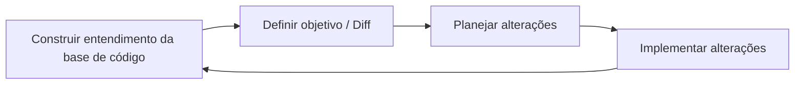
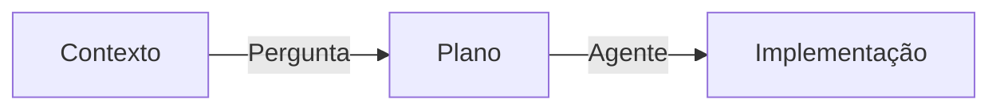
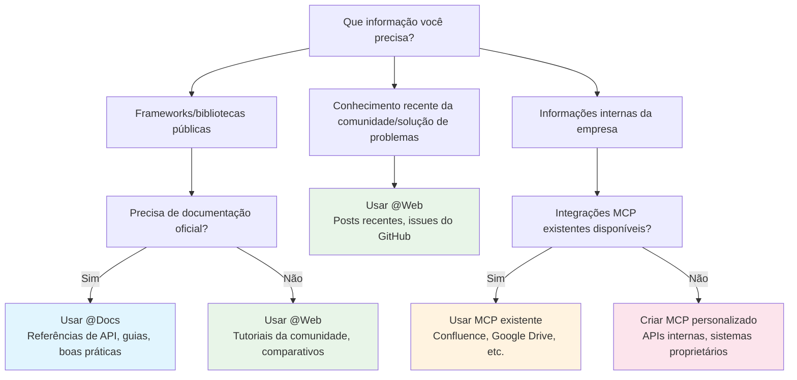
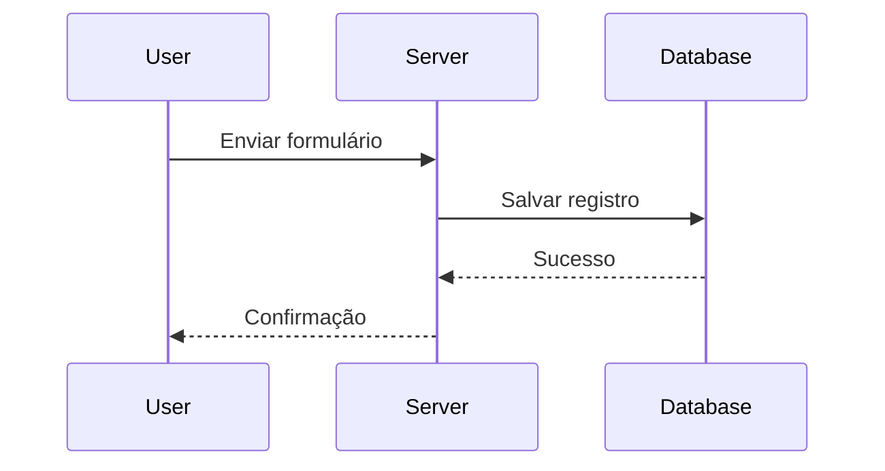
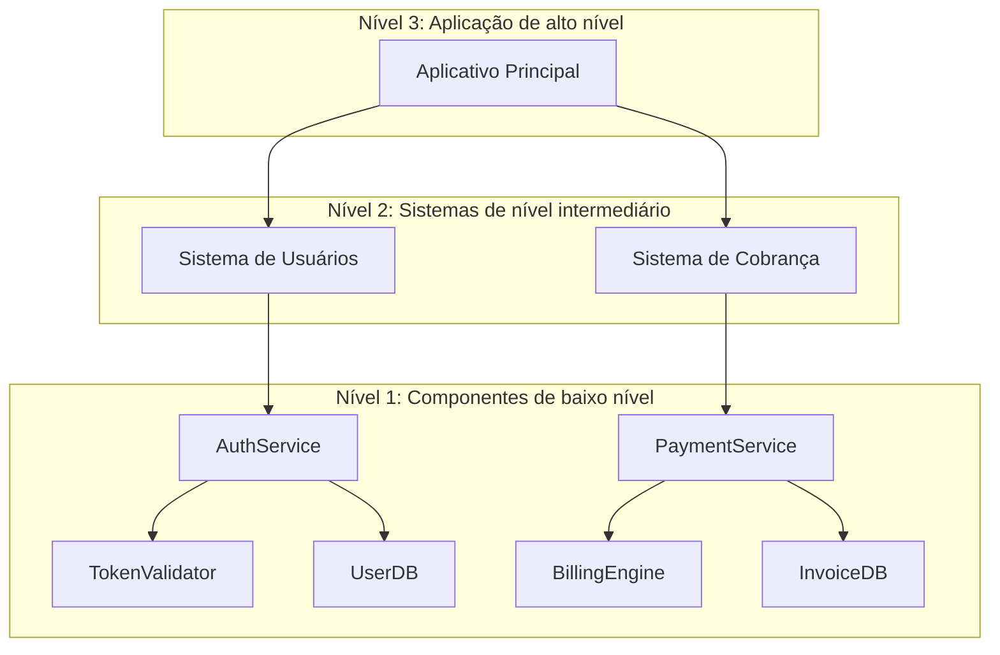
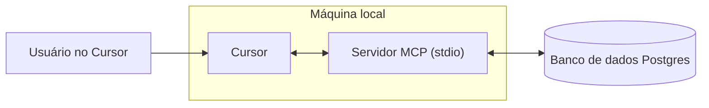
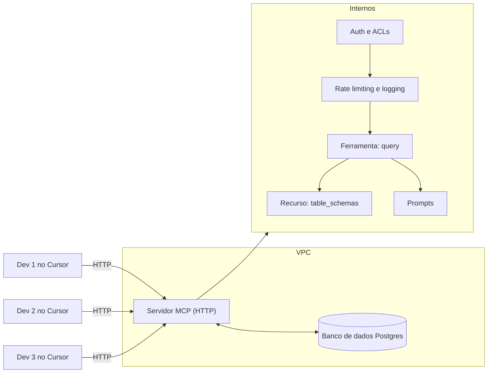
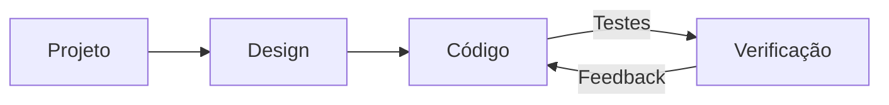
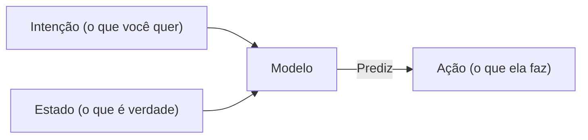

# @Arquivos & Pastas

**Navigation:** [← Previous](./27-primeiros-passos.md) | [Index](./index.md) | [Next →](./29-edição-inline.md)

---

# @Arquivos & Pastas
Source: https://docs.cursor.com/pt-BR/context/@-symbols/@-files-and-folders

Referencia arquivos e pastas como contexto no Chat e no Inline Edit

export const Kbd = ({children, tooltip, os}) => {
  const keysInput = typeof children === 'string' && children.trim() !== '' ? children : null;
  if (!keysInput) {
    return null;
  }
  const isModifier = key => {
    const modifiers = ['⌘', '⇧', '⌥', '⌃', '⏎', '⌫', '⌦', '⎋', '⇥', '⌁', '←', '→', '↑', '↓', 'Ctrl', 'Shift', 'Alt', 'Cmd', 'Opt', 'Return', 'Backspace', 'Delete', 'Escape', 'Tab', 'Space', 'Enter', 'Esc', 'ArrowLeft', 'ArrowRight', 'ArrowUp', 'ArrowDown', 'Left', 'Right', 'Up', 'Down'];
    return modifiers.includes(key.trim());
  };
  const capitalizeFirstLetter = string => {
    return string.charAt(0).toUpperCase() + string.slice(1);
  };
  const isMac = os ? os.toLowerCase() === 'mac' || os.toLowerCase() === 'macos' : typeof navigator !== 'undefined' && (navigator.platform.toUpperCase().indexOf('MAC') >= 0 || navigator.userAgent.toUpperCase().indexOf('MAC') >= 0);
  const convertToSymbols = shortcut => {
    if (isMac) {
      return shortcut.replace(/⌘|Cmd|CMD/gi, '⌘').replace(/⌥|Opt|OPT/gi, '⌥').replace(/⌃|Ctrl/gi, '⌃').replace(/⇧|Shift/gi, '⇧').replace(/⏎|Return/gi, '⏎').replace(/⌫|Backspace/gi, '⌫').replace(/⌦|Delete/gi, '⌦').replace(/␛|Escape/gi, '␛').replace(/⇥|Tab/gi, '⇥').replace(/⌁|Space/gi, '⌁').replace(/←|Arrow\s*Left|ArrowLeft|Left/gi, '←').replace(/→|Arrow\s*Right|ArrowRight|Right/gi, '→').replace(/↑|Arrow\s*Up|ArrowUp|Up/gi, '↑').replace(/↓|Arrow\s*Down|ArrowDown|Down/gi, '↓');
    } else {
      const converted = shortcut.replace(/⌘|Cmd|CMD/gi, 'Ctrl').replace(/⌥|Opt|OPT/gi, 'Alt').replace(/⌃|Ctrl/gi, 'Ctrl').replace(/⇧|Shift/gi, 'Shift').replace(/⏎|Return/gi, 'Enter').replace(/⌫|Backspace/gi, 'Backspace').replace(/⌦|Delete/gi, 'Delete').replace(/⎋|Escape/gi, 'Esc').replace(/⇥|Tab/gi, 'Tab').replace(/⌁|Space/gi, 'Space').replace(/←|Arrow\s*Left|ArrowLeft|Left/gi, 'Arrow-Left').replace(/→|Arrow\s*Right|ArrowRight|Right/gi, 'Arrow-Right').replace(/↑|Arrow\s*Up|ArrowUp|Up/gi, 'Arrow-Up').replace(/↓|Arrow\s*Down|ArrowDown|Down/gi, 'Arrow-Down');
      const keyList = converted.split(/[\+\s]+/).filter(key => key.trim());
      return keyList.join('+');
    }
  };
  const convertToReadableText = shortcut => {
    const converted = shortcut.replace(/⌘|Cmd|CMD/gi, 'Cmd').replace(/⌥|Opt|OPT/gi, 'Opt').replace(/⌃|Ctrl/gi, 'Ctrl').replace(/⇧|Shift/gi, 'Shift').replace(/⏎|Return/gi, 'Return').replace(/⌫|Backspace/gi, 'Backspace').replace(/⌦|Delete/gi, 'Delete').replace(/⎋|Escape/gi, 'Escape').replace(/⇥|Tab/gi, 'Tab').replace(/⌁|Space/gi, 'Space').replace(/←|Arrow\s*Left|ArrowLeft|Left/gi, 'Arrow-Left').replace(/→|Arrow\s*Right|ArrowRight|Right/gi, 'Arrow-Right').replace(/↑|Arrow\s*Up|ArrowUp|Up/gi, 'Arrow-Up').replace(/↓|Arrow\s*Down|ArrowDown|Down/gi, 'Arrow-Down');
    const keyList = converted.split(/[\+\s]+/).filter(key => key.trim());
    return keyList.map(key => {
      const trimmedKey = key.trim();
      return isModifier(trimmedKey) ? trimmedKey : capitalizeFirstLetter(trimmedKey);
    }).join('+');
  };
  const displayShortcut = convertToSymbols(keysInput);
  const tooltipText = isMac ? tooltip ? `${convertToReadableText(keysInput)}: ${tooltip}` : convertToReadableText(keysInput) : tooltip || null;
  const processedKeys = isMac ? displayShortcut.split(/[\+\s]+/).filter(key => key.trim()).map(key => {
    const trimmedKey = key.trim();
    return isModifier(trimmedKey) ? trimmedKey : capitalizeFirstLetter(trimmedKey);
  }).join('') : displayShortcut.split('+').map(key => {
    const trimmedKey = key.trim();
    return isModifier(trimmedKey) ? trimmedKey : capitalizeFirstLetter(trimmedKey);
  }).join('+');
  return tooltipText ? <Tooltip tip={tooltipText}>
      <kbd>
        {processedKeys}
      </kbd>
    </Tooltip> : <kbd>
      {processedKeys}
    </kbd>;
};

<div id="files">
  ## Arquivos
</div>

Faz referência a arquivos inteiros no Chat e no Inline Edit selecionando `@Files & Folders` e, em seguida, o nome do arquivo para pesquisar. Você também pode arrastar arquivos da barra lateral diretamente para o Agent para adicioná-los como contexto.

<Frame>
  
</Frame>

<div id="folders">
  ## Pastas
</div>

Ao referenciar pastas usando `@Folders`, o Cursor fornece o caminho da pasta e uma visão geral do conteúdo para ajudar a IA a entender o que está disponível.

<Tip>
  Depois de selecionar uma pasta, digita “/” para navegar mais a fundo e ver todas as subpastas.
</Tip>

<Frame>
  
</Frame>

<div id="full-folder-content">
  ### Conteúdo completo da pasta
</div>

Ativa **Conteúdo completo da pasta** nas configurações. Quando ativado, o Cursor tenta incluir todos os arquivos da pasta no contexto.

<Frame>
  
</Frame>

Para pastas grandes que excedem a janela de contexto, aparece uma visualização em lista com um tooltip mostrando quantos arquivos foram incluídos, enquanto o Cursor gerencia o espaço de contexto disponível.

<Note>
  Usar conteúdo completo da pasta com o [Max mode habilitado](/pt-BR/context/max-mode)
  aumenta significativamente os custos da requisição, já que mais tokens de entrada são consumidos.
</Note>

<div id="context-management">
  ## Gerenciamento de contexto
</div>

Arquivos e pastas grandes são automaticamente condensados para se ajustarem aos limites de contexto. Confira [condensação de arquivos e pastas](/pt-BR/agent/chats/summarization#file--folder-condensation) para mais detalhes.


# @Git
Source: https://docs.cursor.com/pt-BR/context/@-symbols/@-git

Referenciar alterações no Git e diferenças entre branches

<Frame>
  
</Frame>

* `@Commit`: Faz referência às alterações do estado de trabalho atual em comparação com o último commit. Mostra todos os arquivos modificados, adicionados e removidos que ainda não foram confirmados.
* `@Branch`: Compara as alterações da tua branch atual com a branch main. Mostra todos os commits e alterações na tua branch que não estão na main.


# @Link
Source: https://docs.cursor.com/pt-BR/context/@-symbols/@-link

Incluir conteúdo da web colando URLs

Quando você cola uma URL no Chat, o Cursor a marca automaticamente como `@Link` e busca o conteúdo para usar como contexto. Isso inclui suporte a documentos PDF — o Cursor extrai e faz o parse do texto de qualquer URL de PDF publicamente acessível.

<Frame>
  
</Frame>

<div id="unlink">
  ## Remover link
</div>

Pra usar uma URL como texto simples sem buscar o conteúdo:

* Clica no link marcado e seleciona `Remover link`
* Ou cola segurando `Shift` pra evitar a marcação automática

<Frame>
  
</Frame>


# @Linter Errors
Source: https://docs.cursor.com/pt-BR/context/@-symbols/@-linter-errors

Acesse e consulte erros de lint na sua base de código

O símbolo `@Linter Errors` captura automaticamente e fornece contexto sobre erros e avisos de lint do teu arquivo ativo no momento. O [Agent](/pt-BR/agent/overview) já consegue ver erros de lint por padrão.

<Note>
  Para que os erros do linter fiquem visíveis, tu precisa ter o language server
  apropriado instalado e configurado para a tua linguagem de programação. O Cursor detecta
  e usa automaticamente os language servers instalados, mas tu pode precisar instalar
  extensões ou ferramentas adicionais para linguagens específicas.
</Note>

<Frame>
  
</Frame>


# @Past Chats
Source: https://docs.cursor.com/pt-BR/context/@-symbols/@-past-chats

Incluir chats resumidos do histórico

Quando estiver trabalhando em tarefas complexas no [Chat](/pt-BR/chat), talvez precise consultar contexto ou decisões de conversas anteriores. O símbolo `@Past Chats` inclui versões resumidas de chats anteriores como contexto.

É especialmente útil quando:

* você tem uma sessão longa de Chat com contexto importante para consultar
* você está começando uma nova tarefa relacionada e quer manter a continuidade
* você quer compartilhar o raciocínio ou decisões de uma sessão anterior

<Frame>
  
</Frame>


# @Recent Changes
Source: https://docs.cursor.com/pt-BR/context/@-symbols/@-recent-changes

Inclui código recentemente modificado como contexto

O símbolo `@Recent Changes` inclui modificações recentes no código como contexto em conversas com IA.

* As alterações são ordenadas cronologicamente
* Prioriza as 10 alterações mais recentes
* Respeita as configurações do `.cursorignore`

<Frame>
  
</Frame>


# @Web
Source: https://docs.cursor.com/pt-BR/context/@-symbols/@-web

Pesquise na web por informações atualizadas

Com o `@Web`, o Cursor pesquisa na web usando o [exa.ai](https://exa.ai) para encontrar informações atualizadas e adicioná-las como contexto. Isso inclui a capacidade de processar arquivos PDF a partir de links diretos.

<Note>
  A pesquisa na web fica desativada por padrão. Ativa em Settings → Features → Web Search.
</Note>

<Frame>
  
</Frame>


# Visão geral
Source: https://docs.cursor.com/pt-BR/context/@-symbols/overview

Faz referência a código, arquivos e documentação usando símbolos @

Navega pelas sugestões com as setas. Pressiona `Enter` para selecionar. Se a sugestão for uma categoria como `Files`, as sugestões são filtradas para mostrar os itens mais relevantes dentro dessa categoria.

<Frame>
  
</Frame>

Aqui está a lista de todos os símbolos @ disponíveis:

* [@Files](/pt-BR/context/@-symbols/@-files) - Faz referência a arquivos específicos no teu projeto
* [@Folders](/pt-BR/context/@-symbols/@-folders) - Faz referência a pastas inteiras para um contexto mais amplo
* [@Code](/pt-BR/context/@-symbols/@-code) - Faz referência a trechos de código ou símbolos específicos da tua base de código
* [@Docs](/pt-BR/context/@-symbols/@-docs) - Acessa documentação e guias
* [@Git](/pt-BR/context/@-symbols/@-git) - Acessa o histórico e as mudanças do Git
* [@Past Chats](/pt-BR/context/@-symbols/@-past-chats) - Trabalha com sessões do Composer resumidas
* [@Cursor Rules](/pt-BR/context/@-symbols/@-cursor-rules) - Trabalha com as regras do Cursor
* [@Web](/pt-BR/context/@-symbols/@-web) - Faz referência a recursos e documentação externos da web
* [@Link (paste)](/pt-BR/context/@-symbols/@-link) - Cria links para trechos específicos de código ou documentação
* [@Recent Changes](/pt-BR/context/@-symbols/@-recent-changes) - Cria links para alterações recentes em código ou documentação
* [@Lint Errors](/pt-BR/context/@-symbols/@-lint-errors) - Faz referência a erros de lint (somente no [Chat](/pt-BR/chat/overview))
* [@Definitions](/pt-BR/context/@-symbols/@-definitions) - Consulta definições de símbolos (somente no [Inline Edit](/pt-BR/inline-edit/overview))
* [# Files](/pt-BR/context/@-symbols/pill-files) - Adiciona arquivos ao contexto sem referenciá-los
* [/ Commands](/pt-BR/context/@-symbols/slash-commands) - Adiciona arquivos abertos e ativos ao contexto


# #Files
Source: https://docs.cursor.com/pt-BR/context/@-symbols/pill-files

Seleciona arquivos específicos usando o prefixo #

Usa `#` seguido do nome do arquivo pra focar em arquivos específicos. Combina com símbolos `@` pra ter controle de contexto preciso.

<Frame>
  
</Frame>


# /command
Source: https://docs.cursor.com/pt-BR/context/@-symbols/slash-commands

Comandos rápidos para adicionar arquivos e controlar o contexto

O comando `/` dá acesso rápido às abas abertas do editor, permitindo adicionar vários arquivos como contexto.

<Frame>
  
</Frame>

<div id="commands">
  ## Comandos
</div>

* **`/Reset Context`**: Restaura o contexto para o estado padrão
* **`/Generate Cursor Rules`**: Gera regras que o Cursor deve seguir
* **`/Disable Iterate on Lints`**: Não vai tentar corrigir erros e avisos do linter
* **`/Add Open Files to Context`**: Adiciona todas as abas do editor que estão abertas no momento ao contexto
* **`/Add Active Files to Context`**: Adiciona ao contexto todas as abas do editor atualmente visíveis (útil com layouts divididos)


# Indexação da codebase
Source: https://docs.cursor.com/pt-BR/context/codebase-indexing

Como o Cursor aprende tua codebase para entender melhor

O Cursor indexa tua codebase calculando embeddings para cada arquivo. Isso melhora as respostas geradas por IA sobre teu código. Quando tu abres um projeto, o Cursor começa a indexação automaticamente. Novos arquivos são indexados de forma incremental.
Confere o status da indexação em: `Cursor Settings` > `Indexing & Docs`

<Frame>
  
</Frame>

<div id="configuration">
  ## Configuração
</div>

O Cursor indexa todos os arquivos, exceto aqueles nos [arquivos de ignore](/pt-BR/context/ignore-files) (por exemplo, `.gitignore`, `.cursorignore`).

Clica em `Show Settings` para:

* Habilitar a indexação automática para novos repositórios
* Configurar quais arquivos ignorar

<Tip>
  [Ignorar arquivos de conteúdo grandes](/pt-BR/context/ignore-files) melhora a
  precisão das respostas.
</Tip>

<div id="view-indexed-files">
  ### Ver arquivos indexados
</div>

Pra ver os caminhos dos arquivos indexados: `Cursor Settings` > `Indexing & Docs` > `View included files`

Isso abre um arquivo `.txt` com a lista de todos os arquivos indexados.

<div id="multi-root-workspaces">
  ## Workspaces multirraiz
</div>

O Cursor oferece suporte a [workspaces multirraiz](https://code.visualstudio.com/docs/editor/workspaces#_multiroot-workspaces), permitindo trabalhar com vários codebases:

* Todos os codebases são indexados automaticamente
* O contexto de cada codebase fica disponível para a IA
* `.cursor/rules` funciona em todas as pastas

<div id="pr-search">
  ## Busca de PR
</div>

A busca de PR ajuda a entender a evolução do seu código, tornando mudanças históricas pesquisáveis e acessíveis via IA.

<div id="how-it-works">
  ### Como funciona
</div>

O Cursor **indexa automaticamente todos os PRs mergeados** do histórico do seu repositório. Os resumos aparecem nos resultados da busca semântica, com filtragem inteligente para priorizar mudanças recentes.

O Agent pode **trazer PRs, commits, issues ou branches** para o contexto usando `@[PR number]`, `@[commit hash]` ou `@[branch name]`. Inclui comentários do GitHub e revisões do Bugbot quando conectado.

O **suporte de plataforma** inclui GitHub, GitHub Enterprise e Bitbucket. GitLab não é suportado no momento.

<Note>
  Usuários do GitHub Enterprise: a ferramenta de fetch recorre a comandos do git devido a
  limitações de autenticação do VSCode.
</Note>

<div id="using-pr-search">
  ### Usando a busca de PR
</div>

Faz perguntas como "Como os serviços são implementados em outros PRs?" e o Agent vai buscar automaticamente PRs relevantes para o contexto e fornecer respostas completas com base no histórico do teu repositório.

<div id="faq">
  ## FAQ
</div>

<AccordionGroup>
  <Accordion title="Where can I see all indexed codebases?">
    Ainda não existe uma lista global. Confere cada projeto individualmente abrindo ele no
    Cursor e olhando as configurações de Indexação da Codebase.
  </Accordion>

  <Accordion title="How do I delete all indexed codebases?">
    Exclui tua conta do Cursor em Configurações para remover todas as codebases indexadas.
    Caso contrário, exclui codebases individuais nas configurações de Indexação da Codebase
    de cada projeto.
  </Accordion>

  <Accordion title="How long are indexed codebases retained?">
    As codebases indexadas são excluídas após 6 semanas de inatividade. Reabrir o
    projeto dispara a reindexação.
  </Accordion>

  <Accordion title="Is my source code stored on Cursor servers?">
    Não. O Cursor cria embeddings sem armazenar nomes de arquivo ou código-fonte. Os nomes de arquivo são ofuscados e os trechos de código são criptografados.

    Quando o Agent pesquisa a codebase, o Cursor recupera os embeddings do servidor e descriptografa os trechos.
  </Accordion>
</AccordionGroup>


# Ignorar arquivos
Source: https://docs.cursor.com/pt-BR/context/ignore-files

Controle o acesso a arquivos com .cursorignore e .cursorindexingignore

<div id="overview">
  ## Visão geral
</div>

O Cursor lê e indexa o código do teu projeto para alimentar seus recursos. Controla quais diretórios e arquivos o Cursor pode acessar usando um arquivo `.cursorignore` no teu diretório raiz.

O Cursor bloqueia o acesso a arquivos listados em `.cursorignore` em:

* Indexação do código
* Código acessível pelo [Tab](/pt-BR/tab/overview), [Agent](/pt-BR/agent/overview) e [Inline Edit](/pt-BR/inline-edit/overview)
* Código acessível via [referências com o símbolo @](/pt-BR/context/@-symbols/overview)

<Warning>
  Chamadas de ferramentas iniciadas pelo Agent, como o terminal e servidores MCP, não conseguem bloquear
  o acesso ao código regido por `.cursorignore`
</Warning>

<div id="why-ignore-files">
  ## Por que ignorar arquivos?
</div>

**Segurança**: Restringe o acesso a chaves de API, credenciais e segredos. Embora o Cursor bloqueie arquivos ignorados, não há garantia de proteção total devido à imprevisibilidade dos LLMs.

**Desempenho**: Em codebases grandes ou monorepos, exclui trechos irrelevantes para uma indexação mais rápida e uma descoberta de arquivos mais precisa.

<div id="global-ignore-files">
  ## Arquivos de ignore globais
</div>

Define padrões de ignore para todos os projetos nas configurações do usuário e exclui arquivos sensíveis sem precisar configurar por projeto.

<Frame>
  
</Frame>

Os padrões incluídos por padrão são:

* Arquivos de ambiente: `**/.env`, `**/.env.*`
* Credenciais: `**/credentials.json`, `**/secrets.json`
* Chaves: `**/*.key`, `**/*.pem`, `**/id_rsa`

<div id="configuring-cursorignore">
  ## Configurando `.cursorignore`
</div>

Cria um arquivo `.cursorignore` no diretório raiz usando a sintaxe do `.gitignore`.

<div id="pattern-examples">
  ### Exemplos de padrões
</div>

```sh  theme={null}
config.json      # Arquivo específico
dist/           # Diretório
*.log           # Extensão de arquivo
**/logs         # Diretórios em qualquer nível
!app/           # Não ignorar (negação)
```

<div id="hierarchical-ignore">
  ### Ignorar hierárquico
</div>

Ativa `Cursor Settings` > `Features` > `Editor` > `Hierarchical Cursor Ignore` para procurar `.cursorignore` nos diretórios pai.

**Notas**: Comentários começam com `#`. Padrões mais abaixo substituem os anteriores. Os padrões são relativos ao caminho do arquivo.

<div id="limit-indexing-with-cursorindexingignore">
  ## Limitar a indexação com `.cursorindexingignore`
</div>

Usa `.cursorindexingignore` para excluir arquivos apenas da indexação. Esses arquivos continuam acessíveis para os recursos de IA, mas não vão aparecer nas buscas na codebase.

<div id="files-ignored-by-default">
  ## Arquivos ignorados por padrão
</div>

O Cursor ignora automaticamente os arquivos no `.gitignore` e na lista padrão abaixo. Dá pra sobrescrever usando o prefixo `!` em `.cursorignore`.

<Accordion title="Lista padrão de ignorados">
  Somente para indexação, estes arquivos são ignorados além dos do teu `.gitignore`, `.cursorignore` e `.cursorindexingignore`:

  ```sh  theme={null}
  package-lock.json
  pnpm-lock.yaml
  yarn.lock
  composer.lock
  Gemfile.lock
  bun.lockb
  .env*
  .git/
  .svn/
  .hg/
  *.lock
  *.bak
  *.tmp
  *.bin
  *.exe
  *.dll
  *.so
  *.lockb
  *.qwoff
  *.isl
  *.csv
  *.pdf
  *.doc
  *.doc
  *.xls
  *.xlsx
  *.ppt
  *.pptx
  *.odt
  *.ods
  *.odp
  *.odg
  *.odf
  *.sxw
  *.sxc
  *.sxi
  *.sxd
  *.sdc
  *.jpg
  *.jpeg
  *.png
  *.gif
  *.bmp
  *.tif
  *.mp3
  *.wav
  *.wma
  *.ogg
  *.flac
  *.aac
  *.mp4
  *.mov
  *.wmv
  *.flv
  *.avi
  *.zip
  *.tar
  *.gz
  *.7z
  *.rar
  *.tgz
  *.dmg
  *.iso
  *.cue
  *.mdf
  *.mds
  *.vcd
  *.toast
  *.img
  *.apk
  *.msi
  *.cab
  *.tar.gz
  *.tar.xz
  *.tar.bz2
  *.tar.lzma
  *.tar.Z
  *.tar.sz
  *.lzma
  *.ttf
  *.otf
  *.pak
  *.woff
  *.woff2
  *.eot
  *.webp
  *.vsix
  *.rmeta
  *.rlib
  *.parquet
  *.svg
  .egg-info/
  .venv/
  node_modules/
  __pycache__/
  .next/
  .nuxt/
  .cache/
  .sass-cache/
  .gradle/
  .DS_Store/
  .ipynb_checkpoints/
  .pytest_cache/
  .mypy_cache/
  .tox/
  .git/
  .hg/
  .svn/
  .bzr/
  .lock-wscript/
  .Python/
  .jupyter/
  .history/
  .yarn/
  .yarn-cache/
  .eslintcache/
  .parcel-cache/
  .cache-loader/
  .nyc_output/
  .node_repl_history/
  .pnp.js/
  .pnp/
  ```
</Accordion>

<div id="negation-pattern-limitations">
  ### Limitações dos padrões de negação
</div>

Ao usar padrões de negação (prefixados com `!`), não tem como reincluir um arquivo se um diretório pai foi excluído via `*`.

```sh  theme={null}

# Ignorar todos os arquivos na pasta public
public/*


# ✅ Isso funciona, pois o arquivo existe na raiz
!public/index.html


# ❌ Isso não funciona — não é possível reincluir arquivos de subdiretórios
!public/assets/style.css
```

**Solução alternativa**: Excluir explicitamente diretórios aninhados:

```sh  theme={null}
public/assets/*
!public/assets/style.css # Este arquivo agora está acessível
```

Diretórios excluídos não são percorridos por questões de desempenho, então padrões aplicados aos arquivos dentro deles não têm efeito.
Isso corresponde à implementação do .gitignore para padrões de negação em diretórios aninhados. Para mais detalhes, confere a [documentação oficial do Git sobre padrões do gitignore](https://git-scm.com/docs/gitignore).

<div id="troubleshooting">
  ## Solução de problemas
</div>

Testa os padrões com `git check-ignore -v [arquivo]`.


# Model Context Protocol (MCP)
Source: https://docs.cursor.com/pt-BR/context/mcp

Conecta ferramentas externas e fontes de dados ao Cursor com o MCP

export const Kbd = ({children, tooltip, os}) => {
  const keysInput = typeof children === 'string' && children.trim() !== '' ? children : null;
  if (!keysInput) {
    return null;
  }
  const isModifier = key => {
    const modifiers = ['⌘', '⇧', '⌥', '⌃', '⏎', '⌫', '⌦', '⎋', '⇥', '⌁', '←', '→', '↑', '↓', 'Ctrl', 'Shift', 'Alt', 'Cmd', 'Opt', 'Return', 'Backspace', 'Delete', 'Escape', 'Tab', 'Space', 'Enter', 'Esc', 'ArrowLeft', 'ArrowRight', 'ArrowUp', 'ArrowDown', 'Left', 'Right', 'Up', 'Down'];
    return modifiers.includes(key.trim());
  };
  const capitalizeFirstLetter = string => {
    return string.charAt(0).toUpperCase() + string.slice(1);
  };
  const isMac = os ? os.toLowerCase() === 'mac' || os.toLowerCase() === 'macos' : typeof navigator !== 'undefined' && (navigator.platform.toUpperCase().indexOf('MAC') >= 0 || navigator.userAgent.toUpperCase().indexOf('MAC') >= 0);
  const convertToSymbols = shortcut => {
    if (isMac) {
      return shortcut.replace(/⌘|Cmd|CMD/gi, '⌘').replace(/⌥|Opt|OPT/gi, '⌥').replace(/⌃|Ctrl/gi, '⌃').replace(/⇧|Shift/gi, '⇧').replace(/⏎|Return/gi, '⏎').replace(/⌫|Backspace/gi, '⌫').replace(/⌦|Delete/gi, '⌦').replace(/␛|Escape/gi, '␛').replace(/⇥|Tab/gi, '⇥').replace(/⌁|Space/gi, '⌁').replace(/←|Arrow\s*Left|ArrowLeft|Left/gi, '←').replace(/→|Arrow\s*Right|ArrowRight|Right/gi, '→').replace(/↑|Arrow\s*Up|ArrowUp|Up/gi, '↑').replace(/↓|Arrow\s*Down|ArrowDown|Down/gi, '↓');
    } else {
      const converted = shortcut.replace(/⌘|Cmd|CMD/gi, 'Ctrl').replace(/⌥|Opt|OPT/gi, 'Alt').replace(/⌃|Ctrl/gi, 'Ctrl').replace(/⇧|Shift/gi, 'Shift').replace(/⏎|Return/gi, 'Enter').replace(/⌫|Backspace/gi, 'Backspace').replace(/⌦|Delete/gi, 'Delete').replace(/⎋|Escape/gi, 'Esc').replace(/⇥|Tab/gi, 'Tab').replace(/⌁|Space/gi, 'Space').replace(/←|Arrow\s*Left|ArrowLeft|Left/gi, 'Arrow-Left').replace(/→|Arrow\s*Right|ArrowRight|Right/gi, 'Arrow-Right').replace(/↑|Arrow\s*Up|ArrowUp|Up/gi, 'Arrow-Up').replace(/↓|Arrow\s*Down|ArrowDown|Down/gi, 'Arrow-Down');
      const keyList = converted.split(/[\+\s]+/).filter(key => key.trim());
      return keyList.join('+');
    }
  };
  const convertToReadableText = shortcut => {
    const converted = shortcut.replace(/⌘|Cmd|CMD/gi, 'Cmd').replace(/⌥|Opt|OPT/gi, 'Opt').replace(/⌃|Ctrl/gi, 'Ctrl').replace(/⇧|Shift/gi, 'Shift').replace(/⏎|Return/gi, 'Return').replace(/⌫|Backspace/gi, 'Backspace').replace(/⌦|Delete/gi, 'Delete').replace(/⎋|Escape/gi, 'Escape').replace(/⇥|Tab/gi, 'Tab').replace(/⌁|Space/gi, 'Space').replace(/←|Arrow\s*Left|ArrowLeft|Left/gi, 'Arrow-Left').replace(/→|Arrow\s*Right|ArrowRight|Right/gi, 'Arrow-Right').replace(/↑|Arrow\s*Up|ArrowUp|Up/gi, 'Arrow-Up').replace(/↓|Arrow\s*Down|ArrowDown|Down/gi, 'Arrow-Down');
    const keyList = converted.split(/[\+\s]+/).filter(key => key.trim());
    return keyList.map(key => {
      const trimmedKey = key.trim();
      return isModifier(trimmedKey) ? trimmedKey : capitalizeFirstLetter(trimmedKey);
    }).join('+');
  };
  const displayShortcut = convertToSymbols(keysInput);
  const tooltipText = isMac ? tooltip ? `${convertToReadableText(keysInput)}: ${tooltip}` : convertToReadableText(keysInput) : tooltip || null;
  const processedKeys = isMac ? displayShortcut.split(/[\+\s]+/).filter(key => key.trim()).map(key => {
    const trimmedKey = key.trim();
    return isModifier(trimmedKey) ? trimmedKey : capitalizeFirstLetter(trimmedKey);
  }).join('') : displayShortcut.split('+').map(key => {
    const trimmedKey = key.trim();
    return isModifier(trimmedKey) ? trimmedKey : capitalizeFirstLetter(trimmedKey);
  }).join('+');
  return tooltipText ? <Tooltip tip={tooltipText}>
      <kbd>
        {processedKeys}
      </kbd>
    </Tooltip> : <kbd>
      {processedKeys}
    </kbd>;
};

<div id="what-is-mcp">
  ## O que é o MCP?
</div>

[Model Context Protocol (MCP)](https://modelcontextprotocol.io/introduction) permite que o Cursor se conecte a ferramentas e fontes de dados externas.

<Frame>
  <video src="https://mintcdn.com/cursor/BfJOqJ1Wb8EvuXyr/images/context/mcp/simple-mcp-call.mp4?fit=max&auto=format&n=BfJOqJ1Wb8EvuXyr&q=85&s=08c642babc501c939ecbec9ef5124ce7" autoPlay loop muted playsInline controls data-path="images/context/mcp/simple-mcp-call.mp4" />
</Frame>

<div id="why-use-mcp">
  ### Por que usar MCP?
</div>

O MCP conecta o Cursor a sistemas e dados externos. Em vez de explicar a estrutura do teu projeto repetidamente, integra direto com as tuas ferramentas.

Escreve servidores MCP em qualquer linguagem que consiga imprimir em `stdout` ou expor um endpoint HTTP — Python, JavaScript, Go, etc.

<div id="how-it-works">
  ### Como funciona
</div>

Servidores MCP expõem funcionalidades por meio do protocolo, conectando o Cursor a ferramentas ou fontes de dados externas.

O Cursor oferece suporte a três métodos de transporte:

<div className="full-width-table">
  | Transporte                                                       | Ambiente de execução | Implantação             | Usuários           | Entrada                   | Autenticação |
  | :--------------------------------------------------------------- | :------------------- | :---------------------- | :----------------- | :------------------------ | :----------- |
  | **<span className="whitespace-nowrap">`stdio`</span>**           | Local                | Gerenciado pelo Cursor  | Usuário único      | Comando de shell          | Manual       |
  | **<span className="whitespace-nowrap">`SSE`</span>**             | Local/Remoto         | Implantar como servidor | Múltiplos usuários | URL para um endpoint SSE  | OAuth        |
  | **<span className="whitespace-nowrap">`Streamable HTTP`</span>** | Local/Remoto         | Implantar como servidor | Múltiplos usuários | URL para um endpoint HTTP | OAuth        |
</div>

<div id="protocol-support">
  ### Suporte ao protocolo
</div>

O Cursor oferece suporte a estes recursos do protocolo MCP:

<div className="full-width-table">
  | Recurso         | Suporte   | Descrição                                                                                         |
  | :-------------- | :-------- | :------------------------------------------------------------------------------------------------ |
  | **Tools**       | Suportado | Funções que o modelo de IA pode executar                                                          |
  | **Prompts**     | Suportado | Mensagens e fluxos de trabalho baseados em templates para usuários                                |
  | **Resources**   | Suportado | Fontes de dados estruturadas que podem ser lidas e referenciadas                                  |
  | **Roots**       | Suportado | Consultas iniciadas pelo servidor sobre limites de URI ou do sistema de arquivos nos quais operar |
  | **Elicitation** | Suportado | Solicitações iniciadas pelo servidor para obter informações adicionais dos usuários               |
</div>

<div id="installing-mcp-servers">
  ## Instalação de servidores MCP
</div>

<div id="one-click-installation">
  ### Instalação com um clique
</div>

Instala servidores MCP da nossa coleção e faz a autenticação com OAuth.

<Columns cols={2}>
  <Card title="Navegar por Ferramentas MCP" icon="table" horizontal href="/pt-BR/tools">
    Navega pelos servidores MCP disponíveis
  </Card>

  <Card title="Botão Adicionar ao Cursor" icon="plus" horizontal href="/pt-BR/deeplinks">
    Cria um botão "Adicionar ao Cursor"
  </Card>
</Columns>

<div id="using-mcpjson">
  ### Usando `mcp.json`
</div>

Configura servidores MCP personalizados com um arquivo JSON:

<CodeGroup>
  ```json CLI Server - Node.js theme={null}
  {
    "mcpServers": {
      "server-name": {
        "command": "npx",
        "args": ["-y", "mcp-server"],
        "env": {
          "API_KEY": "value"
        }
      }
    }
  }
  ```

  ```json CLI Server - Python theme={null}
  {
    "mcpServers": {
      "server-name": {
        "command": "python",
        "args": ["mcp-server.py"],
        "env": {
          "API_KEY": "value"
        }
      }
    }
  }
  ```

  ```json Remote Server theme={null}
  // Servidor MCP usando HTTP ou SSE - executado em um servidor
  {
    "mcpServers": {
      "server-name": {
        "url": "http://localhost:3000/mcp",
        "headers": {
          "API_KEY": "value"
        }
      }
    }
  }
  ```
</CodeGroup>

<div id="stdio-server-configuration">
  ### Configuração do servidor STDIO
</div>

Para servidores STDIO (servidores locais de linha de comando), configura estes campos no teu `mcp.json`:

<div className="full-width-table">
  | Campo       | Obrigatório | Descrição                                                                                                                    | Exemplos                                  |
  | :---------- | :---------- | :--------------------------------------------------------------------------------------------------------------------------- | :---------------------------------------- |
  | **type**    | Sim         | Tipo de conexão do servidor                                                                                                  | `"stdio"`                                 |
  | **command** | Sim         | Comando para iniciar o executável do servidor. Precisa estar disponível no teu PATH do sistema ou conter o caminho completo. | `"npx"`, `"node"`, `"python"`, `"docker"` |
  | **args**    | Não         | Array de argumentos passados para o comando                                                                                  | `["server.py", "--port", "3000"]`         |
  | **env**     | Não         | Variáveis de ambiente para o servidor                                                                                        | `{"API_KEY": "${input:api-key}"}`         |
  | **envFile** | Não         | Caminho para um arquivo de ambiente para carregar mais variáveis                                                             | `".env"`, `"${workspaceFolder}/.env"`     |
</div>

<div id="using-the-extension-api">
  ### Usando a API de Extensão
</div>

Para registro programático de servidores MCP, o Cursor oferece uma API de Extensão que permite configuração dinâmica sem modificar arquivos `mcp.json`. Isso é especialmente útil para ambientes corporativos e fluxos de configuração automatizada.

<Card title="Referência da API de Extensão MCP" icon="code" href="/pt-BR/context/mcp-extension-api">
  Aprende como registrar servidores MCP programaticamente usando `vscode.cursor.mcp.registerServer()`
</Card>

<div id="configuration-locations">
  ### Locais de configuração
</div>

<CardGroup cols={2}>
  <Card title="Configuração do projeto" icon="folder-tree">
    Cria `.cursor/mcp.json` no teu projeto para ferramentas específicas do projeto.
  </Card>

  <Card title="Configuração global" icon="globe">
    Cria `~/.cursor/mcp.json` no teu diretório pessoal para ferramentas disponíveis em qualquer lugar.
  </Card>
</CardGroup>

<div id="config-interpolation">
  ### Interpolação de configuração
</div>

Usa variáveis nos valores de `mcp.json`. O Cursor resolve variáveis nesses campos: `command`, `args`, `env`, `url` e `headers`.

Sintaxe compatível:

* `${env:NAME}` variáveis de ambiente
* `${userHome}` caminho pra tua pasta inicial
* `${workspaceFolder}` raiz do projeto (a pasta que contém `.cursor/mcp.json`)
* `${workspaceFolderBasename}` nome da raiz do projeto
* `${pathSeparator}` e `${/}` separador de caminho do sistema operacional

Exemplos

```json  theme={null}
{
  "mcpServers": {
    "local-server": {
      "command": "python",
      "args": ["${workspaceFolder}/tools/mcp_server.py"],
      "env": {
        "API_KEY": "${env:API_KEY}"
      }
    }
  }
}
```

```json  theme={null}
{
  "mcpServers": {
    "remote-server": {
      "url": "https://api.example.com/mcp",
      "headers": {
        "Authorization": "Bearer ${env:MY_SERVICE_TOKEN}"
      }
    }
  }
}
```

<div id="authentication">
  ### Autenticação
</div>

Os servidores MCP usam variáveis de ambiente para autenticação. Passa as chaves de API e os tokens pela config.

O Cursor oferece suporte a OAuth para servidores que exigem isso.

<div id="using-mcp-in-chat">
  ## Usando MCP no chat
</div>

O Composer Agent usa automaticamente as ferramentas MCP listadas em `Available Tools` quando relevante. Pede uma ferramenta específica pelo nome ou descreve o que tu precisa. Ativa ou desativa ferramentas nas configurações.

<div id="toggling-tools">
  ### Alternar ferramentas
</div>

Ativa ou desativa ferramentas MCP direto na interface do chat. Clica no nome de uma ferramenta na lista para alternar. Ferramentas desativadas não são carregadas no contexto nem ficam disponíveis para o Agent.

<Frame>
  <video src="https://mintcdn.com/cursor/BfJOqJ1Wb8EvuXyr/images/context/mcp/tool-toggle.mp4?fit=max&auto=format&n=BfJOqJ1Wb8EvuXyr&q=85&s=0fa3060f593cae3e5fb7c7d2f041a715" autoPlay loop muted playsInline controls data-path="images/context/mcp/tool-toggle.mp4" />
</Frame>

<div id="tool-approval">
  ### Aprovação de ferramenta
</div>

Por padrão, o Agent pede aprovação antes de usar ferramentas MCP. Clica na seta ao lado do nome da ferramenta pra ver os argumentos.

<Frame></Frame>

<div id="auto-run">
  #### Execução automática
</div>

Ativa a execução automática para o Agent usar ferramentas MCP sem pedir confirmação. Funciona como comandos de terminal. Lê mais sobre as configurações de execução automática [aqui](/pt-BR/agent/tools#auto-run).

<div id="tool-response">
  ### Resposta da ferramenta
</div>

O Cursor exibe a resposta no chat com visões expansíveis dos argumentos e das respostas:

<Frame></Frame>

<div id="images-as-context">
  ### Imagens como contexto
</div>

Servidores MCP podem retornar imagens — capturas de tela, diagramas etc. Retorna elas como strings codificadas em base64:

```js  theme={null}
const RED_CIRCLE_BASE64 = "/9j/4AAQSkZJRgABAgEASABIAAD/2w...";
// ^ base64 completo truncado para facilitar a leitura

server.tool("generate_image", async (params) => {
  return {
    content: [
      {
        type: "image",
        data: RED_CIRCLE_BASE64,
        mimeType: "image/jpeg",
      },
    ],
  };
});
```

Veja este [servidor de exemplo](https://github.com/msfeldstein/mcp-test-servers/blob/main/src/image-server.js) para ver os detalhes de implementação. O Cursor anexa as imagens retornadas à conversa. Se o modelo tiver suporte a imagens, ele as analisa.

<div id="security-considerations">
  ## Considerações de segurança
</div>

Ao instalar servidores MCP, considera estas práticas de segurança:

* **Confere a origem**: Só instala servidores MCP de desenvolvedores e repositórios confiáveis
* **Revisa as permissões**: Verifica quais dados e APIs o servidor vai acessar
* **Limita as chaves de API**: Usa chaves de API restritas com as permissões mínimas necessárias
* **Audita o código**: Para integrações críticas, revisa o código-fonte do servidor

Lembra que servidores MCP podem acessar serviços externos e executar código em teu nome. Sempre entende o que um servidor faz antes da instalação.

<div id="real-world-examples">
  ## Exemplos do mundo real
</div>

Para ver exemplos práticos do MCP em ação, dá uma olhada no nosso [guia de desenvolvimento web](/pt-BR/guides/tutorials/web-development), que mostra como integrar Linear, Figma e ferramentas de navegador ao teu fluxo de desenvolvimento.

<div id="faq">
  ## FAQ
</div>

<AccordionGroup>
  <Accordion title="Qual é a função dos servidores MCP?">
    Servidores MCP conectam o Cursor a ferramentas externas como Google Drive,
    Notion e outros serviços para trazer documentos e requisitos pro seu fluxo
    de trabalho de código.
  </Accordion>

  {" "}

  <Accordion title="Como eu depuro problemas de servidor MCP?">
    Veja os logs do MCP assim: 1. Abre o painel Output no Cursor (<Kbd>Cmd+Shift+U</Kbd>)
    2\. Seleciona "MCP Logs" no menu dropdown 3. Procura por erros de conexão,
    problemas de autenticação ou travamentos do servidor. Os logs mostram a
    inicialização do servidor, chamadas de ferramentas e mensagens de erro.
  </Accordion>

  {" "}

  <Accordion title="Posso desativar temporariamente um servidor MCP?">
    Sim! Alterna servidores on/off sem remover: 1. Abre Settings (
    <Kbd>Cmd+Shift+J</Kbd>) 2. Vai em Features → Model Context Protocol 3. Clica
    no toggle ao lado de qualquer servidor pra ativar/desativar. Servidores
    desativados não carregam nem aparecem no chat. Isso é útil pra solucionar
    problemas ou reduzir a bagunça de ferramentas.
  </Accordion>

  {" "}

  <Accordion title="O que acontece se um servidor MCP travar ou expirar?">
    Se um servidor MCP falhar: - O Cursor mostra uma mensagem de erro no chat - A
    chamada de ferramenta é marcada como falha - Você pode tentar a operação de
    novo ou checar os logs pra detalhes - Outros servidores MCP continuam
    funcionando normalmente. O Cursor isola falhas de servidor pra evitar que um
    servidor afete os outros.
  </Accordion>

  {" "}

  <Accordion title="Como eu atualizo um servidor MCP?">
    Para servidores baseados em npm: 1. Remove o servidor nas configurações 2.
    Limpa o cache do npm: `npm cache clean --force` 3. Adiciona o servidor de
    novo pra obter a versão mais recente. Para servidores customizados, atualiza
    seus arquivos locais e reinicia o Cursor.
  </Accordion>

  <Accordion title="Posso usar servidores MCP com dados sensíveis?">
    Sim, mas segue as melhores práticas de segurança: - Usa variáveis de
    ambiente pra segredos, nunca faz hardcode - Executa servidores sensíveis
    localmente com transporte `stdio` - Limita as permissões das chaves de API
    ao mínimo necessário - Revisa o código do servidor antes de conectar a
    sistemas sensíveis - Considera executar servidores em ambientes isolados
  </Accordion>
</AccordionGroup>


# Memories
Source: https://docs.cursor.com/pt-BR/context/memories


Memories são regras geradas automaticamente com base nas tuas conversas no Chat. Essas memories são específicas do teu projeto e mantêm o contexto entre sessões.

<Frame>
  <video src="https://mintcdn.com/cursor/BfJOqJ1Wb8EvuXyr/images/context/rules/memories.mp4?fit=max&auto=format&n=BfJOqJ1Wb8EvuXyr&q=85&s=d10452508d962d7a9ec37de1c22245d1" alt="Memories no Cursor" controls data-path="images/context/rules/memories.mp4" />
</Frame>

<div id="how-memories-are-created">
  ## Como as memórias são criadas
</div>

1. **Observação via sidecar**: O Cursor usa uma abordagem de sidecar em que outro modelo observa tuas conversas e extrai automaticamente memórias relevantes. Isso acontece passivamente, em segundo plano, enquanto tu trabalhas. As memórias geradas em segundo plano exigem tua aprovação antes de serem salvas, garantindo confiança e controle sobre o que fica registrado.

2. **Chamadas de ferramentas**: O Agent pode criar memórias diretamente por meio de chamadas de ferramentas quando tu pedes explicitamente para lembrar algo ou quando ele percebe informações importantes que devem ser preservadas para sessões futuras.

<div id="manage-memories">
  ## Gerenciar memórias
</div>

Tu pode gerenciar memórias em Cursor Settings → Rules.


# Regras
Source: https://docs.cursor.com/pt-BR/context/rules

Controla como o modelo Agent se comporta com instruções reutilizáveis e com escopo.

Regras fornecem instruções em nível de sistema para o Agent e o Inline Edit. Pensa nelas como contexto persistente, preferências ou fluxos de trabalho pros teus projetos.

O Cursor oferece suporte a quatro tipos de regras:

<CardGroup cols={2}>
  <Card title="Project Rules" icon="folder-tree">
    Armazenadas em `.cursor/rules`, com controle de versão e com escopo pra tua base de código.
  </Card>

  <Card title="User Rules" icon="user">
    Globais no teu ambiente do Cursor. Definidas nas configurações e sempre aplicadas.
  </Card>

  <Card title="AGENTS.md" icon="robot">
    Instruções do Agent em formato Markdown. Alternativa simples a `.cursor/rules`.
  </Card>

  <Card title=".cursorrules (Legacy)" icon="clock-rotate-left">
    Ainda compatível, mas obsoleto. Usa Project Rules em vez disso.
  </Card>
</CardGroup>

<div id="how-rules-work">
  ## Como as regras funcionam
</div>

Modelos de linguagem grandes não mantêm memória entre respostas. As regras fornecem contexto persistente e reutilizável no nível do prompt.

Quando aplicadas, o conteúdo das regras é incluído no início do contexto do modelo. Isso dá à IA uma orientação consistente para gerar código, interpretar edições ou ajudar em fluxos de trabalho.

<Frame>
  
</Frame>

<Info>
  As regras se aplicam ao [Chat](/pt-BR/chat/overview) e ao [Inline
  Edit](/pt-BR/inline-edit/overview). Regras ativas aparecem na barra lateral do Agent.
</Info>

<div id="project-rules">
  ## Regras do projeto
</div>

As regras do projeto ficam em `.cursor/rules`. Cada regra é um arquivo e é controlada por versão. Elas podem ser aplicadas usando padrões de caminho, invocadas manualmente ou incluídas com base na relevância. Subdiretórios podem incluir seu próprio diretório `.cursor/rules` com escopo para aquela pasta.

Usa as regras do projeto para:

* Codificar conhecimento específico do domínio sobre teu codebase
* Automatizar fluxos de trabalho ou templates específicos do projeto
* Padronizar decisões de estilo ou de arquitetura

<div id="rule-anatomy">
  ### Anatomia das regras
</div>

Cada arquivo de regra é escrito em **MDC** (`.mdc`), um formato que oferece suporte a metadados e conteúdo. Controla como as regras são aplicadas pelo menu de tipo, que altera as propriedades `description`, `globs`, `alwaysApply`.

| <span class="no-wrap">Tipo de regra</span>     | Descrição                                                                                |
| :--------------------------------------------- | :--------------------------------------------------------------------------------------- |
| <span class="no-wrap">`Always`</span>          | Sempre incluída no contexto do modelo                                                    |
| <span class="no-wrap">`Auto Attached`</span>   | Incluída quando arquivos que correspondem a um padrão glob são referenciados             |
| <span class="no-wrap">`Agent Requested`</span> | Disponível para a IA, que decide se deve incluí-la. É obrigatório fornecer uma descrição |
| <span class="no-wrap">`Manual`</span>          | Incluída apenas quando mencionada explicitamente usando `@ruleName`                      |

```
---
description: Boilerplate de serviço RPC
globs:
alwaysApply: false
---

- Usa nosso padrão interno de RPC ao definir serviços
- Sempre usa snake_case para nomes de serviço.

@service-template.ts
```

<div id="nested-rules">
  ### Regras aninhadas
</div>

Organiza as regras colocando elas em diretórios `.cursor/rules` ao longo do teu projeto. Regras aninhadas são anexadas automaticamente quando arquivos no seu diretório são referenciados.

```
project/
  .cursor/rules/        # Regras do projeto inteiro
  backend/
    server/
      .cursor/rules/    # Regras específicas do backend
  frontend/
    .cursor/rules/      # Regras específicas do frontend
```

<div id="creating-a-rule">
  ### Criando uma regra
</div>

Cria regras usando o comando `New Cursor Rule` ou acessando `Cursor Settings > Rules`. Isso cria um novo arquivo de regra em `.cursor/rules`. Nas configurações, dá pra ver todas as regras e o status de cada uma.

<Frame>
  
</Frame>

<div id="generating-rules">
  ### Gerando regras
</div>

Gera regras diretamente nas conversas usando o comando `/Generate Cursor Rules`. Útil quando tu já decidiu o comportamento do agente e quer reutilizar isso.

<Frame>
  <video src="https://www.cursor.com/changelog/049/generate-rules.mp4" controls>
    Teu navegador não suporta a tag de vídeo.
  </video>
</Frame>

<div id="best-practices">
  ## Boas práticas
</div>

Boas regras são objetivas, acionáveis e bem delimitadas.

* Mantém as regras com menos de 500 linhas
* Divide regras grandes em várias regras componíveis
* Fornece exemplos concretos ou arquivos de referência
* Evita orientações vagas. Escreve regras como docs internas claras
* Reaproveita regras ao repetir prompts no chat

<div id="examples">
  ## Exemplos
</div>

<AccordionGroup>
  <Accordion title="Padrões para componentes de frontend e validação de API">
    Esta regra define padrões para componentes de frontend:

    Ao trabalhar no diretório components:

    * Sempre usa Tailwind para estilização
    * Usa Framer Motion para animações
    * Segue as convenções de nomenclatura de componentes

    Esta regra aplica validação para endpoints de API:

    No diretório api:

    * Usa zod para toda a validação
    * Define tipos de retorno com schemas do zod
    * Exporta tipos gerados a partir dos schemas
  </Accordion>

  <Accordion title="Templates para serviços Express e componentes React">
    Esta regra fornece um template para serviços Express:

    Usa este template ao criar um serviço Express:

    * Segue princípios RESTful
    * Inclui middleware de tratamento de erros
    * Configura logging adequado

    @express-service-template.ts

    Esta regra define a estrutura de componentes React:

    Componentes React devem seguir este layout:

    * Interface de Props no topo
    * Componente como named export
    * Estilos no final

    @component-template.tsx
  </Accordion>

  <Accordion title="Automatizando fluxos de trabalho de desenvolvimento e geração de documentação">
    Esta regra automatiza a análise do app:

    Quando pedirem para analisar o app:

    1. Roda o servidor de dev com `npm run dev`
    2. Captura os logs do console
    3. Sugere melhorias de performance

    Esta regra ajuda a gerar documentação:

    Ajuda a rascunhar a documentação:

    * Extraindo comentários de código
    * Analisando README.md
    * Gerando documentação em Markdown
  </Accordion>

  <Accordion title="Adicionando uma nova configuração no Cursor">
    Primeiro cria uma propriedade para alternar em `@reactiveStorageTypes.ts`.

    Adiciona o valor padrão em `INIT_APPLICATION_USER_PERSISTENT_STORAGE` em `@reactiveStorageService.tsx`.

    Para features beta, adiciona o toggle em `@settingsBetaTab.tsx`; caso contrário, adiciona em `@settingsGeneralTab.tsx`. Toggles podem ser adicionados como `<SettingsSubSection>` para checkboxes gerais. Dá uma olhada no resto do arquivo para exemplos.

    ```
    <SettingsSubSection
    				label="Your feature name"
    				description="Your feature description"
    				value={
    					vsContext.reactiveStorageService.applicationUserPersistentStorage
    						.myNewProperty ?? false
    				}
    				onChange={(newVal) => {
    					vsContext.reactiveStorageService.setApplicationUserPersistentStorage(
    						'myNewProperty',
    						newVal
    					);
    				}}
    			/>
    ```

    Pra usar no app, importa reactiveStorageService e usa a propriedade:

    ```
    const flagIsEnabled = vsContext.reactiveStorageService.applicationUserPersistentStorage.myNewProperty
    ```
  </Accordion>
</AccordionGroup>

Muitos exemplos disponíveis de providers e frameworks. Regras contribuídas pela comunidade podem ser encontradas em coleções e repositórios colaborativos online.

<div id="agentsmd">
  ## AGENTS.md
</div>

`AGENTS.md` é um arquivo Markdown simples para definir instruções de agentes. Coloca ele na raiz do teu projeto como alternativa a `.cursor/rules` para casos de uso simples.

Diferente das Regras do Projeto, `AGENTS.md` é um arquivo Markdown puro, sem metadados ou configurações complexas. É perfeito pra projetos que precisam de instruções simples e legíveis, sem a sobrecarga de regras estruturadas.

```markdown  theme={null}

# Instruções do Projeto

## Estilo de Código
- Usa TypeScript em todos os arquivos novos
- Prefere componentes funcionais no React
- Usa snake_case para colunas do banco de dados

## Arquitetura
- Segue o padrão de repositório
- Mantém a lógica de negócio nas camadas de serviço
```

<div id="user-rules">
  ## Regras do usuário
</div>

As regras do usuário são preferências globais definidas em **Cursor Settings → Rules** que valem para todos os projetos. Elas são texto puro e perfeitas pra definir o estilo de comunicação preferido ou convenções de código:

```
Responde de forma concisa. Evita repetições desnecessárias ou linguagem supérflua.
```

<div id="cursorrules-legacy">
  ## `.cursorrules` (Legado)
</div>

O arquivo `.cursorrules` na raiz do teu projeto ainda é suportado, mas será descontinuado. A gente recomenda migrar para as Project Rules para ter mais controle, flexibilidade e visibilidade.

<div id="faq">
  ## FAQ
</div>

<AccordionGroup>
  <Accordion title="Por que minha regra não está sendo aplicada?">
    Confere o tipo de regra. Para `Agent Requested`, garante que exista uma descrição definida. Para `Auto Attached`, garante que o padrão de arquivo corresponda aos arquivos referenciados.
  </Accordion>

  {" "}

  <Accordion title="Regras podem referenciar outras regras ou arquivos?">
    Sim. Usa `@filename.ts` para incluir arquivos no contexto da tua regra.
  </Accordion>

  {" "}

  <Accordion title="Posso criar uma regra a partir do chat?">
    Sim, gera regras de projeto a partir do chat usando o comando `/Generate Cursor Rules`.
    Se Memories estiver ativado, as memórias são geradas automaticamente.
  </Accordion>

  <Accordion title="As regras impactam o Cursor Tab ou outros recursos de IA?">
    Não. As regras se aplicam apenas ao Agent e ao Inline Edit.
  </Accordion>
</AccordionGroup>


# Conceitos
Source: https://docs.cursor.com/pt-BR/get-started/concepts

Conhece os principais recursos que tornam o Cursor poderoso

export const Kbd = ({children, tooltip, os}) => {
  const keysInput = typeof children === 'string' && children.trim() !== '' ? children : null;
  if (!keysInput) {
    return null;
  }
  const isModifier = key => {
    const modifiers = ['⌘', '⇧', '⌥', '⌃', '⏎', '⌫', '⌦', '⎋', '⇥', '⌁', '←', '→', '↑', '↓', 'Ctrl', 'Shift', 'Alt', 'Cmd', 'Opt', 'Return', 'Backspace', 'Delete', 'Escape', 'Tab', 'Space', 'Enter', 'Esc', 'ArrowLeft', 'ArrowRight', 'ArrowUp', 'ArrowDown', 'Left', 'Right', 'Up', 'Down'];
    return modifiers.includes(key.trim());
  };
  const capitalizeFirstLetter = string => {
    return string.charAt(0).toUpperCase() + string.slice(1);
  };
  const isMac = os ? os.toLowerCase() === 'mac' || os.toLowerCase() === 'macos' : typeof navigator !== 'undefined' && (navigator.platform.toUpperCase().indexOf('MAC') >= 0 || navigator.userAgent.toUpperCase().indexOf('MAC') >= 0);
  const convertToSymbols = shortcut => {
    if (isMac) {
      return shortcut.replace(/⌘|Cmd|CMD/gi, '⌘').replace(/⌥|Opt|OPT/gi, '⌥').replace(/⌃|Ctrl/gi, '⌃').replace(/⇧|Shift/gi, '⇧').replace(/⏎|Return/gi, '⏎').replace(/⌫|Backspace/gi, '⌫').replace(/⌦|Delete/gi, '⌦').replace(/␛|Escape/gi, '␛').replace(/⇥|Tab/gi, '⇥').replace(/⌁|Space/gi, '⌁').replace(/←|Arrow\s*Left|ArrowLeft|Left/gi, '←').replace(/→|Arrow\s*Right|ArrowRight|Right/gi, '→').replace(/↑|Arrow\s*Up|ArrowUp|Up/gi, '↑').replace(/↓|Arrow\s*Down|ArrowDown|Down/gi, '↓');
    } else {
      const converted = shortcut.replace(/⌘|Cmd|CMD/gi, 'Ctrl').replace(/⌥|Opt|OPT/gi, 'Alt').replace(/⌃|Ctrl/gi, 'Ctrl').replace(/⇧|Shift/gi, 'Shift').replace(/⏎|Return/gi, 'Enter').replace(/⌫|Backspace/gi, 'Backspace').replace(/⌦|Delete/gi, 'Delete').replace(/⎋|Escape/gi, 'Esc').replace(/⇥|Tab/gi, 'Tab').replace(/⌁|Space/gi, 'Space').replace(/←|Arrow\s*Left|ArrowLeft|Left/gi, 'Arrow-Left').replace(/→|Arrow\s*Right|ArrowRight|Right/gi, 'Arrow-Right').replace(/↑|Arrow\s*Up|ArrowUp|Up/gi, 'Arrow-Up').replace(/↓|Arrow\s*Down|ArrowDown|Down/gi, 'Arrow-Down');
      const keyList = converted.split(/[\+\s]+/).filter(key => key.trim());
      return keyList.join('+');
    }
  };
  const convertToReadableText = shortcut => {
    const converted = shortcut.replace(/⌘|Cmd|CMD/gi, 'Cmd').replace(/⌥|Opt|OPT/gi, 'Opt').replace(/⌃|Ctrl/gi, 'Ctrl').replace(/⇧|Shift/gi, 'Shift').replace(/⏎|Return/gi, 'Return').replace(/⌫|Backspace/gi, 'Backspace').replace(/⌦|Delete/gi, 'Delete').replace(/⎋|Escape/gi, 'Escape').replace(/⇥|Tab/gi, 'Tab').replace(/⌁|Space/gi, 'Space').replace(/←|Arrow\s*Left|ArrowLeft|Left/gi, 'Arrow-Left').replace(/→|Arrow\s*Right|ArrowRight|Right/gi, 'Arrow-Right').replace(/↑|Arrow\s*Up|ArrowUp|Up/gi, 'Arrow-Up').replace(/↓|Arrow\s*Down|ArrowDown|Down/gi, 'Arrow-Down');
    const keyList = converted.split(/[\+\s]+/).filter(key => key.trim());
    return keyList.map(key => {
      const trimmedKey = key.trim();
      return isModifier(trimmedKey) ? trimmedKey : capitalizeFirstLetter(trimmedKey);
    }).join('+');
  };
  const displayShortcut = convertToSymbols(keysInput);
  const tooltipText = isMac ? tooltip ? `${convertToReadableText(keysInput)}: ${tooltip}` : convertToReadableText(keysInput) : tooltip || null;
  const processedKeys = isMac ? displayShortcut.split(/[\+\s]+/).filter(key => key.trim()).map(key => {
    const trimmedKey = key.trim();
    return isModifier(trimmedKey) ? trimmedKey : capitalizeFirstLetter(trimmedKey);
  }).join('') : displayShortcut.split('+').map(key => {
    const trimmedKey = key.trim();
    return isModifier(trimmedKey) ? trimmedKey : capitalizeFirstLetter(trimmedKey);
  }).join('+');
  return tooltipText ? <Tooltip tip={tooltipText}>
      <kbd>
        {processedKeys}
      </kbd>
    </Tooltip> : <kbd>
      {processedKeys}
    </kbd>;
};

<div className="flex flex-col gap-12">
  <Columns className="gap-4">
    <div>
      <h2 className="text-lg font-medium mb-2">
        <a href="/pt-BR/tab/overview" className="hover:text-primary transition-colors">
          Tab
        </a>
      </h2>

      <p className="text-sm">
        Completação de código que prevê edições multilinha. Pressiona Tab para aceitar
        sugestões com base no teu código atual e nas alterações recentes.
      </p>
    </div>

    <Frame>
      
    </Frame>
  </Columns>

  <Columns className="gap-4">
    <div>
      <h3 className="text-lg font-medium mb-2">
        <a href="/pt-BR/agent/overview" className="hover:text-primary transition-colors">
          Agent
        </a>
      </h3>

      <p className="text-sm">
        Uma IA que lê e modifica código em vários arquivos. Descreve as mudanças em linguagem natural e o Agent executa.
      </p>
    </div>

    <div>
      <Frame>
        
      </Frame>
    </div>
  </Columns>

  <Columns className="gap-4">
    <div>
      <h3 className="text-lg font-medium mb-2">
        <a href="/pt-BR/background-agent" className="hover:text-primary transition-colors">
          Agente em Segundo Plano
        </a>
      </h3>

      <p className="text-sm">
        Executa tarefas de forma assíncrona enquanto tu segue trabalhando. Pode ser acessado
        pelo editor ou por integrações externas, como o Slack.
      </p>
    </div>

    <div>
      <Frame>
        
      </Frame>
    </div>
  </Columns>

  <Columns className="gap-4">
    <div>
      <h3 className="text-lg font-medium mb-2">
        <a href="/pt-BR/inline-edit/overview" className="hover:text-primary transition-colors">
          Edição inline
        </a>
      </h3>

      <p className="text-sm">
        Edita o código selecionado usando linguagem natural. Pressiona <Kbd>Cmd+K</Kbd> pra
        descrever as alterações e ver elas aplicadas ali mesmo.
      </p>
    </div>

    <div>
      <Frame>
        
      </Frame>
    </div>
  </Columns>

  <Columns className="gap-4">
    <div>
      <h3 className="text-lg font-medium mb-2">
        <a href="/pt-BR/agent/chats/tabs" className="hover:text-primary transition-colors">
          Chat
        </a>
      </h3>

      <p className="text-sm">
        Interface para conversas com IA. Suporta várias abas, histórico de
        conversas, pontos de verificação e exportação.
      </p>
    </div>

    <div>
      <Frame>
        <video src="https://mintcdn.com/cursor/GnTEh_6SKR7li-hM/images/chat/chat-tabs.mp4?fit=max&auto=format&n=GnTEh_6SKR7li-hM&q=85&s=57fd5305279dc0a3139055b353ce4b7a" autoPlay loop muted playsInline controls data-path="images/chat/chat-tabs.mp4" />
      </Frame>
    </div>
  </Columns>

  <Columns className="gap-4">
    <div>
      <h3 className="text-lg font-medium mb-2">
        <a href="/pt-BR/context/rules" className="hover:text-primary transition-colors">
          Regras
        </a>
      </h3>

      <p className="text-sm">
        Instruções personalizadas que definem o comportamento da IA. Configura padrões de código,
        preferências de frameworks e convenções específicas do projeto.
      </p>
    </div>

    <div>
      <Frame>
        
      </Frame>
    </div>
  </Columns>

  <Columns className="gap-4">
    <div>
      <h3 className="text-lg font-medium mb-2">
        <a href="/pt-BR/context/memories" className="hover:text-primary transition-colors">
          Memories
        </a>
      </h3>

      <p className="text-sm">
        Armazenamento persistente do contexto do projeto e das decisões de
        conversas anteriores. Referências automáticas em interações futuras.
      </p>
    </div>

    <div>
      <Frame>
        <video src="https://mintcdn.com/cursor/BfJOqJ1Wb8EvuXyr/images/context/rules/memories.mp4?fit=max&auto=format&n=BfJOqJ1Wb8EvuXyr&q=85&s=d10452508d962d7a9ec37de1c22245d1" autoPlay loop muted playsInline controls data-path="images/context/rules/memories.mp4" />
      </Frame>
    </div>
  </Columns>

  <Columns className="gap-4">
    <div>
      <h3 className="text-lg font-medium mb-2">
        <a href="/pt-BR/context/codebase-indexing" className="hover:text-primary transition-colors">
          Indexação da codebase
        </a>
      </h3>

      <p className="text-sm">
        Análise semântica da tua codebase. Possibilita busca no código, localização
        de referências e sugestões com contexto.
      </p>
    </div>

    <div>
      <Frame>
        
      </Frame>
    </div>
  </Columns>

  <Columns className="gap-4">
    <div>
      <h3 className="text-lg font-medium mb-2">
        <a href="/pt-BR/context/mcp" className="hover:text-primary transition-colors">
          MCP
        </a>
      </h3>

      <p className="text-sm">
        Model Context Protocol para integrar ferramentas externas. Conecta-se a
        bancos de dados, APIs e fontes de documentação.
      </p>
    </div>

    <div>
      <Frame>
        <video src="https://mintcdn.com/cursor/BfJOqJ1Wb8EvuXyr/images/context/mcp/simple-mcp-call.mp4?fit=max&auto=format&n=BfJOqJ1Wb8EvuXyr&q=85&s=08c642babc501c939ecbec9ef5124ce7" autoPlay loop muted playsInline controls data-path="images/context/mcp/simple-mcp-call.mp4" />
      </Frame>
    </div>
  </Columns>

  <Columns className="gap-4">
    <div>
      <h3 className="text-lg font-medium mb-2">
        <a href="/pt-BR/guides/working-with-context" className="hover:text-primary transition-colors">
          Contexto
        </a>
      </h3>

      <p className="text-sm">
        Informações fornecidas aos modelos de IA durante a geração de código. Inclui arquivos,
        símbolos e histórico de conversa.
      </p>
    </div>

    <div>
      <Frame>
        
      </Frame>
    </div>
  </Columns>

  <Columns className="gap-4">
    <div>
      <h3 className="text-lg font-medium mb-2">
        <a href="/pt-BR/models" className="hover:text-primary transition-colors">
          Modelos
        </a>
      </h3>

      <p className="text-sm">
        Diferentes modelos de IA disponíveis para geração de código. Cada modelo tem
        características distintas de velocidade e capacidade.
      </p>
    </div>

    <div>
      <Frame>
        
      </Frame>
    </div>
  </Columns>
</div>


# Instalação
Source: https://docs.cursor.com/pt-BR/get-started/installation

Instala o Cursor no seu computador em poucos minutos

export const Kbd = ({children, tooltip, os}) => {
  const keysInput = typeof children === 'string' && children.trim() !== '' ? children : null;
  if (!keysInput) {
    return null;
  }
  const isModifier = key => {
    const modifiers = ['⌘', '⇧', '⌥', '⌃', '⏎', '⌫', '⌦', '⎋', '⇥', '⌁', '←', '→', '↑', '↓', 'Ctrl', 'Shift', 'Alt', 'Cmd', 'Opt', 'Return', 'Backspace', 'Delete', 'Escape', 'Tab', 'Space', 'Enter', 'Esc', 'ArrowLeft', 'ArrowRight', 'ArrowUp', 'ArrowDown', 'Left', 'Right', 'Up', 'Down'];
    return modifiers.includes(key.trim());
  };
  const capitalizeFirstLetter = string => {
    return string.charAt(0).toUpperCase() + string.slice(1);
  };
  const isMac = os ? os.toLowerCase() === 'mac' || os.toLowerCase() === 'macos' : typeof navigator !== 'undefined' && (navigator.platform.toUpperCase().indexOf('MAC') >= 0 || navigator.userAgent.toUpperCase().indexOf('MAC') >= 0);
  const convertToSymbols = shortcut => {
    if (isMac) {
      return shortcut.replace(/⌘|Cmd|CMD/gi, '⌘').replace(/⌥|Opt|OPT/gi, '⌥').replace(/⌃|Ctrl/gi, '⌃').replace(/⇧|Shift/gi, '⇧').replace(/⏎|Return/gi, '⏎').replace(/⌫|Backspace/gi, '⌫').replace(/⌦|Delete/gi, '⌦').replace(/␛|Escape/gi, '␛').replace(/⇥|Tab/gi, '⇥').replace(/⌁|Space/gi, '⌁').replace(/←|Arrow\s*Left|ArrowLeft|Left/gi, '←').replace(/→|Arrow\s*Right|ArrowRight|Right/gi, '→').replace(/↑|Arrow\s*Up|ArrowUp|Up/gi, '↑').replace(/↓|Arrow\s*Down|ArrowDown|Down/gi, '↓');
    } else {
      const converted = shortcut.replace(/⌘|Cmd|CMD/gi, 'Ctrl').replace(/⌥|Opt|OPT/gi, 'Alt').replace(/⌃|Ctrl/gi, 'Ctrl').replace(/⇧|Shift/gi, 'Shift').replace(/⏎|Return/gi, 'Enter').replace(/⌫|Backspace/gi, 'Backspace').replace(/⌦|Delete/gi, 'Delete').replace(/⎋|Escape/gi, 'Esc').replace(/⇥|Tab/gi, 'Tab').replace(/⌁|Space/gi, 'Space').replace(/←|Arrow\s*Left|ArrowLeft|Left/gi, 'Arrow-Left').replace(/→|Arrow\s*Right|ArrowRight|Right/gi, 'Arrow-Right').replace(/↑|Arrow\s*Up|ArrowUp|Up/gi, 'Arrow-Up').replace(/↓|Arrow\s*Down|ArrowDown|Down/gi, 'Arrow-Down');
      const keyList = converted.split(/[\+\s]+/).filter(key => key.trim());
      return keyList.join('+');
    }
  };
  const convertToReadableText = shortcut => {
    const converted = shortcut.replace(/⌘|Cmd|CMD/gi, 'Cmd').replace(/⌥|Opt|OPT/gi, 'Opt').replace(/⌃|Ctrl/gi, 'Ctrl').replace(/⇧|Shift/gi, 'Shift').replace(/⏎|Return/gi, 'Return').replace(/⌫|Backspace/gi, 'Backspace').replace(/⌦|Delete/gi, 'Delete').replace(/⎋|Escape/gi, 'Escape').replace(/⇥|Tab/gi, 'Tab').replace(/⌁|Space/gi, 'Space').replace(/←|Arrow\s*Left|ArrowLeft|Left/gi, 'Arrow-Left').replace(/→|Arrow\s*Right|ArrowRight|Right/gi, 'Arrow-Right').replace(/↑|Arrow\s*Up|ArrowUp|Up/gi, 'Arrow-Up').replace(/↓|Arrow\s*Down|ArrowDown|Down/gi, 'Arrow-Down');
    const keyList = converted.split(/[\+\s]+/).filter(key => key.trim());
    return keyList.map(key => {
      const trimmedKey = key.trim();
      return isModifier(trimmedKey) ? trimmedKey : capitalizeFirstLetter(trimmedKey);
    }).join('+');
  };
  const displayShortcut = convertToSymbols(keysInput);
  const tooltipText = isMac ? tooltip ? `${convertToReadableText(keysInput)}: ${tooltip}` : convertToReadableText(keysInput) : tooltip || null;
  const processedKeys = isMac ? displayShortcut.split(/[\+\s]+/).filter(key => key.trim()).map(key => {
    const trimmedKey = key.trim();
    return isModifier(trimmedKey) ? trimmedKey : capitalizeFirstLetter(trimmedKey);
  }).join('') : displayShortcut.split('+').map(key => {
    const trimmedKey = key.trim();
    return isModifier(trimmedKey) ? trimmedKey : capitalizeFirstLetter(trimmedKey);
  }).join('+');
  return tooltipText ? <Tooltip tip={tooltipText}>
      <kbd>
        {processedKeys}
      </kbd>
    </Tooltip> : <kbd>
      {processedKeys}
    </kbd>;
};

<div id="download-cursor">
  ## Baixar o Cursor
</div>

Começar é simples:

1. Vai em [cursor.com](https://cursor.com) e clica em "Download"
2. Executa o instalador depois que baixar
3. Abre o Cursor quando a instalação terminar

<Info>
  Precisa de uma versão específica? Encontra todas as plataformas e métodos de instalação em
  [cursor.com/downloads](https://cursor.com/downloads)
</Info>

<div id="first-time-setup">
  ## Configuração inicial
</div>

Quando abrir o Cursor pela primeira vez, a gente te guia por uma configuração rápida:

* Escolhe atalhos de teclado que sejam familiares
* Escolhe um tema de que curta
* Configura as preferências do teu terminal

<Frame>
  <video controls width="100%">
    <source src="https://mintcdn.com/cursor/E7JVsKUF5L-IiJRB/images/get-started/cursor-onboarding.mp4?fit=max&auto=format&n=E7JVsKUF5L-IiJRB&q=85&s=cda00fa83569cd85c6b7322c34f4843e" type="video/mp4" data-path="images/get-started/cursor-onboarding.mp4" />

    Your browser does not support the video tag.
  </video>
</Frame>

<Tip>
  Tu pode abrir o assistente de configuração quando quiser, pressionando <Kbd>Cmd Shift P</Kbd>{" "}
  e buscando por `Cursor: Start Onboarding`.
</Tip>

Lê mais sobre [Atalhos de teclado](/pt-BR/kbd), [Temas](/pt-BR/settings/themes) e [Comandos de Shell](/pt-BR/settings/shell)

<CardGroup cols={3}>
  <Card title="Keyboard shortcuts" href="/pt-BR/configuration/kbd" arrow>
    Ver atalhos de teclado
  </Card>

  <Card title="Themes" href="/pt-BR/configuration/themes" arrow>
    Selecionar um tema no Cursor
  </Card>

  <Card title="Shell Commands" href="/pt-BR/configuration/shell" arrow>
    Instalar comandos de shell
  </Card>
</CardGroup>

<div id="moving-from-another-editor">
  ## Migrando de outro editor?
</div>

Se você já usa outro editor de código, a gente deixa a troca fácil:

<CardGroup cols={2}>
  <Card title="VS Code" href="/pt-BR/guides/migration/vscode" arrow>
    Importe as configurações do VS Code diretamente
  </Card>

  <Card title="Jetbrains" href="/pt-BR/guides/migration/jetbrains" arrow>
    Guias de migração para JetBrains, Eclipse, Neovim e Sublime
  </Card>
</CardGroup>

Mais guias de migração em breve.

<div id="language-support">
  ## Suporte a linguagens
</div>

O Cursor funciona com todas as principais linguagens de programação. Aqui estão algumas populares com suporte de IA aprimorado:

<CardGroup cols={4}>
  <Card
    title="TypeScript"
    href="/pt-BR/guides/languages/javascript"
    icon={<svg xmlns="http://www.w3.org/2000/svg" viewBox="0 0 512 512" fill="none">
<rect width={512} height={512} fill="#3178c6" rx={50} />
<rect width={512} height={512} fill="#3178c6" rx={50} />
<path
fill="#fff"
fillRule="evenodd"
d="M316.939 407.424v50.061c8.138 4.172 17.763 7.3 28.875 9.386S368.637 470 380.949 470c11.999 0 23.397-1.147 34.196-3.442 10.799-2.294 20.268-6.075 28.406-11.342 8.138-5.266 14.581-12.15 19.328-20.65S470 415.559 470 403.044c0-9.074-1.356-17.026-4.069-23.857s-6.625-12.906-11.738-18.225c-5.112-5.319-11.242-10.091-18.389-14.315s-15.207-8.213-24.18-11.967c-6.573-2.712-12.468-5.345-17.685-7.9-5.217-2.556-9.651-5.163-13.303-7.822-3.652-2.66-6.469-5.476-8.451-8.448-1.982-2.973-2.974-6.336-2.974-10.091 0-3.441.887-6.544 2.661-9.308s4.278-5.136 7.512-7.118c3.235-1.981 7.199-3.52 11.894-4.615 4.696-1.095 9.912-1.642 15.651-1.642 4.173 0 8.581.313 13.224.938 4.643.626 9.312 1.591 14.008 2.894a97.514 97.514 0 0 1 13.694 4.928c4.434 1.982 8.529 4.276 12.285 6.884v-46.776c-7.616-2.92-15.937-5.084-24.962-6.492S415.797 238 404.112 238c-11.895 0-23.163 1.278-33.805 3.833s-20.006 6.544-28.093 11.967c-8.086 5.424-14.476 12.333-19.171 20.729-4.695 8.395-7.043 18.433-7.043 30.114 0 14.914 4.304 27.638 12.912 38.172 8.607 10.533 21.675 19.45 39.204 26.751 6.886 2.816 13.303 5.579 19.25 8.291s11.086 5.528 15.415 8.448c4.33 2.92 7.747 6.101 10.252 9.543 2.504 3.441 3.756 7.352 3.756 11.733 0 3.233-.783 6.231-2.348 8.995s-3.939 5.162-7.121 7.196-7.147 3.624-11.894 4.771c-4.748 1.148-10.303 1.721-16.668 1.721-10.851 0-21.597-1.903-32.24-5.71-10.642-3.806-20.502-9.516-29.579-17.13zM232.78 284.082H297V243H118v41.082h63.906V467h50.874z"
clipRule="evenodd"
/>
</svg>}
    arrow
  />

  <Card
    title="Java"
    href="/pt-BR/guides/languages/java"
    icon={ <svg
xmlns="http://www.w3.org/2000/svg"
fill="none"
aria-label="Java"
viewBox="0 0 512 512"
width="32"

>

<rect width={512} height={512} fill="#fff" rx="15%" />
<path
fill="#f8981d"
d="M274 235c18 21-5 40-5 40s47-24 25-54-35-42 48-90c0-1-131 32-68 104m20-182s40 40-38 100c-62 49-14 77 0 109-36-33-63-61-45-88 27-40 99-59 83-121"
/>
<path
fill="#5382a1"
d="M206 347s-15 8 10 11 46 3 79-3a137 137 0 0 0 21 10c-74 32-169-1-110-18m-9-42s-16 12 9 15 58 4 102-5a45 45 0 0 0 16 10c-91 26-192 2-127-20m175 73s11 9-12 16c-43 13-179 17-217 1-14-6 15-17 33-17-17-10-98 21-42 30 153 24 278-12 238-30M213 262s-69 16-25 22c19 3 57 2 92-1s57-8 57-8a122 122 0 0 0-17 9c-70 18-206 10-167-9s60-13 60-13m124 69c73-37 39-80 7-66 36-30 101 36-9 68v-2M220 432c69 4 174-2 176-35 0 0-5 12-57 22s-131 10-174 3c1 0 10 7 55 10"
/>

</svg>}
    arrow
  />

  <Card
    title="Python"
    href="/pt-BR/guides/languages/python"
    icon={
<svg
xmlns="http://www.w3.org/2000/svg"
width="24"
height="24"
fill="none"
viewBox="0 0 32 32"
>
<path
fill="url(#a)"
fillRule="evenodd"
d="M13.016 2C10.82 2 9.038 3.725 9.038 5.852v2.667h6.886v.74H5.978C3.781 9.26 2 10.984 2 13.111v5.778c0 2.127 1.781 3.852 3.978 3.852h2.295v-3.26c0-2.127 1.781-3.851 3.978-3.851h7.345c1.859 0 3.366-1.46 3.366-3.26V5.852C22.962 3.725 21.18 2 18.984 2h-5.968Zm-.918 4.74c.76 0 1.377-.596 1.377-1.333 0-.736-.616-1.333-1.377-1.333-.76 0-1.377.597-1.377 1.333 0 .737.617 1.334 1.377 1.334Z"
clipRule="evenodd"
/>
<path
fill="url(#b)"
fillRule="evenodd"
d="M18.983 30c2.197 0 3.979-1.724 3.979-3.852v-2.666h-6.886v-.741h9.946c2.197 0 3.978-1.725 3.978-3.852V13.11c0-2.127-1.781-3.852-3.978-3.852h-2.295v3.26c0 2.127-1.782 3.851-3.979 3.851h-7.344c-1.859 0-3.366 1.46-3.366 3.26v6.518c0 2.128 1.781 3.852 3.978 3.852h5.967Zm.918-4.74c-.76 0-1.377.596-1.377 1.333 0 .736.617 1.333 1.377 1.333.761 0 1.378-.597 1.378-1.333 0-.737-.617-1.334-1.378-1.334Z"
clipRule="evenodd"
/>
<defs>
<linearGradient
id="a"
x1={12.481}
x2={12.481}
y1={2}
y2={22.741}
gradientUnits="userSpaceOnUse"
>
<stop stopColor="#327EBD" />
<stop offset={1} stopColor="#1565A7" />
</linearGradient>
<linearGradient
id="b"
x1={19.519}
x2={19.519}
y1={9.259}
y2={30}
gradientUnits="userSpaceOnUse"
>
<stop stopColor="#FFDA4B" />
<stop offset={1} stopColor="#F9C600" />
</linearGradient>
</defs>
</svg>
}
    arrow
  />

  <Card
    title="Swift"
    href="/pt-BR/guides/languages/swift"
    icon={
<svg
xmlns="http://www.w3.org/2000/svg"
xmlSpace="preserve"
width="24"
height="24"
viewBox="0 0 59.391 59.391"
>
<path
fill="#F05138"
d="M59.387 16.45a82.463 82.463 0 0 0-.027-1.792c-.035-1.301-.112-2.614-.343-3.9-.234-1.307-.618-2.523-1.222-3.71a12.464 12.464 0 0 0-5.453-5.452C51.156.992 49.941.609 48.635.374c-1.288-.232-2.6-.308-3.902-.343a85.714 85.714 0 0 0-1.792-.027C42.23 0 41.52 0 40.813 0H18.578c-.71 0-1.419 0-2.128.004-.597.004-1.195.01-1.792.027-.325.009-.651.02-.978.036-.978.047-1.959.133-2.924.307-.98.176-1.908.436-2.811.81A12.503 12.503 0 0 0 3.89 3.89a12.46 12.46 0 0 0-2.294 3.158C.992 8.235.61 9.45.374 10.758c-.231 1.286-.308 2.599-.343 3.9a85.767 85.767 0 0 0-.027 1.792C-.001 17.16 0 17.869 0 18.578v22.235c0 .71 0 1.418.004 2.128.004.597.01 1.194.027 1.791.035 1.302.112 2.615.343 3.901.235 1.307.618 2.523 1.222 3.71a12.457 12.457 0 0 0 5.453 5.453c1.186.603 2.401.986 3.707 1.22 1.287.232 2.6.31 3.902.344.597.016 1.195.023 1.793.027.709.005 1.417.004 2.127.004h22.235c.709 0 1.418 0 2.128-.004.597-.004 1.194-.011 1.792-.027 1.302-.035 2.614-.112 3.902-.343 1.306-.235 2.521-.618 3.707-1.222a12.461 12.461 0 0 0 5.453-5.452c.604-1.187.987-2.403 1.222-3.71.231-1.286.308-2.6.343-3.9.016-.598.023-1.194.027-1.792.004-.71.004-1.419.004-2.129V18.578c0-.71 0-1.419-.004-2.128z"
/>
<path
fill="#FFF"
d="m47.06 36.66-.004-.004c.066-.224.134-.446.191-.675 2.465-9.821-3.55-21.432-13.731-27.546 4.461 6.048 6.434 13.374 4.681 19.78-.156.571-.344 1.12-.552 1.653-.225-.148-.51-.316-.89-.527 0 0-10.127-6.252-21.103-17.312-.288-.29 5.852 8.777 12.822 16.14-3.284-1.843-12.434-8.5-18.227-13.802.712 1.187 1.558 2.33 2.489 3.43C17.573 23.932 23.882 31.5 31.44 37.314c-5.31 3.25-12.814 3.502-20.285.003a30.646 30.646 0 0 1-5.193-3.098c3.162 5.058 8.033 9.423 13.96 11.97 7.07 3.039 14.1 2.833 19.336.05l-.004.007c.024-.016.055-.032.08-.047.214-.116.428-.234.636-.358 2.516-1.306 7.485-2.63 10.152 2.559.654 1.27 2.041-5.46-3.061-11.74z"
/>
</svg>
}
    arrow
  />
</CardGroup>

Tu pode adicionar suporte a mais linguagens por meio de extensões, igual no VS Code.

<div id="creating-your-account">
  ## Criando tua conta
</div>

Embora o Cursor funcione sem uma conta, criar uma conta libera todos os recursos de IA:

1. Tu vais ser solicitado a te cadastrar durante a configuração, ou pode fazer isso depois em Settings (<Kbd>Cmd Shift J</Kbd>)
2. Depois de te cadastrar, gerencia tua conta em [cursor.com/dashboard](https://cursor.com/dashboard)

<div id="understanding-codebase-indexing">
  ## Entendendo a indexação da base de código
</div>

Quando tu abres um projeto, o Cursor começa a aprender sobre teu código. Isso é chamado de “indexação” e é o que deixa as sugestões da IA mais precisas.

<Frame>
  
</Frame>

* A indexação começa automaticamente quando tu abres um projeto
* Leva cerca de 1 a 15 minutos, dependendo do tamanho do teu projeto
* Quanto mais o Cursor aprende sobre teu código, mais inteligentes ficam as sugestões
* Times podem compartilhar índices entre si para economizar tempo
* Tu podes conferir o progresso da indexação em Settings (<Kbd>Cmd Shift J</Kbd>) → Indexing & Docs

Quer saber mais? Vê [como a indexação funciona](/pt-BR/context/codebase-indexing)

<div id="next-steps">
  ## Próximos passos
</div>

Agora que o Cursor tá instalado, cê tá pronto pra experimentar programação com IA:

* Segue nosso [guia de início rápido](/pt-BR/get-started/quickstart) pra aprender o básico em 5 minutos
* Lê sobre [conceitos fundamentais](/pt-BR/get-started/concepts) pra entender como o Cursor funciona
* [Explora os guias](/pt-BR/guides) pra ver o que dá pra construir com o Cursor
* Se rolar algum problema, [pede ajuda](/pt-BR/troubleshooting/common-issues) no nosso guia de solução de problemas
* [Entra na nossa comunidade](https://cursor.com/community) pra trocar ideia com outras pessoas que usam o Cursor


# Início rápido
Source: https://docs.cursor.com/pt-BR/get-started/quickstart

Começa a usar o Cursor em 5 minutos

export const Kbd = ({children, tooltip, os}) => {
  const keysInput = typeof children === 'string' && children.trim() !== '' ? children : null;
  if (!keysInput) {
    return null;
  }
  const isModifier = key => {
    const modifiers = ['⌘', '⇧', '⌥', '⌃', '⏎', '⌫', '⌦', '⎋', '⇥', '⌁', '←', '→', '↑', '↓', 'Ctrl', 'Shift', 'Alt', 'Cmd', 'Opt', 'Return', 'Backspace', 'Delete', 'Escape', 'Tab', 'Space', 'Enter', 'Esc', 'ArrowLeft', 'ArrowRight', 'ArrowUp', 'ArrowDown', 'Left', 'Right', 'Up', 'Down'];
    return modifiers.includes(key.trim());
  };
  const capitalizeFirstLetter = string => {
    return string.charAt(0).toUpperCase() + string.slice(1);
  };
  const isMac = os ? os.toLowerCase() === 'mac' || os.toLowerCase() === 'macos' : typeof navigator !== 'undefined' && (navigator.platform.toUpperCase().indexOf('MAC') >= 0 || navigator.userAgent.toUpperCase().indexOf('MAC') >= 0);
  const convertToSymbols = shortcut => {
    if (isMac) {
      return shortcut.replace(/⌘|Cmd|CMD/gi, '⌘').replace(/⌥|Opt|OPT/gi, '⌥').replace(/⌃|Ctrl/gi, '⌃').replace(/⇧|Shift/gi, '⇧').replace(/⏎|Return/gi, '⏎').replace(/⌫|Backspace/gi, '⌫').replace(/⌦|Delete/gi, '⌦').replace(/␛|Escape/gi, '␛').replace(/⇥|Tab/gi, '⇥').replace(/⌁|Space/gi, '⌁').replace(/←|Arrow\s*Left|ArrowLeft|Left/gi, '←').replace(/→|Arrow\s*Right|ArrowRight|Right/gi, '→').replace(/↑|Arrow\s*Up|ArrowUp|Up/gi, '↑').replace(/↓|Arrow\s*Down|ArrowDown|Down/gi, '↓');
    } else {
      const converted = shortcut.replace(/⌘|Cmd|CMD/gi, 'Ctrl').replace(/⌥|Opt|OPT/gi, 'Alt').replace(/⌃|Ctrl/gi, 'Ctrl').replace(/⇧|Shift/gi, 'Shift').replace(/⏎|Return/gi, 'Enter').replace(/⌫|Backspace/gi, 'Backspace').replace(/⌦|Delete/gi, 'Delete').replace(/⎋|Escape/gi, 'Esc').replace(/⇥|Tab/gi, 'Tab').replace(/⌁|Space/gi, 'Space').replace(/←|Arrow\s*Left|ArrowLeft|Left/gi, 'Arrow-Left').replace(/→|Arrow\s*Right|ArrowRight|Right/gi, 'Arrow-Right').replace(/↑|Arrow\s*Up|ArrowUp|Up/gi, 'Arrow-Up').replace(/↓|Arrow\s*Down|ArrowDown|Down/gi, 'Arrow-Down');
      const keyList = converted.split(/[\+\s]+/).filter(key => key.trim());
      return keyList.join('+');
    }
  };
  const convertToReadableText = shortcut => {
    const converted = shortcut.replace(/⌘|Cmd|CMD/gi, 'Cmd').replace(/⌥|Opt|OPT/gi, 'Opt').replace(/⌃|Ctrl/gi, 'Ctrl').replace(/⇧|Shift/gi, 'Shift').replace(/⏎|Return/gi, 'Return').replace(/⌫|Backspace/gi, 'Backspace').replace(/⌦|Delete/gi, 'Delete').replace(/⎋|Escape/gi, 'Escape').replace(/⇥|Tab/gi, 'Tab').replace(/⌁|Space/gi, 'Space').replace(/←|Arrow\s*Left|ArrowLeft|Left/gi, 'Arrow-Left').replace(/→|Arrow\s*Right|ArrowRight|Right/gi, 'Arrow-Right').replace(/↑|Arrow\s*Up|ArrowUp|Up/gi, 'Arrow-Up').replace(/↓|Arrow\s*Down|ArrowDown|Down/gi, 'Arrow-Down');
    const keyList = converted.split(/[\+\s]+/).filter(key => key.trim());
    return keyList.map(key => {
      const trimmedKey = key.trim();
      return isModifier(trimmedKey) ? trimmedKey : capitalizeFirstLetter(trimmedKey);
    }).join('+');
  };
  const displayShortcut = convertToSymbols(keysInput);
  const tooltipText = isMac ? tooltip ? `${convertToReadableText(keysInput)}: ${tooltip}` : convertToReadableText(keysInput) : tooltip || null;
  const processedKeys = isMac ? displayShortcut.split(/[\+\s]+/).filter(key => key.trim()).map(key => {
    const trimmedKey = key.trim();
    return isModifier(trimmedKey) ? trimmedKey : capitalizeFirstLetter(trimmedKey);
  }).join('') : displayShortcut.split('+').map(key => {
    const trimmedKey = key.trim();
    return isModifier(trimmedKey) ? trimmedKey : capitalizeFirstLetter(trimmedKey);
  }).join('+');
  return tooltipText ? <Tooltip tip={tooltipText}>
      <kbd>
        {processedKeys}
      </kbd>
    </Tooltip> : <kbd>
      {processedKeys}
    </kbd>;
};

Este guia rápido vai te conduzir por um projeto usando os recursos principais do Cursor. No final, você vai estar familiarizado com Tab, Inline Edit e Agent.

<div id="open-a-project-in-cursor">
  ## Abrir um projeto no Cursor
</div>

Usa um projeto existente ou clona nosso exemplo:

<Tabs>
  <Tab title="Clonar projeto de exemplo">
    1. Garante que o git está instalado
    2. Clona o projeto de exemplo:

    ```bash  theme={null}
    git clone git@github.com:voxelize/voxelize.git && \
    cd voxelize && \
    cursor .
    ```
  </Tab>

  <Tab title="Usar projeto existente">
    1. Abre o Cursor
    2. Abre uma pasta do projeto com <Kbd>Cmd O</Kbd> ou `cursor <path-to-project>`
  </Tab>
</Tabs>

A gente vai demonstrar usando o projeto de exemplo, mas tu pode usar qualquer projeto que tiver localmente.

<div id="autocomplete-with-tab">
  ## Autocomplete com [Tab](/pt-BR/kbd#tab)
</div>

Tab é o modelo de autocomplete que a gente treinou em casa. É um jeito ótimo de começar com código assistido por IA se ainda não tá acostumado. Com o Tab, dá pra:

* Autocompletar **várias linhas e blocos** de código
* Pular **dentro** e **entre** arquivos até a próxima sugestão de autocomplete

1. Começa digitando o começo de uma função:
   ```javascript  theme={null}
   function calculate
   ```
2. As sugestões do Tab aparecem automaticamente
3. Pressiona Tab pra aceitar a sugestão
4. O Cursor sugere parâmetros e corpos de função

<div id="inline-edit-a-selection">
  ## [Inline Edit](/pt-BR/inline-edit) uma seleção
</div>

1. Seleciona a função que cê acabou de criar
2. Pressiona <Kbd>Cmd K</Kbd>
3. Digita "make this function calculate fibonacci numbers"
4. Pressiona <Kbd>Return</Kbd> pra aplicar as alterações
5. O Cursor adiciona imports e documentação

<div id="chat-with-agent">
  ## Converse com o [Agent](/pt-BR/agent)
</div>

1. Abre o painel de Chat (<Kbd>Cmd I</Kbd>)
2. Diz: "Add tests for this function and run them"
3. O Agent vai criar um arquivo de teste, escrever os casos de teste e executá-los pra você

<div id="bonus">
  ## Bônus
</div>

Recursos avançados:

<AccordionGroup>
  <Accordion title="Delegar trabalho ao Background Agent">
    1. Abre o painel de controle do Background Agent (<Kbd>Cmd E</Kbd>)
    2. Pede: "Find and fix a bug in this project"
    3. O [Background Agent](/pt-BR/background-agent) vai:
       * Criar uma Máquina Virtual (VM) remota
       * Explorar teu projeto
       * Detectar bugs
       * Propor correções

    Revisa e aplica as alterações.
  </Accordion>

  {" "}

  <Accordion title="Escrever uma regra">
    1. Abre a paleta de comandos (<Kbd>Cmd Shift P</Kbd>) 2. Busca: "New Cursor
       Rule" 3. Dá um nome (por exemplo, `style-guide`) 4. Seleciona o tipo de regra "Always" 5. Define
       teu estilo: `Prefere usar camelCase para nomes de variáveis`
  </Accordion>

  <Accordion title="Configurar um servidor MCP">
    1. Visita nosso [diretório de MCP](https://docs.cursor.com/tools)
    2. Escolhe uma ferramenta
    3. Clica em "Install"

    Servidores também podem ser instalados manualmente:

    1. Abre as Configurações do Cursor (<Kbd>Cmd Shift J</Kbd>)
    2. Vai em "Tools & Integrations"
    3. Clica em "New MCP Server"
  </Accordion>
</AccordionGroup>

<div id="next-steps">
  ## Próximos passos
</div>

Explora estes guias para saber mais:

<CardGroup cols={2}>
  <Card title="Working with Context" href="/pt-BR/guides/working-with-context">
    Fornece um bom contexto para obter resultados melhores
  </Card>

  <Card title="Selecting Models" href="/pt-BR/guides/selecting-models">
    Escolhe o modelo certo para tua tarefa
  </Card>
</CardGroup>

Aprende todos os [conceitos do Cursor](/pt-BR/get-started/concepts) e começa a construir!


# Data Science
Source: https://docs.cursor.com/pt-BR/guides/advanced/datascience

Aprende a configurar o Cursor para fluxos de trabalho de data science, incluindo Python, R e SQL, com notebooks, ambientes remotos e análise com IA

export const Kbd = ({children, tooltip, os}) => {
  const keysInput = typeof children === 'string' && children.trim() !== '' ? children : null;
  if (!keysInput) {
    return null;
  }
  const isModifier = key => {
    const modifiers = ['⌘', '⇧', '⌥', '⌃', '⏎', '⌫', '⌦', '⎋', '⇥', '⌁', '←', '→', '↑', '↓', 'Ctrl', 'Shift', 'Alt', 'Cmd', 'Opt', 'Return', 'Backspace', 'Delete', 'Escape', 'Tab', 'Space', 'Enter', 'Esc', 'ArrowLeft', 'ArrowRight', 'ArrowUp', 'ArrowDown', 'Left', 'Right', 'Up', 'Down'];
    return modifiers.includes(key.trim());
  };
  const capitalizeFirstLetter = string => {
    return string.charAt(0).toUpperCase() + string.slice(1);
  };
  const isMac = os ? os.toLowerCase() === 'mac' || os.toLowerCase() === 'macos' : typeof navigator !== 'undefined' && (navigator.platform.toUpperCase().indexOf('MAC') >= 0 || navigator.userAgent.toUpperCase().indexOf('MAC') >= 0);
  const convertToSymbols = shortcut => {
    if (isMac) {
      return shortcut.replace(/⌘|Cmd|CMD/gi, '⌘').replace(/⌥|Opt|OPT/gi, '⌥').replace(/⌃|Ctrl/gi, '⌃').replace(/⇧|Shift/gi, '⇧').replace(/⏎|Return/gi, '⏎').replace(/⌫|Backspace/gi, '⌫').replace(/⌦|Delete/gi, '⌦').replace(/␛|Escape/gi, '␛').replace(/⇥|Tab/gi, '⇥').replace(/⌁|Space/gi, '⌁').replace(/←|Arrow\s*Left|ArrowLeft|Left/gi, '←').replace(/→|Arrow\s*Right|ArrowRight|Right/gi, '→').replace(/↑|Arrow\s*Up|ArrowUp|Up/gi, '↑').replace(/↓|Arrow\s*Down|ArrowDown|Down/gi, '↓');
    } else {
      const converted = shortcut.replace(/⌘|Cmd|CMD/gi, 'Ctrl').replace(/⌥|Opt|OPT/gi, 'Alt').replace(/⌃|Ctrl/gi, 'Ctrl').replace(/⇧|Shift/gi, 'Shift').replace(/⏎|Return/gi, 'Enter').replace(/⌫|Backspace/gi, 'Backspace').replace(/⌦|Delete/gi, 'Delete').replace(/⎋|Escape/gi, 'Esc').replace(/⇥|Tab/gi, 'Tab').replace(/⌁|Space/gi, 'Space').replace(/←|Arrow\s*Left|ArrowLeft|Left/gi, 'Arrow-Left').replace(/→|Arrow\s*Right|ArrowRight|Right/gi, 'Arrow-Right').replace(/↑|Arrow\s*Up|ArrowUp|Up/gi, 'Arrow-Up').replace(/↓|Arrow\s*Down|ArrowDown|Down/gi, 'Arrow-Down');
      const keyList = converted.split(/[\+\s]+/).filter(key => key.trim());
      return keyList.join('+');
    }
  };
  const convertToReadableText = shortcut => {
    const converted = shortcut.replace(/⌘|Cmd|CMD/gi, 'Cmd').replace(/⌥|Opt|OPT/gi, 'Opt').replace(/⌃|Ctrl/gi, 'Ctrl').replace(/⇧|Shift/gi, 'Shift').replace(/⏎|Return/gi, 'Return').replace(/⌫|Backspace/gi, 'Backspace').replace(/⌦|Delete/gi, 'Delete').replace(/⎋|Escape/gi, 'Escape').replace(/⇥|Tab/gi, 'Tab').replace(/⌁|Space/gi, 'Space').replace(/←|Arrow\s*Left|ArrowLeft|Left/gi, 'Arrow-Left').replace(/→|Arrow\s*Right|ArrowRight|Right/gi, 'Arrow-Right').replace(/↑|Arrow\s*Up|ArrowUp|Up/gi, 'Arrow-Up').replace(/↓|Arrow\s*Down|ArrowDown|Down/gi, 'Arrow-Down');
    const keyList = converted.split(/[\+\s]+/).filter(key => key.trim());
    return keyList.map(key => {
      const trimmedKey = key.trim();
      return isModifier(trimmedKey) ? trimmedKey : capitalizeFirstLetter(trimmedKey);
    }).join('+');
  };
  const displayShortcut = convertToSymbols(keysInput);
  const tooltipText = isMac ? tooltip ? `${convertToReadableText(keysInput)}: ${tooltip}` : convertToReadableText(keysInput) : tooltip || null;
  const processedKeys = isMac ? displayShortcut.split(/[\+\s]+/).filter(key => key.trim()).map(key => {
    const trimmedKey = key.trim();
    return isModifier(trimmedKey) ? trimmedKey : capitalizeFirstLetter(trimmedKey);
  }).join('') : displayShortcut.split('+').map(key => {
    const trimmedKey = key.trim();
    return isModifier(trimmedKey) ? trimmedKey : capitalizeFirstLetter(trimmedKey);
  }).join('+');
  return tooltipText ? <Tooltip tip={tooltipText}>
      <kbd>
        {processedKeys}
      </kbd>
    </Tooltip> : <kbd>
      {processedKeys}
    </kbd>;
};

O Cursor oferece ferramentas integradas para desenvolvimento em ciência de dados por meio de ambientes reproduzíveis, suporte a notebooks e assistência de código com IA. Este guia aborda padrões essenciais de configuração para fluxos de trabalho em Python, R e SQL.

<div id="notebook-development">
  ## Desenvolvimento de notebooks
</div>

<Note>
  Para ter suporte completo a notebooks, baixa a extensão Jupyter (id: ms-toolsai.jupyter), publicada por ms-toolsai.
</Note>

O Cursor oferece suporte a arquivos `.ipynb` e `.py` com execução integrada de células. Tab, Inline Edit e Agents
funcionam em notebooks do mesmo jeito que em outros arquivos de código.

Principais recursos:

* **Execução inline de células** roda o código diretamente na interface do editor
* **Tab, Inline Edit e Agents** entendem bibliotecas de ciência de dados, incluindo pandas, NumPy, scikit-learn e comandos mágicos do SQL

<div id="database-integration">
  ## Integração com banco de dados
</div>

Bancos de dados podem ser integrados ao Cursor por dois mecanismos principais: servidores MCP e extensões.

* **Servidores MCP** permitem que teus agents se conectem aos teus bancos de dados
* **Extensões** integram teu IDE como um todo aos teus bancos de dados

<div id="via-mcp">
  ### Via MCP
</div>

Servidores MCP permitem que teu agent faça consultas diretamente ao teu banco de dados. Com isso, teu agent pode optar por consultar o banco, escrever a query adequada, executar o comando e analisar os resultados, tudo como parte de uma tarefa em andamento.

Por exemplo, tu podes conectar um banco de dados Postgres à tua instância do Cursor adicionando a seguinte [configuração MCP](https://github.com/modelcontextprotocol/servers-archived/tree/main/src/postgres) ao Cursor:

```json  theme={null}
{
  "mcpServers": {
    "postgres": {
      "command": "npx",
      "args": [
        "-y",
        "@modelcontextprotocol/server-postgres",
        "postgresql://localhost/mydb"
      ]
    }
  }
}
```

Para saber mais sobre MCP, vê nossa [documentação do MCP](/pt-BR/tools/mcp).

<Frame>
  <video autoPlay loop muted playsInline controls width="100%">
    <source src="https://mintcdn.com/cursor/E7JVsKUF5L-IiJRB/images/guides/advanced/datascience/postgres-mcp.mp4?fit=max&auto=format&n=E7JVsKUF5L-IiJRB&q=85&s=334439f58b7d88b16d97134cf9c147aa" type="video/mp4" data-path="images/guides/advanced/datascience/postgres-mcp.mp4" />

    Seu navegador não oferece suporte à tag de vídeo.
  </video>
</Frame>

<div id="via-extensions">
  ### Via extensões
</div>

Instala extensões específicas de banco de dados (PostgreSQL, BigQuery, SQLite, Snowflake) para executar consultas diretamente no editor. Isso elimina a troca de contexto entre ferramentas e habilita a assistência de IA para otimização de consultas.

```sql  theme={null}
-- O Cursor sugere índices, funções de janela e otimizações de consulta
SELECT
    user_id,
    event_type,
    COUNT(*) as total_eventos,
    RANK() OVER (PARTITION BY user_id ORDER BY COUNT(*) DESC) as ranking_frequencia
FROM events
WHERE created_at >= NOW() - INTERVAL '7 days'
GROUP BY user_id, event_type;
```

Usa Agents para analisar consultas lentas, sugerir melhorias de desempenho ou gerar código de visualização para resultados de consultas. O Cursor entende o contexto de SQL e pode recomendar tipos de gráfico apropriados com base na estrutura dos teus dados.

<Frame>
  
</Frame>

<div id="data-visualization">
  ## Visualização de dados
</div>

A IA do Cursor também dá suporte a bibliotecas de visualização como Matplotlib, Plotly e Seaborn. O agente pode gerar código de visualização, te ajudando a explorar dados de forma rápida e fácil, enquanto cria um artefato reproduzível e compartilhável.

```python  theme={null}
import plotly.express as px
import pandas as pd


# A IA sugere tipos de gráfico relevantes com base nas colunas do dataset
df = pd.read_csv('sales_data.csv')
fig = px.scatter(df, x='advertising_spend', y='revenue',
                 color='region', size='customer_count',
                 title='Receita vs. Investimento em Publicidade por Região')
fig.show()
```

<Frame>
  <video autoPlay loop muted playsInline controls width="100%">
    <source src="https://mintcdn.com/cursor/E7JVsKUF5L-IiJRB/images/guides/advanced/datascience/datascience-visualization.mp4?fit=max&auto=format&n=E7JVsKUF5L-IiJRB&q=85&s=0ebce62250db235a6a3740ca3bcb188b" type="video/mp4" data-path="images/guides/advanced/datascience/datascience-visualization.mp4" />

    Seu navegador não oferece suporte à tag de vídeo.
  </video>
</Frame>

<div id="frequently-asked-questions">
  ## Perguntas frequentes
</div>

**Posso usar notebooks Jupyter existentes?**
Sim, o Cursor abre arquivos `.ipynb` com execução completa de células e suporte a conclusão com IA.

**Como lido com grandes conjuntos de dados que não cabem na memória?**
Usa bibliotecas de computação distribuída como o Dask ou conecta a clusters Spark por meio de conexões Remote-SSH para máquinas mais potentes.

**O Cursor oferece suporte a arquivos R e SQL?**
Sim, o Cursor fornece assistência com IA e realce de sintaxe para scripts em R (`.R`) e arquivos SQL (`.sql`).

**Qual é a forma recomendada de compartilhar ambientes de desenvolvimento?**
Faz commit da pasta `.devcontainer` no controle de versão. Integrantes do time podem reconstruir o ambiente automaticamente ao abrir o projeto.

**Como eu depuro pipelines de processamento de dados?**
Usa o depurador integrado do Cursor com pontos de interrupção em scripts Python ou aproveita o Agent para analisar e explicar transformações de dados complexas passo a passo.

<div id="environment-reproducibility">
  ## Reprodutibilidade de ambiente
</div>

<div id="development-containers">
  ### Containers de desenvolvimento
</div>

Containers de desenvolvimento ajudam a garantir runtimes e dependências consistentes entre os membros do time e ambientes de deployment. Eles podem eliminar bugs específicos de ambiente e reduzir o tempo de onboarding de novos membros do time.

Pra usar um container de desenvolvimento, começa criando a pasta `.devcontainer` na raiz do teu repositório. Depois, cria os arquivos `devcontainer.json`, `Dockerfile` e `requirements.txt`.

```json  theme={null}
// .devcontainer/devcontainer.json
{
  "name": "ds-env",
  "build": { "dockerfile": "Dockerfile" },
  "features": {
    "ghcr.io/devcontainers/features/python:1": { "version": "3.11" }
  },
  "postCreateCommand": "pip install -r requirements.txt"
}
```

```dockerfile  theme={null}

# .devcontainer/Dockerfile
FROM mcr.microsoft.com/devcontainers/python:3.11
COPY requirements.txt .
RUN pip install --upgrade pip && \
    pip install -r requirements.txt
```

```txt  theme={null}

# requirements.txt
pandas==2.3.0
numpy

# adicione outras dependências necessárias para o seu projeto
```

Cursor detecta o devcontainer automaticamente e sugere reabrir teu projeto dentro de um container. Se preferir, dá pra reabrir manualmente em um container usando a Command Palette (<Kbd>Cmd+Shift+P</Kbd>) e pesquisando por `Reopen in Container`.

Containers de desenvolvimento oferecem várias vantagens:

* **Isolamento de dependências** evita conflitos entre projetos
* **Builds reprodutíveis** garantem comportamento consistente entre ambientes de desenvolvimento e produção
* **Onboarding simplificado** permite que novas pessoas do time comecem na hora sem configuração manual

<div id="remote-development-with-ssh">
  ### Desenvolvimento remoto com SSH
</div>

Quando tua análise precisar de mais recursos de computação, GPUs ou acesso a datasets privados, conecta em máquinas remotas mantendo teu ambiente local de desenvolvimento.

1. Provisiona uma instância na nuvem ou acessa um servidor on-premises com os recursos necessários
2. Clona teu repositório na máquina remota, incluindo a configuração `.devcontainer`
3. Conecta pelo Cursor: <Kbd>Cmd+Shift+P</Kbd> → "Remote-SSH: Connect to Host"

Essa abordagem mantém as ferramentas consistentes enquanto escala os recursos de computação conforme necessário. A mesma configuração de container de desenvolvimento funciona tanto em ambientes locais quanto remotos.


# Grandes codebases
Source: https://docs.cursor.com/pt-BR/guides/advanced/large-codebases

Como trabalhar com grandes codebases no Cursor

Trabalhar com grandes codebases traz um conjunto diferente de desafios em comparação com projetos menores. Com base na nossa experiência escalando a própria codebase do Cursor e em insights de clientes que gerenciam codebases massivas, a gente descobriu alguns padrões úteis para lidar com a complexidade crescente.

Neste guia, a gente vai explorar algumas das técnicas que têm se mostrado úteis para grandes codebases.



<div id="use-chat-to-quickly-get-up-to-speed-on-unfamiliar-code">
  # Usa o Chat pra se atualizar rápido em código que você não conhece
</div>

Navegar por uma codebase grande, especialmente se ela é nova pra você, pode ser desafiador. Muitas vezes você dá grep, pesquisa e sai clicando pra encontrar as partes específicas da codebase que tá procurando. Com o [Chat](/pt-BR/chat/overview), dá pra começar fazendo perguntas pra achar o que você precisa e receber uma explicação detalhada de como aquilo funciona.

Aqui a gente tá pedindo ajuda pra encontrar detalhes de implementação da indexação da codebase no Cursor, e até pedindo alguns exemplos pra facilitar o entendimento.

<Frame>
  <video src="https://mintcdn.com/cursor/E7JVsKUF5L-IiJRB/images/guides/advanced/large-codebases/qa.mp4?fit=max&auto=format&n=E7JVsKUF5L-IiJRB&q=85&s=d749be91cb35a3d13fa9df4210622029" controls data-path="images/guides/advanced/large-codebases/qa.mp4" />
</Frame>

<div id="write-rules-for-domain-specific-knowledge">
  # Escreve regras para conhecimento específico do domínio
</div>

Se tu estivesse trazendo uma pessoa nova pro teu codebase, que contexto tu darias pra garantir que ela consiga começar a contribuir de forma significativa?

Tua resposta pra essa pergunta provavelmente é informação valiosa pro Cursor entender também. Em toda organização ou projeto, existe conhecimento latente que talvez não esteja totalmente registrado na tua documentação. Usar regras de forma eficaz é a melhor maneira de garantir que o Cursor tenha a visão completa.

Por exemplo, se tu estiveres escrevendo instruções de como implementar uma nova feature ou serviço, considera escrever uma regra curta pra documentar isso para a posteridade.

```mdc Modelo base theme={null}
---
description: Adicionar um novo serviço de frontend do VS Code
---

1. **Definição de interface:**
   - Define uma nova interface de serviço usando `createDecorator` e garante que `_serviceBrand` esteja incluído para evitar erros.

2. **Implementação do serviço:**
   - Implementa o serviço em um novo arquivo TypeScript, estendendo `Disposable`, e registra-o como singleton com `registerSingleton`.

3. **Contribuição do serviço:**
   - Cria um arquivo de contribuição para importar e carregar o serviço e registrá-lo no ponto de entrada principal.

4. **Integração ao contexto:**
   - Atualiza o contexto para incluir o novo serviço, permitindo acesso em todo o aplicativo.
```

Se houver padrões de formatação comuns que você quer garantir que o Cursor siga, considera anexar automaticamente regras com base em padrões glob.

```mdc Formatação theme={null}
---
globs: *.ts
---
- Usar o bun como gerenciador de pacotes. Veja [package.json](mdc:backend/reddit-eval-tool/package.json) para os scripts
- Usar kebab-case para nomes de arquivos
- Usar camelCase para nomes de funções e variáveis
- Usar UPPERCASE_SNAKE_CASE para constantes fixas
- Preferir `function foo()` em vez de `const foo = () =>`
- Usar `Array<T>` em vez de `T[]`
- Preferir named exports a default exports, por exemplo (`export const variable ...`, `export function `)
```

<div id="stay-close-to-the-plan-creation-process">
  # Fica perto do processo de criação do plano
</div>

Para mudanças maiores, investir um tempo acima da média para criar um plano preciso e bem delimitado pode melhorar significativamente o output do Cursor.

Se perceber que não tá obtendo o resultado que quer depois de algumas variações do mesmo prompt, considera dar um zoom out e criar um plano mais detalhado do zero, como se estivesse criando um PRD para um colega. Muitas vezes **a parte difícil é descobrir qual** mudança deve ser feita — uma tarefa que combina bem com humanos. Com as instruções certas, dá pra delegar algumas partes da implementação pro Cursor.

Uma maneira de usar IA pra turbinar o processo de criação do plano é usar o Ask mode. Pra criar um plano, ativa o Ask mode no Cursor e despeja qualquer contexto que tiver dos teus sistemas de gestão de projeto, docs internos ou pensamentos soltos. Pensa nos arquivos e dependências que existem na codebase que você já sabe que quer incluir. Pode ser um arquivo que contém trechos de código com os quais quer integrar ou, talvez, uma pasta inteira.

Aqui vai um prompt de exemplo:

```mdc Prompt de planejamento theme={null}
- cria um plano de como a gente deve implementar um novo recurso (assim como em @existingfeature.ts)
- me faz perguntas (no máximo 3) se algo não ficar claro
- garante que vai pesquisar no codebase

@Past Chats (meus prompts de exploração anteriores)

aqui vai mais contexto do [project management tool]:
[descrição do ticket colada]
```

Estamos pedindo ao modelo que crie um plano e reúna contexto fazendo perguntas para a pessoa, consultando quaisquer prompts de exploração anteriores e também as descrições dos tickets. É recomendável usar um modelo de raciocínio como `claude-3.7-sonnet`, `gemini-2.5-pro` ou `o3`, pois eles conseguem entender a intenção da mudança e sintetizar um plano melhor.

Com isso, dá para formular o plano de forma iterativa com a ajuda do Cursor antes de começar a implementação.



<div id="pick-the-right-tool-for-the-job">
  # Escolhe a ferramenta certa pro trabalho
</div>

Uma das habilidades mais importantes pra usar o Cursor de forma eficaz é escolher a ferramenta certa pro que tu quer fazer. Pensa no que tu tá tentando alcançar e escolhe a abordagem que vai te manter no flow.

| **Tool**                                       | **Use case**                      | **Strength**                            | **Limitation**        |
| :--------------------------------------------- | :-------------------------------- | :-------------------------------------- | :-------------------- |
| **[Tab](/pt-BR/tab/overview)**                 | Mudanças rápidas e manuais        | Controle total, rápido                  | Single-file           |
| **[Inline Edit](/pt-BR/inline-edit/overview)** | Mudanças com escopo em um arquivo | Edições focadas                         | Single-file           |
| **[Chat](/pt-BR/chat/overview)**               | Mudanças maiores e multi-arquivo  | Auto-coleta contexto, edições profundas | Slower, context-heavy |

Cada ferramenta tem seu ponto ideal:

* Tab é teu atalho pra edições rápidas quando tu quer estar no controle
* Inline Edit brilha quando tu precisa fazer mudanças focadas numa seção específica do código
* Chat é perfeito pra aquelas mudanças maiores quando tu precisa que o Cursor entenda o contexto mais amplo

Quando tu tiver usando o modo Chat (que pode parecer um pouco mais lento, mas é muito poderoso), ajuda ele a te ajudar fornecendo um bom contexto. Usa [@files](/pt-BR/context/@-symbols/@-files) pra apontar pra código parecido que tu quer emular, ou [@folder](/pt-BR/context/@-symbols/@-folders) pra dar uma visão melhor da estrutura do teu projeto. E não fica com medo de quebrar mudanças maiores em partes menores — começar chats do zero ajuda a manter tudo focado e eficiente.

<div id="takeaways">
  # Principais pontos
</div>

* Reduz o escopo das mudanças e não tenta fazer tudo de uma vez
* Inclui contexto relevante sempre que puder
* Usa Chat, Inline Edit e Tab para o que cada um faz melhor
* Cria novos chats com frequência
* Planeja com o [Ask mode](/pt-BR/chat/ask) e implementa com o [Agent mode](/pt-BR/chat/agent)


# Trabalhando com documentação
Source: https://docs.cursor.com/pt-BR/guides/advanced/working-with-documentation

Como usar a documentação de forma eficaz no Cursor com prompts, fontes externas e contexto interno

export const ChatInput = ({content = []}) => {
  const renderContent = () => {
    return content.map((item, index) => {
      if (item.type === 'mention') {
        return <span key={index} className="mention bg-blue-500/20 px-1 py-0.5 rounded-sm">
                        {item.text}
                    </span>;
      }
      return item.text;
    });
  };
  return <>
            <div className="flex flex-col items-stretch border border-neutral-500 rounded-lg p-3 gap-2 bg-neutral-800 relative transition-all duration-100 ease-in-out hover:border-neutral-500">
                <div className="flex flex-col gap-1">
                    <div className="flex flex-col gap-1 outline-none overflow-hidden">
                        <div className="flex-1 flex items-center gap-2">
                            <div className="w-full box-border max-h-10 overflow-hidden">
                                <div className="flex items-center gap-2 w-full flex-nowrap">
                                    <div className="cursor-pointer flex items-center justify-center p-1 h-5 w-5 rounded border border-neutral-600 outline-none flex-shrink-0 hover:bg-neutral-700 bg-neutral-750">
                                        <span className="text-neutral-400 text-sm font-semibold">@</span>
                                    </div>
                                </div>
                            </div>
                        </div>
                    </div>
                </div>

                <div className="relative pt-0">
                    <div className="min-h-6 w-full max-h-60">
                        <div className="relative overflow-y-hidden w-full">
                            <div className="w-full flex flex-wrap overflow-hidden min-h-6">
                                <div className="inline-block w-full min-h-full">
                                    <div className="w-full overflow-visible h-full min-h-6">
                                        <div className="grid relative grid-cols-1 w-full">

                                            <div className="leading-6 text-sm text-neutral-200 bg-transparent block break-words p-0 whitespace-pre-wrap font-medium min-h-6">
                                                {content.length > 0 ? renderContent() : <span className="text-neutral-500">Plan, search, build anything</span>}
                                            </div>

                                        </div>
                                    </div>
                                </div>
                            </div>
                        </div>
                    </div>

                    <div className="flex items-center justify-between gap-3 flex-shrink-0 mt-6">
                        <div className="flex-1 w-full h-full flex items-center flex-col gap-1">
                            <div className="flex items-center justify-between gap-2 flex-shrink-0 w-full">
                                <div className="flex items-center justify-between w-full">
                                    <div className="flex items-center gap-3 flex-shrink min-w-0">
                                        <div className="flex gap-1 text-xs items-center min-w-0 max-w-full px-1.5 py-0.5 flex-shrink-0 cursor-pointer bg-neutral-700 hover:bg-neutral-600 rounded-full">
                                            <div className="flex items-center gap-1 min-w-0 max-w-full overflow-hidden">
                                                <div className="text-xs flex-shrink-0 w-3 h-3 flex items-center justify-center text-neutral-400">
                                                    ∞
                                                </div>
                                                <div className="min-w-0 max-w-full overflow-hidden text-ellipsis whitespace-nowrap flex items-center gap-1 font-medium">
                                                    <span className="text-neutral-300">Agent</span>
                                                    <span className="text-neutral-500 text-[10px]">⌘I</span>
                                                </div>
                                                <Icon icon="chevron-down" size={6} color="currentColor" />
                                            </div>
                                        </div>

                                        <div className="flex gap-2 text-xs items-center cursor-pointer min-w-0 max-w-full px-0 py-1 opacity-90 rounded hover:text-neutral-200">
                                            <div className="flex items-center gap-2 min-w-0 max-w-full overflow-x-hidden">
                                                <div className="min-w-0 text-ellipsis whitespace-nowrap text-neutral-300 flex items-center gap-2 overflow-hidden">
                                                    <div className="overflow-hidden inline-flex gap-2 items-center">
                                                        <span className="whitespace-nowrap overflow-x-hidden text-ellipsis text-xs">
                                                            Auto
                                                        </span>
                                                    </div>
                                                </div>
                                                <Icon icon="chevron-down" size={8} color="currentColor" />
                                            </div>
                                        </div>
                                    </div>

                                    <div className="flex items-center gap-3 justify-end">
                                        <button className="bg-white/80 border-none text-neutral-500 flex w-5 h-5 items-center justify-center hover:text-neutral-400 hover:bg-white/90 rounded-full disabled:opacity-50" disabled={content.length === 0 || !content.some(item => item.text.trim())}>
                                            <span className="text-sm">↑</span>
                                        </button>
                                    </div>
                                </div>
                            </div>
                        </div>
                    </div>
                </div>
            </div>
        </>;
};

<div id="why-documentation-matters">
  # Por que a documentação é importante
</div>

A documentação fornece contexto atualizado e preciso. Sem ela, os modelos usam dados de treinamento desatualizados ou incompletos. A documentação ajuda os modelos a entender coisas como:

* APIs e parâmetros atuais
* Boas práticas
* Convenções da organização
* Terminologia do domínio

E muito mais. Continua lendo pra aprender como usar a documentação direto no Cursor sem precisar trocar de contexto.

<div id="model-knowledge-cutoff">
  ## Data-limite de conhecimento do modelo
</div>

Modelos de linguagem de grande porte são treinados com dados até um momento específico no tempo, chamado de “data-limite de conhecimento”. Isso significa:

* Atualizações recentes de bibliotecas podem não estar refletidas
* Novos frameworks ou ferramentas podem ser desconhecidos
* Alterações de APIs após a data-limite podem passar despercebidas
* As melhores práticas podem ter evoluído desde o treinamento

Por exemplo, se a data-limite de conhecimento de um modelo for no início de 2024, ele não vai saber sobre recursos lançados no final de 2024, mesmo em frameworks populares.

<div id="which-tool-should-i-use">
  # Qual ferramenta usar?
</div>

Usa essa árvore de decisão pra determinar rapidinho a melhor abordagem pras tuas necessidades de documentação:



<div id="mental-model">
  ## Modelo mental
</div>

<div className="full-width-table">
  | Ferramenta  | Modelo mental                             |
  | ----------- | ----------------------------------------- |
  | **`@Docs`** | Como navegar e ler a documentação oficial |
  | **`@Web`**  | Como buscar soluções na internet          |
  | **MCP**     | Como acessar tua documentação interna     |
</div>

<div id="public-documentation">
  # Documentação pública
</div>

A documentação externa aborda informações públicas sobre as quais os modelos podem ter conhecimento limitado ou desatualizado. O Cursor oferece duas maneiras principais de acessar essas informações.

<div id="using-docs">
  ## Usando @Docs
</div>

`@Docs` conecta o Cursor à documentação oficial de ferramentas e frameworks populares. Usa quando tu precisa de informações atuais e confiáveis sobre:

* **Referências de API**: Assinaturas de funções, parâmetros, tipos de retorno
* **Guias de primeiros passos**: Instalação, configuração, uso básico
* **Boas práticas**: Padrões recomendados pela fonte
* **Depuração específica de framework**: Guias oficiais de solução de problemas

<ChatInput
  content={[
{ type: 'mention', text: '@Docs Next.js' },
{ type: 'text', text: ' How do I set up dynamic routing with catch-all routes?' }
]}
/>

<div id="using-web">
  ## Usando @Web
</div>

`@Web` pesquisa a internet em tempo real por informações atualizadas, posts de blog e discussões da comunidade. Usa quando precisar de:

* **Tutoriais recentes**: conteúdo gerado pela comunidade e exemplos
* **Comparações**: artigos comparando diferentes abordagens
* **Atualizações recentes**: atualizações ou anúncios bem recentes
* **Múltiplas perspectivas**: diferentes maneiras de abordar problemas

<ChatInput
  content={[
{ type: 'mention', text: '@Web' },
{ type: 'text', text: ' latest performance optimizations for React 19' }
]}
/>

<div id="internal-documentation">
  # Documentação interna
</div>

A documentação interna inclui informações específicas da tua organização que os modelos de IA não viram durante o treinamento. Isso pode incluir:

* **APIs internas**: Serviços e microsserviços personalizados
* **Padrões da empresa**: Convenções de código, padrões de arquitetura
* **Sistemas proprietários**: Ferramentas, bancos de dados e fluxos de trabalho personalizados
* **Conhecimento do domínio**: Regras de negócio, requisitos de conformidade

<div id="accessing-internal-docs-with-mcp">
  ## Acessando docs internas com MCP
</div>

O Model Context Protocol (MCP) oferece uma forma padronizada de trazer tuas documentações e sistemas privados pro Cursor. O MCP funciona como uma camada fina entre o Cursor e teus recursos internos.

**Por que o MCP importa:**

* Modelos não adivinham tuas convenções internas
* Documentação de API de serviços customizados não é pública
* Lógica de negócios e conhecimento de domínio são específicos da tua organização
* Requisitos de conformidade e segurança variam de empresa pra empresa

<div id="common-mcp-integrations">
  ### Integrações MCP comuns
</div>

| Integração       | Acesso                                 | Exemplos                                                                                                                                  |
| ---------------- | -------------------------------------- | ----------------------------------------------------------------------------------------------------------------------------------------- |
| **Confluence**   | Spaces do Confluence da empresa        | Documentação de arquitetura, especificações de API de serviços internos, padrões e diretrizes de código, documentação de processos        |
| **Google Drive** | Documentos e pastas compartilhados     | Documentos de especificação, notas de reunião e registros de decisão, documentos e requisitos de design, bases de conhecimento do time    |
| **Notion**       | Bancos de dados e páginas do workspace | Documentação de projeto, wikis de time, bases de conhecimento, requisitos de produto, especificações técnicas                             |
| **Custom**       | Sistemas e bancos de dados internos    | APIs proprietárias, sistemas legados de documentação, bases de conhecimento customizadas, ferramentas e fluxos de trabalho especializados |

<div id="custom-solutions">
  #### Soluções customizadas
</div>

Pra necessidades específicas, tu pode criar servidores MCP customizados que:

* Fazem scraping de sites ou portais internos
* Conectam a bancos de dados proprietários
* Acessam sistemas de documentação customizados
* Buscam conteúdo em wikis internas ou bases de conhecimento

<Tip>Se tu criar um servidor MCP customizado, tu também pode expor ferramentas pro Cursor atualizar a documentação</Tip>

Exemplo de servidor MCP customizado pra fazer scraping de docs internas:

<CodeGroup>
  ```javascript TypeScript theme={null}
  import { McpServer, ResourceTemplate } from "@modelcontextprotocol/sdk/server/mcp.js";
  import { StdioServerTransport } from "@modelcontextprotocol/sdk/server/stdio.js";
  import { z } from "zod";
  import TurndownService from "turndown";

  // Create an MCP server for scraping internal docs
  const server = new McpServer({
    name: "internal-docs",
    version: "1.0.0"
  });

  const turndownService = new TurndownService();

  // Add tool to scrape internal documentation
  server.tool("get_doc",
    { url: z.string() },
    async ({ url }) => {
      try {
        const response = await fetch(url);
        const html = await response.text();
        
        // Convert HTML to markdown
        const markdown = turndownService.turndown(html);
        
        return {
          content: [{ type: "text", text: markdown }]
        };
      } catch (error) {
        return {
          content: [{ type: "text", text: `Error scraping ${url}: ${error.message}` }]
        };
      }
    }
  );

  // Start receiving messages on stdin and sending messages on stdout
  const transport = new StdioServerTransport();
  await server.connect(transport);
  ```

  ```python Python theme={null}
  # server.py
  import os
  import asyncio
  from mcp.server.fastmcp import FastMCP
  import aiohttp
  from markdownify import markdownify as md

  # Create an MCP server for scraping internal docs
  mcp = FastMCP("internal-docs")

  @mcp.tool()
  async def get_doc(url: str) -> dict:
      """Scrape internal documentation from a URL"""
      try:
          async with aiohttp.ClientSession() as session:
              async with session.get(url) as response:
                  html = await response.text()
          
          # Convert HTML to markdown
          markdown = md(html)
          
          return {
              "content": [{"type": "text", "text": markdown}]
          }
      except Exception as error:
          return {
              "content": [{"type": "text", "text": f"Error scraping {url}: {str(error)}"}]
          }
  ```
</CodeGroup>

<div id="keeping-docs-up-to-date">
  # Mantendo a documentação atualizada
</div>

A documentação fica desatualizada rápido. O Cursor ajuda a manter a documentação atual e útil, gerando e atualizando com base no teu código real e nas conversas de desenvolvimento.

<div id="from-existing-code">
  ## A partir de código existente
</div>

Usa o Cursor pra criar documentação direto do teu código:

<Tabs>
  <Tab title="API Documentation">
    <ChatInput
      content={[
    { type: 'text', text: 'Gera a documentação da API para este router do Express, incluindo todos os endpoints, parâmetros e formatos de resposta' }
  ]}
    />
  </Tab>

  <Tab title="JSDoc Comments">
    <ChatInput
      content={[
    { type: 'text', text: 'Adiciona comentários JSDoc completos nesta classe, documentando todos os métodos e seus parâmetros' }
  ]}
    />
  </Tab>

  <Tab title="README Creation">
    <ChatInput
      content={[
    { type: 'text', text: 'Cria um README para este projeto com instruções de configuração, exemplos de uso e uma visão geral da API' }
  ]}
    />
  </Tab>
</Tabs>

<div id="from-chat-sessions">
  ## De sessões de chat
</div>

Suas conversas com o Cursor têm muita informação útil que dá para virar documentação.

<Tabs>
  <Tab title="Resolução de Problemas">
    **Depois de resolver um problema complexo:**

    <ChatInput
      content={[
    { type: 'text', text: 'Resume nossa conversa sobre a configuração de autenticação em um guia passo a passo para o wiki do time' }
  ]}
    />
  </Tab>

  <Tab title="Arquitetura">
    **Depois de decisões de arquitetura:**

    <ChatInput
      content={[
    { type: 'text', text: 'Cria uma documentação explicando por que escolhemos esse design de banco de dados, incluindo os trade-offs que discutimos' }
  ]}
    />
  </Tab>

  <Tab title="Depuração">
    **Depois de sessões de depuração:**

    <ChatInput
      content={[
    { type: 'text', text: 'Escreve um guia de troubleshooting baseado no bug que acabamos de corrigir, incluindo sintomas e passos de resolução' }
  ]}
    />
  </Tab>
</Tabs>

<div id="takeaways">
  ## Principais pontos
</div>

* Usar a documentação como contexto deixa o Cursor mais preciso e atualizado
* Usa `@Docs` para a documentação oficial e `@Web` para o conhecimento da comunidade
* MCP conecta o Cursor aos teus sistemas internos
* Gera documentação a partir do código e das conversas para manter o conhecimento atualizado
* Combina fontes de documentação externas e internas para uma compreensão completa


# Java
Source: https://docs.cursor.com/pt-BR/guides/languages/java

Configure o desenvolvimento em Java com JDK, extensões e ferramentas de build

Este guia vai te ajudar a configurar o Cursor para desenvolvimento em Java, incluindo configurar o JDK, instalar as extensões necessárias, depurar, executar aplicações Java e integrar ferramentas de build como Maven e Gradle. Também cobre recursos de fluxo de trabalho semelhantes aos do IntelliJ ou do VS Code.

<Note>
  Antes de começar, garante que tu tens o Cursor instalado e atualizado para a
  versão mais recente.
</Note>

<div id="setting-up-java-for-cursor">
  ## Configurando Java para o Cursor
</div>

<div id="java-installation">
  ### Instalação do Java
</div>

Antes de configurar o Cursor, você vai precisar ter o Java instalado na sua máquina.

<Warning>
  O Cursor não vem com um compilador Java, então você precisa instalar um JDK se
  ainda não instalou.
</Warning>

<CardGroup cols={1}>
  <Card title="Instalação no Windows" icon="windows">
    Baixe e instale um JDK (por exemplo, OpenJDK, Oracle JDK, Microsoft Build of
    OpenJDK).

    <br />

    Defina JAVA\_HOME e adicione JAVA\_HOME\bin ao seu PATH.
  </Card>

  <Card title="Instalação no macOS" icon="apple">
    Instale via Homebrew (`brew install openjdk`) ou baixe um instalador.

    <br />

    Garanta que JAVA\_HOME aponte para o JDK instalado.
  </Card>

  <Card title="Instalação no Linux" icon="linux">
    Use seu gerenciador de pacotes (`sudo apt install openjdk-17-jdk` ou equivalente)
    ou instale via SDKMAN.
  </Card>
</CardGroup>

Para verificar a instalação, rode:

```bash  theme={null}
java -version
javac -version
```

<Info>
  Se o Cursor não detectar teu JDK, configura manualmente no settings.json:
</Info>

```json  theme={null}
{
  "java.jdt.ls.java.home": "/path/to/jdk",
  "java.configuration.runtimes": [
    {
      "name": "JavaSE-17",
      "path": "/path/to/jdk-17",
      "default": true
    }
  ]
}
```

<Warning>Reinicia o Cursor para aplicar as mudanças.</Warning>

<div id="cursor-setup">
  ### Configuração do Cursor
</div>

<Info>O Cursor é compatível com extensões do VS Code. Instala o seguinte manualmente:</Info>

<CardGroup cols={2}>
  <Card title="Extension Pack for Java" icon="java" href="cursor:extension/vscjava.vscode-java-pack">
    Inclui suporte à linguagem Java, depurador, executor de testes, suporte ao Maven e
    gerenciador de projetos
  </Card>

  <Card title="Gradle for Java" icon="gears" href="cursor:extension/vscjava.vscode-gradle">
    Essencial para trabalhar com o sistema de build Gradle
  </Card>

  <Card title="Spring Boot Extension Pack" icon="leaf" href="cursor:extension/vmware.vscode-boot-dev-pack">
    Obrigatório para desenvolvimento com Spring Boot
  </Card>

  <Card title="Kotlin" icon="window" href="cursor:extension/fwcd.kotlin">
    Necessário para desenvolvimento de apps em Kotlin
  </Card>
</CardGroup>

<div id="configure-build-tools">
  ### Configurar Ferramentas de Build
</div>

<div id="maven">
  #### Maven
</div>

Garante que o Maven tá instalado (`mvn -version`). Instala a partir de [maven.apache.org](https://maven.apache.org/download.cgi) se precisar:

1. Baixa o arquivo binário
2. Extrai pro local desejado
3. Define a variável de ambiente MAVEN\_HOME pra pasta extraída
4. Adiciona %MAVEN\_HOME%\bin (Windows) ou \$MAVEN\_HOME/bin (Unix) no PATH

<div id="gradle">
  #### Gradle
</div>

Garante que o Gradle tá instalado (`gradle -version`). Instala a partir de [gradle.org](https://gradle.org/install/) se precisar:

1. Baixa a distribuição binária
2. Extrai pro local desejado
3. Define a variável de ambiente GRADLE\_HOME pra pasta extraída
4. Adiciona %GRADLE\_HOME%\bin (Windows) ou \$GRADLE\_HOME/bin (Unix) no PATH

Se preferir, usa o Gradle Wrapper, que vai baixar e usar automaticamente a versão correta do Gradle:

<div id="running-and-debugging">
  ## Executando e Depurando
</div>

Agora que tá tudo pronto, é hora de rodar e depurar teu código Java.
Dependendo do que tu precisa, dá pra usar os seguintes métodos:

<CardGroup cols={2}>
  <Card title="Run" icon="play">
    Clica no link "Run" que aparece acima de qualquer método main pra executar
    teu programa rapidinho
  </Card>

  <Card title="Debug" icon="bug">
    Abre o painel lateral Run and Debug e usa o botão Run pra iniciar tua
    aplicação
  </Card>
</CardGroup>

<CardGroup cols={1}>
  <Card title="Terminal" icon="terminal">
    Roda pela linha de comando usando Maven ou Gradle
  </Card>

  <Card title="Spring Boot" icon="leaf">
    Sobe aplicações Spring Boot direto pela extensão Spring Boot Dashboard
  </Card>
</CardGroup>

<div id="java-x-cursor-workflow">
  ## Java x Cursor Workflow
</div>

Os recursos com IA do Cursor podem melhorar significativamente teu fluxo de trabalho em desenvolvimento Java. Aqui vão algumas formas de aproveitar as capacidades do Cursor especificamente para Java:

<CardGroup cols={2}>
  <Card title="Tab Completion" icon="arrow-right">
    <div className="text-sm">
      Completações inteligentes para métodos, assinaturas e boilerplate de Java como
      getters/setters.
    </div>
  </Card>

  <Card title="Agent Mode" icon="pen-to-square">
    <div className="text-sm">
      Implementa padrões de projeto, refatora código ou gera classes com
      herança adequada.
    </div>
  </Card>

  <Card title="Inline Edit" icon="code">
    <div className="text-sm">
      Edições rápidas inline em métodos, correção de erros ou geração de testes de unidade sem
      quebrar o fluxo.
    </div>
  </Card>

  <Card title="Chat" icon="message">
    <div className="text-sm">
      Pede ajuda com conceitos de Java, depura exceções ou entende recursos de
      frameworks.
    </div>
  </Card>
</CardGroup>

<div id="example-workflows">
  ### Example Workflows
</div>

1. **Generate Java Boilerplate**\
   Usa o [Tab completion](/pt-BR/tab/overview) para gerar rapidamente construtores, getters/setters, métodos equals/hashCode e outros padrões repetitivos de Java.

2. **Debug Complex Java Exceptions**\
   Ao encarar um stack trace críptico de Java, seleciona e usa o [Ask](/pt-BR/chat/overview) para explicar a causa raiz e sugerir possíveis correções.

3. **Refactor Legacy Java Code**\
   Usa o [Agent mode](/pt-BR/chat/agent) para modernizar código Java legado — converte classes anônimas em lambdas, atualiza para recursos mais novos da linguagem Java ou implementa padrões de projeto.

4. **Frameworks Development**\
   Adiciona tua documentação ao contexto do Cursor com @docs e gera código específico de frameworks em todo o Cursor.


# JavaScript & TypeScript
Source: https://docs.cursor.com/pt-BR/guides/languages/javascript

Desenvolvimento em JavaScript e TypeScript com suporte a frameworks

Bem-vindo ao desenvolvimento em JavaScript e TypeScript no Cursor! O editor oferece suporte excepcional para desenvolvimento em JS/TS por meio do seu ecossistema de extensões. Aqui está o que você precisa saber para tirar o máximo proveito do Cursor.

<div id="essential-extensions">
  ## Extensões essenciais
</div>

Embora o Cursor funcione muito bem com qualquer extensão que tu curtir, a gente recomenda estas pra quem tá começando:

* **ESLint** - Obrigatório para os recursos de correção de lint com IA do Cursor
* **JavaScript and TypeScript Language Features** - Suporte aprimorado às linguagens e IntelliSense
* **Path Intellisense** - Autocompletar inteligente de caminhos de arquivos

<div id="cursor-features">
  ## Recursos do Cursor
</div>

O Cursor turbina teu fluxo de trabalho em JavaScript/TypeScript com:

* **Autocompletar com Tab**: Sugestões de código com reconhecimento de contexto que entendem a estrutura do teu projeto
* **Imports automáticos**: O Tab pode importar bibliotecas automaticamente assim que tu usa
* **Edição inline**: Usa `CMD+K` em qualquer linha para editar com sintaxe perfeita
* **Composer com orientação**: Planeja e edita teu código em vários arquivos com o Composer

<div id="framework-intelligence-with-docs">
  ### Inteligência de framework com @Docs
</div>

O recurso @Docs do Cursor permite turbinar teu desenvolvimento em JavaScript adicionando fontes de documentação personalizadas que a IA pode consultar. Adiciona documentação do MDN, Node.js ou do teu framework favorito para obter sugestões de código mais precisas e contextuais.

<Card title="Saiba mais sobre @Docs" icon="book" href="/pt-BR/context/@-symbols/@-docs">
  Descobre como adicionar e gerenciar fontes de documentação personalizadas no Cursor.
</Card>

<div id="automatic-linting-resolution">
  ### Resolução automática de lints
</div>

Um dos destaques do Cursor é a integração fluida com extensões de linter.
Garante que tu tenha um linter, como o ESLint, configurado e ativa a opção "Iterate on Lints".

Depois, ao usar o modo Agent no Composer, assim que a IA tentar responder tua pergunta e fizer alterações no código, ela vai ler automaticamente a saída do linter e tentar corrigir quaisquer erros de lint que não conhecia.

<div id="framework-support">
  ## Suporte a Frameworks
</div>

O Cursor funciona perfeitamente com todos os principais frameworks e bibliotecas JavaScript, como:

### React & Next.js

* Suporte completo a JSX/TSX com sugestões inteligentes de componentes
* Inteligência para Server Components e rotas de API no Next.js
* Recomendado: extensão [**React Developer Tools**](cursor:extension/msjsdiag.vscode-react-native)

<div id="vuejs">
  ### Vue.js
</div>

* Suporte à sintaxe de templates com integração ao Volar
* Autocompletar de componentes e checagem de tipos
* Recomendado: [**Vue Language Features**](cursor:extension/vue.volar)

<div id="angular">
  ### Angular
</div>

* Validação de templates e suporte a decorators do TypeScript
* Geração de componentes e serviços
* Recomendado: [**Angular Language Service**](cursor:extension/Angular.ng-template)

<div id="svelte">
  ### Svelte
</div>

* Realce de sintaxe de componentes e conclusões inteligentes
* Sugestões para declarações reativas e stores
* Recomendado: [**Svelte for VS Code**](cursor:extension/svelte.svelte-vscode)

<div id="backend-frameworks-expressnestjs">
  ### Frameworks de Backend (Express/NestJS)
</div>

* Inteligência para rotas e middlewares
* Suporte a decorators do TypeScript para NestJS
* Integração com ferramentas de teste de API

Lembra: os recursos de IA do Cursor funcionam bem com todos esses frameworks, entendendo seus padrões e melhores práticas para oferecer sugestões relevantes. A IA pode ajudar desde a criação de componentes até refatorações complexas, respeitando os padrões existentes do teu projeto.


# Python
Source: https://docs.cursor.com/pt-BR/guides/languages/python

Configure o desenvolvimento em Python com extensões e ferramentas de linting

<Note>
  Este guia foi amplamente inspirado por [Jack Fields](https://x.com/OrdinaryInds)
  e pelo
  [artigo](https://medium.com/ordinaryindustries/the-ultimate-vs-code-setup-for-python-538026b34d94)
  dele sobre como configurar o VS Code para desenvolvimento em Python. Confere o artigo dele
  para mais detalhes.
</Note>

<div id="prerequisites">
  ## Pré-requisitos
</div>

Antes de começar, garante que você tem:

* [Python](https://python.org) instalado (recomendado 3.8 ou superior)
* [Git](https://git-scm.com/) para controle de versão
* Cursor instalado e atualizado para a versão mais recente

<div id="essential-extensions">
  ## Extensões essenciais
</div>

As extensões abaixo deixam o Cursor completo para desenvolvimento em Python. Elas oferecem realce de sintaxe, linting, depuração e testes unitários.

<CardGroup cols={2}>
  <Card title="Python" icon="python" href="cursor:extension/ms-python.python">
    Suporte principal à linguagem pela Microsoft
  </Card>

  <Card title="Cursor Pyright" icon="bolt" href="cursor:extension/anysphere.cursorpyright">
    Servidor de linguagem Python rápido
  </Card>

  <Card title="Python Debugger" icon="bug" href="cursor:extension/ms-python.debugpy">
    Recursos de depuração avançados
  </Card>

  <Card title="Ruff" icon="wand-magic-sparkles" href="cursor:extension/charliermarsh.ruff">
    Linter e formatador para Python
  </Card>
</CardGroup>

<div id="advanced-python-tooling">
  ### Ferramentas avançadas para Python
</div>

Embora as extensões acima já tenham sido as mais populares para desenvolvimento em Python no Cursor, a gente também adicionou algumas extras que podem te ajudar a tirar o máximo do teu fluxo de trabalho em Python.

<div id="uv-python-environment-manager">
  #### `uv` - Gerenciador de ambientes Python
</div>

[uv](https://github.com/astral-sh/uv) é um gerenciador de pacotes moderno para Python que pode ser usado para criar e gerenciar ambientes virtuais, além de substituir o pip como gerenciador de pacotes padrão.

Pra instalar o uv, roda o seguinte comando no teu terminal:

```bash  theme={null}
pip install uv
```

<div id="ruff-python-linter-and-formatter">
  #### `ruff` - Linter e formatador para Python
</div>

[Ruff](https://docs.astral.sh/ruff/) é um linter e formatador moderno para Python que pode ser usado para verificar erros de programação, ajudar a aplicar padrões de código e sugerir refatorações. Ele pode ser usado junto com o Black para formatação de código.

Para instalar o Ruff, roda o seguinte comando no teu terminal:

```bash  theme={null}
pip install ruff
```

<div id="cursor-configuration">
  ## Configuração do Cursor
</div>

<div id="1-python-interpreter">
  ### 1. Interpretador do Python
</div>

Configura teu interpretador do Python no Cursor:

1. Abre a Command Palette (Cmd/Ctrl + Shift + P)
2. Procura por "Python: Select Interpreter"
3. Escolhe teu interpretador do Python (ou o ambiente virtual, se tu estiveres usando um)

<div id="2-code-formatting">
  ### 2. Formatação de código
</div>

Configura a formatação automática de código com o Black:

<Note>
  Black é um formatador de código que formata automaticamente teu código para seguir um
  estilo consistente. Não precisa de configuração e é amplamente adotado na
  comunidade Python.
</Note>

Pra instalar o Black, roda o seguinte comando no teu terminal:

```bash  theme={null}
pip install black
```

Em seguida, configura o Cursor para usar o Black na formatação de código, adicionando o seguinte ao teu arquivo `settings.json`:

```json  theme={null}
{
  "python.formatting.provider": "black",
  "editor.formatOnSave": true,
  "python.formatting.blackArgs": ["--line-length", "88"]
}
```

<div id="3-linting">
  ### 3. Linting
</div>

A gente pode usar o Pylint para verificar erros de programação, reforçar padrões de código e sugerir refatorações.

Pra instalar o Pylint, roda o seguinte comando no teu terminal:

```bash  theme={null}
pip install pylint
```

```json  theme={null}
{
  "python.linting.enabled": true,
  "python.linting.pylintEnabled": true,
  "python.linting.lintOnSave": true
}
```

<div id="4-type-checking">
  ### 4. Verificação de tipos
</div>

Além do linting, dá pra usar o MyPy pra checar erros de tipo.

Pra instalar o MyPy, roda o seguinte comando no terminal:

```bash  theme={null}
pip install mypy
```

```json  theme={null}
{
  "python.linting.mypyEnabled": true
}
```

<div id="debugging">
  ## Depuração
</div>

O Cursor oferece recursos avançados de depuração para Python:

1. Define pontos de interrupção clicando na régua lateral
2. Usa o painel de Depuração (Cmd/Ctrl + Shift + D)
3. Configura o `launch.json` para configurações de depuração personalizadas

<div id="recommended-features">
  ## Recursos recomendados
</div>

<CardGroup cols={3}>
  <Card title="Tab Completion" icon="wand-magic-sparkles" href="/pt-BR/tab/overview">
    Sugestões de código inteligentes que entendem o que você está fazendo
  </Card>

  <Card title="Chat" icon="comments" href="/pt-BR/chat/overview">
    Explora e entende código por meio de conversas naturais
  </Card>

  <Card title="Agent" icon="robot" href="/pt-BR/chat/agent">
    Lida com tarefas complexas de desenvolvimento com ajuda de IA
  </Card>

  <Card title="Context" icon="network-wired" href="/pt-BR/context/model-context-protocol">
    Traz contexto de sistemas de terceiros
  </Card>

  <Card title="Auto-Imports" icon="file-import" href="/pt-BR/tab/auto-import">
    Importa módulos automaticamente enquanto você programa
  </Card>

  <Card title="AI Review" icon="check-double" href="/pt-BR/tab/overview#quality">
    O Cursor revisa seu código constantemente com IA
  </Card>
</CardGroup>

<div id="framework-support">
  ## Compatibilidade com frameworks
</div>

O Cursor funciona de forma integrada com frameworks populares do Python:

* **Web frameworks**: Django, Flask, FastAPI
* **Ciência de dados**: Jupyter, NumPy, Pandas
* **Aprendizado de máquina**: TensorFlow, PyTorch, scikit-learn
* **Testes**: pytest, unittest
* **APIs**: requests, aiohttp
* **Bancos de dados**: SQLAlchemy, psycopg2


# iOS e macOS (Swift)
Source: https://docs.cursor.com/pt-BR/guides/languages/swift

Integrar o Cursor ao Xcode para desenvolvimento em Swift

Bem-vindo ao desenvolvimento em Swift no Cursor! Seja criando apps para iOS, apps para macOS ou projetos Swift no lado do servidor, a gente tá contigo. Este guia vai te ajudar a configurar teu ambiente Swift no Cursor, começando pelo básico e seguindo para recursos mais avançados.

<div id="basic-workflow">
  ## Fluxo básico
</div>

A maneira mais simples de usar o Cursor com Swift é tratá-lo como seu editor de código principal, mantendo o Xcode para compilar e executar os apps. Você vai ter recursos ótimos como:

* Autocompletar inteligente
* Assistência de código com IA (experimenta [CMD+K](/pt-BR/inline-edit/overview) em qualquer linha)
* Acesso rápido à documentação com [@Docs](/pt-BR/context/@-symbols/@-docs)
* Realce de sintaxe
* Navegação básica de código

Quando precisar compilar ou executar teu app, é só alternar pro Xcode. Esse fluxo é perfeito pra devs que querem aproveitar os recursos de IA do Cursor enquanto continuam usando as ferramentas familiares do Xcode pra depuração e deployment.

<div id="hot-reloading">
  ### Hot Reloading
</div>

Ao usar workspaces ou projetos do Xcode (em vez de abrir uma pasta diretamente no Xcode), o Xcode pode acabar ignorando alterações nos teus arquivos feitas no Cursor ou fora do Xcode em geral.

Embora dê pra abrir a pasta no Xcode pra contornar isso, talvez tu precise usar um projeto no teu fluxo de desenvolvimento em Swift.

Uma ótima solução é usar o [Inject](https://github.com/krzysztofzablocki/Inject), uma biblioteca de hot reloading para Swift que permite que teu app faça hot reload e atualize assim que as alterações são feitas em tempo real. Isso não sofre com os efeitos colaterais do problema de workspace/projeto do Xcode e permite que tu faça alterações no Cursor e veja elas refletidas no teu app imediatamente.

<CardGroup cols={1}>
  <Card title="Inject - Hot Reloading for Swift" horizontal icon="fire" href="https://github.com/krzysztofzablocki/Inject">
    Saiba mais sobre o Inject e como usar nos teus projetos em Swift.
  </Card>
</CardGroup>

<div id="advanced-swift-development">
  ## Desenvolvimento avançado em Swift
</div>

<Note>
  Esta seção do guia foi fortemente inspirada por [Thomas
  Ricouard](https://x.com/Dimillian) e pelo seu
  [artigo](https://dimillian.medium.com/how-to-use-cursor-for-ios-development-54b912c23941)
  sobre como usar o Cursor para desenvolvimento iOS. Confere o artigo dele para mais
  detalhes e segue ele pra mais conteúdo sobre Swift.
</Note>

Se tu quer usar só um editor por vez e evitar ficar alternando entre Xcode e Cursor, dá pra usar uma extensão como a [Sweetpad](https://sweetpad.hyzyla.dev/) pra integrar o Cursor diretamente ao sistema de build subjacente do Xcode.

A Sweetpad é uma extensão poderosa que permite compilar, executar e depurar teus projetos Swift diretamente no Cursor, sem abrir mão dos recursos do Xcode.

Pra começar com a Sweetpad, tu ainda vai precisar ter o Xcode instalado no teu Mac — é a base do desenvolvimento Swift. Tu pode baixar o Xcode na [Mac App Store](https://apps.apple.com/us/app/xcode/id497799835). Depois de configurar o Xcode, bora aprimorar tua experiência de desenvolvimento no Cursor com algumas ferramentas essenciais.

Abre teu terminal e executa:

```bash  theme={null}

# Compila teus projetos sem precisar deixar o Xcode aberto
brew install xcode-build-server


# Formata de forma legível a saída do comando `xcodebuild` no terminal do Cursor
brew install xcbeautify


# Habilita formatação avançada e recursos de linguagem
brew install swiftformat
```

Next, install the [Swift Language Support](cursor:extension/chrisatwindsurf.swift-vscode) extension in Cursor. This will give you syntax highlighting and basic language features right out of the box.

Then, we can install the [Sweetpad](https://sweetpad.hyzyla.dev/) extension to integrate Cursor with Xcode. Sweetpad adiciona um monte de atalhos em volta da CLI `xcodebuild` (e muito mais) e permite escanear teus targets, selecionar o destino, compilar e rodar teu app do mesmo jeito que no Xcode. Além disso, ele configura teu projeto para o Xcode Build Server, então tu ganha todos os recursos mencionados acima.

<div id="sweetpad-usage">
  ### Sweetpad Usage
</div>

Assim que o Sweetpad estiver instalado e tu tiver um projeto Swift aberto no Cursor, primeiro roda o comando `Sweetpad: Generate Build Server Config`. Isso vai gerar um arquivo `buildServer.json` na raiz do teu projeto que permite que o Xcode Build Server funcione com ele.

Depois, tanto pelo Command Palette quanto pela barra lateral do Sweetpad, tu pode selecionar o target que quer compilar e rodar.

<Note>
  {" "}

  Tu precisa compilar teu projeto uma vez para habilitar auto-complete, ir para a definição
  e outros recursos de linguagem.{" "}
</Note>

Tu também pode agora apertar F5 para compilar e rodar teu projeto com um debugger — talvez precise criar uma launch configuration primeiro, mas é só selecionar Sweetpad na lista quando for solicitado!

Como em muitas extensões no Cursor, dá pra vincular vários comandos do Sweetpad a atalhos de teclado pra deixar teu fluxo de trabalho ainda mais eficiente.

Pra saber mais sobre o Sweetpad, dá uma olhada nesses recursos:

<CardGroup>
  <Card title="Sweetpad Website" horizontal icon="globe" href="https://sweetpad.hyzyla.dev/">
    Site oficial do Sweetpad com recursos e instruções de instalação
  </Card>

  <Card title="Sweetpad Guide" horizontal icon="book" href="https://sweetpad.hyzyla.dev/docs/intro">
    Guia completo cobrindo configuração, uso e recursos avançados
  </Card>
</CardGroup>


# JetBrains
Source: https://docs.cursor.com/pt-BR/guides/migration/jetbrains

Migra dos IDEs da JetBrains para o Cursor com ferramentas familiares

O Cursor oferece uma experiência de programação moderna com IA que pode substituir teus IDEs da JetBrains. Embora a transição possa parecer diferente no começo, a base do Cursor no VS Code traz recursos poderosos e amplas opções de personalização.

<div id="editor-components">
  ## Componentes do Editor
</div>

<div id="extensions">
  ### Extensões
</div>

As IDEs da JetBrains são ótimas ferramentas, pois já vêm pré-configuradas para as linguagens e frameworks para os quais foram projetadas.

O Cursor é diferente — por ser uma tela em branco logo de cara, dá pra personalizar do jeito que quiser, sem ficar limitado às linguagens e frameworks para os quais a IDE foi pensada.

O Cursor tem acesso a um vasto ecossistema de extensões, e quase toda a funcionalidade (e mais!) que as IDEs da JetBrains oferecem pode ser recriada por meio delas.

Confere algumas dessas extensões populares:

<CardGroup cols={4}>
  <Card title="Remote SSH" icon="network-wired" href="cursor:extension/anysphere.remote-ssh">
    Extensão SSH
  </Card>

  <Card title="Project Manager" icon="folder-tree" href="cursor:extension/alefragnani.project-manager">
    Gerencia vários projetos
  </Card>

  <Card title="GitLens" icon="git" href="cursor:extension/eamodio.gitlens">
    Integração avançada com Git
  </Card>

  <Card title="Local History" icon="clock-rotate-left" href="cursor:extension/xyz.local-history">
    Acompanha mudanças locais nos arquivos
  </Card>

  <Card title="Error Lens" icon="bug" href="cursor:extension/usernamehw.errorlens">
    Realce de erros inline
  </Card>

  <Card title="ESLint" icon="code-compare" href="cursor:extension/dbaeumer.vscode-eslint">
    Lint de código
  </Card>

  <Card title="Prettier" icon="wand-magic-sparkles" href="cursor:extension/esbenp.prettier-vscode">
    Formatação de código
  </Card>

  <Card title="Todo Tree" icon="folder-tree" href="cursor:extension/Gruntfuggly.todo-tree">
    Acompanha TODOs e FIXMEs
  </Card>
</CardGroup>

<div id="keyboard-shortcuts">
  ### Atalhos de Teclado
</div>

O Cursor tem um gerenciador de atalhos embutido que permite mapear teus atalhos favoritos para ações.

Com essa extensão, dá pra trazer quase todos os atalhos das IDEs da JetBrains direto pro Cursor!
Lê a documentação da extensão pra aprender como configurar do teu jeito:

<Card title="IntelliJ IDEA Keybindings" icon="keyboard" href="cursor:extension/k--kato.intellij-idea-keybindings">
  Instala essa extensão pra trazer os atalhos de teclado das IDEs da JetBrains pro Cursor.
</Card>

<Note>
  Atalhos comuns que são diferentes:

  * Find Action: ⌘/Ctrl+Shift+P  (vs. ⌘/Ctrl+Shift+A)
  * Quick Fix: ⌘/Ctrl+.  (vs. Alt+Enter)
  * Go to File: ⌘/Ctrl+P  (vs. ⌘/Ctrl+Shift+N)
</Note>

<div id="themes">
  ### Temas
</div>

Recria o visual da tua IDE favorita da JetBrains no Cursor com esses temas da comunidade.

Escolhe entre o tema padrão Darcula ou pega um tema que combine com o destaque de sintaxe das tuas ferramentas JetBrains.

<CardGroup cols={1}>
  <Card title="JetBrains - Darcula Theme" icon="moon" horizontal href="cursor:extension/rokoroku.vscode-theme-darcula">
    Experimenta o clássico tema escuro Darcula da JetBrains
  </Card>
</CardGroup>

<CardGroup cols={2}>
  <Card title="JetBrains PyCharm" icon="python" horizontal href="cursor:extension/gabemahoney.pycharm-dark-theme-for-python" />

  <Card title="IntelliJ" icon="java" horizontal href="cursor:extension/compassak.intellij-idea-new-ui" />

  <Card title="JetBrains Fleet" icon="code" horizontal href="cursor:extension/MichaelZhou.fleet-theme" />

  <Card title="JetBrains Rider" icon="hashtag" horizontal href="cursor:extension/muhammad-sammy.rider-theme" />
</CardGroup>

<CardGroup cols={1}>
  <Card title="JetBrains Icons" icon="icons" horizontal href="cursor:extension/ardonplay.vscode-jetbrains-icon-theme">
    Fica com os ícones de arquivos e pastas da JetBrains que tu já conhece
  </Card>
</CardGroup>

<div id="font">
  ### Fonte
</div>

Pra completar tua experiência ao estilo JetBrains, dá pra usar a fonte oficial JetBrains Mono:

1. Baixa e instala a fonte JetBrains Mono no teu sistema:

<CardGroup cols={1}>
  <Card title="Download JetBrains Mono" icon="link" horizontal href="https://www.jetbrains.com/lp/mono/" />
</CardGroup>

2. Reinicia o Cursor depois de instalar a fonte
3. Abre as Configurações no Cursor (⌘/Ctrl + ,)
4. Busca por "Font Family"
5. Define a família da fonte como 'JetBrains Mono'

<Note>
  Para a melhor experiência, também dá pra ativar as ligaduras de fonte definindo "editor.fontLigatures": true nas suas configurações.
</Note>

<div id="ide-specific-migration">
  ## Migração específica por IDE
</div>

Muita gente curte as IDEs da JetBrains pelo suporte pronto às linguagens e frameworks para os quais foram criadas. O Cursor é diferente — por ser uma tela em branco desde o início, dá para personalizar do jeito que quiser, sem ficar limitado às linguagens e frameworks para os quais a IDE foi pensada.

O Cursor já tem acesso ao ecossistema de extensões do VS Code, e quase todas as funcionalidades (e mais!) que as IDEs da JetBrains oferecem podem ser recriadas por meio dessas extensões.

Confere as extensões sugeridas abaixo para cada IDE da JetBrains.

<div id="intellij-idea-java">
  ### IntelliJ IDEA (Java)
</div>

<CardGroup cols={2}>
  <Card title="Language Support for Java" icon="java" href="cursor:extension/redhat.java">
    Recursos essenciais da linguagem Java
  </Card>

  <Card title="Debugger for Java" icon="bug" href="cursor:extension/vscjava.vscode-java-debug">
    Suporte à depuração em Java
  </Card>

  <Card title="Test Runner for Java" icon="vial" href="cursor:extension/vscjava.vscode-java-test">
    Executa e depura testes em Java
  </Card>

  <Card title="Maven for Java" icon="box" href="cursor:extension/vscjava.vscode-maven">
    Suporte ao Maven
  </Card>
</CardGroup>

<CardGroup cols={1}>
  <Card title="Project Manager for Java" icon="folder-tree" href="cursor:extension/vscjava.vscode-java-dependency" horizontal>
    Ferramentas de gerenciamento de projetos
  </Card>
</CardGroup>

<Warning>
  Principais diferenças:

  * Configurações de build/run são gerenciadas via launch.json
  * Ferramentas do Spring Boot disponíveis pela extensão ["Spring Boot Extension Pack"](cursor:extension/vmware.vscode-boot-dev-pack)
  * Suporte ao Gradle via extensão ["Gradle for Java"](cursor:extension/vscjava.vscode-gradle)
</Warning>

<div id="pycharm-python">
  ### PyCharm (Python)
</div>

<CardGroup cols={2}>
  <Card title="Python" icon="python" href="cursor:extension/ms-python.python">
    Suporte essencial a Python
  </Card>

  <Card title="Cursor Pyright" icon="bolt" href="cursor:extension/anysphere.cursorpyright">
    Checagem de tipos rápida
  </Card>

  <Card title="Jupyter" icon="notebook" href="cursor:extension/ms-toolsai.jupyter">
    Suporte a notebooks
  </Card>

  <Card title="Ruff" icon="wand-magic-sparkles" href="cursor:extension/charliermarsh.ruff">
    Formatador e linter para Python
  </Card>
</CardGroup>

<Note>
  Principais diferenças:

  * Ambientes virtuais gerenciados pela command palette
  * Configurações de debug em launch.json
  * Gerenciamento de dependências via requirements.txt ou Poetry
</Note>

<div id="webstorm-javascripttypescript">
  ### WebStorm (JavaScript/TypeScript)
</div>

<CardGroup cols={2}>
  <Card title="JavaScript and TypeScript Nightly" icon="js" href="cursor:extension/ms-vscode.vscode-typescript-next">
    Recursos mais recentes da linguagem
  </Card>

  <Card title="ES7+ React/Redux Snippets" icon="react" href="cursor:extension/dsznajder.es7-react-js-snippets">
    Desenvolvimento com React
  </Card>

  <Card title="Vue Language Features" icon="vuejs" href="cursor:extension/Vue.volar">
    Suporte a Vue.js
  </Card>

  <Card title="Angular Language Service" icon="angular" href="cursor:extension/Angular.ng-template">
    Desenvolvimento com Angular
  </Card>
</CardGroup>

<Info>
  A maioria dos recursos do WebStorm já vem incluída no Cursor/VS Code, incluindo:

  * visualização de scripts npm
  * depuração
  * integração com Git
  * suporte a TypeScript
</Info>

<div id="phpstorm-php">
  ### PhpStorm (PHP)
</div>

<CardGroup cols={2}>
  <Card title="PHP Intelephense" icon="php" href="cursor:extension/bmewburn.vscode-intelephense-client">
    Servidor de linguagem PHP
  </Card>

  <Card title="PHP Debug" icon="bug" href="cursor:extension/xdebug.php-debug">
    Integração com Xdebug
  </Card>

  <Card title="PHP Intellisense" icon="brain" href="cursor:extension/felixfbecker.php-intellisense">
    Inteligência de código
  </Card>

  <Card title="PHP DocBlocker" icon="comment-dots" href="cursor:extension/neilbrayfield.php-docblocker">
    Ferramentas de documentação
  </Card>
</CardGroup>

<Note>
  Principais diferenças:

  * Configuração do Xdebug via launch.json
  * Integração com Composer pelo terminal
  * Ferramentas de banco de dados via a extensão ["SQLTools"](cursor:extension/mtxr.sqltools)
</Note>

<div id="rider-net">
  ### Rider (.NET)
</div>

<CardGroup cols={2}>
  <Card title="C#" icon="code" href="cursor:extension/anysphere.csharp">
    Suporte essencial a C#
  </Card>

  <Card title="DotRush" icon="toolbox" href="cursor:extension/nromanov.dotrush">
    Ambiente de desenvolvimento C# open source
  </Card>

  <Card title="ReSharper Plugin" icon="box" href="https://www.jetbrains.com/help/resharper-vscode/Get_started.html#installation">
    Plugin C# da JetBrains
  </Card>

  <Card title=".NET Install Tool" icon="box-open" href="cursor:extension/ms-dotnettools.vscode-dotnet-runtime">
    Gerenciamento do SDK do .NET
  </Card>
</CardGroup>

<Warning>
  Principais diferenças:

  * Solution Explorer via Explorador de Arquivos
  * Gerenciamento de pacotes NuGet via CLI ou extensões
  * Integração do test runner via Test Explorer
</Warning>

<div id="goland-go">
  ### GoLand (Go)
</div>

<CardGroup cols={1}>
  <Card title="Go" icon="golang" href="cursor:extension/golang.Go">
    Extensão oficial do Go
  </Card>
</CardGroup>

<Note>
  Principais diferenças:

  * Instalação de ferramentas do Go solicitada automaticamente
  * Depuração via launch.json
  * Gerenciamento de pacotes integrado ao go.mod
</Note>

<div id="tips-for-a-smooth-transition">
  ## Dicas para uma Transição Tranquila
</div>

<Steps>
  <Step title="Use a Command Palette">
    Pressiona <kbd>⌘</kbd>/<kbd>Ctrl</kbd> + <kbd>Shift</kbd> + <kbd>P</kbd> pra buscar comandos
  </Step>

  <Step title="Recursos de IA">
    Aproveita os recursos de IA do Cursor para autocompletar e refatorar código
  </Step>

  <Step title="Personalize as Configurações">
    Ajusta teu settings.json pra um fluxo de trabalho ideal
  </Step>

  <Step title="Integração com o Terminal">
    Usa o terminal integrado pra operações em linha de comando
  </Step>

  <Step title="Extensões">
    Explora o marketplace do VS Code em busca de ferramentas adicionais
  </Step>
</Steps>

<Info>
  Lembra que, mesmo que alguns fluxos de trabalho sejam diferentes, o Cursor oferece recursos poderosos de codificação assistida por IA que podem aumentar tua produtividade além das capacidades de IDEs tradicionais.
</Info>


# VS Code
Source: https://docs.cursor.com/pt-BR/guides/migration/vscode

Importe configurações e extensões do VS Code com um clique

O Cursor é construído sobre o código-fonte do VS Code, o que permite focar em criar a melhor experiência de programação com IA mantendo um ambiente de edição familiar. Isso facilita migrar tuas configurações atuais do VS Code para o Cursor.

<div id="profile-migration">
  ## Migração de Perfil
</div>

<div id="one-click-import">
  ### Importação com um clique
</div>

Olha como trazer toda tua configuração do VS Code em um clique:

1. Abre as Configurações do Cursor (<kbd>⌘</kbd>/<kbd>Ctrl</kbd> + <kbd>Shift</kbd> + <kbd>J</kbd>)
2. Vai em General > Account
3. Em "VS Code Import", clica no botão Import

<Frame>
  
</Frame>

Isso vai transferir:

* Extensões
* Temas
* Configurações
* Atalhos de teclado

<div id="manual-profile-migration">
  ### Migração manual de perfil
</div>

Se estiver trocando de máquina ou quiser mais controle sobre tuas configurações, dá pra migrar o perfil manualmente.

<div id="exporting-a-profile">
  #### Exportando um perfil
</div>

1. No teu VS Code, abre a Command Palette (<kbd>⌘</kbd>/<kbd>Ctrl</kbd> + <kbd>Shift</kbd> + <kbd>P</kbd>)
2. Procura por "Preferences: Open Profiles (UI)"
3. Encontra o perfil que quer exportar na barra lateral esquerda
4. Clica no menu de 3 pontos e seleciona "Export Profile"
5. Escolhe exportar para tua máquina local ou para um GitHub Gist

<div id="importing-a-profile">
  #### Importando um perfil
</div>

1. No teu Cursor, abre a Command Palette (<kbd>⌘</kbd>/<kbd>Ctrl</kbd> + <kbd>Shift</kbd> + <kbd>P</kbd>)
2. Procura por "Preferences: Open Profiles (UI)"
3. Clica no menu dropdown ao lado de "New Profile" e depois em "Import Profile"
4. Cola a URL do GitHub Gist ou escolhe "Select File" para enviar um arquivo local
5. Clica em "Import" na parte inferior da janela para salvar o perfil
6. Por fim, na barra lateral, escolhe o novo perfil e clica no ícone de check para ativar

<div id="settings-and-interface">
  ## Configurações e Interface
</div>

<div id="settings-menus">
  ### Menus de Configuração
</div>

<CardGroup>
  <Card title="Configurações do Cursor" icon="gear">
    Acessa pela Command Palette (<kbd>⌘</kbd>/<kbd>Ctrl</kbd> + <kbd>Shift</kbd>{" "}

    * <kbd>P</kbd>), depois digita "Cursor Settings"
  </Card>

  <Card title="Configurações do VS Code" icon="code">
    Acessa pela Command Palette (<kbd>⌘</kbd>/<kbd>Ctrl</kbd> + <kbd>Shift</kbd>{" "}

    * <kbd>P</kbd>), depois digita "Preferences: Open Settings (UI)"
  </Card>
</CardGroup>

<div id="version-updates">
  ### Atualizações de versão
</div>

<Card title="Atualizações de versão" icon="code-merge">
  A gente regularmente faz rebase do Cursor na versão mais recente do VS Code pra ficar em dia
  com recursos e correções. Pra garantir estabilidade, o Cursor costuma usar versões
  um pouco mais antigas do VS Code.
</Card>

<div id="activity-bar-orientation">
  ### Orientação da Activity Bar
</div>

<Frame>
  
</Frame>

A gente deixou horizontal pra otimizar espaço pra interface de chat de IA. Se preferir vertical:

1. Abre a Command Palette (<kbd>⌘</kbd>/<kbd>Ctrl</kbd> + <kbd>Shift</kbd> + <kbd>P</kbd>)
2. Busca por "Preferences: Open Settings (UI)"
3. Busca por `workbench.activityBar.orientation`
4. Define o valor como `vertical`
5. Reinicia o Cursor


# Diagramas de Arquitetura
Source: https://docs.cursor.com/pt-BR/guides/tutorials/architectural-diagrams

Aprende a gerar diagramas de arquitetura usando Mermaid para visualizar a estrutura do sistema e o fluxo de dados

Diagramas de arquitetura ajudam a entender como teu sistema funciona. Dá pra usar eles pra explorar a lógica, rastrear dados e comunicar a estrutura. O Cursor permite gerar esses diagramas diretamente com ferramentas como o Mermaid, então dá pra ir do código pro visual em só alguns prompts.

<Frame>
  
</Frame>

<div id="why-diagrams-matter">
  ## Por que diagramas importam
</div>

Diagramas deixam claro como os dados fluem e como os componentes interagem. Eles são úteis quando você:

* Quer entender o controle de fluxo na sua base de código
* Precisa rastrear a linhagem dos dados da entrada até a saída
* Tá onboardando outras pessoas ou documentando seu sistema

Eles também são ótimos pra depurar e fazer perguntas mais inteligentes. Os visuais ajudam você (e o modelo) a enxergar o panorama geral.

<div id="two-dimensions-to-consider">
  ## Duas dimensões a considerar
</div>

Tem alguns ângulos diferentes pra pensar:

* **Propósito**: tá mapeando lógica, fluxo de dados, infraestrutura ou outra coisa?
* **Formato**: quer algo rápido (tipo um diagrama Mermaid) ou formal (tipo UML)?

<div id="how-to-prompt">
  ## Como criar prompts
</div>

Começa com um objetivo claro. Aqui vão algumas formas comuns de pedir:

* **Controle de fluxo**: "Me mostra como as requisições vão do controller até o banco de dados."
* **Linhas de dados**: "Rastreia essa variável desde a entrada até onde ela termina."
* **Estrutura**: "Me dá uma visão em nível de componentes desse serviço."

Você pode incluir pontos de início e de fim, ou pedir pro Cursor encontrar o caminho completo.

<div id="working-with-mermaid">
  ## Trabalhando com Mermaid
</div>

Mermaid é fácil de aprender e renderiza diretamente em Markdown (com a extensão certa). O Cursor pode gerar diagramas como:

* `flowchart` para lógica e sequências
* `sequenceDiagram` para interações
* `classDiagram` para estrutura de objetos
* `graph TD` para mapas direcionais simples



Você pode instalar a [extensão Mermaid](https://marketplace.cursorapi.com/items?itemName=bierner.markdown-mermaid) para pré-visualizar diagramas.

1. Vai na aba Extensions
2. Busca por Mermaid
3. Instala

<Frame>
  
</Frame>

<div id="diagram-strategy">
  ## Estratégia de diagramas
</div>

Começa pequeno. Não tenta mapear tudo de uma vez.

* Escolhe uma função, rota ou processo
* Pede pro Cursor diagramar essa parte usando Mermaid
* Quando tiver algumas, pede pra ele combinar

Isso espelha o **modelo C4** – onde você começa num nível baixo (código ou componentes) e sobe para visões de nível mais alto.

<div id="recommended-flow">
  ### Fluxo recomendado
</div>

1. Começa com um diagrama detalhado e de baixo nível
2. Resume para uma visão de nível intermediário
3. Repete até chegar no nível de abstração que você quer
4. Pede pro Cursor mesclar tudo em um único diagrama ou mapa do sistema



<div id="takeaways">
  ## Principais pontos
</div>

* Usa diagramas pra entender fluxo, lógica e dados
* Começa com prompts pequenos e vai expandindo teu diagrama a partir daí
* Mermaid é o formato mais fácil de usar no Cursor
* Começa no baixo nível e vai abstraindo, como no modelo C4
* O Cursor pode te ajudar a gerar, refinar e combinar diagramas com facilidade


# Criando um servidor MCP
Source: https://docs.cursor.com/pt-BR/guides/tutorials/building-mcp-server

Aprende a criar um servidor Model Context Protocol (MCP) com integração ao PostgreSQL para o Cursor

<div id="introduction">
  ## Introdução
</div>

Servidores MCP permitem conectar fontes de dados personalizadas e torná-las disponíveis para uso dentro do Cursor. Isso é especialmente útil quando tu precisas de contexto de lugares como navegadores, bancos de dados ou logs de erro e do sistema. Configurar um servidor MCP é simples e, com o Cursor, dá para fazer rapidinho.

Neste guia, vamos mostrar como construir um servidor MCP para Postgres. Nosso objetivo é permitir que o Cursor execute queries SQL diretamente em um banco de dados Postgres e exponha schemas de tabelas de forma estruturada.

<Note>
  Este tutorial foi feito para ensinar os fundamentos de como construir servidores MCP.
</Note>

<video autoPlay loop muted playsInline controls>
  <source src="https://mintcdn.com/cursor/Qpa6MBK62Try_xlf/images/guides/tutorials/building-mcp-server/demo.mp4?fit=max&auto=format&n=Qpa6MBK62Try_xlf&q=85&s=8e02b011bd0956d62135db5779f7ead5" type="video/mp4" data-path="images/guides/tutorials/building-mcp-server/demo.mp4" />
</video>



<div id="what-is-an-mcp-server">
  ## O que é um servidor MCP?
</div>

Um [servidor MCP](/pt-BR/context/mcp) é um processo que se comunica com o Cursor e dá acesso a dados ou ações externas. Dá pra implementar de várias formas, mas aqui a gente vai usar o jeito mais simples: um servidor que roda localmente no teu computador via [stdio](https://en.wikipedia.org/wiki/Standard_streams) (fluxos de entrada/saída padrão). Isso evita preocupações de segurança complicadas e deixa a gente focar na lógica do MCP em si.

Um dos casos de uso mais comuns do MCP é acesso a banco de dados. Ao montar dashboards, rodar análises ou criar migrações, muitas vezes é preciso consultar e inspecionar um banco. Nosso servidor MCP para Postgres vai oferecer duas capacidades centrais: executar consultas arbitrárias e listar schemas de tabelas.

Embora ambas as tarefas possam ser feitas com SQL puro, o MCP oferece recursos que deixam tudo mais poderoso e útil no geral. Ferramentas dão um jeito de expor ações como executar consultas, enquanto recursos permitem compartilhar contexto padronizado, como informações de schema. Mais adiante neste guia a gente também vai ver prompts, que habilitam fluxos de trabalho mais avançados.

Por baixo dos panos, vamos usar o pacote npm postgres para executar instruções SQL no banco. O SDK do MCP vai servir como um wrapper em volta dessas chamadas, permitindo integrar a funcionalidade do Postgres ao Cursor de forma transparente.

<div id="how-to-build-the-mcp-server">
  ## Como criar o servidor MCP
</div>

O primeiro passo para criar o servidor é configurar um novo projeto. A gente vai começar criando uma nova pasta e inicializando um projeto com o Bun

```bash  theme={null}
> mkdir postgres-mcp-server
> Bun init
```

Daqui, a gente vai selecionar o projeto `Blank`. Depois que o nosso boilerplate estiver configurado, precisamos instalar as dependências necessárias. `zod` é necessário para definir schemas de entrada/saída no SDK do MCP

```bash  theme={null}
bun add postgres @modelcontextprotocol/sdk zod
```

A partir daqui, a gente vai nos repositórios de cada biblioteca e pega o link para o conteúdo raw dos respectivos arquivos README. Vamos usar isso como contexto ao construir o servidor

* `postgres`
  * Repo:  [https://github.com/porsager/postgres](https://github.com/porsager/postgres),
  * README: [https://raw.githubusercontent.com/porsager/postgres/refs/heads/master/README.md](https://raw.githubusercontent.com/porsager/postgres/refs/heads/master/README.md)
* `@modelcontextprotocol/sdk`:
  * Repo: [https://github.com/modelcontextprotocol/typescript-sdk](https://github.com/modelcontextprotocol/typescript-sdk)
  * README: [https://raw.githubusercontent.com/modelcontextprotocol/typescript-sdk/refs/heads/main/README.md](https://raw.githubusercontent.com/modelcontextprotocol/typescript-sdk/refs/heads/main/README.md)

Agora, vamos definir como a gente quer que o servidor se comporte. Pra isso, vamos criar um `spec.md` e escrever os objetivos de alto nível

```markdown  theme={null}

# Especificação

- Permitir definir DATABASE_URL via configuração de ambiente do MCP
- Consultar dados do Postgres por meio da ferramenta
  - Por padrão, deixar como somente leitura
  - Permitir operações de escrita definindo a variável de ambiente `DANGEROUSLY_ALLOW_WRITE_OPS=true|1`
- Acessar tabelas como `resources`
- Usar Zod para definições de schema
```

Como dá pra ver, essa é uma especificação bem leve. Fica à vontade pra adicionar mais detalhes conforme necessário. Junto com os links do README, a gente vai construir o prompt final.

```markdown  theme={null}
Lê o seguinte e segue @spec.md pra entender o que a gente quer. Todas as dependências necessárias já estão instaladas
- @https://raw.githubusercontent.com/modelcontextprotocol/typescript-sdk/refs/heads/main/README.md
- @https://raw.githubusercontent.com/porsager/postgres/refs/heads/master/README.md
```

Com esses três componentes em mãos (a especificação, a documentação do MCP SDK e a documentação da biblioteca do Postgres), dá pra usar o Cursor pra criar o esqueleto da implementação do servidor. O Cursor vai ajudar a juntar as peças, gerando o código que conecta o MCP SDK ao Postgres.

Depois de algumas idas e vindas nos prompts, agora a gente tem uma primeira versão do servidor MCP rodando. Pra testar, dá pra usar o [MCP Inspector](https://modelcontextprotocol.io/legacy/tools/inspector)

```bash  theme={null}
npx @modelcontextprotocol/inspector bun run index.ts
```

<div id="testing-the-mcp-server">
  ## Testando o servidor MCP
</div>

Quando a implementação inicial estiver pronta, dá pra testar usando o MCP Inspector. O Inspector oferece uma forma de ver o que o servidor expõe e verificar se as ferramentas e os recursos se comportam como esperado. A gente deve confirmar que as consultas podem ser executadas e que as informações do esquema são retornadas corretamente.


Quando tudo estiver ok, dá pra conectar o servidor ao próprio Cursor e testá-lo em um ambiente real. Nesse ponto, o Cursor vai conseguir usar o servidor MCP do Postgres como se fosse um recurso nativo, permitindo consultar e inspecionar o banco de dados diretamente.

<video autoPlay loop muted playsInline controls>
  <source src="https://mintcdn.com/cursor/Qpa6MBK62Try_xlf/images/guides/tutorials/building-mcp-server/mcp-mermaid.mp4?fit=max&auto=format&n=Qpa6MBK62Try_xlf&q=85&s=06fe972734d9f15bc64032f28c4e3e52" type="video/mp4" data-path="images/guides/tutorials/building-mcp-server/mcp-mermaid.mp4" />
</video>

<div id="next-steps">
  ## Próximos passos
</div>

Executar o servidor MCP localmente via stdio é um ótimo ponto de partida, mas times geralmente precisam de acesso compartilhado ao mesmo banco de dados por meio do servidor MCP. Nesses cenários, implantar o servidor MCP como um serviço HTTP centralizado se torna necessário.

Um servidor MCP implantado oferece várias vantagens em relação a instâncias individuais via stdio:

* **Acesso compartilhado ao banco de dados:** Várias pessoas do time podem consultar a mesma instância de banco de dados pelo Cursor
* **Configuração centralizada:** Atualizações de schema e alterações de permissões são gerenciadas em um único lugar
* **Segurança aprimorada:** Autenticação adequada, rate limiting e controles de acesso podem ser implementados
* **Observabilidade:** Padrões de uso e métricas de performance podem ser monitorados em todo o time

Para isso, você trocaria o método de transporte de stdio para HTTP.

Embora a gente não cubra toda a configuração, aqui vai um bom prompt inicial que você pode passar para o Cursor

```
Com base no servidor MCP existente, cria um novo arquivo que implemente o protocolo HTTP.

Move a lógica compartilhada para o mcp-core e nomeia cada implementação de transporte pelo nome (mcp-server-stdio, mcp-server-http)

@https://raw.githubusercontent.com/modelcontextprotocol/typescript-sdk/refs/heads/main/README.md 
```

Os resultados finais podem ser conferidos aqui: [pg-mcp-server](https://github.com/ericzakariasson/pg-mcp-server)




# Desenvolvimento web
Source: https://docs.cursor.com/pt-BR/guides/tutorials/web-development

Como configurar o Cursor para desenvolvimento web

export const McpInstallButtonPrimary = ({server, showIcon = true, prompt = null}) => {
  const [showModal, setShowModal] = useState(false);
  const generateDeepLink = () => {
    if (!server || !server.name || !server.install) {
      return null;
    }
    try {
      if (typeof server.install === 'string') {
        return server.install;
      }
      if (server.install.url) {
        const config = {
          ...server.install
        };
        const jsonString = JSON.stringify(config);
        const utf8Bytes = new TextEncoder().encode(jsonString);
        const base64Config = btoa(Array.from(utf8Bytes).map(b => String.fromCharCode(b)).join(''));
        const safeBase64Config = base64Config.replace(/\+/g, '%2B');
        return `cursor://anysphere.cursor-deeplink/mcp/install?name=${encodeURIComponent(server.name)}&config=${encodeURIComponent(safeBase64Config)}`;
      }
      if (server.install.command) {
        let config = {
          command: server.install.command,
          ...server.install.args && ({
            args: server.install.args
          }),
          ...server.install.env && ({
            env: server.install.env
          })
        };
        if (config.command && config.args) {
          const argsString = config.args.join(" ");
          config.command = `${config.command} ${argsString}`;
          delete config.args;
        }
        const jsonString = JSON.stringify(config);
        const utf8Bytes = new TextEncoder().encode(jsonString);
        const base64Config = btoa(Array.from(utf8Bytes).map(b => String.fromCharCode(b)).join(''));
        const safeBase64Config = base64Config.replace(/\+/g, '%2B');
        return `cursor://anysphere.cursor-deeplink/mcp/install?name=${encodeURIComponent(server.name)}&config=${encodeURIComponent(safeBase64Config)}`;
      }
      return null;
    } catch (e) {
      console.error("Error generating deep link:", e);
      return null;
    }
  };
  const handleButtonClick = () => {
    setShowModal(true);
  };
  const handleClose = () => {
    setShowModal(false);
  };
  const deepLink = generateDeepLink();
  const isDocumentationOnly = typeof server?.install === 'string';
  const hasConfirmation = prompt || isDocumentationOnly;
  const InstallModal = ({isOpen, onClose, deepLink, server, children}) => {
    useEffect(() => {
      const handleKeyDown = event => {
        if (event.key === 'Escape') {
          onClose();
        }
      };
      if (isOpen) {
        document.addEventListener('keydown', handleKeyDown);
      }
      return () => {
        document.removeEventListener('keydown', handleKeyDown);
      };
    }, [isOpen, onClose]);
    if (!isOpen) return null;
    return <div className="fixed inset-0 bg-black bg-opacity-50 flex items-center justify-center z-50 transition-opacity duration-200" onClick={onClose}>
        <div className="bg-white dark:bg-neutral-900 rounded-lg p-6 max-w-md w-full mx-4 border border-neutral-200 dark:border-neutral-700 transition-all duration-200 transform" onClick={e => e.stopPropagation()}>
          <div className="mb-4">
            <h3 className="text-lg font-semibold text-black dark:text-white mb-2">
              Install {server?.name}
            </h3>
            <div className="text-neutral-600 dark:text-neutral-400">
              {children}
            </div>
          </div>
          <div className="flex gap-3 justify-end">
            <button onClick={onClose} className="px-4 py-2 text-sm font-medium rounded-lg transition-colors duration-200 text-neutral-600 dark:text-neutral-400 hover:text-black dark:hover:text-white border border-neutral-200 dark:border-neutral-700 hover:bg-neutral-100 dark:hover:bg-neutral-800">
              Cancel
            </button>
            <a href={deepLink} onClick={onClose} target="_blank" className="px-4 py-2 text-sm font-medium rounded-lg transition-colors duration-200 bg-black text-white hover:bg-neutral-800 dark:bg-white dark:text-black dark:hover:bg-neutral-200 inline-flex items-center justify-center no-underline">
              Continue
            </a>
          </div>
        </div>
      </div>;
  };
  return <>
      {hasConfirmation ? <button onClick={handleButtonClick} className="inline-flex justify-center items-center gap-2 px-4 py-2 text-sm font-medium rounded-lg transition-colors duration-200 not-prose text-white bg-black hover:bg-neutral-800 dark:bg-white dark:text-black dark:hover:bg-neutral-200 border border-black dark:border-white">
          {showIcon && <Icon icon="plus" size={16} color="currentColor" />}
          Add to Cursor
        </button> : <a href={deepLink} className="inline-flex justify-center items-center gap-2 px-4 py-2 text-sm font-medium rounded-lg transition-colors duration-200 not-prose text-white bg-black hover:bg-neutral-800 dark:bg-white dark:text-black dark:hover:bg-neutral-200 border border-black dark:border-white">
          {showIcon && <Icon icon="plus" size={16} color="currentColor" />}
          Add to Cursor
        </a>}

      {hasConfirmation && <InstallModal isOpen={showModal} onClose={handleClose} deepLink={deepLink} server={server}>
          {prompt}
        </InstallModal>}
    </>;
};

O desenvolvimento web envolve iterações rápidas e ciclos de feedback curtos entre o Cursor e ferramentas externas como o Figma ou o navegador. No Cursor, a gente encontrou fluxos de trabalho que deixam esse ciclo ainda mais ágil. Definir claramente o escopo das tarefas, reutilizar componentes e aproveitar sistemas de design ajuda a manter tudo rápido e consistente.

Este guia mostra como configurar o Cursor para dar suporte ao desenvolvimento web e encurtar o ciclo de feedback.



<div id="start-orchestrating-in-cursor">
  # Começa a orquestrar no Cursor
</div>

O **Chat** é ótimo pra iniciar mudanças. Quando as partes principais estiverem no lugar, mudar para **Inline Edit** e **Tab** ajuda a manter teu flow.

Depois de configurar o Cursor, tu vai conseguir orquestrar fluxos de trabalho entre diferentes ferramentas. Abaixo tem uma demonstração do que dá pra fazer: um jogo da cobrinha criado combinando Linear, Figma e ferramentas do navegador. Embora projetos reais geralmente sejam mais complexos, esse exemplo mostra o potencial desses fluxos integrados.

<Frame>
  <video src="https://mintcdn.com/cursor/E7JVsKUF5L-IiJRB/images/guides/tutorials/web-development/snake.mp4?fit=max&auto=format&n=E7JVsKUF5L-IiJRB&q=85&s=e029fbdff2ec06e1e4393ac580824b5a" controls data-path="images/guides/tutorials/web-development/snake.mp4" />
</Frame>

<div id="connect-to-your-project-management-tools">
  # Conecta tuas ferramentas de gerenciamento de projetos
</div>

Dá pra integrar o Cursor ao teu software de gerenciamento de projetos usando diferentes ferramentas. Neste guia, vamos ver como integrar o Linear com o servidor MCP deles.

<div id="installation">
  ### Instalação
</div>

<McpInstallButtonPrimary
  server={{
name: "Linear",
install: {
command: "npx",
args: ["-y", "mcp-remote", "https://mcp.linear.app/sse"],
},
}}
/>

Ou adiciona manualmente o servidor MCP do Linear no `mcp.json`:

```jsx  theme={null}
{
  "mcpServers": {
    "Linear": {
      "command": "npx",
      "args": [
        "-y",
        "mcp-remote",
        "https://mcp.linear.app/sse"
      ]
    }
  }
}
```

Then:

1. Garante que o Linear esteja habilitado nas configurações do MCP
2. O navegador vai abrir e tu vai ser solicitado a autorizar o Linear
   <Info>
     Devido ao estado atual do MCP, a configuração pode exigir várias tentativas.
     Se a integração não estiver funcionando, tenta recarregar o servidor nas configurações do Cursor.
   </Info>

<div id="using-linear-in-cursor">
  ### Usando o Linear no Cursor
</div>

Os servidores MCP do Linear expõem diferentes ferramentas que o Cursor pode usar para ler e gerenciar issues. Vai em MCP settings e localiza o servidor do Linear para ver a lista de todas as ferramentas. Pra conferir, tenta este prompt no Chat:

```jsx  theme={null}
listar todas as issues relacionadas a este projeto
```

<Frame>
  
</Frame>

Se a integração estiver configurada corretamente, deve retornar uma lista de issues.

<div id="bring-in-your-figma-designs">
  # Traga seus designs do Figma
</div>

Designs e mockups são essenciais pro desenvolvimento web. Usando o servidor MCP oficial do Figma, dá pra acessar e trabalhar diretamente com arquivos de design no Cursor. Pra começar, segue as instruções de configuração em [Figma Dev Mode MCP Server](https://help.figma.com/hc/en-us/articles/32132100833559-Guide-to-the-Dev-Mode-MCP-Server).

<div id="installation">
  ### Instalação
</div>

Clica no botão abaixo pra instalar o servidor MCP.

<McpInstallButtonPrimary
  server={{
name: "Figma",
install: {
url: "http://127.0.0.1:3845/sse",
},
}}
/>

Ou adiciona manualmente no teu `mcp.json`:

```jsx  theme={null}
{
  "mcpServers": {
    "Figma": {
      "url": "http://127.0.0.1:3845/sse"
    }
  }
}
```

<div id="usage">
  ### Uso
</div>

O servidor expõe várias ferramentas que você pode usar nos seus prompts. Por exemplo, tenta pedir os designs da seleção atual no Figma. Leia mais na [documentação](https://help.figma.com/hc/en-us/articles/32132100833559-Guide-to-the-Dev-Mode-MCP-Server).

<Frame>
  
</Frame>

<div id="keep-your-code-scaffolding-consistent">
  # Mantém teu scaffolding de código consistente
</div>

Provavelmente tu já tens código existente, um design system ou convenções estabelecidas que queres reutilizar. Ao trabalhar com modelos, é útil referenciar padrões que já existem no teu codebase, como dropdowns ou outros componentes comuns.

Trabalhando nós mesmos em um codebase grande baseado na web, percebemos que código declarativo funciona especialmente bem, especialmente para React e JSX.

Se tu tens um design system, dá para ajudar o agente a descobri-lo fornecendo uma regra para ele. Aqui está um arquivo `ui-components.mdc` em que tentamos reforçar a reutilização de componentes sempre que possível:

```mdc components.mdc theme={null}
---
description: Implementando designs e construindo UI
---
- reutiliza componentes de UI existentes em `/src/components/ui`. esses são os componentes primitivos com os quais podemos construir
- cria novos componentes orquestrando componentes de UI se não houver nenhum existente que resolva o problema
- pergunta para a pessoa como quer prosseguir quando faltarem componentes e designs
```

Conforme tua biblioteca de componentes cresce, adiciona novas regras conforme necessário. Quando as regras ficarem numerosas demais, considera dividi-las em categorias mais específicas, como “aplicar somente ao trabalhar com entradas de usuário”.

<Frame>
  
</Frame>

<div id="give-cursor-access-to-browser">
  # Dar acesso do Cursor ao navegador
</div>

Pra expandir as capacidades do Cursor, você pode configurar o servidor MCP do Browser Tools, que dá acesso aos logs do console e às requisições de rede. Depois de configurar, dá pra verificar as mudanças monitorando a saída do console e a atividade de rede. Essa configuração ajuda a garantir que a implementação esteja alinhada com a sua intenção. Siga as instruções aqui pra configurar o servidor MCP: [https://browsertools.agentdesk.ai/installation](https://browsertools.agentdesk.ai/installation)

<Frame>
  
</Frame>

<Note>
  A gente tá trabalhando pra deixar isso mais fácil de integrar nativamente no Cursor.
</Note>

<div id="takeaways">
  # Principais aprendizados
</div>

* Loops de feedback curtos são essenciais no desenvolvimento web. Usa o Cursor junto com ferramentas como Figma, Linear e o navegador pra andar rápido e manter o flow.
* Servidores MCP permitem integrar sistemas externos diretamente ao Cursor, reduzindo a troca de contexto e melhorando a execução de tarefas.
* Reutilizar componentes e design systems ajuda o modelo a produzir código e resultados mais limpos e consistentes.
* Tarefas claras e bem delimitadas geram resultados melhores. Sê intencional em como tu pedes e no que tu pedes.
* Se tu não tá recebendo bons resultados, tenta ajustar:
  * **Instruções:** Usa regras, prompts e dá acesso a mais contexto, por exemplo, com servidores MCP.
  * **Sistemas:** Padrões, abstrações e clareza facilitam pro modelo entender, ajudar e trabalhar de forma mais autônoma.
* Tu podes estender o contexto do modelo incluindo informações de runtime, como logs do console, requisições de rede e dados de elementos de UI.
* Nem tudo precisa ser automatizado. Se teu sistema ficar complexo demais, volta pra edições mais cirúrgicas com Tab e Inline Edit.
* O Cursor é mais poderoso quando é co-piloto, não piloto automático. Usa ele pra melhorar, não pra substituir, tua tomada de decisão.


# Trabalhando com contexto
Source: https://docs.cursor.com/pt-BR/guides/working-with-context

Como trabalhar com contexto no Cursor

Primeiro, o que é uma janela de contexto? E como isso se relaciona a programar de forma eficaz com o Cursor?

Ampliando um pouco, um large language model (LLM) é um modelo de inteligência artificial treinado para prever e gerar texto aprendendo padrões a partir de conjuntos de dados massivos. Ele alimenta ferramentas como o Cursor ao entender tua entrada e sugerir código ou texto com base no que já viu antes.

Tokens são as entradas e saídas desses modelos. Eles são pedaços de texto, muitas vezes um fragmento de palavra, que um LLM processa um por um. Os modelos não leem frases inteiras de uma vez; eles preveem o próximo token com base nos que vieram antes.

Pra ver como um texto é tokenizado, tu pode usar um tokenizer como [este aqui](https://tiktokenizer.vercel.app/).


<div id="what-is-context">
  # O que é contexto?
</div>

Quando a gente gera uma sugestão de código no Cursor, “contexto” é a informação fornecida ao modelo (na forma de "tokens de entrada") que ele usa para prever as próximas informações (na forma de “tokens de saída”).

Existem dois tipos de contexto:

1. **Contexto de intenção** define o que tu quer extrair do modelo. Por exemplo, um system prompt geralmente funciona como instruções de alto nível sobre como tu quer que o modelo se comporte. A maior parte do "prompting" feito no Cursor é contexto de intenção. “Muda aquele botão de azul pra verde” é um exemplo de intenção declarada; é prescritivo.
2. **Contexto de estado** descreve o estado do mundo atual. Fornecer ao Cursor mensagens de erro, logs de console, imagens e trechos de código são exemplos de contexto relacionado ao estado. É descritivo, não prescritivo.

Juntos, esses dois tipos de contexto funcionam em harmonia ao descrever o estado atual e o estado futuro desejado, permitindo que o Cursor faça sugestões de código úteis.



<div id="providing-context-in-cursor">
  # Fornecendo contexto no Cursor
</div>

Quanto mais contexto relevante você der a um modelo, mais útil ele vai ser. Se o contexto fornecido no Cursor for insuficiente, o modelo vai tentar resolver sem as informações necessárias. Isso geralmente resulta em:

1. Alucinações em que o modelo tenta fazer correspondência de padrões (quando não há padrão), causando resultados inesperados. Isso pode acontecer frequentemente em modelos como o `claude-3.5-sonnet` quando não recebem contexto suficiente.
2. O Agent tentando reunir contexto por conta própria, pesquisando o codebase, lendo arquivos e chamando ferramentas. Um modelo com raciocínio forte (como o `claude-3.7-sonnet`) consegue ir bem longe com essa estratégia, e fornecer o contexto inicial certo vai determinar a trajetória.

A boa notícia é que o Cursor foi construído com consciência contextual no seu núcleo e foi projetado para exigir intervenção mínima do usuário. O Cursor busca automaticamente as partes do teu codebase que o modelo estima serem relevantes, como o arquivo atual, padrões semanticamente semelhantes em outros arquivos e outras informações da tua sessão.

Mesmo assim, há muito contexto de onde extrair, então especificar manualmente o contexto que tu sabe que é relevante para a tarefa é uma forma útil de orientar os modelos na direção certa.

<div id="symbol">
  ## Símbolo @
</div>

A maneira mais fácil de fornecer contexto explícito é com o símbolo @. Eles são ótimos quando tu sabes exatamente qual arquivo, pasta, site ou outro tipo de contexto queres incluir. Quanto mais específico tu fores, melhor. Aqui vai um resumo de como ser mais cirúrgico com o contexto:

| Símbolo   | Exemplo              | Caso de uso                                                                                  | Desvantagem                                                                                        |
| --------- | -------------------- | -------------------------------------------------------------------------------------------- | -------------------------------------------------------------------------------------------------- |
| `@code`   | `@LRUCachedFunction` | Tu sabes qual função, constante ou símbolo é relevante para o resultado que tu estás gerando | Requer muito conhecimento da base de código                                                        |
| `@file`   | `cache.ts`           | Tu sabes qual arquivo deve ser lido ou editado, mas não exatamente onde no arquivo           | Pode incluir muito contexto irrelevante para a tarefa em questão, dependendo do tamanho do arquivo |
| `@folder` | `utils/`             | Tudo ou a maioria dos arquivos em uma pasta é relevante                                      | Pode incluir muito contexto irrelevante para a tarefa em questão                                   |


<div id="rules">
  ## Regras
</div>

Pensa nas regras como uma memória de longo prazo à qual tu ou outras pessoas do teu time vão querer ter acesso. Registrar contexto específico do domínio — incluindo fluxos de trabalho, formatação e outras convenções — é um ótimo ponto de partida pra escrever regras.

As regras também podem ser geradas a partir de conversas existentes usando `/Generate Cursor Rules`. Se tu teve uma conversa longa, de vai e volta, com muitos prompts, provavelmente tem algumas diretrizes úteis ou regras gerais que tu vai querer reaproveitar depois.


<div id="mcp">
  ## MCP
</div>

O [Model Context Protocol](https://modelcontextprotocol.io/introduction) é uma camada de extensibilidade que dá ao Cursor a capacidade de executar ações e trazer contexto externo.

Dependendo do teu setup de desenvolvimento, talvez valha usar diferentes tipos de servidores, mas duas categorias que a gente viu serem particularmente úteis são:

* **Documentação interna**: ex.: Notion, Confluence, Google Docs
* **Gerenciamento de projetos**: ex.: Linear, Jira

Se tu já tem ferramentas para acessar contexto e executar ações via API, dá pra construir um servidor MCP pra isso. Aqui vai um guia curto sobre como criar [servidores MCP](https://modelcontextprotocol.io/tutorials/building-mcp-with-llms).


<div id="self-gathering-context">
  ## Coleta de contexto de forma autônoma
</div>

Um padrão poderoso que muita gente tá adotando é deixar o Agent escrever ferramentas efêmeras que ele mesmo pode executar pra coletar mais contexto. Isso é especialmente eficaz em fluxos com humano no loop, onde você revisa o código antes de ele ser executado.

Por exemplo, adicionar instruções de depuração no teu código, rodar, e deixar o modelo inspecionar a saída dá a ele acesso a um contexto dinâmico que não dá pra inferir estaticamente.

Em Python, dá pra fazer isso pedindo pro Agent:

1. Adicionar prints do tipo print("debugging: ...") nas partes relevantes do código
2. Rodar o código ou os testes usando o terminal

O Agent vai ler a saída do terminal e decidir o que fazer em seguida. A ideia central é dar ao Agent acesso ao comportamento real em tempo de execução, não só ao código estático.


<div id="takeaways">
  # Conclusões
</div>

* Contexto é a base da programação com IA de forma eficaz, composto por intenção (o que tu queres) e estado (o que existe). Fornecer ambos ajuda o Cursor a fazer previsões precisas.
* Usa contexto cirúrgico com símbolos @ (@code, @file, @folder) para guiar o Cursor com precisão, em vez de depender só da coleta automática de contexto.
* Captura conhecimento repetível em regras para reutilização por toda a equipe e amplia as capacidades do Cursor com o Model Context Protocol para conectar sistemas externos.
* Contexto insuficiente leva a alucinações ou ineficiência, enquanto contexto demais e irrelevante dilui o sinal. Encontra o equilíbrio certo para resultados ideais.


---

**Navigation:** [← Previous](./27-primeiros-passos.md) | [Index](./index.md) | [Next →](./29-edição-inline.md)