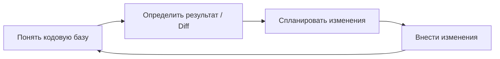

# Просмотр последних изменений

**Navigation:** [← Previous](./31-корпоративные-настройки.md) | [Index](./index.md) | [Next →](./33-работа-с-документацией.md)

---

# Просмотр последних изменений
cursor-agent -p --force --output-format text \
  "Проанализируй последние изменения в коде и дай обратную связь по:
  - качеству кода и читаемости  
  - потенциальным багам и проблемам
  - вопросам безопасности
  - соответствию лучшим практикам

  Дай конкретные рекомендации по улучшению и запиши их в review.txt"

if [ $? -eq 0 ]; then
  echo "✅ Код-ревью успешно завершено"
else
  echo "❌ Не удалось выполнить код-ревью"
  exit 1
fi
```

<div id="real-time-progress-tracking">
  ### Отслеживание прогресса в реальном времени
</div>

Используй `--output-format stream-json` для отслеживания прогресса в реальном времени:

```bash  theme={null}
#!/bin/bash

# stream-progress.sh — отслеживание прогресса в реальном времени

echo "🚀 Запуск обработки потока..."


# Отслеживание прогресса в реальном времени
accumulated_text=""
tool_count=0
start_time=$(date +%s)

cursor-agent -p --force --output-format stream-json \
  "Проанализируй структуру проекта и создай сводный отчёт в analysis.txt" | \
  while IFS= read -r line; do
    
    type=$(echo "$line" | jq -r '.type // empty')
    subtype=$(echo "$line" | jq -r '.subtype // empty')
    
    case "$type" in
      "system")
        if [ "$subtype" = "init" ]; then
          model=$(echo "$line" | jq -r '.model // "unknown"')
          echo "🤖 Используемая модель: $model"
        fi
        ;;
        
      "assistant")
        # Накапливаем дельты потокового текста
        content=$(echo "$line" | jq -r '.message.content[0].text // empty')
        accumulated_text="$accumulated_text$content"
        
        # Показываем прогресс в реальном времени
        printf "\r📝 Генерация: %d символов" ${#accumulated_text}
        ;;
        
      "tool_call")
        if [ "$subtype" = "started" ]; then
          tool_count=$((tool_count + 1))
          
          # Извлекаем информацию об инструменте
          if echo "$line" | jq -e '.tool_call.writeToolCall' > /dev/null 2>&1; then
            path=$(echo "$line" | jq -r '.tool_call.writeToolCall.args.path // "unknown"')
            echo -e "\n🔧 Инструмент №$tool_count: создаётся $path"
          elif echo "$line" | jq -e '.tool_call.readToolCall' > /dev/null 2>&1; then
            path=$(echo "$line" | jq -r '.tool_call.readToolCall.args.path // "unknown"')
            echo -e "\n📖 Инструмент №$tool_count: читаем $path"
          fi
          
        elif [ "$subtype" = "completed" ]; then
          # Извлекаем и показываем результаты инструмента
          if echo "$line" | jq -e '.tool_call.writeToolCall.result.success' > /dev/null 2>&1; then
            lines=$(echo "$line" | jq -r '.tool_call.writeToolCall.result.success.linesCreated // 0')
            size=$(echo "$line" | jq -r '.tool_call.writeToolCall.result.success.fileSize // 0')
            echo "   ✅ Создано строк: $lines ($size байт)"
          elif echo "$line" | jq -e '.tool_call.readToolCall.result.success' > /dev/null 2>&1; then
            lines=$(echo "$line" | jq -r '.tool_call.readToolCall.result.success.totalLines // 0')
            echo "   ✅ Прочитано строк: $lines"
          fi
        fi
        ;;
        
      "result")
        duration=$(echo "$line" | jq -r '.duration_ms // 0')
        end_time=$(date +%s)
        total_time=$((end_time - start_time))
        
        echo -e "\n\n🎯 Завершено за ${duration} мс (всего ${total_time} с)"
        echo "📊 Итоги: инструментов — $tool_count, сгенерировано символов — ${#accumulated_text}"
        ;;
    esac
  done
```


# Установка
Source: https://docs.cursor.com/ru/cli/installation

Установка и обновление Cursor CLI

<div id="installation">
  ## Установка
</div>

<div id="macos-linux-and-windows-wsl">
  ### macOS, Linux и Windows (WSL)
</div>

Установи CLI Cursor одной командой:

```bash  theme={null}
curl https://cursor.com/install -fsS | bash
```

<div id="verification">
  ### Проверка
</div>

После установки убедись, что Cursor CLI работает корректно:

```bash  theme={null}
cursor-agent --version
```

<div id="post-installation-setup">
  ## Настройка после установки
</div>

1. **Добавь \~/.local/bin в PATH:**

   Для bash:

   ```bash  theme={null}
   echo 'export PATH="$HOME/.local/bin:$PATH"' >> ~/.bashrc
   source ~/.bashrc
   ```

   Для zsh:

   ```bash  theme={null}
   echo 'export PATH="$HOME/.local/bin:$PATH"' >> ~/.zshrc
   source ~/.zshrc
   ```

2. **Начинай пользоваться Cursor Agent:**
   ```bash  theme={null}
   cursor-agent
   ```

<div id="updates">
  ## Обновления
</div>

По умолчанию Cursor CLI будет пытаться обновляться автоматически, чтобы у тебя всегда была самая свежая версия.

Чтобы вручную обновить Cursor CLI до последней версии:

```bash  theme={null}
cursor-agent update

# или 
cursor-agent upgrade
```

Обе команды обновят Cursor Agent до актуальной версии.


# MCP
Source: https://docs.cursor.com/ru/cli/mcp

Используй серверы MCP с cursor-agent, чтобы подключать внешние инструменты и источники данных

export const Kbd = ({children, tooltip, os}) => {
  const keysInput = typeof children === 'string' && children.trim() !== '' ? children : null;
  if (!keysInput) {
    return null;
  }
  const isModifier = key => {
    const modifiers = ['⌘', '⇧', '⌥', '⌃', '⏎', '⌫', '⌦', '⎋', '⇥', '⌁', '←', '→', '↑', '↓', 'Ctrl', 'Shift', 'Alt', 'Cmd', 'Opt', 'Return', 'Backspace', 'Delete', 'Escape', 'Tab', 'Space', 'Enter', 'Esc', 'ArrowLeft', 'ArrowRight', 'ArrowUp', 'ArrowDown', 'Left', 'Right', 'Up', 'Down'];
    return modifiers.includes(key.trim());
  };
  const capitalizeFirstLetter = string => {
    return string.charAt(0).toUpperCase() + string.slice(1);
  };
  const isMac = os ? os.toLowerCase() === 'mac' || os.toLowerCase() === 'macos' : typeof navigator !== 'undefined' && (navigator.platform.toUpperCase().indexOf('MAC') >= 0 || navigator.userAgent.toUpperCase().indexOf('MAC') >= 0);
  const convertToSymbols = shortcut => {
    if (isMac) {
      return shortcut.replace(/⌘|Cmd|CMD/gi, '⌘').replace(/⌥|Opt|OPT/gi, '⌥').replace(/⌃|Ctrl/gi, '⌃').replace(/⇧|Shift/gi, '⇧').replace(/⏎|Return/gi, '⏎').replace(/⌫|Backspace/gi, '⌫').replace(/⌦|Delete/gi, '⌦').replace(/␛|Escape/gi, '␛').replace(/⇥|Tab/gi, '⇥').replace(/⌁|Space/gi, '⌁').replace(/←|Arrow\s*Left|ArrowLeft|Left/gi, '←').replace(/→|Arrow\s*Right|ArrowRight|Right/gi, '→').replace(/↑|Arrow\s*Up|ArrowUp|Up/gi, '↑').replace(/↓|Arrow\s*Down|ArrowDown|Down/gi, '↓');
    } else {
      const converted = shortcut.replace(/⌘|Cmd|CMD/gi, 'Ctrl').replace(/⌥|Opt|OPT/gi, 'Alt').replace(/⌃|Ctrl/gi, 'Ctrl').replace(/⇧|Shift/gi, 'Shift').replace(/⏎|Return/gi, 'Enter').replace(/⌫|Backspace/gi, 'Backspace').replace(/⌦|Delete/gi, 'Delete').replace(/⎋|Escape/gi, 'Esc').replace(/⇥|Tab/gi, 'Tab').replace(/⌁|Space/gi, 'Space').replace(/←|Arrow\s*Left|ArrowLeft|Left/gi, 'Arrow-Left').replace(/→|Arrow\s*Right|ArrowRight|Right/gi, 'Arrow-Right').replace(/↑|Arrow\s*Up|ArrowUp|Up/gi, 'Arrow-Up').replace(/↓|Arrow\s*Down|ArrowDown|Down/gi, 'Arrow-Down');
      const keyList = converted.split(/[\+\s]+/).filter(key => key.trim());
      return keyList.join('+');
    }
  };
  const convertToReadableText = shortcut => {
    const converted = shortcut.replace(/⌘|Cmd|CMD/gi, 'Cmd').replace(/⌥|Opt|OPT/gi, 'Opt').replace(/⌃|Ctrl/gi, 'Ctrl').replace(/⇧|Shift/gi, 'Shift').replace(/⏎|Return/gi, 'Return').replace(/⌫|Backspace/gi, 'Backspace').replace(/⌦|Delete/gi, 'Delete').replace(/⎋|Escape/gi, 'Escape').replace(/⇥|Tab/gi, 'Tab').replace(/⌁|Space/gi, 'Space').replace(/←|Arrow\s*Left|ArrowLeft|Left/gi, 'Arrow-Left').replace(/→|Arrow\s*Right|ArrowRight|Right/gi, 'Arrow-Right').replace(/↑|Arrow\s*Up|ArrowUp|Up/gi, 'Arrow-Up').replace(/↓|Arrow\s*Down|ArrowDown|Down/gi, 'Arrow-Down');
    const keyList = converted.split(/[\+\s]+/).filter(key => key.trim());
    return keyList.map(key => {
      const trimmedKey = key.trim();
      return isModifier(trimmedKey) ? trimmedKey : capitalizeFirstLetter(trimmedKey);
    }).join('+');
  };
  const displayShortcut = convertToSymbols(keysInput);
  const tooltipText = isMac ? tooltip ? `${convertToReadableText(keysInput)}: ${tooltip}` : convertToReadableText(keysInput) : tooltip || null;
  const processedKeys = isMac ? displayShortcut.split(/[\+\s]+/).filter(key => key.trim()).map(key => {
    const trimmedKey = key.trim();
    return isModifier(trimmedKey) ? trimmedKey : capitalizeFirstLetter(trimmedKey);
  }).join('') : displayShortcut.split('+').map(key => {
    const trimmedKey = key.trim();
    return isModifier(trimmedKey) ? trimmedKey : capitalizeFirstLetter(trimmedKey);
  }).join('+');
  return tooltipText ? <Tooltip tip={tooltipText}>
      <kbd>
        {processedKeys}
      </kbd>
    </Tooltip> : <kbd>
      {processedKeys}
    </kbd>;
};

<div id="overview">
  ## Обзор
</div>

Cursor CLI поддерживает серверы [Model Context Protocol (MCP)](/ru/context/mcp), позволяя подключать внешние инструменты и источники данных к `cursor-agent`. **MCP в CLI использует ту же конфигурацию, что и редактор** — любые настроенные тобой MCP‑серверы будут одинаково работать и там, и там.

<Card title="Подробнее о MCP" icon="link" href="/ru/context/mcp">
  Впервые слышишь о MCP? Прочитай полный гайд по настройке, аутентификации и доступным серверам
</Card>

<div id="cli-commands">
  ## Команды CLI
</div>

Используй команду `cursor-agent mcp` для управления серверами MCP:

<div id="list-configured-servers">
  ### Список настроенных серверов
</div>

Посмотри все настроенные серверы MCP и их текущий статус:

```bash  theme={null}
cursor-agent mcp list
```

Это отображает:

* Имена и идентификаторы серверов
* Статус подключения (подключено/отключено)
* Источник конфигурации (проект или глобальный)
* Транспорт (stdio, HTTP, SSE)

<div id="list-available-tools">
  ### Список доступных инструментов
</div>

Посмотри инструменты, предоставляемые конкретным сервером MCP:

```bash  theme={null}
cursor-agent mcp list-tools <идентификатор>
```

Это отображает:

* Названия инструментов и их описания
* Обязательные и необязательные параметры
* Типы параметров и ограничения

<div id="login-to-mcp-server">
  ### Вход на MCP‑сервер
</div>

Аутентифицируйся на MCP‑сервере, настроенном в твоём `mcp.json`:

```bash  theme={null}
cursor-agent mcp login <identifier>
```

<div id="disable-mcp-server">
  ### Отключить сервер MCP
</div>

Удалить сервер MCP из локального списка одобренных:

```bash  theme={null}
cursor-agent mcp disable <identifier>
```

<div id="using-mcp-with-agent">
  ## Использование MCP с Agent
</div>

После того как настроишь серверы MCP (см. [основное руководство по MCP](/ru/context/mcp) по настройке), `cursor-agent` автоматически обнаруживает и использует доступные инструменты, когда они уместны для твоих запросов.

```bash  theme={null}

# Посмотри, какие MCP‑серверы доступны
cursor-agent mcp list


# Узнай, какие инструменты предоставляет конкретный сервер
cursor-agent mcp list-tools playwright


# Используй cursor-agent — он автоматически применяет инструменты MCP, когда это уместно
cursor-agent --prompt "Перейди на google.com и сделай скриншот страницы результатов поиска"
```

CLI использует ту же иерархию приоритетов конфигурации, что и редактор (project → global → nested), автоматически находя конфигурации в родительских каталогах.

<div id="related">
  ## Похожие материалы
</div>

<CardGroup cols={2}>
  <Card title="MCP Overview" icon="link" href="/ru/context/mcp">
    Полное руководство по MCP: установка, настройка и аутентификация
  </Card>

  <Card title="Available MCP Tools" icon="table" href="/ru/tools">
    Посмотри доступные предварительно настроенные MCP‑серверы, которые можно сразу использовать
  </Card>
</CardGroup>


# Cursor CLI
Source: https://docs.cursor.com/ru/cli/overview

Начни работу с Cursor CLI и пиши код прямо в терминале

Cursor CLI позволяет общаться с AI-агентами прямо из терминала, чтобы писать, ревьюить и изменять код. Нужен интерактивный интерфейс в терминале или текстовый вывод для автоматизации скриптов и CI-пайплайнов — CLI даёт мощную помощь в программировании там, где ты работаешь.

```bash  theme={null}

# Установка
curl https://cursor.com/install -fsS | bash


# Запустить интерактивный сеанс
cursor-agent
```

<Frame>
  <video src="https://mintcdn.com/cursor/BfJOqJ1Wb8EvuXyr/images/cli/cli-overview.mp4?fit=max&auto=format&n=BfJOqJ1Wb8EvuXyr&q=85&s=b323547dd61e985df8c0d6179c1492bd" autoPlay loop muted playsInline controls data-path="images/cli/cli-overview.mp4" />
</Frame>

<Info>
  Cursor CLI сейчас в бета-версии — нам очень важна твоя обратная связь!
</Info>

<div id="interactive-mode">
  ### Интерактивный режим
</div>

Начни разговор с агентом, чтобы описать свои цели, просмотреть предложенные изменения и подтвердить команды:

```bash  theme={null}

# Запустить интерактивную сессию
cursor-agent


# Начать с исходного промпта
cursor-agent "рефакторить модуль аутентификации для использования JWT"
```

<div id="non-interactive-mode">
  ### Неинтерактивный режим
</div>

Используй режим вывода для неинтерактивных сценариев — например, для скриптов, CI‑пайплайнов или автоматизации:

```bash  theme={null}

# Запуск с конкретным запросом и моделью
cursor-agent -p "найди и исправь проблемы с производительностью" --model "gpt-5"


# Использование с включёнными изменениями из git для проверки
cursor-agent -p "проверь эти изменения на проблемы с безопасностью" --output-format text
```

<div id="sessions">
  ### Сессии
</div>

Возобновляй предыдущие диалоги, чтобы сохранять контекст между несколькими взаимодействиями:

```bash  theme={null}

# Показать все предыдущие чаты
cursor-agent ls


# Продолжить последнюю беседу
cursor-agent resume


# Продолжить конкретную беседу
cursor-agent --resume="chat-id-here"
```


# Аутентификация
Source: https://docs.cursor.com/ru/cli/reference/authentication

Авторизуй Cursor CLI через вход в браузере или по API‑ключам

CLI Cursor поддерживает два способа авторизации: вход через браузер (рекомендуется) и API‑ключи.

<div id="browser-authentication-recommended">
  ## Аутентификация через браузер (рекомендуется)
</div>

Используй браузерный флоу для самого простого способа аутентификации:

```bash  theme={null}

# Войти через браузер
cursor-agent login


# Проверить статус аутентификации
cursor-agent status


# Выйти и очистить сохранённые данные аутентификации
cursor-agent logout
```

Команда login откроет твой браузер по умолчанию и предложит войти в аккаунт Cursor. После завершения твои учетные данные будут безопасно сохранены локально.

<div id="api-key-authentication">
  ## Аутентификация по API-ключу
</div>

Для автоматизации, скриптов или сред CI/CD используй аутентификацию по API-ключу:

<div id="step-1-generate-an-api-key">
  ### Шаг 1: Сгенерируй API-ключ
</div>

Сгенерируй API-ключ в своей панели Cursor в разделе Integrations > User API Keys.

<div id="step-2-set-the-api-key">
  ### Шаг 2: Укажи API-ключ
</div>

Можно передать API-ключ двумя способами:

**Вариант 1: Переменная окружения (рекомендуется)**

```bash  theme={null}
export CURSOR_API_KEY=your_api_key_here
cursor-agent "реализовать аутентификацию пользователя"
```

**Вариант 2: флаг командной строки**

```bash  theme={null}
cursor-agent --api-key your_api_key_here "реализуй аутентификацию пользователя"
```

<div id="authentication-status">
  ## Статус аутентификации
</div>

Проверь свой текущий статус входа:

```bash  theme={null}
cursor-agent status
```

Эта команда выведет:

* Авторизован ли ты
* Информацию о твоём аккаунте
* Текущую конфигурацию конечной точки

<div id="troubleshooting">
  ## Устранение неполадок
</div>

* **Ошибки «Not authenticated»:** Запусти `cursor-agent login` или убедись, что твой API-ключ задан корректно
* **Ошибки SSL-сертификатов:** Используй флаг `--insecure` в средах разработки
* **Проблемы с конечной точкой:** Используй флаг `--endpoint`, чтобы указать кастомный API-эндпойнт


# Конфигурация
Source: https://docs.cursor.com/ru/cli/reference/configuration

Справочник по настройке Agent CLI для cli-config.json

Настрой Agent CLI с помощью файла `cli-config.json`.

<div id="file-location">
  ## Расположение файла
</div>

<div class="full-width-table">
  | Тип        | Платформа   | Путь                                       |
  | :--------- | :---------- | :----------------------------------------- |
  | Глобальный | macOS/Linux | `~/.cursor/cli-config.json`                |
  | Глобальный | Windows     | `$env:USERPROFILE\.cursor\cli-config.json` |
  | Проект     | Все         | `<project>/.cursor/cli.json`               |
</div>

<Note>На уровне проекта можно настроить только разрешения. Все остальные параметры CLI задаются глобально.</Note>

Переопределение через переменные окружения:

* **`CURSOR_CONFIG_DIR`**: путь к пользовательскому каталогу
* **`XDG_CONFIG_HOME`** (Linux/BSD): использует `$XDG_CONFIG_HOME/cursor/cli-config.json`

<div id="schema">
  ## Схема
</div>

<div id="required-fields">
  ### Обязательные поля
</div>

<div class="full-width-table">
  | Поле                | Тип       | Описание                                                                |
  | :------------------ | :-------- | :---------------------------------------------------------------------- |
  | `version`           | number    | Версия схемы конфигурации (текущая: `1`)                                |
  | `editor.vimMode`    | boolean   | Включает хоткеи Vim (по умолчанию: `false`)                             |
  | `permissions.allow` | string\[] | Разрешённые операции (см. [Permissions](/ru/cli/reference/permissions)) |
  | `permissions.deny`  | string\[] | Запрещённые операции (см. [Permissions](/ru/cli/reference/permissions)) |
</div>

<div id="optional-fields">
  ### Необязательные поля
</div>

<div class="full-width-table">
  | Поле                     | Тип     | Описание                                            |
  | :----------------------- | :------ | :-------------------------------------------------- |
  | `model`                  | object  | Конфигурация выбранной модели                       |
  | `hasChangedDefaultModel` | boolean | Флаг переопределения модели, управляемого через CLI |
</div>

<div id="examples">
  ## Примеры
</div>

<div id="minimal-config">
  ### Минимальная конфигурация
</div>

```json  theme={null}
{
  "version": 1,
  "editor": { "vimMode": false },
  "permissions": { "allow": ["Shell(ls)"], "deny": [] }
}
```

<div id="enable-vim-mode">
  ### Включи режим Vim
</div>

```json  theme={null}
{
  "version": 1,
  "editor": { "vimMode": true },
  "permissions": { "allow": ["Shell(ls)"], "deny": [] }
}
```

<div id="configure-permissions">
  ### Настройка прав доступа
</div>

```json  theme={null}
{
  "version": 1,
  "editor": { "vimMode": false },
  "permissions": {
    "allow": ["Shell(ls)", "Shell(echo)"],
    "deny": ["Shell(rm)"]
  }
}
```

См. [Permissions](/ru/cli/reference/permissions) для списка доступных типов разрешений и примеров.

<div id="troubleshooting">
  ## Устранение неполадок
</div>

**Ошибки конфигурации**: Временно переименуй/перемести файл и перезапусти:

```bash  theme={null}
mv ~/.cursor/cli-config.json ~/.cursor/cli-config.json.bad
```

**Изменения не сохраняются**: проверь валидность JSON и права на запись. Некоторые поля управляются через CLI и могут быть перезаписаны.

<div id="notes">
  ## Заметки
</div>

* Чистый JSON-формат (без комментариев)
* CLI автоматически восстанавливает отсутствующие поля
* Повреждённые файлы сохраняются с расширением `.bad` и пересоздаются
* Записи разрешений — это точные строковые значения (см. [Permissions](/ru/cli/reference/permissions) для подробностей)


# Формат вывода
Source: https://docs.cursor.com/ru/cli/reference/output-format

Схема вывода для текстового, JSON и stream-JSON форматов

CLI Cursor Agent поддерживает несколько форматов вывода через опцию `--output-format` в сочетании с `--print`. Доступны структурированные форматы для программного использования (`json`, `stream-json`) и упрощённый текстовый формат для наглядного отслеживания прогресса.

<Note>
  Значение `--output-format` по умолчанию — `stream-json`. Эта опция действует только при выводе на экран (`--print`) или когда режим вывода определяется автоматически (stdout без TTY либо stdin, переданный через конвейер).
</Note>

<div id="json-format">
  ## Формат JSON
</div>

Формат `json` выводит один объект JSON (с последующим переводом строки) после успешного завершения выполнения. Дельты и события инструментов не выводятся; текст агрегируется в итоговый результат.

В случае ошибки процесс завершается с ненулевым кодом и записывает сообщение об ошибке в stderr. В таких случаях корректный объект JSON не выводится.

<div id="success-response">
  ### Успешный ответ
</div>

При успешном выполнении CLI выводит объект JSON со следующей структурой:

```json  theme={null}
{
  "type": "result",
  "subtype": "success",
  "is_error": false,
  "duration_ms": 1234,
  "duration_api_ms": 1234,
  "result": "<полный текст помощника>",
  "session_id": "<uuid>",
  "request_id": "<необязательный ID запроса>"
}
```

<div class="full-width-table">
  | Поле              | Описание                                                           |
  | ----------------- | ------------------------------------------------------------------ |
  | `type`            | Всегда `"result"` для итоговых результатов                         |
  | `subtype`         | Всегда `"success"` для успешных завершений                         |
  | `is_error`        | Всегда `false` для успешных ответов                                |
  | `duration_ms`     | Общее время выполнения в миллисекундах                             |
  | `duration_api_ms` | Время запроса к API в миллисекундах (сейчас равно `duration_ms`)   |
  | `result`          | Полный текст ответа ассистента (конкатенация всех текстовых дельт) |
  | `session_id`      | Уникальный идентификатор сеанса                                    |
  | `request_id`      | Необязательный идентификатор запроса (может отсутствовать)         |
</div>

<div id="stream-json-format">
  ## Формат Stream JSON
</div>

Формат вывода `stream-json` эмитирует NDJSON (JSON, разделённый переводами строки). Каждая строка содержит один JSON-объект, представляющий событие в реальном времени во время выполнения.

Поток завершается терминальным событием `result` при успешном завершении. При ошибке процесс завершается с ненулевым кодом, и поток может завершиться раньше без терминального события; сообщение об ошибке выводится в stderr.

<div id="event-types">
  ### Типы событий
</div>

<div id="system-initialization">
  #### Инициализация системы
</div>

Эмитируется один раз в начале каждой сессии:

```json  theme={null}
{
  "type": "system",
  "subtype": "init",
  "apiKeySource": "env|flag|login",
  "cwd": "/absolute/path",
  "session_id": "<uuid>",
  "model": "<название модели для отображения>",
  "permissionMode": "default"
}
```

<Note>
  В будущем к этому событию могут быть добавлены поля `tools` и `mcp_servers`.
</Note>

<div id="user-message">
  #### Сообщение пользователя
</div>

Содержит ввод пользователя:

```json  theme={null}
{
  "type": "user",
  "message": {
    "role": "user",
    "content": [{ "type": "text", "text": "<prompt>" }]
  },
  "session_id": "<uuid>"
}
```

<div id="assistant-text-delta">
  #### Дельта текста ассистента
</div>

Выдаётся несколько раз по мере генерации ответа ассистентом. Эти события содержат поэтапные текстовые фрагменты:

```json  theme={null}
{
  "type": "assistant",
  "message": {
    "role": "assistant",
    "content": [{ "type": "text", "text": "<фрагмент дельты>" }]
  },
  "session_id": "<uuid>"
}
```

<Note>
  Объедини все значения `message.content[].text` по порядку, чтобы восстановить полный ответ ассистента.
</Note>

<div id="tool-call-events">
  #### События вызова инструментов
</div>

Вызовы инструментов отслеживаются событиями начала и завершения:

**Начало вызова инструмента:**

```json  theme={null}
{
  "type": "tool_call",
  "subtype": "started",
  "call_id": "<string id>",
  "tool_call": {
    "readToolCall": {
      "args": { "path": "file.txt" }
    }
  },
  "session_id": "<uuid>"
}
```

**Вызов инструмента выполнен:**

```json  theme={null}
{
  "type": "tool_call",
  "subtype": "completed",
  "call_id": "<string id>",
  "tool_call": {
    "readToolCall": {
      "args": { "path": "file.txt" },
      "result": {
        "success": {
          "content": "содержимое файла...",
          "isEmpty": false,
          "exceededLimit": false
          "totalLines": 54,
          "totalChars": 1254
        }
      }
    }
  },
  "session_id": "<uuid>"
}
```

<div id="tool-call-types">
  #### Типы вызовов инструментов
</div>

**Инструмент чтения файла:**

* **Начало**: `tool_call.readToolCall.args` содержит `{ "path": "file.txt" }`
* **Завершение**: `tool_call.readToolCall.result.success` содержит метаданные файла и его содержимое

**Инструмент записи файла:**

* **Начало**: `tool_call.writeToolCall.args` содержит `{ "path": "file.txt", "fileText": "content...", "toolCallId": "id" }`
* **Завершение**: `tool_call.writeToolCall.result.success` содержит `{ "path": "/absolute/path", "linesCreated": 19, "fileSize": 942 }`

**Другие инструменты:**

* Могут использовать структуру `tool_call.function` вида `{ "name": "tool_name", "arguments": "..." }`

<div id="terminal-result">
  #### Результат терминала
</div>

Финальное событие, эмитируемое при успешном завершении:

```json  theme={null}
{
  "type": "result",
  "subtype": "success",
  "duration_ms": 1234,
  "duration_api_ms": 1234,
  "is_error": false,
  "result": "<полный текст ассистента>",
  "session_id": "<uuid>",
  "request_id": "<необязательный ID запроса>"
}
```

<div id="example-sequence">
  ### Пример последовательности
</div>

Вот типичная последовательность NDJSON, показывающая обычный ход событий:

```json  theme={null}
{"type":"system","subtype":"init","apiKeySource":"login","cwd":"/Users/user/project","session_id":"c6b62c6f-7ead-4fd6-9922-e952131177ff","model":"Claude 4 Sonnet","permissionMode":"default"}
{"type":"user","message":{"role":"user","content":[{"type":"text","text":"Прочитай README.md и сделай краткое резюме"}]},"session_id":"c6b62c6f-7ead-4fd6-9922-e952131177ff"}
{"type":"assistant","message":{"role":"assistant","content":[{"type":"text","text":"Я "}]},"session_id":"c6b62c6f-7ead-4fd6-9922-e952131177ff"}
{"type":"assistant","message":{"role":"assistant","content":[{"type":"text","text":"прочитаю файл README.md"}]},"session_id":"c6b62c6f-7ead-4fd6-9922-e952131177ff"}
{"type":"tool_call","subtype":"started","call_id":"toolu_vrtx_01NnjaR886UcE8whekg2MGJd","tool_call":{"readToolCall":{"args":{"path":"README.md"}}},"session_id":"c6b62c6f-7ead-4fd6-9922-e952131177ff"}
{"type":"tool_call","subtype":"completed","call_id":"toolu_vrtx_01NnjaR886UcE8whekg2MGJd","tool_call":{"readToolCall":{"args":{"path":"README.md"},"result":{"success":{"content":"# Project\n\nThis is a sample project...","isEmpty":false,"exceededLimit":false,"totalLines":54,"totalChars":1254}}}},"session_id":"c6b62c6f-7ead-4fd6-9922-e952131177ff"}
{"type":"assistant","message":{"role":"assistant","content":[{"type":"text","text":" и сделаю краткое резюме"}]},"session_id":"c6b62c6f-7ead-4fd6-9922-e952131177ff"}
{"type":"tool_call","subtype":"started","call_id":"toolu_vrtx_01Q3VHVnWFSKygaRPT7WDxrv","tool_call":{"writeToolCall":{"args":{"path":"summary.txt","fileText":"# README Summary\n\nThis project contains...","toolCallId":"toolu_vrtx_01Q3VHVnWFSKygaRPT7WDxrv"}}},"session_id":"c6b62c6f-7ead-4fd6-9922-e952131177ff"}
{"type":"tool_call","subtype":"completed","call_id":"toolu_vrtx_01Q3VHVnWFSKygaRPT7WDxrv","tool_call":{"writeToolCall":{"args":{"path":"summary.txt","fileText":"# README Summary\n\nThis project contains...","toolCallId":"toolu_vrtx_01Q3VHVnWFSKygaRPT7WDxrv"},"result":{"success":{"path":"/Users/user/project/summary.txt","linesCreated":19,"fileSize":942}}}},"session_id":"c6b62c6f-7ead-4fd6-9922-e952131177ff"}
{"type":"result","subtype":"success","duration_ms":5234,"duration_api_ms":5234,"is_error":false,"result":"Я прочитаю файл README.md и сделаю краткое резюме","session_id":"c6b62c6f-7ead-4fd6-9922-e952131177ff","request_id":"10e11780-df2f-45dc-a1ff-4540af32e9c0"}
```

<div id="text-format">
  ## Текстовый формат
</div>

Формат вывода `text` предоставляет упрощённый, удобочитаемый поток действий агента. Вместо подробных JSON-событий он выдаёт лаконичные текстовые описания того, что агент делает в реальном времени.

Этот формат удобен для мониторинга прогресса агента без накладных расходов на парсинг структурированных данных, что делает его идеальным для логирования, отладки или простого трекинга прогресса.

<div id="example-output">
  ### Пример вывода
</div>

```
Прочтён файл
Изменён файл
Выполнена команда в терминале
Создан новый файл
```

Каждое действие выводится на новой строке по мере выполнения агентом, что даёт мгновенную обратную связь о его прогрессе в выполнении задачи.

<div id="implementation-notes">
  ## Заметки по реализации
</div>

* Каждое событие выводится одной строкой, оканчивающейся символом `\n`
* События `thinking` скрываются в режиме печати и не появляются ни в одном формате вывода
* Со временем могут добавляться новые поля с сохранением обратной совместимости (клиентам следует игнорировать неизвестные поля)
* Потоковый формат предоставляет обновления в реальном времени, тогда как формат JSON дожидается завершения перед выводом результата
* Конкатенируй все дельты сообщений `assistant`, чтобы восстановить полный ответ
* Идентификаторы вызовов инструментов можно использовать для сопоставления событий начала и завершения
* Идентификаторы сессии остаются неизменными на протяжении одного запуска агента


# Параметры
Source: https://docs.cursor.com/ru/cli/reference/parameters

Полная справка по командам Cursor Agent CLI

<div id="global-options">
  ## Глобальные опции
</div>

Глобальные опции можно использовать с любой командой:

<div class="full-width-table">
  | Опция                      | Описание                                                                                                                              |
  | -------------------------- | ------------------------------------------------------------------------------------------------------------------------------------- |
  | `-v, --version`            | Вывести номер версии                                                                                                                  |
  | `-a, --api-key <key>`      | API-ключ для аутентификации (можно также использовать переменную окружения `CURSOR_API_KEY`)                                          |
  | `-p, --print`              | Печатать ответы в консоль (для скриптов или неинтерактивного использования). Имеет доступ ко всем инструментам, включая write и bash. |
  | `--output-format <format>` | Формат вывода (работает только с `--print`): `text`, `json` или `stream-json` (по умолчанию — `stream-json`)                          |
  | `-b, --background`         | Запуск в фоновом режиме (при старте откроется выбор композитора)                                                                      |
  | `--fullscreen`             | Включить полноэкранный режим                                                                                                          |
  | `--resume [chatId]`        | Продолжить сессию чата                                                                                                                |
  | `-m, --model <model>`      | Используемая модель                                                                                                                   |
  | `-f, --force`              | Принудительно разрешать команды, если это явно не запрещено                                                                           |
  | `-h, --help`               | Показать справку по команде                                                                                                           |
</div>

<div id="commands">
  ## Команды
</div>

<div class="full-width-table">
  | Command           | Description                                        | Usage                                            |
  | ----------------- | -------------------------------------------------- | ------------------------------------------------ |
  | `login`           | Войти в Cursor                                     | `cursor-agent login`                             |
  | `logout`          | Выйти и очистить сохранённые данные аутентификации | `cursor-agent logout`                            |
  | `status`          | Проверить статус аутентификации                    | `cursor-agent status`                            |
  | `mcp`             | Управлять серверами MCP                            | `cursor-agent mcp`                               |
  | `update\|upgrade` | Обновить Cursor Agent до последней версии          | `cursor-agent update` или `cursor-agent upgrade` |
  | `ls`              | Показать список чатов                              | `cursor-agent ls`                                |
  | `resume`          | Возобновить последний чат                          | `cursor-agent resume`                            |
  | `help [command]`  | Показать справку по команде                        | `cursor-agent help [command]`                    |
</div>

<Note>
  Если команду не указать, Cursor Agent по умолчанию запускается в интерактивном режиме чата.
</Note>

<div id="mcp">
  ## MCP
</div>

Управляй серверами MCP, настроенными для Cursor Agent.

<div class="full-width-table">
  | Подкоманда                | Описание                                                                 | Использование                              |
  | ------------------------- | ------------------------------------------------------------------------ | ------------------------------------------ |
  | `login <identifier>`      | Выполни вход на сервер MCP, указанным в `.cursor/mcp.json`               | `cursor-agent mcp login <identifier>`      |
  | `list`                    | Показать настроенные серверы MCP и их статус                             | `cursor-agent mcp list`                    |
  | `list-tools <identifier>` | Показать доступные инструменты и имена их аргументов для конкретного MCP | `cursor-agent mcp list-tools <identifier>` |
</div>

Все команды MCP поддерживают `-h, --help` для контекстной справки.

<div id="arguments">
  ## Аргументы
</div>

При запуске в режиме чата (по умолчанию) можно указать начальный запрос:

**Аргументы:**

* `prompt` — начальный запрос для агента

<div id="getting-help">
  ## Получение помощи
</div>

Все команды поддерживают глобальную опцию `-h, --help` для вывода справки по конкретной команде.


# Permissions
Source: https://docs.cursor.com/ru/cli/reference/permissions

Типы разрешений для управления доступом агента к файлам и командам

Настрой, что агенту разрешено делать, используя токены разрешений в конфигурации CLI. Разрешения задаются в `~/.cursor/cli-config.json` (глобально) или `<project>/.cursor/cli.json` (для конкретного проекта).

<div id="permission-types">
  ## Типы разрешений
</div>

<div id="shell-commands">
  ### Команды shell
</div>

**Формат:** `Shell(commandBase)`

Управляет доступом к командам shell. `commandBase` — это первый токен в командной строке.

<div class="full-width-table">
  | Пример       | Описание                                                   |
  | ------------ | ---------------------------------------------------------- |
  | `Shell(ls)`  | Разрешить выполнение команд `ls`                           |
  | `Shell(git)` | Разрешить любые подкоманды `git`                           |
  | `Shell(npm)` | Разрешить команды менеджера пакетов npm                    |
  | `Shell(rm)`  | Запретить разрушительное удаление файлов (обычно в `deny`) |
</div>

<div id="file-reads">
  ### Чтение файлов
</div>

**Формат:** `Read(pathOrGlob)`

Управляет доступом на чтение файлов и каталогов. Поддерживает glob-шаблоны.

<div class="full-width-table">
  | Пример              | Описание                                    |
  | ------------------- | ------------------------------------------- |
  | `Read(src/**/*.ts)` | Разрешить чтение файлов TypeScript в `src`  |
  | `Read(**/*.md)`     | Разрешить чтение файлов Markdown где угодно |
  | `Read(.env*)`       | Запретить чтение файлов окружения           |
  | `Read(/etc/passwd)` | Запретить чтение системных файлов           |
</div>

<div id="file-writes">
  ### Запись файлов
</div>

**Формат:** `Write(pathOrGlob)`

Управляет доступом на запись файлов и каталогов. Поддерживает glob-шаблоны. В режиме печати для записи файлов требуется `--force`.

<div class="full-width-table">
  | Пример                | Описание                                    |
  | --------------------- | ------------------------------------------- |
  | `Write(src/**)`       | Разрешить запись в любые файлы внутри `src` |
  | `Write(package.json)` | Разрешить изменение package.json            |
  | `Write(**/*.key)`     | Запретить запись файлов закрытых ключей     |
  | `Write(**/.env*)`     | Запретить запись файлов окружения           |
</div>

<div id="configuration">
  ## Конфигурация
</div>

Добавь permissions в объект `permissions` в конфигурационном файле CLI:

```json  theme={null}
{
  "permissions": {
    "allow": [
      "Shell(ls)",
      "Shell(git)", 
      "Read(src/**/*.ts)",
      "Write(package.json)"
    ],
    "deny": [
      "Shell(rm)",
      "Read(.env*)",
      "Write(**/*.key)"
    ]
  }
}
```

<div id="pattern-matching">
  ## Сопоставление шаблонов
</div>

* Шаблоны glob используют маски `**`, `*` и `?`
* Относительные пути относятся к текущему рабочему пространству
* Абсолютные пути могут указывать на файлы вне проекта
* Правила deny имеют приоритет над правилами allow


# Slash-команды
Source: https://docs.cursor.com/ru/cli/reference/slash-commands

Быстрые действия, доступные в сессиях Cursor CLI

<div class="full-width-table">
  | Command               | Description                                                         |
  | --------------------- | ------------------------------------------------------------------- |
  | `/model <model>`      | Выбрать модель или вывести список моделей                           |
  | `/auto-run [state]`   | Переключить автозапуск (по умолчанию) или задать \[on\|off\|status] |
  | `/new-chat`           | Начать новый чат                                                    |
  | `/vim`                | Переключить раскладку клавиш Vim                                    |
  | `/help [command]`     | Показать справку (/help \[cmd])                                     |
  | `/feedback <message>` | Оставить отзыв для команды                                          |
  | `/resume <chat>`      | Возобновить предыдущий чат по имени папки                           |
  | `/copy-req-id`        | Скопировать ID последнего запроса                                   |
  | `/logout`             | Выйти из Cursor                                                     |
  | `/quit`               | Выйти                                                               |
</div>


# Режим Shell
Source: https://docs.cursor.com/ru/cli/shell-mode

Запускай shell-команды прямо из CLI, не выходя из диалога

export const Kbd = ({children, tooltip, os}) => {
  const keysInput = typeof children === 'string' && children.trim() !== '' ? children : null;
  if (!keysInput) {
    return null;
  }
  const isModifier = key => {
    const modifiers = ['⌘', '⇧', '⌥', '⌃', '⏎', '⌫', '⌦', '⎋', '⇥', '⌁', '←', '→', '↑', '↓', 'Ctrl', 'Shift', 'Alt', 'Cmd', 'Opt', 'Return', 'Backspace', 'Delete', 'Escape', 'Tab', 'Space', 'Enter', 'Esc', 'ArrowLeft', 'ArrowRight', 'ArrowUp', 'ArrowDown', 'Left', 'Right', 'Up', 'Down'];
    return modifiers.includes(key.trim());
  };
  const capitalizeFirstLetter = string => {
    return string.charAt(0).toUpperCase() + string.slice(1);
  };
  const isMac = os ? os.toLowerCase() === 'mac' || os.toLowerCase() === 'macos' : typeof navigator !== 'undefined' && (navigator.platform.toUpperCase().indexOf('MAC') >= 0 || navigator.userAgent.toUpperCase().indexOf('MAC') >= 0);
  const convertToSymbols = shortcut => {
    if (isMac) {
      return shortcut.replace(/⌘|Cmd|CMD/gi, '⌘').replace(/⌥|Opt|OPT/gi, '⌥').replace(/⌃|Ctrl/gi, '⌃').replace(/⇧|Shift/gi, '⇧').replace(/⏎|Return/gi, '⏎').replace(/⌫|Backspace/gi, '⌫').replace(/⌦|Delete/gi, '⌦').replace(/␛|Escape/gi, '␛').replace(/⇥|Tab/gi, '⇥').replace(/⌁|Space/gi, '⌁').replace(/←|Arrow\s*Left|ArrowLeft|Left/gi, '←').replace(/→|Arrow\s*Right|ArrowRight|Right/gi, '→').replace(/↑|Arrow\s*Up|ArrowUp|Up/gi, '↑').replace(/↓|Arrow\s*Down|ArrowDown|Down/gi, '↓');
    } else {
      const converted = shortcut.replace(/⌘|Cmd|CMD/gi, 'Ctrl').replace(/⌥|Opt|OPT/gi, 'Alt').replace(/⌃|Ctrl/gi, 'Ctrl').replace(/⇧|Shift/gi, 'Shift').replace(/⏎|Return/gi, 'Enter').replace(/⌫|Backspace/gi, 'Backspace').replace(/⌦|Delete/gi, 'Delete').replace(/⎋|Escape/gi, 'Esc').replace(/⇥|Tab/gi, 'Tab').replace(/⌁|Space/gi, 'Space').replace(/←|Arrow\s*Left|ArrowLeft|Left/gi, 'Arrow-Left').replace(/→|Arrow\s*Right|ArrowRight|Right/gi, 'Arrow-Right').replace(/↑|Arrow\s*Up|ArrowUp|Up/gi, 'Arrow-Up').replace(/↓|Arrow\s*Down|ArrowDown|Down/gi, 'Arrow-Down');
      const keyList = converted.split(/[\+\s]+/).filter(key => key.trim());
      return keyList.join('+');
    }
  };
  const convertToReadableText = shortcut => {
    const converted = shortcut.replace(/⌘|Cmd|CMD/gi, 'Cmd').replace(/⌥|Opt|OPT/gi, 'Opt').replace(/⌃|Ctrl/gi, 'Ctrl').replace(/⇧|Shift/gi, 'Shift').replace(/⏎|Return/gi, 'Return').replace(/⌫|Backspace/gi, 'Backspace').replace(/⌦|Delete/gi, 'Delete').replace(/⎋|Escape/gi, 'Escape').replace(/⇥|Tab/gi, 'Tab').replace(/⌁|Space/gi, 'Space').replace(/←|Arrow\s*Left|ArrowLeft|Left/gi, 'Arrow-Left').replace(/→|Arrow\s*Right|ArrowRight|Right/gi, 'Arrow-Right').replace(/↑|Arrow\s*Up|ArrowUp|Up/gi, 'Arrow-Up').replace(/↓|Arrow\s*Down|ArrowDown|Down/gi, 'Arrow-Down');
    const keyList = converted.split(/[\+\s]+/).filter(key => key.trim());
    return keyList.map(key => {
      const trimmedKey = key.trim();
      return isModifier(trimmedKey) ? trimmedKey : capitalizeFirstLetter(trimmedKey);
    }).join('+');
  };
  const displayShortcut = convertToSymbols(keysInput);
  const tooltipText = isMac ? tooltip ? `${convertToReadableText(keysInput)}: ${tooltip}` : convertToReadableText(keysInput) : tooltip || null;
  const processedKeys = isMac ? displayShortcut.split(/[\+\s]+/).filter(key => key.trim()).map(key => {
    const trimmedKey = key.trim();
    return isModifier(trimmedKey) ? trimmedKey : capitalizeFirstLetter(trimmedKey);
  }).join('') : displayShortcut.split('+').map(key => {
    const trimmedKey = key.trim();
    return isModifier(trimmedKey) ? trimmedKey : capitalizeFirstLetter(trimmedKey);
  }).join('+');
  return tooltipText ? <Tooltip tip={tooltipText}>
      <kbd>
        {processedKeys}
      </kbd>
    </Tooltip> : <kbd>
      {processedKeys}
    </kbd>;
};

Режим Shell запускает команды оболочки прямо из CLI, не покидая текущий диалог. Используй его для быстрых, неинтерактивных команд: с проверками безопасности и выводом результатов прямо в разговоре.

<Frame>
  <video src="https://mintcdn.com/cursor/BfJOqJ1Wb8EvuXyr/images/cli/shell-mode/cli-shell-mode.mp4?fit=max&auto=format&n=BfJOqJ1Wb8EvuXyr&q=85&s=5194392f1189eb1eba340d731e86bd5f" autoPlay loop muted playsInline controls data-path="images/cli/shell-mode/cli-shell-mode.mp4" />
</Frame>

<div id="command-execution">
  ## Выполнение команд
</div>

Команды выполняются в твоей оболочке входа (`$SHELL`) с рабочей директорией и окружением CLI. Связывай команды, чтобы запускать их в других каталогах:

```bash  theme={null}
cd subdir && npm test
```

<div id="output">
  ## Вывод
</div>

<product_visual type="screenshot">
  Command output showing header with exit code, stdout/stderr display, and truncation controls
</product_visual>

Большие выводы автоматически обрезаются, а долгие процессы прерываются по тайм-ауту, чтобы сохранить производительность.

<div id="limitations">
  ## Ограничения
</div>

* Команды прерываются по тайм-ауту через 30 секунд
* Долгоживущие процессы, серверы и интерактивные запросы не поддерживаются
* Для лучших результатов используй короткие, неинтерактивные команды

<div id="permissions">
  ## Права доступа
</div>

Перед выполнением команды проверяются на соответствие твоим правам доступа и настройкам команды. См. [Permissions](/ru/cli/reference/permissions) для подробной конфигурации.

<product_visual type="screenshot">
  Баннер решений с вариантами: Run, Reject/Propose, Add to allowlist и Auto-run
</product_visual>

Администраторские политики могут блокировать отдельные команды, а команды с перенаправлением нельзя добавить в allowlist прямо в интерфейсе.

<div id="usage-guidelines">
  ## Рекомендации по использованию
</div>

Shell Mode отлично подходит для проверок состояния, быстрых сборок, операций с файлами и анализа окружения.

Избегай долгоживущих серверов, интерактивных приложений и команд, которые требуют ввода.

Каждая команда выполняется отдельно — используй `cd <dir> && ...`, чтобы запускать команды в других каталогах.

<div id="troubleshooting">
  ## Устранение неполадок
</div>

* Если команда зависла, отмени с <Kbd>Ctrl+C</Kbd> и добавь флаги для неинтерактивного режима
* Когда попросят разрешения, один раз подтверди или добавь в allowlist с помощью <Kbd>Tab</Kbd>
* Если вывод обрезан, нажми <Kbd>Ctrl+O</Kbd>, чтобы развернуть
* Чтобы запускать команды в разных каталогах, используй `cd <dir> && ...`, поскольку изменения не сохраняются
* Режим Shell поддерживает zsh и bash на основе значения переменной `$SHELL`

<div id="faq">
  ## FAQ
</div>

<AccordionGroup>
  <Accordion title="Сохраняется ли `cd` между запусками?">
    Нет. Каждая команда выполняется отдельно. Используй `cd <dir> && ...`, чтобы запускать команды в разных каталогах.
  </Accordion>

  <Accordion title="Могу ли я изменить таймаут?">
    Нет. Команды ограничены 30 секундами, и это нельзя настроить.
  </Accordion>

  <Accordion title="Где настраиваются разрешения?">
    Разрешения задаются в конфигурации CLI и команды. Используй баннер с решением, чтобы добавлять команды в allowlist.
  </Accordion>

  <Accordion title="Как выйти из Shell Mode?">
    Нажми <Kbd>Escape</Kbd>, когда поле ввода пустое, <Kbd>Backspace</Kbd>/<Kbd>Delete</Kbd> при пустом вводе или <Kbd>Ctrl+C</Kbd>, чтобы очистить и выйти.
  </Accordion>
</AccordionGroup>


# Использование агента в CLI
Source: https://docs.cursor.com/ru/cli/using

Эффективно пиши промпты, пересматривай и улучшай их итерациями с Cursor CLI

export const Kbd = ({children, tooltip, os}) => {
  const keysInput = typeof children === 'string' && children.trim() !== '' ? children : null;
  if (!keysInput) {
    return null;
  }
  const isModifier = key => {
    const modifiers = ['⌘', '⇧', '⌥', '⌃', '⏎', '⌫', '⌦', '⎋', '⇥', '⌁', '←', '→', '↑', '↓', 'Ctrl', 'Shift', 'Alt', 'Cmd', 'Opt', 'Return', 'Backspace', 'Delete', 'Escape', 'Tab', 'Space', 'Enter', 'Esc', 'ArrowLeft', 'ArrowRight', 'ArrowUp', 'ArrowDown', 'Left', 'Right', 'Up', 'Down'];
    return modifiers.includes(key.trim());
  };
  const capitalizeFirstLetter = string => {
    return string.charAt(0).toUpperCase() + string.slice(1);
  };
  const isMac = os ? os.toLowerCase() === 'mac' || os.toLowerCase() === 'macos' : typeof navigator !== 'undefined' && (navigator.platform.toUpperCase().indexOf('MAC') >= 0 || navigator.userAgent.toUpperCase().indexOf('MAC') >= 0);
  const convertToSymbols = shortcut => {
    if (isMac) {
      return shortcut.replace(/⌘|Cmd|CMD/gi, '⌘').replace(/⌥|Opt|OPT/gi, '⌥').replace(/⌃|Ctrl/gi, '⌃').replace(/⇧|Shift/gi, '⇧').replace(/⏎|Return/gi, '⏎').replace(/⌫|Backspace/gi, '⌫').replace(/⌦|Delete/gi, '⌦').replace(/␛|Escape/gi, '␛').replace(/⇥|Tab/gi, '⇥').replace(/⌁|Space/gi, '⌁').replace(/←|Arrow\s*Left|ArrowLeft|Left/gi, '←').replace(/→|Arrow\s*Right|ArrowRight|Right/gi, '→').replace(/↑|Arrow\s*Up|ArrowUp|Up/gi, '↑').replace(/↓|Arrow\s*Down|ArrowDown|Down/gi, '↓');
    } else {
      const converted = shortcut.replace(/⌘|Cmd|CMD/gi, 'Ctrl').replace(/⌥|Opt|OPT/gi, 'Alt').replace(/⌃|Ctrl/gi, 'Ctrl').replace(/⇧|Shift/gi, 'Shift').replace(/⏎|Return/gi, 'Enter').replace(/⌫|Backspace/gi, 'Backspace').replace(/⌦|Delete/gi, 'Delete').replace(/⎋|Escape/gi, 'Esc').replace(/⇥|Tab/gi, 'Tab').replace(/⌁|Space/gi, 'Space').replace(/←|Arrow\s*Left|ArrowLeft|Left/gi, 'Arrow-Left').replace(/→|Arrow\s*Right|ArrowRight|Right/gi, 'Arrow-Right').replace(/↑|Arrow\s*Up|ArrowUp|Up/gi, 'Arrow-Up').replace(/↓|Arrow\s*Down|ArrowDown|Down/gi, 'Arrow-Down');
      const keyList = converted.split(/[\+\s]+/).filter(key => key.trim());
      return keyList.join('+');
    }
  };
  const convertToReadableText = shortcut => {
    const converted = shortcut.replace(/⌘|Cmd|CMD/gi, 'Cmd').replace(/⌥|Opt|OPT/gi, 'Opt').replace(/⌃|Ctrl/gi, 'Ctrl').replace(/⇧|Shift/gi, 'Shift').replace(/⏎|Return/gi, 'Return').replace(/⌫|Backspace/gi, 'Backspace').replace(/⌦|Delete/gi, 'Delete').replace(/⎋|Escape/gi, 'Escape').replace(/⇥|Tab/gi, 'Tab').replace(/⌁|Space/gi, 'Space').replace(/←|Arrow\s*Left|ArrowLeft|Left/gi, 'Arrow-Left').replace(/→|Arrow\s*Right|ArrowRight|Right/gi, 'Arrow-Right').replace(/↑|Arrow\s*Up|ArrowUp|Up/gi, 'Arrow-Up').replace(/↓|Arrow\s*Down|ArrowDown|Down/gi, 'Arrow-Down');
    const keyList = converted.split(/[\+\s]+/).filter(key => key.trim());
    return keyList.map(key => {
      const trimmedKey = key.trim();
      return isModifier(trimmedKey) ? trimmedKey : capitalizeFirstLetter(trimmedKey);
    }).join('+');
  };
  const displayShortcut = convertToSymbols(keysInput);
  const tooltipText = isMac ? tooltip ? `${convertToReadableText(keysInput)}: ${tooltip}` : convertToReadableText(keysInput) : tooltip || null;
  const processedKeys = isMac ? displayShortcut.split(/[\+\s]+/).filter(key => key.trim()).map(key => {
    const trimmedKey = key.trim();
    return isModifier(trimmedKey) ? trimmedKey : capitalizeFirstLetter(trimmedKey);
  }).join('') : displayShortcut.split('+').map(key => {
    const trimmedKey = key.trim();
    return isModifier(trimmedKey) ? trimmedKey : capitalizeFirstLetter(trimmedKey);
  }).join('+');
  return tooltipText ? <Tooltip tip={tooltipText}>
      <kbd>
        {processedKeys}
      </kbd>
    </Tooltip> : <kbd>
      {processedKeys}
    </kbd>;
};

<div id="prompting">
  ## Подсказки
</div>

Лучше всего заранее чётко формулировать намерения. Например, можно использовать подсказку «do not write any code», чтобы агент точно не редактировал файлы. Это особенно полезно при планировании задач перед их выполнением.

Сейчас у агента есть инструменты для работы с файлами, поиска и выполнения команд в оболочке. Постепенно добавляются новые инструменты, похожие на те, что есть у агента IDE.

<div id="mcp">
  ## MCP
</div>

Agent поддерживает [MCP (Model Context Protocol)](/ru/tools/mcp) для расширения функциональности и интеграций. CLI автоматически обнаружит и учтёт твой файл конфигурации `mcp.json`, задействуя те же MCP‑серверы и инструменты, которые ты настроил в IDE.

<div id="rules">
  ## Правила
</div>

CLI-агент поддерживает ту же [систему правил](/ru/context/rules), что и IDE. Ты можешь создавать правила в каталоге `.cursor/rules`, чтобы предоставлять агенту контекст и рекомендации. Эти правила автоматически загружаются и применяются согласно их конфигурации, позволяя настраивать поведение агента для разных частей проекта или конкретных типов файлов.

<Note>
  CLI также читает `AGENTS.md` и `CLAUDE.md` в корне проекта (если они есть) и применяет их как правила вместе с `.cursor/rules`.
</Note>

<div id="working-with-agent">
  ## Работа с Agent
</div>

<div id="navigation">
  ### Навигация
</div>

К предыдущим сообщениям можно перейти стрелкой вверх (<Kbd>ArrowUp</Kbd>) и пролистывать их.

<div id="review">
  ### Просмотр
</div>

Смотри изменения с <Kbd>Cmd+R</Kbd>. Нажми <Kbd>i</Kbd>, чтобы добавить дополнительные инструкции. Используй <Kbd>ArrowUp</Kbd>/<Kbd>ArrowDown</Kbd> для прокрутки и <Kbd>ArrowLeft</Kbd>/<Kbd>ArrowRight</Kbd> для переключения файлов.

<div id="selecting-context">
  ### Выбор контекста
</div>

Выбирай файлы и папки для включения в контекст с помощью <Kbd>@</Kbd>. Освободи место в окне контекста, выполнив `/compress`. См. [Summarization](/ru/agent/chat/summarization) для подробностей.

<div id="history">
  ## История
</div>

Продолжай разговор в существующем треде с `--resume [thread id]`, чтобы подгрузить предыдущий контекст.

Чтобы продолжить самый свежий диалог, используй `cursor-agent resume`.

Ты также можешь выполнить `cursor-agent ls`, чтобы посмотреть список прошлых диалогов.

<div id="command-approval">
  ## Подтверждение команд
</div>

Перед выполнением команд в терминале CLI попросит тебя подтвердить (<Kbd>y</Kbd>) или отклонить (<Kbd>n</Kbd>) их выполнение.

<div id="non-interactive-mode">
  ## Неинтерактивный режим
</div>

Используй `-p` или `--print`, чтобы запустить Agent в неинтерактивном режиме. Ответ будет выведен в консоль.

В неинтерактивном режиме можно вызывать Agent без взаимодействия. Это позволяет встроить его в скрипты, CI-пайплайны и т. п.

Можно комбинировать это с `--output-format`, чтобы управлять форматированием вывода. Например, используй `--output-format json` для структурированного вывода, который проще парсить в скриптах, или `--output-format text` для обычного текстового вывода.

<Note>
  В неинтерактивном режиме Cursor имеет полный доступ на запись.
</Note>


# Горячие клавиши
Source: https://docs.cursor.com/ru/configuration/kbd

Горячие клавиши и привязки в Cursor

export const Kbd = ({children, tooltip, os}) => {
  const keysInput = typeof children === 'string' && children.trim() !== '' ? children : null;
  if (!keysInput) {
    return null;
  }
  const isModifier = key => {
    const modifiers = ['⌘', '⇧', '⌥', '⌃', '⏎', '⌫', '⌦', '⎋', '⇥', '⌁', '←', '→', '↑', '↓', 'Ctrl', 'Shift', 'Alt', 'Cmd', 'Opt', 'Return', 'Backspace', 'Delete', 'Escape', 'Tab', 'Space', 'Enter', 'Esc', 'ArrowLeft', 'ArrowRight', 'ArrowUp', 'ArrowDown', 'Left', 'Right', 'Up', 'Down'];
    return modifiers.includes(key.trim());
  };
  const capitalizeFirstLetter = string => {
    return string.charAt(0).toUpperCase() + string.slice(1);
  };
  const isMac = os ? os.toLowerCase() === 'mac' || os.toLowerCase() === 'macos' : typeof navigator !== 'undefined' && (navigator.platform.toUpperCase().indexOf('MAC') >= 0 || navigator.userAgent.toUpperCase().indexOf('MAC') >= 0);
  const convertToSymbols = shortcut => {
    if (isMac) {
      return shortcut.replace(/⌘|Cmd|CMD/gi, '⌘').replace(/⌥|Opt|OPT/gi, '⌥').replace(/⌃|Ctrl/gi, '⌃').replace(/⇧|Shift/gi, '⇧').replace(/⏎|Return/gi, '⏎').replace(/⌫|Backspace/gi, '⌫').replace(/⌦|Delete/gi, '⌦').replace(/␛|Escape/gi, '␛').replace(/⇥|Tab/gi, '⇥').replace(/⌁|Space/gi, '⌁').replace(/←|Arrow\s*Left|ArrowLeft|Left/gi, '←').replace(/→|Arrow\s*Right|ArrowRight|Right/gi, '→').replace(/↑|Arrow\s*Up|ArrowUp|Up/gi, '↑').replace(/↓|Arrow\s*Down|ArrowDown|Down/gi, '↓');
    } else {
      const converted = shortcut.replace(/⌘|Cmd|CMD/gi, 'Ctrl').replace(/⌥|Opt|OPT/gi, 'Alt').replace(/⌃|Ctrl/gi, 'Ctrl').replace(/⇧|Shift/gi, 'Shift').replace(/⏎|Return/gi, 'Enter').replace(/⌫|Backspace/gi, 'Backspace').replace(/⌦|Delete/gi, 'Delete').replace(/⎋|Escape/gi, 'Esc').replace(/⇥|Tab/gi, 'Tab').replace(/⌁|Space/gi, 'Space').replace(/←|Arrow\s*Left|ArrowLeft|Left/gi, 'Arrow-Left').replace(/→|Arrow\s*Right|ArrowRight|Right/gi, 'Arrow-Right').replace(/↑|Arrow\s*Up|ArrowUp|Up/gi, 'Arrow-Up').replace(/↓|Arrow\s*Down|ArrowDown|Down/gi, 'Arrow-Down');
      const keyList = converted.split(/[\+\s]+/).filter(key => key.trim());
      return keyList.join('+');
    }
  };
  const convertToReadableText = shortcut => {
    const converted = shortcut.replace(/⌘|Cmd|CMD/gi, 'Cmd').replace(/⌥|Opt|OPT/gi, 'Opt').replace(/⌃|Ctrl/gi, 'Ctrl').replace(/⇧|Shift/gi, 'Shift').replace(/⏎|Return/gi, 'Return').replace(/⌫|Backspace/gi, 'Backspace').replace(/⌦|Delete/gi, 'Delete').replace(/⎋|Escape/gi, 'Escape').replace(/⇥|Tab/gi, 'Tab').replace(/⌁|Space/gi, 'Space').replace(/←|Arrow\s*Left|ArrowLeft|Left/gi, 'Arrow-Left').replace(/→|Arrow\s*Right|ArrowRight|Right/gi, 'Arrow-Right').replace(/↑|Arrow\s*Up|ArrowUp|Up/gi, 'Arrow-Up').replace(/↓|Arrow\s*Down|ArrowDown|Down/gi, 'Arrow-Down');
    const keyList = converted.split(/[\+\s]+/).filter(key => key.trim());
    return keyList.map(key => {
      const trimmedKey = key.trim();
      return isModifier(trimmedKey) ? trimmedKey : capitalizeFirstLetter(trimmedKey);
    }).join('+');
  };
  const displayShortcut = convertToSymbols(keysInput);
  const tooltipText = isMac ? tooltip ? `${convertToReadableText(keysInput)}: ${tooltip}` : convertToReadableText(keysInput) : tooltip || null;
  const processedKeys = isMac ? displayShortcut.split(/[\+\s]+/).filter(key => key.trim()).map(key => {
    const trimmedKey = key.trim();
    return isModifier(trimmedKey) ? trimmedKey : capitalizeFirstLetter(trimmedKey);
  }).join('') : displayShortcut.split('+').map(key => {
    const trimmedKey = key.trim();
    return isModifier(trimmedKey) ? trimmedKey : capitalizeFirstLetter(trimmedKey);
  }).join('+');
  return tooltipText ? <Tooltip tip={tooltipText}>
      <kbd>
        {processedKeys}
      </kbd>
    </Tooltip> : <kbd>
      {processedKeys}
    </kbd>;
};

Обзор сочетаний клавиш в Cursor. Посмотреть все сочетания можно, нажав <Kbd>Cmd R</Kbd>, затем <Kbd>Cmd S</Kbd>, или открыв палитру команд <Kbd>Cmd Shift P</Kbd> и найдя `Keyboard Shortcuts`.

Узнай больше о сочетаниях клавиш в Cursor, используя [Key Bindings for VS Code](https://code.visualstudio.com/docs/getstarted/keybindings) как базовую схему для привязок клавиш в Cursor.

Все привязки клавиш в Cursor, включая функции, уникальные для Cursor, можно переназначить в настройках Keyboard Shortcuts.

<div id="general">
  ## Общие
</div>

<div className="full-width-table equal-table-columns">
  | Shortcut               | Действие                                                    |
  | ---------------------- | ----------------------------------------------------------- |
  | <Kbd>Cmd I</Kbd>       | Показать/скрыть боковую панель (если не привязана к режиму) |
  | <Kbd>Cmd L</Kbd>       | Показать/скрыть боковую панель (если не привязана к режиму) |
  | <Kbd>Cmd E</Kbd>       | Панель управления фоновым агентом                           |
  | <Kbd>Cmd .</Kbd>       | Меню режимов                                                |
  | <Kbd>Cmd /</Kbd>       | Переключение между моделями ИИ                              |
  | <Kbd>Cmd Shift J</Kbd> | Настройки Cursor                                            |
  | <Kbd>Cmd ,</Kbd>       | Общие настройки                                             |
  | <Kbd>Cmd Shift P</Kbd> | Палитра команд                                              |
</div>

<div id="chat">
  ## Чат
</div>

Горячие клавиши для поля ввода в чате.

<div className="full-width-table equal-table-columns">
  | Shortcut                                             | Действие                                     |
  | ---------------------------------------------------- | -------------------------------------------- |
  | <Kbd>Return</Kbd>                                    | Нажать (по умолчанию)                        |
  | <Kbd>Ctrl Return</Kbd>                               | Поставить сообщение в очередь                |
  | <Kbd>Cmd Return</Kbd> when typing                    | Отправить сообщение принудительно            |
  | <Kbd>Cmd Shift Backspace</Kbd>                       | Отменить генерацию                           |
  | <Kbd>Cmd Shift L</Kbd> with code selected            | Добавить выделенный код в контекст           |
  | <Kbd>Cmd V</Kbd> with code or log in clipboard       | Добавить содержимое буфера обмена в контекст |
  | <Kbd>Cmd Shift V</Kbd> with code or log in clipboard | Вставить из буфера обмена в поле ввода       |
  | <Kbd>Cmd Return</Kbd> with suggested changes         | Принять все изменения                        |
  | <Kbd>Cmd Backspace</Kbd>                             | Отклонить все изменения                      |
  | <Kbd>Tab</Kbd>                                       | Перейти к следующему сообщению               |
  | <Kbd>Shift Tab</Kbd>                                 | Перейти к предыдущему сообщению              |
  | <Kbd>Cmd Opt /</Kbd>                                 | Переключить модель                           |
  | <Kbd>Cmd N</Kbd> / <Kbd>Cmd R</Kbd>                  | Новый чат                                    |
  | <Kbd>Cmd T</Kbd>                                     | Новая вкладка чата                           |
  | <Kbd>Cmd \[</Kbd>                                    | Предыдущий чат                               |
  | <Kbd>Cmd ]</Kbd>                                     | Следующий чат                                |
  | <Kbd>Cmd W</Kbd>                                     | Закрыть чат                                  |
  | <Kbd>Escape</Kbd>                                    | Снять фокус с поля                           |
</div>

<div id="inline-edit">
  ## Встроенное редактирование
</div>

<div className="full-width-table equal-table-columns">
  | Сочетание                      | Действие                |
  | ------------------------------ | ----------------------- |
  | <Kbd>Cmd K</Kbd>               | Открыть                 |
  | <Kbd>Cmd Shift K</Kbd>         | Переключить фокус ввода |
  | <Kbd>Return</Kbd>              | Отправить               |
  | <Kbd>Cmd Shift Backspace</Kbd> | Отменить                |
  | <Kbd>Opt Return</Kbd>          | Задать быстрый вопрос   |
</div>

<div id="code-selection-context">
  ## Выделение кода и контекст
</div>

<div className="full-width-table equal-table-columns">
  | Shortcut                                             | Действие                                          |
  | ---------------------------------------------------- | ------------------------------------------------- |
  | <Kbd>@</Kbd>                                         | [Символы @](/ru/context/@-symbols/)               |
  | <Kbd>#</Kbd>                                         | Файлы                                             |
  | <Kbd>/</Kbd>                                         | Команды быстрого доступа                          |
  | <Kbd>Cmd Shift L</Kbd>                               | Добавить выделение в Chat                         |
  | <Kbd>Cmd Shift K</Kbd>                               | Добавить выделение в Edit                         |
  | <Kbd>Cmd L</Kbd>                                     | Добавить выделение в новый чат                    |
  | <Kbd>Cmd M</Kbd>                                     | Переключать стратегии чтения файлов               |
  | <Kbd>Cmd →</Kbd>                                     | Принять следующее слово подсказки                 |
  | <Kbd>Cmd Return</Kbd>                                | Искать кодовую базу в чате                        |
  | Выдели код, <Kbd>Cmd C</Kbd>, <Kbd>Cmd V</Kbd>       | Добавить скопированный референс‑код как контекст  |
  | Выдели код, <Kbd>Cmd C</Kbd>, <Kbd>Cmd Shift V</Kbd> | Добавить скопированный код как текстовый контекст |
</div>

<div id="tab">
  ## Tab
</div>

<div className="full-width-table equal-table-columns">
  | Shortcut         | Action                  |
  | ---------------- | ----------------------- |
  | <Kbd>Tab</Kbd>   | Принять предложение     |
  | <Kbd>Cmd →</Kbd> | Принять следующее слово |
</div>

<div id="terminal">
  ## Терминал
</div>

<div className="full-width-table equal-table-columns">
  | Shortcut              | Действие                          |
  | --------------------- | --------------------------------- |
  | <Kbd>Cmd K</Kbd>      | Открыть строку запроса терминала  |
  | <Kbd>Cmd Return</Kbd> | Выполнить сгенерированную команду |
  | <Kbd>Escape</Kbd>     | Принять команду                   |
</div>


# Shell Commands
Source: https://docs.cursor.com/ru/configuration/shell

Установка и использование shell-команд Cursor

Cursor предоставляет инструменты командной строки для открытия файлов и папок прямо из терминала. Установи команды `cursor` и `code`, чтобы интегрировать Cursor в свой рабочий процесс разработки.

<div id="installing-cli-commands">
  ## Установка CLI-команд
</div>

Поставь CLI-команды через Command Palette:

1. Открой Command Palette (Cmd/Ctrl + P)
2. Введи "Install", чтобы отфильтровать команды установки
3. Выбери и выполни `Install 'cursor' to shell`
4. Повтори и выбери `Install 'code' to shell`

<product_visual type="screenshot">
  Command Palette с вариантами установки CLI
</product_visual>

<div id="using-the-cli-commands">
  ## Использование команд CLI
</div>

После установки используй любую из команд, чтобы открыть файлы или каталоги в Cursor:

```bash  theme={null}

# Использование команды cursor
cursor path/to/file.js
cursor path/to/folder/


# Использование команды code (совместимо с VS Code)
code path/to/file.js
code path/to/folder/
```

<div id="command-options">
  ## Параметры команд
</div>

Обе команды поддерживают такие параметры:

* Открыть файл: `cursor file.js`
* Открыть папку: `cursor ./my-project`
* Открыть несколько элементов: `cursor file1.js file2.js folder1/`
* Открыть в новом окне: `cursor -n` или `cursor --new-window`
* Ждать, пока окно закроется: `cursor -w` или `cursor --wait`

<div id="faq">
  ## FAQ
</div>

<AccordionGroup>
  <Accordion title="В чём разница между командами cursor и code?">
    Они одинаковые. Команда `code` добавлена для совместимости с VS Code.
  </Accordion>

  <Accordion title="Нужно ли устанавливать обе команды?">
    Нет, ставь одну или обе — как тебе удобнее.
  </Accordion>

  <Accordion title="Куда устанавливаются команды?">
    Команды добавляются в файл конфигурации оболочки по умолчанию в системе (например, `.bashrc`, `.zshrc` или `.config/fish/config.fish`).
  </Accordion>
</AccordionGroup>


# Темы
Source: https://docs.cursor.com/ru/configuration/themes

Настрой внешний вид Cursor

Cursor поддерживает светлую и тёмную темы для твоей рабочей среды. Cursor наследует систему оформления VS Code — используй любые темы VS Code, создавай свои и устанавливай расширения тем из Marketplace.

<div id="changing-theme">
  ## Смена темы
</div>

1. Открой Командную палитру (Cmd/Ctrl + P)
2. Введи «theme», чтобы отфильтровать команды
3. Выбери «Preferences: Color Theme»
4. Выбери тему

<Frame>
  
</Frame>

<div id="faq">
  ## FAQ
</div>

<AccordionGroup>
  <Accordion title="Могу ли я использовать свои темы VS Code в Cursor?">
    Да! Cursor поддерживает темы VS Code. Установи любую тему из VS Code Marketplace или скопируй файлы кастомной темы.
  </Accordion>

  <Accordion title="Как создать свою тему?">
    Создавай темы так же, как в VS Code. Используй команду "Developer: Generate Color Theme From Current Settings", чтобы начать с текущих настроек, или следуй гайду по созданию тем в VS Code.
  </Accordion>
</AccordionGroup>


# @Code
Source: https://docs.cursor.com/ru/context/@-symbols/@-code

Ссылайся на конкретные фрагменты кода в Cursor с помощью @Code

Ссылайся на конкретные участки кода с помощью символа `@Code`. Это даёт более точный контроль, чем [`@Files & Folders`](/ru/context/@-symbols/@-files-and-folders), позволяя выбирать конкретные фрагменты кода вместо целых файлов.

<Frame>
  
</Frame>


# @Cursor Rules
Source: https://docs.cursor.com/ru/context/@-symbols/@-cursor-rules

Применяй проектные правила и гайды

Символ `@Cursor Rules` даёт доступ к [правилам проекта](/ru/context/rules) и гайдам, которые ты настроил, чтобы явно применять их в своём контексте.

<Frame>
  
</Frame>


# @Файлы и папки
Source: https://docs.cursor.com/ru/context/@-symbols/@-files-and-folders

Ссылайся на файлы и папки как на контекст в Chat и Inline Edit

export const Kbd = ({children, tooltip, os}) => {
  const keysInput = typeof children === 'string' && children.trim() !== '' ? children : null;
  if (!keysInput) {
    return null;
  }
  const isModifier = key => {
    const modifiers = ['⌘', '⇧', '⌥', '⌃', '⏎', '⌫', '⌦', '⎋', '⇥', '⌁', '←', '→', '↑', '↓', 'Ctrl', 'Shift', 'Alt', 'Cmd', 'Opt', 'Return', 'Backspace', 'Delete', 'Escape', 'Tab', 'Space', 'Enter', 'Esc', 'ArrowLeft', 'ArrowRight', 'ArrowUp', 'ArrowDown', 'Left', 'Right', 'Up', 'Down'];
    return modifiers.includes(key.trim());
  };
  const capitalizeFirstLetter = string => {
    return string.charAt(0).toUpperCase() + string.slice(1);
  };
  const isMac = os ? os.toLowerCase() === 'mac' || os.toLowerCase() === 'macos' : typeof navigator !== 'undefined' && (navigator.platform.toUpperCase().indexOf('MAC') >= 0 || navigator.userAgent.toUpperCase().indexOf('MAC') >= 0);
  const convertToSymbols = shortcut => {
    if (isMac) {
      return shortcut.replace(/⌘|Cmd|CMD/gi, '⌘').replace(/⌥|Opt|OPT/gi, '⌥').replace(/⌃|Ctrl/gi, '⌃').replace(/⇧|Shift/gi, '⇧').replace(/⏎|Return/gi, '⏎').replace(/⌫|Backspace/gi, '⌫').replace(/⌦|Delete/gi, '⌦').replace(/␛|Escape/gi, '␛').replace(/⇥|Tab/gi, '⇥').replace(/⌁|Space/gi, '⌁').replace(/←|Arrow\s*Left|ArrowLeft|Left/gi, '←').replace(/→|Arrow\s*Right|ArrowRight|Right/gi, '→').replace(/↑|Arrow\s*Up|ArrowUp|Up/gi, '↑').replace(/↓|Arrow\s*Down|ArrowDown|Down/gi, '↓');
    } else {
      const converted = shortcut.replace(/⌘|Cmd|CMD/gi, 'Ctrl').replace(/⌥|Opt|OPT/gi, 'Alt').replace(/⌃|Ctrl/gi, 'Ctrl').replace(/⇧|Shift/gi, 'Shift').replace(/⏎|Return/gi, 'Enter').replace(/⌫|Backspace/gi, 'Backspace').replace(/⌦|Delete/gi, 'Delete').replace(/⎋|Escape/gi, 'Esc').replace(/⇥|Tab/gi, 'Tab').replace(/⌁|Space/gi, 'Space').replace(/←|Arrow\s*Left|ArrowLeft|Left/gi, 'Arrow-Left').replace(/→|Arrow\s*Right|ArrowRight|Right/gi, 'Arrow-Right').replace(/↑|Arrow\s*Up|ArrowUp|Up/gi, 'Arrow-Up').replace(/↓|Arrow\s*Down|ArrowDown|Down/gi, 'Arrow-Down');
      const keyList = converted.split(/[\+\s]+/).filter(key => key.trim());
      return keyList.join('+');
    }
  };
  const convertToReadableText = shortcut => {
    const converted = shortcut.replace(/⌘|Cmd|CMD/gi, 'Cmd').replace(/⌥|Opt|OPT/gi, 'Opt').replace(/⌃|Ctrl/gi, 'Ctrl').replace(/⇧|Shift/gi, 'Shift').replace(/⏎|Return/gi, 'Return').replace(/⌫|Backspace/gi, 'Backspace').replace(/⌦|Delete/gi, 'Delete').replace(/⎋|Escape/gi, 'Escape').replace(/⇥|Tab/gi, 'Tab').replace(/⌁|Space/gi, 'Space').replace(/←|Arrow\s*Left|ArrowLeft|Left/gi, 'Arrow-Left').replace(/→|Arrow\s*Right|ArrowRight|Right/gi, 'Arrow-Right').replace(/↑|Arrow\s*Up|ArrowUp|Up/gi, 'Arrow-Up').replace(/↓|Arrow\s*Down|ArrowDown|Down/gi, 'Arrow-Down');
    const keyList = converted.split(/[\+\s]+/).filter(key => key.trim());
    return keyList.map(key => {
      const trimmedKey = key.trim();
      return isModifier(trimmedKey) ? trimmedKey : capitalizeFirstLetter(trimmedKey);
    }).join('+');
  };
  const displayShortcut = convertToSymbols(keysInput);
  const tooltipText = isMac ? tooltip ? `${convertToReadableText(keysInput)}: ${tooltip}` : convertToReadableText(keysInput) : tooltip || null;
  const processedKeys = isMac ? displayShortcut.split(/[\+\s]+/).filter(key => key.trim()).map(key => {
    const trimmedKey = key.trim();
    return isModifier(trimmedKey) ? trimmedKey : capitalizeFirstLetter(trimmedKey);
  }).join('') : displayShortcut.split('+').map(key => {
    const trimmedKey = key.trim();
    return isModifier(trimmedKey) ? trimmedKey : capitalizeFirstLetter(trimmedKey);
  }).join('+');
  return tooltipText ? <Tooltip tip={tooltipText}>
      <kbd>
        {processedKeys}
      </kbd>
    </Tooltip> : <kbd>
      {processedKeys}
    </kbd>;
};

<div id="files">
  ## Files
</div>

Ссылайся на целые файлы в Chat и Inline Edit: выбери `@Files & Folders`, а потом укажи имя файла для поиска. Можно также перетаскивать файлы из боковой панели прямо в Agent, чтобы добавить их в контекст.

<Frame>
  
</Frame>

<div id="folders">
  ## Папки
</div>

Когда ты ссылаешься на папки через `@Folders`, Cursor передаёт путь к папке и обзор её содержимого, чтобы ИИ понимал, что доступно.

<Tip>
  После выбора папки набери "/" — так можно углубиться и увидеть все вложенные папки.
</Tip>

<Frame>
  
</Frame>

<div id="full-folder-content">
  ### Полное содержимое папки
</div>

Включи **Полное содержимое папки** в настройках. Когда оно включено, Cursor пытается добавить в контекст все файлы из папки.

<Frame>
  
</Frame>

Для больших папок, превышающих размер окна контекста, появляется структурированный обзор с подсказкой, показывающей, сколько файлов было включено, пока Cursor управляет доступным пространством контекста.

<Note>
  Использование полного содержимого папки с [включённым Max Mode](/ru/context/max-mode)
  значительно увеличивает стоимость запросов, поскольку потребляется больше входных токенов.
</Note>

<div id="context-management">
  ## Управление контекстом
</div>

Крупные файлы и папки автоматически конденсируются, чтобы уложиться в лимиты контекста. Подробности смотри в разделе [file & folder condensation](/ru/agent/chats/summarization#file--folder-condensation).


# @Git
Source: https://docs.cursor.com/ru/context/@-symbols/@-git

Ссылки на изменения в Git и различия между ветками

<Frame>
  
</Frame>

* `@Commit`: Сослаться на изменения текущего рабочего состояния относительно последнего коммита. Показывает все изменённые, добавленные и удалённые файлы, ещё не закоммиченные.
* `@Branch`: Сравнить изменения твоей текущей ветки с основной. Показывает все коммиты и изменения в твоей ветке, которых нет в main.


# @Link
Source: https://docs.cursor.com/ru/context/@-symbols/@-link

Подтягивай веб‑контент, просто вставляя URL

Когда вставляешь URL в Chat, Cursor автоматически помечает его как `@Link` и подтягивает содержимое для контекста. Поддерживаются и PDF: Cursor извлекает и парсит текст из любого публично доступного URL PDF.

<Frame>
  
</Frame>

<div id="unlink">
  ## Убрать привязку
</div>

Чтобы использовать URL как обычный текст без подгрузки его содержимого:

* Кликни по отмеченной ссылке и выбери `Unlink`
* Или вставь текст, удерживая `Shift`, чтобы отключить автоматическую разметку

<Frame>
  
</Frame>


# @Linter Errors
Source: https://docs.cursor.com/ru/context/@-symbols/@-linter-errors

Доступ к ошибкам линтинга в кодовой базе и ссылки на них

Символ `@Linter Errors` автоматически собирает и предоставляет контекст об ошибках и предупреждениях линтинга из твоего текущего активного файла. По умолчанию [Agent](/ru/agent/overview) видит ошибки линтера.

<Note>
  Чтобы ошибки линтера были видны, нужен установленный и корректно настроенный подходящий
  сервер языковых функций для твоего языка программирования. Cursor автоматически
  обнаруживает и использует установленные языковые серверы, но для отдельных языков может
  понадобиться поставить дополнительные расширения или инструменты.
</Note>

<Frame>
  
</Frame>


# @Past Chats
Source: https://docs.cursor.com/ru/context/@-symbols/@-past-chats

Подключай краткие своды прошлых чатов из истории

Когда работаешь над сложными задачами в [Chat](/ru/chat), может понадобиться сослаться на контекст или решения из предыдущих разговоров. Символ `@Past Chats` добавляет краткие версии прошлых чатов в контекст.

Особенно полезно, когда:

* У тебя длинная сессия в Chat с важным контекстом, к которому нужно обращаться
* Ты начинаешь связанную задачу и хочешь сохранить непрерывность
* Тебе нужно поделиться рассуждениями или решениями из предыдущей сессии

<Frame>
  
</Frame>


# @Recent Changes
Source: https://docs.cursor.com/ru/context/@-symbols/@-recent-changes

Добавляй недавно изменённый код в контекст

Символ `@Recent Changes` подмешивает недавние правки кода в контекст AI-диалогов.

* Изменения идут в хронологическом порядке
* В приоритете последние 10 изменений
* Учитывает настройки `.cursorignore`

<Frame>
  
</Frame>


# @Web
Source: https://docs.cursor.com/ru/context/@-symbols/@-web

Поиск актуальной информации в интернете

С помощью `@Web` Cursor ищет информацию в интернете через [exa.ai](https://exa.ai), чтобы находить свежие данные и добавлять их в контекст. Поддерживается разбор PDF‑файлов по прямым ссылкам.

<Note>
  По умолчанию веб‑поиск отключён. Включи его в Settings → Features → Web Search.
</Note>

<Frame>
  
</Frame>


# Обзор
Source: https://docs.cursor.com/ru/context/@-symbols/overview

Ссылайся на код, файлы и документацию с помощью символов @

Навигируй по предложениям с помощью стрелок. Нажми `Enter`, чтобы выбрать. Если это категория вроде `Files`, список отфильтруется и покажет самые релевантные элементы в ней.

<Frame>
  
</Frame>

Вот список всех доступных символов @:

* [@Files](/ru/context/@-symbols/@-files) - Ссылайся на конкретные файлы в твоём проекте
* [@Folders](/ru/context/@-symbols/@-folders) - Ссылайся на целые папки для более широкого контекста
* [@Code](/ru/context/@-symbols/@-code) - Ссылайся на конкретные фрагменты кода или символы из кодовой базы
* [@Docs](/ru/context/@-symbols/@-docs) - Доступ к документации и руководствам
* [@Git](/ru/context/@-symbols/@-git) - Доступ к истории и изменениям Git
* [@Past Chats](/ru/context/@-symbols/@-past-chats) - Работай с краткими сводками сессий композера
* [@Cursor Rules](/ru/context/@-symbols/@-cursor-rules) - Работай с правилами Cursor
* [@Web](/ru/context/@-symbols/@-web) - Ссылайся на внешние веб-ресурсы и документацию
* [@Link (paste)](/ru/context/@-symbols/@-link) - Создавай ссылки на конкретный код или документацию
* [@Recent Changes](/ru/context/@-symbols/@-recent-changes) - Просматривай недавние изменения в проекте
* [@Lint Errors](/ru/context/@-symbols/@-lint-errors) - Ссылайся на lint-ошибки (только для [Chat](/ru/chat/overview))
* [@Definitions](/ru/context/@-symbols/@-definitions) - Ищи определения символов (только для [Inline Edit](/ru/inline-edit/overview))
* [# Files](/ru/context/@-symbols/pill-files) - Добавляй файлы в контекст без ссылок
* [/ Commands](/ru/context/@-symbols/slash-commands) - Добавляй открытые и активные файлы в контекст


# #Файлы
Source: https://docs.cursor.com/ru/context/@-symbols/pill-files

Выбирай конкретные файлы с префиксом #

Используй `#` перед именем файла, чтобы работать с конкретными файлами. Комбинируй с символом `@` для точного контроля контекста.

<Frame>
  
</Frame>


# /command
Source: https://docs.cursor.com/ru/context/@-symbols/slash-commands

Быстрые команды для добавления файлов и управления контекстом

Команда `/` дает быстрый доступ к твоим открытым вкладкам редактора и позволяет добавить несколько файлов в контекст.

<Frame>
  
</Frame>

<div id="commands">
  ## Команды
</div>

* **`/Reset Context`**: Сбрасывает контекст до состояния по умолчанию
* **`/Generate Cursor Rules`**: Генерирует правила, которым будет следовать Cursor
* **`/Disable Iterate on Lints`**: Не будет пытаться исправлять ошибки и предупреждения линтера
* **`/Add Open Files to Context`**: Добавляет в контекст все открытые сейчас вкладки редактора
* **`/Add Active Files to Context`**: Добавляет в контекст все вкладки редактора, которые видны на экране (полезно при раздельном отображении)


# Индексация кодовой базы
Source: https://docs.cursor.com/ru/context/codebase-indexing

Как Cursor изучает твою кодовую базу для лучшего понимания

Cursor индексирует твою кодовую базу, вычисляя эмбеддинги для каждого файла. Это улучшает ответы ИИ о твоём коде. Когда ты открываешь проект, Cursor автоматически запускает индексацию. Новые файлы индексируются по мере появления.
Статус индексации: `Cursor Settings` > `Indexing & Docs`

<Frame>
  
</Frame>

<div id="configuration">
  ## Конфигурация
</div>

Cursor индексирует все файлы, кроме указанных в [ignore files](/ru/context/ignore-files) (например, `.gitignore`, `.cursorignore`).

Жми `Show Settings`, чтобы:

* Включить автоматическую индексацию для новых репозиториев
* Настроить, какие файлы игнорировать

<Tip>
  [Игнорирование больших файлов контента](/ru/context/ignore-files) повышает
  точность ответов.
</Tip>

<div id="view-indexed-files">
  ### Просмотр проиндексированных файлов
</div>

Чтобы посмотреть индексыруемые пути: `Cursor Settings` > `Indexing & Docs` > `View included files`

Откроется файл `.txt` со списком всех проиндексированных файлов.

<div id="multi-root-workspaces">
  ## Мультикорневые рабочие области
</div>

Cursor поддерживает [мультикорневые рабочие области](https://code.visualstudio.com/docs/editor/workspaces#_multiroot-workspaces), позволяя работать с несколькими кодовыми базами:

* Все кодовые базы индексируются автоматически
* Контекст каждой кодовой базы доступен ИИ
* `.cursor/rules` работают во всех папках

<div id="pr-search">
  ## Поиск по PR
</div>

Поиск по PR помогает понять, как эволюционировала твоя кодовая база, делая прошлые изменения доступными для поиска и работы с ИИ.

<div id="how-it-works">
  ### Как это работает
</div>

Cursor автоматически **индексирует все влитые PR** из истории твоего репозитория. Краткие сводки появляются в семантической выдаче, с умной фильтрацией, которая отдаёт приоритет недавним изменениям.

Agent может **подтягивать PR, коммиты, issues или ветки** в контекст с помощью `@[PR number]`, `@[commit hash]` или `@[branch name]`. При подключении включаются комментарии GitHub и обзоры Bugbot.

**Поддерживаемые платформы**: GitHub, GitHub Enterprise и Bitbucket. GitLab пока не поддерживается.

<Note>
  Пользователи GitHub Enterprise: из‑за ограничений авторизации в VSCode инструмент выборки при необходимости переключается на команды git.
</Note>

<div id="using-pr-search">
  ### Использование поиска по PR
</div>

Задавай вопросы вроде «Как реализованы сервисы в других PR?» — и Agent автоматически подтянет релевантные PR в контекст, чтобы дать исчерпывающие ответы на основе истории твоего репозитория.

<div id="faq">
  ## FAQ
</div>

<AccordionGroup>
  <Accordion title="Где посмотреть все проиндексированные кодовые базы?">
    Глобального списка пока нет. Проверяй каждый проект отдельно: открой его в
    Cursor и загляни в настройки Codebase Indexing.
  </Accordion>

  <Accordion title="Как удалить все проиндексированные кодовые базы?">
    Удали свой аккаунт Cursor в Settings, чтобы убрать все проиндексированные кодовые базы.
    Или удаляй отдельные кодовые базы в настройках Codebase Indexing каждого
    проекта.
  </Accordion>

  <Accordion title="Как долго хранятся проиндексированные кодовые базы?">
    Проиндексированные кодовые базы удаляются после 6 недель без активности. Повторное открытие
    проекта запускает переиндексацию.
  </Accordion>

  <Accordion title="Хранится ли мой исходный код на серверах Cursor?">
    Нет. Cursor создает эмбеддинги, не сохраняя имена файлов или исходный код. Имена файлов обфусцируются, а фрагменты кода шифруются.

    Когда Agent ищет по кодовой базе, Cursor получает эмбеддинги с сервера и расшифровывает фрагменты.
  </Accordion>
</AccordionGroup>


# Игнорирование файлов
Source: https://docs.cursor.com/ru/context/ignore-files

Управляй доступом к файлам с помощью .cursorignore и .cursorindexingignore

<div id="overview">
  ## Обзор
</div>

Cursor читает и индексирует кодовую базу твоего проекта, чтобы обеспечивать свои функции. Управляй тем, к каким каталогам и файлам Cursor может обращаться, с помощью файла `.cursorignore` в корне проекта.

Cursor блокирует доступ к файлам, перечисленным в `.cursorignore`, для:

* Индексации кодовой базы
* Кода, доступного через [Tab](/ru/tab/overview), [Agent](/ru/agent/overview) и [Inline Edit](/ru/inline-edit/overview)
* Кода, доступного через [ссылки со знаком @](/ru/context/@-symbols/overview)

<Warning>
  Вызовы инструментов, инициированные Agent, например терминал и MCP‑серверы, не могут заблокировать
  доступ к коду, на который распространяется `.cursorignore`
</Warning>

<div id="why-ignore-files">
  ## Зачем игнорировать файлы?
</div>

**Безопасность**: Ограничь доступ к API‑ключам, учетным данным и секретам. Хотя Cursor блокирует игнорируемые файлы, полной защиты это не гарантирует из‑за непредсказуемости LLM.

**Производительность**: В больших кодовых базах или монорепозиториях исключай не относящиеся к делу части, чтобы ускорить индексирование и повысить точность поиска файлов.

<div id="global-ignore-files">
  ## Глобальные файлы игнорирования
</div>

Задавай шаблоны игнорирования для всех проектов в пользовательских настройках, чтобы исключать конфиденциальные файлы без настройки для каждого проекта.

<Frame>
  
</Frame>

Шаблоны по умолчанию:

* Файлы окружения: `**/.env`, `**/.env.*`
* Учетные данные: `**/credentials.json`, `**/secrets.json`
* Ключи: `**/*.key`, `**/*.pem`, `**/id_rsa`

<div id="configuring-cursorignore">
  ## Настройка `.cursorignore`
</div>

Создай в корне проекта файл `.cursorignore`, используя синтаксис `.gitignore`.

<div id="pattern-examples">
  ### Примеры паттернов
</div>

```sh  theme={null}
config.json      # Конкретный файл
dist/           # Каталог
*.log           # Расширение файлов
**/logs         # Вложенные каталоги
!app/           # Отменить игнорирование (негация)
```

<div id="hierarchical-ignore">
  ### Иерархическое игнорирование
</div>

Включи `Cursor Settings` > `Features` > `Editor` > `Hierarchical Cursor Ignore`, чтобы искать файлы `.cursorignore` в родительских директориях.

**Примечания**: Комментарии начинаются с `#`. Поздние шаблоны переопределяют более ранние. Шаблоны задаются относительно расположения файла.

<div id="limit-indexing-with-cursorindexingignore">
  ## Ограничивай индексацию с помощью `.cursorindexingignore`
</div>

Используй `.cursorindexingignore`, чтобы исключать файлы только из индексации. Эти файлы останутся доступны функциям ИИ, но не будут появляться в поиске по кодовой базе.

<div id="files-ignored-by-default">
  ## Файлы, игнорируемые по умолчанию
</div>

Cursor автоматически игнорирует файлы из `.gitignore` и из списка ниже. Можно переопределить с префиксом `!` в `.cursorignore`.

<Accordion title="Список игнорируемых по умолчанию">
  Только для индексации, помимо файлов в твоих `.gitignore`, `.cursorignore` и `.cursorindexingignore`, также игнорируются следующие файлы:

  ```sh  theme={null}
  package-lock.json
  pnpm-lock.yaml
  yarn.lock
  composer.lock
  Gemfile.lock
  bun.lockb
  .env*
  .git/
  .svn/
  .hg/
  *.lock
  *.bak
  *.tmp
  *.bin
  *.exe
  *.dll
  *.so
  *.lockb
  *.qwoff
  *.isl
  *.csv
  *.pdf
  *.doc
  *.doc
  *.xls
  *.xlsx
  *.ppt
  *.pptx
  *.odt
  *.ods
  *.odp
  *.odg
  *.odf
  *.sxw
  *.sxc
  *.sxi
  *.sxd
  *.sdc
  *.jpg
  *.jpeg
  *.png
  *.gif
  *.bmp
  *.tif
  *.mp3
  *.wav
  *.wma
  *.ogg
  *.flac
  *.aac
  *.mp4
  *.mov
  *.wmv
  *.flv
  *.avi
  *.zip
  *.tar
  *.gz
  *.7z
  *.rar
  *.tgz
  *.dmg
  *.iso
  *.cue
  *.mdf
  *.mds
  *.vcd
  *.toast
  *.img
  *.apk
  *.msi
  *.cab
  *.tar.gz
  *.tar.xz
  *.tar.bz2
  *.tar.lzma
  *.tar.Z
  *.tar.sz
  *.lzma
  *.ttf
  *.otf
  *.pak
  *.woff
  *.woff2
  *.eot
  *.webp
  *.vsix
  *.rmeta
  *.rlib
  *.parquet
  *.svg
  .egg-info/
  .venv/
  node_modules/
  __pycache__/
  .next/
  .nuxt/
  .cache/
  .sass-cache/
  .gradle/
  .DS_Store/
  .ipynb_checkpoints/
  .pytest_cache/
  .mypy_cache/
  .tox/
  .git/
  .hg/
  .svn/
  .bzr/
  .lock-wscript/
  .Python/
  .jupyter/
  .history/
  .yarn/
  .yarn-cache/
  .eslintcache/
  .parcel-cache/
  .cache-loader/
  .nyc_output/
  .node_repl_history/
  .pnp.js/
  .pnp/
  ```
</Accordion>

<div id="negation-pattern-limitations">
  ### Ограничения шаблонов отрицания
</div>

Когда используешь шаблоны отрицания (с префиксом `!`), нельзя повторно включить файл, если родительский каталог исключён с помощью `*`.

```sh  theme={null}

# Игнорировать все файлы в папке public
public/*


# ✅ Это работает, так как файл находится в корне
!public/index.html


# ❌ Это не работает — нельзя повторно включать файлы из вложенных каталогов
!public/assets/style.css
```

**Обходной путь**: Явно исключи вложенные директории:

```sh  theme={null}
public/assets/*
!public/assets/style.css # Этот файл теперь доступен
```

Исключённые директории не обходятся ради производительности, поэтому шаблоны для файлов внутри них не срабатывают.
Это соответствует поведению .gitignore для шаблонов отрицания во вложенных директориях. Подробности — в [официальной документации Git по шаблонам gitignore](https://git-scm.com/docs/gitignore).

<div id="troubleshooting">
  ## Устранение неполадок
</div>

Проверь шаблоны с помощью `git check-ignore -v [file]`.


# Model Context Protocol (MCP)
Source: https://docs.cursor.com/ru/context/mcp

Подключай внешние инструменты и источники данных к Cursor через MCP

export const Kbd = ({children, tooltip, os}) => {
  const keysInput = typeof children === 'string' && children.trim() !== '' ? children : null;
  if (!keysInput) {
    return null;
  }
  const isModifier = key => {
    const modifiers = ['⌘', '⇧', '⌥', '⌃', '⏎', '⌫', '⌦', '⎋', '⇥', '⌁', '←', '→', '↑', '↓', 'Ctrl', 'Shift', 'Alt', 'Cmd', 'Opt', 'Return', 'Backspace', 'Delete', 'Escape', 'Tab', 'Space', 'Enter', 'Esc', 'ArrowLeft', 'ArrowRight', 'ArrowUp', 'ArrowDown', 'Left', 'Right', 'Up', 'Down'];
    return modifiers.includes(key.trim());
  };
  const capitalizeFirstLetter = string => {
    return string.charAt(0).toUpperCase() + string.slice(1);
  };
  const isMac = os ? os.toLowerCase() === 'mac' || os.toLowerCase() === 'macos' : typeof navigator !== 'undefined' && (navigator.platform.toUpperCase().indexOf('MAC') >= 0 || navigator.userAgent.toUpperCase().indexOf('MAC') >= 0);
  const convertToSymbols = shortcut => {
    if (isMac) {
      return shortcut.replace(/⌘|Cmd|CMD/gi, '⌘').replace(/⌥|Opt|OPT/gi, '⌥').replace(/⌃|Ctrl/gi, '⌃').replace(/⇧|Shift/gi, '⇧').replace(/⏎|Return/gi, '⏎').replace(/⌫|Backspace/gi, '⌫').replace(/⌦|Delete/gi, '⌦').replace(/␛|Escape/gi, '␛').replace(/⇥|Tab/gi, '⇥').replace(/⌁|Space/gi, '⌁').replace(/←|Arrow\s*Left|ArrowLeft|Left/gi, '←').replace(/→|Arrow\s*Right|ArrowRight|Right/gi, '→').replace(/↑|Arrow\s*Up|ArrowUp|Up/gi, '↑').replace(/↓|Arrow\s*Down|ArrowDown|Down/gi, '↓');
    } else {
      const converted = shortcut.replace(/⌘|Cmd|CMD/gi, 'Ctrl').replace(/⌥|Opt|OPT/gi, 'Alt').replace(/⌃|Ctrl/gi, 'Ctrl').replace(/⇧|Shift/gi, 'Shift').replace(/⏎|Return/gi, 'Enter').replace(/⌫|Backspace/gi, 'Backspace').replace(/⌦|Delete/gi, 'Delete').replace(/⎋|Escape/gi, 'Esc').replace(/⇥|Tab/gi, 'Tab').replace(/⌁|Space/gi, 'Space').replace(/←|Arrow\s*Left|ArrowLeft|Left/gi, 'Arrow-Left').replace(/→|Arrow\s*Right|ArrowRight|Right/gi, 'Arrow-Right').replace(/↑|Arrow\s*Up|ArrowUp|Up/gi, 'Arrow-Up').replace(/↓|Arrow\s*Down|ArrowDown|Down/gi, 'Arrow-Down');
      const keyList = converted.split(/[\+\s]+/).filter(key => key.trim());
      return keyList.join('+');
    }
  };
  const convertToReadableText = shortcut => {
    const converted = shortcut.replace(/⌘|Cmd|CMD/gi, 'Cmd').replace(/⌥|Opt|OPT/gi, 'Opt').replace(/⌃|Ctrl/gi, 'Ctrl').replace(/⇧|Shift/gi, 'Shift').replace(/⏎|Return/gi, 'Return').replace(/⌫|Backspace/gi, 'Backspace').replace(/⌦|Delete/gi, 'Delete').replace(/⎋|Escape/gi, 'Escape').replace(/⇥|Tab/gi, 'Tab').replace(/⌁|Space/gi, 'Space').replace(/←|Arrow\s*Left|ArrowLeft|Left/gi, 'Arrow-Left').replace(/→|Arrow\s*Right|ArrowRight|Right/gi, 'Arrow-Right').replace(/↑|Arrow\s*Up|ArrowUp|Up/gi, 'Arrow-Up').replace(/↓|Arrow\s*Down|ArrowDown|Down/gi, 'Arrow-Down');
    const keyList = converted.split(/[\+\s]+/).filter(key => key.trim());
    return keyList.map(key => {
      const trimmedKey = key.trim();
      return isModifier(trimmedKey) ? trimmedKey : capitalizeFirstLetter(trimmedKey);
    }).join('+');
  };
  const displayShortcut = convertToSymbols(keysInput);
  const tooltipText = isMac ? tooltip ? `${convertToReadableText(keysInput)}: ${tooltip}` : convertToReadableText(keysInput) : tooltip || null;
  const processedKeys = isMac ? displayShortcut.split(/[\+\s]+/).filter(key => key.trim()).map(key => {
    const trimmedKey = key.trim();
    return isModifier(trimmedKey) ? trimmedKey : capitalizeFirstLetter(trimmedKey);
  }).join('') : displayShortcut.split('+').map(key => {
    const trimmedKey = key.trim();
    return isModifier(trimmedKey) ? trimmedKey : capitalizeFirstLetter(trimmedKey);
  }).join('+');
  return tooltipText ? <Tooltip tip={tooltipText}>
      <kbd>
        {processedKeys}
      </kbd>
    </Tooltip> : <kbd>
      {processedKeys}
    </kbd>;
};

<div id="what-is-mcp">
  ## Что такое MCP?
</div>

[Model Context Protocol (MCP)](https://modelcontextprotocol.io/introduction) даёт Cursor возможность подключаться к внешним инструментам и источникам данных.

<Frame>
  <video src="https://mintcdn.com/cursor/BfJOqJ1Wb8EvuXyr/images/context/mcp/simple-mcp-call.mp4?fit=max&auto=format&n=BfJOqJ1Wb8EvuXyr&q=85&s=08c642babc501c939ecbec9ef5124ce7" autoPlay loop muted playsInline controls data-path="images/context/mcp/simple-mcp-call.mp4" />
</Frame>

<div id="why-use-mcp">
  ### Зачем использовать MCP?
</div>

MCP подключает Cursor к внешним системам и данным. Вместо того чтобы каждый раз заново объяснять структуру проекта, интегрируйся напрямую со своими инструментами.

Пиши серверы MCP на любом языке, который выводит в `stdout` или поднимает HTTP-эндпоинт — Python, JavaScript, Go и т. д.

<div id="how-it-works">
  ### Как это работает
</div>

Серверы MCP предоставляют возможности через протокол, подключая Cursor к внешним инструментам и источникам данных.

Cursor поддерживает три способа транспорта:

<div className="full-width-table">
  | Транспорт                                                        | Среда выполнения  | Развертывание             | Пользователи            | Ввод               | Аутентификация |
  | :--------------------------------------------------------------- | :---------------- | :------------------------ | :---------------------- | :----------------- | :------------- |
  | **<span className="whitespace-nowrap">`stdio`</span>**           | Локально          | Управляется Cursor        | Один пользователь       | Команда в shell    | Вручную        |
  | **<span className="whitespace-nowrap">`SSE`</span>**             | Локально/удалённо | Развёртывание как сервера | Несколько пользователей | URL SSE-эндпоинта  | OAuth          |
  | **<span className="whitespace-nowrap">`Streamable HTTP`</span>** | Локально/удалённо | Развёртывание как сервера | Несколько пользователей | URL HTTP-эндпоинта | OAuth          |
</div>

<div id="protocol-support">
  ### Поддержка протокола
</div>

Cursor поддерживает следующие возможности протокола MCP:

<div className="full-width-table">
  | Возможность     | Поддержка      | Описание                                                                                   |
  | :-------------- | :------------- | :----------------------------------------------------------------------------------------- |
  | **Tools**       | Поддерживается | Функции, которые выполняет модель ИИ                                                       |
  | **Prompts**     | Поддерживается | Шаблоны сообщений и пользовательские рабочие процессы                                      |
  | **Resources**   | Поддерживается | Структурированные источники данных для чтения и ссылок                                     |
  | **Roots**       | Поддерживается | Запросы сервера к границам URI или файловой системы, в пределах которых выполнять операции |
  | **Elicitation** | Поддерживается | Инициируемые сервером запросы на дополнительную информацию от пользователей                |
</div>

<div id="installing-mcp-servers">
  ## Установка серверов MCP
</div>

<div id="one-click-installation">
  ### Установка в один клик
</div>

Ставь MCP‑серверы из нашей коллекции и входи через OAuth.

<Columns cols={2}>
  <Card title="Browse MCP Tools" icon="table" horizontal href="/ru/tools">
    Просматривай доступные MCP‑серверы
  </Card>

  <Card title="Add to Cursor Button" icon="plus" horizontal href="/ru/deeplinks">
    Создай кнопку «Add to Cursor»
  </Card>
</Columns>

<div id="using-mcpjson">
  ### Использование `mcp.json`
</div>

Настрой свои пользовательские MCP‑серверы с помощью JSON‑файла:

<CodeGroup>
  ```json CLI Server - Node.js theme={null}
  {
    "mcpServers": {
      "server-name": {
        "command": "npx",
        "args": ["-y", "mcp-server"],
        "env": {
          "API_KEY": "value"
        }
      }
    }
  }
  ```

  ```json CLI Server - Python theme={null}
  {
    "mcpServers": {
      "server-name": {
        "command": "python",
        "args": ["mcp-server.py"],
        "env": {
          "API_KEY": "value"
        }
      }
    }
  }
  ```

  ```json Remote Server theme={null}
  // MCP‑сервер по HTTP или SSE — запускается на сервере
  {
    "mcpServers": {
      "server-name": {
        "url": "http://localhost:3000/mcp",
        "headers": {
          "API_KEY": "value"
        }
      }
    }
  }
  ```
</CodeGroup>

<div id="stdio-server-configuration">
  ### Конфигурация STDIO‑сервера
</div>

Для STDIO‑серверов (локальных серверов командной строки) настрой эти поля в `mcp.json`:

<div className="full-width-table">
  | Поле        | Обязательно | Описание                                                                                                   | Примеры                                   |
  | :---------- | :---------- | :--------------------------------------------------------------------------------------------------------- | :---------------------------------------- |
  | **type**    | Да          | Тип подключения сервера                                                                                    | `"stdio"`                                 |
  | **command** | Да          | Команда для запуска исполняемого файла сервера. Должна находиться в PATH системы или содержать полный путь | `"npx"`, `"node"`, `"python"`, `"docker"` |
  | **args**    | Нет         | Массив аргументов, передаваемых команде                                                                    | `["server.py", "--port", "3000"]`         |
  | **env**     | Нет         | Переменные окружения для сервера                                                                           | `{"API_KEY": "${input:api-key}"}`         |
  | **envFile** | Нет         | Путь к файлу окружения для загрузки дополнительных переменных                                              | `".env"`, `"${workspaceFolder}/.env"`     |
</div>

<div id="using-the-extension-api">
  ### Использование Extension API
</div>

Для программной регистрации MCP‑серверов Cursor предоставляет Extension API, который позволяет настраивать их динамически без изменения файлов `mcp.json`. Это особенно полезно для корпоративных сред и автоматизированных сценариев развёртывания.

<Card title="Справочник по MCP Extension API" icon="code" href="/ru/context/mcp-extension-api">
  Узнай, как программно регистрировать MCP‑серверы с помощью `vscode.cursor.mcp.registerServer()`
</Card>

<div id="configuration-locations">
  ### Где хранится конфигурация
</div>

<CardGroup cols={2}>
  <Card title="Конфигурация проекта" icon="folder-tree">
    Создай `.cursor/mcp.json` в своём проекте для проектных инструментов.
  </Card>

  <Card title="Глобальная конфигурация" icon="globe">
    Создай `~/.cursor/mcp.json` в домашнем каталоге, чтобы инструменты были доступны везде.
  </Card>
</CardGroup>

<div id="config-interpolation">
  ### Интерполяция конфигурации
</div>

Используй переменные в значениях `mcp.json`. Cursor подставляет переменные в следующих полях: `command`, `args`, `env`, `url` и `headers`.

Поддерживаемый синтаксис:

* `${env:NAME}` — переменные окружения
* `${userHome}` — путь к твоей домашней папке
* `${workspaceFolder}` — корень проекта (папка, которая содержит `.cursor/mcp.json`)
* `${workspaceFolderBasename}` — имя корневой папки проекта
* `${pathSeparator}` и `${/}` — разделитель путей ОС

Примеры

```json  theme={null}
{
  "mcpServers": {
    "local-server": {
      "command": "python",
      "args": ["${workspaceFolder}/tools/mcp_server.py"],
      "env": {
        "API_KEY": "${env:API_KEY}"
      }
    }
  }
}
```

```json  theme={null}
{
  "mcpServers": {
    "remote-server": {
      "url": "https://api.example.com/mcp",
      "headers": {
        "Authorization": "Bearer ${env:MY_SERVICE_TOKEN}"
      }
    }
  }
}
```

<div id="authentication">
  ### Аутентификация
</div>

Серверы MCP используют переменные окружения для аутентификации. Передавай API‑ключи и токены через конфиг.

Cursor поддерживает OAuth для серверов, которым это нужно.

<div id="using-mcp-in-chat">
  ## Использование MCP в чате
</div>

Агент Composer автоматически использует инструменты MCP из раздела `Available Tools`, когда это уместно. Попроси нужный инструмент по имени или опиши, что тебе нужно. Включай или отключай инструменты в настройках.

<div id="toggling-tools">
  ### Переключение инструментов
</div>

Включай или отключай инструменты MCP прямо из чата. Нажми на название инструмента в списке, чтобы переключить его. Отключённые инструменты не подгружаются в контекст и недоступны для Agent.

<Frame>
  <video src="https://mintcdn.com/cursor/BfJOqJ1Wb8EvuXyr/images/context/mcp/tool-toggle.mp4?fit=max&auto=format&n=BfJOqJ1Wb8EvuXyr&q=85&s=0fa3060f593cae3e5fb7c7d2f041a715" autoPlay loop muted playsInline controls data-path="images/context/mcp/tool-toggle.mp4" />
</Frame>

<div id="tool-approval">
  ### Подтверждение использования инструментов
</div>

По умолчанию Agent запрашивает подтверждение перед использованием инструментов MCP. Нажми на стрелку рядом с названием инструмента, чтобы посмотреть передаваемые аргументы.

<Frame></Frame>

<div id="auto-run">
  #### Автозапуск
</div>

Включи автозапуск, чтобы Agent мог использовать инструменты MCP без подтверждений. Работает как команды терминала. Подробнее о настройках автозапуска читай [здесь](/ru/agent/tools#auto-run).

<div id="tool-response">
  ### Ответ инструмента
</div>

Cursor показывает ответ в чате с разворачиваемыми панелями аргументов и результатов:

<Frame></Frame>

<div id="images-as-context">
  ### Изображения как контекст
</div>

Серверы MCP могут возвращать изображения — скриншоты, диаграммы и т. п. Возвращай их в виде строк в кодировке base64:

```js  theme={null}
const RED_CIRCLE_BASE64 = "/9j/4AAQSkZJRgABAgEASABIAAD/2w...";
// ^ полный base64 обрезан для удобства чтения

server.tool("generate_image", async (params) => {
  return {
    content: [
      {
        type: "image",
        data: RED_CIRCLE_BASE64,
        mimeType: "image/jpeg",
      },
    ],
  };
});
```

См. этот [пример сервера](https://github.com/msfeldstein/mcp-test-servers/blob/main/src/image-server.js) для подробностей реализации. Cursor прикрепляет возвращённые изображения к чату. Если модель поддерживает изображения, она их анализирует.

<div id="security-considerations">
  ## Вопросы безопасности
</div>

Когда устанавливаешь MCP‑серверы, учитывай такие практики безопасности:

* **Проверяй источник**: ставь MCP‑серверы только от доверенных разработчиков и из проверенных репозиториев
* **Проверяй разрешения**: смотри, к каким данным и API сервер будет получать доступ
* **Ограничивай API‑ключи**: используй ограниченные ключи с минимально необходимыми правами
* **Проводи аудит кода**: для критичных интеграций просматривай исходники сервера

Помни, что MCP‑серверы могут обращаться к внешним сервисам и выполнять код от твоего имени. Всегда разбирайся, что именно делает сервер, перед установкой.

<div id="real-world-examples">
  ## Примеры из реальной практики
</div>

Для наглядных примеров MCP в действии загляни в наш [гайд по веб‑разработке](/ru/guides/tutorials/web-development), где показано, как интегрировать Linear, Figma и инструменты браузера в твой рабочий процесс разработки.

<div id="faq">
  ## FAQ
</div>

<AccordionGroup>
  <Accordion title="Зачем нужны MCP‑серверы?">
    MCP‑серверы подключают Cursor к внешним инструментам — Google Drive, Notion и другим сервисам — чтобы подтягивать документы и требования прямо в твой рабочий процесс.
  </Accordion>

  {" "}

  <Accordion title="Как отладить проблемы с MCP‑сервером?">
    Посмотри логи MCP: 1) Открой панель Output в Cursor (<Kbd>Cmd+Shift+U</Kbd>)
    2\) Выбери «MCP Logs» в выпадающем списке 3) Проверь ошибки подключения,
    проблемы с аутентификацией или падения сервера. Логи показывают инициализацию сервера,
    вызовы инструментов и сообщения об ошибках.
  </Accordion>

  {" "}

  <Accordion title="Можно ли временно отключить MCP‑сервер?">
    Да! Переключай серверы вкл/выкл, не удаляя их: 1) Открой Settings (
    <Kbd>Cmd+Shift+J</Kbd>) 2) Перейди в Features → Model Context Protocol 3) Нажми
    тумблер рядом с нужным сервером, чтобы включить/отключить. Отключённые серверы не будут загружаться и
    появляться в чате. Это удобно для отладки или чтобы не захламлять список инструментов.
  </Accordion>

  {" "}

  <Accordion title="Что будет, если MCP‑сервер упадёт или истечёт таймаут?">
    Если MCP‑сервер не отработал: — Cursor покажет сообщение об ошибке в чате — Вызов
    инструмента пометится как неуспешный — Можно повторить операцию или посмотреть логи для
    деталей — Другие MCP‑серверы продолжат работать нормально. Cursor изолирует сбои,
    чтобы один сервер не влиял на другие.
  </Accordion>

  {" "}

  <Accordion title="Как обновить MCP‑сервер?">
    Для серверов на npm: 1) Удали сервер в настройках 2) Очисти кэш npm:
    `npm cache clean --force` 3) Добавь сервер заново, чтобы получить последнюю версию. Для
    кастомных серверов обнови локальные файлы и перезапусти Cursor.
  </Accordion>

  <Accordion title="Можно ли использовать MCP‑серверы с чувствительными данными?">
    Да, но соблюдай лучшие практики безопасности: — Используй переменные окружения для
    секретов, никогда не хардкодь их — Запускай чувствительные серверы локально с транспортом `stdio`
    — Ограничивай права API‑ключей до минимума — Проверяй код сервера перед подключением к чувствительным системам — Рассмотри запуск серверов в изолированных окружениях
  </Accordion>
</AccordionGroup>


# Memories
Source: https://docs.cursor.com/ru/context/memories


Memories — это автоматически создаваемые правила на основе твоих диалогов в Chat. Эти Memories привязаны к твоему проекту и сохраняют контекст между сессиями.

<Frame>
  <video src="https://mintcdn.com/cursor/BfJOqJ1Wb8EvuXyr/images/context/rules/memories.mp4?fit=max&auto=format&n=BfJOqJ1Wb8EvuXyr&q=85&s=d10452508d962d7a9ec37de1c22245d1" alt="Memories в Cursor" controls data-path="images/context/rules/memories.mp4" />
</Frame>

<div id="how-memories-are-created">
  ## Как создаются воспоминания
</div>

1. **Наблюдение сайдкаром**: Cursor использует сайдкар-подход, при котором другая модель наблюдает за твоими диалогами и автоматически извлекает релевантные воспоминания. Это происходит пассивно в фоновом режиме, пока ты работаешь. Воспоминания, сгенерированные в фоне, требуют твоего подтверждения перед сохранением, что обеспечивает доверие и контроль над тем, что запоминается.

2. **Вызовы инструментов**: Агент может напрямую создавать воспоминания через вызовы инструментов, когда ты явно просишь его что-то запомнить или когда он замечает важную информацию, которую стоит сохранить для будущих сессий.

<div id="manage-memories">
  ## Управление воспоминаниями
</div>

Ты можешь управлять воспоминаниями в Cursor Settings → Rules.


# Rules
Source: https://docs.cursor.com/ru/context/rules

Управляй поведением модели Agent с помощью многоразовых инструкций с ограниченной областью.

Правила задают системные инструкции для Agent и Inline Edit. Думай о них как о постоянном контексте, предпочтениях или рабочих процессах для твоих проектов.

Cursor поддерживает четыре типа правил:

<CardGroup cols={2}>
  <Card title="Project Rules" icon="folder-tree">
    Хранятся в `.cursor/rules`, под версионным контролем и привязаны к твоей кодовой базе.
  </Card>

  <Card title="User Rules" icon="user">
    Глобальные для твоего окружения Cursor. Задаются в настройках и всегда применяются.
  </Card>

  <Card title="AGENTS.md" icon="robot">
    Инструкции для Agent в формате Markdown. Простая альтернатива `.cursor/rules`.
  </Card>

  <Card title=".cursorrules (Legacy)" icon="clock-rotate-left">
    По-прежнему поддерживается, но устарело. Используй Project Rules.
  </Card>
</CardGroup>

<div id="how-rules-work">
  ## Как работают правила
</div>

Большие языковые модели не хранят состояние между ответами. Правила задают постоянный, многократно используемый контекст на уровне промпта.

При применении содержимое правил добавляется в начало контекста модели. Это даёт ИИ стабильные ориентиры для генерации кода, интерпретации правок и помощи с рабочими процессами.

<Frame>
  
</Frame>

<Info>
  Правила работают в [Chat](/ru/chat/overview) и [Inline
  Edit](/ru/inline-edit/overview). Активные правила отображаются в боковой панели Agent.
</Info>

<div id="project-rules">
  ## Правила проекта
</div>

Правила проекта хранятся в `.cursor/rules`. Каждое правило — отдельный файл под контролем версий. Их можно ограничивать шаблонами путей, вызывать вручную или подключать по степени релевантности. Вложенные директории могут иметь собственный `.cursor/rules`, применяемый в пределах этой папки.

Используй правила проекта, чтобы:

* Закодировать предметно-специфичные знания о своей кодовой базе
* Автоматизировать проектные рабочие процессы или шаблоны
* Стандартизировать решения по стилю или архитектуре

<div id="rule-anatomy">
  ### Анатомия правила
</div>

Каждый файл правила пишется в **MDC** (`.mdc`) — формате, который поддерживает метаданные и содержимое. Управляй применением правил через выпадающий список типа — он меняет свойства `description`, `globs`, `alwaysApply`.

| <span class="no-wrap">Тип правила</span>       | Описание                                                                  |
| :--------------------------------------------- | :------------------------------------------------------------------------ |
| <span class="no-wrap">`Always`</span>          | Всегда включается в контекст модели                                       |
| <span class="no-wrap">`Auto Attached`</span>   | Включается, когда упоминаются файлы, совпадающие с glob‑шаблоном          |
| <span class="no-wrap">`Agent Requested`</span> | Доступно ИИ, который решает, включать его или нет. Нужно указать описание |
| <span class="no-wrap">`Manual`</span>          | Включается только при явном упоминании с помощью `@ruleName`              |

```
---
description: Заготовка сервиса RPC
globs:
alwaysApply: false
---

- Используй наш внутренний RPC-паттерн при определении сервисов
- Всегда используй snake_case для названий сервисов.

@service-template.ts
```

<div id="nested-rules">
  ### Вложенные правила
</div>

Организуй правила, размещая их в каталогах `.cursor/rules` по всему проекту. Вложенные правила автоматически подключаются, когда используются файлы из соответствующего каталога.

```
project/
  .cursor/rules/        # Общие правила проекта
  backend/
    server/
      .cursor/rules/    # Правила для backend'а
  frontend/
    .cursor/rules/      # Правила для frontend'а
```

<div id="creating-a-rule">
  ### Создание правила
</div>

Создавай правила с помощью команды `New Cursor Rule` или через `Cursor Settings > Rules`. Это создаст новый файл правила в `.cursor/rules`. В настройках ты можешь увидеть все правила и их статус.

<Frame>
  
</Frame>

<div id="generating-rules">
  ### Генерация правил
</div>

Генерируй правила прямо в чате с помощью команды `/Generate Cursor Rules`. Полезно, когда ты уже решил, как должен вести себя агент, и хочешь повторно использовать эти настройки.

<Frame>
  <video src="https://www.cursor.com/changelog/049/generate-rules.mp4" controls>
    Your browser does not support the video tag.
  </video>
</Frame>

<div id="best-practices">
  ## Рекомендации
</div>

Хорошие правила сфокусированы, применимы на практике и чётко ограничены по области.

* Держи правила короче 500 строк
* Делай крупные правила составными — разбивай их на несколько правил
* Приводи конкретные примеры или ссылки на файлы
* Избегай расплывчатых формулировок. Пиши правила как понятную внутреннюю документацию
* Переиспользуй правила, когда повторяешь подсказки в чате

<div id="examples">
  ## Примеры
</div>

<AccordionGroup>
  <Accordion title="Стандарты для фронтенд‑компонентов и валидации API">
    Это правило задаёт стандарты для фронтенд‑компонентов:

    При работе в директории components:

    * Всегда используй Tailwind для оформления
    * Используй Framer Motion для анимаций
    * Соблюдай соглашения по именованию компонентов

    Это правило требует валидацию для API‑эндпоинтов:

    В директории api:

    * Используй zod для всей валидации
    * Определяй возвращаемые типы с помощью схем zod
    * Экспортируй типы, сгенерированные из схем
  </Accordion>

  <Accordion title="Шаблоны для сервисов Express и компонентов React">
    Это правило предоставляет шаблон для сервисов Express:

    Используй этот шаблон при создании сервиса Express:

    * Следуй принципам REST
    * Подключай middleware для обработки ошибок
    * Настраивай корректное логирование

    @express-service-template.ts

    Это правило определяет структуру компонента React:

    Компоненты React должны придерживаться такой структуры:

    * Интерфейс props сверху
    * Компонент как именованный экспорт
    * Стили внизу

    @component-template.tsx
  </Accordion>

  <Accordion title="Автоматизация рабочих процессов разработки и генерация документации">
    Это правило автоматизирует анализ приложения:

    Когда просят проанализировать приложение:

    1. Запусти dev‑сервер командой `npm run dev`
    2. Собери логи из консоли
    3. Предложи оптимизации производительности

    Это правило помогает генерировать документацию:

    Помоги подготовить документацию, выполняя:

    * Извлечение комментариев из кода
    * Анализ README.md
    * Генерацию документации в Markdown
  </Accordion>

  <Accordion title="Добавление нового параметра настройки в Cursor">
    Сначала создай свойство для переключателя в `@reactiveStorageTypes.ts`.

    Добавь значение по умолчанию в `INIT_APPLICATION_USER_PERSISTENT_STORAGE` в `@reactiveStorageService.tsx`.

    Для бета‑фич добавь переключатель в `@settingsBetaTab.tsx`, иначе — в `@settingsGeneralTab.tsx`. Переключатели можно добавлять как `<SettingsSubSection>` для обычных чекбоксов. Посмотри остальные части файла для примеров.

    ```
    <SettingsSubSection
    				label="Your feature name"
    				description="Your feature description"
    				value={
    					vsContext.reactiveStorageService.applicationUserPersistentStorage
    						.myNewProperty ?? false
    				}
    				onChange={(newVal) => {
    					vsContext.reactiveStorageService.setApplicationUserPersistentStorage(
    						'myNewProperty',
    						newVal
    					);
    				}}
    			/>
    ```

    Чтобы использовать в приложении, импортируй reactiveStorageService и обращайся к свойству:

    ```
    const flagIsEnabled = vsContext.reactiveStorageService.applicationUserPersistentStorage.myNewProperty
    ```
  </Accordion>
</AccordionGroup>

Много примеров доступно от поставщиков и фреймворков. Правила, созданные сообществом, можно найти в краудсорсинговых подборках и репозиториях онлайн.

<div id="agentsmd">
  ## AGENTS.md
</div>

`AGENTS.md` — это простой файл Markdown для задания инструкций агентам. Положи его в корень проекта как альтернативу `.cursor/rules` для прямолинейных сценариев.

В отличие от Project Rules, `AGENTS.md` — это обычный файл Markdown без метаданных и сложных настроек. Он идеально подходит для проектов, где нужны простые, легко читаемые инструкции без лишней сложности структурированных правил.

```markdown  theme={null}

# Инструкции по проекту

## Стиль кода
- Используй TypeScript для всех новых файлов
- Предпочитай функциональные компоненты в React
- Используй snake_case для столбцов в базе данных

## Архитектура
- Следуй паттерну репозитория
- Размещай бизнес-логику в сервисных слоях
```

<div id="user-rules">
  ## Правила пользователя
</div>

Правила пользователя — это глобальные настройки, задаваемые в **Cursor Settings → Rules**, которые действуют во всех проектах. Это простой текст — идеально, чтобы указать предпочтительный стиль общения или правила оформления кода:

```
Отвечай кратко. Избегай повторов и воды.
```

<div id="cursorrules-legacy">
  ## `.cursorrules` (устаревшее)
</div>

Файл `.cursorrules` в корне твоего проекта всё ещё поддерживается, но будет постепенно отключён. Рекомендуем перейти на Project Rules — так ты получишь больше контроля, гибкости и прозрачности.

<div id="faq">
  ## FAQ
</div>

<AccordionGroup>
  <Accordion title="Почему моё правило не применяется?">
    Проверь тип правила. Для `Agent Requested` убедись, что задано описание. Для `Auto Attached` убедись, что шаблон файла соответствует используемым файлам.
  </Accordion>

  {" "}

  <Accordion title="Могут ли правила ссылаться на другие правила или файлы?">
    Да. Используй `@filename.ts`, чтобы добавить файлы в контекст правила.
  </Accordion>

  {" "}

  <Accordion title="Могу ли я создать правило из чата?">
    Да, сгенерируй правила проекта из чата командой `/Generate Cursor Rules`.
    Если Memories включены, они создаются автоматически.
  </Accordion>

  <Accordion title="Влияют ли правила на Cursor Tab или другие AI-функции?">
    Нет. Правила применяются только к Agent и Inline Edit.
  </Accordion>
</AccordionGroup>


# Концепции
Source: https://docs.cursor.com/ru/get-started/concepts

Узнай ключевые функции, которые делают Cursor таким мощным

export const Kbd = ({children, tooltip, os}) => {
  const keysInput = typeof children === 'string' && children.trim() !== '' ? children : null;
  if (!keysInput) {
    return null;
  }
  const isModifier = key => {
    const modifiers = ['⌘', '⇧', '⌥', '⌃', '⏎', '⌫', '⌦', '⎋', '⇥', '⌁', '←', '→', '↑', '↓', 'Ctrl', 'Shift', 'Alt', 'Cmd', 'Opt', 'Return', 'Backspace', 'Delete', 'Escape', 'Tab', 'Space', 'Enter', 'Esc', 'ArrowLeft', 'ArrowRight', 'ArrowUp', 'ArrowDown', 'Left', 'Right', 'Up', 'Down'];
    return modifiers.includes(key.trim());
  };
  const capitalizeFirstLetter = string => {
    return string.charAt(0).toUpperCase() + string.slice(1);
  };
  const isMac = os ? os.toLowerCase() === 'mac' || os.toLowerCase() === 'macos' : typeof navigator !== 'undefined' && (navigator.platform.toUpperCase().indexOf('MAC') >= 0 || navigator.userAgent.toUpperCase().indexOf('MAC') >= 0);
  const convertToSymbols = shortcut => {
    if (isMac) {
      return shortcut.replace(/⌘|Cmd|CMD/gi, '⌘').replace(/⌥|Opt|OPT/gi, '⌥').replace(/⌃|Ctrl/gi, '⌃').replace(/⇧|Shift/gi, '⇧').replace(/⏎|Return/gi, '⏎').replace(/⌫|Backspace/gi, '⌫').replace(/⌦|Delete/gi, '⌦').replace(/␛|Escape/gi, '␛').replace(/⇥|Tab/gi, '⇥').replace(/⌁|Space/gi, '⌁').replace(/←|Arrow\s*Left|ArrowLeft|Left/gi, '←').replace(/→|Arrow\s*Right|ArrowRight|Right/gi, '→').replace(/↑|Arrow\s*Up|ArrowUp|Up/gi, '↑').replace(/↓|Arrow\s*Down|ArrowDown|Down/gi, '↓');
    } else {
      const converted = shortcut.replace(/⌘|Cmd|CMD/gi, 'Ctrl').replace(/⌥|Opt|OPT/gi, 'Alt').replace(/⌃|Ctrl/gi, 'Ctrl').replace(/⇧|Shift/gi, 'Shift').replace(/⏎|Return/gi, 'Enter').replace(/⌫|Backspace/gi, 'Backspace').replace(/⌦|Delete/gi, 'Delete').replace(/⎋|Escape/gi, 'Esc').replace(/⇥|Tab/gi, 'Tab').replace(/⌁|Space/gi, 'Space').replace(/←|Arrow\s*Left|ArrowLeft|Left/gi, 'Arrow-Left').replace(/→|Arrow\s*Right|ArrowRight|Right/gi, 'Arrow-Right').replace(/↑|Arrow\s*Up|ArrowUp|Up/gi, 'Arrow-Up').replace(/↓|Arrow\s*Down|ArrowDown|Down/gi, 'Arrow-Down');
      const keyList = converted.split(/[\+\s]+/).filter(key => key.trim());
      return keyList.join('+');
    }
  };
  const convertToReadableText = shortcut => {
    const converted = shortcut.replace(/⌘|Cmd|CMD/gi, 'Cmd').replace(/⌥|Opt|OPT/gi, 'Opt').replace(/⌃|Ctrl/gi, 'Ctrl').replace(/⇧|Shift/gi, 'Shift').replace(/⏎|Return/gi, 'Return').replace(/⌫|Backspace/gi, 'Backspace').replace(/⌦|Delete/gi, 'Delete').replace(/⎋|Escape/gi, 'Escape').replace(/⇥|Tab/gi, 'Tab').replace(/⌁|Space/gi, 'Space').replace(/←|Arrow\s*Left|ArrowLeft|Left/gi, 'Arrow-Left').replace(/→|Arrow\s*Right|ArrowRight|Right/gi, 'Arrow-Right').replace(/↑|Arrow\s*Up|ArrowUp|Up/gi, 'Arrow-Up').replace(/↓|Arrow\s*Down|ArrowDown|Down/gi, 'Arrow-Down');
    const keyList = converted.split(/[\+\s]+/).filter(key => key.trim());
    return keyList.map(key => {
      const trimmedKey = key.trim();
      return isModifier(trimmedKey) ? trimmedKey : capitalizeFirstLetter(trimmedKey);
    }).join('+');
  };
  const displayShortcut = convertToSymbols(keysInput);
  const tooltipText = isMac ? tooltip ? `${convertToReadableText(keysInput)}: ${tooltip}` : convertToReadableText(keysInput) : tooltip || null;
  const processedKeys = isMac ? displayShortcut.split(/[\+\s]+/).filter(key => key.trim()).map(key => {
    const trimmedKey = key.trim();
    return isModifier(trimmedKey) ? trimmedKey : capitalizeFirstLetter(trimmedKey);
  }).join('') : displayShortcut.split('+').map(key => {
    const trimmedKey = key.trim();
    return isModifier(trimmedKey) ? trimmedKey : capitalizeFirstLetter(trimmedKey);
  }).join('+');
  return tooltipText ? <Tooltip tip={tooltipText}>
      <kbd>
        {processedKeys}
      </kbd>
    </Tooltip> : <kbd>
      {processedKeys}
    </kbd>;
};

<div className="flex flex-col gap-12">
  <Columns className="gap-4">
    <div>
      <h2 className="text-lg font-medium mb-2">
        <a href="/ru/tab/overview" className="hover:text-primary transition-colors">
          Tab
        </a>
      </h2>

      <p className="text-sm">
        Автодополнение кода, которое предсказывает многострочные изменения. Нажми Tab, чтобы принять
        предложения на основе твоего текущего кода и недавних правок.
      </p>
    </div>

    <Frame>
      
    </Frame>
  </Columns>

  <Columns className="gap-4">
    <div>
      <h3 className="text-lg font-medium mb-2">
        <a href="/ru/agent/overview" className="hover:text-primary transition-colors">
          Agent
        </a>
      </h3>

      <p className="text-sm">
        ИИ, который может читать и править код в нескольких файлах. Опиши
        изменения на естественном языке — и Agent их выполнит.
      </p>
    </div>

    <div>
      <Frame>
        
      </Frame>
    </div>
  </Columns>

  <Columns className="gap-4">
    <div>
      <h3 className="text-lg font-medium mb-2">
        <a href="/ru/background-agent" className="hover:text-primary transition-colors">
          Фоновый агент
        </a>
      </h3>

      <p className="text-sm">
        Выполняет задачи асинхронно, пока ты продолжаешь работать. Доступен
        из редактора или через внешние интеграции, например со Slack.
      </p>
    </div>

    <div>
      <Frame>
        
      </Frame>
    </div>
  </Columns>

  <Columns className="gap-4">
    <div>
      <h3 className="text-lg font-medium mb-2">
        <a href="/ru/inline-edit/overview" className="hover:text-primary transition-colors">
          Встроенное редактирование
        </a>
      </h3>

      <p className="text-sm">
        Редактируй выделенный код с помощью естественного языка. Нажми <Kbd>Cmd+K</Kbd>, чтобы
        описать изменения и увидеть, как они сразу применятся на месте.
      </p>
    </div>

    <div>
      <Frame>
        
      </Frame>
    </div>
  </Columns>

  <Columns className="gap-4">
    <div>
      <h3 className="text-lg font-medium mb-2">
        <a href="/ru/agent/chats/tabs" className="hover:text-primary transition-colors">
          Чат
        </a>
      </h3>

      <p className="text-sm">
        Интерфейс для общения с ИИ. Поддерживает несколько вкладок, историю
        диалогов, контрольные точки и экспорт.
      </p>
    </div>

    <div>
      <Frame>
        <video src="https://mintcdn.com/cursor/GnTEh_6SKR7li-hM/images/chat/chat-tabs.mp4?fit=max&auto=format&n=GnTEh_6SKR7li-hM&q=85&s=57fd5305279dc0a3139055b353ce4b7a" autoPlay loop muted playsInline controls data-path="images/chat/chat-tabs.mp4" />
      </Frame>
    </div>
  </Columns>

  <Columns className="gap-4">
    <div>
      <h3 className="text-lg font-medium mb-2">
        <a href="/ru/context/rules" className="hover:text-primary transition-colors">
          Правила
        </a>
      </h3>

      <p className="text-sm">
        Пользовательские инструкции, определяющие поведение ИИ. Задавай стандарты кодирования,
        предпочтения по фреймворкам и проектные соглашения.
      </p>
    </div>

    <div>
      <Frame>
        
      </Frame>
    </div>
  </Columns>

  <Columns className="gap-4">
    <div>
      <h3 className="text-lg font-medium mb-2">
        <a href="/ru/context/memories" className="hover:text-primary transition-colors">
          Память
        </a>
      </h3>

      <p className="text-sm">
        Постоянное хранение контекста проекта и решений из прошлых диалогов. Автоматически учитывается в будущих взаимодействиях.
      </p>
    </div>

    <div>
      <Frame>
        <video src="https://mintcdn.com/cursor/BfJOqJ1Wb8EvuXyr/images/context/rules/memories.mp4?fit=max&auto=format&n=BfJOqJ1Wb8EvuXyr&q=85&s=d10452508d962d7a9ec37de1c22245d1" autoPlay loop muted playsInline controls data-path="images/context/rules/memories.mp4" />
      </Frame>
    </div>
  </Columns>

  <Columns className="gap-4">
    <div>
      <h3 className="text-lg font-medium mb-2">
        <a href="/ru/context/codebase-indexing" className="hover:text-primary transition-colors">
          Индексация кодовой базы
        </a>
      </h3>

      <p className="text-sm">
        Семантический анализ твоей кодовой базы. Даёт возможность искать по коду, находить ссылки и получать контекстные подсказки.
      </p>
    </div>

    <div>
      <Frame>
        
      </Frame>
    </div>
  </Columns>

  <Columns className="gap-4">
    <div>
      <h3 className="text-lg font-medium mb-2">
        <a href="/ru/context/mcp" className="hover:text-primary transition-colors">
          MCP
        </a>
      </h3>

      <p className="text-sm">
        Model Context Protocol для интеграции внешних инструментов. Подключается к
        базам данных, API и источникам документации.
      </p>
    </div>

    <div>
      <Frame>
        <video src="https://mintcdn.com/cursor/BfJOqJ1Wb8EvuXyr/images/context/mcp/simple-mcp-call.mp4?fit=max&auto=format&n=BfJOqJ1Wb8EvuXyr&q=85&s=08c642babc501c939ecbec9ef5124ce7" autoPlay loop muted playsInline controls data-path="images/context/mcp/simple-mcp-call.mp4" />
      </Frame>
    </div>
  </Columns>

  <Columns className="gap-4">
    <div>
      <h3 className="text-lg font-medium mb-2">
        <a href="/ru/guides/working-with-context" className="hover:text-primary transition-colors">
          Контекст
        </a>
      </h3>

      <p className="text-sm">
        Данные, которые передаются моделям ИИ при генерации кода. Включают файлы,
        символы и историю переписки.
      </p>
    </div>

    <div>
      <Frame>
        
      </Frame>
    </div>
  </Columns>

  <Columns className="gap-4">
    <div>
      <h3 className="text-lg font-medium mb-2">
        <a href="/ru/models" className="hover:text-primary transition-colors">
          Модели
        </a>
      </h3>

      <p className="text-sm">
        Доступны разные ИИ‑модели для генерации кода. Каждая отличается скоростью и возможностями.
      </p>
    </div>

    <div>
      <Frame>
        
      </Frame>
    </div>
  </Columns>
</div>


# Установка
Source: https://docs.cursor.com/ru/get-started/installation

Установи Cursor на свой компьютер за несколько минут

export const Kbd = ({children, tooltip, os}) => {
  const keysInput = typeof children === 'string' && children.trim() !== '' ? children : null;
  if (!keysInput) {
    return null;
  }
  const isModifier = key => {
    const modifiers = ['⌘', '⇧', '⌥', '⌃', '⏎', '⌫', '⌦', '⎋', '⇥', '⌁', '←', '→', '↑', '↓', 'Ctrl', 'Shift', 'Alt', 'Cmd', 'Opt', 'Return', 'Backspace', 'Delete', 'Escape', 'Tab', 'Space', 'Enter', 'Esc', 'ArrowLeft', 'ArrowRight', 'ArrowUp', 'ArrowDown', 'Left', 'Right', 'Up', 'Down'];
    return modifiers.includes(key.trim());
  };
  const capitalizeFirstLetter = string => {
    return string.charAt(0).toUpperCase() + string.slice(1);
  };
  const isMac = os ? os.toLowerCase() === 'mac' || os.toLowerCase() === 'macos' : typeof navigator !== 'undefined' && (navigator.platform.toUpperCase().indexOf('MAC') >= 0 || navigator.userAgent.toUpperCase().indexOf('MAC') >= 0);
  const convertToSymbols = shortcut => {
    if (isMac) {
      return shortcut.replace(/⌘|Cmd|CMD/gi, '⌘').replace(/⌥|Opt|OPT/gi, '⌥').replace(/⌃|Ctrl/gi, '⌃').replace(/⇧|Shift/gi, '⇧').replace(/⏎|Return/gi, '⏎').replace(/⌫|Backspace/gi, '⌫').replace(/⌦|Delete/gi, '⌦').replace(/␛|Escape/gi, '␛').replace(/⇥|Tab/gi, '⇥').replace(/⌁|Space/gi, '⌁').replace(/←|Arrow\s*Left|ArrowLeft|Left/gi, '←').replace(/→|Arrow\s*Right|ArrowRight|Right/gi, '→').replace(/↑|Arrow\s*Up|ArrowUp|Up/gi, '↑').replace(/↓|Arrow\s*Down|ArrowDown|Down/gi, '↓');
    } else {
      const converted = shortcut.replace(/⌘|Cmd|CMD/gi, 'Ctrl').replace(/⌥|Opt|OPT/gi, 'Alt').replace(/⌃|Ctrl/gi, 'Ctrl').replace(/⇧|Shift/gi, 'Shift').replace(/⏎|Return/gi, 'Enter').replace(/⌫|Backspace/gi, 'Backspace').replace(/⌦|Delete/gi, 'Delete').replace(/⎋|Escape/gi, 'Esc').replace(/⇥|Tab/gi, 'Tab').replace(/⌁|Space/gi, 'Space').replace(/←|Arrow\s*Left|ArrowLeft|Left/gi, 'Arrow-Left').replace(/→|Arrow\s*Right|ArrowRight|Right/gi, 'Arrow-Right').replace(/↑|Arrow\s*Up|ArrowUp|Up/gi, 'Arrow-Up').replace(/↓|Arrow\s*Down|ArrowDown|Down/gi, 'Arrow-Down');
      const keyList = converted.split(/[\+\s]+/).filter(key => key.trim());
      return keyList.join('+');
    }
  };
  const convertToReadableText = shortcut => {
    const converted = shortcut.replace(/⌘|Cmd|CMD/gi, 'Cmd').replace(/⌥|Opt|OPT/gi, 'Opt').replace(/⌃|Ctrl/gi, 'Ctrl').replace(/⇧|Shift/gi, 'Shift').replace(/⏎|Return/gi, 'Return').replace(/⌫|Backspace/gi, 'Backspace').replace(/⌦|Delete/gi, 'Delete').replace(/⎋|Escape/gi, 'Escape').replace(/⇥|Tab/gi, 'Tab').replace(/⌁|Space/gi, 'Space').replace(/←|Arrow\s*Left|ArrowLeft|Left/gi, 'Arrow-Left').replace(/→|Arrow\s*Right|ArrowRight|Right/gi, 'Arrow-Right').replace(/↑|Arrow\s*Up|ArrowUp|Up/gi, 'Arrow-Up').replace(/↓|Arrow\s*Down|ArrowDown|Down/gi, 'Arrow-Down');
    const keyList = converted.split(/[\+\s]+/).filter(key => key.trim());
    return keyList.map(key => {
      const trimmedKey = key.trim();
      return isModifier(trimmedKey) ? trimmedKey : capitalizeFirstLetter(trimmedKey);
    }).join('+');
  };
  const displayShortcut = convertToSymbols(keysInput);
  const tooltipText = isMac ? tooltip ? `${convertToReadableText(keysInput)}: ${tooltip}` : convertToReadableText(keysInput) : tooltip || null;
  const processedKeys = isMac ? displayShortcut.split(/[\+\s]+/).filter(key => key.trim()).map(key => {
    const trimmedKey = key.trim();
    return isModifier(trimmedKey) ? trimmedKey : capitalizeFirstLetter(trimmedKey);
  }).join('') : displayShortcut.split('+').map(key => {
    const trimmedKey = key.trim();
    return isModifier(trimmedKey) ? trimmedKey : capitalizeFirstLetter(trimmedKey);
  }).join('+');
  return tooltipText ? <Tooltip tip={tooltipText}>
      <kbd>
        {processedKeys}
      </kbd>
    </Tooltip> : <kbd>
      {processedKeys}
    </kbd>;
};

<div id="download-cursor">
  ## Скачать Cursor
</div>

Начать очень просто:

1. Зайди на [cursor.com](https://cursor.com) и нажми «Download»
2. Запусти установщик после загрузки
3. Открой Cursor после завершения установки

<Info>
  Нужна определённая версия? Все платформы и способы установки — на
  [cursor.com/downloads](https://cursor.com/downloads)
</Info>

<div id="first-time-setup">
  ## Первоначальная настройка
</div>

Когда ты впервые открываешь Cursor, мы быстро проведём тебя через настройку:

* Выбери привычные сочетания клавиш
* Подбери тему по вкусу
* Настрой параметры терминала

<Frame>
  <video controls width="100%">
    <source src="https://mintcdn.com/cursor/E7JVsKUF5L-IiJRB/images/get-started/cursor-onboarding.mp4?fit=max&auto=format&n=E7JVsKUF5L-IiJRB&q=85&s=cda00fa83569cd85c6b7322c34f4843e" type="video/mp4" data-path="images/get-started/cursor-onboarding.mp4" />

    Твой браузер не поддерживает тег video.
  </video>
</Frame>

<Tip>
  В любой момент можно вернуться к мастеру настройки: нажми <Kbd>Cmd Shift P</Kbd>{" "}
  и найди `Cursor: Start Onboarding`.
</Tip>

Подробнее читай про [Keyboard Shortcuts](/ru/kbd), [Themes](/ru/settings/themes) и [Shell Commands](/ru/settings/shell)

<CardGroup cols={3}>
  <Card title="Keyboard shortcuts" href="/ru/configuration/kbd" arrow>
    Посмотреть сочетания клавиш
  </Card>

  <Card title="Themes" href="/ru/configuration/themes" arrow>
    Выбор темы в Cursor
  </Card>

  <Card title="Shell Commands" href="/ru/configuration/shell" arrow>
    Установить команды оболочки
  </Card>
</CardGroup>

<div id="moving-from-another-editor">
  ## Переходишь с другого редактора?
</div>

Если ты уже пользуешься другим редактором кода, мы сделали переход простым:

<CardGroup cols={2}>
  <Card title="VS Code" href="/ru/guides/migration/vscode" arrow>
    Импортируй настройки VS Code напрямую
  </Card>

  <Card title="Jetbrains" href="/ru/guides/migration/jetbrains" arrow>
    Гайды по миграции для JetBrains, Eclipse, Neovim и Sublime
  </Card>
</CardGroup>

Скоро добавим ещё гайды по миграции.

<div id="language-support">
  ## Поддержка языков
</div>

Cursor работает со всеми основными языками программирования. Вот несколько популярных с расширенной поддержкой ИИ:

<CardGroup cols={4}>
  <Card
    title="TypeScript"
    href="/ru/guides/languages/javascript"
    icon={<svg xmlns="http://www.w3.org/2000/svg" viewBox="0 0 512 512" fill="none">
<rect width={512} height={512} fill="#3178c6" rx={50} />
<rect width={512} height={512} fill="#3178c6" rx={50} />
<path
fill="#fff"
fillRule="evenodd"
d="M316.939 407.424v50.061c8.138 4.172 17.763 7.3 28.875 9.386S368.637 470 380.949 470c11.999 0 23.397-1.147 34.196-3.442 10.799-2.294 20.268-6.075 28.406-11.342 8.138-5.266 14.581-12.15 19.328-20.65S470 415.559 470 403.044c0-9.074-1.356-17.026-4.069-23.857s-6.625-12.906-11.738-18.225c-5.112-5.319-11.242-10.091-18.389-14.315s-15.207-8.213-24.18-11.967c-6.573-2.712-12.468-5.345-17.685-7.9-5.217-2.556-9.651-5.163-13.303-7.822-3.652-2.66-6.469-5.476-8.451-8.448-1.982-2.973-2.974-6.336-2.974-10.091 0-3.441.887-6.544 2.661-9.308s4.278-5.136 7.512-7.118c3.235-1.981 7.199-3.52 11.894-4.615 4.696-1.095 9.912-1.642 15.651-1.642 4.173 0 8.581.313 13.224.938 4.643.626 9.312 1.591 14.008 2.894a97.514 97.514 0 0 1 13.694 4.928c4.434 1.982 8.529 4.276 12.285 6.884v-46.776c-7.616-2.92-15.937-5.084-24.962-6.492S415.797 238 404.112 238c-11.895 0-23.163 1.278-33.805 3.833s-20.006 6.544-28.093 11.967c-8.086 5.424-14.476 12.333-19.171 20.729-4.695 8.395-7.043 18.433-7.043 30.114 0 14.914 4.304 27.638 12.912 38.172 8.607 10.533 21.675 19.45 39.204 26.751 6.886 2.816 13.303 5.579 19.25 8.291s11.086 5.528 15.415 8.448c4.33 2.92 7.747 6.101 10.252 9.543 2.504 3.441 3.756 7.352 3.756 11.733 0 3.233-.783 6.231-2.348 8.995s-3.939 5.162-7.121 7.196-7.147 3.624-11.894 4.771c-4.748 1.148-10.303 1.721-16.668 1.721-10.851 0-21.597-1.903-32.24-5.71-10.642-3.806-20.502-9.516-29.579-17.13zM232.78 284.082H297V243H118v41.082h63.906V467h50.874z"
clipRule="evenodd"
/>
</svg>}
    arrow
  />

  <Card
    title="Java"
    href="/ru/guides/languages/java"
    icon={ <svg
xmlns="http://www.w3.org/2000/svg"
fill="none"
aria-label="Java"
viewBox="0 0 512 512"
width="32"

>

<rect width={512} height={512} fill="#fff" rx="15%" />
<path
fill="#f8981d"
d="M274 235c18 21-5 40-5 40s47-24 25-54-35-42 48-90c0-1-131 32-68 104m20-182s40 40-38 100c-62 49-14 77 0 109-36-33-63-61-45-88 27-40 99-59 83-121"
/>
<path
fill="#5382a1"
d="M206 347s-15 8 10 11 46 3 79-3a137 137 0 0 0 21 10c-74 32-169-1-110-18m-9-42s-16 12 9 15 58 4 102-5a45 45 0 0 0 16 10c-91 26-192 2-127-20m175 73s11 9-12 16c-43 13-179 17-217 1-14-6 15-17 33-17-17-10-98 21-42 30 153 24 278-12 238-30M213 262s-69 16-25 22c19 3 57 2 92-1s57-8 57-8a122 122 0 0 0-17 9c-70 18-206 10-167-9s60-13 60-13m124 69c73-37 39-80 7-66 36-30 101 36-9 68v-2M220 432c69 4 174-2 176-35 0 0-5 12-57 22s-131 10-174 3c1 0 10 7 55 10"
/>

</svg>}
    arrow
  />

  <Card
    title="Python"
    href="/ru/guides/languages/python"
    icon={
<svg
xmlns="http://www.w3.org/2000/svg"
width="24"
height="24"
fill="none"
viewBox="0 0 32 32"
>
<path
fill="url(#a)"
fillRule="evenodd"
d="M13.016 2C10.82 2 9.038 3.725 9.038 5.852v2.667h6.886v.74H5.978C3.781 9.26 2 10.984 2 13.111v5.778c0 2.127 1.781 3.852 3.978 3.852h2.295v-3.26c0-2.127 1.781-3.851 3.978-3.851h7.345c1.859 0 3.366-1.46 3.366-3.26V5.852C22.962 3.725 21.18 2 18.984 2h-5.968Zm-.918 4.74c.76 0 1.377-.596 1.377-1.333 0-.736-.616-1.333-1.377-1.333-.76 0-1.377.597-1.377 1.333 0 .737.617 1.334 1.377 1.334Z"
clipRule="evenodd"
/>
<path
fill="url(#b)"
fillRule="evenodd"
d="M18.983 30c2.197 0 3.979-1.724 3.979-3.852v-2.666h-6.886v-.741h9.946c2.197 0 3.978-1.725 3.978-3.852V13.11c0-2.127-1.781-3.852-3.978-3.852h-2.295v3.26c0 2.127-1.782 3.851-3.979 3.851h-7.344c-1.859 0-3.366 1.46-3.366 3.26v6.518c0 2.128 1.781 3.852 3.978 3.852h5.967Zm.918-4.74c-.76 0-1.377.596-1.377 1.333 0 .736.617 1.333 1.377 1.333.761 0 1.378-.597 1.378-1.333 0-.737-.617-1.334-1.378-1.334Z"
clipRule="evenodd"
/>
<defs>
<linearGradient
id="a"
x1={12.481}
x2={12.481}
y1={2}
y2={22.741}
gradientUnits="userSpaceOnUse"
>
<stop stopColor="#327EBD" />
<stop offset={1} stopColor="#1565A7" />
</linearGradient>
<linearGradient
id="b"
x1={19.519}
x2={19.519}
y1={9.259}
y2={30}
gradientUnits="userSpaceOnUse"
>
<stop stopColor="#FFDA4B" />
<stop offset={1} stopColor="#F9C600" />
</linearGradient>
</defs>
</svg>
}
    arrow
  />

  <Card
    title="Swift"
    href="/ru/guides/languages/swift"
    icon={
<svg
xmlns="http://www.w3.org/2000/svg"
xmlSpace="preserve"
width="24"
height="24"
viewBox="0 0 59.391 59.391"
>
<path
fill="#F05138"
d="M59.387 16.45a82.463 82.463 0 0 0-.027-1.792c-.035-1.301-.112-2.614-.343-3.9-.234-1.307-.618-2.523-1.222-3.71a12.464 12.464 0 0 0-5.453-5.452C51.156.992 49.941.609 48.635.374c-1.288-.232-2.6-.308-3.902-.343a85.714 85.714 0 0 0-1.792-.027C42.23 0 41.52 0 40.813 0H18.578c-.71 0-1.419 0-2.128.004-.597.004-1.195.01-1.792.027-.325.009-.651.02-.978.036-.978.047-1.959.133-2.924.307-.98.176-1.908.436-2.811.81A12.503 12.503 0 0 0 3.89 3.89a12.46 12.46 0 0 0-2.294 3.158C.992 8.235.61 9.45.374 10.758c-.231 1.286-.308 2.599-.343 3.9a85.767 85.767 0 0 0-.027 1.792C-.001 17.16 0 17.869 0 18.578v22.235c0 .71 0 1.418.004 2.128.004.597.01 1.194.027 1.791.035 1.302.112 2.615.343 3.901.235 1.307.618 2.523 1.222 3.71a12.457 12.457 0 0 0 5.453 5.453c1.186.603 2.401.986 3.707 1.22 1.287.232 2.6.31 3.902.344.597.016 1.195.023 1.793.027.709.005 1.417.004 2.127.004h22.235c.709 0 1.418 0 2.128-.004.597-.004 1.194-.011 1.792-.027 1.302-.035 2.614-.112 3.902-.343 1.306-.235 2.521-.618 3.707-1.222a12.461 12.461 0 0 0 5.453-5.452c.604-1.187.987-2.403 1.222-3.71.231-1.286.308-2.6.343-3.9.016-.598.023-1.194.027-1.792.004-.71.004-1.419.004-2.129V18.578c0-.71 0-1.419-.004-2.128z"
/>
<path
fill="#FFF"
d="m47.06 36.66-.004-.004c.066-.224.134-.446.191-.675 2.465-9.821-3.55-21.432-13.731-27.546 4.461 6.048 6.434 13.374 4.681 19.78-.156.571-.344 1.12-.552 1.653-.225-.148-.51-.316-.89-.527 0 0-10.127-6.252-21.103-17.312-.288-.29 5.852 8.777 12.822 16.14-3.284-1.843-12.434-8.5-18.227-13.802.712 1.187 1.558 2.33 2.489 3.43C17.573 23.932 23.882 31.5 31.44 37.314c-5.31 3.25-12.814 3.502-20.285.003a30.646 30.646 0 0 1-5.193-3.098c3.162 5.058 8.033 9.423 13.96 11.97 7.07 3.039 14.1 2.833 19.336.05l-.004.007c.024-.016.055-.032.08-.047.214-.116.428-.234.636-.358 2.516-1.306 7.485-2.63 10.152 2.559.654 1.27 2.041-5.46-3.061-11.74z"
/>
</svg>
}
    arrow
  />
</CardGroup>

Можно добавить поддержку дополнительных языков через расширения — как в VS Code.

<div id="creating-your-account">
  ## Создание аккаунта
</div>

Хотя Cursor работает и без аккаунта, регистрация открывает доступ ко всем AI‑функциям:

1. Во время начальной настройки тебя попросят зарегистрироваться, либо можно сделать это позже в Settings (<Kbd>Cmd Shift J</Kbd>)
2. После регистрации управляй аккаунтом на [cursor.com/dashboard](https://cursor.com/dashboard)

<div id="understanding-codebase-indexing">
  ## Как работает индексация кодовой базы
</div>

Когда ты открываешь проект, Cursor начинает изучать твой код. Это называется «индексация», и именно она делает подсказки ИИ точными.

<Frame>
  
</Frame>

* Индексация запускается автоматически при открытии проекта
* Она занимает примерно 1–15 минут в зависимости от размера проекта
* Чем больше Cursor узнаёт о твоём коде, тем умнее становятся его подсказки
* Команды могут делиться индексами друг с другом, чтобы экономить время
* Ты можешь проверить прогресс индексации в Settings (<Kbd>Cmd Shift J</Kbd>) → Indexing & Docs

Хочешь узнать больше? Смотри раздел [как работает индексация](/ru/context/codebase-indexing)

<div id="next-steps">
  ## Что дальше
</div>

Теперь, когда Cursor установлен, можно попробовать AI‑поддерживаемую разработку:

* Следуй нашему [краткому руководству](/ru/get-started/quickstart), чтобы освоить основы за 5 минут
* Почитай про [ключевые концепции](/ru/get-started/concepts), чтобы понять, как работает Cursor
* [Полистай гайды](/ru/guides), чтобы узнать, что можно сделать с Cursor
* Если столкнёшься с проблемами, [обратись за помощью](/ru/troubleshooting/common-issues) к нашему руководству по устранению неполадок
* [Присоединяйся к нашему комьюнити](https://cursor.com/community), чтобы пообщаться с другими пользователями Cursor


# Быстрый старт
Source: https://docs.cursor.com/ru/get-started/quickstart

Начни работать с Cursor за 5 минут

export const Kbd = ({children, tooltip, os}) => {
  const keysInput = typeof children === 'string' && children.trim() !== '' ? children : null;
  if (!keysInput) {
    return null;
  }
  const isModifier = key => {
    const modifiers = ['⌘', '⇧', '⌥', '⌃', '⏎', '⌫', '⌦', '⎋', '⇥', '⌁', '←', '→', '↑', '↓', 'Ctrl', 'Shift', 'Alt', 'Cmd', 'Opt', 'Return', 'Backspace', 'Delete', 'Escape', 'Tab', 'Space', 'Enter', 'Esc', 'ArrowLeft', 'ArrowRight', 'ArrowUp', 'ArrowDown', 'Left', 'Right', 'Up', 'Down'];
    return modifiers.includes(key.trim());
  };
  const capitalizeFirstLetter = string => {
    return string.charAt(0).toUpperCase() + string.slice(1);
  };
  const isMac = os ? os.toLowerCase() === 'mac' || os.toLowerCase() === 'macos' : typeof navigator !== 'undefined' && (navigator.platform.toUpperCase().indexOf('MAC') >= 0 || navigator.userAgent.toUpperCase().indexOf('MAC') >= 0);
  const convertToSymbols = shortcut => {
    if (isMac) {
      return shortcut.replace(/⌘|Cmd|CMD/gi, '⌘').replace(/⌥|Opt|OPT/gi, '⌥').replace(/⌃|Ctrl/gi, '⌃').replace(/⇧|Shift/gi, '⇧').replace(/⏎|Return/gi, '⏎').replace(/⌫|Backspace/gi, '⌫').replace(/⌦|Delete/gi, '⌦').replace(/␛|Escape/gi, '␛').replace(/⇥|Tab/gi, '⇥').replace(/⌁|Space/gi, '⌁').replace(/←|Arrow\s*Left|ArrowLeft|Left/gi, '←').replace(/→|Arrow\s*Right|ArrowRight|Right/gi, '→').replace(/↑|Arrow\s*Up|ArrowUp|Up/gi, '↑').replace(/↓|Arrow\s*Down|ArrowDown|Down/gi, '↓');
    } else {
      const converted = shortcut.replace(/⌘|Cmd|CMD/gi, 'Ctrl').replace(/⌥|Opt|OPT/gi, 'Alt').replace(/⌃|Ctrl/gi, 'Ctrl').replace(/⇧|Shift/gi, 'Shift').replace(/⏎|Return/gi, 'Enter').replace(/⌫|Backspace/gi, 'Backspace').replace(/⌦|Delete/gi, 'Delete').replace(/⎋|Escape/gi, 'Esc').replace(/⇥|Tab/gi, 'Tab').replace(/⌁|Space/gi, 'Space').replace(/←|Arrow\s*Left|ArrowLeft|Left/gi, 'Arrow-Left').replace(/→|Arrow\s*Right|ArrowRight|Right/gi, 'Arrow-Right').replace(/↑|Arrow\s*Up|ArrowUp|Up/gi, 'Arrow-Up').replace(/↓|Arrow\s*Down|ArrowDown|Down/gi, 'Arrow-Down');
      const keyList = converted.split(/[\+\s]+/).filter(key => key.trim());
      return keyList.join('+');
    }
  };
  const convertToReadableText = shortcut => {
    const converted = shortcut.replace(/⌘|Cmd|CMD/gi, 'Cmd').replace(/⌥|Opt|OPT/gi, 'Opt').replace(/⌃|Ctrl/gi, 'Ctrl').replace(/⇧|Shift/gi, 'Shift').replace(/⏎|Return/gi, 'Return').replace(/⌫|Backspace/gi, 'Backspace').replace(/⌦|Delete/gi, 'Delete').replace(/⎋|Escape/gi, 'Escape').replace(/⇥|Tab/gi, 'Tab').replace(/⌁|Space/gi, 'Space').replace(/←|Arrow\s*Left|ArrowLeft|Left/gi, 'Arrow-Left').replace(/→|Arrow\s*Right|ArrowRight|Right/gi, 'Arrow-Right').replace(/↑|Arrow\s*Up|ArrowUp|Up/gi, 'Arrow-Up').replace(/↓|Arrow\s*Down|ArrowDown|Down/gi, 'Arrow-Down');
    const keyList = converted.split(/[\+\s]+/).filter(key => key.trim());
    return keyList.map(key => {
      const trimmedKey = key.trim();
      return isModifier(trimmedKey) ? trimmedKey : capitalizeFirstLetter(trimmedKey);
    }).join('+');
  };
  const displayShortcut = convertToSymbols(keysInput);
  const tooltipText = isMac ? tooltip ? `${convertToReadableText(keysInput)}: ${tooltip}` : convertToReadableText(keysInput) : tooltip || null;
  const processedKeys = isMac ? displayShortcut.split(/[\+\s]+/).filter(key => key.trim()).map(key => {
    const trimmedKey = key.trim();
    return isModifier(trimmedKey) ? trimmedKey : capitalizeFirstLetter(trimmedKey);
  }).join('') : displayShortcut.split('+').map(key => {
    const trimmedKey = key.trim();
    return isModifier(trimmedKey) ? trimmedKey : capitalizeFirstLetter(trimmedKey);
  }).join('+');
  return tooltipText ? <Tooltip tip={tooltipText}>
      <kbd>
        {processedKeys}
      </kbd>
    </Tooltip> : <kbd>
      {processedKeys}
    </kbd>;
};

Этот квикстарт проведёт тебя через проект с использованием ключевых возможностей Cursor. К концу ты разберёшься с Tab, Inline Edit и Agent.

<div id="open-a-project-in-cursor">
  ## Открыть проект в Cursor
</div>

Используй существующий проект или клонируй наш пример:

<Tabs>
  <Tab title="Clone example project">
    1. Убедись, что установлен git
    2. Клонируй пример проекта:

    ```bash  theme={null}
    git clone git@github.com:voxelize/voxelize.git && \
    cd voxelize && \
    cursor .
    ```
  </Tab>

  <Tab title="Use existing project">
    1. Открой Cursor
    2. Открой папку проекта с помощью <Kbd>Cmd O</Kbd> или `cursor <path-to-project>`
  </Tab>
</Tabs>

Мы будем показывать на примере этого проекта, но ты можешь использовать любой локальный проект.

<div id="autocomplete-with-tab">
  ## Автодополнение с [Tab](/ru/kbd#tab)
</div>

Tab — это внутренняя модель автодополнения, которую мы обучили. Отличный способ мягко перейти к AI‑ассистированному кодингу, если ты к нему не привык. С Tab ты можешь:

* Автодополнять **несколько строк и целые блоки** кода
* Прыгать **по месту** и **между** файлами к следующему варианту автодополнения

1. Начни печатать начало функции:
   ```javascript  theme={null}
   function calculate
   ```
2. Подсказки Tab появляются автоматически
3. Нажми Tab, чтобы принять подсказку
4. Cursor предложит параметры и тела функций

<div id="inline-edit-a-selection">
  ## [Inline Edit](/ru/inline-edit) для выделенного фрагмента
</div>

1. Выдели только что созданную функцию
2. Нажми <Kbd>Cmd K</Kbd>
3. Введи «make this function calculate fibonacci numbers»
4. Нажми <Kbd>Return</Kbd>, чтобы применить изменения
5. Cursor добавит импорты и документацию

<div id="chat-with-agent">
  ## Чат с [Agent](/ru/agent)
</div>

1. Открой панель Chat (<Kbd>Cmd I</Kbd>)
2. Скажи: «Add tests for this function and run them»
3. Agent создаст файл с тестами, напишет тесты и запустит их за тебя

<div id="bonus">
  ## Бонус
</div>

Расширенные функции:

<AccordionGroup>
  <Accordion title="Передать работу Background Agent">
    1. Открой панель управления Background Agent (<Kbd>Cmd E</Kbd>)
    2. Спроси: "Find and fix a bug in this project"
    3. [Background Agent](/ru/background-agent) будет:
       * Создать удалённую виртуальную машину (VM)
       * Исследовать твой проект
       * Найти баги
       * Предложить исправления

    Проверь и примени изменения.
  </Accordion>

  {" "}

  <Accordion title="Написать правило">
    1. Открой палитру команд (<Kbd>Cmd Shift P</Kbd>) 2. Найди: "New Cursor
       Rule" 3. Дай ему имя (например, `style-guide`) 4. Выбери тип правила "Always" 5. Определи
       стиль: `Предпочитай camelCase для имён переменных`
  </Accordion>

  <Accordion title="Настроить сервер MCP">
    1. Зайди в наш [каталог MCP](https://docs.cursor.com/tools)
    2. Выбери инструмент
    3. Нажми "Install"

    Серверы можно устанавливать и вручную:

    1. Открой настройки Cursor (<Kbd>Cmd Shift J</Kbd>)
    2. Перейди в "Tools & Integrations"
    3. Нажми "New MCP Server"
  </Accordion>
</AccordionGroup>

<div id="next-steps">
  ## Что дальше
</div>

Изучи эти руководства, чтобы узнать больше:

<CardGroup cols={2}>
  <Card title="Работа с контекстом" href="/ru/guides/working-with-context">
    Давай точный контекст для лучших результатов
  </Card>

  <Card title="Выбор моделей" href="/ru/guides/selecting-models">
    Выбирай подходящую модель для своей задачи
  </Card>
</CardGroup>

Изучи все [концепции Cursor](/ru/get-started/concepts) и начинай создавать!


# Data Science
Source: https://docs.cursor.com/ru/guides/advanced/datascience

Узнай, как настроить Cursor для рабочих процессов по data science: Python, R и SQL с ноутбуками, удалёнными средами и анализом на базе ИИ

export const Kbd = ({children, tooltip, os}) => {
  const keysInput = typeof children === 'string' && children.trim() !== '' ? children : null;
  if (!keysInput) {
    return null;
  }
  const isModifier = key => {
    const modifiers = ['⌘', '⇧', '⌥', '⌃', '⏎', '⌫', '⌦', '⎋', '⇥', '⌁', '←', '→', '↑', '↓', 'Ctrl', 'Shift', 'Alt', 'Cmd', 'Opt', 'Return', 'Backspace', 'Delete', 'Escape', 'Tab', 'Space', 'Enter', 'Esc', 'ArrowLeft', 'ArrowRight', 'ArrowUp', 'ArrowDown', 'Left', 'Right', 'Up', 'Down'];
    return modifiers.includes(key.trim());
  };
  const capitalizeFirstLetter = string => {
    return string.charAt(0).toUpperCase() + string.slice(1);
  };
  const isMac = os ? os.toLowerCase() === 'mac' || os.toLowerCase() === 'macos' : typeof navigator !== 'undefined' && (navigator.platform.toUpperCase().indexOf('MAC') >= 0 || navigator.userAgent.toUpperCase().indexOf('MAC') >= 0);
  const convertToSymbols = shortcut => {
    if (isMac) {
      return shortcut.replace(/⌘|Cmd|CMD/gi, '⌘').replace(/⌥|Opt|OPT/gi, '⌥').replace(/⌃|Ctrl/gi, '⌃').replace(/⇧|Shift/gi, '⇧').replace(/⏎|Return/gi, '⏎').replace(/⌫|Backspace/gi, '⌫').replace(/⌦|Delete/gi, '⌦').replace(/␛|Escape/gi, '␛').replace(/⇥|Tab/gi, '⇥').replace(/⌁|Space/gi, '⌁').replace(/←|Arrow\s*Left|ArrowLeft|Left/gi, '←').replace(/→|Arrow\s*Right|ArrowRight|Right/gi, '→').replace(/↑|Arrow\s*Up|ArrowUp|Up/gi, '↑').replace(/↓|Arrow\s*Down|ArrowDown|Down/gi, '↓');
    } else {
      const converted = shortcut.replace(/⌘|Cmd|CMD/gi, 'Ctrl').replace(/⌥|Opt|OPT/gi, 'Alt').replace(/⌃|Ctrl/gi, 'Ctrl').replace(/⇧|Shift/gi, 'Shift').replace(/⏎|Return/gi, 'Enter').replace(/⌫|Backspace/gi, 'Backspace').replace(/⌦|Delete/gi, 'Delete').replace(/⎋|Escape/gi, 'Esc').replace(/⇥|Tab/gi, 'Tab').replace(/⌁|Space/gi, 'Space').replace(/←|Arrow\s*Left|ArrowLeft|Left/gi, 'Arrow-Left').replace(/→|Arrow\s*Right|ArrowRight|Right/gi, 'Arrow-Right').replace(/↑|Arrow\s*Up|ArrowUp|Up/gi, 'Arrow-Up').replace(/↓|Arrow\s*Down|ArrowDown|Down/gi, 'Arrow-Down');
      const keyList = converted.split(/[\+\s]+/).filter(key => key.trim());
      return keyList.join('+');
    }
  };
  const convertToReadableText = shortcut => {
    const converted = shortcut.replace(/⌘|Cmd|CMD/gi, 'Cmd').replace(/⌥|Opt|OPT/gi, 'Opt').replace(/⌃|Ctrl/gi, 'Ctrl').replace(/⇧|Shift/gi, 'Shift').replace(/⏎|Return/gi, 'Return').replace(/⌫|Backspace/gi, 'Backspace').replace(/⌦|Delete/gi, 'Delete').replace(/⎋|Escape/gi, 'Escape').replace(/⇥|Tab/gi, 'Tab').replace(/⌁|Space/gi, 'Space').replace(/←|Arrow\s*Left|ArrowLeft|Left/gi, 'Arrow-Left').replace(/→|Arrow\s*Right|ArrowRight|Right/gi, 'Arrow-Right').replace(/↑|Arrow\s*Up|ArrowUp|Up/gi, 'Arrow-Up').replace(/↓|Arrow\s*Down|ArrowDown|Down/gi, 'Arrow-Down');
    const keyList = converted.split(/[\+\s]+/).filter(key => key.trim());
    return keyList.map(key => {
      const trimmedKey = key.trim();
      return isModifier(trimmedKey) ? trimmedKey : capitalizeFirstLetter(trimmedKey);
    }).join('+');
  };
  const displayShortcut = convertToSymbols(keysInput);
  const tooltipText = isMac ? tooltip ? `${convertToReadableText(keysInput)}: ${tooltip}` : convertToReadableText(keysInput) : tooltip || null;
  const processedKeys = isMac ? displayShortcut.split(/[\+\s]+/).filter(key => key.trim()).map(key => {
    const trimmedKey = key.trim();
    return isModifier(trimmedKey) ? trimmedKey : capitalizeFirstLetter(trimmedKey);
  }).join('') : displayShortcut.split('+').map(key => {
    const trimmedKey = key.trim();
    return isModifier(trimmedKey) ? trimmedKey : capitalizeFirstLetter(trimmedKey);
  }).join('+');
  return tooltipText ? <Tooltip tip={tooltipText}>
      <kbd>
        {processedKeys}
      </kbd>
    </Tooltip> : <kbd>
      {processedKeys}
    </kbd>;
};

Cursor предоставляет интегрированные инструменты для разработки в сфере data science: воспроизводимые окружения, поддержку ноутбуков и AI‑ассистента для кода. В этом руководстве разобраны основные варианты настройки для Python, R и SQL‑пайплайнов.

<div id="notebook-development">
  ## Разработка в ноутбуках
</div>

<Note>
  Для полной поддержки ноутбуков скачай расширение Jupyter (id: ms-toolsai.jupyter), опубликованное ms-toolsai.
</Note>

Cursor поддерживает файлы `.ipynb` и `.py` с встроенным выполнением ячеек. Tab, Inline Edit и Agents
работают в ноутбуках так же, как и в других файлах кода.

Ключевые возможности:

* **Выполнение ячеек inline** запускает код прямо в интерфейсе редактора
* **Tab, Inline Edit и Agent** понимают библиотеки для data science, включая pandas, NumPy, scikit-learn, а также SQL magic-команды

<div id="database-integration">
  ## Интеграция баз данных
</div>

Базы данных можно интегрировать с Cursor двумя основными способами: через MCP‑серверы и расширения.

* **MCP‑серверы** позволяют твоим агентам подключаться к твоим базам данных
* **Расширения** интегрируют твою IDE в целом с твоими базами данных

<div id="via-mcp">
  ### Через MCP
</div>

MCP‑серверы позволяют твоему агенту выполнять запросы напрямую к базе данных. Это даёт агенту возможность по мере необходимости обращаться к базе, писать корректный запрос, запускать команду и анализировать результаты — всё в рамках одной задачи.

Например, ты можешь подключить базу данных Postgres к своему экземпляру Cursor, добавив в Cursor следующую [конфигурацию MCP](https://github.com/modelcontextprotocol/servers-archived/tree/main/src/postgres):

```json  theme={null}
{
  "mcpServers": {
    "postgres": {
      "command": "npx",
      "args": [
        "-y",
        "@modelcontextprotocol/server-postgres",
        "postgresql://localhost/mydb"
      ]
    }
  }
}
```

Подробнее о MCP смотри в нашей [документации по MCP](/ru/tools/mcp).

<Frame>
  <video autoPlay loop muted playsInline controls width="100%">
    <source src="https://mintcdn.com/cursor/E7JVsKUF5L-IiJRB/images/guides/advanced/datascience/postgres-mcp.mp4?fit=max&auto=format&n=E7JVsKUF5L-IiJRB&q=85&s=334439f58b7d88b16d97134cf9c147aa" type="video/mp4" data-path="images/guides/advanced/datascience/postgres-mcp.mp4" />

    Твой браузер не поддерживает тег video.
  </video>
</Frame>

<div id="via-extensions">
  ### Через расширения
</div>

Поставь расширения для конкретных баз данных (PostgreSQL, BigQuery, SQLite, Snowflake), чтобы выполнять запросы прямо из редактора. Это убирает переключение между инструментами и включает помощь ИИ для оптимизации запросов.

```sql  theme={null}
-- Cursor подсказывает индексы, оконные функции и варианты оптимизации запросов
SELECT
    user_id,
    event_type,
    COUNT(*) as event_count,
    RANK() OVER (PARTITION BY user_id ORDER BY COUNT(*) DESC) as frequency_rank
FROM events
WHERE created_at >= NOW() - INTERVAL '7 days'
GROUP BY user_id, event_type;
```

Используй Агентов, чтобы анализировать медленные запросы, предлагать улучшения производительности или генерировать код визуализации для результатов запросов. Cursor понимает контекст SQL и может рекомендовать подходящие типы диаграмм на основе структуры твоих данных.

<Frame>
  
</Frame>

<div id="data-visualization">
  ## Визуализация данных
</div>

AI‑помощник Cursor работает и с библиотеками визуализации данных, включая Matplotlib, Plotly и Seaborn. Агент может генерировать код для визуализации, помогая тебе быстро и удобно исследовать данные и создавая воспроизводимый артефакт, которым легко поделиться.

```python  theme={null}
import plotly.express as px
import pandas as pd


# ИИ предлагает подходящие типы графиков на основе столбцов данных
df = pd.read_csv('sales_data.csv')
fig = px.scatter(df, x='advertising_spend', y='revenue',
                 color='region', size='customer_count',
                 title='Выручка и рекламные расходы по регионам')
fig.show()
```

<Frame>
  <video autoPlay loop muted playsInline controls width="100%">
    <source src="https://mintcdn.com/cursor/E7JVsKUF5L-IiJRB/images/guides/advanced/datascience/datascience-visualization.mp4?fit=max&auto=format&n=E7JVsKUF5L-IiJRB&q=85&s=0ebce62250db235a6a3740ca3bcb188b" type="video/mp4" data-path="images/guides/advanced/datascience/datascience-visualization.mp4" />

    Твой браузер не поддерживает тег video.
  </video>
</Frame>

<div id="frequently-asked-questions">
  ## Часто задаваемые вопросы
</div>

**Могу ли я использовать существующие Jupyter notebooks?**
Да, Cursor открывает файлы `.ipynb` с полной поддержкой выполнения ячеек и AI-дополнения.

**Как работать с большими наборами данных, которые не помещаются в память?**
Используй библиотеки для распределённых вычислений, такие как Dask, или подключайся к кластерам Spark через Remote-SSH к более мощным машинам.

**Поддерживает ли Cursor файлы R и SQL?**
Да, Cursor предоставляет AI-помощь и подсветку синтаксиса для скриптов R (`.R`) и файлов SQL (`.sql`).

**Как лучше делиться средами разработки?**
Закоммить папку `.devcontainer` в систему контроля версий. Участники команды смогут автоматически пересобрать окружение при открытии проекта.

**Как отлаживать пайплайны обработки данных?**
Используй встроенный отладчик Cursor с точками останова в Python-скриптах или задействуй Agent, чтобы пошагово анализировать и объяснять сложные преобразования данных.

<div id="environment-reproducibility">
  ## Воспроизводимость среды
</div>

<div id="development-containers">
  ### Контейнеры разработки
</div>

Контейнеры разработки помогают обеспечить единообразные среды выполнения и зависимости для всей команды и для окружений деплоя. Они позволяют избавиться от ошибок, связанных со средой, и сокращают время онбординга для новых участников команды.

Чтобы использовать контейнер разработки, сначала создай папку `.devcontainer` в корне репозитория. Затем создай файлы `devcontainer.json`, `Dockerfile` и `requirements.txt`.

```json  theme={null}
// .devcontainer/devcontainer.json
{
  "name": "ds-env",
  "build": { "dockerfile": "Dockerfile" },
  "features": {
    "ghcr.io/devcontainers/features/python:1": { "version": "3.11" }
  },
  "postCreateCommand": "pip install -r requirements.txt"
}
```

```dockerfile  theme={null}

# .devcontainer/Dockerfile
FROM mcr.microsoft.com/devcontainers/python:3.11
COPY requirements.txt .
RUN pip install --upgrade pip && \
    pip install -r requirements.txt
```

```txt  theme={null}

# requirements.txt
pandas==2.3.0
numpy

# добавь другие зависимости, которые нужны для твоего проекта
```

Cursor автоматически обнаружит devcontainer и предложит открыть проект заново внутри контейнера. Либо можно вручную открыть проект в контейнере через Command Palette (<Kbd>Cmd+Shift+P</Kbd>) и поиск по `Reopen in Container`.

Контейнеры для разработки дают несколько преимуществ:

* **Изоляция зависимостей** предотвращает конфликты между проектами
* **Воспроизводимые сборки** обеспечивают одинаковое поведение в средах разработки и продакшене
* **Упрощённое онбординг** позволяет новым участникам команды сразу начать работу без ручной настройки

<div id="remote-development-with-ssh">
  ### Удалённая разработка по SSH
</div>

Когда для анализа нужны дополнительные вычислительные ресурсы, GPU или доступ к приватным датасетам, подключайся к удалённым машинам, сохраняя локальную среду разработки.

1. Разверни облачный инстанс или получи доступ к on-premises серверу с нужными ресурсами
2. Клонируй репозиторий на удалённую машину, включая конфигурацию `.devcontainer`
3. Подключись через Cursor: <Kbd>Cmd+Shift+P</Kbd> → "Remote-SSH: Connect to Host"

Этот подход сохраняет единый инструментарий и позволяет масштабировать вычислительные ресурсы по мере необходимости. Одна и та же конфигурация devcontainer работает и в локальной, и в удалённой среде.


# Крупные кодовые базы
Source: https://docs.cursor.com/ru/guides/advanced/large-codebases

Как работать с крупными кодовыми базами в Cursor

Работа с крупными кодовыми базами ставит перед нами иные задачи, чем разработка небольших проектов. Опираясь на наш опыт масштабирования собственной кодовой базы Cursor и на опыт клиентов, управляющих огромными репозиториями, мы выделили несколько полезных шаблонов для работы с растущей сложностью.

В этом гайде мы разберём техники, которые показали себя полезными для крупных кодовых баз.



<div id="use-chat-to-quickly-get-up-to-speed-on-unfamiliar-code">
  # Используй Chat, чтобы быстро разобраться в незнакомом коде
</div>

Ориентироваться в большом кодовом базе, особенно если она для тебя новая, непросто. Часто приходится грепать, искать и щёлкать по файлам, чтобы найти нужные части кодовой базы. С [Chat](/ru/chat/overview) ты можешь просто начать задавать вопросы, чтобы найти то, что нужно, и получить подробное объяснение, как всё устроено.

Здесь мы просим помочь найти детали реализации индексирования кодовой базы в Cursor и даже примеры, чтобы было проще понять.

<Frame>
  <video src="https://mintcdn.com/cursor/E7JVsKUF5L-IiJRB/images/guides/advanced/large-codebases/qa.mp4?fit=max&auto=format&n=E7JVsKUF5L-IiJRB&q=85&s=d749be91cb35a3d13fa9df4210622029" controls data-path="images/guides/advanced/large-codebases/qa.mp4" />
</Frame>

<div id="write-rules-for-domain-specific-knowledge">
  # Пиши правила для знаний, специфичных для домена
</div>

Если бы ты онбордил нового участника в свою кодовую базу, какой контекст ты бы дал, чтобы человек сразу мог вносить осмысленный вклад?

Твой ответ на этот вопрос, скорее всего, тоже ценная информация для Cursor. В каждой организации или проекте есть неявные знания, которые не всегда полностью отражены в документации. Эффективное использование правил — лучший способ обеспечить, что Cursor получает полную картину.

Например, если ты пишешь инструкции по реализации новой фичи или сервиса, добавь короткое правило, чтобы задокументировать это на будущее.

```mdc Шаблон theme={null}
---
description: Добавь новый фронтенд‑сервис VSCode
---

1. **Определение интерфейса:**
   - Определи новый интерфейс сервиса с помощью `createDecorator` и убедись, что `_serviceBrand` добавлен, чтобы избежать ошибок.

2. **Реализация сервиса:**
   - Реализуй сервис в новом файле TypeScript, унаследуй его от `Disposable` и зарегистрируй как singleton через `registerSingleton`.

3. **Подключение сервиса:**
   - Создай contribution‑файл для импорта и загрузки сервиса и зарегистрируй его в главной точке входа.

4. **Интеграция в контекст:**
   - Обнови контекст, чтобы добавить новый сервис и обеспечить к нему доступ во всём приложении.
```

Если есть типовые шаблоны форматирования, которым ты хочешь, чтобы Cursor всегда следовал, подумай о авто‑подключении правил на основе glob‑паттернов.

```mdc Форматирование theme={null}
---
globs: *.ts
---
- Используй bun как менеджер пакетов. Смотри [package.json](mdc:backend/reddit-eval-tool/package.json) со списком скриптов
- Используй kebab-case для названий файлов
- Используй camelCase для названий функций и переменных
- Используй UPPERCASE_SNAKE_CASE для хардкодно заданных констант
- Предпочитай `function foo()` вместо `const foo = () =>`
- Используй `Array<T>` вместо `T[]`
- Используй именованные экспорты вместо экспорта по умолчанию, например (`export const variable ...`, `export function`)
```

<div id="stay-close-to-the-plan-creation-process">
  # Держись ближе к процессу планирования
</div>

Для крупных изменений стоит потратить больше обычного времени на продуманный, точный и хорошо очерченный план — это может заметно улучшить результат Cursor.

Если после нескольких вариантов одного и того же запроса ты всё ещё не получаешь нужный результат, попробуй сделать шаг назад и составить более детальный план с нуля, как будто пишешь PRD для коллеги. Часто **самое сложное — понять, какие** изменения вообще нужно внести — и это как раз задача для людей. С правильными инструкциями часть реализации можно поручить Cursor.

Один из способов использовать ИИ для усиления процесса планирования — режим Ask. Чтобы создать план, включи в Cursor режим Ask и выгрузи любой контекст, который у тебя есть: из систем управления проектами, внутренних документов или разрозненных мыслей. Подумай, какие файлы и зависимости в кодовой базе ты уже точно хочешь включить. Это может быть отдельный файл с фрагментами кода, с которыми нужно интегрироваться, или даже целая папка.

Вот пример запроса:

```mdc Промпт для планирования theme={null}
- составь план, как мы будем реализовывать новую фичу (по аналогии с @existingfeature.ts)
- задай мне вопросы (не более 3), если что-то непонятно
- обязательно проверь кодовую базу

@Прошлые чаты (мои ранние исследовательские промпты)

вот дополнительный контекст из [project management tool]:
[вставленное описание тикета]
```

Мы просим модель составить план и собрать контекст: задавать вопросы человеку, ссылаться на ранние исследовательские промпты и на описания тикетов. Рекомендуется использовать мыслящие модели вроде `claude-3.7-sonnet`, `gemini-2.5-pro` или `o3`, поскольку они лучше понимают намерения изменений и качественнее синтезируют план.

На основе этого ты можешь итеративно проработать план с помощью Cursor перед началом реализации.


<div id="pick-the-right-tool-for-the-job">
  # Выбирай подходящий инструмент под задачу
</div>

Одно из самых важных умений для эффективной работы в Cursor — выбирать правильный инструмент под конкретную задачу. Подумай, чего хочешь добиться, и выбери подход, который не выбьет тебя из потока.

| **Tool**                                    | **Use case**                     | **Strength**                        | **Limitation**               |
| :------------------------------------------ | :------------------------------- | :---------------------------------- | :--------------------------- |
| **[Tab](/ru/tab/overview)**                 | Быстрые ручные изменения         | Полный контроль, высокая скорость   | Один файл                    |
| **[Inline Edit](/ru/inline-edit/overview)** | Точечные изменения в одном файле | Сфокусированные правки              | Один файл                    |
| **[Chat](/ru/chat/overview)**               | Крупные, многофайловые изменения | Автосбор контекста, глубокие правки | Медленнее, требует контекста |

У каждого инструмента есть свои сильные стороны:

* Tab — твой выбор для быстрых правок, когда хочешь сам рулить процессом
* Inline Edit отлично подходит, когда нужно точечно изменить конкретный участок кода
* Chat идеален для крупных изменений, когда важно, чтобы Cursor понимал более широкий контекст

Когда используешь Chat (он может казаться чуть медленнее, но невероятно мощный), помоги ему помочь тебе — дай хороший контекст. Используй [@files](/ru/context/@-symbols/@-files), чтобы указать на похожий код, который хочешь повторить, или [@folder](/ru/context/@-symbols/@-folders), чтобы дать лучшее понимание структуры проекта. И не бойся разбивать крупные изменения на небольшие части — новые чаты помогают держать фокус и работать эффективнее.

<div id="takeaways">
  # Выводы
</div>

* Сужай изменения по объёму и не пытайся охватить всё сразу
* Добавляй уместный контекст, когда это возможно
* Используй Chat, Inline Edit и Tab по их сильным сторонам
* Чаще создавай новые чаты
* Планируй в [Ask mode](/ru/chat/ask), реализуй в [Agent mode](/ru/chat/agent)


---

**Navigation:** [← Previous](./31-корпоративные-настройки.md) | [Index](./index.md) | [Next →](./33-работа-с-документацией.md)