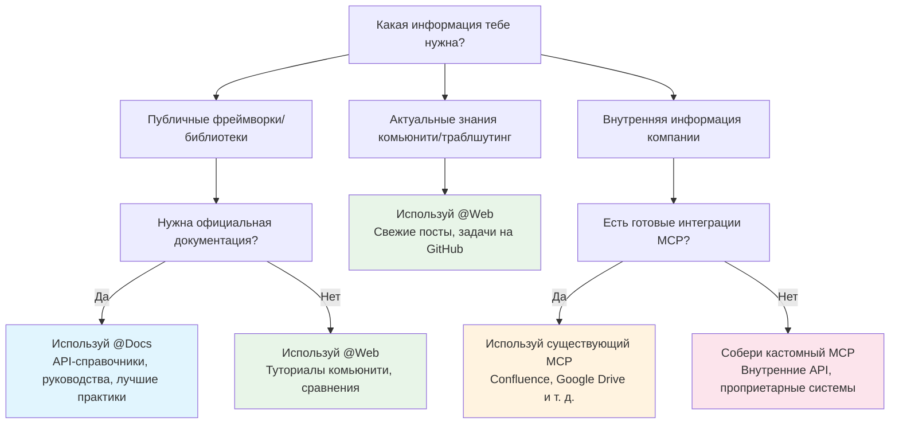
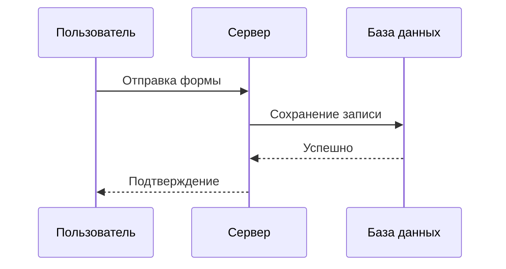
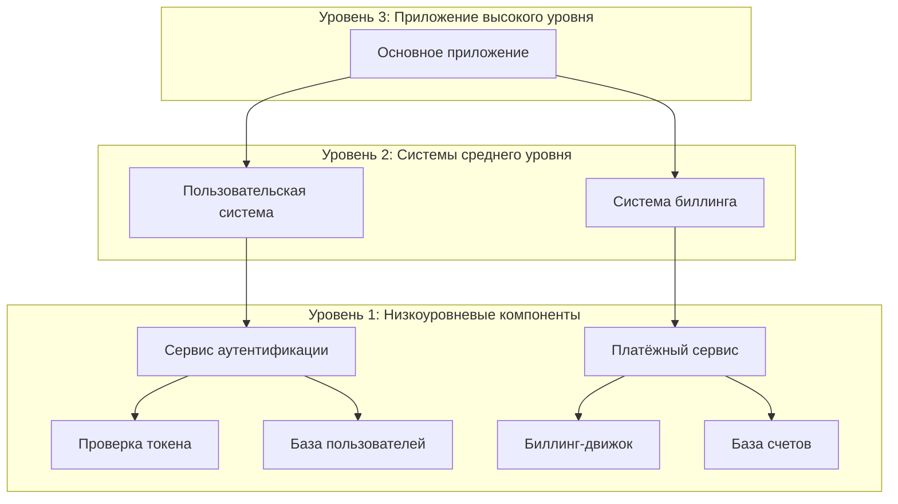
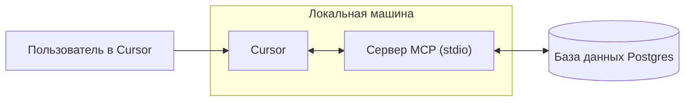
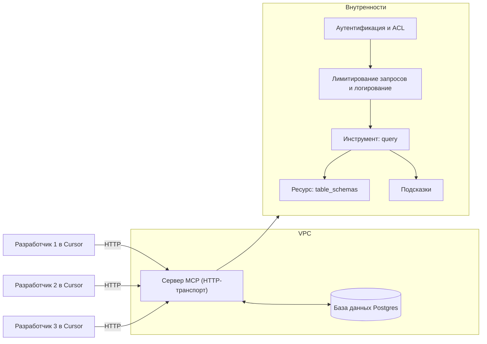
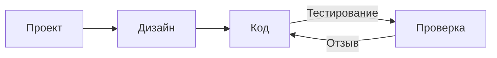
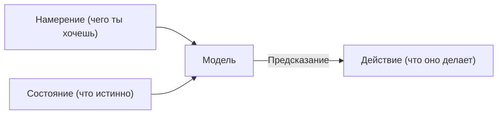

# Работа с документацией

**Navigation:** [← Previous](./32-просмотр-последних-изменений.md) | [Index](./index.md) | [Next →](./34-модели.md)

---

# Работа с документацией
Source: https://docs.cursor.com/ru/guides/advanced/working-with-documentation

Как эффективно использовать документацию в Cursor с помощью промптов, внешних источников и внутреннего контекста

export const ChatInput = ({content = []}) => {
  const renderContent = () => {
    return content.map((item, index) => {
      if (item.type === 'mention') {
        return <span key={index} className="mention bg-blue-500/20 px-1 py-0.5 rounded-sm">
                        {item.text}
                    </span>;
      }
      return item.text;
    });
  };
  return <>
            <div className="flex flex-col items-stretch border border-neutral-500 rounded-lg p-3 gap-2 bg-neutral-800 relative transition-all duration-100 ease-in-out hover:border-neutral-500">
                <div className="flex flex-col gap-1">
                    <div className="flex flex-col gap-1 outline-none overflow-hidden">
                        <div className="flex-1 flex items-center gap-2">
                            <div className="w-full box-border max-h-10 overflow-hidden">
                                <div className="flex items-center gap-2 w-full flex-nowrap">
                                    <div className="cursor-pointer flex items-center justify-center p-1 h-5 w-5 rounded border border-neutral-600 outline-none flex-shrink-0 hover:bg-neutral-700 bg-neutral-750">
                                        <span className="text-neutral-400 text-sm font-semibold">@</span>
                                    </div>
                                </div>
                            </div>
                        </div>
                    </div>
                </div>

                <div className="relative pt-0">
                    <div className="min-h-6 w-full max-h-60">
                        <div className="relative overflow-y-hidden w-full">
                            <div className="w-full flex flex-wrap overflow-hidden min-h-6">
                                <div className="inline-block w-full min-h-full">
                                    <div className="w-full overflow-visible h-full min-h-6">
                                        <div className="grid relative grid-cols-1 w-full">

                                            <div className="leading-6 text-sm text-neutral-200 bg-transparent block break-words p-0 whitespace-pre-wrap font-medium min-h-6">
                                                {content.length > 0 ? renderContent() : <span className="text-neutral-500">Plan, search, build anything</span>}
                                            </div>

                                        </div>
                                    </div>
                                </div>
                            </div>
                        </div>
                    </div>

                    <div className="flex items-center justify-between gap-3 flex-shrink-0 mt-6">
                        <div className="flex-1 w-full h-full flex items-center flex-col gap-1">
                            <div className="flex items-center justify-between gap-2 flex-shrink-0 w-full">
                                <div className="flex items-center justify-between w-full">
                                    <div className="flex items-center gap-3 flex-shrink min-w-0">
                                        <div className="flex gap-1 text-xs items-center min-w-0 max-w-full px-1.5 py-0.5 flex-shrink-0 cursor-pointer bg-neutral-700 hover:bg-neutral-600 rounded-full">
                                            <div className="flex items-center gap-1 min-w-0 max-w-full overflow-hidden">
                                                <div className="text-xs flex-shrink-0 w-3 h-3 flex items-center justify-center text-neutral-400">
                                                    ∞
                                                </div>
                                                <div className="min-w-0 max-w-full overflow-hidden text-ellipsis whitespace-nowrap flex items-center gap-1 font-medium">
                                                    <span className="text-neutral-300">Agent</span>
                                                    <span className="text-neutral-500 text-[10px]">⌘I</span>
                                                </div>
                                                <Icon icon="chevron-down" size={6} color="currentColor" />
                                            </div>
                                        </div>

                                        <div className="flex gap-2 text-xs items-center cursor-pointer min-w-0 max-w-full px-0 py-1 opacity-90 rounded hover:text-neutral-200">
                                            <div className="flex items-center gap-2 min-w-0 max-w-full overflow-x-hidden">
                                                <div className="min-w-0 text-ellipsis whitespace-nowrap text-neutral-300 flex items-center gap-2 overflow-hidden">
                                                    <div className="overflow-hidden inline-flex gap-2 items-center">
                                                        <span className="whitespace-nowrap overflow-x-hidden text-ellipsis text-xs">
                                                            Auto
                                                        </span>
                                                    </div>
                                                </div>
                                                <Icon icon="chevron-down" size={8} color="currentColor" />
                                            </div>
                                        </div>
                                    </div>

                                    <div className="flex items-center gap-3 justify-end">
                                        <button className="bg-white/80 border-none text-neutral-500 flex w-5 h-5 items-center justify-center hover:text-neutral-400 hover:bg-white/90 rounded-full disabled:opacity-50" disabled={content.length === 0 || !content.some(item => item.text.trim())}>
                                            <span className="text-sm">↑</span>
                                        </button>
                                    </div>
                                </div>
                            </div>
                        </div>
                    </div>
                </div>
            </div>
        </>;
};

<div id="why-documentation-matters">
  # Почему документация важна
</div>

Документация дает актуальный, точный контекст. Без нее модели опираются на устаревшие или неполные обучающие данные. Документация помогает моделям понимать такие вещи, как:

* Актуальные API и параметры
* Рекомендации по лучшим практикам
* Принятые в компании соглашения
* Отраслевая терминология

И многое другое. Читай дальше, чтобы узнать, как использовать документацию прямо в Cursor без переключения контекста.

<div id="model-knowledge-cutoff">
  ## Дата отсечения знаний модели
</div>

Большие языковые модели обучаются на данных до определённого момента времени — это называется «дата отсечения знаний». Это значит:

* Недавние обновления библиотек могут не учитываться
* Новые фреймворки или инструменты могут быть неизвестны
* Изменения в API после даты отсечения не попадут в модель
* Лучшие практики могли измениться с момента обучения

Например, если дата отсечения — начало 2024 года, модель не будет знать о возможностях, выпущенных в конце 2024 года, даже в популярных фреймворках.

<div id="which-tool-should-i-use">
  # Какой инструмент выбрать?
</div>

Используй это дерево решений, чтобы быстро определить лучший подход для своей документации:



<div id="mental-model">
  ## Ментальная модель
</div>

<div className="full-width-table">
  | Инструмент  | Ментальная модель                                    |
  | ----------- | ---------------------------------------------------- |
  | **`@Docs`** | Похоже на просмотр и чтение официальной документации |
  | **`@Web`**  | Похоже на поиск решений в интернете                  |
  | **MCP**     | Похоже на доступ к твоей внутренней документации     |
</div>

<div id="public-documentation">
  # Публичная документация
</div>

Внешняя документация включает общедоступную информацию, по которой у моделей могут быть неполные или устаревшие сведения. Cursor предлагает два основных способа получить доступ к этой информации.

<div id="using-docs">
  ## Использование @Docs
</div>

`@Docs` подключает Cursor к официальной документации популярных инструментов и фреймворков. Пользуйся им, когда нужна актуальная, авторитетная информация о:

* **Справочниках по API**: сигнатуры функций, параметры, типы возвращаемых значений
* **Руководствах для начала работы**: установка, конфигурация, базовое использование
* **Рекомендованных практиках**: рекомендуемые паттерны из первоисточника
* **Отладке, специфичной для фреймворков**: официальные руководства по устранению неполадок

<ChatInput
  content={[
{ type: 'mention', text: '@Docs Next.js' },
{ type: 'text', text: ' How do I set up dynamic routing with catch-all routes?' }
]}
/>

<div id="using-web">
  ## Использование @Web
</div>

`@Web` ищет в интернете актуальную информацию, посты в блогах и обсуждения в сообществе. Используй это, когда нужно:

* **Свежие руководства**: Материалы и примеры от сообщества
* **Сравнения**: Статьи, сопоставляющие разные подходы
* **Недавние обновления**: Самые свежие обновления или анонсы
* **Несколько точек зрения**: Разные подходы к решению задач

<ChatInput
  content={[
{ type: 'mention', text: '@Web' },
{ type: 'text', text: ' latest performance optimizations for React 19' }
]}
/>

<div id="internal-documentation">
  # Внутренняя документация
</div>

Внутренняя документация включает информацию, специфичную для твоей организации, с которой модели ИИ не сталкивались во время обучения. Это может быть:

* **Внутренние API**: Пользовательские сервисы и микросервисы
* **Стандарты компании**: Код-стайл, архитектурные паттерны
* **Закрытые системы**: Собственные инструменты, базы данных, рабочие процессы
* **Отраслевые знания**: Бизнес-логика, требования комплаенса

<div id="accessing-internal-docs-with-mcp">
  ## Доступ к внутренней документации с помощью MCP
</div>

Model Context Protocol (MCP) предоставляет стандартизированный способ подключить твою приватную документацию и системы к Cursor. MCP выступает тонким слоем между Cursor и твоими внутренними ресурсами.

**Почему MCP важен:**

* Модели не знают твоих внутренних соглашений
* Документация по API для собственных сервисов недоступна публично
* Бизнес-логика и доменная экспертиза уникальны для твоей организации
* Требования к комплаенсу и безопасности различаются от компании к компании

<div id="common-mcp-integrations">
  ### Распространённые интеграции MCP
</div>

| Интеграция       | Доступ                                       | Примеры                                                                                                                            |
| ---------------- | -------------------------------------------- | ---------------------------------------------------------------------------------------------------------------------------------- |
| **Confluence**   | Корпоративные пространства Confluence        | Архитектурная документация, спецификации API для внутренних сервисов, стандарты и рекомендации по кодингу, процессная документация |
| **Google Drive** | Общие документы и папки                      | Спецификации, заметки встреч и записи решений, дизайн-документы и требования, командные базы знаний                                |
| **Notion**       | Базы данных и страницы рабочего пространства | Проектная документация, командные вики, базы знаний, продуктовые требования, технические спецификации                              |
| **Custom**       | Внутренние системы и базы данных             | Проприетарные API, легаси-системы документации, кастомные базы знаний, специализированные инструменты и процессы                   |

<div id="custom-solutions">
  #### Кастомные решения
</div>

Под уникальные задачи можно собрать собственные MCP‑серверы, которые:

* Скрейпят внутренние сайты или порталы
* Подключаются к проприетарным базам данных
* Доступаются к кастомным системам документации
* Подтягивают данные из внутренних вики или баз знаний

<Tip>Если ты делаешь кастомный MCP‑сервер, можно также выставить инструменты, чтобы Cursor мог обновлять документацию</Tip>

Пример кастомного MCP‑сервера для скрейпа внутренней документации:

<CodeGroup>
  ```javascript TypeScript theme={null}
  import { McpServer, ResourceTemplate } from "@modelcontextprotocol/sdk/server/mcp.js";
  import { StdioServerTransport } from "@modelcontextprotocol/sdk/server/stdio.js";
  import { z } from "zod";
  import TurndownService from "turndown";

  // Create an MCP server for scraping internal docs
  const server = new McpServer({
    name: "internal-docs",
    version: "1.0.0"
  });

  const turndownService = new TurndownService();

  // Add tool to scrape internal documentation
  server.tool("get_doc",
    { url: z.string() },
    async ({ url }) => {
      try {
        const response = await fetch(url);
        const html = await response.text();
        
        // Convert HTML to markdown
        const markdown = turndownService.turndown(html);
        
        return {
          content: [{ type: "text", text: markdown }]
        };
      } catch (error) {
        return {
          content: [{ type: "text", text: `Error scraping ${url}: ${error.message}` }]
        };
      }
    }
  );

  // Start receiving messages on stdin and sending messages on stdout
  const transport = new StdioServerTransport();
  await server.connect(transport);
  ```

  ```python Python theme={null}
  # server.py
  import os
  import asyncio
  from mcp.server.fastmcp import FastMCP
  import aiohttp
  from markdownify import markdownify as md

  # Create an MCP server for scraping internal docs
  mcp = FastMCP("internal-docs")

  @mcp.tool()
  async def get_doc(url: str) -> dict:
      """Scrape internal documentation from a URL"""
      try:
          async with aiohttp.ClientSession() as session:
              async with session.get(url) as response:
                  html = await response.text()
          
          # Convert HTML to markdown
          markdown = md(html)
          
          return {
              "content": [{"type": "text", "text": markdown}]
          }
      except Exception as error:
          return {
              "content": [{"type": "text", "text": f"Error scraping {url}: {str(error)}"}]
          }
  ```
</CodeGroup>

<div id="keeping-docs-up-to-date">
  # Поддержание актуальности документации
</div>

Документация быстро устаревает. Cursor поможет поддерживать её актуальной и полезной, генерируя и обновляя материалы на основе твоего реального кода и обсуждений в процессе разработки.

<div id="from-existing-code">
  ## Из существующего кода
</div>

Используй Cursor, чтобы генерировать документацию прямо из своей кодовой базы:

<Tabs>
  <Tab title="API Documentation">
    <ChatInput
      content={[
    { type: 'text', text: 'Сгенерируй документацию по API для этого роутера Express, включая все эндпоинты, параметры и форматы ответов' }
  ]}
    />
  </Tab>

  <Tab title="JSDoc Comments">
    <ChatInput
      content={[
    { type: 'text', text: 'Добавь подробные комментарии JSDoc к этому классу, задокументировав все методы и их параметры' }
  ]}
    />
  </Tab>

  <Tab title="README Creation">
    <ChatInput
      content={[
    { type: 'text', text: 'Создай README для этого проекта с инструкциями по настройке, примерами использования и обзором API' }
  ]}
    />
  </Tab>
</Tabs>

<div id="from-chat-sessions">
  ## Из чатов
</div>

Твои разговоры с Cursor содержат ценные намерения, которые можно превратить в документацию.

<Tabs>
  <Tab title="Решение задач">
    **После решения сложной задачи:**

    <ChatInput
      content={[
    { type: 'text', text: 'Summarize our conversation about setting up authentication into a step-by-step guide for the team wiki' }
  ]}
    />
  </Tab>

  <Tab title="Архитектура">
    **После архитектурных решений:**

    <ChatInput
      content={[
    { type: 'text', text: 'Create documentation explaining why we chose this database design, including the trade-offs we discussed' }
  ]}
    />
  </Tab>

  <Tab title="Отладка">
    **После сессий отладки:**

    <ChatInput
      content={[
    { type: 'text', text: 'Write a troubleshooting guide based on this bug we just fixed, including symptoms and resolution steps' }
  ]}
    />
  </Tab>
</Tabs>

<div id="takeaways">
  ## Главное
</div>

* Документация как контекст делает Cursor точнее и актуальнее
* Используй `@Docs` для официальной документации и `@Web` для знаний сообщества
* MCP связывает Cursor с твоими внутренними системами
* Генерируй документацию из кода и диалогов, чтобы поддерживать знания в актуальном состоянии
* Комбинируй внешнюю и внутреннюю документацию для более полного понимания


# Java
Source: https://docs.cursor.com/ru/guides/languages/java

Настрой настройку разработки на Java с JDK, расширениями и инструментами сборки

Этот гайд поможет настроить Cursor для разработки на Java: установить JDK и необходимые расширения, настроить отладку, запуск Java‑приложений и интеграцию инструментов сборки, таких как Maven и Gradle. Также он охватывает возможности рабочего процесса, схожие с IntelliJ или VS Code.

<Note>
  Прежде чем начать, убедись, что у тебя установлен Cursor и он обновлён до
  последней версии.
</Note>

<div id="setting-up-java-for-cursor">
  ## Настройка Java для Cursor
</div>

<div id="java-installation">
  ### Установка Java
</div>

Прежде чем настраивать сам Cursor, тебе нужно установить Java на свой компьютер.

<Warning>
  Cursor не включает компилятор Java, так что установи JDK, если ещё не сделал этого.
</Warning>

<CardGroup cols={1}>
  <Card title="Установка на Windows" icon="windows">
    Скачай и установи JDK (например, OpenJDK, Oracle JDK, Microsoft Build of
    OpenJDK).

    <br />

    Задай переменную JAVA\_HOME и добавь JAVA\_HOME\bin в PATH.
  </Card>

  <Card title="Установка на macOS" icon="apple">
    Установи через Homebrew (`brew install openjdk`) или скачай установщик.

    <br />

    Убедись, что JAVA\_HOME указывает на установленный JDK.
  </Card>

  <Card title="Установка на Linux" icon="linux">
    Используй свой менеджер пакетов (`sudo apt install openjdk-17-jdk` или аналог)
    или установи через SDKMAN.
  </Card>
</CardGroup>

Чтобы проверить установку, запусти:

```bash  theme={null}
java -version
javac -version
```

<Info>
  Если Cursor не видит твой JDK, укажи его вручную в settings.json:
</Info>

```json  theme={null}
{
  "java.jdt.ls.java.home": "/path/to/jdk",
  "java.configuration.runtimes": [
    {
      "name": "JavaSE-17",
      "path": "/path/to/jdk-17",
      "default": true
    }
  ]
}
```

<Warning>Перезапусти Cursor, чтобы применить изменения.</Warning>

<div id="cursor-setup">
  ### Настройка Cursor
</div>

<Info>Cursor поддерживает расширения VS Code. Установи вручную следующие:</Info>

<CardGroup cols={2}>
  <Card title="Extension Pack for Java" icon="java" href="cursor:extension/vscjava.vscode-java-pack">
    Включает поддержку языка Java, отладчик, запуск тестов, поддержку Maven и
    менеджер проектов
  </Card>

  <Card title="Gradle for Java" icon="gears" href="cursor:extension/vscjava.vscode-gradle">
    Нужно для работы с системой сборки Gradle
  </Card>

  <Card title="Spring Boot Extension Pack" icon="leaf" href="cursor:extension/vmware.vscode-boot-dev-pack">
    Нужен для разработки на Spring Boot
  </Card>

  <Card title="Kotlin" icon="window" href="cursor:extension/fwcd.kotlin">
    Нужен для разработки приложений на Kotlin
  </Card>
</CardGroup>

<div id="configure-build-tools">
  ### Настройка инструментов сборки
</div>

<div id="maven">
  #### Maven
</div>

Убедись, что Maven установлен (`mvn -version`). При необходимости установи с [maven.apache.org](https://maven.apache.org/download.cgi):

1. Скачай бинарный архив
2. Распакуй в нужное место
3. Установи переменную окружения MAVEN\_HOME на распакованную папку
4. Добавь %MAVEN\_HOME%\bin (Windows) или \$MAVEN\_HOME/bin (Unix) в PATH

<div id="gradle">
  #### Gradle
</div>

Убедись, что Gradle установлен (`gradle -version`). При необходимости установи с [gradle.org](https://gradle.org/install/):

1. Скачай бинарную дистрибуцию
2. Распакуй в нужное место
3. Установи переменную окружения GRADLE\_HOME на распакованную папку
4. Добавь %GRADLE\_HOME%\bin (Windows) или \$GRADLE\_HOME/bin (Unix) в PATH

Либо используй Gradle Wrapper — он автоматически скачает и применит нужную версию Gradle:

<div id="running-and-debugging">
  ## Запуск и отладка
</div>

Всё готово — пора запускать и отлаживать Java‑код.
В зависимости от задач можешь использовать следующие способы:

<CardGroup cols={2}>
  <Card title="Run" icon="play">
    Нажми ссылку «Run», которая появляется над любым методом main, чтобы быстро
    выполнить программу
  </Card>

  <Card title="Debug" icon="bug">
    Открой боковую панель Run and Debug и нажми кнопку Run, чтобы запустить
    приложение
  </Card>
</CardGroup>

<CardGroup cols={1}>
  <Card title="Terminal" icon="terminal">
    Запусти из командной строки с помощью Maven или Gradle
  </Card>

  <Card title="Spring Boot" icon="leaf">
    Запускай приложения Spring Boot прямо из расширения Spring Boot Dashboard
  </Card>
</CardGroup>

<div id="java-x-cursor-workflow">
  ## Java x Cursor: рабочий процесс
</div>

AI‑возможности Cursor могут серьёзно прокачать твой Java‑воркфлоу. Вот как можно использовать возможности Cursor именно для Java:

<CardGroup cols={2}>
  <Card title="Tab Completion" icon="arrow-right">
    <div className="text-sm">
      Умные автодополнения для методов, сигнатур и типового Java‑кода вроде
      геттеров/сеттеров.
    </div>
  </Card>

  <Card title="Agent Mode" icon="pen-to-square">
    <div className="text-sm">
      Реализуй паттерны проектирования, рефактори код или генерируй классы с корректным
      наследованием.
    </div>
  </Card>

  <Card title="Inline Edit" icon="code">
    <div className="text-sm">
      Быстрые правки прямо в коде: обновляй методы, исправляй ошибки или генерируй unit‑тесты —
      без потери рабочего ритма.
    </div>
  </Card>

  <Card title="Chat" icon="message">
    <div className="text-sm">
      Получай помощь по Java‑концептам, разбирай исключения или изучай возможности фреймворков.
    </div>
  </Card>
</CardGroup>

<div id="example-workflows">
  ### Примеры рабочих процессов
</div>

1. **Генерация типового Java‑кода**\
   Используй [Tab completion](/ru/tab/overview), чтобы быстро сгенерировать конструкторы, геттеры/сеттеры, методы equals/hashCode и другие повторяющиеся Java‑шаблоны.

2. **Отладка сложных Java‑исключений**\
   Когда сталкиваешься с нечитаемым Java stack trace, выдели его и используй [Ask](/ru/chat/overview), чтобы понять первопричину и получить варианты исправления.

3. **Рефакторинг легаси‑кода на Java**\
   Используй [Agent mode](/ru/chat/agent), чтобы модернизировать старый Java‑код: переводи анонимные классы в лямбды, переходи на новые возможности языка Java или внедряй паттерны проектирования.

4. **Разработка с фреймворками**\
   Добавь документацию в контекст Cursor с @docs и генерируй код под конкретный фреймворк прямо в Cursor.


# JavaScript & TypeScript
Source: https://docs.cursor.com/ru/guides/languages/javascript

Разработка на JavaScript и TypeScript с поддержкой фреймворков

Добро пожаловать в мир JavaScript и TypeScript в Cursor! Редактор отлично поддерживает разработку на JS/TS благодаря экосистеме расширений. Вот что тебе нужно знать, чтобы выжать из Cursor максимум.

<div id="essential-extensions">
  ## Важные расширения
</div>

Хотя Cursor отлично работает с любыми расширениями, которые тебе нравятся, для старта мы рекомендуем следующие:

* **ESLint** — нужен для AI-функций Cursor по автоисправлению проблем линтинга
* **JavaScript and TypeScript Language Features** — расширенная поддержка языков и IntelliSense
* **Path Intellisense** — умное автодополнение путей к файлам

<div id="cursor-features">
  ## Возможности Cursor
</div>

Cursor прокачивает твой текущий рабочий процесс на JavaScript/TypeScript благодаря:

* **Дополнениям по Tab**: Контекстно‑зависимые подсказки кода, понимающие структуру твоего проекта
* **Автоматическим импортам**: Tab может автоматически импортировать библиотеки, как только ты их используешь
* **Встроенному редактированию**: Жми `CMD+K` на любой строке, чтобы редактировать с идеальным синтаксисом
* **Подсказкам Composer**: Планируй и редактируй код в нескольких файлах с помощью Composer

<div id="framework-intelligence-with-docs">
  ### Интеллект фреймворков с @Docs
</div>

Функция @Docs в Cursor позволяет прокачать разработку на JavaScript, добавляя кастомные источники документации, к которым может обращаться ИИ. Добавь документацию из MDN, Node.js или своего любимого фреймворка, чтобы получать более точные и контекстные подсказки кода.

<Card title="Узнай больше про @Docs" icon="book" href="/ru/context/@-symbols/@-docs">
  Узнай, как добавлять и управлять пользовательскими источниками документации в Cursor.
</Card>

<div id="automatic-linting-resolution">
  ### Автоматическое исправление предупреждений линтера
</div>

Одна из ключевых фишек Cursor — бесшовная интеграция с расширениями линтеров.
Убедись, что у тебя настроен линтер, например ESLint, и включена настройка «Iterate on Lints».

Затем, при использовании режима Agent в Composer, после того как ИИ попытается ответить на твой запрос и внесёт изменения в код, он автоматически прочитает вывод линтера и попытается исправить любые ошибки линтинга, о которых мог не знать.

<div id="framework-support">
  ## Поддержка фреймворков
</div>

Cursor без швов работает со всеми основными JavaScript‑фреймворками и библиотеками, такими как:

### React & Next.js

* Полная поддержка JSX/TSX с умными подсказками по компонентам
* Понимание серверных компонентов и API‑маршрутов в Next.js
* Рекомендуется: расширение [**React Developer Tools**](cursor:extension/msjsdiag.vscode-react-native)

<div id="vuejs">
  ### Vue.js
</div>

* Поддержка синтаксиса шаблонов с интеграцией Volar
* Автодополнение компонентов и проверка типов
* Рекомендуется: [**Vue Language Features**](cursor:extension/vue.volar)

<div id="angular">
  ### Angular
</div>

* Проверка шаблонов и поддержка декораторов TypeScript
* Генерация компонентов и сервисов
* Рекомендуется: [**Angular Language Service**](cursor:extension/Angular.ng-template)

<div id="svelte">
  ### Svelte
</div>

* Подсветка синтаксиса компонентов и умные автодополнения
* Подсказки для реактивных выражений и store
* Рекомендуется: [**Svelte for VS Code**](cursor:extension/svelte.svelte-vscode)

<div id="backend-frameworks-expressnestjs">
  ### Серверные фреймворки (Express/NestJS)
</div>

* Понимание маршрутов и middleware
* Поддержка декораторов TypeScript для NestJS
* Интеграция инструментов для тестирования API

Помни, AI‑возможности Cursor отлично работают со всеми этими фреймворками: они понимают их паттерны и лучшие практики и выдают релевантные подсказки. AI поможет со всем — от создания компонентов до сложного рефакторинга, при этом соблюдая существующие паттерны твоего проекта.


# Python
Source: https://docs.cursor.com/ru/guides/languages/python

Настрой разработку на Python с расширениями и инструментами для линтинга

<Note>
  Этот гайд во многом вдохновлён работой [Jack Fields](https://x.com/OrdinaryInds)
  и его
  [статьёй](https://medium.com/ordinaryindustries/the-ultimate-vs-code-setup-for-python-538026b34d94)
  о настройке VS Code для разработки на Python. Загляни в его статью для
  подробностей.
</Note>

<div id="prerequisites">
  ## Необходимые условия
</div>

Прежде чем начать, убедись, что у тебя есть:

* Установленный [Python](https://python.org) (рекомендуется версия 3.8 или новее)
* [Git](https://git-scm.com/) для системы контроля версий
* Установленный Cursor, обновлённый до последней версии

<div id="essential-extensions">
  ## Важные расширения
</div>

Следующие расширения настраивают Cursor как полноценную среду для разработки на Python. Они дают подсветку синтаксиса, линтинг, отладку и модульное тестирование.

<CardGroup cols={2}>
  <Card title="Python" icon="python" href="cursor:extension/ms-python.python">
    Базовая поддержка языка от Microsoft
  </Card>

  <Card title="Cursor Pyright" icon="bolt" href="cursor:extension/anysphere.cursorpyright">
    Быстрый сервер языка Python
  </Card>

  <Card title="Python Debugger" icon="bug" href="cursor:extension/ms-python.debugpy">
    Расширенные возможности отладки
  </Card>

  <Card title="Ruff" icon="wand-magic-sparkles" href="cursor:extension/charliermarsh.ruff">
    Линтер и форматтер для Python
  </Card>
</CardGroup>

<div id="advanced-python-tooling">
  ### Продвинутые инструменты для Python
</div>

Хотя перечисленные выше расширения раньше были самыми популярными для разработки на Python в Cursor, мы также добавили дополнительные расширения, которые помогут выжать максимум из разработки на Python.

<div id="uv-python-environment-manager">
  #### `uv` — менеджер Python-окружений
</div>

[uv](https://github.com/astral-sh/uv) — современный менеджер пакетов для Python, который можно использовать для создания и управления виртуальными окружениями, а также как замену pip по умолчанию.

Чтобы установить uv, выполни следующую команду в терминале:

```bash  theme={null}
pip install uv
```

<div id="ruff-python-linter-and-formatter">
  #### `ruff` — линтер и форматтер для Python
</div>

[Ruff](https://docs.astral.sh/ruff/) — современный линтер и форматтер для Python, который помогает находить ошибки, соблюдать код-стайл и подсказывает варианты рефакторинга. Его можно использовать вместе с Black для форматирования кода.

Чтобы установить Ruff, выполни в терминале команду:

```bash  theme={null}
pip install ruff
```

<div id="cursor-configuration">
  ## Настройка Cursor
</div>

<div id="1-python-interpreter">
  ### 1. Интерпретатор Python
</div>

Настрой интерпретатор Python в Cursor:

1. Открой Command Palette (Cmd/Ctrl + Shift + P)
2. Найди «Python: Select Interpreter»
3. Выбери интерпретатор Python (или виртуальное окружение, если ты его используешь)

<div id="2-code-formatting">
  ### 2. Форматирование кода
</div>

Включи автоформатирование кода с помощью Black:

<Note>
  Black — это форматтер кода, который автоматически приводит твой код к
  единому стилю. Он не требует конфигурации и широко используется
  в сообществе Python.
</Note>

Чтобы установить Black, выполни в терминале команду:

```bash  theme={null}
pip install black
```

Далее настрой Cursor на использование Black для форматирования кода, добавив в свой файл `settings.json` следующий блок:

```json  theme={null}
{
  "python.formatting.provider": "black",
  "editor.formatOnSave": true,
  "python.formatting.blackArgs": ["--line-length", "88"]
}
```

<div id="3-linting">
  ### 3. Линтинг
</div>

Мы можем использовать PyLint для поиска ошибок в коде, соблюдения стандартов и предложений по рефакторингу.

Чтобы установить PyLint, запусти в терминале следующую команду:

```bash  theme={null}
pip install pylint
```

```json  theme={null}
{
  "python.linting.enabled": true,
  "python.linting.pylintEnabled": true,
  "python.linting.lintOnSave": true
}
```

<div id="4-type-checking">
  ### 4. Проверка типов
</div>

Помимо линтинга можно использовать MyPy для проверки ошибок типов.

Чтобы установить MyPy, выполни в терминале следующую команду:

```bash  theme={null}
pip install mypy
```

```json  theme={null}
{
  "python.linting.mypyEnabled": true
}
```

<div id="debugging">
  ## Отладка
</div>

В Cursor есть мощные инструменты отладки для Python:

1. Ставь точки останова, кликая по полю слева от номера строки
2. Открывай панель Debug (Cmd/Ctrl + Shift + D)
3. Настрой `launch.json` для кастомных конфигураций отладки

<div id="recommended-features">
  ## Рекомендуемые функции
</div>

<CardGroup cols={3}>
  <Card title="Tab Completion" icon="wand-magic-sparkles" href="/ru/tab/overview">
    Умные подсказки кода, которые понимают, что ты делаешь
  </Card>

  <Card title="Chat" icon="comments" href="/ru/chat/overview">
    Изучай и понимай код через естественные диалоги
  </Card>

  <Card title="Agent" icon="robot" href="/ru/chat/agent">
    Решай сложные задачи разработки с помощью ИИ
  </Card>

  <Card title="Context" icon="network-wired" href="/ru/context/model-context-protocol">
    Подтягивай контекст из сторонних систем
  </Card>

  <Card title="Auto-Imports" icon="file-import" href="/ru/tab/auto-import">
    Автоматически импортируй модули по мере написания кода
  </Card>

  <Card title="AI Review" icon="check-double" href="/ru/tab/overview#quality">
    Cursor постоянно проверяет твой код с помощью ИИ
  </Card>
</CardGroup>

<div id="framework-support">
  ## Поддержка фреймворков
</div>

Cursor без проблем работает с популярными фреймворками для Python:

* **Веб‑фреймворки**: Django, Flask, FastAPI
* **Data Science**: Jupyter, NumPy, Pandas
* **Машинное обучение**: TensorFlow, PyTorch, scikit-learn
* **Тестирование**: pytest, unittest
* **API**: requests, aiohttp
* **Базы данных**: SQLAlchemy, psycopg2


# iOS и macOS (Swift)
Source: https://docs.cursor.com/ru/guides/languages/swift

Интегрируй Cursor с Xcode для разработки на Swift

Добро пожаловать в разработку на Swift в Cursor! Делаешь iOS‑приложения, macOS‑аппы или серверные проекты на Swift — мы поможем. Это руководство поможет настроить среду Swift в Cursor: начнём с базы и перейдём к более продвинутым фичам.

<div id="basic-workflow">
  ## Базовый рабочий процесс
</div>

Самый простой способ использовать Cursor со Swift — сделать его своим основным редактором кода, а для сборки и запуска приложений по‑прежнему полагаться на Xcode. Ты получишь крутые возможности:

* Умное автодополнение кода
* AI‑ассистент при написании кода (попробуй [CMD+K](/ru/inline-edit/overview) на любой строке)
* Быстрый доступ к документации через [@Docs](/ru/context/@-symbols/@-docs)
* Подсветка синтаксиса
* Базовая навигация по коду

Когда нужно собрать или запустить приложение, просто переключайся в Xcode. Такой процесс идеален, если хочешь использовать AI‑возможности Cursor и при этом оставаться с привычными инструментами Xcode для отладки и деплоя.

<div id="hot-reloading">
  ### Горячая перезагрузка
</div>

Если ты используешь рабочие области или проекты Xcode (вместо открытия папки напрямую в Xcode), редактор нередко игнорирует изменения в файлах, сделанные в Cursor или вообще вне Xcode.

Можно открыть папку в Xcode, чтобы обойти это, но для рабочего процесса разработки на Swift тебе может понадобиться именно проект.

Отличное решение — использовать [Inject](https://github.com/krzysztofzablocki/Inject), библиотеку горячей перезагрузки для Swift, которая позволяет приложению «горячо перезагружаться» и обновляться сразу по мере внесения изменений в реальном времени. Это не страдает от побочных эффектов проблемы с рабочими областями/проектами в Xcode и позволяет вносить изменения в Cursor и видеть их в приложении мгновенно.

<CardGroup cols={1}>
  <Card title="Inject — горячая перезагрузка для Swift" horizontal icon="fire" href="https://github.com/krzysztofzablocki/Inject">
    Узнай больше об Inject и о том, как использовать его в своих проектах на Swift.
  </Card>
</CardGroup>

<div id="advanced-swift-development">
  ## Продвинутая разработка на Swift
</div>

<Note>
  На создание этого раздела сильно повлияли материалы [Thomas
  Ricouard](https://x.com/Dimillian) и его
  [статья](https://dimillian.medium.com/how-to-use-cursor-for-ios-development-54b912c23941)
  об использовании Cursor для iOS‑разработки. Загляни в статью за подробностями и подпишись на него, если хочешь больше контента по Swift.
</Note>

Если хочешь держать открытым только один редактор и избежать переключения между Xcode и Cursor, можешь использовать расширение вроде [Sweetpad](https://sweetpad.hyzyla.dev/), чтобы интегрировать Cursor напрямую с базовой системой сборки Xcode.

Sweetpad — мощное расширение, которое позволяет собирать, запускать и отлаживать проекты на Swift прямо в Cursor, не теряя возможностей Xcode.

Чтобы начать работу с Sweetpad, Xcode всё равно должен быть установлен на твоём Mac — это фундамент Swift‑разработки. Скачай Xcode из [Mac App Store](https://apps.apple.com/us/app/xcode/id497799835). Как только Xcode настроен, давай прокачаем опыт разработки в Cursor с помощью пары необходимых инструментов.

Открой терминал и выполни:

```bash  theme={null}

# Собирает проекты без запущенного Xcode
brew install xcode-build-server


# Красиво форматирует вывод команды `xcodebuild` в терминале Cursor
brew install xcbeautify


# Обеспечивает продвинутое форматирование и языковые возможности
brew install swiftformat
```

Затем установи в Cursor расширение [Swift Language Support](cursor:extension/chrisatwindsurf.swift-vscode). Оно даст подсветку синтаксиса и базовые возможности языка сразу из коробки.

Дальше можно поставить расширение [Sweetpad](https://sweetpad.hyzyla.dev/) для интеграции Cursor с Xcode. Sweetpad оборачивает набор хоткеев вокруг CLI `xcodebuild` (и не только) и позволяет сканировать таргеты, выбирать целевую среду, собирать и запускать приложение так же, как в Xcode. Плюс к этому, оно настроит проект для Xcode Build Server, чтобы ты получил все перечисленные выше возможности.

<div id="sweetpad-usage">
  ### Использование Sweetpad
</div>

Когда Sweetpad установлен и у тебя открыт Swift‑проект в Cursor, сначала запусти команду `Sweetpad: Generate Build Server Config`. Это сгенерирует файл `buildServer.json` в корне проекта, который позволит Xcode Build Server работать с твоим проектом.

Далее, через Command Palette или боковую панель Sweetpad, можно выбрать нужный таргет для сборки и запуска.

<Note>
  {" "}

  Нужно один раз собрать проект, чтобы включить автодополнение, переход к определению
  и другие языковые возможности.{" "}
</Note>

Теперь можно нажать F5, чтобы собрать и запустить проект с отладчиком — возможно, сначала потребуется создать конфигурацию запуска, просто выбери Sweetpad из списка, когда попросят!

Как и во многих расширениях для Cursor, ты можешь привязать команды Sweetpad к сочетаниям клавиш, чтобы сделать рабочий процесс ещё эффективнее.

Чтобы узнать больше о Sweetpad, посмотри эти ресурсы:

<CardGroup>
  <Card title="Sweetpad Website" horizontal icon="globe" href="https://sweetpad.hyzyla.dev/">
    Официальный сайт Sweetpad с описанием возможностей и инструкциями по установке
  </Card>

  <Card title="Sweetpad Guide" horizontal icon="book" href="https://sweetpad.hyzyla.dev/docs/intro">
    Подробное руководство по настройке, использованию и продвинутым функциям
  </Card>
</CardGroup>


# JetBrains
Source: https://docs.cursor.com/ru/guides/migration/jetbrains

Переходи с IDE JetBrains на Cursor с привычными инструментами

Cursor — это современная среда для написания кода с ИИ, которая может заменить твои IDE JetBrains. Поначалу переход может показаться непривычным, но основа Cursor на базе VS Code даёт мощные возможности и широкие возможности настройки.

<div id="editor-components">
  ## Компоненты редактора
</div>

<div id="extensions">
  ### Расширения
</div>

IDE от JetBrains — классные инструменты: они уже преднастроены под нужные языки и фреймворки.

Cursor другой — это чистый холст из коробки: настраивай его как хочешь, не ограничиваясь языками и фреймворками, под которые задумывалась IDE.

У Cursor есть доступ к огромной экосистеме расширений, и почти всю функциональность (и даже больше!), которую предлагают IDE от JetBrains, можно воссоздать с их помощью.

Посмотри на некоторые популярные расширения ниже:

<CardGroup cols={4}>
  <Card title="Remote SSH" icon="network-wired" href="cursor:extension/anysphere.remote-ssh">
    Расширение для SSH
  </Card>

  <Card title="Project Manager" icon="folder-tree" href="cursor:extension/alefragnani.project-manager">
    Управляй несколькими проектами
  </Card>

  <Card title="GitLens" icon="git" href="cursor:extension/eamodio.gitlens">
    Расширенная интеграция с Git
  </Card>

  <Card title="Local History" icon="clock-rotate-left" href="cursor:extension/xyz.local-history">
    Отслеживание локальных изменений файлов
  </Card>

  <Card title="Error Lens" icon="bug" href="cursor:extension/usernamehw.errorlens">
    Подсветка ошибок прямо в коде
  </Card>

  <Card title="ESLint" icon="code-compare" href="cursor:extension/dbaeumer.vscode-eslint">
    Линтинг кода
  </Card>

  <Card title="Prettier" icon="wand-magic-sparkles" href="cursor:extension/esbenp.prettier-vscode">
    Форматирование кода
  </Card>

  <Card title="Todo Tree" icon="folder-tree" href="cursor:extension/Gruntfuggly.todo-tree">
    Отслеживание TODO и FIXME
  </Card>
</CardGroup>

<div id="keyboard-shortcuts">
  ### Комбинации клавиш
</div>

В Cursor есть встроенный менеджер сочетаний клавиш, который позволяет привязывать любимые хоткеи к действиям.

С этим расширением можно перенести почти все сочетания клавиш из IDE JetBrains прямо в Cursor!
Обязательно прочитай документацию расширения, чтобы настроить его под себя:

<Card title="IntelliJ IDEA Keybindings" icon="keyboard" href="cursor:extension/k--kato.intellij-idea-keybindings">
  Установи это расширение, чтобы перенести сочетания клавиш IDE JetBrains в Cursor.
</Card>

<Note>
  Распространённые сочетания, которые отличаются:

  * Find Action: ⌘/Ctrl+Shift+P  (vs. ⌘/Ctrl+Shift+A)
  * Quick Fix: ⌘/Ctrl+.  (vs. Alt+Enter)
  * Go to File: ⌘/Ctrl+P  (vs. ⌘/Ctrl+Shift+N)
</Note>

<div id="themes">
  ### Темы
</div>

Воссоздай внешний вид и ощущения от любимых IDE JetBrains в Cursor с помощью этих тем от сообщества.

Выбирай стандартную тему Darcula или подбери тему под подсветку синтаксиса твоих инструментов JetBrains.

<CardGroup cols={1}>
  <Card title="JetBrains - Darcula Theme" icon="moon" horizontal href="cursor:extension/rokoroku.vscode-theme-darcula">
    Ощути классическую тёмную тему JetBrains Darcula
  </Card>
</CardGroup>

<CardGroup cols={2}>
  <Card title="JetBrains PyCharm" icon="python" horizontal href="cursor:extension/gabemahoney.pycharm-dark-theme-for-python" />

  <Card title="IntelliJ" icon="java" horizontal href="cursor:extension/compassak.intellij-idea-new-ui" />

  <Card title="JetBrains Fleet" icon="code" horizontal href="cursor:extension/MichaelZhou.fleet-theme" />

  <Card title="JetBrains Rider" icon="hashtag" horizontal href="cursor:extension/muhammad-sammy.rider-theme" />
</CardGroup>

<CardGroup cols={1}>
  <Card title="JetBrains Icons" icon="icons" horizontal href="cursor:extension/ardonplay.vscode-jetbrains-icon-theme">
    Привычные значки файлов и папок JetBrains
  </Card>
</CardGroup>

<div id="font">
  ### Шрифт
</div>

Чтобы завершить «джетбрейнс-подобный» опыт, можно использовать официальный шрифт JetBrains Mono:

1. Скачай и установи шрифт JetBrains Mono в систему:

<CardGroup cols={1}>
  <Card title="Download JetBrains Mono" icon="link" horizontal href="https://www.jetbrains.com/lp/mono/" />
</CardGroup>

2. Перезапусти Cursor после установки шрифта
3. Открой Settings в Cursor (⌘/Ctrl + ,)
4. Найди "Font Family"
5. Выбери семейство шрифтов `'JetBrains Mono'`

<Note>
  Для лучшего опыта можно включить лигатуры шрифта, установив в настройках «editor.fontLigatures»: true.
</Note>

<div id="ide-specific-migration">
  ## Миграция под конкретные IDE
</div>

Многим нравятся IDE от JetBrains за готовую из коробки поддержку языков и фреймворков, под которые они создавались. Cursor другой — это чистый холст из коробки: ты настраиваешь его под себя и не ограничиваешься наборами языков и фреймворков, на которые изначально рассчитана IDE.

У Cursor уже есть доступ к экосистеме расширений VS Code, и практически весь функционал (и даже больше!), который предлагают IDE от JetBrains, можно воспроизвести через эти расширения.

Ниже посмотри рекомендуемые расширения для каждой IDE JetBrains.

<div id="intellij-idea-java">
  ### IntelliJ IDEA (Java)
</div>

<CardGroup cols={2}>
  <Card title="Language Support for Java" icon="java" href="cursor:extension/redhat.java">
    Базовые возможности языка Java
  </Card>

  <Card title="Debugger for Java" icon="bug" href="cursor:extension/vscjava.vscode-java-debug">
    Поддержка отладки Java
  </Card>

  <Card title="Test Runner for Java" icon="vial" href="cursor:extension/vscjava.vscode-java-test">
    Запуск и отладка тестов Java
  </Card>

  <Card title="Maven for Java" icon="box" href="cursor:extension/vscjava.vscode-maven">
    Поддержка Maven
  </Card>
</CardGroup>

<CardGroup cols={1}>
  <Card title="Project Manager for Java" icon="folder-tree" href="cursor:extension/vscjava.vscode-java-dependency" horizontal>
    Инструменты управления проектами
  </Card>
</CardGroup>

<Warning>
  Ключевые отличия:

  * Конфигурации сборки/запуска управляются через launch.json
  * Инструменты Spring Boot доступны через расширение ["Spring Boot Extension Pack"](cursor:extension/vmware.vscode-boot-dev-pack)
  * Поддержка Gradle через расширение ["Gradle for Java"](cursor:extension/vscjava.vscode-gradle)
</Warning>

<div id="pycharm-python">
  ### PyCharm (Python)
</div>

<CardGroup cols={2}>
  <Card title="Python" icon="python" href="cursor:extension/ms-python.python">
    Базовая поддержка Python
  </Card>

  <Card title="Cursor Pyright" icon="bolt" href="cursor:extension/anysphere.cursorpyright">
    Быстрая проверка типов
  </Card>

  <Card title="Jupyter" icon="notebook" href="cursor:extension/ms-toolsai.jupyter">
    Поддержка ноутбуков
  </Card>

  <Card title="Ruff" icon="wand-magic-sparkles" href="cursor:extension/charliermarsh.ruff">
    Форматтер и линтер для Python
  </Card>
</CardGroup>

<Note>
  Ключевые отличия:

  * Виртуальные окружения управляются через палитру команд
  * Конфигурации отладки в launch.json
  * Управление зависимостями через requirements.txt или Poetry
</Note>

<div id="webstorm-javascripttypescript">
  ### WebStorm (JavaScript/TypeScript)
</div>

<CardGroup cols={2}>
  <Card title="JavaScript and TypeScript Nightly" icon="js" href="cursor:extension/ms-vscode.vscode-typescript-next">
    Самые свежие возможности языка
  </Card>

  <Card title="ES7+ React/Redux Snippets" icon="react" href="cursor:extension/dsznajder.es7-react-js-snippets">
    Разработка на React
  </Card>

  <Card title="Vue Language Features" icon="vuejs" href="cursor:extension/Vue.volar">
    Поддержка Vue.js
  </Card>

  <Card title="Angular Language Service" icon="angular" href="cursor:extension/Angular.ng-template">
    Разработка на Angular
  </Card>
</CardGroup>

<Info>
  Большинство возможностей WebStorm встроены в Cursor/VS Code, включая:

  * просмотр npm-скриптов
  * отладку
  * интеграцию с Git
  * поддержку TypeScript
</Info>

<div id="phpstorm-php">
  ### PhpStorm (PHP)
</div>

<CardGroup cols={2}>
  <Card title="PHP Intelephense" icon="php" href="cursor:extension/bmewburn.vscode-intelephense-client">
    Языковой сервер PHP
  </Card>

  <Card title="PHP Debug" icon="bug" href="cursor:extension/xdebug.php-debug">
    Интеграция с Xdebug
  </Card>

  <Card title="PHP Intellisense" icon="brain" href="cursor:extension/felixfbecker.php-intellisense">
    Интеллектуальные подсказки кода
  </Card>

  <Card title="PHP DocBlocker" icon="comment-dots" href="cursor:extension/neilbrayfield.php-docblocker">
    Инструменты документации
  </Card>
</CardGroup>

<Note>
  Ключевые отличия:

  * Конфигурация Xdebug через launch.json
  * Интеграция Composer через терминал
  * Инструменты работы с базами данных через расширение ["SQLTools"](cursor:extension/mtxr.sqltools)
</Note>

<div id="rider-net">
  ### Rider (.NET)
</div>

<CardGroup cols={2}>
  <Card title="C#" icon="code" href="cursor:extension/anysphere.csharp">
    Базовая поддержка C#
  </Card>

  <Card title="DotRush" icon="toolbox" href="cursor:extension/nromanov.dotrush">
    Открытая среда разработки C#
  </Card>

  <Card title="ReSharper Plugin" icon="box" href="https://www.jetbrains.com/help/resharper-vscode/Get_started.html#installation">
    Плагин JetBrains для C#
  </Card>

  <Card title=".NET Install Tool" icon="box-open" href="cursor:extension/ms-dotnettools.vscode-dotnet-runtime">
    Управление .NET SDK
  </Card>
</CardGroup>

<Warning>
  Ключевые отличия:

  * Обозреватель решений через проводник файлов
  * Управление пакетами NuGet через CLI или расширения
  * Интеграция тест-раннера через обозреватель тестов
</Warning>

<div id="goland-go">
  ### GoLand (Go)
</div>

<CardGroup cols={1}>
  <Card title="Go" icon="golang" href="cursor:extension/golang.Go">
    Официальное расширение Go
  </Card>
</CardGroup>

<Note>
  Ключевые отличия:

  * Установка инструментов Go предлагается автоматически
  * Отладка через launch.json
  * Управление пакетами интегрировано с go.mod
</Note>

<div id="tips-for-a-smooth-transition">
  ## Советы для плавного перехода
</div>

<Steps>
  <Step title="Используй командную палитру">
    Нажми <kbd>⌘</kbd>/<kbd>Ctrl</kbd> + <kbd>Shift</kbd> + <kbd>P</kbd>, чтобы найти команды
  </Step>

  <Step title="AI‑возможности">
    Используй AI‑возможности Cursor для автодополнения кода и рефакторинга
  </Step>

  <Step title="Настройка параметров">
    Точно настрой свой settings.json для оптимального рабочего процесса
  </Step>

  <Step title="Интеграция терминала">
    Пользуйся встроенным терминалом для работы в командной строке
  </Step>

  <Step title="Расширения">
    Просматривай маркетплейс VS Code в поисках дополнительных инструментов
  </Step>
</Steps>

<Info>
  Помни: хотя некоторые сценарии работы могут отличаться, Cursor предлагает мощные AI‑функции для помощи в написании кода, которые повысят твою продуктивность сверх возможностей традиционных IDE.
</Info>


# VS Code
Source: https://docs.cursor.com/ru/guides/migration/vscode

Импортируй настройки и расширения VS Code в один клик

Cursor построен на базе кода VS Code, поэтому мы можем сосредоточиться на создании лучшего AI‑опыта разработки, сохраняя знакомую среду редактирования. Это упрощает перенос твоих текущих настроек VS Code в Cursor.

<div id="profile-migration">
  ## Миграция профиля
</div>

<div id="one-click-import">
  ### Импорт в один клик
</div>

Вот как забрать всю твою конфигурацию VS Code в один клик:

1. Открой Cursor Settings (<kbd>⌘</kbd>/<kbd>Ctrl</kbd> + <kbd>Shift</kbd> + <kbd>J</kbd>)
2. Перейди в General > Account
3. В разделе "VS Code Import" нажми кнопку Import

<Frame>
  
</Frame>

Будут перенесены:

* расширения
* темы
* настройки
* сочетания клавиш

<div id="manual-profile-migration">
  ### Ручная миграция профиля
</div>

Если ты переезжаешь на другой компьютер или хочешь больше контроля над настройками, можно вручную перенести профиль.

<div id="exporting-a-profile">
  #### Экспорт профиля
</div>

1. В своём VS Code открой Command Palette (<kbd>⌘</kbd>/<kbd>Ctrl</kbd> + <kbd>Shift</kbd> + <kbd>P</kbd>)
2. Найди "Preferences: Open Profiles (UI)"
3. Найди профиль, который хочешь экспортировать, в левой боковой панели
4. Нажми на меню с тремя точками и выбери "Export Profile"
5. Экспортируй либо на локальный компьютер, либо в GitHub Gist

<div id="importing-a-profile">
  #### Импорт профиля
</div>

1. В своём Cursor открой Command Palette (<kbd>⌘</kbd>/<kbd>Ctrl</kbd> + <kbd>Shift</kbd> + <kbd>P</kbd>)
2. Найди "Preferences: Open Profiles (UI)"
3. Нажми на выпадающее меню рядом с "New Profile" и выбери "Import Profile"
4. Вставь URL GitHub Gist или нажми "Select File", чтобы загрузить локальный файл
5. Нажми "Import" внизу диалога, чтобы сохранить профиль
6. В конце в боковой панели выбери новый профиль и нажми на значок галочки, чтобы активировать его

<div id="settings-and-interface">
  ## Настройки и интерфейс
</div>

<div id="settings-menus">
  ### Меню настроек
</div>

<CardGroup>
  <Card title="Cursor Settings" icon="gear">
    Открой через Command Palette (<kbd>⌘</kbd>/<kbd>Ctrl</kbd> + <kbd>Shift</kbd>{" "}

    * <kbd>P</kbd>), затем введи «Cursor Settings»
  </Card>

  <Card title="VS Code Settings" icon="code">
    Открой через Command Palette (<kbd>⌘</kbd>/<kbd>Ctrl</kbd> + <kbd>Shift</kbd>{" "}

    * <kbd>P</kbd>), затем введи «Preferences: Open Settings (UI)»
  </Card>
</CardGroup>

<div id="version-updates">
  ### Обновления версий
</div>

<Card title="Version Updates" icon="code-merge">
  Мы регулярно обновляем базу Cursor до последней версии VS Code, чтобы оставаться в
  курсе новых функций и исправлений. Для стабильности Cursor часто использует
  чуть более старые версии VS Code.
</Card>

<div id="activity-bar-orientation">
  ### Ориентация Activity Bar
</div>

<Frame>
  
</Frame>

Мы сделали её горизонтальной, чтобы оптимизировать место для интерфейса AI-чата. Если тебе нужна вертикальная:

1. Открой Command Palette (<kbd>⌘</kbd>/<kbd>Ctrl</kbd> + <kbd>Shift</kbd> + <kbd>P</kbd>)
2. Найди «Preferences: Open Settings (UI)»
3. Найди `workbench.activityBar.orientation`
4. Установи значение `vertical`
5. Перезапусти Cursor


# Архитектурные диаграммы
Source: https://docs.cursor.com/ru/guides/tutorials/architectural-diagrams

Научись генерировать архитектурные диаграммы с помощью Mermaid, чтобы визуализировать структуру системы и потоки данных

Архитектурные диаграммы помогают понять, как работает твоя система. С их помощью можно исследовать логику, отслеживать данные и наглядно передавать структуру. Cursor умеет генерировать такие диаграммы напрямую с помощью инструментов вроде Mermaid, так что ты можешь перейти от кода к визуализации всего за пару промптов.

<Frame>
  
</Frame>

<div id="why-diagrams-matter">
  ## Почему диаграммы важны
</div>

Диаграммы показывают, как движутся данные и как взаимодействуют компоненты. Они полезны, когда ты:

* Хочешь разобраться с управлением потоком в своей кодовой базе
* Нужно проследить lineage данных от входа до выхода
* Онбордишь других или документируешь свою систему

Они также отлично подходят для отладки и помогают задавать более умные вопросы. Визуализации помогают тебе (и модели) увидеть общую картину.

<div id="two-dimensions-to-consider">
  ## Два аспекта, которые стоит учитывать
</div>

Есть несколько разных ракурсов, с которых можно посмотреть:

* **Цель**: ты отображаешь логику, поток данных, инфраструктуру или что-то ещё?
* **Формат**: нужно что-то быстрое (например, диаграмма Mermaid) или более формальное (например, UML)?

<div id="how-to-prompt">
  ## Как формулировать запросы
</div>

Начни с чёткой цели. Вот несколько типичных формулировок:

* **Потоки выполнения**: "Покажи, как запросы проходят от контроллера до базы данных."
* **Происхождение данных**: "Проследи эту переменную от точки входа до конечного места."
* **Структура**: "Дай компонентный обзор этого сервиса."

Ты можешь указать начальные и конечные точки или попросить Cursor найти полный путь.

<div id="working-with-mermaid">
  ## Работа с Mermaid
</div>

Mermaid легко освоить и он рендерится прямо в Markdown (с нужным расширением). Cursor может генерировать такие диаграммы, как:

* `flowchart` для логики и последовательностей
* `sequenceDiagram` для взаимодействий
* `classDiagram` для структуры объектов
* `graph TD` для простых направленных графов



Можно установить [расширение Mermaid](https://marketplace.cursorapi.com/items?itemName=bierner.markdown-mermaid), чтобы просматривать диаграммы в режиме предварительного просмотра.

1. Открой вкладку Extensions
2. Найди Mermaid
3. Установи

<Frame>
  
</Frame>

<div id="diagram-strategy">
  ## Стратегия работы с диаграммами
</div>

Начни с малого. Не пытайся описать всё сразу.

* Выбери одну функцию, маршрут или процесс
* Попроси Cursor построить диаграмму этой части в Mermaid
* Когда будет несколько диаграмм, попроси его объединить их

Это соответствует **модели C4**: начинаешь с низкого уровня (код или компоненты) и поднимаешься к более высоким уровням обзора.

<div id="recommended-flow">
  ### Рекомендуемый подход
</div>

1. Начни с детализированной низкоуровневой диаграммы
2. Сверни её до среднего уровня
3. Повторяй, пока не достигнешь нужной степени абстракции
4. Попроси Cursor объединить их в одну диаграмму или карту системы



<div id="takeaways">
  ## Выводы
</div>

* Используй диаграммы, чтобы понимать поток, логику и данные
* Начни с небольших подсказок и постепенно развивай диаграмму
* Mermaid — самый удобный формат для работы в Cursor
* Начинай с низкого уровня и поднимайся к абстракции, как в модели C4
* Cursor поможет легко генерировать, улучшать и комбинировать диаграммы


# Создание сервера MCP
Source: https://docs.cursor.com/ru/guides/tutorials/building-mcp-server

Узнай, как собрать сервер Model Context Protocol (MCP) с интеграцией PostgreSQL для Cursor

<div id="introduction">
  ## Введение
</div>

Серверы MCP позволяют подключать собственные источники данных и делать их доступными внутри Cursor. Это особенно полезно, когда нужен контекст из браузеров, баз данных или системных и ошибокных логов. Настроить сервер MCP несложно, и в Cursor это делается быстро.

В этом руководстве мы разберём, как создать сервер MCP для Postgres. Наша цель — дать Cursor возможность выполнять SQL‑запросы напрямую к базе данных Postgres и предоставлять схемы таблиц в структурированном виде.

<Note>
  Этот материал предназначен для изучения основ разработки серверов MCP.
</Note>

<video autoPlay loop muted playsInline controls>
  <source src="https://mintcdn.com/cursor/Qpa6MBK62Try_xlf/images/guides/tutorials/building-mcp-server/demo.mp4?fit=max&auto=format&n=Qpa6MBK62Try_xlf&q=85&s=8e02b011bd0956d62135db5779f7ead5" type="video/mp4" data-path="images/guides/tutorials/building-mcp-server/demo.mp4" />
</video>



<div id="what-is-an-mcp-server">
  ## Что такое MCP‑сервер?
</div>

[MCP‑сервер](/ru/context/mcp) — это процесс, который взаимодействует с Cursor и предоставляет доступ к внешним данным и действиям. Его можно реализовать по‑разному, но здесь мы используем самый простой вариант: сервер, который запускается локально на твоём компьютере через [stdio](https://en.wikipedia.org/wiki/Standard_streams) (стандартные потоки ввода/вывода). Это позволяет избежать сложных вопросов безопасности и сосредоточиться на логике MCP.

Один из самых распространённых сценариев для MCP — доступ к базе данных. При создании дашбордов, запуске аналитики или подготовке миграций часто нужно выполнять запросы и изучать базу данных. Наш Postgres MCP‑сервер будет поддерживать две ключевые возможности: выполнение произвольных запросов и вывод схем таблиц.

Хотя обе эти задачи можно решить на чистом SQL, MCP предлагает возможности, которые делают их мощнее и универсальнее. Инструменты позволяют предоставлять действия, такие как выполнение запросов, а ресурсы — делиться стандартизированным контекстом, например сведениями о схемах. Позже в этом гайде мы также рассмотрим промпты, которые позволяют строить более продвинутые рабочие процессы.

Под капотом мы будем использовать пакет postgres из npm для выполнения SQL‑операторов по базе данных. MCP SDK будет служить обёрткой вокруг этих вызовов, позволяя бесшовно интегрировать функциональность Postgres в Cursor.

<div id="how-to-build-the-mcp-server">
  ## Как собрать MCP‑сервер
</div>

Первый шаг в сборке сервера — настроить новый проект. Начнём с создания новой папки и инициализации проекта Bun

```bash  theme={null}
> mkdir postgres-mcp-server
> Bun init
```

Отсюда выберем проект `Blank`. Как только настроен наш боилерплейт, нужно установить необходимые зависимости. `zod` потребуется для определения схем ввода/вывода в MCP SDK

```bash  theme={null}
bun add postgres @modelcontextprotocol/sdk zod
```

Отсюда перейдём в репозитории каждой из библиотек и возьмём ссылки на «сырое» содержимое соответствующих README-файлов. Мы будем использовать их как контекст при разработке сервера

* `postgres`
  * Repo:  [https://github.com/porsager/postgres](https://github.com/porsager/postgres),
  * README: [https://raw.githubusercontent.com/porsager/postgres/refs/heads/master/README.md](https://raw.githubusercontent.com/porsager/postgres/refs/heads/master/README.md)
* `@modelcontextprotocol/sdk`:
  * Repo: [https://github.com/modelcontextprotocol/typescript-sdk](https://github.com/modelcontextprotocol/typescript-sdk)
  * README: [https://raw.githubusercontent.com/modelcontextprotocol/typescript-sdk/refs/heads/main/README.md](https://raw.githubusercontent.com/modelcontextprotocol/typescript-sdk/refs/heads/main/README.md)

Теперь определим, как должен вести себя сервер. Для этого создадим `spec.md` и опишем цели на высоком уровне

```markdown  theme={null}

# Спецификация

- Разрешить задавать DATABASE_URL через конфигурацию переменных окружения MCP
- Выполнять запросы к данным Postgres через инструмент
  - По умолчанию доступ только для чтения
  - Разрешить операции записи, установив переменную окружения `DANGEROUSLY_ALLOW_WRITE_OPS=true|1`
- Обращаться к таблицам как к `resources`
- Использовать Zod для определения схем
```

Как видишь, это довольно лёгкая спецификация. Не стесняйся добавить больше деталей по необходимости. Вместе с ссылками из README мы соберём финальный промпт.

```markdown  theme={null}
Прочитай следующее и следуй @spec.md, чтобы понять, что нам нужно. Все необходимые зависимости установлены
- @https://raw.githubusercontent.com/modelcontextprotocol/typescript-sdk/refs/heads/main/README.md
- @https://raw.githubusercontent.com/porsager/postgres/refs/heads/master/README.md
```

Имея эти три компонента (спецификацию, документацию по MCP SDK и документацию библиотеки Postgres), можно использовать Cursor, чтобы сгенерировать каркас серверной реализации. Cursor поможет связать всё воедино, сгенерировав код, который соединяет MCP SDK с Postgres.

После пары итераций подсказок у нас есть первая версия MCP‑сервера. Чтобы попробовать её, можно использовать [MCP Inspector](https://modelcontextprotocol.io/legacy/tools/inspector)

```bash  theme={null}
npx @modelcontextprotocol/inspector bun run index.ts
```

<div id="testing-the-mcp-server">
  ## Тестирование MCP-сервера
</div>

Когда первоначальная реализация готова, можно протестировать её с помощью MCP Inspector. Инспектор позволяет увидеть, что именно сервер предоставляет, и убедиться, что инструменты и ресурсы работают как ожидается. Нужно проверить, что запросы выполняются, а информация о схеме возвращается корректно.


Если всё в порядке, подключи сервер к самому Cursor и протестируй его в реальной среде. На этом этапе Cursor сможет использовать Postgres MCP-сервер как встроенную возможность, позволяя напрямую выполнять запросы и исследовать базу данных.

<video autoPlay loop muted playsInline controls>
  <source src="https://mintcdn.com/cursor/Qpa6MBK62Try_xlf/images/guides/tutorials/building-mcp-server/mcp-mermaid.mp4?fit=max&auto=format&n=Qpa6MBK62Try_xlf&q=85&s=06fe972734d9f15bc64032f28c4e3e52" type="video/mp4" data-path="images/guides/tutorials/building-mcp-server/mcp-mermaid.mp4" />
</video>

<div id="next-steps">
  ## Что дальше
</div>

Запуск MCP-сервера локально через stdio — отличный старт, но командам часто нужен общий доступ к одной и той же базе данных через свой MCP-сервер. В таких случаях имеет смысл развернуть MCP-сервер как централизованный HTTP‑сервис.

Развёрнутый MCP-сервер даёт несколько преимуществ по сравнению с отдельными экземплярами stdio:

* **Общий доступ к базе данных:** несколько участников команды могут обращаться к одной и той же инстансу базы данных через Cursor
* **Централизованная конфигурация:** обновления схемы и изменения прав управляются в одном месте
* **Усиленная безопасность:** можно внедрить корректную аутентификацию, ограничение частоты запросов и контроль доступа
* **Наблюдаемость:** по всей команде можно отслеживать паттерны использования и метрики производительности

Чтобы этого добиться, переключи транспорт с stdio на HTTP.

Мы не будем разбирать всю настройку, вот хороший стартовый промпт, который можно дать Cursor

```
На основе существующего MCP-сервера создай новый файл, который реализует протокол HTTP.

Вынеси общую логику в mcp-core и дай каждой реализации транспорта осмысленное имя (mcp-server-stdio, mcp-server-http).

@https://raw.githubusercontent.com/modelcontextprotocol/typescript-sdk/refs/heads/main/README.md 
```

Окончательные результаты можно посмотреть здесь: [pg-mcp-server](https://github.com/ericzakariasson/pg-mcp-server)




# Веб‑разработка
Source: https://docs.cursor.com/ru/guides/tutorials/web-development

Как настроить Cursor для веб‑разработки

export const McpInstallButtonPrimary = ({server, showIcon = true, prompt = null}) => {
  const [showModal, setShowModal] = useState(false);
  const generateDeepLink = () => {
    if (!server || !server.name || !server.install) {
      return null;
    }
    try {
      if (typeof server.install === 'string') {
        return server.install;
      }
      if (server.install.url) {
        const config = {
          ...server.install
        };
        const jsonString = JSON.stringify(config);
        const utf8Bytes = new TextEncoder().encode(jsonString);
        const base64Config = btoa(Array.from(utf8Bytes).map(b => String.fromCharCode(b)).join(''));
        const safeBase64Config = base64Config.replace(/\+/g, '%2B');
        return `cursor://anysphere.cursor-deeplink/mcp/install?name=${encodeURIComponent(server.name)}&config=${encodeURIComponent(safeBase64Config)}`;
      }
      if (server.install.command) {
        let config = {
          command: server.install.command,
          ...server.install.args && ({
            args: server.install.args
          }),
          ...server.install.env && ({
            env: server.install.env
          })
        };
        if (config.command && config.args) {
          const argsString = config.args.join(" ");
          config.command = `${config.command} ${argsString}`;
          delete config.args;
        }
        const jsonString = JSON.stringify(config);
        const utf8Bytes = new TextEncoder().encode(jsonString);
        const base64Config = btoa(Array.from(utf8Bytes).map(b => String.fromCharCode(b)).join(''));
        const safeBase64Config = base64Config.replace(/\+/g, '%2B');
        return `cursor://anysphere.cursor-deeplink/mcp/install?name=${encodeURIComponent(server.name)}&config=${encodeURIComponent(safeBase64Config)}`;
      }
      return null;
    } catch (e) {
      console.error("Error generating deep link:", e);
      return null;
    }
  };
  const handleButtonClick = () => {
    setShowModal(true);
  };
  const handleClose = () => {
    setShowModal(false);
  };
  const deepLink = generateDeepLink();
  const isDocumentationOnly = typeof server?.install === 'string';
  const hasConfirmation = prompt || isDocumentationOnly;
  const InstallModal = ({isOpen, onClose, deepLink, server, children}) => {
    useEffect(() => {
      const handleKeyDown = event => {
        if (event.key === 'Escape') {
          onClose();
        }
      };
      if (isOpen) {
        document.addEventListener('keydown', handleKeyDown);
      }
      return () => {
        document.removeEventListener('keydown', handleKeyDown);
      };
    }, [isOpen, onClose]);
    if (!isOpen) return null;
    return <div className="fixed inset-0 bg-black bg-opacity-50 flex items-center justify-center z-50 transition-opacity duration-200" onClick={onClose}>
        <div className="bg-white dark:bg-neutral-900 rounded-lg p-6 max-w-md w-full mx-4 border border-neutral-200 dark:border-neutral-700 transition-all duration-200 transform" onClick={e => e.stopPropagation()}>
          <div className="mb-4">
            <h3 className="text-lg font-semibold text-black dark:text-white mb-2">
              Install {server?.name}
            </h3>
            <div className="text-neutral-600 dark:text-neutral-400">
              {children}
            </div>
          </div>
          <div className="flex gap-3 justify-end">
            <button onClick={onClose} className="px-4 py-2 text-sm font-medium rounded-lg transition-colors duration-200 text-neutral-600 dark:text-neutral-400 hover:text-black dark:hover:text-white border border-neutral-200 dark:border-neutral-700 hover:bg-neutral-100 dark:hover:bg-neutral-800">
              Cancel
            </button>
            <a href={deepLink} onClick={onClose} target="_blank" className="px-4 py-2 text-sm font-medium rounded-lg transition-colors duration-200 bg-black text-white hover:bg-neutral-800 dark:bg-white dark:text-black dark:hover:bg-neutral-200 inline-flex items-center justify-center no-underline">
              Continue
            </a>
          </div>
        </div>
      </div>;
  };
  return <>
      {hasConfirmation ? <button onClick={handleButtonClick} className="inline-flex justify-center items-center gap-2 px-4 py-2 text-sm font-medium rounded-lg transition-colors duration-200 not-prose text-white bg-black hover:bg-neutral-800 dark:bg-white dark:text-black dark:hover:bg-neutral-200 border border-black dark:border-white">
          {showIcon && <Icon icon="plus" size={16} color="currentColor" />}
          Add to Cursor
        </button> : <a href={deepLink} className="inline-flex justify-center items-center gap-2 px-4 py-2 text-sm font-medium rounded-lg transition-colors duration-200 not-prose text-white bg-black hover:bg-neutral-800 dark:bg-white dark:text-black dark:hover:bg-neutral-200 border border-black dark:border-white">
          {showIcon && <Icon icon="plus" size={16} color="currentColor" />}
          Add to Cursor
        </a>}

      {hasConfirmation && <InstallModal isOpen={showModal} onClose={handleClose} deepLink={deepLink} server={server}>
          {prompt}
        </InstallModal>}
    </>;
};

Веб‑разработка — это быстрые итерации и тесные циклы обратной связи между Cursor и внешними инструментами вроде Figma или браузера. В Cursor мы нашли рабочие процессы, которые ещё сильнее ускоряют этот цикл. Чёткая постановка задач, повторное использование компонентов и опора на дизайн‑системы помогают держать всё быстро и единообразно.

В этом руководстве — как настроить Cursor для веб‑разработки и ускорить цикл обратной связи.



<div id="start-orchestrating-in-cursor">
  # Начни оркестрацию в Cursor
</div>

**Chat** отлично подходит, чтобы быстро накидать изменения. Когда ключевые части уже на месте, переход на **Inline Edit** и **Tab** помогает не выпадать из потока.

После настройки Cursor ты сможешь оркестрировать рабочие процессы в разных инструментах. Ниже — демонстрация возможностей: игра «Змейка», созданная с помощью связки Linear, Figma и браузера. Хотя реальные проекты обычно сложнее, этот пример показывает потенциал таких интегрированных рабочих процессов.

<Frame>
  <video src="https://mintcdn.com/cursor/E7JVsKUF5L-IiJRB/images/guides/tutorials/web-development/snake.mp4?fit=max&auto=format&n=E7JVsKUF5L-IiJRB&q=85&s=e029fbdff2ec06e1e4393ac580824b5a" controls data-path="images/guides/tutorials/web-development/snake.mp4" />
</Frame>

<div id="connect-to-your-project-management-tools">
  # Подключай свои инструменты для управления проектами
</div>

Ты можешь интегрировать Cursor с уже используемым софтом для управления проектами, используя разные инструменты. В этом гайде мы разберём интеграцию Linear через их MCP‑сервер.

<div id="installation">
  ### Установка
</div>

<McpInstallButtonPrimary
  server={{
name: "Linear",
install: {
command: "npx",
args: ["-y", "mcp-remote", "https://mcp.linear.app/sse"],
},
}}
/>

Или добавь MCP‑сервер Linear вручную в `mcp.json`:

```jsx  theme={null}
{
  "mcpServers": {
    "Linear": {
      "command": "npx",
      "args": [
        "-y",
        "mcp-remote",
        "https://mcp.linear.app/sse"
      ]
    }
  }
}
```

Затем:

1. Убедись, что Linear включён в настройках MCP
2. Откроется браузер, и тебе предложат авторизоваться в Linear
   <Info>
     Из-за текущего состояния MCP настройка может потребовать нескольких попыток.
     Если интеграция не работает, попробуй «Reload» сервера в настройках Cursor.
   </Info>

<div id="using-linear-in-cursor">
  ### Использование Linear в Cursor
</div>

Серверы Linear MCP предоставляют разные инструменты, которые Cursor может использовать для чтения и управления задачами. Зайди в настройки MCP и найди сервер Linear, чтобы увидеть список всех инструментов. Для проверки попробуй этот запрос в Chat:

```jsx  theme={null}
покажи все задачи, связанные с этим проектом
```

<Frame>
  
</Frame>

Если интеграция настроена правильно, должен вернуться список задач.

<div id="bring-in-your-figma-designs">
  # Импортируй свои дизайны из Figma
</div>

Дизайны и макеты — основа веб‑разработки. С официальным MCP‑сервером для Figma ты можешь напрямую получать доступ к файлам дизайна и работать с ними в Cursor. Чтобы начать, следуй инструкциям по настройке на странице [Figma Dev Mode MCP Server](https://help.figma.com/hc/en-us/articles/32132100833559-Guide-to-the-Dev-Mode-MCP-Server).

<div id="installation">
  ### Установка
</div>

Нажми кнопку ниже, чтобы установить MCP‑сервер.

<McpInstallButtonPrimary
  server={{
name: "Figma",
install: {
url: "http://127.0.0.1:3845/sse",
},
}}
/>

Или добавь вручную в свой `mcp.json`:

```jsx  theme={null}
{
  "mcpServers": {
    "Figma": {
      "url": "http://127.0.0.1:3845/sse"
    }
  }
}
```

<div id="usage">
  ### Использование
</div>

Сервер предоставляет несколько инструментов, которые можно использовать в своих подсказках. Например, попробуй запросить дизайн для текущего выделения в Figma. Подробнее — в [документации](https://help.figma.com/hc/en-us/articles/32132100833559-Guide-to-the-Dev-Mode-MCP-Server).

<Frame>
  
</Frame>

<div id="keep-your-code-scaffolding-consistent">
  # Сохраняй единообразие в заготовках кода
</div>

Скорее всего, у тебя уже есть код, дизайн‑система или устоявшиеся соглашения, которые ты хочешь переиспользовать. При работе с моделями полезно отсылать к паттернам, уже используемым в твоей кодовой базе, например к выпадающим спискам или другим типовым компонентам.

Работая сами с крупной веб‑кодовой базой, мы заметили, что декларативный код особенно хорошо подходит, особенно для React и JSX.

Если у тебя есть дизайн‑система, можно помочь агенту её обнаружить, задав для неё правило. Вот файл `ui-components.mdc`, где мы стараемся по возможности обеспечить переиспользование компонентов:

```mdc components.mdc theme={null}
---
description: Реализация дизайна и построение UI
---
- переиспользуй существующие UI‑компоненты из `/src/components/ui`. это примитивы, из которых мы строим интерфейсы
- создавай новые компоненты, комбинируя UI‑компоненты, если не находишь существующих, которые решают задачу
- спроси у человека, как поступить, если не хватает компонентов и макетов
```

По мере роста библиотеки компонентов добавляй новые правила по мере необходимости. Когда правил становится слишком много, подумай о том, чтобы разбить их на более узкие категории, например: «применять только при работе с пользовательским вводом».

<Frame>
  
</Frame>

<div id="give-cursor-access-to-browser">
  # Дай Cursor доступ к браузеру
</div>

Чтобы расширить возможности Cursor, настроь MCP‑сервер browser tools, который предоставляет доступ к консольным логам и сетевым запросам. После настройки ты можешь проверить изменения, отслеживая вывод в консоли и сетевую активность. Такая настройка помогает убедиться, что реализация соответствует твоему замыслу. Следуй инструкциям здесь, чтобы развернуть MCP‑сервер: [https://browsertools.agentdesk.ai/installation](https://browsertools.agentdesk.ai/installation)

<Frame>
  
</Frame>

<Note>
  Мы работаем над тем, чтобы упростить нативную интеграцию в Cursor.
</Note>

<div id="takeaways">
  # Основные выводы
</div>

* Короткие циклы обратной связи — ключ к веб‑разработке. Используй Cursor вместе с инструментами вроде Figma, Linear и браузера, чтобы двигаться быстрее и не выпадать из потока.
* MCP‑серверы позволяют интегрировать внешние системы прямо в Cursor, уменьшая переключение контекста и улучшая выполнение задач.
* Повторное использование компонентов и дизайн‑систем помогает модели выдавать более чистый и единообразный код и результаты.
* Четко сформулированные, ограниченные по объему задачи дают лучшие результаты. Осознанно подходи к формулировке промптов и запросов.
* Если не получаешь хорошие результаты, попробуй настроить:
  * **Instructions:** Используй правила, промпты и давай доступ к большему контексту, например через MCP‑серверы.
  * **Systems:** Паттерны, абстракции и ясная структура упрощают модели понимание, помощь и более автономную работу.
* Можно расширить контекст модели, добавляя данные рантайма — логи консоли, сетевые запросы и данные UI‑элементов.
* Не все нужно автоматизировать. Если система становится слишком сложной, вернись к точечным правкам с Tab и Inline Edit.
* Cursor наиболее силен как ко‑пилот, а не автопилот. Используй его, чтобы усиливать, а не заменять собственное принятие решений.


# Работа с контекстом
Source: https://docs.cursor.com/ru/guides/working-with-context

Как работать с контекстом в Cursor

Для начала: что такое окно контекста? И как оно помогает эффективнее писать код в Cursor?

Если чуть отступить, large language model (LLM) — это модель ИИ, обученная предсказывать и генерировать текст, изучая закономерности в огромных наборах данных. Она лежит в основе таких инструментов, как Cursor, понимая твой ввод и предлагая код или текст на основе того, что уже «видела».

Токены — это входные и выходные единицы таких моделей. Это кусочки текста, часто фрагменты слов, которые LLM обрабатывает по одному. Модели не читают сразу целые предложения: они предсказывают следующий токен на основе предыдущих.

Чтобы увидеть, как текст разбивается на токены, можно воспользоваться токенизатором вроде [этого](https://tiktokenizer.vercel.app/).


<div id="what-is-context">
  # Что такое контекст?
</div>

Когда Cursor генерирует предложение кода, «контекст» — это информация, передаваемая модели (в виде «входных токенов»), которую модель затем использует, чтобы предсказать последующую информацию (в виде «выходных токенов»).

Есть два типа контекста:

1. **Контекст намерения** определяет, что пользователь хочет получить от модели. Например, системный промпт обычно служит высокоуровневыми инструкциями о том, как пользователь хочет, чтобы модель себя вела. Большая часть «промптинга» в Cursor — это контекст намерения. «Сделай эту кнопку зелёной вместо синей» — пример явного намерения; это предписывающая формулировка.
2. **Контекст состояния** описывает текущее состояние. Предоставление Cursor сообщений об ошибках, логов консоли, изображений и фрагментов кода — примеры контекста, связанного с состоянием. Он описательный, а не предписывающий.

Вместе эти два типа контекста работают в связке: описывают текущее состояние и желаемое будущее состояние, позволяя Cursor давать полезные предложения по коду.



<div id="providing-context-in-cursor">
  # Предоставление контекста в Cursor
</div>

Чем релевантнее контекст ты даёшь модели, тем полезнее она будет. Если в Cursor контекста недостаточно, модель попытается решить задачу без нужной информации. Обычно это приводит к следующему:

1. Галлюцинациям, когда модель пытается подогнать паттерн (когда его нет), что приводит к неожиданным результатам. Это часто случается с моделями вроде `claude-3.5-sonnet`, если им не хватает контекста.
2. Тому, что Agent пытается собрать контекст самостоятельно: искать по кодовой базе, читать файлы и вызывать инструменты. Сильная «думающая» модель (например, `claude-3.7-sonnet`) может зайти довольно далеко с такой стратегией, и то, какой начальный контекст ты задашь, определит траекторию.

Хорошая новость в том, что Cursor изначально создавался с учётом контекстной осведомлённости и спроектирован так, чтобы требовать минимального участия пользователя. Cursor автоматически подтягивает части твоей кодовой базы, которые, по оценке модели, релевантны, такие как текущий файл, семантически похожие паттерны в других файлах и другая информация из твоей сессии.

Однако источников контекста очень много, поэтому явное указание контекста, который ты считаешь релевантным задаче, — хороший способ направить модели в нужную сторону.

<div id="symbol">
  ## Символ @
</div>

Самый простой способ задать явный контекст — использовать символ @. Он отлично подходит, когда ты точно знаешь, какой файл, папку, сайт или другой кусок контекста нужно включить. Чем точнее, тем лучше. Ниже — разбор, как более адресно работать с контекстом:

| Symbol    | Example              | Use case                                                                                   | Drawback                                                                                 |
| --------- | -------------------- | ------------------------------------------------------------------------------------------ | ---------------------------------------------------------------------------------------- |
| `@code`   | `@LRUCachedFunction` | Ты знаешь, какая функция, константа или символ важны для результата, который ты получаешь  | Требуется глубокое знание кодовой базы                                                   |
| `@file`   | `cache.ts`           | Ты знаешь, какой файл нужно прочитать или отредактировать, но не знаешь точное место в нём | Может включать много лишнего контекста для текущей задачи в зависимости от размера файла |
| `@folder` | `utils/`             | Всё или большинство файлов в папке имеют отношение к задаче                                | Может включать много лишнего контекста для текущей задачи                                |


<div id="rules">
  ## Правила
</div>

Думай о правилах как о долговременной памяти, к которой ты или другие участники твоей команды сможете обращаться. Фиксация контекста предметной области — включая процессы, форматирование и прочие соглашения — отличный старт для написания правил.

Правила можно также сгенерировать из существующих разговоров с помощью `/Generate Cursor Rules`. Если у тебя была длинная переписка с множеством промптов, скорее всего, там есть полезные директивы или общие правила, которые ты захочешь использовать позже.


<div id="mcp">
  ## MCP
</div>

[Model Context Protocol](https://modelcontextprotocol.io/introduction) — это слой расширения, который позволяет дать Cursor возможности выполнять действия и подтягивать внешний контекст.

В зависимости от твоей среды разработки могут подойти разные типы серверов, но особенно полезны две категории:

* **Внутренняя документация**: например, Notion, Confluence, Google Docs
* **Управление проектами**: например, Linear, Jira

Если у тебя уже есть инструменты для доступа к контексту и выполнения действий через API, можно собрать для них MCP‑сервер. Вот краткое руководство по созданию [MCP‑серверов](https://modelcontextprotocol.io/tutorials/building-mcp-with-llms).


<div id="self-gathering-context">
  ## Самосбор контекста
</div>

Сильный прием, который многие используют, — позволять Agent писать краткоживущие утилиты, которые он затем запускает, чтобы собрать больше контекста. Это особенно полезно в сценариях с участием человека (human-in-the-loop), где ты просматриваешь код перед выполнением.

Например, добавление отладочных сообщений в свой код, его запуск и предоставление модели возможности изучить вывод дают ей доступ к динамическому контексту, который невозможно вывести статически.

В Python это можно сделать, попросив Agent:

1. Добавить в нужные части кода выражения print("debugging: ...")
2. Запустить код или тесты через терминал

Agent прочитает вывод терминала и решит, что делать дальше. Главная идея — дать Agent доступ к фактическому поведению во время выполнения, а не только к статическому коду.


<div id="takeaways">
  # Выводы
</div>

* Контекст — основа эффективного AI-кодинга. Он состоит из намерения (что ты хочешь) и состояния (что уже есть). Если указать оба, Cursor будет давать более точные ответы.
* Используй «хирургический» контекст с @-символами (@code, @file, @folder), чтобы направлять Cursor максимально точно, а не полагаться только на автоматический сбор контекста.
* Оформляй повторяемые знания в правила, чтобы переиспользовать их командой, и расширяй возможности Cursor через Model Context Protocol для подключения внешних систем.
* Недостаточный контекст ведёт к галлюцинациям или неэффективности, а избыток нерелевантного контекста размывает сигнал. Держи правильный баланс для оптимальных результатов.


# Inline Edit
Source: https://docs.cursor.com/ru/inline-edit/overview

Редактируй и задавай вопросы с помощью Inline Edit (Cmd/Ctrl+K) в Cursor

export const Kbd = ({children, tooltip, os}) => {
  const keysInput = typeof children === 'string' && children.trim() !== '' ? children : null;
  if (!keysInput) {
    return null;
  }
  const isModifier = key => {
    const modifiers = ['⌘', '⇧', '⌥', '⌃', '⏎', '⌫', '⌦', '⎋', '⇥', '⌁', '←', '→', '↑', '↓', 'Ctrl', 'Shift', 'Alt', 'Cmd', 'Opt', 'Return', 'Backspace', 'Delete', 'Escape', 'Tab', 'Space', 'Enter', 'Esc', 'ArrowLeft', 'ArrowRight', 'ArrowUp', 'ArrowDown', 'Left', 'Right', 'Up', 'Down'];
    return modifiers.includes(key.trim());
  };
  const capitalizeFirstLetter = string => {
    return string.charAt(0).toUpperCase() + string.slice(1);
  };
  const isMac = os ? os.toLowerCase() === 'mac' || os.toLowerCase() === 'macos' : typeof navigator !== 'undefined' && (navigator.platform.toUpperCase().indexOf('MAC') >= 0 || navigator.userAgent.toUpperCase().indexOf('MAC') >= 0);
  const convertToSymbols = shortcut => {
    if (isMac) {
      return shortcut.replace(/⌘|Cmd|CMD/gi, '⌘').replace(/⌥|Opt|OPT/gi, '⌥').replace(/⌃|Ctrl/gi, '⌃').replace(/⇧|Shift/gi, '⇧').replace(/⏎|Return/gi, '⏎').replace(/⌫|Backspace/gi, '⌫').replace(/⌦|Delete/gi, '⌦').replace(/␛|Escape/gi, '␛').replace(/⇥|Tab/gi, '⇥').replace(/⌁|Space/gi, '⌁').replace(/←|Arrow\s*Left|ArrowLeft|Left/gi, '←').replace(/→|Arrow\s*Right|ArrowRight|Right/gi, '→').replace(/↑|Arrow\s*Up|ArrowUp|Up/gi, '↑').replace(/↓|Arrow\s*Down|ArrowDown|Down/gi, '↓');
    } else {
      const converted = shortcut.replace(/⌘|Cmd|CMD/gi, 'Ctrl').replace(/⌥|Opt|OPT/gi, 'Alt').replace(/⌃|Ctrl/gi, 'Ctrl').replace(/⇧|Shift/gi, 'Shift').replace(/⏎|Return/gi, 'Enter').replace(/⌫|Backspace/gi, 'Backspace').replace(/⌦|Delete/gi, 'Delete').replace(/⎋|Escape/gi, 'Esc').replace(/⇥|Tab/gi, 'Tab').replace(/⌁|Space/gi, 'Space').replace(/←|Arrow\s*Left|ArrowLeft|Left/gi, 'Arrow-Left').replace(/→|Arrow\s*Right|ArrowRight|Right/gi, 'Arrow-Right').replace(/↑|Arrow\s*Up|ArrowUp|Up/gi, 'Arrow-Up').replace(/↓|Arrow\s*Down|ArrowDown|Down/gi, 'Arrow-Down');
      const keyList = converted.split(/[\+\s]+/).filter(key => key.trim());
      return keyList.join('+');
    }
  };
  const convertToReadableText = shortcut => {
    const converted = shortcut.replace(/⌘|Cmd|CMD/gi, 'Cmd').replace(/⌥|Opt|OPT/gi, 'Opt').replace(/⌃|Ctrl/gi, 'Ctrl').replace(/⇧|Shift/gi, 'Shift').replace(/⏎|Return/gi, 'Return').replace(/⌫|Backspace/gi, 'Backspace').replace(/⌦|Delete/gi, 'Delete').replace(/⎋|Escape/gi, 'Escape').replace(/⇥|Tab/gi, 'Tab').replace(/⌁|Space/gi, 'Space').replace(/←|Arrow\s*Left|ArrowLeft|Left/gi, 'Arrow-Left').replace(/→|Arrow\s*Right|ArrowRight|Right/gi, 'Arrow-Right').replace(/↑|Arrow\s*Up|ArrowUp|Up/gi, 'Arrow-Up').replace(/↓|Arrow\s*Down|ArrowDown|Down/gi, 'Arrow-Down');
    const keyList = converted.split(/[\+\s]+/).filter(key => key.trim());
    return keyList.map(key => {
      const trimmedKey = key.trim();
      return isModifier(trimmedKey) ? trimmedKey : capitalizeFirstLetter(trimmedKey);
    }).join('+');
  };
  const displayShortcut = convertToSymbols(keysInput);
  const tooltipText = isMac ? tooltip ? `${convertToReadableText(keysInput)}: ${tooltip}` : convertToReadableText(keysInput) : tooltip || null;
  const processedKeys = isMac ? displayShortcut.split(/[\+\s]+/).filter(key => key.trim()).map(key => {
    const trimmedKey = key.trim();
    return isModifier(trimmedKey) ? trimmedKey : capitalizeFirstLetter(trimmedKey);
  }).join('') : displayShortcut.split('+').map(key => {
    const trimmedKey = key.trim();
    return isModifier(trimmedKey) ? trimmedKey : capitalizeFirstLetter(trimmedKey);
  }).join('+');
  return tooltipText ? <Tooltip tip={tooltipText}>
      <kbd>
        {processedKeys}
      </kbd>
    </Tooltip> : <kbd>
      {processedKeys}
    </kbd>;
};

Inline Edit позволяет редактировать код и задавать вопросы прямо в редакторе с помощью <Kbd>Cmd+K</Kbd>. Эта команда открывает поле ввода, где выбранный код и твои инструкции формируют запрос.

<Frame>
  
</Frame>

<div id="modes">
  ## Режимы
</div>

<div id="edit-selection">
  ### Редактирование выделенного
</div>

Когда код выделен, <Kbd>Cmd+K</Kbd> редактирует именно этот фрагмент по твоим инструкциям.

<Frame>
  
</Frame>

Без выделения Cursor сгенерирует новый код в позиции курсора. ИИ добавит релевантный окружающий код для контекста. Например, запуск по имени функции захватит всю функцию целиком.

<div id="quick-question">
  ### Быстрый вопрос
</div>

Нажми <Kbd>Opt+Return</Kbd> во встроенном редакторе, чтобы задать вопрос о выделенном коде.

После ответа напиши "do it" или похожую фразу, чтобы превратить подсказку в код. Так можно сначала прикинуть идеи, а потом внедрить.

<Frame>
  
</Frame>

<div id="full-file-edits">
  ### Полное редактирование файла
</div>

Для изменений во всем файле используй <Kbd>Cmd+Shift+Return</Kbd>. Этот режим позволяет вносить масштабные правки, сохраняя контроль.

<Frame>
  
</Frame>

<div id="send-to-chat">
  ### Отправить в чат
</div>

Для многофайловых правок или продвинутых возможностей используй <Kbd>Cmd+L</Kbd>, чтобы отправить выделенный код в [Chat](/ru/agent/modes#agent). Это дает многофайловое редактирование, подробные объяснения и расширенные возможности ИИ.

<Frame>
  <video src="https://mintcdn.com/cursor/E7JVsKUF5L-IiJRB/images/inline-edit/send-to-chat.mp4?fit=max&auto=format&n=E7JVsKUF5L-IiJRB&q=85&s=04a84c73c8736a733f1748fd86ac437f" autoPlay loop muted playsInline controls data-path="images/inline-edit/send-to-chat.mp4" />
</Frame>

<div id="follow-up-instructions">
  ## Дополнительные инструкции
</div>

После каждого изменения улучшай результат: добавь инструкции и нажми <Kbd>Return</Kbd>. ИИ обновит всё с учётом твоей обратной связи.

<div id="default-context">
  ## Контекст по умолчанию
</div>

Inline Edit включает контекст по умолчанию, чтобы улучшать генерацию кода сверх любых [символов @](/ru/context/@-symbols/@-files), которые ты добавляешь.

Сюда входят связанные файлы, недавно просмотренный код и актуальная информация. Cursor отдает приоритет наиболее релевантному контексту для лучшего результата.


# Терминал
Source: https://docs.cursor.com/ru/inline-edit/terminal

Генерируй команды для терминала с помощью Cmd/Ctrl+K

export const Kbd = ({children, tooltip, os}) => {
  const keysInput = typeof children === 'string' && children.trim() !== '' ? children : null;
  if (!keysInput) {
    return null;
  }
  const isModifier = key => {
    const modifiers = ['⌘', '⇧', '⌥', '⌃', '⏎', '⌫', '⌦', '⎋', '⇥', '⌁', '←', '→', '↑', '↓', 'Ctrl', 'Shift', 'Alt', 'Cmd', 'Opt', 'Return', 'Backspace', 'Delete', 'Escape', 'Tab', 'Space', 'Enter', 'Esc', 'ArrowLeft', 'ArrowRight', 'ArrowUp', 'ArrowDown', 'Left', 'Right', 'Up', 'Down'];
    return modifiers.includes(key.trim());
  };
  const capitalizeFirstLetter = string => {
    return string.charAt(0).toUpperCase() + string.slice(1);
  };
  const isMac = os ? os.toLowerCase() === 'mac' || os.toLowerCase() === 'macos' : typeof navigator !== 'undefined' && (navigator.platform.toUpperCase().indexOf('MAC') >= 0 || navigator.userAgent.toUpperCase().indexOf('MAC') >= 0);
  const convertToSymbols = shortcut => {
    if (isMac) {
      return shortcut.replace(/⌘|Cmd|CMD/gi, '⌘').replace(/⌥|Opt|OPT/gi, '⌥').replace(/⌃|Ctrl/gi, '⌃').replace(/⇧|Shift/gi, '⇧').replace(/⏎|Return/gi, '⏎').replace(/⌫|Backspace/gi, '⌫').replace(/⌦|Delete/gi, '⌦').replace(/␛|Escape/gi, '␛').replace(/⇥|Tab/gi, '⇥').replace(/⌁|Space/gi, '⌁').replace(/←|Arrow\s*Left|ArrowLeft|Left/gi, '←').replace(/→|Arrow\s*Right|ArrowRight|Right/gi, '→').replace(/↑|Arrow\s*Up|ArrowUp|Up/gi, '↑').replace(/↓|Arrow\s*Down|ArrowDown|Down/gi, '↓');
    } else {
      const converted = shortcut.replace(/⌘|Cmd|CMD/gi, 'Ctrl').replace(/⌥|Opt|OPT/gi, 'Alt').replace(/⌃|Ctrl/gi, 'Ctrl').replace(/⇧|Shift/gi, 'Shift').replace(/⏎|Return/gi, 'Enter').replace(/⌫|Backspace/gi, 'Backspace').replace(/⌦|Delete/gi, 'Delete').replace(/⎋|Escape/gi, 'Esc').replace(/⇥|Tab/gi, 'Tab').replace(/⌁|Space/gi, 'Space').replace(/←|Arrow\s*Left|ArrowLeft|Left/gi, 'Arrow-Left').replace(/→|Arrow\s*Right|ArrowRight|Right/gi, 'Arrow-Right').replace(/↑|Arrow\s*Up|ArrowUp|Up/gi, 'Arrow-Up').replace(/↓|Arrow\s*Down|ArrowDown|Down/gi, 'Arrow-Down');
      const keyList = converted.split(/[\+\s]+/).filter(key => key.trim());
      return keyList.join('+');
    }
  };
  const convertToReadableText = shortcut => {
    const converted = shortcut.replace(/⌘|Cmd|CMD/gi, 'Cmd').replace(/⌥|Opt|OPT/gi, 'Opt').replace(/⌃|Ctrl/gi, 'Ctrl').replace(/⇧|Shift/gi, 'Shift').replace(/⏎|Return/gi, 'Return').replace(/⌫|Backspace/gi, 'Backspace').replace(/⌦|Delete/gi, 'Delete').replace(/⎋|Escape/gi, 'Escape').replace(/⇥|Tab/gi, 'Tab').replace(/⌁|Space/gi, 'Space').replace(/←|Arrow\s*Left|ArrowLeft|Left/gi, 'Arrow-Left').replace(/→|Arrow\s*Right|ArrowRight|Right/gi, 'Arrow-Right').replace(/↑|Arrow\s*Up|ArrowUp|Up/gi, 'Arrow-Up').replace(/↓|Arrow\s*Down|ArrowDown|Down/gi, 'Arrow-Down');
    const keyList = converted.split(/[\+\s]+/).filter(key => key.trim());
    return keyList.map(key => {
      const trimmedKey = key.trim();
      return isModifier(trimmedKey) ? trimmedKey : capitalizeFirstLetter(trimmedKey);
    }).join('+');
  };
  const displayShortcut = convertToSymbols(keysInput);
  const tooltipText = isMac ? tooltip ? `${convertToReadableText(keysInput)}: ${tooltip}` : convertToReadableText(keysInput) : tooltip || null;
  const processedKeys = isMac ? displayShortcut.split(/[\+\s]+/).filter(key => key.trim()).map(key => {
    const trimmedKey = key.trim();
    return isModifier(trimmedKey) ? trimmedKey : capitalizeFirstLetter(trimmedKey);
  }).join('') : displayShortcut.split('+').map(key => {
    const trimmedKey = key.trim();
    return isModifier(trimmedKey) ? trimmedKey : capitalizeFirstLetter(trimmedKey);
  }).join('+');
  return tooltipText ? <Tooltip tip={tooltipText}>
      <kbd>
        {processedKeys}
      </kbd>
    </Tooltip> : <kbd>
      {processedKeys}
    </kbd>;
};

В терминале Cursor нажми <Kbd>Cmd+K</Kbd>, чтобы открыть строку ввода внизу.
Опиши, что хочешь сделать, и Inline Edit сгенерирует команду.

<Frame>
  
</Frame>

Inline Edit в терминале использует твою недавнюю историю команд, инструкции и текст запроса как контекст.


# Git
Source: https://docs.cursor.com/ru/integrations/git

Функции Git с поддержкой ИИ: генерация сообщений коммитов и разрешение конфликтов слияния

export const Kbd = ({children, tooltip, os}) => {
  const keysInput = typeof children === 'string' && children.trim() !== '' ? children : null;
  if (!keysInput) {
    return null;
  }
  const isModifier = key => {
    const modifiers = ['⌘', '⇧', '⌥', '⌃', '⏎', '⌫', '⌦', '⎋', '⇥', '⌁', '←', '→', '↑', '↓', 'Ctrl', 'Shift', 'Alt', 'Cmd', 'Opt', 'Return', 'Backspace', 'Delete', 'Escape', 'Tab', 'Space', 'Enter', 'Esc', 'ArrowLeft', 'ArrowRight', 'ArrowUp', 'ArrowDown', 'Left', 'Right', 'Up', 'Down'];
    return modifiers.includes(key.trim());
  };
  const capitalizeFirstLetter = string => {
    return string.charAt(0).toUpperCase() + string.slice(1);
  };
  const isMac = os ? os.toLowerCase() === 'mac' || os.toLowerCase() === 'macos' : typeof navigator !== 'undefined' && (navigator.platform.toUpperCase().indexOf('MAC') >= 0 || navigator.userAgent.toUpperCase().indexOf('MAC') >= 0);
  const convertToSymbols = shortcut => {
    if (isMac) {
      return shortcut.replace(/⌘|Cmd|CMD/gi, '⌘').replace(/⌥|Opt|OPT/gi, '⌥').replace(/⌃|Ctrl/gi, '⌃').replace(/⇧|Shift/gi, '⇧').replace(/⏎|Return/gi, '⏎').replace(/⌫|Backspace/gi, '⌫').replace(/⌦|Delete/gi, '⌦').replace(/␛|Escape/gi, '␛').replace(/⇥|Tab/gi, '⇥').replace(/⌁|Space/gi, '⌁').replace(/←|Arrow\s*Left|ArrowLeft|Left/gi, '←').replace(/→|Arrow\s*Right|ArrowRight|Right/gi, '→').replace(/↑|Arrow\s*Up|ArrowUp|Up/gi, '↑').replace(/↓|Arrow\s*Down|ArrowDown|Down/gi, '↓');
    } else {
      const converted = shortcut.replace(/⌘|Cmd|CMD/gi, 'Ctrl').replace(/⌥|Opt|OPT/gi, 'Alt').replace(/⌃|Ctrl/gi, 'Ctrl').replace(/⇧|Shift/gi, 'Shift').replace(/⏎|Return/gi, 'Enter').replace(/⌫|Backspace/gi, 'Backspace').replace(/⌦|Delete/gi, 'Delete').replace(/⎋|Escape/gi, 'Esc').replace(/⇥|Tab/gi, 'Tab').replace(/⌁|Space/gi, 'Space').replace(/←|Arrow\s*Left|ArrowLeft|Left/gi, 'Arrow-Left').replace(/→|Arrow\s*Right|ArrowRight|Right/gi, 'Arrow-Right').replace(/↑|Arrow\s*Up|ArrowUp|Up/gi, 'Arrow-Up').replace(/↓|Arrow\s*Down|ArrowDown|Down/gi, 'Arrow-Down');
      const keyList = converted.split(/[\+\s]+/).filter(key => key.trim());
      return keyList.join('+');
    }
  };
  const convertToReadableText = shortcut => {
    const converted = shortcut.replace(/⌘|Cmd|CMD/gi, 'Cmd').replace(/⌥|Opt|OPT/gi, 'Opt').replace(/⌃|Ctrl/gi, 'Ctrl').replace(/⇧|Shift/gi, 'Shift').replace(/⏎|Return/gi, 'Return').replace(/⌫|Backspace/gi, 'Backspace').replace(/⌦|Delete/gi, 'Delete').replace(/⎋|Escape/gi, 'Escape').replace(/⇥|Tab/gi, 'Tab').replace(/⌁|Space/gi, 'Space').replace(/←|Arrow\s*Left|ArrowLeft|Left/gi, 'Arrow-Left').replace(/→|Arrow\s*Right|ArrowRight|Right/gi, 'Arrow-Right').replace(/↑|Arrow\s*Up|ArrowUp|Up/gi, 'Arrow-Up').replace(/↓|Arrow\s*Down|ArrowDown|Down/gi, 'Arrow-Down');
    const keyList = converted.split(/[\+\s]+/).filter(key => key.trim());
    return keyList.map(key => {
      const trimmedKey = key.trim();
      return isModifier(trimmedKey) ? trimmedKey : capitalizeFirstLetter(trimmedKey);
    }).join('+');
  };
  const displayShortcut = convertToSymbols(keysInput);
  const tooltipText = isMac ? tooltip ? `${convertToReadableText(keysInput)}: ${tooltip}` : convertToReadableText(keysInput) : tooltip || null;
  const processedKeys = isMac ? displayShortcut.split(/[\+\s]+/).filter(key => key.trim()).map(key => {
    const trimmedKey = key.trim();
    return isModifier(trimmedKey) ? trimmedKey : capitalizeFirstLetter(trimmedKey);
  }).join('') : displayShortcut.split('+').map(key => {
    const trimmedKey = key.trim();
    return isModifier(trimmedKey) ? trimmedKey : capitalizeFirstLetter(trimmedKey);
  }).join('+');
  return tooltipText ? <Tooltip tip={tooltipText}>
      <kbd>
        {processedKeys}
      </kbd>
    </Tooltip> : <kbd>
      {processedKeys}
    </kbd>;
};

Cursor предлагает функции Git на базе ИИ, которые упрощают твой рабочий процесс: автоматическая генерация сообщений коммитов и умное разрешение конфликтов слияния.

<div id="ai-commit-message">
  ## AI Commit Message
</div>

Cursor генерирует сообщения коммитов из подготовленных (staged) изменений.

1. Подготinь (stage) файлы для коммита
2. Открой вкладку Git в боковой панели
3. Нажми на значок искры (✨) рядом с полем ввода сообщения коммита

Сгенерированные сообщения учитывают подготовленные изменения и историю репозитория в Git. Если ты используешь соглашения вроде [Conventional Commits](https://www.conventionalcommits.org/), сообщения будут следовать тому же шаблону.

<div id="add-shortcut">
  ### Добавить шорткат
</div>

Чтобы назначить сочетание клавиш:

1. Открой Keyboard Shortcuts (<Kbd>Cmd+R Cmd+S</Kbd> или <Kbd>Cmd+Shift+P</Kbd> и найди "Open Keyboard Shortcuts (JSON)")
2. Добавь эту привязку для <Kbd>Cmd+M</Kbd>:
   ```json  theme={null}
   {
     "key": "cmd+m",
     "command": "cursor.generateGitCommitMessage"
   }
   ```
3. Сохрани

<Info>
  Нельзя кастомизировать генерацию сообщения коммита. Cursor подстраивается под твой текущий стиль коммитов.
</Info>

<div id="ai-resolve-conflicts">
  ## Разрешение конфликтов с помощью ИИ
</div>

Когда возникают конфликты слияния, Cursor Agent может помочь их решить, понимая обе стороны конфликта и предлагая вариант разрешения.

<div id="how-to-use">
  ### Как пользоваться
</div>

1. При конфликте слияния ты увидишь маркеры конфликта в своем файле
2. Нажми кнопку **Resolve in Chat**, которая появляется в интерфейсе конфликта слияния
3. Agent проанализирует обе версии и предложит решение
4. Просмотри предложенные изменения и примени их


# GitHub
Source: https://docs.cursor.com/ru/integrations/github

Официальное приложение Cursor GitHub для фоновых агентов

[Background Agents](/ru/background-agent) и [Bugbot](/ru/bugbot) требуют приложения Cursor GitHub для клонирования репозиториев и отправки изменений.

<div id="installation">
  ## Установка
</div>

1. Перейди в [Integrations в Dashboard](https://cursor.com/dashboard?tab=integrations)
2. Нажми **Connect** рядом с GitHub
3. Выбери: **All repositories** или **Selected repositories**

Чтобы отключить свой аккаунт GitHub, вернись в раздел интеграций в Dashboard и нажми **Disconnect Account**.

<div id="using-agent-in-github">
  ## Использование агента в GitHub
</div>

Интеграция с GitHub позволяет запускать фоновые сценарии агента прямо из pull request'ов и issues. Ты можешь запустить агента, чтобы он прочитал контекст, внес исправления и запушил коммиты, оставив комментарий `@cursor [prompt]` в любом PR или issue.

Если у тебя включён [Bugbot](/ru/bugbot), оставь комментарий `@cursor fix`, чтобы взять предложенное исправление от Bugbot и запустить фонового агента для решения проблемы.

<div id="permissions">
  ## Разрешения
</div>

Приложению GitHub нужны определённые разрешения для работы с фоновыми агентами:

<div className="full-width-table">
  | Разрешение                | Назначение                                                       |
  | ------------------------- | ---------------------------------------------------------------- |
  | **Доступ к репозиторию**  | Клонировать твой код и создавать рабочие ветки                   |
  | **Pull requests**         | Создавать PR с изменениями агента для твоего ревью               |
  | **Issues**                | Отслеживать баги и задачи, которые агенты находят или исправляют |
  | **Checks and statuses**   | Сообщать о качестве кода и результатах тестов                    |
  | **Actions and workflows** | Отслеживать CI/CD‑пайплайны и статус деплоя                      |
</div>

Все разрешения соответствуют принципу наименьших привилегий, необходимых для работы фоновых агентов.

<div id="ip-allow-list-configuration">
  ## Настройка списка разрешённых IP
</div>

Если твоя организация использует функцию GitHub по списку разрешённых IP для ограничения доступа к репозиториям, сначала свяжись с поддержкой, чтобы включить функциональность allowlist IP для вашей команды.

<div id="contact-support">
  ### Связаться с поддержкой
</div>

Перед настройкой allowlist IP свяжись с [hi@cursor.com](mailto:hi@cursor.com), чтобы включить эту функцию для вашей команды. Это требуется для обоих методов ниже.

<div id="enable-ip-allow-list-configuration-for-installed-github-apps-recommended">
  ### Включить список разрешённых IP для установленных GitHub Apps (рекомендуется)
</div>

У приложения Cursor для GitHub список IP уже преднастроен. Ты можешь включить allowlist для установленных приложений, чтобы автоматически унаследовать этот список. Это рекомендованный подход, потому что он позволяет нам обновлять список, а твоя организация будет получать обновления автоматически.

Чтобы включить это:

1. Перейди в раздел Security настроек организации
2. Открой настройки IP allow list
3. Отметь **"Allow access by GitHub Apps"**

Подробные инструкции смотри в [документации GitHub](https://docs.github.com/en/enterprise-cloud@latest/organizations/keeping-your-organization-secure/managing-security-settings-for-your-organization/managing-allowed-ip-addresses-for-your-organization#allowing-access-by-github-apps).

<div id="add-ips-directly-to-your-allowlist">
  ### Добавить IP-адреса напрямую в свой allowlist
</div>

Если твоя организация использует определяемые IdP allowlist в GitHub или по другим причинам не может использовать преднастроенный allowlist, ты можешь вручную добавить IP-адреса:

```
184.73.225.134
3.209.66.12
52.44.113.131
```

<Note>
  Список IP-адресов может изредка меняться. Команды, использующие списки разрешённых IP, получат заблаговременное уведомление перед добавлением или удалением IP-адресов.
</Note>

<div id="troubleshooting">
  ## Устранение неполадок
</div>

<AccordionGroup>
  <Accordion title="Агент не может получить доступ к репозиторию">
    * Установи GitHub‑приложение с доступом к репозиторию
    * Проверь права доступа к приватным репозиториям
    * Проверь свои права в аккаунте GitHub
  </Accordion>

  <Accordion title="Нет прав на создание pull request'ов">
    * Дай приложению права на запись в pull requests
    * Проверь правила защиты веток
    * Переустанови приложение, если срок установки истёк
  </Accordion>

  <Accordion title="Приложение не отображается в настройках GitHub">
    * Проверь, не установлено ли оно на уровне организации
    * Переустанови с [github.com/apps/cursor](https://github.com/apps/cursor)
    * Обратись в поддержку, если установка повреждена
  </Accordion>
</AccordionGroup>


# Linear
Source: https://docs.cursor.com/ru/integrations/linear

Работай с Background Agents прямо из Linear

Используй [Background Agents](/ru/background-agent) напрямую в Linear — делегируй задачи Cursor или упоминай `@Cursor` в комментариях.

<Frame>
  <video src="https://mintcdn.com/cursor/E7JVsKUF5L-IiJRB/images/integrations/linear/linear-agent.mp4?fit=max&auto=format&n=E7JVsKUF5L-IiJRB&q=85&s=ac4bacf6bf42c541f45325ba72f8c25f" controls autoPlay muted loop playsInline data-path="images/integrations/linear/linear-agent.mp4" />
</Frame>

<div id="get-started">
  ## Начало работы
</div>

<div id="installation">
  ### Установка
</div>

<Note>
  Ты должен быть админом Cursor, чтобы подключить интеграцию с Linear. Другие настройки команды доступны и для участников без прав админа.
</Note>

1. Перейди в [Cursor integrations](https://www.cursor.com/en/dashboard?tab=integrations)
2. Нажми *Connect* рядом с Linear
3. Подключи своё рабочее пространство Linear и выбери команду
4. Нажми *Authorize*
5. Заверши оставшуюся настройку Background Agent в Cursor:
   * Подключи GitHub и выбери репозиторий по умолчанию
   * Включи тарификацию по использованию
   * Подтверди настройки конфиденциальности

<div id="account-linking">
  ### Связка аккаунтов
</div>

При первом запуске будет предложено связать аккаунты Cursor и Linear. Подключение GitHub требуется для создания PR.

<div id="how-to-use">
  ## Как пользоваться
</div>

Делегируй задачи Cursor или упоминай `@Cursor` в комментариях. Cursor анализирует задачи и автоматически отсекает работу, не связанную с разработкой.

<div id="delegating-issues">
  ### Делегирование задач
</div>

1. Открой задачу в Linear
2. Нажми на поле assignee
3. Выбери «Cursor»

<Frame>
  
</Frame>

<div id="mentioning-cursor">
  ### Упоминание Cursor
</div>

Упомяни `@Cursor` в комментарии, чтобы назначить нового агента или дать дополнительные инструкции, например: `@Cursor исправь описанную выше ошибку аутентификации`.

<div id="workflow">
  ## Процесс работы
</div>

Background Agents показывают статус в реальном времени в Linear и автоматически создают PR по завершении. Отслеживай прогресс в [дашборде Cursor](https://www.cursor.com/dashboard?tab=background-agents).

<Frame>
  
</Frame>

<div id="follow-up-instructions">
  ### Последующие инструкции
</div>

Можешь ответить прямо в сессии агента — это уйдёт к нему как последующий комментарий. Просто упомяни `@Cursor` в комментарии в Linear, чтобы дать дополнительные указания запущенному Background Agent.

<div id="configuration">
  ## Конфигурация
</div>

Настрой параметры Background Agent в [Dashboard → Background Agents](https://www.cursor.com/dashboard?tab=background-agents).

<div className="full-width-table">
  | Setting                | Location         | Description                                                 |
  | :--------------------- | :--------------- | :---------------------------------------------------------- |
  | **Default Repository** | Cursor Dashboard | Основной репозиторий, если репозиторий проекта не задан     |
  | **Default Model**      | Cursor Dashboard | AI‑модель для Background Agents                             |
  | **Base Branch**        | Cursor Dashboard | Базовая ветка для создания PR (обычно `main` или `develop`) |
</div>

<div id="configuration-options">
  ### Параметры конфигурации
</div>

Поведение Background Agent можно настроить несколькими способами:

**Описание issue или комментарии**: используй синтаксис `[key=value]`, например:

* `@cursor please fix [repo=anysphere/everysphere]`
* `@cursor implement feature [model=claude-3.5-sonnet] [branch=feature-branch]`

**Метки issue**: используй иерархию меток родитель → дочерняя, где родительская метка — ключ конфигурации, а дочерняя — значение.

**Метки проекта**: та же иерархия, что и для меток issue, применяется на уровне проекта.

Поддерживаемые ключи конфигурации:

* `repo`: укажи целевой репозиторий (например, `owner/repository`)
* `branch`: укажи базовую ветку для создания PR
* `model`: укажи используемую AI‑модель

<div id="repository-selection">
  ### Выбор репозитория
</div>

Cursor определяет, с каким репозиторием работать, в следующем порядке приоритетов:

1. **Описание issue/комментарии**: синтаксис `[repo=owner/repository]` в тексте issue или комментариях
2. **Метки issue**: метки репозитория, добавленные к конкретному issue в Linear
3. **Метки проекта**: метки репозитория, добавленные к проекту в Linear
4. **Репозиторий по умолчанию**: репозиторий, указанный в настройках Cursor Dashboard

<div id="setting-up-repository-labels">
  #### Настройка меток репозитория
</div>

Чтобы создать метки репозитория в Linear:

1. Перейди в **Settings** своего рабочего пространства Linear
2. Нажми **Labels**
3. Нажми **New group**
4. Назови группу "repo" (регистронезависимо — должно быть именно "repo", не "Repository" и не другие варианты)
5. Внутри этой группы создай метки для каждого репозитория в формате `owner/repo`

Эти метки потом можно назначать issue или проектам, чтобы указать, с каким репозиторием должен работать Background Agent.

<Frame>
  
</Frame>

{/* ### Getting help

  Check [agent activity](https://www.cursor.com/dashboard?tab=background-agents) and include request IDs when contacting support.

  ## Feedback

  Share feedback through Linear comments or your Cursor dashboard support channels. */}


# Slack
Source: https://docs.cursor.com/ru/integrations/slack

Работай с Background Agents из Slack

export const SlackThread = ({messages = []}) => {
  const MessageWithMentions = ({text}) => {
    const parts = text.split(/(@\w+)/g);
    return <>
        {parts.map((part, index) => {
      if (part.startsWith('@')) {
        return <span key={index} className="text-[#1264A3] bg-[#1264A3]/10 dark:bg-[#1264A3]/25 px-0.5 py-0.5 rounded hover:bg-[#1264A3]/20 cursor-pointer transition-colors">
                {part}
              </span>;
      }
      return <span key={index}>{part}</span>;
    })}
      </>;
  };
  return <div className="border border-neutral-200 dark:border-neutral-700 rounded-lg bg-neutral-50 dark:bg-neutral-900/50 py-4 overflow-hidden">
      {messages.map((msg, index) => <div key={index} className={`group hover:bg-[#f0f0f0] dark:hover:bg-[#333] px-6 py-2 -mx-2 -my-1 transition-colors`}>
          <div className="flex items-start gap-3">
            <div className="w-9 h-9 rounded-md bg-neutral-300 dark:bg-neutral-800 flex items-center justify-center text-white text-sm font-semibold flex-shrink-0">
              {msg.name ? msg.name.charAt(0).toUpperCase() : 'U'}
            </div>

            <div className="flex-1 min-w-0">
              <div className="flex items-baseline gap-2">
                <span className="font-semibold text-neutral-900 dark:text-neutral-100 text-sm">
                  {msg.name || 'User'}
                </span>
                <span className="text-xs text-neutral-500 dark:text-neutral-400">
                  {msg.timestamp || ''}
                </span>
              </div>
              <div className="text-neutral-900 dark:text-neutral-100 text-[15px] leading-relaxed">
                <MessageWithMentions text={msg.message} />
              </div>

              {msg.reactions && msg.reactions.length > 0 && <div className="flex gap-1 mt-1">
                  {msg.reactions.map((reaction, rIndex) => <div key={rIndex} className="inline-flex items-center gap-0.5 px-1.5 py-0.5 bg-white dark:bg-neutral-800 border border-neutral-200 dark:border-neutral-700 rounded text-xs hover:bg-neutral-100 dark:hover:bg-neutral-700 transition-colors cursor-pointer">
                      <span>{reaction.emoji}</span>
                      <span className="text-neutral-600 dark:text-neutral-400">{reaction.count}</span>
                    </div>)}
                </div>}
            </div>
          </div>
        </div>)}
    </div>;
};

export const SlackInlineMessage = ({message}) => {
  const MessageWithMentions = ({text}) => {
    const parts = text.split(/(@\w+)/g);
    return <>
        {parts.map((part, index) => {
      if (part.startsWith('@')) {
        return <span key={index} className="text-[#1264A3] hover:bg-[#1264A3]/10 dark:hover:bg-[#1264A3]/25 px-0.5 rounded">
                {part}
              </span>;
      }
      return <span key={index}>{part}</span>;
    })}
      </>;
  };
  return <span className="inline rounded p-0.5 bg-neutral-50 dark:bg-neutral-800/30">
      <MessageWithMentions text={message} />
    </span>;
};

export const SlackUserMessage = ({message, reactions = [], replies = null}) => {
  const MessageWithMentions = ({text}) => {
    const parts = text.split(/(@\w+)/g);
    return <>
        {parts.map((part, index) => {
      if (part.startsWith('@')) {
        return <span key={index} className="text-[#1264A3] bg-[#1264A3]/10 dark:bg-[#1264A3]/25 px-0.5 py-0.5 rounded hover:bg-[#1264A3]/20 cursor-pointer transition-colors">
                {part}
              </span>;
      }
      return <span key={index}>{part}</span>;
    })}
      </>;
  };
  return <div className="border border-neutral-200 dark:border-neutral-700 rounded-lg hover:bg-neutral-50 dark:hover:bg-neutral-800/50 transition-colors px-5 py-3 group">
      <div className="text-neutral-900 dark:text-neutral-100 text-[15px] leading-relaxed">
        <MessageWithMentions text={message} />
      </div>

      {reactions.length > 0 && <div className="flex gap-1 mt-1">
          {reactions.map((reaction, index) => <div key={index} className="inline-flex items-center gap-0.5 px-1.5 py-0.5 bg-neutral-100 dark:bg-neutral-800 rounded text-xs hover:bg-neutral-200 dark:hover:bg-neutral-700 transition-colors cursor-pointer">
              <span>{reaction.emoji}</span>
              <span className="text-neutral-600 dark:text-neutral-400">{reaction.count}</span>
            </div>)}
        </div>}

      {replies && <div className="flex items-center gap-1.5 mt-2 text-[#1264A3] hover:underline cursor-pointer">
          <svg className="w-4 h-4" fill="currentColor" viewBox="0 0 20 20">
            <path d="M7.707 10.293a1 1 0 10-1.414 1.414l3 3a1 1 0 001.414 0l3-3a1 1 0 00-1.414-1.414L11 11.586V6h5a2 2 0 012 2v7a2 2 0 01-2 2H4a2 2 0 01-2-2V8a2 2 0 012-2h5v5.586l-1.293-1.293z" />
          </svg>
          <span className="text-sm font-medium">{replies.count} {replies.count === 1 ? 'reply' : 'replies'}</span>
          {replies.lastReplyTime && <span className="text-xs text-neutral-500 dark:text-neutral-400">{replies.lastReplyTime}</span>}
        </div>}
    </div>;
};

С интеграцией Cursor для Slack ты можешь использовать [Background Agents](/ru/background-agent) и выполнять задачи прямо из Slack — просто упомяни <SlackInlineMessage message="@Cursor" /> с промптом.

<Frame>
  <video src="https://mintcdn.com/cursor/GnTEh_6SKR7li-hM/images/background-agent/slack/slack-agent.mp4?fit=max&auto=format&n=GnTEh_6SKR7li-hM&q=85&s=aa7aa2681db1e363047334c6a8e33f72" controls autoplay muted loop data-path="images/background-agent/slack/slack-agent.mp4" />
</Frame>

<div id="get-started">
  ## Начало работы
</div>

<div id="installation">
  ### Установка
</div>

1. Перейди в [Cursor integrations](https://www.cursor.com/en/dashboard?tab=integrations)

2. Нажми *Connect* рядом со Slack или перейди на [installation page](https://cursor.com/api/install-slack-app) отсюда

3. Тебе предложат установить приложение Cursor для Slack в твоё рабочее пространство.

4. После установки в Slack тебя перенаправят обратно в Cursor для завершения настройки

   1. Подключи GitHub (если ещё не подключён) и выбери репозиторий по умолчанию
   2. Включи оплату по фактическому использованию
   3. Подтверди настройки конфиденциальности

5. Начни использовать Background Agents в Slack, упомянув <SlackInlineMessage message="@Cursor" />

<Frame>
  <video src="https://mintcdn.com/cursor/GnTEh_6SKR7li-hM/images/background-agent/slack/cursor-slack-install.mp4?fit=max&auto=format&n=GnTEh_6SKR7li-hM&q=85&s=bd5b3c65b1a0de08b46c90515b6056a6" controls autoplay muted loop data-path="images/background-agent/slack/cursor-slack-install.mp4" />
</Frame>

<div id="how-to-use">
  ## Как использовать
</div>

Упомяни <SlackInlineMessage message="@Cursor" /> и дай свой запрос. Этого хватает для большинства случаев, но можно использовать команды ниже, чтобы тонко настроить агента.

Например, упомяни <SlackInlineMessage message="@Cursor fix the login bug" /> прямо в переписке или используй команды вроде <SlackInlineMessage message="@Cursor [repo=torvalds/linux] fix bug" /> для нацеливания на конкретный репозиторий.

<div id="commands">
  ### Команды
</div>

Запусти <SlackInlineMessage message="@Cursor help" /> для актуального списка команд.

<div className="full-width-table">
  | Команда                                                     | Описание                                                                                         |
  | :---------------------------------------------------------- | :----------------------------------------------------------------------------------------------- |
  | <SlackInlineMessage message="@Cursor [prompt]" />           | Запускает Background Agent. В тредах с уже запущенными агентами добавляет последующие инструкции |
  | <SlackInlineMessage message="@Cursor settings" />           | Настроить значения по умолчанию и репозиторий по умолчанию для канала                            |
  | <SlackInlineMessage message="@Cursor [options] [prompt]" /> | Использовать расширенные опции: `branch`, `model`, `repo`                                        |
  | <SlackInlineMessage message="@Cursor agent [prompt]" />     | Принудительно создать нового агента в треде                                                      |
  | <SlackInlineMessage message="@Cursor list my agents" />     | Показать запущенные агенты                                                                       |
</div>

<div id="options">
  #### Опции
</div>

Настрой поведение Background Agent с помощью этих опций:

<div className="full-width-table">
  | Опция    | Описание                                      | Пример            |
  | :------- | :-------------------------------------------- | :---------------- |
  | `branch` | Указать базовую ветку                         | `branch=main`     |
  | `model`  | Выбрать модель ИИ                             | `model=o3`        |
  | `repo`   | Нацелить на конкретный репозиторий            | `repo=owner/repo` |
  | `autopr` | Включить/выключить автоматическое создание PR | `autopr=false`    |
</div>

<div id="syntax-formats">
  ##### Форматы синтаксиса
</div>

Используй опции несколькими способами:

1. **Формат с квадратными скобками**

   <SlackInlineMessage message="@Cursor [branch=dev, model=o3, repo=owner/repo, autopr=false] Fix the login bug" />

2. **Встроенный формат**
   <SlackInlineMessage message="@Cursor branch=dev model=o3 repo=owner/repo autopr=false Fix the login bug" />

<div id="option-precedence">
  ##### Приоритет опций
</div>

При комбинировании опций:

* **Явные значения** переопределяют значения по умолчанию
* **Более поздние значения** переопределяют более ранние при дублировании
* **Встроенные опции** имеют приоритет над значениями из окна настроек

Бот парсит опции из любого места в сообщении, позволяя писать команды естественно.

<div id="using-thread-context">
  #### Использование контекста треда
</div>

Background Agents понимают и используют контекст из обсуждения в существующем треде. Полезно, когда команда обсуждает проблему, и ты хочешь, чтобы агент реализовал решение на основе этой беседы.

<SlackThread
  messages={[
{
  message:
    "Hey team, we're getting reports that users can't log in after the latest deploy",
  timestamp: "2:30 PM",
  name: "Sarah",
},
{
  message:
    "I checked the logs - looks like the auth token validation is failing on line 247 of auth.js",
  timestamp: "2:32 PM",
  name: "Mike",
},
{
  message:
    "Oh, I think it's because we changed the token format but didn't update the validation regex",
  timestamp: "2:33 PM",
  name: "Alex",
},
{
  message:
    "Yeah, the regex still expects the old format. We need to update it to handle both old and new formats for backwards compatibility",
  timestamp: "2:35 PM",
  name: "Sarah",
},
{
  message: "@Cursor fix this",
  timestamp: "2:36 PM",
  name: "You",
  reactions: [{ emoji: "⏳", count: 1 }],
},
]}
/>

<Note>
  Background Agents читают весь тред для контекста при вызове
  и реализуют решения на основе обсуждения команды.
</Note>

<div id="when-to-use-force-commands">
  #### Когда использовать принудительные команды
</div>

**Когда нужен <SlackInlineMessage message="@Cursor agent" />?**

В тредах с существующими агентами <SlackInlineMessage message="@Cursor [prompt]" /> добавляет последующие инструкции (работает только если агент принадлежит тебе). Используй <SlackInlineMessage message="@Cursor agent [prompt]" /> чтобы запустить отдельного агента.

**Когда нужна `Add follow-up` (из контекстного меню)?**

Используй контекстное меню (⋯) на ответе агента для последующих инструкций. Полезно, когда в треде несколько агентов и нужно указать, к какому из них дать follow-up.

<div id="status-updates-handoff">
  ### Обновления статуса и хендов
</div>

Когда запускается Background Agent, сначала ты получаешь опцию *Open in Cursor*.

<Frame>
  
</Frame>

Когда Background Agent завершит работу, ты получишь уведомление в Slack и сможешь открыть созданный PR на GitHub.

<Frame>
  
</Frame>

<div id="managing-agents">
  ### Управление агентами
</div>

Чтобы посмотреть все запущенные агенты, отправь команду <SlackInlineMessage message="@Cursor list my agents" />.

Управляй Background Agents через контекстное меню: нажми на три точки (⋯) в любом сообщении агента.

<Frame>
  
</Frame>

Доступные действия:

* **Add follow-up**: добавить инструкции существующему агенту
* **Delete**: остановить и архивировать Background Agent
* **View request ID**: посмотреть уникальный ID запроса для диагностики (укажи при обращении в поддержку)
* **Give feedback**: оставить отзыв о работе агента

<div id="configuration">
  ## Конфигурация
</div>

Управляй настройками по умолчанию и параметрами конфиденциальности в [Dashboard → Background Agents](https://www.cursor.com/dashboard?tab=background-agents).

<div id="settings">
  ### Настройки
</div>

<div id="default-model">
  #### Модель по умолчанию
</div>

Используется, когда модель явно не задана через <SlackInlineMessage message="@Cursor [model=...]" />. Смотри доступные варианты в [настройках](https://www.cursor.com/dashboard?tab=background-agents).

<div id="default-repository">
  #### Репозиторий по умолчанию
</div>

Используется, когда репозиторий не указан. Используй такие форматы:

* `https://github.com/org/repository`
* `org/repository`

<Note>
  Если указать несуществующий репозиторий, будет казаться, что у тебя нет доступа.
  Это отразится в сообщении об ошибке при неудачном запуске Background Agent.
</Note>

<div id="base-branch">
  #### Базовая ветка
</div>

Начальная ветка для Background Agent. Оставь пустым, чтобы использовать ветку по умолчанию репозитория (обычно `main`).

<div id="channel-settings">
  ### Настройки канала
</div>

Настраивай значения по умолчанию на уровне канала с помощью <SlackInlineMessage message="@Cursor settings" />. Эти настройки задаются для команды и переопределяют твои личные значения по умолчанию для этого канала.

Особенно полезно, когда:

* Разные каналы работают с разными репозиториями
* Команды хотят единообразные настройки для всех участников
* Хочется не указывать репозиторий в каждой команде

Чтобы настроить параметры канала:

1. Запусти <SlackInlineMessage message="@Cursor settings" /> в нужном канале
2. Задай репозиторий по умолчанию для этого канала
3. Все участники команды, использующие Background Agents в этом канале, будут использовать эти значения по умолчанию

<Note>
  Настройки канала имеют приоритет над личными настройками по умолчанию, но могут быть
  переопределены явными опциями, например{" "}

  <SlackInlineMessage message="@Cursor [repo=...] [prompt]" />
</Note>

<div id="privacy">
  ### Конфиденциальность
</div>

Background Agents поддерживают режим конфиденциальности.

Подробнее о [режиме конфиденциальности](https://www.cursor.com/privacy-overview) или управляй своими [настройками конфиденциальности](https://www.cursor.com/dashboard?tab=background-agents).

<Warning>
  Legacy-режим конфиденциальности не поддерживается. Background Agents требуют временного
  хранения кода во время работы.
</Warning>

<div id="display-agent-summary">
  #### Показывать сводку агента
</div>

Показывать сводки агента и diff-изображения. Может содержать пути к файлам или фрагменты кода. Можно включать/выключать.

<div id="display-agent-summary-in-external-channels">
  #### Показывать сводку агента во внешних каналах
</div>

Для Slack Connect с другими рабочими пространствами или каналами с внешними участниками, например гостями, можно включить показ сводок агента во внешних каналах.

<div id="permissions">
  ## Разрешения
</div>

Cursor запрашивает эти разрешения Slack, чтобы Background Agents могли работать в твоём рабочем пространстве:

<div className="full-width-table">
  | Разрешение          | Описание                                                                                              |
  | :------------------ | :---------------------------------------------------------------------------------------------------- |
  | `app_mentions:read` | Отслеживает @упоминания, чтобы запускать Background Agents и отвечать на запросы                      |
  | `channels:history`  | Читает предыдущие сообщения в тредах для контекста при добавлении последующих инструкций              |
  | `channels:join`     | Автоматически присоединяется к публичным каналам по приглашению или запросу                           |
  | `channels:read`     | Доступ к метаданным каналов (ID и названия), чтобы публиковать ответы и обновления                    |
  | `chat:write`        | Отправляет обновления статуса, уведомления о завершении и ссылки на PR, когда агенты завершили работу |
  | `files:read`        | Скачивает общие файлы (логи, скриншоты, примеры кода) для дополнительного контекста                   |
  | `files:write`       | Загружает визуальные сводки изменений агентов для быстрого просмотра                                  |
  | `groups:history`    | Читает предыдущие сообщения в приватных каналах для контекста в многошаговых диалогах                 |
  | `groups:read`       | Доступ к метаданным приватных каналов, чтобы публиковать ответы и поддерживать ход беседы             |
  | `im:history`        | Доступ к истории личных сообщений для контекста в продолжающихся беседах                              |
  | `im:read`           | Читает метаданные ЛС, чтобы идентифицировать участников и поддерживать корректную нитку обсуждения    |
  | `im:write`          | Инициирует личные сообщения для приватных уведомлений или индивидуального общения                     |
  | `mpim:history`      | Доступ к истории групповых ЛС для бесед с несколькими участниками                                     |
  | `mpim:read`         | Читает метаданные групповых ЛС, чтобы обращаться к участникам и обеспечивать корректную доставку      |
  | `reactions:read`    | Отслеживает эмодзи-реакции для обратной связи и сигналов статуса                                      |
  | `reactions:write`   | Добавляет эмодзи-реакции для отметки статуса — ⏳ выполняется, ✅ завершено, ❌ ошибка                   |
  | `team:read`         | Определяет параметры рабочего пространства, чтобы разделять установки и применять настройки           |
  | `users:read`        | Сопоставляет пользователей Slack с аккаунтами Cursor для прав и безопасного доступа                   |
</div>


---

**Navigation:** [← Previous](./32-просмотр-последних-изменений.md) | [Index](./index.md) | [Next →](./34-модели.md)