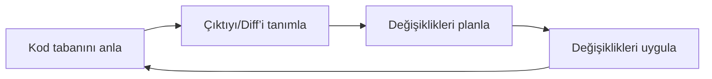
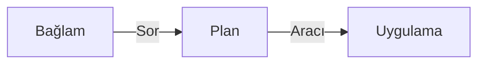

# Kod İncelemesi

**Navigation:** [← Previous](./35-agent-güvenliği.md) | [Index](./index.md) | [Next →](./37-dokümantasyonla-çalışma.md)

---

# Kod İncelemesi
Source: https://docs.cursor.com/tr/cli/cookbook/code-review

Cursor CLI kullanarak pull request'leri otomatik inceleyip geri bildirim veren bir GitHub Actions iş akışı oluştur

Bu eğitim, GitHub Actions içinde Cursor CLI ile kod incelemeyi nasıl kuracağını gösterir. İş akışı pull request'leri analiz eder, sorunları tespit eder ve yorum olarak geri bildirim paylaşır.

<Tip>
  Çoğu kullanıcı için bunun yerine [Bugbot](/tr/bugbot) kullanmanı öneririz. Bugbot, herhangi bir kurulum gerektirmeden yönetilen otomatik kod incelemesi sunar. Bu CLI yaklaşımı, yetenekleri keşfetmek ve ileri düzey özelleştirme için faydalıdır.
</Tip>

<div className="space-y-4">
  <Expandable title="tam iş akışı dosyası">
    ```yaml cursor-code-review.yml theme={null}
    name: Kod İncelemesi

    on:
      pull_request:
        types: [opened, synchronize, reopened, ready_for_review]

    permissions:
      pull-requests: write
      contents: read
      issues: write

    jobs:
      code-review:
        runs-on: ubuntu-latest
        # Taslak PR'ler için otomatik kod incelemesini atla
        if: github.event.pull_request.draft == false
        steps:
          - name: Depoyu checkout et
            uses: actions/checkout@v4
            with:
              fetch-depth: 0
              ref: ${{ github.event.pull_request.head.sha }}

          - name: Cursor CLI'yi yükle
            run: |
              curl https://cursor.com/install -fsS | bash
              echo "$HOME/.cursor/bin" >> $GITHUB_PATH

          - name: Git kimliğini yapılandır
            run: |
              git config user.name "Cursor Agent"
              git config user.email "cursoragent@cursor.com"

          - name: Otomatik kod incelemesi yap
            env:
              CURSOR_API_KEY: ${{ secrets.CURSOR_API_KEY }}
              MODEL: gpt-5
              GH_TOKEN: ${{ secrets.GITHUB_TOKEN }}
              BLOCKING_REVIEW: ${{ vars.BLOCKING_REVIEW || 'false' }}
            run: |
              cursor-agent --force --model "$MODEL" --output-format=text --print 'Bir GitHub Actions runner’ında otomatik kod incelemesi yapıyorsun. gh CLI mevcut ve GH_TOKEN ile kimliği doğrulanmış. Pull request’lere yorum yapabilirsin.

              Bağlam:
              - Depo: ${{ github.repository }}
              - PR numarası: ${{ github.event.pull_request.number }}
              - PR Head SHA: ${{ github.event.pull_request.head.sha }}
              - PR Base SHA: ${{ github.event.pull_request.base.sha }}
              - Engelleyici inceleme: ${{ env.BLOCKING_REVIEW }}

              Hedefler:
              1) Mevcut inceleme yorumlarını tekrar kontrol et ve ele alındığında “resolved” diyerek yanıtla.
              2) Geçerli PR diff’ini incele ve yalnızca net, yüksek önem dereceli sorunları işaretle.
              3) Yalnızca değişen satırlara çok kısa satır içi yorumlar (1-2 cümle) bırak ve sonunda kısa bir özet ver.

              Prosedür:
              - Mevcut yorumları al: gh pr view --json comments
              - Diff’i al: gh pr diff
              - Satır içi pozisyonları hesaplamak için yamalarla değişen dosyaları al: gh api repos/${{ github.repository }}/pulls/${{ github.event.pull_request.number }}/files --paginate --jq '.[] | {filename,patch}'
              - Her sorun için tam satır içi çapalayıcıları (dosya yolu + diff pozisyonu) hesapla. Yorumlar, diff’te değişen satırın satır içi olarak yerleştirilmeli, üst düzey yorum olmamalı.
              - Bu bot tarafından yazılmış önceki üst düzey “sorun yok” tarzı yorumları tespit et (şu gövdelere benzer: "✅ no issues", "No issues found", "LGTM").
              - MEVCUT çalıştırma sorun buluyor ve önceki “sorun yok” yorumları varsa:
                - Karışıklığı önlemek için bunları kaldırmayı tercih et:
                  - Üst düzey “sorun yok” yorumlarını şu komutla silmeyi dene: gh api -X DELETE repos/${{ github.repository }}/issues/comments/<comment_id>
                  - Silme mümkün değilse, GraphQL ile küçült (minimizeComment) veya “[Yeni bulgular tarafından geçersiz kılındı]” önekiyle düzenle.
                - Ne silme ne küçültme mümkünse, o yoruma şu şekilde yanıt ver: "⚠️ Geçersiz kılındı: yeni commit’lerde sorunlar bulundu"
              - Daha önce bildirilen bir sorun, yakınlardaki değişikliklerle düzelmiş görünüyorsa şöyle yanıtla: ✅ Bu sorun son değişikliklerle çözümlenmiş görünüyor
              - SADECE şunları analiz et:
                - Null/undefined dereference’ları
                - Kaynak sızıntıları (kapatılmamış dosyalar veya bağlantılar)
                - Enjeksiyon (SQL/XSS)
                - Eşzamanlılık/yariș durumları
                - Kritik işlemler için eksik hata işleme
                - Yanlış davranışa yol açan bariz mantık hataları
                - Ölçülebilir etkisi olan belirgin performans karşı örüntüleri
                - Kesin güvenlik açıkları
              - Yinelemelerden kaçın: aynı satırlarda veya yakınında benzer geri bildirim varsa atla.

              Yorum kuralları:
              - Toplam en fazla 10 satır içi yorum; en kritik sorunlara öncelik ver
              - Yorum başına bir sorun; tam değişen satıra yerleştir
              - Tüm sorun yorumları satır içi olmalı (PR diff’inde bir dosyaya ve satıra/pozisyona sabitlenmiş)
              - Doğal ton, spesifik ve eyleme dönük; otomatik veya yüksek güven ibarelerinden bahsetme
              - Emojileri kullan: 🚨 Kritik 🔒 Güvenlik ⚡ Performans ⚠️ Mantık ✅ Çözüldü ✨ İyileştirme

              Gönderim:
              - Raporlanacak HİÇ sorun yoksa ve “sorun yok” belirten mevcut bir üst düzey yorum zaten varsa (örn. "✅ no issues", "No issues found", "LGTM"), yinelenmeyi önlemek için başka bir yorum gönderme. Göndermeyi atla.
              - Raporlanacak HİÇ sorun yoksa ve önceki “sorun yok” yorumu yoksa, sorun olmadığını belirten kısa bir özet yorum gönder.
              - Raporlanacak sorunlar VARSA ve önceki bir “sorun yok” yorumu varsa, yeni incelemeyi göndermeden önce o önceki yorumu sil/küçült/geçersiz kılındı olarak işaretle.
              - Raporlanacak sorunlar VARSA, SADECE satır içi yorumlar ve isteğe bağlı kısa bir özet gövdesi içeren TEK bir inceleme gönder. Yorumların satır içi olduğundan emin olmak için GitHub Reviews API’yi kullan:
                - Build a JSON array of comments like: [{ "path": "<file>", "position": <diff_position>, "body": "..." }]
                - Submit via: gh api repos/${{ github.repository }}/pulls/${{ github.event.pull_request.number }}/reviews -f event=COMMENT -f body="$SUMMARY" -f comments='[$COMMENTS_JSON]'
              - Şunları KULLANMA: gh pr review --approve veya --request-changes

              Engelleme davranışı:
              - BLOCKING_REVIEW true ise ve herhangi bir 🚨 veya 🔒 sorun gönderildiyse: echo "CRITICAL_ISSUES_FOUND=true" >> $GITHUB_ENV
              - Aksi halde: echo "CRITICAL_ISSUES_FOUND=false" >> $GITHUB_ENV
              - Her zaman sonunda CRITICAL_ISSUES_FOUND değerini ayarla
              '

          - name: Engelleyici inceleme sonuçlarını kontrol et
            if: env.BLOCKING_REVIEW == 'true'
            run: |
              echo "Kritik sorunlar kontrol ediliyor..."
              echo "CRITICAL_ISSUES_FOUND: ${CRITICAL_ISSUES_FOUND:-unset}"

              if [ "${CRITICAL_ISSUES_FOUND:-false}" = "true" ]; then
                echo "❌ Kritik sorunlar bulundu ve engelleyici inceleme etkin. İş akışı başarısız oluyor."
                exit 1
              else
                echo "✅ Engelleyici sorun bulunamadı."
              fi
    ```
  </Expandable>

  <Frame>
    
  </Frame>
</div>

<div id="configure-authentication">
  ## Kimlik doğrulamayı yapılandır
</div>

GitHub Actions’ta Cursor CLI’yi kimlik doğrulamak için [API anahtarını ve depo gizlerini ayarla](/tr/cli/github-actions#authentication).

<div id="set-up-agent-permissions">
  ## Aracı izinlerini ayarla
</div>

Aracın hangi işlemleri yapabileceğini kontrol etmek için bir yapılandırma dosyası oluştur. Bu, koda push atmak veya pull request açmak gibi istenmeyen işlemleri önler.

Depo kök dizininde `.cursor/cli.json` dosyasını oluştur:

```json  theme={null}
{
  "permissions": {
    "deny": [
      "Shell(git push)",
      "Shell(gh pr create)",
      "Write(**)"
    ]
  }
}
```

Bu yapılandırma, agent’in dosyaları okumasına ve yorum eklemek için GitHub CLI’yi kullanmasına izin verir, ama depoda değişiklik yapmasını engeller. Daha fazla yapılandırma seçeneği için [izinler referansı](/tr/cli/reference/permissions) sayfasına bak.

<div id="build-the-github-actions-workflow">
  ## GitHub Actions iş akışını oluştur
</div>

Şimdi iş akışını adım adım kuralım.

<div id="set-up-the-workflow-trigger">
  ### İş akışı tetikleyicisini ayarla
</div>

`.github/workflows/cursor-code-review.yml` dosyasını oluştur ve pull request’lerde çalışacak şekilde yapılandır:

```yaml  theme={null}
name: Cursor Kod İncelemesi

on:
  pull_request:
    types: [opened, synchronize, reopened, ready_for_review]

jobs:
  code-review:
    runs-on: ubuntu-latest
    permissions:
      contents: read
      pull-requests: write
    
    steps:
```

<div id="checkout-the-repository">
  ### Depoyu checkout et
</div>

Pull request koduna erişmek için checkout adımını ekle:

```yaml  theme={null}
- name: Depoyu çek
  uses: actions/checkout@v4
  with:
    fetch-depth: 0
    ref: ${{ github.event.pull_request.head.sha }}
```

### Cursor CLI'yi yükle

CLI kurulum adımını ekle:

```yaml  theme={null}
- name: Cursor CLI'yi yükle
  run: |
    curl https://cursor.com/install -fsS | bash
    echo "$HOME/.cursor/bin" >> $GITHUB_PATH
```

<div id="configure-the-review-agent">
  ### İnceleme aracını yapılandır
</div>

Tam inceleme adımına geçmeden önce, inceleme istemimizin yapısını anlayalım. Bu bölüm, agent’ın nasıl davranmasını istediğimizi özetliyor:

**Amaç**:
Agent’ın mevcut PR diff’ini gözden geçirip yalnızca net ve yüksek önem dereceli sorunları işaretlemesini, ardından sadece değişen satırlara çok kısa satır içi yorumlar (1-2 cümle) bırakmasını ve sonda kısa bir özet vermesini istiyoruz. Bu, sinyal-gürültü oranını dengede tutar.

**Biçim**:
Yorumların kısa ve direkt olmasını istiyoruz. Yorumları taramayı kolaylaştırmak için emoji kullanıyoruz ve sonda tüm incelemenin yüksek seviyeli bir özetini istiyoruz.

**Gönderim**:
İnceleme bittiğinde, agent incelemede bulunanlara dayalı kısa bir yorum eklemeli. Agent, satır içi yorumları ve özlü bir özeti içeren tek bir inceleme göndermeli.

**Köşe durumları**:
Şunları ele almamız gerekiyor:

* Mevcut yorumların çözümlenmesi: Ele alındıklarında agent bunları tamamlandı olarak işaretlemeli
* Mükerrelerden kaçınma: Aynı veya yakın satırlarda benzer geri bildirim zaten varsa agent yorum yapmayı atlamalı

**Nihai istem**:
Tam istem, odaklı ve uygulanabilir geri bildirim üretmek için bu davranışsal gereksinimlerin tümünü birleştirir

Şimdi inceleme agent’ı adımını uygulayalım:

```yaml  theme={null}
- name: Kod incelemesi yap
  env:
    CURSOR_API_KEY: ${{ secrets.CURSOR_API_KEY }}
    GH_TOKEN: ${{ github.token }}
  run: |
    cursor-agent --force --model "$MODEL" --output-format=text --print "GitHub Actions runner’ında otomatik kod incelemesi yapıyorsun. gh CLI mevcut ve GH_TOKEN ile kimliği doğrulanmış. Pull request’lere yorum yapabilirsin.
    
    Bağlam:
    - Depo: ${{ github.repository }}
    - PR Numarası: ${{ github.event.pull_request.number }}
    - PR Head SHA: ${{ github.event.pull_request.head.sha }}
    - PR Base SHA: ${{ github.event.pull_request.base.sha }}
    
    Hedefler:
    1) Mevcut inceleme yorumlarını yeniden kontrol et ve ele alındıysa resolved diye yanıtla
    2) Mevcut PR diff’ini incele ve yalnızca net, yüksek önem dereceli sorunları işaretle
    3) Yalnızca değişen satırlara çok kısa satır içi yorumlar (1-2 cümle) bırak ve sonunda kısa bir özet ekle
    
    Prosedür:
    - Mevcut yorumları getir: gh pr view --json comments
    - Diff’i al: gh pr diff
    - Daha önce bildirilen bir sorun yakın değişikliklerle düzelmiş görünüyorsa şu şekilde yanıtla: ✅ Bu sorun son değişikliklerle çözülmüş görünüyor
    - Yinelenenleri önle: aynı veya benzer geri bildirim aynı satırlarda veya yakınında zaten varsa atla
    
    Yorum kuralları:
    - Toplam en fazla 10 satır içi yorum; en kritik sorunlara öncelik ver
    - Yorum başına tek sorun; tam olarak değişen satıra yerleştir
    - Doğal, spesifik ve uygulanabilir bir ton kullan; otomasyon veya yüksek güven ifadesinden bahsetme
    - Emojileri kullan: 🚨 Kritik 🔒 Güvenlik ⚡ Performans ⚠️ Mantık ✅ Çözüldü ✨ İyileştirme
    
    Gönderim:
    - Satır içi yorumlar artı özlü bir özet içeren tek bir inceleme gönder
    - Yalnızca şunu kullan: gh pr review --comment
    - Şunları kullanma: gh pr review --approve veya --request-changes"
```

```text  theme={null}
.
├── .cursor/
│   └── cli.json
├── .github/
│   └── workflows/
│       └── cursor-code-review.yml
```

<div id="test-your-reviewer">
  ## İnceleyicini test et
</div>

İş akışının çalıştığını ve agent’ın emojiyle geri bildirim veren inceleme yorumları paylaştığını doğrulamak için bir test pull request’i oluştur.

<Frame>
  
</Frame>

<div id="next-steps">
  ## Sonraki adımlar
</div>

Artık çalışan bir otomatik kod inceleme sistemin var. Şunları da eklemeyi düşün:

* [CI hatalarını düzeltmek](/tr/cli/cookbook/fix-ci) için ek iş akışları kur
* Farklı dallar için farklı inceleme seviyeleri yapılandır
* Ekibinin mevcut kod inceleme süreciyle entegre et
* Farklı dosya türleri veya dizinler için agent'ın davranışını özelleştir

<Expandable title="Gelişmiş: Engelleyici incelemeler">
  Kritik sorunlar bulunduğunda iş akışını başarısız olacak şekilde yapılandırabilir, böylece ele alınıncaya kadar pull request'in birleştirilmesini engelleyebilirsin.

  **İsteme engelleyici davranış ekle**

  Önce, `BLOCKING_REVIEW` ortam değişkenini eklemek için inceleme agent'ı adımını güncelle ve bu engelleyici davranışı isteme ekle:

  ```
  Engelleyici davranış:
  - Eğer BLOCKING_REVIEW true ise ve herhangi bir 🚨 veya 🔒 sorun paylaşıldıysa: echo "CRITICAL_ISSUES_FOUND=true" >> $GITHUB_ENV
  - Aksi halde: echo "CRITICAL_ISSUES_FOUND=false" >> $GITHUB_ENV
  - Her zaman sonunda CRITICAL_ISSUES_FOUND değişkenini ayarla
  ```

  **Engelleyici kontrol adımını ekle**

  Ardından bu yeni adımı kod inceleme adımının sonrasına ekle:

  ```yaml  theme={null}
        - name: Check blocking review results
          if: env.BLOCKING_REVIEW == 'true'
          run: |
            echo "Checking for critical issues..."
            echo "CRITICAL_ISSUES_FOUND: ${CRITICAL_ISSUES_FOUND:-unset}"

            if [ "${CRITICAL_ISSUES_FOUND:-false}" = "true" ]; then
              echo "❌ Critical issues found and blocking review is enabled. Failing the workflow."
              exit 1
            else
              echo "✅ No blocking issues found."
            fi
  ```
</Expandable>


# CI Hatalarını Düzelt
Source: https://docs.cursor.com/tr/cli/cookbook/fix-ci

GitHub Actions'ta Cursor CLI kullanarak bir depodaki CI sorunlarını düzelt

GitHub Actions'ta Cursor CLI ile CI hatalarını düzelt. Bu iş akışı hataları analiz eder, nokta atışı düzeltmeler yapar ve hızlı PR oluşturma bağlantısıyla bir düzeltme dalı (fix branch) açar.

Bu iş akışı, adıyla belirttiğin belirli bir iş akışını izler. Gerçek CI iş akışı adınla eşleşmesi için `workflows` listesini güncelle.

<CodeGroup>
  ```yaml auto-fix-ci.yml theme={null}
  name: Fix CI Failures

  on:
    workflow_run:
      workflows: [Test]
      types: [completed]

  permissions:
    contents: write
    pull-requests: write
    actions: read

  jobs:
    attempt-fix:
      if: >-
        ${{ github.event.workflow_run.conclusion == 'failure' && github.event.workflow_run.name != 'Fix CI Failures' }}
      runs-on: ubuntu-latest
      steps:
        - name: Checkout repository
          uses: actions/checkout@v4
          with:
            fetch-depth: 0

        - name: Install Cursor CLI
          run: |
            curl https://cursor.com/install -fsS | bash
            echo "$HOME/.cursor/bin" >> $GITHUB_PATH

        - name: Configure git identity
          run: |
            git config user.name "Cursor Agent"
            git config user.email "cursoragent@cursor.com"

        - name: Fix CI failure
          env:
            CURSOR_API_KEY: ${{ secrets.CURSOR_API_KEY }}
            MODEL: gpt-5
            GH_TOKEN: ${{ secrets.GITHUB_TOKEN }}
            BRANCH_PREFIX: ci-fix
          run: |
            cursor-agent -p "You are operating in a GitHub Actions runner.

            The GitHub CLI is available as `gh` and authenticated via `GH_TOKEN`. Git is available. You have write access to repository contents and can comment on pull requests, but you must not create or edit PRs directly.

            # Context:
            - Repo: ${{ github.repository }}
            - Owner: ${{ github.repository_owner }}
            - Workflow Run ID: ${{ github.event.workflow_run.id }}
            - Workflow Run URL: ${{ github.event.workflow_run.html_url }}
            - Fix Branch Prefix: ${{ env.BRANCH_PREFIX }}

            # Goal:
            - Implement an end-to-end CI fix flow driven by the failing PR, creating a separate persistent fix branch and proposing a quick-create PR back into the original PR's branch.

            # Requirements:
            1) Identify the PR associated with the failed workflow run and determine its base and head branches. Let HEAD_REF be the PR's head branch (the contributor/origin branch).
            2) Maintain a persistent fix branch for this PR head using the Fix Branch Prefix from Context. Create it if missing, update it otherwise, and push changes to origin.
            3) Attempt to resolve the CI failure by making minimal, targeted edits consistent with the repo's style. Keep changes scoped and safe.
            4) You do NOT have permission to create PRs. Instead, post or update a single natural-language PR comment (1–2 sentences) that briefly explains the CI fix and includes an inline compare link to quick-create a PR.

            # Inputs and conventions:
            - Use `gh api`, `gh run view`, `gh pr view`, `gh pr diff`, `gh pr list`, `gh run download`, and git commands as needed to discover the failing PR and branches.
            - Avoid duplicate comments; if a previous bot comment exists, update it instead of posting a new one.
            - If no actionable fix is possible, make no changes and post no comment.

            # Deliverables when updates occur:
            - Pushed commits to the persistent fix branch for this PR head.
            - A single natural-language PR comment on the original PR that includes the inline compare link above.
            " --force --model "$MODEL" --output-format=text

  ```
</CodeGroup>


# Gizli Denetimi
Source: https://docs.cursor.com/tr/cli/cookbook/secret-audit

GitHub Actions'ta Cursor CLI kullanarak bir depodaki gizlileri denetle

Depo'nu Cursor CLI ile güvenlik açıkları ve gizli bilgilerin ifşası açısından denetle. Bu iş akışı potansiyel gizlileri tarar, riskli iş akışı kalıplarını tespit eder ve güvenlik düzeltmeleri önerir.

<CodeGroup>
  ```yaml auto-secret-audit.yml theme={null}
  name: Secrets Audit

  on:
    schedule:
      - cron: "0 4 * * *"
    workflow_dispatch:

  permissions:
    contents: write
    pull-requests: write
    actions: read

  jobs:
    secrets-audit:
      runs-on: ubuntu-latest
      steps:
        - name: Checkout repository
          uses: actions/checkout@v4
          with:
            fetch-depth: 0

        - name: Install Cursor CLI
          run: |
            curl https://cursor.com/install -fsS | bash
            echo "$HOME/.cursor/bin" >> $GITHUB_PATH

        - name: Configure git identity
          run: |
            git config user.name "Cursor Agent"
            git config user.email "cursoragent@cursor.com"

        - name: Scan and propose hardening
          env:
            CURSOR_API_KEY: ${{ secrets.CURSOR_API_KEY }}
            MODEL: gpt-5
            GH_TOKEN: ${{ secrets.GITHUB_TOKEN }}
            BRANCH_PREFIX: audit
          run: |
            cursor-agent -p "You are operating in a GitHub Actions runner.

            The GitHub CLI is available as `gh` and authenticated via `GH_TOKEN`. Git is available. You have write access to repository contents and can comment on pull requests, but you must not create or edit PRs directly.

            # Context:
            - Repo: ${{ github.repository }}
             - Hardening Branch Prefix: ${{ env.BRANCH_PREFIX }}

            # Goal:
            - Perform a repository secrets exposure and workflow hardening audit on a schedule, and propose minimal safe fixes.

            # Requirements:
            1) Scan for potential secrets in tracked files and recent history; support allowlist patterns if present (e.g., .gitleaks.toml).
            2) Detect risky workflow patterns: unpinned actions, overbroad permissions, unsafe pull_request_target usage, secrets in forked PR contexts, deprecated insecure commands, missing permissions blocks.
            3) Maintain a persistent branch for this run using the Hardening Branch Prefix from Context. Create it if missing, update it otherwise, and push changes to origin.
            4) Propose minimal edits: redact literals where safe, add ignore rules, pin actions to SHA, reduce permissions, add guardrails to workflows, and add a SECURITY_LOG.md summarizing changes and remediation guidance.
            5) Push to origin.
            6) If there is at least one open PR in the repo, post or update a single natural-language comment (1–2 sentences) on the most recently updated open PR that briefly explains the hardening changes and includes an inline compare link to quick-create a PR.
            7) Avoid duplicate comments; update an existing bot comment if present. If no changes or no open PRs, post nothing.

            # Inputs and conventions:
            - Use `gh` to list PRs and to post comments. Avoid duplicate comments.

            # Deliverables when updates occur:
             - Pushed commits to the persistent hardening branch for this run.
            - A single natural-language PR comment with the compare link above (only if an open PR exists).
            " --force --model "$MODEL" --output-format=text

  ```
</CodeGroup>


# Anahtarları Çevir
Source: https://docs.cursor.com/tr/cli/cookbook/translate-keys

GitHub Actions’ta Cursor CLI kullanarak bir depo için anahtarları çevir

Uluslararasılaştırma için çeviri anahtarlarını Cursor CLI ile yönet. Bu iş akışı, pull request’lerde yeni ya da değişen i18n anahtarlarını algılar ve mevcutları hiç değiştirmeden eksik çevirileri tamamlar.

<CodeGroup>
  ```yaml auto-translate-keys.yml theme={null}
  name: Translate Keys

  on:
    pull_request:
      types: [opened, synchronize, reopened, ready_for_review]

  permissions:
    contents: write
    pull-requests: write

  jobs:
    i18n:
      if: ${{ !startsWith(github.head_ref, 'translate/') }}
      runs-on: ubuntu-latest
      steps:
        - name: Checkout repository
          uses: actions/checkout@v4
          with:
            fetch-depth: 0

        - name: Install Cursor CLI
          run: |
            curl https://cursor.com/install -fsS | bash
            echo "$HOME/.cursor/bin" >> $GITHUB_PATH

        - name: Configure git identity
          run: |
            git config user.name "Cursor Agent"
            git config user.email "cursoragent@cursor.com"

        - name: Propose i18n updates
          env:
            CURSOR_API_KEY: ${{ secrets.CURSOR_API_KEY }}
            MODEL: gpt-5
            GH_TOKEN: ${{ secrets.GITHUB_TOKEN }}
            BRANCH_PREFIX: translate
          run: |
            cursor-agent -p "You are operating in a GitHub Actions runner.

            The GitHub CLI is available as `gh` and authenticated via `GH_TOKEN`. Git is available. You have write access to repository contents and can comment on pull requests, but you must not create or edit PRs directly.

            # Context:
            - Repo: ${{ github.repository }}
            - PR Number: ${{ github.event.pull_request.number }}
            - Head Ref: ${{ github.head_ref }}
            - Translate Branch Prefix: ${{ env.BRANCH_PREFIX }}

            # Goal:
            - Detect i18n keys added or changed in the PR and fill only missing locales in message files. Never overwrite existing translations.

            # Requirements:
            1) Determine changed keys by inspecting the PR diff (source files and messages files).
            2) Compute missing keys per locale using the source/canonical locale as truth.
            3) Add entries only for missing keys. Preserve all existing values untouched.
            4) Validate JSON formatting and schemas.
            5) Maintain a persistent translate branch for this PR head using the Translate Branch Prefix from Context. Create it if missing, update it otherwise, and push changes to origin.
            6) Post or update a single PR comment on the original PR written in natural language (1–2 sentences) that briefly explains what was updated and why, and includes an inline compare link to quick-create a PR.
            7) Avoid duplicate comments; update a previous bot comment if present.
            8) If no changes are necessary, make no commits and post no comment.

            # Inputs and conventions:
            - Use `gh pr diff` and git history to detect changes.

            # Deliverables when updates occur:
            - Pushed commits to the persistent translate branch for this PR head.
            - A single natural-language PR comment on the original PR with the compare link above.
            " --force --model "$MODEL" --output-format=text

  ```
</CodeGroup>


# Dokümanları Güncelle
Source: https://docs.cursor.com/tr/cli/cookbook/update-docs

GitHub Actions’ta Cursor CLI kullanarak bir depo için dokümanları güncelle

GitHub Actions’ta Cursor CLI kullanarak dokümantasyonu güncelle. İki yaklaşım var: tam ajan özerkliği ya da yalnızca ajanın dosya değişiklikleri yaptığı deterministik bir iş akışı.

<CodeGroup>
  ```yaml auto-update-docs.yml theme={null}
  name: Belgeleri Güncelle

  on:
    pull_request:
      types: [opened, synchronize, reopened, ready_for_review]

  permissions:
    contents: write
    pull-requests: write

  jobs:
    auto-docs:
      if: ${{ !startsWith(github.head_ref, 'docs/') }}
      runs-on: ubuntu-latest
      steps:
        - name: Depoyu Checkout et
          uses: actions/checkout@v4
          with:
            fetch-depth: 0

        - name: Cursor CLI'yi Yükle
          run: |
            curl https://cursor.com/install -fsS | bash
            echo "$HOME/.cursor/bin" >> $GITHUB_PATH

        - name: Git'i Yapılandır
          run: |
            git config user.name "Cursor Agent"
            git config user.email "cursoragent@cursor.com"

        - name: Belgeleri Güncelle
          env:
            MODEL: gpt-5
            CURSOR_API_KEY: ${{ secrets.CURSOR_API_KEY }}
            GH_TOKEN: ${{ secrets.GITHUB_TOKEN }}
            BRANCH_PREFIX: docs
          run: |
            cursor-agent -p "GitHub Actions runner'ında çalışıyorsun.

            GitHub CLI `gh` olarak mevcut ve `GH_TOKEN` ile kimliği doğrulanmış. Git mevcut. Depo içeriğine yazma erişimin var ve PR'lere yorum yapabilirsin, ama PR oluşturamaz veya düzenleyemezsin.

            # Bağlam:
            - Repo: ${{ github.repository }}
            - Owner: ${{ github.repository_owner }}
            - PR Number: ${{ github.event.pull_request.number }}
            - Base Ref: ${{ github.base_ref }}
            - Head Ref: ${{ github.head_ref }}
            - Docs Branch Prefix: ${{ env.BRANCH_PREFIX }}

            # Amaç:
            - Orijinal PR'deki artımlı değişikliklerle yönlendirilen uçtan uca bir dokümantasyon güncelleme akışını uygula.

            # Gereksinimler:
            1) Orijinal PR'de nelerin değiştiğini belirle ve birden fazla push olduysa, son başarılı dokümantasyon güncellemesinden bu yana artımlı diff'leri hesapla.
            2) Yalnızca bu artımlı değişikliklere göre ilgili dokümanları güncelle.
            3) Bu PR head'i için Bağlamdaki Docs Branch Prefix'i kullanarak kalıcı dokümantasyon dalını koru. Eksikse oluştur, aksi halde güncelle ve değişiklikleri origin'e push et.
            4) PR oluşturma iznin YOK. Bunun yerine, dokümantasyon güncellemelerini kısaca açıklayan ve hızlı PR oluşturmak için satır içi bir karşılaştırma bağlantısı içeren tek bir doğal dil PR yorumu (1–2 cümle) gönder veya güncelle.

            # Girdiler ve kurallar:
            - Değişiklikleri tespit etmek ve son dokümantasyon güncellemesinden bu yana artımlı aralıkları çıkarmak için `gh pr diff` ve git geçmişini kullan.
            - PR'leri doğrudan oluşturmayı veya düzenlemeyi deneme. Yukarıdaki karşılaştırma bağlantısı biçimini kullan.
            - Değişiklikleri minimumda tut ve depo stiline uygun davran. Doküman güncellemesi gerekmiyorsa, değişiklik yapma ve yorum gönderme.

            # Güncellemeler gerçekleştiğinde teslimatlar:
            - Bu PR head'i için kalıcı dokümantasyon dalına push'lanmış commit'ler.
            - Orijinal PR üzerinde, yukarıdaki satır içi karşılaştırma bağlantısını içeren tek bir doğal dil PR yorumu. Yinelenen yorumlardan kaçın; varsa önceki bot yorumunu güncelle.
            " --force --model "$MODEL" --output-format=text
  ```

  ```yaml auto-update-docs-deterministic.yml theme={null}
  name: Belgeleri Güncelle

  on:
    pull_request:
      types: [opened, synchronize, reopened, ready_for_review]

  permissions:
    contents: write
    pull-requests: write

  jobs:
    auto-docs:
      if: ${{ !startsWith(github.head_ref, 'docs/') }}
      runs-on: ubuntu-latest
      steps:
        - name: Depoyu getir
          uses: actions/checkout@v4
          with:
            fetch-depth: 0

        - name: Cursor CLI'yi yükle
          run: |
            curl https://cursor.com/install -fsS | bash
            echo "$HOME/.cursor/bin" >> $GITHUB_PATH

        - name: Git’i yapılandır
          run: |
            git config user.name "Cursor Agent"
            git config user.email "cursoragent@cursor.com"

        - name: Belge güncellemelerini oluştur (commit/push/yorum yok)
          env:
            MODEL: gpt-5
            CURSOR_API_KEY: ${{ secrets.CURSOR_API_KEY }}
            GH_TOKEN: ${{ secrets.GITHUB_TOKEN }}
            BRANCH_PREFIX: docs
          run: |
            cursor-agent -p "GitHub Actions runner’ında çalışıyorsun.

            GitHub CLI `gh` olarak mevcut ve `GH_TOKEN` ile kimliği doğrulanmış. Git mevcut.

            ÖNEMLİ: Dal oluşturma, commit, push yapma veya PR yorumu gönderme. Yalnızca gerektiğinde çalışma dizinindeki dosyaları değiştir. Yayınlama ve PR’a yorum yapma, ilerideki bir iş akışı adımının sorumluluğunda.

            # Bağlam:
            - Repo: ${{ github.repository }}
            - Owner: ${{ github.repository_owner }}
            - PR Number: ${{ github.event.pull_request.number }}
            - Base Ref: ${{ github.base_ref }}
            - Head Ref: ${{ github.head_ref }}

            # Hedef:
            - Bu PR’nin getirdiği artımlı değişikliklere göre depo belgelerini güncelle.

            # Gereksinimler:
            1) Orijinal PR’de neyin değiştiğini belirle (gerektiğinde `gh pr diff` ve git geçmişini kullan). Mevcut kalıcı bir docs dalı `${{ env.BRANCH_PREFIX }}/${{ github.head_ref }}` varsa, önceki güncellemeleri anlamak için salt okunur referans olarak kullanabilirsin.
            2) Yalnızca bu değişikliklere bağlı ilgili belgeleri güncelle. Düzenlemeleri minimumda tut ve depo tarzıyla tutarlı ol.
            3) Commit, push yapma, dal oluşturma veya PR yorumu gönderme. Çalışma ağacını yalnızca güncellenmiş dosyalarla bırak; sonraki adım yayınlayacak.

            # Girdiler ve kurallar:
            - Değişiklikleri tespit etmek ve belge düzenlemelerini buna göre odaklamak için `gh pr diff` ve git geçmişini kullan.
            - Eğer belge güncellemesi gerekmiyorsa, değişiklik yapma ve çıktı üretme.

            # Güncellemeler olduğunda çıktı:
            - Yalnızca çalışma dizininde değiştirilmiş belge dosyaları (commit/push/yorum yok).
            " --force --model "$MODEL" --output-format=text

        - name: Belgeler dalını yayınla
          id: publish_docs
          env:
            BRANCH_PREFIX: docs
            HEAD_REF: ${{ github.head_ref }}
            PR_NUMBER: ${{ github.event.pull_request.number }}
          run: |
            echo "changes_published=false" >> "$GITHUB_OUTPUT"

            DOCS_BRANCH="${BRANCH_PREFIX}/${HEAD_REF}"

            # Ensure we are on a local branch that we can push
            git fetch origin --prune

            # Create/switch to the persistent docs branch, keeping current working tree changes
            git checkout -B "$DOCS_BRANCH"

            # Stage and detect changes
            git add -A
            if git diff --staged --quiet; then
              echo "Yayınlanacak belge değişikliği yok. Commit/push atlanıyor."
              exit 0
            fi

            COMMIT_MSG="docs: update for PR #${PR_NUMBER} (${HEAD_REF} @ $(git rev-parse --short HEAD))"
            git commit -m "$COMMIT_MSG"
            git push --set-upstream origin "$DOCS_BRANCH"

            echo "changes_published=true" >> "$GITHUB_OUTPUT"

        - name: PR yorumunu gönder veya güncelle
          if: steps.publish_docs.outputs.changes_published == 'true'
          env:
            GH_TOKEN: ${{ secrets.GITHUB_TOKEN }}
            BRANCH_PREFIX: docs
            REPO: ${{ github.repository }}
            BASE_REF: ${{ github.base_ref }}
            HEAD_REF: ${{ github.head_ref }}
            PR_NUMBER: ${{ github.event.pull_request.number }}
          run: |

            DOCS_BRANCH="${BRANCH_PREFIX}/${HEAD_REF}"
            COMPARE_URL="https://github.com/${REPO}/compare/${BASE_REF}...${DOCS_BRANCH}?quick_pull=1&title=docs%3A+updates+for+PR+%23${PR_NUMBER}"

            COMMENT_FILE="${RUNNER_TEMP}/auto-docs-comment.md"
            {
              echo "Cursor belgeler dalını güncelledi: \`${DOCS_BRANCH}\`"
              echo "Artık [farkı görüntüleyebilir ve bu belge güncellemelerini birleştirmek için hızlıca bir PR oluşturabilirsin](${COMPARE_URL})."
              echo
              echo "_Bu yorum, PR değiştikçe sonraki çalıştırmalarda güncellenecek._"
              echo
              echo "<!-- auto-update-docs-split -->"
            } > "$COMMENT_FILE"

            # Son bot yorumunu düzenlemek başarısız olursa (daha eski gh), yeni bir yorum oluşturmaya geri dön
            if gh pr comment "$PR_NUMBER" --body-file "$COMMENT_FILE" --edit-last; then
              echo "Mevcut PR yorumu güncellendi."
            else
              gh pr comment "$PR_NUMBER" --body-file "$COMMENT_FILE"
              echo "Yeni PR yorumu gönderildi."
            fi
  ```
</CodeGroup>


# GitHub Actions
Source: https://docs.cursor.com/tr/cli/github-actions

GitHub Actions ve diğer sürekli entegrasyon sistemlerinde Cursor CLI'yi nasıl kullanacağını öğren

GitHub Actions ve diğer CI/CD sistemlerinde Cursor CLI'yi kullanarak geliştirme görevlerini otomatikleştir.

<div id="github-actions-integration">
  ## GitHub Actions ile entegrasyon
</div>

Temel kurulum:

```yaml  theme={null}
- name: Cursor CLI'yi Yükle
  run: |
    curl https://cursor.com/install -fsS | bash
    echo "$HOME/.cursor/bin" >> $GITHUB_PATH

- name: Cursor Agent'ı Çalıştır
  env:
    CURSOR_API_KEY: ${{ secrets.CURSOR_API_KEY }}
  run: |
    cursor-agent -p "İstemini buraya yaz" --model gpt-5
```

<div id="cookbook-examples">
  ## Cookbook örnekleri
</div>

Pratik iş akışları için cookbook örneklerimize göz at: [dokümantasyonu güncelleme](/tr/cli/cookbook/update-docs) ve [CI sorunlarını düzeltme](/tr/cli/cookbook/fix-ci).

<div id="other-ci-systems">
  ## Diğer CI sistemleri
</div>

Cursor CLI'yi herhangi bir CI/CD sisteminde şöyle kullan:

* **Kabuk betiği çalıştırma** (bash, zsh, vb.)
* API anahtarını yapılandırmak için **ortam değişkenleri**
* Cursor'un API'sine erişmek için **internet bağlantısı**

<div id="autonomy-levels">
  ## Otonomi seviyeleri
</div>

Agent'inin otonomi seviyesini seç:

<div id="full-autonomy-approach">
  ### Tam otonomi yaklaşımı
</div>

Agente git işlemleri, API çağrıları ve harici etkileşimler üzerinde tam kontrol ver. Kurulumu daha basit, daha fazla güven gerektirir.

**Örnek:** [Update Documentation](/tr/cli/cookbook/update-docs) rehberimizde, ilk iş akışı agente şunları yapma olanağı verir:

* PR değişikliklerini analiz et
* Git branch’leri oluştur ve yönet
* Değişiklikleri commit’le ve push et
* Pull request’lere yorum yap
* Tüm hata senaryolarını yönet

```yaml  theme={null}
- name: Belgeleri güncelle (tam özerklik)
  run: |
    cursor-agent -p "Git, GitHub CLI ve PR işlemlerine tam erişimin var. 
    Commit’ler, push’lar ve PR yorumları dahil tüm belge güncelleme iş akışını yönet."
```

<div id="restricted-autonomy-approach">
  ### Kısıtlı özerklik yaklaşımı
</div>

<Note>
  Üretim CI iş akışları için bu yaklaşımı **izin tabanlı kısıtlamalarla** kullanmanı öneriyoruz. Böylece en iyi dengeyi yakalarsın: ajan karmaşık analizleri ve dosya değişikliklerini akıllıca yönetebilirken kritik işlemler deterministik ve denetlenebilir kalır.
</Note>

Ajanın yapabileceklerini sınırla; kritik adımları ayrı iş akışı adımlarında yürüt. Daha iyi kontrol ve öngörülebilirlik.

**Örnek:** Aynı cookbook’taki ikinci iş akışı, ajanı yalnızca dosya değişiklikleriyle sınırlar:

```yaml  theme={null}
- name: Doküman güncellemeleri oluştur (kısıtlı)
  run: |
    cursor-agent -p "ÖNEMLİ: Branch oluşturma, commit, push yapma veya PR yorumu yazma. 
    Sadece çalışma dizinindeki dosyaları değiştir. Yayınlama daha sonraki bir iş akışı adımında yapılır."

- name: Docs dalını yayınla (deterministik)
  run: |
    # Deterministik git işlemleri CI tarafından yönetilir
    git checkout -B "docs/${{ github.head_ref }}"
    git add -A
    git commit -m "docs: PR için güncelleme"
    git push origin "docs/${{ github.head_ref }}"

- name: PR yorumunu paylaş (deterministik)  
  run: |
    # Deterministik PR yorumları CI tarafından yönetilir
    gh pr comment ${{ github.event.pull_request.number }} --body "Docs güncellendi"
```

<div id="permission-based-restrictions">
  ### İzne dayalı kısıtlamalar
</div>

Kısıtlamaları CLI düzeyinde zorunlu kılmak için [izin yapılandırmalarını](/tr/cli/reference/permissions) kullan:

```json  theme={null}
{
  "permissions": {
    "allow": [
      "Read(**/*.md)",
      "Write(docs/**/*)",
      "Shell(grep)",
      "Shell(find)"
    ],
    "deny": [
      "Shell(git)",
      "Shell(gh)", 
      "Write(.env*)",
      "Write(package.json)"
    ]
  }
}
```

<div id="authentication">
  ## Kimlik doğrulama
</div>

<div id="generate-your-api-key">
  ### API anahtarını oluştur
</div>

Önce Cursor panenden [bir API anahtarı oluştur](/tr/cli/reference/authentication#api-key-authentication).

<div id="configure-repository-secrets">
  ### Depo sırlarını yapılandır
</div>

Cursor API anahtarını deponda güvenli şekilde sakla:

1. GitHub depona git
2. **Settings** → **Secrets and variables** → **Actions**’a tıkla
3. **New repository secret**’a tıkla
4. Adını `CURSOR_API_KEY` koy
5. Değer olarak API anahtarını yapıştır
6. **Add secret**’a tıkla

<div id="use-in-workflows">
  ### İş akışlarında kullan
</div>

`CURSOR_API_KEY` ortam değişkenini ayarla:

```yaml  theme={null}
env:
  CURSOR_API_KEY: ${{ secrets.CURSOR_API_KEY }}
```


# Headless CLI Kullanımı
Source: https://docs.cursor.com/tr/cli/headless

Otomatik kod analizi, üretimi ve değiştirme için Cursor CLI ile nasıl script yazacağını öğren

Kod analizi, üretimi ve refaktörleme işleri için script’lerde ve otomasyon iş akışlarında Cursor CLI kullan.

<div id="how-it-works">
  ## Nasıl çalışır
</div>

Etkileşimsiz betikleme ve otomasyon için [print mode](/tr/cli/using#non-interactive-mode) (`-p, --print`) kullan.

<div id="file-modification-in-scripts">
  ### Betiklerde dosya değiştirme
</div>

Betiklerde dosyaları değiştirmek için `--print` ile `--force`’u birleştir:

```bash  theme={null}

# Yazdırma modunda dosya değişikliklerini etkinleştir
cursor-agent -p --force "Bu kodu modern ES6+ sözdizimini kullanacak şekilde yeniden düzenle"


# --force olmadan, değişiklikler yalnızca önerilir, uygulanmaz
cursor-agent -p "Bu dosyaya JSDoc açıklamaları ekle"  # Dosyaları değiştirmez


# Gerçek dosya değişiklikleriyle toplu işleme
find src/ -name "*.js" | while read file; do
  cursor-agent -p --force "Bu dosyaya kapsamlı JSDoc açıklamaları ekle: $file"
done
```

<Warning>
  `--force` bayrağı, ajanın onay almadan doğrudan dosyalarda değişiklik yapmasına izin verir
</Warning>

<div id="setup">
  ## Kurulum
</div>

Eksiksiz kurulum ayrıntıları için [Installation](/tr/cli/installation) ve [Authentication](/tr/cli/reference/authentication) bölümlerine göz at.

```bash  theme={null}

# Cursor CLI'yi yükle
curl https://cursor.com/install -fsS | bash


# Betikler için API anahtarını ayarla  
export CURSOR_API_KEY=your_api_key_here
cursor-agent -p "Bu kodu analiz et"
```

<div id="example-scripts">
  ## Örnek script’ler
</div>

Farklı script ihtiyaçların için farklı çıktı formatları kullan. Ayrıntılar için [Çıktı formatı](/tr/cli/reference/output-format) sayfasına bak.

<div id="searching-the-codebase">
  ### Kod tabanında arama
</div>

Okunabilir yanıtlar için `--output-format text` kullan:

```bash  theme={null}
#!/bin/bash

# Basit bir kod tabanı sorusu

cursor-agent -p --output-format text "Bu kod tabanı ne yapıyor?"
```

<div id="automated-code-review">
  ### Otomatik kod inceleme
</div>

Yapılandırılmış analiz için `--output-format json` kullan:

```bash  theme={null}
#!/bin/bash

# simple-code-review.sh - Basit kod gözden geçirme betiği

echo "Kod gözden geçirme başlıyor..."


# Son değişiklikleri gözden geçir
cursor-agent -p --force --output-format text \
  "Son kod değişikliklerini gözden geçir ve şu konularda geri bildirim ver:
  - Kod kalitesi ve okunabilirlik  
  - Olası hatalar veya sorunlar
  - Güvenlikle ilgili hususlar
  - En iyi uygulama standartlarına uyumluluk

  İyileştirme için somut öneriler sun ve review.txt dosyasına yaz"

if [ $? -eq 0 ]; then
  echo "✅ Kod gözden geçirme başarıyla tamamlandı"
else
  echo "❌ Kod gözden geçirme başarısız oldu"
  exit 1
fi
```

<div id="real-time-progress-tracking">
  ### Gerçek zamanlı ilerleme takibi
</div>

Gerçek zamanlı ilerlemeyi takip etmek için `--output-format stream-json` kullan:

```bash  theme={null}
#!/bin/bash

# stream-progress.sh - Gerçek zamanlı ilerlemeyi izle

echo "🚀 Akış işleme başlatılıyor..."


# Gerçek zamanlı ilerlemeyi izle
accumulated_text=""
tool_count=0
start_time=$(date +%s)

cursor-agent -p --force --output-format stream-json \
  "Bu projenin yapısını analiz et ve analysis.txt içinde bir özet rapor oluştur" | \
  while IFS= read -r line; do
    
    type=$(echo "$line" | jq -r '.type // empty')
    subtype=$(echo "$line" | jq -r '.subtype // empty')
    
    case "$type" in
      "system")
        if [ "$subtype" = "init" ]; then
          model=$(echo "$line" | jq -r '.model // "unknown"')
          echo "🤖 Kullanılan model: $model"
        fi
        ;;
        
      "assistant")
        # Akıştaki metin deltalarını biriktir
        content=$(echo "$line" | jq -r '.message.content[0].text // empty')
        accumulated_text="$accumulated_text$content"
        
        # Canlı ilerlemeyi göster
        printf "\r📝 Üretiliyor: %d karakter" ${#accumulated_text}
        ;;
        
      "tool_call")
        if [ "$subtype" = "started" ]; then
          tool_count=$((tool_count + 1))
          
          # Araç bilgilerini çıkar
          if echo "$line" | jq -e '.tool_call.writeToolCall' > /dev/null 2>&1; then
            path=$(echo "$line" | jq -r '.tool_call.writeToolCall.args.path // "unknown"')
            echo -e "\n🔧 Araç #$tool_count: $path oluşturuluyor"
          elif echo "$line" | jq -e '.tool_call.readToolCall' > /dev/null 2>&1; then
            path=$(echo "$line" | jq -r '.tool_call.readToolCall.args.path // "unknown"')
            echo -e "\n📖 Araç #$tool_count: $path okunuyor"
          fi
          
        elif [ "$subtype" = "completed" ]; then
          # Araç sonuçlarını çıkar ve göster
          if echo "$line" | jq -e '.tool_call.writeToolCall.result.success' > /dev/null 2>&1; then
            lines=$(echo "$line" | jq -r '.tool_call.writeToolCall.result.success.linesCreated // 0')
            size=$(echo "$line" | jq -r '.tool_call.writeToolCall.result.success.fileSize // 0')
            echo "   ✅ $lines satır oluşturuldu ($size bayt)"
          elif echo "$line" | jq -e '.tool_call.readToolCall.result.success' > /dev/null 2>&1; then
            lines=$(echo "$line" | jq -r '.tool_call.readToolCall.result.success.totalLines // 0')
            echo "   ✅ $lines satır okundu"
          fi
        fi
        ;;
        
      "result")
        duration=$(echo "$line" | jq -r '.duration_ms // 0')
        end_time=$(date +%s)
        total_time=$((end_time - start_time))
        
        echo -e "\n\n🎯 ${duration}ms içinde tamamlandı (toplam ${total_time}s)"
        echo "📊 Son istatistikler: $tool_count araç, ${#accumulated_text} karakter üretildi"
        ;;
    esac
  done
```


# Kurulum
Source: https://docs.cursor.com/tr/cli/installation

Cursor CLI'yi yükleyip güncelle

<div id="installation">
  ## Kurulum
</div>

<div id="macos-linux-and-windows-wsl">
  ### macOS, Linux ve Windows (WSL)
</div>

Tek komutla Cursor CLI'yi yükle:

```bash  theme={null}
curl https://cursor.com/install -fsS | bash
```

<div id="verification">
  ### Doğrulama
</div>

Kurulumdan sonra, Cursor CLI'nin düzgün çalıştığını kontrol et:

```bash  theme={null}
cursor-agent --version
```

<div id="post-installation-setup">
  ## Kurulum sonrası yapılandırma
</div>

1. **\~/.local/bin yolunu PATH değişkenine ekle:**

   bash için:

   ```bash  theme={null}
   echo 'export PATH="$HOME/.local/bin:$PATH"' >> ~/.bashrc
   source ~/.bashrc
   ```

   zsh için:

   ```bash  theme={null}
   echo 'export PATH="$HOME/.local/bin:$PATH"' >> ~/.zshrc
   source ~/.zshrc
   ```

2. **Cursor Agent'ı kullanmaya başla:**
   ```bash  theme={null}
   cursor-agent
   ```

<div id="updates">
  ## Güncellemeler
</div>

Cursor CLI, her zaman en güncel sürüme sahip olmanı sağlamak için varsayılan olarak otomatik güncellemeyi dener.

Cursor CLI’yi en son sürüme elle güncellemek için:

```bash  theme={null}
cursor-agent update

# veya
cursor-agent upgrade
```

Her iki komut da Cursor Agent’i en yeni sürüme günceller.


# MCP
Source: https://docs.cursor.com/tr/cli/mcp

MCP sunucularını cursor-agent ile kullanarak harici araçlara ve veri kaynaklarına bağlan

export const Kbd = ({children, tooltip, os}) => {
  const keysInput = typeof children === 'string' && children.trim() !== '' ? children : null;
  if (!keysInput) {
    return null;
  }
  const isModifier = key => {
    const modifiers = ['⌘', '⇧', '⌥', '⌃', '⏎', '⌫', '⌦', '⎋', '⇥', '⌁', '←', '→', '↑', '↓', 'Ctrl', 'Shift', 'Alt', 'Cmd', 'Opt', 'Return', 'Backspace', 'Delete', 'Escape', 'Tab', 'Space', 'Enter', 'Esc', 'ArrowLeft', 'ArrowRight', 'ArrowUp', 'ArrowDown', 'Left', 'Right', 'Up', 'Down'];
    return modifiers.includes(key.trim());
  };
  const capitalizeFirstLetter = string => {
    return string.charAt(0).toUpperCase() + string.slice(1);
  };
  const isMac = os ? os.toLowerCase() === 'mac' || os.toLowerCase() === 'macos' : typeof navigator !== 'undefined' && (navigator.platform.toUpperCase().indexOf('MAC') >= 0 || navigator.userAgent.toUpperCase().indexOf('MAC') >= 0);
  const convertToSymbols = shortcut => {
    if (isMac) {
      return shortcut.replace(/⌘|Cmd|CMD/gi, '⌘').replace(/⌥|Opt|OPT/gi, '⌥').replace(/⌃|Ctrl/gi, '⌃').replace(/⇧|Shift/gi, '⇧').replace(/⏎|Return/gi, '⏎').replace(/⌫|Backspace/gi, '⌫').replace(/⌦|Delete/gi, '⌦').replace(/␛|Escape/gi, '␛').replace(/⇥|Tab/gi, '⇥').replace(/⌁|Space/gi, '⌁').replace(/←|Arrow\s*Left|ArrowLeft|Left/gi, '←').replace(/→|Arrow\s*Right|ArrowRight|Right/gi, '→').replace(/↑|Arrow\s*Up|ArrowUp|Up/gi, '↑').replace(/↓|Arrow\s*Down|ArrowDown|Down/gi, '↓');
    } else {
      const converted = shortcut.replace(/⌘|Cmd|CMD/gi, 'Ctrl').replace(/⌥|Opt|OPT/gi, 'Alt').replace(/⌃|Ctrl/gi, 'Ctrl').replace(/⇧|Shift/gi, 'Shift').replace(/⏎|Return/gi, 'Enter').replace(/⌫|Backspace/gi, 'Backspace').replace(/⌦|Delete/gi, 'Delete').replace(/⎋|Escape/gi, 'Esc').replace(/⇥|Tab/gi, 'Tab').replace(/⌁|Space/gi, 'Space').replace(/←|Arrow\s*Left|ArrowLeft|Left/gi, 'Arrow-Left').replace(/→|Arrow\s*Right|ArrowRight|Right/gi, 'Arrow-Right').replace(/↑|Arrow\s*Up|ArrowUp|Up/gi, 'Arrow-Up').replace(/↓|Arrow\s*Down|ArrowDown|Down/gi, 'Arrow-Down');
      const keyList = converted.split(/[\+\s]+/).filter(key => key.trim());
      return keyList.join('+');
    }
  };
  const convertToReadableText = shortcut => {
    const converted = shortcut.replace(/⌘|Cmd|CMD/gi, 'Cmd').replace(/⌥|Opt|OPT/gi, 'Opt').replace(/⌃|Ctrl/gi, 'Ctrl').replace(/⇧|Shift/gi, 'Shift').replace(/⏎|Return/gi, 'Return').replace(/⌫|Backspace/gi, 'Backspace').replace(/⌦|Delete/gi, 'Delete').replace(/⎋|Escape/gi, 'Escape').replace(/⇥|Tab/gi, 'Tab').replace(/⌁|Space/gi, 'Space').replace(/←|Arrow\s*Left|ArrowLeft|Left/gi, 'Arrow-Left').replace(/→|Arrow\s*Right|ArrowRight|Right/gi, 'Arrow-Right').replace(/↑|Arrow\s*Up|ArrowUp|Up/gi, 'Arrow-Up').replace(/↓|Arrow\s*Down|ArrowDown|Down/gi, 'Arrow-Down');
    const keyList = converted.split(/[\+\s]+/).filter(key => key.trim());
    return keyList.map(key => {
      const trimmedKey = key.trim();
      return isModifier(trimmedKey) ? trimmedKey : capitalizeFirstLetter(trimmedKey);
    }).join('+');
  };
  const displayShortcut = convertToSymbols(keysInput);
  const tooltipText = isMac ? tooltip ? `${convertToReadableText(keysInput)}: ${tooltip}` : convertToReadableText(keysInput) : tooltip || null;
  const processedKeys = isMac ? displayShortcut.split(/[\+\s]+/).filter(key => key.trim()).map(key => {
    const trimmedKey = key.trim();
    return isModifier(trimmedKey) ? trimmedKey : capitalizeFirstLetter(trimmedKey);
  }).join('') : displayShortcut.split('+').map(key => {
    const trimmedKey = key.trim();
    return isModifier(trimmedKey) ? trimmedKey : capitalizeFirstLetter(trimmedKey);
  }).join('+');
  return tooltipText ? <Tooltip tip={tooltipText}>
      <kbd>
        {processedKeys}
      </kbd>
    </Tooltip> : <kbd>
      {processedKeys}
    </kbd>;
};

<div id="overview">
  ## Genel Bakış
</div>

Cursor CLI, `cursor-agent`e harici araçlar ve veri kaynaklarını bağlamanı sağlayan [Model Context Protocol (MCP)](/tr/context/mcp) sunucularını destekler. **CLI’deki MCP, düzenleyiciyle aynı yapılandırmayı kullanır** — yapılandırdığın tüm MCP sunucuları her ikisinde de sorunsuz çalışır.

<Card title="MCP hakkında bilgi edin" icon="link" href="/tr/context/mcp">
  MCP’ye yeni misin? Yapılandırma, kimlik doğrulama ve mevcut sunuculara dair kapsamlı kılavuzu oku
</Card>

<div id="cli-commands">
  ## CLI komutları
</div>

MCP sunucularını yönetmek için `cursor-agent mcp` komutunu kullan:

<div id="list-configured-servers">
  ### Yapılandırılmış sunucuları listele
</div>

Yapılandırılmış tüm MCP sunucularını ve mevcut durumlarını görüntüle:

```bash  theme={null}
cursor-agent mcp list
```

Bu şunları gösterir:

* Sunucu adları ve tanımlayıcıları
* Bağlantı durumu (bağlı/bağlantı kesik)
* Yapılandırma kaynağı (proje veya genel)
* Taşıma yöntemi (stdio, HTTP, SSE)

<div id="list-available-tools">
  ### Kullanılabilir araçları listele
</div>

Belirli bir MCP sunucusunun sunduğu araçları görüntüle:

```bash  theme={null}
cursor-agent mcp list-tools <kimlik>
```

Bu şunları gösterir:

* Araç adları ve açıklamaları
* Zorunlu ve isteğe bağlı parametreler
* Parametre türleri ve kısıtlamaları

<div id="login-to-mcp-server">
  ### MCP sunucusuna giriş yap
</div>

`mcp.json` içinde yapılandırılmış bir MCP sunucusunda kimlik doğrula:

```bash  theme={null}
cursor-agent mcp login <kimlik>
```

<div id="disable-mcp-server">
  ### MCP sunucusunu devre dışı bırak
</div>

Yerel onaylı listeden bir MCP sunucusunu kaldır:

```bash  theme={null}
cursor-agent mcp disable <tanımlayıcı>
```

<div id="using-mcp-with-agent">
  ## Agent ile MCP kullanma
</div>

MCP sunucularını yapılandırdıktan sonra (kurulum için [ana MCP kılavuzuna](/tr/context/mcp) bak), `cursor-agent` isteklerinle ilgili olduğunda uygun araçları otomatik olarak bulur ve kullanır.

```bash  theme={null}

# Hangi MCP sunucularının mevcut olduğunu kontrol et
cursor-agent mcp list


# Belirli bir sunucunun hangi araçları sunduğunu gör
cursor-agent mcp list-tools playwright


# cursor-agent'i kullan — uygun olduğunda MCP araçlarını otomatik kullanır
cursor-agent --prompt "google.com'a git ve arama sayfasının ekran görüntüsünü al"
```

CLI, editörle aynı yapılandırma önceliğini izler (proje → global → iç içe), üst dizinlerdeki yapılandırmaları otomatik olarak bulur.

<div id="related">
  ## İlgili
</div>

<CardGroup cols={2}>
  <Card title="MCP Overview" icon="link" href="/tr/context/mcp">
    Kapsamlı MCP rehberi: kurulum, yapılandırma ve kimlik doğrulama
  </Card>

  <Card title="Available MCP Tools" icon="table" href="/tr/tools">
    Kullanabileceğin hazır MCP sunucularını keşfet
  </Card>
</CardGroup>


# Cursor CLI
Source: https://docs.cursor.com/tr/cli/overview

Terminalinde kod yazmaya Cursor CLI ile başla

Cursor CLI, terminalinden doğrudan yapay zeka ajanlarıyla etkileşime geçerek kod yazmanı, gözden geçirmeni ve değiştirmeni sağlar. İster etkileşimli bir terminal arayüzünü, ister betikler ve CI hatları için çıktı otomasyonunu tercih et, CLI tam çalıştığın yerde güçlü kodlama desteği sunar.

```bash  theme={null}

# Kurulum
curl https://cursor.com/install -fsS | bash


# Etkileşimli oturumu başlat
cursor-agent
```

<Frame>
  <video src="https://mintcdn.com/cursor/BfJOqJ1Wb8EvuXyr/images/cli/cli-overview.mp4?fit=max&auto=format&n=BfJOqJ1Wb8EvuXyr&q=85&s=b323547dd61e985df8c0d6179c1492bd" autoPlay loop muted playsInline controls data-path="images/cli/cli-overview.mp4" />
</Frame>

<Info>
  Cursor CLI şu anda beta aşamasında; geri bildirimin bizim için çok değerli!
</Info>

<div id="interactive-mode">
  ### Etkileşimli mod
</div>

Hedeflerini anlatmak, önerilen değişiklikleri gözden geçirmek ve komutları onaylamak için ajanla sohbet tabanlı bir oturum başlat:

```bash  theme={null}

# Etkileşimli oturumu başlat
cursor-agent


# İlk istemle başla
cursor-agent "auth modülünü JWT belirteçleri kullanacak şekilde refaktör et"
```

<div id="non-interactive-mode">
  ### Etkileşimsiz mod
</div>

Betikler, CI ardışık düzenleri veya otomasyon gibi etkileşimsiz senaryolar için print modunu kullan:

```bash  theme={null}

# Belirli bir istem ve model ile çalıştır
cursor-agent -p "performans sorunlarını bul ve düzelt" --model "gpt-5"


# İnceleme için git değişiklikleri de dahil edilerek kullan
cursor-agent -p "bu değişiklikleri güvenlik sorunları açısından incele" --output-format text
```

<div id="sessions">
  ### Oturumlar
</div>

Birden fazla etkileşimde bağlamı korumak için önceki konuşmaları kaldığın yerden devam ettir:

```bash  theme={null}

# Tüm önceki sohbetleri listele
cursor-agent ls


# En son sohbeti devam ettir  
cursor-agent resume


# Belirli bir sohbeti devam ettir
cursor-agent --resume="chat-id-here"
```


# Kimlik Doğrulama
Source: https://docs.cursor.com/tr/cli/reference/authentication

Cursor CLI’yi tarayıcı tabanlı akış veya API anahtarlarıyla kimlik doğrula

Cursor CLI iki kimlik doğrulama yöntemi destekler: tarayıcı tabanlı giriş (önerilir) ve API anahtarları.

<div id="browser-authentication-recommended">
  ## Tarayıcıyla kimlik doğrulama (önerilir)
</div>

En kolay kimlik doğrulama deneyimi için tarayıcı akışını kullan:

```bash  theme={null}

# Tarayıcı akışını kullanarak giriş yap
cursor-agent login


# Kimlik doğrulama durumunu kontrol et
cursor-agent status


# Çıkış yap ve kayıtlı kimlik doğrulamasını temizle
cursor-agent logout
```

login komutu varsayılan tarayıcını açar ve Cursor hesabınla oturum açmanı ister. İşlem tamamlandığında kimlik bilgilerin yerelde güvenli bir şekilde saklanır.

<div id="api-key-authentication">
  ## API anahtarıyla kimlik doğrulama
</div>

Otomasyon, betikler veya CI/CD ortamları için API anahtarıyla kimlik doğrulamayı kullan:

<div id="step-1-generate-an-api-key">
  ### Adım 1: API anahtarı oluştur
</div>

Cursor panonda Integrations > User API Keys altında bir API anahtarı oluştur.

<div id="step-2-set-the-api-key">
  ### Adım 2: API anahtarını ayarla
</div>

API anahtarını iki şekilde iletebilirsin:

**Seçenek 1: Ortam değişkeni (önerilir)**

```bash  theme={null}
export CURSOR_API_KEY=your_api_key_here
cursor-agent "kullanıcı kimlik doğrulamasını uygula"
```

**Seçenek 2: Komut satırı bayrağı**

```bash  theme={null}
cursor-agent --api-key your_api_key_here "kullanıcı kimlik doğrulamasını uygula"
```

<div id="authentication-status">
  ## Kimlik doğrulama durumu
</div>

Mevcut kimlik doğrulama durumunu kontrol et:

```bash  theme={null}
cursor-agent status
```

Bu komut şunları gösterecek:

* Kimlik doğrulanıp doğrulanmadığın
* Hesap bilgilerin
* Geçerli endpoint yapılandırması

<div id="troubleshooting">
  ## Sorun Giderme
</div>

* **"Not authenticated" hataları:** `cursor-agent login` komutunu çalıştır ya da API anahtarının doğru ayarlandığından emin ol
* **SSL sertifika hataları:** Geliştirme ortamlarında `--insecure` bayrağını kullan
* **Endpoint sorunları:** Özel bir API uç noktası belirtmek için `--endpoint` bayrağını kullan


# Yapılandırma
Source: https://docs.cursor.com/tr/cli/reference/configuration

cli-config.json için Agent CLI yapılandırma başvuru rehberi

Agent CLI'yi `cli-config.json` dosyasıyla yapılandır.

<div id="file-location">
  ## Dosya konumu
</div>

<div class="full-width-table">
  | Tür   | Platform    | Yol                                        |
  | :---- | :---------- | :----------------------------------------- |
  | Genel | macOS/Linux | `~/.cursor/cli-config.json`                |
  | Genel | Windows     | `$env:USERPROFILE\.cursor\cli-config.json` |
  | Proje | Tümü        | `<project>/.cursor/cli.json`               |
</div>

<Note>Yalnızca izinler proje düzeyinde yapılandırılabilir. Diğer tüm CLI ayarları global olarak ayarlanmalı.</Note>

Ortam değişkenleriyle geçersiz kılma:

* **`CURSOR_CONFIG_DIR`**: özel dizin yolu
* **`XDG_CONFIG_HOME`** (Linux/BSD): `$XDG_CONFIG_HOME/cursor/cli-config.json` kullanır

<div id="schema">
  ## Şema
</div>

<div id="required-fields">
  ### Zorunlu alanlar
</div>

<div class="full-width-table">
  | Alan                | Tür       | Açıklama                                                                  |
  | :------------------ | :-------- | :------------------------------------------------------------------------ |
  | `version`           | number    | Yapılandırma şema sürümü (mevcut: `1`)                                    |
  | `editor.vimMode`    | boolean   | Vim kısayollarını etkinleştir (varsayılan: `false`)                       |
  | `permissions.allow` | string\[] | İzin verilen işlemler (bkz. [Permissions](/tr/cli/reference/permissions)) |
  | `permissions.deny`  | string\[] | Yasaklanan işlemler (bkz. [Permissions](/tr/cli/reference/permissions))   |
</div>

<div id="optional-fields">
  ### İsteğe bağlı alanlar
</div>

<div class="full-width-table">
  | Alan                     | Tür     | Açıklama                                              |
  | :----------------------- | :------ | :---------------------------------------------------- |
  | `model`                  | object  | Seçilen model yapılandırması                          |
  | `hasChangedDefaultModel` | boolean | CLI tarafından yönetilen model geçersiz kılma bayrağı |
</div>

<div id="examples">
  ## Örnekler
</div>

<div id="minimal-config">
  ### En basit yapılandırma
</div>

```json  theme={null}
{
  "version": 1,
  "editor": { "vimMode": false },
  "permissions": { "allow": ["Shell(ls)"], "deny": [] }
}
```

<div id="enable-vim-mode">
  ### Vim modunu aç
</div>

```json  theme={null}
{
  "version": 1,
  "editor": { "vimMode": true },
  "permissions": { "allow": ["Shell(ls)"], "deny": [] }
}
```

<div id="configure-permissions">
  ### İzinleri yapılandırma
</div>

```json  theme={null}
{
  "version": 1,
  "editor": { "vimMode": false },
  "permissions": {
    "allow": ["Shell(ls)", "Shell(echo)"],
    "deny": ["Shell(rm)"]
  }
}
```

Kullanılabilir izin türleri ve örnekler için [Permissions](/tr/cli/reference/permissions) sayfasına bak.

<div id="troubleshooting">
  ## Sorun Giderme
</div>

**Yapılandırma hataları**: Dosyayı bir kenara alıp yeniden başlat:

```bash  theme={null}
mv ~/.cursor/cli-config.json ~/.cursor/cli-config.json.bad
```

**Değişiklikler kalıcı değil**: JSON’un geçerli olduğundan ve yazma iznin bulunduğundan emin ol. Bazı alanlar CLI tarafından yönetilir ve üzerine yazılabilir.

<div id="notes">
  ## Notlar
</div>

* Yalın JSON formatı (yorum yok)
* CLI, eksik alanları kendi kendine onarır
* Bozulmuş dosyalar `.bad` olarak yedeklenir ve yeniden oluşturulur
* İzin girişleri birebir dizelerdir (ayrıntılar için [Permissions](/tr/cli/reference/permissions) sayfasına bak)


# Çıktı formatı
Source: https://docs.cursor.com/tr/cli/reference/output-format

Metin, JSON ve stream-JSON formatları için çıktı şeması

Cursor Agent CLI, `--print` ile birlikte kullanıldığında `--output-format` seçeneğiyle birden fazla çıktı formatı sunar. Bu formatlar, programatik kullanım için yapılandırılmış formatları (`json`, `stream-json`) ve insan tarafından okunabilir ilerleme takibi için sadeleştirilmiş bir metin formatını içerir.

<Note>
  Varsayılan `--output-format` `stream-json`'dır. Bu seçenek yalnızca yazdırma (`--print`) yapılırken veya yazdırma modu çıkarımsal olarak belirlendiğinde (TTY olmayan stdout ya da pipe edilen stdin) geçerlidir.
</Note>

<div id="json-format">
  ## JSON format
</div>

`json` çıktı formatı, çalıştırma başarıyla tamamlandığında tek bir JSON nesnesi (ardından bir yeni satır) üretir. Delta’lar ve araç olayları yayınlanmaz; metin nihai sonuca birleştirilir.

Hata durumunda, işlem sıfırdan farklı bir kodla sonlanır ve stderr’e bir hata mesajı yazar. Hata durumlarında iyi biçimlendirilmiş bir JSON nesnesi üretilmez.

<div id="success-response">
  ### Başarılı yanıt
</div>

Başarılı olduğunda, CLI aşağıdaki yapıda bir JSON nesnesi üretir:

```json  theme={null}
{
  "type": "result",
  "subtype": "success",
  "is_error": false,
  "duration_ms": 1234,
  "duration_api_ms": 1234,
  "result": "<asistanın tam metni>",
  "session_id": "<uuid>",
  "request_id": "<isteğe bağlı istek kimliği>"
}
```

<div class="full-width-table">
  | Alan              | Açıklama                                                                    |
  | ----------------- | --------------------------------------------------------------------------- |
  | `type`            | Terminal sonuçları için her zaman `"result"`                                |
  | `subtype`         | Başarılı tamamlamalar için her zaman `"success"`                            |
  | `is_error`        | Başarılı yanıtlar için her zaman `false`                                    |
  | `duration_ms`     | Toplam yürütme süresi (milisaniye)                                          |
  | `duration_api_ms` | API istek süresi (milisaniye) (şu anda `duration_ms` ile aynı)              |
  | `result`          | Asistanın eksiksiz yanıt metni (tüm metin deltalarının birleştirilmiş hâli) |
  | `session_id`      | Benzersiz oturum tanımlayıcısı                                              |
  | `request_id`      | İsteğe bağlı istek tanımlayıcısı (bulunmayabilir)                           |
</div>

<div id="stream-json-format">
  ## Stream JSON formatı
</div>

`stream-json` çıktı formatı, satır sonlarıyla ayrılmış JSON (NDJSON) üretir. Her satır, yürütme sırasında gerçekleşen gerçek zamanlı bir olayı temsil eden tek bir JSON nesnesi içerir.

Akış, başarıyla tamamlandığında sonlandırıcı bir `result` olayıyla biter. Başarısızlık durumunda süreç sıfırdan farklı bir kodla sonlanır ve akış, sonlandırıcı bir olay olmadan erken bitebilir; bir hata mesajı stderr’e yazılır.

<div id="event-types">
  ### Olay türleri
</div>

<div id="system-initialization">
  #### Sistem başlatma
</div>

Her oturumun başında bir kez yayımlanır:

```json  theme={null}
{
  "type": "system",
  "subtype": "init",
  "apiKeySource": "env|flag|login",
  "cwd": "/mutlak/yol",
  "session_id": "<uuid>",
  "model": "<model görüntü adı>",
  "permissionMode": "varsayılan"
}
```

<Note>
  Gelecekte `tools` ve `mcp_servers` gibi alanlar bu olaya eklenebilir.
</Note>

<div id="user-message">
  #### Kullanıcı mesajı
</div>

Kullanıcının girdi istemini içerir:

```json  theme={null}
{
  "type": "user",
  "message": {
    "role": "user",
    "content": [{ "type": "text", "text": "<prompt>" }]
  },
  "session_id": "<uuid>"
}
```

<div id="assistant-text-delta">
  #### Asistan metin deltası
</div>

Asistan yanıtını üretirken birden çok kez yayımlanır. Bu olaylar artımlı metin parçaları içerir:

```json  theme={null}
{
  "type": "assistant",
  "message": {
    "role": "assistant",
    "content": [{ "type": "text", "text": "<delta parçacığı>" }]
  },
  "session_id": "<uuid>"
}
```

<Note>
  Tam asistan yanıtını yeniden oluşturmak için tüm `message.content[].text` değerlerini sırayla birleştir.
</Note>

<div id="tool-call-events">
  #### Araç çağrısı olayları
</div>

Araç çağrıları başlangıç ve tamamlanma olaylarıyla izlenir:

**Araç çağrısı başlatıldı:**

```json  theme={null}
{
  "type": "tool_call",
  "subtype": "started",
  "call_id": "<string id>",
  "tool_call": {
    "readToolCall": {
      "args": { "path": "file.txt" }
    }
  },
  "session_id": "<uuid>"
}
```

**Araç çağrısı tamamlandı:**

```json  theme={null}
{
  "type": "tool_call",
  "subtype": "completed",
  "call_id": "<string id>",
  "tool_call": {
    "readToolCall": {
      "args": { "path": "file.txt" },
      "result": {
        "success": {
          "content": "dosya içeriği...",
          "isEmpty": false,
          "exceededLimit": false,
          "totalLines": 54,
          "totalChars": 1254
        }
      }
    }
  },
  "session_id": "<uuid>"
}
```

<div id="tool-call-types">
  #### Araç çağrısı türleri
</div>

**Dosya okuma aracı:**

* **Başlatıldı**: `tool_call.readToolCall.args` `{ "path": "file.txt" }` içerir
* **Tamamlandı**: `tool_call.readToolCall.result.success` dosya üstverisini ve içeriğini içerir

**Dosya yazma aracı:**

* **Başlatıldı**: `tool_call.writeToolCall.args` `{ "path": "file.txt", "fileText": "content...", "toolCallId": "id" }` içerir
* **Tamamlandı**: `tool_call.writeToolCall.result.success` `{ "path": "/absolute/path", "linesCreated": 19, "fileSize": 942 }` içerir

**Diğer araçlar:**

* `tool_call.function` yapısını `{ "name": "tool_name", "arguments": "..." }` ile kullanabilir

<div id="terminal-result">
  #### Terminal sonucu
</div>

Başarıyla tamamlandığında yayımlanan son olay:

```json  theme={null}
{
  "type": "result",
  "subtype": "success",
  "duration_ms": 1234,
  "duration_api_ms": 1234,
  "is_error": false,
  "result": "<tam asistan metni>",
  "session_id": "<uuid>",
  "request_id": "<opsiyonel istek kimliği>"
}
```

<div id="example-sequence">
  ### Örnek dizisi
</div>

İşte tipik olay akışını gösteren örnek bir NDJSON dizisi:

```json  theme={null}
{"type":"system","subtype":"init","apiKeySource":"login","cwd":"/Users/user/project","session_id":"c6b62c6f-7ead-4fd6-9922-e952131177ff","model":"Claude 4 Sonnet","permissionMode":"default"}
{"type":"user","message":{"role":"user","content":[{"type":"text","text":"README.md dosyasını oku ve bir özet çıkar"}]},"session_id":"c6b62c6f-7ead-4fd6-9922-e952131177ff"}
{"type":"assistant","message":{"role":"assistant","content":[{"type":"text","text":"Ben "}]},"session_id":"c6b62c6f-7ead-4fd6-9922-e952131177ff"}
{"type":"assistant","message":{"role":"assistant","content":[{"type":"text","text":"README.md dosyasını okuyacağım"}]},"session_id":"c6b62c6f-7ead-4fd6-9922-e952131177ff"}
{"type":"tool_call","subtype":"started","call_id":"toolu_vrtx_01NnjaR886UcE8whekg2MGJd","tool_call":{"readToolCall":{"args":{"path":"README.md"}}},"session_id":"c6b62c6f-7ead-4fd6-9922-e952131177ff"}
{"type":"tool_call","subtype":"completed","call_id":"toolu_vrtx_01NnjaR886UcE8whekg2MGJd","tool_call":{"readToolCall":{"args":{"path":"README.md"},"result":{"success":{"content":"# Proje\n\nBu bir örnek proje...","isEmpty":false,"exceededLimit":false,"totalLines":54,"totalChars":1254}}}},"session_id":"c6b62c6f-7ead-4fd6-9922-e952131177ff"}
{"type":"assistant","message":{"role":"assistant","content":[{"type":"text","text":" ve bir özet çıkaracağım"}]},"session_id":"c6b62c6f-7ead-4fd6-9922-e952131177ff"}
{"type":"tool_call","subtype":"started","call_id":"toolu_vrtx_01Q3VHVnWFSKygaRPT7WDxrv","tool_call":{"writeToolCall":{"args":{"path":"summary.txt","fileText":"# README Özeti\n\nBu proje şu öğeleri içeriyor...","toolCallId":"toolu_vrtx_01Q3VHVnWFSKygaRPT7WDxrv"}}},"session_id":"c6b62c6f-7ead-4fd6-9922-e952131177ff"}
{"type":"tool_call","subtype":"completed","call_id":"toolu_vrtx_01Q3VHVnWFSKygaRPT7WDxrv","tool_call":{"writeToolCall":{"args":{"path":"summary.txt","fileText":"# README Özeti\n\nBu proje şu öğeleri içeriyor...","toolCallId":"toolu_vrtx_01Q3VHVnWFSKygaRPT7WDxrv"},"result":{"success":{"path":"/Users/user/project/summary.txt","linesCreated":19,"fileSize":942}}}},"session_id":"c6b62c6f-7ead-4fd6-9922-e952131177ff"}
{"type":"result","subtype":"success","duration_ms":5234,"duration_api_ms":5234,"is_error":false,"result":"README.md dosyasını okuyup bir özet çıkaracağım","session_id":"c6b62c6f-7ead-4fd6-9922-e952131177ff","request_id":"10e11780-df2f-45dc-a1ff-4540af32e9c0"}
```

<div id="text-format">
  ## Metin formatı
</div>

`text` çıktı formatı, ajanın eylemlerinin basitleştirilmiş, insan tarafından okunabilir bir akışını sunar. Ayrıntılı JSON olayları yerine, ajanın gerçek zamanlı olarak ne yaptığını özlü metin açıklamalarıyla verir.

Bu format, yapılandırılmış verileri ayrıştırma yükü olmadan ajanın ilerlemesini izlemek için kullanışlıdır; bu da onu günlükleme, hata ayıklama veya basit ilerleme takibi için ideal kılar.

<div id="example-output">
  ### Örnek çıktı
</div>

```
Dosya okundu
Dosya düzenlendi
Terminal komutu çalıştırıldı
Yeni dosya oluşturuldu
```

Aracının her adımı, gerçekleştirildikçe yeni bir satırda görünür ve görevin ilerleyişine dair anında geri bildirim sağlar.

<div id="implementation-notes">
  ## Uygulama notları
</div>

* Her olay, `\n` ile sonlandırılan tek bir satır olarak yayımlanır
* `thinking` olayları yazdırma modunda bastırılır ve hiçbir çıktı biçiminde görünmez
* Alan eklemeleri zaman içinde geriye dönük uyumlu şekilde yapılabilir (tüketiciler bilinmeyen alanları yok saymalı)
* Akış biçimi gerçek zamanlı güncellemeler sağlar, JSON biçimi ise sonuçları yazdırmadan önce tamamlanmayı bekler
* Tam yanıtı yeniden oluşturmak için tüm `assistant` mesaj deltalarını birleştir
* Araç çağrısı kimlikleri, başlangıç/tamamlama olaylarını ilişkilendirmek için kullanılabilir
* Oturum kimlikleri tek bir ajan yürütümü boyunca tutarlı kalır


# Parametreler
Source: https://docs.cursor.com/tr/cli/reference/parameters

Cursor Agent CLI için eksiksiz komut başvuru kılavuzu

<div id="global-options">
  ## Global options
</div>

Global options herhangi bir komutla kullanılabilir:

<div class="full-width-table">
  | Option                     | Description                                                                                                   |
  | -------------------------- | ------------------------------------------------------------------------------------------------------------- |
  | `-v, --version`            | Sürüm numarasını göster                                                                                       |
  | `-a, --api-key <key>`      | Kimlik doğrulama için API anahtarı (`CURSOR_API_KEY` ortam değişkeni de kullanılabilir)                       |
  | `-p, --print`              | Yanıtları konsola yazdır (betikler veya etkileşimsiz kullanım için). write ve bash dahil tüm araçlara erişir. |
  | `--output-format <format>` | Çıktı biçimi (yalnızca `--print` ile çalışır): `text`, `json` veya `stream-json` (varsayılan: `stream-json`)  |
  | `-b, --background`         | Arka plan modunda başlat (başlangıçta composer seçicisini aç)                                                 |
  | `--fullscreen`             | Tam ekran modunu etkinleştir                                                                                  |
  | `--resume [chatId]`        | Bir sohbet oturumunu devam ettir                                                                              |
  | `-m, --model <model>`      | Kullanılacak model                                                                                            |
  | `-f, --force`              | Açıkça reddedilmedikçe komutlara zorla izin ver                                                               |
  | `-h, --help`               | Komut için yardımı görüntüle                                                                                  |
</div>

<div id="commands">
  ## Komutlar
</div>

<div class="full-width-table">
  | Komut             | Açıklama                                              | Kullanım                                          |
  | ----------------- | ----------------------------------------------------- | ------------------------------------------------- |
  | `login`           | Cursor'a kimlik doğrulamayla giriş yap                | `cursor-agent login`                              |
  | `logout`          | Oturumu kapat ve kayıtlı kimlik doğrulamasını temizle | `cursor-agent logout`                             |
  | `status`          | Kimlik doğrulama durumunu kontrol et                  | `cursor-agent status`                             |
  | `mcp`             | MCP sunucularını yönet                                | `cursor-agent mcp`                                |
  | `update\|upgrade` | Cursor Agent'ı en son sürüme güncelle                 | `cursor-agent update` veya `cursor-agent upgrade` |
  | `ls`              | Bir sohbet oturumunu listele                          | `cursor-agent ls`                                 |
  | `resume`          | Son sohbet oturumunu sürdür                           | `cursor-agent resume`                             |
  | `help [command]`  | Komut için yardımı göster                             | `cursor-agent help [command]`                     |
</div>

<Note>
  Herhangi bir komut belirtilmezse, Cursor Agent varsayılan olarak etkileşimli sohbet modunda başlar.
</Note>

<div id="mcp">
  ## MCP
</div>

Cursor Agent için yapılandırılmış MCP sunucularını yönet.

<div class="full-width-table">
  | Alt komut                 | Açıklama                                                                          | Kullanım                                   |
  | ------------------------- | --------------------------------------------------------------------------------- | ------------------------------------------ |
  | `login <identifier>`      | `.cursor/mcp.json` içinde yapılandırılmış bir MCP sunucusunda kimlik doğrula      | `cursor-agent mcp login <identifier>`      |
  | `list`                    | Yapılandırılmış MCP sunucularını ve durumlarını listele                           | `cursor-agent mcp list`                    |
  | `list-tools <identifier>` | Belirli bir MCP için kullanılabilir araçları ve bunların argüman adlarını listele | `cursor-agent mcp list-tools <identifier>` |
</div>

Tüm MCP komutları, komuta özel yardım için `-h, --help` seçeneklerini destekler.

<div id="arguments">
  ## Argümanlar
</div>

Sohbet modunda başlarken (varsayılan), başlangıç istemi verebilirsin:

**Argümanlar:**

* `prompt` — Aracın için başlangıç istemi

<div id="getting-help">
  ## Yardım alma
</div>

Tüm komutlar, komuta özgü yardımı göstermek için genel `-h, --help` seçeneğini destekler.


# İzinler
Source: https://docs.cursor.com/tr/cli/reference/permissions

Ajanın dosya ve komutlara erişimini kontrol etmek için izin türleri

CLI yapılandırmanda izin belirteçlerini kullanarak ajanın neleri yapmasına izin verildiğini ayarla. İzinler `~/.cursor/cli-config.json` (genel) veya `<project>/.cursor/cli.json` (projeye özel) içinde belirlenir.

<div id="permission-types">
  ## İzin türleri
</div>

<div id="shell-commands">
  ### Shell komutları
</div>

**Biçim:** `Shell(commandBase)`

Shell komutlarına erişimi kontrol eder. `commandBase`, komut satırındaki ilk tokendir.

<div class="full-width-table">
  | Örnek        | Açıklama                                                |
  | ------------ | ------------------------------------------------------- |
  | `Shell(ls)`  | `ls` komutlarının çalıştırılmasına izin ver             |
  | `Shell(git)` | Herhangi bir `git` alt komutuna izin ver                |
  | `Shell(npm)` | npm paket yöneticisi komutlarına izin ver               |
  | `Shell(rm)`  | Yıkıcı dosya silmeyi engelle (genellikle `deny` içinde) |
</div>

<div id="file-reads">
  ### Dosya okuma
</div>

**Biçim:** `Read(pathOrGlob)`

Dosya ve dizinler için okuma erişimini kontrol eder. Glob desenlerini destekler.

<div class="full-width-table">
  | Örnek               | Açıklama                                               |
  | ------------------- | ------------------------------------------------------ |
  | `Read(src/**/*.ts)` | `src` içindeki TypeScript dosyalarını okumaya izin ver |
  | `Read(**/*.md)`     | Her yerdeki markdown dosyalarını okumaya izin ver      |
  | `Read(.env*)`       | Ortam dosyalarını okumaya izin verme                   |
  | `Read(/etc/passwd)` | Sistem dosyalarını okumaya izin verme                  |
</div>

<div id="file-writes">
  ### Dosya yazma
</div>

**Biçim:** `Write(pathOrGlob)`

Dosya ve dizinler için yazma erişimini kontrol eder. Glob desenlerini destekler. Print modunda kullanırken dosya yazmak için `--force` gerekir.

<div class="full-width-table">
  | Örnek                 | Açıklama                                              |
  | --------------------- | ----------------------------------------------------- |
  | `Write(src/**)`       | `src` altındaki herhangi bir dosyaya yazmaya izin ver |
  | `Write(package.json)` | package.json'ı değiştirmeye izin ver                  |
  | `Write(**/*.key)`     | Özel anahtar dosyalarına yazmaya izin verme           |
  | `Write(**/.env*)`     | Ortam dosyalarına yazmaya izin verme                  |
</div>

<div id="configuration">
  ## Yapılandırma
</div>

CLI yapılandırma dosyandaki `permissions` nesnesine izinler ekle:

```json  theme={null}
{
  "permissions": {
    "allow": [
      "Shell(ls)",
      "Shell(git)", 
      "Read(src/**/*.ts)",
      "Write(package.json)"
    ],
    "deny": [
      "Shell(rm)",
      "Read(.env*)",
      "Write(**/*.key)"
    ]
  }
}
```

<div id="pattern-matching">
  ## Desen eşleştirme
</div>

* Glob desenleri `**`, `*` ve `?` joker karakterlerini kullanır
* Göreli yollar geçerli çalışma alanıyla sınırlıdır
* Mutlak yollar projedeki kapsamın dışındaki dosyaları hedefleyebilir
* Reddetme kuralları, izin verme kurallarına göre önceliklidir


# Slash komutları
Source: https://docs.cursor.com/tr/cli/reference/slash-commands

Cursor CLI oturumlarında kullanılabilen hızlı işlemler

<div class="full-width-table">
  | Command               | Description                                                                        |
  | --------------------- | ---------------------------------------------------------------------------------- |
  | `/model <model>`      | Modelleri ayarla veya listele                                                      |
  | `/auto-run [state]`   | Otomatik çalıştırmayı aç/kapat (varsayılan) ya da \[on\|off\|status] olarak ayarla |
  | `/new-chat`           | Yeni bir sohbet oturumu başlat                                                     |
  | `/vim`                | Vim tuşlarını aç/kapat                                                             |
  | `/help [command]`     | Yardımı göster (/help \[cmd])                                                      |
  | `/feedback <message>` | Ekiple geri bildirimini paylaş                                                     |
  | `/resume <chat>`      | Klasör adına göre önceki bir sohbeti sürdür                                        |
  | `/copy-req-id`        | Son istek kimliğini kopyala                                                        |
  | `/logout`             | Cursor'dan çıkış yap                                                               |
  | `/quit`               | Çık                                                                                |
</div>


# Shell Modu
Source: https://docs.cursor.com/tr/cli/shell-mode

Sohbetten çıkmadan CLI üzerinden doğrudan shell komutları çalıştır

export const Kbd = ({children, tooltip, os}) => {
  const keysInput = typeof children === 'string' && children.trim() !== '' ? children : null;
  if (!keysInput) {
    return null;
  }
  const isModifier = key => {
    const modifiers = ['⌘', '⇧', '⌥', '⌃', '⏎', '⌫', '⌦', '⎋', '⇥', '⌁', '←', '→', '↑', '↓', 'Ctrl', 'Shift', 'Alt', 'Cmd', 'Opt', 'Return', 'Backspace', 'Delete', 'Escape', 'Tab', 'Space', 'Enter', 'Esc', 'ArrowLeft', 'ArrowRight', 'ArrowUp', 'ArrowDown', 'Left', 'Right', 'Up', 'Down'];
    return modifiers.includes(key.trim());
  };
  const capitalizeFirstLetter = string => {
    return string.charAt(0).toUpperCase() + string.slice(1);
  };
  const isMac = os ? os.toLowerCase() === 'mac' || os.toLowerCase() === 'macos' : typeof navigator !== 'undefined' && (navigator.platform.toUpperCase().indexOf('MAC') >= 0 || navigator.userAgent.toUpperCase().indexOf('MAC') >= 0);
  const convertToSymbols = shortcut => {
    if (isMac) {
      return shortcut.replace(/⌘|Cmd|CMD/gi, '⌘').replace(/⌥|Opt|OPT/gi, '⌥').replace(/⌃|Ctrl/gi, '⌃').replace(/⇧|Shift/gi, '⇧').replace(/⏎|Return/gi, '⏎').replace(/⌫|Backspace/gi, '⌫').replace(/⌦|Delete/gi, '⌦').replace(/␛|Escape/gi, '␛').replace(/⇥|Tab/gi, '⇥').replace(/⌁|Space/gi, '⌁').replace(/←|Arrow\s*Left|ArrowLeft|Left/gi, '←').replace(/→|Arrow\s*Right|ArrowRight|Right/gi, '→').replace(/↑|Arrow\s*Up|ArrowUp|Up/gi, '↑').replace(/↓|Arrow\s*Down|ArrowDown|Down/gi, '↓');
    } else {
      const converted = shortcut.replace(/⌘|Cmd|CMD/gi, 'Ctrl').replace(/⌥|Opt|OPT/gi, 'Alt').replace(/⌃|Ctrl/gi, 'Ctrl').replace(/⇧|Shift/gi, 'Shift').replace(/⏎|Return/gi, 'Enter').replace(/⌫|Backspace/gi, 'Backspace').replace(/⌦|Delete/gi, 'Delete').replace(/⎋|Escape/gi, 'Esc').replace(/⇥|Tab/gi, 'Tab').replace(/⌁|Space/gi, 'Space').replace(/←|Arrow\s*Left|ArrowLeft|Left/gi, 'Arrow-Left').replace(/→|Arrow\s*Right|ArrowRight|Right/gi, 'Arrow-Right').replace(/↑|Arrow\s*Up|ArrowUp|Up/gi, 'Arrow-Up').replace(/↓|Arrow\s*Down|ArrowDown|Down/gi, 'Arrow-Down');
      const keyList = converted.split(/[\+\s]+/).filter(key => key.trim());
      return keyList.join('+');
    }
  };
  const convertToReadableText = shortcut => {
    const converted = shortcut.replace(/⌘|Cmd|CMD/gi, 'Cmd').replace(/⌥|Opt|OPT/gi, 'Opt').replace(/⌃|Ctrl/gi, 'Ctrl').replace(/⇧|Shift/gi, 'Shift').replace(/⏎|Return/gi, 'Return').replace(/⌫|Backspace/gi, 'Backspace').replace(/⌦|Delete/gi, 'Delete').replace(/⎋|Escape/gi, 'Escape').replace(/⇥|Tab/gi, 'Tab').replace(/⌁|Space/gi, 'Space').replace(/←|Arrow\s*Left|ArrowLeft|Left/gi, 'Arrow-Left').replace(/→|Arrow\s*Right|ArrowRight|Right/gi, 'Arrow-Right').replace(/↑|Arrow\s*Up|ArrowUp|Up/gi, 'Arrow-Up').replace(/↓|Arrow\s*Down|ArrowDown|Down/gi, 'Arrow-Down');
    const keyList = converted.split(/[\+\s]+/).filter(key => key.trim());
    return keyList.map(key => {
      const trimmedKey = key.trim();
      return isModifier(trimmedKey) ? trimmedKey : capitalizeFirstLetter(trimmedKey);
    }).join('+');
  };
  const displayShortcut = convertToSymbols(keysInput);
  const tooltipText = isMac ? tooltip ? `${convertToReadableText(keysInput)}: ${tooltip}` : convertToReadableText(keysInput) : tooltip || null;
  const processedKeys = isMac ? displayShortcut.split(/[\+\s]+/).filter(key => key.trim()).map(key => {
    const trimmedKey = key.trim();
    return isModifier(trimmedKey) ? trimmedKey : capitalizeFirstLetter(trimmedKey);
  }).join('') : displayShortcut.split('+').map(key => {
    const trimmedKey = key.trim();
    return isModifier(trimmedKey) ? trimmedKey : capitalizeFirstLetter(trimmedKey);
  }).join('+');
  return tooltipText ? <Tooltip tip={tooltipText}>
      <kbd>
        {processedKeys}
      </kbd>
    </Tooltip> : <kbd>
      {processedKeys}
    </kbd>;
};

Shell Mode, sohbetten çıkmadan komut satırından doğrudan shell komutları çalıştırır. Güvenlik kontrolleriyle birlikte çıktısı sohbette gösterilen hızlı, etkileşimsiz komutlar için kullan.

<Frame>
  <video src="https://mintcdn.com/cursor/BfJOqJ1Wb8EvuXyr/images/cli/shell-mode/cli-shell-mode.mp4?fit=max&auto=format&n=BfJOqJ1Wb8EvuXyr&q=85&s=5194392f1189eb1eba340d731e86bd5f" autoPlay loop muted playsInline controls data-path="images/cli/shell-mode/cli-shell-mode.mp4" />
</Frame>

<div id="command-execution">
  ## Komut yürütme
</div>

Komutlar, oturum açtığın kabukta (`$SHELL`), CLI’nin çalışma dizini ve ortamıyla çalıştırılır. Başka dizinlerde çalıştırmak için komutları zincirle:

```bash  theme={null}
cd subdir && npm test
```

<div id="output">
  ## Çıktı
</div>

<product_visual type="screenshot">
  Komut çıktısı; çıkış kodunu gösteren başlık, stdout/stderr görüntüleme ve kırpma denetimlerini gösteriyor
</product_visual>

Büyük çıktılar otomatik olarak kırpılır ve uzun süre çalışan işlemler performansı korumak için zaman aşımına uğratılır.

<div id="limitations">
  ## Sınırlamalar
</div>

* Komutlar 30 saniye sonra zaman aşımına uğrar
* Uzun süre çalışan işlemler, sunucular ve etkileşimli istemler desteklenmez
* En iyi sonuçlar için kısa, etkileşime girmeyen komutlar kullan

<div id="permissions">
  ## İzinler
</div>

Komutlar, çalıştırılmadan önce izinlerin ve takım ayarlarınla karşılaştırılarak kontrol edilir. Ayrıntılı yapılandırma için [Permissions](/tr/cli/reference/permissions) sayfasına bak.

<product_visual type="screenshot">
  Onay seçeneklerini gösteren karar bandı: Run, Reject/Propose, Add to allowlist ve Auto-run
</product_visual>

Yönetici ilkeleri bazı komutları engelleyebilir ve yönlendirme içeren komutlar satır içinde allowlist’e eklenemez.

<div id="usage-guidelines">
  ## Kullanım yönergeleri
</div>

Shell Mode, durum kontrolleri, hızlı derlemeler, dosya işlemleri ve ortam incelemesi için iyi çalışır.

Uzun süre çalışan sunuculardan, etkileşimli uygulamalardan ve girdi gerektiren komutlardan kaçın.

Her komut bağımsız çalışır — başka dizinlerde komut çalıştırmak için `cd <dir> && ...` kullan.

<div id="troubleshooting">
  ## Sorun Giderme
</div>

* Bir komut takılırsa, <Kbd>Ctrl+C</Kbd> ile iptal et ve etkileşimsiz bayraklar ekle
* İzin istendiğinde, bir kez onayla ya da <Kbd>Tab</Kbd> ile allowlist’e ekle
* Kırpılmış çıktıyı genişletmek için <Kbd>Ctrl+O</Kbd> kullan
* Farklı dizinlerde çalıştırmak için, değişiklikler kalmadığından `cd <dir> && ...` kullan
* Shell Mode, `$SHELL` değişkenine göre zsh ve bash’i destekler

<div id="faq">
  ## SSS
</div>

<AccordionGroup>
  <Accordion title="`cd` oturumlar arasında kalıcı mı?">
    Hayır. Her komut bağımsız çalışır. Farklı dizinlerde komutları çalıştırmak için `cd <dir> && ...` kullan.
  </Accordion>

  <Accordion title="Zaman aşımını değiştirebilir miyim?">
    Hayır. Komutlar 30 saniyeyle sınırlıdır ve bu ayar değiştirilemez.
  </Accordion>

  <Accordion title="İzinler nerede yapılandırılıyor?">
    İzinler CLI ve ekip yapılandırması üzerinden yönetilir. İzin verilecek komutları eklemek için karar bandını kullan.
  </Accordion>

  <Accordion title="Shell Mode'dan nasıl çıkarım?">
    Girdi boşken <Kbd>Escape</Kbd>'e bas, girdi boşken <Kbd>Backspace</Kbd>/<Kbd>Delete</Kbd> tuşlarını kullan, ya da temizleyip çıkmak için <Kbd>Ctrl+C</Kbd> bas.
  </Accordion>
</AccordionGroup>


# CLI’de Agent Kullanımı
Source: https://docs.cursor.com/tr/cli/using

Cursor CLI ile etkili şekilde prompt yaz, gözden geçir ve yinele

export const Kbd = ({children, tooltip, os}) => {
  const keysInput = typeof children === 'string' && children.trim() !== '' ? children : null;
  if (!keysInput) {
    return null;
  }
  const isModifier = key => {
    const modifiers = ['⌘', '⇧', '⌥', '⌃', '⏎', '⌫', '⌦', '⎋', '⇥', '⌁', '←', '→', '↑', '↓', 'Ctrl', 'Shift', 'Alt', 'Cmd', 'Opt', 'Return', 'Backspace', 'Delete', 'Escape', 'Tab', 'Space', 'Enter', 'Esc', 'ArrowLeft', 'ArrowRight', 'ArrowUp', 'ArrowDown', 'Left', 'Right', 'Up', 'Down'];
    return modifiers.includes(key.trim());
  };
  const capitalizeFirstLetter = string => {
    return string.charAt(0).toUpperCase() + string.slice(1);
  };
  const isMac = os ? os.toLowerCase() === 'mac' || os.toLowerCase() === 'macos' : typeof navigator !== 'undefined' && (navigator.platform.toUpperCase().indexOf('MAC') >= 0 || navigator.userAgent.toUpperCase().indexOf('MAC') >= 0);
  const convertToSymbols = shortcut => {
    if (isMac) {
      return shortcut.replace(/⌘|Cmd|CMD/gi, '⌘').replace(/⌥|Opt|OPT/gi, '⌥').replace(/⌃|Ctrl/gi, '⌃').replace(/⇧|Shift/gi, '⇧').replace(/⏎|Return/gi, '⏎').replace(/⌫|Backspace/gi, '⌫').replace(/⌦|Delete/gi, '⌦').replace(/␛|Escape/gi, '␛').replace(/⇥|Tab/gi, '⇥').replace(/⌁|Space/gi, '⌁').replace(/←|Arrow\s*Left|ArrowLeft|Left/gi, '←').replace(/→|Arrow\s*Right|ArrowRight|Right/gi, '→').replace(/↑|Arrow\s*Up|ArrowUp|Up/gi, '↑').replace(/↓|Arrow\s*Down|ArrowDown|Down/gi, '↓');
    } else {
      const converted = shortcut.replace(/⌘|Cmd|CMD/gi, 'Ctrl').replace(/⌥|Opt|OPT/gi, 'Alt').replace(/⌃|Ctrl/gi, 'Ctrl').replace(/⇧|Shift/gi, 'Shift').replace(/⏎|Return/gi, 'Enter').replace(/⌫|Backspace/gi, 'Backspace').replace(/⌦|Delete/gi, 'Delete').replace(/⎋|Escape/gi, 'Esc').replace(/⇥|Tab/gi, 'Tab').replace(/⌁|Space/gi, 'Space').replace(/←|Arrow\s*Left|ArrowLeft|Left/gi, 'Arrow-Left').replace(/→|Arrow\s*Right|ArrowRight|Right/gi, 'Arrow-Right').replace(/↑|Arrow\s*Up|ArrowUp|Up/gi, 'Arrow-Up').replace(/↓|Arrow\s*Down|ArrowDown|Down/gi, 'Arrow-Down');
      const keyList = converted.split(/[\+\s]+/).filter(key => key.trim());
      return keyList.join('+');
    }
  };
  const convertToReadableText = shortcut => {
    const converted = shortcut.replace(/⌘|Cmd|CMD/gi, 'Cmd').replace(/⌥|Opt|OPT/gi, 'Opt').replace(/⌃|Ctrl/gi, 'Ctrl').replace(/⇧|Shift/gi, 'Shift').replace(/⏎|Return/gi, 'Return').replace(/⌫|Backspace/gi, 'Backspace').replace(/⌦|Delete/gi, 'Delete').replace(/⎋|Escape/gi, 'Escape').replace(/⇥|Tab/gi, 'Tab').replace(/⌁|Space/gi, 'Space').replace(/←|Arrow\s*Left|ArrowLeft|Left/gi, 'Arrow-Left').replace(/→|Arrow\s*Right|ArrowRight|Right/gi, 'Arrow-Right').replace(/↑|Arrow\s*Up|ArrowUp|Up/gi, 'Arrow-Up').replace(/↓|Arrow\s*Down|ArrowDown|Down/gi, 'Arrow-Down');
    const keyList = converted.split(/[\+\s]+/).filter(key => key.trim());
    return keyList.map(key => {
      const trimmedKey = key.trim();
      return isModifier(trimmedKey) ? trimmedKey : capitalizeFirstLetter(trimmedKey);
    }).join('+');
  };
  const displayShortcut = convertToSymbols(keysInput);
  const tooltipText = isMac ? tooltip ? `${convertToReadableText(keysInput)}: ${tooltip}` : convertToReadableText(keysInput) : tooltip || null;
  const processedKeys = isMac ? displayShortcut.split(/[\+\s]+/).filter(key => key.trim()).map(key => {
    const trimmedKey = key.trim();
    return isModifier(trimmedKey) ? trimmedKey : capitalizeFirstLetter(trimmedKey);
  }).join('') : displayShortcut.split('+').map(key => {
    const trimmedKey = key.trim();
    return isModifier(trimmedKey) ? trimmedKey : capitalizeFirstLetter(trimmedKey);
  }).join('+');
  return tooltipText ? <Tooltip tip={tooltipText}>
      <kbd>
        {processedKeys}
      </kbd>
    </Tooltip> : <kbd>
      {processedKeys}
    </kbd>;
};

<div id="prompting">
  ## Komut Yazımı
</div>

En iyi sonuçlar için niyetini net belirtmen önerilir. Örneğin, "hiç kod yazma" şeklinde bir komut kullanarak agent'ın hiçbir dosyayı düzenlememesini garanti edebilirsin. Bu, genelde bir şeyi hayata geçirmeden önce görevleri planlarken işe yarar.

Agent şu anda dosya işlemleri, arama ve kabuk komutlarını çalıştırma için araçlara sahip. IDE agent'ına benzer şekilde daha fazla araç ekleniyor.

<div id="mcp">
  ## MCP
</div>

Agent, genişletilmiş işlevsellik ve entegrasyonlar için [MCP (Model Context Protocol)](/tr/tools/mcp) destekler. CLI, `mcp.json` yapılandırma dosyanı otomatik olarak algılar ve buna uyar; böylece IDE’de yapılandırdığın aynı MCP sunucuları ve araçları etkinleştirilir.

<div id="rules">
  ## Kurallar
</div>

CLI agent, IDE ile aynı [kural sistemini](/tr/context/rules) destekler. Ajana bağlam ve yönlendirme sağlamak için `.cursor/rules` dizininde kurallar oluşturabilirsin. Bu kurallar yapılandırmalarına göre otomatik olarak yüklenir ve uygulanır; böylece projenin farklı bölümleri ya da belirli dosya türleri için ajanın davranışını özelleştirebilirsin.

<Note>
  CLI ayrıca proje kökünde (varsa) `AGENTS.md` ve `CLAUDE.md` dosyalarını da okur ve bunları `.cursor/rules` ile birlikte kurallar olarak uygular.
</Note>

<div id="working-with-agent">
  ## Agent ile çalışma
</div>

<div id="navigation">
  ### Gezinme
</div>

Önceki mesajlara yukarı ok (<Kbd>ArrowUp</Kbd>) ile erişebilir, aralarında dolaşabilirsin.

<div id="review">
  ### İnceleme
</div>

Değişiklikleri <Kbd>Cmd+R</Kbd> ile gözden geçir. Takip talimatı eklemek için <Kbd>i</Kbd>’ye bas. Kaydırmak için <Kbd>ArrowUp</Kbd>/<Kbd>ArrowDown</Kbd>, dosyalar arasında geçiş yapmak için <Kbd>ArrowLeft</Kbd>/<Kbd>ArrowRight</Kbd> kullan.

<div id="selecting-context">
  ### Bağlam seçme
</div>

Bağlama dahil etmek için dosya ve klasörleri <Kbd>@</Kbd> ile seç. Bağlam penceresinde yer açmak için `/compress` komutunu çalıştır. Ayrıntılar için [Özetleme](/tr/agent/chat/summarization) sayfasına bak.

<div id="history">
  ## Geçmiş
</div>

Önceki bağlamı yüklemek için mevcut bir ileti dizisinden `--resume [thread id]` ile devam et.

En son sohbeti sürdürmek için `cursor-agent resume` kullan.

Ayrıca önceki sohbetlerin listesini görmek için `cursor-agent ls` komutunu çalıştırabilirsin.

<div id="command-approval">
  ## Komut onayı
</div>

Terminal komutlarını çalıştırmadan önce CLI, yürütmeyi onaylamanı (<Kbd>y</Kbd>) ya da reddetmeni (<Kbd>n</Kbd>) isteyecek.

<div id="non-interactive-mode">
  ## Etkileşimsiz mod
</div>

Agent’i etkileşimsiz modda çalıştırmak için `-p` veya `--print` kullan. Bu, yanıtı konsola yazdırır.

Etkileşimsiz modda, Agent’i etkileşime girmeden çağırabilirsin. Böylece onu betiklere, CI hatlarına vb. entegre edebilirsin.

Çıktının biçimini kontrol etmek için bunu `--output-format` ile birleştirebilirsin. Örneğin, betiklerde ayrıştırması daha kolay olan yapılandırılmış çıktı için `--output-format json`, düz metin çıktısı için `--output-format text` kullan.

<Note>
  Cursor’ın etkileşimsiz modda tam yazma yetkisi vardır.
</Note>


# Klavye Kısayolları
Source: https://docs.cursor.com/tr/configuration/kbd

Cursor'da klavye kısayolları ve tuş bağları

export const Kbd = ({children, tooltip, os}) => {
  const keysInput = typeof children === 'string' && children.trim() !== '' ? children : null;
  if (!keysInput) {
    return null;
  }
  const isModifier = key => {
    const modifiers = ['⌘', '⇧', '⌥', '⌃', '⏎', '⌫', '⌦', '⎋', '⇥', '⌁', '←', '→', '↑', '↓', 'Ctrl', 'Shift', 'Alt', 'Cmd', 'Opt', 'Return', 'Backspace', 'Delete', 'Escape', 'Tab', 'Space', 'Enter', 'Esc', 'ArrowLeft', 'ArrowRight', 'ArrowUp', 'ArrowDown', 'Left', 'Right', 'Up', 'Down'];
    return modifiers.includes(key.trim());
  };
  const capitalizeFirstLetter = string => {
    return string.charAt(0).toUpperCase() + string.slice(1);
  };
  const isMac = os ? os.toLowerCase() === 'mac' || os.toLowerCase() === 'macos' : typeof navigator !== 'undefined' && (navigator.platform.toUpperCase().indexOf('MAC') >= 0 || navigator.userAgent.toUpperCase().indexOf('MAC') >= 0);
  const convertToSymbols = shortcut => {
    if (isMac) {
      return shortcut.replace(/⌘|Cmd|CMD/gi, '⌘').replace(/⌥|Opt|OPT/gi, '⌥').replace(/⌃|Ctrl/gi, '⌃').replace(/⇧|Shift/gi, '⇧').replace(/⏎|Return/gi, '⏎').replace(/⌫|Backspace/gi, '⌫').replace(/⌦|Delete/gi, '⌦').replace(/␛|Escape/gi, '␛').replace(/⇥|Tab/gi, '⇥').replace(/⌁|Space/gi, '⌁').replace(/←|Arrow\s*Left|ArrowLeft|Left/gi, '←').replace(/→|Arrow\s*Right|ArrowRight|Right/gi, '→').replace(/↑|Arrow\s*Up|ArrowUp|Up/gi, '↑').replace(/↓|Arrow\s*Down|ArrowDown|Down/gi, '↓');
    } else {
      const converted = shortcut.replace(/⌘|Cmd|CMD/gi, 'Ctrl').replace(/⌥|Opt|OPT/gi, 'Alt').replace(/⌃|Ctrl/gi, 'Ctrl').replace(/⇧|Shift/gi, 'Shift').replace(/⏎|Return/gi, 'Enter').replace(/⌫|Backspace/gi, 'Backspace').replace(/⌦|Delete/gi, 'Delete').replace(/⎋|Escape/gi, 'Esc').replace(/⇥|Tab/gi, 'Tab').replace(/⌁|Space/gi, 'Space').replace(/←|Arrow\s*Left|ArrowLeft|Left/gi, 'Arrow-Left').replace(/→|Arrow\s*Right|ArrowRight|Right/gi, 'Arrow-Right').replace(/↑|Arrow\s*Up|ArrowUp|Up/gi, 'Arrow-Up').replace(/↓|Arrow\s*Down|ArrowDown|Down/gi, 'Arrow-Down');
      const keyList = converted.split(/[\+\s]+/).filter(key => key.trim());
      return keyList.join('+');
    }
  };
  const convertToReadableText = shortcut => {
    const converted = shortcut.replace(/⌘|Cmd|CMD/gi, 'Cmd').replace(/⌥|Opt|OPT/gi, 'Opt').replace(/⌃|Ctrl/gi, 'Ctrl').replace(/⇧|Shift/gi, 'Shift').replace(/⏎|Return/gi, 'Return').replace(/⌫|Backspace/gi, 'Backspace').replace(/⌦|Delete/gi, 'Delete').replace(/⎋|Escape/gi, 'Escape').replace(/⇥|Tab/gi, 'Tab').replace(/⌁|Space/gi, 'Space').replace(/←|Arrow\s*Left|ArrowLeft|Left/gi, 'Arrow-Left').replace(/→|Arrow\s*Right|ArrowRight|Right/gi, 'Arrow-Right').replace(/↑|Arrow\s*Up|ArrowUp|Up/gi, 'Arrow-Up').replace(/↓|Arrow\s*Down|ArrowDown|Down/gi, 'Arrow-Down');
    const keyList = converted.split(/[\+\s]+/).filter(key => key.trim());
    return keyList.map(key => {
      const trimmedKey = key.trim();
      return isModifier(trimmedKey) ? trimmedKey : capitalizeFirstLetter(trimmedKey);
    }).join('+');
  };
  const displayShortcut = convertToSymbols(keysInput);
  const tooltipText = isMac ? tooltip ? `${convertToReadableText(keysInput)}: ${tooltip}` : convertToReadableText(keysInput) : tooltip || null;
  const processedKeys = isMac ? displayShortcut.split(/[\+\s]+/).filter(key => key.trim()).map(key => {
    const trimmedKey = key.trim();
    return isModifier(trimmedKey) ? trimmedKey : capitalizeFirstLetter(trimmedKey);
  }).join('') : displayShortcut.split('+').map(key => {
    const trimmedKey = key.trim();
    return isModifier(trimmedKey) ? trimmedKey : capitalizeFirstLetter(trimmedKey);
  }).join('+');
  return tooltipText ? <Tooltip tip={tooltipText}>
      <kbd>
        {processedKeys}
      </kbd>
    </Tooltip> : <kbd>
      {processedKeys}
    </kbd>;
};

Cursor’daki klavye kısayollarına genel bakış. Tüm kısayolları görmek için <Kbd>Cmd R</Kbd> ardından <Kbd>Cmd S</Kbd>’ye bas veya komut paletini <Kbd>Cmd Shift P</Kbd> ile açıp `Keyboard Shortcuts` arat.

Cursor’daki klavye kısayolları hakkında daha fazla bilgi için, Cursor’ın tuş eşlemeleri için temel olarak [VS Code için Key Bindings](https://code.visualstudio.com/docs/getstarted/keybindings) dokümanını kullan.

Cursor’a özgü özellikler de dahil tüm Cursor tuş eşlemelerini, Keyboard Shortcuts ayarlarında yeniden eşleyebilirsin.

<div id="general">
  ## Genel
</div>

<div className="full-width-table equal-table-columns">
  | Kısayol                | Eylem                                          |
  | ---------------------- | ---------------------------------------------- |
  | <Kbd>Cmd I</Kbd>       | Kenar paneli aç/kapat (bir moda bağlı değilse) |
  | <Kbd>Cmd L</Kbd>       | Kenar paneli aç/kapat (bir moda bağlı değilse) |
  | <Kbd>Cmd E</Kbd>       | Arka plan ajanı kontrol paneli                 |
  | <Kbd>Cmd .</Kbd>       | Mod menüsü                                     |
  | <Kbd>Cmd /</Kbd>       | Yapay zeka modelleri arasında geçiş yap        |
  | <Kbd>Cmd Shift J</Kbd> | Cursor ayarları                                |
  | <Kbd>Cmd ,</Kbd>       | Genel ayarlar                                  |
  | <Kbd>Cmd Shift P</Kbd> | Komut paleti                                   |
</div>

<div id="chat">
  ## Sohbet
</div>

Sohbet giriş kutusu için kısayollar.

<div className="full-width-table equal-table-columns">
  | Kısayol                                             | Eylem                          |
  | --------------------------------------------------- | ------------------------------ |
  | <Kbd>Return</Kbd>                                   | Hafif it (varsayılan)          |
  | <Kbd>Ctrl Return</Kbd>                              | Mesajı kuyruğa al              |
  | <Kbd>Cmd Return</Kbd> yazarken                      | Mesajı zorla gönder            |
  | <Kbd>Cmd Shift Backspace</Kbd>                      | Oluşturmayı iptal et           |
  | <Kbd>Cmd Shift L</Kbd> kod seçiliyken               | Seçili kodu bağlam olarak ekle |
  | <Kbd>Cmd V</Kbd> panoda kod veya log varken         | Panoyu bağlam olarak ekle      |
  | <Kbd>Cmd Shift V</Kbd> panoda kod veya log varken   | Panodakini giriş kutusuna ekle |
  | <Kbd>Cmd Return</Kbd> önerilen değişiklikler varken | Tüm değişiklikleri kabul et    |
  | <Kbd>Cmd Backspace</Kbd>                            | Tüm değişiklikleri reddet      |
  | <Kbd>Tab</Kbd>                                      | Sonraki mesaja geç             |
  | <Kbd>Shift Tab</Kbd>                                | Önceki mesaja geç              |
  | <Kbd>Cmd Opt /</Kbd>                                | Modeli değiştir                |
  | <Kbd>Cmd N</Kbd> / <Kbd>Cmd R</Kbd>                 | Yeni sohbet                    |
  | <Kbd>Cmd T</Kbd>                                    | Yeni sohbet sekmesi            |
  | <Kbd>Cmd \[</Kbd>                                   | Önceki sohbet                  |
  | <Kbd>Cmd ]</Kbd>                                    | Sonraki sohbet                 |
  | <Kbd>Cmd W</Kbd>                                    | Sohbeti kapat                  |
  | <Kbd>Escape</Kbd>                                   | Alanın odağını kaldır          |
</div>

<div id="inline-edit">
  ## Satır İçi Düzenleme
</div>

<div className="full-width-table equal-table-columns">
  | Kısayol                        | İşlem                   |
  | ------------------------------ | ----------------------- |
  | <Kbd>Cmd K</Kbd>               | Aç                      |
  | <Kbd>Cmd Shift K</Kbd>         | Odak arasında geçiş yap |
  | <Kbd>Return</Kbd>              | Gönder                  |
  | <Kbd>Cmd Shift Backspace</Kbd> | İptal et                |
  | <Kbd>Opt Return</Kbd>          | Hızlı soru sor          |
</div>

<div id="code-selection-context">
  ## Kod Seçimi ve Bağlam
</div>

<div className="full-width-table equal-table-columns">
  | Kısayol                                            | Eylem                                         |
  | -------------------------------------------------- | --------------------------------------------- |
  | <Kbd>@</Kbd>                                       | [@-sembolleri](/tr/context/@-symbols/)        |
  | <Kbd>#</Kbd>                                       | Dosyalar                                      |
  | <Kbd>/</Kbd>                                       | Kısayol komutları                             |
  | <Kbd>Cmd Shift L</Kbd>                             | Seçimi Sohbet’e ekle                          |
  | <Kbd>Cmd Shift K</Kbd>                             | Seçimi Düzenle’ye ekle                        |
  | <Kbd>Cmd L</Kbd>                                   | Seçimi yeni sohbete ekle                      |
  | <Kbd>Cmd M</Kbd>                                   | Dosya okuma stratejilerini aç/kapat           |
  | <Kbd>Cmd →</Kbd>                                   | Önerinin bir sonraki kelimesini kabul et      |
  | <Kbd>Cmd Return</Kbd>                              | Sohbette kod tabanında ara                    |
  | Kodu seç, <Kbd>Cmd C</Kbd>, <Kbd>Cmd V</Kbd>       | Kopyalanan referans kodunu bağlam olarak ekle |
  | Kodu seç, <Kbd>Cmd C</Kbd>, <Kbd>Cmd Shift V</Kbd> | Kopyalanan kodu metin bağlamı olarak ekle     |
</div>

<div id="tab">
  ## Tab
</div>

<div className="full-width-table equal-table-columns">
  | Kısayol          | İşlem                     |
  | ---------------- | ------------------------- |
  | <Kbd>Tab</Kbd>   | Öneriyi kabul et          |
  | <Kbd>Cmd →</Kbd> | Sonraki kelimeyi kabul et |
</div>

<div id="terminal">
  ## Terminal
</div>

<div className="full-width-table equal-table-columns">
  | Kısayol               | İşlem                             |
  | --------------------- | --------------------------------- |
  | <Kbd>Cmd K</Kbd>      | Terminal komut istemi çubuğunu aç |
  | <Kbd>Cmd Return</Kbd> | Üretilen komutu çalıştır          |
  | <Kbd>Escape</Kbd>     | Komutu onayla                     |
</div>


# Shell Komutları
Source: https://docs.cursor.com/tr/configuration/shell

Cursor shell komutlarını yükle ve kullan

Cursor, terminalinden dosya ve klasör açmanı sağlayan komut satırı araçları sunar. Cursor’ı geliştirme iş akışına entegre etmek için `cursor` ve `code` komutlarını yükle.

<div id="installing-cli-commands">
  ## CLI komutlarını yükleme
</div>

CLI komutlarını Komut Paleti üzerinden yükle:

1. Komut Paleti'ni aç (Cmd/Ctrl + P)
2. Yükleme komutlarını filtrelemek için "Install" yaz
3. `Install 'cursor' to shell` komutunu seç ve çalıştır
4. Aynısını tekrarla ve `Install 'code' to shell` komutunu seç

<product_visual type="screenshot">
  CLI yükleme seçeneklerini gösteren Komut Paleti
</product_visual>

<div id="using-the-cli-commands">
  ## CLI komutlarını kullanma
</div>

Kurulumdan sonra, Cursor’da dosya veya klasör açmak için aşağıdaki komutlardan birini kullan:

```bash  theme={null}

# cursor komutunu kullanma
cursor path/to/file.js
cursor path/to/folder/


# code komutunu kullanma (VS Code ile uyumlu)
code path/to/file.js
code path/to/folder/
```

<div id="command-options">
  ## Komut seçenekleri
</div>

Her iki komut da şu seçenekleri destekler:

* Dosya aç: `cursor file.js`
* Klasör aç: `cursor ./my-project`
* Birden fazla öğe aç: `cursor file1.js file2.js folder1/`
* Yeni pencerede aç: `cursor -n` veya `cursor --new-window`
* Pencere kapanana kadar bekle: `cursor -w` veya `cursor --wait`

<div id="faq">
  ## SSS
</div>

<AccordionGroup>
  <Accordion title="Cursor ve code komutları arasındaki fark ne?">
    Aynılar. `code` komutu, VS Code uyumluluğu için sağlanır.
  </Accordion>

  <Accordion title="Her iki komutu da yüklemem gerekiyor mu?">
    Hayır, tercihine göre birini ya da ikisini birden yükleyebilirsin.
  </Accordion>

  <Accordion title="Komutlar nereye kuruluyor?">
    Komutlar, sisteminin varsayılan shell yapılandırma dosyasına eklenir (örn. `.bashrc`, `.zshrc` veya `.config/fish/config.fish`).
  </Accordion>
</AccordionGroup>


# Temalar
Source: https://docs.cursor.com/tr/configuration/themes

Cursor'ın görünümünü özelleştir

Cursor, kodlama ortamın için hem aydınlık hem de koyu temaları destekler. Cursor, VS Code’un tema altyapısını kullanır — herhangi bir VS Code temasını kullan, kendi temalarını oluştur ve Marketplace’ten tema uzantıları kur.

<div id="changing-theme">
  ## Temayı değiştirme
</div>

1. Komut Paleti'ni aç (Cmd/Ctrl + P)
2. Komutları filtrelemek için "theme" yaz
3. "Preferences: Color Theme" seçeneğini seç
4. Bir tema seç

<Frame>
  
</Frame>

<div id="faq">
  ## SSS
</div>

<AccordionGroup>
  <Accordion title="VS Code temalarımı Cursor'da kullanabilir miyim?">
    Evet! Cursor, VS Code temalarıyla uyumlu. İstediğin herhangi bir VS Code Marketplace temasını yükleyebilir ya da özel tema dosyalarını kopyalayabilirsin.
  </Accordion>

  <Accordion title="Özel bir tema nasıl oluştururum?">
    VS Code'da olduğu gibi özel temalar oluşturabilirsin. Mevcut ayarlarından başlamak için "Developer: Generate Color Theme From Current Settings" komutunu kullan ya da VS Code tema geliştirme kılavuzunu takip et.
  </Accordion>
</AccordionGroup>


# @Code
Source: https://docs.cursor.com/tr/context/@-symbols/@-code

Cursor'da @Code kullanarak belirli kod parçalarını referans al

Belirli kod bölümlerini `@Code` sembolünü kullanarak referans al. Bu, [`@Files & Folders`](/tr/context/@-symbols/@-files-and-folders)'a kıyasla daha ayrıntılı kontrol sağlar; tüm dosyalar yerine nokta atışı kod parçalarını seçmene olanak tanır.

<Frame>
  
</Frame>


# @Cursor Kuralları
Source: https://docs.cursor.com/tr/context/@-symbols/@-cursor-rules

Projeye özel kural ve yönergeleri uygula

`@Cursor Rules` sembolü, oluşturduğun [proje kuralları](/tr/context/rules) ve yönergelere erişim sağlar; bunları bağlamına açıkça uygulamana olanak tanır.

<Frame>
  
</Frame>


# @Files & Folders
Source: https://docs.cursor.com/tr/context/@-symbols/@-files-and-folders

Chat ve Inline Edit’te bağlam olarak dosya ve klasörlere atıfta bulun

export const Kbd = ({children, tooltip, os}) => {
  const keysInput = typeof children === 'string' && children.trim() !== '' ? children : null;
  if (!keysInput) {
    return null;
  }
  const isModifier = key => {
    const modifiers = ['⌘', '⇧', '⌥', '⌃', '⏎', '⌫', '⌦', '⎋', '⇥', '⌁', '←', '→', '↑', '↓', 'Ctrl', 'Shift', 'Alt', 'Cmd', 'Opt', 'Return', 'Backspace', 'Delete', 'Escape', 'Tab', 'Space', 'Enter', 'Esc', 'ArrowLeft', 'ArrowRight', 'ArrowUp', 'ArrowDown', 'Left', 'Right', 'Up', 'Down'];
    return modifiers.includes(key.trim());
  };
  const capitalizeFirstLetter = string => {
    return string.charAt(0).toUpperCase() + string.slice(1);
  };
  const isMac = os ? os.toLowerCase() === 'mac' || os.toLowerCase() === 'macos' : typeof navigator !== 'undefined' && (navigator.platform.toUpperCase().indexOf('MAC') >= 0 || navigator.userAgent.toUpperCase().indexOf('MAC') >= 0);
  const convertToSymbols = shortcut => {
    if (isMac) {
      return shortcut.replace(/⌘|Cmd|CMD/gi, '⌘').replace(/⌥|Opt|OPT/gi, '⌥').replace(/⌃|Ctrl/gi, '⌃').replace(/⇧|Shift/gi, '⇧').replace(/⏎|Return/gi, '⏎').replace(/⌫|Backspace/gi, '⌫').replace(/⌦|Delete/gi, '⌦').replace(/␛|Escape/gi, '␛').replace(/⇥|Tab/gi, '⇥').replace(/⌁|Space/gi, '⌁').replace(/←|Arrow\s*Left|ArrowLeft|Left/gi, '←').replace(/→|Arrow\s*Right|ArrowRight|Right/gi, '→').replace(/↑|Arrow\s*Up|ArrowUp|Up/gi, '↑').replace(/↓|Arrow\s*Down|ArrowDown|Down/gi, '↓');
    } else {
      const converted = shortcut.replace(/⌘|Cmd|CMD/gi, 'Ctrl').replace(/⌥|Opt|OPT/gi, 'Alt').replace(/⌃|Ctrl/gi, 'Ctrl').replace(/⇧|Shift/gi, 'Shift').replace(/⏎|Return/gi, 'Enter').replace(/⌫|Backspace/gi, 'Backspace').replace(/⌦|Delete/gi, 'Delete').replace(/⎋|Escape/gi, 'Esc').replace(/⇥|Tab/gi, 'Tab').replace(/⌁|Space/gi, 'Space').replace(/←|Arrow\s*Left|ArrowLeft|Left/gi, 'Arrow-Left').replace(/→|Arrow\s*Right|ArrowRight|Right/gi, 'Arrow-Right').replace(/↑|Arrow\s*Up|ArrowUp|Up/gi, 'Arrow-Up').replace(/↓|Arrow\s*Down|ArrowDown|Down/gi, 'Arrow-Down');
      const keyList = converted.split(/[\+\s]+/).filter(key => key.trim());
      return keyList.join('+');
    }
  };
  const convertToReadableText = shortcut => {
    const converted = shortcut.replace(/⌘|Cmd|CMD/gi, 'Cmd').replace(/⌥|Opt|OPT/gi, 'Opt').replace(/⌃|Ctrl/gi, 'Ctrl').replace(/⇧|Shift/gi, 'Shift').replace(/⏎|Return/gi, 'Return').replace(/⌫|Backspace/gi, 'Backspace').replace(/⌦|Delete/gi, 'Delete').replace(/⎋|Escape/gi, 'Escape').replace(/⇥|Tab/gi, 'Tab').replace(/⌁|Space/gi, 'Space').replace(/←|Arrow\s*Left|ArrowLeft|Left/gi, 'Arrow-Left').replace(/→|Arrow\s*Right|ArrowRight|Right/gi, 'Arrow-Right').replace(/↑|Arrow\s*Up|ArrowUp|Up/gi, 'Arrow-Up').replace(/↓|Arrow\s*Down|ArrowDown|Down/gi, 'Arrow-Down');
    const keyList = converted.split(/[\+\s]+/).filter(key => key.trim());
    return keyList.map(key => {
      const trimmedKey = key.trim();
      return isModifier(trimmedKey) ? trimmedKey : capitalizeFirstLetter(trimmedKey);
    }).join('+');
  };
  const displayShortcut = convertToSymbols(keysInput);
  const tooltipText = isMac ? tooltip ? `${convertToReadableText(keysInput)}: ${tooltip}` : convertToReadableText(keysInput) : tooltip || null;
  const processedKeys = isMac ? displayShortcut.split(/[\+\s]+/).filter(key => key.trim()).map(key => {
    const trimmedKey = key.trim();
    return isModifier(trimmedKey) ? trimmedKey : capitalizeFirstLetter(trimmedKey);
  }).join('') : displayShortcut.split('+').map(key => {
    const trimmedKey = key.trim();
    return isModifier(trimmedKey) ? trimmedKey : capitalizeFirstLetter(trimmedKey);
  }).join('+');
  return tooltipText ? <Tooltip tip={tooltipText}>
      <kbd>
        {processedKeys}
      </kbd>
    </Tooltip> : <kbd>
      {processedKeys}
    </kbd>;
};

<div id="files">
  ## Dosyalar
</div>

Chat ve Inline Edit’te tüm dosyalara başvurmak için `@Files & Folders`ı seçip ardından aramak istediğin dosya adını seç. Dosyaları bağlam olarak eklemek için kenar çubuğundan sürükleyip doğrudan Agent’ın içine de bırakabilirsin.

<Frame>
  
</Frame>

<div id="folders">
  ## Klasörler
</div>

`@Folders` kullanarak klasörlere referans verdiğinde, Cursor AI'nin nelerin mevcut olduğunu anlamasına yardımcı olmak için klasör yolunu ve içeriğinin bir özetini sağlar.

<Tip>
  Bir klasörü seçtikten sonra, daha derine gitmek ve tüm alt klasörleri görmek için `/` yaz.
</Tip>

<Frame>
  
</Frame>

<div id="full-folder-content">
  ### Tam klasör içeriği
</div>

Ayarlar bölümünde **Full Folder Content** özelliğini etkinleştir. Etkinleştirildiğinde, Cursor bağlama klasördeki tüm dosyaları dahil etmeye çalışır.

<Frame>
  
</Frame>

Bağlam penceresini aşan büyük klasörlerde, bir özet görünümü belirir ve Cursor mevcut bağlam alanını yönetirken kaç dosyanın dahil edildiğini gösteren bir araç ipucu görünür.

<Note>
  Tam klasör içeriğini [Max mode enabled](/tr/context/max-mode) ile kullanmak,
  daha fazla giriş token’ı tüketildiği için istek maliyetlerini önemli ölçüde artırır.
</Note>

<div id="context-management">
  ## Bağlam yönetimi
</div>

Büyük dosyalar ve klasörler, bağlam sınırlarına sığacak şekilde otomatik olarak özetlenir. Ayrıntılar için [dosya ve klasör özetleme](/tr/agent/chats/summarization#file--folder-condensation) bölümüne bak.


# @Git
Source: https://docs.cursor.com/tr/context/@-symbols/@-git

Git değişikliklerini ve dal farklarını referans al

<Frame>
  
</Frame>

* `@Commit`: Geçerli çalışma durumundaki değişiklikleri son commit ile karşılaştırarak referans alır. Henüz commitlenmemiş tüm değiştirilmiş, eklenmiş ve silinmiş dosyaları gösterir.
* `@Branch`: Geçerli dalındaki değişiklikleri main dalıyla karşılaştırır. Dalında olup main’de olmayan tüm commit’leri ve değişiklikleri gösterir.


# @Link
Source: https://docs.cursor.com/tr/context/@-symbols/@-link

URL yapıştırarak web içeriği ekle

Chat’e bir URL yapıştırdığında, Cursor bunu otomatik olarak `@Link` olarak etiketler ve içeriği bağlam olarak kullanmak üzere getirir. Bu, PDF belgeleri için de geçerli — Cursor, herkese açık herhangi bir PDF URL’sinden metin içeriğini çıkarır ve ayrıştırır.

<Frame>
  
</Frame>

<div id="unlink">
  ## Bağlantıyı Kaldır
</div>

Bir URL'yi içeriğini çekmeden düz metin olarak kullanmak için:

* Etiketli bağlantıya tıkla ve `Unlink`i seç
* Ya da otomatik etiketlemeyi önlemek için yapıştırırken `Shift` tuşunu basılı tut

<Frame>
  
</Frame>


# @Linter Errors
Source: https://docs.cursor.com/tr/context/@-symbols/@-linter-errors

Kod tabanındaki linting hatalarına eriş ve bunlara referans ver

`@Linter Errors` sembolü, aktif dosyandaki linting hataları ve uyarılarıyla ilgili bağlamı otomatik olarak yakalar ve sunar. [Agent](/tr/agent/overview) varsayılan olarak lint hatalarını görebilir.

<Note>
  Linter hatalarının görünür olması için, programlama dilin için uygun dil sunucusunun
  kurulu ve yapılandırılmış olması gerekir. Cursor, kurulu dil sunucularını
  otomatik olarak algılar ve kullanır; ancak belirli diller için ek uzantılar
  veya araçlar yüklemen gerekebilir.
</Note>

<Frame>
  
</Frame>


# @Geçmiş Sohbetler
Source: https://docs.cursor.com/tr/context/@-symbols/@-past-chats

Geçmişten özetlenmiş sohbetleri dahil et

[Chat](/tr/chat) içinde karmaşık görevlerde çalışırken, önceki konuşmalardaki bağlama veya kararlara referans vermen gerekebilir. `@Past Chats` sembolü, önceki sohbetlerin özetlenmiş sürümlerini bağlam olarak ekler.

Özellikle şu durumlarda faydalı:

* Referans vermen gereken önemli bağlamın bulunduğu uzun bir Chat oturumun varsa
* İlgili yeni bir göreve başlıyor ve süreklilik istiyorsan
* Önceki bir oturumdan akıl yürütme veya kararları paylaşmak istiyorsan

<Frame>
  
</Frame>


# @Recent Changes
Source: https://docs.cursor.com/tr/context/@-symbols/@-recent-changes

Yakın zamanda değişen kodu bağlam olarak ekle

`@Recent Changes` sembolü, AI sohbetlerinde bağlam olarak yakın zamanda yapılan kod değişikliklerini ekler.

* Değişiklikler kronolojik sırayla listelenir
* En son 10 değişikliğe öncelik verir
* `.cursorignore` ayarlarına saygı duyar

<Frame>
  
</Frame>


# @Web
Source: https://docs.cursor.com/tr/context/@-symbols/@-web

Güncel bilgileri bulmak için webde ara

`@Web` ile Cursor, [exa.ai](https://exa.ai) kullanarak webde arama yapar, güncel bilgileri bulur ve bunları bağlam olarak ekler. Buna doğrudan bağlantılardan PDF dosyalarını ayrıştırma özelliği de dahildir.

<Note>
  Web araması varsayılan olarak kapalıdır. Ayarlar → Özellikler → Web
  Araması'ndan etkinleştir.
</Note>

<Frame>
  
</Frame>


# Genel Bakış
Source: https://docs.cursor.com/tr/context/@-symbols/overview

@ sembolleriyle koda, dosyalara ve belgelere referans ver

Ok tuşlarıyla öneriler arasında gez. Seçmek için `Enter`a bas. Öneri `Files` gibi bir kategori ise, öneriler o kategorideki en alakalı öğeleri gösterecek şekilde filtrelenir.

<Frame>
  
</Frame>

Kullanılabilir tüm @ sembollerinin listesi:

* [@Files](/tr/context/@-symbols/@-files) - Projendeki belirli dosyalara referans ver
* [@Folders](/tr/context/@-symbols/@-folders) - Daha geniş bağlam için tüm klasörlere referans ver
* [@Code](/tr/context/@-symbols/@-code) - Kod tabanındaki belirli kod parçalarına veya sembollere referans ver
* [@Docs](/tr/context/@-symbols/@-docs) - Dokümantasyon ve kılavuzlara eriş
* [@Git](/tr/context/@-symbols/@-git) - Git geçmişine ve değişikliklere eriş
* [@Past Chats](/tr/context/@-symbols/@-past-chats) - Özetlenmiş composer oturumlarıyla çalış
* [@Cursor Rules](/tr/context/@-symbols/@-cursor-rules) - Cursor kurallarıyla çalış
* [@Web](/tr/context/@-symbols/@-web) - Harici web kaynaklarına ve dokümantasyona referans ver
* [@Link (paste)](/tr/context/@-symbols/@-link) - Belirli koda veya dokümantasyona bağlantılar oluştur
* [@Recent Changes](/tr/context/@-symbols/@-recent-changes) - Son değişikliklere referans ver
* [@Lint Errors](/tr/context/@-symbols/@-lint-errors) - Lint hatalarına referans ver (yalnızca [Chat](/tr/chat/overview))
* [@Definitions](/tr/context/@-symbols/@-definitions) - Sembol tanımlarını ara (yalnızca [Inline Edit](/tr/inline-edit/overview))
* [# Files](/tr/context/@-symbols/pill-files) - Referans vermeden dosyaları bağlama ekle
* [/ Commands](/tr/context/@-symbols/slash-commands) - Açık ve aktif dosyaları bağlama ekle


# #Files
Source: https://docs.cursor.com/tr/context/@-symbols/pill-files


# önekiyle belirli dosyaları seç

Belirli dosyalara odaklanmak için dosya adının önüne `#` ekle. Daha hassas bağlam kontrolü için `@` sembolleriyle birleştir.

<Frame>
  
</Frame>


# /command
Source: https://docs.cursor.com/tr/context/@-symbols/slash-commands

Dosya eklemek ve bağlamı kontrol etmek için hızlı komutlar

`/` komutu, açık editör sekmelerine hızlı erişim sağlar ve birden fazla dosyayı bağlam olarak eklemene olanak tanır.

<Frame>
  
</Frame>

<div id="commands">
  ## Komutlar
</div>

* **`/Reset Context`**: Bağlamı varsayılan duruma döndürür
* **`/Generate Cursor Rules`**: Cursor’ın izlemesi için kurallar üretir
* **`/Disable Iterate on Lints`**: Linter hatalarını ve uyarılarını düzeltmeye çalışmaz
* **`/Add Open Files to Context`**: Şu anda açık olan tüm editör sekmelerini bağlama ekler
* **`/Add Active Files to Context`**: Şu anda görünümde olan tüm editör sekmelerini bağlama ekler (bölünmüş düzenlerde kullanışlı)


# Kod Tabanı İndeksleme
Source: https://docs.cursor.com/tr/context/codebase-indexing

Cursor'ın kod tabanını daha iyi anlamak için nasıl öğrendiği

Cursor, her dosya için gömme vektörleri (embeddings) hesaplayarak kod tabanını indeksler. Bu, kodunla ilgili AI tarafından üretilen yanıtları iyileştirir. Bir projeyi açtığında Cursor otomatik olarak indekslemeye başlar. Yeni dosyalar artımlı olarak indekslenir.
İndeksleme durumunu şuradan kontrol et: `Cursor Settings` > `Indexing & Docs`

<Frame>
  
</Frame>

<div id="configuration">
  ## Yapılandırma
</div>

Cursor, [yoksayma dosyaları](/tr/context/ignore-files) içindekiler (ör. `.gitignore`, `.cursorignore`) dışında tüm dosyaları indeksler.

`Show Settings`'e tıkla ve şunları yap:

* Yeni depolar için otomatik indekslemeyi etkinleştir
* Hangi dosyaların yoksayılacağını yapılandır

<Tip>
  [Büyük içerik dosyalarını yoksaymak](/tr/context/ignore-files) yanıt
  doğruluğunu artırır.
</Tip>

<div id="view-indexed-files">
  ### İndekslenen dosyaları görüntüle
</div>

İndekslenen dosya yollarını görmek için: `Cursor Settings` > `Indexing & Docs` > `View included files`

Bu, tüm indekslenen dosyaları listeleyen bir `.txt` dosyası açar.

<div id="multi-root-workspaces">
  ## Çok köklü çalışma alanları
</div>

Cursor, birden fazla kod tabanıyla çalışmana olanak tanıyan [çok köklü çalışma alanları](https://code.visualstudio.com/docs/editor/workspaces#_multiroot-workspaces) desteğini sunar:

* Tüm kod tabanları otomatik olarak dizine eklenir
* Her kod tabanının bağlamı AI tarafından kullanılabilir
* `.cursor/rules` tüm klasörlerde çalışır

<div id="pr-search">
  ## PR araması
</div>

PR araması, geçmiş değişiklikleri aranabilir ve AI aracılığıyla erişilebilir hale getirerek kod tabanının evrimini anlamana yardımcı olur.

<div id="how-it-works">
  ### Nasıl çalışır
</div>

Cursor, depo geçmişinden **birleşmiş tüm PR'leri otomatik olarak indeksler**. Özetler, yakın zamandaki değişiklikleri önceliklendiren akıllı filtreleme ile semantik arama sonuçlarında görünür.

Agent, `@[PR number]`, `@[commit hash]` veya `@[branch name]` kullanarak bağlama **PR’leri, commit’leri, issue’ları veya branch’leri** getirebilir. Bağlandığında GitHub yorumlarını ve Bugbot incelemelerini de içerir.

**Platform desteği** GitHub, GitHub Enterprise ve Bitbucket'ı kapsar. GitLab şu anda desteklenmiyor.

<Note>
  GitHub Enterprise kullanıcıları: Fetch aracı, VSCode kimlik doğrulama sınırlamaları nedeniyle
  git komutlarına geri döner.
</Note>

<div id="using-pr-search">
  ### PR aramasını kullanma
</div>

"Diğer PR’lerde servisler nasıl uygulanmış?" gibi sorular sor ve Agent, deponun geçmişine dayanarak kapsamlı yanıtlar sağlamak için ilgili PR’leri otomatik olarak bağlama getirir.

<div id="faq">
  ## SSS
</div>

<AccordionGroup>
  <Accordion title="İndekslenen tüm kod tabanlarını nerede görebilirim?">
    Henüz genel bir liste yok. Her projeyi tek tek Cursor’da açıp Codebase Indexing ayarlarını kontrol et.
  </Accordion>

  <Accordion title="İndekslenen tüm kod tabanlarını nasıl silerim?">
    Tüm indekslenen kod tabanlarını kaldırmak için Settings’ten Cursor hesabını sil.
    Yoksa, her projenin Codebase Indexing
    ayarlarından kod tabanlarını tek tek sil.
  </Accordion>

  <Accordion title="İndekslenen kod tabanları ne kadar süre saklanır?">
    İndekslenen kod tabanları, 6 hafta boyunca etkinlik olmazsa silinir. Projeyi
    yeniden açman yeniden indekslemeyi tetikler.
  </Accordion>

  <Accordion title="Kaynak kodum Cursor sunucularında saklanıyor mu?">
    Hayır. Cursor, dosya adlarını veya kaynak kodu saklamadan embedding’ler oluşturur. Dosya adları bulanıklaştırılır ve kod parçaları şifrelenir.

    Agent kod tabanında arama yaptığında, Cursor embedding’leri sunucudan alır ve parçaların şifresini çözer.
  </Accordion>
</AccordionGroup>


# Dosyaları yoksay
Source: https://docs.cursor.com/tr/context/ignore-files

.cursorignore ve .cursorindexingignore ile dosya erişimini kontrol et

<div id="overview">
  ## Genel Bakış
</div>

Cursor, özelliklerini çalıştırmak için projenin kod tabanını okur ve indeksler. Kök dizindeki `.cursorignore` dosyasını kullanarak Cursor’un hangi dizin ve dosyalara erişebileceğini kontrol et.

Cursor, `.cursorignore` içinde listelenen dosyalara erişimi şuralardan engeller:

* Kod tabanı indeksleme
* [Tab](/tr/tab/overview), [Agent](/tr/agent/overview) ve [Inline Edit](/tr/inline-edit/overview) tarafından erişilebilen kod
* [@ sembol referansları](/tr/context/@-symbols/overview) aracılığıyla erişilebilen kod

<Warning>
  Agent tarafından başlatılan araç çağrıları — terminal ve MCP sunucuları gibi — `.cursorignore` kapsamındaki koda erişimi engelleyemez
</Warning>

<div id="why-ignore-files">
  ## Neden dosyaları yok sayasın?
</div>

**Güvenlik**: API anahtarlarına, kimlik bilgilerine ve sırlarına erişimi kısıtla. Cursor yok sayılan dosyaları engellese de, LLM’lerin öngörülemezliği nedeniyle tam koruma garanti edilemez.

**Performans**: Büyük kod tabanlarında veya monorepo’larda, daha hızlı indeksleme ve daha isabetli dosya keşfi için alakasız kısımları dışarıda tut.

<div id="global-ignore-files">
  ## Global ignore dosyaları
</div>

Her proje için ayrı ayrı yapılandırma yapmana gerek kalmadan, kullanıcı ayarlarında tüm projeler için ignore desenleri belirleyerek hassas dosyaları hariç tut.

<Frame>
  
</Frame>

Varsayılan desenler şunlardır:

* Ortam dosyaları: `**/.env`, `**/.env.*`
* Kimlik bilgileri: `**/credentials.json`, `**/secrets.json`
* Anahtarlar: `**/*.key`, `**/*.pem`, `**/id_rsa`

<div id="configuring-cursorignore">
  ## `.cursorignore` yapılandırması
</div>

Kök dizininde, `.gitignore` sözdizimini kullanarak bir `.cursorignore` dosyası oluştur.

<div id="pattern-examples">
  ### Örnek kalıplar
</div>

```sh  theme={null}
config.json      # Belirli dosya
dist/           # Dizin
*.log           # Dosya uzantısı
**/logs         # İç içe dizinler
!app/           # Yoksayılandan çıkar (negasyon)
```

<div id="hierarchical-ignore">
  ### Hiyerarşik yok sayma
</div>

Üst dizinlerde `.cursorignore` dosyalarını aramak için `Cursor Settings` > `Features` > `Editor` > `Hierarchical Cursor Ignore` özelliğini etkinleştir.

**Notlar**: Yorumlar `#` ile başlar. Sonraki kalıplar önceki olanların üzerine yazar. Kalıplar dosyanın konumuna göredir.

<div id="limit-indexing-with-cursorindexingignore">
  ## `.cursorindexingignore` ile indekslemeyi sınırla
</div>

Yalnızca indekslemeden dosyaları hariç tutmak için `.cursorindexingignore` kullan. Bu dosyalar AI özellikleriyle erişilebilir kalır ama kod tabanı aramalarında görünmez.

<div id="files-ignored-by-default">
  ## Varsayılan olarak yok sayılan dosyalar
</div>

Cursor, `.gitignore` ve aşağıdaki varsayılan yok sayma listesindeki dosyaları otomatik olarak yok sayar. `.cursorignore` içinde `!` önekiyle geçersiz kılabilirsin.

<Accordion title="Varsayılan Yok Sayma Listesi">
  Yalnızca indeksleme için, `.gitignore`, `.cursorignore` ve `.cursorindexingignore` dosyalarındakilere ek olarak şu dosyalar da yok sayılır:

  ```sh  theme={null}
  package-lock.json
  pnpm-lock.yaml
  yarn.lock
  composer.lock
  Gemfile.lock
  bun.lockb
  .env*
  .git/
  .svn/
  .hg/
  *.lock
  *.bak
  *.tmp
  *.bin
  *.exe
  *.dll
  *.so
  *.lockb
  *.qwoff
  *.isl
  *.csv
  *.pdf
  *.doc
  *.doc
  *.xls
  *.xlsx
  *.ppt
  *.pptx
  *.odt
  *.ods
  *.odp
  *.odg
  *.odf
  *.sxw
  *.sxc
  *.sxi
  *.sxd
  *.sdc
  *.jpg
  *.jpeg
  *.png
  *.gif
  *.bmp
  *.tif
  *.mp3
  *.wav
  *.wma
  *.ogg
  *.flac
  *.aac
  *.mp4
  *.mov
  *.wmv
  *.flv
  *.avi
  *.zip
  *.tar
  *.gz
  *.7z
  *.rar
  *.tgz
  *.dmg
  *.iso
  *.cue
  *.mdf
  *.mds
  *.vcd
  *.toast
  *.img
  *.apk
  *.msi
  *.cab
  *.tar.gz
  *.tar.xz
  *.tar.bz2
  *.tar.lzma
  *.tar.Z
  *.tar.sz
  *.lzma
  *.ttf
  *.otf
  *.pak
  *.woff
  *.woff2
  *.eot
  *.webp
  *.vsix
  *.rmeta
  *.rlib
  *.parquet
  *.svg
  .egg-info/
  .venv/
  node_modules/
  __pycache__/
  .next/
  .nuxt/
  .cache/
  .sass-cache/
  .gradle/
  .DS_Store/
  .ipynb_checkpoints/
  .pytest_cache/
  .mypy_cache/
  .tox/
  .git/
  .hg/
  .svn/
  .bzr/
  .lock-wscript/
  .Python/
  .jupyter/
  .history/
  .yarn/
  .yarn-cache/
  .eslintcache/
  .parcel-cache/
  .cache-loader/
  .nyc_output/
  .node_repl_history/
  .pnp.js/
  .pnp/
  ```
</Accordion>

<div id="negation-pattern-limitations">
  ### Olumsuzlama deseni sınırlamaları
</div>

Olumsuzlama desenlerini (`!` ile başlayan) kullanırken, bir üst dizin `*` ile hariç tutulduysa bir dosyayı yeniden dahil edemezsin.

```sh  theme={null}

# public klasöründeki tüm dosyaları yok say
public/*


# ✅ Bu çalışır, çünkü dosya kök dizinde mevcut
!public/index.html


# ❌ Bu çalışmaz – iç içe dizinlerden dosyalar yeniden dahil edilemez
!public/assets/style.css
```

**Geçici çözüm**: İç içe dizinleri açıkça dışarıda bırak:

```sh  theme={null}
public/assets/*
!public/assets/style.css # Bu dosyaya artık erişilebilir
```

Hariç tutulan dizinler performans nedeniyle dolaşılıp taranmaz; bu yüzden içlerindeki dosyalar için tanımlanan desenlerin hiçbir etkisi olmaz.
Bu, iç içe dizinlerdeki olumsuzlama desenleri için .gitignore’un davranışıyla aynıdır. Daha fazla bilgi için [gitignore desenleriyle ilgili resmi Git belgelerine](https://git-scm.com/docs/gitignore) bak.

<div id="troubleshooting">
  ## Sorun Giderme
</div>

Desenleri `git check-ignore -v [file]` komutuyla test et.


# Model Context Protocol (MCP)
Source: https://docs.cursor.com/tr/context/mcp

MCP ile harici araçları ve veri kaynaklarını Cursor’a bağla

export const Kbd = ({children, tooltip, os}) => {
  const keysInput = typeof children === 'string' && children.trim() !== '' ? children : null;
  if (!keysInput) {
    return null;
  }
  const isModifier = key => {
    const modifiers = ['⌘', '⇧', '⌥', '⌃', '⏎', '⌫', '⌦', '⎋', '⇥', '⌁', '←', '→', '↑', '↓', 'Ctrl', 'Shift', 'Alt', 'Cmd', 'Opt', 'Return', 'Backspace', 'Delete', 'Escape', 'Tab', 'Space', 'Enter', 'Esc', 'ArrowLeft', 'ArrowRight', 'ArrowUp', 'ArrowDown', 'Left', 'Right', 'Up', 'Down'];
    return modifiers.includes(key.trim());
  };
  const capitalizeFirstLetter = string => {
    return string.charAt(0).toUpperCase() + string.slice(1);
  };
  const isMac = os ? os.toLowerCase() === 'mac' || os.toLowerCase() === 'macos' : typeof navigator !== 'undefined' && (navigator.platform.toUpperCase().indexOf('MAC') >= 0 || navigator.userAgent.toUpperCase().indexOf('MAC') >= 0);
  const convertToSymbols = shortcut => {
    if (isMac) {
      return shortcut.replace(/⌘|Cmd|CMD/gi, '⌘').replace(/⌥|Opt|OPT/gi, '⌥').replace(/⌃|Ctrl/gi, '⌃').replace(/⇧|Shift/gi, '⇧').replace(/⏎|Return/gi, '⏎').replace(/⌫|Backspace/gi, '⌫').replace(/⌦|Delete/gi, '⌦').replace(/␛|Escape/gi, '␛').replace(/⇥|Tab/gi, '⇥').replace(/⌁|Space/gi, '⌁').replace(/←|Arrow\s*Left|ArrowLeft|Left/gi, '←').replace(/→|Arrow\s*Right|ArrowRight|Right/gi, '→').replace(/↑|Arrow\s*Up|ArrowUp|Up/gi, '↑').replace(/↓|Arrow\s*Down|ArrowDown|Down/gi, '↓');
    } else {
      const converted = shortcut.replace(/⌘|Cmd|CMD/gi, 'Ctrl').replace(/⌥|Opt|OPT/gi, 'Alt').replace(/⌃|Ctrl/gi, 'Ctrl').replace(/⇧|Shift/gi, 'Shift').replace(/⏎|Return/gi, 'Enter').replace(/⌫|Backspace/gi, 'Backspace').replace(/⌦|Delete/gi, 'Delete').replace(/⎋|Escape/gi, 'Esc').replace(/⇥|Tab/gi, 'Tab').replace(/⌁|Space/gi, 'Space').replace(/←|Arrow\s*Left|ArrowLeft|Left/gi, 'Arrow-Left').replace(/→|Arrow\s*Right|ArrowRight|Right/gi, 'Arrow-Right').replace(/↑|Arrow\s*Up|ArrowUp|Up/gi, 'Arrow-Up').replace(/↓|Arrow\s*Down|ArrowDown|Down/gi, 'Arrow-Down');
      const keyList = converted.split(/[\+\s]+/).filter(key => key.trim());
      return keyList.join('+');
    }
  };
  const convertToReadableText = shortcut => {
    const converted = shortcut.replace(/⌘|Cmd|CMD/gi, 'Cmd').replace(/⌥|Opt|OPT/gi, 'Opt').replace(/⌃|Ctrl/gi, 'Ctrl').replace(/⇧|Shift/gi, 'Shift').replace(/⏎|Return/gi, 'Return').replace(/⌫|Backspace/gi, 'Backspace').replace(/⌦|Delete/gi, 'Delete').replace(/⎋|Escape/gi, 'Escape').replace(/⇥|Tab/gi, 'Tab').replace(/⌁|Space/gi, 'Space').replace(/←|Arrow\s*Left|ArrowLeft|Left/gi, 'Arrow-Left').replace(/→|Arrow\s*Right|ArrowRight|Right/gi, 'Arrow-Right').replace(/↑|Arrow\s*Up|ArrowUp|Up/gi, 'Arrow-Up').replace(/↓|Arrow\s*Down|ArrowDown|Down/gi, 'Arrow-Down');
    const keyList = converted.split(/[\+\s]+/).filter(key => key.trim());
    return keyList.map(key => {
      const trimmedKey = key.trim();
      return isModifier(trimmedKey) ? trimmedKey : capitalizeFirstLetter(trimmedKey);
    }).join('+');
  };
  const displayShortcut = convertToSymbols(keysInput);
  const tooltipText = isMac ? tooltip ? `${convertToReadableText(keysInput)}: ${tooltip}` : convertToReadableText(keysInput) : tooltip || null;
  const processedKeys = isMac ? displayShortcut.split(/[\+\s]+/).filter(key => key.trim()).map(key => {
    const trimmedKey = key.trim();
    return isModifier(trimmedKey) ? trimmedKey : capitalizeFirstLetter(trimmedKey);
  }).join('') : displayShortcut.split('+').map(key => {
    const trimmedKey = key.trim();
    return isModifier(trimmedKey) ? trimmedKey : capitalizeFirstLetter(trimmedKey);
  }).join('+');
  return tooltipText ? <Tooltip tip={tooltipText}>
      <kbd>
        {processedKeys}
      </kbd>
    </Tooltip> : <kbd>
      {processedKeys}
    </kbd>;
};

<div id="what-is-mcp">
  ## MCP nedir?
</div>

[Model Context Protocol (MCP)](https://modelcontextprotocol.io/introduction), Cursor’ın dış araçlara ve veri kaynaklarına bağlanmasına olanak tanır.

<Frame>
  <video src="https://mintcdn.com/cursor/BfJOqJ1Wb8EvuXyr/images/context/mcp/simple-mcp-call.mp4?fit=max&auto=format&n=BfJOqJ1Wb8EvuXyr&q=85&s=08c642babc501c939ecbec9ef5124ce7" autoPlay loop muted playsInline controls data-path="images/context/mcp/simple-mcp-call.mp4" />
</Frame>

<div id="why-use-mcp">
  ### Neden MCP kullanmalı?
</div>

MCP, Cursor’ı harici sistemlere ve verilere bağlar. Proje yapını tekrar tekrar açıklamak yerine, doğrudan araçlarınla entegre ol.

`stdout`’a yazdırabilen ya da bir HTTP endpoint’i sunabilen herhangi bir dille MCP sunucuları yaz — Python, JavaScript, Go vb.

<div id="how-it-works">
  ### Nasıl çalışır
</div>

MCP sunucuları, protokol üzerinden yeteneklerini sunarak Cursor’ı harici araçlara veya veri kaynaklarına bağlar.

Cursor üç aktarım yöntemini destekler:

<div className="full-width-table">
  | Aktarım                                                          | Çalışma ortamı | Dağıtım             | Kullanıcılar         | Girdi                     | Kimlik doğrulama |
  | :--------------------------------------------------------------- | :------------- | :------------------ | :------------------- | :------------------------ | :--------------- |
  | **<span className="whitespace-nowrap">`stdio`</span>**           | Yerel          | Cursor yönetir      | Tek kullanıcı        | Kabuk komutu              | Manuel           |
  | **<span className="whitespace-nowrap">`SSE`</span>**             | Yerel/Uzak     | Sunucu olarak dağıt | Birden çok kullanıcı | Bir SSE uç noktasına URL  | OAuth            |
  | **<span className="whitespace-nowrap">`Streamable HTTP`</span>** | Yerel/Uzak     | Sunucu olarak dağıt | Birden çok kullanıcı | Bir HTTP uç noktasına URL | OAuth            |
</div>

<div id="protocol-support">
  ### Protokol desteği
</div>

Cursor, şu MCP protokol yeteneklerini destekler:

<div className="full-width-table">
  | Özellik         | Destek        | Açıklama                                                                                            |
  | :-------------- | :------------ | :-------------------------------------------------------------------------------------------------- |
  | **Tools**       | Destekleniyor | Yapay zeka modelinin çalıştıracağı işlevler                                                         |
  | **Prompts**     | Destekleniyor | Kullanıcılar için şablon mesajlar ve iş akışları                                                    |
  | **Resources**   | Destekleniyor | Okunup referans verilebilen yapılandırılmış veri kaynakları                                         |
  | **Roots**       | Destekleniyor | Çalışma alanını belirlemek için sunucu tarafından başlatılan URI veya dosya sistemi sınır sorguları |
  | **Elicitation** | Destekleniyor | Kullanıcılardan ek bilgi almak için sunucu tarafından başlatılan talepler                           |
</div>

<div id="installing-mcp-servers">
  ## MCP sunucularını yükleme
</div>

<div id="one-click-installation">
  ### Tek tıkla kurulum
</div>

Koleksiyonumuzdan MCP sunucularını yükle ve OAuth ile oturum açıp doğrula.

<Columns cols={2}>
  <Card title="MCP Araçlarına Göz At" icon="table" horizontal href="/tr/tools">
    Kullanılabilir MCP sunucularına göz at
  </Card>

  <Card title="Cursor’a Ekle Butonu" icon="plus" horizontal href="/tr/deeplinks">
    “Cursor’a Ekle” butonu oluştur
  </Card>
</Columns>

<div id="using-mcpjson">
  ### `mcp.json` kullanımı
</div>

Özel MCP sunucularını bir JSON dosyasıyla yapılandır:

<CodeGroup>
  ```json CLI Server - Node.js theme={null}
  {
    "mcpServers": {
      "server-name": {
        "command": "npx",
        "args": ["-y", "mcp-server"],
        "env": {
          "API_KEY": "value"
        }
      }
    }
  }
  ```

  ```json CLI Server - Python theme={null}
  {
    "mcpServers": {
      "server-name": {
        "command": "python",
        "args": ["mcp-server.py"],
        "env": {
          "API_KEY": "value"
        }
      }
    }
  }
  ```

  ```json Remote Server theme={null}
  // HTTP veya SSE kullanan MCP sunucusu — bir sunucuda çalışır
  {
    "mcpServers": {
      "server-name": {
        "url": "http://localhost:3000/mcp",
        "headers": {
          "API_KEY": "value"
        }
      }
    }
  }
  ```
</CodeGroup>

<div id="stdio-server-configuration">
  ### STDIO sunucu yapılandırması
</div>

STDIO sunucuları (yerel komut satırı sunucuları) için `mcp.json` dosyanda şu alanları yapılandır:

<div className="full-width-table">
  | Field       | Required | Description                                                                                     | Examples                                  |
  | :---------- | :------- | :---------------------------------------------------------------------------------------------- | :---------------------------------------- |
  | **type**    | Evet     | Sunucu bağlantı türü                                                                            | `"stdio"`                                 |
  | **command** | Evet     | Sunucu çalıştırılabilirini başlatacak komut. Sistem PATH’inde bulunmalı ya da tam yol içermeli. | `"npx"`, `"node"`, `"python"`, `"docker"` |
  | **args**    | Hayır    | Komuta iletilecek argümanlar dizisi                                                             | `["server.py", "--port", "3000"]`         |
  | **env**     | Hayır    | Sunucu için ortam değişkenleri                                                                  | `{"API_KEY": "${input:api-key}"}`         |
  | **envFile** | Hayır    | Ek değişkenleri yüklemek için ortam dosyasının yolu                                             | `".env"`, `"${workspaceFolder}/.env"`     |
</div>

### Extension API'yi kullanma

Programatik MCP sunucusu kaydı için Cursor, `mcp.json` dosyalarını değiştirmeden dinamik yapılandırmaya olanak tanıyan bir Extension API sunar. Bu, özellikle kurumsal ortamlar ve otomatik kurulum iş akışları için kullanışlıdır.

<Card title="MCP Extension API Referansı" icon="code" href="/tr/context/mcp-extension-api">
  `vscode.cursor.mcp.registerServer()` kullanarak MCP sunucularını programatik olarak nasıl kaydedebileceğini öğren
</Card>

<div id="configuration-locations">
  ### Yapılandırma konumları
</div>

<CardGroup cols={2}>
  <Card title="Proje Yapılandırması" icon="folder-tree">
    Projene özel araçlar için projende `.cursor/mcp.json` oluştur.
  </Card>

  <Card title="Genel Yapılandırma" icon="globe">
    Her yerden kullanılabilen araçlar için ana dizininde `~/.cursor/mcp.json` oluştur.
  </Card>
</CardGroup>

<div id="config-interpolation">
  ### Yapılandırma interpolasyonu
</div>

`mcp.json` değerlerinde değişken kullan. Cursor şu alanlardaki değişkenleri çözümler: `command`, `args`, `env`, `url` ve `headers`.

Desteklenen sözdizimi:

* `${env:NAME}` ortam değişkenleri
* `${userHome}` ana klasörünün yolu
* `${workspaceFolder}` proje kökü (`.cursor/mcp.json` dosyasını içeren klasör)
* `${workspaceFolderBasename}` proje kökünün adı
* `${pathSeparator}` ve `${/}` işletim sistemi yol ayırıcıları

Örnekler

```json  theme={null}
{
  "mcpServers": {
    "local-server": {
      "command": "python",
      "args": ["${workspaceFolder}/tools/mcp_server.py"],
      "env": {
        "API_KEY": "${env:API_KEY}"
      }
    }
  }
}
```

```json  theme={null}
{
  "mcpServers": {
    "remote-server": {
      "url": "https://api.example.com/mcp",
      "headers": {
        "Authorization": "Bearer ${env:MY_SERVICE_TOKEN}"
      }
    }
  }
}
```

<div id="authentication">
  ### Kimlik doğrulama
</div>

MCP sunucuları kimlik doğrulama için ortam değişkenlerini kullanır. API anahtarlarını ve access token’ları config üzerinden ilet.

Cursor, bunu gerektiren sunucular için OAuth’u destekler.

<div id="using-mcp-in-chat">
  ## Sohbette MCP kullanma
</div>

Composer Agent, uygun olduğunda `Available Tools` altında listelenen MCP araçlarını otomatik olarak kullanır. Belirli bir aracı adıyla iste ya da neye ihtiyacın olduğunu anlat. Araçları ayarlardan etkinleştirip devre dışı bırakabilirsin.

<div id="toggling-tools">
  ### Araçları açma/kapama
</div>

MCP araçlarını doğrudan sohbet arayüzünden etkinleştir veya devre dışı bırak. Araçlar listesindeki araç adına tıklayarak açıp kapatabilirsin. Devre dışı bırakılan araçlar bağlama yüklenmez ve Agent tarafından kullanılamaz.

<Frame>
  <video src="https://mintcdn.com/cursor/BfJOqJ1Wb8EvuXyr/images/context/mcp/tool-toggle.mp4?fit=max&auto=format&n=BfJOqJ1Wb8EvuXyr&q=85&s=0fa3060f593cae3e5fb7c7d2f041a715" autoPlay loop muted playsInline controls data-path="images/context/mcp/tool-toggle.mp4" />
</Frame>

<div id="tool-approval">
  ### Araç onayı
</div>

Agent, varsayılan olarak MCP araçlarını kullanmadan önce onay ister. Argümanları görmek için araç adının yanındaki oka tıkla.

<Frame></Frame>

<div id="auto-run">
  #### Otomatik çalıştırma
</div>

Agent’in MCP araçlarını senden onay istemeden kullanabilmesi için otomatik çalıştırmayı etkinleştir. Terminal komutları gibi çalışır. Otomatik çalıştırma ayarları hakkında daha fazla bilgiyi [buradan](/tr/agent/tools#auto-run) edinebilirsin.

<div id="tool-response">
  ### Araç yanıtı
</div>

Cursor, sohbette argümanlar ve yanıtların açılabilir görünümleriyle yanıtı gösterir:

<Frame></Frame>

<div id="images-as-context">
  ### Bağlam olarak görseller
</div>

MCP sunucuları görseller döndürebilir — ekran görüntüleri, diyagramlar vb. Bunları base64 kodlu dizeler olarak döndür:

```js  theme={null}
const RED_CIRCLE_BASE64 = "/9j/4AAQSkZJRgABAgEASABIAAD/2w...";
// ^ okunabilirlik için tam base64 kısaltıldı

server.tool("generate_image", async (params) => {
  return {
    content: [
      {
        type: "image",
        data: RED_CIRCLE_BASE64,
        mimeType: "image/jpeg",
      },
    ],
  };
});
```

Uygulama ayrıntıları için şu [örnek sunucuya](https://github.com/msfeldstein/mcp-test-servers/blob/main/src/image-server.js) bak. Cursor, dönen görselleri sohbete ekler. Model görselleri destekliyorsa onları analiz eder.

<div id="security-considerations">
  ## Güvenlik hususları
</div>

MCP sunucularını kurarken şu güvenlik uygulamalarını göz önünde bulundur:

* **Kaynağı doğrula**: MCP sunucularını yalnızca güvenilir geliştiricilerden ve depolardan kur
* **İzinleri incele**: Sunucunun hangi verilere ve API’lere erişeceğini kontrol et
* **API anahtarlarını sınırla**: Yalnızca minimum gerekli izinlere sahip kısıtlı API anahtarları kullan
* **Kodu denetle**: Kritik entegrasyonlar için sunucunun kaynak kodunu incele

MCP sunucularının harici hizmetlere erişebileceğini ve senin adına kod çalıştırabileceğini unutma. Kurmadan önce bir sunucunun ne yaptığını mutlaka anla.

<div id="real-world-examples">
  ## Gerçek dünya örnekleri
</div>

MCP’nin gerçek hayattaki kullanımına dair pratik örnekler için, Linear, Figma ve tarayıcı araçlarını geliştirme iş akışına entegre etmeyi gösteren [Web Development guide](/tr/guides/tutorials/web-development) sayfasına göz at.

<div id="faq">
  ## SSS
</div>

<AccordionGroup>
  <Accordion title="MCP sunucularının amacı nedir?">
    MCP sunucuları Cursor'ı Google Drive, Notion ve diğer hizmetler gibi harici araçlara bağlayarak dokümanları ve gereksinimleri kodlama iş akışına dahil eder.
  </Accordion>

  {" "}

  <Accordion title="MCP sunucu sorunlarını nasıl debug ederim?">
    MCP loglarını görüntülemek için: 1. Cursor'da Output panelini aç (<Kbd>Cmd+Shift+U</Kbd>)
    2\. Dropdown'dan "MCP Logs" seç 3. Bağlantı hatalarını, kimlik doğrulama sorunlarını veya sunucu çökmelerini kontrol et Loglar sunucu başlatma, araç çağrıları ve hata mesajlarını gösterir.
  </Accordion>

  {" "}

  <Accordion title="Bir MCP sunucusunu geçici olarak devre dışı bırakabilir miyim?">
    Evet! Sunucuları kaldırmadan açıp kapatabilirsin: 1. Ayarları aç (
    <Kbd>Cmd+Shift+J</Kbd>) 2. Features → Model Context Protocol'e git 3. Herhangi bir sunucunun yanındaki toggle'a tıklayarak etkinleştir/devre dışı bırak Devre dışı bırakılan sunucular yüklenmez veya chat'te görünmez. Bu, sorun giderme veya araç karmaşasını azaltmak için kullanışlıdır.
  </Accordion>

  {" "}

  <Accordion title="Bir MCP sunucusu çökerse veya zaman aşımına uğrarsa ne olur?">
    Bir MCP sunucusu başarısız olursa: - Cursor chat'te bir hata mesajı gösterir - Araç çağrısı başarısız olarak işaretlenir - İşlemi yeniden deneyebilir veya ayrıntılar için logları kontrol edebilirsin - Diğer MCP sunucuları normal şekilde çalışmaya devam eder Cursor, bir sunucunun diğerlerini etkilemesini önlemek için sunucu başarısızlıklarını izole eder.
  </Accordion>

  {" "}

  <Accordion title="Bir MCP sunucusunu nasıl güncellerim?">
    npm tabanlı sunucular için: 1. Sunucuyu ayarlardan kaldır 2. npm cache'ini temizle:
    `npm cache clean --force` 3. En son sürümü almak için sunucuyu yeniden ekle Özel sunucular için, yerel dosyalarını güncelle ve Cursor'ı yeniden başlat.
  </Accordion>

  <Accordion title="MCP sunucularını hassas verilerle kullanabilir miyim?">
    Evet, ancak güvenlik best practice'lerini takip et: - Gizli bilgiler için environment variable'ları kullan, asla hardcode etme - Hassas sunucuları `stdio`
    transport ile yerel olarak çalıştır - API key izinlerini gerekli minimum ile sınırla - Hassas sistemlere bağlanmadan önce sunucu kodunu incele - Sunucuları izole edilmiş ortamlarda çalıştırmayı düşün
  </Accordion>
</AccordionGroup>


# Anılar
Source: https://docs.cursor.com/tr/context/memories


Anılar, Chat’teki sohbetlerinden otomatik olarak türetilen kurallardır. Bu anılar proje düzeyinde geçerlidir ve oturumlar arasında bağlamı korur.

<Frame>
  <video src="https://mintcdn.com/cursor/BfJOqJ1Wb8EvuXyr/images/context/rules/memories.mp4?fit=max&auto=format&n=BfJOqJ1Wb8EvuXyr&q=85&s=d10452508d962d7a9ec37de1c22245d1" alt="Cursor’da Anılar" controls data-path="images/context/rules/memories.mp4" />
</Frame>

<div id="how-memories-are-created">
  ## Anılar nasıl oluşturuluyor
</div>

1. **Sidecar gözlemi**: Cursor, konuşmalarını başka bir modelin izleyip ilgili anıları otomatik olarak çıkardığı bir sidecar yaklaşımı kullanır. Bu, çalışırken arka planda pasif şekilde gerçekleşir. Arka planda oluşturulan anılar, kaydedilmeden önce kullanıcı onayı ister; böylece neyin hatırlandığı üzerinde güven ve kontrol sağlanır.

2. **Araç çağrıları**: Agent, ondan bir şeyi açıkça hatırlamasını istediğinde veya gelecekteki oturumlar için saklanması gereken önemli bilgiler fark ettiğinde araç çağrılarını kullanarak doğrudan anılar oluşturabilir.

<div id="manage-memories">
  ## Anıları yönet
</div>

Anıları Cursor Settings → Rules üzerinden yönetebilirsin.


# Kurallar
Source: https://docs.cursor.com/tr/context/rules

Agent modelinin yeniden kullanılabilir, kapsamlı talimatlarla nasıl davrandığını kontrol et.

Kurallar, Agent ve Inline Edit için sistem düzeyinde talimatlar sağlar. Bunları projelerin için kalıcı bağlam, tercihler veya iş akışları olarak düşün.

Cursor dört tür kuralı destekler:

<CardGroup cols={2}>
  <Card title="Project Rules" icon="folder-tree">
    `.cursor/rules` içinde saklanır, sürüm kontrolünde tutulur ve kod tabanına özelleştirilir.
  </Card>

  <Card title="User Rules" icon="user">
    Cursor ortamında geneldir. Ayarlarda tanımlanır ve her zaman uygulanır.
  </Card>

  <Card title="AGENTS.md" icon="robot">
    Agent talimatları markdown formatında. `.cursor/rules` için basit bir alternatif.
  </Card>

  <Card title=".cursorrules (Legacy)" icon="clock-rotate-left">
    Hâlâ destekleniyor ama kullanım dışı. Bunun yerine Project Rules kullan.
  </Card>
</CardGroup>

<div id="how-rules-work">
  ## Kurallar nasıl çalışır
</div>

Büyük dil modelleri tamamlamalar arasında belleği korumaz. Kurallar, istem düzeyinde kalıcı ve yeniden kullanılabilir bağlam sağlar.

Uygulandığında, kural içeriği model bağlamının başına eklenir. Bu, yapay zekâya kod üretme, düzenlemeleri yorumlama veya iş akışlarına yardımcı olma konusunda tutarlı yönlendirme sağlar.

<Frame>
  
</Frame>

<Info>
  Kurallar [Chat](/tr/chat/overview) ve [Inline
  Edit](/tr/inline-edit/overview) için geçerlidir. Etkin kurallar Agent kenar çubuğunda görünür.
</Info>

<div id="project-rules">
  ## Proje kuralları
</div>

Proje kuralları `.cursor/rules` içinde bulunur. Her kural bir dosyadır ve sürüm kontrolü altındadır. Yol kalıplarıyla kapsamlanabilir, elle tetiklenebilir ya da ilgililik durumuna göre dahil edilebilir. Alt dizinler, yalnızca o klasöre uygulanacak şekilde kapsamlanan kendi `.cursor/rules` dizinlerini barındırabilir.

Proje kurallarını şunlar için kullan:

* Kod tabanına ilişkin alan-özel bilgiyi kodlamak
* Projeye özgü iş akışlarını veya şablonları otomatikleştirmek
* Stil veya mimari kararları standartlaştırmak

<div id="rule-anatomy">
  ### Kural yapısı
</div>

Her kural dosyası, meta veriler ve içeriği destekleyen **MDC** (`.mdc`) formatında yazılır. `description`, `globs`, `alwaysApply` özelliklerini değiştiren tür açılır menüsünden kuralların nasıl uygulanacağını kontrol et.

| <span class="no-wrap">Kural Türü</span>        | Açıklama                                                               |
| :--------------------------------------------- | :--------------------------------------------------------------------- |
| <span class="no-wrap">`Always`</span>          | Model bağlamına her zaman eklenir                                      |
| <span class="no-wrap">`Auto Attached`</span>   | Glob desenini eşleyen dosyalara referans verildiğinde eklenir          |
| <span class="no-wrap">`Agent Requested`</span> | Dahil edilip edilmeyeceğine AI karar verir. Bir açıklama sağlanmalıdır |
| <span class="no-wrap">`Manual`</span>          | Yalnızca `@ruleName` kullanılarak açıkça belirtildiğinde eklenir       |

```
---
description: RPC Servis kalıbı
globs:
alwaysApply: false
---

- Servisleri tanımlarken dahili RPC kalıbımızı kullan
- Servis adları için her zaman snake_case kullan

@service-template.ts
```

<div id="nested-rules">
  ### İç içe kurallar
</div>

Kuralları proje genelinde `.cursor/rules` dizinlerine yerleştirerek düzenle. Kendi dizinlerindeki dosyalar referans alındığında, iç içe kurallar otomatik olarak uygulanır.

```
project/
  .cursor/rules/        # Proje genelinde geçerli kurallar
  backend/
    server/
      .cursor/rules/    # Backend’e özel kurallar
  frontend/
    .cursor/rules/      # Frontend’e özel kurallar
```

<div id="creating-a-rule">
  ### Kural oluşturma
</div>

`New Cursor Rule` komutunu kullanarak veya `Cursor Settings > Rules` bölümüne giderek kural oluştur. Bu, `.cursor/rules` içinde yeni bir kural dosyası oluşturur. Ayarlardan tüm kuralları ve durumlarını görebilirsin.

<Frame>
  
</Frame>

<div id="generating-rules">
  ### Kurallar oluşturma
</div>

Sohbetlerde `/Generate Cursor Rules` komutunu kullanarak kuralları doğrudan oluştur. Aracın davranışıyla ilgili kararlar verdiğinde ve bunları yeniden kullanmak istediğinde işine yarar.

<Frame>
  <video src="https://www.cursor.com/changelog/049/generate-rules.mp4" controls>
    Tarayıcın video etiketini desteklemiyor.
  </video>
</Frame>

<div id="best-practices">
  ## En iyi uygulamalar
</div>

İyi kurallar odaklı, uygulanabilir ve iyi tanımlanmış kapsamda olmalı.

* Kuralları 500 satırın altında tut
* Büyük kuralları birden çok, birleştirilebilir kurala böl
* Somut örnekler ya da referans verilen dosyalar ekle
* Belirsiz yönlendirmelerden kaçın. Kuralları net iç dokümanlar gibi yaz
* Sohbette tekrarlayan istemlerde kuralları yeniden kullan

<div id="examples">
  ## Örnekler
</div>

<AccordionGroup>
  <Accordion title="Frontend bileşenleri ve API doğrulaması için standartlar">
    Bu kural, frontend bileşenleri için standartlar sunar:

    components dizininde çalışırken:

    * Stil için her zaman Tailwind kullan
    * Animasyonlar için Framer Motion kullan
    * Bileşen adlandırma kurallarına uy

    Bu kural, API uç noktaları için doğrulamayı zorunlu kılar:

    API dizininde:

    * Tüm doğrulamalar için zod kullan
    * Dönüş tiplerini zod şemalarıyla tanımla
    * Şemalardan üretilen tipleri dışa aktar
  </Accordion>

  <Accordion title="Express servisleri ve React bileşenleri için şablonlar">
    Bu kural, Express servisleri için bir şablon sağlar:

    Express servisi oluştururken bu şablonu kullan:

    * RESTful ilkeleri takip et
    * Hata yakalama middleware’i ekle
    * Doğru loglamayı yapılandır

    @express-service-template.ts

    Bu kural, React bileşen yapısını tanımlar:

    React bileşenleri şu düzeni takip etmeli:

    * En üstte Props arayüzü
    * Bileşen named export olarak
    * En altta stiller

    @component-template.tsx
  </Accordion>

  <Accordion title="Geliştirme iş akışlarının otomasyonu ve dokümantasyon üretimi">
    Bu kural, uygulama analizini otomatikleştirir:

    Uygulamayı analiz etmen istendiğinde:

    1. `npm run dev` ile geliştirme sunucusunu çalıştır
    2. Konsoldan logları al
    3. Performans iyileştirmeleri öner

    Bu kural, dokümantasyon üretimine yardımcı olur:

    Dokümantasyon taslağı hazırlarken:

    * Kod yorumlarını çıkar
    * README.md dosyasını analiz et
    * Markdown dokümantasyonu üret
  </Accordion>

  <Accordion title="Cursor’da yeni bir ayar ekleme">
    İlk olarak `@reactiveStorageTypes.ts` içinde aç/kapa yapılacak bir özellik (property) oluştur.

    `@reactiveStorageService.tsx` içindeki `INIT_APPLICATION_USER_PERSISTENT_STORAGE` içine varsayılan değeri ekle.

    Beta özellikleri için toggle’ı `@settingsBetaTab.tsx` içine, diğer durumlarda `@settingsGeneralTab.tsx` içine ekle. Toggle’lar, genel onay kutuları için `<SettingsSubSection>` olarak eklenebilir. Örnekler için dosyanın geri kalanına bak.

    ```
    <SettingsSubSection
    				label="Özellik adı"
    				description="Özellik açıklaması"
    				value={
    					vsContext.reactiveStorageService.applicationUserPersistentStorage
    						.myNewProperty ?? false
    				}
    				onChange={(newVal) => {
    					vsContext.reactiveStorageService.setApplicationUserPersistentStorage(
    						'myNewProperty',
    						newVal
    					);
    				}}
    			/>
    ```

    Uygulamada kullanmak için reactiveStorageService’i içe aktar ve özelliği kullan:

    ```
    const flagIsEnabled = vsContext.reactiveStorageService.applicationUserPersistentStorage.myNewProperty
    ```
  </Accordion>
</AccordionGroup>

Sağlayıcılar ve framework’lerden birçok örnek mevcut. Topluluk katkılı kurallar, çevrimiçi kitle kaynaklı koleksiyonlar ve depolarda bulunur.

<div id="agentsmd">
  ## AGENTS.md
</div>

`AGENTS.md`, ajan talimatlarını tanımlamak için basit bir markdown dosyasıdır. Basit kullanım senaryoları için `.cursor/rules`’a alternatif olarak proje kök dizinine yerleştir.

Project Rules’dan farklı olarak `AGENTS.md`, meta veri veya karmaşık yapılandırmalar içermeyen düz bir markdown dosyasıdır. Yapılandırılmış kuralların ek yükü olmadan basit ve okunabilir talimatlara ihtiyaç duyan projeler için idealdir.

```markdown  theme={null}

# Proje Yönergeleri

## Kod Stili
- Tüm yeni dosyalar için TypeScript kullan
- React’te fonksiyonel bileşenleri tercih et
- Veritabanı sütunları için snake_case kullan

## Mimari
- Repository desenini uygula
- İş mantığını servis katmanlarında tut
```

<div id="user-rules">
  ## Kullanıcı Kuralları
</div>

Kullanıcı kuralları, tüm projelere uygulanan ve **Cursor Settings → Rules** içinde tanımlanan genel tercihlerdir. Düz metin olarak tutulurlar ve tercih ettiğin iletişim tarzını ya da kodlama standartlarını belirlemek için idealdir:

```
Lütfen kısa ve öz yanıt ver. Gereksiz tekrar ya da doldurma ifadelerinden kaçın.
```

<div id="cursorrules-legacy">
  ## `.cursorrules` (Eski)
</div>

Proje kök dizinindeki `.cursorrules` dosyası hâlâ destekleniyor ama yakında kullanımdan kaldırılacak. Daha fazla kontrol, esneklik ve görünürlük için Project Rules’a geçmeni öneriyoruz.

<div id="faq">
  ## SSS
</div>

<AccordionGroup>
  <Accordion title="Kuralım neden uygulanmıyor?">
    Kural türünü kontrol et. `Agent Requested` için bir açıklama tanımladığından emin ol. `Auto Attached` için dosya deseninin referans verilen dosyalarla eşleştiğinden emin ol.
  </Accordion>

  {" "}

  <Accordion title="Kurallar diğer kurallara veya dosyalara referans verebilir mi?">
    Evet. Kuralının bağlamına dosyaları dahil etmek için `@filename.ts` kullan.
  </Accordion>

  {" "}

  <Accordion title="Sohbetten kural oluşturabilir miyim?">
    Evet, `/Generate Cursor Rules`
    komutunu kullanarak sohbetten proje kuralları oluştur. Memories etkinse, Memories otomatik olarak oluşturulur.
  </Accordion>

  <Accordion title="Kurallar Cursor Tab veya diğer yapay zeka özelliklerini etkiler mi?">
    Hayır. Kurallar yalnızca Agent ve Inline Edit için geçerlidir
  </Accordion>
</AccordionGroup>


# Kavramlar
Source: https://docs.cursor.com/tr/get-started/concepts

Cursor’ı güçlü kılan temel özellikleri öğren

export const Kbd = ({children, tooltip, os}) => {
  const keysInput = typeof children === 'string' && children.trim() !== '' ? children : null;
  if (!keysInput) {
    return null;
  }
  const isModifier = key => {
    const modifiers = ['⌘', '⇧', '⌥', '⌃', '⏎', '⌫', '⌦', '⎋', '⇥', '⌁', '←', '→', '↑', '↓', 'Ctrl', 'Shift', 'Alt', 'Cmd', 'Opt', 'Return', 'Backspace', 'Delete', 'Escape', 'Tab', 'Space', 'Enter', 'Esc', 'ArrowLeft', 'ArrowRight', 'ArrowUp', 'ArrowDown', 'Left', 'Right', 'Up', 'Down'];
    return modifiers.includes(key.trim());
  };
  const capitalizeFirstLetter = string => {
    return string.charAt(0).toUpperCase() + string.slice(1);
  };
  const isMac = os ? os.toLowerCase() === 'mac' || os.toLowerCase() === 'macos' : typeof navigator !== 'undefined' && (navigator.platform.toUpperCase().indexOf('MAC') >= 0 || navigator.userAgent.toUpperCase().indexOf('MAC') >= 0);
  const convertToSymbols = shortcut => {
    if (isMac) {
      return shortcut.replace(/⌘|Cmd|CMD/gi, '⌘').replace(/⌥|Opt|OPT/gi, '⌥').replace(/⌃|Ctrl/gi, '⌃').replace(/⇧|Shift/gi, '⇧').replace(/⏎|Return/gi, '⏎').replace(/⌫|Backspace/gi, '⌫').replace(/⌦|Delete/gi, '⌦').replace(/␛|Escape/gi, '␛').replace(/⇥|Tab/gi, '⇥').replace(/⌁|Space/gi, '⌁').replace(/←|Arrow\s*Left|ArrowLeft|Left/gi, '←').replace(/→|Arrow\s*Right|ArrowRight|Right/gi, '→').replace(/↑|Arrow\s*Up|ArrowUp|Up/gi, '↑').replace(/↓|Arrow\s*Down|ArrowDown|Down/gi, '↓');
    } else {
      const converted = shortcut.replace(/⌘|Cmd|CMD/gi, 'Ctrl').replace(/⌥|Opt|OPT/gi, 'Alt').replace(/⌃|Ctrl/gi, 'Ctrl').replace(/⇧|Shift/gi, 'Shift').replace(/⏎|Return/gi, 'Enter').replace(/⌫|Backspace/gi, 'Backspace').replace(/⌦|Delete/gi, 'Delete').replace(/⎋|Escape/gi, 'Esc').replace(/⇥|Tab/gi, 'Tab').replace(/⌁|Space/gi, 'Space').replace(/←|Arrow\s*Left|ArrowLeft|Left/gi, 'Arrow-Left').replace(/→|Arrow\s*Right|ArrowRight|Right/gi, 'Arrow-Right').replace(/↑|Arrow\s*Up|ArrowUp|Up/gi, 'Arrow-Up').replace(/↓|Arrow\s*Down|ArrowDown|Down/gi, 'Arrow-Down');
      const keyList = converted.split(/[\+\s]+/).filter(key => key.trim());
      return keyList.join('+');
    }
  };
  const convertToReadableText = shortcut => {
    const converted = shortcut.replace(/⌘|Cmd|CMD/gi, 'Cmd').replace(/⌥|Opt|OPT/gi, 'Opt').replace(/⌃|Ctrl/gi, 'Ctrl').replace(/⇧|Shift/gi, 'Shift').replace(/⏎|Return/gi, 'Return').replace(/⌫|Backspace/gi, 'Backspace').replace(/⌦|Delete/gi, 'Delete').replace(/⎋|Escape/gi, 'Escape').replace(/⇥|Tab/gi, 'Tab').replace(/⌁|Space/gi, 'Space').replace(/←|Arrow\s*Left|ArrowLeft|Left/gi, 'Arrow-Left').replace(/→|Arrow\s*Right|ArrowRight|Right/gi, 'Arrow-Right').replace(/↑|Arrow\s*Up|ArrowUp|Up/gi, 'Arrow-Up').replace(/↓|Arrow\s*Down|ArrowDown|Down/gi, 'Arrow-Down');
    const keyList = converted.split(/[\+\s]+/).filter(key => key.trim());
    return keyList.map(key => {
      const trimmedKey = key.trim();
      return isModifier(trimmedKey) ? trimmedKey : capitalizeFirstLetter(trimmedKey);
    }).join('+');
  };
  const displayShortcut = convertToSymbols(keysInput);
  const tooltipText = isMac ? tooltip ? `${convertToReadableText(keysInput)}: ${tooltip}` : convertToReadableText(keysInput) : tooltip || null;
  const processedKeys = isMac ? displayShortcut.split(/[\+\s]+/).filter(key => key.trim()).map(key => {
    const trimmedKey = key.trim();
    return isModifier(trimmedKey) ? trimmedKey : capitalizeFirstLetter(trimmedKey);
  }).join('') : displayShortcut.split('+').map(key => {
    const trimmedKey = key.trim();
    return isModifier(trimmedKey) ? trimmedKey : capitalizeFirstLetter(trimmedKey);
  }).join('+');
  return tooltipText ? <Tooltip tip={tooltipText}>
      <kbd>
        {processedKeys}
      </kbd>
    </Tooltip> : <kbd>
      {processedKeys}
    </kbd>;
};

<div className="flex flex-col gap-12">
  <Columns className="gap-4">
    <div>
      <h2 className="text-lg font-medium mb-2">
        <a href="/tr/tab/overview" className="hover:text-primary transition-colors">
          Tab
        </a>
      </h2>

      <p className="text-sm">
        Birden çok satırlık düzenlemeleri tahmin eden kod tamamlama. Geçerli kod ve son değişikliklere göre önerileri kabul etmek için Tab tuşuna bas.
      </p>
    </div>

    <Frame>
      
    </Frame>
  </Columns>

  <Columns className="gap-4">
    <div>
      <h3 className="text-lg font-medium mb-2">
        <a href="/tr/agent/overview" className="hover:text-primary transition-colors">
          Agent
        </a>
      </h3>

      <p className="text-sm">
        Birden fazla dosyada kodu okuyup düzenleyebilen bir yapay zekâ. Değişiklikleri doğal dille anlat, Agent onları uygulasın.
      </p>
    </div>

    <div>
      <Frame>
        
      </Frame>
    </div>
  </Columns>

  <Columns className="gap-4">
    <div>
      <h3 className="text-lg font-medium mb-2">
        <a href="/tr/background-agent" className="hover:text-primary transition-colors">
          Arka Plan Aracı
        </a>
      </h3>

      <p className="text-sm">
        Sen çalışmaya devam ederken görevleri eşzamanlı olmayan şekilde yürütür. Editörden
        ya da Slack gibi harici entegrasyonlar üzerinden erişebilirsin.
      </p>
    </div>

    <div>
      <Frame>
        
      </Frame>
    </div>
  </Columns>

  <Columns className="gap-4">
    <div>
      <h3 className="text-lg font-medium mb-2">
        <a href="/tr/inline-edit/overview" className="hover:text-primary transition-colors">
          Satır İçi Düzenleme
        </a>
      </h3>

      <p className="text-sm">
        Seçili kodu doğal dille düzenle. Değişiklikleri tarif etmek ve anında yerinde uygulanmış hâlini görmek için <Kbd>Cmd+K</Kbd> tuşuna bas.
      </p>
    </div>

    <div>
      <Frame>
        
      </Frame>
    </div>
  </Columns>

  <Columns className="gap-4">
    <div>
      <h3 className="text-lg font-medium mb-2">
        <a href="/tr/agent/chats/tabs" className="hover:text-primary transition-colors">
          Chat
        </a>
      </h3>

      <p className="text-sm">
        AI ile sohbetler için arayüz. Birden fazla sekme, konuşma geçmişi,
        checkpoint’ler ve dışa aktarma özelliğini destekler.
      </p>
    </div>

    <div>
      <Frame>
        <video src="https://mintcdn.com/cursor/GnTEh_6SKR7li-hM/images/chat/chat-tabs.mp4?fit=max&auto=format&n=GnTEh_6SKR7li-hM&q=85&s=57fd5305279dc0a3139055b353ce4b7a" autoPlay loop muted playsInline controls data-path="images/chat/chat-tabs.mp4" />
      </Frame>
    </div>
  </Columns>

  <Columns className="gap-4">
    <div>
      <h3 className="text-lg font-medium mb-2">
        <a href="/tr/context/rules" className="hover:text-primary transition-colors">
          Kurallar
        </a>
      </h3>

      <p className="text-sm">
        Yapay zekâ davranışını tanımlayan özel yönergeler. Kodlama standartlarını,
        framework tercihlerini ve projeye özgü kuralları belirle.
      </p>
    </div>

    <div>
      <Frame>
        
      </Frame>
    </div>
  </Columns>

  <Columns className="gap-4">
    <div>
      <h3 className="text-lg font-medium mb-2">
        <a href="/tr/context/memories" className="hover:text-primary transition-colors">
          Anılar
        </a>
      </h3>

      <p className="text-sm">
        Geçmiş konuşmalardaki proje bağlamı ve alınan kararların kalıcı olarak saklanması. Gelecekteki etkileşimlerde otomatik olarak başvurulur.
      </p>
    </div>

    <div>
      <Frame>
        <video src="https://mintcdn.com/cursor/BfJOqJ1Wb8EvuXyr/images/context/rules/memories.mp4?fit=max&auto=format&n=BfJOqJ1Wb8EvuXyr&q=85&s=d10452508d962d7a9ec37de1c22245d1" autoPlay loop muted playsInline controls data-path="images/context/rules/memories.mp4" />
      </Frame>
    </div>
  </Columns>

  <Columns className="gap-4">
    <div>
      <h3 className="text-lg font-medium mb-2">
        <a href="/tr/context/codebase-indexing" className="hover:text-primary transition-colors">
          Kod Tabanı Dizini
        </a>
      </h3>

      <p className="text-sm">
        Kod tabanının anlamsal analizi. Kod arama, referans bulma ve bağlamı dikkate alan önerileri sağlar.
      </p>
    </div>

    <div>
      <Frame>
        
      </Frame>
    </div>
  </Columns>

  <Columns className="gap-4">
    <div>
      <h3 className="text-lg font-medium mb-2">
        <a href="/tr/context/mcp" className="hover:text-primary transition-colors">
          MCP
        </a>
      </h3>

      <p className="text-sm">
        Harici araçları entegre etmek için Model Context Protocol. Veritabanlarına, API’lere ve dokümantasyon kaynaklarına bağlanır.
      </p>
    </div>

    <div>
      <Frame>
        <video src="https://mintcdn.com/cursor/BfJOqJ1Wb8EvuXyr/images/context/mcp/simple-mcp-call.mp4?fit=max&auto=format&n=BfJOqJ1Wb8EvuXyr&q=85&s=08c642babc501c939ecbec9ef5124ce7" autoPlay loop muted playsInline controls data-path="images/context/mcp/simple-mcp-call.mp4" />
      </Frame>
    </div>
  </Columns>

  <Columns className="gap-4">
    <div>
      <h3 className="text-lg font-medium mb-2">
        <a href="/tr/guides/working-with-context" className="hover:text-primary transition-colors">
          Bağlam
        </a>
      </h3>

      <p className="text-sm">
        Kod üretimi sırasında yapay zeka modellere sağlanan bilgiler. Dosyalar,
        semboller ve sohbet geçmişi dahildir.
      </p>
    </div>

    <div>
      <Frame>
        
      </Frame>
    </div>
  </Columns>

  <Columns className="gap-4">
    <div>
      <h3 className="text-lg font-medium mb-2">
        <a href="/tr/models" className="hover:text-primary transition-colors">
          Modeller
        </a>
      </h3>

      <p className="text-sm">
        Kod üretimi için kullanılabilen farklı yapay zeka modelleri. Her modelin
        hız ve yetenekleri farklıdır.
      </p>
    </div>

    <div>
      <Frame>
        
      </Frame>
    </div>
  </Columns>
</div>


# Kurulum
Source: https://docs.cursor.com/tr/get-started/installation

Cursor’ı bilgisayarına sadece birkaç dakikada kur

export const Kbd = ({children, tooltip, os}) => {
  const keysInput = typeof children === 'string' && children.trim() !== '' ? children : null;
  if (!keysInput) {
    return null;
  }
  const isModifier = key => {
    const modifiers = ['⌘', '⇧', '⌥', '⌃', '⏎', '⌫', '⌦', '⎋', '⇥', '⌁', '←', '→', '↑', '↓', 'Ctrl', 'Shift', 'Alt', 'Cmd', 'Opt', 'Return', 'Backspace', 'Delete', 'Escape', 'Tab', 'Space', 'Enter', 'Esc', 'ArrowLeft', 'ArrowRight', 'ArrowUp', 'ArrowDown', 'Left', 'Right', 'Up', 'Down'];
    return modifiers.includes(key.trim());
  };
  const capitalizeFirstLetter = string => {
    return string.charAt(0).toUpperCase() + string.slice(1);
  };
  const isMac = os ? os.toLowerCase() === 'mac' || os.toLowerCase() === 'macos' : typeof navigator !== 'undefined' && (navigator.platform.toUpperCase().indexOf('MAC') >= 0 || navigator.userAgent.toUpperCase().indexOf('MAC') >= 0);
  const convertToSymbols = shortcut => {
    if (isMac) {
      return shortcut.replace(/⌘|Cmd|CMD/gi, '⌘').replace(/⌥|Opt|OPT/gi, '⌥').replace(/⌃|Ctrl/gi, '⌃').replace(/⇧|Shift/gi, '⇧').replace(/⏎|Return/gi, '⏎').replace(/⌫|Backspace/gi, '⌫').replace(/⌦|Delete/gi, '⌦').replace(/␛|Escape/gi, '␛').replace(/⇥|Tab/gi, '⇥').replace(/⌁|Space/gi, '⌁').replace(/←|Arrow\s*Left|ArrowLeft|Left/gi, '←').replace(/→|Arrow\s*Right|ArrowRight|Right/gi, '→').replace(/↑|Arrow\s*Up|ArrowUp|Up/gi, '↑').replace(/↓|Arrow\s*Down|ArrowDown|Down/gi, '↓');
    } else {
      const converted = shortcut.replace(/⌘|Cmd|CMD/gi, 'Ctrl').replace(/⌥|Opt|OPT/gi, 'Alt').replace(/⌃|Ctrl/gi, 'Ctrl').replace(/⇧|Shift/gi, 'Shift').replace(/⏎|Return/gi, 'Enter').replace(/⌫|Backspace/gi, 'Backspace').replace(/⌦|Delete/gi, 'Delete').replace(/⎋|Escape/gi, 'Esc').replace(/⇥|Tab/gi, 'Tab').replace(/⌁|Space/gi, 'Space').replace(/←|Arrow\s*Left|ArrowLeft|Left/gi, 'Arrow-Left').replace(/→|Arrow\s*Right|ArrowRight|Right/gi, 'Arrow-Right').replace(/↑|Arrow\s*Up|ArrowUp|Up/gi, 'Arrow-Up').replace(/↓|Arrow\s*Down|ArrowDown|Down/gi, 'Arrow-Down');
      const keyList = converted.split(/[\+\s]+/).filter(key => key.trim());
      return keyList.join('+');
    }
  };
  const convertToReadableText = shortcut => {
    const converted = shortcut.replace(/⌘|Cmd|CMD/gi, 'Cmd').replace(/⌥|Opt|OPT/gi, 'Opt').replace(/⌃|Ctrl/gi, 'Ctrl').replace(/⇧|Shift/gi, 'Shift').replace(/⏎|Return/gi, 'Return').replace(/⌫|Backspace/gi, 'Backspace').replace(/⌦|Delete/gi, 'Delete').replace(/⎋|Escape/gi, 'Escape').replace(/⇥|Tab/gi, 'Tab').replace(/⌁|Space/gi, 'Space').replace(/←|Arrow\s*Left|ArrowLeft|Left/gi, 'Arrow-Left').replace(/→|Arrow\s*Right|ArrowRight|Right/gi, 'Arrow-Right').replace(/↑|Arrow\s*Up|ArrowUp|Up/gi, 'Arrow-Up').replace(/↓|Arrow\s*Down|ArrowDown|Down/gi, 'Arrow-Down');
    const keyList = converted.split(/[\+\s]+/).filter(key => key.trim());
    return keyList.map(key => {
      const trimmedKey = key.trim();
      return isModifier(trimmedKey) ? trimmedKey : capitalizeFirstLetter(trimmedKey);
    }).join('+');
  };
  const displayShortcut = convertToSymbols(keysInput);
  const tooltipText = isMac ? tooltip ? `${convertToReadableText(keysInput)}: ${tooltip}` : convertToReadableText(keysInput) : tooltip || null;
  const processedKeys = isMac ? displayShortcut.split(/[\+\s]+/).filter(key => key.trim()).map(key => {
    const trimmedKey = key.trim();
    return isModifier(trimmedKey) ? trimmedKey : capitalizeFirstLetter(trimmedKey);
  }).join('') : displayShortcut.split('+').map(key => {
    const trimmedKey = key.trim();
    return isModifier(trimmedKey) ? trimmedKey : capitalizeFirstLetter(trimmedKey);
  }).join('+');
  return tooltipText ? <Tooltip tip={tooltipText}>
      <kbd>
        {processedKeys}
      </kbd>
    </Tooltip> : <kbd>
      {processedKeys}
    </kbd>;
};

<div id="download-cursor">
  ## Cursor’ı indir
</div>

Başlamak çok kolay:

1. [cursor.com](https://cursor.com) adresine git ve “Download”a tıkla
2. İndirme tamamlandığında yükleyiciyi çalıştır
3. Kurulum bittiğinde Cursor’ı aç

<Info>
  Belirli bir sürüme mi ihtiyacın var? Tüm platformlar ve kurulum yöntemlerini
  [cursor.com/downloads](https://cursor.com/downloads) adresinde bulabilirsin
</Info>

<div id="first-time-setup">
  ## İlk kurulum
</div>

Cursor'ı ilk kez açtığında, seni hızlı bir kurulumdan geçireceğiz:

* Alışık olduğun klavye kısayollarını seç
* Beğendiğin bir tema seç
* Terminal tercihlerini ayarla

<Frame>
  <video controls width="100%">
    <source src="https://mintcdn.com/cursor/E7JVsKUF5L-IiJRB/images/get-started/cursor-onboarding.mp4?fit=max&auto=format&n=E7JVsKUF5L-IiJRB&q=85&s=cda00fa83569cd85c6b7322c34f4843e" type="video/mp4" data-path="images/get-started/cursor-onboarding.mp4" />

    Tarayıcın video etiketini desteklemiyor.
  </video>
</Frame>

<Tip>
  Kurulum sihirbazını istediğin zaman <Kbd>Cmd Shift P</Kbd>{" "}
  tuşlarına basıp `Cursor: Start Onboarding` arayarak yeniden açabilirsin.
</Tip>

[Keyboard Shortcuts](/tr/kbd), [Themes](/tr/settings/themes) ve [Shell Commands](/tr/settings/shell) hakkında daha fazla bilgi edin

<CardGroup cols={3}>
  <Card title="Keyboard shortcuts" href="/tr/configuration/kbd" arrow>
    Klavye kısayollarını gör
  </Card>

  <Card title="Themes" href="/tr/configuration/themes" arrow>
    Cursor'da tema seçme
  </Card>

  <Card title="Shell Commands" href="/tr/configuration/shell" arrow>
    Shell komutlarını yükle
  </Card>
</CardGroup>

<div id="moving-from-another-editor">
  ## Başka bir editörden mi geçiyorsun?
</div>

Zaten başka bir kod editörü kullanıyorsan, geçişi kolaylaştırıyoruz:

<CardGroup cols={2}>
  <Card title="VS Code" href="/tr/guides/migration/vscode" arrow>
    VS Code ayarlarını doğrudan içe aktar
  </Card>

  <Card title="Jetbrains" href="/tr/guides/migration/jetbrains" arrow>
    JetBrains, Eclipse, Neovim ve Sublime için geçiş kılavuzları
  </Card>
</CardGroup>

Yakında daha fazla geçiş kılavuzu geliyor.

<div id="language-support">
  ## Dil desteği
</div>

Cursor tüm yaygın programlama dilleriyle çalışır. Gelişmiş yapay zeka desteğine sahip bazı popüler diller şunlardır:

<CardGroup cols={4}>
  <Card
    title="TypeScript"
    href="/tr/guides/languages/javascript"
    icon={<svg xmlns="http://www.w3.org/2000/svg" viewBox="0 0 512 512" fill="none">
<rect width={512} height={512} fill="#3178c6" rx={50} />
<rect width={512} height={512} fill="#3178c6" rx={50} />
<path
fill="#fff"
fillRule="evenodd"
d="M316.939 407.424v50.061c8.138 4.172 17.763 7.3 28.875 9.386S368.637 470 380.949 470c11.999 0 23.397-1.147 34.196-3.442 10.799-2.294 20.268-6.075 28.406-11.342 8.138-5.266 14.581-12.15 19.328-20.65S470 415.559 470 403.044c0-9.074-1.356-17.026-4.069-23.857s-6.625-12.906-11.738-18.225c-5.112-5.319-11.242-10.091-18.389-14.315s-15.207-8.213-24.18-11.967c-6.573-2.712-12.468-5.345-17.685-7.9-5.217-2.556-9.651-5.163-13.303-7.822-3.652-2.66-6.469-5.476-8.451-8.448-1.982-2.973-2.974-6.336-2.974-10.091 0-3.441.887-6.544 2.661-9.308s4.278-5.136 7.512-7.118c3.235-1.981 7.199-3.52 11.894-4.615 4.696-1.095 9.912-1.642 15.651-1.642 4.173 0 8.581.313 13.224.938 4.643.626 9.312 1.591 14.008 2.894a97.514 97.514 0 0 1 13.694 4.928c4.434 1.982 8.529 4.276 12.285 6.884v-46.776c-7.616-2.92-15.937-5.084-24.962-6.492S415.797 238 404.112 238c-11.895 0-23.163 1.278-33.805 3.833s-20.006 6.544-28.093 11.967c-8.086 5.424-14.476 12.333-19.171 20.729-4.695 8.395-7.043 18.433-7.043 30.114 0 14.914 4.304 27.638 12.912 38.172 8.607 10.533 21.675 19.45 39.204 26.751 6.886 2.816 13.303 5.579 19.25 8.291s11.086 5.528 15.415 8.448c4.33 2.92 7.747 6.101 10.252 9.543 2.504 3.441 3.756 7.352 3.756 11.733 0 3.233-.783 6.231-2.348 8.995s-3.939 5.162-7.121 7.196-7.147 3.624-11.894 4.771c-4.748 1.148-10.303 1.721-16.668 1.721-10.851 0-21.597-1.903-32.24-5.71-10.642-3.806-20.502-9.516-29.579-17.13zM232.78 284.082H297V243H118v41.082h63.906V467h50.874z"
clipRule="evenodd"
/>
</svg>}
    arrow
  />

  <Card
    title="Java"
    href="/tr/guides/languages/java"
    icon={ <svg
xmlns="http://www.w3.org/2000/svg"
fill="none"
aria-label="Java"
viewBox="0 0 512 512"
width="32"

>

<rect width={512} height={512} fill="#fff" rx="15%" />
<path
fill="#f8981d"
d="M274 235c18 21-5 40-5 40s47-24 25-54-35-42 48-90c0-1-131 32-68 104m20-182s40 40-38 100c-62 49-14 77 0 109-36-33-63-61-45-88 27-40 99-59 83-121"
/>
<path
fill="#5382a1"
d="M206 347s-15 8 10 11 46 3 79-3a137 137 0 0 0 21 10c-74 32-169-1-110-18m-9-42s-16 12 9 15 58 4 102-5a45 45 0 0 0 16 10c-91 26-192 2-127-20m175 73s11 9-12 16c-43 13-179 17-217 1-14-6 15-17 33-17-17-10-98 21-42 30 153 24 278-12 238-30M213 262s-69 16-25 22c19 3 57 2 92-1s57-8 57-8a122 122 0 0 0-17 9c-70 18-206 10-167-9s60-13 60-13m124 69c73-37 39-80 7-66 36-30 101 36-9 68v-2M220 432c69 4 174-2 176-35 0 0-5 12-57 22s-131 10-174 3c1 0 10 7 55 10"
/>

</svg>}
    arrow
  />

  <Card
    title="Python"
    href="/tr/guides/languages/python"
    icon={
<svg
xmlns="http://www.w3.org/2000/svg"
width="24"
height="24"
fill="none"
viewBox="0 0 32 32"
>
<path
fill="url(#a)"
fillRule="evenodd"
d="M13.016 2C10.82 2 9.038 3.725 9.038 5.852v2.667h6.886v.74H5.978C3.781 9.26 2 10.984 2 13.111v5.778c0 2.127 1.781 3.852 3.978 3.852h2.295v-3.26c0-2.127 1.781-3.851 3.978-3.851h7.345c1.859 0 3.366-1.46 3.366-3.26V5.852C22.962 3.725 21.18 2 18.984 2h-5.968Zm-.918 4.74c.76 0 1.377-.596 1.377-1.333 0-.736-.616-1.333-1.377-1.333-.76 0-1.377.597-1.377 1.333 0 .737.617 1.334 1.377 1.334Z"
clipRule="evenodd"
/>
<path
fill="url(#b)"
fillRule="evenodd"
d="M18.983 30c2.197 0 3.979-1.724 3.979-3.852v-2.666h-6.886v-.741h9.946c2.197 0 3.978-1.725 3.978-3.852V13.11c0-2.127-1.781-3.852-3.978-3.852h-2.295v3.26c0 2.127-1.782 3.851-3.979 3.851h-7.344c-1.859 0-3.366 1.46-3.366 3.26v6.518c0 2.128 1.781 3.852 3.978 3.852h5.967Zm.918-4.74c-.76 0-1.377.596-1.377 1.333 0 .736.617 1.333 1.377 1.333.761 0 1.378-.597 1.378-1.333 0-.737-.617-1.334-1.378-1.334Z"
clipRule="evenodd"
/>
<defs>
<linearGradient
id="a"
x1={12.481}
x2={12.481}
y1={2}
y2={22.741}
gradientUnits="userSpaceOnUse"
>
<stop stopColor="#327EBD" />
<stop offset={1} stopColor="#1565A7" />
</linearGradient>
<linearGradient
id="b"
x1={19.519}
x2={19.519}
y1={9.259}
y2={30}
gradientUnits="userSpaceOnUse"
>
<stop stopColor="#FFDA4B" />
<stop offset={1} stopColor="#F9C600" />
</linearGradient>
</defs>
</svg>
}
    arrow
  />

  <Card
    title="Swift"
    href="/tr/guides/languages/swift"
    icon={
<svg
xmlns="http://www.w3.org/2000/svg"
xmlSpace="preserve"
width="24"
height="24"
viewBox="0 0 59.391 59.391"
>
<path
fill="#F05138"
d="M59.387 16.45a82.463 82.463 0 0 0-.027-1.792c-.035-1.301-.112-2.614-.343-3.9-.234-1.307-.618-2.523-1.222-3.71a12.464 12.464 0 0 0-5.453-5.452C51.156.992 49.941.609 48.635.374c-1.288-.232-2.6-.308-3.902-.343a85.714 85.714 0 0 0-1.792-.027C42.23 0 41.52 0 40.813 0H18.578c-.71 0-1.419 0-2.128.004-.597.004-1.195.01-1.792.027-.325.009-.651.02-.978.036-.978.047-1.959.133-2.924.307-.98.176-1.908.436-2.811.81A12.503 12.503 0 0 0 3.89 3.89a12.46 12.46 0 0 0-2.294 3.158C.992 8.235.61 9.45.374 10.758c-.231 1.286-.308 2.599-.343 3.9a85.767 85.767 0 0 0-.027 1.792C-.001 17.16 0 17.869 0 18.578v22.235c0 .71 0 1.418.004 2.128.004.597.01 1.194.027 1.791.035 1.302.112 2.615.343 3.901.235 1.307.618 2.523 1.222 3.71a12.457 12.457 0 0 0 5.453 5.453c1.186.603 2.401.986 3.707 1.22 1.287.232 2.6.31 3.902.344.597.016 1.195.023 1.793.027.709.005 1.417.004 2.127.004h22.235c.709 0 1.418 0 2.128-.004.597-.004 1.194-.011 1.792-.027 1.302-.035 2.614-.112 3.902-.343 1.306-.235 2.521-.618 3.707-1.222a12.461 12.461 0 0 0 5.453-5.452c.604-1.187.987-2.403 1.222-3.71.231-1.286.308-2.6.343-3.9.016-.598.023-1.194.027-1.792.004-.71.004-1.419.004-2.129V18.578c0-.71 0-1.419-.004-2.128z"
/>
<path
fill="#FFF"
d="m47.06 36.66-.004-.004c.066-.224.134-.446.191-.675 2.465-9.821-3.55-21.432-13.731-27.546 4.461 6.048 6.434 13.374 4.681 19.78-.156.571-.344 1.12-.552 1.653-.225-.148-.51-.316-.89-.527 0 0-10.127-6.252-21.103-17.312-.288-.29 5.852 8.777 12.822 16.14-3.284-1.843-12.434-8.5-18.227-13.802.712 1.187 1.558 2.33 2.489 3.43C17.573 23.932 23.882 31.5 31.44 37.314c-5.31 3.25-12.814 3.502-20.285.003a30.646 30.646 0 0 1-5.193-3.098c3.162 5.058 8.033 9.423 13.96 11.97 7.07 3.039 14.1 2.833 19.336.05l-.004.007c.024-.016.055-.032.08-.047.214-.116.428-.234.636-.358 2.516-1.306 7.485-2.63 10.152 2.559.654 1.27 2.041-5.46-3.061-11.74z"
/>
</svg>
}
    arrow
  />
</CardGroup>

Daha fazla dil desteğini, tıpkı VS Code’da olduğu gibi, uzantılarla ekleyebilirsin.

<div id="creating-your-account">
  ## Hesabını oluşturma
</div>

Cursor hesabın olmadan da çalışır, ama kaydolmak tüm AI özelliklerinin kilidini açar:

1. Kurulum sırasında kaydolman istenir; istersen bunu daha sonra Settings’ten de yapabilirsin (<Kbd>Cmd Shift J</Kbd>)
2. Kaydolduktan sonra hesabını [cursor.com/dashboard](https://cursor.com/dashboard) üzerinden yönetebilirsin

<div id="understanding-codebase-indexing">
  ## Codebase indekslemeyi anlama
</div>

Bir proje açtığında, Cursor kodun hakkında bilgi toplamaya başlar. Buna "indeksleme" denir ve AI önerilerinin isabetli olmasını sağlar.

<Frame>
  
</Frame>

* Bir proje açtığında indeksleme otomatik olarak başlar
* Proje boyutuna bağlı olarak yaklaşık 1-15 dakika sürer
* Cursor kodun hakkında ne kadar çok şey öğrenirse, önerileri o kadar isabetli olur
* Takımlar zaman kazanmak için indeksleri birbirleriyle paylaşabilir
* İndeksleme ilerlemesini Ayarlar’dan (<Kbd>Cmd Shift J</Kbd>) → Indexing & Docs bölümünden kontrol edebilirsin

Daha fazlasını öğrenmek ister misin? [İndeksleme nasıl çalışır](/tr/context/codebase-indexing) sayfasına göz at

<div id="next-steps">
  ## Sonraki adımlar
</div>

Artık Cursor kurulduğuna göre, yapay zekâ destekli kodlamayı deneyimlemeye hazırsın:

* 5 dakikada temelleri öğrenmek için [hızlı başlangıç rehberini](/tr/get-started/quickstart) izle
* Cursor’ın nasıl çalıştığını anlamak için [temel kavramları](/tr/get-started/concepts) oku
* Cursor ile neler geliştirebileceğini keşfetmek için [rehberlere göz at](/tr/guides)
* Sorun yaşarsan [sorun giderme rehberimizden](/tr/troubleshooting/common-issues) yardım al
* Diğer Cursor kullanıcılarıyla bağ kurmak için [topluluğumuza katıl](https://cursor.com/community)


# Hızlı Başlangıç
Source: https://docs.cursor.com/tr/get-started/quickstart

Cursor’la 5 dakikada başlayın

export const Kbd = ({children, tooltip, os}) => {
  const keysInput = typeof children === 'string' && children.trim() !== '' ? children : null;
  if (!keysInput) {
    return null;
  }
  const isModifier = key => {
    const modifiers = ['⌘', '⇧', '⌥', '⌃', '⏎', '⌫', '⌦', '⎋', '⇥', '⌁', '←', '→', '↑', '↓', 'Ctrl', 'Shift', 'Alt', 'Cmd', 'Opt', 'Return', 'Backspace', 'Delete', 'Escape', 'Tab', 'Space', 'Enter', 'Esc', 'ArrowLeft', 'ArrowRight', 'ArrowUp', 'ArrowDown', 'Left', 'Right', 'Up', 'Down'];
    return modifiers.includes(key.trim());
  };
  const capitalizeFirstLetter = string => {
    return string.charAt(0).toUpperCase() + string.slice(1);
  };
  const isMac = os ? os.toLowerCase() === 'mac' || os.toLowerCase() === 'macos' : typeof navigator !== 'undefined' && (navigator.platform.toUpperCase().indexOf('MAC') >= 0 || navigator.userAgent.toUpperCase().indexOf('MAC') >= 0);
  const convertToSymbols = shortcut => {
    if (isMac) {
      return shortcut.replace(/⌘|Cmd|CMD/gi, '⌘').replace(/⌥|Opt|OPT/gi, '⌥').replace(/⌃|Ctrl/gi, '⌃').replace(/⇧|Shift/gi, '⇧').replace(/⏎|Return/gi, '⏎').replace(/⌫|Backspace/gi, '⌫').replace(/⌦|Delete/gi, '⌦').replace(/␛|Escape/gi, '␛').replace(/⇥|Tab/gi, '⇥').replace(/⌁|Space/gi, '⌁').replace(/←|Arrow\s*Left|ArrowLeft|Left/gi, '←').replace(/→|Arrow\s*Right|ArrowRight|Right/gi, '→').replace(/↑|Arrow\s*Up|ArrowUp|Up/gi, '↑').replace(/↓|Arrow\s*Down|ArrowDown|Down/gi, '↓');
    } else {
      const converted = shortcut.replace(/⌘|Cmd|CMD/gi, 'Ctrl').replace(/⌥|Opt|OPT/gi, 'Alt').replace(/⌃|Ctrl/gi, 'Ctrl').replace(/⇧|Shift/gi, 'Shift').replace(/⏎|Return/gi, 'Enter').replace(/⌫|Backspace/gi, 'Backspace').replace(/⌦|Delete/gi, 'Delete').replace(/⎋|Escape/gi, 'Esc').replace(/⇥|Tab/gi, 'Tab').replace(/⌁|Space/gi, 'Space').replace(/←|Arrow\s*Left|ArrowLeft|Left/gi, 'Arrow-Left').replace(/→|Arrow\s*Right|ArrowRight|Right/gi, 'Arrow-Right').replace(/↑|Arrow\s*Up|ArrowUp|Up/gi, 'Arrow-Up').replace(/↓|Arrow\s*Down|ArrowDown|Down/gi, 'Arrow-Down');
      const keyList = converted.split(/[\+\s]+/).filter(key => key.trim());
      return keyList.join('+');
    }
  };
  const convertToReadableText = shortcut => {
    const converted = shortcut.replace(/⌘|Cmd|CMD/gi, 'Cmd').replace(/⌥|Opt|OPT/gi, 'Opt').replace(/⌃|Ctrl/gi, 'Ctrl').replace(/⇧|Shift/gi, 'Shift').replace(/⏎|Return/gi, 'Return').replace(/⌫|Backspace/gi, 'Backspace').replace(/⌦|Delete/gi, 'Delete').replace(/⎋|Escape/gi, 'Escape').replace(/⇥|Tab/gi, 'Tab').replace(/⌁|Space/gi, 'Space').replace(/←|Arrow\s*Left|ArrowLeft|Left/gi, 'Arrow-Left').replace(/→|Arrow\s*Right|ArrowRight|Right/gi, 'Arrow-Right').replace(/↑|Arrow\s*Up|ArrowUp|Up/gi, 'Arrow-Up').replace(/↓|Arrow\s*Down|ArrowDown|Down/gi, 'Arrow-Down');
    const keyList = converted.split(/[\+\s]+/).filter(key => key.trim());
    return keyList.map(key => {
      const trimmedKey = key.trim();
      return isModifier(trimmedKey) ? trimmedKey : capitalizeFirstLetter(trimmedKey);
    }).join('+');
  };
  const displayShortcut = convertToSymbols(keysInput);
  const tooltipText = isMac ? tooltip ? `${convertToReadableText(keysInput)}: ${tooltip}` : convertToReadableText(keysInput) : tooltip || null;
  const processedKeys = isMac ? displayShortcut.split(/[\+\s]+/).filter(key => key.trim()).map(key => {
    const trimmedKey = key.trim();
    return isModifier(trimmedKey) ? trimmedKey : capitalizeFirstLetter(trimmedKey);
  }).join('') : displayShortcut.split('+').map(key => {
    const trimmedKey = key.trim();
    return isModifier(trimmedKey) ? trimmedKey : capitalizeFirstLetter(trimmedKey);
  }).join('+');
  return tooltipText ? <Tooltip tip={tooltipText}>
      <kbd>
        {processedKeys}
      </kbd>
    </Tooltip> : <kbd>
      {processedKeys}
    </kbd>;
};

Bu hızlı başlangıç, Cursor’ın temel özelliklerini kullanan bir projeyi adım adım gösterecek. Sonunda Tab, Inline Edit ve Agent’a aşina olacaksın.

## Cursor'da bir proje aç

Mevcut bir projeyi kullan ya da örneğimizi klonla:

<Tabs>
  <Tab title="Örnek projeyi klonla">
    1. Git'in kurulu olduğundan emin ol
    2. Örnek projeyi klonla:

    ```bash  theme={null}
    git clone git@github.com:voxelize/voxelize.git && \
    cd voxelize && \
    cursor .
    ```
  </Tab>

  <Tab title="Mevcut projeyi kullan">
    1. Cursor'ı aç
    2. <Kbd>Cmd O</Kbd> ile ya da `cursor <path-to-project>` komutuyla bir proje klasörü aç
  </Tab>
</Tabs>

Örnek projeyi kullanarak göstereceğiz, ama yerelde sahip olduğun herhangi bir projeyi de kullanabilirsin.

<div id="autocomplete-with-tab">
  ## [Tab](/tr/kbd#tab) ile otomatik tamamlama
</div>

Tab, dahili olarak eğittiğimiz otomatik tamamlama modeli. Buna alışık değilsen AI destekli kodlamaya ısınmanın harika bir yolu. Tab ile şunları yapabilirsin:

* Kodun **birden çok satırını ve bloğunu** otomatik tamamla
* Sonraki otomatik tamamlama önerisine **dosya içinde** ve **dosyalar arasında** atla

1. Bir fonksiyonun başlangıcını yazmaya başla:
   ```javascript  theme={null}
   function calculate
   ```
2. Tab önerileri otomatik olarak görünür
3. Öneriyi kabul etmek için Tab tuşuna bas
4. Cursor parametreleri ve fonksiyon gövdelerini önerir

<div id="inline-edit-a-selection">
  ## [Inline Edit](/tr/inline-edit) ile bir seçimi düzenle
</div>

1. Az önce oluşturduğun fonksiyonu seç
2. <Kbd>Cmd K</Kbd> tuşlarına bas
3. "bu fonksiyon Fibonacci sayıları hesaplasın" yaz
4. Değişiklikleri uygulamak için <Kbd>Return</Kbd> tuşuna bas
5. Cursor gerekli importları ve dokümantasyonu ekler

<div id="chat-with-agent">
  ## [Agent](/tr/agent) ile sohbet et
</div>

1. Chat panelini aç (<Kbd>Cmd I</Kbd>)
2. Şunu sor: "Bu fonksiyon için testler ekle ve çalıştır"
3. Agent senin için bir test dosyası oluşturacak, test senaryoları yazacak ve onları çalıştıracak

<div id="bonus">
  ## Bonus
</div>

Gelişmiş özellikler:

<AccordionGroup>
  <Accordion title="Çalışmayı Background Agent’a devret">
    1. Background Agent kontrol panelini aç (<Kbd>Cmd E</Kbd>)
    2. Şunu sor: "Bu projede bir bug bul ve düzelt"
    3. [Background Agent](/tr/background-agent) şunları yapar:
       * Uzak bir Sanal Makine (VM) oluşturur
       * Projeni inceler
       * Hataları tespit eder
       * Düzeltmeler önerir

    Değişiklikleri gözden geçir ve uygula.
  </Accordion>

  {" "}

  <Accordion title="Kural yaz">
    1. Komut paletini aç (<Kbd>Cmd Shift P</Kbd>) 2. Şunu ara: "New Cursor
       Rule" 3. Ad ver (örn. `style-guide`) 4. Kural Türü olarak "Always" seç 5. Stilini
       tanımla: `Değişken adları için camelCase kullanmayı tercih et`
  </Accordion>

  <Accordion title="MCP sunucusu kur">
    1. [MCP dizinimizi](https://docs.cursor.com/tools) ziyaret et
    2. Bir araç seç
    3. "Install"a tıkla

    Sunucular manuel olarak da kurulabilir:

    1. Cursor Ayarlarını aç (<Kbd>Cmd Shift J</Kbd>)
    2. "Tools & Integrations" bölümüne git
    3. "New MCP Server"a tıkla
  </Accordion>
</AccordionGroup>

<div id="next-steps">
  ## Sonraki adımlar
</div>

Daha fazlasını öğrenmek için bu kılavuzlara göz at:

<CardGroup cols={2}>
  <Card title="Working with Context" href="/tr/guides/working-with-context">
    Daha iyi sonuçlar için etkili bağlam ver
  </Card>

  <Card title="Selecting Models" href="/tr/guides/selecting-models">
    Görevin için doğru modeli seç
  </Card>
</CardGroup>

Tüm [Cursor kavramlarını](/tr/get-started/concepts) öğren ve üretmeye başla!


# Veri Bilimi
Source: https://docs.cursor.com/tr/guides/advanced/datascience

Python, R ve SQL için defterler, uzak ortamlar ve yapay zekâ destekli analizle veri bilimi iş akışlarına uygun şekilde Cursor’ı nasıl kuracağını öğren

export const Kbd = ({children, tooltip, os}) => {
  const keysInput = typeof children === 'string' && children.trim() !== '' ? children : null;
  if (!keysInput) {
    return null;
  }
  const isModifier = key => {
    const modifiers = ['⌘', '⇧', '⌥', '⌃', '⏎', '⌫', '⌦', '⎋', '⇥', '⌁', '←', '→', '↑', '↓', 'Ctrl', 'Shift', 'Alt', 'Cmd', 'Opt', 'Return', 'Backspace', 'Delete', 'Escape', 'Tab', 'Space', 'Enter', 'Esc', 'ArrowLeft', 'ArrowRight', 'ArrowUp', 'ArrowDown', 'Left', 'Right', 'Up', 'Down'];
    return modifiers.includes(key.trim());
  };
  const capitalizeFirstLetter = string => {
    return string.charAt(0).toUpperCase() + string.slice(1);
  };
  const isMac = os ? os.toLowerCase() === 'mac' || os.toLowerCase() === 'macos' : typeof navigator !== 'undefined' && (navigator.platform.toUpperCase().indexOf('MAC') >= 0 || navigator.userAgent.toUpperCase().indexOf('MAC') >= 0);
  const convertToSymbols = shortcut => {
    if (isMac) {
      return shortcut.replace(/⌘|Cmd|CMD/gi, '⌘').replace(/⌥|Opt|OPT/gi, '⌥').replace(/⌃|Ctrl/gi, '⌃').replace(/⇧|Shift/gi, '⇧').replace(/⏎|Return/gi, '⏎').replace(/⌫|Backspace/gi, '⌫').replace(/⌦|Delete/gi, '⌦').replace(/␛|Escape/gi, '␛').replace(/⇥|Tab/gi, '⇥').replace(/⌁|Space/gi, '⌁').replace(/←|Arrow\s*Left|ArrowLeft|Left/gi, '←').replace(/→|Arrow\s*Right|ArrowRight|Right/gi, '→').replace(/↑|Arrow\s*Up|ArrowUp|Up/gi, '↑').replace(/↓|Arrow\s*Down|ArrowDown|Down/gi, '↓');
    } else {
      const converted = shortcut.replace(/⌘|Cmd|CMD/gi, 'Ctrl').replace(/⌥|Opt|OPT/gi, 'Alt').replace(/⌃|Ctrl/gi, 'Ctrl').replace(/⇧|Shift/gi, 'Shift').replace(/⏎|Return/gi, 'Enter').replace(/⌫|Backspace/gi, 'Backspace').replace(/⌦|Delete/gi, 'Delete').replace(/⎋|Escape/gi, 'Esc').replace(/⇥|Tab/gi, 'Tab').replace(/⌁|Space/gi, 'Space').replace(/←|Arrow\s*Left|ArrowLeft|Left/gi, 'Arrow-Left').replace(/→|Arrow\s*Right|ArrowRight|Right/gi, 'Arrow-Right').replace(/↑|Arrow\s*Up|ArrowUp|Up/gi, 'Arrow-Up').replace(/↓|Arrow\s*Down|ArrowDown|Down/gi, 'Arrow-Down');
      const keyList = converted.split(/[\+\s]+/).filter(key => key.trim());
      return keyList.join('+');
    }
  };
  const convertToReadableText = shortcut => {
    const converted = shortcut.replace(/⌘|Cmd|CMD/gi, 'Cmd').replace(/⌥|Opt|OPT/gi, 'Opt').replace(/⌃|Ctrl/gi, 'Ctrl').replace(/⇧|Shift/gi, 'Shift').replace(/⏎|Return/gi, 'Return').replace(/⌫|Backspace/gi, 'Backspace').replace(/⌦|Delete/gi, 'Delete').replace(/⎋|Escape/gi, 'Escape').replace(/⇥|Tab/gi, 'Tab').replace(/⌁|Space/gi, 'Space').replace(/←|Arrow\s*Left|ArrowLeft|Left/gi, 'Arrow-Left').replace(/→|Arrow\s*Right|ArrowRight|Right/gi, 'Arrow-Right').replace(/↑|Arrow\s*Up|ArrowUp|Up/gi, 'Arrow-Up').replace(/↓|Arrow\s*Down|ArrowDown|Down/gi, 'Arrow-Down');
    const keyList = converted.split(/[\+\s]+/).filter(key => key.trim());
    return keyList.map(key => {
      const trimmedKey = key.trim();
      return isModifier(trimmedKey) ? trimmedKey : capitalizeFirstLetter(trimmedKey);
    }).join('+');
  };
  const displayShortcut = convertToSymbols(keysInput);
  const tooltipText = isMac ? tooltip ? `${convertToReadableText(keysInput)}: ${tooltip}` : convertToReadableText(keysInput) : tooltip || null;
  const processedKeys = isMac ? displayShortcut.split(/[\+\s]+/).filter(key => key.trim()).map(key => {
    const trimmedKey = key.trim();
    return isModifier(trimmedKey) ? trimmedKey : capitalizeFirstLetter(trimmedKey);
  }).join('') : displayShortcut.split('+').map(key => {
    const trimmedKey = key.trim();
    return isModifier(trimmedKey) ? trimmedKey : capitalizeFirstLetter(trimmedKey);
  }).join('+');
  return tooltipText ? <Tooltip tip={tooltipText}>
      <kbd>
        {processedKeys}
      </kbd>
    </Tooltip> : <kbd>
      {processedKeys}
    </kbd>;
};

Cursor, tekrarlanabilir ortamlar, notebook desteği ve yapay zekâ destekli kod yardımıyla veri bilimi geliştirme için entegre araçlar sunar. Bu kılavuz, Python, R ve SQL iş akışları için temel kurulum örüntülerini kapsar.

<div id="notebook-development">
  ## Notebook geliştirme
</div>

<Note>
  Tam notebook desteği için, ms-toolsai tarafından yayımlanan Jupyter (id: ms-toolsai.jupyter) uzantısını indir.
</Note>

Cursor, entegre hücre çalıştırma ile hem `.ipynb` hem de `.py` dosyalarını destekler. Tab, Inline Edit ve Agent’lar,
diğer kod dosyalarında olduğu gibi notebook’larda da çalışır.

Temel yetenekler:

* **Satır içi hücre çalıştırma**, kodu doğrudan editör arayüzünde çalıştırır
* **Tab, Inline Edit ve Agent**; pandas, NumPy, scikit-learn ve SQL magic komutları dahil olmak üzere veri bilimi kütüphanelerini anlar

<div id="database-integration">
  ## Veritabanı entegrasyonu
</div>

Veritabanları, Cursor’a iki ana mekanizma üzerinden entegre edilebilir: MCP sunucuları ve uzantılar.

* **MCP Sunucuları**, agent’larının veritabanlarına bağlanmasını sağlar
* **Uzantılar**, IDE’ni veritabanlarınla entegre eder

<div id="via-mcp">
  ### MCP aracılığıyla
</div>

MCP sunucuları, agent’ının sorguları doğrudan veritabanına karşı çalıştırmasına izin verir. Bu sayede agent’ın, veritabanını sorgulamayı seçebilir, uygun sorguyu yazabilir, komutu çalıştırabilir ve çıktıları analiz edebilir; tüm bunları devam eden bir görevin parçası olarak yapar.

Örneğin, aşağıdaki [MCP config](https://github.com/modelcontextprotocol/servers-archived/tree/main/src/postgres)’i Cursor’a ekleyerek bir Postgres veritabanını Cursor kurulumuna bağlayabilirsin:

```json  theme={null}
{
  "mcpServers": {
    "postgres": {
      "command": "npx",
      "args": [
        "-y",
        "@modelcontextprotocol/server-postgres",
        "postgresql://localhost/mydb"
      ]
    }
  }
}
```

MCP hakkında daha fazlası için [MCP dokümantasyonumuza](/tr/tools/mcp) göz at.

<Frame>
  <video autoPlay loop muted playsInline controls width="100%">
    <source src="https://mintcdn.com/cursor/E7JVsKUF5L-IiJRB/images/guides/advanced/datascience/postgres-mcp.mp4?fit=max&auto=format&n=E7JVsKUF5L-IiJRB&q=85&s=334439f58b7d88b16d97134cf9c147aa" type="video/mp4" data-path="images/guides/advanced/datascience/postgres-mcp.mp4" />

    Tarayıcın video etiketini desteklemiyor.
  </video>
</Frame>

<div id="via-extensions">
  ### Uzantılarla
</div>

Sorguları doğrudan editörden çalıştırmak için veritabanına özel uzantıları (PostgreSQL, BigQuery, SQLite, Snowflake) yükle. Bu, araçlar arasında bağlam değiştirmeyi ortadan kaldırır ve sorgu optimizasyonu için yapay zekâ desteğini etkinleştirir.

```sql  theme={null}
-- Cursor, dizinler, pencere işlevleri ve sorgu optimizasyonu için öneriler sunar
SELECT
    user_id,
    event_type,
    COUNT(*) as event_count,
    RANK() OVER (PARTITION BY user_id ORDER BY COUNT(*) DESC) as frequency_rank
FROM events
WHERE created_at >= NOW() - INTERVAL '7 days'
GROUP BY user_id, event_type;
```

Yavaş sorguları analiz etmek, performans iyileştirmeleri önermek ya da sorgu sonuçları için görselleştirme kodu üretmek için Agents kullan. Cursor SQL bağlamını anlar ve veri yapına göre uygun grafik türlerini önerebilir.

<Frame>
  
</Frame>

<div id="data-visualization">
  ## Veri görselleştirme
</div>

Cursor'ın yapay zeka desteği, Matplotlib, Plotly ve Seaborn gibi veri görselleştirme kütüphanelerini de kapsar. Aracı, veri görselleştirme için kod üretebilir; böylece verileri hızlı ve kolayca keşfetmene yardımcı olurken, yeniden üretilebilir ve paylaşılabilir bir çıktı oluşturur.

```python  theme={null}
import plotly.express as px
import pandas as pd


# Yapay zeka, veri sütunlarına göre uygun grafik türlerini önerir
df = pd.read_csv('sales_data.csv')
fig = px.scatter(df, x='advertising_spend', y='revenue',
                 color='region', size='customer_count',
                 title='Bölgeler Bazında Gelir ve Reklam Harcaması'
fig.show()
```

<Frame>
  <video autoPlay loop muted playsInline controls width="100%">
    <source src="https://mintcdn.com/cursor/E7JVsKUF5L-IiJRB/images/guides/advanced/datascience/datascience-visualization.mp4?fit=max&auto=format&n=E7JVsKUF5L-IiJRB&q=85&s=0ebce62250db235a6a3740ca3bcb188b" type="video/mp4" data-path="images/guides/advanced/datascience/datascience-visualization.mp4" />

    Tarayıcın video etiketini desteklemiyor.
  </video>
</Frame>

<div id="frequently-asked-questions">
  ## Sık sorulan sorular
</div>

**Mevcut Jupyter notebook'larını kullanabilir miyim?**
Evet, Cursor `.ipynb` dosyalarını tam hücre çalıştırma ve AI tamamlama desteğiyle açar.

**Belleğe sığmayan büyük veri kümelerini nasıl yönetirim?**
Dask gibi dağıtık hesaplama kütüphanelerini kullan ya da daha büyük makinelere Remote-SSH bağlantıları üzerinden Spark kümelerine bağlan.

**Cursor R ve SQL dosyalarını destekliyor mu?**
Evet, Cursor R betikleri (`.R`) ve SQL dosyaları (`.sql`) için AI yardımı ve sözdizimi vurgulaması sağlar.

**Geliştirme ortamlarını paylaşmanın önerilen yolu nedir?**
`.devcontainer` klasörünü sürüm kontrolüne ekle. Ekip üyeleri projeyi açtığında ortamı otomatik olarak yeniden oluşturabilir.

**Veri işleme hatlarını nasıl hata ayıklarım?**
Cursor’ın tümleşik hata ayıklayıcısını Python betiklerinde kesme noktalarıyla kullan ya da Agent’tan karmaşık veri dönüşümlerini adım adım analiz edip açıklamasını iste.

<div id="environment-reproducibility">
  ## Ortamın yeniden üretilebilirliği
</div>

<div id="development-containers">
  ### Geliştirme konteynerları
</div>

Geliştirme konteynerları, ekip üyeleri ve dağıtım ortamları arasında tutarlı çalışma zamanları ve bağımlılıklar sağlamana yardımcı olur. Ortama özgü hataları ortadan kaldırabilir ve yeni ekip üyeleri için işe alıştırma süresini kısaltabilirler.

Bir geliştirme konteynerı kullanmak için, depo kökünde bir `.devcontainer` klasörü oluşturarak başla. Ardından `devcontainer.json`, `Dockerfile` ve `requirements.txt` dosyalarını oluştur.

```json  theme={null}
// .devcontainer/devcontainer.json
{
  "name": "ds-env",
  "build": { "dockerfile": "Dockerfile" },
  "features": {
    "ghcr.io/devcontainers/features/python:1": { "version": "3.11" }
  },
  "postCreateCommand": "pip install -r requirements.txt"
}
```

```dockerfile  theme={null}

# .devcontainer/Dockerfile
FROM mcr.microsoft.com/devcontainers/python:3.11
COPY requirements.txt .
RUN pip install --upgrade pip && \
    pip install -r requirements.txt
```

```txt  theme={null}

# requirements.txt
pandas==2.3.0
numpy

# projen için gereken diğer bağımlılıkları ekle
```

Cursor devcontainer'ı otomatik olarak algılar ve projeni bir container içinde yeniden açman için seni yönlendirir. İstersen, Command Palette’i (<Kbd>Cmd+Shift+P</Kbd>) açıp `Reopen in Container` komutunu arayarak elle de container içinde yeniden açabilirsin.

Geliştirme container’ları bir dizi avantaj sağlar:

* **Bağımlılık izolasyonu**, projeler arasında çakışmaları önler
* **Yineleyebilir derlemeler**, geliştirme ve üretim ortamları arasında tutarlı davranış sağlar
* **Kolaylaştırılmış onboarding**, yeni ekip üyelerinin manuel kurulum olmadan hemen başlamasını sağlar

<div id="remote-development-with-ssh">
  ### SSH ile uzak geliştirme
</div>

Analizin ek hesaplama kaynakları, GPU’lar veya özel veri kümelerine erişim gerektirdiğinde, yerel geliştirme ortamını koruyarak uzak makinelerine bağlan.

1. Gerekli kaynaklara sahip bir bulut instance’ı ayarla veya şirket içi bir sunucuya eriş
2. `.devcontainer` yapılandırması dahil repoyu uzak makineye klonla
3. Cursor üzerinden bağlan: <Kbd>Cmd+Shift+P</Kbd> → "Remote-SSH: Connect to Host"

Bu yaklaşım, gerektiğinde hesaplama kaynaklarını ölçeklendirirken tutarlı araç setini korur. Aynı geliştirme container yapılandırması hem yerel hem de uzak ortamlarda çalışır.


# Large Codebases
Source: https://docs.cursor.com/tr/guides/advanced/large-codebases

Cursor'da büyük kod tabanlarıyla nasıl çalışılır

Büyük kod tabanlarıyla çalışmak, küçük projelere göre bambaşka türden zorluklar getirir. Cursor’un kendi kod tabanını ölçeklerken edindiğimiz deneyimlerden ve devasa kod tabanlarını yöneten müşterilerden aldığımız içgörülerden yola çıkarak, artan karmaşıklığı yönetmeye yardımcı bazı faydalı örüntüler keşfettik.

Bu rehberde, büyük kod tabanları için faydalı bulduğumuz bazı teknikleri birlikte inceleyeceğiz.




# Tanımadığın kodu hızla kavramak için Chat'i kullan

Özellikle sana yeni olan büyük bir kod tabanında gezinmek zor olabilir. Çoğu zaman grep yapar, arar ve aradığın kod tabanının belirli kısımlarını bulmak için oraya buraya tıklarsın. [Chat](/tr/chat/overview) ile aradığını bulmak için sorular sormaya başlayabilir ve nasıl çalıştığına dair ayrıntılı açıklamalar alabilirsin.

Burada Cursor'da kod tabanı indekslemesinin uygulama ayrıntılarını bulmak için yardım alıyoruz; hatta anlamayı kolaylaştırmak için bazı örnekler istiyoruz.

<Frame>
  <video src="https://mintcdn.com/cursor/E7JVsKUF5L-IiJRB/images/guides/advanced/large-codebases/qa.mp4?fit=max&auto=format&n=E7JVsKUF5L-IiJRB&q=85&s=d749be91cb35a3d13fa9df4210622029" controls data-path="images/guides/advanced/large-codebases/qa.mp4" />
</Frame>

<div id="write-rules-for-domain-specific-knowledge">
  # Alana özgü bilgi için kurallar yaz
</div>

Kod tabanına yeni bir ekip arkadaşını alıştırıyor olsan, anlamlı katkılar yapmaya başlaması için ona hangi bağlamı verirdin?

Bu soruya vereceğin yanıt, Cursor’ın da anlaması için muhtemelen değerli bir bilgi. Her organizasyon veya projede, dokümantasyonda tam olarak yer almayan örtük bilgi bulunur. Kuralları etkili kullanmak, Cursor’ın tabloyu eksiksiz görmesini sağlamanın en iyi yoludur.

Örneğin, yeni bir özellik ya da servisin nasıl uygulanacağına dair talimatlar yazıyorsan, bunu kalıcı olarak belgelemek için kısa bir kural yazmayı düşün.

```mdc Şablon theme={null}
---
description: Yeni bir VSCode frontend servisi ekle
---

1. **Arayüz Tanımı:**
   - `createDecorator` kullanarak yeni bir servis arayüzü tanımla ve hataları önlemek için `_serviceBrand`’in eklendiğinden emin ol.

2. **Servis Uygulaması:**
   - Servisi yeni bir TypeScript dosyasında `Disposable`’ı genişleterek uygula ve `registerSingleton` ile singleton olarak kaydet.

3. **Servis Katkısı:**
   - Servisi içe aktarmak ve yüklemek için bir contribution dosyası oluştur ve ana giriş noktasında kaydet.

4. **Bağlam Entegrasyonu:**
   - Uygulamanın tamamında erişim sağlamak için bağlamı yeni servisi içerecek şekilde güncelle.
```

Cursor’ın takip etmesini istediğin yaygın biçimlendirme kalıpları varsa, glob kalıplarına göre kuralları otomatik olarak eklemeyi düşün.

```mdc Biçimlendirme theme={null}
---
globs: *.ts
---
- Paket yöneticisi olarak bun kullan. Betikler için [package.json](mdc:backend/reddit-eval-tool/package.json) dosyasına bak
- Dosya adlarında kebab-case kullan
- Fonksiyon ve değişken adlarında camelCase kullan
- Sabitlenmiş (hardcoded) sabitler için UPPERCASE_SNAKE_CASE kullan
- `const foo = () =>` yerine `function foo()` tercih et
- `T[]` yerine `Array<T>` kullan
- Varsayılan dışa aktarımlar yerine adlandırılmış dışa aktarımları tercih et, örn. (`export const variable ...`, `export function `)
```

<div id="stay-close-to-the-plan-creation-process">
  # Plan oluşturma sürecine yakın kal
</div>

Daha büyük değişiklikler için, net ve iyi kapsamı belirlenmiş bir plan oluşturmak adına ortalamanın üzerinde düşünmek, Cursor’ın çıktısını ciddi şekilde iyileştirebilir.

Aynı istemin birkaç farklı varyasyonunu denedikten sonra hâlâ istediğin sonuca ulaşamıyorsan, biraz geri çekilip sanki bir iş arkadaşın için PRD yazıyormuşsun gibi en baştan daha detaylı bir plan oluşturmayı düşün. Çoğu zaman **zor olan kısım, neyin** değişmesi gerektiğini bulmaktır; bu görev insanlara daha uygundur. Doğru talimatlarla, uygulamanın bazı kısımlarını Cursor’a devredebiliriz.

Plan oluşturma sürecini güçlendirmek için AI’den yararlanmanın bir yolu da Ask modunu kullanmaktır. Bir plan oluşturmak için Cursor’da Ask modunu aç ve proje yönetim sistemlerinden, dahili dokümanlarından veya dağınık düşüncelerinden elindeki tüm bağlamı aktar. Kod tabanında dahil etmek istediğini zaten bildiğin dosyaları ve bağımlılıkları düşün. Bu, entegre etmek istediğin kod parçalarını içeren bir dosya ya da belki de bütün bir klasör olabilir.

İşte bir örnek istem:

```mdc Planlama istemi theme={null}
- yeni bir özelliği nasıl geliştireceğimize dair bir plan hazırla (tıpkı @existingfeature.ts gibi)
- bir şey net değilse bana soru sor (en fazla 3)
- kod tabanında mutlaka arama yap

@Geçmiş Sohbetler (önceki keşif istemlerim)

[proje yönetim aracı]’ndan biraz daha bağlam:
[yapıştırılmış tiket açıklaması]
```

Modelden, insana sorular sorarak; önceki keşif istemlerine ve ticket açıklamalarına atıf yaparak bir plan oluşturmasını ve bağlam toplamasını istiyoruz. Değişikliğin amacını anlayıp daha iyi bir plan sentezleyebildikleri için `claude-3.7-sonnet`, `gemini-2.5-pro` veya `o3` gibi bir düşünme modeli kullanman önerilir.

Bunun üzerinden, uygulamaya başlamadan önce Cursor’ın yardımıyla planı yinelemeli şekilde şekillendirebilirsin.



<div id="pick-the-right-tool-for-the-job">
  # İş için doğru aracı seç
</div>

Cursor'ı etkili kullanmanın en önemli becerilerinden biri, işe en uygun aracı seçmek. Ne başarmaya çalıştığını düşün ve seni akışta tutacak yaklaşımı seç.

| **Tool**                                    | **Use case**                    | **Strength**                         | **Limitation**           |
| :------------------------------------------ | :------------------------------ | :----------------------------------- | :----------------------- |
| **[Tab](/tr/tab/overview)**                 | Hızlı, manuel değişiklikler     | Tam kontrol, hızlı                   | Tek dosya                |
| **[Inline Edit](/tr/inline-edit/overview)** | Bir dosyada kapsamlı değişiklik | Odaklı düzenlemeler                  | Tek dosya                |
| **[Chat](/tr/chat/overview)**               | Daha büyük, çok dosyalı değişim | Bağlamı otomatik toplar, derin düzen | Daha yavaş, bağlam yoğun |

Her aracın parladığı bir alan var:

* Tab, direksiyonda olmak istediğin hızlı düzenlemeler için başvuracağın araç
* Inline Edit, kodun belirli bir bölümünde odaklı değişiklik yapman gerektiğinde parlıyor
* Chat, Cursor'un daha geniş bağlamı anlamasına ihtiyaç duyduğun daha büyük değişiklikler için mükemmel

Chat modunu kullanırken (biraz daha yavaş hissettirebilir ama inanılmaz güçlüdür), iyi bağlam vererek ona yardımcı ol. Taklit etmek istediğin benzer koda işaret etmek için [@files](/tr/context/@-symbols/@-files) kullan, ya da proje yapısını daha iyi anlaması için [@folder](/tr/context/@-symbols/@-folders) kullan. Ve daha büyük değişiklikleri daha küçük parçalara bölmekten çekinme — yeni sohbetlerle başlamak odağı ve verimliliği artırır.

<div id="takeaways">
  # Özetler
</div>

* Değişikliklerin kapsamını daralt, aynı anda çok fazla şeye girişme
* Mümkün olduğunda ilgili bağlamı ekle
* Chat, Inline Edit ve Tab’i en iyi oldukları yerlerde kullan
* Sık sık yeni sohbetler başlat
* [Ask mode](/tr/chat/ask) ile planla, [Agent mode](/tr/chat/agent) ile hayata geçir


---

**Navigation:** [← Previous](./35-agent-güvenliği.md) | [Index](./index.md) | [Next →](./37-dokümantasyonla-çalışma.md)