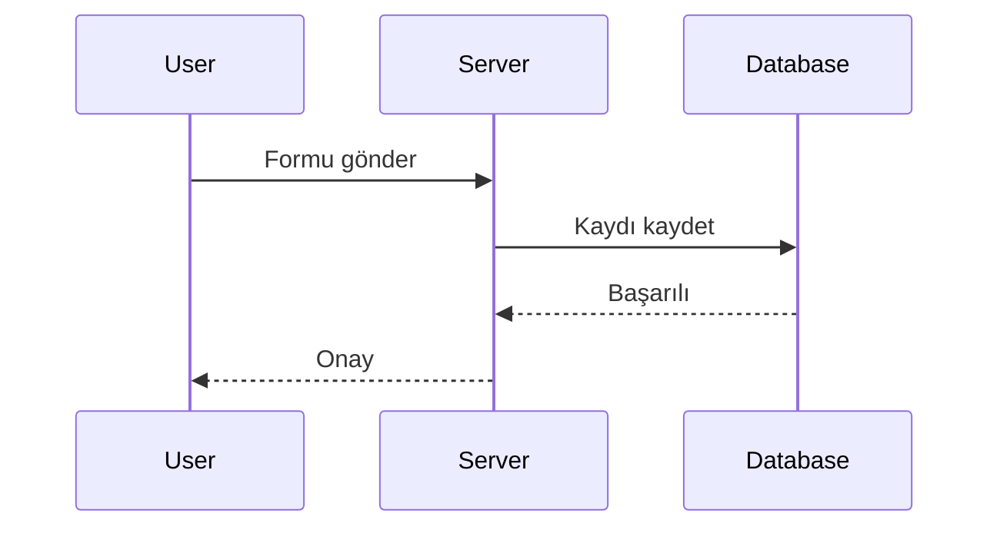
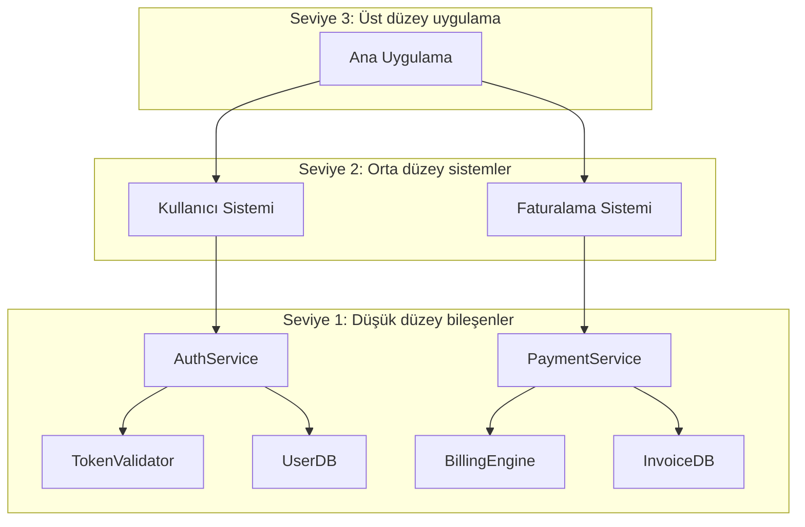
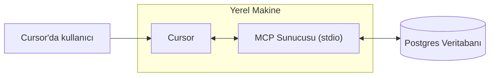
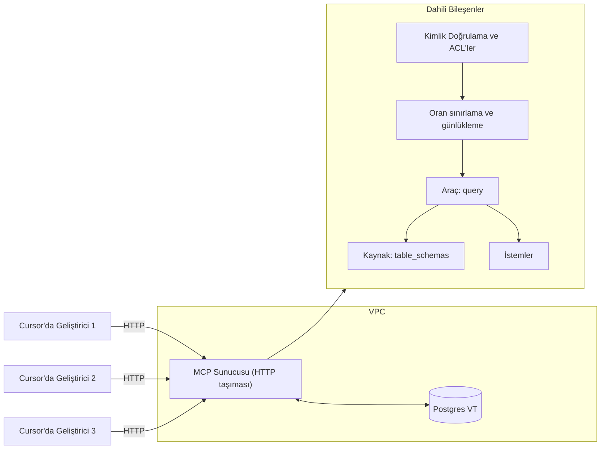
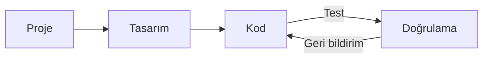
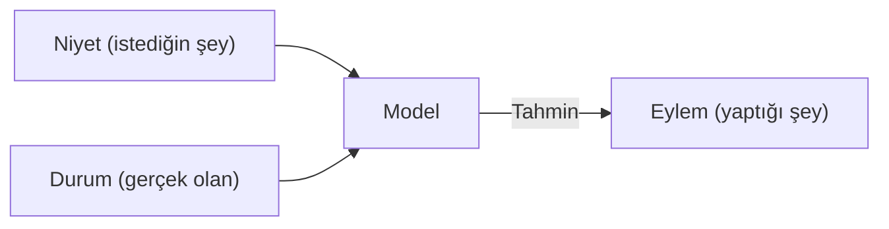

# Dokümantasyonla Çalışma

**Navigation:** [← Previous](./36-kod-incelemesi.md) | [Index](./index.md) | [Next →](./38-geliştiriciler.md)

---

# Dokümantasyonla Çalışma
Source: https://docs.cursor.com/tr/guides/advanced/working-with-documentation

Cursor'da istemler, harici kaynaklar ve dahili bağlam aracılığıyla dokümantasyondan etkili şekilde nasıl yararlanılır

export const ChatInput = ({content = []}) => {
  const renderContent = () => {
    return content.map((item, index) => {
      if (item.type === 'mention') {
        return <span key={index} className="mention bg-blue-500/20 px-1 py-0.5 rounded-sm">
                        {item.text}
                    </span>;
      }
      return item.text;
    });
  };
  return <>
            <div className="flex flex-col items-stretch border border-neutral-500 rounded-lg p-3 gap-2 bg-neutral-800 relative transition-all duration-100 ease-in-out hover:border-neutral-500">
                <div className="flex flex-col gap-1">
                    <div className="flex flex-col gap-1 outline-none overflow-hidden">
                        <div className="flex-1 flex items-center gap-2">
                            <div className="w-full box-border max-h-10 overflow-hidden">
                                <div className="flex items-center gap-2 w-full flex-nowrap">
                                    <div className="cursor-pointer flex items-center justify-center p-1 h-5 w-5 rounded border border-neutral-600 outline-none flex-shrink-0 hover:bg-neutral-700 bg-neutral-750">
                                        <span className="text-neutral-400 text-sm font-semibold">@</span>
                                    </div>
                                </div>
                            </div>
                        </div>
                    </div>
                </div>

                <div className="relative pt-0">
                    <div className="min-h-6 w-full max-h-60">
                        <div className="relative overflow-y-hidden w-full">
                            <div className="w-full flex flex-wrap overflow-hidden min-h-6">
                                <div className="inline-block w-full min-h-full">
                                    <div className="w-full overflow-visible h-full min-h-6">
                                        <div className="grid relative grid-cols-1 w-full">

                                            <div className="leading-6 text-sm text-neutral-200 bg-transparent block break-words p-0 whitespace-pre-wrap font-medium min-h-6">
                                                {content.length > 0 ? renderContent() : <span className="text-neutral-500">Plan, search, build anything</span>}
                                            </div>

                                        </div>
                                    </div>
                                </div>
                            </div>
                        </div>
                    </div>

                    <div className="flex items-center justify-between gap-3 flex-shrink-0 mt-6">
                        <div className="flex-1 w-full h-full flex items-center flex-col gap-1">
                            <div className="flex items-center justify-between gap-2 flex-shrink-0 w-full">
                                <div className="flex items-center justify-between w-full">
                                    <div className="flex items-center gap-3 flex-shrink min-w-0">
                                        <div className="flex gap-1 text-xs items-center min-w-0 max-w-full px-1.5 py-0.5 flex-shrink-0 cursor-pointer bg-neutral-700 hover:bg-neutral-600 rounded-full">
                                            <div className="flex items-center gap-1 min-w-0 max-w-full overflow-hidden">
                                                <div className="text-xs flex-shrink-0 w-3 h-3 flex items-center justify-center text-neutral-400">
                                                    ∞
                                                </div>
                                                <div className="min-w-0 max-w-full overflow-hidden text-ellipsis whitespace-nowrap flex items-center gap-1 font-medium">
                                                    <span className="text-neutral-300">Agent</span>
                                                    <span className="text-neutral-500 text-[10px]">⌘I</span>
                                                </div>
                                                <Icon icon="chevron-down" size={6} color="currentColor" />
                                            </div>
                                        </div>

                                        <div className="flex gap-2 text-xs items-center cursor-pointer min-w-0 max-w-full px-0 py-1 opacity-90 rounded hover:text-neutral-200">
                                            <div className="flex items-center gap-2 min-w-0 max-w-full overflow-x-hidden">
                                                <div className="min-w-0 text-ellipsis whitespace-nowrap text-neutral-300 flex items-center gap-2 overflow-hidden">
                                                    <div className="overflow-hidden inline-flex gap-2 items-center">
                                                        <span className="whitespace-nowrap overflow-x-hidden text-ellipsis text-xs">
                                                            Auto
                                                        </span>
                                                    </div>
                                                </div>
                                                <Icon icon="chevron-down" size={8} color="currentColor" />
                                            </div>
                                        </div>
                                    </div>

                                    <div className="flex items-center gap-3 justify-end">
                                        <button className="bg-white/80 border-none text-neutral-500 flex w-5 h-5 items-center justify-center hover:text-neutral-400 hover:bg-white/90 rounded-full disabled:opacity-50" disabled={content.length === 0 || !content.some(item => item.text.trim())}>
                                            <span className="text-sm">↑</span>
                                        </button>
                                    </div>
                                </div>
                            </div>
                        </div>
                    </div>
                </div>
            </div>
        </>;
};

<div id="why-documentation-matters">
  # Belgelendirme neden önemlidir
</div>

Belgelendirme güncel ve doğru bağlam sağlar. Olmadan modeller eski ya da eksik eğitim verilerini kullanır. Belgelendirme, modellerin şunları anlamasına yardımcı olur:

* Güncel API’ler ve parametreler
* En iyi uygulamalar
* Organizasyon gelenekleri
* Alan terminolojisi

Ve çok daha fazlası. Bağlam değiştirmeden belgelendirmeyi doğrudan Cursor’da nasıl kullanacağını öğrenmek için okumaya devam et.

<div id="model-knowledge-cutoff">
  ## Model bilgi kesim tarihi
</div>

Büyük dil modelleri, "bilgi kesim tarihi" denilen belirli bir zamana kadar olan verilerle eğitilir. Bu şu anlama gelir:

* En son kütüphane güncellemeleri yansımamış olabilir
* Yeni çatı (framework) veya araçlar bilinmeyebilir
* Kesim tarihinden sonra yapılan API değişiklikleri atlanır
* En iyi uygulamalar eğitimden bu yana değişmiş olabilir

Örneğin, bir modelin bilgi kesim tarihi 2024’ün başıysa, 2024’ün sonlarında çıkan özelliklerden, popüler çatı (framework)lar için bile haberdar olmaz.

<div id="which-tool-should-i-use">
  # Hangi aracı kullanmalıyım?
</div>

Dokümantasyon ihtiyaçların için en iyi yaklaşımı hızlıca belirlemek için bu karar ağacını kullan:

```mermaid  theme={null}
flowchart TD
    A[Hangi bilgiye ihtiyacın var?] --> B[Herkese açık framework’ler/kütüphaneler]
    A --> C[Yakın dönem topluluk bilgisi/sorun giderme]
    A --> D[Dahili şirket bilgileri]
    
    B --> E[Resmî dokümantasyon gerekiyor mu?]
    E -->|Evet| F[@Docs kullan<br/>API referansları, kılavuzlar, en iyi uygulamalar]
    E -->|Hayır| G[@Web kullan<br/>Topluluk eğitimleri, karşılaştırmalar]
    
    C --> H[@Web kullan<br/>Güncel paylaşımlar, GitHub issue’ları]
    
    D --> I[Mevcut MCP entegrasyonları var mı?]
    I -->|Evet| J[Mevcut MCP’yi kullan<br/>Confluence, Google Drive, vb.]
    I -->|Hayır| K[Özel MCP oluştur<br/>Dahili API’ler, mülkiyet sistemleri]
    
    style F fill:#e1f5fe
    style G fill:#e8f5e8  
    style H fill:#e8f5e8
    style J fill:#fff3e0
    style K fill:#fce4ec
```

<div id="mental-model">
  ## Zihinsel model
</div>

<div className="full-width-table">
  | Araç        | Zihinsel model                             |
  | ----------- | ------------------------------------------ |
  | **`@Docs`** | Resmi dokümantasyonda gezinip okumak gibi  |
  | **`@Web`**  | İnternette çözüm aramak gibi               |
  | **MCP**     | Kendi dahili dokümantasyonuna erişmek gibi |
</div>

<div id="public-documentation">
  # Public documentation
</div>

Harici dokümantasyon, modellerin sınırlı ya da güncelliğini yitirmiş bilgiye sahip olabileceği, herkese açık bilgileri kapsar. Cursor, bu bilgilere erişmek için iki ana yol sunar.

<div id="using-docs">
  ## @Docs'u kullanma
</div>

`@Docs`, Cursor'ı popüler araç ve framework'lerin resmi dokümantasyonuna bağlar. Şu konularda güncel ve yetkili bilgiye ihtiyaç duyduğunda kullan:

* **API referansları**: Fonksiyon imzaları, parametreler, dönüş tipleri
* **Başlangıç rehberleri**: Kurulum, yapılandırma, temel kullanım
* **En iyi uygulamalar**: Kaynaktan önerilen kalıplar
* **Framework'e özel hata ayıklama**: Resmi sorun giderme rehberleri

<ChatInput
  content={[
{ type: 'mention', text: '@Docs Next.js' },
{ type: 'text', text: ' Catch-all rotalarla dinamik yönlendirmeyi nasıl kurarım?' }
]}
/>

<div id="using-web">
  ## @Web'i kullanma
</div>

`@Web`, güncel bilgiler, blog yazıları ve topluluk tartışmaları için canlı internette arama yapar. Şunlara ihtiyacın olduğunda kullan:

* **Güncel eğitimler**: Topluluk kaynaklı içerikler ve örnekler
* **Karşılaştırmalar**: Farklı yaklaşımları karşılaştıran yazılar
* **En son güncellemeler**: Çok yeni güncellemeler veya duyurular
* **Birden fazla bakış açısı**: Sorunlara farklı yaklaşımlar

<ChatInput
  content={[
{ type: 'mention', text: '@Web' },
{ type: 'text', text: ' React 19 için en yeni performans optimizasyonları' }
]}
/>

<div id="internal-documentation">
  # İç dokümantasyon
</div>

İç dokümantasyon, AI modellerinin eğitim sırasında hiç görmediği, organizasyonuna özgü bilgileri içerir. Şunları kapsayabilir:

* **Dahili API'ler**: Özel servisler ve mikroservisler
* **Şirket standartları**: Kodlama kuralları, mimari desenler
* **Mülkiyet sistemler**: Özel araçlar, veritabanları, iş akışları
* **Alan bilgisi**: İş mantığı, uyumluluk gereksinimleri

<div id="accessing-internal-docs-with-mcp">
  ## MCP ile dahili dökümanlara erişim
</div>

Model Context Protocol (MCP), özel dökümanlarını ve sistemlerini Cursor’a getirmenin standart bir yolunu sağlar. MCP, Cursor ile dahili kaynakların arasında ince bir katman olarak çalışır.

**MCP neden önemli:**

* Modeller dahili uygulamalarını/alışkanlıklarını tahmin edemez
* Özel servisler için API dökümantasyonu herkese açık değildir
* İş mantığı ve alan bilgisi organizasyonuna özeldir
* Uyum ve güvenlik gereksinimleri şirkete göre değişir

<div id="common-mcp-integrations">
  ### Yaygın MCP entegrasyonları
</div>

| Entegrasyon      | Erişim                                  | Örnekler                                                                                                                   |
| ---------------- | --------------------------------------- | -------------------------------------------------------------------------------------------------------------------------- |
| **Confluence**   | Şirket Confluence alanları              | Mimari dökümantasyon, dahili servisler için API spesifikasyonları, kod standartları ve yönergeler, süreç dökümantasyonu    |
| **Google Drive** | Paylaşılan belgeler ve klasörler        | Spesifikasyon dokümanları, toplantı notları ve karar kayıtları, tasarım dokümanları ve gereksinimler, ekip bilgi tabanları |
| **Notion**       | Çalışma alanı veritabanları ve sayfalar | Proje dökümantasyonu, ekip vikileri, bilgi tabanları, ürün gereksinimleri, teknik spesifikasyonlar                         |
| **Custom**       | Dahili sistemler ve veritabanları       | Tescilli API’ler, legacy dökümantasyon sistemleri, özel bilgi tabanları, uzmanlaşmış araçlar ve iş akışları                |

<div id="custom-solutions">
  #### Özel çözümler
</div>

Benzersiz ihtiyaçlar için, şunları yapabilen özel MCP sunucuları geliştirebilirsin:

* Dahili web sitelerini veya portalları taramak
* Tescilli veritabanlarına bağlanmak
* Özel dökümantasyon sistemlerine erişmek
* Dahili vikilerden veya bilgi tabanlarından veri çekmek

<Tip>Özel bir MCP sunucusu geliştirirsen, Cursor’ın dökümantasyonu güncellemesi için araçlar da expose edebilirsin</Tip>

Dahili dökümanları taramak için örnek özel MCP sunucusu:

<CodeGroup>
  ```javascript TypeScript theme={null}
  import { McpServer, ResourceTemplate } from "@modelcontextprotocol/sdk/server/mcp.js";
  import { StdioServerTransport } from "@modelcontextprotocol/sdk/server/stdio.js";
  import { z } from "zod";
  import TurndownService from "turndown";

  // Dahili dökümanları taramak için bir MCP sunucusu oluştur
  const server = new McpServer({
    name: "internal-docs",
    version: "1.0.0"
  });

  const turndownService = new TurndownService();

  // Dahili dökümantasyonu taramak için tool ekle
  server.tool("get_doc",
    { url: z.string() },
    async ({ url }) => {
      try {
        const response = await fetch(url);
        const html = await response.text();
        
        // HTML’i markdown’a dönüştür
        const markdown = turndownService.turndown(html);
        
        return {
          content: [{ type: "text", text: markdown }]
        };
      } catch (error) {
        return {
          content: [{ type: "text", text: `Error scraping ${url}: ${error.message}` }]
        };
      }
    }
  );

  // stdin üzerinden mesaj almayı ve stdout üzerinden mesaj göndermeyi başlat
  const transport = new StdioServerTransport();
  await server.connect(transport);
  ```

  ```python Python theme={null}
  # server.py
  import os
  import asyncio
  from mcp.server.fastmcp import FastMCP
  import aiohttp
  from markdownify import markdownify as md

  # Dahili dökümanları taramak için bir MCP sunucusu oluştur
  mcp = FastMCP("internal-docs")

  @mcp.tool()
  async def get_doc(url: str) -> dict:
      """Bir URL’den dahili dökümantasyonu tara"""
      try:
          async with aiohttp.ClientSession() as session:
              async with session.get(url) as response:
                  html = await response.text()
          
          # HTML’i markdown’a dönüştür
          markdown = md(html)
          
          return {
              "content": [{"type": "text", "text": markdown}]
          }
      except Exception as error:
          return {
              "content": [{"type": "text", "text": f"Error scraping {url}: {str(error)}"}]
          }
  ```
</CodeGroup>

<div id="keeping-docs-up-to-date">
  # Dokümanları güncel tutmak
</div>

Dokümantasyon hızla eskir. Cursor, gerçek koduna ve geliştirme konuşmalarına dayanarak dokümantasyonu oluşturup güncelleyerek onu güncel ve faydalı tutmana yardımcı olur.

<div id="from-existing-code">
  ## Mevcut koddan
</div>

Cursor’ı kullanarak dokümantasyonu doğrudan kod tabanından oluştur:

<Tabs>
  <Tab title="API Documentation">
    <ChatInput
      content={[
    { type: 'text', text: 'Bu Express router için, tüm uç noktalar, parametreler ve yanıt formatları dahil olmak üzere API dokümantasyonu oluştur' }
  ]}
    />
  </Tab>

  <Tab title="JSDoc Comments">
    <ChatInput
      content={[
    { type: 'text', text: 'Bu sınıfa kapsamlı JSDoc açıklamaları ekle; tüm yöntemleri ve bunların parametrelerini belgele' }
  ]}
    />
  </Tab>

  <Tab title="README Creation">
    <ChatInput
      content={[
    { type: 'text', text: 'Kurulum yönergeleri, kullanım örnekleri ve API genel bakışını içeren bu proje için bir README oluştur' }
  ]}
    />
  </Tab>
</Tabs>

<div id="from-chat-sessions">
  ## Sohbet oturumlarından
</div>

Cursor’la yaptığın sohbetlerde, dokümantasyona dönüştürülebilecek değerli niyetler var.

<Tabs>
  <Tab title="Problem Solving">
    **Karmaşık bir sorun çözüldükten sonra:**

    <ChatInput
      content={[
    { type: 'text', text: 'Kimlik doğrulamayı kurma üzerine sohbetimizi ekip wikisi için adım adım bir rehbere özetle' }
  ]}
    />
  </Tab>

  <Tab title="Architecture">
    **Mimari kararların ardından:**

    <ChatInput
      content={[
    { type: 'text', text: 'Tartıştığımız ödünleri de dahil ederek bu veritabanı tasarımını neden seçtiğimizi açıklayan bir dokümantasyon hazırla' }
  ]}
    />
  </Tab>

  <Tab title="Debugging">
    **Hata ayıklama oturumlarından sonra:**

    <ChatInput
      content={[
    { type: 'text', text: 'Az önce düzelttiğimiz bu hataya dayanarak, belirtiler ve çözüm adımlarını içeren bir sorun giderme rehberi yaz' }
  ]}
    />
  </Tab>
</Tabs>

<div id="takeaways">
  ## Özet
</div>

* Belgeleri bağlam olarak kullanmak, Cursor’ı daha isabetli ve güncel yapar
* Resmi dokümantasyon için `@Docs`, topluluk bilgisi için `@Web` kullan
* MCP, Cursor ile dahili sistemlerin arasındaki boşluğu kapatır
* Bilgiyi güncel tutmak için koddan ve sohbetlerden dokümantasyon üret
* Kapsamlı bir anlayış için harici ve dahili dokümantasyon kaynaklarını birleştir


# Java
Source: https://docs.cursor.com/tr/guides/languages/java

JDK, uzantılar ve derleme araçlarıyla Java geliştirmeyi kur

Bu rehber, JDK’yi ayarlama, gerekli uzantıları yükleme, hata ayıklama, Java uygulamalarını çalıştırma ve Maven ile Gradle gibi derleme araçlarını entegre etme dahil Java geliştirme için Cursor’ı yapılandırmana yardımcı olur. Ayrıca IntelliJ veya VS Code’a benzer iş akışı özelliklerini de kapsar.

<Note>
  Başlamadan önce, Cursor’ın kurulu olduğundan ve en son
  sürüme güncellendiğinden emin ol.
</Note>

<div id="setting-up-java-for-cursor">
  ## Cursor için Java kurulumu
</div>

<div id="java-installation">
  ### Java kurulumu
</div>

Cursor’ı kurmadan önce, makinene Java yüklü olmalı.

<Warning>
  Cursor bir Java derleyicisiyle gelmez, bu yüzden eğer henüz yüklü değilse bir JDK kurman gerekir.
</Warning>

<CardGroup cols={1}>
  <Card title="Windows Kurulumu" icon="windows">
    Bir JDK indirip kur (örn. OpenJDK, Oracle JDK, Microsoft Build of
    OpenJDK).

    <br />

    JAVA\_HOME’u ayarla ve JAVA\_HOME\bin klasörünü PATH’ine ekle.
  </Card>

  <Card title="macOS Kurulumu" icon="apple">
    Homebrew ile kur (`brew install openjdk`) ya da bir yükleyici indir.

    <br />

    JAVA\_HOME’un kurulu JDK’yi işaret ettiğinden emin ol.
  </Card>

  <Card title="Linux Kurulumu" icon="linux">
    Paket yöneticini kullan (`sudo apt install openjdk-17-jdk` veya muadili)
    ya da SDKMAN ile kur.
  </Card>
</CardGroup>

Kurulumu doğrulamak için şunu çalıştır:

```bash  theme={null}
java -version
javac -version
```

<Info>
  Cursor JDK’yi algılamazsa, settings.json içinde elle yapılandır:
</Info>

```json  theme={null}
{
  "java.jdt.ls.java.home": "/jdk/yolu",
  "java.configuration.runtimes": [
    {
      "name": "JavaSE-17",
      "path": "/jdk-17/yolu"
      "default": true
    }
  ]
}
```

<Warning>Değişiklikleri uygulamak için Cursor’ı yeniden başlat.</Warning>

<div id="cursor-setup">
  ### Cursor Kurulumu
</div>

<Info>Cursor, VS Code eklentilerini destekler. Aşağıdakileri elle yükle:</Info>

<CardGroup cols={2}>
  <Card title="Extension Pack for Java" icon="java" href="cursor:extension/vscjava.vscode-java-pack">
    Java dil desteği, hata ayıklayıcı, test çalıştırıcı, Maven desteği ve
    proje yöneticisi içerir
  </Card>

  <Card title="Gradle for Java" icon="gears" href="cursor:extension/vscjava.vscode-gradle">
    Gradle derleme sistemiyle çalışmak için gerekli
  </Card>

  <Card title="Spring Boot Extension Pack" icon="leaf" href="cursor:extension/vmware.vscode-boot-dev-pack">
    Spring Boot geliştirme için gerekli
  </Card>

  <Card title="Kotlin" icon="window" href="cursor:extension/fwcd.kotlin">
    Kotlin uygulamaları geliştirmek için gerekli
  </Card>
</CardGroup>

<div id="configure-build-tools">
  ### Derleme Araçlarını Yapılandır
</div>

<div id="maven">
  #### Maven
</div>

Maven’ın kurulu olduğundan emin ol (`mvn -version`). Gerekirse [maven.apache.org](https://maven.apache.org/download.cgi) adresinden yükle:

1. İkili arşivi indir
2. İstediğin konuma çıkar
3. MAVEN\_HOME ortam değişkenini çıkarılan klasöre ayarla
4. PATH’e %MAVEN\_HOME%\bin (Windows) veya \$MAVEN\_HOME/bin (Unix) ekle

<div id="gradle">
  #### Gradle
</div>

Gradle’ın kurulu olduğundan emin ol (`gradle -version`). Gerekirse [gradle.org](https://gradle.org/install/) adresinden yükle:

1. İkili dağıtımı indir
2. İstediğin konuma çıkar
3. GRADLE\_HOME ortam değişkenini çıkarılan klasöre ayarla
4. PATH’e %GRADLE\_HOME%\bin (Windows) veya \$GRADLE\_HOME/bin (Unix) ekle

Alternatif olarak, doğru Gradle sürümünü otomatik olarak indirip kullanacak Gradle Wrapper’ı kullan:

<div id="running-and-debugging">
  ## Çalıştırma ve Hata Ayıklama
</div>

Artık her şey hazır, Java kodunu çalıştırıp hata ayıklama zamanı.
İhtiyaçlarına göre aşağıdaki yöntemleri kullanabilirsin:

<CardGroup cols={2}>
  <Card title="Run" icon="play">
    Herhangi bir main metodunun üstünde görünen "Run" bağlantısına tıklayarak
    programını hızlıca çalıştır
  </Card>

  <Card title="Debug" icon="bug">
    Run and Debug kenar çubuğu panelini aç ve uygulamanı başlatmak için Run
    düğmesini kullan
  </Card>
</CardGroup>

<CardGroup cols={1}>
  <Card title="Terminal" icon="terminal">
    Komut satırından Maven veya Gradle komutlarıyla çalıştır
  </Card>

  <Card title="Spring Boot" icon="leaf">
    Spring Boot uygulamalarını Spring Boot Dashboard
    uzantısından doğrudan başlat
  </Card>
</CardGroup>

<div id="java-x-cursor-workflow">
  ## Java x Cursor İş Akışı
</div>

Cursor’ın yapay zekâ destekli özellikleri, Java geliştirme iş akışını ciddi şekilde hızlandırır. İşte özellikle Java için Cursor’ın yeteneklerinden yararlanmanın bazı yolları:

<CardGroup cols={2}>
  <Card title="Sekme Tamamlama" icon="arrow-right">
    <div className="text-sm">
      Metotlar, imzalar ve getter/setter gibi Java kalıpları için akıllı tamamlamalar.
    </div>
  </Card>

  <Card title="Agent Mode" icon="pen-to-square">
    <div className="text-sm">
      Tasarım kalıplarını uygula, kodu refaktör et veya doğru kalıtımla sınıflar oluştur.
    </div>
  </Card>

  <Card title="Satır İçi Düzenleme" icon="code">
    <div className="text-sm">
      Metotlarda hızlı satır içi düzenlemeler yap, hataları düzelt veya akışı bozmadan birim testleri üret.
    </div>
  </Card>

  <Card title="Sohbet" icon="message">
    <div className="text-sm">
      Java kavramlarında yardım al, istisnaları hata ayıkla veya framework özelliklerini öğren.
    </div>
  </Card>
</CardGroup>

<div id="example-workflows">
  ### Örnek İş Akışları
</div>

1. **Java Kalıbı Oluştur**\
   [Sekme tamamlama](/tr/tab/overview) kullanarak constructor’lar, getter/setter’lar, equals/hashCode metotları ve diğer tekrarlayan Java kalıplarını hızlıca oluştur.

2. **Karmaşık Java İstisnalarını Hata Ayıkla**\
   Anlaşılması güç bir Java stack trace’ine denk geldiğinde, onu seç ve kök nedeni açıklayıp olası düzeltmeleri önermesi için [Ask](/tr/chat/overview) kullan.

3. **Eski Java Kodunu Refaktör Et**\
   Daha eski Java kodunu modernleştirmek için [Agent mode](/tr/chat/agent) kullan — anonim sınıfları lambda’lara çevir, daha yeni Java dil özelliklerine yükselt veya tasarım kalıplarını uygula.

4. **Framework Geliştirme**\
   Belgelerini @docs ile Cursor’ın bağlamına ekle ve Cursor genelinde framework’e özel kod üret.


# JavaScript & TypeScript
Source: https://docs.cursor.com/tr/guides/languages/javascript

Framework desteğiyle JavaScript ve TypeScript geliştirme

Cursor’da JavaScript ve TypeScript geliştirmeye hoş geldin! Editör, eklenti ekosistemi sayesinde JS/TS geliştirme için olağanüstü destek sunuyor. Cursor’dan en iyi şekilde yararlanman için bilmen gerekenler:

<div id="essential-extensions">
  ## Temel Uzantılar
</div>

Cursor, tercih ettiğin herhangi bir uzantıyla harika çalışır; yine de yeni başlıyorsan şunları öneriyoruz:

* **ESLint** - Cursor’ın yapay zekâ destekli lint düzeltme özellikleri için gerekli
* **JavaScript and TypeScript Language Features** - Geliştirilmiş dil desteği ve IntelliSense
* **Path Intellisense** - Dosya yolları için akıllı otomatik tamamlama

<div id="cursor-features">
  ## Cursor Özellikleri
</div>

Cursor, mevcut JavaScript/TypeScript çalışma akışını şu özelliklerle güçlendirir:

* **Sekmeyle Tamamlama**: Proje yapını anlayan, bağlama duyarlı kod tamamlama
* **Otomatik İçe Aktarmalar**: Tab, bir kütüphaneyi kullanır kullanmaz onu otomatik olarak içe aktarır
* **Satır İçi Düzenleme**: Herhangi bir satırda `CMD+K` kullanarak kusursuz sözdizimiyle düzenle
* **Composer Yönlendirmesi**: Composer ile birden fazla dosyada kodunu planla ve düzenle

<div id="framework-intelligence-with-docs">
  ### @Docs ile Framework Zekâsı
</div>

Cursor’ın @Docs özelliği, yapay zekânın başvurabileceği özel dokümantasyon kaynakları ekleyerek JavaScript geliştirmeyi turbo besler. Daha doğru ve bağlamsal kod önerileri almak için MDN, Node.js veya favori framework’ünün dokümantasyonunu ekle.

<Card title="Learn more about @Docs" icon="book" href="/tr/context/@-symbols/@-docs">
  Cursor’da özel dokümantasyon kaynaklarını nasıl ekleyip yöneteceğini keşfet.
</Card>

<div id="automatic-linting-resolution">
  ### Otomatik Lint Çözümü
</div>

Cursor’ın öne çıkan özelliklerinden biri, linter uzantılarıyla kusursuz entegrasyonudur.
ESLint gibi bir linter kurduğundan emin ol ve 'Iterate on Lints' ayarını etkinleştir.

Ardından, Composer’da Agent modunu kullanırken, yapay zekâ sorguna yanıtlamaya çalışıp kodda değişiklik yaptıktan sonra, linter çıktısını otomatik olarak okuyacak ve o anda farkında olmadığı lint hatalarını düzeltmeye çalışacak.

<div id="framework-support">
  ## Framework Desteği
</div>

Cursor, tüm başlıca JavaScript framework’leri ve kütüphaneleriyle aşağıdaki gibi sorunsuz çalışır:

### React & Next.js

* Akıllı bileşen önerileriyle tam JSX/TSX desteği
* Next.js için server components ve API routes zekâsı
* Önerilen: [**React Developer Tools**](cursor:extension/msjsdiag.vscode-react-native) eklentisi

<div id="vuejs">
  ### Vue.js
</div>

* Volar entegrasyonuyla şablon sözdizimi desteği
* Bileşen otomatik tamamlama ve tür denetimi
* Önerilen: [**Vue Language Features**](cursor:extension/vue.volar)

<div id="angular">
  ### Angular
</div>

* Şablon doğrulama ve TypeScript decorator desteği
* Bileşen ve servis üretimi
* Önerilen: [**Angular Language Service**](cursor:extension/Angular.ng-template)

<div id="svelte">
  ### Svelte
</div>

* Bileşen sözdizimi vurgulama ve akıllı tamamlama
* Reaktif ifadeler ve store önerileri
* Önerilen: [**Svelte for VS Code**](cursor:extension/svelte.svelte-vscode)

<div id="backend-frameworks-expressnestjs">
  ### Backend Framework’leri (Express/NestJS)
</div>

* Route ve middleware zekâsı
* NestJS için TypeScript decorator desteği
* API test araçlarıyla entegrasyon

Unutma, Cursor’ın yapay zekâ özellikleri bu framework’lerin tümüyle uyumlu çalışır; kalıplarını ve en iyi uygulamalarını anlayarak ilgili öneriler sunar. Yapay zekâ, bileşen oluşturmadan karmaşık refaktoring görevlerine kadar her konuda, projenin mevcut kalıplarına saygı duyarak yardımcı olabilir.


# Python
Source: https://docs.cursor.com/tr/guides/languages/python

Python geliştirmeyi eklentiler ve linting araçlarıyla ayarla

<Note>
  Bu rehber, [Jack Fields](https://x.com/OrdinaryInds) ve onun
  Python geliştirme için VS Code kurulumunu anlatan
  [makalesinden](https://medium.com/ordinaryindustries/the-ultimate-vs-code-setup-for-python-538026b34d94)
  epey ilham aldı. Daha fazla detay için lütfen makalesine göz at.
</Note>

<div id="prerequisites">
  ## Önkoşullar
</div>

Başlamadan önce şunların olduğundan emin ol:

* [Python](https://python.org) kurulu (3.8 veya üzeri önerilir)
* Sürüm kontrolü için [Git](https://git-scm.com/)
* Cursor kurulu ve en son sürüme güncellenmiş

<div id="essential-extensions">
  ## Gerekli Uzantılar
</div>

Aşağıdaki uzantılar, Cursor’ı Python geliştirme için tam donanımlı hale getirir. Sözdizimi renklendirme, linting, hata ayıklama ve birim testleri sağlar.

<CardGroup cols={2}>
  <Card title="Python" icon="python" href="cursor:extension/ms-python.python">
    Microsoft’tan temel dil desteği
  </Card>

  <Card title="Cursor Pyright" icon="bolt" href="cursor:extension/anysphere.cursorpyright">
    Hızlı Python dil sunucusu
  </Card>

  <Card title="Python Debugger" icon="bug" href="cursor:extension/ms-python.debugpy">
    Gelişmiş hata ayıklama özellikleri
  </Card>

  <Card title="Ruff" icon="wand-magic-sparkles" href="cursor:extension/charliermarsh.ruff">
    Python linter’ı ve biçimlendirici
  </Card>
</CardGroup>

<div id="advanced-python-tooling">
  ### Gelişmiş Python Araçları
</div>

Yukarıdaki uzantılar bugüne kadar Cursor’da Python geliştirme için en popüler uzantılar olsa da, Python geliştirmenden en iyi şekilde yararlanmanı sağlayacak bazı ek uzantılar da ekledik.

<div id="uv-python-environment-manager">
  #### `uv` - Python Ortam Yöneticisi
</div>

[uv](https://github.com/astral-sh/uv), pip’in varsayılan paket yöneticisi olarak yerini almasının yanı sıra sanal ortamlar oluşturup yönetmek için kullanılabilen modern bir Python paket yöneticisidir.

uv’yi yüklemek için terminalinde şu komutu çalıştır:

```bash  theme={null}
pip install uv
```

<div id="ruff-python-linter-and-formatter">
  #### `ruff` - Python Linter ve Biçimlendirici
</div>

[Ruff](https://docs.astral.sh/ruff/), programlama hatalarını yakalamak, kodlama standartlarını uygulamaya yardımcı olmak ve yeniden düzenleme (refactoring) önerilerinde bulunmak için kullanılabilen modern bir Python linter’ı ve biçimlendiricisidir. Kod biçimlendirme için Black’le birlikte kullanılabilir.

Ruff’u kurmak için terminalinde aşağıdaki komutu çalıştır:

```bash  theme={null}
pip install ruff
```

<div id="cursor-configuration">
  ## Cursor Yapılandırması
</div>

<div id="1-python-interpreter">
  ### 1. Python Yorumlayıcısı
</div>

Cursor’da Python yorumlayıcını yapılandır:

1. Komut Paleti’ni aç (Cmd/Ctrl + Shift + P)
2. "Python: Select Interpreter" komutunu ara
3. Python yorumlayıcını (veya bir sanal ortam kullanıyorsan onu) seç

<div id="2-code-formatting">
  ### 2. Kod Biçimlendirme
</div>

Black ile otomatik kod biçimlendirmeyi ayarla:

<Note>
  Black, kodunu tutarlı bir stille otomatik olarak biçimlendiren bir kod
  biçimlendiricisidir. Yapılandırma gerektirmez ve Python topluluğunda
  yaygın olarak kullanılır.
</Note>

Black’i yüklemek için terminalinde aşağıdaki komutu çalıştır:

```bash  theme={null}
pip install black
```

Ardından, kod biçimlendirme için Black’i kullanması için Cursor’ı yapılandırmak üzere `settings.json` dosyana şunu ekle:

```json  theme={null}
{
  "python.formatting.provider": "black",
  "editor.formatOnSave": true,
  "python.formatting.blackArgs": ["--line-length", "88"]
}
```

<div id="3-linting">
  ### 3. Linting
</div>

Programlama hatalarını kontrol etmek, kodlama standartlarını sağlamaya yardımcı olmak ve yeniden düzenleme (refactoring) önermek için PyLint kullanabiliriz.

PyLint’i yüklemek için terminalinde şu komutu çalıştır:

```bash  theme={null}
pip install pylint
```

```json  theme={null}
{
  "python.linting.enabled": true,
  "python.linting.pylintEnabled": true,
  "python.linting.lintOnSave": true
}
```

<div id="4-type-checking">
  ### 4. Tür Denetimi
</div>

Linting’e ek olarak, tür hatalarını kontrol etmek için MyPy kullanabiliriz.

MyPy’yi yüklemek için terminalinde aşağıdaki komutu çalıştır:

```bash  theme={null}
pip install mypy
```

```json  theme={null}
{
  "python.linting.mypyEnabled": true
}
```

<div id="debugging">
  ## Hata ayıklama
</div>

Cursor, Python için güçlü hata ayıklama özellikleri sunar:

1. Oluk (gutter) alanına tıklayarak kesme noktaları ayarla
2. Hata Ayıklama (Debug) panelini kullan (Cmd/Ctrl + Shift + D)
3. Özel hata ayıklama yapılandırmaları için `launch.json` dosyasını yapılandır

<div id="recommended-features">
  ## Önerilen Özellikler
</div>

<CardGroup cols={3}>
  <Card title="Tab Completion" icon="wand-magic-sparkles" href="/tr/tab/overview">
    Hareketlerini anlayan akıllı kod önerileri
  </Card>

  <Card title="Chat" icon="comments" href="/tr/chat/overview">
    Doğal konuşmalar yoluyla kodu keşfet ve anla
  </Card>

  <Card title="Agent" icon="robot" href="/tr/chat/agent">
    AI yardımıyla karmaşık geliştirme görevlerini halledebilir
  </Card>

  <Card title="Context" icon="network-wired" href="/tr/context/model-context-protocol">
    Üçüncü parti sistemlerden context çek
  </Card>

  <Card title="Auto-Imports" icon="file-import" href="/tr/tab/auto-import">
    Kod yazarken modülleri otomatik olarak import et
  </Card>

  <Card title="AI Review" icon="check-double" href="/tr/tab/overview#quality">
    Cursor kodunu sürekli AI ile gözden geçirir
  </Card>
</CardGroup>

<div id="framework-support">
  ## Framework Desteği
</div>

Cursor, popüler Python frameworkleriyle sorunsuz çalışır:

* **Web Frameworkleri**: Django, Flask, FastAPI
* **Veri Bilimi**: Jupyter, NumPy, Pandas
* **Makine Öğrenimi**: TensorFlow, PyTorch, scikit-learn
* **Test**: pytest, unittest
* **API**: requests, aiohttp
* **Veritabanı**: SQLAlchemy, psycopg2


# iOS & macOS (Swift)
Source: https://docs.cursor.com/tr/guides/languages/swift

Swift geliştirme için Cursor’ı Xcode’la entegre et

Cursor’da Swift geliştirmeye hoş geldin! iOS uygulamaları, macOS uygulamaları ya da sunucu tarafı Swift projeleri geliştiriyor ol, yanındayız. Bu rehber, temellerden başlayıp daha gelişmiş özelliklere geçerek Cursor’da Swift ortamını kurmana yardımcı olacak.

<div id="basic-workflow">
  ## Temel Çalışma Akışı
</div>

Cursor’ı Swift ile kullanmanın en kolay yolu, onu birincil kod editörün olarak kullanıp uygulamalarını derlemek ve çalıştırmak için Xcode’dan yararlanmaya devam etmek. Şu gibi harika özellikler elde edersin:

* Akıllı kod tamamlama
* Yapay zekâ destekli kodlama desteği (herhangi bir satırda [CMD+K](/tr/inline-edit/overview) dene)
* [@Docs](/tr/context/@-symbols/@-docs) ile belgelere hızlı erişim
* Sözdizimi vurgulama
* Temel kod gezinme

Uygulamanı derlemen veya çalıştırman gerektiğinde sadece Xcode’a geç. Bu çalışma akışı, hata ayıklama ve dağıtım için alışık olduğun Xcode araçlarını kullanırken Cursor’ın yapay zekâ yeteneklerinden yararlanmak isteyen geliştiriciler için ideal.

<div id="hot-reloading">
  ### Hot Reloading
</div>

Xcode çalışma alanları veya projeleri kullanırken (Xcode’da bir klasörü doğrudan açmak yerine), Xcode bazen Cursor’da ya da genel olarak Xcode dışında yapılan dosya değişikliklerini görmezden gelebilir.

Bunu çözmek için klasörü Xcode’da açabilsen de, Swift geliştirme çalışma akışın için bir projeye ihtiyaç duyabilirsin.

Buna harika bir çözüm, Swift için bir hot reloading kütüphanesi olan ve uygulamanın değişiklikler yapılır yapılmaz gerçek zamanlı olarak “hot reload” edip güncellenmesini sağlayan [Inject](https://github.com/krzysztofzablocki/Inject)’i kullanmak. Bu yaklaşım, Xcode çalışma alanı/proje sorunlarının yan etkilerinden etkilenmez ve Cursor’da yaptığın değişikliklerin uygulamanda anında görünmesini sağlar.

<CardGroup cols={1}>
  <Card title="Inject - Swift için Hot Reloading" horizontal icon="fire" href="https://github.com/krzysztofzablocki/Inject">
    Inject hakkında daha fazla bilgi edin ve Swift projelerinde nasıl kullanacağını öğren.
  </Card>
</CardGroup>

<div id="advanced-swift-development">
  ## İleri Seviye Swift Geliştirme
</div>

<Note>
  Bu bölüm, [Thomas
  Ricouard](https://x.com/Dimillian) ve iOS geliştirme için Cursor kullanımıyla ilgili
  [makalesinden](https://dimillian.medium.com/how-to-use-cursor-for-ios-development-54b912c23941)
  büyük ölçüde ilham alınarak hazırlandı. Daha fazla ayrıntı için makalesine göz at ve daha fazla Swift içeriği için onu takip et.
</Note>

Aynı anda yalnızca tek bir editörü açık tutmak ve Xcode’la Cursor arasında gidip gelmekten kaçınmak istiyorsan, Cursor’ı doğrudan Xcode’un temel derleme sistemine entegre etmek için [Sweetpad](https://sweetpad.hyzyla.dev/) gibi bir uzantı kullanabilirsin.

Sweetpad, Xcode’un özelliklerinden ödün vermeden Swift projelerini doğrudan Cursor’da derlemeni, çalıştırmanı ve hata ayıklamanı sağlayan güçlü bir uzantıdır.

Sweetpad ile başlamadan önce, Mac’inde Xcode kurulu olmalı — Swift geliştirmenin temeli bu. Xcode’u [Mac App Store](https://apps.apple.com/us/app/xcode/id497799835) üzerinden indirebilirsin. Xcode’u kurduktan sonra Cursor’daki geliştirme deneyimini birkaç önemli araçla güçlendirelim.

Terminalini aç ve şunu çalıştır:

```bash  theme={null}

# Xcode açık olmadan projelerini derler
brew install xcode-build-server


# `xcodebuild` komut çıktısını Cursor’un terminalinde okunaklı biçimde gösterir
brew install xcbeautify


# Gelişmiş biçimlendirme ve dil özellikleri sağlar
brew install swiftformat
```

Ardından Cursor’a [Swift Language Support](cursor:extension/chrisatwindsurf.swift-vscode) uzantısını kur. Bu, kutudan çıktığı gibi sözdizimi vurgulama ve temel dil özellikleri sağlar.

Sonrasında, Cursor’ı Xcode ile entegre etmek için [Sweetpad](https://sweetpad.hyzyla.dev/) uzantısını kurabiliriz. Sweetpad, `xcodebuild` CLI’ının (ve daha fazlasının) etrafına bir dizi kısayol sarar ve hedeflerini taramana, hedef ortamı seçmene, uygulamanı derleyip çalıştırmana Xcode’daki gibi olanak tanır. Buna ek olarak, Xcode Build Server için projeni ayarlar; böylece yukarıda bahsi geçen tüm özellikleri kullanırsın.

<div id="sweetpad-usage">
  ### Sweetpad Kullanımı
</div>

Sweetpad kurulduktan ve Cursor’da bir Swift projesi açtıktan sonra, önce `Sweetpad: Generate Build Server Config` komutunu çalıştırmalısın. Bu, projenin kök dizininde Xcode Build Server’ın projeyle çalışmasını sağlayan bir `buildServer.json` dosyası oluşturur.

Ardından, Komut Paleti’nden veya Sweetpad kenar çubuğundan derleyip çalıştırmak istediğin hedefi seçebilirsin.

<Note>
  {" "}

  Otomatik tamamlama, tanıma git ve diğer dil özelliklerini etkinleştirmek için
  projeni bir kez derlemen gerekiyor.{" "}
</Note>

Artık F5’e basarak projeni hata ayıklayıcıyla derleyip çalıştırabilirsin — önce bir launch yapılandırması oluşturman gerekebilir; istendiğinde listeden Sweetpad’i seçmen yeterli!

Cursor’daki birçok uzantıda olduğu gibi, Sweetpad komutlarının çoğunu klavye kısayollarına bağlayarak iş akışını daha da verimli hale getirebilirsin.

Sweetpad hakkında daha fazla bilgi için şu kaynaklara göz at:

<CardGroup>
  <Card title="Sweetpad Website" horizontal icon="globe" href="https://sweetpad.hyzyla.dev/">
    Özellikler ve kurulum talimatlarıyla resmi Sweetpad web sitesi
  </Card>

  <Card title="Sweetpad Guide" horizontal icon="book" href="https://sweetpad.hyzyla.dev/docs/intro">
    Yapılandırma, kullanım ve gelişmiş özellikleri kapsayan kapsamlı rehber
  </Card>
</CardGroup>


# JetBrains
Source: https://docs.cursor.com/tr/guides/migration/jetbrains

Tanıdık araçlarla JetBrains IDE'lerinden Cursor'a geç

Cursor, JetBrains IDE'lerinin yerini alabilecek modern, yapay zekâ destekli bir kodlama deneyimi sunar. Geçiş ilk başta farklı hissettirse de, Cursor’ın VS Code tabanlı altyapısı güçlü özellikler ve kapsamlı özelleştirme seçenekleri sunar.

<div id="editor-components">
  ## Editör Bileşenleri
</div>

<div id="extensions">
  ### Uzantılar
</div>

JetBrains IDE’leri, hedefledikleri dil ve framework’ler için önceden yapılandırılmış geldikleri için harika araçlar.

Cursor farklı — kutudan çıktığı haliyle boş bir tuval; IDE’nin hedeflediği dil ve framework’lerle sınırlı kalmadan zevkine göre özelleştirebilirsin.

Cursor’ın geniş bir uzantı ekosistemine erişimi var ve JetBrains IDE’lerinin sunduğu işlevlerin neredeyse tamamı (ve daha fazlası!) bu uzantılarla yeniden oluşturulabiliyor.

Aşağıdaki popüler uzantılara göz at:

<CardGroup cols={4}>
  <Card title="Remote SSH" icon="network-wired" href="cursor:extension/anysphere.remote-ssh">
    SSH uzantısı
  </Card>

  <Card title="Project Manager" icon="folder-tree" href="cursor:extension/alefragnani.project-manager">
    Birden fazla projeyi yönet
  </Card>

  <Card title="GitLens" icon="git" href="cursor:extension/eamodio.gitlens">
    Gelişmiş Git entegrasyonu
  </Card>

  <Card title="Local History" icon="clock-rotate-left" href="cursor:extension/xyz.local-history">
    Yerel dosya değişikliklerini izle
  </Card>

  <Card title="Error Lens" icon="bug" href="cursor:extension/usernamehw.errorlens">
    Satır içi hata vurgulama
  </Card>

  <Card title="ESLint" icon="code-compare" href="cursor:extension/dbaeumer.vscode-eslint">
    Kod lintleme
  </Card>

  <Card title="Prettier" icon="wand-magic-sparkles" href="cursor:extension/esbenp.prettier-vscode">
    Kod biçimlendirme
  </Card>

  <Card title="Todo Tree" icon="folder-tree" href="cursor:extension/Gruntfuggly.todo-tree">
    TODO ve FIXME’leri takip et
  </Card>
</CardGroup>

<div id="keyboard-shortcuts">
  ### Klavye Kısayolları
</div>

Cursor, favori klavye kısayollarını eylemlerle eşlemeni sağlayan yerleşik bir kısayol yöneticisine sahip.

Bu uzantıyla JetBrains IDE kısayollarının neredeyse tamamını doğrudan Cursor’a taşıyabilirsin!
Nasıl yapılandıracağını öğrenmek için uzantının dokümantasyonunu mutlaka oku:

<Card title="IntelliJ IDEA Keybindings" icon="keyboard" href="cursor:extension/k--kato.intellij-idea-keybindings">
  JetBrains IDE klavye kısayollarını Cursor’a taşımak için bu uzantıyı kur.
</Card>

<Note>
  Farklı olan yaygın kısayollar:

  * Find Action: ⌘/Ctrl+Shift+P  (⌘/Ctrl+Shift+A yerine)
  * Quick Fix: ⌘/Ctrl+.  (Alt+Enter yerine)
  * Go to File: ⌘/Ctrl+P  (⌘/Ctrl+Shift+N yerine)
</Note>

<div id="themes">
  ### Temalar
</div>

Bu topluluk temalarıyla Cursor’da favori JetBrains IDE’lerinin görünüm ve hissini yeniden oluştur.

Standart Darcula temasını seçebilir ya da JetBrains araçlarının sözdizimi vurgulamasına uyan bir tema tercih edebilirsin.

<CardGroup cols={1}>
  <Card title="JetBrains - Darcula Theme" icon="moon" horizontal href="cursor:extension/rokoroku.vscode-theme-darcula">
    Klasik JetBrains Darcula koyu temasını deneyimle
  </Card>
</CardGroup>

<CardGroup cols={2}>
  <Card title="JetBrains PyCharm" icon="python" horizontal href="cursor:extension/gabemahoney.pycharm-dark-theme-for-python" />

  <Card title="IntelliJ" icon="java" horizontal href="cursor:extension/compassak.intellij-idea-new-ui" />

  <Card title="JetBrains Fleet" icon="code" horizontal href="cursor:extension/MichaelZhou.fleet-theme" />

  <Card title="JetBrains Rider" icon="hashtag" horizontal href="cursor:extension/muhammad-sammy.rider-theme" />
</CardGroup>

<CardGroup cols={1}>
  <Card title="JetBrains Icons" icon="icons" horizontal href="cursor:extension/ardonplay.vscode-jetbrains-icon-theme">
    Tanıdık JetBrains dosya ve klasör simgelerini edin
  </Card>
</CardGroup>

<div id="font">
  ### Yazı tipi
</div>

JetBrains benzeri deneyimi tamamlamak için resmi JetBrains Mono yazı tipini kullanabilirsin:

1. JetBrains Mono yazı tipini indir ve sistemine kur:

<CardGroup cols={1}>
  <Card title="Download JetBrains Mono" icon="link" horizontal href="https://www.jetbrains.com/lp/mono/" />
</CardGroup>

2. Yazı tipini kurduktan sonra Cursor’ı yeniden başlat
3. Cursor’da Ayarlar’ı aç (⌘/Ctrl + ,)
4. “Font Family” için ara
5. Yazı tipi ailesini ‘JetBrains Mono’ olarak ayarla

<Note>
  En iyi deneyim için, ayarlarında `"editor.fontLigatures": true` olarak ayarlayarak yazı tipi birleşimlerini (ligature) da etkinleştirebilirsin.
</Note>

<div id="ide-specific-migration">
  ## IDE'ye Özgü Geçiş
</div>

Birçok kullanıcı, hedeflendiği dil ve framework’ler için kutudan çıkar çıkmaz destek sunan JetBrains IDE’lerini seviyordu. Cursor farklı — kutudan çıktığı haliyle boş bir tuval; dilediğin gibi özelleştirebilirsin, IDE’nin hedeflendiği dil ve framework’lerle sınırlı kalmazsın.

Cursor zaten VS Code’un eklenti ekosistemine erişiyor ve JetBrains IDE’lerinin sunduğu neredeyse tüm işlevler (ve daha fazlası!) bu eklentilerle yeniden oluşturulabilir.

Aşağıda her JetBrains IDE için önerilen eklentilere göz at.

<div id="intellij-idea-java">
  ### IntelliJ IDEA (Java)
</div>

<CardGroup cols={2}>
  <Card title="Language Support for Java" icon="java" href="cursor:extension/redhat.java">
    Temel Java dil özellikleri
  </Card>

  <Card title="Debugger for Java" icon="bug" href="cursor:extension/vscjava.vscode-java-debug">
    Java hata ayıklama desteği
  </Card>

  <Card title="Test Runner for Java" icon="vial" href="cursor:extension/vscjava.vscode-java-test">
    Java testlerini çalıştırma ve hata ayıklama
  </Card>

  <Card title="Maven for Java" icon="box" href="cursor:extension/vscjava.vscode-maven">
    Maven desteği
  </Card>
</CardGroup>

<CardGroup cols={1}>
  <Card title="Project Manager for Java" icon="folder-tree" href="cursor:extension/vscjava.vscode-java-dependency" horizontal>
    Proje yönetim araçları
  </Card>
</CardGroup>

<Warning>
  Önemli farklar:

  * Build/Run yapılandırmaları launch.json üzerinden yönetilir
  * Spring Boot araçları ["Spring Boot Extension Pack"](cursor:extension/vmware.vscode-boot-dev-pack) eklentisiyle sunulur
  * Gradle desteği ["Gradle for Java"](cursor:extension/vscjava.vscode-gradle) eklentisiyle sağlanır
</Warning>

<div id="pycharm-python">
  ### PyCharm (Python)
</div>

<CardGroup cols={2}>
  <Card title="Python" icon="python" href="cursor:extension/ms-python.python">
    Temel Python desteği
  </Card>

  <Card title="Cursor Pyright" icon="bolt" href="cursor:extension/anysphere.cursorpyright">
    Hızlı tip denetimi
  </Card>

  <Card title="Jupyter" icon="notebook" href="cursor:extension/ms-toolsai.jupyter">
    Notebook desteği
  </Card>

  <Card title="Ruff" icon="wand-magic-sparkles" href="cursor:extension/charliermarsh.ruff">
    Python biçimlendirici ve linter
  </Card>
</CardGroup>

<Note>
  Önemli farklar:

  * Sanal ortamlar komut paleti üzerinden yönetilir
  * Hata ayıklama yapılandırmaları launch.json içinde
  * Gereksinim yönetimi requirements.txt veya Poetry ile
</Note>

<div id="webstorm-javascripttypescript">
  ### WebStorm (JavaScript/TypeScript)
</div>

<CardGroup cols={2}>
  <Card title="JavaScript and TypeScript Nightly" icon="js" href="cursor:extension/ms-vscode.vscode-typescript-next">
    En yeni dil özellikleri
  </Card>

  <Card title="ES7+ React/Redux Snippets" icon="react" href="cursor:extension/dsznajder.es7-react-js-snippets">
    React geliştirme
  </Card>

  <Card title="Vue Language Features" icon="vuejs" href="cursor:extension/Vue.volar">
    Vue.js desteği
  </Card>

  <Card title="Angular Language Service" icon="angular" href="cursor:extension/Angular.ng-template">
    Angular geliştirme
  </Card>
</CardGroup>

<Info>
  WebStorm özelliklerinin çoğu Cursor/VS Code’da yerleşik olarak bulunur, şunlar dahil:

  * npm script’leri görünümü
  * Hata ayıklama
  * Git entegrasyonu
  * TypeScript desteği
</Info>

<div id="phpstorm-php">
  ### PhpStorm (PHP)
</div>

<CardGroup cols={2}>
  <Card title="PHP Intelephense" icon="php" href="cursor:extension/bmewburn.vscode-intelephense-client">
    PHP dil sunucusu
  </Card>

  <Card title="PHP Debug" icon="bug" href="cursor:extension/xdebug.php-debug">
    Xdebug entegrasyonu
  </Card>

  <Card title="PHP Intellisense" icon="brain" href="cursor:extension/felixfbecker.php-intellisense">
    Kod zekâsı
  </Card>

  <Card title="PHP DocBlocker" icon="comment-dots" href="cursor:extension/neilbrayfield.php-docblocker">
    Dokümantasyon araçları
  </Card>
</CardGroup>

<Note>
  Önemli farklar:

  * Xdebug yapılandırması launch.json üzerinden
  * Composer entegrasyonu terminal aracılığıyla
  * Veritabanı araçları ["SQLTools"](cursor:extension/mtxr.sqltools) eklentisiyle
</Note>

<div id="rider-net">
  ### Rider (.NET)
</div>

<CardGroup cols={2}>
  <Card title="C#" icon="code" href="cursor:extension/anysphere.csharp">
    Temel C# desteği
  </Card>

  <Card title="DotRush" icon="toolbox" href="cursor:extension/nromanov.dotrush">
    Açık kaynak C# geliştirme ortamı
  </Card>

  <Card title="ReSharper Plugin" icon="box" href="https://www.jetbrains.com/help/resharper-vscode/Get_started.html#installation">
    JetBrains C# eklentisi
  </Card>

  <Card title=".NET Install Tool" icon="box-open" href="cursor:extension/ms-dotnettools.vscode-dotnet-runtime">
    .NET SDK yönetimi
  </Card>
</CardGroup>

<Warning>
  Temel farklar:

  * Çözüm gezgini, dosya gezgini üzerinden
  * NuGet paket yönetimi, CLI veya eklentilerle
  * Test koşucu entegrasyonu, test gezgini üzerinden
</Warning>

<div id="goland-go">
  ### GoLand (Go)
</div>

<CardGroup cols={1}>
  <Card title="Go" icon="golang" href="cursor:extension/golang.Go">
    Resmi Go uzantısı
  </Card>
</CardGroup>

<Note>
  Temel farklar:

  * Go araçlarının kurulumu otomatik olarak tetiklenir
  * Hata ayıklama launch.json üzerinden yapılır
  * Paket yönetimi go.mod ile entegredir
</Note>

<div id="tips-for-a-smooth-transition">
  ## Sorunsuz Geçiş İçin İpuçları
</div>

<Steps>
  <Step title="Komut Paletini Kullan">
    Komutları bulmak için <kbd>⌘</kbd>/<kbd>Ctrl</kbd> + <kbd>Shift</kbd> + <kbd>P</kbd> tuşlarına bas
  </Step>

  <Step title="Yapay Zekâ Özellikleri">
    Kod tamamlama ve yeniden düzenleme için Cursor’ın yapay zekâ özelliklerinden yararlan
  </Step>

  <Step title="Ayarları Özelleştir">
    İş akışını en iyi hale getirmek için settings.json dosyanı ince ayar yap
  </Step>

  <Step title="Terminal Entegrasyonu">
    Komut satırı işlemleri için yerleşik terminali kullan
  </Step>

  <Step title="Eklentiler">
    Ek araçlar için VS Code Marketplace’te göz at
  </Step>
</Steps>

<Info>
  Bazı iş akışları farklı olsa da, Cursor, geleneksel IDE yeteneklerinin ötesine geçen ve verimliliği artıran güçlü yapay zekâ destekli kodlama özellikleri sunar.
</Info>


# VS Code
Source: https://docs.cursor.com/tr/guides/migration/vscode

Tek tıkla VS Code ayarlarını ve uzantılarını içe aktar

Cursor, VS Code kod tabanını temel alır; bu sayede tanıdık bir düzenleme ortamını korurken en iyi yapay zeka destekli kodlama deneyimine odaklanabiliyoruz. Bu da mevcut VS Code ayarlarını Cursor’a taşımanı kolaylaştırır.

<div id="profile-migration">
  ## Profil Taşıma
</div>

<div id="one-click-import">
  ### Tek tıkla içe aktarma
</div>

Tüm VS Code kurulumunu tek tıkla şöyle alırsın:

1. Cursor Settings’i aç (<kbd>⌘</kbd>/<kbd>Ctrl</kbd> + <kbd>Shift</kbd> + <kbd>J</kbd>)
2. General > Account’a git
3. "VS Code Import" altında Import butonuna tıkla

<Frame>
  
</Frame>

Bu işlem şunları taşır:

* Extensions
* Themes
* Settings
* Keybindings

<div id="manual-profile-migration">
  ### Manuel profil taşıma
</div>

Makineler arasında geçiş yapıyorsan ya da ayarların üzerinde daha fazla kontrol istiyorsan, profilini manuel olarak taşıyabilirsin.

<div id="exporting-a-profile">
  #### Profil dışa aktarma
</div>

1. VS Code örneğinde Command Palette’i aç (<kbd>⌘</kbd>/<kbd>Ctrl</kbd> + <kbd>Shift</kbd> + <kbd>P</kbd>)
2. "Preferences: Open Profiles (UI)" ifadesini ara
3. Sol kenar çubuğunda dışa aktarmak istediğin profili bul
4. 3 noktalı menüye tıkla ve "Export Profile"’ı seç
5. Yerel makineye ya da bir GitHub Gist’e dışa aktarmayı seç

<div id="importing-a-profile">
  #### Profil içe aktarma
</div>

1. Cursor örneğinde Command Palette’i aç (<kbd>⌘</kbd>/<kbd>Ctrl</kbd> + <kbd>Shift</kbd> + <kbd>P</kbd>)
2. "Preferences: Open Profiles (UI)" ifadesini ara
3. 'New Profile' yanındaki açılır menüye tıkla ve 'Import Profile'ı seç
4. GitHub Gist’in URL’sini yapıştır ya da yerel bir dosya yüklemek için 'Select File'ı seç
5. Profili kaydetmek için ileti penceresinin altındaki 'Import' butonuna tıkla
6. Son olarak, kenar çubuğunda yeni profili seç ve etkinleştirmek için onay işareti simgesine tıkla

<div id="settings-and-interface">
  ## Ayarlar ve Arayüz
</div>

<div id="settings-menus">
  ### Ayar Menüler
</div>

<CardGroup>
  <Card title="Cursor Settings" icon="gear">
    Komut Paletinden eriş (<kbd>⌘</kbd>/<kbd>Ctrl</kbd> + <kbd>Shift</kbd>{" "}

    * <kbd>P</kbd>), ardından "Cursor Settings" yaz
  </Card>

  <Card title="VS Code Settings" icon="code">
    Komut Paletinden eriş (<kbd>⌘</kbd>/<kbd>Ctrl</kbd> + <kbd>Shift</kbd>{" "}

    * <kbd>P</kbd>), ardından "Preferences: Open Settings (UI)" yaz
  </Card>
</CardGroup>

<div id="version-updates">
  ### Sürüm Güncellemeleri
</div>

<Card title="Version Updates" icon="code-merge">
  Güncel özellikler ve düzeltmelerle uyumlu kalmak için Cursor’ı düzenli olarak
  en yeni VS Code sürümüne yeniden temellendiriyoruz (rebase). Kararlılığı sağlamak için Cursor sık sık
  biraz daha eski VS Code sürümlerini kullanır.
</Card>

<div id="activity-bar-orientation">
  ### Etkinlik Çubuğu Yönü
</div>

<Frame>
  
</Frame>

AI sohbet arayüzü için alanı optimize etmek adına yatay yaptık. Dikey istiyorsan:

1. Komut Paletini aç (<kbd>⌘</kbd>/<kbd>Ctrl</kbd> + <kbd>Shift</kbd> + <kbd>P</kbd>)
2. "Preferences: Open Settings (UI)" ara
3. `workbench.activityBar.orientation` ara
4. Değeri `vertical` olarak ayarla
5. Cursor’ı yeniden başlat


# Mimari Diyagramlar
Source: https://docs.cursor.com/tr/guides/tutorials/architectural-diagrams

Sistemin yapısını ve veri akışını görselleştirmek için Mermaid kullanarak mimari diyagramlar üretmeyi öğren

Mimari diyagramlar, sisteminin nasıl çalıştığını anlamana yardımcı olur. Mantığı keşfetmek, veriyi izlemek ve yapıyı net bir şekilde aktarmak için kullanabilirsin. Cursor, Mermaid gibi araçlarla bu diyagramları doğrudan üretmeyi destekler; böylece yalnızca birkaç prompt ile koddan görsele geçebilirsin.

<Frame>
  
</Frame>

<div id="why-diagrams-matter">
  ## Diyagramlar neden önemli
</div>

Diyagramlar verinin nasıl aktığını ve bileşenlerin nasıl etkileştiğini netleştirir. Şu durumlarda işine yarar:

* Kod tabanında akış kontrolünü anlamak istediğinde
* Verinin girdiden çıktıya izini sürmen gerektiğinde
* Başkalarını ekibe alırken ya da sistemini belgelerken

Ayrıca hata ayıklamak ve daha akıllı sorular sormak için de harikadır. Görseller hem sana (hem de modele) büyük resmi görmende yardımcı olur.

<div id="two-dimensions-to-consider">
  ## Dikkate alınacak iki boyut
</div>

Birkaç farklı açıdan düşünebilirsin:

* **Amaç**: Mantık, veri akışı, altyapı ya da başka bir şeyi mi modellemek istiyorsun?
* **Biçim**: Hızlı bir şey mi (Mermaid diyagramı gibi) yoksa daha resmi bir şey mi (UML gibi) istiyorsun?

<div id="how-to-prompt">
  ## Prompt nasıl yazılır
</div>

Net bir hedefle başla. İşte sorman için bazı yaygın yollar:

* **Akış kontrolü**: "İstekler controller'dan veritabanına nasıl gidiyor, göster."
* **Veri soygeçmişi**: "Bu değişkeni girdiği yerden sonlandığı yere kadar izle."
* **Yapı**: "Bu servisin bileşen düzeyindeki görünümünü ver."

Başlangıç ve bitiş noktalarını ekleyebilir ya da Cursor'dan tüm yolu bulmasını isteyebilirsin.

<div id="working-with-mermaid">
  ## Mermaid ile çalışmak
</div>

Mermaid öğrenmesi kolaydır ve doğru uzantıyla Markdown içinde doğrudan render edilir. Cursor şu tür diyagramlar üretebilir:

* Mantık ve akışlar için `flowchart`
* Etkileşimler için `sequenceDiagram`
* Nesne yapısı için `classDiagram`
* Basit yönlü grafikler için `graph TD`



Diyagramları önizlemek için [Mermaid uzantısını](https://marketplace.cursorapi.com/items?itemName=bierner.markdown-mermaid) yükleyebilirsin.

1. Extensions sekmesine git
2. Mermaid'i ara
3. Yükle

<Frame>
  
</Frame>

<div id="diagram-strategy">
  ## Diyagram stratejisi
</div>

Küçük başla. Her şeyi aynı anda haritalamaya çalışma.

* Tek bir fonksiyon, route veya süreç seç
* Cursor’dan o kısmı Mermaid kullanarak diyagramlamasını iste
* Birkaç tane olduğunda, bunları birleştirmesini iste

Bu, **C4 modelini** yansıtır – düşük düzeyden (kod veya bileşenler) başlayıp daha yüksek düzeyli genel görünümlere doğru ilerlersin.

<div id="recommended-flow">
  ### Önerilen akış
</div>

1. Ayrıntılı, düşük düzeyli bir diyagramla başla
2. Bunu orta düzeyli bir görünüme özetle
3. İstediğin soyutlama düzeyine ulaşana kadar tekrarla
4. Cursor’dan bunları tek bir diyagram veya sistem haritasında birleştirmesini iste



<div id="takeaways">
  ## Kazanımlar
</div>

* Akış, mantık ve veriyi anlamak için diyagramları kullan
* Küçük istemlerle başla ve diyagramını buradan büyüt
* Mermaid, Cursor’da çalışması en kolay format
* C4 modelinde olduğu gibi düşük seviyeden başlayıp yukarı doğru soyutla
* Cursor, diyagramları üretmene, iyileştirip geliştirmeni ve birleştirmeni kolaylaştırır


# Bir MCP Sunucusu Oluşturma
Source: https://docs.cursor.com/tr/guides/tutorials/building-mcp-server

Cursor için PostgreSQL entegrasyonuna sahip bir Model Context Protocol (MCP) sunucusunun nasıl oluşturulacağını öğren

<div id="introduction">
  ## Giriş
</div>

MCP sunucuları, özel veri kaynaklarına bağlanmana ve bunları Cursor içinde kullanmana olanak tanır. Bu, özellikle tarayıcılar, veritabanları ya da hata ve sistem günlükleri gibi yerlerden bağlama ihtiyaç duyduğunda işe yarar. Bir MCP sunucusu kurmak basittir ve Cursor ile hızlıca yapılabilir.

Bu rehberde, Postgres için bir MCP sunucusunun nasıl oluşturulacağını adım adım göstereceğiz. Amacımız, Cursor’ın SQL sorgularını doğrudan bir Postgres veritabanında çalıştırabilmesini ve tablo şemalarını yapılandırılmış bir şekilde sunmasını sağlamak.

<Note>
  Bu eğitim, MCP sunucuları oluşturmanın temellerini öğretmek üzere tasarlandı.
</Note>

<video autoPlay loop muted playsInline controls>
  <source src="https://mintcdn.com/cursor/Qpa6MBK62Try_xlf/images/guides/tutorials/building-mcp-server/demo.mp4?fit=max&auto=format&n=Qpa6MBK62Try_xlf&q=85&s=8e02b011bd0956d62135db5779f7ead5" type="video/mp4" data-path="images/guides/tutorials/building-mcp-server/demo.mp4" />
</video>



<div id="what-is-an-mcp-server">
  ## MCP Sunucusu nedir?
</div>

Bir [MCP sunucusu](/tr/context/mcp), Cursor’la iletişim kuran ve harici verilere ya da işlemlere erişim sağlayan bir süreçtir. Birkaç farklı şekilde uygulanabilir, ama burada en basit yöntemi kullanacağız: [stdio](https://en.wikipedia.org/wiki/Standard_streams) (standart giriş/çıkış akışları) üzerinden bilgisayarında yerel olarak çalışan bir sunucu. Bu, karmaşık güvenlik konularından kaçınmamıza ve doğrudan MCP mantığına odaklanmamıza imkan tanır.

MCP’nin en yaygın kullanım alanlarından biri veritabanı erişimidir. Dashboard’lar oluştururken, analizler çalıştırırken veya migration’lar yazarken sık sık bir veritabanını sorgulamak ve incelemek gerekir. Postgres MCP sunucumuz iki temel yetenek sunacak: keyfi sorgular çalıştırma ve tablo şemalarını listeleme.

Her iki görev de düz SQL ile yapılabilse de, MCP bunları daha güçlü ve genel olarak daha kullanışlı hale getiren özellikler sunar. Tools, sorgu yürütme gibi eylemleri araçlar olarak dışa açmanın bir yolunu sağlarken; resources, şema bilgisi gibi standartlaştırılmış bağlamı paylaşmamıza imkan tanır. Bu rehberin ilerleyen bölümlerinde, daha gelişmiş iş akışlarını mümkün kılan prompts kavramına da bakacağız.

Kaputun altında, veritabanında SQL ifadelerini yürütmek için postgres npm paketini kullanacağız. MCP SDK, bu çağrıların etrafında bir sarmalayıcı görevi görerek Postgres işlevselliğini Cursor’a sorunsuz şekilde entegre etmemizi sağlayacak.

<div id="how-to-build-the-mcp-server">
  ## MCP Sunucusunu Nasıl Kurarsın
</div>

Sunucu oluşturmaya başlamanın ilk adımı yeni bir proje ayarlamak. Yeni bir klasör oluşturup bir Bun projesi başlatarak başlayacağız

```bash  theme={null}
> mkdir postgres-mcp-server
> Bun init
```

Buradan `Blank` projeyi seçeceğiz. Boilerplate kurulduktan sonra gerekli bağımlılıkları yüklememiz lazım. MCP SDK’de G/Ç şemalarını tanımlamak için `zod` gerekli

```bash  theme={null}
bun add postgres @modelcontextprotocol/sdk zod
```

Buradan, her bir kütüphanenin deposuna gidip ilgili README dosyalarının ham içerik bağlantılarını alacağız. Sunucuyu kurarken bunları bağlam olarak kullanacağız.

* `postgres`
  * Repo:  [https://github.com/porsager/postgres](https://github.com/porsager/postgres),
  * README: [https://raw.githubusercontent.com/porsager/postgres/refs/heads/master/README.md](https://raw.githubusercontent.com/porsager/postgres/refs/heads/master/README.md)
* `@modelcontextprotocol/sdk`:
  * Repo: [https://github.com/modelcontextprotocol/typescript-sdk](https://github.com/modelcontextprotocol/typescript-sdk)
  * README: [https://raw.githubusercontent.com/modelcontextprotocol/typescript-sdk/refs/heads/main/README.md](https://raw.githubusercontent.com/modelcontextprotocol/typescript-sdk/refs/heads/main/README.md)

Şimdi sunucunun nasıl davranmasını istediğimizi tanımlayacağız. Bunu yapmak için bir `spec.md` oluşturup üst düzey hedefleri yazacağız.

```markdown  theme={null}

# Özellikler

- MCP ortam yapılandırmasıyla DATABASE_URL tanımlamayı destekle
- Aracı kullanarak Postgres verilerini sorgula
  - Varsayılan olarak salt okunur yap
  - ENV değişkeniyle yazma işlemlerine izin ver: `DANGEROUSLY_ALLOW_WRITE_OPS=true|1`
- Tablolara `resources` olarak eriş
- Şema tanımları için Zod kullan
```

Gördüğün gibi bu oldukça hafif bir spesifikasyon. Gerektikçe daha fazla ayrıntı eklemekten çekinme. README bağlantılarıyla birlikte nihai istemi oluşturacağız.

```markdown  theme={null}
Ne istediğimizi anlamak için aşağıdakileri oku ve @spec.md dosyasını takip et. Gerekli tüm bağımlılıklar yüklü
- @https://raw.githubusercontent.com/modelcontextprotocol/typescript-sdk/refs/heads/main/README.md
- @https://raw.githubusercontent.com/porsager/postgres/refs/heads/master/README.md
```

Bu üç bileşen hazır olduğunda (spesifikasyon, MCP SDK belgeleri ve Postgres kütüphanesi belgeleri), Cursor’ı sunucu uygulamasını iskeletlemek için kullanabiliriz. Cursor, parçaları birbirine bağlamamızda yardımcı olarak MCP SDK’yı Postgres’e bağlayan kodu üretecek.

Biraz ileri geri yönergelerle çalıştıktan sonra artık çalışan ilk sürüm bir MCP sunucumuz var. Denemek için [MCP Inspector](https://modelcontextprotocol.io/legacy/tools/inspector)’ı kullanabilirsin

```bash  theme={null}
npx @modelcontextprotocol/inspector bun run index.ts
```

<div id="testing-the-mcp-server">
  ## MCP Sunucusunu Test Etme
</div>

İlk implementasyon tamamlandığında, bunu MCP Inspector ile test edebiliriz. Inspector, sunucunun neleri ortaya koyduğunu görmemizi ve araçlar ile kaynakların beklendiği gibi davrandığını doğrulamamızı sağlar. Sorguların çalıştırılabildiğini ve şema bilgisinin doğru şekilde döndürüldüğünü onaylamalıyız.


Her şey iyi görünüyorsa, sunucuyu doğrudan Cursor’a bağlayıp gerçek bir ortamda test edebiliriz. Bu noktada Cursor, Postgres MCP sunucusunu yerleşik bir yetenek gibi kullanabilecek ve veritabanını doğrudan sorgulayıp incelememize olanak tanıyacak.

<video autoPlay loop muted playsInline controls>
  <source src="https://mintcdn.com/cursor/Qpa6MBK62Try_xlf/images/guides/tutorials/building-mcp-server/mcp-mermaid.mp4?fit=max&auto=format&n=Qpa6MBK62Try_xlf&q=85&s=06fe972734d9f15bc64032f28c4e3e52" type="video/mp4" data-path="images/guides/tutorials/building-mcp-server/mcp-mermaid.mp4" />
</video>

<div id="next-steps">
  ## Sonraki Adımlar
</div>

MCP sunucusunu yerelde stdio üzerinden çalıştırmak harika bir başlangıç, ama ekipler genelde MCP sunucuları üzerinden aynı veritabanına ortak erişime ihtiyaç duyar. Bu senaryolarda, MCP sunucusunu merkezi bir HTTP hizmeti olarak dağıtmak gerekli hale gelir.

Dağıtılan bir MCP sunucusu, tekil stdio örneklerine göre birkaç avantaj sunar:

* **Ortak veritabanı erişimi:** Birden fazla ekip üyesi Cursor üzerinden aynı veritabanı örneğini sorgulayabilir
* **Merkezi yapılandırma:** Şema güncellemeleri ve yetki değişiklikleri tek bir yerden yönetilir
* **Gelişmiş güvenlik:** Doğru kimlik doğrulama, hız sınırlama ve erişim denetimleri uygulanabilir
* **Gözlemlenebilirlik:** Kullanım kalıpları ve performans metrikleri ekip genelinde izlenebilir

Bunu yapmak için, taşıma yöntemini stdio’dan HTTP’ye çevirirsin.

Tüm kurulumun tamamını ele almayacağız, ama Cursor’a verebileceğin iyi bir başlangıç istemi burada

```
Mevcut MCP sunucusunu temel alarak HTTP protokolünü uygulayan yeni bir dosya oluştur.

Ortak mantığı mcp-core’a taşı ve her bir aktarım uygulamasını ismiyle adlandır (mcp-server-stdio, mcp-server-http)

@https://raw.githubusercontent.com/modelcontextprotocol/typescript-sdk/refs/heads/main/README.md 
```

Sonuçların son hâlini burada görebilirsin: [pg-mcp-server](https://github.com/ericzakariasson/pg-mcp-server)




# Web Geliştirme
Source: https://docs.cursor.com/tr/guides/tutorials/web-development

Web geliştirme için Cursor’ı nasıl ayarlarsın

export const McpInstallButtonPrimary = ({server, showIcon = true, prompt = null}) => {
  const [showModal, setShowModal] = useState(false);
  const generateDeepLink = () => {
    if (!server || !server.name || !server.install) {
      return null;
    }
    try {
      if (typeof server.install === 'string') {
        return server.install;
      }
      if (server.install.url) {
        const config = {
          ...server.install
        };
        const jsonString = JSON.stringify(config);
        const utf8Bytes = new TextEncoder().encode(jsonString);
        const base64Config = btoa(Array.from(utf8Bytes).map(b => String.fromCharCode(b)).join(''));
        const safeBase64Config = base64Config.replace(/\+/g, '%2B');
        return `cursor://anysphere.cursor-deeplink/mcp/install?name=${encodeURIComponent(server.name)}&config=${encodeURIComponent(safeBase64Config)}`;
      }
      if (server.install.command) {
        let config = {
          command: server.install.command,
          ...server.install.args && ({
            args: server.install.args
          }),
          ...server.install.env && ({
            env: server.install.env
          })
        };
        if (config.command && config.args) {
          const argsString = config.args.join(" ");
          config.command = `${config.command} ${argsString}`;
          delete config.args;
        }
        const jsonString = JSON.stringify(config);
        const utf8Bytes = new TextEncoder().encode(jsonString);
        const base64Config = btoa(Array.from(utf8Bytes).map(b => String.fromCharCode(b)).join(''));
        const safeBase64Config = base64Config.replace(/\+/g, '%2B');
        return `cursor://anysphere.cursor-deeplink/mcp/install?name=${encodeURIComponent(server.name)}&config=${encodeURIComponent(safeBase64Config)}`;
      }
      return null;
    } catch (e) {
      console.error("Error generating deep link:", e);
      return null;
    }
  };
  const handleButtonClick = () => {
    setShowModal(true);
  };
  const handleClose = () => {
    setShowModal(false);
  };
  const deepLink = generateDeepLink();
  const isDocumentationOnly = typeof server?.install === 'string';
  const hasConfirmation = prompt || isDocumentationOnly;
  const InstallModal = ({isOpen, onClose, deepLink, server, children}) => {
    useEffect(() => {
      const handleKeyDown = event => {
        if (event.key === 'Escape') {
          onClose();
        }
      };
      if (isOpen) {
        document.addEventListener('keydown', handleKeyDown);
      }
      return () => {
        document.removeEventListener('keydown', handleKeyDown);
      };
    }, [isOpen, onClose]);
    if (!isOpen) return null;
    return <div className="fixed inset-0 bg-black bg-opacity-50 flex items-center justify-center z-50 transition-opacity duration-200" onClick={onClose}>
        <div className="bg-white dark:bg-neutral-900 rounded-lg p-6 max-w-md w-full mx-4 border border-neutral-200 dark:border-neutral-700 transition-all duration-200 transform" onClick={e => e.stopPropagation()}>
          <div className="mb-4">
            <h3 className="text-lg font-semibold text-black dark:text-white mb-2">
              Install {server?.name}
            </h3>
            <div className="text-neutral-600 dark:text-neutral-400">
              {children}
            </div>
          </div>
          <div className="flex gap-3 justify-end">
            <button onClick={onClose} className="px-4 py-2 text-sm font-medium rounded-lg transition-colors duration-200 text-neutral-600 dark:text-neutral-400 hover:text-black dark:hover:text-white border border-neutral-200 dark:border-neutral-700 hover:bg-neutral-100 dark:hover:bg-neutral-800">
              Cancel
            </button>
            <a href={deepLink} onClick={onClose} target="_blank" className="px-4 py-2 text-sm font-medium rounded-lg transition-colors duration-200 bg-black text-white hover:bg-neutral-800 dark:bg-white dark:text-black dark:hover:bg-neutral-200 inline-flex items-center justify-center no-underline">
              Continue
            </a>
          </div>
        </div>
      </div>;
  };
  return <>
      {hasConfirmation ? <button onClick={handleButtonClick} className="inline-flex justify-center items-center gap-2 px-4 py-2 text-sm font-medium rounded-lg transition-colors duration-200 not-prose text-white bg-black hover:bg-neutral-800 dark:bg-white dark:text-black dark:hover:bg-neutral-200 border border-black dark:border-white">
          {showIcon && <Icon icon="plus" size={16} color="currentColor" />}
          Add to Cursor
        </button> : <a href={deepLink} className="inline-flex justify-center items-center gap-2 px-4 py-2 text-sm font-medium rounded-lg transition-colors duration-200 not-prose text-white bg-black hover:bg-neutral-800 dark:bg-white dark:text-black dark:hover:bg-neutral-200 border border-black dark:border-white">
          {showIcon && <Icon icon="plus" size={16} color="currentColor" />}
          Add to Cursor
        </a>}

      {hasConfirmation && <InstallModal isOpen={showModal} onClose={handleClose} deepLink={deepLink} server={server}>
          {prompt}
        </InstallModal>}
    </>;
};

Web geliştirme, Cursor ile Figma ya da tarayıcı gibi harici araçlar arasında hızlı yinelemeler ve sıkı geri bildirim döngülerine dayanır. Cursor’da bu döngüyü daha da sıkılaştıran iş akışları bulduk. Görev kapsamını net tutmak, bileşenleri yeniden kullanmak ve tasarım sistemlerinden yararlanmak işleri hızlı ve tutarlı kılar.

Bu kılavuz, web geliştirmeyi desteklemek ve geri bildirim döngüsünü sıkılaştırmak için Cursor’ı nasıl kuracağını anlatır.



<div id="start-orchestrating-in-cursor">
  # Cursor'da orkestrasyona başla
</div>

**Chat**, değişiklikleri başlatmak için harika. Ana parçalar yerine oturduğunda, **Inline Edit** ve **Tab**'e geçmek akışını korumana yardımcı olur.

Cursor'ı kurduktan sonra farklı araçlar arasında iş akışlarını orkestre edebileceksin. Aşağıda nelerin mümkün olduğuna dair bir demo var: Linear, Figma ve tarayıcı araçlarını bir araya getirerek oluşturulmuş bir yılan oyunu. Gerçek dünyadaki projeler genelde daha karmaşık olsa da, bu örnek bu entegre iş akışlarının potansiyelini ortaya koyuyor.

<Frame>
  <video src="https://mintcdn.com/cursor/E7JVsKUF5L-IiJRB/images/guides/tutorials/web-development/snake.mp4?fit=max&auto=format&n=E7JVsKUF5L-IiJRB&q=85&s=e029fbdff2ec06e1e4393ac580824b5a" controls data-path="images/guides/tutorials/web-development/snake.mp4" />
</Frame>

<div id="connect-to-your-project-management-tools">
  # Proje yönetim araçlarına bağlan
</div>

Cursor'ı farklı araçlar üzerinden mevcut proje yönetimi yazılımına entegre edebilirsin. Bu kılavuzda, Linear'ı MCP sunucusuyla entegre etmeyi inceleyeceğiz.

<div id="installation">
  ### Kurulum
</div>

<McpInstallButtonPrimary
  server={{
name: "Linear",
install: {
command: "npx",
args: ["-y", "mcp-remote", "https://mcp.linear.app/sse"],
},
}}
/>

Ya da Linear MCP sunucusunu `mcp.json` dosyasına elle ekle:

```jsx  theme={null}
{
  "mcpServers": {
    "Linear": {
      "command": "npx",
      "args": [
        "-y",
        "mcp-remote",
        "https://mcp.linear.app/sse"
      ]
    }
  }
}
```

Ardından:

1. MCP ayarlarından Linear'ı etkinleştirdiğinden emin ol
2. Bir web tarayıcısı açılacak ve Linear ile yetkilendirmen istenecek
   <Info>
     MCP'nin mevcut durumu nedeniyle kurulum birden fazla deneme gerektirebilir.
     Entegrasyon çalışmıyorsa, Cursor ayarlarından sunucuyu “Reload” etmeyi dene.
   </Info>

### Cursor'da Linear kullanma

Linear MCP sunucuları, Cursor'ın sorunları okumak ve yönetmek için kullanabileceği farklı araçlar sunar. Tüm araçların listesini görmek için MCP ayarlarına git ve Linear sunucusunu bul. Doğrulamak için, Chat'te şu istemi dene:

```jsx  theme={null}
bu projeyle ilgili tüm issue’ları listele
```

<Frame>
  
</Frame>

Entegrasyon doğru şekilde kurulduysa bir sorun listesi döndürmesi gerekir.

<div id="bring-in-your-figma-designs">
  # Figma tasarımlarını içeri aktar
</div>

Tasarım ve maketler (mockup’lar) web geliştirmede temel unsurlardır. Resmi Figma MCP sunucusunu kullanarak tasarım dosyalarına Cursor içinde doğrudan erişebilir ve onlarla çalışabilirsin. Başlamak için [Figma Dev Mode MCP Server](https://help.figma.com/hc/en-us/articles/32132100833559-Guide-to-the-Dev-Mode-MCP-Server) sayfasındaki kurulum talimatlarını izle.

<div id="installation">
  ### Kurulum
</div>

MCP sunucusunu yüklemek için aşağıdaki butona tıklayabilirsin.

<McpInstallButtonPrimary
  server={{
name: "Figma",
install: {
url: "http://127.0.0.1:3845/sse",
},
}}
/>

Ya da `mcp.json` dosyana el ile ekle:

```jsx  theme={null}
{
  "mcpServers": {
    "Figma": {
      "url": "http://127.0.0.1:3845/sse"
    }
  }
}
```

<div id="usage">
  ### Kullanım
</div>

Sunucu, istemlerinde kullanabileceğin birden çok aracı ortaya çıkarır. Örneğin, Figma’daki mevcut seçimin tasarımlarını isteyerek sor. Daha fazlasını [dokümantasyonda](https://help.figma.com/hc/en-us/articles/32132100833559-Guide-to-the-Dev-Mode-MCP-Server) oku.

<Frame>
  
</Frame>

<div id="keep-your-code-scaffolding-consistent">
  # Kod iskeletini tutarlı tut
</div>

Muhtemelen yeniden kullanmak istediğin mevcut kodun, bir tasarım sistemin ya da yerleşik konvansiyonların vardır. Modellerle çalışırken, kod tabanında hâlihazırda bulunan açılır menüler ya da diğer yaygın bileşenler gibi örüntülere atıfta bulunmak faydalı olur.

Biz de büyük, web tabanlı bir kod tabanında çalışırken deklaratif kodun özellikle iyi işlediğini, özellikle de React ve JSX için çok uygun olduğunu gördük.

Bir tasarım sistemin varsa, buna yönelik bir kural sağlayarak ajanın bunu keşfetmesine yardımcı olabilirsin. İşte, mümkün olduğunda bileşenlerin yeniden kullanımını dayatmaya çalıştığımız bir `ui-components.mdc` dosyası:

```mdc components.mdc theme={null}
---
description: Tasarımları hayata geçirmek ve arayüz (UI) oluşturmak
---
- `/src/components/ui` içindeki mevcut UI bileşenlerini yeniden kullan. bunlar üzerine inşa edebileceğimiz temel yapı taşları
- problemi çözen mevcut bir bileşen bulamazsan, UI bileşenlerini bir araya getirerek yeni bileşenler oluştur
- eksik bileşenler ve tasarımlar varsa, nasıl ilerlemek istediğini insana sor
```

Bileşen kitaplığın büyüdükçe, buna uygun şekilde yeni kurallar ekle. Kurallar çok fazla olduğunda, bunları “yalnızca kullanıcı girdileriyle çalışırken uygula” gibi daha spesifik kategorilere ayırmayı düşün.

<Frame>
  
</Frame>

<div id="give-cursor-access-to-browser">
  # Cursor'a tarayıcı erişimi ver
</div>

Cursor’ın yeteneklerini genişletmek için, konsol günlüklerine ve ağ isteklerine erişim sağlayan Browser Tools MCP sunucusunu kurabilirsin. Yapılandırdıktan sonra, konsol çıktısını ve ağ etkinliğini izleyerek yaptığın değişiklikleri doğrulayabilirsin. Bu kurulum, uygulamanın niyetinle uyumlu olduğundan emin olmana yardımcı olur. MCP sunucusunu kurmak için şu talimatları izle: [https://browsertools.agentdesk.ai/installation](https://browsertools.agentdesk.ai/installation)

<Frame>
  
</Frame>

<Note>
  Bunu Cursor’a yerleşik olarak entegre etmeyi daha kolay hale getirmek için çalışıyoruz.
</Note>

<div id="takeaways">
  # Çıkarımlar
</div>

* Web geliştirmede sıkı geri bildirim döngüleri kritik. Hızlı ilerlemek ve akışta kalmak için Cursor’ı Figma, Linear ve tarayıcı gibi araçlarla birlikte kullan.
* MCP sunucuları, harici sistemleri doğrudan Cursor’a entegre etmene izin verir; bağlam değiştirmeyi azaltır ve görev yürütmeyi iyileştirir.
* Bileşenleri ve tasarım sistemlerini yeniden kullanmak, modelin daha temiz ve daha tutarlı kod ve çıktılar üretmesine yardımcı olur.
* Net, kapsamı belirlenmiş görevler daha iyi sonuç verir. Ne istediğini ve nasıl yönlendirdiğini bilinçli yap.
* İyi çıktılar alamıyorsan, şunları ayarlamayı dene:
  * **Talimatlar:** Kurallar kullan, istemler yaz ve ör. MCP sunucularıyla daha fazla bağlama erişim ver.
  * **Sistemler:** Kalıplar, soyutlamalar ve açıklık; modelin anlamasını, yardımcı olmasını ve daha özerk çalışmasını kolaylaştırır.
* Çalışma zamanı bilgilerini (konsol log’ları, ağ istekleri ve UI öğe verileri gibi) ekleyerek modelin bağlamını genişletebilirsin.
* Her şeyin otomatikleştirilmesine gerek yok. Sistem çok karmaşıklaşırsa, Tab ve Inline Edit ile daha cerrahi düzenlemelere geri dön.
* Cursor en güçlü halini yardımcı pilotken gösterir, otomatik pilotken değil. Kendi karar verme sürecini değiştirmek yerine geliştirmek için kullan.


# Bağlamla Çalışmak
Source: https://docs.cursor.com/tr/guides/working-with-context

Cursor'da bağlamla nasıl çalışılır

Önce, bağlam penceresi nedir? Ve Cursor’la verimli kod yazmayla nasıl ilişkili?

Biraz geniş açıdan bakarsak, büyük dil modeli (LLM), devasa veri kümelerinden kalıpları öğrenerek metin tahmin edip üreten bir yapay zeka modelidir. Girdini anlayıp daha önce gördüklerine dayanarak kod veya metin önererek Cursor gibi araçlara güç verir.

Token’lar bu modellerin giriş ve çıkışlarıdır. Bir LLM’nin tek tek işlediği, genellikle bir kelime parçası olan metin parçacıklarıdır. Modeller tüm cümleleri bir kerede okumaz; önceki token’lara bakarak bir sonrakini tahmin eder.

Bir metnin nasıl token’lara bölündüğünü görmek için [şu araç gibi bir tokenizer](https://tiktokenizer.vercel.app/) kullanabilirsin.


<div id="what-is-context">
  # Bağlam nedir?
</div>

Cursor’da bir kod önerisi üretirken “bağlam”, modele sağlanan ("girdi token"ları şeklinde) ve modelin ardından ("çıktı token"ları şeklinde) sonraki bilgiyi tahmin etmek için kullandığı bilgiyi ifade eder.

İki tür bağlam vardır:

1. **Niyet bağlamı**, kullanıcının modelden ne elde etmek istediğini tanımlar. Örneğin, bir sistem istemi genellikle kullanıcının modelin nasıl davranmasını istediğine dair üst düzey talimatlar olarak kullanılır. Cursor’da yapılan "prompting"in çoğu niyet bağlamıdır. “Şu düğmeyi maviden yeşile çevir” ifade edilmiş niyete bir örnektir; yönlendiricidir.
2. **Durum bağlamı**, mevcut durumun kendisini açıklar. Cursor’a hata mesajları, konsol log’ları, görseller ve kod parçaları sağlamak durumla ilgili bağlam örnekleridir. Tanımlayıcıdır, yönerge vermez.

Bu iki bağlam türü birlikte, mevcut durumu ve istenen gelecekteki durumu tanımlayarak uyum içinde çalışır ve Cursor’ın işe yarar kod önerileri yapmasını sağlar.



<div id="providing-context-in-cursor">
  # Cursor'da bağlam sağlama
</div>

Bir modele ne kadar ilgili bağlam sağlarsan, o kadar faydalı olur. Cursor’da yeterli bağlam verilmezse, model ilgili bilgi olmadan çözmeye çalışır. Bu genelde şunlarla sonuçlanır:

1. Modelin (ortada bir desen yokken) desen eşleştirmeye çalışıp halüsinasyon görmesi ve beklenmedik sonuçlar üretmesi. Bu, `claude-3.5-sonnet` gibi modellere yeterli bağlam verilmediğinde sık yaşanabilir.
2. Agent’ın kod tabanını arayarak, dosyaları okuyarak ve araçları çağırarak bağlamı kendi başına toplamaya çalışması. Güçlü muhakeme yeteneğine sahip bir model (örn. `claude-3.7-sonnet`) bu stratejiyle epey ilerleyebilir ve doğru başlangıç bağlamını vermek gidişatı belirler.

İyi haber şu ki Cursor, özünde bağlamsal farkındalıkla inşa edildi ve kullanıcıdan minimum müdahale gerektirecek şekilde tasarlandı. Cursor, modelin ilgili olduğunu tahmin ettiği kod tabanının parçalarını—mevcut dosya, diğer dosyalardaki semantik olarak benzer örüntüler ve oturumundan diğer bilgiler gibi—otomatik olarak içeri çeker.

Yine de çekilebilecek çok fazla bağlam var, o yüzden göreve ilgili olduğunu bildiğin bağlamı elle belirtmek, modelleri doğru yöne yönlendirmenin iyi bir yoludur.

<div id="symbol">
  ## @-sembolü
</div>

Açık bağlam vermenin en kolay yolu @-sembolünü kullanmak. Hangi dosyayı, klasörü, web sitesini ya da eklemek istediğin diğer bağlam parçasını özellikle bildiğinde harika. Ne kadar net olursan o kadar iyi. İşte bağlamı daha nokta atışı kullanmanın bir özeti:

| Sembol    | Örnek                | Kullanım durumu                                                                                                              | Dezavantaj                                                                        |
| --------- | -------------------- | ---------------------------------------------------------------------------------------------------------------------------- | --------------------------------------------------------------------------------- |
| `@code`   | `@LRUCachedFunction` | Ürettiğin çıktıyla ilgili olan fonksiyonun, sabitin veya sembolün hangisi olduğunu biliyorsun                                | Kod tabanı hakkında çok fazla bilgi gerektirir                                    |
| `@file`   | `cache.ts`           | Hangi dosyanın okunması veya düzenlenmesi gerektiğini biliyorsun, ama dosyanın içinde tam olarak neresi olduğunu bilmiyorsun | Dosya boyutuna bağlı olarak eldeki görev için çok fazla ilgisiz bağlam içerebilir |
| `@folder` | `utils/`             | Bir klasördeki her şey veya dosyaların çoğu ilgili                                                                           | Eldeki görev için çok fazla ilgisiz bağlam içerebilir                             |


<div id="rules">
  ## Kurallar
</div>

Kuralları, senin ya da ekibindeki diğer üyelerin erişebilmesini istediğin uzun vadeli bir bellek olarak düşün. İş akışları, biçimlendirme ve diğer teamüller de dahil olmak üzere alana özgü bağlamı yakalamak, kurallar yazmak için harika bir başlangıç noktasıdır.

Kurallar, `/Generate Cursor Rules` komutuyla mevcut konuşmalardan da oluşturulabilir. Eğer çok sayıda yönerge içeren uzun bir ileri-geri sohbet yaptıysan, muhtemelen daha sonra yeniden kullanmak isteyebileceğin bazı faydalı direktifler veya genel kurallar vardır.


<div id="mcp">
  ## MCP
</div>

[Model Context Protocol](https://modelcontextprotocol.io/introduction), Cursor’a eylemler gerçekleştirme ve harici bağlamı içeri alma yetenekleri kazandırabileceğin bir genişletilebilirlik katmanıdır.

Geliştirme kurulumuna bağlı olarak farklı türde sunuculardan yararlanmak isteyebilirsin, ancak özellikle faydalı olduğunu gördüğümüz iki kategori şunlar:

* **Dahili dokümantasyon**: ör. Notion, Confluence, Google Docs
* **Proje yönetimi**: ör. Linear, Jira

Bir API üzerinden bağlama erişmek ve eylemler gerçekleştirmek için mevcut araçların varsa, bunun için bir MCP sunucusu oluşturabilirsin. İşte [MCP sunucuları](https://modelcontextprotocol.io/tutorials/building-mcp-with-llms) oluşturma konusunda kısa bir rehber.


<div id="self-gathering-context">
  ## Kendi kendine bağlam toplama
</div>

Birçok kullanıcının benimsediği güçlü bir kalıp, Agent’in daha fazla bağlam toplamak için çalıştırabileceği kısa ömürlü araçlar yazmasına izin vermek. Bu, kod çalıştırılmadan önce onu gözden aldığın insanın döngüde olduğu iş akışlarında özellikle etkili.

Örneğin, koduna hata ayıklama ifadeleri eklemek, kodu çalıştırmak ve modelin çıktıyı incelemesine izin vermek, statik olarak çıkaramayacağı dinamik bağlama erişmesini sağlar.

Python’da bunu Agent’i şu şekilde yönlendirerek yapabilirsin:

1. Kodun ilgili kısımlarına print("debugging: ...") ifadeleri ekle
2. Terminali kullanarak kodu veya testleri çalıştır

Agent terminal çıktısını okuyacak ve sırada ne yapılacağına karar verecek. Temel fikir, Agent’e yalnızca statik koda değil, gerçek çalışma zamanı davranışına erişim vermek.


<div id="takeaways">
  # Özetler
</div>

* Bağlam, etkili AI kodlamanın temelidir; niyet (ne istediğin) ve durumdan (ne mevcut) oluşur. İkisini de vermen, Cursor’ın doğru tahminler yapmasına yardımcı olur.
* Yalnızca otomatik bağlam toplamaya güvenmek yerine, Cursor’ı nokta atışı yönlendirmek için @-sembollerini (@code, @file, @folder) kullanarak cerrahi bağlam ver.
* Tekrarlanabilir bilgiyi ekip genelinde yeniden kullanılacak kurallara dök ve harici sistemlere bağlanmak için Model Context Protocol ile Cursor’ın yeteneklerini genişlet.
* Yetersiz bağlam halüsinasyonlara veya verimsizliğe yol açar; aşırı ve alakasız bağlam ise sinyali zayıflatır. En iyi sonuçlar için doğru dengeyi kur.


# Satır İçi Düzenleme
Source: https://docs.cursor.com/tr/inline-edit/overview

Cursor'da Satır İçi Düzenleme (Cmd/Ctrl+K) ile düzenle ve soru sor

export const Kbd = ({children, tooltip, os}) => {
  const keysInput = typeof children === 'string' && children.trim() !== '' ? children : null;
  if (!keysInput) {
    return null;
  }
  const isModifier = key => {
    const modifiers = ['⌘', '⇧', '⌥', '⌃', '⏎', '⌫', '⌦', '⎋', '⇥', '⌁', '←', '→', '↑', '↓', 'Ctrl', 'Shift', 'Alt', 'Cmd', 'Opt', 'Return', 'Backspace', 'Delete', 'Escape', 'Tab', 'Space', 'Enter', 'Esc', 'ArrowLeft', 'ArrowRight', 'ArrowUp', 'ArrowDown', 'Left', 'Right', 'Up', 'Down'];
    return modifiers.includes(key.trim());
  };
  const capitalizeFirstLetter = string => {
    return string.charAt(0).toUpperCase() + string.slice(1);
  };
  const isMac = os ? os.toLowerCase() === 'mac' || os.toLowerCase() === 'macos' : typeof navigator !== 'undefined' && (navigator.platform.toUpperCase().indexOf('MAC') >= 0 || navigator.userAgent.toUpperCase().indexOf('MAC') >= 0);
  const convertToSymbols = shortcut => {
    if (isMac) {
      return shortcut.replace(/⌘|Cmd|CMD/gi, '⌘').replace(/⌥|Opt|OPT/gi, '⌥').replace(/⌃|Ctrl/gi, '⌃').replace(/⇧|Shift/gi, '⇧').replace(/⏎|Return/gi, '⏎').replace(/⌫|Backspace/gi, '⌫').replace(/⌦|Delete/gi, '⌦').replace(/␛|Escape/gi, '␛').replace(/⇥|Tab/gi, '⇥').replace(/⌁|Space/gi, '⌁').replace(/←|Arrow\s*Left|ArrowLeft|Left/gi, '←').replace(/→|Arrow\s*Right|ArrowRight|Right/gi, '→').replace(/↑|Arrow\s*Up|ArrowUp|Up/gi, '↑').replace(/↓|Arrow\s*Down|ArrowDown|Down/gi, '↓');
    } else {
      const converted = shortcut.replace(/⌘|Cmd|CMD/gi, 'Ctrl').replace(/⌥|Opt|OPT/gi, 'Alt').replace(/⌃|Ctrl/gi, 'Ctrl').replace(/⇧|Shift/gi, 'Shift').replace(/⏎|Return/gi, 'Enter').replace(/⌫|Backspace/gi, 'Backspace').replace(/⌦|Delete/gi, 'Delete').replace(/⎋|Escape/gi, 'Esc').replace(/⇥|Tab/gi, 'Tab').replace(/⌁|Space/gi, 'Space').replace(/←|Arrow\s*Left|ArrowLeft|Left/gi, 'Arrow-Left').replace(/→|Arrow\s*Right|ArrowRight|Right/gi, 'Arrow-Right').replace(/↑|Arrow\s*Up|ArrowUp|Up/gi, 'Arrow-Up').replace(/↓|Arrow\s*Down|ArrowDown|Down/gi, 'Arrow-Down');
      const keyList = converted.split(/[\+\s]+/).filter(key => key.trim());
      return keyList.join('+');
    }
  };
  const convertToReadableText = shortcut => {
    const converted = shortcut.replace(/⌘|Cmd|CMD/gi, 'Cmd').replace(/⌥|Opt|OPT/gi, 'Opt').replace(/⌃|Ctrl/gi, 'Ctrl').replace(/⇧|Shift/gi, 'Shift').replace(/⏎|Return/gi, 'Return').replace(/⌫|Backspace/gi, 'Backspace').replace(/⌦|Delete/gi, 'Delete').replace(/⎋|Escape/gi, 'Escape').replace(/⇥|Tab/gi, 'Tab').replace(/⌁|Space/gi, 'Space').replace(/←|Arrow\s*Left|ArrowLeft|Left/gi, 'Arrow-Left').replace(/→|Arrow\s*Right|ArrowRight|Right/gi, 'Arrow-Right').replace(/↑|Arrow\s*Up|ArrowUp|Up/gi, 'Arrow-Up').replace(/↓|Arrow\s*Down|ArrowDown|Down/gi, 'Arrow-Down');
    const keyList = converted.split(/[\+\s]+/).filter(key => key.trim());
    return keyList.map(key => {
      const trimmedKey = key.trim();
      return isModifier(trimmedKey) ? trimmedKey : capitalizeFirstLetter(trimmedKey);
    }).join('+');
  };
  const displayShortcut = convertToSymbols(keysInput);
  const tooltipText = isMac ? tooltip ? `${convertToReadableText(keysInput)}: ${tooltip}` : convertToReadableText(keysInput) : tooltip || null;
  const processedKeys = isMac ? displayShortcut.split(/[\+\s]+/).filter(key => key.trim()).map(key => {
    const trimmedKey = key.trim();
    return isModifier(trimmedKey) ? trimmedKey : capitalizeFirstLetter(trimmedKey);
  }).join('') : displayShortcut.split('+').map(key => {
    const trimmedKey = key.trim();
    return isModifier(trimmedKey) ? trimmedKey : capitalizeFirstLetter(trimmedKey);
  }).join('+');
  return tooltipText ? <Tooltip tip={tooltipText}>
      <kbd>
        {processedKeys}
      </kbd>
    </Tooltip> : <kbd>
      {processedKeys}
    </kbd>;
};

Inline Edit, editöründe <Kbd>Cmd+K</Kbd> ile doğrudan kodu düzenlemeni ya da soru sormanı sağlar; seçtiğin kod ve talimatların, isteğini oluşturduğun bir giriş alanı açılır.

<Frame>
  
</Frame>

<div id="modes">
  ## Modlar
</div>

<div id="edit-selection">
  ### Seçimi Düzenle
</div>

Kod seçiliyken, <Kbd>Cmd+K</Kbd> talimatlarına göre seçili kodu düzenler.

<Frame>
  
</Frame>

Seçim yoksa, Cursor imleç konumunda yeni kod üretir. Yapay zeka, bağlam için ilgili çevredeki kodu da ekler. Örneğin, bir fonksiyon adında tetiklersen tüm fonksiyonu dahil eder.

<div id="quick-question">
  ### Hızlı Soru
</div>

Seçili kod hakkında soru sormak için satır içi editörde <Kbd>Opt+Return</Kbd> tuşuna bas.

Yanıtı aldıktan sonra, öneriyi koda dönüştürmek için "do it" veya benzeri bir ifade yaz. Bu, uygulamadan önce fikirleri keşfetmene olanak tanır.

<Frame>
  
</Frame>

<div id="full-file-edits">
  ### Tüm Dosyayı Düzenle
</div>

Dosya genelinde değişiklikler için <Kbd>Cmd+Shift+Return</Kbd> kullan. Bu mod, kontrolü korurken kapsamlı değişiklikler yapmanı sağlar.

<Frame>
  
</Frame>

<div id="send-to-chat">
  ### Sohbete Gönder
</div>

Birden fazla dosyada düzenleme veya gelişmiş özellikler için, seçili kodu [Chat](/tr/agent/modes#agent)'e göndermek üzere <Kbd>Cmd+L</Kbd> kullan. Bu sayede çoklu dosya düzenleme, detaylı açıklamalar ve gelişmiş yapay zeka yeteneklerinden yararlanırsın.

<Frame>
  <video src="https://mintcdn.com/cursor/E7JVsKUF5L-IiJRB/images/inline-edit/send-to-chat.mp4?fit=max&auto=format&n=E7JVsKUF5L-IiJRB&q=85&s=04a84c73c8736a733f1748fd86ac437f" autoPlay loop muted playsInline controls data-path="images/inline-edit/send-to-chat.mp4" />
</Frame>

<div id="follow-up-instructions">
  ## Takip talimatları
</div>

Her düzenlemeden sonra talimatlar ekleyip <Kbd>Return</Kbd> tuşuna basarak sonuçları iyileştir. Yapay zeka, geri bildirimine göre değişiklikleri günceller.

<div id="default-context">
  ## Varsayılan bağlam
</div>

Inline Edit, eklediğin herhangi bir [@ sembolleri](/tr/context/@-symbols/@-files) dışında da kod üretimini iyileştirmek için varsayılan bir bağlam sağlar.

Buna ilişkili dosyalar, son görüntülediğin kod ve ilgili bilgiler dahildir. Cursor, daha iyi sonuçlar için en alakalı bağlama öncelik verir.


# Terminal
Source: https://docs.cursor.com/tr/inline-edit/terminal

Cmd/Ctrl+K ile terminal komutları üret

export const Kbd = ({children, tooltip, os}) => {
  const keysInput = typeof children === 'string' && children.trim() !== '' ? children : null;
  if (!keysInput) {
    return null;
  }
  const isModifier = key => {
    const modifiers = ['⌘', '⇧', '⌥', '⌃', '⏎', '⌫', '⌦', '⎋', '⇥', '⌁', '←', '→', '↑', '↓', 'Ctrl', 'Shift', 'Alt', 'Cmd', 'Opt', 'Return', 'Backspace', 'Delete', 'Escape', 'Tab', 'Space', 'Enter', 'Esc', 'ArrowLeft', 'ArrowRight', 'ArrowUp', 'ArrowDown', 'Left', 'Right', 'Up', 'Down'];
    return modifiers.includes(key.trim());
  };
  const capitalizeFirstLetter = string => {
    return string.charAt(0).toUpperCase() + string.slice(1);
  };
  const isMac = os ? os.toLowerCase() === 'mac' || os.toLowerCase() === 'macos' : typeof navigator !== 'undefined' && (navigator.platform.toUpperCase().indexOf('MAC') >= 0 || navigator.userAgent.toUpperCase().indexOf('MAC') >= 0);
  const convertToSymbols = shortcut => {
    if (isMac) {
      return shortcut.replace(/⌘|Cmd|CMD/gi, '⌘').replace(/⌥|Opt|OPT/gi, '⌥').replace(/⌃|Ctrl/gi, '⌃').replace(/⇧|Shift/gi, '⇧').replace(/⏎|Return/gi, '⏎').replace(/⌫|Backspace/gi, '⌫').replace(/⌦|Delete/gi, '⌦').replace(/␛|Escape/gi, '␛').replace(/⇥|Tab/gi, '⇥').replace(/⌁|Space/gi, '⌁').replace(/←|Arrow\s*Left|ArrowLeft|Left/gi, '←').replace(/→|Arrow\s*Right|ArrowRight|Right/gi, '→').replace(/↑|Arrow\s*Up|ArrowUp|Up/gi, '↑').replace(/↓|Arrow\s*Down|ArrowDown|Down/gi, '↓');
    } else {
      const converted = shortcut.replace(/⌘|Cmd|CMD/gi, 'Ctrl').replace(/⌥|Opt|OPT/gi, 'Alt').replace(/⌃|Ctrl/gi, 'Ctrl').replace(/⇧|Shift/gi, 'Shift').replace(/⏎|Return/gi, 'Enter').replace(/⌫|Backspace/gi, 'Backspace').replace(/⌦|Delete/gi, 'Delete').replace(/⎋|Escape/gi, 'Esc').replace(/⇥|Tab/gi, 'Tab').replace(/⌁|Space/gi, 'Space').replace(/←|Arrow\s*Left|ArrowLeft|Left/gi, 'Arrow-Left').replace(/→|Arrow\s*Right|ArrowRight|Right/gi, 'Arrow-Right').replace(/↑|Arrow\s*Up|ArrowUp|Up/gi, 'Arrow-Up').replace(/↓|Arrow\s*Down|ArrowDown|Down/gi, 'Arrow-Down');
      const keyList = converted.split(/[\+\s]+/).filter(key => key.trim());
      return keyList.join('+');
    }
  };
  const convertToReadableText = shortcut => {
    const converted = shortcut.replace(/⌘|Cmd|CMD/gi, 'Cmd').replace(/⌥|Opt|OPT/gi, 'Opt').replace(/⌃|Ctrl/gi, 'Ctrl').replace(/⇧|Shift/gi, 'Shift').replace(/⏎|Return/gi, 'Return').replace(/⌫|Backspace/gi, 'Backspace').replace(/⌦|Delete/gi, 'Delete').replace(/⎋|Escape/gi, 'Escape').replace(/⇥|Tab/gi, 'Tab').replace(/⌁|Space/gi, 'Space').replace(/←|Arrow\s*Left|ArrowLeft|Left/gi, 'Arrow-Left').replace(/→|Arrow\s*Right|ArrowRight|Right/gi, 'Arrow-Right').replace(/↑|Arrow\s*Up|ArrowUp|Up/gi, 'Arrow-Up').replace(/↓|Arrow\s*Down|ArrowDown|Down/gi, 'Arrow-Down');
    const keyList = converted.split(/[\+\s]+/).filter(key => key.trim());
    return keyList.map(key => {
      const trimmedKey = key.trim();
      return isModifier(trimmedKey) ? trimmedKey : capitalizeFirstLetter(trimmedKey);
    }).join('+');
  };
  const displayShortcut = convertToSymbols(keysInput);
  const tooltipText = isMac ? tooltip ? `${convertToReadableText(keysInput)}: ${tooltip}` : convertToReadableText(keysInput) : tooltip || null;
  const processedKeys = isMac ? displayShortcut.split(/[\+\s]+/).filter(key => key.trim()).map(key => {
    const trimmedKey = key.trim();
    return isModifier(trimmedKey) ? trimmedKey : capitalizeFirstLetter(trimmedKey);
  }).join('') : displayShortcut.split('+').map(key => {
    const trimmedKey = key.trim();
    return isModifier(trimmedKey) ? trimmedKey : capitalizeFirstLetter(trimmedKey);
  }).join('+');
  return tooltipText ? <Tooltip tip={tooltipText}>
      <kbd>
        {processedKeys}
      </kbd>
    </Tooltip> : <kbd>
      {processedKeys}
    </kbd>;
};

Cursor terminalinde, altta bir komut çubuğu açmak için <Kbd>Cmd+K</Kbd> tuşuna bas.
Ne yapmak istediğini anlat, Inline Edit komutu oluştursun.

<Frame>
  
</Frame>

Terminalde Inline Edit, bağlam olarak son terminal geçmişini, talimatlarını ve prompt içeriğini kullanır.


# Git
Source: https://docs.cursor.com/tr/integrations/git

Commit mesajı oluşturma ve birleştirme çatışmalarını çözme dahil, yapay zekâ destekli Git özellikleri

export const Kbd = ({children, tooltip, os}) => {
  const keysInput = typeof children === 'string' && children.trim() !== '' ? children : null;
  if (!keysInput) {
    return null;
  }
  const isModifier = key => {
    const modifiers = ['⌘', '⇧', '⌥', '⌃', '⏎', '⌫', '⌦', '⎋', '⇥', '⌁', '←', '→', '↑', '↓', 'Ctrl', 'Shift', 'Alt', 'Cmd', 'Opt', 'Return', 'Backspace', 'Delete', 'Escape', 'Tab', 'Space', 'Enter', 'Esc', 'ArrowLeft', 'ArrowRight', 'ArrowUp', 'ArrowDown', 'Left', 'Right', 'Up', 'Down'];
    return modifiers.includes(key.trim());
  };
  const capitalizeFirstLetter = string => {
    return string.charAt(0).toUpperCase() + string.slice(1);
  };
  const isMac = os ? os.toLowerCase() === 'mac' || os.toLowerCase() === 'macos' : typeof navigator !== 'undefined' && (navigator.platform.toUpperCase().indexOf('MAC') >= 0 || navigator.userAgent.toUpperCase().indexOf('MAC') >= 0);
  const convertToSymbols = shortcut => {
    if (isMac) {
      return shortcut.replace(/⌘|Cmd|CMD/gi, '⌘').replace(/⌥|Opt|OPT/gi, '⌥').replace(/⌃|Ctrl/gi, '⌃').replace(/⇧|Shift/gi, '⇧').replace(/⏎|Return/gi, '⏎').replace(/⌫|Backspace/gi, '⌫').replace(/⌦|Delete/gi, '⌦').replace(/␛|Escape/gi, '␛').replace(/⇥|Tab/gi, '⇥').replace(/⌁|Space/gi, '⌁').replace(/←|Arrow\s*Left|ArrowLeft|Left/gi, '←').replace(/→|Arrow\s*Right|ArrowRight|Right/gi, '→').replace(/↑|Arrow\s*Up|ArrowUp|Up/gi, '↑').replace(/↓|Arrow\s*Down|ArrowDown|Down/gi, '↓');
    } else {
      const converted = shortcut.replace(/⌘|Cmd|CMD/gi, 'Ctrl').replace(/⌥|Opt|OPT/gi, 'Alt').replace(/⌃|Ctrl/gi, 'Ctrl').replace(/⇧|Shift/gi, 'Shift').replace(/⏎|Return/gi, 'Enter').replace(/⌫|Backspace/gi, 'Backspace').replace(/⌦|Delete/gi, 'Delete').replace(/⎋|Escape/gi, 'Esc').replace(/⇥|Tab/gi, 'Tab').replace(/⌁|Space/gi, 'Space').replace(/←|Arrow\s*Left|ArrowLeft|Left/gi, 'Arrow-Left').replace(/→|Arrow\s*Right|ArrowRight|Right/gi, 'Arrow-Right').replace(/↑|Arrow\s*Up|ArrowUp|Up/gi, 'Arrow-Up').replace(/↓|Arrow\s*Down|ArrowDown|Down/gi, 'Arrow-Down');
      const keyList = converted.split(/[\+\s]+/).filter(key => key.trim());
      return keyList.join('+');
    }
  };
  const convertToReadableText = shortcut => {
    const converted = shortcut.replace(/⌘|Cmd|CMD/gi, 'Cmd').replace(/⌥|Opt|OPT/gi, 'Opt').replace(/⌃|Ctrl/gi, 'Ctrl').replace(/⇧|Shift/gi, 'Shift').replace(/⏎|Return/gi, 'Return').replace(/⌫|Backspace/gi, 'Backspace').replace(/⌦|Delete/gi, 'Delete').replace(/⎋|Escape/gi, 'Escape').replace(/⇥|Tab/gi, 'Tab').replace(/⌁|Space/gi, 'Space').replace(/←|Arrow\s*Left|ArrowLeft|Left/gi, 'Arrow-Left').replace(/→|Arrow\s*Right|ArrowRight|Right/gi, 'Arrow-Right').replace(/↑|Arrow\s*Up|ArrowUp|Up/gi, 'Arrow-Up').replace(/↓|Arrow\s*Down|ArrowDown|Down/gi, 'Arrow-Down');
    const keyList = converted.split(/[\+\s]+/).filter(key => key.trim());
    return keyList.map(key => {
      const trimmedKey = key.trim();
      return isModifier(trimmedKey) ? trimmedKey : capitalizeFirstLetter(trimmedKey);
    }).join('+');
  };
  const displayShortcut = convertToSymbols(keysInput);
  const tooltipText = isMac ? tooltip ? `${convertToReadableText(keysInput)}: ${tooltip}` : convertToReadableText(keysInput) : tooltip || null;
  const processedKeys = isMac ? displayShortcut.split(/[\+\s]+/).filter(key => key.trim()).map(key => {
    const trimmedKey = key.trim();
    return isModifier(trimmedKey) ? trimmedKey : capitalizeFirstLetter(trimmedKey);
  }).join('') : displayShortcut.split('+').map(key => {
    const trimmedKey = key.trim();
    return isModifier(trimmedKey) ? trimmedKey : capitalizeFirstLetter(trimmedKey);
  }).join('+');
  return tooltipText ? <Tooltip tip={tooltipText}>
      <kbd>
        {processedKeys}
      </kbd>
    </Tooltip> : <kbd>
      {processedKeys}
    </kbd>;
};

Cursor, iş akışını hızlandırmak için otomatik commit mesajı oluşturma ve akıllı merge çatışmalarını çözme gibi yapay zeka destekli Git özellikleri sunar.

<div id="ai-commit-message">
  ## AI Commit Message
</div>

Cursor, aşamaya alınmış değişikliklerden commit mesajları üretir.

1. Commit için dosyaları aşamaya al
2. Kenar çubuğunda Git sekmesini aç
3. Commit mesajı alanının yanındaki parıltı (✨) simgesine tıkla

Oluşturulan mesajlar, aşamaya alınmış değişiklikleri ve depo git geçmişini baz alır. [Conventional Commits](https://www.conventionalcommits.org/) gibi kurallar kullanıyorsan, mesajlar aynı desene uyar.

<div id="add-shortcut">
  ### Kısayol ekle
</div>

Bir klavye kısayoluna atamak için:

1. Keyboard Shortcuts’a git (<Kbd>Cmd+R Cmd+S</Kbd> veya <Kbd>Cmd+Shift+P</Kbd> ile "Open Keyboard Shortcuts (JSON)" ara)
2. <Kbd>Cmd+M</Kbd> için şu eşlemeyi ekle:
   ```json  theme={null}
   {
     "key": "cmd+m",
     "command": "cursor.generateGitCommitMessage"
   }
   ```
3. Kaydet

<Info>
  Commit mesajı üretimini özelleştiremezsin. Cursor mevcut commit stiline uyum sağlar.
</Info>

<div id="ai-resolve-conflicts">
  ## AI Çakışmalarını Çöz
</div>

Birleştirme çakışmaları olduğunda, Cursor Agent çakışmanın her iki tarafını da anlayıp bir çözüm önererek bunları çözmene yardımcı olur.

<div id="how-to-use">
  ### Nasıl kullanılır
</div>

1. Bir birleştirme çakışması oluştuğunda, dosyanda çakışma işaretleyicilerini görürsün
2. Birleştirme çakışması arayüzünde görünen **Sohbette Çöz** düğmesine tıkla
3. Agent her iki sürümü analiz eder ve bir çözüm önerir
4. Önerilen değişiklikleri gözden geçir ve uygula


# GitHub
Source: https://docs.cursor.com/tr/integrations/github

Arka plan ajanları için resmi Cursor GitHub uygulaması

[Background Agents](/tr/background-agent) ve [Bugbot](/tr/bugbot), depoları klonlamak ve değişiklikleri push'lamak için Cursor GitHub uygulamasını gerektirir.

<div id="installation">
  ## Kurulum
</div>

1. [Dashboard'da Integrations](https://cursor.com/dashboard?tab=integrations) sayfasına git
2. GitHub’ın yanındaki **Connect**’e tıkla
3. Depoları seç: **All repositories** veya **Selected repositories**

GitHub hesabının bağlantısını kesmek için Integrations dashboard’a dön ve **Disconnect Account**’a tıkla.

## GitHub'da Agent kullanma

GitHub entegrasyonu, arka planda çalışan agent iş akışlarını doğrudan pull request'ler ve issue'lar üzerinden etkinleştirir. Herhangi bir PR veya issue'ya `@cursor [prompt]` yorumunu yazarak bir agent'ın bağlamı okumasını, düzeltmeleri uygulamasını ve commit'leri push etmesini tetikleyebilirsin.

[Bugbot](/tr/bugbot) etkinse, Bugbot'un önerdiği düzeltmeyi okuyup sorunu ele alacak arka plan agent'ını tetiklemek için `@cursor fix` yorumunu yazabilirsin.

<div id="permissions">
  ## İzinler
</div>

GitHub uygulaması, arka plandaki agent'larla çalışmak için belirli izinler gerektirir:

<div className="full-width-table">
  | İzin                       | Amaç                                                                |
  | -------------------------- | ------------------------------------------------------------------- |
  | **Depo erişimi**           | Kodunu klonlamak ve çalışma branch’leri oluşturmak                  |
  | **Pull request’ler**       | İncelemene sunulmak üzere agent değişiklikleriyle PR’ler oluşturmak |
  | **Issues**                 | Agent’ların bulduğu veya düzelttiği hata ve görevleri takip etmek   |
  | **Kontroller ve durumlar** | Kod kalitesi ve test sonuçlarını raporlamak                         |
  | **Actions ve iş akışları** | CI/CD pipeline’larını ve dağıtım durumunu izlemek                   |
</div>

Tüm izinler, arka plandaki agent işlevselliği için gereken asgari ayrıcalık ilkesine göre belirlenir.

<div id="ip-allow-list-configuration">
  ## IP Allow List Yapılandırması
</div>

Kuruluşun, depolarına erişimi kısıtlamak için GitHub’ın IP allow list özelliğini kullanıyorsa, ekibin için IP allowlist işlevini etkinleştirmek adına önce destekle iletişime geçmen gerekir.

<div id="contact-support">
  ### Destekle İletişime Geç
</div>

IP allowlist’leri yapılandırmadan önce, bu özelliği ekibin için etkinleştirmek üzere [hi@cursor.com](mailto:hi@cursor.com) adresiyle iletişime geç. Aşağıdaki her iki yapılandırma yöntemi için de bu gereklidir.

<div id="enable-ip-allow-list-configuration-for-installed-github-apps-recommended">
  ### Yüklü GitHub Uygulamaları için IP allow list yapılandırmasını etkinleştir (Önerilir)
</div>

Cursor GitHub uygulaması, IP listesini zaten önceden yapılandırılmış olarak içerir. Bu listeyi otomatik olarak devralmak için yüklü uygulamalar için allowlist’i etkinleştirebilirsin. Bu **önerilen yaklaşım**, çünkü listeyi bizim güncellememize olanak tanır ve kuruluşun güncellemeleri otomatik olarak alır.

Bunu etkinleştirmek için:

1. Kuruluşunun Security ayarlarına git
2. IP allow list ayarlarına ilerle
3. **“Allow access by GitHub Apps”** seçeneğini işaretle

Ayrıntılı talimatlar için [GitHub’ın belgelerine](https://docs.github.com/en/enterprise-cloud@latest/organizations/keeping-your-organization-secure/managing-security-settings-for-your-organization/managing-allowed-ip-addresses-for-your-organization#allowing-access-by-github-apps) bak.

<div id="add-ips-directly-to-your-allowlist">
  ### IP’leri allowlist’ine doğrudan ekle
</div>

Kuruluşun GitHub’da IdP tanımlı allowlist’ler kullanıyorsa veya önceden yapılandırılmış allowlist’i kullanamıyorsa, IP adreslerini manuel olarak ekleyebilirsin:

```
184.73.225.134
3.209.66.12
52.44.113.131
```

<Note>
  IP adresleri listesi ara sıra değişebilir. IP allow list kullanan takımlara, IP adresleri eklenmeden veya kaldırılmadan önce önceden haber verilir.
</Note>

<div id="troubleshooting">
  ## Sorun Giderme
</div>

<AccordionGroup>
  <Accordion title="Aracı depoya erişemiyor">
    * Depoya erişim yetkisiyle GitHub uygulamasını yükle
    * Özel depolar için depo izinlerini kontrol et
    * GitHub hesabı izinlerini doğrula
  </Accordion>

  <Accordion title="Pull request'ler için izin reddedildi">
    * Uygulamaya pull request'lere yazma izni ver
    * Dal koruma kurallarını kontrol et
    * Uygulamanın kurulumu süresi dolduysa yeniden yükle
  </Accordion>

  <Accordion title="Uygulama GitHub ayarlarında görünmüyor">
    * Organizasyon düzeyinde kurulup kurulmadığını kontrol et
    * [github.com/apps/cursor](https://github.com/apps/cursor) üzerinden yeniden yükle
    * Kurulum bozulduysa destekle iletişime geç
  </Accordion>
</AccordionGroup>


# Linear
Source: https://docs.cursor.com/tr/integrations/linear

Linear üzerinden Arka Plan Ajanlarıyla çalış

[Arka Plan Ajanları](/tr/background-agent)'nı Linear'dan doğrudan kullan; işleri Cursor'a devret ya da yorumlarda `@Cursor`'ı mentionla.

<Frame>
  <video src="https://mintcdn.com/cursor/E7JVsKUF5L-IiJRB/images/integrations/linear/linear-agent.mp4?fit=max&auto=format&n=E7JVsKUF5L-IiJRB&q=85&s=ac4bacf6bf42c541f45325ba72f8c25f" controls autoPlay muted loop playsInline data-path="images/integrations/linear/linear-agent.mp4" />
</Frame>

<div id="get-started">
  ## Başlarken
</div>

<div id="installation">
  ### Kurulum
</div>

<Note>
  Linear entegrasyonunu bağlamak için Cursor yöneticisi olman gerekiyor. Diğer ekip ayarları yönetici olmayan üyeler için de kullanılabilir.
</Note>

1. [Cursor integrations](https://www.cursor.com/en/dashboard?tab=integrations) sayfasına git
2. Linear’ın yanındaki *Connect* düğmesine tıkla
3. Linear çalışma alanını bağla ve ekibi seç
4. *Authorize* düğmesine tıkla
5. Cursor’da kalan Background Agent kurulumunu tamamla:
   * GitHub’ı bağla ve varsayılan depoyu seç
   * Kullanım tabanlı fiyatlandırmayı etkinleştir
   * Gizlilik ayarlarını onayla

<div id="account-linking">
  ### Hesap bağlantısı
</div>

İlk kullanımda Cursor ile Linear arasında hesap bağlantısı gerekir. PR oluşturmak için GitHub bağlantısı zorunludur.

<div id="how-to-use">
  ## Nasıl kullanılır
</div>

İşleri Cursor’a devret ya da yorumlarda `@Cursor`’dan bahset. Cursor, işleri analiz eder ve geliştirme dışı işleri otomatik olarak filtreler.

<div id="delegating-issues">
  ### İşleri devretme
</div>

1. Linear’da ilgili işi aç
2. Atanan kişi (assignee) alanına tıkla
3. "Cursor"ı seç

<Frame>
  
</Frame>

<div id="mentioning-cursor">
  ### Cursor’dan bahsetme
</div>

Yeni bir agent atamak ya da ek talimat vermek için bir yorumda `@Cursor`’dan bahset, örneğin: `@Cursor yukarıda açıklanan kimlik doğrulama hatasını düzelt`.

<div id="workflow">
  ## İş Akışı
</div>

Background Agents, Linear’da gerçek zamanlı durum gösterir ve tamamlandığında PR’leri otomatik olarak açar. İlerlemeyi [Cursor panosunda](https://www.cursor.com/dashboard?tab=background-agents) takip et.

<Frame>
  
</Frame>

<div id="follow-up-instructions">
  ### Takip talimatları
</div>

Agent oturumunda yanıt verebilirsin; bu yanıt agent’a takip olarak iletilir. Çalışan bir Background Agent’a ek yönlendirme vermek için Linear yorumunda `@Cursor`’ı mention’la.

<div id="configuration">
  ## Yapılandırma
</div>

[Dashboard → Background Agents](https://www.cursor.com/dashboard?tab=background-agents) üzerinden Background Agent ayarlarını yapılandır.

<div className="full-width-table">
  | Ayar                 | Konum            | Açıklama                                                               |
  | :------------------- | :--------------- | :--------------------------------------------------------------------- |
  | **Varsayılan Depo**  | Cursor Dashboard | Herhangi bir proje deposu tanımlanmadığında kullanılacak birincil depo |
  | **Varsayılan Model** | Cursor Dashboard | Background Agents için kullanılacak AI modeli                          |
  | **Temel Dal**        | Cursor Dashboard | PR’lerin oluşturulacağı dal (genellikle `main` veya `develop`)         |
</div>

<div id="configuration-options">
  ### Yapılandırma seçenekleri
</div>

Background Agent davranışını birkaç yöntemle ayarlayabilirsin:

**Issue açıklaması veya yorumlar**: `[key=value]` sözdizimini kullan, örneğin:

* `@cursor please fix [repo=anysphere/everysphere]`
* `@cursor implement feature [model=claude-3.5-sonnet] [branch=feature-branch]`

**Issue etiketleri**: Üst etiketin yapılandırma anahtarı, alt etiketin değer olduğu ebeveyn-çocuk etiket yapısını kullan.

**Proje etiketleri**: Issue etiketleriyle aynı ebeveyn-çocuk yapı, proje düzeyinde uygulanır.

Desteklenen yapılandırma anahtarları:

* `repo`: Hedef depoyu belirt (ör. `owner/repository`)
* `branch`: PR oluşturmak için temel dalı belirt
* `model`: Kullanılacak AI modelini belirt

<div id="repository-selection">
  ### Depo seçimi
</div>

Cursor, çalışılacak depoyu şu öncelik sırasıyla belirler:

1. **Issue açıklaması/yorumları**: Issue metninde veya yorumlarda `[repo=owner/repository]` sözdizimi
2. **Issue etiketleri**: İlgili Linear issue’una ekli depo etiketleri
3. **Proje etiketleri**: Linear projesine ekli depo etiketleri
4. **Varsayılan depo**: Cursor dashboard ayarlarında belirtilen depo

<div id="setting-up-repository-labels">
  #### Depo etiketlerini ayarlama
</div>

Linear’da depo etiketleri oluşturmak için:

1. Linear çalışma alanında **Settings**’e git
2. **Labels**’a tıkla
3. **New group**’a tıkla
4. Gruba “repo” adını ver (büyük/küçük harfe duyarsız — tam olarak “repo” olmalı, “Repository” veya diğer varyasyonlar değil)
5. Bu grubun içinde her depo için `owner/repo` formatını kullanarak etiketler oluştur

Bu etiketler, Background Agent’ın hangi depoda çalışması gerektiğini belirtmek için issue’lara veya projelere atanabilir.

<Frame>
  
</Frame>

{/* ### Getting help

  Check [agent activity](https://www.cursor.com/dashboard?tab=background-agents) and include request IDs when contacting support.

  ## Feedback

  Share feedback through Linear comments or your Cursor dashboard support channels. */}


# Slack
Source: https://docs.cursor.com/tr/integrations/slack

Slack üzerinden Background Agents ile çalış

export const SlackThread = ({messages = []}) => {
  const MessageWithMentions = ({text}) => {
    const parts = text.split(/(@\w+)/g);
    return <>
        {parts.map((part, index) => {
      if (part.startsWith('@')) {
        return <span key={index} className="text-[#1264A3] bg-[#1264A3]/10 dark:bg-[#1264A3]/25 px-0.5 py-0.5 rounded hover:bg-[#1264A3]/20 cursor-pointer transition-colors">
                {part}
              </span>;
      }
      return <span key={index}>{part}</span>;
    })}
      </>;
  };
  return <div className="border border-neutral-200 dark:border-neutral-700 rounded-lg bg-neutral-50 dark:bg-neutral-900/50 py-4 overflow-hidden">
      {messages.map((msg, index) => <div key={index} className={`group hover:bg-[#f0f0f0] dark:hover:bg-[#333] px-6 py-2 -mx-2 -my-1 transition-colors`}>
          <div className="flex items-start gap-3">
            <div className="w-9 h-9 rounded-md bg-neutral-300 dark:bg-neutral-800 flex items-center justify-center text-white text-sm font-semibold flex-shrink-0">
              {msg.name ? msg.name.charAt(0).toUpperCase() : 'U'}
            </div>

            <div className="flex-1 min-w-0">
              <div className="flex items-baseline gap-2">
                <span className="font-semibold text-neutral-900 dark:text-neutral-100 text-sm">
                  {msg.name || 'User'}
                </span>
                <span className="text-xs text-neutral-500 dark:text-neutral-400">
                  {msg.timestamp || ''}
                </span>
              </div>
              <div className="text-neutral-900 dark:text-neutral-100 text-[15px] leading-relaxed">
                <MessageWithMentions text={msg.message} />
              </div>

              {msg.reactions && msg.reactions.length > 0 && <div className="flex gap-1 mt-1">
                  {msg.reactions.map((reaction, rIndex) => <div key={rIndex} className="inline-flex items-center gap-0.5 px-1.5 py-0.5 bg-white dark:bg-neutral-800 border border-neutral-200 dark:border-neutral-700 rounded text-xs hover:bg-neutral-100 dark:hover:bg-neutral-700 transition-colors cursor-pointer">
                      <span>{reaction.emoji}</span>
                      <span className="text-neutral-600 dark:text-neutral-400">{reaction.count}</span>
                    </div>)}
                </div>}
            </div>
          </div>
        </div>)}
    </div>;
};

export const SlackInlineMessage = ({message}) => {
  const MessageWithMentions = ({text}) => {
    const parts = text.split(/(@\w+)/g);
    return <>
        {parts.map((part, index) => {
      if (part.startsWith('@')) {
        return <span key={index} className="text-[#1264A3] hover:bg-[#1264A3]/10 dark:hover:bg-[#1264A3]/25 px-0.5 rounded">
                {part}
              </span>;
      }
      return <span key={index}>{part}</span>;
    })}
      </>;
  };
  return <span className="inline rounded p-0.5 bg-neutral-50 dark:bg-neutral-800/30">
      <MessageWithMentions text={message} />
    </span>;
};

export const SlackUserMessage = ({message, reactions = [], replies = null}) => {
  const MessageWithMentions = ({text}) => {
    const parts = text.split(/(@\w+)/g);
    return <>
        {parts.map((part, index) => {
      if (part.startsWith('@')) {
        return <span key={index} className="text-[#1264A3] bg-[#1264A3]/10 dark:bg-[#1264A3]/25 px-0.5 py-0.5 rounded hover:bg-[#1264A3]/20 cursor-pointer transition-colors">
                {part}
              </span>;
      }
      return <span key={index}>{part}</span>;
    })}
      </>;
  };
  return <div className="border border-neutral-200 dark:border-neutral-700 rounded-lg hover:bg-neutral-50 dark:hover:bg-neutral-800/50 transition-colors px-5 py-3 group">
      <div className="text-neutral-900 dark:text-neutral-100 text-[15px] leading-relaxed">
        <MessageWithMentions text={message} />
      </div>

      {reactions.length > 0 && <div className="flex gap-1 mt-1">
          {reactions.map((reaction, index) => <div key={index} className="inline-flex items-center gap-0.5 px-1.5 py-0.5 bg-neutral-100 dark:bg-neutral-800 rounded text-xs hover:bg-neutral-200 dark:hover:bg-neutral-700 transition-colors cursor-pointer">
              <span>{reaction.emoji}</span>
              <span className="text-neutral-600 dark:text-neutral-400">{reaction.count}</span>
            </div>)}
        </div>}

      {replies && <div className="flex items-center gap-1.5 mt-2 text-[#1264A3] hover:underline cursor-pointer">
          <svg className="w-4 h-4" fill="currentColor" viewBox="0 0 20 20">
            <path d="M7.707 10.293a1 1 0 10-1.414 1.414l3 3a1 1 0 001.414 0l3-3a1 1 0 00-1.414-1.414L11 11.586V6h5a2 2 0 012 2v7a2 2 0 01-2 2H4a2 2 0 01-2-2V8a2 2 0 012-2h5v5.586l-1.293-1.293z" />
          </svg>
          <span className="text-sm font-medium">{replies.count} {replies.count === 1 ? 'reply' : 'replies'}</span>
          {replies.lastReplyTime && <span className="text-xs text-neutral-500 dark:text-neutral-400">{replies.lastReplyTime}</span>}
        </div>}
    </div>;
};

Cursor'ın Slack entegrasyonuyla, [Background Agents](/tr/background-agent) sayesinde Slack’ten doğrudan görevlerinde çalışmak için bir istemle <SlackInlineMessage message="@Cursor" /> etiketleyebilirsin.

<Frame>
  <video src="https://mintcdn.com/cursor/GnTEh_6SKR7li-hM/images/background-agent/slack/slack-agent.mp4?fit=max&auto=format&n=GnTEh_6SKR7li-hM&q=85&s=aa7aa2681db1e363047334c6a8e33f72" controls autoplay muted loop data-path="images/background-agent/slack/slack-agent.mp4" />
</Frame>

<div id="get-started">
  ## Başlarken
</div>

<div id="installation">
  ### Kurulum
</div>

1. [Cursor integrations](https://www.cursor.com/en/dashboard?tab=integrations) sayfasına git

2. Slack’in yanındaki *Connect* düğmesine tıkla ya da buradan [installation page](https://cursor.com/api/install-slack-app) sayfasına geç

3. Çalışma alanında Slack için Cursor uygulamasını yüklemen istenecek.

4. Slack’te yükledikten sonra kurulumu tamamlamak için Cursor’a geri yönlendirileceksin

   1. GitHub’ı bağla (henüz bağlı değilse) ve varsayılan bir repository seç
   2. Kullanıma dayalı fiyatlandırmayı etkinleştir
   3. Gizlilik ayarlarını onayla

5. <SlackInlineMessage message="@Cursor" /> şeklinde bahsederek Slack’te Background Agents kullanmaya başla

<Frame>
  <video src="https://mintcdn.com/cursor/GnTEh_6SKR7li-hM/images/background-agent/slack/cursor-slack-install.mp4?fit=max&auto=format&n=GnTEh_6SKR7li-hM&q=85&s=bd5b3c65b1a0de08b46c90515b6056a6" controls autoplay muted loop data-path="images/background-agent/slack/cursor-slack-install.mp4" />
</Frame>

<div id="how-to-use">
  ## Nasıl kullanılır
</div>

<SlackInlineMessage message="@Cursor" /> diye bahset ve prompt’unu yaz. Bu çoğu kullanım durumunu karşılar, ama ajanını özelleştirmek için aşağıdaki komutları da kullanabilirsin.

Örneğin, sohbetin içinde doğrudan <SlackInlineMessage message="@Cursor fix the login bug" /> diyebilir ya da belirli bir depoyu hedeflemek için <SlackInlineMessage message="@Cursor [repo=torvalds/linux] fix bug" /> gibi spesifik komutlar kullanabilirsin.

<div id="commands">
  ### Komutlar
</div>

Güncel komut listesi için <SlackInlineMessage message="@Cursor help" /> çalıştır.

<div className="full-width-table">
  | Komut                                                       | Açıklama                                                                                              |
  | :---------------------------------------------------------- | :---------------------------------------------------------------------------------------------------- |
  | <SlackInlineMessage message="@Cursor [prompt]" />           | Bir Background Agent başlatır. İlgili ajanların bulunduğu konuşma dizilerinde takip talimatları ekler |
  | <SlackInlineMessage message="@Cursor settings" />           | Varsayılanları ve kanalın varsayılan deposunu yapılandırır                                            |
  | <SlackInlineMessage message="@Cursor [options] [prompt]" /> | Gelişmiş seçenekleri kullan: `branch`, `model`, `repo`                                                |
  | <SlackInlineMessage message="@Cursor agent [prompt]" />     | Bir dizide yeni bir ajan oluşturmayı zorlar                                                           |
  | <SlackInlineMessage message="@Cursor list my agents" />     | Çalışan ajanlarını gösterir                                                                           |
</div>

<div id="options">
  #### Seçenekler
</div>

Background Agent davranışını şu seçeneklerle özelleştir:

<div className="full-width-table">
  | Seçenek  | Açıklama                         | Örnek             |
  | :------- | :------------------------------- | :---------------- |
  | `branch` | Temel branch’i belirt            | `branch=main`     |
  | `model`  | AI modelini seç                  | `model=o3`        |
  | `repo`   | Belirli bir depoyu hedefle       | `repo=owner/repo` |
  | `autopr` | Otomatik PR oluşturmayı aç/kapat | `autopr=false`    |
</div>

<div id="syntax-formats">
  ##### Söz dizimi biçimleri
</div>

Seçenekleri birkaç şekilde kullan:

1. **Köşeli parantez biçimi**

   <SlackInlineMessage message="@Cursor [branch=dev, model=o3, repo=owner/repo, autopr=false] Fix the login bug" />

2. **Satır içi biçim**
   <SlackInlineMessage message="@Cursor branch=dev model=o3 repo=owner/repo autopr=false Fix the login bug" />

<div id="option-precedence">
  ##### Seçenek önceliği
</div>

Seçenekleri birleştirirken:

* **Açıkça belirtilen değerler** varsayılanları geçersiz kılar
* **Sonraki değerler**, yinelenmişse önceki değerleri geçersiz kılar
* **Satır içi seçenekler**, ayarlar modalindeki varsayılanlara üstün gelir

Bot, doğal komut yazımına izin vererek mesajın herhangi bir yerinden seçenekleri ayrıştırır.

<div id="using-thread-context">
  #### Konu (thread) bağlamını kullanma
</div>

Background Agent’lar mevcut konu tartışmalarının bağlamını anlar ve kullanır. Ekibin bir sorunu tartıştığı ve ajanın çözümü o konuşmaya dayanarak uygulamasını istediğin durumlarda işine yarar.

<SlackThread
  messages={[
{
  message:
    "Hey team, we're getting reports that users can't log in after the latest deploy",
  timestamp: "2:30 PM",
  name: "Sarah",
},
{
  message:
    "I checked the logs - looks like the auth token validation is failing on line 247 of auth.js",
  timestamp: "2:32 PM",
  name: "Mike",
},
{
  message:
    "Oh, I think it's because we changed the token format but didn't update the validation regex",
  timestamp: "2:33 PM",
  name: "Alex",
},
{
  message:
    "Yeah, the regex still expects the old format. We need to update it to handle both old and new formats for backwards compatibility",
  timestamp: "2:35 PM",
  name: "Sarah",
},
{
  message: "@Cursor fix this",
  timestamp: "2:36 PM",
  name: "You",
  reactions: [{ emoji: "⏳", count: 1 }],
},
]}
/>

<Note>
  Background Agent’lar çağrıldığında bağlam için tüm konuyu okur,
  ekibin tartışmasına dayanarak çözümleri anlar ve uygular.
</Note>

<div id="when-to-use-force-commands">
  #### Zorlama komutları ne zaman kullanılır
</div>

**Ne zaman <SlackInlineMessage message="@Cursor agent" /> gerekir?**

Var olan ajanların bulunduğu konularda <SlackInlineMessage message="@Cursor [prompt]" /> takip talimatları ekler (sadece ajanın sahibiyse çalışır). Ayrı bir ajan başlatmak için <SlackInlineMessage message="@Cursor agent [prompt]" /> kullan.

**Ne zaman `Add follow-up` (bağlam menüsünden) gerekir?**

Takip talimatları için bir ajanın yanıtındaki bağlam menüsünü (⋯) kullan. Bir konuda birden fazla ajan olduğunda ve hangisine takip yapılacağını belirtmen gerektiğinde kullanışlıdır.

<div id="status-updates-handoff">
  ### Durum güncellemeleri ve devretme
</div>

Background Agent çalıştığında, önce *Cursor’da Aç* seçeneği gelir.

<Frame>
  
</Frame>

Background Agent tamamlandığında, Slack’te bir bildirim alırsın ve GitHub’da oluşturulan PR’ı görüntüleyebilirsin.

<Frame>
  
</Frame>

<div id="managing-agents">
  ### Agent’leri yönetme
</div>

Çalışan tüm agent’leri görmek için <SlackInlineMessage message="@Cursor list my agents" /> komutunu çalıştır.

Herhangi bir agent mesajındaki üç noktaya (⋯) tıklayarak bağlam menüsünden Background Agent’leri yönet.

<Frame>
  
</Frame>

Kullanılabilir seçenekler:

* **Add follow-up**: Var olan bir agent’e talimat ekle
* **Delete**: Background Agent’i durdur ve arşivle
* **View request ID**: Sorun gidermeye yönelik benzersiz istek kimliğini görüntüle (destekle iletişime geçerken ekle)
* **Give feedback**: Agent performansı hakkında geri bildirim ver

<div id="configuration">
  ## Yapılandırma
</div>

Varsayılan ayarları ve gizlilik seçeneklerini [Dashboard → Background Agents](https://www.cursor.com/dashboard?tab=background-agents) üzerinden yönet.

<div id="settings">
  ### Ayarlar
</div>

<div id="default-model">
  #### Varsayılan Model
</div>

<SlackInlineMessage message="@Cursor [model=...]" /> ile açıkça bir model belirtilmediğinde kullanılır. Mevcut seçenekler için [settings](https://www.cursor.com/dashboard?tab=background-agents) sayfasına bak.

<div id="default-repository">
  #### Varsayılan Depo
</div>

Herhangi bir depo belirtilmediğinde kullanılır. Şu biçimleri kullan:

* `https://github.com/org/repository`
* `org/repository`

<Note>
  Var olmayan bir depoya referans verirsen, sanki erişimin yokmuş gibi
  görünür. Bu, Background Agent başlatılamadığında hata mesajında gösterilir.
</Note>

<div id="base-branch">
  #### Temel Dal
</div>

Background Agent için başlangıç dalı. Depodaki varsayılan dalı (genellikle `main`) kullanmak için boş bırak.

<div id="channel-settings">
  ### Kanal Ayarları
</div>

<SlackInlineMessage message="@Cursor settings" /> kullanarak kanal düzeyinde varsayılan ayarları yapılandır. Bu ayarlar ekip bazındadır ve o kanal için kişisel varsayılanlarını geçersiz kılar.

Şu durumlarda özellikle kullanışlıdır:

* Farklı kanallar farklı depolar üzerinde çalışıyorsa
* Ekipler tüm üyelerde tutarlı ayarlar istiyorsa
* Her komutta depoyu belirtmekten kaçınmak istiyorsan

Kanal ayarlarını yapılandırmak için:

1. İstediğin kanalda <SlackInlineMessage message="@Cursor settings" /> çalıştır
2. O kanal için varsayılan depoyu ayarla
3. O kanalda Background Agents kullanan tüm ekip üyeleri bu varsayılanları kullanır

<Note>
  Kanal ayarları kişisel varsayılanlardan daha önceliklidir ancak{" "}
  <SlackInlineMessage message="@Cursor [repo=...] [prompt]" /> gibi açık seçeneklerle
  geçersiz kılınabilir
</Note>

<div id="privacy">
  ### Gizlilik
</div>

Background Agents, Privacy Mode'u destekler.

[Privacy Mode](https://www.cursor.com/privacy-overview) hakkında daha fazla bilgi al veya [privacy settings](https://www.cursor.com/dashboard?tab=background-agents) ayarlarını yönet.

<Warning>
  Eski Privacy Mode (Legacy) desteklenmez. Background Agents çalışırken geçici
  kod depolamasına ihtiyaç duyar.
</Warning>

<div id="display-agent-summary">
  #### Agent Özetini Göster
</div>

Agent özetlerini ve diff görsellerini gösterir. Dosya yolları veya kod parçacıkları içerebilir. Açık/Kapalı yapılabilir.

<div id="display-agent-summary-in-external-channels">
  #### Dış Kanallarda Agent Özetini Göster
</div>

Diğer çalışma alanlarıyla Slack Connect üzerinden veya Misafir gibi dış üyelerin bulunduğu kanallar için, agent özetlerinin dış kanallarda gösterilip gösterilmeyeceğini seç.

<div id="permissions">
  ## İzinler
</div>

Background Agents'ın çalışma alanında çalışabilmesi için Cursor şu Slack izinlerini ister:

<div className="full-width-table">
  | Permission          | Açıklama                                                                                         |
  | :------------------ | :----------------------------------------------------------------------------------------------- |
  | `app_mentions:read` | Background Agents'ı başlatmak ve isteklere yanıt vermek için @bahsetmeleri algılar               |
  | `channels:history`  | Ek takip talimatları eklerken bağlam sağlamak için dizilerdeki önceki mesajları okur             |
  | `channels:join`     | Davet edildiğinde veya istendiğinde herkese açık kanallara otomatik olarak katılır               |
  | `channels:read`     | Yanıt ve güncelleme göndermek için kanal meta verilerine (kimlikler ve adlar) erişir             |
  | `chat:write`        | Ajanlar tamamladığında durum güncellemeleri, tamamlanma bildirimleri ve PR bağlantıları gönderir |
  | `files:read`        | Ek bağlam için paylaşılan dosyaları (loglar, ekran görüntüleri, kod örnekleri) indirir           |
  | `files:write`       | Hızlı inceleme için ajan değişikliklerinin görsel özetlerini yükler                              |
  | `groups:history`    | Çok turlu konuşmalarda bağlam sağlamak için özel kanallardaki önceki mesajları okur              |
  | `groups:read`       | Yanıt göndermek ve konuşma akışını sürdürmek için özel kanal meta verilerine erişir              |
  | `im:history`        | Devam eden konuşmalarda bağlam sağlamak için direkt mesaj geçmişine erişir                       |
  | `im:read`           | Katılımcıları belirlemek ve doğru iş parçacığı düzenini korumak için DM meta verilerini okur     |
  | `im:write`          | Özel bildirimler veya bire bir iletişim için direkt mesaj başlatır                               |
  | `mpim:history`      | Çok katılımcılı konuşmalar için grup DM geçmişine erişir                                         |
  | `mpim:read`         | Katılımcılara hitap etmek ve doğru iletimi sağlamak için grup DM meta verilerini okur            |
  | `reactions:read`    | Kullanıcı geri bildirimi ve durum sinyalleri için emoji tepkilerini gözlemler                    |
  | `reactions:write`   | Durumu belirtmek için emoji tepkileri ekler — ⏳ çalışıyor, ✅ tamamlandı, ❌ başarısız             |
  | `team:read`         | Kurulumları ayırmak ve ayarları uygulamak için çalışma alanı ayrıntılarını belirler              |
  | `users:read`        | İzinler ve güvenli erişim için Slack kullanıcılarını Cursor hesaplarıyla eşleştirir              |
</div>


# Modeller
Source: https://docs.cursor.com/tr/models

Cursor’daki kullanılabilir modeller

export const ModelsTable = ({isPricing}) => {
  const MODEL_LIST = [{
    "id": "claude-4-sonnet",
    "name": "Claude 4 Sonnet",
    "provider": "Anthropic",
    "link": "https://www.anthropic.com/claude/sonnet",
    "isAgent": true,
    "requests": 1,
    "tokenInput": 3,
    "tokenInputCached": 0.3,
    "tokenOutput": 15,
    "contextWindow": "200k",
    "maxContextWindow": "-",
    "isMax": false,
    "thinking": true,
    "badges": [],
    "notes": [],
    "subRows": [{
      "id": "claude-4-sonnet-thinking",
      "name": "Thinking",
      "requests": 2
    }]
  }, {
    "id": "claude-4-sonnet-1m",
    "name": "Claude 4 Sonnet 1M",
    "provider": "Anthropic",
    "link": "https://www.anthropic.com/claude/sonnet",
    "isAgent": true,
    "requests": 1,
    "tokenInput": 3,
    "tokenInputCached": 0.3,
    "tokenOutput": 15,
    "contextWindow": "-",
    "maxContextWindow": "1M",
    "isMax": "only",
    "thinking": true,
    "badges": [],
    "notes": ["This model can be very expensive due to the large context window", "The cost is 2x when the input exceeds 200k tokens"],
    "subRows": [{
      "id": "claude-4-sonnet-1m-thinking",
      "name": "Thinking",
      "requests": 2
    }]
  }, {
    "id": "claude-4-opus",
    "name": "Claude 4 Opus",
    "provider": "Anthropic",
    "link": "https://www.anthropic.com/claude/sonnet",
    "isAgent": true,
    "requests": 0.75,
    "tokenInput": 15,
    "tokenInputCached": 1.5,
    "tokenOutput": 75,
    "contextWindow": "-",
    "maxContextWindow": "200k",
    "isMax": "only",
    "thinking": true,
    "hidden": true,
    "badges": [],
    "notes": []
  }, {
    "id": "claude-4.1-opus",
    "name": "Claude 4.1 Opus",
    "provider": "Anthropic",
    "link": "https://www.anthropic.com/claude/opus",
    "isAgent": true,
    "requests": 0.75,
    "tokenInput": 15,
    "tokenInputCached": 1.5,
    "tokenOutput": 75,
    "contextWindow": "-",
    "maxContextWindow": "200k",
    "isMax": "only",
    "thinking": true,
    "badges": [],
    "notes": []
  }, {
    "id": "claude-3.7-sonnet",
    "name": "Claude 3.7 Sonnet",
    "provider": "Anthropic",
    "link": "https://www.anthropic.com/claude/sonnet",
    "isAgent": true,
    "requests": 1,
    "tokenInput": 3,
    "tokenInputCached": 0.3,
    "tokenOutput": 15,
    "contextWindow": "200k",
    "maxContextWindow": "-",
    "isMax": false,
    "thinking": true,
    "badges": [],
    "notes": [],
    "trait": "Powerful but eager to make changes",
    "hidden": true,
    "subRows": [{
      "id": "claude-3.7-sonnet-thinking",
      "name": "Thinking",
      "requests": 2,
      "notes": ["More requests due to token intensive"]
    }]
  }, {
    "id": "claude-3.5-sonnet",
    "name": "Claude 3.5 Sonnet",
    "provider": "Anthropic",
    "link": "https://www.anthropic.com/claude/sonnet",
    "isAgent": true,
    "requests": 1,
    "tokenInput": 3,
    "tokenInputCached": 0.3,
    "tokenOutput": 15,
    "contextWindow": "200k",
    "maxContextWindow": "-",
    "isMax": false,
    "thinking": true,
    "badges": [],
    "notes": [],
    "trait": "Great all rounder for most tasks",
    "hidden": true
  }, {
    "id": "claude-3.5-haiku",
    "name": "Claude 3.5 Haiku",
    "provider": "Anthropic",
    "link": "https://www.anthropic.com/claude/haiku",
    "isAgent": false,
    "requests": 0.3333333333333333,
    "contextWindow": "60k",
    "maxContextWindow": "-",
    "isMax": false,
    "thinking": false,
    "badges": [],
    "notes": [],
    "hidden": true
  }, {
    "id": "claude-3-opus",
    "name": "Claude 3 Opus",
    "provider": "Anthropic",
    "link": "https://www.anthropic.com/news/claude-3-family",
    "isAgent": false,
    "requests": 2.5,
    "contextWindow": "60k",
    "maxContextWindow": "-",
    "isMax": false,
    "thinking": true,
    "badges": [],
    "notes": [],
    "hidden": true
  }, {
    "id": "cursor-small",
    "name": "Cursor Small",
    "provider": "Cursor",
    "link": null,
    "isAgent": false,
    "requests": 0,
    "contextWindow": "60k",
    "maxContextWindow": "-",
    "isMax": false,
    "thinking": false,
    "badges": [],
    "notes": [],
    "hidden": true
  }, {
    "id": "deepseek-v3",
    "name": "Deepseek V3",
    "provider": "DeepSeek",
    "link": "https://www.deepseek.com/",
    "isAgent": true,
    "requests": 0.3333333333333333,
    "contextWindow": "60k",
    "maxContextWindow": "-",
    "isMax": false,
    "thinking": false,
    "badges": [],
    "notes": [],
    "hidden": true
  }, {
    "id": "deepseek-v3-1",
    "name": "Deepseek V3.1",
    "provider": "DeepSeek",
    "link": "https://www.deepseek.com/",
    "isAgent": true,
    "requests": 0.3333333333333333,
    "contextWindow": "60k",
    "maxContextWindow": "-",
    "isMax": false,
    "thinking": false,
    "badges": [],
    "notes": [],
    "hidden": true
  }, {
    "id": "deepseek-r1",
    "name": "Deepseek R1",
    "provider": "DeepSeek",
    "link": "https://www.deepseek.com/",
    "isAgent": false,
    "requests": 1,
    "tokenInput": 1,
    "tokenInputCached": 2,
    "tokenOutput": 1,
    "contextWindow": "60k",
    "maxContextWindow": "-",
    "isMax": false,
    "thinking": true,
    "badges": [],
    "notes": [],
    "hidden": true
  }, {
    "id": "deepseek-r1-0528",
    "name": "Deepseek R1 (05/28)",
    "provider": "DeepSeek",
    "link": "https://www.deepseek.com/",
    "isAgent": false,
    "requests": 1,
    "tokenInput": 1,
    "tokenInputCached": 2,
    "tokenOutput": 1,
    "contextWindow": "60k",
    "maxContextWindow": "-",
    "isMax": false,
    "thinking": true,
    "badges": [],
    "notes": [],
    "hidden": true
  }, {
    "id": "gemini-2.5-pro-exp",
    "name": "Gemini 2.5 Pro",
    "provider": "Google",
    "link": "https://blog.google/technology/google-deepmind/gemini-model-thinking-updates-march-2025/",
    "isAgent": true,
    "requests": 1,
    "tokenInput": 1.25,
    "tokenInputCached": 0.31,
    "tokenOutput": 10,
    "docs": "https://ai.google.dev/gemini-api/docs/pricing",
    "contextWindow": "200k",
    "maxContextWindow": "1M",
    "thinking": true,
    "isMax": true,
    "badges": [],
    "notes": [],
    "trait": "Careful and precise",
    "subRows": [{
      "id": "gemini-2.5-pro-exp-long",
      "name": "Long Context (>200k)",
      "tokenInput": 2.5,
      "tokenInputCached": 0.625,
      "tokenOutput": 15,
      "isMax": true
    }]
  }, {
    "id": "gemini-2.5-flash-preview-5-20",
    "name": "Gemini 2.5 Flash",
    "provider": "Google",
    "link": "https://developers.googleblog.com/en/start-building-with-gemini-25-flash/",
    "isAgent": true,
    "thinking": true,
    "requests": 0,
    "tokenInput": 0.15,
    "tokenInputCached": 0.0375,
    "tokenOutput": 3.5,
    "docs": "https://ai.google.dev/gemini-api/docs/pricing",
    "contextWindow": "-",
    "maxContextWindow": "1M",
    "isMax": "only",
    "badges": [],
    "notes": []
  }, {
    "id": "gemini-2.0-pro-exp",
    "name": "Gemini 2.0 Pro (exp)",
    "provider": "Google",
    "link": "https://blog.google/technology/google-deepmind/gemini-model-updates-february-2025/",
    "isAgent": false,
    "requests": 1,
    "contextWindow": "60k",
    "maxContextWindow": "-",
    "thinking": true,
    "isMax": false,
    "badges": [],
    "notes": [],
    "hidden": true
  }, {
    "id": "gpt-4o",
    "name": "GPT-4o",
    "provider": "OpenAI",
    "link": "https://openai.com/index/hello-gpt-4o/",
    "isAgent": true,
    "requests": 1,
    "tokenInput": 2.5,
    "tokenInputCached": 1.25,
    "tokenOutput": 10,
    "docs": "https://platform.openai.com/docs/models/gpt-4o",
    "contextWindow": "128k",
    "maxContextWindow": "-",
    "isMax": false,
    "thinking": true,
    "badges": [],
    "notes": [],
    "hidden": true
  }, {
    "id": "gpt-4o-mini",
    "name": "GPT-4o mini",
    "provider": "OpenAI",
    "link": "https://openai.com/gpt-4o-mini",
    "isAgent": false,
    "requests": 0,
    "tokenInput": 0.15,
    "tokenInputCached": 0.075,
    "tokenOutput": 0.6,
    "docs": "https://platform.openai.com/docs/models/gpt-4o-mini",
    "contextWindow": "60k",
    "maxContextWindow": "-",
    "isMax": false,
    "thinking": false,
    "badges": [],
    "notes": ["500 requests/day with free plan"],
    "hidden": true
  }, {
    "id": "gpt-4.5-preview",
    "name": "GPT 4.5 Preview",
    "provider": "OpenAI",
    "link": "https://openai.com/index/introducing-gpt-4-5/",
    "isAgent": false,
    "requests": 50,
    "contextWindow": "60k",
    "maxContextWindow": "-",
    "isMax": false,
    "thinking": true,
    "badges": [],
    "notes": [],
    "hidden": true
  }, {
    "id": "gpt-4.1",
    "name": "GPT 4.1",
    "provider": "OpenAI",
    "link": "https://openai.com/index/gpt-4-1/",
    "isAgent": true,
    "requests": 1,
    "tokenInput": 2,
    "tokenInputCached": 0.5,
    "tokenOutput": 8,
    "contextWindow": "200k",
    "maxContextWindow": "1M",
    "thinking": false,
    "isMax": true,
    "badges": [],
    "notes": []
  }, {
    "id": "gpt-5",
    "name": "GPT-5",
    "provider": "OpenAI",
    "link": "https://openai.com/index/gpt-5/",
    "isAgent": true,
    "requests": 1,
    "tokenInput": 3,
    "tokenInputCached": 0.75,
    "tokenOutput": 15,
    "docs": "https://platform.openai.com/docs/models/gpt-5",
    "contextWindow": "272k",
    "maxContextWindow": "-",
    "isMax": false,
    "thinking": true,
    "badges": [],
    "notes": ["Agentic and reasoning capabilities", "Available reasoning effort variant is gpt-5-high"],
    "trait": "Advanced reasoning and agent capabilities"
  }, {
    "id": "gpt-5-nano",
    "name": "GPT-5 Nano",
    "provider": "OpenAI",
    "link": "https://openai.com/index/gpt-5/",
    "isAgent": true,
    "requests": 0.25,
    "tokenInput": 3,
    "tokenInputCached": 0.75,
    "tokenOutput": 15,
    "docs": "https://platform.openai.com/docs/models/gpt-5",
    "contextWindow": "272k",
    "maxContextWindow": "-",
    "isMax": false,
    "thinking": true,
    "hidden": true,
    "badges": [],
    "notes": []
  }, {
    "id": "gpt-5-mini",
    "name": "GPT-5 Mini",
    "provider": "OpenAI",
    "link": "https://openai.com/index/gpt-5/",
    "isAgent": true,
    "requests": 0.5,
    "tokenInput": 3,
    "tokenInputCached": 0.75,
    "tokenOutput": 15,
    "docs": "https://platform.openai.com/docs/models/gpt-5",
    "contextWindow": "272k",
    "maxContextWindow": "-",
    "isMax": false,
    "thinking": true,
    "hidden": true,
    "badges": [],
    "notes": []
  }, {
    "id": "gpt-5-fast",
    "name": "GPT-5 Fast",
    "provider": "OpenAI",
    "link": "https://openai.com/index/gpt-5/",
    "isAgent": true,
    "requests": 0.75,
    "tokenInput": 3,
    "tokenInputCached": 0.75,
    "tokenOutput": 15,
    "docs": "https://platform.openai.com/docs/models/gpt-5",
    "contextWindow": "272k",
    "maxContextWindow": "-",
    "isMax": false,
    "thinking": true,
    "badges": [],
    "notes": ["Faster speed but 2x price", "Available reasoning effort variants are gpt-5-high-fast, gpt-5-low-fast"]
  }, {
    "id": "o1",
    "name": "o1",
    "provider": "OpenAI",
    "link": "https://openai.com/index/learning-to-reason-with-llms/",
    "isAgent": false,
    "requests": 10,
    "contextWindow": "200k",
    "maxContextWindow": "-",
    "thinking": true,
    "badges": [],
    "notes": [],
    "hidden": true
  }, {
    "id": "o1-mini",
    "name": "o1 Mini",
    "provider": "OpenAI",
    "link": "https://openai.com/index/openai-o1-mini-advancing-cost-efficient-reasoning/",
    "isAgent": false,
    "requests": 2.5,
    "contextWindow": "128k",
    "maxContextWindow": "-",
    "thinking": true,
    "badges": [],
    "notes": [],
    "hidden": true
  }, {
    "id": "o3",
    "name": "o3",
    "provider": "OpenAI",
    "link": "https://openai.com/index/introducing-o3-and-o4-mini/",
    "isAgent": true,
    "requests": 1,
    "tokenInput": 2,
    "tokenInputCached": 0.5,
    "tokenOutput": 8,
    "docs": "https://platform.openai.com/docs/models/o3",
    "contextWindow": "200k",
    "maxContextWindow": "-",
    "thinking": true,
    "isMax": true,
    "badges": [],
    "hidden": true,
    "notes": ["High reasoning effort"],
    "description": "For the most complex tasks"
  }, {
    "id": "o3-mini",
    "name": "o3-mini",
    "provider": "OpenAI",
    "link": "https://openai.com/index/openai-o3-mini/",
    "isAgent": true,
    "requests": 0.25,
    "tokenInput": 1.1,
    "tokenInputCached": 0.55,
    "tokenOutput": 4.4,
    "contextWindow": "200k",
    "maxContextWindow": "-",
    "thinking": true,
    "badges": [],
    "notes": ["High reasoning effort"],
    "hidden": true
  }, {
    "id": "o4-mini",
    "name": "o4-mini",
    "provider": "OpenAI",
    "link": "https://openai.com/index/introducing-o3-and-o4-mini/",
    "isAgent": true,
    "requests": 1,
    "tokenInput": 1.1,
    "tokenInputCached": 0.275,
    "tokenOutput": 4.4,
    "contextWindow": "200k",
    "maxContextWindow": "-",
    "isMax": true,
    "hidden": true,
    "thinking": true,
    "badges": [],
    "notes": ["High reasoning effort"]
  }, {
    "id": "grok-2",
    "name": "Grok 2",
    "provider": "xAI",
    "link": "https://x.ai/blog/grok-1212",
    "isAgent": false,
    "requests": 1,
    "contextWindow": "60k",
    "maxContextWindow": "-",
    "thinking": false,
    "badges": [],
    "notes": [],
    "hidden": true
  }, {
    "id": "grok-3-beta",
    "name": "Grok 3 Beta",
    "provider": "xAI",
    "link": "https://x.ai/news/grok-3",
    "isAgent": true,
    "requests": 1,
    "tokenInput": 3,
    "tokenOutput": 15,
    "contextWindow": "132k",
    "maxContextWindow": "-",
    "thinking": true,
    "isMax": true,
    "badges": [],
    "hidden": true,
    "notes": [],
    "docs": "https://docs.x.ai/docs/models#models-and-pricing"
  }, {
    "id": "grok-3-mini",
    "name": "Grok 3 Mini",
    "provider": "xAI",
    "link": "https://x.ai/news/grok-3",
    "isAgent": true,
    "requests": 0,
    "contextWindow": "132k",
    "maxContextWindow": "-",
    "thinking": false,
    "isMax": true,
    "tokenInput": 0.3,
    "tokenInputCached": 0.3,
    "tokenOutput": 1,
    "hidden": true,
    "badges": [],
    "notes": [],
    "docs": "https://docs.x.ai/docs/models#models-and-pricing"
  }, {
    "id": "grok-4",
    "name": "Grok 4",
    "provider": "xAI",
    "link": "https://docs.x.ai/docs/models/grok-4",
    "isAgent": true,
    "requests": 1,
    "tokenInput": 3,
    "tokenInputCached": 0.75,
    "tokenOutput": 15,
    "contextWindow": "256k",
    "maxContextWindow": "-",
    "thinking": true,
    "isMax": true,
    "hidden": true,
    "badges": [],
    "notes": [],
    "docs": "https://docs.x.ai/docs/models/grok-4"
  }, {
    "id": "grok-code-fast-1",
    "name": "Grok Code",
    "provider": "xAI",
    "isAgent": true,
    "link": "https://docs.x.ai/docs/models#models-and-pricing",
    "requests": 1,
    "tokenInput": 0.2,
    "tokenInputCached": 0.02,
    "tokenOutput": 1.5,
    "contextWindow": "256k",
    "maxContextWindow": "-",
    "thinking": true,
    "isMax": false,
    "badges": [],
    "hidden": false,
    "notes": [],
    "docs": "https://docs.x.ai/docs/models#models-and-pricing"
  }];
  const calculateRequestsFromCost = costPerMillionTokens => {
    const margin = 0.2;
    let reqs = costPerMillionTokens / 0.04 * (1 + margin);
    reqs = Number(reqs).toFixed(2);
    reqs = parseFloat(reqs).toString();
    return <><span className="font-medium">{reqs}</span></>;
  };
  const parseContextWindow = contextString => {
    if (!contextString) return 0;
    const value = parseFloat(contextString);
    const unit = contextString.slice(-1).toUpperCase();
    if (unit === 'k') {
      return value * 1000;
    } else if (unit === 'M') {
      return value * 1000000;
    } else {
      return value;
    }
  };
  const [showHidden, setShowHidden] = useState(false);
  const [sortConfig, setSortConfig] = useState({
    key: 'name',
    direction: 'ascending'
  });
  const requestSort = key => {
    let direction = 'ascending';
    if (sortConfig.key === key && sortConfig.direction === 'ascending') {
      direction = 'descending';
    }
    setSortConfig({
      key,
      direction
    });
  };
  const getSortIndicator = key => {
    const isActive = sortConfig.key === key;
    return <span className="inline-flex w-4 h-4 ml-0.5" style={{
      transform: "translateY(4px)"
    }}>
        {isActive ? sortConfig.direction === "ascending" ? <svg className="w-full h-full" viewBox="0 0 24 24" fill="currentColor">
              <path d="M7.41 15.41L12 10.83l4.59 4.58L18 14l-6-6-6 6z"></path>
            </svg> : <svg className="w-full h-full" viewBox="0 0 24 24" fill="currentColor">
              <path d="M7.41 8.59L12 13.17l4.59-4.58L18 10l-6 6-6-6 1.41-1.41z"></path>
            </svg> : <svg className="w-full h-full opacity-0" viewBox="0 0 24 24">
            <path d="M7.41 15.41L12 10.83l4.59 4.58L18 14l-6-6-6 6z"></path>
          </svg>}
      </span>;
  };
  const Badge = ({badge, style}) => {
    return <span key={badge} style={style} className="flex-inline capitalize items-center px-1 py-0.5 rounded-sm text-xs font-medium">{badge}</span>;
  };
  const renderBadge = badge => {
    const badgeLower = badge.toLowerCase();
    const badgeStyles = {
      new: {
        backgroundColor: 'rgb(219 234 254)',
        color: 'rgb(30 64 175)',
        darkBackgroundColor: 'rgb(30 58 138)',
        darkColor: 'rgb(191 219 254)'
      },
      trending: {
        backgroundColor: 'rgb(243 232 255)',
        color: 'rgb(107 33 168)',
        darkBackgroundColor: 'rgb(88 28 135)',
        darkColor: 'rgb(233 213 255)'
      },
      recommended: {
        backgroundColor: 'rgb(197, 41, 176)',
        color: 'rgb(255 255 255)',
        darkBackgroundColor: 'rgb(197, 53, 101)',
        darkColor: 'rgb(255 255 255)'
      }
    };
    const style = badgeStyles[badgeLower] || ({
      backgroundColor: 'rgb(229 229 229)',
      color: 'rgb(38 38 38)',
      darkBackgroundColor: 'rgb(64 64 64)',
      darkColor: 'rgb(229 229 229)'
    });
    return <Badge badge={badge} style={{
      backgroundColor: style.backgroundColor,
      color: style.color,
      '@media (prefers-color-scheme: dark)': {
        backgroundColor: style.darkBackgroundColor,
        color: style.darkColor
      }
    }} />;
  };
  const getProviderSymbol = provider => {
    const urlPrefix = "https://mintlify.s3.us-west-1.amazonaws.com/cursor";
    switch (provider.toLowerCase()) {
      case 'openai':
        return <Tooltip tip="OpenAI">
          
          
        </Tooltip>;
      case 'anthropic':
        return <Tooltip tip="Anthropic">
          
          
        </Tooltip>;
      case 'google':
        return <Tooltip tip="Google">
          
        </Tooltip>;
      case 'deepseek':
        return <Tooltip tip="DeepSeek">
          
        </Tooltip>;
      case 'xai':
        return <Tooltip tip="xAI">
          
          
        </Tooltip>;
      case 'cursor':
        return <Tooltip tip="Cursor"></Tooltip>;
      default:
        return <Tooltip tip={provider}><span>{provider[0]}</span></Tooltip>;
    }
  };
  const renderTableContent = isMaxMode => {
    const COLUMNS = {
      NAME: {
        id: 'name',
        style: {
          minWidth: '200px'
        },
        label: 'Name',
        sortable: true,
        render: model => {
          const isMaxOnly = !isMaxMode && model.isMax === "only";
          return <div className="flex items-center flex-wrap gap-1">
              <span className="mr-1 flex items-center">{getProviderSymbol(model.provider)}</span>
              {model.name}
              {model.notes.length > 0 && !isMaxOnly && <Tooltip tip={model.notes.join(', ')}>
                  <span className="relative inline-block ml-2">
                    <span className="w-4 h-4 bg-neutral-100 dark:bg-neutral-700 rounded-full inline-flex items-center justify-center text-xs font-bold text-neutral-600 dark:text-neutral-300">
                      <Icon icon="info" size={8} />
                    </span>
                  </span>
                </Tooltip>}
            </div>;
        }
      },
      CONTEXT: {
        id: 'contextWindow',
        label: 'Default Context',
        sortable: true,
        render: model => {
          if (model.isMax === "only") {
            return '-';
          }
          return <span>{model.contextWindow}</span>;
        }
      },
      MAX_CONTEXT: {
        id: 'maxContextWindow',
        label: 'Max Mode',
        sortable: true,
        render: model => {
          return <span>{model.maxContextWindow}</span>;
        }
      },
      TOKEN_INPUT: {
        id: 'tokenInput',
        label: `Input (MTok)`,
        tooltip: "Requests / 1M input tokens",
        render: model => model.isMax && model.hasOwnProperty('tokenInput') ? calculateRequestsFromCost(model.tokenInput) : ""
      },
      TOKEN_INPUT_CACHED: {
        id: 'tokenInputCached',
        label: `Cached Input (MTok)`,
        tooltip: "Requests / 1M cached input tokens",
        render: model => model.isMax && model.hasOwnProperty("tokenInputCached") ? calculateRequestsFromCost(model.tokenInputCached) : ""
      },
      TOKEN_OUTPUT: {
        id: 'tokenOutput',
        label: `Output (MTok)`,
        tooltip: "Requests / 1M output tokens",
        render: model => model.isMax ? calculateRequestsFromCost(model.tokenOutput) : ""
      },
      COST: {
        id: 'requests',
        label: `Cost (requests/message)`,
        sortable: true,
        tooltip: 'How resources are counted towards your quota',
        render: model => {
          if (isMaxMode && model.isMax) {
            return null;
          }
          if (!isMaxMode && model.isMax === "only") {
            return null;
          }
          return <>{model.requests === 0 ? 'Free' : `${Number(Number(model.requests).toFixed(2))}`}</>;
        }
      },
      CAPABILITIES: {
        id: 'capabilities',
        label: 'Capabilities',
        sortable: true,
        tooltip: 'Capabilities are the features and functionalities that an AI model can perform. These capabilities are determined by the model\'s design and training data.',
        render: model => {
          return <div className="grid grid-cols-3 gap-1 max-w-16">
              {model.isAgent ? <Tooltip tip="Agent: Can use tools">
                <svg width="14" height="7" viewBox="0 0 14 7" fill="none" className="text-black dark:text-white">
                  <path d="M0.432617 3.47461C0.432617 2.85938 0.55306 2.32389 0.793945 1.86816C1.03809 1.41243 1.37826 1.05924 1.81445 0.808594C2.25065 0.554688 2.75521 0.427734 3.32812 0.427734C3.78711 0.427734 4.2168 0.527018 4.61719 0.725586C5.02083 0.920898 5.42936 1.21712 5.84277 1.61426L7 2.73242L8.15723 1.61426C8.57064 1.21712 8.97917 0.920898 9.38281 0.725586C9.78646 0.527018 10.2161 0.427734 10.6719 0.427734C11.2448 0.427734 11.7493 0.554688 12.1855 0.808594C12.6217 1.05924 12.9603 1.41243 13.2012 1.86816C13.4453 2.32389 13.5674 2.85938 13.5674 3.47461C13.5674 4.08984 13.4453 4.62533 13.2012 5.08105C12.9603 5.53678 12.6217 5.8916 12.1855 6.14551C11.7493 6.39616 11.2448 6.52148 10.6719 6.52148C10.2161 6.52148 9.78646 6.42383 9.38281 6.22852C8.97917 6.02995 8.57064 5.7321 8.15723 5.33496L7 4.2168L5.84277 5.33496C5.42936 5.7321 5.02083 6.02995 4.61719 6.22852C4.2168 6.42383 3.78711 6.52148 3.32812 6.52148C2.75521 6.52148 2.25065 6.39616 1.81445 6.14551C1.37826 5.8916 1.03809 5.53678 0.793945 5.08105C0.55306 4.62533 0.432617 4.08984 0.432617 3.47461ZM1.52637 3.47461C1.52637 3.86849 1.60124 4.21354 1.75098 4.50977C1.90397 4.80273 2.11556 5.02897 2.38574 5.18848C2.65592 5.34798 2.97005 5.42773 3.32812 5.42773C3.6276 5.42773 3.91732 5.35449 4.19727 5.20801C4.47721 5.06152 4.77018 4.84505 5.07617 4.55859L6.2334 3.47461L5.08105 2.39062C4.77181 2.10417 4.47721 1.8877 4.19727 1.74121C3.91732 1.59473 3.6276 1.52148 3.32812 1.52148C2.97005 1.52148 2.65592 1.60124 2.38574 1.76074C2.11556 1.92025 1.90397 2.14648 1.75098 2.43945C1.60124 2.73242 1.52637 3.07747 1.52637 3.47461ZM7.7666 3.47461L8.92383 4.55859C9.22982 4.84505 9.52279 5.06152 9.80273 5.20801C10.0827 5.35449 10.3724 5.42773 10.6719 5.42773C11.0299 5.42773 11.3441 5.34798 11.6143 5.18848C11.8844 5.02897 12.0944 4.80273 12.2441 4.50977C12.3971 4.21354 12.4736 3.86849 12.4736 3.47461C12.4736 3.07747 12.3971 2.73242 12.2441 2.43945C12.0944 2.14648 11.8844 1.92025 11.6143 1.76074C11.3441 1.60124 11.0299 1.52148 10.6719 1.52148C10.3724 1.52148 10.0827 1.59473 9.80273 1.74121C9.52279 1.8877 9.22819 2.10417 8.91895 2.39062L7.7666 3.47461Z" fill="currentColor" />
                  <path d="M0.432617 3.47461C0.432617 2.85938 0.55306 2.32389 0.793945 1.86816C1.03809 1.41243 1.37826 1.05924 1.81445 0.808594C2.25065 0.554688 2.75521 0.427734 3.32812 0.427734C3.78711 0.427734 4.2168 0.527018 4.61719 0.725586C5.02083 0.920898 5.42936 1.21712 5.84277 1.61426L7 2.73242L8.15723 1.61426C8.57064 1.21712 8.97917 0.920898 9.38281 0.725586C9.78646 0.527018 10.2161 0.427734 10.6719 0.427734C11.2448 0.427734 11.7493 0.554688 12.1855 0.808594C12.6217 1.05924 12.9603 1.41243 13.2012 1.86816C13.4453 2.32389 13.5674 2.85938 13.5674 3.47461C13.5674 4.08984 13.4453 4.62533 13.2012 5.08105C12.9603 5.53678 12.6217 5.8916 12.1855 6.14551C11.7493 6.39616 11.2448 6.52148 10.6719 6.52148C10.2161 6.52148 9.78646 6.42383 9.38281 6.22852C8.97917 6.02995 8.57064 5.7321 8.15723 5.33496L7 4.2168L5.84277 5.33496C5.42936 5.7321 5.02083 6.02995 4.61719 6.22852C4.2168 6.42383 3.78711 6.52148 3.32812 6.52148C2.75521 6.52148 2.25065 6.39616 1.81445 6.14551C1.37826 5.8916 1.03809 5.53678 0.793945 5.08105C0.55306 4.62533 0.432617 4.08984 0.432617 3.47461ZM1.52637 3.47461C1.52637 3.86849 1.60124 4.21354 1.75098 4.50977C1.90397 4.80273 2.11556 5.02897 2.38574 5.18848C2.65592 5.34798 2.97005 5.42773 3.32812 5.42773C3.6276 5.42773 3.91732 5.35449 4.19727 5.20801C4.47721 5.06152 4.77018 4.84505 5.07617 4.55859L6.2334 3.47461L5.08105 2.39062C4.77181 2.10417 4.47721 1.8877 4.19727 1.74121C3.91732 1.59473 3.6276 1.52148 3.32812 1.52148C2.97005 1.52148 2.65592 1.60124 2.38574 1.76074C2.11556 1.92025 1.90397 2.14648 1.75098 2.43945C1.60124 2.73242 1.52637 3.07747 1.52637 3.47461ZM7.7666 3.47461L8.92383 4.55859C9.22982 4.84505 9.52279 5.06152 9.80273 5.20801C10.0827 5.35449 10.3724 5.42773 10.6719 5.42773C11.0299 5.42773 11.3441 5.34798 11.6143 5.18848C11.8844 5.02897 12.0944 4.80273 12.2441 4.50977C12.3971 4.21354 12.4736 3.86849 12.4736 3.47461C12.4736 3.07747 12.3971 2.73242 12.2441 2.43945C12.0944 2.14648 11.8844 1.92025 11.6143 1.76074C11.3441 1.60124 11.0299 1.52148 10.6719 1.52148C10.3724 1.52148 10.0827 1.59473 9.80273 1.74121C9.52279 1.8877 9.22819 2.10417 8.91895 2.39062L7.7666 3.47461Z" fill="currentColor" />
                </svg>
              </Tooltip> : <span />}
              {model.thinking ? <Tooltip tip="Thinking: Uses reasoning tokens">
                <svg width="12" height="10" viewBox="0 0 12 10" fill="none" className="text-black dark:text-white">
                  <path opacity="0.65" d="M0.503906 4.95312C0.503906 4.64583 0.55599 4.35156 0.660156 4.07031C0.764323 3.78646 0.91276 3.52995 1.10547 3.30078C1.29818 3.06901 1.52865 2.8776 1.79688 2.72656L2.25781 3.49609C1.98958 3.64193 1.77865 3.84505 1.625 4.10547C1.47396 4.36328 1.39844 4.64453 1.39844 4.94922C1.39844 5.28516 1.47005 5.57812 1.61328 5.82812C1.75911 6.07552 1.96224 6.26823 2.22266 6.40625C2.48307 6.54427 2.78776 6.61328 3.13672 6.61328C3.47526 6.61328 3.77083 6.55469 4.02344 6.4375C4.27604 6.31771 4.47266 6.15104 4.61328 5.9375C4.75391 5.72396 4.82422 5.47396 4.82422 5.1875C4.82422 5.05469 4.80599 4.9375 4.76953 4.83594C4.73307 4.73438 4.67969 4.65104 4.60938 4.58594C4.52083 4.5026 4.45052 4.4375 4.39844 4.39062C4.34635 4.34375 4.30859 4.29688 4.28516 4.25C4.26172 4.20052 4.25 4.13542 4.25 4.05469C4.25 3.9401 4.29036 3.84505 4.37109 3.76953C4.45443 3.69401 4.5599 3.65625 4.6875 3.65625C4.77083 3.65625 4.84635 3.67188 4.91406 3.70312C4.98438 3.73177 5.0638 3.78385 5.15234 3.85938C5.32943 4.00781 5.46484 4.19792 5.55859 4.42969C5.65495 4.65885 5.70312 4.91667 5.70312 5.20312C5.70312 5.66146 5.59505 6.0638 5.37891 6.41016C5.16536 6.75391 4.86458 7.02214 4.47656 7.21484C4.08854 7.40495 3.63672 7.5 3.12109 7.5C2.60026 7.5 2.14323 7.39453 1.75 7.18359C1.35677 6.97005 1.05078 6.67318 0.832031 6.29297C0.613281 5.91016 0.503906 5.46354 0.503906 4.95312ZM1.55859 2.8125C1.55859 2.47917 1.64062 2.1849 1.80469 1.92969C1.96875 1.67188 2.1901 1.47005 2.46875 1.32422C2.75 1.17578 3.0638 1.10156 3.41016 1.10156C3.65495 1.10156 3.89974 1.14323 4.14453 1.22656C4.39193 1.3099 4.6224 1.4349 4.83594 1.60156L4.30859 2.33203C4.16797 2.21745 4.02083 2.13281 3.86719 2.07812C3.71354 2.02083 3.55859 1.99219 3.40234 1.99219C3.22005 1.99219 3.05729 2.02734 2.91406 2.09766C2.77083 2.16797 2.65755 2.26432 2.57422 2.38672C2.49349 2.50911 2.45312 2.65104 2.45312 2.8125C2.45312 2.96094 2.48568 3.09115 2.55078 3.20312C2.61589 3.3151 2.70964 3.40365 2.83203 3.46875C2.95443 3.53125 3.09896 3.5625 3.26562 3.5625C3.38802 3.5625 3.49219 3.60677 3.57812 3.69531C3.66667 3.78125 3.71094 3.88542 3.71094 4.00781C3.71094 4.13021 3.66667 4.23568 3.57812 4.32422C3.49219 4.41016 3.38802 4.45312 3.26562 4.45312C2.92188 4.45312 2.6224 4.38411 2.36719 4.24609C2.11198 4.10807 1.91276 3.91536 1.76953 3.66797C1.62891 3.42057 1.55859 3.13542 1.55859 2.8125ZM3.71875 2.66016C3.72656 2.26172 3.82292 1.91016 4.00781 1.60547C4.19271 1.30078 4.44141 1.0625 4.75391 0.890625C5.06901 0.71875 5.42318 0.632812 5.81641 0.632812C6.09505 0.632812 6.35938 0.6875 6.60938 0.796875C6.85938 0.903646 7.07161 1.05208 7.24609 1.24219C7.29036 1.23438 7.33203 1.22786 7.37109 1.22266C7.41276 1.21745 7.44922 1.21484 7.48047 1.21484C7.76172 1.21484 8.02734 1.26823 8.27734 1.375C8.52734 1.48177 8.7474 1.63281 8.9375 1.82812C9.1276 2.02083 9.27604 2.25 9.38281 2.51562C9.49219 2.77865 9.54688 3.06641 9.54688 3.37891C9.54688 3.77474 9.48568 4.10677 9.36328 4.375C9.24349 4.64062 9.08854 4.86458 8.89844 5.04688C8.70833 5.22917 8.50651 5.38672 8.29297 5.51953C8.07943 5.65234 7.8776 5.77995 7.6875 5.90234C7.4974 6.02214 7.34115 6.15495 7.21875 6.30078C7.09896 6.44661 7.03906 6.625 7.03906 6.83594C7.03906 7.09375 7.14323 7.28776 7.35156 7.41797C7.5625 7.54557 7.84766 7.60938 8.20703 7.60938C8.27734 7.60938 8.33724 7.60938 8.38672 7.60938C8.4362 7.60677 8.47917 7.60547 8.51562 7.60547C8.57031 7.60547 8.61328 7.62109 8.64453 7.65234C8.67839 7.68359 8.69531 7.72526 8.69531 7.77734C8.69531 7.94922 8.71615 8.11589 8.75781 8.27734C8.80208 8.4388 8.86719 8.57031 8.95312 8.67188C9.03906 8.77604 9.14453 8.82812 9.26953 8.82812C9.39714 8.82812 9.51562 8.76562 9.625 8.64062C9.73438 8.51823 9.82292 8.33984 9.89062 8.10547C9.95833 7.87109 9.99219 7.58854 9.99219 7.25781C9.99219 7.04167 9.98307 6.84766 9.96484 6.67578C9.94922 6.5013 9.93099 6.32552 9.91016 6.14844L10.7969 5.90625C10.8203 6.09115 10.8398 6.28776 10.8555 6.49609C10.8711 6.70443 10.8789 6.96224 10.8789 7.26953C10.8789 7.60547 10.8424 7.92188 10.7695 8.21875C10.6966 8.51562 10.5911 8.77604 10.4531 9C10.3151 9.22656 10.1458 9.40365 9.94531 9.53125C9.7474 9.65885 9.52214 9.72266 9.26953 9.72266C9.04297 9.72266 8.83984 9.66276 8.66016 9.54297C8.48047 9.42318 8.33073 9.26302 8.21094 9.0625C8.09375 8.86458 8.01172 8.64583 7.96484 8.40625C7.9362 8.40885 7.90625 8.41016 7.875 8.41016C7.84635 8.41276 7.81771 8.41406 7.78906 8.41406C7.46094 8.41406 7.16927 8.35026 6.91406 8.22266C6.65885 8.09766 6.45833 7.92057 6.3125 7.69141C6.16927 7.45964 6.09766 7.1888 6.09766 6.87891C6.09766 6.56641 6.15885 6.30339 6.28125 6.08984C6.40625 5.8737 6.5651 5.6875 6.75781 5.53125C6.95312 5.375 7.15885 5.22917 7.375 5.09375C7.59375 4.95573 7.79948 4.8112 7.99219 4.66016C8.1875 4.50911 8.34635 4.33203 8.46875 4.12891C8.59375 3.92318 8.65625 3.67318 8.65625 3.37891C8.65625 3.12891 8.59635 2.91016 8.47656 2.72266C8.35938 2.53255 8.20443 2.38411 8.01172 2.27734C7.81901 2.16797 7.61068 2.11198 7.38672 2.10938C7.32161 2.10938 7.25651 2.11328 7.19141 2.12109C7.12891 2.12891 7.06901 2.14062 7.01172 2.15625C6.94922 2.16927 6.89583 2.17057 6.85156 2.16016C6.80729 2.14714 6.77083 2.11458 6.74219 2.0625C6.66927 1.90104 6.54818 1.77083 6.37891 1.67188C6.20964 1.57292 6.02083 1.52344 5.8125 1.52344C5.58333 1.52344 5.37891 1.57422 5.19922 1.67578C5.02214 1.77734 4.88021 1.91667 4.77344 2.09375C4.66927 2.26823 4.61328 2.47005 4.60547 2.69922C4.59766 2.83464 4.55208 2.94271 4.46875 3.02344C4.38802 3.10156 4.28516 3.14062 4.16016 3.14062C4.03255 3.14062 3.92578 3.09635 3.83984 3.00781C3.75651 2.91667 3.71615 2.80078 3.71875 2.66016ZM8.44141 6.63672C8.44141 6.51172 8.48568 6.40365 8.57422 6.3125C8.66536 6.22135 8.77344 6.18099 8.89844 6.19141C9.35677 6.23307 9.72266 6.14062 9.99609 5.91406C10.2695 5.6875 10.4062 5.36719 10.4062 4.95312C10.4062 4.5599 10.2839 4.2487 10.0391 4.01953C9.79688 3.79036 9.47656 3.6888 9.07812 3.71484L9.23047 2.80469C9.63932 2.84896 9.9987 2.96875 10.3086 3.16406C10.6211 3.35938 10.8646 3.61198 11.0391 3.92188C11.2135 4.22917 11.3008 4.57292 11.3008 4.95312C11.3008 5.41146 11.1992 5.80599 10.9961 6.13672C10.793 6.46745 10.5104 6.71615 10.1484 6.88281C9.78646 7.04948 9.36458 7.11589 8.88281 7.08203C8.75781 7.07422 8.65234 7.02865 8.56641 6.94531C8.48307 6.86198 8.44141 6.75911 8.44141 6.63672ZM6.51172 6.98438L6.82031 7.83984C6.61979 7.90755 6.41667 7.95833 6.21094 7.99219C6.00521 8.02344 5.80469 8.03906 5.60938 8.03906C5.19531 8.03906 4.8138 7.97135 4.46484 7.83594C4.11849 7.69792 3.83203 7.51302 3.60547 7.28125L4.46875 6.66406C4.54948 6.76562 4.65495 6.85286 4.78516 6.92578C4.91536 6.99609 5.0599 7.05078 5.21875 7.08984C5.38021 7.12891 5.54427 7.14844 5.71094 7.14844C5.84635 7.14844 5.98307 7.13411 6.12109 7.10547C6.26172 7.07682 6.39193 7.03646 6.51172 6.98438ZM5.00391 4.33203C5.38672 4.29557 5.66016 4.19661 5.82422 4.03516C5.98828 3.87109 6.0638 3.6276 6.05078 3.30469C6.04557 3.18229 6.08594 3.07812 6.17188 2.99219C6.25781 2.90365 6.36198 2.85938 6.48438 2.85938C6.60677 2.85938 6.71354 2.90365 6.80469 2.99219C6.89583 3.07812 6.94271 3.18229 6.94531 3.30469C6.95833 3.82552 6.82552 4.2474 6.54688 4.57031C6.27083 4.89323 5.85807 5.10156 5.30859 5.19531L5.00391 4.33203Z" fill="currentColor" />
                </svg>
              </Tooltip> : <span />}
            </div>;
        }
      },
      TRAIT: {
        id: 'trait',
        label: 'Description',
        sortable: true,
        tooltip: 'Model behaviour and goot to know',
        render: model => {
          return <div className="flex text-sm flex-col items-start gap-2"><p className="text-balance">{model.trait}</p>
            {!isPricing && model.badges.length === 1 && model.badges.map(renderBadge)}</div>;
        }
      }
    };
    const columns = isPricing ? isMaxMode ? [COLUMNS.NAME, COLUMNS.TOKEN_INPUT, COLUMNS.TOKEN_INPUT_CACHED, COLUMNS.TOKEN_OUTPUT] : [COLUMNS.NAME, COLUMNS.COST] : [COLUMNS.NAME, COLUMNS.CONTEXT, COLUMNS.MAX_CONTEXT, COLUMNS.CAPABILITIES];
    const sortedModels = useMemo(() => {
      let sortableItems = [...MODEL_LIST];
      sortableItems.sort((a, b) => {
        const hiddenA = a && a.hasOwnProperty('hidden');
        const hiddenB = b && b.hasOwnProperty('hidden');
        if (!showHidden) {
          if (hiddenA && !hiddenB) {
            return 1;
          }
          if (!hiddenA && hiddenB) {
            return -1;
          }
        }
        if (sortConfig !== null) {
          const aValue = a[sortConfig.key];
          const bValue = b[sortConfig.key];
          let comparison = 0;
          if (sortConfig.key === 'contextWindow' || sortConfig.key === 'maxContextWindow') {
            comparison = parseContextWindow(aValue) - parseContextWindow(bValue);
          } else if (typeof aValue === 'number' && typeof bValue === 'number') {
            comparison = aValue - bValue;
          } else if (typeof aValue === 'boolean' && typeof bValue === 'boolean') {
            comparison = aValue === bValue ? 0 : aValue ? -1 : 1;
          } else {
            comparison = String(aValue).toLowerCase().localeCompare(String(bValue).toLowerCase());
          }
          return sortConfig.direction === 'ascending' ? comparison : comparison * -1;
        }
        return 0;
      });
      return sortableItems.filter(model => {
        if (!showHidden && model.hasOwnProperty('hidden') && model.hidden === true) {
          return false;
        }
        return true;
      });
    }, [MODEL_LIST, sortConfig, showHidden]);
    return <div className="space-y-4">
        {isPricing && <div>
            {isMaxMode ? "Cost in requests per 1M token (MTok) from provider" : "Cost in requests per message"}
          </div>}

        <div className="overflow-x-auto border dark:border-neutral-700 rounded-md">
          <table className="min-w-full divide-y divide-neutral-200 dark:divide-neutral-700 bg-white dark:bg-neutral-900">
            <thead className="dark:text-neutral-300">
              <tr>
                {columns.map(column => <th scope="col" style={column.style} className="px-4 py-3 text-left text-xs font-medium whitespace-nowrap cursor-pointer" onClick={() => requestSort(column.id)}>
                      {column.tooltip ? <Tooltip tip={column.tooltip}>
                          <span>{column.label}</span>
                        </Tooltip> : <span>{column.label}</span>}
                      {getSortIndicator(column.id)}
                    </th>)}
              </tr>
            </thead>
            <tbody className="divide-y divide-neutral-200 dark:divide-neutral-700">
              {sortedModels.map(model => <>
                  <tr key={model.id} className="align-text-top">
                    {columns.map(column => <td key={column.id} className="px-4 py-4 text-sm whitespace-nowrap text-black dark:text-white">
                        {column.id === 'name' && isPricing && model.subRows && model.subRows.some(subRow => subRow.hasOwnProperty(!isMaxMode ? 'requests' : 'tokenInput')) ? <div className="flex flex-col gap-1">
                            <div>{column.render ? column.render(model) : model[column.id]}</div>
                            {model.subRows.map(subRow => <div key={subRow.id} className="flex items-center gap-2 text-neutral-500 dark:text-neutral-400">
                                <span className="ml-6">{subRow.name}</span>
                                {subRow.notes?.map((note, index) => <Tooltip key={index} tip={note}>
                                    <span className="relative inline-block">
                                      <span className="w-4 h-4 bg-neutral-100 dark:bg-neutral-700 rounded-full inline-flex items-center justify-center text-xs font-bold text-neutral-600 dark:text-neutral-300">
                                        <Icon icon="info" size={8} />
                                      </span>
                                    </span>
                                  </Tooltip>)}
                              </div>)}
                          </div> : isPricing && model.subRows && model.subRows.some(subRow => subRow.hasOwnProperty(!isMaxMode ? 'requests' : 'tokenInput')) ? <div className="flex flex-col gap-1">
                            <div>{column.render ? column.render(model) : model[column.id]}</div>
                            {model.subRows.map(subRow => <div key={subRow.id} className="text-neutral-500 dark:text-neutral-400">
                                {column.render ? column.render(subRow) : subRow[column.id]}
                              </div>)}
                          </div> : column.render ? column.render(model) : model[column.id]}
                      </td>)}
                  </tr>
                </>)}
            </tbody>
          </table>
        </div>

        <div className="flex justify-center mt-4">
          <button onClick={() => setShowHidden(!showHidden)} className="px-3 py-1 text-sm text-neutral-800 dark:text-neutral-200 rounded-full hover:bg-neutral-300 dark:hover:bg-neutral-600 transition-colors border border-neutral-200 dark:border-neutral-500">
            {showHidden ? "Hide models" : "Show more models"}
          </button>
        </div>
      </div>;
  };
  return <div className="not-prose space-y-4">{renderTableContent(false)}</div>;
};

Cursor, tüm büyük sağlayıcılardaki en ileri düzey kodlama modellerini destekler.

<ModelsTable />

<div className="hidden">
  

  

  

  

  

  

  

  

  
</div>

<div id="model-pricing">
  ## Model fiyatlandırması
</div>

Cursor [planları](/tr/account/pricing), model API oranları üzerinden kullanım içerir. Örneğin, Pro planda yer alan 20 \$’lık dahil kullanım, seçtiğin modele ve onun fiyatına göre tüketilir.

Kullanım limitleri, mevcut tüketimine göre editörde gösterilir. Tüm model API fiyatlarını görmek için sağlayıcı dokümantasyonuna göz at:

* [OpenAI Pricing](https://openai.com/api/pricing/)
* [Anthropic Pricing](https://www.anthropic.com/pricing#api)
* [Google Gemini Pricing](https://ai.google.dev/gemini-api/docs/pricing)
* [xAI Pricing](https://docs.x.ai/docs/models)

<div id="auto">
  ## Auto
</div>

Auto'yu açtığında, Cursor mevcut talebe göre anlık göreve en uygun ve en güvenilir premium modeli seçer. Bu özellik, çıktı performansındaki düşüşü algılayıp sorunu çözmek için modeli otomatik olarak değiştirebilir.

<Frame>
  
</Frame>

<div id="context-windows">
  ## Bağlam pencereleri
</div>

[Bağlam penceresi](/tr/guides/working-with-context), bir LLM’in aynı anda dikkate alabileceği maksimum token (metin ve kod) kapsamıdır; buna hem giriş istemi hem de modelin ürettiği çıktı dahildir.

Cursor’daki her sohbet kendi bağlam penceresini tutar. Bir oturuma dahil ettiğin istemler, ekli dosyalar ve yanıtlar arttıkça bağlam penceresi büyür.

Cursor’da [bağlamla çalışma](/tr/guides/working-with-context) hakkında daha fazla bilgi edin.

<div id="max-mode">
  ## Max Mode
</div>

Normalde Cursor, 200k tokenlık (\~15.000 satır kod) bir bağlam penceresi kullanır. Max Mode, bazı modeller için bağlam penceresini kullanılabilir en yüksek seviyeye çıkarır. Bu biraz daha yavaş ve daha pahalı olur. 200k’tan büyük bağlam pencerelerine sahip Gemini 2.5 Flash, Gemini 2.5 Pro, GPT 4.1 ve Grok 4 için en alakalı seçenektir.

<div id="faq">
  ## SSS
</div>

<AccordionGroup>
  <Accordion title="Modeller nerede barındırılıyor?">
    Modeller, modelin sağlayıcısı, güvenilir bir partner ya da doğrudan Cursor tarafından ABD merkezli altyapıda barındırılır.

    Gizlilik Modu açıkken ne Cursor ne de model sağlayıcıları verilerini saklar. Tüm veriler her isteğin ardından silinir. Ayrıntılar için [Gizlilik](/tr/account/privacy), [Gizlilik Politikası](https://cursor.com/privacy) ve [Güvenlik](https://cursor.com/security) sayfalarımıza göz at.
  </Accordion>
</AccordionGroup>


# API Anahtarları
Source: https://docs.cursor.com/tr/settings/api-keys

Kendi LLM sağlayıcını kullan

Kendi API anahtarlarını kullanarak, maliyeti sana ait olacak şekilde sınırsız AI mesajı gönderebilirsin. Yapılandırdığında, Cursor LLM sağlayıcılarını doğrudan çağırmak için senin API anahtarlarını kullanır.

API anahtarını kullanmak için `Cursor Settings` > `Models` bölümüne git ve anahtarını gir. **Verify**’a tıkla. Doğrulandıktan sonra API anahtarın etkinleşir.

<Warning>
  Özel API anahtarları yalnızca standart sohbet modelleriyle çalışır. Özel modeller gerektiren özellikler (ör. Tab Completion) Cursor’un yerleşik modellerini kullanmaya devam eder.
</Warning>

<div id="supported-providers">
  ## Desteklenen sağlayıcılar
</div>

* **OpenAI** - Yalnızca standart, akıl yürütme içermeyen sohbet modelleri. Model seçicide kullanılabilir OpenAI modellerini göreceksin.
* **Anthropic** - Anthropic API üzerinden sunulan tüm Claude modelleri.
* **Google** - Google AI API üzerinden sunulan Gemini modelleri.
* **Azure OpenAI** - Azure OpenAI Service örneğinde dağıtılmış modeller.
* **AWS Bedrock** - AWS access key, secret key veya IAM role’leri kullan. Bedrock yapılandırmandaki mevcut modellerle çalışır.

Bedrock IAM role’un doğrulandıktan sonra benzersiz bir external ID oluşturulur; ek güvenlik için bunu IAM role trust policy’ne ekleyebilirsin.

<div id="faq">
  ## SSS
</div>

<AccordionGroup>
  <Accordion title="API anahtarım cihazımda saklanacak mı ya da cihazımdan çıkacak mı?">
    API anahtarın saklanmaz ama her istekte sunucumuza gönderilir. Tüm istekler, son prompt oluşturma aşaması için backend’imiz üzerinden yönlendirilir.
  </Accordion>
</AccordionGroup>


# Sekme
Source: https://docs.cursor.com/tr/tab/overview

Çok satırlı düzenlemeler, dosyalar arası öneriler ve bağlamı dikkate alan kod tamamlama ile otomatik tamamlama

export const Kbd = ({children, tooltip, os}) => {
  const keysInput = typeof children === 'string' && children.trim() !== '' ? children : null;
  if (!keysInput) {
    return null;
  }
  const isModifier = key => {
    const modifiers = ['⌘', '⇧', '⌥', '⌃', '⏎', '⌫', '⌦', '⎋', '⇥', '⌁', '←', '→', '↑', '↓', 'Ctrl', 'Shift', 'Alt', 'Cmd', 'Opt', 'Return', 'Backspace', 'Delete', 'Escape', 'Tab', 'Space', 'Enter', 'Esc', 'ArrowLeft', 'ArrowRight', 'ArrowUp', 'ArrowDown', 'Left', 'Right', 'Up', 'Down'];
    return modifiers.includes(key.trim());
  };
  const capitalizeFirstLetter = string => {
    return string.charAt(0).toUpperCase() + string.slice(1);
  };
  const isMac = os ? os.toLowerCase() === 'mac' || os.toLowerCase() === 'macos' : typeof navigator !== 'undefined' && (navigator.platform.toUpperCase().indexOf('MAC') >= 0 || navigator.userAgent.toUpperCase().indexOf('MAC') >= 0);
  const convertToSymbols = shortcut => {
    if (isMac) {
      return shortcut.replace(/⌘|Cmd|CMD/gi, '⌘').replace(/⌥|Opt|OPT/gi, '⌥').replace(/⌃|Ctrl/gi, '⌃').replace(/⇧|Shift/gi, '⇧').replace(/⏎|Return/gi, '⏎').replace(/⌫|Backspace/gi, '⌫').replace(/⌦|Delete/gi, '⌦').replace(/␛|Escape/gi, '␛').replace(/⇥|Tab/gi, '⇥').replace(/⌁|Space/gi, '⌁').replace(/←|Arrow\s*Left|ArrowLeft|Left/gi, '←').replace(/→|Arrow\s*Right|ArrowRight|Right/gi, '→').replace(/↑|Arrow\s*Up|ArrowUp|Up/gi, '↑').replace(/↓|Arrow\s*Down|ArrowDown|Down/gi, '↓');
    } else {
      const converted = shortcut.replace(/⌘|Cmd|CMD/gi, 'Ctrl').replace(/⌥|Opt|OPT/gi, 'Alt').replace(/⌃|Ctrl/gi, 'Ctrl').replace(/⇧|Shift/gi, 'Shift').replace(/⏎|Return/gi, 'Enter').replace(/⌫|Backspace/gi, 'Backspace').replace(/⌦|Delete/gi, 'Delete').replace(/⎋|Escape/gi, 'Esc').replace(/⇥|Tab/gi, 'Tab').replace(/⌁|Space/gi, 'Space').replace(/←|Arrow\s*Left|ArrowLeft|Left/gi, 'Arrow-Left').replace(/→|Arrow\s*Right|ArrowRight|Right/gi, 'Arrow-Right').replace(/↑|Arrow\s*Up|ArrowUp|Up/gi, 'Arrow-Up').replace(/↓|Arrow\s*Down|ArrowDown|Down/gi, 'Arrow-Down');
      const keyList = converted.split(/[\+\s]+/).filter(key => key.trim());
      return keyList.join('+');
    }
  };
  const convertToReadableText = shortcut => {
    const converted = shortcut.replace(/⌘|Cmd|CMD/gi, 'Cmd').replace(/⌥|Opt|OPT/gi, 'Opt').replace(/⌃|Ctrl/gi, 'Ctrl').replace(/⇧|Shift/gi, 'Shift').replace(/⏎|Return/gi, 'Return').replace(/⌫|Backspace/gi, 'Backspace').replace(/⌦|Delete/gi, 'Delete').replace(/⎋|Escape/gi, 'Escape').replace(/⇥|Tab/gi, 'Tab').replace(/⌁|Space/gi, 'Space').replace(/←|Arrow\s*Left|ArrowLeft|Left/gi, 'Arrow-Left').replace(/→|Arrow\s*Right|ArrowRight|Right/gi, 'Arrow-Right').replace(/↑|Arrow\s*Up|ArrowUp|Up/gi, 'Arrow-Up').replace(/↓|Arrow\s*Down|ArrowDown|Down/gi, 'Arrow-Down');
    const keyList = converted.split(/[\+\s]+/).filter(key => key.trim());
    return keyList.map(key => {
      const trimmedKey = key.trim();
      return isModifier(trimmedKey) ? trimmedKey : capitalizeFirstLetter(trimmedKey);
    }).join('+');
  };
  const displayShortcut = convertToSymbols(keysInput);
  const tooltipText = isMac ? tooltip ? `${convertToReadableText(keysInput)}: ${tooltip}` : convertToReadableText(keysInput) : tooltip || null;
  const processedKeys = isMac ? displayShortcut.split(/[\+\s]+/).filter(key => key.trim()).map(key => {
    const trimmedKey = key.trim();
    return isModifier(trimmedKey) ? trimmedKey : capitalizeFirstLetter(trimmedKey);
  }).join('') : displayShortcut.split('+').map(key => {
    const trimmedKey = key.trim();
    return isModifier(trimmedKey) ? trimmedKey : capitalizeFirstLetter(trimmedKey);
  }).join('+');
  return tooltipText ? <Tooltip tip={tooltipText}>
      <kbd>
        {processedKeys}
      </kbd>
    </Tooltip> : <kbd>
      {processedKeys}
    </kbd>;
};

Tab, otomatik tamamlama için özelleştirilmiş bir Cursor modelidir. Onu ne kadar çok kullanırsan, önerileri <Kbd>Tab</Kbd> ile kabul edip <Kbd>Escape</Kbd> ile reddederek niyetini yansıttığın için o kadar iyi hale gelir. Tab ile şunları yapabilirsin:

* Aynı anda birden fazla satırı düzenle
* Eksikse import ifadeleri ekle
* Koordineli düzenlemeler için dosya içinde ve dosyalar arasında gezin
* Son değişiklikler, linter hataları ve kabul edilen düzenlemelere göre öneriler al

<Frame>
  <video src="https://mintcdn.com/cursor/kWfPDXl84scQFWmx/images/tab/simple-tab.mp4?fit=max&auto=format&n=kWfPDXl84scQFWmx&q=85&s=0532505f07a7c78595f86d15ea1cae2f" autoPlay loop muted playsInline controls data-path="images/tab/simple-tab.mp4" />
</Frame>

<div id="suggestions">
  ## Öneriler
</div>

Metin eklerken, tamamlamalar yarı saydam hayalet metin olarak görünür. Mevcut kodu değiştirirken, geçerli satırının sağında bir diff açılır penceresi olarak gösterilir.

<Frame className="flex items-stretch justify-center">
  

  
</Frame>

Önerileri <Kbd>Tab</Kbd> ile kabul et, <Kbd>Escape</Kbd> ile reddet veya <Kbd>Cmd+Arrow Right</Kbd> ile kelime kelime kabul et. Yazmaya devam et ya da önerileri gizlemek için <Kbd>Escape</Kbd>’e bas.

<div id="jump-in-file">
  ### Dosyada atlama
</div>

Tab, dosyada bir sonraki düzenleme konumunu tahmin eder ve atlamalar önerir. Bir düzenlemeyi kabul ettikten sonra, bir sonraki konuma atlamak için tekrar <Kbd>Tab</Kbd>’e bas.

<Frame>
  
</Frame>

<div id="jump-across-files">
  ### Dosyalar arasında atlama
</div>

Tab, dosyalar arasında bağlama duyarlı düzenlemeler tahmin eder. Dosyalar arası bir atlama önerildiğinde altta bir portal penceresi görünür.

<Frame>
  
</Frame>

<div id="auto-import">
  ### Otomatik içe aktarma
</div>

TypeScript ve Python’da Tab, eksik olduğunda import ifadelerini otomatik olarak ekler. Başka bir dosyadan bir method kullan ve Tab import’u önersin. Kabul etmek, akışını bozmadan ekler.

Otomatik içe aktarma çalışmıyorsa:

* Projenin doğru dil sunucusuna veya uzantılara sahip olduğundan emin ol
* *Quick Fix* önerilerinde import görünüyor mu kontrol etmek için <Kbd>Cmd .</Kbd> ile test et

<Frame>
  
</Frame>

<div id="tab-in-peek">
  ### Peek içinde Tab
</div>

Tab, *Go to Definition* veya *Go to Type Definition* peek görünümlerinde çalışır. Fonksiyon imzalarını değiştirmek ve çağrı noktalarını düzeltmek için kullanışlıdır.

<Frame>
  
</Frame>

Vim’de, tanımlara atlamak, değiştirmek ve tek bir akışta referansları çözmek için `gd` ile kullan.

<div id="partial-accepts">
  ### Kısmi kabul
</div>

Her seferinde bir kelimeyi <Kbd>Cmd Right</Kbd> ile kabul et veya kendi kısayolunu `editor.action.inlineSuggest.acceptNextWord` üzerinden ayarla. Şuradan etkinleştir: `Cursor Settings` → `Tab`.

<div id="settings">
  ## Ayarlar
</div>

<div className="full-width-table">
  | Ayar                                   | Açıklama                                                                          |
  | :------------------------------------- | :-------------------------------------------------------------------------------- |
  | **Cursor Tab**                         | Son düzenlemelere göre imlecinin çevresinde bağlama duyarlı, çok satırlı öneriler |
  | **Kısmi Kabul**                        | <Kbd>Cmd Right</Kbd> ile bir önerinin sonraki kelimesini kabul et                 |
  | **Yorum Yaparken Öneriler**            | Yorum blokları içinde Tab’i etkinleştir                                           |
  | **Yalnızca Boşluk Önerileri**          | Yalnızca biçimlendirmeyi etkileyen düzenlemelere izin ver                         |
  | **Imports**                            | TypeScript için otomatik import’u etkinleştir                                     |
  | **Python için Otomatik Import (beta)** | Python projeleri için otomatik import’u etkinleştir                               |
</div>

<div id="toggling">
  ### Açıp kapatma
</div>

Durum çubuğunu (sağ alt) kullanarak:

* **Ertele**: Belirli bir süre için Tab’i geçici olarak devre dışı bırak
* **Genel olarak devre dışı bırak**: Tüm dosyalar için Tab’i devre dışı bırak
* **Uzantılar için devre dışı bırak**: Belirli dosya uzantıları için Tab’i devre dışı bırak (ör. Markdown veya JSON)

<div id="faq">
  ## SSS
</div>

<AccordionGroup>
  <Accordion title="Yorum yazarken Tab araya giriyor, ne yapabilirim?">
    `Cursor Settings` → `Tab Completion` bölümüne gidip **Trigger in comments** seçeneğinin işaretini kaldırarak yorumlarda Tab’ı devre dışı bırak.
  </Accordion>

  <Accordion title="Tab önerileri için klavye kısayolunu değiştirebilir miyim?">
    `Keyboard Shortcuts` ayarlarında `Accept Cursor Tab Suggestions` komutunu kullanarak kabul etme ve reddetmeyi istediğin herhangi bir tuşa yeniden eşle.
  </Accordion>

  <Accordion title="Tab önerileri nasıl üretiyor?">
    Cursor, bağlam penceresine ilgili kodun küçük bir kısmını dahil eder. Bu bağlam şifrelenir ve arka uca gönderilir. Arka uç çözerek bağlamı güvenli şekilde okur. Sonrasında Cursor Tab modeli bir kod önerisi üretir ve düzenleyicide gösterilmek üzere istemciye geri gönderir.
  </Accordion>
</AccordionGroup>


---

**Navigation:** [← Previous](./36-kod-incelemesi.md) | [Index](./index.md) | [Next →](./38-geliştiriciler.md)