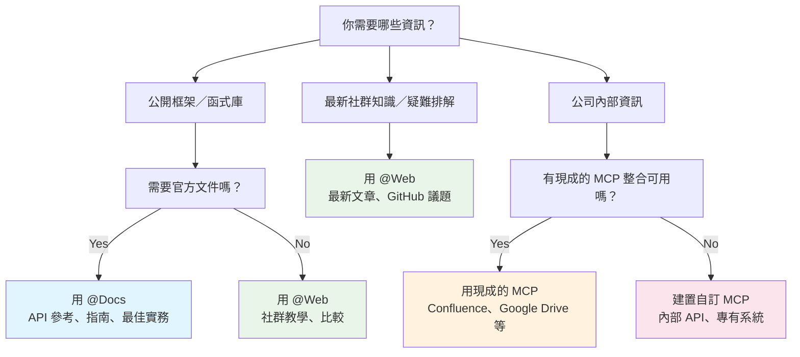
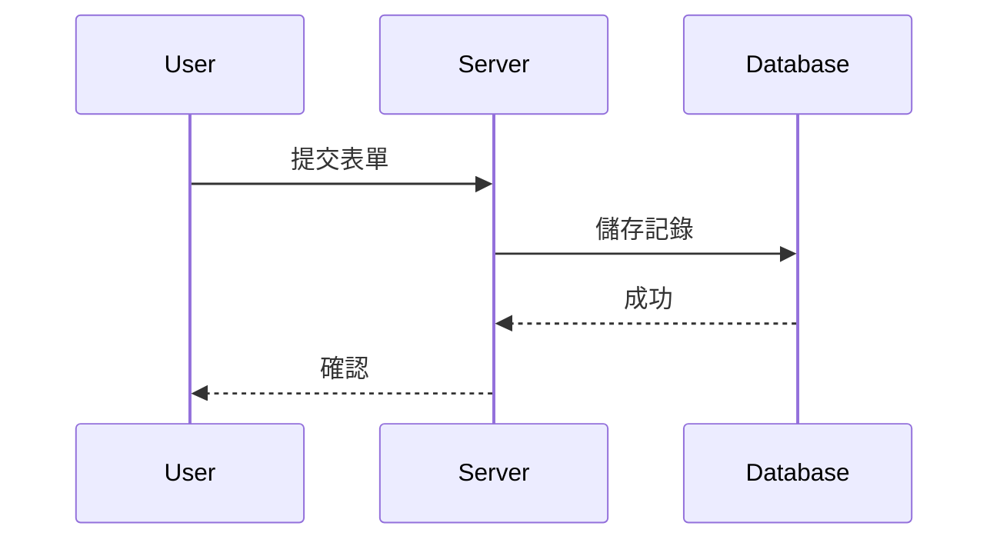
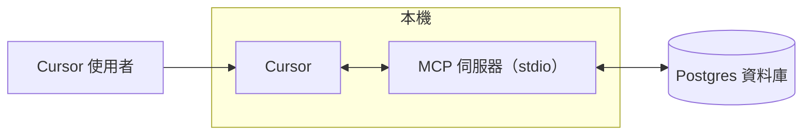
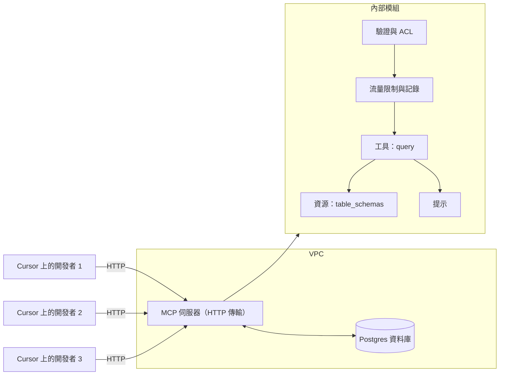

# @Recent Changes

**Navigation:** [← Previous](./39-scim.md) | [Index](./index.md) | [Next →](./41-slack.md)

---

# @Recent Changes
Source: https://docs.cursor.com/zh-Hant/context/@-symbols/@-recent-changes

將最近修改的程式碼納入對話脈絡

`@Recent Changes` 符號會在 AI 對話中將近期的程式碼變更納入脈絡。

* 變更依時間順序排列
* 優先考量最近 10 筆變更
* 會遵循 `.cursorignore` 設定

<Frame>
  
</Frame>


# @Web
Source: https://docs.cursor.com/zh-Hant/context/@-symbols/@-web

在網路上搜尋最新資訊

使用 `@Web` 時，Cursor 會透過 [exa.ai](https://exa.ai) 搜尋網路以取得最新資訊，並將其加入上下文中。也支援從直接連結解析 PDF 檔案。

<Note>
  預設關閉網路搜尋。可在 Settings → Features → Web
  Search 中啟用。
</Note>

<Frame>
  
</Frame>


# Overview
Source: https://docs.cursor.com/zh-Hant/context/@-symbols/overview

使用 @ 符號參照程式碼、檔案與文件

用方向鍵瀏覽建議。按下 `Enter` 以選取。若建議是像 `Files` 這樣的分類，清單會篩選為該分類中最相關的項目。

<Frame>
  
</Frame>

以下是所有可用的 @ 符號：

* [@Files](/zh-Hant/context/@-symbols/@-files) - 參照專案中的特定檔案
* [@Folders](/zh-Hant/context/@-symbols/@-folders) - 參照整個資料夾以提供更廣的脈絡
* [@Code](/zh-Hant/context/@-symbols/@-code) - 參照程式碼庫中的特定程式碼片段或符號
* [@Docs](/zh-Hant/context/@-symbols/@-docs) - 存取文件與指南
* [@Git](/zh-Hant/context/@-symbols/@-git) - 存取 Git 歷史與變更
* [@Past Chats](/zh-Hant/context/@-symbols/@-past-chats) - 使用彙整的 Composer 工作階段
* [@Cursor Rules](/zh-Hant/context/@-symbols/@-cursor-rules) - 使用 Cursor 規則
* [@Web](/zh-Hant/context/@-symbols/@-web) - 參照外部網路資源與文件
* [@Link (paste)](/zh-Hant/context/@-symbols/@-link) - 建立指向特定程式碼或文件的連結
* [@Recent Changes](/zh-Hant/context/@-symbols/@-recent-changes) - 檢視最近的變更
* [@Lint Errors](/zh-Hant/context/@-symbols/@-lint-errors) - 參照 Lint 錯誤（僅限 [Chat](/zh-Hant/chat/overview)）
* [@Definitions](/zh-Hant/context/@-symbols/@-definitions) - 查詢符號定義（僅限 [Inline Edit](/zh-Hant/inline-edit/overview)）
* [# Files](/zh-Hant/context/@-symbols/pill-files) - 將檔案加入脈絡而不進行參照
* [/ Commands](/zh-Hant/context/@-symbols/slash-commands) - 將開啟與作用中的檔案加入脈絡


# #Files
Source: https://docs.cursor.com/zh-Hant/context/@-symbols/pill-files

使用 # 前綴來選取特定檔案

使用 `#` 接上檔名就能鎖定特定檔案。也可以搭配 `@` 符號來精準控制脈絡。

<Frame>
  
</Frame>


# /command
Source: https://docs.cursor.com/zh-Hant/context/@-symbols/slash-commands

透過快速指令新增檔案並控制內容脈絡

使用「/」指令可以快速存取你開啟的編輯器分頁，讓你把多個檔案加入為上下文。

<Frame>
  
</Frame>

<div id="commands">
  ## 指令
</div>

* **`/Reset Context`**: 將上下文重設為預設狀態
* **`/Generate Cursor Rules`**: 產生要讓 Cursor 遵循的規則
* **`/Disable Iterate on Lints`**: 不會嘗試修正 linter 的錯誤與警告
* **`/Add Open Files to Context`**: 參照目前已開啟的所有編輯器分頁
* **`/Add Active Files to Context`**: 參照目前視窗中可見的所有編輯器分頁（在分割版面時很好用）


# 程式碼庫索引
Source: https://docs.cursor.com/zh-Hant/context/codebase-indexing

Cursor 如何學習你的程式碼庫以更深入地理解

Cursor 會為每個檔案計算 embedding 來為程式碼庫建立索引，讓關於你程式碼的 AI 回答更準確。當你開啟專案時，Cursor 會自動開始索引；新檔案會逐步增量索引。
在這裡查看索引狀態：`Cursor Settings` > `Indexing & Docs`

<Frame>
  
</Frame>

<div id="configuration">
  ## 設定
</div>

Cursor 會為所有檔案建立索引，但會排除 [忽略檔案](/zh-Hant/context/ignore-files)（例如 `.gitignore`、`.cursorignore`）中指定的檔案。

點選 `Show Settings` 以：

* 啟用新存放庫的自動索引
* 設定要忽略的檔案

<Tip>
  [忽略大型內容檔案](/zh-Hant/context/ignore-files) 有助提升回答準確度。
</Tip>

<div id="view-indexed-files">
  ### 檢視已索引的檔案
</div>

若要查看已索引的檔案路徑：`Cursor Settings` > `Indexing & Docs` > `View included files`

這會開啟一個列出所有已索引檔案的 `.txt` 檔案。

<div id="multi-root-workspaces">
  ## 多根工作區
</div>

Cursor 支援 [多根工作區](https://code.visualstudio.com/docs/editor/workspaces#_multiroot-workspaces)，讓你同時處理多個程式碼庫：

* 所有程式碼庫都會自動建立索引
* 每個程式碼庫的上下文都可供 AI 使用
* `.cursor/rules` 可在所有資料夾中運作

<div id="pr-search">
  ## PR 搜尋
</div>

PR 搜尋透過讓歷史變更可被 AI 搜尋與存取，幫你理解程式碼庫的演進。

<div id="how-it-works">
  ### 運作方式
</div>

Cursor 會自動從你的儲存庫歷史中**索引所有已合併的 PR**。摘要會出現在語意搜尋結果中，並透過智慧篩選優先顯示最近的變更。

Agent 可以使用 `@[PR number]`、`@[commit hash]` 或 `@[branch name]` 將\*\*PR、提交（commit）、議題（issue）、或分支（branch）\*\*帶入上下文。連線後也會包含 GitHub 留言與 Bugbot 審查。

**平台支援**包括 GitHub、GitHub Enterprise，以及 Bitbucket。目前不支援 GitLab。

<Note>
  GitHub Enterprise 使用者：由於 VS Code 認證限制，抓取工具會回退為使用 git 指令。
</Note>

<div id="using-pr-search">
  ### 使用 PR 搜尋
</div>

問像是「其他 PR 裡的 services 是怎麼實作的？」這類問題，Agent 會自動把相關 PR 帶入上下文，根據你的儲存庫歷史提供完整答案。

<div id="faq">
  ## 常見問題
</div>

<AccordionGroup>
  <Accordion title="哪裡可以看到所有已建立索引的程式碼庫？">
    目前沒有全域清單。請個別開啟每個專案，在
    Cursor 中查看 Codebase Indexing 設定。
  </Accordion>

  <Accordion title="我要怎麼刪除所有已建立索引的程式碼庫？">
    從 Settings 刪除你的 Cursor 帳號即可移除所有已建立索引的程式碼庫。
    否則，請到各專案的 Codebase Indexing
    設定中刪除個別程式碼庫。
  </Accordion>

  <Accordion title="已建立索引的程式碼庫會保留多久？">
    若 6 週未使用，已建立索引的程式碼庫會被刪除。重新開啟
    專案會觸發重新索引。
  </Accordion>

  <Accordion title="我的原始碼會儲存在 Cursor 的伺服器上嗎？">
    不會。Cursor 只會建立嵌入向量（embeddings），不會儲存檔名或原始碼。檔名會做混淆處理，程式碼區塊會加密。

    當 Agent 搜尋程式碼庫時，Cursor 會從伺服器取回嵌入向量並解密這些區塊。
  </Accordion>
</AccordionGroup>


# 忽略檔案
Source: https://docs.cursor.com/zh-Hant/context/ignore-files

使用 .cursorignore 與 .cursorindexingignore 控制檔案存取

<div id="overview">
  ## 概覽
</div>

Cursor 會讀取並為你的專案程式碼庫建立索引，以驅動各種功能。用根目錄的 `.cursorignore` 檔案來控制 Cursor 能存取哪些目錄與檔案。

Cursor 會阻擋 `.cursorignore` 中列出的檔案被以下途徑存取：

* 程式碼庫索引
* [Tab](/zh-Hant/tab/overview)、[Agent](/zh-Hant/agent/overview) 和 [Inline Edit](/zh-Hant/inline-edit/overview) 可存取的程式碼
* 透過 [@ 符號參照](/zh-Hant/context/@-symbols/overview) 可存取的程式碼

<Warning>
  由 Agent 發起的工具呼叫（例如 terminal 與 MCP server）無法阻擋
  對受 `.cursorignore` 規範的程式碼的存取
</Warning>

<div id="why-ignore-files">
  ## 為什麼要忽略檔案？
</div>

**安全性**：限制對 API 金鑰、憑證與機密的存取。雖然 Cursor 會封鎖被忽略的檔案，但因 LLM 具不可預測性，仍無法保證絕對防護。

**效能**：在大型程式碼庫或單一倉庫（monorepo）中，排除無關部分，可加速索引並提升檔案探索的準確度。

<div id="global-ignore-files">
  ## 全域忽略清單
</div>

在使用者設定中替所有專案設定忽略模式，免去逐一專案設定即可排除敏感檔案。

<Frame>
  
</Frame>

預設模式包含：

* 環境檔：`**/.env`, `**/.env.*`
* 憑證：`**/credentials.json`, `**/secrets.json`
* 金鑰：`**/*.key`, `**/*.pem`, `**/id_rsa`

<div id="configuring-cursorignore">
  ## 設定 `.cursorignore`
</div>

在專案根目錄建立一個 `.cursorignore` 檔案，採用 `.gitignore` 的語法。

<div id="pattern-examples">
  ### 範例樣式
</div>

```sh  theme={null}
config.json      # 特定檔案
dist/           # 目錄
*.log           # 檔案副檔名
**/logs         # 巢狀目錄
!app/           # 取消忽略（否定）
```

<div id="hierarchical-ignore">
  ### 階層式忽略
</div>

啟用 `Cursor Settings` > `Features` > `Editor` > `Hierarchical Cursor Ignore`，就會在父層目錄中搜尋 `.cursorignore` 檔案。

**注意**：註解以 `#` 開頭。後面的模式會覆寫前面的模式。模式是相對於檔案所在位置的。

<div id="limit-indexing-with-cursorindexingignore">
  ## 使用 `.cursorindexingignore` 限制索引
</div>

用 `.cursorindexingignore` 將檔案排除在索引之外。這些檔案仍可被 AI 功能存取，但不會出現在程式碼庫搜尋結果中。

<div id="files-ignored-by-default">
  ## 預設會忽略的檔案
</div>

Cursor 會自動忽略 `.gitignore` 中的檔案，以及下方的預設忽略清單。可在 `.cursorignore` 中使用 `!` 前綴覆寫。

<Accordion title="Default Ignore List">
  僅用於索引時，除 `.gitignore`、`.cursorignore` 和 `.cursorindexingignore` 中的規則外，以下檔案也會被忽略：

  ```sh  theme={null}
  package-lock.json
  pnpm-lock.yaml
  yarn.lock
  composer.lock
  Gemfile.lock
  bun.lockb
  .env*
  .git/
  .svn/
  .hg/
  *.lock
  *.bak
  *.tmp
  *.bin
  *.exe
  *.dll
  *.so
  *.lockb
  *.qwoff
  *.isl
  *.csv
  *.pdf
  *.doc
  *.doc
  *.xls
  *.xlsx
  *.ppt
  *.pptx
  *.odt
  *.ods
  *.odp
  *.odg
  *.odf
  *.sxw
  *.sxc
  *.sxi
  *.sxd
  *.sdc
  *.jpg
  *.jpeg
  *.png
  *.gif
  *.bmp
  *.tif
  *.mp3
  *.wav
  *.wma
  *.ogg
  *.flac
  *.aac
  *.mp4
  *.mov
  *.wmv
  *.flv
  *.avi
  *.zip
  *.tar
  *.gz
  *.7z
  *.rar
  *.tgz
  *.dmg
  *.iso
  *.cue
  *.mdf
  *.mds
  *.vcd
  *.toast
  *.img
  *.apk
  *.msi
  *.cab
  *.tar.gz
  *.tar.xz
  *.tar.bz2
  *.tar.lzma
  *.tar.Z
  *.tar.sz
  *.lzma
  *.ttf
  *.otf
  *.pak
  *.woff
  *.woff2
  *.eot
  *.webp
  *.vsix
  *.rmeta
  *.rlib
  *.parquet
  *.svg
  .egg-info/
  .venv/
  node_modules/
  __pycache__/
  .next/
  .nuxt/
  .cache/
  .sass-cache/
  .gradle/
  .DS_Store/
  .ipynb_checkpoints/
  .pytest_cache/
  .mypy_cache/
  .tox/
  .git/
  .hg/
  .svn/
  .bzr/
  .lock-wscript/
  .Python/
  .jupyter/
  .history/
  .yarn/
  .yarn-cache/
  .eslintcache/
  .parcel-cache/
  .cache-loader/
  .nyc_output/
  .node_repl_history/
  .pnp.js/
  .pnp/
  ```
</Accordion>

<div id="negation-pattern-limitations">
  ### 否定模式的限制
</div>

使用否定模式（以 `!` 作為前綴）時，如果父目錄是透過 `*` 排除的，就不能重新把某個檔案包含進來。

```sh  theme={null}

# 忽略 public 資料夾中的所有檔案
public/*


# ✅ 這可行，因為該檔案位於頂層
!public/index.html


# ❌ 這不可行—無法從巢狀目錄重新包含檔案
!public/assets/style.css
```

**替代方案**：明確排除巢狀目錄：

```sh  theme={null}
public/assets/*
!public/assets/style.css # 這個檔案現在可被存取
```

為了提升效能，不會遍歷已排除的目錄，所以其中檔案的匹配規則不會生效。
這與 .gitignore 在巢狀目錄中對否定匹配的實作一致。想了解更多，請參考[Git 官方文件的 gitignore 規則說明](https://git-scm.com/docs/gitignore)。

<div id="troubleshooting">
  ## 疑難排解
</div>

用 `git check-ignore -v [file]` 測試忽略規則。


# Model Context Protocol（MCP）
Source: https://docs.cursor.com/zh-Hant/context/mcp

透過 MCP 將外部工具與資料來源連結至 Cursor

export const Kbd = ({children, tooltip, os}) => {
  const keysInput = typeof children === 'string' && children.trim() !== '' ? children : null;
  if (!keysInput) {
    return null;
  }
  const isModifier = key => {
    const modifiers = ['⌘', '⇧', '⌥', '⌃', '⏎', '⌫', '⌦', '⎋', '⇥', '⌁', '←', '→', '↑', '↓', 'Ctrl', 'Shift', 'Alt', 'Cmd', 'Opt', 'Return', 'Backspace', 'Delete', 'Escape', 'Tab', 'Space', 'Enter', 'Esc', 'ArrowLeft', 'ArrowRight', 'ArrowUp', 'ArrowDown', 'Left', 'Right', 'Up', 'Down'];
    return modifiers.includes(key.trim());
  };
  const capitalizeFirstLetter = string => {
    return string.charAt(0).toUpperCase() + string.slice(1);
  };
  const isMac = os ? os.toLowerCase() === 'mac' || os.toLowerCase() === 'macos' : typeof navigator !== 'undefined' && (navigator.platform.toUpperCase().indexOf('MAC') >= 0 || navigator.userAgent.toUpperCase().indexOf('MAC') >= 0);
  const convertToSymbols = shortcut => {
    if (isMac) {
      return shortcut.replace(/⌘|Cmd|CMD/gi, '⌘').replace(/⌥|Opt|OPT/gi, '⌥').replace(/⌃|Ctrl/gi, '⌃').replace(/⇧|Shift/gi, '⇧').replace(/⏎|Return/gi, '⏎').replace(/⌫|Backspace/gi, '⌫').replace(/⌦|Delete/gi, '⌦').replace(/␛|Escape/gi, '␛').replace(/⇥|Tab/gi, '⇥').replace(/⌁|Space/gi, '⌁').replace(/←|Arrow\s*Left|ArrowLeft|Left/gi, '←').replace(/→|Arrow\s*Right|ArrowRight|Right/gi, '→').replace(/↑|Arrow\s*Up|ArrowUp|Up/gi, '↑').replace(/↓|Arrow\s*Down|ArrowDown|Down/gi, '↓');
    } else {
      const converted = shortcut.replace(/⌘|Cmd|CMD/gi, 'Ctrl').replace(/⌥|Opt|OPT/gi, 'Alt').replace(/⌃|Ctrl/gi, 'Ctrl').replace(/⇧|Shift/gi, 'Shift').replace(/⏎|Return/gi, 'Enter').replace(/⌫|Backspace/gi, 'Backspace').replace(/⌦|Delete/gi, 'Delete').replace(/⎋|Escape/gi, 'Esc').replace(/⇥|Tab/gi, 'Tab').replace(/⌁|Space/gi, 'Space').replace(/←|Arrow\s*Left|ArrowLeft|Left/gi, 'Arrow-Left').replace(/→|Arrow\s*Right|ArrowRight|Right/gi, 'Arrow-Right').replace(/↑|Arrow\s*Up|ArrowUp|Up/gi, 'Arrow-Up').replace(/↓|Arrow\s*Down|ArrowDown|Down/gi, 'Arrow-Down');
      const keyList = converted.split(/[\+\s]+/).filter(key => key.trim());
      return keyList.join('+');
    }
  };
  const convertToReadableText = shortcut => {
    const converted = shortcut.replace(/⌘|Cmd|CMD/gi, 'Cmd').replace(/⌥|Opt|OPT/gi, 'Opt').replace(/⌃|Ctrl/gi, 'Ctrl').replace(/⇧|Shift/gi, 'Shift').replace(/⏎|Return/gi, 'Return').replace(/⌫|Backspace/gi, 'Backspace').replace(/⌦|Delete/gi, 'Delete').replace(/⎋|Escape/gi, 'Escape').replace(/⇥|Tab/gi, 'Tab').replace(/⌁|Space/gi, 'Space').replace(/←|Arrow\s*Left|ArrowLeft|Left/gi, 'Arrow-Left').replace(/→|Arrow\s*Right|ArrowRight|Right/gi, 'Arrow-Right').replace(/↑|Arrow\s*Up|ArrowUp|Up/gi, 'Arrow-Up').replace(/↓|Arrow\s*Down|ArrowDown|Down/gi, 'Arrow-Down');
    const keyList = converted.split(/[\+\s]+/).filter(key => key.trim());
    return keyList.map(key => {
      const trimmedKey = key.trim();
      return isModifier(trimmedKey) ? trimmedKey : capitalizeFirstLetter(trimmedKey);
    }).join('+');
  };
  const displayShortcut = convertToSymbols(keysInput);
  const tooltipText = isMac ? tooltip ? `${convertToReadableText(keysInput)}: ${tooltip}` : convertToReadableText(keysInput) : tooltip || null;
  const processedKeys = isMac ? displayShortcut.split(/[\+\s]+/).filter(key => key.trim()).map(key => {
    const trimmedKey = key.trim();
    return isModifier(trimmedKey) ? trimmedKey : capitalizeFirstLetter(trimmedKey);
  }).join('') : displayShortcut.split('+').map(key => {
    const trimmedKey = key.trim();
    return isModifier(trimmedKey) ? trimmedKey : capitalizeFirstLetter(trimmedKey);
  }).join('+');
  return tooltipText ? <Tooltip tip={tooltipText}>
      <kbd>
        {processedKeys}
      </kbd>
    </Tooltip> : <kbd>
      {processedKeys}
    </kbd>;
};

<div id="what-is-mcp">
  ## 什麼是 MCP？
</div>

[Model Context Protocol（MCP）](https://modelcontextprotocol.io/introduction) 讓 Cursor 能夠連接外部工具和資料來源。

<Frame>
  <video src="https://mintcdn.com/cursor/BfJOqJ1Wb8EvuXyr/images/context/mcp/simple-mcp-call.mp4?fit=max&auto=format&n=BfJOqJ1Wb8EvuXyr&q=85&s=08c642babc501c939ecbec9ef5124ce7" autoPlay loop muted playsInline controls data-path="images/context/mcp/simple-mcp-call.mp4" />
</Frame>

<div id="why-use-mcp">
  ### 為什麼要使用 MCP？
</div>

MCP 讓 Cursor 能連接外部系統與資料。與其反覆解釋專案結構，不如直接跟你的工具整合。

用任何能輸出到 `stdout` 或提供 HTTP 端點的語言撰寫 MCP 伺服器，例如 Python、JavaScript、Go 等。

<div id="how-it-works">
  ### 運作方式
</div>

MCP 伺服器透過協定公開功能，讓 Cursor 能連接到外部工具或資料來源。

Cursor 支援三種傳輸方式：

<div className="full-width-table">
  | 傳輸方式                                                             | 執行環境  | 部署方式        | 使用者   | 輸入              | 驗證    |
  | :--------------------------------------------------------------- | :---- | :---------- | :---- | :-------------- | :---- |
  | **<span className="whitespace-nowrap">`stdio`</span>**           | 本機    | 由 Cursor 管理 | 單一使用者 | Shell 指令        | 手動    |
  | **<span className="whitespace-nowrap">`SSE`</span>**             | 本機/遠端 | 部署為伺服器      | 多位使用者 | 指向 SSE 端點的 URL  | OAuth |
  | **<span className="whitespace-nowrap">`Streamable HTTP`</span>** | 本機/遠端 | 部署為伺服器      | 多位使用者 | 指向 HTTP 端點的 URL | OAuth |
</div>

<div id="protocol-support">
  ### 協定支援
</div>

Cursor 支援以下 MCP 協定功能：

<div className="full-width-table">
  | 功能              | 支援狀態 | 說明                       |
  | :-------------- | :--- | :----------------------- |
  | **Tools**       | 支援   | 供 AI 模型呼叫執行的函式           |
  | **Prompts**     | 支援   | 提供給使用者的樣板化訊息與工作流程        |
  | **Resources**   | 支援   | 可讀取並供參考的結構化資料來源          |
  | **Roots**       | 支援   | 由伺服器發起、針對 URI 或檔案系統邊界的探詢 |
  | **Elicitation** | 支援   | 由伺服器發起、向使用者要求提供更多資訊      |
</div>

<div id="installing-mcp-servers">
  ## 安裝 MCP 服務器
</div>

<div id="one-click-installation">
  ### 一鍵安裝
</div>

從我們的集合中安裝 MCP 伺服器，並用 OAuth 完成驗證。

<Columns cols={2}>
  <Card title="Browse MCP Tools" icon="table" horizontal href="/zh-Hant/tools">
    瀏覽可用的 MCP 伺服器
  </Card>

  <Card title="Add to Cursor Button" icon="plus" horizontal href="/zh-Hant/deeplinks">
    建立「Add to Cursor」按鈕
  </Card>
</Columns>

<div id="using-mcpjson">
  ### 使用 `mcp.json`
</div>

用 JSON 檔案設定自訂 MCP 伺服器：

<CodeGroup>
  ```json CLI Server - Node.js theme={null}
  {
    "mcpServers": {
      "server-name": {
        "command": "npx",
        "args": ["-y", "mcp-server"],
        "env": {
          "API_KEY": "value"
        }
      }
    }
  }
  ```

  ```json CLI Server - Python theme={null}
  {
    "mcpServers": {
      "server-name": {
        "command": "python",
        "args": ["mcp-server.py"],
        "env": {
          "API_KEY": "value"
        }
      }
    }
  }
  ```

  ```json Remote Server theme={null}
  // 使用 HTTP 或 SSE 的 MCP 伺服器（在伺服器上執行）
  {
    "mcpServers": {
      "server-name": {
        "url": "http://localhost:3000/mcp",
        "headers": {
          "API_KEY": "value"
        }
      }
    }
  }
  ```
</CodeGroup>

<div id="stdio-server-configuration">
  ### STDIO 伺服器設定
</div>

對於 STDIO 伺服器（本機命令列伺服器），請在 `mcp.json` 中設定以下欄位：

<div className="full-width-table">
  | 欄位          | 必填 | 說明                                   | 範例                                        |
  | :---------- | :- | :----------------------------------- | :---------------------------------------- |
  | **type**    | 是  | 伺服器連線類型                              | `"stdio"`                                 |
  | **command** | 是  | 用來啟動伺服器可執行檔的指令。必須能在系統路徑中找到，或包含其完整路徑。 | `"npx"`, `"node"`, `"python"`, `"docker"` |
  | **args**    | 否  | 傳遞給指令的參數陣列                           | `["server.py", "--port", "3000"]`         |
  | **env**     | 否  | 伺服器的環境變數                             | `{"API_KEY": "${input:api-key}"}`         |
  | **envFile** | 否  | 用於載入更多變數的環境檔路徑                       | `".env"`, `"${workspaceFolder}/.env"`     |
</div>

<div id="using-the-extension-api">
  ### 使用 Extension API
</div>

為了以程式化方式註冊 MCP 伺服器，Cursor 提供 Extension API，讓你在不修改 `mcp.json` 的情況下進行動態設定。這在企業環境與自動化設定流程中特別實用。

<Card title="MCP Extension API Reference" icon="code" href="/zh-Hant/context/mcp-extension-api">
  了解如何使用 `vscode.cursor.mcp.registerServer()` 以程式化方式註冊 MCP 伺服器
</Card>

<div id="configuration-locations">
  ### 設定位置
</div>

<CardGroup cols={2}>
  <Card title="專案設定" icon="folder-tree">
    在專案中建立 `.cursor/mcp.json`，用於專案專用的工具。
  </Card>

  <Card title="全域設定" icon="globe">
    在家目錄建立 `~/.cursor/mcp.json`，讓工具在任何地方都能使用。
  </Card>
</CardGroup>

<div id="config-interpolation">
  ### 組態插值
</div>

可以在 `mcp.json` 的值中使用變數。Cursor 會在這些欄位解析變數：`command`、`args`、`env`、`url`、`headers`。

支援的語法：

* `${env:NAME}` 環境變數
* `${userHome}` 你的使用者家目錄路徑
* `${workspaceFolder}` 專案根目錄（包含 `.cursor/mcp.json` 的資料夾）
* `${workspaceFolderBasename}` 專案根目錄的名稱
* `${pathSeparator}` 與 `${/}` 作業系統的路徑分隔符號

範例

```json  theme={null}
{
  "mcpServers": {
    "local-server": {
      "command": "python",
      "args": ["${workspaceFolder}/tools/mcp_server.py"],
      "env": {
        "API_KEY": "${env:API_KEY}"
      }
    }
  }
}
```

```json  theme={null}
{
  "mcpServers": {
    "remote-server": {
      "url": "https://api.example.com/mcp",
      "headers": {
        "Authorization": "Bearer ${env:MY_SERVICE_TOKEN}"
      }
    }
  }
}
```

<div id="authentication">
  ### 驗證
</div>

MCP 伺服器透過環境變數進行驗證。請在 config 中傳入 API 金鑰和權杖。

對於需要 OAuth 的伺服器，Cursor 也有支援。

<div id="using-mcp-in-chat">
  ## 在聊天中使用 MCP
</div>

Composer Agent 會在需要時自動使用列在「Available Tools」下的 MCP 工具。可以直接用名稱指定特定工具，或描述你的需求。可以在設定中啟用或停用工具。

<div id="toggling-tools">
  ### 切換工具
</div>

可以直接在聊天介面啟用或停用 MCP 工具。點一下工具列表中的工具名稱即可切換。停用的工具不會載入到上下文，也不會提供給 Agent 使用。

<Frame>
  <video src="https://mintcdn.com/cursor/BfJOqJ1Wb8EvuXyr/images/context/mcp/tool-toggle.mp4?fit=max&auto=format&n=BfJOqJ1Wb8EvuXyr&q=85&s=0fa3060f593cae3e5fb7c7d2f041a715" autoPlay loop muted playsInline controls data-path="images/context/mcp/tool-toggle.mp4" />
</Frame>

<div id="tool-approval">
  ### 工具核准
</div>

Agent 預設在使用 MCP 工具前會先請求核准。點擊工具名稱旁的箭頭可查看引數。

<Frame></Frame>

<div id="auto-run">
  #### 自動執行
</div>

啟用自動執行，讓 Agent 無需詢問就能使用 MCP 工具。運作方式類似終端機指令。想了解自動執行設定的更多資訊，請看[這裡](/zh-Hant/agent/tools#auto-run)。

<div id="tool-response">
  ### 工具回應
</div>

Cursor 會在聊天中顯示回應，並提供可展開檢視的參數與回應：

<Frame></Frame>

<div id="images-as-context">
  ### 以圖片作為上下文
</div>

MCP 伺服器可以回傳圖片（螢幕截圖、示意圖等）。請將它們以 base64 編碼的字串回傳：

```js  theme={null}
const RED_CIRCLE_BASE64 = "/9j/4AAQSkZJRgABAgEASABIAAD/2w...";
// ^ 為了易讀性，已將完整的 base64 內容截斷

server.tool("generate_image", async (params) => {
  return {
    content: [
      {
        type: "image",
        data: RED_CIRCLE_BASE64,
        mimeType: "image/jpeg",
      },
    ],
  };
});
```

想了解實作細節，請參考這個[範例伺服器](https://github.com/msfeldstein/mcp-test-servers/blob/main/src/image-server.js)。Cursor 會把回傳的圖片附加到對話中。若模型支援圖片，就會加以分析。

<div id="security-considerations">
  ## 安全性考量
</div>

安裝 MCP 伺服器時，請留意以下安全實務：

* **驗證來源**：僅從可信任的開發者與套件庫安裝 MCP 伺服器
* **檢視權限**：確認伺服器會存取哪些資料與 API
* **限制 API 金鑰**：使用權限最小化且受限的 API 金鑰
* **稽核程式碼**：對關鍵整合，審閱伺服器的原始碼

記住 MCP 伺服器可能會存取外部服務，並代表你執行程式碼。安裝前務必先了解伺服器的行為與功能。

<div id="real-world-examples">
  ## 真實案例
</div>

想看 MCP 的實際應用範例？快看看我們的 [Web Development guide](/zh-Hant/guides/tutorials/web-development)，示範如何把 Linear、Figma 與瀏覽器工具整合進你的開發流程。

<div id="faq">
  ## 常見問題
</div>

<AccordionGroup>
  <Accordion title="MCP 伺服器有什麼用？">
    MCP 伺服器把 Cursor 連到像 Google Drive、Notion 等外部工具和服務，讓文件和需求直接進到你的開發流程。
  </Accordion>

  {" "}

  <Accordion title="要怎麼偵錯 MCP 伺服器問題？">
    查看 MCP 日誌：1. 在 Cursor 打開 Output 面板（<Kbd>Cmd+Shift+U</Kbd>）
    2\. 從下拉選單選擇「MCP Logs」3. 檢查連線錯誤、驗證問題或伺服器當機 日誌會顯示伺服器初始化、工具呼叫與錯誤訊息。
  </Accordion>

  {" "}

  <Accordion title="可以暫時停用某個 MCP 伺服器嗎？">
    可以！不用移除就能切換伺服器開/關：1. 打開 Settings（
    <Kbd>Cmd+Shift+J</Kbd>）2. 前往 Features → Model Context Protocol 3. 點擊任一伺服器旁的切換鈕即可啟用/停用 被停用的伺服器不會載入或出現在聊天中。這對疑難排解或減少工具雜訊很有幫助。
  </Accordion>

  {" "}

  <Accordion title="如果 MCP 伺服器當機或逾時會怎樣？">
    如果 MCP 伺服器失敗：- Cursor 會在聊天中顯示錯誤訊息 - 該次工具呼叫會被標記為失敗 - 你可以重試或查看日誌以取得細節 - 其他 MCP 伺服器會照常運作 Cursor 會隔離伺服器故障，避免單一伺服器影響其他伺服器。
  </Accordion>

  {" "}

  <Accordion title="要怎麼更新 MCP 伺服器？">
    對於 npm 型伺服器：1. 從設定中移除該伺服器 2. 清除 npm 快取：
    `npm cache clean --force` 3. 重新加入該伺服器以取得最新版本 對於自訂伺服器，更新本機檔案並重新啟動 Cursor。
  </Accordion>

  <Accordion title="可以在含有敏感資料的情況下使用 MCP 伺服器嗎？">
    可以，但請遵循資安最佳實務：- 用環境變數管理機密，絕不要硬編碼 - 在本機以 `stdio`
    傳輸執行含敏感資料的伺服器 - 將 API 金鑰權限降到最低必要 - 連接敏感系統前先審查伺服器程式碼 - 考慮在隔離環境中執行伺服器
  </Accordion>
</AccordionGroup>


# Memories
Source: https://docs.cursor.com/zh-Hant/context/memories


Memories 會根據你在 Chat 中的對話自動生成規則。這些 Memories 以專案為作用範圍，並能在不同工作階段之間維持脈絡。

<Frame>
  <video src="https://mintcdn.com/cursor/BfJOqJ1Wb8EvuXyr/images/context/rules/memories.mp4?fit=max&auto=format&n=BfJOqJ1Wb8EvuXyr&q=85&s=d10452508d962d7a9ec37de1c22245d1" alt="Cursor 中的 Memories" controls data-path="images/context/rules/memories.mp4" />
</Frame>

<div id="how-memories-are-created">
  ## 記憶是怎麼建立的
</div>

1. **Sidecar 觀察**：Cursor 採用 sidecar 方式，讓另一個模型觀察你的對話，並自動萃取相關記憶。這會在你工作時於背景被動進行。背景產生的記憶在儲存前需要使用者核准，確保你對哪些內容被記住擁有信任與掌控。

2. **Tool calls**：Agent 可以透過 tool calls 直接建立記憶，無論是你明確要求它記住某件事，或是它察覺到有重要資訊需要保存以供之後的工作階段使用時，都會這麼做。

<div id="manage-memories">
  ## 記憶管理
</div>

到 Cursor Settings → Rules 就能管理記憶。


# 規則
Source: https://docs.cursor.com/zh-Hant/context/rules

用可重複使用且具範圍性的指令，控制 Agent 模型的行為。

規則會為 Agent 和 Inline Edit 提供系統層級的指令。可以把它們想成專案的持續性脈絡、偏好或工作流程。

Cursor 支援四種類型的規則：

<CardGroup cols={2}>
  <Card title="Project Rules" icon="folder-tree">
    儲存在 `.cursor/rules`，受版本控制，且作用範圍限定在你的程式碼庫。
  </Card>

  <Card title="User Rules" icon="user">
    全域套用到你的 Cursor 環境。在設定中定義，且會一律生效。
  </Card>

  <Card title="AGENTS.md" icon="robot">
    以 Markdown 格式撰寫的 Agent 指令，是 `.cursor/rules` 的簡單替代方案。
  </Card>

  <Card title=".cursorrules (Legacy)" icon="clock-rotate-left">
    仍受支援，但已淘汰。改用 Project Rules。
  </Card>
</CardGroup>

<div id="how-rules-work">
  ## 規則如何運作
</div>

大型語言模型在不同次的完成之間不會保留記憶。規則會在提示層級提供持久、可重用的上下文。

套用後，規則內容會被加入到模型上下文的開頭。這能為 AI 在產生程式碼、解讀編輯內容或協助處理工作流程時提供一致的指引。

<Frame>
  
</Frame>

<Info>
  規則適用於 [Chat](/zh-Hant/chat/overview) 與 [Inline
  Edit](/zh-Hant/inline-edit/overview)。啟用中的規則會顯示在 Agent 側邊欄。
</Info>

<div id="project-rules">
  ## 專案規則
</div>

專案規則位於 `.cursor/rules`。每條規則都是獨立檔案並納入版本控制。它們可以用路徑模式限定作用範圍、手動呼叫，或依相關性自動納入。子目錄也可以包含各自的 `.cursor/rules` 資料夾，其作用範圍僅限於該資料夾。

把專案規則用在：

* 編碼你程式碼庫的領域知識
* 自動化專案特定的工作流程或範本
* 標準化風格或架構決策

<div id="rule-anatomy">
  ### 規則結構
</div>

每個規則檔都使用 **MDC**（`.mdc`）撰寫，這種格式同時支援中繼資料與內容。透過「類型」下拉選單控制規則的套用方式，會對 `description`、`globs`、`alwaysApply` 屬性產生變更。

| <span class="no-wrap">Rule Type</span>         | Description                  |
| :--------------------------------------------- | :--------------------------- |
| <span class="no-wrap">`Always`</span>          | 一律包含在模型上下文中                  |
| <span class="no-wrap">`Auto Attached`</span>   | 參照到符合 `glob` 模式的檔案時會自動包含     |
| <span class="no-wrap">`Agent Requested`</span> | 提供給 AI 使用，由 AI 決定是否包含。必須提供描述 |
| <span class="no-wrap">`Manual`</span>          | 只有在以 `@ruleName` 明確提及時才會包含   |

```
---
description: RPC 服務樣板
globs:
alwaysApply: false
---

- 定義服務時請採用我們的內部 RPC 模式
- 服務名稱一律使用 snake_case。

@service-template.ts
```

<div id="nested-rules">
  ### 巢狀規則
</div>

把規則放在專案各處的 `.cursor/rules` 目錄裡來做組織。當引用到該目錄中的檔案時，巢狀規則會自動套用。

```
project/
  .cursor/rules/        # 專案層級規則
  backend/
    server/
      .cursor/rules/    # 後端專用規則
  frontend/
    .cursor/rules/      # 前端專用規則
```

<div id="creating-a-rule">
  ### 建立規則
</div>

使用 `New Cursor Rule` 指令或前往 `Cursor Settings > Rules` 來建立規則。這會在 `.cursor/rules` 中新增一個規則檔。你可以在設定中查看所有規則及其狀態。

<Frame>
  
</Frame>

<div id="generating-rules">
  ### 產生規則
</div>

在對話中直接使用 `/Generate Cursor Rules` 指令來產生規則。當你已經決定好 agent 的行為並想要重複使用時，這會很好用。

<Frame>
  <video src="https://www.cursor.com/changelog/049/generate-rules.mp4" controls>
    你的瀏覽器不支援 video 標籤。
  </video>
</Frame>

<div id="best-practices">
  ## 最佳實務
</div>

好的規則應該聚焦、可操作，且範圍明確。

* 讓每條規則控制在 500 行以內
* 把大型規則拆成多個可組合的規則
* 提供具體範例或參考檔案
* 避免含糊的指引。把規則寫得像清晰的內部文件
* 在聊天室中重複使用提示時，重用既有規則

<div id="examples">
  ## 範例
</div>

<AccordionGroup>
  <Accordion title="前端元件與 API 驗證標準">
    這條規則定義前端元件的標準：

    在 components 目錄作業時：

    * 樣式一律使用 Tailwind
    * 動畫使用 Framer Motion
    * 遵循元件命名慣例

    這條規則也會強制 API 端點進行驗證：

    在 API 目錄：

    * 所有驗證使用 zod
    * 用 zod schema 定義回傳型別
    * 匯出由 schema 產生的型別
  </Accordion>

  <Accordion title="Express 服務與 React 元件樣板">
    這條規則提供 Express 服務的樣板：

    建立 Express 服務時請用這個樣板：

    * 遵循 RESTful 原則
    * 加入錯誤處理 middleware
    * 設定適當的記錄

    @express-service-template.ts

    這條規則也定義 React 元件的結構：

    React 元件應遵循以下結構：

    * 最上方放 Props 介面
    * 元件以具名匯出
    * 樣式置於底部

    @component-template.tsx
  </Accordion>

  <Accordion title="自動化開發流程與文件產生">
    這條規則會自動化 app 分析：

    當被要求分析 app 時：

    1. 以 `npm run dev` 啟動開發伺服器
    2. 從主控台擷取日誌
    3. 提出效能優化建議

    這條規則也協助產生文件：

    協助撰寫文件的方式：

    * 擷取程式碼註解
    * 分析 README.md
    * 產生 Markdown 文件
  </Accordion>

  <Accordion title="在 Cursor 中新增設定">
    先在 `@reactiveStorageTypes.ts` 建立要切換的屬性。

    在 `@reactiveStorageService.tsx` 的 `INIT_APPLICATION_USER_PERSISTENT_STORAGE` 加上預設值。

    如果是 beta 功能，在 `@settingsBetaTab.tsx` 新增切換；否則在 `@settingsGeneralTab.tsx` 新增。一般核取方塊的切換可用 `<SettingsSubSection>`。參考檔案其餘部分的範例。

    ```
    <SettingsSubSection
    				label="Your feature name"
    				description="Your feature description"
    				value={
    					vsContext.reactiveStorageService.applicationUserPersistentStorage
    						.myNewProperty ?? false
    				}
    				onChange={(newVal) => {
    					vsContext.reactiveStorageService.setApplicationUserPersistentStorage(
    						'myNewProperty',
    						newVal
    					);
    				}}
    			/>
    ```

    在 app 中使用時，匯入 reactiveStorageService 並使用這個屬性：

    ```
    const flagIsEnabled = vsContext.reactiveStorageService.applicationUserPersistentStorage.myNewProperty
    ```
  </Accordion>
</AccordionGroup>

有許多來自各供應商與框架的範例。社群貢獻的規則可在眾包的集合與線上儲存庫中找到。

<div id="agentsmd">
  ## AGENTS.md
</div>

`AGENTS.md` 是一個用來定義代理指令的簡單 Markdown 檔案。把它放在專案根目錄，作為 `.cursor/rules` 的替代方案，適用於簡單直接的使用情境。

與 Project Rules 不同，`AGENTS.md` 是沒有中繼資料或複雜設定的純 Markdown 檔。對於需要簡潔、易讀指令、又不想承擔結構化規則額外負擔的專案來說，它再適合不過。

```markdown  theme={null}

# 專案說明

## 程式碼風格
- 所有新檔一律使用 TypeScript
- React 優先採用函式元件
- 資料庫欄位使用 snake_case

## 系統架構
- 遵循 repository pattern
- 將業務邏輯放在 service layer
```

<div id="user-rules">
  ## 使用者規則
</div>

使用者規則是定義在 **Cursor Settings → Rules** 的全域偏好設定，會套用到所有專案。這些規則是純文字格式，超適合用來設定偏好的溝通風格或程式碼慣例：

```
請用精準精煉的方式回覆，避免不必要的重複或贅詞。
```

<div id="cursorrules-legacy">
  ## `.cursorrules`（舊版）
</div>

專案根目錄中的 `.cursorrules` 檔案仍然支援，但將被淘汰。建議遷移到 Project Rules，以獲得更好的控管、彈性與可見性。

<div id="faq">
  ## 常見問題
</div>

<AccordionGroup>
  <Accordion title="為什麼我的規則沒有生效？">
    先檢查規則類型。對於 `Agent Requested`，請確認已設定描述。對於 `Auto Attached`，請確認檔案樣式符合被引用的檔案。
  </Accordion>

  {" "}

  <Accordion title="規則可以引用其他規則或檔案嗎？">
    可以。使用 `@filename.ts` 把檔案納入規則的脈絡。
  </Accordion>

  {" "}

  <Accordion title="可以從聊天建立規則嗎？">
    可以，用 `/Generate Cursor Rules`
    指令從聊天產生專案規則。若啟用 Memories，會自動產生對應的記憶。
  </Accordion>

  <Accordion title="規則會影響 Cursor Tab 或其他 AI 功能嗎？">
    不會。規則只適用於 Agent 與 Inline Edit
  </Accordion>
</AccordionGroup>


# 概念
Source: https://docs.cursor.com/zh-Hant/get-started/concepts

了解讓 Cursor 強大的關鍵功能

export const Kbd = ({children, tooltip, os}) => {
  const keysInput = typeof children === 'string' && children.trim() !== '' ? children : null;
  if (!keysInput) {
    return null;
  }
  const isModifier = key => {
    const modifiers = ['⌘', '⇧', '⌥', '⌃', '⏎', '⌫', '⌦', '⎋', '⇥', '⌁', '←', '→', '↑', '↓', 'Ctrl', 'Shift', 'Alt', 'Cmd', 'Opt', 'Return', 'Backspace', 'Delete', 'Escape', 'Tab', 'Space', 'Enter', 'Esc', 'ArrowLeft', 'ArrowRight', 'ArrowUp', 'ArrowDown', 'Left', 'Right', 'Up', 'Down'];
    return modifiers.includes(key.trim());
  };
  const capitalizeFirstLetter = string => {
    return string.charAt(0).toUpperCase() + string.slice(1);
  };
  const isMac = os ? os.toLowerCase() === 'mac' || os.toLowerCase() === 'macos' : typeof navigator !== 'undefined' && (navigator.platform.toUpperCase().indexOf('MAC') >= 0 || navigator.userAgent.toUpperCase().indexOf('MAC') >= 0);
  const convertToSymbols = shortcut => {
    if (isMac) {
      return shortcut.replace(/⌘|Cmd|CMD/gi, '⌘').replace(/⌥|Opt|OPT/gi, '⌥').replace(/⌃|Ctrl/gi, '⌃').replace(/⇧|Shift/gi, '⇧').replace(/⏎|Return/gi, '⏎').replace(/⌫|Backspace/gi, '⌫').replace(/⌦|Delete/gi, '⌦').replace(/␛|Escape/gi, '␛').replace(/⇥|Tab/gi, '⇥').replace(/⌁|Space/gi, '⌁').replace(/←|Arrow\s*Left|ArrowLeft|Left/gi, '←').replace(/→|Arrow\s*Right|ArrowRight|Right/gi, '→').replace(/↑|Arrow\s*Up|ArrowUp|Up/gi, '↑').replace(/↓|Arrow\s*Down|ArrowDown|Down/gi, '↓');
    } else {
      const converted = shortcut.replace(/⌘|Cmd|CMD/gi, 'Ctrl').replace(/⌥|Opt|OPT/gi, 'Alt').replace(/⌃|Ctrl/gi, 'Ctrl').replace(/⇧|Shift/gi, 'Shift').replace(/⏎|Return/gi, 'Enter').replace(/⌫|Backspace/gi, 'Backspace').replace(/⌦|Delete/gi, 'Delete').replace(/⎋|Escape/gi, 'Esc').replace(/⇥|Tab/gi, 'Tab').replace(/⌁|Space/gi, 'Space').replace(/←|Arrow\s*Left|ArrowLeft|Left/gi, 'Arrow-Left').replace(/→|Arrow\s*Right|ArrowRight|Right/gi, 'Arrow-Right').replace(/↑|Arrow\s*Up|ArrowUp|Up/gi, 'Arrow-Up').replace(/↓|Arrow\s*Down|ArrowDown|Down/gi, 'Arrow-Down');
      const keyList = converted.split(/[\+\s]+/).filter(key => key.trim());
      return keyList.join('+');
    }
  };
  const convertToReadableText = shortcut => {
    const converted = shortcut.replace(/⌘|Cmd|CMD/gi, 'Cmd').replace(/⌥|Opt|OPT/gi, 'Opt').replace(/⌃|Ctrl/gi, 'Ctrl').replace(/⇧|Shift/gi, 'Shift').replace(/⏎|Return/gi, 'Return').replace(/⌫|Backspace/gi, 'Backspace').replace(/⌦|Delete/gi, 'Delete').replace(/⎋|Escape/gi, 'Escape').replace(/⇥|Tab/gi, 'Tab').replace(/⌁|Space/gi, 'Space').replace(/←|Arrow\s*Left|ArrowLeft|Left/gi, 'Arrow-Left').replace(/→|Arrow\s*Right|ArrowRight|Right/gi, 'Arrow-Right').replace(/↑|Arrow\s*Up|ArrowUp|Up/gi, 'Arrow-Up').replace(/↓|Arrow\s*Down|ArrowDown|Down/gi, 'Arrow-Down');
    const keyList = converted.split(/[\+\s]+/).filter(key => key.trim());
    return keyList.map(key => {
      const trimmedKey = key.trim();
      return isModifier(trimmedKey) ? trimmedKey : capitalizeFirstLetter(trimmedKey);
    }).join('+');
  };
  const displayShortcut = convertToSymbols(keysInput);
  const tooltipText = isMac ? tooltip ? `${convertToReadableText(keysInput)}: ${tooltip}` : convertToReadableText(keysInput) : tooltip || null;
  const processedKeys = isMac ? displayShortcut.split(/[\+\s]+/).filter(key => key.trim()).map(key => {
    const trimmedKey = key.trim();
    return isModifier(trimmedKey) ? trimmedKey : capitalizeFirstLetter(trimmedKey);
  }).join('') : displayShortcut.split('+').map(key => {
    const trimmedKey = key.trim();
    return isModifier(trimmedKey) ? trimmedKey : capitalizeFirstLetter(trimmedKey);
  }).join('+');
  return tooltipText ? <Tooltip tip={tooltipText}>
      <kbd>
        {processedKeys}
      </kbd>
    </Tooltip> : <kbd>
      {processedKeys}
    </kbd>;
};

<div className="flex flex-col gap-12">
  <Columns className="gap-4">
    <div>
      <h2 className="text-lg font-medium mb-2">
        <a href="/zh-Hant/tab/overview" className="hover:text-primary transition-colors">
          Tab
        </a>
      </h2>

      <p className="text-sm">
        能預測多行變更的程式碼補全。按 Tab 接受
        依據你目前程式碼與最近變更所產生的建議。
      </p>
    </div>

    <Frame>
      
    </Frame>
  </Columns>

  <Columns className="gap-4">
    <div>
      <h3 className="text-lg font-medium mb-2">
        <a href="/zh-Hant/agent/overview" className="hover:text-primary transition-colors">
          Agent
        </a>
      </h3>

      <p className="text-sm">
        能跨多個檔案讀取並修改程式碼的 AI。用自然語言描述
        想做的變更，Agent 會替你執行。
      </p>
    </div>

    <div>
      <Frame>
        
      </Frame>
    </div>
  </Columns>

  <Columns className="gap-4">
    <div>
      <h3 className="text-lg font-medium mb-2">
        <a href="/zh-Hant/background-agent" className="hover:text-primary transition-colors">
          背景代理
        </a>
      </h3>

      <p className="text-sm">
        在你持續作業時，以非同步方式執行任務。可透過編輯器或 Slack 等外部整合來存取。
      </p>
    </div>

    <div>
      <Frame>
        
      </Frame>
    </div>
  </Columns>

  <Columns className="gap-4">
    <div>
      <h3 className="text-lg font-medium mb-2">
        <a href="/zh-Hant/inline-edit/overview" className="hover:text-primary transition-colors">
          就地編輯
        </a>
      </h3>

      <p className="text-sm">
        用自然語言編輯選取的程式碼。按 <Kbd>Cmd+K</Kbd>，
        描述想做的變更，並即時在原處看到套用結果。
      </p>
    </div>

    <div>
      <Frame>
        
      </Frame>
    </div>
  </Columns>

  <Columns className="gap-4">
    <div>
      <h3 className="text-lg font-medium mb-2">
        <a href="/zh-Hant/agent/chats/tabs" className="hover:text-primary transition-colors">
          Chat
        </a>
      </h3>

      <p className="text-sm">
        AI 對話介面。支援多分頁、對話記錄、檢查點與匯出功能。
      </p>
    </div>

    <div>
      <Frame>
        <video src="https://mintcdn.com/cursor/GnTEh_6SKR7li-hM/images/chat/chat-tabs.mp4?fit=max&auto=format&n=GnTEh_6SKR7li-hM&q=85&s=57fd5305279dc0a3139055b353ce4b7a" autoPlay loop muted playsInline controls data-path="images/chat/chat-tabs.mp4" />
      </Frame>
    </div>
  </Columns>

  <Columns className="gap-4">
    <div>
      <h3 className="text-lg font-medium mb-2">
        <a href="/zh-Hant/context/rules" className="hover:text-primary transition-colors">
          規則
        </a>
      </h3>

      <p className="text-sm">
        用來定義 AI 行為的自訂指令。可設定程式碼規範、
        框架偏好與專案特定慣例。
      </p>
    </div>

    <div>
      <Frame>
        
      </Frame>
    </div>
  </Columns>

  <Columns className="gap-4">
    <div>
      <h3 className="text-lg font-medium mb-2">
        <a href="/zh-Hant/context/memories" className="hover:text-primary transition-colors">
          記憶
        </a>
      </h3>

      <p className="text-sm">
        長期保存專案脈絡與過往對話中的決策，並在未來的互動中自動引用。
      </p>
    </div>

    <div>
      <Frame>
        <video src="https://mintcdn.com/cursor/BfJOqJ1Wb8EvuXyr/images/context/rules/memories.mp4?fit=max&auto=format&n=BfJOqJ1Wb8EvuXyr&q=85&s=d10452508d962d7a9ec37de1c22245d1" autoPlay loop muted playsInline controls data-path="images/context/rules/memories.mp4" />
      </Frame>
    </div>
  </Columns>

  <Columns className="gap-4">
    <div>
      <h3 className="text-lg font-medium mb-2">
        <a href="/zh-Hant/context/codebase-indexing" className="hover:text-primary transition-colors">
          程式碼庫索引
        </a>
      </h3>

      <p className="text-sm">
        對你的程式碼庫進行語意分析，支援程式碼搜尋、引用
        尋找，以及具情境感知的建議。
      </p>
    </div>

    <div>
      <Frame>
        
      </Frame>
    </div>
  </Columns>

  <Columns className="gap-4">
    <div>
      <h3 className="text-lg font-medium mb-2">
        <a href="/zh-Hant/context/mcp" className="hover:text-primary transition-colors">
          MCP
        </a>
      </h3>

      <p className="text-sm">
        用於整合外部工具的 Model Context Protocol。可連接
        資料庫、API 與文件來源。
      </p>
    </div>

    <div>
      <Frame>
        <video src="https://mintcdn.com/cursor/BfJOqJ1Wb8EvuXyr/images/context/mcp/simple-mcp-call.mp4?fit=max&auto=format&n=BfJOqJ1Wb8EvuXyr&q=85&s=08c642babc501c939ecbec9ef5124ce7" autoPlay loop muted playsInline controls data-path="images/context/mcp/simple-mcp-call.mp4" />
      </Frame>
    </div>
  </Columns>

  <Columns className="gap-4">
    <div>
      <h3 className="text-lg font-medium mb-2">
        <a href="/zh-Hant/guides/working-with-context" className="hover:text-primary transition-colors">
          Context
        </a>
      </h3>

      <p className="text-sm">
        在程式碼生成時提供給 AI 模型的資訊，包含檔案、
        符號與對話記錄。
      </p>
    </div>

    <div>
      <Frame>
        
      </Frame>
    </div>
  </Columns>

  <Columns className="gap-4">
    <div>
      <h3 className="text-lg font-medium mb-2">
        <a href="/zh-Hant/models" className="hover:text-primary transition-colors">
          模型
        </a>
      </h3>

      <p className="text-sm">
        可用於產生程式碼的各種 AI 模型。每個模型在速度與能力方面各有不同表現。
      </p>
    </div>

    <div>
      <Frame>
        
      </Frame>
    </div>
  </Columns>
</div>


# 安裝
Source: https://docs.cursor.com/zh-Hant/get-started/installation

幾分鐘內就把 Cursor 安裝到你的電腦上

export const Kbd = ({children, tooltip, os}) => {
  const keysInput = typeof children === 'string' && children.trim() !== '' ? children : null;
  if (!keysInput) {
    return null;
  }
  const isModifier = key => {
    const modifiers = ['⌘', '⇧', '⌥', '⌃', '⏎', '⌫', '⌦', '⎋', '⇥', '⌁', '←', '→', '↑', '↓', 'Ctrl', 'Shift', 'Alt', 'Cmd', 'Opt', 'Return', 'Backspace', 'Delete', 'Escape', 'Tab', 'Space', 'Enter', 'Esc', 'ArrowLeft', 'ArrowRight', 'ArrowUp', 'ArrowDown', 'Left', 'Right', 'Up', 'Down'];
    return modifiers.includes(key.trim());
  };
  const capitalizeFirstLetter = string => {
    return string.charAt(0).toUpperCase() + string.slice(1);
  };
  const isMac = os ? os.toLowerCase() === 'mac' || os.toLowerCase() === 'macos' : typeof navigator !== 'undefined' && (navigator.platform.toUpperCase().indexOf('MAC') >= 0 || navigator.userAgent.toUpperCase().indexOf('MAC') >= 0);
  const convertToSymbols = shortcut => {
    if (isMac) {
      return shortcut.replace(/⌘|Cmd|CMD/gi, '⌘').replace(/⌥|Opt|OPT/gi, '⌥').replace(/⌃|Ctrl/gi, '⌃').replace(/⇧|Shift/gi, '⇧').replace(/⏎|Return/gi, '⏎').replace(/⌫|Backspace/gi, '⌫').replace(/⌦|Delete/gi, '⌦').replace(/␛|Escape/gi, '␛').replace(/⇥|Tab/gi, '⇥').replace(/⌁|Space/gi, '⌁').replace(/←|Arrow\s*Left|ArrowLeft|Left/gi, '←').replace(/→|Arrow\s*Right|ArrowRight|Right/gi, '→').replace(/↑|Arrow\s*Up|ArrowUp|Up/gi, '↑').replace(/↓|Arrow\s*Down|ArrowDown|Down/gi, '↓');
    } else {
      const converted = shortcut.replace(/⌘|Cmd|CMD/gi, 'Ctrl').replace(/⌥|Opt|OPT/gi, 'Alt').replace(/⌃|Ctrl/gi, 'Ctrl').replace(/⇧|Shift/gi, 'Shift').replace(/⏎|Return/gi, 'Enter').replace(/⌫|Backspace/gi, 'Backspace').replace(/⌦|Delete/gi, 'Delete').replace(/⎋|Escape/gi, 'Esc').replace(/⇥|Tab/gi, 'Tab').replace(/⌁|Space/gi, 'Space').replace(/←|Arrow\s*Left|ArrowLeft|Left/gi, 'Arrow-Left').replace(/→|Arrow\s*Right|ArrowRight|Right/gi, 'Arrow-Right').replace(/↑|Arrow\s*Up|ArrowUp|Up/gi, 'Arrow-Up').replace(/↓|Arrow\s*Down|ArrowDown|Down/gi, 'Arrow-Down');
      const keyList = converted.split(/[\+\s]+/).filter(key => key.trim());
      return keyList.join('+');
    }
  };
  const convertToReadableText = shortcut => {
    const converted = shortcut.replace(/⌘|Cmd|CMD/gi, 'Cmd').replace(/⌥|Opt|OPT/gi, 'Opt').replace(/⌃|Ctrl/gi, 'Ctrl').replace(/⇧|Shift/gi, 'Shift').replace(/⏎|Return/gi, 'Return').replace(/⌫|Backspace/gi, 'Backspace').replace(/⌦|Delete/gi, 'Delete').replace(/⎋|Escape/gi, 'Escape').replace(/⇥|Tab/gi, 'Tab').replace(/⌁|Space/gi, 'Space').replace(/←|Arrow\s*Left|ArrowLeft|Left/gi, 'Arrow-Left').replace(/→|Arrow\s*Right|ArrowRight|Right/gi, 'Arrow-Right').replace(/↑|Arrow\s*Up|ArrowUp|Up/gi, 'Arrow-Up').replace(/↓|Arrow\s*Down|ArrowDown|Down/gi, 'Arrow-Down');
    const keyList = converted.split(/[\+\s]+/).filter(key => key.trim());
    return keyList.map(key => {
      const trimmedKey = key.trim();
      return isModifier(trimmedKey) ? trimmedKey : capitalizeFirstLetter(trimmedKey);
    }).join('+');
  };
  const displayShortcut = convertToSymbols(keysInput);
  const tooltipText = isMac ? tooltip ? `${convertToReadableText(keysInput)}: ${tooltip}` : convertToReadableText(keysInput) : tooltip || null;
  const processedKeys = isMac ? displayShortcut.split(/[\+\s]+/).filter(key => key.trim()).map(key => {
    const trimmedKey = key.trim();
    return isModifier(trimmedKey) ? trimmedKey : capitalizeFirstLetter(trimmedKey);
  }).join('') : displayShortcut.split('+').map(key => {
    const trimmedKey = key.trim();
    return isModifier(trimmedKey) ? trimmedKey : capitalizeFirstLetter(trimmedKey);
  }).join('+');
  return tooltipText ? <Tooltip tip={tooltipText}>
      <kbd>
        {processedKeys}
      </kbd>
    </Tooltip> : <kbd>
      {processedKeys}
    </kbd>;
};

<div id="download-cursor">
  ## 下載 Cursor
</div>

開始很簡單：

1. 前往 [cursor.com](https://cursor.com) 並點選「Download」
2. 下載完成後執行安裝程式
3. 安裝完成後開啟 Cursor

<Info>
  需要特定版本嗎？到
  [cursor.com/downloads](https://cursor.com/downloads)
  查看所有平台與安裝方式
</Info>

<div id="first-time-setup">
  ## 第一次設定
</div>

第一次開啟 Cursor 時，我們會帶你快速走完設定：

* 選擇順手的鍵盤快捷鍵
* 挑一個喜歡的主題
* 設定終端機偏好

<Frame>
  <video controls width="100%">
    <source src="https://mintcdn.com/cursor/E7JVsKUF5L-IiJRB/images/get-started/cursor-onboarding.mp4?fit=max&auto=format&n=E7JVsKUF5L-IiJRB&q=85&s=cda00fa83569cd85c6b7322c34f4843e" type="video/mp4" data-path="images/get-started/cursor-onboarding.mp4" />

    你的瀏覽器不支援此影片標籤。
  </video>
</Frame>

<Tip>
  隨時都能按下 <Kbd>Cmd Shift P</Kbd>{" "}
  並搜尋 `Cursor: Start Onboarding` 來重新開啟設定精靈。
</Tip>

進一步了解 [鍵盤快捷鍵](/zh-Hant/kbd)、[主題](/zh-Hant/settings/themes) 和 [Shell 指令](/zh-Hant/settings/shell)

<CardGroup cols={3}>
  <Card title="Keyboard shortcuts" href="/zh-Hant/configuration/kbd" arrow>
    查看鍵盤快捷鍵
  </Card>

  <Card title="Themes" href="/zh-Hant/configuration/themes" arrow>
    在 Cursor 中選擇主題
  </Card>

  <Card title="Shell Commands" href="/zh-Hant/configuration/shell" arrow>
    安裝 Shell 指令
  </Card>
</CardGroup>

<div id="moving-from-another-editor">
  ## 從其他編輯器來的嗎？
</div>

如果你已經在用其他程式碼編輯器，切換到這裡超簡單：

<CardGroup cols={2}>
  <Card title="VS Code" href="/zh-Hant/guides/migration/vscode" arrow>
    直接匯入 VS Code 設定
  </Card>

  <Card title="Jetbrains" href="/zh-Hant/guides/migration/jetbrains" arrow>
    JetBrains、Eclipse、Neovim、Sublime 遷移指南
  </Card>
</CardGroup>

更多遷移指南即將上線。

<div id="language-support">
  ## 語言支援
</div>

Cursor 支援所有主流程式語言。以下是幾個具備強化 AI 支援的熱門語言：

<CardGroup cols={4}>
  <Card
    title="TypeScript"
    href="/zh-Hant/guides/languages/javascript"
    icon={<svg xmlns="http://www.w3.org/2000/svg" viewBox="0 0 512 512" fill="none">
<rect width={512} height={512} fill="#3178c6" rx={50} />
<rect width={512} height={512} fill="#3178c6" rx={50} />
<path
fill="#fff"
fillRule="evenodd"
d="M316.939 407.424v50.061c8.138 4.172 17.763 7.3 28.875 9.386S368.637 470 380.949 470c11.999 0 23.397-1.147 34.196-3.442 10.799-2.294 20.268-6.075 28.406-11.342 8.138-5.266 14.581-12.15 19.328-20.65S470 415.559 470 403.044c0-9.074-1.356-17.026-4.069-23.857s-6.625-12.906-11.738-18.225c-5.112-5.319-11.242-10.091-18.389-14.315s-15.207-8.213-24.18-11.967c-6.573-2.712-12.468-5.345-17.685-7.9-5.217-2.556-9.651-5.163-13.303-7.822-3.652-2.66-6.469-5.476-8.451-8.448-1.982-2.973-2.974-6.336-2.974-10.091 0-3.441.887-6.544 2.661-9.308s4.278-5.136 7.512-7.118c3.235-1.981 7.199-3.52 11.894-4.615 4.696-1.095 9.912-1.642 15.651-1.642 4.173 0 8.581.313 13.224.938 4.643.626 9.312 1.591 14.008 2.894a97.514 97.514 0 0 1 13.694 4.928c4.434 1.982 8.529 4.276 12.285 6.884v-46.776c-7.616-2.92-15.937-5.084-24.962-6.492S415.797 238 404.112 238c-11.895 0-23.163 1.278-33.805 3.833s-20.006 6.544-28.093 11.967c-8.086 5.424-14.476 12.333-19.171 20.729-4.695 8.395-7.043 18.433-7.043 30.114 0 14.914 4.304 27.638 12.912 38.172 8.607 10.533 21.675 19.45 39.204 26.751 6.886 2.816 13.303 5.579 19.25 8.291s11.086 5.528 15.415 8.448c4.33 2.92 7.747 6.101 10.252 9.543 2.504 3.441 3.756 7.352 3.756 11.733 0 3.233-.783 6.231-2.348 8.995s-3.939 5.162-7.121 7.196-7.147 3.624-11.894 4.771c-4.748 1.148-10.303 1.721-16.668 1.721-10.851 0-21.597-1.903-32.24-5.71-10.642-3.806-20.502-9.516-29.579-17.13zM232.78 284.082H297V243H118v41.082h63.906V467h50.874z"
clipRule="evenodd"
/>
</svg>}
    arrow
  />

  <Card
    title="Java"
    href="/zh-Hant/guides/languages/java"
    icon={ <svg
xmlns="http://www.w3.org/2000/svg"
fill="none"
aria-label="Java"
viewBox="0 0 512 512"
width="32"

>

<rect width={512} height={512} fill="#fff" rx="15%" />
<path
fill="#f8981d"
d="M274 235c18 21-5 40-5 40s47-24 25-54-35-42 48-90c0-1-131 32-68 104m20-182s40 40-38 100c-62 49-14 77 0 109-36-33-63-61-45-88 27-40 99-59 83-121"
/>
<path
fill="#5382a1"
d="M206 347s-15 8 10 11 46 3 79-3a137 137 0 0 0 21 10c-74 32-169-1-110-18m-9-42s-16 12 9 15 58 4 102-5a45 45 0 0 0 16 10c-91 26-192 2-127-20m175 73s11 9-12 16c-43 13-179 17-217 1-14-6 15-17 33-17-17-10-98 21-42 30 153 24 278-12 238-30M213 262s-69 16-25 22c19 3 57 2 92-1s57-8 57-8a122 122 0 0 0-17 9c-70 18-206 10-167-9s60-13 60-13m124 69c73-37 39-80 7-66 36-30 101 36-9 68v-2M220 432c69 4 174-2 176-35 0 0-5 12-57 22s-131 10-174 3c1 0 10 7 55 10"
/>

</svg>}
    arrow
  />

  <Card
    title="Python"
    href="/zh-Hant/guides/languages/python"
    icon={
<svg
xmlns="http://www.w3.org/2000/svg"
width="24"
height="24"
fill="none"
viewBox="0 0 32 32"
>
<path
fill="url(#a)"
fillRule="evenodd"
d="M13.016 2C10.82 2 9.038 3.725 9.038 5.852v2.667h6.886v.74H5.978C3.781 9.26 2 10.984 2 13.111v5.778c0 2.127 1.781 3.852 3.978 3.852h2.295v-3.26c0-2.127 1.781-3.851 3.978-3.851h7.345c1.859 0 3.366-1.46 3.366-3.26V5.852C22.962 3.725 21.18 2 18.984 2h-5.968Zm-.918 4.74c.76 0 1.377-.596 1.377-1.333 0-.736-.616-1.333-1.377-1.333-.76 0-1.377.597-1.377 1.333 0 .737.617 1.334 1.377 1.334Z"
clipRule="evenodd"
/>
<path
fill="url(#b)"
fillRule="evenodd"
d="M18.983 30c2.197 0 3.979-1.724 3.979-3.852v-2.666h-6.886v-.741h9.946c2.197 0 3.978-1.725 3.978-3.852V13.11c0-2.127-1.781-3.852-3.978-3.852h-2.295v3.26c0 2.127-1.782 3.851-3.979 3.851h-7.344c-1.859 0-3.366 1.46-3.366 3.26v6.518c0 2.128 1.781 3.852 3.978 3.852h5.967Zm.918-4.74c-.76 0-1.377.596-1.377 1.333 0 .736.617 1.333 1.377 1.333.761 0 1.378-.597 1.378-1.333 0-.737-.617-1.334-1.378-1.334Z"
clipRule="evenodd"
/>
<defs>
<linearGradient
id="a"
x1={12.481}
x2={12.481}
y1={2}
y2={22.741}
gradientUnits="userSpaceOnUse"
>
<stop stopColor="#327EBD" />
<stop offset={1} stopColor="#1565A7" />
</linearGradient>
<linearGradient
id="b"
x1={19.519}
x2={19.519}
y1={9.259}
y2={30}
gradientUnits="userSpaceOnUse"
>
<stop stopColor="#FFDA4B" />
<stop offset={1} stopColor="#F9C600" />
</linearGradient>
</defs>
</svg>
}
    arrow
  />

  <Card
    title="Swift"
    href="/zh-Hant/guides/languages/swift"
    icon={
<svg
xmlns="http://www.w3.org/2000/svg"
xmlSpace="preserve"
width="24"
height="24"
viewBox="0 0 59.391 59.391"
>
<path
fill="#F05138"
d="M59.387 16.45a82.463 82.463 0 0 0-.027-1.792c-.035-1.301-.112-2.614-.343-3.9-.234-1.307-.618-2.523-1.222-3.71a12.464 12.464 0 0 0-5.453-5.452C51.156.992 49.941.609 48.635.374c-1.288-.232-2.6-.308-3.902-.343a85.714 85.714 0 0 0-1.792-.027C42.23 0 41.52 0 40.813 0H18.578c-.71 0-1.419 0-2.128.004-.597.004-1.195.01-1.792.027-.325.009-.651.02-.978.036-.978.047-1.959.133-2.924.307-.98.176-1.908.436-2.811.81A12.503 12.503 0 0 0 3.89 3.89a12.46 12.46 0 0 0-2.294 3.158C.992 8.235.61 9.45.374 10.758c-.231 1.286-.308 2.599-.343 3.9a85.767 85.767 0 0 0-.027 1.792C-.001 17.16 0 17.869 0 18.578v22.235c0 .71 0 1.418.004 2.128.004.597.01 1.194.027 1.791.035 1.302.112 2.615.343 3.901.235 1.307.618 2.523 1.222 3.71a12.457 12.457 0 0 0 5.453 5.453c1.186.603 2.401.986 3.707 1.22 1.287.232 2.6.31 3.902.344.597.016 1.195.023 1.793.027.709.005 1.417.004 2.127.004h22.235c.709 0 1.418 0 2.128-.004.597-.004 1.194-.011 1.792-.027 1.302-.035 2.614-.112 3.902-.343 1.306-.235 2.521-.618 3.707-1.222a12.461 12.461 0 0 0 5.453-5.452c.604-1.187.987-2.403 1.222-3.71.231-1.286.308-2.6.343-3.9.016-.598.023-1.194.027-1.792.004-.71.004-1.419.004-2.129V18.578c0-.71 0-1.419-.004-2.128z"
/>
<path
fill="#FFF"
d="m47.06 36.66-.004-.004c.066-.224.134-.446.191-.675 2.465-9.821-3.55-21.432-13.731-27.546 4.461 6.048 6.434 13.374 4.681 19.78-.156.571-.344 1.12-.552 1.653-.225-.148-.51-.316-.89-.527 0 0-10.127-6.252-21.103-17.312-.288-.29 5.852 8.777 12.822 16.14-3.284-1.843-12.434-8.5-18.227-13.802.712 1.187 1.558 2.33 2.489 3.43C17.573 23.932 23.882 31.5 31.44 37.314c-5.31 3.25-12.814 3.502-20.285.003a30.646 30.646 0 0 1-5.193-3.098c3.162 5.058 8.033 9.423 13.96 11.97 7.07 3.039 14.1 2.833 19.336.05l-.004.007c.024-.016.055-.032.08-.047.214-.116.428-.234.636-.358 2.516-1.306 7.485-2.63 10.152 2.559.654 1.27 2.041-5.46-3.061-11.74z"
/>
</svg>
}
    arrow
  />
</CardGroup>

就像在 VS Code 一樣，你可以透過擴充套件新增更多語言支援。

<div id="creating-your-account">
  ## 建立你的帳號
</div>

Cursor 不用帳號也能用，不過註冊之後就能解鎖所有 AI 功能：

1. 安裝設定時會提示你註冊，或之後到 Settings（<Kbd>Cmd Shift J</Kbd>）再註冊也行
2. 註冊完成後，到 [cursor.com/dashboard](https://cursor.com/dashboard) 管理你的帳號

<div id="understanding-codebase-indexing">
  ## 認識程式碼庫索引
</div>

當你開啟專案時，Cursor 會開始學習你的程式碼。這稱為「建立索引」（indexing），也是讓 AI 建議更精準的關鍵。

<Frame>
  
</Frame>

* 開啟專案後會自動開始建立索引
* 視專案規模約需 1–15 分鐘
* Cursor 對你的程式碼了解越多，給的建議就越聰明
* 團隊可以彼此共享索引來節省時間
* 可以在 Settings（<Kbd>Cmd Shift J</Kbd>）→ Indexing & Docs 查看索引進度

想知道更多？看[索引如何運作](/zh-Hant/context/codebase-indexing)

<div id="next-steps">
  ## 下一步
</div>

Cursor 安裝完成，現在就來體驗 AI 驅動的寫程式吧：

* 跟著我們的 [快速入門指南](/zh-Hant/get-started/quickstart)，5 分鐘學會基本操作
* 閱讀 [關鍵概念](/zh-Hant/get-started/concepts)，了解 Cursor 的運作方式
* [瀏覽指南](/zh-Hant/guides)，探索能用 Cursor 打造的各種功能
* 如果遇到問題，請參考疑難排解指南以[取得協助](/zh-Hant/troubleshooting/common-issues)
* [加入社群](https://cursor.com/community)，和其他 Cursor 使用者交流


# 快速入門
Source: https://docs.cursor.com/zh-Hant/get-started/quickstart

5 分鐘快速上手 Cursor

export const Kbd = ({children, tooltip, os}) => {
  const keysInput = typeof children === 'string' && children.trim() !== '' ? children : null;
  if (!keysInput) {
    return null;
  }
  const isModifier = key => {
    const modifiers = ['⌘', '⇧', '⌥', '⌃', '⏎', '⌫', '⌦', '⎋', '⇥', '⌁', '←', '→', '↑', '↓', 'Ctrl', 'Shift', 'Alt', 'Cmd', 'Opt', 'Return', 'Backspace', 'Delete', 'Escape', 'Tab', 'Space', 'Enter', 'Esc', 'ArrowLeft', 'ArrowRight', 'ArrowUp', 'ArrowDown', 'Left', 'Right', 'Up', 'Down'];
    return modifiers.includes(key.trim());
  };
  const capitalizeFirstLetter = string => {
    return string.charAt(0).toUpperCase() + string.slice(1);
  };
  const isMac = os ? os.toLowerCase() === 'mac' || os.toLowerCase() === 'macos' : typeof navigator !== 'undefined' && (navigator.platform.toUpperCase().indexOf('MAC') >= 0 || navigator.userAgent.toUpperCase().indexOf('MAC') >= 0);
  const convertToSymbols = shortcut => {
    if (isMac) {
      return shortcut.replace(/⌘|Cmd|CMD/gi, '⌘').replace(/⌥|Opt|OPT/gi, '⌥').replace(/⌃|Ctrl/gi, '⌃').replace(/⇧|Shift/gi, '⇧').replace(/⏎|Return/gi, '⏎').replace(/⌫|Backspace/gi, '⌫').replace(/⌦|Delete/gi, '⌦').replace(/␛|Escape/gi, '␛').replace(/⇥|Tab/gi, '⇥').replace(/⌁|Space/gi, '⌁').replace(/←|Arrow\s*Left|ArrowLeft|Left/gi, '←').replace(/→|Arrow\s*Right|ArrowRight|Right/gi, '→').replace(/↑|Arrow\s*Up|ArrowUp|Up/gi, '↑').replace(/↓|Arrow\s*Down|ArrowDown|Down/gi, '↓');
    } else {
      const converted = shortcut.replace(/⌘|Cmd|CMD/gi, 'Ctrl').replace(/⌥|Opt|OPT/gi, 'Alt').replace(/⌃|Ctrl/gi, 'Ctrl').replace(/⇧|Shift/gi, 'Shift').replace(/⏎|Return/gi, 'Enter').replace(/⌫|Backspace/gi, 'Backspace').replace(/⌦|Delete/gi, 'Delete').replace(/⎋|Escape/gi, 'Esc').replace(/⇥|Tab/gi, 'Tab').replace(/⌁|Space/gi, 'Space').replace(/←|Arrow\s*Left|ArrowLeft|Left/gi, 'Arrow-Left').replace(/→|Arrow\s*Right|ArrowRight|Right/gi, 'Arrow-Right').replace(/↑|Arrow\s*Up|ArrowUp|Up/gi, 'Arrow-Up').replace(/↓|Arrow\s*Down|ArrowDown|Down/gi, 'Arrow-Down');
      const keyList = converted.split(/[\+\s]+/).filter(key => key.trim());
      return keyList.join('+');
    }
  };
  const convertToReadableText = shortcut => {
    const converted = shortcut.replace(/⌘|Cmd|CMD/gi, 'Cmd').replace(/⌥|Opt|OPT/gi, 'Opt').replace(/⌃|Ctrl/gi, 'Ctrl').replace(/⇧|Shift/gi, 'Shift').replace(/⏎|Return/gi, 'Return').replace(/⌫|Backspace/gi, 'Backspace').replace(/⌦|Delete/gi, 'Delete').replace(/⎋|Escape/gi, 'Escape').replace(/⇥|Tab/gi, 'Tab').replace(/⌁|Space/gi, 'Space').replace(/←|Arrow\s*Left|ArrowLeft|Left/gi, 'Arrow-Left').replace(/→|Arrow\s*Right|ArrowRight|Right/gi, 'Arrow-Right').replace(/↑|Arrow\s*Up|ArrowUp|Up/gi, 'Arrow-Up').replace(/↓|Arrow\s*Down|ArrowDown|Down/gi, 'Arrow-Down');
    const keyList = converted.split(/[\+\s]+/).filter(key => key.trim());
    return keyList.map(key => {
      const trimmedKey = key.trim();
      return isModifier(trimmedKey) ? trimmedKey : capitalizeFirstLetter(trimmedKey);
    }).join('+');
  };
  const displayShortcut = convertToSymbols(keysInput);
  const tooltipText = isMac ? tooltip ? `${convertToReadableText(keysInput)}: ${tooltip}` : convertToReadableText(keysInput) : tooltip || null;
  const processedKeys = isMac ? displayShortcut.split(/[\+\s]+/).filter(key => key.trim()).map(key => {
    const trimmedKey = key.trim();
    return isModifier(trimmedKey) ? trimmedKey : capitalizeFirstLetter(trimmedKey);
  }).join('') : displayShortcut.split('+').map(key => {
    const trimmedKey = key.trim();
    return isModifier(trimmedKey) ? trimmedKey : capitalizeFirstLetter(trimmedKey);
  }).join('+');
  return tooltipText ? <Tooltip tip={tooltipText}>
      <kbd>
        {processedKeys}
      </kbd>
    </Tooltip> : <kbd>
      {processedKeys}
    </kbd>;
};

這份快速入門將帶你實作一個用到 Cursor 核心功能的專案。完成後，你就會熟悉 Tab、Inline Edit 和 Agent。

<div id="open-a-project-in-cursor">
  ## 在 Cursor 中開啟專案
</div>

用現有專案，或先把我們的範例專案抓下來：

<Tabs>
  <Tab title="Clone example project">
    1. 確認已安裝 git
    2. 下載範例專案：

    ```bash  theme={null}
    git clone git@github.com:voxelize/voxelize.git && \
    cd voxelize && \
    cursor .
    ```
  </Tab>

  <Tab title="Use existing project">
    1. 打開 Cursor
    2. 用 <Kbd>Cmd O</Kbd> 或 `cursor <path-to-project>` 打開專案資料夾
  </Tab>
</Tabs>

我們會用範例專案來示範，不過你也可以用本機上的任何專案。

<div id="autocomplete-with-tab">
  ## 使用 [Tab](/zh-Hant/kbd#tab) 自動完成
</div>

Tab 是我們內部訓練的自動完成模型。若還不習慣用 AI 協助寫程式，這是很棒的入門方式。用 Tab，你可以：

* 自動完成**多行與區塊**的程式碼
* 在檔案**內**與**跨檔案**跳到下一個自動完成建議

1. 先輸入函式開頭：
   ```javascript  theme={null}
   function calculate
   ```
2. 會自動出現 Tab 的建議
3. 按下 Tab 接受建議
4. Cursor 會補出參數與函式主體

<div id="inline-edit-a-selection">
  ## [Inline Edit](/zh-Hant/inline-edit) 編輯選取內容
</div>

1. 選取你剛剛建立的函式
2. 按下 <Kbd>Cmd K</Kbd>
3. 輸入「make this function calculate fibonacci numbers」
4. 按下 <Kbd>Return</Kbd> 套用變更
5. Cursor 會自動新增 import 與註解文件

<div id="chat-with-agent">
  ## 與 [Agent](/zh-Hant/agent) 對話
</div>

1. 開啟 Chat 面板（<Kbd>Cmd I</Kbd>）
2. 問：「幫這個函式加上測試並執行」
3. Agent 會替你建立測試檔案、撰寫測試案例並執行

<div id="bonus">
  ## 加碼
</div>

進階功能：

<AccordionGroup>
  <Accordion title="把工作交給 Background Agent">
    1. 開啟 Background Agent 控制面板 (<Kbd>Cmd E</Kbd>)
    2. 問它：「在這個專案中找出並修復一個 bug」
    3. [Background Agent](/zh-Hant/background-agent) 會：
       * 建立遠端虛擬機 (VM)
       * 探索你的專案
       * 偵測 bug
       * 提出修復方案

    檢閱並套用變更。
  </Accordion>

  {" "}

  <Accordion title="撰寫規則">
    1. 開啟命令選單 (<Kbd>Cmd Shift P</Kbd>) 2. 搜尋：「New Cursor
       Rule」 3. 幫它命名（例如：`style-guide`） 4. 選擇規則類型「Always」 5. 定義
       你的風格： `Prefer using camelCase for variable names`
  </Accordion>

  <Accordion title="設定 MCP 伺服器">
    1. 造訪我們的 [MCP 目錄](https://docs.cursor.com/tools)
    2. 選擇一個工具
    3. 點擊「Install」

    也可以手動安裝伺服器：

    1. 開啟 Cursor 設定 (<Kbd>Cmd Shift J</Kbd>)
    2. 前往「Tools & Integrations」
    3. 點擊「New MCP Server」
  </Accordion>
</AccordionGroup>

<div id="next-steps">
  ## 下一步
</div>

看看這些指南以了解更多：

<CardGroup cols={2}>
  <Card title="Working with Context" href="/zh-Hant/guides/working-with-context">
    提供有效的情境脈絡以獲得更佳結果
  </Card>

  <Card title="Selecting Models" href="/zh-Hant/guides/selecting-models">
    為你的任務選對模型
  </Card>
</CardGroup>

學習所有 [Cursor 概念](/zh-Hant/get-started/concepts)，開始動手打造！


# 資料科學
Source: https://docs.cursor.com/zh-Hant/guides/advanced/datascience

學習如何設定 Cursor，打造含 Python、R 與 SQL 的資料科學工作流程，並搭配筆記本、遠端環境與 AI 強化分析

export const Kbd = ({children, tooltip, os}) => {
  const keysInput = typeof children === 'string' && children.trim() !== '' ? children : null;
  if (!keysInput) {
    return null;
  }
  const isModifier = key => {
    const modifiers = ['⌘', '⇧', '⌥', '⌃', '⏎', '⌫', '⌦', '⎋', '⇥', '⌁', '←', '→', '↑', '↓', 'Ctrl', 'Shift', 'Alt', 'Cmd', 'Opt', 'Return', 'Backspace', 'Delete', 'Escape', 'Tab', 'Space', 'Enter', 'Esc', 'ArrowLeft', 'ArrowRight', 'ArrowUp', 'ArrowDown', 'Left', 'Right', 'Up', 'Down'];
    return modifiers.includes(key.trim());
  };
  const capitalizeFirstLetter = string => {
    return string.charAt(0).toUpperCase() + string.slice(1);
  };
  const isMac = os ? os.toLowerCase() === 'mac' || os.toLowerCase() === 'macos' : typeof navigator !== 'undefined' && (navigator.platform.toUpperCase().indexOf('MAC') >= 0 || navigator.userAgent.toUpperCase().indexOf('MAC') >= 0);
  const convertToSymbols = shortcut => {
    if (isMac) {
      return shortcut.replace(/⌘|Cmd|CMD/gi, '⌘').replace(/⌥|Opt|OPT/gi, '⌥').replace(/⌃|Ctrl/gi, '⌃').replace(/⇧|Shift/gi, '⇧').replace(/⏎|Return/gi, '⏎').replace(/⌫|Backspace/gi, '⌫').replace(/⌦|Delete/gi, '⌦').replace(/␛|Escape/gi, '␛').replace(/⇥|Tab/gi, '⇥').replace(/⌁|Space/gi, '⌁').replace(/←|Arrow\s*Left|ArrowLeft|Left/gi, '←').replace(/→|Arrow\s*Right|ArrowRight|Right/gi, '→').replace(/↑|Arrow\s*Up|ArrowUp|Up/gi, '↑').replace(/↓|Arrow\s*Down|ArrowDown|Down/gi, '↓');
    } else {
      const converted = shortcut.replace(/⌘|Cmd|CMD/gi, 'Ctrl').replace(/⌥|Opt|OPT/gi, 'Alt').replace(/⌃|Ctrl/gi, 'Ctrl').replace(/⇧|Shift/gi, 'Shift').replace(/⏎|Return/gi, 'Enter').replace(/⌫|Backspace/gi, 'Backspace').replace(/⌦|Delete/gi, 'Delete').replace(/⎋|Escape/gi, 'Esc').replace(/⇥|Tab/gi, 'Tab').replace(/⌁|Space/gi, 'Space').replace(/←|Arrow\s*Left|ArrowLeft|Left/gi, 'Arrow-Left').replace(/→|Arrow\s*Right|ArrowRight|Right/gi, 'Arrow-Right').replace(/↑|Arrow\s*Up|ArrowUp|Up/gi, 'Arrow-Up').replace(/↓|Arrow\s*Down|ArrowDown|Down/gi, 'Arrow-Down');
      const keyList = converted.split(/[\+\s]+/).filter(key => key.trim());
      return keyList.join('+');
    }
  };
  const convertToReadableText = shortcut => {
    const converted = shortcut.replace(/⌘|Cmd|CMD/gi, 'Cmd').replace(/⌥|Opt|OPT/gi, 'Opt').replace(/⌃|Ctrl/gi, 'Ctrl').replace(/⇧|Shift/gi, 'Shift').replace(/⏎|Return/gi, 'Return').replace(/⌫|Backspace/gi, 'Backspace').replace(/⌦|Delete/gi, 'Delete').replace(/⎋|Escape/gi, 'Escape').replace(/⇥|Tab/gi, 'Tab').replace(/⌁|Space/gi, 'Space').replace(/←|Arrow\s*Left|ArrowLeft|Left/gi, 'Arrow-Left').replace(/→|Arrow\s*Right|ArrowRight|Right/gi, 'Arrow-Right').replace(/↑|Arrow\s*Up|ArrowUp|Up/gi, 'Arrow-Up').replace(/↓|Arrow\s*Down|ArrowDown|Down/gi, 'Arrow-Down');
    const keyList = converted.split(/[\+\s]+/).filter(key => key.trim());
    return keyList.map(key => {
      const trimmedKey = key.trim();
      return isModifier(trimmedKey) ? trimmedKey : capitalizeFirstLetter(trimmedKey);
    }).join('+');
  };
  const displayShortcut = convertToSymbols(keysInput);
  const tooltipText = isMac ? tooltip ? `${convertToReadableText(keysInput)}: ${tooltip}` : convertToReadableText(keysInput) : tooltip || null;
  const processedKeys = isMac ? displayShortcut.split(/[\+\s]+/).filter(key => key.trim()).map(key => {
    const trimmedKey = key.trim();
    return isModifier(trimmedKey) ? trimmedKey : capitalizeFirstLetter(trimmedKey);
  }).join('') : displayShortcut.split('+').map(key => {
    const trimmedKey = key.trim();
    return isModifier(trimmedKey) ? trimmedKey : capitalizeFirstLetter(trimmedKey);
  }).join('+');
  return tooltipText ? <Tooltip tip={tooltipText}>
      <kbd>
        {processedKeys}
      </kbd>
    </Tooltip> : <kbd>
      {processedKeys}
    </kbd>;
};

Cursor 透過可重現的環境、Notebook 支援，以及 AI 驅動的程式碼助理，提供整合式的資料科學開發工具。這份指南涵蓋 Python、R 與 SQL 工作流程的基本設定範式。

<div id="notebook-development">
  ## Notebook 開發
</div>

<Note>
  若要獲得完整的 Notebook 支援，請下載由 ms-toolsai 發佈的 Jupyter（id: ms-toolsai.jupyter）擴充功能。
</Note>

Cursor 透過整合的儲存格執行，支援 `.ipynb` 與 `.py` 檔案。Tab、Inline Edit 與 Agents
在 Notebook 中的運作方式與在其他程式碼檔案中相同。

關鍵功能：

* 內嵌儲存格執行：直接在編輯器介面內執行程式碼
* Tab、Inline Edit 與 Agent 都能理解資料科學常用的函式庫，包括 pandas、NumPy、scikit-learn，以及 SQL magic 指令

<div id="database-integration">
  ## 資料庫整合
</div>

可以透過兩種主要機制將資料庫與 Cursor 整合：MCP 伺服器與擴充功能（Extensions）。

* **MCP Servers** 讓你的代理（Agents）能連線到你的資料庫
* **Extensions** 讓整個 IDE 與你的資料庫整合

<div id="via-mcp">
  ### 透過 MCP
</div>

MCP 伺服器讓你的代理可以直接對資料庫執行查詢。這讓代理能自行選擇是否查詢資料庫、撰寫合適的查詢、執行指令並分析輸出，以上全都能作為同一個持續進行的任務的一部分。

例如，你可以透過在 Cursor 中加入以下的 [MCP 設定](https://github.com/modelcontextprotocol/servers-archived/tree/main/src/postgres)，把 Postgres 資料庫連到你的 Cursor 執行個體：

```json  theme={null}
{
  "mcpServers": {
    "postgres": {
      "command": "npx",
      "args": [
        "-y",
        "@modelcontextprotocol/server-postgres",
        "postgresql://localhost/mydb"
      ]
    }
  }
}
```

想更深入了解 MCP，請參考我們的 [MCP 文件](/zh-Hant/tools/mcp)。

<Frame>
  <video autoPlay loop muted playsInline controls width="100%">
    <source src="https://mintcdn.com/cursor/E7JVsKUF5L-IiJRB/images/guides/advanced/datascience/postgres-mcp.mp4?fit=max&auto=format&n=E7JVsKUF5L-IiJRB&q=85&s=334439f58b7d88b16d97134cf9c147aa" type="video/mp4" data-path="images/guides/advanced/datascience/postgres-mcp.mp4" />

    你的瀏覽器不支援 video 標籤。
  </video>
</Frame>

<div id="via-extensions">
  ### 透過擴充功能
</div>

安裝特定資料庫的擴充功能（PostgreSQL、BigQuery、SQLite、Snowflake），即可直接在編輯器中執行查詢。這能省去在不同工具間切換的麻煩，並讓 AI 協助進行查詢效能最佳化。

```sql  theme={null}
-- Cursor 會為索引、視窗函式與查詢最佳化提供建議
SELECT
    user_id,
    event_type,
    COUNT(*) as 事件次數,
    RANK() OVER (PARTITION BY user_id ORDER BY COUNT(*) DESC) as 次數排名
FROM events
WHERE created_at >= NOW() - INTERVAL '7 days'
GROUP BY user_id, event_type;
```

用 Agents 來分析慢查詢、提出效能優化建議，或為查詢結果產生視覺化程式碼。Cursor 了解 SQL 脈絡，並能根據你的資料結構推薦合適的圖表類型。

<Frame>
  
</Frame>

<div id="data-visualization">
  ## 資料視覺化
</div>

Cursor 的 AI 協助也擴及 Matplotlib、Plotly、Seaborn 等資料視覺化函式庫。Agent 可以為資料視覺化產生程式碼，幫你快速、輕鬆地探索資料，同時建立可重現、可分享的成果。

```python  theme={null}
import plotly.express as px
import pandas as pd


# AI 會根據資料欄位自動建議適合的圖表類型
df = pd.read_csv('sales_data.csv')
fig = px.scatter(df, x='advertising_spend', y='revenue',
                 color='region', size='customer_count',
                 title='各區域營收與廣告支出的關係'
fig.show()
```

<Frame>
  <video autoPlay loop muted playsInline controls width="100%">
    <source src="https://mintcdn.com/cursor/E7JVsKUF5L-IiJRB/images/guides/advanced/datascience/datascience-visualization.mp4?fit=max&auto=format&n=E7JVsKUF5L-IiJRB&q=85&s=0ebce62250db235a6a3740ca3bcb188b" type="video/mp4" data-path="images/guides/advanced/datascience/datascience-visualization.mp4" />

    你的瀏覽器不支援此影片標籤。
  </video>
</Frame>

<div id="frequently-asked-questions">
  ## 常見問題
</div>

**可以用現有的 Jupyter 筆記本嗎？**
可以，Cursor 能開啟 `.ipynb` 檔，支援完整的儲存格執行與 AI 補全。

**怎麼處理塞不進記憶體的大型資料集？**
使用像 Dask 這種分散式運算函式庫，或透過 Remote-SSH 連到更大機器上的 Spark 叢集。

**Cursor 支援 R 和 SQL 檔嗎？**
可以，Cursor 為 R 指令稿（`.R`）與 SQL 檔（`.sql`）提供 AI 協助與語法高亮。

**推薦怎麼分享開發環境？**
把 `.devcontainer` 資料夾提交到版控。隊友開啟專案時就能自動重建環境。

**怎麼除錯資料處理管線？**
用 Cursor 的整合除錯器在 Python 腳本中設中斷點，或利用 Agent 逐步分析並說明複雜的資料轉換。

<div id="environment-reproducibility">
  ## 環境可重現性
</div>

<div id="development-containers">
  ### 開發容器
</div>

開發容器能幫你在團隊成員與部署環境之間維持一致的執行階段與相依性。它們可以消除與環境相關的錯誤，並縮短新成員的上手時間。

要使用開發容器，先在你的儲存庫根目錄建立一個 `.devcontainer` 資料夾。接著建立 `devcontainer.json`、`Dockerfile` 和 `requirements.txt` 檔案。

```json  theme={null}
// .devcontainer/devcontainer.json
{
  "name": "ds-env",
  "build": { "dockerfile": "Dockerfile" },
  "features": {
    "ghcr.io/devcontainers/features/python:1": { "version": "3.11" }
  },
  "postCreateCommand": "pip install -r requirements.txt"
}
```

```dockerfile  theme={null}

# .devcontainer/Dockerfile
FROM mcr.microsoft.com/devcontainers/python:3.11
COPY requirements.txt .
RUN pip install --upgrade pip && \
    pip install -r requirements.txt
```

```txt  theme={null}

# requirements.txt
pandas==2.3.0
numpy

# 加入這個專案需要的其他相依套件
```

Cursor 會自動偵測 devcontainer，並提示你在容器中重新開啟專案。或者，也可以用 Command Palette（<Kbd>Cmd+Shift+P</Kbd>）手動在容器中重新開啟，搜尋 `Reopen in Container` 即可。

開發容器帶來幾個優勢：

* **相依隔離** 可避免不同專案之間的衝突
* **可重現的建置** 確保在開發與正式環境中的行為一致
* **精簡化的上手流程** 讓新成員不需手動設定就能立即開始

<div id="remote-development-with-ssh">
  ### 透過 SSH 進行遠端開發
</div>

當你的工作需要更多運算資源、GPU，或存取私有資料集時，可以連線到遠端機器，同時維持本機的開發環境。

1. 佈建雲端實例或存取具備所需資源的企業內部伺服器
2. 將你的儲存庫（包含 `.devcontainer` 設定）複製到遠端機器
3. 透過 Cursor 連線：<Kbd>Cmd+Shift+P</Kbd> → "Remote-SSH: Connect to Host"

這種做法能在彈性擴充運算資源的同時維持一致的工具鏈。相同的開發容器設定可同時適用於本機與遠端環境。


# 大型程式碼庫
Source: https://docs.cursor.com/zh-Hant/guides/advanced/large-codebases

如何在 Cursor 中處理大型程式碼庫

處理大型程式碼庫與在小型專案上工作相比，會帶來一組全然不同的挑戰。結合我們擴展 Cursor 自身程式碼庫的經驗，以及客戶在管理龐大程式碼庫時的洞見，我們歸納出一些應對日益複雜性的實用模式。

在本指南中，我們會帶你走過一些我們認為對大型程式碼庫特別有幫助的技巧。


<div id="use-chat-to-quickly-get-up-to-speed-on-unfamiliar-code">
  # 用 Chat 快速上手不熟悉的程式碼
</div>

瀏覽大型程式碼庫，尤其是對你來說全新的時候，確實不容易。你常常得用 grep、搜尋、到處點來找到你要的特定程式碼區塊。用 [Chat](/zh-Hant/chat/overview)，你可以直接發問來鎖定目標，還能拿到它如何運作的詳細解說。

這裡我們在尋求協助，找出 Cursor 中程式碼庫索引的實作細節，甚至還請它給一些範例，讓理解更直覺。

<Frame>
  <video src="https://mintcdn.com/cursor/E7JVsKUF5L-IiJRB/images/guides/advanced/large-codebases/qa.mp4?fit=max&auto=format&n=E7JVsKUF5L-IiJRB&q=85&s=d749be91cb35a3d13fa9df4210622029" controls data-path="images/guides/advanced/large-codebases/qa.mp4" />
</Frame>

<div id="write-rules-for-domain-specific-knowledge">
  # 為特定領域知識撰寫規則
</div>

如果要讓一位新夥伴加入你的程式碼庫，你會提供什麼脈絡，才能讓他們立刻開始做出有意義的貢獻？

你對這個問題的回答，多半也是有助於 Cursor 更了解你專案的寶貴資訊。每個組織或專案都存在未必能在文件中完整呈現的隱性知識。善用規則是確保 Cursor 掌握全貌的最佳做法。

例如，當你撰寫如何實作新功能或服務的指引時，不妨另外寫一條簡短的規則，把它記錄下來以備未來參考。

```mdc 樣板 theme={null}
---
description: 新增一個 VSCode 前端服務
---

1. **介面定義：**
   - 使用 `createDecorator` 定義新的服務介面，並確保包含 `_serviceBrand` 以避免錯誤。

2. **服務實作：**
   - 在新的 TypeScript 檔案中實作該服務，繼承 `Disposable`，並用 `registerSingleton` 註冊為單例。

3. **服務貢獻：**
   - 建立一個 contribution 檔案以匯入並載入該服務，並在主入口註冊它。

4. **上下文整合：**
   - 更新 context，將新服務納入其中，以便整個應用程式都能存取。
```

如果有常見的格式樣式想讓 Cursor 一直遵循，可以考慮依據 glob 模式自動套用規則。

```mdc 格式 theme={null}
---
globs: *.ts
---
- 使用 bun 作為套件管理器。腳本請參見 [package.json](mdc:backend/reddit-eval-tool/package.json)
- 檔名使用 kebab-case
- 函式與變數名稱使用 camelCase
- 硬編碼常數使用 UPPERCASE_SNAKE_CASE
- 優先使用 `function foo()`，而非 `const foo = () =>`
- 使用 `Array<T>`，不要使用 `T[]`
- 使用具名匯出而非預設匯出，例如（`export const variable ...`、`export function`）
```

<div id="stay-close-to-the-plan-creation-process">
  # 緊貼規劃制定流程
</div>

對於較大的變更，多花點心思擬定精準且範圍明確的規劃，可以大幅提升 Cursor 的輸出品質。

如果你發現同一個提示詞試了幾種不同變化後還是得不到想要的結果，試著跳出來，從零開始寫一份更詳細的規劃，就像要幫同事寫一份 PRD 一樣。很多時候，**難的是先搞清楚應該改什麼**，這點其實更適合人來做。有了正確的指示，我們就能把部分實作交給 Cursor。

用 AI 強化規劃制定流程的一種方式是使用 Ask 模式。要建立規劃時，在 Cursor 開啟 Ask 模式，將你從專案管理系統、內部文件或零散想法中掌握的所有脈絡都丟進去。想想在程式碼庫裡有哪些檔案與相依是你已經確定要納入的。可能是某個包含你想整合之程式碼片段的檔案，或甚至是一個整個資料夾。

以下是一個範例提示：

```mdc 規劃提示 theme={null}
- 擬定一個建立新功能的計畫（就像 @existingfeature.ts 那樣）
- 如果有不清楚的地方，最多問我 3 個問題
- 記得搜尋整個程式碼庫

@Past Chats（我先前的探索性提示）

這裡有更多來自［專案管理工具］的背景：
［貼上的票單描述］
```

我們請模型先透過向人提問、參考先前的探索性提示以及 ticket 描述，來建立方案並彙整脈絡。建議使用像 `claude-3.7-sonnet`、`gemini-2.5-pro` 或 `o3` 這類思考型模型，因為它們能理解變更意圖，並更好地綜整出可行的方案。

在此基礎上，開始實作前，你可以先在 Cursor 的協助下反覆打磨你的計畫。


<div id="pick-the-right-tool-for-the-job">
  # 為任務選對工具
</div>

把 Cursor 用好用滿的一大關鍵，就是為手上的任務選對工具。先想清楚你要達成什麼，再挑能讓你維持心流的做法。

| **Tool**                                         | **Use case** | **Strength**  | **Limitation** |
| :----------------------------------------------- | :----------- | :------------ | :------------- |
| **[Tab](/zh-Hant/tab/overview)**                 | 快速、手動修改      | 完整掌控、速度快      | 單一檔案           |
| **[Inline Edit](/zh-Hant/inline-edit/overview)** | 在單一檔內的區域修改   | 聚焦編修          | 單一檔案           |
| **[Chat](/zh-Hant/chat/overview)**               | 較大、跨檔案修改     | 自動彙整脈絡、可做深度編修 | 較慢、脈絡重         |

每個工具都有最擅長的情境：

* Tab 是你要做快速修改、自己掌握方向時的首選
* Inline Edit 在你需要對特定程式碼區段做聚焦變更時最發揮
* Chat 很適合那些需要 Cursor 理解更廣泛脈絡的較大修改

用 Chat 模式時（可能感覺稍慢，但超強），提供足夠的脈絡能讓它更給力。用 [@files](/zh-Hant/context/@-symbols/@-files) 指向你想仿效的相似程式碼，或用 [@folder](/zh-Hant/context/@-symbols/@-folders) 讓它更了解你的專案結構。此外，把大修改拆成小步驟不用怕——開新的聊天有助於保持聚焦並提升效率。

<div id="takeaways">
  # 重點整理
</div>

* 縮小變更範圍，不要一次做太多
* 能提供時就加上相關脈絡
* 依各自最擅長的場景使用 Chat、Inline Edit 和 Tab
* 多開新對話
* 用 [Ask mode](/zh-Hant/chat/ask) 規劃，用 [Agent mode](/zh-Hant/chat/agent) 實作


# 善用文件進行開發
Source: https://docs.cursor.com/zh-Hant/guides/advanced/working-with-documentation

如何透過提示、外部來源與內部脈絡，在 Cursor 中有效善用文件

export const ChatInput = ({content = []}) => {
  const renderContent = () => {
    return content.map((item, index) => {
      if (item.type === 'mention') {
        return <span key={index} className="mention bg-blue-500/20 px-1 py-0.5 rounded-sm">
                        {item.text}
                    </span>;
      }
      return item.text;
    });
  };
  return <>
            <div className="flex flex-col items-stretch border border-neutral-500 rounded-lg p-3 gap-2 bg-neutral-800 relative transition-all duration-100 ease-in-out hover:border-neutral-500">
                <div className="flex flex-col gap-1">
                    <div className="flex flex-col gap-1 outline-none overflow-hidden">
                        <div className="flex-1 flex items-center gap-2">
                            <div className="w-full box-border max-h-10 overflow-hidden">
                                <div className="flex items-center gap-2 w-full flex-nowrap">
                                    <div className="cursor-pointer flex items-center justify-center p-1 h-5 w-5 rounded border border-neutral-600 outline-none flex-shrink-0 hover:bg-neutral-700 bg-neutral-750">
                                        <span className="text-neutral-400 text-sm font-semibold">@</span>
                                    </div>
                                </div>
                            </div>
                        </div>
                    </div>
                </div>

                <div className="relative pt-0">
                    <div className="min-h-6 w-full max-h-60">
                        <div className="relative overflow-y-hidden w-full">
                            <div className="w-full flex flex-wrap overflow-hidden min-h-6">
                                <div className="inline-block w-full min-h-full">
                                    <div className="w-full overflow-visible h-full min-h-6">
                                        <div className="grid relative grid-cols-1 w-full">

                                            <div className="leading-6 text-sm text-neutral-200 bg-transparent block break-words p-0 whitespace-pre-wrap font-medium min-h-6">
                                                {content.length > 0 ? renderContent() : <span className="text-neutral-500">Plan, search, build anything</span>}
                                            </div>

                                        </div>
                                    </div>
                                </div>
                            </div>
                        </div>
                    </div>

                    <div className="flex items-center justify-between gap-3 flex-shrink-0 mt-6">
                        <div className="flex-1 w-full h-full flex items-center flex-col gap-1">
                            <div className="flex items-center justify-between gap-2 flex-shrink-0 w-full">
                                <div className="flex items-center justify-between w-full">
                                    <div className="flex items-center gap-3 flex-shrink min-w-0">
                                        <div className="flex gap-1 text-xs items-center min-w-0 max-w-full px-1.5 py-0.5 flex-shrink-0 cursor-pointer bg-neutral-700 hover:bg-neutral-600 rounded-full">
                                            <div className="flex items-center gap-1 min-w-0 max-w-full overflow-hidden">
                                                <div className="text-xs flex-shrink-0 w-3 h-3 flex items-center justify-center text-neutral-400">
                                                    ∞
                                                </div>
                                                <div className="min-w-0 max-w-full overflow-hidden text-ellipsis whitespace-nowrap flex items-center gap-1 font-medium">
                                                    <span className="text-neutral-300">Agent</span>
                                                    <span className="text-neutral-500 text-[10px]">⌘I</span>
                                                </div>
                                                <Icon icon="chevron-down" size={6} color="currentColor" />
                                            </div>
                                        </div>

                                        <div className="flex gap-2 text-xs items-center cursor-pointer min-w-0 max-w-full px-0 py-1 opacity-90 rounded hover:text-neutral-200">
                                            <div className="flex items-center gap-2 min-w-0 max-w-full overflow-x-hidden">
                                                <div className="min-w-0 text-ellipsis whitespace-nowrap text-neutral-300 flex items-center gap-2 overflow-hidden">
                                                    <div className="overflow-hidden inline-flex gap-2 items-center">
                                                        <span className="whitespace-nowrap overflow-x-hidden text-ellipsis text-xs">
                                                            Auto
                                                        </span>
                                                    </div>
                                                </div>
                                                <Icon icon="chevron-down" size={8} color="currentColor" />
                                            </div>
                                        </div>
                                    </div>

                                    <div className="flex items-center gap-3 justify-end">
                                        <button className="bg-white/80 border-none text-neutral-500 flex w-5 h-5 items-center justify-center hover:text-neutral-400 hover:bg-white/90 rounded-full disabled:opacity-50" disabled={content.length === 0 || !content.some(item => item.text.trim())}>
                                            <span className="text-sm">↑</span>
                                        </button>
                                    </div>
                                </div>
                            </div>
                        </div>
                    </div>
                </div>
            </div>
        </>;
};

<div id="why-documentation-matters">
  # 為什麼文件很重要
</div>

文件提供最新且準確的背景資訊。沒有文件時，模型會依賴過時或不完整的訓練資料。文件能幫模型理解像：

* 最新的 API 與參數
* 最佳實務
* 組織慣例
* 領域術語

還有更多。繼續看下去，了解怎麼直接在 Cursor 內使用文件，不用在不同情境間來回切換。

<div id="model-knowledge-cutoff">
  ## 模型知識截止點
</div>

大型語言模型是用截至某個特定時間點的資料訓練出來的，這個時間點稱為「知識截止點」。這代表：

* 最近的函式庫更新可能不會反映出來
* 新的框架或工具可能不被模型識別
* 截止日期之後的 API 變更會被漏掉
* 自訓練以來，最佳實務可能已經演進

例如，如果一個模型的知識截止點在 2024 年初，它就不會知道 2024 年底才發布的功能，即使是熱門框架也一樣。

<div id="which-tool-should-i-use">
  # 我該用哪個工具？
</div>

用這張決策樹快速找出最適合你文件需求的做法：



<div id="mental-model">
  ## 心智模型
</div>

<div className="full-width-table">
  | 工具          | 心智模型        |
  | ----------- | ----------- |
  | **`@Docs`** | 就像瀏覽並閱讀官方文件 |
  | **`@Web`**  | 就像在網路上搜尋解答  |
  | **MCP**     | 就像存取自己的內部文件 |
</div>

<div id="public-documentation">
  # 公開文件
</div>

外部文件涵蓋模型對公開資訊可能僅具有限或過時理解的部分。Cursor 提供兩種主要方式來存取這些資訊。

<div id="using-docs">
  ## 使用 @Docs
</div>

`@Docs` 會把 Cursor 連接到熱門工具與框架的官方文件。當你需要最新、權威的資訊時就用它，像是：

* **API 參考**：函式簽名、參數、回傳型別
* **快速上手指南**：安裝、設定、基本用法
* **最佳實務**：官方建議的設計模式與做法
* **框架專屬除錯**：官方疑難排解指南

<ChatInput
  content={[
{ type: 'mention', text: '@Docs Next.js' },
{ type: 'text', text: ' How do I set up dynamic routing with catch-all routes?' }
]}
/>

<div id="using-web">
  ## 使用 @Web
</div>

`@Web` 會在即時網路上搜尋最新資訊、部落格文章和社群討論。需要以下內容時就用它：

* **最新教學**：社群產出的內容與範例
* **比較**：比較不同做法的文章
* **最新動態**：最新的更新或公告
* **多元觀點**：針對問題的不同解法

<ChatInput
  content={[
{ type: 'mention', text: '@Web' },
{ type: 'text', text: ' latest performance optimizations for React 19' }
]}
/>

<div id="internal-documentation">
  # 內部文件
</div>

內部文件包含你組織特有的資訊，而這些內容在 AI 模型的訓練資料中從未出現。可能包括：

* **內部 API**：自訂服務與微服務
* **公司標準**：程式碼規範、架構模式
* **專有系統**：自訂工具、資料庫、工作流程
* **網域知識**：商業邏輯、法規遵循需求

<div id="accessing-internal-docs-with-mcp">
  ## 使用 MCP 存取內部文件
</div>

Model Context Protocol（MCP）提供一種標準化方式，把你的私有文件和系統帶進 Cursor。MCP 充當 Cursor 與內部資源之間的薄層介面。

**為什麼 MCP 很重要：**

* 模型無法猜出你的內部慣例
* 自訂服務的 API 文件不會公開
* 商業邏輯和領域知識對每個組織都是獨一無二的
* 合規與安全需求因公司而異

<div id="common-mcp-integrations">
  ### 常見的 MCP 整合
</div>

| Integration      | Access            | Examples                        |
| ---------------- | ----------------- | ------------------------------- |
| **Confluence**   | 公司的 Confluence 空間 | 架構文件、內部服務的 API 規格、程式碼標準與指南、流程文件 |
| **Google Drive** | 共用文件與資料夾          | 規格文件、會議筆記與決策記錄、設計文件與需求、團隊知識庫    |
| **Notion**       | 工作區資料庫與頁面         | 專案文件、團隊 Wiki、知識庫、產品需求、技術規格      |
| **Custom**       | 內部系統與資料庫          | 專有 API、傳統文件系統、自訂知識庫、專用工具與工作流程   |

<div id="custom-solutions">
  #### 自訂解決方案
</div>

針對特殊需求，你可以建立自訂 MCP 伺服器，來：

* 擷取內部網站或入口
* 連線專有資料庫
* 存取自訂文件系統
* 從內部 Wiki 或知識庫抓取內容

<Tip>如果你建立自訂 MCP 伺服器，也可以公開工具讓 Cursor 更新文件</Tip>

用於擷取內部文件的自訂 MCP 伺服器範例：

<CodeGroup>
  ```javascript TypeScript theme={null}
  import { McpServer, ResourceTemplate } from "@modelcontextprotocol/sdk/server/mcp.js";
  import { StdioServerTransport } from "@modelcontextprotocol/sdk/server/stdio.js";
  import { z } from "zod";
  import TurndownService from "turndown";

  // Create an MCP server for scraping internal docs
  const server = new McpServer({
    name: "internal-docs",
    version: "1.0.0"
  });

  const turndownService = new TurndownService();

  // Add tool to scrape internal documentation
  server.tool("get_doc",
    { url: z.string() },
    async ({ url }) => {
      try {
        const response = await fetch(url);
        const html = await response.text();
        
        // Convert HTML to markdown
        const markdown = turndownService.turndown(html);
        
        return {
          content: [{ type: "text", text: markdown }]
        };
      } catch (error) {
        return {
          content: [{ type: "text", text: `Error scraping ${url}: ${error.message}` }]
        };
      }
    }
  );

  // Start receiving messages on stdin and sending messages on stdout
  const transport = new StdioServerTransport();
  await server.connect(transport);
  ```

  ```python Python theme={null}
  # server.py
  import os
  import asyncio
  from mcp.server.fastmcp import FastMCP
  import aiohttp
  from markdownify import markdownify as md

  # Create an MCP server for scraping internal docs
  mcp = FastMCP("internal-docs")

  @mcp.tool()
  async def get_doc(url: str) -> dict:
      """Scrape internal documentation from a URL"""
      try:
          async with aiohttp.ClientSession() as session:
              async with session.get(url) as response:
                  html = await response.text()
          
          # Convert HTML to markdown
          markdown = md(html)
          
          return {
              "content": [{"type": "text", "text": markdown}]
          }
      except Exception as error:
          return {
              "content": [{"type": "text", "text": f"Error scraping {url}: {str(error)}"}]
          }
  ```
</CodeGroup>

<div id="keeping-docs-up-to-date">
  # 讓文件保持最新狀態
</div>

文件很快就會過時。Cursor 能根據實際程式碼和開發對話來產生並更新文件，幫你維持內容的即時性與實用性。

<div id="from-existing-code">
  ## 從現有程式碼
</div>

用 Cursor 直接從你的程式碼庫產生文件：

<Tabs>
  <Tab title="API 文件">
    <ChatInput
      content={[
    { type: 'text', text: '為這個 Express router 產生 API 文件，包含所有端點、參數與回應格式' }
  ]}
    />
  </Tab>

  <Tab title="JSDoc 註解">
    <ChatInput
      content={[
    { type: 'text', text: '為這個類別補上完整的 JSDoc 註解，詳述所有方法及其參數' }
  ]}
    />
  </Tab>

  <Tab title="建立 README">
    <ChatInput
      content={[
    { type: 'text', text: '替這個專案建立 README，包含安裝與設定步驟、使用範例，以及 API 概覽' }
  ]}
    />
  </Tab>
</Tabs>

<div id="from-chat-sessions">
  ## 來自聊天工作階段
</div>

你和 Cursor 的對話其實蘊含很多可以轉成文件的寶貴內容。

<Tabs>
  <Tab title="Problem Solving">
    **解決複雜問題之後：**

    <ChatInput
      content={[
    { type: 'text', text: '把我們關於設定認證的對話整理成逐步指南，放到團隊 wiki' }
  ]}
    />
  </Tab>

  <Tab title="Architecture">
    **做出架構決策之後：**

    <ChatInput
      content={[
    { type: 'text', text: '寫一份文件說明為什麼我們選擇這個資料庫設計，並包含我們討論過的權衡' }
  ]}
    />
  </Tab>

  <Tab title="Debugging">
    **除錯完成之後：**

    <ChatInput
      content={[
    { type: 'text', text: '根據我們剛修好的這個 bug，寫一份疑難排解指南，包含症狀與解決步驟' }
  ]}
    />
  </Tab>
</Tabs>

<div id="takeaways">
  ## 重點整理
</div>

* 把文件當作上下文能讓 Cursor 更精準、資訊更即時
* 用 `@Docs` 查官方文件，用 `@Web` 看社群知識
* MCP 把 Cursor 跟你的內部系統接起來
* 從程式碼和對話產生文件，讓知識隨時維持最新
* 結合外部與內部文件來源，打造更完整的理解


# Java
Source: https://docs.cursor.com/zh-Hant/guides/languages/java

使用 JDK、擴充功能與建置工具設定 Java 開發環境

這份指南會帶你把 Cursor 設定成適合 Java 的開發環境，包括設定 JDK、安裝必要的擴充功能、進行偵錯、執行 Java 應用程式，以及整合 Maven 和 Gradle 等建置工具。也會介紹類似 IntelliJ 或 VS Code 的工作流程功能。

<Note>
  開始之前，先確認已安裝 Cursor，並更新到最新版本。
</Note>

<div id="setting-up-java-for-cursor">
  ## 設定 Cursor 的 Java 環境
</div>

<div id="java-installation">
  ### 安裝 Java
</div>

在設定 Cursor 之前，先在你的電腦上安裝 Java。

<Warning>
  Cursor 不附帶 Java 編譯器，如果還沒安裝，記得自行安裝 JDK。
</Warning>

<CardGroup cols={1}>
  <Card title="Windows 安裝" icon="windows">
    下載並安裝 JDK（如 OpenJDK、Oracle JDK、Microsoft Build of OpenJDK）。

    <br />

    設定 JAVA\_HOME，並把 JAVA\_HOME\bin 加到 PATH。
  </Card>

  <Card title="macOS 安裝" icon="apple">
    透過 Homebrew 安裝（`brew install openjdk`）或下載安裝程式。

    <br />

    確認 JAVA\_HOME 指向已安裝的 JDK。
  </Card>

  <Card title="Linux 安裝" icon="linux">
    使用套件管理器（`sudo apt install openjdk-17-jdk` 或等效指令），
    或透過 SDKMAN 安裝。
  </Card>
</CardGroup>

要檢查是否安裝成功，執行：

```bash  theme={null}
java -version
javac -version
```

<Info>
  如果 Cursor 沒偵測到你的 JDK，改在 settings.json 裡手動設定：
</Info>

```json  theme={null}
{
  "java.jdt.ls.java.home": "/path/to/jdk",
  "java.configuration.runtimes": [
    {
      "name": "JavaSE-17",
      "path": "/path/to/jdk-17",
      "default": true
    }
  ]
}
```

<Warning>重新啟動 Cursor 以套用變更。</Warning>

<div id="cursor-setup">
  ### 設定 Cursor
</div>

<Info>Cursor 相容 VS Code 擴充功能。請手動安裝下列項目：</Info>

<CardGroup cols={2}>
  <Card title="Extension Pack for Java" icon="java" href="cursor:extension/vscjava.vscode-java-pack">
    包含 Java 語言支援、偵錯器、測試執行器、Maven 支援，以及
    專案管理工具
  </Card>

  <Card title="Gradle for Java" icon="gears" href="cursor:extension/vscjava.vscode-gradle">
    使用 Gradle 建置系統不可或缺
  </Card>

  <Card title="Spring Boot Extension Pack" icon="leaf" href="cursor:extension/vmware.vscode-boot-dev-pack">
    Spring Boot 開發必備
  </Card>

  <Card title="Kotlin" icon="window" href="cursor:extension/fwcd.kotlin">
    開發 Kotlin 應用程式必備
  </Card>
</CardGroup>

<div id="configure-build-tools">
  ### 設定建置工具
</div>

<div id="maven">
  #### Maven
</div>

確認已安裝 Maven（`mvn -version`）。如需安裝，請從 [maven.apache.org](https://maven.apache.org/download.cgi) 取得：

1. 下載二進位套件
2. 解壓縮到想要的位置
3. 將 MAVEN\_HOME 環境變數設為解壓後的資料夾
4. 將 %MAVEN\_HOME%\bin（Windows）或 \$MAVEN\_HOME/bin（Unix）加入 PATH

<div id="gradle">
  #### Gradle
</div>

確認已安裝 Gradle（`gradle -version`）。如需安裝，請從 [gradle.org](https://gradle.org/install/) 取得：

1. 下載二進位發行版
2. 解壓縮到想要的位置
3. 將 GRADLE\_HOME 環境變數設為解壓後的資料夾
4. 將 %GRADLE\_HOME%\bin（Windows）或 \$GRADLE\_HOME/bin（Unix）加入 PATH

或使用 Gradle Wrapper，會自動下載並使用正確的 Gradle 版本：

<div id="running-and-debugging">
  ## 執行與偵錯
</div>

現在都設定好了，該來執行與偵錯你的 Java 程式碼。
依照需求，可以使用以下方式：

<CardGroup cols={2}>
  <Card title="Run" icon="play">
    點擊任何 main 方法上方出現的「Run」連結即可快速執行
    程式
  </Card>

  <Card title="Debug" icon="bug">
    開啟 Run and Debug 側邊欄面板，使用 Run 按鈕啟動
    應用程式
  </Card>
</CardGroup>

<CardGroup cols={1}>
  <Card title="Terminal" icon="terminal">
    使用 Maven 或 Gradle 從終端機執行
  </Card>

  <Card title="Spring Boot" icon="leaf">
    直接從 Spring Boot Dashboard 擴充功能啟動 Spring Boot 應用程式
  </Card>
</CardGroup>

<div id="java-x-cursor-workflow">
  ## Java x Cursor 工作流程
</div>

Cursor 的 AI 強化功能能大幅提升你的 Java 開發流程。以下是幾種專為 Java 善用 Cursor 的方式：

<CardGroup cols={2}>
  <Card title="Tab Completion" icon="arrow-right">
    <div className="text-sm">
      為方法、方法簽名，以及像 getters/setters 等 Java 樣板程式提供智慧補全。
    </div>
  </Card>

  <Card title="Agent Mode" icon="pen-to-square">
    <div className="text-sm">
      實作設計模式、重構程式碼，或產生具正確繼承結構的類別。
    </div>
  </Card>

  <Card title="Inline Edit" icon="code">
    <div className="text-sm">
      針對方法快速行內編輯、修正錯誤，或在不中斷流程的情況下產生單元測試。
    </div>
  </Card>

  <Card title="Chat" icon="message">
    <div className="text-sm">
      取得 Java 概念協助、除錯例外，或理解各種框架功能。
    </div>
  </Card>
</CardGroup>

<div id="example-workflows">
  ### 範例工作流程
</div>

1. **產生 Java 樣板程式**\
   使用 [Tab completion](/zh-Hant/tab/overview) 快速產生建構子、getters/setters、equals/hashCode 方法，以及其他重複性的 Java 樣式。

2. **除錯複雜的 Java 例外**\
   面對難解的 Java 堆疊追蹤時，選取後使用 [Ask](/zh-Hant/chat/overview) 說明根因並提出可能的修復方式。

3. **重構舊版 Java 程式碼**\
   使用 [Agent mode](/zh-Hant/chat/agent) 現代化舊有 Java 程式碼——將匿名類別轉成 lambda、升級至較新的 Java 語言功能，或實作各種設計模式。

4. **框架開發**\
   透過 @docs 把你的文件加入 Cursor 的脈絡，並在 Cursor 內產生特定於框架的程式碼。


# JavaScript & TypeScript
Source: https://docs.cursor.com/zh-Hant/guides/languages/javascript

具備框架支援的 JavaScript 與 TypeScript 開發

歡迎在 Cursor 中進行 JavaScript 與 TypeScript 開發！這款編輯器透過其擴充生態系，為 JS/TS 開發提供卓越支援。以下是你需要知道的重點，幫你把 Cursor 的價值發揮到最大。

<div id="essential-extensions">
  ## 必備擴充功能
</div>

雖然 Cursor 幾乎能和任何你喜歡的擴充功能順暢搭配，但如果剛開始使用，我們建議先裝這些：

* **ESLint** - 啟用 Cursor 的 AI 驅動 lint 修正功能所必需
* **JavaScript and TypeScript Language Features** - 強化的語言支援與 IntelliSense
* **Path Intellisense** - 針對檔案路徑的智慧補完

<div id="cursor-features">
  ## Cursor 功能
</div>

Cursor 讓你現有的 JavaScript/TypeScript 工作流程更強大：

* **Tab Completions**：能理解專案結構的情境式程式碼補全
* **Automatic Imports**：在你使用到時，Tab 會自動匯入相依套件
* **Inline Editing**：在任何一行按 `CMD+K`，以完全正確的語法進行編輯
* **Composer Guidance**：用 Composer 規劃並跨多檔案編輯程式碼

<div id="framework-intelligence-with-docs">
  ### 透過 @Docs 強化框架智能
</div>

Cursor 的 @Docs 功能可透過加入 AI 可參考的自訂文件來源，讓你的 JavaScript 開發火力全開。從 MDN、Node.js，或你最愛的框架引入文件，獲得更精準、更有脈絡的程式碼建議。

<Card title="深入了解 @Docs" icon="book" href="/zh-Hant/context/@-symbols/@-docs">
  探索如何在 Cursor 中新增與管理自訂文件來源。
</Card>

<div id="automatic-linting-resolution">
  ### 自動修復 Lint 問題
</div>

Cursor 的亮點之一是與 Linter 擴充功能的無縫整合。
先確保已安裝並設定好 linter（例如 ESLint），再啟用「Iterate on Lints」設定。

接著，在 Composer 的 Agent 模式中，當 AI 嘗試回答你的問題並對程式碼做出變更後，會自動讀取 linter 的輸出，並嘗試修復那些它先前可能不知道的 lint 錯誤。

<div id="framework-support">
  ## 框架支援
</div>

Cursor 可與所有主流 JavaScript 框架與函式庫無縫合作，例如：

### React & Next.js

* 完整支援 JSX/TSX，提供智慧元件建議
* 針對 Next.js 的 Server Components 與 API Routes 深入理解
* 推薦安裝：[**React Developer Tools**](cursor:extension/msjsdiag.vscode-react-native) 擴充功能

<div id="vuejs">
  ### Vue.js
</div>

* 與 Volar 整合的模板語法支援
* 元件自動完成與型別檢查
* 推薦安裝：[**Vue Language Features**](cursor:extension/vue.volar)

<div id="angular">
  ### Angular
</div>

* 模板驗證與 TypeScript 裝飾器支援
* 元件與服務產生器
* 推薦安裝：[**Angular Language Service**](cursor:extension/Angular.ng-template)

<div id="svelte">
  ### Svelte
</div>

* 元件語法高亮與智慧完成
* reactive 陳述式與 store 建議
* 推薦安裝：[**Svelte for VS Code**](cursor:extension/svelte.svelte-vscode)

<div id="backend-frameworks-expressnestjs">
  ### 後端框架（Express/NestJS）
</div>

* 路由與中介層智慧分析
* NestJS 的 TypeScript 裝飾器支援
* 整合 API 測試工具

記得，Cursor 的 AI 功能能良好支援以上所有框架，理解它們的模式與最佳實務，並提供相關建議。AI 可以從元件建立一路幫到複雜重構，同時尊重你專案既有的模式。


# Python
Source: https://docs.cursor.com/zh-Hant/guides/languages/python

使用擴充套件與靜態檢查工具設定 Python 開發環境

<Note>
  這份指南深受 [Jack Fields](https://x.com/OrdinaryInds)
  與他那篇
  [文章](https://medium.com/ordinaryindustries/the-ultimate-vs-code-setup-for-python-538026b34d94)
  （介紹如何為 Python 開發設定 VS Code）啟發。想了解更多細節，請參考他的文章。
</Note>

<div id="prerequisites">
  ## 先決條件
</div>

開始之前，請確認你已具備：

* 已安裝 [Python](https://python.org)（建議使用 3.8 或以上版本）
* 用於版本控制的 [Git](https://git-scm.com/)
* 已安裝 Cursor 並更新到最新版本

<div id="essential-extensions">
  ## 必備擴充功能
</div>

以下擴充功能會把 Cursor 設定成完整支援 Python 開發。它們提供語法高亮、程式碼檢查、除錯和單元測試。

<CardGroup cols={2}>
  <Card title="Python" icon="python" href="cursor:extension/ms-python.python">
    由 Microsoft 提供的核心語言支援
  </Card>

  <Card title="Cursor Pyright" icon="bolt" href="cursor:extension/anysphere.cursorpyright">
    快速的 Python 語言伺服器
  </Card>

  <Card title="Python Debugger" icon="bug" href="cursor:extension/ms-python.debugpy">
    進階除錯能力
  </Card>

  <Card title="Ruff" icon="wand-magic-sparkles" href="cursor:extension/charliermarsh.ruff">
    Python 程式碼檢查與格式化工具
  </Card>
</CardGroup>

<div id="advanced-python-tooling">
  ### 進階 Python 工具
</div>

雖然以上擴充功能一直是 Cursor 中最受歡迎的 Python 開發組合，我們也新增了一些其他擴充功能，能幫你把 Python 開發效能最大化。

<div id="uv-python-environment-manager">
  #### `uv` - Python 環境管理器
</div>

[uv](https://github.com/astral-sh/uv) 是一個現代的 Python 套件管理器，除了可以用來建立與管理虛擬環境外，也能取代 pip 成為預設套件管理器。

要安裝 uv，請在終端機中執行以下指令：

```bash  theme={null}
pip install uv
```

<div id="ruff-python-linter-and-formatter">
  #### `ruff` - Python Linter 與 Formatter
</div>

[Ruff](https://docs.astral.sh/ruff/) 是一款現代的 Python linter 與 formatter，可用來檢查程式錯誤、協助落實程式碼規範，並提供重構建議。也能與 Black 搭配進行程式碼格式化。

要安裝 Ruff，在終端機中執行以下指令：

```bash  theme={null}
pip install ruff
```

<div id="cursor-configuration">
  ## Cursor 設定
</div>

<div id="1-python-interpreter">
  ### 1. Python 直譯器
</div>

在 Cursor 裡設定你的 Python 直譯器：

1. 開啟 Command Palette（Cmd/Ctrl + Shift + P）
2. 搜尋「Python: Select Interpreter」
3. 選擇你的 Python 直譯器（如果有使用虛擬環境也可以選擇）

<div id="2-code-formatting">
  ### 2. 程式碼格式化
</div>

用 Black 設定自動程式碼格式化：

<Note>
  Black 是一款程式碼格式化工具，能自動將程式碼整理成
  一致的風格。它不需要額外設定，並在 Python 社群中被廣泛採用。
</Note>

要安裝 Black，請在終端機執行以下指令：

```bash  theme={null}
pip install black
```

接著，在 `settings.json` 檔案中加入以下內容，將 Cursor 設定為使用 Black 進行程式碼格式化：

```json  theme={null}
{
  "python.formatting.provider": "black",
  "editor.formatOnSave": true,
  "python.formatting.blackArgs": ["--line-length", "88"]
}
```

<div id="3-linting">
  ### 3. Linting
</div>

可以使用 PyLint 檢查程式錯誤、協助遵循程式碼風格規範，並提供重構建議。

要安裝 PyLint，請在終端機中執行以下指令：

```bash  theme={null}
pip install pylint
```

```json  theme={null}
{
  "python.linting.enabled": true,
  "python.linting.pylintEnabled": true,
  "python.linting.lintOnSave": true
}
```

<div id="4-type-checking">
  ### 4. 型別檢查
</div>

除了 linting 之外，我們也可以用 MyPy 檢查型別錯誤。

要安裝 MyPy，請在終端機執行以下指令：

```bash  theme={null}
pip install mypy
```

```json  theme={null}
{
  "python.linting.mypyEnabled": true
}
```

<div id="debugging">
  ## 除錯
</div>

Cursor 具備強大的 Python 除錯能力：

1. 在編輯器邊欄（gutter）點擊以設定中斷點
2. 使用 Debug 面板（Cmd/Ctrl + Shift + D）
3. 設定 `launch.json` 以自訂除錯設定

<div id="recommended-features">
  ## 推薦功能
</div>

<CardGroup cols={3}>
  <Card title="Tab Completion" icon="wand-magic-sparkles" href="/zh-Hant/tab/overview">
    了解你當下操作的智慧程式碼建議
  </Card>

  <Card title="Chat" icon="comments" href="/zh-Hant/chat/overview">
    用自然對話探索並理解程式碼
  </Card>

  <Card title="Agent" icon="robot" href="/zh-Hant/chat/agent">
    在 AI 協助下處理複雜開發任務
  </Card>

  <Card title="Context" icon="network-wired" href="/zh-Hant/context/model-context-protocol">
    從第三方系統拉取脈絡
  </Card>

  <Card title="Auto-Imports" icon="file-import" href="/zh-Hant/tab/auto-import">
    寫程式時自動匯入模組
  </Card>

  <Card title="AI Review" icon="check-double" href="/zh-Hant/tab/overview#quality">
    Cursor 以 AI 持續審查你的程式碼
  </Card>
</CardGroup>

<div id="framework-support">
  ## 框架支援
</div>

Cursor 可與常見的 Python 框架無縫搭配：

* **Web 框架**：Django、Flask、FastAPI
* **資料科學**：Jupyter、NumPy、Pandas
* **機器學習**：TensorFlow、PyTorch、scikit-learn
* **測試**：pytest、unittest
* **API**：requests、aiohttp
* **資料庫**：SQLAlchemy、psycopg2


# iOS 與 macOS（Swift）
Source: https://docs.cursor.com/zh-Hant/guides/languages/swift

將 Cursor 與 Xcode 整合以進行 Swift 開發

歡迎在 Cursor 中開發 Swift！不管是打造 iOS App、macOS 應用，或是伺服器端 Swift 專案，我們都幫你準備好了。這份指南會帶你在 Cursor 中設定 Swift 開發環境，從基礎開始，再一路到更進階的功能。

<div id="basic-workflow">
  ## 基本工作流程
</div>

把 Cursor 當作主要的程式碼編輯器，同時用 Xcode 來建置與執行 app，是最簡單的 Swift 開發方式。你會用到這些超讚的功能：

* 智慧程式碼自動完成
* AI 驅動的程式碼輔助（在任何一行試試看 [CMD+K](/zh-Hant/inline-edit/overview)）
* 用 [@Docs](/zh-Hant/context/@-symbols/@-docs) 快速看文件
* 語法高亮
* 基本程式碼導覽

需要建置或執行 app 時，直接切到 Xcode。這個流程很適合想運用 Cursor 的 AI 能力、同時在除錯與部署上維持熟悉的 Xcode 工具的開發者。

<div id="hot-reloading">
  ### 熱重載
</div>

當使用 Xcode workspace 或 project（而不是直接在 Xcode 開啟資料夾）時，Xcode 常會忽略在 Cursor 或其他外部工具對檔案做的變更。

雖然你可以改成在 Xcode 中直接開啟資料夾來解決，但在 Swift 的開發流程中，有時確實需要使用 project。

一個很不錯的解法是用 [Inject](https://github.com/krzysztofzablocki/Inject)，這是 Swift 的熱重載函式庫，能讓你的 app 在有變更時「熱重載」並即時更新。這種方式不會受到 Xcode workspace/project 問題的副作用影響，讓你在 Cursor 中修改後，能立刻反映到 app 上。

<CardGroup cols={1}>
  <Card title="Inject - Swift 的熱重載" horizontal icon="fire" href="https://github.com/krzysztofzablocki/Inject">
    進一步了解 Inject，以及如何在 Swift 專案中使用它。
  </Card>
</CardGroup>

<div id="advanced-swift-development">
  ## 進階 Swift 開發
</div>

<Note>
  本指南的這一部分深受 [Thomas
  Ricouard](https://x.com/Dimillian) 以及他關於使用 Cursor 進行 iOS 開發的
  [文章](https://dimillian.medium.com/how-to-use-cursor-for-ios-development-54b912c23941)
  啟發。想了解更多細節可以看看他的文章，也別忘了追蹤他以獲得更多 Swift 內容。
</Note>

如果想同時只開一個編輯器，並且避免在 Xcode 和 Cursor 之間來回切換，可以使用像 [Sweetpad](https://sweetpad.hyzyla.dev/) 這類延伸模組，把 Cursor 直接整合到 Xcode 的底層建置系統中。

Sweetpad 是一個強大的延伸模組，讓你可以在不犧牲 Xcode 功能的前提下，直接在 Cursor 中建置、執行與除錯你的 Swift 專案。

要開始使用 Sweetpad，仍需在 Mac 上安裝 Xcode——它是 Swift 開發的基石。你可以從 [Mac App Store](https://apps.apple.com/us/app/xcode/id497799835) 下載 Xcode。設定好 Xcode 之後，接著用幾個必備工具來強化你在 Cursor 中的開發體驗。

打開終端機並執行：

```bash  theme={null}

# 不用開啟 Xcode 就能建置你的專案
brew install xcode-build-server


# 將 `xcodebuild` 的輸出在 Cursor 的終端機裡美化顯示
brew install xcbeautify


# 提供進階的程式碼格式化與語言功能
brew install swiftformat
```

接著，在 Cursor 安裝 [Swift Language Support](cursor:extension/chrisatwindsurf.swift-vscode) 擴充功能。這會直接提供語法高亮與基本語言功能，開箱即用。

然後安裝 [Sweetpad](https://sweetpad.hyzyla.dev/) 擴充功能，把 Cursor 跟 Xcode 整合起來。Sweetpad 將一系列針對 `xcodebuild` CLI（以及更多）的快捷操作包裝起來，讓你能像在 Xcode 一樣掃描 target、選擇目的地、建置並執行 App。除此之外，它也會替你設定 Xcode Build Server，讓你拿到上面提到的所有功能。

<div id="sweetpad-usage">
  ### Sweetpad 使用方式
</div>

安裝好 Sweetpad，並在 Cursor 開啟一個 Swift 專案後，先執行 `Sweetpad: Generate Build Server Config` 指令。這會在專案根目錄產生 `buildServer.json`，讓 Xcode Build Server 能與你的專案協作。

接著，從指令面板或 Sweetpad 側邊欄選擇你要建置與執行的 target。

<Note>
  {" "}

  你需要先建置一次專案，才能啟用自動完成、跳至定義
  和其他語言功能。{" "}
</Note>

你也可以按 F5，用偵錯工具建置並執行專案——可能需要先建立啟動組態；出現提示時，從清單中選擇 Sweetpad 即可！

和 Cursor 的許多擴充功能一樣，你可以把多個 Sweetpad 指令綁定到鍵盤快速鍵，讓工作流程更有效率。

想更了解 Sweetpad，參考以下資源：

<CardGroup>
  <Card title="Sweetpad Website" horizontal icon="globe" href="https://sweetpad.hyzyla.dev/">
    Sweetpad 官方網站，包含功能與安裝說明
  </Card>

  <Card title="Sweetpad Guide" horizontal icon="book" href="https://sweetpad.hyzyla.dev/docs/intro">
    涵蓋設定、使用方式與進階功能的完整指南
  </Card>
</CardGroup>


# JetBrains
Source: https://docs.cursor.com/zh-Hant/guides/migration/jetbrains

用熟悉的工具，從 JetBrains IDE 遷移到 Cursor

Cursor 提供現代、由 AI 驅動的程式開發體驗，能取代你的 JetBrains IDE。雖然一開始的轉換可能有點不習慣，但 Cursor 以 VS Code 為基礎，提供強大功能與高度自訂選項。

<div id="editor-components">
  ## 編輯器元件
</div>

<div id="extensions">
  ### 擴充功能
</div>

JetBrains IDE 很好用，因為它們針對目標語言與框架都已預先設定完成。

Cursor 不一樣——開箱就像一張白紙，你可以照自己的喜好自訂，不受該 IDE 原本鎖定的語言與框架所限制。

Cursor 能使用龐大的擴充生態系，幾乎所有 JetBrains IDE 提供的功能（甚至更多！）都能透過這些擴充重現。

看看下面這些熱門擴充功能：

<CardGroup cols={4}>
  <Card title="Remote SSH" icon="network-wired" href="cursor:extension/anysphere.remote-ssh">
    SSH 擴充
  </Card>

  <Card title="Project Manager" icon="folder-tree" href="cursor:extension/alefragnani.project-manager">
    管理多個專案
  </Card>

  <Card title="GitLens" icon="git" href="cursor:extension/eamodio.gitlens">
    進階 Git 整合
  </Card>

  <Card title="Local History" icon="clock-rotate-left" href="cursor:extension/xyz.local-history">
    追蹤本機檔案變更
  </Card>

  <Card title="Error Lens" icon="bug" href="cursor:extension/usernamehw.errorlens">
    行內錯誤醒目提示
  </Card>

  <Card title="ESLint" icon="code-compare" href="cursor:extension/dbaeumer.vscode-eslint">
    程式碼靜態檢查
  </Card>

  <Card title="Prettier" icon="wand-magic-sparkles" href="cursor:extension/esbenp.prettier-vscode">
    程式碼格式化
  </Card>

  <Card title="Todo Tree" icon="folder-tree" href="cursor:extension/Gruntfuggly.todo-tree">
    追蹤 TODO 與 FIXME
  </Card>
</CardGroup>

<div id="keyboard-shortcuts">
  ### 鍵盤快速鍵
</div>

Cursor 內建鍵盤快速鍵管理器，能把你最愛的快速鍵對應到各種動作。

搭配這個擴充，幾乎可以把所有 JetBrains IDE 的快速鍵直接帶到 Cursor！
記得閱讀擴充的文件，了解如何依你的偏好進行設定：

<Card title="IntelliJ IDEA Keybindings" icon="keyboard" href="cursor:extension/k--kato.intellij-idea-keybindings">
  安裝這個擴充，把 JetBrains IDE 的鍵盤快速鍵帶到 Cursor。
</Card>

<Note>
  常見但不同的快速鍵：

  * Find Action：⌘/Ctrl+Shift+P（對比 ⌘/Ctrl+Shift+A）
  * Quick Fix：⌘/Ctrl+.（對比 Alt+Enter）
  * Go to File：⌘/Ctrl+P（對比 ⌘/Ctrl+Shift+N）
</Note>

<div id="themes">
  ### 佈景主題
</div>

用這些社群主題，在 Cursor 重現你最愛的 JetBrains IDE 外觀與手感。

可以選擇標準的 Darcula 主題，或挑一個能匹配你 JetBrains 工具語法醒目提示的主題。

<CardGroup cols={1}>
  <Card title="JetBrains - Darcula Theme" icon="moon" horizontal href="cursor:extension/rokoroku.vscode-theme-darcula">
    體驗經典的 JetBrains Darcula 深色主題
  </Card>
</CardGroup>

<CardGroup cols={2}>
  <Card title="JetBrains PyCharm" icon="python" horizontal href="cursor:extension/gabemahoney.pycharm-dark-theme-for-python" />

  <Card title="IntelliJ" icon="java" horizontal href="cursor:extension/compassak.intellij-idea-new-ui" />

  <Card title="JetBrains Fleet" icon="code" horizontal href="cursor:extension/MichaelZhou.fleet-theme" />

  <Card title="JetBrains Rider" icon="hashtag" horizontal href="cursor:extension/muhammad-sammy.rider-theme" />
</CardGroup>

<CardGroup cols={1}>
  <Card title="JetBrains Icons" icon="icons" horizontal href="cursor:extension/ardonplay.vscode-jetbrains-icon-theme">
    取得熟悉的 JetBrains 檔案與資料夾圖示
  </Card>
</CardGroup>

<div id="font">
  ### 字型
</div>

想完整重現 JetBrains 的體驗，你可以使用官方的 JetBrains Mono 字型：

1. 下載並將 JetBrains Mono 字型安裝到系統：

<CardGroup cols={1}>
  <Card title="Download JetBrains Mono" icon="link" horizontal href="https://www.jetbrains.com/lp/mono/" />
</CardGroup>

2. 安裝字型後重新啟動 Cursor
3. 在 Cursor 開啟設定（⌘/Ctrl + ,）
4. 搜尋「Font Family」
5. 將字型家族設為 'JetBrains Mono'

<Note>
  為了獲得最佳體驗，你也可以在設定中將 `"editor.fontLigatures": true` 設為 true，以啟用字體連字。
</Note>

<div id="ide-specific-migration">
  ## 針對特定 IDE 的遷移
</div>

很多人喜歡 JetBrains 的 IDE，因為它們對目標語言與框架提供開箱即用的支援。Cursor 不同——它一開始就像一張白紙，可以依自己的喜好客製，不受限於某個 IDE 預設支援的語言與框架。

Cursor 已能使用 VS Code 的擴充生態系，幾乎所有（甚至更多！）JetBrains IDE 的功能都能透過這些擴充重現。

看看下面針對各個 JetBrains IDE 的建議擴充吧。

<div id="intellij-idea-java">
  ### IntelliJ IDEA (Java)
</div>

<CardGroup cols={2}>
  <Card title="Language Support for Java" icon="java" href="cursor:extension/redhat.java">
    核心 Java 語言功能
  </Card>

  <Card title="Debugger for Java" icon="bug" href="cursor:extension/vscjava.vscode-java-debug">
    Java 除錯支援
  </Card>

  <Card title="Test Runner for Java" icon="vial" href="cursor:extension/vscjava.vscode-java-test">
    執行與除錯 Java 測試
  </Card>

  <Card title="Maven for Java" icon="box" href="cursor:extension/vscjava.vscode-maven">
    Maven 支援
  </Card>
</CardGroup>

<CardGroup cols={1}>
  <Card title="Project Manager for Java" icon="folder-tree" href="cursor:extension/vscjava.vscode-java-dependency" horizontal>
    專案管理工具
  </Card>
</CardGroup>

<Warning>
  關鍵差異：

  * Build/Run 組態透過 launch.json 管理
  * Spring Boot 工具可透過 ["Spring Boot Extension Pack"](cursor:extension/vmware.vscode-boot-dev-pack) 擴充取得
  * Gradle 支援透過 ["Gradle for Java"](cursor:extension/vscjava.vscode-gradle) 擴充提供
</Warning>

<div id="pycharm-python">
  ### PyCharm (Python)
</div>

<CardGroup cols={2}>
  <Card title="Python" icon="python" href="cursor:extension/ms-python.python">
    核心 Python 支援
  </Card>

  <Card title="Cursor Pyright" icon="bolt" href="cursor:extension/anysphere.cursorpyright">
    快速型別檢查
  </Card>

  <Card title="Jupyter" icon="notebook" href="cursor:extension/ms-toolsai.jupyter">
    Notebook 支援
  </Card>

  <Card title="Ruff" icon="wand-magic-sparkles" href="cursor:extension/charliermarsh.ruff">
    Python 格式化與 Lint
  </Card>
</CardGroup>

<Note>
  關鍵差異：

  * 透過命令選單（Command Palette）管理虛擬環境
  * 除錯組態位於 launch.json
  * 相依套件管理透過 requirements.txt 或 Poetry
</Note>

<div id="webstorm-javascripttypescript">
  ### WebStorm (JavaScript/TypeScript)
</div>

<CardGroup cols={2}>
  <Card title="JavaScript and TypeScript Nightly" icon="js" href="cursor:extension/ms-vscode.vscode-typescript-next">
    最新語言功能
  </Card>

  <Card title="ES7+ React/Redux Snippets" icon="react" href="cursor:extension/dsznajder.es7-react-js-snippets">
    React 開發
  </Card>

  <Card title="Vue Language Features" icon="vuejs" href="cursor:extension/Vue.volar">
    Vue.js 支援
  </Card>

  <Card title="Angular Language Service" icon="angular" href="cursor:extension/Angular.ng-template">
    Angular 開發
  </Card>
</CardGroup>

<Info>
  多數 WebStorm 的功能已內建於 Cursor/VS Code，包括：

  * npm scripts 檢視
  * 除錯
  * Git 整合
  * TypeScript 支援
</Info>

<div id="phpstorm-php">
  ### PhpStorm (PHP)
</div>

<CardGroup cols={2}>
  <Card title="PHP Intelephense" icon="php" href="cursor:extension/bmewburn.vscode-intelephense-client">
    PHP 語言伺服器
  </Card>

  <Card title="PHP Debug" icon="bug" href="cursor:extension/xdebug.php-debug">
    Xdebug 整合
  </Card>

  <Card title="PHP Intellisense" icon="brain" href="cursor:extension/felixfbecker.php-intellisense">
    程式碼智慧提示
  </Card>

  <Card title="PHP DocBlocker" icon="comment-dots" href="cursor:extension/neilbrayfield.php-docblocker">
    文件註解工具
  </Card>
</CardGroup>

<Note>
  關鍵差異：

  * Xdebug 設定透過 launch.json
  * Composer 整合透過終端機
  * 資料庫工具透過 ["SQLTools"](cursor:extension/mtxr.sqltools) 擴充
</Note>

<div id="rider-net">
  ### Rider (.NET)
</div>

<CardGroup cols={2}>
  <Card title="C#" icon="code" href="cursor:extension/anysphere.csharp">
    核心 C# 支援
  </Card>

  <Card title="DotRush" icon="toolbox" href="cursor:extension/nromanov.dotrush">
    開源 C# 開發環境
  </Card>

  <Card title="ReSharper Plugin" icon="box" href="https://www.jetbrains.com/help/resharper-vscode/Get_started.html#installation">
    JetBrains C# 外掛
  </Card>

  <Card title=".NET Install Tool" icon="box-open" href="cursor:extension/ms-dotnettools.vscode-dotnet-runtime">
    .NET SDK 管理
  </Card>
</CardGroup>

<Warning>
  關鍵差異：

  * 以檔案總管取代 Solution Explorer
  * 透過 CLI 或擴充功能進行 NuGet 套件管理
  * 透過測試總管整合測試執行器
</Warning>

<div id="goland-go">
  ### GoLand (Go)
</div>

<CardGroup cols={1}>
  <Card title="Go" icon="golang" href="cursor:extension/golang.Go">
    官方 Go 擴充功能
  </Card>
</CardGroup>

<Note>
  關鍵差異：

  * 自動提示安裝 Go 工具
  * 透過 launch.json 進行偵錯
  * 套件管理與 go.mod 整合
</Note>

<div id="tips-for-a-smooth-transition">
  ## 順利過渡的小撇步
</div>

<Steps>
  <Step title="Use Command Palette">
    按下 <kbd>⌘</kbd>/<kbd>Ctrl</kbd> + <kbd>Shift</kbd> + <kbd>P</kbd> 來尋找指令
  </Step>

  <Step title="AI Features">
    善用 Cursor 的 AI 功能來進行程式碼補全與重構
  </Step>

  <Step title="Customize Settings">
    調整你的 settings.json，打造最順手的工作流程
  </Step>

  <Step title="Terminal Integration">
    使用內建終端機執行指令列操作
  </Step>

  <Step title="Extensions">
    逛逛 VS Code Marketplace 找更多工具
  </Step>
</Steps>

<Info>
  記得，雖然有些工作流程可能不同，Cursor 提供強大的 AI 輔助開發功能，能讓你的生產力超越傳統 IDE 的極限。
</Info>


# VS Code
Source: https://docs.cursor.com/zh-Hant/guides/migration/vscode

一鍵匯入 VS Code 設定與擴充功能

Cursor 以 VS Code 的原始碼為基礎，讓我們能專注打造最佳的 AI 強化開發體驗，同時保留熟悉的編輯環境。這也讓你能輕鬆把現有的 VS Code 設定遷移到 Cursor。

<div id="profile-migration">
  ## 個人檔案移轉
</div>

<div id="one-click-import">
  ### 一鍵匯入
</div>

只要一鍵就能把整個 VS Code 設定帶過來：

1. 開啟 Cursor 設定（<kbd>⌘</kbd>/<kbd>Ctrl</kbd> + <kbd>Shift</kbd> + <kbd>J</kbd>）
2. 前往 General > Account
3. 在「VS Code Import」底下，點擊 Import 按鈕

<Frame>
  
</Frame>

這會帶入你的：

* 擴充功能
* 主題
* 設定
* 快捷鍵綁定

<div id="manual-profile-migration">
  ### 手動個人檔案移轉
</div>

如果在不同裝置之間移動，或想更細緻地控制設定，可以手動移轉個人檔案。

<div id="exporting-a-profile">
  #### 匯出個人檔案
</div>

1. 在 VS Code 中開啟命令選單（Command Palette）（<kbd>⌘</kbd>/<kbd>Ctrl</kbd> + <kbd>Shift</kbd> + <kbd>P</kbd>）
2. 搜尋「Preferences: Open Profiles (UI)」
3. 在左側側邊欄找到要匯出的個人檔案
4. 點擊三點選單並選擇「Export Profile」
5. 選擇匯出到本機或 GitHub Gist

<div id="importing-a-profile">
  #### 匯入個人檔案
</div>

1. 在 Cursor 中開啟命令選單（Command Palette）（<kbd>⌘</kbd>/<kbd>Ctrl</kbd> + <kbd>Shift</kbd> + <kbd>P</kbd>）
2. 搜尋「Preferences: Open Profiles (UI)」
3. 點擊「New Profile」旁的下拉選單並選擇「Import Profile」
4. 貼上 GitHub Gist 的 URL，或選擇「Select File」以上傳本機檔案
5. 在對話框底部點擊「Import」以儲存個人檔案
6. 最後，在側邊欄選擇新的個人檔案並點擊勾選圖示以啟用它

<div id="settings-and-interface">
  ## 設定與介面
</div>

<div id="settings-menus">
  ### 設定選單
</div>

<CardGroup>
  <Card title="Cursor Settings" icon="gear">
    透過 Command Palette（<kbd>⌘</kbd>/<kbd>Ctrl</kbd> + <kbd>Shift</kbd>{" "}

    * <kbd>P</kbd>）開啟，然後輸入「Cursor Settings」
  </Card>

  <Card title="VS Code Settings" icon="code">
    透過 Command Palette（<kbd>⌘</kbd>/<kbd>Ctrl</kbd> + <kbd>Shift</kbd>{" "}

    * <kbd>P</kbd>）開啟，然後輸入「Preferences: Open Settings (UI)」
  </Card>
</CardGroup>

<div id="version-updates">
  ### 版本更新
</div>

<Card title="Version Updates" icon="code-merge">
  我們會定期將 Cursor rebase 到最新的 VS Code 版本，以跟上最新功能與修正。為了確保穩定性，Cursor 通常會使用稍微舊一點的 VS Code 版本。
</Card>

<div id="activity-bar-orientation">
  ### Activity Bar 方向
</div>

<Frame>
  
</Frame>

我們把它改成水平，幫 AI 聊天介面騰出更多空間。如果你偏好垂直：

1. 開啟 Command Palette（<kbd>⌘</kbd>/<kbd>Ctrl</kbd> + <kbd>Shift</kbd> + <kbd>P</kbd>）
2. 搜尋「Preferences: Open Settings (UI)」
3. 搜尋 `workbench.activityBar.orientation`
4. 將值設為 `vertical`
5. 重新啟動 Cursor


# 架構圖
Source: https://docs.cursor.com/zh-Hant/guides/tutorials/architectural-diagrams

學會用 Mermaid 產生架構圖，將系統結構與資料流視覺化

架構圖能幫你掌握系統怎麼運作。你可以用它來梳理邏輯、追蹤資料，並清楚傳達結構。Cursor 支援直接用 Mermaid 這類工具產生這些圖表，所以只要幾個提示就能把程式碼變成視覺化結果。

<Frame>
  
</Frame>

<div id="why-diagrams-matter">
  ## 為什麼圖示很重要
</div>

圖示能釐清資料怎麼流動、元件怎麼互動。這些情境特別好用：

* 想理解程式碼庫裡的流程控制
* 需要追蹤資料血統，從輸入一路到輸出
* 要帶新人上手或替系統寫文件

它們也超適合除錯，還能讓你問出更聰明的問題。視覺化能幫你（還有模型）看見全貌。

<div id="two-dimensions-to-consider">
  ## 需要考量的兩個面向
</div>

可以從幾個不同的角度來思考：

* **目的**：你是在描繪邏輯、資料流程、基礎設施，還是其他？
* **格式**：你想要快速上手的（例如 Mermaid 圖）還是比較正式的（例如 UML）？

<div id="how-to-prompt">
  ## 要怎麼下指令
</div>

先訂一個明確的目標。這裡有一些常見的提問方式：

* **流程**： 「告訴我請求是怎麼從 controller 走到資料庫的。」
* **資料沿革**： 「把這個變數從進來到最後落點的整條路徑追出來。」
* **結構**： 「給我這個 service 的元件層級視圖。」

你可以指定起點和終點，或請 Cursor 自動找出完整路徑。

<div id="working-with-mermaid">
  ## 使用 Mermaid
</div>

Mermaid 容易上手，只要安裝對的擴充功能，就能直接在 Markdown 裡渲染。Cursor 可以產生像這樣的圖表：

* `flowchart`：用於邏輯與流程
* `sequenceDiagram`：用於互動序列
* `classDiagram`：用於物件結構
* `graph TD`：用於簡單的有向圖



你可以安裝 [Mermaid 擴充功能](https://marketplace.cursorapi.com/items?itemName=bierner.markdown-mermaid) 來預覽圖表。

1. 前往「Extensions」分頁
2. 搜尋「Mermaid」
3. 點擊安裝

<Frame>
  
</Frame>

<div id="diagram-strategy">
  ## 圖表策略
</div>

從小處著手。別一開始就想一次把所有都畫完。

* 選一個函式、路由或流程
* 請 Cursor 用 Mermaid 把那一部分畫成圖
* 有了幾個之後，再請它把它們合併

這呼應了 **C4 模型**——先從低層級（程式碼或元件）開始，然後往上整理成更高層級的總覽。

<div id="recommended-flow">
  ### 建議流程
</div>

1. 先從細節充足的低層級圖開始
2. 把它摘要成中層視圖
3. 重複以上步驟，直到達到想要的抽象層級
4. 請 Cursor 把它們合併成單一圖或系統地圖

```mermaid  theme={null}
graph TD
    subgraph 等級 1：低階元件
        A1[AuthService] --> A2[TokenValidator]
        A1 --> A3[UserDB]
        B1[PaymentService] --> B2[BillingEngine]
        B1 --> B3[InvoiceDB]
    end

    subgraph 等級 2：中階系統
        A[使用者系統] --> A1
        B[計費系統] --> B1
    end

    subgraph 等級 3：高階應用
        App[主應用] --> A
        App --> B
    end

```

<div id="takeaways">
  ## 重點
</div>

* 用圖表理解流程、邏輯和資料
* 從小型提示開始，逐步擴充你的圖表
* Mermaid 是在 Cursor 中最好用的格式
* 先從低階細節著手，再向上抽象，就像 C4 模型一樣
* Cursor 能輕鬆幫你生成、優化並組合圖表


# 建置 MCP 伺服器
Source: https://docs.cursor.com/zh-Hant/guides/tutorials/building-mcp-server

了解如何在 Cursor 中建置整合 PostgreSQL 的 Model Context Protocol (MCP) 伺服器

<div id="introduction">
  ## 介紹
</div>

MCP 伺服器讓你連接自訂資料來源，並在 Cursor 裡面使用。當你需要來自瀏覽器、資料庫，或錯誤與系統日誌等來源的內容脈絡時，這特別好用。設定 MCP 伺服器很直接，搭配 Cursor 可以很快完成。

在這份指南中，我們會帶你建立一個用於 Postgres 的 MCP 伺服器。我們的目標是讓 Cursor 能直接對 Postgres 資料庫執行 SQL 查詢，並以結構化方式公開資料表綱要。

<Note>
  這個教學旨在教你建立 MCP 伺服器的核心基礎。
</Note>

<video autoPlay loop muted playsInline controls>
  <source src="https://mintcdn.com/cursor/Qpa6MBK62Try_xlf/images/guides/tutorials/building-mcp-server/demo.mp4?fit=max&auto=format&n=Qpa6MBK62Try_xlf&q=85&s=8e02b011bd0956d62135db5779f7ead5" type="video/mp4" data-path="images/guides/tutorials/building-mcp-server/demo.mp4" />
</video>



<div id="what-is-an-mcp-server">
  ## 什麼是 MCP 伺服器？
</div>

[MCP server](/zh-Hant/context/mcp) 是一個與 Cursor 溝通，並提供外部資料或動作存取的程序。它可以用多種方式實作，但這裡我們用最簡單的方法：在你電腦本機上透過 [stdio](https://en.wikipedia.org/wiki/Standard_streams)（標準輸入／輸出串流）執行的伺服器。這樣可以避免複雜的安全性考量，讓我們專注在 MCP 的邏輯本身。

MCP 最常見的使用情境之一是存取資料庫。建置儀表板、跑分析或建立遷移時，經常需要查詢與檢視資料庫。我們的 Postgres MCP 伺服器將支援兩項核心能力：執行任意查詢，以及列出資料表綱要（schema）。

雖然這兩件事都能用純 SQL 完成，MCP 提供的功能讓它們更強大且更通用。Tools 提供一種方式來曝光像執行查詢這類動作，而 resources 讓我們能共享像綱要資訊這種標準化的上下文。稍後在本指南中我們也會看看 prompts，它能啟用更進階的工作流程。

在底層，我們會依賴 postgres npm 套件來對資料庫執行 SQL 陳述式。MCP SDK 會作為這些呼叫的包裝層，讓我們能把 Postgres 的功能無縫整合進 Cursor。

<div id="how-to-build-the-mcp-server">
  ## 如何建置 MCP 伺服器
</div>

建置伺服器的第一步是設定一個新專案。先建立一個新資料夾，然後初始化一個 Bun 專案。

```bash  theme={null}
> mkdir postgres-mcp-server
> Bun init
```

接下來我們會選擇 `Blank` 專案。樣板設定好之後，就需要安裝必要的相依套件。`zod` 用來在 MCP SDK 中為輸入/輸出定義 schema

```bash  theme={null}
bun add postgres @modelcontextprotocol/sdk zod
```

接下來，我們會到各個函式庫的 repository，取得各自 README 檔案的原始內容連結。這些連結會在建置 server 時當作 context 使用

* `postgres`
  * Repo:  [https://github.com/porsager/postgres](https://github.com/porsager/postgres)
  * README: [https://raw.githubusercontent.com/porsager/postgres/refs/heads/master/README.md](https://raw.githubusercontent.com/porsager/postgres/refs/heads/master/README.md)
* `@modelcontextprotocol/sdk`:
  * Repo: [https://github.com/modelcontextprotocol/typescript-sdk](https://github.com/modelcontextprotocol/typescript-sdk)
  * README: [https://raw.githubusercontent.com/modelcontextprotocol/typescript-sdk/refs/heads/main/README.md](https://raw.githubusercontent.com/modelcontextprotocol/typescript-sdk/refs/heads/main/README.md)

現在，我們要定義 server 的行為。為了做到這點，我們會建立一個 `spec.md`，並寫下高階目標

```markdown  theme={null}

# 規格

- 允許透過 MCP 環境設定定義 DATABASE_URL
- 透過工具查詢 Postgres 資料
  - 預設為唯讀
  - 設定環境變數 `DANGEROUSLY_ALLOW_WRITE_OPS=true|1` 可啟用寫入操作
- 以 `resources` 形式存取資料表
- 使用 Zod 定義綱要（schema）
```

如你所見，這是一份相當輕量的規格。需要時盡管補充更多細節。配合 README 的連結，我們會組建出最終的提示詞

```markdown  theme={null}
請閱讀以下內容，並依照 @spec.md 了解我們的需求。所有必要的相依套件都已安裝
- @https://raw.githubusercontent.com/modelcontextprotocol/typescript-sdk/refs/heads/main/README.md
- @https://raw.githubusercontent.com/porsager/postgres/refs/heads/master/README.md
```

有了這三個組成要素（規格、MCP SDK 文件，以及 Postgres 函式庫文件），就能用 Cursor 來腳手架出伺服器實作。Cursor 會幫我們把這些部分串接起來，產生將 MCP SDK 與 Postgres 連結的程式碼。

經過幾輪來回提示後，我們已經有了第一個可運作的 MCP 伺服器版本。想試試看的話，可以用 [MCP Inspector](https://modelcontextprotocol.io/legacy/tools/inspector)

```bash  theme={null}
npx @modelcontextprotocol/inspector bun run index.ts
```

<div id="testing-the-mcp-server">
  ## 測試 MCP 伺服器
</div>

在完成初始實作後，我們可以用 MCP Inspector 來測試。Inspector 提供介面來查看伺服器對外提供的項目，並驗證工具與資源是否如預期運作。我們應確認查詢能成功執行，且能正確回傳結構（schema）資訊。


當一切看起來都沒問題時，我們可以把伺服器接到 Cursor 上，並在實際環境中測試。此時，Cursor 會把 Postgres MCP 伺服器視為內建功能，讓我們能直接查詢與檢視資料庫。

<video autoPlay loop muted playsInline controls>
  <source src="https://mintcdn.com/cursor/Qpa6MBK62Try_xlf/images/guides/tutorials/building-mcp-server/mcp-mermaid.mp4?fit=max&auto=format&n=Qpa6MBK62Try_xlf&q=85&s=06fe972734d9f15bc64032f28c4e3e52" type="video/mp4" data-path="images/guides/tutorials/building-mcp-server/mcp-mermaid.mp4" />
</video>

<div id="next-steps">
  ## 下一步
</div>

在本機透過 stdio 執行 MCP 伺服器是很好的起點，但團隊通常需要透過 MCP 伺服器共同存取同一個資料庫。這種情況下，就需要把 MCP 伺服器部署成集中式的 HTTP 服務。

將 MCP 伺服器部署起來，相較於各自以 stdio 執行，有幾個好處：

* **共享資料庫存取：** 多位團隊成員可以透過 Cursor 查詢同一個資料庫實例
* **集中化設定：** 結構（schema）更新與權限變更在單一位置管理
* **強化安全性：** 可實作完善的身分驗證、速率限制與存取控制
* **可觀測性：** 可以在整個團隊層面監控使用模式與效能指標

要達成這點，你只要把傳輸方式從 stdio 切換為 HTTP。

雖然我們不會完整講解整個設定流程，但這裡有個不錯的起始提示，可以直接丟給 Cursor

```
在現有的 MCP 伺服器基礎上，新增一個實作 HTTP 協定的檔案。

將共用邏輯移至 mcp-core，並以名稱為各傳輸實作命名（mcp-server-stdio、mcp-server-http）

@https://raw.githubusercontent.com/modelcontextprotocol/typescript-sdk/refs/heads/main/README.md 
```

最終成果可在這裡查看：[pg-mcp-server](https://github.com/ericzakariasson/pg-mcp-server)




# 網頁開發
Source: https://docs.cursor.com/zh-Hant/guides/tutorials/web-development

如何設定 Cursor 以進行網頁開發

export const McpInstallButtonPrimary = ({server, showIcon = true, prompt = null}) => {
  const [showModal, setShowModal] = useState(false);
  const generateDeepLink = () => {
    if (!server || !server.name || !server.install) {
      return null;
    }
    try {
      if (typeof server.install === 'string') {
        return server.install;
      }
      if (server.install.url) {
        const config = {
          ...server.install
        };
        const jsonString = JSON.stringify(config);
        const utf8Bytes = new TextEncoder().encode(jsonString);
        const base64Config = btoa(Array.from(utf8Bytes).map(b => String.fromCharCode(b)).join(''));
        const safeBase64Config = base64Config.replace(/\+/g, '%2B');
        return `cursor://anysphere.cursor-deeplink/mcp/install?name=${encodeURIComponent(server.name)}&config=${encodeURIComponent(safeBase64Config)}`;
      }
      if (server.install.command) {
        let config = {
          command: server.install.command,
          ...server.install.args && ({
            args: server.install.args
          }),
          ...server.install.env && ({
            env: server.install.env
          })
        };
        if (config.command && config.args) {
          const argsString = config.args.join(" ");
          config.command = `${config.command} ${argsString}`;
          delete config.args;
        }
        const jsonString = JSON.stringify(config);
        const utf8Bytes = new TextEncoder().encode(jsonString);
        const base64Config = btoa(Array.from(utf8Bytes).map(b => String.fromCharCode(b)).join(''));
        const safeBase64Config = base64Config.replace(/\+/g, '%2B');
        return `cursor://anysphere.cursor-deeplink/mcp/install?name=${encodeURIComponent(server.name)}&config=${encodeURIComponent(safeBase64Config)}`;
      }
      return null;
    } catch (e) {
      console.error("Error generating deep link:", e);
      return null;
    }
  };
  const handleButtonClick = () => {
    setShowModal(true);
  };
  const handleClose = () => {
    setShowModal(false);
  };
  const deepLink = generateDeepLink();
  const isDocumentationOnly = typeof server?.install === 'string';
  const hasConfirmation = prompt || isDocumentationOnly;
  const InstallModal = ({isOpen, onClose, deepLink, server, children}) => {
    useEffect(() => {
      const handleKeyDown = event => {
        if (event.key === 'Escape') {
          onClose();
        }
      };
      if (isOpen) {
        document.addEventListener('keydown', handleKeyDown);
      }
      return () => {
        document.removeEventListener('keydown', handleKeyDown);
      };
    }, [isOpen, onClose]);
    if (!isOpen) return null;
    return <div className="fixed inset-0 bg-black bg-opacity-50 flex items-center justify-center z-50 transition-opacity duration-200" onClick={onClose}>
        <div className="bg-white dark:bg-neutral-900 rounded-lg p-6 max-w-md w-full mx-4 border border-neutral-200 dark:border-neutral-700 transition-all duration-200 transform" onClick={e => e.stopPropagation()}>
          <div className="mb-4">
            <h3 className="text-lg font-semibold text-black dark:text-white mb-2">
              Install {server?.name}
            </h3>
            <div className="text-neutral-600 dark:text-neutral-400">
              {children}
            </div>
          </div>
          <div className="flex gap-3 justify-end">
            <button onClick={onClose} className="px-4 py-2 text-sm font-medium rounded-lg transition-colors duration-200 text-neutral-600 dark:text-neutral-400 hover:text-black dark:hover:text-white border border-neutral-200 dark:border-neutral-700 hover:bg-neutral-100 dark:hover:bg-neutral-800">
              Cancel
            </button>
            <a href={deepLink} onClick={onClose} target="_blank" className="px-4 py-2 text-sm font-medium rounded-lg transition-colors duration-200 bg-black text-white hover:bg-neutral-800 dark:bg-white dark:text-black dark:hover:bg-neutral-200 inline-flex items-center justify-center no-underline">
              Continue
            </a>
          </div>
        </div>
      </div>;
  };
  return <>
      {hasConfirmation ? <button onClick={handleButtonClick} className="inline-flex justify-center items-center gap-2 px-4 py-2 text-sm font-medium rounded-lg transition-colors duration-200 not-prose text-white bg-black hover:bg-neutral-800 dark:bg-white dark:text-black dark:hover:bg-neutral-200 border border-black dark:border-white">
          {showIcon && <Icon icon="plus" size={16} color="currentColor" />}
          Add to Cursor
        </button> : <a href={deepLink} className="inline-flex justify-center items-center gap-2 px-4 py-2 text-sm font-medium rounded-lg transition-colors duration-200 not-prose text-white bg-black hover:bg-neutral-800 dark:bg-white dark:text-black dark:hover:bg-neutral-200 border border-black dark:border-white">
          {showIcon && <Icon icon="plus" size={16} color="currentColor" />}
          Add to Cursor
        </a>}

      {hasConfirmation && <InstallModal isOpen={showModal} onClose={handleClose} deepLink={deepLink} server={server}>
          {prompt}
        </InstallModal>}
    </>;
};

網頁開發講求在 Cursor 與外部工具（如 Figma 或瀏覽器）之間的快速迭代與緊密回饋循環。在 Cursor，我們整理出了一些能進一步收斂這個循環的工作流程。清楚界定任務範圍、重用元件，以及善用設計系統，都能讓節奏更快、表現更一致。

本指南會說明如何設定 Cursor 來支援網頁開發，並進一步縮短回饋循環。


<div id="start-orchestrating-in-cursor">
  # 在 Cursor 中開始協同編排
</div>

**Chat** 很適合用來起手做變更。當主要部分就緒後，切換到 **Inline Edit** 和 **Tab** 有助於維持心流。

設定好 Cursor 之後，就能在不同工具之間協同編排工作流程。下面示範一個可行的例子：把 Linear、Figma 和瀏覽器工具結合，做出一個貪吃蛇遊戲。雖然實際專案通常更複雜，但這個範例展現了整合式工作流程的潛力。

<Frame>
  <video src="https://mintcdn.com/cursor/E7JVsKUF5L-IiJRB/images/guides/tutorials/web-development/snake.mp4?fit=max&auto=format&n=E7JVsKUF5L-IiJRB&q=85&s=e029fbdff2ec06e1e4393ac580824b5a" controls data-path="images/guides/tutorials/web-development/snake.mp4" />
</Frame>

<div id="connect-to-your-project-management-tools">
  # 連接你的專案管理工具
</div>

你可以用各種工具把 Cursor 整合進現有的專案管理軟體。這份指南會示範如何將 Linear 與他們的 MCP 伺服器整合。

<div id="installation">
  ### 安裝
</div>

<McpInstallButtonPrimary
  server={{
name: "Linear",
install: {
command: "npx",
args: ["-y", "mcp-remote", "https://mcp.linear.app/sse"],
},
}}
/>

或手動將 Linear 的 MCP 伺服器加入 `mcp.json`：

```jsx  theme={null}
{
  "mcpServers": {
    "Linear": {
      "command": "npx",
      "args": [
        "-y",
        "mcp-remote",
        "https://mcp.linear.app/sse"
      ]
    }
  }
}
```

Then:

1. 確認在 MCP 設定中啟用 Linear
2. 會開啟瀏覽器，並提示用 Linear 進行授權
   <Info>
     由於 MCP 目前的狀態，設定可能需要嘗試多次。
     如果整合無法運作，試著在 Cursor 設定中「重新載入」伺服器。
   </Info>

<div id="using-linear-in-cursor">
  ### 在 Cursor 中使用 Linear
</div>

Linear MCP 伺服器會提供多種工具，讓 Cursor 用來讀取和管理 issue。前往 MCP 設定並找到 Linear 伺服器即可查看所有工具清單。要驗證的話，可以在 Chat 中試試這個提示：

```jsx  theme={null}
列出此專案的所有 issue
```

<Frame>
  
</Frame>

如果整合設定無誤，應該會回傳問題清單。

<div id="bring-in-your-figma-designs">
  # 匯入你的 Figma 設計
</div>

設計與模型是網頁開發的核心。透過 Figma 的官方 MCP 伺服器，你可以在 Cursor 中直接存取並操作設計檔案。想開始使用，請先依照 [Figma Dev Mode MCP Server](https://help.figma.com/hc/en-us/articles/32132100833559-Guide-to-the-Dev-Mode-MCP-Server) 的設定指引進行。

<div id="installation">
  ### 安裝
</div>

你可以點擊下方按鈕安裝 MCP 伺服器。

<McpInstallButtonPrimary
  server={{
name: "Figma",
install: {
url: "http://127.0.0.1:3845/sse",
},
}}
/>

或手動將下列內容加入你的 `mcp.json`：

```jsx  theme={null}
{
  "mcpServers": {
    "Figma": {
      "url": "http://127.0.0.1:3845/sse"
    }
  }
}
```

<div id="usage">
  ### 使用方式
</div>

伺服器會公開多種工具，讓你在提示中使用。比如，試著要求取得 Figma 目前選取內容的設計。想了解更多，請參閱[文件](https://help.figma.com/hc/en-us/articles/32132100833559-Guide-to-the-Dev-Mode-MCP-Server)。

<Frame>
  
</Frame>

<div id="keep-your-code-scaffolding-consistent">
  # 讓你的程式結構保持一致
</div>

你大概已經有既有的程式碼、設計系統，或想要重用的既定慣例。跟模型協作時，參考你程式碼庫裡已經存在的模式（像是下拉選單或其他常見元件）會很有幫助。

我們自己在大型、以網頁為基礎的程式碼庫中實作時發現，宣告式程式碼特別好用，尤其是對 React 和 JSX 而言。

如果你有設計系統，可以透過提供規則來讓 agent 發現它。以下是 `ui-components.mdc` 檔案，我們嘗試在可行時強制重用元件：

```mdc components.mdc theme={null}
---
description: 實作設計並建立 UI
---
- 盡量重用位於 `/src/components/ui` 的現有 UI 元件。這些是我們可用來構建的基礎元件
- 如果找不到能解決問題的現有元件，就用多個 UI 元件組合協作來建立新元件
- 當缺少元件或設計時，先問使用者想怎麼進行
```

隨著元件庫不斷擴充，依需求新增規則。當規則變得太多時，考慮將它們拆分成更具體的類別，例如「僅在處理使用者輸入時套用」。

<Frame>
  
</Frame>

<div id="give-cursor-access-to-browser">
  # 讓 Cursor 存取瀏覽器
</div>

為了擴充 Cursor 的功能，可以設定 Browser Tools 的 MCP 伺服器，讓 Cursor 能存取主控台日誌與網路請求。完成設定後，可以透過監看主控台輸出與網路活動來驗證你的變更。這樣的設定能確保你的實作符合預期。依照這份安裝說明設定 MCP 伺服器：[https://browsertools.agentdesk.ai/installation](https://browsertools.agentdesk.ai/installation)

<Frame>
  
</Frame>

<Note>
  我們正著手在 Cursor 中提供更原生的整合，讓設定更容易。
</Note>

<div id="takeaways">
  # 重點整理
</div>

* 在網頁開發裡，緊密的回饋迴圈至關重要。把 Cursor 搭配 Figma、Linear 和瀏覽器一起用，動作更快、更能維持心流。
* MCP 伺服器能把外部系統直接整合進 Cursor，減少情境切換並提升任務執行效率。
* 重用元件與設計系統有助於模型產出更乾淨、更一致的程式碼與結果。
* 明確、範圍清楚的任務能帶來更好的結果。要刻意設計提示方式與需求內容。
* 如果輸出不理想，試著調整：
  * **Instructions：** 使用規則、提示語，並透過例如 MCP 伺服器提供更多脈絡。
  * **Systems：** 模式、抽象化與清晰度能讓模型更容易理解、協助，並更自主地工作
* 你可以透過包含執行期資訊（例如主控台日誌、網路請求與 UI 元件資料）來擴充模型的脈絡。
* 不需要把所有事都自動化。若系統變得太複雜，就用 Tab 和 Inline Edit 回到更精準的手動編修。
* 當 Cursor 當副駕而不是自動駕駛時最強大。用它來強化，而不是取代，你自己的決策。


# 使用 Context
Source: https://docs.cursor.com/zh-Hant/guides/working-with-context

如何在 Cursor 中使用 context

先來說，什麼是 context window？它跟在 Cursor 裡高效寫程式有什麼關係？

把視角拉遠一點，large language model（LLM）是一種透過從大量資料集學習模式來預測與生成文字的人工智慧模型。它為像 Cursor 這樣的工具提供動力，能理解你的輸入，並根據先前看過的內容建議程式碼或文字。

Token 是這些模型的輸入與輸出。它們是文字的小片段，通常是單字的一部分，LLM 會逐一處理。模型不會一次讀完整句；它會根據前面的 token 來預測下一個 token。

想看看一段文字如何被切成 token，可以用像[這個](https://tiktokenizer.vercel.app/)的 tokenizer。


<div id="what-is-context">
  # 什麼是 context？
</div>

在 Cursor 產生程式碼建議時，「context」指的是提供給模型的資訊（以「input tokens」表示），模型會用這些資訊來預測接下來的內容（以「output tokens」表示）。

Context 分成兩種：

1. **Intent context** 定義使用者想讓模型達成的目標。比如，system prompt 通常提供高層級的指示，描述使用者希望模型如何行為。在 Cursor 中，大多數的「prompting」都屬於 intent context。「把那個按鈕從藍色改成綠色」就是一個明確的意圖；它是具指示性的。
2. **State context** 描述當前的狀態。提供 Cursor 錯誤訊息、console logs、圖片，以及程式碼片段，都是與狀態相關的 context 範例。它是描述性的，而非指示性的。

這兩種 context 相互配合，透過描述目前狀態與期望的未來狀態，讓 Cursor 能給出更有用的程式碼建議。


<div id="providing-context-in-cursor">
  # 在 Cursor 中提供脈絡
</div>

提供給模型的脈絡越貼切，效用就越高。如果在 Cursor 裡提供的脈絡不足，模型會在缺乏相關資訊的情況下硬解，通常會導致：

1. 產生幻覺：模型在沒有模式時硬做模式匹配，結果出乎意料。像 `claude-3.5-sonnet` 這類模型在脈絡不足時特別常見。
2. Agent 會自己想辦法蒐集脈絡，例如搜尋程式碼庫、讀檔、呼叫工具。強思考模型（像 `claude-3.7-sonnet`）用這招能走很遠，而是否給對初始脈絡，會決定整體走向。

好消息是，Cursor 的核心就是情境感知，設計上也盡量減少使用者需要介入的地方。Cursor 會自動拉入模型判定為相關的程式碼庫內容，例如目前編輯的檔案、其他檔案中語意相近的片段，以及工作階段裡的其他資訊。

不過，可用的脈絡來源很多，所以手動指定你知道與任務相關的脈絡，是把模型引導到正確方向的實用方法。

<div id="symbol">
  ## @-符號
</div>

提供明確脈絡最簡單的方法就是用 @-符號。當你很清楚要包含哪個檔案、資料夾、網站，或其他脈絡時，這招超好用。越具體越好。以下是如何更精準提供脈絡的說明：

| 符號        | 範例                   | 使用情境                                         | 缺點                           |
| --------- | -------------------- | -------------------------------------------- | ---------------------------- |
| `@code`   | `@LRUCachedFunction` | 你知道哪個 function、constant 或 symbol 和你要產生的輸出最相關 | 需要對整個 codebase 有相當多的了解       |
| `@file`   | `cache.ts`           | 你知道要讀或要編輯哪個檔案，但不確定在檔案裡的確切位置                  | 視檔案大小而定，可能會把對目前任務不相關的脈絡一起帶進來 |
| `@folder` | `utils/`             | 某個資料夾中的全部或大多數檔案都與任務相關                        | 可能會包含大量與目前任務不相關的脈絡           |


<div id="rules">
  ## 規則
</div>

把規則當成你和團隊成員都能取用的長期記憶。先把領域特定的脈絡（包含工作流程、格式與其他慣例）收集起來，會是撰寫規則的絕佳起點。

也可以用 `/Generate Cursor Rules` 從現有對話產生規則。如果你有一段很長、包含許多提示的來回對話，裡面很可能有一些實用的指示或通用規則，之後可以重複利用。


<div id="mcp">
  ## MCP
</div>

[Model Context Protocol](https://modelcontextprotocol.io/introduction) 是一個延展層，能讓 Cursor 具備執行動作與引入外部情境的能力。

依照你的開發環境，你可能會想用不同類型的伺服器，但我們發現特別實用的兩大類是：

* **內部文件**：例如 Notion、Confluence、Google 文件
* **專案管理**：例如 Linear、Jira

如果你已有透過 API 存取情境並執行動作的工具，就能為它建一個 MCP 伺服器。這裡有一份簡短指南，教你如何建立 [MCP 伺服器](https://modelcontextprotocol.io/tutorials/building-mcp-with-llms)。


<div id="self-gathering-context">
  ## 自我蒐集脈絡
</div>

很多使用者正在採用的一個強大做法，是讓 Agent 先寫一些短期的小工具，接著執行它們來蒐集更多脈絡。這在有人介入審查的工作流程特別有效，因為你會在程式碼被執行前先過目。

例如，在程式碼中加入除錯訊息、跑起來，然後讓模型檢視輸出，能讓它取得無法從靜態分析推論出的動態脈絡。

在 Python 中，你可以這樣提示 Agent：

1. 在程式碼相關位置加入 print("debugging: ...") 陳述式
2. 用終端機執行程式或測試

Agent 會讀取終端機輸出，然後決定下一步怎麼做。核心概念是讓 Agent 能存取實際的執行時行為，而不只是靜態程式碼。


<div id="takeaways">
  # 重點摘要
</div>

* Context 是高效 AI 寫程式的基礎，由 intent（你想做什麼）和 state（目前有哪些東西）組成。同時提供兩者能幫助 Cursor 做出更準確的預測。
* 用帶有 @ 符號的「精準 context」（@code、@file、@folder）來精確引導 Cursor，而不是只依賴自動收集的 context。
* 把可重複的知識整理成 rules，讓整個團隊共用，並透過 Model Context Protocol 擴充 Cursor 的能力以串接外部系統。
* Context 不足會導致幻覺或效率低下；過多無關的 context 會稀釋訊號。拿捏好平衡，才能拿到最佳效果。


# 行內編輯
Source: https://docs.cursor.com/zh-Hant/inline-edit/overview

在 Cursor 中使用行內編輯（Cmd/Ctrl+K）進行編輯與提問

export const Kbd = ({children, tooltip, os}) => {
  const keysInput = typeof children === 'string' && children.trim() !== '' ? children : null;
  if (!keysInput) {
    return null;
  }
  const isModifier = key => {
    const modifiers = ['⌘', '⇧', '⌥', '⌃', '⏎', '⌫', '⌦', '⎋', '⇥', '⌁', '←', '→', '↑', '↓', 'Ctrl', 'Shift', 'Alt', 'Cmd', 'Opt', 'Return', 'Backspace', 'Delete', 'Escape', 'Tab', 'Space', 'Enter', 'Esc', 'ArrowLeft', 'ArrowRight', 'ArrowUp', 'ArrowDown', 'Left', 'Right', 'Up', 'Down'];
    return modifiers.includes(key.trim());
  };
  const capitalizeFirstLetter = string => {
    return string.charAt(0).toUpperCase() + string.slice(1);
  };
  const isMac = os ? os.toLowerCase() === 'mac' || os.toLowerCase() === 'macos' : typeof navigator !== 'undefined' && (navigator.platform.toUpperCase().indexOf('MAC') >= 0 || navigator.userAgent.toUpperCase().indexOf('MAC') >= 0);
  const convertToSymbols = shortcut => {
    if (isMac) {
      return shortcut.replace(/⌘|Cmd|CMD/gi, '⌘').replace(/⌥|Opt|OPT/gi, '⌥').replace(/⌃|Ctrl/gi, '⌃').replace(/⇧|Shift/gi, '⇧').replace(/⏎|Return/gi, '⏎').replace(/⌫|Backspace/gi, '⌫').replace(/⌦|Delete/gi, '⌦').replace(/␛|Escape/gi, '␛').replace(/⇥|Tab/gi, '⇥').replace(/⌁|Space/gi, '⌁').replace(/←|Arrow\s*Left|ArrowLeft|Left/gi, '←').replace(/→|Arrow\s*Right|ArrowRight|Right/gi, '→').replace(/↑|Arrow\s*Up|ArrowUp|Up/gi, '↑').replace(/↓|Arrow\s*Down|ArrowDown|Down/gi, '↓');
    } else {
      const converted = shortcut.replace(/⌘|Cmd|CMD/gi, 'Ctrl').replace(/⌥|Opt|OPT/gi, 'Alt').replace(/⌃|Ctrl/gi, 'Ctrl').replace(/⇧|Shift/gi, 'Shift').replace(/⏎|Return/gi, 'Enter').replace(/⌫|Backspace/gi, 'Backspace').replace(/⌦|Delete/gi, 'Delete').replace(/⎋|Escape/gi, 'Esc').replace(/⇥|Tab/gi, 'Tab').replace(/⌁|Space/gi, 'Space').replace(/←|Arrow\s*Left|ArrowLeft|Left/gi, 'Arrow-Left').replace(/→|Arrow\s*Right|ArrowRight|Right/gi, 'Arrow-Right').replace(/↑|Arrow\s*Up|ArrowUp|Up/gi, 'Arrow-Up').replace(/↓|Arrow\s*Down|ArrowDown|Down/gi, 'Arrow-Down');
      const keyList = converted.split(/[\+\s]+/).filter(key => key.trim());
      return keyList.join('+');
    }
  };
  const convertToReadableText = shortcut => {
    const converted = shortcut.replace(/⌘|Cmd|CMD/gi, 'Cmd').replace(/⌥|Opt|OPT/gi, 'Opt').replace(/⌃|Ctrl/gi, 'Ctrl').replace(/⇧|Shift/gi, 'Shift').replace(/⏎|Return/gi, 'Return').replace(/⌫|Backspace/gi, 'Backspace').replace(/⌦|Delete/gi, 'Delete').replace(/⎋|Escape/gi, 'Escape').replace(/⇥|Tab/gi, 'Tab').replace(/⌁|Space/gi, 'Space').replace(/←|Arrow\s*Left|ArrowLeft|Left/gi, 'Arrow-Left').replace(/→|Arrow\s*Right|ArrowRight|Right/gi, 'Arrow-Right').replace(/↑|Arrow\s*Up|ArrowUp|Up/gi, 'Arrow-Up').replace(/↓|Arrow\s*Down|ArrowDown|Down/gi, 'Arrow-Down');
    const keyList = converted.split(/[\+\s]+/).filter(key => key.trim());
    return keyList.map(key => {
      const trimmedKey = key.trim();
      return isModifier(trimmedKey) ? trimmedKey : capitalizeFirstLetter(trimmedKey);
    }).join('+');
  };
  const displayShortcut = convertToSymbols(keysInput);
  const tooltipText = isMac ? tooltip ? `${convertToReadableText(keysInput)}: ${tooltip}` : convertToReadableText(keysInput) : tooltip || null;
  const processedKeys = isMac ? displayShortcut.split(/[\+\s]+/).filter(key => key.trim()).map(key => {
    const trimmedKey = key.trim();
    return isModifier(trimmedKey) ? trimmedKey : capitalizeFirstLetter(trimmedKey);
  }).join('') : displayShortcut.split('+').map(key => {
    const trimmedKey = key.trim();
    return isModifier(trimmedKey) ? trimmedKey : capitalizeFirstLetter(trimmedKey);
  }).join('+');
  return tooltipText ? <Tooltip tip={tooltipText}>
      <kbd>
        {processedKeys}
      </kbd>
    </Tooltip> : <kbd>
      {processedKeys}
    </kbd>;
};

Inline Edit 讓你在編輯器中用 <Kbd>Cmd+K</Kbd> 直接編輯程式碼或發問，會開啟一個輸入欄位，把你選取的程式碼和指示組合成你的請求。

<Frame>
  
</Frame>

<div id="modes">
  ## 模式
</div>

<div id="edit-selection">
  ### 編輯選取內容
</div>

選取程式碼後，按下 <Kbd>Cmd+K</Kbd> 會依照你的指示編輯該段程式碼。

<Frame>
  
</Frame>

未選取時，Cursor 會在游標位置產生新程式碼。AI 會納入相關的周邊程式碼作為上下文。比如，在函式名稱上觸發時，會包含整個函式。

<div id="quick-question">
  ### 快問快答
</div>

在行內編輯器按下 <Kbd>Opt+Return</Kbd>，就能對選取的程式碼發問。

拿到答案後，輸入「do it」或類似語句，把建議轉成程式碼。這能讓你在實作前先探索想法。

<Frame>
  
</Frame>

<div id="full-file-edits">
  ### 全檔編輯
</div>

要對整個檔案進行變更，使用 <Kbd>Cmd+Shift+Return</Kbd>。這個模式能在保持掌控的同時進行全面修改。

<Frame>
  
</Frame>

<div id="send-to-chat">
  ### 傳送到 Chat
</div>

若要進行多檔案編輯或使用進階功能，按 <Kbd>Cmd+L</Kbd> 將選取的程式碼傳送到 [Chat](/zh-Hant/agent/modes#agent)。這提供多檔案編輯、詳細解說，以及進階 AI 能力。

<Frame>
  <video src="https://mintcdn.com/cursor/E7JVsKUF5L-IiJRB/images/inline-edit/send-to-chat.mp4?fit=max&auto=format&n=E7JVsKUF5L-IiJRB&q=85&s=04a84c73c8736a733f1748fd86ac437f" autoPlay loop muted playsInline controls data-path="images/inline-edit/send-to-chat.mp4" />
</Frame>

<div id="follow-up-instructions">
  ## 後續指示
</div>

每次編輯後，加入補充指示並按下<Kbd>Return</Kbd>來優化結果。AI 會根據你的回饋更新更新內容。

<div id="default-context">
  ## 預設脈絡
</div>

Inline Edit 會附帶預設脈絡，讓程式碼生成能力超越你加入的任何 [@ 符號](/zh-Hant/context/@-symbols/@-files)。

這包括相關檔案、最近檢視的程式碼，以及其他相關資訊。Cursor 會優先採用最相關的脈絡，以獲得更好的結果。


# 終端機
Source: https://docs.cursor.com/zh-Hant/inline-edit/terminal

用 Cmd/Ctrl+K 生成終端機指令

export const Kbd = ({children, tooltip, os}) => {
  const keysInput = typeof children === 'string' && children.trim() !== '' ? children : null;
  if (!keysInput) {
    return null;
  }
  const isModifier = key => {
    const modifiers = ['⌘', '⇧', '⌥', '⌃', '⏎', '⌫', '⌦', '⎋', '⇥', '⌁', '←', '→', '↑', '↓', 'Ctrl', 'Shift', 'Alt', 'Cmd', 'Opt', 'Return', 'Backspace', 'Delete', 'Escape', 'Tab', 'Space', 'Enter', 'Esc', 'ArrowLeft', 'ArrowRight', 'ArrowUp', 'ArrowDown', 'Left', 'Right', 'Up', 'Down'];
    return modifiers.includes(key.trim());
  };
  const capitalizeFirstLetter = string => {
    return string.charAt(0).toUpperCase() + string.slice(1);
  };
  const isMac = os ? os.toLowerCase() === 'mac' || os.toLowerCase() === 'macos' : typeof navigator !== 'undefined' && (navigator.platform.toUpperCase().indexOf('MAC') >= 0 || navigator.userAgent.toUpperCase().indexOf('MAC') >= 0);
  const convertToSymbols = shortcut => {
    if (isMac) {
      return shortcut.replace(/⌘|Cmd|CMD/gi, '⌘').replace(/⌥|Opt|OPT/gi, '⌥').replace(/⌃|Ctrl/gi, '⌃').replace(/⇧|Shift/gi, '⇧').replace(/⏎|Return/gi, '⏎').replace(/⌫|Backspace/gi, '⌫').replace(/⌦|Delete/gi, '⌦').replace(/␛|Escape/gi, '␛').replace(/⇥|Tab/gi, '⇥').replace(/⌁|Space/gi, '⌁').replace(/←|Arrow\s*Left|ArrowLeft|Left/gi, '←').replace(/→|Arrow\s*Right|ArrowRight|Right/gi, '→').replace(/↑|Arrow\s*Up|ArrowUp|Up/gi, '↑').replace(/↓|Arrow\s*Down|ArrowDown|Down/gi, '↓');
    } else {
      const converted = shortcut.replace(/⌘|Cmd|CMD/gi, 'Ctrl').replace(/⌥|Opt|OPT/gi, 'Alt').replace(/⌃|Ctrl/gi, 'Ctrl').replace(/⇧|Shift/gi, 'Shift').replace(/⏎|Return/gi, 'Enter').replace(/⌫|Backspace/gi, 'Backspace').replace(/⌦|Delete/gi, 'Delete').replace(/⎋|Escape/gi, 'Esc').replace(/⇥|Tab/gi, 'Tab').replace(/⌁|Space/gi, 'Space').replace(/←|Arrow\s*Left|ArrowLeft|Left/gi, 'Arrow-Left').replace(/→|Arrow\s*Right|ArrowRight|Right/gi, 'Arrow-Right').replace(/↑|Arrow\s*Up|ArrowUp|Up/gi, 'Arrow-Up').replace(/↓|Arrow\s*Down|ArrowDown|Down/gi, 'Arrow-Down');
      const keyList = converted.split(/[\+\s]+/).filter(key => key.trim());
      return keyList.join('+');
    }
  };
  const convertToReadableText = shortcut => {
    const converted = shortcut.replace(/⌘|Cmd|CMD/gi, 'Cmd').replace(/⌥|Opt|OPT/gi, 'Opt').replace(/⌃|Ctrl/gi, 'Ctrl').replace(/⇧|Shift/gi, 'Shift').replace(/⏎|Return/gi, 'Return').replace(/⌫|Backspace/gi, 'Backspace').replace(/⌦|Delete/gi, 'Delete').replace(/⎋|Escape/gi, 'Escape').replace(/⇥|Tab/gi, 'Tab').replace(/⌁|Space/gi, 'Space').replace(/←|Arrow\s*Left|ArrowLeft|Left/gi, 'Arrow-Left').replace(/→|Arrow\s*Right|ArrowRight|Right/gi, 'Arrow-Right').replace(/↑|Arrow\s*Up|ArrowUp|Up/gi, 'Arrow-Up').replace(/↓|Arrow\s*Down|ArrowDown|Down/gi, 'Arrow-Down');
    const keyList = converted.split(/[\+\s]+/).filter(key => key.trim());
    return keyList.map(key => {
      const trimmedKey = key.trim();
      return isModifier(trimmedKey) ? trimmedKey : capitalizeFirstLetter(trimmedKey);
    }).join('+');
  };
  const displayShortcut = convertToSymbols(keysInput);
  const tooltipText = isMac ? tooltip ? `${convertToReadableText(keysInput)}: ${tooltip}` : convertToReadableText(keysInput) : tooltip || null;
  const processedKeys = isMac ? displayShortcut.split(/[\+\s]+/).filter(key => key.trim()).map(key => {
    const trimmedKey = key.trim();
    return isModifier(trimmedKey) ? trimmedKey : capitalizeFirstLetter(trimmedKey);
  }).join('') : displayShortcut.split('+').map(key => {
    const trimmedKey = key.trim();
    return isModifier(trimmedKey) ? trimmedKey : capitalizeFirstLetter(trimmedKey);
  }).join('+');
  return tooltipText ? <Tooltip tip={tooltipText}>
      <kbd>
        {processedKeys}
      </kbd>
    </Tooltip> : <kbd>
      {processedKeys}
    </kbd>;
};

在 Cursor 終端機裡，按 <Kbd>Cmd+K</Kbd> 在底部開啟提示列。
描述你想做的事，Inline Edit 會產生相對應的指令。

<Frame>
  
</Frame>

終端機中的 Inline Edit 會把你最近的終端歷史、指令說明和提示內容當作上下文。


# Git
Source: https://docs.cursor.com/zh-Hant/integrations/git

AI 強化的 Git 功能，包含提交訊息自動產生與合併衝突解決

export const Kbd = ({children, tooltip, os}) => {
  const keysInput = typeof children === 'string' && children.trim() !== '' ? children : null;
  if (!keysInput) {
    return null;
  }
  const isModifier = key => {
    const modifiers = ['⌘', '⇧', '⌥', '⌃', '⏎', '⌫', '⌦', '⎋', '⇥', '⌁', '←', '→', '↑', '↓', 'Ctrl', 'Shift', 'Alt', 'Cmd', 'Opt', 'Return', 'Backspace', 'Delete', 'Escape', 'Tab', 'Space', 'Enter', 'Esc', 'ArrowLeft', 'ArrowRight', 'ArrowUp', 'ArrowDown', 'Left', 'Right', 'Up', 'Down'];
    return modifiers.includes(key.trim());
  };
  const capitalizeFirstLetter = string => {
    return string.charAt(0).toUpperCase() + string.slice(1);
  };
  const isMac = os ? os.toLowerCase() === 'mac' || os.toLowerCase() === 'macos' : typeof navigator !== 'undefined' && (navigator.platform.toUpperCase().indexOf('MAC') >= 0 || navigator.userAgent.toUpperCase().indexOf('MAC') >= 0);
  const convertToSymbols = shortcut => {
    if (isMac) {
      return shortcut.replace(/⌘|Cmd|CMD/gi, '⌘').replace(/⌥|Opt|OPT/gi, '⌥').replace(/⌃|Ctrl/gi, '⌃').replace(/⇧|Shift/gi, '⇧').replace(/⏎|Return/gi, '⏎').replace(/⌫|Backspace/gi, '⌫').replace(/⌦|Delete/gi, '⌦').replace(/␛|Escape/gi, '␛').replace(/⇥|Tab/gi, '⇥').replace(/⌁|Space/gi, '⌁').replace(/←|Arrow\s*Left|ArrowLeft|Left/gi, '←').replace(/→|Arrow\s*Right|ArrowRight|Right/gi, '→').replace(/↑|Arrow\s*Up|ArrowUp|Up/gi, '↑').replace(/↓|Arrow\s*Down|ArrowDown|Down/gi, '↓');
    } else {
      const converted = shortcut.replace(/⌘|Cmd|CMD/gi, 'Ctrl').replace(/⌥|Opt|OPT/gi, 'Alt').replace(/⌃|Ctrl/gi, 'Ctrl').replace(/⇧|Shift/gi, 'Shift').replace(/⏎|Return/gi, 'Enter').replace(/⌫|Backspace/gi, 'Backspace').replace(/⌦|Delete/gi, 'Delete').replace(/⎋|Escape/gi, 'Esc').replace(/⇥|Tab/gi, 'Tab').replace(/⌁|Space/gi, 'Space').replace(/←|Arrow\s*Left|ArrowLeft|Left/gi, 'Arrow-Left').replace(/→|Arrow\s*Right|ArrowRight|Right/gi, 'Arrow-Right').replace(/↑|Arrow\s*Up|ArrowUp|Up/gi, 'Arrow-Up').replace(/↓|Arrow\s*Down|ArrowDown|Down/gi, 'Arrow-Down');
      const keyList = converted.split(/[\+\s]+/).filter(key => key.trim());
      return keyList.join('+');
    }
  };
  const convertToReadableText = shortcut => {
    const converted = shortcut.replace(/⌘|Cmd|CMD/gi, 'Cmd').replace(/⌥|Opt|OPT/gi, 'Opt').replace(/⌃|Ctrl/gi, 'Ctrl').replace(/⇧|Shift/gi, 'Shift').replace(/⏎|Return/gi, 'Return').replace(/⌫|Backspace/gi, 'Backspace').replace(/⌦|Delete/gi, 'Delete').replace(/⎋|Escape/gi, 'Escape').replace(/⇥|Tab/gi, 'Tab').replace(/⌁|Space/gi, 'Space').replace(/←|Arrow\s*Left|ArrowLeft|Left/gi, 'Arrow-Left').replace(/→|Arrow\s*Right|ArrowRight|Right/gi, 'Arrow-Right').replace(/↑|Arrow\s*Up|ArrowUp|Up/gi, 'Arrow-Up').replace(/↓|Arrow\s*Down|ArrowDown|Down/gi, 'Arrow-Down');
    const keyList = converted.split(/[\+\s]+/).filter(key => key.trim());
    return keyList.map(key => {
      const trimmedKey = key.trim();
      return isModifier(trimmedKey) ? trimmedKey : capitalizeFirstLetter(trimmedKey);
    }).join('+');
  };
  const displayShortcut = convertToSymbols(keysInput);
  const tooltipText = isMac ? tooltip ? `${convertToReadableText(keysInput)}: ${tooltip}` : convertToReadableText(keysInput) : tooltip || null;
  const processedKeys = isMac ? displayShortcut.split(/[\+\s]+/).filter(key => key.trim()).map(key => {
    const trimmedKey = key.trim();
    return isModifier(trimmedKey) ? trimmedKey : capitalizeFirstLetter(trimmedKey);
  }).join('') : displayShortcut.split('+').map(key => {
    const trimmedKey = key.trim();
    return isModifier(trimmedKey) ? trimmedKey : capitalizeFirstLetter(trimmedKey);
  }).join('+');
  return tooltipText ? <Tooltip tip={tooltipText}>
      <kbd>
        {processedKeys}
      </kbd>
    </Tooltip> : <kbd>
      {processedKeys}
    </kbd>;
};

Cursor 提供 AI 驅動的 Git 功能，幫你精簡工作流程，包括自動生成提交訊息與智慧合併衝突解決。

<div id="ai-commit-message">
  ## AI Commit Message
</div>

Cursor 會依據已暫存的變更產生 commit 訊息。

1. 將檔案加入暫存以便提交
2. 在側邊欄開啟 Git 分頁
3. 點擊 commit 訊息輸入框旁的閃耀（✨）圖示

產生的訊息會參考已暫存的變更與儲存庫的 Git 歷史。若你使用像 [Conventional Commits](https://www.conventionalcommits.org/) 這樣的慣例，訊息會遵循相同的格式。

<div id="add-shortcut">
  ### 新增快捷鍵
</div>

要綁定鍵盤快捷鍵：

1. 前往 Keyboard Shortcuts（<Kbd>Cmd+R Cmd+S</Kbd> 或 <Kbd>Cmd+Shift+P</Kbd>，並搜尋 "Open Keyboard Shortcuts (JSON)")
2. 為 <Kbd>Cmd+M</Kbd> 新增以下綁定：
   ```json  theme={null}
   {
     "key": "cmd+m",
     "command": "cursor.generateGitCommitMessage"
   }
   ```
3. 儲存

<Info>
  你無法自訂 commit 訊息的產生方式。Cursor 會自動配合你現有的 commit 風格。
</Info>

<div id="ai-resolve-conflicts">
  ## AI 解析衝突
</div>

當發生合併衝突時，Cursor Agent 會理解衝突兩邊的內容並提出解法，幫你完成處理。

<div id="how-to-use">
  ### 如何使用
</div>

1. 發生合併衝突時，你會在檔案中看到衝突標記
2. 點擊合併衝突 UI 中出現的 **Resolve in Chat** 按鈕
3. Agent 會分析兩個版本並提出解決方案
4. 檢視建議的變更並套用


# GitHub
Source: https://docs.cursor.com/zh-Hant/integrations/github

官方 Cursor GitHub 應用程式，供背景代理使用

[Background Agents](/zh-Hant/background-agent) 和 [Bugbot](/zh-Hant/bugbot) 需要 Cursor 的 GitHub 應用程式來複製儲存庫並推送修改。

<div id="installation">
  ## 安裝
</div>

1. 前往 [儀表板的 Integrations](https://cursor.com/dashboard?tab=integrations)
2. 點擊 GitHub 旁的 **Connect**
3. 選擇要連結的存放庫範圍：**All repositories** 或 **Selected repositories**

若要斷開與 GitHub 的連結，回到 Integrations 儀表板並點擊 **Disconnect Account**。

<div id="using-agent-in-github">
  ## 在 GitHub 中使用 Agent
</div>

GitHub 整合可直接從 pull request 和 issue 啟用背景 agent 工作流程。你可以在任何 PR 或 issue 上留言 `@cursor [prompt]`，觸發 agent 讀取內容、實作修正，並推送 commit。

如果你啟用了 [Bugbot](/zh-Hant/bugbot)，可以留言 `@cursor fix`，讓背景 agent 讀取 Bugbot 的修正建議並處理該 issue。

<div id="permissions">
  ## 權限
</div>

GitHub 應用程式需要特定權限才能與背景代理協同運作：

<div className="full-width-table">
  | 權限                        | 目的                |
  | ------------------------- | ----------------- |
  | **Repository access**     | 擷取你的程式碼並建立工作分支    |
  | **Pull requests**         | 建立包含代理變更的 PR 供你審閱 |
  | **Issues**                | 追蹤代理發現或修復的錯誤與工作   |
  | **Checks and statuses**   | 回報程式碼品質與測試結果      |
  | **Actions and workflows** | 監控 CI/CD 流水線與部署狀態 |
</div>

所有權限皆遵循最小權限原則，只授予背景代理運作所需的最低存取。

<div id="ip-allow-list-configuration">
  ## IP 允許清單設定
</div>

如果你的組織使用 GitHub 的 IP 允許清單功能來限制存取你的儲存庫，需要先聯絡支援，替你的團隊啟用 IP 允許清單功能。

<div id="contact-support">
  ### 聯絡支援
</div>

在設定 IP 允許清單之前，請聯絡 [hi@cursor.com](mailto:hi@cursor.com) 來替你的團隊啟用這個功能。下面兩種設定方式都需要先完成這一步。

<div id="enable-ip-allow-list-configuration-for-installed-github-apps-recommended">
  ### 為已安裝的 GitHub App 啟用 IP 允許清單設定（推薦）
</div>

Cursor GitHub App 已預先設定好 IP 清單。你可以為已安裝的 App 啟用允許清單，讓它自動繼承這份清單。這是推薦的做法，因為我們可以更新清單，而你的組織也會自動收到更新。

要啟用這個功能：

1. 前往你組織的 Security 設定
2. 前往 IP allow list 設定
3. 勾選 **“Allow access by GitHub Apps”**

詳細說明請參考 [GitHub 的文件](https://docs.github.com/en/enterprise-cloud@latest/organizations/keeping-your-organization-secure/managing-security-settings-for-your-organization/managing-allowed-ip-addresses-for-your-organization#allowing-access-by-github-apps)。

<div id="add-ips-directly-to-your-allowlist">
  ### 直接將 IP 加入你的允許清單
</div>

如果你的組織在 GitHub 中使用 IdP 定義的允許清單，或因其他原因無法使用預先設定的允許清單，你可以手動加入 IP 位址：

```
184.73.225.134
3.209.66.12
52.44.113.131
```

<Note>
  IP 位址清單可能會偶爾變更。使用 IP 允許清單的團隊會在新增或移除 IP 位址前預先收到通知。
</Note>

<div id="troubleshooting">
  ## 疑難排解
</div>

<AccordionGroup>
  <Accordion title="Agent 無法存取儲存庫">
    * 安裝具備儲存庫存取權的 GitHub 應用程式
    * 檢查私人儲存庫的權限設定
    * 確認你的 GitHub 帳號權限
  </Accordion>

  <Accordion title="Pull request 被拒絕權限">
    * 授予應用程式對 pull request 的寫入權限
    * 檢查分支保護規則
    * 如果應用程式安裝已過期，重新安裝
  </Accordion>

  <Accordion title="GitHub 設定中看不到應用程式">
    * 檢查是否以組織層級安裝
    * 從 [github.com/apps/cursor](https://github.com/apps/cursor) 重新安裝
    * 如果安裝已損毀，聯絡支援
  </Accordion>
</AccordionGroup>


# Linear
Source: https://docs.cursor.com/zh-Hant/integrations/linear

直接在 Linear 使用 Background Agents

把 issue 指派給 Cursor，或在留言中提及 `@Cursor`，就能直接在 Linear 使用 [Background Agents](/zh-Hant/background-agent)。

<Frame>
  <video src="https://mintcdn.com/cursor/E7JVsKUF5L-IiJRB/images/integrations/linear/linear-agent.mp4?fit=max&auto=format&n=E7JVsKUF5L-IiJRB&q=85&s=ac4bacf6bf42c541f45325ba72f8c25f" controls autoPlay muted loop playsInline data-path="images/integrations/linear/linear-agent.mp4" />
</Frame>

<div id="get-started">
  ## 開始使用
</div>

<div id="installation">
  ### 安裝
</div>

<Note>
  只有 Cursor 管理員才能連接 Linear 整合。其他團隊設定對非管理員成員也可用。
</Note>

1. 前往 [Cursor integrations](https://www.cursor.com/en/dashboard?tab=integrations)
2. 點擊 Linear 旁的 *Connect*
3. 連接你的 Linear 工作區並選擇團隊
4. 點擊 *Authorize*
5. 在 Cursor 中完成剩餘的 Background Agent 設定：
   * 連接 GitHub 並選擇預設儲存庫
   * 啟用依用量計費
   * 確認隱私設定

<div id="account-linking">
  ### 帳號連結
</div>

首次使用會要求把 Cursor 與 Linear 帳號連結。建立 PR 需要先連接 GitHub。

<div id="how-to-use">
  ## 如何使用
</div>

把 issue 指派給 Cursor，或在留言中提及 `@Cursor`。Cursor 會自動分析 issue，並過濾掉與開發無關的工作。

<div id="delegating-issues">
  ### 指派 issue
</div>

1. 開啟 Linear 的 issue
2. 點擊 assignee 欄位
3. 選擇「Cursor」

<Frame>
  
</Frame>

<div id="mentioning-cursor">
  ### 提及 Cursor
</div>

在留言中提及 `@Cursor` 來指派新的 agent，或提供額外指示，例如：`@Cursor 修正上面描述的驗證（authentication）錯誤`。

<div id="workflow">
  ## 工作流程
</div>

Background Agents 會在 Linear 中即時顯示狀態，並在完成後自動建立 PR。到 [Cursor dashboard](https://www.cursor.com/dashboard?tab=background-agents) 追蹤進度。

<Frame>
  
</Frame>

<div id="follow-up-instructions">
  ### 後續指示
</div>

你可以在 agent 工作階段中回覆，訊息會作為後續內容傳給 agent。只要在 Linear 的留言中標註 `@Cursor`，就能為正在執行的 Background Agent 提供更多指引。

<div id="configuration">
  ## 設定
</div>

在 [Dashboard → Background Agents](https://www.cursor.com/dashboard?tab=background-agents) 設定 Background Agent。

<div className="full-width-table">
  | 設定                     | 位置               | 說明                                  |
  | :--------------------- | :--------------- | :---------------------------------- |
  | **Default Repository** | Cursor Dashboard | 當未設定專案 repository 時使用的預設 repository |
  | **Default Model**      | Cursor Dashboard | Background Agents 使用的 AI 模型         |
  | **Base Branch**        | Cursor Dashboard | 建立 PR 的基準分支（通常是 `main` 或 `develop`） |
</div>

<div id="configuration-options">
  ### 設定選項
</div>

可以用多種方式設定 Background Agent 的行為：

**Issue 描述或留言**：使用 `[key=value]` 語法，例如：

* `@cursor please fix [repo=anysphere/everysphere]`
* `@cursor implement feature [model=claude-3.5-sonnet] [branch=feature-branch]`

**Issue 標籤**：使用父子標籤結構，父標籤是設定鍵，子標籤是值。

**Project 標籤**：和 issue 標籤相同的父子結構，套用在專案層級。

支援的設定鍵：

* `repo`：指定目標 repository（例如 `owner/repository`）
* `branch`：指定建立 PR 的基準分支
* `model`：指定要使用的 AI 模型

<div id="repository-selection">
  ### Repository 選擇
</div>

Cursor 會依照以下優先順序決定要處理的 repository：

1. **Issue 描述／留言**：issue 文字或留言中的 `[repo=owner/repository]` 語法
2. **Issue 標籤**：加在特定 Linear issue 上的 repository 標籤
3. **Project 標籤**：加在 Linear 專案上的 repository 標籤
4. **Default repository**：在 Cursor Dashboard 設定的 repository

<div id="setting-up-repository-labels">
  #### 設定 repository 標籤
</div>

在 Linear 中建立 repository 標籤：

1. 前往 Linear workspace 的 **Settings**
2. 點擊 **Labels**
3. 點擊 **New group**
4. 將群組命名為 "repo"（不分大小寫——必須是 "repo"，不能是 "Repository" 或其他變體）
5. 在該群組內，為每個 repository 依 `owner/repo` 格式建立標籤

之後就能把這些標籤指派給 issues 或 projects，讓 Background Agent 知道要處理哪個 repository。

<Frame>
  
</Frame>

{/* ### Getting help

  Check [agent activity](https://www.cursor.com/dashboard?tab=background-agents) and include request IDs when contacting support.

  ## Feedback

  Share feedback through Linear comments or your Cursor dashboard support channels. */}


---

**Navigation:** [← Previous](./39-scim.md) | [Index](./index.md) | [Next →](./41-slack.md)