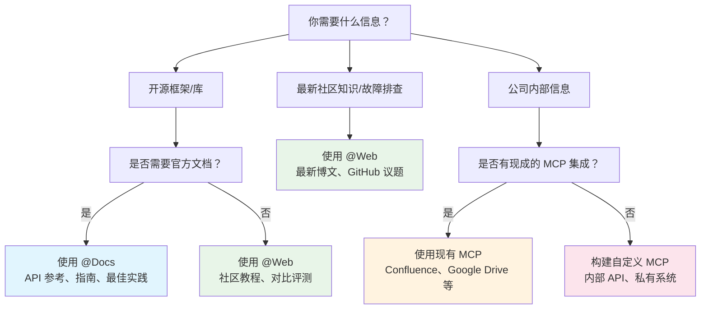
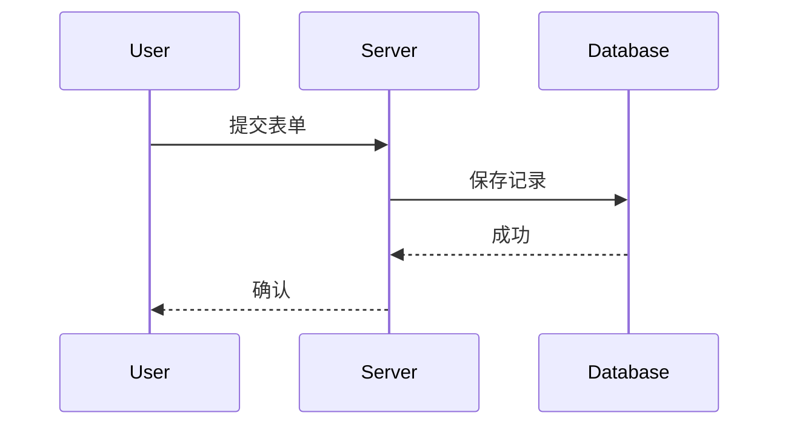

# GitHub Actions

**Navigation:** [← Previous](./42-welcome.md) | [Index](./index.md) | [Next →](./44-构建-mcp-服务器.md)

---

# GitHub Actions
Source: https://docs.cursor.com/zh/cli/github-actions

了解如何在 GitHub Actions 和其他持续集成系统中使用 Cursor CLI

在 GitHub Actions 和其他 CI/CD 系统中使用 Cursor CLI，自动化开发任务。

<div id="github-actions-integration">
  ## 集成 GitHub Actions
</div>

基础配置：

```yaml  theme={null}
- name: 安装 Cursor CLI
  run: |
    curl https://cursor.com/install -fsS | bash
    echo "$HOME/.cursor/bin" >> $GITHUB_PATH

- name: 运行 Cursor Agent
  env:
    CURSOR_API_KEY: ${{ secrets.CURSOR_API_KEY }}
  run: |
    cursor-agent -p "你的提示词" --model gpt-5
```

<div id="cookbook-examples">
  ## 实用示例
</div>

查看我们的实用示例，了解具体工作流：[更新文档](/zh/cli/cookbook/update-docs) 和 [修复 CI 问题](/zh/cli/cookbook/fix-ci)。

<div id="other-ci-systems">
  ## 其他 CI 系统
</div>

只要满足以下条件，就能在任何 CI/CD 系统中使用 Cursor CLI：

* 支持**Shell 脚本执行**（bash、zsh 等）
* 通过**环境变量**配置 API key
* 具备**互联网连接**以访问 Cursor 的 API

<div id="autonomy-levels">
  ## 自主性级别
</div>

选择 agent 的自主性级别：

<div id="full-autonomy-approach">
  ### 完全自主方案
</div>

让 agent 全权控制 git 操作、API 调用和外部交互。设置更简单，但需要更多信任。

**示例：** 在我们的 [Update Documentation](/zh/cli/cookbook/update-docs) cookbook 中，第一个工作流让 agent 可以：

* 分析 PR 变更
* 创建并管理 git 分支
* 提交并推送更改
* 在 pull request 下发布评论
* 处理所有错误情形

```yaml  theme={null}
- name: 更新文档（完全自治）
  run: |
    cursor-agent -p "你拥有对 git、GitHub CLI 以及 PR 操作的完全访问权限。
    负责处理整个文档更新流程，包括提交、推送和 PR 评论。"
```

<div id="restricted-autonomy-approach">
  ### 受限自治方案
</div>

<Note>
  我们建议在生产 CI 工作流中，将此方案与**基于权限的约束**一起使用。这样你能两全其美：agent 可智能处理复杂分析与文件修改，而关键操作仍保持确定且可审计。
</Note>

将关键步骤放到独立的工作流步骤中处理，同时限制 agent 的操作。更可控、更可预测。

**示例：** 同一份 cookbook 中的第二个工作流将 agent 限制为仅进行文件修改：

```yaml  theme={null}
- name: 生成文档更新（受限）
  run: |
    cursor-agent -p "重要：不要创建分支、提交、推送，或在 PR 中发表评论。
    只修改工作目录中的文件。发布由后续的工作流步骤处理。"

- name: 发布文档分支（确定性）
  run: |
    # 由 CI 处理的确定性 git 操作
    git checkout -B "docs/${{ github.head_ref }}"
    git add -A
    git commit -m "docs: 更新此 PR"
    git push origin "docs/${{ github.head_ref }}"

- name: 发布 PR 评论（确定性）  
  run: |
    # 由 CI 处理的确定性 PR 评论
    gh pr comment ${{ github.event.pull_request.number }} --body "文档已更新"
```

<div id="permission-based-restrictions">
  ### 基于权限的限制
</div>

使用[权限配置](/zh/cli/reference/permissions)在 CLI 层面强制执行限制：

```json  theme={null}
{
  "permissions": {
    "allow": [
      "读取(**/*.md)",
      "写入(docs/**/*)",
      "Shell(grep)",
      "Shell(find)"
    ],
    "deny": [
      "Shell(git)",
      "Shell(gh)", 
      "写入(.env*)",
      "写入(package.json)"
    ]
  }
}
```

<div id="authentication">
  ## 身份验证
</div>

<div id="generate-your-api-key">
  ### 生成你的 API 密钥
</div>

先在 Cursor 控制台[生成一个 API 密钥](/zh/cli/reference/authentication#api-key-authentication)。

<div id="configure-repository-secrets">
  ### 配置仓库机密
</div>

把你的 Cursor API 密钥安全地存到仓库里：

1. 打开你的 GitHub 仓库
2. 点击 **Settings** → **Secrets and variables** → **Actions**
3. 点击 **New repository secret**
4. 将名称设为 `CURSOR_API_KEY`
5. 将你的 API 密钥粘贴到值中
6. 点击 **Add secret**

<div id="use-in-workflows">
  ### 在工作流中使用
</div>

设置你的 `CURSOR_API_KEY` 环境变量：

```yaml  theme={null}
env:
  CURSOR_API_KEY: ${{ secrets.CURSOR_API_KEY }}
```


# 使用无头 CLI
Source: https://docs.cursor.com/zh/cli/headless

了解如何使用 Cursor CLI 编写脚本，实现代码分析、生成与修改的自动化

在脚本与自动化流程中使用 Cursor CLI，执行代码分析、生成与重构等任务。

<div id="how-it-works">
  ## 工作原理
</div>

在非交互式脚本和自动化场景中使用 [print 模式](/zh/cli/using#non-interactive-mode)（`-p, --print`）。

<div id="file-modification-in-scripts">
  ### 在脚本中修改文件
</div>

将 `--print` 与 `--force` 一起使用，在脚本中修改文件：

```bash  theme={null}

# 在打印模式下启用文件修改
cursor-agent -p --force "将此代码重构为现代 ES6+ 语法"


# 不加 --force 时，只会提出更改建议，不会实际应用
cursor-agent -p "为此文件添加 JSDoc 注释"  # 不会修改文件


# 批处理并实际修改文件
find src/ -name "*.js" | while read file; do
  cursor-agent -p --force "为 $file 添加全面的 JSDoc 注释"
done
```

<Warning>
  使用 `--force` 标志会让 agent 在不需确认的情况下直接修改文件
</Warning>

<div id="setup">
  ## 设置
</div>

完整的设置说明请查看 [Installation](/zh/cli/installation) 和 [Authentication](/zh/cli/reference/authentication)。

```bash  theme={null}

# 安装 Cursor CLI
curl https://cursor.com/install -fsS | bash


# 为脚本设置 API 密钥  
export CURSOR_API_KEY=your_api_key_here
cursor-agent -p "分析这段代码"
```

<div id="example-scripts">
  ## 示例脚本
</div>

根据不同的脚本需求选择相应的输出格式。详见 [输出格式](/zh/cli/reference/output-format)。

<div id="searching-the-codebase">
  ### 搜索代码库
</div>

使用 `--output-format text` 获取更易读的输出：

```bash  theme={null}
#!/bin/bash

# 简单的代码库问题

cursor-agent -p --output-format text "这个代码库是做什么的？"
```

<div id="automated-code-review">
  ### 自动代码评审
</div>

使用 `--output-format json` 获取结构化分析：

```bash  theme={null}
#!/bin/bash

# simple-code-review.sh - 基础代码评审脚本

echo "开始代码评审..."


# 评审最近的变更
cursor-agent -p --force --output-format text \
  "评审最近的代码变更，并就以下方面给出反馈：
  - 代码质量与可读性
  - 潜在缺陷或问题
  - 安全性考量
  - 对最佳实践的遵循

  请提供具体的改进建议，并写入 review.txt"

if [ $? -eq 0 ]; then
  echo "✅ 代码评审已成功完成"
else
  echo "❌ 代码评审失败"
  exit 1
fi
```

<div id="real-time-progress-tracking">
  ### 实时进度跟踪
</div>

使用 `--output-format stream-json` 可进行实时进度跟踪：

```bash  theme={null}
#!/bin/bash

# stream-progress.sh - 实时跟踪进度

echo "🚀 开始流式处理..."


# 实时跟踪进度
accumulated_text=""
tool_count=0
start_time=$(date +%s)

cursor-agent -p --force --output-format stream-json \
  "分析该项目结构，并在 analysis.txt 中生成摘要报告" | \
  while IFS= read -r line; do
    
    type=$(echo "$line" | jq -r '.type // empty')
    subtype=$(echo "$line" | jq -r '.subtype // empty')
    
    case "$type" in
      "system")
        if [ "$subtype" = "init" ]; then
          model=$(echo "$line" | jq -r '.model // "unknown"')
          echo "🤖 使用模型：$model"
        fi
        ;;
        
      "assistant")
        # 累积流式文本增量
        content=$(echo "$line" | jq -r '.message.content[0].text // empty')
        accumulated_text="$accumulated_text$content"
        
        # 显示实时进度
        printf "\r📝 正在生成：%d 个字符" ${#accumulated_text}
        ;;
        
      "tool_call")
        if [ "$subtype" = "started" ]; then
          tool_count=$((tool_count + 1))
          
          # 提取工具信息
          if echo "$line" | jq -e '.tool_call.writeToolCall' > /dev/null 2>&1; then
            path=$(echo "$line" | jq -r '.tool_call.writeToolCall.args.path // "unknown"')
            echo -e "\n🔧 工具 #$tool_count：创建 $path"
          elif echo "$line" | jq -e '.tool_call.readToolCall' > /dev/null 2>&1; then
            path=$(echo "$line" | jq -r '.tool_call.readToolCall.args.path // "unknown"')
            echo -e "\n📖 工具 #$tool_count：读取 $path"
          fi
          
        elif [ "$subtype" = "completed" ]; then
          # 提取并显示工具结果
          if echo "$line" | jq -e '.tool_call.writeToolCall.result.success' > /dev/null 2>&1; then
            lines=$(echo "$line" | jq -r '.tool_call.writeToolCall.result.success.linesCreated // 0')
            size=$(echo "$line" | jq -r '.tool_call.writeToolCall.result.success.fileSize // 0')
            echo "   ✅ 已创建 $lines 行（$size 字节）"
          elif echo "$line" | jq -e '.tool_call.readToolCall.result.success' > /dev/null 2>&1; then
            lines=$(echo "$line" | jq -r '.tool_call.readToolCall.result.success.totalLines // 0')
            echo "   ✅ 已读取 $lines 行"
          fi
        fi
        ;;
        
      "result")
        duration=$(echo "$line" | jq -r '.duration_ms // 0')
        end_time=$(date +%s)
        total_time=$((end_time - start_time))
        
        echo -e "\n\n🎯 已完成，用时 ${duration}ms（总计 ${total_time}s）"
        echo "📊 最终统计：$tool_count 个工具，生成了 ${#accumulated_text} 个字符"
        ;;
    esac
  done
```


# 安装
Source: https://docs.cursor.com/zh/cli/installation

安装与更新 Cursor CLI

<div id="installation">
  ## 安装
</div>

<div id="macos-linux-and-windows-wsl">
  ### macOS、Linux 和 Windows（WSL）
</div>

一条命令即可安装 Cursor CLI：

```bash  theme={null}
curl https://cursor.com/install -fsS | bash
```

<div id="verification">
  ### 验证
</div>

安装完成后，检查 Cursor CLI 是否正常运行：

```bash  theme={null}
cursor-agent --version
```

<div id="post-installation-setup">
  ## 安装后设置
</div>

1. **将 \~/.local/bin 添加到你的 PATH：**

   适用于 bash：

   ```bash  theme={null}
   echo 'export PATH="$HOME/.local/bin:$PATH"' >> ~/.bashrc
   source ~/.bashrc
   ```

   适用于 zsh：

   ```bash  theme={null}
   echo 'export PATH="$HOME/.local/bin:$PATH"' >> ~/.zshrc
   source ~/.zshrc
   ```

2. **开始使用 Cursor Agent：**
   ```bash  theme={null}
   cursor-agent
   ```

<div id="updates">
  ## 更新
</div>

Cursor CLI 默认会自动尝试更新，确保你始终使用最新版本。

要手动将 Cursor CLI 更新到最新版本：

```bash  theme={null}
cursor-agent update

# 或
cursor-agent upgrade
```

这两条命令都会把 Cursor Agent 更新到最新版本。


# MCP
Source: https://docs.cursor.com/zh/cli/mcp

使用 MCP 服务器配合 cursor-agent 连接外部工具和数据源

export const Kbd = ({children, tooltip, os}) => {
  const keysInput = typeof children === 'string' && children.trim() !== '' ? children : null;
  if (!keysInput) {
    return null;
  }
  const isModifier = key => {
    const modifiers = ['⌘', '⇧', '⌥', '⌃', '⏎', '⌫', '⌦', '⎋', '⇥', '⌁', '←', '→', '↑', '↓', 'Ctrl', 'Shift', 'Alt', 'Cmd', 'Opt', 'Return', 'Backspace', 'Delete', 'Escape', 'Tab', 'Space', 'Enter', 'Esc', 'ArrowLeft', 'ArrowRight', 'ArrowUp', 'ArrowDown', 'Left', 'Right', 'Up', 'Down'];
    return modifiers.includes(key.trim());
  };
  const capitalizeFirstLetter = string => {
    return string.charAt(0).toUpperCase() + string.slice(1);
  };
  const isMac = os ? os.toLowerCase() === 'mac' || os.toLowerCase() === 'macos' : typeof navigator !== 'undefined' && (navigator.platform.toUpperCase().indexOf('MAC') >= 0 || navigator.userAgent.toUpperCase().indexOf('MAC') >= 0);
  const convertToSymbols = shortcut => {
    if (isMac) {
      return shortcut.replace(/⌘|Cmd|CMD/gi, '⌘').replace(/⌥|Opt|OPT/gi, '⌥').replace(/⌃|Ctrl/gi, '⌃').replace(/⇧|Shift/gi, '⇧').replace(/⏎|Return/gi, '⏎').replace(/⌫|Backspace/gi, '⌫').replace(/⌦|Delete/gi, '⌦').replace(/␛|Escape/gi, '␛').replace(/⇥|Tab/gi, '⇥').replace(/⌁|Space/gi, '⌁').replace(/←|Arrow\s*Left|ArrowLeft|Left/gi, '←').replace(/→|Arrow\s*Right|ArrowRight|Right/gi, '→').replace(/↑|Arrow\s*Up|ArrowUp|Up/gi, '↑').replace(/↓|Arrow\s*Down|ArrowDown|Down/gi, '↓');
    } else {
      const converted = shortcut.replace(/⌘|Cmd|CMD/gi, 'Ctrl').replace(/⌥|Opt|OPT/gi, 'Alt').replace(/⌃|Ctrl/gi, 'Ctrl').replace(/⇧|Shift/gi, 'Shift').replace(/⏎|Return/gi, 'Enter').replace(/⌫|Backspace/gi, 'Backspace').replace(/⌦|Delete/gi, 'Delete').replace(/⎋|Escape/gi, 'Esc').replace(/⇥|Tab/gi, 'Tab').replace(/⌁|Space/gi, 'Space').replace(/←|Arrow\s*Left|ArrowLeft|Left/gi, 'Arrow-Left').replace(/→|Arrow\s*Right|ArrowRight|Right/gi, 'Arrow-Right').replace(/↑|Arrow\s*Up|ArrowUp|Up/gi, 'Arrow-Up').replace(/↓|Arrow\s*Down|ArrowDown|Down/gi, 'Arrow-Down');
      const keyList = converted.split(/[\+\s]+/).filter(key => key.trim());
      return keyList.join('+');
    }
  };
  const convertToReadableText = shortcut => {
    const converted = shortcut.replace(/⌘|Cmd|CMD/gi, 'Cmd').replace(/⌥|Opt|OPT/gi, 'Opt').replace(/⌃|Ctrl/gi, 'Ctrl').replace(/⇧|Shift/gi, 'Shift').replace(/⏎|Return/gi, 'Return').replace(/⌫|Backspace/gi, 'Backspace').replace(/⌦|Delete/gi, 'Delete').replace(/⎋|Escape/gi, 'Escape').replace(/⇥|Tab/gi, 'Tab').replace(/⌁|Space/gi, 'Space').replace(/←|Arrow\s*Left|ArrowLeft|Left/gi, 'Arrow-Left').replace(/→|Arrow\s*Right|ArrowRight|Right/gi, 'Arrow-Right').replace(/↑|Arrow\s*Up|ArrowUp|Up/gi, 'Arrow-Up').replace(/↓|Arrow\s*Down|ArrowDown|Down/gi, 'Arrow-Down');
    const keyList = converted.split(/[\+\s]+/).filter(key => key.trim());
    return keyList.map(key => {
      const trimmedKey = key.trim();
      return isModifier(trimmedKey) ? trimmedKey : capitalizeFirstLetter(trimmedKey);
    }).join('+');
  };
  const displayShortcut = convertToSymbols(keysInput);
  const tooltipText = isMac ? tooltip ? `${convertToReadableText(keysInput)}: ${tooltip}` : convertToReadableText(keysInput) : tooltip || null;
  const processedKeys = isMac ? displayShortcut.split(/[\+\s]+/).filter(key => key.trim()).map(key => {
    const trimmedKey = key.trim();
    return isModifier(trimmedKey) ? trimmedKey : capitalizeFirstLetter(trimmedKey);
  }).join('') : displayShortcut.split('+').map(key => {
    const trimmedKey = key.trim();
    return isModifier(trimmedKey) ? trimmedKey : capitalizeFirstLetter(trimmedKey);
  }).join('+');
  return tooltipText ? <Tooltip tip={tooltipText}>
      <kbd>
        {processedKeys}
      </kbd>
    </Tooltip> : <kbd>
      {processedKeys}
    </kbd>;
};

<div id="overview">
  ## 概览
</div>

Cursor CLI 支持 [Model Context Protocol（MCP）](/zh/context/mcp) 服务器，让你把外部工具和数据源接入 `cursor-agent`。**CLI 中的 MCP 与编辑器共用同一套配置**——你配置的任何 MCP 服务器都能在两者间无缝使用。

<Card title="了解 MCP" icon="link" href="/zh/context/mcp">
  第一次接触 MCP？阅读完整指南，了解配置、身份验证和可用服务器
</Card>

<div id="cli-commands">
  ## CLI 命令
</div>

用 `cursor-agent mcp` 命令管理 MCP 服务器：

<div id="list-configured-servers">
  ### 列出已配置的服务器
</div>

查看所有已配置的 MCP 服务器及其当前状态：

```bash  theme={null}
cursor-agent mcp list
```

这会显示：

* 服务器名称和标识符
* 连接状态（已连接/未连接）
* 配置来源（项目或全局）
* 传输方式（stdio、HTTP、SSE）

<div id="list-available-tools">
  ### 列出可用工具
</div>

查看某个特定 MCP 服务器提供的工具：

```bash  theme={null}
cursor-agent mcp list-tools <identifier>
```

这将显示：

* 工具名称和描述
* 必填和可选参数
* 参数类型和约束

<div id="login-to-mcp-server">
  ### 登录 MCP 服务器
</div>

使用在 `mcp.json` 中配置的 MCP 服务器进行认证：

```bash  theme={null}
cursor-agent mcp login <identifier>
```

<div id="disable-mcp-server">
  ### 禁用 MCP 服务器
</div>

将 MCP 服务器从本地的已批准列表中移除：

```bash  theme={null}
cursor-agent mcp disable <标识符>
```

<div id="using-mcp-with-agent">
  ## 在 Agent 中使用 MCP
</div>

配置好 MCP 服务器后（参见[主要 MCP 指南](/zh/context/mcp)了解设置），`cursor-agent` 会在与你的请求相关时自动发现并使用可用的工具。

```bash  theme={null}

# 查看可用的 MCP 服务器
cursor-agent mcp list


# 查看某个服务器提供的工具
cursor-agent mcp list-tools playwright


# 使用 cursor-agent——在合适时会自动调用 MCP 工具
cursor-agent --prompt "打开 google.com，并对搜索页面进行截图"
```

CLI 遵循与编辑器相同的配置优先级（项目 → 全局 → 嵌套），会自动从父目录中发现配置。

<div id="related">
  ## 相关
</div>

<CardGroup cols={2}>
  <Card title="MCP Overview" icon="link" href="/zh/context/mcp">
    完整的 MCP 指南：安装、配置与认证
  </Card>

  <Card title="Available MCP Tools" icon="table" href="/zh/tools">
    浏览可用的现成 MCP 服务器
  </Card>
</CardGroup>


# Cursor CLI
Source: https://docs.cursor.com/zh/cli/overview

开始使用 Cursor CLI，在终端中编写代码

Cursor CLI 让你可以直接在终端与 AI 智能体交互，用于编写、审查和修改代码。无论你偏好交互式终端界面，还是要为脚本和 CI 流水线进行无输出的自动化运行，CLI 都能在你的工作流中提供强大的编码助力。

```bash  theme={null}

# 安装
curl https://cursor.com/install -fsS | bash


# 启动交互式会话
cursor-agent
```

<Frame>
  <video src="https://mintcdn.com/cursor/BfJOqJ1Wb8EvuXyr/images/cli/cli-overview.mp4?fit=max&auto=format&n=BfJOqJ1Wb8EvuXyr&q=85&s=b323547dd61e985df8c0d6179c1492bd" autoPlay loop muted playsInline controls data-path="images/cli/cli-overview.mp4" />
</Frame>

<Info>
  Cursor CLI 目前处于测试阶段，特别期待你的反馈！
</Info>

<div id="interactive-mode">
  ### 交互模式
</div>

开启和 agent 的对话式会话，用来描述你的目标、审阅建议的更改，并批准命令：

```bash  theme={null}

# 启动交互式会话
cursor-agent


# 从初始提示开始
cursor-agent "将 auth 模块重构为使用 JWT 令牌"
```

<div id="non-interactive-mode">
  ### 非交互模式
</div>

在脚本、CI 流水线或自动化等非交互场景中使用 print 模式：

```bash  theme={null}

# 使用特定提示和模型运行
cursor-agent -p "find and fix performance issues" --model "gpt-5"


# 连同 git 变更一并用于审查
cursor-agent -p "review these changes for security issues" --output-format text
```

<div id="sessions">
  ### 会话
</div>

继续先前的对话，在多次交互中保持上下文：

```bash  theme={null}

# 列出所有历史对话
cursor-agent ls


# 继续最近的一次对话
cursor-agent resume


# 继续指定对话
cursor-agent --resume="chat-id-here"
```


# 身份验证
Source: https://docs.cursor.com/zh/cli/reference/authentication

通过浏览器登录流程或 API 密钥对 Cursor CLI 进行身份验证

Cursor CLI 支持两种身份验证方式：浏览器登录（推荐）和 API 密钥。

<div id="browser-authentication-recommended">
  ## 浏览器认证（推荐）
</div>

使用浏览器流程，获得最简便的认证体验：

```bash  theme={null}

# 通过浏览器流程登录
cursor-agent login


# 检查身份验证状态
cursor-agent status


# 登出并清除已存储的身份验证信息
cursor-agent logout
```

login 命令会打开默认浏览器，并提示你使用 Cursor 账号完成身份验证。完成后，你的凭据会被安全地存储在本地。

<div id="api-key-authentication">
  ## API 密钥身份验证
</div>

在自动化、脚本或 CI/CD 环境中，使用 API 密钥进行身份验证：

<div id="step-1-generate-an-api-key">
  ### 步骤 1：生成 API 密钥
</div>

在 Cursor 仪表盘的 Integrations > User API Keys 中生成一个 API 密钥。

<div id="step-2-set-the-api-key">
  ### 步骤 2：设置 API 密钥
</div>

你可以通过两种方式提供 API 密钥：

**选项 1：环境变量（推荐）**

```bash  theme={null}
export CURSOR_API_KEY=你的_api_key_在此
cursor-agent "实现用户认证"
```

**选项 2：命令行参数**

```bash  theme={null}
cursor-agent --api-key your_api_key_here "实现用户认证"
```

<div id="authentication-status">
  ## 身份验证状态
</div>

查看当前身份验证状态：

```bash  theme={null}
cursor-agent status
```

This command will display:

* 是否已完成身份验证
* 你的账号信息
* 当前的端点配置

<div id="troubleshooting">
  ## 故障排查
</div>

* **“Not authenticated” 错误：** 运行 `cursor-agent login`，或确认你的 API 密钥已正确配置
* **SSL 证书错误：** 在开发环境中使用 `--insecure` 选项
* **Endpoint 问题：** 使用 `--endpoint` 选项指定自定义 API 端点


# 配置
Source: https://docs.cursor.com/zh/cli/reference/configuration

Agent CLI 的 cli-config.json 配置参考

使用 `cli-config.json` 文件配置 Agent CLI。

<div id="file-location">
  ## 文件位置
</div>

<div class="full-width-table">
  | 类型 | 平台          | 路径                                         |
  | :- | :---------- | :----------------------------------------- |
  | 全局 | macOS/Linux | `~/.cursor/cli-config.json`                |
  | 全局 | Windows     | `$env:USERPROFILE\.cursor\cli-config.json` |
  | 项目 | 全平台         | `<project>/.cursor/cli.json`               |
</div>

<Note>只有权限可以在项目级配置。其他所有 CLI 设置必须全局配置。</Note>

可通过环境变量覆盖：

* **`CURSOR_CONFIG_DIR`**：自定义目录路径
* **`XDG_CONFIG_HOME`**（Linux/BSD）：使用 `$XDG_CONFIG_HOME/cursor/cli-config.json`

<div id="schema">
  ## 架构
</div>

<div id="required-fields">
  ### 必填字段
</div>

<div class="full-width-table">
  | 字段                  | 类型        | 描述                                                     |
  | :------------------ | :-------- | :----------------------------------------------------- |
  | `version`           | number    | 配置模式版本（当前：`1`）                                         |
  | `editor.vimMode`    | boolean   | 启用 Vim 按键绑定（默认：`false`）                                |
  | `permissions.allow` | string\[] | 允许的操作（参见 [Permissions](/zh/cli/reference/permissions)） |
  | `permissions.deny`  | string\[] | 禁止的操作（参见 [Permissions](/zh/cli/reference/permissions)） |
</div>

<div id="optional-fields">
  ### 可选字段
</div>

<div class="full-width-table">
  | 字段                       | 类型      | 描述              |
  | :----------------------- | :------ | :-------------- |
  | `model`                  | object  | 选定的模型配置         |
  | `hasChangedDefaultModel` | boolean | CLI 管理的默认模型覆盖标记 |
</div>

<div id="examples">
  ## 示例
</div>

<div id="minimal-config">
  ### 最简配置
</div>

```json  theme={null}
{
  "version": 1,
  "editor": { "vimMode": false },
  "permissions": { "allow": ["Shell(ls)"], "deny": [] }
}
```

<div id="enable-vim-mode">
  ### 开启 Vim 模式
</div>

```json  theme={null}
{
  "version": 1,
  "editor": { "vimMode": true },
  "permissions": { "allow": ["Shell(ls)"], "deny": [] }
}
```

<div id="configure-permissions">
  ### 配置权限
</div>

```json  theme={null}
{
  "version": 1,
  "editor": { "vimMode": false },
  "permissions": {
    "allow": ["Shell(ls)", "Shell(echo)"],
    "deny": ["Shell(rm)"]
  }
}
```

参见 [Permissions](/zh/cli/reference/permissions) 以了解可用的权限类型和示例。

<div id="troubleshooting">
  ## 故障排查
</div>

**配置错误**：先把该文件移开，然后重启：

```bash  theme={null}
mv ~/.cursor/cli-config.json ~/.cursor/cli-config.json.bad
```

**更改未生效**：确保 JSON 格式有效并拥有写入权限。某些字段由 CLI 管理，可能会被覆盖。

<div id="notes">
  ## 注意事项
</div>

* 仅支持纯 JSON 格式（不含注释）
* CLI 会自动修复缺失字段
* 损坏的文件会备份为 `.bad` 并重新生成
* 权限项必须为精确匹配的字符串（详见 [Permissions](/zh/cli/reference/permissions)）


# 输出格式
Source: https://docs.cursor.com/zh/cli/reference/output-format

文本、JSON 和 stream-JSON 格式的输出架构

将 `--output-format` 与 `--print` 搭配使用时，Cursor Agent CLI 提供多种输出格式。这些格式包括用于编程场景的结构化格式（`json`、`stream-json`），以及用于人类可读进度跟踪的简化文本格式。

<Note>
  `--output-format` 的默认值是 `stream-json`。该选项仅在打印（`--print`）时有效，或在推断为打印模式（非 TTY 的 stdout 或通过管道的 stdin）时有效。
</Note>

<div id="json-format">
  ## JSON 格式
</div>

当运行成功完成时，`json` 输出格式会输出单个 JSON 对象（后跟换行符）。不会输出增量数据或工具事件；文本会汇总到最终结果中。

发生失败时，进程会以非零退出码结束，并将错误消息写到 stderr。失败情况下不会输出任何格式正确的 JSON 对象。

<div id="success-response">
  ### 成功响应
</div>

成功时，CLI 会输出一个具有以下结构的 JSON 对象：

```json  theme={null}
{
  "type": "result",
  "subtype": "success",
  "is_error": false,
  "duration_ms": 1234,
  "duration_api_ms": 1234,
  "result": "<完整助手文本>",
  "session_id": "<uuid>",
  "request_id": "<可选请求ID>"
}
```

<div class="full-width-table">
  | 字段                | 描述                                |
  | ----------------- | --------------------------------- |
  | `type`            | 终端结果的取值始终为 `"result"`             |
  | `subtype`         | 成功完成时的取值始终为 `"success"`           |
  | `is_error`        | 成功响应时始终为 `false`                  |
  | `duration_ms`     | 总执行时长（毫秒）                         |
  | `duration_api_ms` | API 请求时长（毫秒）（当前等同于 `duration_ms`） |
  | `result`          | 助手完整响应文本（将所有文本增量拼接而成）             |
  | `session_id`      | 唯一会话 ID                           |
  | `request_id`      | 可选的请求 ID（可能省略）                    |
</div>

<div id="stream-json-format">
  ## 流式 JSON 格式
</div>

`stream-json` 输出格式会产生以换行分隔的 JSON（NDJSON）。每一行都是一个 JSON 对象，表示执行过程中的实时事件。

成功时，流以终止的 `result` 事件结束。失败时，进程以非零退出码退出，流可能在未产生终止事件的情况下提前结束；错误信息会写入 stderr。

<div id="event-types">
  ### 事件类型
</div>

<div id="system-initialization">
  #### 系统初始化
</div>

在每个会话开始时发出一次：

```json  theme={null}
{
  "type": "system",
  "subtype": "init",
  "apiKeySource": "环境变量|标志位|登录",
  "cwd": "/绝对路径",
  "session_id": "<uuid>",
  "model": "<模型展示名称>",
  "permissionMode": "默认",
}
```

<Note>
  未来可能会为此事件新增 `tools` 和 `mcp_servers` 等字段。
</Note>

<div id="user-message">
  #### 用户消息
</div>

包含用户的输入提示词：

```json  theme={null}
{
  "type": "user",
  "message": {
    "role": "user",
    "content": [{ "type": "text", "text": "<prompt>" }]
  },
  "session_id": "<uuid>"
}
```

<div id="assistant-text-delta">
  #### 助手文本增量
</div>

在助手生成回复的过程中会多次触发。这些事件包含逐步生成的文本片段：

```json  theme={null}
{
  "type": "assistant",
  "message": {
    "role": "assistant",
    "content": [{ "type": "text", "text": "<delta chunk>" }]
  },
  "session_id": "<uuid>"
}
```

<Note>
  按顺序串联所有 `message.content[].text` 的值，以重建完整的助手回复。
</Note>

<div id="tool-call-events">
  #### 工具调用事件
</div>

工具调用通过开始和完成事件进行追踪：

**工具调用开始：**

```json  theme={null}
{
  "type": "tool_call",
  "subtype": "started",
  "call_id": "<字符串ID>",
  "tool_call": {
    "readToolCall": {
      "args": { "path": "file.txt" }
    }
  },
  "session_id": "<uuid>"
}
```

**工具调用完成：**

```json  theme={null}
{
  "type": "tool_call",
  "subtype": "completed",
  "call_id": "<string id>",
  "tool_call": {
    "readToolCall": {
      "args": { "path": "file.txt" },
      "result": {
        "success": {
          "content": "文件内容…",
          "isEmpty": false,
          "exceededLimit": false,
          "totalLines": 54,
          "totalChars": 1254
        }
      }
    }
  },
  "session_id": "<uuid>"
}
```

<div id="tool-call-types">
  #### 工具调用类型
</div>

**读取文件工具：**

* **开始**：`tool_call.readToolCall.args` 包含 `{ "path": "file.txt" }`
* **完成**：`tool_call.readToolCall.result.success` 包含文件元数据和内容

**写入文件工具：**

* **开始**：`tool_call.writeToolCall.args` 包含 `{ "path": "file.txt", "fileText": "content...", "toolCallId": "id" }`
* **完成**：`tool_call.writeToolCall.result.success` 包含 `{ "path": "/absolute/path", "linesCreated": 19, "fileSize": 942 }`

**其他工具：**

* 可能使用 `tool_call.function` 结构，形如 `{ "name": "tool_name", "arguments": "..." }`

<div id="terminal-result">
  #### 终端结果
</div>

成功完成时发出的最后一个事件：

```json  theme={null}
{
  "type": "result",
  "subtype": "success",
  "duration_ms": 1234,
  "duration_api_ms": 1234,
  "is_error": false,
  "result": "<完整助手文本>",
  "session_id": "<uuid>",
  "request_id": "<可选请求 ID>"
}
```

<div id="example-sequence">
  ### 示例序列
</div>

下面展示了一个具有代表性的 NDJSON 序列，体现了事件的典型流转：

```json  theme={null}
{"type":"system","subtype":"init","apiKeySource":"login","cwd":"/Users/user/project","session_id":"c6b62c6f-7ead-4fd6-9922-e952131177ff","model":"Claude 4 Sonnet","permissionMode":"default"}
{"type":"user","message":{"role":"user","content":[{"type":"text","text":"阅读 README.md 并创建摘要"}]},"session_id":"c6b62c6f-7ead-4fd6-9922-e952131177ff"}
{"type":"assistant","message":{"role":"assistant","content":[{"type":"text","text":"我会"}]},"session_id":"c6b62c6f-7ead-4fd6-9922-e952131177ff"}
{"type":"assistant","message":{"role":"assistant","content":[{"type":"text","text":"阅读 README.md 文件"}]},"session_id":"c6b62c6f-7ead-4fd6-9922-e952131177ff"}
{"type":"tool_call","subtype":"started","call_id":"toolu_vrtx_01NnjaR886UcE8whekg2MGJd","tool_call":{"readToolCall":{"args":{"path":"README.md"}}},"session_id":"c6b62c6f-7ead-4fd6-9922-e952131177ff"}
{"type":"tool_call","subtype":"completed","call_id":"toolu_vrtx_01NnjaR886UcE8whekg2MGJd","tool_call":{"readToolCall":{"args":{"path":"README.md"},"result":{"success":{"content":"# Project\n\nThis is a sample project...","isEmpty":false,"exceededLimit":false,"totalLines":54,"totalChars":1254}}}},"session_id":"c6b62c6f-7ead-4fd6-9922-e952131177ff"}
{"type":"assistant","message":{"role":"assistant","content":[{"type":"text","text":"并创建摘要"}]},"session_id":"c6b62c6f-7ead-4fd6-9922-e952131177ff"}
{"type":"tool_call","subtype":"started","call_id":"toolu_vrtx_01Q3VHVnWFSKygaRPT7WDxrv","tool_call":{"writeToolCall":{"args":{"path":"summary.txt","fileText":"# README 概要\n\n该项目包含...","toolCallId":"toolu_vrtx_01Q3VHVnWFSKygaRPT7WDxrv"}}},"session_id":"c6b62c6f-7ead-4fd6-9922-e952131177ff"}
{"type":"tool_call","subtype":"completed","call_id":"toolu_vrtx_01Q3VHVnWFSKygaRPT7WDxrv","tool_call":{"writeToolCall":{"args":{"path":"summary.txt","fileText":"# README 概要\n\n该项目包含...","toolCallId":"toolu_vrtx_01Q3VHVnWFSKygaRPT7WDxrv"},"result":{"success":{"path":"/Users/user/project/summary.txt","linesCreated":19,"fileSize":942}}}},"session_id":"c6b62c6f-7ead-4fd6-9922-e952131177ff"}
{"type":"result","subtype":"success","duration_ms":5234,"duration_api_ms":5234,"is_error":false,"result":"我会阅读 README.md 文件并创建摘要","session_id":"c6b62c6f-7ead-4fd6-9922-e952131177ff","request_id":"10e11780-df2f-45dc-a1ff-4540af32e9c0"}
```

<div id="text-format">
  ## 文本格式
</div>

`text` 输出格式以简洁、易读的方式呈现代理的动作流。它不会输出详尽的 JSON 事件，而是实时给出代理正在执行的操作的简明文字描述。

这种格式适合在不需解析结构化数据的前提下监控代理进度，非常适用于日志记录、调试或简单的进度跟踪。

<div id="example-output">
  ### 示例输出
</div>

```
读取了文件
编辑了文件
运行了终端命令
创建了新文件
```

随着代理执行操作，每个动作都会以新行显示，并即时反馈其任务进度。

<div id="implementation-notes">
  ## 实现说明
</div>

* 每个事件以单行形式发出，并以`\n`结尾
* 打印模式下会抑制`thinking`事件，它不会出现在任一输出格式中
* 字段可能会随时间以向后兼容的方式增加（使用方应忽略未知字段）
* 流式格式提供实时更新，而 JSON 格式会在完成后再输出结果
* 将所有 `assistant` 消息增量拼接以重建完整响应
* 工具调用 ID 可用于关联开始/完成事件
* 会话 ID 在单次代理执行期间保持一致


# 参数
Source: https://docs.cursor.com/zh/cli/reference/parameters

Cursor Agent CLI 全面命令参考

<div id="global-options">
  ## 全局选项
</div>

全局选项可用于任何命令：

<div class="full-width-table">
  | 选项                         | 描述                                                                       |
  | -------------------------- | ------------------------------------------------------------------------ |
  | `-v, --version`            | 输出版本号                                                                    |
  | `-a, --api-key <key>`      | 用于认证的 API 密钥（也可使用环境变量 `CURSOR_API_KEY`）                                  |
  | `-p, --print`              | 将响应打印到控制台（适用于脚本或非交互式场景）。可使用所有工具，包括 write 和 bash。                         |
  | `--output-format <format>` | 输出格式（仅在使用 `--print` 时生效）：`text`、`json` 或 `stream-json`（默认：`stream-json`） |
  | `-b, --background`         | 以后台模式启动（启动时打开 composer 选择器）                                              |
  | `--fullscreen`             | 启用全屏模式                                                                   |
  | `--resume [chatId]`        | 恢复聊天会话                                                                   |
  | `-m, --model <model>`      | 使用的模型                                                                    |
  | `-f, --force`              | 强制允许执行命令，除非被明确拒绝                                                         |
  | `-h, --help`               | 显示命令帮助                                                                   |
</div>

<div id="commands">
  ## 命令
</div>

<div class="full-width-table">
  | 命令                | 描述                     | 用法                                             |
  | ----------------- | ---------------------- | ---------------------------------------------- |
  | `login`           | 通过 Cursor 进行身份验证       | `cursor-agent login`                           |
  | `logout`          | 登出并清除已存储的认证信息          | `cursor-agent logout`                          |
  | `status`          | 查看认证状态                 | `cursor-agent status`                          |
  | `mcp`             | 管理 MCP 服务器             | `cursor-agent mcp`                             |
  | `update\|upgrade` | 将 Cursor Agent 更新到最新版本 | `cursor-agent update` 或 `cursor-agent upgrade` |
  | `ls`              | 列出并选择要恢复的聊天会话          | `cursor-agent ls`                              |
  | `resume`          | 恢复最近的聊天会话              | `cursor-agent resume`                          |
  | `help [command]`  | 显示命令帮助                 | `cursor-agent help [command]`                  |
</div>

<Note>
  当未指定命令时，Cursor Agent 默认以交互式聊天模式启动。
</Note>

<div id="mcp">
  ## MCP
</div>

管理为 Cursor Agent 配置的 MCP 服务器。

<div class="full-width-table">
  | Subcommand                | Description                             | Usage                                      |
  | ------------------------- | --------------------------------------- | ------------------------------------------ |
  | `login <identifier>`      | 与 `.cursor/mcp.json` 中配置的 MCP 服务器进行身份验证 | `cursor-agent mcp login <identifier>`      |
  | `list`                    | 列出已配置的 MCP 服务器及其状态                      | `cursor-agent mcp list`                    |
  | `list-tools <identifier>` | 列出指定 MCP 的可用工具及其参数名                     | `cursor-agent mcp list-tools <identifier>` |
</div>

所有 MCP 命令均支持使用 `-h, --help` 查看特定命令的帮助。

<div id="arguments">
  ## 参数
</div>

在以聊天模式启动（默认行为）时，可以提供一个初始提示：

**参数：**

* `prompt` — 代理的初始提示词

<div id="getting-help">
  ## 获取帮助
</div>

所有命令都支持全局选项 `-h, --help`，用于显示该命令的专属帮助信息。


# Permissions
Source: https://docs.cursor.com/zh/cli/reference/permissions

用于控制智能体访问文件和命令的权限类型

在 CLI 配置中通过权限令牌控制智能体可执行的操作。可在 `~/.cursor/cli-config.json`（全局）或 `<project>/.cursor/cli.json`（项目级）中设置权限。

<div id="permission-types">
  ## 权限类型
</div>

<div id="shell-commands">
  ### Shell 命令
</div>

**格式：** `Shell(commandBase)`

控制对 shell 命令的访问。`commandBase` 是命令行中的第一个标记（token）。

<div class="full-width-table">
  | 示例           | 描述                        |
  | ------------ | ------------------------- |
  | `Shell(ls)`  | 允许运行 `ls` 命令              |
  | `Shell(git)` | 允许使用任意 `git` 子命令          |
  | `Shell(npm)` | 允许使用 npm 包管理器命令           |
  | `Shell(rm)`  | 拒绝具有破坏性的文件删除（通常用于 `deny`） |
</div>

<div id="file-reads">
  ### 文件读取
</div>

**格式：** `Read(pathOrGlob)`

控制对文件和目录的读取权限。支持 glob 模式。

<div class="full-width-table">
  | 示例                  | 描述                          |
  | ------------------- | --------------------------- |
  | `Read(src/**/*.ts)` | 允许读取 `src` 中的 TypeScript 文件 |
  | `Read(**/*.md)`     | 允许在任意位置读取 Markdown 文件       |
  | `Read(.env*)`       | 拒绝读取环境变量文件                  |
  | `Read(/etc/passwd)` | 拒绝读取系统文件                    |
</div>

<div id="file-writes">
  ### 文件写入
</div>

**格式：** `Write(pathOrGlob)`

控制对文件和目录的写入权限。支持 glob 模式。在打印模式下使用时，写入文件需要加上 `--force`。

<div class="full-width-table">
  | 示例                    | 描述                  |
  | --------------------- | ------------------- |
  | `Write(src/**)`       | 允许写入 `src` 下的任意文件   |
  | `Write(package.json)` | 允许修改 `package.json` |
  | `Write(**/*.key)`     | 拒绝写入私钥文件            |
  | `Write(**/.env*)`     | 拒绝写入环境变量文件          |
</div>

<div id="configuration">
  ## 配置
</div>

在 CLI 配置文件的 `permissions` 对象中添加权限：

```json  theme={null}
{
  "permissions": {
    "allow": [
      "Shell(ls)",
      "Shell(git)", 
      "Read(src/**/*.ts)",
      "Write(package.json)"
    ],
    "deny": [
      "Shell(rm)",
      "Read(.env*)",
      "Write(**/*.key)"
    ]
  }
}
```

<div id="pattern-matching">
  ## 模式匹配
</div>

* Glob 模式支持 `**`、`*` 和 `?` 通配符
* 相对路径作用域限定为当前工作区
* 绝对路径可指向项目之外的文件
* 拒绝规则优先生效于允许规则


# 斜杠命令
Source: https://docs.cursor.com/zh/cli/reference/slash-commands

可在 Cursor CLI 会话中使用的快速操作

<div class="full-width-table">
  | 命令                    | 描述                                |
  | --------------------- | --------------------------------- |
  | `/model <model>`      | 设置或列出模型                           |
  | `/auto-run [state]`   | 切换自动运行（默认）或设置为 \[on\|off\|status] |
  | `/new-chat`           | 开启新的聊天会话                          |
  | `/vim`                | 切换 Vim 键位                         |
  | `/help [command]`     | 显示帮助（/help \[cmd]）                |
  | `/feedback <message>` | 向团队提交反馈                           |
  | `/resume <chat>`      | 按文件夹名称恢复先前的聊天                     |
  | `/copy-req-id`        | 复制上一次请求的 ID                       |
  | `/logout`             | 退出 Cursor 登录                      |
  | `/quit`               | 退出                                |
</div>


# Shell 模式
Source: https://docs.cursor.com/zh/cli/shell-mode

在 CLI 中直接运行 shell 命令，无需离开对话

export const Kbd = ({children, tooltip, os}) => {
  const keysInput = typeof children === 'string' && children.trim() !== '' ? children : null;
  if (!keysInput) {
    return null;
  }
  const isModifier = key => {
    const modifiers = ['⌘', '⇧', '⌥', '⌃', '⏎', '⌫', '⌦', '⎋', '⇥', '⌁', '←', '→', '↑', '↓', 'Ctrl', 'Shift', 'Alt', 'Cmd', 'Opt', 'Return', 'Backspace', 'Delete', 'Escape', 'Tab', 'Space', 'Enter', 'Esc', 'ArrowLeft', 'ArrowRight', 'ArrowUp', 'ArrowDown', 'Left', 'Right', 'Up', 'Down'];
    return modifiers.includes(key.trim());
  };
  const capitalizeFirstLetter = string => {
    return string.charAt(0).toUpperCase() + string.slice(1);
  };
  const isMac = os ? os.toLowerCase() === 'mac' || os.toLowerCase() === 'macos' : typeof navigator !== 'undefined' && (navigator.platform.toUpperCase().indexOf('MAC') >= 0 || navigator.userAgent.toUpperCase().indexOf('MAC') >= 0);
  const convertToSymbols = shortcut => {
    if (isMac) {
      return shortcut.replace(/⌘|Cmd|CMD/gi, '⌘').replace(/⌥|Opt|OPT/gi, '⌥').replace(/⌃|Ctrl/gi, '⌃').replace(/⇧|Shift/gi, '⇧').replace(/⏎|Return/gi, '⏎').replace(/⌫|Backspace/gi, '⌫').replace(/⌦|Delete/gi, '⌦').replace(/␛|Escape/gi, '␛').replace(/⇥|Tab/gi, '⇥').replace(/⌁|Space/gi, '⌁').replace(/←|Arrow\s*Left|ArrowLeft|Left/gi, '←').replace(/→|Arrow\s*Right|ArrowRight|Right/gi, '→').replace(/↑|Arrow\s*Up|ArrowUp|Up/gi, '↑').replace(/↓|Arrow\s*Down|ArrowDown|Down/gi, '↓');
    } else {
      const converted = shortcut.replace(/⌘|Cmd|CMD/gi, 'Ctrl').replace(/⌥|Opt|OPT/gi, 'Alt').replace(/⌃|Ctrl/gi, 'Ctrl').replace(/⇧|Shift/gi, 'Shift').replace(/⏎|Return/gi, 'Enter').replace(/⌫|Backspace/gi, 'Backspace').replace(/⌦|Delete/gi, 'Delete').replace(/⎋|Escape/gi, 'Esc').replace(/⇥|Tab/gi, 'Tab').replace(/⌁|Space/gi, 'Space').replace(/←|Arrow\s*Left|ArrowLeft|Left/gi, 'Arrow-Left').replace(/→|Arrow\s*Right|ArrowRight|Right/gi, 'Arrow-Right').replace(/↑|Arrow\s*Up|ArrowUp|Up/gi, 'Arrow-Up').replace(/↓|Arrow\s*Down|ArrowDown|Down/gi, 'Arrow-Down');
      const keyList = converted.split(/[\+\s]+/).filter(key => key.trim());
      return keyList.join('+');
    }
  };
  const convertToReadableText = shortcut => {
    const converted = shortcut.replace(/⌘|Cmd|CMD/gi, 'Cmd').replace(/⌥|Opt|OPT/gi, 'Opt').replace(/⌃|Ctrl/gi, 'Ctrl').replace(/⇧|Shift/gi, 'Shift').replace(/⏎|Return/gi, 'Return').replace(/⌫|Backspace/gi, 'Backspace').replace(/⌦|Delete/gi, 'Delete').replace(/⎋|Escape/gi, 'Escape').replace(/⇥|Tab/gi, 'Tab').replace(/⌁|Space/gi, 'Space').replace(/←|Arrow\s*Left|ArrowLeft|Left/gi, 'Arrow-Left').replace(/→|Arrow\s*Right|ArrowRight|Right/gi, 'Arrow-Right').replace(/↑|Arrow\s*Up|ArrowUp|Up/gi, 'Arrow-Up').replace(/↓|Arrow\s*Down|ArrowDown|Down/gi, 'Arrow-Down');
    const keyList = converted.split(/[\+\s]+/).filter(key => key.trim());
    return keyList.map(key => {
      const trimmedKey = key.trim();
      return isModifier(trimmedKey) ? trimmedKey : capitalizeFirstLetter(trimmedKey);
    }).join('+');
  };
  const displayShortcut = convertToSymbols(keysInput);
  const tooltipText = isMac ? tooltip ? `${convertToReadableText(keysInput)}: ${tooltip}` : convertToReadableText(keysInput) : tooltip || null;
  const processedKeys = isMac ? displayShortcut.split(/[\+\s]+/).filter(key => key.trim()).map(key => {
    const trimmedKey = key.trim();
    return isModifier(trimmedKey) ? trimmedKey : capitalizeFirstLetter(trimmedKey);
  }).join('') : displayShortcut.split('+').map(key => {
    const trimmedKey = key.trim();
    return isModifier(trimmedKey) ? trimmedKey : capitalizeFirstLetter(trimmedKey);
  }).join('+');
  return tooltipText ? <Tooltip tip={tooltipText}>
      <kbd>
        {processedKeys}
      </kbd>
    </Tooltip> : <kbd>
      {processedKeys}
    </kbd>;
};

Shell 模式可在 CLI 中直接运行 shell 命令，无需离开对话。用它来执行快速、非交互式的命令；带有安全检查，输出会显示在对话中。

<Frame>
  <video src="https://mintcdn.com/cursor/BfJOqJ1Wb8EvuXyr/images/cli/shell-mode/cli-shell-mode.mp4?fit=max&auto=format&n=BfJOqJ1Wb8EvuXyr&q=85&s=5194392f1189eb1eba340d731e86bd5f" autoPlay loop muted playsInline controls data-path="images/cli/shell-mode/cli-shell-mode.mp4" />
</Frame>

<div id="command-execution">
  ## 命令执行
</div>

命令会在你的登录 shell（`$SHELL`）中运行，并继承 CLI 的工作目录与环境。可通过串联命令在其他目录下运行：

```bash  theme={null}
cd subdir && npm test
```

<div id="output">
  ## 输出
</div>

<product_visual type="screenshot">
  命令输出显示带有退出码的页眉、stdout/stderr 面板，以及截断控制
</product_visual>

超大输出会自动截断，长时间运行的进程会超时以保证性能。

<div id="limitations">
  ## 限制
</div>

* 命令在 30 秒后会超时
* 不支持长时间运行的进程、服务器或交互式提示
* 建议使用简短且非交互式的命令以获得最佳效果

<div id="permissions">
  ## 权限
</div>

在执行之前，系统会根据你的权限和团队设置校验命令。查看 [Permissions](/zh/cli/reference/permissions) 了解详细配置。

<product_visual type="screenshot">
  决策横幅显示的审批选项：Run、Reject/Propose、Add to allowlist 和 Auto-run
</product_visual>

管理员策略可能会阻止某些命令，且带有重定向的命令无法在行内加入 allowlist。

<div id="usage-guidelines">
  ## 使用指南
</div>

Shell 模式适合用于状态检查、快速构建、文件操作和环境查看。

避免运行长时间驻留的服务器、交互式应用，以及需要用户输入的命令。

每条命令都是独立执行的——若要在其他目录下运行命令，请使用 `cd <dir> && ...`。

<div id="troubleshooting">
  ## 疑难排查
</div>

* 如果命令卡住，按 <Kbd>Ctrl+C</Kbd> 取消，并添加非交互式参数
* 当出现权限提示时，可批准一次，或按 <Kbd>Tab</Kbd> 将其加入允许列表
* 输出被截断时，按 <Kbd>Ctrl+O</Kbd> 展开
* 需要在不同目录运行时，使用 `cd <dir> && ...`，因为目录变更不会持久化
* Shell 模式会根据 `$SHELL` 变量使用 zsh 或 bash

<div id="faq">
  ## 常见问题
</div>

<AccordionGroup>
  <Accordion title="`cd` 会在多次运行之间保留吗？">
    不会。每条命令都是独立运行的。用 `cd <dir> && ...` 在不同目录里执行命令。
  </Accordion>

  <Accordion title="我可以更改超时时间吗？">
    不行。命令限定为 30 秒，且不可配置。
  </Accordion>

  <Accordion title="权限在哪里配置？">
    权限由 CLI 和团队配置一起管理。用决策横幅把命令加入允许列表。
  </Accordion>

  <Accordion title="怎么退出 Shell 模式？">
    当输入为空时按 <Kbd>Escape</Kbd>，在空输入时按 <Kbd>Backspace</Kbd>/<Kbd>Delete</Kbd>，或按 <Kbd>Ctrl+C</Kbd> 清除并退出。
  </Accordion>
</AccordionGroup>


# 在 CLI 中使用 Agent
Source: https://docs.cursor.com/zh/cli/using

使用 Cursor CLI 高效地进行提示、审阅与迭代

export const Kbd = ({children, tooltip, os}) => {
  const keysInput = typeof children === 'string' && children.trim() !== '' ? children : null;
  if (!keysInput) {
    return null;
  }
  const isModifier = key => {
    const modifiers = ['⌘', '⇧', '⌥', '⌃', '⏎', '⌫', '⌦', '⎋', '⇥', '⌁', '←', '→', '↑', '↓', 'Ctrl', 'Shift', 'Alt', 'Cmd', 'Opt', 'Return', 'Backspace', 'Delete', 'Escape', 'Tab', 'Space', 'Enter', 'Esc', 'ArrowLeft', 'ArrowRight', 'ArrowUp', 'ArrowDown', 'Left', 'Right', 'Up', 'Down'];
    return modifiers.includes(key.trim());
  };
  const capitalizeFirstLetter = string => {
    return string.charAt(0).toUpperCase() + string.slice(1);
  };
  const isMac = os ? os.toLowerCase() === 'mac' || os.toLowerCase() === 'macos' : typeof navigator !== 'undefined' && (navigator.platform.toUpperCase().indexOf('MAC') >= 0 || navigator.userAgent.toUpperCase().indexOf('MAC') >= 0);
  const convertToSymbols = shortcut => {
    if (isMac) {
      return shortcut.replace(/⌘|Cmd|CMD/gi, '⌘').replace(/⌥|Opt|OPT/gi, '⌥').replace(/⌃|Ctrl/gi, '⌃').replace(/⇧|Shift/gi, '⇧').replace(/⏎|Return/gi, '⏎').replace(/⌫|Backspace/gi, '⌫').replace(/⌦|Delete/gi, '⌦').replace(/␛|Escape/gi, '␛').replace(/⇥|Tab/gi, '⇥').replace(/⌁|Space/gi, '⌁').replace(/←|Arrow\s*Left|ArrowLeft|Left/gi, '←').replace(/→|Arrow\s*Right|ArrowRight|Right/gi, '→').replace(/↑|Arrow\s*Up|ArrowUp|Up/gi, '↑').replace(/↓|Arrow\s*Down|ArrowDown|Down/gi, '↓');
    } else {
      const converted = shortcut.replace(/⌘|Cmd|CMD/gi, 'Ctrl').replace(/⌥|Opt|OPT/gi, 'Alt').replace(/⌃|Ctrl/gi, 'Ctrl').replace(/⇧|Shift/gi, 'Shift').replace(/⏎|Return/gi, 'Enter').replace(/⌫|Backspace/gi, 'Backspace').replace(/⌦|Delete/gi, 'Delete').replace(/⎋|Escape/gi, 'Esc').replace(/⇥|Tab/gi, 'Tab').replace(/⌁|Space/gi, 'Space').replace(/←|Arrow\s*Left|ArrowLeft|Left/gi, 'Arrow-Left').replace(/→|Arrow\s*Right|ArrowRight|Right/gi, 'Arrow-Right').replace(/↑|Arrow\s*Up|ArrowUp|Up/gi, 'Arrow-Up').replace(/↓|Arrow\s*Down|ArrowDown|Down/gi, 'Arrow-Down');
      const keyList = converted.split(/[\+\s]+/).filter(key => key.trim());
      return keyList.join('+');
    }
  };
  const convertToReadableText = shortcut => {
    const converted = shortcut.replace(/⌘|Cmd|CMD/gi, 'Cmd').replace(/⌥|Opt|OPT/gi, 'Opt').replace(/⌃|Ctrl/gi, 'Ctrl').replace(/⇧|Shift/gi, 'Shift').replace(/⏎|Return/gi, 'Return').replace(/⌫|Backspace/gi, 'Backspace').replace(/⌦|Delete/gi, 'Delete').replace(/⎋|Escape/gi, 'Escape').replace(/⇥|Tab/gi, 'Tab').replace(/⌁|Space/gi, 'Space').replace(/←|Arrow\s*Left|ArrowLeft|Left/gi, 'Arrow-Left').replace(/→|Arrow\s*Right|ArrowRight|Right/gi, 'Arrow-Right').replace(/↑|Arrow\s*Up|ArrowUp|Up/gi, 'Arrow-Up').replace(/↓|Arrow\s*Down|ArrowDown|Down/gi, 'Arrow-Down');
    const keyList = converted.split(/[\+\s]+/).filter(key => key.trim());
    return keyList.map(key => {
      const trimmedKey = key.trim();
      return isModifier(trimmedKey) ? trimmedKey : capitalizeFirstLetter(trimmedKey);
    }).join('+');
  };
  const displayShortcut = convertToSymbols(keysInput);
  const tooltipText = isMac ? tooltip ? `${convertToReadableText(keysInput)}: ${tooltip}` : convertToReadableText(keysInput) : tooltip || null;
  const processedKeys = isMac ? displayShortcut.split(/[\+\s]+/).filter(key => key.trim()).map(key => {
    const trimmedKey = key.trim();
    return isModifier(trimmedKey) ? trimmedKey : capitalizeFirstLetter(trimmedKey);
  }).join('') : displayShortcut.split('+').map(key => {
    const trimmedKey = key.trim();
    return isModifier(trimmedKey) ? trimmedKey : capitalizeFirstLetter(trimmedKey);
  }).join('+');
  return tooltipText ? <Tooltip tip={tooltipText}>
      <kbd>
        {processedKeys}
      </kbd>
    </Tooltip> : <kbd>
      {processedKeys}
    </kbd>;
};

<div id="prompting">
  ## 提示编写
</div>

清晰表达意图能带来更好的结果。比如，可以用提示词“do not write any code”来确保代理不会修改任何文件。这在动手实现前做任务规划时很有帮助。

Agent 目前具备文件操作、搜索和运行 shell 命令的工具。我们正在不断加入更多工具，类似 IDE agent。

<div id="mcp">
  ## MCP
</div>

Agent 支持 [MCP（Model Context Protocol）](/zh/tools/mcp)，用于扩展功能和集成。CLI 会自动检测并遵循你的 `mcp.json` 配置文件，从而启用你在 IDE 中配置的同一套 MCP 服务器和工具。

<div id="rules">
  ## 规则
</div>

CLI 代理支持与 IDE 相同的[规则系统](/zh/context/rules)。你可以在 `.cursor/rules` 目录中创建规则，为代理提供上下文和指导。这些规则会根据其配置自动加载并应用，让你可以针对项目的不同部分或特定文件类型自定义代理的行为。

<Note>
  CLI 还会读取项目根目录下的 `AGENTS.md` 和 `CLAUDE.md`（如果存在），并将其与 `.cursor/rules` 一并作为规则生效。
</Note>

<div id="working-with-agent">
  ## 使用 Agent
</div>

<div id="navigation">
  ### 导航
</div>

按向上箭头（<Kbd>ArrowUp</Kbd>）查看之前的消息，并在它们之间循环切换。

<div id="review">
  ### 审查
</div>

用 <Kbd>Cmd+R</Kbd> 审查更改。按 <Kbd>i</Kbd> 添加后续指令。用 <Kbd>ArrowUp</Kbd>/<Kbd>ArrowDown</Kbd> 滚动，用 <Kbd>ArrowLeft</Kbd>/<Kbd>ArrowRight</Kbd> 切换文件。

<div id="selecting-context">
  ### 选择上下文
</div>

按 <Kbd>@</Kbd> 选择要包含在上下文中的文件和文件夹。运行 `/compress` 释放上下文窗口的空间。详见 [Summarization](/zh/agent/chat/summarization)。

<div id="history">
  ## 历史
</div>

使用 `--resume [thread id]` 从现有线程继续，以加载先前的上下文。

要恢复最近的对话，使用 `cursor-agent resume`。

你也可以运行 `cursor-agent ls` 查看以往对话的列表。

<div id="command-approval">
  ## 命令确认
</div>

在运行终端命令前，CLI 会提示你确认（<Kbd>y</Kbd>）或取消（<Kbd>n</Kbd>）执行。

<div id="non-interactive-mode">
  ## 非交互模式
</div>

使用 `-p` 或 `--print` 以非交互模式运行 Agent。它会把响应打印到控制台。

开启非交互模式后，可以以非交互方式调用 Agent，便于集成到脚本、CI 流水线等。

你也可以配合 `--output-format` 控制输出格式。比如，用 `--output-format json` 获取更易在脚本中解析的结构化输出，或者用 `--output-format text` 获取纯文本输出。

<Note>
  在非交互模式下，Cursor 具有完整的写入权限。
</Note>


# 键盘快捷键
Source: https://docs.cursor.com/zh/configuration/kbd

Cursor 的键盘快捷键与按键绑定

export const Kbd = ({children, tooltip, os}) => {
  const keysInput = typeof children === 'string' && children.trim() !== '' ? children : null;
  if (!keysInput) {
    return null;
  }
  const isModifier = key => {
    const modifiers = ['⌘', '⇧', '⌥', '⌃', '⏎', '⌫', '⌦', '⎋', '⇥', '⌁', '←', '→', '↑', '↓', 'Ctrl', 'Shift', 'Alt', 'Cmd', 'Opt', 'Return', 'Backspace', 'Delete', 'Escape', 'Tab', 'Space', 'Enter', 'Esc', 'ArrowLeft', 'ArrowRight', 'ArrowUp', 'ArrowDown', 'Left', 'Right', 'Up', 'Down'];
    return modifiers.includes(key.trim());
  };
  const capitalizeFirstLetter = string => {
    return string.charAt(0).toUpperCase() + string.slice(1);
  };
  const isMac = os ? os.toLowerCase() === 'mac' || os.toLowerCase() === 'macos' : typeof navigator !== 'undefined' && (navigator.platform.toUpperCase().indexOf('MAC') >= 0 || navigator.userAgent.toUpperCase().indexOf('MAC') >= 0);
  const convertToSymbols = shortcut => {
    if (isMac) {
      return shortcut.replace(/⌘|Cmd|CMD/gi, '⌘').replace(/⌥|Opt|OPT/gi, '⌥').replace(/⌃|Ctrl/gi, '⌃').replace(/⇧|Shift/gi, '⇧').replace(/⏎|Return/gi, '⏎').replace(/⌫|Backspace/gi, '⌫').replace(/⌦|Delete/gi, '⌦').replace(/␛|Escape/gi, '␛').replace(/⇥|Tab/gi, '⇥').replace(/⌁|Space/gi, '⌁').replace(/←|Arrow\s*Left|ArrowLeft|Left/gi, '←').replace(/→|Arrow\s*Right|ArrowRight|Right/gi, '→').replace(/↑|Arrow\s*Up|ArrowUp|Up/gi, '↑').replace(/↓|Arrow\s*Down|ArrowDown|Down/gi, '↓');
    } else {
      const converted = shortcut.replace(/⌘|Cmd|CMD/gi, 'Ctrl').replace(/⌥|Opt|OPT/gi, 'Alt').replace(/⌃|Ctrl/gi, 'Ctrl').replace(/⇧|Shift/gi, 'Shift').replace(/⏎|Return/gi, 'Enter').replace(/⌫|Backspace/gi, 'Backspace').replace(/⌦|Delete/gi, 'Delete').replace(/⎋|Escape/gi, 'Esc').replace(/⇥|Tab/gi, 'Tab').replace(/⌁|Space/gi, 'Space').replace(/←|Arrow\s*Left|ArrowLeft|Left/gi, 'Arrow-Left').replace(/→|Arrow\s*Right|ArrowRight|Right/gi, 'Arrow-Right').replace(/↑|Arrow\s*Up|ArrowUp|Up/gi, 'Arrow-Up').replace(/↓|Arrow\s*Down|ArrowDown|Down/gi, 'Arrow-Down');
      const keyList = converted.split(/[\+\s]+/).filter(key => key.trim());
      return keyList.join('+');
    }
  };
  const convertToReadableText = shortcut => {
    const converted = shortcut.replace(/⌘|Cmd|CMD/gi, 'Cmd').replace(/⌥|Opt|OPT/gi, 'Opt').replace(/⌃|Ctrl/gi, 'Ctrl').replace(/⇧|Shift/gi, 'Shift').replace(/⏎|Return/gi, 'Return').replace(/⌫|Backspace/gi, 'Backspace').replace(/⌦|Delete/gi, 'Delete').replace(/⎋|Escape/gi, 'Escape').replace(/⇥|Tab/gi, 'Tab').replace(/⌁|Space/gi, 'Space').replace(/←|Arrow\s*Left|ArrowLeft|Left/gi, 'Arrow-Left').replace(/→|Arrow\s*Right|ArrowRight|Right/gi, 'Arrow-Right').replace(/↑|Arrow\s*Up|ArrowUp|Up/gi, 'Arrow-Up').replace(/↓|Arrow\s*Down|ArrowDown|Down/gi, 'Arrow-Down');
    const keyList = converted.split(/[\+\s]+/).filter(key => key.trim());
    return keyList.map(key => {
      const trimmedKey = key.trim();
      return isModifier(trimmedKey) ? trimmedKey : capitalizeFirstLetter(trimmedKey);
    }).join('+');
  };
  const displayShortcut = convertToSymbols(keysInput);
  const tooltipText = isMac ? tooltip ? `${convertToReadableText(keysInput)}: ${tooltip}` : convertToReadableText(keysInput) : tooltip || null;
  const processedKeys = isMac ? displayShortcut.split(/[\+\s]+/).filter(key => key.trim()).map(key => {
    const trimmedKey = key.trim();
    return isModifier(trimmedKey) ? trimmedKey : capitalizeFirstLetter(trimmedKey);
  }).join('') : displayShortcut.split('+').map(key => {
    const trimmedKey = key.trim();
    return isModifier(trimmedKey) ? trimmedKey : capitalizeFirstLetter(trimmedKey);
  }).join('+');
  return tooltipText ? <Tooltip tip={tooltipText}>
      <kbd>
        {processedKeys}
      </kbd>
    </Tooltip> : <kbd>
      {processedKeys}
    </kbd>;
};

Cursor 的键盘快捷键概览。按下 <Kbd>Cmd R</Kbd>，再按 <Kbd>Cmd S</Kbd>，或打开命令面板 <Kbd>Cmd Shift P</Kbd> 并搜索 `Keyboard Shortcuts`，即可查看所有键盘快捷键。

想进一步了解 Cursor 的键盘快捷键，可以参考 [VS Code 的按键绑定](https://code.visualstudio.com/docs/getstarted/keybindings)，这是 Cursor 按键绑定的基础。

包括 Cursor 专属功能在内的所有按键绑定，都可以在 Keyboard Shortcuts 设置中重新映射。

<div id="general">
  ## 通用
</div>

<div className="full-width-table equal-table-columns">
  | Shortcut               | 操作               |
  | ---------------------- | ---------------- |
  | <Kbd>Cmd I</Kbd>       | 切换侧边栏（除非已绑定到某模式） |
  | <Kbd>Cmd L</Kbd>       | 切换侧边栏（除非已绑定到某模式） |
  | <Kbd>Cmd E</Kbd>       | 后台代理控制面板         |
  | <Kbd>Cmd .</Kbd>       | 模式菜单             |
  | <Kbd>Cmd /</Kbd>       | 在 AI 模型间循环切换     |
  | <Kbd>Cmd Shift J</Kbd> | Cursor 设置        |
  | <Kbd>Cmd ,</Kbd>       | 常规设置             |
  | <Kbd>Cmd Shift P</Kbd> | 命令面板             |
</div>

<div id="chat">
  ## Chat
</div>

聊天输入框的快捷键。

<div className="full-width-table equal-table-columns">
  | Shortcut                                             | Action       |
  | ---------------------------------------------------- | ------------ |
  | <Kbd>Return</Kbd>                                    | 轻推（默认）       |
  | <Kbd>Ctrl Return</Kbd>                               | 将消息入队        |
  | <Kbd>Cmd Return</Kbd> when typing                    | 强制发送消息       |
  | <Kbd>Cmd Shift Backspace</Kbd>                       | 取消生成         |
  | <Kbd>Cmd Shift L</Kbd> with code selected            | 将所选代码添加为上下文  |
  | <Kbd>Cmd V</Kbd> with code or log in clipboard       | 将剪贴板内容添加为上下文 |
  | <Kbd>Cmd Shift V</Kbd> with code or log in clipboard | 将剪贴板内容插入输入框  |
  | <Kbd>Cmd Return</Kbd> with suggested changes         | 接受所有建议更改     |
  | <Kbd>Cmd Backspace</Kbd>                             | 拒绝所有建议更改     |
  | <Kbd>Tab</Kbd>                                       | 切换到下一条消息     |
  | <Kbd>Shift Tab</Kbd>                                 | 切换到上一条消息     |
  | <Kbd>Cmd Opt /</Kbd>                                 | 切换模型         |
  | <Kbd>Cmd N</Kbd> / <Kbd>Cmd R</Kbd>                  | 新建聊天         |
  | <Kbd>Cmd T</Kbd>                                     | 新建聊天标签页      |
  | <Kbd>Cmd \[</Kbd>                                    | 上一个聊天        |
  | <Kbd>Cmd ]</Kbd>                                     | 下一个聊天        |
  | <Kbd>Cmd W</Kbd>                                     | 关闭聊天         |
  | <Kbd>Escape</Kbd>                                    | 移除输入焦点       |
</div>

<div id="inline-edit">
  ## 内联编辑
</div>

<div className="full-width-table equal-table-columns">
  | 快捷键                            | 操作     |
  | ------------------------------ | ------ |
  | <Kbd>Cmd K</Kbd>               | 打开     |
  | <Kbd>Cmd Shift K</Kbd>         | 切换输入焦点 |
  | <Kbd>Return</Kbd>              | 提交     |
  | <Kbd>Cmd Shift Backspace</Kbd> | 取消     |
  | <Kbd>Opt Return</Kbd>          | 快速提问   |
</div>

<div id="code-selection-context">
  ## 代码选区与上下文
</div>

<div className="full-width-table equal-table-columns">
  | 快捷键                                          | 操作                             |
  | -------------------------------------------- | ------------------------------ |
  | <Kbd>@</Kbd>                                 | [@ 符号](/zh/context/@-symbols/) |
  | <Kbd>#</Kbd>                                 | 文件                             |
  | <Kbd>/</Kbd>                                 | 快捷命令                           |
  | <Kbd>Cmd Shift L</Kbd>                       | 将选区添加到 Chat                    |
  | <Kbd>Cmd Shift K</Kbd>                       | 将选区添加到 Edit                    |
  | <Kbd>Cmd L</Kbd>                             | 将选区添加到新 Chat                   |
  | <Kbd>Cmd M</Kbd>                             | 切换文件读取策略                       |
  | <Kbd>Cmd →</Kbd>                             | 接受建议的下一个单词                     |
  | <Kbd>Cmd Return</Kbd>                        | 在 Chat 中搜索代码库                  |
  | 选中代码，<Kbd>Cmd C</Kbd>，<Kbd>Cmd V</Kbd>       | 将复制的参考代码作为上下文添加                |
  | 选中代码，<Kbd>Cmd C</Kbd>，<Kbd>Cmd Shift V</Kbd> | 将复制的代码作为文本上下文添加                |
</div>

<div id="tab">
  ## Tab
</div>

<div className="full-width-table equal-table-columns">
  | Shortcut         | Action |
  | ---------------- | ------ |
  | <Kbd>Tab</Kbd>   | 接受补全   |
  | <Kbd>Cmd →</Kbd> | 接受下一个词 |
</div>

<div id="terminal">
  ## 终端
</div>

<div className="full-width-table equal-table-columns">
  | Shortcut              | Action  |
  | --------------------- | ------- |
  | <Kbd>Cmd K</Kbd>      | 打开终端命令栏 |
  | <Kbd>Cmd Return</Kbd> | 运行生成的命令 |
  | <Kbd>Escape</Kbd>     | 确认命令    |
</div>


# Shell Commands
Source: https://docs.cursor.com/zh/configuration/shell

安装并使用 Cursor Shell 命令

Cursor 提供命令行工具，方便你直接在终端打开文件或文件夹。安装 `cursor` 和 `code` 两个命令，把 Cursor 无缝集成到你的开发工作流中。

<div id="installing-cli-commands">
  ## 安装 CLI 命令
</div>

通过命令面板安装 CLI 命令：

1. 打开命令面板（Cmd/Ctrl + P）
2. 输入“Install”以筛选安装命令
3. 选择并运行 `Install 'cursor' to shell`
4. 重复操作并选择 `Install 'code' to shell`

<product_visual type="screenshot">
  命令面板显示 CLI 安装选项
</product_visual>

<div id="using-the-cli-commands">
  ## 使用 CLI 命令
</div>

安装完成后，可使用以下任一命令在 Cursor 中打开文件或文件夹：

```bash  theme={null}

# 使用 cursor 命令
cursor path/to/file.js
cursor path/to/folder/


# 使用 code 命令（与 VS Code 兼容）
code path/to/file.js
code path/to/folder/
```

<div id="command-options">
  ## 命令选项
</div>

两个命令都支持以下选项：

* 打开文件：`cursor file.js`
* 打开文件夹：`cursor ./my-project`
* 打开多个项：`cursor file1.js file2.js folder1/`
* 在新窗口中打开：`cursor -n` 或 `cursor --new-window`
* 等待窗口关闭：`cursor -w` 或 `cursor --wait`

<div id="faq">
  ## 常见问题
</div>

<AccordionGroup>
  <Accordion title="cursor 和 code 命令有什么区别？">
    没有区别。提供 `code` 命令只是为了兼容 VS Code。
  </Accordion>

  <Accordion title="需要同时安装这两个命令吗？">
    不用，按喜好装其中一个，或者两个都行。
  </Accordion>

  <Accordion title="这些命令会安装到哪里？">
    命令会写入系统默认的 shell 配置文件（例如 `.bashrc`、`.zshrc` 或 `.config/fish/config.fish`）。
  </Accordion>
</AccordionGroup>


# 主题
Source: https://docs.cursor.com/zh/configuration/themes

自定义 Cursor 的外观

Cursor 支持浅色和深色主题，为你的编码环境提供更好的视觉体验。Cursor 继承了 VS Code 的主题系统——你可以使用任何 VS Code 主题、创建自定义主题，并从 Marketplace 安装主题扩展。

<div id="changing-theme">
  ## 更改主题
</div>

1. 打开命令面板（Cmd/Ctrl + P）
2. 输入“theme”来筛选命令
3. 选择“Preferences: Color Theme”
4. 选择一个主题

<Frame>
  
</Frame>

<div id="faq">
  ## 常见问题
</div>

<AccordionGroup>
  <Accordion title="我可以在 Cursor 里用我的 VS Code 主题吗？">
    当然可以！Cursor 兼容 VS Code 主题。你可以安装 VS Code 市场里的任何主题，或复制自定义主题文件。
  </Accordion>

  <Accordion title="怎么创建自定义主题？">
    和在 VS Code 里一样创建自定义主题。使用“Developer: Generate Color Theme From Current Settings”从当前设置生成，或者参考 VS Code 的主题创作指南。
  </Accordion>
</AccordionGroup>


# @Code
Source: https://docs.cursor.com/zh/context/@-symbols/@-code

在 Cursor 中使用 @Code 引用特定代码片段

使用 `@Code` 符号引用特定代码片段。相较于 [`@Files & Folders`](/zh/context/@-symbols/@-files-and-folders)，它能提供更细粒度的控制，让你选取精确的代码片段而不是整个文件。

<Frame>
  
</Frame>


# @Cursor 规则
Source: https://docs.cursor.com/zh/context/@-symbols/@-cursor-rules

应用项目特定的规则与指南

`@Cursor Rules` 符号可让你访问已设置的[项目规则](/zh/context/rules)与指南，并将其明确应用到当前上下文。

<Frame>
  
</Frame>


# @Files & Folders
Source: https://docs.cursor.com/zh/context/@-symbols/@-files-and-folders

在 Chat 与 Inline Edit 中将文件和文件夹作为上下文引用

export const Kbd = ({children, tooltip, os}) => {
  const keysInput = typeof children === 'string' && children.trim() !== '' ? children : null;
  if (!keysInput) {
    return null;
  }
  const isModifier = key => {
    const modifiers = ['⌘', '⇧', '⌥', '⌃', '⏎', '⌫', '⌦', '⎋', '⇥', '⌁', '←', '→', '↑', '↓', 'Ctrl', 'Shift', 'Alt', 'Cmd', 'Opt', 'Return', 'Backspace', 'Delete', 'Escape', 'Tab', 'Space', 'Enter', 'Esc', 'ArrowLeft', 'ArrowRight', 'ArrowUp', 'ArrowDown', 'Left', 'Right', 'Up', 'Down'];
    return modifiers.includes(key.trim());
  };
  const capitalizeFirstLetter = string => {
    return string.charAt(0).toUpperCase() + string.slice(1);
  };
  const isMac = os ? os.toLowerCase() === 'mac' || os.toLowerCase() === 'macos' : typeof navigator !== 'undefined' && (navigator.platform.toUpperCase().indexOf('MAC') >= 0 || navigator.userAgent.toUpperCase().indexOf('MAC') >= 0);
  const convertToSymbols = shortcut => {
    if (isMac) {
      return shortcut.replace(/⌘|Cmd|CMD/gi, '⌘').replace(/⌥|Opt|OPT/gi, '⌥').replace(/⌃|Ctrl/gi, '⌃').replace(/⇧|Shift/gi, '⇧').replace(/⏎|Return/gi, '⏎').replace(/⌫|Backspace/gi, '⌫').replace(/⌦|Delete/gi, '⌦').replace(/␛|Escape/gi, '␛').replace(/⇥|Tab/gi, '⇥').replace(/⌁|Space/gi, '⌁').replace(/←|Arrow\s*Left|ArrowLeft|Left/gi, '←').replace(/→|Arrow\s*Right|ArrowRight|Right/gi, '→').replace(/↑|Arrow\s*Up|ArrowUp|Up/gi, '↑').replace(/↓|Arrow\s*Down|ArrowDown|Down/gi, '↓');
    } else {
      const converted = shortcut.replace(/⌘|Cmd|CMD/gi, 'Ctrl').replace(/⌥|Opt|OPT/gi, 'Alt').replace(/⌃|Ctrl/gi, 'Ctrl').replace(/⇧|Shift/gi, 'Shift').replace(/⏎|Return/gi, 'Enter').replace(/⌫|Backspace/gi, 'Backspace').replace(/⌦|Delete/gi, 'Delete').replace(/⎋|Escape/gi, 'Esc').replace(/⇥|Tab/gi, 'Tab').replace(/⌁|Space/gi, 'Space').replace(/←|Arrow\s*Left|ArrowLeft|Left/gi, 'Arrow-Left').replace(/→|Arrow\s*Right|ArrowRight|Right/gi, 'Arrow-Right').replace(/↑|Arrow\s*Up|ArrowUp|Up/gi, 'Arrow-Up').replace(/↓|Arrow\s*Down|ArrowDown|Down/gi, 'Arrow-Down');
      const keyList = converted.split(/[\+\s]+/).filter(key => key.trim());
      return keyList.join('+');
    }
  };
  const convertToReadableText = shortcut => {
    const converted = shortcut.replace(/⌘|Cmd|CMD/gi, 'Cmd').replace(/⌥|Opt|OPT/gi, 'Opt').replace(/⌃|Ctrl/gi, 'Ctrl').replace(/⇧|Shift/gi, 'Shift').replace(/⏎|Return/gi, 'Return').replace(/⌫|Backspace/gi, 'Backspace').replace(/⌦|Delete/gi, 'Delete').replace(/⎋|Escape/gi, 'Escape').replace(/⇥|Tab/gi, 'Tab').replace(/⌁|Space/gi, 'Space').replace(/←|Arrow\s*Left|ArrowLeft|Left/gi, 'Arrow-Left').replace(/→|Arrow\s*Right|ArrowRight|Right/gi, 'Arrow-Right').replace(/↑|Arrow\s*Up|ArrowUp|Up/gi, 'Arrow-Up').replace(/↓|Arrow\s*Down|ArrowDown|Down/gi, 'Arrow-Down');
    const keyList = converted.split(/[\+\s]+/).filter(key => key.trim());
    return keyList.map(key => {
      const trimmedKey = key.trim();
      return isModifier(trimmedKey) ? trimmedKey : capitalizeFirstLetter(trimmedKey);
    }).join('+');
  };
  const displayShortcut = convertToSymbols(keysInput);
  const tooltipText = isMac ? tooltip ? `${convertToReadableText(keysInput)}: ${tooltip}` : convertToReadableText(keysInput) : tooltip || null;
  const processedKeys = isMac ? displayShortcut.split(/[\+\s]+/).filter(key => key.trim()).map(key => {
    const trimmedKey = key.trim();
    return isModifier(trimmedKey) ? trimmedKey : capitalizeFirstLetter(trimmedKey);
  }).join('') : displayShortcut.split('+').map(key => {
    const trimmedKey = key.trim();
    return isModifier(trimmedKey) ? trimmedKey : capitalizeFirstLetter(trimmedKey);
  }).join('+');
  return tooltipText ? <Tooltip tip={tooltipText}>
      <kbd>
        {processedKeys}
      </kbd>
    </Tooltip> : <kbd>
      {processedKeys}
    </kbd>;
};

<div id="files">
  ## 文件
</div>

在 Chat 和 Inline Edit 中，选择 `@Files & Folders`，然后选取要搜索的文件名即可引用整个文件。你也可以把侧边栏中的文件直接拖到 Agent 里作为上下文。

<Frame>
  
</Frame>

<div id="folders">
  ## 文件夹
</div>

当使用 `@Folders` 引用文件夹时，Cursor 会提供该文件夹的路径和内容概览，帮助 AI 了解可用内容。

<Tip>
  选中文件夹后，输入 `/` 可继续深入浏览并查看所有子文件夹。
</Tip>

<Frame>
  
</Frame>

<div id="full-folder-content">
  ### 完整文件夹内容
</div>

在设置中启用 **完整文件夹内容（Full Folder Content）**。开启后，Cursor 会尽可能将该文件夹中的所有文件纳入上下文。

<Frame>
  
</Frame>

对于超出上下文窗口的大型文件夹，会显示大纲视图，并通过悬浮提示显示已包含的文件数量；同时 Cursor 会自动管理可用的上下文空间。

<Note>
  在使用完整文件夹内容并[启用 Max 模式](/zh/context/max-mode)时，
  由于会消耗更多输入 tokens，请求成本会显著增加。
</Note>

<div id="context-management">
  ## 上下文管理
</div>

大型文件和文件夹会自动进行凝练，以适配上下文限制。详见[文件与文件夹凝练](/zh/agent/chats/summarization#file--folder-condensation)。


# @Git
Source: https://docs.cursor.com/zh/context/@-symbols/@-git

引用 Git 变更与分支差异

<Frame>
  
</Frame>

* `@Commit`: 引用相对上一次提交的当前工作区变更。显示所有尚未提交的修改、新增和删除的文件。
* `@Branch`: 将你当前分支与 main 分支对比。显示你分支中而不在 main 中的所有提交和变更。


# @Link
Source: https://docs.cursor.com/zh/context/@-symbols/@-link

通过粘贴 URL 引入网页内容

在聊天中粘贴 URL 时，Cursor 会自动将其标记为 `@Link`，并抓取内容作为上下文使用。也支持 PDF 文档——Cursor 会从任何可公开访问的 PDF URL 中提取并解析文本内容。

<Frame>
  
</Frame>

<div id="unlink">
  ## 取消链接
</div>

想把 URL 当作纯文本使用，而不抓取其内容：

* 点击带标签的链接，选择 `Unlink`
* 或者按住 `Shift` 再粘贴，避免自动加标签

<Frame>
  
</Frame>


# @Linter Errors
Source: https://docs.cursor.com/zh/context/@-symbols/@-linter-errors

在代码库中访问并引用 Lint 错误

`@Linter Errors` 符号会自动捕获并提供当前活动文件中的 Lint 错误和警告的上下文。[Agent](/zh/agent/overview) 默认可以看到 Lint 错误。

<Note>
  要让 Lint 错误可见，需要为所用编程语言安装并配置相应的语言服务器。Cursor 会自动检测并使用已安装的语言服务器，但针对特定语言，你可能需要额外安装扩展或工具。
</Note>

<Frame>
  
</Frame>


# @Past Chats
Source: https://docs.cursor.com/zh/context/@-symbols/@-past-chats

从历史记录中纳入对话摘要

在处理 [Chat](/zh/chat) 中的复杂任务时，可能需要引用此前对话中的上下文或决策。`@Past Chats` 符号会将以往对话的摘要纳入当前上下文。

特别适用于以下情况：

* 你有一段较长的 Chat 会话，需要引用其中的重要上下文
* 你正在开始一个相关的新任务，并希望保持上下文连续
* 你想分享上一段会话中的推理或决策

<Frame>
  
</Frame>


# @Recent Changes
Source: https://docs.cursor.com/zh/context/@-symbols/@-recent-changes

将最近修改的代码作为上下文

`@Recent Changes` 符号会在与 AI 的对话中把最近的代码修改作为上下文提供。

* 变更按时间顺序排列
* 优先包含最近 10 次变更
* 遵循 `.cursorignore` 设置

<Frame>
  
</Frame>


# @Web
Source: https://docs.cursor.com/zh/context/@-symbols/@-web

在网页上搜索最新信息

使用 `@Web`，Cursor 会通过 [exa.ai](https://exa.ai) 搜索全网的最新信息，并将其作为上下文加入进来。还支持从直链解析 PDF 文件。

<Note>
  Web 搜索默认关闭。到 Settings → Features → Web Search 打开它。
</Note>

<Frame>
  
</Frame>


# Overview
Source: https://docs.cursor.com/zh/context/@-symbols/overview

使用 @ 符号引用代码、文件和文档

用方向键浏览建议，按下 `Enter` 选择。如果建议是 `Files` 这类分类，列表会筛选为该分类中最相关的项目。

<Frame>
  
</Frame>

以下是所有可用的 @ 符号：

* [@Files](/zh/context/@-symbols/@-files) - 引用项目中的指定文件
* [@Folders](/zh/context/@-symbols/@-folders) - 引用整个文件夹以提供更广的上下文
* [@Code](/zh/context/@-symbols/@-code) - 引用代码库中的特定代码片段或符号
* [@Docs](/zh/context/@-symbols/@-docs) - 访问文档与指南
* [@Git](/zh/context/@-symbols/@-git) - 访问 Git 历史与变更
* [@Past Chats](/zh/context/@-symbols/@-past-chats) - 使用已汇总的 Composer 会话
* [@Cursor Rules](/zh/context/@-symbols/@-cursor-rules) - 使用 Cursor 规则
* [@Web](/zh/context/@-symbols/@-web) - 引用外部网页资源与文档
* [@Link (paste)](/zh/context/@-symbols/@-link) - 创建指向特定代码或文档的链接
* [@Recent Changes](/zh/context/@-symbols/@-recent-changes) - 引用最近的变更
* [@Lint Errors](/zh/context/@-symbols/@-lint-errors) - 引用 lint 错误（仅限 [Chat](/zh/chat/overview)）
* [@Definitions](/zh/context/@-symbols/@-definitions) - 查找符号定义（仅限 [Inline Edit](/zh/inline-edit/overview)）
* [# Files](/zh/context/@-symbols/pill-files) - 将文件添加到上下文而不引用
* [/ Commands](/zh/context/@-symbols/slash-commands) - 将已打开和活动的文件添加到上下文


# #Files
Source: https://docs.cursor.com/zh/context/@-symbols/pill-files

使用 # 前缀选择特定文件

使用 `#` 加文件名来聚焦到某个文件。可与 `@` 符号配合，实现更精确的上下文控制。

<Frame>
  
</Frame>


# /command
Source: https://docs.cursor.com/zh/context/@-symbols/slash-commands

用于添加文件并控制上下文的快捷命令

`/` 命令可快速访问你已打开的编辑器标签，让你将多个文件添加为上下文。

<Frame>
  
</Frame>

<div id="commands">
  ## Commands
</div>

* **`/Reset Context`**: 将上下文重置为默认状态
* **`/Generate Cursor Rules`**: 生成供 Cursor 遵循的规则
* **`/Disable Iterate on Lints`**: 不再尝试修复 linter 的错误和警告
* **`/Add Open Files to Context`**: 将当前打开的所有编辑器标签页加入上下文
* **`/Add Active Files to Context`**: 将当前视图中的所有编辑器标签页加入上下文（在分屏布局下很有用）


# 代码库索引
Source: https://docs.cursor.com/zh/context/codebase-indexing

Cursor 如何学习你的代码库以便更好地理解

Cursor 会为每个文件计算向量嵌入（embedding），从而为你的代码库建立索引，这能让关于你代码的 AI 回答更准确。打开项目后，Cursor 会自动开始索引；新文件会按需增量索引。
在这里查看索引状态：`Cursor Settings` > `Indexing & Docs`

<Frame>
  
</Frame>

<div id="configuration">
  ## 配置
</div>

Cursor 会索引除[忽略文件](/zh/context/ignore-files)（如 `.gitignore`、`.cursorignore`）中列出的文件外的所有文件。

点击 `Show Settings` 以：

* 为新仓库启用自动索引
* 配置要忽略的文件

<Tip>
  [忽略大型内容文件](/zh/context/ignore-files)有助于提升回答
  准确性。
</Tip>

<div id="view-indexed-files">
  ### 查看已索引的文件
</div>

查看已索引的文件路径：`Cursor Settings` > `Indexing & Docs` > `View included files`

这会打开一个 `.txt` 文件，列出所有已索引的文件。

<div id="multi-root-workspaces">
  ## 多根工作区
</div>

Cursor 支持[多根工作区](https://code.visualstudio.com/docs/editor/workspaces#_multiroot-workspaces)，让你可以同时处理多个代码库：

* 所有代码库都会自动建立索引
* 每个代码库的上下文都可供 AI 使用
* `.cursor/rules` 在所有文件夹中生效

<div id="pr-search">
  ## PR search
</div>

PR search 通过让历史变更可被 AI 搜索和访问，帮助你理解代码库的演进。

<div id="how-it-works">
  ### How it works
</div>

Cursor 会自动**索引仓库历史中所有已合并的 PR**。摘要会出现在语义搜索结果中，并通过智能筛选优先展示最近的变更。

Agent 可以使用 `@[PR number]`、`@[commit hash]` 或 `@[branch name]` 将**PR、commit、issue 或分支**拉取到上下文中。连接后还会包含 GitHub 评论和 Bugbot 评审。

**平台支持**包括 GitHub、GitHub Enterprise 和 Bitbucket。目前不支持 GitLab。

<Note>
  GitHub Enterprise 用户：由于 VSCode 认证限制，fetch 工具会回退为使用 git 命令。
</Note>

<div id="using-pr-search">
  ### Using PR search
</div>

问比如“其他 PR 里服务是怎么实现的？”这样的问题，Agent 会自动把相关 PR 拉取到上下文中，并基于你的仓库历史提供全面的答案。

<div id="faq">
  ## 常见问题
</div>

<AccordionGroup>
  <Accordion title="哪里可以查看所有已索引的代码库？">
    目前还没有全局列表。请逐个在 Cursor 中打开项目，
    然后查看 Codebase Indexing 设置。
  </Accordion>

  <Accordion title="如何删除所有已索引的代码库？">
    在 Settings 中删除你的 Cursor 账户即可移除所有已索引的代码库。
    否则，请在各项目的 Codebase Indexing
    设置中分别删除对应的代码库。
  </Accordion>

  <Accordion title="已索引的代码库会保留多久？">
    已索引的代码库在 6 周无活动后会被删除。重新打开
    项目会触发重新索引。
  </Accordion>

  <Accordion title="我的源代码会存储在 Cursor 的服务器上吗？">
    不会。Cursor 会创建向量嵌入（embeddings），但不会存储文件名或源代码。文件名会被混淆，代码片段会被加密。

    当 Agent 搜索代码库时，Cursor 会从服务器检索嵌入并解密这些片段。
  </Accordion>
</AccordionGroup>


# 忽略文件
Source: https://docs.cursor.com/zh/context/ignore-files

通过 .cursorignore 和 .cursorindexingignore 控制文件访问

<div id="overview">
  ## 概览
</div>

Cursor 会读取并索引你的项目代码库来驱动各项功能。用根目录下的 `.cursorignore` 文件控制 Cursor 能访问哪些目录和文件。

`.cursorignore` 中列出的文件会被排除在以下范围之外：

* 代码库索引
* [Tab](/zh/tab/overview)、[Agent](/zh/agent/overview) 和 [Inline Edit](/zh/inline-edit/overview) 可访问的代码
* 通过 [@ 符号引用](/zh/context/@-symbols/overview) 可访问的代码

<Warning>
  由 Agent 发起的工具调用（比如 terminal 和 MCP servers）无法阻止
  访问受 `.cursorignore` 约束的代码
</Warning>

<div id="why-ignore-files">
  ## 为什么要忽略文件？
</div>

**安全**：限制对 API 密钥、凭证和敏感信息的访问。虽然 Cursor 会阻止访问被忽略的文件，但由于 LLM 的不可预测性，无法保证绝对防护。

**性能**：在大型代码库或 monorepo 中，排除无关部分，以加快索引并提高文件检索的准确性。

<div id="global-ignore-files">
  ## 全局忽略文件
</div>

在用户设置中为所有项目配置忽略模式，这样就能无需逐个项目设置就排除敏感文件。

<Frame>
  
</Frame>

默认模式包括：

* 环境文件：`**/.env`、`**/.env.*`
* 凭据：`**/credentials.json`、`**/secrets.json`
* 密钥：`**/*.key`、`**/*.pem`、`**/id_rsa`

<div id="configuring-cursorignore">
  ## 配置 `.cursorignore`
</div>

在项目根目录创建一个遵循 `.gitignore` 语法的 `.cursorignore` 文件。

<div id="pattern-examples">
  ### 模式示例
</div>

```sh  theme={null}
config.json      # 特定文件
dist/           # 目录
*.log           # 文件扩展名
**/logs         # 嵌套目录
!app/           # 取消忽略（取反）
```

<div id="hierarchical-ignore">
  ### 分层忽略
</div>

启用 `Cursor Settings` > `Features` > `Editor` > `Hierarchical Cursor Ignore`，即可在父级目录中搜索 `.cursorignore` 文件。

**注意**：注释以 `#` 开头。后面的模式会覆盖前面的模式。模式以文件所在位置为相对路径。

<div id="limit-indexing-with-cursorindexingignore">
  ## 使用 `.cursorindexingignore` 限制索引
</div>

使用 `.cursorindexingignore` 将文件仅排除在索引之外。这些文件仍可被 AI 功能使用，但不会出现在代码库搜索结果中。

<div id="files-ignored-by-default">
  ## 默认忽略的文件
</div>

Cursor 会自动忽略 `.gitignore` 中的文件以及下方的默认忽略列表。可以在 `.cursorignore` 中用 `!` 前缀进行覆盖。

<Accordion title="默认忽略列表">
  仅用于索引时，除 `.gitignore`、`.cursorignore` 和 `.cursorindexingignore` 中指定的文件外，还会忽略以下文件：

  ```sh  theme={null}
  package-lock.json
  pnpm-lock.yaml
  yarn.lock
  composer.lock
  Gemfile.lock
  bun.lockb
  .env*
  .git/
  .svn/
  .hg/
  *.lock
  *.bak
  *.tmp
  *.bin
  *.exe
  *.dll
  *.so
  *.lockb
  *.qwoff
  *.isl
  *.csv
  *.pdf
  *.doc
  *.doc
  *.xls
  *.xlsx
  *.ppt
  *.pptx
  *.odt
  *.ods
  *.odp
  *.odg
  *.odf
  *.sxw
  *.sxc
  *.sxi
  *.sxd
  *.sdc
  *.jpg
  *.jpeg
  *.png
  *.gif
  *.bmp
  *.tif
  *.mp3
  *.wav
  *.wma
  *.ogg
  *.flac
  *.aac
  *.mp4
  *.mov
  *.wmv
  *.flv
  *.avi
  *.zip
  *.tar
  *.gz
  *.7z
  *.rar
  *.tgz
  *.dmg
  *.iso
  *.cue
  *.mdf
  *.mds
  *.vcd
  *.toast
  *.img
  *.apk
  *.msi
  *.cab
  *.tar.gz
  *.tar.xz
  *.tar.bz2
  *.tar.lzma
  *.tar.Z
  *.tar.sz
  *.lzma
  *.ttf
  *.otf
  *.pak
  *.woff
  *.woff2
  *.eot
  *.webp
  *.vsix
  *.rmeta
  *.rlib
  *.parquet
  *.svg
  .egg-info/
  .venv/
  node_modules/
  __pycache__/
  .next/
  .nuxt/
  .cache/
  .sass-cache/
  .gradle/
  .DS_Store/
  .ipynb_checkpoints/
  .pytest_cache/
  .mypy_cache/
  .tox/
  .git/
  .hg/
  .svn/
  .bzr/
  .lock-wscript/
  .Python/
  .jupyter/
  .history/
  .yarn/
  .yarn-cache/
  .eslintcache/
  .parcel-cache/
  .cache-loader/
  .nyc_output/
  .node_repl_history/
  .pnp.js/
  .pnp/
  ```
</Accordion>

<div id="negation-pattern-limitations">
  ### 取反模式的限制
</div>

使用取反模式（以 `!` 开头）时，如果父目录通过 `*` 被排除，就无法重新包含某个文件。

```sh  theme={null}

# 忽略 public 文件夹中的所有文件
public/*


# ✅ 这样可行，因为该文件位于顶层目录
!public/index.html


# ❌ 这样不行——无法从嵌套目录中重新包含文件
!public/assets/style.css
```

**解决方法**：显式排除嵌套目录：

```sh  theme={null}
public/assets/*
!public/assets/style.css # 该文件现已可访问
```

为提升性能，被排除的目录不会被遍历，因此对其中文件的匹配模式不会生效。
这与 .gitignore 在嵌套目录中处理否定模式的实现一致。更多详情参见 [Git 官方关于 gitignore 模式的文档](https://git-scm.com/docs/gitignore)。

<div id="troubleshooting">
  ## 故障排查
</div>

用 `git check-ignore -v [file]` 来测试匹配模式。


# 模型上下文协议（MCP）
Source: https://docs.cursor.com/zh/context/mcp

使用 MCP 将外部工具和数据源连接到 Cursor

export const Kbd = ({children, tooltip, os}) => {
  const keysInput = typeof children === 'string' && children.trim() !== '' ? children : null;
  if (!keysInput) {
    return null;
  }
  const isModifier = key => {
    const modifiers = ['⌘', '⇧', '⌥', '⌃', '⏎', '⌫', '⌦', '⎋', '⇥', '⌁', '←', '→', '↑', '↓', 'Ctrl', 'Shift', 'Alt', 'Cmd', 'Opt', 'Return', 'Backspace', 'Delete', 'Escape', 'Tab', 'Space', 'Enter', 'Esc', 'ArrowLeft', 'ArrowRight', 'ArrowUp', 'ArrowDown', 'Left', 'Right', 'Up', 'Down'];
    return modifiers.includes(key.trim());
  };
  const capitalizeFirstLetter = string => {
    return string.charAt(0).toUpperCase() + string.slice(1);
  };
  const isMac = os ? os.toLowerCase() === 'mac' || os.toLowerCase() === 'macos' : typeof navigator !== 'undefined' && (navigator.platform.toUpperCase().indexOf('MAC') >= 0 || navigator.userAgent.toUpperCase().indexOf('MAC') >= 0);
  const convertToSymbols = shortcut => {
    if (isMac) {
      return shortcut.replace(/⌘|Cmd|CMD/gi, '⌘').replace(/⌥|Opt|OPT/gi, '⌥').replace(/⌃|Ctrl/gi, '⌃').replace(/⇧|Shift/gi, '⇧').replace(/⏎|Return/gi, '⏎').replace(/⌫|Backspace/gi, '⌫').replace(/⌦|Delete/gi, '⌦').replace(/␛|Escape/gi, '␛').replace(/⇥|Tab/gi, '⇥').replace(/⌁|Space/gi, '⌁').replace(/←|Arrow\s*Left|ArrowLeft|Left/gi, '←').replace(/→|Arrow\s*Right|ArrowRight|Right/gi, '→').replace(/↑|Arrow\s*Up|ArrowUp|Up/gi, '↑').replace(/↓|Arrow\s*Down|ArrowDown|Down/gi, '↓');
    } else {
      const converted = shortcut.replace(/⌘|Cmd|CMD/gi, 'Ctrl').replace(/⌥|Opt|OPT/gi, 'Alt').replace(/⌃|Ctrl/gi, 'Ctrl').replace(/⇧|Shift/gi, 'Shift').replace(/⏎|Return/gi, 'Enter').replace(/⌫|Backspace/gi, 'Backspace').replace(/⌦|Delete/gi, 'Delete').replace(/⎋|Escape/gi, 'Esc').replace(/⇥|Tab/gi, 'Tab').replace(/⌁|Space/gi, 'Space').replace(/←|Arrow\s*Left|ArrowLeft|Left/gi, 'Arrow-Left').replace(/→|Arrow\s*Right|ArrowRight|Right/gi, 'Arrow-Right').replace(/↑|Arrow\s*Up|ArrowUp|Up/gi, 'Arrow-Up').replace(/↓|Arrow\s*Down|ArrowDown|Down/gi, 'Arrow-Down');
      const keyList = converted.split(/[\+\s]+/).filter(key => key.trim());
      return keyList.join('+');
    }
  };
  const convertToReadableText = shortcut => {
    const converted = shortcut.replace(/⌘|Cmd|CMD/gi, 'Cmd').replace(/⌥|Opt|OPT/gi, 'Opt').replace(/⌃|Ctrl/gi, 'Ctrl').replace(/⇧|Shift/gi, 'Shift').replace(/⏎|Return/gi, 'Return').replace(/⌫|Backspace/gi, 'Backspace').replace(/⌦|Delete/gi, 'Delete').replace(/⎋|Escape/gi, 'Escape').replace(/⇥|Tab/gi, 'Tab').replace(/⌁|Space/gi, 'Space').replace(/←|Arrow\s*Left|ArrowLeft|Left/gi, 'Arrow-Left').replace(/→|Arrow\s*Right|ArrowRight|Right/gi, 'Arrow-Right').replace(/↑|Arrow\s*Up|ArrowUp|Up/gi, 'Arrow-Up').replace(/↓|Arrow\s*Down|ArrowDown|Down/gi, 'Arrow-Down');
    const keyList = converted.split(/[\+\s]+/).filter(key => key.trim());
    return keyList.map(key => {
      const trimmedKey = key.trim();
      return isModifier(trimmedKey) ? trimmedKey : capitalizeFirstLetter(trimmedKey);
    }).join('+');
  };
  const displayShortcut = convertToSymbols(keysInput);
  const tooltipText = isMac ? tooltip ? `${convertToReadableText(keysInput)}: ${tooltip}` : convertToReadableText(keysInput) : tooltip || null;
  const processedKeys = isMac ? displayShortcut.split(/[\+\s]+/).filter(key => key.trim()).map(key => {
    const trimmedKey = key.trim();
    return isModifier(trimmedKey) ? trimmedKey : capitalizeFirstLetter(trimmedKey);
  }).join('') : displayShortcut.split('+').map(key => {
    const trimmedKey = key.trim();
    return isModifier(trimmedKey) ? trimmedKey : capitalizeFirstLetter(trimmedKey);
  }).join('+');
  return tooltipText ? <Tooltip tip={tooltipText}>
      <kbd>
        {processedKeys}
      </kbd>
    </Tooltip> : <kbd>
      {processedKeys}
    </kbd>;
};

<div id="what-is-mcp">
  ## 什么是 MCP？
</div>

[模型上下文协议（MCP）](https://modelcontextprotocol.io/introduction) 使 Cursor 能够连接外部工具和数据源。

<Frame>
  <video src="https://mintcdn.com/cursor/BfJOqJ1Wb8EvuXyr/images/context/mcp/simple-mcp-call.mp4?fit=max&auto=format&n=BfJOqJ1Wb8EvuXyr&q=85&s=08c642babc501c939ecbec9ef5124ce7" autoPlay loop muted playsInline controls data-path="images/context/mcp/simple-mcp-call.mp4" />
</Frame>

<div id="why-use-mcp">
  ### 为什么使用 MCP？
</div>

MCP 将 Cursor 连接到外部系统和数据。与其一遍遍解释你的项目结构，不如直接和你的工具集成。

用任何能向 `stdout` 输出或提供 HTTP 端点的语言编写 MCP 服务器——比如 Python、JavaScript、Go 等。

<div id="how-it-works">
  ### 工作原理
</div>

MCP 服务器通过协议暴露能力，将 Cursor 连接到外部工具或数据源。

Cursor 支持三种传输方式：

<div className="full-width-table">
  | 传输方式                                                             | 执行环境  | 部署          | 用户  | 输入              | 认证    |
  | :--------------------------------------------------------------- | :---- | :---------- | :-- | :-------------- | :---- |
  | **<span className="whitespace-nowrap">`stdio`</span>**           | 本地    | 由 Cursor 管理 | 单用户 | Shell 命令        | 手动    |
  | **<span className="whitespace-nowrap">`SSE`</span>**             | 本地/远程 | 以服务器形式部署    | 多用户 | 指向 SSE 端点的 URL  | OAuth |
  | **<span className="whitespace-nowrap">`Streamable HTTP`</span>** | 本地/远程 | 以服务器形式部署    | 多用户 | 指向 HTTP 端点的 URL | OAuth |
</div>

<div id="protocol-support">
  ### 协议支持
</div>

Cursor 支持以下 MCP 协议能力：

<div className="full-width-table">
  | 功能              | 支持情况 | 描述                              |
  | :-------------- | :--- | :------------------------------ |
  | **Tools**       | 已支持  | 供 AI 模型调用执行的函数                  |
  | **Prompts**     | 已支持  | 面向用户的模板化消息与工作流                  |
  | **Resources**   | 已支持  | 可读取并引用的结构化数据源                   |
  | **Roots**       | 已支持  | 服务器发起的对 URI 或文件系统边界的查询，用于确定操作范围 |
  | **Elicitation** | 已支持  | 服务器发起的向用户补充信息的请求                |
</div>

<div id="installing-mcp-servers">
  ## 安装 MCP 服务端
</div>

<div id="one-click-installation">
  ### 一键安装
</div>

从我们的库中安装 MCP 服务器，并通过 OAuth 完成认证。

<Columns cols={2}>
  <Card title="Browse MCP Tools" icon="table" horizontal href="/zh/tools">
    浏览可用的 MCP 服务器
  </Card>

  <Card title="Add to Cursor Button" icon="plus" horizontal href="/zh/deeplinks">
    创建 “Add to Cursor” 按钮
  </Card>
</Columns>

<div id="using-mcpjson">
  ### 使用 `mcp.json`
</div>

通过 JSON 文件配置自定义 MCP 服务器：

<CodeGroup>
  ```json CLI Server - Node.js theme={null}
  {
    "mcpServers": {
      "server-name": {
        "command": "npx",
        "args": ["-y", "mcp-server"],
        "env": {
          "API_KEY": "value"
        }
      }
    }
  }
  ```

  ```json CLI Server - Python theme={null}
  {
    "mcpServers": {
      "server-name": {
        "command": "python",
        "args": ["mcp-server.py"],
        "env": {
          "API_KEY": "value"
        }
      }
    }
  }
  ```

  ```json Remote Server theme={null}
  // 使用 HTTP 或 SSE 的 MCP 服务器——运行在服务器上
  {
    "mcpServers": {
      "server-name": {
        "url": "http://localhost:3000/mcp",
        "headers": {
          "API_KEY": "value"
        }
      }
    }
  }
  ```
</CodeGroup>

<div id="stdio-server-configuration">
  ### STDIO 服务器配置
</div>

对于 STDIO 服务器（本地命令行服务器），在你的 `mcp.json` 中配置以下字段：

<div className="full-width-table">
  | Field       | Required | Description                            | Examples                                  |
  | :---------- | :------- | :------------------------------------- | :---------------------------------------- |
  | **type**    | Yes      | 服务器连接类型                                | `"stdio"`                                 |
  | **command** | Yes      | 启动服务器可执行文件的命令。必须在系统 PATH 中可用，或包含其绝对路径。 | `"npx"`, `"node"`, `"python"`, `"docker"` |
  | **args**    | No       | 传给该命令的参数数组                             | `["server.py", "--port", "3000"]`         |
  | **env**     | No       | 服务器的环境变量                               | `{"API_KEY": "${input:api-key}"}`         |
  | **envFile** | No       | 用于加载更多变量的环境文件路径                        | `".env"`, `"${workspaceFolder}/.env"`     |
</div>

<div id="using-the-extension-api">
  ### 使用扩展 API
</div>

为了以编程方式注册 MCP 服务器，Cursor 提供了扩展 API，可在不修改 `mcp.json` 文件的前提下进行动态配置。这对企业环境和自动化部署流程尤其有用。

<Card title="MCP 扩展 API 参考" icon="code" href="/zh/context/mcp-extension-api">
  了解如何通过 `vscode.cursor.mcp.registerServer()` 以编程方式注册 MCP 服务器
</Card>

<div id="configuration-locations">
  ### 配置位置
</div>

<CardGroup cols={2}>
  <Card title="项目配置" icon="folder-tree">
    在项目中创建 `.cursor/mcp.json`，为该项目配置专用工具。
  </Card>

  <Card title="全局配置" icon="globe">
    在主目录创建 `~/.cursor/mcp.json`，让这些工具在任何地方可用。
  </Card>
</CardGroup>

<div id="config-interpolation">
  ### 配置插值
</div>

在 `mcp.json` 的值中使用变量。Cursor 会在这些字段中解析变量：`command`、`args`、`env`、`url` 和 `headers`。

支持的语法：

* `${env:NAME}` 环境变量
* `${userHome}` 你的主目录路径
* `${workspaceFolder}` 项目根目录（包含 `.cursor/mcp.json` 的文件夹）
* `${workspaceFolderBasename}` 项目根目录的名称
* `${pathSeparator}` 和 `${/}` 操作系统的路径分隔符

示例

```json  theme={null}
{
  "mcpServers": {
    "local-server": {
      "command": "python",
      "args": ["${workspaceFolder}/tools/mcp_server.py"],
      "env": {
        "API_KEY": "${env:API_KEY}"
      }
    }
  }
}
```

```json  theme={null}
{
  "mcpServers": {
    "remote-server": {
      "url": "https://api.example.com/mcp",
      "headers": {
        "Authorization": "Bearer ${env:MY_SERVICE_TOKEN}"
      }
    }
  }
}
```

<div id="authentication">
  ### 身份验证
</div>

MCP 服务器通过环境变量进行身份验证。把 API key 和 token 写在配置里传递。

Cursor 也支持需要 OAuth 的服务器。

<div id="using-mcp-in-chat">
  ## 在聊天中使用 MCP
</div>

Composer Agent 会在合适的情况下自动调用列在 `Available Tools` 下的 MCP 工具。可以按名称点名某个工具，或直接描述你需要的功能。你也可以在设置里启用或禁用工具。

<div id="toggling-tools">
  ### 切换工具
</div>

可以直接在聊天界面启用或禁用 MCP 工具。点开工具列表里的工具名就能切换。被禁用的工具不会加载到上下文里，Agent 也用不了它们。

<Frame>
  <video src="https://mintcdn.com/cursor/BfJOqJ1Wb8EvuXyr/images/context/mcp/tool-toggle.mp4?fit=max&auto=format&n=BfJOqJ1Wb8EvuXyr&q=85&s=0fa3060f593cae3e5fb7c7d2f041a715" autoPlay loop muted playsInline controls data-path="images/context/mcp/tool-toggle.mp4" />
</Frame>

<div id="tool-approval">
  ### 工具许可
</div>

Agent 默认会在使用 MCP 工具前请求确认。点击工具名称旁的箭头即可查看参数。

<Frame></Frame>

<div id="auto-run">
  #### 自动运行
</div>

启用自动运行后，Agent 可以在不确认的情况下使用 MCP 工具。用法和终端命令类似。关于自动运行设置的更多信息请看[这里](/zh/agent/tools#auto-run)。

<div id="tool-response">
  ### 工具响应
</div>

Cursor 会在聊天中显示工具的返回结果，并提供可展开的参数与响应视图：

<Frame></Frame>

<div id="images-as-context">
  ### 将图像用作上下文
</div>

MCP 服务器可以返回图像（如截图、示意图等）。请以 base64 编码的字符串返回：

```js  theme={null}
const RED_CIRCLE_BASE64 = "/9j/4AAQSkZJRgABAgEASABIAAD/2w...";
// ^ 为便于阅读，已截断完整的 base64

server.tool("generate_image", async (params) => {
  return {
    content: [
      {
        type: "image",
        data: RED_CIRCLE_BASE64,
        mimeType: "image/jpeg",
      },
    ],
  };
});
```

请参考这个[示例服务器](https://github.com/msfeldstein/mcp-test-servers/blob/main/src/image-server.js)以了解实现细节。Cursor 会将返回的图片附加到对话中。如果模型支持图片，它会对图片进行分析。

<div id="security-considerations">
  ## 安全注意事项
</div>

安装 MCP 服务器时，请参考以下安全做法：

* **验证来源**：只从可信的开发者和代码仓库安装 MCP 服务器
* **审查权限**：确认服务器会访问哪些数据和 API
* **限制 API 密钥**：使用受限的 API 密钥，并仅授予最低必要权限
* **审计代码**：对于关键集成，审查服务器的源代码

记住，MCP 服务器可以替你访问外部服务并执行代码。安装前一定要搞清楚服务器具体会做什么。

<div id="real-world-examples">
  ## 真实案例
</div>

想看 MCP 的实际用法，看看我们的 [Web Development 指南](/zh/guides/tutorials/web-development)，里面演示了如何把 Linear、Figma 和浏览器工具集成到你的开发流程中。

<div id="faq">
  ## 常见问题
</div>

<AccordionGroup>
  <Accordion title="MCP 服务器有什么用？">
    MCP 服务器把 Cursor 连接到 Google Drive、Notion 等外部工具和服务，把文档和需求直接带进你的编码流程。
  </Accordion>

  {" "}

  <Accordion title="怎么调试 MCP 服务器的问题？">
    这样查看 MCP 日志：1. 在 Cursor 中打开 Output 面板（<Kbd>Cmd+Shift+U</Kbd>）
    2\. 在下拉菜单选择 "MCP Logs" 3. 检查连接错误、认证问题或服务器崩溃
    日志会显示服务器初始化、工具调用和错误信息。
  </Accordion>

  {" "}

  <Accordion title="可以暂时禁用某个 MCP 服务器吗？">
    可以！不用移除就能开/关服务器：1. 打开 Settings（
    <Kbd>Cmd+Shift+J</Kbd>）2. 前往 Features → Model Context Protocol 3. 点击任一服务器旁的开关启用/禁用
    被禁用的服务器不会加载，也不会出现在聊天里。适合排查问题或减少工具干扰。
  </Accordion>

  {" "}

  <Accordion title="如果 MCP 服务器崩溃或超时会怎样？">
    如果某个 MCP 服务器失败：- Cursor 会在聊天里显示错误信息 - 工具调用会被标记为失败 - 你可以重试操作或查看日志获取详情 - 其他 MCP 服务器会照常工作
    Cursor 会隔离服务器故障，避免一个服务器影响其他服务器。
  </Accordion>

  {" "}

  <Accordion title="怎么更新 MCP 服务器？">
    对于基于 npm 的服务器：1. 在设置里移除该服务器 2. 清理 npm 缓存：
    `npm cache clean --force` 3. 重新添加该服务器以获取最新版本 对于自定义服务器，更新本地文件并重启 Cursor。
  </Accordion>

  <Accordion title="涉及敏感数据时能用 MCP 服务器吗？">
    可以，但请遵循安全最佳实践：- 用环境变量存放密钥，别硬编码 - 在本地用 `stdio` 传输运行敏感服务器 - 将 API key 权限限制到最低必要 - 在连接敏感系统前先审查服务器代码 - 考虑在隔离环境中运行服务器
  </Accordion>
</AccordionGroup>


# 记忆
Source: https://docs.cursor.com/zh/context/memories


记忆会根据在 Chat 中的对话自动生成规则。它们作用于当前项目，并能在不同会话间保持上下文。

<Frame>
  <video src="https://mintcdn.com/cursor/BfJOqJ1Wb8EvuXyr/images/context/rules/memories.mp4?fit=max&auto=format&n=BfJOqJ1Wb8EvuXyr&q=85&s=d10452508d962d7a9ec37de1c22245d1" alt="Cursor 的记忆功能" controls data-path="images/context/rules/memories.mp4" />
</Frame>

<div id="how-memories-are-created">
  ## 记忆是如何创建的
</div>

1. **Sidecar 观察**：Cursor 采用 sidecar 方案，由另一个模型旁路观察你的对话，并自动提取相关记忆。这一过程在你工作时于后台被动运行。后台生成的记忆在保存前需要用户确认，确保你对被记录内容拥有信任与控制。

2. **工具调用**：Agent 可以通过工具调用直接创建记忆：当你明确让它记住某件事，或当它察觉到需要为未来会话保留的重要信息时，就会创建相应记忆。

<div id="manage-memories">
  ## 管理记忆
</div>

可以在 Cursor 设置 → 规则 中管理记忆。


# 规则
Source: https://docs.cursor.com/zh/context/rules

用可复用、具备作用域的指令控制 Agent 模型的行为。

规则为 Agent 和 Inline Edit 提供系统级指令。可以把它们看作项目的持久化上下文、偏好或工作流。

Cursor 支持四种类型的规则：

<CardGroup cols={2}>
  <Card title="Project Rules" icon="folder-tree">
    存放在 `.cursor/rules` 中，纳入版本控制，作用域限定于你的代码库。
  </Card>

  <Card title="User Rules" icon="user">
    全局作用于你的 Cursor 环境。在设置中定义，并始终生效。
  </Card>

  <Card title="AGENTS.md" icon="robot">
    以 Markdown 格式编写的 Agent 指令，是 `.cursor/rules` 的简洁替代方案。
  </Card>

  <Card title=".cursorrules (Legacy)" icon="clock-rotate-left">
    仍受支持，但已弃用。请改用 Project Rules。
  </Card>
</CardGroup>

<div id="how-rules-work">
  ## 规则如何运作
</div>

大型语言模型在不同补全之间不会保留记忆。规则在提示层面提供持久且可复用的上下文。

启用后，规则内容会被放在模型上下文的开头。这能为 AI 在生成代码、理解编辑或协助工作流时提供一致的指引。

<Frame>
  
</Frame>

<Info>
  规则适用于 [Chat](/zh/chat/overview) 和 [Inline
  Edit](/zh/inline-edit/overview)。启用的规则会显示在 Agent 侧边栏。
</Info>

<div id="project-rules">
  ## 项目规则
</div>

项目规则位于 `.cursor/rules`。每条规则都是一个文件，并纳入版本控制。它们可以通过路径模式限定作用范围、手动调用，或按相关性自动包含。子目录可以包含各自的 `.cursor/rules` 目录，仅作用于该文件夹。

使用项目规则来：

* 编码与你的代码库相关的领域知识
* 自动化项目特定的工作流或模板
* 统一风格或架构决策

<div id="rule-anatomy">
  ### 规则结构
</div>

每个规则文件使用 **MDC**（`.mdc`）编写，这是一种同时支持元数据与内容的格式。通过类型下拉菜单控制规则的应用方式，该菜单会修改 `description`、`globs`、`alwaysApply` 属性。

| <span class="no-wrap">规则类型</span>              | 描述                         |
| :--------------------------------------------- | :------------------------- |
| <span class="no-wrap">`Always`</span>          | 始终包含在模型上下文中                |
| <span class="no-wrap">`Auto Attached`</span>   | 当引用匹配某个 glob 模式的文件时自动包含    |
| <span class="no-wrap">`Agent Requested`</span> | 对 AI 可用，由其自行决定是否包含。必须提供描述  |
| <span class="no-wrap">`Manual`</span>          | 仅在使用 `@ruleName` 明确提及时才会包含 |

```
---
description: RPC 服务模板
globs:
alwaysApply: false
---

- 定义服务时请使用我们的内部 RPC 模式
- 服务名一律使用 snake_case。

@service-template.ts
```

<div id="nested-rules">
  ### 嵌套规则
</div>

把规则放在项目各处的 `.cursor/rules` 目录中进行组织。当引用某个目录中的文件时，该目录下的嵌套规则会自动生效。

```
project/
  .cursor/rules/        # 项目级规则
  backend/
    server/
      .cursor/rules/    # 后端专用规则
  frontend/
    .cursor/rules/      # 前端专用规则
```

<div id="creating-a-rule">
  ### 创建规则
</div>

通过执行 `New Cursor Rule` 命令，或前往 `Cursor Settings > Rules` 创建规则。这样会在 `.cursor/rules` 中生成一个新的规则文件。你可以在设置里查看所有规则及其状态。

<Frame>
  
</Frame>

<div id="generating-rules">
  ### 生成规则
</div>

在对话中直接使用 `/Generate Cursor Rules` 命令来生成规则。适合在你已经确定了代理的行为并想要复用这些设置时使用。

<Frame>
  <video src="https://www.cursor.com/changelog/049/generate-rules.mp4" controls>
    Your browser does not support the video tag.
  </video>
</Frame>

<div id="best-practices">
  ## 最佳实践
</div>

好的规则应当聚焦、可执行、范围清晰。

* 将规则控制在 500 行以内
* 把大型规则拆分成多个可组合的小规则
* 提供具体示例或引用文件
* 避免模糊的指导；像清晰的内部文档那样写规则
* 在聊天里重复使用提示时复用这些规则

<div id="examples">
  ## 示例
</div>

<AccordionGroup>
  <Accordion title="前端组件与 API 校验规范">
    该规则为前端组件提供规范：

    在 components 目录开发时：

    * 样式统一使用 Tailwind
    * 动效使用 Framer Motion
    * 遵循组件命名约定

    该规则同时强制 API 端点的校验：

    在 API 目录：

    * 所有校验使用 zod
    * 使用 zod schema 定义返回类型
    * 导出由 schema 生成的类型
  </Accordion>

  <Accordion title="Express 服务与 React 组件模板">
    该规则提供 Express 服务模板：

    创建 Express 服务时使用该模板：

    * 遵循 RESTful 原则
    * 包含错误处理中间件
    * 配置完善的日志记录

    @express-service-template.ts

    该规则定义 React 组件的结构：

    React 组件应遵循以下布局：

    * 顶部定义 Props 接口
    * 组件以具名导出
    * 样式置于底部

    @component-template.tsx
  </Accordion>

  <Accordion title="自动化开发流程与文档生成">
    该规则用于自动化应用分析：

    当被要求分析应用时：

    1. 使用 `npm run dev` 启动开发服务器
    2. 从控制台获取日志
    3. 提出性能优化建议

    该规则也有助于生成文档：

    协助起草文档时请：

    * 提取代码注释
    * 分析 README.md
    * 生成 Markdown 文档
  </Accordion>

  <Accordion title="在 Cursor 中添加新设置">
    先在 `@reactiveStorageTypes.ts` 中创建一个可切换的属性。

    在 `@reactiveStorageService.tsx` 的 `INIT_APPLICATION_USER_PERSISTENT_STORAGE` 中添加默认值。

    对于 beta 功能，在 `@settingsBetaTab.tsx` 中添加开关；否则在 `@settingsGeneralTab.tsx` 中添加。通用复选框可作为 `<SettingsSubSection>` 添加。参考文件其余部分的示例。

    ```
    <SettingsSubSection
    				label="Your feature name"
    				description="Your feature description"
    				value={
    					vsContext.reactiveStorageService.applicationUserPersistentStorage
    						.myNewProperty ?? false
    				}
    				onChange={(newVal) => {
    					vsContext.reactiveStorageService.setApplicationUserPersistentStorage(
    						'myNewProperty',
    						newVal
    					);
    				}}
    			/>
    ```

    在应用中使用时，导入 reactiveStorageService 并读取该属性：

    ```
    const flagIsEnabled = vsContext.reactiveStorageService.applicationUserPersistentStorage.myNewProperty
    ```
  </Accordion>
</AccordionGroup>

来自各类服务商与框架的示例非常多。社区贡献的规则可在众包合集与在线仓库中找到。

<div id="agentsmd">
  ## AGENTS.md
</div>

`AGENTS.md` 是一个用于定义 Agent 指令的简单 Markdown 文件。把它放在项目根目录，作为 `.cursor/rules` 的替代方案，适合简单直观的用法。

与 Project Rules 不同，`AGENTS.md` 只是一个纯 Markdown 文件，没有元数据或复杂配置。对那些只需要简单、易读的指令、又不想承担结构化规则开销的项目来说，它再合适不过了。

```markdown  theme={null}

# 项目指南

## 代码风格
- 所有新文件使用 TypeScript
- 在 React 中优先使用函数组件
- 数据库列名使用 snake_case

## 架构
- 遵循仓储（Repository）模式
- 将业务逻辑放在服务层
```

<div id="user-rules">
  ## 用户规则
</div>

“用户规则”是在 **Cursor Settings → Rules** 中定义的全局偏好设置，适用于所有项目。规则以纯文本编写，特别适合用来设定偏好的交流风格或编码规范：

```
请以简洁的风格回复。避免不必要的重复或冗余。
```

<div id="cursorrules-legacy">
  ## `.cursorrules`（旧版）
</div>

项目根目录中的 `.cursorrules` 文件仍受支持，但即将被弃用。我们建议迁移到 Project Rules，以获得更强的可控性、灵活性和可见性。

<div id="faq">
  ## 常见问题
</div>

<AccordionGroup>
  <Accordion title="为什么我的规则没有生效？">
    检查规则类型。对于 `Agent Requested`，确保已填写描述。对于 `Auto Attached`，确保文件模式匹配被引用的文件。
  </Accordion>

  {" "}

  <Accordion title="规则能引用其他规则或文件吗？">
    可以。使用 `@filename.ts` 把文件包含进规则的上下文。
  </Accordion>

  {" "}

  <Accordion title="我能在聊天里创建规则吗？">
    可以，使用 `/Generate Cursor Rules` 命令在聊天中生成项目规则。若启用了 Memories，会自动生成记忆。
  </Accordion>

  <Accordion title="规则会影响 Cursor Tab 或其他 AI 功能吗？">
    不会。规则只适用于 Agent 和 Inline Edit。
  </Accordion>
</AccordionGroup>


# 概念
Source: https://docs.cursor.com/zh/get-started/concepts

了解让 Cursor 强大的关键功能

export const Kbd = ({children, tooltip, os}) => {
  const keysInput = typeof children === 'string' && children.trim() !== '' ? children : null;
  if (!keysInput) {
    return null;
  }
  const isModifier = key => {
    const modifiers = ['⌘', '⇧', '⌥', '⌃', '⏎', '⌫', '⌦', '⎋', '⇥', '⌁', '←', '→', '↑', '↓', 'Ctrl', 'Shift', 'Alt', 'Cmd', 'Opt', 'Return', 'Backspace', 'Delete', 'Escape', 'Tab', 'Space', 'Enter', 'Esc', 'ArrowLeft', 'ArrowRight', 'ArrowUp', 'ArrowDown', 'Left', 'Right', 'Up', 'Down'];
    return modifiers.includes(key.trim());
  };
  const capitalizeFirstLetter = string => {
    return string.charAt(0).toUpperCase() + string.slice(1);
  };
  const isMac = os ? os.toLowerCase() === 'mac' || os.toLowerCase() === 'macos' : typeof navigator !== 'undefined' && (navigator.platform.toUpperCase().indexOf('MAC') >= 0 || navigator.userAgent.toUpperCase().indexOf('MAC') >= 0);
  const convertToSymbols = shortcut => {
    if (isMac) {
      return shortcut.replace(/⌘|Cmd|CMD/gi, '⌘').replace(/⌥|Opt|OPT/gi, '⌥').replace(/⌃|Ctrl/gi, '⌃').replace(/⇧|Shift/gi, '⇧').replace(/⏎|Return/gi, '⏎').replace(/⌫|Backspace/gi, '⌫').replace(/⌦|Delete/gi, '⌦').replace(/␛|Escape/gi, '␛').replace(/⇥|Tab/gi, '⇥').replace(/⌁|Space/gi, '⌁').replace(/←|Arrow\s*Left|ArrowLeft|Left/gi, '←').replace(/→|Arrow\s*Right|ArrowRight|Right/gi, '→').replace(/↑|Arrow\s*Up|ArrowUp|Up/gi, '↑').replace(/↓|Arrow\s*Down|ArrowDown|Down/gi, '↓');
    } else {
      const converted = shortcut.replace(/⌘|Cmd|CMD/gi, 'Ctrl').replace(/⌥|Opt|OPT/gi, 'Alt').replace(/⌃|Ctrl/gi, 'Ctrl').replace(/⇧|Shift/gi, 'Shift').replace(/⏎|Return/gi, 'Enter').replace(/⌫|Backspace/gi, 'Backspace').replace(/⌦|Delete/gi, 'Delete').replace(/⎋|Escape/gi, 'Esc').replace(/⇥|Tab/gi, 'Tab').replace(/⌁|Space/gi, 'Space').replace(/←|Arrow\s*Left|ArrowLeft|Left/gi, 'Arrow-Left').replace(/→|Arrow\s*Right|ArrowRight|Right/gi, 'Arrow-Right').replace(/↑|Arrow\s*Up|ArrowUp|Up/gi, 'Arrow-Up').replace(/↓|Arrow\s*Down|ArrowDown|Down/gi, 'Arrow-Down');
      const keyList = converted.split(/[\+\s]+/).filter(key => key.trim());
      return keyList.join('+');
    }
  };
  const convertToReadableText = shortcut => {
    const converted = shortcut.replace(/⌘|Cmd|CMD/gi, 'Cmd').replace(/⌥|Opt|OPT/gi, 'Opt').replace(/⌃|Ctrl/gi, 'Ctrl').replace(/⇧|Shift/gi, 'Shift').replace(/⏎|Return/gi, 'Return').replace(/⌫|Backspace/gi, 'Backspace').replace(/⌦|Delete/gi, 'Delete').replace(/⎋|Escape/gi, 'Escape').replace(/⇥|Tab/gi, 'Tab').replace(/⌁|Space/gi, 'Space').replace(/←|Arrow\s*Left|ArrowLeft|Left/gi, 'Arrow-Left').replace(/→|Arrow\s*Right|ArrowRight|Right/gi, 'Arrow-Right').replace(/↑|Arrow\s*Up|ArrowUp|Up/gi, 'Arrow-Up').replace(/↓|Arrow\s*Down|ArrowDown|Down/gi, 'Arrow-Down');
    const keyList = converted.split(/[\+\s]+/).filter(key => key.trim());
    return keyList.map(key => {
      const trimmedKey = key.trim();
      return isModifier(trimmedKey) ? trimmedKey : capitalizeFirstLetter(trimmedKey);
    }).join('+');
  };
  const displayShortcut = convertToSymbols(keysInput);
  const tooltipText = isMac ? tooltip ? `${convertToReadableText(keysInput)}: ${tooltip}` : convertToReadableText(keysInput) : tooltip || null;
  const processedKeys = isMac ? displayShortcut.split(/[\+\s]+/).filter(key => key.trim()).map(key => {
    const trimmedKey = key.trim();
    return isModifier(trimmedKey) ? trimmedKey : capitalizeFirstLetter(trimmedKey);
  }).join('') : displayShortcut.split('+').map(key => {
    const trimmedKey = key.trim();
    return isModifier(trimmedKey) ? trimmedKey : capitalizeFirstLetter(trimmedKey);
  }).join('+');
  return tooltipText ? <Tooltip tip={tooltipText}>
      <kbd>
        {processedKeys}
      </kbd>
    </Tooltip> : <kbd>
      {processedKeys}
    </kbd>;
};

<div className="flex flex-col gap-12">
  <Columns className="gap-4">
    <div>
      <h2 className="text-lg font-medium mb-2">
        <a href="/zh/tab/overview" className="hover:text-primary transition-colors">
          Tab
        </a>
      </h2>

      <p className="text-sm">
        支持多行变更预测的代码补全。按 Tab 接受
        基于你当前代码和最近修改的建议。
      </p>
    </div>

    <Frame>
      
    </Frame>
  </Columns>

  <Columns className="gap-4">
    <div>
      <h3 className="text-lg font-medium mb-2">
        <a href="/zh/agent/overview" className="hover:text-primary transition-colors">
          Agent
        </a>
      </h3>

      <p className="text-sm">
        一个能在多个文件中读取并修改代码的 AI。用自然语言描述想要的更改，Agent 会帮你执行。
      </p>
    </div>

    <div>
      <Frame>
        
      </Frame>
    </div>
  </Columns>

  <Columns className="gap-4">
    <div>
      <h3 className="text-lg font-medium mb-2">
        <a href="/zh/background-agent" className="hover:text-primary transition-colors">
          后台代理
        </a>
      </h3>

      <p className="text-sm">
        在你继续工作的同时异步执行任务。可通过编辑器或 Slack 等外部集成访问。
      </p>
    </div>

    <div>
      <Frame>
        
      </Frame>
    </div>
  </Columns>

  <Columns className="gap-4">
    <div>
      <h3 className="text-lg font-medium mb-2">
        <a href="/zh/inline-edit/overview" className="hover:text-primary transition-colors">
          内联编辑
        </a>
      </h3>

      <p className="text-sm">
        用自然语言编辑选中的代码。按下 <Kbd>Cmd+K</Kbd>，描述你想要的更改，并立即在原处查看应用结果。
      </p>
    </div>

    <div>
      <Frame>
        
      </Frame>
    </div>
  </Columns>

  <Columns className="gap-4">
    <div>
      <h3 className="text-lg font-medium mb-2">
        <a href="/zh/agent/chats/tabs" className="hover:text-primary transition-colors">
          Chat
        </a>
      </h3>

      <p className="text-sm">
        AI 对话界面。支持多标签、对话历史、检查点和导出功能。
      </p>
    </div>

    <div>
      <Frame>
        <video src="https://mintcdn.com/cursor/GnTEh_6SKR7li-hM/images/chat/chat-tabs.mp4?fit=max&auto=format&n=GnTEh_6SKR7li-hM&q=85&s=57fd5305279dc0a3139055b353ce4b7a" autoPlay loop muted playsInline controls data-path="images/chat/chat-tabs.mp4" />
      </Frame>
    </div>
  </Columns>

  <Columns className="gap-4">
    <div>
      <h3 className="text-lg font-medium mb-2">
        <a href="/zh/context/rules" className="hover:text-primary transition-colors">
          规则
        </a>
      </h3>

      <p className="text-sm">
        用于定义 AI 行为的自定义指令。设置代码规范、
        框架偏好和项目特定约定。
      </p>
    </div>

    <div>
      <Frame>
        
      </Frame>
    </div>
  </Columns>

  <Columns className="gap-4">
    <div>
      <h3 className="text-lg font-medium mb-2">
        <a href="/zh/context/memories" className="hover:text-primary transition-colors">
          Memories
        </a>
      </h3>

      <p className="text-sm">
        持久化保存项目上下文以及过往对话中的决策，
        并在后续交互中自动引用。
      </p>
    </div>

    <div>
      <Frame>
        <video src="https://mintcdn.com/cursor/BfJOqJ1Wb8EvuXyr/images/context/rules/memories.mp4?fit=max&auto=format&n=BfJOqJ1Wb8EvuXyr&q=85&s=d10452508d962d7a9ec37de1c22245d1" autoPlay loop muted playsInline controls data-path="images/context/rules/memories.mp4" />
      </Frame>
    </div>
  </Columns>

  <Columns className="gap-4">
    <div>
      <h3 className="text-lg font-medium mb-2">
        <a href="/zh/context/codebase-indexing" className="hover:text-primary transition-colors">
          代码库索引
        </a>
      </h3>

      <p className="text-sm">
        对你的代码库进行语义分析，驱动代码搜索、引用定位和上下文感知的智能补全。
      </p>
    </div>

    <div>
      <Frame>
        
      </Frame>
    </div>
  </Columns>

  <Columns className="gap-4">
    <div>
      <h3 className="text-lg font-medium mb-2">
        <a href="/zh/context/mcp" className="hover:text-primary transition-colors">
          MCP
        </a>
      </h3>

      <p className="text-sm">
        用于集成外部工具的 Model Context Protocol。可连接
        数据库、API 和文档源。
      </p>
    </div>

    <div>
      <Frame>
        <video src="https://mintcdn.com/cursor/BfJOqJ1Wb8EvuXyr/images/context/mcp/simple-mcp-call.mp4?fit=max&auto=format&n=BfJOqJ1Wb8EvuXyr&q=85&s=08c642babc501c939ecbec9ef5124ce7" autoPlay loop muted playsInline controls data-path="images/context/mcp/simple-mcp-call.mp4" />
      </Frame>
    </div>
  </Columns>

  <Columns className="gap-4">
    <div>
      <h3 className="text-lg font-medium mb-2">
        <a href="/zh/guides/working-with-context" className="hover:text-primary transition-colors">
          上下文
        </a>
      </h3>

      <p className="text-sm">
        在代码生成时提供给 AI 模型的信息，包括文件、符号和对话历史。
      </p>
    </div>

    <div>
      <Frame>
        
      </Frame>
    </div>
  </Columns>

  <Columns className="gap-4">
    <div>
      <h3 className="text-lg font-medium mb-2">
        <a href="/zh/models" className="hover:text-primary transition-colors">
          模型
        </a>
      </h3>

      <p className="text-sm">
        支持代码生成的多种 AI 模型。每个模型在速度和能力上各有侧重。
      </p>
    </div>

    <div>
      <Frame>
        
      </Frame>
    </div>
  </Columns>
</div>


# 安装
Source: https://docs.cursor.com/zh/get-started/installation

几分钟内在电脑上安装 Cursor

export const Kbd = ({children, tooltip, os}) => {
  const keysInput = typeof children === 'string' && children.trim() !== '' ? children : null;
  if (!keysInput) {
    return null;
  }
  const isModifier = key => {
    const modifiers = ['⌘', '⇧', '⌥', '⌃', '⏎', '⌫', '⌦', '⎋', '⇥', '⌁', '←', '→', '↑', '↓', 'Ctrl', 'Shift', 'Alt', 'Cmd', 'Opt', 'Return', 'Backspace', 'Delete', 'Escape', 'Tab', 'Space', 'Enter', 'Esc', 'ArrowLeft', 'ArrowRight', 'ArrowUp', 'ArrowDown', 'Left', 'Right', 'Up', 'Down'];
    return modifiers.includes(key.trim());
  };
  const capitalizeFirstLetter = string => {
    return string.charAt(0).toUpperCase() + string.slice(1);
  };
  const isMac = os ? os.toLowerCase() === 'mac' || os.toLowerCase() === 'macos' : typeof navigator !== 'undefined' && (navigator.platform.toUpperCase().indexOf('MAC') >= 0 || navigator.userAgent.toUpperCase().indexOf('MAC') >= 0);
  const convertToSymbols = shortcut => {
    if (isMac) {
      return shortcut.replace(/⌘|Cmd|CMD/gi, '⌘').replace(/⌥|Opt|OPT/gi, '⌥').replace(/⌃|Ctrl/gi, '⌃').replace(/⇧|Shift/gi, '⇧').replace(/⏎|Return/gi, '⏎').replace(/⌫|Backspace/gi, '⌫').replace(/⌦|Delete/gi, '⌦').replace(/␛|Escape/gi, '␛').replace(/⇥|Tab/gi, '⇥').replace(/⌁|Space/gi, '⌁').replace(/←|Arrow\s*Left|ArrowLeft|Left/gi, '←').replace(/→|Arrow\s*Right|ArrowRight|Right/gi, '→').replace(/↑|Arrow\s*Up|ArrowUp|Up/gi, '↑').replace(/↓|Arrow\s*Down|ArrowDown|Down/gi, '↓');
    } else {
      const converted = shortcut.replace(/⌘|Cmd|CMD/gi, 'Ctrl').replace(/⌥|Opt|OPT/gi, 'Alt').replace(/⌃|Ctrl/gi, 'Ctrl').replace(/⇧|Shift/gi, 'Shift').replace(/⏎|Return/gi, 'Enter').replace(/⌫|Backspace/gi, 'Backspace').replace(/⌦|Delete/gi, 'Delete').replace(/⎋|Escape/gi, 'Esc').replace(/⇥|Tab/gi, 'Tab').replace(/⌁|Space/gi, 'Space').replace(/←|Arrow\s*Left|ArrowLeft|Left/gi, 'Arrow-Left').replace(/→|Arrow\s*Right|ArrowRight|Right/gi, 'Arrow-Right').replace(/↑|Arrow\s*Up|ArrowUp|Up/gi, 'Arrow-Up').replace(/↓|Arrow\s*Down|ArrowDown|Down/gi, 'Arrow-Down');
      const keyList = converted.split(/[\+\s]+/).filter(key => key.trim());
      return keyList.join('+');
    }
  };
  const convertToReadableText = shortcut => {
    const converted = shortcut.replace(/⌘|Cmd|CMD/gi, 'Cmd').replace(/⌥|Opt|OPT/gi, 'Opt').replace(/⌃|Ctrl/gi, 'Ctrl').replace(/⇧|Shift/gi, 'Shift').replace(/⏎|Return/gi, 'Return').replace(/⌫|Backspace/gi, 'Backspace').replace(/⌦|Delete/gi, 'Delete').replace(/⎋|Escape/gi, 'Escape').replace(/⇥|Tab/gi, 'Tab').replace(/⌁|Space/gi, 'Space').replace(/←|Arrow\s*Left|ArrowLeft|Left/gi, 'Arrow-Left').replace(/→|Arrow\s*Right|ArrowRight|Right/gi, 'Arrow-Right').replace(/↑|Arrow\s*Up|ArrowUp|Up/gi, 'Arrow-Up').replace(/↓|Arrow\s*Down|ArrowDown|Down/gi, 'Arrow-Down');
    const keyList = converted.split(/[\+\s]+/).filter(key => key.trim());
    return keyList.map(key => {
      const trimmedKey = key.trim();
      return isModifier(trimmedKey) ? trimmedKey : capitalizeFirstLetter(trimmedKey);
    }).join('+');
  };
  const displayShortcut = convertToSymbols(keysInput);
  const tooltipText = isMac ? tooltip ? `${convertToReadableText(keysInput)}: ${tooltip}` : convertToReadableText(keysInput) : tooltip || null;
  const processedKeys = isMac ? displayShortcut.split(/[\+\s]+/).filter(key => key.trim()).map(key => {
    const trimmedKey = key.trim();
    return isModifier(trimmedKey) ? trimmedKey : capitalizeFirstLetter(trimmedKey);
  }).join('') : displayShortcut.split('+').map(key => {
    const trimmedKey = key.trim();
    return isModifier(trimmedKey) ? trimmedKey : capitalizeFirstLetter(trimmedKey);
  }).join('+');
  return tooltipText ? <Tooltip tip={tooltipText}>
      <kbd>
        {processedKeys}
      </kbd>
    </Tooltip> : <kbd>
      {processedKeys}
    </kbd>;
};

<div id="download-cursor">
  ## 下载 Cursor
</div>

上手很简单：

1. 打开 [cursor.com](https://cursor.com) 并点击“Download”
2. 下载完成后运行安装程序
3. 安装完成后打开 Cursor

<Info>
  需要特定版本？去
  [cursor.com/downloads](https://cursor.com/downloads)
  查看所有平台和安装方式
</Info>

<div id="first-time-setup">
  ## 初次设置
</div>

第一次打开 Cursor 时，我们会带你快速完成一些设置：

* 选择顺手的键盘快捷键
* 挑一个喜欢的主题
* 配置终端偏好

<Frame>
  <video controls width="100%">
    <source src="https://mintcdn.com/cursor/E7JVsKUF5L-IiJRB/images/get-started/cursor-onboarding.mp4?fit=max&auto=format&n=E7JVsKUF5L-IiJRB&q=85&s=cda00fa83569cd85c6b7322c34f4843e" type="video/mp4" data-path="images/get-started/cursor-onboarding.mp4" />

    你的浏览器不支持 video 标签。
  </video>
</Frame>

<Tip>
  随时可以按 <Kbd>Cmd Shift P</Kbd>{" "}
  并搜索 `Cursor: Start Onboarding` 重新打开设置向导。
</Tip>

进一步了解 [键盘快捷键](/zh/kbd)、[主题](/zh/settings/themes) 和 [Shell 命令](/zh/settings/shell)

<CardGroup cols={3}>
  <Card title="Keyboard shortcuts" href="/zh/configuration/kbd" arrow>
    查看键盘快捷键
  </Card>

  <Card title="Themes" href="/zh/configuration/themes" arrow>
    在 Cursor 中选择主题
  </Card>

  <Card title="Shell Commands" href="/zh/configuration/shell" arrow>
    安装 Shell 命令
  </Card>
</CardGroup>

<div id="moving-from-another-editor">
  ## 正在从其他编辑器切换？
</div>

如果你已经在用其他代码编辑器，我们让迁移变得很简单：

<CardGroup cols={2}>
  <Card title="VS Code" href="/zh/guides/migration/vscode" arrow>
    直接导入 VS Code 设置
  </Card>

  <Card title="Jetbrains" href="/zh/guides/migration/jetbrains" arrow>
    JetBrains、Eclipse、Neovim 和 Sublime 的迁移指南
  </Card>
</CardGroup>

更多迁移指南即将上线。

<div id="language-support">
  ## 语言支持
</div>

Cursor 支持所有主流编程语言。下面是一些拥有增强型 AI 支持的热门语言：

<CardGroup cols={4}>
  <Card
    title="TypeScript"
    href="/zh/guides/languages/javascript"
    icon={<svg xmlns="http://www.w3.org/2000/svg" viewBox="0 0 512 512" fill="none">
<rect width={512} height={512} fill="#3178c6" rx={50} />
<rect width={512} height={512} fill="#3178c6" rx={50} />
<path
fill="#fff"
fillRule="evenodd"
d="M316.939 407.424v50.061c8.138 4.172 17.763 7.3 28.875 9.386S368.637 470 380.949 470c11.999 0 23.397-1.147 34.196-3.442 10.799-2.294 20.268-6.075 28.406-11.342 8.138-5.266 14.581-12.15 19.328-20.65S470 415.559 470 403.044c0-9.074-1.356-17.026-4.069-23.857s-6.625-12.906-11.738-18.225c-5.112-5.319-11.242-10.091-18.389-14.315s-15.207-8.213-24.18-11.967c-6.573-2.712-12.468-5.345-17.685-7.9-5.217-2.556-9.651-5.163-13.303-7.822-3.652-2.66-6.469-5.476-8.451-8.448-1.982-2.973-2.974-6.336-2.974-10.091 0-3.441.887-6.544 2.661-9.308s4.278-5.136 7.512-7.118c3.235-1.981 7.199-3.52 11.894-4.615 4.696-1.095 9.912-1.642 15.651-1.642 4.173 0 8.581.313 13.224.938 4.643.626 9.312 1.591 14.008 2.894a97.514 97.514 0 0 1 13.694 4.928c4.434 1.982 8.529 4.276 12.285 6.884v-46.776c-7.616-2.92-15.937-5.084-24.962-6.492S415.797 238 404.112 238c-11.895 0-23.163 1.278-33.805 3.833s-20.006 6.544-28.093 11.967c-8.086 5.424-14.476 12.333-19.171 20.729-4.695 8.395-7.043 18.433-7.043 30.114 0 14.914 4.304 27.638 12.912 38.172 8.607 10.533 21.675 19.45 39.204 26.751 6.886 2.816 13.303 5.579 19.25 8.291s11.086 5.528 15.415 8.448c4.33 2.92 7.747 6.101 10.252 9.543 2.504 3.441 3.756 7.352 3.756 11.733 0 3.233-.783 6.231-2.348 8.995s-3.939 5.162-7.121 7.196-7.147 3.624-11.894 4.771c-4.748 1.148-10.303 1.721-16.668 1.721-10.851 0-21.597-1.903-32.24-5.71-10.642-3.806-20.502-9.516-29.579-17.13zM232.78 284.082H297V243H118v41.082h63.906V467h50.874z"
clipRule="evenodd"
/>
</svg>}
    arrow
  />

  <Card
    title="Java"
    href="/zh/guides/languages/java"
    icon={ <svg
xmlns="http://www.w3.org/2000/svg"
fill="none"
aria-label="Java"
viewBox="0 0 512 512"
width="32"

>

<rect width={512} height={512} fill="#fff" rx="15%" />
<path
fill="#f8981d"
d="M274 235c18 21-5 40-5 40s47-24 25-54-35-42 48-90c0-1-131 32-68 104m20-182s40 40-38 100c-62 49-14 77 0 109-36-33-63-61-45-88 27-40 99-59 83-121"
/>
<path
fill="#5382a1"
d="M206 347s-15 8 10 11 46 3 79-3a137 137 0 0 0 21 10c-74 32-169-1-110-18m-9-42s-16 12 9 15 58 4 102-5a45 45 0 0 0 16 10c-91 26-192 2-127-20m175 73s11 9-12 16c-43 13-179 17-217 1-14-6 15-17 33-17-17-10-98 21-42 30 153 24 278-12 238-30M213 262s-69 16-25 22c19 3 57 2 92-1s57-8 57-8a122 122 0 0 0-17 9c-70 18-206 10-167-9s60-13 60-13m124 69c73-37 39-80 7-66 36-30 101 36-9 68v-2M220 432c69 4 174-2 176-35 0 0-5 12-57 22s-131 10-174 3c1 0 10 7 55 10"
/>

</svg>}
    arrow
  />

  <Card
    title="Python"
    href="/zh/guides/languages/python"
    icon={
<svg
xmlns="http://www.w3.org/2000/svg"
width="24"
height="24"
fill="none"
viewBox="0 0 32 32"
>
<path
fill="url(#a)"
fillRule="evenodd"
d="M13.016 2C10.82 2 9.038 3.725 9.038 5.852v2.667h6.886v.74H5.978C3.781 9.26 2 10.984 2 13.111v5.778c0 2.127 1.781 3.852 3.978 3.852h2.295v-3.26c0-2.127 1.781-3.851 3.978-3.851h7.345c1.859 0 3.366-1.46 3.366-3.26V5.852C22.962 3.725 21.18 2 18.984 2h-5.968Zm-.918 4.74c.76 0 1.377-.596 1.377-1.333 0-.736-.616-1.333-1.377-1.333-.76 0-1.377.597-1.377 1.333 0 .737.617 1.334 1.377 1.334Z"
clipRule="evenodd"
/>
<path
fill="url(#b)"
fillRule="evenodd"
d="M18.983 30c2.197 0 3.979-1.724 3.979-3.852v-2.666h-6.886v-.741h9.946c2.197 0 3.978-1.725 3.978-3.852V13.11c0-2.127-1.781-3.852-3.978-3.852h-2.295v3.26c0 2.127-1.782 3.851-3.979 3.851h-7.344c-1.859 0-3.366 1.46-3.366 3.26v6.518c0 2.128 1.781 3.852 3.978 3.852h5.967Zm.918-4.74c-.76 0-1.377.596-1.377 1.333 0 .736.617 1.333 1.377 1.333.761 0 1.378-.597 1.378-1.333 0-.737-.617-1.334-1.378-1.334Z"
clipRule="evenodd"
/>
<defs>
<linearGradient
id="a"
x1={12.481}
x2={12.481}
y1={2}
y2={22.741}
gradientUnits="userSpaceOnUse"
>
<stop stopColor="#327EBD" />
<stop offset={1} stopColor="#1565A7" />
</linearGradient>
<linearGradient
id="b"
x1={19.519}
x2={19.519}
y1={9.259}
y2={30}
gradientUnits="userSpaceOnUse"
>
<stop stopColor="#FFDA4B" />
<stop offset={1} stopColor="#F9C600" />
</linearGradient>
</defs>
</svg>
}
    arrow
  />

  <Card
    title="Swift"
    href="/zh/guides/languages/swift"
    icon={
<svg
xmlns="http://www.w3.org/2000/svg"
xmlSpace="preserve"
width="24"
height="24"
viewBox="0 0 59.391 59.391"
>
<path
fill="#F05138"
d="M59.387 16.45a82.463 82.463 0 0 0-.027-1.792c-.035-1.301-.112-2.614-.343-3.9-.234-1.307-.618-2.523-1.222-3.71a12.464 12.464 0 0 0-5.453-5.452C51.156.992 49.941.609 48.635.374c-1.288-.232-2.6-.308-3.902-.343a85.714 85.714 0 0 0-1.792-.027C42.23 0 41.52 0 40.813 0H18.578c-.71 0-1.419 0-2.128.004-.597.004-1.195.01-1.792.027-.325.009-.651.02-.978.036-.978.047-1.959.133-2.924.307-.98.176-1.908.436-2.811.81A12.503 12.503 0 0 0 3.89 3.89a12.46 12.46 0 0 0-2.294 3.158C.992 8.235.61 9.45.374 10.758c-.231 1.286-.308 2.599-.343 3.9a85.767 85.767 0 0 0-.027 1.792C-.001 17.16 0 17.869 0 18.578v22.235c0 .71 0 1.418.004 2.128.004.597.01 1.194.027 1.791.035 1.302.112 2.615.343 3.901.235 1.307.618 2.523 1.222 3.71a12.457 12.457 0 0 0 5.453 5.453c1.186.603 2.401.986 3.707 1.22 1.287.232 2.6.31 3.902.344.597.016 1.195.023 1.793.027.709.005 1.417.004 2.127.004h22.235c.709 0 1.418 0 2.128-.004.597-.004 1.194-.011 1.792-.027 1.302-.035 2.614-.112 3.902-.343 1.306-.235 2.521-.618 3.707-1.222a12.461 12.461 0 0 0 5.453-5.452c.604-1.187.987-2.403 1.222-3.71.231-1.286.308-2.6.343-3.9.016-.598.023-1.194.027-1.792.004-.71.004-1.419.004-2.129V18.578c0-.71 0-1.419-.004-2.128z"
/>
<path
fill="#FFF"
d="m47.06 36.66-.004-.004c.066-.224.134-.446.191-.675 2.465-9.821-3.55-21.432-13.731-27.546 4.461 6.048 6.434 13.374 4.681 19.78-.156.571-.344 1.12-.552 1.653-.225-.148-.51-.316-.89-.527 0 0-10.127-6.252-21.103-17.312-.288-.29 5.852 8.777 12.822 16.14-3.284-1.843-12.434-8.5-18.227-13.802.712 1.187 1.558 2.33 2.489 3.43C17.573 23.932 23.882 31.5 31.44 37.314c-5.31 3.25-12.814 3.502-20.285.003a30.646 30.646 0 0 1-5.193-3.098c3.162 5.058 8.033 9.423 13.96 11.97 7.07 3.039 14.1 2.833 19.336.05l-.004.007c.024-.016.055-.032.08-.047.214-.116.428-.234.636-.358 2.516-1.306 7.485-2.63 10.152 2.559.654 1.27 2.041-5.46-3.061-11.74z"
/>
</svg>
}
    arrow
  />
</CardGroup>

你可以像在 VS Code 里那样，通过扩展来添加更多语言支持。

<div id="creating-your-account">
  ## 创建你的账号
</div>

虽然 Cursor 不登录也能用，但注册后会解锁所有 AI 功能：

1. 安装/设置时会提示你注册，也可以稍后在 Settings（<Kbd>Cmd Shift J</Kbd>）里完成
2. 注册后，去 [cursor.com/dashboard](https://cursor.com/dashboard) 管理你的账号

<div id="understanding-codebase-indexing">
  ## 了解代码库索引
</div>

当你打开项目时，Cursor 会开始了解你的代码。这称为“索引”，它能让 AI 的建议更准确。

<Frame>
  
</Frame>

* 打开项目后会自动开始索引
* 具体耗时取决于项目规模，通常为 1–15 分钟
* Cursor 了解你的代码越多，给出的建议就越智能
* 团队之间可以共享索引以节省时间
* 你可以在 Settings（<Kbd>Cmd Shift J</Kbd>）→ Indexing & Docs 中查看索引进度

想了解更多？查看[索引的工作原理](/zh/context/codebase-indexing)

<div id="next-steps">
  ## 接下来
</div>

Cursor 已经安装好，现在就来体验 AI 驱动的编码吧：

* 按照我们的[快速上手指南](/zh/get-started/quickstart)，5 分钟掌握基础用法
* 阅读[关键概念](/zh/get-started/concepts)，了解 Cursor 的工作原理
* [浏览指南](/zh/guides)，探索用 Cursor 能构建什么
* 如果遇到问题，查看我们的故障排查指南以[获取帮助](/zh/troubleshooting/common-issues)
* [加入我们的社区](https://cursor.com/community)，和其他 Cursor 用户交流


# 快速上手
Source: https://docs.cursor.com/zh/get-started/quickstart

5 分钟上手 Cursor

export const Kbd = ({children, tooltip, os}) => {
  const keysInput = typeof children === 'string' && children.trim() !== '' ? children : null;
  if (!keysInput) {
    return null;
  }
  const isModifier = key => {
    const modifiers = ['⌘', '⇧', '⌥', '⌃', '⏎', '⌫', '⌦', '⎋', '⇥', '⌁', '←', '→', '↑', '↓', 'Ctrl', 'Shift', 'Alt', 'Cmd', 'Opt', 'Return', 'Backspace', 'Delete', 'Escape', 'Tab', 'Space', 'Enter', 'Esc', 'ArrowLeft', 'ArrowRight', 'ArrowUp', 'ArrowDown', 'Left', 'Right', 'Up', 'Down'];
    return modifiers.includes(key.trim());
  };
  const capitalizeFirstLetter = string => {
    return string.charAt(0).toUpperCase() + string.slice(1);
  };
  const isMac = os ? os.toLowerCase() === 'mac' || os.toLowerCase() === 'macos' : typeof navigator !== 'undefined' && (navigator.platform.toUpperCase().indexOf('MAC') >= 0 || navigator.userAgent.toUpperCase().indexOf('MAC') >= 0);
  const convertToSymbols = shortcut => {
    if (isMac) {
      return shortcut.replace(/⌘|Cmd|CMD/gi, '⌘').replace(/⌥|Opt|OPT/gi, '⌥').replace(/⌃|Ctrl/gi, '⌃').replace(/⇧|Shift/gi, '⇧').replace(/⏎|Return/gi, '⏎').replace(/⌫|Backspace/gi, '⌫').replace(/⌦|Delete/gi, '⌦').replace(/␛|Escape/gi, '␛').replace(/⇥|Tab/gi, '⇥').replace(/⌁|Space/gi, '⌁').replace(/←|Arrow\s*Left|ArrowLeft|Left/gi, '←').replace(/→|Arrow\s*Right|ArrowRight|Right/gi, '→').replace(/↑|Arrow\s*Up|ArrowUp|Up/gi, '↑').replace(/↓|Arrow\s*Down|ArrowDown|Down/gi, '↓');
    } else {
      const converted = shortcut.replace(/⌘|Cmd|CMD/gi, 'Ctrl').replace(/⌥|Opt|OPT/gi, 'Alt').replace(/⌃|Ctrl/gi, 'Ctrl').replace(/⇧|Shift/gi, 'Shift').replace(/⏎|Return/gi, 'Enter').replace(/⌫|Backspace/gi, 'Backspace').replace(/⌦|Delete/gi, 'Delete').replace(/⎋|Escape/gi, 'Esc').replace(/⇥|Tab/gi, 'Tab').replace(/⌁|Space/gi, 'Space').replace(/←|Arrow\s*Left|ArrowLeft|Left/gi, 'Arrow-Left').replace(/→|Arrow\s*Right|ArrowRight|Right/gi, 'Arrow-Right').replace(/↑|Arrow\s*Up|ArrowUp|Up/gi, 'Arrow-Up').replace(/↓|Arrow\s*Down|ArrowDown|Down/gi, 'Arrow-Down');
      const keyList = converted.split(/[\+\s]+/).filter(key => key.trim());
      return keyList.join('+');
    }
  };
  const convertToReadableText = shortcut => {
    const converted = shortcut.replace(/⌘|Cmd|CMD/gi, 'Cmd').replace(/⌥|Opt|OPT/gi, 'Opt').replace(/⌃|Ctrl/gi, 'Ctrl').replace(/⇧|Shift/gi, 'Shift').replace(/⏎|Return/gi, 'Return').replace(/⌫|Backspace/gi, 'Backspace').replace(/⌦|Delete/gi, 'Delete').replace(/⎋|Escape/gi, 'Escape').replace(/⇥|Tab/gi, 'Tab').replace(/⌁|Space/gi, 'Space').replace(/←|Arrow\s*Left|ArrowLeft|Left/gi, 'Arrow-Left').replace(/→|Arrow\s*Right|ArrowRight|Right/gi, 'Arrow-Right').replace(/↑|Arrow\s*Up|ArrowUp|Up/gi, 'Arrow-Up').replace(/↓|Arrow\s*Down|ArrowDown|Down/gi, 'Arrow-Down');
    const keyList = converted.split(/[\+\s]+/).filter(key => key.trim());
    return keyList.map(key => {
      const trimmedKey = key.trim();
      return isModifier(trimmedKey) ? trimmedKey : capitalizeFirstLetter(trimmedKey);
    }).join('+');
  };
  const displayShortcut = convertToSymbols(keysInput);
  const tooltipText = isMac ? tooltip ? `${convertToReadableText(keysInput)}: ${tooltip}` : convertToReadableText(keysInput) : tooltip || null;
  const processedKeys = isMac ? displayShortcut.split(/[\+\s]+/).filter(key => key.trim()).map(key => {
    const trimmedKey = key.trim();
    return isModifier(trimmedKey) ? trimmedKey : capitalizeFirstLetter(trimmedKey);
  }).join('') : displayShortcut.split('+').map(key => {
    const trimmedKey = key.trim();
    return isModifier(trimmedKey) ? trimmedKey : capitalizeFirstLetter(trimmedKey);
  }).join('+');
  return tooltipText ? <Tooltip tip={tooltipText}>
      <kbd>
        {processedKeys}
      </kbd>
    </Tooltip> : <kbd>
      {processedKeys}
    </kbd>;
};

这个快速入门会带你通过一个项目体验 Cursor 的核心功能。完成后，你就会熟悉 Tab、Inline Edit 和 Agent。

<div id="open-a-project-in-cursor">
  ## 在 Cursor 中打开项目
</div>

使用现有项目，或克隆我们的示例项目：

<Tabs>
  <Tab title="克隆示例项目">
    1. 确保已安装 git
    2. 克隆示例项目：

    ```bash  theme={null}
    git clone git@github.com:voxelize/voxelize.git && \
    cd voxelize && \
    cursor .
    ```
  </Tab>

  <Tab title="使用现有项目">
    1. 打开 Cursor
    2. 使用 <Kbd>Cmd O</Kbd> 或 `cursor <path-to-project>` 打开项目文件夹
  </Tab>
</Tabs>

我们会用示例项目进行演示，但你也可以使用本地的任何项目。

<div id="autocomplete-with-tab">
  ## 使用 [Tab](/zh/kbd#tab) 自动补全
</div>

Tab 是我们自研的自动补全模型。要是还不太习惯用 AI 辅助写代码，用 Tab 入门挺合适。用 Tab 你可以：

* 补全**多行和整段**代码
* 在文件**内**或**跨文件**跳转到下一个补全建议

1. 开始输入函数的开头：
   ```javascript  theme={null}
   function calculate
   ```
2. Tab 的建议会自动出现
3. 按 Tab 接受建议
4. Cursor 会继续补全参数和函数体

<div id="inline-edit-a-selection">
  ## [内联编辑](/zh/inline-edit) 所选内容
</div>

1. 选中你刚创建的函数
2. 按下 <Kbd>Cmd K</Kbd>
3. 输入 "make this function calculate fibonacci numbers"
4. 按下 <Kbd>Return</Kbd> 以应用更改
5. Cursor 会自动添加 import 和文档

<div id="chat-with-agent">
  ## 与 [Agent](/zh/agent) 对话
</div>

1. 打开 Chat 面板（<Kbd>Cmd I</Kbd>）
2. 输入：“Add tests for this function and run them”
3. Agent 会为你创建测试文件、编写测试用例，并运行它们

<div id="bonus">
  ## 进阶加分
</div>

高级功能：

<AccordionGroup>
  <Accordion title="将工作交给 Background Agent">
    1. 打开 Background Agent 控制面板（<Kbd>Cmd E</Kbd>）
    2. 询问："Find and fix a bug in this project"
    3. [Background Agent](/zh/background-agent) 将：
       * 创建远程虚拟机（VM）
       * 探索你的项目
       * 检测 bug
       * 提出修复方案

    查看并应用更改。
  </Accordion>

  {" "}

  <Accordion title="编写规则">
    1. 打开命令面板（<Kbd>Cmd Shift P</Kbd>） 2. 搜索："New Cursor
       Rule" 3. 命名（例如 `style-guide`） 4. 选择 Rule Type "Always" 5. 定义
       你的规范： `Prefer using camelCase for variable names`
  </Accordion>

  <Accordion title="设置 MCP 服务器">
    1. 访问我们的 [MCP directory](https://docs.cursor.com/tools)
    2. 选择一个工具
    3. 点击 "Install"

    也可以手动安装服务器：

    1. 打开 Cursor 设置（<Kbd>Cmd Shift J</Kbd>）
    2. 前往 "Tools & Integrations"
    3. 点击 "New MCP Server"
  </Accordion>
</AccordionGroup>

<div id="next-steps">
  ## 下一步
</div>

看看这些指南，了解更多：

<CardGroup cols={2}>
  <Card title="Working with Context" href="/zh/guides/working-with-context">
    提供高质量的上下文，拿到更好的结果
  </Card>

  <Card title="Selecting Models" href="/zh/guides/selecting-models">
    为你的任务挑对模型
  </Card>
</CardGroup>

了解所有 [Cursor 概念](/zh/get-started/concepts)，开始动手构建吧！


# 数据科学
Source: https://docs.cursor.com/zh/guides/advanced/datascience

了解如何为数据科学工作流程配置 Cursor，涵盖 Python、R 和 SQL，并结合笔记本、远程环境与 AI 驱动的分析

export const Kbd = ({children, tooltip, os}) => {
  const keysInput = typeof children === 'string' && children.trim() !== '' ? children : null;
  if (!keysInput) {
    return null;
  }
  const isModifier = key => {
    const modifiers = ['⌘', '⇧', '⌥', '⌃', '⏎', '⌫', '⌦', '⎋', '⇥', '⌁', '←', '→', '↑', '↓', 'Ctrl', 'Shift', 'Alt', 'Cmd', 'Opt', 'Return', 'Backspace', 'Delete', 'Escape', 'Tab', 'Space', 'Enter', 'Esc', 'ArrowLeft', 'ArrowRight', 'ArrowUp', 'ArrowDown', 'Left', 'Right', 'Up', 'Down'];
    return modifiers.includes(key.trim());
  };
  const capitalizeFirstLetter = string => {
    return string.charAt(0).toUpperCase() + string.slice(1);
  };
  const isMac = os ? os.toLowerCase() === 'mac' || os.toLowerCase() === 'macos' : typeof navigator !== 'undefined' && (navigator.platform.toUpperCase().indexOf('MAC') >= 0 || navigator.userAgent.toUpperCase().indexOf('MAC') >= 0);
  const convertToSymbols = shortcut => {
    if (isMac) {
      return shortcut.replace(/⌘|Cmd|CMD/gi, '⌘').replace(/⌥|Opt|OPT/gi, '⌥').replace(/⌃|Ctrl/gi, '⌃').replace(/⇧|Shift/gi, '⇧').replace(/⏎|Return/gi, '⏎').replace(/⌫|Backspace/gi, '⌫').replace(/⌦|Delete/gi, '⌦').replace(/␛|Escape/gi, '␛').replace(/⇥|Tab/gi, '⇥').replace(/⌁|Space/gi, '⌁').replace(/←|Arrow\s*Left|ArrowLeft|Left/gi, '←').replace(/→|Arrow\s*Right|ArrowRight|Right/gi, '→').replace(/↑|Arrow\s*Up|ArrowUp|Up/gi, '↑').replace(/↓|Arrow\s*Down|ArrowDown|Down/gi, '↓');
    } else {
      const converted = shortcut.replace(/⌘|Cmd|CMD/gi, 'Ctrl').replace(/⌥|Opt|OPT/gi, 'Alt').replace(/⌃|Ctrl/gi, 'Ctrl').replace(/⇧|Shift/gi, 'Shift').replace(/⏎|Return/gi, 'Enter').replace(/⌫|Backspace/gi, 'Backspace').replace(/⌦|Delete/gi, 'Delete').replace(/⎋|Escape/gi, 'Esc').replace(/⇥|Tab/gi, 'Tab').replace(/⌁|Space/gi, 'Space').replace(/←|Arrow\s*Left|ArrowLeft|Left/gi, 'Arrow-Left').replace(/→|Arrow\s*Right|ArrowRight|Right/gi, 'Arrow-Right').replace(/↑|Arrow\s*Up|ArrowUp|Up/gi, 'Arrow-Up').replace(/↓|Arrow\s*Down|ArrowDown|Down/gi, 'Arrow-Down');
      const keyList = converted.split(/[\+\s]+/).filter(key => key.trim());
      return keyList.join('+');
    }
  };
  const convertToReadableText = shortcut => {
    const converted = shortcut.replace(/⌘|Cmd|CMD/gi, 'Cmd').replace(/⌥|Opt|OPT/gi, 'Opt').replace(/⌃|Ctrl/gi, 'Ctrl').replace(/⇧|Shift/gi, 'Shift').replace(/⏎|Return/gi, 'Return').replace(/⌫|Backspace/gi, 'Backspace').replace(/⌦|Delete/gi, 'Delete').replace(/⎋|Escape/gi, 'Escape').replace(/⇥|Tab/gi, 'Tab').replace(/⌁|Space/gi, 'Space').replace(/←|Arrow\s*Left|ArrowLeft|Left/gi, 'Arrow-Left').replace(/→|Arrow\s*Right|ArrowRight|Right/gi, 'Arrow-Right').replace(/↑|Arrow\s*Up|ArrowUp|Up/gi, 'Arrow-Up').replace(/↓|Arrow\s*Down|ArrowDown|Down/gi, 'Arrow-Down');
    const keyList = converted.split(/[\+\s]+/).filter(key => key.trim());
    return keyList.map(key => {
      const trimmedKey = key.trim();
      return isModifier(trimmedKey) ? trimmedKey : capitalizeFirstLetter(trimmedKey);
    }).join('+');
  };
  const displayShortcut = convertToSymbols(keysInput);
  const tooltipText = isMac ? tooltip ? `${convertToReadableText(keysInput)}: ${tooltip}` : convertToReadableText(keysInput) : tooltip || null;
  const processedKeys = isMac ? displayShortcut.split(/[\+\s]+/).filter(key => key.trim()).map(key => {
    const trimmedKey = key.trim();
    return isModifier(trimmedKey) ? trimmedKey : capitalizeFirstLetter(trimmedKey);
  }).join('') : displayShortcut.split('+').map(key => {
    const trimmedKey = key.trim();
    return isModifier(trimmedKey) ? trimmedKey : capitalizeFirstLetter(trimmedKey);
  }).join('+');
  return tooltipText ? <Tooltip tip={tooltipText}>
      <kbd>
        {processedKeys}
      </kbd>
    </Tooltip> : <kbd>
      {processedKeys}
    </kbd>;
};

Cursor 通过可复现环境、Notebook 支持和 AI 驱动的代码辅助，为数据科学开发提供一体化工具链。本指南介绍 Python、R 和 SQL 工作流的核心设置范式。

<div id="notebook-development">
  ## 笔记本开发
</div>

<Note>
  若要获得完整的笔记本支持，请下载由 ms-toolsai 发布的 Jupyter（id: ms-toolsai.jupyter）扩展。
</Note>

Cursor 支持在 `.ipynb` 和 `.py` 文件中集成执行单元格。Tab、Inline Edit 和 Agents
在笔记本中与在其他代码文件中一样工作。

关键功能：

* **内联单元格执行** 可直接在编辑器界面中运行代码
* **Tab、Inline Edit 和 Agents** 都能理解数据科学库，包括 pandas、NumPy、scikit-learn，以及 SQL 魔法命令

<div id="database-integration">
  ## 数据库集成
</div>

可以通过两种主要机制将数据库与 Cursor 集成：MCP 服务器和扩展。

* **MCP Servers** 让你的 Agents 能连接到你的数据库
* **Extensions** 将你的 IDE 更广泛地与数据库集成

<div id="via-mcp">
  ### 通过 MCP
</div>

MCP 服务器允许你的 agent 直接对数据库执行查询。这样一来，agent 可以自行决定是否查询数据库、编写合适的查询、运行命令并分析输出，以上都作为一个持续任务的一部分完成。

例如，你可以通过将以下 [MCP 配置](https://github.com/modelcontextprotocol/servers-archived/tree/main/src/postgres) 添加到 Cursor，把一个 Postgres 数据库连接到你的 Cursor 实例：

```json  theme={null}
{
  "mcpServers": {
    "postgres": {
      "command": "npx",
      "args": [
        "-y",
        "@modelcontextprotocol/server-postgres",
        "postgresql://localhost/mydb"
      ]
    }
  }
}
```

想进一步了解 MCP，请查看我们的 [MCP 文档](/zh/tools/mcp)。

<Frame>
  <video autoPlay loop muted playsInline controls width="100%">
    <source src="https://mintcdn.com/cursor/E7JVsKUF5L-IiJRB/images/guides/advanced/datascience/postgres-mcp.mp4?fit=max&auto=format&n=E7JVsKUF5L-IiJRB&q=85&s=334439f58b7d88b16d97134cf9c147aa" type="video/mp4" data-path="images/guides/advanced/datascience/postgres-mcp.mp4" />

    你的浏览器不支持 video 标签。
  </video>
</Frame>

<div id="via-extensions">
  ### 通过扩展
</div>

安装对应数据库的扩展（PostgreSQL、BigQuery、SQLite、Snowflake），即可直接在编辑器中执行查询。这样就不用在不同工具间来回切换，还能获得 AI 对查询优化的辅助。

```sql  theme={null}
-- Cursor 会就索引、窗口函数和查询优化给出建议
SELECT
    user_id,
    event_type,
    COUNT(*) as event_count,
    RANK() OVER (PARTITION BY user_id ORDER BY COUNT(*) DESC) as frequency_rank
FROM events
WHERE created_at >= NOW() - INTERVAL '7 days'
GROUP BY user_id, event_type;
```

使用 Agents 来分析慢查询、给出性能优化建议，或为查询结果生成可视化代码。Cursor 能理解 SQL 上下文，并能根据你的数据结构推荐合适的图表类型。

<Frame>
  
</Frame>

<div id="data-visualization">
  ## 数据可视化
</div>

Cursor 的 AI 助手也覆盖了 Matplotlib、Plotly、Seaborn 等数据可视化库。Agent 能生成可视化代码，帮你快速、轻松地探索数据，同时产出可复现、可分享的成果。

```python  theme={null}
import plotly.express as px
import pandas as pd


# AI 会根据数据列自动推荐合适的图表类型
df = pd.read_csv('sales_data.csv')
fig = px.scatter(df, x='advertising_spend', y='revenue',
                 color='region', size='customer_count',
                 title='各地区营收与广告支出的关系'
fig.show()
```

<Frame>
  <video autoPlay loop muted playsInline controls width="100%">
    <source src="https://mintcdn.com/cursor/E7JVsKUF5L-IiJRB/images/guides/advanced/datascience/datascience-visualization.mp4?fit=max&auto=format&n=E7JVsKUF5L-IiJRB&q=85&s=0ebce62250db235a6a3740ca3bcb188b" type="video/mp4" data-path="images/guides/advanced/datascience/datascience-visualization.mp4" />

    你的浏览器不支持 video 标签。
  </video>
</Frame>

<div id="frequently-asked-questions">
  ## 常见问题
</div>

**我可以使用现有的 Jupyter notebooks 吗？**
可以，Cursor 能打开 `.ipynb` 文件，并支持完整的单元格执行和 AI 补全。

**内存放不下的大型数据集怎么处理？**
用 Dask 等分布式计算库，或者通过 Remote-SSH 连接到更大机器上的 Spark 集群。

**Cursor 支持 R 和 SQL 文件吗？**
支持。Cursor 为 R 脚本（`.R`）和 SQL 文件（`.sql`）提供 AI 辅助和语法高亮。

**推荐怎么共享开发环境？**
把 `.devcontainer` 文件夹提交到版本控制。团队成员打开项目时会自动重建环境。

**怎么调试数据处理管道？**
用 Cursor 的集成调试器在 Python 脚本里设置断点，或者用 Agent 分析并逐步解释复杂的数据转换。

<div id="environment-reproducibility">
  ## 环境可复现性
</div>

<div id="development-containers">
  ### 开发容器
</div>

开发容器可以帮助你在团队成员与部署环境之间保持一致的运行时和依赖。它们能消除环境特定的 bug，并缩短新成员的上手时间。

要使用开发容器，先在代码库根目录创建一个 `.devcontainer` 文件夹。然后创建 `devcontainer.json`、`Dockerfile` 和 `requirements.txt` 文件。

```json  theme={null}
// .devcontainer/devcontainer.json
{
  "name": "ds-env",
  "build": { "dockerfile": "Dockerfile" },
  "features": {
    "ghcr.io/devcontainers/features/python:1": { "version": "3.11" }
  },
  "postCreateCommand": "pip install -r requirements.txt"
}
```

```dockerfile  theme={null}

# .devcontainer/Dockerfile
FROM mcr.microsoft.com/devcontainers/python:3.11
COPY requirements.txt .
RUN pip install --upgrade pip && \
    pip install -r requirements.txt
```

```txt  theme={null}

# requirements.txt
pandas==2.3.0
numpy

# 添加你项目所需的其他依赖
```

Cursor 会自动检测到 devcontainer，并提示你在容器内重新打开项目。也可以通过命令面板（<Kbd>Cmd+Shift+P</Kbd>）手动在容器中重新打开，并搜索 `Reopen in Container`。

开发容器具备以下优势：

* **依赖隔离**，避免项目之间发生冲突
* **可复现的构建**，确保在开发与生产环境中的一致行为
* **简化上手**，让新成员无需手动配置即可立即开始

<div id="remote-development-with-ssh">
  ### 使用 SSH 进行远程开发
</div>

当你的工作需要额外的计算资源、GPU，或访问私有数据集时，可以在保持本地开发环境不变的前提下连接到远程机器。

1. 申请云实例，或访问具备所需资源的本地服务器
2. 将你的代码仓库（连同 `.devcontainer` 配置）克隆到远程机器
3. 通过 Cursor 连接：<Kbd>Cmd+Shift+P</Kbd> → "Remote-SSH: Connect to Host"

这种方式既能按需扩展算力，又能保持工具链一致。同一套开发容器配置可在本地与远程环境中通用。


# 大型代码库
Source: https://docs.cursor.com/zh/guides/advanced/large-codebases

如何在 Cursor 中处理大型代码库

处理大型代码库与做小型项目相比，会遇到一套全新的挑战。基于我们在扩展 Cursor 自身代码库的实践，以及来自管理超大代码库客户的经验，我们归纳出了一些应对复杂度提升的实用模式。

在本指南中，我们会带你了解这些我们在大型代码库场景下行之有效的技巧。


<div id="use-chat-to-quickly-get-up-to-speed-on-unfamiliar-code">
  # 使用 Chat 快速上手不熟悉的代码
</div>

浏览大型代码库，尤其是对你来说是新的代码库时，可能会很有挑战。你经常需要用 grep、搜索、到处点来定位你要找的具体代码部分。借助 [Chat](/zh/chat/overview)，你可以直接提问来找到目标内容，并拿到其工作原理的详细解释。

这里我们在寻找 Cursor 中代码库索引的实现细节时得到了帮助，甚至还让它给出一些示例，方便理解。

<Frame>
  <video src="https://mintcdn.com/cursor/E7JVsKUF5L-IiJRB/images/guides/advanced/large-codebases/qa.mp4?fit=max&auto=format&n=E7JVsKUF5L-IiJRB&q=85&s=d749be91cb35a3d13fa9df4210622029" controls data-path="images/guides/advanced/large-codebases/qa.mp4" />
</Frame>

<div id="write-rules-for-domain-specific-knowledge">
  # 为领域知识编写规则
</div>

如果你要让一位新伙伴上手你的代码库，你会给 TA 哪些背景信息，才能让 TA 立刻开始做出有价值的贡献？

你对这个问题的回答，同样是 Cursor 很需要了解的内容。每个组织或项目都有一些文档里未必完整覆盖的隐性知识。善用规则，是确保 Cursor 看清全貌的最佳方式。

比如，当你在写如何实现某个新功能或服务的指引时，不妨顺手写一条简短的规则，把它记录下来以备后查。

```mdc 样板 theme={null}
---
description: 添加一个新的 VSCode 前端服务
---

1. **接口定义：**
   - 使用 `createDecorator` 定义一个新的服务接口，并确保包含 `_serviceBrand` 以避免报错。

2. **服务实现：**
   - 在新的 TypeScript 文件中实现该服务，继承 `Disposable`，并使用 `registerSingleton` 将其注册为单例。

3. **服务接入：**
   - 创建一个 contribution 文件用于导入并加载该服务，并在主入口进行注册。

4. **上下文集成：**
   - 更新上下文以纳入该新服务，使其可在整个应用中访问。
```

如果你有想让 Cursor 一定遵循的常见格式约定，可以考虑基于 glob 模式自动附加规则。

```mdc 格式 theme={null}
---
globs: *.ts
---
- 使用 bun 作为包管理器。脚本见 [package.json](mdc:backend/reddit-eval-tool/package.json)
- 文件名使用 kebab-case
- 函数和变量名使用 camelCase
- 硬编码常量使用 UPPERCASE_SNAKE_CASE
- 优先使用 `function foo()`，而非 `const foo = () =>`
- 使用 `Array<T>`，而非 `T[]`
- 使用具名导出而非默认导出，例如（`export const variable ...`、`export function`）
```

<div id="stay-close-to-the-plan-creation-process">
  # 紧贴计划制定流程
</div>

对于较大的改动，在制定精确且范围清晰的计划上投入比平时更多的思考，能显著提升 Cursor 的输出质量。

如果针对同一个提示尝试了几种不同的变体后仍然得不到理想结果，可以试着拉高视角，从零开始制定一个更详细的计划，就像给同事写一份 PRD 一样。很多时候，**难点在于先弄清楚应该做什么**样的改动——这更适合人来把关。有了正确的指令，我们就能把部分实现工作交给 Cursor。

用 AI 强化计划制定流程的一种方式是使用 Ask 模式。要创建计划，在 Cursor 中开启 Ask 模式，把你从项目管理系统、内部文档或零散想法中掌握的任何上下文都丢进去。想一想代码库里有哪些文件和依赖是你已经确定要包含的。可能是一个包含你想集成的代码片段的文件，或甚至是整个文件夹。

下面是一个示例提示：

```mdc 规划提示 theme={null}
- 制定一个计划，说明我们该如何开发一个新特性（参照 @existingfeature.ts）
- 如果有不清楚的地方，向我提问（最多 3 个问题）
- 记得在代码库里搜索相关内容

@Past Chats（我之前的探索性提示）

这里还有一些来自 [project management tool] 的上下文：
[工单描述（已粘贴）]
```

我们让模型先拟定计划，并通过向人类提问来收集上下文，同时参考之前的探索性提示和工单描述。建议使用像 `claude-3.7-sonnet`、`gemini-2.5-pro` 或 `o3` 这样的思维型模型，因为它们能理解此次改动的意图，并更好地综合制定计划。

基于此，你可以在开始实现之前，借助 Cursor 迭代完善这份计划。


<div id="pick-the-right-tool-for-the-job">
  # 为任务选择合适的工具
</div>

高效使用 Cursor 的关键之一是为任务选对工具。想清楚你要达成什么目标，然后选择能让你保持心流的方式。

| **Tool**                                    | **Use case** | **Strength** | **Limitation** |
| :------------------------------------------ | :----------- | :----------- | :------------- |
| **[Tab](/zh/tab/overview)**                 | 快速、手动修改      | 完全掌控，速度快     | 仅限单文件          |
| **[Inline Edit](/zh/inline-edit/overview)** | 在单个文件内的局部修改  | 聚焦编辑         | 仅限单文件          |
| **[Chat](/zh/chat/overview)**               | 更大规模的多文件修改   | 自动汇集上下文，深度编辑 | 更慢、上下文重        |

每个工具都有它的最佳适用场景：

* 需要快速编辑并亲自把控时，用 Tab
* 需要对特定代码片段做聚焦修改时，Inline Edit 更合适
* 需要 Cursor 理解更广泛上下文、进行更大改动时，用 Chat

使用 Chat 模式时（可能感觉更慢，但非常强大），通过提供充分的上下文来帮它更好地帮你。使用 [@files](/zh/context/@-symbols/@-files) 指向你想要仿照的相似代码，或用 [@folder](/zh/context/@-symbols/@-folders) 帮它更好地理解项目结构。也别怕把大改动拆成更小的块——开启新的对话能让事情更聚焦、更高效。

<div id="takeaways">
  # 要点总结
</div>

* 缩小改动范围，别一次塞太多
* 能给上下文就尽量给
* 让 Chat、Inline Edit 和 Tab 各做擅长的事
* 多开新对话
* 规划用 [Ask 模式](/zh/chat/ask)，实现用 [Agent 模式](/zh/chat/agent)


# 高效使用文档
Source: https://docs.cursor.com/zh/guides/advanced/working-with-documentation

如何通过提示、外部资料和内部上下文在 Cursor 中高效利用文档

export const ChatInput = ({content = []}) => {
  const renderContent = () => {
    return content.map((item, index) => {
      if (item.type === 'mention') {
        return <span key={index} className="mention bg-blue-500/20 px-1 py-0.5 rounded-sm">
                        {item.text}
                    </span>;
      }
      return item.text;
    });
  };
  return <>
            <div className="flex flex-col items-stretch border border-neutral-500 rounded-lg p-3 gap-2 bg-neutral-800 relative transition-all duration-100 ease-in-out hover:border-neutral-500">
                <div className="flex flex-col gap-1">
                    <div className="flex flex-col gap-1 outline-none overflow-hidden">
                        <div className="flex-1 flex items-center gap-2">
                            <div className="w-full box-border max-h-10 overflow-hidden">
                                <div className="flex items-center gap-2 w-full flex-nowrap">
                                    <div className="cursor-pointer flex items-center justify-center p-1 h-5 w-5 rounded border border-neutral-600 outline-none flex-shrink-0 hover:bg-neutral-700 bg-neutral-750">
                                        <span className="text-neutral-400 text-sm font-semibold">@</span>
                                    </div>
                                </div>
                            </div>
                        </div>
                    </div>
                </div>

                <div className="relative pt-0">
                    <div className="min-h-6 w-full max-h-60">
                        <div className="relative overflow-y-hidden w-full">
                            <div className="w-full flex flex-wrap overflow-hidden min-h-6">
                                <div className="inline-block w-full min-h-full">
                                    <div className="w-full overflow-visible h-full min-h-6">
                                        <div className="grid relative grid-cols-1 w-full">

                                            <div className="leading-6 text-sm text-neutral-200 bg-transparent block break-words p-0 whitespace-pre-wrap font-medium min-h-6">
                                                {content.length > 0 ? renderContent() : <span className="text-neutral-500">Plan, search, build anything</span>}
                                            </div>

                                        </div>
                                    </div>
                                </div>
                            </div>
                        </div>
                    </div>

                    <div className="flex items-center justify-between gap-3 flex-shrink-0 mt-6">
                        <div className="flex-1 w-full h-full flex items-center flex-col gap-1">
                            <div className="flex items-center justify-between gap-2 flex-shrink-0 w-full">
                                <div className="flex items-center justify-between w-full">
                                    <div className="flex items-center gap-3 flex-shrink min-w-0">
                                        <div className="flex gap-1 text-xs items-center min-w-0 max-w-full px-1.5 py-0.5 flex-shrink-0 cursor-pointer bg-neutral-700 hover:bg-neutral-600 rounded-full">
                                            <div className="flex items-center gap-1 min-w-0 max-w-full overflow-hidden">
                                                <div className="text-xs flex-shrink-0 w-3 h-3 flex items-center justify-center text-neutral-400">
                                                    ∞
                                                </div>
                                                <div className="min-w-0 max-w-full overflow-hidden text-ellipsis whitespace-nowrap flex items-center gap-1 font-medium">
                                                    <span className="text-neutral-300">Agent</span>
                                                    <span className="text-neutral-500 text-[10px]">⌘I</span>
                                                </div>
                                                <Icon icon="chevron-down" size={6} color="currentColor" />
                                            </div>
                                        </div>

                                        <div className="flex gap-2 text-xs items-center cursor-pointer min-w-0 max-w-full px-0 py-1 opacity-90 rounded hover:text-neutral-200">
                                            <div className="flex items-center gap-2 min-w-0 max-w-full overflow-x-hidden">
                                                <div className="min-w-0 text-ellipsis whitespace-nowrap text-neutral-300 flex items-center gap-2 overflow-hidden">
                                                    <div className="overflow-hidden inline-flex gap-2 items-center">
                                                        <span className="whitespace-nowrap overflow-x-hidden text-ellipsis text-xs">
                                                            Auto
                                                        </span>
                                                    </div>
                                                </div>
                                                <Icon icon="chevron-down" size={8} color="currentColor" />
                                            </div>
                                        </div>
                                    </div>

                                    <div className="flex items-center gap-3 justify-end">
                                        <button className="bg-white/80 border-none text-neutral-500 flex w-5 h-5 items-center justify-center hover:text-neutral-400 hover:bg-white/90 rounded-full disabled:opacity-50" disabled={content.length === 0 || !content.some(item => item.text.trim())}>
                                            <span className="text-sm">↑</span>
                                        </button>
                                    </div>
                                </div>
                            </div>
                        </div>
                    </div>
                </div>
            </div>
        </>;
};

<div id="why-documentation-matters">
  # 为什么文档很重要
</div>

文档提供最新、准确的上下文。没有文档，模型只能依赖过时或不完整的训练数据。文档能帮助模型理解：

* 最新的 API 和参数
* 最佳实践
* 团队/组织的约定
* 领域术语

以及更多。继续往下看，了解怎么在 Cursor 里直接用文档，不用来回切换上下文。

<div id="model-knowledge-cutoff">
  ## 模型知识截止点
</div>

大型语言模型只在某个时间点之前的数据上训练，这个时间点称为“知识截止点”。这意味着：

* 最近的库更新可能不会体现
* 新出现的框架或工具可能不被认识
* 截止日期之后的 API 变更会被遗漏
* 最佳实践可能在训练后已发生变化

比如，如果一个模型的知识截止点在 2024 年初，它就不了解 2024 年底发布的功能，即便这些功能属于非常流行的框架。

<div id="which-tool-should-i-use">
  # 我该用哪种工具？
</div>

用这份决策树快速确定最适合你文档需求的做法：



<div id="mental-model">
  ## 心智模型
</div>

<div className="full-width-table">
  | 工具          | 心智模型         |
  | ----------- | ------------ |
  | **`@Docs`** | 就像在浏览和阅读官方文档 |
  | **`@Web`**  | 就像在网上搜索解决方案  |
  | **MCP**     | 就像访问你的内部文档   |
</div>

<div id="public-documentation">
  # 公共文档
</div>

外部文档指的是公开可用、而模型对其了解可能有限或已过时的信息。Cursor 提供两种主要方式来获取这些信息。

<div id="using-docs">
  ## 使用 @Docs
</div>

`@Docs` 会把 Cursor 连接到主流工具和框架的官方文档。需要最新、权威的信息时就用它，适用于：

* **API 参考**：函数签名、参数、返回类型
* **入门指南**：安装与设置、配置、基础用法
* **最佳实践**：官方推荐的模式
* **框架相关调试**：官方故障排查指南

<ChatInput
  content={[
{ type: 'mention', text: '@Docs Next.js' },
{ type: 'text', text: ' How do I set up dynamic routing with catch-all routes?' }
]}
/>

<div id="using-web">
  ## 使用 @Web
</div>

`@Web` 会在实时互联网中搜索最新资讯、博客文章和社区讨论。需要时用它来查找：

* **最新教程**：社区产出的内容与示例
* **对比**：比较不同方案的文章
* **最新动态**：刚发布的更新或公告
* **多元视角**：解决问题的不同思路

<ChatInput
  content={[
{ type: 'mention', text: '@Web' },
{ type: 'text', text: ' latest performance optimizations for React 19' }
]}
/>

<div id="internal-documentation">
  # 内部文档
</div>

内部文档包含你组织特有的信息，AI 模型在训练时从未接触过。这可能包括：

* **内部 API**：自定义服务与微服务
* **公司规范**：编码约定、架构模式
* **专有系统**：自定义工具、数据库、工作流
* **领域知识**：业务逻辑、合规要求

<div id="accessing-internal-docs-with-mcp">
  ## 使用 MCP 访问内部文档
</div>

Model Context Protocol（MCP）提供了一种标准化方式，把你的私有文档和系统接入 Cursor。MCP 充当 Cursor 与内部资源之间的轻量中间层。

**为什么 MCP 很重要：**

* 模型无法揣测你的内部约定
* 自定义服务的 API 文档并不公开
* 业务逻辑和领域知识对你的组织来说是独有的
* 合规与安全要求因公司而异

<div id="common-mcp-integrations">
  ### 常见 MCP 集成
</div>

| Integration      | Access           | Examples                       |
| ---------------- | ---------------- | ------------------------------ |
| **Confluence**   | 公司 Confluence 空间 | 架构文档、内部服务的 API 规范、编码标准与指南、流程文档 |
| **Google Drive** | 共享文档与文件夹         | 规格说明、会议纪要与决策记录、设计文档与需求、团队知识库   |
| **Notion**       | 工作区数据库与页面        | 项目文档、团队 wiki、知识库、产品需求、技术规范     |
| **Custom**       | 内部系统与数据库         | 专有 API、遗留文档系统、自定义知识库、专项工具与工作流  |

<div id="custom-solutions">
  #### 自定义方案
</div>

如果有特殊需求，你可以构建自定义 MCP 服务器来：

* 抓取内部网站或门户
* 连接专有数据库
* 访问自定义文档系统
* 从内部 wiki 或知识库拉取内容

<Tip>如果你构建了自定义 MCP 服务器，也可以暴露工具让 Cursor 更新文档</Tip>

用于抓取内部文档的自定义 MCP 服务器示例：

<CodeGroup>
  ```javascript TypeScript theme={null}
  import { McpServer, ResourceTemplate } from "@modelcontextprotocol/sdk/server/mcp.js";
  import { StdioServerTransport } from "@modelcontextprotocol/sdk/server/stdio.js";
  import { z } from "zod";
  import TurndownService from "turndown";

  // Create an MCP server for scraping internal docs
  const server = new McpServer({
    name: "internal-docs",
    version: "1.0.0"
  });

  const turndownService = new TurndownService();

  // Add tool to scrape internal documentation
  server.tool("get_doc",
    { url: z.string() },
    async ({ url }) => {
      try {
        const response = await fetch(url);
        const html = await response.text();
        
        // Convert HTML to markdown
        const markdown = turndownService.turndown(html);
        
        return {
          content: [{ type: "text", text: markdown }]
        };
      } catch (error) {
        return {
          content: [{ type: "text", text: `Error scraping ${url}: ${error.message}` }]
        };
      }
    }
  );

  // Start receiving messages on stdin and sending messages on stdout
  const transport = new StdioServerTransport();
  await server.connect(transport);
  ```

  ```python Python theme={null}
  # server.py
  import os
  import asyncio
  from mcp.server.fastmcp import FastMCP
  import aiohttp
  from markdownify import markdownify as md

  # Create an MCP server for scraping internal docs
  mcp = FastMCP("internal-docs")

  @mcp.tool()
  async def get_doc(url: str) -> dict:
      """Scrape internal documentation from a URL"""
      try:
          async with aiohttp.ClientSession() as session:
              async with session.get(url) as response:
                  html = await response.text()
          
          # Convert HTML to markdown
          markdown = md(html)
          
          return {
              "content": [{"type": "text", "text": markdown}]
          }
      except Exception as error:
          return {
              "content": [{"type": "text", "text": f"Error scraping {url}: {str(error)}"}]
          }
  ```
</CodeGroup>

<div id="keeping-docs-up-to-date">
  # 保持文档及时更新
</div>

文档很容易过时。Cursor 能基于实际代码和开发对话生成并更新内容，帮你维护最新且有用的文档。

<div id="from-existing-code">
  ## 基于现有代码
</div>

用 Cursor 直接从代码库生成文档：

<Tabs>
  <Tab title="API 文档">
    <ChatInput
      content={[
    { type: 'text', text: '为这个 Express 路由器生成 API 文档，包含所有端点、参数和响应格式' }
  ]}
    />
  </Tab>

  <Tab title="JSDoc 注释">
    <ChatInput
      content={[
    { type: 'text', text: '为这个类补充完整的 JSDoc 注释，覆盖所有方法及其参数' }
  ]}
    />
  </Tab>

  <Tab title="README 创建">
    <ChatInput
      content={[
    { type: 'text', text: '为这个项目创建 README，包含安装配置说明、使用示例和 API 概览' }
  ]}
    />
  </Tab>
</Tabs>

<div id="from-chat-sessions">
  ## 来自聊天会话
</div>

你和 Cursor 的对话里有很多有价值的意图，都可以转成文档。

<Tabs>
  <Tab title="Problem Solving">
    **在解决复杂问题之后：**

    <ChatInput
      content={[
    { type: 'text', text: '把我们关于设置身份验证的对话整理成团队 wiki 的分步指南' }
  ]}
    />
  </Tab>

  <Tab title="Architecture">
    **在做出架构决策之后：**

    <ChatInput
      content={[
    { type: 'text', text: '写一份文档，说明我们为什么选择这个数据库设计，并包含我们讨论过的取舍' }
  ]}
    />
  </Tab>

  <Tab title="Debugging">
    **在调试结束之后：**

    <ChatInput
      content={[
    { type: 'text', text: '基于我们刚修好的这个 bug 写一份故障排查指南，包含症状和处理步骤' }
  ]}
    />
  </Tab>
</Tabs>

<div id="takeaways">
  ## 要点
</div>

* 把文档作为上下文能让 Cursor 更准确、更及时
* 用 `@Docs` 查官方文档，用 `@Web` 获取社区知识
* MCP 架起 Cursor 与你内部系统之间的桥梁
* 从代码和对话生成文档，保持知识最新
* 结合外部与内部文档来源，获得更全面的理解


# Java
Source: https://docs.cursor.com/zh/guides/languages/java

使用 JDK、扩展与构建工具设置 Java 开发环境

本指南将帮你为 Java 开发配置 Cursor，涵盖设置 JDK、安装所需扩展、调试、运行 Java 应用，以及集成 Maven、Gradle 等构建工具。还会介绍与 IntelliJ 或 VS Code 类似的工作流特性。

<Note>
  开始之前，先确保你已安装 Cursor 并更新到最新版本。
</Note>

<div id="setting-up-java-for-cursor">
  ## 为 Cursor 配置 Java
</div>

<div id="java-installation">
  ### 安装 Java
</div>

在开始设置 Cursor 之前，需要先在你的机器上安装 Java。

<Warning>
  Cursor 不自带 Java 编译器，如果还没装，需要先安装一个 JDK。
</Warning>

<CardGroup cols={1}>
  <Card title="Windows 安装" icon="windows">
    下载并安装一个 JDK（例如 OpenJDK、Oracle JDK、Microsoft Build of
    OpenJDK）。

    <br />

    设置 JAVA\_HOME，并把 JAVA\_HOME\bin 加到你的 PATH。
  </Card>

  <Card title="macOS 安装" icon="apple">
    通过 Homebrew 安装（`brew install openjdk`），或下载安装包进行安装。

    <br />

    确保 JAVA\_HOME 指向已安装的 JDK。
  </Card>

  <Card title="Linux 安装" icon="linux">
    使用你的包管理器（例如 `sudo apt install openjdk-17-jdk` 或等效命令），
    或通过 SDKMAN 安装。
  </Card>
</CardGroup>

要检查是否安装成功，运行：

```bash  theme={null}
java -version
javac -version
```

<Info>
  如果 Cursor 未检测到你的 JDK，请在 settings.json 中手动配置：
</Info>

```json  theme={null}
{
  "java.jdt.ls.java.home": "/path/to/jdk",
  "java.configuration.runtimes": [
    {
      "name": "JavaSE-17",
      "path": "/path/to/jdk-17",
      "default": true
    }
  ]
}
```

<Warning>重启 Cursor 以应用更改。</Warning>

<div id="cursor-setup">
  ### Cursor 设置
</div>

<Info>Cursor 兼容 VS Code 扩展。请手动安装以下扩展：</Info>

<CardGroup cols={2}>
  <Card title="Extension Pack for Java" icon="java" href="cursor:extension/vscjava.vscode-java-pack">
    包含 Java 语言支持、调试器、测试运行器、Maven 支持和
    项目管理器
  </Card>

  <Card title="Gradle for Java" icon="gears" href="cursor:extension/vscjava.vscode-gradle">
    使用 Gradle 构建系统所必需
  </Card>

  <Card title="Spring Boot Extension Pack" icon="leaf" href="cursor:extension/vmware.vscode-boot-dev-pack">
    Spring Boot 开发必备
  </Card>

  <Card title="Kotlin" icon="window" href="cursor:extension/fwcd.kotlin">
    Kotlin 应用开发必需
  </Card>
</CardGroup>

<div id="configure-build-tools">
  ### 配置构建工具
</div>

<div id="maven">
  #### Maven
</div>

确保已安装 Maven（`mvn -version`）。如需安装，请从 [maven.apache.org](https://maven.apache.org/download.cgi) 获取：

1. 下载二进制包
2. 解压到目标位置
3. 将 MAVEN\_HOME 环境变量设置为解压后的目录
4. 将 %MAVEN\_HOME%\bin（Windows）或 \$MAVEN\_HOME/bin（Unix）添加到 PATH

<div id="gradle">
  #### Gradle
</div>

确保已安装 Gradle（`gradle -version`）。如需安装，请从 [gradle.org](https://gradle.org/install/) 获取：

1. 下载二进制发行版
2. 解压到目标位置
3. 将 GRADLE\_HOME 环境变量设置为解压后的目录
4. 将 %GRADLE\_HOME%\bin（Windows）或 \$GRADLE\_HOME/bin（Unix）添加到 PATH

或者使用 Gradle Wrapper，它会自动下载并使用正确的 Gradle 版本：

<div id="running-and-debugging">
  ## 运行与调试
</div>

现在一切都准备好了，该运行并调试你的 Java 代码了。
根据你的需求，可以用以下方式：

<CardGroup cols={2}>
  <Card title="Run" icon="play">
    点击任意 main 方法上方出现的“Run”链接，快速运行
    你的程序
  </Card>

  <Card title="Debug" icon="bug">
    打开“Run and Debug”侧边栏面板，使用“Run”按钮启动
    你的应用
  </Card>
</CardGroup>

<CardGroup cols={1}>
  <Card title="Terminal" icon="terminal">
    在命令行中使用 Maven 或 Gradle 命令执行
  </Card>

  <Card title="Spring Boot" icon="leaf">
    直接从 Spring Boot Dashboard 扩展
    启动 Spring Boot 应用
  </Card>
</CardGroup>

<div id="java-x-cursor-workflow">
  ## Java x Cursor 工作流
</div>

Cursor 的 AI 功能可以显著提升你的 Java 开发效率。下面是一些在 Java 场景下用好 Cursor 的方式：

<CardGroup cols={2}>
  <Card title="Tab Completion" icon="arrow-right">
    <div className="text-sm">
      为方法、方法签名，以及 getters/setters 等 Java 模板代码提供智能补全。
    </div>
  </Card>

  <Card title="Agent Mode" icon="pen-to-square">
    <div className="text-sm">
      实现设计模式、重构代码，或生成具备正确继承层次的类。
    </div>
  </Card>

  <Card title="Inline Edit" icon="code">
    <div className="text-sm">
      快速内联修改方法、修复错误，或在不中断工作流的情况下生成单元测试。
    </div>
  </Card>

  <Card title="Chat" icon="message">
    <div className="text-sm">
      获取 Java 概念支持、调试异常，或理解各类框架特性。
    </div>
  </Card>
</CardGroup>

<div id="example-workflows">
  ### 示例工作流
</div>

1. **生成 Java 模板代码**\
   使用 [Tab completion](/zh/tab/overview) 快速生成构造函数、getters/setters、equals/hashCode 方法，以及其他重复性的 Java 模式。

2. **调试复杂的 Java 异常**\
   遇到晦涩的 Java 堆栈跟踪时，选中它并用 [Ask](/zh/chat/overview) 解释根因并给出可能的修复方案。

3. **重构遗留 Java 代码**\
   使用 [Agent mode](/zh/chat/agent) 现代化旧 Java 代码——将匿名类改为 lambda，升级到更新的 Java 语言特性，或实现设计模式。

4. **框架开发**\
   用 @docs 把你的文档加入 Cursor 上下文，在 Cursor 中生成特定框架的代码。


# JavaScript 与 TypeScript
Source: https://docs.cursor.com/zh/guides/languages/javascript

支持框架的 JavaScript 和 TypeScript 开发

欢迎在 Cursor 中进行 JavaScript 和 TypeScript 开发！编辑器通过其扩展生态为 JS/TS 开发提供了卓越支持。下面是让你充分利用 Cursor 的要点。

<div id="essential-extensions">
  ## 必备扩展
</div>

虽然 Cursor 能很好地配合你喜欢的任何扩展使用，但如果你刚入门，我们推荐先安装这些：

* **ESLint** - 启用 Cursor 基于 AI 的 lint 自动修复所必需
* **JavaScript and TypeScript Language Features** - 提供更强的语言支持与 IntelliSense
* **Path Intellisense** - 智能文件路径补全

<div id="cursor-features">
  ## Cursor 功能
</div>

Cursor 通过以下方式增强你现有的 JavaScript/TypeScript 工作流：

* **Tab 补全**：具备上下文感知的代码补全，理解你的项目结构
* **自动导入**：在你使用库时，Tab 会自动为你导入
* **行内编辑**：在任意行使用 `CMD+K`，即可以完美语法进行编辑
* **Composer 指引**：用 Composer 在多个文件间规划并编辑代码

<div id="framework-intelligence-with-docs">
  ### 搭配 @Docs 的框架智能
</div>

Cursor 的 @Docs 功能允许你添加可供 AI 参考的自定义文档源，进一步加速 JavaScript 开发。把 MDN、Node.js 或你常用框架的文档接入进来，就能获得更准确、更具上下文的代码建议。

<Card title="深入了解 @Docs" icon="book" href="/zh/context/@-symbols/@-docs">
  了解如何在 Cursor 中添加和管理自定义文档源。
</Card>

<div id="automatic-linting-resolution">
  ### 自动修复 Lint 问题
</div>

Cursor 的一大亮点是与 Linter 扩展的无缝集成。
确保你已配置好 linter（例如 ESLint），并启用“Iterate on Lints”设置。

随后，在 Composer 中使用 Agent 模式时，一旦 AI 回答了你的问题并进行了代码更改，它会自动读取 linter 的输出，并尝试修复那些它之前可能未发现的 lint 错误。

<div id="framework-support">
  ## 框架支持
</div>

Cursor 可与所有主流 JavaScript 框架和库无缝配合，例如：

### React & Next.js

* 完整的 JSX/TSX 支持与智能组件提示
* 面向 Next.js 的 Server Component 与 API 路由智能
* 推荐：[**React Developer Tools**](cursor:extension/msjsdiag.vscode-react-native) 扩展

<div id="vuejs">
  ### Vue.js
</div>

* 基于 Volar 的模板语法支持
* 组件自动补全与类型检查
* 推荐：[**Vue Language Features**](cursor:extension/vue.volar)

<div id="angular">
  ### Angular
</div>

* 模板校验与 TypeScript 装饰器支持
* 组件与服务生成
* 推荐：[**Angular Language Service**](cursor:extension/Angular.ng-template)

<div id="svelte">
  ### Svelte
</div>

* 组件语法高亮与智能补全
* 响应式语句与 store 提示
* 推荐：[**Svelte for VS Code**](cursor:extension/svelte.svelte-vscode)

<div id="backend-frameworks-expressnestjs">
  ### 后端框架（Express/NestJS）
</div>

* 路由与中间件智能
* 面向 NestJS 的 TypeScript 装饰器支持
* 集成 API 测试工具

记得，Cursor 的 AI 功能可良好适配以上所有框架，理解它们的模式与最佳实践，从而提供相关建议。AI 能帮上忙的范围涵盖从组件创建到复杂重构，同时会尊重你项目的既有模式。


# Python
Source: https://docs.cursor.com/zh/guides/languages/python

使用扩展和代码检查工具配置 Python 开发环境

<Note>
  本指南受 [Jack Fields](https://x.com/OrdinaryInds)
  及其关于为 Python 开发配置 VS Code 的
  [文章](https://medium.com/ordinaryindustries/the-ultimate-vs-code-setup-for-python-538026b34d94)
  启发良多。想了解更多细节，去看看他的文章吧。
</Note>

<div id="prerequisites">
  ## 前置条件
</div>

开始之前，先确认你已经：

* 安装了 [Python](https://python.org)（建议 3.8 或更高版本）
* 安装了用于版本控制的 [Git](https://git-scm.com/)
* 安装了 Cursor，并更新到最新版本

<div id="essential-extensions">
  ## 必备扩展
</div>

以下扩展可将 Cursor 打造成功能齐全的 Python 开发环境。它们提供语法高亮、代码静态检查、调试以及单元测试能力。

<CardGroup cols={2}>
  <Card title="Python" icon="python" href="cursor:extension/ms-python.python">
    Microsoft 提供的核心语言支持
  </Card>

  <Card title="Cursor Pyright" icon="bolt" href="cursor:extension/anysphere.cursorpyright">
    高性能 Python 语言服务器
  </Card>

  <Card title="Python Debugger" icon="bug" href="cursor:extension/ms-python.debugpy">
    更强大的调试功能
  </Card>

  <Card title="Ruff" icon="wand-magic-sparkles" href="cursor:extension/charliermarsh.ruff">
    Python 代码静态检查与格式化工具
  </Card>
</CardGroup>

<div id="advanced-python-tooling">
  ### 高级 Python 工具链
</div>

虽然以上扩展一直是 Cursor 中最受欢迎的 Python 开发扩展，我们也新增了一些扩展，能帮你更充分地发挥 Python 开发效能。

<div id="uv-python-environment-manager">
  #### `uv` - Python 环境管理器
</div>

[uv](https://github.com/astral-sh/uv) 是一款现代的 Python 包管理器，除创建与管理虚拟环境外，还可替代 pip 作为默认包管理器。

要安装 uv，请在终端运行以下命令：

```bash  theme={null}
pip install uv
```

<div id="ruff-python-linter-and-formatter">
  #### `ruff` - Python 代码静态检查与格式化工具
</div>

[Ruff](https://docs.astral.sh/ruff/) 是一款现代的 Python 代码静态检查与格式化工具，可用于检查编程错误、帮助遵循编码规范，并给出重构建议。它可以与 Black 搭配用于代码格式化。

要安装 Ruff，在终端中运行以下命令：

```bash  theme={null}
pip install ruff
```

<div id="cursor-configuration">
  ## Cursor 配置
</div>

<div id="1-python-interpreter">
  ### 1. Python 解释器
</div>

在 Cursor 中配置你的 Python 解释器：

1. 打开命令面板（Cmd/Ctrl + Shift + P）
2. 搜索“Python: Select Interpreter”
3. 选择你的 Python 解释器（如果用的是虚拟环境，就选对应的环境）

<div id="2-code-formatting">
  ### 2. 代码格式化
</div>

用 Black 设置自动代码格式化：

<Note>
  Black 是一个代码格式化器，会自动把你的代码整理成
  一致的风格。它零配置，并在 Python 社区被广泛采用。
</Note>

要安装 Black，在终端运行以下命令：

```bash  theme={null}
pip install black
```

然后，在你的 `settings.json` 文件里添加下面这段配置，把 Cursor 设为使用 Black 进行代码格式化：

```json  theme={null}
{
  "python.formatting.provider": "black",
  "editor.formatOnSave": true,
  "python.formatting.blackArgs": ["--line-length", "88"]
}
```

<div id="3-linting">
  ### 3. Linting
</div>

可以用 PyLint 来检查编程错误、强制执行编码规范，并给出重构建议。

要安装 PyLint，在终端里运行以下命令：

```bash  theme={null}
pip install pylint
```

```json  theme={null}
{
  "python.linting.enabled": true,
  "python.linting.pylintEnabled": true,
  "python.linting.lintOnSave": true
}
```

<div id="4-type-checking">
  ### 4. 类型检查
</div>

除了进行 lint 检查，我们还可以用 MyPy 来检测类型错误。

安装 MyPy 时，在终端运行以下命令：

```bash  theme={null}
pip install mypy
```

```json  theme={null}
{
  "python.linting.mypyEnabled": true
}
```

<div id="debugging">
  ## 调试
</div>

Cursor 为 Python 提供强大的调试功能：

1. 点击行号栏设置断点
2. 使用 Debug 面板（Cmd/Ctrl + Shift + D）
3. 配置 `launch.json` 以自定义调试配置

<div id="recommended-features">
  ## 推荐功能
</div>

<CardGroup cols={3}>
  <Card title="Tab Completion" icon="wand-magic-sparkles" href="/zh/tab/overview">
    贴合你操作意图的智能代码补全
  </Card>

  <Card title="Chat" icon="comments" href="/zh/chat/overview">
    用自然对话来探索并理解代码
  </Card>

  <Card title="Agent" icon="robot" href="/zh/chat/agent">
    借助 AI 处理复杂的开发任务
  </Card>

  <Card title="Context" icon="network-wired" href="/zh/context/model-context-protocol">
    从第三方系统引入上下文
  </Card>

  <Card title="Auto-Imports" icon="file-import" href="/zh/tab/auto-import">
    编写代码时自动导入模块
  </Card>

  <Card title="AI Review" icon="check-double" href="/zh/tab/overview#quality">
    Cursor 持续用 AI 审查你的代码
  </Card>
</CardGroup>

<div id="framework-support">
  ## 框架支持
</div>

Cursor 可无缝配合主流 Python 框架：

* **Web 框架**：Django、Flask、FastAPI
* **数据科学**：Jupyter、NumPy、Pandas
* **机器学习**：TensorFlow、PyTorch、scikit-learn
* **测试**：pytest、unittest
* **API**：requests、aiohttp
* **数据库**：SQLAlchemy、psycopg2


# iOS 与 macOS（Swift）
Source: https://docs.cursor.com/zh/guides/languages/swift

将 Cursor 与 Xcode 集成开展 Swift 开发

欢迎在 Cursor 中进行 Swift 开发！不管是构建 iOS 应用、macOS 应用，还是服务端 Swift 项目，我们都能帮上忙。本指南会带你在 Cursor 中设置 Swift 开发环境，从基础入门，到进阶功能逐步深入。

<div id="basic-workflow">
  ## 基本工作流
</div>

在 Swift 开发里，最简单的用法是把 Cursor 当作主力代码编辑器，同时继续用 Xcode 来构建和运行 app。你能享受到这些功能：

* 智能补全
* AI 编码辅助（在任意一行试试 [CMD+K](/zh/inline-edit/overview)）
* 用 [@Docs](/zh/context/@-symbols/@-docs) 快速看文档
* 语法高亮
* 基础代码导航

需要构建或运行 app 时，直接切回 Xcode。这个工作流很适合想利用 Cursor 的 AI 能力，同时在调试和部署上继续用熟悉的 Xcode 工具的开发者。

<div id="hot-reloading">
  ### 热重载
</div>

当使用 Xcode 的 workspace 或 project（而不是直接在 Xcode 里打开文件夹）时，Xcode 往往会忽略你在 Cursor 或任何 Xcode 之外对文件做的更改。

虽然把文件夹直接在 Xcode 里打开可以缓解这个问题，但在 Swift 的开发工作流中，你可能需要使用 project。

一个很棒的解决方案是用 [Inject](https://github.com/krzysztofzablocki/Inject)，这是一个 Swift 的热重载库，能让你的 app 在代码变更后实时“热重载”并立即更新。它不会受到 Xcode workspace/project 机制带来的副作用影响，你在 Cursor 里的更改会立刻反映到 app 中。

<CardGroup cols={1}>
  <Card title="Inject - Swift 的热重载" horizontal icon="fire" href="https://github.com/krzysztofzablocki/Inject">
    了解 Inject，并学习如何在 Swift 项目中使用它。
  </Card>
</CardGroup>

<div id="advanced-swift-development">
  ## 高级 Swift 开发
</div>

<Note>
  本指南的这一部分深受 [Thomas
  Ricouard](https://x.com/Dimillian) 及其关于在 iOS 开发中使用 Cursor 的
  [文章](https://dimillian.medium.com/how-to-use-cursor-for-ios-development-54b912c23941)
  启发。想了解更多细节，请查看他的文章，并关注他获取更多 Swift 内容。
</Note>

如果你想只开一个编辑器，避免在 Xcode 和 Cursor 之间来回切换，可以使用像 [Sweetpad](https://sweetpad.hyzyla.dev/) 这样的扩展，把 Cursor 直接集成到 Xcode 的底层构建系统中。

Sweetpad 是一个功能强大的扩展，让你可以在不牺牲 Xcode 功能的前提下，直接在 Cursor 中构建、运行和调试 Swift 项目。

要开始使用 Sweetpad，你仍然需要在 Mac 上安装 Xcode——它是 Swift 开发的基础。你可以从 [Mac App Store](https://apps.apple.com/us/app/xcode/id497799835) 下载 Xcode。完成 Xcode 的安装后，我们再用一些必备工具来增强你在 Cursor 中的开发体验。

打开终端并运行：

```bash  theme={null}

# 在不打开 Xcode 的情况下构建你的项目
brew install xcode-build-server


# 将 `xcodebuild` 的输出美化并打印到 Cursor 终端
brew install xcbeautify


# 提供更高级的代码格式化和语言特性
brew install swiftformat
```

接下来，在 Cursor 中安装 [Swift Language Support](cursor:extension/chrisatwindsurf.swift-vscode) 扩展。这会为你开箱即用地提供语法高亮和基础语言功能。

然后，可以安装 [Sweetpad](https://sweetpad.hyzyla.dev/) 扩展把 Cursor 和 Xcode 集成起来。Sweetpad 在 `xcodebuild` CLI（以及更多功能）之上封装了一系列快捷操作，让你像在 Xcode 一样扫描目标、选择运行目标、构建并运行应用。除此之外，它还会为 Xcode Build Server 配置你的项目，这样你就能获得上面提到的所有特性。

<div id="sweetpad-usage">
  ### Sweetpad 使用
</div>

安装好 Sweetpad，并在 Cursor 中打开一个 Swift 项目后，先运行 `Sweetpad: Generate Build Server Config` 命令。它会在项目根目录生成一个 `buildServer.json` 文件，使 Xcode Build Server 能与项目协同工作。

接着，你可以在命令面板或 Sweetpad 侧边栏中选择要构建和运行的目标。

<Note>
  {" "}

  需要先构建一次项目，才能启用自动补全、跳转到定义等语言功能。{" "}
</Note>

现在也可以直接按 F5 带调试器构建并运行项目——可能需要先创建一个启动配置，但在提示时从列表中选择 Sweetpad 就行！

和 Cursor 的很多扩展一样，你可以把不少 Sweetpad 命令绑定到键盘快捷键上，让你的工作流更高效。

想进一步了解 Sweetpad，查看这些资源：

<CardGroup>
  <Card title="Sweetpad 网站" horizontal icon="globe" href="https://sweetpad.hyzyla.dev/">
    官方网站，包含功能介绍和安装指南
  </Card>

  <Card title="Sweetpad 指南" horizontal icon="book" href="https://sweetpad.hyzyla.dev/docs/intro">
    全面指南，涵盖配置、用法和高级功能
  </Card>
</CardGroup>


# JetBrains
Source: https://docs.cursor.com/zh/guides/migration/jetbrains

使用熟悉的工具从 JetBrains IDE 迁移到 Cursor

Cursor 提供现代、由 AI 驱动的编码体验，足以替代你的 JetBrains 系列 IDE。虽然一开始的迁移可能有些不适应，但基于 VS Code 的底座让 Cursor 具备强大的功能和高度可定制性。

<div id="editor-components">
  ## 编辑器组件
</div>

<div id="extensions">
  ### 扩展
</div>

JetBrains IDE 是很棒的工具，自带针对目标语言和框架的预设配置。

Cursor 不同——开箱就是一块空白画布，你可以按自己喜好自由定制，不受原本面向的语言和框架限制。

Cursor 拥有庞大的扩展生态，JetBrains IDE 提供的几乎所有功能（甚至更多！）都能通过这些扩展实现。

看看下面这些热门扩展：

<CardGroup cols={4}>
  <Card title="Remote SSH" icon="network-wired" href="cursor:extension/anysphere.remote-ssh">
    SSH 扩展
  </Card>

  <Card title="Project Manager" icon="folder-tree" href="cursor:extension/alefragnani.project-manager">
    管理多个项目
  </Card>

  <Card title="GitLens" icon="git" href="cursor:extension/eamodio.gitlens">
    增强的 Git 集成
  </Card>

  <Card title="Local History" icon="clock-rotate-left" href="cursor:extension/xyz.local-history">
    跟踪本地文件变更
  </Card>

  <Card title="Error Lens" icon="bug" href="cursor:extension/usernamehw.errorlens">
    内联错误高亮
  </Card>

  <Card title="ESLint" icon="code-compare" href="cursor:extension/dbaeumer.vscode-eslint">
    代码静态检查
  </Card>

  <Card title="Prettier" icon="wand-magic-sparkles" href="cursor:extension/esbenp.prettier-vscode">
    代码格式化
  </Card>

  <Card title="Todo Tree" icon="folder-tree" href="cursor:extension/Gruntfuggly.todo-tree">
    跟踪 TODO 和 FIXME
  </Card>
</CardGroup>

<div id="keyboard-shortcuts">
  ### 键盘快捷键
</div>

Cursor 内置快捷键管理器，可以把你喜欢的快捷键映射到相应的操作。

用这个扩展，几乎所有 JetBrains IDE 的快捷键都能直接带到 Cursor！
记得查看扩展文档，了解如何按你的偏好进行配置：

<Card title="IntelliJ IDEA Keybindings" icon="keyboard" href="cursor:extension/k--kato.intellij-idea-keybindings">
  安装此扩展，把 JetBrains IDE 的快捷键带到 Cursor。
</Card>

<Note>
  常见但不同的快捷键：

  * 查找动作：⌘/Ctrl+Shift+P（对比 ⌘/Ctrl+Shift+A）
  * 快速修复：⌘/Ctrl+.（对比 Alt+Enter）
  * 转到文件：⌘/Ctrl+P（对比 ⌘/Ctrl+Shift+N）
</Note>

<div id="themes">
  ### 主题
</div>

用这些社区主题，在 Cursor 中复刻你最喜欢的 JetBrains IDE 的外观与体验。

可以选择标准的 Darcula 主题，或挑一个能匹配你 JetBrains 工具语法高亮的主题。

<CardGroup cols={1}>
  <Card title="JetBrains - Darcula Theme" icon="moon" horizontal href="cursor:extension/rokoroku.vscode-theme-darcula">
    体验经典的 JetBrains Darcula 深色主题
  </Card>
</CardGroup>

<CardGroup cols={2}>
  <Card title="JetBrains PyCharm" icon="python" horizontal href="cursor:extension/gabemahoney.pycharm-dark-theme-for-python" />

  <Card title="IntelliJ" icon="java" horizontal href="cursor:extension/compassak.intellij-idea-new-ui" />

  <Card title="JetBrains Fleet" icon="code" horizontal href="cursor:extension/MichaelZhou.fleet-theme" />

  <Card title="JetBrains Rider" icon="hashtag" horizontal href="cursor:extension/muhammad-sammy.rider-theme" />
</CardGroup>

<CardGroup cols={1}>
  <Card title="JetBrains Icons" icon="icons" horizontal href="cursor:extension/ardonplay.vscode-jetbrains-icon-theme">
    获取熟悉的 JetBrains 文件与文件夹图标
  </Card>
</CardGroup>

<div id="font">
  ### 字体
</div>

想要完整的 JetBrains 风格体验，可以使用官方的 JetBrains Mono 字体：

1. 下载并在系统中安装 JetBrains Mono 字体：

<CardGroup cols={1}>
  <Card title="Download JetBrains Mono" icon="link" horizontal href="https://www.jetbrains.com/lp/mono/" />
</CardGroup>

2. 安装字体后重启 Cursor
3. 在 Cursor 中打开设置（⌘/Ctrl + ,）
4. 搜索“Font Family”
5. 将字体族设置为 `'JetBrains Mono'`

<Note>
  想要获得更好的体验，也可以在设置中将 `"editor.fontLigatures": true` 设为启用以开启字体连字。
</Note>

<div id="ide-specific-migration">
  ## 针对特定 IDE 的迁移
</div>

很多用户喜欢 JetBrains 系列 IDE，因为它们对目标语言和框架提供了开箱即用的支持。Cursor 不同——开箱即用就是一块空白画布，你可以随心定制，不受限于 IDE 预设的语言和框架。

Cursor 已经接入了 VS Code 的扩展生态，几乎所有（甚至更多！）JetBrains IDE 的功能都能通过这些扩展复现。

下面是针对各个 JetBrains IDE 的推荐扩展。

<div id="intellij-idea-java">
  ### IntelliJ IDEA (Java)
</div>

<CardGroup cols={2}>
  <Card title="Language Support for Java" icon="java" href="cursor:extension/redhat.java">
    核心 Java 语言特性
  </Card>

  <Card title="Debugger for Java" icon="bug" href="cursor:extension/vscjava.vscode-java-debug">
    Java 调试支持
  </Card>

  <Card title="Test Runner for Java" icon="vial" href="cursor:extension/vscjava.vscode-java-test">
    运行与调试 Java 测试
  </Card>

  <Card title="Maven for Java" icon="box" href="cursor:extension/vscjava.vscode-maven">
    Maven 支持
  </Card>
</CardGroup>

<CardGroup cols={1}>
  <Card title="Project Manager for Java" icon="folder-tree" href="cursor:extension/vscjava.vscode-java-dependency" horizontal>
    项目管理工具
  </Card>
</CardGroup>

<Warning>
  关键差异：

  * 构建/运行配置通过 launch.json 管理
  * Spring Boot 工具通过 ["Spring Boot Extension Pack"](cursor:extension/vmware.vscode-boot-dev-pack) 扩展提供
  * Gradle 支持通过 ["Gradle for Java"](cursor:extension/vscjava.vscode-gradle) 扩展提供
</Warning>

<div id="pycharm-python">
  ### PyCharm (Python)
</div>

<CardGroup cols={2}>
  <Card title="Python" icon="python" href="cursor:extension/ms-python.python">
    核心 Python 支持
  </Card>

  <Card title="Cursor Pyright" icon="bolt" href="cursor:extension/anysphere.cursorpyright">
    快速类型检查
  </Card>

  <Card title="Jupyter" icon="notebook" href="cursor:extension/ms-toolsai.jupyter">
    Notebook 支持
  </Card>

  <Card title="Ruff" icon="wand-magic-sparkles" href="cursor:extension/charliermarsh.ruff">
    Python 格式化与代码规范检查
  </Card>
</CardGroup>

<Note>
  关键差异：

  * 虚拟环境通过命令面板管理
  * 调试配置在 launch.json 中
  * 依赖管理通过 requirements.txt 或 Poetry
</Note>

<div id="webstorm-javascripttypescript">
  ### WebStorm (JavaScript/TypeScript)
</div>

<CardGroup cols={2}>
  <Card title="JavaScript and TypeScript Nightly" icon="js" href="cursor:extension/ms-vscode.vscode-typescript-next">
    最新语言特性
  </Card>

  <Card title="ES7+ React/Redux Snippets" icon="react" href="cursor:extension/dsznajder.es7-react-js-snippets">
    React 开发
  </Card>

  <Card title="Vue Language Features" icon="vuejs" href="cursor:extension/Vue.volar">
    Vue.js 支持
  </Card>

  <Card title="Angular Language Service" icon="angular" href="cursor:extension/Angular.ng-template">
    Angular 开发
  </Card>
</CardGroup>

<Info>
  大多数 WebStorm 功能已内置于 Cursor/VS Code，包括：

  * npm scripts 视图
  * 调试
  * Git 集成
  * TypeScript 支持
</Info>

<div id="phpstorm-php">
  ### PhpStorm (PHP)
</div>

<CardGroup cols={2}>
  <Card title="PHP Intelephense" icon="php" href="cursor:extension/bmewburn.vscode-intelephense-client">
    PHP 语言服务器
  </Card>

  <Card title="PHP Debug" icon="bug" href="cursor:extension/xdebug.php-debug">
    Xdebug 集成
  </Card>

  <Card title="PHP Intellisense" icon="brain" href="cursor:extension/felixfbecker.php-intellisense">
    代码智能
  </Card>

  <Card title="PHP DocBlocker" icon="comment-dots" href="cursor:extension/neilbrayfield.php-docblocker">
    文档工具
  </Card>
</CardGroup>

<Note>
  关键差异：

  * Xdebug 通过 launch.json 配置
  * Composer 在终端中集成使用
  * 数据库工具通过 ["SQLTools"](cursor:extension/mtxr.sqltools) 扩展提供
</Note>

<div id="rider-net">
  ### Rider (.NET)
</div>

<CardGroup cols={2}>
  <Card title="C#" icon="code" href="cursor:extension/anysphere.csharp">
    C# 核心支持
  </Card>

  <Card title="DotRush" icon="toolbox" href="cursor:extension/nromanov.dotrush">
    开源 C# 开发环境
  </Card>

  <Card title="ReSharper Plugin" icon="box" href="https://www.jetbrains.com/help/resharper-vscode/Get_started.html#installation">
    JetBrains C# 插件
  </Card>

  <Card title=".NET Install Tool" icon="box-open" href="cursor:extension/ms-dotnettools.vscode-dotnet-runtime">
    .NET SDK 管理
  </Card>
</CardGroup>

<Warning>
  主要差异：

  * 通过文件资源管理器使用解决方案资源管理器
  * 通过 CLI 或扩展进行 NuGet 包管理
  * 通过测试资源管理器集成测试运行器
</Warning>

<div id="goland-go">
  ### GoLand（Go）
</div>

<CardGroup cols={1}>
  <Card title="Go" icon="golang" href="cursor:extension/golang.Go">
    官方 Go 扩展
  </Card>
</CardGroup>

<Note>
  主要差异：

  * 自动提示安装 Go 工具链
  * 通过 launch.json 进行调试
  * 包管理与 go.mod 集成
</Note>

<div id="tips-for-a-smooth-transition">
  ## 平滑过渡小贴士
</div>

<Steps>
  <Step title="使用命令面板">
    按 <kbd>⌘</kbd>/<kbd>Ctrl</kbd> + <kbd>Shift</kbd> + <kbd>P</kbd> 查找命令
  </Step>

  <Step title="AI 功能">
    利用 Cursor 的 AI 功能完成代码补全和重构
  </Step>

  <Step title="自定义设置">
    调整你的 settings.json，优化工作流
  </Step>

  <Step title="终端集成">
    使用内置终端执行命令行操作
  </Step>

  <Step title="扩展">
    在 VS Code 扩展市场浏览更多工具
  </Step>
</Steps>

<Info>
  记住，虽然有些工作流可能不同，但 Cursor 提供强大的 AI 辅助编码能力，能让你的效率超越传统 IDE。
</Info>


# VS Code
Source: https://docs.cursor.com/zh/guides/migration/vscode

一键导入 VS Code 设置和扩展

Cursor 基于 VS Code 代码库构建，让我们在保留熟悉的编辑环境的同时，专注打造最佳的 AI 驱动编码体验。这样你就能轻松将现有的 VS Code 设置迁移到 Cursor。

<div id="profile-migration">
  ## 配置迁移
</div>

<div id="one-click-import">
  ### 一键导入
</div>

一键把你的 VS Code 整套配置带过来：

1. 打开 Cursor 设置（<kbd>⌘</kbd>/<kbd>Ctrl</kbd> + <kbd>Shift</kbd> + <kbd>J</kbd>）
2. 前往 General > Account
3. 在“VS Code Import”下，点击 Import 按钮

<Frame>
  
</Frame>

这会迁移你的：

* 扩展
* 主题
* 设置
* 按键绑定

<div id="manual-profile-migration">
  ### 手动配置迁移
</div>

如果在不同机器间切换，或想更细致地掌控设置，可以手动迁移配置。

<div id="exporting-a-profile">
  #### 导出配置
</div>

1. 在 VS Code 中打开命令面板（<kbd>⌘</kbd>/<kbd>Ctrl</kbd> + <kbd>Shift</kbd> + <kbd>P</kbd>）
2. 搜索“Preferences: Open Profiles (UI)”
3. 在左侧边栏找到要导出的配置
4. 点击三点菜单并选择“Export Profile”
5. 选择导出到本机或导出到 GitHub Gist

<div id="importing-a-profile">
  #### 导入配置
</div>

1. 在 Cursor 中打开命令面板（<kbd>⌘</kbd>/<kbd>Ctrl</kbd> + <kbd>Shift</kbd> + <kbd>P</kbd>）
2. 搜索“Preferences: Open Profiles (UI)”
3. 点击“New Profile”旁的下拉菜单并选择“Import Profile”
4. 粘贴 GitHub Gist 的 URL，或选择“Select File”上传本地文件
5. 在对话框底部点击“Import”保存配置
6. 最后在侧边栏选择新配置并点击勾选图标以启用

<div id="settings-and-interface">
  ## 设置与界面
</div>

<div id="settings-menus">
  ### 设置菜单
</div>

<CardGroup>
  <Card title="Cursor Settings" icon="gear">
    通过命令面板（<kbd>⌘</kbd>/<kbd>Ctrl</kbd> + <kbd>Shift</kbd>{" "}

    * <kbd>P</kbd>）打开，然后输入 "Cursor Settings"
  </Card>

  <Card title="VS Code Settings" icon="code">
    通过命令面板（<kbd>⌘</kbd>/<kbd>Ctrl</kbd> + <kbd>Shift</kbd>{" "}

    * <kbd>P</kbd>）打开，然后输入 "Preferences: Open Settings (UI)"
  </Card>
</CardGroup>

<div id="version-updates">
  ### 版本更新
</div>

<Card title="Version Updates" icon="code-merge">
  我们会定期将 Cursor rebase 到最新的 VS Code 版本，以保持与其最新功能与修复同步。为确保稳定性，Cursor 通常会使用略旧的 VS Code 版本。
</Card>

<div id="activity-bar-orientation">
  ### Activity Bar 方向
</div>

<Frame>
  
</Frame>

我们将其设置为横向，以便为 AI 聊天界面节省空间。如果你更喜欢纵向：

1. 打开命令面板（<kbd>⌘</kbd>/<kbd>Ctrl</kbd> + <kbd>Shift</kbd> + <kbd>P</kbd>）
2. 搜索 "Preferences: Open Settings (UI)"
3. 搜索 `workbench.activityBar.orientation`
4. 将其设置为 `vertical`
5. 重启 Cursor


# 架构图
Source: https://docs.cursor.com/zh/guides/tutorials/architectural-diagrams

学习使用 Mermaid 生成架构图，以可视化系统结构与数据流

架构图能帮你理解系统如何运作。你可以用它们来梳理逻辑、跟踪数据，并清晰传达结构。Cursor 支持直接用 Mermaid 等工具生成这些图表，只需几条提示就能把代码变成可视化。

<Frame>
  
</Frame>

<div id="why-diagrams-matter">
  ## 为什么图示很重要
</div>

图示能更清晰地展示数据如何流动、组件如何交互。在这些场景里尤其有用：

* 想理清代码库里的流程控制
* 需要追踪数据从输入到输出的来龙去脉
* 在为他人做上手引导或为系统写文档

它们也很适合用来调试、以及提出更有洞察的问题。可视化能帮你（和模型）看清全局。

<div id="two-dimensions-to-consider">
  ## 需要考虑的两个维度
</div>

可以从几个不同的角度来想：

* **目的**：是在表达/梳理逻辑、数据流、基础设施，还是别的？
* **格式**：是想要快速上手的（比如 Mermaid 图），还是更正式的（比如 UML）？

<div id="how-to-prompt">
  ## 如何编写提示
</div>

先确定一个明确的目标。以下是一些常见的问法：

* **流程**：”告诉我请求是如何从控制器走到数据库的。“
* **数据沿袭**：”从进入到最终落点，追踪这个变量。“
* **结构**：”给我这个服务的组件级视图。“

你可以给出起点和终点，或者让 Cursor 自己找出完整路径。

<div id="working-with-mermaid">
  ## 使用 Mermaid
</div>

Mermaid 上手简单，并且可以直接在 Markdown 中渲染（需要合适的扩展）。Cursor 可以生成如下图表：

* `flowchart`：逻辑流程和顺序
* `sequenceDiagram`：交互时序
* `classDiagram`：对象结构
* `graph TD`：简单的有向图



你可以安装 [Mermaid 扩展](https://marketplace.cursorapi.com/items?itemName=bierner.markdown-mermaid) 来预览图表。

1. 打开 Extensions 选项卡
2. 搜索 Mermaid
3. 点击安装

<Frame>
  
</Frame>

<div id="diagram-strategy">
  ## 图表策略
</div>

从小处着手。别试图一次性把一切都映射出来。

* 先选一个函数、路由或流程
* 让 Cursor 用 Mermaid 为这部分出图
* 有了几个之后，再让它把它们合并

这和 **C4 模型** 的做法一致——从低层级（代码或组件）起步，逐步上升到更高层级的概览。

<div id="recommended-flow">
  ### 推荐流程
</div>

1. 先从一个细致的低层级图表开始
2. 把它提炼成一个中层视图
3. 重复，直到达到你想要的抽象层级
4. 让 Cursor 把它们合并成一张图或系统示意图

```mermaid  theme={null}
graph TD
    subgraph 第 1 层：底层组件
        A1[AuthService] --> A2[TokenValidator]
        A1 --> A3[UserDB]
        B1[PaymentService] --> B2[BillingEngine]
        B1 --> B3[InvoiceDB]
    end

    subgraph 第 2 层：中层系统
        A[用户系统] --> A1
        B[计费系统] --> B1
    end

    subgraph 第 3 层：高层应用
        App[主应用] --> A
        App --> B
    end

```

<div id="takeaways">
  ## 关键要点
</div>

* 用图示来理解流程、逻辑和数据
* 从小提示起步，再逐步扩展你的图表
* 在 Cursor 里，Mermaid 是最好用的格式
* 先从底层细节开始，再向上抽象，就像 C4 模型那样
* Cursor 能轻松帮你生成、打磨、并组合图表


---

**Navigation:** [← Previous](./42-welcome.md) | [Index](./index.md) | [Next →](./44-构建-mcp-服务器.md)