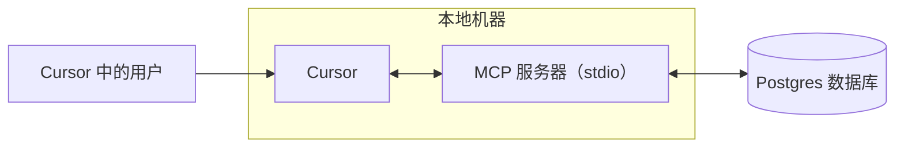
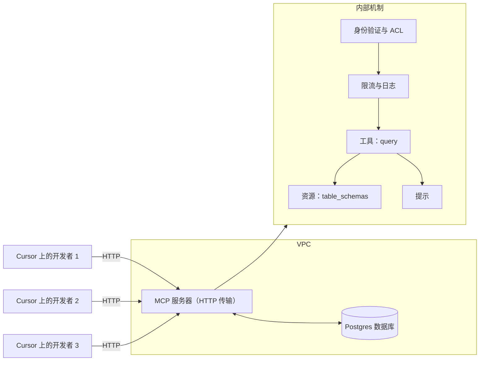
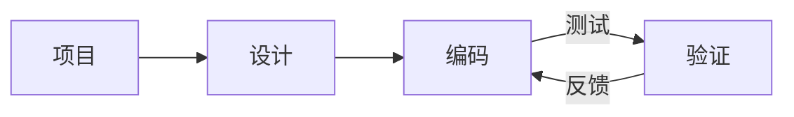
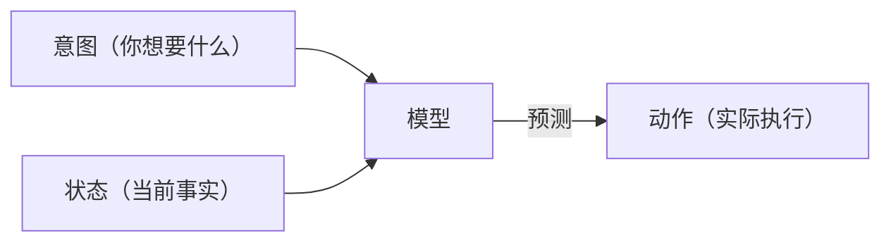

# 构建 MCP 服务器

**Navigation:** [← Previous](./43-github-actions.md) | [Index](./index.md) | [Next →](./45-mcp-服务器.md)

---

# 构建 MCP 服务器
Source: https://docs.cursor.com/zh/guides/tutorials/building-mcp-server

了解如何为 Cursor 构建集成 PostgreSQL 的 Model Context Protocol（MCP）服务器

<div id="introduction">
  ## 介绍
</div>

MCP 服务器可以让你接入自定义数据源，并在 Cursor 内直接使用它们。当你需要来自浏览器、数据库，或错误与系统日志等来源的上下文时，这尤其有用。设置 MCP 服务器很简单，配合 Cursor 可以快速完成。

在本指南中，我们会带你一步步构建一个面向 Postgres 的 MCP 服务器。我们的目标是让 Cursor 能直接对 Postgres 数据库运行 SQL 查询，并以结构化方式公开表的 schema。

<Note>
  本教程旨在讲解构建 MCP 服务器的核心基础。
</Note>

<video autoPlay loop muted playsInline controls>
  <source src="https://mintcdn.com/cursor/Qpa6MBK62Try_xlf/images/guides/tutorials/building-mcp-server/demo.mp4?fit=max&auto=format&n=Qpa6MBK62Try_xlf&q=85&s=8e02b011bd0956d62135db5779f7ead5" type="video/mp4" data-path="images/guides/tutorials/building-mcp-server/demo.mp4" />
</video>



<div id="what-is-an-mcp-server">
  ## 什么是 MCP 服务器？
</div>

[MCP server](/zh/context/mcp) 是一个与 Cursor 通信并提供外部数据或操作访问的进程。实现方式有很多，不过这里我们会用最简单的办法：在你电脑本地通过 [stdio](https://en.wikipedia.org/wiki/Standard_streams)（标准输入/输出流）运行的服务器。这样可以避免复杂的安全问题，让我们把精力放在 MCP 的核心逻辑上。

MCP 最常见的用例之一是访问数据库。构建仪表盘、跑分析或做迁移时，通常需要查询并检查数据库。我们的 Postgres MCP 服务器会支持两项核心能力：执行任意查询和列出表的模式（schema）。

虽然这两件事用纯 SQL 也能做，但 MCP 提供的功能让它们更强大、更通用。工具（tools）提供了一种暴露执行查询等操作的方式，而资源（resources）让我们能共享标准化的上下文，比如模式信息。后面我们还会看看提示（prompts），它们能解锁更高级的工作流。

在底层，我们会依赖 postgres npm 包来对数据库执行 SQL 语句。MCP SDK 会作为这些调用的封装层，让我们把 Postgres 的功能无缝集成进 Cursor。

<div id="how-to-build-the-mcp-server">
  ## 如何构建 MCP 服务器
</div>

构建服务器的第一步是新建一个项目。我们先创建一个新文件夹，并初始化一个 Bun 项目

```bash  theme={null}
> mkdir postgres-mcp-server
> Bun init
```

从这里开始，我们选择 `Blank` 项目。样板搭好后，需要安装必要的依赖。`zod` 用于在 MCP SDK 中为输入/输出定义模式（schema）

```bash  theme={null}
bun add postgres @modelcontextprotocol/sdk zod
```

接下来，我们会前往每个库的仓库，获取各自 README 文件的原始内容链接。构建服务器时，我们会把这些作为上下文使用

* `postgres`
  * Repo:  [https://github.com/porsager/postgres](https://github.com/porsager/postgres),
  * README: [https://raw.githubusercontent.com/porsager/postgres/refs/heads/master/README.md](https://raw.githubusercontent.com/porsager/postgres/refs/heads/master/README.md)
* `@modelcontextprotocol/sdk`:
  * Repo: [https://github.com/modelcontextprotocol/typescript-sdk](https://github.com/modelcontextprotocol/typescript-sdk)
  * README: [https://raw.githubusercontent.com/modelcontextprotocol/typescript-sdk/refs/heads/main/README.md](https://raw.githubusercontent.com/modelcontextprotocol/typescript-sdk/refs/heads/main/README.md)

现在，我们来定义服务器的预期行为。为此，我们会创建一个 `spec.md` 文件，并写出总体目标

```markdown  theme={null}

# 规范

- 允许通过 MCP 环境配置设置 DATABASE_URL
- 通过工具查询 Postgres 数据
  - 默认只读
  - 将环境变量 `DANGEROUSLY_ALLOW_WRITE_OPS=true|1` 设置为启用写操作
- 将数据表作为 `resources` 访问
- 使用 Zod 定义模式（schema）
```

如你所见，这份规范相当轻量。可以按需补充更多细节。配合 README 中的链接，我们会构建最终的提示词。

```markdown  theme={null}
阅读以下内容，并按照 @spec.md 了解我们的目标。所有必要的依赖已安装
- @https://raw.githubusercontent.com/modelcontextprotocol/typescript-sdk/refs/heads/main/README.md
- @https://raw.githubusercontent.com/porsager/postgres/refs/heads/master/README.md
```

在这三个组件都到位之后（规范、MCP SDK 文档和 Postgres 库文档），我们就可以用 Cursor 来脚手架出服务器实现。Cursor 会帮我们把这些部分串起来，生成将 MCP SDK 与 Postgres 接入的代码。

经过几轮来回提示后，我们已经有了 MCP 服务器的第一个版本。想试用的话，可以用 [MCP Inspector](https://modelcontextprotocol.io/legacy/tools/inspector)

```bash  theme={null}
npx @modelcontextprotocol/inspector bun run index.ts
```

<div id="testing-the-mcp-server">
  ## 测试 MCP 服务器
</div>

完成初始实现后，可以使用 MCP Inspector 进行测试。Inspector 提供了查看服务器对外暴露内容的方式，并可用来核验工具和资源是否按预期工作。需要确认查询能够执行，且架构信息能正确返回。


当一切正常时，把服务器连接到 Cursor 本身，在真实环境中进行测试。此时，Cursor 将能够像使用内置功能一样使用 Postgres MCP 服务器，让我们可以直接查询并检视数据库。

<video autoPlay loop muted playsInline controls>
  <source src="https://mintcdn.com/cursor/Qpa6MBK62Try_xlf/images/guides/tutorials/building-mcp-server/mcp-mermaid.mp4?fit=max&auto=format&n=Qpa6MBK62Try_xlf&q=85&s=06fe972734d9f15bc64032f28c4e3e52" type="video/mp4" data-path="images/guides/tutorials/building-mcp-server/mcp-mermaid.mp4" />
</video>

<div id="next-steps">
  ## 下一步
</div>

在本地通过 stdio 运行 MCP 服务器是个很好的起点，但团队通常需要通过 MCP 服务器共享访问同一个数据库。在这种情况下，就有必要将 MCP 服务器部署为集中式 HTTP 服务。

已部署的 MCP 服务器相比单个 stdio 实例具有多项优势：

* **共享数据库访问：** 多个团队成员可以通过 Cursor 查询同一个数据库实例
* **集中式配置：** 架构更新和权限变更可在单一位置统一管理
* **更强的安全性：** 可实现完善的身份验证、限流和访问控制
* **可观测性：** 团队范围内的使用模式和性能指标可被监控

要实现这一点，需要将传输方式从 stdio 切换为 HTTP。

我们不会覆盖完整的部署流程，但下面有一个不错的起始提示，可以交给 Cursor

```
在现有 MCP 服务器的基础上，新增一个实现 HTTP 协议的文件。

将通用逻辑抽取到 mcp-core，并按传输方式为各实现命名（mcp-server-stdio、mcp-server-http）。

@https://raw.githubusercontent.com/modelcontextprotocol/typescript-sdk/refs/heads/main/README.md 
```

最终结果可在此查看：[pg-mcp-server](https://github.com/ericzakariasson/pg-mcp-server)




# Web 开发
Source: https://docs.cursor.com/zh/guides/tutorials/web-development

如何为 Web 开发配置 Cursor

export const McpInstallButtonPrimary = ({server, showIcon = true, prompt = null}) => {
  const [showModal, setShowModal] = useState(false);
  const generateDeepLink = () => {
    if (!server || !server.name || !server.install) {
      return null;
    }
    try {
      if (typeof server.install === 'string') {
        return server.install;
      }
      if (server.install.url) {
        const config = {
          ...server.install
        };
        const jsonString = JSON.stringify(config);
        const utf8Bytes = new TextEncoder().encode(jsonString);
        const base64Config = btoa(Array.from(utf8Bytes).map(b => String.fromCharCode(b)).join(''));
        const safeBase64Config = base64Config.replace(/\+/g, '%2B');
        return `cursor://anysphere.cursor-deeplink/mcp/install?name=${encodeURIComponent(server.name)}&config=${encodeURIComponent(safeBase64Config)}`;
      }
      if (server.install.command) {
        let config = {
          command: server.install.command,
          ...server.install.args && ({
            args: server.install.args
          }),
          ...server.install.env && ({
            env: server.install.env
          })
        };
        if (config.command && config.args) {
          const argsString = config.args.join(" ");
          config.command = `${config.command} ${argsString}`;
          delete config.args;
        }
        const jsonString = JSON.stringify(config);
        const utf8Bytes = new TextEncoder().encode(jsonString);
        const base64Config = btoa(Array.from(utf8Bytes).map(b => String.fromCharCode(b)).join(''));
        const safeBase64Config = base64Config.replace(/\+/g, '%2B');
        return `cursor://anysphere.cursor-deeplink/mcp/install?name=${encodeURIComponent(server.name)}&config=${encodeURIComponent(safeBase64Config)}`;
      }
      return null;
    } catch (e) {
      console.error("Error generating deep link:", e);
      return null;
    }
  };
  const handleButtonClick = () => {
    setShowModal(true);
  };
  const handleClose = () => {
    setShowModal(false);
  };
  const deepLink = generateDeepLink();
  const isDocumentationOnly = typeof server?.install === 'string';
  const hasConfirmation = prompt || isDocumentationOnly;
  const InstallModal = ({isOpen, onClose, deepLink, server, children}) => {
    useEffect(() => {
      const handleKeyDown = event => {
        if (event.key === 'Escape') {
          onClose();
        }
      };
      if (isOpen) {
        document.addEventListener('keydown', handleKeyDown);
      }
      return () => {
        document.removeEventListener('keydown', handleKeyDown);
      };
    }, [isOpen, onClose]);
    if (!isOpen) return null;
    return <div className="fixed inset-0 bg-black bg-opacity-50 flex items-center justify-center z-50 transition-opacity duration-200" onClick={onClose}>
        <div className="bg-white dark:bg-neutral-900 rounded-lg p-6 max-w-md w-full mx-4 border border-neutral-200 dark:border-neutral-700 transition-all duration-200 transform" onClick={e => e.stopPropagation()}>
          <div className="mb-4">
            <h3 className="text-lg font-semibold text-black dark:text-white mb-2">
              Install {server?.name}
            </h3>
            <div className="text-neutral-600 dark:text-neutral-400">
              {children}
            </div>
          </div>
          <div className="flex gap-3 justify-end">
            <button onClick={onClose} className="px-4 py-2 text-sm font-medium rounded-lg transition-colors duration-200 text-neutral-600 dark:text-neutral-400 hover:text-black dark:hover:text-white border border-neutral-200 dark:border-neutral-700 hover:bg-neutral-100 dark:hover:bg-neutral-800">
              Cancel
            </button>
            <a href={deepLink} onClick={onClose} target="_blank" className="px-4 py-2 text-sm font-medium rounded-lg transition-colors duration-200 bg-black text-white hover:bg-neutral-800 dark:bg-white dark:text-black dark:hover:bg-neutral-200 inline-flex items-center justify-center no-underline">
              Continue
            </a>
          </div>
        </div>
      </div>;
  };
  return <>
      {hasConfirmation ? <button onClick={handleButtonClick} className="inline-flex justify-center items-center gap-2 px-4 py-2 text-sm font-medium rounded-lg transition-colors duration-200 not-prose text-white bg-black hover:bg-neutral-800 dark:bg-white dark:text-black dark:hover:bg-neutral-200 border border-black dark:border-white">
          {showIcon && <Icon icon="plus" size={16} color="currentColor" />}
          Add to Cursor
        </button> : <a href={deepLink} className="inline-flex justify-center items-center gap-2 px-4 py-2 text-sm font-medium rounded-lg transition-colors duration-200 not-prose text-white bg-black hover:bg-neutral-800 dark:bg-white dark:text-black dark:hover:bg-neutral-200 border border-black dark:border-white">
          {showIcon && <Icon icon="plus" size={16} color="currentColor" />}
          Add to Cursor
        </a>}

      {hasConfirmation && <InstallModal isOpen={showModal} onClose={handleClose} deepLink={deepLink} server={server}>
          {prompt}
        </InstallModal>}
    </>;
};

Web 开发需要在 Cursor 与 Figma 或浏览器等外部工具之间实现快速迭代和紧密的反馈循环。我们在 Cursor 总结出了一些能进一步缩短这个循环的工作流。明确划定任务范围、复用组件、充分利用设计系统，都有助于提升速度并保持一致性。

本指南将介绍如何配置 Cursor 以支持 Web 开发，并进一步缩短反馈循环。



<div id="start-orchestrating-in-cursor">
  # 在 Cursor 中开始编排
</div>

**Chat** 非常适合启动改动。等主要部分到位后，切换到 **Inline Edit** 和 **Tab** 能帮你保持心流。

设置好 Cursor 之后，你就能在不同工具间编排工作流。下面是一个示例，展示了可实现的效果：把 Linear、Figma 和浏览器工具结合起来做的一个贪吃蛇游戏。虽然真实项目通常更复杂，但这个示例体现了这些集成工作流的潜力。

<Frame>
  <video src="https://mintcdn.com/cursor/E7JVsKUF5L-IiJRB/images/guides/tutorials/web-development/snake.mp4?fit=max&auto=format&n=E7JVsKUF5L-IiJRB&q=85&s=e029fbdff2ec06e1e4393ac580824b5a" controls data-path="images/guides/tutorials/web-development/snake.mp4" />
</Frame>

<div id="connect-to-your-project-management-tools">
  # 连接你的项目管理工具
</div>

你可以用多种方式把 Cursor 集成进现有的项目管理软件。这个指南会讲怎么通过它们的 MCP 服务器集成 Linear。

<div id="installation">
  ### 安装
</div>

<McpInstallButtonPrimary
  server={{
name: "Linear",
install: {
command: "npx",
args: ["-y", "mcp-remote", "https://mcp.linear.app/sse"],
},
}}
/>

或者手动把 Linear 的 MCP 服务器加到 `mcp.json` 里：

```jsx  theme={null}
{
  "mcpServers": {
    "Linear": {
      "command": "npx",
      "args": [
        "-y",
        "mcp-remote",
        "https://mcp.linear.app/sse"
      ]
    }
  }
}
```

然后：

1. 确保在 MCP 设置里启用 Linear
2. 浏览器会打开，并提示你使用 Linear 进行授权
   <Info>
     由于 MCP 的当前状态，设置可能需要多次重试。
     如果集成不可用，试着在 Cursor 设置中“Reload”服务器。
   </Info>

<div id="using-linear-in-cursor">
  ### 在 Cursor 中使用 Linear
</div>

Linear 的 MCP 服务器会提供多种工具，Cursor 可以用它们来读取和管理问题（issues）。前往 MCP 设置并找到 Linear 服务器即可查看所有工具列表。要验证的话，在 Chat 里试试这个提示：

```jsx  theme={null}
列出与此项目相关的所有 issue
```

<Frame>
  
</Frame>

如果集成配置正确，它会返回一个工单列表。

<div id="bring-in-your-figma-designs">
  # 导入你的 Figma 设计
</div>

设计稿和原型是 Web 开发的核心。通过使用 Figma 的官方 MCP 服务器，你可以在 Cursor 中直接访问并处理设计文件。开始使用前，请按照 [Figma Dev Mode MCP Server](https://help.figma.com/hc/en-us/articles/32132100833559-Guide-to-the-Dev-Mode-MCP-Server) 的设置指南进行配置。

<div id="installation">
  ### 安装
</div>

点击下面的按钮即可安装 MCP 服务器。

<McpInstallButtonPrimary
  server={{
name: "Figma",
install: {
url: "http://127.0.0.1:3845/sse",
},
}}
/>

或者将其手动添加到你的 `mcp.json`：

```jsx  theme={null}
{
  "mcpServers": {
    "Figma": {
      "url": "http://127.0.0.1:3845/sse"
    }
  }
}
```

<div id="usage">
  ### 使用方法
</div>

服务器提供了多种可在提示词中调用的工具。比如，试着让它获取 Figma 中当前选中内容的设计。更多信息参见[文档](https://help.figma.com/hc/en-us/articles/32132100833559-Guide-to-the-Dev-Mode-MCP-Server)。

<Frame>
  
</Frame>

<div id="keep-your-code-scaffolding-consistent">
  # 保持代码脚手架一致
</div>

你可能已经有现成的代码、设计系统或既定规范想要复用。与模型协作时，参考代码库中已存在的模式会很有帮助，比如下拉菜单或其他常见组件。

我们自己在一个大型 Web 端代码库中工作时发现，声明式代码效果尤其好，特别是在 React 和 JSX 中。

如果你有设计系统，可以通过提供相应规则来帮助 agent 发现并遵循它。下面是一个 `ui-components.mdc` 文件，我们尝试在可行时强制复用组件：

```mdc components.mdc theme={null}
---
description: 实现设计并构建 UI
---
- 复用 `/src/components/ui` 中的现有 UI 组件；这些是我们可用的基础构件
- 如果没有能解决问题的现有组件，就通过组合这些 UI 组件来创建新组件
- 当缺少组件或设计时，询问人类希望如何推进
```

随着你的组件库不断扩大，按需添加新规则。规则过多时，考虑按更具体的类别拆分，例如「仅在处理用户输入时生效」。

<Frame>
  
</Frame>

<div id="give-cursor-access-to-browser">
  # 让 Cursor 访问浏览器
</div>

为了扩展 Cursor 的能力，可以设置 Browser Tools 的 MCP 服务器，它能访问控制台日志和网络请求。完成配置后，可以通过监控控制台输出和网络活动来验证更改。这样能确保实现与你的意图一致。按照这里的说明设置 MCP 服务器：[https://browsertools.agentdesk.ai/installation](https://browsertools.agentdesk.ai/installation)

<Frame>
  
</Frame>

<Note>
  我们正努力把这项功能原生集成到 Cursor，让集成更简单。
</Note>

<div id="takeaways">
  # 关键要点
</div>

* 紧凑的反馈回路对 Web 开发至关重要。把 Cursor 和 Figma、Linear、浏览器等工具搭配使用，行动更快、思路更顺。
* MCP 服务器能把外部系统直接接入 Cursor，减少上下文切换，提升任务执行效率。
* 复用组件和设计系统有助于模型产出更整洁、更一致的代码和结果。
* 明确且范围清晰的任务能带来更好的效果。要有意识地设计你的提示和诉求。
* 如果输出不理想，可以尝试调整：
  * **Instructions：** 使用规则、提示，并通过（例如 MCP 服务器）提供更多上下文。
  * **Systems：** 良好的模式、抽象和清晰度能让模型更易理解、更好协助，并更自主地工作。
* 通过纳入运行时信息（如控制台日志、网络请求、UI 元素数据）可以扩展模型的上下文。
* 并非一切都需要自动化。如果系统变得过于复杂，就回到用 Tab 和 Inline Edit 做更精细的手动编辑。
* 当把 Cursor 当作副驾驶而不是自动驾驶时，它的力量最大。用它来增强，而不是取代，你自己的决策。


# 使用上下文
Source: https://docs.cursor.com/zh/guides/working-with-context

如何在 Cursor 中使用上下文

先说，上下文窗口到底是什么？它和在 Cursor 里高效写代码有什么关系？

从更宏观的角度看，大型语言模型（LLM）是一种通过从海量数据中学习模式来预测并生成文本的人工智能模型。它支撑了像 Cursor 这样的工具：理解你的输入，并基于过往见过的内容给出代码或文本建议。

Token 是这些模型的输入和输出单位。它们是文本的片段，通常是词的一部分，LLM 会逐个处理。模型不会一次读完整个句子，而是根据已经出现的 token 预测下一个 token。

想看看一段文本如何被切分成 token，可以用 tokenizer，比如[这个](https://tiktokenizer.vercel.app/)。


<div id="what-is-context">
  # 什么是 context？
</div>

在 Cursor 里生成代码建议时，“context”指的是提供给模型的信息（以“输入 token”的形式），模型再用这些信息去预测后续内容（以“输出 token”的形式）。

context 有两种类型：

1. **Intent context** 用来定义用户想让模型达成的目标。比如，system prompt 通常作为高层级指令，规定模型应该如何行为。在 Cursor 里，大多数“prompting”都属于 intent context。“把那个按钮从蓝色改成绿色”就是一个明确的意图示例；它是规定性的。
2. **State context** 用来描述当前的状态。把错误信息、控制台日志、图片以及代码片段提供给 Cursor，都是与状态相关的 context 示例。它是描述性的，而非规定性的。

这两种 context 协同作用：既描述当前状态，也明确期望的未来状态，帮助 Cursor 给出更有用的编码建议。



<div id="providing-context-in-cursor">
  # 在 Cursor 中提供上下文
</div>

提供给模型的相关上下文越多，它就越有用。如果在 Cursor 中提供的上下文不足，模型会在缺少关键信息的情况下尝试解决问题，通常会导致：

1. 幻觉：在不存在规律时盲目进行模式匹配，从而产生意外结果。对于像 `claude-3.5-sonnet` 这样的模型，如果缺少足够的上下文，这种情况会更常见。
2. Agent 会尝试自行收集上下文，比如搜索代码库、读取文件、调用工具。一个推理能力强的模型（例如 `claude-3.7-sonnet`）在这种策略下也能走得很远，而是否提供了正确的初始上下文将决定其后续走向。

好消息是，Cursor 以上下文感知为核心构建，旨在尽量减少用户干预。Cursor 会自动拉取模型判断为相关的代码库部分，比如当前文件、其他文件中语义相似的片段，以及你本次会话中的其他信息。

不过，可用的上下文来源很多，因此手动指定你确定与任务相关的上下文，是把模型引导到正确方向的有效方式。

<div id="symbol">
  ## @-symbol
</div>

提供明确上下文最简单的方式就是用 @-symbol。当你清楚要包含哪一个文件、文件夹、网站或其他上下文时，这招特别好用。越具体越好。下面是更「精准投喂」上下文的方法拆解：

| Symbol    | Example              | Use case                     | Drawback                |
| --------- | -------------------- | ---------------------------- | ----------------------- |
| `@code`   | `@LRUCachedFunction` | 你知道哪个函数、常量或符号和你要生成的输出最相关     | 需要对代码库有很深的了解            |
| `@file`   | `cache.ts`           | 你知道应该读取或编辑哪个文件，但不确定在文件中的具体位置 | 可能会根据文件大小为当前任务引入大量无关上下文 |
| `@folder` | `utils/`             | 该文件夹中的全部或大部分文件都相关            | 可能会为当前任务引入大量无关上下文       |


<div id="rules">
  ## 规则
</div>

可以把规则当作你希望自己或团队成员长期可用的“长期记忆”。把领域相关的上下文（包括工作流、格式规范和其他约定）沉淀成规则，是很好的起点。

也可以使用 `/Generate Cursor Rules` 从现有对话生成规则。如果有一段往返很多、提示很密集的长对话，里面很可能有以后想复用的有用指令或通用规则。


<div id="mcp">
  ## MCP
</div>

[Model Context Protocol](https://modelcontextprotocol.io/introduction) 是一层可扩展能力，让 Cursor 能执行操作并引入外部上下文。

根据你的开发环境，你可能会希望接入不同类型的服务器，但我们发现特别有用的两类是：

* 内部文档：如 Notion、Confluence、Google Docs
* 项目管理：如 Linear、Jira

如果你已经有通过 API 访问上下文并执行操作的工具，可以为它构建一个 MCP 服务器。这里有一份简短指南，介绍如何构建 [MCP 服务器](https://modelcontextprotocol.io/tutorials/building-mcp-with-llms)。


<div id="self-gathering-context">
  ## 自主收集上下文
</div>

许多用户采用的一个强大模式，是让 Agent 编写一次性的小工具，然后运行它们以收集更多上下文。在人类参与的工作流中，这种方式尤其有效，因为你会在代码执行前进行审查。

例如，向代码中添加调试语句、运行代码，并让模型检查输出，这能让它获取到无法通过静态分析推断的动态上下文。

在 Python 中，你可以通过提示 Agent 来：

1. 在代码的相关位置添加 print("debugging: ...") 语句
2. 使用终端运行代码或测试

Agent 会读取终端输出并决定下一步的操作。核心思想是让 Agent 接触到真实的运行时行为，而不仅仅是静态代码。


<div id="takeaways">
  # 关键要点
</div>

* 上下文是高效 AI 编码的基础，由意图（想做什么）和状态（现有内容）构成，同时提供两者能帮助 Cursor 做出更准确的预测。
* 使用带 @ 的精确上下文（@code、@file、@folder）来有的放矢地引导 Cursor，而不是只依赖自动上下文收集。
* 将可复用的知识沉淀为规则，便于团队范围内复用，并通过 Model Context Protocol 扩展 Cursor 的能力以连接外部系统。
* 上下文不足会导致幻觉或低效，过多无关上下文会稀释信号；把握合适的平衡以获得最佳效果。


# 内联编辑
Source: https://docs.cursor.com/zh/inline-edit/overview

在 Cursor 中使用内联编辑（Cmd/Ctrl+K）进行编辑和提问

export const Kbd = ({children, tooltip, os}) => {
  const keysInput = typeof children === 'string' && children.trim() !== '' ? children : null;
  if (!keysInput) {
    return null;
  }
  const isModifier = key => {
    const modifiers = ['⌘', '⇧', '⌥', '⌃', '⏎', '⌫', '⌦', '⎋', '⇥', '⌁', '←', '→', '↑', '↓', 'Ctrl', 'Shift', 'Alt', 'Cmd', 'Opt', 'Return', 'Backspace', 'Delete', 'Escape', 'Tab', 'Space', 'Enter', 'Esc', 'ArrowLeft', 'ArrowRight', 'ArrowUp', 'ArrowDown', 'Left', 'Right', 'Up', 'Down'];
    return modifiers.includes(key.trim());
  };
  const capitalizeFirstLetter = string => {
    return string.charAt(0).toUpperCase() + string.slice(1);
  };
  const isMac = os ? os.toLowerCase() === 'mac' || os.toLowerCase() === 'macos' : typeof navigator !== 'undefined' && (navigator.platform.toUpperCase().indexOf('MAC') >= 0 || navigator.userAgent.toUpperCase().indexOf('MAC') >= 0);
  const convertToSymbols = shortcut => {
    if (isMac) {
      return shortcut.replace(/⌘|Cmd|CMD/gi, '⌘').replace(/⌥|Opt|OPT/gi, '⌥').replace(/⌃|Ctrl/gi, '⌃').replace(/⇧|Shift/gi, '⇧').replace(/⏎|Return/gi, '⏎').replace(/⌫|Backspace/gi, '⌫').replace(/⌦|Delete/gi, '⌦').replace(/␛|Escape/gi, '␛').replace(/⇥|Tab/gi, '⇥').replace(/⌁|Space/gi, '⌁').replace(/←|Arrow\s*Left|ArrowLeft|Left/gi, '←').replace(/→|Arrow\s*Right|ArrowRight|Right/gi, '→').replace(/↑|Arrow\s*Up|ArrowUp|Up/gi, '↑').replace(/↓|Arrow\s*Down|ArrowDown|Down/gi, '↓');
    } else {
      const converted = shortcut.replace(/⌘|Cmd|CMD/gi, 'Ctrl').replace(/⌥|Opt|OPT/gi, 'Alt').replace(/⌃|Ctrl/gi, 'Ctrl').replace(/⇧|Shift/gi, 'Shift').replace(/⏎|Return/gi, 'Enter').replace(/⌫|Backspace/gi, 'Backspace').replace(/⌦|Delete/gi, 'Delete').replace(/⎋|Escape/gi, 'Esc').replace(/⇥|Tab/gi, 'Tab').replace(/⌁|Space/gi, 'Space').replace(/←|Arrow\s*Left|ArrowLeft|Left/gi, 'Arrow-Left').replace(/→|Arrow\s*Right|ArrowRight|Right/gi, 'Arrow-Right').replace(/↑|Arrow\s*Up|ArrowUp|Up/gi, 'Arrow-Up').replace(/↓|Arrow\s*Down|ArrowDown|Down/gi, 'Arrow-Down');
      const keyList = converted.split(/[\+\s]+/).filter(key => key.trim());
      return keyList.join('+');
    }
  };
  const convertToReadableText = shortcut => {
    const converted = shortcut.replace(/⌘|Cmd|CMD/gi, 'Cmd').replace(/⌥|Opt|OPT/gi, 'Opt').replace(/⌃|Ctrl/gi, 'Ctrl').replace(/⇧|Shift/gi, 'Shift').replace(/⏎|Return/gi, 'Return').replace(/⌫|Backspace/gi, 'Backspace').replace(/⌦|Delete/gi, 'Delete').replace(/⎋|Escape/gi, 'Escape').replace(/⇥|Tab/gi, 'Tab').replace(/⌁|Space/gi, 'Space').replace(/←|Arrow\s*Left|ArrowLeft|Left/gi, 'Arrow-Left').replace(/→|Arrow\s*Right|ArrowRight|Right/gi, 'Arrow-Right').replace(/↑|Arrow\s*Up|ArrowUp|Up/gi, 'Arrow-Up').replace(/↓|Arrow\s*Down|ArrowDown|Down/gi, 'Arrow-Down');
    const keyList = converted.split(/[\+\s]+/).filter(key => key.trim());
    return keyList.map(key => {
      const trimmedKey = key.trim();
      return isModifier(trimmedKey) ? trimmedKey : capitalizeFirstLetter(trimmedKey);
    }).join('+');
  };
  const displayShortcut = convertToSymbols(keysInput);
  const tooltipText = isMac ? tooltip ? `${convertToReadableText(keysInput)}: ${tooltip}` : convertToReadableText(keysInput) : tooltip || null;
  const processedKeys = isMac ? displayShortcut.split(/[\+\s]+/).filter(key => key.trim()).map(key => {
    const trimmedKey = key.trim();
    return isModifier(trimmedKey) ? trimmedKey : capitalizeFirstLetter(trimmedKey);
  }).join('') : displayShortcut.split('+').map(key => {
    const trimmedKey = key.trim();
    return isModifier(trimmedKey) ? trimmedKey : capitalizeFirstLetter(trimmedKey);
  }).join('+');
  return tooltipText ? <Tooltip tip={tooltipText}>
      <kbd>
        {processedKeys}
      </kbd>
    </Tooltip> : <kbd>
      {processedKeys}
    </kbd>;
};

Inline Edit 让你在编辑器中直接按下 <Kbd>Cmd+K</Kbd> 来编辑代码或提问。它会打开一个输入框，将你选中的代码和指令一起打包成请求。

<Frame>
  
</Frame>

<div id="modes">
  ## 模式
</div>

<div id="edit-selection">
  ### 编辑所选内容
</div>

选中代码后，按 <Kbd>Cmd+K</Kbd> 会根据你的指令编辑这段代码。

<Frame>
  
</Frame>

未选中时，Cursor 会在你的光标处生成新代码。AI 会自动引用相关的上下文代码。比如，在函数名上触发会包含整个函数。

<div id="quick-question">
  ### 快速提问
</div>

在内联编辑器中按 <Kbd>Opt+Return</Kbd>，即可就所选代码提问。

拿到回答后，输入 "do it" 或类似指令即可把建议落实为代码。这样可以在实现前先探索想法。

<Frame>
  
</Frame>

<div id="full-file-edits">
  ### 全文件编辑
</div>

对整个文件进行修改时，使用 <Kbd>Cmd+Shift+Return</Kbd>。此模式支持全面更改，同时保持可控。

<Frame>
  
</Frame>

<div id="send-to-chat">
  ### 发送到 Chat
</div>

针对多文件编辑或高级功能，使用 <Kbd>Cmd+L</Kbd> 将所选代码发送到 [Chat](/zh/agent/modes#agent)。这将提供多文件编辑、详细讲解，以及更强大的 AI 能力。

<Frame>
  <video src="https://mintcdn.com/cursor/E7JVsKUF5L-IiJRB/images/inline-edit/send-to-chat.mp4?fit=max&auto=format&n=E7JVsKUF5L-IiJRB&q=85&s=04a84c73c8736a733f1748fd86ac437f" autoPlay loop muted playsInline controls data-path="images/inline-edit/send-to-chat.mp4" />
</Frame>

<div id="follow-up-instructions">
  ## 后续指令
</div>

每次编辑后，补充指令并按下 <Kbd>Return</Kbd> 来进一步优化结果。AI 会根据你的反馈更新修改。

<div id="default-context">
  ## 默认上下文
</div>

Inline Edit 会包含默认上下文，用于在你添加的任何 [@ symbols](/zh/context/@-symbols/@-files) 之外进一步提升代码生成质量。

这些上下文包括相关文件、最近查看过的代码以及其他相关信息。Cursor 会优先选取最相关的上下文，以获得更好的结果。


# Terminal
Source: https://docs.cursor.com/zh/inline-edit/terminal

用 Cmd/Ctrl+K 生成终端命令

export const Kbd = ({children, tooltip, os}) => {
  const keysInput = typeof children === 'string' && children.trim() !== '' ? children : null;
  if (!keysInput) {
    return null;
  }
  const isModifier = key => {
    const modifiers = ['⌘', '⇧', '⌥', '⌃', '⏎', '⌫', '⌦', '⎋', '⇥', '⌁', '←', '→', '↑', '↓', 'Ctrl', 'Shift', 'Alt', 'Cmd', 'Opt', 'Return', 'Backspace', 'Delete', 'Escape', 'Tab', 'Space', 'Enter', 'Esc', 'ArrowLeft', 'ArrowRight', 'ArrowUp', 'ArrowDown', 'Left', 'Right', 'Up', 'Down'];
    return modifiers.includes(key.trim());
  };
  const capitalizeFirstLetter = string => {
    return string.charAt(0).toUpperCase() + string.slice(1);
  };
  const isMac = os ? os.toLowerCase() === 'mac' || os.toLowerCase() === 'macos' : typeof navigator !== 'undefined' && (navigator.platform.toUpperCase().indexOf('MAC') >= 0 || navigator.userAgent.toUpperCase().indexOf('MAC') >= 0);
  const convertToSymbols = shortcut => {
    if (isMac) {
      return shortcut.replace(/⌘|Cmd|CMD/gi, '⌘').replace(/⌥|Opt|OPT/gi, '⌥').replace(/⌃|Ctrl/gi, '⌃').replace(/⇧|Shift/gi, '⇧').replace(/⏎|Return/gi, '⏎').replace(/⌫|Backspace/gi, '⌫').replace(/⌦|Delete/gi, '⌦').replace(/␛|Escape/gi, '␛').replace(/⇥|Tab/gi, '⇥').replace(/⌁|Space/gi, '⌁').replace(/←|Arrow\s*Left|ArrowLeft|Left/gi, '←').replace(/→|Arrow\s*Right|ArrowRight|Right/gi, '→').replace(/↑|Arrow\s*Up|ArrowUp|Up/gi, '↑').replace(/↓|Arrow\s*Down|ArrowDown|Down/gi, '↓');
    } else {
      const converted = shortcut.replace(/⌘|Cmd|CMD/gi, 'Ctrl').replace(/⌥|Opt|OPT/gi, 'Alt').replace(/⌃|Ctrl/gi, 'Ctrl').replace(/⇧|Shift/gi, 'Shift').replace(/⏎|Return/gi, 'Enter').replace(/⌫|Backspace/gi, 'Backspace').replace(/⌦|Delete/gi, 'Delete').replace(/⎋|Escape/gi, 'Esc').replace(/⇥|Tab/gi, 'Tab').replace(/⌁|Space/gi, 'Space').replace(/←|Arrow\s*Left|ArrowLeft|Left/gi, 'Arrow-Left').replace(/→|Arrow\s*Right|ArrowRight|Right/gi, 'Arrow-Right').replace(/↑|Arrow\s*Up|ArrowUp|Up/gi, 'Arrow-Up').replace(/↓|Arrow\s*Down|ArrowDown|Down/gi, 'Arrow-Down');
      const keyList = converted.split(/[\+\s]+/).filter(key => key.trim());
      return keyList.join('+');
    }
  };
  const convertToReadableText = shortcut => {
    const converted = shortcut.replace(/⌘|Cmd|CMD/gi, 'Cmd').replace(/⌥|Opt|OPT/gi, 'Opt').replace(/⌃|Ctrl/gi, 'Ctrl').replace(/⇧|Shift/gi, 'Shift').replace(/⏎|Return/gi, 'Return').replace(/⌫|Backspace/gi, 'Backspace').replace(/⌦|Delete/gi, 'Delete').replace(/⎋|Escape/gi, 'Escape').replace(/⇥|Tab/gi, 'Tab').replace(/⌁|Space/gi, 'Space').replace(/←|Arrow\s*Left|ArrowLeft|Left/gi, 'Arrow-Left').replace(/→|Arrow\s*Right|ArrowRight|Right/gi, 'Arrow-Right').replace(/↑|Arrow\s*Up|ArrowUp|Up/gi, 'Arrow-Up').replace(/↓|Arrow\s*Down|ArrowDown|Down/gi, 'Arrow-Down');
    const keyList = converted.split(/[\+\s]+/).filter(key => key.trim());
    return keyList.map(key => {
      const trimmedKey = key.trim();
      return isModifier(trimmedKey) ? trimmedKey : capitalizeFirstLetter(trimmedKey);
    }).join('+');
  };
  const displayShortcut = convertToSymbols(keysInput);
  const tooltipText = isMac ? tooltip ? `${convertToReadableText(keysInput)}: ${tooltip}` : convertToReadableText(keysInput) : tooltip || null;
  const processedKeys = isMac ? displayShortcut.split(/[\+\s]+/).filter(key => key.trim()).map(key => {
    const trimmedKey = key.trim();
    return isModifier(trimmedKey) ? trimmedKey : capitalizeFirstLetter(trimmedKey);
  }).join('') : displayShortcut.split('+').map(key => {
    const trimmedKey = key.trim();
    return isModifier(trimmedKey) ? trimmedKey : capitalizeFirstLetter(trimmedKey);
  }).join('+');
  return tooltipText ? <Tooltip tip={tooltipText}>
      <kbd>
        {processedKeys}
      </kbd>
    </Tooltip> : <kbd>
      {processedKeys}
    </kbd>;
};

在 Cursor 终端里，按 <Kbd>Cmd+K</Kbd>，在底部打开提示栏。
描述你想执行的操作，Inline Edit 会为你生成命令。

<Frame>
  
</Frame>

终端中的 Inline Edit 会将你最近的终端历史、指令以及提示内容作为上下文。


# Git
Source: https://docs.cursor.com/zh/integrations/git

AI 驱动的 Git 功能，包括提交信息生成与合并冲突解决

export const Kbd = ({children, tooltip, os}) => {
  const keysInput = typeof children === 'string' && children.trim() !== '' ? children : null;
  if (!keysInput) {
    return null;
  }
  const isModifier = key => {
    const modifiers = ['⌘', '⇧', '⌥', '⌃', '⏎', '⌫', '⌦', '⎋', '⇥', '⌁', '←', '→', '↑', '↓', 'Ctrl', 'Shift', 'Alt', 'Cmd', 'Opt', 'Return', 'Backspace', 'Delete', 'Escape', 'Tab', 'Space', 'Enter', 'Esc', 'ArrowLeft', 'ArrowRight', 'ArrowUp', 'ArrowDown', 'Left', 'Right', 'Up', 'Down'];
    return modifiers.includes(key.trim());
  };
  const capitalizeFirstLetter = string => {
    return string.charAt(0).toUpperCase() + string.slice(1);
  };
  const isMac = os ? os.toLowerCase() === 'mac' || os.toLowerCase() === 'macos' : typeof navigator !== 'undefined' && (navigator.platform.toUpperCase().indexOf('MAC') >= 0 || navigator.userAgent.toUpperCase().indexOf('MAC') >= 0);
  const convertToSymbols = shortcut => {
    if (isMac) {
      return shortcut.replace(/⌘|Cmd|CMD/gi, '⌘').replace(/⌥|Opt|OPT/gi, '⌥').replace(/⌃|Ctrl/gi, '⌃').replace(/⇧|Shift/gi, '⇧').replace(/⏎|Return/gi, '⏎').replace(/⌫|Backspace/gi, '⌫').replace(/⌦|Delete/gi, '⌦').replace(/␛|Escape/gi, '␛').replace(/⇥|Tab/gi, '⇥').replace(/⌁|Space/gi, '⌁').replace(/←|Arrow\s*Left|ArrowLeft|Left/gi, '←').replace(/→|Arrow\s*Right|ArrowRight|Right/gi, '→').replace(/↑|Arrow\s*Up|ArrowUp|Up/gi, '↑').replace(/↓|Arrow\s*Down|ArrowDown|Down/gi, '↓');
    } else {
      const converted = shortcut.replace(/⌘|Cmd|CMD/gi, 'Ctrl').replace(/⌥|Opt|OPT/gi, 'Alt').replace(/⌃|Ctrl/gi, 'Ctrl').replace(/⇧|Shift/gi, 'Shift').replace(/⏎|Return/gi, 'Enter').replace(/⌫|Backspace/gi, 'Backspace').replace(/⌦|Delete/gi, 'Delete').replace(/⎋|Escape/gi, 'Esc').replace(/⇥|Tab/gi, 'Tab').replace(/⌁|Space/gi, 'Space').replace(/←|Arrow\s*Left|ArrowLeft|Left/gi, 'Arrow-Left').replace(/→|Arrow\s*Right|ArrowRight|Right/gi, 'Arrow-Right').replace(/↑|Arrow\s*Up|ArrowUp|Up/gi, 'Arrow-Up').replace(/↓|Arrow\s*Down|ArrowDown|Down/gi, 'Arrow-Down');
      const keyList = converted.split(/[\+\s]+/).filter(key => key.trim());
      return keyList.join('+');
    }
  };
  const convertToReadableText = shortcut => {
    const converted = shortcut.replace(/⌘|Cmd|CMD/gi, 'Cmd').replace(/⌥|Opt|OPT/gi, 'Opt').replace(/⌃|Ctrl/gi, 'Ctrl').replace(/⇧|Shift/gi, 'Shift').replace(/⏎|Return/gi, 'Return').replace(/⌫|Backspace/gi, 'Backspace').replace(/⌦|Delete/gi, 'Delete').replace(/⎋|Escape/gi, 'Escape').replace(/⇥|Tab/gi, 'Tab').replace(/⌁|Space/gi, 'Space').replace(/←|Arrow\s*Left|ArrowLeft|Left/gi, 'Arrow-Left').replace(/→|Arrow\s*Right|ArrowRight|Right/gi, 'Arrow-Right').replace(/↑|Arrow\s*Up|ArrowUp|Up/gi, 'Arrow-Up').replace(/↓|Arrow\s*Down|ArrowDown|Down/gi, 'Arrow-Down');
    const keyList = converted.split(/[\+\s]+/).filter(key => key.trim());
    return keyList.map(key => {
      const trimmedKey = key.trim();
      return isModifier(trimmedKey) ? trimmedKey : capitalizeFirstLetter(trimmedKey);
    }).join('+');
  };
  const displayShortcut = convertToSymbols(keysInput);
  const tooltipText = isMac ? tooltip ? `${convertToReadableText(keysInput)}: ${tooltip}` : convertToReadableText(keysInput) : tooltip || null;
  const processedKeys = isMac ? displayShortcut.split(/[\+\s]+/).filter(key => key.trim()).map(key => {
    const trimmedKey = key.trim();
    return isModifier(trimmedKey) ? trimmedKey : capitalizeFirstLetter(trimmedKey);
  }).join('') : displayShortcut.split('+').map(key => {
    const trimmedKey = key.trim();
    return isModifier(trimmedKey) ? trimmedKey : capitalizeFirstLetter(trimmedKey);
  }).join('+');
  return tooltipText ? <Tooltip tip={tooltipText}>
      <kbd>
        {processedKeys}
      </kbd>
    </Tooltip> : <kbd>
      {processedKeys}
    </kbd>;
};

Cursor 提供 AI 驱动的 Git 功能，帮你简化工作流，包括自动生成提交消息和智能解决合并冲突。

<div id="ai-commit-message">
  ## AI 提交信息
</div>

Cursor 会基于已暂存的更改生成提交信息。

1. 暂存要提交的文件
2. 打开侧边栏中的 Git 选项卡
3. 点击提交信息输入框旁的闪光（✨）图标

生成的信息会参考已暂存的更改和仓库的 Git 历史。如果你使用诸如 [Conventional Commits](https://www.conventionalcommits.org/) 之类的规范，生成的信息会遵循相同的格式。

<div id="add-shortcut">
  ### 添加快捷键
</div>

要绑定键盘快捷键：

1. 前往 Keyboard Shortcuts（<Kbd>Cmd+R Cmd+S</Kbd> 或 <Kbd>Cmd+Shift+P</Kbd>，搜索 “Open Keyboard Shortcuts (JSON)”）
2. 为 <Kbd>Cmd+M</Kbd> 添加以下绑定：
   ```json  theme={null}
   {
     "key": "cmd+m",
     "command": "cursor.generateGitCommitMessage"
   }
   ```
3. 保存

<Info>
  不能自定义提交信息的生成。Cursor 会自动适配你现有的提交风格。
</Info>

<div id="ai-resolve-conflicts">
  ## AI 解决冲突
</div>

遇到合并冲突时，Cursor Agent 会理解冲突的双方并提出解决方案，帮你完成处理。

<div id="how-to-use">
  ### 使用方法
</div>

1. 发生合并冲突后，你会在文件中看到冲突标记
2. 点击合并冲突界面中的 **Resolve in Chat** 按钮
3. Agent 会分析两个版本并给出解决方案
4. 查看并应用建议的更改


# GitHub
Source: https://docs.cursor.com/zh/integrations/github

面向后台代理的官方 Cursor GitHub 应用

[Background Agents](/zh/background-agent) 和 [Bugbot](/zh/bugbot) 需要安装 Cursor GitHub 应用，才能克隆仓库并推送变更。

<div id="installation">
  ## 安装
</div>

1. 前往 [Dashboard 的 Integrations](https://cursor.com/dashboard?tab=integrations)
2. 点击 GitHub 旁的 **Connect**
3. 选择仓库：**All repositories** 或 **Selected repositories**

要断开 GitHub 账户，回到 integrations 仪表盘并点击 **Disconnect Account**。

<div id="using-agent-in-github">
  ## 在 GitHub 中使用 Agent
</div>

GitHub 集成让你可以直接在拉取请求和 issue 中运行后台 agent 工作流。只需在任意 PR 或 issue 里评论 `@cursor [prompt]`，就能触发 agent 读取上下文、应用修复并推送提交。

如果你启用了 [Bugbot](/zh/bugbot)，可以评论 `@cursor fix`，让后台 agent 读取 Bugbot 给出的修复建议并自动处理该 issue。

<div id="permissions">
  ## 权限
</div>

GitHub 应用需要特定权限才能与后台代理配合工作：

<div className="full-width-table">
  | 权限                        | 用途                   |
  | ------------------------- | -------------------- |
  | **Repository access**     | 克隆你的代码并创建工作分支        |
  | **Pull requests**         | 基于代理的更改创建 PR 供你查看与审核 |
  | **Issues**                | 追踪代理发现或修复的缺陷与任务      |
  | **Checks and statuses**   | 汇报代码质量与测试结果          |
  | **Actions and workflows** | 监控 CI/CD 流水线与部署状态    |
</div>

所有权限都遵循最小必要权限原则，仅限于后台代理运行所需。

<div id="ip-allow-list-configuration">
  ## IP 允许列表配置
</div>

如果你们的组织使用 GitHub 的 IP 允许列表来限制对代码仓库的访问，先联系支持为你的团队开启 IP 允许列表功能。

<div id="contact-support">
  ### 联系支持
</div>

在配置 IP 允许列表之前，先联系 [hi@cursor.com](mailto:hi@cursor.com) 为你的团队启用该功能。下面两种配置方式都需要先完成这一步。

<div id="enable-ip-allow-list-configuration-for-installed-github-apps-recommended">
  ### 为已安装的 GitHub App 启用 IP 允许列表（推荐）
</div>

Cursor 的 GitHub App 已预先配置了 IP 列表。你可以为已安装的应用启用允许列表，这样就会自动继承这份列表。我们推荐这种方式，因为我们会维护并更新该列表，你们的组织也会自动获得更新。

要启用：

1. 前往组织的 Security 设置
2. 进入 IP allow list 设置
3. 勾选 “Allow access by GitHub Apps”

详细步骤请参阅 [GitHub 文档](https://docs.github.com/en/enterprise-cloud@latest/organizations/keeping-your-organization-secure/managing-security-settings-for-your-organization/managing-allowed-ip-addresses-for-your-organization#allowing-access-by-github-apps)。

<div id="add-ips-directly-to-your-allowlist">
  ### 直接将 IP 添加到允许列表
</div>

如果你们的组织在 GitHub 中使用由 IdP 定义的允许列表，或无法使用预配置的允许列表，也可以手动添加 IP 地址：

```
184.73.225.134
3.209.66.12
52.44.113.131
```

<Note>
  IP 地址列表可能会不定期变更。使用 IP 允许列表的团队会在添加或移除 IP 地址前提前收到通知。
</Note>

<div id="troubleshooting">
  ## 疑难解答
</div>

<AccordionGroup>
  <Accordion title="Agent 无法访问仓库">
    * 安装具备仓库访问权限的 GitHub 应用
    * 检查私有仓库的权限设置
    * 确认你的 GitHub 账号权限
  </Accordion>

  <Accordion title="无法对 Pull Request 执行操作（权限被拒）">
    * 为应用授予对 Pull Request 的写入权限
    * 检查分支保护规则
    * 如果应用安装已过期，重新安装
  </Accordion>

  <Accordion title="GitHub 设置中看不到应用">
    * 检查是否安装在组织层级
    * 从 [github.com/apps/cursor](https://github.com/apps/cursor) 重新安装
    * 如果安装损坏，联系支持
  </Accordion>
</AccordionGroup>


# Linear
Source: https://docs.cursor.com/zh/integrations/linear

在 Linear 中使用 Background Agents

在 Linear 里直接用 [Background Agents](/zh/background-agent)：把 issue 分配给 Cursor，或在评论里提及 `@Cursor`。

<Frame>
  <video src="https://mintcdn.com/cursor/E7JVsKUF5L-IiJRB/images/integrations/linear/linear-agent.mp4?fit=max&auto=format&n=E7JVsKUF5L-IiJRB&q=85&s=ac4bacf6bf42c541f45325ba72f8c25f" controls autoPlay muted loop playsInline data-path="images/integrations/linear/linear-agent.mp4" />
</Frame>

<div id="get-started">
  ## 入门
</div>

<div id="installation">
  ### 安装
</div>

<Note>
  只有 Cursor 管理员才能连接 Linear 集成。其他团队设置对非管理员成员也可用。
</Note>

1. 前往 [Cursor 集成](https://www.cursor.com/en/dashboard?tab=integrations)
2. 点击 Linear 旁边的 *Connect*
3. 连接你的 Linear 工作区并选择团队
4. 点击 *Authorize*
5. 在 Cursor 中完成剩余的 Background Agent 设置：
   * 连接 GitHub 并选择默认仓库
   * 启用按用量计费
   * 确认隐私设置

<div id="account-linking">
  ### 账户关联
</div>

首次使用时会在 Cursor 和 Linear 之间触发账户关联。创建 PR 需要已连接 GitHub。

<div id="how-to-use">
  ## 使用方式
</div>

把 issue 委派给 Cursor，或在评论中 @`@Cursor`。Cursor 会分析 issue，并自动过滤非开发类工作。

<div id="delegating-issues">
  ### 委派 issue
</div>

1. 打开 Linear issue
2. 点击 assignee 字段
3. 选择 “Cursor”

<Frame>
  
</Frame>

<div id="mentioning-cursor">
  ### 提及 Cursor
</div>

在评论中提及 `@Cursor` 来指派新的代理，或补充进一步指令，例如：`@Cursor 修复上面提到的身份验证 bug`。

<div id="workflow">
  ## 工作流程
</div>

Background Agents 会在 Linear 中显示实时状态，并在完成后自动创建 PR。你可以在 [Cursor dashboard](https://www.cursor.com/dashboard?tab=background-agents) 跟踪进度。

<Frame>
  
</Frame>

<div id="follow-up-instructions">
  ### 后续指令
</div>

你可以在 agent 会话中直接回复，消息会作为后续内容发送给 agent。只需在 Linear 的评论里 @`Cursor`，就能为正在运行的 Background Agent 提供更多指导。

<div id="configuration">
  ## 配置
</div>

在 [Dashboard → Background Agents](https://www.cursor.com/dashboard?tab=background-agents) 配置 Background Agent。

<div className="full-width-table">
  | Setting                | Location         | Description                           |
  | :--------------------- | :--------------- | :------------------------------------ |
  | **Default Repository** | Cursor Dashboard | 未配置项目仓库时使用的默认仓库                       |
  | **Default Model**      | Cursor Dashboard | Background Agents 使用的 AI 模型           |
  | **Base Branch**        | Cursor Dashboard | 用于创建 PR 的基础分支（通常是 `main` 或 `develop`） |
</div>

<div id="configuration-options">
  ### 配置选项
</div>

可以通过多种方式配置 Background Agent 的行为：

**Issue 描述或评论**：使用 `[key=value]` 语法，例如：

* `@cursor please fix [repo=anysphere/everysphere]`
* `@cursor implement feature [model=claude-3.5-sonnet] [branch=feature-branch]`

**Issue 标签**：使用父子标签结构，父标签为配置键，子标签为取值。

**Project 标签**：与 issue 标签相同的父子结构，在项目级应用。

支持的配置键：

* `repo`：指定目标仓库（例如 `owner/repository`）
* `branch`：指定创建 PR 的基础分支
* `model`：指定要使用的 AI 模型

<div id="repository-selection">
  ### 仓库选择
</div>

Cursor 按以下优先级确定要处理的仓库：

1. **Issue 描述/评论**：issue 文本或评论中的 `[repo=owner/repository]` 语法
2. **Issue 标签**：附加到具体 Linear issue 的仓库标签
3. **Project 标签**：附加到 Linear 项目的仓库标签
4. **默认仓库**：在 Cursor Dashboard 设置中指定的仓库

<div id="setting-up-repository-labels">
  #### 设置仓库标签
</div>

在 Linear 中创建仓库标签：

1. 进入 Linear 工作区的 **Settings**
2. 点击 **Labels**
3. 点击 **New group**
4. 将分组命名为 "repo"（不区分大小写——必须是 "repo"，不能是 "Repository" 或其他变体）
5. 在该分组下，为每个仓库按 `owner/repo` 格式创建标签

随后可以将这些标签分配给 issue 或项目，用于指定 Background Agent 应处理的仓库。

<Frame>
  
</Frame>

{/* ### Getting help

  Check [agent activity](https://www.cursor.com/dashboard?tab=background-agents) and include request IDs when contacting support.

  ## Feedback

  Share feedback through Linear comments or your Cursor dashboard support channels. */}


# Slack
Source: https://docs.cursor.com/zh/integrations/slack

直接在 Slack 中与后台代理协作

export const SlackThread = ({messages = []}) => {
  const MessageWithMentions = ({text}) => {
    const parts = text.split(/(@\w+)/g);
    return <>
        {parts.map((part, index) => {
      if (part.startsWith('@')) {
        return <span key={index} className="text-[#1264A3] bg-[#1264A3]/10 dark:bg-[#1264A3]/25 px-0.5 py-0.5 rounded hover:bg-[#1264A3]/20 cursor-pointer transition-colors">
                {part}
              </span>;
      }
      return <span key={index}>{part}</span>;
    })}
      </>;
  };
  return <div className="border border-neutral-200 dark:border-neutral-700 rounded-lg bg-neutral-50 dark:bg-neutral-900/50 py-4 overflow-hidden">
      {messages.map((msg, index) => <div key={index} className={`group hover:bg-[#f0f0f0] dark:hover:bg-[#333] px-6 py-2 -mx-2 -my-1 transition-colors`}>
          <div className="flex items-start gap-3">
            <div className="w-9 h-9 rounded-md bg-neutral-300 dark:bg-neutral-800 flex items-center justify-center text-white text-sm font-semibold flex-shrink-0">
              {msg.name ? msg.name.charAt(0).toUpperCase() : 'U'}
            </div>

            <div className="flex-1 min-w-0">
              <div className="flex items-baseline gap-2">
                <span className="font-semibold text-neutral-900 dark:text-neutral-100 text-sm">
                  {msg.name || 'User'}
                </span>
                <span className="text-xs text-neutral-500 dark:text-neutral-400">
                  {msg.timestamp || ''}
                </span>
              </div>
              <div className="text-neutral-900 dark:text-neutral-100 text-[15px] leading-relaxed">
                <MessageWithMentions text={msg.message} />
              </div>

              {msg.reactions && msg.reactions.length > 0 && <div className="flex gap-1 mt-1">
                  {msg.reactions.map((reaction, rIndex) => <div key={rIndex} className="inline-flex items-center gap-0.5 px-1.5 py-0.5 bg-white dark:bg-neutral-800 border border-neutral-200 dark:border-neutral-700 rounded text-xs hover:bg-neutral-100 dark:hover:bg-neutral-700 transition-colors cursor-pointer">
                      <span>{reaction.emoji}</span>
                      <span className="text-neutral-600 dark:text-neutral-400">{reaction.count}</span>
                    </div>)}
                </div>}
            </div>
          </div>
        </div>)}
    </div>;
};

export const SlackInlineMessage = ({message}) => {
  const MessageWithMentions = ({text}) => {
    const parts = text.split(/(@\w+)/g);
    return <>
        {parts.map((part, index) => {
      if (part.startsWith('@')) {
        return <span key={index} className="text-[#1264A3] hover:bg-[#1264A3]/10 dark:hover:bg-[#1264A3]/25 px-0.5 rounded">
                {part}
              </span>;
      }
      return <span key={index}>{part}</span>;
    })}
      </>;
  };
  return <span className="inline rounded p-0.5 bg-neutral-50 dark:bg-neutral-800/30">
      <MessageWithMentions text={message} />
    </span>;
};

export const SlackUserMessage = ({message, reactions = [], replies = null}) => {
  const MessageWithMentions = ({text}) => {
    const parts = text.split(/(@\w+)/g);
    return <>
        {parts.map((part, index) => {
      if (part.startsWith('@')) {
        return <span key={index} className="text-[#1264A3] bg-[#1264A3]/10 dark:bg-[#1264A3]/25 px-0.5 py-0.5 rounded hover:bg-[#1264A3]/20 cursor-pointer transition-colors">
                {part}
              </span>;
      }
      return <span key={index}>{part}</span>;
    })}
      </>;
  };
  return <div className="border border-neutral-200 dark:border-neutral-700 rounded-lg hover:bg-neutral-50 dark:hover:bg-neutral-800/50 transition-colors px-5 py-3 group">
      <div className="text-neutral-900 dark:text-neutral-100 text-[15px] leading-relaxed">
        <MessageWithMentions text={message} />
      </div>

      {reactions.length > 0 && <div className="flex gap-1 mt-1">
          {reactions.map((reaction, index) => <div key={index} className="inline-flex items-center gap-0.5 px-1.5 py-0.5 bg-neutral-100 dark:bg-neutral-800 rounded text-xs hover:bg-neutral-200 dark:hover:bg-neutral-700 transition-colors cursor-pointer">
              <span>{reaction.emoji}</span>
              <span className="text-neutral-600 dark:text-neutral-400">{reaction.count}</span>
            </div>)}
        </div>}

      {replies && <div className="flex items-center gap-1.5 mt-2 text-[#1264A3] hover:underline cursor-pointer">
          <svg className="w-4 h-4" fill="currentColor" viewBox="0 0 20 20">
            <path d="M7.707 10.293a1 1 0 10-1.414 1.414l3 3a1 1 0 001.414 0l3-3a1 1 0 00-1.414-1.414L11 11.586V6h5a2 2 0 012 2v7a2 2 0 01-2 2H4a2 2 0 01-2-2V8a2 2 0 012-2h5v5.586l-1.293-1.293z" />
          </svg>
          <span className="text-sm font-medium">{replies.count} {replies.count === 1 ? 'reply' : 'replies'}</span>
          {replies.lastReplyTime && <span className="text-xs text-neutral-500 dark:text-neutral-400">{replies.lastReplyTime}</span>}
        </div>}
    </div>;
};

通过 Cursor 的 Slack 集成，只需在 Slack 里提及 <SlackInlineMessage message="@Cursor" /> 并附上提示词，就能直接用 [Background Agents](/zh/background-agent) 处理你的任务。

<Frame>
  <video src="https://mintcdn.com/cursor/GnTEh_6SKR7li-hM/images/background-agent/slack/slack-agent.mp4?fit=max&auto=format&n=GnTEh_6SKR7li-hM&q=85&s=aa7aa2681db1e363047334c6a8e33f72" controls autoplay muted loop data-path="images/background-agent/slack/slack-agent.mp4" />
</Frame>

<div id="get-started">
  ## 快速开始
</div>

<div id="installation">
  ### 安装
</div>

1. 前往 [Cursor 集成](https://www.cursor.com/en/dashboard?tab=integrations)

2. 点击 Slack 旁的 *Connect*，或从这里进入[安装页面](https://cursor.com/api/install-slack-app)

3. 系统会提示在你的工作区安装 Slack 版 Cursor 应用

4. 在 Slack 中安装完成后，你会被重定向回 Cursor 以完成最后的配置

   1. 连接 GitHub（如尚未连接）并选择一个默认仓库
   2. 启用按用量计费
   3. 确认隐私设置

5. 在 Slack 中通过提及 <SlackInlineMessage message="@Cursor" /> 开始使用 Background Agents

<Frame>
  <video src="https://mintcdn.com/cursor/GnTEh_6SKR7li-hM/images/background-agent/slack/cursor-slack-install.mp4?fit=max&auto=format&n=GnTEh_6SKR7li-hM&q=85&s=bd5b3c65b1a0de08b46c90515b6056a6" controls autoplay muted loop data-path="images/background-agent/slack/cursor-slack-install.mp4" />
</Frame>

<div id="how-to-use">
  ## 使用方法
</div>

在消息中提及 <SlackInlineMessage message="@Cursor" /> 并给出你的指令。这能覆盖大多数场景，但也可以用下面的命令来自定义你的 agent。

比如，直接在对话里提及 <SlackInlineMessage message="@Cursor fix the login bug" />，或者用 <SlackInlineMessage message="@Cursor [repo=torvalds/linux] fix bug" /> 这样的命令来指定某个仓库。

<div id="commands">
  ### 命令
</div>

运行 <SlackInlineMessage message="@Cursor help" /> 获取最新命令列表。

<div className="full-width-table">
  | Command                                                     | Description                                 |
  | :---------------------------------------------------------- | :------------------------------------------ |
  | <SlackInlineMessage message="@Cursor [prompt]" />           | 启动一个 Background Agent。在已有 agent 的线程中会添加后续指令 |
  | <SlackInlineMessage message="@Cursor settings" />           | 配置默认值和频道的默认仓库                               |
  | <SlackInlineMessage message="@Cursor [options] [prompt]" /> | 使用高级选项：`branch`、`model`、`repo`              |
  | <SlackInlineMessage message="@Cursor agent [prompt]" />     | 在线程中强制创建一个新 agent                           |
  | <SlackInlineMessage message="@Cursor list my agents" />     | 显示你正在运行的 agents                             |
</div>

<div id="options">
  #### 选项
</div>

用这些选项自定义 Background Agent 的行为：

<div className="full-width-table">
  | Option   | Description  | Example           |
  | :------- | :----------- | :---------------- |
  | `branch` | 指定基准分支       | `branch=main`     |
  | `model`  | 选择 AI 模型     | `model=o3`        |
  | `repo`   | 指定目标仓库       | `repo=owner/repo` |
  | `autopr` | 启用/禁用自动创建 PR | `autopr=false`    |
</div>

<div id="syntax-formats">
  ##### 语法格式
</div>

选项有多种写法：

1. **方括号格式**

   <SlackInlineMessage message="@Cursor [branch=dev, model=o3, repo=owner/repo, autopr=false] Fix the login bug" />

2. **内联格式**
   <SlackInlineMessage message="@Cursor branch=dev model=o3 repo=owner/repo autopr=false Fix the login bug" />

<div id="option-precedence">
  ##### 选项优先级
</div>

当同时使用多个选项时：

* 显式给定的值会覆盖默认值
* 如果重复，后面的值会覆盖前面的值
* 内联选项优先于设置面板中的默认值

机器人会从消息中的任意位置解析选项，方便你用自然语言编写命令。

<div id="using-thread-context">
  #### 使用线程上下文
</div>

Background Agents 会理解并利用现有线程讨论的上下文。当团队在讨论一个问题、而你想让 agent 基于那段对话来实现解决方案时，这就很有用。

<SlackThread
  messages={[
{
  message:
    "Hey team, we're getting reports that users can't log in after the latest deploy",
  timestamp: "2:30 PM",
  name: "Sarah",
},
{
  message:
    "I checked the logs - looks like the auth token validation is failing on line 247 of auth.js",
  timestamp: "2:32 PM",
  name: "Mike",
},
{
  message:
    "Oh, I think it's because we changed the token format but didn't update the validation regex",
  timestamp: "2:33 PM",
  name: "Alex",
},
{
  message:
    "Yeah, the regex still expects the old format. We need to update it to handle both old and new formats for backwards compatibility",
  timestamp: "2:35 PM",
  name: "Sarah",
},
{
  message: "@Cursor fix this",
  timestamp: "2:36 PM",
  name: "You",
  reactions: [{ emoji: "⏳", count: 1 }],
},
]}
/>

<Note>
  Background Agents 在被调用时会读取整条线程的上下文，
  并基于团队的讨论来理解并实现解决方案。
</Note>

<div id="when-to-use-force-commands">
  #### 何时使用强制命令
</div>

什么时候需要 <SlackInlineMessage message="@Cursor agent" />？

在已有 agent 的线程中，<SlackInlineMessage message="@Cursor [prompt]" /> 会添加后续指令（仅当你是该 agent 的所有者时生效）。用 <SlackInlineMessage message="@Cursor agent [prompt]" /> 来启动一个独立的 agent。

什么时候需要使用 `Add follow-up`（上下文菜单中）？

在某个 agent 的回复上使用上下文菜单（⋯）来添加后续指令。当一个线程里有多个 agents、且你需要指定要跟进哪一个时，这很有用。

<div id="status-updates-handoff">
  ### 状态更新与交接
</div>

当 Background Agent 运行时，你首先会看到一个 Open in Cursor 选项。

<Frame>
  
</Frame>

当 Background Agent 完成后，你会在 Slack 收到通知，并可选择在 GitHub 查看创建的 PR。

<Frame>
  
</Frame>

<div id="managing-agents">
  ### 管理 agents
</div>

要查看所有正在运行的 agents，运行 <SlackInlineMessage message="@Cursor list my agents" />。

在任意 agent 消息上点击三点（⋯）打开上下文菜单来管理 Background Agents。

<Frame>
  
</Frame>

可用选项：

* **Add follow-up**: 为现有 agent 添加后续指令
* **Delete**: 停止并归档 Background Agent
* **View request ID**: 查看用于故障排查的唯一请求 ID（联系支持时请附上）
* **Give feedback**: 提供关于 agent 表现的反馈

<div id="configuration">
  ## 配置
</div>

在 [Dashboard → Background Agents](https://www.cursor.com/dashboard?tab=background-agents) 管理默认设置和隐私选项。

<div id="settings">
  ### 设置
</div>

<div id="default-model">
  #### 默认模型
</div>

当没有通过 <SlackInlineMessage message="@Cursor [model=...]" /> 明确指定模型时使用。可用选项见 [settings](https://www.cursor.com/dashboard?tab=background-agents)。

<div id="default-repository">
  #### 默认仓库
</div>

在未指定仓库时使用。请使用以下格式：

* `https://github.com/org/repository`
* `org/repository`

<Note>
  如果引用了一个不存在的仓库，会看起来像是你没有访问权限。
  当 Background Agent 启动失败时，这会体现在错误信息中。
</Note>

<div id="base-branch">
  #### 基础分支
</div>

Background Agent 的起始分支。留空则使用仓库的默认分支（通常为 `main`）。

<div id="channel-settings">
  ### 频道设置
</div>

使用 <SlackInlineMessage message="@Cursor settings" /> 在频道级配置默认设置。这些设置按团队生效，并会覆盖你在该频道的个人默认值。

在以下情况下尤其有用：

* 不同频道处理不同的仓库
* 团队希望所有成员使用一致的设置
* 你想避免在每条命令中都指定仓库

配置频道设置：

1. 在目标频道运行 <SlackInlineMessage message="@Cursor settings" />
2. 为该频道设置默认仓库
3. 在该频道使用 Background Agents 的所有团队成员都会使用这些默认值

<Note>
  频道设置优先于个人默认值，但可以被显式选项覆盖，例如{" "}

  <SlackInlineMessage message="@Cursor [repo=...] [prompt]" />
</Note>

<div id="privacy">
  ### 隐私
</div>

Background Agents 支持隐私模式。

进一步了解 [Privacy Mode](https://www.cursor.com/privacy-overview) 或管理你的[隐私设置](https://www.cursor.com/dashboard?tab=background-agents)。

<Warning>
  不支持隐私模式（旧版）。Background Agents 在运行期间需要临时代码存储。
</Warning>

<div id="display-agent-summary">
  #### 显示 Agent 摘要
</div>

显示 Agent 摘要和差异图片。可能包含文件路径或代码片段。可开启/关闭。

<div id="display-agent-summary-in-external-channels">
  #### 在外部频道显示 Agent 摘要
</div>

对于与其他工作区的 Slack Connect，或包含外部成员（如 Guests）的频道，可选择是否在外部频道显示 Agent 摘要。

<div id="permissions">
  ## 权限
</div>

为让 Background Agents 在你的工作区内正常工作，Cursor 需要以下 Slack 权限：

<div className="full-width-table">
  | Permission          | Description                             |
  | :------------------ | :-------------------------------------- |
  | `app_mentions:read` | 监听 @mention，以启动 Background Agents 并响应请求 |
  | `channels:history`  | 在添加后续指令时读取线程历史消息，获取上下文                  |
  | `channels:join`     | 被邀请或请求时自动加入公共频道                         |
  | `channels:read`     | 访问频道元数据（ID 和名称），用于发布回复和更新               |
  | `chat:write`        | 在代理完成任务时发送状态更新、完成通知和 PR 链接              |
  | `files:read`        | 下载共享文件（日志、截图、代码示例）以补充上下文                |
  | `files:write`       | 上传代理变更的可视化摘要，便于快速审阅                     |
  | `groups:history`    | 在多轮对话中读取私有频道的历史消息以获取上下文                 |
  | `groups:read`       | 访问私有频道元数据，用于发布回复并维持对话连续性                |
  | `im:history`        | 访问私信历史，以便在持续对话中获取上下文                    |
  | `im:read`           | 读取私信元数据，以识别参与者并保持正确的线程关联                |
  | `im:write`          | 发起私信，用于私密通知或一对一沟通                       |
  | `mpim:history`      | 访问群组私信历史，以支持多参与者对话                      |
  | `mpim:read`         | 读取群组私信元数据，以定位参与者并确保正确送达                 |
  | `reactions:read`    | 读取表情回复，用于用户反馈和状态信号                      |
  | `reactions:write`   | 添加表情回复标记状态：⏳ 运行中，✅ 已完成，❌ 失败             |
  | `team:read`         | 识别工作区详情，以区分不同安装并应用设置                    |
  | `users:read`        | 将 Slack 用户与 Cursor 账号匹配，用于权限和安全访问       |
</div>


# 模型
Source: https://docs.cursor.com/zh/models

Cursor 可用模型

export const ModelsTable = ({isPricing}) => {
  const MODEL_LIST = [{
    "id": "claude-4-sonnet",
    "name": "Claude 4 Sonnet",
    "provider": "Anthropic",
    "link": "https://www.anthropic.com/claude/sonnet",
    "isAgent": true,
    "requests": 1,
    "tokenInput": 3,
    "tokenInputCached": 0.3,
    "tokenOutput": 15,
    "contextWindow": "200k",
    "maxContextWindow": "-",
    "isMax": false,
    "thinking": true,
    "badges": [],
    "notes": [],
    "subRows": [{
      "id": "claude-4-sonnet-thinking",
      "name": "Thinking",
      "requests": 2
    }]
  }, {
    "id": "claude-4-sonnet-1m",
    "name": "Claude 4 Sonnet 1M",
    "provider": "Anthropic",
    "link": "https://www.anthropic.com/claude/sonnet",
    "isAgent": true,
    "requests": 1,
    "tokenInput": 3,
    "tokenInputCached": 0.3,
    "tokenOutput": 15,
    "contextWindow": "-",
    "maxContextWindow": "1M",
    "isMax": "only",
    "thinking": true,
    "badges": [],
    "notes": ["This model can be very expensive due to the large context window", "The cost is 2x when the input exceeds 200k tokens"],
    "subRows": [{
      "id": "claude-4-sonnet-1m-thinking",
      "name": "Thinking",
      "requests": 2
    }]
  }, {
    "id": "claude-4-opus",
    "name": "Claude 4 Opus",
    "provider": "Anthropic",
    "link": "https://www.anthropic.com/claude/sonnet",
    "isAgent": true,
    "requests": 0.75,
    "tokenInput": 15,
    "tokenInputCached": 1.5,
    "tokenOutput": 75,
    "contextWindow": "-",
    "maxContextWindow": "200k",
    "isMax": "only",
    "thinking": true,
    "hidden": true,
    "badges": [],
    "notes": []
  }, {
    "id": "claude-4.1-opus",
    "name": "Claude 4.1 Opus",
    "provider": "Anthropic",
    "link": "https://www.anthropic.com/claude/opus",
    "isAgent": true,
    "requests": 0.75,
    "tokenInput": 15,
    "tokenInputCached": 1.5,
    "tokenOutput": 75,
    "contextWindow": "-",
    "maxContextWindow": "200k",
    "isMax": "only",
    "thinking": true,
    "badges": [],
    "notes": []
  }, {
    "id": "claude-3.7-sonnet",
    "name": "Claude 3.7 Sonnet",
    "provider": "Anthropic",
    "link": "https://www.anthropic.com/claude/sonnet",
    "isAgent": true,
    "requests": 1,
    "tokenInput": 3,
    "tokenInputCached": 0.3,
    "tokenOutput": 15,
    "contextWindow": "200k",
    "maxContextWindow": "-",
    "isMax": false,
    "thinking": true,
    "badges": [],
    "notes": [],
    "trait": "Powerful but eager to make changes",
    "hidden": true,
    "subRows": [{
      "id": "claude-3.7-sonnet-thinking",
      "name": "Thinking",
      "requests": 2,
      "notes": ["More requests due to token intensive"]
    }]
  }, {
    "id": "claude-3.5-sonnet",
    "name": "Claude 3.5 Sonnet",
    "provider": "Anthropic",
    "link": "https://www.anthropic.com/claude/sonnet",
    "isAgent": true,
    "requests": 1,
    "tokenInput": 3,
    "tokenInputCached": 0.3,
    "tokenOutput": 15,
    "contextWindow": "200k",
    "maxContextWindow": "-",
    "isMax": false,
    "thinking": true,
    "badges": [],
    "notes": [],
    "trait": "Great all rounder for most tasks",
    "hidden": true
  }, {
    "id": "claude-3.5-haiku",
    "name": "Claude 3.5 Haiku",
    "provider": "Anthropic",
    "link": "https://www.anthropic.com/claude/haiku",
    "isAgent": false,
    "requests": 0.3333333333333333,
    "contextWindow": "60k",
    "maxContextWindow": "-",
    "isMax": false,
    "thinking": false,
    "badges": [],
    "notes": [],
    "hidden": true
  }, {
    "id": "claude-3-opus",
    "name": "Claude 3 Opus",
    "provider": "Anthropic",
    "link": "https://www.anthropic.com/news/claude-3-family",
    "isAgent": false,
    "requests": 2.5,
    "contextWindow": "60k",
    "maxContextWindow": "-",
    "isMax": false,
    "thinking": true,
    "badges": [],
    "notes": [],
    "hidden": true
  }, {
    "id": "cursor-small",
    "name": "Cursor Small",
    "provider": "Cursor",
    "link": null,
    "isAgent": false,
    "requests": 0,
    "contextWindow": "60k",
    "maxContextWindow": "-",
    "isMax": false,
    "thinking": false,
    "badges": [],
    "notes": [],
    "hidden": true
  }, {
    "id": "deepseek-v3",
    "name": "Deepseek V3",
    "provider": "DeepSeek",
    "link": "https://www.deepseek.com/",
    "isAgent": true,
    "requests": 0.3333333333333333,
    "contextWindow": "60k",
    "maxContextWindow": "-",
    "isMax": false,
    "thinking": false,
    "badges": [],
    "notes": [],
    "hidden": true
  }, {
    "id": "deepseek-v3-1",
    "name": "Deepseek V3.1",
    "provider": "DeepSeek",
    "link": "https://www.deepseek.com/",
    "isAgent": true,
    "requests": 0.3333333333333333,
    "contextWindow": "60k",
    "maxContextWindow": "-",
    "isMax": false,
    "thinking": false,
    "badges": [],
    "notes": [],
    "hidden": true
  }, {
    "id": "deepseek-r1",
    "name": "Deepseek R1",
    "provider": "DeepSeek",
    "link": "https://www.deepseek.com/",
    "isAgent": false,
    "requests": 1,
    "tokenInput": 1,
    "tokenInputCached": 2,
    "tokenOutput": 1,
    "contextWindow": "60k",
    "maxContextWindow": "-",
    "isMax": false,
    "thinking": true,
    "badges": [],
    "notes": [],
    "hidden": true
  }, {
    "id": "deepseek-r1-0528",
    "name": "Deepseek R1 (05/28)",
    "provider": "DeepSeek",
    "link": "https://www.deepseek.com/",
    "isAgent": false,
    "requests": 1,
    "tokenInput": 1,
    "tokenInputCached": 2,
    "tokenOutput": 1,
    "contextWindow": "60k",
    "maxContextWindow": "-",
    "isMax": false,
    "thinking": true,
    "badges": [],
    "notes": [],
    "hidden": true
  }, {
    "id": "gemini-2.5-pro-exp",
    "name": "Gemini 2.5 Pro",
    "provider": "Google",
    "link": "https://blog.google/technology/google-deepmind/gemini-model-thinking-updates-march-2025/",
    "isAgent": true,
    "requests": 1,
    "tokenInput": 1.25,
    "tokenInputCached": 0.31,
    "tokenOutput": 10,
    "docs": "https://ai.google.dev/gemini-api/docs/pricing",
    "contextWindow": "200k",
    "maxContextWindow": "1M",
    "thinking": true,
    "isMax": true,
    "badges": [],
    "notes": [],
    "trait": "Careful and precise",
    "subRows": [{
      "id": "gemini-2.5-pro-exp-long",
      "name": "Long Context (>200k)",
      "tokenInput": 2.5,
      "tokenInputCached": 0.625,
      "tokenOutput": 15,
      "isMax": true
    }]
  }, {
    "id": "gemini-2.5-flash-preview-5-20",
    "name": "Gemini 2.5 Flash",
    "provider": "Google",
    "link": "https://developers.googleblog.com/en/start-building-with-gemini-25-flash/",
    "isAgent": true,
    "thinking": true,
    "requests": 0,
    "tokenInput": 0.15,
    "tokenInputCached": 0.0375,
    "tokenOutput": 3.5,
    "docs": "https://ai.google.dev/gemini-api/docs/pricing",
    "contextWindow": "-",
    "maxContextWindow": "1M",
    "isMax": "only",
    "badges": [],
    "notes": []
  }, {
    "id": "gemini-2.0-pro-exp",
    "name": "Gemini 2.0 Pro (exp)",
    "provider": "Google",
    "link": "https://blog.google/technology/google-deepmind/gemini-model-updates-february-2025/",
    "isAgent": false,
    "requests": 1,
    "contextWindow": "60k",
    "maxContextWindow": "-",
    "thinking": true,
    "isMax": false,
    "badges": [],
    "notes": [],
    "hidden": true
  }, {
    "id": "gpt-4o",
    "name": "GPT-4o",
    "provider": "OpenAI",
    "link": "https://openai.com/index/hello-gpt-4o/",
    "isAgent": true,
    "requests": 1,
    "tokenInput": 2.5,
    "tokenInputCached": 1.25,
    "tokenOutput": 10,
    "docs": "https://platform.openai.com/docs/models/gpt-4o",
    "contextWindow": "128k",
    "maxContextWindow": "-",
    "isMax": false,
    "thinking": true,
    "badges": [],
    "notes": [],
    "hidden": true
  }, {
    "id": "gpt-4o-mini",
    "name": "GPT-4o mini",
    "provider": "OpenAI",
    "link": "https://openai.com/gpt-4o-mini",
    "isAgent": false,
    "requests": 0,
    "tokenInput": 0.15,
    "tokenInputCached": 0.075,
    "tokenOutput": 0.6,
    "docs": "https://platform.openai.com/docs/models/gpt-4o-mini",
    "contextWindow": "60k",
    "maxContextWindow": "-",
    "isMax": false,
    "thinking": false,
    "badges": [],
    "notes": ["500 requests/day with free plan"],
    "hidden": true
  }, {
    "id": "gpt-4.5-preview",
    "name": "GPT 4.5 Preview",
    "provider": "OpenAI",
    "link": "https://openai.com/index/introducing-gpt-4-5/",
    "isAgent": false,
    "requests": 50,
    "contextWindow": "60k",
    "maxContextWindow": "-",
    "isMax": false,
    "thinking": true,
    "badges": [],
    "notes": [],
    "hidden": true
  }, {
    "id": "gpt-4.1",
    "name": "GPT 4.1",
    "provider": "OpenAI",
    "link": "https://openai.com/index/gpt-4-1/",
    "isAgent": true,
    "requests": 1,
    "tokenInput": 2,
    "tokenInputCached": 0.5,
    "tokenOutput": 8,
    "contextWindow": "200k",
    "maxContextWindow": "1M",
    "thinking": false,
    "isMax": true,
    "badges": [],
    "notes": []
  }, {
    "id": "gpt-5",
    "name": "GPT-5",
    "provider": "OpenAI",
    "link": "https://openai.com/index/gpt-5/",
    "isAgent": true,
    "requests": 1,
    "tokenInput": 3,
    "tokenInputCached": 0.75,
    "tokenOutput": 15,
    "docs": "https://platform.openai.com/docs/models/gpt-5",
    "contextWindow": "272k",
    "maxContextWindow": "-",
    "isMax": false,
    "thinking": true,
    "badges": [],
    "notes": ["Agentic and reasoning capabilities", "Available reasoning effort variant is gpt-5-high"],
    "trait": "Advanced reasoning and agent capabilities"
  }, {
    "id": "gpt-5-nano",
    "name": "GPT-5 Nano",
    "provider": "OpenAI",
    "link": "https://openai.com/index/gpt-5/",
    "isAgent": true,
    "requests": 0.25,
    "tokenInput": 3,
    "tokenInputCached": 0.75,
    "tokenOutput": 15,
    "docs": "https://platform.openai.com/docs/models/gpt-5",
    "contextWindow": "272k",
    "maxContextWindow": "-",
    "isMax": false,
    "thinking": true,
    "hidden": true,
    "badges": [],
    "notes": []
  }, {
    "id": "gpt-5-mini",
    "name": "GPT-5 Mini",
    "provider": "OpenAI",
    "link": "https://openai.com/index/gpt-5/",
    "isAgent": true,
    "requests": 0.5,
    "tokenInput": 3,
    "tokenInputCached": 0.75,
    "tokenOutput": 15,
    "docs": "https://platform.openai.com/docs/models/gpt-5",
    "contextWindow": "272k",
    "maxContextWindow": "-",
    "isMax": false,
    "thinking": true,
    "hidden": true,
    "badges": [],
    "notes": []
  }, {
    "id": "gpt-5-fast",
    "name": "GPT-5 Fast",
    "provider": "OpenAI",
    "link": "https://openai.com/index/gpt-5/",
    "isAgent": true,
    "requests": 0.75,
    "tokenInput": 3,
    "tokenInputCached": 0.75,
    "tokenOutput": 15,
    "docs": "https://platform.openai.com/docs/models/gpt-5",
    "contextWindow": "272k",
    "maxContextWindow": "-",
    "isMax": false,
    "thinking": true,
    "badges": [],
    "notes": ["Faster speed but 2x price", "Available reasoning effort variants are gpt-5-high-fast, gpt-5-low-fast"]
  }, {
    "id": "o1",
    "name": "o1",
    "provider": "OpenAI",
    "link": "https://openai.com/index/learning-to-reason-with-llms/",
    "isAgent": false,
    "requests": 10,
    "contextWindow": "200k",
    "maxContextWindow": "-",
    "thinking": true,
    "badges": [],
    "notes": [],
    "hidden": true
  }, {
    "id": "o1-mini",
    "name": "o1 Mini",
    "provider": "OpenAI",
    "link": "https://openai.com/index/openai-o1-mini-advancing-cost-efficient-reasoning/",
    "isAgent": false,
    "requests": 2.5,
    "contextWindow": "128k",
    "maxContextWindow": "-",
    "thinking": true,
    "badges": [],
    "notes": [],
    "hidden": true
  }, {
    "id": "o3",
    "name": "o3",
    "provider": "OpenAI",
    "link": "https://openai.com/index/introducing-o3-and-o4-mini/",
    "isAgent": true,
    "requests": 1,
    "tokenInput": 2,
    "tokenInputCached": 0.5,
    "tokenOutput": 8,
    "docs": "https://platform.openai.com/docs/models/o3",
    "contextWindow": "200k",
    "maxContextWindow": "-",
    "thinking": true,
    "isMax": true,
    "badges": [],
    "hidden": true,
    "notes": ["High reasoning effort"],
    "description": "For the most complex tasks"
  }, {
    "id": "o3-mini",
    "name": "o3-mini",
    "provider": "OpenAI",
    "link": "https://openai.com/index/openai-o3-mini/",
    "isAgent": true,
    "requests": 0.25,
    "tokenInput": 1.1,
    "tokenInputCached": 0.55,
    "tokenOutput": 4.4,
    "contextWindow": "200k",
    "maxContextWindow": "-",
    "thinking": true,
    "badges": [],
    "notes": ["High reasoning effort"],
    "hidden": true
  }, {
    "id": "o4-mini",
    "name": "o4-mini",
    "provider": "OpenAI",
    "link": "https://openai.com/index/introducing-o3-and-o4-mini/",
    "isAgent": true,
    "requests": 1,
    "tokenInput": 1.1,
    "tokenInputCached": 0.275,
    "tokenOutput": 4.4,
    "contextWindow": "200k",
    "maxContextWindow": "-",
    "isMax": true,
    "hidden": true,
    "thinking": true,
    "badges": [],
    "notes": ["High reasoning effort"]
  }, {
    "id": "grok-2",
    "name": "Grok 2",
    "provider": "xAI",
    "link": "https://x.ai/blog/grok-1212",
    "isAgent": false,
    "requests": 1,
    "contextWindow": "60k",
    "maxContextWindow": "-",
    "thinking": false,
    "badges": [],
    "notes": [],
    "hidden": true
  }, {
    "id": "grok-3-beta",
    "name": "Grok 3 Beta",
    "provider": "xAI",
    "link": "https://x.ai/news/grok-3",
    "isAgent": true,
    "requests": 1,
    "tokenInput": 3,
    "tokenOutput": 15,
    "contextWindow": "132k",
    "maxContextWindow": "-",
    "thinking": true,
    "isMax": true,
    "badges": [],
    "hidden": true,
    "notes": [],
    "docs": "https://docs.x.ai/docs/models#models-and-pricing"
  }, {
    "id": "grok-3-mini",
    "name": "Grok 3 Mini",
    "provider": "xAI",
    "link": "https://x.ai/news/grok-3",
    "isAgent": true,
    "requests": 0,
    "contextWindow": "132k",
    "maxContextWindow": "-",
    "thinking": false,
    "isMax": true,
    "tokenInput": 0.3,
    "tokenInputCached": 0.3,
    "tokenOutput": 1,
    "hidden": true,
    "badges": [],
    "notes": [],
    "docs": "https://docs.x.ai/docs/models#models-and-pricing"
  }, {
    "id": "grok-4",
    "name": "Grok 4",
    "provider": "xAI",
    "link": "https://docs.x.ai/docs/models/grok-4",
    "isAgent": true,
    "requests": 1,
    "tokenInput": 3,
    "tokenInputCached": 0.75,
    "tokenOutput": 15,
    "contextWindow": "256k",
    "maxContextWindow": "-",
    "thinking": true,
    "isMax": true,
    "hidden": true,
    "badges": [],
    "notes": [],
    "docs": "https://docs.x.ai/docs/models/grok-4"
  }, {
    "id": "grok-code-fast-1",
    "name": "Grok Code",
    "provider": "xAI",
    "isAgent": true,
    "link": "https://docs.x.ai/docs/models#models-and-pricing",
    "requests": 1,
    "tokenInput": 0.2,
    "tokenInputCached": 0.02,
    "tokenOutput": 1.5,
    "contextWindow": "256k",
    "maxContextWindow": "-",
    "thinking": true,
    "isMax": false,
    "badges": [],
    "hidden": false,
    "notes": [],
    "docs": "https://docs.x.ai/docs/models#models-and-pricing"
  }];
  const calculateRequestsFromCost = costPerMillionTokens => {
    const margin = 0.2;
    let reqs = costPerMillionTokens / 0.04 * (1 + margin);
    reqs = Number(reqs).toFixed(2);
    reqs = parseFloat(reqs).toString();
    return <><span className="font-medium">{reqs}</span></>;
  };
  const parseContextWindow = contextString => {
    if (!contextString) return 0;
    const value = parseFloat(contextString);
    const unit = contextString.slice(-1).toUpperCase();
    if (unit === 'k') {
      return value * 1000;
    } else if (unit === 'M') {
      return value * 1000000;
    } else {
      return value;
    }
  };
  const [showHidden, setShowHidden] = useState(false);
  const [sortConfig, setSortConfig] = useState({
    key: 'name',
    direction: 'ascending'
  });
  const requestSort = key => {
    let direction = 'ascending';
    if (sortConfig.key === key && sortConfig.direction === 'ascending') {
      direction = 'descending';
    }
    setSortConfig({
      key,
      direction
    });
  };
  const getSortIndicator = key => {
    const isActive = sortConfig.key === key;
    return <span className="inline-flex w-4 h-4 ml-0.5" style={{
      transform: "translateY(4px)"
    }}>
        {isActive ? sortConfig.direction === "ascending" ? <svg className="w-full h-full" viewBox="0 0 24 24" fill="currentColor">
              <path d="M7.41 15.41L12 10.83l4.59 4.58L18 14l-6-6-6 6z"></path>
            </svg> : <svg className="w-full h-full" viewBox="0 0 24 24" fill="currentColor">
              <path d="M7.41 8.59L12 13.17l4.59-4.58L18 10l-6 6-6-6 1.41-1.41z"></path>
            </svg> : <svg className="w-full h-full opacity-0" viewBox="0 0 24 24">
            <path d="M7.41 15.41L12 10.83l4.59 4.58L18 14l-6-6-6 6z"></path>
          </svg>}
      </span>;
  };
  const Badge = ({badge, style}) => {
    return <span key={badge} style={style} className="flex-inline capitalize items-center px-1 py-0.5 rounded-sm text-xs font-medium">{badge}</span>;
  };
  const renderBadge = badge => {
    const badgeLower = badge.toLowerCase();
    const badgeStyles = {
      new: {
        backgroundColor: 'rgb(219 234 254)',
        color: 'rgb(30 64 175)',
        darkBackgroundColor: 'rgb(30 58 138)',
        darkColor: 'rgb(191 219 254)'
      },
      trending: {
        backgroundColor: 'rgb(243 232 255)',
        color: 'rgb(107 33 168)',
        darkBackgroundColor: 'rgb(88 28 135)',
        darkColor: 'rgb(233 213 255)'
      },
      recommended: {
        backgroundColor: 'rgb(197, 41, 176)',
        color: 'rgb(255 255 255)',
        darkBackgroundColor: 'rgb(197, 53, 101)',
        darkColor: 'rgb(255 255 255)'
      }
    };
    const style = badgeStyles[badgeLower] || ({
      backgroundColor: 'rgb(229 229 229)',
      color: 'rgb(38 38 38)',
      darkBackgroundColor: 'rgb(64 64 64)',
      darkColor: 'rgb(229 229 229)'
    });
    return <Badge badge={badge} style={{
      backgroundColor: style.backgroundColor,
      color: style.color,
      '@media (prefers-color-scheme: dark)': {
        backgroundColor: style.darkBackgroundColor,
        color: style.darkColor
      }
    }} />;
  };
  const getProviderSymbol = provider => {
    const urlPrefix = "https://mintlify.s3.us-west-1.amazonaws.com/cursor";
    switch (provider.toLowerCase()) {
      case 'openai':
        return <Tooltip tip="OpenAI">
          
          
        </Tooltip>;
      case 'anthropic':
        return <Tooltip tip="Anthropic">
          
          
        </Tooltip>;
      case 'google':
        return <Tooltip tip="Google">
          
        </Tooltip>;
      case 'deepseek':
        return <Tooltip tip="DeepSeek">
          
        </Tooltip>;
      case 'xai':
        return <Tooltip tip="xAI">
          
          
        </Tooltip>;
      case 'cursor':
        return <Tooltip tip="Cursor"></Tooltip>;
      default:
        return <Tooltip tip={provider}><span>{provider[0]}</span></Tooltip>;
    }
  };
  const renderTableContent = isMaxMode => {
    const COLUMNS = {
      NAME: {
        id: 'name',
        style: {
          minWidth: '200px'
        },
        label: 'Name',
        sortable: true,
        render: model => {
          const isMaxOnly = !isMaxMode && model.isMax === "only";
          return <div className="flex items-center flex-wrap gap-1">
              <span className="mr-1 flex items-center">{getProviderSymbol(model.provider)}</span>
              {model.name}
              {model.notes.length > 0 && !isMaxOnly && <Tooltip tip={model.notes.join(', ')}>
                  <span className="relative inline-block ml-2">
                    <span className="w-4 h-4 bg-neutral-100 dark:bg-neutral-700 rounded-full inline-flex items-center justify-center text-xs font-bold text-neutral-600 dark:text-neutral-300">
                      <Icon icon="info" size={8} />
                    </span>
                  </span>
                </Tooltip>}
            </div>;
        }
      },
      CONTEXT: {
        id: 'contextWindow',
        label: 'Default Context',
        sortable: true,
        render: model => {
          if (model.isMax === "only") {
            return '-';
          }
          return <span>{model.contextWindow}</span>;
        }
      },
      MAX_CONTEXT: {
        id: 'maxContextWindow',
        label: 'Max Mode',
        sortable: true,
        render: model => {
          return <span>{model.maxContextWindow}</span>;
        }
      },
      TOKEN_INPUT: {
        id: 'tokenInput',
        label: `Input (MTok)`,
        tooltip: "Requests / 1M input tokens",
        render: model => model.isMax && model.hasOwnProperty('tokenInput') ? calculateRequestsFromCost(model.tokenInput) : ""
      },
      TOKEN_INPUT_CACHED: {
        id: 'tokenInputCached',
        label: `Cached Input (MTok)`,
        tooltip: "Requests / 1M cached input tokens",
        render: model => model.isMax && model.hasOwnProperty("tokenInputCached") ? calculateRequestsFromCost(model.tokenInputCached) : ""
      },
      TOKEN_OUTPUT: {
        id: 'tokenOutput',
        label: `Output (MTok)`,
        tooltip: "Requests / 1M output tokens",
        render: model => model.isMax ? calculateRequestsFromCost(model.tokenOutput) : ""
      },
      COST: {
        id: 'requests',
        label: `Cost (requests/message)`,
        sortable: true,
        tooltip: 'How resources are counted towards your quota',
        render: model => {
          if (isMaxMode && model.isMax) {
            return null;
          }
          if (!isMaxMode && model.isMax === "only") {
            return null;
          }
          return <>{model.requests === 0 ? 'Free' : `${Number(Number(model.requests).toFixed(2))}`}</>;
        }
      },
      CAPABILITIES: {
        id: 'capabilities',
        label: 'Capabilities',
        sortable: true,
        tooltip: 'Capabilities are the features and functionalities that an AI model can perform. These capabilities are determined by the model\'s design and training data.',
        render: model => {
          return <div className="grid grid-cols-3 gap-1 max-w-16">
              {model.isAgent ? <Tooltip tip="Agent: Can use tools">
                <svg width="14" height="7" viewBox="0 0 14 7" fill="none" className="text-black dark:text-white">
                  <path d="M0.432617 3.47461C0.432617 2.85938 0.55306 2.32389 0.793945 1.86816C1.03809 1.41243 1.37826 1.05924 1.81445 0.808594C2.25065 0.554688 2.75521 0.427734 3.32812 0.427734C3.78711 0.427734 4.2168 0.527018 4.61719 0.725586C5.02083 0.920898 5.42936 1.21712 5.84277 1.61426L7 2.73242L8.15723 1.61426C8.57064 1.21712 8.97917 0.920898 9.38281 0.725586C9.78646 0.527018 10.2161 0.427734 10.6719 0.427734C11.2448 0.427734 11.7493 0.554688 12.1855 0.808594C12.6217 1.05924 12.9603 1.41243 13.2012 1.86816C13.4453 2.32389 13.5674 2.85938 13.5674 3.47461C13.5674 4.08984 13.4453 4.62533 13.2012 5.08105C12.9603 5.53678 12.6217 5.8916 12.1855 6.14551C11.7493 6.39616 11.2448 6.52148 10.6719 6.52148C10.2161 6.52148 9.78646 6.42383 9.38281 6.22852C8.97917 6.02995 8.57064 5.7321 8.15723 5.33496L7 4.2168L5.84277 5.33496C5.42936 5.7321 5.02083 6.02995 4.61719 6.22852C4.2168 6.42383 3.78711 6.52148 3.32812 6.52148C2.75521 6.52148 2.25065 6.39616 1.81445 6.14551C1.37826 5.8916 1.03809 5.53678 0.793945 5.08105C0.55306 4.62533 0.432617 4.08984 0.432617 3.47461ZM1.52637 3.47461C1.52637 3.86849 1.60124 4.21354 1.75098 4.50977C1.90397 4.80273 2.11556 5.02897 2.38574 5.18848C2.65592 5.34798 2.97005 5.42773 3.32812 5.42773C3.6276 5.42773 3.91732 5.35449 4.19727 5.20801C4.47721 5.06152 4.77018 4.84505 5.07617 4.55859L6.2334 3.47461L5.08105 2.39062C4.77181 2.10417 4.47721 1.8877 4.19727 1.74121C3.91732 1.59473 3.6276 1.52148 3.32812 1.52148C2.97005 1.52148 2.65592 1.60124 2.38574 1.76074C2.11556 1.92025 1.90397 2.14648 1.75098 2.43945C1.60124 2.73242 1.52637 3.07747 1.52637 3.47461ZM7.7666 3.47461L8.92383 4.55859C9.22982 4.84505 9.52279 5.06152 9.80273 5.20801C10.0827 5.35449 10.3724 5.42773 10.6719 5.42773C11.0299 5.42773 11.3441 5.34798 11.6143 5.18848C11.8844 5.02897 12.0944 4.80273 12.2441 4.50977C12.3971 4.21354 12.4736 3.86849 12.4736 3.47461C12.4736 3.07747 12.3971 2.73242 12.2441 2.43945C12.0944 2.14648 11.8844 1.92025 11.6143 1.76074C11.3441 1.60124 11.0299 1.52148 10.6719 1.52148C10.3724 1.52148 10.0827 1.59473 9.80273 1.74121C9.52279 1.8877 9.22819 2.10417 8.91895 2.39062L7.7666 3.47461Z" fill="currentColor" />
                  <path d="M0.432617 3.47461C0.432617 2.85938 0.55306 2.32389 0.793945 1.86816C1.03809 1.41243 1.37826 1.05924 1.81445 0.808594C2.25065 0.554688 2.75521 0.427734 3.32812 0.427734C3.78711 0.427734 4.2168 0.527018 4.61719 0.725586C5.02083 0.920898 5.42936 1.21712 5.84277 1.61426L7 2.73242L8.15723 1.61426C8.57064 1.21712 8.97917 0.920898 9.38281 0.725586C9.78646 0.527018 10.2161 0.427734 10.6719 0.427734C11.2448 0.427734 11.7493 0.554688 12.1855 0.808594C12.6217 1.05924 12.9603 1.41243 13.2012 1.86816C13.4453 2.32389 13.5674 2.85938 13.5674 3.47461C13.5674 4.08984 13.4453 4.62533 13.2012 5.08105C12.9603 5.53678 12.6217 5.8916 12.1855 6.14551C11.7493 6.39616 11.2448 6.52148 10.6719 6.52148C10.2161 6.52148 9.78646 6.42383 9.38281 6.22852C8.97917 6.02995 8.57064 5.7321 8.15723 5.33496L7 4.2168L5.84277 5.33496C5.42936 5.7321 5.02083 6.02995 4.61719 6.22852C4.2168 6.42383 3.78711 6.52148 3.32812 6.52148C2.75521 6.52148 2.25065 6.39616 1.81445 6.14551C1.37826 5.8916 1.03809 5.53678 0.793945 5.08105C0.55306 4.62533 0.432617 4.08984 0.432617 3.47461ZM1.52637 3.47461C1.52637 3.86849 1.60124 4.21354 1.75098 4.50977C1.90397 4.80273 2.11556 5.02897 2.38574 5.18848C2.65592 5.34798 2.97005 5.42773 3.32812 5.42773C3.6276 5.42773 3.91732 5.35449 4.19727 5.20801C4.47721 5.06152 4.77018 4.84505 5.07617 4.55859L6.2334 3.47461L5.08105 2.39062C4.77181 2.10417 4.47721 1.8877 4.19727 1.74121C3.91732 1.59473 3.6276 1.52148 3.32812 1.52148C2.97005 1.52148 2.65592 1.60124 2.38574 1.76074C2.11556 1.92025 1.90397 2.14648 1.75098 2.43945C1.60124 2.73242 1.52637 3.07747 1.52637 3.47461ZM7.7666 3.47461L8.92383 4.55859C9.22982 4.84505 9.52279 5.06152 9.80273 5.20801C10.0827 5.35449 10.3724 5.42773 10.6719 5.42773C11.0299 5.42773 11.3441 5.34798 11.6143 5.18848C11.8844 5.02897 12.0944 4.80273 12.2441 4.50977C12.3971 4.21354 12.4736 3.86849 12.4736 3.47461C12.4736 3.07747 12.3971 2.73242 12.2441 2.43945C12.0944 2.14648 11.8844 1.92025 11.6143 1.76074C11.3441 1.60124 11.0299 1.52148 10.6719 1.52148C10.3724 1.52148 10.0827 1.59473 9.80273 1.74121C9.52279 1.8877 9.22819 2.10417 8.91895 2.39062L7.7666 3.47461Z" fill="currentColor" />
                </svg>
              </Tooltip> : <span />}
              {model.thinking ? <Tooltip tip="Thinking: Uses reasoning tokens">
                <svg width="12" height="10" viewBox="0 0 12 10" fill="none" className="text-black dark:text-white">
                  <path opacity="0.65" d="M0.503906 4.95312C0.503906 4.64583 0.55599 4.35156 0.660156 4.07031C0.764323 3.78646 0.91276 3.52995 1.10547 3.30078C1.29818 3.06901 1.52865 2.8776 1.79688 2.72656L2.25781 3.49609C1.98958 3.64193 1.77865 3.84505 1.625 4.10547C1.47396 4.36328 1.39844 4.64453 1.39844 4.94922C1.39844 5.28516 1.47005 5.57812 1.61328 5.82812C1.75911 6.07552 1.96224 6.26823 2.22266 6.40625C2.48307 6.54427 2.78776 6.61328 3.13672 6.61328C3.47526 6.61328 3.77083 6.55469 4.02344 6.4375C4.27604 6.31771 4.47266 6.15104 4.61328 5.9375C4.75391 5.72396 4.82422 5.47396 4.82422 5.1875C4.82422 5.05469 4.80599 4.9375 4.76953 4.83594C4.73307 4.73438 4.67969 4.65104 4.60938 4.58594C4.52083 4.5026 4.45052 4.4375 4.39844 4.39062C4.34635 4.34375 4.30859 4.29688 4.28516 4.25C4.26172 4.20052 4.25 4.13542 4.25 4.05469C4.25 3.9401 4.29036 3.84505 4.37109 3.76953C4.45443 3.69401 4.5599 3.65625 4.6875 3.65625C4.77083 3.65625 4.84635 3.67188 4.91406 3.70312C4.98438 3.73177 5.0638 3.78385 5.15234 3.85938C5.32943 4.00781 5.46484 4.19792 5.55859 4.42969C5.65495 4.65885 5.70312 4.91667 5.70312 5.20312C5.70312 5.66146 5.59505 6.0638 5.37891 6.41016C5.16536 6.75391 4.86458 7.02214 4.47656 7.21484C4.08854 7.40495 3.63672 7.5 3.12109 7.5C2.60026 7.5 2.14323 7.39453 1.75 7.18359C1.35677 6.97005 1.05078 6.67318 0.832031 6.29297C0.613281 5.91016 0.503906 5.46354 0.503906 4.95312ZM1.55859 2.8125C1.55859 2.47917 1.64062 2.1849 1.80469 1.92969C1.96875 1.67188 2.1901 1.47005 2.46875 1.32422C2.75 1.17578 3.0638 1.10156 3.41016 1.10156C3.65495 1.10156 3.89974 1.14323 4.14453 1.22656C4.39193 1.3099 4.6224 1.4349 4.83594 1.60156L4.30859 2.33203C4.16797 2.21745 4.02083 2.13281 3.86719 2.07812C3.71354 2.02083 3.55859 1.99219 3.40234 1.99219C3.22005 1.99219 3.05729 2.02734 2.91406 2.09766C2.77083 2.16797 2.65755 2.26432 2.57422 2.38672C2.49349 2.50911 2.45312 2.65104 2.45312 2.8125C2.45312 2.96094 2.48568 3.09115 2.55078 3.20312C2.61589 3.3151 2.70964 3.40365 2.83203 3.46875C2.95443 3.53125 3.09896 3.5625 3.26562 3.5625C3.38802 3.5625 3.49219 3.60677 3.57812 3.69531C3.66667 3.78125 3.71094 3.88542 3.71094 4.00781C3.71094 4.13021 3.66667 4.23568 3.57812 4.32422C3.49219 4.41016 3.38802 4.45312 3.26562 4.45312C2.92188 4.45312 2.6224 4.38411 2.36719 4.24609C2.11198 4.10807 1.91276 3.91536 1.76953 3.66797C1.62891 3.42057 1.55859 3.13542 1.55859 2.8125ZM3.71875 2.66016C3.72656 2.26172 3.82292 1.91016 4.00781 1.60547C4.19271 1.30078 4.44141 1.0625 4.75391 0.890625C5.06901 0.71875 5.42318 0.632812 5.81641 0.632812C6.09505 0.632812 6.35938 0.6875 6.60938 0.796875C6.85938 0.903646 7.07161 1.05208 7.24609 1.24219C7.29036 1.23438 7.33203 1.22786 7.37109 1.22266C7.41276 1.21745 7.44922 1.21484 7.48047 1.21484C7.76172 1.21484 8.02734 1.26823 8.27734 1.375C8.52734 1.48177 8.7474 1.63281 8.9375 1.82812C9.1276 2.02083 9.27604 2.25 9.38281 2.51562C9.49219 2.77865 9.54688 3.06641 9.54688 3.37891C9.54688 3.77474 9.48568 4.10677 9.36328 4.375C9.24349 4.64062 9.08854 4.86458 8.89844 5.04688C8.70833 5.22917 8.50651 5.38672 8.29297 5.51953C8.07943 5.65234 7.8776 5.77995 7.6875 5.90234C7.4974 6.02214 7.34115 6.15495 7.21875 6.30078C7.09896 6.44661 7.03906 6.625 7.03906 6.83594C7.03906 7.09375 7.14323 7.28776 7.35156 7.41797C7.5625 7.54557 7.84766 7.60938 8.20703 7.60938C8.27734 7.60938 8.33724 7.60938 8.38672 7.60938C8.4362 7.60677 8.47917 7.60547 8.51562 7.60547C8.57031 7.60547 8.61328 7.62109 8.64453 7.65234C8.67839 7.68359 8.69531 7.72526 8.69531 7.77734C8.69531 7.94922 8.71615 8.11589 8.75781 8.27734C8.80208 8.4388 8.86719 8.57031 8.95312 8.67188C9.03906 8.77604 9.14453 8.82812 9.26953 8.82812C9.39714 8.82812 9.51562 8.76562 9.625 8.64062C9.73438 8.51823 9.82292 8.33984 9.89062 8.10547C9.95833 7.87109 9.99219 7.58854 9.99219 7.25781C9.99219 7.04167 9.98307 6.84766 9.96484 6.67578C9.94922 6.5013 9.93099 6.32552 9.91016 6.14844L10.7969 5.90625C10.8203 6.09115 10.8398 6.28776 10.8555 6.49609C10.8711 6.70443 10.8789 6.96224 10.8789 7.26953C10.8789 7.60547 10.8424 7.92188 10.7695 8.21875C10.6966 8.51562 10.5911 8.77604 10.4531 9C10.3151 9.22656 10.1458 9.40365 9.94531 9.53125C9.7474 9.65885 9.52214 9.72266 9.26953 9.72266C9.04297 9.72266 8.83984 9.66276 8.66016 9.54297C8.48047 9.42318 8.33073 9.26302 8.21094 9.0625C8.09375 8.86458 8.01172 8.64583 7.96484 8.40625C7.9362 8.40885 7.90625 8.41016 7.875 8.41016C7.84635 8.41276 7.81771 8.41406 7.78906 8.41406C7.46094 8.41406 7.16927 8.35026 6.91406 8.22266C6.65885 8.09766 6.45833 7.92057 6.3125 7.69141C6.16927 7.45964 6.09766 7.1888 6.09766 6.87891C6.09766 6.56641 6.15885 6.30339 6.28125 6.08984C6.40625 5.8737 6.5651 5.6875 6.75781 5.53125C6.95312 5.375 7.15885 5.22917 7.375 5.09375C7.59375 4.95573 7.79948 4.8112 7.99219 4.66016C8.1875 4.50911 8.34635 4.33203 8.46875 4.12891C8.59375 3.92318 8.65625 3.67318 8.65625 3.37891C8.65625 3.12891 8.59635 2.91016 8.47656 2.72266C8.35938 2.53255 8.20443 2.38411 8.01172 2.27734C7.81901 2.16797 7.61068 2.11198 7.38672 2.10938C7.32161 2.10938 7.25651 2.11328 7.19141 2.12109C7.12891 2.12891 7.06901 2.14062 7.01172 2.15625C6.94922 2.16927 6.89583 2.17057 6.85156 2.16016C6.80729 2.14714 6.77083 2.11458 6.74219 2.0625C6.66927 1.90104 6.54818 1.77083 6.37891 1.67188C6.20964 1.57292 6.02083 1.52344 5.8125 1.52344C5.58333 1.52344 5.37891 1.57422 5.19922 1.67578C5.02214 1.77734 4.88021 1.91667 4.77344 2.09375C4.66927 2.26823 4.61328 2.47005 4.60547 2.69922C4.59766 2.83464 4.55208 2.94271 4.46875 3.02344C4.38802 3.10156 4.28516 3.14062 4.16016 3.14062C4.03255 3.14062 3.92578 3.09635 3.83984 3.00781C3.75651 2.91667 3.71615 2.80078 3.71875 2.66016ZM8.44141 6.63672C8.44141 6.51172 8.48568 6.40365 8.57422 6.3125C8.66536 6.22135 8.77344 6.18099 8.89844 6.19141C9.35677 6.23307 9.72266 6.14062 9.99609 5.91406C10.2695 5.6875 10.4062 5.36719 10.4062 4.95312C10.4062 4.5599 10.2839 4.2487 10.0391 4.01953C9.79688 3.79036 9.47656 3.6888 9.07812 3.71484L9.23047 2.80469C9.63932 2.84896 9.9987 2.96875 10.3086 3.16406C10.6211 3.35938 10.8646 3.61198 11.0391 3.92188C11.2135 4.22917 11.3008 4.57292 11.3008 4.95312C11.3008 5.41146 11.1992 5.80599 10.9961 6.13672C10.793 6.46745 10.5104 6.71615 10.1484 6.88281C9.78646 7.04948 9.36458 7.11589 8.88281 7.08203C8.75781 7.07422 8.65234 7.02865 8.56641 6.94531C8.48307 6.86198 8.44141 6.75911 8.44141 6.63672ZM6.51172 6.98438L6.82031 7.83984C6.61979 7.90755 6.41667 7.95833 6.21094 7.99219C6.00521 8.02344 5.80469 8.03906 5.60938 8.03906C5.19531 8.03906 4.8138 7.97135 4.46484 7.83594C4.11849 7.69792 3.83203 7.51302 3.60547 7.28125L4.46875 6.66406C4.54948 6.76562 4.65495 6.85286 4.78516 6.92578C4.91536 6.99609 5.0599 7.05078 5.21875 7.08984C5.38021 7.12891 5.54427 7.14844 5.71094 7.14844C5.84635 7.14844 5.98307 7.13411 6.12109 7.10547C6.26172 7.07682 6.39193 7.03646 6.51172 6.98438ZM5.00391 4.33203C5.38672 4.29557 5.66016 4.19661 5.82422 4.03516C5.98828 3.87109 6.0638 3.6276 6.05078 3.30469C6.04557 3.18229 6.08594 3.07812 6.17188 2.99219C6.25781 2.90365 6.36198 2.85938 6.48438 2.85938C6.60677 2.85938 6.71354 2.90365 6.80469 2.99219C6.89583 3.07812 6.94271 3.18229 6.94531 3.30469C6.95833 3.82552 6.82552 4.2474 6.54688 4.57031C6.27083 4.89323 5.85807 5.10156 5.30859 5.19531L5.00391 4.33203Z" fill="currentColor" />
                </svg>
              </Tooltip> : <span />}
            </div>;
        }
      },
      TRAIT: {
        id: 'trait',
        label: 'Description',
        sortable: true,
        tooltip: 'Model behaviour and goot to know',
        render: model => {
          return <div className="flex text-sm flex-col items-start gap-2"><p className="text-balance">{model.trait}</p>
            {!isPricing && model.badges.length === 1 && model.badges.map(renderBadge)}</div>;
        }
      }
    };
    const columns = isPricing ? isMaxMode ? [COLUMNS.NAME, COLUMNS.TOKEN_INPUT, COLUMNS.TOKEN_INPUT_CACHED, COLUMNS.TOKEN_OUTPUT] : [COLUMNS.NAME, COLUMNS.COST] : [COLUMNS.NAME, COLUMNS.CONTEXT, COLUMNS.MAX_CONTEXT, COLUMNS.CAPABILITIES];
    const sortedModels = useMemo(() => {
      let sortableItems = [...MODEL_LIST];
      sortableItems.sort((a, b) => {
        const hiddenA = a && a.hasOwnProperty('hidden');
        const hiddenB = b && b.hasOwnProperty('hidden');
        if (!showHidden) {
          if (hiddenA && !hiddenB) {
            return 1;
          }
          if (!hiddenA && hiddenB) {
            return -1;
          }
        }
        if (sortConfig !== null) {
          const aValue = a[sortConfig.key];
          const bValue = b[sortConfig.key];
          let comparison = 0;
          if (sortConfig.key === 'contextWindow' || sortConfig.key === 'maxContextWindow') {
            comparison = parseContextWindow(aValue) - parseContextWindow(bValue);
          } else if (typeof aValue === 'number' && typeof bValue === 'number') {
            comparison = aValue - bValue;
          } else if (typeof aValue === 'boolean' && typeof bValue === 'boolean') {
            comparison = aValue === bValue ? 0 : aValue ? -1 : 1;
          } else {
            comparison = String(aValue).toLowerCase().localeCompare(String(bValue).toLowerCase());
          }
          return sortConfig.direction === 'ascending' ? comparison : comparison * -1;
        }
        return 0;
      });
      return sortableItems.filter(model => {
        if (!showHidden && model.hasOwnProperty('hidden') && model.hidden === true) {
          return false;
        }
        return true;
      });
    }, [MODEL_LIST, sortConfig, showHidden]);
    return <div className="space-y-4">
        {isPricing && <div>
            {isMaxMode ? "Cost in requests per 1M token (MTok) from provider" : "Cost in requests per message"}
          </div>}

        <div className="overflow-x-auto border dark:border-neutral-700 rounded-md">
          <table className="min-w-full divide-y divide-neutral-200 dark:divide-neutral-700 bg-white dark:bg-neutral-900">
            <thead className="dark:text-neutral-300">
              <tr>
                {columns.map(column => <th scope="col" style={column.style} className="px-4 py-3 text-left text-xs font-medium whitespace-nowrap cursor-pointer" onClick={() => requestSort(column.id)}>
                      {column.tooltip ? <Tooltip tip={column.tooltip}>
                          <span>{column.label}</span>
                        </Tooltip> : <span>{column.label}</span>}
                      {getSortIndicator(column.id)}
                    </th>)}
              </tr>
            </thead>
            <tbody className="divide-y divide-neutral-200 dark:divide-neutral-700">
              {sortedModels.map(model => <>
                  <tr key={model.id} className="align-text-top">
                    {columns.map(column => <td key={column.id} className="px-4 py-4 text-sm whitespace-nowrap text-black dark:text-white">
                        {column.id === 'name' && isPricing && model.subRows && model.subRows.some(subRow => subRow.hasOwnProperty(!isMaxMode ? 'requests' : 'tokenInput')) ? <div className="flex flex-col gap-1">
                            <div>{column.render ? column.render(model) : model[column.id]}</div>
                            {model.subRows.map(subRow => <div key={subRow.id} className="flex items-center gap-2 text-neutral-500 dark:text-neutral-400">
                                <span className="ml-6">{subRow.name}</span>
                                {subRow.notes?.map((note, index) => <Tooltip key={index} tip={note}>
                                    <span className="relative inline-block">
                                      <span className="w-4 h-4 bg-neutral-100 dark:bg-neutral-700 rounded-full inline-flex items-center justify-center text-xs font-bold text-neutral-600 dark:text-neutral-300">
                                        <Icon icon="info" size={8} />
                                      </span>
                                    </span>
                                  </Tooltip>)}
                              </div>)}
                          </div> : isPricing && model.subRows && model.subRows.some(subRow => subRow.hasOwnProperty(!isMaxMode ? 'requests' : 'tokenInput')) ? <div className="flex flex-col gap-1">
                            <div>{column.render ? column.render(model) : model[column.id]}</div>
                            {model.subRows.map(subRow => <div key={subRow.id} className="text-neutral-500 dark:text-neutral-400">
                                {column.render ? column.render(subRow) : subRow[column.id]}
                              </div>)}
                          </div> : column.render ? column.render(model) : model[column.id]}
                      </td>)}
                  </tr>
                </>)}
            </tbody>
          </table>
        </div>

        <div className="flex justify-center mt-4">
          <button onClick={() => setShowHidden(!showHidden)} className="px-3 py-1 text-sm text-neutral-800 dark:text-neutral-200 rounded-full hover:bg-neutral-300 dark:hover:bg-neutral-600 transition-colors border border-neutral-200 dark:border-neutral-500">
            {showHidden ? "Hide models" : "Show more models"}
          </button>
        </div>
      </div>;
  };
  return <div className="not-prose space-y-4">{renderTableContent(false)}</div>;
};

Cursor 支持各大模型提供商的所有顶尖代码模型。

<ModelsTable />

<div className="hidden">
  

  

  

  

  

  

  

  

  
</div>

<div id="model-pricing">
  ## 模型定价
</div>

Cursor 的[订阅方案](/zh/account/pricing)包含按模型 API 费率计算的使用量。例如，Pro 订阅中包含的 \$20 使用额会根据你选择的模型及其价格消耗。

编辑器会根据你当前的用量显示使用限制。要查看所有模型 API 价格，请参阅各提供商的文档：

* [OpenAI Pricing](https://openai.com/api/pricing/)
* [Anthropic Pricing](https://www.anthropic.com/pricing#api)
* [Google Gemini Pricing](https://ai.google.dev/gemini-api/docs/pricing)
* [xAI Pricing](https://docs.x.ai/docs/models)

<div id="auto">
  ## Auto
</div>

开启 Auto 后，Cursor 会根据当前负载与需求，自动选择最适合当前任务且可靠性最高的高级模型。该功能可检测输出性能下降，并自动切换模型以恢复表现。

<Frame>
  
</Frame>

<div id="context-windows">
  ## 上下文窗口
</div>

[上下文窗口](/zh/guides/working-with-context) 指的是 LLM 在一次交互中能同时考虑的最大 token（文本和代码）跨度，既包括输入的提示词（prompt），也包括模型生成的输出。

Cursor 里的每个聊天都有自己的上下文窗口。会话中包含的提示词、附件文件和回复越多，上下文窗口就越大。

在 Cursor 中进一步了解[如何使用上下文](/zh/guides/working-with-context)。

<div id="max-mode">
  ## Max Mode
</div>

通常情况下，Cursor 使用 200k 个 token（约 15,000 行代码）的上下文窗口。Max Mode 会把上下文窗口扩展到部分模型所支持的最大上限。这样会稍慢一些、费用也更高。它最适用于上下文窗口大于 200k 的 Gemini 2.5 Flash、Gemini 2.5 Pro、GPT 4.1 和 Grok 4。

<div id="faq">
  ## 常见问题
</div>

<AccordionGroup>
  <Accordion title="模型托管在哪里？">
    模型托管在位于美国的基础设施上，由模型提供方、可信赖的合作伙伴，或由 Cursor 直接托管。

    启用隐私模式后，Cursor 和模型提供方都不会存储你的数据。所有数据会在每次请求完成后被删除。详情请查看我们的 [Privacy](/zh/account/privacy)、[Privacy Policy](https://cursor.com/privacy) 和 [Security](https://cursor.com/security) 页面。
  </Accordion>
</AccordionGroup>


# API Keys
Source: https://docs.cursor.com/zh/settings/api-keys

自带你的 LLM 提供商

用你自己的 API key，以你自己的费用无限发送 AI 消息。配置好后，Cursor 会直接用你的 API key 调用对应的 LLM 提供商。

要使用你的 API key，前往 `Cursor Settings` > `Models`，输入你的 API key 并点击 **Verify**。验证通过后，你的 API key 就会启用。

<Warning>
  自定义 API key 仅适用于标准聊天模型。需要专用模型的功能（例如 Tab Completion）会继续使用 Cursor 的内置模型。
</Warning>

<div id="supported-providers">
  ## 支持的提供商
</div>

* **OpenAI** - 仅支持标准的非推理型聊天模型。模型选择器会显示可用的 OpenAI 模型。
* **Anthropic** - 通过 Anthropic API 提供的所有 Claude 模型。
* **Google** - 通过 Google AI API 提供的 Gemini 模型。
* **Azure OpenAI** - 部署在你 Azure OpenAI Service 实例中的模型。
* **AWS Bedrock** - 使用 AWS 访问密钥、私密密钥或 IAM 角色。适用于你 Bedrock 配置中可用的模型。

在验证你的 Bedrock IAM 角色后，会生成一个唯一的 external ID；你可以把它添加到 IAM 角色的信任策略中以增强安全性。

<div id="faq">
  ## 常见问题
</div>

<AccordionGroup>
  <Accordion title="我的 API Key 会被存储或离开我的设备吗？">
    你的 API Key 不会被存储，但每次请求都会随请求发送到我们的服务器。所有请求都会通过我们的后端进行最终的提示构建。
  </Accordion>
</AccordionGroup>


# Tab
Source: https://docs.cursor.com/zh/tab/overview

支持多行编辑、跨文件建议与上下文感知的代码补全

export const Kbd = ({children, tooltip, os}) => {
  const keysInput = typeof children === 'string' && children.trim() !== '' ? children : null;
  if (!keysInput) {
    return null;
  }
  const isModifier = key => {
    const modifiers = ['⌘', '⇧', '⌥', '⌃', '⏎', '⌫', '⌦', '⎋', '⇥', '⌁', '←', '→', '↑', '↓', 'Ctrl', 'Shift', 'Alt', 'Cmd', 'Opt', 'Return', 'Backspace', 'Delete', 'Escape', 'Tab', 'Space', 'Enter', 'Esc', 'ArrowLeft', 'ArrowRight', 'ArrowUp', 'ArrowDown', 'Left', 'Right', 'Up', 'Down'];
    return modifiers.includes(key.trim());
  };
  const capitalizeFirstLetter = string => {
    return string.charAt(0).toUpperCase() + string.slice(1);
  };
  const isMac = os ? os.toLowerCase() === 'mac' || os.toLowerCase() === 'macos' : typeof navigator !== 'undefined' && (navigator.platform.toUpperCase().indexOf('MAC') >= 0 || navigator.userAgent.toUpperCase().indexOf('MAC') >= 0);
  const convertToSymbols = shortcut => {
    if (isMac) {
      return shortcut.replace(/⌘|Cmd|CMD/gi, '⌘').replace(/⌥|Opt|OPT/gi, '⌥').replace(/⌃|Ctrl/gi, '⌃').replace(/⇧|Shift/gi, '⇧').replace(/⏎|Return/gi, '⏎').replace(/⌫|Backspace/gi, '⌫').replace(/⌦|Delete/gi, '⌦').replace(/␛|Escape/gi, '␛').replace(/⇥|Tab/gi, '⇥').replace(/⌁|Space/gi, '⌁').replace(/←|Arrow\s*Left|ArrowLeft|Left/gi, '←').replace(/→|Arrow\s*Right|ArrowRight|Right/gi, '→').replace(/↑|Arrow\s*Up|ArrowUp|Up/gi, '↑').replace(/↓|Arrow\s*Down|ArrowDown|Down/gi, '↓');
    } else {
      const converted = shortcut.replace(/⌘|Cmd|CMD/gi, 'Ctrl').replace(/⌥|Opt|OPT/gi, 'Alt').replace(/⌃|Ctrl/gi, 'Ctrl').replace(/⇧|Shift/gi, 'Shift').replace(/⏎|Return/gi, 'Enter').replace(/⌫|Backspace/gi, 'Backspace').replace(/⌦|Delete/gi, 'Delete').replace(/⎋|Escape/gi, 'Esc').replace(/⇥|Tab/gi, 'Tab').replace(/⌁|Space/gi, 'Space').replace(/←|Arrow\s*Left|ArrowLeft|Left/gi, 'Arrow-Left').replace(/→|Arrow\s*Right|ArrowRight|Right/gi, 'Arrow-Right').replace(/↑|Arrow\s*Up|ArrowUp|Up/gi, 'Arrow-Up').replace(/↓|Arrow\s*Down|ArrowDown|Down/gi, 'Arrow-Down');
      const keyList = converted.split(/[\+\s]+/).filter(key => key.trim());
      return keyList.join('+');
    }
  };
  const convertToReadableText = shortcut => {
    const converted = shortcut.replace(/⌘|Cmd|CMD/gi, 'Cmd').replace(/⌥|Opt|OPT/gi, 'Opt').replace(/⌃|Ctrl/gi, 'Ctrl').replace(/⇧|Shift/gi, 'Shift').replace(/⏎|Return/gi, 'Return').replace(/⌫|Backspace/gi, 'Backspace').replace(/⌦|Delete/gi, 'Delete').replace(/⎋|Escape/gi, 'Escape').replace(/⇥|Tab/gi, 'Tab').replace(/⌁|Space/gi, 'Space').replace(/←|Arrow\s*Left|ArrowLeft|Left/gi, 'Arrow-Left').replace(/→|Arrow\s*Right|ArrowRight|Right/gi, 'Arrow-Right').replace(/↑|Arrow\s*Up|ArrowUp|Up/gi, 'Arrow-Up').replace(/↓|Arrow\s*Down|ArrowDown|Down/gi, 'Arrow-Down');
    const keyList = converted.split(/[\+\s]+/).filter(key => key.trim());
    return keyList.map(key => {
      const trimmedKey = key.trim();
      return isModifier(trimmedKey) ? trimmedKey : capitalizeFirstLetter(trimmedKey);
    }).join('+');
  };
  const displayShortcut = convertToSymbols(keysInput);
  const tooltipText = isMac ? tooltip ? `${convertToReadableText(keysInput)}: ${tooltip}` : convertToReadableText(keysInput) : tooltip || null;
  const processedKeys = isMac ? displayShortcut.split(/[\+\s]+/).filter(key => key.trim()).map(key => {
    const trimmedKey = key.trim();
    return isModifier(trimmedKey) ? trimmedKey : capitalizeFirstLetter(trimmedKey);
  }).join('') : displayShortcut.split('+').map(key => {
    const trimmedKey = key.trim();
    return isModifier(trimmedKey) ? trimmedKey : capitalizeFirstLetter(trimmedKey);
  }).join('+');
  return tooltipText ? <Tooltip tip={tooltipText}>
      <kbd>
        {processedKeys}
      </kbd>
    </Tooltip> : <kbd>
      {processedKeys}
    </kbd>;
};

Tab 是专为自动补全打造的 Cursor 模型。你用得越多，它表现就越好——通过接受 <Kbd>Tab</Kbd> 或用 <Kbd>Escape</Kbd> 拒绝建议来传达你的意图。使用 Tab，你可以：

* 一次性修改多行
* 在缺失时自动添加 import 语句
* 在文件内和跨文件跳转，进行协同编辑
* 基于最近的更改、linter 错误以及已接受的编辑获取建议

<Frame>
  <video src="https://mintcdn.com/cursor/kWfPDXl84scQFWmx/images/tab/simple-tab.mp4?fit=max&auto=format&n=kWfPDXl84scQFWmx&q=85&s=0532505f07a7c78595f86d15ea1cae2f" autoPlay loop muted playsInline controls data-path="images/tab/simple-tab.mp4" />
</Frame>

<div id="suggestions">
  ## 建议
</div>

输入新文本时，补全会以半透明的幽灵文本出现。修改现有代码时，会在当前行右侧弹出差异对比窗口。

<Frame className="flex items-stretch justify-center">
  

  
</Frame>

用 <Kbd>Tab</Kbd> 接受建议，用 <Kbd>Escape</Kbd> 拒绝，或用 <Kbd>Cmd+Arrow Right</Kbd> 按词接受。继续打字或按 <Kbd>Escape</Kbd> 可隐藏建议。

<div id="jump-in-file">
  ### 在文件中跳转
</div>

Tab 会预测你在文件中的下一个编辑位置并给出跳转建议。接受一次编辑后，再按 <Kbd>Tab</Kbd> 跳到下一个位置。

<Frame>
  
</Frame>

<div id="jump-across-files">
  ### 跨文件跳转
</div>

Tab 会预测跨文件的上下文感知编辑。当建议跨文件跳转时，底部会出现一个“门户”窗口。

<Frame>
  
</Frame>

<div id="auto-import">
  ### 自动导入
</div>

在 TypeScript 和 Python 中，Tab 会在缺失时自动添加 import 语句。你在其他文件调用方法时，Tab 会建议导入。接受后会直接添加，不打断你的节奏。

如果自动导入不起作用：

* 确保你的项目安装了正确的语言服务器或扩展
* 用 <Kbd>Cmd .</Kbd> 测试，查看导入是否出现在 *Quick Fix* 建议中

<Frame>
  
</Frame>

<div id="tab-in-peek">
  ### Peek 中使用 Tab
</div>

Tab 可在 *Go to Definition* 或 *Go to Type Definition* 的 Peek 视图中使用。很适合修改函数签名并修复调用点。

<Frame>
  
</Frame>

在 Vim 中，配合 `gd` 使用，可在一个流程里跳转到定义、修改并解决引用。

<div id="partial-accepts">
  ### 部分接受
</div>

用 <Kbd>Cmd Right</Kbd> 按词接受，或通过 `editor.action.inlineSuggest.acceptNextWord` 自定义按键绑定。启用位置：`Cursor Settings` → `Tab`。

<div id="settings">
  ## 设置
</div>

<div className="full-width-table">
  | Setting                           | Description                        |
  | :-------------------------------- | :--------------------------------- |
  | **Cursor Tab**                    | 基于最近编辑记录、围绕光标提供的上下文感知多行建议          |
  | **Partial Accepts**               | 通过 <Kbd>Cmd Right</Kbd> 接受建议中的下一个词 |
  | **Suggestions While Commenting**  | 在注释块内启用 Tab                        |
  | **Whitespace-Only Suggestions**   | 允许仅影响排版/空白的编辑                      |
  | **Imports**                       | 为 TypeScript 启用自动导入                |
  | **Auto Import for Python (beta)** | 为 Python 项目启用自动导入                  |
</div>

<div id="toggling">
  ### 切换
</div>

用状态栏（右下角）可以：

* **Snooze**：在选定时长内临时禁用 Tab
* **Disable globally**：对所有文件禁用 Tab
* **Disable for extensions**：对特定文件扩展名禁用 Tab（例如 markdown 或 JSON）

<div id="faq">
  ## 常见问题
</div>

<AccordionGroup>
  <Accordion title="写注释时 Tab 老是碍事，怎么办？">
    进入 `Cursor Settings` → `Tab Completion`，取消勾选 **Trigger in comments**，就能在注释里禁用 Tab。
  </Accordion>

  <Accordion title="可以改 Tab 建议的快捷键吗？">
    打开 `Keyboard Shortcuts` 设置，用 `Accept Cursor Tab Suggestions` 把“接受/拒绝建议”重新绑定到任意按键。
  </Accordion>

  <Accordion title="Tab 是怎么生成建议的？">
    Cursor 会把一小段相关代码放进上下文窗口。上下文会加密后发送到我们的后端，后端解密并安全读取上下文，然后由 Cursor Tab 模型生成代码建议，返回给客户端在编辑器里显示。
  </Accordion>
</AccordionGroup>


# 开发者
Source: https://docs.cursor.com/zh/tools/developers

生成用于 Tools 和 MCP 服务器的安装链接

export const McpInstallLinkGenerator = () => {
  const [config, setConfig] = useState("");
  const [error, setError] = useState("");
  const [showOverlay, setShowOverlay] = useState(null);
  const [extractedServerName, setExtractedServerName] = useState("");
  const debounceTimerRef = useRef(null);
  useEffect(() => {
    return () => {
      if (debounceTimerRef.current) {
        clearTimeout(debounceTimerRef.current);
      }
    };
  }, []);
  const handleConfigChange = e => {
    const configValue = e.target.value;
    setConfig(configValue);
    setError("");
    setExtractedServerName("");
    if (debounceTimerRef.current) {
      clearTimeout(debounceTimerRef.current);
    }
    if (configValue.trim()) {
      debounceTimerRef.current = setTimeout(() => {
        validateConfigWithValue(configValue);
      }, 500);
    }
  };
  const handleBlur = () => {
    if (debounceTimerRef.current) {
      clearTimeout(debounceTimerRef.current);
      debounceTimerRef.current = null;
    }
    if (config.trim()) {
      validateConfig();
    }
  };
  const validateConfig = () => {
    return validateConfigWithValue(config);
  };
  const validateConfigWithValue = configValue => {
    try {
      if (!configValue.trim()) {
        setError("");
        setExtractedServerName("");
        return false;
      }
      const parsedConfig = JSON.parse(configValue);
      if (typeof parsedConfig !== 'object' || parsedConfig === null) {
        throw new Error("Config must be a JSON object");
      }
      const configToUse = parsedConfig.mcpServers || parsedConfig;
      const serverName = Object.keys(configToUse)[0];
      if (!serverName) {
        throw new Error("No server configuration found");
      }
      const serverConfig = configToUse[serverName];
      if (typeof serverConfig !== 'object' || serverConfig === null) {
        throw new Error("Server config must be an object");
      }
      if (!serverConfig.command && !serverConfig.url) {
        throw new Error("Server config must have either 'command' or 'url' property");
      }
      if (serverConfig.command && typeof serverConfig.command !== 'string') {
        throw new Error("'command' must be a string");
      }
      if (serverConfig.url && typeof serverConfig.url !== 'string') {
        throw new Error("'url' must be a string");
      }
      if (serverConfig.args && !Array.isArray(serverConfig.args)) {
        throw new Error("'args' must be an array");
      }
      if (serverConfig.env && (typeof serverConfig.env !== 'object' || serverConfig.env === null)) {
        throw new Error("'env' must be an object");
      }
      setError("");
      setExtractedServerName(serverName);
      return true;
    } catch (e) {
      setError(e.message || "Invalid JSON configuration");
      setExtractedServerName("");
      return false;
    }
  };
  const INSTALL_BUTTON_IMAGE_URL = {
    DARK: "https://cursor.com/deeplink/mcp-install-dark.svg",
    LIGHT: "https://cursor.com/deeplink/mcp-install-light.svg"
  };
  const generateDeepLink = () => {
    if (!config.trim()) {
      setError("Config is required");
      return null;
    }
    try {
      const parsedConfig = JSON.parse(config);
      const configToUse = parsedConfig.mcpServers || parsedConfig;
      const serverName = Object.keys(configToUse)[0];
      let serverConfig = {
        ...configToUse[serverName]
      };
      if (serverConfig.command && serverConfig.args) {
        const argsString = serverConfig.args.join(" ");
        serverConfig.command = `${serverConfig.command} ${argsString}`;
        delete serverConfig.args;
      }
      const jsonString = JSON.stringify(serverConfig);
      const utf8Bytes = new TextEncoder().encode(jsonString);
      const base64Config = btoa(Array.from(utf8Bytes).map(b => String.fromCharCode(b)).join(''));
      const safeBase64Config = base64Config.replace(/\+/g, '%2B');
      const protocol = window.location.hostname === 'localhost' ? 'cursor-dev' : 'cursor';
      return `${protocol}://anysphere.cursor-deeplink/mcp/install?name=${encodeURIComponent(serverName)}&config=${encodeURIComponent(safeBase64Config)}`;
    } catch (e) {
      setError(e.message || "Invalid JSON configuration");
      return null;
    }
  };
  const generateWebLink = () => {
    if (!config.trim()) {
      setError("Config is required");
      return null;
    }
    try {
      const parsedConfig = JSON.parse(config);
      const configToUse = parsedConfig.mcpServers || parsedConfig;
      const serverName = Object.keys(configToUse)[0];
      let serverConfig = {
        ...configToUse[serverName]
      };
      if (serverConfig.command && serverConfig.args) {
        const argsString = serverConfig.args.join(" ");
        serverConfig.command = `${serverConfig.command} ${argsString}`;
        delete serverConfig.args;
      }
      const jsonString = JSON.stringify(serverConfig);
      const utf8Bytes = new TextEncoder().encode(jsonString);
      const base64Config = btoa(Array.from(utf8Bytes).map(b => String.fromCharCode(b)).join(''));
      return `https://cursor.com/en/install-mcp?name=${encodeURIComponent(serverName)}&config=${encodeURIComponent(base64Config)}`;
    } catch (e) {
      setError(e.message || "Invalid JSON configuration");
      return null;
    }
  };
  const copyDeepLink = () => {
    const link = generateDeepLink();
    if (link) {
      navigator.clipboard.writeText(link);
      setShowOverlay('link');
      setTimeout(() => setShowOverlay(null), 1500);
    }
  };
  const copyWebLink = () => {
    const link = generateWebLink();
    if (link) {
      navigator.clipboard.writeText(link);
      setShowOverlay('weblink');
      setTimeout(() => setShowOverlay(null), 1500);
    }
  };
  const copyHtmlLink = theme => {
    const link = generateWebLink();
    if (link) {
      const imageUrl = INSTALL_BUTTON_IMAGE_URL[theme];
      const htmlLink = `<a href="${link}"></a>`;
      navigator.clipboard.writeText(htmlLink);
      setShowOverlay(theme.toLowerCase());
      setTimeout(() => setShowOverlay(null), 1500);
    }
  };
  const copyMarkdownLink = theme => {
    const link = generateWebLink();
    if (link) {
      const imageUrl = INSTALL_BUTTON_IMAGE_URL[theme];
      const markdownLink = `[](${link})`;
      navigator.clipboard.writeText(markdownLink);
      setShowOverlay(`${theme.toLowerCase()}-md`);
      setTimeout(() => setShowOverlay(null), 1500);
    }
  };
  const copyJsxLink = theme => {
    const link = generateWebLink();
    if (link) {
      const imageUrl = INSTALL_BUTTON_IMAGE_URL[theme];
      const jsxLink = `<a href="${link}"></a>`;
      navigator.clipboard.writeText(jsxLink);
      setShowOverlay(`${theme.toLowerCase()}-jsx`);
      setTimeout(() => setShowOverlay(null), 1500);
    }
  };
  return <div className="flex flex-col gap-3 w-full">
      <div className="relative">
        <textarea value={config} onChange={handleConfigChange} onBlur={handleBlur} placeholder={`{
  "postgres": {
    "command": "npx",
    "args": [
      "-y",
      "@modelcontextprotocol/server-postgres",
      "postgresql://localhost/mydb"
    ]
  }
}`} className="font-mono h-[250px] p-2 rounded border text-sm w-full rounded-t-xl border-neutral-300 dark:border-neutral-600 bg-white dark:bg-neutral-900 text-black dark:text-white placeholder-neutral-400 dark:placeholder-neutral-500" />
        {error && <div className="absolute bottom-5 px-2 py-1 text-red-500 rounded-lg left-3 bg-red-100 text-sm animate-in fade-in-0 slide-in-from-bottom-1 duration-200">
            {error}
          </div>}
      </div>
      <div className="flex flex-col sm:flex-row sm:items-center sm:justify-between gap-2 py-2 px-4 pr-2 border border-neutral-200 dark:border-neutral-500 rounded-lg transition-all duration-200">
        <div className="flex items-center gap-2 font-medium capitalize transition-colors duration-200">
          {extractedServerName.length > 0 ? <span className="animate-in fade-in-0 slide-in-from-left-2 duration-300">
              {extractedServerName}
            </span> : <span className="text-neutral-300">No server detected</span>}
        </div>
        <div className="flex gap-2">
          <div className="relative">
            <button onClick={copyDeepLink} disabled={!extractedServerName} className="border border-neutral-300 dark:border-neutral-600 text-neutral-700 dark:text-neutral-300 py-1 px-2 rounded-lg hover:bg-neutral-100 dark:hover:bg-neutral-800 bg-white dark:bg-neutral-900 text-sm transition-all duration-200 disabled:opacity-50 disabled:cursor-not-allowed">
              Copy deeplink
            </button>
            {showOverlay === 'link' && <div className="absolute inset-0 border border-neutral-300 bg-neutral-100 dark:bg-neutral-800 rounded-lg flex items-center justify-center animate-in fade-in-0 zoom-in-95 duration-200">
                <Icon icon="check" size={16} />
                <span className="text-sm">Copied</span>
              </div>}
          </div>
          <div className="relative">
            <button onClick={copyWebLink} disabled={!extractedServerName} className="border border-neutral-300 dark:border-neutral-600 text-neutral-700 dark:text-neutral-300 py-1 px-2 rounded-lg hover:bg-neutral-100 dark:hover:bg-neutral-800 bg-white dark:bg-neutral-900 text-sm transition-all duration-200 disabled:opacity-50 disabled:cursor-not-allowed">
              Copy web link
            </button>
            {showOverlay === 'weblink' && <div className="absolute inset-0 border border-neutral-300 bg-neutral-100 dark:bg-neutral-800 rounded-lg flex items-center justify-center animate-in fade-in-0 zoom-in-95 duration-200">
                <Icon icon="check" size={16} />
                <span className="text-sm">Copied</span>
              </div>}
          </div>
        </div>
      </div>
      <div className="flex flex-col gap-2 p-1">
        <div className="flex flex-col gap-2">
          <Tabs>
            <Tab title="Markdown">
              <div className="flex flex-col sm:flex-row gap-2 justify-center pt-2">
                <div className="flex flex-col gap-1 items-center">
                  <div className="relative">
                    <button onClick={() => copyMarkdownLink("DARK")} className="p-2 border border-neutral-200 border-dashed rounded hover:opacity-90">
                      <div style={{
    backgroundImage: `url(${INSTALL_BUTTON_IMAGE_URL.DARK})`,
    backgroundSize: "cover",
    backgroundPosition: "center",
    backgroundRepeat: "no-repeat"
  }}>
                        
                      </div>
                    </button>
                    {showOverlay === 'dark-md' && <div className="top-2 right-2 bottom-2 left-2 absolute inset-0 border border-neutral-200 border-dashed bg-neutral-800 rounded flex items-center justify-center animate-in fade-in-0 zoom-in-95 duration-200 gap-2">
                        <Icon icon="check" size={16} color="white" />
                        <span className="text-sm text-white">Copied</span>
                      </div>}
                  </div>
                </div>
                <div className="flex flex-col gap-1 items-center">
                  <div className="relative">
                    <button onClick={() => copyMarkdownLink("LIGHT")} className="p-2 border border-neutral-200 border-dashed rounded hover:opacity-90">
                      <div style={{
    backgroundImage: `url(${INSTALL_BUTTON_IMAGE_URL.LIGHT})`,
    backgroundSize: "cover",
    backgroundPosition: "center",
    backgroundRepeat: "no-repeat"
  }}>
                        
                      </div>
                    </button>
                    {showOverlay === 'light-md' && <div className="absolute top-2 right-2 bottom-2 left-2 inset-0 border border-neutral-200 border-dashed bg-white dark:bg-neutral-800 rounded flex items-center justify-center animate-in fade-in-0 zoom-in-95 duration-200 gap-2">
                        <Icon icon="check" size={16} className="text-black dark:text-white" />
                        <span className="text-sm text-black dark:text-white">Copied</span>
                      </div>}
                  </div>
                </div>
              </div>
              <p className="text-center mt-3 mb-2">Click to copy. Paste in README</p>
            </Tab>
            <Tab title="HTML">
              <div className="flex flex-col sm:flex-row gap-2 justify-center pt-2">
                <div className="flex flex-col gap-1 items-center">
                  <div className="relative">
                    <button onClick={() => copyHtmlLink("DARK")} className="p-2 border border-neutral-200 border-dashed rounded hover:opacity-90">
                      <div style={{
    backgroundImage: `url(${INSTALL_BUTTON_IMAGE_URL.DARK})`,
    backgroundSize: "cover",
    backgroundPosition: "center",
    backgroundRepeat: "no-repeat"
  }}>
                        
                      </div>
                    </button>
                    {showOverlay === 'dark' && <div className="absolute top-2 right-2 bottom-2 left-2 inset-0 border border-neutral-200 border-dashed bg-neutral-800 rounded flex items-center justify-center animate-in fade-in-0 zoom-in-95 duration-200 gap-2">
                        <Icon icon="check" size={16} color="white" />
                        <span className="text-sm text-white">Copied</span>
                      </div>}
                  </div>
                </div>
                <div className="flex flex-col gap-1 items-center">
                  <div className="relative">
                    <button onClick={() => copyHtmlLink("LIGHT")} className="p-2 border border-neutral-200 border-dashed rounded hover:opacity-90">
                      <div style={{
    backgroundImage: `url(${INSTALL_BUTTON_IMAGE_URL.LIGHT})`,
    backgroundSize: "cover",
    backgroundPosition: "center",
    backgroundRepeat: "no-repeat"
  }}>
                        
                      </div>
                    </button>
                    {showOverlay === 'light' && <div className="absolute top-2 right-2 bottom-2 left-2 inset-0 border border-neutral-200 border-dashed bg-white dark:bg-neutral-800 rounded flex items-center justify-center animate-in fade-in-0 zoom-in-95 duration-200 gap-2">
                        <Icon icon="check" size={16} className="text-black dark:text-white" />
                        <span className="text-sm text-black dark:text-white">Copied</span>
                      </div>}
                  </div>
                </div>
              </div>
              <p className="text-center mt-3 mb-2">Click to copy. Paste in README</p>
            </Tab>
            <Tab title="JSX">
              <div className="flex flex-col sm:flex-row gap-2 justify-center pt-2">
                <div className="flex flex-col gap-1 items-center">
                  <div className="relative">
                    <button onClick={() => copyJsxLink("DARK")} className="p-2 border border-neutral-200 border-dashed rounded hover:opacity-90">
                      <div style={{
    backgroundImage: `url(${INSTALL_BUTTON_IMAGE_URL.DARK})`,
    backgroundSize: "cover",
    backgroundPosition: "center",
    backgroundRepeat: "no-repeat"
  }}>
                        
                      </div>
                    </button>
                    {showOverlay === 'dark-jsx' && <div className="absolute top-2 right-2 bottom-2 left-2 inset-0 border border-neutral-200 border-dashed bg-neutral-800 rounded flex items-center justify-center animate-in fade-in-0 zoom-in-95 duration-200 gap-2">
                        <Icon icon="check" size={16} color="white" />
                        <span className="text-sm text-white">Copied</span>
                      </div>}
                  </div>
                </div>
                <div className="flex flex-col gap-1 items-center">
                  <div className="relative">
                    <button onClick={() => copyJsxLink("LIGHT")} className="p-2 border border-neutral-200 border-dashed rounded hover:opacity-90">
                      <div style={{
    backgroundImage: `url(${INSTALL_BUTTON_IMAGE_URL.LIGHT})`,
    backgroundSize: "cover",
    backgroundPosition: "center",
    backgroundRepeat: "no-repeat"
  }}>
                        
                      </div>
                    </button>
                    {showOverlay === 'light-jsx' && <div className="absolute top-2 right-2 bottom-2 left-2 inset-0 border border-neutral-200 border-dashed bg-white dark:bg-neutral-800 rounded flex items-center justify-center animate-in fade-in-0 zoom-in-95 duration-200 gap-2">
                        <Icon icon="check" size={16} className="text-black dark:text-white" />
                        <span className="text-sm text-black dark:text-white">Copied</span>
                      </div>}
                  </div>
                </div>
              </div>
              <p className="text-center mt-3 mb-2">Click to copy. Paste in JSX components</p>
            </Tab>

          </Tabs>
        </div>
      </div>
    </div>;
};

<div id="mcp-servers">
  # MCP 服务器
</div>

可以通过 Cursor 深链安装 MCP 服务器。它使用与 [`mcp.json`](/zh/context/model-context-protocol.mdx) 相同的格式，包含名称和传输配置。

安装链接：

```
cursor://anysphere.cursor-deeplink/mcp/install?name=$NAME&config=$BASE64_ENCODED_CONFIG
```

<div className="full-width-table">
  | Component                   | Description               |
  | :-------------------------- | :------------------------ |
  | `cursor://`                 | 协议方案                      |
  | `anysphere.cursor-deeplink` | 深度链接处理程序                  |
  | `/mcp/install`              | 路径                        |
  | `name`                      | 服务器名称的查询参数                |
  | `config`                    | 以 base64 编码的 JSON 配置的查询参数 |
</div>

<div id="generate-install-link">
  ## 生成安装链接
</div>

1. 获取服务器名称和 JSON 配置
2. 将配置用 `JSON.stringify` 序列化后，再进行 base64 编码
3. 用名称和编码后的配置分别替换 `$NAME` 和 `$BASE64_ENCODED_CONFIG`

生成链接的辅助工具：

<Frame>
  <McpInstallLinkGenerator />
</Frame>

<div id="example">
  ## 示例
</div>

在 MCP 安装链接生成器中试试这个 JSON：

```json 单个 MCP 服务器配置 theme={null}
{
  "postgres": {
    "command": "npx",
    "args": [
      "-y",
      "@modelcontextprotocol/server-postgres",
      "postgresql://localhost/mydb"
    ]
  }
}
```

Result:

<div className="full-width-table mcp-install-examples">
  | 格式   | 示例                                                                                                                                                                                                                                                                                                                                                        |
  | ---- | --------------------------------------------------------------------------------------------------------------------------------------------------------------------------------------------------------------------------------------------------------------------------------------------------------------------------------------------------------- |
  | 文本链接 | [cursor://anysphere.curs...](cursor://anysphere.cursor-deeplink/mcp/install?name=postgres\&config=eyJjb21tYW5kIjoibnB4IiwiYXJncyI6WyIteSIsIkBtb2RlbGNvbnRleHRwcm90b2NvbC9zZXJ2ZXItcG9zdGdyZXMiLCJwb3N0Z3Jlc3FsOi8vbG9jYWxob3N0L215ZGIiXX0=)                                                                                                               |
  | 深色按钮 | <a href="cursor://anysphere.cursor-deeplink/mcp/install?name=postgres&config=eyJjb21tYW5kIjoibnB4IiwiYXJncyI6WyIteSIsIkBtb2RlbGNvbnRleHRwcm90b2NvbC9zZXJ2ZXItcG9zdGdyZXMiLCJwb3N0Z3Jlc3FsOi8vbG9jYWxob3N0L215ZGIiXX0=">  </a>  |
  | 浅色按钮 | <a href="cursor://anysphere.cursor-deeplink/mcp/install?name=postgres&config=eyJjb21tYW5kIjoibnB4IiwiYXJncyI6WyIteSIsIkBtb2RlbGNvbnRleHRwcm90b2NvbC9zZXJ2ZXItcG9zdGdyZXMiLCJwb3N0Z3Jlc3FsOi8vbG9jYWxob3N0L215ZGIiXX0=">  </a> |
</div>

<div id="install-server">
  ## 安装服务器
</div>

1. 点击链接或将其粘贴到浏览器
2. Cursor 会提示你安装服务器
3. 在 Cursor 中使用该服务器


---

**Navigation:** [← Previous](./43-github-actions.md) | [Index](./index.md) | [Next →](./45-mcp-服务器.md)