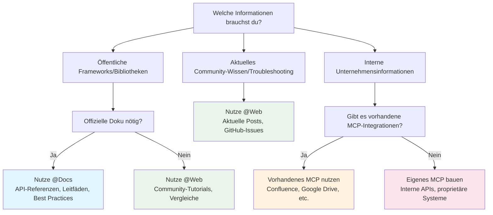

# Arbeiten mit Dokumentation
Source: https://docs.cursor.com/de/guides/advanced/working-with-documentation

Wie du Dokumentation in Cursor effektiv nutzt – mit Prompts, externen Quellen und internem Kontext

export const ChatInput = ({content = []}) => {
  const renderContent = () => {
    return content.map((item, index) => {
      if (item.type === 'mention') {
        return <span key={index} className="mention bg-blue-500/20 px-1 py-0.5 rounded-sm">
                        {item.text}
                    </span>;
      }
      return item.text;
    });
  };
  return <>
            <div className="flex flex-col items-stretch border border-neutral-500 rounded-lg p-3 gap-2 bg-neutral-800 relative transition-all duration-100 ease-in-out hover:border-neutral-500">
                <div className="flex flex-col gap-1">
                    <div className="flex flex-col gap-1 outline-none overflow-hidden">
                        <div className="flex-1 flex items-center gap-2">
                            <div className="w-full box-border max-h-10 overflow-hidden">
                                <div className="flex items-center gap-2 w-full flex-nowrap">
                                    <div className="cursor-pointer flex items-center justify-center p-1 h-5 w-5 rounded border border-neutral-600 outline-none flex-shrink-0 hover:bg-neutral-700 bg-neutral-750">
                                        <span className="text-neutral-400 text-sm font-semibold">@</span>
                                    </div>
                                </div>
                            </div>
                        </div>
                    </div>
                </div>

                <div className="relative pt-0">
                    <div className="min-h-6 w-full max-h-60">
                        <div className="relative overflow-y-hidden w-full">
                            <div className="w-full flex flex-wrap overflow-hidden min-h-6">
                                <div className="inline-block w-full min-h-full">
                                    <div className="w-full overflow-visible h-full min-h-6">
                                        <div className="grid relative grid-cols-1 w-full">

                                            <div className="leading-6 text-sm text-neutral-200 bg-transparent block break-words p-0 whitespace-pre-wrap font-medium min-h-6">
                                                {content.length > 0 ? renderContent() : <span className="text-neutral-500">Plan, search, build anything</span>}
                                            </div>

                                        </div>
                                    </div>
                                </div>
                            </div>
                        </div>
                    </div>

                    <div className="flex items-center justify-between gap-3 flex-shrink-0 mt-6">
                        <div className="flex-1 w-full h-full flex items-center flex-col gap-1">
                            <div className="flex items-center justify-between gap-2 flex-shrink-0 w-full">
                                <div className="flex items-center justify-between w-full">
                                    <div className="flex items-center gap-3 flex-shrink min-w-0">
                                        <div className="flex gap-1 text-xs items-center min-w-0 max-w-full px-1.5 py-0.5 flex-shrink-0 cursor-pointer bg-neutral-700 hover:bg-neutral-600 rounded-full">
                                            <div className="flex items-center gap-1 min-w-0 max-w-full overflow-hidden">
                                                <div className="text-xs flex-shrink-0 w-3 h-3 flex items-center justify-center text-neutral-400">
                                                    ∞
                                                </div>
                                                <div className="min-w-0 max-w-full overflow-hidden text-ellipsis whitespace-nowrap flex items-center gap-1 font-medium">
                                                    <span className="text-neutral-300">Agent</span>
                                                    <span className="text-neutral-500 text-[10px]">⌘I</span>
                                                </div>
                                                <Icon icon="chevron-down" size={6} color="currentColor" />
                                            </div>
                                        </div>

                                        <div className="flex gap-2 text-xs items-center cursor-pointer min-w-0 max-w-full px-0 py-1 opacity-90 rounded hover:text-neutral-200">
                                            <div className="flex items-center gap-2 min-w-0 max-w-full overflow-x-hidden">
                                                <div className="min-w-0 text-ellipsis whitespace-nowrap text-neutral-300 flex items-center gap-2 overflow-hidden">
                                                    <div className="overflow-hidden inline-flex gap-2 items-center">
                                                        <span className="whitespace-nowrap overflow-x-hidden text-ellipsis text-xs">
                                                            Auto
                                                        </span>
                                                    </div>
                                                </div>
                                                <Icon icon="chevron-down" size={8} color="currentColor" />
                                            </div>
                                        </div>
                                    </div>

                                    <div className="flex items-center gap-3 justify-end">
                                        <button className="bg-white/80 border-none text-neutral-500 flex w-5 h-5 items-center justify-center hover:text-neutral-400 hover:bg-white/90 rounded-full disabled:opacity-50" disabled={content.length === 0 || !content.some(item => item.text.trim())}>
                                            <span className="text-sm">↑</span>
                                        </button>
                                    </div>
                                </div>
                            </div>
                        </div>
                    </div>
                </div>
            </div>
        </>;
};

<div id="why-documentation-matters">
  # Warum Dokumentation wichtig ist
</div>

Dokumentation liefert aktuellen, verlässlichen Kontext. Ohne sie greifen Modelle auf veraltete oder unvollständige Trainingsdaten zurück. Dokumentation hilft Modellen, Dinge wie Folgendes zu verstehen:

* Aktuelle APIs und Parameter
* Best Practices
* Organisationskonventionen
* Fachterminologie

Und vieles mehr. Lies weiter, um zu erfahren, wie du Dokumentation direkt in Cursor nutzt, ohne den Fokus wechseln zu müssen.

<div id="model-knowledge-cutoff">
  ## Wissensstichtag des Modells
</div>

Große Sprachmodelle werden auf Daten bis zu einem bestimmten Zeitpunkt trainiert, dem sogenannten „Wissensstichtag“. Das bedeutet:

* Kürzliche Updates von Libraries sind eventuell nicht berücksichtigt
* Neue Frameworks oder Tools könnten unbekannt sein
* API-Änderungen nach dem Stichtag fehlen
* Best Practices haben sich seit dem Training möglicherweise weiterentwickelt

Wenn zum Beispiel der Wissensstichtag eines Modells Anfang 2024 liegt, kennt es keine Features, die Ende 2024 veröffentlicht wurden – selbst bei beliebten Frameworks.

<div id="which-tool-should-i-use">
  # Welches Tool sollte ich verwenden?
</div>

Benutze diesen Entscheidungsbaum, um schnell den besten Ansatz für deine Dokumentationsbedürfnisse zu finden:



<div id="mental-model">
  ## Mentales Modell
</div>

<div className="full-width-table">
  | Tool        | Mentales Modell                                  |
  | ----------- | ------------------------------------------------ |
  | **`@Docs`** | Wie das Durchstöbern und Lesen offizieller Dokus |
  | **`@Web`**  | Wie nach Lösungen im Internet suchen             |
  | **MCP**     | Wie auf deine interne Doku zugreifen             |
</div>

<div id="public-documentation">
  # Öffentliche Dokumentation
</div>

Externe Dokumentation umfasst öffentlich verfügbare Informationen, zu denen Modelle womöglich nur begrenztes oder veraltetes Wissen haben. Cursor bietet zwei Hauptwege, auf diese Informationen zuzugreifen.

<div id="using-docs">
  ## Verwendung von @Docs
</div>

`@Docs` verbindet Cursor mit der offiziellen Dokumentation beliebter Tools und Frameworks. Nutz es, wenn du aktuelle, verlässliche Informationen brauchst zu:

* **API-Referenzen**: Funktionssignaturen, Parameter, Rückgabetypen
* **Einstiegshilfen**: Setup, Konfiguration, grundlegende Nutzung
* **Best Practices**: Empfohlene Patterns aus der Quelle
* **Framework-spezifischem Debugging**: Offizielle Troubleshooting-Guides

<ChatInput
  content={[
{ type: 'mention', text: '@Docs Next.js' },
{ type: 'text', text: ' How do I set up dynamic routing with catch-all routes?' }
]}
/>

<div id="using-web">
  ## Verwendung von @Web
</div>

`@Web` durchsucht das Live-Internet nach aktuellen Infos, Blogposts und Community-Diskussionen. Nutz es, wenn du Folgendes brauchst:

* **Aktuelle Tutorials**: Community-erstellte Inhalte und Beispiele
* **Vergleiche**: Artikel, die unterschiedliche Ansätze gegenüberstellen
* **Neueste Updates**: Brandaktuelle Updates oder Ankündigungen
* **Mehrere Perspektiven**: Verschiedene Herangehensweisen an Probleme

<ChatInput
  content={[
{ type: 'mention', text: '@Web' },
{ type: 'text', text: ' latest performance optimizations for React 19' }
]}
/>

<div id="internal-documentation">
  # Interne Dokumentation
</div>

Interne Dokumentation umfasst Informationen, die spezifisch für deine Organisation sind und denen KI-Modelle während des Trainings nie begegnet sind. Das kann Folgendes sein:

* **Interne APIs**: maßgeschneiderte Services und Microservices
* **Unternehmensstandards**: Coding Conventions, Architekturpatterns
* **Proprietäre Systeme**: eigene Tools, Datenbanken, Workflows
* **Domänenwissen**: Business-Logik, Compliance-Anforderungen

<div id="accessing-internal-docs-with-mcp">
  ## Zugriff auf interne Doks mit MCP
</div>

Das Model Context Protocol (MCP) bietet eine standardisierte Möglichkeit, deine private Doku und Systeme in Cursor einzubinden. MCP fungiert als dünne Schicht zwischen Cursor und deinen internen Ressourcen.

**Warum MCP wichtig ist:**

* Modelle kennen deine internen Konventionen nicht
* API-Dokumentationen für eigene Services sind nicht öffentlich verfügbar
* Business-Logik und Domänenwissen sind organisationsspezifisch
* Compliance- und Sicherheitsanforderungen unterscheiden sich je nach Unternehmen

<div id="common-mcp-integrations">
  ### Häufige MCP-Integrationen
</div>

| Integration      | Zugriff                           | Beispiele                                                                                                                 |
| ---------------- | --------------------------------- | ------------------------------------------------------------------------------------------------------------------------- |
| **Confluence**   | Unternehmens-Confluence-Spaces    | Architekturdokumentation, API-Spezifikationen für interne Services, Coding-Standards und Guidelines, Prozessdokumentation |
| **Google Drive** | Geteilte Dokumente und Ordner     | Spezifikationsdokumente, Meeting-Notizen und Entscheidungsprotokolle, Designdokumente und Requirements, Team-Wissensbasen |
| **Notion**       | Workspace-Datenbanken und -Seiten | Projektdokumentation, Team-Wikis, Wissensbasen, Produktanforderungen, technische Spezifikationen                          |
| **Custom**       | Interne Systeme und Datenbanken   | Proprietäre APIs, Legacy-Dokumentationssysteme, eigene Wissensbasen, spezialisierte Tools und Workflows                   |

<div id="custom-solutions">
  #### Custom-Lösungen
</div>

Für besondere Anforderungen kannst du eigene MCP-Server bauen, die:

* interne Websites oder Portale scrapen
* sich mit proprietären Datenbanken verbinden
* auf eigene Dokumentationssysteme zugreifen
* aus internen Wikis oder Wissensbasen ziehen

<Tip>Wenn du einen eigenen MCP-Server baust, kannst du auch Tools bereitstellen, damit Cursor die Dokumentation aktualisieren kann</Tip>

Beispiel für einen eigenen MCP-Server zum Scrapen interner Doks:

<CodeGroup>
  ```javascript TypeScript theme={null}
  import { McpServer, ResourceTemplate } from "@modelcontextprotocol/sdk/server/mcp.js";
  import { StdioServerTransport } from "@modelcontextprotocol/sdk/server/stdio.js";
  import { z } from "zod";
  import TurndownService from "turndown";

  // Create an MCP server for scraping internal docs
  const server = new McpServer({
    name: "internal-docs",
    version: "1.0.0"
  });

  const turndownService = new TurndownService();

  // Add tool to scrape internal documentation
  server.tool("get_doc",
    { url: z.string() },
    async ({ url }) => {
      try {
        const response = await fetch(url);
        const html = await response.text();
        
        // Convert HTML to markdown
        const markdown = turndownService.turndown(html);
        
        return {
          content: [{ type: "text", text: markdown }]
        };
      } catch (error) {
        return {
          content: [{ type: "text", text: `Error scraping ${url}: ${error.message}` }]
        };
      }
    }
  );

  // Start receiving messages on stdin and sending messages on stdout
  const transport = new StdioServerTransport();
  await server.connect(transport);
  ```

  ```python Python theme={null}
  # server.py
  import os
  import asyncio
  from mcp.server.fastmcp import FastMCP
  import aiohttp
  from markdownify import markdownify as md

  # Create an MCP server for scraping internal docs
  mcp = FastMCP("internal-docs")

  @mcp.tool()
  async def get_doc(url: str) -> dict:
      """Scrape internal documentation from a URL"""
      try:
          async with aiohttp.ClientSession() as session:
              async with session.get(url) as response:
                  html = await response.text()
          
          # Convert HTML to markdown
          markdown = md(html)
          
          return {
              "content": [{"type": "text", "text": markdown}]
          }
      except Exception as error:
          return {
              "content": [{"type": "text", "text": f"Error scraping {url}: {str(error)}"}]
          }
  ```
</CodeGroup>

<div id="keeping-docs-up-to-date">
  # Docs aktuell halten
</div>

Dokumentation veraltet schnell. Cursor hilft dir, deine Doku aktuell und nützlich zu halten, indem es sie auf Basis deines tatsächlichen Codes und eurer Gespräche zur Entwicklung erzeugt und aktualisiert.

<div id="from-existing-code">
  ## Aus bestehendem Code
</div>

Nutze Cursor, um Dokumentation direkt aus deiner Codebasis zu erstellen:

<Tabs>
  <Tab title="API-Dokumentation">
    <ChatInput
      content={[
    { type: 'text', text: 'Erzeuge eine API-Dokumentation für diesen Express-Router, inklusive aller Endpunkte, Parameter und Response-Formate' }
  ]}
    />
  </Tab>

  <Tab title="JSDoc-Kommentare">
    <ChatInput
      content={[
    { type: 'text', text: 'Füge dieser Klasse umfassende JSDoc-Kommentare hinzu und dokumentiere alle Methoden samt ihrer Parameter' }
  ]}
    />
  </Tab>

  <Tab title="README-Erstellung">
    <ChatInput
      content={[
    { type: 'text', text: 'Erstelle ein README für dieses Projekt mit Setup-Anleitung, Nutzungsbeispielen und einem API-Überblick' }
  ]}
    />
  </Tab>
</Tabs>

<div id="from-chat-sessions">
  ## Aus Chat-Sessions
</div>

Deine Unterhaltungen mit Cursor enthalten wertvolle Absichten, die in Dokumentation verwandelt werden können.

<Tabs>
  <Tab title="Problem Solving">
    **Nach der Lösung eines komplexen Problems:**

    <ChatInput
      content={[
    { type: 'text', text: 'Fass unsere Unterhaltung über das Einrichten von Authentifizierung zu einer Schritt-für-Schritt-Anleitung fürs Team-Wiki zusammen' }
  ]}
    />
  </Tab>

  <Tab title="Architecture">
    **Nach Architekturentscheidungen:**

    <ChatInput
      content={[
    { type: 'text', text: 'Erstell eine Doku, die erklärt, warum wir dieses Datenbankdesign gewählt haben, inklusive der Trade-offs, die wir besprochen haben' }
  ]}
    />
  </Tab>

  <Tab title="Debugging">
    **Nach Debugging-Sessions:**

    <ChatInput
      content={[
    { type: 'text', text: 'Schreib einen Troubleshooting-Guide basierend auf dem Bug, den wir gerade gefixt haben, inklusive Symptomen und Schritten zur Behebung' }
  ]}
    />
  </Tab>
</Tabs>

<div id="takeaways">
  ## Takeaways
</div>

* Dokumentation als Kontext macht Cursor präziser und aktueller
* Nutze `@Docs` für offizielle Dokumentation und `@Web` für Community-Wissen
* MCP schlägt die Brücke zwischen Cursor und deinen internen Systemen
* Generiere Dokumentation aus Code und Unterhaltungen, um Wissen aktuell zu halten
* Kombiniere externe und interne Dokumentationsquellen für ein umfassendes Verständnis

---

← Previous: [Große Codebasen](./groe-codebasen.md) | [Index](./index.md) | Next: [Java](./java.md) →