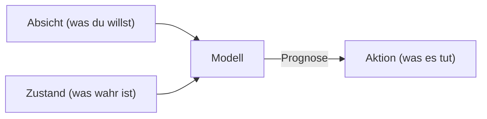

# Arbeiten mit Kontext
Source: https://docs.cursor.com/de/guides/working-with-context

Wie du in Cursor mit Kontext arbeitest

Erstmal: Was ist ein Kontextfenster? Und wie hängt das damit zusammen, effektiv mit Cursor zu coden?

Um kurz rauszuzoomen: Ein Large Language Model (LLM) ist ein KI‑Modell, das darauf trainiert ist, Text vorherzusagen und zu generieren, indem es Muster aus riesigen Datensätzen lernt. Es treibt Tools wie Cursor an, indem es deine Eingaben versteht und basierend auf früheren Beispielen Code oder Text vorschlägt.

Tokens sind die Ein- und Ausgaben dieser Modelle. Es sind Textstücke, oft Fragmente eines Wortes, die ein LLM nacheinander verarbeitet. Modelle lesen nicht ganze Sätze auf einmal; sie sagen das nächste Token auf Basis der vorherigen voraus.

Um zu sehen, wie Text tokenisiert wird, kannst du einen Tokenizer wie [diesen hier](https://tiktokenizer.vercel.app/) verwenden.

  # Was ist Kontext?

Wenn wir in Cursor einen Codevorschlag generieren, bezieht sich „Kontext“ auf die Informationen, die dem Modell bereitgestellt werden (in Form von „Input-Tokens“), die das Modell dann verwendet, um die nachfolgenden Informationen zu erzeugen (in Form von „Output-Tokens“).

Es gibt zwei Arten von Kontext:

1. **Intent-Kontext** definiert, was der User vom Modell will. Zum Beispiel dienen Systemprompts normalerweise als High-Level-Anweisungen dafür, wie sich das Modell verhalten soll. Das meiste „Prompting“ in Cursor ist Intent-Kontext. „Mach den Button von blau zu grün“ ist ein Beispiel für geäußerte Intention; das ist präskriptiv.
2. **State-Kontext** beschreibt den aktuellen Zustand. Cursor mit Fehlermeldungen, Konsolen-Logs, Bildern und Codeausschnitten zu versorgen, sind Beispiele für zustandsbezogenen Kontext. Er ist deskriptiv, nicht präskriptiv.

Zusammen arbeiten diese beiden Arten von Kontext harmonisch, indem sie den aktuellen und den gewünschten zukünftigen Zustand beschreiben und Cursor so ermöglichen, hilfreiche Coding-Vorschläge zu machen.

  # Kontext in Cursor bereitstellen

Je mehr relevanten Kontext du einem Modell gibst, desto nützlicher wird es. Wenn in Cursor nicht genug Kontext vorhanden ist, versucht das Modell, die Aufgabe ohne die nötigen Informationen zu lösen. Das führt typischerweise zu:

1. Halluzinationen, bei denen das Modell versucht, Muster zu erkennen (obwohl es keine gibt), was zu unerwarteten Ergebnissen führt. Das kann bei Modellen wie `claude-3.5-sonnet` häufig passieren, wenn sie nicht genug Kontext bekommen.
2. Der Agent versucht, sich den Kontext selbst zu beschaffen, indem er die Codebase durchsucht, Dateien liest und Tools aufruft. Ein starkes Thinking-Modell (wie `claude-3.7-sonnet`) kann mit dieser Strategie ziemlich weit kommen, und der richtige initiale Kontext setzt die Richtung.

Die gute Nachricht ist: Cursor ist von Grund auf mit Kontextbewusstsein gebaut und so konzipiert, dass du so wenig wie möglich eingreifen musst. Cursor zieht automatisch die Teile deiner Codebase heran, die das Modell als relevant einschätzt, etwa die aktuelle Datei, semantisch ähnliche Stellen in anderen Dateien und weitere Informationen aus deiner Session.

Trotzdem gibt es sehr viel Kontext, aus dem gezogen werden kann. Daher ist es hilfreich, den Kontext, von dem du weißt, dass er für die Aufgabe relevant ist, manuell anzugeben, um die Modelle in die richtige Richtung zu lenken.

  ## @-symbol

Der einfachste Weg, expliziten Kontext bereitzustellen, ist das @-Symbol. Das ist super, wenn du genau weißt, welche Datei, welcher Ordner, welche Website oder welches andere Stück Kontext einbezogen werden soll. Je spezifischer du sein kannst, desto besser. Hier ist eine Übersicht, wie du noch gezielter mit Kontext arbeiten kannst:

| Symbol    | Example              | Use case                                                                               | Drawback                                                                               |
| --------- | -------------------- | -------------------------------------------------------------------------------------- | -------------------------------------------------------------------------------------- |
| `@code`   | `@LRUCachedFunction` | Du weißt, welche Funktion, Konstante oder welches Symbol für den Output relevant ist   | Erfordert viel Wissen über die Codebasis                                               |
| `@file`   | `cache.ts`           | Du weißt, welche Datei gelesen oder bearbeitet werden soll, aber nicht genau, wo darin | Könnte je nach Dateigröße viel irrelevanten Kontext für die aktuelle Aufgabe enthalten |
| `@folder` | `utils/`             | Alles oder der Großteil der Dateien in einem Ordner ist relevant                       | Könnte viel irrelevanten Kontext für die aktuelle Aufgabe enthalten                    |

  ## Regeln

Denk an Regeln wie an ein Langzeitgedächtnis, auf das du oder andere aus deinem Team zugreifen können. Domänenspezifischen Kontext festzuhalten – inklusive Workflows, Formatierung und anderer Konventionen – ist ein super Ausgangspunkt, um Regeln zu schreiben.

Regeln lassen sich auch aus bestehenden Unterhaltungen mit `/Generate Cursor Rules` erstellen. Wenn du eine längere Unterhaltung mit viel Prompting geführt hast, gibt es wahrscheinlich nützliche Vorgaben oder allgemeine Regeln, die du später wiederverwenden willst.

  ## MCP

[Model Context Protocol](https://modelcontextprotocol.io/introduction) ist eine Erweiterungsebene, mit der du Cursor die Möglichkeit gibst, Aktionen auszuführen und externen Kontext einzubinden.

Je nach deinem Development-Setup willst du vielleicht verschiedene Arten von Servern nutzen; zwei Kategorien, die sich als besonders nützlich erwiesen haben, sind:

* **Interne Dokumentation**: z. B. Notion, Confluence, Google Docs
* **Projektmanagement**: z. B. Linear, Jira

Wenn du bereits Tools hast, um über eine API auf Kontext zuzugreifen und Aktionen auszuführen, kannst du dafür einen MCP-Server bauen. Hier ist eine kurze Anleitung zum Erstellen von [MCP-Servern](https://modelcontextprotocol.io/tutorials/building-mcp-with-llms).

  ## Selbstständig Kontext sammeln

Ein leistungsfähiges Muster, das viele nutzen, ist, den Agenten kurzfristige Tools schreiben zu lassen, die er dann ausführt, um mehr Kontext zu sammeln. Das ist besonders effektiv in Human-in-the-Loop-Workflows, bei denen du den Code überprüfst, bevor er ausgeführt wird.

Wenn du zum Beispiel Debug-Ausgaben in deinen Code einbaust, ihn ausführst und das Modell die Ausgabe inspizieren lässt, erhält es Zugriff auf dynamischen Kontext, den es statisch nicht ableiten könnte.

In Python kannst du das erreichen, indem du den Agenten dazu aufforderst:

1. Füge print("debugging: ...")-Ausgaben an relevanten Stellen im Code ein
2. Führe den Code oder die Tests im Terminal aus

Der Agent liest die Terminalausgabe und entscheidet, was als Nächstes zu tun ist. Die Kernidee ist, dem Agenten Zugriff auf das tatsächliche Laufzeitverhalten zu geben – nicht nur auf den statischen Code.

  # Wichtigste Erkenntnisse

* Kontext ist die Grundlage effektiven AI-Codings und besteht aus Absicht (was du willst) und Zustand (was bereits existiert). Wenn du beides lieferst, kann Cursor präzise Vorhersagen treffen.
* Nutze gezielten Kontext mit @-Symbolen (@code, @file, @folder), um Cursor präzise zu steuern, statt dich nur auf automatische Kontextsammlung zu verlassen.
* Halte wiederverwendbares Wissen in Regeln fest, um es teamweit zu teilen, und erweitere Cursors Fähigkeiten mit dem Model Context Protocol, um externe Systeme anzubinden.
* Zu wenig Kontext führt zu Halluzinationen oder Ineffizienz, während zu viel irrelevanter Kontext das Signal verwässert. Finde das richtige Gleichgewicht für optimale Ergebnisse.

---

← Previous: [Webentwicklung](./webentwicklung.md) | [Index](./index.md) | Next: [Inline Edit](./inline-edit.md) →