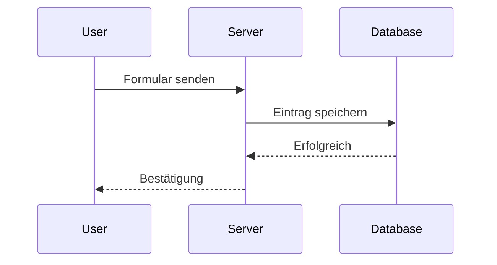
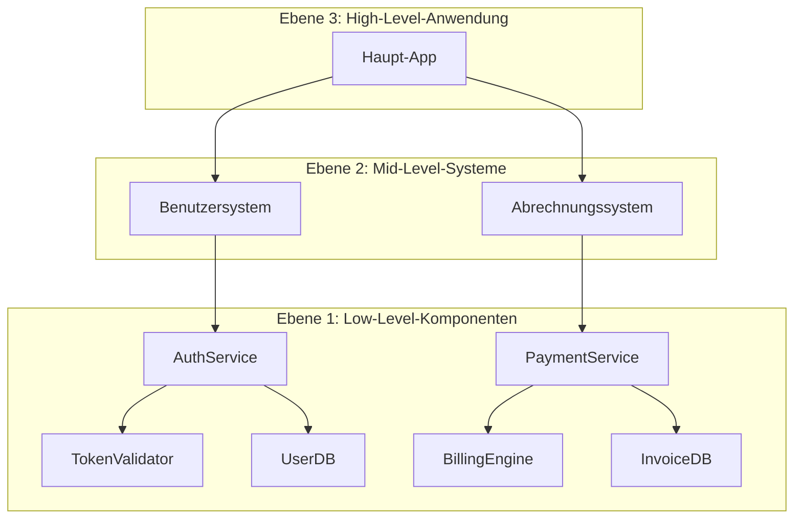

# Architekturschaubilder
Source: https://docs.cursor.com/de/guides/tutorials/architectural-diagrams

Lerne, mit Mermaid Architekturschaubilder zu erstellen, um Systemstruktur und Datenfluss zu visualisieren

Architekturschaubilder helfen dir, zu verstehen, wie dein System funktioniert. Du kannst sie nutzen, um Logik zu erkunden, Datenflüsse nachzuvollziehen und Strukturen zu kommunizieren. Cursor unterstützt das Generieren dieser Diagramme direkt mit Tools wie Mermaid, sodass du in nur wenigen Prompts vom Code zur Visualisierung kommst.

<Frame>
  
</Frame>

  ## Warum Diagramme wichtig sind

Diagramme zeigen klar, wie Daten fließen und wie Komponenten miteinander interagieren. Sie sind nützlich, wenn du:

* den Kontrollfluss in deiner Codebase verstehen willst
* die Datenherkunft vom Input bis zum Output nachverfolgen musst
* andere onboardest oder dein System dokumentierst

Sie sind auch super fürs Debuggen und um smartere Fragen zu stellen. Visuals helfen dir (und dem Modell), das große Ganze zu sehen.

  ## Zwei Dimensionen, die du berücksichtigen solltest

Es gibt ein paar verschiedene Perspektiven, über die du nachdenken kannst:

* **Zweck**: Kartierst du Logik, Datenfluss, Infrastruktur oder etwas anderes?
* **Format**: Willst du etwas Schnelles (wie ein Mermaid-Diagramm) oder etwas Formelles (wie UML)?

  ## So promptest du richtig

Starte mit einem klaren Ziel. Hier sind ein paar gängige Arten zu fragen:

* **Ablauf**: „Zeig mir, wie Requests vom Controller bis zur Datenbank laufen.“
* **Datenlinie**: „Verfolge diese Variable vom Eintrittspunkt bis zu ihrem Ziel.“
* **Struktur**: „Gib mir eine komponentenbasierte Ansicht dieses Services.“

Du kannst Start- und Endpunkte angeben oder Cursor bitten, den gesamten Pfad zu finden.

  ## Arbeiten mit Mermaid

Mermaid ist leicht zu lernen und rendert direkt in Markdown (mit der richtigen Erweiterung). Cursor kann Diagramme generieren wie:

* `flowchart` für Logik und Abläufe
* `sequenceDiagram` für Interaktionen
* `classDiagram` für Objektstrukturen
* `graph TD` für einfache gerichtete Diagramme

Du kannst die [Mermaid-Erweiterung](https://marketplace.cursorapi.com/items?itemName=bierner.markdown-mermaid) installieren, um Diagramme in der Vorschau anzuzeigen.

1. Geh zum Reiter Extensions
2. Such nach Mermaid
3. Installieren

<Frame>
  
</Frame>

  ## Diagrammstrategie

Fang klein an. Versuch nicht, alles auf einmal zu erfassen.

* Such dir eine einzelne Funktion, Route oder einen Prozess aus
* Bitte Cursor, diesen Teil mit Mermaid zu visualisieren
* Wenn du ein paar hast, bitte es, sie zu kombinieren

Das entspricht dem **C4‑Modell** – du startest auf einer niedrigen Ebene (Code oder Komponenten) und arbeitest dich zu höher­stufigen Übersichten nach oben.

  ### Empfohlener Ablauf

1. Starte mit einem detaillierten, niedrigstufigen Diagramm
2. Fasse es zu einer mittleren Ansicht zusammen
3. Wiederhole das, bis du die gewünschte Abstraktionsebene erreichst
4. Bitte Cursor, sie zu einem einzigen Diagramm oder einer Systemübersicht zusammenzuführen

  ## Takeaways

* Nutze Diagramme, um Fluss, Logik und Daten zu verstehen
* Starte mit kleinen Prompts und erweitere dein Diagramm von dort aus
* Mermaid ist das beste Format, um in Cursor zu arbeiten
* Starte auf niedriger Ebene und abstrahiere nach oben – wie im C4-Modell
* Cursor hilft dir, Diagramme mühelos zu generieren, zu verfeinern und zu kombinieren

---

← Previous: [VS Code](./vs-code.md) | [Index](./index.md) | Next: [Einen MCP-Server erstellen](./einen-mcp-server-erstellen.md) →