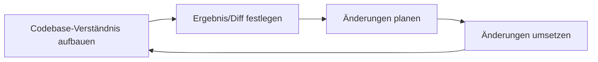
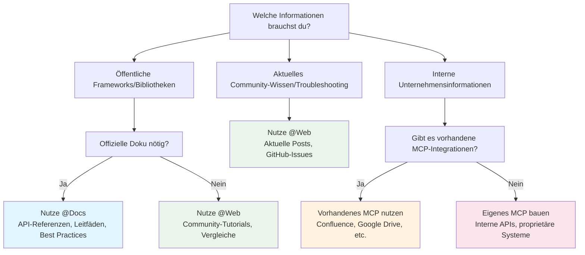
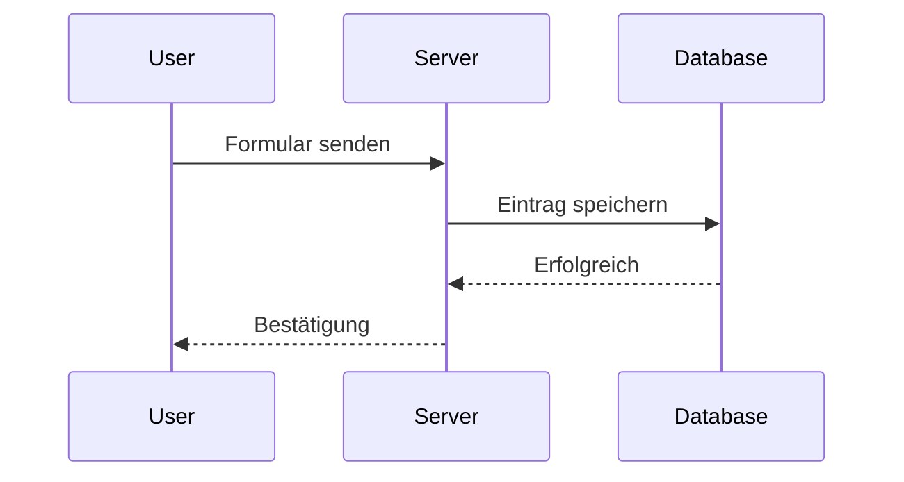
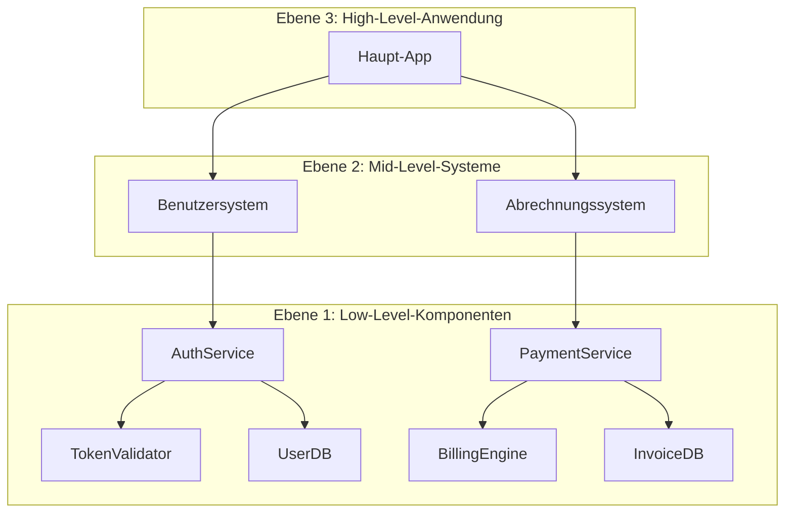
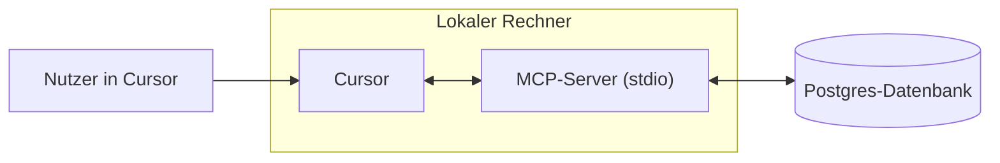
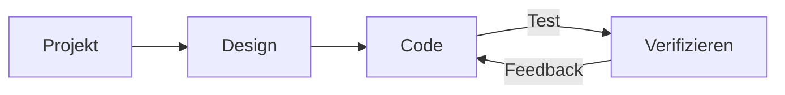
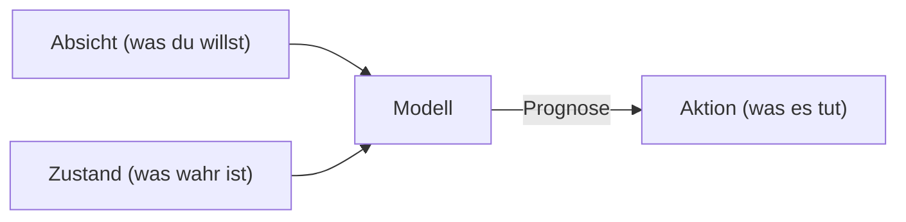

# Cursor Documentation (German)

This is the complete formatted documentation for Cursor in German, parsed and organized from the official documentation.

**Total Sections:** 112

---


# Agent-Sicherheit
Source: https://docs.cursor.com/de/account/agent-security

Sicherheitsaspekte bei der Verwendung von Cursor Agent

Prompt-Injection, KI-Halluzinationen und andere Probleme können dazu führen, dass sich KI unerwartet und potenziell bösartig verhält. Während wir weiter daran arbeiten, Prompt-Injection auf einer grundlegenderen Ebene zu lösen, bestehen unsere wichtigsten Schutzmechanismen in Cursor-Produkten aus Leitplanken für das Handeln eines Agents – einschließlich der standardmäßigen Anforderung einer manuellen Bestätigung für sensible Aktionen. Ziel dieses Dokuments ist es, unsere Leitplanken zu erklären und was du von ihnen erwarten kannst.

Alle unten aufgeführten Steuerungen und Verhaltensweisen sind unsere Standard- und empfohlenen Einstellungen.

<div id="first-party-tool-calls">
  ## First-party-Toolaufrufe
</div>

Cursor wird mit Tools ausgeliefert, die dem Agent helfen, dir beim Coden zu helfen. Dazu gehören Dateilesen, Bearbeitungen, das Ausführen von Terminalbefehlen, die Suche im Web nach Doku und mehr.

Lese-Tools erfordern keine Freigabe (z. B. das Lesen von Dateien, die Suche im Code). Du kannst [.cursorignore](/de/context/ignore-files) verwenden, um dem Agent den Zugriff auf bestimmte Dateien komplett zu blockieren; ansonsten sind Lesevorgänge in der Regel ohne Freigabe erlaubt. Für Aktionen, die das Risiko der Exfiltration sensibler Daten bergen, verlangen wir eine explizite Freigabe.

Das Ändern von Dateien im aktuellen Workspace erfordert keine explizite Freigabe, mit einigen Ausnahmen. Wenn ein Agent Dateien ändert, werden die Änderungen sofort auf die Festplatte geschrieben. Wir empfehlen, Cursor in versionierten Workspaces zu nutzen, sodass Dateiinhalte jederzeit zurückgesetzt werden können. Wir verlangen eine explizite Freigabe, bevor Dateien geändert werden, die die Konfiguration unserer IDE/CLI anpassen, z. B. die Workspace-Einstellungsdatei des Editors. Wenn bei dir ein automatisches Neuladen bei Dateänderungen aktiv ist, beachte, dass Agent-Änderungen an Dateien eine automatische Ausführung auslösen können, bevor du sie prüfen konntest.

Jeder vom Agent vorgeschlagene Terminalbefehl erfordert standardmäßig eine Freigabe. Wir empfehlen, jeden Befehl zu prüfen, bevor der Agent ihn ausführt. Wenn du das Risiko akzeptierst, kannst du dem Agent erlauben, alle Befehle ohne Freigabe auszuführen. Wir bieten in Cursor eine [Allowlist](/de/agent/tools) an, betrachten sie jedoch nicht als Sicherheitskontrolle. Manche Nutzer erlauben bestimmte Befehle, aber das ist ein Best-Effort-System, und Umgehungen sind möglich. Wir empfehlen nicht „Run Everything“, da damit alle konfigurierten Allowlists umgangen werden.

<div id="third-party-tool-calls">
  ## Aufrufe von Drittanbieter-Tools
</div>

Cursor ermöglicht das Einbinden externer Tools über [MCP](/de/context/mcp). Alle MCP-Verbindungen von Drittanbietern müssen ausdrücklich von dir genehmigt werden. Sobald du eine MCP-Verbindung genehmigt hast, muss in Agent Mode standardmäßig jeder vorgeschlagene Tool-Aufruf für jede externe MCP-Integration vor der Ausführung ausdrücklich bestätigt werden.

<div id="network-requests">
  ## Netzwerk-Anfragen
</div>

Netzwerk-Anfragen können von Angreifern genutzt werden, um Daten zu exfiltrieren. Wir unterstützen derzeit keine First‑Party‑Tools, die Netzwerk-Anfragen an andere Hosts als eine sehr kleine, ausgewählte Gruppe (z. B. GitHub) stellen, keine expliziten Linkabrufe und nur Websuche mit einer ausgewählten Gruppe von Anbietern. Beliebige Agenten‑Netzwerk-Anfragen werden in den Standardeinstellungen verhindert.

<div id="workspace-trust">
  ## Workspace-Trust
</div>

Die Cursor-IDE unterstützt die standardmäßige [Workspace-Trust](https://code.visualstudio.com/docs/editing/workspaces/workspace-trust)-Funktion, die *deaktiviert* ist. Workspace-Trust zeigt dir beim Öffnen eines neuen Workspaces einen Dialog, in dem du zwischen normalem und eingeschränktem Modus wählen kannst. Der eingeschränkte Modus deaktiviert AI und andere Features, für die Nutzer Cursor typischerweise verwenden. Wir empfehlen dafür andere Tools, z. B. einen einfachen Texteditor, wenn du mit Repos arbeitest, denen du nicht vertraust.

Workspace-Trust kann in den Benutzereinstellungen aktiviert werden, indem du diese Schritte ausführst:

1. Öffne deine user settings.json-Datei
2. Füge die folgende Konfiguration hinzu:
   ```json  theme={null}
   "security.workspace.trust.enabled": true
   ```

Diese Einstellung kann auch organisationsweit über Mobile-Device-Management-(MDM)-Lösungen erzwungen werden.

<div id="responsible-disclosure">
  ## Verantwortungsvolle Offenlegung
</div>

Wenn du glaubst, eine Sicherheitslücke in Cursor gefunden zu haben, folge bitte der Anleitung auf unserer GitHub-Sicherheitsseite und reiche den Bericht dort ein. Wenn du GitHub nicht nutzen kannst, erreichst du uns auch unter [security@cursor.com](mailto:security@cursor.com).

Wir sagen zu, Meldungen über Sicherheitslücken innerhalb von 5 Werktagen zu bestätigen und sie so schnell wie möglich zu bearbeiten. Wir veröffentlichen die Ergebnisse als Sicherheitshinweise auf unserer GitHub-Sicherheitsseite. Kritische Vorfälle werden sowohl auf der GitHub-Sicherheitsseite als auch per E-Mail an alle Nutzer kommuniziert.

---


# Abrechnung
Source: https://docs.cursor.com/de/account/billing

Verwaltung von Cursor-Abos, Erstattungen und Rechnungen 

<div id="how-do-i-access-billing-settings">
  ### Wie greife ich auf die Abrechnungseinstellungen zu?
</div>

Greif über das [Dashboard](https://cursor.com/dashboard) auf das Abrechnungsportal zu, indem du in deinem Dashboard auf „Billing“ klickst. Dadurch öffnet sich ein sicheres Portal für alle Abrechnungsaufgaben.

<div id="what-are-cursors-billing-cycles">
  ### Wie laufen Cursors Abrechnungszyklen?
</div>

Abrechnungszyklen laufen monatlich oder jährlich und beginnen an deinem Abo-Startdatum. Team-Accounts werden pro Sitzplatz abgerechnet, mit anteiliger Verrechnung für neue Mitglieder.

<div id="how-do-seats-work-for-teams-accounts">
  ### Wie funktionieren Sitzplätze bei Team-Accounts?
</div>

Team-Accounts berechnen pro Sitzplatz (einer pro Teammitglied). Wenn du Mitglieder mitten im Zyklus hinzufügst, zahlst du nur für die verbleibende Zeit. Wenn ein Mitglied Credits genutzt hat und entfernt wird, bleibt sein Sitz bis zum Ende des Abrechnungszyklus belegt – anteilige Rückerstattungen gibt’s nicht. Team-Admins können Sitze über das Dashboard verwalten.

<div id="can-i-switch-between-monthly-and-annual-billing">
  ### Kann ich zwischen monatlicher und jährlicher Abrechnung wechseln?
</div>

Ja! So geht’s:

**Pro-Plan**

1. Geh zum Cursor-[Dashboard](https://cursor.com/dashboard)
2. Klick links in der Seitenleiste auf „Billing and Invoices“, um zur Abrechnungsseite zu gelangen
3. Klick auf „Manage subscription“
4. Klick auf „Update subscription“
5. Wähl „Yearly“ oder „Monthly“ und klick dann auf „Continue“

**Teams-Plan**

1. Geh zum Cursor-[Dashboard](https://cursor.com/dashboard)
2. Klick links in der Seitenleiste auf „Billing and Invoices“, um zur Abrechnungsseite zu gelangen
3. Klick auf den Button „Upgrade Now“, um auf jährliche Abrechnung zu wechseln

<Note>
  Du kannst nur selbst von monatlicher auf jährliche Abrechnung wechseln. Um von jährlicher auf monatliche Abrechnung zu wechseln, kontaktier uns unter
  [hi@cursor.com](mailto:hi@cursor.com).
</Note>

<div id="where-can-i-find-my-invoices">
  ### Wo finde ich meine Rechnungen?
</div>

Deinen kompletten Abrechnungsverlauf findest du im Abrechnungsportal. Dort kannst du aktuelle und frühere Rechnungen ansehen und herunterladen.

<div id="can-i-get-invoices-automatically-emailed-to-me">
  ### Kann ich Rechnungen automatisch per E-Mail bekommen?
</div>

Rechnungen müssen derzeit manuell aus dem Abrechnungsportal heruntergeladen werden. Wir arbeiten an automatischen Rechnungs-E-Mails. Sobald verfügbar, kannst du dich dafür anmelden.

<div id="how-do-i-update-my-billing-information">
  ### Wie aktualisiere ich meine Abrechnungsinformationen?
</div>

Aktualisiere Zahlungsmethode, Firmenname, Adresse und Steuerinformationen im Abrechnungsportal. Wir verwenden Stripe für sichere Transaktionen. Änderungen wirken nur für zukünftige Rechnungen; historische Rechnungen können wir nicht anpassen.

<div id="how-do-i-cancel-my-subscription">
  ### Wie kündige ich mein Abonnement?
</div>

Kündige dein Abo auf der Seite „Billing and Invoices“, indem du bei „Manage Subscription“ den Button „Cancel subscription“ klickst. Dein Zugriff bleibt bis zum Ende deines aktuellen Abrechnungszeitraums bestehen.

<div id="im-having-other-billing-issues-how-can-i-get-help">
  ### Ich habe andere Abrechnungsprobleme. Wie bekomme ich Hilfe?
</div>

Für Abrechnungsfragen, die hier nicht beantwortet werden, schreib von der mit deinem Account verknüpften E-Mail-Adresse an [hi@cursor.com](mailto:hi@cursor.com). Bitte füge deine Account-Details und dein Anliegen bei.

---


# Preise
Source: https://docs.cursor.com/de/account/pricing

Cursor‑Pläne und ihre Preise

Du kannst Cursor kostenlos ausprobieren oder einen Einzel- oder Team‑Plan kaufen.

<div id="individual">
  ## Individuell
</div>

Alle individuellen Pläne enthalten:

* Unbegrenzte Tab-Vervollständigungen
* Erhöhte Agent-Nutzungslimits für alle Modelle
* Zugriff auf Bugbot
* Zugriff auf Background Agents

Jeder Plan umfasst nutzungsbasierte Abrechnung zu den [API-Preisen](/de/models#model-pricing) für Modellinferenz:

* Pro enthält \$20 an API-Agent-Nutzung + zusätzliche Bonusnutzung
* Pro Plus enthält \$70 an API-Agent-Nutzung + zusätzliche Bonusnutzung
* Ultra enthält \$400 an API-Agent-Nutzung + zusätzliche Bonusnutzung

Wir arbeiten hart daran, dir zusätzliche Bonuskapazität über die garantierte enthaltene Nutzung hinaus bereitzustellen. Da verschiedene Modelle unterschiedliche API-Kosten haben, beeinflusst deine Modellauswahl den Token-Output und wie schnell deine enthaltene Nutzung aufgebraucht wird. Nutzung und Token-Aufschlüsselungen findest du in [deinem Dashboard](https://cursor.com/dashboard?tab=usage). Limit-Benachrichtigungen werden regelmäßig im Editor angezeigt.


<div id="how-much-usage-do-i-need">
  ### Wie viel Nutzung brauche ich?
</div>

Basierend auf unseren Nutzungsdaten kannst du mit folgenden Nutzungsstufen rechnen:

* **Tägliche Tab-User**: Bleiben immer innerhalb von \$20
* **Gelegentliche Agent-User**: Bleiben oft innerhalb der enthaltenen \$20
* **Tägliche Agent-User**: Typischerweise $60–$100/Monat Gesamtnutzung
* **Power-User (mehrere Agents/Automatisierung)**: Oft \$200+/Monat Gesamtnutzung

Basierend auf unseren Nutzungsdaten entsprechen die Limits in etwa Folgendem für eine*n Median-User*in:

* Pro: \~225 Sonnet‑4‑Requests, \~550 Gemini‑Requests oder \~500 GPT‑5‑Requests
* Pro+: \~675 Sonnet‑4‑Requests, \~1.650 Gemini‑Requests oder \~1.500 GPT‑5‑Requests
* Ultra: \~4.500 Sonnet‑4‑Requests, \~11.000 Gemini‑Requests oder \~10.000 GPT‑5‑Requests

<div id="what-happens-when-i-reach-my-limit">
  ### Was passiert, wenn ich mein Limit erreiche?
</div>

Wenn du dein monatlich enthaltenes Nutzungskontingent überschreitest, wirst du im Editor benachrichtigt und kannst Folgendes tun:

* **On-Demand-Nutzung hinzufügen**: Cursor weiterhin zu den gleichen API-Preisen mit nutzungsbasierter Abrechnung verwenden
* **Deinen Plan upgraden**: Auf eine höhere Stufe wechseln, um mehr inkludierte Nutzung zu erhalten

On-Demand-Nutzung wird monatlich zu den gleichen Preisen wie deine inkludierte Nutzung abgerechnet. Anfragen werden niemals in Qualität oder Geschwindigkeit herabgestuft.

<div id="teams">
  ## Teams
</div>

Es gibt zwei Team-Pläne: Teams (\$40/Nutzer/Monat) und Enterprise (individuell).

Team-Pläne bieten zusätzliche Features wie:

* Erzwingen des Privacy Mode
* Admin-Dashboard mit Nutzungsstatistiken
* Zentrale Team-Abrechnung
* SAML/OIDC-SSO

Wir empfehlen Teams für alle, die sich gerne selbst versorgen. Wir empfehlen [Enterprise](/de/contact-sales) für Kunden, die Priority Support, geteilte Nutzung, Rechnungsstellung, SCIM oder erweiterte Sicherheitskontrollen benötigen.

Erfahre mehr über die [Teams-Preise](/de/account/teams/pricing).

<div id="auto">
  ## Auto
</div>

Wenn du Auto aktivierst, wählt Cursor basierend auf der aktuellen Auslastung das Premium‑Modell aus, das am besten zur jeweiligen Aufgabe passt und die höchste Zuverlässigkeit bietet. Diese Funktion erkennt degradierte Output‑Performance und wechselt bei Bedarf automatisch das Modell, um das Problem zu beheben.

<Frame>
  
</Frame>

<Note>Wir haben viel in die Qualität und Gesamtleistung von Auto investiert. Ab deiner nächsten Abrechnungsverlängerung nach dem 15. September wird Auto zu den folgenden API‑Tarifen abgerechnet.</Note>

* **Input + Cache Write**: \$1.25 pro 1M Tokens
* **Output**: \$6.00 pro 1M Tokens
* **Cache Read**: \$0.25 pro 1M Tokens

Sowohl der Editor als auch das Dashboard zeigen deinen Verbrauch an, einschließlich Auto. Wenn du ein Modell direkt auswählst, wird der Verbrauch zum Listen‑API‑Preis dieses Modells abgerechnet.

<div id="max-mode">
  ## Max-Modus
</div>

Bestimmte Modelle unterstützen den [Max-Modus](/de/models#max-mode), der längeres Reasoning und größere Kontextfenster mit bis zu 1 Mio. Tokens ermöglicht. Für die meisten Coding-Aufgaben ist der Max-Modus nicht nötig, kann aber bei komplexeren Anfragen hilfreich sein, insbesondere bei großen Dateien oder Codebases. Die Nutzung des Max-Modus verbraucht mehr Kontingent. Alle Anfragen und Token-Breakdowns findest du in [deinem Dashboard](https://cursor.com/dashboard?tab=usage).

<div id="bugbot">
  ## Bugbot
</div>

Bugbot ist ein eigenes Produkt, getrennt von Cursor-Abos, und hat seinen eigenen Preisplan.

* **Pro** (\$40/Monat): Unbegrenzte Reviews für bis zu 200 PRs/Monat, unbegrenzter Zugriff auf Cursor Ask, Integration mit Cursor zum Beheben von Bugs sowie Zugriff auf Bugbot Rules
* **Teams** (\$40/Nutzer/Monat): Unbegrenzte Code-Reviews für alle PRs, unbegrenzter Zugriff auf Cursor Ask, gemeinsamer Team-Pool für die Nutzung sowie erweiterte Regeln und Einstellungen
* **Enterprise** (Individuell): Alles aus Teams plus erweiterte Analysen und Reports, priorisierter Support und Account-Management

Erfahre mehr über die [Bugbot-Preise](https://cursor.com/bugbot#pricing).

<div id="background-agent">
  ## Background-Agent
</div>

Background-Agents werden zu den API-Preisen für das ausgewählte [Modell](/de/models) abgerechnet. Wenn du sie zum ersten Mal nutzt, wirst du gebeten, ein Ausgabenlimit für Background-Agents festzulegen.

<Info>
  Compute für virtuelle Maschinen (VM) für Background-Agents wird künftig separat bepreist.
</Info>

---


# Admin-API
Source: https://docs.cursor.com/de/account/teams/admin-api

Greif per API auf Teammetriken, Nutzungsdaten und Ausgabeninformationen zu

Die Admin-API gibt dir programmgesteuerten Zugriff auf die Daten deines Teams, darunter Mitgliederinfos, Nutzungsmetriken und Ausgabendetails. Bau eigene Dashboards und Monitoring-Tools oder integrier sie in bestehende Workflows.

<Note>
  Die API ist in ihrer ersten Version. Wir erweitern die Funktionen basierend auf Feedback – sag uns, welche Endpunkte du brauchst!
</Note>

<div id="authentication">
  ## Authentifizierung
</div>

Alle API-Requests erfordern eine Authentifizierung mit einem API-Key. Nur Team-Admins können API-Keys erstellen und verwalten.

API-Keys sind an die Organisation gebunden, für alle Admins sichtbar und bleiben unabhängig vom Kontostatus der ursprünglichen Erstellerperson.

<div id="creating-an-api-key">
  ### Erstellen eines API-Schlüssels
</div>

1. Navigier zu **cursor.com/dashboard** → Tab **Settings** → **Cursor Admin API Keys**
2. Klick auf **Create New API Key**
3. Gib deinem Schlüssel einen aussagekräftigen Namen (z. B. „Usage Dashboard Integration“)
4. Kopier den generierten Schlüssel sofort – du wirst ihn nicht wieder sehen

Format: `key_xxxxxxxxxxxxxxxxxxxxxxxxxxxxxxxxxxxxxxxxxxxxxxxxxxxxxxxxxxxxxxxx`

<div id="using-your-api-key">
  ### Verwende deinen API‑Schlüssel
</div>

Verwende deinen API‑Schlüssel als Benutzernamen bei der Basic-Authentifizierung:

**Mit curl und Basic Auth:**

```bash  theme={null}
curl https://api.cursor.com/{route} -u API_KEY:
```

**Oder setz den Authorization-Header direkt:**

```bash  theme={null}
Authorization: Basic {base64_encode('API_KEY:')}
```

<div id="base-url">
  ## Basis-URL
</div>

Alle API-Endpunkte verwenden:

```
https://api.cursor.com
```

<div id="endpoints">
  ## Endpoints
</div>

<div id="get-team-members">
  ### Teammitglieder abrufen
</div>

Ruf alle Teammitglieder und ihre Details ab.

```
GET /teams/members
```

#### Antwort

Gibt ein Array von Teammitgliedern (Objekten) zurück:

```typescript  theme={null}
{
  teamMembers: {
    name: string;
    email: string;
    role: 'owner' | 'member' | 'free-owner';
  }[];
}
```

#### Beispielantwort

```json  theme={null}
{
  "teamMembers": [
    {
      "name": "Alex",
      "email": "developer@company.com",
      "role": "Member"
    },
    {
      "name": "Sam",
      "email": "admin@company.com",
      "role": "Owner"
    }
  ]
}

```

#### Beispielanfrage

```bash  theme={null}
curl -X GET https://api.cursor.com/teams/members \
  -u DEIN_API_KEY:
```

<div id="get-daily-usage-data">
  ### Tägliche Nutzungsdaten abrufen
</div>

Hol dir detaillierte tägliche Nutzungsmetriken für dein Team für einen bestimmten Zeitraum. Liefert Einblicke in Code-Änderungen, die Nutzung von KI-Unterstützung und Akzeptanzraten.

```
POST /teams/daily-usage-data
```

#### Request Body

<div className="full-width-table">
  | Parameter   | Typ    | Erforderlich | Beschreibung                      |
  | :---------- | :----- | :----------- | :-------------------------------- |
  | `startDate` | number | Ja           | Startdatum in Epoch-Millisekunden |
  | `endDate`   | number | Ja           | Enddatum in Epoch-Millisekunden   |
</div>

<Note>
  Der Datumsbereich darf 90 Tage nicht überschreiten. Für längere Zeiträume bitte mehrere Anfragen stellen.
</Note>

#### Antwort

```typescript  theme={null}
{
  data: {
    date: number;
    isActive: boolean;
    totalLinesAdded: number;
    totalLinesDeleted: number;
    acceptedLinesAdded: number;
    acceptedLinesDeleted: number;
    totalApplies: number;
    totalAccepts: number;
    totalRejects: number;
    totalTabsShown: number;
    totalTabsAccepted: number;
    composerRequests: number;
    chatRequests: number;
    agentRequests: number;
    cmdkUsages: number;
    subscriptionIncludedReqs: number;
    apiKeyReqs: number;
    usageBasedReqs: number;
    bugbotUsages: number;
    mostUsedModel: string;
    applyMostUsedExtension?: string;
    tabMostUsedExtension?: string;
    clientVersion?: string;
    email?: string;
  }[];
  period: {
    startDate: number;
    endDate: number;
  };
}
```

<div id="response-fields">
  #### Antwortfelder
</div>

<div className="full-width-table">
  | Feld                       | Beschreibung                                          |
  | :------------------------- | :---------------------------------------------------- |
  | `date`                     | Datum in Epoch-Millisekunden                          |
  | `isActive`                 | Nutzer an diesem Tag aktiv                            |
  | `totalLinesAdded`          | Hinzugefügte Codezeilen                               |
  | `totalLinesDeleted`        | Gelöschte Codezeilen                                  |
  | `acceptedLinesAdded`       | Hinzugefügte Zeilen aus akzeptierten KI-Vorschlägen   |
  | `acceptedLinesDeleted`     | Gelöschte Zeilen aus akzeptierten KI-Vorschlägen      |
  | `totalApplies`             | Apply-Operationen                                     |
  | `totalAccepts`             | Akzeptierte Vorschläge                                |
  | `totalRejects`             | Abgelehnte Vorschläge                                 |
  | `totalTabsShown`           | Angezeigte Tab-Vervollständigungen                    |
  | `totalTabsAccepted`        | Akzeptierte Tab-Vervollständigungen                   |
  | `composerRequests`         | Composer-Anfragen                                     |
  | `chatRequests`             | Chat-Anfragen                                         |
  | `agentRequests`            | Agent-Anfragen                                        |
  | `cmdkUsages`               | Nutzungen der Befehlspalette (Cmd+K)                  |
  | `subscriptionIncludedReqs` | Inklusive Abo-Anfragen                                |
  | `apiKeyReqs`               | API-Schlüssel-Anfragen                                |
  | `usageBasedReqs`           | Nutzungsbasierte (Pay-per-Use) Anfragen               |
  | `bugbotUsages`             | Nutzungen der Bug-Erkennung                           |
  | `mostUsedModel`            | Am häufigsten verwendetes KI-Modell                   |
  | `applyMostUsedExtension`   | Am häufigsten verwendete Dateierweiterung bei Applies |
  | `tabMostUsedExtension`     | Am häufigsten verwendete Dateierweiterung bei Tabs    |
  | `clientVersion`            | Cursor-Version                                        |
  | `email`                    | Nutzer-E-Mail                                         |
</div>

<div id="example-response">
  #### Beispiel-Antwort
</div>

```json  theme={null}
{
  "data": [
    {
      "date": 1710720000000,
      "isActive": true,
      "totalLinesAdded": 1543,
      "totalLinesDeleted": 892,
      "acceptedLinesAdded": 1102,
      "acceptedLinesDeleted": 645,
      "totalApplies": 87,
      "totalAccepts": 73,
      "totalRejects": 14,
      "totalTabsShown": 342,
      "totalTabsAccepted": 289,
      "composerRequests": 45,
      "chatRequests": 128,
      "agentRequests": 12,
      "cmdkUsages": 67,
      "subscriptionIncludedReqs": 180,
      "apiKeyReqs": 0,
      "usageBasedReqs": 5,
      "bugbotUsages": 3,
      "mostUsedModel": "gpt-4",
      "applyMostUsedExtension": ".tsx",
      "tabMostUsedExtension": ".ts",
      "clientVersion": "0.25.1",
      "email": "developer@company.com"
    },
    {
      "date": 1710806400000,
      "isActive": true,
      "totalLinesAdded": 2104,
      "totalLinesDeleted": 1203,
      "acceptedLinesAdded": 1876,
      "acceptedLinesDeleted": 987,
      "totalApplies": 102,
      "totalAccepts": 91,
      "totalRejects": 11,
      "totalTabsShown": 456,
      "totalTabsAccepted": 398,
      "composerRequests": 67,
      "chatRequests": 156,
      "agentRequests": 23,
      "cmdkUsages": 89,
      "subscriptionIncludedReqs": 320,
      "apiKeyReqs": 15,
      "usageBasedReqs": 0,
      "bugbotUsages": 5,
      "mostUsedModel": "claude-3-opus",
      "applyMostUsedExtension": ".py",
      "tabMostUsedExtension": ".py",
      "clientVersion": "0.25.1",
      "email": "developer@company.com"
    }
  ],
  "period": {
    "startDate": 1710720000000,
    "endDate": 1710892800000
  }
}
```

#### Beispielanfrage

```bash  theme={null}
curl -X POST https://api.cursor.com/teams/daily-usage-data \
  -u DEIN_API_KEY: \
  -H "Content-Type: application/json" \
  -d '{
    "startDate": 1710720000000,
    "endDate": 1710892800000
  }'
```

<div id="get-spending-data">
  ### Ausgabendaten abrufen
</div>

Ruf Ausgabendaten für den aktuellen Kalendermonat mit Suche, Sortierung und Paginierung ab.

```
POST /teams/spend
```

#### Request-Body

<div className="full-width-table">
  | Parameter       | Typ    | Erforderlich | Beschreibung                                                    |
  | :-------------- | :----- | :----------- | :-------------------------------------------------------------- |
  | `searchTerm`    | string | Nein         | Suche in Benutzernamen und E-Mail-Adressen                      |
  | `sortBy`        | string | Nein         | Sortieren nach: `amount`, `date`, `user`. Standardmäßig: `date` |
  | `sortDirection` | string | Nein         | Sortierrichtung: `asc`, `desc`. Standardmäßig: `desc`           |
  | `page`          | number | Nein         | Seitennummer (1-indiziert). Standardmäßig: `1`                  |
  | `pageSize`      | number | Nein         | Ergebnisse pro Seite                                            |
</div>

#### Antwort

```typescript  theme={null}
{
  teamMemberSpend: {
    spendCents: number;
    fastPremiumRequests: number;
    name: string;
    email: string;
    role: 'owner' | 'member' | 'free-owner';
    hardLimitOverrideDollars: number;
  }[];
  subscriptionCycleStart: number;
  totalMembers: number;
  totalPages: number;
}
```

<div id="response-fields">
  #### Antwortfelder
</div>

<div className="full-width-table">
  | Feld                       | Beschreibung                                         |
  | :------------------------- | :--------------------------------------------------- |
  | `spendCents`               | Gesamtausgaben in Cent                               |
  | `fastPremiumRequests`      | Schnell-Premium-Modellanfragen                       |
  | `name`                     | Name des Mitglieds                                   |
  | `email`                    | E-Mail des Mitglieds                                 |
  | `role`                     | Teamrolle                                            |
  | `hardLimitOverrideDollars` | Benutzerdefinierte Überschreibung des Ausgabenlimits |
  | `subscriptionCycleStart`   | Beginn des Abrechnungszyklus (Epoch-Millisekunden)   |
  | `totalMembers`             | Gesamtzahl der Teammitglieder                        |
  | `totalPages`               | Gesamtzahl der Seiten                                |
</div>

<div id="example-response">
  #### Beispiel-Antwort
</div>

```json  theme={null}
{
  "teamMemberSpend": [
    {
      "spendCents": 2450,
      "fastPremiumRequests": 1250,
      "name": "Alex",
      "email": "developer@company.com",
      "role": "member",
      "hardLimitOverrideUSDR": 100
    },
    {
      "spendCents": 1875,
      "fastPremiumRequests": 980,
      "name": "Sam",
      "email": "admin@company.com",
      "role": "owner",
      "hardLimitOverrideUSDR": 0
    },
  ],
  "subscriptionCycleStart": 1708992000000,
  "totalMembers": 15,
  "totalPages": 1
}
```

<div id="example-requests">
  #### Beispielanfragen
</div>

**Grundlegende Ausgabendaten:**

```bash  theme={null}
curl -X POST https://api.cursor.com/teams/spend \
  -u YOUR_API_KEY: \
  -H "Content-Type: application/json" \
  -d '{}'
```

**Bestimmten User mit Pagination suchen:**

```bash  theme={null}
curl -X POST https://api.cursor.com/teams/spend \
  -u YOUR_API_KEY: \
  -H "Content-Type: application/json" \
  -d '{
    "searchTerm": "alex@company.com",
    "page": 2,
    "pageSize": 25
  }'
```

<div id="get-usage-events-data">
  ### Nutzungsereignisse abrufen
</div>

Hol dir detaillierte Nutzungsereignisse für dein Team mit umfassenden Filter-, Such- und Paginierungsoptionen. Dieser Endpoint liefert granulare Einblicke in einzelne API-Aufrufe, die Nutzung von Modellen, den Tokenverbrauch und die Kosten.

```
POST /teams/filtered-usage-events
```

#### Request-Body

<div className="full-width-table">
  | Parameter   | Typ    | Erforderlich | Beschreibung                                    |
  | :---------- | :----- | :----------- | :---------------------------------------------- |
  | `startDate` | number | Nein         | Startdatum in Unix-Epoche (Millisekunden)       |
  | `endDate`   | number | Nein         | Enddatum in Unix-Epoche (Millisekunden)         |
  | `userId`    | number | Nein         | Nach bestimmter User-ID filtern                 |
  | `page`      | number | Nein         | Seitennummer (1-basiert). Standard: `1`         |
  | `pageSize`  | number | Nein         | Anzahl der Ergebnisse pro Seite. Standard: `10` |
  | `email`     | string | Nein         | Nach der E-Mail-Adresse des Users filtern       |
</div>

#### Antwort

```typescript  theme={null}
{
  totalUsageEventsCount: number;
  pagination: {
    numPages: number;
    currentPage: number;
    pageSize: number;
    hasNextPage: boolean;
    hasPreviousPage: boolean;
  };
  usageEvents: {
    timestamp: string;
    model: string;
    kind: string;
    maxMode: boolean;
    requestsCosts: number;
    isTokenBasedCall: boolean;
    tokenUsage?: {
      inputTokens: number;
      outputTokens: number;
      cacheWriteTokens: number;
      cacheReadTokens: number;
      totalCents: number;
    };
    isFreeBugbot: boolean;
    userEmail: string;
  }[];
  period: {
    startDate: number;
    endDate: number;
  };
}
```

<div id="response-fields-explained">
  #### Erklärung der Response-Felder
</div>

<div className="full-width-table">
  | Field                   | Description                                                               |
  | :---------------------- | :------------------------------------------------------------------------ |
  | `totalUsageEventsCount` | Gesamtzahl der Nutzungsereignisse, die der Abfrage entsprechen            |
  | `pagination`            | Paginierungsmetadaten zur Navigation durch die Ergebnisse                 |
  | `timestamp`             | Ereigniszeitstempel in Millisekunden seit Epoch                           |
  | `model`                 | Für die Anfrage verwendetes KI-Modell                                     |
  | `kind`                  | Nutzungskategorie (z. B. „Usage-based“, „Included in Business“)           |
  | `maxMode`               | Ob der Max‑Modus aktiviert war                                            |
  | `requestsCosts`         | Kosten in Request‑Einheiten                                               |
  | `isTokenBasedCall`      | True, wenn das Ereignis nutzungsbasiert abgerechnet wird                  |
  | `tokenUsage`            | Detaillierter Token‑Verbrauch (verfügbar, wenn isTokenBasedCall true ist) |
  | `isFreeBugbot`          | Ob dies eine kostenlose Bugbot‑Nutzung war                                |
  | `userEmail`             | E‑Mail des Users, der die Anfrage gestellt hat                            |
  | `period`                | Datumsbereich der abgefragten Daten                                       |
</div>

<div id="example-response">
  #### Beispiel-Antwort
</div>

```json  theme={null}
{
  "totalUsageEventsCount": 113,
  "pagination": {
    "numPages": 12,
    "currentPage": 1,
    "pageSize": 10,
    "hasNextPage": true,
    "hasPreviousPage": false
  },
  "usageEvents": [
    {
      "timestamp": "1750979225854",
      "model": "claude-4-opus",
      "kind": "Nutzungsbasiert",
      "maxMode": true,
      "requestsCosts": 5,
      "isTokenBasedCall": true,
      "tokenUsage": {
        "inputTokens": 126,
        "outputTokens": 450,
        "cacheWriteTokens": 6112,
        "cacheReadTokens": 11964,
        "totalCents": 20.18232
      },
      "isFreeBugbot": false,
      "userEmail": "developer@company.com"
    },
    {
      "timestamp": "1750979173824",
      "model": "claude-4-opus",
      "kind": "Usage-based",
      "maxMode": true,
      "requestsCosts": 10,
      "isTokenBasedCall": true,
      "tokenUsage": {
        "inputTokens": 5805,
        "outputTokens": 311,
        "cacheWriteTokens": 11964,
        "cacheReadTokens": 0,
        "totalCents": 40.16699999999999
      },
      "isFreeBugbot": false,
      "userEmail": "developer@company.com"
    },
    {
      "timestamp": "1750978339901",
      "model": "claude-4-sonnet-thinking",
      "kind": "In Business enthalten"
      "maxMode": true,
      "requestsCosts": 1.4,
      "isTokenBasedCall": false,
      "isFreeBugbot": false,
      "userEmail": "admin@company.com"
    }
  ],
  "period": {
    "startDate": 1748411762359,
    "endDate": 1751003762359
  }
}
```

<div id="example-requests">
  #### Beispielanfragen
</div>

**Alle Nutzungsereignisse mit Standard-Paginierung abrufen:**

```bash  theme={null}
curl -X POST https://api.cursor.com/teams/filtered-usage-events \
  -u YOUR_API_KEY: \
  -H "Content-Type: application/json" \
  -d '{}'
```

**Nach Datumsbereich und bestimmtem Nutzer filtern:**

```bash  theme={null}
curl -X POST https://api.cursor.com/teams/filtered-usage-events \
  -u YOUR_API_KEY: \
  -H "Content-Type: application/json" \
  -d '{
    "startDate": 1748411762359,
    "endDate": 1751003762359,
    "email": "developer@company.com",
    "page": 1,
    "pageSize": 25
  }'
```

**Nutzungsereignisse für einen bestimmten User mit individueller Pagination abrufen:**

```bash  theme={null}
curl -X POST https://api.cursor.com/teams/filtered-usage-events \
  -u YOUR_API_KEY: \
  -H "Content-Type: application/json" \
  -d '{
    "userId": 12345,
    "page": 2,
    "pageSize": 50
  }'
```

<div id="set-user-spend-limit">
  ### Ausgabenlimit pro Nutzer festlegen
</div>

Lege Ausgabenlimits für einzelne Teammitglieder fest. So kannst du steuern, wie viel jede Person für die KI-Nutzung in deinem Team ausgeben darf.

```
POST /teams/user-spend-limit
```

<Note>
  **Rate-Limit:** 60 Anfragen pro Minute pro Team
</Note>

#### Request-Body

<div className="full-width-table">
  | Parameter           | Type   | Required | Description                                                          |
  | :------------------ | :----- | :------- | :------------------------------------------------------------------- |
  | `userEmail`         | string | Yes      | E-Mail-Adresse des Teammitglieds                                     |
  | `spendLimitDollars` | number | Yes      | Ausgabenlimit in US-Dollar (nur ganze Zahlen, keine Dezimalstellen). |
</div>

<Note>
  * Der Nutzer muss bereits Mitglied deines Teams sein
  * Es werden nur ganze Zahlen akzeptiert (keine Dezimalbeträge)
  * Wenn `spendLimitDollars` auf 0 gesetzt wird, ist das Limit \$0
</Note>

#### Response

Gibt eine standardisierte Antwort zurück, die Erfolg oder Fehler anzeigt:

```typescript  theme={null}
{
  outcome: 'success' | 'error';
  message: string;
}
```

<div id="example-responses">
  #### Beispielantworten
</div>

**Limit erfolgreich gesetzt:**

```json  theme={null}
{
  "outcome": "success",
  "message": "Ausgabenlimit von $100 für den User developer@company.com festgelegt"
}
```

**Fehlermeldung:**

```json  theme={null}
{
  "outcome": "error",
  "message": "Ungültiges E‑Mail-Format"
}
```

<div id="example-requests">
  #### Beispielanfragen
</div>

**Ausgabenlimit festlegen:**

```bash  theme={null}
curl -X POST https://api.cursor.com/teams/user-spend-limit \
  -u YOUR_API_KEY: \
  -H "Content-Type: application/json" \
  -d '{
    "userEmail": "developer@company.com",
    "spendLimitDollars": 100
  }'
```

<div id="repo-blocklists-api">
  ### Repo-Blocklists-API
</div>

Füge Repos hinzu und nutze Muster, um zu verhindern, dass Dateien oder Verzeichnisse für dein Team indexiert oder als Kontext verwendet werden.

<div id="get-team-repo-blocklists">
  #### Team-Repo-Blocklists abrufen
</div>

Alle für dein Team konfigurierten Repository-Blocklists abrufen.

```
GET /settings/repo-blocklists/repos
```

##### Antwort

Gibt ein Array von Blocklist-Objekten für Repositories zurück:

```typescript  theme={null}
{
  repos: {
    id: string;
    url: string;
    patterns: string[];
  }[];
}
```

##### Beispielantwort

```json  theme={null}
{
  "repos": [
    {
      "id": "repo_123",
      "url": "https://github.com/company/sensitive-repo",
      "patterns": ["*.env", "config/*", "secrets/**"]
    },
    {
      "id": "repo_456",
      "url": "https://github.com/company/internal-tools",
      "patterns": ["*"]
    }
  ]
}
```

<div id="example-request">
  ##### Beispielanfrage
</div>

```bash  theme={null}
curl -X GET https://api.cursor.com/settings/repo-blocklists/repos \
  -u DEIN_API_KEY:
```

<div id="upsert-repo-blocklists">
  #### Repo-Blocklisten updaten/erstellen
</div>

Ersetze bestehende Repository-Blocklisten für die angegebenen Repos.
*Hinweis: Dieser Endpunkt überschreibt nur die Muster für die angegebenen Repositories. Alle anderen Repos bleiben unverändert.*

```
POST /settings/repo-blocklists/repos/upsert
```

<div id="request-body">
  ##### Request Body
</div>

| Parameter | Typ   | Erforderlich | Beschreibung                                  |
| --------- | ----- | ------------ | --------------------------------------------- |
| repos     | array | Ja           | Array von Blocklist-Objekten für Repositories |

Jedes Repository-Objekt muss Folgendes enthalten:

| Feld     | Typ       | Erforderlich | Beschreibung                                                             |
| -------- | --------- | ------------ | ------------------------------------------------------------------------ |
| url      | string    | Ja           | Repository-URL, die blocklistet werden soll                              |
| patterns | string\[] | Ja           | Array von zu blockierenden Dateimustern (Glob-Muster werden unterstützt) |

<div id="response">
  ##### Response
</div>

Gibt die aktualisierte Liste der Repository-Blocklists zurück:

```typescript  theme={null}
{
  repos: {
    id: string;
    url: string;
    patterns: string[];
  }[];
}
```

<div id="example-request">
  ##### Beispielanfrage
</div>

```bash  theme={null}
curl -X POST https://api.cursor.com/settings/repo-blocklists/repos/upsert \
  -u YOUR_API_KEY: \
  -H "Content-Type: application/json" \
  -d '{
    "repos": [
      {
        "url": "https://github.com/company/sensitive-repo",
        "patterns": ["*.env", "config/*", "secrets/**"]
      },
      {
        "url": "https://github.com/company/internal-tools", 
        "patterns": ["*"]
      }
    ]
  }'
```

<div id="delete-repo-blocklist">
  #### Repo-Blocklist löschen
</div>

Entferne ein bestimmtes Repository aus der Blocklist.

```
DELETE /settings/repo-blocklists/repos/:repoId
```

<div id="parameters">
  ##### Parameter
</div>

| Parameter | Typ    | Erforderlich | Beschreibung                                    |
| --------- | ------ | ------------ | ----------------------------------------------- |
| repoId    | string | Ja           | ID der zu löschenden Blocklist des Repositories |

##### Antwort

Gibt bei erfolgreichem Löschen 204 No Content zurück.

<div id="example-request">
  ##### Beispielanfrage
</div>

```bash  theme={null}
curl -X DELETE https://api.cursor.com/settings/repo-blocklists/repos/repo_123 \
  -u DEIN_API_SCHLÜSSEL:
```

<div id="pattern-examples">
  #### Beispielmuster
</div>

Häufige Muster für die Blockliste:

* `*` - gesamtes Repository blocken
* `*.env` - alle .env-Dateien blocken
* `config/*` - alle Dateien im Verzeichnis config blocken
* `**/*.secret` - alle .secret-Dateien in beliebigen Unterverzeichnissen blocken
* `src/api/keys.ts` - eine bestimmte Datei blocken

---


# AI-Code-Tracking-API
Source: https://docs.cursor.com/de/account/teams/ai-code-tracking-api

Greife auf KI-generierte Code-Analysen für die Repositories deines Teams zu

Greife auf KI-generierte Code-Analysen für die Repositories deines Teams zu. Dazu zählen die KI-Nutzung pro Commit sowie detaillierte, akzeptierte KI-Änderungen.

<Note>
  Die API befindet sich in der ersten Version. Wir erweitern die Funktionen basierend auf Feedback – sag uns, welche Endpunkte du brauchst!
</Note>

* **Verfügbarkeit**: Nur für Enterprise-Teams
* **Status**: Alpha (Response-Formate und Felder können sich ändern)

<div id="authentication">
  ## Authentifizierung
</div>

Alle API-Anfragen erfordern eine Authentifizierung mit einem API-Schlüssel. Diese API verwendet dieselbe Admin-API-Authentifizierung wie andere Endpunkte.

Ausführliche Hinweise zur Authentifizierung findest du unter [Admin-API-Authentifizierung](/de/account/teams/admin-api#authentication).

<div id="base-url">
  ## Basis-URL
</div>

Alle API-Endpunkte verwenden:

```
https://api.cursor.com
```

<div id="rate-limits">
  ## Ratenlimits
</div>

* 5 Anfragen pro Minute pro Team, pro Endpoint

<div id="query-parameters">
  ## Abfrageparameter
</div>

Alle folgenden Endpunkte akzeptieren dieselben Abfrageparameter über den Query-String:

<div className="full-width-table">
  | Parameter   | Typ    | Erforderlich | Beschreibung                                                                                                                                                                                   |                                                                                                                    |
  | :---------- | :----- | :----------- | :--------------------------------------------------------------------------------------------------------------------------------------------------------------------------------------------- | ------------------------------------------------------------------------------------------------------------------ |
  | `startDate` | string | date         | Nein                                                                                                                                                                                           | ISO-Datums-String, das Literal "now" oder relative Tage wie "7d" (entspricht now - 7 days). Standard: now - 7 days |
  | `endDate`   | string | date         | Nein                                                                                                                                                                                           | ISO-Datums-String, das Literal "now" oder relative Tage wie "0d". Standard: now                                    |
  | `page`      | number | Nein         | Seitennummer (1-basiert). Standard: 1                                                                                                                                                          |                                                                                                                    |
  | `pageSize`  | number | Nein         | Ergebnisse pro Seite. Standard: 100, max.: 1000                                                                                                                                                |                                                                                                                    |
  | `user`      | string | Nein         | Optionaler Filter auf einen einzelnen User. Akzeptiert E-Mail (z. B. [developer@company.com](mailto:developer@company.com)), kodierte ID (z. B. user\_abc123...) oder numerische ID (z. B. 42) |                                                                                                                    |
</div>

<Note>
  Responses geben userId als kodierte externe ID mit dem Präfix user\_ zurück. Das ist für die API-Nutzung stabil.
</Note>

<div id="semantics-and-how-metrics-are-computed">
  ## Semantik und Berechnung der Metriken
</div>

* **Quellen**: „TAB“ steht für akzeptierte Inline-Completions; „COMPOSER“ steht für akzeptierte Diffs aus Composer
* **Zeilenmetriken**: tabLinesAdded/Deleted und composerLinesAdded/Deleted werden separat gezählt; nonAiLinesAdded/Deleted werden als max(0, totalLines - AI lines) abgeleitet
* **Privacy-Mode**: Wenn im Client aktiviert, können einige Metadaten (wie fileName) ausgelassen werden
* **Branch-Info**: isPrimaryBranch ist true, wenn der aktuelle Branch dem Standard-Branch des Repos entspricht; kann undefined sein, wenn Repo-Infos nicht verfügbar sind

Du kannst diese Datei scannen, um nachzuvollziehen, wie Commits und Änderungen erkannt und gemeldet werden.

<div id="endpoints">
  ## Endpunkte
</div>

<div id="get-ai-commit-metrics-json-paginated">
  ### AI-Commit-Metriken abrufen (JSON, paginiert)
</div>

Abrufe aggregierter Metriken pro Commit, die Zeilen TAB, COMPOSER und Nicht-AI zuordnen.

```
GET /analytics/ai-code/commits
```

<div id="response">
  #### Antwort
</div>

```typescript  theme={null}
{
  items: AiCommitMetric[];
  totalCount: number;
  page: number;
  pageSize: number;
}
```

<div id="aicommitmetric-fields">
  #### AiCommitMetric-Felder
</div>

<div className="full-width-table">
  | Feld                   | Typ     | Beschreibung                              |                                 |
  | :--------------------- | :------ | :---------------------------------------- | ------------------------------- |
  | `commitHash`           | string  | Git-Commit-Hash                           |                                 |
  | `userId`               | string  | Kodierte Benutzer-ID (z. B. user\_abc123) |                                 |
  | `userEmail`            | string  | E-Mail-Adresse des Users                  |                                 |
  | `repoName`             | string  | null                                      | Repositoryname                  |
  | `branchName`           | string  | null                                      | Branchname                      |
  | `isPrimaryBranch`      | boolean | null                                      | Ob dies der primäre Branch ist  |
  | `totalLinesAdded`      | number  | Insgesamt hinzugefügte Zeilen im Commit   |                                 |
  | `totalLinesDeleted`    | number  | Insgesamt gelöschte Zeilen im Commit      |                                 |
  | `tabLinesAdded`        | number  | Über Tab-Completions hinzugefügte Zeilen  |                                 |
  | `tabLinesDeleted`      | number  | Über Tab-Completions gelöschte Zeilen     |                                 |
  | `composerLinesAdded`   | number  | Über Composer hinzugefügte Zeilen         |                                 |
  | `composerLinesDeleted` | number  | Über Composer gelöschte Zeilen            |                                 |
  | `nonAiLinesAdded`      | number  | null                                      | Nicht-AI-Zeilen hinzugefügt     |
  | `nonAiLinesDeleted`    | number  | null                                      | Nicht-AI-Zeilen gelöscht        |
  | `message`              | string  | null                                      | Commit-Nachricht                |
  | `commitTs`             | string  | null                                      | Commit-Zeitstempel (ISO-Format) |
  | `createdAt`            | string  | Ingestionszeitstempel (ISO-Format)        |                                 |
</div>

#### Beispielantwort

```json  theme={null}
{
  "items": [
    {
      "commitHash": "a1b2c3d4",
      "userId": "user_3k9x8q...",
      "userEmail": "developer@company.com",
      "repoName": "company/repo",
      "branchName": "main",
      "isPrimaryBranch": true,
      "totalLinesAdded": 120,
      "totalLinesDeleted": 30,
      "tabLinesAdded": 50,
      "tabLinesDeleted": 10,
      "composerLinesAdded": 40,
      "composerLinesDeleted": 5,
      "nonAiLinesAdded": 30,
      "nonAiLinesDeleted": 15,
      "message": "Refactor: Analytics-Client extrahiert"
      "commitTs": "2025-07-30T14:12:03.000Z",
      "createdAt": "2025-07-30T14:12:30.000Z"
    }
  ],
  "totalCount": 42,
  "page": 1,
  "pageSize": 100
}
```

<div id="example-requests">
  #### Beispielanfragen
</div>

**Einfache Anfrage:**

```bash  theme={null}
curl -X GET "https://api.cursor.com/analytics/ai-code/commits?startDate=7d&endDate=now&page=1&pageSize=100" \
  -u DEIN_API_KEY:
```

**Nach Benutzer filtern (E-Mail):**

```bash  theme={null}
curl -X GET "https://api.cursor.com/analytics/ai-code/commits?startDate=2025-06-01T00:00:00Z&endDate=now&user=developer@company.com" \
  -u DEIN_API_SCHLÜSSEL:
```

<div id="download-ai-commit-metrics-csv-streaming">
  ### AI-Commit-Metriken herunterladen (CSV, Streaming)
</div>

Commit-Metriken als CSV für große Datenauszüge herunterladen.

```
GET /analytics/ai-code/commits.csv
```

<div id="response">
  #### Antwort
</div>

Header:

* Content-Type: text/csv; charset=utf-8

<div id="csv-columns">
  #### CSV-Spalten
</div>

<div className="full-width-table">
  | Spalte                   | Typ     | Beschreibung                                     |
  | :----------------------- | :------ | :----------------------------------------------- |
  | `commit_hash`            | string  | Git-Commit-Hash                                  |
  | `user_id`                | string  | Kodierte Nutzer-ID                               |
  | `user_email`             | string  | E-Mail-Adresse des Nutzers                       |
  | `repo_name`              | string  | Repository-Name                                  |
  | `branch_name`            | string  | Branch-Name                                      |
  | `is_primary_branch`      | boolean | Ob dies der primäre Branch ist                   |
  | `total_lines_added`      | number  | Insgesamt im Commit hinzugefügte Zeilen          |
  | `total_lines_deleted`    | number  | Insgesamt im Commit gelöschte Zeilen             |
  | `tab_lines_added`        | number  | Über Tab-Vervollständigungen hinzugefügte Zeilen |
  | `tab_lines_deleted`      | number  | Über Tab-Vervollständigungen gelöschte Zeilen    |
  | `composer_lines_added`   | number  | Über Composer hinzugefügte Zeilen                |
  | `composer_lines_deleted` | number  | Über Composer gelöschte Zeilen                   |
  | `non_ai_lines_added`     | number  | Nicht-AI-Zeilen hinzugefügt                      |
  | `non_ai_lines_deleted`   | number  | Nicht-AI-Zeilen gelöscht                         |
  | `message`                | string  | Commit-Nachricht                                 |
  | `commit_ts`              | string  | Commit-Zeitstempel (ISO-Format)                  |
  | `created_at`             | string  | Erfassungszeitpunkt (ISO-Format)                 |
</div>

<div id="sample-csv-output">
  #### Beispielausgabe (CSV)
</div>

```csv  theme={null}
commit_hash,user_id,user_email,repo_name,branch_name,is_primary_branch,total_lines_added,total_lines_deleted,tab_lines_added,tab_lines_deleted,composer_lines_added,composer_lines_deleted,non_ai_lines_added,non_ai_lines_deleted,message,commit_ts,created_at
a1b2c3d4,user_3k9x8q...,developer@company.com,company/repo,main,true,120,30,50,10,40,5,30,15,"Refactor: Analytics-Client ausgelagert",2025-07-30T14:12:03.000Z,2025-07-30T14:12:30.000Z
e5f6g7h8,user_3k9x8q...,developer@company.com,company/repo,feature-branch,false,85,15,30,5,25,3,30,7,"Fehlerbehandlung hinzugefügt",2025-07-30T13:45:21.000Z,2025-07-30T13:45:45.000Z
```

<div id="example-request">
  #### Beispielanfrage
</div>

```bash  theme={null}
curl -L "https://api.cursor.com/analytics/ai-code/commits.csv?startDate=2025-07-01T00:00:00Z&endDate=now&user=user_3k9x8q..." \
  -u DEIN_API_KEY: \
  -o commits.csv
```

<div id="get-ai-code-change-metrics-json-paginated">
  ### AI-Code-Change-Metriken abrufen (JSON, paginiert)
</div>

Ruf detaillierte, akzeptierte AI-Änderungen ab, gruppiert nach deterministischer changeId. Nützlich, um akzeptierte AI-Events unabhängig von Commits zu analysieren.

```
GET /analytics/ai-code/changes
```

<div id="response">
  #### Antwort
</div>

```typescript  theme={null}
{
  items: AiCodeChangeMetric[];
  totalCount: number;
  page: number;
  pageSize: number;
}
```

<div id="aicodechangemetric-fields">
  #### AiCodeChangeMetric-Felder
</div>

<div className="full-width-table">
  | Feld                | Typ    | Beschreibung                                                       |                        |
  | :------------------ | :----- | :----------------------------------------------------------------- | ---------------------- |
  | `changeId`          | string | Deterministische ID der Änderung                                   |                        |
  | `userId`            | string | Kodierte User-ID (z. B. user\_abc123)                              |                        |
  | `userEmail`         | string | E-Mail-Adresse des Users                                           |                        |
  | `source`            | "TAB"  | "COMPOSER"                                                         | Quelle der KI-Änderung |
  | `model`             | string | null                                                               | Verwendetes KI-Modell  |
  | `totalLinesAdded`   | number | Gesamtzahl hinzugefügter Zeilen                                    |                        |
  | `totalLinesDeleted` | number | Gesamtzahl gelöschter Zeilen                                       |                        |
  | `createdAt`         | string | Ingestions-Timestamp (ISO-Format)                                  |                        |
  | `metadata`          | Array  | Dateimetadaten (fileName kann im Privacy-Modus weggelassen werden) |                        |
</div>

<div id="example-response">
  #### Beispiel-Response
</div>

```json  theme={null}
{
  "items": [
    {
      "changeId": "749356201",
      "userId": "user_3k9x8q...",
      "userEmail": "developer@company.com",
      "source": "COMPOSER",
      "model": null,
      "totalLinesAdded": 18,
      "totalLinesDeleted": 4,
      "createdAt": "2025-07-30T15:10:12.000Z",
      "metadata": [
        { "fileName": "src/analytics/report.ts", "fileExtension": "ts", "linesAdded": 12, "linesDeleted": 3 },
        { "fileName": "src/analytics/ui.tsx", "fileExtension": "tsx", "linesAdded": 6, "linesDeleted": 1 }
      ]
    }
  ],
  "totalCount": 128,
  "page": 1,
  "pageSize": 200
}
```

<div id="example-requests">
  #### Beispielanfragen
</div>

**Einfache Anfrage:**

```bash  theme={null}
curl -X GET "https://api.cursor.com/analytics/ai-code/changes?startDate=14d&endDate=now&page=1&pageSize=200" \
  -u DEIN_API_KEY:
```

**Nach User filtern (kodierte ID):**

```bash  theme={null}
curl -X GET "https://api.cursor.com/analytics/ai-code/changes?user=user_3k9x8q..." \
  -u DEIN_API_KEY:
```

**Nach Benutzer filtern (E-Mail):**

```bash  theme={null}
curl -X GET "https://api.cursor.com/analytics/ai-code/changes?user=developer@company.com" \
  -u DEIN_API_KEY:
```

<div id="download-ai-code-change-metrics-csv-streaming">
  ### AI-Code-Änderungsmetriken herunterladen (CSV, Streaming)
</div>

Lad Änderungsmetriken als CSV für umfangreiche Datenextraktionen herunter.

```
GET /analytics/ai-code/changes.csv
```

<div id="response">
  #### Antwort
</div>

Headers:

* Content-Type: text/csv; charset=utf-8

<div id="csv-columns">
  #### CSV-Spalten
</div>

<div className="full-width-table">
  | Spalte                | Typ    | Beschreibung                                      |
  | :-------------------- | :----- | :------------------------------------------------ |
  | `change_id`           | string | Deterministische ID der Änderung                  |
  | `user_id`             | string | Kodierte Benutzer-ID                              |
  | `user_email`          | string | E‑Mail-Adresse des Users                          |
  | `source`              | string | Quelle der KI-Änderung (TAB oder COMPOSER)        |
  | `model`               | string | Verwendetes KI-Modell                             |
  | `total_lines_added`   | number | Gesamtzahl hinzugefügter Zeilen                   |
  | `total_lines_deleted` | number | Gesamtzahl gelöschter Zeilen                      |
  | `created_at`          | string | Ingestions-Timestamp (ISO-Format)                 |
  | `metadata_json`       | string | JSON-serialisiertes Array von Metadaten-Einträgen |
</div>

<div id="notes">
  #### Hinweise
</div>

* metadata\_json ist ein JSON-serialisiertes Array von Metadaten-Einträgen (im Datenschutzmodus kann fileName entfallen)
* Beim Verarbeiten von CSV unbedingt gequotete Felder korrekt parsen

<div id="sample-csv-output">
  #### Beispielausgabe (CSV)
</div>

```csv  theme={null}
change_id,user_id,user_email,source,model,total_lines_added,total_lines_deleted,created_at,metadata_json
749356201,user_3k9x8q...,developer@company.com,COMPOSER,gpt-4o,18,4,2025-07-30T15:10:12.000Z,"[{""fileName"":""src/analytics/report.ts"",""fileExtension"":""ts"",""linesAdded"":12,""linesDeleted"":3},{""fileName"":""src/analytics/ui.tsx"",""fileExtension"":""tsx"",""linesAdded"":6,""linesDeleted"":1}]"
749356202,user_3k9x8q...,developer@company.com,TAB,,8,2,2025-07-30T15:08:45.000Z,"[{""fileName"":""src/utils/helpers.ts"",""fileExtension"":""ts"",""linesAdded"":8,""linesDeleted"":2}]"
```

<div id="example-request">
  #### Beispielanfrage
</div>

```bash  theme={null}
curl -L "https://api.cursor.com/analytics/ai-code/changes.csv?startDate=30d&endDate=now" \
  -u DEIN_API_KEY: \
  -o changes.csv
```

<div id="tips">
  ## Tipps
</div>

* Verwende den Parameter `user`, um schnell einen einzelnen User über alle Endpunkte zu filtern
* Für große Datenextraktionen nutze lieber die CSV-Endpunkte — sie streamen serverseitig in Seiten mit 10.000 Einträgen
* `isPrimaryBranch` kann undefined sein, wenn der Client den Default-Branch nicht auflösen konnte
* `commitTs` ist der Commit-Zeitstempel; `createdAt` ist die Zeit, zu der die Daten auf unseren Servern ingestiert wurden
* Einige Felder können fehlen, wenn der Privacy-Mode im Client aktiviert ist

<div id="changelog">
  ## Changelog
</div>

* **Alpha-Release**: Erste Endpunkte für Commits und Änderungen. Response-Formate können sich anhand von Feedback weiterentwickeln

---


# Analytics
Source: https://docs.cursor.com/de/account/teams/analytics

Teamnutzung und Aktivitätsmetriken nachverfolgen

Team-Admins können Metriken im [Dashboard](/de/account/teams/dashboard) nachverfolgen.

<Frame>
  
</Frame>

<div id="total-usage">
  ### Gesamtnutzung
</div>

Sieh dir aggregierte Kennzahlen für dein Team an, inklusive Gesamtzahl der Tabs und Premium-Anfragen. Für Teams, die jünger als 30 Tage sind, zeigen die Kennzahlen die Nutzung seit der Erstellung, einschließlich der Aktivität von Teammitgliedern vor ihrem Beitritt.

<div id="per-active-user">
  ### Pro aktiver Nutzer
</div>

Sieh dir durchschnittliche Kennzahlen pro aktivem Nutzer an: akzeptierte Tabs, Codezeilen und Premium-Anfragen.

<div id="user-activity">
  ### Nutzeraktivität
</div>

Verfolge wöchentlich und monatlich aktive Nutzer.

<div id="analytics-report-headers">
  ## Kopfzeilen des Analytics-Berichts
</div>

Wenn du Analysedaten aus dem Dashboard exportierst, enthält der Bericht detaillierte Metriken zum Nutzerverhalten und zur Funktionsnutzung. Das bedeuten die einzelnen Kopfzeilen:

<div id="user-information">
  ### Nutzerinformationen
</div>

<ResponseField name="Date" type="ISO 8601 timestamp">
  Das Datum, an dem die Analysedaten aufgezeichnet wurden (z. B. 2024-01-15T04:30:00.000Z)
</ResponseField>

<ResponseField name="User ID" type="string">
  Eindeutiger Bezeichner für jeden Nutzer im System
</ResponseField>

<ResponseField name="Email" type="string">
  E-Mail-Adresse des Nutzers, die mit seinem Konto verknüpft ist
</ResponseField>

<ResponseField name="Is Active" type="boolean">
  Gibt an, ob der Nutzer an diesem Datum aktiv war
</ResponseField>

<div id="ai-generated-code-metrics">
  ### KI-generierte Code-Metriken
</div>

<ResponseField name="Chat Suggested Lines Added" type="number">
  Gesamtzahl der vom KI-Chat vorgeschlagenen hinzugefügten Codezeilen
</ResponseField>

<ResponseField name="Chat Suggested Lines Deleted" type="number">
  Gesamtzahl der vom KI-Chat vorgeschlagenen zu löschenden Codezeilen
</ResponseField>

<ResponseField name="Chat Accepted Lines Added" type="number">
  KI-vorgeschlagene Zeilen, die der Nutzer akzeptiert und seinem Code hinzugefügt hat
</ResponseField>

<ResponseField name="Chat Accepted Lines Deleted" type="number">
  Vom Nutzer akzeptierte KI-vorgeschlagene Löschungen
</ResponseField>

<div id="feature-usage-metrics">
  ### Metriken zur Funktionsnutzung
</div>

<ResponseField name="Chat Total Applies" type="number">
  Anzahl der Male, die ein Nutzer KI-generierte Änderungen aus dem Chat angewendet hat
</ResponseField>

<ResponseField name="Chat Total Accepts" type="number">
  Anzahl der Male, die ein Nutzer KI-Vorschläge akzeptiert hat
</ResponseField>

<ResponseField name="Chat Total Rejects" type="number">
  Anzahl der Male, die ein Nutzer KI-Vorschläge abgelehnt hat
</ResponseField>

<ResponseField name="Chat Tabs Shown" type="number">
  Anzahl der Male, die KI-Vorschlags-Tabs dem Nutzer angezeigt wurden
</ResponseField>

<ResponseField name="Tabs Accepted" type="number">
  Vom Nutzer akzeptierte KI-Vorschlags-Tabs
</ResponseField>

<div id="request-type-metrics">
  ### Metriken nach Anfragetyp
</div>

<ResponseField name="Edit Requests" type="number">
  Anfragen über die Composer/Edit-Funktion (Cmd+K Inline-Edits)
</ResponseField>

<ResponseField name="Ask Requests" type="number">
  Chat-Anfragen, bei denen Nutzer der KI Fragen gestellt haben
</ResponseField>

<ResponseField name="Agent Requests" type="number">
  Anfragen an KI-Agents (spezialisierte KI-Assistenten)
</ResponseField>

<ResponseField name="Cmd+K Usages" type="number">
  Anzahl der Nutzungen der Cmd+K- (oder Ctrl+K-) Befehlspalette
</ResponseField>

<div id="subscription-and-api-metrics">
  ### Abonnement- und API-Metriken
</div>

<ResponseField name="Subscription Included Reqs" type="number">
  KI-Anfragen, die durch den Abonnementplan des Nutzers abgedeckt sind
</ResponseField>

<ResponseField name="API Key Reqs" type="number">
  Anfragen, die mit API-Schlüsseln für programmatischen Zugriff gestellt wurden
</ResponseField>

<ResponseField name="Usage-Based Reqs" type="number">
  Anfragen, die zur nutzungsbasierten Abrechnung zählen
</ResponseField>

<div id="additional-features">
  ### Zusätzliche Features
</div>

<ResponseField name="Bugbot Usages" type="number">
  Anzahl der Nutzungen der KI-Funktion zur Fehlererkennung/-behebung
</ResponseField>

<div id="configuration-information">
  ### Konfigurationsinformationen
</div>

<ResponseField name="Most Used Model" type="string">
  Das KI-Modell, das der Nutzer am häufigsten verwendet hat (z. B. GPT-4, Claude)
</ResponseField>

<ResponseField name="Most Used Apply Extension" type="string">
  Am häufigsten verwendete Dateierweiterung beim Anwenden von KI-Vorschlägen (z. B. .ts,
  .py, .java)
</ResponseField>

<ResponseField name="Most Used Tab Extension" type="string">
  Am häufigsten verwendete Dateierweiterung bei Tab-Completion-Features
</ResponseField>

<ResponseField name="Client Version" type="string">
  Verwendete Version des Cursor-Editors
</ResponseField>

<div id="calculated-metrics">
  ### Berechnete Metriken
</div>

Der Bericht enthält außerdem aufbereitete Daten, die helfen, den KI-Codebeitrag zu verstehen:

* Total Lines Added/Deleted: Rohanzahl aller Codeänderungen
* Accepted Lines Added/Deleted: Zeilen, die aus KI-Vorschlägen stammen und akzeptiert wurden
* Composer Requests: Anfragen über die Inline-Composer-Funktion
* Chat Requests: Anfragen über die Chat-Oberfläche

<Note>
  Alle numerischen Werte sind standardmäßig 0, wenn nicht vorhanden, boolesche Werte sind standardmäßig
  false und Zeichenfolgenwerte sind standardmäßig leere Strings. Metriken werden pro Nutzer
  auf Tagesebene aggregiert.
</Note>

---


# Analytics V2
Source: https://docs.cursor.com/de/account/teams/analyticsV2

Erweiterte Nachverfolgung von Teamnutzung und Aktivitätsmetriken

Wir arbeiten an einem V2-Release unserer Analytics-Infrastruktur. Dazu gehört ein Refactor der Art und Weise, wie wir verschiedene Metriken erfassen.

Ab dem **1. September 2025** und für Nutzer auf **Cursor Version 1.5** verwenden die Analytics unsere V2-Infrastruktur. Frühere Versionen haben verschiedene Metriken zu niedrig erfasst, darunter:

* Gesamtzahl akzeptierter Codezeilen
* Gesamtzahl vorgeschlagener Codezeilen
* Gesamtzahl akzeptierter Tabs

Bleib dran, während wir weiter in Analytics investieren und neue Features in diesem Bereich veröffentlichen.

---


# Dashboard
Source: https://docs.cursor.com/de/account/teams/dashboard

Verwalte Abrechnung, Nutzung und Teameinstellungen über dein Dashboard

Über das Dashboard kannst du die Abrechnung verwalten, nutzungsbasierte Preisgestaltung einrichten und dein Team managen.

<div id="overview">
  ## Übersicht
</div>

Hol dir eine schnelle Zusammenfassung der Teamaktivität, Nutzungsstatistiken und jüngsten Änderungen. Die Übersichtsseite bietet dir auf einen Blick Einblicke in deinen Workspace.

<Frame>
  
</Frame>

<div id="settings">
  ## Einstellungen
</div>

<Frame>
  
</Frame>

Konfigurier teamweite Einstellungen und Sicherheitsoptionen. Die Seite „Einstellungen“ beinhaltet:

## Teams- & Enterprise-Einstellungen

<AccordionGroup>
  <Accordion title="Privacy Settings">
    Steuer die Datenfreigabe-Einstellungen für dein Team. Konfigurier Zero-Data-Retention-Richtlinien mit KI-Providern (OpenAI, Anthropic, Google Vertex AI, xAI Grok) und verwalt die teamweite Datenschutzdurchsetzung.
  </Accordion>

  {" "}

  <Accordion title="Usage-Based Pricing Settings">
    Aktivier nutzungsbasierte Abrechnung und setz Ausgabenlimits. Konfigurier monatliche Team-Ausgabenlimits und optionale Limits pro Nutzer. Steuer, ob nur Admins diese Einstellungen ändern dürfen.
  </Accordion>

  {" "}

  <Accordion title="Bedrock IAM Role">
    Konfigurier AWS-Bedrock-IAM-Rollen für eine sichere Cloud-Integration.
  </Accordion>

  {" "}

  <Accordion title="Single Sign-On (SSO)">
    Richt SSO-Authentifizierung für Enterprise-Teams ein, um den Zugriff zu vereinfachen und die Sicherheit zu verbessern.
  </Accordion>

  {" "}

  <Accordion title="Cursor Admin API Keys">
    Erstell und verwalt API-Schlüssel für den programmatischen Zugriff auf die Admin-Funktionen von Cursor.
  </Accordion>

  {" "}

  <Accordion title="Active Sessions">
    Überwach und verwalt aktive Sitzungen in deinem Team.
  </Accordion>

  <Accordion title="Invite Code Management">
    Erstell und verwalt Einladungscodes, um neue Teammitglieder hinzuzufügen.
  </Accordion>

  <Accordion title="API Endpoints">
    Greif auf die REST-API-Endpunkte von Cursor für die programmatische Integration zu. Alle API-Endpunkte sind in den Team- und Enterprise-Plänen verfügbar, außer der [AI Code Tracking API](/de/docs/account/teams/ai-code-tracking-api), die eine Enterprise-Mitgliedschaft erfordert.
  </Accordion>
</AccordionGroup>

<div id="enterprise-only-settings">
  ## Exklusive Enterprise-Einstellungen
</div>

<AccordionGroup>
  {" "}

  <Accordion title="Model Access Control">
    Steuere, welche KI-Modelle für Teammitglieder verfügbar sind. Setze Einschränkungen für
    bestimmte Modelle oder Modellstufen, um Kosten zu kontrollieren und eine angemessene Nutzung in
    deiner Organisation sicherzustellen.
  </Accordion>

  {" "}

  <Accordion title="Auto Run Configuration (0.49+)">
    Konfiguriere die automatische Befehlsausführung für Cursor Version 0.49 und
    höher. Lege fest, welche Befehle automatisch ausgeführt werden dürfen, und setze
    Sicherheitsrichtlinien für die Codeausführung.
  </Accordion>

  <Accordion title="Repository Blocklist">
    Verhindere den Zugriff auf bestimmte Repositories aus Sicherheits- oder Compliance-Gründen.
  </Accordion>

  {" "}

  <Accordion title="MCP Configuration (0.51+)">
    Konfiguriere die Model Context Protocol-Einstellungen für Cursor Version 0.51 und höher.
    Steuere, wie Modelle auf Kontext aus deiner Entwicklungsumgebung zugreifen und ihn verarbeiten.
  </Accordion>

  {" "}

  <Accordion title="Cursor Ignore Configuration (0.50+)">
    Richte Ignore-Muster für Dateien und Verzeichnisse in Cursor Version 0.50 und höher ein.
    Steuere, welche Dateien und Verzeichnisse von der KI-Analyse und -Vorschlägen ausgeschlossen werden.
  </Accordion>

  <Accordion title=".cursor Directory Protection (0.51+)">
    Schütze das .cursor-Verzeichnis vor unbefugtem Zugriff in Version 0.51 und höher. Stelle sicher, dass sensible Konfigurations- und Cache-Dateien geschützt bleiben.
  </Accordion>

  <Accordion title="AI Code Tracking API">
    Greife auf detaillierte Analysen zu KI-generiertem Code für die Repositories deines Teams zu. Rufe pro Commit KI-Nutzungsmetriken und granulare übernommene KI-Änderungen über REST-API-Endpunkte ab. Erfordert einen Enterprise-Plan. Mehr Infos findest du [hier](/de/account/teams/ai-code-tracking-api).
  </Accordion>
</AccordionGroup>

<Note>
  **SCIM** (System for Cross-domain Identity Management)-Provisioning ist auch
  für Enterprise-Pläne verfügbar. Sieh dir unsere [SCIM-
  Dokumentation](/de/account/teams/scim) für Setup-Anleitungen an.
</Note>

<div id="members">
  ## Mitglieder
</div>

Verwalte deine Teammitglieder, lade neue Nutzer ein und steuere die Zugriffsrechte. Lege rollenbasierte Berechtigungen fest und behalte die Aktivitäten deiner Mitglieder im Blick.

<Frame>
  
</Frame>

<div id="integrations">
  ## Integrationen
</div>

<Frame>
  
</Frame>

{" "}

Verbinde Cursor mit deinen Lieblings-Tools und -Diensten. Richte Integrationen mit Versionskontrollsystemen, Projektmanagement-Tools und anderen Entwickler-Services ein.

<div id="background-agents">
  ## Hintergrund-Agents
</div>

<Frame>
  
</Frame>

{" "}

Überwache und verwalte Hintergrund-Agents, die in deinem Workspace laufen. Schau dir den Agent-Status, Logs und die Ressourcennutzung an.

<div id="bugbot">
  ## Bugbot
</div>

Nutze automatisierte Funktionen zur Fehlererkennung und -behebung. Bugbot hilft dir, häufige Probleme in deiner Codebasis automatisch zu identifizieren und zu lösen.

<Frame>
  
</Frame>

<div id="active-directory-management">
  ## Active-Directory-Verwaltung
</div>

Für Enterprise-Teams: Verwalte Benutzeranmeldung und Zugriffsrechte über die Active-Directory-Integration. Konfiguriere SSO und die automatische Benutzerbereitstellung (User Provisioning).

<div id="usage">
  ## Nutzung
</div>

Verfolge detaillierte Nutzungsmetriken, inklusive AI-Anfragen, Modellnutzung und Ressourcenverbrauch. Behalte die Nutzung teamweit und projektübergreifend im Blick.

<Frame>
  
</Frame>

## Abrechnung & Rechnungen

Verwalte dein Abo, aktualisiere Zahlungsmethoden und greif auf deinen Abrechnungsverlauf zu. Lade Rechnungen herunter und verwalte Einstellungen für nutzungsbasierte Abrechnung.

<Frame>
  
</Frame>

---


# Enterprise-Einstellungen
Source: https://docs.cursor.com/de/account/teams/enterprise-settings

Cursor-Einstellungen zentral für deine Organisation verwalten

<div id="enterprise-settings">
  # Enterprise-Einstellungen
</div>

Du kannst bestimmte Funktionen von Cursor zentral über Gerätemanagementlösungen verwalten, damit sie den Anforderungen deiner Organisation entsprechen. Wenn du eine Cursor-Richtlinie festlegst, überschreibt deren Wert die entsprechende Cursor-Einstellung auf den Geräten der Nutzer.

Einstellungseditor, der zeigt, dass die Einstellung „Extensions: Allowed“ von der Organisation verwaltet wird.

Cursor stellt derzeit Richtlinien zur Steuerung der folgenden administratorgesteuerten Funktionen bereit:

| Policy            | Description                                                                                                           | Cursor setting           | Available since |
| ----------------- | --------------------------------------------------------------------------------------------------------------------- | ------------------------ | --------------- |
| AllowedExtensions | Steuert, welche Erweiterungen installiert werden können.                                                              | extensions.allowed       | 1.2             |
| AllowedTeamId     | Steuert, welche Team-IDs sich anmelden dürfen. Nutzer mit nicht autorisierten Team-IDs werden zwangsweise abgemeldet. | cursorAuth.allowedTeamId | 1.3             |

<div id="configure-allowed-extensions">
  ## Zugelassene Erweiterungen konfigurieren
</div>

Die Cursor-Einstellung `extensions.allowed` legt fest, welche Erweiterungen installiert werden können. Diese Einstellung erwartet ein JSON-Objekt, in dem die Schlüssel Publisher-Namen sind und die Werte Booleans, die angeben, ob Erweiterungen dieses Publishers erlaubt sind.

Wenn du zum Beispiel `extensions.allowed` auf `{"anysphere": true, "github": true}` setzt, sind Erweiterungen der Publisher Anysphere und GitHub erlaubt, während `{"anysphere": false}` Anysphere-Erweiterungen blockiert.

Um zugelassene Erweiterungen zentral für deine Organisation zu verwalten, konfiguriere die Richtlinie `AllowedExtensions` über deine Device-Management-Lösung. Diese Richtlinie überschreibt die Einstellung `extensions.allowed` auf den Geräten der Nutzer. Der Wert dieser Richtlinie ist ein JSON-String, der die erlaubten Publisher definiert.

Wenn du mehr über Erweiterungen in Cursor erfahren willst, schau dir die Extensions-Dokumentation an.

<div id="configure-allowed-team-ids">
  ## Zulässige Team-IDs konfigurieren
</div>

Die Cursor-Einstellung `cursorAuth.allowedTeamId` legt fest, welche Team-IDs sich bei Cursor anmelden dürfen. Diese Einstellung akzeptiert eine kommagetrennte Liste von Team-IDs, die für den Zugriff autorisiert sind.

Wenn du `cursorAuth.allowedTeamId` zum Beispiel auf `"1,3,7"` setzt, können sich Nutzerinnen und Nutzer mit genau diesen Team-IDs anmelden.

Wenn jemand versucht, sich mit einer nicht zugelassenen Team-ID anzumelden:

* Die Person wird sofort abgemeldet
* Eine Fehlermeldung wird angezeigt
* Die Anwendung blockiert weitere Authentifizierungsversuche, bis eine gültige Team-ID verwendet wird

Um zulässige Team-IDs zentral für deine Organisation zu verwalten, konfiguriere die Richtlinie `AllowedTeamId` über deine Geräteverwaltung. Diese Richtlinie überschreibt die Einstellung `cursorAuth.allowedTeamId` auf den Geräten der Nutzerinnen und Nutzer. Der Wert dieser Richtlinie ist ein String mit der kommagetrennten Liste der autorisierten Team-IDs.

<div id="group-policy-on-windows">
  ## Gruppenrichtlinie unter Windows
</div>

Cursor unterstützt Windows-Registry-basierte Gruppenrichtlinien. Wenn Richtliniendefinitionen installiert sind, kannst du den Local Group Policy Editor verwenden, um die Richtlinienwerte zu verwalten.

So fügst du eine Richtlinie hinzu:

1. Kopiere die ADMX- und ADML-Dateien für Policies aus `AppData\Local\Programs\cursor\policies`.
2. Füge die ADMX-Datei in das Verzeichnis `C:\Windows\PolicyDefinitions` ein und die ADML-Datei in das Verzeichnis `C:\Windows\PolicyDefinitions\<your-locale>\`.
3. Starte den Local Group Policy Editor neu.
4. Setze die entsprechenden Richtlinienwerte (z. B. `{"anysphere": true, "github": true}` für die Richtlinie `AllowedExtensions`) im Local Group Policy Editor.

Richtlinien können sowohl auf Computer- als auch auf Benutzerebene gesetzt werden. Wenn beide gesetzt sind, hat die Computerebene Vorrang. Wenn ein Richtlinienwert gesetzt ist, überschreibt er die in Cursor konfigurierte Einstellung auf jeder Ebene (Standard, Benutzer, Workspace usw.).

<div id="configuration-profiles-on-macos">
  ## Konfigurationsprofile unter macOS
</div>

Konfigurationsprofile verwalten Einstellungen auf macOS‑Geräten. Ein Profil ist eine XML-Datei mit Schlüssel/Wert-Paaren, die den verfügbaren Richtlinien entsprechen. Diese Profile können über Mobile-Device-Management-(MDM)-Lösungen bereitgestellt oder manuell installiert werden.

<Accordion title="Beispiel für eine .mobileconfig-Datei">
  Ein Beispiel für eine `.mobileconfig`-Datei für macOS ist unten dargestellt:

  ```
  <?xml version="1.0" encoding="UTF-8"?>
  <!DOCTYPE plist PUBLIC "-//Apple//DTD PLIST 1.0//EN" "http://www.apple.com/DTDs/PropertyList-1.0.dtd">
  <plist version="1.0">
  	<dict>
  		<key>PayloadContent</key>
  		<array>
  			<dict>
  				<key>PayloadDisplayName</key>
  				<string>Cursor</string>
  				<key>PayloadIdentifier</key>
  				<string>com.todesktop.230313mzl4w4u92.J6B5723A-6539-4F31-8A4E-3CC96E51F48C</string>
  				<key>PayloadType</key>
  				<string>com.todesktop.230313mzl4w4u92</string>
  				<key>PayloadUUID</key>
  				<string>J6B5723A-6539-4F31-8A4E-3CC96E51F48C</string>
  				<key>PayloadVersion</key>
  				<integer>1</integer>
  				<key>AllowedExtensions</key>
  				<string>{"anysphere":true}</string>
  				<key>AllowedTeamId</key>
  				<string>1,2</string>
  			</dict>
  		</array>
  		<key>PayloadDescription</key>
  		<string>This profile manages Cursor.</string>
  		<key>PayloadDisplayName</key>
  		<string>Cursor</string>
  		<key>PayloadIdentifier</key>
  		<string>com.todesktop.230313mzl4w4u92</string>
  		<key>PayloadOrganization</key>
  		<string>Anysphere</string>
  		<key>PayloadType</key>
  		<string>Configuration</string>
  		<key>PayloadUUID</key>
  		<string>F2C1A7B3-9D4E-4B2C-8E1F-7A6C5D4B3E2F</string>
  		<key>PayloadVersion</key>
  		<integer>1</integer>
  		<key>TargetDeviceType</key>
  		<integer>5</integer>
  	</dict>
  </plist>
  ```
</Accordion>

<div id="string-policies">
  ### String-Richtlinien
</div>

Das folgende Beispiel zeigt die Konfiguration der Richtlinie `AllowedExtensions`. Der Richtlinienwert ist in der Beispieldatei zunächst leer (es sind keine Erweiterungen erlaubt).

```
<key>ErlaubteErweiterungen</key>
<string></string>
```

Füg die passende JSON-Zeichenfolge, die deine Policy definiert, zwischen die `<string>`-Tags ein.

```
<key>ZugelasseneErweiterungen</key>
<string>{"anysphere": true, "github": true}</string>
```

Für die Richtlinie `AllowedTeamId` die durch Kommas getrennte Liste der Team-IDs hinzufügen:

```
<key>ZulässigeTeamId</key>
<string>1,3,7</string>
```

**Wichtig:** Die bereitgestellte `.mobileconfig`-Datei setzt **alle** in dieser Cursor-Version verfügbaren Richtlinien. Lösch alle Richtlinien, die du nicht brauchst.

Wenn du eine Richtlinie in der Beispiel-`.mobileconfig` nicht bearbeitest oder entfernst, wird sie mit ihrem standardmäßigen (restriktiven) Wert erzwungen.

Installier ein Konfigurationsprofil manuell, indem du im Finder doppelt auf das `.mobileconfig`-Profil klickst und es anschließend in den Systemeinstellungen unter **Allgemein** > **Geräteverwaltung** aktivierst. Wenn du das Profil aus den Systemeinstellungen entfernst, werden die Richtlinien in Cursor ebenfalls entfernt.

Mehr Infos zu Konfigurationsprofilen findest du in der Apple-Dokumentation.

<div id="additional-policies">
  ## Zusätzliche Richtlinien
</div>

Ziel ist es, die aktuellen Cursor-Einstellungen als Richtlinien zu übernehmen und sich eng an die bestehenden Einstellungen zu halten, damit Benennung und Verhalten konsistent bleiben. Wenn es Anfragen gibt, weitere Richtlinien einzuführen, eröffne bitte ein Issue im Cursor-GitHub-Repository. Das Team entscheidet dann, ob es bereits eine entsprechende Einstellung für das gewünschte Verhalten gibt oder ob eine neue Einstellung erstellt werden sollte, um dieses Verhalten zu steuern.

<div id="frequently-asked-questions">
  ## Häufig gestellte Fragen
</div>

<div id="does-cursor-support-configuration-profiles-on-linux">
  ### Unterstützt Cursor Konfigurationsprofile unter Linux?
</div>

Linux-Unterstützung steht derzeit nicht auf der Roadmap. Wenn du Konfigurationsprofile unter Linux möchtest, eröffne ein Issue im Cursor-GitHub-Repository und beschreibe deinen Anwendungsfall.

---


# Mitglieder & Rollen
Source: https://docs.cursor.com/de/account/teams/members

Teammitglieder und Rollen verwalten

Cursor-Teams haben drei Rollen:

<div id="roles">
  ## Rollen
</div>

**Mitglieder** sind die Standardrolle mit Zugriff auf die Pro-Funktionen von Cursor.

* Voller Zugriff auf die Pro-Funktionen von Cursor
* Kein Zugriff auf Abrechnungseinstellungen oder das Admin-Dashboard
* Können die eigene Nutzung und das verbleibende nutzungsbasierte Budget sehen

**Admins** steuern die Teamverwaltung und Sicherheitseinstellungen.

* Voller Zugriff auf Pro-Funktionen
* Mitglieder hinzufügen/entfernen, Rollen ändern, SSO einrichten
* Nutzungsbasierte Preise und Ausgabelimits konfigurieren
* Zugriff auf Team-Analytics

**Unbezahlte Admins** verwalten Teams, ohne einen bezahlten Seat zu verwenden – ideal für IT- oder Finance-Mitarbeitende, die keinen Cursor-Zugriff brauchen.

* Nicht abrechenbar, keine Pro-Funktionen
* Gleiche administrativen Möglichkeiten wie Admins

<Info>Unbezahlte Admins erfordern mindestens einen bezahlten User im Team.</Info>

<div id="role-comparison">
  ## Rollenvergleich
</div>

<div className="full-width-table">
  | Funktionalität                        | Mitglied | Admin | Unbezahlter Admin |
  | ------------------------------------- | :------: | :---: | :---------------: |
  | Cursor‑Funktionen nutzen              |     ✓    |   ✓   |                   |
  | Mitglieder einladen                   |     ✓    |   ✓   |         ✓         |
  | Mitglieder entfernen                  |          |   ✓   |         ✓         |
  | Benutzerrollen ändern                 |          |   ✓   |         ✓         |
  | Admin‑Dashboard                       |          |   ✓   |         ✓         |
  | SSO/Sicherheit konfigurieren          |          |   ✓   |         ✓         |
  | Abrechnung verwalten                  |          |   ✓   |         ✓         |
  | Analysen einsehen                     |          |   ✓   |         ✓         |
  | Zugriffe verwalten                    |          |   ✓   |         ✓         |
  | Nutzungsgrenzen festlegen             |          |   ✓   |         ✓         |
  | Erfordert kostenpflichtigen Sitzplatz |     ✓    |   ✓   |                   |
</div>

<div id="managing-members">
  ## Mitglieder verwalten
</div>

Alle Teammitglieder können andere einladen. Einladungen werden aktuell nicht eingeschränkt.

<div id="add-member">
  ### Mitglied hinzufügen
</div>

Füge Mitglieder auf drei Arten hinzu:

1. **E-Mail-Einladung**

   * Klicke auf `Invite Members`
   * Gib E-Mail-Adressen ein
   * Nutzer erhalten E-Mail-Einladungen

2. **Einladungslink**

   * Klicke auf `Invite Members`
   * Kopiere `Invite Link`
   * Teile ihn mit Teammitgliedern

3. **SSO**
   * Konfiguriere SSO im [Admin-Dashboard](/de/account/teams/sso)
   * Nutzer treten automatisch bei, wenn sie sich mit ihrer SSO-E-Mail anmelden

<Warning>
  Einladungslinks haben eine lange Gültigkeitsdauer – jeder mit dem Link kann beitreten.
  Widerrufe sie oder nutze [SSO](/de/account/teams/sso)
</Warning>

<div id="remove-member">
  ### Mitglied entfernen
</div>

Admins können Mitglieder jederzeit über das Kontextmenü → „Remove“ entfernen. Wenn ein Mitglied bereits Credits genutzt hat, bleibt sein Platz bis zum Ende des Abrechnungszeitraums belegt.

<div id="change-role">
  ### Rolle ändern
</div>

Admins können Rollen für andere Mitglieder ändern, indem sie das Kontextmenü öffnen und anschließend die Option „Change role“ verwenden.<br />

Es muss jederzeit mindestens ein Admin und ein zahlendes Mitglied im Team sein.

## Sicherheit & SSO

SAML 2.0 Single Sign-On (SSO) ist in Team-Plänen verfügbar. Zu den wichtigsten Funktionen gehören:

* SSO-Verbindungen konfigurieren ([mehr erfahren](/de/account/teams/sso))
* Domainverifizierung einrichten
* Automatische Benutzerbereitstellung
* Optionen zur Erzwingung von SSO
* Integration von Identitätsanbietern (Okta usw.)

<Note>
  <p className="!mb-0">Für die Aktivierung von SSO ist eine Domainverifizierung erforderlich.</p>
</Note>

<Frame>
  
</Frame>

<div id="usage-controls">
  ## Nutzungssteuerung
</div>

Greif auf die Nutzungseinstellungen zu, um:

* nutzungsbasierte Abrechnung zu aktivieren
* Premium-Modelle zu aktivieren
* Änderungen nur für Admins zuzulassen
* monatliche Ausgabenlimits festzulegen
* die teamweite Nutzung zu überwachen

<Frame>
  
</Frame>

<div id="billing">
  ## Abrechnung
</div>

Wenn du Teammitglieder hinzufügst:

* Jedes Mitglied oder jeder Admin belegt einen kostenpflichtigen Sitzplatz (siehe [Preise](https://cursor.com/pricing))
* Neue Mitglieder werden anteilig für die verbleibende Zeit im Abrechnungszeitraum berechnet
* Unbezahlte Admin-Sitzplätze werden nicht mitgezählt

Bei Ergänzungen mitten im Monat zahlst du nur für die genutzten Tage. Wenn du Mitglieder entfernst, die Credits genutzt haben, bleibt ihr Sitzplatz bis zum Ende des Abrechnungszyklus belegt – anteilige Rückerstattungen gibt es nicht.

Rollenänderungen (z. B. Admin zu Unpaid Admin) wirken sich ab dem Änderungsdatum auf die Abrechnung aus. Wähle monatliche oder jährliche Abrechnung.

Die monatliche/jährliche Verlängerung erfolgt an deinem ursprünglichen Anmeldedatum – unabhängig von Änderungen bei den Mitgliedern.

<div id="switch-to-yearly-billing">
  ### Zur jährlichen Abrechnung wechseln
</div>

Spare **20 %**, indem du von monatlich auf jährlich wechselst:

1. Geh zum [Dashboard](https://cursor.com/dashboard)
2. Klick im Kontobereich auf „Advanced“ und dann auf „Upgrade to yearly billing“

<Note>
  Du kannst nur über das Dashboard von monatlich auf jährlich wechseln. Um von
  jährlich auf monatlich zu wechseln, schreib an [hi@cursor.com](mailto:hi@cursor.com).
</Note>

---


# SCIM
Source: https://docs.cursor.com/de/account/teams/scim

Richte SCIM-Provisioning für die automatisierte Verwaltung von Benutzer:innen und Gruppen ein

<div id="overview">
  ## Überblick
</div>

Die SCIM‑2.0‑Provisionierung verwaltet automatisch deine Teammitglieder und Verzeichnisgruppen über deinen Identity Provider. Verfügbar in Enterprise‑Plänen mit aktiviertem SSO.

<product_visual type="screenshot">
  SCIM‑Einstellungen‑Dashboard mit Konfiguration für Active Directory Management
</product_visual>

<div id="prerequisites">
  ## Voraussetzungen
</div>

* Cursor Enterprise-Plan
* SSO muss zuerst eingerichtet sein – **SCIM setzt eine aktive SSO-Verbindung voraus**
* Admin-Zugriff auf deinen Identity-Provider (Okta, Azure AD, etc.)
* Admin-Zugriff auf deine Cursor-Organisation

## So funktioniert's

<div id="user-provisioning">
  ### Benutzerbereitstellung
</div>

Nutzer werden automatisch zu Cursor hinzugefügt, wenn sie in deinem Identity-Provider der SCIM-Anwendung zugewiesen werden. Wenn die Zuweisung entfernt wird, werden sie gelöscht. Änderungen werden in Echtzeit synchronisiert.

<div id="directory-groups">
  ### Verzeichnisgruppen
</div>

Verzeichnisgruppen und deren Mitgliedschaften werden aus deinem Identity-Provider synchronisiert. Gruppen- und Nutzerverwaltung müssen über deinen Identity-Provider erfolgen – Cursor zeigt diese Informationen nur schreibgeschützt an.

<div id="spend-management">
  ### Ausgabenverwaltung
</div>

Lege unterschiedliche Ausgabenlimits pro Nutzer für jede Verzeichnisgruppe fest. Limits auf Verzeichnisgruppenebene haben Vorrang vor Team-Limits. Nutzer in mehreren Gruppen erhalten das jeweils höchste anwendbare Ausgabenlimit.

<div id="setup">
  ## Setup
</div>

<Steps>
  <Step title="Stell sicher, dass SSO konfiguriert ist">
    SCIM setzt voraus, dass SSO zuerst eingerichtet ist. Wenn du SSO noch nicht konfiguriert hast,
    folge der [SSO-Einrichtungsanleitung](/de/account/teams/sso), bevor du fortfährst.
  </Step>

  <Step title="Öffne die Active-Directory-Verwaltung">
    Navigiere zu
    [cursor.com/dashboard?tab=active-directory](https://www.cursor.com/dashboard?tab=active-directory)
    mit einem Admin-Account, oder geh in deine Dashboard-Einstellungen und wähle den
    Tab „Active Directory Management“.
  </Step>

  <Step title="Starte die SCIM-Einrichtung">
    Sobald SSO verifiziert ist, siehst du einen Link für die schrittweise SCIM-Einrichtung. Klick
    darauf, um den Konfigurationsassistenten zu starten.
  </Step>

  <Step title="Konfiguriere SCIM in deinem Identity-Provider">
    In deinem Identity-Provider: - Erstelle oder konfiguriere deine SCIM-App - Verwende
    den von Cursor bereitgestellten SCIM-Endpoint und das Token - Aktiviere User- und Gruppen-
    Provisioning (Push) - Teste die Verbindung
  </Step>

  <Step title="Ausgabenlimits konfigurieren (optional)">
    Zurück in der Active-Directory-Verwaltung von Cursor: - Sieh dir deine synchronisierten
    Verzeichnisgruppen an - Setze nutzerbezogene Ausgabenlimits für bestimmte Gruppen nach Bedarf -
    Prüfe, welche Limits für User in mehreren Gruppen gelten
  </Step>
</Steps>

<div id="identity-provider-setup">
  ### Identity-Provider-Setup
</div>

Für providerspezifische Setup-Anleitungen:

<Card title="Identity Provider Guides" icon="book" href="https://workos.com/docs/integrations">
  Setup-Anleitungen für Okta, Azure AD, Google Workspace und mehr.
</Card>

<div id="managing-users-and-groups">
  ## Benutzer und Gruppen verwalten
</div>

<Warning>
  Die gesamte Benutzer- und Gruppenverwaltung muss über deinen Identity-Provider erfolgen.
  Änderungen in deinem Identity-Provider werden automatisch mit Cursor synchronisiert,
  aber du kannst Benutzer oder Gruppen nicht direkt in Cursor ändern.
</Warning>

<div id="user-management">
  ### Benutzerverwaltung
</div>

* Füge Benutzer hinzu, indem du sie in deinem Identity-Provider deiner SCIM-Anwendung zuweist
* Entferne Benutzer, indem du die Zuweisung zur SCIM-Anwendung aufhebst
* Änderungen am Benutzerprofil (Name, E-Mail) werden automatisch aus deinem Identity-Provider übernommen

<div id="group-management">
  ### Gruppenverwaltung
</div>

* Verzeichnisgruppen werden automatisch aus deinem Identity-Provider synchronisiert
* Änderungen an der Gruppenmitgliedschaft werden in Echtzeit übernommen
* Nutze Gruppen, um Benutzer zu organisieren und unterschiedliche Ausgabenlimits festzulegen

<div id="spend-limits">
  ### Ausgabenlimits
</div>

* Lege unterschiedliche Pro-Benutzer-Limits für jede Verzeichnisgruppe fest
* Benutzer erben das höchste Ausgabenlimit aus ihren Gruppen
* Gruppenlimits überschreiben das standardmäßige, teamweite Pro-Benutzer-Limit

<div id="faq">
  ## FAQ
</div>

<div id="why-isnt-scim-management-showing-up-in-my-dashboard">
  ### Warum wird die SCIM-Verwaltung in meinem Dashboard nicht angezeigt?
</div>

Stell sicher, dass SSO korrekt konfiguriert ist und funktioniert, bevor du SCIM einrichtest. SCIM erfordert eine aktive SSO-Verbindung.

<div id="why-arent-users-syncing">
  ### Warum werden Nutzer nicht synchronisiert?
</div>

Überprüf, ob Nutzer in deinem Identity Provider der SCIM-App zugewiesen sind. Nutzer müssen explizit zugewiesen werden, um in Cursor zu erscheinen.

<div id="why-arent-groups-appearing">
  ### Warum werden Gruppen nicht angezeigt?
</div>

Prüf, ob die Bereitstellung für Gruppen-Push in den SCIM-Einstellungen deines Identity Providers aktiviert ist. Die Gruppensynchronisierung muss getrennt von der Nutzersynchronisierung konfiguriert werden.

<div id="why-arent-spend-limits-applying">
  ### Warum werden Ausgabenlimits nicht angewendet?
</div>

Stell sicher, dass Nutzer in deinem Identity Provider den erwarteten Gruppen korrekt zugeordnet sind. Die Gruppenmitgliedschaft bestimmt, welche Ausgabenlimits gelten.

<div id="can-i-manage-scim-users-and-groups-directly-in-cursor">
  ### Kann ich SCIM-Nutzer und -Gruppen direkt in Cursor verwalten?
</div>

Nein. Die gesamte Nutzer- und Gruppenverwaltung muss über deinen Identity Provider erfolgen. Cursor zeigt diese Informationen nur lesend an.

<div id="how-quickly-do-changes-sync">
  ### Wie schnell werden Änderungen synchronisiert?
</div>

Änderungen in deinem Identity Provider werden in Echtzeit mit Cursor synchronisiert. Bei großen Bulk-Operationen kann es zu einer kurzen Verzögerung kommen.

---


# Leg los
Source: https://docs.cursor.com/de/account/teams/setup

Erstelle und richte ein Cursor-Team ein

<div id="cursor-for-teams">
  ## Cursor für Teams
</div>

Cursor ist für Einzelpersonen und Teams. Der Teams-Plan bietet Tools für Organisationen: SSO, Teamverwaltung, Zugriffskontrollen und Nutzungsanalysen.

<div id="creating-a-team">
  ## Ein Team erstellen
</div>

Erstell ein Team, indem du diese Schritte befolgst:

<Steps>
  <Step title="Teams-Plan einrichten">
    Um ein Team zu erstellen, folg diesen Schritten:

    1. **Für neue Nutzer**: Besuch [cursor.com/team/new-team](https://cursor.com/team/new-team), um ein neues Konto und Team zu erstellen
    2. **Für bestehende Nutzer**: Geh zu deinem [Dashboard](/de/account/dashboard) und klick auf „Upgrade to Teams“
  </Step>

  <Step title="Teamdetails eingeben">
    Wähl einen Teamnamen und einen Abrechnungszeitraum aus

    <Frame>
      
    </Frame>
  </Step>

  <Step title="Mitglieder einladen">
    Lad Teammitglieder ein. Die Nutzeranzahl wird anteilig berechnet – du zahlst nur für die Zeit, in der Nutzer Mitglieder sind.

    <Frame>
      
    </Frame>
  </Step>

  <Step title="SSO aktivieren (optional)">
    Aktivier [SSO](/de/account/teams/sso) für mehr Sicherheit und automatisiertes Onboarding.

    <Frame>
      
    </Frame>
  </Step>
</Steps>

<div id="faq">
  ## FAQ
</div>

<AccordionGroup>
  <Accordion title="Mein Team nutzt Zscaler / einen Proxy / ein VPN – funktioniert Cursor?">
    Cursor verwendet standardmäßig HTTP/2. Manche Proxys und VPNs blockieren das.

    Aktiviere in den Einstellungen das HTTP/1.1-Fallback, um stattdessen HTTP/1.1 zu nutzen.
  </Accordion>

  <Accordion title="Wie kann ich Lizenzen für mein Unternehmen kaufen?">
    Cursor rechnet pro aktivem Nutzer ab, nicht pro Sitzplatz. Du kannst jederzeit Nutzer hinzufügen oder entfernen – neue Mitglieder werden anteilig für die verbleibende Zeit berechnet. Wenn ein entfernter Nutzer Credits genutzt hat, bleibt sein Sitz bis zum Ende des Abrechnungszeitraums belegt.

    Dein Verlängerungsdatum bleibt gleich.
  </Accordion>

  <Accordion title="Wie kann ich ein Team einrichten, wenn ich Cursor selbst nicht nutze?">
    Setz dich als [Unpaid Admin](/de/account/teams/members), um ohne Lizenz verwalten zu können.

    <Warning>
      Teams benötigen mindestens ein zahlendes Mitglied. Du kannst alles einrichten, ein Mitglied einladen und dann deine Rolle vor der Abrechnung ändern.
    </Warning>
  </Accordion>

  <Accordion title="Wie kann ich Cursor ins MDM meines Unternehmens aufnehmen?">
    Download-Links für alle Plattformen findest du unter [cursor.com/downloads](https://cursor.com/downloads).

    MDM-Anleitungen:

    * [Omnissa Workspace ONE](https://docs.omnissa.com/bundle/MobileApplicationManagementVSaaS/page/DeployInternalApplications.html) (ehemals VMware)
    * [Microsoft Intune (Windows)](https://learn.microsoft.com/en-us/mem/intune-service/apps/apps-win32-app-management)
    * [Microsoft Intune (Mac)](https://learn.microsoft.com/en-us/mem/intune-service/apps/lob-apps-macos-dmg)
    * [Kandji MDM](https://support.kandji.io/kb/custom-apps-overview)
  </Accordion>
</AccordionGroup>

---


# SSO
Source: https://docs.cursor.com/de/account/teams/sso

Richte Single Sign-on für dein Team ein

<div id="overview">
  ## Überblick
</div>

SAML 2.0 SSO ist ohne zusätzliche Kosten in Business-Plänen verfügbar. Verwende deinen bestehenden Identity-Provider (IdP), um Teammitglieder zu authentifizieren, ohne separate Cursor-Konten zu benötigen.

<Frame>
  
</Frame>

<div id="prerequisites">
  ## Voraussetzungen
</div>

* Cursor Team-Plan
* Admin-Zugriff auf deinen Identity-Provider (z. B. Okta)
* Admin-Zugriff auf deine Cursor-Organisation

<div id="configuration-steps">
  ## Konfigurationsschritte
</div>

<Steps>
  <Step title="Melde dich bei deinem Cursor-Konto an">
    Navigiere mit einem Admin-Konto zu [cursor.com/dashboard?tab=settings](https://www.cursor.com/dashboard?tab=settings).
  </Step>

  <Step title="SSO-Konfiguration finden">
    Suche den Abschnitt „Single Sign-On (SSO)“ und klappe ihn aus.
  </Step>

  <Step title="Einrichtung starten">
    Klicke auf die Schaltfläche „SSO Provider Connection settings“, um die SSO-Einrichtung zu starten, und folge dem Assistenten.
  </Step>

  <Step title="Identity Provider konfigurieren">
    In deinem Identity Provider (z. B. Okta):

    * Neue SAML-Anwendung erstellen
    * SAML-Einstellungen mit den Informationen von Cursor konfigurieren
    * Just-in-Time-(JIT)-Bereitstellung einrichten
  </Step>

  <Step title="Domain verifizieren">
    Verifiziere die Domain deiner Nutzer in Cursor, indem du auf die Schaltfläche „Domain verification settings“ klickst.
  </Step>
</Steps>

<div id="identity-provider-setup-guides">
  ### Anleitungen zur Einrichtung von Identity Providern
</div>

Für anbieterbezogene Einrichtungsanleitungen:

<Card title="Identity Provider Guides" icon="book" href="https://workos.com/docs/integrations">
  Einrichtungsanleitungen für Okta, Azure AD, Google Workspace und mehr.
</Card>

<div id="additional-settings">
  ## Zusätzliche Einstellungen
</div>

* SSO-Erzwingung im Admin-Dashboard verwalten
* Neue Nutzer werden bei der Anmeldung über SSO automatisch aufgenommen
* Nutzerverwaltung über deinen Identity Provider steuern

<div id="troubleshooting">
  ## Fehlerbehebung
</div>

Wenn Probleme auftreten:

* Prüf, ob die Domain in Cursor verifiziert ist
* Stell sicher, dass SAML-Attribute korrekt zugeordnet sind
* Prüf, ob SSO im Admin-Dashboard aktiviert ist
* Gleiche Vor- und Nachnamen zwischen Identity Provider und Cursor ab
* Schau dir die anbieter­spezifischen Anleitungen oben an
* Schreib an [hi@cursor.com](mailto:hi@cursor.com), wenn die Probleme weiter bestehen

---


# Update-Zugriff
Source: https://docs.cursor.com/de/account/update-access

Wähle, wie oft du Updates bekommst

export const Kbd = ({children, tooltip, os}) => {
  const keysInput = typeof children === 'string' && children.trim() !== '' ? children : null;
  if (!keysInput) {
    return null;
  }
  const isModifier = key => {
    const modifiers = ['⌘', '⇧', '⌥', '⌃', '⏎', '⌫', '⌦', '⎋', '⇥', '⌁', '←', '→', '↑', '↓', 'Ctrl', 'Shift', 'Alt', 'Cmd', 'Opt', 'Return', 'Backspace', 'Delete', 'Escape', 'Tab', 'Space', 'Enter', 'Esc', 'ArrowLeft', 'ArrowRight', 'ArrowUp', 'ArrowDown', 'Left', 'Right', 'Up', 'Down'];
    return modifiers.includes(key.trim());
  };
  const capitalizeFirstLetter = string => {
    return string.charAt(0).toUpperCase() + string.slice(1);
  };
  const isMac = os ? os.toLowerCase() === 'mac' || os.toLowerCase() === 'macos' : typeof navigator !== 'undefined' && (navigator.platform.toUpperCase().indexOf('MAC') >= 0 || navigator.userAgent.toUpperCase().indexOf('MAC') >= 0);
  const convertToSymbols = shortcut => {
    if (isMac) {
      return shortcut.replace(/⌘|Cmd|CMD/gi, '⌘').replace(/⌥|Opt|OPT/gi, '⌥').replace(/⌃|Ctrl/gi, '⌃').replace(/⇧|Shift/gi, '⇧').replace(/⏎|Return/gi, '⏎').replace(/⌫|Backspace/gi, '⌫').replace(/⌦|Delete/gi, '⌦').replace(/␛|Escape/gi, '␛').replace(/⇥|Tab/gi, '⇥').replace(/⌁|Space/gi, '⌁').replace(/←|Arrow\s*Left|ArrowLeft|Left/gi, '←').replace(/→|Arrow\s*Right|ArrowRight|Right/gi, '→').replace(/↑|Arrow\s*Up|ArrowUp|Up/gi, '↑').replace(/↓|Arrow\s*Down|ArrowDown|Down/gi, '↓');
    } else {
      const converted = shortcut.replace(/⌘|Cmd|CMD/gi, 'Ctrl').replace(/⌥|Opt|OPT/gi, 'Alt').replace(/⌃|Ctrl/gi, 'Ctrl').replace(/⇧|Shift/gi, 'Shift').replace(/⏎|Return/gi, 'Enter').replace(/⌫|Backspace/gi, 'Backspace').replace(/⌦|Delete/gi, 'Delete').replace(/⎋|Escape/gi, 'Esc').replace(/⇥|Tab/gi, 'Tab').replace(/⌁|Space/gi, 'Space').replace(/←|Arrow\s*Left|ArrowLeft|Left/gi, 'Arrow-Left').replace(/→|Arrow\s*Right|ArrowRight|Right/gi, 'Arrow-Right').replace(/↑|Arrow\s*Up|ArrowUp|Up/gi, 'Arrow-Up').replace(/↓|Arrow\s*Down|ArrowDown|Down/gi, 'Arrow-Down');
      const keyList = converted.split(/[\+\s]+/).filter(key => key.trim());
      return keyList.join('+');
    }
  };
  const convertToReadableText = shortcut => {
    const converted = shortcut.replace(/⌘|Cmd|CMD/gi, 'Cmd').replace(/⌥|Opt|OPT/gi, 'Opt').replace(/⌃|Ctrl/gi, 'Ctrl').replace(/⇧|Shift/gi, 'Shift').replace(/⏎|Return/gi, 'Return').replace(/⌫|Backspace/gi, 'Backspace').replace(/⌦|Delete/gi, 'Delete').replace(/⎋|Escape/gi, 'Escape').replace(/⇥|Tab/gi, 'Tab').replace(/⌁|Space/gi, 'Space').replace(/←|Arrow\s*Left|ArrowLeft|Left/gi, 'Arrow-Left').replace(/→|Arrow\s*Right|ArrowRight|Right/gi, 'Arrow-Right').replace(/↑|Arrow\s*Up|ArrowUp|Up/gi, 'Arrow-Up').replace(/↓|Arrow\s*Down|ArrowDown|Down/gi, 'Arrow-Down');
    const keyList = converted.split(/[\+\s]+/).filter(key => key.trim());
    return keyList.map(key => {
      const trimmedKey = key.trim();
      return isModifier(trimmedKey) ? trimmedKey : capitalizeFirstLetter(trimmedKey);
    }).join('+');
  };
  const displayShortcut = convertToSymbols(keysInput);
  const tooltipText = isMac ? tooltip ? `${convertToReadableText(keysInput)}: ${tooltip}` : convertToReadableText(keysInput) : tooltip || null;
  const processedKeys = isMac ? displayShortcut.split(/[\+\s]+/).filter(key => key.trim()).map(key => {
    const trimmedKey = key.trim();
    return isModifier(trimmedKey) ? trimmedKey : capitalizeFirstLetter(trimmedKey);
  }).join('') : displayShortcut.split('+').map(key => {
    const trimmedKey = key.trim();
    return isModifier(trimmedKey) ? trimmedKey : capitalizeFirstLetter(trimmedKey);
  }).join('+');
  return tooltipText ? <Tooltip tip={tooltipText}>
      <kbd>
        {processedKeys}
      </kbd>
    </Tooltip> : <kbd>
      {processedKeys}
    </kbd>;
};

Cursor hat zwei Update-Kanäle.

<Tabs>
  <Tab title="Default">
    Der Standard-Update-Kanal mit getesteten Releases.

    * Stabile Releases
    * Bugfixes aus dem Pre-Release-Testing
    * Standard für alle Nutzer
    * Einzige Option für Team-Nutzer

    <Note>
      Team- und Business-Accounts verwenden den Default-Modus.
    </Note>
  </Tab>

  <Tab title="Early Access">
    Vorabversionen mit neuen Features.

    <Warning>
      Early-Access-Builds können Bugs oder Stabilitätsprobleme haben.
    </Warning>

    * Zugriff auf Features in Entwicklung
    * Kann Bugs enthalten
    * Nicht verfügbar für Team-Accounts
  </Tab>
</Tabs>

<div id="change-update-channel">
  ## Update-Kanal ändern
</div>

1. **Einstellungen öffnen**: Drück <Kbd>Cmd+Shift+J</Kbd>
2. **Zu Beta gehen**: Wähl Beta in der Seitenleiste
3. **Kanal auswählen**: Wähl Default oder Early Access

<Frame>
  
</Frame>

Meld Early-Access-Probleme im [Forum](https://forum.cursor.com).

---


# Apply
Source: https://docs.cursor.com/de/agent/apply

Lerne, wie du Codevorschläge aus dem Chat mit Apply übernehmen, akzeptieren oder ablehnen kannst

<div id="how-apply-works">
  ## Wie Apply funktioniert
</div>

Apply ist ein spezialisiertes Cursor-Modell, das von Chat generierten Code übernimmt und in deine Dateien integriert. Es verarbeitet die Codeblöcke aus Chat-Unterhaltungen und wendet die Änderungen auf deine Codebase an.

Apply generiert selbst keinen Code. Das Chat-Modell erzeugt den Code, und Apply übernimmt die Integration in bestehende Dateien. Es kann Änderungen über mehrere Dateien und große Codebases hinweg verarbeiten.

<div id="apply-code-blocks">
  ## Codeblöcke anwenden
</div>

Um einen Codeblock-Vorschlag anzuwenden, klick auf den Play-Button oben rechts im Codeblock.

<Frame>
  
</Frame>

---


# Checkpoints
Source: https://docs.cursor.com/de/agent/chat/checkpoints

Frühere Zustände nach Agent-Änderungen speichern und wiederherstellen

Checkpoints sind automatische Snapshots der Änderungen des Agents an deinem Codebase. Damit kannst du Agent-Änderungen bei Bedarf rückgängig machen.

<Frame>
  <video src="https://mintcdn.com/cursor/BfJOqJ1Wb8EvuXyr/images/chat/restore-checkpoint.mp4?fit=max&auto=format&n=BfJOqJ1Wb8EvuXyr&q=85&s=7cededf7892f15a6342a81953ea0aa38" autoPlay loop muted playsInline controls data-path="images/chat/restore-checkpoint.mp4" />
</Frame>

<div id="restoring-checkpoints">
  ## Checkpoints wiederherstellen
</div>

Zwei Möglichkeiten zur Wiederherstellung:

1. **Über das Eingabefeld**: Klicke bei vorherigen Anfragen auf den Button „Restore Checkpoint“
2. **Über die Nachricht**: Klicke auf den „+“-Button, wenn du mit der Maus über eine Nachricht fährst

<Warning>
  Checkpoints sind keine Versionsverwaltung. Nutze Git für dauerhafte Historie.
</Warning>

<div id="how-they-work">
  ## So funktionieren sie
</div>

* Lokal gespeichert, getrennt von Git
* Es werden nur Agent-Änderungen nachverfolgt (keine manuellen Änderungen)
* Wird automatisch bereinigt

<Note>
  Manuelle Änderungen werden nicht nachverfolgt. Verwende Checkpoints nur für Agent-Änderungen.
</Note>

<div id="faq">
  ## FAQ
</div>

<AccordionGroup>
  <Accordion title="Beeinflussen Checkpoints Git?">
    Nein. Sie sind getrennt vom Git-Verlauf.
  </Accordion>

  {" "}

  <Accordion title="Wie lange werden sie aufbewahrt?">
    Für die aktuelle Sitzung und die jüngste Historie. Wird automatisch bereinigt.
  </Accordion>

  <Accordion title="Kann ich sie manuell erstellen?">
    Nein. Sie werden automatisch von Cursor erstellt.
  </Accordion>
</AccordionGroup>

{" "}

---


# Commands
Source: https://docs.cursor.com/de/agent/chat/commands

Definiere Befehle für wiederverwendbare Workflows

Benutzerdefinierte Commands ermöglichen dir, wiederverwendbare Workflows zu erstellen, die mit einem einfachen `/`-Prefix im Chat-Eingabefeld ausgelöst werden können. Diese Commands helfen, Prozesse in deinem Team zu standardisieren und machen häufige Aufgaben effizienter.

<Frame>
    
</Frame>

<Info>
  Commands befinden sich derzeit in der Beta. Die Funktion und die Syntax können sich ändern, während wir sie weiter verbessern.
</Info>

<div id="how-commands-work">
  ## Wie Befehle funktionieren
</div>

Befehle sind als einfache Markdown-Dateien definiert und können an zwei Orten gespeichert werden:

1. **Projektbefehle**: Gespeichert im Verzeichnis `.cursor/commands` deines Projekts
2. **Globale Befehle**: Gespeichert im Verzeichnis `~/.cursor/commands` in deinem Home-Verzeichnis

Wenn du im Chat-Eingabefeld `/` tippst, erkennt Cursor automatisch verfügbare Befehle aus beiden Verzeichnissen und zeigt sie an – so sind sie in deinem Workflow sofort verfügbar.

<div id="creating-commands">
  ## Befehle erstellen
</div>

1. Lege im Projekt-Root ein Verzeichnis `.cursor/commands` an
2. Füge `.md`-Dateien mit aussagekräftigen Namen hinzu (z. B. `review-code.md`, `write-tests.md`)
3. Schreib einfachen Markdown-Text, der beschreibt, was der Befehl tun soll
4. Befehle erscheinen automatisch im Chat, wenn du `/` eingibst

So könnte die Struktur deines `commands`-Verzeichnisses aussehen:

```
.cursor/
└── commands/
    ├── github-pr-kommentare-beantworten.md
    ├── code-review-checkliste.md
    ├── pr-erstellen.md
    ├── bestehende-diffs-kurz-prüfen.md
    ├── neuen-entwickler-onboarden.md
    ├── alle-tests-ausführen-und-fixen.md
    ├── sicherheitsaudit.md
    └── neue-funktion-einrichten.md
```

<div id="examples">
  ## Beispiele
</div>

Probier diese Befehle in deinen Projekten aus, um ein Gefühl dafür zu bekommen, wie sie funktionieren.

<AccordionGroup>
  <Accordion title="Code-Review-Checkliste">
    ```markdown  theme={null}
    # Code-Review-Checkliste

    ## Überblick
    Umfassende Checkliste für gründliche Code-Reviews, um Qualität, Sicherheit und Wartbarkeit sicherzustellen.

    ## Review-Kategorien

    ### Funktionalität
    - [ ] Code macht, was er soll
    - [ ] Edge Cases werden abgedeckt
    - [ ] Fehlerbehandlung ist angemessen
    - [ ] Keine offensichtlichen Bugs oder Logikfehler

    ### Codequalität
    - [ ] Code ist gut lesbar und strukturiert
    - [ ] Funktionen sind klein und fokussiert
    - [ ] Variablennamen sind aussagekräftig
    - [ ] Kein doppelter Code
    - [ ] Hält Projektkonventionen ein

    ### Sicherheit
    - [ ] Keine offensichtlichen Sicherheitslücken
    - [ ] Eingabevalidierung vorhanden
    - [ ] Sensible Daten werden korrekt gehandhabt
    - [ ] Keine hardcodierten Secrets
    ```
  </Accordion>

  <Accordion title="Sicherheitsaudit">
    ```markdown  theme={null}
    # Security Audit

    ## Überblick
    Umfassende Sicherheitsüberprüfung zur Identifizierung und Behebung von Schwachstellen im Codebase.

    ## Schritte
    1. **Dependency-Audit**
       - Auf bekannte Schwachstellen prüfen
       - Veraltete Pakete aktualisieren
       - Third-Party-Dependencies überprüfen

    2. **Code Security Review**
       - Auf gängige Schwachstellen prüfen
       - Authentifizierung/Autorisierung überprüfen
       - Datenverarbeitungspraktiken prüfen

    3. **Infrastructure Security**
       - Umgebungsvariablen überprüfen
       - Zugriffssteuerungen prüfen
       - Netzwerksicherheit prüfen

    ## Security Checklist
    - [ ] Dependencies aktualisiert und sicher
    - [ ] Keine hardcodierten Secrets
    - [ ] Eingabevalidierung implementiert
    - [ ] Authentifizierung sicher
    - [ ] Autorisierung korrekt konfiguriert
    ```
  </Accordion>

  <Accordion title="Neue Funktion einrichten">
    ```markdown  theme={null}
    # Neue Funktion einrichten

    ## Überblick
    Eine neue Funktion systematisch vom initialen Plan bis zur Implementierungsstruktur aufsetzen.

    ## Schritte
    1. **Anforderungen definieren**
       - Funktionsumfang und Ziele klären
       - User Stories und Akzeptanzkriterien festlegen
       - Technischen Ansatz planen

    2. **Feature-Branch erstellen**
       - Von main/develop abzweigen
       - Lokale Entwicklungsumgebung aufsetzen
       - Neue Abhängigkeiten konfigurieren

    3. **Architektur planen**
       - Datenmodelle und APIs entwerfen
       - UI-Komponenten und Flows planen
       - Teststrategie definieren

    ## Checkliste für das Feature-Setup
    - [ ] Anforderungen dokumentiert
    - [ ] User Stories geschrieben
    - [ ] Technischer Ansatz geplant
    - [ ] Feature-Branch erstellt
    - [ ] Entwicklungsumgebung bereit
    ```
  </Accordion>

  <Accordion title="Pull Request erstellen">
    ```markdown  theme={null}
    # PR erstellen

    ## Überblick
    Erstelle einen gut strukturierten Pull Request mit klarer Beschreibung, passenden Labels und Reviewern.

    ## Schritte
    1. **Branch vorbereiten**
       - Sicherstellen, dass alle Änderungen committed sind
       - Branch zum Remote pushen
       - Prüfen, dass der Branch mit main auf dem neuesten Stand ist

    2. **PR-Beschreibung schreiben**
       - Änderungen klar zusammenfassen
       - Kontext und Motivation angeben
       - Breaking Changes auflisten
       - Screenshots hinzufügen, wenn es UI-Änderungen gibt

    3. **PR einrichten**
       - PR mit aussagekräftigem Titel erstellen
       - Passende Labels hinzufügen
       - Reviewer zuweisen
       - Zugehörige Issues verlinken

    ## PR-Vorlage
    - [ ] Feature A
    - [ ] Bugfix B
    - [ ] Unit-Tests bestehen
    - [ ] Manuelles Testen abgeschlossen
    ```
  </Accordion>

  <Accordion title="Tests ausführen und Fehler beheben">
    ```markdown  theme={null}
    # Alle Tests ausführen und Fehler beheben

    ## Übersicht
    Führe die vollständige Testsuite aus und behebe systematisch alle Fehlerschläge, um Codequalität und Funktionalität sicherzustellen.

    ## Schritte
    1. **Testsuite ausführen**
       - Alle Tests im Projekt ausführen
       - Ausgabe erfassen und fehlgeschlagene Tests identifizieren
       - Sowohl Unit- als auch Integrationstests prüfen

    2. **Fehler analysieren**
       - Nach Typ kategorisieren: flaky, defekt, neu
       - Fixes nach Impact priorisieren
       - Prüfen, ob Fehler mit jüngsten Änderungen zusammenhängen

    3. **Probleme systematisch beheben**
       - Mit den kritischsten Fehlern beginnen
       - Ein Problem nach dem anderen beheben
       - Tests nach jedem Fix erneut ausführen
    ```
  </Accordion>

  <Accordion title="Neuen Entwickler onboarden">
    ```markdown  theme={null}
    # Neue·n Developer onboarden

    ## Übersicht
    Umfassender Onboarding‑Prozess, um einen neuen Developer schnell startklar zu machen.

    ## Schritte
    1. **Environment‑Setup**
       - Erforderliche Tools installieren
       - Entwicklungsumgebung einrichten
       - IDE und Extensions konfigurieren
       - Git und SSH‑Keys einrichten

    2. **Projekteinstieg**
       - Projektstruktur durchgehen
       - Architektur verstehen
       - Wichtige Doku lesen
       - Lokale Datenbank einrichten

    ## Onboarding‑Checkliste
    - [ ] Entwicklungsumgebung bereit
    - [ ] Alle Tests grün
    - [ ] Anwendung lokal startbar
    - [ ] Datenbank eingerichtet und funktionsfähig
    - [ ] Erste·r PR erstellt
    ```
  </Accordion>
</AccordionGroup>

---


# Kompakt
Source: https://docs.cursor.com/de/agent/chat/compact

Spare Platz im Chat mit der Oberfläche im Kompaktmodus

Der Kompaktmodus bietet eine schlanke Chat-Oberfläche, indem er visuelles Clutter reduziert und den verfügbaren Platz für Unterhaltungen maximiert.

<div id="overview">
  ## Übersicht
</div>

Wenn aktiviert, optimiert der Kompaktmodus die Chat-Oberfläche durch:

* **Ausblenden von Symbolen** für ein cleaneres, minimalistisches Erscheinungsbild
* **Automatisches Einklappen von Diffs**, um visuelles Rauschen zu reduzieren
* **Automatisches Einklappen des Eingabefelds**, um mehr Platz für die Unterhaltung zu schaffen

Diese Einstellung ist besonders nützlich, wenn du auf kleineren Bildschirmen arbeitest oder eine fokussierte, ablenkungsfreie Chat-Erfahrung bevorzugst.

<div id="before-and-after">
  ## Vorher und nachher
</div>

<div id="default-mode">
  ### Standardmodus
</div>

<Frame>
  
</Frame>

<div id="compact-mode">
  ### Kompaktmodus
</div>

<Frame>
  
</Frame>

<div id="enabling-compact-mode">
  ## Kompaktmodus aktivieren
</div>

So aktivierst du den Kompaktmodus:

1. Öffne die Cursor-Einstellungen
2. Navigiere zu den **Chat**-Einstellungen
3. Aktiviere den **Kompaktmodus**

Die Oberfläche wechselt sofort zur schlankeren Ansicht und gibt dir mehr Platz, dich auf deine Unterhaltungen zu konzentrieren.

---


# Duplizieren
Source: https://docs.cursor.com/de/agent/chat/duplicate

Erstelle Branches von beliebigen Punkten in einer Unterhaltung

Dupliziere bzw. forke Chats, um alternative Lösungen zu erkunden, ohne deine aktuelle Unterhaltung zu verlieren.

<Frame>
  <video src="https://mintcdn.com/cursor/BfJOqJ1Wb8EvuXyr/images/chat/duplicate-chat.mp4?fit=max&auto=format&n=BfJOqJ1Wb8EvuXyr&q=85&s=29fdb23214ba3e2c5b94ccefc01f7615" autoPlay loop muted playsInline controls data-path="images/chat/duplicate-chat.mp4" />
</Frame>

<div id="how-to-duplicate">
  ## So duplizierst du
</div>

1. Finde die Stelle, an der du abzweigen willst
2. Klicke auf die drei Punkte der Nachricht
3. Wähle „Duplicate Chat“ aus

<div id="what-happens">
  ## Was passiert
</div>

* Der bisherige Kontext bleibt erhalten
* Die ursprüngliche Unterhaltung bleibt unverändert
* Beide Chats behalten ihre eigene, separate Historie

---


# Export
Source: https://docs.cursor.com/de/agent/chat/export

Chats ins Markdown-Format exportieren

Agent-Chats als Markdown-Dateien für das Teilen oder die Dokumentation exportieren.

<Frame>
  <video src="https://mintcdn.com/cursor/BfJOqJ1Wb8EvuXyr/images/chat/export-chat.mp4?fit=max&auto=format&n=BfJOqJ1Wb8EvuXyr&q=85&s=c6aa9d23a6a80ffae5864cd494907961" autoPlay loop muted playsInline controls data-path="images/chat/export-chat.mp4" />
</Frame>

<div id="whats-exported">
  ## Was exportiert wird
</div>

* Alle Nachrichten und Antworten
* Codeblöcke mit Syntaxhervorhebung
* Dateiverweise und Kontext
* Chronologischer Gesprächsverlauf

<div id="how-to-export">
  ## So exportierst du
</div>

1. Navigier zum Chat, den du exportieren willst
2. Klick aufs Kontextmenü → „Chat exportieren“
3. Speichere die Datei lokal

<Warning>
  Prüf Exporte auf sensible Daten: API-Schlüssel, interne URLs, proprietären Code,
  personenbezogene Informationen
</Warning>

---


# Verlauf
Source: https://docs.cursor.com/de/agent/chat/history

Chat-Unterhaltungen anzeigen und verwalten

export const Kbd = ({children, tooltip, os}) => {
  const keysInput = typeof children === 'string' && children.trim() !== '' ? children : null;
  if (!keysInput) {
    return null;
  }
  const isModifier = key => {
    const modifiers = ['⌘', '⇧', '⌥', '⌃', '⏎', '⌫', '⌦', '⎋', '⇥', '⌁', '←', '→', '↑', '↓', 'Ctrl', 'Shift', 'Alt', 'Cmd', 'Opt', 'Return', 'Backspace', 'Delete', 'Escape', 'Tab', 'Space', 'Enter', 'Esc', 'ArrowLeft', 'ArrowRight', 'ArrowUp', 'ArrowDown', 'Left', 'Right', 'Up', 'Down'];
    return modifiers.includes(key.trim());
  };
  const capitalizeFirstLetter = string => {
    return string.charAt(0).toUpperCase() + string.slice(1);
  };
  const isMac = os ? os.toLowerCase() === 'mac' || os.toLowerCase() === 'macos' : typeof navigator !== 'undefined' && (navigator.platform.toUpperCase().indexOf('MAC') >= 0 || navigator.userAgent.toUpperCase().indexOf('MAC') >= 0);
  const convertToSymbols = shortcut => {
    if (isMac) {
      return shortcut.replace(/⌘|Cmd|CMD/gi, '⌘').replace(/⌥|Opt|OPT/gi, '⌥').replace(/⌃|Ctrl/gi, '⌃').replace(/⇧|Shift/gi, '⇧').replace(/⏎|Return/gi, '⏎').replace(/⌫|Backspace/gi, '⌫').replace(/⌦|Delete/gi, '⌦').replace(/␛|Escape/gi, '␛').replace(/⇥|Tab/gi, '⇥').replace(/⌁|Space/gi, '⌁').replace(/←|Arrow\s*Left|ArrowLeft|Left/gi, '←').replace(/→|Arrow\s*Right|ArrowRight|Right/gi, '→').replace(/↑|Arrow\s*Up|ArrowUp|Up/gi, '↑').replace(/↓|Arrow\s*Down|ArrowDown|Down/gi, '↓');
    } else {
      const converted = shortcut.replace(/⌘|Cmd|CMD/gi, 'Ctrl').replace(/⌥|Opt|OPT/gi, 'Alt').replace(/⌃|Ctrl/gi, 'Ctrl').replace(/⇧|Shift/gi, 'Shift').replace(/⏎|Return/gi, 'Enter').replace(/⌫|Backspace/gi, 'Backspace').replace(/⌦|Delete/gi, 'Delete').replace(/⎋|Escape/gi, 'Esc').replace(/⇥|Tab/gi, 'Tab').replace(/⌁|Space/gi, 'Space').replace(/←|Arrow\s*Left|ArrowLeft|Left/gi, 'Arrow-Left').replace(/→|Arrow\s*Right|ArrowRight|Right/gi, 'Arrow-Right').replace(/↑|Arrow\s*Up|ArrowUp|Up/gi, 'Arrow-Up').replace(/↓|Arrow\s*Down|ArrowDown|Down/gi, 'Arrow-Down');
      const keyList = converted.split(/[\+\s]+/).filter(key => key.trim());
      return keyList.join('+');
    }
  };
  const convertToReadableText = shortcut => {
    const converted = shortcut.replace(/⌘|Cmd|CMD/gi, 'Cmd').replace(/⌥|Opt|OPT/gi, 'Opt').replace(/⌃|Ctrl/gi, 'Ctrl').replace(/⇧|Shift/gi, 'Shift').replace(/⏎|Return/gi, 'Return').replace(/⌫|Backspace/gi, 'Backspace').replace(/⌦|Delete/gi, 'Delete').replace(/⎋|Escape/gi, 'Escape').replace(/⇥|Tab/gi, 'Tab').replace(/⌁|Space/gi, 'Space').replace(/←|Arrow\s*Left|ArrowLeft|Left/gi, 'Arrow-Left').replace(/→|Arrow\s*Right|ArrowRight|Right/gi, 'Arrow-Right').replace(/↑|Arrow\s*Up|ArrowUp|Up/gi, 'Arrow-Up').replace(/↓|Arrow\s*Down|ArrowDown|Down/gi, 'Arrow-Down');
    const keyList = converted.split(/[\+\s]+/).filter(key => key.trim());
    return keyList.map(key => {
      const trimmedKey = key.trim();
      return isModifier(trimmedKey) ? trimmedKey : capitalizeFirstLetter(trimmedKey);
    }).join('+');
  };
  const displayShortcut = convertToSymbols(keysInput);
  const tooltipText = isMac ? tooltip ? `${convertToReadableText(keysInput)}: ${tooltip}` : convertToReadableText(keysInput) : tooltip || null;
  const processedKeys = isMac ? displayShortcut.split(/[\+\s]+/).filter(key => key.trim()).map(key => {
    const trimmedKey = key.trim();
    return isModifier(trimmedKey) ? trimmedKey : capitalizeFirstLetter(trimmedKey);
  }).join('') : displayShortcut.split('+').map(key => {
    const trimmedKey = key.trim();
    return isModifier(trimmedKey) ? trimmedKey : capitalizeFirstLetter(trimmedKey);
  }).join('+');
  return tooltipText ? <Tooltip tip={tooltipText}>
      <kbd>
        {processedKeys}
      </kbd>
    </Tooltip> : <kbd>
      {processedKeys}
    </kbd>;
};

Greif im Verlaufspanel auf frühere Agent-Chats zu.

<Frame>
  
</Frame>

<div id="opening-history">
  ## Verlauf öffnen
</div>

* Klick auf das Verlaufssymbol in der Agent-Seitenleiste
* Drück <Kbd tooltip="Chatverlauf öffnen">Opt Cmd '</Kbd>

<div id="managing-chats">
  ## Chats verwalten
</div>

* **Titel bearbeiten**: Klicken zum Umbenennen
* **Löschen**: Nicht benötigte Chats entfernen
* **Öffnen**: Klicken, um die gesamte Unterhaltung anzusehen

Der Chatverlauf wird lokal in einer SQLite-Datenbank auf deinem Rechner gespeichert.

<Note>
  Um Chats zu behalten, [exportier sie](/de/agent/chats/export) als Markdown.
</Note>

<div id="background-agents">
  ## Hintergrund-Agents
</div>

Chats mit Hintergrund-Agents erscheinen nicht in der normalen Historie, sondern werden in einer Remote-Datenbank gespeichert. Verwende <Kbd tooltip="Open background agent control panel">Cmd E</Kbd>, um sie anzusehen.

<div id="referencing-past-chats">
  ## Auf frühere Chats verweisen
</div>

Verwende [@Past Chats](/de/context/@-symbols/@-past-chats), um Kontext aus vorherigen Gesprächen in deinem aktuellen Chat einzubeziehen.

---


# Zusammenfassung
Source: https://docs.cursor.com/de/agent/chat/summarization

Kontextmanagement für lange Chats

<div id="message-summarization">
  ## Zusammenfassung von Nachrichten
</div>

Wenn Unterhaltungen länger werden, fasst Cursor automatisch zusammen und verwaltet den Kontext, damit deine Chats effizient bleiben. Lern, wie du das Kontextmenü nutzt, und versteh, wie Dateien verdichtet werden, damit sie in die Kontextfenster des Modells passen.

<div id="using-the-summarize-command">
  ### Verwendung des Befehls /summarize
</div>

Du kannst die Zusammenfassung manuell mit dem Befehl `/summarize` im Chat auslösen. Dieser Befehl hilft dabei, den Kontext zu verwalten, wenn Unterhaltungen zu lang werden, sodass du effizient weiterarbeiten kannst, ohne wichtige Informationen zu verlieren.

<Info>
  Für einen tieferen Einblick, wie Kontext in Cursor funktioniert, schau dir unseren Guide [Mit
  Kontext arbeiten](/de/guides/working-with-context) an.
</Info>

<div id="how-summarization-works">
  ### So funktioniert die Zusammenfassung
</div>

Wenn Unterhaltungen länger werden, überschreiten sie das Kontextfensterlimit des Modells:

<Frame>
  <div className="font-mono text-xs w-full bg-neutral-100 p-4 rounded-lg">
    <div className="relative">
      <div className="bg-white px-3 py-2 mb-2 rounded border border-dashed border-neutral-400 w-full">
        <div className="text-xs text-neutral-700 font-medium">User</div>
      </div>

      <div className="bg-white px-3 py-2 mb-2 rounded border border-dashed border-neutral-400 w-full">
        <div className="text-xs text-neutral-700 font-medium">Cursor</div>
      </div>

      <div className="bg-white px-3 py-2 mb-2 rounded border border-dashed border-neutral-400 w-full">
        <div className="text-xs text-neutral-700 font-medium">User</div>
      </div>

      <div className="relative my-4">
        <div className="absolute top-0 left-1/2 transform -translate-x-1/2 -translate-y-1/2 text-center text-xs text-black bg-neutral-100 px-2">Kontextfensterlimit</div>

        <div className="w-full h-px bg-black" />
      </div>

      <div className="bg-white px-3 py-2 mb-2 rounded border border-neutral-400 w-full">
        <div className="text-xs text-neutral-700 font-medium">Cursor</div>
      </div>

      <div className="bg-white px-3 py-2 mb-2 rounded border border-neutral-400 w-full">
        <div className="text-xs text-neutral-700 font-medium">User</div>
      </div>

      <div className="bg-white px-3 py-2 mb-2 rounded border border-neutral-400 w-full">
        <div className="text-xs text-neutral-700 font-medium">Cursor</div>
      </div>
    </div>
  </div>
</Frame>

Um das zu lösen, fasst Cursor ältere Nachrichten zusammen, damit Platz für neue Unterhaltungsteile entsteht.

<Frame>
  <div className="font-mono text-xs w-full bg-neutral-100 p-4 rounded-lg">
    <div className="relative">
      <div className="relative my-4">
        <div className="absolute top-0 left-1/2 transform -translate-x-1/2 -translate-y-1/2 text-center text-xs text-black bg-neutral-100 px-2">
          Kontextfensterlimit
        </div>

        <div className="w-full h-px bg-black" />
      </div>

      <div className="bg-neutral-100 px-3 py-2 mb-2 rounded border border-dashed border-neutral-400 w-full">
        <div className="text-xs text-neutral-700 font-medium">
          Zusammengefasste Nachrichten
        </div>
      </div>

      <div className="bg-white px-3 py-2 mb-2 rounded border border-neutral-400 w-full">
        <div className="text-xs text-neutral-700 font-medium">Cursor</div>
      </div>

      <div className="bg-white px-3 py-2 mb-2 rounded border border-neutral-400 w-full">
        <div className="text-xs text-neutral-700 font-medium">User</div>
      </div>

      <div className="bg-white px-3 py-2 mb-2 rounded border border-neutral-400 w-full">
        <div className="text-xs text-neutral-700 font-medium">Cursor</div>
      </div>
    </div>
  </div>
</Frame>

## Komprimierung von Dateien & Ordnern

Während die Chatszusammenfassung lange Unterhaltungen abdeckt, nutzt Cursor für große Dateien und Ordner eine andere Strategie: **smarte Komprimierung**. Wenn du Dateien in deine Unterhaltung einbindest, ermittelt Cursor anhand ihrer Größe und des verfügbaren Kontextbereichs die beste Darstellung.

Das sind die verschiedenen Zustände, in denen sich eine Datei/ein Ordner befinden kann:

<div id="condensed">
  ### Kompaktansicht
</div>

Wenn Dateien oder Ordner zu groß für das Kontextfenster sind, komprimiert Cursor sie automatisch. In der Kompaktansicht sieht das Modell zentrale Strukturelemente wie Funktionssignaturen, Klassen und Methoden. Aus dieser kompakten Darstellung kann das Modell bei Bedarf einzelne Dateien aufklappen. So wird das verfügbare Kontextfenster optimal genutzt.

<Frame>
  
</Frame>

<div id="significantly-condensed">
  ### Stark gekürzt
</div>

Wenn ein Dateiname mit der Kennzeichnung „Stark gekürzt“ erscheint, war die Datei zu groß, um selbst in gekürzter Form vollständig aufgenommen zu werden. Dem Modell wird nur der Dateiname angezeigt.

<div id="not-included">
  ### Nicht enthalten
</div>

Wenn neben einer Datei oder einem Ordner ein Warnsymbol angezeigt wird, ist das Element zu groß, um in das Kontextfenster aufgenommen zu werden – selbst in komprimierter Form. So siehst du, welche Teile deiner Codebase für das Modell zugänglich sind.

<Frame>
  
</Frame>

---


# Tabs
Source: https://docs.cursor.com/de/agent/chat/tabs

Mehrere Agent-Chats gleichzeitig führen

export const Kbd = ({children, tooltip, os}) => {
  const keysInput = typeof children === 'string' && children.trim() !== '' ? children : null;
  if (!keysInput) {
    return null;
  }
  const isModifier = key => {
    const modifiers = ['⌘', '⇧', '⌥', '⌃', '⏎', '⌫', '⌦', '⎋', '⇥', '⌁', '←', '→', '↑', '↓', 'Ctrl', 'Shift', 'Alt', 'Cmd', 'Opt', 'Return', 'Backspace', 'Delete', 'Escape', 'Tab', 'Space', 'Enter', 'Esc', 'ArrowLeft', 'ArrowRight', 'ArrowUp', 'ArrowDown', 'Left', 'Right', 'Up', 'Down'];
    return modifiers.includes(key.trim());
  };
  const capitalizeFirstLetter = string => {
    return string.charAt(0).toUpperCase() + string.slice(1);
  };
  const isMac = os ? os.toLowerCase() === 'mac' || os.toLowerCase() === 'macos' : typeof navigator !== 'undefined' && (navigator.platform.toUpperCase().indexOf('MAC') >= 0 || navigator.userAgent.toUpperCase().indexOf('MAC') >= 0);
  const convertToSymbols = shortcut => {
    if (isMac) {
      return shortcut.replace(/⌘|Cmd|CMD/gi, '⌘').replace(/⌥|Opt|OPT/gi, '⌥').replace(/⌃|Ctrl/gi, '⌃').replace(/⇧|Shift/gi, '⇧').replace(/⏎|Return/gi, '⏎').replace(/⌫|Backspace/gi, '⌫').replace(/⌦|Delete/gi, '⌦').replace(/␛|Escape/gi, '␛').replace(/⇥|Tab/gi, '⇥').replace(/⌁|Space/gi, '⌁').replace(/←|Arrow\s*Left|ArrowLeft|Left/gi, '←').replace(/→|Arrow\s*Right|ArrowRight|Right/gi, '→').replace(/↑|Arrow\s*Up|ArrowUp|Up/gi, '↑').replace(/↓|Arrow\s*Down|ArrowDown|Down/gi, '↓');
    } else {
      const converted = shortcut.replace(/⌘|Cmd|CMD/gi, 'Ctrl').replace(/⌥|Opt|OPT/gi, 'Alt').replace(/⌃|Ctrl/gi, 'Ctrl').replace(/⇧|Shift/gi, 'Shift').replace(/⏎|Return/gi, 'Enter').replace(/⌫|Backspace/gi, 'Backspace').replace(/⌦|Delete/gi, 'Delete').replace(/⎋|Escape/gi, 'Esc').replace(/⇥|Tab/gi, 'Tab').replace(/⌁|Space/gi, 'Space').replace(/←|Arrow\s*Left|ArrowLeft|Left/gi, 'Arrow-Left').replace(/→|Arrow\s*Right|ArrowRight|Right/gi, 'Arrow-Right').replace(/↑|Arrow\s*Up|ArrowUp|Up/gi, 'Arrow-Up').replace(/↓|Arrow\s*Down|ArrowDown|Down/gi, 'Arrow-Down');
      const keyList = converted.split(/[\+\s]+/).filter(key => key.trim());
      return keyList.join('+');
    }
  };
  const convertToReadableText = shortcut => {
    const converted = shortcut.replace(/⌘|Cmd|CMD/gi, 'Cmd').replace(/⌥|Opt|OPT/gi, 'Opt').replace(/⌃|Ctrl/gi, 'Ctrl').replace(/⇧|Shift/gi, 'Shift').replace(/⏎|Return/gi, 'Return').replace(/⌫|Backspace/gi, 'Backspace').replace(/⌦|Delete/gi, 'Delete').replace(/⎋|Escape/gi, 'Escape').replace(/⇥|Tab/gi, 'Tab').replace(/⌁|Space/gi, 'Space').replace(/←|Arrow\s*Left|ArrowLeft|Left/gi, 'Arrow-Left').replace(/→|Arrow\s*Right|ArrowRight|Right/gi, 'Arrow-Right').replace(/↑|Arrow\s*Up|ArrowUp|Up/gi, 'Arrow-Up').replace(/↓|Arrow\s*Down|ArrowDown|Down/gi, 'Arrow-Down');
    const keyList = converted.split(/[\+\s]+/).filter(key => key.trim());
    return keyList.map(key => {
      const trimmedKey = key.trim();
      return isModifier(trimmedKey) ? trimmedKey : capitalizeFirstLetter(trimmedKey);
    }).join('+');
  };
  const displayShortcut = convertToSymbols(keysInput);
  const tooltipText = isMac ? tooltip ? `${convertToReadableText(keysInput)}: ${tooltip}` : convertToReadableText(keysInput) : tooltip || null;
  const processedKeys = isMac ? displayShortcut.split(/[\+\s]+/).filter(key => key.trim()).map(key => {
    const trimmedKey = key.trim();
    return isModifier(trimmedKey) ? trimmedKey : capitalizeFirstLetter(trimmedKey);
  }).join('') : displayShortcut.split('+').map(key => {
    const trimmedKey = key.trim();
    return isModifier(trimmedKey) ? trimmedKey : capitalizeFirstLetter(trimmedKey);
  }).join('+');
  return tooltipText ? <Tooltip tip={tooltipText}>
      <kbd>
        {processedKeys}
      </kbd>
    </Tooltip> : <kbd>
      {processedKeys}
    </kbd>;
};

<Frame>
  <video src="https://mintcdn.com/cursor/GnTEh_6SKR7li-hM/images/chat/chat-tabs.mp4?fit=max&auto=format&n=GnTEh_6SKR7li-hM&q=85&s=57fd5305279dc0a3139055b353ce4b7a" autoPlay loop muted playsInline controls data-path="images/chat/chat-tabs.mp4" />
</Frame>

<div id="overview">
  ## Überblick
</div>

Drück <Kbd>Cmd+T</Kbd>, um neue Tabs zu öffnen. Jeder Tab hat eine eigene Gesprächshistorie, seinen eigenen Kontext und die ausgewählte Modellkonfiguration.

<Tip>
  Für parallele Workflows, probier mal die [Background Agents](/de/background-agents) aus
</Tip>

<div id="managing-tabs">
  ## Tabs verwalten
</div>

* Erstelle neue Tabs mit <Kbd>Cmd+T</Kbd>. Jeder Tab startet mit einer neuen Unterhaltung und behält seinen eigenen Kontext.

* Wechsle zwischen Tabs, indem du auf ihre Titel klickst, oder nutze <Kbd>Ctrl+Tab</Kbd>, um durch sie zu blättern.

* Tab-Titel werden nach der ersten Nachricht automatisch erstellt, aber du kannst sie umbenennen, indem du mit der rechten Maustaste auf den Tab-Titel klickst.

<Tip>
  Nutze pro Tab nur eine Aufgabe, gib eine klare Anfangsbeschreibung und schließe
  erledigte Tabs, um deinen Arbeitsbereich aufgeräumt zu halten.
</Tip>

<div id="conflicts">
  ### Konflikte
</div>

Cursor verhindert, dass mehrere Tabs dieselben Dateien bearbeiten. Du wirst aufgefordert, Konflikte zu lösen.

<div id="reference-other-chats">
  ## Auf andere Chats verweisen
</div>

Verwende [@Past Chats](/de/context/@-symbols/@-past-chats), um Kontext aus anderen Tabs oder vorherigen Sitzungen einzubinden.

---


# Modi
Source: https://docs.cursor.com/de/agent/modes

Wähl den richtigen Modus für deine Aufgabe – von autonomem Codieren bis zu fokussierten Edits

export const Kbd = ({children, tooltip, os}) => {
  const keysInput = typeof children === 'string' && children.trim() !== '' ? children : null;
  if (!keysInput) {
    return null;
  }
  const isModifier = key => {
    const modifiers = ['⌘', '⇧', '⌥', '⌃', '⏎', '⌫', '⌦', '⎋', '⇥', '⌁', '←', '→', '↑', '↓', 'Ctrl', 'Shift', 'Alt', 'Cmd', 'Opt', 'Return', 'Backspace', 'Delete', 'Escape', 'Tab', 'Space', 'Enter', 'Esc', 'ArrowLeft', 'ArrowRight', 'ArrowUp', 'ArrowDown', 'Left', 'Right', 'Up', 'Down'];
    return modifiers.includes(key.trim());
  };
  const capitalizeFirstLetter = string => {
    return string.charAt(0).toUpperCase() + string.slice(1);
  };
  const isMac = os ? os.toLowerCase() === 'mac' || os.toLowerCase() === 'macos' : typeof navigator !== 'undefined' && (navigator.platform.toUpperCase().indexOf('MAC') >= 0 || navigator.userAgent.toUpperCase().indexOf('MAC') >= 0);
  const convertToSymbols = shortcut => {
    if (isMac) {
      return shortcut.replace(/⌘|Cmd|CMD/gi, '⌘').replace(/⌥|Opt|OPT/gi, '⌥').replace(/⌃|Ctrl/gi, '⌃').replace(/⇧|Shift/gi, '⇧').replace(/⏎|Return/gi, '⏎').replace(/⌫|Backspace/gi, '⌫').replace(/⌦|Delete/gi, '⌦').replace(/␛|Escape/gi, '␛').replace(/⇥|Tab/gi, '⇥').replace(/⌁|Space/gi, '⌁').replace(/←|Arrow\s*Left|ArrowLeft|Left/gi, '←').replace(/→|Arrow\s*Right|ArrowRight|Right/gi, '→').replace(/↑|Arrow\s*Up|ArrowUp|Up/gi, '↑').replace(/↓|Arrow\s*Down|ArrowDown|Down/gi, '↓');
    } else {
      const converted = shortcut.replace(/⌘|Cmd|CMD/gi, 'Ctrl').replace(/⌥|Opt|OPT/gi, 'Alt').replace(/⌃|Ctrl/gi, 'Ctrl').replace(/⇧|Shift/gi, 'Shift').replace(/⏎|Return/gi, 'Enter').replace(/⌫|Backspace/gi, 'Backspace').replace(/⌦|Delete/gi, 'Delete').replace(/⎋|Escape/gi, 'Esc').replace(/⇥|Tab/gi, 'Tab').replace(/⌁|Space/gi, 'Space').replace(/←|Arrow\s*Left|ArrowLeft|Left/gi, 'Arrow-Left').replace(/→|Arrow\s*Right|ArrowRight|Right/gi, 'Arrow-Right').replace(/↑|Arrow\s*Up|ArrowUp|Up/gi, 'Arrow-Up').replace(/↓|Arrow\s*Down|ArrowDown|Down/gi, 'Arrow-Down');
      const keyList = converted.split(/[\+\s]+/).filter(key => key.trim());
      return keyList.join('+');
    }
  };
  const convertToReadableText = shortcut => {
    const converted = shortcut.replace(/⌘|Cmd|CMD/gi, 'Cmd').replace(/⌥|Opt|OPT/gi, 'Opt').replace(/⌃|Ctrl/gi, 'Ctrl').replace(/⇧|Shift/gi, 'Shift').replace(/⏎|Return/gi, 'Return').replace(/⌫|Backspace/gi, 'Backspace').replace(/⌦|Delete/gi, 'Delete').replace(/⎋|Escape/gi, 'Escape').replace(/⇥|Tab/gi, 'Tab').replace(/⌁|Space/gi, 'Space').replace(/←|Arrow\s*Left|ArrowLeft|Left/gi, 'Arrow-Left').replace(/→|Arrow\s*Right|ArrowRight|Right/gi, 'Arrow-Right').replace(/↑|Arrow\s*Up|ArrowUp|Up/gi, 'Arrow-Up').replace(/↓|Arrow\s*Down|ArrowDown|Down/gi, 'Arrow-Down');
    const keyList = converted.split(/[\+\s]+/).filter(key => key.trim());
    return keyList.map(key => {
      const trimmedKey = key.trim();
      return isModifier(trimmedKey) ? trimmedKey : capitalizeFirstLetter(trimmedKey);
    }).join('+');
  };
  const displayShortcut = convertToSymbols(keysInput);
  const tooltipText = isMac ? tooltip ? `${convertToReadableText(keysInput)}: ${tooltip}` : convertToReadableText(keysInput) : tooltip || null;
  const processedKeys = isMac ? displayShortcut.split(/[\+\s]+/).filter(key => key.trim()).map(key => {
    const trimmedKey = key.trim();
    return isModifier(trimmedKey) ? trimmedKey : capitalizeFirstLetter(trimmedKey);
  }).join('') : displayShortcut.split('+').map(key => {
    const trimmedKey = key.trim();
    return isModifier(trimmedKey) ? trimmedKey : capitalizeFirstLetter(trimmedKey);
  }).join('+');
  return tooltipText ? <Tooltip tip={tooltipText}>
      <kbd>
        {processedKeys}
      </kbd>
    </Tooltip> : <kbd>
      {processedKeys}
    </kbd>;
};

Agent bietet verschiedene Modi, die für bestimmte Aufgaben optimiert sind. Jeder Modus hat unterschiedliche Fähigkeiten und aktivierte Tools, die zu deinem Workflow passen.

<div className="full-width-table">
  | Modus                 | Für                            | Fähigkeiten                                            | Tools                |
  | :-------------------- | :----------------------------- | :----------------------------------------------------- | :------------------- |
  | **[Agent](#agent)**   | Komplexe Features, Refactoring | Autonome Exploration, Bearbeitung über mehrere Dateien | Alle Tools aktiviert |
  | **[Ask](#ask)**       | Lernen, Planung, Fragen        | Nur Lesezugriff, keine automatischen Änderungen        | Nur Such-Tools       |
  | **[Custom](#custom)** | Spezialisierte Workflows       | Benutzerdefinierte Fähigkeiten                         | Konfigurierbar       |
</div>

<div id="agent">
  ## Agent
</div>

Der Standardmodus für komplexe Coding-Aufgaben. Agent erkundet eigenständig deinen Code, bearbeitet mehrere Dateien, führt Befehle aus und behebt Fehler, um deine Requests zu erfüllen.

<Frame>
  
</Frame>

<div id="ask">
  ## Ask
</div>

Schreibgeschützter Modus zum Lernen und Erkunden. Ask durchsucht deine Codebasis und liefert Antworten, ohne Änderungen vorzunehmen – perfekt, um Code zu verstehen, bevor du ihn änderst.

<Frame>
  
</Frame>

<div id="custom">
  ## Benutzerdefiniert
</div>

Erstelle eigene Modi mit spezifischen Tool-Kombinationen und Anweisungen. Kombiniere und variiere Fähigkeiten, um deinen Workflow optimal zu unterstützen.

<Note>
  Benutzerdefinierte Modi sind in der Beta. Aktiviere sie in `Cursor Settings` → `Chat` → `Custom
      Modes`
</Note>

<div id="examples">
  ### Beispiele
</div>

<AccordionGroup>
  <Accordion title="Learn">
    **Tools:** All Search\
    **Instructions:** Erkläre Konzepte gründlich und stell gezielte Rückfragen zur Klärung
  </Accordion>

  {" "}

  <Accordion title="Refactor">
    **Tools:** Edit & Reapply **Instructions:** Verbessere die Codestruktur, ohne neue Funktionalität hinzuzufügen
  </Accordion>

  {" "}

  <Accordion title="Plan">
    **Tools:** Codebase, Read file, Terminal **Instructions:** Erstelle detaillierte Implementierungspläne in `plan.md`
  </Accordion>

  <Accordion title="Debug">
    **Tools:** All Search, Terminal, Edit & Reapply\
    **Instructions:** Untersuche Probleme gründlich, bevor du Fixes vorschlägst
  </Accordion>
</AccordionGroup>

<div id="switching-modes">
  ## Modi wechseln
</div>

* Nutze den Moduswähler in Agent
* Drück <Kbd>Cmd+.</Kbd>, um schnell zu wechseln
* Leg Tastenkürzel in den [Einstellungen](#settings) fest

<div id="settings">
  ## Einstellungen
</div>

Alle Modi teilen sich gemeinsame Konfigurationsoptionen:

<div className="full-width-table">
  | Einstellung  | Beschreibung                                      |
  | :----------- | :------------------------------------------------ |
  | Modell       | Wähle, welches KI‑Modell verwendet wird           |
  | Tastenkürzel | Lege Shortcuts fest, um zwischen Modi zu wechseln |
</div>

Modusspezifische Einstellungen:

<div className="full-width-table">
  | Modus      | Einstellungen                | Beschreibung                                                          |
  | :--------- | :--------------------------- | :-------------------------------------------------------------------- |
  | **Agent**  | Auto-Run und Auto-Fix Errors | Befehle automatisch ausführen und Fehler automatisch beheben          |
  | **Ask**    | Codebasis durchsuchen        | Relevante Dateien automatisch finden                                  |
  | **Custom** | Toolauswahl & Anweisungen    | [tools](/de/agent/tools) und benutzerdefinierte Prompts konfigurieren |
</div>

---


# Überblick
Source: https://docs.cursor.com/de/agent/overview

Assistent für autonome Coding-Aufgaben, Terminalbefehle und Code-Editing

export const Kbd = ({children, tooltip, os}) => {
  const keysInput = typeof children === 'string' && children.trim() !== '' ? children : null;
  if (!keysInput) {
    return null;
  }
  const isModifier = key => {
    const modifiers = ['⌘', '⇧', '⌥', '⌃', '⏎', '⌫', '⌦', '⎋', '⇥', '⌁', '←', '→', '↑', '↓', 'Ctrl', 'Shift', 'Alt', 'Cmd', 'Opt', 'Return', 'Backspace', 'Delete', 'Escape', 'Tab', 'Space', 'Enter', 'Esc', 'ArrowLeft', 'ArrowRight', 'ArrowUp', 'ArrowDown', 'Left', 'Right', 'Up', 'Down'];
    return modifiers.includes(key.trim());
  };
  const capitalizeFirstLetter = string => {
    return string.charAt(0).toUpperCase() + string.slice(1);
  };
  const isMac = os ? os.toLowerCase() === 'mac' || os.toLowerCase() === 'macos' : typeof navigator !== 'undefined' && (navigator.platform.toUpperCase().indexOf('MAC') >= 0 || navigator.userAgent.toUpperCase().indexOf('MAC') >= 0);
  const convertToSymbols = shortcut => {
    if (isMac) {
      return shortcut.replace(/⌘|Cmd|CMD/gi, '⌘').replace(/⌥|Opt|OPT/gi, '⌥').replace(/⌃|Ctrl/gi, '⌃').replace(/⇧|Shift/gi, '⇧').replace(/⏎|Return/gi, '⏎').replace(/⌫|Backspace/gi, '⌫').replace(/⌦|Delete/gi, '⌦').replace(/␛|Escape/gi, '␛').replace(/⇥|Tab/gi, '⇥').replace(/⌁|Space/gi, '⌁').replace(/←|Arrow\s*Left|ArrowLeft|Left/gi, '←').replace(/→|Arrow\s*Right|ArrowRight|Right/gi, '→').replace(/↑|Arrow\s*Up|ArrowUp|Up/gi, '↑').replace(/↓|Arrow\s*Down|ArrowDown|Down/gi, '↓');
    } else {
      const converted = shortcut.replace(/⌘|Cmd|CMD/gi, 'Ctrl').replace(/⌥|Opt|OPT/gi, 'Alt').replace(/⌃|Ctrl/gi, 'Ctrl').replace(/⇧|Shift/gi, 'Shift').replace(/⏎|Return/gi, 'Enter').replace(/⌫|Backspace/gi, 'Backspace').replace(/⌦|Delete/gi, 'Delete').replace(/⎋|Escape/gi, 'Esc').replace(/⇥|Tab/gi, 'Tab').replace(/⌁|Space/gi, 'Space').replace(/←|Arrow\s*Left|ArrowLeft|Left/gi, 'Arrow-Left').replace(/→|Arrow\s*Right|ArrowRight|Right/gi, 'Arrow-Right').replace(/↑|Arrow\s*Up|ArrowUp|Up/gi, 'Arrow-Up').replace(/↓|Arrow\s*Down|ArrowDown|Down/gi, 'Arrow-Down');
      const keyList = converted.split(/[\+\s]+/).filter(key => key.trim());
      return keyList.join('+');
    }
  };
  const convertToReadableText = shortcut => {
    const converted = shortcut.replace(/⌘|Cmd|CMD/gi, 'Cmd').replace(/⌥|Opt|OPT/gi, 'Opt').replace(/⌃|Ctrl/gi, 'Ctrl').replace(/⇧|Shift/gi, 'Shift').replace(/⏎|Return/gi, 'Return').replace(/⌫|Backspace/gi, 'Backspace').replace(/⌦|Delete/gi, 'Delete').replace(/⎋|Escape/gi, 'Escape').replace(/⇥|Tab/gi, 'Tab').replace(/⌁|Space/gi, 'Space').replace(/←|Arrow\s*Left|ArrowLeft|Left/gi, 'Arrow-Left').replace(/→|Arrow\s*Right|ArrowRight|Right/gi, 'Arrow-Right').replace(/↑|Arrow\s*Up|ArrowUp|Up/gi, 'Arrow-Up').replace(/↓|Arrow\s*Down|ArrowDown|Down/gi, 'Arrow-Down');
    const keyList = converted.split(/[\+\s]+/).filter(key => key.trim());
    return keyList.map(key => {
      const trimmedKey = key.trim();
      return isModifier(trimmedKey) ? trimmedKey : capitalizeFirstLetter(trimmedKey);
    }).join('+');
  };
  const displayShortcut = convertToSymbols(keysInput);
  const tooltipText = isMac ? tooltip ? `${convertToReadableText(keysInput)}: ${tooltip}` : convertToReadableText(keysInput) : tooltip || null;
  const processedKeys = isMac ? displayShortcut.split(/[\+\s]+/).filter(key => key.trim()).map(key => {
    const trimmedKey = key.trim();
    return isModifier(trimmedKey) ? trimmedKey : capitalizeFirstLetter(trimmedKey);
  }).join('') : displayShortcut.split('+').map(key => {
    const trimmedKey = key.trim();
    return isModifier(trimmedKey) ? trimmedKey : capitalizeFirstLetter(trimmedKey);
  }).join('+');
  return tooltipText ? <Tooltip tip={tooltipText}>
      <kbd>
        {processedKeys}
      </kbd>
    </Tooltip> : <kbd>
      {processedKeys}
    </kbd>;
};

Agent ist der Assistent von Cursor, der komplexe Coding-Aufgaben eigenständig erledigen, Terminalbefehle ausführen und Code bearbeiten kann. Du erreichst ihn im Seitenbereich mit <Kbd>Cmd+I</Kbd>.

<Frame caption="Agent im Seitenbereich">
  <video src="https://mintcdn.com/cursor/BfJOqJ1Wb8EvuXyr/images/chat/overview.mp4?fit=max&auto=format&n=BfJOqJ1Wb8EvuXyr&q=85&s=b17d6a1225b4992ea19978b6a6c259e1" autoPlay loop muted playsInline data-path="images/chat/overview.mp4" />
</Frame>

<div className="mt-24 flex flex-col gap-12">
  <Columns className="gap-4">
    <div>
      <h2 className="text-lg font-medium mb-2">
        <a href="/de/agent/modes" className="hover:text-primary transition-colors">
          Modi
        </a>
      </h2>

      <p className="text-sm">
        Wähle zwischen Agent, Ask oder erstelle eigene Modi. Jeder Modus bietet
        unterschiedliche Funktionen und Tools, die zu deinem Workflow passen.
      </p>
    </div>

    <Frame>
      
    </Frame>
  </Columns>

  <Columns className="gap-4">
    <div>
      <h3 className="text-lg font-medium mb-2">
        <a href="/de/agent/tools" className="hover:text-primary transition-colors">
          Tools
        </a>
      </h3>

      <p className="text-sm">
        Agent nutzt Tools, um zu suchen, zu bearbeiten und Befehle auszuführen. Von semantischer Codebase-Suche bis zur Terminalausführung ermöglichen diese Tools eine autonome Aufgabenerledigung.
      </p>
    </div>

    <div>
      <Frame>
        
      </Frame>
    </div>
  </Columns>

  <Columns className="gap-4">
    <div>
      <h3 className="text-lg font-medium mb-2">
        <a href="/de/agent/apply" className="hover:text-primary transition-colors">
          Änderungen anwenden
        </a>
      </h3>

      <p className="text-sm">
        Integriere von der KI vorgeschlagene Codeblöcke in deine Codebase. Apply verarbeitet
        umfangreiche Änderungen effizient und bleibt dabei präzise.
      </p>
    </div>

    <div>
      <Frame>
        
      </Frame>
    </div>
  </Columns>

  <Columns className="gap-4">
    <div>
      <h3 className="text-lg font-medium mb-2">
        <a href="/de/agent/review" className="hover:text-primary transition-colors">
          Diffs überprüfen
        </a>
      </h3>

      <p className="text-sm">
        Schau dir Änderungen an, bevor du sie annimmst. Die Review-Oberfläche zeigt Hinzufügungen
        und Löschungen mit farbcodierten Zeilen, damit du Modifikationen im Griff hast.
      </p>
    </div>

    <div>
      <Frame>
        <video src="https://mintcdn.com/cursor/BfJOqJ1Wb8EvuXyr/images/chat/review/review-bar.mp4?fit=max&auto=format&n=BfJOqJ1Wb8EvuXyr&q=85&s=5dca0fe7aba3c79e6760cb264821a617" autoPlay loop muted playsInline controls data-path="images/chat/review/review-bar.mp4" />
      </Frame>
    </div>
  </Columns>

  <Columns className="gap-4">
    <div>
      <h3 className="text-lg font-medium mb-2">
        <a href="/de/agent/chats/tabs" className="hover:text-primary transition-colors">
          Chat-Tabs
        </a>
      </h3>

      <p className="text-sm">
        Führ mehrere Unterhaltungen parallel mit <Kbd>Cmd+T</Kbd> aus. Jeder Tab
        behält seinen eigenen Kontext, Verlauf und die gewählte Modellkonfiguration.
      </p>
    </div>

    <div>
      <Frame>
        <video src="https://mintcdn.com/cursor/GnTEh_6SKR7li-hM/images/chat/chat-tabs.mp4?fit=max&auto=format&n=GnTEh_6SKR7li-hM&q=85&s=57fd5305279dc0a3139055b353ce4b7a" autoPlay loop muted playsInline controls data-path="images/chat/chat-tabs.mp4" />
      </Frame>
    </div>
  </Columns>

  <Columns className="gap-4">
    <div>
      <h3 className="text-lg font-medium mb-2">
        <a href="/de/agent/chats/checkpoints" className="hover:text-primary transition-colors">
          Checkpoints
        </a>
      </h3>

      <p className="text-sm">
        Automatische Snapshots protokollieren die Änderungen des Agents. Stell frühere Zustände wieder her, wenn
        Änderungen nicht wie erwartet funktionieren oder um verschiedene Ansätze auszuprobieren.
      </p>
    </div>

    <div>
      <Frame>
        <video src="https://mintcdn.com/cursor/BfJOqJ1Wb8EvuXyr/images/chat/restore-checkpoint.mp4?fit=max&auto=format&n=BfJOqJ1Wb8EvuXyr&q=85&s=7cededf7892f15a6342a81953ea0aa38" autoPlay loop muted playsInline controls data-path="images/chat/restore-checkpoint.mp4" />
      </Frame>
    </div>
  </Columns>

  <Columns className="gap-4">
    <div>
      <h3 className="text-lg font-medium mb-2">
        <a href="/de/agent/terminal" className="hover:text-primary transition-colors">
          Terminal-Integration
        </a>
      </h3>

      <p className="text-sm">
        Agent führt Terminalbefehle aus, überwacht die Ausgabe und steuert mehrstufige
        Prozesse. Konfigurier Auto-Run für vertrauenswürdige Workflows oder fordere
        zur Sicherheit eine Bestätigung an.
      </p>
    </div>

    <div>
      <Frame>
        
      </Frame>
    </div>
  </Columns>

  <Columns className="gap-4">
    <div>
      <h3 className="text-lg font-medium mb-2">
        <a href="/de/agent/chats/history" className="hover:text-primary transition-colors">
          Chatverlauf
        </a>
      </h3>

      <p className="text-sm">
        Öffne frühere Unterhaltungen mit <Kbd>Opt Cmd '</Kbd>. Schau dir vergangene
        Diskussionen an, tracke Coding-Sessions und nutze Kontext aus früheren
        Chats.
      </p>
    </div>

    <div>
      <Frame>
        
      </Frame>
    </div>
  </Columns>

  <Columns className="gap-4">
    <div>
      <h3 className="text-lg font-medium mb-2">
        <a href="/de/agent/chats/export" className="hover:text-primary transition-colors">
          Chats exportieren
        </a>
      </h3>

      <p className="text-sm">
        Unterhaltungen als Markdown exportieren. Lösungen mit Teammitgliedern teilen,
        Entscheidungen dokumentieren oder Wissensbasen aus Coding-Sessions erstellen.
      </p>
    </div>

    <div>
      <Frame>
        <video src="https://mintcdn.com/cursor/BfJOqJ1Wb8EvuXyr/images/chat/export-chat.mp4?fit=max&auto=format&n=BfJOqJ1Wb8EvuXyr&q=85&s=c6aa9d23a6a80ffae5864cd494907961" autoPlay loop muted playsInline controls data-path="images/chat/export-chat.mp4" />
      </Frame>
    </div>
  </Columns>

  <Columns className="gap-4">
    <div>
      <h3 className="text-lg font-medium mb-2">
        <a href="/de/context/rules" className="hover:text-primary transition-colors">
          Regeln
        </a>
      </h3>

      <p className="text-sm">
        Definiere eigene Anweisungen für das Verhalten von Agent. Regeln helfen, Coding-Standards einzuhalten, Muster durchzusetzen und zu personalisieren, wie Agent dich bei deinem Projekt unterstützt.
      </p>
    </div>

    <div>
      <Frame>
        
      </Frame>
    </div>
  </Columns>
</div>

---


# Planung
Source: https://docs.cursor.com/de/agent/planning

Wie Agent komplexe Aufgaben mit To-dos und Warteschlangen plant und verwaltet

export const Kbd = ({children, tooltip, os}) => {
  const keysInput = typeof children === 'string' && children.trim() !== '' ? children : null;
  if (!keysInput) {
    return null;
  }
  const isModifier = key => {
    const modifiers = ['⌘', '⇧', '⌥', '⌃', '⏎', '⌫', '⌦', '⎋', '⇥', '⌁', '←', '→', '↑', '↓', 'Ctrl', 'Shift', 'Alt', 'Cmd', 'Opt', 'Return', 'Backspace', 'Delete', 'Escape', 'Tab', 'Space', 'Enter', 'Esc', 'ArrowLeft', 'ArrowRight', 'ArrowUp', 'ArrowDown', 'Left', 'Right', 'Up', 'Down'];
    return modifiers.includes(key.trim());
  };
  const capitalizeFirstLetter = string => {
    return string.charAt(0).toUpperCase() + string.slice(1);
  };
  const isMac = os ? os.toLowerCase() === 'mac' || os.toLowerCase() === 'macos' : typeof navigator !== 'undefined' && (navigator.platform.toUpperCase().indexOf('MAC') >= 0 || navigator.userAgent.toUpperCase().indexOf('MAC') >= 0);
  const convertToSymbols = shortcut => {
    if (isMac) {
      return shortcut.replace(/⌘|Cmd|CMD/gi, '⌘').replace(/⌥|Opt|OPT/gi, '⌥').replace(/⌃|Ctrl/gi, '⌃').replace(/⇧|Shift/gi, '⇧').replace(/⏎|Return/gi, '⏎').replace(/⌫|Backspace/gi, '⌫').replace(/⌦|Delete/gi, '⌦').replace(/␛|Escape/gi, '␛').replace(/⇥|Tab/gi, '⇥').replace(/⌁|Space/gi, '⌁').replace(/←|Arrow\s*Left|ArrowLeft|Left/gi, '←').replace(/→|Arrow\s*Right|ArrowRight|Right/gi, '→').replace(/↑|Arrow\s*Up|ArrowUp|Up/gi, '↑').replace(/↓|Arrow\s*Down|ArrowDown|Down/gi, '↓');
    } else {
      const converted = shortcut.replace(/⌘|Cmd|CMD/gi, 'Ctrl').replace(/⌥|Opt|OPT/gi, 'Alt').replace(/⌃|Ctrl/gi, 'Ctrl').replace(/⇧|Shift/gi, 'Shift').replace(/⏎|Return/gi, 'Enter').replace(/⌫|Backspace/gi, 'Backspace').replace(/⌦|Delete/gi, 'Delete').replace(/⎋|Escape/gi, 'Esc').replace(/⇥|Tab/gi, 'Tab').replace(/⌁|Space/gi, 'Space').replace(/←|Arrow\s*Left|ArrowLeft|Left/gi, 'Arrow-Left').replace(/→|Arrow\s*Right|ArrowRight|Right/gi, 'Arrow-Right').replace(/↑|Arrow\s*Up|ArrowUp|Up/gi, 'Arrow-Up').replace(/↓|Arrow\s*Down|ArrowDown|Down/gi, 'Arrow-Down');
      const keyList = converted.split(/[\+\s]+/).filter(key => key.trim());
      return keyList.join('+');
    }
  };
  const convertToReadableText = shortcut => {
    const converted = shortcut.replace(/⌘|Cmd|CMD/gi, 'Cmd').replace(/⌥|Opt|OPT/gi, 'Opt').replace(/⌃|Ctrl/gi, 'Ctrl').replace(/⇧|Shift/gi, 'Shift').replace(/⏎|Return/gi, 'Return').replace(/⌫|Backspace/gi, 'Backspace').replace(/⌦|Delete/gi, 'Delete').replace(/⎋|Escape/gi, 'Escape').replace(/⇥|Tab/gi, 'Tab').replace(/⌁|Space/gi, 'Space').replace(/←|Arrow\s*Left|ArrowLeft|Left/gi, 'Arrow-Left').replace(/→|Arrow\s*Right|ArrowRight|Right/gi, 'Arrow-Right').replace(/↑|Arrow\s*Up|ArrowUp|Up/gi, 'Arrow-Up').replace(/↓|Arrow\s*Down|ArrowDown|Down/gi, 'Arrow-Down');
    const keyList = converted.split(/[\+\s]+/).filter(key => key.trim());
    return keyList.map(key => {
      const trimmedKey = key.trim();
      return isModifier(trimmedKey) ? trimmedKey : capitalizeFirstLetter(trimmedKey);
    }).join('+');
  };
  const displayShortcut = convertToSymbols(keysInput);
  const tooltipText = isMac ? tooltip ? `${convertToReadableText(keysInput)}: ${tooltip}` : convertToReadableText(keysInput) : tooltip || null;
  const processedKeys = isMac ? displayShortcut.split(/[\+\s]+/).filter(key => key.trim()).map(key => {
    const trimmedKey = key.trim();
    return isModifier(trimmedKey) ? trimmedKey : capitalizeFirstLetter(trimmedKey);
  }).join('') : displayShortcut.split('+').map(key => {
    const trimmedKey = key.trim();
    return isModifier(trimmedKey) ? trimmedKey : capitalizeFirstLetter(trimmedKey);
  }).join('+');
  return tooltipText ? <Tooltip tip={tooltipText}>
      <kbd>
        {processedKeys}
      </kbd>
    </Tooltip> : <kbd>
      {processedKeys}
    </kbd>;
};

Agent kann vorausplanen und komplexe Aufgaben mit strukturierten To-do-Listen und Message-Queuing verwalten – so bleiben langfristige Tasks leichter nachvollziehbar und verständlich.

<div id="agent-to-dos">
  ## Agent-To-dos
</div>

Agent kann längere Aufgaben in überschaubare Schritte mit Abhängigkeiten aufteilen und so einen strukturierten Plan erstellen, der sich während der Arbeit laufend aktualisiert.

<video autoPlay loop muted playsInline controls>
  <source src="https://mintcdn.com/cursor/GnTEh_6SKR7li-hM/images/agent/planning/agent-todo.mp4?fit=max&auto=format&n=GnTEh_6SKR7li-hM&q=85&s=b0285913832a3ef123fe149516ee37ea" type="video/mp4" data-path="images/agent/planning/agent-todo.mp4" />
</video>

<div id="how-it-works">
  ### So funktioniert’s
</div>

* Agent erstellt automatisch To-do-Listen für komplexe Aufgaben
* Jeder Eintrag kann Abhängigkeiten zu anderen Aufgaben haben
* Die Liste aktualisiert sich in Echtzeit, während die Arbeit voranschreitet
* Abgeschlossene Aufgaben werden automatisch abgehakt

<div id="visibility">
  ### Sichtbarkeit
</div>

* To-dos erscheinen in der Chat-Oberfläche
* Wenn die [Slack-Integration](/de/slack) eingerichtet ist, sind To-dos auch dort sichtbar
* Du kannst die vollständige Aufgabenübersicht jederzeit ansehen

<Tip>
  Für bessere Planung: Beschreibe dein Endziel klar. Agent erstellt
  genauere Aufgabenaufteilungen, wenn der gesamte Umfang klar ist.
</Tip>

<Note>Planung und To-dos werden derzeit im Auto-Modus nicht unterstützt.</Note>

<div id="queued-messages">
  ## Nachrichten in der Warteschlange
</div>

Stell Folge­nachrichten in die Warteschlange, während Agent an der aktuellen Aufgabe arbeitet. Deine Anweisungen warten der Reihe nach und werden automatisch ausgeführt, sobald sie dran sind.

<video autoPlay loop muted playsInline controls>
  <source src="https://mintcdn.com/cursor/GnTEh_6SKR7li-hM/images/agent/planning/agent-queue.mp4?fit=max&auto=format&n=GnTEh_6SKR7li-hM&q=85&s=4cdd6a7d1e12c67e520bc3ba67a42e0d" type="video/mp4" data-path="images/agent/planning/agent-queue.mp4" />
</video>

<div id="using-the-queue">
  ### Warteschlange verwenden
</div>

1. Während Agent arbeitet, tipp deine nächste Anweisung
2. Drück <Kbd>Ctrl+Enter</Kbd>, um sie zur Warteschlange hinzuzufügen
3. Nachrichten erscheinen der Reihe nach unter der aktiven Aufgabe
4. Ändere die Reihenfolge der wartenden Nachrichten, indem du auf den Pfeil klickst
5. Agent verarbeitet sie der Reihe nach, sobald er fertig ist

<div id="override-the-queue">
  ### Warteschlange überschreiben
</div>

Um deine Nachricht in die Warteschlange zu stellen statt die Standardübermittlung zu verwenden, nutz <Kbd>Ctrl+Enter</Kbd>. Um eine Nachricht sofort ohne Warteschlange zu senden, nutz <Kbd>Cmd+Enter</Kbd>. Das „force-pusht“ deine Nachricht, umgeht die Warteschlange und führt sie sofort aus.

<div id="default-messaging">
  ## Standardnachrichten
</div>

Nachrichten werden standardmäßig so schnell wie möglich gesendet und erscheinen in der Regel direkt, nachdem Agent einen Toolaufruf abgeschlossen hat. Das sorgt für die schnellstmögliche Reaktion.

<div id="how-default-messaging-works">
  ### So funktionieren Standardnachrichten
</div>

* Deine Nachricht wird an die zuletzt gesendete Nutzer-Nachricht im Chat angehängt
* Nachrichten werden normalerweise an Tool-Ergebnisse angehängt und sofort gesendet, sobald sie vorliegen
* Das sorgt für einen natürlicheren Gesprächsfluss, ohne die aktuelle Arbeit von Agent zu unterbrechen
* Standardmäßig passiert das, wenn du Enter drückst, während Agent arbeitet

---


# Diffs & Review
Source: https://docs.cursor.com/de/agent/review

Vom Agent generierte Codeänderungen überprüfen und verwalten

Wenn der Agent Codeänderungen erzeugt, werden sie in einer Review-Oberfläche angezeigt, die Hinzufügungen und Löschungen mit farbcodierten Zeilen darstellt. So kannst du prüfen und steuern, welche Änderungen in deiner Codebasis übernommen werden.

Die Review-Oberfläche zeigt Codeänderungen in einem vertrauten Diff-Format an:

<div id="diffs">
  ## Diffs
</div>

<div className="full-width-table">
  | Typ                     | Bedeutung                     | Beispiel                                                                                              |
  | :---------------------- | :---------------------------- | :---------------------------------------------------------------------------------------------------- |
  | **Hinzugefügte Zeilen** | Neue Codezeilen               | <code className="bg-green-100 text-green-800 px-2 py-1 rounded">+ const newVariable = 'hello';</code> |
  | **Gelöschte Zeilen**    | Entfernte Codezeilen          | <code className="bg-red-100 text-red-800 px-2 py-1 rounded">- const oldVariable = 'goodbye';</code>   |
  | **Kontextzeilen**       | Unveränderter umgebender Code | <code className="bg-gray-100 text-gray-600 px-2 py-1 rounded"> function example() {}</code>           |
</div>

<div id="review">
  ## Review
</div>

Nachdem die Generierung abgeschlossen ist, siehst du eine Aufforderung, alle Änderungen zu überprüfen, bevor es weitergeht. So bekommst du einen Überblick darüber, was geändert wird.

<Frame>
  
</Frame>

<div id="file-by-file">
  ### Datei für Datei
</div>

Unten auf deinem Bildschirm erscheint eine schwebende Review-Leiste, mit der du:

* Änderungen für die aktuelle Datei **annehmen** oder **ablehnen** kannst
* Zur **nächsten Datei** mit ausstehenden Änderungen springen kannst
  <Frame>
    <video src="https://mintcdn.com/cursor/BfJOqJ1Wb8EvuXyr/images/chat/review/review-bar.mp4?fit=max&auto=format&n=BfJOqJ1Wb8EvuXyr&q=85&s=5dca0fe7aba3c79e6760cb264821a617" autoPlay loop muted playsInline controls data-path="images/chat/review/review-bar.mp4">
      Dein Browser unterstützt das video-Tag nicht.
    </video>
  </Frame>

<div id="selective-acceptance">
  ### Selektive Annahme
</div>

Für fein abgestimmte Kontrolle:

* Um die meisten Änderungen anzunehmen: unerwünschte Zeilen ablehnen, dann auf **Alle annehmen** klicken
* Um die meisten Änderungen abzulehnen: gewünschte Zeilen annehmen, dann auf **Alle ablehnen** klicken

<div id="review-changes">
  ## Änderungen überprüfen
</div>

Klick am Ende der Agent-Antwort auf **Änderungen überprüfen**, um das vollständige Diff der Änderungen zu sehen.

<Frame>
  <video src="https://www.cursor.com/changelog/049/review-ui.mp4" autoPlay loop muted playsInline controls />
</Frame>

---


# Terminal
Source: https://docs.cursor.com/de/agent/terminal

Terminalbefehle automatisch als Teil von Agent-Aktionen ausführen

Der Agent führt Befehle im nativen Terminal von Cursor aus, die History bleibt erhalten. Klick auf Skip, um <kbd>Strg+C</kbd> zu senden und Befehle abzubrechen.

<div id="troubleshooting">
  ## Fehlerbehebung
</div>

<Info>
  Einige Shell-Themes (zum Beispiel Powerlevel9k/Powerlevel10k) können die
  Inline-Terminalausgabe stören. Wenn deine Befehlsausgabe abgeschnitten
  oder falsch formatiert wirkt, deaktiviere das Theme oder wechsle zu einer
  einfacheren Eingabeaufforderung, solange Agent läuft.
</Info>

<div id="disable-heavy-prompts-for-agent-sessions">
  ### Aufwendige Prompts für Agent-Sessions deaktivieren
</div>

Verwende die Umgebungsvariable `CURSOR_AGENT` in deiner Shell-Konfiguration, um zu erkennen,
wann Agent läuft, und überspring die Initialisierung von aufwendigen Prompts/Themes.

```zsh  theme={null}

---


# Tools
Source: https://docs.cursor.com/de/agent/tools

Tools, die Agenten zum Suchen, Bearbeiten und Ausführen von Code zur Verfügung stehen

Eine Liste aller Tools, die den Modi innerhalb des [Agent](/de/agent/overview) zur Verfügung stehen und die du beim Erstellen deiner eigenen [Custom Modes](/de/agent/modes#custom) aktivieren oder deaktivieren kannst.

<Note>
  Es gibt kein Limit für die Anzahl der Tool-Aufrufe, die Agent während einer Aufgabe durchführen kann. Agent verwendet die Tools nach Bedarf weiter, bis deine Anfrage erfüllt ist.
</Note>

<div id="search">
  ## Suche
</div>

Tools, mit denen du deine Codebase und das Web durchsuchen kannst, um relevante Informationen zu finden.

<AccordionGroup>
  <Accordion title="Datei lesen" icon="file-lines">
    Liest bis zu 250 Zeilen (750 im Max-Modus) einer Datei.
  </Accordion>

  <Accordion title="Verzeichnis auflisten" icon="folder-open">
    Liest die Struktur eines Verzeichnisses, ohne Dateiinhalte zu öffnen.
  </Accordion>

  <Accordion title="Codebase" icon="database">
    Führe semantische Suchen in deiner [indizierten
    Codebase](/de/context/codebase-indexing) durch.
  </Accordion>

  <Accordion title="Grep" icon="magnifying-glass">
    Suche nach exakten Schlüsselwörtern oder Mustern in Dateien.
  </Accordion>

  <Accordion title="Dateien suchen" icon="file-magnifying-glass">
    Finde Dateien anhand des Namens mit Fuzzy-Matching.
  </Accordion>

  <Accordion title="Web" icon="globe">
    Generiere Suchanfragen und führe Websuchen durch.
  </Accordion>

  <Accordion title="Regeln abrufen" icon="gavel">
    Rufe bestimmte [Regeln](/de/context/rules) basierend auf Typ und Beschreibung ab.
  </Accordion>
</AccordionGroup>

<div id="edit">
  ## Edit
</div>

Tools, mit denen du gezielt Änderungen an deinen Dateien und in deinem Codebase vornimmst.

<AccordionGroup>
  <Accordion title="Edit & Reapply" icon="pencil">
    Schlage Änderungen an Dateien vor und [wende](/de/agent/apply) sie automatisch an.
  </Accordion>

  <Accordion title="Datei löschen" icon="trash">
    Lösche Dateien autonom (kann in den Einstellungen deaktiviert werden).
  </Accordion>
</AccordionGroup>

<div id="run">
  ## Ausführen
</div>

Chat kann mit deinem Terminal interagieren.

<AccordionGroup>
  <Accordion title="Terminal" icon="terminal">
    Terminalbefehle ausführen und Ausgaben überwachen.
  </Accordion>
</AccordionGroup>

<Note>Standardmäßig verwendet Cursor das erste verfügbare Terminalprofil.</Note>

So legst du dein bevorzugtes Terminalprofil fest:

1. Öffne die Befehlspalette (`Cmd/Ctrl+Shift+P`)
2. Suche nach „Terminal: Select Default Profile“
3. Wähle das gewünschte Profil aus

<div id="mcp">
  ## MCP
</div>

Chat kann konfigurierte MCP-Server nutzen, um mit externen Diensten wie Datenbanken oder Drittanbieter-APIs zu interagieren.

<AccordionGroup>
  <Accordion title="MCP-Server umschalten" icon="server">
    Verfügbare MCP-Server umschalten. Berücksichtigt die Auto-Run-Konfiguration.
  </Accordion>
</AccordionGroup>

Erfahre mehr über das [Model Context Protocol](/de/context/model-context-protocol) und entdecke verfügbare Server im [MCP-Verzeichnis](/de/tools).

<div id="advanced-options">
  ## Erweiterte Optionen
</div>

<AccordionGroup>
  <Accordion title="Auto-apply Edits" icon="check">
    Änderungen automatisch anwenden, ohne manuelle Bestätigung.
  </Accordion>

  <Accordion title="Auto-run" icon="play">
    Terminalbefehle automatisch ausführen und Änderungen übernehmen. Nützlich, um Test-Suites laufen zu lassen und Änderungen zu verifizieren.

    <Frame>
      
    </Frame>
  </Accordion>

  <Accordion title="Guardrails" icon="shield">
    Allow-Lists konfigurieren, um festzulegen, welche Tools automatisch ausgeführt werden dürfen. Allow-Lists erhöhen die Sicherheit, indem zulässige Operationen explizit definiert werden.
  </Accordion>

  <Accordion title="Auto-fix Errors" icon="wrench">
    Linter-Fehler und -Warnungen automatisch beheben, wenn der Agent darauf stößt.
  </Accordion>
</AccordionGroup>

---


# Hintergrund-Agents
Source: https://docs.cursor.com/de/background-agent

Asynchrone Remote-Agents in Cursor

export const Kbd = ({children, tooltip, os}) => {
  const keysInput = typeof children === 'string' && children.trim() !== '' ? children : null;
  if (!keysInput) {
    return null;
  }
  const isModifier = key => {
    const modifiers = ['⌘', '⇧', '⌥', '⌃', '⏎', '⌫', '⌦', '⎋', '⇥', '⌁', '←', '→', '↑', '↓', 'Ctrl', 'Shift', 'Alt', 'Cmd', 'Opt', 'Return', 'Backspace', 'Delete', 'Escape', 'Tab', 'Space', 'Enter', 'Esc', 'ArrowLeft', 'ArrowRight', 'ArrowUp', 'ArrowDown', 'Left', 'Right', 'Up', 'Down'];
    return modifiers.includes(key.trim());
  };
  const capitalizeFirstLetter = string => {
    return string.charAt(0).toUpperCase() + string.slice(1);
  };
  const isMac = os ? os.toLowerCase() === 'mac' || os.toLowerCase() === 'macos' : typeof navigator !== 'undefined' && (navigator.platform.toUpperCase().indexOf('MAC') >= 0 || navigator.userAgent.toUpperCase().indexOf('MAC') >= 0);
  const convertToSymbols = shortcut => {
    if (isMac) {
      return shortcut.replace(/⌘|Cmd|CMD/gi, '⌘').replace(/⌥|Opt|OPT/gi, '⌥').replace(/⌃|Ctrl/gi, '⌃').replace(/⇧|Shift/gi, '⇧').replace(/⏎|Return/gi, '⏎').replace(/⌫|Backspace/gi, '⌫').replace(/⌦|Delete/gi, '⌦').replace(/␛|Escape/gi, '␛').replace(/⇥|Tab/gi, '⇥').replace(/⌁|Space/gi, '⌁').replace(/←|Arrow\s*Left|ArrowLeft|Left/gi, '←').replace(/→|Arrow\s*Right|ArrowRight|Right/gi, '→').replace(/↑|Arrow\s*Up|ArrowUp|Up/gi, '↑').replace(/↓|Arrow\s*Down|ArrowDown|Down/gi, '↓');
    } else {
      const converted = shortcut.replace(/⌘|Cmd|CMD/gi, 'Ctrl').replace(/⌥|Opt|OPT/gi, 'Alt').replace(/⌃|Ctrl/gi, 'Ctrl').replace(/⇧|Shift/gi, 'Shift').replace(/⏎|Return/gi, 'Enter').replace(/⌫|Backspace/gi, 'Backspace').replace(/⌦|Delete/gi, 'Delete').replace(/⎋|Escape/gi, 'Esc').replace(/⇥|Tab/gi, 'Tab').replace(/⌁|Space/gi, 'Space').replace(/←|Arrow\s*Left|ArrowLeft|Left/gi, 'Arrow-Left').replace(/→|Arrow\s*Right|ArrowRight|Right/gi, 'Arrow-Right').replace(/↑|Arrow\s*Up|ArrowUp|Up/gi, 'Arrow-Up').replace(/↓|Arrow\s*Down|ArrowDown|Down/gi, 'Arrow-Down');
      const keyList = converted.split(/[\+\s]+/).filter(key => key.trim());
      return keyList.join('+');
    }
  };
  const convertToReadableText = shortcut => {
    const converted = shortcut.replace(/⌘|Cmd|CMD/gi, 'Cmd').replace(/⌥|Opt|OPT/gi, 'Opt').replace(/⌃|Ctrl/gi, 'Ctrl').replace(/⇧|Shift/gi, 'Shift').replace(/⏎|Return/gi, 'Return').replace(/⌫|Backspace/gi, 'Backspace').replace(/⌦|Delete/gi, 'Delete').replace(/⎋|Escape/gi, 'Escape').replace(/⇥|Tab/gi, 'Tab').replace(/⌁|Space/gi, 'Space').replace(/←|Arrow\s*Left|ArrowLeft|Left/gi, 'Arrow-Left').replace(/→|Arrow\s*Right|ArrowRight|Right/gi, 'Arrow-Right').replace(/↑|Arrow\s*Up|ArrowUp|Up/gi, 'Arrow-Up').replace(/↓|Arrow\s*Down|ArrowDown|Down/gi, 'Arrow-Down');
    const keyList = converted.split(/[\+\s]+/).filter(key => key.trim());
    return keyList.map(key => {
      const trimmedKey = key.trim();
      return isModifier(trimmedKey) ? trimmedKey : capitalizeFirstLetter(trimmedKey);
    }).join('+');
  };
  const displayShortcut = convertToSymbols(keysInput);
  const tooltipText = isMac ? tooltip ? `${convertToReadableText(keysInput)}: ${tooltip}` : convertToReadableText(keysInput) : tooltip || null;
  const processedKeys = isMac ? displayShortcut.split(/[\+\s]+/).filter(key => key.trim()).map(key => {
    const trimmedKey = key.trim();
    return isModifier(trimmedKey) ? trimmedKey : capitalizeFirstLetter(trimmedKey);
  }).join('') : displayShortcut.split('+').map(key => {
    const trimmedKey = key.trim();
    return isModifier(trimmedKey) ? trimmedKey : capitalizeFirstLetter(trimmedKey);
  }).join('+');
  return tooltipText ? <Tooltip tip={tooltipText}>
      <kbd>
        {processedKeys}
      </kbd>
    </Tooltip> : <kbd>
      {processedKeys}
    </kbd>;
};

Mit Background Agents spawnst du asynchrone Agents, die Code in einer Remote-Umgebung bearbeiten und ausführen. Sieh dir ihren Status an, schick Follow-ups oder übernimm jederzeit.

<div id="how-to-use">
  ## Verwendung
</div>

Du kannst auf Background Agents auf zwei Arten zugreifen:

1. **Background-Agenten-Seitenleiste**: Nutze den Tab für Background Agents in der nativen Cursor-Seitenleiste, um alle mit deinem Account verknüpften Background Agents anzuzeigen, bestehende Agents zu durchsuchen und neue zu starten.
2. **Background-Agent-Mode**: Drück <Kbd tooltip="Trigger background agent mode">Cmd E</Kbd>, um den Background-Agent-Mode in der UI zu aktivieren.

Nachdem du eine Eingabe abgeschickt hast, wähl deinen Agent aus der Liste, um den Status anzusehen und in die Machine einzusteigen.

<Note>
  <p className="!mb-0">
    Background Agents benötigen eine Datenaufbewahrung über einige Tage.
  </p>
</Note>

<div id="setup">
  ## Setup
</div>

Background-Agents laufen standardmäßig auf einer isolierten, Ubuntu-basierten Maschine. Die Agents haben Internetzugang und können Pakete installieren.

<div id="github-connection">
  #### GitHub-Verbindung
</div>

Background Agents klonen dein Repo von GitHub und arbeiten auf einem eigenen Branch; sie pushen ihre Änderungen in dein Repo, damit die Übergabe leicht fällt.

Gewähre Lese- und Schreibrechte für dein Repo (sowie alle abhängigen Repos oder Submodule). In Zukunft werden wir weitere Anbieter (GitLab, Bitbucket usw.) unterstützen.

<div id="ip-allow-list-configuration">
  ##### Konfiguration der IP-Allowlist
</div>

Wenn deine Organisation die IP-Allowlist-Funktion von GitHub verwendet, musst du den Zugriff für Hintergrund-Agents konfigurieren. Sieh dir die [GitHub-Integrationsdokumentation](/de/integrations/github#ip-allow-list-configuration) für vollständige Setup-Anweisungen inklusive Kontaktinformationen und IP-Adressen an.

<div id="base-environment-setup">
  #### Basis-Setup der Umgebung
</div>

Für fortgeschrittene Fälle richtest du die Umgebung selbst ein. Hol dir eine IDE-Instanz, die mit der Remote-Maschine verbunden ist. Richte deine Maschine ein, installiere Tools und Pakete und erstelle dann einen Snapshot. Konfiguriere die Runtime-Einstellungen:

* Der Install-Befehl läuft, bevor ein Agent startet, und installiert Runtime-Abhängigkeiten. Das kann bedeuten, `npm install` oder `bazel build` auszuführen.
* Terminals starten Hintergrundprozesse, während der Agent arbeitet – etwa einen Webserver oder das Kompilieren von Protobuf-Dateien.

Für die anspruchsvollsten Fälle nutze eine Dockerfile für das Maschinen-Setup. Die Dockerfile erlaubt dir, Systemabhängigkeiten einzurichten: bestimmte Compiler-Versionen installieren, Debugger hinzufügen oder das Basis-OS-Image wechseln. Kopiere nicht das gesamte Projekt mit `COPY` – wir verwalten den Workspace und checken den korrekten Commit aus. Die Installation von Abhängigkeiten gehört weiterhin ins Install-Skript.

Gib alle benötigten Secrets für deine Dev-Umgebung ein – sie werden verschlüsselt im Ruhezustand (mit KMS) in unserer Datenbank gespeichert und dem Agent im Hintergrund bereitgestellt.

Das Maschinen-Setup liegt in `.cursor/environment.json`, was in deinem Repo committed werden kann (empfohlen) oder privat gespeichert wird. Der Setup-Flow führt dich durch das Erstellen von `environment.json`.

<div id="maintenance-commands">
  #### Wartungsbefehle
</div>

Beim Einrichten einer neuen Maschine starten wir mit der Basisumgebung und führen dann den `install`-Befehl aus deiner `environment.json` aus. Das ist der Befehl, den ein Developer beim Wechseln von Branches ausführen würde – um neue Dependencies zu installieren.

Für die meisten ist der `install`-Befehl `npm install` oder `bazel build`.

Damit die Maschine schnell startet, cachen wir den Disk-Status, nachdem der `install`-Befehl gelaufen ist. Gestalte ihn so, dass er mehrfach ausgeführt werden kann. Es bleibt nur der Disk-Status aus dem `install`-Befehl bestehen – Prozesse, die hier gestartet werden, laufen nicht mehr, wenn der Agent startet.

<div id="startup-commands">
  #### Startup-Befehle
</div>

Nachdem `install` ausgeführt wurde, startet die Maschine und wir führen den Befehl `start` aus, gefolgt vom Starten aller `terminals`. Dadurch werden Prozesse gestartet, die laufen sollten, wenn der Agent aktiv ist.

Den Befehl `start` kannst du oft überspringen. Nutz ihn, wenn deine Dev-Umgebung auf Docker setzt – pack `sudo service docker start` in den `start`-Befehl.

`terminals` sind für App-Code. Diese Terminals laufen in einer `tmux`-Session, die dir und dem Agent zur Verfügung steht. Viele Website-Repos hinterlegen zum Beispiel `npm run watch` als Terminal.

<div id="the-environmentjson-spec">
  #### Die Spezifikation von `environment.json`
</div>

Die Datei `environment.json` kann so aussehen:

```json  theme={null}
{
  "snapshot": "POPULATED_FROM_SETTINGS",
  "install": "npm install",
  "terminals": [
    {
      "name": "Next.js ausführen",
      "command": "npm run dev"
    }
  ]
}
```

Formal ist die Spezifikation [hier definiert](https://www.cursor.com/schemas/environment.schema.json).

<div id="models">
  ## Modelle
</div>

Für Hintergrund-Agents sind nur Modelle verfügbar, die mit [Max Mode](/de/context/max-mode) kompatibel sind.

<div id="pricing">
  ## Preise
</div>

Erfahre mehr über die [Preise des Background Agents](/de/account/pricing#background-agent).

<div id="security">
  ## Sicherheit
</div>

Background Agents sind im Privacy Mode verfügbar. Wir trainieren niemals auf deinem Code und behalten Code nur so lange, wie der Agent läuft. [Erfahre mehr über den Privacy Mode](https://www.cursor.com/privacy-overview).

Was du wissen solltest:

1. Gewähre unserer GitHub-App Lese- und Schreibrechte für die Repos, die du bearbeiten willst. Wir nutzen das, um das Repo zu klonen und Änderungen vorzunehmen.
2. Dein Code läuft in unserer AWS-Infrastruktur in isolierten VMs und wird auf VM-Datenträgern gespeichert, solange der Agent aktiv ist.
3. Der Agent hat Internetzugang.
4. Der Agent führt alle Terminalbefehle automatisch aus, sodass er Tests iterativ ausführen kann. Das unterscheidet sich vom Foreground Agent, der für jeden Befehl deine Zustimmung benötigt. Automatisches Ausführen birgt ein Risiko der Datenexfiltration: Angreifer könnten Prompt-Injection-Angriffe durchführen und den Agenten dazu bringen, Code auf bösartige Websites hochzuladen. Siehe [OpenAIs Erklärung zu Risiken von Prompt Injection für Background Agents](https://platform.openai.com/docs/codex/agent-network#risks-of-agent-internet-access).
5. Wenn der Privacy Mode deaktiviert ist, sammeln wir Prompts und Entwicklungsumgebungen, um das Produkt zu verbessern.
6. Wenn du den Privacy Mode beim Start eines Background Agents deaktivierst und ihn dann während der Laufzeit wieder aktivierst, läuft der Agent weiter mit deaktiviertem Privacy Mode, bis er fertig ist.

<div id="dashboard-settings">
  ## Dashboard-Einstellungen
</div>

Workspace-Admins können zusätzliche Einstellungen auf dem Dashboard im Tab „Background Agents“ konfigurieren.

<div id="defaults-settings">
  ### Standard-Einstellungen
</div>

* **Standardmodell** – das Modell, das verwendet wird, wenn ein Run keins angibt. Wähle ein beliebiges Modell, das den Max Mode unterstützt.
* **Standard-Repository** – wenn leer, bitten die Agents dich, ein Repo auszuwählen. Wenn du hier ein Repo angibst, kannst du diesen Schritt überspringen.
* **Basis-Branch** – der Branch, von dem die Agents beim Erstellen von Pull Requests forken. Leer lassen, um den Standard-Branch des Repositories zu verwenden.

<div id="security-settings">
  ### Sicherheitseinstellungen
</div>

Alle Sicherheitsoptionen erfordern Admin-Rechte.

* **Nutzungsbeschränkungen** – wähle *Keine* (alle Mitglieder können Hintergrund-Agents starten) oder *Allow List*. Wenn *Allow List* aktiv ist, legst du genau fest, welche Teammitglieder Agents erstellen dürfen.
* **Team-Follow-ups** – wenn aktiviert, kann jede Person im Workspace Folge­nachrichten zu einem Agent hinzufügen, den jemand anderes gestartet hat. Deaktiviere das, um Follow-ups auf den Agent-Owner und Admins zu beschränken.
* **Agent-Zusammenfassung anzeigen** – steuert, ob Cursor die File-Diff-Bilder und Code-Snippets des Agents anzeigt. Deaktiviere das, wenn du keine Dateipfade oder Code in der Seitenleiste anzeigen lassen willst.
* **Agent-Zusammenfassung in externen Kanälen anzeigen** – erweitert den vorherigen Schalter auf Slack oder jeden verbundenen externen Kanal.

Änderungen werden sofort gespeichert und gelten sofort für neue Agents.

---


# Nachverfolgung hinzufügen
Source: https://docs.cursor.com/de/background-agent/api/add-followup

en/background-agent/api/openapi.yaml post /v0/agents/{id}/followup
Sende eine zusätzliche Anweisung an einen laufenden Hintergrundagenten.

---


# Agentengespräch
Source: https://docs.cursor.com/de/background-agent/api/agent-conversation

en/background-agent/api/openapi.yaml get /v0/agents/{id}/conversation
Den Gesprächsverlauf eines Hintergrund-Agents abrufen.

Wenn der Hintergrund-Agent gelöscht wurde, kannst du nicht auf das Gespräch zugreifen.

---


# Agentstatus
Source: https://docs.cursor.com/de/background-agent/api/agent-status

en/background-agent/api/openapi.yaml get /v0/agents/{id}
Hol dir den aktuellen Status und die Ergebnisse eines bestimmten Hintergrundagents.

---


# API-Schlüsselinformationen
Source: https://docs.cursor.com/de/background-agent/api/api-key-info

en/background-agent/api/openapi.yaml get /v0/me
Ruft Metadaten zum für die Authentifizierung verwendeten API-Schlüssel ab.

---


# Einen Agenten löschen
Source: https://docs.cursor.com/de/background-agent/api/delete-agent

en/background-agent/api/openapi.yaml delete /v0/agents/{id}
Einen Hintergrundagenten und die zugehörigen Ressourcen dauerhaft löschen.

---


# Agent starten
Source: https://docs.cursor.com/de/background-agent/api/launch-an-agent

en/background-agent/api/openapi.yaml post /v0/agents
Einen neuen Hintergrundagenten starten, der an deinem Repository arbeitet.

---


# Agents auflisten
Source: https://docs.cursor.com/de/background-agent/api/list-agents

en/background-agent/api/openapi.yaml get /v0/agents
Abfrage einer paginierten Liste aller Hintergrund-Agents für den authentifizierten User.

---


# Modelle auflisten
Source: https://docs.cursor.com/de/background-agent/api/list-models

en/background-agent/api/openapi.yaml get /v0/models
Eine Liste empfohlener Modelle für Background-Agents abrufen.

Wenn du beim Erstellen das Modell des Background-Agents angeben willst, kannst du diesen Endpoint nutzen, um eine Liste empfohlener Modelle zu sehen.

In dem Fall empfehlen wir auch eine Option „Auto“, bei der du dem Create-Endpoint keinen Modellnamen übergibst und wir das passendste Modell auswählen.

---


# GitHub-Repositories auflisten
Source: https://docs.cursor.com/de/background-agent/api/list-repositories

en/background-agent/api/openapi.yaml get /v0/repositories
Eine Liste von GitHub-Repositories abrufen, auf die der authentifizierte Nutzer Zugriff hat.

<Warning>
  **Dieser Endpoint hat sehr strenge Rate Limits.**

  Begrenze Anfragen auf **1/Nutzer/Minute** und **30/Nutzer/Stunde.**

  Bei Nutzern mit Zugriff auf viele Repositories kann die Antwort mehrere Dutzend Sekunden dauern.

  Stell sicher, dass du sauber damit umgehst, wenn diese Informationen nicht verfügbar sind.
</Warning>

---


# Überblick
Source: https://docs.cursor.com/de/background-agent/api/overview

Hintergrund-Agents, die in deinen Repositories arbeiten, programmatisch erstellen und verwalten

<div id="background-agents-api">
  # Background Agents API
</div>

<Badge variant="beta">Beta</Badge>

Die Background Agents API ermöglicht dir, programmgesteuert KI-gestützte Coding-Agents zu erstellen und zu verwalten, die autonom in deinen Repositories arbeiten.
Du kannst die API nutzen, um automatisch auf Nutzerfeedback zu reagieren, Bugs zu beheben, Dokus zu aktualisieren und vieles mehr!

<Info>
  Die Background Agents API ist derzeit in der Beta – wir freuen uns über dein Feedback!
</Info>

<div id="key-features">
  ## Wichtige Features
</div>

* **Autonome Codegenerierung** - Erstell Agenten, die deinen Prompt verstehen und Änderungen an deiner Codebasis vornehmen können
* **Repository-Integration** - Arbeite direkt mit GitHub-Repositories
* Folge-Prompts - Füge laufenden Agenten zusätzliche Anweisungen hinzu
* **Nutzungsbasierte Abrechnung** - Zahl nur für die Tokens, die du verwendest
* **Skalierbar** - Support für bis zu 256 aktive Agenten pro API-Schlüssel

<div id="quick-start">
  ## Schnellstart
</div>

<div id="1-get-your-api-key">
  ### 1. Hol dir deinen API‑Schlüssel
</div>

**Geh** zu [Cursor Dashboard → Integrations](https://cursor.com/dashboard?tab=integrations), um deinen API‑Schlüssel zu erstellen.

<div id="2-start-using-the-api">
  ### 2. Starte mit der API
</div>

Alle API‑Endpunkte sind relativ zu:

```
https://api.cursor.com
```

Sieh dir die [API-Referenz](/de/background-agent/api/launch-an-agent) für eine detaillierte Liste der Endpoints an.

<div id="authentication">
  ## Authentifizierung
</div>

Alle API-Requests erfordern eine Authentifizierung mit einem Bearer-Token:

```
Authorization: Bearer DEIN_API_KEY
```

API-Schlüssel werden im [Cursor Dashboard](https://cursor.com/dashboard?tab=integrations) erstellt. Schlüssel sind an dein Konto gebunden und berechtigen dich, Agents zu erstellen und zu verwalten (abhängig von deinen Planlimits und deinem Repository-Zugriff).

<div id="pricing">
  ## Preise
</div>

Die API ist derzeit in der Beta und hat dieselben Preise wie Background Agents. Die Preise können sich ändern, während wir den Service skalieren. Schau dir die [Preise für Background Agents](/de/account/pricing#background-agent) an.

<div id="next-steps">
  ## Nächste Schritte
</div>

* Lies dir die Hauptseite zur [Übersicht über Background Agents](/de/background-agent) durch, um Umgebungen, Berechtigungen und Workflows zu verstehen.
* Probier Background Agents im [Web und auf dem Handy](/de/background-agent/web-and-mobile) aus.
* Mach bei der Diskussion auf [Discord #background-agent](https://discord.gg/jfgpZtYpmb) mit oder schreib an [background-agent-feedback@cursor.com](mailto:background-agent-feedback@cursor.com).

---


# Webhooks
Source: https://docs.cursor.com/de/background-agent/api/webhooks

Erhalte Echtzeit-Benachrichtigungen über Statusänderungen von Background Agents

<div id="webhooks">
  # Webhooks
</div>

Wenn du einen Agent mit einer Webhook-URL erstellst, sendet Cursor HTTP-POST-Anfragen, um dich über Statusänderungen zu informieren. Derzeit werden nur `statusChange`-Events unterstützt – konkret, wenn ein Agent den Zustand `ERROR` oder `FINISHED` erreicht.

<div id="webhook-verification">
  ## Webhook-Verifizierung
</div>

Um sicherzugehen, dass die Webhook-Anfragen wirklich von Cursor stammen, überprüf die Signatur, die jeder Anfrage beigefügt ist:

<div id="headers">
  ### Header
</div>

Jede Webhook-Anfrage enthält die folgenden Header:

* **`X-Webhook-Signature`** – Enthält die HMAC-SHA256-Signatur im Format `sha256=<hex_digest>`
* **`X-Webhook-ID`** – Eine eindeutige Kennung für diese Zustellung (nützlich fürs Logging)
* **`X-Webhook-Event`** – Der Ereignistyp (aktuell nur `statusChange`)
* **`User-Agent`** – Immer gesetzt auf `Cursor-Agent-Webhook/1.0`

<div id="signature-verification">
  ### Signaturüberprüfung
</div>

Um die Webhook-Signatur zu verifizieren, berechne die erwartete Signatur und vergleiche sie mit der empfangenen:

```javascript  theme={null}
const crypto = require('crypto');

function verifyWebhook(secret, rawBody, signature) {
  const expectedSignature = 'sha256=' + 
    crypto.createHmac('sha256', secret)
          .update(rawBody)
          .digest('hex');
  
  return signature === expectedSignature;
}
```

```python  theme={null}
import hmac
import hashlib

def verify_webhook(secret, raw_body, signature):
    expected_signature = 'sha256=' + hmac.new(
        secret.encode(),
        raw_body,
        hashlib.sha256
    ).hexdigest()
    
    return signature == expected_signature
```

Verwende zum Berechnen der Signatur immer den unveränderten Request-Body (vor jeglicher Parsing-Logik).

<div id="payload-format">
  ## Payload-Format
</div>

Die Webhook-Payload wird als JSON mit folgender Struktur gesendet:

```json  theme={null}
{
  "event": "statusChange",
  "timestamp": "2024-01-15T10:30:00Z",
  "id": "bc_abc123",
  "status": "FINISHED",
  "source": {
    "repository": "https://github.com/your-org/your-repo",
    "ref": "main"
  },
  "target": {
    "url": "https://cursor.com/agents?id=bc_abc123",
    "branchName": "cursor/add-readme-1234",
    "prUrl": "https://github.com/your-org/your-repo/pull/1234"
  },
  "summary": "README.md mit Installationsanleitung hinzugefügt"
}
```

Beachte, dass einige Felder optional sind und nur angezeigt werden, wenn sie verfügbar sind.

<div id="best-practices">
  ## Best Practices
</div>

* **Signaturen prüfen** – überprüf die Webhook-Signatur, um sicherzustellen, dass die Anfrage von Cursor kommt
* **Retries behandeln** – Webhooks können erneut zugestellt werden, wenn dein Endpoint einen Fehlerstatuscode zurückgibt
* **Schnell antworten** – gib so schnell wie möglich einen 2xx-Statuscode zurück
* **HTTPS verwenden** – nutz in Produktion immer HTTPS-URLs für Webhook-Endpoints
* **Rohpayloads speichern** – speichere die rohe Webhook-Payload fürs Debugging und für spätere Verifizierung

---


# Web & Mobile
Source: https://docs.cursor.com/de/background-agent/web-and-mobile

Führe Coding-Agents auf jedem Gerät aus – mit nahtlosem Handover auf den Desktop

<div id="overview">
  ## Übersicht
</div>

Der Web-Agent von Cursor bringt einen leistungsstarken Coding-Assistenten auf jedes Gerät. Ob du auf deinem Handy beim Spazierengehen bist oder im Browser arbeitest – du kannst jetzt starke Coding-Agents starten, die im Hintergrund laufen.
Wenn sie fertig sind, hol ihre Arbeit in Cursor ab, prüf und mergen die Änderungen oder teil Links mit deinem Team, um zusammenzuarbeiten.

Leg los unter [cursor.com/agents](https://cursor.com/agents).

<Frame></Frame>

<div id="getting-started">
  ## Erste Schritte
</div>

<div id="quick-setup">
  ### Schnelle Einrichtung
</div>

1. **Web-App aufrufen**: Öffne [cursor.com/agents](https://cursor.com/agents) auf einem beliebigen Gerät
2. **Anmelden**: Melde dich mit deinem Cursor-Account an
3. **GitHub verbinden**: Verknüpfe deinen GitHub-Account, um auf Repositories zuzugreifen
4. **Ersten Agenten starten**: Gib eine Aufgabe ein und schau zu, wie der Agent loslegt

<div id="mobile-installation">
  ### Mobile Installation
</div>

Für die beste mobile Nutzung installiere Cursor als Progressive Web App (PWA):

* **iOS**: Öffne [cursor.com/agents](https://cursor.com/agents) in Safari, tippe auf den Teilen-Button und dann auf „Zum Home-Bildschirm hinzufügen“
* **Android**: Öffne die URL in Chrome, tippe auf das Menü und dann auf „Zum Startbildschirm hinzufügen“ oder „App installieren“

<Tip>
  Die Installation als PWA bietet ein natives Nutzungserlebnis mit: - Vollbildoberfläche - Schnelleren Startzeiten - App-Icon auf deinem Home-Bildschirm
</Tip>

<div id="working-across-devices">
  ## Geräteübergreifend arbeiten
</div>

Der Web- und Mobile-Agent ist dafür gemacht, nahtlos mit deinem Desktop-Workflow zu funktionieren; klick auf „Open in Cursor“, um die Arbeit des Agents in deiner IDE fortzusetzen.

<Frame></Frame>

<div id="team-collaboration">
  ### Teamzusammenarbeit
</div>

* **Gemeinsamer Zugriff**: Teile Links mit Teammitgliedern, um bei Agent-Runs zusammenzuarbeiten.
* **Review-Prozess**: Mitarbeitende können Diffs prüfen und Feedback geben.
* **Pull-Request-Management**: Erstelle, reviewe und merge Pull Requests direkt in der Weboberfläche.

<div id="slack-integration">
  ### Slack-Integration
</div>

Starte Agents direkt aus Slack, indem du `@Cursor` erwähnst, und wenn du Agents aus dem Web oder von Mobile startest, kannst du dich nach Abschluss per Slack benachrichtigen lassen.

<Card title="Use Cursor in Slack" icon="slack" href="/de/slack">
  Erfahre mehr über Einrichtung und Nutzung der Slack-Integration, einschließlich
  dem Auslösen von Agents und dem Empfangen von Benachrichtigungen.
</Card>

<div id="pricing">
  ## Preise
</div>

Web- und Mobile-Agents verwenden dasselbe Preismodell wie Background Agents.

Erfahre mehr über die [Preise für Background Agents](/de/account/pricing#background-agent).

<div id="troubleshooting">
  ## Fehlerbehebung
</div>

<AccordionGroup>
  <Accordion title="Agent-Runs starten nicht">
    * Stell sicher, dass du eingeloggt bist und dein GitHub-Konto verbunden ist. - Prüfe,
      ob du die nötigen Repository-Berechtigungen hast. - Du musst außerdem eine Pro-Testphase
      oder einen kostenpflichtigen Plan mit aktivierter nutzungsbasierter Abrechnung haben. Um die
      nutzungsbasierte Abrechnung zu aktivieren, geh im
      [Dashboard](https://www.cursor.com/dashboard?tab=settings) zum Tab „Settings“.
  </Accordion>

  <Accordion title="Agent-Runs werden auf dem Handy nicht angezeigt">
    Versuch, die Seite zu aktualisieren oder den Browser-Cache zu leeren. Stell sicher, dass du
    auf allen Geräten dasselbe Konto verwendest.
  </Accordion>

  <Accordion title="Slack-Integration funktioniert nicht">
    Check, ob dein Workspace-Admin die Cursor-Slack-App installiert hat und ob
    du die passenden Berechtigungen hast.
  </Accordion>
</AccordionGroup>

---


# Bugbot
Source: https://docs.cursor.com/de/bugbot

KI-Code-Review für Pull Requests

Bugbot prüft Pull Requests und findet Bugs, Sicherheitslücken und Probleme bei der Codequalität.

<Tip>
  Bugbot hat eine kostenlose Stufe: Du bekommst jeden Monat eine begrenzte Anzahl kostenloser PR-Reviews. Sobald du das Limit erreichst, pausieren die Reviews bis zu deinem nächsten Abrechnungszeitraum. Du kannst jederzeit auf eine 14‑tägige kostenlose Pro-Testversion upgraden und unbegrenzt reviewen (vorbehaltlich der üblichen Abuse-Schutzmechanismen).
</Tip>

<Frame>
  <video src="https://mintcdn.com/cursor/GnTEh_6SKR7li-hM/images/bugbot/bugbot-report-cropped.mp4?fit=max&auto=format&n=GnTEh_6SKR7li-hM&q=85&s=013060fbd22f397ac81f2c32bb8b6b14" alt="Bugbot hinterlässt Kommentare in einem PR" autoPlay loop muted playsInline controls data-path="images/bugbot/bugbot-report-cropped.mp4" />
</Frame>

<div id="how-it-works">
  ## So funktioniert’s
</div>

Bugbot analysiert PR-Diffs und hinterlässt Kommentare mit Erklärungen und Vorschlägen zur Behebung. Es läuft automatisch bei jedem PR-Update oder manuell, wenn es ausgelöst wird.

* Führt bei jedem PR-Update **automatische Reviews** aus
* **Manueller Trigger** durch einen Kommentar mit `cursor review` oder `bugbot run` in einem beliebigen PR
* **In Cursor beheben**-Links öffnen Issues direkt in Cursor
* **Im Web beheben**-Links öffnen Issues direkt unter [cursor.com/agents](https://cursor.com/agents)

<div id="setup">
  ## Einrichtung
</div>

Erfordert Cursor-Adminrechte und Adminrechte für die GitHub-Organisation.

1. Geh zu [cursor.com/dashboard](https://cursor.com/dashboard?tab=bugbot)
2. Wechsel zum Tab „Bugbot“
3. Klick auf „Connect GitHub“ (oder „Manage Connections“, wenn schon verbunden)
4. Folge dem GitHub-Installationsprozess
5. Geh zurück zum Dashboard und aktiviere Bugbot für bestimmte Repositories

<Frame>
  <video src="https://mintcdn.com/cursor/GnTEh_6SKR7li-hM/images/bugbot/bugbot-install.mp4?fit=max&auto=format&n=GnTEh_6SKR7li-hM&q=85&s=75745d4464b183c306a44571db86a0c4" alt="Bugbot-GitHub-Setup" autoPlay loop muted playsInline controls data-path="images/bugbot/bugbot-install.mp4" />
</Frame>

<div id="configuration">
  ## Konfiguration
</div>

<Tabs defaultValue="Team">
  <Tab title="Individual">
    ### Repository-Einstellungen

    Aktiviere oder deaktiviere Bugbot pro Repository über deine Installationsliste. Bugbot läuft nur auf PRs, die du erstellt hast.

    ### Persönliche Einstellungen

    * **Nur bei Erwähnung** ausführen, indem du `cursor review` oder `bugbot run` kommentierst
    * **Nur einmal** pro PR ausführen und nachfolgende Commits überspringen
  </Tab>

  <Tab title="Team">
    ### Repository-Einstellungen

    Team-Admins können Bugbot pro Repository aktivieren, Allow-/Deny-Listen für Reviewer konfigurieren und festlegen:

    * **Nur einmal** pro PR und Installation ausführen und nachfolgende Commits überspringen
    * **Inline-Reviews deaktivieren**, damit Bugbot keine Kommentare direkt an Codezeilen hinterlässt

    Bugbot läuft für alle Beitragenden in aktivierten Repositories, unabhängig von der Teamzugehörigkeit.

    ### Persönliche Einstellungen

    Teammitglieder können Einstellungen für ihre eigenen PRs überschreiben:

    * **Nur bei Erwähnung** ausführen, indem du `cursor review` oder `bugbot run` kommentierst
    * **Nur einmal** pro PR ausführen und nachfolgende Commits überspringen
    * **Reviews für Draft-PRs aktivieren**, um Entwurfs-Pull-Requests in automatische Reviews einzubeziehen
  </Tab>
</Tabs>

<div id="analytics">
  ### Analytics
</div>

<Frame>
  
</Frame>

<div id="rules">
  ## Regeln
</div>

Leg `.cursor/BUGBOT.md`-Dateien an, um projektspezifischen Kontext für Reviews bereitzustellen. Bugbot berücksichtigt immer die `.cursor/BUGBOT.md`-Datei im Projektstamm sowie alle zusätzlichen Dateien, die beim Aufwärtsgehen von geänderten Dateien aus gefunden werden.

```
project/
  .cursor/BUGBOT.md          # Immer enthalten (projektweite Regeln)
  backend/
    .cursor/BUGBOT.md        # Wird beim Review von Backend-Dateien einbezogen
    api/
      .cursor/BUGBOT.md      # Wird beim Review von API-Dateien einbezogen
  frontend/
    .cursor/BUGBOT.md        # Wird beim Review von Frontend-Dateien einbezogen
```

<AccordionGroup>
  <Accordion title="Beispiel .cursor/BUGBOT.md">
    ```markdown  theme={null}
    # Richtlinien zur Projektüberprüfung

    ## Sicherheitsschwerpunkte

    - Eingaben in API-Endpunkten validieren
    - Auf SQL-Injection-Schwachstellen in Datenbankabfragen prüfen
    - Korrekte Authentifizierung auf geschützten Routen sicherstellen

    ## Architekturpatterns

    - Dependency Injection für Services verwenden
    - Repository-Pattern für den Datenzugriff einsetzen
    - Robuste Fehlerbehandlung mit eigenen Fehlerklassen implementieren

    ## Häufige Probleme

    - Memory-Leaks in React-Komponenten (useEffect-Cleanup prüfen)
    - Fehlende Error Boundaries in UI-Komponenten
    - Inkonsistente Namenskonventionen (camelCase für Funktionen verwenden)

    ```
  </Accordion>
</AccordionGroup>

<div id="pricing">
  ## Preise
</div>

Bugbot bietet zwei Pläne: **Free** und **Pro**.

<div id="free-tier">
  ### Free-Tarif
</div>

Jede:r Nutzer:in bekommt jeden Monat eine begrenzte Anzahl kostenloser PR-Reviews. In Teams erhält jedes Teammitglied seine eigenen kostenlosen Reviews. Wenn du das Limit erreichst, werden Reviews bis zu deinem nächsten Abrechnungszeitraum ausgesetzt. Du kannst jederzeit auf die 14‑tägige kostenlose Pro-Testversion mit unbegrenzten Reviews upgraden.

<div id="pro-tier">
  ### Pro-Tarif
</div>

<Tabs defaultValue="Teams">
  <Tab title="Individuals">
    ### Pauschalpreis

    40 \$ pro Monat für unbegrenzte Bugbot-Reviews bei bis zu 200 PRs pro Monat über alle Repositories hinweg.

    ### Erste Schritte

    Abonniere über deine Kontoeinstellungen.
  </Tab>

  <Tab title="Teams">
    ### Abrechnung pro Nutzer

    Teams zahlen 40 \$ pro Nutzer und Monat für unbegrenzte Reviews.

    Als Nutzer zählt jede Person, die in einem Monat PRs verfasst hat, die von Bugbot reviewed wurden.

    Alle Lizenzen werden zu Beginn jedes Abrechnungszyklus freigegeben und anschließend nach dem Prinzip „First come, first served“ vergeben. Wenn ein Nutzer in einem Monat keine PRs verfasst, die von Bugbot reviewed wurden, kann der Platz von einem anderen Nutzer verwendet werden.

    ### Sitzplatzlimits

    Team-Admins können maximale Bugbot-Sitzplätze pro Monat festlegen, um die Kosten zu kontrollieren.

    ### Erste Schritte

    Abonniert über euer Team-Dashboard, um die Abrechnung zu aktivieren.

    ### Schutzmaßnahmen gegen Missbrauch

    Um Missbrauch zu verhindern, gibt es ein gepooltes Limit von 200 Pull Requests pro Monat pro Bugbot-Lizenz. Wenn du mehr als 200 Pull Requests pro Monat brauchst, schreib uns an [hi@cursor.com](mailto:hi@cursor.com) und wir helfen dir gern weiter.

    Wenn dein Team zum Beispiel 100 Nutzer hat, kann deine Organisation zunächst 20.000 Pull Requests pro Monat reviewen. Wenn ihr dieses Limit regulär erreicht, meldet euch bei uns und wir erhöhen es gern.
  </Tab>
</Tabs>

<div id="troubleshooting">
  ## Fehlerbehebung
</div>

Wenn Bugbot nicht funktioniert:

1. **Aktiviere den Verbose-Modus**, indem du `cursor review verbose=true` oder `bugbot run verbose=true` hinzufügst, um detaillierte Logs und die Request-ID zu erhalten
2. **Prüfe die Berechtigungen**, um sicherzustellen, dass Bugbot Zugriff auf das Repository hat
3. **Überprüfe die Installation**, um zu bestätigen, dass die GitHub-App installiert und aktiviert ist

Füge beim Melden von Problemen die Request-ID aus dem Verbose-Modus bei.

<div id="faq">
  ## FAQ
</div>

<AccordionGroup>
  <Accordion title="Entspricht Bugbot dem Privacy‑Modus?">
    Ja, Bugbot erfüllt dieselben Datenschutzanforderungen wie Cursor und verarbeitet Daten genauso wie andere Cursor‑Anfragen.
  </Accordion>

  <Accordion title="Was passiert, wenn ich das Free‑Tier‑Limit erreiche?">
    Wenn du dein monatliches Free‑Tier‑Limit erreichst, werden Bugbot‑Reviews bis zu deinem nächsten Abrechnungszeitraum pausiert. Du kannst auf die 14‑tägige kostenlose Pro‑Testversion upgraden und unbegrenzt Reviews erhalten (vorbehaltlich der üblichen Schutzmaßnahmen gegen Missbrauch).
  </Accordion>
</AccordionGroup>

```
```

---


# Code Review
Source: https://docs.cursor.com/de/cli/cookbook/code-review

Erstell einen GitHub-Actions-Workflow, der die Cursor-CLI verwendet, um Pull Requests automatisch zu prüfen und Feedback zu geben

Dieses Tutorial zeigt dir, wie du Code Reviews mit der Cursor-CLI in GitHub Actions einrichtest. Der Workflow analysiert Pull Requests, identifiziert Probleme und postet Feedback als Kommentare.

<Tip>
  Für die meisten Nutzer empfehlen wir stattdessen [Bugbot](/de/bugbot). Bugbot bietet ein verwaltetes, automatisiertes Code Review ohne Setup. Dieser CLI-Ansatz ist hilfreich, um die Möglichkeiten zu erkunden und für fortgeschrittene Anpassungen.
</Tip>

<div className="space-y-4">
  <Expandable title="vollständige Workflow-Datei">
    ```yaml cursor-code-review.yml theme={null}
    name: Code Review

    on:
      pull_request:
        types: [opened, synchronize, reopened, ready_for_review]

    permissions:
      pull-requests: write
      contents: read
      issues: write

    jobs:
      code-review:
        runs-on: ubuntu-latest
        # Automatisierte Code-Reviews für Entwurfs-PRs überspringen
        if: github.event.pull_request.draft == false
        steps:
          - name: Repository auschecken
            uses: actions/checkout@v4
            with:
              fetch-depth: 0
              ref: ${{ github.event.pull_request.head.sha }}

          - name: Cursor-CLI installieren
            run: |
              curl https://cursor.com/install -fsS | bash
              echo "$HOME/.cursor/bin" >> $GITHUB_PATH

          - name: Git-Identität konfigurieren
            run: |
              git config user.name "Cursor Agent"
              git config user.email "cursoragent@cursor.com"

          - name: Automatisiertes Code-Review durchführen
            env:
              CURSOR_API_KEY: ${{ secrets.CURSOR_API_KEY }}
              MODEL: gpt-5
              GH_TOKEN: ${{ secrets.GITHUB_TOKEN }}
              BLOCKING_REVIEW: ${{ vars.BLOCKING_REVIEW || 'false' }}
            run: |
              cursor-agent --force --model "$MODEL" --output-format=text --print 'Du arbeitest in einem GitHub-Actions-Runner und führst ein automatisiertes Code-Review durch. Die gh-CLI ist verfügbar und über GH_TOKEN authentifiziert. Du darfst Pull Requests kommentieren.

              Kontext:
              - Repo: ${{ github.repository }}
              - PR Number: ${{ github.event.pull_request.number }}
              - PR Head SHA: ${{ github.event.pull_request.head.sha }}
              - PR Base SHA: ${{ github.event.pull_request.base.sha }}
              - Blockierendes Review: ${{ env.BLOCKING_REVIEW }}

              Ziele:
              1) Bestehende Review-Kommentare erneut prüfen und mit resolved antworten, wenn erledigt.
              2) Den aktuellen PR-Diff prüfen und nur eindeutige, schwerwiegende Probleme markieren.
              3) Sehr kurze Inline-Kommentare (1–2 Sätze) ausschließlich auf geänderten Zeilen hinterlassen und am Ende eine kurze Zusammenfassung.

              Vorgehen:
              - Bestehende Kommentare abrufen: gh pr view --json comments
              - Diff abrufen: gh pr diff
              - Geänderte Dateien mit Patches abrufen, um Inline-Positionen zu berechnen: gh api repos/${{ github.repository }}/pulls/${{ github.event.pull_request.number }}/files --paginate --jq '.[] | {filename,patch}'
              - Exakte Inline-Anker für jedes Problem berechnen (Dateipfad + Diff-Position). Kommentare MÜSSEN inline auf der geänderten Zeile im Diff platziert werden, nicht als Top-Level-Kommentare.
              - Frühere Top-Level-Kommentare im Stil „keine Probleme“ erkennen, die von diesem Bot verfasst wurden (Texte wie: "✅ no issues", "No issues found", "LGTM").
              - Wenn beim aktuellen Lauf Probleme gefunden werden und frühere „keine Probleme“-Kommentare existieren:
                - Diese nach Möglichkeit entfernen, um Verwirrung zu vermeiden:
                  - Versuchen, Top-Level-Kommentare zu löschen via: gh api -X DELETE repos/${{ github.repository }}/issues/comments/<comment_id>
                  - Falls Löschen nicht möglich ist, via GraphQL minimieren (minimizeComment) oder so bearbeiten, dass "[Superseded by new findings]" vorangestellt wird.
                - Falls weder Löschen noch Minimieren möglich ist, auf diesen Kommentar antworten: "⚠️ Superseded: issues were found in newer commits".
              - Wenn ein zuvor gemeldetes Problem durch nahe Änderungen behoben erscheint, antworte: ✅ This issue appears to be resolved by the recent changes
              - NUR analysieren auf:
                - Null/undefined-Dereferenzierungen
                - Ressourcenlecks (nicht geschlossene Dateien oder Verbindungen)
                - Injection (SQL/XSS)
                - Nebenläufigkeit/Race Conditions
                - Fehlende Fehlerbehandlung bei kritischen Operationen
                - Offensichtliche Logikfehler mit fehlerhaftem Verhalten
                - Klare Performance-Anti-Patterns mit messbarem Einfluss
                - Eindeutige Sicherheitslücken
              - Duplikate vermeiden: überspringen, wenn ähnliches Feedback bereits auf oder nahe derselben Zeile existiert.

              Kommentarregeln:
              - Maximal 10 Inline-Kommentare insgesamt; priorisiere die kritischsten Probleme
              - Ein Problem pro Kommentar; exakt auf der geänderten Zeile platzieren
              - Alle Problemkommentare MÜSSEN inline sein (an Datei und Zeile/Position im PR-Diff verankert)
              - Natürlicher Ton, spezifisch und umsetzbar; nicht erwähnen, dass es automatisiert ist oder auf hoher Sicherheit beruht
              - Emojis verwenden: 🚨 Kritisch 🔒 Sicherheit ⚡ Performance ⚠️ Logik ✅ Behoben ✨ Verbesserung

              Einreichung:
              - Wenn es KEINE Probleme zu melden gibt und bereits ein bestehender Top-Level-Kommentar vorhanden ist, der „keine Probleme“ angibt (z. B. "✅ no issues", "No issues found", "LGTM"), KEINEN weiteren Kommentar einreichen. Einreichung überspringen, um Redundanz zu vermeiden.
              - Wenn es KEINE Probleme zu melden gibt und KEIN vorheriger „keine Probleme“-Kommentar existiert, einen kurzen Zusammenfassungskommentar einreichen, der keine Probleme vermerkt.
              - Wenn es Probleme zu melden gibt und ein vorheriger „keine Probleme“-Kommentar existiert, sicherstellen, dass der vorherige Kommentar vor Einreichung des neuen Reviews gelöscht/minimiert/als überholt markiert wird.
              - Wenn es Probleme zu melden gibt, EIN Review einreichen, das NUR Inline-Kommentare plus einen optionalen knappen Zusammenfassungstext enthält. Die GitHub-Reviews-API verwenden, um sicherzustellen, dass Kommentare inline sind:
                - Ein JSON-Array von Kommentaren erstellen wie: [{ "path": "<file>", "position": <diff_position>, "body": "..." }]
                - Einreichen via: gh api repos/${{ github.repository }}/pulls/${{ github.event.pull_request.number }}/reviews -f event=COMMENT -f body="$SUMMARY" -f comments='[$COMMENTS_JSON]'
              - NICHT verwenden: gh pr review --approve oder --request-changes

              Blockierendes Verhalten:
              - Wenn BLOCKING_REVIEW true ist und irgendein 🚨- oder 🔒-Problem gepostet wurde: echo "CRITICAL_ISSUES_FOUND=true" >> $GITHUB_ENV
              - Andernfalls: echo "CRITICAL_ISSUES_FOUND=false" >> $GITHUB_ENV
              - CRITICAL_ISSUES_FOUND immer am Ende setzen
              '

          - name: Ergebnisse des blockierenden Reviews prüfen
            if: env.BLOCKING_REVIEW == 'true'
            run: |
              echo "Prüfe auf kritische Probleme..."
              echo "CRITICAL_ISSUES_FOUND: ${CRITICAL_ISSUES_FOUND:-unset}"

              if [ "${CRITICAL_ISSUES_FOUND:-false}" = "true" ]; then
                echo "❌ Kritische Probleme gefunden und blockierendes Review ist aktiviert. Workflow wird fehlgeschlagen."
                exit 1
              else
                echo "✅ Keine blockierenden Probleme gefunden."
              fi
    ```
  </Expandable>

  <Frame>
    
  </Frame>
</div>

<div id="configure-authentication">
  ## Authentifizierung konfigurieren
</div>

[Richte deinen API-Schlüssel und die Repository-Secrets ein](/de/cli/github-actions#authentication), um die Cursor-CLI in GitHub Actions zu authentifizieren.

<div id="set-up-agent-permissions">
  ## Agent-Berechtigungen einrichten
</div>

Erstell eine Konfigurationsdatei, um festzulegen, welche Aktionen der Agent ausführen darf. So verhinderst du unbeabsichtigte Aktionen wie das Pushen von Code oder das Erstellen von Pull Requests.

Erstell `.cursor/cli.json` im Root-Verzeichnis deines Repos:

```json  theme={null}
{
  "permissions": {
    "deny": [
      "Shell(git push)",
      "Shell(gh pr create)",
      "Write(**)"
    ]
  }
}
```

Diese Konfiguration erlaubt dem Agenten, Dateien zu lesen und die GitHub-CLI für Kommentare zu verwenden, verhindert aber, dass er Änderungen an deinem Repository vornimmt. Sieh dir die [Berechtigungsreferenz](/de/cli/reference/permissions) für weitere Konfigurationsoptionen an.

<div id="build-the-github-actions-workflow">
  ## Baue den GitHub-Actions-Workflow
</div>

Lass uns den Workflow jetzt Schritt für Schritt aufsetzen.

<div id="set-up-the-workflow-trigger">
  ### Richte den Workflow-Trigger ein
</div>

Erstelle `.github/workflows/cursor-code-review.yml` und konfiguriere ihn so, dass er bei Pull Requests ausgeführt wird:

```yaml  theme={null}
name: Cursor-Code-Review

on:
  pull_request:
    types: [opened, synchronize, reopened, ready_for_review]

jobs:
  code-review:
    runs-on: ubuntu-latest
    permissions:
      contents: read
      pull-requests: write
    
    steps:
```

<div id="checkout-the-repository">
  ### Repository auschecken
</div>

Füg den Checkout-Schritt hinzu, um auf den Pull-Request-Code zuzugreifen:

```yaml  theme={null}
- name: Repository auschecken
  uses: actions/checkout@v4
  with:
    fetch-depth: 0
    ref: ${{ github.event.pull_request.head.sha }}
```

<div id="install-cursor-cli">
  ### Cursor-CLI installieren
</div>

Füg den CLI-Installationsschritt hinzu:

```yaml  theme={null}
- name: Cursor-CLI installieren
  run: |
    curl https://cursor.com/install -fsS | bash
    echo "$HOME/.cursor/bin" >> $GITHUB_PATH
```

<div id="configure-the-review-agent">
  ### Konfiguriere den Review-Agent
</div>

Bevor wir den vollständigen Review-Schritt implementieren, lass uns die Struktur unseres Review-Prompts verstehen. Dieser Abschnitt beschreibt, wie sich der Agent verhalten soll:

**Ziel**:
Wir wollen, dass der Agent den aktuellen PR-Diff prüft und nur eindeutige, schwerwiegende Probleme markiert, dann sehr kurze Inline-Kommentare (1–2 Sätze) ausschließlich zu geänderten Zeilen hinterlässt, mit einer kurzen Zusammenfassung am Ende. Das hält das Signal-Rausch-Verhältnis ausgewogen.

**Format**:
Wir wollen Kommentare, die kurz und auf den Punkt sind. Wir verwenden Emojis, um das Durchscannen der Kommentare zu erleichtern, und möchten am Ende eine High-Level-Zusammenfassung des gesamten Reviews.

**Abgabe**:
Wenn das Review abgeschlossen ist, soll der Agent einen kurzen Kommentar basierend auf den während des Reviews gefundenen Punkten hinzufügen. Der Agent sollte ein einziges Review einreichen, das Inline-Kommentare plus eine prägnante Zusammenfassung enthält.

**Edge Cases**:
Wir müssen Folgendes handhaben:

* Bereits vorhandene, aufgelöste Kommentare: Der Agent sollte sie als erledigt markieren, wenn sie adressiert wurden
* Duplikate vermeiden: Der Agent sollte das Kommentieren überspringen, wenn ähnliches Feedback bereits auf oder nahe derselben Zeile existiert

**Finaler Prompt**:
Der vollständige Prompt kombiniert all diese Verhaltensanforderungen, um fokussiertes, umsetzbares Feedback zu liefern

Jetzt lass uns den Review-Agent-Schritt implementieren:

```yaml  theme={null}
- name: Code-Review durchführen
  env:
    CURSOR_API_KEY: ${{ secrets.CURSOR_API_KEY }}
    GH_TOKEN: ${{ github.token }}
  run: |
    cursor-agent --force --model "$MODEL" --output-format=text --print "Du arbeitest in einem GitHub-Actions-Runner und führst eine automatisierte Code-Review durch. Die gh-CLI ist verfügbar und über GH_TOKEN authentifiziert. Du darfst Pull Requests kommentieren.
    
    Kontext:
    - Repo: ${{ github.repository }}
    - PR-Nummer: ${{ github.event.pull_request.number }}
    - PR Head SHA: ${{ github.event.pull_request.head.sha }}
    - PR Base SHA: ${{ github.event.pull_request.base.sha }}
    
    Ziele:
    1) Bestehende Review-Kommentare erneut prüfen und bei Erledigung mit „resolved“ antworten
    2) Den aktuellen PR-Diff prüfen und nur eindeutige, schwerwiegende Probleme markieren
    3) Sehr kurze Inline-Kommentare (1–2 Sätze) nur auf geänderten Zeilen hinterlassen und am Ende eine kurze Zusammenfassung
    
    Vorgehen:
    - Vorhandene Kommentare abrufen: gh pr view --json comments
    - Diff abrufen: gh pr diff
    - Wenn ein zuvor gemeldetes Problem durch nahe Änderungen behoben wirkt, antworten: ✅ Dieses Problem scheint durch die jüngsten Änderungen behoben zu sein
    - Duplikate vermeiden: überspringen, wenn ähnliches Feedback bereits auf oder nahe denselben Zeilen existiert
    
    Kommentierregeln:
    - Maximal 10 Inline-Kommentare insgesamt; die kritischsten Probleme priorisieren
    - Ein Problem pro Kommentar; exakt auf der geänderten Zeile platzieren
    - Natürlicher Ton, konkret und umsetzbar; keine Erwähnung von Automatisierung oder hoher Sicherheit
    - Emojis verwenden: 🚨 Kritisch 🔒 Sicherheit ⚡ Performance ⚠️ Logik ✅ Erledigt ✨ Verbesserung
    
    Einreichung:
    - Eine Review einreichen, die Inline-Kommentare plus eine prägnante Zusammenfassung enthält
    - Nur verwenden: gh pr review --comment
    - Nicht verwenden: gh pr review --approve oder --request-changes"
```

```text  theme={null}
.
├── .cursor/
│   └── cli.json
├── .github/
│   └── workflows/
│       └── cursor-code-review.yml
```

<div id="test-your-reviewer">
  ## Teste deinen Reviewer
</div>

Erstell einen Test-Pull-Request, um zu prüfen, dass der Workflow funktioniert und der Agent Review-Kommentare mit Emoji-Feedback postet.

<Frame>
  
</Frame>

<div id="next-steps">
  ## Nächste Schritte
</div>

Du hast jetzt ein funktionierendes, automatisiertes Code-Review-System. Überleg dir diese Erweiterungen:

* Richte zusätzliche Workflows zum [Beheben von CI-Fehlern](/de/cli/cookbook/fix-ci) ein
* Konfiguriere unterschiedliche Review-Stufen für verschiedene Branches
* Integriere den Workflow in den bestehenden Code-Review-Prozess deines Teams
* Passe das Verhalten des Agents für verschiedene Dateitypen oder Verzeichnisse an

<Expandable title="Fortgeschritten: Blockierende Reviews">
  Du kannst den Workflow so konfigurieren, dass er fehlschlägt, wenn kritische Probleme gefunden werden. So wird der Pull Request so lange nicht gemerged, bis sie behoben sind.

  **Blockierendes Verhalten zum Prompt hinzufügen**

  Aktualisiere zuerst deinen Review-Agent-Schritt, um die Umgebungsvariable `BLOCKING_REVIEW` einzuschließen, und füge dieses blockierende Verhalten zum Prompt hinzu:

  ```
  Blocking behavior:
  - If BLOCKING_REVIEW is true and any 🚨 or 🔒 issues were posted: echo "CRITICAL_ISSUES_FOUND=true" >> $GITHUB_ENV
  - Otherwise: echo "CRITICAL_ISSUES_FOUND=false" >> $GITHUB_ENV
  - Always set CRITICAL_ISSUES_FOUND at the end
  ```

  **Blockierenden Prüfschritt hinzufügen**

  Füg anschließend diesen neuen Schritt nach deinem Code-Review-Schritt hinzu:

  ```yaml  theme={null}
        - name: Check blocking review results
          if: env.BLOCKING_REVIEW == 'true'
          run: |
            echo "Checking for critical issues..."
            echo "CRITICAL_ISSUES_FOUND: ${CRITICAL_ISSUES_FOUND:-unset}"

            if [ "${CRITICAL_ISSUES_FOUND:-false}" = "true" ]; then
              echo "❌ Critical issues found and blocking review is enabled. Failing the workflow."
              exit 1
            else
              echo "✅ No blocking issues found."
            fi
  ```
</Expandable>

---


# CI-Fehler beheben
Source: https://docs.cursor.com/de/cli/cookbook/fix-ci

CI-Probleme in einem Repository mit der Cursor CLI in GitHub Actions beheben

Behebe CI-Fehlschläge mit der Cursor CLI in GitHub Actions. Dieser Workflow analysiert Fehler, nimmt gezielte Fixes vor und erstellt einen Fix-Branch mit einem Quick-Create-PR-Link.

Dieser Workflow überwacht einen bestimmten Workflow anhand seines Namens. Aktualisiere die Liste `workflows`, damit sie dem tatsächlichen Namen deines CI-Workflows entspricht.

<CodeGroup>
  ```yaml auto-fix-ci.yml theme={null}
  name: Fix CI Failures

  on:
    workflow_run:
      workflows: [Test]
      types: [completed]

  permissions:
    contents: write
    pull-requests: write
    actions: read

  jobs:
    attempt-fix:
      if: >-
        ${{ github.event.workflow_run.conclusion == 'failure' && github.event.workflow_run.name != 'Fix CI Failures' }}
      runs-on: ubuntu-latest
      steps:
        - name: Checkout repository
          uses: actions/checkout@v4
          with:
            fetch-depth: 0

        - name: Install Cursor CLI
          run: |
            curl https://cursor.com/install -fsS | bash
            echo "$HOME/.cursor/bin" >> $GITHUB_PATH

        - name: Configure git identity
          run: |
            git config user.name "Cursor Agent"
            git config user.email "cursoragent@cursor.com"

        - name: Fix CI failure
          env:
            CURSOR_API_KEY: ${{ secrets.CURSOR_API_KEY }}
            MODEL: gpt-5
            GH_TOKEN: ${{ secrets.GITHUB_TOKEN }}
            BRANCH_PREFIX: ci-fix
          run: |
            cursor-agent -p "You are operating in a GitHub Actions runner.

            The GitHub CLI is available as `gh` and authenticated via `GH_TOKEN`. Git is available. You have write access to repository contents and can comment on pull requests, but you must not create or edit PRs directly.

            # Context:
            - Repo: ${{ github.repository }}
            - Owner: ${{ github.repository_owner }}
            - Workflow Run ID: ${{ github.event.workflow_run.id }}
            - Workflow Run URL: ${{ github.event.workflow_run.html_url }}
            - Fix Branch Prefix: ${{ env.BRANCH_PREFIX }}

            # Goal:
            - Implement an end-to-end CI fix flow driven by the failing PR, creating a separate persistent fix branch and proposing a quick-create PR back into the original PR's branch.

            # Requirements:
            1) Identify the PR associated with the failed workflow run and determine its base and head branches. Let HEAD_REF be the PR's head branch (the contributor/origin branch).
            2) Maintain a persistent fix branch for this PR head using the Fix Branch Prefix from Context. Create it if missing, update it otherwise, and push changes to origin.
            3) Attempt to resolve the CI failure by making minimal, targeted edits consistent with the repo's style. Keep changes scoped and safe.
            4) You do NOT have permission to create PRs. Instead, post or update a single natural-language PR comment (1–2 sentences) that briefly explains the CI fix and includes an inline compare link to quick-create a PR.

            # Inputs and conventions:
            - Use `gh api`, `gh run view`, `gh pr view`, `gh pr diff`, `gh pr list`, `gh run download`, and git commands as needed to discover the failing PR and branches.
            - Avoid duplicate comments; if a previous bot comment exists, update it instead of posting a new one.
            - If no actionable fix is possible, make no changes and post no comment.

            # Deliverables when updates occur:
            - Pushed commits to the persistent fix branch for this PR head.
            - A single natural-language PR comment on the original PR that includes the inline compare link above.
            " --force --model "$MODEL" --output-format=text

  ```
</CodeGroup>

---


# Secret Audit
Source: https://docs.cursor.com/de/cli/cookbook/secret-audit

Secrets in einem Repository mit der Cursor CLI in GitHub Actions prüfen

Prüf dein Repository mit der Cursor CLI auf Sicherheitslücken und mögliche Secret-Leaks. Dieser Workflow scannt nach potenziellen Secrets, erkennt riskante Workflow-Muster und schlägt Sicherheitsfixes vor.

<CodeGroup>
  ```yaml auto-secret-audit.yml theme={null}
  name: Secrets Audit

  on:
    schedule:
      - cron: "0 4 * * *"
    workflow_dispatch:

  permissions:
    contents: write
    pull-requests: write
    actions: read

  jobs:
    secrets-audit:
      runs-on: ubuntu-latest
      steps:
        - name: Checkout repository
          uses: actions/checkout@v4
          with:
            fetch-depth: 0

        - name: Install Cursor CLI
          run: |
            curl https://cursor.com/install -fsS | bash
            echo "$HOME/.cursor/bin" >> $GITHUB_PATH

        - name: Configure git identity
          run: |
            git config user.name "Cursor Agent"
            git config user.email "cursoragent@cursor.com"

        - name: Scan and propose hardening
          env:
            CURSOR_API_KEY: ${{ secrets.CURSOR_API_KEY }}
            MODEL: gpt-5
            GH_TOKEN: ${{ secrets.GITHUB_TOKEN }}
            BRANCH_PREFIX: audit
          run: |
            cursor-agent -p "You are operating in a GitHub Actions runner.

            The GitHub CLI is available as `gh` and authenticated via `GH_TOKEN`. Git is available. You have write access to repository contents and can comment on pull requests, but you must not create or edit PRs directly.

            # Context:
            - Repo: ${{ github.repository }}
             - Hardening Branch Prefix: ${{ env.BRANCH_PREFIX }}

            # Goal:
            - Perform a repository secrets exposure and workflow hardening audit on a schedule, and propose minimal safe fixes.

            # Requirements:
            1) Scan for potential secrets in tracked files and recent history; support allowlist patterns if present (e.g., .gitleaks.toml).
            2) Detect risky workflow patterns: unpinned actions, overbroad permissions, unsafe pull_request_target usage, secrets in forked PR contexts, deprecated insecure commands, missing permissions blocks.
            3) Maintain a persistent branch for this run using the Hardening Branch Prefix from Context. Create it if missing, update it otherwise, and push changes to origin.
            4) Propose minimal edits: redact literals where safe, add ignore rules, pin actions to SHA, reduce permissions, add guardrails to workflows, and add a SECURITY_LOG.md summarizing changes and remediation guidance.
            5) Push to origin.
            6) If there is at least one open PR in the repo, post or update a single natural-language comment (1–2 sentences) on the most recently updated open PR that briefly explains the hardening changes and includes an inline compare link to quick-create a PR.
            7) Avoid duplicate comments; update an existing bot comment if present. If no changes or no open PRs, post nothing.

            # Inputs and conventions:
            - Use `gh` to list PRs and to post comments. Avoid duplicate comments.

            # Deliverables when updates occur:
             - Pushed commits to the persistent hardening branch for this run.
            - A single natural-language PR comment with the compare link above (only if an open PR exists).
            " --force --model "$MODEL" --output-format=text

  ```
</CodeGroup>

---


# Schlüssel übersetzen
Source: https://docs.cursor.com/de/cli/cookbook/translate-keys

Übersetzungs-Schlüssel für ein Repository mit der Cursor-CLI in GitHub Actions übersetzen

Verwalte Übersetzungs-Schlüssel für die Internationalisierung mit der Cursor-CLI. Dieser Workflow erkennt neue oder geänderte i18n-Schlüssel in Pull Requests und ergänzt fehlende Übersetzungen, ohne bestehende zu überschreiben.

<CodeGroup>
  ```yaml auto-translate-keys.yml theme={null}
  name: Translate Keys

  on:
    pull_request:
      types: [opened, synchronize, reopened, ready_for_review]

  permissions:
    contents: write
    pull-requests: write

  jobs:
    i18n:
      if: ${{ !startsWith(github.head_ref, 'translate/') }}
      runs-on: ubuntu-latest
      steps:
        - name: Checkout repository
          uses: actions/checkout@v4
          with:
            fetch-depth: 0

        - name: Install Cursor CLI
          run: |
            curl https://cursor.com/install -fsS | bash
            echo "$HOME/.cursor/bin" >> $GITHUB_PATH

        - name: Configure git identity
          run: |
            git config user.name "Cursor Agent"
            git config user.email "cursoragent@cursor.com"

        - name: Propose i18n updates
          env:
            CURSOR_API_KEY: ${{ secrets.CURSOR_API_KEY }}
            MODEL: gpt-5
            GH_TOKEN: ${{ secrets.GITHUB_TOKEN }}
            BRANCH_PREFIX: translate
          run: |
            cursor-agent -p "You are operating in a GitHub Actions runner.

            The GitHub CLI is available as `gh` and authenticated via `GH_TOKEN`. Git is available. You have write access to repository contents and can comment on pull requests, but you must not create or edit PRs directly.

            # Context:
            - Repo: ${{ github.repository }}
            - PR Number: ${{ github.event.pull_request.number }}
            - Head Ref: ${{ github.head_ref }}
            - Translate Branch Prefix: ${{ env.BRANCH_PREFIX }}

            # Goal:
            - Detect i18n keys added or changed in the PR and fill only missing locales in message files. Never overwrite existing translations.

            # Requirements:
            1) Determine changed keys by inspecting the PR diff (source files and messages files).
            2) Compute missing keys per locale using the source/canonical locale as truth.
            3) Add entries only for missing keys. Preserve all existing values untouched.
            4) Validate JSON formatting and schemas.
            5) Maintain a persistent translate branch for this PR head using the Translate Branch Prefix from Context. Create it if missing, update it otherwise, and push changes to origin.
            6) Post or update a single PR comment on the original PR written in natural language (1–2 sentences) that briefly explains what was updated and why, and includes an inline compare link to quick-create a PR.
            7) Avoid duplicate comments; update a previous bot comment if present.
            8) If no changes are necessary, make no commits and post no comment.

            # Inputs and conventions:
            - Use `gh pr diff` and git history to detect changes.

            # Deliverables when updates occur:
            - Pushed commits to the persistent translate branch for this PR head.
            - A single natural-language PR comment on the original PR with the compare link above.
            " --force --model "$MODEL" --output-format=text

  ```
</CodeGroup>

---


# Docs aktualisieren
Source: https://docs.cursor.com/de/cli/cookbook/update-docs

Aktualisiere die Doku für ein Repository mit der Cursor-CLI in GitHub Actions

Aktualisiere die Doku mit der Cursor-CLI in GitHub Actions. Zwei Ansätze: vollständige Agent-Autonomie oder deterministischer Workflow, bei dem nur der Agent Dateien ändert.

<CodeGroup>
  ```yaml auto-update-docs.yml theme={null}
  name: Dokumentation aktualisieren

  on:
    pull_request:
      types: [opened, synchronize, reopened, ready_for_review]

  permissions:
    contents: write
    pull-requests: write

  jobs:
    auto-docs:
      if: ${{ !startsWith(github.head_ref, 'docs/') }}
      runs-on: ubuntu-latest
      steps:
        - name: Repository auschecken
          uses: actions/checkout@v4
          with:
            fetch-depth: 0

        - name: Cursor-CLI installieren
          run: |
            curl https://cursor.com/install -fsS | bash
            echo "$HOME/.cursor/bin" >> $GITHUB_PATH

        - name: Git konfigurieren
          run: |
            git config user.name "Cursor Agent"
            git config user.email "cursoragent@cursor.com"

        - name: Docs aktualisieren
          env:
            MODEL: gpt-5
            CURSOR_API_KEY: ${{ secrets.CURSOR_API_KEY }}
            GH_TOKEN: ${{ secrets.GITHUB_TOKEN }}
            BRANCH_PREFIX: docs
          run: |
            cursor-agent -p "Du arbeitest in einem GitHub-Actions-Runner.

            Die GitHub-CLI ist als `gh` verfügbar und über `GH_TOKEN` authentifiziert. Git ist verfügbar. Du hast Schreibzugriff auf die Repository-Inhalte und kannst Pull Requests kommentieren, darfst aber keine PRs erstellen oder bearbeiten.

            # Kontext:
            - Repo: ${{ github.repository }}
            - Owner: ${{ github.repository_owner }}
            - PR Number: ${{ github.event.pull_request.number }}
            - Base Ref: ${{ github.base_ref }}
            - Head Ref: ${{ github.head_ref }}
            - Docs Branch Prefix: ${{ env.BRANCH_PREFIX }}

            # Ziel:
            - Implementiere einen End-to-End-Flow zur Aktualisierung der Docs, gesteuert durch inkrementelle Änderungen am ursprünglichen PR.

            # Anforderungen:
            1) Ermittle, was sich im ursprünglichen PR geändert hat, und falls es mehrere Pushes gab, berechne die inkrementellen Diffs seit der letzten erfolgreichen Docs-Aktualisierung.
            2) Aktualisiere nur die relevanten Docs basierend auf diesen inkrementellen Änderungen.
            3) Pflege den persistenten Docs-Branch für diesen PR-Head mithilfe des Docs-Branch-Präfixes aus dem Kontext. Erstelle ihn, wenn er fehlt, aktualisiere ihn andernfalls und pushe Änderungen nach origin.
            4) Du hast KEINE Berechtigung, PRs zu erstellen. Verfasse stattdessen einen einzelnen, natürlichsprachlichen PR-Kommentar (1–2 Sätze), der die Docs-Updates kurz erklärt und einen Inline-Compare-Link enthält, um schnell einen PR zu erstellen

            # Eingaben und Konventionen:
            - Verwende `gh pr diff` und die Git-Historie, um Änderungen zu erkennen und inkrementelle Bereiche seit der letzten Docs-Aktualisierung abzuleiten.
            - Versuche nicht, PRs direkt zu erstellen oder zu bearbeiten. Verwende das oben genannte Compare-Link-Format.
            - Halte Änderungen minimal und konsistent mit dem Repo-Stil. Wenn keine Docs-Updates notwendig sind, nimm keine Änderungen vor und poste keinen Kommentar.

            # Ergebnisse bei Updates:
            - Gepushte Commits in den persistenten Docs-Branch für diesen PR-Head.
            - Ein einzelner natürlichsprachlicher PR-Kommentar im ursprünglichen PR, der den oben genannten Inline-Compare-Link enthält. Vermeide Duplikate; aktualisiere einen vorherigen Bot-Kommentar, falls vorhanden.
            " --force --model "$MODEL" --output-format=text
  ```

  ```yaml auto-update-docs-deterministic.yml theme={null}
  name: Docs aktualisieren

  on:
    pull_request:
      types: [opened, synchronize, reopened, ready_for_review]

  permissions:
    contents: write
    pull-requests: write

  jobs:
    auto-docs:
      if: ${{ !startsWith(github.head_ref, 'docs/') }}
      runs-on: ubuntu-latest
      steps:
        - name: Repository auschecken
          uses: actions/checkout@v4
          with:
            fetch-depth: 0

        - name: Cursor-CLI installieren
          run: |
            curl https://cursor.com/install -fsS | bash
            echo "$HOME/.cursor/bin" >> $GITHUB_PATH

        - name: Git konfigurieren
          run: |
            git config user.name "Cursor Agent"
            git config user.email "cursoragent@cursor.com"

        - name: Doku-Updates generieren (kein Commit/Push/Kommentar)
          env:
            MODEL: gpt-5
            CURSOR_API_KEY: ${{ secrets.CURSOR_API_KEY }}
            GH_TOKEN: ${{ secrets.GITHUB_TOKEN }}
            BRANCH_PREFIX: docs
          run: |
            cursor-agent -p "Du arbeitest in einem GitHub-Actions-Runner.

            Die GitHub-CLI ist als `gh` verfügbar und über `GH_TOKEN` authentifiziert. Git ist verfügbar.

            WICHTIG: Erstelle keine Branches, nicht committen, nicht pushen und keine PR-Kommentare posten. Änder nur Dateien im Arbeitsverzeichnis, wenn nötig. Ein späterer Workflow-Schritt veröffentlicht die Änderungen und kommentiert die PR.

            # Kontext:
            - Repo: ${{ github.repository }}
            - Owner: ${{ github.repository_owner }}
            - PR Number: ${{ github.event.pull_request.number }}
            - Base Ref: ${{ github.base_ref }}
            - Head Ref: ${{ github.head_ref }}

            # Ziel:
            - Aktualisiere die Repository-Dokumentation basierend auf den inkrementellen Änderungen dieses PR.

            # Anforderungen:
            1) Ermittle, was sich im ursprünglichen PR geändert hat (verwende `gh pr diff` und die Git-Historie nach Bedarf). Falls ein bestehender persistenter Doku-Branch `${{ env.BRANCH_PREFIX }}/${{ github.head_ref }}` existiert, darfst du ihn als schreibgeschützte Referenz nutzen, um frühere Updates nachzuvollziehen.
            2) Aktualisiere nur die relevanten Dokus basierend auf diesen Änderungen. Halte Anpassungen minimal und zum Repo-Stil passend.
            3) Nicht committen, nicht pushen, keine Branches erstellen und keine PR-Kommentare posten. Lass den Working Tree nur mit aktualisierten Dateien zurück; ein späterer Schritt übernimmt das Veröffentlichen.

            # Eingaben und Konventionen:
            - Verwende `gh pr diff` und die Git-Historie, um Änderungen zu erkennen und Doku-Anpassungen gezielt vorzunehmen.
            - Wenn keine Doku-Updates nötig sind, nimm keine Änderungen vor und gib nichts aus.

            # Ergebnisse, wenn Updates erfolgen:
            - Geänderte Dokumentationsdateien nur im Arbeitsverzeichnis (keine Commits/Pushes/Kommentare).
            " --force --model "$MODEL" --output-format=text

        - name: Doku-Branch veröffentlichen
          id: publish_docs
          env:
            BRANCH_PREFIX: docs
            HEAD_REF: ${{ github.head_ref }}
            PR_NUMBER: ${{ github.event.pull_request.number }}
          run: |
            echo "changes_published=false" >> "$GITHUB_OUTPUT"

            DOCS_BRANCH="${BRANCH_PREFIX}/${HEAD_REF}"

            # Sicherstellen, dass wir auf einem lokalen Branch sind, den wir pushen können
            git fetch origin --prune

            # Persistenten Doku-Branch erstellen/wechseln, aktuelle Working-Tree-Änderungen beibehalten
            git checkout -B "$DOCS_BRANCH"

            # Änderungen stagen und erkennen
            git add -A
            if git diff --staged --quiet; then
              echo "Keine Doku-Änderungen zu veröffentlichen. Commit/Push wird übersprungen."
              exit 0
            fi

            COMMIT_MSG="docs: update for PR #${PR_NUMBER} (${HEAD_REF} @ $(git rev-parse --short HEAD))"
            git commit -m "$COMMIT_MSG"
            git push --set-upstream origin "$DOCS_BRANCH"

            echo "changes_published=true" >> "$GITHUB_OUTPUT"

        - name: PR-Kommentar posten oder aktualisieren
          if: steps.publish_docs.outputs.changes_published == 'true'
          env:
            GH_TOKEN: ${{ secrets.GITHUB_TOKEN }}
            BRANCH_PREFIX: docs
            REPO: ${{ github.repository }}
            BASE_REF: ${{ github.base_ref }}
            HEAD_REF: ${{ github.head_ref }}
            PR_NUMBER: ${{ github.event.pull_request.number }}
          run: |

            DOCS_BRANCH="${BRANCH_PREFIX}/${HEAD_REF}"
            COMPARE_URL="https://github.com/${REPO}/compare/${BASE_REF}...${DOCS_BRANCH}?quick_pull=1&title=docs%3A+updates+for+PR+%23${PR_NUMBER}"

            COMMENT_FILE="${RUNNER_TEMP}/auto-docs-comment.md"
            {
              echo "Cursor hat den Doku-Branch aktualisiert: \`${DOCS_BRANCH}\`"
              echo "Du kannst jetzt [den Diff ansehen und schnell eine PR erstellen, um diese Doku-Updates zu mergen](${COMPARE_URL})."
              echo
              echo "_Dieser Kommentar wird bei nachfolgenden Läufen aktualisiert, wenn sich der PR ändert._"
              echo
              echo "<!-- auto-update-docs-split -->"
            } > "$COMMENT_FILE"

            # Falls das Bearbeiten des letzten Bot-Kommentars fehlschlägt (älteres gh), als Fallback einen neuen Kommentar erstellen
            if gh pr comment "$PR_NUMBER" --body-file "$COMMENT_FILE" --edit-last; then
              echo "Bestehenden PR-Kommentar aktualisiert."
            else
              gh pr comment "$PR_NUMBER" --body-file "$COMMENT_FILE"
              gh pr comment "$PR_NUMBER" --body-file "$COMMENT_FILE"
              echo "Neuen PR-Kommentar veröffentlicht."
  ```
</CodeGroup>

---


# GitHub Actions
Source: https://docs.cursor.com/de/cli/github-actions

Erfahre, wie du die Cursor-CLI in GitHub Actions und anderen Continuous-Integration-Systemen nutzt

Nutze die Cursor-CLI in GitHub Actions und anderen CI/CD-Systemen, um Entwicklungsaufgaben zu automatisieren.

<div id="github-actions-integration">
  ## GitHub-Actions-Integration
</div>

Grundkonfiguration:

```yaml  theme={null}
- name: Cursor-CLI installieren
  run: |
    curl https://cursor.com/install -fsS | bash
    echo "$HOME/.cursor/bin" >> $GITHUB_PATH

- name: Cursor-Agent ausführen
  env:
    CURSOR_API_KEY: ${{ secrets.CURSOR_API_KEY }}
  run: |
    cursor-agent -p "Dein Prompt hier" --model gpt-5
```

<div id="cookbook-examples">
  ## Cookbook-Beispiele
</div>

Schau dir unsere Cookbook-Beispiele für praktische Workflows an: [Dokumentation aktualisieren](/de/cli/cookbook/update-docs) und [CI-Issues beheben](/de/cli/cookbook/fix-ci).

<div id="other-ci-systems">
  ## Andere CI-Systeme
</div>

Verwende die Cursor-CLI in jedem CI/CD-System mit:

* **Ausführung von Shell-Skripten** (bash, zsh usw.)
* **Umgebungsvariablen** zur Konfiguration des API-Keys
* **Internetverbindung**, um die Cursor-API zu erreichen

<div id="autonomy-levels">
  ## Autonomie‑Stufen
</div>

Wähle die Autonomie‑Stufe deines Agents:

<div id="full-autonomy-approach">
  ### Vollautonomer Ansatz
</div>

Gib dem Agenten die vollständige Kontrolle über Git‑Operationen, API‑Aufrufe und externe Interaktionen. Einfacheres Setup, erfordert mehr Vertrauen.

**Beispiel:** In unserem [Update Documentation](/de/cli/cookbook/update-docs)‑Cookbook ermöglicht der erste Workflow dem Agenten:

* PR‑Änderungen analysieren
* Git‑Branches erstellen und verwalten
* Änderungen committen und pushen
* Kommentare zu Pull Requests posten
* Alle Fehlerszenarien behandeln

```yaml  theme={null}
- name: Doku aktualisieren (volle Autonomie)
  run: |
    cursor-agent -p "Du hast vollen Zugriff auf Git, die GitHub-CLI und PR-Operationen. 
    Übernimm den gesamten Doku-Update-Workflow, einschließlich Commits, Pushes und PR-Kommentaren."
```

<div id="restricted-autonomy-approach">
  ### Ansatz mit eingeschränkter Autonomie
</div>

<Note>
  Wir empfehlen, diesen Ansatz mit **berechtigungsbasierten Einschränkungen** für produktive CI-Workflows zu verwenden. So bekommst du das Beste aus beiden Welten: Der Agent kann komplexe Analysen und Dateänderungen intelligent ausführen, während kritische Operationen deterministisch und nachvollziehbar bleiben.
</Note>

Beschränke die Aktionen des Agents und führe kritische Schritte in separaten Workflow-Schritten aus. So erreichst du bessere Kontrolle und Vorhersehbarkeit.

**Beispiel:** Der zweite Workflow im selben Cookbook beschränkt den Agent auf reine Dateänderungen:

```yaml  theme={null}
- name: Docs-Updates generieren (eingeschränkt)
  run: |
    cursor-agent -p "WICHTIG: Keine Branches erstellen, keine Commits, keine Pushes und keine PR-Kommentare posten. 
    Nur Dateien im Arbeitsverzeichnis ändern. Ein späterer Workflow-Schritt übernimmt das Veröffentlichen."

- name: Docs-Branch veröffentlichen (deterministisch)
  run: |
    # Deterministische Git-Operationen werden von CI ausgeführt
    git checkout -B "docs/${{ github.head_ref }}"
    git add -A
    git commit -m "docs: Update für PR"
    git push origin "docs/${{ github.head_ref }}"

- name: PR-Kommentar posten (deterministisch)  
  run: |
    # Deterministisches Posten von PR-Kommentaren wird von CI ausgeführt
    gh pr comment ${{ github.event.pull_request.number }} --body "Docs aktualisiert"
```

<div id="permission-based-restrictions">
  ### Berechtigungsbasierte Einschränkungen
</div>

Verwende [Berechtigungskonfigurationen](/de/cli/reference/permissions), um Einschränkungen auf CLI-Ebene zu erzwingen:

```json  theme={null}
{
  "permissions": {
    "allow": [
      "Read(**/*.md)",
      "Write(docs/**/*)",
      "Shell(grep)",
      "Shell(find)"
    ],
    "deny": [
      "Shell(git)",
      "Shell(gh)", 
      "Write(.env*)",
      "Write(package.json)"
    ]
  }
}
```

<div id="authentication">
  ## Authentifizierung
</div>

<div id="generate-your-api-key">
  ### API-Schlüssel generieren
</div>

Zuerst [einen API-Schlüssel generieren](/de/cli/reference/authentication#api-key-authentication) im Cursor-Dashboard.

<div id="configure-repository-secrets">
  ### Repository-Secrets konfigurieren
</div>

Speichere deinen Cursor-API-Schlüssel sicher in deinem Repository:

1. Geh zu deinem GitHub-Repository
2. Klick auf **Settings** → **Secrets and variables** → **Actions**
3. Klick auf **New repository secret**
4. Nenn ihn `CURSOR_API_KEY`
5. Füg deinen API-Schlüssel als Wert ein
6. Klick auf **Add secret**

<div id="use-in-workflows">
  ### In Workflows verwenden
</div>

Setz deine Umgebungsvariable `CURSOR_API_KEY`:

```yaml  theme={null}
env:
  CURSOR_API_KEY: ${{ secrets.CURSOR_API_KEY }}
```

---


# Verwendung der Headless-CLI
Source: https://docs.cursor.com/de/cli/headless

Lerne, wie du mit der Cursor-CLI Skripte für automatisierte Codeanalyse, -generierung und -änderung schreibst

Verwende die Cursor-CLI in Skripten und Automatisierungs-Workflows für Codeanalyse, -generierung und Refactoring.

## So funktioniert's

Verwende den [Print-Modus](/de/cli/using#non-interactive-mode) (`-p, --print`) für nicht-interaktives Scripting und Automatisierung.

<div id="file-modification-in-scripts">
  ### Dateiänderungen in Skripten
</div>

Kombiniere `--print` mit `--force`, um Dateien in Skripten zu ändern:

```bash  theme={null}

---


# Installation
Source: https://docs.cursor.com/de/cli/installation

Cursor CLI installieren und updaten

<div id="installation">
  ## Installation
</div>

<div id="macos-linux-and-windows-wsl">
  ### macOS, Linux und Windows (WSL)
</div>

Installier die Cursor-CLI mit einem einzigen Befehl:

```bash  theme={null}
curl https://cursor.com/install -fsS | bash
```

<div id="verification">
  ### Überprüfung
</div>

Nach der Installation überprüf, ob die Cursor-CLI korrekt funktioniert:

```bash  theme={null}
cursor-agent --version
```

<div id="post-installation-setup">
  ## Einrichtung nach der Installation
</div>

1. **Füg \~/.local/bin zu deinem PATH hinzu:**

   Für bash:

   ```bash  theme={null}
   echo 'export PATH="$HOME/.local/bin:$PATH"' >> ~/.bashrc
   source ~/.bashrc
   ```

   Für zsh:

   ```bash  theme={null}
   echo 'export PATH="$HOME/.local/bin:$PATH"' >> ~/.zshrc
   source ~/.zshrc
   ```

2. **Cursor Agent starten:**
   ```bash  theme={null}
   cursor-agent
   ```

<div id="updates">
  ## Updates
</div>

Cursor CLI versucht standardmäßig, sich automatisch zu aktualisieren, damit du immer die neueste Version hast.

So aktualisierst du Cursor CLI manuell auf die neueste Version:

```bash  theme={null}
cursor-agent update

---


# MCP
Source: https://docs.cursor.com/de/cli/mcp

Verwende MCP-Server mit cursor-agent, um externe Tools und Datenquellen anzubinden

export const Kbd = ({children, tooltip, os}) => {
  const keysInput = typeof children === 'string' && children.trim() !== '' ? children : null;
  if (!keysInput) {
    return null;
  }
  const isModifier = key => {
    const modifiers = ['⌘', '⇧', '⌥', '⌃', '⏎', '⌫', '⌦', '⎋', '⇥', '⌁', '←', '→', '↑', '↓', 'Ctrl', 'Shift', 'Alt', 'Cmd', 'Opt', 'Return', 'Backspace', 'Delete', 'Escape', 'Tab', 'Space', 'Enter', 'Esc', 'ArrowLeft', 'ArrowRight', 'ArrowUp', 'ArrowDown', 'Left', 'Right', 'Up', 'Down'];
    return modifiers.includes(key.trim());
  };
  const capitalizeFirstLetter = string => {
    return string.charAt(0).toUpperCase() + string.slice(1);
  };
  const isMac = os ? os.toLowerCase() === 'mac' || os.toLowerCase() === 'macos' : typeof navigator !== 'undefined' && (navigator.platform.toUpperCase().indexOf('MAC') >= 0 || navigator.userAgent.toUpperCase().indexOf('MAC') >= 0);
  const convertToSymbols = shortcut => {
    if (isMac) {
      return shortcut.replace(/⌘|Cmd|CMD/gi, '⌘').replace(/⌥|Opt|OPT/gi, '⌥').replace(/⌃|Ctrl/gi, '⌃').replace(/⇧|Shift/gi, '⇧').replace(/⏎|Return/gi, '⏎').replace(/⌫|Backspace/gi, '⌫').replace(/⌦|Delete/gi, '⌦').replace(/␛|Escape/gi, '␛').replace(/⇥|Tab/gi, '⇥').replace(/⌁|Space/gi, '⌁').replace(/←|Arrow\s*Left|ArrowLeft|Left/gi, '←').replace(/→|Arrow\s*Right|ArrowRight|Right/gi, '→').replace(/↑|Arrow\s*Up|ArrowUp|Up/gi, '↑').replace(/↓|Arrow\s*Down|ArrowDown|Down/gi, '↓');
    } else {
      const converted = shortcut.replace(/⌘|Cmd|CMD/gi, 'Ctrl').replace(/⌥|Opt|OPT/gi, 'Alt').replace(/⌃|Ctrl/gi, 'Ctrl').replace(/⇧|Shift/gi, 'Shift').replace(/⏎|Return/gi, 'Enter').replace(/⌫|Backspace/gi, 'Backspace').replace(/⌦|Delete/gi, 'Delete').replace(/⎋|Escape/gi, 'Esc').replace(/⇥|Tab/gi, 'Tab').replace(/⌁|Space/gi, 'Space').replace(/←|Arrow\s*Left|ArrowLeft|Left/gi, 'Arrow-Left').replace(/→|Arrow\s*Right|ArrowRight|Right/gi, 'Arrow-Right').replace(/↑|Arrow\s*Up|ArrowUp|Up/gi, 'Arrow-Up').replace(/↓|Arrow\s*Down|ArrowDown|Down/gi, 'Arrow-Down');
      const keyList = converted.split(/[\+\s]+/).filter(key => key.trim());
      return keyList.join('+');
    }
  };
  const convertToReadableText = shortcut => {
    const converted = shortcut.replace(/⌘|Cmd|CMD/gi, 'Cmd').replace(/⌥|Opt|OPT/gi, 'Opt').replace(/⌃|Ctrl/gi, 'Ctrl').replace(/⇧|Shift/gi, 'Shift').replace(/⏎|Return/gi, 'Return').replace(/⌫|Backspace/gi, 'Backspace').replace(/⌦|Delete/gi, 'Delete').replace(/⎋|Escape/gi, 'Escape').replace(/⇥|Tab/gi, 'Tab').replace(/⌁|Space/gi, 'Space').replace(/←|Arrow\s*Left|ArrowLeft|Left/gi, 'Arrow-Left').replace(/→|Arrow\s*Right|ArrowRight|Right/gi, 'Arrow-Right').replace(/↑|Arrow\s*Up|ArrowUp|Up/gi, 'Arrow-Up').replace(/↓|Arrow\s*Down|ArrowDown|Down/gi, 'Arrow-Down');
    const keyList = converted.split(/[\+\s]+/).filter(key => key.trim());
    return keyList.map(key => {
      const trimmedKey = key.trim();
      return isModifier(trimmedKey) ? trimmedKey : capitalizeFirstLetter(trimmedKey);
    }).join('+');
  };
  const displayShortcut = convertToSymbols(keysInput);
  const tooltipText = isMac ? tooltip ? `${convertToReadableText(keysInput)}: ${tooltip}` : convertToReadableText(keysInput) : tooltip || null;
  const processedKeys = isMac ? displayShortcut.split(/[\+\s]+/).filter(key => key.trim()).map(key => {
    const trimmedKey = key.trim();
    return isModifier(trimmedKey) ? trimmedKey : capitalizeFirstLetter(trimmedKey);
  }).join('') : displayShortcut.split('+').map(key => {
    const trimmedKey = key.trim();
    return isModifier(trimmedKey) ? trimmedKey : capitalizeFirstLetter(trimmedKey);
  }).join('+');
  return tooltipText ? <Tooltip tip={tooltipText}>
      <kbd>
        {processedKeys}
      </kbd>
    </Tooltip> : <kbd>
      {processedKeys}
    </kbd>;
};

<div id="overview">
  ## Überblick
</div>

Die Cursor-CLI unterstützt [Model Context Protocol (MCP)](/de/context/mcp)-Server und ermöglicht dir, externe Tools und Datenquellen mit `cursor-agent` zu verbinden. **MCP in der CLI verwendet dieselbe Konfiguration wie der Editor** – alle von dir eingerichteten MCP-Server funktionieren nahtlos in beiden.

<Card title="Mehr über MCP erfahren" icon="link" href="/de/context/mcp">
  Neu bei MCP? Lies den vollständigen Leitfaden zu Konfiguration, Authentifizierung und verfügbaren Servern
</Card>

<div id="cli-commands">
  ## CLI-Befehle
</div>

Verwende den Befehl `cursor-agent mcp`, um MCP-Server zu verwalten:

<div id="list-configured-servers">
  ### Konfigurierte Server auflisten
</div>

Zeige alle konfigurierten MCP-Server und ihren aktuellen Status an:

```bash  theme={null}
cursor-agent mcp list
```

Das zeigt:

* Servernamen und Bezeichner
* Verbindungsstatus (verbunden/getrennt)
* Konfigurationsquelle (Projekt oder global)
* Transportmethode (stdio, HTTP, SSE)

<div id="list-available-tools">
  ### Verfügbare Tools auflisten
</div>

Tools anzeigen, die von einem bestimmten MCP-Server bereitgestellt werden:

```bash  theme={null}
cursor-agent mcp list-tools <Bezeichner>
```

Dies zeigt:

* Toolnamen und -beschreibungen
* Erforderliche und optionale Parameter
* Parametertypen und -beschränkungen

<div id="login-to-mcp-server">
  ### Beim MCP-Server anmelden
</div>

Authentifiziere dich bei einem in deiner `mcp.json` konfigurierten MCP-Server:

```bash  theme={null}
cursor-agent mcp login <ID>
```

<div id="disable-mcp-server">
  ### MCP-Server deaktivieren
</div>

Entferne einen MCP-Server aus der lokal freigegebenen Liste:

```bash  theme={null}
cursor-agent mcp disable <Bezeichner>
```

<div id="using-mcp-with-agent">
  ## MCP mit Agent verwenden
</div>

Sobald du MCP-Server eingerichtet hast (siehe die [MCP-Hauptanleitung](/de/context/mcp) zur Einrichtung), erkennt und nutzt `cursor-agent` automatisch verfügbare Tools, wenn sie für deine Anfragen relevant sind.

```bash  theme={null}

---


# Cursor CLI
Source: https://docs.cursor.com/de/cli/overview

Starte mit der Cursor CLI, um in deinem Terminal zu coden

Die Cursor CLI lässt dich direkt aus dem Terminal mit KI-Agents interagieren, um Code zu schreiben, zu reviewen und zu ändern. Egal, ob du ein interaktives Terminal-Interface bevorzugst oder Ausgabe-Automatisierung für Skripte und CI-Pipelines nutzt – die CLI liefert leistungsstarke Coding-Unterstützung genau dort, wo du arbeitest.

```bash  theme={null}

---


# Authentifizierung
Source: https://docs.cursor.com/de/cli/reference/authentication

Cursor-CLI per Browser-Login oder API-Schlüssel authentifizieren

Die Cursor-CLI unterstützt zwei Authentifizierungsmethoden: Browser-Login (empfohlen) und API-Schlüssel.

<div id="browser-authentication-recommended">
  ## Browser-Authentifizierung (empfohlen)
</div>

Verwende den Browser-Flow für die einfachste Anmeldung:

```bash  theme={null}

---


# Konfiguration
Source: https://docs.cursor.com/de/cli/reference/configuration

Konfigurationsreferenz der Agent-CLI für cli-config.json

Konfigurier die Agent-CLI mit der Datei `cli-config.json`.

<div id="file-location">
  ## Speicherort der Datei
</div>

<div class="full-width-table">
  | Typ     | Plattform   | Pfad                                       |
  | :------ | :---------- | :----------------------------------------- |
  | Global  | macOS/Linux | `~/.cursor/cli-config.json`                |
  | Global  | Windows     | `$env:USERPROFILE\.cursor\cli-config.json` |
  | Projekt | Alle        | `<project>/.cursor/cli.json`               |
</div>

<Note>Auf Projektebene lassen sich nur Berechtigungen konfigurieren. Alle anderen CLI-Einstellungen müssen global gesetzt werden.</Note>

Per Umgebungsvariablen überschreiben:

* **`CURSOR_CONFIG_DIR`**: benutzerdefinierter Verzeichnispfad
* **`XDG_CONFIG_HOME`** (Linux/BSD): verwendet `$XDG_CONFIG_HOME/cursor/cli-config.json`

<div id="schema">
  ## Schema
</div>

<div id="required-fields">
  ### Pflichtfelder
</div>

<div class="full-width-table">
  | Feld                | Typ       | Beschreibung                                                               |
  | :------------------ | :-------- | :------------------------------------------------------------------------- |
  | `version`           | number    | Version des Konfigurationsschemas (aktuell: `1`)                           |
  | `editor.vimMode`    | boolean   | Vim-Keybindings aktivieren (Standard: `false`)                             |
  | `permissions.allow` | string\[] | Erlaubte Operationen (siehe [Permissions](/de/cli/reference/permissions))  |
  | `permissions.deny`  | string\[] | Verbotene Operationen (siehe [Permissions](/de/cli/reference/permissions)) |
</div>

<div id="optional-fields">
  ### Optionale Felder
</div>

<div class="full-width-table">
  | Feld                     | Typ     | Beschreibung                                                   |
  | :----------------------- | :------ | :------------------------------------------------------------- |
  | `model`                  | object  | Ausgewählte Modellkonfiguration                                |
  | `hasChangedDefaultModel` | boolean | Vom CLI verwaltetes Flag zum Überschreiben des Standardmodells |
</div>

<div id="examples">
  ## Beispiele
</div>

<div id="minimal-config">
  ### Minimalkonfiguration
</div>

```json  theme={null}
{
  "version": 1,
  "editor": { "vimMode": false },
  "permissions": { "allow": ["Shell(ls)"], "deny": [] }
}
```

<div id="enable-vim-mode">
  ### Vim-Modus einschalten
</div>

```json  theme={null}
{
  "version": 1,
  "editor": { "vimMode": true },
  "permissions": { "allow": ["Shell(ls)"], "deny": [] }
}
```

<div id="configure-permissions">
  ### Berechtigungen konfigurieren
</div>

```json  theme={null}
{
  "version": 1,
  "editor": { "vimMode": false },
  "permissions": {
    "allow": ["Shell(ls)", "Shell(echo)"],
    "deny": ["Shell(rm)"]
  }
}
```

Sieh dir die [Permissions](/de/cli/reference/permissions) für verfügbare Berechtigungstypen und Beispiele an.

<div id="troubleshooting">
  ## Fehlerbehebung
</div>

**Konfigurationsfehler**: Leg die Datei zur Seite und starte neu:

```bash  theme={null}
mv ~/.cursor/cli-config.json ~/.cursor/cli-config.json.bad
```

**Änderungen werden nicht beibehalten**: Achte auf gültiges JSON und ausreichende Schreibrechte. Manche Felder werden vom CLI verwaltet und können überschrieben werden.

<div id="notes">
  ## Hinweise
</div>

* Reines JSON-Format (keine Kommentare)
* Die CLI repariert fehlende Felder automatisch
* Beschädigte Dateien werden als `.bad` gesichert und neu erstellt
* Berechtigungseinträge sind exakte Zeichenketten (siehe [Permissions](/de/cli/reference/permissions) für Details)

---


# Ausgabeformat
Source: https://docs.cursor.com/de/cli/reference/output-format

Ausgabeschema für Text-, JSON- und Stream-JSON-Formate

Die Cursor Agent CLI bietet mit der Option `--output-format` in Kombination mit `--print` mehrere Ausgabeformate. Dazu zählen strukturierte Formate für die programmgesteuerte Nutzung (`json`, `stream-json`) sowie ein vereinfachtes Textformat für eine gut lesbare Fortschrittsanzeige.

<Note>
  Das Standard-`--output-format` ist `stream-json`. Diese Option ist nur gültig beim Ausgeben (`--print`) oder wenn der Ausgabemodus inferred wird (nicht-TTY-stdout oder per Pipe übergebenes stdin).
</Note>

<div id="json-format">
  ## JSON-Format
</div>

Das `json`-Ausgabeformat gibt bei erfolgreichem Abschluss genau ein JSON-Objekt aus (gefolgt von einem Zeilenumbruch). Deltas und Tool-Ereignisse werden nicht ausgegeben; Text wird zum Endergebnis zusammengefasst.

Im Fehlerfall beendet sich der Prozess mit einem ungleich null gesetzten Rückgabecode und schreibt eine Fehlermeldung nach stderr. In Fehlerfällen wird kein wohlgeformtes JSON-Objekt ausgegeben.

<div id="success-response">
  ### Erfolgs-Response
</div>

Bei Erfolg gibt die CLI ein JSON-Objekt mit der folgenden Struktur aus:

```json  theme={null}
{
  "type": "result",
  "subtype": "success",
  "is_error": false,
  "duration_ms": 1234,
  "duration_api_ms": 1234,
  "result": "<vollständiger Assistant-Text>",
  "session_id": "<uuid>",
  "request_id": "<optionale Request-ID>"
}
```

<div class="full-width-table">
  | Feld              | Beschreibung                                                             |
  | ----------------- | ------------------------------------------------------------------------ |
  | `type`            | Immer `"result"` für Terminal-Ergebnisse                                 |
  | `subtype`         | Immer `"success"` bei erfolgreichen Abschlüssen                          |
  | `is_error`        | Immer `false` bei erfolgreichen Antworten                                |
  | `duration_ms`     | Gesamtausführungszeit in Millisekunden                                   |
  | `duration_api_ms` | API-Anfragezeit in Millisekunden (aktuell identisch mit `duration_ms`)   |
  | `result`          | Vollständiger Antworttext des Assistenten (Verkettung aller Text-Deltas) |
  | `session_id`      | Eindeutige Sitzungskennung                                               |
  | `request_id`      | Optionale Anfragekennung (kann entfallen)                                |
</div>

<div id="stream-json-format">
  ## Stream-JSON-Format
</div>

Das `stream-json`-Ausgabeformat gibt zeilenweise JSON (NDJSON) aus. Jede Zeile enthält ein einzelnes JSON-Objekt, das ein Echtzeit-Ereignis während der Ausführung darstellt.

Der Stream endet bei Erfolg mit einem abschließenden `result`-Event. Bei einem Fehler beendet sich der Prozess mit einem von null verschiedenen Code, und der Stream kann ohne abschließendes Event vorzeitig enden; eine Fehlermeldung wird auf stderr geschrieben.

<div id="event-types">
  ### Ereignistypen
</div>

<div id="system-initialization">
  #### Systeminitialisierung
</div>

Zu Beginn jeder Session einmalig ausgegeben:

```json  theme={null}
{
  "type": "system",
  "subtype": "init",
  "apiKeySource": "env|flag|login",
  "cwd": "/absoluter/pfad",
  "session_id": "<uuid>",
  "model": "<Modellanzeige-Name>",
  "permissionMode": "default"
}
```

<Note>
  In Zukunft könnten Felder wie `tools` und `mcp_servers` zu diesem Event hinzukommen.
</Note>

<div id="user-message">
  #### Benutzernachricht
</div>

Enthält den Prompt des Users:

```json  theme={null}
{
  "type": "user",
  "message": {
    "role": "user",
    "content": [{ "type": "text", "text": "<prompt>" }]
  },
  "session_id": "<uuid>"
}
```

<div id="assistant-text-delta">
  #### Assistant-Text-Delta
</div>

Wird mehrfach ausgegeben, während der Assistant seine Antwort generiert. Diese Ereignisse enthalten fortlaufende Textabschnitte:

```json  theme={null}
{
  "type": "assistant",
  "message": {
    "role": "assistant",
    "content": [{ "type": "text", "text": "<Delta-Chunk>" }]
  },
  "session_id": "<uuid>"
}
```

<Note>
  Verkette alle `message.content[].text`-Werte in der richtigen Reihenfolge, um die vollständige Antwort des Assistenten zu rekonstruieren.
</Note>

<div id="tool-call-events">
  #### Tool-Call-Ereignisse
</div>

Tool-Calls werden mit Start- und Abschlussereignissen protokolliert:

**Tool-Call gestartet:**

```json  theme={null}
{
  "type": "tool_call",
  "subtype": "started",
  "call_id": "<string-id>",
  "tool_call": {
    "readToolCall": {
      "args": { "path": "file.txt" }
    }
  },
  "session_id": "<uuid>"
}
```

**Toolaufruf abgeschlossen:**

```json  theme={null}
{
  "type": "tool_call",
  "subtype": "completed",
  "call_id": "<string id>",
  "tool_call": {
    "readToolCall": {
      "args": { "path": "file.txt" },
      "result": {
        "success": {
          "content": "Dateiinhalt...",
          "isEmpty": false,
          "exceededLimit": false,
          "totalLines": 54,
          "totalChars": 1254
        }
      }
    }
  },
  "session_id": "<uuid>"
}
```

<div id="tool-call-types">
  #### Tool-Call-Typen
</div>

**Read-File-Tool:**

* **Gestartet**: `tool_call.readToolCall.args` enthält `{ "path": "file.txt" }`
* **Abgeschlossen**: `tool_call.readToolCall.result.success` enthält Dateimetadaten und Inhalt

**Write-File-Tool:**

* **Gestartet**: `tool_call.writeToolCall.args` enthält `{ "path": "file.txt", "fileText": "content...", "toolCallId": "id" }`
* **Abgeschlossen**: `tool_call.writeToolCall.result.success` enthält `{ "path": "/absolute/path", "linesCreated": 19, "fileSize": 942 }`

**Weitere Tools:**

* Können die Struktur `tool_call.function` mit `{ "name": "tool_name", "arguments": "..." }` verwenden

<div id="terminal-result">
  #### Terminal-Resultat
</div>

Das letzte Event, das bei erfolgreichem Abschluss emittiert wird:

```json  theme={null}
{
  "type": "result",
  "subtype": "success",
  "duration_ms": 1234,
  "duration_api_ms": 1234,
  "is_error": false,
  "result": "<vollständiger Assistant-Text>",
  "session_id": "<uuid>",
  "request_id": "<optionale Request-ID>"
}
```

<div id="example-sequence">
  ### Beispielsequenz
</div>

Hier ist eine typische NDJSON-Sequenz, die den üblichen Ablauf der Ereignisse zeigt:

```json  theme={null}
{"type":"system","subtype":"init","apiKeySource":"login","cwd":"/Users/user/project","session_id":"c6b62c6f-7ead-4fd6-9922-e952131177ff","model":"Claude 4 Sonnet","permissionMode":"default"}
{"type":"user","message":{"role":"user","content":[{"type":"text","text":"Lies die README.md und erstelle eine Zusammenfassung"}]},"session_id":"c6b62c6f-7ead-4fd6-9922-e952131177ff"}
{"type":"assistant","message":{"role":"assistant","content":[{"type":"text","text":"Ich werde "}]},"session_id":"c6b62c6f-7ead-4fd6-9922-e952131177ff"}
{"type":"assistant","message":{"role":"assistant","content":[{"type":"text","text":"die README.md lesen"}]},"session_id":"c6b62c6f-7ead-4fd6-9922-e952131177ff"}
{"type":"tool_call","subtype":"started","call_id":"toolu_vrtx_01NnjaR886UcE8whekg2MGJd","tool_call":{"readToolCall":{"args":{"path":"README.md"}}},"session_id":"c6b62c6f-7ead-4fd6-9922-e952131177ff"}
{"type":"tool_call","subtype":"completed","call_id":"toolu_vrtx_01NnjaR886UcE8whekg2MGJd","tool_call":{"readToolCall":{"args":{"path":"README.md"},"result":{"success":{"content":"# Projekt\n\nDies ist ein Beispielprojekt...","isEmpty":false,"exceededLimit":false,"totalLines":54,"totalChars":1254}}}},"session_id":"c6b62c6f-7ead-4fd6-9922-e952131177ff"}
{"type":"assistant","message":{"role":"assistant","content":[{"type":"text","text":" und eine Zusammenfassung erstellen"}]},"session_id":"c6b62c6f-7ead-4fd6-9922-e952131177ff"}
{"type":"tool_call","subtype":"started","call_id":"toolu_vrtx_01Q3VHVnWFSKygaRPT7WDxrv","tool_call":{"writeToolCall":{"args":{"path":"summary.txt","fileText":"# README-Zusammenfassung\n\nDieses Projekt enthält...","toolCallId":"toolu_vrtx_01Q3VHVnWFSKygaRPT7WDxrv"}}},"session_id":"c6b62c6f-7ead-4fd6-9922-e952131177ff"}
{"type":"tool_call","subtype":"completed","call_id":"toolu_vrtx_01Q3VHVnWFSKygaRPT7WDxrv","tool_call":{"writeToolCall":{"args":{"path":"summary.txt","fileText":"# README-Zusammenfassung\n\nDieses Projekt enthält...","toolCallId":"toolu_vrtx_01Q3VHVnWFSKygaRPT7WDxrv"},"result":{"success":{"path":"/Users/user/project/summary.txt","linesCreated":19,"fileSize":942}}}},"session_id":"c6b62c6f-7ead-4fd6-9922-e952131177ff"}
{"type":"result","subtype":"success","duration_ms":5234,"duration_api_ms":5234,"is_error":false,"result":"Ich werde die README.md lesen und eine Zusammenfassung erstellen","session_id":"c6b62c6f-7ead-4fd6-9922-e952131177ff","request_id":"10e11780-df2f-45dc-a1ff-4540af32e9c0"}
```

<div id="text-format">
  ## Textformat
</div>

Das Ausgabeformat `text` liefert einen vereinfachten, gut lesbaren Stream von Agent-Aktionen. Statt detaillierter JSON-Events gibt es prägnante Textbeschreibungen dessen aus, was der Agent in Echtzeit tut.

Dieses Format ist hilfreich, um den Fortschritt des Agents zu überwachen, ohne den Overhead beim Parsen strukturierter Daten – ideal für Logging, Debugging oder einfaches Fortschritts-Tracking.

<div id="example-output">
  ### Beispielausgabe
</div>

```
Datei gelesen
Datei bearbeitet
Terminal-Befehl ausgeführt
Neue Datei erstellt
```

Jede Aktion erscheint in einer neuen Zeile, sobald der Agent sie ausführt, und liefert sofortiges Feedback zu seinem Fortschritt bei der Aufgabe.

<div id="implementation-notes">
  ## Hinweise zur Implementierung
</div>

* Jedes Event wird als einzelne Zeile mit `\n` beendet
* `thinking`-Events werden im Print-Modus unterdrückt und erscheinen in keinem der Ausgabeformate
* Feld-Erweiterungen können im Laufe der Zeit rückwärtskompatibel erfolgen (Consumers sollten unbekannte Felder ignorieren)
* Das Stream-Format liefert Echtzeit-Updates, während das JSON-Format bis zum Abschluss wartet und erst dann Ergebnisse ausgibt
* Alle `assistant`-Nachrichten-Deltas zusammenfügen, um die vollständige Antwort zu rekonstruieren
* Tool-Call-IDs können verwendet werden, um Start- und Abschluss-Events zu korrelieren
* Session-IDs bleiben während einer einzelnen Agent-Ausführung konsistent

---


# Parameter
Source: https://docs.cursor.com/de/cli/reference/parameters

Vollständige Befehlsreferenz für die Cursor-Agent-CLI

<div id="global-options">
  ## Globale Optionen
</div>

Globale Optionen können mit jedem Befehl verwendet werden:

<div class="full-width-table">
  | Option                     | Beschreibung                                                                                                                               |
  | -------------------------- | ------------------------------------------------------------------------------------------------------------------------------------------ |
  | `-v, --version`            | Versionsnummer ausgeben                                                                                                                    |
  | `-a, --api-key <key>`      | API-Schlüssel für die Authentifizierung (du kannst auch die Umgebungsvariable `CURSOR_API_KEY` verwenden)                                  |
  | `-p, --print`              | Antworten in der Konsole ausgeben (für Skripte oder nicht-interaktive Nutzung). Hat Zugriff auf alle Tools, einschließlich write und bash. |
  | `--output-format <format>` | Ausgabeformat (funktioniert nur mit `--print`): `text`, `json` oder `stream-json` (Standard: `stream-json`)                                |
  | `-b, --background`         | Im Hintergrundmodus starten (Composer-Auswahl beim Start öffnen)                                                                           |
  | `--fullscreen`             | Vollbildmodus aktivieren                                                                                                                   |
  | `--resume [chatId]`        | Eine Chatsitzung fortsetzen                                                                                                                |
  | `-m, --model <model>`      | Zu verwendetes Modell                                                                                                                      |
  | `-f, --force`              | Befehle erzwingen, außer sie wurden ausdrücklich verweigert                                                                                |
  | `-h, --help`               | Hilfe für den Befehl anzeigen                                                                                                              |
</div>

<div id="commands">
  ## Befehle
</div>

<div class="full-width-table">
  | Befehl            | Beschreibung                                       | Verwendung                                        |
  | ----------------- | -------------------------------------------------- | ------------------------------------------------- |
  | `login`           | Bei Cursor anmelden                                | `cursor-agent login`                              |
  | `logout`          | Abmelden und gespeicherte Anmeldedaten löschen     | `cursor-agent logout`                             |
  | `status`          | Anmeldestatus prüfen                               | `cursor-agent status`                             |
  | `mcp`             | MCP-Server verwalten                               | `cursor-agent mcp`                                |
  | `update\|upgrade` | Cursor Agent auf die neueste Version aktualisieren | `cursor-agent update` oder `cursor-agent upgrade` |
  | `ls`              | Eine Chat-Sitzung fortsetzen                       | `cursor-agent ls`                                 |
  | `resume`          | Die letzte Chat-Sitzung fortsetzen                 | `cursor-agent resume`                             |
  | `help [command]`  | Hilfe zu einem Befehl anzeigen                     | `cursor-agent help [command]`                     |
</div>

<Note>
  Wenn du keinen Befehl angibst, startet Cursor Agent standardmäßig im interaktiven Chat-Modus.
</Note>

<div id="mcp">
  ## MCP
</div>

Verwalte MCP-Server, die für den Cursor Agent konfiguriert sind.

<div class="full-width-table">
  | Subcommand                | Beschreibung                                                              | Verwendung                                 |
  | ------------------------- | ------------------------------------------------------------------------- | ------------------------------------------ |
  | `login <identifier>`      | Bei einem in `.cursor/mcp.json` konfigurierten MCP-Server anmelden        | `cursor-agent mcp login <identifier>`      |
  | `list`                    | Konfigurierte MCP-Server und ihren Status anzeigen                        | `cursor-agent mcp list`                    |
  | `list-tools <identifier>` | Verfügbare Tools und ihre Argumentnamen für einen bestimmten MCP anzeigen | `cursor-agent mcp list-tools <identifier>` |
</div>

Alle MCP-Befehle unterstützen `-h, --help` für befehlsbezogene Hilfe.

<div id="arguments">
  ## Argumente
</div>

Wenn du im Chat-Modus startest (Standardverhalten), kannst du eine anfängliche Eingabe angeben:

**Argumente:**

* `prompt` — anfänglicher Prompt für den Agent

<div id="getting-help">
  ## Hilfe erhalten
</div>

Alle Befehle unterstützen die globale Option `-h, --help`, um befehlspezifische Hilfe anzuzeigen.

---


# Berechtigungen
Source: https://docs.cursor.com/de/cli/reference/permissions

Berechtigungstypen zur Steuerung des Agentenzugriffs auf Dateien und Befehle

Konfigurier, was der Agent darf, indem du Berechtigungstokens in deiner CLI-Konfiguration verwendest. Berechtigungen werden in `~/.cursor/cli-config.json` (global) oder `<project>/.cursor/cli.json` (projektspezifisch) festgelegt.

<div id="permission-types">
  ## Berechtigungstypen
</div>

<div id="shell-commands">
  ### Shell-Befehle
</div>

**Format:** `Shell(commandBase)`

Steuert den Zugriff auf Shell-Befehle. `commandBase` ist das erste Token in der Befehlszeile.

<div class="full-width-table">
  | Beispiel     | Beschreibung                                                   |
  | ------------ | -------------------------------------------------------------- |
  | `Shell(ls)`  | Erlaubt das Ausführen von `ls`-Befehlen                        |
  | `Shell(git)` | Erlaubt beliebige `git`-Unterbefehle                           |
  | `Shell(npm)` | Erlaubt Befehle des npm-Paketmanagers                          |
  | `Shell(rm)`  | Verweigert destruktives Löschen von Dateien (häufig in `deny`) |
</div>

<div id="file-reads">
  ### Dateilesen
</div>

**Format:** `Read(pathOrGlob)`

Steuert Lesezugriff auf Dateien und Verzeichnisse. Unterstützt Glob-Muster.

<div class="full-width-table">
  | Beispiel            | Beschreibung                                      |
  | ------------------- | ------------------------------------------------- |
  | `Read(src/**/*.ts)` | Erlaubt das Lesen von TypeScript-Dateien in `src` |
  | `Read(**/*.md)`     | Erlaubt das Lesen von Markdown-Dateien überall    |
  | `Read(.env*)`       | Verweigert das Lesen von Umgebungsdateien         |
  | `Read(/etc/passwd)` | Verweigert das Lesen von Systemdateien            |
</div>

<div id="file-writes">
  ### Dateischreiben
</div>

**Format:** `Write(pathOrGlob)`

Steuert Schreibzugriff auf Dateien und Verzeichnisse. Unterstützt Glob-Muster. Im Print-Modus ist `--force` erforderlich, um Dateien zu schreiben.

<div class="full-width-table">
  | Beispiel              | Beschreibung                                           |
  | --------------------- | ------------------------------------------------------ |
  | `Write(src/**)`       | Erlaubt das Schreiben in beliebige Dateien unter `src` |
  | `Write(package.json)` | Erlaubt das Ändern von package.json                    |
  | `Write(**/*.key)`     | Verweigert das Schreiben privater Schlüsseldateien     |
  | `Write(**/.env*)`     | Verweigert das Schreiben von Umgebungsdateien          |
</div>

<div id="configuration">
  ## Konfiguration
</div>

Füg dem `permissions`-Objekt in deiner CLI-Konfigurationsdatei Berechtigungen hinzu:

```json  theme={null}
{
  "permissions": {
    "allow": [
      "Shell(ls)",
      "Shell(git)", 
      "Read(src/**/*.ts)",
      "Write(package.json)"
    ],
    "deny": [
      "Shell(rm)",
      "Read(.env*)",
      "Write(**/*.key)"
    ]
  }
}
```

<div id="pattern-matching">
  ## Pattern Matching
</div>

* Glob-Muster verwenden die Platzhalter `**`, `*` und `?`
* Relative Pfade sind auf den aktuellen Workspace begrenzt
* Absolute Pfade können auf Dateien außerhalb des Projekts zeigen
* Deny-Regeln haben Vorrang vor Allow-Regeln

---


# Slash-Befehle
Source: https://docs.cursor.com/de/cli/reference/slash-commands

Schnelle Aktionen in Cursor-CLI-Sessions

<div class="full-width-table">
  | Command               | Description                                                   |
  | --------------------- | ------------------------------------------------------------- |
  | `/model <model>`      | Modelle festlegen oder auflisten                              |
  | `/auto-run [state]`   | Auto-Run umschalten (Standard) oder \[on\|off\|status] setzen |
  | `/new-chat`           | Neue Chat-Session starten                                     |
  | `/vim`                | Vim-Keys umschalten                                           |
  | `/help [command]`     | Hilfe anzeigen (/help \[cmd])                                 |
  | `/feedback <message>` | Feedback ans Team teilen                                      |
  | `/resume <chat>`      | Vorherigen Chat nach Ordnernamen fortsetzen                   |
  | `/copy-req-id`        | Letzte Request-ID kopieren                                    |
  | `/logout`             | Bei Cursor abmelden                                           |
  | `/quit`               | Beenden                                                       |
</div>

---


# Shell-Modus
Source: https://docs.cursor.com/de/cli/shell-mode

Führ Shell-Befehle direkt in der CLI aus, ohne deinen Chat zu verlassen

export const Kbd = ({children, tooltip, os}) => {
  const keysInput = typeof children === 'string' && children.trim() !== '' ? children : null;
  if (!keysInput) {
    return null;
  }
  const isModifier = key => {
    const modifiers = ['⌘', '⇧', '⌥', '⌃', '⏎', '⌫', '⌦', '⎋', '⇥', '⌁', '←', '→', '↑', '↓', 'Ctrl', 'Shift', 'Alt', 'Cmd', 'Opt', 'Return', 'Backspace', 'Delete', 'Escape', 'Tab', 'Space', 'Enter', 'Esc', 'ArrowLeft', 'ArrowRight', 'ArrowUp', 'ArrowDown', 'Left', 'Right', 'Up', 'Down'];
    return modifiers.includes(key.trim());
  };
  const capitalizeFirstLetter = string => {
    return string.charAt(0).toUpperCase() + string.slice(1);
  };
  const isMac = os ? os.toLowerCase() === 'mac' || os.toLowerCase() === 'macos' : typeof navigator !== 'undefined' && (navigator.platform.toUpperCase().indexOf('MAC') >= 0 || navigator.userAgent.toUpperCase().indexOf('MAC') >= 0);
  const convertToSymbols = shortcut => {
    if (isMac) {
      return shortcut.replace(/⌘|Cmd|CMD/gi, '⌘').replace(/⌥|Opt|OPT/gi, '⌥').replace(/⌃|Ctrl/gi, '⌃').replace(/⇧|Shift/gi, '⇧').replace(/⏎|Return/gi, '⏎').replace(/⌫|Backspace/gi, '⌫').replace(/⌦|Delete/gi, '⌦').replace(/␛|Escape/gi, '␛').replace(/⇥|Tab/gi, '⇥').replace(/⌁|Space/gi, '⌁').replace(/←|Arrow\s*Left|ArrowLeft|Left/gi, '←').replace(/→|Arrow\s*Right|ArrowRight|Right/gi, '→').replace(/↑|Arrow\s*Up|ArrowUp|Up/gi, '↑').replace(/↓|Arrow\s*Down|ArrowDown|Down/gi, '↓');
    } else {
      const converted = shortcut.replace(/⌘|Cmd|CMD/gi, 'Ctrl').replace(/⌥|Opt|OPT/gi, 'Alt').replace(/⌃|Ctrl/gi, 'Ctrl').replace(/⇧|Shift/gi, 'Shift').replace(/⏎|Return/gi, 'Enter').replace(/⌫|Backspace/gi, 'Backspace').replace(/⌦|Delete/gi, 'Delete').replace(/⎋|Escape/gi, 'Esc').replace(/⇥|Tab/gi, 'Tab').replace(/⌁|Space/gi, 'Space').replace(/←|Arrow\s*Left|ArrowLeft|Left/gi, 'Arrow-Left').replace(/→|Arrow\s*Right|ArrowRight|Right/gi, 'Arrow-Right').replace(/↑|Arrow\s*Up|ArrowUp|Up/gi, 'Arrow-Up').replace(/↓|Arrow\s*Down|ArrowDown|Down/gi, 'Arrow-Down');
      const keyList = converted.split(/[\+\s]+/).filter(key => key.trim());
      return keyList.join('+');
    }
  };
  const convertToReadableText = shortcut => {
    const converted = shortcut.replace(/⌘|Cmd|CMD/gi, 'Cmd').replace(/⌥|Opt|OPT/gi, 'Opt').replace(/⌃|Ctrl/gi, 'Ctrl').replace(/⇧|Shift/gi, 'Shift').replace(/⏎|Return/gi, 'Return').replace(/⌫|Backspace/gi, 'Backspace').replace(/⌦|Delete/gi, 'Delete').replace(/⎋|Escape/gi, 'Escape').replace(/⇥|Tab/gi, 'Tab').replace(/⌁|Space/gi, 'Space').replace(/←|Arrow\s*Left|ArrowLeft|Left/gi, 'Arrow-Left').replace(/→|Arrow\s*Right|ArrowRight|Right/gi, 'Arrow-Right').replace(/↑|Arrow\s*Up|ArrowUp|Up/gi, 'Arrow-Up').replace(/↓|Arrow\s*Down|ArrowDown|Down/gi, 'Arrow-Down');
    const keyList = converted.split(/[\+\s]+/).filter(key => key.trim());
    return keyList.map(key => {
      const trimmedKey = key.trim();
      return isModifier(trimmedKey) ? trimmedKey : capitalizeFirstLetter(trimmedKey);
    }).join('+');
  };
  const displayShortcut = convertToSymbols(keysInput);
  const tooltipText = isMac ? tooltip ? `${convertToReadableText(keysInput)}: ${tooltip}` : convertToReadableText(keysInput) : tooltip || null;
  const processedKeys = isMac ? displayShortcut.split(/[\+\s]+/).filter(key => key.trim()).map(key => {
    const trimmedKey = key.trim();
    return isModifier(trimmedKey) ? trimmedKey : capitalizeFirstLetter(trimmedKey);
  }).join('') : displayShortcut.split('+').map(key => {
    const trimmedKey = key.trim();
    return isModifier(trimmedKey) ? trimmedKey : capitalizeFirstLetter(trimmedKey);
  }).join('+');
  return tooltipText ? <Tooltip tip={tooltipText}>
      <kbd>
        {processedKeys}
      </kbd>
    </Tooltip> : <kbd>
      {processedKeys}
    </kbd>;
};

Shell Mode führt Shell-Befehle direkt aus der CLI aus, ohne dass du die Unterhaltung verlassen musst. Nutz ihn für schnelle, nicht interaktive Befehle mit Sicherheitschecks; die Ausgabe wird direkt in der Unterhaltung angezeigt.

<Frame>
  <video src="https://mintcdn.com/cursor/BfJOqJ1Wb8EvuXyr/images/cli/shell-mode/cli-shell-mode.mp4?fit=max&auto=format&n=BfJOqJ1Wb8EvuXyr&q=85&s=5194392f1189eb1eba340d731e86bd5f" autoPlay loop muted playsInline controls data-path="images/cli/shell-mode/cli-shell-mode.mp4" />
</Frame>

<div id="command-execution">
  ## Befehlsausführung
</div>

Befehle laufen in deiner Login-Shell (`$SHELL`) mit dem Arbeitsverzeichnis und der Umgebung der CLI. Verkette Befehle, um sie in anderen Verzeichnissen auszuführen:

```bash  theme={null}
cd subdir && npm test
```

<div id="output">
  ## Ausgabe
</div>

<product_visual type="screenshot">
  Befehlsausgabe mit Kopfzeile samt Exit-Code, Anzeige von stdout/stderr und Steuerelementen zum Kürzen
</product_visual>

Lange Ausgaben werden automatisch gekürzt, und lang laufende Prozesse werden zur Wahrung der Performance nach einer Zeitüberschreitung beendet.

<div id="limitations">
  ## Einschränkungen
</div>

* Befehle laufen nach 30 Sekunden in ein Timeout
* Lang laufende Prozesse, Server und interaktive Eingabeaufforderungen werden nicht unterstützt
* Verwende kurze, nicht interaktive Befehle für die besten Ergebnisse

<div id="permissions">
  ## Berechtigungen
</div>

Bevor Befehle ausgeführt werden, werden sie gegen deine Berechtigungen und Teameinstellungen geprüft. Weitere Details findest du unter [Berechtigungen](/de/cli/reference/permissions).

<product_visual type="screenshot">
  Decision banner showing approval options: Run, Reject/Propose, Add to allowlist, and Auto-run
</product_visual>

Adminrichtlinien können bestimmte Befehle blockieren, und Befehle mit Umleitungen können nicht direkt zur Allowlist hinzugefügt werden.

<div id="usage-guidelines">
  ## Nutzungsrichtlinien
</div>

Shell Mode eignet sich für Statuschecks, schnelle Builds, Dateioperationen und das Überprüfen der Umgebung.

Vermeide lang laufende Server, interaktive Anwendungen und Befehle, die Eingaben erfordern.

Jeder Befehl läuft unabhängig – nutz `cd <dir> && ...`, um Befehle in anderen Verzeichnissen auszuführen.

<div id="troubleshooting">
  ## Fehlerbehebung
</div>

* Wenn ein Befehl hängen bleibt, mit <Kbd>Ctrl+C</Kbd> abbrechen und nicht-interaktive Flags hinzufügen
* Wenn nach Berechtigungen gefragt wird, einmal bestätigen oder mit <Kbd>Tab</Kbd> zur Allowlist hinzufügen
* Bei abgeschnittener Ausgabe mit <Kbd>Ctrl+O</Kbd> erweitern
* Um in verschiedenen Verzeichnissen auszuführen, `cd <dir> && ...` verwenden, da Änderungen nicht bestehen bleiben
* Shell Mode unterstützt zsh und bash basierend auf deiner `$SHELL`-Variable

<div id="faq">
  ## FAQ
</div>

<AccordionGroup>
  <Accordion title="Bleibt `cd` über mehrere Ausführungen hinweg bestehen?">
    Nee. Jeder Befehl läuft für sich. Verwende `cd <dir> && ...`, um Befehle in verschiedenen Verzeichnissen auszuführen.
  </Accordion>

  <Accordion title="Kann ich das Timeout ändern?">
    Nein. Befehle sind auf 30 Sekunden begrenzt und das ist nicht konfigurierbar.
  </Accordion>

  <Accordion title="Wo werden Berechtigungen konfiguriert?">
    Berechtigungen werden über die CLI und die Teamkonfiguration verwaltet. Verwende das Decision-Banner, um Befehle zu Allowlists hinzuzufügen.
  </Accordion>

  <Accordion title="Wie beende ich den Shell-Modus?">
    Drück <Kbd>Escape</Kbd>, wenn das Eingabefeld leer ist, <Kbd>Backspace</Kbd>/<Kbd>Delete</Kbd> bei leerer Eingabe oder <Kbd>Strg+C</Kbd>, um zu leeren und zu beenden.
  </Accordion>
</AccordionGroup>

---


# Agent in der CLI nutzen
Source: https://docs.cursor.com/de/cli/using

Mit der Cursor-CLI effektiv prompten, reviewen und iterieren

export const Kbd = ({children, tooltip, os}) => {
  const keysInput = typeof children === 'string' && children.trim() !== '' ? children : null;
  if (!keysInput) {
    return null;
  }
  const isModifier = key => {
    const modifiers = ['⌘', '⇧', '⌥', '⌃', '⏎', '⌫', '⌦', '⎋', '⇥', '⌁', '←', '→', '↑', '↓', 'Ctrl', 'Shift', 'Alt', 'Cmd', 'Opt', 'Return', 'Backspace', 'Delete', 'Escape', 'Tab', 'Space', 'Enter', 'Esc', 'ArrowLeft', 'ArrowRight', 'ArrowUp', 'ArrowDown', 'Left', 'Right', 'Up', 'Down'];
    return modifiers.includes(key.trim());
  };
  const capitalizeFirstLetter = string => {
    return string.charAt(0).toUpperCase() + string.slice(1);
  };
  const isMac = os ? os.toLowerCase() === 'mac' || os.toLowerCase() === 'macos' : typeof navigator !== 'undefined' && (navigator.platform.toUpperCase().indexOf('MAC') >= 0 || navigator.userAgent.toUpperCase().indexOf('MAC') >= 0);
  const convertToSymbols = shortcut => {
    if (isMac) {
      return shortcut.replace(/⌘|Cmd|CMD/gi, '⌘').replace(/⌥|Opt|OPT/gi, '⌥').replace(/⌃|Ctrl/gi, '⌃').replace(/⇧|Shift/gi, '⇧').replace(/⏎|Return/gi, '⏎').replace(/⌫|Backspace/gi, '⌫').replace(/⌦|Delete/gi, '⌦').replace(/␛|Escape/gi, '␛').replace(/⇥|Tab/gi, '⇥').replace(/⌁|Space/gi, '⌁').replace(/←|Arrow\s*Left|ArrowLeft|Left/gi, '←').replace(/→|Arrow\s*Right|ArrowRight|Right/gi, '→').replace(/↑|Arrow\s*Up|ArrowUp|Up/gi, '↑').replace(/↓|Arrow\s*Down|ArrowDown|Down/gi, '↓');
    } else {
      const converted = shortcut.replace(/⌘|Cmd|CMD/gi, 'Ctrl').replace(/⌥|Opt|OPT/gi, 'Alt').replace(/⌃|Ctrl/gi, 'Ctrl').replace(/⇧|Shift/gi, 'Shift').replace(/⏎|Return/gi, 'Enter').replace(/⌫|Backspace/gi, 'Backspace').replace(/⌦|Delete/gi, 'Delete').replace(/⎋|Escape/gi, 'Esc').replace(/⇥|Tab/gi, 'Tab').replace(/⌁|Space/gi, 'Space').replace(/←|Arrow\s*Left|ArrowLeft|Left/gi, 'Arrow-Left').replace(/→|Arrow\s*Right|ArrowRight|Right/gi, 'Arrow-Right').replace(/↑|Arrow\s*Up|ArrowUp|Up/gi, 'Arrow-Up').replace(/↓|Arrow\s*Down|ArrowDown|Down/gi, 'Arrow-Down');
      const keyList = converted.split(/[\+\s]+/).filter(key => key.trim());
      return keyList.join('+');
    }
  };
  const convertToReadableText = shortcut => {
    const converted = shortcut.replace(/⌘|Cmd|CMD/gi, 'Cmd').replace(/⌥|Opt|OPT/gi, 'Opt').replace(/⌃|Ctrl/gi, 'Ctrl').replace(/⇧|Shift/gi, 'Shift').replace(/⏎|Return/gi, 'Return').replace(/⌫|Backspace/gi, 'Backspace').replace(/⌦|Delete/gi, 'Delete').replace(/⎋|Escape/gi, 'Escape').replace(/⇥|Tab/gi, 'Tab').replace(/⌁|Space/gi, 'Space').replace(/←|Arrow\s*Left|ArrowLeft|Left/gi, 'Arrow-Left').replace(/→|Arrow\s*Right|ArrowRight|Right/gi, 'Arrow-Right').replace(/↑|Arrow\s*Up|ArrowUp|Up/gi, 'Arrow-Up').replace(/↓|Arrow\s*Down|ArrowDown|Down/gi, 'Arrow-Down');
    const keyList = converted.split(/[\+\s]+/).filter(key => key.trim());
    return keyList.map(key => {
      const trimmedKey = key.trim();
      return isModifier(trimmedKey) ? trimmedKey : capitalizeFirstLetter(trimmedKey);
    }).join('+');
  };
  const displayShortcut = convertToSymbols(keysInput);
  const tooltipText = isMac ? tooltip ? `${convertToReadableText(keysInput)}: ${tooltip}` : convertToReadableText(keysInput) : tooltip || null;
  const processedKeys = isMac ? displayShortcut.split(/[\+\s]+/).filter(key => key.trim()).map(key => {
    const trimmedKey = key.trim();
    return isModifier(trimmedKey) ? trimmedKey : capitalizeFirstLetter(trimmedKey);
  }).join('') : displayShortcut.split('+').map(key => {
    const trimmedKey = key.trim();
    return isModifier(trimmedKey) ? trimmedKey : capitalizeFirstLetter(trimmedKey);
  }).join('+');
  return tooltipText ? <Tooltip tip={tooltipText}>
      <kbd>
        {processedKeys}
      </kbd>
    </Tooltip> : <kbd>
      {processedKeys}
    </kbd>;
};

<div id="prompting">
  ## Prompting
</div>

Formuliere deine Absicht klar, um die besten Ergebnisse zu bekommen. Du kannst zum Beispiel den Prompt „do not write any code“ verwenden, um sicherzustellen, dass der Agent keine Dateien verändert. Das ist besonders hilfreich, wenn du Aufgaben planst, bevor du sie umsetzt.

Der Agent hat derzeit Tools für Dateioperationen, Suche und das Ausführen von Shell-Befehlen. Weitere Tools werden hinzugefügt, ähnlich wie beim IDE-Agenten.

<div id="mcp">
  ## MCP
</div>

Agent unterstützt [MCP (Model Context Protocol)](/de/tools/mcp) für erweiterte Funktionalität und Integrationen. Die CLI erkennt deine `mcp.json`-Konfigurationsdatei automatisch und berücksichtigt sie, sodass dieselben MCP-Server und -Tools genutzt werden, die du für die IDE konfiguriert hast.

<div id="rules">
  ## Regeln
</div>

Der CLI-Agent unterstützt dasselbe [Regelsystem](/de/context/rules) wie die IDE. Du kannst im Verzeichnis `.cursor/rules` Regeln erstellen, um dem Agenten Kontext und Guidance zu geben. Diese Regeln werden basierend auf ihrer Konfiguration automatisch geladen und angewendet, sodass du das Verhalten des Agenten für verschiedene Teile deines Projekts oder bestimmte Dateitypen anpassen kannst.

<Note>
  Die CLI liest außerdem `AGENTS.md` und `CLAUDE.md` im Projektstammverzeichnis (falls vorhanden) und wendet sie zusammen mit `.cursor/rules` als Regeln an.
</Note>

<div id="working-with-agent">
  ## Arbeiten mit Agent
</div>

<div id="navigation">
  ### Navigation
</div>

Vorherige Nachrichten kannst du mit Pfeil nach oben (<Kbd>ArrowUp</Kbd>) aufrufen und durch sie navigieren.

<div id="review">
  ### Review
</div>

Überprüf Änderungen mit <Kbd>Cmd+R</Kbd>. Drück <Kbd>i</Kbd>, um Folgeanweisungen hinzuzufügen. Verwende <Kbd>ArrowUp</Kbd>/<Kbd>ArrowDown</Kbd> zum Scrollen und <Kbd>ArrowLeft</Kbd>/<Kbd>ArrowRight</Kbd> zum Dateiwechsel.

<div id="selecting-context">
  ### Kontext auswählen
</div>

Wähle Dateien und Ordner mit <Kbd>@</Kbd> aus, um sie in den Kontext aufzunehmen. Mach Platz im Kontextfenster, indem du `/compress` ausführst. Details findest du unter [Summarization](/de/agent/chat/summarization).

<div id="history">
  ## Verlauf
</div>

Mach mit einem bestehenden Thread weiter mit `--resume [thread id]`, um den vorherigen Kontext zu laden.

Um die neueste Unterhaltung fortzusetzen, nutz `cursor-agent resume`.

Du kannst auch `cursor-agent ls` ausführen, um eine Liste früherer Unterhaltungen anzuzeigen.

<div id="command-approval">
  ## Befehlsfreigabe
</div>

Bevor Terminalbefehle ausgeführt werden, fragt dich die CLI, ob du die Ausführung erlauben (<Kbd>y</Kbd>) oder ablehnen (<Kbd>n</Kbd>) willst.

<div id="non-interactive-mode">
  ## Nicht-interaktiver Modus
</div>

Verwende `-p` oder `--print`, um Agent im nicht-interaktiven Modus auszuführen. Dadurch wird die Antwort in der Konsole ausgegeben.

Im nicht-interaktiven Modus kannst du Agent nicht-interaktiv aufrufen. So kannst du ihn in Skripte, CI-Pipelines usw. integrieren.

Du kannst das mit `--output-format` kombinieren, um zu steuern, wie die Ausgabe formatiert wird. Verwende zum Beispiel `--output-format json` für strukturierte Ausgaben, die sich in Skripten leichter verarbeiten lassen, oder `--output-format text` für reine Textausgaben.

<Note>
  Cursor hat im nicht-interaktiven Modus vollen Schreibzugriff.
</Note>

---


# Tastenkürzel
Source: https://docs.cursor.com/de/configuration/kbd

Tastenkürzel und Keybindings in Cursor

export const Kbd = ({children, tooltip, os}) => {
  const keysInput = typeof children === 'string' && children.trim() !== '' ? children : null;
  if (!keysInput) {
    return null;
  }
  const isModifier = key => {
    const modifiers = ['⌘', '⇧', '⌥', '⌃', '⏎', '⌫', '⌦', '⎋', '⇥', '⌁', '←', '→', '↑', '↓', 'Ctrl', 'Shift', 'Alt', 'Cmd', 'Opt', 'Return', 'Backspace', 'Delete', 'Escape', 'Tab', 'Space', 'Enter', 'Esc', 'ArrowLeft', 'ArrowRight', 'ArrowUp', 'ArrowDown', 'Left', 'Right', 'Up', 'Down'];
    return modifiers.includes(key.trim());
  };
  const capitalizeFirstLetter = string => {
    return string.charAt(0).toUpperCase() + string.slice(1);
  };
  const isMac = os ? os.toLowerCase() === 'mac' || os.toLowerCase() === 'macos' : typeof navigator !== 'undefined' && (navigator.platform.toUpperCase().indexOf('MAC') >= 0 || navigator.userAgent.toUpperCase().indexOf('MAC') >= 0);
  const convertToSymbols = shortcut => {
    if (isMac) {
      return shortcut.replace(/⌘|Cmd|CMD/gi, '⌘').replace(/⌥|Opt|OPT/gi, '⌥').replace(/⌃|Ctrl/gi, '⌃').replace(/⇧|Shift/gi, '⇧').replace(/⏎|Return/gi, '⏎').replace(/⌫|Backspace/gi, '⌫').replace(/⌦|Delete/gi, '⌦').replace(/␛|Escape/gi, '␛').replace(/⇥|Tab/gi, '⇥').replace(/⌁|Space/gi, '⌁').replace(/←|Arrow\s*Left|ArrowLeft|Left/gi, '←').replace(/→|Arrow\s*Right|ArrowRight|Right/gi, '→').replace(/↑|Arrow\s*Up|ArrowUp|Up/gi, '↑').replace(/↓|Arrow\s*Down|ArrowDown|Down/gi, '↓');
    } else {
      const converted = shortcut.replace(/⌘|Cmd|CMD/gi, 'Ctrl').replace(/⌥|Opt|OPT/gi, 'Alt').replace(/⌃|Ctrl/gi, 'Ctrl').replace(/⇧|Shift/gi, 'Shift').replace(/⏎|Return/gi, 'Enter').replace(/⌫|Backspace/gi, 'Backspace').replace(/⌦|Delete/gi, 'Delete').replace(/⎋|Escape/gi, 'Esc').replace(/⇥|Tab/gi, 'Tab').replace(/⌁|Space/gi, 'Space').replace(/←|Arrow\s*Left|ArrowLeft|Left/gi, 'Arrow-Left').replace(/→|Arrow\s*Right|ArrowRight|Right/gi, 'Arrow-Right').replace(/↑|Arrow\s*Up|ArrowUp|Up/gi, 'Arrow-Up').replace(/↓|Arrow\s*Down|ArrowDown|Down/gi, 'Arrow-Down');
      const keyList = converted.split(/[\+\s]+/).filter(key => key.trim());
      return keyList.join('+');
    }
  };
  const convertToReadableText = shortcut => {
    const converted = shortcut.replace(/⌘|Cmd|CMD/gi, 'Cmd').replace(/⌥|Opt|OPT/gi, 'Opt').replace(/⌃|Ctrl/gi, 'Ctrl').replace(/⇧|Shift/gi, 'Shift').replace(/⏎|Return/gi, 'Return').replace(/⌫|Backspace/gi, 'Backspace').replace(/⌦|Delete/gi, 'Delete').replace(/⎋|Escape/gi, 'Escape').replace(/⇥|Tab/gi, 'Tab').replace(/⌁|Space/gi, 'Space').replace(/←|Arrow\s*Left|ArrowLeft|Left/gi, 'Arrow-Left').replace(/→|Arrow\s*Right|ArrowRight|Right/gi, 'Arrow-Right').replace(/↑|Arrow\s*Up|ArrowUp|Up/gi, 'Arrow-Up').replace(/↓|Arrow\s*Down|ArrowDown|Down/gi, 'Arrow-Down');
    const keyList = converted.split(/[\+\s]+/).filter(key => key.trim());
    return keyList.map(key => {
      const trimmedKey = key.trim();
      return isModifier(trimmedKey) ? trimmedKey : capitalizeFirstLetter(trimmedKey);
    }).join('+');
  };
  const displayShortcut = convertToSymbols(keysInput);
  const tooltipText = isMac ? tooltip ? `${convertToReadableText(keysInput)}: ${tooltip}` : convertToReadableText(keysInput) : tooltip || null;
  const processedKeys = isMac ? displayShortcut.split(/[\+\s]+/).filter(key => key.trim()).map(key => {
    const trimmedKey = key.trim();
    return isModifier(trimmedKey) ? trimmedKey : capitalizeFirstLetter(trimmedKey);
  }).join('') : displayShortcut.split('+').map(key => {
    const trimmedKey = key.trim();
    return isModifier(trimmedKey) ? trimmedKey : capitalizeFirstLetter(trimmedKey);
  }).join('+');
  return tooltipText ? <Tooltip tip={tooltipText}>
      <kbd>
        {processedKeys}
      </kbd>
    </Tooltip> : <kbd>
      {processedKeys}
    </kbd>;
};

Übersicht der Tastenkürzel in Cursor. Sieh dir alle Tastenkürzel an, indem du <Kbd>Cmd R</Kbd> und dann <Kbd>Cmd S</Kbd> drückst oder die Befehlspalette mit <Kbd>Cmd Shift P</Kbd> öffnest und nach `Keyboard Shortcuts` suchst.

Erfahre mehr über Tastenkürzel in Cursor, wobei [Key Bindings for VS Code](https://code.visualstudio.com/docs/getstarted/keybindings) als Grundlage für Cursors Keybindings dient.

Alle Cursor-Keybindings, einschließlich Cursor-spezifischer Features, kannst du in den Einstellungen für Tastenkürzel neu zuweisen.

<div id="general">
  ## Allgemein
</div>

<div className="full-width-table equal-table-columns">
  | Shortcut               | Aktion                                                  |
  | ---------------------- | ------------------------------------------------------- |
  | <Kbd>Cmd I</Kbd>       | Seitenleiste umschalten (falls nicht an Modus gebunden) |
  | <Kbd>Cmd L</Kbd>       | Seitenleiste umschalten (falls nicht an Modus gebunden) |
  | <Kbd>Cmd E</Kbd>       | Steuerzentrale für Background Agent                     |
  | <Kbd>Cmd .</Kbd>       | Modusmenü                                               |
  | <Kbd>Cmd /</Kbd>       | Zwischen AI-Modellen wechseln                           |
  | <Kbd>Cmd Shift J</Kbd> | Cursor-Einstellungen                                    |
  | <Kbd>Cmd ,</Kbd>       | Allgemeine Einstellungen                                |
  | <Kbd>Cmd Shift P</Kbd> | Befehlspalette                                          |
</div>

<div id="chat">
  ## Chat
</div>

Shortcuts für das Chat-Eingabefeld.

<div className="full-width-table equal-table-columns">
  | Shortcut                                             | Action                                   |
  | ---------------------------------------------------- | ---------------------------------------- |
  | <Kbd>Return</Kbd>                                    | Nudge (Standard)                         |
  | <Kbd>Ctrl Return</Kbd>                               | Nachricht in die Warteschlange           |
  | <Kbd>Cmd Return</Kbd> when typing                    | Senden erzwingen                         |
  | <Kbd>Cmd Shift Backspace</Kbd>                       | Generierung abbrechen                    |
  | <Kbd>Cmd Shift L</Kbd> with code selected            | Ausgewählten Code als Kontext hinzufügen |
  | <Kbd>Cmd V</Kbd> with code or log in clipboard       | Zwischenablage als Kontext hinzufügen    |
  | <Kbd>Cmd Shift V</Kbd> with code or log in clipboard | Zwischenablage ins Eingabefeld einfügen  |
  | <Kbd>Cmd Return</Kbd> with suggested changes         | Alle Änderungen übernehmen               |
  | <Kbd>Cmd Backspace</Kbd>                             | Alle Änderungen verwerfen                |
  | <Kbd>Tab</Kbd>                                       | Zum nächsten Beitrag wechseln            |
  | <Kbd>Shift Tab</Kbd>                                 | Zum vorherigen Beitrag wechseln          |
  | <Kbd>Cmd Opt /</Kbd>                                 | Modell umschalten                        |
  | <Kbd>Cmd N</Kbd> / <Kbd>Cmd R</Kbd>                  | Neuer Chat                               |
  | <Kbd>Cmd T</Kbd>                                     | Neuer Chat-Tab                           |
  | <Kbd>Cmd \[</Kbd>                                    | Vorheriger Chat                          |
  | <Kbd>Cmd ]</Kbd>                                     | Nächster Chat                            |
  | <Kbd>Cmd W</Kbd>                                     | Chat schließen                           |
  | <Kbd>Escape</Kbd>                                    | Fokus vom Feld entfernen                 |
</div>

<div id="inline-edit">
  ## Inline-Edit
</div>

<div className="full-width-table equal-table-columns">
  | Shortcut                       | Aktion                  |
  | ------------------------------ | ----------------------- |
  | <Kbd>Cmd K</Kbd>               | Öffnen                  |
  | <Kbd>Cmd Shift K</Kbd>         | Eingabefokus umschalten |
  | <Kbd>Return</Kbd>              | Absenden                |
  | <Kbd>Cmd Shift Backspace</Kbd> | Abbrechen               |
  | <Kbd>Opt Return</Kbd>          | Kurze Frage stellen     |
</div>

## Codeauswahl & Kontext

<div className="full-width-table equal-table-columns">
  | Shortcut                                                 | Aktion                                        |
  | -------------------------------------------------------- | --------------------------------------------- |
  | <Kbd>@</Kbd>                                             | [@-symbols](/de/context/@-symbols/)           |
  | <Kbd>#</Kbd>                                             | Dateien                                       |
  | <Kbd>/</Kbd>                                             | Shortcut-Befehle                              |
  | <Kbd>Cmd Shift L</Kbd>                                   | Auswahl zum Chat hinzufügen                   |
  | <Kbd>Cmd Shift K</Kbd>                                   | Auswahl zum Edit hinzufügen                   |
  | <Kbd>Cmd L</Kbd>                                         | Auswahl zu neuem Chat hinzufügen              |
  | <Kbd>Cmd M</Kbd>                                         | Dateilesestrategien umschalten                |
  | <Kbd>Cmd →</Kbd>                                         | Nächstes Wort des Vorschlags übernehmen       |
  | <Kbd>Cmd Return</Kbd>                                    | Codebase im Chat durchsuchen                  |
  | Code auswählen, <Kbd>Cmd C</Kbd>, <Kbd>Cmd V</Kbd>       | Kopierten Referenzcode als Kontext hinzufügen |
  | Code auswählen, <Kbd>Cmd C</Kbd>, <Kbd>Cmd Shift V</Kbd> | Kopierten Code als Textkontext hinzufügen     |
</div>

<div id="tab">
  ## Tab
</div>

<div className="full-width-table equal-table-columns">
  | Shortcut         | Aktion                 |
  | ---------------- | ---------------------- |
  | <Kbd>Tab</Kbd>   | Vorschlag annehmen     |
  | <Kbd>Cmd →</Kbd> | Nächstes Wort annehmen |
</div>

<div id="terminal">
  ## Terminal
</div>

<div className="full-width-table equal-table-columns">
  | Shortcut              | Aktion                        |
  | --------------------- | ----------------------------- |
  | <Kbd>Cmd K</Kbd>      | Terminal-Eingabeleiste öffnen |
  | <Kbd>Cmd Return</Kbd> | Generierten Befehl ausführen  |
  | <Kbd>Escape</Kbd>     | Befehl übernehmen             |
</div>

---


# Shell-Befehle
Source: https://docs.cursor.com/de/configuration/shell

Cursor-Shell-Befehle installieren und verwenden

Cursor stellt Befehlszeilentools bereit, mit denen du Dateien und Ordner direkt aus deinem Terminal öffnen kannst. Installier sowohl die Befehle `cursor` als auch `code`, um Cursor nahtlos in deinen Entwicklungs-Workflow zu integrieren.

<div id="installing-cli-commands">
  ## CLI-Befehle installieren
</div>

Installier die CLI-Befehle über die Command Palette:

1. Öffne die Command Palette (Cmd/Ctrl + P)
2. Tipp „Install“ ein, um Installationsbefehle zu filtern
3. Wähl und führ `Install 'cursor' to shell` aus
4. Wiederhol das und wähl `Install 'code' to shell` aus

<product_visual type="screenshot">
  Command Palette mit CLI-Installationsoptionen
</product_visual>

<div id="using-the-cli-commands">
  ## CLI-Befehle verwenden
</div>

Nach der Installation kannst du mit einem der folgenden Befehle Dateien oder Ordner in Cursor öffnen:

```bash  theme={null}

---


# Themes
Source: https://docs.cursor.com/de/configuration/themes

Erscheinungsbild von Cursor anpassen

Cursor unterstützt sowohl helle als auch dunkle Themes für deine Coding-Umgebung. Cursor übernimmt die Theme-Funktionen von VS Code – nutze jedes VS-Code-Theme, erstelle eigene Themes und installiere Theme-Erweiterungen aus dem Marketplace.

<div id="changing-theme">
  ## Theme ändern
</div>

1. Öffne die Command Palette (Cmd/Ctrl + P)
2. Tippe „theme“, um Befehle zu filtern
3. Wähle „Preferences: Color Theme“
4. Such dir ein Theme aus

<Frame>
  
</Frame>

<div id="faq">
  ## FAQ
</div>

<AccordionGroup>
  <Accordion title="Kann ich meine VS Code-Themes in Cursor verwenden?">
    Ja! Cursor ist mit VS Code-Themes kompatibel. Installier jedes Theme aus dem VS Code Marketplace oder kopier eigene Theme-Dateien.
  </Accordion>

  <Accordion title="Wie erstelle ich ein eigenes Theme?">
    Erstell eigene Themes wie in VS Code. Nutz „Developer: Generate Color Theme From Current Settings“, um von den aktuellen Einstellungen zu starten, oder folg dem VS Code Theme Authoring Guide.
  </Accordion>
</AccordionGroup>

---


# @Code
Source: https://docs.cursor.com/de/context/@-symbols/@-code

Verweise auf bestimmte Codeausschnitte in Cursor mit @Code

Verweise auf bestimmte Codestellen mit dem Symbol `@Code`. Das gibt dir feinere Kontrolle als [`@Files & Folders`](/de/context/@-symbols/@-files-and-folders), sodass du präzise Codeausschnitte statt ganzer Dateien auswählen kannst.

<Frame>
  
</Frame>

---


# @Cursor Rules
Source: https://docs.cursor.com/de/context/@-symbols/@-cursor-rules

Projektspezifische Regeln und Richtlinien anwenden

Das Symbol `@Cursor Rules` bietet dir Zugriff auf die von dir eingerichteten [Projektregeln](/de/context/rules) und Richtlinien, damit du sie gezielt in deinem Kontext anwenden kannst.

<Frame>
  
</Frame>

---


# @Files & Folders
Source: https://docs.cursor.com/de/context/@-symbols/@-files-and-folders

Dateien und Ordner als Kontext in Chat und Inline Edit referenzieren

export const Kbd = ({children, tooltip, os}) => {
  const keysInput = typeof children === 'string' && children.trim() !== '' ? children : null;
  if (!keysInput) {
    return null;
  }
  const isModifier = key => {
    const modifiers = ['⌘', '⇧', '⌥', '⌃', '⏎', '⌫', '⌦', '⎋', '⇥', '⌁', '←', '→', '↑', '↓', 'Ctrl', 'Shift', 'Alt', 'Cmd', 'Opt', 'Return', 'Backspace', 'Delete', 'Escape', 'Tab', 'Space', 'Enter', 'Esc', 'ArrowLeft', 'ArrowRight', 'ArrowUp', 'ArrowDown', 'Left', 'Right', 'Up', 'Down'];
    return modifiers.includes(key.trim());
  };
  const capitalizeFirstLetter = string => {
    return string.charAt(0).toUpperCase() + string.slice(1);
  };
  const isMac = os ? os.toLowerCase() === 'mac' || os.toLowerCase() === 'macos' : typeof navigator !== 'undefined' && (navigator.platform.toUpperCase().indexOf('MAC') >= 0 || navigator.userAgent.toUpperCase().indexOf('MAC') >= 0);
  const convertToSymbols = shortcut => {
    if (isMac) {
      return shortcut.replace(/⌘|Cmd|CMD/gi, '⌘').replace(/⌥|Opt|OPT/gi, '⌥').replace(/⌃|Ctrl/gi, '⌃').replace(/⇧|Shift/gi, '⇧').replace(/⏎|Return/gi, '⏎').replace(/⌫|Backspace/gi, '⌫').replace(/⌦|Delete/gi, '⌦').replace(/␛|Escape/gi, '␛').replace(/⇥|Tab/gi, '⇥').replace(/⌁|Space/gi, '⌁').replace(/←|Arrow\s*Left|ArrowLeft|Left/gi, '←').replace(/→|Arrow\s*Right|ArrowRight|Right/gi, '→').replace(/↑|Arrow\s*Up|ArrowUp|Up/gi, '↑').replace(/↓|Arrow\s*Down|ArrowDown|Down/gi, '↓');
    } else {
      const converted = shortcut.replace(/⌘|Cmd|CMD/gi, 'Ctrl').replace(/⌥|Opt|OPT/gi, 'Alt').replace(/⌃|Ctrl/gi, 'Ctrl').replace(/⇧|Shift/gi, 'Shift').replace(/⏎|Return/gi, 'Enter').replace(/⌫|Backspace/gi, 'Backspace').replace(/⌦|Delete/gi, 'Delete').replace(/⎋|Escape/gi, 'Esc').replace(/⇥|Tab/gi, 'Tab').replace(/⌁|Space/gi, 'Space').replace(/←|Arrow\s*Left|ArrowLeft|Left/gi, 'Arrow-Left').replace(/→|Arrow\s*Right|ArrowRight|Right/gi, 'Arrow-Right').replace(/↑|Arrow\s*Up|ArrowUp|Up/gi, 'Arrow-Up').replace(/↓|Arrow\s*Down|ArrowDown|Down/gi, 'Arrow-Down');
      const keyList = converted.split(/[\+\s]+/).filter(key => key.trim());
      return keyList.join('+');
    }
  };
  const convertToReadableText = shortcut => {
    const converted = shortcut.replace(/⌘|Cmd|CMD/gi, 'Cmd').replace(/⌥|Opt|OPT/gi, 'Opt').replace(/⌃|Ctrl/gi, 'Ctrl').replace(/⇧|Shift/gi, 'Shift').replace(/⏎|Return/gi, 'Return').replace(/⌫|Backspace/gi, 'Backspace').replace(/⌦|Delete/gi, 'Delete').replace(/⎋|Escape/gi, 'Escape').replace(/⇥|Tab/gi, 'Tab').replace(/⌁|Space/gi, 'Space').replace(/←|Arrow\s*Left|ArrowLeft|Left/gi, 'Arrow-Left').replace(/→|Arrow\s*Right|ArrowRight|Right/gi, 'Arrow-Right').replace(/↑|Arrow\s*Up|ArrowUp|Up/gi, 'Arrow-Up').replace(/↓|Arrow\s*Down|ArrowDown|Down/gi, 'Arrow-Down');
    const keyList = converted.split(/[\+\s]+/).filter(key => key.trim());
    return keyList.map(key => {
      const trimmedKey = key.trim();
      return isModifier(trimmedKey) ? trimmedKey : capitalizeFirstLetter(trimmedKey);
    }).join('+');
  };
  const displayShortcut = convertToSymbols(keysInput);
  const tooltipText = isMac ? tooltip ? `${convertToReadableText(keysInput)}: ${tooltip}` : convertToReadableText(keysInput) : tooltip || null;
  const processedKeys = isMac ? displayShortcut.split(/[\+\s]+/).filter(key => key.trim()).map(key => {
    const trimmedKey = key.trim();
    return isModifier(trimmedKey) ? trimmedKey : capitalizeFirstLetter(trimmedKey);
  }).join('') : displayShortcut.split('+').map(key => {
    const trimmedKey = key.trim();
    return isModifier(trimmedKey) ? trimmedKey : capitalizeFirstLetter(trimmedKey);
  }).join('+');
  return tooltipText ? <Tooltip tip={tooltipText}>
      <kbd>
        {processedKeys}
      </kbd>
    </Tooltip> : <kbd>
      {processedKeys}
    </kbd>;
};

<div id="files">
  ## Dateien
</div>

Verweise in Chat und Inline Edit auf ganze Dateien, indem du `@Files & Folders` auswählst und anschließend nach dem Dateinamen suchst. Du kannst Dateien auch direkt aus der Seitenleiste in Agent ziehen, um sie als Kontext hinzuzufügen.

<Frame>
  
</Frame>

<div id="folders">
  ## Ordner
</div>

Wenn du Ordner mit `@Folders` referenzierst, stellt Cursor den Ordnerpfad und eine Übersicht über die Inhalte bereit, damit die KI versteht, was verfügbar ist.

<Tip>
  Nachdem du einen Ordner ausgewählt hast, tippe „/“, um tiefer zu navigieren und alle Unterordner zu sehen.
</Tip>

<Frame>
  
</Frame>

<div id="full-folder-content">
  ### Vollständiger Ordnerinhalt
</div>

Aktiviere **Vollständiger Ordnerinhalt** in den Einstellungen. Wenn aktiviert, versucht Cursor, alle Dateien aus dem Ordner in den Kontext einzubeziehen.

<Frame>
  
</Frame>

Bei großen Ordnern, die das Kontextfenster überschreiten, erscheint eine Gliederungsansicht mit einem Tooltip, der anzeigt, wie viele Dateien einbezogen wurden, während Cursor den verfügbaren Kontext verwaltet.

<Note>
  Die Verwendung des vollständigen Ordnerinhalts mit [aktiviertem Max-Modus](/de/context/max-mode)
  erhöht die Anfragkosten deutlich, da mehr Eingabetokens verbraucht werden.
</Note>

<div id="context-management">
  ## Kontextverwaltung
</div>

Große Dateien und Ordner werden automatisch verdichtet, damit sie in die Kontextgrenzen passen. Details findest du unter [Datei- & Ordnerverdichtung](/de/agent/chats/summarization#file--folder-condensation).

---


# @Git
Source: https://docs.cursor.com/de/context/@-symbols/@-git

Git-Änderungen und Branch-Unterschiede referenzieren

<Frame>
  
</Frame>

* `@Commit`: Referenziert Änderungen deines aktuellen Arbeitszustands im Vergleich zum letzten Commit. Zeigt alle geänderten, hinzugefügten und gelöschten Dateien, die noch nicht committed sind.
* `@Branch`: Vergleicht die Änderungen deines aktuellen Branches mit dem main-Branch. Zeigt alle Commits und Änderungen in deinem Branch, die nicht in main sind.

---


# @Link
Source: https://docs.cursor.com/de/context/@-symbols/@-link

Webinhalte einbinden, indem du URLs einfügst

Wenn du eine URL im Chat einfügst, markiert Cursor sie automatisch als `@Link` und ruft die Inhalte als Kontext ab. Dazu gehört auch Support für PDF-Dokumente – Cursor extrahiert und parst den Text aus jeder öffentlich zugänglichen PDF-URL.

<Frame>
  
</Frame>

<div id="unlink">
  ## Verknüpfung aufheben
</div>

So verwendest du eine URL als normalen Text, ohne ihren Inhalt abzurufen:

* Klicke auf den markierten Link und wähle `Unlink`
* Oder füge mit gedrückter `Shift`-Taste ein, um das automatische Taggen zu verhindern

<Frame>
  
</Frame>

---


# @Linter Errors
Source: https://docs.cursor.com/de/context/@-symbols/@-linter-errors

Greif auf Linting-Fehler in deiner Codebase zu und verweise darauf

Das Symbol `@Linter Errors` erfasst automatisch Linting-Fehler und -Warnungen aus deiner aktuell aktiven Datei und stellt Kontext dazu bereit. [Agent](/de/agent/overview) sieht Lint-Fehler standardmäßig.

<Note>
  Damit Linter-Fehler sichtbar sind, brauchst du den passenden Language Server,
  installiert und für deine Programmiersprache konfiguriert. Cursor erkennt
  installierte Language Server automatisch und verwendet sie, aber für bestimmte
  Sprachen musst du ggf. zusätzliche Erweiterungen oder Tools installieren.
</Note>

<Frame>
  
</Frame>

---


# @Past Chats
Source: https://docs.cursor.com/de/context/@-symbols/@-past-chats

Zusammengefasste Chats aus dem Verlauf einbeziehen

Wenn du an komplexen Aufgaben in [Chat](/de/chat) arbeitest, musst du eventuell auf Kontext oder Entscheidungen aus früheren Unterhaltungen zurückgreifen. Das `@Past Chats`-Symbol fügt zusammengefasste Versionen früherer Chats als Kontext ein.

Besonders nützlich, wenn:

* du eine lange Chat-Session mit wichtigem Kontext hast, auf den du dich beziehen willst
* du eine neue, verwandte Aufgabe startest und Kontinuität möchtest
* du Überlegungen oder Entscheidungen aus einer früheren Session teilen willst

<Frame>
  
</Frame>

---


# @Recent Changes
Source: https://docs.cursor.com/de/context/@-symbols/@-recent-changes

Kürzlich geänderten Code als Kontext einbeziehen

Das Symbol `@Recent Changes` nimmt kürzlich geänderten Code als Kontext in KI-Konversationen auf.

* Änderungen sind chronologisch angeordnet
* Die letzten 10 Änderungen werden priorisiert
* Respektiert `.cursorignore`-Einstellungen

<Frame>
  
</Frame>

---


# @Web
Source: https://docs.cursor.com/de/context/@-symbols/@-web

Im Web nach aktuellen Informationen suchen

Mit `@Web` durchsucht Cursor das Web mit [exa.ai](https://exa.ai), um aktuelle Informationen zu finden und sie als Kontext hinzuzufügen. Dazu gehört auch die Möglichkeit, PDF-Dateien aus direkten Links zu extrahieren.

<Note>
  Die Websuche ist standardmäßig deaktiviert. Aktiviere sie unter Settings → Features → Web Search.
</Note>

<Frame>
  
</Frame>

---


# Überblick
Source: https://docs.cursor.com/de/context/@-symbols/overview

Verweis mit @-Symbolen auf Code, Dateien und Doku

Navigier durch Vorschläge mit den Pfeiltasten. Drück `Enter`, um auszuwählen. Wenn der Vorschlag eine Kategorie wie `Files` ist, werden die Vorschläge gefiltert und zeigen die relevantesten Einträge innerhalb dieser Kategorie.

<Frame>
  
</Frame>

Hier ist die Liste aller verfügbaren @-Symbole:

* [@Files](/de/context/@-symbols/@-files) - Auf bestimmte Dateien in deinem Projekt verweisen
* [@Folders](/de/context/@-symbols/@-folders) - Auf ganze Ordner für mehr Kontext verweisen
* [@Code](/de/context/@-symbols/@-code) - Auf bestimmte Codeausschnitte oder Symbole aus deiner Codebase verweisen
* [@Docs](/de/context/@-symbols/@-docs) - Auf Dokumentation und Guides zugreifen
* [@Git](/de/context/@-symbols/@-git) - Auf Git-Historie und Änderungen zugreifen
* [@Past Chats](/de/context/@-symbols/@-past-chats) - Mit zusammengefassten Composer-Sessions arbeiten
* [@Cursor Rules](/de/context/@-symbols/@-cursor-rules) - Mit Cursor-Regeln arbeiten
* [@Web](/de/context/@-symbols/@-web) - Auf externe Webressourcen und Doku verweisen
* [@Link (paste)](/de/context/@-symbols/@-link) - Links zu spezifischem Code oder Doku erstellen
* [@Recent Changes](/de/context/@-symbols/@-recent-changes) - Letzte Änderungen referenzieren
* [@Lint Errors](/de/context/@-symbols/@-lint-errors) - Lint-Fehler referenzieren (nur [Chat](/de/chat/overview))
* [@Definitions](/de/context/@-symbols/@-definitions) - Symboldefinitionen nachschlagen (nur [Inline Edit](/de/inline-edit/overview))
* [# Files](/de/context/@-symbols/pill-files) - Dateien zum Kontext hinzufügen, ohne zu referenzieren
* [/ Commands](/de/context/@-symbols/slash-commands) - Geöffnete und aktive Dateien zum Kontext hinzufügen

---


# #Dateien
Source: https://docs.cursor.com/de/context/@-symbols/pill-files

Spezifische Dateien mit dem Präfix # auswählen

Verwende `#` gefolgt von einem Dateinamen, um dich auf bestimmte Dateien zu konzentrieren. Kombiniere das mit `@`-Symbolen für präzise Kontextsteuerung.

<Frame>
  
</Frame>

---


# /command
Source: https://docs.cursor.com/de/context/@-symbols/slash-commands

Schnelle Befehle zum Hinzufügen von Dateien und zum Steuern des Kontexts

Der `/`-Befehl bietet schnellen Zugriff auf deine offenen Editor-Tabs, sodass du mehrere Dateien als Kontext hinzufügen kannst.

<Frame>
  
</Frame>

<div id="commands">
  ## Befehle
</div>

* **`/Reset Context`**: Setzt den Kontext auf den Standardzustand zurück
* **`/Generate Cursor Rules`**: Generiert Regeln, denen Cursor folgen soll
* **`/Disable Iterate on Lints`**: Versucht nicht, Linter-Fehler und -Warnungen zu beheben
* **`/Add Open Files to Context`**: Bezieht sich auf alle aktuell geöffneten Editor-Tabs
* **`/Add Active Files to Context`**: Bezieht sich auf alle Editor-Tabs, die gerade im Blick sind (praktisch bei geteilten Layouts)

---


# Codebase-Indexierung
Source: https://docs.cursor.com/de/context/codebase-indexing

Wie Cursor deine Codebase indexiert, um sie besser zu verstehen

Cursor indexiert deine Codebase, indem es für jede Datei Embeddings berechnet. Das verbessert KI-generierte Antworten zu deinem Code. Wenn du ein Projekt öffnest, startet Cursor automatisch mit der Indexierung. Neue Dateien werden fortlaufend indexiert.
Check den Indexierungsstatus unter: `Cursor Settings` > `Indexing & Docs`

<Frame>
  
</Frame>

<div id="configuration">
  ## Konfiguration
</div>

Cursor indexiert alle Dateien außer denen in [Ignore-Dateien](/de/context/ignore-files) (z. B. `.gitignore`, `.cursorignore`).

Klick auf `Show Settings`, um:

* automatisches Indexieren für neue Repositories zu aktivieren
* festzulegen, welche Dateien ignoriert werden

<Tip>
  [Große Inhaltsdateien zu ignorieren](/de/context/ignore-files) verbessert die Antwortgenauigkeit.
</Tip>

<div id="view-indexed-files">
  ### Indizierte Dateien anzeigen
</div>

So siehst du indizierte Dateipfade: `Cursor Settings` > `Indexing & Docs` > `View included files`

Dadurch wird eine `.txt`-Datei geöffnet, in der alle indizierten Dateien aufgelistet sind.

<div id="multi-root-workspaces">
  ## Multi-Root-Workspaces
</div>

Cursor unterstützt [Multi-Root-Workspaces](https://code.visualstudio.com/docs/editor/workspaces#_multiroot-workspaces), sodass du mit mehreren Codebases arbeiten kannst:

* Alle Codebases werden automatisch indexiert
* Der Kontext jeder Codebase steht der KI zur Verfügung
* `.cursor/rules` gelten in allen Ordnern

<div id="pr-search">
  ## PR-Suche
</div>

Die PR-Suche hilft dir, die Entwicklung deiner Codebase nachzuvollziehen, indem historische Änderungen durchsuchbar und per KI zugänglich werden.

<div id="how-it-works">
  ### So funktioniert’s
</div>

Cursor **indiziert automatisch alle gemergten PRs** aus der Repository-Historie. Zusammenfassungen erscheinen in semantischen Suchergebnissen, mit smarten Filtern zur Priorisierung aktueller Änderungen.

Agent kann **PRs, Commits, Issues oder Branches** per `@[PR number]`, `@[commit hash]` oder `@[branch name]` in den Kontext holen. Bezieht GitHub-Kommentare und Bugbot-Reviews ein, wenn verbunden.

**Plattformunterstützung** umfasst GitHub, GitHub Enterprise und Bitbucket. GitLab wird derzeit nicht unterstützt.

<Note>
  GitHub-Enterprise-User: Das Fetch-Tool greift aufgrund von
  VSCode-Auth-Einschränkungen auf git-Befehle zurück.
</Note>

<div id="using-pr-search">
  ### PR-Suche verwenden
</div>

Stell Fragen wie „Wie sind Services in anderen PRs implementiert?“ und Agent holt automatisch relevante PRs in den Kontext, um umfassende Antworten basierend auf der Historie deines Repos zu liefern.

<div id="faq">
  ## FAQ
</div>

<AccordionGroup>
  <Accordion title="Where can I see all indexed codebases?">
    Es gibt noch keine globale Liste. Schau dir jedes Projekt einzeln an, indem du es in
    Cursor öffnest und die Einstellungen für Codebase Indexing prüfst.
  </Accordion>

  <Accordion title="How do I delete all indexed codebases?">
    Lösch deinen Cursor-Account in den Einstellungen, um alle indizierten Codebases zu entfernen.
    Alternativ lösch einzelne Codebases in den Codebase-Indexing-
    Einstellungen des jeweiligen Projekts.
  </Accordion>

  <Accordion title="How long are indexed codebases retained?">
    Indizierte Codebases werden nach 6 Wochen Inaktivität gelöscht. Das erneute Öffnen des
    Projekts löst eine erneute Indizierung aus.
  </Accordion>

  <Accordion title="Is my source code stored on Cursor servers?">
    Nein. Cursor erstellt Embeddings, ohne Dateinamen oder Quellcode zu speichern. Dateinamen werden verschleiert und Code-Segmente werden verschlüsselt.

    Wenn der Agent die Codebase durchsucht, ruft Cursor die Embeddings vom Server ab und entschlüsselt die Segmente.
  </Accordion>
</AccordionGroup>

---


# Dateien ignorieren
Source: https://docs.cursor.com/de/context/ignore-files

Datei­zugriff mit .cursorignore und .cursorindexingignore steuern

<div id="overview">
  ## Überblick
</div>

Cursor liest und indexiert den Code deines Projekts, um seine Funktionen bereitzustellen. Steuere, auf welche Verzeichnisse und Dateien Cursor zugreifen kann, indem du eine `.cursorignore`-Datei im Root-Verzeichnis verwendest.

Cursor blockiert den Zugriff auf in `.cursorignore` aufgeführte Dateien für:

* Codebase-Indexierung
* Code, auf den [Tab](/de/tab/overview), [Agent](/de/agent/overview) und [Inline Edit](/de/inline-edit/overview) zugreifen können
* Code, der über [@-Symbol-Referenzen](/de/context/@-symbols/overview) zugänglich ist

<Warning>
  Vom Agent initiierte Tool-Aufrufe, z. B. Terminal und MCP-Server, können
  den Zugriff auf Code, der durch `.cursorignore` gesteuert wird, nicht blockieren
</Warning>

<div id="why-ignore-files">
  ## Warum Dateien ignorieren?
</div>

**Sicherheit**: Den Zugriff auf API-Schlüssel, Zugangsdaten und Secrets einschränken. Cursor blockiert ignorierte Dateien, aber vollständiger Schutz ist wegen der Unvorhersehbarkeit von LLMs nicht garantiert.

**Performance**: In großen Codebases oder Monorepos irrelevante Bereiche ausschließen, um schneller zu indexieren und Dateien genauer zu finden.

<div id="global-ignore-files">
  ## Globale Ignore-Dateien
</div>

Leg in den Benutzereinstellungen Ignore-Muster für alle Projekte fest, um sensible Dateien ohne projektweise Konfiguration auszuschließen.

<Frame>
  
</Frame>

Standardmuster sind:

* Umgebungsdateien: `**/.env`, `**/.env.*`
* Zugangsdaten: `**/credentials.json`, `**/secrets.json`
* Schlüssel: `**/*.key`, `**/*.pem`, `**/id_rsa`

<div id="configuring-cursorignore">
  ## Konfigurieren von `.cursorignore`
</div>

Erstell in deinem Root-Verzeichnis eine `.cursorignore`-Datei mit der `.gitignore`-Syntax.

<div id="pattern-examples">
  ### Beispielmuster
</div>

```sh  theme={null}
config.json      # Konkrete Datei
dist/           # Verzeichnis
*.log           # Dateiendung
**/logs         # Verschachtelte Verzeichnisse
!app/           # Von der Ignorierliste ausnehmen (Negation)
```

<div id="hierarchical-ignore">
  ### Hierarchisches Ignorieren
</div>

Aktiviere `Cursor Settings` > `Features` > `Editor` > `Hierarchical Cursor Ignore`, um in übergeordneten Verzeichnissen nach `.cursorignore`-Dateien zu suchen.

**Hinweise**: Kommentare beginnen mit `#`. Spätere Muster überschreiben frühere. Muster sind relativ zum Speicherort der Datei.

<div id="limit-indexing-with-cursorindexingignore">
  ## Indizierung mit `.cursorindexingignore` begrenzen
</div>

Verwende `.cursorindexingignore`, um Dateien ausschließlich von der Indizierung auszunehmen. Diese Dateien bleiben für AI‑Features zugänglich, werden aber nicht in Codebase‑Suchen angezeigt.

<div id="files-ignored-by-default">
  ## Standardmäßig ignorierte Dateien
</div>

Cursor ignoriert automatisch Dateien in `.gitignore` sowie in der unten aufgeführten Standard-Ignorierliste. Du kannst das mit dem Präfix `!` in `.cursorignore` überschreiben.

<Accordion title="Standard-Ignorierliste">
  Nur für das Indexing werden diese Dateien zusätzlich zu den Dateien in deiner `.gitignore`, `.cursorignore` und `.cursorindexingignore` ignoriert:

  ```sh  theme={null}
  package-lock.json
  pnpm-lock.yaml
  yarn.lock
  composer.lock
  Gemfile.lock
  bun.lockb
  .env*
  .git/
  .svn/
  .hg/
  *.lock
  *.bak
  *.tmp
  *.bin
  *.exe
  *.dll
  *.so
  *.lockb
  *.qwoff
  *.isl
  *.csv
  *.pdf
  *.doc
  *.doc
  *.xls
  *.xlsx
  *.ppt
  *.pptx
  *.odt
  *.ods
  *.odp
  *.odg
  *.odf
  *.sxw
  *.sxc
  *.sxi
  *.sxd
  *.sdc
  *.jpg
  *.jpeg
  *.png
  *.gif
  *.bmp
  *.tif
  *.mp3
  *.wav
  *.wma
  *.ogg
  *.flac
  *.aac
  *.mp4
  *.mov
  *.wmv
  *.flv
  *.avi
  *.zip
  *.tar
  *.gz
  *.7z
  *.rar
  *.tgz
  *.dmg
  *.iso
  *.cue
  *.mdf
  *.mds
  *.vcd
  *.toast
  *.img
  *.apk
  *.msi
  *.cab
  *.tar.gz
  *.tar.xz
  *.tar.bz2
  *.tar.lzma
  *.tar.Z
  *.tar.sz
  *.lzma
  *.ttf
  *.otf
  *.pak
  *.woff
  *.woff2
  *.eot
  *.webp
  *.vsix
  *.rmeta
  *.rlib
  *.parquet
  *.svg
  .egg-info/
  .venv/
  node_modules/
  __pycache__/
  .next/
  .nuxt/
  .cache/
  .sass-cache/
  .gradle/
  .DS_Store/
  .ipynb_checkpoints/
  .pytest_cache/
  .mypy_cache/
  .tox/
  .git/
  .hg/
  .svn/
  .bzr/
  .lock-wscript/
  .Python/
  .jupyter/
  .history/
  .yarn/
  .yarn-cache/
  .eslintcache/
  .parcel-cache/
  .cache-loader/
  .nyc_output/
  .node_repl_history/
  .pnp.js/
  .pnp/
  ```
</Accordion>

<div id="negation-pattern-limitations">
  ### Einschränkungen von Negationsmustern
</div>

Wenn du Negationsmuster verwendest (mit `!` vorangestellt), kannst du eine Datei nicht erneut einbeziehen, wenn ein übergeordnetes Verzeichnis per \* ausgeschlossen wurde.

```sh  theme={null}

---


# Model Context Protocol (MCP)
Source: https://docs.cursor.com/de/context/mcp

Externe Tools und Datenquellen per MCP mit Cursor verbinden

export const Kbd = ({children, tooltip, os}) => {
  const keysInput = typeof children === 'string' && children.trim() !== '' ? children : null;
  if (!keysInput) {
    return null;
  }
  const isModifier = key => {
    const modifiers = ['⌘', '⇧', '⌥', '⌃', '⏎', '⌫', '⌦', '⎋', '⇥', '⌁', '←', '→', '↑', '↓', 'Ctrl', 'Shift', 'Alt', 'Cmd', 'Opt', 'Return', 'Backspace', 'Delete', 'Escape', 'Tab', 'Space', 'Enter', 'Esc', 'ArrowLeft', 'ArrowRight', 'ArrowUp', 'ArrowDown', 'Left', 'Right', 'Up', 'Down'];
    return modifiers.includes(key.trim());
  };
  const capitalizeFirstLetter = string => {
    return string.charAt(0).toUpperCase() + string.slice(1);
  };
  const isMac = os ? os.toLowerCase() === 'mac' || os.toLowerCase() === 'macos' : typeof navigator !== 'undefined' && (navigator.platform.toUpperCase().indexOf('MAC') >= 0 || navigator.userAgent.toUpperCase().indexOf('MAC') >= 0);
  const convertToSymbols = shortcut => {
    if (isMac) {
      return shortcut.replace(/⌘|Cmd|CMD/gi, '⌘').replace(/⌥|Opt|OPT/gi, '⌥').replace(/⌃|Ctrl/gi, '⌃').replace(/⇧|Shift/gi, '⇧').replace(/⏎|Return/gi, '⏎').replace(/⌫|Backspace/gi, '⌫').replace(/⌦|Delete/gi, '⌦').replace(/␛|Escape/gi, '␛').replace(/⇥|Tab/gi, '⇥').replace(/⌁|Space/gi, '⌁').replace(/←|Arrow\s*Left|ArrowLeft|Left/gi, '←').replace(/→|Arrow\s*Right|ArrowRight|Right/gi, '→').replace(/↑|Arrow\s*Up|ArrowUp|Up/gi, '↑').replace(/↓|Arrow\s*Down|ArrowDown|Down/gi, '↓');
    } else {
      const converted = shortcut.replace(/⌘|Cmd|CMD/gi, 'Ctrl').replace(/⌥|Opt|OPT/gi, 'Alt').replace(/⌃|Ctrl/gi, 'Ctrl').replace(/⇧|Shift/gi, 'Shift').replace(/⏎|Return/gi, 'Enter').replace(/⌫|Backspace/gi, 'Backspace').replace(/⌦|Delete/gi, 'Delete').replace(/⎋|Escape/gi, 'Esc').replace(/⇥|Tab/gi, 'Tab').replace(/⌁|Space/gi, 'Space').replace(/←|Arrow\s*Left|ArrowLeft|Left/gi, 'Arrow-Left').replace(/→|Arrow\s*Right|ArrowRight|Right/gi, 'Arrow-Right').replace(/↑|Arrow\s*Up|ArrowUp|Up/gi, 'Arrow-Up').replace(/↓|Arrow\s*Down|ArrowDown|Down/gi, 'Arrow-Down');
      const keyList = converted.split(/[\+\s]+/).filter(key => key.trim());
      return keyList.join('+');
    }
  };
  const convertToReadableText = shortcut => {
    const converted = shortcut.replace(/⌘|Cmd|CMD/gi, 'Cmd').replace(/⌥|Opt|OPT/gi, 'Opt').replace(/⌃|Ctrl/gi, 'Ctrl').replace(/⇧|Shift/gi, 'Shift').replace(/⏎|Return/gi, 'Return').replace(/⌫|Backspace/gi, 'Backspace').replace(/⌦|Delete/gi, 'Delete').replace(/⎋|Escape/gi, 'Escape').replace(/⇥|Tab/gi, 'Tab').replace(/⌁|Space/gi, 'Space').replace(/←|Arrow\s*Left|ArrowLeft|Left/gi, 'Arrow-Left').replace(/→|Arrow\s*Right|ArrowRight|Right/gi, 'Arrow-Right').replace(/↑|Arrow\s*Up|ArrowUp|Up/gi, 'Arrow-Up').replace(/↓|Arrow\s*Down|ArrowDown|Down/gi, 'Arrow-Down');
    const keyList = converted.split(/[\+\s]+/).filter(key => key.trim());
    return keyList.map(key => {
      const trimmedKey = key.trim();
      return isModifier(trimmedKey) ? trimmedKey : capitalizeFirstLetter(trimmedKey);
    }).join('+');
  };
  const displayShortcut = convertToSymbols(keysInput);
  const tooltipText = isMac ? tooltip ? `${convertToReadableText(keysInput)}: ${tooltip}` : convertToReadableText(keysInput) : tooltip || null;
  const processedKeys = isMac ? displayShortcut.split(/[\+\s]+/).filter(key => key.trim()).map(key => {
    const trimmedKey = key.trim();
    return isModifier(trimmedKey) ? trimmedKey : capitalizeFirstLetter(trimmedKey);
  }).join('') : displayShortcut.split('+').map(key => {
    const trimmedKey = key.trim();
    return isModifier(trimmedKey) ? trimmedKey : capitalizeFirstLetter(trimmedKey);
  }).join('+');
  return tooltipText ? <Tooltip tip={tooltipText}>
      <kbd>
        {processedKeys}
      </kbd>
    </Tooltip> : <kbd>
      {processedKeys}
    </kbd>;
};

<div id="what-is-mcp">
  ## Was ist MCP?
</div>

Das [Model Context Protocol (MCP)](https://modelcontextprotocol.io/introduction) ermöglicht Cursor die Verbindung zu externen Tools und Datenquellen.

<Frame>
  <video src="https://mintcdn.com/cursor/BfJOqJ1Wb8EvuXyr/images/context/mcp/simple-mcp-call.mp4?fit=max&auto=format&n=BfJOqJ1Wb8EvuXyr&q=85&s=08c642babc501c939ecbec9ef5124ce7" autoPlay loop muted playsInline controls data-path="images/context/mcp/simple-mcp-call.mp4" />
</Frame>

<div id="why-use-mcp">
  ### Warum MCP verwenden?
</div>

MCP verbindet Cursor mit externen Systemen und Daten. Anstatt deine Projektstruktur immer wieder zu erklären, integrier dich direkt mit deinen Tools.

Schreib MCP-Server in jeder Sprache, die auf `stdout` ausgeben oder einen HTTP-Endpoint bereitstellen kann – Python, JavaScript, Go, etc.

### So funktioniert's

MCP-Server stellen Fähigkeiten über das Protokoll bereit und verbinden Cursor mit externen Tools oder Datenquellen.

Cursor unterstützt drei Transportmethoden:

<div className="full-width-table">
  | Transport                                                        | Ausführungsumgebung | Bereitstellung           | Nutzer           | Eingabe                    | Auth    |
  | :--------------------------------------------------------------- | :------------------ | :----------------------- | :--------------- | :------------------------- | :------ |
  | **<span className="whitespace-nowrap">`stdio`</span>**           | Lokal               | Von Cursor verwaltet     | Einzelner Nutzer | Shell-Befehl               | Manuell |
  | **<span className="whitespace-nowrap">`SSE`</span>**             | Lokal/Remote        | Als Server bereitstellen | Mehrere Nutzer   | URL zu einem SSE-Endpunkt  | OAuth   |
  | **<span className="whitespace-nowrap">`Streamable HTTP`</span>** | Lokal/Remote        | Als Server bereitstellen | Mehrere Nutzer   | URL zu einem HTTP-Endpunkt | OAuth   |
</div>

<div id="protocol-support">
  ### Protokollunterstützung
</div>

Cursor unterstützt diese MCP-Protokollfunktionen:

<div className="full-width-table">
  | Feature         | Support   | Description                                                                                            |
  | :-------------- | :-------- | :----------------------------------------------------------------------------------------------------- |
  | **Tools**       | Supported | Funktionen, die das KI-Modell ausführen kann                                                           |
  | **Prompts**     | Supported | Vorlagenbasierte Nachrichten und Workflows für Nutzer                                                  |
  | **Resources**   | Supported | Strukturierte Datenquellen, die gelesen und referenziert werden können                                 |
  | **Roots**       | Supported | Vom Server initiierte Abfragen zu URI- oder Dateisystemgrenzen, innerhalb derer gearbeitet werden kann |
  | **Elicitation** | Supported | Vom Server initiierte Anforderungen nach zusätzlichen Informationen von Nutzern                        |
</div>

<div id="installing-mcp-servers">
  ## MCP-Server installieren
</div>

<div id="one-click-installation">
  ### Installation mit einem Klick
</div>

Installier MCP-Server aus unserer Sammlung und authentifizier dich per OAuth.

<Columns cols={2}>
  <Card title="MCP-Tools durchsuchen" icon="table" horizontal href="/de/tools">
    Verfügbare MCP-Server durchsuchen
  </Card>

  <Card title="„Zu Cursor hinzufügen“-Button" icon="plus" horizontal href="/de/deeplinks">
    Einen „Zu Cursor hinzufügen“-Button erstellen
  </Card>
</Columns>

<div id="using-mcpjson">
  ### Verwendung von `mcp.json`
</div>

Konfigurier benutzerdefinierte MCP-Server mit einer JSON-Datei:

<CodeGroup>
  ```json CLI Server - Node.js theme={null}
  {
    "mcpServers": {
      "server-name": {
        "command": "npx",
        "args": ["-y", "mcp-server"],
        "env": {
          "API_KEY": "value"
        }
      }
    }
  }
  ```

  ```json CLI Server - Python theme={null}
  {
    "mcpServers": {
      "server-name": {
        "command": "python",
        "args": ["mcp-server.py"],
        "env": {
          "API_KEY": "value"
        }
      }
    }
  }
  ```

  ```json Remote Server theme={null}
  // MCP-Server über HTTP oder SSE – läuft auf einem Server
  {
    "mcpServers": {
      "server-name": {
        "url": "http://localhost:3000/mcp",
        "headers": {
          "API_KEY": "value"
        }
      }
    }
  }
  ```
</CodeGroup>

<div id="stdio-server-configuration">
  ### STDIO-Serverkonfiguration
</div>

Für STDIO-Server (lokale Kommandozeilenserver) konfigurier diese Felder in deiner `mcp.json`:

<div className="full-width-table">
  | Feld        | Erforderlich | Beschreibung                                                                                                          | Beispiele                                 |
  | :---------- | :----------- | :-------------------------------------------------------------------------------------------------------------------- | :---------------------------------------- |
  | **type**    | Ja           | Verbindungstyp des Servers                                                                                            | `"stdio"`                                 |
  | **command** | Ja           | Befehl zum Starten der Server-Binary. Muss in deinem Systempfad verfügbar sein oder den vollständigen Pfad enthalten. | `"npx"`, `"node"`, `"python"`, `"docker"` |
  | **args**    | Nein         | Array von Argumenten, die an den Befehl übergeben werden                                                              | `["server.py", "--port", "3000"]`         |
  | **env**     | Nein         | Umgebungsvariablen für den Server                                                                                     | `{"API_KEY": "${input:api-key}"}`         |
  | **envFile** | Nein         | Pfad zu einer Umgebungsdatei, um weitere Variablen zu laden                                                           | `".env"`, `"${workspaceFolder}/.env"`     |
</div>

<div id="using-the-extension-api">
  ### Verwendung der Extension-API
</div>

Für die programmgesteuerte Registrierung von MCP-Servern stellt Cursor eine Extension-API bereit, die eine dynamische Konfiguration ermöglicht, ohne `mcp.json`-Dateien anzupassen. Das ist besonders nützlich für Enterprise-Umgebungen und automatisierte Setup-Workflows.

<Card title="MCP Extension API Reference" icon="code" href="/de/context/mcp-extension-api">
  Erfahre, wie du MCP-Server programmgesteuert mit `vscode.cursor.mcp.registerServer()` registrierst
</Card>

<div id="configuration-locations">
  ### Speicherorte für Konfiguration
</div>

<CardGroup cols={2}>
  <Card title="Projektkonfiguration" icon="folder-tree">
    Erstell in deinem Projekt die Datei `.cursor/mcp.json` für projektspezifische Tools.
  </Card>

  <Card title="Globale Konfiguration" icon="globe">
    Erstell in deinem Home-Verzeichnis die Datei `~/.cursor/mcp.json` für Tools, die überall verfügbar sind.
  </Card>
</CardGroup>

<div id="config-interpolation">
  ### Konfigurationsinterpolation
</div>

Verwende Variablen in `mcp.json`-Werten. Cursor ersetzt Variablen in diesen Feldern: `command`, `args`, `env`, `url` und `headers`.

Unterstützte Syntax:

* `${env:NAME}` Umgebungsvariablen
* `${userHome}` Pfad zu deinem Home-Verzeichnis
* `${workspaceFolder}` Projektstamm (der Ordner, der `.cursor/mcp.json` enthält)
* `${workspaceFolderBasename}` Name des Projektstamms
* `${pathSeparator}` und `${/}` Betriebssystem-Pfadtrennzeichen

Beispiele

```json  theme={null}
{
  "mcpServers": {
    "local-server": {
      "command": "python",
      "args": ["${workspaceFolder}/tools/mcp_server.py"],
      "env": {
        "API_KEY": "${env:API_KEY}"
      }
    }
  }
}
```

```json  theme={null}
{
  "mcpServers": {
    "remote-server": {
      "url": "https://api.example.com/mcp",
      "headers": {
        "Authorization": "Bearer ${env:MY_SERVICE_TOKEN}"
      }
    }
  }
}
```

<div id="authentication">
  ### Authentifizierung
</div>

MCP-Server verwenden Umgebungsvariablen für die Authentifizierung. Übergib API-Schlüssel und Tokens über die Konfiguration.

Cursor unterstützt OAuth für Server, die es erfordern.

<div id="using-mcp-in-chat">
  ## MCP im Chat verwenden
</div>

Der Composer-Agent nutzt automatisch relevante MCP-Tools, die unter `Available Tools` aufgeführt sind. Frag nach einem bestimmten Tool beim Namen oder beschreib, was du brauchst. Aktiviere oder deaktiviere Tools in den Einstellungen.

<div id="toggling-tools">
  ### Tools umschalten
</div>

Aktiviere oder deaktiviere MCP-Tools direkt in der Chatoberfläche. Klick in der Toolliste auf einen Toolnamen, um ihn umzuschalten. Deaktivierte Tools werden nicht in den Kontext geladen und sind für den Agent nicht verfügbar.

<Frame>
  <video src="https://mintcdn.com/cursor/BfJOqJ1Wb8EvuXyr/images/context/mcp/tool-toggle.mp4?fit=max&auto=format&n=BfJOqJ1Wb8EvuXyr&q=85&s=0fa3060f593cae3e5fb7c7d2f041a715" autoPlay loop muted playsInline controls data-path="images/context/mcp/tool-toggle.mp4" />
</Frame>

<div id="tool-approval">
  ### Toolfreigabe
</div>

Der Agent fragt standardmäßig nach deiner Freigabe, bevor er MCP-Tools verwendet. Klick auf den Pfeil neben dem Toolnamen, um die Argumente anzuzeigen.

<Frame></Frame>

<div id="auto-run">
  #### Auto-Run
</div>

Aktiviere Auto-Run, damit der Agent MCP-Tools ohne Rückfrage nutzen kann. Funktioniert wie Terminal-Befehle. Mehr über die Auto-Run-Einstellungen findest du [hier](/de/agent/tools#auto-run).

<div id="tool-response">
  ### Tool-Antwort
</div>

Cursor zeigt die Antwort im Chat mit aufklappbaren Ansichten von Argumenten und Ergebnissen:

<Frame></Frame>

<div id="images-as-context">
  ### Bilder als Kontext
</div>

MCP-Server können Bilder zurückgeben – Screenshots, Diagramme usw. Gib sie als Base64-codierte Strings zurück:

```js  theme={null}
const RED_CIRCLE_BASE64 = "/9j/4AAQSkZJRgABAgEASABIAAD/2w...";
// ^ vollständiger Base64-String aus Gründen der Lesbarkeit gekürzt

server.tool("generate_image", async (params) => {
  return {
    content: [
      {
        type: "image",
        data: RED_CIRCLE_BASE64,
        mimeType: "image/jpeg",
      },
    ],
  };
});
```

Sieh dir diesen [Beispielserver](https://github.com/msfeldstein/mcp-test-servers/blob/main/src/image-server.js) für Implementierungsdetails an. Cursor hängt zurückgegebene Bilder im Chat an. Wenn das Modell Bilder unterstützt, analysiert es sie.

<div id="security-considerations">
  ## Sicherheitshinweise
</div>

Wenn du MCP-Server installierst, beachte diese Sicherheitspraktiken:

* **Quelle überprüfen**: Installiere MCP-Server nur von vertrauenswürdigen Entwickler\*innen und Repositories
* **Berechtigungen prüfen**: Schau nach, auf welche Daten und APIs der Server zugreift
* **API-Schlüssel einschränken**: Verwende eingeschränkte API-Schlüssel mit minimal notwendigen Berechtigungen
* **Code prüfen**: Für kritische Integrationen den Quellcode des Servers überprüfen

Denk daran, dass MCP-Server auf externe Dienste zugreifen und in deinem Namen Code ausführen können. Versteh immer genau, was ein Server macht, bevor du ihn installierst.

<div id="real-world-examples">
  ## Praxisnahe Beispiele
</div>

Für praktische Beispiele von MCP in Aktion schau dir unseren [Web-Development-Guide](/de/guides/tutorials/web-development) an. Er zeigt, wie du Linear, Figma und Browser-Tools in deinen Entwicklungsworkflow integrierst.

<div id="faq">
  ## FAQ
</div>

<AccordionGroup>
  <Accordion title="Wozu sind MCP-Server gut?">
    MCP-Server verbinden Cursor mit externen Tools wie Google Drive, Notion und
    anderen Diensten, um Dokus und Anforderungen direkt in deinen Coding-Workflow zu holen.
  </Accordion>

  {" "}

  <Accordion title="Wie debugge ich Probleme mit MCP-Servern?">
    So checkst du MCP-Logs: 1. Öffne das Output-Panel in Cursor (<Kbd>Cmd+Shift+U</Kbd>)
    2\. Wähle „MCP Logs“ aus dem Dropdown 3. Prüfe auf Verbindungsfehler,
    Authentifizierungsprobleme oder Serverabstürze. Die Logs zeigen Serverinitialisierung,
    Tool-Aufrufe und Fehlermeldungen.
  </Accordion>

  {" "}

  <Accordion title="Kann ich einen MCP-Server vorübergehend deaktivieren?">
    Ja! Du kannst Server an- oder ausschalten, ohne sie zu entfernen: 1. Öffne die Settings (
    <Kbd>Cmd+Shift+J</Kbd>) 2. Geh zu Features → Model Context Protocol 3. Klick
    den Toggle neben einem Server, um ihn zu aktivieren/deaktivieren. Deaktivierte Server werden nicht geladen und
    erscheinen nicht im Chat. Das ist hilfreich fürs Troubleshooting oder um Tool-Clutter zu reduzieren.
  </Accordion>

  {" "}

  <Accordion title="Was passiert, wenn ein MCP-Server abstürzt oder ein Timeout hat?">
    Wenn ein MCP-Server fehlschlägt: - Cursor zeigt eine Fehlermeldung im Chat - Der Tool-
    Aufruf wird als fehlgeschlagen markiert - Du kannst die Aktion erneut ausführen oder die Logs für
    Details checken - Andere MCP-Server laufen normal weiter. Cursor isoliert Server-
    Ausfälle, damit ein Server die anderen nicht beeinflusst.
  </Accordion>

  {" "}

  <Accordion title="Wie aktualisiere ich einen MCP-Server?">
    Für npm-basierte Server: 1. Entferne den Server aus den Settings 2. Leere den npm-Cache:
    `npm cache clean --force` 3. Füge den Server erneut hinzu, um die neueste Version zu erhalten. Für
    Custom-Server aktualisiere deine lokalen Dateien und starte Cursor neu.
  </Accordion>

  <Accordion title="Kann ich MCP-Server mit sensiblen Daten verwenden?">
    Ja, aber befolge Security-Best Practices: - Verwende Environment-Variablen für
    Secrets, niemals hardcoden - Führe sensible Server lokal mit `stdio`-
    Transport aus - Beschränke API-Key-Berechtigungen auf das Nötigste - Reviewe den Server-
    Code, bevor du ihn mit sensiblen Systemen verbindest - Zieh in Betracht, Server in
    isolierten Umgebungen laufen zu lassen
  </Accordion>
</AccordionGroup>

---


# Memories
Source: https://docs.cursor.com/de/context/memories


Memories sind automatisch erzeugte Regeln, die aus deinen Unterhaltungen im Chat abgeleitet werden. Sie sind projektspezifisch und halten Kontext über Sitzungen hinweg aufrecht.

<Frame>
  <video src="https://mintcdn.com/cursor/BfJOqJ1Wb8EvuXyr/images/context/rules/memories.mp4?fit=max&auto=format&n=BfJOqJ1Wb8EvuXyr&q=85&s=d10452508d962d7a9ec37de1c22245d1" alt="Memories in Cursor" controls data-path="images/context/rules/memories.mp4" />
</Frame>

<div id="how-memories-are-created">
  ## Wie Erinnerungen entstehen
</div>

1. **Sidecar-Beobachtung**: Cursor nutzt einen Sidecar-Ansatz, bei dem ein weiteres Modell deine Unterhaltungen beobachtet und automatisch relevante Erinnerungen extrahiert. Das passiert passiv im Hintergrund, während du arbeitest. Im Hintergrund generierte Erinnerungen erfordern deine Zustimmung, bevor sie gespeichert werden – so behältst du Vertrauen und Kontrolle darüber, was gespeichert wird.

2. **Tool-Aufrufe**: Der Agent kann Erinnerungen direkt über Tool-Aufrufe erstellen, wenn du ihn ausdrücklich bittest, sich etwas zu merken, oder wenn er wichtige Informationen erkennt, die für zukünftige Sessions erhalten bleiben sollten.

<div id="manage-memories">
  ## Erinnerungen verwalten
</div>

Du kannst Erinnerungen in den Cursor-Einstellungen → Rules verwalten.

---


# Regeln
Source: https://docs.cursor.com/de/context/rules

Steuer, wie sich das Agent-Modell mit wiederverwendbaren, eingegrenzten Anweisungen verhält.

Regeln liefern systemweite Anweisungen für Agent und Inline Edit. Denk daran als persistierenden Kontext, Voreinstellungen oder Workflows für deine Projekte.

Cursor unterstützt vier Arten von Regeln:

<CardGroup cols={2}>
  <Card title="Project Rules" icon="folder-tree">
    Gespeichert in `.cursor/rules`, versionsverwaltet und auf deinen Codebase-Kontext begrenzt.
  </Card>

  <Card title="User Rules" icon="user">
    Global in deiner Cursor-Umgebung. In den Einstellungen definiert und immer angewendet.
  </Card>

  <Card title="AGENTS.md" icon="robot">
    Agent-Anweisungen im Markdown-Format. Eine einfache Alternative zu `.cursor/rules`.
  </Card>

  <Card title=".cursorrules (Legacy)" icon="clock-rotate-left">
    Weiterhin unterstützt, aber veraltet. Verwende stattdessen Project Rules.
  </Card>
</CardGroup>

<div id="how-rules-work">
  ## Wie Regeln funktionieren
</div>

Große Sprachmodelle behalten zwischen Antworten kein Gedächtnis. Regeln liefern beständigen, wiederverwendbaren Kontext auf Prompt-Ebene.

Wenn sie aktiviert sind, werden die Inhalte von Regeln am Anfang des Modellkontexts eingefügt. So bekommt die KI durchgehend konsistente Vorgaben zum Generieren von Code, Interpretieren von Edits oder Unterstützen von Workflows.

<Frame>
  
</Frame>

<Info>
  Regeln gelten für [Chat](/de/chat/overview) und [Inline
  Edit](/de/inline-edit/overview). Aktive Regeln werden in der Agent-Seitenleiste angezeigt.
</Info>

<div id="project-rules">
  ## Projektregeln
</div>

Projektregeln liegen in `.cursor/rules`. Jede Regel ist eine Datei und steht unter Versionskontrolle. Sie können über Pfad-Muster eingegrenzt, manuell ausgeführt oder basierend auf Relevanz einbezogen werden. Unterverzeichnisse können ihr eigenes `.cursor/rules`-Verzeichnis enthalten, das auf diesen Ordner beschränkt ist.

Verwende Projektregeln, um:

* domänenspezifisches Wissen über deine Codebasis zu erfassen
* projektspezifische Workflows oder Vorlagen zu automatisieren
* Stil- oder Architekturentscheidungen zu standardisieren

<div id="rule-anatomy">
  ### Anatomie einer Rule
</div>

Jede Rule-Datei wird in **MDC** (`.mdc`) geschrieben, einem Format, das Metadaten und Inhalt unterstützt. Steuere über das Typ-Dropdown, wie Rules angewendet werden; es ändert die Properties `description`, `globs`, `alwaysApply`.

| <span class="no-wrap">Rule-Typ</span>          | Beschreibung                                                                           |
| :--------------------------------------------- | :------------------------------------------------------------------------------------- |
| <span class="no-wrap">`Always`</span>          | Immer im Model-Kontext enthalten                                                       |
| <span class="no-wrap">`Auto Attached`</span>   | Wird einbezogen, wenn referenzierte Dateien einem Glob-Pattern entsprechen             |
| <span class="no-wrap">`Agent Requested`</span> | Für die AI verfügbar, die entscheidet, ob sie es einbezieht. Beschreibung erforderlich |
| <span class="no-wrap">`Manual`</span>          | Nur enthalten, wenn explizit mit `@ruleName` erwähnt                                   |

```
---
description: RPC-Service-Boilerplate
globs:
alwaysApply: false
---

- Verwende unser internes RPC-Pattern, wenn du Services definierst
- Verwende für Servicenamen immer snake_case.

@service-template.ts
```

<div id="nested-rules">
  ### Verschachtelte Regeln
</div>

Organisier Regeln, indem du sie in `.cursor/rules`-Verzeichnissen überall im Projekt ablegst. Verschachtelte Regeln werden automatisch verknüpft, wenn auf Dateien in ihrem Verzeichnis verwiesen wird.

```
project/
  .cursor/rules/        # Projektweite Regeln
  backend/
    server/
      .cursor/rules/    # Backend-spezifische Regeln
  frontend/
    .cursor/rules/      # Frontend-spezifische Regeln
```

<div id="creating-a-rule">
  ### Eine Regel erstellen
</div>

Erstell Regeln mit dem Befehl `New Cursor Rule` oder über `Cursor Settings > Rules`. Dadurch wird eine neue Regeldatei in `.cursor/rules` erstellt. In den Einstellungen kannst du alle Regeln und ihren Status sehen.

<Frame>
  
</Frame>

<div id="generating-rules">
  ### Regeln generieren
</div>

Generiere Regeln direkt in Unterhaltungen mit dem Befehl `/Generate Cursor Rules`. Praktisch, wenn du Entscheidungen zum Agentenverhalten getroffen hast und sie wiederverwenden willst.

<Frame>
  <video src="https://www.cursor.com/changelog/049/generate-rules.mp4" controls>
    Dein Browser unterstützt das video-Element nicht.
  </video>
</Frame>

<div id="best-practices">
  ## Best Practices
</div>

Gute Regeln sind fokussiert, umsetzbar und klar abgegrenzt.

* Halt Regeln unter 500 Zeilen
* Teil große Regeln in mehrere, kombinierbare Regeln auf
* Gib konkrete Beispiele oder verlinkte Dateien an
* Vermeide vage Anleitungen. Schreib Regeln wie klare interne Doku
* Nutze Regeln wieder, wenn Prompts im Chat wiederholt werden

<div id="examples">
  ## Beispiele
</div>

<AccordionGroup>
  <Accordion title="Standards für Frontend-Komponenten und API-Validierung">
    Diese Regel legt Standards für Frontend-Komponenten fest:

    Im components-Verzeichnis:

    * Immer Tailwind für Styles verwenden
    * Framer Motion für Animationen nutzen
    * Namenskonventionen für Komponenten einhalten

    Diese Regel erzwingt die Validierung für API-Endpunkte:

    Im API-Verzeichnis:

    * zod für alle Validierungen verwenden
    * Rückgabetypen mit zod-Schemas definieren
    * Aus den Schemas generierte Typen exportieren
  </Accordion>

  <Accordion title="Vorlagen für Express-Services und React-Komponenten">
    Diese Regel stellt eine Vorlage für Express-Services bereit:

    Verwende diese Vorlage beim Erstellen eines Express-Services:

    * RESTful-Prinzipien einhalten
    * Error-Handling-Middleware einbinden
    * Sinnvolles Logging einrichten

    @express-service-template.ts

    Diese Regel definiert die Struktur von React-Komponenten:

    React-Komponenten sollten diesem Layout folgen:

    * Props-Interface oben
    * Komponente als benannter Export
    * Styles unten

    @component-template.tsx
  </Accordion>

  <Accordion title="Automatisierung von Entwicklungs-Workflows und Dokumentationsgenerierung">
    Diese Regel automatisiert die App-Analyse:

    Wenn du die App analysieren sollst:

    1. Dev-Server mit `npm run dev` starten
    2. Logs aus der Konsole holen
    3. Performance-Verbesserungen vorschlagen

    Diese Regel unterstützt die Dokumentationsgenerierung:

    Hilf beim Erstellen der Doku durch:

    * Extrahieren von Code-Kommentaren
    * Analysieren der README.md
    * Generieren von Markdown-Dokumentation
  </Accordion>

  <Accordion title="Eine neue Einstellung in Cursor hinzufügen">
    Zuerst eine Property zum Umschalten in `@reactiveStorageTypes.ts` anlegen.

    Standardwert in `INIT_APPLICATION_USER_PERSISTENT_STORAGE` in `@reactiveStorageService.tsx` hinzufügen.

    Für Beta-Features den Toggle in `@settingsBetaTab.tsx` hinzufügen, sonst in `@settingsGeneralTab.tsx`. Toggles können als `<SettingsSubSection>` für allgemeine Checkboxen hinzugefügt werden. Sieh dir den Rest der Datei für Beispiele an.

    ```
    <SettingsSubSection
    				label="Your feature name"
    				description="Your feature description"
    				value={
    					vsContext.reactiveStorageService.applicationUserPersistentStorage
    						.myNewProperty ?? false
    				}
    				onChange={(newVal) => {
    					vsContext.reactiveStorageService.setApplicationUserPersistentStorage(
    						'myNewProperty',
    						newVal
    					);
    				}}
    			/>
    ```

    Um es in der App zu verwenden, `reactiveStorageService` importieren und die Property nutzen:

    ```
    const flagIsEnabled = vsContext.reactiveStorageService.applicationUserPersistentStorage.myNewProperty
    ```
  </Accordion>
</AccordionGroup>

Viele Beispiele sind von Providern und Frameworks verfügbar. Community-beigetragene Regeln finden sich in diversen Crowdsourcing-Sammlungen und Repositories online.

<div id="agentsmd">
  ## AGENTS.md
</div>

`AGENTS.md` ist eine einfache Markdown-Datei, in der du Anweisungen für Agents definierst. Leg sie im Projekt-Root ab – als Alternative zu `.cursor/rules` für unkomplizierte Use Cases.

Im Gegensatz zu den Project Rules ist `AGENTS.md` eine reine Markdown-Datei ohne Metadaten oder komplexe Konfigurationen. Perfekt für Projekte, die einfache, gut lesbare Anweisungen brauchen, ohne den Overhead strukturierter Regeln.

```markdown  theme={null}

---


# Konzepte
Source: https://docs.cursor.com/de/get-started/concepts

Lern die wichtigsten Funktionen kennen, die Cursor so leistungsstark machen

export const Kbd = ({children, tooltip, os}) => {
  const keysInput = typeof children === 'string' && children.trim() !== '' ? children : null;
  if (!keysInput) {
    return null;
  }
  const isModifier = key => {
    const modifiers = ['⌘', '⇧', '⌥', '⌃', '⏎', '⌫', '⌦', '⎋', '⇥', '⌁', '←', '→', '↑', '↓', 'Ctrl', 'Shift', 'Alt', 'Cmd', 'Opt', 'Return', 'Backspace', 'Delete', 'Escape', 'Tab', 'Space', 'Enter', 'Esc', 'ArrowLeft', 'ArrowRight', 'ArrowUp', 'ArrowDown', 'Left', 'Right', 'Up', 'Down'];
    return modifiers.includes(key.trim());
  };
  const capitalizeFirstLetter = string => {
    return string.charAt(0).toUpperCase() + string.slice(1);
  };
  const isMac = os ? os.toLowerCase() === 'mac' || os.toLowerCase() === 'macos' : typeof navigator !== 'undefined' && (navigator.platform.toUpperCase().indexOf('MAC') >= 0 || navigator.userAgent.toUpperCase().indexOf('MAC') >= 0);
  const convertToSymbols = shortcut => {
    if (isMac) {
      return shortcut.replace(/⌘|Cmd|CMD/gi, '⌘').replace(/⌥|Opt|OPT/gi, '⌥').replace(/⌃|Ctrl/gi, '⌃').replace(/⇧|Shift/gi, '⇧').replace(/⏎|Return/gi, '⏎').replace(/⌫|Backspace/gi, '⌫').replace(/⌦|Delete/gi, '⌦').replace(/␛|Escape/gi, '␛').replace(/⇥|Tab/gi, '⇥').replace(/⌁|Space/gi, '⌁').replace(/←|Arrow\s*Left|ArrowLeft|Left/gi, '←').replace(/→|Arrow\s*Right|ArrowRight|Right/gi, '→').replace(/↑|Arrow\s*Up|ArrowUp|Up/gi, '↑').replace(/↓|Arrow\s*Down|ArrowDown|Down/gi, '↓');
    } else {
      const converted = shortcut.replace(/⌘|Cmd|CMD/gi, 'Ctrl').replace(/⌥|Opt|OPT/gi, 'Alt').replace(/⌃|Ctrl/gi, 'Ctrl').replace(/⇧|Shift/gi, 'Shift').replace(/⏎|Return/gi, 'Enter').replace(/⌫|Backspace/gi, 'Backspace').replace(/⌦|Delete/gi, 'Delete').replace(/⎋|Escape/gi, 'Esc').replace(/⇥|Tab/gi, 'Tab').replace(/⌁|Space/gi, 'Space').replace(/←|Arrow\s*Left|ArrowLeft|Left/gi, 'Arrow-Left').replace(/→|Arrow\s*Right|ArrowRight|Right/gi, 'Arrow-Right').replace(/↑|Arrow\s*Up|ArrowUp|Up/gi, 'Arrow-Up').replace(/↓|Arrow\s*Down|ArrowDown|Down/gi, 'Arrow-Down');
      const keyList = converted.split(/[\+\s]+/).filter(key => key.trim());
      return keyList.join('+');
    }
  };
  const convertToReadableText = shortcut => {
    const converted = shortcut.replace(/⌘|Cmd|CMD/gi, 'Cmd').replace(/⌥|Opt|OPT/gi, 'Opt').replace(/⌃|Ctrl/gi, 'Ctrl').replace(/⇧|Shift/gi, 'Shift').replace(/⏎|Return/gi, 'Return').replace(/⌫|Backspace/gi, 'Backspace').replace(/⌦|Delete/gi, 'Delete').replace(/⎋|Escape/gi, 'Escape').replace(/⇥|Tab/gi, 'Tab').replace(/⌁|Space/gi, 'Space').replace(/←|Arrow\s*Left|ArrowLeft|Left/gi, 'Arrow-Left').replace(/→|Arrow\s*Right|ArrowRight|Right/gi, 'Arrow-Right').replace(/↑|Arrow\s*Up|ArrowUp|Up/gi, 'Arrow-Up').replace(/↓|Arrow\s*Down|ArrowDown|Down/gi, 'Arrow-Down');
    const keyList = converted.split(/[\+\s]+/).filter(key => key.trim());
    return keyList.map(key => {
      const trimmedKey = key.trim();
      return isModifier(trimmedKey) ? trimmedKey : capitalizeFirstLetter(trimmedKey);
    }).join('+');
  };
  const displayShortcut = convertToSymbols(keysInput);
  const tooltipText = isMac ? tooltip ? `${convertToReadableText(keysInput)}: ${tooltip}` : convertToReadableText(keysInput) : tooltip || null;
  const processedKeys = isMac ? displayShortcut.split(/[\+\s]+/).filter(key => key.trim()).map(key => {
    const trimmedKey = key.trim();
    return isModifier(trimmedKey) ? trimmedKey : capitalizeFirstLetter(trimmedKey);
  }).join('') : displayShortcut.split('+').map(key => {
    const trimmedKey = key.trim();
    return isModifier(trimmedKey) ? trimmedKey : capitalizeFirstLetter(trimmedKey);
  }).join('+');
  return tooltipText ? <Tooltip tip={tooltipText}>
      <kbd>
        {processedKeys}
      </kbd>
    </Tooltip> : <kbd>
      {processedKeys}
    </kbd>;
};

<div className="flex flex-col gap-12">
  <Columns className="gap-4">
    <div>
      <h2 className="text-lg font-medium mb-2">
        <a href="/de/tab/overview" className="hover:text-primary transition-colors">
          Tab
        </a>
      </h2>

      <p className="text-sm">
        Code-Vervollständigung, die mehrzeilige Änderungen vorschlägt. Drück Tab, um
        Vorschläge basierend auf deinem aktuellen Code und den letzten Änderungen zu übernehmen.
      </p>
    </div>

    <Frame>
      
    </Frame>
  </Columns>

  <Columns className="gap-4">
    <div>
      <h3 className="text-lg font-medium mb-2">
        <a href="/de/agent/overview" className="hover:text-primary transition-colors">
          Agent
        </a>
      </h3>

      <p className="text-sm">
        Eine KI, die Code in mehreren Dateien lesen und ändern kann. Beschreib
        die Änderungen in natürlicher Sprache, und der Agent setzt sie um.
      </p>
    </div>

    <div>
      <Frame>
        
      </Frame>
    </div>
  </Columns>

  <Columns className="gap-4">
    <div>
      <h3 className="text-lg font-medium mb-2">
        <a href="/de/background-agent" className="hover:text-primary transition-colors">
          Background Agent
        </a>
      </h3>

      <p className="text-sm">
        Führt Aufgaben asynchron im Hintergrund aus, während du weiterarbeitest. Du kannst ihn über den Editor oder über externe Integrationen wie Slack nutzen.
      </p>
    </div>

    <div>
      <Frame>
        
      </Frame>
    </div>
  </Columns>

  <Columns className="gap-4">
    <div>
      <h3 className="text-lg font-medium mb-2">
        <a href="/de/inline-edit/overview" className="hover:text-primary transition-colors">
          Inline Edit
        </a>
      </h3>

      <p className="text-sm">
        Bearbeite ausgewählten Code mit natürlicher Sprache. Drück <Kbd>Cmd+K</Kbd>, um
        Änderungen zu beschreiben und sie direkt inline anzuwenden.
      </p>
    </div>

    <div>
      <Frame>
        
      </Frame>
    </div>
  </Columns>

  <Columns className="gap-4">
    <div>
      <h3 className="text-lg font-medium mb-2">
        <a href="/de/agent/chats/tabs" className="hover:text-primary transition-colors">
          Chat
        </a>
      </h3>

      <p className="text-sm">
        Interface für KI‑Chats. Unterstützt mehrere Tabs, Chatverlauf, Checkpoints und Exportfunktionen.
      </p>
    </div>

    <div>
      <Frame>
        <video src="https://mintcdn.com/cursor/GnTEh_6SKR7li-hM/images/chat/chat-tabs.mp4?fit=max&auto=format&n=GnTEh_6SKR7li-hM&q=85&s=57fd5305279dc0a3139055b353ce4b7a" autoPlay loop muted playsInline controls data-path="images/chat/chat-tabs.mp4" />
      </Frame>
    </div>
  </Columns>

  <Columns className="gap-4">
    <div>
      <h3 className="text-lg font-medium mb-2">
        <a href="/de/context/rules" className="hover:text-primary transition-colors">
          Regeln
        </a>
      </h3>

      <p className="text-sm">
        Eigene Anweisungen, die das Verhalten der KI festlegen. Definiere Coding‑Standards,
        Framework‑Präferenzen und projektspezifische Konventionen.
      </p>
    </div>

    <div>
      <Frame>
        
      </Frame>
    </div>
  </Columns>

  <Columns className="gap-4">
    <div>
      <h3 className="text-lg font-medium mb-2">
        <a href="/de/context/memories" className="hover:text-primary transition-colors">
          Memories
        </a>
      </h3>

      <p className="text-sm">
        Dauerhafte Speicherung von Projektkontext und Entscheidungen aus früheren
        Gesprächen. Wird bei zukünftigen Interaktionen automatisch herangezogen.
      </p>
    </div>

    <div>
      <Frame>
        <video src="https://mintcdn.com/cursor/BfJOqJ1Wb8EvuXyr/images/context/rules/memories.mp4?fit=max&auto=format&n=BfJOqJ1Wb8EvuXyr&q=85&s=d10452508d962d7a9ec37de1c22245d1" autoPlay loop muted playsInline controls data-path="images/context/rules/memories.mp4" />
      </Frame>
    </div>
  </Columns>

  <Columns className="gap-4">
    <div>
      <h3 className="text-lg font-medium mb-2">
        <a href="/de/context/codebase-indexing" className="hover:text-primary transition-colors">
          Codebase-Indexierung
        </a>
      </h3>

      <p className="text-sm">
        Semantische Analyse deiner Codebase. Ermöglicht Codesuche, das Finden von Referenzen
        und kontextbewusste Vorschläge.
      </p>
    </div>

    <div>
      <Frame>
        
      </Frame>
    </div>
  </Columns>

  <Columns className="gap-4">
    <div>
      <h3 className="text-lg font-medium mb-2">
        <a href="/de/context/mcp" className="hover:text-primary transition-colors">
          MCP
        </a>
      </h3>

      <p className="text-sm">
        Model Context Protocol zur Integration externer Tools. Verbindet
        Datenbanken, APIs und Dokumentationsquellen.
      </p>
    </div>

    <div>
      <Frame>
        <video src="https://mintcdn.com/cursor/BfJOqJ1Wb8EvuXyr/images/context/mcp/simple-mcp-call.mp4?fit=max&auto=format&n=BfJOqJ1Wb8EvuXyr&q=85&s=08c642babc501c939ecbec9ef5124ce7" autoPlay loop muted playsInline controls data-path="images/context/mcp/simple-mcp-call.mp4" />
      </Frame>
    </div>
  </Columns>

  <Columns className="gap-4">
    <div>
      <h3 className="text-lg font-medium mb-2">
        <a href="/de/guides/working-with-context" className="hover:text-primary transition-colors">
          Kontext
        </a>
      </h3>

      <p className="text-sm">
        Informationen, die KI-Modellen während der Codegenerierung zur Verfügung gestellt werden. Umfasst Dateien,
        Symbole und den Gesprächsverlauf.
      </p>
    </div>

    <div>
      <Frame>
        
      </Frame>
    </div>
  </Columns>

  <Columns className="gap-4">
    <div>
      <h3 className="text-lg font-medium mb-2">
        <a href="/de/models" className="hover:text-primary transition-colors">
          Modelle
        </a>
      </h3>

      <p className="text-sm">
        Verschiedene KI-Modelle für die Codegenerierung. Jedes Modell bietet
        unterschiedliche Eigenschaften in Bezug auf Geschwindigkeit und Leistungsfähigkeit.
      </p>
    </div>

    <div>
      <Frame>
        
      </Frame>
    </div>
  </Columns>
</div>

---


# Installation
Source: https://docs.cursor.com/de/get-started/installation

Cursor in nur wenigen Minuten auf deinem Computer installieren

export const Kbd = ({children, tooltip, os}) => {
  const keysInput = typeof children === 'string' && children.trim() !== '' ? children : null;
  if (!keysInput) {
    return null;
  }
  const isModifier = key => {
    const modifiers = ['⌘', '⇧', '⌥', '⌃', '⏎', '⌫', '⌦', '⎋', '⇥', '⌁', '←', '→', '↑', '↓', 'Ctrl', 'Shift', 'Alt', 'Cmd', 'Opt', 'Return', 'Backspace', 'Delete', 'Escape', 'Tab', 'Space', 'Enter', 'Esc', 'ArrowLeft', 'ArrowRight', 'ArrowUp', 'ArrowDown', 'Left', 'Right', 'Up', 'Down'];
    return modifiers.includes(key.trim());
  };
  const capitalizeFirstLetter = string => {
    return string.charAt(0).toUpperCase() + string.slice(1);
  };
  const isMac = os ? os.toLowerCase() === 'mac' || os.toLowerCase() === 'macos' : typeof navigator !== 'undefined' && (navigator.platform.toUpperCase().indexOf('MAC') >= 0 || navigator.userAgent.toUpperCase().indexOf('MAC') >= 0);
  const convertToSymbols = shortcut => {
    if (isMac) {
      return shortcut.replace(/⌘|Cmd|CMD/gi, '⌘').replace(/⌥|Opt|OPT/gi, '⌥').replace(/⌃|Ctrl/gi, '⌃').replace(/⇧|Shift/gi, '⇧').replace(/⏎|Return/gi, '⏎').replace(/⌫|Backspace/gi, '⌫').replace(/⌦|Delete/gi, '⌦').replace(/␛|Escape/gi, '␛').replace(/⇥|Tab/gi, '⇥').replace(/⌁|Space/gi, '⌁').replace(/←|Arrow\s*Left|ArrowLeft|Left/gi, '←').replace(/→|Arrow\s*Right|ArrowRight|Right/gi, '→').replace(/↑|Arrow\s*Up|ArrowUp|Up/gi, '↑').replace(/↓|Arrow\s*Down|ArrowDown|Down/gi, '↓');
    } else {
      const converted = shortcut.replace(/⌘|Cmd|CMD/gi, 'Ctrl').replace(/⌥|Opt|OPT/gi, 'Alt').replace(/⌃|Ctrl/gi, 'Ctrl').replace(/⇧|Shift/gi, 'Shift').replace(/⏎|Return/gi, 'Enter').replace(/⌫|Backspace/gi, 'Backspace').replace(/⌦|Delete/gi, 'Delete').replace(/⎋|Escape/gi, 'Esc').replace(/⇥|Tab/gi, 'Tab').replace(/⌁|Space/gi, 'Space').replace(/←|Arrow\s*Left|ArrowLeft|Left/gi, 'Arrow-Left').replace(/→|Arrow\s*Right|ArrowRight|Right/gi, 'Arrow-Right').replace(/↑|Arrow\s*Up|ArrowUp|Up/gi, 'Arrow-Up').replace(/↓|Arrow\s*Down|ArrowDown|Down/gi, 'Arrow-Down');
      const keyList = converted.split(/[\+\s]+/).filter(key => key.trim());
      return keyList.join('+');
    }
  };
  const convertToReadableText = shortcut => {
    const converted = shortcut.replace(/⌘|Cmd|CMD/gi, 'Cmd').replace(/⌥|Opt|OPT/gi, 'Opt').replace(/⌃|Ctrl/gi, 'Ctrl').replace(/⇧|Shift/gi, 'Shift').replace(/⏎|Return/gi, 'Return').replace(/⌫|Backspace/gi, 'Backspace').replace(/⌦|Delete/gi, 'Delete').replace(/⎋|Escape/gi, 'Escape').replace(/⇥|Tab/gi, 'Tab').replace(/⌁|Space/gi, 'Space').replace(/←|Arrow\s*Left|ArrowLeft|Left/gi, 'Arrow-Left').replace(/→|Arrow\s*Right|ArrowRight|Right/gi, 'Arrow-Right').replace(/↑|Arrow\s*Up|ArrowUp|Up/gi, 'Arrow-Up').replace(/↓|Arrow\s*Down|ArrowDown|Down/gi, 'Arrow-Down');
    const keyList = converted.split(/[\+\s]+/).filter(key => key.trim());
    return keyList.map(key => {
      const trimmedKey = key.trim();
      return isModifier(trimmedKey) ? trimmedKey : capitalizeFirstLetter(trimmedKey);
    }).join('+');
  };
  const displayShortcut = convertToSymbols(keysInput);
  const tooltipText = isMac ? tooltip ? `${convertToReadableText(keysInput)}: ${tooltip}` : convertToReadableText(keysInput) : tooltip || null;
  const processedKeys = isMac ? displayShortcut.split(/[\+\s]+/).filter(key => key.trim()).map(key => {
    const trimmedKey = key.trim();
    return isModifier(trimmedKey) ? trimmedKey : capitalizeFirstLetter(trimmedKey);
  }).join('') : displayShortcut.split('+').map(key => {
    const trimmedKey = key.trim();
    return isModifier(trimmedKey) ? trimmedKey : capitalizeFirstLetter(trimmedKey);
  }).join('+');
  return tooltipText ? <Tooltip tip={tooltipText}>
      <kbd>
        {processedKeys}
      </kbd>
    </Tooltip> : <kbd>
      {processedKeys}
    </kbd>;
};

<div id="download-cursor">
  ## Cursor herunterladen
</div>

Der Einstieg ist ganz einfach:

1. Geh auf [cursor.com](https://cursor.com) und klick auf „Download“
2. Führ den Installer aus, sobald der Download abgeschlossen ist
3. Öffne Cursor, sobald die Installation fertig ist

<Info>
  Du brauchst eine bestimmte Version? Alle Plattformen und Installationsmethoden findest du auf
  [cursor.com/downloads](https://cursor.com/downloads)
</Info>

<div id="first-time-setup">
  ## Ersteinrichtung
</div>

Wenn du Cursor zum ersten Mal öffnest, führen wir dich durch eine kurze Einrichtung:

* Wähle Tastenkürzel, die sich vertraut anfühlen
* Such dir ein Theme aus, das dir gefällt
* Richte deine Terminaleinstellungen ein

<Frame>
  <video controls width="100%">
    <source src="https://mintcdn.com/cursor/E7JVsKUF5L-IiJRB/images/get-started/cursor-onboarding.mp4?fit=max&auto=format&n=E7JVsKUF5L-IiJRB&q=85&s=cda00fa83569cd85c6b7322c34f4843e" type="video/mp4" data-path="images/get-started/cursor-onboarding.mp4" />

    Dein Browser unterstützt das Video-Tag nicht.
  </video>
</Frame>

<Tip>
  Du kannst den Einrichtungsassistenten jederzeit wieder öffnen, indem du <Kbd>Cmd Shift P</Kbd>{" "}
  drückst und nach `Cursor: Start Onboarding` suchst.
</Tip>

Lies mehr über [Tastenkürzel](/de/kbd), [Themes](/de/settings/themes) und [Shell-Befehle](/de/settings/shell)

<CardGroup cols={3}>
  <Card title="Keyboard shortcuts" href="/de/configuration/kbd" arrow>
    Tastenkürzel anzeigen
  </Card>

  <Card title="Themes" href="/de/configuration/themes" arrow>
    Ein Theme in Cursor auswählen
  </Card>

  <Card title="Shell Commands" href="/de/configuration/shell" arrow>
    Shell-Befehle installieren
  </Card>
</CardGroup>

<div id="moving-from-another-editor">
  ## Wechselst du von einem anderen Editor?
</div>

Wenn du bereits einen anderen Code-Editor nutzt, machen wir dir den Umstieg leicht:

<CardGroup cols={2}>
  <Card title="VS Code" href="/de/guides/migration/vscode" arrow>
    VS-Code-Einstellungen direkt importieren
  </Card>

  <Card title="JetBrains" href="/de/guides/migration/jetbrains" arrow>
    Migrationsguides für JetBrains, Eclipse, Neovim und Sublime
  </Card>
</CardGroup>

Weitere Migrationsguides folgen in Kürze.

<div id="language-support">
  ## Sprachunterstützung
</div>

Cursor funktioniert mit allen gängigen Programmiersprachen. Hier sind einige beliebte Sprachen mit erweiterter KI-Unterstützung:

<CardGroup cols={4}>
  <Card
    title="TypeScript"
    href="/de/guides/languages/javascript"
    icon={<svg xmlns="http://www.w3.org/2000/svg" viewBox="0 0 512 512" fill="none">
<rect width={512} height={512} fill="#3178c6" rx={50} />
<rect width={512} height={512} fill="#3178c6" rx={50} />
<path
fill="#fff"
fillRule="evenodd"
d="M316.939 407.424v50.061c8.138 4.172 17.763 7.3 28.875 9.386S368.637 470 380.949 470c11.999 0 23.397-1.147 34.196-3.442 10.799-2.294 20.268-6.075 28.406-11.342 8.138-5.266 14.581-12.15 19.328-20.65S470 415.559 470 403.044c0-9.074-1.356-17.026-4.069-23.857s-6.625-12.906-11.738-18.225c-5.112-5.319-11.242-10.091-18.389-14.315s-15.207-8.213-24.18-11.967c-6.573-2.712-12.468-5.345-17.685-7.9-5.217-2.556-9.651-5.163-13.303-7.822-3.652-2.66-6.469-5.476-8.451-8.448-1.982-2.973-2.974-6.336-2.974-10.091 0-3.441.887-6.544 2.661-9.308s4.278-5.136 7.512-7.118c3.235-1.981 7.199-3.52 11.894-4.615 4.696-1.095 9.912-1.642 15.651-1.642 4.173 0 8.581.313 13.224.938 4.643.626 9.312 1.591 14.008 2.894a97.514 97.514 0 0 1 13.694 4.928c4.434 1.982 8.529 4.276 12.285 6.884v-46.776c-7.616-2.92-15.937-5.084-24.962-6.492S415.797 238 404.112 238c-11.895 0-23.163 1.278-33.805 3.833s-20.006 6.544-28.093 11.967c-8.086 5.424-14.476 12.333-19.171 20.729-4.695 8.395-7.043 18.433-7.043 30.114 0 14.914 4.304 27.638 12.912 38.172 8.607 10.533 21.675 19.45 39.204 26.751 6.886 2.816 13.303 5.579 19.25 8.291s11.086 5.528 15.415 8.448c4.33 2.92 7.747 6.101 10.252 9.543 2.504 3.441 3.756 7.352 3.756 11.733 0 3.233-.783 6.231-2.348 8.995s-3.939 5.162-7.121 7.196-7.147 3.624-11.894 4.771c-4.748 1.148-10.303 1.721-16.668 1.721-10.851 0-21.597-1.903-32.24-5.71-10.642-3.806-20.502-9.516-29.579-17.13zM232.78 284.082H297V243H118v41.082h63.906V467h50.874z"
clipRule="evenodd"
/>
</svg>}
    arrow
  />

  <Card
    title="Java"
    href="/de/guides/languages/java"
    icon={ <svg
xmlns="http://www.w3.org/2000/svg"
fill="none"
aria-label="Java"
viewBox="0 0 512 512"
width="32"

>

<rect width={512} height={512} fill="#fff" rx="15%" />
<path
fill="#f8981d"
d="M274 235c18 21-5 40-5 40s47-24 25-54-35-42 48-90c0-1-131 32-68 104m20-182s40 40-38 100c-62 49-14 77 0 109-36-33-63-61-45-88 27-40 99-59 83-121"
/>
<path
fill="#5382a1"
d="M206 347s-15 8 10 11 46 3 79-3a137 137 0 0 0 21 10c-74 32-169-1-110-18m-9-42s-16 12 9 15 58 4 102-5a45 45 0 0 0 16 10c-91 26-192 2-127-20m175 73s11 9-12 16c-43 13-179 17-217 1-14-6 15-17 33-17-17-10-98 21-42 30 153 24 278-12 238-30M213 262s-69 16-25 22c19 3 57 2 92-1s57-8 57-8a122 122 0 0 0-17 9c-70 18-206 10-167-9s60-13 60-13m124 69c73-37 39-80 7-66 36-30 101 36-9 68v-2M220 432c69 4 174-2 176-35 0 0-5 12-57 22s-131 10-174 3c1 0 10 7 55 10"
/>

</svg>}
    arrow
  />

  <Card
    title="Python"
    href="/de/guides/languages/python"
    icon={
<svg
xmlns="http://www.w3.org/2000/svg"
width="24"
height="24"
fill="none"
viewBox="0 0 32 32"
>
<path
fill="url(#a)"
fillRule="evenodd"
d="M13.016 2C10.82 2 9.038 3.725 9.038 5.852v2.667h6.886v.74H5.978C3.781 9.26 2 10.984 2 13.111v5.778c0 2.127 1.781 3.852 3.978 3.852h2.295v-3.26c0-2.127 1.781-3.851 3.978-3.851h7.345c1.859 0 3.366-1.46 3.366-3.26V5.852C22.962 3.725 21.18 2 18.984 2h-5.968Zm-.918 4.74c.76 0 1.377-.596 1.377-1.333 0-.736-.616-1.333-1.377-1.333-.76 0-1.377.597-1.377 1.333 0 .737.617 1.334 1.377 1.334Z"
clipRule="evenodd"
/>
<path
fill="url(#b)"
fillRule="evenodd"
d="M18.983 30c2.197 0 3.979-1.724 3.979-3.852v-2.666h-6.886v-.741h9.946c2.197 0 3.978-1.725 3.978-3.852V13.11c0-2.127-1.781-3.852-3.978-3.852h-2.295v3.26c0 2.127-1.782 3.851-3.979 3.851h-7.344c-1.859 0-3.366 1.46-3.366 3.26v6.518c0 2.128 1.781 3.852 3.978 3.852h5.967Zm.918-4.74c-.76 0-1.377.596-1.377 1.333 0 .736.617 1.333 1.377 1.333.761 0 1.378-.597 1.378-1.333 0-.737-.617-1.334-1.378-1.334Z"
clipRule="evenodd"
/>
<defs>
<linearGradient
id="a"
x1={12.481}
x2={12.481}
y1={2}
y2={22.741}
gradientUnits="userSpaceOnUse"
>
<stop stopColor="#327EBD" />
<stop offset={1} stopColor="#1565A7" />
</linearGradient>
<linearGradient
id="b"
x1={19.519}
x2={19.519}
y1={9.259}
y2={30}
gradientUnits="userSpaceOnUse"
>
<stop stopColor="#FFDA4B" />
<stop offset={1} stopColor="#F9C600" />
</linearGradient>
</defs>
</svg>
}
    arrow
  />

  <Card
    title="Swift"
    href="/de/guides/languages/swift"
    icon={
<svg
xmlns="http://www.w3.org/2000/svg"
xmlSpace="preserve"
width="24"
height="24"
viewBox="0 0 59.391 59.391"
>
<path
fill="#F05138"
d="M59.387 16.45a82.463 82.463 0 0 0-.027-1.792c-.035-1.301-.112-2.614-.343-3.9-.234-1.307-.618-2.523-1.222-3.71a12.464 12.464 0 0 0-5.453-5.452C51.156.992 49.941.609 48.635.374c-1.288-.232-2.6-.308-3.902-.343a85.714 85.714 0 0 0-1.792-.027C42.23 0 41.52 0 40.813 0H18.578c-.71 0-1.419 0-2.128.004-.597.004-1.195.01-1.792.027-.325.009-.651.02-.978.036-.978.047-1.959.133-2.924.307-.98.176-1.908.436-2.811.81A12.503 12.503 0 0 0 3.89 3.89a12.46 12.46 0 0 0-2.294 3.158C.992 8.235.61 9.45.374 10.758c-.231 1.286-.308 2.599-.343 3.9a85.767 85.767 0 0 0-.027 1.792C-.001 17.16 0 17.869 0 18.578v22.235c0 .71 0 1.418.004 2.128.004.597.01 1.194.027 1.791.035 1.302.112 2.615.343 3.901.235 1.307.618 2.523 1.222 3.71a12.457 12.457 0 0 0 5.453 5.453c1.186.603 2.401.986 3.707 1.22 1.287.232 2.6.31 3.902.344.597.016 1.195.023 1.793.027.709.005 1.417.004 2.127.004h22.235c.709 0 1.418 0 2.128-.004.597-.004 1.194-.011 1.792-.027 1.302-.035 2.614-.112 3.902-.343 1.306-.235 2.521-.618 3.707-1.222a12.461 12.461 0 0 0 5.453-5.452c.604-1.187.987-2.403 1.222-3.71.231-1.286.308-2.6.343-3.9.016-.598.023-1.194.027-1.792.004-.71.004-1.419.004-2.129V18.578c0-.71 0-1.419-.004-2.128z"
/>
<path
fill="#FFF"
d="m47.06 36.66-.004-.004c.066-.224.134-.446.191-.675 2.465-9.821-3.55-21.432-13.731-27.546 4.461 6.048 6.434 13.374 4.681 19.78-.156.571-.344 1.12-.552 1.653-.225-.148-.51-.316-.89-.527 0 0-10.127-6.252-21.103-17.312-.288-.29 5.852 8.777 12.822 16.14-3.284-1.843-12.434-8.5-18.227-13.802.712 1.187 1.558 2.33 2.489 3.43C17.573 23.932 23.882 31.5 31.44 37.314c-5.31 3.25-12.814 3.502-20.285.003a30.646 30.646 0 0 1-5.193-3.098c3.162 5.058 8.033 9.423 13.96 11.97 7.07 3.039 14.1 2.833 19.336.05l-.004.007c.024-.016.055-.032.08-.047.214-.116.428-.234.636-.358 2.516-1.306 7.485-2.63 10.152 2.559.654 1.27 2.041-5.46-3.061-11.74z"
/>
</svg>
}
    arrow
  />
</CardGroup>

Du kannst Unterstützung für weitere Sprachen über Erweiterungen hinzufügen – genau wie in VS Code.

<div id="creating-your-account">
  ## Dein Konto erstellen
</div>

Cursor funktioniert zwar auch ohne Konto, aber mit einer Registrierung schaltest du alle AI‑Features frei:

1. Während der Einrichtung wirst du zur Registrierung aufgefordert – oder du erledigst das später in den Einstellungen (<Kbd>Cmd Shift J</Kbd>)
2. Sobald du registriert bist, verwalte dein Konto auf [cursor.com/dashboard](https://cursor.com/dashboard)

<div id="understanding-codebase-indexing">
  ## Codebase-Indexierung verstehen
</div>

Wenn du ein Projekt öffnest, beginnt Cursor, deinen Code kennenzulernen. Das nennt man „Indexierung“ und sie sorgt dafür, dass die KI-Vorschläge präzise sind.

<Frame>
  
</Frame>

* Die Indexierung startet automatisch, sobald du ein Projekt öffnest
* Je nach Projektgröße dauert sie etwa 1–15 Minuten
* Je mehr Cursor über deinen Code lernt, desto besser werden die Vorschläge
* Teams können Indizes miteinander teilen, um Zeit zu sparen
* Du kannst den Indexierungsfortschritt in den Einstellungen (<Kbd>Cmd Shift J</Kbd>) → Indexing & Docs prüfen

Willst du mehr erfahren? Schau dir an, [wie die Indexierung funktioniert](/de/context/codebase-indexing)

<div id="next-steps">
  ## Nächste Schritte
</div>

Jetzt, wo Cursor installiert ist, bist du bereit für KI-gestütztes Coden:

* Folge unserer [Schnellstartanleitung](/de/get-started/quickstart), um die Grundlagen in 5 Minuten zu lernen
* Lies die [Kernkonzepte](/de/get-started/concepts), um zu verstehen, wie Cursor funktioniert
* [Stöbere in den Anleitungen](/de/guides), um zu entdecken, was du mit Cursor bauen kannst
* Wenn du auf Probleme stößt, [hol dir Hilfe](/de/troubleshooting/common-issues) in unserem Troubleshooting-Leitfaden
* [Tritt unserer Community bei](https://cursor.com/community), um dich mit anderen Cursor-Nutzer\*innen zu vernetzen

---


# Schnellstart
Source: https://docs.cursor.com/de/get-started/quickstart

Starte mit Cursor in 5 Minuten

export const Kbd = ({children, tooltip, os}) => {
  const keysInput = typeof children === 'string' && children.trim() !== '' ? children : null;
  if (!keysInput) {
    return null;
  }
  const isModifier = key => {
    const modifiers = ['⌘', '⇧', '⌥', '⌃', '⏎', '⌫', '⌦', '⎋', '⇥', '⌁', '←', '→', '↑', '↓', 'Ctrl', 'Shift', 'Alt', 'Cmd', 'Opt', 'Return', 'Backspace', 'Delete', 'Escape', 'Tab', 'Space', 'Enter', 'Esc', 'ArrowLeft', 'ArrowRight', 'ArrowUp', 'ArrowDown', 'Left', 'Right', 'Up', 'Down'];
    return modifiers.includes(key.trim());
  };
  const capitalizeFirstLetter = string => {
    return string.charAt(0).toUpperCase() + string.slice(1);
  };
  const isMac = os ? os.toLowerCase() === 'mac' || os.toLowerCase() === 'macos' : typeof navigator !== 'undefined' && (navigator.platform.toUpperCase().indexOf('MAC') >= 0 || navigator.userAgent.toUpperCase().indexOf('MAC') >= 0);
  const convertToSymbols = shortcut => {
    if (isMac) {
      return shortcut.replace(/⌘|Cmd|CMD/gi, '⌘').replace(/⌥|Opt|OPT/gi, '⌥').replace(/⌃|Ctrl/gi, '⌃').replace(/⇧|Shift/gi, '⇧').replace(/⏎|Return/gi, '⏎').replace(/⌫|Backspace/gi, '⌫').replace(/⌦|Delete/gi, '⌦').replace(/␛|Escape/gi, '␛').replace(/⇥|Tab/gi, '⇥').replace(/⌁|Space/gi, '⌁').replace(/←|Arrow\s*Left|ArrowLeft|Left/gi, '←').replace(/→|Arrow\s*Right|ArrowRight|Right/gi, '→').replace(/↑|Arrow\s*Up|ArrowUp|Up/gi, '↑').replace(/↓|Arrow\s*Down|ArrowDown|Down/gi, '↓');
    } else {
      const converted = shortcut.replace(/⌘|Cmd|CMD/gi, 'Ctrl').replace(/⌥|Opt|OPT/gi, 'Alt').replace(/⌃|Ctrl/gi, 'Ctrl').replace(/⇧|Shift/gi, 'Shift').replace(/⏎|Return/gi, 'Enter').replace(/⌫|Backspace/gi, 'Backspace').replace(/⌦|Delete/gi, 'Delete').replace(/⎋|Escape/gi, 'Esc').replace(/⇥|Tab/gi, 'Tab').replace(/⌁|Space/gi, 'Space').replace(/←|Arrow\s*Left|ArrowLeft|Left/gi, 'Arrow-Left').replace(/→|Arrow\s*Right|ArrowRight|Right/gi, 'Arrow-Right').replace(/↑|Arrow\s*Up|ArrowUp|Up/gi, 'Arrow-Up').replace(/↓|Arrow\s*Down|ArrowDown|Down/gi, 'Arrow-Down');
      const keyList = converted.split(/[\+\s]+/).filter(key => key.trim());
      return keyList.join('+');
    }
  };
  const convertToReadableText = shortcut => {
    const converted = shortcut.replace(/⌘|Cmd|CMD/gi, 'Cmd').replace(/⌥|Opt|OPT/gi, 'Opt').replace(/⌃|Ctrl/gi, 'Ctrl').replace(/⇧|Shift/gi, 'Shift').replace(/⏎|Return/gi, 'Return').replace(/⌫|Backspace/gi, 'Backspace').replace(/⌦|Delete/gi, 'Delete').replace(/⎋|Escape/gi, 'Escape').replace(/⇥|Tab/gi, 'Tab').replace(/⌁|Space/gi, 'Space').replace(/←|Arrow\s*Left|ArrowLeft|Left/gi, 'Arrow-Left').replace(/→|Arrow\s*Right|ArrowRight|Right/gi, 'Arrow-Right').replace(/↑|Arrow\s*Up|ArrowUp|Up/gi, 'Arrow-Up').replace(/↓|Arrow\s*Down|ArrowDown|Down/gi, 'Arrow-Down');
    const keyList = converted.split(/[\+\s]+/).filter(key => key.trim());
    return keyList.map(key => {
      const trimmedKey = key.trim();
      return isModifier(trimmedKey) ? trimmedKey : capitalizeFirstLetter(trimmedKey);
    }).join('+');
  };
  const displayShortcut = convertToSymbols(keysInput);
  const tooltipText = isMac ? tooltip ? `${convertToReadableText(keysInput)}: ${tooltip}` : convertToReadableText(keysInput) : tooltip || null;
  const processedKeys = isMac ? displayShortcut.split(/[\+\s]+/).filter(key => key.trim()).map(key => {
    const trimmedKey = key.trim();
    return isModifier(trimmedKey) ? trimmedKey : capitalizeFirstLetter(trimmedKey);
  }).join('') : displayShortcut.split('+').map(key => {
    const trimmedKey = key.trim();
    return isModifier(trimmedKey) ? trimmedKey : capitalizeFirstLetter(trimmedKey);
  }).join('+');
  return tooltipText ? <Tooltip tip={tooltipText}>
      <kbd>
        {processedKeys}
      </kbd>
    </Tooltip> : <kbd>
      {processedKeys}
    </kbd>;
};

Dieses Quickstart führt dich durch ein Projekt mit den Kernfunktionen von Cursor. Am Ende bist du mit Tab, Inline Edit und Agent vertraut.

<div id="open-a-project-in-cursor">
  ## Öffne ein Projekt in Cursor
</div>

Verwende ein bestehendes Projekt oder klone unser Beispiel:

<Tabs>
  <Tab title="Beispielprojekt klonen">
    1. Stell sicher, dass Git installiert ist
    2. Klone das Beispielprojekt:

    ```bash  theme={null}
    git clone git@github.com:voxelize/voxelize.git && \
    cd voxelize && \
    cursor .
    ```
  </Tab>

  <Tab title="Bestehendes Projekt nutzen">
    1. Öffne Cursor
    2. Öffne einen Projektordner mit <Kbd>Cmd O</Kbd> oder `cursor <path-to-project>`
  </Tab>
</Tabs>

Wir zeigen das Ganze am Beispielprojekt, aber du kannst jedes beliebige lokale Projekt verwenden.

<div id="autocomplete-with-tab">
  ## Autocomplete mit [Tab](/de/kbd#tab)
</div>

Tab ist das Autocomplete-Modell, das wir intern trainiert haben. Es ist ein guter Weg, um entspannt in KI-unterstütztes Coden reinzukommen, wenn du noch nicht dran gewöhnt bist. Mit Tab kannst du:

* **Mehrere Zeilen und Blöcke** Code automatisch vervollständigen
* **In** Dateien und **über** Dateien hinweg zur nächsten Autocomplete-Eingabe springen

1. Fang an, den Anfang einer Funktion zu tippen:
   ```javascript  theme={null}
   function calculate
   ```
2. Tab-Vorschläge erscheinen automatisch
3. Drück Tab, um den Vorschlag zu übernehmen
4. Cursor schlägt Parameter und Funktionskörper vor

<div id="inline-edit-a-selection">
  ## [Inline Edit](/de/inline-edit) für eine Auswahl
</div>

1. Wähl die Funktion aus, die du gerade erstellt hast
2. Drück <Kbd>Cmd K</Kbd>
3. Tipp „make this function calculate fibonacci numbers“
4. Drück <Kbd>Return</Kbd>, um die Änderungen anzuwenden
5. Cursor fügt Importe und Dokumentation hinzu

<div id="chat-with-agent">
  ## Chat mit [Agent](/de/agent)
</div>

1. Öffne das Chat-Panel (<Kbd>Cmd I</Kbd>)
2. Sag: „Füg dieser Funktion Tests hinzu und führ sie aus“
3. Der Agent erstellt eine Testdatei, schreibt Testfälle und führt sie für dich aus

<div id="bonus">
  ## Bonus
</div>

Erweiterte Funktionen:

<AccordionGroup>
  <Accordion title="Arbeit an den Background Agent übergeben">
    1. Öffne das Background-Agent-Control-Panel (<Kbd>Cmd E</Kbd>)
    2. Frag: „Find and fix a bug in this project“
    3. Der [Background Agent](/de/background-agent) wird:
       * Eine Remote-VM (Virtual Machine) erstellen
       * Dein Projekt erkunden
       * Bugs erkennen
       * Fixes vorschlagen

    Änderungen prüfen und anwenden.
  </Accordion>

  {" "}

  <Accordion title="Eine Regel schreiben">
    1. Öffne die Command Palette (<Kbd>Cmd Shift P</Kbd>) 2. Such: „New Cursor
       Rule“ 3. Benenn sie (z. B. `style-guide`) 4. Wähl als Rule Type „Always“ 5. Definiere
       deinen Stil: `Prefer using camelCase for variable names`
  </Accordion>

  <Accordion title="Einen MCP-Server einrichten">
    1. Besuch unser [MCP-Verzeichnis](https://docs.cursor.com/tools)
    2. Wähl ein Tool
    3. Klick auf „Install“

    Server können auch manuell installiert werden:

    1. Öffne die Cursor Settings (<Kbd>Cmd Shift J</Kbd>)
    2. Geh zu „Tools & Integrations“
    3. Klick auf „New MCP Server“
  </Accordion>
</AccordionGroup>

<div id="next-steps">
  ## Nächste Schritte
</div>

Schau dir diese Guides an, um mehr zu erfahren:

<CardGroup cols={2}>
  <Card title="Working with Context" href="/de/guides/working-with-context">
    Liefere effektiven Kontext für bessere Ergebnisse
  </Card>

  <Card title="Selecting Models" href="/de/guides/selecting-models">
    Wähle das passende Modell für deine Aufgabe
  </Card>
</CardGroup>

Lerne alle [Cursor-Konzepte](/de/get-started/concepts) kennen und leg los!

---


# Data Science
Source: https://docs.cursor.com/de/guides/advanced/datascience

Lerne, wie du Cursor für Data-Science-Workflows einrichtest – inklusive Python, R und SQL – mit Notebooks, Remote-Umgebungen und KI-gestützter Analyse

export const Kbd = ({children, tooltip, os}) => {
  const keysInput = typeof children === 'string' && children.trim() !== '' ? children : null;
  if (!keysInput) {
    return null;
  }
  const isModifier = key => {
    const modifiers = ['⌘', '⇧', '⌥', '⌃', '⏎', '⌫', '⌦', '⎋', '⇥', '⌁', '←', '→', '↑', '↓', 'Ctrl', 'Shift', 'Alt', 'Cmd', 'Opt', 'Return', 'Backspace', 'Delete', 'Escape', 'Tab', 'Space', 'Enter', 'Esc', 'ArrowLeft', 'ArrowRight', 'ArrowUp', 'ArrowDown', 'Left', 'Right', 'Up', 'Down'];
    return modifiers.includes(key.trim());
  };
  const capitalizeFirstLetter = string => {
    return string.charAt(0).toUpperCase() + string.slice(1);
  };
  const isMac = os ? os.toLowerCase() === 'mac' || os.toLowerCase() === 'macos' : typeof navigator !== 'undefined' && (navigator.platform.toUpperCase().indexOf('MAC') >= 0 || navigator.userAgent.toUpperCase().indexOf('MAC') >= 0);
  const convertToSymbols = shortcut => {
    if (isMac) {
      return shortcut.replace(/⌘|Cmd|CMD/gi, '⌘').replace(/⌥|Opt|OPT/gi, '⌥').replace(/⌃|Ctrl/gi, '⌃').replace(/⇧|Shift/gi, '⇧').replace(/⏎|Return/gi, '⏎').replace(/⌫|Backspace/gi, '⌫').replace(/⌦|Delete/gi, '⌦').replace(/␛|Escape/gi, '␛').replace(/⇥|Tab/gi, '⇥').replace(/⌁|Space/gi, '⌁').replace(/←|Arrow\s*Left|ArrowLeft|Left/gi, '←').replace(/→|Arrow\s*Right|ArrowRight|Right/gi, '→').replace(/↑|Arrow\s*Up|ArrowUp|Up/gi, '↑').replace(/↓|Arrow\s*Down|ArrowDown|Down/gi, '↓');
    } else {
      const converted = shortcut.replace(/⌘|Cmd|CMD/gi, 'Ctrl').replace(/⌥|Opt|OPT/gi, 'Alt').replace(/⌃|Ctrl/gi, 'Ctrl').replace(/⇧|Shift/gi, 'Shift').replace(/⏎|Return/gi, 'Enter').replace(/⌫|Backspace/gi, 'Backspace').replace(/⌦|Delete/gi, 'Delete').replace(/⎋|Escape/gi, 'Esc').replace(/⇥|Tab/gi, 'Tab').replace(/⌁|Space/gi, 'Space').replace(/←|Arrow\s*Left|ArrowLeft|Left/gi, 'Arrow-Left').replace(/→|Arrow\s*Right|ArrowRight|Right/gi, 'Arrow-Right').replace(/↑|Arrow\s*Up|ArrowUp|Up/gi, 'Arrow-Up').replace(/↓|Arrow\s*Down|ArrowDown|Down/gi, 'Arrow-Down');
      const keyList = converted.split(/[\+\s]+/).filter(key => key.trim());
      return keyList.join('+');
    }
  };
  const convertToReadableText = shortcut => {
    const converted = shortcut.replace(/⌘|Cmd|CMD/gi, 'Cmd').replace(/⌥|Opt|OPT/gi, 'Opt').replace(/⌃|Ctrl/gi, 'Ctrl').replace(/⇧|Shift/gi, 'Shift').replace(/⏎|Return/gi, 'Return').replace(/⌫|Backspace/gi, 'Backspace').replace(/⌦|Delete/gi, 'Delete').replace(/⎋|Escape/gi, 'Escape').replace(/⇥|Tab/gi, 'Tab').replace(/⌁|Space/gi, 'Space').replace(/←|Arrow\s*Left|ArrowLeft|Left/gi, 'Arrow-Left').replace(/→|Arrow\s*Right|ArrowRight|Right/gi, 'Arrow-Right').replace(/↑|Arrow\s*Up|ArrowUp|Up/gi, 'Arrow-Up').replace(/↓|Arrow\s*Down|ArrowDown|Down/gi, 'Arrow-Down');
    const keyList = converted.split(/[\+\s]+/).filter(key => key.trim());
    return keyList.map(key => {
      const trimmedKey = key.trim();
      return isModifier(trimmedKey) ? trimmedKey : capitalizeFirstLetter(trimmedKey);
    }).join('+');
  };
  const displayShortcut = convertToSymbols(keysInput);
  const tooltipText = isMac ? tooltip ? `${convertToReadableText(keysInput)}: ${tooltip}` : convertToReadableText(keysInput) : tooltip || null;
  const processedKeys = isMac ? displayShortcut.split(/[\+\s]+/).filter(key => key.trim()).map(key => {
    const trimmedKey = key.trim();
    return isModifier(trimmedKey) ? trimmedKey : capitalizeFirstLetter(trimmedKey);
  }).join('') : displayShortcut.split('+').map(key => {
    const trimmedKey = key.trim();
    return isModifier(trimmedKey) ? trimmedKey : capitalizeFirstLetter(trimmedKey);
  }).join('+');
  return tooltipText ? <Tooltip tip={tooltipText}>
      <kbd>
        {processedKeys}
      </kbd>
    </Tooltip> : <kbd>
      {processedKeys}
    </kbd>;
};

Cursor bietet integrierte Tools für Data-Science-Entwicklung: reproduzierbare Umgebungen, Notebook-Support und KI-gestützte Code-Hilfe. Dieser Guide behandelt essenzielle Setup-Patterns für Python-, R- und SQL-Workflows.

<div id="notebook-development">
  ## Notebook-Entwicklung
</div>

<Note>
  Für vollständige Notebook-Unterstützung lade die Jupyter-Erweiterung (ID: ms-toolsai.jupyter) von ms-toolsai herunter.
</Note>

Cursor unterstützt sowohl `.ipynb`- als auch `.py`-Dateien mit integrierter Zellausführung. Tab, Inline Edit und Agents
funktionieren in Notebooks genauso wie in anderen Code-Dateien.

Wichtige Funktionen:

* **Inline-Zellausführung** führt Code direkt in der Editoroberfläche aus
* **Tab, Inline Edit und Agent** verstehen Data-Science-Bibliotheken, einschließlich pandas, NumPy, scikit-learn und SQL-Magic-Befehlen

<div id="database-integration">
  ## Datenbankintegration
</div>

Datenbanken lassen sich auf zwei Hauptwegen mit Cursor verbinden: über MCP-Server und Extensions.

* **MCP-Server** ermöglichen deinen Agents, eine Verbindung zu deinen Datenbanken herzustellen
* **Extensions** integrieren deine gesamte IDE mit deinen Datenbanken

<div id="via-mcp">
  ### Über MCP
</div>

MCP-Server erlauben deinem Agent, Abfragen direkt gegen deine Datenbank auszuführen. So kann dein Agent entscheiden, deine Datenbank zu queryen, die passende Abfrage zu schreiben, den Befehl auszuführen und die Ergebnisse zu analysieren – alles als Teil einer laufenden Aufgabe.

Zum Beispiel kannst du eine Postgres-Datenbank mit deiner Cursor-Instanz verbinden, indem du die folgende [MCP-Konfiguration](https://github.com/modelcontextprotocol/servers-archived/tree/main/src/postgres) zu Cursor hinzufügst:

```json  theme={null}
{
  "mcpServers": {
    "postgres": {
      "command": "npx",
      "args": [
        "-y",
        "@modelcontextprotocol/server-postgres",
        "postgresql://localhost/mydb"
      ]
    }
  }
}
```

Mehr zu MCP findest du in unserer [MCP-Dokumentation](/de/tools/mcp).

<Frame>
  <video autoPlay loop muted playsInline controls width="100%">
    <source src="https://mintcdn.com/cursor/E7JVsKUF5L-IiJRB/images/guides/advanced/datascience/postgres-mcp.mp4?fit=max&auto=format&n=E7JVsKUF5L-IiJRB&q=85&s=334439f58b7d88b16d97134cf9c147aa" type="video/mp4" data-path="images/guides/advanced/datascience/postgres-mcp.mp4" />

    Dein Browser unterstützt das Video-Tag nicht.
  </video>
</Frame>

<div id="via-extensions">
  ### Über Extensions
</div>

Installiere datenbankspezifische Extensions (PostgreSQL, BigQuery, SQLite, Snowflake), um Queries direkt im Editor auszuführen. Das spart Kontextwechsel zwischen Tools und ermöglicht KI-Unterstützung bei der Query-Optimierung.

```sql  theme={null}
-- Cursor schlägt Indizes, Window-Funktionen und Query-Optimierungen vor
SELECT
    user_id,
    event_type,
    COUNT(*) as event_count,
    RANK() OVER (PARTITION BY user_id ORDER BY COUNT(*) DESC) as frequency_rank
FROM events
WHERE created_at >= NOW() - INTERVAL '7 days'
GROUP BY user_id, event_type;
```

Nutze Agents, um langsame Abfragen zu analysieren, Leistungsverbesserungen vorzuschlagen oder Visualisierungscode für Abfrageergebnisse zu erzeugen. Cursor versteht den SQL-Kontext und kann basierend auf deiner Datenstruktur passende Diagrammtypen empfehlen.

<Frame>
  
</Frame>

<div id="data-visualization">
  ## Datenvisualisierung
</div>

Cursors KI-Unterstützung umfasst Datenvisualisierungsbibliotheken wie Matplotlib, Plotly und Seaborn. Der Agent kann Code für Datenvisualisierung generieren, sodass du Daten schnell und einfach erkunden kannst – und dabei ein reproduzierbares, leicht teilbares Artefakt entsteht.

```python  theme={null}
import plotly.express as px
import pandas as pd

---


# Große Codebasen
Source: https://docs.cursor.com/de/guides/advanced/large-codebases

So arbeitest du mit großen Codebasen in Cursor

Die Arbeit mit großen Codebasen bringt andere Herausforderungen mit sich als kleinere Projekte. Aus unserer Erfahrung beim Skalieren der eigenen Cursor-Codebase und aus Insights von Kund:innen, die riesige Codebasen managen, haben wir hilfreiche Patterns entdeckt, um die gestiegene Komplexität zu bewältigen.

In diesem Guide gehen wir ein paar Techniken durch, die sich für große Codebasen bewährt haben.



<div id="use-chat-to-quickly-get-up-to-speed-on-unfamiliar-code">
  # Mit Chat schnell bei unbekanntem Code auf den neuesten Stand kommen
</div>

Eine große Codebase zu durchdringen – besonders wenn sie neu für dich ist – kann knifflig sein. Oft greppst du, suchst und klickst dich durch die Dateien, um die konkreten Stellen zu finden, die du brauchst. Mit [Chat](/de/chat/overview) kannst du direkt Fragen stellen, gezielt finden, wonach du suchst, und bekommst eine detaillierte Erklärung, wie es funktioniert.

Hier lassen wir uns helfen, die Implementierungsdetails der Codebase-Indizierung in Cursor zu finden, und bitten sogar um Beispiele, damit das Ganze leichter zu verstehen ist.

<Frame>
  <video src="https://mintcdn.com/cursor/E7JVsKUF5L-IiJRB/images/guides/advanced/large-codebases/qa.mp4?fit=max&auto=format&n=E7JVsKUF5L-IiJRB&q=85&s=d749be91cb35a3d13fa9df4210622029" controls data-path="images/guides/advanced/large-codebases/qa.mp4" />
</Frame>

<div id="write-rules-for-domain-specific-knowledge">
  # Schreib Regeln für domänenspezifisches Wissen
</div>

Wenn du eine neue Kollegin oder einen neuen Kollegen in deiner Codebase onboardest, welchen Kontext würdest du geben, damit sie direkt sinnvoll beitragen können?

Deine Antwort auf diese Frage ist vermutlich auch für Cursor wertvoll. In jeder Organisation oder in jedem Projekt gibt es latentes Wissen, das nicht vollständig in deiner Doku festgehalten ist. Regeln gezielt einzusetzen ist der beste Weg, um sicherzustellen, dass Cursor das volle Bild bekommt.

Wenn du zum Beispiel Anweisungen schreibst, wie ein neues Feature oder ein neuer Service implementiert wird, überleg dir, eine kurze Regel zu verfassen, um das dauerhaft festzuhalten.

```mdc Boilerplate theme={null}
---
description: Einen neuen VSCode-Frontend-Service hinzufügen
---

1. **Schnittstellendefinition:**
   - Definiere eine neue Service-Schnittstelle mit `createDecorator` und stell sicher, dass `_serviceBrand` enthalten ist, um Fehler zu vermeiden.

2. **Service-Implementierung:**
   - Implementiere den Service in einer neuen TypeScript-Datei, erweitere `Disposable` und registriere ihn als Singleton mit `registerSingleton`.

3. **Service-Contribution:**
   - Erstelle eine Contribution-Datei, um den Service zu importieren und zu laden, und registriere ihn im Haupteinstiegspunkt.

4. **Kontextintegration:**
   - Aktualisiere den Kontext, um den neuen Service einzubinden, sodass er in der gesamten Anwendung verfügbar ist.
```

Wenn es gängige Formatierungsmuster gibt, an die sich Cursor halten soll, solltest du in Erwägung ziehen, Regeln basierend auf Glob-Mustern automatisch anzuhängen.

```mdc Formatierung theme={null}
---
globs: *.ts
---
- Verwende bun als Paketmanager. Siehe [package.json](mdc:backend/reddit-eval-tool/package.json) für Skripte
- Verwende kebab-case für Dateinamen
- Verwende camelCase für Funktions- und Variablennamen
- Verwende UPPERCASE_SNAKE_CASE für hardcodierte Konstanten
- Bevorzuge `function foo()` gegenüber `const foo = () =>`
- Verwende `Array<T>` statt `T[]`
- Verwende benannte Exports statt Default-Exports, z. B. (`export const variable ...`, `export function `)
```

<div id="stay-close-to-the-plan-creation-process">
  # Bleib nah am Planerstellungsprozess
</div>

Für größere Änderungen kann es Cursor's Output deutlich verbessern, wenn du überdurchschnittlich viel Zeit investierst, um einen präzisen, klar abgegrenzten Plan zu erstellen.

Wenn du nach ein paar unterschiedlichen Variationen desselben Prompts nicht das Ergebnis bekommst, das du willst, zoom raus und erstell von Grund auf einen detaillierteren Plan – so, als würdest du ein PRD für eine:n Kolleg:in schreiben. Oft ist **der schwierige Teil, herauszufinden, welche** Änderung überhaupt gemacht werden sollte – eine Aufgabe, die besonders gut für Menschen geeignet ist. Mit den richtigen Anweisungen können wir Teile der Implementierung an Cursor delegieren.

Eine Möglichkeit, KI zur Unterstützung der Planerstellung zu nutzen, ist der Ask-Modus. Um einen Plan zu erstellen, schalt in Cursor den Ask-Modus ein und kipp sämtlichen Kontext rein, den du aus deinen Projektmanagement-Systemen, internen Docs oder losen Notizen hast. Überleg dir, welche Dateien und Abhängigkeiten es in der Codebase gibt, die du unbedingt einbeziehen willst. Das kann eine Datei sein, die Codeabschnitte enthält, mit denen du integrieren willst, oder auch ein kompletter Ordner.

Hier ist ein Beispiel-Prompt:

```mdc Planungs-Prompt theme={null}
- erstelle einen Plan, wie wir ein neues Feature bauen sollten (genau wie @existingfeature.ts)
- stell mir Fragen (max. 3), wenn etwas unklar ist
- stell sicher, dass du den Code durchsucht

@Vergangene Chats (meine früheren Erkundungs-Prompts)

hier ist noch mehr Kontext aus dem [Projektmanagement-Tool]:
[eingefügte Ticketbeschreibung]
```

Wir lassen das Modell einen Plan erstellen und Kontext sammeln, indem es dir Fragen stellt und sich auf frühere Explorations‑Prompts sowie die Ticketbeschreibungen bezieht. Ein Thinking‑Modell wie `claude-3.7-sonnet`, `gemini-2.5-pro` oder `o3` wird empfohlen, da es die Absicht der Änderung versteht und einen Plan besser synthetisieren kann.

Darauf aufbauend kannst du den Plan iterativ mit Hilfe von Cursor ausarbeiten, bevor du mit der Implementierung startest.


<div id="pick-the-right-tool-for-the-job">
  # Wähl das richtige Tool für die Aufgabe
</div>

Eine der wichtigsten Fähigkeiten, um Cursor effektiv zu nutzen, ist, das richtige Tool für die jeweilige Aufgabe zu wählen. Überleg dir, was du erreichen willst, und nimm den Ansatz, der dich im Flow hält.

| **Tool**                                    | **Use Case**                                  | **Stärke**                                          | **Einschränkung**        |
| :------------------------------------------ | :-------------------------------------------- | :-------------------------------------------------- | :----------------------- |
| **[Tab](/de/tab/overview)**                 | Schnelle, manuelle Änderungen                 | Volle Kontrolle, schnell                            | Einzeldatei              |
| **[Inline Edit](/de/inline-edit/overview)** | Gezielt abgegrenzte Änderungen in einer Datei | Fokussierte Änderungen                              | Einzeldatei              |
| **[Chat](/de/chat/overview)**               | Größere, mehrdateiige Änderungen              | Sammelt Kontext automatisch, tiefgehende Änderungen | Langsamer, kontextlastig |

Jedes Tool hat seinen Sweet Spot:

* Tab ist dein Go-to für schnelle Änderungen, bei denen du am Steuer sitzen willst
* Inline Edit glänzt, wenn du fokussierte Änderungen an einem bestimmten Codeabschnitt machen musst
* Chat ist perfekt für größere Änderungen, bei denen Cursor den breiteren Kontext verstehen soll

Wenn du den Chat-Modus nutzt (der sich etwas langsamer anfühlen kann, aber unglaublich mächtig ist), hilf ihm, dir zu helfen, indem du guten Kontext lieferst. Verwende [@files](/de/context/@-symbols/@-files), um auf ähnlichen Code zu verweisen, den du nachahmen willst, oder [@folder](/de/context/@-symbols/@-folders), um ein besseres Verständnis deiner Projektstruktur zu geben. Und hab keine Angst, größere Änderungen in kleinere Schritte zu zerlegen – neue Chats zu starten hilft, Dinge fokussiert und effizient zu halten.

<div id="takeaways">
  # Wichtigste Erkenntnisse
</div>

* Änderungen klein halten und nicht zu viel auf einmal machen
* Relevanten Kontext angeben, wenn möglich
* Chat, Inline Edit & Tab jeweils für das nutzen, worin sie am besten sind
* Oft neue Chats erstellen
* Mit [Ask mode](/de/chat/ask) planen, mit [Agent mode](/de/chat/agent) umsetzen

---


# Arbeiten mit Dokumentation
Source: https://docs.cursor.com/de/guides/advanced/working-with-documentation

Wie du Dokumentation in Cursor effektiv nutzt – mit Prompts, externen Quellen und internem Kontext

export const ChatInput = ({content = []}) => {
  const renderContent = () => {
    return content.map((item, index) => {
      if (item.type === 'mention') {
        return <span key={index} className="mention bg-blue-500/20 px-1 py-0.5 rounded-sm">
                        {item.text}
                    </span>;
      }
      return item.text;
    });
  };
  return <>
            <div className="flex flex-col items-stretch border border-neutral-500 rounded-lg p-3 gap-2 bg-neutral-800 relative transition-all duration-100 ease-in-out hover:border-neutral-500">
                <div className="flex flex-col gap-1">
                    <div className="flex flex-col gap-1 outline-none overflow-hidden">
                        <div className="flex-1 flex items-center gap-2">
                            <div className="w-full box-border max-h-10 overflow-hidden">
                                <div className="flex items-center gap-2 w-full flex-nowrap">
                                    <div className="cursor-pointer flex items-center justify-center p-1 h-5 w-5 rounded border border-neutral-600 outline-none flex-shrink-0 hover:bg-neutral-700 bg-neutral-750">
                                        <span className="text-neutral-400 text-sm font-semibold">@</span>
                                    </div>
                                </div>
                            </div>
                        </div>
                    </div>
                </div>

                <div className="relative pt-0">
                    <div className="min-h-6 w-full max-h-60">
                        <div className="relative overflow-y-hidden w-full">
                            <div className="w-full flex flex-wrap overflow-hidden min-h-6">
                                <div className="inline-block w-full min-h-full">
                                    <div className="w-full overflow-visible h-full min-h-6">
                                        <div className="grid relative grid-cols-1 w-full">

                                            <div className="leading-6 text-sm text-neutral-200 bg-transparent block break-words p-0 whitespace-pre-wrap font-medium min-h-6">
                                                {content.length > 0 ? renderContent() : <span className="text-neutral-500">Plan, search, build anything</span>}
                                            </div>

                                        </div>
                                    </div>
                                </div>
                            </div>
                        </div>
                    </div>

                    <div className="flex items-center justify-between gap-3 flex-shrink-0 mt-6">
                        <div className="flex-1 w-full h-full flex items-center flex-col gap-1">
                            <div className="flex items-center justify-between gap-2 flex-shrink-0 w-full">
                                <div className="flex items-center justify-between w-full">
                                    <div className="flex items-center gap-3 flex-shrink min-w-0">
                                        <div className="flex gap-1 text-xs items-center min-w-0 max-w-full px-1.5 py-0.5 flex-shrink-0 cursor-pointer bg-neutral-700 hover:bg-neutral-600 rounded-full">
                                            <div className="flex items-center gap-1 min-w-0 max-w-full overflow-hidden">
                                                <div className="text-xs flex-shrink-0 w-3 h-3 flex items-center justify-center text-neutral-400">
                                                    ∞
                                                </div>
                                                <div className="min-w-0 max-w-full overflow-hidden text-ellipsis whitespace-nowrap flex items-center gap-1 font-medium">
                                                    <span className="text-neutral-300">Agent</span>
                                                    <span className="text-neutral-500 text-[10px]">⌘I</span>
                                                </div>
                                                <Icon icon="chevron-down" size={6} color="currentColor" />
                                            </div>
                                        </div>

                                        <div className="flex gap-2 text-xs items-center cursor-pointer min-w-0 max-w-full px-0 py-1 opacity-90 rounded hover:text-neutral-200">
                                            <div className="flex items-center gap-2 min-w-0 max-w-full overflow-x-hidden">
                                                <div className="min-w-0 text-ellipsis whitespace-nowrap text-neutral-300 flex items-center gap-2 overflow-hidden">
                                                    <div className="overflow-hidden inline-flex gap-2 items-center">
                                                        <span className="whitespace-nowrap overflow-x-hidden text-ellipsis text-xs">
                                                            Auto
                                                        </span>
                                                    </div>
                                                </div>
                                                <Icon icon="chevron-down" size={8} color="currentColor" />
                                            </div>
                                        </div>
                                    </div>

                                    <div className="flex items-center gap-3 justify-end">
                                        <button className="bg-white/80 border-none text-neutral-500 flex w-5 h-5 items-center justify-center hover:text-neutral-400 hover:bg-white/90 rounded-full disabled:opacity-50" disabled={content.length === 0 || !content.some(item => item.text.trim())}>
                                            <span className="text-sm">↑</span>
                                        </button>
                                    </div>
                                </div>
                            </div>
                        </div>
                    </div>
                </div>
            </div>
        </>;
};

<div id="why-documentation-matters">
  # Warum Dokumentation wichtig ist
</div>

Dokumentation liefert aktuellen, verlässlichen Kontext. Ohne sie greifen Modelle auf veraltete oder unvollständige Trainingsdaten zurück. Dokumentation hilft Modellen, Dinge wie Folgendes zu verstehen:

* Aktuelle APIs und Parameter
* Best Practices
* Organisationskonventionen
* Fachterminologie

Und vieles mehr. Lies weiter, um zu erfahren, wie du Dokumentation direkt in Cursor nutzt, ohne den Fokus wechseln zu müssen.

<div id="model-knowledge-cutoff">
  ## Wissensstichtag des Modells
</div>

Große Sprachmodelle werden auf Daten bis zu einem bestimmten Zeitpunkt trainiert, dem sogenannten „Wissensstichtag“. Das bedeutet:

* Kürzliche Updates von Libraries sind eventuell nicht berücksichtigt
* Neue Frameworks oder Tools könnten unbekannt sein
* API-Änderungen nach dem Stichtag fehlen
* Best Practices haben sich seit dem Training möglicherweise weiterentwickelt

Wenn zum Beispiel der Wissensstichtag eines Modells Anfang 2024 liegt, kennt es keine Features, die Ende 2024 veröffentlicht wurden – selbst bei beliebten Frameworks.

<div id="which-tool-should-i-use">
  # Welches Tool sollte ich verwenden?
</div>

Benutze diesen Entscheidungsbaum, um schnell den besten Ansatz für deine Dokumentationsbedürfnisse zu finden:



<div id="mental-model">
  ## Mentales Modell
</div>

<div className="full-width-table">
  | Tool        | Mentales Modell                                  |
  | ----------- | ------------------------------------------------ |
  | **`@Docs`** | Wie das Durchstöbern und Lesen offizieller Dokus |
  | **`@Web`**  | Wie nach Lösungen im Internet suchen             |
  | **MCP**     | Wie auf deine interne Doku zugreifen             |
</div>

<div id="public-documentation">
  # Öffentliche Dokumentation
</div>

Externe Dokumentation umfasst öffentlich verfügbare Informationen, zu denen Modelle womöglich nur begrenztes oder veraltetes Wissen haben. Cursor bietet zwei Hauptwege, auf diese Informationen zuzugreifen.

<div id="using-docs">
  ## Verwendung von @Docs
</div>

`@Docs` verbindet Cursor mit der offiziellen Dokumentation beliebter Tools und Frameworks. Nutz es, wenn du aktuelle, verlässliche Informationen brauchst zu:

* **API-Referenzen**: Funktionssignaturen, Parameter, Rückgabetypen
* **Einstiegshilfen**: Setup, Konfiguration, grundlegende Nutzung
* **Best Practices**: Empfohlene Patterns aus der Quelle
* **Framework-spezifischem Debugging**: Offizielle Troubleshooting-Guides

<ChatInput
  content={[
{ type: 'mention', text: '@Docs Next.js' },
{ type: 'text', text: ' How do I set up dynamic routing with catch-all routes?' }
]}
/>

<div id="using-web">
  ## Verwendung von @Web
</div>

`@Web` durchsucht das Live-Internet nach aktuellen Infos, Blogposts und Community-Diskussionen. Nutz es, wenn du Folgendes brauchst:

* **Aktuelle Tutorials**: Community-erstellte Inhalte und Beispiele
* **Vergleiche**: Artikel, die unterschiedliche Ansätze gegenüberstellen
* **Neueste Updates**: Brandaktuelle Updates oder Ankündigungen
* **Mehrere Perspektiven**: Verschiedene Herangehensweisen an Probleme

<ChatInput
  content={[
{ type: 'mention', text: '@Web' },
{ type: 'text', text: ' latest performance optimizations for React 19' }
]}
/>

<div id="internal-documentation">
  # Interne Dokumentation
</div>

Interne Dokumentation umfasst Informationen, die spezifisch für deine Organisation sind und denen KI-Modelle während des Trainings nie begegnet sind. Das kann Folgendes sein:

* **Interne APIs**: maßgeschneiderte Services und Microservices
* **Unternehmensstandards**: Coding Conventions, Architekturpatterns
* **Proprietäre Systeme**: eigene Tools, Datenbanken, Workflows
* **Domänenwissen**: Business-Logik, Compliance-Anforderungen

<div id="accessing-internal-docs-with-mcp">
  ## Zugriff auf interne Doks mit MCP
</div>

Das Model Context Protocol (MCP) bietet eine standardisierte Möglichkeit, deine private Doku und Systeme in Cursor einzubinden. MCP fungiert als dünne Schicht zwischen Cursor und deinen internen Ressourcen.

**Warum MCP wichtig ist:**

* Modelle kennen deine internen Konventionen nicht
* API-Dokumentationen für eigene Services sind nicht öffentlich verfügbar
* Business-Logik und Domänenwissen sind organisationsspezifisch
* Compliance- und Sicherheitsanforderungen unterscheiden sich je nach Unternehmen

<div id="common-mcp-integrations">
  ### Häufige MCP-Integrationen
</div>

| Integration      | Zugriff                           | Beispiele                                                                                                                 |
| ---------------- | --------------------------------- | ------------------------------------------------------------------------------------------------------------------------- |
| **Confluence**   | Unternehmens-Confluence-Spaces    | Architekturdokumentation, API-Spezifikationen für interne Services, Coding-Standards und Guidelines, Prozessdokumentation |
| **Google Drive** | Geteilte Dokumente und Ordner     | Spezifikationsdokumente, Meeting-Notizen und Entscheidungsprotokolle, Designdokumente und Requirements, Team-Wissensbasen |
| **Notion**       | Workspace-Datenbanken und -Seiten | Projektdokumentation, Team-Wikis, Wissensbasen, Produktanforderungen, technische Spezifikationen                          |
| **Custom**       | Interne Systeme und Datenbanken   | Proprietäre APIs, Legacy-Dokumentationssysteme, eigene Wissensbasen, spezialisierte Tools und Workflows                   |

<div id="custom-solutions">
  #### Custom-Lösungen
</div>

Für besondere Anforderungen kannst du eigene MCP-Server bauen, die:

* interne Websites oder Portale scrapen
* sich mit proprietären Datenbanken verbinden
* auf eigene Dokumentationssysteme zugreifen
* aus internen Wikis oder Wissensbasen ziehen

<Tip>Wenn du einen eigenen MCP-Server baust, kannst du auch Tools bereitstellen, damit Cursor die Dokumentation aktualisieren kann</Tip>

Beispiel für einen eigenen MCP-Server zum Scrapen interner Doks:

<CodeGroup>
  ```javascript TypeScript theme={null}
  import { McpServer, ResourceTemplate } from "@modelcontextprotocol/sdk/server/mcp.js";
  import { StdioServerTransport } from "@modelcontextprotocol/sdk/server/stdio.js";
  import { z } from "zod";
  import TurndownService from "turndown";

  // Create an MCP server for scraping internal docs
  const server = new McpServer({
    name: "internal-docs",
    version: "1.0.0"
  });

  const turndownService = new TurndownService();

  // Add tool to scrape internal documentation
  server.tool("get_doc",
    { url: z.string() },
    async ({ url }) => {
      try {
        const response = await fetch(url);
        const html = await response.text();
        
        // Convert HTML to markdown
        const markdown = turndownService.turndown(html);
        
        return {
          content: [{ type: "text", text: markdown }]
        };
      } catch (error) {
        return {
          content: [{ type: "text", text: `Error scraping ${url}: ${error.message}` }]
        };
      }
    }
  );

  // Start receiving messages on stdin and sending messages on stdout
  const transport = new StdioServerTransport();
  await server.connect(transport);
  ```

  ```python Python theme={null}
  # server.py
  import os
  import asyncio
  from mcp.server.fastmcp import FastMCP
  import aiohttp
  from markdownify import markdownify as md

  # Create an MCP server for scraping internal docs
  mcp = FastMCP("internal-docs")

  @mcp.tool()
  async def get_doc(url: str) -> dict:
      """Scrape internal documentation from a URL"""
      try:
          async with aiohttp.ClientSession() as session:
              async with session.get(url) as response:
                  html = await response.text()
          
          # Convert HTML to markdown
          markdown = md(html)
          
          return {
              "content": [{"type": "text", "text": markdown}]
          }
      except Exception as error:
          return {
              "content": [{"type": "text", "text": f"Error scraping {url}: {str(error)}"}]
          }
  ```
</CodeGroup>

<div id="keeping-docs-up-to-date">
  # Docs aktuell halten
</div>

Dokumentation veraltet schnell. Cursor hilft dir, deine Doku aktuell und nützlich zu halten, indem es sie auf Basis deines tatsächlichen Codes und eurer Gespräche zur Entwicklung erzeugt und aktualisiert.

<div id="from-existing-code">
  ## Aus bestehendem Code
</div>

Nutze Cursor, um Dokumentation direkt aus deiner Codebasis zu erstellen:

<Tabs>
  <Tab title="API-Dokumentation">
    <ChatInput
      content={[
    { type: 'text', text: 'Erzeuge eine API-Dokumentation für diesen Express-Router, inklusive aller Endpunkte, Parameter und Response-Formate' }
  ]}
    />
  </Tab>

  <Tab title="JSDoc-Kommentare">
    <ChatInput
      content={[
    { type: 'text', text: 'Füge dieser Klasse umfassende JSDoc-Kommentare hinzu und dokumentiere alle Methoden samt ihrer Parameter' }
  ]}
    />
  </Tab>

  <Tab title="README-Erstellung">
    <ChatInput
      content={[
    { type: 'text', text: 'Erstelle ein README für dieses Projekt mit Setup-Anleitung, Nutzungsbeispielen und einem API-Überblick' }
  ]}
    />
  </Tab>
</Tabs>

<div id="from-chat-sessions">
  ## Aus Chat-Sessions
</div>

Deine Unterhaltungen mit Cursor enthalten wertvolle Absichten, die in Dokumentation verwandelt werden können.

<Tabs>
  <Tab title="Problem Solving">
    **Nach der Lösung eines komplexen Problems:**

    <ChatInput
      content={[
    { type: 'text', text: 'Fass unsere Unterhaltung über das Einrichten von Authentifizierung zu einer Schritt-für-Schritt-Anleitung fürs Team-Wiki zusammen' }
  ]}
    />
  </Tab>

  <Tab title="Architecture">
    **Nach Architekturentscheidungen:**

    <ChatInput
      content={[
    { type: 'text', text: 'Erstell eine Doku, die erklärt, warum wir dieses Datenbankdesign gewählt haben, inklusive der Trade-offs, die wir besprochen haben' }
  ]}
    />
  </Tab>

  <Tab title="Debugging">
    **Nach Debugging-Sessions:**

    <ChatInput
      content={[
    { type: 'text', text: 'Schreib einen Troubleshooting-Guide basierend auf dem Bug, den wir gerade gefixt haben, inklusive Symptomen und Schritten zur Behebung' }
  ]}
    />
  </Tab>
</Tabs>

<div id="takeaways">
  ## Takeaways
</div>

* Dokumentation als Kontext macht Cursor präziser und aktueller
* Nutze `@Docs` für offizielle Dokumentation und `@Web` für Community-Wissen
* MCP schlägt die Brücke zwischen Cursor und deinen internen Systemen
* Generiere Dokumentation aus Code und Unterhaltungen, um Wissen aktuell zu halten
* Kombiniere externe und interne Dokumentationsquellen für ein umfassendes Verständnis

---


# Java
Source: https://docs.cursor.com/de/guides/languages/java

Java-Entwicklung mit JDK, Erweiterungen und Build-Tools einrichten

Dieser Guide hilft dir, Cursor für die Java-Entwicklung zu konfigurieren – inklusive Einrichtung des JDK, Installation der benötigten Erweiterungen, Debugging, Ausführen von Java-Anwendungen und Integration von Build-Tools wie Maven und Gradle. Außerdem behandelt er Workflow-Features, die IntelliJ oder VS Code ähneln.

<Note>
  Bevor du startest, stell sicher, dass du Cursor installiert und auf die
  neueste Version aktualisiert hast.
</Note>

<div id="setting-up-java-for-cursor">
  ## Java für Cursor einrichten
</div>

<div id="java-installation">
  ### Java-Installation
</div>

Bevor du Cursor einrichtest, muss Java auf deinem Rechner installiert sein.

<Warning>
  Cursor enthält keinen Java-Compiler, daher musst du ein JDK installieren, falls du das noch nicht getan hast.
</Warning>

<CardGroup cols={1}>
  <Card title="Windows-Installation" icon="windows">
    Lade ein JDK herunter und installiere es (z. B. OpenJDK, Oracle JDK, Microsoft Build of OpenJDK).

    <br />

    Setz JAVA\_HOME und füge JAVA\_HOME\bin zu deinem PATH hinzu.
  </Card>

  <Card title="macOS-Installation" icon="apple">
    Installiere über Homebrew (`brew install openjdk`) oder lade einen Installer herunter.

    <br />

    Stell sicher, dass JAVA\_HOME auf das installierte JDK zeigt.
  </Card>

  <Card title="Linux-Installation" icon="linux">
    Verwende deinen Paketmanager (`sudo apt install openjdk-17-jdk` oder Äquivalent) oder installiere über SDKMAN.
  </Card>
</CardGroup>

Um die Installation zu prüfen, führe Folgendes aus:

```bash  theme={null}
java -version
javac -version
```

<Info>
  Wenn Cursor dein JDK nicht erkennt, konfigurier es manuell in der settings.json:
</Info>

```json  theme={null}
{
  "java.jdt.ls.java.home": "/path/to/jdk",
  "java.configuration.runtimes": [
    {
      "name": "JavaSE-17",
      "path": "/path/to/jdk-17",
      "default": true
    }
  ]
}
```

<Warning>Starte Cursor neu, damit die Änderungen wirksam werden.</Warning>

<div id="cursor-setup">
  ### Cursor-Setup
</div>

<Info>Cursor unterstützt VS Code-Erweiterungen. Installiere die folgenden manuell:</Info>

<CardGroup cols={2}>
  <Card title="Extension Pack for Java" icon="java" href="cursor:extension/vscjava.vscode-java-pack">
    Enthält Java-Sprachunterstützung, Debugger, Test-Runner, Maven-Support und
    Projektverwaltung
  </Card>

  <Card title="Gradle for Java" icon="gears" href="cursor:extension/vscjava.vscode-gradle">
    Unverzichtbar für die Arbeit mit dem Gradle-Build-System
  </Card>

  <Card title="Spring Boot Extension Pack" icon="leaf" href="cursor:extension/vmware.vscode-boot-dev-pack">
    Erforderlich für die Entwicklung mit Spring Boot
  </Card>

  <Card title="Kotlin" icon="window" href="cursor:extension/fwcd.kotlin">
    Notwendig für die Entwicklung von Kotlin-Anwendungen
  </Card>
</CardGroup>

<div id="configure-build-tools">
  ### Build-Tools konfigurieren
</div>

<div id="maven">
  #### Maven
</div>

Stell sicher, dass Maven installiert ist (`mvn -version`). Bei Bedarf von [maven.apache.org](https://maven.apache.org/download.cgi) installieren:

1. Binärarchiv herunterladen
2. An den gewünschten Ort entpacken
3. Umgebungsvariable MAVEN\_HOME auf den entpackten Ordner setzen
4. %MAVEN\_HOME%\bin (Windows) oder \$MAVEN\_HOME/bin (Unix) zur PATH-Variable hinzufügen

<div id="gradle">
  #### Gradle
</div>

Stell sicher, dass Gradle installiert ist (`gradle -version`). Bei Bedarf von [gradle.org](https://gradle.org/install/) installieren:

1. Binärdistribution herunterladen
2. An den gewünschten Ort entpacken
3. Umgebungsvariable GRADLE\_HOME auf den entpackten Ordner setzen
4. %GRADLE\_HOME%\bin (Windows) oder \$GRADLE\_HOME/bin (Unix) zur PATH-Variable hinzufügen

Alternativ kannst du den Gradle Wrapper verwenden, der automatisch die passende Gradle-Version herunterlädt und nutzt:

<div id="running-and-debugging">
  ## Ausführen und Debuggen
</div>

Alles ist eingerichtet – Zeit, deinen Java-Code auszuführen und zu debuggen.
Je nach Bedarf kannst du folgende Methoden verwenden:

<CardGroup cols={2}>
  <Card title="Run" icon="play">
    Klick auf den „Run“-Link, der oberhalb jeder main-Methode erscheint, um dein
    Programm schnell auszuführen
  </Card>

  <Card title="Debug" icon="bug">
    Öffne das Seitenleisten-Panel „Run and Debug“ und nutz den „Run“-Button, um
    deine Anwendung zu starten
  </Card>
</CardGroup>

<CardGroup cols={1}>
  <Card title="Terminal" icon="terminal">
    Ausführen über die Kommandozeile mit Maven- oder Gradle-Befehlen
  </Card>

  <Card title="Spring Boot" icon="leaf">
    Starte Spring-Boot-Anwendungen direkt über die „Spring Boot Dashboard“-
    Erweiterung
  </Card>
</CardGroup>

<div id="java-x-cursor-workflow">
  ## Java x Cursor-Workflow
</div>

Die KI-Features von Cursor können deinen Java-Workflow deutlich verbessern. So nutzt du Cursors Fähigkeiten speziell für Java:

<CardGroup cols={2}>
  <Card title="Tab Completion" icon="arrow-right">
    <div className="text-sm">
      Smarte Vervollständigungen für Methoden, Signaturen und Java-Boilerplate wie
      Getter/Setter.
    </div>
  </Card>

  <Card title="Agent Mode" icon="pen-to-square">
    <div className="text-sm">
      Design-Patterns umsetzen, Code refaktorisieren oder Klassen mit korrekter
      Vererbung generieren.
    </div>
  </Card>

  <Card title="Inline Edit" icon="code">
    <div className="text-sm">
      Schnelle Inline-Änderungen an Methoden vornehmen, Fehler beheben oder Unit-Tests generieren –
      ohne deinen Flow zu unterbrechen.
    </div>
  </Card>

  <Card title="Chat" icon="message">
    <div className="text-sm">
      Hilfe zu Java-Konzepten bekommen, Exceptions debuggen oder Framework-
      Features verstehen.
    </div>
  </Card>
</CardGroup>

<div id="example-workflows">
  ### Beispiel-Workflows
</div>

1. **Java-Boilerplate generieren**\
   Verwende die [Tab completion](/de/tab/overview), um schnell Konstruktoren, Getter/Setter, equals-/hashCode-Methoden und andere repetitive Java-Muster zu erstellen.

2. **Komplexe Java-Exceptions debuggen**\
   Wenn du auf einen kryptischen Java-Stacktrace stößt, markier ihn und nutze [Ask](/de/chat/overview), um die Ursache zu erklären und mögliche Fixes vorzuschlagen.

3. **Legacy-Java-Code refaktorisieren**\
   Nutze den [Agent mode](/de/chat/agent), um älteren Java-Code zu modernisieren – anonyme Klassen in Lambdas umwandeln, auf neuere Java-Sprachfeatures upgraden oder Design-Patterns implementieren.

4. **Framework-Entwicklung**\
   Füg deine Doku mit @docs zum Cursor-Kontext hinzu und generier framework-spezifischen Code überall in Cursor.

---


# JavaScript & TypeScript
Source: https://docs.cursor.com/de/guides/languages/javascript

JavaScript- und TypeScript-Entwicklung mit Framework-Unterstützung

Willkommen bei der JavaScript- und TypeScript-Entwicklung in Cursor! Der Editor bietet über sein Erweiterungs-Ökosystem hervorragende Unterstützung für JS/TS. Hier ist, was du wissen musst, um das Beste aus Cursor herauszuholen.

<div id="essential-extensions">
  ## Wichtige Erweiterungen
</div>

Cursor funktioniert zwar gut mit allen Erweiterungen, die du magst, aber für den Einstieg empfehlen wir diese:

* **ESLint** – erforderlich für Cursors KI-gestützte Lint-Fix-Funktionen
* **JavaScript and TypeScript Language Features** – erweiterte Sprachunterstützung und IntelliSense
* **Path Intellisense** – intelligente Pfadvervollständigung für Dateipfade

<div id="cursor-features">
  ## Cursor-Funktionen
</div>

Cursor erweitert deinen bestehenden JavaScript/TypeScript-Workflow um:

* **Tab-Vervollständigungen**: Kontextbewusste Code-Vervollständigungen, die deine Projektstruktur verstehen
* **Automatische Importe**: Tab kann Bibliotheken automatisch importieren, sobald du sie verwendest
* **Inline-Editing**: Nutze `CMD+K` in jeder Zeile, um mit perfekter Syntax zu bearbeiten
* **Composer-Guidance**: Plane und bearbeite deinen Code über mehrere Dateien hinweg mit dem Composer

<div id="framework-intelligence-with-docs">
  ### Framework-Intelligence mit @Docs
</div>

Das @Docs-Feature von Cursor lässt dich deine JavaScript-Entwicklung auf ein neues Level heben, indem du benutzerdefinierte Dokumentationsquellen hinzufügst, auf die die KI zugreifen kann. Füge Dokumentation von MDN, Node.js oder deinem Lieblings-Framework hinzu, um präzisere und kontextbezogene Codevorschläge zu erhalten.

<Card title="Erfahre mehr über @Docs" icon="book" href="/de/context/@-symbols/@-docs">
  Entdecke, wie du benutzerdefinierte Dokumentationsquellen in Cursor hinzufügen und verwalten kannst.
</Card>

<div id="automatic-linting-resolution">
  ### Automatische Linting-Behebung
</div>

Eines der herausragenden Features von Cursor ist die nahtlose Integration mit Linter-Erweiterungen.
Stell sicher, dass du einen Linter wie ESLint eingerichtet hast und aktiviere die Einstellung „Iterate on Lints“.

Wenn du dann den Agent-Modus im Composer verwendest, liest die KI, nachdem sie deine Anfrage beantwortet und Codeänderungen vorgenommen hat, automatisch die Ausgabe des Linters und versucht, alle Lint-Fehler zu beheben, die ihr möglicherweise zuvor nicht bekannt waren.

<div id="framework-support">
  ## Framework-Unterstützung
</div>

Cursor funktioniert nahtlos mit allen gängigen JavaScript-Frameworks und -Bibliotheken, zum Beispiel:

### React & Next.js

* Vollständige JSX/TSX-Unterstützung mit intelligenten Komponenten-Vorschlägen
* Intelligenz für Server Components und API-Routen in Next.js
* Empfohlen: [**React Developer Tools**](cursor:extension/msjsdiag.vscode-react-native) Erweiterung

<div id="vuejs">
  ### Vue.js
</div>

* Unterstützung der Template-Syntax mit Volar-Integration
* Autovervollständigung für Komponenten und Typprüfung
* Empfohlen: [**Vue Language Features**](cursor:extension/vue.volar)

<div id="angular">
  ### Angular
</div>

* Template-Validierung und Unterstützung für TypeScript-Decorators
* Generierung von Komponenten und Services
* Empfohlen: [**Angular Language Service**](cursor:extension/Angular.ng-template)

<div id="svelte">
  ### Svelte
</div>

* Syntaxhervorhebung für Komponenten und intelligente Vervollständigungen
* Vorschläge für reaktive Statements und Stores
* Empfohlen: [**Svelte for VS Code**](cursor:extension/svelte.svelte-vscode)

<div id="backend-frameworks-expressnestjs">
  ### Backend-Frameworks (Express/NestJS)
</div>

* Intelligenz für Routen und Middleware
* Unterstützung für TypeScript-Decorators in NestJS
* Integration von API-Testtools

Denk dran: Die KI-Features von Cursor funktionieren mit all diesen Frameworks richtig gut, verstehen ihre Patterns und Best Practices und liefern passende Vorschläge. Die KI kann bei allem helfen – von der Komponentenerstellung bis hin zu komplexen Refactorings – und respektiert dabei die bestehenden Patterns in deinem Projekt.

---


# Python
Source: https://docs.cursor.com/de/guides/languages/python

Python-Entwicklung mit Erweiterungen und Linting-Tools einrichten

<Note>
  Dieser Guide wurde maßgeblich von [Jack Fields](https://x.com/OrdinaryInds)
  und seinem
  [Artikel](https://medium.com/ordinaryindustries/the-ultimate-vs-code-setup-for-python-538026b34d94)
  zum Einrichten von VS Code für Python-Entwicklung inspiriert. Schau dir für
  weitere Details seinen Artikel an.
</Note>

<div id="prerequisites">
  ## Voraussetzungen
</div>

Bevor wir starten, stell sicher, dass du Folgendes eingerichtet hast:

* [Python](https://python.org) installiert (empfohlen: 3.8 oder höher)
* [Git](https://git-scm.com/) für Versionskontrolle
* Cursor installiert und auf die neueste Version aktualisiert

<div id="essential-extensions">
  ## Unverzichtbare Erweiterungen
</div>

Die folgenden Erweiterungen statten Cursor vollständig für die Python-Entwicklung aus. Sie bieten dir Syntaxhervorhebung, Linting, Debugging und Unit-Tests.

<CardGroup cols={2}>
  <Card title="Python" icon="python" href="cursor:extension/ms-python.python">
    Zentrale Sprachunterstützung von Microsoft
  </Card>

  <Card title="Cursor Pyright" icon="bolt" href="cursor:extension/anysphere.cursorpyright">
    Schneller Python-Sprachserver
  </Card>

  <Card title="Python Debugger" icon="bug" href="cursor:extension/ms-python.debugpy">
    Erweiterte Debugging-Funktionen
  </Card>

  <Card title="Ruff" icon="wand-magic-sparkles" href="cursor:extension/charliermarsh.ruff">
    Python-Linter und -Formatter
  </Card>
</CardGroup>

<div id="advanced-python-tooling">
  ### Erweiterte Python-Tools
</div>

Während die oben genannten Erweiterungen bisher zu den beliebtesten für die Python-Entwicklung in Cursor gehörten, haben wir außerdem zusätzliche Erweiterungen hinzugefügt, die dir helfen können, das Beste aus deiner Python-Entwicklung herauszuholen.

<div id="uv-python-environment-manager">
  #### `uv` – Python-Umgebungsmanager
</div>

[uv](https://github.com/astral-sh/uv) ist ein moderner Python-Paketmanager, mit dem du virtuelle Umgebungen erstellen und verwalten kannst und der pip als Standard-Paketmanager ersetzen kann.

Um uv zu installieren, führe den folgenden Befehl in deinem Terminal aus:

```bash  theme={null}
pip install uv
```

<div id="ruff-python-linter-and-formatter">
  #### `ruff` - Python-Linter und -Formatter
</div>

[Ruff](https://docs.astral.sh/ruff/) ist ein moderner Python-Linter und -Formatter, der Programmierfehler aufspürt, die Einhaltung von Code-Standards unterstützt und Refactorings vorschlägt. Er kann zusammen mit Black für die Codeformatierung verwendet werden.

Um Ruff zu installieren, führ den folgenden Befehl in deinem Terminal aus:

```bash  theme={null}
pip install ruff
```

<div id="cursor-configuration">
  ## Cursor-Konfiguration
</div>

<div id="1-python-interpreter">
  ### 1. Python-Interpreter
</div>

Konfigurier deinen Python-Interpreter in Cursor:

1. Öffne die Befehlspalette (Cmd/Ctrl + Shift + P)
2. Such nach „Python: Select Interpreter“
3. Wähl deinen Python-Interpreter aus (oder eine virtuelle Umgebung, wenn du eine verwendest)

<div id="2-code-formatting">
  ### 2. Codeformatierung
</div>

Richte automatische Codeformatierung mit Black ein:

<Note>
  Black ist ein Code-Formatter, der deinen Code automatisch in einen
  konsistenten Stil bringt. Er benötigt keine Konfiguration und ist in der
  Python-Community weit verbreitet.
</Note>

Um Black zu installieren, führ den folgenden Befehl in deinem Terminal aus:

```bash  theme={null}
pip install black
```

Konfigurier danach Cursor so, dass Black fürs Code-Formatieren verwendet wird, indem du Folgendes zu deiner Datei `settings.json` hinzufügst:

```json  theme={null}
{
  "python.formatting.provider": "black",
  "editor.formatOnSave": true,
  "python.formatting.blackArgs": ["--line-length", "88"]
}
```

<div id="3-linting">
  ### 3. Linting
</div>

Mit PyLint kannst du Programmierfehler erkennen, die Einhaltung von Coding-Standards sicherstellen und Vorschläge zur Refaktorisierung erhalten.

Um PyLint zu installieren, führe den folgenden Befehl in deinem Terminal aus:

```bash  theme={null}
pip install pylint
```

```json  theme={null}
{
  "python.linting.enabled": true,
  "python.linting.pylintEnabled": true,
  "python.linting.lintOnSave": true
}
```

<div id="4-type-checking">
  ### 4. Typprüfung
</div>

Zusätzlich zum Linting können wir MyPy verwenden, um nach Typfehlern zu suchen.

Um MyPy zu installieren, führ in deinem Terminal den folgenden Befehl aus:

```bash  theme={null}
pip install mypy
```

```json  theme={null}
{
  "python.linting.mypyEnabled": true
}
```

<div id="debugging">
  ## Debugging
</div>

Cursor bietet leistungsstarke Debugging-Funktionen für Python:

1. Setz Breakpoints, indem du in die Gutter klickst
2. Nutz das Debug-Panel (Cmd/Ctrl + Shift + D)
3. Konfigurier `launch.json` für benutzerdefinierte Debug-Konfigurationen

<div id="recommended-features">
  ## Empfohlene Features
</div>

<CardGroup cols={3}>
  <Card title="Tab Completion" icon="wand-magic-sparkles" href="/de/tab/overview">
    Intelligente Code-Vervollständigungen, die deine Aktionen verstehen
  </Card>

  <Card title="Chat" icon="comments" href="/de/chat/overview">
    Erkunde und versteh Code durch natürliche Unterhaltungen
  </Card>

  <Card title="Agent" icon="robot" href="/de/chat/agent">
    Bewältige komplexe Entwicklungsaufgaben mit KI-Unterstützung
  </Card>

  <Card title="Context" icon="network-wired" href="/de/context/model-context-protocol">
    Zieh Kontext aus Drittanbieter-Systemen heran
  </Card>

  <Card title="Auto-Imports" icon="file-import" href="/de/tab/auto-import">
    Importiere Module automatisch, während du codest
  </Card>

  <Card title="AI Review" icon="check-double" href="/de/tab/overview#quality">
    Cursor prüft deinen Code kontinuierlich mit KI
  </Card>
</CardGroup>

<div id="framework-support">
  ## Framework-Unterstützung
</div>

Cursor arbeitet nahtlos mit gängigen Python-Frameworks:

* **Web-Frameworks**: Django, Flask, FastAPI
* **Data Science**: Jupyter, NumPy, Pandas
* **Machine Learning**: TensorFlow, PyTorch, scikit-learn
* **Testing**: pytest, unittest
* **APIs**: requests, aiohttp
* **Datenbanken**: SQLAlchemy, psycopg2

---


# iOS & macOS (Swift)
Source: https://docs.cursor.com/de/guides/languages/swift

Integriere Cursor mit Xcode für Swift-Entwicklung

Willkommen bei der Swift-Entwicklung in Cursor! Egal, ob du iOS-Apps, macOS-Anwendungen oder serverseitige Swift-Projekte entwickelst – wir haben dich abgedeckt. Dieser Leitfaden hilft dir, deine Swift-Umgebung in Cursor einzurichten – startend mit den Grundlagen und anschließend mit fortgeschrittenen Features.

<div id="basic-workflow">
  ## Basis-Workflow
</div>

Der einfachste Weg, Cursor mit Swift zu nutzen, ist, ihn als deinen primären Code-Editor zu verwenden und Xcode weiterhin zum Builden und Ausführen deiner Apps zu verwenden. Du bekommst starke Features wie:

* Smarte Code-Vervollständigung
* KI-gestützte Coding-Unterstützung (probier [CMD+K](/de/inline-edit/overview) in jeder Zeile)
* Schnellzugriff auf Doku mit [@Docs](/de/context/@-symbols/@-docs)
* Syntax-Highlighting
* Grundlegende Code-Navigation

Wenn du deine App builden oder ausführen willst, wechsel einfach zu Xcode. Dieser Workflow ist perfekt für Devs, die Cursors KI nutzen wollen und für Debugging und Deployment bei den gewohnten Xcode-Tools bleiben.

<div id="hot-reloading">
  ### Hot Reloading
</div>

Wenn du Xcode-Workspaces oder -Projekte verwendest (statt einen Ordner direkt in Xcode zu öffnen), kann es passieren, dass Xcode Änderungen an deinen Dateien ignoriert, die in Cursor oder generell außerhalb von Xcode vorgenommen wurden.

Zwar kannst du den Ordner in Xcode öffnen, um das zu beheben, aber je nach Swift-Workflow brauchst du eventuell ein Projekt.

Eine starke Lösung dafür ist [Inject](https://github.com/krzysztofzablocki/Inject), eine Hot-Reloading-Bibliothek für Swift, die deiner App echtes Hot Reloading ermöglicht und sie sofort aktualisiert, sobald du Änderungen machst. Das ist nicht von den Nebenwirkungen des Xcode-Workspace/-Projekt-Themas betroffen und erlaubt dir, Änderungen in Cursor vorzunehmen und sie unmittelbar in deiner App zu sehen.

<CardGroup cols={1}>
  <Card title="Inject – Hot Reloading für Swift" horizontal icon="fire" href="https://github.com/krzysztofzablocki/Inject">
    Erfahre mehr über Inject und wie du es in deinen Swift-Projekten einsetzt.
  </Card>
</CardGroup>

<div id="advanced-swift-development">
  ## Fortgeschrittene Swift-Entwicklung
</div>

<Note>
  Dieser Abschnitt des Guides wurde stark von [Thomas
  Ricouard](https://x.com/Dimillian) und seinem
  [Artikel](https://dimillian.medium.com/how-to-use-cursor-for-ios-development-54b912c23941)
  über die Verwendung von Cursor für iOS-Entwicklung inspiriert. Schau dir seinen Artikel für mehr
  Details an und lass ihm gern ein Follow da für mehr Swift-Content.
</Note>

Wenn du nur einen Editor gleichzeitig geöffnet haben willst und vermeiden möchtest, zwischen Xcode und Cursor zu wechseln, kannst du eine Erweiterung wie [Sweetpad](https://sweetpad.hyzyla.dev/) verwenden, um Cursor direkt in das zugrunde liegende Buildsysteem von Xcode zu integrieren.

Sweetpad ist eine leistungsstarke Erweiterung, mit der du deine Swift-Projekte direkt in Cursor bauen, ausführen und debuggen kannst, ohne auf Xcodes Funktionen zu verzichten.

Um mit Sweetpad loszulegen, musst du Xcode weiterhin auf deinem Mac installiert haben – es ist die Grundlage der Swift-Entwicklung. Du kannst Xcode aus dem [Mac App Store](https://apps.apple.com/us/app/xcode/id497799835) herunterladen. Sobald Xcode eingerichtet ist, lass uns deine Entwicklungsumgebung in Cursor mit ein paar essenziellen Tools verbessern.

Öffne dein Terminal und führe Folgendes aus:

```bash  theme={null}

---


# JetBrains
Source: https://docs.cursor.com/de/guides/migration/jetbrains

Mit vertrauten Tools von JetBrains-IDEs zu Cursor wechseln

Cursor bietet ein modernes, KI-gestütztes Coding-Erlebnis, das deine JetBrains-IDEs ersetzen kann. Auch wenn sich der Umstieg anfangs ungewohnt anfühlt, bietet Cursors auf VS Code basierende Grundlage leistungsstarke Features und umfangreiche Anpassungsmöglichkeiten.

<div id="editor-components">
  ## Editor Components
</div>

<div id="extensions">
  ### Extensions
</div>

JetBrains-IDEs sind großartige Tools, da sie bereits für die vorgesehenen Sprachen und Frameworks vorkonfiguriert sind.

Cursor ist anders – als leere Leinwand out of the box kannst du es nach deinen Vorlieben anpassen, ohne durch die Sprachen und Frameworks eingeschränkt zu sein, für die die IDE gedacht war.

Cursor hat Zugriff auf ein riesiges Ökosystem an Erweiterungen, und fast die gesamte Funktionalität (und mehr!), die JetBrains-IDEs bieten, lässt sich über diese Erweiterungen nachbilden.

Schau dir unten einige dieser beliebten Erweiterungen an:

<CardGroup cols={4}>
  <Card title="Remote SSH" icon="network-wired" href="cursor:extension/anysphere.remote-ssh">
    SSH-Erweiterung
  </Card>

  <Card title="Project Manager" icon="folder-tree" href="cursor:extension/alefragnani.project-manager">
    Mehrere Projekte verwalten
  </Card>

  <Card title="GitLens" icon="git" href="cursor:extension/eamodio.gitlens">
    Erweiterte Git-Integration
  </Card>

  <Card title="Local History" icon="clock-rotate-left" href="cursor:extension/xyz.local-history">
    Lokale Dateiversionshistorie nachverfolgen
  </Card>

  <Card title="Error Lens" icon="bug" href="cursor:extension/usernamehw.errorlens">
    Inline-Fehlerhervorhebung
  </Card>

  <Card title="ESLint" icon="code-compare" href="cursor:extension/dbaeumer.vscode-eslint">
    Code-Linting
  </Card>

  <Card title="Prettier" icon="wand-magic-sparkles" href="cursor:extension/esbenp.prettier-vscode">
    Code-Formatierung
  </Card>

  <Card title="Todo Tree" icon="folder-tree" href="cursor:extension/Gruntfuggly.todo-tree">
    TODOs und FIXMEs nachverfolgen
  </Card>
</CardGroup>

<div id="keyboard-shortcuts">
  ### Keyboard Shortcuts
</div>

Cursor hat einen integrierten Shortcut-Manager, mit dem du deine Lieblingskürzel Aktionen zuordnen kannst.

Mit dieser Erweiterung kannst du fast alle Shortcuts der JetBrains-IDEs direkt in Cursor verwenden!
Lies unbedingt die Dokumentation der Erweiterung, um zu erfahren, wie du sie nach deinen Wünschen konfigurierst:

<Card title="IntelliJ IDEA Keybindings" icon="keyboard" href="cursor:extension/k--kato.intellij-idea-keybindings">
  Installiere diese Erweiterung, um JetBrains-IDE-Shortcuts in Cursor zu nutzen.
</Card>

<Note>
  Häufig abweichende Shortcuts:

  * Aktion finden: ⌘/Ctrl+Shift+P  (vs. ⌘/Ctrl+Shift+A)
  * Quick Fix: ⌘/Ctrl+.  (vs. Alt+Enter)
  * Datei öffnen: ⌘/Ctrl+P  (vs. ⌘/Ctrl+Shift+N)
</Note>

<div id="themes">
  ### Themes
</div>

Repliziere das Look-and-Feel deiner Lieblings-JetBrains-IDEs in Cursor mit diesen Community-Themes.

Wähle das Standard-Darcula-Theme oder ein Theme, das zum Syntax-Highlighting deiner JetBrains-Tools passt.

<CardGroup cols={1}>
  <Card title="JetBrains - Darcula Theme" icon="moon" horizontal href="cursor:extension/rokoroku.vscode-theme-darcula">
    Erlebe das klassische JetBrains-Darcula-Dark-Theme
  </Card>
</CardGroup>

<CardGroup cols={2}>
  <Card title="JetBrains PyCharm" icon="python" horizontal href="cursor:extension/gabemahoney.pycharm-dark-theme-for-python" />

  <Card title="IntelliJ" icon="java" horizontal href="cursor:extension/compassak.intellij-idea-new-ui" />

  <Card title="JetBrains Fleet" icon="code" horizontal href="cursor:extension/MichaelZhou.fleet-theme" />

  <Card title="JetBrains Rider" icon="hashtag" horizontal href="cursor:extension/muhammad-sammy.rider-theme" />
</CardGroup>

<CardGroup cols={1}>
  <Card title="JetBrains Icons" icon="icons" horizontal href="cursor:extension/ardonplay.vscode-jetbrains-icon-theme">
    Hol dir die vertrauten JetBrains-Datei- und Ordnersymbole
  </Card>
</CardGroup>

<div id="font">
  ### Font
</div>

Um dein JetBrains-ähnliches Setup abzurunden, kannst du die offizielle Schriftart JetBrains Mono verwenden:

1. Lade die Schriftart JetBrains Mono herunter und installiere sie auf deinem System:

<CardGroup cols={1}>
  <Card title="Download JetBrains Mono" icon="link" horizontal href="https://www.jetbrains.com/lp/mono/" />
</CardGroup>

2. Starte Cursor nach der Installation der Schriftart neu
3. Öffne die Einstellungen in Cursor (⌘/Ctrl + ,)
4. Suche nach "Font Family"
5. Setze die Schriftfamilie auf 'JetBrains Mono'

<Note>
  Für das beste Erlebnis kannst du außerdem Schriftligaturen aktivieren, indem du in deinen Einstellungen `"editor.fontLigatures": true` festlegst.
</Note>

<div id="ide-specific-migration">
  ## IDE-spezifische Migration
</div>

Viele Nutzer lieben die JetBrains-IDEs wegen ihrer Out-of-the-box-Unterstützung für die Sprachen und Frameworks, für die sie gedacht sind. Cursor ist anders – als leere Leinwand out of the box kannst du ihn nach deinem Geschmack anpassen, ohne durch die Sprachen und Frameworks eingeschränkt zu sein, für die die IDE ursprünglich vorgesehen war.

Cursor hat bereits Zugriff auf das Erweiterungs-Ökosystem von VS Code, und fast die gesamte Funktionalität (und mehr!), die JetBrains-IDEs bieten, lässt sich durch diese Erweiterungen nachbilden.

Schau dir die folgenden empfohlenen Erweiterungen für jede JetBrains-IDE an.

<div id="intellij-idea-java">
  ### IntelliJ IDEA (Java)
</div>

<CardGroup cols={2}>
  <Card title="Language Support for Java" icon="java" href="cursor:extension/redhat.java">
    Zentrale Java-Sprachfunktionen
  </Card>

  <Card title="Debugger for Java" icon="bug" href="cursor:extension/vscjava.vscode-java-debug">
    Java-Debugging
  </Card>

  <Card title="Test Runner for Java" icon="vial" href="cursor:extension/vscjava.vscode-java-test">
    Java-Tests ausführen und debuggen
  </Card>

  <Card title="Maven for Java" icon="box" href="cursor:extension/vscjava.vscode-maven">
    Maven-Unterstützung
  </Card>
</CardGroup>

<CardGroup cols={1}>
  <Card title="Project Manager for Java" icon="folder-tree" href="cursor:extension/vscjava.vscode-java-dependency" horizontal>
    Projektmanagement-Tools
  </Card>
</CardGroup>

<Warning>
  Wesentliche Unterschiede:

  * Build-/Run-Konfigurationen werden über launch.json verwaltet
  * Spring-Boot-Tools über die Erweiterung ["Spring Boot Extension Pack"](cursor:extension/vmware.vscode-boot-dev-pack) verfügbar
  * Gradle-Unterstützung über die Erweiterung ["Gradle for Java"](cursor:extension/vscjava.vscode-gradle)
</Warning>

<div id="pycharm-python">
  ### PyCharm (Python)
</div>

<CardGroup cols={2}>
  <Card title="Python" icon="python" href="cursor:extension/ms-python.python">
    Zentrale Python-Unterstützung
  </Card>

  <Card title="Cursor Pyright" icon="bolt" href="cursor:extension/anysphere.cursorpyright">
    Schnelles Type-Checking
  </Card>

  <Card title="Jupyter" icon="notebook" href="cursor:extension/ms-toolsai.jupyter">
    Notebook-Unterstützung
  </Card>

  <Card title="Ruff" icon="wand-magic-sparkles" href="cursor:extension/charliermarsh.ruff">
    Python-Formatter und Linter
  </Card>
</CardGroup>

<Note>
  Wesentliche Unterschiede:

  * Virtuelle Umgebungen über die Befehlspalette verwaltet
  * Debug-Konfigurationen in launch.json
  * Requirements-Management über requirements.txt oder Poetry
</Note>

<div id="webstorm-javascripttypescript">
  ### WebStorm (JavaScript/TypeScript)
</div>

<CardGroup cols={2}>
  <Card title="JavaScript and TypeScript Nightly" icon="js" href="cursor:extension/ms-vscode.vscode-typescript-next">
    Neueste Sprachfeatures
  </Card>

  <Card title="ES7+ React/Redux Snippets" icon="react" href="cursor:extension/dsznajder.es7-react-js-snippets">
    React-Entwicklung
  </Card>

  <Card title="Vue Language Features" icon="vuejs" href="cursor:extension/Vue.volar">
    Vue.js-Unterstützung
  </Card>

  <Card title="Angular Language Service" icon="angular" href="cursor:extension/Angular.ng-template">
    Angular-Entwicklung
  </Card>
</CardGroup>

<Info>
  Die meisten WebStorm-Features sind in Cursor/VS Code integriert, darunter:

  * npm-Skripte-Ansicht
  * Debugging
  * Git-Integration
  * TypeScript-Unterstützung
</Info>

<div id="phpstorm-php">
  ### PhpStorm (PHP)
</div>

<CardGroup cols={2}>
  <Card title="PHP Intelephense" icon="php" href="cursor:extension/bmewburn.vscode-intelephense-client">
    PHP Language Server
  </Card>

  <Card title="PHP Debug" icon="bug" href="cursor:extension/xdebug.php-debug">
    Xdebug-Integration
  </Card>

  <Card title="PHP Intellisense" icon="brain" href="cursor:extension/felixfbecker.php-intellisense">
    Code-Intelligenz
  </Card>

  <Card title="PHP DocBlocker" icon="comment-dots" href="cursor:extension/neilbrayfield.php-docblocker">
    Dokumentations-Tools
  </Card>
</CardGroup>

<Note>
  Wesentliche Unterschiede:

  * Xdebug-Konfiguration über launch.json
  * Composer-Integration über das Terminal
  * Datenbank-Tools über die Erweiterung ["SQLTools"](cursor:extension/mtxr.sqltools)
</Note>

<div id="rider-net">
  ### Rider (.NET)
</div>

<CardGroup cols={2}>
  <Card title="C#" icon="code" href="cursor:extension/anysphere.csharp">
    Kernsupport für C#
  </Card>

  <Card title="DotRush" icon="toolbox" href="cursor:extension/nromanov.dotrush">
    Open-Source-C#-Entwicklungsumgebung
  </Card>

  <Card title="ReSharper Plugin" icon="box" href="https://www.jetbrains.com/help/resharper-vscode/Get_started.html#installation">
    JetBrains-C#-Plugin
  </Card>

  <Card title=".NET Install Tool" icon="box-open" href="cursor:extension/ms-dotnettools.vscode-dotnet-runtime">
    .NET-SDK-Management
  </Card>
</CardGroup>

<Warning>
  Wesentliche Unterschiede:

  * Projektmappen-Explorer über Dateiexplorer
  * NuGet-Paketmanagement über CLI oder Erweiterungen
  * Testrunner-Integration über Test-Explorer
</Warning>

<div id="goland-go">
  ### GoLand (Go)
</div>

<CardGroup cols={1}>
  <Card title="Go" icon="golang" href="cursor:extension/golang.Go">
    Offizielle Go-Erweiterung
  </Card>
</CardGroup>

<Note>
  Wesentliche Unterschiede:

  * Installation der Go-Tools wird automatisch angestoßen
  * Debugging über launch.json
  * Paketmanagement integriert mit go.mod
</Note>

<div id="tips-for-a-smooth-transition">
  ## Tipps für einen reibungslosen Umstieg
</div>

<Steps>
  <Step title="Befehlspalette verwenden">
    Drück <kbd>⌘</kbd>/<kbd>Ctrl</kbd> + <kbd>Shift</kbd> + <kbd>P</kbd>, um Befehle zu finden
  </Step>

  <Step title="KI-Funktionen">
    Nutz die KI-Funktionen von Cursor für Codevervollständigung und Refactoring
  </Step>

  <Step title="Einstellungen anpassen">
    Feine deine settings.json für einen optimalen Workflow ab
  </Step>

  <Step title="Terminal-Integration">
    Nutz das integrierte Terminal für Befehlszeilen-Operationen
  </Step>

  <Step title="Erweiterungen">
    Stöber im VS Code Marketplace nach zusätzlichen Tools
  </Step>
</Steps>

<Info>
  Denk dran: Auch wenn einige Workflows anders sind, bietet Cursor leistungsstarke KI-unterstützte Coding-Funktionen, die deine Produktivität über die Möglichkeiten traditioneller IDEs hinaus steigern können.
</Info>

---


# VS Code
Source: https://docs.cursor.com/de/guides/migration/vscode

VS-Code-Einstellungen und -Erweiterungen mit einem Klick importieren

Cursor basiert auf dem VS-Code-Codebasis, sodass wir uns darauf konzentrieren können, die beste KI-gestützte Coding-Erfahrung zu bieten – bei gleichzeitig vertrauter Bearbeitungsumgebung. So kannst du deine vorhandenen VS-Code-Einstellungen ganz einfach zu Cursor migrieren.

<div id="profile-migration">
  ## Profilmigration
</div>

<div id="one-click-import">
  ### Import mit einem Klick
</div>

So holst du dir dein komplettes VS Code-Setup mit einem Klick:

1. Öffne die Cursor-Einstellungen (<kbd>⌘</kbd>/<kbd>Ctrl</kbd> + <kbd>Shift</kbd> + <kbd>J</kbd>)
2. Navigiere zu General > Account
3. Klicke unter „VS Code Import“ auf die Schaltfläche „Import“

<Frame>
  
</Frame>

Damit werden folgende Elemente übernommen:

* Extensions
* Themes
* Settings
* Keybindings

<div id="manual-profile-migration">
  ### Manuelle Profilmigration
</div>

Wenn du zwischen Rechnern wechselst oder mehr Kontrolle über deine Einstellungen willst, kannst du dein Profil manuell migrieren.

<div id="exporting-a-profile">
  #### Profil exportieren
</div>

1. Öffne in deiner VS Code-Instanz die Command Palette (<kbd>⌘</kbd>/<kbd>Ctrl</kbd> + <kbd>Shift</kbd> + <kbd>P</kbd>)
2. Suche nach „Preferences: Open Profiles (UI)“
3. Finde in der linken Sidebar das Profil, das du exportieren möchtest
4. Klicke auf das 3-Punkte-Menü und wähle „Export Profile“
5. Wähle, ob du es auf deinen lokalen Rechner exportieren oder in einem GitHub Gist speichern möchtest

<div id="importing-a-profile">
  #### Profil importieren
</div>

1. Öffne in deiner Cursor-Instanz die Command Palette (<kbd>⌘</kbd>/<kbd>Ctrl</kbd> + <kbd>Shift</kbd> + <kbd>P</kbd>)
2. Suche nach „Preferences: Open Profiles (UI)“
3. Klicke auf das Dropdown-Menü neben „New Profile“ und dann auf „Import Profile“
4. Füge entweder die URL des GitHub Gists ein oder wähle „Select File“, um eine lokale Datei hochzuladen
5. Klicke unten im Dialog auf „Import“, um das Profil zu speichern
6. Wähle schließlich in der Sidebar das neue Profil und klicke auf das Häkchen, um es zu aktivieren

<div id="settings-and-interface">
  ## Einstellungen und Oberfläche
</div>

<div id="settings-menus">
  ### Einstellungsmenüs
</div>

<CardGroup>
  <Card title="Cursor Settings" icon="gear">
    Zugriff über die Befehlspalette (<kbd>⌘</kbd>/<kbd>Ctrl</kbd> + <kbd>Shift</kbd>{" "}

    * <kbd>P</kbd>), dann „Cursor Settings“ eingeben
  </Card>

  <Card title="VS Code Settings" icon="code">
    Zugriff über die Befehlspalette (<kbd>⌘</kbd>/<kbd>Ctrl</kbd> + <kbd>Shift</kbd>{" "}

    * <kbd>P</kbd>), dann „Preferences: Open Settings (UI)“ eingeben
  </Card>
</CardGroup>

<div id="version-updates">
  ### Versionsupdates
</div>

<Card title="Version Updates" icon="code-merge">
  Wir rebasen Cursor regelmäßig auf die neueste VS-Code-Version, um bei
  Features und Fixes auf dem neuesten Stand zu bleiben. Für mehr Stabilität
  verwendet Cursor oft leicht ältere VS-Code-Versionen.
</Card>

<div id="activity-bar-orientation">
  ### Ausrichtung der Aktivitätsleiste
</div>

<Frame>
  
</Frame>

Wir haben sie horizontal gestaltet, um Platz für die AI-Chat-Oberfläche zu optimieren. Wenn dir die vertikale Ausrichtung lieber ist:

1. Öffne die Befehlspalette (<kbd>⌘</kbd>/<kbd>Ctrl</kbd> + <kbd>Shift</kbd> + <kbd>P</kbd>)
2. Suche nach „Preferences: Open Settings (UI)“
3. Suche nach `workbench.activityBar.orientation`
4. Setze den Wert auf `vertical`
5. Starte Cursor neu

---


# Architekturschaubilder
Source: https://docs.cursor.com/de/guides/tutorials/architectural-diagrams

Lerne, mit Mermaid Architekturschaubilder zu erstellen, um Systemstruktur und Datenfluss zu visualisieren

Architekturschaubilder helfen dir, zu verstehen, wie dein System funktioniert. Du kannst sie nutzen, um Logik zu erkunden, Datenflüsse nachzuvollziehen und Strukturen zu kommunizieren. Cursor unterstützt das Generieren dieser Diagramme direkt mit Tools wie Mermaid, sodass du in nur wenigen Prompts vom Code zur Visualisierung kommst.

<Frame>
  
</Frame>

<div id="why-diagrams-matter">
  ## Warum Diagramme wichtig sind
</div>

Diagramme zeigen klar, wie Daten fließen und wie Komponenten miteinander interagieren. Sie sind nützlich, wenn du:

* den Kontrollfluss in deiner Codebase verstehen willst
* die Datenherkunft vom Input bis zum Output nachverfolgen musst
* andere onboardest oder dein System dokumentierst

Sie sind auch super fürs Debuggen und um smartere Fragen zu stellen. Visuals helfen dir (und dem Modell), das große Ganze zu sehen.

<div id="two-dimensions-to-consider">
  ## Zwei Dimensionen, die du berücksichtigen solltest
</div>

Es gibt ein paar verschiedene Perspektiven, über die du nachdenken kannst:

* **Zweck**: Kartierst du Logik, Datenfluss, Infrastruktur oder etwas anderes?
* **Format**: Willst du etwas Schnelles (wie ein Mermaid-Diagramm) oder etwas Formelles (wie UML)?

<div id="how-to-prompt">
  ## So promptest du richtig
</div>

Starte mit einem klaren Ziel. Hier sind ein paar gängige Arten zu fragen:

* **Ablauf**: „Zeig mir, wie Requests vom Controller bis zur Datenbank laufen.“
* **Datenlinie**: „Verfolge diese Variable vom Eintrittspunkt bis zu ihrem Ziel.“
* **Struktur**: „Gib mir eine komponentenbasierte Ansicht dieses Services.“

Du kannst Start- und Endpunkte angeben oder Cursor bitten, den gesamten Pfad zu finden.

<div id="working-with-mermaid">
  ## Arbeiten mit Mermaid
</div>

Mermaid ist leicht zu lernen und rendert direkt in Markdown (mit der richtigen Erweiterung). Cursor kann Diagramme generieren wie:

* `flowchart` für Logik und Abläufe
* `sequenceDiagram` für Interaktionen
* `classDiagram` für Objektstrukturen
* `graph TD` für einfache gerichtete Diagramme



Du kannst die [Mermaid-Erweiterung](https://marketplace.cursorapi.com/items?itemName=bierner.markdown-mermaid) installieren, um Diagramme in der Vorschau anzuzeigen.

1. Geh zum Reiter Extensions
2. Such nach Mermaid
3. Installieren

<Frame>
  
</Frame>

<div id="diagram-strategy">
  ## Diagrammstrategie
</div>

Fang klein an. Versuch nicht, alles auf einmal zu erfassen.

* Such dir eine einzelne Funktion, Route oder einen Prozess aus
* Bitte Cursor, diesen Teil mit Mermaid zu visualisieren
* Wenn du ein paar hast, bitte es, sie zu kombinieren

Das entspricht dem **C4‑Modell** – du startest auf einer niedrigen Ebene (Code oder Komponenten) und arbeitest dich zu höher­stufigen Übersichten nach oben.

<div id="recommended-flow">
  ### Empfohlener Ablauf
</div>

1. Starte mit einem detaillierten, niedrigstufigen Diagramm
2. Fasse es zu einer mittleren Ansicht zusammen
3. Wiederhole das, bis du die gewünschte Abstraktionsebene erreichst
4. Bitte Cursor, sie zu einem einzigen Diagramm oder einer Systemübersicht zusammenzuführen



<div id="takeaways">
  ## Takeaways
</div>

* Nutze Diagramme, um Fluss, Logik und Daten zu verstehen
* Starte mit kleinen Prompts und erweitere dein Diagramm von dort aus
* Mermaid ist das beste Format, um in Cursor zu arbeiten
* Starte auf niedriger Ebene und abstrahiere nach oben – wie im C4-Modell
* Cursor hilft dir, Diagramme mühelos zu generieren, zu verfeinern und zu kombinieren

---


# Einen MCP-Server erstellen
Source: https://docs.cursor.com/de/guides/tutorials/building-mcp-server

Lerne, wie du einen Model Context Protocol (MCP)-Server mit PostgreSQL-Integration für Cursor erstellst

<div id="introduction">
  ## Einführung
</div>

MCP-Server lassen dich eigene Datenquellen anbinden und in Cursor verfügbar machen. Das ist besonders nützlich, wenn du Kontext aus Quellen wie Browsern, Datenbanken oder Fehler- und System-Logs brauchst. Das Einrichten eines MCP-Servers ist unkompliziert und mit Cursor schnell erledigt.

In diesem Guide zeigen wir, wie du einen MCP-Server für Postgres baust. Unser Ziel ist, Cursor zu ermöglichen, SQL-Abfragen direkt gegen eine Postgres-Datenbank auszuführen und Tabellenschemata strukturiert bereitzustellen.

<Note>
  Dieses Tutorial soll dir die Grundlagen zum Erstellen von MCP-Servern vermitteln.
</Note>

<video autoPlay loop muted playsInline controls>
  <source src="https://mintcdn.com/cursor/Qpa6MBK62Try_xlf/images/guides/tutorials/building-mcp-server/demo.mp4?fit=max&auto=format&n=Qpa6MBK62Try_xlf&q=85&s=8e02b011bd0956d62135db5779f7ead5" type="video/mp4" data-path="images/guides/tutorials/building-mcp-server/demo.mp4" />
</video>



<div id="what-is-an-mcp-server">
  ## Was ist ein MCP-Server?
</div>

Ein [MCP-Server](/de/context/mcp) ist ein Prozess, der mit Cursor kommuniziert und Zugriff auf externe Daten oder Aktionen bereitstellt. Er kann auf mehrere Arten implementiert werden, aber hier nutzen wir die einfachste Methode: einen Server, der lokal auf deinem Computer über [stdio](https://en.wikipedia.org/wiki/Standard_streams) (Standard-Ein-/Ausgabeströme) läuft. Das vermeidet komplizierte Sicherheitsüberlegungen und lässt uns auf die MCP-Logik selbst fokussieren.

Einer der häufigsten Anwendungsfälle für MCP ist der Datenbankzugriff. Beim Erstellen von Dashboards, dem Ausführen von Analysen oder dem Erstellen von Migrationen ist es oft notwendig, eine Datenbank zu abzufragen und zu inspizieren. Unser Postgres-MCP-Server wird zwei Kernfunktionen unterstützen: das Ausführen beliebiger Abfragen und das Auflisten von Tabellenschemata.

Obwohl beide Aufgaben auch mit reinem SQL erledigt werden könnten, bietet MCP Funktionen, die sie mächtiger und allgemein nützlicher machen. Tools bieten eine Möglichkeit, Aktionen wie das Ausführen von Abfragen bereitzustellen, während Ressourcen es ermöglichen, standardisierten Kontext wie Schemainformationen zu teilen. Später in diesem Guide schauen wir uns auch Prompts an, die fortgeschrittenere Workflows ermöglichen.

Unter der Haube verlassen wir uns auf das npm-Paket postgres, um SQL-Anweisungen gegen die Datenbank auszuführen. Das MCP-SDK dient als Wrapper um diese Aufrufe und ermöglicht es uns, Postgres-Funktionalität nahtlos in Cursor zu integrieren.

<div id="how-to-build-the-mcp-server">
  ## So baust du den MCP-Server
</div>

Der erste Schritt beim Erstellen des Servers ist, ein neues Projekt aufzusetzen. Wir fangen damit an, einen neuen Ordner zu erstellen und ein Bun-Projekt zu initialisieren.

```bash  theme={null}
> mkdir postgres-mcp-server
> Bun init
```

Von hier aus wählen wir das `Blank`-Projekt. Sobald unser Boilerplate eingerichtet ist, müssen wir die benötigten Abhängigkeiten installieren. `zod` wird benötigt, um Schemas für I/O im MCP-SDK zu definieren

```bash  theme={null}
bun add postgres @modelcontextprotocol/sdk zod
```

Von hier aus gehen wir zu den Repos der jeweiligen Libraries und holen uns den Link zu den Rohinhalten der jeweiligen README-Dateien. Die nutzen wir als Kontext, wenn wir den Server bauen.

* `postgres`
  * Repo:  [https://github.com/porsager/postgres](https://github.com/porsager/postgres),
  * README: [https://raw.githubusercontent.com/porsager/postgres/refs/heads/master/README.md](https://raw.githubusercontent.com/porsager/postgres/refs/heads/master/README.md)
* `@modelcontextprotocol/sdk`:
  * Repo: [https://github.com/modelcontextprotocol/typescript-sdk](https://github.com/modelcontextprotocol/typescript-sdk)
  * README: [https://raw.githubusercontent.com/modelcontextprotocol/typescript-sdk/refs/heads/main/README.md](https://raw.githubusercontent.com/modelcontextprotocol/typescript-sdk/refs/heads/main/README.md)

Jetzt definieren wir, wie sich der Server verhalten soll. Dafür erstellen wir eine `spec.md` und schreiben die übergeordneten Ziele auf.

```markdown  theme={null}

---


# Webentwicklung
Source: https://docs.cursor.com/de/guides/tutorials/web-development

So richtest du Cursor für die Webentwicklung ein

export const McpInstallButtonPrimary = ({server, showIcon = true, prompt = null}) => {
  const [showModal, setShowModal] = useState(false);
  const generateDeepLink = () => {
    if (!server || !server.name || !server.install) {
      return null;
    }
    try {
      if (typeof server.install === 'string') {
        return server.install;
      }
      if (server.install.url) {
        const config = {
          ...server.install
        };
        const jsonString = JSON.stringify(config);
        const utf8Bytes = new TextEncoder().encode(jsonString);
        const base64Config = btoa(Array.from(utf8Bytes).map(b => String.fromCharCode(b)).join(''));
        const safeBase64Config = base64Config.replace(/\+/g, '%2B');
        return `cursor://anysphere.cursor-deeplink/mcp/install?name=${encodeURIComponent(server.name)}&config=${encodeURIComponent(safeBase64Config)}`;
      }
      if (server.install.command) {
        let config = {
          command: server.install.command,
          ...server.install.args && ({
            args: server.install.args
          }),
          ...server.install.env && ({
            env: server.install.env
          })
        };
        if (config.command && config.args) {
          const argsString = config.args.join(" ");
          config.command = `${config.command} ${argsString}`;
          delete config.args;
        }
        const jsonString = JSON.stringify(config);
        const utf8Bytes = new TextEncoder().encode(jsonString);
        const base64Config = btoa(Array.from(utf8Bytes).map(b => String.fromCharCode(b)).join(''));
        const safeBase64Config = base64Config.replace(/\+/g, '%2B');
        return `cursor://anysphere.cursor-deeplink/mcp/install?name=${encodeURIComponent(server.name)}&config=${encodeURIComponent(safeBase64Config)}`;
      }
      return null;
    } catch (e) {
      console.error("Error generating deep link:", e);
      return null;
    }
  };
  const handleButtonClick = () => {
    setShowModal(true);
  };
  const handleClose = () => {
    setShowModal(false);
  };
  const deepLink = generateDeepLink();
  const isDocumentationOnly = typeof server?.install === 'string';
  const hasConfirmation = prompt || isDocumentationOnly;
  const InstallModal = ({isOpen, onClose, deepLink, server, children}) => {
    useEffect(() => {
      const handleKeyDown = event => {
        if (event.key === 'Escape') {
          onClose();
        }
      };
      if (isOpen) {
        document.addEventListener('keydown', handleKeyDown);
      }
      return () => {
        document.removeEventListener('keydown', handleKeyDown);
      };
    }, [isOpen, onClose]);
    if (!isOpen) return null;
    return <div className="fixed inset-0 bg-black bg-opacity-50 flex items-center justify-center z-50 transition-opacity duration-200" onClick={onClose}>
        <div className="bg-white dark:bg-neutral-900 rounded-lg p-6 max-w-md w-full mx-4 border border-neutral-200 dark:border-neutral-700 transition-all duration-200 transform" onClick={e => e.stopPropagation()}>
          <div className="mb-4">
            <h3 className="text-lg font-semibold text-black dark:text-white mb-2">
              Install {server?.name}
            </h3>
            <div className="text-neutral-600 dark:text-neutral-400">
              {children}
            </div>
          </div>
          <div className="flex gap-3 justify-end">
            <button onClick={onClose} className="px-4 py-2 text-sm font-medium rounded-lg transition-colors duration-200 text-neutral-600 dark:text-neutral-400 hover:text-black dark:hover:text-white border border-neutral-200 dark:border-neutral-700 hover:bg-neutral-100 dark:hover:bg-neutral-800">
              Cancel
            </button>
            <a href={deepLink} onClick={onClose} target="_blank" className="px-4 py-2 text-sm font-medium rounded-lg transition-colors duration-200 bg-black text-white hover:bg-neutral-800 dark:bg-white dark:text-black dark:hover:bg-neutral-200 inline-flex items-center justify-center no-underline">
              Continue
            </a>
          </div>
        </div>
      </div>;
  };
  return <>
      {hasConfirmation ? <button onClick={handleButtonClick} className="inline-flex justify-center items-center gap-2 px-4 py-2 text-sm font-medium rounded-lg transition-colors duration-200 not-prose text-white bg-black hover:bg-neutral-800 dark:bg-white dark:text-black dark:hover:bg-neutral-200 border border-black dark:border-white">
          {showIcon && <Icon icon="plus" size={16} color="currentColor" />}
          Add to Cursor
        </button> : <a href={deepLink} className="inline-flex justify-center items-center gap-2 px-4 py-2 text-sm font-medium rounded-lg transition-colors duration-200 not-prose text-white bg-black hover:bg-neutral-800 dark:bg-white dark:text-black dark:hover:bg-neutral-200 border border-black dark:border-white">
          {showIcon && <Icon icon="plus" size={16} color="currentColor" />}
          Add to Cursor
        </a>}

      {hasConfirmation && <InstallModal isOpen={showModal} onClose={handleClose} deepLink={deepLink} server={server}>
          {prompt}
        </InstallModal>}
    </>;
};

Webentwicklung lebt von schnellen Iterationen und einem engen Feedback-Loop zwischen Cursor und externen Tools wie Figma oder dem Browser. Bei Cursor haben wir Workflows entwickelt, die diesen Loop weiter verkürzen. Klare Aufgabenabgrenzung, Wiederverwendung von Komponenten und der Einsatz von Designsystemen halten alles schnell und konsistent.

Dieser Guide zeigt dir, wie du Cursor für die Webentwicklung einrichtest und den Feedback-Loop weiter verkürzt.



<div id="start-orchestrating-in-cursor">
  # Orchestrierung in Cursor starten
</div>

**Chat** ist super, um Änderungen zu starten. Sobald die großen Teile stehen, helfen **Inline Edit** und **Tab** dabei, in deinem Flow zu bleiben.

Nachdem du Cursor eingerichtet hast, kannst du Workflows über verschiedene Tools hinweg orchestrieren. Unten siehst du eine Demo dessen, was möglich ist: ein Snake-Game, erstellt durch die Kombination von Linear, Figma und Browser-Tools. Reale Projekte sind in der Regel komplexer, aber dieses Beispiel zeigt das Potenzial dieser integrierten Workflows.

<Frame>
  <video src="https://mintcdn.com/cursor/E7JVsKUF5L-IiJRB/images/guides/tutorials/web-development/snake.mp4?fit=max&auto=format&n=E7JVsKUF5L-IiJRB&q=85&s=e029fbdff2ec06e1e4393ac580824b5a" controls data-path="images/guides/tutorials/web-development/snake.mp4" />
</Frame>

<div id="connect-to-your-project-management-tools">
  # Verbinde Cursor mit deinen Projektmanagement-Tools
</div>

Du kannst Cursor über verschiedene Tools in deine bestehende Projektmanagement-Software integrieren. In diesem Guide schauen wir uns die Integration von Linear mit dessen MCP-Server an.

<div id="installation">
  ### Installation
</div>

<McpInstallButtonPrimary
  server={{
name: "Linear",
install: {
command: "npx",
args: ["-y", "mcp-remote", "https://mcp.linear.app/sse"],
},
}}
/>

Oder füge den Linear-MCP-Server manuell zu `mcp.json` hinzu:

```jsx  theme={null}
{
  "mcpServers": {
    "Linear": {
      "command": "npx",
      "args": [
        "-y",
        "mcp-remote",
        "https://mcp.linear.app/sse"
      ]
    }
  }
}
```

Dann:

1. Stell sicher, dass du Linear in den MCP-Einstellungen aktivierst
2. Ein Webbrowser öffnet sich und du wirst aufgefordert, dich bei Linear zu authentifizieren
   <Info>
     Aufgrund des aktuellen Stands von MCP kann die Einrichtung mehrere Versuche erfordern.
     Wenn die Integration nicht funktioniert, versuch in den Cursor-Einstellungen den Server zu „reloaden“.
   </Info>

<div id="using-linear-in-cursor">
  ### Linear in Cursor verwenden
</div>

Linear-MCP-Server stellen verschiedene Tools bereit, die Cursor zum Lesen und Verwalten von Issues nutzen kann. Geh zu den MCP-Einstellungen und such den Linear-Server, um eine Liste aller Tools zu sehen. Zum Überprüfen, probier diesen Prompt im Chat:

```jsx  theme={null}
alle Issues zu diesem Projekt auflisten
```

<Frame>
  
</Frame>

Wenn die Integration korrekt eingerichtet ist, sollte eine Liste von Issues zurückgegeben werden.

<div id="bring-in-your-figma-designs">
  # Hol dir deine Figma-Designs ins Projekt
</div>

Designs und Mockups sind zentral für die Webentwicklung. Mit dem offiziellen MCP-Server für Figma kannst du in Cursor direkt auf Design-Dateien zugreifen und damit arbeiten. Um loszulegen, folg der Einrichtung unter [Figma Dev Mode MCP Server](https://help.figma.com/hc/en-us/articles/32132100833559-Guide-to-the-Dev-Mode-MCP-Server).

<div id="installation">
  ### Installation
</div>

Du kannst unten auf den Button klicken, um den MCP-Server zu installieren.

<McpInstallButtonPrimary
  server={{
name: "Figma",
install: {
url: "http://127.0.0.1:3845/sse",
},
}}
/>

Oder manuell zu deiner `mcp.json` hinzufügen:

```jsx  theme={null}
{
  "mcpServers": {
    "Figma": {
      "url": "http://127.0.0.1:3845/sse"
    }
  }
}
```

<div id="usage">
  ### Verwendung
</div>

Der Server stellt mehrere Tools bereit, die du in deinen Prompts nutzen kannst. Probier zum Beispiel, dir die Designs der aktuellen Auswahl in Figma ausgeben zu lassen. Mehr dazu in der [Dokumentation](https://help.figma.com/hc/en-us/articles/32132100833559-Guide-to-the-Dev-Mode-MCP-Server).

<Frame>
  
</Frame>

<div id="keep-your-code-scaffolding-consistent">
  # Halte dein Code-Scaffolding konsistent
</div>

Du hast wahrscheinlich bestehenden Code, ein Designsystem oder etablierte Konventionen, die du wiederverwenden willst. Beim Arbeiten mit Modellen ist es hilfreich, auf Muster zu verweisen, die bereits in deiner Codebase existieren, zum Beispiel Dropdown-Menüs oder andere gängige Komponenten.

Wir arbeiten selbst in einer großen webbasierten Codebase und haben festgestellt, dass deklarativer Code besonders gut funktioniert – vor allem mit React und JSX.

Wenn du ein Designsystem hast, kannst du dem Agent helfen, es zu erkennen, indem du eine entsprechende Regel vorgibst. Hier ist eine `ui-components.mdc`-Datei, mit der wir nach Möglichkeit die Wiederverwendung von Komponenten erzwingen:

```mdc components.mdc theme={null}
---
description: Designs umsetzen und UI erstellen
---
- vorhandene UI-Komponenten aus `/src/components/ui` wiederverwenden. Das sind die Bausteine, mit denen wir arbeiten
- neue Komponenten erstellen, indem du UI-Komponenten orchestrierst, wenn es keine vorhandene gibt, die das Problem löst
- den Menschen fragen, wie er weiter vorgehen will, wenn Komponenten und Designs fehlen
```

Wenn deine Komponentenbibliothek wächst, füge entsprechend neue Regeln hinzu. Wenn es zu viele Regeln werden, überleg dir, sie in spezifischere Kategorien aufzuteilen, zum Beispiel „nur anwenden, wenn mit Benutzereingaben gearbeitet wird“.

<Frame>
  
</Frame>

<div id="give-cursor-access-to-browser">
  # Cursor Zugriff auf den Browser geben
</div>

Um Cursors Fähigkeiten zu erweitern, kannst du den Browser-Tools-MCP-Server einrichten, der Zugriff auf Konsolenlogs und Netzwerkrequests bereitstellt. Sobald er konfiguriert ist, kannst du deine Änderungen überprüfen, indem du die Konsolenausgabe und die Netzwerkaktivität beobachtest. Dieses Setup hilft sicherzustellen, dass deine Implementierung deiner Absicht entspricht. Folge den Anweisungen hier, um den MCP-Server einzurichten: [https://browsertools.agentdesk.ai/installation](https://browsertools.agentdesk.ai/installation)

<Frame>
  
</Frame>

<Note>
  Wir arbeiten daran, die native Integration in Cursor zu vereinfachen.
</Note>

<div id="takeaways">
  # Erkenntnisse
</div>

* Enge Feedback-Schleifen sind in der Webentwicklung entscheidend. Nutze Cursor zusammen mit Tools wie Figma, Linear und dem Browser, um schnell voranzukommen und im Flow zu bleiben.
* MCP-Server ermöglichen dir, externe Systeme direkt in Cursor zu integrieren, was Kontextwechsel reduziert und die Aufgabenausführung verbessert.
* Das Wiederverwenden von Komponenten und Designsystemen hilft dem Modell, saubereren, konsistenteren Code und Ergebnisse zu erzeugen.
* Klar formulierte, klar abgegrenzte Aufgaben führen zu besseren Ergebnissen. Sei bewusst darin, wie du promptest und worum du bittest.
* Wenn du keine guten Ergebnisse bekommst, versuch Folgendes anzupassen:
  * **Instructions:** Nutze Regeln, Prompts und gib Zugriff auf mehr Kontext, z. B. mit MCP-Servern.
  * **Systems:** Muster, Abstraktionen und Klarheit machen es dem Modell leichter, zu verstehen, zu helfen und autonomer zu arbeiten.
* Du kannst den Kontext des Modells erweitern, indem du Laufzeitinfos wie Console-Logs, Network-Requests und UI-Element-Daten einbeziehst.
* Nicht alles muss automatisiert werden. Wenn dein System zu komplex wird, greif auf gezielte Änderungen mit Tab und Inline Edit zurück.
* Cursor ist am stärksten, wenn es ein Co-Pilot ist, kein Autopilot. Nutze es, um deine eigene Entscheidungsfindung zu verbessern, nicht zu ersetzen.

---


# Arbeiten mit Kontext
Source: https://docs.cursor.com/de/guides/working-with-context

Wie du in Cursor mit Kontext arbeitest

Erstmal: Was ist ein Kontextfenster? Und wie hängt das damit zusammen, effektiv mit Cursor zu coden?

Um kurz rauszuzoomen: Ein Large Language Model (LLM) ist ein KI‑Modell, das darauf trainiert ist, Text vorherzusagen und zu generieren, indem es Muster aus riesigen Datensätzen lernt. Es treibt Tools wie Cursor an, indem es deine Eingaben versteht und basierend auf früheren Beispielen Code oder Text vorschlägt.

Tokens sind die Ein- und Ausgaben dieser Modelle. Es sind Textstücke, oft Fragmente eines Wortes, die ein LLM nacheinander verarbeitet. Modelle lesen nicht ganze Sätze auf einmal; sie sagen das nächste Token auf Basis der vorherigen voraus.

Um zu sehen, wie Text tokenisiert wird, kannst du einen Tokenizer wie [diesen hier](https://tiktokenizer.vercel.app/) verwenden.


<div id="what-is-context">
  # Was ist Kontext?
</div>

Wenn wir in Cursor einen Codevorschlag generieren, bezieht sich „Kontext“ auf die Informationen, die dem Modell bereitgestellt werden (in Form von „Input-Tokens“), die das Modell dann verwendet, um die nachfolgenden Informationen zu erzeugen (in Form von „Output-Tokens“).

Es gibt zwei Arten von Kontext:

1. **Intent-Kontext** definiert, was der User vom Modell will. Zum Beispiel dienen Systemprompts normalerweise als High-Level-Anweisungen dafür, wie sich das Modell verhalten soll. Das meiste „Prompting“ in Cursor ist Intent-Kontext. „Mach den Button von blau zu grün“ ist ein Beispiel für geäußerte Intention; das ist präskriptiv.
2. **State-Kontext** beschreibt den aktuellen Zustand. Cursor mit Fehlermeldungen, Konsolen-Logs, Bildern und Codeausschnitten zu versorgen, sind Beispiele für zustandsbezogenen Kontext. Er ist deskriptiv, nicht präskriptiv.

Zusammen arbeiten diese beiden Arten von Kontext harmonisch, indem sie den aktuellen und den gewünschten zukünftigen Zustand beschreiben und Cursor so ermöglichen, hilfreiche Coding-Vorschläge zu machen.



<div id="providing-context-in-cursor">
  # Kontext in Cursor bereitstellen
</div>

Je mehr relevanten Kontext du einem Modell gibst, desto nützlicher wird es. Wenn in Cursor nicht genug Kontext vorhanden ist, versucht das Modell, die Aufgabe ohne die nötigen Informationen zu lösen. Das führt typischerweise zu:

1. Halluzinationen, bei denen das Modell versucht, Muster zu erkennen (obwohl es keine gibt), was zu unerwarteten Ergebnissen führt. Das kann bei Modellen wie `claude-3.5-sonnet` häufig passieren, wenn sie nicht genug Kontext bekommen.
2. Der Agent versucht, sich den Kontext selbst zu beschaffen, indem er die Codebase durchsucht, Dateien liest und Tools aufruft. Ein starkes Thinking-Modell (wie `claude-3.7-sonnet`) kann mit dieser Strategie ziemlich weit kommen, und der richtige initiale Kontext setzt die Richtung.

Die gute Nachricht ist: Cursor ist von Grund auf mit Kontextbewusstsein gebaut und so konzipiert, dass du so wenig wie möglich eingreifen musst. Cursor zieht automatisch die Teile deiner Codebase heran, die das Modell als relevant einschätzt, etwa die aktuelle Datei, semantisch ähnliche Stellen in anderen Dateien und weitere Informationen aus deiner Session.

Trotzdem gibt es sehr viel Kontext, aus dem gezogen werden kann. Daher ist es hilfreich, den Kontext, von dem du weißt, dass er für die Aufgabe relevant ist, manuell anzugeben, um die Modelle in die richtige Richtung zu lenken.

<div id="symbol">
  ## @-symbol
</div>

Der einfachste Weg, expliziten Kontext bereitzustellen, ist das @-Symbol. Das ist super, wenn du genau weißt, welche Datei, welcher Ordner, welche Website oder welches andere Stück Kontext einbezogen werden soll. Je spezifischer du sein kannst, desto besser. Hier ist eine Übersicht, wie du noch gezielter mit Kontext arbeiten kannst:

| Symbol    | Example              | Use case                                                                               | Drawback                                                                               |
| --------- | -------------------- | -------------------------------------------------------------------------------------- | -------------------------------------------------------------------------------------- |
| `@code`   | `@LRUCachedFunction` | Du weißt, welche Funktion, Konstante oder welches Symbol für den Output relevant ist   | Erfordert viel Wissen über die Codebasis                                               |
| `@file`   | `cache.ts`           | Du weißt, welche Datei gelesen oder bearbeitet werden soll, aber nicht genau, wo darin | Könnte je nach Dateigröße viel irrelevanten Kontext für die aktuelle Aufgabe enthalten |
| `@folder` | `utils/`             | Alles oder der Großteil der Dateien in einem Ordner ist relevant                       | Könnte viel irrelevanten Kontext für die aktuelle Aufgabe enthalten                    |


<div id="rules">
  ## Regeln
</div>

Denk an Regeln wie an ein Langzeitgedächtnis, auf das du oder andere aus deinem Team zugreifen können. Domänenspezifischen Kontext festzuhalten – inklusive Workflows, Formatierung und anderer Konventionen – ist ein super Ausgangspunkt, um Regeln zu schreiben.

Regeln lassen sich auch aus bestehenden Unterhaltungen mit `/Generate Cursor Rules` erstellen. Wenn du eine längere Unterhaltung mit viel Prompting geführt hast, gibt es wahrscheinlich nützliche Vorgaben oder allgemeine Regeln, die du später wiederverwenden willst.


<div id="mcp">
  ## MCP
</div>

[Model Context Protocol](https://modelcontextprotocol.io/introduction) ist eine Erweiterungsebene, mit der du Cursor die Möglichkeit gibst, Aktionen auszuführen und externen Kontext einzubinden.

Je nach deinem Development-Setup willst du vielleicht verschiedene Arten von Servern nutzen; zwei Kategorien, die sich als besonders nützlich erwiesen haben, sind:

* **Interne Dokumentation**: z. B. Notion, Confluence, Google Docs
* **Projektmanagement**: z. B. Linear, Jira

Wenn du bereits Tools hast, um über eine API auf Kontext zuzugreifen und Aktionen auszuführen, kannst du dafür einen MCP-Server bauen. Hier ist eine kurze Anleitung zum Erstellen von [MCP-Servern](https://modelcontextprotocol.io/tutorials/building-mcp-with-llms).


<div id="self-gathering-context">
  ## Selbstständig Kontext sammeln
</div>

Ein leistungsfähiges Muster, das viele nutzen, ist, den Agenten kurzfristige Tools schreiben zu lassen, die er dann ausführt, um mehr Kontext zu sammeln. Das ist besonders effektiv in Human-in-the-Loop-Workflows, bei denen du den Code überprüfst, bevor er ausgeführt wird.

Wenn du zum Beispiel Debug-Ausgaben in deinen Code einbaust, ihn ausführst und das Modell die Ausgabe inspizieren lässt, erhält es Zugriff auf dynamischen Kontext, den es statisch nicht ableiten könnte.

In Python kannst du das erreichen, indem du den Agenten dazu aufforderst:

1. Füge print("debugging: ...")-Ausgaben an relevanten Stellen im Code ein
2. Führe den Code oder die Tests im Terminal aus

Der Agent liest die Terminalausgabe und entscheidet, was als Nächstes zu tun ist. Die Kernidee ist, dem Agenten Zugriff auf das tatsächliche Laufzeitverhalten zu geben – nicht nur auf den statischen Code.


<div id="takeaways">
  # Wichtigste Erkenntnisse
</div>

* Kontext ist die Grundlage effektiven AI-Codings und besteht aus Absicht (was du willst) und Zustand (was bereits existiert). Wenn du beides lieferst, kann Cursor präzise Vorhersagen treffen.
* Nutze gezielten Kontext mit @-Symbolen (@code, @file, @folder), um Cursor präzise zu steuern, statt dich nur auf automatische Kontextsammlung zu verlassen.
* Halte wiederverwendbares Wissen in Regeln fest, um es teamweit zu teilen, und erweitere Cursors Fähigkeiten mit dem Model Context Protocol, um externe Systeme anzubinden.
* Zu wenig Kontext führt zu Halluzinationen oder Ineffizienz, während zu viel irrelevanter Kontext das Signal verwässert. Finde das richtige Gleichgewicht für optimale Ergebnisse.

---


# Inline Edit
Source: https://docs.cursor.com/de/inline-edit/overview

Bearbeite Code und stelle Fragen mit Inline Edit (Cmd/Ctrl+K) in Cursor

export const Kbd = ({children, tooltip, os}) => {
  const keysInput = typeof children === 'string' && children.trim() !== '' ? children : null;
  if (!keysInput) {
    return null;
  }
  const isModifier = key => {
    const modifiers = ['⌘', '⇧', '⌥', '⌃', '⏎', '⌫', '⌦', '⎋', '⇥', '⌁', '←', '→', '↑', '↓', 'Ctrl', 'Shift', 'Alt', 'Cmd', 'Opt', 'Return', 'Backspace', 'Delete', 'Escape', 'Tab', 'Space', 'Enter', 'Esc', 'ArrowLeft', 'ArrowRight', 'ArrowUp', 'ArrowDown', 'Left', 'Right', 'Up', 'Down'];
    return modifiers.includes(key.trim());
  };
  const capitalizeFirstLetter = string => {
    return string.charAt(0).toUpperCase() + string.slice(1);
  };
  const isMac = os ? os.toLowerCase() === 'mac' || os.toLowerCase() === 'macos' : typeof navigator !== 'undefined' && (navigator.platform.toUpperCase().indexOf('MAC') >= 0 || navigator.userAgent.toUpperCase().indexOf('MAC') >= 0);
  const convertToSymbols = shortcut => {
    if (isMac) {
      return shortcut.replace(/⌘|Cmd|CMD/gi, '⌘').replace(/⌥|Opt|OPT/gi, '⌥').replace(/⌃|Ctrl/gi, '⌃').replace(/⇧|Shift/gi, '⇧').replace(/⏎|Return/gi, '⏎').replace(/⌫|Backspace/gi, '⌫').replace(/⌦|Delete/gi, '⌦').replace(/␛|Escape/gi, '␛').replace(/⇥|Tab/gi, '⇥').replace(/⌁|Space/gi, '⌁').replace(/←|Arrow\s*Left|ArrowLeft|Left/gi, '←').replace(/→|Arrow\s*Right|ArrowRight|Right/gi, '→').replace(/↑|Arrow\s*Up|ArrowUp|Up/gi, '↑').replace(/↓|Arrow\s*Down|ArrowDown|Down/gi, '↓');
    } else {
      const converted = shortcut.replace(/⌘|Cmd|CMD/gi, 'Ctrl').replace(/⌥|Opt|OPT/gi, 'Alt').replace(/⌃|Ctrl/gi, 'Ctrl').replace(/⇧|Shift/gi, 'Shift').replace(/⏎|Return/gi, 'Enter').replace(/⌫|Backspace/gi, 'Backspace').replace(/⌦|Delete/gi, 'Delete').replace(/⎋|Escape/gi, 'Esc').replace(/⇥|Tab/gi, 'Tab').replace(/⌁|Space/gi, 'Space').replace(/←|Arrow\s*Left|ArrowLeft|Left/gi, 'Arrow-Left').replace(/→|Arrow\s*Right|ArrowRight|Right/gi, 'Arrow-Right').replace(/↑|Arrow\s*Up|ArrowUp|Up/gi, 'Arrow-Up').replace(/↓|Arrow\s*Down|ArrowDown|Down/gi, 'Arrow-Down');
      const keyList = converted.split(/[\+\s]+/).filter(key => key.trim());
      return keyList.join('+');
    }
  };
  const convertToReadableText = shortcut => {
    const converted = shortcut.replace(/⌘|Cmd|CMD/gi, 'Cmd').replace(/⌥|Opt|OPT/gi, 'Opt').replace(/⌃|Ctrl/gi, 'Ctrl').replace(/⇧|Shift/gi, 'Shift').replace(/⏎|Return/gi, 'Return').replace(/⌫|Backspace/gi, 'Backspace').replace(/⌦|Delete/gi, 'Delete').replace(/⎋|Escape/gi, 'Escape').replace(/⇥|Tab/gi, 'Tab').replace(/⌁|Space/gi, 'Space').replace(/←|Arrow\s*Left|ArrowLeft|Left/gi, 'Arrow-Left').replace(/→|Arrow\s*Right|ArrowRight|Right/gi, 'Arrow-Right').replace(/↑|Arrow\s*Up|ArrowUp|Up/gi, 'Arrow-Up').replace(/↓|Arrow\s*Down|ArrowDown|Down/gi, 'Arrow-Down');
    const keyList = converted.split(/[\+\s]+/).filter(key => key.trim());
    return keyList.map(key => {
      const trimmedKey = key.trim();
      return isModifier(trimmedKey) ? trimmedKey : capitalizeFirstLetter(trimmedKey);
    }).join('+');
  };
  const displayShortcut = convertToSymbols(keysInput);
  const tooltipText = isMac ? tooltip ? `${convertToReadableText(keysInput)}: ${tooltip}` : convertToReadableText(keysInput) : tooltip || null;
  const processedKeys = isMac ? displayShortcut.split(/[\+\s]+/).filter(key => key.trim()).map(key => {
    const trimmedKey = key.trim();
    return isModifier(trimmedKey) ? trimmedKey : capitalizeFirstLetter(trimmedKey);
  }).join('') : displayShortcut.split('+').map(key => {
    const trimmedKey = key.trim();
    return isModifier(trimmedKey) ? trimmedKey : capitalizeFirstLetter(trimmedKey);
  }).join('+');
  return tooltipText ? <Tooltip tip={tooltipText}>
      <kbd>
        {processedKeys}
      </kbd>
    </Tooltip> : <kbd>
      {processedKeys}
    </kbd>;
};

Inline Edit lässt dich mit <Kbd>Cmd+K</Kbd> direkt im Editor Code bearbeiten oder Fragen stellen. Dadurch öffnet sich ein Eingabefeld, in dem dein ausgewählter Code zusammen mit deinen Anweisungen deine Anfrage bildet.

<Frame>
  
</Frame>

<div id="modes">
  ## Modi
</div>

<div id="edit-selection">
  ### Auswahl bearbeiten
</div>

Mit ausgewähltem Code bearbeitet <Kbd>Cmd+K</Kbd> genau diesen Code nach deinen Anweisungen.

<Frame>
  
</Frame>

Ohne Auswahl generiert Cursor neuen Code an der Cursor-Position. Die KI bezieht relevanten umgebenden Code als Kontext ein. Wenn du z. B. eine Funktion auslöst, wird die gesamte Funktion einbezogen.

<div id="quick-question">
  ### Kurze Frage
</div>

Drück <Kbd>Opt+Return</Kbd> im Inline-Editor, um Fragen zum ausgewählten Code zu stellen.

Nachdem du eine Antwort bekommen hast, tipp „do it“ oder eine ähnliche Formulierung, um den Vorschlag in Code zu übernehmen. So kannst du Ideen erkunden, bevor du sie umsetzt.

<Frame>
  
</Frame>

<div id="full-file-edits">
  ### Gesamte Datei bearbeiten
</div>

Für Änderungen an der gesamten Datei drück <Kbd>Cmd+Shift+Return</Kbd>. Dieser Modus ermöglicht umfassende Änderungen bei voller Kontrolle.

<Frame>
  
</Frame>

<div id="send-to-chat">
  ### An Chat senden
</div>

Für mehrdateiliche Edits oder fortgeschrittene Features drück <Kbd>Cmd+L</Kbd>, um ausgewählten Code an [Chat](/de/agent/modes#agent) zu senden. Das bietet Bearbeitung über mehrere Dateien, detaillierte Erklärungen und erweiterte KI-Funktionen.

<Frame>
  <video src="https://mintcdn.com/cursor/E7JVsKUF5L-IiJRB/images/inline-edit/send-to-chat.mp4?fit=max&auto=format&n=E7JVsKUF5L-IiJRB&q=85&s=04a84c73c8736a733f1748fd86ac437f" autoPlay loop muted playsInline controls data-path="images/inline-edit/send-to-chat.mp4" />
</Frame>

<div id="follow-up-instructions">
  ## Folgeanweisungen
</div>

Nach jeder Bearbeitung kannst du die Ergebnisse weiter verfeinern, indem du zusätzliche Anweisungen hinzufügst und <Kbd>Return</Kbd> drückst. Die KI aktualisiert die Änderungen basierend auf deinem Feedback.

<div id="default-context">
  ## Standardkontext
</div>

Inline Edit enthält einen Standardkontext, um die Codegenerierung über alle [@-Symbole](/de/context/@-symbols/@-files) hinaus zu verbessern, die du hinzufügst.

Dazu gehören verwandte Dateien, zuletzt angesehener Code und relevante Informationen. Cursor priorisiert den relevantesten Kontext für bessere Ergebnisse.

---


# Terminal
Source: https://docs.cursor.com/de/inline-edit/terminal

Terminalbefehle mit Cmd/Ctrl+K erstellen

export const Kbd = ({children, tooltip, os}) => {
  const keysInput = typeof children === 'string' && children.trim() !== '' ? children : null;
  if (!keysInput) {
    return null;
  }
  const isModifier = key => {
    const modifiers = ['⌘', '⇧', '⌥', '⌃', '⏎', '⌫', '⌦', '⎋', '⇥', '⌁', '←', '→', '↑', '↓', 'Ctrl', 'Shift', 'Alt', 'Cmd', 'Opt', 'Return', 'Backspace', 'Delete', 'Escape', 'Tab', 'Space', 'Enter', 'Esc', 'ArrowLeft', 'ArrowRight', 'ArrowUp', 'ArrowDown', 'Left', 'Right', 'Up', 'Down'];
    return modifiers.includes(key.trim());
  };
  const capitalizeFirstLetter = string => {
    return string.charAt(0).toUpperCase() + string.slice(1);
  };
  const isMac = os ? os.toLowerCase() === 'mac' || os.toLowerCase() === 'macos' : typeof navigator !== 'undefined' && (navigator.platform.toUpperCase().indexOf('MAC') >= 0 || navigator.userAgent.toUpperCase().indexOf('MAC') >= 0);
  const convertToSymbols = shortcut => {
    if (isMac) {
      return shortcut.replace(/⌘|Cmd|CMD/gi, '⌘').replace(/⌥|Opt|OPT/gi, '⌥').replace(/⌃|Ctrl/gi, '⌃').replace(/⇧|Shift/gi, '⇧').replace(/⏎|Return/gi, '⏎').replace(/⌫|Backspace/gi, '⌫').replace(/⌦|Delete/gi, '⌦').replace(/␛|Escape/gi, '␛').replace(/⇥|Tab/gi, '⇥').replace(/⌁|Space/gi, '⌁').replace(/←|Arrow\s*Left|ArrowLeft|Left/gi, '←').replace(/→|Arrow\s*Right|ArrowRight|Right/gi, '→').replace(/↑|Arrow\s*Up|ArrowUp|Up/gi, '↑').replace(/↓|Arrow\s*Down|ArrowDown|Down/gi, '↓');
    } else {
      const converted = shortcut.replace(/⌘|Cmd|CMD/gi, 'Ctrl').replace(/⌥|Opt|OPT/gi, 'Alt').replace(/⌃|Ctrl/gi, 'Ctrl').replace(/⇧|Shift/gi, 'Shift').replace(/⏎|Return/gi, 'Enter').replace(/⌫|Backspace/gi, 'Backspace').replace(/⌦|Delete/gi, 'Delete').replace(/⎋|Escape/gi, 'Esc').replace(/⇥|Tab/gi, 'Tab').replace(/⌁|Space/gi, 'Space').replace(/←|Arrow\s*Left|ArrowLeft|Left/gi, 'Arrow-Left').replace(/→|Arrow\s*Right|ArrowRight|Right/gi, 'Arrow-Right').replace(/↑|Arrow\s*Up|ArrowUp|Up/gi, 'Arrow-Up').replace(/↓|Arrow\s*Down|ArrowDown|Down/gi, 'Arrow-Down');
      const keyList = converted.split(/[\+\s]+/).filter(key => key.trim());
      return keyList.join('+');
    }
  };
  const convertToReadableText = shortcut => {
    const converted = shortcut.replace(/⌘|Cmd|CMD/gi, 'Cmd').replace(/⌥|Opt|OPT/gi, 'Opt').replace(/⌃|Ctrl/gi, 'Ctrl').replace(/⇧|Shift/gi, 'Shift').replace(/⏎|Return/gi, 'Return').replace(/⌫|Backspace/gi, 'Backspace').replace(/⌦|Delete/gi, 'Delete').replace(/⎋|Escape/gi, 'Escape').replace(/⇥|Tab/gi, 'Tab').replace(/⌁|Space/gi, 'Space').replace(/←|Arrow\s*Left|ArrowLeft|Left/gi, 'Arrow-Left').replace(/→|Arrow\s*Right|ArrowRight|Right/gi, 'Arrow-Right').replace(/↑|Arrow\s*Up|ArrowUp|Up/gi, 'Arrow-Up').replace(/↓|Arrow\s*Down|ArrowDown|Down/gi, 'Arrow-Down');
    const keyList = converted.split(/[\+\s]+/).filter(key => key.trim());
    return keyList.map(key => {
      const trimmedKey = key.trim();
      return isModifier(trimmedKey) ? trimmedKey : capitalizeFirstLetter(trimmedKey);
    }).join('+');
  };
  const displayShortcut = convertToSymbols(keysInput);
  const tooltipText = isMac ? tooltip ? `${convertToReadableText(keysInput)}: ${tooltip}` : convertToReadableText(keysInput) : tooltip || null;
  const processedKeys = isMac ? displayShortcut.split(/[\+\s]+/).filter(key => key.trim()).map(key => {
    const trimmedKey = key.trim();
    return isModifier(trimmedKey) ? trimmedKey : capitalizeFirstLetter(trimmedKey);
  }).join('') : displayShortcut.split('+').map(key => {
    const trimmedKey = key.trim();
    return isModifier(trimmedKey) ? trimmedKey : capitalizeFirstLetter(trimmedKey);
  }).join('+');
  return tooltipText ? <Tooltip tip={tooltipText}>
      <kbd>
        {processedKeys}
      </kbd>
    </Tooltip> : <kbd>
      {processedKeys}
    </kbd>;
};

Im Cursor-Terminal drück <Kbd>Cmd+K</Kbd>, um unten eine Eingabeleiste zu öffnen.
Beschreib die gewünschte Aktion, dann erzeugt Inline Edit den passenden Befehl.

<Frame>
  
</Frame>

Inline Edit im Terminal nutzt deine jüngste Terminal-Historie, deine Anweisungen und den Prompt-Inhalt als Kontext.

---


# Git
Source: https://docs.cursor.com/de/integrations/git

KI-gestützte Git-Funktionen, darunter das Generieren von Commit-Nachrichten und das Lösen von Merge-Konflikten

export const Kbd = ({children, tooltip, os}) => {
  const keysInput = typeof children === 'string' && children.trim() !== '' ? children : null;
  if (!keysInput) {
    return null;
  }
  const isModifier = key => {
    const modifiers = ['⌘', '⇧', '⌥', '⌃', '⏎', '⌫', '⌦', '⎋', '⇥', '⌁', '←', '→', '↑', '↓', 'Ctrl', 'Shift', 'Alt', 'Cmd', 'Opt', 'Return', 'Backspace', 'Delete', 'Escape', 'Tab', 'Space', 'Enter', 'Esc', 'ArrowLeft', 'ArrowRight', 'ArrowUp', 'ArrowDown', 'Left', 'Right', 'Up', 'Down'];
    return modifiers.includes(key.trim());
  };
  const capitalizeFirstLetter = string => {
    return string.charAt(0).toUpperCase() + string.slice(1);
  };
  const isMac = os ? os.toLowerCase() === 'mac' || os.toLowerCase() === 'macos' : typeof navigator !== 'undefined' && (navigator.platform.toUpperCase().indexOf('MAC') >= 0 || navigator.userAgent.toUpperCase().indexOf('MAC') >= 0);
  const convertToSymbols = shortcut => {
    if (isMac) {
      return shortcut.replace(/⌘|Cmd|CMD/gi, '⌘').replace(/⌥|Opt|OPT/gi, '⌥').replace(/⌃|Ctrl/gi, '⌃').replace(/⇧|Shift/gi, '⇧').replace(/⏎|Return/gi, '⏎').replace(/⌫|Backspace/gi, '⌫').replace(/⌦|Delete/gi, '⌦').replace(/␛|Escape/gi, '␛').replace(/⇥|Tab/gi, '⇥').replace(/⌁|Space/gi, '⌁').replace(/←|Arrow\s*Left|ArrowLeft|Left/gi, '←').replace(/→|Arrow\s*Right|ArrowRight|Right/gi, '→').replace(/↑|Arrow\s*Up|ArrowUp|Up/gi, '↑').replace(/↓|Arrow\s*Down|ArrowDown|Down/gi, '↓');
    } else {
      const converted = shortcut.replace(/⌘|Cmd|CMD/gi, 'Ctrl').replace(/⌥|Opt|OPT/gi, 'Alt').replace(/⌃|Ctrl/gi, 'Ctrl').replace(/⇧|Shift/gi, 'Shift').replace(/⏎|Return/gi, 'Enter').replace(/⌫|Backspace/gi, 'Backspace').replace(/⌦|Delete/gi, 'Delete').replace(/⎋|Escape/gi, 'Esc').replace(/⇥|Tab/gi, 'Tab').replace(/⌁|Space/gi, 'Space').replace(/←|Arrow\s*Left|ArrowLeft|Left/gi, 'Arrow-Left').replace(/→|Arrow\s*Right|ArrowRight|Right/gi, 'Arrow-Right').replace(/↑|Arrow\s*Up|ArrowUp|Up/gi, 'Arrow-Up').replace(/↓|Arrow\s*Down|ArrowDown|Down/gi, 'Arrow-Down');
      const keyList = converted.split(/[\+\s]+/).filter(key => key.trim());
      return keyList.join('+');
    }
  };
  const convertToReadableText = shortcut => {
    const converted = shortcut.replace(/⌘|Cmd|CMD/gi, 'Cmd').replace(/⌥|Opt|OPT/gi, 'Opt').replace(/⌃|Ctrl/gi, 'Ctrl').replace(/⇧|Shift/gi, 'Shift').replace(/⏎|Return/gi, 'Return').replace(/⌫|Backspace/gi, 'Backspace').replace(/⌦|Delete/gi, 'Delete').replace(/⎋|Escape/gi, 'Escape').replace(/⇥|Tab/gi, 'Tab').replace(/⌁|Space/gi, 'Space').replace(/←|Arrow\s*Left|ArrowLeft|Left/gi, 'Arrow-Left').replace(/→|Arrow\s*Right|ArrowRight|Right/gi, 'Arrow-Right').replace(/↑|Arrow\s*Up|ArrowUp|Up/gi, 'Arrow-Up').replace(/↓|Arrow\s*Down|ArrowDown|Down/gi, 'Arrow-Down');
    const keyList = converted.split(/[\+\s]+/).filter(key => key.trim());
    return keyList.map(key => {
      const trimmedKey = key.trim();
      return isModifier(trimmedKey) ? trimmedKey : capitalizeFirstLetter(trimmedKey);
    }).join('+');
  };
  const displayShortcut = convertToSymbols(keysInput);
  const tooltipText = isMac ? tooltip ? `${convertToReadableText(keysInput)}: ${tooltip}` : convertToReadableText(keysInput) : tooltip || null;
  const processedKeys = isMac ? displayShortcut.split(/[\+\s]+/).filter(key => key.trim()).map(key => {
    const trimmedKey = key.trim();
    return isModifier(trimmedKey) ? trimmedKey : capitalizeFirstLetter(trimmedKey);
  }).join('') : displayShortcut.split('+').map(key => {
    const trimmedKey = key.trim();
    return isModifier(trimmedKey) ? trimmedKey : capitalizeFirstLetter(trimmedKey);
  }).join('+');
  return tooltipText ? <Tooltip tip={tooltipText}>
      <kbd>
        {processedKeys}
      </kbd>
    </Tooltip> : <kbd>
      {processedKeys}
    </kbd>;
};

Cursor bietet KI-gestützte Git-Funktionen, die deinen Workflow vereinfachen, darunter das automatische Generieren von Commit-Nachrichten und die intelligente Auflösung von Merge-Konflikten.

<div id="ai-commit-message">
  ## KI-Commit-Nachricht
</div>

Cursor generiert Commit-Nachrichten aus gestagten Änderungen.

1. Dateien für den Commit stagen
2. Den Git-Tab in der Seitenleiste öffnen
3. Auf das Funkel-Icon (✨) neben dem Commit-Nachrichtenfeld klicken

Die generierten Nachrichten berücksichtigen die gestagten Änderungen und die Git-Historie des Repos. Wenn du Konventionen wie [Conventional Commits](https://www.conventionalcommits.org/) nutzt, folgen die Nachrichten demselben Muster.

<div id="add-shortcut">
  ### Shortcut hinzufügen
</div>

An eine Tastenkombination binden:

1. Zu Keyboard Shortcuts gehen (<Kbd>Cmd+R Cmd+S</Kbd> oder <Kbd>Cmd+Shift+P</Kbd> und nach "Open Keyboard Shortcuts (JSON)" suchen)
2. Dieses Binding für <Kbd>Cmd+M</Kbd> hinzufügen:
   ```json  theme={null}
   {
     "key": "cmd+m",
     "command": "cursor.generateGitCommitMessage"
   }
   ```
3. Speichern

<Info>
  Du kannst die Generierung von Commit-Nachrichten nicht anpassen. Cursor passt sich deinem bestehenden Commit-Stil an.
</Info>

<div id="ai-resolve-conflicts">
  ## Konflikte mit KI lösen
</div>

Wenn Merge-Konflikte auftreten, kann der Cursor-Agent helfen, sie zu lösen, indem er beide Seiten des Konflikts versteht und eine Lösung vorschlägt.

<div id="how-to-use">
  ### So verwendest du’s
</div>

1. Wenn ein Merge-Konflikt auftritt, siehst du die Konfliktmarkierungen in deiner Datei
2. Klick auf den **Resolve in Chat**-Button, der in der Merge-Konflikt-UI erscheint
3. Der Agent analysiert beide Versionen und schlägt eine Lösung vor
4. Schau dir die vorgeschlagenen Änderungen an und übernimm sie

---


# GitHub
Source: https://docs.cursor.com/de/integrations/github

Offizielle Cursor-GitHub-App für Background Agents

[Background Agents](/de/background-agent) und [Bugbot](/de/bugbot) benötigen die Cursor-GitHub-App, um Repositories zu klonen und Änderungen zu pushen.

<div id="installation">
  ## Installation
</div>

1. Geh zu [Integrations im Dashboard](https://cursor.com/dashboard?tab=integrations)
2. Klick auf **Connect** neben GitHub
3. Wähl das Repository: entweder **All repositories** oder **Selected repositories**

Um dein GitHub-Konto zu trennen, geh zurück zum Integrations-Dashboard und klick auf **Disconnect Account**.

<div id="using-agent-in-github">
  ## Agent in GitHub verwenden
</div>

Die GitHub-Integration ermöglicht Hintergrund-Workflows mit dem Agent direkt aus Pull Requests und Issues. Du kannst einen Agent starten, der Kontext liest, Fixes umsetzt und Commits pusht, indem du `@cursor [prompt]` in einem beliebigen PR oder Issue kommentierst.

Wenn du [Bugbot](/de/bugbot) aktiviert hast, kannst du `@cursor fix` kommentieren, damit der Agent den von Bugbot vorgeschlagenen Fix übernimmt und das Problem im Hintergrund angeht.

<div id="permissions">
  ## Berechtigungen
</div>

Die GitHub-App benötigt bestimmte Berechtigungen, um mit Hintergrundagenten zu arbeiten:

<div className="full-width-table">
  | Berechtigung              | Zweck                                                          |
  | ------------------------- | -------------------------------------------------------------- |
  | **Repository-Zugriff**    | Deinen Code klonen und Arbeitsbranches erstellen               |
  | **Pull Requests**         | PRs mit Änderungen der Agenten zu deiner Überprüfung erstellen |
  | **Issues**                | Bugs und Tasks verfolgen, die Agenten entdecken oder beheben   |
  | **Checks und Status**     | Über Codequalität und Testergebnisse berichten                 |
  | **Actions und Workflows** | CI/CD-Pipelines und Deployments überwachen                     |
</div>

Alle Berechtigungen folgen dem Prinzip der geringsten erforderlichen Rechte, die für die Funktionalität von Hintergrundagenten nötig sind.

<div id="ip-allow-list-configuration">
  ## Konfiguration der IP-Allowlist
</div>

Wenn deine Organisation die IP-Allowlist-Funktion von GitHub nutzt, um den Zugriff auf deine Repositories zu beschränken, musst du zuerst den Support kontaktieren, damit die Allowlist-Funktion für dein Team aktiviert wird.

<div id="contact-support">
  ### Support kontaktieren
</div>

Bevor du IP-Allowlists konfigurierst, schreib an [hi@cursor.com](mailto:hi@cursor.com), damit dieses Feature für dein Team aktiviert wird. Das ist für beide Konfigurationsmethoden unten erforderlich.

<div id="enable-ip-allow-list-configuration-for-installed-github-apps-recommended">
  ### IP-Allowlist-Konfiguration für installierte GitHub-Apps aktivieren (empfohlen)
</div>

Die Cursor-GitHub-App hat die IP-Liste bereits vorkonfiguriert. Du kannst die Allowlist für installierte Apps aktivieren, damit sie diese Liste automatisch übernehmen. Das ist der **empfohlene Ansatz**, weil wir die Liste aktualisieren können und deine Organisation Updates automatisch erhält.

So aktivierst du das:

1. Geh zu den Sicherheitseinstellungen deiner Organisation
2. Navigiere zu den Einstellungen der IP-Allowlist
3. Aktiviere „Allow access by GitHub Apps“

Ausführliche Anweisungen findest du in [GitHubs Dokumentation](https://docs.github.com/en/enterprise-cloud@latest/organizations/keeping-your-organization-secure/managing-security-settings-for-your-organization/managing-allowed-ip-addresses-for-your-organization#allowing-access-by-github-apps).

<div id="add-ips-directly-to-your-allowlist">
  ### IPs direkt zu deiner Allowlist hinzufügen
</div>

Wenn deine Organisation IdP-definierte Allowlists in GitHub verwendet oder die vorkonfigurierte Allowlist nicht nutzen kann, kannst du die IP-Adressen manuell hinzufügen:

```
184.73.225.134
3.209.66.12
52.44.113.131
```

<Note>
  Die Liste der IP-Adressen kann sich gelegentlich ändern. Teams, die IP-Allowlists verwenden, werden im Voraus benachrichtigt, bevor IP-Adressen hinzugefügt oder entfernt werden.
</Note>

<div id="troubleshooting">
  ## Fehlerbehebung
</div>

<AccordionGroup>
  <Accordion title="Agent kann nicht auf das Repository zugreifen">
    * Installier die GitHub-App mit Repository-Zugriff
    * Check die Repository-Berechtigungen für private Repos
    * Prüf die Berechtigungen deines GitHub-Kontos
  </Accordion>

  <Accordion title="Zugriff auf Pull Requests verweigert">
    * Gewähr der App Schreibzugriff auf Pull Requests
    * Prüf die Branch-Schutzregeln
    * Installier neu, wenn die App-Installation abgelaufen ist
  </Accordion>

  <Accordion title="App in den GitHub-Einstellungen nicht sichtbar">
    * Prüf, ob sie auf Organisationsebene installiert ist
    * Installier neu über [github.com/apps/cursor](https://github.com/apps/cursor)
    * Kontaktiere den Support, wenn die Installation beschädigt ist
  </Accordion>
</AccordionGroup>

---


# Linear
Source: https://docs.cursor.com/de/integrations/linear

Mit Background Agents in Linear arbeiten

Nutze [Background Agents](/de/background-agent) direkt in Linear, indem du Issues an Cursor delegierst oder `@Cursor` in Kommentaren erwähnst.

<Frame>
  <video src="https://mintcdn.com/cursor/E7JVsKUF5L-IiJRB/images/integrations/linear/linear-agent.mp4?fit=max&auto=format&n=E7JVsKUF5L-IiJRB&q=85&s=ac4bacf6bf42c541f45325ba72f8c25f" controls autoPlay muted loop playsInline data-path="images/integrations/linear/linear-agent.mp4" />
</Frame>

<div id="get-started">
  ## Leg direkt los
</div>

<div id="installation">
  ### Installation
</div>

<Note>
  Du musst Cursor-Admin sein, um die Linear-Integration zu verbinden. Andere Team-Einstellungen sind auch für Nicht-Admins verfügbar.
</Note>

1. Geh zu [Cursor-Integrationen](https://www.cursor.com/en/dashboard?tab=integrations)
2. Klick auf *Connect* neben Linear
3. Verbinde deinen Linear-Workspace und wähle ein Team aus
4. Klick auf *Authorize*
5. Schließ die restliche Einrichtung des Background Agents in Cursor ab:
   * Verbinde GitHub und wähle das Standard-Repository
   * Aktivier nutzungsbasierte Abrechnung
   * Bestätige die Datenschutzeinstellungen

<div id="account-linking">
  ### Kontoverknüpfung
</div>

Beim ersten Verwenden wird die Kontoverknüpfung zwischen Cursor und Linear angestoßen. Für das Erstellen von PRs ist eine GitHub-Verbindung erforderlich.

## So geht's

Delegier Issues an Cursor oder erwähn `@Cursor` in Kommentaren. Cursor analysiert Issues und filtert automatisch Nicht-Development-Aufgaben heraus.

<div id="delegating-issues">
  ### Issues delegieren
</div>

1. Linear-Issue öffnen
2. Auf das Assignee-Feld klicken
3. „Cursor“ auswählen

<Frame>
  
</Frame>

<div id="mentioning-cursor">
  ### Cursor erwähnen
</div>

Erwähn `@Cursor` in einem Kommentar, um einen neuen Agenten zuzuweisen oder zusätzliche Anweisungen zu geben, zum Beispiel: `@Cursor fix the authentication bug described above`.

<div id="workflow">
  ## Workflow
</div>

Background Agents zeigen in Linear den Status in Echtzeit an und erstellen nach Abschluss automatisch PRs. Verfolge den Fortschritt im [Cursor-Dashboard](https://www.cursor.com/dashboard?tab=background-agents).

<Frame>
  
</Frame>

<div id="follow-up-instructions">
  ### Follow-up-Anweisungen
</div>

Du kannst in der Agent-Session antworten, dann wird deine Nachricht als Follow-up an den Agent gesendet. Erwähne einfach `@Cursor` in einem Linear-Kommentar, um einem laufenden Background Agent zusätzliche Hinweise zu geben.

<div id="configuration">
  ## Konfiguration
</div>

Konfigurier die Background-Agent-Einstellungen über [Dashboard → Background Agents](https://www.cursor.com/dashboard?tab=background-agents).

<div className="full-width-table">
  | Einstellung             | Ort              | Beschreibung                                                               |
  | :---------------------- | :--------------- | :------------------------------------------------------------------------- |
  | **Standard-Repository** | Cursor-Dashboard | Primäres Repository, wenn kein Projekt-Repository konfiguriert ist         |
  | **Standardmodell**      | Cursor-Dashboard | KI-Modell für Background Agents                                            |
  | **Basis-Branch**        | Cursor-Dashboard | Branch, von dem PRs erstellt werden (typischerweise `main` oder `develop`) |
</div>

<div id="configuration-options">
  ### Konfigurationsoptionen
</div>

Du kannst das Verhalten des Background Agents auf mehrere Arten konfigurieren:

**Issue-Beschreibung oder Kommentare**: Verwende die `[key=value]`-Syntax, zum Beispiel:

* `@cursor please fix [repo=anysphere/everysphere]`
* `@cursor implement feature [model=claude-3.5-sonnet] [branch=feature-branch]`

**Issue-Labels**: Verwende eine Parent-Child-Label-Struktur, bei der das Parent-Label der Konfigurationsschlüssel und das Child-Label der Wert ist.

**Projekt-Labels**: Gleiche Parent-Child-Struktur wie bei Issue-Labels, angewendet auf Projektebene.

Unterstützte Konfigurationsschlüssel:

* `repo`: Ziel-Repository angeben (z. B. `owner/repository`)
* `branch`: Basis-Branch für die PR-Erstellung angeben
* `model`: Zu verwendetes KI-Modell angeben

<div id="repository-selection">
  ### Repository-Auswahl
</div>

Cursor legt anhand dieser Priorität fest, in welchem Repository gearbeitet wird:

1. **Issue-Beschreibung/Kommentare**: `[repo=owner/repository]`-Syntax im Issue-Text oder in Kommentaren
2. **Issue-Labels**: Repository-Labels, die dem spezifischen Linear-Issue zugewiesen sind
3. **Projekt-Labels**: Repository-Labels, die dem Linear-Projekt zugewiesen sind
4. **Standard-Repository**: Im Cursor-Dashboard festgelegtes Repository

<div id="setting-up-repository-labels">
  #### Repository-Labels einrichten
</div>

So erstellst du Repository-Labels in Linear:

1. Geh zu **Settings** in deinem Linear-Workspace
2. Klick auf **Labels**
3. Klick auf **New group**
4. Benenn die Gruppe „repo“ (Groß-/Kleinschreibung egal – muss genau „repo“ sein, nicht „Repository“ oder andere Varianten)
5. Erstell innerhalb dieser Gruppe Labels für jedes Repository im Format `owner/repo`

Diese Labels kannst du dann Issues oder Projekten zuweisen, um festzulegen, in welchem Repository der Background Agent arbeiten soll.

<Frame>
  
</Frame>

{/* ### Getting help

  Check [agent activity](https://www.cursor.com/dashboard?tab=background-agents) and include request IDs when contacting support.

  ## Feedback

  Share feedback through Linear comments or your Cursor dashboard support channels. */}

---


# Slack
Source: https://docs.cursor.com/de/integrations/slack

Mit Background Agents in Slack arbeiten

export const SlackThread = ({messages = []}) => {
  const MessageWithMentions = ({text}) => {
    const parts = text.split(/(@\w+)/g);
    return <>
        {parts.map((part, index) => {
      if (part.startsWith('@')) {
        return <span key={index} className="text-[#1264A3] bg-[#1264A3]/10 dark:bg-[#1264A3]/25 px-0.5 py-0.5 rounded hover:bg-[#1264A3]/20 cursor-pointer transition-colors">
                {part}
              </span>;
      }
      return <span key={index}>{part}</span>;
    })}
      </>;
  };
  return <div className="border border-neutral-200 dark:border-neutral-700 rounded-lg bg-neutral-50 dark:bg-neutral-900/50 py-4 overflow-hidden">
      {messages.map((msg, index) => <div key={index} className={`group hover:bg-[#f0f0f0] dark:hover:bg-[#333] px-6 py-2 -mx-2 -my-1 transition-colors`}>
          <div className="flex items-start gap-3">
            <div className="w-9 h-9 rounded-md bg-neutral-300 dark:bg-neutral-800 flex items-center justify-center text-white text-sm font-semibold flex-shrink-0">
              {msg.name ? msg.name.charAt(0).toUpperCase() : 'U'}
            </div>

            <div className="flex-1 min-w-0">
              <div className="flex items-baseline gap-2">
                <span className="font-semibold text-neutral-900 dark:text-neutral-100 text-sm">
                  {msg.name || 'User'}
                </span>
                <span className="text-xs text-neutral-500 dark:text-neutral-400">
                  {msg.timestamp || ''}
                </span>
              </div>
              <div className="text-neutral-900 dark:text-neutral-100 text-[15px] leading-relaxed">
                <MessageWithMentions text={msg.message} />
              </div>

              {msg.reactions && msg.reactions.length > 0 && <div className="flex gap-1 mt-1">
                  {msg.reactions.map((reaction, rIndex) => <div key={rIndex} className="inline-flex items-center gap-0.5 px-1.5 py-0.5 bg-white dark:bg-neutral-800 border border-neutral-200 dark:border-neutral-700 rounded text-xs hover:bg-neutral-100 dark:hover:bg-neutral-700 transition-colors cursor-pointer">
                      <span>{reaction.emoji}</span>
                      <span className="text-neutral-600 dark:text-neutral-400">{reaction.count}</span>
                    </div>)}
                </div>}
            </div>
          </div>
        </div>)}
    </div>;
};

export const SlackInlineMessage = ({message}) => {
  const MessageWithMentions = ({text}) => {
    const parts = text.split(/(@\w+)/g);
    return <>
        {parts.map((part, index) => {
      if (part.startsWith('@')) {
        return <span key={index} className="text-[#1264A3] hover:bg-[#1264A3]/10 dark:hover:bg-[#1264A3]/25 px-0.5 rounded">
                {part}
              </span>;
      }
      return <span key={index}>{part}</span>;
    })}
      </>;
  };
  return <span className="inline rounded p-0.5 bg-neutral-50 dark:bg-neutral-800/30">
      <MessageWithMentions text={message} />
    </span>;
};

export const SlackUserMessage = ({message, reactions = [], replies = null}) => {
  const MessageWithMentions = ({text}) => {
    const parts = text.split(/(@\w+)/g);
    return <>
        {parts.map((part, index) => {
      if (part.startsWith('@')) {
        return <span key={index} className="text-[#1264A3] bg-[#1264A3]/10 dark:bg-[#1264A3]/25 px-0.5 py-0.5 rounded hover:bg-[#1264A3]/20 cursor-pointer transition-colors">
                {part}
              </span>;
      }
      return <span key={index}>{part}</span>;
    })}
      </>;
  };
  return <div className="border border-neutral-200 dark:border-neutral-700 rounded-lg hover:bg-neutral-50 dark:hover:bg-neutral-800/50 transition-colors px-5 py-3 group">
      <div className="text-neutral-900 dark:text-neutral-100 text-[15px] leading-relaxed">
        <MessageWithMentions text={message} />
      </div>

      {reactions.length > 0 && <div className="flex gap-1 mt-1">
          {reactions.map((reaction, index) => <div key={index} className="inline-flex items-center gap-0.5 px-1.5 py-0.5 bg-neutral-100 dark:bg-neutral-800 rounded text-xs hover:bg-neutral-200 dark:hover:bg-neutral-700 transition-colors cursor-pointer">
              <span>{reaction.emoji}</span>
              <span className="text-neutral-600 dark:text-neutral-400">{reaction.count}</span>
            </div>)}
        </div>}

      {replies && <div className="flex items-center gap-1.5 mt-2 text-[#1264A3] hover:underline cursor-pointer">
          <svg className="w-4 h-4" fill="currentColor" viewBox="0 0 20 20">
            <path d="M7.707 10.293a1 1 0 10-1.414 1.414l3 3a1 1 0 001.414 0l3-3a1 1 0 00-1.414-1.414L11 11.586V6h5a2 2 0 012 2v7a2 2 0 01-2 2H4a2 2 0 01-2-2V8a2 2 0 012-2h5v5.586l-1.293-1.293z" />
          </svg>
          <span className="text-sm font-medium">{replies.count} {replies.count === 1 ? 'reply' : 'replies'}</span>
          {replies.lastReplyTime && <span className="text-xs text-neutral-500 dark:text-neutral-400">{replies.lastReplyTime}</span>}
        </div>}
    </div>;
};

Mit der Cursor-Integration für Slack kannst du [Background Agents](/de/background-agent) nutzen, um direkt in Slack an deinen Aufgaben zu arbeiten, indem du <SlackInlineMessage message="@Cursor" /> mit einem Prompt erwähnst.

<Frame>
  <video src="https://mintcdn.com/cursor/GnTEh_6SKR7li-hM/images/background-agent/slack/slack-agent.mp4?fit=max&auto=format&n=GnTEh_6SKR7li-hM&q=85&s=aa7aa2681db1e363047334c6a8e33f72" controls autoplay muted loop data-path="images/background-agent/slack/slack-agent.mp4" />
</Frame>

<div id="get-started">
  ## Einstieg
</div>

<div id="installation">
  ### Installation
</div>

1. Geh zu [Cursor Integrations](https://www.cursor.com/en/dashboard?tab=integrations)

2. Klick auf *Connect* neben Slack oder geh von hier zur [Installationsseite](https://cursor.com/api/install-slack-app)

3. Du wirst aufgefordert, die Cursor-App für Slack in deinem Workspace zu installieren.

4. Nachdem du die Installation in Slack abgeschlossen hast, wirst du zurück zu Cursor weitergeleitet, um das Setup abzuschließen

   1. GitHub verbinden (falls noch nicht verbunden) und ein Standard-Repository auswählen
   2. Nutzungsbasierte Abrechnung aktivieren
   3. Datenschutzeinstellungen bestätigen

5. Starte mit Background Agents in Slack, indem du <SlackInlineMessage message="@Cursor" /> erwähnst

<Frame>
  <video src="https://mintcdn.com/cursor/GnTEh_6SKR7li-hM/images/background-agent/slack/cursor-slack-install.mp4?fit=max&auto=format&n=GnTEh_6SKR7li-hM&q=85&s=bd5b3c65b1a0de08b46c90515b6056a6" controls autoplay muted loop data-path="images/background-agent/slack/cursor-slack-install.mp4" />
</Frame>

<div id="how-to-use">
  ## So verwendest du’s
</div>

Erwähne <SlackInlineMessage message="@Cursor" /> und gib deinen Prompt ein. Das deckt die meisten Use-Cases ab, aber du kannst auch die folgenden Befehle verwenden, um deinen Agent anzupassen.

Zum Beispiel kannst du <SlackInlineMessage message="@Cursor fix the login bug" /> direkt in der Unterhaltung erwähnen oder spezifische Befehle wie <SlackInlineMessage message="@Cursor [repo=torvalds/linux] fix bug" /> verwenden, um ein bestimmtes Repository anzusteuern.

<div id="commands">
  ### Commands
</div>

Führe <SlackInlineMessage message="@Cursor help" /> aus, um eine aktuelle Befehlsliste zu erhalten.

<div className="full-width-table">
  | Command                                                     | Description                                                                                                 |
  | :---------------------------------------------------------- | :---------------------------------------------------------------------------------------------------------- |
  | <SlackInlineMessage message="@Cursor [prompt]" />           | Startet einen Background Agent. In Threads mit bestehenden Agenten werden Follow-up-Anweisungen hinzugefügt |
  | <SlackInlineMessage message="@Cursor settings" />           | Standardwerte und das Standard-Repository des Channels konfigurieren                                        |
  | <SlackInlineMessage message="@Cursor [options] [prompt]" /> | Erweiterte Optionen verwenden: `branch`, `model`, `repo`                                                    |
  | <SlackInlineMessage message="@Cursor agent [prompt]" />     | Erzwingt das Erstellen eines neuen Agenten in einem Thread                                                  |
  | <SlackInlineMessage message="@Cursor list my agents" />     | Zeig deine laufenden Agenten                                                                                |
</div>

<div id="options">
  #### Options
</div>

Passe das Verhalten des Background Agent mit diesen Optionen an:

<div className="full-width-table">
  | Option   | Description                                 | Example           |
  | :------- | :------------------------------------------ | :---------------- |
  | `branch` | Basis-Branch festlegen                      | `branch=main`     |
  | `model`  | AI-Modell wählen                            | `model=o3`        |
  | `repo`   | Spezifisches Repository angeben             | `repo=owner/repo` |
  | `autopr` | Automatische PR-Erstellung ein-/ausschalten | `autopr=false`    |
</div>

<div id="syntax-formats">
  ##### Syntax Formats
</div>

Verwende Optionen auf mehrere Arten:

1. **Bracket-Format**

   <SlackInlineMessage message="@Cursor [branch=dev, model=o3, repo=owner/repo, autopr=false] Fix the login bug" />

2. **Inline-Format**
   <SlackInlineMessage message="@Cursor branch=dev model=o3 repo=owner/repo autopr=false Fix the login bug" />

<div id="option-precedence">
  ##### Option precedence
</div>

Beim Kombinieren von Optionen gilt:

* **Explizite Werte** überschreiben Defaults
* **Spätere Werte** überschreiben frühere bei Duplikaten
* **Inline-Optionen** haben Vorrang vor Defaults im Settings-Modal

Der Bot parst Optionen überall im Text der Nachricht, was natürliches Schreiben von Befehlen ermöglicht.

<div id="using-thread-context">
  #### Thread-Kontext verwenden
</div>

Background Agents verstehen und nutzen Kontext aus bestehenden Thread-Diskussionen. Nützlich, wenn dein Team ein Issue diskutiert und du willst, dass der Agent die Lösung basierend auf dieser Unterhaltung umsetzt.

<SlackThread
  messages={[
{
  message:
    "Hey team, we're getting reports that users can't log in after the latest deploy",
  timestamp: "2:30 PM",
  name: "Sarah",
},
{
  message:
    "I checked the logs - looks like the auth token validation is failing on line 247 of auth.js",
  timestamp: "2:32 PM",
  name: "Mike",
},
{
  message:
    "Oh, I think it's because we changed the token format but didn't update the validation regex",
  timestamp: "2:33 PM",
  name: "Alex",
},
{
  message:
    "Yeah, the regex still expects the old format. We need to update it to handle both old and new formats for backwards compatibility",
  timestamp: "2:35 PM",
  name: "Sarah",
},
{
  message: "@Cursor fix this",
  timestamp: "2:36 PM",
  name: "You",
  reactions: [{ emoji: "⏳", count: 1 }],
},
]}
/>

<Note>
  Background Agents lesen beim Aufruf den gesamten Thread als Kontext,
  verstehen die Diskussion des Teams und setzen darauf basierend Lösungen um.
</Note>

<div id="when-to-use-force-commands">
  #### Wann Force-Befehle verwenden
</div>

**Wann brauch ich <SlackInlineMessage message="@Cursor agent" />?**

In Threads mit bestehenden Agenten fügt <SlackInlineMessage message="@Cursor [prompt]" /> Follow-up-Anweisungen hinzu (funktioniert nur, wenn der Agent dir gehört). Verwende <SlackInlineMessage message="@Cursor agent [prompt]" />, um einen separaten Agent zu starten.

**Wann brauch ich `Add follow-up` (über das Kontextmenü)?**

Verwende das Kontextmenü (⋯) bei der Antwort eines Agenten für Follow-up-Anweisungen. Nützlich, wenn mehrere Agenten in einem Thread existieren und du angeben musst, auf welchen du dich beziehst.

### Status-Updates & Handoff

Wenn der Background Agent läuft, bekommst du zuerst die Option, *Open in Cursor* zu öffnen.

<Frame>
  
</Frame>

Wenn der Background Agent fertig ist, bekommst du eine Benachrichtigung in Slack und kannst den erstellten PR auf GitHub ansehen.

<Frame>
  
</Frame>

<div id="managing-agents">
  ### Agents verwalten
</div>

Um alle laufenden Agents zu sehen, führe <SlackInlineMessage message="@Cursor list my agents" /> aus.

Verwalte Background Agents über das Kontextmenü, indem du auf die drei Punkte (⋯) in einer Agent-Nachricht klickst.

<Frame>
  
</Frame>

Verfügbare Optionen:

* **Add follow-up**: Füge einem bestehenden Agent weitere Anweisungen hinzu
* **Delete**: Stoppe und archiviere den Background Agent
* **View request ID**: Zeige die eindeutige Request-ID zur Problembehebung an (mit angeben, wenn du den Support kontaktierst)
* **Give feedback**: Gib Feedback zur Agent-Performance

<div id="configuration">
  ## Konfiguration
</div>

Verwalte Standard-Einstellungen und Datenschutzoptionen im [Dashboard → Background Agents](https://www.cursor.com/dashboard?tab=background-agents).

<div id="settings">
  ### Einstellungen
</div>

<div id="default-model">
  #### Standardmodell
</div>

Wird verwendet, wenn kein Modell explizit mit <SlackInlineMessage message="@Cursor [model=...]" /> angegeben ist. Siehe [Einstellungen](https://www.cursor.com/dashboard?tab=background-agents) für verfügbare Optionen.

<div id="default-repository">
  #### Standard-Repository
</div>

Wird verwendet, wenn kein Repository angegeben ist. Nutze diese Formate:

* `https://github.com/org/repository`
* `org/repository`

<Note>
  Wenn du ein nicht vorhandenes Repository angibst, wirkt es so, als hättest du
  keinen Zugriff. Das zeigt sich in der Fehlermeldung, wenn der Background Agent nicht startet.
</Note>

<div id="base-branch">
  #### Basis-Branch
</div>

Start-Branch für Background Agent. Leer lassen, um den Standard-Branch des Repositorys zu verwenden (oft `main`)

<div id="channel-settings">
  ### Kanaleinstellungen
</div>

Konfiguriere Standard-Einstellungen auf Kanalebene mit <SlackInlineMessage message="@Cursor settings" />. Diese Einstellungen gelten pro Team und überschreiben deine persönlichen Standardwerte für diesen Kanal.

Besonders nützlich, wenn:

* Unterschiedliche Kanäle an unterschiedlichen Repositories arbeiten
* Teams konsistente Einstellungen für alle Mitglieder wollen
* Du vermeiden willst, das Repository in jedem Befehl anzugeben

So konfigurierst du Kanaleinstellungen:

1. Führe <SlackInlineMessage message="@Cursor settings" /> im gewünschten Kanal aus
2. Setze das Standard-Repository für diesen Kanal
3. Alle Teammitglieder, die Background Agents in diesem Kanal verwenden, nutzen diese Standardwerte

<Note>
  Kanaleinstellungen haben Vorrang vor persönlichen Standardwerten, können aber durch
  explizite Optionen wie{" "}
  <SlackInlineMessage message="@Cursor [repo=...] [prompt]" /> überschrieben werden
</Note>

<div id="privacy">
  ### Datenschutz
</div>

Background Agents unterstützen den Privacy Mode.

Lies mehr über den [Privacy Mode](https://www.cursor.com/privacy-overview) oder verwalte deine [Datenschutzeinstellungen](https://www.cursor.com/dashboard?tab=background-agents).

<Warning>
  Privacy Mode (Legacy) wird nicht unterstützt. Background Agents benötigen während der Ausführung temporären
  Codespeicher.
</Warning>

<div id="display-agent-summary">
  #### Agent-Zusammenfassung anzeigen
</div>

Zeige Agent-Zusammenfassungen und Diff-Bilder an. Kann Dateipfade oder Code-Snippets enthalten. Kann ein-/ausgeschaltet werden.

<div id="display-agent-summary-in-external-channels">
  #### Agent-Zusammenfassung in externen Kanälen anzeigen
</div>

Für Slack Connect mit anderen Workspaces oder Kanälen mit externen Mitgliedern wie Gästen kannst du festlegen, ob Agent-Zusammenfassungen in externen Kanälen angezeigt werden.

<div id="permissions">
  ## Berechtigungen
</div>

Cursor fordert diese Slack-Berechtigungen an, damit Background Agents in deinem Workspace funktionieren:

<div className="full-width-table">
  | Permission          | Description                                                                                                      |
  | :------------------ | :--------------------------------------------------------------------------------------------------------------- |
  | `app_mentions:read` | Erkennt @-Erwähnungen, um Background Agents zu starten und auf Anfragen zu reagieren                             |
  | `channels:history`  | Liest frühere Nachrichten in Threads, um beim Hinzufügen von Folgeanweisungen Kontext zu haben                   |
  | `channels:join`     | Tritt öffentlichen Channels automatisch bei, wenn eingeladen oder angefordert                                    |
  | `channels:read`     | Greift auf Channel-Metadaten (IDs und Namen) zu, um Antworten und Updates zu posten                              |
  | `chat:write`        | Sendet Status-Updates, Abschlussbenachrichtigungen und PR-Links, sobald Agents fertig sind                       |
  | `files:read`        | Lädt geteilte Dateien (Logs, Screenshots, Codebeispiele) für zusätzlichen Kontext herunter                       |
  | `files:write`       | Lädt visuelle Zusammenfassungen von Agent-Änderungen für eine schnelle Durchsicht hoch                           |
  | `groups:history`    | Liest frühere Nachrichten in privaten Channels, um Kontext in mehrstufigen Gesprächen zu haben                   |
  | `groups:read`       | Greift auf Metadaten privater Channels zu, um Antworten zu posten und den Gesprächsfluss aufrechtzuerhalten      |
  | `im:history`        | Greift auf den Verlauf von Direktnachrichten zu, um Kontext in fortgesetzten Gesprächen zu haben                 |
  | `im:read`           | Liest DM-Metadaten, um Teilnehmende zu identifizieren und korrektes Threading sicherzustellen                    |
  | `im:write`          | Startet Direktnachrichten für private Benachrichtigungen oder individuelle Kommunikation                         |
  | `mpim:history`      | Greift auf den Verlauf von Gruppen-DMs zu, um Gespräche mit mehreren Teilnehmenden zu unterstützen               |
  | `mpim:read`         | Liest Gruppen-DM-Metadaten, um Teilnehmende anzusprechen und eine korrekte Zustellung sicherzustellen            |
  | `reactions:read`    | Beobachtet Emoji-Reaktionen als Nutzerfeedback und Statussignale                                                 |
  | `reactions:write`   | Fügt Emoji-Reaktionen hinzu, um den Status zu markieren – ⏳ für läuft, ✅ für abgeschlossen, ❌ für fehlgeschlagen |
  | `team:read`         | Identifiziert Workspace-Details, um Installationen zu trennen und Einstellungen anzuwenden                       |
  | `users:read`        | Ordnet Slack-Nutzer:innen Cursor-Konten zu, um Berechtigungen und sicheren Zugriff zu gewährleisten              |
</div>

---


# Modelle
Source: https://docs.cursor.com/de/models

Verfügbare Modelle in Cursor

export const ModelsTable = ({isPricing}) => {
  const MODEL_LIST = [{
    "id": "claude-4-sonnet",
    "name": "Claude 4 Sonnet",
    "provider": "Anthropic",
    "link": "https://www.anthropic.com/claude/sonnet",
    "isAgent": true,
    "requests": 1,
    "tokenInput": 3,
    "tokenInputCached": 0.3,
    "tokenOutput": 15,
    "contextWindow": "200k",
    "maxContextWindow": "-",
    "isMax": false,
    "thinking": true,
    "badges": [],
    "notes": [],
    "subRows": [{
      "id": "claude-4-sonnet-thinking",
      "name": "Thinking",
      "requests": 2
    }]
  }, {
    "id": "claude-4-sonnet-1m",
    "name": "Claude 4 Sonnet 1M",
    "provider": "Anthropic",
    "link": "https://www.anthropic.com/claude/sonnet",
    "isAgent": true,
    "requests": 1,
    "tokenInput": 3,
    "tokenInputCached": 0.3,
    "tokenOutput": 15,
    "contextWindow": "-",
    "maxContextWindow": "1M",
    "isMax": "only",
    "thinking": true,
    "badges": [],
    "notes": ["This model can be very expensive due to the large context window", "The cost is 2x when the input exceeds 200k tokens"],
    "subRows": [{
      "id": "claude-4-sonnet-1m-thinking",
      "name": "Thinking",
      "requests": 2
    }]
  }, {
    "id": "claude-4-opus",
    "name": "Claude 4 Opus",
    "provider": "Anthropic",
    "link": "https://www.anthropic.com/claude/sonnet",
    "isAgent": true,
    "requests": 0.75,
    "tokenInput": 15,
    "tokenInputCached": 1.5,
    "tokenOutput": 75,
    "contextWindow": "-",
    "maxContextWindow": "200k",
    "isMax": "only",
    "thinking": true,
    "hidden": true,
    "badges": [],
    "notes": []
  }, {
    "id": "claude-4.1-opus",
    "name": "Claude 4.1 Opus",
    "provider": "Anthropic",
    "link": "https://www.anthropic.com/claude/opus",
    "isAgent": true,
    "requests": 0.75,
    "tokenInput": 15,
    "tokenInputCached": 1.5,
    "tokenOutput": 75,
    "contextWindow": "-",
    "maxContextWindow": "200k",
    "isMax": "only",
    "thinking": true,
    "badges": [],
    "notes": []
  }, {
    "id": "claude-3.7-sonnet",
    "name": "Claude 3.7 Sonnet",
    "provider": "Anthropic",
    "link": "https://www.anthropic.com/claude/sonnet",
    "isAgent": true,
    "requests": 1,
    "tokenInput": 3,
    "tokenInputCached": 0.3,
    "tokenOutput": 15,
    "contextWindow": "200k",
    "maxContextWindow": "-",
    "isMax": false,
    "thinking": true,
    "badges": [],
    "notes": [],
    "trait": "Powerful but eager to make changes",
    "hidden": true,
    "subRows": [{
      "id": "claude-3.7-sonnet-thinking",
      "name": "Thinking",
      "requests": 2,
      "notes": ["More requests due to token intensive"]
    }]
  }, {
    "id": "claude-3.5-sonnet",
    "name": "Claude 3.5 Sonnet",
    "provider": "Anthropic",
    "link": "https://www.anthropic.com/claude/sonnet",
    "isAgent": true,
    "requests": 1,
    "tokenInput": 3,
    "tokenInputCached": 0.3,
    "tokenOutput": 15,
    "contextWindow": "200k",
    "maxContextWindow": "-",
    "isMax": false,
    "thinking": true,
    "badges": [],
    "notes": [],
    "trait": "Great all rounder for most tasks",
    "hidden": true
  }, {
    "id": "claude-3.5-haiku",
    "name": "Claude 3.5 Haiku",
    "provider": "Anthropic",
    "link": "https://www.anthropic.com/claude/haiku",
    "isAgent": false,
    "requests": 0.3333333333333333,
    "contextWindow": "60k",
    "maxContextWindow": "-",
    "isMax": false,
    "thinking": false,
    "badges": [],
    "notes": [],
    "hidden": true
  }, {
    "id": "claude-3-opus",
    "name": "Claude 3 Opus",
    "provider": "Anthropic",
    "link": "https://www.anthropic.com/news/claude-3-family",
    "isAgent": false,
    "requests": 2.5,
    "contextWindow": "60k",
    "maxContextWindow": "-",
    "isMax": false,
    "thinking": true,
    "badges": [],
    "notes": [],
    "hidden": true
  }, {
    "id": "cursor-small",
    "name": "Cursor Small",
    "provider": "Cursor",
    "link": null,
    "isAgent": false,
    "requests": 0,
    "contextWindow": "60k",
    "maxContextWindow": "-",
    "isMax": false,
    "thinking": false,
    "badges": [],
    "notes": [],
    "hidden": true
  }, {
    "id": "deepseek-v3",
    "name": "Deepseek V3",
    "provider": "DeepSeek",
    "link": "https://www.deepseek.com/",
    "isAgent": true,
    "requests": 0.3333333333333333,
    "contextWindow": "60k",
    "maxContextWindow": "-",
    "isMax": false,
    "thinking": false,
    "badges": [],
    "notes": [],
    "hidden": true
  }, {
    "id": "deepseek-v3-1",
    "name": "Deepseek V3.1",
    "provider": "DeepSeek",
    "link": "https://www.deepseek.com/",
    "isAgent": true,
    "requests": 0.3333333333333333,
    "contextWindow": "60k",
    "maxContextWindow": "-",
    "isMax": false,
    "thinking": false,
    "badges": [],
    "notes": [],
    "hidden": true
  }, {
    "id": "deepseek-r1",
    "name": "Deepseek R1",
    "provider": "DeepSeek",
    "link": "https://www.deepseek.com/",
    "isAgent": false,
    "requests": 1,
    "tokenInput": 1,
    "tokenInputCached": 2,
    "tokenOutput": 1,
    "contextWindow": "60k",
    "maxContextWindow": "-",
    "isMax": false,
    "thinking": true,
    "badges": [],
    "notes": [],
    "hidden": true
  }, {
    "id": "deepseek-r1-0528",
    "name": "Deepseek R1 (05/28)",
    "provider": "DeepSeek",
    "link": "https://www.deepseek.com/",
    "isAgent": false,
    "requests": 1,
    "tokenInput": 1,
    "tokenInputCached": 2,
    "tokenOutput": 1,
    "contextWindow": "60k",
    "maxContextWindow": "-",
    "isMax": false,
    "thinking": true,
    "badges": [],
    "notes": [],
    "hidden": true
  }, {
    "id": "gemini-2.5-pro-exp",
    "name": "Gemini 2.5 Pro",
    "provider": "Google",
    "link": "https://blog.google/technology/google-deepmind/gemini-model-thinking-updates-march-2025/",
    "isAgent": true,
    "requests": 1,
    "tokenInput": 1.25,
    "tokenInputCached": 0.31,
    "tokenOutput": 10,
    "docs": "https://ai.google.dev/gemini-api/docs/pricing",
    "contextWindow": "200k",
    "maxContextWindow": "1M",
    "thinking": true,
    "isMax": true,
    "badges": [],
    "notes": [],
    "trait": "Careful and precise",
    "subRows": [{
      "id": "gemini-2.5-pro-exp-long",
      "name": "Long Context (>200k)",
      "tokenInput": 2.5,
      "tokenInputCached": 0.625,
      "tokenOutput": 15,
      "isMax": true
    }]
  }, {
    "id": "gemini-2.5-flash-preview-5-20",
    "name": "Gemini 2.5 Flash",
    "provider": "Google",
    "link": "https://developers.googleblog.com/en/start-building-with-gemini-25-flash/",
    "isAgent": true,
    "thinking": true,
    "requests": 0,
    "tokenInput": 0.15,
    "tokenInputCached": 0.0375,
    "tokenOutput": 3.5,
    "docs": "https://ai.google.dev/gemini-api/docs/pricing",
    "contextWindow": "-",
    "maxContextWindow": "1M",
    "isMax": "only",
    "badges": [],
    "notes": []
  }, {
    "id": "gemini-2.0-pro-exp",
    "name": "Gemini 2.0 Pro (exp)",
    "provider": "Google",
    "link": "https://blog.google/technology/google-deepmind/gemini-model-updates-february-2025/",
    "isAgent": false,
    "requests": 1,
    "contextWindow": "60k",
    "maxContextWindow": "-",
    "thinking": true,
    "isMax": false,
    "badges": [],
    "notes": [],
    "hidden": true
  }, {
    "id": "gpt-4o",
    "name": "GPT-4o",
    "provider": "OpenAI",
    "link": "https://openai.com/index/hello-gpt-4o/",
    "isAgent": true,
    "requests": 1,
    "tokenInput": 2.5,
    "tokenInputCached": 1.25,
    "tokenOutput": 10,
    "docs": "https://platform.openai.com/docs/models/gpt-4o",
    "contextWindow": "128k",
    "maxContextWindow": "-",
    "isMax": false,
    "thinking": true,
    "badges": [],
    "notes": [],
    "hidden": true
  }, {
    "id": "gpt-4o-mini",
    "name": "GPT-4o mini",
    "provider": "OpenAI",
    "link": "https://openai.com/gpt-4o-mini",
    "isAgent": false,
    "requests": 0,
    "tokenInput": 0.15,
    "tokenInputCached": 0.075,
    "tokenOutput": 0.6,
    "docs": "https://platform.openai.com/docs/models/gpt-4o-mini",
    "contextWindow": "60k",
    "maxContextWindow": "-",
    "isMax": false,
    "thinking": false,
    "badges": [],
    "notes": ["500 requests/day with free plan"],
    "hidden": true
  }, {
    "id": "gpt-4.5-preview",
    "name": "GPT 4.5 Preview",
    "provider": "OpenAI",
    "link": "https://openai.com/index/introducing-gpt-4-5/",
    "isAgent": false,
    "requests": 50,
    "contextWindow": "60k",
    "maxContextWindow": "-",
    "isMax": false,
    "thinking": true,
    "badges": [],
    "notes": [],
    "hidden": true
  }, {
    "id": "gpt-4.1",
    "name": "GPT 4.1",
    "provider": "OpenAI",
    "link": "https://openai.com/index/gpt-4-1/",
    "isAgent": true,
    "requests": 1,
    "tokenInput": 2,
    "tokenInputCached": 0.5,
    "tokenOutput": 8,
    "contextWindow": "200k",
    "maxContextWindow": "1M",
    "thinking": false,
    "isMax": true,
    "badges": [],
    "notes": []
  }, {
    "id": "gpt-5",
    "name": "GPT-5",
    "provider": "OpenAI",
    "link": "https://openai.com/index/gpt-5/",
    "isAgent": true,
    "requests": 1,
    "tokenInput": 3,
    "tokenInputCached": 0.75,
    "tokenOutput": 15,
    "docs": "https://platform.openai.com/docs/models/gpt-5",
    "contextWindow": "272k",
    "maxContextWindow": "-",
    "isMax": false,
    "thinking": true,
    "badges": [],
    "notes": ["Agentic and reasoning capabilities", "Available reasoning effort variant is gpt-5-high"],
    "trait": "Advanced reasoning and agent capabilities"
  }, {
    "id": "gpt-5-nano",
    "name": "GPT-5 Nano",
    "provider": "OpenAI",
    "link": "https://openai.com/index/gpt-5/",
    "isAgent": true,
    "requests": 0.25,
    "tokenInput": 3,
    "tokenInputCached": 0.75,
    "tokenOutput": 15,
    "docs": "https://platform.openai.com/docs/models/gpt-5",
    "contextWindow": "272k",
    "maxContextWindow": "-",
    "isMax": false,
    "thinking": true,
    "hidden": true,
    "badges": [],
    "notes": []
  }, {
    "id": "gpt-5-mini",
    "name": "GPT-5 Mini",
    "provider": "OpenAI",
    "link": "https://openai.com/index/gpt-5/",
    "isAgent": true,
    "requests": 0.5,
    "tokenInput": 3,
    "tokenInputCached": 0.75,
    "tokenOutput": 15,
    "docs": "https://platform.openai.com/docs/models/gpt-5",
    "contextWindow": "272k",
    "maxContextWindow": "-",
    "isMax": false,
    "thinking": true,
    "hidden": true,
    "badges": [],
    "notes": []
  }, {
    "id": "gpt-5-fast",
    "name": "GPT-5 Fast",
    "provider": "OpenAI",
    "link": "https://openai.com/index/gpt-5/",
    "isAgent": true,
    "requests": 0.75,
    "tokenInput": 3,
    "tokenInputCached": 0.75,
    "tokenOutput": 15,
    "docs": "https://platform.openai.com/docs/models/gpt-5",
    "contextWindow": "272k",
    "maxContextWindow": "-",
    "isMax": false,
    "thinking": true,
    "badges": [],
    "notes": ["Faster speed but 2x price", "Available reasoning effort variants are gpt-5-high-fast, gpt-5-low-fast"]
  }, {
    "id": "o1",
    "name": "o1",
    "provider": "OpenAI",
    "link": "https://openai.com/index/learning-to-reason-with-llms/",
    "isAgent": false,
    "requests": 10,
    "contextWindow": "200k",
    "maxContextWindow": "-",
    "thinking": true,
    "badges": [],
    "notes": [],
    "hidden": true
  }, {
    "id": "o1-mini",
    "name": "o1 Mini",
    "provider": "OpenAI",
    "link": "https://openai.com/index/openai-o1-mini-advancing-cost-efficient-reasoning/",
    "isAgent": false,
    "requests": 2.5,
    "contextWindow": "128k",
    "maxContextWindow": "-",
    "thinking": true,
    "badges": [],
    "notes": [],
    "hidden": true
  }, {
    "id": "o3",
    "name": "o3",
    "provider": "OpenAI",
    "link": "https://openai.com/index/introducing-o3-and-o4-mini/",
    "isAgent": true,
    "requests": 1,
    "tokenInput": 2,
    "tokenInputCached": 0.5,
    "tokenOutput": 8,
    "docs": "https://platform.openai.com/docs/models/o3",
    "contextWindow": "200k",
    "maxContextWindow": "-",
    "thinking": true,
    "isMax": true,
    "badges": [],
    "hidden": true,
    "notes": ["High reasoning effort"],
    "description": "For the most complex tasks"
  }, {
    "id": "o3-mini",
    "name": "o3-mini",
    "provider": "OpenAI",
    "link": "https://openai.com/index/openai-o3-mini/",
    "isAgent": true,
    "requests": 0.25,
    "tokenInput": 1.1,
    "tokenInputCached": 0.55,
    "tokenOutput": 4.4,
    "contextWindow": "200k",
    "maxContextWindow": "-",
    "thinking": true,
    "badges": [],
    "notes": ["High reasoning effort"],
    "hidden": true
  }, {
    "id": "o4-mini",
    "name": "o4-mini",
    "provider": "OpenAI",
    "link": "https://openai.com/index/introducing-o3-and-o4-mini/",
    "isAgent": true,
    "requests": 1,
    "tokenInput": 1.1,
    "tokenInputCached": 0.275,
    "tokenOutput": 4.4,
    "contextWindow": "200k",
    "maxContextWindow": "-",
    "isMax": true,
    "hidden": true,
    "thinking": true,
    "badges": [],
    "notes": ["High reasoning effort"]
  }, {
    "id": "grok-2",
    "name": "Grok 2",
    "provider": "xAI",
    "link": "https://x.ai/blog/grok-1212",
    "isAgent": false,
    "requests": 1,
    "contextWindow": "60k",
    "maxContextWindow": "-",
    "thinking": false,
    "badges": [],
    "notes": [],
    "hidden": true
  }, {
    "id": "grok-3-beta",
    "name": "Grok 3 Beta",
    "provider": "xAI",
    "link": "https://x.ai/news/grok-3",
    "isAgent": true,
    "requests": 1,
    "tokenInput": 3,
    "tokenOutput": 15,
    "contextWindow": "132k",
    "maxContextWindow": "-",
    "thinking": true,
    "isMax": true,
    "badges": [],
    "hidden": true,
    "notes": [],
    "docs": "https://docs.x.ai/docs/models#models-and-pricing"
  }, {
    "id": "grok-3-mini",
    "name": "Grok 3 Mini",
    "provider": "xAI",
    "link": "https://x.ai/news/grok-3",
    "isAgent": true,
    "requests": 0,
    "contextWindow": "132k",
    "maxContextWindow": "-",
    "thinking": false,
    "isMax": true,
    "tokenInput": 0.3,
    "tokenInputCached": 0.3,
    "tokenOutput": 1,
    "hidden": true,
    "badges": [],
    "notes": [],
    "docs": "https://docs.x.ai/docs/models#models-and-pricing"
  }, {
    "id": "grok-4",
    "name": "Grok 4",
    "provider": "xAI",
    "link": "https://docs.x.ai/docs/models/grok-4",
    "isAgent": true,
    "requests": 1,
    "tokenInput": 3,
    "tokenInputCached": 0.75,
    "tokenOutput": 15,
    "contextWindow": "256k",
    "maxContextWindow": "-",
    "thinking": true,
    "isMax": true,
    "hidden": true,
    "badges": [],
    "notes": [],
    "docs": "https://docs.x.ai/docs/models/grok-4"
  }, {
    "id": "grok-code-fast-1",
    "name": "Grok Code",
    "provider": "xAI",
    "isAgent": true,
    "link": "https://docs.x.ai/docs/models#models-and-pricing",
    "requests": 1,
    "tokenInput": 0.2,
    "tokenInputCached": 0.02,
    "tokenOutput": 1.5,
    "contextWindow": "256k",
    "maxContextWindow": "-",
    "thinking": true,
    "isMax": false,
    "badges": [],
    "hidden": false,
    "notes": [],
    "docs": "https://docs.x.ai/docs/models#models-and-pricing"
  }];
  const calculateRequestsFromCost = costPerMillionTokens => {
    const margin = 0.2;
    let reqs = costPerMillionTokens / 0.04 * (1 + margin);
    reqs = Number(reqs).toFixed(2);
    reqs = parseFloat(reqs).toString();
    return <><span className="font-medium">{reqs}</span></>;
  };
  const parseContextWindow = contextString => {
    if (!contextString) return 0;
    const value = parseFloat(contextString);
    const unit = contextString.slice(-1).toUpperCase();
    if (unit === 'k') {
      return value * 1000;
    } else if (unit === 'M') {
      return value * 1000000;
    } else {
      return value;
    }
  };
  const [showHidden, setShowHidden] = useState(false);
  const [sortConfig, setSortConfig] = useState({
    key: 'name',
    direction: 'ascending'
  });
  const requestSort = key => {
    let direction = 'ascending';
    if (sortConfig.key === key && sortConfig.direction === 'ascending') {
      direction = 'descending';
    }
    setSortConfig({
      key,
      direction
    });
  };
  const getSortIndicator = key => {
    const isActive = sortConfig.key === key;
    return <span className="inline-flex w-4 h-4 ml-0.5" style={{
      transform: "translateY(4px)"
    }}>
        {isActive ? sortConfig.direction === "ascending" ? <svg className="w-full h-full" viewBox="0 0 24 24" fill="currentColor">
              <path d="M7.41 15.41L12 10.83l4.59 4.58L18 14l-6-6-6 6z"></path>
            </svg> : <svg className="w-full h-full" viewBox="0 0 24 24" fill="currentColor">
              <path d="M7.41 8.59L12 13.17l4.59-4.58L18 10l-6 6-6-6 1.41-1.41z"></path>
            </svg> : <svg className="w-full h-full opacity-0" viewBox="0 0 24 24">
            <path d="M7.41 15.41L12 10.83l4.59 4.58L18 14l-6-6-6 6z"></path>
          </svg>}
      </span>;
  };
  const Badge = ({badge, style}) => {
    return <span key={badge} style={style} className="flex-inline capitalize items-center px-1 py-0.5 rounded-sm text-xs font-medium">{badge}</span>;
  };
  const renderBadge = badge => {
    const badgeLower = badge.toLowerCase();
    const badgeStyles = {
      new: {
        backgroundColor: 'rgb(219 234 254)',
        color: 'rgb(30 64 175)',
        darkBackgroundColor: 'rgb(30 58 138)',
        darkColor: 'rgb(191 219 254)'
      },
      trending: {
        backgroundColor: 'rgb(243 232 255)',
        color: 'rgb(107 33 168)',
        darkBackgroundColor: 'rgb(88 28 135)',
        darkColor: 'rgb(233 213 255)'
      },
      recommended: {
        backgroundColor: 'rgb(197, 41, 176)',
        color: 'rgb(255 255 255)',
        darkBackgroundColor: 'rgb(197, 53, 101)',
        darkColor: 'rgb(255 255 255)'
      }
    };
    const style = badgeStyles[badgeLower] || ({
      backgroundColor: 'rgb(229 229 229)',
      color: 'rgb(38 38 38)',
      darkBackgroundColor: 'rgb(64 64 64)',
      darkColor: 'rgb(229 229 229)'
    });
    return <Badge badge={badge} style={{
      backgroundColor: style.backgroundColor,
      color: style.color,
      '@media (prefers-color-scheme: dark)': {
        backgroundColor: style.darkBackgroundColor,
        color: style.darkColor
      }
    }} />;
  };
  const getProviderSymbol = provider => {
    const urlPrefix = "https://mintlify.s3.us-west-1.amazonaws.com/cursor";
    switch (provider.toLowerCase()) {
      case 'openai':
        return <Tooltip tip="OpenAI">
          
          
        </Tooltip>;
      case 'anthropic':
        return <Tooltip tip="Anthropic">
          
          
        </Tooltip>;
      case 'google':
        return <Tooltip tip="Google">
          
        </Tooltip>;
      case 'deepseek':
        return <Tooltip tip="DeepSeek">
          
        </Tooltip>;
      case 'xai':
        return <Tooltip tip="xAI">
          
          
        </Tooltip>;
      case 'cursor':
        return <Tooltip tip="Cursor"></Tooltip>;
      default:
        return <Tooltip tip={provider}><span>{provider[0]}</span></Tooltip>;
    }
  };
  const renderTableContent = isMaxMode => {
    const COLUMNS = {
      NAME: {
        id: 'name',
        style: {
          minWidth: '200px'
        },
        label: 'Name',
        sortable: true,
        render: model => {
          const isMaxOnly = !isMaxMode && model.isMax === "only";
          return <div className="flex items-center flex-wrap gap-1">
              <span className="mr-1 flex items-center">{getProviderSymbol(model.provider)}</span>
              {model.name}
              {model.notes.length > 0 && !isMaxOnly && <Tooltip tip={model.notes.join(', ')}>
                  <span className="relative inline-block ml-2">
                    <span className="w-4 h-4 bg-neutral-100 dark:bg-neutral-700 rounded-full inline-flex items-center justify-center text-xs font-bold text-neutral-600 dark:text-neutral-300">
                      <Icon icon="info" size={8} />
                    </span>
                  </span>
                </Tooltip>}
            </div>;
        }
      },
      CONTEXT: {
        id: 'contextWindow',
        label: 'Default Context',
        sortable: true,
        render: model => {
          if (model.isMax === "only") {
            return '-';
          }
          return <span>{model.contextWindow}</span>;
        }
      },
      MAX_CONTEXT: {
        id: 'maxContextWindow',
        label: 'Max Mode',
        sortable: true,
        render: model => {
          return <span>{model.maxContextWindow}</span>;
        }
      },
      TOKEN_INPUT: {
        id: 'tokenInput',
        label: `Input (MTok)`,
        tooltip: "Requests / 1M input tokens",
        render: model => model.isMax && model.hasOwnProperty('tokenInput') ? calculateRequestsFromCost(model.tokenInput) : ""
      },
      TOKEN_INPUT_CACHED: {
        id: 'tokenInputCached',
        label: `Cached Input (MTok)`,
        tooltip: "Requests / 1M cached input tokens",
        render: model => model.isMax && model.hasOwnProperty("tokenInputCached") ? calculateRequestsFromCost(model.tokenInputCached) : ""
      },
      TOKEN_OUTPUT: {
        id: 'tokenOutput',
        label: `Output (MTok)`,
        tooltip: "Requests / 1M output tokens",
        render: model => model.isMax ? calculateRequestsFromCost(model.tokenOutput) : ""
      },
      COST: {
        id: 'requests',
        label: `Cost (requests/message)`,
        sortable: true,
        tooltip: 'How resources are counted towards your quota',
        render: model => {
          if (isMaxMode && model.isMax) {
            return null;
          }
          if (!isMaxMode && model.isMax === "only") {
            return null;
          }
          return <>{model.requests === 0 ? 'Free' : `${Number(Number(model.requests).toFixed(2))}`}</>;
        }
      },
      CAPABILITIES: {
        id: 'capabilities',
        label: 'Capabilities',
        sortable: true,
        tooltip: 'Capabilities are the features and functionalities that an AI model can perform. These capabilities are determined by the model\'s design and training data.',
        render: model => {
          return <div className="grid grid-cols-3 gap-1 max-w-16">
              {model.isAgent ? <Tooltip tip="Agent: Can use tools">
                <svg width="14" height="7" viewBox="0 0 14 7" fill="none" className="text-black dark:text-white">
                  <path d="M0.432617 3.47461C0.432617 2.85938 0.55306 2.32389 0.793945 1.86816C1.03809 1.41243 1.37826 1.05924 1.81445 0.808594C2.25065 0.554688 2.75521 0.427734 3.32812 0.427734C3.78711 0.427734 4.2168 0.527018 4.61719 0.725586C5.02083 0.920898 5.42936 1.21712 5.84277 1.61426L7 2.73242L8.15723 1.61426C8.57064 1.21712 8.97917 0.920898 9.38281 0.725586C9.78646 0.527018 10.2161 0.427734 10.6719 0.427734C11.2448 0.427734 11.7493 0.554688 12.1855 0.808594C12.6217 1.05924 12.9603 1.41243 13.2012 1.86816C13.4453 2.32389 13.5674 2.85938 13.5674 3.47461C13.5674 4.08984 13.4453 4.62533 13.2012 5.08105C12.9603 5.53678 12.6217 5.8916 12.1855 6.14551C11.7493 6.39616 11.2448 6.52148 10.6719 6.52148C10.2161 6.52148 9.78646 6.42383 9.38281 6.22852C8.97917 6.02995 8.57064 5.7321 8.15723 5.33496L7 4.2168L5.84277 5.33496C5.42936 5.7321 5.02083 6.02995 4.61719 6.22852C4.2168 6.42383 3.78711 6.52148 3.32812 6.52148C2.75521 6.52148 2.25065 6.39616 1.81445 6.14551C1.37826 5.8916 1.03809 5.53678 0.793945 5.08105C0.55306 4.62533 0.432617 4.08984 0.432617 3.47461ZM1.52637 3.47461C1.52637 3.86849 1.60124 4.21354 1.75098 4.50977C1.90397 4.80273 2.11556 5.02897 2.38574 5.18848C2.65592 5.34798 2.97005 5.42773 3.32812 5.42773C3.6276 5.42773 3.91732 5.35449 4.19727 5.20801C4.47721 5.06152 4.77018 4.84505 5.07617 4.55859L6.2334 3.47461L5.08105 2.39062C4.77181 2.10417 4.47721 1.8877 4.19727 1.74121C3.91732 1.59473 3.6276 1.52148 3.32812 1.52148C2.97005 1.52148 2.65592 1.60124 2.38574 1.76074C2.11556 1.92025 1.90397 2.14648 1.75098 2.43945C1.60124 2.73242 1.52637 3.07747 1.52637 3.47461ZM7.7666 3.47461L8.92383 4.55859C9.22982 4.84505 9.52279 5.06152 9.80273 5.20801C10.0827 5.35449 10.3724 5.42773 10.6719 5.42773C11.0299 5.42773 11.3441 5.34798 11.6143 5.18848C11.8844 5.02897 12.0944 4.80273 12.2441 4.50977C12.3971 4.21354 12.4736 3.86849 12.4736 3.47461C12.4736 3.07747 12.3971 2.73242 12.2441 2.43945C12.0944 2.14648 11.8844 1.92025 11.6143 1.76074C11.3441 1.60124 11.0299 1.52148 10.6719 1.52148C10.3724 1.52148 10.0827 1.59473 9.80273 1.74121C9.52279 1.8877 9.22819 2.10417 8.91895 2.39062L7.7666 3.47461Z" fill="currentColor" />
                  <path d="M0.432617 3.47461C0.432617 2.85938 0.55306 2.32389 0.793945 1.86816C1.03809 1.41243 1.37826 1.05924 1.81445 0.808594C2.25065 0.554688 2.75521 0.427734 3.32812 0.427734C3.78711 0.427734 4.2168 0.527018 4.61719 0.725586C5.02083 0.920898 5.42936 1.21712 5.84277 1.61426L7 2.73242L8.15723 1.61426C8.57064 1.21712 8.97917 0.920898 9.38281 0.725586C9.78646 0.527018 10.2161 0.427734 10.6719 0.427734C11.2448 0.427734 11.7493 0.554688 12.1855 0.808594C12.6217 1.05924 12.9603 1.41243 13.2012 1.86816C13.4453 2.32389 13.5674 2.85938 13.5674 3.47461C13.5674 4.08984 13.4453 4.62533 13.2012 5.08105C12.9603 5.53678 12.6217 5.8916 12.1855 6.14551C11.7493 6.39616 11.2448 6.52148 10.6719 6.52148C10.2161 6.52148 9.78646 6.42383 9.38281 6.22852C8.97917 6.02995 8.57064 5.7321 8.15723 5.33496L7 4.2168L5.84277 5.33496C5.42936 5.7321 5.02083 6.02995 4.61719 6.22852C4.2168 6.42383 3.78711 6.52148 3.32812 6.52148C2.75521 6.52148 2.25065 6.39616 1.81445 6.14551C1.37826 5.8916 1.03809 5.53678 0.793945 5.08105C0.55306 4.62533 0.432617 4.08984 0.432617 3.47461ZM1.52637 3.47461C1.52637 3.86849 1.60124 4.21354 1.75098 4.50977C1.90397 4.80273 2.11556 5.02897 2.38574 5.18848C2.65592 5.34798 2.97005 5.42773 3.32812 5.42773C3.6276 5.42773 3.91732 5.35449 4.19727 5.20801C4.47721 5.06152 4.77018 4.84505 5.07617 4.55859L6.2334 3.47461L5.08105 2.39062C4.77181 2.10417 4.47721 1.8877 4.19727 1.74121C3.91732 1.59473 3.6276 1.52148 3.32812 1.52148C2.97005 1.52148 2.65592 1.60124 2.38574 1.76074C2.11556 1.92025 1.90397 2.14648 1.75098 2.43945C1.60124 2.73242 1.52637 3.07747 1.52637 3.47461ZM7.7666 3.47461L8.92383 4.55859C9.22982 4.84505 9.52279 5.06152 9.80273 5.20801C10.0827 5.35449 10.3724 5.42773 10.6719 5.42773C11.0299 5.42773 11.3441 5.34798 11.6143 5.18848C11.8844 5.02897 12.0944 4.80273 12.2441 4.50977C12.3971 4.21354 12.4736 3.86849 12.4736 3.47461C12.4736 3.07747 12.3971 2.73242 12.2441 2.43945C12.0944 2.14648 11.8844 1.92025 11.6143 1.76074C11.3441 1.60124 11.0299 1.52148 10.6719 1.52148C10.3724 1.52148 10.0827 1.59473 9.80273 1.74121C9.52279 1.8877 9.22819 2.10417 8.91895 2.39062L7.7666 3.47461Z" fill="currentColor" />
                </svg>
              </Tooltip> : <span />}
              {model.thinking ? <Tooltip tip="Thinking: Uses reasoning tokens">
                <svg width="12" height="10" viewBox="0 0 12 10" fill="none" className="text-black dark:text-white">
                  <path opacity="0.65" d="M0.503906 4.95312C0.503906 4.64583 0.55599 4.35156 0.660156 4.07031C0.764323 3.78646 0.91276 3.52995 1.10547 3.30078C1.29818 3.06901 1.52865 2.8776 1.79688 2.72656L2.25781 3.49609C1.98958 3.64193 1.77865 3.84505 1.625 4.10547C1.47396 4.36328 1.39844 4.64453 1.39844 4.94922C1.39844 5.28516 1.47005 5.57812 1.61328 5.82812C1.75911 6.07552 1.96224 6.26823 2.22266 6.40625C2.48307 6.54427 2.78776 6.61328 3.13672 6.61328C3.47526 6.61328 3.77083 6.55469 4.02344 6.4375C4.27604 6.31771 4.47266 6.15104 4.61328 5.9375C4.75391 5.72396 4.82422 5.47396 4.82422 5.1875C4.82422 5.05469 4.80599 4.9375 4.76953 4.83594C4.73307 4.73438 4.67969 4.65104 4.60938 4.58594C4.52083 4.5026 4.45052 4.4375 4.39844 4.39062C4.34635 4.34375 4.30859 4.29688 4.28516 4.25C4.26172 4.20052 4.25 4.13542 4.25 4.05469C4.25 3.9401 4.29036 3.84505 4.37109 3.76953C4.45443 3.69401 4.5599 3.65625 4.6875 3.65625C4.77083 3.65625 4.84635 3.67188 4.91406 3.70312C4.98438 3.73177 5.0638 3.78385 5.15234 3.85938C5.32943 4.00781 5.46484 4.19792 5.55859 4.42969C5.65495 4.65885 5.70312 4.91667 5.70312 5.20312C5.70312 5.66146 5.59505 6.0638 5.37891 6.41016C5.16536 6.75391 4.86458 7.02214 4.47656 7.21484C4.08854 7.40495 3.63672 7.5 3.12109 7.5C2.60026 7.5 2.14323 7.39453 1.75 7.18359C1.35677 6.97005 1.05078 6.67318 0.832031 6.29297C0.613281 5.91016 0.503906 5.46354 0.503906 4.95312ZM1.55859 2.8125C1.55859 2.47917 1.64062 2.1849 1.80469 1.92969C1.96875 1.67188 2.1901 1.47005 2.46875 1.32422C2.75 1.17578 3.0638 1.10156 3.41016 1.10156C3.65495 1.10156 3.89974 1.14323 4.14453 1.22656C4.39193 1.3099 4.6224 1.4349 4.83594 1.60156L4.30859 2.33203C4.16797 2.21745 4.02083 2.13281 3.86719 2.07812C3.71354 2.02083 3.55859 1.99219 3.40234 1.99219C3.22005 1.99219 3.05729 2.02734 2.91406 2.09766C2.77083 2.16797 2.65755 2.26432 2.57422 2.38672C2.49349 2.50911 2.45312 2.65104 2.45312 2.8125C2.45312 2.96094 2.48568 3.09115 2.55078 3.20312C2.61589 3.3151 2.70964 3.40365 2.83203 3.46875C2.95443 3.53125 3.09896 3.5625 3.26562 3.5625C3.38802 3.5625 3.49219 3.60677 3.57812 3.69531C3.66667 3.78125 3.71094 3.88542 3.71094 4.00781C3.71094 4.13021 3.66667 4.23568 3.57812 4.32422C3.49219 4.41016 3.38802 4.45312 3.26562 4.45312C2.92188 4.45312 2.6224 4.38411 2.36719 4.24609C2.11198 4.10807 1.91276 3.91536 1.76953 3.66797C1.62891 3.42057 1.55859 3.13542 1.55859 2.8125ZM3.71875 2.66016C3.72656 2.26172 3.82292 1.91016 4.00781 1.60547C4.19271 1.30078 4.44141 1.0625 4.75391 0.890625C5.06901 0.71875 5.42318 0.632812 5.81641 0.632812C6.09505 0.632812 6.35938 0.6875 6.60938 0.796875C6.85938 0.903646 7.07161 1.05208 7.24609 1.24219C7.29036 1.23438 7.33203 1.22786 7.37109 1.22266C7.41276 1.21745 7.44922 1.21484 7.48047 1.21484C7.76172 1.21484 8.02734 1.26823 8.27734 1.375C8.52734 1.48177 8.7474 1.63281 8.9375 1.82812C9.1276 2.02083 9.27604 2.25 9.38281 2.51562C9.49219 2.77865 9.54688 3.06641 9.54688 3.37891C9.54688 3.77474 9.48568 4.10677 9.36328 4.375C9.24349 4.64062 9.08854 4.86458 8.89844 5.04688C8.70833 5.22917 8.50651 5.38672 8.29297 5.51953C8.07943 5.65234 7.8776 5.77995 7.6875 5.90234C7.4974 6.02214 7.34115 6.15495 7.21875 6.30078C7.09896 6.44661 7.03906 6.625 7.03906 6.83594C7.03906 7.09375 7.14323 7.28776 7.35156 7.41797C7.5625 7.54557 7.84766 7.60938 8.20703 7.60938C8.27734 7.60938 8.33724 7.60938 8.38672 7.60938C8.4362 7.60677 8.47917 7.60547 8.51562 7.60547C8.57031 7.60547 8.61328 7.62109 8.64453 7.65234C8.67839 7.68359 8.69531 7.72526 8.69531 7.77734C8.69531 7.94922 8.71615 8.11589 8.75781 8.27734C8.80208 8.4388 8.86719 8.57031 8.95312 8.67188C9.03906 8.77604 9.14453 8.82812 9.26953 8.82812C9.39714 8.82812 9.51562 8.76562 9.625 8.64062C9.73438 8.51823 9.82292 8.33984 9.89062 8.10547C9.95833 7.87109 9.99219 7.58854 9.99219 7.25781C9.99219 7.04167 9.98307 6.84766 9.96484 6.67578C9.94922 6.5013 9.93099 6.32552 9.91016 6.14844L10.7969 5.90625C10.8203 6.09115 10.8398 6.28776 10.8555 6.49609C10.8711 6.70443 10.8789 6.96224 10.8789 7.26953C10.8789 7.60547 10.8424 7.92188 10.7695 8.21875C10.6966 8.51562 10.5911 8.77604 10.4531 9C10.3151 9.22656 10.1458 9.40365 9.94531 9.53125C9.7474 9.65885 9.52214 9.72266 9.26953 9.72266C9.04297 9.72266 8.83984 9.66276 8.66016 9.54297C8.48047 9.42318 8.33073 9.26302 8.21094 9.0625C8.09375 8.86458 8.01172 8.64583 7.96484 8.40625C7.9362 8.40885 7.90625 8.41016 7.875 8.41016C7.84635 8.41276 7.81771 8.41406 7.78906 8.41406C7.46094 8.41406 7.16927 8.35026 6.91406 8.22266C6.65885 8.09766 6.45833 7.92057 6.3125 7.69141C6.16927 7.45964 6.09766 7.1888 6.09766 6.87891C6.09766 6.56641 6.15885 6.30339 6.28125 6.08984C6.40625 5.8737 6.5651 5.6875 6.75781 5.53125C6.95312 5.375 7.15885 5.22917 7.375 5.09375C7.59375 4.95573 7.79948 4.8112 7.99219 4.66016C8.1875 4.50911 8.34635 4.33203 8.46875 4.12891C8.59375 3.92318 8.65625 3.67318 8.65625 3.37891C8.65625 3.12891 8.59635 2.91016 8.47656 2.72266C8.35938 2.53255 8.20443 2.38411 8.01172 2.27734C7.81901 2.16797 7.61068 2.11198 7.38672 2.10938C7.32161 2.10938 7.25651 2.11328 7.19141 2.12109C7.12891 2.12891 7.06901 2.14062 7.01172 2.15625C6.94922 2.16927 6.89583 2.17057 6.85156 2.16016C6.80729 2.14714 6.77083 2.11458 6.74219 2.0625C6.66927 1.90104 6.54818 1.77083 6.37891 1.67188C6.20964 1.57292 6.02083 1.52344 5.8125 1.52344C5.58333 1.52344 5.37891 1.57422 5.19922 1.67578C5.02214 1.77734 4.88021 1.91667 4.77344 2.09375C4.66927 2.26823 4.61328 2.47005 4.60547 2.69922C4.59766 2.83464 4.55208 2.94271 4.46875 3.02344C4.38802 3.10156 4.28516 3.14062 4.16016 3.14062C4.03255 3.14062 3.92578 3.09635 3.83984 3.00781C3.75651 2.91667 3.71615 2.80078 3.71875 2.66016ZM8.44141 6.63672C8.44141 6.51172 8.48568 6.40365 8.57422 6.3125C8.66536 6.22135 8.77344 6.18099 8.89844 6.19141C9.35677 6.23307 9.72266 6.14062 9.99609 5.91406C10.2695 5.6875 10.4062 5.36719 10.4062 4.95312C10.4062 4.5599 10.2839 4.2487 10.0391 4.01953C9.79688 3.79036 9.47656 3.6888 9.07812 3.71484L9.23047 2.80469C9.63932 2.84896 9.9987 2.96875 10.3086 3.16406C10.6211 3.35938 10.8646 3.61198 11.0391 3.92188C11.2135 4.22917 11.3008 4.57292 11.3008 4.95312C11.3008 5.41146 11.1992 5.80599 10.9961 6.13672C10.793 6.46745 10.5104 6.71615 10.1484 6.88281C9.78646 7.04948 9.36458 7.11589 8.88281 7.08203C8.75781 7.07422 8.65234 7.02865 8.56641 6.94531C8.48307 6.86198 8.44141 6.75911 8.44141 6.63672ZM6.51172 6.98438L6.82031 7.83984C6.61979 7.90755 6.41667 7.95833 6.21094 7.99219C6.00521 8.02344 5.80469 8.03906 5.60938 8.03906C5.19531 8.03906 4.8138 7.97135 4.46484 7.83594C4.11849 7.69792 3.83203 7.51302 3.60547 7.28125L4.46875 6.66406C4.54948 6.76562 4.65495 6.85286 4.78516 6.92578C4.91536 6.99609 5.0599 7.05078 5.21875 7.08984C5.38021 7.12891 5.54427 7.14844 5.71094 7.14844C5.84635 7.14844 5.98307 7.13411 6.12109 7.10547C6.26172 7.07682 6.39193 7.03646 6.51172 6.98438ZM5.00391 4.33203C5.38672 4.29557 5.66016 4.19661 5.82422 4.03516C5.98828 3.87109 6.0638 3.6276 6.05078 3.30469C6.04557 3.18229 6.08594 3.07812 6.17188 2.99219C6.25781 2.90365 6.36198 2.85938 6.48438 2.85938C6.60677 2.85938 6.71354 2.90365 6.80469 2.99219C6.89583 3.07812 6.94271 3.18229 6.94531 3.30469C6.95833 3.82552 6.82552 4.2474 6.54688 4.57031C6.27083 4.89323 5.85807 5.10156 5.30859 5.19531L5.00391 4.33203Z" fill="currentColor" />
                </svg>
              </Tooltip> : <span />}
            </div>;
        }
      },
      TRAIT: {
        id: 'trait',
        label: 'Description',
        sortable: true,
        tooltip: 'Model behaviour and goot to know',
        render: model => {
          return <div className="flex text-sm flex-col items-start gap-2"><p className="text-balance">{model.trait}</p>
            {!isPricing && model.badges.length === 1 && model.badges.map(renderBadge)}</div>;
        }
      }
    };
    const columns = isPricing ? isMaxMode ? [COLUMNS.NAME, COLUMNS.TOKEN_INPUT, COLUMNS.TOKEN_INPUT_CACHED, COLUMNS.TOKEN_OUTPUT] : [COLUMNS.NAME, COLUMNS.COST] : [COLUMNS.NAME, COLUMNS.CONTEXT, COLUMNS.MAX_CONTEXT, COLUMNS.CAPABILITIES];
    const sortedModels = useMemo(() => {
      let sortableItems = [...MODEL_LIST];
      sortableItems.sort((a, b) => {
        const hiddenA = a && a.hasOwnProperty('hidden');
        const hiddenB = b && b.hasOwnProperty('hidden');
        if (!showHidden) {
          if (hiddenA && !hiddenB) {
            return 1;
          }
          if (!hiddenA && hiddenB) {
            return -1;
          }
        }
        if (sortConfig !== null) {
          const aValue = a[sortConfig.key];
          const bValue = b[sortConfig.key];
          let comparison = 0;
          if (sortConfig.key === 'contextWindow' || sortConfig.key === 'maxContextWindow') {
            comparison = parseContextWindow(aValue) - parseContextWindow(bValue);
          } else if (typeof aValue === 'number' && typeof bValue === 'number') {
            comparison = aValue - bValue;
          } else if (typeof aValue === 'boolean' && typeof bValue === 'boolean') {
            comparison = aValue === bValue ? 0 : aValue ? -1 : 1;
          } else {
            comparison = String(aValue).toLowerCase().localeCompare(String(bValue).toLowerCase());
          }
          return sortConfig.direction === 'ascending' ? comparison : comparison * -1;
        }
        return 0;
      });
      return sortableItems.filter(model => {
        if (!showHidden && model.hasOwnProperty('hidden') && model.hidden === true) {
          return false;
        }
        return true;
      });
    }, [MODEL_LIST, sortConfig, showHidden]);
    return <div className="space-y-4">
        {isPricing && <div>
            {isMaxMode ? "Cost in requests per 1M token (MTok) from provider" : "Cost in requests per message"}
          </div>}

        <div className="overflow-x-auto border dark:border-neutral-700 rounded-md">
          <table className="min-w-full divide-y divide-neutral-200 dark:divide-neutral-700 bg-white dark:bg-neutral-900">
            <thead className="dark:text-neutral-300">
              <tr>
                {columns.map(column => <th scope="col" style={column.style} className="px-4 py-3 text-left text-xs font-medium whitespace-nowrap cursor-pointer" onClick={() => requestSort(column.id)}>
                      {column.tooltip ? <Tooltip tip={column.tooltip}>
                          <span>{column.label}</span>
                        </Tooltip> : <span>{column.label}</span>}
                      {getSortIndicator(column.id)}
                    </th>)}
              </tr>
            </thead>
            <tbody className="divide-y divide-neutral-200 dark:divide-neutral-700">
              {sortedModels.map(model => <>
                  <tr key={model.id} className="align-text-top">
                    {columns.map(column => <td key={column.id} className="px-4 py-4 text-sm whitespace-nowrap text-black dark:text-white">
                        {column.id === 'name' && isPricing && model.subRows && model.subRows.some(subRow => subRow.hasOwnProperty(!isMaxMode ? 'requests' : 'tokenInput')) ? <div className="flex flex-col gap-1">
                            <div>{column.render ? column.render(model) : model[column.id]}</div>
                            {model.subRows.map(subRow => <div key={subRow.id} className="flex items-center gap-2 text-neutral-500 dark:text-neutral-400">
                                <span className="ml-6">{subRow.name}</span>
                                {subRow.notes?.map((note, index) => <Tooltip key={index} tip={note}>
                                    <span className="relative inline-block">
                                      <span className="w-4 h-4 bg-neutral-100 dark:bg-neutral-700 rounded-full inline-flex items-center justify-center text-xs font-bold text-neutral-600 dark:text-neutral-300">
                                        <Icon icon="info" size={8} />
                                      </span>
                                    </span>
                                  </Tooltip>)}
                              </div>)}
                          </div> : isPricing && model.subRows && model.subRows.some(subRow => subRow.hasOwnProperty(!isMaxMode ? 'requests' : 'tokenInput')) ? <div className="flex flex-col gap-1">
                            <div>{column.render ? column.render(model) : model[column.id]}</div>
                            {model.subRows.map(subRow => <div key={subRow.id} className="text-neutral-500 dark:text-neutral-400">
                                {column.render ? column.render(subRow) : subRow[column.id]}
                              </div>)}
                          </div> : column.render ? column.render(model) : model[column.id]}
                      </td>)}
                  </tr>
                </>)}
            </tbody>
          </table>
        </div>

        <div className="flex justify-center mt-4">
          <button onClick={() => setShowHidden(!showHidden)} className="px-3 py-1 text-sm text-neutral-800 dark:text-neutral-200 rounded-full hover:bg-neutral-300 dark:hover:bg-neutral-600 transition-colors border border-neutral-200 dark:border-neutral-500">
            {showHidden ? "Hide models" : "Show more models"}
          </button>
        </div>
      </div>;
  };
  return <div className="not-prose space-y-4">{renderTableContent(false)}</div>;
};

Cursor unterstützt alle wegweisenden Coding-Modelle aller großen Anbieter.

<ModelsTable />

<div className="hidden">
  

  

  

  

  

  

  

  

  
</div>

<div id="model-pricing">
  ## Modellpreise
</div>

Die Cursor-[Pläne](/de/account/pricing) umfassen Nutzung zu den API-Tarifen der jeweiligen Modelle. Zum Beispiel werden die im Pro-Plan enthaltenen 20 \$ entsprechend deiner Modellauswahl und dem jeweiligen Preis verbraucht.

Deine Nutzungslimits siehst du im Editor basierend auf deinem aktuellen Verbrauch. Alle Modell-API-Preise findest du in der Dokumentation der Anbieter:

* [OpenAI Pricing](https://openai.com/api/pricing/)
* [Anthropic Pricing](https://www.anthropic.com/pricing#api)
* [Google Gemini Pricing](https://ai.google.dev/gemini-api/docs/pricing)
* [xAI Pricing](https://docs.x.ai/docs/models)

<div id="auto">
  ## Auto
</div>

Wenn Auto aktiviert ist, wählt Cursor abhängig von der aktuellen Auslastung das Premium-Modell, das am besten zur jeweiligen Aufgabe passt und die höchste Zuverlässigkeit bietet. Dieses Feature kann eine nachlassende Ausgabeleistung erkennen und automatisch das Modell wechseln, um sie zu beheben.

<Frame>
  
</Frame>

<div id="context-windows">
  ## Kontextfenster
</div>

Ein [Kontextfenster](/de/guides/working-with-context) ist die maximale Anzahl von Tokens (Text und Code), die ein LLM auf einmal berücksichtigen kann – einschließlich sowohl des Eingabeprompts als auch der vom Modell generierten Ausgabe.

Jeder Chat in Cursor hat sein eigenes Kontextfenster. Je mehr Prompts, angehängte Dateien und Antworten in einer Sitzung enthalten sind, desto größer wird das Kontextfenster.

Erfahre mehr über das [Arbeiten mit Kontext](/de/guides/working-with-context) in Cursor.

<div id="max-mode">
  ## Max Mode
</div>

Normalerweise nutzt Cursor ein Kontextfenster von 200k Tokens (\~15.000 Zeilen Code). Max Mode erweitert das Kontextfenster für einige Modelle auf das maximal Verfügbare. Das ist etwas langsamer und teurer. Am relevantesten ist es für Gemini 2.5 Flash, Gemini 2.5 Pro, GPT 4.1 und Grok 4, die Kontextfenster größer als 200k haben.

<div id="faq">
  ## FAQ
</div>

<AccordionGroup>
  <Accordion title="Wo werden Modelle gehostet?">
    Modelle werden auf US-amerikanischer Infrastruktur gehostet – entweder vom jeweiligen Anbieter, einem vertrauenswürdigen Partner oder direkt von Cursor.

    Wenn der Privacy Mode aktiviert ist, speichern weder Cursor noch die Modellanbieter deine Daten. Alle Daten werden nach jeder Anfrage gelöscht. Details findest du auf unseren Seiten [Privacy](/de/account/privacy), [Privacy Policy](https://cursor.com/privacy) und [Security](https://cursor.com/security).
  </Accordion>
</AccordionGroup>

---


# API-Schlüssel
Source: https://docs.cursor.com/de/settings/api-keys

Verwende deinen eigenen LLM-Anbieter

Verwende deine eigenen API-Schlüssel, um unbegrenzt AI-Nachrichten auf eigene Kosten zu senden. Wenn eingerichtet, nutzt Cursor deine API-Schlüssel, um LLM-Anbieter direkt aufzurufen.

Um deinen API-Schlüssel zu verwenden, geh zu `Cursor Settings` > `Models` und gib deine API-Schlüssel ein. Klick auf **Verify**. Nach erfolgreicher Prüfung ist dein API-Schlüssel aktiviert.

<Warning>
  Eigene API-Schlüssel funktionieren nur mit Standard-Chatmodellen. Features, die spezialisierte Modelle erfordern (z. B. Tab Completion), verwenden weiterhin die integrierten Modelle von Cursor.
</Warning>

<div id="supported-providers">
  ## Unterstützte Anbieter
</div>

* **OpenAI** - Nur Standard-Chatmodelle ohne Reasoning. Der Model-Picker zeigt die verfügbaren OpenAI-Modelle an.
* **Anthropic** - Alle Claude-Modelle, die über die Anthropic-API verfügbar sind.
* **Google** - Gemini-Modelle, die über die Google AI API verfügbar sind.
* **Azure OpenAI** - In deiner Azure OpenAI Service-Instanz bereitgestellte Modelle.
* **AWS Bedrock** - Verwende AWS Access Keys, Secret Keys oder IAM-Rollen. Funktioniert mit Modellen, die in deiner Bedrock-Konfiguration verfügbar sind.

Nach der Validierung deiner Bedrock-IAM-Rolle wird eine eindeutige externe ID generiert, die du für zusätzliche Sicherheit der Trust-Policy deiner IAM-Rolle hinzufügen kannst.

<div id="faq">
  ## FAQ
</div>

<AccordionGroup>
  <Accordion title="Wird mein API-Schlüssel gespeichert oder verlässt er mein Gerät?">
    Dein API-Schlüssel wird nicht gespeichert, aber bei jeder Anfrage an unseren Server gesendet. Alle Anfragen laufen über unser Backend, wo der endgültige Prompt zusammengestellt wird.
  </Accordion>
</AccordionGroup>

---


# Tab
Source: https://docs.cursor.com/de/tab/overview

Autovervollständigung mit mehrzeiligen Edits, dateiübergreifenden Vorschlägen und kontextsensitiven Code-Vervollständigungen

export const Kbd = ({children, tooltip, os}) => {
  const keysInput = typeof children === 'string' && children.trim() !== '' ? children : null;
  if (!keysInput) {
    return null;
  }
  const isModifier = key => {
    const modifiers = ['⌘', '⇧', '⌥', '⌃', '⏎', '⌫', '⌦', '⎋', '⇥', '⌁', '←', '→', '↑', '↓', 'Ctrl', 'Shift', 'Alt', 'Cmd', 'Opt', 'Return', 'Backspace', 'Delete', 'Escape', 'Tab', 'Space', 'Enter', 'Esc', 'ArrowLeft', 'ArrowRight', 'ArrowUp', 'ArrowDown', 'Left', 'Right', 'Up', 'Down'];
    return modifiers.includes(key.trim());
  };
  const capitalizeFirstLetter = string => {
    return string.charAt(0).toUpperCase() + string.slice(1);
  };
  const isMac = os ? os.toLowerCase() === 'mac' || os.toLowerCase() === 'macos' : typeof navigator !== 'undefined' && (navigator.platform.toUpperCase().indexOf('MAC') >= 0 || navigator.userAgent.toUpperCase().indexOf('MAC') >= 0);
  const convertToSymbols = shortcut => {
    if (isMac) {
      return shortcut.replace(/⌘|Cmd|CMD/gi, '⌘').replace(/⌥|Opt|OPT/gi, '⌥').replace(/⌃|Ctrl/gi, '⌃').replace(/⇧|Shift/gi, '⇧').replace(/⏎|Return/gi, '⏎').replace(/⌫|Backspace/gi, '⌫').replace(/⌦|Delete/gi, '⌦').replace(/␛|Escape/gi, '␛').replace(/⇥|Tab/gi, '⇥').replace(/⌁|Space/gi, '⌁').replace(/←|Arrow\s*Left|ArrowLeft|Left/gi, '←').replace(/→|Arrow\s*Right|ArrowRight|Right/gi, '→').replace(/↑|Arrow\s*Up|ArrowUp|Up/gi, '↑').replace(/↓|Arrow\s*Down|ArrowDown|Down/gi, '↓');
    } else {
      const converted = shortcut.replace(/⌘|Cmd|CMD/gi, 'Ctrl').replace(/⌥|Opt|OPT/gi, 'Alt').replace(/⌃|Ctrl/gi, 'Ctrl').replace(/⇧|Shift/gi, 'Shift').replace(/⏎|Return/gi, 'Enter').replace(/⌫|Backspace/gi, 'Backspace').replace(/⌦|Delete/gi, 'Delete').replace(/⎋|Escape/gi, 'Esc').replace(/⇥|Tab/gi, 'Tab').replace(/⌁|Space/gi, 'Space').replace(/←|Arrow\s*Left|ArrowLeft|Left/gi, 'Arrow-Left').replace(/→|Arrow\s*Right|ArrowRight|Right/gi, 'Arrow-Right').replace(/↑|Arrow\s*Up|ArrowUp|Up/gi, 'Arrow-Up').replace(/↓|Arrow\s*Down|ArrowDown|Down/gi, 'Arrow-Down');
      const keyList = converted.split(/[\+\s]+/).filter(key => key.trim());
      return keyList.join('+');
    }
  };
  const convertToReadableText = shortcut => {
    const converted = shortcut.replace(/⌘|Cmd|CMD/gi, 'Cmd').replace(/⌥|Opt|OPT/gi, 'Opt').replace(/⌃|Ctrl/gi, 'Ctrl').replace(/⇧|Shift/gi, 'Shift').replace(/⏎|Return/gi, 'Return').replace(/⌫|Backspace/gi, 'Backspace').replace(/⌦|Delete/gi, 'Delete').replace(/⎋|Escape/gi, 'Escape').replace(/⇥|Tab/gi, 'Tab').replace(/⌁|Space/gi, 'Space').replace(/←|Arrow\s*Left|ArrowLeft|Left/gi, 'Arrow-Left').replace(/→|Arrow\s*Right|ArrowRight|Right/gi, 'Arrow-Right').replace(/↑|Arrow\s*Up|ArrowUp|Up/gi, 'Arrow-Up').replace(/↓|Arrow\s*Down|ArrowDown|Down/gi, 'Arrow-Down');
    const keyList = converted.split(/[\+\s]+/).filter(key => key.trim());
    return keyList.map(key => {
      const trimmedKey = key.trim();
      return isModifier(trimmedKey) ? trimmedKey : capitalizeFirstLetter(trimmedKey);
    }).join('+');
  };
  const displayShortcut = convertToSymbols(keysInput);
  const tooltipText = isMac ? tooltip ? `${convertToReadableText(keysInput)}: ${tooltip}` : convertToReadableText(keysInput) : tooltip || null;
  const processedKeys = isMac ? displayShortcut.split(/[\+\s]+/).filter(key => key.trim()).map(key => {
    const trimmedKey = key.trim();
    return isModifier(trimmedKey) ? trimmedKey : capitalizeFirstLetter(trimmedKey);
  }).join('') : displayShortcut.split('+').map(key => {
    const trimmedKey = key.trim();
    return isModifier(trimmedKey) ? trimmedKey : capitalizeFirstLetter(trimmedKey);
  }).join('+');
  return tooltipText ? <Tooltip tip={tooltipText}>
      <kbd>
        {processedKeys}
      </kbd>
    </Tooltip> : <kbd>
      {processedKeys}
    </kbd>;
};

Tab ist ein spezialisertes Cursor-Modell für Autovervollständigung. Je mehr du es nutzt, desto besser wird es, weil du deine Absicht vermittelst, indem du Vorschläge mit <Kbd>Tab</Kbd> annimmst oder mit <Kbd>Escape</Kbd> ablehnst. Mit Tab kannst du:

* Mehrere Zeilen auf einmal ändern
* Import-Anweisungen hinzufügen, wenn sie fehlen
* Innerhalb einer Datei und über Dateien hinweg springen, um koordinierte Änderungen vorzunehmen
* Vorschläge auf Basis jüngster Änderungen, Linter-Fehler und angenommener Änderungen erhalten

<Frame>
  <video src="https://mintcdn.com/cursor/kWfPDXl84scQFWmx/images/tab/simple-tab.mp4?fit=max&auto=format&n=kWfPDXl84scQFWmx&q=85&s=0532505f07a7c78595f86d15ea1cae2f" autoPlay loop muted playsInline controls data-path="images/tab/simple-tab.mp4" />
</Frame>

<div id="suggestions">
  ## Vorschläge
</div>

Wenn du Text hinzufügst, erscheinen Vervollständigungen als halbtransparenter Ghost-Text. Beim Ändern von bestehendem Code werden sie als Diff-Popup rechts neben deiner aktuellen Zeile angezeigt.

<Frame className="flex items-stretch justify-center">
  

  
</Frame>

Nimm Vorschläge mit <Kbd>Tab</Kbd> an, lehne mit <Kbd>Escape</Kbd> ab oder akzeptier sie wortweise mit <Kbd>Cmd+Arrow Right</Kbd>. Tipp weiter oder drück <Kbd>Escape</Kbd>, um Vorschläge auszublenden.

<div id="jump-in-file">
  ### Im File springen
</div>

Tab sagt deine nächste Edit-Position im File voraus und schlägt Sprünge vor. Nachdem du einen Edit akzeptiert hast, drück <Kbd>Tab</Kbd> nochmal, um zur nächsten Stelle zu springen.

<Frame>
  
</Frame>

<div id="jump-across-files">
  ### Über Files springen
</div>

Tab prognostiziert kontextabhängige Edits über mehrere Files hinweg. Unten erscheint ein Portal-Fenster, wenn ein Cross-File-Sprung vorgeschlagen wird.

<Frame>
  
</Frame>

<div id="auto-import">
  ### Auto-Import
</div>

In TypeScript und Python fügt Tab fehlende Import-Statements automatisch hinzu. Nutzt du eine Methode aus einem anderen File, schlägt Tab den Import vor. Beim Akzeptieren wird er eingefügt, ohne deinen Flow zu stören.

Wenn Auto-Import nicht funktioniert:

* Stell sicher, dass dein Projekt den richtigen Language Server oder die richtigen Extensions hat
* Teste mit <Kbd>Cmd .</Kbd>, um zu prüfen, ob der Import in den *Quick Fix*-Vorschlägen auftaucht

<Frame>
  
</Frame>

<div id="tab-in-peek">
  ### Tab in Peek
</div>

Tab funktioniert in den Peek-Views von *Go to Definition* und *Go to Type Definition*. Praktisch, um Funktionssignaturen zu ändern und Call-Sites zu fixen.

<Frame>
  
</Frame>

In Vim zusammen mit `gd` nutzen, um zu Definitionen zu springen, Änderungen vorzunehmen und Referenzen in einem Flow aufzulösen.

<div id="partial-accepts">
  ### Teilweises Akzeptieren
</div>

Akzeptier ein Wort nach dem anderen mit <Kbd>Cmd Right</Kbd> oder setz dein Keybinding via `editor.action.inlineSuggest.acceptNextWord`. Aktivieren unter: `Cursor Settings` → `Tab`.

<div id="settings">
  ## Einstellungen
</div>

<div className="full-width-table">
  | Einstellung                       | Beschreibung                                                                                |
  | :-------------------------------- | :------------------------------------------------------------------------------------------ |
  | **Cursor Tab**                    | Kontextabhängige, mehrzeilige Vorschläge an deinem Cursor basierend auf jüngsten Änderungen |
  | **Teilweise übernehmen**          | Übernimm das nächste Wort eines Vorschlags mit <Kbd>Cmd Right</Kbd>                         |
  | **Vorschläge in Kommentaren**     | Aktivier Tab innerhalb von Kommentarblöcken                                                 |
  | **Nur-Whitespace-Vorschläge**     | Erlaub Änderungen, die nur das Format betreffen                                             |
  | **Imports**                       | Aktivier Auto-Import für TypeScript                                                         |
  | **Auto-Import für Python (Beta)** | Aktivier Auto-Import für Python-Projekte                                                    |
</div>

<div id="toggling">
  ### Umschalten
</div>

Benutz die Statusleiste (unten rechts), um:

* **Snooze**: Deaktivier Tab vorübergehend für eine festgelegte Dauer
* **Global deaktivieren**: Deaktivier Tab für alle Dateien
* **Für Endungen deaktivieren**: Deaktivier Tab für bestimmte Dateiendungen (z. B. Markdown oder JSON)

<div id="faq">
  ## FAQ
</div>

<AccordionGroup>
  <Accordion title="Tab stört beim Schreiben von Kommentaren – was kann ich tun?">
    Deaktiviere Tab in Kommentaren, indem du zu `Cursor Settings` → `Tab Completion` gehst und **Trigger in comments** deaktivierst.
  </Accordion>

  <Accordion title="Kann ich das Tastenkürzel für Tab-Vorschläge ändern?">
    Belege Annehmen und Ablehnen von Vorschlägen mit beliebigen Tasten, indem du `Accept Cursor Tab Suggestions` in den `Keyboard Shortcuts`-Einstellungen verwendest.
  </Accordion>

  <Accordion title="Wie generiert Tab Vorschläge?">
    Cursor nimmt einen kleinen Teil des relevanten Codes in das Kontextfenster auf. Der Kontext wird verschlüsselt und an unser Backend gesendet. Das Backend entschlüsselt ihn und liest den Kontext sicher. Anschließend sagt das Cursor-Tab-Modell einen Codevorschlag voraus und sendet ihn an den Client zurück, um ihn im Editor anzuzeigen.
  </Accordion>
</AccordionGroup>

---


# Developers
Source: https://docs.cursor.com/de/tools/developers

Installationslinks für Tools und MCP-Server erzeugen

export const McpInstallLinkGenerator = () => {
  const [config, setConfig] = useState("");
  const [error, setError] = useState("");
  const [showOverlay, setShowOverlay] = useState(null);
  const [extractedServerName, setExtractedServerName] = useState("");
  const debounceTimerRef = useRef(null);
  useEffect(() => {
    return () => {
      if (debounceTimerRef.current) {
        clearTimeout(debounceTimerRef.current);
      }
    };
  }, []);
  const handleConfigChange = e => {
    const configValue = e.target.value;
    setConfig(configValue);
    setError("");
    setExtractedServerName("");
    if (debounceTimerRef.current) {
      clearTimeout(debounceTimerRef.current);
    }
    if (configValue.trim()) {
      debounceTimerRef.current = setTimeout(() => {
        validateConfigWithValue(configValue);
      }, 500);
    }
  };
  const handleBlur = () => {
    if (debounceTimerRef.current) {
      clearTimeout(debounceTimerRef.current);
      debounceTimerRef.current = null;
    }
    if (config.trim()) {
      validateConfig();
    }
  };
  const validateConfig = () => {
    return validateConfigWithValue(config);
  };
  const validateConfigWithValue = configValue => {
    try {
      if (!configValue.trim()) {
        setError("");
        setExtractedServerName("");
        return false;
      }
      const parsedConfig = JSON.parse(configValue);
      if (typeof parsedConfig !== 'object' || parsedConfig === null) {
        throw new Error("Config must be a JSON object");
      }
      const configToUse = parsedConfig.mcpServers || parsedConfig;
      const serverName = Object.keys(configToUse)[0];
      if (!serverName) {
        throw new Error("No server configuration found");
      }
      const serverConfig = configToUse[serverName];
      if (typeof serverConfig !== 'object' || serverConfig === null) {
        throw new Error("Server config must be an object");
      }
      if (!serverConfig.command && !serverConfig.url) {
        throw new Error("Server config must have either 'command' or 'url' property");
      }
      if (serverConfig.command && typeof serverConfig.command !== 'string') {
        throw new Error("'command' must be a string");
      }
      if (serverConfig.url && typeof serverConfig.url !== 'string') {
        throw new Error("'url' must be a string");
      }
      if (serverConfig.args && !Array.isArray(serverConfig.args)) {
        throw new Error("'args' must be an array");
      }
      if (serverConfig.env && (typeof serverConfig.env !== 'object' || serverConfig.env === null)) {
        throw new Error("'env' must be an object");
      }
      setError("");
      setExtractedServerName(serverName);
      return true;
    } catch (e) {
      setError(e.message || "Invalid JSON configuration");
      setExtractedServerName("");
      return false;
    }
  };
  const INSTALL_BUTTON_IMAGE_URL = {
    DARK: "https://cursor.com/deeplink/mcp-install-dark.svg",
    LIGHT: "https://cursor.com/deeplink/mcp-install-light.svg"
  };
  const generateDeepLink = () => {
    if (!config.trim()) {
      setError("Config is required");
      return null;
    }
    try {
      const parsedConfig = JSON.parse(config);
      const configToUse = parsedConfig.mcpServers || parsedConfig;
      const serverName = Object.keys(configToUse)[0];
      let serverConfig = {
        ...configToUse[serverName]
      };
      if (serverConfig.command && serverConfig.args) {
        const argsString = serverConfig.args.join(" ");
        serverConfig.command = `${serverConfig.command} ${argsString}`;
        delete serverConfig.args;
      }
      const jsonString = JSON.stringify(serverConfig);
      const utf8Bytes = new TextEncoder().encode(jsonString);
      const base64Config = btoa(Array.from(utf8Bytes).map(b => String.fromCharCode(b)).join(''));
      const safeBase64Config = base64Config.replace(/\+/g, '%2B');
      const protocol = window.location.hostname === 'localhost' ? 'cursor-dev' : 'cursor';
      return `${protocol}://anysphere.cursor-deeplink/mcp/install?name=${encodeURIComponent(serverName)}&config=${encodeURIComponent(safeBase64Config)}`;
    } catch (e) {
      setError(e.message || "Invalid JSON configuration");
      return null;
    }
  };
  const generateWebLink = () => {
    if (!config.trim()) {
      setError("Config is required");
      return null;
    }
    try {
      const parsedConfig = JSON.parse(config);
      const configToUse = parsedConfig.mcpServers || parsedConfig;
      const serverName = Object.keys(configToUse)[0];
      let serverConfig = {
        ...configToUse[serverName]
      };
      if (serverConfig.command && serverConfig.args) {
        const argsString = serverConfig.args.join(" ");
        serverConfig.command = `${serverConfig.command} ${argsString}`;
        delete serverConfig.args;
      }
      const jsonString = JSON.stringify(serverConfig);
      const utf8Bytes = new TextEncoder().encode(jsonString);
      const base64Config = btoa(Array.from(utf8Bytes).map(b => String.fromCharCode(b)).join(''));
      return `https://cursor.com/en/install-mcp?name=${encodeURIComponent(serverName)}&config=${encodeURIComponent(base64Config)}`;
    } catch (e) {
      setError(e.message || "Invalid JSON configuration");
      return null;
    }
  };
  const copyDeepLink = () => {
    const link = generateDeepLink();
    if (link) {
      navigator.clipboard.writeText(link);
      setShowOverlay('link');
      setTimeout(() => setShowOverlay(null), 1500);
    }
  };
  const copyWebLink = () => {
    const link = generateWebLink();
    if (link) {
      navigator.clipboard.writeText(link);
      setShowOverlay('weblink');
      setTimeout(() => setShowOverlay(null), 1500);
    }
  };
  const copyHtmlLink = theme => {
    const link = generateWebLink();
    if (link) {
      const imageUrl = INSTALL_BUTTON_IMAGE_URL[theme];
      const htmlLink = `<a href="${link}"></a>`;
      navigator.clipboard.writeText(htmlLink);
      setShowOverlay(theme.toLowerCase());
      setTimeout(() => setShowOverlay(null), 1500);
    }
  };
  const copyMarkdownLink = theme => {
    const link = generateWebLink();
    if (link) {
      const imageUrl = INSTALL_BUTTON_IMAGE_URL[theme];
      const markdownLink = `[](${link})`;
      navigator.clipboard.writeText(markdownLink);
      setShowOverlay(`${theme.toLowerCase()}-md`);
      setTimeout(() => setShowOverlay(null), 1500);
    }
  };
  const copyJsxLink = theme => {
    const link = generateWebLink();
    if (link) {
      const imageUrl = INSTALL_BUTTON_IMAGE_URL[theme];
      const jsxLink = `<a href="${link}"></a>`;
      navigator.clipboard.writeText(jsxLink);
      setShowOverlay(`${theme.toLowerCase()}-jsx`);
      setTimeout(() => setShowOverlay(null), 1500);
    }
  };
  return <div className="flex flex-col gap-3 w-full">
      <div className="relative">
        <textarea value={config} onChange={handleConfigChange} onBlur={handleBlur} placeholder={`{
  "postgres": {
    "command": "npx",
    "args": [
      "-y",
      "@modelcontextprotocol/server-postgres",
      "postgresql://localhost/mydb"
    ]
  }
}`} className="font-mono h-[250px] p-2 rounded border text-sm w-full rounded-t-xl border-neutral-300 dark:border-neutral-600 bg-white dark:bg-neutral-900 text-black dark:text-white placeholder-neutral-400 dark:placeholder-neutral-500" />
        {error && <div className="absolute bottom-5 px-2 py-1 text-red-500 rounded-lg left-3 bg-red-100 text-sm animate-in fade-in-0 slide-in-from-bottom-1 duration-200">
            {error}
          </div>}
      </div>
      <div className="flex flex-col sm:flex-row sm:items-center sm:justify-between gap-2 py-2 px-4 pr-2 border border-neutral-200 dark:border-neutral-500 rounded-lg transition-all duration-200">
        <div className="flex items-center gap-2 font-medium capitalize transition-colors duration-200">
          {extractedServerName.length > 0 ? <span className="animate-in fade-in-0 slide-in-from-left-2 duration-300">
              {extractedServerName}
            </span> : <span className="text-neutral-300">No server detected</span>}
        </div>
        <div className="flex gap-2">
          <div className="relative">
            <button onClick={copyDeepLink} disabled={!extractedServerName} className="border border-neutral-300 dark:border-neutral-600 text-neutral-700 dark:text-neutral-300 py-1 px-2 rounded-lg hover:bg-neutral-100 dark:hover:bg-neutral-800 bg-white dark:bg-neutral-900 text-sm transition-all duration-200 disabled:opacity-50 disabled:cursor-not-allowed">
              Copy deeplink
            </button>
            {showOverlay === 'link' && <div className="absolute inset-0 border border-neutral-300 bg-neutral-100 dark:bg-neutral-800 rounded-lg flex items-center justify-center animate-in fade-in-0 zoom-in-95 duration-200">
                <Icon icon="check" size={16} />
                <span className="text-sm">Copied</span>
              </div>}
          </div>
          <div className="relative">
            <button onClick={copyWebLink} disabled={!extractedServerName} className="border border-neutral-300 dark:border-neutral-600 text-neutral-700 dark:text-neutral-300 py-1 px-2 rounded-lg hover:bg-neutral-100 dark:hover:bg-neutral-800 bg-white dark:bg-neutral-900 text-sm transition-all duration-200 disabled:opacity-50 disabled:cursor-not-allowed">
              Copy web link
            </button>
            {showOverlay === 'weblink' && <div className="absolute inset-0 border border-neutral-300 bg-neutral-100 dark:bg-neutral-800 rounded-lg flex items-center justify-center animate-in fade-in-0 zoom-in-95 duration-200">
                <Icon icon="check" size={16} />
                <span className="text-sm">Copied</span>
              </div>}
          </div>
        </div>
      </div>
      <div className="flex flex-col gap-2 p-1">
        <div className="flex flex-col gap-2">
          <Tabs>
            <Tab title="Markdown">
              <div className="flex flex-col sm:flex-row gap-2 justify-center pt-2">
                <div className="flex flex-col gap-1 items-center">
                  <div className="relative">
                    <button onClick={() => copyMarkdownLink("DARK")} className="p-2 border border-neutral-200 border-dashed rounded hover:opacity-90">
                      <div style={{
    backgroundImage: `url(${INSTALL_BUTTON_IMAGE_URL.DARK})`,
    backgroundSize: "cover",
    backgroundPosition: "center",
    backgroundRepeat: "no-repeat"
  }}>
                        
                      </div>
                    </button>
                    {showOverlay === 'dark-md' && <div className="top-2 right-2 bottom-2 left-2 absolute inset-0 border border-neutral-200 border-dashed bg-neutral-800 rounded flex items-center justify-center animate-in fade-in-0 zoom-in-95 duration-200 gap-2">
                        <Icon icon="check" size={16} color="white" />
                        <span className="text-sm text-white">Copied</span>
                      </div>}
                  </div>
                </div>
                <div className="flex flex-col gap-1 items-center">
                  <div className="relative">
                    <button onClick={() => copyMarkdownLink("LIGHT")} className="p-2 border border-neutral-200 border-dashed rounded hover:opacity-90">
                      <div style={{
    backgroundImage: `url(${INSTALL_BUTTON_IMAGE_URL.LIGHT})`,
    backgroundSize: "cover",
    backgroundPosition: "center",
    backgroundRepeat: "no-repeat"
  }}>
                        
                      </div>
                    </button>
                    {showOverlay === 'light-md' && <div className="absolute top-2 right-2 bottom-2 left-2 inset-0 border border-neutral-200 border-dashed bg-white dark:bg-neutral-800 rounded flex items-center justify-center animate-in fade-in-0 zoom-in-95 duration-200 gap-2">
                        <Icon icon="check" size={16} className="text-black dark:text-white" />
                        <span className="text-sm text-black dark:text-white">Copied</span>
                      </div>}
                  </div>
                </div>
              </div>
              <p className="text-center mt-3 mb-2">Click to copy. Paste in README</p>
            </Tab>
            <Tab title="HTML">
              <div className="flex flex-col sm:flex-row gap-2 justify-center pt-2">
                <div className="flex flex-col gap-1 items-center">
                  <div className="relative">
                    <button onClick={() => copyHtmlLink("DARK")} className="p-2 border border-neutral-200 border-dashed rounded hover:opacity-90">
                      <div style={{
    backgroundImage: `url(${INSTALL_BUTTON_IMAGE_URL.DARK})`,
    backgroundSize: "cover",
    backgroundPosition: "center",
    backgroundRepeat: "no-repeat"
  }}>
                        
                      </div>
                    </button>
                    {showOverlay === 'dark' && <div className="absolute top-2 right-2 bottom-2 left-2 inset-0 border border-neutral-200 border-dashed bg-neutral-800 rounded flex items-center justify-center animate-in fade-in-0 zoom-in-95 duration-200 gap-2">
                        <Icon icon="check" size={16} color="white" />
                        <span className="text-sm text-white">Copied</span>
                      </div>}
                  </div>
                </div>
                <div className="flex flex-col gap-1 items-center">
                  <div className="relative">
                    <button onClick={() => copyHtmlLink("LIGHT")} className="p-2 border border-neutral-200 border-dashed rounded hover:opacity-90">
                      <div style={{
    backgroundImage: `url(${INSTALL_BUTTON_IMAGE_URL.LIGHT})`,
    backgroundSize: "cover",
    backgroundPosition: "center",
    backgroundRepeat: "no-repeat"
  }}>
                        
                      </div>
                    </button>
                    {showOverlay === 'light' && <div className="absolute top-2 right-2 bottom-2 left-2 inset-0 border border-neutral-200 border-dashed bg-white dark:bg-neutral-800 rounded flex items-center justify-center animate-in fade-in-0 zoom-in-95 duration-200 gap-2">
                        <Icon icon="check" size={16} className="text-black dark:text-white" />
                        <span className="text-sm text-black dark:text-white">Copied</span>
                      </div>}
                  </div>
                </div>
              </div>
              <p className="text-center mt-3 mb-2">Click to copy. Paste in README</p>
            </Tab>
            <Tab title="JSX">
              <div className="flex flex-col sm:flex-row gap-2 justify-center pt-2">
                <div className="flex flex-col gap-1 items-center">
                  <div className="relative">
                    <button onClick={() => copyJsxLink("DARK")} className="p-2 border border-neutral-200 border-dashed rounded hover:opacity-90">
                      <div style={{
    backgroundImage: `url(${INSTALL_BUTTON_IMAGE_URL.DARK})`,
    backgroundSize: "cover",
    backgroundPosition: "center",
    backgroundRepeat: "no-repeat"
  }}>
                        
                      </div>
                    </button>
                    {showOverlay === 'dark-jsx' && <div className="absolute top-2 right-2 bottom-2 left-2 inset-0 border border-neutral-200 border-dashed bg-neutral-800 rounded flex items-center justify-center animate-in fade-in-0 zoom-in-95 duration-200 gap-2">
                        <Icon icon="check" size={16} color="white" />
                        <span className="text-sm text-white">Copied</span>
                      </div>}
                  </div>
                </div>
                <div className="flex flex-col gap-1 items-center">
                  <div className="relative">
                    <button onClick={() => copyJsxLink("LIGHT")} className="p-2 border border-neutral-200 border-dashed rounded hover:opacity-90">
                      <div style={{
    backgroundImage: `url(${INSTALL_BUTTON_IMAGE_URL.LIGHT})`,
    backgroundSize: "cover",
    backgroundPosition: "center",
    backgroundRepeat: "no-repeat"
  }}>
                        
                      </div>
                    </button>
                    {showOverlay === 'light-jsx' && <div className="absolute top-2 right-2 bottom-2 left-2 inset-0 border border-neutral-200 border-dashed bg-white dark:bg-neutral-800 rounded flex items-center justify-center animate-in fade-in-0 zoom-in-95 duration-200 gap-2">
                        <Icon icon="check" size={16} className="text-black dark:text-white" />
                        <span className="text-sm text-black dark:text-white">Copied</span>
                      </div>}
                  </div>
                </div>
              </div>
              <p className="text-center mt-3 mb-2">Click to copy. Paste in JSX components</p>
            </Tab>

          </Tabs>
        </div>
      </div>
    </div>;
};

<div id="mcp-servers">
  # MCP-Server
</div>

MCP-Server kannst du per Cursor-Deeplinks installieren. Sie verwenden dasselbe Format wie [`mcp.json`](/de/context/model-context-protocol.mdx) mit einem Namen und einer Transportkonfiguration.

Installationslinks:

```
cursor://anysphere.cursor-deeplink/mcp/install?name=$NAME&config=$BASE64_ENCODED_CONFIG
```

<div className="full-width-table">
  | Komponente                  | Beschreibung                                           |
  | :-------------------------- | :----------------------------------------------------- |
  | `cursor://`                 | Protokollschema                                        |
  | `anysphere.cursor-deeplink` | Deeplink-Handler                                       |
  | `/mcp/install`              | Pfad                                                   |
  | `name`                      | Query-Parameter für den Servernamen                    |
  | `config`                    | Query-Parameter für Base64-codierte JSON-Konfiguration |
</div>

<div id="generate-install-link">
  ## Installationslink erstellen
</div>

1. Namen und JSON-Konfiguration des Servers abrufen
2. Die Konfiguration mit `JSON.stringify` serialisieren und anschließend base64-codieren
3. `$NAME` und `$BASE64_ENCODED_CONFIG` durch den Namen und die codierte Konfiguration ersetzen

Helfer zum Generieren von Links:

<Frame>
  <McpInstallLinkGenerator />
</Frame>

<div id="example">
  ## Beispiel
</div>

Probier dieses JSON im MCP-Install-Link-Generator aus:

```json Konfiguration eines einzelnen MCP-Servers theme={null}
{
  "postgres": {
    "command": "npx",
    "args": [
      "-y",
      "@modelcontextprotocol/server-postgres",
      "postgresql://localhost/mydb"
    ]
  }
}
```

Ergebnis:

<div className="full-width-table mcp-install-examples">
  | Format       | Beispiel                                                                                                                                                                                                                                                                                                                                                              |
  | ------------ | --------------------------------------------------------------------------------------------------------------------------------------------------------------------------------------------------------------------------------------------------------------------------------------------------------------------------------------------------------------------- |
  | Text link    | [cursor://anysphere.curs...](cursor://anysphere.cursor-deeplink/mcp/install?name=postgres\&config=eyJjb21tYW5kIjoibnB4IiwiYXJncyI6WyIteSIsIkBtb2RlbGNvbnRleHRwcm90b2NvbC9zZXJ2ZXItcG9zdGdyZXMiLCJwb3N0Z3Jlc3FsOi8vbG9jYWxob3N0L215ZGIiXX0=)                                                                                                                           |
  | Dark button  | <a href="cursor://anysphere.cursor-deeplink/mcp/install?name=postgres&config=eyJjb21tYW5kIjoibnB4IiwiYXJncyI6WyIteSIsIkBtb2RlbGNvbnRleHRwcm90b2NvbC9zZXJ2ZXItcG9zdGdyZXMiLCJwb3N0Z3Jlc3FsOi8vbG9jYWxob3N0L215ZGIiXX0=">  </a>  |
  | Light button | <a href="cursor://anysphere.cursor-deeplink/mcp/install?name=postgres&config=eyJjb21tYW5kIjoibnB4IiwiYXJncyI6WyIteSIsIkBtb2RlbGNvbnRleHRwcm90b2NvbC9zZXJ2ZXItcG9zdGdyZXMiLCJwb3N0Z3Jlc3FsOi8vbG9jYWxob3N0L215ZGIiXX0=">  </a> |
</div>

<div id="install-server">
  ## Server installieren
</div>

1. Klicke auf den Link oder füge ihn in die Adressleiste deines Browsers ein
2. Cursor fordert dich auf, den Server zu installieren
3. Nutze den Server in Cursor

---


# MCP-Server
Source: https://docs.cursor.com/de/tools/mcp

Entdecke und installiere MCP-Server für Cursor

export const McpInstallButton = ({server, showIcon = true, prompt = null}) => {
  const [showModal, setShowModal] = useState(false);
  const InstallModal = ({isOpen, onClose, deepLink, server, children}) => {
    useEffect(() => {
      const handleKeyDown = event => {
        if (event.key === 'Escape') {
          onClose();
        }
      };
      if (isOpen) {
        document.addEventListener('keydown', handleKeyDown);
      }
      return () => {
        document.removeEventListener('keydown', handleKeyDown);
      };
    }, [isOpen, onClose]);
    if (!isOpen) return null;
    return <div className="fixed inset-0 bg-black bg-opacity-50 flex items-center justify-center z-50 transition-opacity duration-200" onClick={onClose}>
        <div className="bg-white dark:bg-neutral-900 rounded-lg p-6 max-w-md w-full mx-4 border border-neutral-200 dark:border-neutral-700 transition-all duration-200 transform" onClick={e => e.stopPropagation()}>
          <div className="mb-4">
            <h3 className="text-lg font-semibold text-black dark:text-white m-0 mb-2">
              Note
            </h3>
            <div className="text-neutral-600 dark:text-neutral-400">
              {children}
            </div>
          </div>
          <div className="flex gap-2 justify-end">
            <button onClick={onClose} className="px-3 py-1.5 text-xs font-medium rounded-md transition-colors duration-200 text-neutral-600 dark:text-neutral-400 hover:text-black dark:hover:text-white border border-neutral-200 dark:border-neutral-700 hover:bg-neutral-100 dark:hover:bg-neutral-800">
              Cancel
            </button>
            <a href={deepLink} onClick={onClose} target="_blank" className="px-3 py-1.5 text-xs font-medium rounded-md transition-colors duration-200 bg-black text-white hover:bg-neutral-800 dark:bg-neutral-800 dark:text-white dark:hover:bg-neutral-700 inline-flex items-center justify-center no-underline border-none !border-none">
              Continue
            </a>
          </div>
        </div>
      </div>;
  };
  const generateDeepLink = () => {
    if (!server || !server.name || !server.install) {
      return null;
    }
    try {
      if (typeof server.install === 'string') {
        return server.install;
      }
      if (server.install.url) {
        const config = {
          ...server.install
        };
        const jsonString = JSON.stringify(config);
        const utf8Bytes = new TextEncoder().encode(jsonString);
        const base64Config = btoa(Array.from(utf8Bytes).map(b => String.fromCharCode(b)).join(''));
        const safeBase64Config = base64Config.replace(/\+/g, '%2B');
        return `cursor://anysphere.cursor-deeplink/mcp/install?name=${encodeURIComponent(server.name)}&config=${encodeURIComponent(safeBase64Config)}`;
      }
      if (server.install.command) {
        let config = {
          command: server.install.command,
          ...server.install.args && ({
            args: server.install.args
          }),
          ...server.install.env && ({
            env: server.install.env
          })
        };
        if (config.command && config.args) {
          const argsString = config.args.join(" ");
          config.command = `${config.command} ${argsString}`;
          delete config.args;
        }
        const jsonString = JSON.stringify(config);
        const utf8Bytes = new TextEncoder().encode(jsonString);
        const base64Config = btoa(Array.from(utf8Bytes).map(b => String.fromCharCode(b)).join(''));
        const safeBase64Config = base64Config.replace(/\+/g, '%2B');
        return `cursor://anysphere.cursor-deeplink/mcp/install?name=${encodeURIComponent(server.name)}&config=${encodeURIComponent(safeBase64Config)}`;
      }
      return null;
    } catch (e) {
      console.error("Error generating deep link:", e);
      return null;
    }
  };
  const handleButtonClick = () => {
    setShowModal(true);
  };
  const handleClose = () => {
    setShowModal(false);
  };
  const deepLink = generateDeepLink();
  const isDocumentationOnly = typeof server?.install === 'string';
  const hasConfirmation = prompt || isDocumentationOnly;
  return <>
      {hasConfirmation ? <button onClick={handleButtonClick} className="inline-flex justify-center items-center gap-2 px-4 py-2 text-sm font-medium rounded-lg transition-colors duration-200 not-prose text-black dark:text-white bg-white dark:bg-black border border-neutral-200 dark:border-neutral-700 hover:bg-neutral-100 dark:hover:bg-neutral-800">
          {showIcon && <Icon icon="plus" size={16} color="currentColor" />}
          Add to Cursor
        </button> : <a href={deepLink} className="inline-flex justify-center items-center gap-2 px-4 py-2 text-sm font-medium rounded-lg transition-colors duration-200 not-prose text-black dark:text-white bg-white dark:bg-black border border-neutral-200 dark:border-neutral-700 hover:bg-neutral-100 dark:hover:bg-neutral-800">
          {showIcon && <Icon icon="plus" size={16} color="currentColor" />}
          Add to Cursor
        </a>}

      {hasConfirmation && <InstallModal isOpen={showModal} onClose={handleClose} deepLink={deepLink} server={server}>
          {prompt}
        </InstallModal>}
    </>;
};

Erkunde und installiere MCP-Server für Cursor
Entwickler können [einen „Add to Cursor“-Button erstellen](/de/tools/developers#generate-install-link) und einen Link einbinden, den du in deiner Entwicklerdoku verwenden kannst, um die Installation in Cursor zu erleichtern

<div id="mcp-servers" className="grid gap-4 md:grid-cols-3">
  <Card>
    <div>
      <div className="size-7 mb-3 text-neutral-900 dark:text-white aspect-square server-icon">
        <svg xmlns="http://www.w3.org/2000/svg" fill="none" viewBox="0 0 32 32" width="auto" height="100%">
          <path fill="#fff" fillRule="evenodd" d="m5.716 29.218-3.44-4.285A5.753 5.753 0 0 1 1 21.33V5.815c0-1.954 1.564-3.576 3.58-3.714l15.952-1.089a5.2 5.2 0 0 1 3.263.873l5.604 3.789A3.59 3.59 0 0 1 31 8.644v17.64c0 1.912-1.537 3.495-3.512 3.617L9.783 30.99c-1.576.097-3.099-.567-4.067-1.773Z" clipRule="evenodd" />

          <path fill="#000" d="M11.248 13.579v-.203c0-.515.413-.942.944-.978l3.871-.258 5.354 7.883v-6.919l-1.378-.184v-.096c0-.521.422-.95.96-.978l3.523-.18v.506a.495.495 0 0 1-.42.483l-.848.143v11.206l-1.063.365c-.89.306-1.879-.021-2.387-.789l-5.198-7.843v7.486l1.6.306-.022.148c-.07.465-.472.817-.957.838l-3.979.178c-.053-.5.322-.947.839-1.002l.523-.055v-9.98l-1.362-.077Z" />

          <path fill="#000" fillRule="evenodd" d="M20.675 2.967 4.723 4.056c-.955.065-1.696.833-1.696 1.759V21.33c0 .87.3 1.715.851 2.402l3.44 4.285a2.778 2.778 0 0 0 2.336 1.018l17.705-1.09c.907-.055 1.613-.783 1.613-1.662V8.644a1.65 1.65 0 0 0-.735-1.364l-5.604-3.79a3.12 3.12 0 0 0-1.958-.523Zm-15.16 3.09c-.222-.164-.117-.506.162-.526l15.105-1.084c.482-.034.96.098 1.349.374l3.03 2.147c.116.082.062.258-.08.265l-15.997.87a2.076 2.076 0 0 1-1.347-.4L5.514 6.056Zm2.819 4.774c0-.52.42-.95.956-.978l16.913-.922c.523-.028.964.374.964.88v15.274c0 .519-.419.948-.954.978l-16.806.957c-.582.033-1.073-.415-1.073-.979v-15.21Z" clipRule="evenodd" />
        </svg>
      </div>

      <div className="flex items-baseline gap-2">
        <h2 className="m-0 text-neutral-900 dark:text-white">Notion</h2>

        <Icon icon="badge-check" iconType="solid" size={14} color="rgb(56, 100, 246)" />
      </div>

      <p className="m-0">All-in-one-Workspace für Notizen, Doks und Projektmanagement.</p>
    </div>

    <McpInstallButton full server={{"name":"Notion","install":{"url":"https://mcp.notion.com/mcp"}}} />
  </Card>

  <Card>
    <div>
      <div className="size-7 mb-3 text-neutral-900 dark:text-white aspect-square server-icon">
        <svg xmlns="http://www.w3.org/2000/svg" fill="none" viewBox="0 0 24 24" {...props}>
          <path stroke="currentColor" strokeLinecap="round" strokeLinejoin="round" strokeWidth={2} d="M12 3H9a3 3 0 0 0 0 6m3-6v6m0-6h3a3 3 0 1 1 0 6m-3 0H9m3 0h3m-3 0v6M9 9a3 3 0 1 0 0 6m6-6a3 3 0 1 1 0 6 3 3 0 0 1 0-6Zm-3 6H9m3 0v3a3 3 0 1 1-3-3" />
        </svg>
      </div>

      <div className="flex items-baseline gap-2">
        <h2 className="m-0 text-neutral-900 dark:text-white">Figma</h2>

        <Icon icon="badge-check" iconType="solid" size={14} color="rgb(56, 100, 246)" />
      </div>

      <p className="m-0">Design- und Collaboration-Plattform für Teams.</p>
    </div>

    <McpInstallButton
      full
      server={{"name":"Figma","install":{"url":"http://127.0.0.1:3845/mcp"}}}
      prompt={<>
Lade die neueste Version der <a href="https://www.figma.com/downloads/" target="_blank">Figma-Desktop-App</a> herunter, um den Figma-MCP-Server zu hosten. Schau dir die offizielle <a href="https://help.figma.com/hc/en-us/articles/32132100833559-Guide-to-the-Dev-Mode-MCP-Server" target="_blank">Figma-Setup-Anleitung</a> für Installationsschritte an
</>}
    />
  </Card>

  <Card>
    <div>
      <div className="size-7 mb-3 text-neutral-900 dark:text-white aspect-square server-icon">
        <svg xmlns="http://www.w3.org/2000/svg" fill="none" className="-m-1" viewBox="0 0 24 24" {...props}>
          <path fill="currentColor" d="M3.035 12.943a8.963 8.963 0 0 0 2.587 5.421 8.963 8.963 0 0 0 5.42 2.587l-8.007-8.008ZM3 11.494l9.492 9.492a9.016 9.016 0 0 0 2.378-.459L3.46 9.115A9.016 9.016 0 0 0 3 11.494ZM3.867 8.11l12.009 12.009a8.948 8.948 0 0 0 1.773-1.123L4.99 6.336A8.95 8.95 0 0 0 3.867 8.11ZM5.663 5.595a9 9 0 0 1 12.728 12.728L5.663 5.595Z" />
        </svg>
      </div>

      <div className="flex items-baseline gap-2">
        <h2 className="m-0 text-neutral-900 dark:text-white">Linear</h2>

        <Icon icon="badge-check" iconType="solid" size={14} color="rgb(56, 100, 246)" />
      </div>

      <p className="m-0">Issue-Tracking und Projektmanagement für Developer-Teams.</p>
    </div>

    <McpInstallButton full server={{"name":"Linear","install":{"url":"https://mcp.linear.app/sse"}}} />
  </Card>

  <Card>
    <div>
      <div className="size-7 mb-3 text-neutral-900 dark:text-white aspect-square server-icon">
        <svg xmlns="http://www.w3.org/2000/svg" viewBox="0 0 20 20" width="auto" height="100%">
          <path fill="currentColor" fillRule="evenodd" d="M10 0c5.523 0 10 4.59 10 10.253 0 4.529-2.862 8.371-6.833 9.728-.507.101-.687-.219-.687-.492 0-.338.012-1.442.012-2.814 0-.956-.32-1.58-.679-1.898 2.227-.254 4.567-1.121 4.567-5.059 0-1.12-.388-2.034-1.03-2.752.104-.259.447-1.302-.098-2.714 0 0-.838-.275-2.747 1.051A9.396 9.396 0 0 0 10 4.958a9.375 9.375 0 0 0-2.503.345C5.586 3.977 4.746 4.252 4.746 4.252c-.543 1.412-.2 2.455-.097 2.714-.639.718-1.03 1.632-1.03 2.752 0 3.928 2.335 4.808 4.556 5.067-.286.256-.545.708-.635 1.371-.57.262-2.018.715-2.91-.852 0 0-.529-.985-1.533-1.057 0 0-.975-.013-.068.623 0 0 .655.315 1.11 1.5 0 0 .587 1.83 3.369 1.21.005.857.014 1.665.014 1.909 0 .271-.184.588-.683.493C2.865 18.627 0 14.783 0 10.253 0 4.59 4.478 0 10 0" />
        </svg>
      </div>

      <div className="flex items-baseline gap-2">
        <h2 className="m-0 text-neutral-900 dark:text-white">GitHub</h2>

        <Icon icon="badge-check" iconType="solid" size={14} color="rgb(56, 100, 246)" />
      </div>

      <p className="m-0">Plattform für Versionskontrolle und kollaborative Entwicklung.</p>
    </div>

    <McpInstallButton full server={{"name":"GitHub","install":{"command":"docker","args":["run","-i","--rm","-e","GITHUB_PERSONAL_ACCESS_TOKEN","ghcr.io/github/github-mcp-server"],"env":{"GITHUB_PERSONAL_ACCESS_TOKEN":""}}}} />
  </Card>

  <Card>
    <div>
      <div className="size-7 mb-3 text-neutral-900 dark:text-white aspect-square server-icon">
        <svg xmlns="http://www.w3.org/2000/svg" fill="none" width="auto" height="auto">
          <path fill="currentColor" opacity={0.8} d="M7.996 13.142c-.877.249-1.453.685-1.832 1.121.363-.317.85-.609 1.506-.795.67-.19 1.243-.189 1.716-.098V13a3.786 3.786 0 0 0-1.39.142Zm-1.872-3.11-3.258.858s.06.084.17.196l2.762-.728s-.04.505-.38.956c.643-.487.706-1.282.706-1.282Zm2.727 7.657c-4.585 1.235-7.01-4.079-7.745-6.837C.766 9.58.62 8.615.58 7.993a1.054 1.054 0 0 1 .002-.169c-.237.015-.351.138-.328.495.04.622.188 1.586.527 2.86.734 2.757 3.16 8.07 7.745 6.836.998-.27 1.747-.759 2.31-1.384a4.75 4.75 0 0 1-1.984 1.058ZM9.713 6.78v.326h1.798c-.037-.115-.074-.22-.111-.326H9.713Z" />

          <path fill="currentColor" opacity={0.8} d="M11.913 9.467c.809.23 1.236.797 1.462 1.299l.902.256s-.123-1.756-1.711-2.207c-1.486-.423-2.4.825-2.512.987.432-.308 1.063-.56 1.859-.335Zm7.178 1.307c-1.487-.424-2.402.826-2.511.986.433-.308 1.063-.56 1.859-.334.807.23 1.234.797 1.461 1.299l.903.257s-.125-1.756-1.712-2.208Zm-.896 4.63-7.501-2.097s.08.412.392.945l6.316 1.766c.52-.301.793-.614.793-.614Zm-5.2 4.514c-5.94-1.592-5.222-9.16-4.261-12.746.396-1.478.802-2.577 1.14-3.313-.201-.041-.368.065-.533.4-.358.726-.816 1.91-1.26 3.565-.96 3.586-1.679 11.154 4.26 12.747 2.8.75 4.981-.39 6.607-2.18-1.543 1.397-3.513 2.181-5.954 1.527Z" />

          <path fill="currentColor" opacity={0.8} d="M9.713 15.915v-1.527l-4.244 1.203s.314-1.822 2.527-2.45c.671-.19 1.244-.188 1.717-.097V6.78h2.124a12.727 12.727 0 0 0-.643-1.647c-.31-.633-.63-.214-1.353.391-.51.426-1.798 1.334-3.736 1.857-1.938.522-3.505.384-4.16.27-.926-.16-1.41-.363-1.365.342.039.622.187 1.586.526 2.86.735 2.757 3.16 8.07 7.745 6.835 1.198-.322 2.043-.96 2.63-1.773H9.712ZM2.866 10.89l3.258-.858s-.095 1.253-1.317 1.575c-1.221.322-1.941-.717-1.941-.717Z" />

          <path fill="currentColor" d="M21.975 6.853c-.847.148-2.879.333-5.39-.34-2.512-.673-4.178-1.85-4.839-2.402-.936-.784-1.347-1.33-1.752-.505-.359.727-.817 1.91-1.26 3.566-.96 3.586-1.679 11.154 4.26 12.746 5.938 1.591 9.1-5.322 10.06-8.908.444-1.656.638-2.91.692-3.718.061-.916-.568-.65-1.77-.44ZM10.042 9.819s.936-1.455 2.523-1.004c1.589.451 1.712 2.207 1.712 2.207L10.042 9.82Zm3.875 6.533c-2.792-.818-3.223-3.045-3.223-3.045l7.501 2.098s-1.514 1.755-4.278.947Zm2.652-4.576s.935-1.455 2.522-1.002c1.587.452 1.712 2.208 1.712 2.208l-4.234-1.206Z" />

          <path fill="currentColor" opacity={0.6} d="m8.23 14.809-2.76.782s.3-1.708 2.333-2.385L6.24 7.34l-.135.04c-1.939.523-3.506.385-4.16.272-.926-.16-1.411-.364-1.366.341.04.622.188 1.586.527 2.86.734 2.757 3.16 8.07 7.745 6.835l.135-.042-.756-2.837ZM2.866 10.89l3.258-.858s-.095 1.253-1.316 1.575c-1.222.322-1.942-.717-1.942-.717Z" />

          <path fill="currentColor" opacity={0.9} d="m14.043 16.383-.126-.031c-2.793-.818-3.223-3.045-3.223-3.045l3.868 1.082 2.048-7.87-.025-.006c-2.512-.673-4.179-1.85-4.839-2.402-.936-.784-1.348-1.33-1.753-.505-.358.727-.816 1.91-1.26 3.566-.96 3.586-1.678 11.154 4.261 12.746l.122.028.927-3.563Zm-4.001-6.564s.936-1.455 2.523-1.004c1.589.451 1.712 2.207 1.712 2.207L10.042 9.82Z" />

          <path fill="currentColor" opacity={0.7} d="m8.37 14.768-.74.21c.175.986.483 1.932.967 2.768.084-.018.168-.034.254-.058.225-.06.433-.136.634-.217-.54-.803-.899-1.727-1.114-2.703Zm-.289-6.944c-.38 1.42-.72 3.464-.627 5.514.168-.073.345-.14.542-.197l.137-.03c-.167-2.19.194-4.421.601-5.94.103-.383.206-.74.31-1.073a9.589 9.589 0 0 1-.549.325c-.137.424-.276.887-.414 1.401Z" />
        </svg>
      </div>

      <div className="flex items-baseline gap-2">
        <h2 className="m-0 text-neutral-900 dark:text-white">Playwright</h2>

        <Icon icon="badge-check" iconType="solid" size={14} color="rgb(56, 100, 246)" />
      </div>

      <p className="m-0">End-to-End-Tests im Browser.</p>
    </div>

    <McpInstallButton full server={{"name":"Playwright","install":{"command":"npx","args":["-y","@playwright/mcp@latest"]}}} />
  </Card>

  <Card>
    <div>
      <div className="size-7 mb-3 text-neutral-900 dark:text-white aspect-square server-icon">
        <svg xmlns="http://www.w3.org/2000/svg" viewBox="0 0 50 44" {...props}>
          <path fill="currentColor" d="M29 2.26a4.67 4.67 0 0 0-8 0l-6.58 11.27a32.21 32.21 0 0 1 17.75 26.66h-4.62a27.68 27.68 0 0 0-15.46-22.72L6 28a15.92 15.92 0 0 1 9.23 12.17H4.62A.76.76 0 0 1 4 39.06l2.94-5a10.74 10.74 0 0 0-3.36-1.9l-2.91 5a4.54 4.54 0 0 0 1.69 6.24 4.66 4.66 0 0 0 2.26.6h14.53a19.4 19.4 0 0 0-8-17.31l2.31-4A23.87 23.87 0 0 1 23.76 44h12.31a35.88 35.88 0 0 0-16.41-31.8l4.67-8a.77.77 0 0 1 1.05-.27c.53.29 20.29 34.77 20.66 35.17a.76.76 0 0 1-.68 1.13H40.6q.09 1.91 0 3.81h4.78A4.59 4.59 0 0 0 50 39.43a4.49 4.49 0 0 0-.62-2.28Z" />
        </svg>
      </div>

      <div className="flex items-baseline gap-2">
        <h2 className="m-0 text-neutral-900 dark:text-white">Sentry</h2>

        <Icon icon="badge-check" iconType="solid" size={14} color="rgb(56, 100, 246)" />
      </div>

      <p className="m-0">Fehler-Tracking und Performance-Monitoring.</p>
    </div>

    <McpInstallButton full server={{"name":"Sentry","install":{"url":"https://mcp.sentry.dev/mcp"}}} />
  </Card>

  <Card>
    <div>
      <div className="size-7 mb-3 text-neutral-900 dark:text-white aspect-square server-icon">
        <svg width="100%" height="auto" viewBox="0 0 141 103" fill="none" xmlns="http://www.w3.org/2000/svg">
          <path d="M3.55765 71.4015C3.55765 71.4015 43.0229 99.6146 45.4222 101.021C47.7389 102.428 51.1311 102.759 54.1096 101.6C57.0881 100.442 59.3219 97.7944 59.9838 95.1468C60.7285 92.4993 69.7467 44.8431 69.7467 44.8431C69.8295 44.1812 70.0777 42.2783 69.0848 40.4581C67.6783 37.976 64.5343 36.6522 61.7213 37.4796C59.4874 38.1415 58.3291 39.7962 57.9982 40.3753C57.5018 41.2854 56.5917 42.7747 54.9369 44.0985C53.6959 45.0913 52.4548 45.6705 51.8757 45.9187C46.8288 47.9871 41.2027 46.2496 37.976 42.1128C35.9903 39.548 32.4326 38.5551 29.2887 39.7962C26.1447 41.0372 24.3245 44.264 24.5727 47.4907C25.1518 52.6203 22.2561 57.75 17.1264 59.8184C14.3961 60.894 11.5003 60.894 8.93551 60.0666C8.35636 59.9011 6.28795 59.4047 4.21954 60.563C1.65471 61.8868 0.330932 65.0308 0.992823 67.8438C1.48924 69.7468 2.9785 70.9878 3.55765 71.4015Z" fill="currentColor" />

          <path d="M69.3329 9.59742C69.3329 9.59742 83.3981 56.0953 84.3909 58.5773C85.3837 61.1422 87.8658 63.4588 90.9271 64.3689C93.9883 65.279 97.3805 64.5344 99.5317 62.8796C101.683 61.2249 138.004 29.0405 138.004 29.0405C138.5 28.6268 139.824 27.2203 140.155 25.1519C140.569 22.3388 138.831 19.3603 136.184 18.2847C134.033 17.4574 132.047 18.0365 131.468 18.2847C130.558 18.6984 128.903 19.2776 126.835 19.3603C125.18 19.443 123.939 19.1121 123.277 18.9466C118.065 17.4574 114.59 12.6587 114.59 7.44627C114.507 4.21956 112.356 1.24105 109.129 0.330947C105.82 -0.579153 102.427 0.827365 100.69 3.55767C97.9597 8.02543 92.5818 10.2593 87.2867 8.77006C84.4736 7.94269 82.157 6.20523 80.6678 3.97135C80.2541 3.47493 78.9303 1.8202 76.6137 1.40652C73.8007 0.910102 70.7394 2.56483 69.5811 5.12966C68.671 7.11533 69.1674 8.93553 69.3329 9.59742Z" fill="currentColor" />
        </svg>
      </div>

      <div className="flex items-baseline gap-2">
        <h2 className="m-0 text-neutral-900 dark:text-white">DuckDB</h2>

        <Icon icon="badge-check" iconType="solid" size={14} color="rgb(56, 100, 246)" />
      </div>

      <p className="m-0">In-Prozess-SQL-OLAP-Datenbank für lokale Analysen.</p>
    </div>

    <McpInstallButton full server={{"name":"DuckDB","install":{"command":"uvx","args":["mcp-server-motherduck","--db-path",":memory:"],"env":{"motherduck_token":""}}}} />
  </Card>

  <Card>
    <div>
      <div className="size-7 mb-3 text-neutral-900 dark:text-white aspect-square server-icon">
        <svg width="auto" height="100%" viewBox="0 0 256 256" xmlns="http://www.w3.org/2000/svg" fill="currentColor">
          <path d="M128 32L240 224H16L128 32z" />
        </svg>
      </div>

      <div className="flex items-baseline gap-2">
        <h2 className="m-0 text-neutral-900 dark:text-white">Vercel</h2>

        <Icon icon="badge-check" iconType="solid" size={14} color="rgb(56, 100, 246)" />
      </div>

      <p className="m-0">Projekte und Deployments auf Vercel managen.</p>
    </div>

    <McpInstallButton full server={{"name":"Vercel","install":{"url":"https://mcp.vercel.com"}}} />
  </Card>

  <Card>
    <div>
      <div className="size-7 mb-3 text-neutral-900 dark:text-white aspect-square server-icon">
        <svg height="100%" viewBox="0 0 380 380" width="auto" xmlns="http://www.w3.org/2000/svg">
          <path d="m265.26416 174.37243-.2134-.55822-21.19899-55.30908c-.4236-1.08359-1.18542-1.99642-2.17699-2.62689-.98837-.63373-2.14749-.93253-3.32305-.87014-1.1689.06239-2.29195.48925-3.20809 1.21821-.90957.73554-1.56629 1.73047-1.87493 2.85346l-14.31327 43.80662h-57.90965l-14.31327-43.80662c-.30864-1.12299-.96536-2.11791-1.87493-2.85346-.91614-.72895-2.03911-1.15582-3.20809-1.21821-1.17548-.06239-2.33468.23641-3.32297.87014-.99166.63047-1.75348 1.5433-2.17707 2.62689l-21.19891 55.31237-.21348.55493c-6.28158 16.38521-.92929 34.90803 13.05891 45.48782.02621.01641.04922.03611.07552.05582l.18719.14119 32.29094 24.17392 15.97151 12.09024 9.71951 7.34871c2.34117 1.77316 5.57877 1.77316 7.92002 0l9.71943-7.34871 15.96822-12.09024 32.48142-24.31511c.02958-.02299.05588-.04269.08538-.06568 13.97834-10.57977 19.32735-29.09604 13.04905-45.47796z" fill="#374151" />

          <path d="m265.26416 174.37243-.2134-.55822c-10.5174 2.16062-20.20405 6.6099-28.49844 12.81593-.1346.0985-25.20497 19.05805-46.55171 35.19699 15.84998 11.98517 29.6477 22.40405 29.6477 22.40405l32.48142-24.31511c.02958-.02299.05588-.04269.08538-.06568 13.97834-10.57977 19.32735-29.09604 13.04905-45.47796z" fill="#374151" />

          <path d="m160.34962 244.23117 15.97151 12.09024 9.71951 7.34871c2.34117 1.77316 5.57877 1.77316 7.92002 0l9.71943-7.34871 15.96822-12.09024s-13.79772-10.41888-29.6477-22.40405c-15.85327 11.98517-29.65099 22.40405-29.65099 22.40405z" fill="#374151" />

          <path d="m143.44561 186.63014c-8.29111-6.20274-17.97446-10.65531-28.49507-12.81264l-.21348.55493c-6.28158 16.38521-.92929 34.90803 13.05891 45.48782.02621.01641.04922.03611.07552.05582l.18719.14119 32.29094 24.17392s13.79772-10.41888 29.65099-22.40405c-21.34673-16.13894-46.42031-35.09848-46.55499-35.19699z" fill="#374151" />
        </svg>
      </div>

      <div className="flex items-baseline gap-2">
        <h2 className="m-0 text-neutral-900 dark:text-white">GitLab</h2>

        <Icon icon="badge-check" iconType="solid" size={14} color="rgb(56, 100, 246)" />
      </div>

      <p className="m-0">DevSecOps‑Plattform für Code, CI/CD und Sicherheit.</p>
    </div>

    <McpInstallButton full server={{"name":"GitLab","install":{"command":"npx","args":["mcp-remote","https://your-gitlab-instance.com/api/v4/mcp"]}}} />
  </Card>

  <Card>
    <div>
      <div className="size-7 mb-3 text-neutral-900 dark:text-white aspect-square server-icon">
        <svg xmlns="http://www.w3.org/2000/svg" viewBox="0 0 24 24" fill="currentColor" width="auto" height="100%">
          <path d="M19.31 23.957h-3.6a1.26 1.26 0 0 1-1.312-.792c-1.332-2.665-2.78-5.288-3.987-8.046a15.25 15.25 0 0 1 .885-14.47c.166-.281.52-.625.791-.625s.593.375.74.666q5.444 10.89 10.898 21.788c.542 1.041.292 1.468-.905 1.479zm-14.573 0H1.04c-1.041 0-1.27-.417-.812-1.333q2.8-5.538 5.549-11.055c.5-1.041.895-1.041 1.592-.177a12.221 12.221 0 0 1 2.51 11.17c-.344 1.322-.532 1.405-1.864 1.405z" />
        </svg>
      </div>

      <div className="flex items-baseline gap-2">
        <h2 className="m-0 text-neutral-900 dark:text-white">Atlassian</h2>

        <Icon icon="badge-check" iconType="solid" size={14} color="rgb(56, 100, 246)" />
      </div>

      <p className="m-0">Tools für Projektmanagement und Zusammenarbeit, darunter Jira und Confluence.</p>
    </div>

    <McpInstallButton full server={{"name":"Atlassian","install":{"command":"npx","args":["mcp-remote","https://mcp.atlassian.com/v1/sse"]}}} />
  </Card>

  <Card>
    <div>
      <div className="size-7 mb-3 text-neutral-900 dark:text-white aspect-square server-icon">
        <svg width="100%" height="auto" viewBox="0 0 50 30" fill="none" xmlns="http://www.w3.org/2000/svg">
          <path d="M10.8914 17.2057c-.3685.7371-1.42031.7371-1.78884 0L8.2212 15.443c-.14077-.2815-.14077-.6129 0-.8944l.88136-1.7627c.36853-.7371 1.42034-.7371 1.78884 0l.8814 1.7627c.1407.2815.1407.6129 0 .8944l-.8814 1.7627zM10.8914 27.2028c-.3685.737-1.42031.737-1.78884 0L8.2212 25.44c-.14077-.2815-.14077-.6129 0-.8944l.88136-1.7627c.36853-.7371 1.42034-.7371 1.78884 0l.8814 1.7627c.1407.2815.1407.6129 0 .8944l-.8814 1.7628z" fill="currentColor" />

          <path d="M0 23.4082c0-.8909 1.07714-1.3371 1.70711-.7071l4.58338 4.5834c.62997.63.1838 1.7071-.7071 1.7071H.999999c-.552284 0-.999999-.4477-.999999-1v-4.5834zm0-4.8278c0 .2652.105357.5196.292893.7071l9.411217 9.4112c.18753.1875.44189.2929.70709.2929h5.1692c.8909 0 1.3371-1.0771.7071-1.7071L1.70711 12.7041C1.07714 12.0741 0 12.5203 0 13.4112v5.1692zm0-9.99701c0 .26521.105357.51957.292893.7071L19.7011 28.6987c.1875.1875.4419.2929.7071.2929h5.1692c.8909 0 1.3371-1.0771.7071-1.7071L1.70711 2.70711C1.07715 2.07715 0 2.52331 0 3.41421v5.16918zm9.997 0c0 .26521.1054.51957.2929.7071l17.994 17.99401c.63.63 1.7071.1838 1.7071-.7071v-5.1692c0-.2652-.1054-.5196-.2929-.7071l-17.994-17.994c-.63-.62996-1.7071-.18379-1.7071.70711v5.16918zm11.7041-5.87628c-.63-.62997-1.7071-.1838-1.7071.7071v5.16918c0 .26521.1054.51957.2929.7071l7.997 7.99701c.63.63 1.7071.1838 1.7071-.7071v-5.1692c0-.2652-.1054-.5196-.2929-.7071l-7.997-7.99699z" fill="currentColor" />

          <path d="M42.5248 23.5308l-9.4127-9.4127c-.63-.63-1.7071-.1838-1.7071.7071v13.1664c0 .5523.4477 1 1 1h14.5806c.5523 0 1-.4477 1-1v-1.199c0-.5523-.4496-.9934-.9973-1.0647-1.6807-.2188-3.2528-.9864-4.4635-2.1971zm-6.3213 2.2618c-.8829 0-1.5995-.7166-1.5995-1.5996 0-.8829.7166-1.5995 1.5995-1.5995.883 0 1.5996.7166 1.5996 1.5995 0 .883-.7166 1.5996-1.5996 1.5996z" fill="currentColor" />

          <path d="M0 27.9916c0 .5523.447715 1 1 1h4.58339c.8909 0 1.33707-1.0771.70711-1.7071l-4.58339-4.5834C1.07714 22.0711 0 22.5173 0 23.4082v4.5834zM9.997 10.997L1.70711 2.70711C1.07714 2.07714 0 2.52331 0 3.41421v5.16918c0 .26521.105357.51957.292893.7071L9.997 18.9946V10.997zM1.70711 12.7041C1.07714 12.0741 0 12.5203 0 13.4112v5.1692c0 .2652.105357.5196.292893.7071L9.997 28.9916V20.994l-8.28989-8.2899z" fill="currentColor" />

          <path d="M19.994 11.4112c0-.2652-.1053-.5196-.2929-.7071l-7.997-7.99699c-.6299-.62997-1.70709-.1838-1.70709.7071v5.16918c0 .26521.10539.51957.29289.7071l9.7041 9.70411v-7.5834zM9.99701 28.9916h5.58339c.8909 0 1.3371-1.0771.7071-1.7071L9.99701 20.994v7.9976zM9.99701 10.997v7.5834c0 .2652.10539.5196.29289.7071l9.7041 9.7041v-7.5834c0-.2652-.1053-.5196-.2929-.7071L9.99701 10.997z" fill="currentColor" />
        </svg>
      </div>

      <div className="flex items-baseline gap-2">
        <h2 className="m-0 text-neutral-900 dark:text-white">PostHog</h2>

        <Icon icon="badge-check" iconType="solid" size={14} color="rgb(56, 100, 246)" />
      </div>

      <p className="m-0">Analytics, Fehler-Tracking und Feature Flags.</p>
    </div>

    <McpInstallButton full server={{"name":"PostHog","install":{"command":"npx","args":["-y","mcp-remote@latest","https://mcp.posthog.com/sse","--header","Authorization:${POSTHOG_AUTH_HEADER}"],"env":{"POSTHOG_AUTH_HEADER":"Bearer {INSERT_YOUR_PERSONAL_API_KEY_HERE}"}}}} />
  </Card>

  <Card>
    <div>
      <div className="size-7 mb-3 text-neutral-900 dark:text-white aspect-square server-icon">
        <svg width="auto" height="100%" viewBox="0 0 1024 1024" fill="none" xmlns="http://www.w3.org/2000/svg">
          <path d="M100,0 L924,0 A100,100 0 0,1 1024,100 L1024,924 A100,100 0 0,1 924,1024 L100,1024 A100,100 0 0,1 0,924 L0,100 A100,100 0 0,1 100,0 Z" fill="currentColor" />

          <path fillRule="evenodd" clipRule="evenodd" d="M472.75 400.75C472.75 377.25 492 368 524 368C570 368 628 382 674 406.75V264.75C623.75 244.75 574.25 237 524.25 237C401.5 237 320 301 320 408C320 574.75 549.75 548.25 549.75 620.25C549.75 648 525.5 657 491.75 657C441.5 657 377.5 636.5 326.75 608.75V752.5C383 776.75 439.75 787 491.75 787C617.5 787 704 724.75 704 616.5C703 436.5 472.75 468.5 472.75 400.75Z" fill="white" />
        </svg>
      </div>

      <div className="flex items-baseline gap-2">
        <h2 className="m-0 text-neutral-900 dark:text-white">Stripe</h2>

        <Icon icon="badge-check" iconType="solid" size={14} color="rgb(56, 100, 246)" />
      </div>

      <p className="m-0">APIs für Zahlungsabwicklung.</p>
    </div>

    <McpInstallButton full server={{"name":"Stripe","install":{"url":"https://mcp.stripe.com/"}}} />
  </Card>

  <Card>
    <div>
      <div className="size-7 mb-3 text-neutral-900 dark:text-white aspect-square server-icon">
        <svg fill="currentColor" width="auto" height="100%" viewBox="0 0 512 512" id="Layer_1" data-name="Layer 1" xmlns="http://www.w3.org/2000/svg">
          <path d="M424.81,148.79c-.43,2.76-.93,5.58-1.49,8.48-19.17,98-84.76,131.8-168.54,131.8H212.13a20.67,20.67,0,0,0-20.47,17.46L169.82,444.37l-6.18,39.07a10.86,10.86,0,0,0,9.07,12.42,10.72,10.72,0,0,0,1.7.13h75.65a18.18,18.18,0,0,0,18-15.27l.74-3.83,14.24-90,.91-4.94a18.16,18.16,0,0,1,18-15.3h11.31c73.3,0,130.67-29.62,147.44-115.32,7-35.8,3.38-65.69-15.16-86.72A72.27,72.27,0,0,0,424.81,148.79Z" />

          <path d="M385.52,51.09C363.84,26.52,324.71,16,274.63,16H129.25a20.75,20.75,0,0,0-20.54,17.48l-60.55,382a12.43,12.43,0,0,0,10.39,14.22,12.58,12.58,0,0,0,1.94.15h89.76l22.54-142.29-.7,4.46a20.67,20.67,0,0,1,20.47-17.46h42.65c83.77,0,149.36-33.86,168.54-131.8.57-2.9,1.05-5.72,1.49-8.48h0C410.94,98.06,405.19,73.41,385.52,51.09Z" />
        </svg>
      </div>

      <div className="flex items-baseline gap-2">
        <h2 className="m-0 text-neutral-900 dark:text-white">PayPal</h2>

        <Icon icon="badge-check" iconType="solid" size={14} color="rgb(56, 100, 246)" />
      </div>

      <p className="m-0">Payment-APIs.</p>
    </div>

    <McpInstallButton full server={{"name":"PayPal","install":{"command":"npx","args":["-y","mcp-remote","https://mcp.paypal.com/sse"]}}} />
  </Card>

  <Card>
    <div>
      <div className="size-7 mb-3 text-neutral-900 dark:text-white aspect-square server-icon">
        <svg width="100%" height="auto" viewBox="0 0 205 190" fill="none" xmlns="http://www.w3.org/2000/svg">
          <path d="M196.416 158.896C193.808 158.896 192 157.056 192 154.448C192 151.856 193.824 150 196.416 150C199.008 150 200.832 151.856 200.832 154.448C200.832 157.056 199.024 158.896 196.416 158.896ZM196.416 158.112C198.528 158.112 199.952 156.56 199.952 154.448C199.952 152.336 198.528 150.8 196.416 150.8C194.304 150.8 192.88 152.336 192.88 154.448C192.88 156.56 194.304 158.112 196.416 158.112ZM194.944 156.64V152.192H196.72C197.648 152.192 198.128 152.72 198.128 153.504C198.128 154.224 197.648 154.736 196.896 154.736H196.864L198.4 156.624V156.64H197.344L195.792 154.688H195.776V156.64H194.944ZM195.776 154.144H196.608C197.04 154.144 197.28 153.888 197.28 153.52C197.28 153.168 197.024 152.928 196.608 152.928H195.776V154.144Z" fill="currentColor" />

          <path d="M158.184 2.16438C166.564 -2.6797 175.59 1.19557 182.359 7.97729C189.45 15.082 192.351 22.8325 187.839 31.5518C186.227 34.7812 167.209 67.721 161.407 77.0863C158.184 82.2533 156.572 88.7121 156.572 94.8479C156.572 100.984 158.184 107.443 161.407 112.933C167.209 121.975 186.227 155.238 187.839 158.467C192.351 167.509 189.128 174.291 182.681 181.396C175.267 188.823 167.854 192.698 158.828 187.854C155.605 185.917 65.3511 133.924 65.3511 133.924C66.9627 144.581 72.7648 154.269 80.1785 160.082C79.2115 160.405 34.5761 186.232 31.5058 187.854C23.0444 192.326 15.3286 189.336 8.62001 183.01C1.04465 175.867 -2.66173 167.509 2.1733 158.79C3.78498 155.56 22.8028 122.298 28.2825 113.255C31.5058 107.765 33.4398 101.63 33.4398 95.1709C33.4398 88.7121 31.5058 82.5762 28.2825 77.4092C22.8028 67.721 3.78498 34.1354 2.1733 31.2289C-2.66173 22.5096 1.22016 13.1436 7.97534 7.00847C15.6327 0.0538926 22.8028 -2.03382 31.5058 2.16438C34.0845 3.1332 124.016 56.4182 124.016 56.4182C123.049 46.0841 117.892 36.7189 109.511 30.2601C110.156 29.9372 154.96 3.45614 158.184 2.16438ZM98.2293 110.995L111.123 98.0773C112.734 96.4626 112.734 93.8791 111.123 91.9415L98.2293 79.0239C96.2953 77.0863 93.7166 77.0863 91.7826 79.0239L78.8892 91.9415C77.2775 93.5562 77.2775 96.4626 78.8892 98.0773L91.7826 110.995C93.3942 112.61 96.2953 112.61 98.2293 110.995Z" fill="currentColor" />
        </svg>
      </div>

      <div className="flex items-baseline gap-2">
        <h2 className="m-0 text-neutral-900 dark:text-white">dbt Labs</h2>

        <Icon icon="badge-check" iconType="solid" size={14} color="rgb(56, 100, 246)" />
      </div>

      <p className="m-0">dbt CLI, Semantic Layer und Discovery API.</p>
    </div>

    <McpInstallButton full server={{"name":"dbt Labs","install":{"command":"uvx","args":["dbt-mcp"],"env":{"DBT_MCP_HOST":"cloud.getdbt.com","MULTICELL_ACCOUNT_PREFIX":"optional-account-prefix","DBT_TOKEN":"your-service-token","DBT_PROD_ENV_ID":"your-production-environment-id","DBT_DEV_ENV_ID":"your-development-environment-id","DBT_USER_ID":"your-user-id","DBT_PROJECT_DIR":"/path/to/your/dbt/project","DBT_PATH":"/path/to/your/dbt/executable","DISABLE_DBT_CLI":"false","DISABLE_SEMANTIC_LAYER":"false","DISABLE_DISCOVERY":"false","DISABLE_REMOTE":"false"}}}} />
  </Card>

  <Card>
    <div>
      <div className="size-7 mb-3 text-neutral-900 dark:text-white aspect-square server-icon">
        <svg width="auto" height="100%" viewBox="0 0 100 100" fill="none" xmlns="http://www.w3.org/2000/svg">
          <path d="M0 0H100V100H0V0Z" fill="currentColor" />

          <path d="M36 72.2222V27.7778H51.2381C57.5873 27.7778 62.6667 32.8571 62.6667 39.2063V41.746C62.6667 44.6667 61.5873 47.3968 59.7461 49.3651C62.2858 51.4603 63.9366 54.6349 63.9366 58.254V60.7936C63.9366 67.1428 58.8572 72.2222 52.508 72.2222H36ZM42.3493 65.873H52.508C55.3651 65.873 57.5873 63.6508 57.5873 60.7936V58.254C57.5873 55.3968 55.3651 53.1746 52.508 53.1746H42.3493V65.873ZM42.3493 46.8254H51.2381C54.0953 46.8254 56.3175 44.6032 56.3175 41.746V39.2063C56.3175 36.3492 54.0953 34.127 51.2381 34.127H42.3493V46.8254Z" fill="white" />
        </svg>
      </div>

      <div className="flex items-baseline gap-2">
        <h2 className="m-0 text-neutral-900 dark:text-white">Browserbase</h2>

        <Icon icon="badge-check" iconType="solid" size={14} color="rgb(56, 100, 246)" />
      </div>

      <p className="m-0">Headless-Browser-Sessions für Agents.</p>
    </div>

    <McpInstallButton full server={{"name":"Browserbase","install":{"command":"npx","args":["@browserbasehq/mcp"],"env":{"BROWSERBASE_API_KEY":"","BROWSERBASE_PROJECT_ID":""}}}} />
  </Card>

  <Card>
    <div>
      <div className="size-7 mb-3 text-neutral-900 dark:text-white aspect-square server-icon">
        <svg width="auto" height="100%" viewBox="0 0 128 128" fill="none" xmlns="http://www.w3.org/2000/svg">
          <path d="M125.189 54.7739L73.2261 2.81074L71.2959 0.885028L69.1612 0H58.8388L56.7041 0.885028L54.7739 2.81074L2.81074 54.7739L0.885028 56.7041L0 58.8388V69.1612L0.885028 71.2959L2.81074 73.2261L54.7739 125.189L56.7041 127.115L58.8388 128H69.1612L71.2959 127.115L73.2261 125.189L125.189 73.2261L127.115 71.2959L128 69.1612V58.8388L127.115 56.7041L125.189 54.7739Z" fill="white" />

          <path d="M59.3681 116.019V91.0556L60.0307 90.393H67.9737L68.6364 91.0556V116.019L67.9737 116.681H60.0307L59.3681 116.019Z" fill="currentColor" opacity={0.7} />

          <path d="M59.3681 36.9444V11.9812L60.0307 11.3186H67.9737L68.6364 11.9812V36.9444L67.9737 37.607H60.0307L59.3681 36.9444Z" fill="currentColor" opacity={0.7} />

          <path d="M38.3898 97.5221H37.2957L31.8388 92.0652V90.9711L39.1102 83.6952L44.8874 83.6997L45.6612 84.4691V90.2462L38.3898 97.5221Z" fill="currentColor" opacity={0.7} />

          <path d="M31.8388 37.3046V36.215L37.2957 30.7536H38.3853L45.6612 38.0295V43.8022L44.8918 44.5805H39.1147L31.8388 37.3046Z" fill="currentColor" opacity={0.7} />

          <path d="M9.85984 59.3547H37.9361L38.5988 60.0174V67.9693L37.9361 68.632H9.85984L9.19718 67.9693V60.0174L9.85984 59.3547Z" fill="currentColor" opacity={0.7} />

          <path d="M78.8831 80.5376H70.9446L70.2819 79.8749V61.2938C70.2864 57.9849 68.9877 55.4232 64.994 55.3387C62.9437 55.2854 60.5911 55.3387 58.0828 55.441L57.7047 55.8279L57.7092 79.8749L57.0465 80.5376H49.108L48.4453 79.8749V48.1251L49.108 47.4624H66.9686C73.911 47.4624 79.5369 53.0884 79.5369 60.0307V79.8749L78.8743 80.5376H78.8831Z" fill="currentColor" opacity={0.9} />

          <path d="M118.14 68.6453H90.0639L89.4012 67.9826V60.0307L90.0639 59.3681H118.14L118.803 60.0307V67.9826L118.14 68.6453Z" fill="currentColor" opacity={0.7} />
        </svg>
      </div>

      <div className="flex items-baseline gap-2">
        <h2 className="m-0 text-neutral-900 dark:text-white">Netlify</h2>

        <Icon icon="badge-check" iconType="solid" size={14} color="rgb(56, 100, 246)" />
      </div>

      <p className="m-0">Webprojekte erstellen und deployen.</p>
    </div>

    <McpInstallButton full server={{"name":"Netlify","install":{"command":"npx","args":["-y","@netlify/mcp"]}}} />
  </Card>

  <Card>
    <div>
      <div className="size-7 mb-3 text-neutral-900 dark:text-white aspect-square server-icon">
        <svg width="100%" height="auto" viewBox="0 0 54 24" fill="none" xmlns="http://www.w3.org/2000/svg">
          <path d="M15.1276 23.942L21.2027 22.4322C21.2027 22.4322 18.5871 4.74835 18.5704 4.62703C18.5538 4.50572 18.4478 4.4384 18.3598 4.43106C18.2725 4.42373 16.5621 4.39773 16.5621 4.39773C16.5621 4.39773 15.5196 3.38523 15.1276 3.00195V23.942Z" fill="currentColor" />

          <path d="M14.4664 2.79999C14.4651 2.80065 14.1978 2.88331 13.7478 3.02262C13.6725 2.77866 13.5619 2.4787 13.4039 2.17742C12.8946 1.20557 12.1488 0.69165 11.2476 0.690317C11.2462 0.690317 11.2456 0.690317 11.2442 0.690317C11.1816 0.690317 11.1196 0.696316 11.0569 0.701649C11.0303 0.669654 11.0036 0.638325 10.9756 0.607663C10.583 0.187729 10.0798 -0.0169056 9.47652 0.00109163C8.3127 0.0344197 7.15355 0.874955 6.21369 2.36805C5.55246 3.41856 5.04921 4.73835 4.90657 5.76019C3.57011 6.17413 2.63559 6.46341 2.61492 6.47008C1.94036 6.68205 1.91903 6.70271 1.83105 7.33861C1.76506 7.8192 0 21.4677 0 21.4677L14.6437 24V2.76999C14.5717 2.77466 14.5071 2.78799 14.4664 2.79999ZM11.0849 3.84716C10.3097 4.08712 9.46385 4.34908 8.61532 4.6117C8.85395 3.69785 9.30654 2.78799 9.86246 2.19142C10.0691 1.96945 10.3584 1.72216 10.701 1.58084C11.0229 2.25274 11.0929 3.20392 11.0849 3.84716ZM9.49918 0.775637C9.77247 0.769638 10.0024 0.829629 10.1991 0.958942C9.88445 1.12225 9.5805 1.35688 9.29521 1.66283C8.55599 2.45604 7.98942 3.68718 7.76345 4.875C7.0589 5.09296 6.36967 5.30693 5.7351 5.5029C6.13571 3.63319 7.70279 0.827629 9.49918 0.775637ZM7.23487 11.4266C7.31352 12.6724 10.591 12.9444 10.775 15.8626C10.9196 18.1582 9.55717 19.7287 7.59415 19.8526C5.23785 20.0013 3.94072 18.6108 3.94072 18.6108L4.43997 16.4865C4.43997 16.4865 5.74577 17.4717 6.79094 17.4057C7.4735 17.3624 7.71746 16.8071 7.6928 16.4145C7.59015 14.7894 4.92123 14.8854 4.75259 12.2152C4.61061 9.9682 6.08638 7.69122 9.34254 7.48592C10.597 7.4066 11.2396 7.72722 11.2396 7.72722L10.495 10.5128C10.495 10.5128 9.66449 10.1348 8.67998 10.1968C7.23553 10.2881 7.2202 11.1987 7.23487 11.4266ZM11.8588 3.60786C11.8501 3.01862 11.7802 2.19875 11.5055 1.49019C12.3887 1.6575 12.8233 2.65668 13.0073 3.25258C12.6667 3.35723 12.2787 3.47721 11.8588 3.60786Z" fill="currentColor" />

          <path d="M30.8618 17.1243C30.2818 17.1243 29.7564 16.9751 29.2858 16.6768C28.8185 16.3752 28.4473 15.9328 28.1722 15.3494C27.9004 14.7628 27.7645 14.0436 27.7645 13.1918C27.7645 12.3168 27.9053 11.5893 28.1871 11.0092C28.4688 10.4259 28.8433 9.99006 29.3107 9.7017C29.7813 9.41004 30.2967 9.2642 30.8568 9.2642C31.2844 9.2642 31.6407 9.33712 31.9257 9.48295C32.2141 9.62547 32.4461 9.80445 32.6217 10.0199C32.8007 10.232 32.9366 10.4408 33.0294 10.6463H33.094V6.81818H35.207V17H33.1189V15.777H33.0294C32.93 15.9891 32.7891 16.1996 32.6068 16.4084C32.4278 16.6139 32.1942 16.7846 31.9058 16.9205C31.6208 17.0563 31.2728 17.1243 30.8618 17.1243ZM31.533 15.4389C31.8743 15.4389 32.1627 15.3461 32.398 15.1605C32.6366 14.9716 32.8189 14.7081 32.9449 14.37C33.0741 14.032 33.1388 13.6359 33.1388 13.1818C33.1388 12.7277 33.0758 12.3333 32.9499 11.9986C32.8239 11.6638 32.6416 11.4053 32.403 11.223C32.1643 11.0407 31.8743 10.9496 31.533 10.9496C31.1849 10.9496 30.8916 11.044 30.653 11.233C30.4143 11.4219 30.2337 11.6837 30.1111 12.0185C29.9884 12.3532 29.9271 12.741 29.9271 13.1818C29.9271 13.6259 29.9884 14.0187 30.1111 14.3601C30.237 14.6982 30.4177 14.9633 30.653 15.1555C30.8916 15.3445 31.1849 15.4389 31.533 15.4389ZM40.4284 17.1491C39.6429 17.1491 38.9667 16.9901 38.4 16.6719C37.8365 16.3504 37.4023 15.8963 37.0974 15.3097C36.7925 14.7197 36.64 14.022 36.64 13.2166C36.64 12.4311 36.7925 11.7417 37.0974 11.1484C37.4023 10.5552 37.8315 10.0928 38.385 9.76136C38.9419 9.42992 39.5948 9.2642 40.3439 9.2642C40.8476 9.2642 41.3166 9.34541 41.7508 9.50781C42.1883 9.6669 42.5695 9.9072 42.8943 10.2287C43.2224 10.5502 43.4776 10.9545 43.6599 11.4418C43.8422 11.9257 43.9333 12.4924 43.9333 13.142V13.7237H37.4852V12.4112H41.9397C41.9397 12.1063 41.8734 11.8362 41.7409 11.6009C41.6083 11.3655 41.4243 11.1816 41.189 11.049C40.957 10.9131 40.6869 10.8452 40.3787 10.8452C40.0572 10.8452 39.7721 10.9197 39.5235 11.0689C39.2783 11.2147 39.086 11.4119 38.9468 11.6605C38.8076 11.9058 38.7364 12.1792 38.7331 12.4808V13.7287C38.7331 14.1065 38.8027 14.433 38.9419 14.7081C39.0844 14.9832 39.2849 15.1953 39.5434 15.3445C39.802 15.4936 40.1085 15.5682 40.4632 15.5682C40.6985 15.5682 40.9139 15.535 41.1095 15.4688C41.305 15.4025 41.4724 15.303 41.6116 15.1705C41.7508 15.0379 41.8569 14.8755 41.9298 14.6832L43.8886 14.8125C43.7892 15.2831 43.5853 15.6941 43.2771 16.0455C42.9722 16.3935 42.5778 16.6652 42.0939 16.8608C41.6133 17.053 41.0581 17.1491 40.4284 17.1491ZM52.2297 9.36364L49.5599 17H47.1736L44.5038 9.36364H46.7411L48.327 14.8274H48.4065L49.9875 9.36364H52.2297Z" fill="currentColor" />
        </svg>
      </div>

      <div className="flex items-baseline gap-2">
        <h2 className="m-0 text-neutral-900 dark:text-white">Shopify</h2>

        <Icon icon="badge-check" iconType="solid" size={14} color="rgb(56, 100, 246)" />
      </div>

      <p className="m-0">Entwicklungstools für Shopify-Apps.</p>
    </div>

    <McpInstallButton full server={{"name":"Shopify","install":{"command":"npx","args":["-y","@shopify/dev-mcp@latest"]}}} />
  </Card>

  <Card>
    <div>
      <div className="size-7 mb-3 text-neutral-900 dark:text-white aspect-square server-icon">
        <svg width="100%" height="auto" viewBox="0 0 108 49" fill="none" xmlns="http://www.w3.org/2000/svg">
          <path d="M29.6881 10.8457C29.2898 10.7342 28.873 10.6226 28.4378 10.5164C28.5752 11.0368 28.6513 11.5718 28.6646 12.1102V12.4927L26.8446 17.4282C27.7678 25.9736 27.3167 27.1398 27.169 27.5223C26.9343 28.1306 26.3065 29.1161 25.254 30.5505L26.288 40.1718L30.0494 37.457C30.2029 37.3463 30.328 37.2004 30.4142 37.0313C30.5004 36.8622 30.5454 36.6749 30.5453 36.4848V11.9933C30.5443 11.7345 30.4603 11.483 30.3058 11.2762C30.1514 11.0694 29.9347 10.9184 29.6881 10.8457V10.8457Z" fill="currentColor" />

          <path d="M30.5453 36.4875C30.5454 36.6775 30.5004 36.8649 30.4142 37.034C30.328 37.2031 30.2029 37.349 30.0494 37.4597L26.288 40.1745L25.254 30.5532C26.3091 29.1241 26.9343 28.1333 27.169 27.525C27.3167 27.1424 27.7678 25.9763 26.8446 17.4308L28.6646 12.4954V12.1128C28.6513 11.5745 28.5752 11.0395 28.4378 10.519C28.873 10.6253 29.2898 10.7369 29.6881 10.8484C29.9351 10.9213 30.1521 11.0727 30.3066 11.28C30.4612 11.4873 30.5449 11.7394 30.5453 11.9986V36.4875Z" fill="currentColor" />

          <path d="M12.1863 11.3505C14.2016 10.7573 16.3434 10.7573 18.3587 11.3505L18.5934 10.9627L18.8572 9.16436C17.9577 9.12186 16.4067 9.05811 15.3015 9.05811C14.096 9.05811 12.8906 9.09264 11.7036 9.15639L11.9674 10.9627L12.1863 11.3505Z" fill="currentColor" />

          <path d="M15.2936 9.06079C16.3989 9.06079 17.9499 9.12455 18.8493 9.16705L18.5856 10.9654L18.3508 11.3532C16.3355 10.76 14.1937 10.76 12.1785 11.3532L11.9437 10.9681L11.6799 9.16173C12.8827 9.09532 14.0882 9.06079 15.2936 9.06079Z" fill="currentColor" />

          <path d="M3.70073 17.4308L1.88596 12.498V12.1128C1.89919 11.5746 1.97443 11.0398 2.11017 10.519C1.67758 10.6253 1.25818 10.7369 0.862517 10.8484C0.615259 10.9209 0.398021 11.0722 0.243438 11.2796C0.0888543 11.487 0.00527281 11.7393 0.00524908 11.9986V36.4875C0.00519177 36.6775 0.0501517 36.8649 0.136396 37.034C0.22264 37.2031 0.347683 37.349 0.501147 37.4597L4.2784 40.1931L5.31503 30.5824C4.25993 29.1374 3.61896 28.1386 3.38156 27.525C3.22858 27.1398 2.77752 25.9737 3.70073 17.4308Z" fill="currentColor" />

          <path d="M4.27842 40.1931L0.495894 37.4623C0.34243 37.3517 0.217387 37.2057 0.131143 37.0366C0.0448986 36.8676 -5.72526e-05 36.6802 5.47205e-08 36.4901V11.9986C2.37898e-05 11.7393 0.0836052 11.487 0.238188 11.2796C0.392772 11.0722 0.610009 10.9209 0.857267 10.8484C1.25293 10.7369 1.67233 10.6253 2.10492 10.519C1.96917 11.0398 1.89393 11.5746 1.88071 12.1128V12.498L3.70076 17.4308C2.77755 25.9737 3.2286 27.1398 3.37631 27.525C3.61371 28.1386 4.24677 29.1374 5.30978 30.5824L4.27842 40.1931Z" fill="currentColor" />

          <path d="M25.7123 26.9565C26.0077 26.1941 25.8389 22.5895 25.2586 17.3113V17.2316L27.105 12.2138V12.1129C27.105 9.92404 24.2905 4.0668 22.6208 0.956219L22.1883 0.159316C22.162 0.110132 22.1209 0.0705487 22.071 0.0461972C22.0211 0.0218457 21.9648 0.0139612 21.9102 0.0236692C21.8556 0.0333772 21.8054 0.060187 21.7667 0.100276C21.7281 0.140365 21.703 0.191693 21.695 0.246971L20.086 11.5046L19.0546 13.2126L18.7908 13.1249C17.6513 12.7293 16.4585 12.5107 15.2536 12.4768C14.0525 12.5054 12.8633 12.7241 11.7296 13.1249L11.4658 13.2126L10.4503 11.5046L8.84654 0.225724C8.83928 0.169606 8.81442 0.117286 8.77557 0.076394C8.73673 0.0355016 8.68593 0.00816903 8.63058 -0.00161504C8.57523 -0.0113991 8.51822 -0.00312518 8.46787 0.0219992C8.41751 0.0471237 8.37644 0.0877858 8.35064 0.13806L7.92069 0.934963C6.25627 4.05085 3.43652 9.90809 3.43652 12.0916V12.1926L5.28295 17.2104V17.2901C4.70264 22.5682 4.53383 26.1729 4.82925 26.9353C5.09303 27.6179 6.14812 29.0816 7.02386 30.2477L5.7551 42.0552L7.01858 42.9663L7.96553 43.649L14.1959 48.1621C14.5094 48.3881 14.8852 48.5097 15.2708 48.5097C15.6563 48.5097 16.0322 48.3881 16.3457 48.1621L24.0426 42.6157L24.8102 42.0605L23.5414 30.2424C24.4145 29.0816 25.4511 27.6365 25.7123 26.9565ZM22.6077 7.29957L22.8081 5.8917C22.8154 5.84699 22.8364 5.80572 22.8683 5.77376C22.9002 5.7418 22.9413 5.72079 22.9857 5.71372C23.0301 5.70666 23.0756 5.7139 23.1157 5.73441C23.1559 5.75492 23.1885 5.78766 23.2091 5.82795C24.2299 7.97162 25.2138 10.3198 25.3193 11.393C25.3215 11.4246 25.3171 11.4563 25.3061 11.486L24.8128 12.8141C24.7993 12.8515 24.7756 12.8844 24.7444 12.9089C24.7133 12.9334 24.6759 12.9485 24.6366 12.9527C24.5973 12.9569 24.5576 12.9498 24.522 12.9323C24.4865 12.9149 24.4566 12.8877 24.4356 12.854C23.2091 10.9095 22.729 8.14163 22.6129 7.35269C22.609 7.33437 22.6072 7.31565 22.6077 7.29691V7.29957ZM17.712 21.1365C18.2765 20.5733 19.2947 19.7897 20.574 19.7897C22.2779 19.7897 21.2967 21.1019 20.9643 21.4951C20.9396 21.5242 20.9088 21.5476 20.8742 21.5637C20.8396 21.5797 20.802 21.588 20.7639 21.588H17.8966C17.845 21.5873 17.7947 21.5713 17.752 21.5421C17.7093 21.5129 17.6761 21.4716 17.6564 21.4236C17.6368 21.3755 17.6316 21.3227 17.6414 21.2716C17.6513 21.2206 17.6759 21.1736 17.712 21.1365ZM19.1786 23.575C19.2219 23.6846 19.2937 23.7805 19.3866 23.8525C19.4794 23.9245 19.5898 23.9699 19.7061 23.9841C19.871 24.0074 20.0386 23.9674 20.1755 23.8719C20.3124 23.7764 20.4085 23.6324 20.4447 23.4687C20.3488 23.4672 20.2566 23.4314 20.1846 23.3676C20.1126 23.3038 20.0655 23.2163 20.0517 23.1207C20.043 23.0585 20.049 22.995 20.0691 22.9355C20.0893 22.876 20.1231 22.822 20.1677 22.7781L20.1493 22.7621H21.302V22.8206C21.3085 23.0235 21.2742 23.2256 21.2011 23.4148C21.1281 23.604 21.0179 23.7764 20.877 23.9216C20.7362 24.0668 20.5676 24.1818 20.3815 24.2598C20.1954 24.3377 19.9955 24.377 19.794 24.3752C19.5924 24.3734 19.3933 24.3306 19.2085 24.2494C19.0238 24.1681 18.8573 24.0501 18.719 23.9024C18.5807 23.7547 18.4735 23.5804 18.4038 23.3899C18.3341 23.1995 18.3034 22.9968 18.3134 22.794V22.7621H19.4503C19.3163 22.843 19.2151 22.9689 19.1644 23.1176C19.1137 23.2664 19.1169 23.4284 19.1733 23.575H19.1786ZM9.98077 19.7897C11.2654 19.7897 12.2782 20.5733 12.8427 21.1365C12.8792 21.1739 12.9038 21.2214 12.9135 21.2729C12.9232 21.3245 12.9176 21.3777 12.8972 21.426C12.8769 21.4743 12.8429 21.5155 12.7994 21.5443C12.7559 21.5731 12.7049 21.5884 12.6528 21.588H9.79877C9.76067 21.588 9.72302 21.5797 9.68841 21.5637C9.65381 21.5476 9.62306 21.5242 9.5983 21.4951C9.25275 21.1019 8.27151 19.7897 9.97549 19.7897H9.98077ZM10.5083 23.1207C10.4923 23.2144 10.4442 23.2994 10.3724 23.361C10.3006 23.4227 10.2096 23.457 10.1153 23.4581C10.1474 23.6251 10.242 23.7732 10.3794 23.8721C10.5168 23.9709 10.6866 24.0129 10.8539 23.9894C10.9614 23.975 11.0636 23.9333 11.1508 23.8682C11.238 23.8032 11.3074 23.7169 11.3524 23.6175C11.4203 23.47 11.4326 23.3027 11.3869 23.1468C11.3413 22.9908 11.2409 22.857 11.1044 22.7701H12.2097C12.2179 22.7707 12.2256 22.7743 12.2314 22.7801C12.2372 22.786 12.2407 22.7937 12.2413 22.802C12.2514 23.0047 12.2206 23.2074 12.1509 23.3979C12.0812 23.5884 11.974 23.7627 11.8357 23.9104C11.6974 24.0581 11.5309 24.1761 11.3462 24.2573C11.1615 24.3386 10.9623 24.3814 10.7608 24.3832C10.5592 24.385 10.3594 24.3457 10.1732 24.2678C9.98713 24.1898 9.81858 24.0748 9.67772 23.9296C9.53687 23.7844 9.42661 23.612 9.35358 23.4228C9.28055 23.2336 9.24625 23.0314 9.25275 22.8286V22.7701H10.4054L10.387 22.786C10.4314 22.8286 10.4655 22.881 10.4866 22.9391C10.5076 22.9972 10.5151 23.0593 10.5083 23.1207V23.1207ZM6.15076 12.8593C6.12941 12.8929 6.0992 12.9199 6.06351 12.9372C6.02782 12.9545 5.98805 12.9615 5.94864 12.9574C5.90923 12.9532 5.87175 12.9381 5.84036 12.9138C5.80898 12.8894 5.78494 12.8568 5.77093 12.8195L5.28031 11.4913C5.26808 11.4619 5.26354 11.4299 5.26712 11.3983C5.36735 10.3358 6.35123 7.97693 7.37732 5.83326C7.39721 5.79249 7.42955 5.75922 7.4696 5.73832C7.50964 5.71741 7.55528 5.70998 7.59983 5.71711C7.64437 5.72424 7.68548 5.74556 7.71711 5.77794C7.74875 5.81031 7.76925 5.85205 7.77561 5.89702L7.97608 7.30488C7.97871 7.32516 7.97871 7.3457 7.97608 7.36598C7.85475 8.14694 7.37468 10.9149 6.15076 12.8593ZM9.8779 36.6601C9.0391 34.3465 9.02854 31.1084 9.02854 30.9703V30.7498L8.89138 30.5771C8.53001 30.1282 8.10006 29.573 7.65955 28.9833C7.63336 28.9491 7.61586 28.909 7.60854 28.8664C7.60123 28.8238 7.60433 28.7801 7.61758 28.739C7.63083 28.698 7.65383 28.6608 7.68459 28.6306C7.71534 28.6005 7.75292 28.5784 7.79408 28.5662L10.0546 27.9022C10.1026 27.888 10.1456 27.8603 10.1786 27.8225L12.3363 25.3441C12.3709 25.3044 12.4165 25.276 12.4673 25.2625C12.5181 25.2491 12.5717 25.2512 12.6213 25.2686C12.6708 25.286 12.7141 25.3179 12.7456 25.3602C12.777 25.4025 12.7953 25.4534 12.7979 25.5062L13.1751 32.6092C13.1772 32.667 13.1605 32.7239 13.1276 32.7712C12.9772 32.9944 12.5473 33.6691 12.5473 34.0835C12.5473 34.6148 13.3254 35.3107 14.093 35.8659C14.1016 35.8433 14.1113 35.8211 14.122 35.7995C14.3858 35.316 14.7419 35.2284 14.9134 35.6003C14.9719 35.875 14.9923 36.1566 14.974 36.437H14.9872V37.0905C14.9874 37.1309 14.9784 37.1709 14.9608 37.2073C14.821 37.4916 14.1431 38.7082 12.7003 38.7082C12.0699 38.7268 10.5558 38.5249 9.8779 36.6601V36.6601ZM16.3087 39.3563C16.3307 39.3559 16.3522 39.3624 16.3703 39.3749C16.3884 39.3874 16.4022 39.4053 16.4097 39.426C16.4173 39.4468 16.4182 39.4694 16.4124 39.4907C16.4066 39.512 16.3943 39.531 16.3773 39.5449C16.0601 39.7896 15.6717 39.9222 15.2721 39.9222C14.8725 39.9222 14.4841 39.7896 14.1669 39.5449C14.15 39.5311 14.1379 39.5124 14.132 39.4913C14.1261 39.4703 14.1268 39.4479 14.134 39.4273C14.1412 39.4067 14.1546 39.3888 14.1723 39.3761C14.19 39.3634 14.2111 39.3565 14.2328 39.3563H16.3087ZM18.2369 40.1346C17.9486 40.6741 17.5206 41.1249 16.9984 41.4391C16.4761 41.7533 15.8791 41.9192 15.2708 41.9192C14.6624 41.9192 14.0654 41.7533 13.5432 41.4391C13.0209 41.1249 12.5929 40.6741 12.3046 40.1346C12.2818 40.0929 12.2706 40.0458 12.2721 39.9982C12.2736 39.9507 12.2877 39.9044 12.3131 39.8642C12.3384 39.824 12.374 39.7914 12.4161 39.7698C12.4583 39.7482 12.5054 39.7385 12.5526 39.7415H12.7108C12.8777 39.7427 13.0442 39.724 13.2067 39.6857C13.2579 39.6732 13.3116 39.6763 13.361 39.6948C13.4103 39.7133 13.4531 39.7462 13.4837 39.7893C13.6861 40.0782 13.9544 40.3139 14.2661 40.4765C14.5778 40.6392 14.9237 40.7241 15.2747 40.7241C15.6258 40.7241 15.9717 40.6392 16.2834 40.4765C16.595 40.3139 16.8634 40.0782 17.0658 39.7893C17.0964 39.7462 17.1391 39.7133 17.1885 39.6948C17.2378 39.6763 17.2916 39.6732 17.3427 39.6857C17.5154 39.7276 17.6926 39.7482 17.8703 39.7468H17.9942C18.0405 39.7448 18.0864 39.7551 18.1274 39.7767C18.1684 39.7982 18.2031 39.8302 18.2279 39.8695C18.2528 39.9088 18.2669 39.954 18.269 40.0005C18.271 40.047 18.2609 40.0933 18.2396 40.1346H18.2369ZM22.9189 28.9939C22.481 29.573 22.0485 30.1282 21.6871 30.5877L21.5499 30.7604V30.9809C21.5499 31.119 21.5499 34.3571 20.7006 36.6708C20.0253 38.5302 18.5086 38.7374 17.8887 38.7374C16.4459 38.7374 15.7785 37.5208 15.6308 37.2366C15.6124 37.2004 15.6025 37.1604 15.6018 37.1197V36.4662H15.615C15.5967 36.1858 15.6171 35.9042 15.6757 35.6295C15.8366 35.2576 16.1874 35.3452 16.467 35.8287C16.467 35.85 16.4855 35.8739 16.496 35.8951C17.2636 35.3399 18.0417 34.644 18.0417 34.1127C18.0417 33.6983 17.6091 33.0236 17.4588 32.8005C17.4268 32.7528 17.4111 32.6959 17.4139 32.6384L17.7885 25.5354C17.7911 25.4826 17.8093 25.4318 17.8408 25.3894C17.8723 25.3471 17.9155 25.3152 17.9651 25.2978C18.0147 25.2804 18.0683 25.2783 18.1191 25.2918C18.1698 25.3052 18.2155 25.3336 18.2501 25.3733L20.4078 27.8517C20.4415 27.89 20.4855 27.9177 20.5344 27.9314L22.7923 28.5955C22.8298 28.6095 22.8637 28.6319 22.8914 28.661C22.9191 28.6902 22.9398 28.6952 22.952 28.7636C22.9642 28.802 22.9676 28.8427 22.9618 28.8826C22.9561 28.9225 22.9414 28.9606 22.9189 28.9939V28.9939Z" fill="currentColor" />

          <path d="M96.6754 24.7701H96.2365V32.262H90.7899V13.6089L96.2365 5.19971V22.6041C97.3207 21.2918 100.973 16.31 100.973 16.31H107.698L101.322 22.9736L107.917 32.2747H101.038L96.6754 24.7701ZM81.4969 23.547L83.7298 16.361H89.1249L82.8005 32.211C80.9161 36.9762 78.2186 40.1997 74.1916 40.1997C72.6428 40.1997 71.3392 39.8047 70.6552 39.4225L72.8235 36.1098C73.1462 36.148 73.4818 36.1608 73.8173 36.1608C75.6759 36.1608 77.0699 34.377 77.9734 32.262L71.3392 16.361H77.4442L79.8319 23.4578C80.2966 24.8084 80.6322 27.3821 80.6322 27.3821C80.6322 27.3821 81.0581 24.8976 81.4969 23.547ZM65.0407 23.1775C65.0407 21.1007 64.1114 20.1196 62.3432 20.1196C61.4784 20.1196 60.5749 20.3617 59.9554 20.7312V32.262H54.5087V16.5139L59.8392 16.0807L59.7102 18.6544H59.8909C61.0396 17.1254 62.9885 15.966 65.3117 15.966C68.0996 15.966 70.5132 17.6733 70.5132 21.7123V32.262H65.0407V23.1775ZM38.9172 31.4465L39.4077 27.7771C41.1114 28.6052 43.0345 29.0002 44.6479 29.0002C45.8224 29.0002 46.5968 28.6052 46.5968 27.9045C46.5968 25.8914 39.2528 26.3755 39.2528 21.1134C39.2528 17.7498 42.3763 15.9787 46.287 15.9787C48.236 15.9787 50.2494 16.5011 51.553 16.9598L51.0239 20.5656C49.6557 20.0432 47.7971 19.559 46.2483 19.559C45.2932 19.559 44.5188 19.8903 44.5188 20.5019C44.5188 22.4895 52.0177 22.0945 52.0177 27.2292C52.0177 30.6438 48.9459 32.606 44.7382 32.606C42.415 32.606 40.5306 32.211 38.9172 31.4465Z" fill="currentColor" />
        </svg>
      </div>

      <div className="flex items-baseline gap-2">
        <h2 className="m-0 text-neutral-900 dark:text-white">snyk</h2>

        <Icon icon="badge-check" iconType="solid" size={14} color="rgb(56, 100, 246)" />
      </div>

      <p className="m-0">Schwachstellenscan deiner Codebasis.</p>
    </div>

    <McpInstallButton full server={{"name":"snyk","install":{"command":"npx","args":["-y","snyk@latest","mcp","-t","stdio"]}}} />
  </Card>

  <Card>
    <div>
      <div className="size-7 mb-3 text-neutral-900 dark:text-white aspect-square server-icon">
        <svg width="100%" height="auto" viewBox="0 0 401 400" fill="none" xmlns="http://www.w3.org/2000/svg">
          <path d="M0.526367 0h400v400h-400z" fill="currentColor" />

          <path d="M200.526367 0c110.457 0 200 89.543 200 200s-89.543 200-200 200c-110.457 0-200-89.543-200-200S90.069367 0 200.526367 0z" fill="currentColor" />

          <path d="M56.8003 220.362L56.7432 220.181L92.8062 187.166V171.258H34.9491V187.166H69.5072L69.5643 187.318L33.8536 220.362V236.269H93.3873V220.362H56.8003Z" fill="white" opacity={0.9} />

          <path d="M128.897 169.748C122.223 169.748 116.784 170.754 112.58 172.767C108.664 174.522 105.365 177.412 103.112 181.064C100.956 184.74 99.6023 188.83 99.1397 193.066L116.695 195.533C117.33 191.793 118.6 189.142 120.505 187.579C122.671 185.946 125.339 185.12 128.049 185.246C131.612 185.246 134.196 186.198 135.803 188.103C137.394 190.008 138.203 192.647 138.203 196.124V197.857H121.324C112.732 197.857 106.56 199.762 102.807 203.573C99.0539 207.383 97.1806 212.412 97.1869 218.661C97.1869 225.062 99.0603 229.825 102.807 232.949C106.554 236.073 111.265 237.626 116.943 237.607C123.985 237.607 129.402 235.184 133.193 230.339C135.432 227.361 137.031 223.953 137.889 220.328H138.527L140.947 236.235H156.854V195.952C156.854 187.627 154.66 181.178 150.272 176.606C145.884 172.034 138.759 169.748 128.897 169.748ZM134.46 219.404C131.935 221.509 128.63 222.557 124.515 222.557C121.124 222.557 118.768 221.963 117.447 220.775C116.804 220.214 116.292 219.517 115.948 218.735C115.604 217.953 115.436 217.105 115.457 216.251C115.419 215.445 115.546 214.641 115.829 213.886C116.112 213.131 116.546 212.442 117.105 211.86C117.708 211.294 118.42 210.856 119.198 210.572C119.976 210.289 120.803 210.166 121.629 210.212H138.232V211.307C138.265 212.856 137.943 214.391 137.289 215.795C136.635 217.199 135.667 218.433 134.46 219.404Z" fill="white" opacity={0.9} />

          <path d="M253.012 171.258H234.218V236.279H253.012V171.258Z" fill="white" opacity={0.9} />

          <path d="M364.046 171.258C358.738 171.258 354.553 173.132 351.492 176.878C349.295 179.571 347.625 183.549 346.482 188.814H345.929L343.472 171.258H327.421V236.269H346.215V202.93C346.215 198.726 347.199 195.504 349.168 193.262C351.136 191.02 354.769 189.9 360.065 189.9H367.199V171.258H364.046Z" fill="white" opacity={0.9} />

          <path d="M308.708 173.379C304.32 170.769 298.786 169.468 292.106 169.474C281.59 169.474 273.36 172.468 267.416 178.456C261.472 184.445 258.5 192.7 258.5 203.222C258.349 209.584 259.738 215.888 262.548 221.597C265.121 226.684 269.128 230.906 274.074 233.742C279.053 236.618 284.974 238.06 291.839 238.066C297.777 238.066 302.736 237.152 306.718 235.323C310.461 233.68 313.721 231.106 316.186 227.845C318.533 224.645 320.277 221.042 321.33 217.215L305.136 212.681C304.455 215.17 303.143 217.44 301.326 219.273C299.497 221.101 296.433 222.016 292.134 222.016C287.022 222.016 283.212 220.552 280.704 217.625C278.884 215.51 277.741 212.491 277.237 208.576H321.577C321.758 206.747 321.853 205.213 321.853 203.975V199.927C321.961 194.488 320.837 189.096 318.567 184.152C316.442 179.649 313.006 175.894 308.708 173.379ZM291.563 184.972C299.183 184.972 303.504 188.721 304.527 196.221H277.57C277.998 193.719 279.035 191.36 280.589 189.353C283.06 186.426 286.717 184.965 291.563 184.972Z" fill="white" opacity={0.9} />

          <path d="M243.839 145.056C242.425 145.007 241.016 145.244 239.695 145.751C238.374 146.259 237.169 147.026 236.151 148.009C235.147 149 234.36 150.19 233.841 151.502C233.321 152.814 233.079 154.22 233.131 155.63C233.081 157.049 233.323 158.464 233.843 159.785C234.364 161.107 235.151 162.307 236.155 163.311C237.16 164.315 238.361 165.101 239.683 165.62C241.005 166.139 242.42 166.38 243.839 166.328C245.249 166.381 246.655 166.14 247.967 165.62C249.28 165.1 250.469 164.313 251.46 163.308C252.443 162.293 253.211 161.089 253.717 159.77C254.222 158.45 254.456 157.042 254.404 155.63C254.469 154.226 254.24 152.824 253.733 151.513C253.226 150.203 252.451 149.012 251.457 148.018C250.464 147.024 249.274 146.248 247.964 145.74C246.654 145.231 245.243 144.992 243.839 145.056Z" fill="white" opacity={0.9} />

          <path d="M205.013 169.474C198.612 169.474 193.469 171.484 189.582 175.503C186.706 178.482 184.594 182.927 183.248 188.839H182.648L180.19 171.284H164.14V254.955H182.934V220.492H183.619C184.193 222.79 184.997 225.024 186.02 227.16C187.61 230.639 190.217 233.555 193.497 235.523C196.899 237.379 200.73 238.302 204.604 238.199C212.472 238.199 218.463 235.135 222.578 229.008C226.693 222.88 228.751 214.329 228.751 203.356C228.751 192.757 226.76 184.46 222.778 178.466C218.797 172.471 212.875 169.474 205.013 169.474ZM206.919 216.586C204.728 219.761 201.299 221.349 196.631 221.349C194.707 221.438 192.789 221.067 191.036 220.267C189.284 219.467 187.747 218.261 186.553 216.748C184.121 213.694 182.908 209.512 182.915 204.203V202.965C182.915 197.574 184.127 193.446 186.553 190.582C188.979 187.718 192.338 186.302 196.631 186.334C201.381 186.334 204.832 187.842 206.985 190.858C209.138 193.875 210.214 198.082 210.214 203.479C210.227 209.061 209.135 213.43 206.938 216.586H206.919Z" fill="white" opacity={0.9} />
        </svg>
      </div>

      <div className="flex items-baseline gap-2">
        <h2 className="m-0 text-neutral-900 dark:text-white">Zapier</h2>

        <Icon icon="badge-check" iconType="solid" size={14} color="rgb(56, 100, 246)" />
      </div>

      <p className="m-0">Workflows zwischen Apps automatisieren.</p>
    </div>

    <McpInstallButton full server={{"name":"Zapier","install":"https://help.zapier.com/hc/en-us/articles/36265392843917-Use-Zapier-MCP-with-your-client#h_01JT58SDFENNA3R8906YD3T820"}} prompt={"Jeder Server ist benutzerspezifisch und muss eingerichtet werden. Klick auf „Weiter“, um zur Zapier-Einrichtungsseite zu gelangen und loszulegen."} />
  </Card>

  <Card>
    <div>
      <div className="size-7 mb-3 text-neutral-900 dark:text-white aspect-square server-icon">
        <svg xmlns="http://www.w3.org/2000/svg" viewBox="290 280 150 150" width="auto" height="100%">
          <path fill="currentColor" d="M405.32,297.05h-90.64c-6.26,0-11.33,5.07-11.33,11.33v103.23c0,6.26,5.07,11.33,11.33,11.33h90.64c6.26,0,11.33-5.07,11.33-11.33v-103.23c0-6.26-5.07-11.33-11.33-11.33ZM410.36,411.62c0,2.78-2.26,5.04-5.04,5.04h-90.64c-2.78,0-5.04-2.26-5.04-5.04v-103.23c0-2.78,2.26-5.04,5.04-5.04h90.64c2.78,0,5.04,2.26,5.04,5.04v103.23Z" />

          <polygon fill="currentColor" points="331.67 404.06 345.84 391.47 331.67 378.88 331.67 404.06" />

          <path fill="currentColor" d="M382.85,353.04c-2.54-2.57-7.2-5.63-14.98-5.63-8.53,0-17.32,2.22-23.61,4.27v-35.74h-12.59v54.59l8.89-4.03c.14-.07,14.5-6.5,27.3-6.5,6.39,0,7.81,3.53,7.87,6.47v37.6h12.59v-37.77c0-.81-.07-7.78-5.48-13.26Z" />

          <path fill="currentColor" d="M366.29,336.39h12.59c5.69-6.45,8.59-13.31,9.44-20.46h-12.59c-1.39,7.14-4.49,13.97-9.44,20.46Z" />
        </svg>
      </div>

      <div className="flex items-baseline gap-2">
        <h2 className="m-0 text-neutral-900 dark:text-white">Heroku</h2>

        <Icon icon="badge-check" iconType="solid" size={14} color="rgb(56, 100, 246)" />
      </div>

      <p className="m-0">Verwalte Heroku-Apps und Ressourcen.</p>
    </div>

    <McpInstallButton full server={{"name":"Heroku","install":{"command":"npx","args":["-y","@heroku/mcp-server"],"env":{"HEROKU_API_KEY":""}}}} />
  </Card>

  <Card>
    <div>
      <div className="size-7 mb-3 text-neutral-900 dark:text-white aspect-square server-icon">
        <svg xmlns="http://www.w3.org/2000/svg" width="100%" height="auto" viewBox="0 0 500 463" fill="none" className="no-invert">
          <path d="M496.592 369.699C500.563 381.093 499.61 393.227 494.315 403.778C490.503 411.48 485.05 417.441 478.379 422.769C470.331 429.099 460.324 434.48 448.253 439.65C433.852 445.77 416.274 451.52 408.226 453.63C387.63 458.958 367.829 462.334 347.762 462.493C319.066 462.756 294.34 456.004 276.762 438.753C267.656 439.861 258.443 440.494 249.178 440.494C240.389 440.494 231.706 439.967 223.076 438.912C205.445 456.057 180.825 462.756 152.234 462.493C132.168 462.334 112.366 458.958 91.7177 453.63C83.7229 451.52 66.145 445.77 51.7439 439.65C39.6723 434.48 29.6656 429.099 21.6708 422.769C14.9467 417.441 9.49334 411.48 5.68127 403.778C0.439661 393.227 -0.566304 381.093 3.45755 369.699C-0.248631 360.994 -1.20165 351.024 1.71035 339.998C3.03399 334.987 5.20476 330.344 7.95792 326.229C7.37552 324.067 6.89901 321.851 6.58134 319.424C4.56941 304.97 9.59923 291.781 19.0765 281.547C23.7357 276.43 28.7655 272.895 34.0071 270.627C30.1421 254.273 28.1302 237.445 28.1302 220.247C28.1302 98.5969 127.085 0 249.178 0C291.111 0 330.343 11.6058 363.805 31.8633C369.84 35.5561 375.77 39.5126 381.436 43.7329C384.242 45.8431 387.048 48.006 389.748 50.2744C392.501 52.49 395.201 54.8112 397.796 57.1851C405.632 64.3069 412.991 71.9562 419.715 80.133C421.992 82.8235 424.163 85.6194 426.28 88.4681C430.569 94.1128 434.54 99.9685 438.193 106.035C443.752 115.109 448.623 124.604 452.859 134.469C455.665 141.064 458.101 147.816 460.271 154.727C463.501 165.067 465.99 175.723 467.684 186.696C468.213 190.336 468.69 194.028 469.06 197.721C469.802 205.107 470.225 212.598 470.225 220.247C470.225 237.234 468.213 253.904 464.454 269.994C470.278 272.262 475.784 275.955 480.92 281.547C490.397 291.781 495.427 305.022 493.415 319.477C493.098 321.851 492.621 324.067 492.039 326.229C494.792 330.344 496.963 334.987 498.286 339.998C501.198 351.024 500.245 360.994 496.592 369.699Z" fill="white" />

          <path d="M433.839 221.75C433.839 120.838 351.531 39.0323 250 39.0323C148.469 39.0323 66.1613 120.838 66.1613 221.75C66.1613 322.662 148.469 404.468 250 404.468C351.531 404.468 433.839 322.662 433.839 221.75ZM45 221.75C45 109.222 136.782 18 250 18C363.218 18 455 109.222 455 221.75C455 334.278 363.218 425.5 250 425.5C136.782 425.5 45 334.278 45 221.75Z" fill="black" />

          <path d="M250 405.5C352.173 405.5 435 323.232 435 221.75C435 120.268 352.173 38 250 38C147.827 38 65 120.268 65 221.75C65 323.232 147.827 405.5 250 405.5Z" fill="white" />

          <path d="M202.198 404.174C216.789 383.118 215.755 367.316 195.735 347.627C175.715 327.943 164.062 299.145 164.062 299.145C164.062 299.145 159.709 282.419 149.794 283.958C139.88 285.497 132.6 310.492 153.368 325.783C174.135 341.069 149.232 351.456 141.242 337.099C133.252 322.741 111.435 285.831 100.121 278.772C88.8117 271.713 80.8483 275.668 83.5151 290.218C86.182 304.769 133.48 340.036 128.878 347.668C124.276 355.296 108.058 338.7 108.058 338.7C108.058 338.7 57.3079 293.255 46.2587 305.097C35.2096 316.94 54.641 326.863 82.3328 343.359C110.03 359.85 112.177 364.206 108.248 370.446C104.314 376.685 43.1836 325.971 37.4417 347.47C31.705 368.969 99.8291 375.209 95.6247 390.051C91.4203 404.899 47.6372 361.958 38.6823 378.689C29.7221 395.425 100.465 415.088 101.038 415.234C123.889 421.067 181.924 433.426 202.198 404.174Z" fill="white" />

          <path d="M90.9935 255C82.4744 255 74.8603 258.477 69.551 264.784C66.2675 268.69 62.8367 274.986 62.5578 284.414C58.985 283.394 55.5489 282.824 52.3391 282.824C44.183 282.824 36.8163 285.93 31.6069 291.573C24.9137 298.815 21.9407 307.715 23.2351 316.62C23.8508 320.861 25.2768 324.663 27.4079 328.182C22.9142 331.795 19.6044 336.826 18.0047 342.876C16.7524 347.619 15.4685 357.497 22.1722 367.673C21.746 368.337 21.3461 369.027 20.9725 369.733C16.9418 377.336 16.684 385.927 20.2411 393.928C25.6346 406.054 39.0368 415.608 65.0625 425.863C81.2536 432.242 96.0661 436.321 96.1976 436.357C117.603 441.874 136.962 444.677 153.721 444.677C184.525 444.677 206.578 435.301 219.27 416.811C239.697 387.036 236.776 359.803 210.346 333.552C195.717 319.026 185.993 297.607 183.967 292.906C179.884 278.986 169.086 263.513 151.138 263.513H151.133C149.622 263.513 148.096 263.633 146.592 263.869C138.73 265.097 131.858 269.595 126.949 276.361C121.65 269.814 116.504 264.606 111.847 261.667C104.827 257.243 97.813 255 90.9935 255ZM90.9935 275.917C93.6771 275.917 96.9553 277.051 100.57 279.331C111.794 286.406 133.452 323.403 141.382 337.793C144.039 342.614 148.581 344.654 152.669 344.654C160.783 344.654 167.118 336.638 153.411 326.451C132.8 311.124 140.03 286.072 149.87 284.529C150.301 284.461 150.727 284.43 151.138 284.43C160.083 284.43 164.03 299.751 164.03 299.751C164.03 299.751 175.595 328.616 195.465 348.346C215.334 368.08 216.36 383.919 201.879 405.024C192.002 419.415 173.096 421.292 153.721 421.292C133.626 421.292 112.99 417.772 101.445 414.796C100.877 414.65 30.7019 396.255 39.5946 379.48C41.089 376.661 43.5516 375.532 46.6509 375.532C59.1744 375.532 81.9535 394.054 91.746 394.054C93.935 394.054 95.5662 392.371 96.1976 390.112C100.555 374.522 32.6646 369.738 38.3633 348.189C39.3683 344.377 42.094 342.829 45.9248 342.834C62.4737 342.834 99.6021 371.756 107.385 371.756C107.979 371.756 108.405 371.584 108.637 371.218C112.536 364.964 110.74 359.872 83.257 343.343C55.7738 326.808 36.1428 317.588 47.114 305.718C48.3768 304.347 50.1659 303.741 52.3391 303.741C69.0248 303.746 108.447 339.398 108.447 339.398C108.447 339.398 119.087 350.395 125.523 350.395C127.001 350.395 128.259 349.815 129.111 348.382C133.673 340.737 86.7366 305.388 84.0898 290.804C82.2955 280.921 85.3474 275.917 90.9935 275.917Z" fill="black" />

          <path d="M296.9 404.174C282.31 383.118 283.343 367.316 303.363 347.627C323.383 327.943 335.037 299.145 335.037 299.145C335.037 299.145 339.39 282.419 349.304 283.958C359.219 285.497 366.498 310.492 345.731 325.783C324.963 341.069 349.866 351.456 357.856 337.099C365.846 322.741 387.663 285.831 398.978 278.772C410.287 271.713 418.25 275.668 415.583 290.218C412.916 304.769 365.618 340.036 370.22 347.668C374.822 355.296 391.041 338.7 391.041 338.7C391.041 338.7 441.791 293.255 452.84 305.097C463.889 316.94 444.457 326.863 416.766 343.359C389.068 359.85 386.921 364.206 390.85 370.446C394.784 376.685 455.915 325.971 461.657 347.47C467.393 368.969 399.269 375.209 403.474 390.051C407.678 404.899 451.461 361.958 460.416 378.689C469.376 395.425 398.633 415.088 398.06 415.234C375.209 421.067 317.175 433.426 296.9 404.174Z" fill="white" />

          <path d="M408.105 255C416.624 255 424.238 258.477 429.547 264.784C432.831 268.69 436.262 274.986 436.541 284.414C440.113 283.394 443.549 282.824 446.759 282.824C454.915 282.824 462.282 285.93 467.491 291.573C474.185 298.815 477.158 307.715 475.863 316.62C475.248 320.861 473.822 324.663 471.69 328.182C476.184 331.795 479.494 336.826 481.094 342.876C482.346 347.619 483.63 357.497 476.926 367.673C477.352 368.337 477.752 369.027 478.126 369.733C482.157 377.336 482.414 385.927 478.857 393.928C473.464 406.054 460.062 415.608 434.036 425.863C417.845 432.242 403.032 436.321 402.901 436.357C381.495 441.874 362.136 444.677 345.377 444.677C314.573 444.677 292.52 435.301 279.829 416.811C259.402 387.036 262.322 359.803 288.753 333.552C303.381 319.026 313.105 297.607 315.131 292.906C319.214 278.986 330.012 263.513 347.961 263.513H347.966C349.476 263.513 351.002 263.633 352.507 263.869C360.368 265.097 367.24 269.595 372.15 276.361C377.449 269.814 382.595 264.606 387.252 261.667C394.271 257.243 401.285 255 408.105 255ZM408.105 275.917C405.421 275.917 402.143 277.051 398.528 279.331C387.304 286.406 365.646 323.403 357.716 337.793C355.059 342.614 350.518 344.654 346.429 344.654C338.315 344.654 331.98 336.638 345.687 326.451C366.299 311.124 359.069 286.072 349.229 284.529C348.797 284.461 348.371 284.43 347.961 284.43C339.015 284.43 335.069 299.751 335.069 299.751C335.069 299.751 323.503 328.616 303.634 348.346C283.764 368.08 282.738 383.919 297.219 405.024C307.096 419.415 326.002 421.292 345.377 421.292C365.472 421.292 386.108 417.772 397.653 414.796C398.221 414.65 468.397 396.255 459.504 379.48C458.009 376.661 455.547 375.532 452.447 375.532C439.924 375.532 417.145 394.054 407.352 394.054C405.163 394.054 403.532 392.371 402.901 390.112C398.543 374.522 466.434 369.738 460.735 348.189C459.73 344.377 457.004 342.829 453.174 342.834C436.625 342.834 399.496 371.756 391.714 371.756C391.119 371.756 390.693 371.584 390.461 371.218C386.562 364.964 388.358 359.872 415.841 343.343C443.325 326.808 462.956 317.588 451.984 305.718C450.722 304.347 448.932 303.741 446.759 303.741C430.074 303.746 390.651 339.398 390.651 339.398C390.651 339.398 380.011 350.395 373.576 350.395C372.097 350.395 370.84 349.815 369.987 348.382C365.425 340.737 412.362 305.388 415.009 290.804C416.803 280.921 413.751 275.917 408.105 275.917Z" fill="black" />

          <path d="M319.277 228.901C319.277 205.236 288.585 241.304 250.637 241.465C212.692 241.306 182 205.238 182 228.901C182 244.591 189.507 270.109 209.669 285.591C213.681 271.787 235.726 260.729 238.877 262.317C243.364 264.578 243.112 270.844 250.637 276.365C258.163 270.844 257.911 264.58 262.398 262.317C265.551 260.729 287.594 271.787 291.605 285.591C311.767 270.109 319.275 244.591 319.275 228.903L319.277 228.901Z" fill="#0E1116" />

          <path d="M262.4 262.315C257.913 264.576 258.165 270.842 250.639 276.363C243.114 270.842 243.366 264.578 238.879 262.315C235.726 260.727 213.683 271.785 209.672 285.589C219.866 293.417 233.297 298.678 250.627 298.806C250.631 298.806 250.635 298.806 250.641 298.806C250.646 298.806 250.65 298.806 250.656 298.806C267.986 298.68 281.417 293.417 291.611 285.589C287.6 271.785 265.555 260.727 262.404 262.315H262.4Z" fill="#FF323D" />

          <path d="M373 196C382.389 196 390 188.389 390 179C390 169.611 382.389 162 373 162C363.611 162 356 169.611 356 179C356 188.389 363.611 196 373 196Z" fill="black" />

          <path d="M128 196C137.389 196 145 188.389 145 179C145 169.611 137.389 162 128 162C118.611 162 111 169.611 111 179C111 188.389 118.611 196 128 196Z" fill="black" />

          <path d="M313.06 171.596C319.796 173.968 322.476 187.779 329.281 184.171C342.167 177.337 347.06 161.377 340.208 148.524C333.356 135.671 317.354 130.792 304.467 137.626C291.58 144.46 286.688 160.419 293.54 173.272C296.774 179.339 307.039 169.475 313.06 171.596Z" fill="#0E1116" />

          <path d="M188.554 171.596C181.818 173.968 179.138 187.779 172.334 184.171C159.447 177.337 154.555 161.377 161.407 148.524C168.259 135.671 184.26 130.792 197.147 137.626C210.034 144.46 214.926 160.419 208.074 173.272C204.84 179.339 194.575 169.475 188.554 171.596Z" fill="#0E1116" />
        </svg>
      </div>

      <div className="flex items-baseline gap-2">
        <h2 className="m-0 text-neutral-900 dark:text-white">Hugging Face</h2>

        <Icon icon="badge-check" iconType="solid" size={14} color="rgb(56, 100, 246)" />
      </div>

      <p className="m-0">Greif auf den Hugging Face Hub und die Gradio MCP-Server zu.</p>
    </div>

    <McpInstallButton full server={{"name":"Hugging Face","install":{"url":"https://hf.co/mcp"}}} />
  </Card>

  <Card>
    <div>
      <div className="size-7 mb-3 text-neutral-900 dark:text-white aspect-square server-icon">
        <svg xmlns="http://www.w3.org/2000/svg" viewBox="0 0 400.000000 400.000000" preserveAspectRatio="xMidYMid meet" width="auto" height="100%">
          <g transform="translate(0.000000,400.000000) scale(0.100000,-0.100000)" fill="currentColor" stroke="none">
            <path d="M823 2423 c3 -10 50 -215 104 -455 l98 -438 52 0 c83 0 143 33 165 90 5 14 40 168 77 343 38 175 71 321 75 324 3 4 10 2 15 -3 5 -5 41 -156 79 -336 75 -350 83 -372 146 -402 27 -13 146 -24 146 -13 0 1 45 200 100 442 55 241 100 445 100 452 0 9 -15 13 -49 13 -54 0 -92 -23 -115 -68 -7 -15 -39 -145 -72 -289 -32 -145 -61 -263 -64 -263 -4 0 -31 116 -60 257 -36 170 -61 267 -75 286 -33 49 -69 70 -129 75 -65 5 -125 -23 -157 -74 -16 -26 -128 -504 -129 -548 0 -32 -17 31 -71 269 -33 148 -67 281 -75 296 -19 38 -62 59 -119 59 -39 0 -46 -3 -42 -17z" />

            <path d="M2126 2409 l-26 -31 0 -424 0 -424 40 0 c21 0 51 5 65 12 54 25 55 32 55 483 l0 415 -54 0 c-48 0 -57 -3 -80 -31z" />

            <path d="M2526 2214 c84 -125 150 -232 147 -238 -4 -6 -70 -103 -146 -216 -77 -112 -141 -210 -144 -217 -7 -18 132 -18 167 0 14 7 66 73 117 147 51 73 97 138 102 143 5 5 47 -48 100 -126 50 -75 103 -145 117 -156 22 -17 41 -21 105 -21 44 0 79 2 79 5 0 3 -67 105 -150 226 -82 122 -150 223 -150 225 0 1 68 102 150 223 83 122 150 223 150 226 0 10 -149 5 -172 -6 -13 -5 -68 -75 -122 -154 -54 -80 -101 -143 -105 -141 -4 3 -47 64 -96 136 -48 72 -100 140 -113 151 -20 15 -41 19 -108 19 l-82 0 154 -226z" />
          </g>
        </svg>
      </div>

      <div className="flex items-baseline gap-2">
        <h2 className="m-0 text-neutral-900 dark:text-white">Wix</h2>

        <Icon icon="badge-check" iconType="solid" size={14} color="rgb(56, 100, 246)" />
      </div>

      <p className="m-0">Wix-Websites erstellen und verwalten.</p>
    </div>

    <McpInstallButton full server={{"name":"Wix","install":{"url":"https://mcp.wix.com/mcp"}}} />
  </Card>

  <Card>
    <div>
      <div className="size-7 mb-3 text-neutral-900 dark:text-white aspect-square server-icon">
        <svg role="img" xmlns="http://www.w3.org/2000/svg" viewBox="0 0 24 24" fill="currentColor" width="auto" height="100%">
          <path d="M4.6875 7.3125C2.0987 7.3125 0 9.4112 0 12s2.0987 4.6875 4.6875 4.6875c1.4821 0 2.8027-.6886 3.6617-1.7625l.0015.002c.0265-.0332.0514-.0677.0768-.1017.009-.0118.018-.0236.0268-.0355.009-.012.0183-.0238.027-.036.176-.2303.303-.4317.4228-.7047a4.6657 4.6657 0 0 0 .0797-.1741h.1568c-.034.14-.0816.2773-.1403.4165a8.5776 8.5776 0 0 1-.4594.8488c-.0027.0043-.0048.0081-.0075.0125A4.6875 4.6875 0 0 0 12 16.6875a4.6875 4.6875 0 0 0 3.4666-1.5347c-.0027-.0043-.0047-.0081-.0074-.0124a8.5745 8.5745 0 0 1-.4595-.849c-.0587-.139-.1064-.2764-.1403-.4164h.1568c.0256.0586.0518.1168.0797.1741.1198.273.2468.4744.4227.7048.0088.0121.0182.0238.027.0359.0089.012.018.0237.0269.0355.0254.034.0503.0685.0768.1017l.0016-.002c.859 1.074 2.1795 1.7625 3.6616 1.7625C21.9013 16.6875 24 14.5888 24 12s-2.0987-4.6875-4.6875-4.6875a4.6875 4.6875 0 0 0-3.4811 1.5487c.287.4639.5002.8121.6452 1.17h-.1641c-.2862-.4674-.3844-.6523-.656-.9645-.0003.0002-.0005.0006-.0007.0009-.8591-1.0697-2.177-1.7551-3.6558-1.7551s-2.7967.6854-3.6558 1.755l-.0006-.0008c-.2717.3122-.37.4971-.6561.9645h-.164c.1449-.3579.358-.7061.6451-1.17a4.6875 4.6875 0 0 0-3.4811-1.5487zm0 2.0625c1.4497 0 2.625 1.1753 2.625 2.625s-1.1753 2.625-2.625 2.625-2.625-1.1753-2.625-2.625 1.1753-2.625 2.625-2.625zm7.3125 0c1.4497 0 2.625 1.1753 2.625 2.625S13.4497 14.625 12 14.625 9.375 13.4497 9.375 12c0-.0453.0011-.0903.0034-.135.0703-1.387 1.2172-2.49 2.6216-2.49zm7.3125 0c1.4497 0 2.625 1.1753 2.625 2.625s-1.1753 2.625-2.625 2.625-2.625-1.1753-2.625-2.625 1.1753-2.625 2.625-2.625z" />
        </svg>
      </div>

      <div className="flex items-baseline gap-2">
        <h2 className="m-0 text-neutral-900 dark:text-white">Semgrep</h2>

        <Icon icon="badge-check" iconType="solid" size={14} color="rgb(56, 100, 246)" />
      </div>

      <p className="m-0">Code auf Sicherheitslücken prüfen.</p>
    </div>

    <McpInstallButton full server={{"name":"Semgrep","install":{"url":"https://mcp.semgrep.ai/mcp"}}} />
  </Card>

  <Card>
    <div>
      <div className="size-7 mb-3 text-neutral-900 dark:text-white aspect-square server-icon">
        <svg id="Layer_1" xmlns="http://www.w3.org/2000/svg" viewBox="0 0 1080 1080" fill="currentColor" width="auto" height="100%">
          <path d="M943.45,943.21l76.8-299.53-103.68-103.68,103.68-104.16-76.8-299.53-299.53-76.8-103.68,104.16-104.16-103.68-299.53,76.8L59.75,436.32l104.16,103.68-104.16,104.16,76.8,299.53,299.53,76.8,104.16-104.16,103.68,103.68,299.53-76.8ZM599.28,856.33l98.88-98.88,125.76,125.76-157.44,40.32-67.2-67.2h0ZM440.88,381.12l98.88-98.88,98.88,98.88-98.88,98.88-98.88-98.88h0ZM480.72,539.52l-98.88,98.88-98.88-98.88,98.88-98.88,98.88,98.88ZM698.16,440.64l98.88,98.88-98.88,98.88-98.88-98.88,98.88-98.88ZM639.12,697.92l-98.88,98.88-98.88-98.88,98.88-98.88,98.88,98.88ZM413.04,923.53l-157.44-40.32,125.76-125.76,98.88,98.88-67.2,67.2h0ZM223.43,599.04l98.88,98.88-125.76,125.76-40.32-157.44,67.2-67.2ZM196.07,255.36l125.76,125.76-98.4,99.36-67.2-67.2,39.84-157.92ZM480.72,223.19l-98.88,98.88-125.76-125.76,157.44-40.32,67.2,67.2ZM666.48,155.51l157.44,40.32-125.76,125.76-98.88-98.4,67.2-67.68ZM856.57,480.48l-98.88-98.88,125.76-125.76,40.32,157.44-67.2,67.2h0ZM883.45,824.16l-125.76-125.76,98.88-98.88,67.2,67.2-40.32,157.44h0Z" />
        </svg>
      </div>

      <div className="flex items-baseline gap-2">
        <h2 className="m-0 text-neutral-900 dark:text-white">Plaid</h2>

        <Icon icon="badge-check" iconType="solid" size={14} color="rgb(56, 100, 246)" />
      </div>

      <p className="m-0">Greif auf Finanzkontodaten zu.</p>
    </div>

    <McpInstallButton full server={{"name":"Plaid","install":{"url":"https://api.dashboard.plaid.com/mcp/sse"}}} />
  </Card>

  <Card>
    <div>
      <div className="size-7 mb-3 text-neutral-900 dark:text-white aspect-square server-icon">
        <svg viewBox="0 0 74 53" xmlnsXlink="http://www.w3.org/1999/xlink" xmlns="http://www.w3.org/2000/svg" width="100%" height="auto" fill="none">
          <path fill="#000000" d="M74 26.079v-1.441C74 11.068 57.433 0 37 0S0 11.067 0 24.638v1.441c0 14.402 14.48 26.06 37 26.06 22.656 0 37-11.658 37-26.06Zm-1.67-4.176c-8.038 1.82-14.035 4.462-15.542 5.146-3.51-3.122-11.622-10.3-13.818-11.982-1.252-.96-2.114-1.469-2.867-1.7a4.729 4.729 0 0 0-1.406-.221c-.563 0-1.162.101-1.788.305-1.424.461-2.84 1.598-4.2 2.706l-.073.056c-1.27 1.034-2.595 2.097-3.593 2.328-.436.101-.88.148-1.325.148-1.116 0-2.123-.333-2.495-.823-.063-.083-.018-.212.127-.397l.018-.028 3.085-3.39c2.423-2.466 4.7-4.785 9.962-4.915h.264c3.275 0 6.541 1.497 6.913 1.663 3.067 1.524 6.233 2.3 9.418 2.3 3.312 0 6.732-.83 10.316-2.512 3.766 3.233 6.252 7.104 7.005 11.316ZM37.01 1.45c10.841 0 20.55 3.169 27.073 8.148-3.157 1.386-6.16 2.088-9.064 2.088-2.967 0-5.934-.73-8.819-2.162-.154-.073-3.765-1.81-7.522-1.81h-.299c-4.418.101-6.904 1.7-8.574 3.104-1.624.037-3.03.443-4.282.794-1.116.314-2.078.591-3.013.591-.39 0-1.08-.037-1.143-.037-1.08-.036-6.487-1.385-10.806-3.048 6.515-4.711 15.95-7.668 26.448-7.668ZM9.281 10.106c4.51 1.876 9.99 3.335 11.722 3.446.481.037.998.093 1.515.093 1.153 0 2.296-.324 3.403-.647a26.08 26.08 0 0 1 2.141-.536c-.2.203-.408.407-.608.62l-3.14 3.454c-.244.25-.78.933-.426 1.765.137.332.427.655.826.933.744.508 2.087.859 3.33.859.472 0 .916-.046 1.324-.139 1.316-.295 2.695-1.422 4.156-2.605 1.161-.942 2.822-2.134 4.083-2.485.354-.102.79-.157 1.143-.157.109 0 .2 0 .29.018.835.111 1.643.398 3.094 1.497 2.577 1.968 13.973 12.12 14.082 12.222.009.01.735.647.68 1.709-.027.591-.354 1.118-.907 1.478-.49.314-.989.471-1.497.471-.762 0-1.288-.36-1.325-.388-.045-.037-3.947-3.676-5.38-4.905-.227-.194-.454-.37-.671-.37a.38.38 0 0 0-.3.148c-.227.287.027.675.327.933l4.563 4.665c.01.01.572.545.636 1.257.036.776-.327 1.422-1.08 1.921-.535.36-1.08.545-1.615.545a2.255 2.255 0 0 1-1.298-.406l-.653-.656c-1.198-1.201-2.431-2.439-3.339-3.206-.217-.184-.453-.36-.68-.36a.37.37 0 0 0-.29.13c-.1.12-.173.323.081.674.1.138.227.258.227.258l3.33 3.806c.027.037.69.832.072 1.626l-.118.148c-.1.111-.208.213-.308.305-.572.471-1.325.527-1.624.527-.163 0-.318-.019-.454-.037-.327-.056-.553-.157-.653-.277l-.046-.047c-.18-.194-1.86-1.93-3.248-3.113-.181-.157-.408-.35-.644-.35a.384.384 0 0 0-.3.138c-.271.305.137.766.318.933l2.84 3.187c0 .027-.036.092-.109.194-.1.138-.444.49-1.479.628a2.64 2.64 0 0 1-.38.028c-1.062 0-2.196-.527-2.777-.84a4.406 4.406 0 0 0 .408-1.83c0-2.384-1.896-4.314-4.228-4.314h-.154c.073-1.09-.073-3.141-2.15-4.047-.6-.258-1.189-.397-1.77-.397-.453 0-.889.083-1.297.24-.427-.85-1.143-1.468-2.069-1.792a4.495 4.495 0 0 0-1.524-.268c-.862 0-1.66.259-2.368.776a3.566 3.566 0 0 0-2.785-1.367c-.944 0-1.851.388-2.532 1.063-.88-.684-4.391-2.957-13.773-5.128-.444-.101-1.46-.397-2.105-.59.871-4.306 3.548-8.223 7.513-11.438Zm17.402 24.87-.1-.093h-.1c-.081 0-.172.037-.29.12-.48.342-.935.508-1.406.508-.254 0-.518-.055-.78-.157-2.178-.86-2.006-2.956-1.897-3.584.018-.13-.018-.231-.09-.296l-.155-.13-.145.14a2.23 2.23 0 0 1-1.56.646c-1.244 0-2.26-1.035-2.26-2.3 0-1.266 1.016-2.3 2.26-2.3 1.124 0 2.086.858 2.222 2.004l.082.619.336-.527c.036-.064.952-1.468 2.63-1.468.318 0 .645.055.98.157 1.334.415 1.561 1.653 1.598 2.161.027.296.235.314.272.314.118 0 .2-.073.263-.138a2.258 2.258 0 0 1 1.66-.712c.39 0 .817.093 1.243.287 2.123.933 1.162 3.677 1.153 3.704-.182.453-.191.656-.019.776l.082.037h.064c.09 0 .217-.037.408-.11.29-.102.726-.26 1.134-.26 1.597.02 2.903 1.35 2.903 2.957 0 1.626-1.306 2.947-2.903 2.947a2.901 2.901 0 0 1-2.894-2.818c0-.138-.018-.499-.318-.499-.118 0-.227.074-.354.185-.345.323-.78.656-1.424.656-.29 0-.608-.065-.935-.203-1.651-.684-1.67-1.838-1.606-2.3.028-.102.028-.231-.054-.324ZM1.434 24.618c0-.517.036-1.025.081-1.533.154.037 1.715.416 2.042.49 9.58 2.17 12.747 4.424 13.283 4.85a3.718 3.718 0 0 0-.273 1.404c0 2.014 1.606 3.658 3.593 3.658.218 0 .445-.019.663-.065.3 1.488 1.252 2.605 2.713 3.187a3.5 3.5 0 0 0 1.279.25c.272 0 .544-.037.816-.102.273.693.871 1.561 2.232 2.125a3.73 3.73 0 0 0 1.407.296c.372 0 .744-.065 1.098-.204.644 1.608 2.195 2.68 3.91 2.68a4.172 4.172 0 0 0 3.03-1.312c.681.388 2.124 1.09 3.584 1.09.19 0 .363-.01.545-.037 1.442-.185 2.123-.767 2.431-1.21.055-.074.11-.157.154-.25.345.102.717.185 1.153.185.79 0 1.551-.277 2.314-.84.753-.555 1.288-1.35 1.37-2.024v-.028c.254.056.517.084.77.084.817 0 1.616-.26 2.378-.767 1.479-.989 1.733-2.273 1.706-3.114.263.056.526.084.789.084.762 0 1.515-.231 2.232-.703.916-.59 1.47-1.505 1.551-2.568a3.566 3.566 0 0 0-.49-2.078c2.468-1.081 8.112-3.178 14.753-4.702.028.378.046.766.046 1.154 0 12.795-15.933 23.17-35.576 23.17-19.661.009-35.584-10.375-35.584-23.17Z" />
        </svg>
      </div>

      <div className="flex items-baseline gap-2">
        <h2 className="m-0 text-neutral-900 dark:text-white">Mercado Pago</h2>

        <Icon icon="badge-check" iconType="solid" size={14} color="rgb(56, 100, 246)" />
      </div>

      <p className="m-0">Greif auf die Mercado-Pago-Dokumentation zu.</p>
    </div>

    <McpInstallButton full server={{"name":"Mercado Pago","install":{"url":"https://mcp.mercadopago.com/mcp","headers":{"Authorization":"Bearer <ACCESS_TOKEN>"}}}} />
  </Card>

  <Card>
    <div>
      <div className="size-7 mb-3 text-neutral-900 dark:text-white aspect-square server-icon">
        <svg preserveAspectRatio="xMidYMid" viewBox="-.00348466 0 256.88728835 255.31014671" xmlns="http://www.w3.org/2000/svg" width="100%" height="auto">
          <path fill="currentColor" d="m129.865 255.306a5.637 5.637 0 0 1 -5.073-3.157 5.355 5.355 0 0 1 .507-5.637l59.98-82.584-105.02 42.899a5.778 5.778 0 0 1 -2.255.479 5.637 5.637 0 0 1 -5.384-4.059 5.412 5.412 0 0 1 2.311-6.172l92.365-54.54-162.632-9.357a5.637 5.637 0 0 1 0-11.106l162.717-9.33-92.393-54.538a5.412 5.412 0 0 1 -2.311-6.173 5.637 5.637 0 0 1 5.355-4.059c.78-.003 1.55.17 2.255.507l105.048 42.955-59.98-82.555a5.355 5.355 0 0 1 -.507-5.638 5.637 5.637 0 0 1 5.046-3.241c1.48.01 2.894.62 3.917 1.691l119.536 119.509a9.076 9.076 0 0 1 0 12.824l-119.592 119.648a5.442 5.442 0 0 1 -3.89 1.634z" />
        </svg>
      </div>

      <div className="flex items-baseline gap-2">
        <h2 className="m-0 text-neutral-900 dark:text-white">LaunchDarkly</h2>

        <Icon icon="badge-check" iconType="solid" size={14} color="rgb(56, 100, 246)" />
      </div>

      <p className="m-0">Feature Flags als Service.</p>
    </div>

    <McpInstallButton full server={{"name":"LaunchDarkly","install":{"command":"npx","args":["-y","--package","@launchdarkly/mcp-server","--","mcp","start","--api-key","api-xxxxxxxx-xxxx-xxxx-xxxx-xxxxxxxxxxxx"]}}} />
  </Card>

  <Card>
    <div>
      <div className="size-7 mb-3 text-neutral-900 dark:text-white aspect-square server-icon">
        <svg viewBox="0 0 74 75" fill="none" xmlns="http://www.w3.org/2000/svg" width="auto" height="100%">
          <rect width={74} height={74} transform="translate(0 0.27832)" fill="currentColor" />

          <path d="M27.9415 40.599C27.9415 46.535 25.5335 51.491 21.6135 56.055H30.7415L30.7415 60.479H16.7415V56.279C21.0255 51.435 22.6775 47.487 22.6775 40.599L27.9415 40.599Z" fill="white" />

          <path d="M46.0586 40.599C46.0586 46.535 48.4666 51.491 52.3866 56.055H43.2586V60.479H57.2586V56.279C52.9746 51.435 51.3226 47.487 51.3226 40.599H46.0586Z" fill="white" />

          <path d="M27.9415 33.9576C27.9415 28.0216 25.5335 23.0656 21.6135 18.5016L30.7415 18.5016V14.0776L16.7415 14.0776V18.2776C21.0255 23.1216 22.6775 27.0696 22.6775 33.9576L27.9415 33.9576Z" fill="white" />

          <path d="M46.0586 33.9576C46.0586 28.0216 48.4667 23.0656 52.3867 18.5016L43.2586 18.5016L43.2587 14.0776L57.2586 14.0776V18.2776C52.9746 23.1216 51.3226 27.0696 51.3226 33.9576H46.0586Z" fill="white" />
        </svg>
      </div>

      <div className="flex items-baseline gap-2">
        <h2 className="m-0 text-neutral-900 dark:text-white">Context7</h2>

        <Icon icon="badge-check" iconType="solid" size={14} color="rgb(56, 100, 246)" />
      </div>

      <p className="m-0">Aktualisierte Code-Dokumentation.</p>
    </div>

    <McpInstallButton full server={{"name":"Context7","install":{"url":"https://mcp.context7.com/mcp"}}} />
  </Card>

  <Card>
    <div>
      <div className="size-7 mb-3 text-neutral-900 dark:text-white aspect-square server-icon">
        <svg id="Layer_1" xmlns="http://www.w3.org/2000/svg" viewBox="0 0 320 320" width="auto" height="100%">
          <path fill="currentColor" d="M94.4,135.4c0,3.7.4,6.7,1.1,8.9.8,2.2,1.8,4.6,3.2,7.2.5.8.7,1.6.7,2.3,0,1.1-.6,2-1.9,3l-6.3,4.2c-.9.6-1.8.9-2.6.9s-2-.5-3-1.4c-1.4-1.4-2.6-2.9-3.6-4.6s-2-3.6-3.1-5.9c-7.8,9.2-17.6,13.8-29.4,13.8s-15-2.4-20-7.2c-4.9-4.8-7.4-11.2-7.4-19.2s3-15.4,9.1-20.6c6.1-5.2,14.2-7.8,24.5-7.8s6.9.3,10.6.8c3.7.5,7.5,1.3,11.5,2.2v-7.3c0-7.6-1.6-12.9-4.7-16-3.2-3.1-8.6-4.6-16.3-4.6s-7.1.4-10.8,1.3c-3.7.9-7.3,2-10.8,3.4-1.6.7-2.8,1.1-3.5,1.3s-1.2.3-1.6.3c-1.4,0-2.1-1-2.1-3.1v-4.9c0-1.6.2-2.8.7-3.5.5-.7,1.4-1.4,2.8-2.1,3.5-1.8,7.7-3.3,12.6-4.6,4.9-1.3,10.1-1.9,15.6-1.9,11.9,0,20.6,2.7,26.2,8.1,5.5,5.4,8.3,13.6,8.3,24.6v32.5h0ZM53.8,150.6c3.3,0,6.7-.6,10.3-1.8,3.6-1.2,6.8-3.3,9.5-6.4,1.6-1.9,2.8-4,3.4-6.4s1-5.3,1-8.7v-4.2c-2.9-.7-6-1.2-9.2-1.7s-6.3-.6-9.4-.6c-6.7,0-11.6,1.3-14.9,4-3.3,2.7-4.9,6.5-4.9,11.6s1.2,8.2,3.7,10.6c2.5,2.4,6,3.6,10.5,3.6h0ZM134.1,161.4c-1.8,0-3-.3-3.8-1-.8-.6-1.5-1.9-2.1-3.9l-23.5-77.3c-.6-2-.9-3.3-.9-4,0-1.6.8-2.5,2.4-2.5h9.8c1.9,0,3.2.3,3.9,1s1.4,2,2,3.9l16.8,66.1,15.6-66.2c.5-2,1.1-3.3,1.9-3.9.8-.6,2.2-1,4-1h8.1c1.9,0,3.2.3,4,1,.8.6,1.5,2,1.9,3.9l15.8,67,17.3-67c.6-2,1.2-3.3,2-3.9.8-.6,2.1-1,3.9-1h9.3c1.6,0,2.4.8,2.4,2.4s0,1-.2,1.6c-.1.6-.4,1.4-.7,2.5l-24.1,77.4c-.6,2-1.3,3.3-2.1,3.9-.8.6-2.1,1-3.9,1h-8.6c-1.9,0-3.2-.3-4-1.1-.8-.7-1.5-2-1.9-4l-15.6-64.4-15.4,64.4c-.5,2-1.1,3.3-1.9,4-.8.7-2.2,1.1-4,1.1h-8.6,0ZM262.6,164.1c-5.2,0-10.4-.6-15.4-1.8-5-1.2-8.9-2.5-11.6-4-1.6-.9-2.7-1.9-3.1-2.8-.4-.9-.6-1.9-.6-2.8v-5.1c0-2.1.8-3.2,2.3-3.2s1.2.1,1.8.3c.6.2,1.5.6,2.5,1.1,3.4,1.5,7.1,2.7,11,3.5,4,.8,7.9,1.2,11.9,1.2,6.3,0,11.2-1.1,14.6-3.3,3.4-2.2,5.2-5.4,5.2-9.4s-.9-5.1-2.7-7-5.2-3.6-10.1-5.2l-14.5-4.5c-7.4-2.3-12.7-5.7-16-10.1-3.3-4.4-5-9.3-5-14.5s.9-7.9,2.7-11.1c1.8-3.2,4.2-5.9,7.2-8.2,3-2.3,6.4-4,10.4-5.2,4-1.2,8.2-1.8,12.6-1.8s4.5.2,6.7.4c2.3.3,4.4.7,6.5,1.1,2,.5,3.9,1,5.7,1.6,1.8.6,3.1,1.2,4.2,1.8,1.4.8,2.4,1.6,3,2.5.6.8.9,1.9.9,3.3v4.7c0,2.1-.8,3.1-2.3,3.1s-2.1-.4-3.9-1.2c-5.7-2.6-12.1-3.9-19.2-3.9s-10.1.9-13.3,2.8c-3.1,1.9-4.7,4.8-4.7,8.9s1,5.2,3,7.1c2,1.9,5.7,3.8,11,5.5l14.2,4.5c7.2,2.3,12.4,5.5,15.5,9.6,3.1,4.1,4.6,8.8,4.6,14s-.9,8.2-2.6,11.6-4.2,6.4-7.3,8.8c-3.1,2.4-6.8,4.3-11.1,5.6-4.3,1.3-9,1.9-14.2,1.9h0ZM276.7,205c-36.9,15.7-77,23.2-113.5,23.2-54.1,0-106.5-14.8-148.8-39.5-3.7-2.2-6.4,1.7-3.4,4.4,39.3,35.5,91.1,56.7,148.7,56.7s88.8-12.9,121.8-37.2c5.5-4,.8-10.1-4.8-7.7h0ZM286.5,234.6c-1.2,3,1.4,4.2,4.1,1.9,17.7-14.8,22.2-45.7,18.6-50.2-3.6-4.4-34.5-8.2-53.3,5-2.9,2-2.4,4.8.8,4.5,10.6-1.3,34.2-4.1,38.5,1.3,4.2,5.4-4.7,27.6-8.7,37.5h0Z" />
        </svg>
      </div>

      <div className="flex items-baseline gap-2">
        <h2 className="m-0 text-neutral-900 dark:text-white">AWS-Dokumentation</h2>

        <Icon icon="badge-check" iconType="solid" size={14} color="rgb(56, 100, 246)" />
      </div>

      <p className="m-0">
        Greif auf die AWS-Dokumentation zu, such und hol dir Empfehlungen.
      </p>
    </div>

    <McpInstallButton full server={{"name":"AWS Documentation","install":{"command":"uvx","args":["awslabs.aws-documentation-mcp-server@latest"],"env":{"FASTMCP_LOG_LEVEL":"ERROR","AWS_DOCUMENTATION_PARTITION":"aws"}}}} />
  </Card>

  <Card>
    <div>
      <div className="size-7 mb-3 text-neutral-900 dark:text-white aspect-square server-icon">
        <svg id="Layer_1" data-name="Layer 1" xmlns="http://www.w3.org/2000/svg" viewBox="0 0 193 245" width="auto" height="100%">
          <path fill="currentColor" d="M88.28,132.23h26.38v-19.79h-26.38v-9.84h40.45v-20.03h-64.08v49.68h23.63Z" />

          <path fill="currentColor" d="M128.74,143.18h-40.39v20.03h40.39v-20.03Z" />

          <path fill="white" d="M82.2,153.2c0-6.55-5.3-11.86-11.86-11.86s-11.85,5.3-11.85,11.86,5.3,11.86,11.85,11.86h.01c6.55,0,11.86-5.32,11.86-11.86h-.01Z" />
        </svg>
      </div>

      <div className="flex items-baseline gap-2">
        <h2 className="m-0 text-neutral-900 dark:text-white">Endor Labs</h2>

        <Icon icon="badge-check" iconType="solid" size={14} color="rgb(56, 100, 246)" />
      </div>

      <p className="m-0">Security-Risiko-Insights für Code.</p>
    </div>

    <McpInstallButton full server={{"name":"Endor Labs","install":{"command":"endorctl","args":["ai-tools","mcp-server"]}}} />
  </Card>

  <Card>
    <div>
      <div className="size-7 mb-3 text-neutral-900 dark:text-white aspect-square server-icon">
        <svg viewBox="0 0 512 512" fill="none" xmlns="http://www.w3.org/2000/svg" width="auto" height="100%">
          <rect width={512} height={512} fill="currentColor" />

          <rect x={97.0973} y={91.3297} width={140} height={330} fill="white" />
        </svg>
      </div>

      <div className="flex items-baseline gap-2">
        <h2 className="m-0 text-neutral-900 dark:text-white">InstantDB</h2>

        <Icon icon="badge-check" iconType="solid" size={14} color="rgb(56, 100, 246)" />
      </div>

      <p className="m-0">InstantDB abfragen und verwalten.</p>
    </div>

    <McpInstallButton full server={{"name":"InstantDB","install":{"url":"https://mcp.instantdb.com/mcp"}}} />
  </Card>

  <Card>
    <div>
      <div className="size-7 mb-3 text-neutral-900 dark:text-white aspect-square server-icon">
        <svg viewBox="0 0 192 192" fill="none" xmlns="http://www.w3.org/2000/svg" width="auto" height="100%">
          <rect width={192} height={192} fill="currentColor" />

          <path opacity={0.6} d="M140 56.2176L110.031 48L99.4904 71.5584L140 56.2176ZM111.336 114.317L83.9011 104.506L67.7935 144L111.336 114.317Z" fill="white" />

          <path d="M44.0002 90.2144L111.33 114.31L122.369 62.816L44.0002 90.2144Z" fill="white" />
        </svg>
      </div>

      <div className="flex items-baseline gap-2">
        <h2 className="m-0 text-neutral-900 dark:text-white">Tinybird</h2>

        <Icon icon="badge-check" iconType="solid" size={14} color="rgb(56, 100, 246)" />
      </div>

      <p className="m-0">APIs für Echtzeit-Analytics.</p>
    </div>

    <McpInstallButton full server={{"name":"Tinybird","install":{"command":"npx","args":["-y","mcp-remote","https://cloud.tinybird.co/mcp?token=TB_TOKEN"]}}} />
  </Card>

  <Card>
    <div>
      <div className="size-7 mb-3 text-neutral-900 dark:text-white aspect-square server-icon">
        <svg viewBox="-8 0 31 32" fill="none" xmlns="http://www.w3.org/2000/svg" role="img" aria-hidden="true" width="auto" height="100%">
          <path d="M10.2779 3.56801C8.93285 1.97392 7.76219 0.354933 7.52557 0.0186807C7.50066 -0.00622689 7.4633 -0.00622689 7.43839 0.0186807C7.20177 0.354933 6.04357 1.97392 4.69856 3.56801C-6.8461 18.2759 6.51681 28.1891 6.51681 28.1891L6.6289 28.2639C6.72853 29.7957 6.9776 32 6.9776 32H7.47576H7.97391C7.97391 32 8.22298 29.8081 8.32261 28.2639L8.4347 28.1767C8.44715 28.1891 21.8225 18.2759 10.2779 3.56801ZM7.48821 27.9774C7.48821 27.9774 6.89043 27.4668 6.72853 27.2053V27.1804L7.45085 11.1648C7.45085 11.115 7.52557 11.115 7.52557 11.1648L8.24789 27.1804V27.2053C8.08599 27.4668 7.48821 27.9774 7.48821 27.9774Z" fill="currentColor" />
        </svg>
      </div>

      <div className="flex items-baseline gap-2">
        <h2 className="m-0 text-neutral-900 dark:text-white">MongoDB</h2>

        <Icon icon="badge-check" iconType="solid" size={14} color="rgb(56, 100, 246)" />
      </div>

      <p className="m-0">MongoDB-Daten und Deployments verwalten.</p>
    </div>

    <McpInstallButton full server={{"name":"MongoDB","install":{"command":"npx","args":["-y","mongodb-mcp-server"]}}} />
  </Card>

  <Card>
    <div>
      <div className="size-7 mb-3 text-neutral-900 dark:text-white aspect-square server-icon">
        <svg width="auto" height="100%" viewBox="0 0 58 58" fill="none" xmlns="http://www.w3.org/2000/svg" role="img" aria-hidden="true">
          <path fillRule="evenodd" clipRule="evenodd" d="M0 10C0 4.47715 4.47705 0 9.99976 0H47.9989C53.5216 0 57.9986 4.47715 57.9986 10V42.3189C57.9986 48.0326 50.7684 50.5124 47.2618 46.0014L36.2991 31.8988V49C36.2991 53.9706 32.2698 58 27.2993 58H9.99976C4.47705 58 0 53.5228 0 48V10ZM9.99976 8C8.89522 8 7.99981 8.89543 7.99981 10V48C7.99981 49.1046 8.89522 50 9.99976 50H27.5993C28.1516 50 28.2993 49.5523 28.2993 49V26.0673C28.2993 20.3536 35.5295 17.8738 39.0361 22.3848L49.9988 36.4874V10C49.9988 8.89543 50.1034 8 48.9988 8H9.99976Z" fill="currentColor" />
        </svg>
      </div>

      <div className="flex items-baseline gap-2">
        <h2 className="m-0 text-neutral-900 dark:text-white">Neon</h2>

        <Icon icon="badge-check" iconType="solid" size={14} color="rgb(56, 100, 246)" />
      </div>

      <p className="m-0">Verwalte Neon Postgres.</p>
    </div>

    <McpInstallButton full server={{"name":"Neon","install":{"command":"npx","args":["-y","mcp-remote","https://mcp.neon.tech/mcp"]}}} />
  </Card>

  <Card>
    <div>
      <div className="size-7 mb-3 text-neutral-900 dark:text-white aspect-square server-icon">
        <svg xmlns="http://www.w3.org/2000/svg" viewBox="0 0 76.32 76.32" role="img" aria-hidden="true" width="auto" height="100%">
          <path d="M51.48,35.35c0-3.5-.64-6.86-1.9-9.99-.25.11-.45.21-.59.27,0,0,0,0-.01,0-.57.29-.89.92-.82,1.55.15,1.3.25,2.82.25,4.19,0,6.4-2.07,12.54-5.82,17.29-3.55,4.49-8.31,7.38-13.49,8.2.01,0,.03.02.04.02,3.03,1.73,6.73,1.83,9.86.3,7.32-3.6,12.47-12.03,12.47-21.84Z" fill="currentColor" opacity={1} />

          <path d="M52.9,24.7c-.48-.02-.94.02-1.36.09,1.31,3.32,1.97,6.88,1.97,10.56,0,11-6.13,20.76-15.08,24.32.45.03.91.05,1.37.05.02,0,.04,0,.07,0,4.31-.01,8.4-1.98,11.11-5.34,3.43-4.24,5.53-9.95,5.53-16.22,0-4.85-1.24-9.49-3.6-13.46Z" fill="currentColor" opacity={0.7} />

          <path d="M61.36,38.16c0-2.93-.58-5.72-1.64-8.26-.49-1.17-1.17-2.25-2.07-3.14-.5-.5-1.05-.92-1.63-1.22-.15-.08-.3-.15-.46-.22,1.95,3.89,2.98,8.31,2.98,12.84,0,6.37-2.07,12.5-5.75,17.2,5.2-3.93,8.57-10.17,8.57-17.2Z" fill="currentColor" opacity={0.7} />

          <path d="M55.27,23.14c-3.92-4.03-9.4-6.54-15.46-6.54-11.91,0-21.68,9.87-21.55,21.78.03,2.91.64,5.69,1.71,8.21-.35-.05-.71-.06-1.07-.05-.97.05-2.33-.3-2.95-.48-.6-.17-1.17.32-.92.9,0,0,0,.01,0,.02,2.14,4.9,6.88,8.09,11.41,8.08,0,0,0,0,0,0,0,0,0,0,0,0,.3,0,.6-.02.9-.05,10.6-.81,19.02-11.1,19.02-23.65,0-.79-.03-1.58-.1-2.36-.04-.43-.58-.58-.84-.24,0,0,0,0,0,0-2.93,3.88-7.28,10.71-12.71,7.15-2.08-1.36-3.21-4.3-2.58-7.29,1.13-5.37,7.39-8.89,10.14-7.79.21.09.99.4,1.25,1.1.4,1.08-.81,1.97-1.43,3.88-.67,2.07-.29,4.26.18,4.36.52.11,1.4-1.81,3.56-3.56,1.57-1.27,2.76-1.62,3.5-2.96.72-1.3-.56-2.69-.13-2.81.44-.12.84,1.38,2.13,2.13,1.08.63,2.05.23,3.47.18,0,0,.61-.02,1.58.12,0,0,.28.04.72.13.16.03.26-.16.15-.27ZM39.2,39.76c.16-.19.47-.54.98-.59.1-.01.61-.06.96.27.51.48.37,1.42-.08,1.96-.42.5-1.24.83-1.82.45-.49-.32-.51-.98-.51-1.04,0-.52.3-.87.46-1.06Z" fill="currentColor" opacity={0.9} />
        </svg>
      </div>

      <div className="flex items-baseline gap-2">
        <h2 className="m-0 text-neutral-900 dark:text-white">SonarQube</h2>

        <Icon icon="badge-check" iconType="solid" size={14} color="rgb(56, 100, 246)" />
      </div>

      <p className="m-0">Code mit SonarQube analysieren.</p>
    </div>

    <McpInstallButton full server={{"name":"SonarQube","install":{"command":"docker","args":["run","-i","--rm","-e","SONARQUBE_TOKEN","-e","SONARQUBE_URL","mcp/sonarqube"],"env":{"SONARQUBE_TOKEN":"","SONARQUBE_URL":""}}}} />
  </Card>

  <Card>
    <div>
      <div className="size-7 mb-3 text-neutral-900 dark:text-white aspect-square server-icon">
        <svg clipRule="evenodd" fillRule="evenodd" strokeLinejoin="round" strokeMiterlimit={2} viewBox="0 0 1000 1000" xmlns="http://www.w3.org/2000/svg" width="auto" height="100%">
          <path d="m309.906 170.343h355.43v653.648h-355.43z" fill="#fff" />

          <path d="m122.03 465.44c0 246.666 157.434 456.53 377.69 534.53 109.84-38.788 204.467-110.833 271.395-203.758 67.352-93.197 106.855-207.303 106.855-330.772v-329.061l-378.114-136.409-377.689 136.409v329.061zm312.186-253.758h175.344l-53.716 182.864h95.491l-261.031 393.575 61.958-285.742h-103.733z" fill="currentColor" />
        </svg>
      </div>

      <div className="flex items-baseline gap-2">
        <h2 className="m-0 text-neutral-900 dark:text-white">Socket</h2>

        <Icon icon="badge-check" iconType="solid" size={14} color="rgb(56, 100, 246)" />
      </div>

      <p className="m-0">Abhängigkeiten analysieren und absichern.</p>
    </div>

    <McpInstallButton full server={{"name":"Socket","install":{"url":"https://mcp.socket.dev/"}}} />
  </Card>

  <Card>
    <div>
      <div className="size-7 mb-3 text-neutral-900 dark:text-white aspect-square server-icon">
        <svg width="auto" height="100%" viewBox="0 0 80 80" fill="none" xmlns="http://www.w3.org/2000/svg">
          <path d="M40.4502 51.801L27.5534 73.5895L16.9014 67.5893L29.7961 45.7916H4V33.7979H29.7961L16.9014 12.0002L27.5534 6L40.4502 27.7885L53.3421 6.00028L63.9936 12.0002L51.0989 33.7979H76.8906V45.7916H51.0989L63.9936 67.5893L53.3421 73.5892L40.4502 51.801Z" fill="currentColor" />
        </svg>
      </div>

      <div className="flex items-baseline gap-2">
        <h2 className="m-0 text-neutral-900 dark:text-white">Select Star</h2>

        <Icon icon="badge-check" iconType="solid" size={14} color="rgb(56, 100, 246)" />
      </div>

      <p className="m-0">Datenkatalog, Datenherkunft und Kontext.</p>
    </div>

    <McpInstallButton full server={{"name":"Select Star","install":{"command":"npx","args":["-y","mcp-remote@latest","https://mcp.production.selectstar.com/mcp","--header","Authorization:${SELECT_STAR_TOKEN}"],"env":{"SELECT_STAR_TOKEN":""}}}} />
  </Card>

  <Card>
    <div>
      <div className="size-7 mb-3 text-neutral-900 dark:text-white aspect-square server-icon">
        <svg xmlns="http://www.w3.org/2000/svg" viewBox="0 0 600 600" fill="none" width="auto" height="100%">
          <path fill="currentColor" fillRule="evenodd" d="M456.472 259.345c0 29.698-3.165 55.523-9.47 77.423-6.33 21.9-15.142 40.104-26.46 54.586-11.319 14.482-25.068 25.242-41.223 32.306-16.155 7.064-34.082 10.583-53.757 10.583-14.393.11-28.734-1.764-42.615-5.57-13.167-3.722-25.169-10.963-35.931-21.723l-1.671.557 1.114 45.117v61.827H159V93.3588l60.72-3.899 16.712 29.5212c12.046-10.868 26.03-19.3709 41.223-25.0652 16.024-6.0179 33.019-9.0388 50.135-8.912 20.789 0 39.172 3.0635 55.15 9.1905 15.952 6.1267 29.423 15.9507 40.387 29.5207 10.964 13.546 19.219 31.471 24.789 53.751 5.571 22.28 8.356 49.573 8.356 81.879Zm-89.687-.557c0-19.318-1.215-35.268-3.621-47.902-2.405-12.634-6.128-22.559-11.141-29.8-4.695-6.996-11.538-12.274-19.497-15.039-9.079-2.953-18.587-4.365-28.132-4.177-11.643-.219-23.178 2.259-33.703 7.241-9.85 4.81-17.927 11.52-24.232 20.052v144.82c5.191 8.178 12.433 15.039 21.726 20.609 9.292 5.57 20.788 8.355 34.538 8.355 8.902.122 17.759-1.291 26.182-4.178 7.799-2.785 14.483-7.975 20.054-15.596 5.571-7.595 9.926-18.203 13.091-31.749 3.165-13.545 4.735-31.09 4.735-52.636Z" clipRule="evenodd" />
        </svg>
      </div>

      <div className="flex items-baseline gap-2">
        <h2 className="m-0 text-neutral-900 dark:text-white">Pipedream</h2>

        <Icon icon="badge-check" iconType="solid" size={14} color="rgb(56, 100, 246)" />
      </div>

      <p className="m-0">Mit APIs und Workflows verbinden.</p>
    </div>

    <McpInstallButton full server={{"name":"Pipedream","install":{"url":"https://mcp.pipedream.net/<uuid>/<app>"}}} />
  </Card>

  <Card>
    <div>
      <div className="size-7 mb-3 text-neutral-900 dark:text-white aspect-square server-icon">
        <svg xmlns="http://www.w3.org/2000/svg" width="auto" height="100%" viewBox="0 0 400 400">
          <path d="M0 0 C0.90943359 0.0932959 1.81886719 0.1865918 2.75585938 0.28271484 C31.61000655 3.55291518 59.91605469 10.98351239 87.25 20.625 C88.93452271 21.21812988 88.93452271 21.21812988 90.65307617 21.82324219 C115.5361531 30.87299028 115.5361531 30.87299028 122.109375 43.12109375 C124.98485252 49.4658974 125.48463246 54.77627492 125.47802734 61.64868164 C125.48474457 62.65589767 125.49146179 63.66311371 125.49838257 64.70085144 C125.51733653 68.02067025 125.52128493 71.34028675 125.5234375 74.66015625 C125.52986529 76.97130923 125.53659363 79.2824614 125.54360962 81.59361267 C125.55557447 86.43295174 125.55929105 91.27221945 125.55810547 96.11157227 C125.55790188 102.31472548 125.58524891 108.5174226 125.61964989 114.72046757 C125.64187225 119.49110522 125.6459445 124.26163209 125.64488602 129.03231621 C125.64724728 131.31968196 125.6561002 133.60705052 125.67155075 135.89436531 C125.69112356 139.09014171 125.68540735 142.2849208 125.67333984 145.48071289 C125.68457886 146.42578705 125.69581787 147.37086121 125.70739746 148.34457397 C125.66653168 152.59861311 125.56481136 154.88996835 123.28344727 158.57844543 C119.85640177 161.72034458 116.6903814 161.59466589 112.1875 161.5 C108.92079925 161.17968222 105.76667769 160.57871686 102.5625 159.875 C101.69004639 159.68969727 100.81759277 159.50439453 99.91870117 159.31347656 C62.97663623 151.17708406 30.35181881 128.73593705 9.8046875 96.86328125 C-6.23043106 71.23807078 -14.81657335 42.02626747 -15 11.6875 C-15.01417969 10.60855469 -15.02835938 9.52960937 -15.04296875 8.41796875 C-14.81067329 5.47687205 -14.51456898 3.88933974 -12.8125 1.5 C-9.07949436 -1.53827755 -4.47941659 -0.47192031 0 0 Z " fill="currentColor" transform="translate(225.8125,16.5)" />

          <path d="M0 0 C4.04489294 4.85387153 2.16838693 12.04378931 1.66308594 18.00292969 C-2.40438485 61.88274701 -19.36477597 100.087181 -53.46044922 128.94873047 C-71.09730505 143.15139888 -91.52799339 152.4237592 -113.54296875 157.2109375 C-114.549646 157.43483154 -115.55632324 157.65872559 -116.59350586 157.8894043 C-128.83332039 160.37794678 -128.83332039 160.37794678 -134.10546875 158.2734375 C-137.3091449 155.31999482 -138.37338979 153.03677103 -138.61340332 148.79121399 C-138.63712418 146.96683635 -138.63878261 145.14209094 -138.62304688 143.31762695 C-138.63005615 142.31858841 -138.63706543 141.31954987 -138.64428711 140.29023743 C-138.66188508 136.98878131 -138.65023299 133.68818357 -138.63671875 130.38671875 C-138.6394142 128.08611385 -138.64329705 125.78551006 -138.64831543 123.48490906 C-138.65421384 118.66048346 -138.64564011 113.83635405 -138.62695312 109.01196289 C-138.60422786 102.8462133 -138.61724423 96.68116266 -138.64124298 90.51543903 C-138.65574624 85.76172185 -138.65107306 81.00816833 -138.64073181 76.25444603 C-138.63807371 73.98239241 -138.64130183 71.71032367 -138.65065002 69.43828773 C-138.66088272 66.25053644 -138.6452172 63.06389036 -138.62304688 59.8762207 C-138.6311438 58.94755188 -138.63924072 58.01888306 -138.64758301 57.06207275 C-138.52343919 47.35895834 -135.05925931 38.19611279 -128.10546875 31.2734375 C-121.23354556 26.29312833 -113.60197799 23.2516114 -105.66796875 20.3984375 C-104.49492188 19.97208008 -103.321875 19.54572266 -102.11328125 19.10644531 C-14.79736479 -12.13438819 -14.79736479 -12.13438819 0 0 Z " fill="currentColor" transform="translate(187.10546875,18.7265625)" />

          <path d="M0 0 C1.00426025 0.22260498 2.00852051 0.44520996 3.04321289 0.67456055 C38.2236404 8.79738145 70.42236018 27.03702033 90.25 57.9375 C109.99094624 90.52499142 116.16870111 128.29776247 116.75 165.9375 C116.7960437 167.65598145 116.7960437 167.65598145 116.84301758 169.40917969 C116.84478823 177.18354308 116.84478823 177.18354308 114.03125 180.75 C111.25 181.9375 111.25 181.9375 108.92578125 182.015625 C105.02449607 180.44372032 101.82888456 178.15227464 98.4375 175.6875 C97.69266357 175.15318359 96.94782715 174.61886719 96.18041992 174.06835938 C88.27894351 168.33759991 80.72528808 162.20909088 73.25 155.9375 C72.65622559 155.44282227 72.06245117 154.94814453 71.45068359 154.43847656 C52.8392074 138.90383488 35.10458303 122.16107804 20.25 102.9375 C19.84249512 102.41317383 19.43499023 101.88884766 19.01513672 101.34863281 C-2.41579482 73.58418902 -22.42757949 39.12400255 -23.24609375 3.109375 C-22.75 0.9375 -22.75 0.9375 -21.22265625 -0.859375 C-14.71650979 -4.02508292 -6.7231324 -1.49459836 0 0 Z " fill="currentColor" transform="translate(72.75,202.0625)" />

          <path d="M0 0 C2.44617953 2.79563375 2.07097822 4.83889938 1.9140625 8.4375 C-3.17644225 52.48594924 -28.24698278 89.76597617 -57.46875 121.75 C-58.68111328 123.11898437 -58.68111328 123.11898437 -59.91796875 124.515625 C-69.92489734 135.70423873 -80.82907724 146.10697921 -92.58203125 155.453125 C-94.79079344 157.21057042 -96.9690873 158.98986719 -99.13671875 160.796875 C-105.9609401 166.46426355 -112.87782526 171.92406789 -120.15625 177 C-120.81520264 177.46583496 -121.47415527 177.93166992 -122.15307617 178.41162109 C-128.61380297 182.82671536 -128.61380297 182.82671536 -132.46875 182.75 C-135.25 181.5625 -135.25 181.5625 -137.46875 178.75 C-138.20092578 174.74571121 -138.07748057 170.80813293 -137.96875 166.75 C-137.95030029 165.55536133 -137.93185059 164.36072266 -137.9128418 163.12988281 C-136.95485457 122.70968332 -129.427837 78.50073801 -102.46875 46.75 C-101.74042969 45.88375 -101.01210937 45.0175 -100.26171875 44.125 C-83.15258768 24.46897551 -27.86313604 -14.10791698 0 0 Z " fill="currentColor" transform="translate(348.46875,201.25)" />
        </svg>
      </div>

      <div className="flex items-baseline gap-2">
        <h2 className="m-0 text-neutral-900 dark:text-white">Auth0</h2>

        <Icon icon="badge-check" iconType="solid" size={14} color="rgb(56, 100, 246)" />
      </div>

      <p className="m-0">Auth0-Ressourcen verwalten.</p>
    </div>

    <McpInstallButton full server={{"name":"Auth0","install":{"command":"npx","args":["-y","@auth0/auth0-mcp-server","run"],"env":{"DEBUG":"auth0-mcp"}}}} />
  </Card>

  <Card>
    <div>
      <div className="size-7 mb-3 text-neutral-900 dark:text-white aspect-square server-icon">
        <svg xmlns="http://www.w3.org/2000/svg" viewBox="0 0 23 23" width="auto" height="100%">
          <path fill="currentColor" d="M1 1h10v10H1zM12 1h10v10H12zM1 12h10v10H1zM12 12h10v10H12z" />
        </svg>
      </div>

      <div className="flex items-baseline gap-2">
        <h2 className="m-0 text-neutral-900 dark:text-white">MS Learn Docs</h2>

        <Icon icon="badge-check" iconType="solid" size={14} color="rgb(56, 100, 246)" />
      </div>

      <p className="m-0">Durchsuche die Microsoft-Dokumentation.</p>
    </div>

    <McpInstallButton full server={{"name":"MS Learn Docs","install":{"url":"https://learn.microsoft.com/api/mcp"}}} />
  </Card>

  <Card>
    <div>
      <div className="size-7 mb-3 text-neutral-900 dark:text-white aspect-square server-icon">
        <svg viewBox="0 0 74 53" xmlnsXlink="http://www.w3.org/1999/xlink" xmlns="http://www.w3.org/2000/svg" width="100%" height="auto" fill="none">
          <path fill="#000000" d="M74 26.079v-1.441C74 11.068 57.433 0 37 0S0 11.067 0 24.638v1.441c0 14.402 14.48 26.06 37 26.06 22.656 0 37-11.658 37-26.06Zm-1.67-4.176c-8.038 1.82-14.035 4.462-15.542 5.146-3.51-3.122-11.622-10.3-13.818-11.982-1.252-.96-2.114-1.469-2.867-1.7a4.729 4.729 0 0 0-1.406-.221c-.563 0-1.162.101-1.788.305-1.424.461-2.84 1.598-4.2 2.706l-.073.056c-1.27 1.034-2.595 2.097-3.593 2.328-.436.101-.88.148-1.325.148-1.116 0-2.123-.333-2.495-.823-.063-.083-.018-.212.127-.397l.018-.028 3.085-3.39c2.423-2.466 4.7-4.785 9.962-4.915h.264c3.275 0 6.541 1.497 6.913 1.663 3.067 1.524 6.233 2.3 9.418 2.3 3.312 0 6.732-.83 10.316-2.512 3.766 3.233 6.252 7.104 7.005 11.316ZM37.01 1.45c10.841 0 20.55 3.169 27.073 8.148-3.157 1.386-6.16 2.088-9.064 2.088-2.967 0-5.934-.73-8.819-2.162-.154-.073-3.765-1.81-7.522-1.81h-.299c-4.418.101-6.904 1.7-8.574 3.104-1.624.037-3.03.443-4.282.794-1.116.314-2.078.591-3.013.591-.39 0-1.08-.037-1.143-.037-1.08-.036-6.487-1.385-10.806-3.048 6.515-4.711 15.95-7.668 26.448-7.668ZM9.281 10.106c4.51 1.876 9.99 3.335 11.722 3.446.481.037.998.093 1.515.093 1.153 0 2.296-.324 3.403-.647a26.08 26.08 0 0 1 2.141-.536c-.2.203-.408.407-.608.62l-3.14 3.454c-.244.25-.78.933-.426 1.765.137.332.427.655.826.933.744.508 2.087.859 3.33.859.472 0 .916-.046 1.324-.139 1.316-.295 2.695-1.422 4.156-2.605 1.161-.942 2.822-2.134 4.083-2.485.354-.102.79-.157 1.143-.157.109 0 .2 0 .29.018.835.111 1.643.398 3.094 1.497 2.577 1.968 13.973 12.12 14.082 12.222.009.01.735.647.68 1.709-.027.591-.354 1.118-.907 1.478-.49.314-.989.471-1.497.471-.762 0-1.288-.36-1.325-.388-.045-.037-3.947-3.676-5.38-4.905-.227-.194-.454-.37-.671-.37a.38.38 0 0 0-.3.148c-.227.287.027.675.327.933l4.563 4.665c.01.01.572.545.636 1.257.036.776-.327 1.422-1.08 1.921-.535.36-1.08.545-1.615.545a2.255 2.255 0 0 1-1.298-.406l-.653-.656c-1.198-1.201-2.431-2.439-3.339-3.206-.217-.184-.453-.36-.68-.36a.37.37 0 0 0-.29.13c-.1.12-.173.323.081.674.1.138.227.258.227.258l3.33 3.806c.027.037.69.832.072 1.626l-.118.148c-.1.111-.208.213-.308.305-.572.471-1.325.527-1.624.527-.163 0-.318-.019-.454-.037-.327-.056-.553-.157-.653-.277l-.046-.047c-.18-.194-1.86-1.93-3.248-3.113-.181-.157-.408-.35-.644-.35a.384.384 0 0 0-.3.138c-.271.305.137.766.318.933l2.84 3.187c0 .027-.036.092-.109.194-.1.138-.444.49-1.479.628a2.64 2.64 0 0 1-.38.028c-1.062 0-2.196-.527-2.777-.84a4.406 4.406 0 0 0 .408-1.83c0-2.384-1.896-4.314-4.228-4.314h-.154c.073-1.09-.073-3.141-2.15-4.047-.6-.258-1.189-.397-1.77-.397-.453 0-.889.083-1.297.24-.427-.85-1.143-1.468-2.069-1.792a4.495 4.495 0 0 0-1.524-.268c-.862 0-1.66.259-2.368.776a3.566 3.566 0 0 0-2.785-1.367c-.944 0-1.851.388-2.532 1.063-.88-.684-4.391-2.957-13.773-5.128-.444-.101-1.46-.397-2.105-.59.871-4.306 3.548-8.223 7.513-11.438Zm17.402 24.87-.1-.093h-.1c-.081 0-.172.037-.29.12-.48.342-.935.508-1.406.508-.254 0-.518-.055-.78-.157-2.178-.86-2.006-2.956-1.897-3.584.018-.13-.018-.231-.09-.296l-.155-.13-.145.14a2.23 2.23 0 0 1-1.56.646c-1.244 0-2.26-1.035-2.26-2.3 0-1.266 1.016-2.3 2.26-2.3 1.124 0 2.086.858 2.222 2.004l.082.619.336-.527c.036-.064.952-1.468 2.63-1.468.318 0 .645.055.98.157 1.334.415 1.561 1.653 1.598 2.161.027.296.235.314.272.314.118 0 .2-.073.263-.138a2.258 2.258 0 0 1 1.66-.712c.39 0 .817.093 1.243.287 2.123.933 1.162 3.677 1.153 3.704-.182.453-.191.656-.019.776l.082.037h.064c.09 0 .217-.037.408-.11.29-.102.726-.26 1.134-.26 1.597.02 2.903 1.35 2.903 2.957 0 1.626-1.306 2.947-2.903 2.947a2.901 2.901 0 0 1-2.894-2.818c0-.138-.018-.499-.318-.499-.118 0-.227.074-.354.185-.345.323-.78.656-1.424.656-.29 0-.608-.065-.935-.203-1.651-.684-1.67-1.838-1.606-2.3.028-.102.028-.231-.054-.324ZM1.434 24.618c0-.517.036-1.025.081-1.533.154.037 1.715.416 2.042.49 9.58 2.17 12.747 4.424 13.283 4.85a3.718 3.718 0 0 0-.273 1.404c0 2.014 1.606 3.658 3.593 3.658.218 0 .445-.019.663-.065.3 1.488 1.252 2.605 2.713 3.187a3.5 3.5 0 0 0 1.279.25c.272 0 .544-.037.816-.102.273.693.871 1.561 2.232 2.125a3.73 3.73 0 0 0 1.407.296c.372 0 .744-.065 1.098-.204.644 1.608 2.195 2.68 3.91 2.68a4.172 4.172 0 0 0 3.03-1.312c.681.388 2.124 1.09 3.584 1.09.19 0 .363-.01.545-.037 1.442-.185 2.123-.767 2.431-1.21.055-.074.11-.157.154-.25.345.102.717.185 1.153.185.79 0 1.551-.277 2.314-.84.753-.555 1.288-1.35 1.37-2.024v-.028c.254.056.517.084.77.084.817 0 1.616-.26 2.378-.767 1.479-.989 1.733-2.273 1.706-3.114.263.056.526.084.789.084.762 0 1.515-.231 2.232-.703.916-.59 1.47-1.505 1.551-2.568a3.566 3.566 0 0 0-.49-2.078c2.468-1.081 8.112-3.178 14.753-4.702.028.378.046.766.046 1.154 0 12.795-15.933 23.17-35.576 23.17-19.661.009-35.584-10.375-35.584-23.17Z" />
        </svg>
      </div>

      <div className="flex items-baseline gap-2">
        <h2 className="m-0 text-neutral-900 dark:text-white">Mercado Libre</h2>

        <Icon icon="badge-check" iconType="solid" size={14} color="rgb(56, 100, 246)" />
      </div>

      <p className="m-0">Greif auf die Mercado‑Libre-Dokumentation zu.</p>
    </div>

    <McpInstallButton full server={{"name":"Mercado Libre","install":{"url":"https://mcp.mercadolibre.com/mcp","headers":{"Authorization":"Bearer AUTH_TOKEN"}}}} />
  </Card>

  <Card>
    <div>
      <div className="size-7 mb-3 text-neutral-900 dark:text-white aspect-square server-icon">
        <svg width="100%" height="auto" viewBox="0 0 116 110" fill="none" xmlns="http://www.w3.org/2000/svg">
          <g clipPath="url(#clip0_108_382)">
            <path d="M93.8703 66.1834H86.803C85.7337 66.1468 84.6704 66.3571 83.6956 66.7981C82.8223 67.0827 82.0177 67.5454 81.3327 68.1569V56.9304H78.4734V91.6667H81.4621V75.6736C81.4842 73.8755 82.1947 72.1543 83.4474 70.8638C84.7076 69.6191 86.4018 68.9116 88.1733 68.8902H92.4029C93.2786 68.8921 94.1453 69.0675 94.9527 69.4062C95.7602 69.745 96.4925 70.2404 97.1072 70.8638C97.7381 71.4958 98.2381 72.2459 98.5787 73.0712C98.9194 73.8965 99.094 74.7808 99.0925 75.6736V91.5804H102.081V74.3255C102.093 73.2398 101.878 72.1636 101.449 71.1661C101.019 70.1687 100.386 69.2722 99.5888 68.5343C98.8638 67.7507 97.9766 67.1344 96.989 66.7283C96.0014 66.3223 94.9371 66.1363 93.8703 66.1834Z" fill="currentColor" />

            <path d="M59.6778 74.9402L69.6906 92.4647L59.6778 110H39.7708L29.7687 92.4647L39.7708 74.9402H59.6778Z" fill="currentColor" />

            <path d="M59.6778 32.6334L69.6906 50.1579L59.6778 67.6932H39.7708L29.7687 50.1579L39.7708 32.6334H59.6778Z" fill="currentColor" />

            <path d="M24.4387 56.8118L32.5957 71.3059L24.4387 85.8216H8.15701L0 71.3059L8.15701 56.8118H24.4387Z" fill="currentColor" />

            <path d="M103.009 0L115.957 22.949L103.009 45.9304H76.9845L64.0369 22.949L76.9845 0H103.009Z" fill="currentColor" />
          </g>

          <defs>
            <clipPath id="clip0_108_382">
              <rect width={116} height={110} fill="white" />
            </clipPath>
          </defs>
        </svg>
      </div>

      <div className="flex items-baseline gap-2">
        <h2 className="m-0 text-neutral-900 dark:text-white">Honeycomb</h2>

        <Icon icon="badge-check" iconType="solid" size={14} color="rgb(56, 100, 246)" />
      </div>

      <p className="m-0">Observability-Daten und SLOs abfragen</p>
    </div>

    <McpInstallButton full server={{"name":"Honeycomb","install":{"url":"https://mcp.honeycomb.io/mcp"}}} />
  </Card>

  <Card>
    <div>
      <div className="size-7 mb-3 text-neutral-900 dark:text-white aspect-square server-icon">
        <svg xmlns="http://www.w3.org/2000/svg" xmlnsXlink="http://www.w3.org/1999/xlink" width="auto" height="100%" viewBox="0 0 1080 1080" xmlSpace="preserve">
          <desc>
            {"Erstellt mit Fabric.js 5.2.4"}
          </desc>

          <defs />

          <rect x={0} y={0} width="100%" height="100%" fill="transparent" />

          <g transform="matrix(1 0 0 1 540 540)" id="8bd1325b-6f95-4ff2-93f6-fbfaffbd41d0">
            <rect style={{ stroke: "none", strokeWidth: 1, strokeDasharray: "none", strokeLinecap: "butt", strokeDashoffset: 0, strokeLinejoin: "miter", strokeMiterlimit: 4, fill: "rgb(255,255,255)", fillRule: "nonzero", opacity: 1, visibility: "hidden" }} vectorEffect="non-scaling-stroke" x={-540} y={-540} rx={0} ry={0} width={1080} height={1080} />
          </g>

          <g transform="matrix(1 0 0 1 540 540)" id="983c6776-0d2f-47f1-94b2-3beeaebd5099" />

          <g transform="matrix(5.73 0 0 5.73 562.95 540)">
            <g style={{}} vectorEffect="non-scaling-stroke">
              <g transform="matrix(1 0 0 1 -47.45 64.2)">
                <rect style={{ stroke: "none", strokeWidth: 1, strokeDasharray: "none", strokeLinecap: "butt", strokeDashoffset: 0, strokeLinejoin: "miter", strokeMiterlimit: 4, fill: "currentColor", fillRule: "nonzero", opacity: 1 }} vectorEffect="non-scaling-stroke" x={-12.85} y={-23.3} rx={0} ry={0} width={25.7} height={46.6} />
              </g>

              <g transform="matrix(1 0 0 1 0 -34.45)">
                <path style={{ stroke: "none", strokeWidth: 1, strokeDasharray: "none", strokeLinecap: "butt", strokeDashoffset: 0, strokeLinejoin: "miter", strokeMiterlimit: 4, fill: "currentColor", fillRule: "nonzero", opacity: 1 }} vectorEffect="non-scaling-stroke" transform=" translate(-60.3, -53.05)" d="M 96.5 8.6 C 82.8 1.2 73.2 0 50.7 0 L 0 0 L 0 106.1 L 25.7 106.1 L 29 106.1 L 50.5 106.1 C 70.5 106.1 85.5 104.89999999999999 98.7 96.1 C 113.10000000000001 86.6 120.6 70.69999999999999 120.6 52.3 C 120.6 32.5 111.4 16.6 96.5 8.6 z M 56.4 83.9 L 25.7 83.9 L 25.7 22.7 L 54.7 22.5 C 81.1 22.3 94.30000000000001 31.5 94.30000000000001 52.6 C 94.3 75.3 77.9 83.9 56.4 83.9 z" strokeLinecap="round" />
              </g>
            </g>
          </g>
        </svg>
      </div>

      <div className="flex items-baseline gap-2">
        <h2 className="m-0 text-neutral-900 dark:text-white">PagerDuty</h2>

        <Icon icon="badge-check" iconType="solid" size={14} color="rgb(56, 100, 246)" />
      </div>

      <p className="m-0">Incidents und Alerts verwalten.</p>
    </div>

    <McpInstallButton full server={{"name":"PagerDuty","install":{"command":"uvx","args":["pagerduty-mcp","--enable-write-tools"],"env":{"PAGERDUTY_USER_API_KEY":"","PAGERDUTY_API_HOST":"https://api.pagerduty.com"}}}} />
  </Card>

  <Card>
    <div>
      <div className="size-7 mb-3 text-neutral-900 dark:text-white aspect-square server-icon">
        <svg xmlns="http://www.w3.org/2000/svg" viewBox="0 0 600 600" width="auto" height="100%">
          <g>
            <path fill="currentColor" d="M353.7945,99.2365l-200.7635,53.7944-53.7945,200.7635,146.9691,146.9691,200.7635-53.7944,53.7945-200.7635-146.969-146.9691ZM386.6024,449.9997h-173.2048l-86.6023-149.9997,86.6023-149.9997h173.2048l86.6023,149.9997-86.6023,149.9997Z" />

            <polygon fill="currentColor" points="400.5128 199.4872 263.2098 162.697 162.697 263.2098 199.4873 400.5128 336.7903 437.3029 437.303 336.7902 400.5128 199.4872" />
          </g>
        </svg>
      </div>

      <div className="flex items-baseline gap-2">
        <h2 className="m-0 text-neutral-900 dark:text-white">Graphite</h2>

        <Icon icon="badge-check" iconType="solid" size={14} color="rgb(56, 100, 246)" />
      </div>

      <p className="m-0">Erstelle und verwalte gestapelte PRs.</p>
    </div>

    <McpInstallButton full server={{"name":"Graphite","install":{"command":"gt","args":["mcp"]}}} />
  </Card>

  <Card>
    <div>
      <div className="size-7 mb-3 text-neutral-900 dark:text-white aspect-square server-icon">
        <svg xmlns="http://www.w3.org/2000/svg" fill="none" viewBox="0 0 1024 1024" width="auto" height="100%">
          <path fill="currentColor" d="M4.8 438.2A520.7 520.7 0 0 0 0 489.7h777.8c-2.7-5.3-6.4-10-10-14.7-133-171.8-204.5-157-306.9-161.3-34-1.4-57.2-2-193-2-72.7 0-151.7.2-228.6.4A621 621 0 0 0 15 386.3h398.6v51.9H4.8zm779.1 103.5H.4c.8 13.8 2.1 27.5 4 41h723.4c32.2 0 50.3-18.3 56.1-41zM45 724.3s120 294.5 466.5 299.7c207 0 385-123 465.9-299.7H45z" />

          <path fill="currentColor" d="M511.5 0A512.2 512.2 0 0 0 65.3 260.6l202.7-.2c158.4 0 164.2.6 195.2 2l19.1.6c66.7 2.3 148.7 9.4 213.2 58.2 35 26.5 85.6 85 115.7 126.5 27.9 38.5 35.9 82.8 17 125.2-17.5 39-55 62.2-100.4 62.2H16.7s4.2 18 10.6 37.8h970.6a510.4 510.4 0 0 0 26.1-160.7A512.4 512.4 0 0 0 511.5 0z" />
        </svg>
      </div>

      <div className="flex items-baseline gap-2">
        <h2 className="m-0 text-neutral-900 dark:text-white">Railway</h2>

        <Icon icon="badge-check" iconType="solid" size={14} color="rgb(56, 100, 246)" />
      </div>

      <p className="m-0">Apps, Datenbanken und Services deployen.</p>
    </div>

    <McpInstallButton full server={{"name":"Railway","install":{"command":"npx","args":["-y","@railway/mcp-server"]}}} />
  </Card>

  <Card>
    <div>
      <div className="size-7 mb-3 text-neutral-900 dark:text-white aspect-square server-icon">
        <svg xmlns="http://www.w3.org/2000/svg" width="auto" height="100%" viewBox="0 0 64 64">
          <path d="M57.327 12.44a32 32 0 1 0-5.761 44.88c13.98-10.804 16.56-30.895 5.76-44.88z" fill="currentColor" />

          <path d="M42.793 20.388L29.3 33.988l-3.813-3.92c13.28-13.28 14.613-12.08 17.307-9.68z" fill="white" />

          <path d="M29.3 34.36a.48.48 0 0 1-.32-.133l-3.84-3.84a.48.48 0 0 1 0-.667c13.093-13.093 14.88-12.48 17.973-9.68.105.084.164.212.16.347.02.13-.03.263-.133.347L29.647 34.228c-.095.087-.218.134-.347.133zm-3.147-4.293l3.147 3.147 12.8-12.8a2.88 2.88 0 0 0-3.787-.64c-2.32 1.04-6.053 4.213-12.16 10.293z" fill="currentColor" />

          <path d="M33.167 37.748l-3.68-3.76L42.98 20.654c3.627 3.547-1.76 9.467-9.813 17.093z" fill="white" />

          <path d="M33.167 38.228a.56.56 0 0 1-.32-.133l-3.76-3.68a.56.56 0 0 1 0-.427c-.04-.112-.04-.235 0-.347L42.58 20.148c.195-.183.498-.183.693 0 .885.814 1.37 1.972 1.333 3.173 0 3.6-4.107 8.133-11.093 14.747a.56.56 0 0 1-.347.16zm-2.987-4.24L33.193 37c5.333-5.04 10.427-10.24 10.453-13.76a3.04 3.04 0 0 0-.693-2.053z" fill="currentColor" />

          <path d="M25.593 30.148l2.667 2.667a.16.16 0 0 1 0 .24l-5.627 1.2c-.233.05-.47-.062-.582-.272s-.07-.47.102-.635l3.28-3.253s.107 0 .16.053z" fill="white" />

          <path d="M22.5 34.788a1.04 1.04 0 0 1-.88-.507c-.21-.397-.135-.886.187-1.2l3.253-3.28a.64.64 0 0 1 .853 0l2.667 2.667c.158.15.22.377.16.587s-.236.377-.453.427l-5.627 1.2zm2.987-4.053l-3.013 3.013 4.987-1.067zm.24-.24z" fill="currentColor" />

          <path d="M49.967 12.894c-1.93-1.862-4.962-1.94-6.986-.183s-2.37 4.773-.794 6.943 4.547 2.778 6.847 1.4l-3.627-3.627z" fill="white" />

          <path d="M46.367 22.28a5.65 5.65 0 0 1-5.156-3.508c-.86-2.098-.384-4.506 1.2-6.118a5.71 5.71 0 0 1 8 0c.102.086.16.213.16.347a.46.46 0 0 1-.16.347l-4.32 4.08 3.28 3.227a.45.45 0 0 1 .133.4.48.48 0 0 1-.213.347 5.8 5.8 0 0 1-2.933.88zm0-10.347c-1.9.01-3.6 1.153-4.313 2.9s-.325 3.758 1.007 5.1c1.356 1.363 3.4 1.755 5.173.987l-3.147-3.147c-.105-.084-.164-.212-.16-.347.004-.125.062-.242.16-.32l4.16-4.187c-.827-.634-1.838-.98-2.88-.987z" fill="currentColor" />

          <path d="M50.047 12.974l-4.56 4.533 3.627 3.627a5.52 5.52 0 0 0 1.013-.747c1.976-2.1 1.94-5.368-.08-7.413z" fill="white" />

          <path d="M49.033 21.534a.4.4 0 0 1-.32-.133l-3.627-3.627c-.105-.084-.164-.212-.16-.347.004-.125.062-.242.16-.32l4.533-4.453a.48.48 0 0 1 .8 0 5.6 5.6 0 0 1 0 8 4.88 4.88 0 0 1-1.067.853.43.43 0 0 1-.32.027zM46.1 17.428l3.013 3.013a5.12 5.12 0 0 0 .587-.48 4.72 4.72 0 0 0 1.387-3.333 4.58 4.58 0 0 0-1.147-3.04z" fill="currentColor" />

          <path d="M43.353 20.948c-.75-.704-1.917-.704-2.667 0L28.607 33l2 2.027 12.773-11.2c.395-.377.616-.9.61-1.446s-.236-1.065-.637-1.434z" fill="white" />

          <path d="M30.5 35.508a.48.48 0 0 1-.32-.133l-2.027-2.027a.48.48 0 0 1 0-.667l12.08-12.027c.958-.956 2.51-.956 3.467 0 .48.48.74 1.135.72 1.813-.028.674-.326 1.308-.827 1.76l-12.773 11.2c-.093.066-.207.094-.32.08zM29.087 33l1.333 1.36 12.533-10.907c.31-.27.495-.656.507-1.067s-.15-.813-.453-1.093c-.583-.58-1.524-.58-2.107 0z" fill="currentColor" />

          <path d="M19.247 46.734a.27.27 0 0 0 0 .32l.533 2.32c.046.277-.087.553-.332.7a.65.65 0 0 1-.762-.077l-3.653-3.52L26.42 35h3.947l2.667 2.667a60.54 60.54 0 0 1-13.787 9.067z" fill="white" />

          <path d="M19.007 50.654c-.302-.006-.6-.13-.8-.347l-3.493-3.493c-.105-.084-.164-.212-.16-.347.004-.125.062-.242.16-.32L26.18 34.654a.45.45 0 0 1 .24-.133h3.973a.48.48 0 0 1 .32 0l2.667 2.667c.103.095.153.235.133.373a.43.43 0 0 1-.16.347l-.213.187a65.33 65.33 0 0 1-13.68 8.773l.507 2.16a1.15 1.15 0 0 1-1.093 1.413zm-3.253-4.187L18.9 49.64a.16.16 0 0 0 .213 0 .16.16 0 0 0 0-.187l-.533-2.32c-.086-.343.08-.7.4-.853a65.56 65.56 0 0 0 13.333-8.587l-2.187-2.187h-3.573zm3.84.48z" fill="currentColor" />

          <path d="M12.287 49.214l2.667-2.667 4.107 4.107-6.533-.453c-.23-.017-.425-.18-.48-.406s.042-.46.24-.58z" fill="white" />

          <path d="M19.14 51.054l-6.507-.453c-.386-.036-.718-.3-.854-.653s-.053-.772.214-1.054l2.667-2.667a.48.48 0 0 1 .667 0l4.08 4.08c.116.16.116.374 0 .533-.062.1-.156.175-.267.213zm-6.507-1.493l5.333.347-2.933-2.747z" fill="currentColor" />

          <path d="M30.74 35.322l-5.387.827 3.12-3.093z" fill="white" />

          <path d="M25.353 36.654c-.183.005-.35-.1-.427-.267a.45.45 0 0 1 0-.533l3.093-3.12c.195-.183.498-.183.693 0L30.98 35a.45.45 0 0 1 0 .48.47.47 0 0 1-.373.347l-5.333.827zm3.12-2.907L26.74 35.48l2.987-.453z" fill="currentColor" />

          <path d="M30.74 35.32l-3.76.48a.48.48 0 0 1-.453-.8l1.947-1.947z" fill="white" />

          <path d="M26.873 36.308c-.355-.003-.68-.197-.853-.507a.96.96 0 0 1 .16-1.147l1.947-1.947c.195-.183.498-.183.693 0l2.267 2.267a.48.48 0 0 1-.293.827l-3.733.48zm0-.987l2.827-.347-1.253-1.253-1.6 1.6zm23.2-19.28a.4.4 0 0 0-.507-.16.37.37 0 0 0-.186.22c-.03.095-.02.198.026.287.187.393.135.858-.133 1.2-.07.066-.1.157-.1.253a.38.38 0 0 0 .1.253.29.29 0 0 0 .213 0 .35.35 0 0 0 .347-.107 1.84 1.84 0 0 0 .24-1.947z" fill="currentColor" />
        </svg>
      </div>

      <div className="flex items-baseline gap-2">
        <h2 className="m-0 text-neutral-900 dark:text-white">Postman</h2>

        <Icon icon="badge-check" iconType="solid" size={14} color="rgb(56, 100, 246)" />
      </div>

      <p className="m-0">API-Zusammenarbeit und Tests.</p>
    </div>

    <McpInstallButton full server={{"name":"Postman","install":{"url":"https://mcp.postman.com/minimal","headers":{"Authorization":"Bearer YOUR_API_KEY"}}}} />
  </Card>
</div>

<div className="text-left mb-16 mt-4 max-w-[52rem] mx-auto flex flex-col gap-3 px-4 items-start text-sm">
  <p className="text-neutral-600 dark:text-neutral-400">
    Das ist eine kuratierte Auswahl von MCP‑Tools für Entwickler von offiziellen Anbietern.
    Wenn deine Firma oder dein Tool einen offiziellen MCP‑Server bereitstellt und du ihn
    aufgenommen sehen willst, dann{" "}

    <a target="_blank" href="https://github.com/cursor/mcp-servers" className="text-black dark:text-white inline underline decoration-neutral-200 underline-offset-4 font-medium hover:decoration-neutral-400 transition-colors">
      erstelle auf GitHub einen PR oder ein Issue
    </a>

    {" "}

    und wir prüfen die Aufnahme.
  </p>
</div>

---


# Häufige Probleme
Source: https://docs.cursor.com/de/troubleshooting/common-issues

Lösungen für häufige Probleme und FAQs

Unten findest du häufige Probleme und ihre Lösungen.

<div id="networking-issues">
  ### Netzwerkprobleme
</div>

Check zuerst deine Netzwerkverbindung. Geh zu `Cursor Settings` > `Network` und klick auf `Run Diagnostics`. Das testet deine Verbindung zu den Cursor‑Servern und hilft, netzwerkbedingte Probleme zu erkennen, die AI‑Features, Updates oder andere Online‑Funktionen beeinträchtigen könnten.

Cursor setzt für AI‑Features auf HTTP/2, weil damit gestreamte Antworten effizient übertragen werden. Wenn dein Netzwerk kein HTTP/2 unterstützt, kann es zu Indexierungsfehlern und Problemen mit AI‑Features kommen.

Das passiert oft in Unternehmensnetzwerken, mit VPNs oder bei Proxys wie Zscaler.

Um das zu beheben, aktiviere das HTTP/1.1‑Fallback in den App‑Einstellungen (nicht in den Cursor‑Einstellungen): Drück `CMD/CTRL + ,`, such nach `HTTP/2` und aktiviere `Disable HTTP/2`. Dadurch wird HTTP/1.1 erzwungen und das Problem behoben.

Wir planen, automatische Erkennung und automatisches Fallback hinzuzufügen.

<div id="resource-issues-cpu-ram-etc">
  ### Ressourcenprobleme (CPU, RAM, etc.)
</div>

Hohe CPU‑ oder RAM‑Auslastung kann deinen Rechner verlangsamen oder Ressourcenwarnungen auslösen.

Große Codebasen benötigen zwar mehr Ressourcen, aber hohe Auslastung kommt meist von Erweiterungen oder fehlerhaften Einstellungen.

<Note>
  Wenn du auf **macOS** eine Warnung für wenig RAM siehst, beachte bitte, dass es bei einigen Nutzer:innen einen Bug gibt, der völlig falsche Werte anzeigen kann. Öffne in diesem Fall den Aktivitätsmonitor und schau im Tab „Memory“ nach, um die korrekte Speicherauslastung zu sehen.
</Note>

Wenn du hohe CPU‑ oder RAM‑Auslastung feststellst, probier Folgendes:

<AccordionGroup>
  <Accordion title="Check deine Erweiterungen">
    Erweiterungen können die Performance beeinflussen.

    Der Extension Monitor zeigt den Ressourcenverbrauch aller installierten und integrierten Erweiterungen.

    Aktiviere den Extension Monitor unter `Settings` > `Application` > `Experimental` und schalte `Extension Monitor: Enabled` ein. Danach wirst du aufgefordert, Cursor neu zu starten.

    Öffnen: `Cmd/Ctrl + Shift + P` → `Developer: Open Extension Monitor`.

    Cursor führt deine Erweiterungen in einem oder mehreren **Extension Hosts** aus. Meist laufen die meisten deiner Erweiterungen im selben Extension Host – eine Erweiterung mit hohem CPU‑Verbrauch kann dadurch ihre Nachbarerweiterungen ausbremsen!

    Der Extension Monitor zeigt:

    * Jeden langlebigen Prozess, der von einer Erweiterung gestartet wurde (nur macOS und Linux).
    * **% Ext Host**: Den Prozentsatz der gesamten Extension‑Host‑Zeit, den diese Erweiterung verbraucht. Hilft zu erkennen, welche Erweiterungen relativ am meisten Zeit nutzen.
    * **Max Blocking**: Den längsten ununterbrochenen Ausführungsblock einer Erweiterung pro Monitoring‑Intervall.
    * **% CPU**:
      * Für Erweiterungen: Den Prozentsatz der gesamten CPU‑Nutzung, der dem Code der Erweiterung zugerechnet wird.
      * Für Prozesse: Den Prozentsatz der gesamten CPU‑Nutzung, der dem gestarteten Prozess zugerechnet wird (nur macOS und Linux).
    * **Memory**:
      * Für Erweiterungen: Die Menge an JS‑Heap‑Speicher, die vom Code der Erweiterung genutzt wird (externe Allokationen nicht enthalten).
      * Für Prozesse: Die Menge an Systemspeicher, die vom gestarteten Prozess genutzt wird (nur macOS und Linux).

    Du kannst auch testen, indem du `cursor --disable-extensions` in der Kommandozeile ausführst. Wenn sich die Performance verbessert, aktiviere Erweiterungen nacheinander wieder, um die problematischen zu finden.

    Probier Extension Bisect, um problematische Erweiterungen zu identifizieren. Mehr dazu [hier](https://code.visualstudio.com/blogs/2021/02/16/extension-bisect#_welcome-extension-bisect). Hinweis: Das funktioniert am besten bei sofort auftretenden Problemen, nicht bei schleichender Performance‑Verschlechterung.
  </Accordion>

  <Accordion title="Verwende den Process Explorer">
    Der Process Explorer zeigt, welche Prozesse Ressourcen verbrauchen.

    Öffnen: Command Palette (`Cmd/Ctrl + Shift + P`) → `Developer: Open Process Explorer`.

    Check die Prozesse unter:

    * **`extensionHost`**: Erweiterungsbezogene Probleme
    * **`ptyHost`**: Ressourcenverbrauch des Terminals

    Der Process Explorer zeigt jedes Terminal und seine laufenden Befehle zur Diagnose an.

    Für andere Prozesse mit hoher Auslastung melde dich im [Forum](https://forum.cursor.com/).
  </Accordion>

  <Accordion title="Systemressourcen monitoren">
    Nutze die Monitoring‑Tools deines Betriebssystems, um festzustellen, ob das Problem Cursor‑spezifisch oder systemweit ist.
  </Accordion>

  <Accordion title="Minimale Installation testen">
    Wenn Probleme weiterhin bestehen, teste eine minimale Cursor‑Installation.
  </Accordion>
</AccordionGroup>

<div id="general-faqs">
  ## Allgemeine FAQs
</div>

<AccordionGroup>
  <Accordion title="Ich sehe ein Update im Changelog, aber Cursor aktualisiert sich nicht">
    Neue Updates werden in Wellen ausgerollt – zufällig ausgewählte Nutzer bekommen sie zuerst. Dein Update sollte in ein paar Tagen kommen.
  </Accordion>

  <Accordion title="Ich habe Probleme mit meinem GitHub-Login in Cursor / Wie logge ich mich in Cursor aus GitHub aus?">
    Nutze `Sign Out of GitHub` in der Befehlspalette `Ctrl/⌘ + Shift + P`.
  </Accordion>

  <Accordion title="Ich kann GitHub Codespaces nicht verwenden">
    GitHub Codespaces wird noch nicht unterstützt.
  </Accordion>

  <Accordion title="Ich habe Fehler bei der Verbindung zu Remote SSH">
    SSH zu Mac- oder Windows-Maschinen wird nicht unterstützt. Für andere Probleme poste mit Logs im [Forum](https://forum.cursor.com/).
  </Accordion>

  <Accordion title="SSH-Verbindungsprobleme unter Windows">
    Wenn du „SSH is only supported in Microsoft versions of VS Code“ siehst:

    1. Remote-SSH deinstallieren:
       * Erweiterungen-Ansicht öffnen (`Ctrl + Shift + X`)
       * Nach „Remote-SSH“ suchen
       * Zahnrad-Symbol klicken → „Uninstall“

    2. Anysphere Remote SSH installieren:
       * Cursor-Marktplatz öffnen
       * Nach „SSH“ suchen
       * Die Anysphere Remote SSH-Erweiterung installieren

    3. Nach der Installation:
       * Alle VS Code-Instanzen mit aktiven SSH-Verbindungen schließen
       * Cursor neu starten
       * Erneut per SSH verbinden

    Prüfe, ob deine SSH-Konfiguration und -Keys korrekt eingerichtet sind.
  </Accordion>

  <Accordion title="Cursor Tab und Inline Edit funktionieren hinter meinem Firmen-Proxy nicht">
    Cursor Tab und Inline Edit verwenden HTTP/2 für geringere Latenz und Ressourcennutzung. Einige Unternehmens-Proxys (z. B. Zscaler) blockieren HTTP/2. Beheb das, indem du `"cursor.general.disableHttp2": true` in den Einstellungen setzt (`Cmd/Ctrl + ,`, nach `http2` suchen).
  </Accordion>

  <Accordion title="Ich habe gerade Pro abonniert, aber in der App bin ich immer noch im Free-Plan">
    Melde dich in den Cursor-Einstellungen ab und wieder an.
  </Accordion>

  <Accordion title="Wann wird meine Nutzung wieder zurückgesetzt?">
    Pro-Abonnenten: Klicke im [Dashboard](https://cursor.com/dashboard) auf `Manage Subscription`, um dein Verlängerungsdatum zu sehen.

    Free-User: Check das Datum deiner ersten Cursor-E-Mail. Die Nutzung wird monatlich ab diesem Datum zurückgesetzt.
  </Accordion>

  <Accordion title="Meine Chat-/Composer-Historie ist nach einem Update verschwunden">
    Wenig Speicherplatz kann dazu führen, dass Cursor während Updates historische Daten löscht. Um das zu verhindern:

    1. Vor dem Update genug freien Speicherplatz sicherstellen
    2. Regelmäßig unnötige Systemdateien bereinigen
    3. Wichtige Unterhaltungen vor dem Update sichern
  </Accordion>

  <Accordion title="Wie deinstalliere ich Cursor?">
    Folge [dieser Anleitung](https://code.visualstudio.com/docs/setup/uninstall). Ersetze „VS Code“ oder „Code“ durch „Cursor“ und „.vscode“ durch „.cursor“.
  </Accordion>

  <Accordion title="Wie lösche ich mein Konto?">
    Klicke im [Dashboard](https://cursor.com/dashboard) auf `Delete Account`. Dadurch werden dein Konto und alle zugehörigen Daten dauerhaft gelöscht.
  </Accordion>

  <Accordion title="Wie öffne ich Cursor über die Kommandozeile?">
    Führe `cursor` in deinem Terminal aus. Falls der Befehl fehlt:

    1. Befehlspalette öffnen `⌘⇧P`
    2. `install command` eingeben
    3. `Install 'cursor' command` auswählen (optional den `code`-Befehl installieren, um den von VS Code zu überschreiben)
  </Accordion>

  <Accordion title="Anmeldung bei Cursor nicht möglich">
    Wenn ein Klick auf Sign In zu cursor.com weiterleitet, dich aber nicht anmeldet, deaktivier deine Firewall oder Antiviren-Software – die könnte den Anmeldeprozess blockieren.
  </Accordion>

  <Accordion title="Meldung über verdächtige Aktivität">
    Aufgrund der jüngsten Zunahme von Missbrauch könnte deine Anfrage aus Sicherheitsgründen blockiert worden sein. So löst du das:

    Check zuerst dein VPN. Wenn du eins nutzt, probier es auszuschalten, da VPNs manchmal unsere Sicherheitssysteme triggern.

    Wenn das nicht hilft, kannst du Folgendes probieren:

    * Einen neuen Chat erstellen
    * Kurz warten und später erneut versuchen
    * Ein neues Konto mit Google- oder GitHub-Authentifizierung erstellen
    * Auf Cursor Pro upgraden
  </Accordion>
</AccordionGroup>

---


# Eine Request-ID abrufen
Source: https://docs.cursor.com/de/troubleshooting/request-reporting

Request-IDs für den technischen Support finden

Wenn das Cursor-Team ein technisches Problem untersucht, bitten wir dich möglicherweise um eine „Request-ID“.

<div id="what-is-a-request-id">
  ## Was ist eine Request-ID?
</div>

Eine Request-ID dient zur eindeutigen Identifizierung jeder Anfrage an Cursor in unseren internen Systemen.

Formatbeispiel: `8f2a5b91-4d3e-47c6-9f12-5e8d94ca7d23`

<div id="how-do-i-find-a-request-id">
  ## Wie finde ich eine Request-ID?
</div>

<Warning>
  Request-IDs sind eingeschränkt, wenn der Privacy Mode aktiviert ist. Deaktiviere den Privacy Mode, wenn du Probleme meldest.

  Hinweis: Bei Nutzer:innen des Business-Plans ist der Privacy Mode standardmäßig vom Admin der Organisation aktiviert.
</Warning>

<div id="getting-your-current-request-id">
  ### Deine aktuelle Request-ID abrufen
</div>

So meldest du ein Problem in deinem aktuellen oder jüngsten Chat:

Öffne die Unterhaltung in der Chat-Sidebar, öffne das Kontextmenü (oben rechts) und wähle `Copy Request ID`.

<Frame>
  
</Frame>

Schick uns die kopierte Request-ID wie angefordert über das Forum oder per E-Mail.

<div id="getting-a-request-id-from-a-previous-action">
  ### Eine Request-ID aus einer früheren Aktion abrufen
</div>

Ruf frühere Request-IDs mit dem Befehl `Report AI Action` ab:

1. Öffne die Command Palette `⌘⇧P`
2. Tippe `Report AI Action`
3. Wähle die Option `Report AI Action` aus

Dadurch werden deine letzten AI-Aktionen in Chat, CMD+K und Apply angezeigt.

<Frame>
  
</Frame>

Wähle die Aktion anhand von Zeitpunkt und Feature aus. Kopiere die Request-ID und schick sie uns.

---


# Leitfaden zur Fehlerbehebung
Source: https://docs.cursor.com/de/troubleshooting/troubleshooting-guide

Schritte zur Behebung von Problemen und zum Melden von Bugs

Probleme mit Cursor können durch Extensions, App-Daten oder Systemprobleme verursacht werden. Probier diese Schritte zur Fehlerbehebung aus.

<CardGroup cols={1}>
  <Card horizontal title="Ein Problem melden" icon="bug" href="#reporting-an-issue">
    Schritte, um ein Problem an das Cursor-Team zu melden
  </Card>
</CardGroup>

<div id="troubleshooting">
  ## Fehlerbehebung
</div>

<Steps>
  <Step title="Netzwerkverbindung prüfen">
    Check zuerst, ob Cursor seine Dienste erreichen kann.

    **Netzwerkdiagnose ausführen:** Geh zu `Cursor Settings` > `Network` und klick auf `Run Diagnostics`. Das testet deine Verbindung zu den Cursor-Servern und erkennt Netzwerkprobleme, die KI-Features, Updates oder andere Online-Funktionen beeinträchtigen.

    Wenn die Diagnose Verbindungsprobleme anzeigt, check Firewall-Einstellungen, Proxy-Konfiguration oder Netzwerkeinschränkungen, die den Zugriff von Cursor blockieren.
  </Step>

  <Step title="Erweiterungsdaten löschen">
    Bei Problemen mit Erweiterungen:

    **Alle Erweiterungen temporär deaktivieren:** Führ `cursor --disable-extensions` in der Kommandozeile aus. Wenn die Probleme weg sind, aktiviere die Erweiterungen nacheinander wieder, um die fehlerhafte zu finden.

    **Erweiterungsdaten zurücksetzen:** Deinstallier und installier problematische Erweiterungen neu, um ihre gespeicherten Daten zurückzusetzen. Check die Einstellungen auf Erweiterungskonfigurationen, die nach der Neuinstallation bestehen bleiben.
  </Step>

  <Step title="App-Daten löschen">
    <Warning>
      Dadurch werden deine App-Daten gelöscht, einschließlich Erweiterungen, Themes, Snippets und installationsbezogener Daten. Exportier zuerst dein Profil, um diese Daten zu sichern.
    </Warning>

    Cursor speichert App-Daten außerhalb der App, damit sie über Updates und Neuinstallationen hinweg wiederhergestellt werden können.

    So löschst du App-Daten:

    **Windows:** Führ diese Befehle in der Eingabeaufforderung aus:

    ```txt  theme={null}
    rd /s /q "%USERPROFILE%\AppData\Local\Programs\Cursor"
    rd /s /q "%USERPROFILE%\AppData\Local\Cursor"
    rd /s /q "%USERPROFILE%\AppData\Roaming\Cursor"
    del /f /q "%USERPROFILE%\.cursor*"
    rd /s /q "%USERPROFILE%\.cursor"
    ```

    **macOS:** Führ `sudo rm -rf ~/Library/Application\ Support/Cursor` und `rm -f ~/.cursor.json` im Terminal aus.

    **Linux:** Führ `rm -rf ~/.cursor ~/.config/Cursor/` im Terminal aus.
  </Step>

  <Step title="Cursor deinstallieren">
    So deinstallierst du Cursor:

    <CardGroup cols={1}>
      <Card horizontal title="Windows" icon="windows">
        Such im Startmenü nach „Add or Remove Programs“, finde „Cursor“, klick auf „Uninstall“.
      </Card>

      <Card horizontal title="macOS" icon="apple">
        Öffne den Programme-Ordner, klick mit Rechts auf „Cursor“, wähl „Move to Trash“.
      </Card>

      <Card horizontal title="Linux" icon="linux">
        **Für .deb-Pakete:** `sudo apt remove cursor`

        **Für .rpm-Pakete:** `sudo dnf remove cursor` oder `sudo yum remove cursor`

        **Für AppImage:** Lösch die Datei Cursor.appimage an ihrem Speicherort.
      </Card>
    </CardGroup>
  </Step>

  <Step title="Cursor neu installieren">
    Installier neu über die [Download-Seite](https://www.cursor.com/downloads). Wenn du die App-Daten nicht gelöscht hast, stellt Cursor den vorherigen Zustand wieder her. Andernfalls bekommst du eine frische Installation.
  </Step>
</Steps>

<div id="reporting-an-issue">
  ## Ein Problem melden
</div>

Wenn diese Schritte nicht helfen, melde dich im [Forum](https://forum.cursor.com/).

<Card horizontal title="Cursor-Forum" icon="message" href="https://forum.cursor.com/">
  Melde einen Bug oder ein Problem im Cursor-Forum
</Card>

Für eine schnelle Lösung gib Folgendes an:

<CardGroup cols={2}>
  <Card title="Screenshot des Problems" icon="image">
    Mach einen Screenshot und schwärze sensible Informationen.
  </Card>

  <Card title="Schritte zur Reproduktion" icon="list-check">
    Dokumentiere die genauen Schritte, um das Problem zu reproduzieren.
  </Card>

  <Card title="Systeminformationen" icon="computer">
    Hol dir die Systeminfos von:

    <br />

    `Cursor` > `Help` > `About`
  </Card>

  <Card title="Request-IDs" icon="shield-halved" href="/de/troubleshooting/request-reporting">
    Klicke, um unseren Guide zum Sammeln von Request-IDs zu öffnen
  </Card>

  <Card title="Konsolenfehler" icon="bug">
    Öffne die Entwicklerkonsole: <br />
    `Developer: Toggle Developer Tools`
  </Card>

  <Card title="Logs" icon="file-lines">
    Öffne die Logs: <br />
    `Developer: Open Logs Folder`
  </Card>
</CardGroup>

---


# Willkommen
Source: https://docs.cursor.com/de/welcome

Erfahre mehr über Cursor und wie du loslegst

Cursor ist ein KI-gestützter Code-Editor, der deine Codebase versteht und dir mit natürlicher Sprache hilft, schneller zu coden. Beschreib einfach, was du bauen oder ändern willst, und Cursor generiert den Code für dich.

<Frame>
  
</Frame>

<CardGroup cols={3}>
  <Card title="Loslegen" icon="rocket" href="/de/get-started/installation">
    <div>
      Lade Cursor herunter, installier es und leg in wenigen Minuten los
    </div>
  </Card>

  <Card title="Changelog" icon="sparkles" href="https://www.cursor.com/changelog">
    <div>
      Bleib über die neuesten Features und Verbesserungen auf dem Laufenden
    </div>
  </Card>

  <Card title="CLI" icon="terminal" href="/de/cli/overview">
    <div>
      Nutze Cursor in deinem Terminal
    </div>
  </Card>

  <Card title="Konzepte" icon="lightbulb" href="/de/get-started/concepts">
    <div>
      Versteh die Kernkonzepte und Features, die Cursor antreiben
    </div>
  </Card>

  <Card title="Modelle" icon="brain" href="/de/models">
    <div>
      Entdecke verfügbare KI-Modelle und wie du das richtige auswählst
    </div>
  </Card>

  <Card title="Guides" icon="book" href="/de/guides/working-with-context">
    <div>
      Lern Best Practices und Workflows für verschiedene Use Cases
    </div>
  </Card>

  <Card title="Downloads" icon="download" href="https://cursor.com/downloads" arrow>
    <div>
      Hol dir Cursor für deinen Computer
    </div>
  </Card>

  <Card title="Forum" icon="message" href="https://forum.cursor.com">
    <div>
      Für technische Fragen und zum Erfahrungsaustausch, besuch unser Forum
    </div>
  </Card>

  <Card title="Support" icon="headset" href="mailto:hi@cursor.com">
    <div>
      Bei Konto- und Abrechnungsfragen schreib unserem Support-Team eine E‑Mail
    </div>
  </Card>
</CardGroup>

---
