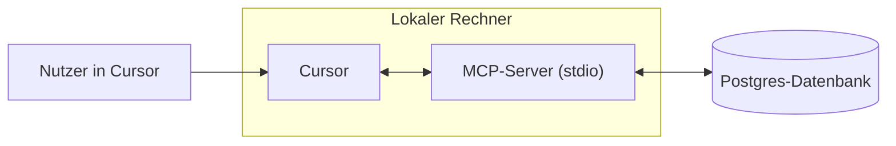

# Einen MCP-Server erstellen
Source: https://docs.cursor.com/de/guides/tutorials/building-mcp-server

Lerne, wie du einen Model Context Protocol (MCP)-Server mit PostgreSQL-Integration für Cursor erstellst

<div id="introduction">
  ## Einführung
</div>

MCP-Server lassen dich eigene Datenquellen anbinden und in Cursor verfügbar machen. Das ist besonders nützlich, wenn du Kontext aus Quellen wie Browsern, Datenbanken oder Fehler- und System-Logs brauchst. Das Einrichten eines MCP-Servers ist unkompliziert und mit Cursor schnell erledigt.

In diesem Guide zeigen wir, wie du einen MCP-Server für Postgres baust. Unser Ziel ist, Cursor zu ermöglichen, SQL-Abfragen direkt gegen eine Postgres-Datenbank auszuführen und Tabellenschemata strukturiert bereitzustellen.

<Note>
  Dieses Tutorial soll dir die Grundlagen zum Erstellen von MCP-Servern vermitteln.
</Note>

<video autoPlay loop muted playsInline controls>
  <source src="https://mintcdn.com/cursor/Qpa6MBK62Try_xlf/images/guides/tutorials/building-mcp-server/demo.mp4?fit=max&auto=format&n=Qpa6MBK62Try_xlf&q=85&s=8e02b011bd0956d62135db5779f7ead5" type="video/mp4" data-path="images/guides/tutorials/building-mcp-server/demo.mp4" />
</video>



<div id="what-is-an-mcp-server">
  ## Was ist ein MCP-Server?
</div>

Ein [MCP-Server](/de/context/mcp) ist ein Prozess, der mit Cursor kommuniziert und Zugriff auf externe Daten oder Aktionen bereitstellt. Er kann auf mehrere Arten implementiert werden, aber hier nutzen wir die einfachste Methode: einen Server, der lokal auf deinem Computer über [stdio](https://en.wikipedia.org/wiki/Standard_streams) (Standard-Ein-/Ausgabeströme) läuft. Das vermeidet komplizierte Sicherheitsüberlegungen und lässt uns auf die MCP-Logik selbst fokussieren.

Einer der häufigsten Anwendungsfälle für MCP ist der Datenbankzugriff. Beim Erstellen von Dashboards, dem Ausführen von Analysen oder dem Erstellen von Migrationen ist es oft notwendig, eine Datenbank zu abzufragen und zu inspizieren. Unser Postgres-MCP-Server wird zwei Kernfunktionen unterstützen: das Ausführen beliebiger Abfragen und das Auflisten von Tabellenschemata.

Obwohl beide Aufgaben auch mit reinem SQL erledigt werden könnten, bietet MCP Funktionen, die sie mächtiger und allgemein nützlicher machen. Tools bieten eine Möglichkeit, Aktionen wie das Ausführen von Abfragen bereitzustellen, während Ressourcen es ermöglichen, standardisierten Kontext wie Schemainformationen zu teilen. Später in diesem Guide schauen wir uns auch Prompts an, die fortgeschrittenere Workflows ermöglichen.

Unter der Haube verlassen wir uns auf das npm-Paket postgres, um SQL-Anweisungen gegen die Datenbank auszuführen. Das MCP-SDK dient als Wrapper um diese Aufrufe und ermöglicht es uns, Postgres-Funktionalität nahtlos in Cursor zu integrieren.

<div id="how-to-build-the-mcp-server">
  ## So baust du den MCP-Server
</div>

Der erste Schritt beim Erstellen des Servers ist, ein neues Projekt aufzusetzen. Wir fangen damit an, einen neuen Ordner zu erstellen und ein Bun-Projekt zu initialisieren.

```bash  theme={null}
> mkdir postgres-mcp-server
> Bun init
```

Von hier aus wählen wir das `Blank`-Projekt. Sobald unser Boilerplate eingerichtet ist, müssen wir die benötigten Abhängigkeiten installieren. `zod` wird benötigt, um Schemas für I/O im MCP-SDK zu definieren

```bash  theme={null}
bun add postgres @modelcontextprotocol/sdk zod
```

Von hier aus gehen wir zu den Repos der jeweiligen Libraries und holen uns den Link zu den Rohinhalten der jeweiligen README-Dateien. Die nutzen wir als Kontext, wenn wir den Server bauen.

* `postgres`
  * Repo:  [https://github.com/porsager/postgres](https://github.com/porsager/postgres),
  * README: [https://raw.githubusercontent.com/porsager/postgres/refs/heads/master/README.md](https://raw.githubusercontent.com/porsager/postgres/refs/heads/master/README.md)
* `@modelcontextprotocol/sdk`:
  * Repo: [https://github.com/modelcontextprotocol/typescript-sdk](https://github.com/modelcontextprotocol/typescript-sdk)
  * README: [https://raw.githubusercontent.com/modelcontextprotocol/typescript-sdk/refs/heads/main/README.md](https://raw.githubusercontent.com/modelcontextprotocol/typescript-sdk/refs/heads/main/README.md)

Jetzt definieren wir, wie sich der Server verhalten soll. Dafür erstellen wir eine `spec.md` und schreiben die übergeordneten Ziele auf.

```markdown  theme={null}

---

← Previous: [Architekturschaubilder](./architekturschaubilder.md) | [Index](./index.md) | Next: [Webentwicklung](./webentwicklung.md) →