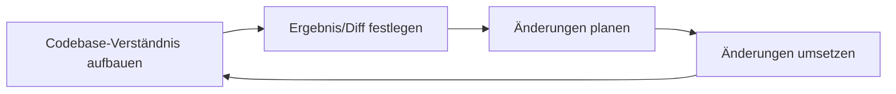

# Große Codebasen
Source: https://docs.cursor.com/de/guides/advanced/large-codebases

So arbeitest du mit großen Codebasen in Cursor

Die Arbeit mit großen Codebasen bringt andere Herausforderungen mit sich als kleinere Projekte. Aus unserer Erfahrung beim Skalieren der eigenen Cursor-Codebase und aus Insights von Kund:innen, die riesige Codebasen managen, haben wir hilfreiche Patterns entdeckt, um die gestiegene Komplexität zu bewältigen.

In diesem Guide gehen wir ein paar Techniken durch, die sich für große Codebasen bewährt haben.



<div id="use-chat-to-quickly-get-up-to-speed-on-unfamiliar-code">
  # Mit Chat schnell bei unbekanntem Code auf den neuesten Stand kommen
</div>

Eine große Codebase zu durchdringen – besonders wenn sie neu für dich ist – kann knifflig sein. Oft greppst du, suchst und klickst dich durch die Dateien, um die konkreten Stellen zu finden, die du brauchst. Mit [Chat](/de/chat/overview) kannst du direkt Fragen stellen, gezielt finden, wonach du suchst, und bekommst eine detaillierte Erklärung, wie es funktioniert.

Hier lassen wir uns helfen, die Implementierungsdetails der Codebase-Indizierung in Cursor zu finden, und bitten sogar um Beispiele, damit das Ganze leichter zu verstehen ist.

<Frame>
  <video src="https://mintcdn.com/cursor/E7JVsKUF5L-IiJRB/images/guides/advanced/large-codebases/qa.mp4?fit=max&auto=format&n=E7JVsKUF5L-IiJRB&q=85&s=d749be91cb35a3d13fa9df4210622029" controls data-path="images/guides/advanced/large-codebases/qa.mp4" />
</Frame>

<div id="write-rules-for-domain-specific-knowledge">
  # Schreib Regeln für domänenspezifisches Wissen
</div>

Wenn du eine neue Kollegin oder einen neuen Kollegen in deiner Codebase onboardest, welchen Kontext würdest du geben, damit sie direkt sinnvoll beitragen können?

Deine Antwort auf diese Frage ist vermutlich auch für Cursor wertvoll. In jeder Organisation oder in jedem Projekt gibt es latentes Wissen, das nicht vollständig in deiner Doku festgehalten ist. Regeln gezielt einzusetzen ist der beste Weg, um sicherzustellen, dass Cursor das volle Bild bekommt.

Wenn du zum Beispiel Anweisungen schreibst, wie ein neues Feature oder ein neuer Service implementiert wird, überleg dir, eine kurze Regel zu verfassen, um das dauerhaft festzuhalten.

```mdc Boilerplate theme={null}
---
description: Einen neuen VSCode-Frontend-Service hinzufügen
---

1. **Schnittstellendefinition:**
   - Definiere eine neue Service-Schnittstelle mit `createDecorator` und stell sicher, dass `_serviceBrand` enthalten ist, um Fehler zu vermeiden.

2. **Service-Implementierung:**
   - Implementiere den Service in einer neuen TypeScript-Datei, erweitere `Disposable` und registriere ihn als Singleton mit `registerSingleton`.

3. **Service-Contribution:**
   - Erstelle eine Contribution-Datei, um den Service zu importieren und zu laden, und registriere ihn im Haupteinstiegspunkt.

4. **Kontextintegration:**
   - Aktualisiere den Kontext, um den neuen Service einzubinden, sodass er in der gesamten Anwendung verfügbar ist.
```

Wenn es gängige Formatierungsmuster gibt, an die sich Cursor halten soll, solltest du in Erwägung ziehen, Regeln basierend auf Glob-Mustern automatisch anzuhängen.

```mdc Formatierung theme={null}
---
globs: *.ts
---
- Verwende bun als Paketmanager. Siehe [package.json](mdc:backend/reddit-eval-tool/package.json) für Skripte
- Verwende kebab-case für Dateinamen
- Verwende camelCase für Funktions- und Variablennamen
- Verwende UPPERCASE_SNAKE_CASE für hardcodierte Konstanten
- Bevorzuge `function foo()` gegenüber `const foo = () =>`
- Verwende `Array<T>` statt `T[]`
- Verwende benannte Exports statt Default-Exports, z. B. (`export const variable ...`, `export function `)
```

<div id="stay-close-to-the-plan-creation-process">
  # Bleib nah am Planerstellungsprozess
</div>

Für größere Änderungen kann es Cursor's Output deutlich verbessern, wenn du überdurchschnittlich viel Zeit investierst, um einen präzisen, klar abgegrenzten Plan zu erstellen.

Wenn du nach ein paar unterschiedlichen Variationen desselben Prompts nicht das Ergebnis bekommst, das du willst, zoom raus und erstell von Grund auf einen detaillierteren Plan – so, als würdest du ein PRD für eine:n Kolleg:in schreiben. Oft ist **der schwierige Teil, herauszufinden, welche** Änderung überhaupt gemacht werden sollte – eine Aufgabe, die besonders gut für Menschen geeignet ist. Mit den richtigen Anweisungen können wir Teile der Implementierung an Cursor delegieren.

Eine Möglichkeit, KI zur Unterstützung der Planerstellung zu nutzen, ist der Ask-Modus. Um einen Plan zu erstellen, schalt in Cursor den Ask-Modus ein und kipp sämtlichen Kontext rein, den du aus deinen Projektmanagement-Systemen, internen Docs oder losen Notizen hast. Überleg dir, welche Dateien und Abhängigkeiten es in der Codebase gibt, die du unbedingt einbeziehen willst. Das kann eine Datei sein, die Codeabschnitte enthält, mit denen du integrieren willst, oder auch ein kompletter Ordner.

Hier ist ein Beispiel-Prompt:

```mdc Planungs-Prompt theme={null}
- erstelle einen Plan, wie wir ein neues Feature bauen sollten (genau wie @existingfeature.ts)
- stell mir Fragen (max. 3), wenn etwas unklar ist
- stell sicher, dass du den Code durchsucht

@Vergangene Chats (meine früheren Erkundungs-Prompts)

hier ist noch mehr Kontext aus dem [Projektmanagement-Tool]:
[eingefügte Ticketbeschreibung]
```

Wir lassen das Modell einen Plan erstellen und Kontext sammeln, indem es dir Fragen stellt und sich auf frühere Explorations‑Prompts sowie die Ticketbeschreibungen bezieht. Ein Thinking‑Modell wie `claude-3.7-sonnet`, `gemini-2.5-pro` oder `o3` wird empfohlen, da es die Absicht der Änderung versteht und einen Plan besser synthetisieren kann.

Darauf aufbauend kannst du den Plan iterativ mit Hilfe von Cursor ausarbeiten, bevor du mit der Implementierung startest.


<div id="pick-the-right-tool-for-the-job">
  # Wähl das richtige Tool für die Aufgabe
</div>

Eine der wichtigsten Fähigkeiten, um Cursor effektiv zu nutzen, ist, das richtige Tool für die jeweilige Aufgabe zu wählen. Überleg dir, was du erreichen willst, und nimm den Ansatz, der dich im Flow hält.

| **Tool**                                    | **Use Case**                                  | **Stärke**                                          | **Einschränkung**        |
| :------------------------------------------ | :-------------------------------------------- | :-------------------------------------------------- | :----------------------- |
| **[Tab](/de/tab/overview)**                 | Schnelle, manuelle Änderungen                 | Volle Kontrolle, schnell                            | Einzeldatei              |
| **[Inline Edit](/de/inline-edit/overview)** | Gezielt abgegrenzte Änderungen in einer Datei | Fokussierte Änderungen                              | Einzeldatei              |
| **[Chat](/de/chat/overview)**               | Größere, mehrdateiige Änderungen              | Sammelt Kontext automatisch, tiefgehende Änderungen | Langsamer, kontextlastig |

Jedes Tool hat seinen Sweet Spot:

* Tab ist dein Go-to für schnelle Änderungen, bei denen du am Steuer sitzen willst
* Inline Edit glänzt, wenn du fokussierte Änderungen an einem bestimmten Codeabschnitt machen musst
* Chat ist perfekt für größere Änderungen, bei denen Cursor den breiteren Kontext verstehen soll

Wenn du den Chat-Modus nutzt (der sich etwas langsamer anfühlen kann, aber unglaublich mächtig ist), hilf ihm, dir zu helfen, indem du guten Kontext lieferst. Verwende [@files](/de/context/@-symbols/@-files), um auf ähnlichen Code zu verweisen, den du nachahmen willst, oder [@folder](/de/context/@-symbols/@-folders), um ein besseres Verständnis deiner Projektstruktur zu geben. Und hab keine Angst, größere Änderungen in kleinere Schritte zu zerlegen – neue Chats zu starten hilft, Dinge fokussiert und effizient zu halten.

<div id="takeaways">
  # Wichtigste Erkenntnisse
</div>

* Änderungen klein halten und nicht zu viel auf einmal machen
* Relevanten Kontext angeben, wenn möglich
* Chat, Inline Edit & Tab jeweils für das nutzen, worin sie am besten sind
* Oft neue Chats erstellen
* Mit [Ask mode](/de/chat/ask) planen, mit [Agent mode](/de/chat/agent) umsetzen

---

← Previous: [Data Science](./data-science.md) | [Index](./index.md) | Next: [Arbeiten mit Dokumentation](./arbeiten-mit-dokumentation.md) →