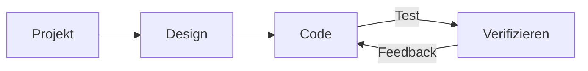

# Webentwicklung
Source: https://docs.cursor.com/de/guides/tutorials/web-development

So richtest du Cursor für die Webentwicklung ein

export const McpInstallButtonPrimary = ({server, showIcon = true, prompt = null}) => {
  const [showModal, setShowModal] = useState(false);
  const generateDeepLink = () => {
    if (!server || !server.name || !server.install) {
      return null;
    }
    try {
      if (typeof server.install === 'string') {
        return server.install;
      }
      if (server.install.url) {
        const config = {
          ...server.install
        };
        const jsonString = JSON.stringify(config);
        const utf8Bytes = new TextEncoder().encode(jsonString);
        const base64Config = btoa(Array.from(utf8Bytes).map(b => String.fromCharCode(b)).join(''));
        const safeBase64Config = base64Config.replace(/\+/g, '%2B');
        return `cursor://anysphere.cursor-deeplink/mcp/install?name=${encodeURIComponent(server.name)}&config=${encodeURIComponent(safeBase64Config)}`;
      }
      if (server.install.command) {
        let config = {
          command: server.install.command,
          ...server.install.args && ({
            args: server.install.args
          }),
          ...server.install.env && ({
            env: server.install.env
          })
        };
        if (config.command && config.args) {
          const argsString = config.args.join(" ");
          config.command = `${config.command} ${argsString}`;
          delete config.args;
        }
        const jsonString = JSON.stringify(config);
        const utf8Bytes = new TextEncoder().encode(jsonString);
        const base64Config = btoa(Array.from(utf8Bytes).map(b => String.fromCharCode(b)).join(''));
        const safeBase64Config = base64Config.replace(/\+/g, '%2B');
        return `cursor://anysphere.cursor-deeplink/mcp/install?name=${encodeURIComponent(server.name)}&config=${encodeURIComponent(safeBase64Config)}`;
      }
      return null;
    } catch (e) {
      console.error("Error generating deep link:", e);
      return null;
    }
  };
  const handleButtonClick = () => {
    setShowModal(true);
  };
  const handleClose = () => {
    setShowModal(false);
  };
  const deepLink = generateDeepLink();
  const isDocumentationOnly = typeof server?.install === 'string';
  const hasConfirmation = prompt || isDocumentationOnly;
  const InstallModal = ({isOpen, onClose, deepLink, server, children}) => {
    useEffect(() => {
      const handleKeyDown = event => {
        if (event.key === 'Escape') {
          onClose();
        }
      };
      if (isOpen) {
        document.addEventListener('keydown', handleKeyDown);
      }
      return () => {
        document.removeEventListener('keydown', handleKeyDown);
      };
    }, [isOpen, onClose]);
    if (!isOpen) return null;
    return <div className="fixed inset-0 bg-black bg-opacity-50 flex items-center justify-center z-50 transition-opacity duration-200" onClick={onClose}>
        <div className="bg-white dark:bg-neutral-900 rounded-lg p-6 max-w-md w-full mx-4 border border-neutral-200 dark:border-neutral-700 transition-all duration-200 transform" onClick={e => e.stopPropagation()}>
          <div className="mb-4">
            <h3 className="text-lg font-semibold text-black dark:text-white mb-2">
              Install {server?.name}
            </h3>
            <div className="text-neutral-600 dark:text-neutral-400">
              {children}
            </div>
          </div>
          <div className="flex gap-3 justify-end">
            <button onClick={onClose} className="px-4 py-2 text-sm font-medium rounded-lg transition-colors duration-200 text-neutral-600 dark:text-neutral-400 hover:text-black dark:hover:text-white border border-neutral-200 dark:border-neutral-700 hover:bg-neutral-100 dark:hover:bg-neutral-800">
              Cancel
            </button>
            <a href={deepLink} onClick={onClose} target="_blank" className="px-4 py-2 text-sm font-medium rounded-lg transition-colors duration-200 bg-black text-white hover:bg-neutral-800 dark:bg-white dark:text-black dark:hover:bg-neutral-200 inline-flex items-center justify-center no-underline">
              Continue
            </a>
          </div>
        </div>
      </div>;
  };
  return <>
      {hasConfirmation ? <button onClick={handleButtonClick} className="inline-flex justify-center items-center gap-2 px-4 py-2 text-sm font-medium rounded-lg transition-colors duration-200 not-prose text-white bg-black hover:bg-neutral-800 dark:bg-white dark:text-black dark:hover:bg-neutral-200 border border-black dark:border-white">
          {showIcon && <Icon icon="plus" size={16} color="currentColor" />}
          Add to Cursor
        </button> : <a href={deepLink} className="inline-flex justify-center items-center gap-2 px-4 py-2 text-sm font-medium rounded-lg transition-colors duration-200 not-prose text-white bg-black hover:bg-neutral-800 dark:bg-white dark:text-black dark:hover:bg-neutral-200 border border-black dark:border-white">
          {showIcon && <Icon icon="plus" size={16} color="currentColor" />}
          Add to Cursor
        </a>}

      {hasConfirmation && <InstallModal isOpen={showModal} onClose={handleClose} deepLink={deepLink} server={server}>
          {prompt}
        </InstallModal>}
    </>;
};

Webentwicklung lebt von schnellen Iterationen und einem engen Feedback-Loop zwischen Cursor und externen Tools wie Figma oder dem Browser. Bei Cursor haben wir Workflows entwickelt, die diesen Loop weiter verkürzen. Klare Aufgabenabgrenzung, Wiederverwendung von Komponenten und der Einsatz von Designsystemen halten alles schnell und konsistent.

Dieser Guide zeigt dir, wie du Cursor für die Webentwicklung einrichtest und den Feedback-Loop weiter verkürzt.



<div id="start-orchestrating-in-cursor">
  # Orchestrierung in Cursor starten
</div>

**Chat** ist super, um Änderungen zu starten. Sobald die großen Teile stehen, helfen **Inline Edit** und **Tab** dabei, in deinem Flow zu bleiben.

Nachdem du Cursor eingerichtet hast, kannst du Workflows über verschiedene Tools hinweg orchestrieren. Unten siehst du eine Demo dessen, was möglich ist: ein Snake-Game, erstellt durch die Kombination von Linear, Figma und Browser-Tools. Reale Projekte sind in der Regel komplexer, aber dieses Beispiel zeigt das Potenzial dieser integrierten Workflows.

<Frame>
  <video src="https://mintcdn.com/cursor/E7JVsKUF5L-IiJRB/images/guides/tutorials/web-development/snake.mp4?fit=max&auto=format&n=E7JVsKUF5L-IiJRB&q=85&s=e029fbdff2ec06e1e4393ac580824b5a" controls data-path="images/guides/tutorials/web-development/snake.mp4" />
</Frame>

<div id="connect-to-your-project-management-tools">
  # Verbinde Cursor mit deinen Projektmanagement-Tools
</div>

Du kannst Cursor über verschiedene Tools in deine bestehende Projektmanagement-Software integrieren. In diesem Guide schauen wir uns die Integration von Linear mit dessen MCP-Server an.

<div id="installation">
  ### Installation
</div>

<McpInstallButtonPrimary
  server={{
name: "Linear",
install: {
command: "npx",
args: ["-y", "mcp-remote", "https://mcp.linear.app/sse"],
},
}}
/>

Oder füge den Linear-MCP-Server manuell zu `mcp.json` hinzu:

```jsx  theme={null}
{
  "mcpServers": {
    "Linear": {
      "command": "npx",
      "args": [
        "-y",
        "mcp-remote",
        "https://mcp.linear.app/sse"
      ]
    }
  }
}
```

Dann:

1. Stell sicher, dass du Linear in den MCP-Einstellungen aktivierst
2. Ein Webbrowser öffnet sich und du wirst aufgefordert, dich bei Linear zu authentifizieren
   <Info>
     Aufgrund des aktuellen Stands von MCP kann die Einrichtung mehrere Versuche erfordern.
     Wenn die Integration nicht funktioniert, versuch in den Cursor-Einstellungen den Server zu „reloaden“.
   </Info>

<div id="using-linear-in-cursor">
  ### Linear in Cursor verwenden
</div>

Linear-MCP-Server stellen verschiedene Tools bereit, die Cursor zum Lesen und Verwalten von Issues nutzen kann. Geh zu den MCP-Einstellungen und such den Linear-Server, um eine Liste aller Tools zu sehen. Zum Überprüfen, probier diesen Prompt im Chat:

```jsx  theme={null}
alle Issues zu diesem Projekt auflisten
```

<Frame>
  
</Frame>

Wenn die Integration korrekt eingerichtet ist, sollte eine Liste von Issues zurückgegeben werden.

<div id="bring-in-your-figma-designs">
  # Hol dir deine Figma-Designs ins Projekt
</div>

Designs und Mockups sind zentral für die Webentwicklung. Mit dem offiziellen MCP-Server für Figma kannst du in Cursor direkt auf Design-Dateien zugreifen und damit arbeiten. Um loszulegen, folg der Einrichtung unter [Figma Dev Mode MCP Server](https://help.figma.com/hc/en-us/articles/32132100833559-Guide-to-the-Dev-Mode-MCP-Server).

<div id="installation">
  ### Installation
</div>

Du kannst unten auf den Button klicken, um den MCP-Server zu installieren.

<McpInstallButtonPrimary
  server={{
name: "Figma",
install: {
url: "http://127.0.0.1:3845/sse",
},
}}
/>

Oder manuell zu deiner `mcp.json` hinzufügen:

```jsx  theme={null}
{
  "mcpServers": {
    "Figma": {
      "url": "http://127.0.0.1:3845/sse"
    }
  }
}
```

<div id="usage">
  ### Verwendung
</div>

Der Server stellt mehrere Tools bereit, die du in deinen Prompts nutzen kannst. Probier zum Beispiel, dir die Designs der aktuellen Auswahl in Figma ausgeben zu lassen. Mehr dazu in der [Dokumentation](https://help.figma.com/hc/en-us/articles/32132100833559-Guide-to-the-Dev-Mode-MCP-Server).

<Frame>
  
</Frame>

<div id="keep-your-code-scaffolding-consistent">
  # Halte dein Code-Scaffolding konsistent
</div>

Du hast wahrscheinlich bestehenden Code, ein Designsystem oder etablierte Konventionen, die du wiederverwenden willst. Beim Arbeiten mit Modellen ist es hilfreich, auf Muster zu verweisen, die bereits in deiner Codebase existieren, zum Beispiel Dropdown-Menüs oder andere gängige Komponenten.

Wir arbeiten selbst in einer großen webbasierten Codebase und haben festgestellt, dass deklarativer Code besonders gut funktioniert – vor allem mit React und JSX.

Wenn du ein Designsystem hast, kannst du dem Agent helfen, es zu erkennen, indem du eine entsprechende Regel vorgibst. Hier ist eine `ui-components.mdc`-Datei, mit der wir nach Möglichkeit die Wiederverwendung von Komponenten erzwingen:

```mdc components.mdc theme={null}
---
description: Designs umsetzen und UI erstellen
---
- vorhandene UI-Komponenten aus `/src/components/ui` wiederverwenden. Das sind die Bausteine, mit denen wir arbeiten
- neue Komponenten erstellen, indem du UI-Komponenten orchestrierst, wenn es keine vorhandene gibt, die das Problem löst
- den Menschen fragen, wie er weiter vorgehen will, wenn Komponenten und Designs fehlen
```

Wenn deine Komponentenbibliothek wächst, füge entsprechend neue Regeln hinzu. Wenn es zu viele Regeln werden, überleg dir, sie in spezifischere Kategorien aufzuteilen, zum Beispiel „nur anwenden, wenn mit Benutzereingaben gearbeitet wird“.

<Frame>
  
</Frame>

<div id="give-cursor-access-to-browser">
  # Cursor Zugriff auf den Browser geben
</div>

Um Cursors Fähigkeiten zu erweitern, kannst du den Browser-Tools-MCP-Server einrichten, der Zugriff auf Konsolenlogs und Netzwerkrequests bereitstellt. Sobald er konfiguriert ist, kannst du deine Änderungen überprüfen, indem du die Konsolenausgabe und die Netzwerkaktivität beobachtest. Dieses Setup hilft sicherzustellen, dass deine Implementierung deiner Absicht entspricht. Folge den Anweisungen hier, um den MCP-Server einzurichten: [https://browsertools.agentdesk.ai/installation](https://browsertools.agentdesk.ai/installation)

<Frame>
  
</Frame>

<Note>
  Wir arbeiten daran, die native Integration in Cursor zu vereinfachen.
</Note>

<div id="takeaways">
  # Erkenntnisse
</div>

* Enge Feedback-Schleifen sind in der Webentwicklung entscheidend. Nutze Cursor zusammen mit Tools wie Figma, Linear und dem Browser, um schnell voranzukommen und im Flow zu bleiben.
* MCP-Server ermöglichen dir, externe Systeme direkt in Cursor zu integrieren, was Kontextwechsel reduziert und die Aufgabenausführung verbessert.
* Das Wiederverwenden von Komponenten und Designsystemen hilft dem Modell, saubereren, konsistenteren Code und Ergebnisse zu erzeugen.
* Klar formulierte, klar abgegrenzte Aufgaben führen zu besseren Ergebnissen. Sei bewusst darin, wie du promptest und worum du bittest.
* Wenn du keine guten Ergebnisse bekommst, versuch Folgendes anzupassen:
  * **Instructions:** Nutze Regeln, Prompts und gib Zugriff auf mehr Kontext, z. B. mit MCP-Servern.
  * **Systems:** Muster, Abstraktionen und Klarheit machen es dem Modell leichter, zu verstehen, zu helfen und autonomer zu arbeiten.
* Du kannst den Kontext des Modells erweitern, indem du Laufzeitinfos wie Console-Logs, Network-Requests und UI-Element-Daten einbeziehst.
* Nicht alles muss automatisiert werden. Wenn dein System zu komplex wird, greif auf gezielte Änderungen mit Tab und Inline Edit zurück.
* Cursor ist am stärksten, wenn es ein Co-Pilot ist, kein Autopilot. Nutze es, um deine eigene Entscheidungsfindung zu verbessern, nicht zu ersetzen.

---

← Previous: [Einen MCP-Server erstellen](./einen-mcp-server-erstellen.md) | [Index](./index.md) | Next: [Arbeiten mit Kontext](./arbeiten-mit-kontext.md) →