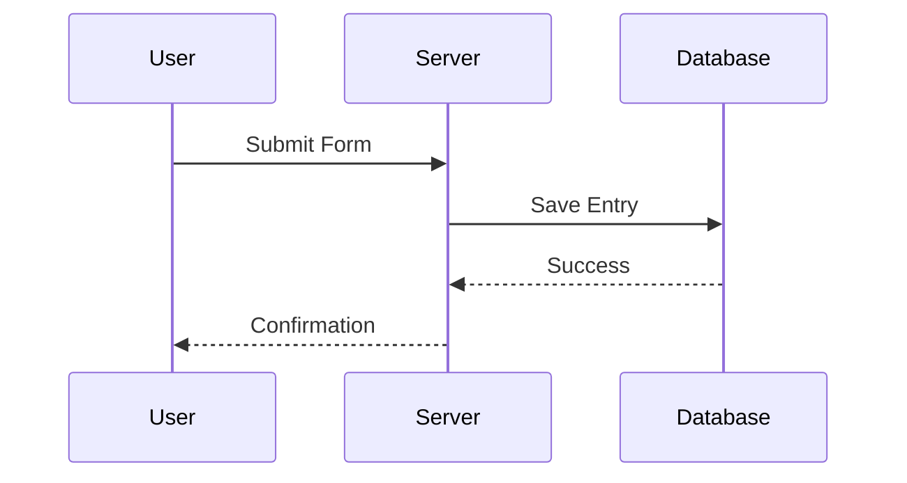
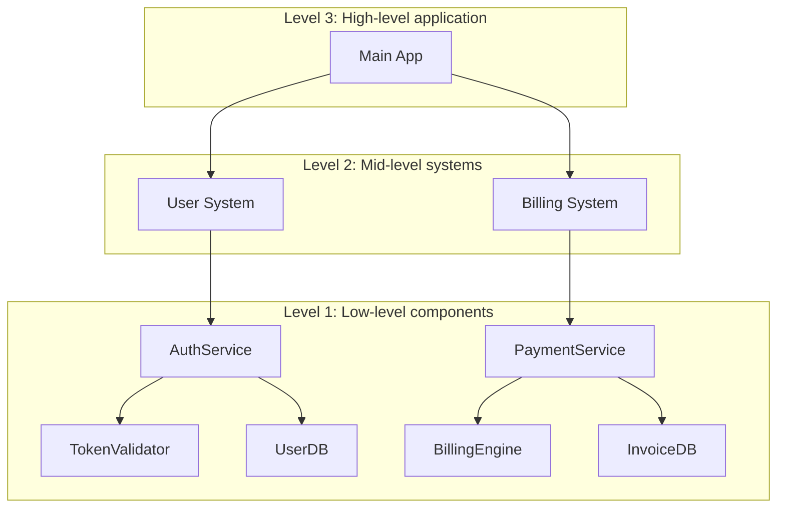

# Architectural Diagrams
Source: https://docs.cursor.com/en/guides/tutorials/architectural-diagrams

Learn to generate architectural diagrams using Mermaid to visualize system structure and data flow

Architectural diagrams help you make sense of how your system works. You can use them to explore logic, track data, and communicate structure. Cursor supports generating these diagrams directly using tools like Mermaid, so you can go from code to visual in just a few prompts.

<Frame>
  
</Frame>

## Why diagrams matter

Diagrams clarify how data flows and how components interact. They're useful when you:

* Want to understand flow control in your codebase
* Need to trace data lineage from input to output
* Are onboarding others or documenting your system

They're also great for debugging and asking smarter questions. Visuals help you (and the model) see the bigger picture.

## Two dimensions to consider

There are a few different angles to think about:

* **Purpose**: Are you mapping logic, data flow, infrastructure, or something else?
* **Format**: Do you want something quick (like a Mermaid diagram) or formal (like UML)?

## How to prompt

Start with a clear goal. Here are some common ways to ask:

* **Flow control**: "Show me how requests go from the controller to the database."
* **Data lineage**: "Trace this variable from where it enters to where it ends up."
* **Structure**: "Give me a component-level view of this service."

You can include start and end points, or ask Cursor to find the full path.

## Working with Mermaid

Mermaid is simple to learn and renders directly in Markdown (with the right extension). Cursor can generate diagrams like:

* `flowchart` for logic and sequences
* `sequenceDiagram` for interactions
* `classDiagram` for object structure
* `graph TD` for simple directional maps

You can install the [Mermaid extension](https://marketplace.cursorapi.com/items?itemName=bierner.markdown-mermaid) to preview diagrams.

1. Go to Extensions tab
2. Search for Mermaid
3. Install

<Frame>
  
</Frame>

## Diagram strategy

Start small. Don't aim to map everything at once.

* Pick one function, route, or process
* Ask Cursor to diagram that part using Mermaid
* Once you have a few, ask it to combine them

This mirrors the **C4 model** – where you start at a low level (code or components) and work upward to higher-level overviews.

### Recommended flow

1. Start with a detailed, low-level diagram
2. Summarize it into a mid-level view
3. Repeat until you reach the level of abstraction you want
4. Ask Cursor to merge them into a single diagram or system map

## Takeaways

* Use diagrams to understand flow, logic, and data
* Start with small prompts and grow your diagram from there
* Mermaid is the easiest format to work with in Cursor
* Start low-level and abstract upward, just like in the C4 model
* Cursor can help you generate, refine, and combine diagrams with ease

---

← Previous: [VS Code](./vs-code.md) | [Index](./index.md) | Next: [Building an MCP Server](./building-an-mcp-server.md) →