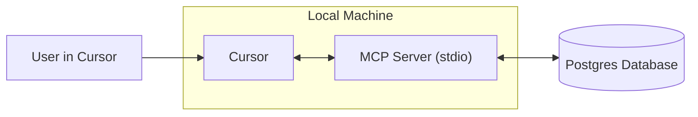

# Building an MCP Server
Source: https://docs.cursor.com/en/guides/tutorials/building-mcp-server

Learn how to build a Model Context Protocol (MCP) server with PostgreSQL integration for Cursor

## Introduction

MCP servers let you connect custom data sources and make them available for use inside Cursor. This is particularly useful when you need context from places such as browsers, databases, or error and system logs. Setting up an MCP server is straightforward, and with Cursor it can be done quickly.

In this guide, we will walk through how to build an MCP server for Postgres. Our goal is to enable Cursor to run SQL queries directly against a Postgres database and to expose table schemas in a structured way.

<Note>
  This tutorial is designed to teach the fundamentals of building MCP servers.
</Note>

<video autoPlay loop muted playsInline controls>
  <source src="https://mintcdn.com/cursor/Qpa6MBK62Try_xlf/images/guides/tutorials/building-mcp-server/demo.mp4?fit=max&auto=format&n=Qpa6MBK62Try_xlf&q=85&s=8e02b011bd0956d62135db5779f7ead5" type="video/mp4" data-path="images/guides/tutorials/building-mcp-server/demo.mp4" />
</video>



## What is an MCP Server?

An [MCP server](/en/context/mcp) is a process that communicates with Cursor and provides access to external data or actions. It can be implemented in several ways, but here we will use the simplest method: a server that runs locally on your computer over [stdio](https://en.wikipedia.org/wiki/Standard_streams) (standard input/output streams). This avoids complicated security considerations and allows us to focus on the MCP logic itself.

One of the most common use cases for MCP is database access. When building dashboards, running analyses, or creating migrations, it is often necessary to query and inspect a database. Our Postgres MCP server will support two core capabilities: running arbitrary queries and listing table schemas.

Although both of these tasks could be performed with plain SQL, MCP offers features that make them more powerful and more generally useful. Tools provide a way to expose actions such as executing queries, while resources allow us to share standardized context such as schema information. Later in this guide we will also look at prompts, which enable more advanced workflows.

Under the hood, we will rely on the postgres npm package to execute SQL statements against the database. The MCP SDK will serve as a wrapper around these calls, letting us integrate Postgres functionality seamlessly into Cursor.

## How to Build the MCP Server

The first step in building the server is to setup a new project. We’ll start with creating a new folder and initializing a Bun project

```bash  theme={null}
> mkdir postgres-mcp-server
> Bun init
```

From here, we’ll select `Blank` project. Once our boilerplate is setup, we need to install the required dependencies. `zod` is required to define schemas for i/o in MCP sdk

```bash  theme={null}
bun add postgres @modelcontextprotocol/sdk zod
```

From here, we’ll go to the repositories for each of the libraries and get the link to the raw file contents of each respective README files. We’ll use these for context when building the server

* `postgres`
  * Repo:  [https://github.com/porsager/postgres](https://github.com/porsager/postgres),
  * README: [https://raw.githubusercontent.com/porsager/postgres/refs/heads/master/README.md](https://raw.githubusercontent.com/porsager/postgres/refs/heads/master/README.md)
* `@modelcontextprotocol/sdk`:
  * Repo: [https://github.com/modelcontextprotocol/typescript-sdk](https://github.com/modelcontextprotocol/typescript-sdk)
  * README: [https://raw.githubusercontent.com/modelcontextprotocol/typescript-sdk/refs/heads/main/README.md](https://raw.githubusercontent.com/modelcontextprotocol/typescript-sdk/refs/heads/main/README.md)

Now, we’ll define how we want the server to behave. To do that, we’ll create a `spec.md` and write out the high level goals

```markdown  theme={null}

---

← Previous: [Architectural Diagrams](./architectural-diagrams.md) | [Index](./index.md) | Next: [Web Development](./web-development.md) →