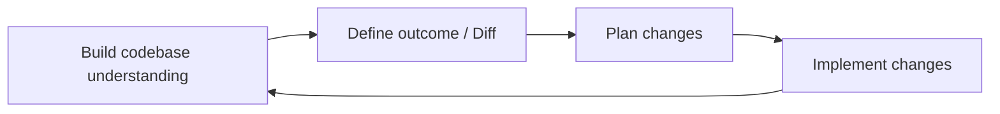
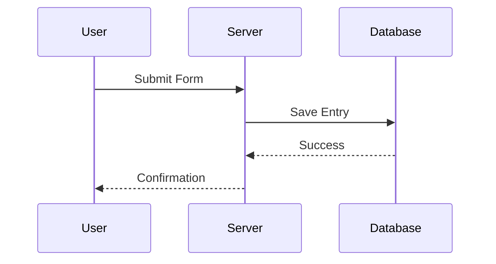
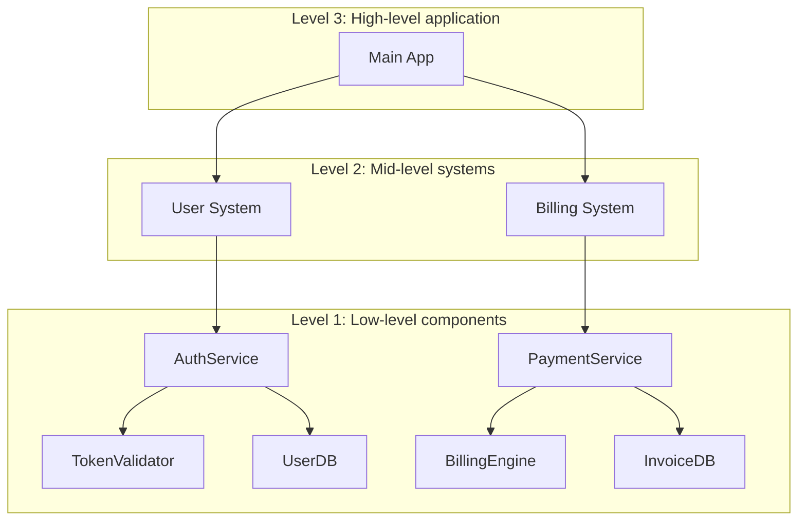
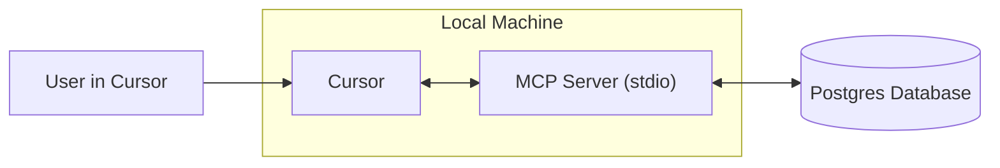
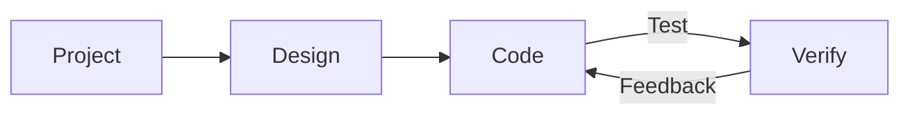

# Cursor Documentation (English)

This is the complete formatted documentation for Cursor in English, parsed and organized from the official documentation.

**Total Sections:** 112

---


# Agent Security
Source: https://docs.cursor.com/en/account/agent-security

Security considerations for using Cursor Agent

Prompt injection, AI hallucinations, and other issues may cause AI to behave in unexpected and potentially malicious ways. While we continue to work on solving prompt injection at a more foundational level, our primary protection in Cursor products are guardrails around what an agent can do, including requiring manual approval for sensitive actions by default. The goal of this document is to explain our guardrails and what users can expect from them.

All of the controls and behavior below are our default and recommended settings.

## First-party tool calls

Cursor comes bundled with tools that enable the agent to help our users write code. These include file read, edits, calling terminal commands, searching the web for documentation, and others.

Read tools do not require approval (ie reading files, searching across code). Users may use [.cursorignore](/en/context/ignore-files) to block the agent from accessing specific files at all, but otherwise reads are generally permitted without approval. For actions that carry risk of exfiltrating sensitive data, we require explicit approval.

Modifying files within the current workspace does not require explicit approval with some exceptions. When an agent makes changes to files they are immediately saved to disk. We recommend that Cursor be run in version controlled workspaces, so that the contents of the files can be reverted at any time. We require explicit approval before changing files that modify the configuration of our IDE/CLI, such as the workspace settings file of the editor. However, users automatically reloading on file change should be aware that agent changes to files may trigger automatic execution before they have had a chance to review the changes.

Any terminal command suggested by Agents requires approval by default. We recommend that users review every command before the agent executes it. Users who accept the risk may choose to enable the agent to run all commands without approval. We include an [allowlist](/en/agent/tools) feature in Cursor, but do not consider it to be a security control. Some users choose to allow specific commands, but this is a best effort system and bypasses may be possible. We do not recommend "Run Everything", which bypasses any configured allowlists.

## Third-party tool calls

Cursor enables connecting external tools via [MCP](/en/context/mcp). All third party MCP connections must be explicitly approved by the user. Once a user approves an MCP, by default each tool call suggested in Agent Mode for every external MCP integration must be explicitly approved prior to execution.

## Network requests

Network requests may be used by an attacker to exfiltrate data. We presently do not support any first-party tools making network requests outside of a very select set of hosts (ie Github), explicit link retrieval, and to support web search with a select set of providers. Arbitrary agent network requests are prevented with default settings.

## Workspace trust

The Cursor IDE supports the standard [workspace trust](https://code.visualstudio.com/docs/editing/workspaces/workspace-trust) feature that is *disabled* by default. Workspace trust presents users with a prompt when they open a new workspace to choose normal or restricted mode. Restricted mode breaks AI and other features our users typically use Cursor for. We recommend other tools, such as a basic text editor for working with repos that you do not trust.

Workspace trust may be enabled in a users' settings by performing these steps:

1. Open your user settings.json file
2. Add the following configuration:
   ```json  theme={null}
   "security.workspace.trust.enabled": true
   ```

This setting can also be enforced organization-wide through Mobile Device Management (MDM) solutions.

## Responsible disclosure

If you believe you have found a vulnerability in Cursor, please follow the guide on our GitHub Security page and submit the report there. If you're unable to use GitHub, you may also reach us at [security@cursor.com](mailto:security@cursor.com).

We commit to acknowledging vulnerability reports within 5 business days, and addressing them as soon as we are able to. We will publish the results in the form of security advisories on our GitHub security page. Critical incidents will be communicated both on the GitHub security page and via email to all users.

---


# Billing
Source: https://docs.cursor.com/en/account/billing

Managing Cursor subscriptions, refunds, and invoices 

### How do I access billing settings?

Access the billing portal through the [Dashboard](https://cursor.com/dashboard) by clicking "Billing" in your Dashboard. This opens a secure portal for all billing tasks.

### What are Cursor's billing cycles?

Billing cycles run monthly or annually, starting on your subscription date. Teams accounts are charged per seat with pro-rated billing for new members.

### How do seats work for Teams accounts?

Teams accounts charge per seat (one per Team member). When adding members mid-cycle, you're only charged for their remaining time. If a member has used any credits and is removed, their seat remains occupied until the end of the billing cycle - no pro-rated refunds are given. Team admins can manage seats through the dashboard.

### Can I switch between monthly and annual billing?

Yes! Here's how:

**Pro plan**

1. Go to the Cursor [dashboard](https://cursor.com/dashboard)
2. Click "Billing and Invoices" from the left sidebar to reach the billing page
3. Click "Manage subscription"
4. Click "Update subscription"
5. Select "Yearly" or "Monthly", then click "Continue"

**Teams plan**

1. Go to the Cursor [dashboard](https://cursor.com/dashboard)
2. Click "Billing and Invoices" from the left sidebar to reach the billing page
3. Click the "Upgrade Now" button to switch to yearly billing

<Note>
  You can only switch from monthly to yearly billing self-serve. To switch from yearly to monthly, contact us at
  [hi@cursor.com](mailto:hi@cursor.com).
</Note>

### Where can I find my invoices?

Find all billing history in the billing portal. View and download current and past invoices.

### Can I get invoices automatically emailed to me?

Invoices must be downloaded manually from the billing portal. We're developing automatic invoice emails. You'll be able to opt-in once available.

### How do I update my billing information?

Update payment method, company name, address, and tax information through the billing portal. We use Stripe for secure transactions. Changes only affect future invoices, we cannot modify historical invoices.

### How do I cancel my subscription?

Cancel your subscription through the Billing and Invoices page by clicking "Manage Subscription" the "Cancel subscription" button. Access continues until the end of your current billing period.

### I'm having other billing issues. How can I get help?

For billing questions not covered here, email [hi@cursor.com](mailto:hi@cursor.com) from the email linked to your account. Please include your account details and concerns.

---


# Pricing
Source: https://docs.cursor.com/en/account/pricing

Cursor's plans and their pricing

You can try Cursor for free or purchase an individual or team plan.

## Individual

All individual plans include:

* Unlimited tab completions
* Extended agent usage limits on all models
* Access to Bugbot
* Access to Background Agents

Each plan includes usage charged at model inference [API prices](/en/models#model-pricing):

* Pro includes \$20 of API agent usage + additional bonus usage
* Pro Plus includes \$70 of API agent usage + additional bonus usage
* Ultra includes \$400 of API agent usage + additional bonus usage

We work hard to grant additional bonus capacity beyond the guaranteed included usage. Since different models have different API costs, your model selection affects token output and how quickly your included usage is consumed. You can view usage and token breakdowns on [your dashboard](https://cursor.com/dashboard?tab=usage). Limit notifications are routinely shown in the editor.


### How much usage do I need?

Based on our usage data, you can expect the following usage levels:

* **Daily Tab users**: Always stay within \$20
* **Limited Agent users**: Often stay within the included \$20
* **Daily Agent users**: Typically \$60–\$100/mo total usage
* **Power users (multiple agents/automation)**: Often \$200+/mo total usage

Based on our usage data, limits are roughly equivalent to the following for a *median user*:

* Pro: \~225 Sonnet 4 requests, \~550 Gemini requests, or \~500 GPT 5 requests
* Pro+: \~675 Sonnet 4 requests, \~1,650 Gemini requests, or \~1,500 GPT 5 requests
* Ultra: \~4,500 Sonnet 4 requests, \~11,000 Gemini requests, or \~10,000 GPT 5 requests

### What happens when I reach my limit?

When you exceed your included monthly usage, you'll be notified in the editor and can choose to:

* **Add on-demand usage**: Continue using Cursor at the same API rates with pay-as-you-go billing
* **Upgrade your plan**: Move to a higher tier for more included usage

On-demand usage is billed monthly at the same rates as your included usage. Requests are never downgraded in quality or speed.

## Teams

There are two teams plans: Teams (\$40/user/mo) and Enterprise (Custom).

Team plans provide additional features like:

* Privacy Mode enforcement
* Admin Dashboard with usage stats
* Centralized team billing
* SAML/OIDC SSO

We recommend Teams for any customer that is happy self-serving. We recommend [Enterprise](/en/contact-sales) for customers that need priority support, pooled usage, invoicing, SCIM, or advanced security controls.

Learn more about [Teams pricing](/en/account/teams/pricing).

## Auto

Enabling Auto allows Cursor to select the premium model best fit for the immediate task and with the highest reliability based on current demand. This feature can detect degraded output performance and automatically switch models to resolve it.

<Frame>
  
</Frame>

<Note>We've heavily invested in the quality and overall performance of Auto. Starting at your next billing renewal after September 15, Auto consumes usage at the following API rates.</Note>

* **Input + Cache Write**: \$1.25 per 1M tokens
* **Output**: \$6.00 per 1M tokens
* **Cache Read**: \$0.25 per 1M tokens

Both the editor and dashboard will show your usage, which includes Auto. If you prefer to select a model directly, usage is incurred at that model's list API price.

## Max Mode

Certain models have the ability to use [Max Mode](/en/models#max-mode), which allows for longer reasoning and larger context windows up to 1M tokens. While the majority of coding tasks do not need to use Max Mode, it can be helpful for more complex queries, especially with large files or codebases. Using Max Mode will consume more usage. You can view all requests and token breakdowns on [your dashboard](https://cursor.com/dashboard?tab=usage).

## Bugbot

Bugbot is a separate product from Cursor subscriptions and has its own pricing plan.

* **Pro** (\$40/mo): Unlimited reviews on up to 200 PRs/month, unlimited access to Cursor Ask, integration with Cursor to fix bugs, and access to Bugbot Rules
* **Teams** (\$40/user/mo): Unlimited code reviews across all PRs, unlimited access to Cursor Ask, pooled usage across your team, and advanced rules and settings
* **Enterprise** (Custom): Everything in Teams plus advanced analytics and reporting, priority support, and account management

Learn more about [Bugbot pricing](https://cursor.com/bugbot#pricing).

## Background Agent

Background Agents are charged at API pricing for the selected [model](/en/models). You'll be asked to set a spend limit for Background Agents when you first start using them.

<Info>
  Virtual Machine (VM) compute for background agents will be priced in the future.
</Info>

---


# Admin API
Source: https://docs.cursor.com/en/account/teams/admin-api

Access team metrics, usage data, and spending information via API

The Admin API lets you programmatically access your team's data, including member information, usage metrics, and spending details. Build custom dashboards, monitoring tools, or integrate with existing workflows.

<Note>
  The API is in its first release. We're expanding capabilities based on feedback - let us know what endpoints you need!
</Note>

## Authentication

All API requests require authentication using an API key. Only team administrators can create and manage API keys.

API keys are tied to the organization, viewable by all admins, and are unaffected by the original creator's account status.

### Creating an API Key

1. Navigate to **cursor.com/dashboard** → **Settings** tab → **Cursor Admin API Keys**
2. Click **Create New API Key**
3. Give your key a descriptive name (e.g., "Usage Dashboard Integration")
4. Copy the generated key immediately - you won't see it again

Format: `key_xxxxxxxxxxxxxxxxxxxxxxxxxxxxxxxxxxxxxxxxxxxxxxxxxxxxxxxxxxxxxxxx`

### Using Your API Key

Use your API key as the username in basic authentication:

**Using curl with basic auth:**

```bash  theme={null}
curl https://api.cursor.com/{route} -u API_KEY:
```

**Or set the Authorization header directly:**

```bash  theme={null}
Authorization: Basic {base64_encode('API_KEY:')}
```

## Base URL

All API endpoints use:

```
https://api.cursor.com
```

## Endpoints

### Get Team Members

Retrieve all team members and their details.

```
GET /teams/members
```

#### Response

Returns an array of team member objects:

```typescript  theme={null}
{
  teamMembers: {
    name: string;
    email: string;
    role: 'owner' | 'member' | 'free-owner';
  }[];
}
```

#### Example Response

```json  theme={null}
{
  "teamMembers": [
    {
      "name": "Alex",
      "email": "developer@company.com",
      "role": "member"
    },
    {
      "name": "Sam",
      "email": "admin@company.com",
      "role": "owner"
    }
  ]
}

```

#### Example Request

```bash  theme={null}
curl -X GET https://api.cursor.com/teams/members \
  -u YOUR_API_KEY:
```

### Get Daily Usage Data

Retrieve detailed daily usage metrics for your team within a date range. Provides insights into code edits, AI assistance usage, and acceptance rates.

```
POST /teams/daily-usage-data
```

#### Request Body

<div className="full-width-table">
  | Parameter   | Type   | Required | Description                      |
  | :---------- | :----- | :------- | :------------------------------- |
  | `startDate` | number | Yes      | Start date in epoch milliseconds |
  | `endDate`   | number | Yes      | End date in epoch milliseconds   |
</div>

<Note>
  Date range cannot exceed 90 days. Make multiple requests for longer periods.
</Note>

#### Response

```typescript  theme={null}
{
  data: {
    date: number;
    isActive: boolean;
    totalLinesAdded: number;
    totalLinesDeleted: number;
    acceptedLinesAdded: number;
    acceptedLinesDeleted: number;
    totalApplies: number;
    totalAccepts: number;
    totalRejects: number;
    totalTabsShown: number;
    totalTabsAccepted: number;
    composerRequests: number;
    chatRequests: number;
    agentRequests: number;
    cmdkUsages: number;
    subscriptionIncludedReqs: number;
    apiKeyReqs: number;
    usageBasedReqs: number;
    bugbotUsages: number;
    mostUsedModel: string;
    applyMostUsedExtension?: string;
    tabMostUsedExtension?: string;
    clientVersion?: string;
    email?: string;
  }[];
  period: {
    startDate: number;
    endDate: number;
  };
}
```

#### Response Fields

<div className="full-width-table">
  | Field                      | Description                                |
  | :------------------------- | :----------------------------------------- |
  | `date`                     | Date in epoch milliseconds                 |
  | `isActive`                 | User active on this day                    |
  | `totalLinesAdded`          | Lines of code added                        |
  | `totalLinesDeleted`        | Lines of code deleted                      |
  | `acceptedLinesAdded`       | Lines added from accepted AI suggestions   |
  | `acceptedLinesDeleted`     | Lines deleted from accepted AI suggestions |
  | `totalApplies`             | Apply operations                           |
  | `totalAccepts`             | Accepted suggestions                       |
  | `totalRejects`             | Rejected suggestions                       |
  | `totalTabsShown`           | Tab completions shown                      |
  | `totalTabsAccepted`        | Tab completions accepted                   |
  | `composerRequests`         | Composer requests                          |
  | `chatRequests`             | Chat requests                              |
  | `agentRequests`            | Agent requests                             |
  | `cmdkUsages`               | Command palette (Cmd+K) uses               |
  | `subscriptionIncludedReqs` | Subscription requests                      |
  | `apiKeyReqs`               | API key requests                           |
  | `usageBasedReqs`           | Pay-per-use requests                       |
  | `bugbotUsages`             | Bug detection uses                         |
  | `mostUsedModel`            | Most frequent AI model                     |
  | `applyMostUsedExtension`   | Most used file extension for applies       |
  | `tabMostUsedExtension`     | Most used file extension for tabs          |
  | `clientVersion`            | Cursor version                             |
  | `email`                    | User email                                 |
</div>

#### Example Response

```json  theme={null}
{
  "data": [
    {
      "date": 1710720000000,
      "isActive": true,
      "totalLinesAdded": 1543,
      "totalLinesDeleted": 892,
      "acceptedLinesAdded": 1102,
      "acceptedLinesDeleted": 645,
      "totalApplies": 87,
      "totalAccepts": 73,
      "totalRejects": 14,
      "totalTabsShown": 342,
      "totalTabsAccepted": 289,
      "composerRequests": 45,
      "chatRequests": 128,
      "agentRequests": 12,
      "cmdkUsages": 67,
      "subscriptionIncludedReqs": 180,
      "apiKeyReqs": 0,
      "usageBasedReqs": 5,
      "bugbotUsages": 3,
      "mostUsedModel": "gpt-4",
      "applyMostUsedExtension": ".tsx",
      "tabMostUsedExtension": ".ts",
      "clientVersion": "0.25.1",
      "email": "developer@company.com"
    },
    {
      "date": 1710806400000,
      "isActive": true,
      "totalLinesAdded": 2104,
      "totalLinesDeleted": 1203,
      "acceptedLinesAdded": 1876,
      "acceptedLinesDeleted": 987,
      "totalApplies": 102,
      "totalAccepts": 91,
      "totalRejects": 11,
      "totalTabsShown": 456,
      "totalTabsAccepted": 398,
      "composerRequests": 67,
      "chatRequests": 156,
      "agentRequests": 23,
      "cmdkUsages": 89,
      "subscriptionIncludedReqs": 320,
      "apiKeyReqs": 15,
      "usageBasedReqs": 0,
      "bugbotUsages": 5,
      "mostUsedModel": "claude-3-opus",
      "applyMostUsedExtension": ".py",
      "tabMostUsedExtension": ".py",
      "clientVersion": "0.25.1",
      "email": "developer@company.com"
    }
  ],
  "period": {
    "startDate": 1710720000000,
    "endDate": 1710892800000
  }
}
```

#### Example Request

```bash  theme={null}
curl -X POST https://api.cursor.com/teams/daily-usage-data \
  -u YOUR_API_KEY: \
  -H "Content-Type: application/json" \
  -d '{
    "startDate": 1710720000000,
    "endDate": 1710892800000
  }'
```

### Get Spending Data

Retrieve spending information for the current calendar month with search, sorting, and pagination.

```
POST /teams/spend
```

#### Request Body

<div className="full-width-table">
  | Parameter       | Type   | Required | Description                                        |
  | :-------------- | :----- | :------- | :------------------------------------------------- |
  | `searchTerm`    | string | No       | Search in user names and emails                    |
  | `sortBy`        | string | No       | Sort by: `amount`, `date`, `user`. Default: `date` |
  | `sortDirection` | string | No       | Sort direction: `asc`, `desc`. Default: `desc`     |
  | `page`          | number | No       | Page number (1-indexed). Default: `1`              |
  | `pageSize`      | number | No       | Results per page                                   |
</div>

#### Response

```typescript  theme={null}
{
  teamMemberSpend: {
    spendCents: number;
    fastPremiumRequests: number;
    name: string;
    email: string;
    role: 'owner' | 'member' | 'free-owner';
    hardLimitOverrideDollars: number;
  }[];
  subscriptionCycleStart: number;
  totalMembers: number;
  totalPages: number;
}
```

#### Response Fields

<div className="full-width-table">
  | Field                      | Description                                   |
  | :------------------------- | :-------------------------------------------- |
  | `spendCents`               | Total spend in cents                          |
  | `fastPremiumRequests`      | Fast premium model requests                   |
  | `name`                     | Member's name                                 |
  | `email`                    | Member's email                                |
  | `role`                     | Team role                                     |
  | `hardLimitOverrideDollars` | Custom spending limit override                |
  | `subscriptionCycleStart`   | Subscription cycle start (epoch milliseconds) |
  | `totalMembers`             | Total team members                            |
  | `totalPages`               | Total pages                                   |
</div>

#### Example Response

```json  theme={null}
{
  "teamMemberSpend": [
    {
      "spendCents": 2450,
      "fastPremiumRequests": 1250,
      "name": "Alex",
      "email": "developer@company.com",
      "role": "member",
      "hardLimitOverrideDollars": 100
    },
    {
      "spendCents": 1875,
      "fastPremiumRequests": 980,
      "name": "Sam",
      "email": "admin@company.com",
      "role": "owner",
      "hardLimitOverrideDollars": 0
    },
  ],
  "subscriptionCycleStart": 1708992000000,
  "totalMembers": 15,
  "totalPages": 1
}
```

#### Example Requests

**Basic spending data:**

```bash  theme={null}
curl -X POST https://api.cursor.com/teams/spend \
  -u YOUR_API_KEY: \
  -H "Content-Type: application/json" \
  -d '{}'
```

**Search specific user with pagination:**

```bash  theme={null}
curl -X POST https://api.cursor.com/teams/spend \
  -u YOUR_API_KEY: \
  -H "Content-Type: application/json" \
  -d '{
    "searchTerm": "alex@company.com",
    "page": 2,
    "pageSize": 25
  }'
```

### Get Usage Events Data

Retrieve detailed usage events for your team with comprehensive filtering, search, and pagination options. This endpoint provides granular insights into individual API calls, model usage, token consumption, and costs.

```
POST /teams/filtered-usage-events
```

#### Request Body

<div className="full-width-table">
  | Parameter   | Type   | Required | Description                               |
  | :---------- | :----- | :------- | :---------------------------------------- |
  | `startDate` | number | No       | Start date in epoch milliseconds          |
  | `endDate`   | number | No       | End date in epoch milliseconds            |
  | `userId`    | number | No       | Filter by specific user ID                |
  | `page`      | number | No       | Page number (1-indexed). Default: `1`     |
  | `pageSize`  | number | No       | Number of results per page. Default: `10` |
  | `email`     | string | No       | Filter by user email address              |
</div>

#### Response

```typescript  theme={null}
{
  totalUsageEventsCount: number;
  pagination: {
    numPages: number;
    currentPage: number;
    pageSize: number;
    hasNextPage: boolean;
    hasPreviousPage: boolean;
  };
  usageEvents: {
    timestamp: string;
    model: string;
    kind: string;
    maxMode: boolean;
    requestsCosts: number;
    isTokenBasedCall: boolean;
    tokenUsage?: {
      inputTokens: number;
      outputTokens: number;
      cacheWriteTokens: number;
      cacheReadTokens: number;
      totalCents: number;
    };
    isFreeBugbot: boolean;
    userEmail: string;
  }[];
  period: {
    startDate: number;
    endDate: number;
  };
}
```

#### Response Fields Explained

<div className="full-width-table">
  | Field                   | Description                                                          |
  | :---------------------- | :------------------------------------------------------------------- |
  | `totalUsageEventsCount` | Total number of usage events matching the query                      |
  | `pagination`            | Pagination metadata for navigating results                           |
  | `timestamp`             | Event timestamp in epoch milliseconds                                |
  | `model`                 | AI model used for the request                                        |
  | `kind`                  | Usage category (e.g., "Usage-based", "Included in Business")         |
  | `maxMode`               | Whether max mode was enabled                                         |
  | `requestsCosts`         | Cost in request units                                                |
  | `isTokenBasedCall`      | True when the event is charged as a usage-based event                |
  | `tokenUsage`            | Detailed token consumption (available when isTokenBasedCall is true) |
  | `isFreeBugbot`          | Whether this was a free bugbot usage                                 |
  | `userEmail`             | Email of the user who made the request                               |
  | `period`                | Date range of the queried data                                       |
</div>

#### Example Response

```json  theme={null}
{
  "totalUsageEventsCount": 113,
  "pagination": {
    "numPages": 12,
    "currentPage": 1,
    "pageSize": 10,
    "hasNextPage": true,
    "hasPreviousPage": false
  },
  "usageEvents": [
    {
      "timestamp": "1750979225854",
      "model": "claude-4-opus",
      "kind": "Usage-based",
      "maxMode": true,
      "requestsCosts": 5,
      "isTokenBasedCall": true,
      "tokenUsage": {
        "inputTokens": 126,
        "outputTokens": 450,
        "cacheWriteTokens": 6112,
        "cacheReadTokens": 11964,
        "totalCents": 20.18232
      },
      "isFreeBugbot": false,
      "userEmail": "developer@company.com"
    },
    {
      "timestamp": "1750979173824",
      "model": "claude-4-opus",
      "kind": "Usage-based",
      "maxMode": true,
      "requestsCosts": 10,
      "isTokenBasedCall": true,
      "tokenUsage": {
        "inputTokens": 5805,
        "outputTokens": 311,
        "cacheWriteTokens": 11964,
        "cacheReadTokens": 0,
        "totalCents": 40.16699999999999
      },
      "isFreeBugbot": false,
      "userEmail": "developer@company.com"
    },
    {
      "timestamp": "1750978339901",
      "model": "claude-4-sonnet-thinking",
      "kind": "Included in Business",
      "maxMode": true,
      "requestsCosts": 1.4,
      "isTokenBasedCall": false,
      "isFreeBugbot": false,
      "userEmail": "admin@company.com"
    }
  ],
  "period": {
    "startDate": 1748411762359,
    "endDate": 1751003762359
  }
}
```

#### Example Requests

**Get all usage events with default pagination:**

```bash  theme={null}
curl -X POST https://api.cursor.com/teams/filtered-usage-events \
  -u YOUR_API_KEY: \
  -H "Content-Type: application/json" \
  -d '{}'
```

**Filter by date range and specific user:**

```bash  theme={null}
curl -X POST https://api.cursor.com/teams/filtered-usage-events \
  -u YOUR_API_KEY: \
  -H "Content-Type: application/json" \
  -d '{
    "startDate": 1748411762359,
    "endDate": 1751003762359,
    "email": "developer@company.com",
    "page": 1,
    "pageSize": 25
  }'
```

**Get usage events for a specific user with custom pagination:**

```bash  theme={null}
curl -X POST https://api.cursor.com/teams/filtered-usage-events \
  -u YOUR_API_KEY: \
  -H "Content-Type: application/json" \
  -d '{
    "userId": 12345,
    "page": 2,
    "pageSize": 50
  }'
```

### Set User Spend Limit

Set spending limits for individual team members. This allows you to control how much each user can spend on AI usage within your team.

```
POST /teams/user-spend-limit
```

<Note>
  **Rate limiting:** 60 requests per minute per team
</Note>

#### Request Body

<div className="full-width-table">
  | Parameter           | Type   | Required | Description                                            |
  | :------------------ | :----- | :------- | :----------------------------------------------------- |
  | `userEmail`         | string | Yes      | Email address of the team member                       |
  | `spendLimitDollars` | number | Yes      | Spending limit in dollars (integer only, no decimals). |
</div>

<Note>
  * The user must already be a member of your team
  * Only integer values are accepted (no decimal amounts)
  * Setting `spendLimitDollars` to 0 will set the limit to \$0
</Note>

#### Response

Returns a standardized response indicating success or failure:

```typescript  theme={null}
{
  outcome: 'success' | 'error';
  message: string;
}
```

#### Example Responses

**Successfully set a limit:**

```json  theme={null}
{
  "outcome": "success",
  "message": "Spend limit set to $100 for user developer@company.com"
}
```

**Error response:**

```json  theme={null}
{
  "outcome": "error",
  "message": "Invalid email format"
}
```

#### Example Requests

**Set a spending limit:**

```bash  theme={null}
curl -X POST https://api.cursor.com/teams/user-spend-limit \
  -u YOUR_API_KEY: \
  -H "Content-Type: application/json" \
  -d '{
    "userEmail": "developer@company.com",
    "spendLimitDollars": 100
  }'
```

### Repo Blocklists API

Add repositories and use patterns to prevent files or directories from being indexed or used as context for your team.

#### Get Team Repo Blocklists

Retrieve all repository blocklists configured for your team.

```
GET /settings/repo-blocklists/repos
```

##### Response

Returns an array of repository blocklist objects:

```typescript  theme={null}
{
  repos: {
    id: string;
    url: string;
    patterns: string[];
  }[];
}
```

##### Example Response

```json  theme={null}
{
  "repos": [
    {
      "id": "repo_123",
      "url": "https://github.com/company/sensitive-repo",
      "patterns": ["*.env", "config/*", "secrets/**"]
    },
    {
      "id": "repo_456",
      "url": "https://github.com/company/internal-tools",
      "patterns": ["*"]
    }
  ]
}
```

##### Example Request

```bash  theme={null}
curl -X GET https://api.cursor.com/settings/repo-blocklists/repos \
  -u YOUR_API_KEY:
```

#### Upsert Repo Blocklists

Replace existing repository blocklists for the provided repos.
*Note: This endpoint will only overwrite the patterns for the repositories provided. All other repos will be unaffected.*

```
POST /settings/repo-blocklists/repos/upsert
```

##### Request Body

| Parameter | Type  | Required | Description                           |
| --------- | ----- | -------- | ------------------------------------- |
| repos     | array | Yes      | Array of repository blocklist objects |

Each repository object must contain:

| Field    | Type      | Required | Description                                               |
| -------- | --------- | -------- | --------------------------------------------------------- |
| url      | string    | Yes      | Repository URL to blocklist                               |
| patterns | string\[] | Yes      | Array of file patterns to block (glob patterns supported) |

##### Response

Returns the updated list of repository blocklists:

```typescript  theme={null}
{
  repos: {
    id: string;
    url: string;
    patterns: string[];
  }[];
}
```

##### Example Request

```bash  theme={null}
curl -X POST https://api.cursor.com/settings/repo-blocklists/repos/upsert \
  -u YOUR_API_KEY: \
  -H "Content-Type: application/json" \
  -d '{
    "repos": [
      {
        "url": "https://github.com/company/sensitive-repo",
        "patterns": ["*.env", "config/*", "secrets/**"]
      },
      {
        "url": "https://github.com/company/internal-tools", 
        "patterns": ["*"]
      }
    ]
  }'
```

#### Delete Repo Blocklist

Remove a specific repository from the blocklist.

```
DELETE /settings/repo-blocklists/repos/:repoId
```

##### Parameters

| Parameter | Type   | Required | Description                              |
| --------- | ------ | -------- | ---------------------------------------- |
| repoId    | string | Yes      | ID of the repository blocklist to delete |

##### Response

Returns 204 No Content on successful deletion.

##### Example Request

```bash  theme={null}
curl -X DELETE https://api.cursor.com/settings/repo-blocklists/repos/repo_123 \
  -u YOUR_API_KEY:
```

#### Pattern Examples

Common blocklist patterns:

* `*` - Block entire repository
* `*.env` - Block all .env files
* `config/*` - Block all files in config directory
* `**/*.secret` - Block all .secret files in any subdirectory
* `src/api/keys.ts` - Block specific file

---


# AI Code Tracking API
Source: https://docs.cursor.com/en/account/teams/ai-code-tracking-api

Access AI-generated code analytics for your team's repositories

Access AI-generated code analytics for your team's repositories. This includes per-commit AI usage as well as granular accepted AI changes.

<Note>
  The API is in its first release. We're expanding capabilities based on feedback - let us know what endpoints you need!
</Note>

* **Availability**: Only for enterprise teams
* **Status**: Alpha (response shapes and fields may change)

## Authentication

All API requests require authentication using an API key. This API uses the same Admin API authentication as other endpoints.

For detailed authentication instructions, see [Admin API authentication](/en/account/teams/admin-api#authentication).

## Base URL

All API endpoints use:

```
https://api.cursor.com
```

## Rate Limits

* 5 requests per minute per team, per endpoint

## Query Parameters

All endpoints below accept the same query parameters via query string:

<div className="full-width-table">
  | Parameter   | Type           | Required | Description                                                                                                                                                                 |
  | :---------- | :------------- | :------- | :-------------------------------------------------------------------------------------------------------------------------------------------------------------------------- |
  | `startDate` | string \| date | No       | ISO date string, the literal "now", or relative days like "7d" (means now - 7 days). Default: now - 7 days                                                                  |
  | `endDate`   | string \| date | No       | ISO date string, the literal "now", or relative days like "0d". Default: now                                                                                                |
  | `page`      | number         | No       | Page number (1-based). Default: 1                                                                                                                                           |
  | `pageSize`  | number         | No       | Results per page. Default: 100, Max: 1000                                                                                                                                   |
  | `user`      | string         | No       | Optional filter by a single user. Accepts email (e.g., [developer@company.com](mailto:developer@company.com)), encoded ID (e.g., user\_abc123...), or numeric ID (e.g., 42) |
</div>

<Note>
  Responses return userId as an encoded external ID with the prefix user\_. This is stable for API consumption.
</Note>

## Semantics and How Metrics Are Computed

* **Sources**: "TAB" represents inline completions that were accepted; "COMPOSER" represents accepted diffs from Composer
* **Lines metrics**: tabLinesAdded/Deleted and composerLinesAdded/Deleted are separately counted; nonAiLinesAdded/Deleted are derived as max(0, totalLines - AI lines)
* **Privacy mode**: If enabled in the client, some metadata (like fileName) may be omitted
* **Branch info**: isPrimaryBranch is true when the current branch equals the repo's default branch; may be undefined if repo info is unavailable

You can scan that file to understand how commits and changes are detected and reported.

## Endpoints

### Get AI Commit Metrics (JSON, paginated)

Retrieve aggregated per-commit metrics that attribute lines to TAB, COMPOSER, and non-AI.

```
GET /analytics/ai-code/commits
```

#### Response

```typescript  theme={null}
{
  items: AiCommitMetric[];
  totalCount: number;
  page: number;
  pageSize: number;
}
```

#### AiCommitMetric Fields

<div className="full-width-table">
  | Field                  | Type            | Description                          |
  | :--------------------- | :-------------- | :----------------------------------- |
  | `commitHash`           | string          | Git commit hash                      |
  | `userId`               | string          | Encoded user ID (e.g., user\_abc123) |
  | `userEmail`            | string          | User's email address                 |
  | `repoName`             | string \| null  | Repository name                      |
  | `branchName`           | string \| null  | Branch name                          |
  | `isPrimaryBranch`      | boolean \| null | Whether this is the primary branch   |
  | `totalLinesAdded`      | number          | Total lines added in commit          |
  | `totalLinesDeleted`    | number          | Total lines deleted in commit        |
  | `tabLinesAdded`        | number          | Lines added via TAB completions      |
  | `tabLinesDeleted`      | number          | Lines deleted via TAB completions    |
  | `composerLinesAdded`   | number          | Lines added via Composer             |
  | `composerLinesDeleted` | number          | Lines deleted via Composer           |
  | `nonAiLinesAdded`      | number \| null  | Non-AI lines added                   |
  | `nonAiLinesDeleted`    | number \| null  | Non-AI lines deleted                 |
  | `message`              | string \| null  | Commit message                       |
  | `commitTs`             | string \| null  | Commit timestamp (ISO format)        |
  | `createdAt`            | string          | Ingestion timestamp (ISO format)     |
</div>

#### Example Response

```json  theme={null}
{
  "items": [
    {
      "commitHash": "a1b2c3d4",
      "userId": "user_3k9x8q...",
      "userEmail": "developer@company.com",
      "repoName": "company/repo",
      "branchName": "main",
      "isPrimaryBranch": true,
      "totalLinesAdded": 120,
      "totalLinesDeleted": 30,
      "tabLinesAdded": 50,
      "tabLinesDeleted": 10,
      "composerLinesAdded": 40,
      "composerLinesDeleted": 5,
      "nonAiLinesAdded": 30,
      "nonAiLinesDeleted": 15,
      "message": "Refactor: extract analytics client",
      "commitTs": "2025-07-30T14:12:03.000Z",
      "createdAt": "2025-07-30T14:12:30.000Z"
    }
  ],
  "totalCount": 42,
  "page": 1,
  "pageSize": 100
}
```

#### Example Requests

**Basic request:**

```bash  theme={null}
curl -X GET "https://api.cursor.com/analytics/ai-code/commits?startDate=7d&endDate=now&page=1&pageSize=100" \
  -u YOUR_API_KEY:
```

**Filter by user (email):**

```bash  theme={null}
curl -X GET "https://api.cursor.com/analytics/ai-code/commits?startDate=2025-06-01T00:00:00Z&endDate=now&user=developer@company.com" \
  -u YOUR_API_KEY:
```

### Download AI Commit Metrics (CSV, streaming)

Download commit metrics data in CSV format for large data extractions.

```
GET /analytics/ai-code/commits.csv
```

#### Response

Headers:

* Content-Type: text/csv; charset=utf-8

#### CSV Columns

<div className="full-width-table">
  | Column                   | Type    | Description                        |
  | :----------------------- | :------ | :--------------------------------- |
  | `commit_hash`            | string  | Git commit hash                    |
  | `user_id`                | string  | Encoded user ID                    |
  | `user_email`             | string  | User's email address               |
  | `repo_name`              | string  | Repository name                    |
  | `branch_name`            | string  | Branch name                        |
  | `is_primary_branch`      | boolean | Whether this is the primary branch |
  | `total_lines_added`      | number  | Total lines added in commit        |
  | `total_lines_deleted`    | number  | Total lines deleted in commit      |
  | `tab_lines_added`        | number  | Lines added via TAB completions    |
  | `tab_lines_deleted`      | number  | Lines deleted via TAB completions  |
  | `composer_lines_added`   | number  | Lines added via Composer           |
  | `composer_lines_deleted` | number  | Lines deleted via Composer         |
  | `non_ai_lines_added`     | number  | Non-AI lines added                 |
  | `non_ai_lines_deleted`   | number  | Non-AI lines deleted               |
  | `message`                | string  | Commit message                     |
  | `commit_ts`              | string  | Commit timestamp (ISO format)      |
  | `created_at`             | string  | Ingestion timestamp (ISO format)   |
</div>

#### Sample CSV Output

```csv  theme={null}
commit_hash,user_id,user_email,repo_name,branch_name,is_primary_branch,total_lines_added,total_lines_deleted,tab_lines_added,tab_lines_deleted,composer_lines_added,composer_lines_deleted,non_ai_lines_added,non_ai_lines_deleted,message,commit_ts,created_at
a1b2c3d4,user_3k9x8q...,developer@company.com,company/repo,main,true,120,30,50,10,40,5,30,15,"Refactor: extract analytics client",2025-07-30T14:12:03.000Z,2025-07-30T14:12:30.000Z
e5f6g7h8,user_3k9x8q...,developer@company.com,company/repo,feature-branch,false,85,15,30,5,25,3,30,7,"Add error handling",2025-07-30T13:45:21.000Z,2025-07-30T13:45:45.000Z
```

#### Example Request

```bash  theme={null}
curl -L "https://api.cursor.com/analytics/ai-code/commits.csv?startDate=2025-07-01T00:00:00Z&endDate=now&user=user_3k9x8q..." \
  -u YOUR_API_KEY: \
  -o commits.csv
```

### Get AI Code Change Metrics (JSON, paginated)

Retrieve granular accepted AI changes, grouped by deterministic changeId. Useful to analyze accepted AI events independent of commits.

```
GET /analytics/ai-code/changes
```

#### Response

```typescript  theme={null}
{
  items: AiCodeChangeMetric[];
  totalCount: number;
  page: number;
  pageSize: number;
}
```

#### AiCodeChangeMetric Fields

<div className="full-width-table">
  | Field               | Type                | Description                                             |
  | :------------------ | :------------------ | :------------------------------------------------------ |
  | `changeId`          | string              | Deterministic ID for the change                         |
  | `userId`            | string              | Encoded user ID (e.g., user\_abc123)                    |
  | `userEmail`         | string              | User's email address                                    |
  | `source`            | "TAB" \| "COMPOSER" | Source of the AI change                                 |
  | `model`             | string \| null      | AI model used                                           |
  | `totalLinesAdded`   | number              | Total lines added                                       |
  | `totalLinesDeleted` | number              | Total lines deleted                                     |
  | `createdAt`         | string              | Ingestion timestamp (ISO format)                        |
  | `metadata`          | Array               | File metadata (fileName may be omitted in privacy mode) |
</div>

#### Example Response

```json  theme={null}
{
  "items": [
    {
      "changeId": "749356201",
      "userId": "user_3k9x8q...",
      "userEmail": "developer@company.com",
      "source": "COMPOSER",
      "model": null,
      "totalLinesAdded": 18,
      "totalLinesDeleted": 4,
      "createdAt": "2025-07-30T15:10:12.000Z",
      "metadata": [
        { "fileName": "src/analytics/report.ts", "fileExtension": "ts", "linesAdded": 12, "linesDeleted": 3 },
        { "fileName": "src/analytics/ui.tsx", "fileExtension": "tsx", "linesAdded": 6, "linesDeleted": 1 }
      ]
    }
  ],
  "totalCount": 128,
  "page": 1,
  "pageSize": 200
}
```

#### Example Requests

**Basic request:**

```bash  theme={null}
curl -X GET "https://api.cursor.com/analytics/ai-code/changes?startDate=14d&endDate=now&page=1&pageSize=200" \
  -u YOUR_API_KEY:
```

**Filter by user (encoded ID):**

```bash  theme={null}
curl -X GET "https://api.cursor.com/analytics/ai-code/changes?user=user_3k9x8q..." \
  -u YOUR_API_KEY:
```

**Filter by user (email):**

```bash  theme={null}
curl -X GET "https://api.cursor.com/analytics/ai-code/changes?user=developer@company.com" \
  -u YOUR_API_KEY:
```

### Download AI Code Change Metrics (CSV, streaming)

Download change metrics data in CSV format for large data extractions.

```
GET /analytics/ai-code/changes.csv
```

#### Response

Headers:

* Content-Type: text/csv; charset=utf-8

#### CSV Columns

<div className="full-width-table">
  | Column                | Type   | Description                                |
  | :-------------------- | :----- | :----------------------------------------- |
  | `change_id`           | string | Deterministic ID for the change            |
  | `user_id`             | string | Encoded user ID                            |
  | `user_email`          | string | User's email address                       |
  | `source`              | string | Source of the AI change (TAB or COMPOSER)  |
  | `model`               | string | AI model used                              |
  | `total_lines_added`   | number | Total lines added                          |
  | `total_lines_deleted` | number | Total lines deleted                        |
  | `created_at`          | string | Ingestion timestamp (ISO format)           |
  | `metadata_json`       | string | JSON stringified array of metadata entries |
</div>

#### Notes

* metadata\_json is a JSON stringified array of metadata entries (may omit fileName under privacy mode)
* When consuming CSV, be sure to parse quoted fields

#### Sample CSV Output

```csv  theme={null}
change_id,user_id,user_email,source,model,total_lines_added,total_lines_deleted,created_at,metadata_json
749356201,user_3k9x8q...,developer@company.com,COMPOSER,gpt-4o,18,4,2025-07-30T15:10:12.000Z,"[{""fileName"":""src/analytics/report.ts"",""fileExtension"":""ts"",""linesAdded"":12,""linesDeleted"":3},{""fileName"":""src/analytics/ui.tsx"",""fileExtension"":""tsx"",""linesAdded"":6,""linesDeleted"":1}]"
749356202,user_3k9x8q...,developer@company.com,TAB,,8,2,2025-07-30T15:08:45.000Z,"[{""fileName"":""src/utils/helpers.ts"",""fileExtension"":""ts"",""linesAdded"":8,""linesDeleted"":2}]"
```

#### Example Request

```bash  theme={null}
curl -L "https://api.cursor.com/analytics/ai-code/changes.csv?startDate=30d&endDate=now" \
  -u YOUR_API_KEY: \
  -o changes.csv
```

## Tips

* Use `user` parameter to quickly filter a single user across all endpoints
* For large data extractions, prefer CSV endpoints—they stream in pages of 10,000 records server-side
* `isPrimaryBranch` may be undefined if the client couldn't resolve the default branch
* `commitTs` is the commit timestamp; `createdAt` is the ingestion time on our servers
* Some fields may be absent when privacy mode is enabled on the client

## Changelog

* **Alpha release**: Initial endpoints for commits and changes. Response shapes may evolve based on feedback

---


# Analytics
Source: https://docs.cursor.com/en/account/teams/analytics

Track team usage and activity metrics

Team admins can track metrics from the [dashboard](/en/account/teams/dashboard).

<Frame>
  
</Frame>

### Total Usage

View aggregate metrics across your team, including total tabs and premium requests. For teams under 30 days old, metrics reflect usage since creation, including team members' pre-join activity.

### Per Active User

See average metrics per active user: tabs accepted, lines of code, and premium requests.

### User Activity

Track weekly and monthly active users.

## Analytics Report Headers

When you export analytics data from the dashboard, the report includes detailed metrics about user behavior and feature usage. Here's what each header means:

### User Information

<ResponseField name="Date" type="ISO 8601 timestamp">
  The date when the analytics data was recorded (e.g., 2024-01-15T04:30:00.000Z)
</ResponseField>

<ResponseField name="User ID" type="string">
  Unique identifier for each user in the system
</ResponseField>

<ResponseField name="Email" type="string">
  User's email address associated with their account
</ResponseField>

<ResponseField name="Is Active" type="boolean">
  Indicates if the user was active on this date
</ResponseField>

### AI-Generated Code Metrics

<ResponseField name="Chat Suggested Lines Added" type="number">
  Total lines of code suggested by the AI chat feature
</ResponseField>

<ResponseField name="Chat Suggested Lines Deleted" type="number">
  Total lines of code suggested for deletion by the AI chat
</ResponseField>

<ResponseField name="Chat Accepted Lines Added" type="number">
  AI-suggested lines that the user accepted and added to their code
</ResponseField>

<ResponseField name="Chat Accepted Lines Deleted" type="number">
  AI-suggested deletions that the user accepted
</ResponseField>

### Feature Usage Metrics

<ResponseField name="Chat Total Applies" type="number">
  Times a user applied AI-generated changes from chat
</ResponseField>

<ResponseField name="Chat Total Accepts" type="number">
  Times a user accepted AI suggestions
</ResponseField>

<ResponseField name="Chat Total Rejects" type="number">
  Times a user rejected AI suggestions
</ResponseField>

<ResponseField name="Chat Tabs Shown" type="number">
  Times AI suggestion tabs were displayed to the user
</ResponseField>

<ResponseField name="Tabs Accepted" type="number">
  AI suggestion tabs that were accepted by the user
</ResponseField>

### Request Type Metrics

<ResponseField name="Edit Requests" type="number">
  Requests made through the composer/edit feature (Cmd+K inline edits)
</ResponseField>

<ResponseField name="Ask Requests" type="number">
  Chat requests where users asked questions to the AI
</ResponseField>

<ResponseField name="Agent Requests" type="number">
  Requests made to AI agents (specialized AI assistants)
</ResponseField>

<ResponseField name="Cmd+K Usages" type="number">
  Times the Cmd+K (or Ctrl+K) command palette was used
</ResponseField>

### Subscription and API Metrics

<ResponseField name="Subscription Included Reqs" type="number">
  AI requests covered under the user's subscription plan
</ResponseField>

<ResponseField name="API Key Reqs" type="number">
  Requests made using API keys for programmatic access
</ResponseField>

<ResponseField name="Usage-Based Reqs" type="number">
  Requests that count toward usage-based billing
</ResponseField>

### Additional Features

<ResponseField name="Bugbot Usages" type="number">
  Times the bug detection/fixing AI feature was used
</ResponseField>

### Configuration Information

<ResponseField name="Most Used Model" type="string">
  The AI model that the user used most frequently (e.g., GPT-4, Claude)
</ResponseField>

<ResponseField name="Most Used Apply Extension" type="string">
  File extension most commonly used when applying AI suggestions (e.g., .ts,
  .py, .java)
</ResponseField>

<ResponseField name="Most Used Tab Extension" type="string">
  File extension most commonly used with tab completion features
</ResponseField>

<ResponseField name="Client Version" type="string">
  Version of the Cursor editor being used
</ResponseField>

### Calculated Metrics

The report also includes processed data that helps understand AI code contribution:

* **Total Lines Added/Deleted**: Raw count of all code changes
* **Accepted Lines Added/Deleted**: Lines that originated from AI suggestions and were accepted
* **Composer Requests**: Requests made through the inline composer feature
* **Chat Requests**: Requests made through the chat interface

<Note>
  All numeric values default to 0 if not present, boolean values default to
  false, and string values default to empty strings. Metrics are aggregated at
  the daily level per user.
</Note>

---


# Analytics V2
Source: https://docs.cursor.com/en/account/teams/analyticsV2

Advanced team usage and activity metrics tracking

We are working on a V2 release of our analytics infrastructure. This includes a refactor of the way in which we track various metrics.

As of **September 1, 2025**, and for users on **Cursor version 1.5**, analytics will utilize our V2 infrastructure. Prior versions would have undercounted various metrics, including:

* Total Accepted Lines of Code
* Total Suggested Lines of Code
* Total Tabs Accepted

Please stay tuned as we continue to invest in analytics and release new features in this space.

---


# Dashboard
Source: https://docs.cursor.com/en/account/teams/dashboard

Manage billing, usage, and team settings from your dashboard

The dashboard lets you access billing, set up usage-based pricing, and manage your Team.

## Overview

Get a quick summary of your team's activity, usage statistics, and recent changes. The overview page provides at-a-glance insights into your workspace.

<Frame>
  
</Frame>

## Settings

<Frame>
  
</Frame>

Configure team-wide preferences and security settings. The settings page includes:

## Teams & Enterprise Settings

<AccordionGroup>
  <Accordion title="Privacy Settings">
    Control data sharing preferences for your team. Configure zero data retention policies with AI providers (OpenAI, Anthropic, Google Vertex AI, xAi Grok) and manage team-wide privacy enforcement.
  </Accordion>

  {" "}

  <Accordion title="Usage-Based Pricing Settings">
    Enable usage-based pricing and set spending limits. Configure monthly team
    spending limits and optional per-user limits. Control whether only admins can
    modify these settings.
  </Accordion>

  {" "}

  <Accordion title="Bedrock IAM Role">
    Configure AWS Bedrock IAM roles for secure cloud integration.
  </Accordion>

  {" "}

  <Accordion title="Single Sign-On (SSO)">
    Set up SSO authentication for enterprise teams to streamline user access and
    improve security.
  </Accordion>

  {" "}

  <Accordion title="Cursor Admin API Keys">
    Create and manage API keys for programmatic access to Cursor's admin features.
  </Accordion>

  {" "}

  <Accordion title="Active Sessions">
    Monitor and manage active user sessions across your team.
  </Accordion>

  <Accordion title="Invite Code Management">
    Create and manage invite codes for adding new team members.
  </Accordion>

  <Accordion title="API Endpoints">
    Access Cursor's REST API endpoints for programmatic integration. All API endpoints are available on both Team and Enterprise plans, except for the [AI Code Tracking API](/en/docs/account/teams/ai-code-tracking-api) which requires Enterprise membership.
  </Accordion>
</AccordionGroup>

## Enterprise-Only Settings

<AccordionGroup>
  {" "}

  <Accordion title="Model Access Control">
    Control which AI models are available to team members. Set restrictions on
    specific models or model tiers to manage costs and ensure appropriate usage
    across your organization.
  </Accordion>

  {" "}

  <Accordion title="Auto Run Configuration (0.49+)">
    Configure automatic command execution settings for Cursor version 0.49 and
    above. Control which commands can be executed automatically and set security
    policies for code execution.
  </Accordion>

  <Accordion title="Repository Blocklist">
    Prevent access to specific repositories for security or compliance reasons.
  </Accordion>

  {" "}

  <Accordion title="MCP Configuration (0.51+)">
    Configure Model Context Protocol settings for Cursor version 0.51 and above.
    Manage how models access and process context from your development
    environment.
  </Accordion>

  {" "}

  <Accordion title="Cursor Ignore Configuration (0.50+)">
    Set up ignore patterns for files and directories in Cursor version 0.50 and
    above. Control which files and directories are excluded from AI analysis and
    suggestions.
  </Accordion>

  <Accordion title=".cursor Directory Protection (0.51+)">
    Protect the .cursor directory from unauthorized access in version 0.51 and above. Ensure sensitive configuration and cache files remain secure.
  </Accordion>

  <Accordion title="AI Code Tracking API">
    Access detailed AI-generated code analytics for your team's repositories. Retrieve per-commit AI usage metrics and granular accepted AI changes through REST API endpoints. Requires Enterprise plan. Find more information [here](/en/account/teams/ai-code-tracking-api).
  </Accordion>
</AccordionGroup>

<Note>
  **SCIM** (System for Cross-domain Identity Management) provisioning is also
  available for Enterprise plans. See our [SCIM
  documentation](/en/account/teams/scim) for setup instructions.
</Note>

## Members

Manage your team members, invite new users, and control access permissions. Set role-based permissions and monitor member activity.

<Frame>
  
</Frame>

## Integrations

<Frame>
  
</Frame>

{" "}

Connect Cursor with your favorite tools and services. Configure integrations with version control systems, project management tools, and other developer services.

## Background Agents

<Frame>
  
</Frame>

{" "}

Monitor and manage background agents running in your workspace. View agent status, logs, and resource usage.

## Bugbot

Access automated bug detection and fixing capabilities. Bugbot helps identify and resolve common issues in your codebase automatically.

<Frame>
  
</Frame>

## Active Directory Management

For enterprise teams, manage user authentication and access through Active Directory integration. Configure SSO and user provisioning.

## Usage

Track detailed usage metrics including AI requests, model usage, and resource consumption. Monitor usage across team members and projects.

<Frame>
  
</Frame>

## Billing & Invoices

Manage your subscription, update payment methods, and access billing history. Download invoices and manage usage-based pricing settings.

<Frame>
  
</Frame>

---


# Enterprise Settings
Source: https://docs.cursor.com/en/account/teams/enterprise-settings

Centrally manage Cursor settings for your organization

---


# Members & Roles
Source: https://docs.cursor.com/en/account/teams/members

Manage team members and roles

Cursor teams have three roles:

## Roles

**Members** are the default role with access to Cursor's Pro features.

* Full access to Cursor's Pro features
* No access to billing settings or admin dashboard
* Can see their own usage and remaining usage-based budget

**Admins** control team management and security settings.

* Full access to Pro features
* Add/remove members, modify roles, setup SSO
* Configure usage-based pricing and spending limits
* Access to team analytics

**Unpaid Admins** manage teams without using a paid seat - ideal for IT or finance staff who don't need Cursor access.

* Not billable, no Pro features
* Same administrative capabilities as Admins

<Info>Unpaid Admins require at least one paid user on the team.</Info>

## Role Comparison

<div className="full-width-table">
  | Capability             | Member | Admin | Unpaid Admin |
  | ---------------------- | :----: | :---: | :----------: |
  | Use Cursor features    |    ✓   |   ✓   |              |
  | Invite members         |    ✓   |   ✓   |       ✓      |
  | Remove members         |        |   ✓   |       ✓      |
  | Change user role       |        |   ✓   |       ✓      |
  | Admin dashboard        |        |   ✓   |       ✓      |
  | Configure SSO/Security |        |   ✓   |       ✓      |
  | Manage Billing         |        |   ✓   |       ✓      |
  | View Analytics         |        |   ✓   |       ✓      |
  | Manage Access          |        |   ✓   |       ✓      |
  | Set usage controls     |        |   ✓   |       ✓      |
  | Requires paid seat     |    ✓   |   ✓   |              |
</div>

## Managing members

All team members can invite others. We don't currently control invites.

### Add member

Add members three ways:

1. **Email invitation**

   * Click `Invite Members`
   * Enter email addresses
   * Users receive email invites

2. **Invite link**

   * Click `Invite Members`
   * Copy `Invite Link`
   * Share with team members

3. **SSO**
   * Configure SSO in [admin dashboard](/en/account/teams/sso)
   * Users auto-join when logging in via SSO email

<Warning>
  Invite links have a long expiration date - anyone with the link can join.
  Revoke them or use [SSO](/en/account/teams/sso)
</Warning>

### Remove member

Admins can remove members anytime via context menu → "Remove". If a member has used any credits, their seat remains occupied until the end of the billing cycle.

### Change role

Admins can change roles for other members by clicking the context menu and then use the "Change role" option.<br />

There must be at least one Admin, and one paid member on the team at all times.

## Security & SSO

SAML 2.0 Single Sign-On (SSO) is available on Team plans. Key features include:

* Configure SSO connections ([learn more](/en/account/teams/sso))
* Set up domain verification
* Automatic user enrollment
* SSO enforcement options
* Identity provider integration (Okta, etc)

<Note>
  <p className="!mb-0">Domain verification is required to enable SSO.</p>
</Note>

<Frame>
  
</Frame>

## Usage Controls

Access usage settings to:

* Enable usage-based pricing
* Enable for premium models
* Set admin-only modifications
* Set monthly spending limits
* Monitor team-wide usage

<Frame>
  
</Frame>

## Billing

When adding team members:

* Each member or admin adds a billable seat (see [pricing](https://cursor.com/pricing))
* New members are charged pro-rata for their remaining time in the billing period
* Unpaid admin seats aren't counted

Mid-month additions charge only for days used. When removing members who have used credits, their seat remains occupied until the end of the billing cycle - no pro-rated refunds are given.

Role changes (e.g., Admin to Unpaid Admin) adjust billing from the change date. Choose monthly or yearly billing.

Monthly/yearly renewal occurs on your original signup date, regardless of member changes.

### Switch to Yearly billing

Save **20%** by switching from monthly to yearly:

1. Go to [Dashboard](https://cursor.com/dashboard)
2. In account section, click "Advanced" then "Upgrade to yearly billing"

<Note>
  You can only switch from monthly to yearly via dashboard. To switch from
  yearly to monthly, contact [hi@cursor.com](mailto:hi@cursor.com).
</Note>

---


# SCIM
Source: https://docs.cursor.com/en/account/teams/scim

Set up SCIM provisioning for automated user and group management

## Overview

SCIM 2.0 provisioning automatically manages your team members and directory groups through your identity provider. Available on Enterprise plans with SSO enabled.

<product_visual type="screenshot">
  SCIM settings dashboard showing Active Directory Management configuration
</product_visual>

## Prerequisites

* Cursor Enterprise plan
* SSO must be configured first - **SCIM requires an active SSO connection**
* Admin access to your identity provider (Okta, Azure AD, etc.)
* Admin access to your Cursor organization

## How it works

### User provisioning

Users are automatically added to Cursor when assigned to the SCIM application in your identity provider. When unassigned, they're removed. Changes sync in real-time.

### Directory groups

Directory groups and their membership sync from your identity provider. Group and user management must be done through your identity provider - Cursor displays this information as read-only.

### Spend management

Set different per-user spend limits for each directory group. Directory group limits take precedence over team-level limits. Users in multiple groups receive the highest applicable spend limit.

## Setup

<Steps>
  <Step title="Ensure SSO is configured">
    SCIM requires SSO to be set up first. If you haven't configured SSO yet,
    follow the [SSO setup guide](/en/account/teams/sso) before proceeding.
  </Step>

  <Step title="Access Active Directory Management">
    Navigate to
    [cursor.com/dashboard?tab=active-directory](https://www.cursor.com/dashboard?tab=active-directory)
    with an admin account, or go to your dashboard settings and select the
    "Active Directory Management" tab.
  </Step>

  <Step title="Start SCIM setup">
    Once SSO is verified, you'll see a link for step-by-step SCIM setup. Click
    this to begin the configuration wizard.
  </Step>

  <Step title="Configure SCIM in your identity provider">
    In your identity provider: - Create or configure your SCIM application - Use
    the SCIM endpoint and token provided by Cursor - Enable user and push group
    provisioning - Test the connection
  </Step>

  <Step title="Configure spend limits (optional)">
    Back in Cursor's Active Directory Management page: - View your synchronized
    directory groups - Set per-user spend limits for specific groups as needed -
    Review which limits apply to users in multiple groups
  </Step>
</Steps>

### Identity provider setup

For provider-specific setup instructions:

<Card title="Identity Provider Guides" icon="book" href="https://workos.com/docs/integrations">
  Setup instructions for Okta, Azure AD, Google Workspace, and more.
</Card>

## Managing users and groups

<Warning>
  All user and group management must be done through your identity provider.
  Changes made in your identity provider will automatically sync to Cursor, but
  you cannot modify users or groups directly in Cursor.
</Warning>

### User management

* Add users by assigning them to your SCIM application in your identity provider
* Remove users by unassigning them from the SCIM application
* User profile changes (name, email) sync automatically from your identity provider

### Group management

* Directory groups are automatically synced from your identity provider
* Group membership changes are reflected in real-time
* Use groups to organize users and set different spend limits

### Spend limits

* Set different per-user limits for each directory group
* Users inherit the highest spend limit from their groups
* Group limits override the default team-wide per-user limit

## FAQ

### Why isn't SCIM management showing up in my dashboard?

Ensure SSO is properly configured and working before setting up SCIM. SCIM requires an active SSO connection to function.

### Why aren't users syncing?

Verify that users are assigned to the SCIM application in your identity provider. Users must be explicitly assigned to appear in Cursor.

### Why aren't groups appearing?

Check that push group provisioning is enabled in your identity provider's SCIM settings. Group sync must be configured separately from user sync.

### Why aren't spend limits applying?

Confirm users are properly assigned to the expected groups in your identity provider. Group membership determines which spend limits apply.

### Can I manage SCIM users and groups directly in Cursor?

No. All user and group management must be done through your identity provider. Cursor displays this information as read-only.

### How quickly do changes sync?

Changes made in your identity provider sync to Cursor in real-time. There may be a brief delay for large bulk operations.

---


# Get Started
Source: https://docs.cursor.com/en/account/teams/setup

Create and set up a Cursor team

## Cursor for Teams

Cursor works for individuals and teams. The Teams plan provides tools for organizations: SSO, team management, access controls, and usage analytics.

## Creating a Team

Create a team by following these steps:

<Steps>
  <Step title="Set up Teams plan">
    To create a Team, follow these steps:

    1. **For new users**: Visit [cursor.com/team/new-team](https://cursor.com/team/new-team) to create a new account and team
    2. **For existing users**: Go to your [dashboard](/en/account/dashboard) and click "Upgrade to Teams"
  </Step>

  <Step title="Enter Team details">
    Select a Team name and billing cycle

    <Frame>
      
    </Frame>
  </Step>

  <Step title="Invite members">
    Invite team members. User counts are prorated - you only pay for the time users are members.

    <Frame>
      
    </Frame>
  </Step>

  <Step title="Enable SSO (optional)">
    Enable [SSO](/en/account/teams/sso) for security and automated onboarding.

    <Frame>
      
    </Frame>
  </Step>
</Steps>

## FAQ

<AccordionGroup>
  <Accordion title="My team uses ZScalar / a proxy / a VPN, will Cursor work?">
    Cursor uses HTTP/2 by default. Some proxies and VPNs block this.

    Enable HTTP/1.1 fallback in settings to use HTTP/1.1 instead.
  </Accordion>

  <Accordion title="How can I purchase licenses for my company?">
    Cursor bills per active user, not seats. Add or remove users anytime - new members are charged pro-rata for their remaining time. If a removed user has used any credits, their seat remains occupied until the end of the billing cycle.

    Your renewal date stays the same.
  </Accordion>

  <Accordion title="How can I set up a team when I'm not using Cursor?">
    Set yourself as an [Unpaid Admin](/en/account/teams/members) to manage without a license.

    <Warning>
      Teams need at least one paid member. You can set up, invite a member, then change your role before billing.
    </Warning>
  </Accordion>

  <Accordion title="How can I add Cursor to my company's MDM?">
    Download links for all platforms are available at [cursor.com/downloads](https://cursor.com/downloads).

    MDM instructions:

    * [Omnissa Workspace ONE](https://docs.omnissa.com/bundle/MobileApplicationManagementVSaaS/page/DeployInternalApplications.html) (formerly VMware)
    * [Microsoft Intune (Windows)](https://learn.microsoft.com/en-us/mem/intune-service/apps/apps-win32-app-management)
    * [Microsoft Intune (Mac)](https://learn.microsoft.com/en-us/mem/intune-service/apps/lob-apps-macos-dmg)
    * [Kandji MDM](https://support.kandji.io/kb/custom-apps-overview)
  </Accordion>
</AccordionGroup>

---


# SSO
Source: https://docs.cursor.com/en/account/teams/sso

Set up single sign-on for your team

## Overview

SAML 2.0 SSO is available at no additional cost on Business plans. Use your existing identity provider (IdP) to authenticate team members without separate Cursor accounts.

<Frame>
  
</Frame>

## Prerequisites

* Cursor Team plan
* Admin access to your identity provider (e.g., Okta)
* Admin access to your Cursor organization

## Configuration Steps

<Steps>
  <Step title="Sign in to your Cursor account">
    Navigate to [cursor.com/dashboard?tab=settings](https://www.cursor.com/dashboard?tab=settings) with an admin account.
  </Step>

  <Step title="Locate the SSO configuration">
    Find the "Single Sign-On (SSO)" section and expand it.
  </Step>

  <Step title="Begin the setup process">
    Click the "SSO Provider Connection settings"button to start SSO setup and follow the wizard.
  </Step>

  <Step title="Configure your identity provider">
    In your identity provider (e.g., Okta):

    * Create new SAML application
    * Configure SAML settings using Cursor's information
    * Set up Just-in-Time (JIT) provisioning
  </Step>

  <Step title="Verify domain">
    Verify the domain of your users in Cursor by clicking the "Domain verification settings" button.
  </Step>
</Steps>

### Identity Provider Setup Guides

For provider-specific setup instructions:

<Card title="Identity Provider Guides" icon="book" href="https://workos.com/docs/integrations">
  Setup instructions for Okta, Azure AD, Google Workspace, and more.
</Card>

## Additional Settings

* Manage SSO enforcement through admin dashboard
* New users auto-enroll when signing in through SSO
* Handle user management through your identity provider

## Troubleshooting

If issues occur:

* Verify domain is verified in Cursor
* Ensure SAML attributes are properly mapped
* Check SSO is enabled in admin dashboard
* Match first and last names between identity provider and Cursor
* Check provider-specific guides above
* Contact [hi@cursor.com](mailto:hi@cursor.com) if issues persist

---


# Update Access
Source: https://docs.cursor.com/en/account/update-access

Choose how often you receive updates

export const Kbd = ({children, tooltip, os}) => {
  const keysInput = typeof children === 'string' && children.trim() !== '' ? children : null;
  if (!keysInput) {
    return null;
  }
  const isModifier = key => {
    const modifiers = ['⌘', '⇧', '⌥', '⌃', '⏎', '⌫', '⌦', '⎋', '⇥', '⌁', '←', '→', '↑', '↓', 'Ctrl', 'Shift', 'Alt', 'Cmd', 'Opt', 'Return', 'Backspace', 'Delete', 'Escape', 'Tab', 'Space', 'Enter', 'Esc', 'ArrowLeft', 'ArrowRight', 'ArrowUp', 'ArrowDown', 'Left', 'Right', 'Up', 'Down'];
    return modifiers.includes(key.trim());
  };
  const capitalizeFirstLetter = string => {
    return string.charAt(0).toUpperCase() + string.slice(1);
  };
  const isMac = os ? os.toLowerCase() === 'mac' || os.toLowerCase() === 'macos' : typeof navigator !== 'undefined' && (navigator.platform.toUpperCase().indexOf('MAC') >= 0 || navigator.userAgent.toUpperCase().indexOf('MAC') >= 0);
  const convertToSymbols = shortcut => {
    if (isMac) {
      return shortcut.replace(/⌘|Cmd|CMD/gi, '⌘').replace(/⌥|Opt|OPT/gi, '⌥').replace(/⌃|Ctrl/gi, '⌃').replace(/⇧|Shift/gi, '⇧').replace(/⏎|Return/gi, '⏎').replace(/⌫|Backspace/gi, '⌫').replace(/⌦|Delete/gi, '⌦').replace(/␛|Escape/gi, '␛').replace(/⇥|Tab/gi, '⇥').replace(/⌁|Space/gi, '⌁').replace(/←|Arrow\s*Left|ArrowLeft|Left/gi, '←').replace(/→|Arrow\s*Right|ArrowRight|Right/gi, '→').replace(/↑|Arrow\s*Up|ArrowUp|Up/gi, '↑').replace(/↓|Arrow\s*Down|ArrowDown|Down/gi, '↓');
    } else {
      const converted = shortcut.replace(/⌘|Cmd|CMD/gi, 'Ctrl').replace(/⌥|Opt|OPT/gi, 'Alt').replace(/⌃|Ctrl/gi, 'Ctrl').replace(/⇧|Shift/gi, 'Shift').replace(/⏎|Return/gi, 'Enter').replace(/⌫|Backspace/gi, 'Backspace').replace(/⌦|Delete/gi, 'Delete').replace(/⎋|Escape/gi, 'Esc').replace(/⇥|Tab/gi, 'Tab').replace(/⌁|Space/gi, 'Space').replace(/←|Arrow\s*Left|ArrowLeft|Left/gi, 'Arrow-Left').replace(/→|Arrow\s*Right|ArrowRight|Right/gi, 'Arrow-Right').replace(/↑|Arrow\s*Up|ArrowUp|Up/gi, 'Arrow-Up').replace(/↓|Arrow\s*Down|ArrowDown|Down/gi, 'Arrow-Down');
      const keyList = converted.split(/[\+\s]+/).filter(key => key.trim());
      return keyList.join('+');
    }
  };
  const convertToReadableText = shortcut => {
    const converted = shortcut.replace(/⌘|Cmd|CMD/gi, 'Cmd').replace(/⌥|Opt|OPT/gi, 'Opt').replace(/⌃|Ctrl/gi, 'Ctrl').replace(/⇧|Shift/gi, 'Shift').replace(/⏎|Return/gi, 'Return').replace(/⌫|Backspace/gi, 'Backspace').replace(/⌦|Delete/gi, 'Delete').replace(/⎋|Escape/gi, 'Escape').replace(/⇥|Tab/gi, 'Tab').replace(/⌁|Space/gi, 'Space').replace(/←|Arrow\s*Left|ArrowLeft|Left/gi, 'Arrow-Left').replace(/→|Arrow\s*Right|ArrowRight|Right/gi, 'Arrow-Right').replace(/↑|Arrow\s*Up|ArrowUp|Up/gi, 'Arrow-Up').replace(/↓|Arrow\s*Down|ArrowDown|Down/gi, 'Arrow-Down');
    const keyList = converted.split(/[\+\s]+/).filter(key => key.trim());
    return keyList.map(key => {
      const trimmedKey = key.trim();
      return isModifier(trimmedKey) ? trimmedKey : capitalizeFirstLetter(trimmedKey);
    }).join('+');
  };
  const displayShortcut = convertToSymbols(keysInput);
  const tooltipText = isMac ? tooltip ? `${convertToReadableText(keysInput)}: ${tooltip}` : convertToReadableText(keysInput) : tooltip || null;
  const processedKeys = isMac ? displayShortcut.split(/[\+\s]+/).filter(key => key.trim()).map(key => {
    const trimmedKey = key.trim();
    return isModifier(trimmedKey) ? trimmedKey : capitalizeFirstLetter(trimmedKey);
  }).join('') : displayShortcut.split('+').map(key => {
    const trimmedKey = key.trim();
    return isModifier(trimmedKey) ? trimmedKey : capitalizeFirstLetter(trimmedKey);
  }).join('+');
  return tooltipText ? <Tooltip tip={tooltipText}>
      <kbd>
        {processedKeys}
      </kbd>
    </Tooltip> : <kbd>
      {processedKeys}
    </kbd>;
};

Cursor has two update channels.

<Tabs>
  <Tab title="Default">
    The default update channel with tested releases.

    * Stable releases
    * Bug fixes from pre-release testing
    * Default for all users
    * Only option for team users

    <Note>
      Team and business accounts use Default mode.
    </Note>
  </Tab>

  <Tab title="Early Access">
    Pre-release versions with new features.

    <Warning>
      Early Access builds may have bugs or stability issues.
    </Warning>

    * Access to features in development
    * May contain bugs
    * Not available for team accounts
  </Tab>
</Tabs>

## Change update channel

1. **Open settings**: Press <Kbd>Cmd+Shift+J</Kbd>
2. **Go to Beta**: Select Beta in the sidebar
3. **Select channel**: Choose Default or Early Access

<Frame>
  
</Frame>

Report Early Access issues on the [Forum](https://forum.cursor.com).

---


# Apply
Source: https://docs.cursor.com/en/agent/apply

Learn how to apply, accept, or reject code suggestions from chat using Apply

## How Apply works

Apply is a specialized Cursor model that takes code generated by chat and integrates it into your files. It processes the code blocks from chat conversations and applies the changes to your codebase.

Apply does not generate code itself. The chat model generates the code, and Apply handles the integration into existing files. It can process changes across multiple files and large codebases.

## Apply code blocks

To apply a code block suggestion, press the play button in the top right corner of a code block.

<Frame>
  
</Frame>

---


# Checkpoints
Source: https://docs.cursor.com/en/agent/chat/checkpoints

Save and restore previous states after Agent changes

Checkpoints are automatic snapshots of Agent's changes to your codebase. They let you undo Agent modifications if needed.

<Frame>
  <video src="https://mintcdn.com/cursor/BfJOqJ1Wb8EvuXyr/images/chat/restore-checkpoint.mp4?fit=max&auto=format&n=BfJOqJ1Wb8EvuXyr&q=85&s=7cededf7892f15a6342a81953ea0aa38" autoPlay loop muted playsInline controls data-path="images/chat/restore-checkpoint.mp4" />
</Frame>

## Restoring checkpoints

Two ways to restore:

1. **From input box**: Click `Restore Checkpoint` button on previous requests
2. **From message**: Click the + button when hovering over a message

<Warning>
  Checkpoints are not version control. Use Git for permanent history.
</Warning>

## How they work

* Stored locally, separate from Git
* Track only Agent changes (not manual edits)
* Cleaned up automatically

<Note>
  Manual edits aren't tracked. Only use checkpoints for Agent changes.
</Note>

## FAQ

<AccordionGroup>
  <Accordion title="Do checkpoints affect Git?">
    No. They're separate from Git history.
  </Accordion>

  {" "}

  <Accordion title="How long are they kept?">
    For the current session and recent history. Automatically cleaned up.
  </Accordion>

  <Accordion title="Can I create them manually?">
    No. They're created automatically by Cursor.
  </Accordion>
</AccordionGroup>

{" "}

---


# Commands
Source: https://docs.cursor.com/en/agent/chat/commands

Define commands for reusable workflows

Custom commands allow you to create reusable workflows that can be triggered with a simple `/` prefix in the chat input box. These commands help standardize processes across your team and make common tasks more efficient.

<Frame>
    
</Frame>

<Info>
  Commands are currently in beta. The feature and syntax may change as we continue to improve it.
</Info>

## How commands work

Commands are defined as plain Markdown files that can be stored in two locations:

1. **Project commands**: Stored in the `.cursor/commands` directory of your project
2. **Global commands**: Stored in the `~/.cursor/commands` directory in your home directory

When you type `/` in the chat input box, Cursor will automatically detect and display available commands from both directories, making them instantly accessible across your workflow.

## Creating commands

1. Create a `.cursor/commands` directory in your project root
2. Add `.md` files with descriptive names (e.g., `review-code.md`, `write-tests.md`)
3. Write plain Markdown content describing what the command should do
4. Commands will automatically appear in the chat when you type `/`

Here's an example of how your commands directory structure might look:

```
.cursor/
└── commands/
    ├── address-github-pr-comments.md
    ├── code-review-checklist.md
    ├── create-pr.md
    ├── light-review-existing-diffs.md
    ├── onboard-new-developer.md
    ├── run-all-tests-and-fix.md
    ├── security-audit.md
    └── setup-new-feature.md
```

## Examples

Try these commands in your projects to get a feel for how they work.

<AccordionGroup>
  <Accordion title="Code review checklist">
    ```markdown  theme={null}
    # Code Review Checklist

    ## Overview
    Comprehensive checklist for conducting thorough code reviews to ensure quality, security, and maintainability.

    ## Review Categories

    ### Functionality
    - [ ] Code does what it's supposed to do
    - [ ] Edge cases are handled
    - [ ] Error handling is appropriate
    - [ ] No obvious bugs or logic errors

    ### Code Quality
    - [ ] Code is readable and well-structured
    - [ ] Functions are small and focused
    - [ ] Variable names are descriptive
    - [ ] No code duplication
    - [ ] Follows project conventions

    ### Security
    - [ ] No obvious security vulnerabilities
    - [ ] Input validation is present
    - [ ] Sensitive data is handled properly
    - [ ] No hardcoded secrets
    ```
  </Accordion>

  <Accordion title="Security audit">
    ```markdown  theme={null}
    # Security Audit

    ## Overview
    Comprehensive security review to identify and fix vulnerabilities in the codebase.

    ## Steps
    1. **Dependency audit**
       - Check for known vulnerabilities
       - Update outdated packages
       - Review third-party dependencies

    2. **Code security review**
       - Check for common vulnerabilities
       - Review authentication/authorization
       - Audit data handling practices

    3. **Infrastructure security**
       - Review environment variables
       - Check access controls
       - Audit network security

    ## Security Checklist
    - [ ] Dependencies updated and secure
    - [ ] No hardcoded secrets
    - [ ] Input validation implemented
    - [ ] Authentication secure
    - [ ] Authorization properly configured
    ```
  </Accordion>

  <Accordion title="Setup new feature">
    ```markdown  theme={null}
    # Setup New Feature

    ## Overview
    Systematically set up a new feature from initial planning through to implementation structure.

    ## Steps
    1. **Define requirements**
       - Clarify feature scope and goals
       - Identify user stories and acceptance criteria
       - Plan technical approach

    2. **Create feature branch**
       - Branch from main/develop
       - Set up local development environment
       - Configure any new dependencies

    3. **Plan architecture**
       - Design data models and APIs
       - Plan UI components and flow
       - Consider testing strategy

    ## Feature Setup Checklist
    - [ ] Requirements documented
    - [ ] User stories written
    - [ ] Technical approach planned
    - [ ] Feature branch created
    - [ ] Development environment ready
    ```
  </Accordion>

  <Accordion title="Create pull request">
    ```markdown  theme={null}
    # Create PR

    ## Overview
    Create a well-structured pull request with proper description, labels, and reviewers.

    ## Steps
    1. **Prepare branch**
       - Ensure all changes are committed
       - Push branch to remote
       - Verify branch is up to date with main

    2. **Write PR description**
       - Summarize changes clearly
       - Include context and motivation
       - List any breaking changes
       - Add screenshots if UI changes

    3. **Set up PR**
       - Create PR with descriptive title
       - Add appropriate labels
       - Assign reviewers
       - Link related issues

    ## PR Template
    - [ ] Feature A
    - [ ] Bug fix B
    - [ ] Unit tests pass
    - [ ] Manual testing completed
    ```
  </Accordion>

  <Accordion title="Run tests and fix failures">
    ```markdown  theme={null}
    # Run All Tests and Fix Failures

    ## Overview
    Execute the full test suite and systematically fix any failures, ensuring code quality and functionality.

    ## Steps
    1. **Run test suite**
       - Execute all tests in the project
       - Capture output and identify failures
       - Check both unit and integration tests

    2. **Analyze failures**
       - Categorize by type: flaky, broken, new failures
       - Prioritize fixes based on impact
       - Check if failures are related to recent changes

    3. **Fix issues systematically**
       - Start with the most critical failures
       - Fix one issue at a time
       - Re-run tests after each fix
    ```
  </Accordion>

  <Accordion title="Onboard new developer">
    ```markdown  theme={null}
    # Onboard New Developer

    ## Overview
    Comprehensive onboarding process to get a new developer up and running quickly.

    ## Steps
    1. **Environment setup**
       - Install required tools
       - Set up development environment
       - Configure IDE and extensions
       - Set up git and SSH keys

    2. **Project familiarization**
       - Review project structure
       - Understand architecture
       - Read key documentation
       - Set up local database

    ## Onboarding Checklist
    - [ ] Development environment ready
    - [ ] All tests passing
    - [ ] Can run application locally
    - [ ] Database set up and working
    - [ ] First PR submitted
    ```
  </Accordion>
</AccordionGroup>

---


# Compact
Source: https://docs.cursor.com/en/agent/chat/compact

Save space in chat with compact mode interface

Compact mode provides a streamlined chat interface by reducing visual clutter and maximizing available space for conversations.

## Overview

When enabled, compact mode transforms the chat interface by:

* **Hiding icons** for a cleaner, minimalist appearance
* **Auto-collapsing diffs** to reduce visual noise
* **Auto-collapsing input** to maximize conversation space

This setting is particularly useful when working on smaller screens or when you prefer a focused, distraction-free chat experience.

## Before and After

### Default mode

<Frame>
  
</Frame>

### Compact mode

<Frame>
  
</Frame>

## Enabling compact mode

To enable compact mode:

1. Open Cursor Settings
2. Navigate to **Chat** settings
3. Toggle **Compact Mode** to enable

The interface will immediately update to the streamlined view, giving you more space to focus on your conversations.

---


# Duplicate
Source: https://docs.cursor.com/en/agent/chat/duplicate

Create branches from any point in a conversation

Duplicate/fork chats to explore alternative solutions without losing your current conversation.

<Frame>
  <video src="https://mintcdn.com/cursor/BfJOqJ1Wb8EvuXyr/images/chat/duplicate-chat.mp4?fit=max&auto=format&n=BfJOqJ1Wb8EvuXyr&q=85&s=29fdb23214ba3e2c5b94ccefc01f7615" autoPlay loop muted playsInline controls data-path="images/chat/duplicate-chat.mp4" />
</Frame>

## How to duplicate

1. Find where you want to branch off
2. Click the three dots on the message
3. Select "Duplicate Chat"

## What happens

* Context up to that point is preserved
* Original conversation remains unchanged
* Both chats maintain separate history

---


# Export
Source: https://docs.cursor.com/en/agent/chat/export

Export chats to markdown format

Export Agent chats as markdown files for sharing or documentation.

<Frame>
  <video src="https://mintcdn.com/cursor/BfJOqJ1Wb8EvuXyr/images/chat/export-chat.mp4?fit=max&auto=format&n=BfJOqJ1Wb8EvuXyr&q=85&s=c6aa9d23a6a80ffae5864cd494907961" autoPlay loop muted playsInline controls data-path="images/chat/export-chat.mp4" />
</Frame>

## What's exported

* All messages and responses
* Code blocks with syntax highlighting
* File references and context
* Chronological conversation flow

## How to export

1. Navigate to the chat to export
2. Click context menu → "Export Chat"
3. Save the file locally

<Warning>
  Review exports for sensitive data: API keys, internal URLs, proprietary code,
  personal information
</Warning>

---


# History
Source: https://docs.cursor.com/en/agent/chat/history

View and manage chat conversations

export const Kbd = ({children, tooltip, os}) => {
  const keysInput = typeof children === 'string' && children.trim() !== '' ? children : null;
  if (!keysInput) {
    return null;
  }
  const isModifier = key => {
    const modifiers = ['⌘', '⇧', '⌥', '⌃', '⏎', '⌫', '⌦', '⎋', '⇥', '⌁', '←', '→', '↑', '↓', 'Ctrl', 'Shift', 'Alt', 'Cmd', 'Opt', 'Return', 'Backspace', 'Delete', 'Escape', 'Tab', 'Space', 'Enter', 'Esc', 'ArrowLeft', 'ArrowRight', 'ArrowUp', 'ArrowDown', 'Left', 'Right', 'Up', 'Down'];
    return modifiers.includes(key.trim());
  };
  const capitalizeFirstLetter = string => {
    return string.charAt(0).toUpperCase() + string.slice(1);
  };
  const isMac = os ? os.toLowerCase() === 'mac' || os.toLowerCase() === 'macos' : typeof navigator !== 'undefined' && (navigator.platform.toUpperCase().indexOf('MAC') >= 0 || navigator.userAgent.toUpperCase().indexOf('MAC') >= 0);
  const convertToSymbols = shortcut => {
    if (isMac) {
      return shortcut.replace(/⌘|Cmd|CMD/gi, '⌘').replace(/⌥|Opt|OPT/gi, '⌥').replace(/⌃|Ctrl/gi, '⌃').replace(/⇧|Shift/gi, '⇧').replace(/⏎|Return/gi, '⏎').replace(/⌫|Backspace/gi, '⌫').replace(/⌦|Delete/gi, '⌦').replace(/␛|Escape/gi, '␛').replace(/⇥|Tab/gi, '⇥').replace(/⌁|Space/gi, '⌁').replace(/←|Arrow\s*Left|ArrowLeft|Left/gi, '←').replace(/→|Arrow\s*Right|ArrowRight|Right/gi, '→').replace(/↑|Arrow\s*Up|ArrowUp|Up/gi, '↑').replace(/↓|Arrow\s*Down|ArrowDown|Down/gi, '↓');
    } else {
      const converted = shortcut.replace(/⌘|Cmd|CMD/gi, 'Ctrl').replace(/⌥|Opt|OPT/gi, 'Alt').replace(/⌃|Ctrl/gi, 'Ctrl').replace(/⇧|Shift/gi, 'Shift').replace(/⏎|Return/gi, 'Enter').replace(/⌫|Backspace/gi, 'Backspace').replace(/⌦|Delete/gi, 'Delete').replace(/⎋|Escape/gi, 'Esc').replace(/⇥|Tab/gi, 'Tab').replace(/⌁|Space/gi, 'Space').replace(/←|Arrow\s*Left|ArrowLeft|Left/gi, 'Arrow-Left').replace(/→|Arrow\s*Right|ArrowRight|Right/gi, 'Arrow-Right').replace(/↑|Arrow\s*Up|ArrowUp|Up/gi, 'Arrow-Up').replace(/↓|Arrow\s*Down|ArrowDown|Down/gi, 'Arrow-Down');
      const keyList = converted.split(/[\+\s]+/).filter(key => key.trim());
      return keyList.join('+');
    }
  };
  const convertToReadableText = shortcut => {
    const converted = shortcut.replace(/⌘|Cmd|CMD/gi, 'Cmd').replace(/⌥|Opt|OPT/gi, 'Opt').replace(/⌃|Ctrl/gi, 'Ctrl').replace(/⇧|Shift/gi, 'Shift').replace(/⏎|Return/gi, 'Return').replace(/⌫|Backspace/gi, 'Backspace').replace(/⌦|Delete/gi, 'Delete').replace(/⎋|Escape/gi, 'Escape').replace(/⇥|Tab/gi, 'Tab').replace(/⌁|Space/gi, 'Space').replace(/←|Arrow\s*Left|ArrowLeft|Left/gi, 'Arrow-Left').replace(/→|Arrow\s*Right|ArrowRight|Right/gi, 'Arrow-Right').replace(/↑|Arrow\s*Up|ArrowUp|Up/gi, 'Arrow-Up').replace(/↓|Arrow\s*Down|ArrowDown|Down/gi, 'Arrow-Down');
    const keyList = converted.split(/[\+\s]+/).filter(key => key.trim());
    return keyList.map(key => {
      const trimmedKey = key.trim();
      return isModifier(trimmedKey) ? trimmedKey : capitalizeFirstLetter(trimmedKey);
    }).join('+');
  };
  const displayShortcut = convertToSymbols(keysInput);
  const tooltipText = isMac ? tooltip ? `${convertToReadableText(keysInput)}: ${tooltip}` : convertToReadableText(keysInput) : tooltip || null;
  const processedKeys = isMac ? displayShortcut.split(/[\+\s]+/).filter(key => key.trim()).map(key => {
    const trimmedKey = key.trim();
    return isModifier(trimmedKey) ? trimmedKey : capitalizeFirstLetter(trimmedKey);
  }).join('') : displayShortcut.split('+').map(key => {
    const trimmedKey = key.trim();
    return isModifier(trimmedKey) ? trimmedKey : capitalizeFirstLetter(trimmedKey);
  }).join('+');
  return tooltipText ? <Tooltip tip={tooltipText}>
      <kbd>
        {processedKeys}
      </kbd>
    </Tooltip> : <kbd>
      {processedKeys}
    </kbd>;
};

Access past Agent conversations from the history panel.

<Frame>
  
</Frame>

## Opening history

* Click the history icon in Agent sidepane
* Press <Kbd tooltip="Open chat history">Opt Cmd '</Kbd>

## Managing chats

* **Edit titles**: Click to rename
* **Delete**: Remove unneeded chats
* **Open**: Click to review full conversation

Chat history is stored locally in a SQLite database on your machine.

<Note>
  To preserve chats, [export them](/en/agent/chats/export) as markdown.
</Note>

## Background Agents

Background agent chats aren't in regular history but instead stored in a remote database. Use <Kbd tooltip="Open background agent control panel">Cmd E</Kbd> to view them.

## Referencing past chats

Use [@Past Chats](/en/context/@-symbols/@-past-chats) to include context from previous conversations in your current chat.

---


# Summarization
Source: https://docs.cursor.com/en/agent/chat/summarization

Context management for long conversations in chat

## Message summarization

As conversations grow longer, Cursor automatically summarizes and manages context to keep your chats efficient. Learn how to use the context menu and understand how files are condensed to fit within model context windows.

### Using the /summarize command

You can manually trigger summarization using the `/summarize` command in chat. This command helps manage context when conversations become too long, allowing you to continue working efficiently without losing important information.

<Info>
  For a deeper dive into how context works in Cursor, check our [Working with
  Context](/en/guides/working-with-context) guide.
</Info>

### How summarization works

When conversations grow longer, they exceed the model's context window limit:

<Frame>
  <div className="font-mono text-xs w-full bg-neutral-100 p-4 rounded-lg">
    <div className="relative">
      <div className="bg-white px-3 py-2 mb-2 rounded border border-dashed border-neutral-400 w-full">
        <div className="text-xs text-neutral-700 font-medium">User</div>
      </div>

      <div className="bg-white px-3 py-2 mb-2 rounded border border-dashed border-neutral-400 w-full">
        <div className="text-xs text-neutral-700 font-medium">Cursor</div>
      </div>

      <div className="bg-white px-3 py-2 mb-2 rounded border border-dashed border-neutral-400 w-full">
        <div className="text-xs text-neutral-700 font-medium">User</div>
      </div>

      <div className="relative my-4">
        <div className="absolute top-0 left-1/2 transform -translate-x-1/2 -translate-y-1/2 text-center text-xs text-black bg-neutral-100 px-2">Context window limit</div>

        <div className="w-full h-px bg-black" />
      </div>

      <div className="bg-white px-3 py-2 mb-2 rounded border border-neutral-400 w-full">
        <div className="text-xs text-neutral-700 font-medium">Cursor</div>
      </div>

      <div className="bg-white px-3 py-2 mb-2 rounded border border-neutral-400 w-full">
        <div className="text-xs text-neutral-700 font-medium">User</div>
      </div>

      <div className="bg-white px-3 py-2 mb-2 rounded border border-neutral-400 w-full">
        <div className="text-xs text-neutral-700 font-medium">Cursor</div>
      </div>
    </div>
  </div>
</Frame>

To solve this, Cursor summarizes older messages to make room for new conversations.

<Frame>
  <div className="font-mono text-xs w-full bg-neutral-100 p-4 rounded-lg">
    <div className="relative">
      <div className="relative my-4">
        <div className="absolute top-0 left-1/2 transform -translate-x-1/2 -translate-y-1/2 text-center text-xs text-black bg-neutral-100 px-2">
          Context window limit
        </div>

        <div className="w-full h-px bg-black" />
      </div>

      <div className="bg-neutral-100 px-3 py-2 mb-2 rounded border border-dashed border-neutral-400 w-full">
        <div className="text-xs text-neutral-700 font-medium">
          Summarized Messages
        </div>
      </div>

      <div className="bg-white px-3 py-2 mb-2 rounded border border-neutral-400 w-full">
        <div className="text-xs text-neutral-700 font-medium">Cursor</div>
      </div>

      <div className="bg-white px-3 py-2 mb-2 rounded border border-neutral-400 w-full">
        <div className="text-xs text-neutral-700 font-medium">User</div>
      </div>

      <div className="bg-white px-3 py-2 mb-2 rounded border border-neutral-400 w-full">
        <div className="text-xs text-neutral-700 font-medium">Cursor</div>
      </div>
    </div>
  </div>
</Frame>

## File & folder condensation

While chat summarization handles long conversations, Cursor uses a different strategy for managing large files and folders: **smart condensation**. When you include files in your conversation, Cursor determines the best way to present them based on their size and available context space.

Here are the different states a file/folder can be in:

### Condensed

When files or folders are too large to fit within the context window, Cursor automatically condenses them. Condensing shows the model key structural elements like function signatures, classes, and methods. From this condensed view, the model can choose to expand specific files if needed. This approach maximizes effective use of the available context window.

<Frame>
  
</Frame>

### Significantly condensed

When a file name appears with a "Significantly Condensed" label, the file was too large to include in full, even in condensed form. Only the file name will be shown to the model.

### Not included

When a warning icon appears next to a file or folder, the item is too large to be included in the context window, even in condensed form. This helps you understand which parts of your codebase are accessible to the model.

<Frame>
  
</Frame>

---


# Tabs
Source: https://docs.cursor.com/en/agent/chat/tabs

Run multiple Agent conversations simultaneously

export const Kbd = ({children, tooltip, os}) => {
  const keysInput = typeof children === 'string' && children.trim() !== '' ? children : null;
  if (!keysInput) {
    return null;
  }
  const isModifier = key => {
    const modifiers = ['⌘', '⇧', '⌥', '⌃', '⏎', '⌫', '⌦', '⎋', '⇥', '⌁', '←', '→', '↑', '↓', 'Ctrl', 'Shift', 'Alt', 'Cmd', 'Opt', 'Return', 'Backspace', 'Delete', 'Escape', 'Tab', 'Space', 'Enter', 'Esc', 'ArrowLeft', 'ArrowRight', 'ArrowUp', 'ArrowDown', 'Left', 'Right', 'Up', 'Down'];
    return modifiers.includes(key.trim());
  };
  const capitalizeFirstLetter = string => {
    return string.charAt(0).toUpperCase() + string.slice(1);
  };
  const isMac = os ? os.toLowerCase() === 'mac' || os.toLowerCase() === 'macos' : typeof navigator !== 'undefined' && (navigator.platform.toUpperCase().indexOf('MAC') >= 0 || navigator.userAgent.toUpperCase().indexOf('MAC') >= 0);
  const convertToSymbols = shortcut => {
    if (isMac) {
      return shortcut.replace(/⌘|Cmd|CMD/gi, '⌘').replace(/⌥|Opt|OPT/gi, '⌥').replace(/⌃|Ctrl/gi, '⌃').replace(/⇧|Shift/gi, '⇧').replace(/⏎|Return/gi, '⏎').replace(/⌫|Backspace/gi, '⌫').replace(/⌦|Delete/gi, '⌦').replace(/␛|Escape/gi, '␛').replace(/⇥|Tab/gi, '⇥').replace(/⌁|Space/gi, '⌁').replace(/←|Arrow\s*Left|ArrowLeft|Left/gi, '←').replace(/→|Arrow\s*Right|ArrowRight|Right/gi, '→').replace(/↑|Arrow\s*Up|ArrowUp|Up/gi, '↑').replace(/↓|Arrow\s*Down|ArrowDown|Down/gi, '↓');
    } else {
      const converted = shortcut.replace(/⌘|Cmd|CMD/gi, 'Ctrl').replace(/⌥|Opt|OPT/gi, 'Alt').replace(/⌃|Ctrl/gi, 'Ctrl').replace(/⇧|Shift/gi, 'Shift').replace(/⏎|Return/gi, 'Enter').replace(/⌫|Backspace/gi, 'Backspace').replace(/⌦|Delete/gi, 'Delete').replace(/⎋|Escape/gi, 'Esc').replace(/⇥|Tab/gi, 'Tab').replace(/⌁|Space/gi, 'Space').replace(/←|Arrow\s*Left|ArrowLeft|Left/gi, 'Arrow-Left').replace(/→|Arrow\s*Right|ArrowRight|Right/gi, 'Arrow-Right').replace(/↑|Arrow\s*Up|ArrowUp|Up/gi, 'Arrow-Up').replace(/↓|Arrow\s*Down|ArrowDown|Down/gi, 'Arrow-Down');
      const keyList = converted.split(/[\+\s]+/).filter(key => key.trim());
      return keyList.join('+');
    }
  };
  const convertToReadableText = shortcut => {
    const converted = shortcut.replace(/⌘|Cmd|CMD/gi, 'Cmd').replace(/⌥|Opt|OPT/gi, 'Opt').replace(/⌃|Ctrl/gi, 'Ctrl').replace(/⇧|Shift/gi, 'Shift').replace(/⏎|Return/gi, 'Return').replace(/⌫|Backspace/gi, 'Backspace').replace(/⌦|Delete/gi, 'Delete').replace(/⎋|Escape/gi, 'Escape').replace(/⇥|Tab/gi, 'Tab').replace(/⌁|Space/gi, 'Space').replace(/←|Arrow\s*Left|ArrowLeft|Left/gi, 'Arrow-Left').replace(/→|Arrow\s*Right|ArrowRight|Right/gi, 'Arrow-Right').replace(/↑|Arrow\s*Up|ArrowUp|Up/gi, 'Arrow-Up').replace(/↓|Arrow\s*Down|ArrowDown|Down/gi, 'Arrow-Down');
    const keyList = converted.split(/[\+\s]+/).filter(key => key.trim());
    return keyList.map(key => {
      const trimmedKey = key.trim();
      return isModifier(trimmedKey) ? trimmedKey : capitalizeFirstLetter(trimmedKey);
    }).join('+');
  };
  const displayShortcut = convertToSymbols(keysInput);
  const tooltipText = isMac ? tooltip ? `${convertToReadableText(keysInput)}: ${tooltip}` : convertToReadableText(keysInput) : tooltip || null;
  const processedKeys = isMac ? displayShortcut.split(/[\+\s]+/).filter(key => key.trim()).map(key => {
    const trimmedKey = key.trim();
    return isModifier(trimmedKey) ? trimmedKey : capitalizeFirstLetter(trimmedKey);
  }).join('') : displayShortcut.split('+').map(key => {
    const trimmedKey = key.trim();
    return isModifier(trimmedKey) ? trimmedKey : capitalizeFirstLetter(trimmedKey);
  }).join('+');
  return tooltipText ? <Tooltip tip={tooltipText}>
      <kbd>
        {processedKeys}
      </kbd>
    </Tooltip> : <kbd>
      {processedKeys}
    </kbd>;
};

<Frame>
  <video src="https://mintcdn.com/cursor/GnTEh_6SKR7li-hM/images/chat/chat-tabs.mp4?fit=max&auto=format&n=GnTEh_6SKR7li-hM&q=85&s=57fd5305279dc0a3139055b353ce4b7a" autoPlay loop muted playsInline controls data-path="images/chat/chat-tabs.mp4" />
</Frame>

## Overview

Press <Kbd>Cmd+T</Kbd> to create new tabs. Each tab maintains separate conversation history, context, and model selection.

<Tip>
  For parallel workflows, try [Background Agents](/en/background-agents)
</Tip>

## Managing tabs

* Create new tabs with <Kbd>Cmd+T</Kbd>. Each tab starts with a fresh conversation and maintains its own context.

* Switch between tabs by clicking their headers or using <Kbd>Ctrl+Tab</Kbd> to cycle through them.

* Tab titles are auto-generated after the first message, but you can rename them by right-clicking on the tab header.

<Tip>
  Use one task per tab, provide clear initial descriptions, and close finished
  tabs to keep your workspace organized.
</Tip>

### Conflicts

Cursor prevents multiple tabs from editing the same files. You'll be prompted to resolve conflicts.

## Reference other chats

Use [@Past Chats](/en/context/@-symbols/@-past-chats) to include context from other tabs or previous sessions.

---


# Modes
Source: https://docs.cursor.com/en/agent/modes

Choose the right mode for your task - from autonomous coding to focused edits

export const Kbd = ({children, tooltip, os}) => {
  const keysInput = typeof children === 'string' && children.trim() !== '' ? children : null;
  if (!keysInput) {
    return null;
  }
  const isModifier = key => {
    const modifiers = ['⌘', '⇧', '⌥', '⌃', '⏎', '⌫', '⌦', '⎋', '⇥', '⌁', '←', '→', '↑', '↓', 'Ctrl', 'Shift', 'Alt', 'Cmd', 'Opt', 'Return', 'Backspace', 'Delete', 'Escape', 'Tab', 'Space', 'Enter', 'Esc', 'ArrowLeft', 'ArrowRight', 'ArrowUp', 'ArrowDown', 'Left', 'Right', 'Up', 'Down'];
    return modifiers.includes(key.trim());
  };
  const capitalizeFirstLetter = string => {
    return string.charAt(0).toUpperCase() + string.slice(1);
  };
  const isMac = os ? os.toLowerCase() === 'mac' || os.toLowerCase() === 'macos' : typeof navigator !== 'undefined' && (navigator.platform.toUpperCase().indexOf('MAC') >= 0 || navigator.userAgent.toUpperCase().indexOf('MAC') >= 0);
  const convertToSymbols = shortcut => {
    if (isMac) {
      return shortcut.replace(/⌘|Cmd|CMD/gi, '⌘').replace(/⌥|Opt|OPT/gi, '⌥').replace(/⌃|Ctrl/gi, '⌃').replace(/⇧|Shift/gi, '⇧').replace(/⏎|Return/gi, '⏎').replace(/⌫|Backspace/gi, '⌫').replace(/⌦|Delete/gi, '⌦').replace(/␛|Escape/gi, '␛').replace(/⇥|Tab/gi, '⇥').replace(/⌁|Space/gi, '⌁').replace(/←|Arrow\s*Left|ArrowLeft|Left/gi, '←').replace(/→|Arrow\s*Right|ArrowRight|Right/gi, '→').replace(/↑|Arrow\s*Up|ArrowUp|Up/gi, '↑').replace(/↓|Arrow\s*Down|ArrowDown|Down/gi, '↓');
    } else {
      const converted = shortcut.replace(/⌘|Cmd|CMD/gi, 'Ctrl').replace(/⌥|Opt|OPT/gi, 'Alt').replace(/⌃|Ctrl/gi, 'Ctrl').replace(/⇧|Shift/gi, 'Shift').replace(/⏎|Return/gi, 'Enter').replace(/⌫|Backspace/gi, 'Backspace').replace(/⌦|Delete/gi, 'Delete').replace(/⎋|Escape/gi, 'Esc').replace(/⇥|Tab/gi, 'Tab').replace(/⌁|Space/gi, 'Space').replace(/←|Arrow\s*Left|ArrowLeft|Left/gi, 'Arrow-Left').replace(/→|Arrow\s*Right|ArrowRight|Right/gi, 'Arrow-Right').replace(/↑|Arrow\s*Up|ArrowUp|Up/gi, 'Arrow-Up').replace(/↓|Arrow\s*Down|ArrowDown|Down/gi, 'Arrow-Down');
      const keyList = converted.split(/[\+\s]+/).filter(key => key.trim());
      return keyList.join('+');
    }
  };
  const convertToReadableText = shortcut => {
    const converted = shortcut.replace(/⌘|Cmd|CMD/gi, 'Cmd').replace(/⌥|Opt|OPT/gi, 'Opt').replace(/⌃|Ctrl/gi, 'Ctrl').replace(/⇧|Shift/gi, 'Shift').replace(/⏎|Return/gi, 'Return').replace(/⌫|Backspace/gi, 'Backspace').replace(/⌦|Delete/gi, 'Delete').replace(/⎋|Escape/gi, 'Escape').replace(/⇥|Tab/gi, 'Tab').replace(/⌁|Space/gi, 'Space').replace(/←|Arrow\s*Left|ArrowLeft|Left/gi, 'Arrow-Left').replace(/→|Arrow\s*Right|ArrowRight|Right/gi, 'Arrow-Right').replace(/↑|Arrow\s*Up|ArrowUp|Up/gi, 'Arrow-Up').replace(/↓|Arrow\s*Down|ArrowDown|Down/gi, 'Arrow-Down');
    const keyList = converted.split(/[\+\s]+/).filter(key => key.trim());
    return keyList.map(key => {
      const trimmedKey = key.trim();
      return isModifier(trimmedKey) ? trimmedKey : capitalizeFirstLetter(trimmedKey);
    }).join('+');
  };
  const displayShortcut = convertToSymbols(keysInput);
  const tooltipText = isMac ? tooltip ? `${convertToReadableText(keysInput)}: ${tooltip}` : convertToReadableText(keysInput) : tooltip || null;
  const processedKeys = isMac ? displayShortcut.split(/[\+\s]+/).filter(key => key.trim()).map(key => {
    const trimmedKey = key.trim();
    return isModifier(trimmedKey) ? trimmedKey : capitalizeFirstLetter(trimmedKey);
  }).join('') : displayShortcut.split('+').map(key => {
    const trimmedKey = key.trim();
    return isModifier(trimmedKey) ? trimmedKey : capitalizeFirstLetter(trimmedKey);
  }).join('+');
  return tooltipText ? <Tooltip tip={tooltipText}>
      <kbd>
        {processedKeys}
      </kbd>
    </Tooltip> : <kbd>
      {processedKeys}
    </kbd>;
};

Agent offers different modes optimized for specific tasks. Each mode has different capabilities and tools enabled to match your workflow needs.

<div className="full-width-table">
  | Mode                  | For                           | Capabilities                                | Tools             |
  | :-------------------- | :---------------------------- | :------------------------------------------ | :---------------- |
  | **[Agent](#agent)**   | Complex features, refactoring | Autonomous exploration, multi-file edits    | All tools enabled |
  | **[Ask](#ask)**       | Learning, planning, questions | Read-only exploration, no automatic changes | Search tools only |
  | **[Custom](#custom)** | Specialized workflows         | User-defined capabilities                   | Configurable      |
</div>

## Agent

The default mode for complex coding tasks. Agent autonomously explores your codebase, edits multiple files, runs commands, and fixes errors to complete your requests.

<Frame>
  
</Frame>

## Ask

Read-only mode for learning and exploration. Ask searches your codebase and provides answers without making any changes - perfect for understanding code before modifying it.

<Frame>
  
</Frame>

## Custom

Create your own modes with specific tool combinations and instructions. Mix and match capabilities to fit your workflow.

<Note>
  Custom modes are in beta. Enable them in `Cursor Settings` → `Chat` → `Custom
    Modes`
</Note>

### Examples

<AccordionGroup>
  <Accordion title="Learn">
    **Tools:** All Search\
    **Instructions:** Focus on explaining concepts thoroughly and ask clarifying questions
  </Accordion>

  {" "}

  <Accordion title="Refactor">
    **Tools:** Edit & Reapply **Instructions:** Improve code structure without
    adding new functionality
  </Accordion>

  {" "}

  <Accordion title="Plan">
    **Tools:** Codebase, Read file, Terminal **Instructions:** Create detailed
    implementation plans in `plan.md`
  </Accordion>

  <Accordion title="Debug">
    **Tools:** All Search, Terminal, Edit & Reapply\
    **Instructions:** Investigate issues thoroughly before proposing fixes
  </Accordion>
</AccordionGroup>

## Switching modes

* Use the mode picker dropdown in Agent
* Press <Kbd>Cmd+.</Kbd> for quick switching
* Set keyboard shortcuts in [settings](#settings)

## Settings

All modes share common configuration options:

<div className="full-width-table">
  | Setting            | Description                           |
  | :----------------- | :------------------------------------ |
  | Model              | Choose which AI model to use          |
  | Keyboard shortcuts | Set shortcuts to switch between modes |
</div>

Mode-specific settings:

<div className="full-width-table">
  | Mode       | Settings                      | Description                                           |
  | :--------- | :---------------------------- | :---------------------------------------------------- |
  | **Agent**  | Auto-run and Auto-fix Errors  | Automatically run commands and fix errors             |
  | **Ask**    | Search Codebase               | Automatically find relevant files                     |
  | **Custom** | Tool selection & Instructions | Configure [tools](/en/agent/tools) and custom prompts |
</div>

---


# Overview
Source: https://docs.cursor.com/en/agent/overview

Assistant for autonomous coding tasks, terminal commands, and code editing

export const Kbd = ({children, tooltip, os}) => {
  const keysInput = typeof children === 'string' && children.trim() !== '' ? children : null;
  if (!keysInput) {
    return null;
  }
  const isModifier = key => {
    const modifiers = ['⌘', '⇧', '⌥', '⌃', '⏎', '⌫', '⌦', '⎋', '⇥', '⌁', '←', '→', '↑', '↓', 'Ctrl', 'Shift', 'Alt', 'Cmd', 'Opt', 'Return', 'Backspace', 'Delete', 'Escape', 'Tab', 'Space', 'Enter', 'Esc', 'ArrowLeft', 'ArrowRight', 'ArrowUp', 'ArrowDown', 'Left', 'Right', 'Up', 'Down'];
    return modifiers.includes(key.trim());
  };
  const capitalizeFirstLetter = string => {
    return string.charAt(0).toUpperCase() + string.slice(1);
  };
  const isMac = os ? os.toLowerCase() === 'mac' || os.toLowerCase() === 'macos' : typeof navigator !== 'undefined' && (navigator.platform.toUpperCase().indexOf('MAC') >= 0 || navigator.userAgent.toUpperCase().indexOf('MAC') >= 0);
  const convertToSymbols = shortcut => {
    if (isMac) {
      return shortcut.replace(/⌘|Cmd|CMD/gi, '⌘').replace(/⌥|Opt|OPT/gi, '⌥').replace(/⌃|Ctrl/gi, '⌃').replace(/⇧|Shift/gi, '⇧').replace(/⏎|Return/gi, '⏎').replace(/⌫|Backspace/gi, '⌫').replace(/⌦|Delete/gi, '⌦').replace(/␛|Escape/gi, '␛').replace(/⇥|Tab/gi, '⇥').replace(/⌁|Space/gi, '⌁').replace(/←|Arrow\s*Left|ArrowLeft|Left/gi, '←').replace(/→|Arrow\s*Right|ArrowRight|Right/gi, '→').replace(/↑|Arrow\s*Up|ArrowUp|Up/gi, '↑').replace(/↓|Arrow\s*Down|ArrowDown|Down/gi, '↓');
    } else {
      const converted = shortcut.replace(/⌘|Cmd|CMD/gi, 'Ctrl').replace(/⌥|Opt|OPT/gi, 'Alt').replace(/⌃|Ctrl/gi, 'Ctrl').replace(/⇧|Shift/gi, 'Shift').replace(/⏎|Return/gi, 'Enter').replace(/⌫|Backspace/gi, 'Backspace').replace(/⌦|Delete/gi, 'Delete').replace(/⎋|Escape/gi, 'Esc').replace(/⇥|Tab/gi, 'Tab').replace(/⌁|Space/gi, 'Space').replace(/←|Arrow\s*Left|ArrowLeft|Left/gi, 'Arrow-Left').replace(/→|Arrow\s*Right|ArrowRight|Right/gi, 'Arrow-Right').replace(/↑|Arrow\s*Up|ArrowUp|Up/gi, 'Arrow-Up').replace(/↓|Arrow\s*Down|ArrowDown|Down/gi, 'Arrow-Down');
      const keyList = converted.split(/[\+\s]+/).filter(key => key.trim());
      return keyList.join('+');
    }
  };
  const convertToReadableText = shortcut => {
    const converted = shortcut.replace(/⌘|Cmd|CMD/gi, 'Cmd').replace(/⌥|Opt|OPT/gi, 'Opt').replace(/⌃|Ctrl/gi, 'Ctrl').replace(/⇧|Shift/gi, 'Shift').replace(/⏎|Return/gi, 'Return').replace(/⌫|Backspace/gi, 'Backspace').replace(/⌦|Delete/gi, 'Delete').replace(/⎋|Escape/gi, 'Escape').replace(/⇥|Tab/gi, 'Tab').replace(/⌁|Space/gi, 'Space').replace(/←|Arrow\s*Left|ArrowLeft|Left/gi, 'Arrow-Left').replace(/→|Arrow\s*Right|ArrowRight|Right/gi, 'Arrow-Right').replace(/↑|Arrow\s*Up|ArrowUp|Up/gi, 'Arrow-Up').replace(/↓|Arrow\s*Down|ArrowDown|Down/gi, 'Arrow-Down');
    const keyList = converted.split(/[\+\s]+/).filter(key => key.trim());
    return keyList.map(key => {
      const trimmedKey = key.trim();
      return isModifier(trimmedKey) ? trimmedKey : capitalizeFirstLetter(trimmedKey);
    }).join('+');
  };
  const displayShortcut = convertToSymbols(keysInput);
  const tooltipText = isMac ? tooltip ? `${convertToReadableText(keysInput)}: ${tooltip}` : convertToReadableText(keysInput) : tooltip || null;
  const processedKeys = isMac ? displayShortcut.split(/[\+\s]+/).filter(key => key.trim()).map(key => {
    const trimmedKey = key.trim();
    return isModifier(trimmedKey) ? trimmedKey : capitalizeFirstLetter(trimmedKey);
  }).join('') : displayShortcut.split('+').map(key => {
    const trimmedKey = key.trim();
    return isModifier(trimmedKey) ? trimmedKey : capitalizeFirstLetter(trimmedKey);
  }).join('+');
  return tooltipText ? <Tooltip tip={tooltipText}>
      <kbd>
        {processedKeys}
      </kbd>
    </Tooltip> : <kbd>
      {processedKeys}
    </kbd>;
};

Agent is Cursor's assistant that can complete complex coding tasks independently, run terminal commands, and edit code. Access in sidepane with <Kbd>Cmd+I</Kbd>.

<Frame caption="Agent in sidepane">
  <video src="https://mintcdn.com/cursor/BfJOqJ1Wb8EvuXyr/images/chat/overview.mp4?fit=max&auto=format&n=BfJOqJ1Wb8EvuXyr&q=85&s=b17d6a1225b4992ea19978b6a6c259e1" autoPlay loop muted playsInline data-path="images/chat/overview.mp4" />
</Frame>

<div className="mt-24 flex flex-col gap-12">
  <Columns className="gap-4">
    <div>
      <h2 className="text-lg font-medium mb-2">
        <a href="/en/agent/modes" className="hover:text-primary transition-colors">
          Modes
        </a>
      </h2>

      <p className="text-sm">
        Choose between Agent, Ask, or create custom modes. Each mode has
        different capabilities and tools to match your workflow.
      </p>
    </div>

    <Frame>
      
    </Frame>
  </Columns>

  <Columns className="gap-4">
    <div>
      <h3 className="text-lg font-medium mb-2">
        <a href="/en/agent/tools" className="hover:text-primary transition-colors">
          Tools
        </a>
      </h3>

      <p className="text-sm">
        Agent uses tools to search, edit, and run commands. From semantic codebase
        search to terminal execution, these tools enable autonomous task
        completion.
      </p>
    </div>

    <div>
      <Frame>
        
      </Frame>
    </div>
  </Columns>

  <Columns className="gap-4">
    <div>
      <h3 className="text-lg font-medium mb-2">
        <a href="/en/agent/apply" className="hover:text-primary transition-colors">
          Apply Changes
        </a>
      </h3>

      <p className="text-sm">
        Integrate AI-suggested code blocks into your codebase. Apply handles
        large-scale changes efficiently while maintaining precision.
      </p>
    </div>

    <div>
      <Frame>
        
      </Frame>
    </div>
  </Columns>

  <Columns className="gap-4">
    <div>
      <h3 className="text-lg font-medium mb-2">
        <a href="/en/agent/review" className="hover:text-primary transition-colors">
          Review Diffs
        </a>
      </h3>

      <p className="text-sm">
        Examine changes before accepting them. Review interface shows additions
        and deletions with color-coded lines for control over modifications.
      </p>
    </div>

    <div>
      <Frame>
        <video src="https://mintcdn.com/cursor/BfJOqJ1Wb8EvuXyr/images/chat/review/review-bar.mp4?fit=max&auto=format&n=BfJOqJ1Wb8EvuXyr&q=85&s=5dca0fe7aba3c79e6760cb264821a617" autoPlay loop muted playsInline controls data-path="images/chat/review/review-bar.mp4" />
      </Frame>
    </div>
  </Columns>

  <Columns className="gap-4">
    <div>
      <h3 className="text-lg font-medium mb-2">
        <a href="/en/agent/chats/tabs" className="hover:text-primary transition-colors">
          Chat Tabs
        </a>
      </h3>

      <p className="text-sm">
        Run multiple conversations simultaneously with <Kbd>Cmd+T</Kbd>. Each tab
        maintains its own context, history, and model selection.
      </p>
    </div>

    <div>
      <Frame>
        <video src="https://mintcdn.com/cursor/GnTEh_6SKR7li-hM/images/chat/chat-tabs.mp4?fit=max&auto=format&n=GnTEh_6SKR7li-hM&q=85&s=57fd5305279dc0a3139055b353ce4b7a" autoPlay loop muted playsInline controls data-path="images/chat/chat-tabs.mp4" />
      </Frame>
    </div>
  </Columns>

  <Columns className="gap-4">
    <div>
      <h3 className="text-lg font-medium mb-2">
        <a href="/en/agent/chats/checkpoints" className="hover:text-primary transition-colors">
          Checkpoints
        </a>
      </h3>

      <p className="text-sm">
        Automatic snapshots track Agent's changes. Restore previous states if
        changes don't work as expected or to try different approaches.
      </p>
    </div>

    <div>
      <Frame>
        <video src="https://mintcdn.com/cursor/BfJOqJ1Wb8EvuXyr/images/chat/restore-checkpoint.mp4?fit=max&auto=format&n=BfJOqJ1Wb8EvuXyr&q=85&s=7cededf7892f15a6342a81953ea0aa38" autoPlay loop muted playsInline controls data-path="images/chat/restore-checkpoint.mp4" />
      </Frame>
    </div>
  </Columns>

  <Columns className="gap-4">
    <div>
      <h3 className="text-lg font-medium mb-2">
        <a href="/en/agent/terminal" className="hover:text-primary transition-colors">
          Terminal Integration
        </a>
      </h3>

      <p className="text-sm">
        Agent executes terminal commands, monitors output, and handles multi-step
        processes. Configure auto-run for trusted workflows or require
        confirmation for safety.
      </p>
    </div>

    <div>
      <Frame>
        
      </Frame>
    </div>
  </Columns>

  <Columns className="gap-4">
    <div>
      <h3 className="text-lg font-medium mb-2">
        <a href="/en/agent/chats/history" className="hover:text-primary transition-colors">
          Chat History
        </a>
      </h3>

      <p className="text-sm">
        Access past conversations with <Kbd>Opt Cmd '</Kbd>. Review previous
        discussions, track coding sessions, and reference context from earlier
        chats.
      </p>
    </div>

    <div>
      <Frame>
        
      </Frame>
    </div>
  </Columns>

  <Columns className="gap-4">
    <div>
      <h3 className="text-lg font-medium mb-2">
        <a href="/en/agent/chats/export" className="hover:text-primary transition-colors">
          Export Chats
        </a>
      </h3>

      <p className="text-sm">
        Export conversations to markdown format. Share solutions with team
        members, document decisions, or create knowledge bases from coding
        sessions.
      </p>
    </div>

    <div>
      <Frame>
        <video src="https://mintcdn.com/cursor/BfJOqJ1Wb8EvuXyr/images/chat/export-chat.mp4?fit=max&auto=format&n=BfJOqJ1Wb8EvuXyr&q=85&s=c6aa9d23a6a80ffae5864cd494907961" autoPlay loop muted playsInline controls data-path="images/chat/export-chat.mp4" />
      </Frame>
    </div>
  </Columns>

  <Columns className="gap-4">
    <div>
      <h3 className="text-lg font-medium mb-2">
        <a href="/en/context/rules" className="hover:text-primary transition-colors">
          Rules
        </a>
      </h3>

      <p className="text-sm">
        Define custom instructions for Agent behavior. Rules help maintain coding
        standards, enforce patterns, and personalize how Agent assists with your
        project.
      </p>
    </div>

    <div>
      <Frame>
        
      </Frame>
    </div>
  </Columns>
</div>

---


# Planning
Source: https://docs.cursor.com/en/agent/planning

How Agent plans and manages complex tasks with todos and queuing

export const Kbd = ({children, tooltip, os}) => {
  const keysInput = typeof children === 'string' && children.trim() !== '' ? children : null;
  if (!keysInput) {
    return null;
  }
  const isModifier = key => {
    const modifiers = ['⌘', '⇧', '⌥', '⌃', '⏎', '⌫', '⌦', '⎋', '⇥', '⌁', '←', '→', '↑', '↓', 'Ctrl', 'Shift', 'Alt', 'Cmd', 'Opt', 'Return', 'Backspace', 'Delete', 'Escape', 'Tab', 'Space', 'Enter', 'Esc', 'ArrowLeft', 'ArrowRight', 'ArrowUp', 'ArrowDown', 'Left', 'Right', 'Up', 'Down'];
    return modifiers.includes(key.trim());
  };
  const capitalizeFirstLetter = string => {
    return string.charAt(0).toUpperCase() + string.slice(1);
  };
  const isMac = os ? os.toLowerCase() === 'mac' || os.toLowerCase() === 'macos' : typeof navigator !== 'undefined' && (navigator.platform.toUpperCase().indexOf('MAC') >= 0 || navigator.userAgent.toUpperCase().indexOf('MAC') >= 0);
  const convertToSymbols = shortcut => {
    if (isMac) {
      return shortcut.replace(/⌘|Cmd|CMD/gi, '⌘').replace(/⌥|Opt|OPT/gi, '⌥').replace(/⌃|Ctrl/gi, '⌃').replace(/⇧|Shift/gi, '⇧').replace(/⏎|Return/gi, '⏎').replace(/⌫|Backspace/gi, '⌫').replace(/⌦|Delete/gi, '⌦').replace(/␛|Escape/gi, '␛').replace(/⇥|Tab/gi, '⇥').replace(/⌁|Space/gi, '⌁').replace(/←|Arrow\s*Left|ArrowLeft|Left/gi, '←').replace(/→|Arrow\s*Right|ArrowRight|Right/gi, '→').replace(/↑|Arrow\s*Up|ArrowUp|Up/gi, '↑').replace(/↓|Arrow\s*Down|ArrowDown|Down/gi, '↓');
    } else {
      const converted = shortcut.replace(/⌘|Cmd|CMD/gi, 'Ctrl').replace(/⌥|Opt|OPT/gi, 'Alt').replace(/⌃|Ctrl/gi, 'Ctrl').replace(/⇧|Shift/gi, 'Shift').replace(/⏎|Return/gi, 'Enter').replace(/⌫|Backspace/gi, 'Backspace').replace(/⌦|Delete/gi, 'Delete').replace(/⎋|Escape/gi, 'Esc').replace(/⇥|Tab/gi, 'Tab').replace(/⌁|Space/gi, 'Space').replace(/←|Arrow\s*Left|ArrowLeft|Left/gi, 'Arrow-Left').replace(/→|Arrow\s*Right|ArrowRight|Right/gi, 'Arrow-Right').replace(/↑|Arrow\s*Up|ArrowUp|Up/gi, 'Arrow-Up').replace(/↓|Arrow\s*Down|ArrowDown|Down/gi, 'Arrow-Down');
      const keyList = converted.split(/[\+\s]+/).filter(key => key.trim());
      return keyList.join('+');
    }
  };
  const convertToReadableText = shortcut => {
    const converted = shortcut.replace(/⌘|Cmd|CMD/gi, 'Cmd').replace(/⌥|Opt|OPT/gi, 'Opt').replace(/⌃|Ctrl/gi, 'Ctrl').replace(/⇧|Shift/gi, 'Shift').replace(/⏎|Return/gi, 'Return').replace(/⌫|Backspace/gi, 'Backspace').replace(/⌦|Delete/gi, 'Delete').replace(/⎋|Escape/gi, 'Escape').replace(/⇥|Tab/gi, 'Tab').replace(/⌁|Space/gi, 'Space').replace(/←|Arrow\s*Left|ArrowLeft|Left/gi, 'Arrow-Left').replace(/→|Arrow\s*Right|ArrowRight|Right/gi, 'Arrow-Right').replace(/↑|Arrow\s*Up|ArrowUp|Up/gi, 'Arrow-Up').replace(/↓|Arrow\s*Down|ArrowDown|Down/gi, 'Arrow-Down');
    const keyList = converted.split(/[\+\s]+/).filter(key => key.trim());
    return keyList.map(key => {
      const trimmedKey = key.trim();
      return isModifier(trimmedKey) ? trimmedKey : capitalizeFirstLetter(trimmedKey);
    }).join('+');
  };
  const displayShortcut = convertToSymbols(keysInput);
  const tooltipText = isMac ? tooltip ? `${convertToReadableText(keysInput)}: ${tooltip}` : convertToReadableText(keysInput) : tooltip || null;
  const processedKeys = isMac ? displayShortcut.split(/[\+\s]+/).filter(key => key.trim()).map(key => {
    const trimmedKey = key.trim();
    return isModifier(trimmedKey) ? trimmedKey : capitalizeFirstLetter(trimmedKey);
  }).join('') : displayShortcut.split('+').map(key => {
    const trimmedKey = key.trim();
    return isModifier(trimmedKey) ? trimmedKey : capitalizeFirstLetter(trimmedKey);
  }).join('+');
  return tooltipText ? <Tooltip tip={tooltipText}>
      <kbd>
        {processedKeys}
      </kbd>
    </Tooltip> : <kbd>
      {processedKeys}
    </kbd>;
};

Agent can plan ahead and manage complex tasks with structured to-do lists and message queuing, making long-horizon tasks easier to understand and track.

## Agent to-dos

Agent can break down longer tasks into manageable steps with dependencies, creating a structured plan that updates as work progresses.

<video autoPlay loop muted playsInline controls>
  <source src="https://mintcdn.com/cursor/GnTEh_6SKR7li-hM/images/agent/planning/agent-todo.mp4?fit=max&auto=format&n=GnTEh_6SKR7li-hM&q=85&s=b0285913832a3ef123fe149516ee37ea" type="video/mp4" data-path="images/agent/planning/agent-todo.mp4" />
</video>

### How it works

* Agent automatically creates to-do lists for complex tasks
* Each item can have dependencies on other tasks
* The list updates in real-time as work progresses
* Completed tasks are marked off automatically

### Visibility

* To-dos appear in the chat interface
* If [Slack integration](/en/slack) is set up, to-dos are also visible there
* You can view the full task breakdown at any time

<Tip>
  For better planning, describe your end goal clearly. Agent will create more
  accurate task breakdowns when it understands the full scope.
</Tip>

<Note>Planning and to-dos are currently not supported for auto mode.</Note>

## Queued messages

Queue follow-up messages while Agent is working on the current task. Your instructions wait in line and execute automatically when ready.

<video autoPlay loop muted playsInline controls>
  <source src="https://mintcdn.com/cursor/GnTEh_6SKR7li-hM/images/agent/planning/agent-queue.mp4?fit=max&auto=format&n=GnTEh_6SKR7li-hM&q=85&s=4cdd6a7d1e12c67e520bc3ba67a42e0d" type="video/mp4" data-path="images/agent/planning/agent-queue.mp4" />
</video>

### Using the queue

1. While Agent is working, type your next instruction
2. Press <Kbd>Ctrl+Enter</Kbd> to add it to the queue
3. Messages appear in order below the active task
4. Reorder queued messages by clicking arrow
5. Agent processes them sequentially after finishing

### Override the queue

To queue your message instead of using default messaging, use <Kbd>Ctrl+Enter</Kbd>. To send a message immediately without queuing, use <Kbd>Cmd+Enter</Kbd>. This "force pushes" your message, bypassing the queue to execute right away.

## Default messaging

Messages send as fast as possible by default, typically appearing right after Agent completes a tool call. This creates the most responsive experience.

### How default messaging works

* Your message gets appended to the most recent user message in the chat
* Messages typically attach to tool results and send immediately when ready
* This creates a more natural conversation flow without interrupting Agent's current work
* By default, this happens when you press Enter while Agent is working

---


# Diffs & Review
Source: https://docs.cursor.com/en/agent/review

Review and manage code changes generated by the AI agent

When Agent generates code changes, they're presented in a review interface that shows additions and deletions with color-coded lines. This allows you to examine and control which changes are applied to your codebase.

The review interface displays code changes in a familiar diff format:

## Diffs

<div className="full-width-table">
  | Type              | Meaning                    | Example                                                                                               |
  | :---------------- | :------------------------- | :---------------------------------------------------------------------------------------------------- |
  | **Added lines**   | New code additions         | <code className="bg-green-100 text-green-800 px-2 py-1 rounded">+ const newVariable = 'hello';</code> |
  | **Deleted lines** | Code removals              | <code className="bg-red-100 text-red-800 px-2 py-1 rounded">- const oldVariable = 'goodbye';</code>   |
  | **Context lines** | Unchanged surrounding code | <code className="bg-gray-100 text-gray-600 px-2 py-1 rounded"> function example() {}</code>           |
</div>

## Review

After generation completes, you'll see a prompt to review all changes before proceeding. This gives you an overview of what will be modified.

<Frame>
  
</Frame>

### File-by-file

A floating review bar appears at the bottom of your screen, allowing you to:

* **Accept** or **reject** changes for the current file
* Navigate to the **next file** with pending changes
  <Frame>
    <video src="https://mintcdn.com/cursor/BfJOqJ1Wb8EvuXyr/images/chat/review/review-bar.mp4?fit=max&auto=format&n=BfJOqJ1Wb8EvuXyr&q=85&s=5dca0fe7aba3c79e6760cb264821a617" autoPlay loop muted playsInline controls data-path="images/chat/review/review-bar.mp4">
      Your browser does not support the video tag.
    </video>
  </Frame>

### Selective acceptance

For fine-grained control:

* To accept most changes: reject unwanted lines, then click **Accept all**
* To reject most changes: accept wanted lines, then click **Reject all**

## Review changes

At the end of the agent response, click the **Review changes** button to see the full diff of the changes.

<Frame>
  <video src="https://www.cursor.com/changelog/049/review-ui.mp4" autoPlay loop muted playsInline controls />
</Frame>

---


# Terminal
Source: https://docs.cursor.com/en/agent/terminal

Run terminal commands automatically as part of agent operations

Agent executes commands in Cursor's native terminal with preserved history. Click skip to send <kbd>Ctrl+C</kbd> and interrupt commands.

## Troubleshooting

<Info>
  Some shell themes (for example, Powerlevel9k/Powerlevel10k) can interfere with
  the inline terminal output. If your command output looks truncated or
  misformatted, disable the theme or switch to a simpler prompt when Agent runs.
</Info>

### Disable heavy prompts for Agent sessions

Use the `CURSOR_AGENT` environment variable in your shell config to detect when
the Agent is running and skip initializing fancy prompts/themes.

```zsh  theme={null}

---


# Tools
Source: https://docs.cursor.com/en/agent/tools

Tools available to agents for searching, editing, and running code

A list of all tools available to modes within the [Agent](/en/agent/overview), which you can enable or disable when building your own [custom modes](/en/agent/modes#custom).

<Note>
  There is no limit on the number of tool calls Agent can make during a task. Agent will continue using tools as needed to complete your request.
</Note>

## Search

Tools used to search your codebase and the web to find relevant information.

<AccordionGroup>
  <Accordion title="Read File" icon="file-lines">
    Reads up to 250 lines (750 in max mode) of a file.
  </Accordion>

  <Accordion title="List Directory" icon="folder-open">
    Read the structure of a directory without reading file contents.
  </Accordion>

  <Accordion title="Codebase" icon="database">
    Perform semantic searches within your [indexed
    codebase](/en/context/codebase-indexing).
  </Accordion>

  <Accordion title="Grep" icon="magnifying-glass">
    Search for exact keywords or patterns within files.
  </Accordion>

  <Accordion title="Search Files" icon="file-magnifying-glass">
    Find files by name using fuzzy matching.
  </Accordion>

  <Accordion title="Web" icon="globe">
    Generate search queries and perform web searches.
  </Accordion>

  <Accordion title="Fetch Rules" icon="gavel">
    Retrieve specific [rules](/en/context/rules) based on type and description.
  </Accordion>
</AccordionGroup>

## Edit

Tools used to make specific edits to your files and codebase.

<AccordionGroup>
  <Accordion title="Edit & Reapply" icon="pencil">
    Suggest edits to files and [apply](/en/agent/apply) them automatically.
  </Accordion>

  <Accordion title="Delete File" icon="trash">
    Delete files autonomously (can be disabled in settings).
  </Accordion>
</AccordionGroup>

## Run

Chat can interact with your terminal.

<AccordionGroup>
  <Accordion title="Terminal" icon="terminal">
    Execute terminal commands and monitor output.
  </Accordion>
</AccordionGroup>

<Note>By default, Cursor uses the first terminal profile available.</Note>

To set your preferred terminal profile:

1. Open Command Palette (`Cmd/Ctrl+Shift+P`)
2. Search for "Terminal: Select Default Profile"
3. Choose your desired profile

## MCP

Chat can use configured MCP servers to interact with external services, such as databases or 3rd party APIs.

<AccordionGroup>
  <Accordion title="Toggle MCP Servers" icon="server">
    Toggle available MCP servers. Respects auto-run configuration.
  </Accordion>
</AccordionGroup>

Learn more about [Model Context Protocol](/en/context/model-context-protocol) and explore available servers in the [MCP directory](/en/tools).

## Advanced options

<AccordionGroup>
  <Accordion title="Auto-apply Edits" icon="check">
    Automatically apply edits without manual confirmation.
  </Accordion>

  <Accordion title="Auto-run" icon="play">
    Automatically execute terminal commands and accept edits. Useful for running test suites and verifying changes.

    <Frame>
      
    </Frame>
  </Accordion>

  <Accordion title="Guardrails" icon="shield">
    Configure allow lists to specify which tools can execute automatically. Allow lists provide better security by explicitly defining permitted operations.
  </Accordion>

  <Accordion title="Auto-fix Errors" icon="wrench">
    Automatically resolve linter errors and warnings when encountered by Agent.
  </Accordion>
</AccordionGroup>

---


# Background Agents
Source: https://docs.cursor.com/en/background-agent

Asynchronous remote agents in Cursor

export const Kbd = ({children, tooltip, os}) => {
  const keysInput = typeof children === 'string' && children.trim() !== '' ? children : null;
  if (!keysInput) {
    return null;
  }
  const isModifier = key => {
    const modifiers = ['⌘', '⇧', '⌥', '⌃', '⏎', '⌫', '⌦', '⎋', '⇥', '⌁', '←', '→', '↑', '↓', 'Ctrl', 'Shift', 'Alt', 'Cmd', 'Opt', 'Return', 'Backspace', 'Delete', 'Escape', 'Tab', 'Space', 'Enter', 'Esc', 'ArrowLeft', 'ArrowRight', 'ArrowUp', 'ArrowDown', 'Left', 'Right', 'Up', 'Down'];
    return modifiers.includes(key.trim());
  };
  const capitalizeFirstLetter = string => {
    return string.charAt(0).toUpperCase() + string.slice(1);
  };
  const isMac = os ? os.toLowerCase() === 'mac' || os.toLowerCase() === 'macos' : typeof navigator !== 'undefined' && (navigator.platform.toUpperCase().indexOf('MAC') >= 0 || navigator.userAgent.toUpperCase().indexOf('MAC') >= 0);
  const convertToSymbols = shortcut => {
    if (isMac) {
      return shortcut.replace(/⌘|Cmd|CMD/gi, '⌘').replace(/⌥|Opt|OPT/gi, '⌥').replace(/⌃|Ctrl/gi, '⌃').replace(/⇧|Shift/gi, '⇧').replace(/⏎|Return/gi, '⏎').replace(/⌫|Backspace/gi, '⌫').replace(/⌦|Delete/gi, '⌦').replace(/␛|Escape/gi, '␛').replace(/⇥|Tab/gi, '⇥').replace(/⌁|Space/gi, '⌁').replace(/←|Arrow\s*Left|ArrowLeft|Left/gi, '←').replace(/→|Arrow\s*Right|ArrowRight|Right/gi, '→').replace(/↑|Arrow\s*Up|ArrowUp|Up/gi, '↑').replace(/↓|Arrow\s*Down|ArrowDown|Down/gi, '↓');
    } else {
      const converted = shortcut.replace(/⌘|Cmd|CMD/gi, 'Ctrl').replace(/⌥|Opt|OPT/gi, 'Alt').replace(/⌃|Ctrl/gi, 'Ctrl').replace(/⇧|Shift/gi, 'Shift').replace(/⏎|Return/gi, 'Enter').replace(/⌫|Backspace/gi, 'Backspace').replace(/⌦|Delete/gi, 'Delete').replace(/⎋|Escape/gi, 'Esc').replace(/⇥|Tab/gi, 'Tab').replace(/⌁|Space/gi, 'Space').replace(/←|Arrow\s*Left|ArrowLeft|Left/gi, 'Arrow-Left').replace(/→|Arrow\s*Right|ArrowRight|Right/gi, 'Arrow-Right').replace(/↑|Arrow\s*Up|ArrowUp|Up/gi, 'Arrow-Up').replace(/↓|Arrow\s*Down|ArrowDown|Down/gi, 'Arrow-Down');
      const keyList = converted.split(/[\+\s]+/).filter(key => key.trim());
      return keyList.join('+');
    }
  };
  const convertToReadableText = shortcut => {
    const converted = shortcut.replace(/⌘|Cmd|CMD/gi, 'Cmd').replace(/⌥|Opt|OPT/gi, 'Opt').replace(/⌃|Ctrl/gi, 'Ctrl').replace(/⇧|Shift/gi, 'Shift').replace(/⏎|Return/gi, 'Return').replace(/⌫|Backspace/gi, 'Backspace').replace(/⌦|Delete/gi, 'Delete').replace(/⎋|Escape/gi, 'Escape').replace(/⇥|Tab/gi, 'Tab').replace(/⌁|Space/gi, 'Space').replace(/←|Arrow\s*Left|ArrowLeft|Left/gi, 'Arrow-Left').replace(/→|Arrow\s*Right|ArrowRight|Right/gi, 'Arrow-Right').replace(/↑|Arrow\s*Up|ArrowUp|Up/gi, 'Arrow-Up').replace(/↓|Arrow\s*Down|ArrowDown|Down/gi, 'Arrow-Down');
    const keyList = converted.split(/[\+\s]+/).filter(key => key.trim());
    return keyList.map(key => {
      const trimmedKey = key.trim();
      return isModifier(trimmedKey) ? trimmedKey : capitalizeFirstLetter(trimmedKey);
    }).join('+');
  };
  const displayShortcut = convertToSymbols(keysInput);
  const tooltipText = isMac ? tooltip ? `${convertToReadableText(keysInput)}: ${tooltip}` : convertToReadableText(keysInput) : tooltip || null;
  const processedKeys = isMac ? displayShortcut.split(/[\+\s]+/).filter(key => key.trim()).map(key => {
    const trimmedKey = key.trim();
    return isModifier(trimmedKey) ? trimmedKey : capitalizeFirstLetter(trimmedKey);
  }).join('') : displayShortcut.split('+').map(key => {
    const trimmedKey = key.trim();
    return isModifier(trimmedKey) ? trimmedKey : capitalizeFirstLetter(trimmedKey);
  }).join('+');
  return tooltipText ? <Tooltip tip={tooltipText}>
      <kbd>
        {processedKeys}
      </kbd>
    </Tooltip> : <kbd>
      {processedKeys}
    </kbd>;
};

With background agents, spawn asynchronous agents that edit and run code in a remote environment. View their status, send follow-ups, or take over anytime.

## How to Use

You can access background agents in two ways:

1. **Background Agent Sidebar**: Use the background agent tab in the native Cursor sidebar to view all background agents associated with your account, search existing agents, and start new ones.
2. **Background Agent Mode**: Hit <Kbd tooltip="Trigger background agent mode">Cmd E</Kbd> to trigger background agent mode in the UI.

After submitting a prompt, select your agent from the list to view status and enter the machine.

<Note>
  <p className="!mb-0">
    Background agents require data retention on the order of a few days.
  </p>
</Note>

## Setup

Background agents run in an isolated ubuntu-based machine by default. Agents have internet access and can install packages.

#### GitHub connection

Background agents clone your repo from GitHub and work on a separate branch, pushing to your repo for easy handoff.

Grant read-write privileges to your repo (and any dependent repos or submodules). We'll support other providers (GitLab, BitBucket, etc) in the future.

##### IP Allow List Configuration

If your organization uses GitHub's IP allow list feature, you'll need to configure access for background agents. See the [GitHub integration documentation](/en/integrations/github#ip-allow-list-configuration) for complete setup instructions including contact information and IP addresses.

#### Base Environment Setup

For advanced cases, set up the environment yourself. Get an IDE instance connected to the remote machine. Set up your machine, install tools and packages, then take a snapshot. Configure runtime settings:

* Install command runs before an agent starts and installs runtime dependencies. This might mean running `npm install` or `bazel build`.
* Terminals run background processes while the agent works - like starting a web server or compiling protobuf files.

For the most advanced cases, use a Dockerfile for machine setup. The dockerfile lets you set up system-level dependencies: install specific compiler versions, debuggers, or switch the base OS image. Don't `COPY` the entire project - we manage the workspace and check out the correct commit. Still handle dependency installation in the install script.

Enter any required secrets for your dev environment - they're stored encrypted-at-rest (using KMS) in our database and provided in the background agent environment.

The machine setup lives in `.cursor/environment.json`, which can be committed in your repo (recommended) or stored privately. The setup flow guides you through creating `environment.json`.

#### Maintenance Commands

When setting up a new machine, we start from the base environment, then run the `install` command from your `environment.json`. This command is what a developer would run when switching branches - install any new dependencies.

For most people, the `install` command is `npm install` or `bazel build`.

To ensure fast machine startup, we cache disk state after the `install` command runs. Design it to run multiple times. Only disk state persists from the `install` command - processes started here won't be alive when the agent starts.

#### Startup Commands

After running `install`, the machine starts and we run the `start` command followed by starting any `terminals`. This starts processes that should be alive when the agent runs.

The `start` command can often be skipped. Use it if your dev environment relies on docker - put `sudo service docker start` in the `start` command.

`terminals` are for app code. These terminals run in a `tmux` session available to you and the agent. For example, many website repos put `npm run watch` as a terminal.

#### The `environment.json` Spec

The `environment.json` file can look like:

```json  theme={null}
{
  "snapshot": "POPULATED_FROM_SETTINGS",
  "install": "npm install",
  "terminals": [
    {
      "name": "Run Next.js",
      "command": "npm run dev"
    }
  ]
}
```

Formally, the spec is [defined here](https://www.cursor.com/schemas/environment.schema.json).

## Models

Only [Max Mode](/en/context/max-mode)-compatible models are available for background agents.

## Pricing

Learn more about [Background Agent pricing](/en/account/pricing#background-agent).

## Security

Background Agents are available in Privacy Mode. We never train on your code and only retain code for running the agent. [Learn more about Privacy mode](https://www.cursor.com/privacy-overview).

What you should know:

1. Grant read-write privileges to our GitHub app for repos you want to edit. We use this to clone the repo and make changes.
2. Your code runs inside our AWS infrastructure in isolated VMs and is stored on VM disks while the agent is accessible.
3. The agent has internet access.
4. The agent auto-runs all terminal commands, letting it iterate on tests. This differs from the foreground agent, which requires user approval for every command. Auto-running introduces data exfiltration risk: attackers could execute prompt injection attacks, tricking the agent to upload code to malicious websites. See [OpenAI's explanation about risks of prompt injection for background agents](https://platform.openai.com/docs/codex/agent-network#risks-of-agent-internet-access).
5. If privacy mode is disabled, we collect prompts and dev environments to improve the product.
6. If you disable privacy mode when starting a background agent, then enable it during the agent's run, the agent continues with privacy mode disabled until it completes.

## Dashboard settings

Workspace admins can configure additional settings from the Background Agents tab on the dashboard.

### Defaults Settings

* **Default model** – the model used when a run does not specify one. Pick any model that supports Max Mode.
* **Default repository** – when empty, agents ask the user to choose a repo. Supplying a repo here lets users skip that step.
* **Base branch** – the branch agents fork from when creating pull requests. Leave blank to use the repository’s default branch.

### Security Settings

All security options require admin privileges.

* **User restrictions** – choose *None* (all members can start background agents) or *Allow list*. When set to *Allow list* you specify exactly which teammates can create agents.
* **Team follow-ups** – when on, anyone in the workspace can add follow-up messages to an agent someone else started. Turn it off to restrict follow-ups to the agent owner and admins.
* **Display agent summary** – controls whether Cursor shows the agent’s file-diff images and code snippets. Disable this if you prefer not to expose file paths or code in the sidebar.
* **Display agent summary in external channels** – extends the previous toggle to Slack or any external channel you’ve connected.

Changes save instantly and affect new agents immediately.

---


# Add Follow-up
Source: https://docs.cursor.com/en/background-agent/api/add-followup

en/background-agent/api/openapi.yaml post /v0/agents/{id}/followup
Send an additional instruction to a running background agent.

---


# Agent Conversation
Source: https://docs.cursor.com/en/background-agent/api/agent-conversation

en/background-agent/api/openapi.yaml get /v0/agents/{id}/conversation
Retrieve the conversation history of a background agent.

If the background agent has been deleted, you cannot access the conversation.

---


# Agent Status
Source: https://docs.cursor.com/en/background-agent/api/agent-status

en/background-agent/api/openapi.yaml get /v0/agents/{id}
Get the current status and results of a specific background agent.

---


# API Key Info
Source: https://docs.cursor.com/en/background-agent/api/api-key-info

en/background-agent/api/openapi.yaml get /v0/me
Retrieve metadata about the API key used for authentication.

---


# Delete an Agent
Source: https://docs.cursor.com/en/background-agent/api/delete-agent

en/background-agent/api/openapi.yaml delete /v0/agents/{id}
Permanently delete a background agent and its associated resources.

---


# Launch an Agent
Source: https://docs.cursor.com/en/background-agent/api/launch-an-agent

en/background-agent/api/openapi.yaml post /v0/agents
Start a new background agent to work on your repository.

---


# List Agents
Source: https://docs.cursor.com/en/background-agent/api/list-agents

en/background-agent/api/openapi.yaml get /v0/agents
Retrieve a paginated list of all background agents for the authenticated user.

---


# List Models
Source: https://docs.cursor.com/en/background-agent/api/list-models

en/background-agent/api/openapi.yaml get /v0/models
Retrieve a list of recommended models for background agents.

If you want to provide the background agent's model during creation, you can use this endpoint to see a list of recommended models.

In that case, we also recommend having an "Auto" option, in which you would not provide a model name to the creation endpoint,
and we will pick the most appropriate model.

---


# List GitHub Repositories
Source: https://docs.cursor.com/en/background-agent/api/list-repositories

en/background-agent/api/openapi.yaml get /v0/repositories
Retrieve a list of GitHub repositories accessible to the authenticated user.

<Warning>
  **This endpoint has very strict rate limits.**

  Limit requests to **1 / user / minute**, and **30 / user / hour.**

  This request can take tens of seconds to respond for users with access to many repositories.

  Make sure to handle this information not being available gracefully.
</Warning>

---


# Overview
Source: https://docs.cursor.com/en/background-agent/api/overview

Programmatically create and manage background agents that work on your repositories

---


# Webhooks
Source: https://docs.cursor.com/en/background-agent/api/webhooks

Receive real-time notifications about background agent status changes

---


# Web & Mobile
Source: https://docs.cursor.com/en/background-agent/web-and-mobile

Run coding agents from any device with seamless handoff to desktop

## Overview

Cursor's Agent on web brings a powerful coding assistant to every device. Whether you're on your phone during a walk, or working in your web browser, you can now kick off powerful coding agents that work in the background.
When they're done, pick up their work inside Cursor, review and merge changes, or share links with your team to collaborate.

Get started at [cursor.com/agents](https://cursor.com/agents).

<Frame></Frame>

## Getting started

### Quick setup

1. **Visit the web app**: Go to [cursor.com/agents](https://cursor.com/agents) on any device
2. **Sign in**: Log in with your Cursor account
3. **Connect GitHub**: Link your GitHub account to access repositories
4. **Start your first agent**: Type in a task and watch the agent get to work

### Mobile installation

For the best mobile experience, install Cursor as a Progressive Web App (PWA):

* **iOS**: Open [cursor.com/agents](https://cursor.com/agents) in Safari, tap the share button, then "Add to Home Screen"
* **Android**: Open the URL in Chrome, tap the menu, then "Add to Home Screen" or "Install App"

<Tip>
  Installing as a PWA provides a native-feeling experience with: - Full-screen
  interface - Faster startup times - App icon on your home screen
</Tip>

## Working across devices

The Web and Mobile Agent is designed to work with your desktop workflow; click "Open in Cursor" to continue the agent's work in your IDE.

<Frame></Frame>

### Team collaboration

* **Shared access**: Share links with team members to collaborate on agent runs.
* **Review process**: Collaborators can review diffs and provide feedback.
* **Pull request management**: Create, review, and merge pull requests directly from the web interface.

### Slack integration

Trigger agents directly from Slack by mentioning `@Cursor`, and when starting agents from web or mobile, opt to receive Slack notifications upon completion.

<Card title="Use Cursor in Slack" icon="slack" href="/en/slack">
  Learn more about setting up and using the Slack integration, including
  triggering agents and receiving notifications.
</Card>

## Pricing

Web & mobile agents use the same pricing model as Background Agents.

Learn more about [Background Agent pricing](/en/account/pricing#background-agent).

## Troubleshooting

<AccordionGroup>
  <Accordion title="Agent runs are not starting">
    * Ensure you're logged in and have connected your GitHub account. - Check
      that you have the necessary repository permissions - You will also need to
      be on a Pro Trial or paid plan with usage based pricing enabled. To enable
      usage based pricing, go to your
      [Dashboard](https://www.cursor.com/dashboard?tab=settings) settings tab.
  </Accordion>

  <Accordion title="Can't see agent runs on mobile">
    Try refreshing the page or clearing your browser cache. Ensure you're using
    the same account across devices.
  </Accordion>

  <Accordion title="Slack integration not working">
    Verify that your workspace admin has installed the Cursor Slack app and that
    you have the proper permissions.
  </Accordion>
</AccordionGroup>

---


# Bugbot
Source: https://docs.cursor.com/en/bugbot

AI code review for pull requests

Bugbot reviews pull requests and identifies bugs, security issues, and code quality problems.

<Tip>
  Bugbot includes a free tier: every user gets a limited number of free PR reviews each month. When you reach the limit, reviews pause until your next billing cycle. You can upgrade anytime to a 14‑day free Pro trial for unlimited reviews (subject to standard abuse guardrails).
</Tip>

<Frame>
  <video src="https://mintcdn.com/cursor/GnTEh_6SKR7li-hM/images/bugbot/bugbot-report-cropped.mp4?fit=max&auto=format&n=GnTEh_6SKR7li-hM&q=85&s=013060fbd22f397ac81f2c32bb8b6b14" alt="Bugbot leaving comments on a PR" autoPlay loop muted playsInline controls data-path="images/bugbot/bugbot-report-cropped.mp4" />
</Frame>

## How it works

Bugbot analyzes PR diffs and leaves comments with explanations and fix suggestions. It runs automatically on each PR update or manually when triggered.

* Runs **automatic reviews** on every PR update
* **Manual trigger** by commenting `cursor review` or `bugbot run` on any PR
* **Fix in Cursor** links open issues directly in Cursor
* **Fix in Web** links open issues directly in [cursor.com/agents](https://cursor.com/agents)

## Setup

Requires Cursor admin access and GitHub org admin access.

1. Go to [cursor.com/dashboard](https://cursor.com/dashboard?tab=bugbot)
2. Navigate to the Bugbot tab
3. Click `Connect GitHub` (or `Manage Connections` if already connected)
4. Follow the GitHub installation flow
5. Return to the dashboard to enable Bugbot on specific repositories

<Frame>
  <video src="https://mintcdn.com/cursor/GnTEh_6SKR7li-hM/images/bugbot/bugbot-install.mp4?fit=max&auto=format&n=GnTEh_6SKR7li-hM&q=85&s=75745d4464b183c306a44571db86a0c4" alt="Bugbot GitHub setup" autoPlay loop muted playsInline controls data-path="images/bugbot/bugbot-install.mp4" />
</Frame>

## Configuration

<Tabs defaultValue="Team">
  <Tab title="Individual">
    ### Repository settings

    Enable or disable Bugbot per repository from your installations list. Bugbot runs only on PRs you author.

    ### Personal settings

    * Run **only when mentioned** by commenting `cursor review` or `bugbot run`
    * Run **only once** per PR, skipping subsequent commits
  </Tab>

  <Tab title="Team">
    ### Repository settings

    Team admins can enable Bugbot per repository, configure allow/deny lists for reviewers, and set:

    * Run **only once** per PR per installation, skipping subsequent commits
    * **Disable inline reviews** to prevent Bugbot from leaving comments directly on code lines

    Bugbot runs for all contributors to enabled repositories, regardless of team membership.

    ### Personal settings

    Team members can override settings for their own PRs:

    * Run **only when mentioned** by commenting `cursor review` or `bugbot run`
    * Run **only once** per PR, skipping subsequent commits
    * **Enable reviews on draft PRs** to include draft pull requests in automatic reviews
  </Tab>
</Tabs>

### Analytics

<Frame>
  
</Frame>

## Rules

Create `.cursor/BUGBOT.md` files to provide project-specific context for reviews. Bugbot always includes the root `.cursor/BUGBOT.md` file and any additional files found while traversing upward from changed files.

```
project/
  .cursor/BUGBOT.md          # Always included (project-wide rules)
  backend/
    .cursor/BUGBOT.md        # Included when reviewing backend files
    api/
      .cursor/BUGBOT.md      # Included when reviewing API files
  frontend/
    .cursor/BUGBOT.md        # Included when reviewing frontend files
```

<AccordionGroup>
  <Accordion title="Example .cursor/BUGBOT.md">
    ```markdown  theme={null}
    # Project review guidelines

    ## Security focus areas

    - Validate user input in API endpoints
    - Check for SQL injection vulnerabilities in database queries
    - Ensure proper authentication on protected routes

    ## Architecture patterns

    - Use dependency injection for services
    - Follow the repository pattern for data access
    - Implement proper error handling with custom error classes

    ## Common issues

    - Memory leaks in React components (check useEffect cleanup)
    - Missing error boundaries in UI components
    - Inconsistent naming conventions (use camelCase for functions)

    ```
  </Accordion>
</AccordionGroup>

## Pricing

Bugbot offers two tiers: **Free** and **Pro**.

### Free tier

Every user gets a limited number of free PR reviews each month. For teams, each team member gets their own free reviews. When you reach the limit, reviews pause until your next billing cycle. You can upgrade anytime to the 14‑day free Pro trial for unlimited reviews.

### Pro tier

<Tabs defaultValue="Teams">
  <Tab title="Individuals">
    ### Flat rate

    \$40 per month for unlimited Bugbot reviews on up to 200 PRs per month across all repositories.

    ### Getting started

    Subscribe through your account settings.
  </Tab>

  <Tab title="Teams">
    ### Per-user billing

    Teams pay \$40 per user per month for unlimited reviews.

    We count a user as someone who authored PRs reviewed by Bugbot in a month.

    All licenses are relinquished at the start of each billing cycle, and will be assigned out on a first-come, first-served basis. If a user doesn't author any PRs reviewed by Bugbot in a month, the seat can be used by another user.

    ### Seat limits

    Team admins can set maximum Bugbot seats per month to control costs.

    ### Getting started

    Subscribe through your team dashboard to enable billing.

    ### Abuse guardrails

    In order to prevent abuse, we have a pooled cap of 200 pull requests per month for every Bugbot license. If you need more than 200 pull requests per month, please contact us at [hi@cursor.com](mailto:hi@cursor.com) and we'll be happy to help you out.

    For example, if your team has 100 users, your organization will initially be able to review 20,000 pull requests per month. If you reach that limit naturally, please reach out to us and we'll be happy to increase the limit.
  </Tab>
</Tabs>

## Troubleshooting

If Bugbot isn't working:

1. **Enable verbose mode** by commenting `cursor review verbose=true` or `bugbot run verbose=true` for detailed logs and request ID
2. **Check permissions** to verify Bugbot has repository access
3. **Verify installation** to confirm the GitHub app is installed and enabled

Include the request ID from verbose mode when reporting issues.

## FAQ

<AccordionGroup>
  <Accordion title="Is Bugbot privacy-mode compliant?">
    Yes, Bugbot follows the same privacy compliance as Cursor and processes data identically to other Cursor requests.
  </Accordion>

  <Accordion title="What happens when I hit the free tier limit?">
    When you reach your monthly free tier limit, Bugbot reviews pause until your next billing cycle. You can upgrade to the 14‑day free Pro trial for unlimited reviews (subject to standard abuse guardrails).
  </Accordion>
</AccordionGroup>

```
```

---


# Code Review
Source: https://docs.cursor.com/en/cli/cookbook/code-review

Build a GitHub Actions workflow that uses Cursor CLI to automatically review pull requests and provide feedback

This tutorial shows you how to set up code review using Cursor CLI in GitHub Actions. The workflow will analyze pull requests, identify issues, and post feedback as comments.

<Tip>
  For most users, we recommend using [Bugbot](/en/bugbot) instead. Bugbot provides managed automated code review with no setup required. This CLI approach is useful to explore capabilities and for advanced customization.
</Tip>

<div className="space-y-4">
  <Expandable title="full workflow file">
    ```yaml cursor-code-review.yml theme={null}
    name: Code Review

    on:
      pull_request:
        types: [opened, synchronize, reopened, ready_for_review]

    permissions:
      pull-requests: write
      contents: read
      issues: write

    jobs:
      code-review:
        runs-on: ubuntu-latest
        # Skip automated code review for draft PRs
        if: github.event.pull_request.draft == false
        steps:
          - name: Checkout repository
            uses: actions/checkout@v4
            with:
              fetch-depth: 0
              ref: ${{ github.event.pull_request.head.sha }}

          - name: Install Cursor CLI
            run: |
              curl https://cursor.com/install -fsS | bash
              echo "$HOME/.cursor/bin" >> $GITHUB_PATH

          - name: Configure git identity
            run: |
              git config user.name "Cursor Agent"
              git config user.email "cursoragent@cursor.com"

          - name: Perform automated code review
            env:
              CURSOR_API_KEY: ${{ secrets.CURSOR_API_KEY }}
              MODEL: gpt-5
              GH_TOKEN: ${{ secrets.GITHUB_TOKEN }}
              BLOCKING_REVIEW: ${{ vars.BLOCKING_REVIEW || 'false' }}
            run: |
              cursor-agent --force --model "$MODEL" --output-format=text --print 'You are operating in a GitHub Actions runner performing automated code review. The gh CLI is available and authenticated via GH_TOKEN. You may comment on pull requests.

              Context:
              - Repo: ${{ github.repository }}
              - PR Number: ${{ github.event.pull_request.number }}
              - PR Head SHA: ${{ github.event.pull_request.head.sha }}
              - PR Base SHA: ${{ github.event.pull_request.base.sha }}
              - Blocking Review: ${{ env.BLOCKING_REVIEW }}

              Objectives:
              1) Re-check existing review comments and reply resolved when addressed.
              2) Review the current PR diff and flag only clear, high-severity issues.
              3) Leave very short inline comments (1-2 sentences) on changed lines only and a brief summary at the end.

              Procedure:
              - Get existing comments: gh pr view --json comments
              - Get diff: gh pr diff
              - Get changed files with patches to compute inline positions: gh api repos/${{ github.repository }}/pulls/${{ github.event.pull_request.number }}/files --paginate --jq '.[] | {filename,patch}'
              - Compute exact inline anchors for each issue (file path + diff position). Comments MUST be placed inline on the changed line in the diff, not as top-level comments.
              - Detect prior top-level "no issues" style comments authored by this bot (match bodies like: "✅ no issues", "No issues found", "LGTM").
              - If CURRENT run finds issues and any prior "no issues" comments exist:
                - Prefer to remove them to avoid confusion:
                  - Try deleting top-level issue comments via: gh api -X DELETE repos/${{ github.repository }}/issues/comments/<comment_id>
                  - If deletion isn't possible, minimize them via GraphQL (minimizeComment) or edit to prefix "[Superseded by new findings]".
                - If neither delete nor minimize is possible, reply to that comment: "⚠️ Superseded: issues were found in newer commits".
              - If a previously reported issue appears fixed by nearby changes, reply: ✅ This issue appears to be resolved by the recent changes
              - Analyze ONLY for:
                - Null/undefined dereferences
                - Resource leaks (unclosed files or connections)
                - Injection (SQL/XSS)
                - Concurrency/race conditions
                - Missing error handling for critical operations
                - Obvious logic errors with incorrect behavior
                - Clear performance anti-patterns with measurable impact
                - Definitive security vulnerabilities
              - Avoid duplicates: skip if similar feedback already exists on or near the same lines.

              Commenting rules:
              - Max 10 inline comments total; prioritize the most critical issues
              - One issue per comment; place on the exact changed line
              - All issue comments MUST be inline (anchored to a file and line/position in the PR diff)
              - Natural tone, specific and actionable; do not mention automated or high-confidence
              - Use emojis: 🚨 Critical 🔒 Security ⚡ Performance ⚠️ Logic ✅ Resolved ✨ Improvement

              Submission:
              - If there are NO issues to report and an existing top-level comment indicating "no issues" already exists (e.g., "✅ no issues", "No issues found", "LGTM"), do NOT submit another comment. Skip submission to avoid redundancy.
              - If there are NO issues to report and NO prior "no issues" comment exists, submit one brief summary comment noting no issues.
              - If there ARE issues to report and a prior "no issues" comment exists, ensure that prior comment is deleted/minimized/marked as superseded before submitting the new review.
              - If there ARE issues to report, submit ONE review containing ONLY inline comments plus an optional concise summary body. Use the GitHub Reviews API to ensure comments are inline:
                - Build a JSON array of comments like: [{ "path": "<file>", "position": <diff_position>, "body": "..." }]
                - Submit via: gh api repos/${{ github.repository }}/pulls/${{ github.event.pull_request.number }}/reviews -f event=COMMENT -f body="$SUMMARY" -f comments='[$COMMENTS_JSON]'
              - Do NOT use: gh pr review --approve or --request-changes

              Blocking behavior:
              - If BLOCKING_REVIEW is true and any 🚨 or 🔒 issues were posted: echo "CRITICAL_ISSUES_FOUND=true" >> $GITHUB_ENV
              - Otherwise: echo "CRITICAL_ISSUES_FOUND=false" >> $GITHUB_ENV
              - Always set CRITICAL_ISSUES_FOUND at the end
              '

          - name: Check blocking review results
            if: env.BLOCKING_REVIEW == 'true'
            run: |
              echo "Checking for critical issues..."
              echo "CRITICAL_ISSUES_FOUND: ${CRITICAL_ISSUES_FOUND:-unset}"

              if [ "${CRITICAL_ISSUES_FOUND:-false}" = "true" ]; then
                echo "❌ Critical issues found and blocking review is enabled. Failing the workflow."
                exit 1
              else
                echo "✅ No blocking issues found."
              fi
    ```
  </Expandable>

  <Frame>
    
  </Frame>
</div>

## Configure authentication

[Set up your API key and repository secrets](/en/cli/github-actions#authentication) to authenticate Cursor CLI in GitHub Actions.

## Set up agent permissions

Create a configuration file to control what actions the agent can perform. This prevents unintended operations like pushing code or creating pull requests.

Create `.cursor/cli.json` in your repository root:

```json  theme={null}
{
  "permissions": {
    "deny": [
      "Shell(git push)",
      "Shell(gh pr create)",
      "Write(**)"
    ]
  }
}
```

This configuration allows the agent to read files and use the GitHub CLI for comments, but prevents it from making changes to your repository. See the [permissions reference](/en/cli/reference/permissions) for more configuration options.

## Build the GitHub Actions workflow

Now let's build the workflow step by step.

### Set up the workflow trigger

Create `.github/workflows/cursor-code-review.yml` and configure it to run on pull requests:

```yaml  theme={null}
name: Cursor Code Review

on:
  pull_request:
    types: [opened, synchronize, reopened, ready_for_review]

jobs:
  code-review:
    runs-on: ubuntu-latest
    permissions:
      contents: read
      pull-requests: write
    
    steps:
```

### Checkout the repository

Add the checkout step to access the pull request code:

```yaml  theme={null}
- name: Checkout repository
  uses: actions/checkout@v4
  with:
    fetch-depth: 0
    ref: ${{ github.event.pull_request.head.sha }}
```

### Install Cursor CLI

Add the CLI installation step:

```yaml  theme={null}
- name: Install Cursor CLI
  run: |
    curl https://cursor.com/install -fsS | bash
    echo "$HOME/.cursor/bin" >> $GITHUB_PATH
```

### Configure the review agent

Before implementing the full review step, let's understand the anatomy of our review prompt. This section outlines how we want the agent to behave:

**Objective**:
We want the agent to review the current PR diff and flag only clear, high-severity issues, then leave very short inline comments (1-2 sentences) on changed lines only with a brief summary at the end. This keeps the signal-to-noise ratio balanced.

**Format**:
We want comments that are short and to the point. We use emojis to make scanning comments easier, and we want a high-level summary of the full review at the end.

**Submission**:
When the review is done, we want the agent to include a short comment based on what was found during the review. The agent should submit one review containing inline comments plus a concise summary.

**Edge cases**:
We need to handle:

* Existing comments being resolved: The agent should mark them as done when addressed
* Avoid duplicates: The agent should skip commenting if similar feedback already exists on or near the same lines

**Final prompt**:
The complete prompt combines all these behavioral requirements to create focused, actionable feedback

Now let's implement the review agent step:

```yaml  theme={null}
- name: Perform code review
  env:
    CURSOR_API_KEY: ${{ secrets.CURSOR_API_KEY }}
    GH_TOKEN: ${{ github.token }}
  run: |
    cursor-agent --force --model "$MODEL" --output-format=text --print "You are operating in a GitHub Actions runner performing automated code review. The gh CLI is available and authenticated via GH_TOKEN. You may comment on pull requests.
    
    Context:
    - Repo: ${{ github.repository }}
    - PR Number: ${{ github.event.pull_request.number }}
    - PR Head SHA: ${{ github.event.pull_request.head.sha }}
    - PR Base SHA: ${{ github.event.pull_request.base.sha }}
    
    Objectives:
    1) Re-check existing review comments and reply resolved when addressed
    2) Review the current PR diff and flag only clear, high-severity issues
    3) Leave very short inline comments (1-2 sentences) on changed lines only and a brief summary at the end
    
    Procedure:
    - Get existing comments: gh pr view --json comments
    - Get diff: gh pr diff
    - If a previously reported issue appears fixed by nearby changes, reply: ✅ This issue appears to be resolved by the recent changes
    - Avoid duplicates: skip if similar feedback already exists on or near the same lines
    
    Commenting rules:
    - Max 10 inline comments total; prioritize the most critical issues
    - One issue per comment; place on the exact changed line
    - Natural tone, specific and actionable; do not mention automated or high-confidence
    - Use emojis: 🚨 Critical 🔒 Security ⚡ Performance ⚠️ Logic ✅ Resolved ✨ Improvement
    
    Submission:
    - Submit one review containing inline comments plus a concise summary
    - Use only: gh pr review --comment
    - Do not use: gh pr review --approve or --request-changes"
```

```text  theme={null}
.
├── .cursor/
│   └── cli.json
├── .github/
│   └── workflows/
│       └── cursor-code-review.yml
```

## Test your reviewer

Create a test pull request to verify the workflow works and the agent posts review comments with emoji feedback.

<Frame>
  
</Frame>

## Next steps

You now have a working automated code review system. Consider these enhancements:

* Set up additional workflows for [fixing CI failures](/en/cli/cookbook/fix-ci)
* Configure different review levels for different branches
* Integrate with your team's existing code review process
* Customize the agent's behavior for different file types or directories

<Expandable title="Advanced: Blocking reviews">
  You can configure the workflow to fail if critical issues are found, preventing the pull request from being merged until addressed.

  **Add blocking behavior to the prompt**

  First, update your review agent step to include the `BLOCKING_REVIEW` environment variable and add this blocking behavior to the prompt:

  ```
  Blocking behavior:
  - If BLOCKING_REVIEW is true and any 🚨 or 🔒 issues were posted: echo "CRITICAL_ISSUES_FOUND=true" >> $GITHUB_ENV
  - Otherwise: echo "CRITICAL_ISSUES_FOUND=false" >> $GITHUB_ENV
  - Always set CRITICAL_ISSUES_FOUND at the end
  ```

  **Add the blocking check step**

  Then add this new step after your code review step:

  ```yaml  theme={null}
        - name: Check blocking review results
          if: env.BLOCKING_REVIEW == 'true'
          run: |
            echo "Checking for critical issues..."
            echo "CRITICAL_ISSUES_FOUND: ${CRITICAL_ISSUES_FOUND:-unset}"

            if [ "${CRITICAL_ISSUES_FOUND:-false}" = "true" ]; then
              echo "❌ Critical issues found and blocking review is enabled. Failing the workflow."
              exit 1
            else
              echo "✅ No blocking issues found."
            fi
  ```
</Expandable>

---


# Fix CI Failures
Source: https://docs.cursor.com/en/cli/cookbook/fix-ci

Fix CI issues for a repository by using Cursor CLI in GitHub Actions

Fix CI failures using Cursor CLI in GitHub Actions. This workflow analyzes failures, makes targeted fixes, and creates a fix branch with a quick-create PR link.

This workflow monitors a specific workflow by name. Update the `workflows` list to match your actual CI workflow name.

<CodeGroup>
  ```yaml auto-fix-ci.yml theme={null}
  name: Fix CI Failures

  on:
    workflow_run:
      workflows: [Test]
      types: [completed]

  permissions:
    contents: write
    pull-requests: write
    actions: read

  jobs:
    attempt-fix:
      if: >-
        ${{ github.event.workflow_run.conclusion == 'failure' && github.event.workflow_run.name != 'Fix CI Failures' }}
      runs-on: ubuntu-latest
      steps:
        - name: Checkout repository
          uses: actions/checkout@v4
          with:
            fetch-depth: 0

        - name: Install Cursor CLI
          run: |
            curl https://cursor.com/install -fsS | bash
            echo "$HOME/.cursor/bin" >> $GITHUB_PATH

        - name: Configure git identity
          run: |
            git config user.name "Cursor Agent"
            git config user.email "cursoragent@cursor.com"

        - name: Fix CI failure
          env:
            CURSOR_API_KEY: ${{ secrets.CURSOR_API_KEY }}
            MODEL: gpt-5
            GH_TOKEN: ${{ secrets.GITHUB_TOKEN }}
            BRANCH_PREFIX: ci-fix
          run: |
            cursor-agent -p "You are operating in a GitHub Actions runner.

            The GitHub CLI is available as `gh` and authenticated via `GH_TOKEN`. Git is available. You have write access to repository contents and can comment on pull requests, but you must not create or edit PRs directly.

            # Context:
            - Repo: ${{ github.repository }}
            - Owner: ${{ github.repository_owner }}
            - Workflow Run ID: ${{ github.event.workflow_run.id }}
            - Workflow Run URL: ${{ github.event.workflow_run.html_url }}
            - Fix Branch Prefix: ${{ env.BRANCH_PREFIX }}

            # Goal:
            - Implement an end-to-end CI fix flow driven by the failing PR, creating a separate persistent fix branch and proposing a quick-create PR back into the original PR's branch.

            # Requirements:
            1) Identify the PR associated with the failed workflow run and determine its base and head branches. Let HEAD_REF be the PR's head branch (the contributor/origin branch).
            2) Maintain a persistent fix branch for this PR head using the Fix Branch Prefix from Context. Create it if missing, update it otherwise, and push changes to origin.
            3) Attempt to resolve the CI failure by making minimal, targeted edits consistent with the repo's style. Keep changes scoped and safe.
            4) You do NOT have permission to create PRs. Instead, post or update a single natural-language PR comment (1–2 sentences) that briefly explains the CI fix and includes an inline compare link to quick-create a PR.

            # Inputs and conventions:
            - Use `gh api`, `gh run view`, `gh pr view`, `gh pr diff`, `gh pr list`, `gh run download`, and git commands as needed to discover the failing PR and branches.
            - Avoid duplicate comments; if a previous bot comment exists, update it instead of posting a new one.
            - If no actionable fix is possible, make no changes and post no comment.

            # Deliverables when updates occur:
            - Pushed commits to the persistent fix branch for this PR head.
            - A single natural-language PR comment on the original PR that includes the inline compare link above.
            " --force --model "$MODEL" --output-format=text

  ```
</CodeGroup>

---


# Secret Audit
Source: https://docs.cursor.com/en/cli/cookbook/secret-audit

Audit secrets for a repository by using Cursor CLI in GitHub Actions

Audit your repository for security vulnerabilities and secrets exposure using Cursor CLI. This workflow scans for potential secrets, detects risky workflow patterns, and proposes security fixes.

<CodeGroup>
  ```yaml auto-secret-audit.yml theme={null}
  name: Secrets Audit

  on:
    schedule:
      - cron: "0 4 * * *"
    workflow_dispatch:

  permissions:
    contents: write
    pull-requests: write
    actions: read

  jobs:
    secrets-audit:
      runs-on: ubuntu-latest
      steps:
        - name: Checkout repository
          uses: actions/checkout@v4
          with:
            fetch-depth: 0

        - name: Install Cursor CLI
          run: |
            curl https://cursor.com/install -fsS | bash
            echo "$HOME/.cursor/bin" >> $GITHUB_PATH

        - name: Configure git identity
          run: |
            git config user.name "Cursor Agent"
            git config user.email "cursoragent@cursor.com"

        - name: Scan and propose hardening
          env:
            CURSOR_API_KEY: ${{ secrets.CURSOR_API_KEY }}
            MODEL: gpt-5
            GH_TOKEN: ${{ secrets.GITHUB_TOKEN }}
            BRANCH_PREFIX: audit
          run: |
            cursor-agent -p "You are operating in a GitHub Actions runner.

            The GitHub CLI is available as `gh` and authenticated via `GH_TOKEN`. Git is available. You have write access to repository contents and can comment on pull requests, but you must not create or edit PRs directly.

            # Context:
            - Repo: ${{ github.repository }}
             - Hardening Branch Prefix: ${{ env.BRANCH_PREFIX }}

            # Goal:
            - Perform a repository secrets exposure and workflow hardening audit on a schedule, and propose minimal safe fixes.

            # Requirements:
            1) Scan for potential secrets in tracked files and recent history; support allowlist patterns if present (e.g., .gitleaks.toml).
            2) Detect risky workflow patterns: unpinned actions, overbroad permissions, unsafe pull_request_target usage, secrets in forked PR contexts, deprecated insecure commands, missing permissions blocks.
            3) Maintain a persistent branch for this run using the Hardening Branch Prefix from Context. Create it if missing, update it otherwise, and push changes to origin.
            4) Propose minimal edits: redact literals where safe, add ignore rules, pin actions to SHA, reduce permissions, add guardrails to workflows, and add a SECURITY_LOG.md summarizing changes and remediation guidance.
            5) Push to origin.
            6) If there is at least one open PR in the repo, post or update a single natural-language comment (1–2 sentences) on the most recently updated open PR that briefly explains the hardening changes and includes an inline compare link to quick-create a PR.
            7) Avoid duplicate comments; update an existing bot comment if present. If no changes or no open PRs, post nothing.

            # Inputs and conventions:
            - Use `gh` to list PRs and to post comments. Avoid duplicate comments.

            # Deliverables when updates occur:
             - Pushed commits to the persistent hardening branch for this run.
            - A single natural-language PR comment with the compare link above (only if an open PR exists).
            " --force --model "$MODEL" --output-format=text

  ```
</CodeGroup>

---


# Translate Keys
Source: https://docs.cursor.com/en/cli/cookbook/translate-keys

Translate keys for a repository by using Cursor CLI in GitHub Actions

Manage translation keys for internationalization using Cursor CLI. This workflow detects new or changed i18n keys in pull requests and fills missing translations without overwriting existing ones.

<CodeGroup>
  ```yaml auto-translate-keys.yml theme={null}
  name: Translate Keys

  on:
    pull_request:
      types: [opened, synchronize, reopened, ready_for_review]

  permissions:
    contents: write
    pull-requests: write

  jobs:
    i18n:
      if: ${{ !startsWith(github.head_ref, 'translate/') }}
      runs-on: ubuntu-latest
      steps:
        - name: Checkout repository
          uses: actions/checkout@v4
          with:
            fetch-depth: 0

        - name: Install Cursor CLI
          run: |
            curl https://cursor.com/install -fsS | bash
            echo "$HOME/.cursor/bin" >> $GITHUB_PATH

        - name: Configure git identity
          run: |
            git config user.name "Cursor Agent"
            git config user.email "cursoragent@cursor.com"

        - name: Propose i18n updates
          env:
            CURSOR_API_KEY: ${{ secrets.CURSOR_API_KEY }}
            MODEL: gpt-5
            GH_TOKEN: ${{ secrets.GITHUB_TOKEN }}
            BRANCH_PREFIX: translate
          run: |
            cursor-agent -p "You are operating in a GitHub Actions runner.

            The GitHub CLI is available as `gh` and authenticated via `GH_TOKEN`. Git is available. You have write access to repository contents and can comment on pull requests, but you must not create or edit PRs directly.

            # Context:
            - Repo: ${{ github.repository }}
            - PR Number: ${{ github.event.pull_request.number }}
            - Head Ref: ${{ github.head_ref }}
            - Translate Branch Prefix: ${{ env.BRANCH_PREFIX }}

            # Goal:
            - Detect i18n keys added or changed in the PR and fill only missing locales in message files. Never overwrite existing translations.

            # Requirements:
            1) Determine changed keys by inspecting the PR diff (source files and messages files).
            2) Compute missing keys per locale using the source/canonical locale as truth.
            3) Add entries only for missing keys. Preserve all existing values untouched.
            4) Validate JSON formatting and schemas.
            5) Maintain a persistent translate branch for this PR head using the Translate Branch Prefix from Context. Create it if missing, update it otherwise, and push changes to origin.
            6) Post or update a single PR comment on the original PR written in natural language (1–2 sentences) that briefly explains what was updated and why, and includes an inline compare link to quick-create a PR.
            7) Avoid duplicate comments; update a previous bot comment if present.
            8) If no changes are necessary, make no commits and post no comment.

            # Inputs and conventions:
            - Use `gh pr diff` and git history to detect changes.

            # Deliverables when updates occur:
            - Pushed commits to the persistent translate branch for this PR head.
            - A single natural-language PR comment on the original PR with the compare link above.
            " --force --model "$MODEL" --output-format=text

  ```
</CodeGroup>

---


# Update Docs
Source: https://docs.cursor.com/en/cli/cookbook/update-docs

Update docs for a repository by using Cursor CLI in GitHub Actions

Update documentation using Cursor CLI in GitHub Actions. Two approaches: full agent autonomy or deterministic workflow with agent-only file modifications.

<CodeGroup>
  ```yaml auto-update-docs.yml theme={null}
  name: Update Docs

  on:
    pull_request:
      types: [opened, synchronize, reopened, ready_for_review]

  permissions:
    contents: write
    pull-requests: write

  jobs:
    auto-docs:
      if: ${{ !startsWith(github.head_ref, 'docs/') }}
      runs-on: ubuntu-latest
      steps:
        - name: Checkout repository
          uses: actions/checkout@v4
          with:
            fetch-depth: 0

        - name: Install Cursor CLI
          run: |
            curl https://cursor.com/install -fsS | bash
            echo "$HOME/.cursor/bin" >> $GITHUB_PATH

        - name: Configure git
          run: |
            git config user.name "Cursor Agent"
            git config user.email "cursoragent@cursor.com"

        - name: Update docs
          env:
            MODEL: gpt-5
            CURSOR_API_KEY: ${{ secrets.CURSOR_API_KEY }}
            GH_TOKEN: ${{ secrets.GITHUB_TOKEN }}
            BRANCH_PREFIX: docs
          run: |
            cursor-agent -p "You are operating in a GitHub Actions runner.

            The GitHub CLI is available as `gh` and authenticated via `GH_TOKEN`. Git is available. You have write access to repository contents and can comment on pull requests, but you must not create or edit PRs.

            # Context:
            - Repo: ${{ github.repository }}
            - Owner: ${{ github.repository_owner }}
            - PR Number: ${{ github.event.pull_request.number }}
            - Base Ref: ${{ github.base_ref }}
            - Head Ref: ${{ github.head_ref }}
            - Docs Branch Prefix: ${{ env.BRANCH_PREFIX }}

            # Goal:
            - Implement an end-to-end docs update flow driven by incremental changes to the original PR.

            # Requirements:
            1) Determine what changed in the original PR and, if there have been multiple pushes, compute the incremental diffs since the last successful docs update.
            2) Update only the relevant docs based on those incremental changes.
            3) Maintain the persistent docs branch for this PR head using the Docs Branch Prefix from Context. Create it if missing, update it otherwise, and push changes to origin.
            4) You do NOT have permission to create PRs. Instead, post or update a single natural-language PR comment (1–2 sentences) that briefly explains the docs updates and includes an inline compare link to quick-create a PR

            # Inputs and conventions:
            - Use `gh pr diff` and git history to detect changes and derive incremental ranges since the last docs update.
            - Do not attempt to create or edit PRs directly. Use the compare link format above.
            - Keep changes minimal and consistent with repo style. If no doc updates are necessary, make no changes and post no comment.

            # Deliverables when updates occur:
            - Pushed commits to the persistent docs branch for this PR head.
            - A single natural-language PR comment on the original PR that includes the inline compare link above. Avoid posting duplicates; update a previous bot comment if present.
            " --force --model "$MODEL" --output-format=text
  ```

  ```yaml auto-update-docs-deterministic.yml theme={null}
  name: Update Docs

  on:
    pull_request:
      types: [opened, synchronize, reopened, ready_for_review]

  permissions:
    contents: write
    pull-requests: write

  jobs:
    auto-docs:
      if: ${{ !startsWith(github.head_ref, 'docs/') }}
      runs-on: ubuntu-latest
      steps:
        - name: Checkout repository
          uses: actions/checkout@v4
          with:
            fetch-depth: 0

        - name: Install Cursor CLI
          run: |
            curl https://cursor.com/install -fsS | bash
            echo "$HOME/.cursor/bin" >> $GITHUB_PATH

        - name: Configure git
          run: |
            git config user.name "Cursor Agent"
            git config user.email "cursoragent@cursor.com"

        - name: Generate docs updates (no commit/push/comment)
          env:
            MODEL: gpt-5
            CURSOR_API_KEY: ${{ secrets.CURSOR_API_KEY }}
            GH_TOKEN: ${{ secrets.GITHUB_TOKEN }}
            BRANCH_PREFIX: docs
          run: |
            cursor-agent -p "You are operating in a GitHub Actions runner.

            The GitHub CLI is available as `gh` and authenticated via `GH_TOKEN`. Git is available.

            IMPORTANT: Do NOT create branches, commit, push, or post PR comments. Only modify files in the working directory as needed. A later workflow step is responsible for publishing changes and commenting on the PR.

            # Context:
            - Repo: ${{ github.repository }}
            - Owner: ${{ github.repository_owner }}
            - PR Number: ${{ github.event.pull_request.number }}
            - Base Ref: ${{ github.base_ref }}
            - Head Ref: ${{ github.head_ref }}

            # Goal:
            - Update repository documentation based on incremental changes introduced by this PR.

            # Requirements:
            1) Determine what changed in the original PR (use `gh pr diff` and git history as needed). If an existing persistent docs branch `${{ env.BRANCH_PREFIX }}/${{ github.head_ref }}` exists, you may use it as a read-only reference point to understand prior updates.
            2) Update only the relevant docs based on those changes. Keep edits minimal and consistent with repo style.
            3) Do NOT commit, push, create branches, or post PR comments. Leave the working tree with updated files only; a later step will publish.

            # Inputs and conventions:
            - Use `gh pr diff` and git history to detect changes and focus documentation edits accordingly.
            - If no doc updates are necessary, make no changes and produce no output.

            # Deliverables when updates occur:
            - Modified documentation files in the working directory only (no commits/pushes/comments).
            " --force --model "$MODEL" --output-format=text

        - name: Publish docs branch
          id: publish_docs
          env:
            BRANCH_PREFIX: docs
            HEAD_REF: ${{ github.head_ref }}
            PR_NUMBER: ${{ github.event.pull_request.number }}
          run: |
            echo "changes_published=false" >> "$GITHUB_OUTPUT"

            DOCS_BRANCH="${BRANCH_PREFIX}/${HEAD_REF}"

            # Ensure we are on a local branch that we can push
            git fetch origin --prune

            # Create/switch to the persistent docs branch, keeping current working tree changes
            git checkout -B "$DOCS_BRANCH"

            # Stage and detect changes
            git add -A
            if git diff --staged --quiet; then
              echo "No docs changes to publish. Skipping commit/push."
              exit 0
            fi

            COMMIT_MSG="docs: update for PR #${PR_NUMBER} (${HEAD_REF} @ $(git rev-parse --short HEAD))"
            git commit -m "$COMMIT_MSG"
            git push --set-upstream origin "$DOCS_BRANCH"

            echo "changes_published=true" >> "$GITHUB_OUTPUT"

        - name: Post or update PR comment
          if: steps.publish_docs.outputs.changes_published == 'true'
          env:
            GH_TOKEN: ${{ secrets.GITHUB_TOKEN }}
            BRANCH_PREFIX: docs
            REPO: ${{ github.repository }}
            BASE_REF: ${{ github.base_ref }}
            HEAD_REF: ${{ github.head_ref }}
            PR_NUMBER: ${{ github.event.pull_request.number }}
          run: |

            DOCS_BRANCH="${BRANCH_PREFIX}/${HEAD_REF}"
            COMPARE_URL="https://github.com/${REPO}/compare/${BASE_REF}...${DOCS_BRANCH}?quick_pull=1&title=docs%3A+updates+for+PR+%23${PR_NUMBER}"

            COMMENT_FILE="${RUNNER_TEMP}/auto-docs-comment.md"
            {
              echo "Cursor updated docs branch: \`${DOCS_BRANCH}\`"
              echo "You can now [view the diff and quick-create a PR to merge these docs updates](${COMPARE_URL})."
              echo
              echo "_This comment will be updated on subsequent runs as the PR changes._"
              echo
              echo "<!-- auto-update-docs-split -->"
            } > "$COMMENT_FILE"

            # If editing the last bot comment fails (older gh), fall back to creating a new comment
            if gh pr comment "$PR_NUMBER" --body-file "$COMMENT_FILE" --edit-last; then
              echo "Updated existing PR comment."
            else
              gh pr comment "$PR_NUMBER" --body-file "$COMMENT_FILE"
              echo "Posted new PR comment."
            fi
  ```
</CodeGroup>

---


# GitHub Actions
Source: https://docs.cursor.com/en/cli/github-actions

Learn how to use Cursor CLI in GitHub Actions and other continuous integration systems

Use Cursor CLI in GitHub Actions and other CI/CD systems to automate development tasks.

## GitHub Actions integration

Basic setup:

```yaml  theme={null}
- name: Install Cursor CLI
  run: |
    curl https://cursor.com/install -fsS | bash
    echo "$HOME/.cursor/bin" >> $GITHUB_PATH

- name: Run Cursor Agent
  env:
    CURSOR_API_KEY: ${{ secrets.CURSOR_API_KEY }}
  run: |
    cursor-agent -p "Your prompt here" --model gpt-5
```

## Cookbook examples

See our cookbook examples for practical workflows: [updating documentation](/en/cli/cookbook/update-docs) and [fixing CI issues](/en/cli/cookbook/fix-ci).

## Other CI systems

Use Cursor CLI in any CI/CD system with:

* **Shell script execution** (bash, zsh, etc.)
* **Environment variables** for API key configuration
* **Internet connectivity** to reach Cursor's API

## Autonomy levels

Choose your agent's autonomy level:

### Full autonomy approach

Give the agent complete control over git operations, API calls, and external interactions. Simpler setup, requires more trust.

**Example:** In our [Update Documentation](/en/cli/cookbook/update-docs) cookbook, the first workflow lets the agent:

* Analyze PR changes
* Create and manage git branches
* Commit and push changes
* Post comments on pull requests
* Handle all error scenarios

```yaml  theme={null}
- name: Update docs (full autonomy)
  run: |
    cursor-agent -p "You have full access to git, GitHub CLI, and PR operations. 
    Handle the entire docs update workflow including commits, pushes, and PR comments."
```

### Restricted autonomy approach

<Note>
  We recommend using this approach with **permission-based restrictions** for production CI workflows. This gives you the best of both worlds: the agent can intelligently handle complex analysis and file modifications while critical operations remain deterministic and auditable.
</Note>

Limit agent operations while handling critical steps in separate workflow steps. Better control and predictability.

**Example:** The second workflow in the same cookbook restricts the agent to only file modifications:

```yaml  theme={null}
- name: Generate docs updates (restricted)
  run: |
    cursor-agent -p "IMPORTANT: Do NOT create branches, commit, push, or post PR comments. 
    Only modify files in the working directory. A later workflow step handles publishing."

- name: Publish docs branch (deterministic)
  run: |
    # Deterministic git operations handled by CI
    git checkout -B "docs/${{ github.head_ref }}"
    git add -A
    git commit -m "docs: update for PR"
    git push origin "docs/${{ github.head_ref }}"

- name: Post PR comment (deterministic)  
  run: |
    # Deterministic PR commenting handled by CI
    gh pr comment ${{ github.event.pull_request.number }} --body "Docs updated"
```

### Permission-based restrictions

Use [permission configurations](/en/cli/reference/permissions) to enforce restrictions at the CLI level:

```json  theme={null}
{
  "permissions": {
    "allow": [
      "Read(**/*.md)",
      "Write(docs/**/*)",
      "Shell(grep)",
      "Shell(find)"
    ],
    "deny": [
      "Shell(git)",
      "Shell(gh)", 
      "Write(.env*)",
      "Write(package.json)"
    ]
  }
}
```

## Authentication

### Generate your API key

First, [generate an API key](/en/cli/reference/authentication#api-key-authentication) from your Cursor dashboard.

### Configure repository secrets

Store your Cursor API key securely in your repository:

1. Go to your GitHub repository
2. Click **Settings** → **Secrets and variables** → **Actions**
3. Click **New repository secret**
4. Name it `CURSOR_API_KEY`
5. Paste your API key as the value
6. Click **Add secret**

### Use in workflows

Set your `CURSOR_API_KEY` environment variable:

```yaml  theme={null}
env:
  CURSOR_API_KEY: ${{ secrets.CURSOR_API_KEY }}
```

---


# Using Headless CLI
Source: https://docs.cursor.com/en/cli/headless

Learn how to write scripts using Cursor CLI for automated code analysis, generation, and modification

Use Cursor CLI in scripts and automation workflows for code analysis, generation, and refactoring tasks.

## How it works

Use [print mode](/en/cli/using#non-interactive-mode) (`-p, --print`) for non-interactive scripting and automation.

### File modification in scripts

Combine `--print` with `--force` to modify files in scripts:

```bash  theme={null}

---


# Installation
Source: https://docs.cursor.com/en/cli/installation

Install and update Cursor CLI

## Installation

### macOS, Linux and Windows (WSL)

Install Cursor CLI with a single command:

```bash  theme={null}
curl https://cursor.com/install -fsS | bash
```

### Verification

After installation, verify that Cursor CLI is working correctly:

```bash  theme={null}
cursor-agent --version
```

## Post-installation setup

1. **Add \~/.local/bin to your PATH:**

   For bash:

   ```bash  theme={null}
   echo 'export PATH="$HOME/.local/bin:$PATH"' >> ~/.bashrc
   source ~/.bashrc
   ```

   For zsh:

   ```bash  theme={null}
   echo 'export PATH="$HOME/.local/bin:$PATH"' >> ~/.zshrc
   source ~/.zshrc
   ```

2. **Start using Cursor Agent:**
   ```bash  theme={null}
   cursor-agent
   ```

## Updates

Cursor CLI will try to auto-update by default to ensure you always have the latest version.

To manually update Cursor CLI to the latest version:

```bash  theme={null}
cursor-agent update

---


# MCP
Source: https://docs.cursor.com/en/cli/mcp

Use MCP servers with cursor-agent to connect external tools and data sources

export const Kbd = ({children, tooltip, os}) => {
  const keysInput = typeof children === 'string' && children.trim() !== '' ? children : null;
  if (!keysInput) {
    return null;
  }
  const isModifier = key => {
    const modifiers = ['⌘', '⇧', '⌥', '⌃', '⏎', '⌫', '⌦', '⎋', '⇥', '⌁', '←', '→', '↑', '↓', 'Ctrl', 'Shift', 'Alt', 'Cmd', 'Opt', 'Return', 'Backspace', 'Delete', 'Escape', 'Tab', 'Space', 'Enter', 'Esc', 'ArrowLeft', 'ArrowRight', 'ArrowUp', 'ArrowDown', 'Left', 'Right', 'Up', 'Down'];
    return modifiers.includes(key.trim());
  };
  const capitalizeFirstLetter = string => {
    return string.charAt(0).toUpperCase() + string.slice(1);
  };
  const isMac = os ? os.toLowerCase() === 'mac' || os.toLowerCase() === 'macos' : typeof navigator !== 'undefined' && (navigator.platform.toUpperCase().indexOf('MAC') >= 0 || navigator.userAgent.toUpperCase().indexOf('MAC') >= 0);
  const convertToSymbols = shortcut => {
    if (isMac) {
      return shortcut.replace(/⌘|Cmd|CMD/gi, '⌘').replace(/⌥|Opt|OPT/gi, '⌥').replace(/⌃|Ctrl/gi, '⌃').replace(/⇧|Shift/gi, '⇧').replace(/⏎|Return/gi, '⏎').replace(/⌫|Backspace/gi, '⌫').replace(/⌦|Delete/gi, '⌦').replace(/␛|Escape/gi, '␛').replace(/⇥|Tab/gi, '⇥').replace(/⌁|Space/gi, '⌁').replace(/←|Arrow\s*Left|ArrowLeft|Left/gi, '←').replace(/→|Arrow\s*Right|ArrowRight|Right/gi, '→').replace(/↑|Arrow\s*Up|ArrowUp|Up/gi, '↑').replace(/↓|Arrow\s*Down|ArrowDown|Down/gi, '↓');
    } else {
      const converted = shortcut.replace(/⌘|Cmd|CMD/gi, 'Ctrl').replace(/⌥|Opt|OPT/gi, 'Alt').replace(/⌃|Ctrl/gi, 'Ctrl').replace(/⇧|Shift/gi, 'Shift').replace(/⏎|Return/gi, 'Enter').replace(/⌫|Backspace/gi, 'Backspace').replace(/⌦|Delete/gi, 'Delete').replace(/⎋|Escape/gi, 'Esc').replace(/⇥|Tab/gi, 'Tab').replace(/⌁|Space/gi, 'Space').replace(/←|Arrow\s*Left|ArrowLeft|Left/gi, 'Arrow-Left').replace(/→|Arrow\s*Right|ArrowRight|Right/gi, 'Arrow-Right').replace(/↑|Arrow\s*Up|ArrowUp|Up/gi, 'Arrow-Up').replace(/↓|Arrow\s*Down|ArrowDown|Down/gi, 'Arrow-Down');
      const keyList = converted.split(/[\+\s]+/).filter(key => key.trim());
      return keyList.join('+');
    }
  };
  const convertToReadableText = shortcut => {
    const converted = shortcut.replace(/⌘|Cmd|CMD/gi, 'Cmd').replace(/⌥|Opt|OPT/gi, 'Opt').replace(/⌃|Ctrl/gi, 'Ctrl').replace(/⇧|Shift/gi, 'Shift').replace(/⏎|Return/gi, 'Return').replace(/⌫|Backspace/gi, 'Backspace').replace(/⌦|Delete/gi, 'Delete').replace(/⎋|Escape/gi, 'Escape').replace(/⇥|Tab/gi, 'Tab').replace(/⌁|Space/gi, 'Space').replace(/←|Arrow\s*Left|ArrowLeft|Left/gi, 'Arrow-Left').replace(/→|Arrow\s*Right|ArrowRight|Right/gi, 'Arrow-Right').replace(/↑|Arrow\s*Up|ArrowUp|Up/gi, 'Arrow-Up').replace(/↓|Arrow\s*Down|ArrowDown|Down/gi, 'Arrow-Down');
    const keyList = converted.split(/[\+\s]+/).filter(key => key.trim());
    return keyList.map(key => {
      const trimmedKey = key.trim();
      return isModifier(trimmedKey) ? trimmedKey : capitalizeFirstLetter(trimmedKey);
    }).join('+');
  };
  const displayShortcut = convertToSymbols(keysInput);
  const tooltipText = isMac ? tooltip ? `${convertToReadableText(keysInput)}: ${tooltip}` : convertToReadableText(keysInput) : tooltip || null;
  const processedKeys = isMac ? displayShortcut.split(/[\+\s]+/).filter(key => key.trim()).map(key => {
    const trimmedKey = key.trim();
    return isModifier(trimmedKey) ? trimmedKey : capitalizeFirstLetter(trimmedKey);
  }).join('') : displayShortcut.split('+').map(key => {
    const trimmedKey = key.trim();
    return isModifier(trimmedKey) ? trimmedKey : capitalizeFirstLetter(trimmedKey);
  }).join('+');
  return tooltipText ? <Tooltip tip={tooltipText}>
      <kbd>
        {processedKeys}
      </kbd>
    </Tooltip> : <kbd>
      {processedKeys}
    </kbd>;
};

## Overview

The Cursor CLI supports [Model Context Protocol (MCP)](/en/context/mcp) servers, allowing you to connect external tools and data sources to `cursor-agent`. **MCP in the CLI uses the same configuration as the editor** - any MCP servers you've configured will work seamlessly with both.

<Card title="Learn about MCP" icon="link" href="/en/context/mcp">
  New to MCP? Read the complete guide on configuration, authentication, and available servers
</Card>

## CLI commands

Use the `cursor-agent mcp` command to manage MCP servers:

### List configured servers

View all configured MCP servers and their current status:

```bash  theme={null}
cursor-agent mcp list
```

This shows:

* Server names and identifiers
* Connection status (connected/disconnected)
* Configuration source (project or global)
* Transport method (stdio, HTTP, SSE)

### List available tools

View tools provided by a specific MCP server:

```bash  theme={null}
cursor-agent mcp list-tools <identifier>
```

This displays:

* Tool names and descriptions
* Required and optional parameters
* Parameter types and constraints

### Login to MCP server

Authenticate with an MCP server configured in your `mcp.json`:

```bash  theme={null}
cursor-agent mcp login <identifier>
```

### Disable MCP server

Remove an MCP server from the local approved list:

```bash  theme={null}
cursor-agent mcp disable <identifier>
```

## Using MCP with Agent

Once you have MCP servers configured (see the [main MCP guide](/en/context/mcp) for setup), `cursor-agent` automatically discovers and uses available tools when relevant to your requests.

```bash  theme={null}

---


# Cursor CLI
Source: https://docs.cursor.com/en/cli/overview

Get started with Cursor CLI to code in your terminal

Cursor CLI lets you interact with AI agents directly from your terminal to write, review, and modify code. Whether you prefer an interactive terminal interface or print automation for scripts and CI pipelines, the CLI provides powerful coding assistance right where you work.

```bash  theme={null}

---


# Authentication
Source: https://docs.cursor.com/en/cli/reference/authentication

Authenticate Cursor CLI using browser flow or API keys

Cursor CLI supports two authentication methods: browser-based login (recommended) and API keys.

## Browser authentication (recommended)

Use the browser flow for the easiest authentication experience:

```bash  theme={null}

---


# Configuration
Source: https://docs.cursor.com/en/cli/reference/configuration

Agent CLI configuration reference for cli-config.json

Configure the Agent CLI using the `cli-config.json` file.

## File location

<div class="full-width-table">
  | Type    | Platform    | Path                                       |
  | :------ | :---------- | :----------------------------------------- |
  | Global  | macOS/Linux | `~/.cursor/cli-config.json`                |
  | Global  | Windows     | `$env:USERPROFILE\.cursor\cli-config.json` |
  | Project | All         | `<project>/.cursor/cli.json`               |
</div>

<Note>Only permissions can be configured at the project level. All other CLI settings must be set globally.</Note>

Override with environment variables:

* **`CURSOR_CONFIG_DIR`**: custom directory path
* **`XDG_CONFIG_HOME`** (Linux/BSD): uses `$XDG_CONFIG_HOME/cursor/cli-config.json`

## Schema

### Required fields

<div class="full-width-table">
  | Field               | Type      | Description                                                             |
  | :------------------ | :-------- | :---------------------------------------------------------------------- |
  | `version`           | number    | Config schema version (current: `1`)                                    |
  | `editor.vimMode`    | boolean   | Enable Vim keybindings (default: `false`)                               |
  | `permissions.allow` | string\[] | Permitted operations (see [Permissions](/en/cli/reference/permissions)) |
  | `permissions.deny`  | string\[] | Forbidden operations (see [Permissions](/en/cli/reference/permissions)) |
</div>

### Optional fields

<div class="full-width-table">
  | Field                    | Type    | Description                     |
  | :----------------------- | :------ | :------------------------------ |
  | `model`                  | object  | Selected model configuration    |
  | `hasChangedDefaultModel` | boolean | CLI-managed model override flag |
</div>

## Examples

### Minimal config

```json  theme={null}
{
  "version": 1,
  "editor": { "vimMode": false },
  "permissions": { "allow": ["Shell(ls)"], "deny": [] }
}
```

### Enable Vim mode

```json  theme={null}
{
  "version": 1,
  "editor": { "vimMode": true },
  "permissions": { "allow": ["Shell(ls)"], "deny": [] }
}
```

### Configure permissions

```json  theme={null}
{
  "version": 1,
  "editor": { "vimMode": false },
  "permissions": {
    "allow": ["Shell(ls)", "Shell(echo)"],
    "deny": ["Shell(rm)"]
  }
}
```

See [Permissions](/en/cli/reference/permissions) for available permission types and examples.

## Troubleshooting

**Config errors**: Move the file aside and restart:

```bash  theme={null}
mv ~/.cursor/cli-config.json ~/.cursor/cli-config.json.bad
```

**Changes don't persist**: Ensure valid JSON and write permissions. Some fields are CLI-managed and may be overwritten.

## Notes

* Pure JSON format (no comments)
* CLI performs self-repair for missing fields
* Corrupted files are backed up as `.bad` and recreated
* Permission entries are exact strings (see [Permissions](/en/cli/reference/permissions) for details)

---


# Output format
Source: https://docs.cursor.com/en/cli/reference/output-format

Output schema for text, JSON and stream-JSON formats

The Cursor Agent CLI provides multiple output formats with the `--output-format` option when combined with `--print`. These formats include structured formats for programmatic use (`json`, `stream-json`) and a simplified text format for human-readable progress tracking.

<Note>
  The default `--output-format` is `stream-json`. This option is only valid when printing (`--print`) or when print mode is inferred (non-TTY stdout or piped stdin).
</Note>

## JSON format

The `json` output format emits a single JSON object (followed by a newline) when the run completes successfully. Deltas and tool events are not emitted; text is aggregated into the final result.

On failure, the process exits with a non-zero code and writes an error message to stderr. No well-formed JSON object is emitted in failure cases.

### Success response

When successful, the CLI outputs a JSON object with the following structure:

```json  theme={null}
{
  "type": "result",
  "subtype": "success",
  "is_error": false,
  "duration_ms": 1234,
  "duration_api_ms": 1234,
  "result": "<full assistant text>",
  "session_id": "<uuid>",
  "request_id": "<optional request id>"
}
```

<div class="full-width-table">
  | Field             | Description                                                         |
  | ----------------- | ------------------------------------------------------------------- |
  | `type`            | Always `"result"` for terminal results                              |
  | `subtype`         | Always `"success"` for successful completions                       |
  | `is_error`        | Always `false` for successful responses                             |
  | `duration_ms`     | Total execution time in milliseconds                                |
  | `duration_api_ms` | API request time in milliseconds (currently equal to `duration_ms`) |
  | `result`          | Complete assistant response text (concatenation of all text deltas) |
  | `session_id`      | Unique session identifier                                           |
  | `request_id`      | Optional request identifier (may be omitted)                        |
</div>

## Stream JSON format

The `stream-json` output format emits newline-delimited JSON (NDJSON). Each line contains a single JSON object representing a real-time event during execution.

The stream ends with a terminal `result` event on success. On failure, the process exits with a non-zero code and the stream may end early without a terminal event; an error message is written to stderr.

### Event types

#### System initialization

Emitted once at the beginning of each session:

```json  theme={null}
{
  "type": "system",
  "subtype": "init",
  "apiKeySource": "env|flag|login",
  "cwd": "/absolute/path",
  "session_id": "<uuid>",
  "model": "<model display name>",
  "permissionMode": "default"
}
```

<Note>
  Future fields like `tools` and `mcp_servers` may be added to this event.
</Note>

#### User message

Contains the user's input prompt:

```json  theme={null}
{
  "type": "user",
  "message": {
    "role": "user",
    "content": [{ "type": "text", "text": "<prompt>" }]
  },
  "session_id": "<uuid>"
}
```

#### Assistant text delta

Emitted multiple times as the assistant generates its response. These events contain incremental text chunks:

```json  theme={null}
{
  "type": "assistant",
  "message": {
    "role": "assistant",
    "content": [{ "type": "text", "text": "<delta chunk>" }]
  },
  "session_id": "<uuid>"
}
```

<Note>
  Concatenate all `message.content[].text` values in order to reconstruct the complete assistant response.
</Note>

#### Tool call events

Tool calls are tracked with start and completion events:

**Tool call started:**

```json  theme={null}
{
  "type": "tool_call",
  "subtype": "started",
  "call_id": "<string id>",
  "tool_call": {
    "readToolCall": {
      "args": { "path": "file.txt" }
    }
  },
  "session_id": "<uuid>"
}
```

**Tool call completed:**

```json  theme={null}
{
  "type": "tool_call",
  "subtype": "completed",
  "call_id": "<string id>",
  "tool_call": {
    "readToolCall": {
      "args": { "path": "file.txt" },
      "result": {
        "success": {
          "content": "file contents...",
          "isEmpty": false,
          "exceededLimit": false,
          "totalLines": 54,
          "totalChars": 1254
        }
      }
    }
  },
  "session_id": "<uuid>"
}
```

#### Tool call types

**Read file tool:**

* **Started**: `tool_call.readToolCall.args` contains `{ "path": "file.txt" }`
* **Completed**: `tool_call.readToolCall.result.success` contains file metadata and content

**Write file tool:**

* **Started**: `tool_call.writeToolCall.args` contains `{ "path": "file.txt", "fileText": "content...", "toolCallId": "id" }`
* **Completed**: `tool_call.writeToolCall.result.success` contains `{ "path": "/absolute/path", "linesCreated": 19, "fileSize": 942 }`

**Other tools:**

* May use `tool_call.function` structure with `{ "name": "tool_name", "arguments": "..." }`

#### Terminal result

The final event emitted on successful completion:

```json  theme={null}
{
  "type": "result",
  "subtype": "success",
  "duration_ms": 1234,
  "duration_api_ms": 1234,
  "is_error": false,
  "result": "<full assistant text>",
  "session_id": "<uuid>",
  "request_id": "<optional request id>"
}
```

### Example sequence

Here's a representative NDJSON sequence showing the typical flow of events:

```json  theme={null}
{"type":"system","subtype":"init","apiKeySource":"login","cwd":"/Users/user/project","session_id":"c6b62c6f-7ead-4fd6-9922-e952131177ff","model":"Claude 4 Sonnet","permissionMode":"default"}
{"type":"user","message":{"role":"user","content":[{"type":"text","text":"Read README.md and create a summary"}]},"session_id":"c6b62c6f-7ead-4fd6-9922-e952131177ff"}
{"type":"assistant","message":{"role":"assistant","content":[{"type":"text","text":"I'll "}]},"session_id":"c6b62c6f-7ead-4fd6-9922-e952131177ff"}
{"type":"assistant","message":{"role":"assistant","content":[{"type":"text","text":"read the README.md file"}]},"session_id":"c6b62c6f-7ead-4fd6-9922-e952131177ff"}
{"type":"tool_call","subtype":"started","call_id":"toolu_vrtx_01NnjaR886UcE8whekg2MGJd","tool_call":{"readToolCall":{"args":{"path":"README.md"}}},"session_id":"c6b62c6f-7ead-4fd6-9922-e952131177ff"}
{"type":"tool_call","subtype":"completed","call_id":"toolu_vrtx_01NnjaR886UcE8whekg2MGJd","tool_call":{"readToolCall":{"args":{"path":"README.md"},"result":{"success":{"content":"# Project\n\nThis is a sample project...","isEmpty":false,"exceededLimit":false,"totalLines":54,"totalChars":1254}}}},"session_id":"c6b62c6f-7ead-4fd6-9922-e952131177ff"}
{"type":"assistant","message":{"role":"assistant","content":[{"type":"text","text":" and create a summary"}]},"session_id":"c6b62c6f-7ead-4fd6-9922-e952131177ff"}
{"type":"tool_call","subtype":"started","call_id":"toolu_vrtx_01Q3VHVnWFSKygaRPT7WDxrv","tool_call":{"writeToolCall":{"args":{"path":"summary.txt","fileText":"# README Summary\n\nThis project contains...","toolCallId":"toolu_vrtx_01Q3VHVnWFSKygaRPT7WDxrv"}}},"session_id":"c6b62c6f-7ead-4fd6-9922-e952131177ff"}
{"type":"tool_call","subtype":"completed","call_id":"toolu_vrtx_01Q3VHVnWFSKygaRPT7WDxrv","tool_call":{"writeToolCall":{"args":{"path":"summary.txt","fileText":"# README Summary\n\nThis project contains...","toolCallId":"toolu_vrtx_01Q3VHVnWFSKygaRPT7WDxrv"},"result":{"success":{"path":"/Users/user/project/summary.txt","linesCreated":19,"fileSize":942}}}},"session_id":"c6b62c6f-7ead-4fd6-9922-e952131177ff"}
{"type":"result","subtype":"success","duration_ms":5234,"duration_api_ms":5234,"is_error":false,"result":"I'll read the README.md file and create a summary","session_id":"c6b62c6f-7ead-4fd6-9922-e952131177ff","request_id":"10e11780-df2f-45dc-a1ff-4540af32e9c0"}
```

## Text format

The `text` output format provides a simplified, human-readable stream of agent actions. Instead of detailed JSON events, it outputs concise text descriptions of what the agent is doing in real-time.

This format is useful for monitoring agent progress without the overhead of parsing structured data, making it ideal for logging, debugging, or simple progress tracking.

### Example output

```
Read file
Edited file
Ran terminal command
Created new file
```

Each action appears on a new line as the agent performs it, providing immediate feedback on the agent's progress through the task.

## Implementation notes

* Each event is emitted as a single line terminated by `\n`
* `thinking` events are suppressed in print mode and will not appear in either output format
* Field additions may occur over time in a backward-compatible way (consumers should ignore unknown fields)
* The stream format provides real-time updates, while the JSON format waits for completion before outputting results
* Concatenate all `assistant` message deltas to reconstruct the complete response
* Tool call IDs can be used to correlate start/completion events
* Session IDs remain consistent throughout a single agent execution

---


# Parameters
Source: https://docs.cursor.com/en/cli/reference/parameters

Complete command reference for Cursor Agent CLI

## Global options

Global options can be used with any command:

<div class="full-width-table">
  | Option                     | Description                                                                                                         |
  | -------------------------- | ------------------------------------------------------------------------------------------------------------------- |
  | `-v, --version`            | Output the version number                                                                                           |
  | `-a, --api-key <key>`      | API key for authentication (can also use `CURSOR_API_KEY` env var)                                                  |
  | `-p, --print`              | Print responses to console (for scripts or non-interactive use). Has access to all tools, including write and bash. |
  | `--output-format <format>` | Output format (only works with `--print`): `text`, `json`, or `stream-json` (default: `stream-json`)                |
  | `-b, --background`         | Start in background mode (open composer picker on launch)                                                           |
  | `--fullscreen`             | Enable fullscreen mode                                                                                              |
  | `--resume [chatId]`        | Resume a chat session                                                                                               |
  | `-m, --model <model>`      | Model to use                                                                                                        |
  | `-f, --force`              | Force allow commands unless explicitly denied                                                                       |
  | `-h, --help`               | Display help for command                                                                                            |
</div>

## Commands

<div class="full-width-table">
  | Command           | Description                               | Usage                                           |
  | ----------------- | ----------------------------------------- | ----------------------------------------------- |
  | `login`           | Authenticate with Cursor                  | `cursor-agent login`                            |
  | `logout`          | Sign out and clear stored authentication  | `cursor-agent logout`                           |
  | `status`          | Check authentication status               | `cursor-agent status`                           |
  | `mcp`             | Manage MCP servers                        | `cursor-agent mcp`                              |
  | `update\|upgrade` | Update Cursor Agent to the latest version | `cursor-agent update` or `cursor-agent upgrade` |
  | `ls`              | Resume a chat session                     | `cursor-agent ls`                               |
  | `resume`          | Resume the latest chat session            | `cursor-agent resume`                           |
  | `help [command]`  | Display help for command                  | `cursor-agent help [command]`                   |
</div>

<Note>
  When no command is specified, Cursor Agent starts in interactive chat mode by default.
</Note>

## MCP

Manage MCP servers configured for Cursor Agent.

<div class="full-width-table">
  | Subcommand                | Description                                                      | Usage                                      |
  | ------------------------- | ---------------------------------------------------------------- | ------------------------------------------ |
  | `login <identifier>`      | Authenticate with an MCP server configured in `.cursor/mcp.json` | `cursor-agent mcp login <identifier>`      |
  | `list`                    | List configured MCP servers and their status                     | `cursor-agent mcp list`                    |
  | `list-tools <identifier>` | List available tools and their argument names for a specific MCP | `cursor-agent mcp list-tools <identifier>` |
</div>

All MCP commands support `-h, --help` for command-specific help.

## Arguments

When starting in chat mode (default behavior), you can provide an initial prompt:

**Arguments:**

* `prompt` — Initial prompt for the agent

## Getting help

All commands support the global `-h, --help` option to display command-specific help.

---


# Permissions
Source: https://docs.cursor.com/en/cli/reference/permissions

Permission types for controlling agent access to files and commands

Configure what the agent is allowed to do using permission tokens in your CLI configuration. Permissions are set in `~/.cursor/cli-config.json` (global) or `<project>/.cursor/cli.json` (project-specific).

## Permission types

### Shell commands

**Format:** `Shell(commandBase)`

Controls access to shell commands. The `commandBase` is the first token in the command line.

<div class="full-width-table">
  | Example      | Description                                        |
  | ------------ | -------------------------------------------------- |
  | `Shell(ls)`  | Allow running `ls` commands                        |
  | `Shell(git)` | Allow any `git` subcommand                         |
  | `Shell(npm)` | Allow npm package manager commands                 |
  | `Shell(rm)`  | Deny destructive file removal (commonly in `deny`) |
</div>

### File reads

**Format:** `Read(pathOrGlob)`

Controls read access to files and directories. Supports glob patterns.

<div class="full-width-table">
  | Example             | Description                             |
  | ------------------- | --------------------------------------- |
  | `Read(src/**/*.ts)` | Allow reading TypeScript files in `src` |
  | `Read(**/*.md)`     | Allow reading markdown files anywhere   |
  | `Read(.env*)`       | Deny reading environment files          |
  | `Read(/etc/passwd)` | Deny reading system files               |
</div>

### File writes

**Format:** `Write(pathOrGlob)`

Controls write access to files and directories. Supports glob patterns. When using in print mode, `--force` is required to write files.

<div class="full-width-table">
  | Example               | Description                           |
  | --------------------- | ------------------------------------- |
  | `Write(src/**)`       | Allow writing to any file under `src` |
  | `Write(package.json)` | Allow modifying package.json          |
  | `Write(**/*.key)`     | Deny writing private key files        |
  | `Write(**/.env*)`     | Deny writing environment files        |
</div>

## Configuration

Add permissions to the `permissions` object in your CLI configuration file:

```json  theme={null}
{
  "permissions": {
    "allow": [
      "Shell(ls)",
      "Shell(git)", 
      "Read(src/**/*.ts)",
      "Write(package.json)"
    ],
    "deny": [
      "Shell(rm)",
      "Read(.env*)",
      "Write(**/*.key)"
    ]
  }
}
```

## Pattern matching

* Glob patterns use `**`, `*`, and `?` wildcards
* Relative paths are scoped to the current workspace
* Absolute paths can target files outside the project
* Deny rules take precedence over allow rules

---


# Slash commands
Source: https://docs.cursor.com/en/cli/reference/slash-commands

Quick actions available within Cursor CLI sessions

<div class="full-width-table">
  | Command               | Description                                         |
  | --------------------- | --------------------------------------------------- |
  | `/model <model>`      | Set or list models                                  |
  | `/auto-run [state]`   | Toggle auto-run (default) or set \[on\|off\|status] |
  | `/new-chat`           | Start a new chat session                            |
  | `/vim`                | Toggle Vim keys                                     |
  | `/help [command]`     | Show help (/help \[cmd])                            |
  | `/feedback <message>` | Share feedback with the team                        |
  | `/resume <chat>`      | Resume a previous chat by folder name               |
  | `/copy-req-id`        | Copy last request ID                                |
  | `/logout`             | Sign out from Cursor                                |
  | `/quit`               | Exit                                                |
</div>

---


# Shell Mode
Source: https://docs.cursor.com/en/cli/shell-mode

Run shell commands directly from the CLI without leaving your conversation

export const Kbd = ({children, tooltip, os}) => {
  const keysInput = typeof children === 'string' && children.trim() !== '' ? children : null;
  if (!keysInput) {
    return null;
  }
  const isModifier = key => {
    const modifiers = ['⌘', '⇧', '⌥', '⌃', '⏎', '⌫', '⌦', '⎋', '⇥', '⌁', '←', '→', '↑', '↓', 'Ctrl', 'Shift', 'Alt', 'Cmd', 'Opt', 'Return', 'Backspace', 'Delete', 'Escape', 'Tab', 'Space', 'Enter', 'Esc', 'ArrowLeft', 'ArrowRight', 'ArrowUp', 'ArrowDown', 'Left', 'Right', 'Up', 'Down'];
    return modifiers.includes(key.trim());
  };
  const capitalizeFirstLetter = string => {
    return string.charAt(0).toUpperCase() + string.slice(1);
  };
  const isMac = os ? os.toLowerCase() === 'mac' || os.toLowerCase() === 'macos' : typeof navigator !== 'undefined' && (navigator.platform.toUpperCase().indexOf('MAC') >= 0 || navigator.userAgent.toUpperCase().indexOf('MAC') >= 0);
  const convertToSymbols = shortcut => {
    if (isMac) {
      return shortcut.replace(/⌘|Cmd|CMD/gi, '⌘').replace(/⌥|Opt|OPT/gi, '⌥').replace(/⌃|Ctrl/gi, '⌃').replace(/⇧|Shift/gi, '⇧').replace(/⏎|Return/gi, '⏎').replace(/⌫|Backspace/gi, '⌫').replace(/⌦|Delete/gi, '⌦').replace(/␛|Escape/gi, '␛').replace(/⇥|Tab/gi, '⇥').replace(/⌁|Space/gi, '⌁').replace(/←|Arrow\s*Left|ArrowLeft|Left/gi, '←').replace(/→|Arrow\s*Right|ArrowRight|Right/gi, '→').replace(/↑|Arrow\s*Up|ArrowUp|Up/gi, '↑').replace(/↓|Arrow\s*Down|ArrowDown|Down/gi, '↓');
    } else {
      const converted = shortcut.replace(/⌘|Cmd|CMD/gi, 'Ctrl').replace(/⌥|Opt|OPT/gi, 'Alt').replace(/⌃|Ctrl/gi, 'Ctrl').replace(/⇧|Shift/gi, 'Shift').replace(/⏎|Return/gi, 'Enter').replace(/⌫|Backspace/gi, 'Backspace').replace(/⌦|Delete/gi, 'Delete').replace(/⎋|Escape/gi, 'Esc').replace(/⇥|Tab/gi, 'Tab').replace(/⌁|Space/gi, 'Space').replace(/←|Arrow\s*Left|ArrowLeft|Left/gi, 'Arrow-Left').replace(/→|Arrow\s*Right|ArrowRight|Right/gi, 'Arrow-Right').replace(/↑|Arrow\s*Up|ArrowUp|Up/gi, 'Arrow-Up').replace(/↓|Arrow\s*Down|ArrowDown|Down/gi, 'Arrow-Down');
      const keyList = converted.split(/[\+\s]+/).filter(key => key.trim());
      return keyList.join('+');
    }
  };
  const convertToReadableText = shortcut => {
    const converted = shortcut.replace(/⌘|Cmd|CMD/gi, 'Cmd').replace(/⌥|Opt|OPT/gi, 'Opt').replace(/⌃|Ctrl/gi, 'Ctrl').replace(/⇧|Shift/gi, 'Shift').replace(/⏎|Return/gi, 'Return').replace(/⌫|Backspace/gi, 'Backspace').replace(/⌦|Delete/gi, 'Delete').replace(/⎋|Escape/gi, 'Escape').replace(/⇥|Tab/gi, 'Tab').replace(/⌁|Space/gi, 'Space').replace(/←|Arrow\s*Left|ArrowLeft|Left/gi, 'Arrow-Left').replace(/→|Arrow\s*Right|ArrowRight|Right/gi, 'Arrow-Right').replace(/↑|Arrow\s*Up|ArrowUp|Up/gi, 'Arrow-Up').replace(/↓|Arrow\s*Down|ArrowDown|Down/gi, 'Arrow-Down');
    const keyList = converted.split(/[\+\s]+/).filter(key => key.trim());
    return keyList.map(key => {
      const trimmedKey = key.trim();
      return isModifier(trimmedKey) ? trimmedKey : capitalizeFirstLetter(trimmedKey);
    }).join('+');
  };
  const displayShortcut = convertToSymbols(keysInput);
  const tooltipText = isMac ? tooltip ? `${convertToReadableText(keysInput)}: ${tooltip}` : convertToReadableText(keysInput) : tooltip || null;
  const processedKeys = isMac ? displayShortcut.split(/[\+\s]+/).filter(key => key.trim()).map(key => {
    const trimmedKey = key.trim();
    return isModifier(trimmedKey) ? trimmedKey : capitalizeFirstLetter(trimmedKey);
  }).join('') : displayShortcut.split('+').map(key => {
    const trimmedKey = key.trim();
    return isModifier(trimmedKey) ? trimmedKey : capitalizeFirstLetter(trimmedKey);
  }).join('+');
  return tooltipText ? <Tooltip tip={tooltipText}>
      <kbd>
        {processedKeys}
      </kbd>
    </Tooltip> : <kbd>
      {processedKeys}
    </kbd>;
};

Shell Mode runs shell commands directly from the CLI without leaving your conversation. Use it for quick, non-interactive commands with safety checks and output displayed in the conversation.

<Frame>
  <video src="https://mintcdn.com/cursor/BfJOqJ1Wb8EvuXyr/images/cli/shell-mode/cli-shell-mode.mp4?fit=max&auto=format&n=BfJOqJ1Wb8EvuXyr&q=85&s=5194392f1189eb1eba340d731e86bd5f" autoPlay loop muted playsInline controls data-path="images/cli/shell-mode/cli-shell-mode.mp4" />
</Frame>

## Command execution

Commands run in your login shell (`$SHELL`) with the CLI's working directory and environment. Chain commands to run in other directories:

```bash  theme={null}
cd subdir && npm test
```

## Output

<product_visual type="screenshot">
  Command output showing header with exit code, stdout/stderr display, and truncation controls
</product_visual>

Large outputs are truncated automatically and long-running processes timeout to maintain performance.

## Limitations

* Commands timeout after 30 seconds
* Long-running processes, servers, and interactive prompts are not supported
* Use short, non-interactive commands for best results

## Permissions

Commands are checked against your permissions and team settings before execution. See [Permissions](/en/cli/reference/permissions) for detailed configuration.

<product_visual type="screenshot">
  Decision banner showing approval options: Run, Reject/Propose, Add to allowlist, and Auto-run
</product_visual>

Admin policies may block certain commands, and commands with redirection cannot be allowlisted inline.

## Usage guidelines

Shell Mode works well for status checks, quick builds, file operations, and environment inspection.

Avoid long-running servers, interactive applications, and commands requiring input.

Each command runs independently - use `cd <dir> && ...` to run commands in other directories.

## Troubleshooting

* If a command hangs, cancel with <Kbd>Ctrl+C</Kbd> and add non-interactive flags
* When prompted for permissions, approve once or add to allowlist with <Kbd>Tab</Kbd>
* For truncated output, use <Kbd>Ctrl+O</Kbd> to expand
* To run in different directories, use `cd <dir> && ...` since changes don't persist
* Shell Mode supports zsh and bash from your `$SHELL` variable

## FAQ

<AccordionGroup>
  <Accordion title="Does `cd` persist across runs?">
    No. Each command runs independently. Use `cd <dir> && ...` to run commands in different directories.
  </Accordion>

  <Accordion title="Can I change the timeout?">
    No. Commands are limited to 30 seconds and this is not configurable.
  </Accordion>

  <Accordion title="Where are permissions configured?">
    Permissions are managed by CLI and team configuration. Use the decision banner to add commands to allowlists.
  </Accordion>

  <Accordion title="How do I exit Shell Mode?">
    Press <Kbd>Escape</Kbd> when the input is empty, <Kbd>Backspace</Kbd>/<Kbd>Delete</Kbd> on empty input, or <Kbd>Ctrl+C</Kbd> to clear and exit.
  </Accordion>
</AccordionGroup>

---


# Using Agent in CLI
Source: https://docs.cursor.com/en/cli/using

Prompt, review, and iterate effectively with Cursor CLI

export const Kbd = ({children, tooltip, os}) => {
  const keysInput = typeof children === 'string' && children.trim() !== '' ? children : null;
  if (!keysInput) {
    return null;
  }
  const isModifier = key => {
    const modifiers = ['⌘', '⇧', '⌥', '⌃', '⏎', '⌫', '⌦', '⎋', '⇥', '⌁', '←', '→', '↑', '↓', 'Ctrl', 'Shift', 'Alt', 'Cmd', 'Opt', 'Return', 'Backspace', 'Delete', 'Escape', 'Tab', 'Space', 'Enter', 'Esc', 'ArrowLeft', 'ArrowRight', 'ArrowUp', 'ArrowDown', 'Left', 'Right', 'Up', 'Down'];
    return modifiers.includes(key.trim());
  };
  const capitalizeFirstLetter = string => {
    return string.charAt(0).toUpperCase() + string.slice(1);
  };
  const isMac = os ? os.toLowerCase() === 'mac' || os.toLowerCase() === 'macos' : typeof navigator !== 'undefined' && (navigator.platform.toUpperCase().indexOf('MAC') >= 0 || navigator.userAgent.toUpperCase().indexOf('MAC') >= 0);
  const convertToSymbols = shortcut => {
    if (isMac) {
      return shortcut.replace(/⌘|Cmd|CMD/gi, '⌘').replace(/⌥|Opt|OPT/gi, '⌥').replace(/⌃|Ctrl/gi, '⌃').replace(/⇧|Shift/gi, '⇧').replace(/⏎|Return/gi, '⏎').replace(/⌫|Backspace/gi, '⌫').replace(/⌦|Delete/gi, '⌦').replace(/␛|Escape/gi, '␛').replace(/⇥|Tab/gi, '⇥').replace(/⌁|Space/gi, '⌁').replace(/←|Arrow\s*Left|ArrowLeft|Left/gi, '←').replace(/→|Arrow\s*Right|ArrowRight|Right/gi, '→').replace(/↑|Arrow\s*Up|ArrowUp|Up/gi, '↑').replace(/↓|Arrow\s*Down|ArrowDown|Down/gi, '↓');
    } else {
      const converted = shortcut.replace(/⌘|Cmd|CMD/gi, 'Ctrl').replace(/⌥|Opt|OPT/gi, 'Alt').replace(/⌃|Ctrl/gi, 'Ctrl').replace(/⇧|Shift/gi, 'Shift').replace(/⏎|Return/gi, 'Enter').replace(/⌫|Backspace/gi, 'Backspace').replace(/⌦|Delete/gi, 'Delete').replace(/⎋|Escape/gi, 'Esc').replace(/⇥|Tab/gi, 'Tab').replace(/⌁|Space/gi, 'Space').replace(/←|Arrow\s*Left|ArrowLeft|Left/gi, 'Arrow-Left').replace(/→|Arrow\s*Right|ArrowRight|Right/gi, 'Arrow-Right').replace(/↑|Arrow\s*Up|ArrowUp|Up/gi, 'Arrow-Up').replace(/↓|Arrow\s*Down|ArrowDown|Down/gi, 'Arrow-Down');
      const keyList = converted.split(/[\+\s]+/).filter(key => key.trim());
      return keyList.join('+');
    }
  };
  const convertToReadableText = shortcut => {
    const converted = shortcut.replace(/⌘|Cmd|CMD/gi, 'Cmd').replace(/⌥|Opt|OPT/gi, 'Opt').replace(/⌃|Ctrl/gi, 'Ctrl').replace(/⇧|Shift/gi, 'Shift').replace(/⏎|Return/gi, 'Return').replace(/⌫|Backspace/gi, 'Backspace').replace(/⌦|Delete/gi, 'Delete').replace(/⎋|Escape/gi, 'Escape').replace(/⇥|Tab/gi, 'Tab').replace(/⌁|Space/gi, 'Space').replace(/←|Arrow\s*Left|ArrowLeft|Left/gi, 'Arrow-Left').replace(/→|Arrow\s*Right|ArrowRight|Right/gi, 'Arrow-Right').replace(/↑|Arrow\s*Up|ArrowUp|Up/gi, 'Arrow-Up').replace(/↓|Arrow\s*Down|ArrowDown|Down/gi, 'Arrow-Down');
    const keyList = converted.split(/[\+\s]+/).filter(key => key.trim());
    return keyList.map(key => {
      const trimmedKey = key.trim();
      return isModifier(trimmedKey) ? trimmedKey : capitalizeFirstLetter(trimmedKey);
    }).join('+');
  };
  const displayShortcut = convertToSymbols(keysInput);
  const tooltipText = isMac ? tooltip ? `${convertToReadableText(keysInput)}: ${tooltip}` : convertToReadableText(keysInput) : tooltip || null;
  const processedKeys = isMac ? displayShortcut.split(/[\+\s]+/).filter(key => key.trim()).map(key => {
    const trimmedKey = key.trim();
    return isModifier(trimmedKey) ? trimmedKey : capitalizeFirstLetter(trimmedKey);
  }).join('') : displayShortcut.split('+').map(key => {
    const trimmedKey = key.trim();
    return isModifier(trimmedKey) ? trimmedKey : capitalizeFirstLetter(trimmedKey);
  }).join('+');
  return tooltipText ? <Tooltip tip={tooltipText}>
      <kbd>
        {processedKeys}
      </kbd>
    </Tooltip> : <kbd>
      {processedKeys}
    </kbd>;
};

## Prompting

Stating intent clearly is recommended for the best results. For example, you can use the prompt "do not write any code" to ensure that the agent won't edit any files. This is generally helpful when planning tasks before implementing them.

Agent currently has tools for file operations, searching, and running shell commands. More tools are being added, similar to the IDE agent.

## MCP

Agent supports [MCP (Model Context Protocol)](/en/tools/mcp) for extended functionality and integrations. The CLI will automatically detect and respect your `mcp.json` configuration file, enabling the same MCP servers and tools that you've configured for the IDE.

## Rules

The CLI agent supports the same [rules system](/en/context/rules) as the IDE. You can create rules in the `.cursor/rules` directory to provide context and guidance to the agent. These rules will be automatically loaded and applied based on their configuration, allowing you to customize the agent's behavior for different parts of your project or specific file types.

<Note>
  The CLI also reads `AGENTS.md` and `CLAUDE.md` at the project root (if present) and applies them as rules alongside `.cursor/rules`.
</Note>

## Working with Agent

### Navigation

Previous messages can be accessed using arrow up (<Kbd>ArrowUp</Kbd>) where you can cycle through them.

### Review

Review changes with <Kbd>Cmd+R</Kbd>. Press <Kbd>i</Kbd> to add follow-up instructions. Use <Kbd>ArrowUp</Kbd>/<Kbd>ArrowDown</Kbd> to scroll, and <Kbd>ArrowLeft</Kbd>/<Kbd>ArrowRight</Kbd> to switch files.

### Selecting context

Select files and folders to include in context with <Kbd>@</Kbd>. Free up space in the context window by running `/compress`. See [Summarization](/en/agent/chat/summarization) for details.

## History

Continue from an existing thread with `--resume [thread id]` to load prior context.

To resume the most recent conversation, use `cursor-agent resume`.

You can also run `cursor-agent ls` to see a list of previous conversations.

## Command approval

Before running terminal commands, CLI will ask you to approve (<Kbd>y</Kbd>) or reject (<Kbd>n</Kbd>) execution.

## Non-interactive mode

Use `-p` or `--print` to run Agent in non-interactive mode. This will print the response to the console.

With non-interactive mode, you can invoke Agent in a non-interactive way. This allows you to integrate it in scripts, CI pipelines, etc.

You can combine this with `--output-format` to control how the output is formatted. For example, use `--output-format json` for structured output that's easier to parse in scripts, or `--output-format text` for plain text output.

<Note>
  Cursor has full write access in non-interactive mode.
</Note>

---


# Keyboard Shortcuts
Source: https://docs.cursor.com/en/configuration/kbd

Keyboard shortcuts and keybindings in Cursor

export const Kbd = ({children, tooltip, os}) => {
  const keysInput = typeof children === 'string' && children.trim() !== '' ? children : null;
  if (!keysInput) {
    return null;
  }
  const isModifier = key => {
    const modifiers = ['⌘', '⇧', '⌥', '⌃', '⏎', '⌫', '⌦', '⎋', '⇥', '⌁', '←', '→', '↑', '↓', 'Ctrl', 'Shift', 'Alt', 'Cmd', 'Opt', 'Return', 'Backspace', 'Delete', 'Escape', 'Tab', 'Space', 'Enter', 'Esc', 'ArrowLeft', 'ArrowRight', 'ArrowUp', 'ArrowDown', 'Left', 'Right', 'Up', 'Down'];
    return modifiers.includes(key.trim());
  };
  const capitalizeFirstLetter = string => {
    return string.charAt(0).toUpperCase() + string.slice(1);
  };
  const isMac = os ? os.toLowerCase() === 'mac' || os.toLowerCase() === 'macos' : typeof navigator !== 'undefined' && (navigator.platform.toUpperCase().indexOf('MAC') >= 0 || navigator.userAgent.toUpperCase().indexOf('MAC') >= 0);
  const convertToSymbols = shortcut => {
    if (isMac) {
      return shortcut.replace(/⌘|Cmd|CMD/gi, '⌘').replace(/⌥|Opt|OPT/gi, '⌥').replace(/⌃|Ctrl/gi, '⌃').replace(/⇧|Shift/gi, '⇧').replace(/⏎|Return/gi, '⏎').replace(/⌫|Backspace/gi, '⌫').replace(/⌦|Delete/gi, '⌦').replace(/␛|Escape/gi, '␛').replace(/⇥|Tab/gi, '⇥').replace(/⌁|Space/gi, '⌁').replace(/←|Arrow\s*Left|ArrowLeft|Left/gi, '←').replace(/→|Arrow\s*Right|ArrowRight|Right/gi, '→').replace(/↑|Arrow\s*Up|ArrowUp|Up/gi, '↑').replace(/↓|Arrow\s*Down|ArrowDown|Down/gi, '↓');
    } else {
      const converted = shortcut.replace(/⌘|Cmd|CMD/gi, 'Ctrl').replace(/⌥|Opt|OPT/gi, 'Alt').replace(/⌃|Ctrl/gi, 'Ctrl').replace(/⇧|Shift/gi, 'Shift').replace(/⏎|Return/gi, 'Enter').replace(/⌫|Backspace/gi, 'Backspace').replace(/⌦|Delete/gi, 'Delete').replace(/⎋|Escape/gi, 'Esc').replace(/⇥|Tab/gi, 'Tab').replace(/⌁|Space/gi, 'Space').replace(/←|Arrow\s*Left|ArrowLeft|Left/gi, 'Arrow-Left').replace(/→|Arrow\s*Right|ArrowRight|Right/gi, 'Arrow-Right').replace(/↑|Arrow\s*Up|ArrowUp|Up/gi, 'Arrow-Up').replace(/↓|Arrow\s*Down|ArrowDown|Down/gi, 'Arrow-Down');
      const keyList = converted.split(/[\+\s]+/).filter(key => key.trim());
      return keyList.join('+');
    }
  };
  const convertToReadableText = shortcut => {
    const converted = shortcut.replace(/⌘|Cmd|CMD/gi, 'Cmd').replace(/⌥|Opt|OPT/gi, 'Opt').replace(/⌃|Ctrl/gi, 'Ctrl').replace(/⇧|Shift/gi, 'Shift').replace(/⏎|Return/gi, 'Return').replace(/⌫|Backspace/gi, 'Backspace').replace(/⌦|Delete/gi, 'Delete').replace(/⎋|Escape/gi, 'Escape').replace(/⇥|Tab/gi, 'Tab').replace(/⌁|Space/gi, 'Space').replace(/←|Arrow\s*Left|ArrowLeft|Left/gi, 'Arrow-Left').replace(/→|Arrow\s*Right|ArrowRight|Right/gi, 'Arrow-Right').replace(/↑|Arrow\s*Up|ArrowUp|Up/gi, 'Arrow-Up').replace(/↓|Arrow\s*Down|ArrowDown|Down/gi, 'Arrow-Down');
    const keyList = converted.split(/[\+\s]+/).filter(key => key.trim());
    return keyList.map(key => {
      const trimmedKey = key.trim();
      return isModifier(trimmedKey) ? trimmedKey : capitalizeFirstLetter(trimmedKey);
    }).join('+');
  };
  const displayShortcut = convertToSymbols(keysInput);
  const tooltipText = isMac ? tooltip ? `${convertToReadableText(keysInput)}: ${tooltip}` : convertToReadableText(keysInput) : tooltip || null;
  const processedKeys = isMac ? displayShortcut.split(/[\+\s]+/).filter(key => key.trim()).map(key => {
    const trimmedKey = key.trim();
    return isModifier(trimmedKey) ? trimmedKey : capitalizeFirstLetter(trimmedKey);
  }).join('') : displayShortcut.split('+').map(key => {
    const trimmedKey = key.trim();
    return isModifier(trimmedKey) ? trimmedKey : capitalizeFirstLetter(trimmedKey);
  }).join('+');
  return tooltipText ? <Tooltip tip={tooltipText}>
      <kbd>
        {processedKeys}
      </kbd>
    </Tooltip> : <kbd>
      {processedKeys}
    </kbd>;
};

Overview of keyboard shortcuts in Cursor. See all keyboard shortcuts by pressing <Kbd>Cmd R</Kbd> then <Kbd>Cmd S</Kbd> or by opening command palette <Kbd>Cmd Shift P</Kbd> and searching for `Keyboard Shortcuts`.

Learn more about Keyboard Shortcuts in Cursor with [Key Bindings for VS Code](https://code.visualstudio.com/docs/getstarted/keybindings) as a baseline for Cursor's keybindings.

All Cursor keybindings, including Cursor-specific features, can be remapped in Keyboard Shortcuts settings.

## General

<div className="full-width-table equal-table-columns">
  | Shortcut               | Action                                  |
  | ---------------------- | --------------------------------------- |
  | <Kbd>Cmd I</Kbd>       | Toggle Sidepanel (unless bound to mode) |
  | <Kbd>Cmd L</Kbd>       | Toggle Sidepanel (unless bound to mode) |
  | <Kbd>Cmd E</Kbd>       | Background Agent control panel          |
  | <Kbd>Cmd .</Kbd>       | Mode Menu                               |
  | <Kbd>Cmd /</Kbd>       | Loop between AI models                  |
  | <Kbd>Cmd Shift J</Kbd> | Cursor settings                         |
  | <Kbd>Cmd ,</Kbd>       | General settings                        |
  | <Kbd>Cmd Shift P</Kbd> | Command palette                         |
</div>

## Chat

Shortcuts for the chat input box.

<div className="full-width-table equal-table-columns">
  | Shortcut                                             | Action                       |
  | ---------------------------------------------------- | ---------------------------- |
  | <Kbd>Return</Kbd>                                    | Nudge (default)              |
  | <Kbd>Ctrl Return</Kbd>                               | Queue message                |
  | <Kbd>Cmd Return</Kbd> when typing                    | Force send message           |
  | <Kbd>Cmd Shift Backspace</Kbd>                       | Cancel generation            |
  | <Kbd>Cmd Shift L</Kbd> with code selected            | Add selected code as context |
  | <Kbd>Cmd V</Kbd> with code or log in clipboard       | Add clipboard as context     |
  | <Kbd>Cmd Shift V</Kbd> with code or log in clipboard | Add clipboard to input box   |
  | <Kbd>Cmd Return</Kbd> with suggested changes         | Accept all changes           |
  | <Kbd>Cmd Backspace</Kbd>                             | Reject all changes           |
  | <Kbd>Tab</Kbd>                                       | Cycle to next message        |
  | <Kbd>Shift Tab</Kbd>                                 | Cycle to previous message    |
  | <Kbd>Cmd Opt /</Kbd>                                 | Model toggle                 |
  | <Kbd>Cmd N</Kbd> / <Kbd>Cmd R</Kbd>                  | New chat                     |
  | <Kbd>Cmd T</Kbd>                                     | New chat tab                 |
  | <Kbd>Cmd \[</Kbd>                                    | Previous chat                |
  | <Kbd>Cmd ]</Kbd>                                     | Next chat                    |
  | <Kbd>Cmd W</Kbd>                                     | Close chat                   |
  | <Kbd>Escape</Kbd>                                    | Unfocus field                |
</div>

## Inline Edit

<div className="full-width-table equal-table-columns">
  | Shortcut                       | Action             |
  | ------------------------------ | ------------------ |
  | <Kbd>Cmd K</Kbd>               | Open               |
  | <Kbd>Cmd Shift K</Kbd>         | Toggle input focus |
  | <Kbd>Return</Kbd>              | Submit             |
  | <Kbd>Cmd Shift Backspace</Kbd> | Cancel             |
  | <Kbd>Opt Return</Kbd>          | Ask quick question |
</div>

## Code Selection & Context

<div className="full-width-table equal-table-columns">
  | Shortcut                                              | Action                               |
  | ----------------------------------------------------- | ------------------------------------ |
  | <Kbd>@</Kbd>                                          | [@-symbols](/en/context/@-symbols/)  |
  | <Kbd>#</Kbd>                                          | Files                                |
  | <Kbd>/</Kbd>                                          | Shortcut Commands                    |
  | <Kbd>Cmd Shift L</Kbd>                                | Add selection to Chat                |
  | <Kbd>Cmd Shift K</Kbd>                                | Add selection to Edit                |
  | <Kbd>Cmd L</Kbd>                                      | Add selection to new chat            |
  | <Kbd>Cmd M</Kbd>                                      | Toggle file reading strategies       |
  | <Kbd>Cmd →</Kbd>                                      | Accept next word of suggestion       |
  | <Kbd>Cmd Return</Kbd>                                 | Search codebase in chat              |
  | Select code, <Kbd>Cmd C</Kbd>, <Kbd>Cmd V</Kbd>       | Add copied reference code as context |
  | Select code, <Kbd>Cmd C</Kbd>, <Kbd>Cmd Shift V</Kbd> | Add copied code as text context      |
</div>

## Tab

<div className="full-width-table equal-table-columns">
  | Shortcut         | Action            |
  | ---------------- | ----------------- |
  | <Kbd>Tab</Kbd>   | Accept suggestion |
  | <Kbd>Cmd →</Kbd> | Accept next word  |
</div>

## Terminal

<div className="full-width-table equal-table-columns">
  | Shortcut              | Action                   |
  | --------------------- | ------------------------ |
  | <Kbd>Cmd K</Kbd>      | Open terminal prompt bar |
  | <Kbd>Cmd Return</Kbd> | Run generated command    |
  | <Kbd>Escape</Kbd>     | Accept command           |
</div>

---


# Shell Commands
Source: https://docs.cursor.com/en/configuration/shell

Install and use Cursor shell commands

Cursor provides command-line tools to open files and folders from your terminal. Install both the `cursor` and `code` commands to integrate Cursor with your development workflow.

## Installing CLI commands

Install the CLI commands through the Command Palette:

1. Open the Command Palette (Cmd/Ctrl + P)
2. Type "Install" to filter installation commands
3. Select and run `Install 'cursor' to shell`
4. Repeat and select `Install 'code' to shell`

<product_visual type="screenshot">
  Command Palette showing CLI installation options
</product_visual>

## Using the CLI commands

After installation, use either command to open files or folders in Cursor:

```bash  theme={null}

---


# Themes
Source: https://docs.cursor.com/en/configuration/themes

Customize the appearance of Cursor

Cursor supports both light and dark themes for your coding environment. Cursor inherits VS Code's theming capabilities - use any VS Code theme, create custom themes, and install theme extensions from the marketplace.

## Changing theme

1. Open the Command Palette (Cmd/Ctrl + P)
2. Type "theme" to filter commands
3. Select "Preferences: Color Theme"
4. Choose a theme

<Frame>
  
</Frame>

## FAQ

<AccordionGroup>
  <Accordion title="Can I use my VS Code themes in Cursor?">
    Yes! Cursor is compatible with VS Code themes. Install any VS Code marketplace theme or copy custom theme files.
  </Accordion>

  <Accordion title="How do I create a custom theme?">
    Create custom themes like in VS Code. Use "Developer: Generate Color Theme From Current Settings" to start from current settings, or follow the VS Code theme authoring guide.
  </Accordion>
</AccordionGroup>

---


# @Code
Source: https://docs.cursor.com/en/context/@-symbols/@-code

Reference specific code snippets in Cursor using @Code

Reference specific code sections using the `@Code` symbol. This provides more granular control than [`@Files & Folders`](/en/context/@-symbols/@-files-and-folders), letting you select precise code snippets instead of entire files.

<Frame>
  
</Frame>

---


# @Cursor Rules
Source: https://docs.cursor.com/en/context/@-symbols/@-cursor-rules

Apply project-specific rules and guidelines

The `@Cursor Rules` symbol provides access to [project rules](/en/context/rules) and guidelines you've set up, letting you explicitly apply them to your context.

<Frame>
  
</Frame>

---


# @Files & Folders
Source: https://docs.cursor.com/en/context/@-symbols/@-files-and-folders

Reference files and folders as context in Chat and Inline Edit

export const Kbd = ({children, tooltip, os}) => {
  const keysInput = typeof children === 'string' && children.trim() !== '' ? children : null;
  if (!keysInput) {
    return null;
  }
  const isModifier = key => {
    const modifiers = ['⌘', '⇧', '⌥', '⌃', '⏎', '⌫', '⌦', '⎋', '⇥', '⌁', '←', '→', '↑', '↓', 'Ctrl', 'Shift', 'Alt', 'Cmd', 'Opt', 'Return', 'Backspace', 'Delete', 'Escape', 'Tab', 'Space', 'Enter', 'Esc', 'ArrowLeft', 'ArrowRight', 'ArrowUp', 'ArrowDown', 'Left', 'Right', 'Up', 'Down'];
    return modifiers.includes(key.trim());
  };
  const capitalizeFirstLetter = string => {
    return string.charAt(0).toUpperCase() + string.slice(1);
  };
  const isMac = os ? os.toLowerCase() === 'mac' || os.toLowerCase() === 'macos' : typeof navigator !== 'undefined' && (navigator.platform.toUpperCase().indexOf('MAC') >= 0 || navigator.userAgent.toUpperCase().indexOf('MAC') >= 0);
  const convertToSymbols = shortcut => {
    if (isMac) {
      return shortcut.replace(/⌘|Cmd|CMD/gi, '⌘').replace(/⌥|Opt|OPT/gi, '⌥').replace(/⌃|Ctrl/gi, '⌃').replace(/⇧|Shift/gi, '⇧').replace(/⏎|Return/gi, '⏎').replace(/⌫|Backspace/gi, '⌫').replace(/⌦|Delete/gi, '⌦').replace(/␛|Escape/gi, '␛').replace(/⇥|Tab/gi, '⇥').replace(/⌁|Space/gi, '⌁').replace(/←|Arrow\s*Left|ArrowLeft|Left/gi, '←').replace(/→|Arrow\s*Right|ArrowRight|Right/gi, '→').replace(/↑|Arrow\s*Up|ArrowUp|Up/gi, '↑').replace(/↓|Arrow\s*Down|ArrowDown|Down/gi, '↓');
    } else {
      const converted = shortcut.replace(/⌘|Cmd|CMD/gi, 'Ctrl').replace(/⌥|Opt|OPT/gi, 'Alt').replace(/⌃|Ctrl/gi, 'Ctrl').replace(/⇧|Shift/gi, 'Shift').replace(/⏎|Return/gi, 'Enter').replace(/⌫|Backspace/gi, 'Backspace').replace(/⌦|Delete/gi, 'Delete').replace(/⎋|Escape/gi, 'Esc').replace(/⇥|Tab/gi, 'Tab').replace(/⌁|Space/gi, 'Space').replace(/←|Arrow\s*Left|ArrowLeft|Left/gi, 'Arrow-Left').replace(/→|Arrow\s*Right|ArrowRight|Right/gi, 'Arrow-Right').replace(/↑|Arrow\s*Up|ArrowUp|Up/gi, 'Arrow-Up').replace(/↓|Arrow\s*Down|ArrowDown|Down/gi, 'Arrow-Down');
      const keyList = converted.split(/[\+\s]+/).filter(key => key.trim());
      return keyList.join('+');
    }
  };
  const convertToReadableText = shortcut => {
    const converted = shortcut.replace(/⌘|Cmd|CMD/gi, 'Cmd').replace(/⌥|Opt|OPT/gi, 'Opt').replace(/⌃|Ctrl/gi, 'Ctrl').replace(/⇧|Shift/gi, 'Shift').replace(/⏎|Return/gi, 'Return').replace(/⌫|Backspace/gi, 'Backspace').replace(/⌦|Delete/gi, 'Delete').replace(/⎋|Escape/gi, 'Escape').replace(/⇥|Tab/gi, 'Tab').replace(/⌁|Space/gi, 'Space').replace(/←|Arrow\s*Left|ArrowLeft|Left/gi, 'Arrow-Left').replace(/→|Arrow\s*Right|ArrowRight|Right/gi, 'Arrow-Right').replace(/↑|Arrow\s*Up|ArrowUp|Up/gi, 'Arrow-Up').replace(/↓|Arrow\s*Down|ArrowDown|Down/gi, 'Arrow-Down');
    const keyList = converted.split(/[\+\s]+/).filter(key => key.trim());
    return keyList.map(key => {
      const trimmedKey = key.trim();
      return isModifier(trimmedKey) ? trimmedKey : capitalizeFirstLetter(trimmedKey);
    }).join('+');
  };
  const displayShortcut = convertToSymbols(keysInput);
  const tooltipText = isMac ? tooltip ? `${convertToReadableText(keysInput)}: ${tooltip}` : convertToReadableText(keysInput) : tooltip || null;
  const processedKeys = isMac ? displayShortcut.split(/[\+\s]+/).filter(key => key.trim()).map(key => {
    const trimmedKey = key.trim();
    return isModifier(trimmedKey) ? trimmedKey : capitalizeFirstLetter(trimmedKey);
  }).join('') : displayShortcut.split('+').map(key => {
    const trimmedKey = key.trim();
    return isModifier(trimmedKey) ? trimmedKey : capitalizeFirstLetter(trimmedKey);
  }).join('+');
  return tooltipText ? <Tooltip tip={tooltipText}>
      <kbd>
        {processedKeys}
      </kbd>
    </Tooltip> : <kbd>
      {processedKeys}
    </kbd>;
};

## Files

Reference entire files in Chat and Inline Edit by selecting `@Files & Folders` followed by the filename to search. You can also drag files from the sidebar directly into Agent to add as context.

<Frame>
  
</Frame>

## Folders

When referencing folders using `@Folders`, Cursor provides the folder path and overview of its contents to help the AI understand what's available.

<Tip>
  After selecting a folder, type `/` to navigate deeper and see all subfolders.
</Tip>

<Frame>
  
</Frame>

### Full folder content

Enable **Full Folder Content** in settings. When enabled, Cursor attempts to include all files from the folder in the context.

<Frame>
  
</Frame>

For large folders exceeding the context window, an outline view appears with a tooltip showing how many files were included while Cursor manages the available context space.

<Note>
  Using full folder content with [Max mode enabled](/en/context/max-mode)
  significantly increases request costs as more input tokens are consumed.
</Note>

## Context management

Large files and folders are automatically condensed to fit within context limits. See [file & folder condensation](/en/agent/chats/summarization#file--folder-condensation) for details.

---


# @Git
Source: https://docs.cursor.com/en/context/@-symbols/@-git

Reference Git changes and branch differences

<Frame>
  
</Frame>

* `@Commit`: Reference current working state changes compared to the last commit. Shows all modified, added, and deleted files not yet committed.
* `@Branch`: Compare your current branch's changes with the main branch. Shows all commits and changes in your branch but not in main.

---


# @Link
Source: https://docs.cursor.com/en/context/@-symbols/@-link

Include web content by pasting URLs

When you paste a URL in Chat, Cursor automatically tags it as an `@Link` and fetches the content to use as context. This includes support for PDF documents - Cursor extracts and parses text content from any publicly accessible PDF URL.

<Frame>
  
</Frame>

## Unlink

To use a URL as plain text without fetching its content:

* Click the tagged link and select `Unlink`
* Or paste while holding `Shift` to prevent automatic tagging

<Frame>
  
</Frame>

---


# @Linter Errors
Source: https://docs.cursor.com/en/context/@-symbols/@-linter-errors

Access and reference linting errors in your codebase

`@Linter Errors` symbol automatically captures and provides context about linting errors and warnings from your currently active file. [Agent](/en/agent/overview) can see lint errors by default.

<Note>
  For linter errors to be visible, you need the appropriate language server
  installed and configured for your programming language. Cursor automatically
  detects and uses installed language servers, but you may need to install
  additional extensions or tools for specific languages.
</Note>

<Frame>
  
</Frame>

---


# @Past Chats
Source: https://docs.cursor.com/en/context/@-symbols/@-past-chats

Include summarized chats from history

When working on complex tasks in [Chat](/en/chat), you might need to reference context or decisions from previous conversations. The `@Past Chats` symbol includes summarized versions of previous chats as context.

Particularly useful when:

* You have a long Chat session with important context to reference
* You're starting a new related task and want continuity
* You want to share reasoning or decisions from a previous session

<Frame>
  
</Frame>

---


# @Recent Changes
Source: https://docs.cursor.com/en/context/@-symbols/@-recent-changes

Include recently modified code as context

The `@Recent Changes` symbol includes recent code modifications as context in AI conversations.

* Changes are chronologically ordered
* Prioritizes the last 10 changes
* Respects `.cursorignore` settings

<Frame>
  
</Frame>

---


# @Web
Source: https://docs.cursor.com/en/context/@-symbols/@-web

Search the web for current information

With `@Web`, Cursor searches the web using [exa.ai](https://exa.ai) to find up-to-date information and add it as context. This includes the ability to parse PDF files from direct links.

<Note>
  Web search is disabled by default. Enable it in Settings → Features → Web
  Search.
</Note>

<Frame>
  
</Frame>

---


# Overview
Source: https://docs.cursor.com/en/context/@-symbols/overview

Reference code, files, and documentation using @ symbols

Navigate suggestions using arrow keys. Press `Enter` to select. If the suggestion is a category like `Files`, the suggestions filter to show the most relevant items within that category.

<Frame>
  
</Frame>

Here's the list of all @ symbols available:

* [@Files](/en/context/@-symbols/@-files) - Reference specific files in your project
* [@Folders](/en/context/@-symbols/@-folders) - Reference entire folders for broader context
* [@Code](/en/context/@-symbols/@-code) - Reference specific code snippets or symbols from your codebase
* [@Docs](/en/context/@-symbols/@-docs) - Access documentation and guides
* [@Git](/en/context/@-symbols/@-git) - Access git history and changes
* [@Past Chats](/en/context/@-symbols/@-past-chats) - Work with summarized composer sessions
* [@Cursor Rules](/en/context/@-symbols/@-cursor-rules) - Work with cursor rules
* [@Web](/en/context/@-symbols/@-web) - Reference external web resources and documentation
* [@Link (paste)](/en/context/@-symbols/@-link) - Create links to specific code or documentation
* [@Recent Changes](/en/context/@-symbols/@-recent-changes) - Create links to specific code or documentation
* [@Lint Errors](/en/context/@-symbols/@-lint-errors) - Reference lint errors ([Chat](/en/chat/overview) only)
* [@Definitions](/en/context/@-symbols/@-definitions) - Look up symbol definitions ([Inline Edit](/en/inline-edit/overview) only)
* [# Files](/en/context/@-symbols/pill-files) - Add files to the context without referencing
* [/ Commands](/en/context/@-symbols/slash-commands) - Add open and active files to the context

---


# #Files
Source: https://docs.cursor.com/en/context/@-symbols/pill-files

Select specific files using the # prefix

Use `#` followed by a filename to focus on specific files. Combine with `@` symbols for precise context control.

<Frame>
  
</Frame>

---


# /command
Source: https://docs.cursor.com/en/context/@-symbols/slash-commands

Quick commands to add files and control context

The `/` command provides quick access to your open editor tabs, letting you add multiple files as context.

<Frame>
  
</Frame>

## Commands

* **`/Reset Context`**: Resets context to default state
* **`/Generate Cursor Rules`**: Generates rules for Cursor to follow
* **`/Disable Iterate on Lints`**: Will not try to fix linter errors and warnings
* **`/Add Open Files to Context`**: References all editor tabs currently open
* **`/Add Active Files to Context`**: References all editor tabs currently in view (useful with split layouts)

---


# Codebase Indexing
Source: https://docs.cursor.com/en/context/codebase-indexing

How Cursor learns your codebase for better understanding

Cursor indexes your codebase by computing embeddings for each file. This improves AI-generated answers about your code. When you open a project, Cursor starts indexing automatically. New files are indexed incrementally.
Check indexing status at: `Cursor Settings` > `Indexing & Docs`

<Frame>
  
</Frame>

## Configuration

Cursor indexes all files except those in [ignore files](/en/context/ignore-files) (e.g. `.gitignore`, `.cursorignore`).

Click `Show Settings` to:

* Enable automatic indexing for new repositories
* Configure which files to ignore

<Tip>
  [Ignoring large content files](/en/context/ignore-files) improves answer
  accuracy.
</Tip>

### View indexed files

To see indexed file paths: `Cursor Settings` > `Indexing & Docs` > `View included files`

This opens a `.txt` file listing all indexed files.

## Multi-root workspaces

Cursor supports [multi-root workspaces](https://code.visualstudio.com/docs/editor/workspaces#_multiroot-workspaces), letting you work with multiple codebases:

* All codebases get indexed automatically
* Each codebase's context is available to AI
* `.cursor/rules` work in all folders

## PR search

PR search helps you understand your codebase's evolution by making historical changes searchable and accessible through AI.

### How it works

Cursor automatically **indexes all merged PRs** from your repository history. Summaries appear in semantic search results, with smart filtering to prioritize recent changes.

Agent can **fetch PRs, commits, issues, or branches** into context using `@[PR number]`, `@[commit hash]`, or `@[branch name]`. Includes GitHub comments and Bugbot reviews when connected.

**Platform support** includes GitHub, GitHub Enterprise, and Bitbucket. GitLab is not currently supported.

<Note>
  GitHub Enterprise users: The fetch tool falls back to git commands due to
  VSCode auth limitations.
</Note>

### Using PR search

Ask questions like "How are services implemented in other PRs?" and Agent will automatically fetch relevant PRs into context to provide comprehensive answers based on your repository's history.

## FAQ

<AccordionGroup>
  <Accordion title="Where can I see all indexed codebases?">
    No global list exists yet. Check each project individually by opening it in
    Cursor and checking Codebase Indexing settings.
  </Accordion>

  <Accordion title="How do I delete all indexed codebases?">
    Delete your Cursor account from Settings to remove all indexed codebases.
    Otherwise, delete individual codebases from each project's Codebase Indexing
    settings.
  </Accordion>

  <Accordion title="How long are indexed codebases retained?">
    Indexed codebases are deleted after 6 weeks of inactivity. Reopening the
    project triggers re-indexing.
  </Accordion>

  <Accordion title="Is my source code stored on Cursor servers?">
    No. Cursor creates embeddings without storing filenames or source code. Filenames are obfuscated and code chunks are encrypted.

    When Agent searches the codebase, Cursor retrieves the embeddings from the server and decrypts the chunks.
  </Accordion>
</AccordionGroup>

---


# Ignore files
Source: https://docs.cursor.com/en/context/ignore-files

Control file access with .cursorignore and .cursorindexingignore

## Overview

Cursor reads and indexes your project's codebase to power its features. Control which directories and files Cursor can access using a `.cursorignore` file in your root directory.

Cursor blocks access to files listed in `.cursorignore` from:

* Codebase indexing
* Code accessible by [Tab](/en/tab/overview), [Agent](/en/agent/overview), and [Inline Edit](/en/inline-edit/overview)
* Code accessible via [@ symbol references](/en/context/@-symbols/overview)

<Warning>
  Tool calls initiated by Agent, like terminal and MCP servers, cannot block
  access to code governed by `.cursorignore`
</Warning>

## Why ignore files?

**Security**: Restrict access to API keys, credentials, and secrets. While Cursor blocks ignored files, complete protection isn't guaranteed due to LLM unpredictability.

**Performance**: In large codebases or monorepos, exclude irrelevant portions for faster indexing and more accurate file discovery.

## Global ignore files

Set ignore patterns for all projects in user settings to exclude sensitive files without per-project configuration.

<Frame>
  
</Frame>

Default patterns include:

* Environment files: `**/.env`, `**/.env.*`
* Credentials: `**/credentials.json`, `**/secrets.json`
* Keys: `**/*.key`, `**/*.pem`, `**/id_rsa`

## Configuring `.cursorignore`

Create a `.cursorignore` file in your root directory using `.gitignore` syntax.

### Pattern examples

```sh  theme={null}
config.json      # Specific file
dist/           # Directory
*.log           # File extension
**/logs         # Nested directories
!app/           # Exclude from ignore (negate)
```

### Hierarchical ignore

Enable `Cursor Settings` > `Features` > `Editor` > `Hierarchical Cursor Ignore` to search parent directories for `.cursorignore` files.

**Notes**: Comments start with `#`. Later patterns override earlier ones. Patterns are relative to file location.

## Limit indexing with `.cursorindexingignore`

Use `.cursorindexingignore` to exclude files from indexing only. These files remain accessible to AI features but won't appear in codebase searches.

## Files ignored by default

Cursor automatically ignores files in `.gitignore` and the default ignore list below. Override with `!` prefix in `.cursorignore`.

<Accordion title="Default Ignore List">
  For indexing only, these files are ignored in addition to files in your `.gitignore`, `.cursorignore` and `.cursorindexingignore`:

  ```sh  theme={null}
  package-lock.json
  pnpm-lock.yaml
  yarn.lock
  composer.lock
  Gemfile.lock
  bun.lockb
  .env*
  .git/
  .svn/
  .hg/
  *.lock
  *.bak
  *.tmp
  *.bin
  *.exe
  *.dll
  *.so
  *.lockb
  *.qwoff
  *.isl
  *.csv
  *.pdf
  *.doc
  *.doc
  *.xls
  *.xlsx
  *.ppt
  *.pptx
  *.odt
  *.ods
  *.odp
  *.odg
  *.odf
  *.sxw
  *.sxc
  *.sxi
  *.sxd
  *.sdc
  *.jpg
  *.jpeg
  *.png
  *.gif
  *.bmp
  *.tif
  *.mp3
  *.wav
  *.wma
  *.ogg
  *.flac
  *.aac
  *.mp4
  *.mov
  *.wmv
  *.flv
  *.avi
  *.zip
  *.tar
  *.gz
  *.7z
  *.rar
  *.tgz
  *.dmg
  *.iso
  *.cue
  *.mdf
  *.mds
  *.vcd
  *.toast
  *.img
  *.apk
  *.msi
  *.cab
  *.tar.gz
  *.tar.xz
  *.tar.bz2
  *.tar.lzma
  *.tar.Z
  *.tar.sz
  *.lzma
  *.ttf
  *.otf
  *.pak
  *.woff
  *.woff2
  *.eot
  *.webp
  *.vsix
  *.rmeta
  *.rlib
  *.parquet
  *.svg
  .egg-info/
  .venv/
  node_modules/
  __pycache__/
  .next/
  .nuxt/
  .cache/
  .sass-cache/
  .gradle/
  .DS_Store/
  .ipynb_checkpoints/
  .pytest_cache/
  .mypy_cache/
  .tox/
  .git/
  .hg/
  .svn/
  .bzr/
  .lock-wscript/
  .Python/
  .jupyter/
  .history/
  .yarn/
  .yarn-cache/
  .eslintcache/
  .parcel-cache/
  .cache-loader/
  .nyc_output/
  .node_repl_history/
  .pnp.js/
  .pnp/
  ```
</Accordion>

### Negation pattern limitations

When using negation patterns (prefixed with `!`), you cannot re-include a file if a parent directory is excluded via \*.

```sh  theme={null}

---


# Model Context Protocol (MCP)
Source: https://docs.cursor.com/en/context/mcp

Connect external tools and data sources to Cursor using MCP

export const Kbd = ({children, tooltip, os}) => {
  const keysInput = typeof children === 'string' && children.trim() !== '' ? children : null;
  if (!keysInput) {
    return null;
  }
  const isModifier = key => {
    const modifiers = ['⌘', '⇧', '⌥', '⌃', '⏎', '⌫', '⌦', '⎋', '⇥', '⌁', '←', '→', '↑', '↓', 'Ctrl', 'Shift', 'Alt', 'Cmd', 'Opt', 'Return', 'Backspace', 'Delete', 'Escape', 'Tab', 'Space', 'Enter', 'Esc', 'ArrowLeft', 'ArrowRight', 'ArrowUp', 'ArrowDown', 'Left', 'Right', 'Up', 'Down'];
    return modifiers.includes(key.trim());
  };
  const capitalizeFirstLetter = string => {
    return string.charAt(0).toUpperCase() + string.slice(1);
  };
  const isMac = os ? os.toLowerCase() === 'mac' || os.toLowerCase() === 'macos' : typeof navigator !== 'undefined' && (navigator.platform.toUpperCase().indexOf('MAC') >= 0 || navigator.userAgent.toUpperCase().indexOf('MAC') >= 0);
  const convertToSymbols = shortcut => {
    if (isMac) {
      return shortcut.replace(/⌘|Cmd|CMD/gi, '⌘').replace(/⌥|Opt|OPT/gi, '⌥').replace(/⌃|Ctrl/gi, '⌃').replace(/⇧|Shift/gi, '⇧').replace(/⏎|Return/gi, '⏎').replace(/⌫|Backspace/gi, '⌫').replace(/⌦|Delete/gi, '⌦').replace(/␛|Escape/gi, '␛').replace(/⇥|Tab/gi, '⇥').replace(/⌁|Space/gi, '⌁').replace(/←|Arrow\s*Left|ArrowLeft|Left/gi, '←').replace(/→|Arrow\s*Right|ArrowRight|Right/gi, '→').replace(/↑|Arrow\s*Up|ArrowUp|Up/gi, '↑').replace(/↓|Arrow\s*Down|ArrowDown|Down/gi, '↓');
    } else {
      const converted = shortcut.replace(/⌘|Cmd|CMD/gi, 'Ctrl').replace(/⌥|Opt|OPT/gi, 'Alt').replace(/⌃|Ctrl/gi, 'Ctrl').replace(/⇧|Shift/gi, 'Shift').replace(/⏎|Return/gi, 'Enter').replace(/⌫|Backspace/gi, 'Backspace').replace(/⌦|Delete/gi, 'Delete').replace(/⎋|Escape/gi, 'Esc').replace(/⇥|Tab/gi, 'Tab').replace(/⌁|Space/gi, 'Space').replace(/←|Arrow\s*Left|ArrowLeft|Left/gi, 'Arrow-Left').replace(/→|Arrow\s*Right|ArrowRight|Right/gi, 'Arrow-Right').replace(/↑|Arrow\s*Up|ArrowUp|Up/gi, 'Arrow-Up').replace(/↓|Arrow\s*Down|ArrowDown|Down/gi, 'Arrow-Down');
      const keyList = converted.split(/[\+\s]+/).filter(key => key.trim());
      return keyList.join('+');
    }
  };
  const convertToReadableText = shortcut => {
    const converted = shortcut.replace(/⌘|Cmd|CMD/gi, 'Cmd').replace(/⌥|Opt|OPT/gi, 'Opt').replace(/⌃|Ctrl/gi, 'Ctrl').replace(/⇧|Shift/gi, 'Shift').replace(/⏎|Return/gi, 'Return').replace(/⌫|Backspace/gi, 'Backspace').replace(/⌦|Delete/gi, 'Delete').replace(/⎋|Escape/gi, 'Escape').replace(/⇥|Tab/gi, 'Tab').replace(/⌁|Space/gi, 'Space').replace(/←|Arrow\s*Left|ArrowLeft|Left/gi, 'Arrow-Left').replace(/→|Arrow\s*Right|ArrowRight|Right/gi, 'Arrow-Right').replace(/↑|Arrow\s*Up|ArrowUp|Up/gi, 'Arrow-Up').replace(/↓|Arrow\s*Down|ArrowDown|Down/gi, 'Arrow-Down');
    const keyList = converted.split(/[\+\s]+/).filter(key => key.trim());
    return keyList.map(key => {
      const trimmedKey = key.trim();
      return isModifier(trimmedKey) ? trimmedKey : capitalizeFirstLetter(trimmedKey);
    }).join('+');
  };
  const displayShortcut = convertToSymbols(keysInput);
  const tooltipText = isMac ? tooltip ? `${convertToReadableText(keysInput)}: ${tooltip}` : convertToReadableText(keysInput) : tooltip || null;
  const processedKeys = isMac ? displayShortcut.split(/[\+\s]+/).filter(key => key.trim()).map(key => {
    const trimmedKey = key.trim();
    return isModifier(trimmedKey) ? trimmedKey : capitalizeFirstLetter(trimmedKey);
  }).join('') : displayShortcut.split('+').map(key => {
    const trimmedKey = key.trim();
    return isModifier(trimmedKey) ? trimmedKey : capitalizeFirstLetter(trimmedKey);
  }).join('+');
  return tooltipText ? <Tooltip tip={tooltipText}>
      <kbd>
        {processedKeys}
      </kbd>
    </Tooltip> : <kbd>
      {processedKeys}
    </kbd>;
};

## What is MCP?

[Model Context Protocol (MCP)](https://modelcontextprotocol.io/introduction) enables Cursor to connect to external tools and data sources.

<Frame>
  <video src="https://mintcdn.com/cursor/BfJOqJ1Wb8EvuXyr/images/context/mcp/simple-mcp-call.mp4?fit=max&auto=format&n=BfJOqJ1Wb8EvuXyr&q=85&s=08c642babc501c939ecbec9ef5124ce7" autoPlay loop muted playsInline controls data-path="images/context/mcp/simple-mcp-call.mp4" />
</Frame>

### Why use MCP?

MCP connects Cursor to external systems and data. Instead of explaining your project structure repeatedly, integrate directly with your tools.

Write MCP servers in any language that can print to `stdout` or serve an HTTP endpoint - Python, JavaScript, Go, etc.

### How it works

MCP servers expose capabilities through the protocol, connecting Cursor to external tools or data sources.

Cursor supports three transport methods:

<div className="full-width-table">
  | Transport                                                        | Execution environment | Deployment       | Users          | Input                   | Auth   |
  | :--------------------------------------------------------------- | :-------------------- | :--------------- | :------------- | :---------------------- | :----- |
  | **<span className="whitespace-nowrap">`stdio`</span>**           | Local                 | Cursor manages   | Single user    | Shell command           | Manual |
  | **<span className="whitespace-nowrap">`SSE`</span>**             | Local/Remote          | Deploy as server | Multiple users | URL to an SSE endpoint  | OAuth  |
  | **<span className="whitespace-nowrap">`Streamable HTTP`</span>** | Local/Remote          | Deploy as server | Multiple users | URL to an HTTP endpoint | OAuth  |
</div>

### Protocol support

Cursor supports these MCP protocol capabilities:

<div className="full-width-table">
  | Feature         | Support   | Description                                                                |
  | :-------------- | :-------- | :------------------------------------------------------------------------- |
  | **Tools**       | Supported | Functions for the AI model to execute                                      |
  | **Prompts**     | Supported | Templated messages and workflows for users                                 |
  | **Resources**   | Supported | Structured data sources that can be read and referenced                    |
  | **Roots**       | Supported | Server-initiated inquiries into uri or filesystem boundaries to operate in |
  | **Elicitation** | Supported | Server-initiated requests for additional information from users            |
</div>

## Installing MCP servers

### One-click installation

Install MCP servers from our collection and authenticate with OAuth.

<Columns cols={2}>
  <Card title="Browse MCP Tools" icon="table" horizontal href="/en/tools">
    Browse available MCP servers
  </Card>

  <Card title="Add to Cursor Button" icon="plus" horizontal href="/en/deeplinks">
    Create an "Add to Cursor" button
  </Card>
</Columns>

### Using `mcp.json`

Configure custom MCP servers with a JSON file:

<CodeGroup>
  ```json CLI Server - Node.js theme={null}
  {
    "mcpServers": {
      "server-name": {
        "command": "npx",
        "args": ["-y", "mcp-server"],
        "env": {
          "API_KEY": "value"
        }
      }
    }
  }
  ```

  ```json CLI Server - Python theme={null}
  {
    "mcpServers": {
      "server-name": {
        "command": "python",
        "args": ["mcp-server.py"],
        "env": {
          "API_KEY": "value"
        }
      }
    }
  }
  ```

  ```json Remote Server theme={null}
  // MCP server using HTTP or SSE - runs on a server
  {
    "mcpServers": {
      "server-name": {
        "url": "http://localhost:3000/mcp",
        "headers": {
          "API_KEY": "value"
        }
      }
    }
  }
  ```
</CodeGroup>

### STDIO server configuration

For STDIO servers (local command-line servers), configure these fields in your `mcp.json`:

<div className="full-width-table">
  | Field       | Required | Description                                                                                             | Examples                                  |
  | :---------- | :------- | :------------------------------------------------------------------------------------------------------ | :---------------------------------------- |
  | **type**    | Yes      | Server connection type                                                                                  | `"stdio"`                                 |
  | **command** | Yes      | Command to start the server executable. Must be available on your system path or contain its full path. | `"npx"`, `"node"`, `"python"`, `"docker"` |
  | **args**    | No       | Array of arguments passed to the command                                                                | `["server.py", "--port", "3000"]`         |
  | **env**     | No       | Environment variables for the server                                                                    | `{"API_KEY": "${input:api-key}"}`         |
  | **envFile** | No       | Path to an environment file to load more variables                                                      | `".env"`, `"${workspaceFolder}/.env"`     |
</div>

### Using the Extension API

For programmatic MCP server registration, Cursor provides an extension API that allows dynamic configuration without modifying `mcp.json` files. This is particularly useful for enterprise environments and automated setup workflows.

<Card title="MCP Extension API Reference" icon="code" href="/en/context/mcp-extension-api">
  Learn how to register MCP servers programmatically using `vscode.cursor.mcp.registerServer()`
</Card>

### Configuration locations

<CardGroup cols={2}>
  <Card title="Project Configuration" icon="folder-tree">
    Create `.cursor/mcp.json` in your project for project-specific tools.
  </Card>

  <Card title="Global Configuration" icon="globe">
    Create `~/.cursor/mcp.json` in your home directory for tools available everywhere.
  </Card>
</CardGroup>

### Config interpolation

Use variables in `mcp.json` values. Cursor resolves variables in these fields: `command`, `args`, `env`, `url`, and `headers`.

Supported syntax:

* `${env:NAME}` environment variables
* `${userHome}` path to your home folder
* `${workspaceFolder}` project root (the folder that contains `.cursor/mcp.json`)
* `${workspaceFolderBasename}` name of the project root
* `${pathSeparator}` and `${/}` OS path separator

Examples

```json  theme={null}
{
  "mcpServers": {
    "local-server": {
      "command": "python",
      "args": ["${workspaceFolder}/tools/mcp_server.py"],
      "env": {
        "API_KEY": "${env:API_KEY}"
      }
    }
  }
}
```

```json  theme={null}
{
  "mcpServers": {
    "remote-server": {
      "url": "https://api.example.com/mcp",
      "headers": {
        "Authorization": "Bearer ${env:MY_SERVICE_TOKEN}"
      }
    }
  }
}
```

### Authentication

MCP servers use environment variables for authentication. Pass API keys and tokens through the config.

Cursor supports OAuth for servers that require it.

## Using MCP in chat

The Composer Agent automatically uses MCP tools listed under `Available Tools` when relevant. Ask for a specific tool by name or describe what you need. Enable or disable tools from settings.

### Toggling tools

Enable or disable MCP tools directly from the chat interface. Click a tool name in the tools list to toggle it. Disabled tools won't be loaded into context or available to Agent.

<Frame>
  <video src="https://mintcdn.com/cursor/BfJOqJ1Wb8EvuXyr/images/context/mcp/tool-toggle.mp4?fit=max&auto=format&n=BfJOqJ1Wb8EvuXyr&q=85&s=0fa3060f593cae3e5fb7c7d2f041a715" autoPlay loop muted playsInline controls data-path="images/context/mcp/tool-toggle.mp4" />
</Frame>

### Tool approval

Agent asks for approval before using MCP tools by default. Click the arrow next to the tool name to see arguments.

<Frame></Frame>

#### Auto-run

Enable auto-run for Agent to use MCP tools without asking. Works like terminal commands. Read more about Auto-run settings [here](/en/agent/tools#auto-run).

### Tool response

Cursor shows the response in chat with expandable views of arguments and responses:

<Frame></Frame>

### Images as context

MCP servers can return images - screenshots, diagrams, etc. Return them as base64 encoded strings:

```js  theme={null}
const RED_CIRCLE_BASE64 = "/9j/4AAQSkZJRgABAgEASABIAAD/2w...";
// ^ full base64 clipped for readability

server.tool("generate_image", async (params) => {
  return {
    content: [
      {
        type: "image",
        data: RED_CIRCLE_BASE64,
        mimeType: "image/jpeg",
      },
    ],
  };
});
```

See this [example server](https://github.com/msfeldstein/mcp-test-servers/blob/main/src/image-server.js) for implementation details. Cursor attaches returned images to the chat. If the model supports images, it analyzes them.

## Security considerations

When installing MCP servers, consider these security practices:

* **Verify the source**: Only install MCP servers from trusted developers and repositories
* **Review permissions**: Check what data and APIs the server will access
* **Limit API keys**: Use restricted API keys with minimal required permissions
* **Audit code**: For critical integrations, review the server's source code

Remember that MCP servers can access external services and execute code on your behalf. Always understand what a server does before installation.

## Real-world examples

For practical examples of MCP in action, see our [Web Development guide](/en/guides/tutorials/web-development) which demonstrates integrating Linear, Figma, and browser tools into your development workflow.

## FAQ

<AccordionGroup>
  <Accordion title="What's the point of MCP servers?">
    MCP servers connect Cursor to external tools like Google Drive, Notion, and
    other services to bring docs and requirements into your coding workflow.
  </Accordion>

  {" "}

  <Accordion title="How do I debug MCP server issues?">
    View MCP logs by: 1. Open the Output panel in Cursor (<Kbd>Cmd+Shift+U</Kbd>)
    2\. Select "MCP Logs" from the dropdown 3. Check for connection errors,
    authentication issues, or server crashes The logs show server initialization,
    tool calls, and error messages.
  </Accordion>

  {" "}

  <Accordion title="Can I temporarily disable an MCP server?">
    Yes! Toggle servers on/off without removing them: 1. Open Settings (
    <Kbd>Cmd+Shift+J</Kbd>) 2. Go to Features → Model Context Protocol 3. Click
    the toggle next to any server to enable/disable Disabled servers won't load or
    appear in chat. This is useful for troubleshooting or reducing tool clutter.
  </Accordion>

  {" "}

  <Accordion title="What happens if an MCP server crashes or times out?">
    If an MCP server fails: - Cursor shows an error message in chat - The tool
    call is marked as failed - You can retry the operation or check logs for
    details - Other MCP servers continue working normally Cursor isolates server
    failures to prevent one server from affecting others.
  </Accordion>

  {" "}

  <Accordion title="How do I update an MCP server?">
    For npm-based servers: 1. Remove the server from settings 2. Clear npm cache:
    `npm cache clean --force` 3. Re-add the server to get the latest version For
    custom servers, update your local files and restart Cursor.
  </Accordion>

  <Accordion title="Can I use MCP servers with sensitive data?">
    Yes, but follow security best practices: - Use environment variables for
    secrets, never hardcode them - Run sensitive servers locally with `stdio`
    transport - Limit API key permissions to minimum required - Review server
    code before connecting to sensitive systems - Consider running servers in
    isolated environments
  </Accordion>
</AccordionGroup>

---


# Memories
Source: https://docs.cursor.com/en/context/memories


Memories are automatically generated rules based on your conversations in Chat. These memories are scoped to your project and maintain context across sessions.

<Frame>
  <video src="https://mintcdn.com/cursor/BfJOqJ1Wb8EvuXyr/images/context/rules/memories.mp4?fit=max&auto=format&n=BfJOqJ1Wb8EvuXyr&q=85&s=d10452508d962d7a9ec37de1c22245d1" alt="Memories in Cursor" controls data-path="images/context/rules/memories.mp4" />
</Frame>

## How memories are created

1. **Sidecar observation**: Cursor uses a sidecar approach where another model observes your conversations and automatically extracts relevant memories. This happens passively in the background as you work. Background-generated memories require user approval before being saved, ensuring trust and control over what gets remembered.

2. **Tool calls**: Agent can directly create memories using tool calls when you explicitly ask it to remember something or when it notices important information that should be preserved for future sessions.

## Manage memories

You can manage memories from Cursor Settings → Rules.

---


# Rules
Source: https://docs.cursor.com/en/context/rules

Control how the Agent model behaves with reusable, scoped instructions.

Rules provide system-level instructions to Agent and Inline Edit. Think of them as persistent context, preferences, or workflows for your projects.

Cursor supports four types of rules:

<CardGroup cols={2}>
  <Card title="Project Rules" icon="folder-tree">
    Stored in `.cursor/rules`, version-controlled and scoped to your codebase.
  </Card>

  <Card title="User Rules" icon="user">
    Global to your Cursor environment. Defined in settings and always applied.
  </Card>

  <Card title="AGENTS.md" icon="robot">
    Agent instructions in markdown format. Simple alternative to `.cursor/rules`.
  </Card>

  <Card title=".cursorrules (Legacy)" icon="clock-rotate-left">
    Still supported, but deprecated. Use Project Rules instead.
  </Card>
</CardGroup>

## How rules work

Large language models don't retain memory between completions. Rules provide persistent, reusable context at the prompt level.

When applied, rule contents are included at the start of the model context. This gives the AI consistent guidance for generating code, interpreting edits, or helping with workflows.

<Frame>
  
</Frame>

<Info>
  Rules apply to [Chat](/en/chat/overview) and [Inline
  Edit](/en/inline-edit/overview). Active rules show in the Agent sidebar.
</Info>

## Project rules

Project rules live in `.cursor/rules`. Each rule is a file and version-controlled. They can be scoped using path patterns, invoked manually, or included based on relevance. Subdirectories can include their own `.cursor/rules` directory scoped to that folder.

Use project rules to:

* Encode domain-specific knowledge about your codebase
* Automate project-specific workflows or templates
* Standardize style or architecture decisions

### Rule anatomy

Each rule file is written in **MDC** (`.mdc`), a format supporting metadata and content. Control how rules are applied from the type dropdown which changes properties `description`, `globs`, `alwaysApply`.

| <span class="no-wrap">Rule Type</span>         | Description                                                                      |
| :--------------------------------------------- | :------------------------------------------------------------------------------- |
| <span class="no-wrap">`Always`</span>          | Always included in model context                                                 |
| <span class="no-wrap">`Auto Attached`</span>   | Included when files matching a glob pattern are referenced                       |
| <span class="no-wrap">`Agent Requested`</span> | Available to AI, which decides whether to include it. Must provide a description |
| <span class="no-wrap">`Manual`</span>          | Only included when explicitly mentioned using `@ruleName`                        |

```
---
description: RPC Service boilerplate
globs:
alwaysApply: false
---

- Use our internal RPC pattern when defining services
- Always use snake_case for service names.

@service-template.ts
```

### Nested rules

Organize rules by placing them in `.cursor/rules` directories throughout your project. Nested rules automatically attach when files in their directory are referenced.

```
project/
  .cursor/rules/        # Project-wide rules
  backend/
    server/
      .cursor/rules/    # Backend-specific rules
  frontend/
    .cursor/rules/      # Frontend-specific rules
```

### Creating a rule

Create rules using the `New Cursor Rule` command or going to `Cursor Settings > Rules`. This creates a new rule file in `.cursor/rules`. From settings you can see all rules and their status.

<Frame>
  
</Frame>

### Generating rules

Generate rules directly in conversations using the `/Generate Cursor Rules` command. Useful when you've made decisions about agent behavior and want to reuse them.

<Frame>
  <video src="https://www.cursor.com/changelog/049/generate-rules.mp4" controls>
    Your browser does not support the video tag.
  </video>
</Frame>

## Best practices

Good rules are focused, actionable, and scoped.

* Keep rules under 500 lines
* Split large rules into multiple, composable rules
* Provide concrete examples or referenced files
* Avoid vague guidance. Write rules like clear internal docs
* Reuse rules when repeating prompts in chat

## Examples

<AccordionGroup>
  <Accordion title="Standards for frontend components and API validation">
    This rule provides standards for frontend components:

    When working in components directory:

    * Always use Tailwind for styling
    * Use Framer Motion for animations
    * Follow component naming conventions

    This rule enforces validation for API endpoints:

    In API directory:

    * Use zod for all validation
    * Define return types with zod schemas
    * Export types generated from schemas
  </Accordion>

  <Accordion title="Templates for Express services and React components">
    This rule provides a template for Express services:

    Use this template when creating Express service:

    * Follow RESTful principles
    * Include error handling middleware
    * Set up proper logging

    @express-service-template.ts

    This rule defines React component structure:

    React components should follow this layout:

    * Props interface at top
    * Component as named export
    * Styles at bottom

    @component-template.tsx
  </Accordion>

  <Accordion title="Automating development workflows and documentation generation">
    This rule automates app analysis:

    When asked to analyze the app:

    1. Run dev server with `npm run dev`
    2. Fetch logs from console
    3. Suggest performance improvements

    This rule helps generate documentation:

    Help draft documentation by:

    * Extracting code comments
    * Analyzing README.md
    * Generating markdown documentation
  </Accordion>

  <Accordion title="Adding a new setting in Cursor">
    First create a property to toggle in `@reactiveStorageTypes.ts`.

    Add default value in `INIT_APPLICATION_USER_PERSISTENT_STORAGE` in `@reactiveStorageService.tsx`.

    For beta features, add toggle in `@settingsBetaTab.tsx`, otherwise add in `@settingsGeneralTab.tsx`. Toggles can be added as `<SettingsSubSection>` for general checkboxes. Look at the rest of the file for examples.

    ```
    <SettingsSubSection
    				label="Your feature name"
    				description="Your feature description"
    				value={
    					vsContext.reactiveStorageService.applicationUserPersistentStorage
    						.myNewProperty ?? false
    				}
    				onChange={(newVal) => {
    					vsContext.reactiveStorageService.setApplicationUserPersistentStorage(
    						'myNewProperty',
    						newVal
    					);
    				}}
    			/>
    ```

    To use in the app, import reactiveStorageService and use the property:

    ```
    const flagIsEnabled = vsContext.reactiveStorageService.applicationUserPersistentStorage.myNewProperty
    ```
  </Accordion>
</AccordionGroup>

Many examples available from providers and frameworks. Community-contributed rules are found across crowdsourced collections and repositories online.

## AGENTS.md

`AGENTS.md` is a simple markdown file for defining agent instructions. Place it in your project root as an alternative to `.cursor/rules` for straightforward use cases.

Unlike Project Rules, `AGENTS.md` is a plain markdown file without metadata or complex configurations. It's perfect for projects that need simple, readable instructions without the overhead of structured rules.

```markdown  theme={null}

---


# Concepts
Source: https://docs.cursor.com/en/get-started/concepts

Learn the key features that make Cursor powerful

export const Kbd = ({children, tooltip, os}) => {
  const keysInput = typeof children === 'string' && children.trim() !== '' ? children : null;
  if (!keysInput) {
    return null;
  }
  const isModifier = key => {
    const modifiers = ['⌘', '⇧', '⌥', '⌃', '⏎', '⌫', '⌦', '⎋', '⇥', '⌁', '←', '→', '↑', '↓', 'Ctrl', 'Shift', 'Alt', 'Cmd', 'Opt', 'Return', 'Backspace', 'Delete', 'Escape', 'Tab', 'Space', 'Enter', 'Esc', 'ArrowLeft', 'ArrowRight', 'ArrowUp', 'ArrowDown', 'Left', 'Right', 'Up', 'Down'];
    return modifiers.includes(key.trim());
  };
  const capitalizeFirstLetter = string => {
    return string.charAt(0).toUpperCase() + string.slice(1);
  };
  const isMac = os ? os.toLowerCase() === 'mac' || os.toLowerCase() === 'macos' : typeof navigator !== 'undefined' && (navigator.platform.toUpperCase().indexOf('MAC') >= 0 || navigator.userAgent.toUpperCase().indexOf('MAC') >= 0);
  const convertToSymbols = shortcut => {
    if (isMac) {
      return shortcut.replace(/⌘|Cmd|CMD/gi, '⌘').replace(/⌥|Opt|OPT/gi, '⌥').replace(/⌃|Ctrl/gi, '⌃').replace(/⇧|Shift/gi, '⇧').replace(/⏎|Return/gi, '⏎').replace(/⌫|Backspace/gi, '⌫').replace(/⌦|Delete/gi, '⌦').replace(/␛|Escape/gi, '␛').replace(/⇥|Tab/gi, '⇥').replace(/⌁|Space/gi, '⌁').replace(/←|Arrow\s*Left|ArrowLeft|Left/gi, '←').replace(/→|Arrow\s*Right|ArrowRight|Right/gi, '→').replace(/↑|Arrow\s*Up|ArrowUp|Up/gi, '↑').replace(/↓|Arrow\s*Down|ArrowDown|Down/gi, '↓');
    } else {
      const converted = shortcut.replace(/⌘|Cmd|CMD/gi, 'Ctrl').replace(/⌥|Opt|OPT/gi, 'Alt').replace(/⌃|Ctrl/gi, 'Ctrl').replace(/⇧|Shift/gi, 'Shift').replace(/⏎|Return/gi, 'Enter').replace(/⌫|Backspace/gi, 'Backspace').replace(/⌦|Delete/gi, 'Delete').replace(/⎋|Escape/gi, 'Esc').replace(/⇥|Tab/gi, 'Tab').replace(/⌁|Space/gi, 'Space').replace(/←|Arrow\s*Left|ArrowLeft|Left/gi, 'Arrow-Left').replace(/→|Arrow\s*Right|ArrowRight|Right/gi, 'Arrow-Right').replace(/↑|Arrow\s*Up|ArrowUp|Up/gi, 'Arrow-Up').replace(/↓|Arrow\s*Down|ArrowDown|Down/gi, 'Arrow-Down');
      const keyList = converted.split(/[\+\s]+/).filter(key => key.trim());
      return keyList.join('+');
    }
  };
  const convertToReadableText = shortcut => {
    const converted = shortcut.replace(/⌘|Cmd|CMD/gi, 'Cmd').replace(/⌥|Opt|OPT/gi, 'Opt').replace(/⌃|Ctrl/gi, 'Ctrl').replace(/⇧|Shift/gi, 'Shift').replace(/⏎|Return/gi, 'Return').replace(/⌫|Backspace/gi, 'Backspace').replace(/⌦|Delete/gi, 'Delete').replace(/⎋|Escape/gi, 'Escape').replace(/⇥|Tab/gi, 'Tab').replace(/⌁|Space/gi, 'Space').replace(/←|Arrow\s*Left|ArrowLeft|Left/gi, 'Arrow-Left').replace(/→|Arrow\s*Right|ArrowRight|Right/gi, 'Arrow-Right').replace(/↑|Arrow\s*Up|ArrowUp|Up/gi, 'Arrow-Up').replace(/↓|Arrow\s*Down|ArrowDown|Down/gi, 'Arrow-Down');
    const keyList = converted.split(/[\+\s]+/).filter(key => key.trim());
    return keyList.map(key => {
      const trimmedKey = key.trim();
      return isModifier(trimmedKey) ? trimmedKey : capitalizeFirstLetter(trimmedKey);
    }).join('+');
  };
  const displayShortcut = convertToSymbols(keysInput);
  const tooltipText = isMac ? tooltip ? `${convertToReadableText(keysInput)}: ${tooltip}` : convertToReadableText(keysInput) : tooltip || null;
  const processedKeys = isMac ? displayShortcut.split(/[\+\s]+/).filter(key => key.trim()).map(key => {
    const trimmedKey = key.trim();
    return isModifier(trimmedKey) ? trimmedKey : capitalizeFirstLetter(trimmedKey);
  }).join('') : displayShortcut.split('+').map(key => {
    const trimmedKey = key.trim();
    return isModifier(trimmedKey) ? trimmedKey : capitalizeFirstLetter(trimmedKey);
  }).join('+');
  return tooltipText ? <Tooltip tip={tooltipText}>
      <kbd>
        {processedKeys}
      </kbd>
    </Tooltip> : <kbd>
      {processedKeys}
    </kbd>;
};

<div className="flex flex-col gap-12">
  <Columns className="gap-4">
    <div>
      <h2 className="text-lg font-medium mb-2">
        <a href="/en/tab/overview" className="hover:text-primary transition-colors">
          Tab
        </a>
      </h2>

      <p className="text-sm">
        Code completion that predicts multi-line edits. Press Tab to accept
        suggestions based on your current code and recent changes.
      </p>
    </div>

    <Frame>
      
    </Frame>
  </Columns>

  <Columns className="gap-4">
    <div>
      <h3 className="text-lg font-medium mb-2">
        <a href="/en/agent/overview" className="hover:text-primary transition-colors">
          Agent
        </a>
      </h3>

      <p className="text-sm">
        An AI that can read and modify code across multiple files. Describe
        changes in natural language and Agent executes them.
      </p>
    </div>

    <div>
      <Frame>
        
      </Frame>
    </div>
  </Columns>

  <Columns className="gap-4">
    <div>
      <h3 className="text-lg font-medium mb-2">
        <a href="/en/background-agent" className="hover:text-primary transition-colors">
          Background Agent
        </a>
      </h3>

      <p className="text-sm">
        Runs tasks asynchronously while you continue working. Can be accessed
        through the editor or external integrations like Slack.
      </p>
    </div>

    <div>
      <Frame>
        
      </Frame>
    </div>
  </Columns>

  <Columns className="gap-4">
    <div>
      <h3 className="text-lg font-medium mb-2">
        <a href="/en/inline-edit/overview" className="hover:text-primary transition-colors">
          Inline Edit
        </a>
      </h3>

      <p className="text-sm">
        Edit selected code with natural language. Press <Kbd>Cmd+K</Kbd> to
        describe changes and see them applied in place.
      </p>
    </div>

    <div>
      <Frame>
        
      </Frame>
    </div>
  </Columns>

  <Columns className="gap-4">
    <div>
      <h3 className="text-lg font-medium mb-2">
        <a href="/en/agent/chats/tabs" className="hover:text-primary transition-colors">
          Chat
        </a>
      </h3>

      <p className="text-sm">
        Interface for AI conversations. Supports multiple tabs, conversation
        history, checkpoints, and export functionality.
      </p>
    </div>

    <div>
      <Frame>
        <video src="https://mintcdn.com/cursor/GnTEh_6SKR7li-hM/images/chat/chat-tabs.mp4?fit=max&auto=format&n=GnTEh_6SKR7li-hM&q=85&s=57fd5305279dc0a3139055b353ce4b7a" autoPlay loop muted playsInline controls data-path="images/chat/chat-tabs.mp4" />
      </Frame>
    </div>
  </Columns>

  <Columns className="gap-4">
    <div>
      <h3 className="text-lg font-medium mb-2">
        <a href="/en/context/rules" className="hover:text-primary transition-colors">
          Rules
        </a>
      </h3>

      <p className="text-sm">
        Custom instructions that define AI behavior. Set coding standards,
        framework preferences, and project-specific conventions.
      </p>
    </div>

    <div>
      <Frame>
        
      </Frame>
    </div>
  </Columns>

  <Columns className="gap-4">
    <div>
      <h3 className="text-lg font-medium mb-2">
        <a href="/en/context/memories" className="hover:text-primary transition-colors">
          Memories
        </a>
      </h3>

      <p className="text-sm">
        Persistent storage of project context and decisions from past
        conversations. Automatically referenced in future interactions.
      </p>
    </div>

    <div>
      <Frame>
        <video src="https://mintcdn.com/cursor/BfJOqJ1Wb8EvuXyr/images/context/rules/memories.mp4?fit=max&auto=format&n=BfJOqJ1Wb8EvuXyr&q=85&s=d10452508d962d7a9ec37de1c22245d1" autoPlay loop muted playsInline controls data-path="images/context/rules/memories.mp4" />
      </Frame>
    </div>
  </Columns>

  <Columns className="gap-4">
    <div>
      <h3 className="text-lg font-medium mb-2">
        <a href="/en/context/codebase-indexing" className="hover:text-primary transition-colors">
          Codebase Indexing
        </a>
      </h3>

      <p className="text-sm">
        Semantic analysis of your codebase. Enables code search, reference
        finding, and context-aware suggestions.
      </p>
    </div>

    <div>
      <Frame>
        
      </Frame>
    </div>
  </Columns>

  <Columns className="gap-4">
    <div>
      <h3 className="text-lg font-medium mb-2">
        <a href="/en/context/mcp" className="hover:text-primary transition-colors">
          MCP
        </a>
      </h3>

      <p className="text-sm">
        Model Context Protocol for integrating external tools. Connects to
        databases, APIs, and documentation sources.
      </p>
    </div>

    <div>
      <Frame>
        <video src="https://mintcdn.com/cursor/BfJOqJ1Wb8EvuXyr/images/context/mcp/simple-mcp-call.mp4?fit=max&auto=format&n=BfJOqJ1Wb8EvuXyr&q=85&s=08c642babc501c939ecbec9ef5124ce7" autoPlay loop muted playsInline controls data-path="images/context/mcp/simple-mcp-call.mp4" />
      </Frame>
    </div>
  </Columns>

  <Columns className="gap-4">
    <div>
      <h3 className="text-lg font-medium mb-2">
        <a href="/en/guides/working-with-context" className="hover:text-primary transition-colors">
          Context
        </a>
      </h3>

      <p className="text-sm">
        Information provided to AI models during code generation. Includes files,
        symbols, and conversation history.
      </p>
    </div>

    <div>
      <Frame>
        
      </Frame>
    </div>
  </Columns>

  <Columns className="gap-4">
    <div>
      <h3 className="text-lg font-medium mb-2">
        <a href="/en/models" className="hover:text-primary transition-colors">
          Models
        </a>
      </h3>

      <p className="text-sm">
        Different AI models available for code generation. Each model has
        different speed and capability characteristics.
      </p>
    </div>

    <div>
      <Frame>
        
      </Frame>
    </div>
  </Columns>
</div>

---


# Installation
Source: https://docs.cursor.com/en/get-started/installation

Get Cursor installed on your computer in just a few minutes

export const Kbd = ({children, tooltip, os}) => {
  const keysInput = typeof children === 'string' && children.trim() !== '' ? children : null;
  if (!keysInput) {
    return null;
  }
  const isModifier = key => {
    const modifiers = ['⌘', '⇧', '⌥', '⌃', '⏎', '⌫', '⌦', '⎋', '⇥', '⌁', '←', '→', '↑', '↓', 'Ctrl', 'Shift', 'Alt', 'Cmd', 'Opt', 'Return', 'Backspace', 'Delete', 'Escape', 'Tab', 'Space', 'Enter', 'Esc', 'ArrowLeft', 'ArrowRight', 'ArrowUp', 'ArrowDown', 'Left', 'Right', 'Up', 'Down'];
    return modifiers.includes(key.trim());
  };
  const capitalizeFirstLetter = string => {
    return string.charAt(0).toUpperCase() + string.slice(1);
  };
  const isMac = os ? os.toLowerCase() === 'mac' || os.toLowerCase() === 'macos' : typeof navigator !== 'undefined' && (navigator.platform.toUpperCase().indexOf('MAC') >= 0 || navigator.userAgent.toUpperCase().indexOf('MAC') >= 0);
  const convertToSymbols = shortcut => {
    if (isMac) {
      return shortcut.replace(/⌘|Cmd|CMD/gi, '⌘').replace(/⌥|Opt|OPT/gi, '⌥').replace(/⌃|Ctrl/gi, '⌃').replace(/⇧|Shift/gi, '⇧').replace(/⏎|Return/gi, '⏎').replace(/⌫|Backspace/gi, '⌫').replace(/⌦|Delete/gi, '⌦').replace(/␛|Escape/gi, '␛').replace(/⇥|Tab/gi, '⇥').replace(/⌁|Space/gi, '⌁').replace(/←|Arrow\s*Left|ArrowLeft|Left/gi, '←').replace(/→|Arrow\s*Right|ArrowRight|Right/gi, '→').replace(/↑|Arrow\s*Up|ArrowUp|Up/gi, '↑').replace(/↓|Arrow\s*Down|ArrowDown|Down/gi, '↓');
    } else {
      const converted = shortcut.replace(/⌘|Cmd|CMD/gi, 'Ctrl').replace(/⌥|Opt|OPT/gi, 'Alt').replace(/⌃|Ctrl/gi, 'Ctrl').replace(/⇧|Shift/gi, 'Shift').replace(/⏎|Return/gi, 'Enter').replace(/⌫|Backspace/gi, 'Backspace').replace(/⌦|Delete/gi, 'Delete').replace(/⎋|Escape/gi, 'Esc').replace(/⇥|Tab/gi, 'Tab').replace(/⌁|Space/gi, 'Space').replace(/←|Arrow\s*Left|ArrowLeft|Left/gi, 'Arrow-Left').replace(/→|Arrow\s*Right|ArrowRight|Right/gi, 'Arrow-Right').replace(/↑|Arrow\s*Up|ArrowUp|Up/gi, 'Arrow-Up').replace(/↓|Arrow\s*Down|ArrowDown|Down/gi, 'Arrow-Down');
      const keyList = converted.split(/[\+\s]+/).filter(key => key.trim());
      return keyList.join('+');
    }
  };
  const convertToReadableText = shortcut => {
    const converted = shortcut.replace(/⌘|Cmd|CMD/gi, 'Cmd').replace(/⌥|Opt|OPT/gi, 'Opt').replace(/⌃|Ctrl/gi, 'Ctrl').replace(/⇧|Shift/gi, 'Shift').replace(/⏎|Return/gi, 'Return').replace(/⌫|Backspace/gi, 'Backspace').replace(/⌦|Delete/gi, 'Delete').replace(/⎋|Escape/gi, 'Escape').replace(/⇥|Tab/gi, 'Tab').replace(/⌁|Space/gi, 'Space').replace(/←|Arrow\s*Left|ArrowLeft|Left/gi, 'Arrow-Left').replace(/→|Arrow\s*Right|ArrowRight|Right/gi, 'Arrow-Right').replace(/↑|Arrow\s*Up|ArrowUp|Up/gi, 'Arrow-Up').replace(/↓|Arrow\s*Down|ArrowDown|Down/gi, 'Arrow-Down');
    const keyList = converted.split(/[\+\s]+/).filter(key => key.trim());
    return keyList.map(key => {
      const trimmedKey = key.trim();
      return isModifier(trimmedKey) ? trimmedKey : capitalizeFirstLetter(trimmedKey);
    }).join('+');
  };
  const displayShortcut = convertToSymbols(keysInput);
  const tooltipText = isMac ? tooltip ? `${convertToReadableText(keysInput)}: ${tooltip}` : convertToReadableText(keysInput) : tooltip || null;
  const processedKeys = isMac ? displayShortcut.split(/[\+\s]+/).filter(key => key.trim()).map(key => {
    const trimmedKey = key.trim();
    return isModifier(trimmedKey) ? trimmedKey : capitalizeFirstLetter(trimmedKey);
  }).join('') : displayShortcut.split('+').map(key => {
    const trimmedKey = key.trim();
    return isModifier(trimmedKey) ? trimmedKey : capitalizeFirstLetter(trimmedKey);
  }).join('+');
  return tooltipText ? <Tooltip tip={tooltipText}>
      <kbd>
        {processedKeys}
      </kbd>
    </Tooltip> : <kbd>
      {processedKeys}
    </kbd>;
};

## Download Cursor

Getting started is simple:

1. Go to [cursor.com](https://cursor.com) and click "Download"
2. Run the installer once it downloads
3. Open Cursor when installation finishes

<Info>
  Need a specific version? Find all platforms and installation methods at
  [cursor.com/downloads](https://cursor.com/downloads)
</Info>

## First-time setup

When you open Cursor for the first time, we'll walk you through a quick setup:

* Choose keyboard shortcuts that feel familiar
* Pick a theme you like
* Set up your terminal preferences

<Frame>
  <video controls width="100%">
    <source src="https://mintcdn.com/cursor/E7JVsKUF5L-IiJRB/images/get-started/cursor-onboarding.mp4?fit=max&auto=format&n=E7JVsKUF5L-IiJRB&q=85&s=cda00fa83569cd85c6b7322c34f4843e" type="video/mp4" data-path="images/get-started/cursor-onboarding.mp4" />

    Your browser does not support the video tag.
  </video>
</Frame>

<Tip>
  You can revisit the setup wizard anytime by pressing <Kbd>Cmd Shift P</Kbd>{" "}
  and searching for `Cursor: Start Onboarding`.
</Tip>

Read more about [Keyboard Shortcuts](/en/kbd), [Themes](/en/settings/themes) and [Shell Commands](/en/settings/shell)

<CardGroup cols={3}>
  <Card title="Keyboard shortcuts" href="/en/configuration/kbd" arrow>
    See keyboard shortcuts
  </Card>

  <Card title="Themes" href="/en/configuration/themes" arrow>
    Selecting a theme in Cursor
  </Card>

  <Card title="Shell Commands" href="/en/configuration/shell" arrow>
    Install shell commands
  </Card>
</CardGroup>

## Moving from another editor?

If you're already using another code editor, we make it easy to switch:

<CardGroup cols={2}>
  <Card title="VS Code" href="/en/guides/migration/vscode" arrow>
    Import VS Code settings directly
  </Card>

  <Card title="Jetbrains" href="/en/guides/migration/jetbrains" arrow>
    Migration guides for JetBrains, Eclipse, Neovim, and Sublime
  </Card>
</CardGroup>

More migration guides coming soon.

## Language support

Cursor works with all major programming languages. Here are some popular ones with enhanced AI support:

<CardGroup cols={4}>
  <Card
    title="TypeScript"
    href="/en/guides/languages/javascript"
    icon={<svg xmlns="http://www.w3.org/2000/svg" viewBox="0 0 512 512" fill="none">
  <rect width={512} height={512} fill="#3178c6" rx={50} />
  <rect width={512} height={512} fill="#3178c6" rx={50} />
  <path
    fill="#fff"
    fillRule="evenodd"
    d="M316.939 407.424v50.061c8.138 4.172 17.763 7.3 28.875 9.386S368.637 470 380.949 470c11.999 0 23.397-1.147 34.196-3.442 10.799-2.294 20.268-6.075 28.406-11.342 8.138-5.266 14.581-12.15 19.328-20.65S470 415.559 470 403.044c0-9.074-1.356-17.026-4.069-23.857s-6.625-12.906-11.738-18.225c-5.112-5.319-11.242-10.091-18.389-14.315s-15.207-8.213-24.18-11.967c-6.573-2.712-12.468-5.345-17.685-7.9-5.217-2.556-9.651-5.163-13.303-7.822-3.652-2.66-6.469-5.476-8.451-8.448-1.982-2.973-2.974-6.336-2.974-10.091 0-3.441.887-6.544 2.661-9.308s4.278-5.136 7.512-7.118c3.235-1.981 7.199-3.52 11.894-4.615 4.696-1.095 9.912-1.642 15.651-1.642 4.173 0 8.581.313 13.224.938 4.643.626 9.312 1.591 14.008 2.894a97.514 97.514 0 0 1 13.694 4.928c4.434 1.982 8.529 4.276 12.285 6.884v-46.776c-7.616-2.92-15.937-5.084-24.962-6.492S415.797 238 404.112 238c-11.895 0-23.163 1.278-33.805 3.833s-20.006 6.544-28.093 11.967c-8.086 5.424-14.476 12.333-19.171 20.729-4.695 8.395-7.043 18.433-7.043 30.114 0 14.914 4.304 27.638 12.912 38.172 8.607 10.533 21.675 19.45 39.204 26.751 6.886 2.816 13.303 5.579 19.25 8.291s11.086 5.528 15.415 8.448c4.33 2.92 7.747 6.101 10.252 9.543 2.504 3.441 3.756 7.352 3.756 11.733 0 3.233-.783 6.231-2.348 8.995s-3.939 5.162-7.121 7.196-7.147 3.624-11.894 4.771c-4.748 1.148-10.303 1.721-16.668 1.721-10.851 0-21.597-1.903-32.24-5.71-10.642-3.806-20.502-9.516-29.579-17.13zM232.78 284.082H297V243H118v41.082h63.906V467h50.874z"
    clipRule="evenodd"
  />
</svg>}
    arrow
  />

  <Card
    title="Java"
    href="/en/guides/languages/java"
    icon={ <svg
  xmlns="http://www.w3.org/2000/svg"
  fill="none"
  aria-label="Java"
  viewBox="0 0 512 512"
  width="32"

>

  <rect width={512} height={512} fill="#fff" rx="15%" />
  <path
    fill="#f8981d"
    d="M274 235c18 21-5 40-5 40s47-24 25-54-35-42 48-90c0-1-131 32-68 104m20-182s40 40-38 100c-62 49-14 77 0 109-36-33-63-61-45-88 27-40 99-59 83-121"
  />
  <path
    fill="#5382a1"
    d="M206 347s-15 8 10 11 46 3 79-3a137 137 0 0 0 21 10c-74 32-169-1-110-18m-9-42s-16 12 9 15 58 4 102-5a45 45 0 0 0 16 10c-91 26-192 2-127-20m175 73s11 9-12 16c-43 13-179 17-217 1-14-6 15-17 33-17-17-10-98 21-42 30 153 24 278-12 238-30M213 262s-69 16-25 22c19 3 57 2 92-1s57-8 57-8a122 122 0 0 0-17 9c-70 18-206 10-167-9s60-13 60-13m124 69c73-37 39-80 7-66 36-30 101 36-9 68v-2M220 432c69 4 174-2 176-35 0 0-5 12-57 22s-131 10-174 3c1 0 10 7 55 10"
  />

</svg>}
    arrow
  />

  <Card
    title="Python"
    href="/en/guides/languages/python"
    icon={
  <svg
  xmlns="http://www.w3.org/2000/svg"
  width="24"
  height="24"
  fill="none"
  viewBox="0 0 32 32"
>
  <path
    fill="url(#a)"
    fillRule="evenodd"
    d="M13.016 2C10.82 2 9.038 3.725 9.038 5.852v2.667h6.886v.74H5.978C3.781 9.26 2 10.984 2 13.111v5.778c0 2.127 1.781 3.852 3.978 3.852h2.295v-3.26c0-2.127 1.781-3.851 3.978-3.851h7.345c1.859 0 3.366-1.46 3.366-3.26V5.852C22.962 3.725 21.18 2 18.984 2h-5.968Zm-.918 4.74c.76 0 1.377-.596 1.377-1.333 0-.736-.616-1.333-1.377-1.333-.76 0-1.377.597-1.377 1.333 0 .737.617 1.334 1.377 1.334Z"
    clipRule="evenodd"
  />
  <path
    fill="url(#b)"
    fillRule="evenodd"
    d="M18.983 30c2.197 0 3.979-1.724 3.979-3.852v-2.666h-6.886v-.741h9.946c2.197 0 3.978-1.725 3.978-3.852V13.11c0-2.127-1.781-3.852-3.978-3.852h-2.295v3.26c0 2.127-1.782 3.851-3.979 3.851h-7.344c-1.859 0-3.366 1.46-3.366 3.26v6.518c0 2.128 1.781 3.852 3.978 3.852h5.967Zm.918-4.74c-.76 0-1.377.596-1.377 1.333 0 .736.617 1.333 1.377 1.333.761 0 1.378-.597 1.378-1.333 0-.737-.617-1.334-1.378-1.334Z"
    clipRule="evenodd"
  />
  <defs>
    <linearGradient
      id="a"
      x1={12.481}
      x2={12.481}
      y1={2}
      y2={22.741}
      gradientUnits="userSpaceOnUse"
    >
      <stop stopColor="#327EBD" />
      <stop offset={1} stopColor="#1565A7" />
    </linearGradient>
    <linearGradient
      id="b"
      x1={19.519}
      x2={19.519}
      y1={9.259}
      y2={30}
      gradientUnits="userSpaceOnUse"
    >
      <stop stopColor="#FFDA4B" />
      <stop offset={1} stopColor="#F9C600" />
    </linearGradient>
  </defs>
</svg>
}
    arrow
  />

  <Card
    title="Swift"
    href="/en/guides/languages/swift"
    icon={
    <svg
  xmlns="http://www.w3.org/2000/svg"
  xmlSpace="preserve"
  width="24"
  height="24"
  viewBox="0 0 59.391 59.391"
>
  <path
    fill="#F05138"
    d="M59.387 16.45a82.463 82.463 0 0 0-.027-1.792c-.035-1.301-.112-2.614-.343-3.9-.234-1.307-.618-2.523-1.222-3.71a12.464 12.464 0 0 0-5.453-5.452C51.156.992 49.941.609 48.635.374c-1.288-.232-2.6-.308-3.902-.343a85.714 85.714 0 0 0-1.792-.027C42.23 0 41.52 0 40.813 0H18.578c-.71 0-1.419 0-2.128.004-.597.004-1.195.01-1.792.027-.325.009-.651.02-.978.036-.978.047-1.959.133-2.924.307-.98.176-1.908.436-2.811.81A12.503 12.503 0 0 0 3.89 3.89a12.46 12.46 0 0 0-2.294 3.158C.992 8.235.61 9.45.374 10.758c-.231 1.286-.308 2.599-.343 3.9a85.767 85.767 0 0 0-.027 1.792C-.001 17.16 0 17.869 0 18.578v22.235c0 .71 0 1.418.004 2.128.004.597.01 1.194.027 1.791.035 1.302.112 2.615.343 3.901.235 1.307.618 2.523 1.222 3.71a12.457 12.457 0 0 0 5.453 5.453c1.186.603 2.401.986 3.707 1.22 1.287.232 2.6.31 3.902.344.597.016 1.195.023 1.793.027.709.005 1.417.004 2.127.004h22.235c.709 0 1.418 0 2.128-.004.597-.004 1.194-.011 1.792-.027 1.302-.035 2.614-.112 3.902-.343 1.306-.235 2.521-.618 3.707-1.222a12.461 12.461 0 0 0 5.453-5.452c.604-1.187.987-2.403 1.222-3.71.231-1.286.308-2.6.343-3.9.016-.598.023-1.194.027-1.792.004-.71.004-1.419.004-2.129V18.578c0-.71 0-1.419-.004-2.128z"
  />
  <path
    fill="#FFF"
    d="m47.06 36.66-.004-.004c.066-.224.134-.446.191-.675 2.465-9.821-3.55-21.432-13.731-27.546 4.461 6.048 6.434 13.374 4.681 19.78-.156.571-.344 1.12-.552 1.653-.225-.148-.51-.316-.89-.527 0 0-10.127-6.252-21.103-17.312-.288-.29 5.852 8.777 12.822 16.14-3.284-1.843-12.434-8.5-18.227-13.802.712 1.187 1.558 2.33 2.489 3.43C17.573 23.932 23.882 31.5 31.44 37.314c-5.31 3.25-12.814 3.502-20.285.003a30.646 30.646 0 0 1-5.193-3.098c3.162 5.058 8.033 9.423 13.96 11.97 7.07 3.039 14.1 2.833 19.336.05l-.004.007c.024-.016.055-.032.08-.047.214-.116.428-.234.636-.358 2.516-1.306 7.485-2.63 10.152 2.559.654 1.27 2.041-5.46-3.061-11.74z"
  />
</svg>
}
    arrow
  />
</CardGroup>

You can add support for more languages through extensions, just like VS Code.

## Creating your account

While Cursor works without an account, signing up unlocks all AI features:

1. You'll be prompted to sign up during setup, or you can do it later in Settings (<Kbd>Cmd Shift J</Kbd>)
2. Once signed up, manage your account at [cursor.com/dashboard](https://cursor.com/dashboard)

## Understanding codebase indexing

When you open a project, Cursor starts learning about your code. This is called "indexing" and it's what makes the AI suggestions accurate.

<Frame>
  
</Frame>

* Indexing starts automatically when you open a project
* It takes about 1-15 minutes depending on your project size
* The more Cursor learns about your code, the smarter its suggestions become
* Teams can share indexes with each other to save time
* You can check indexing progress in Settings (<Kbd>Cmd Shift J</Kbd>) → Indexing & Docs

Want to learn more? See [how indexing works](/en/context/codebase-indexing)

## Next steps

Now that Cursor is installed, you're ready to experience AI-powered coding:

* Follow our [quickstart guide](/en/get-started/quickstart) to learn the basics in 5 minutes
* Read about [key concepts](/en/get-started/concepts) to understand how Cursor works
* [Browse guides](/en/guides) to explore what you can build with Cursor
* If you run into issues, [get help](/en/troubleshooting/common-issues) from our troubleshooting guide
* [Join our community](https://cursor.com/community) to connect with other Cursor users

---


# Quickstart
Source: https://docs.cursor.com/en/get-started/quickstart

Get started with Cursor in 5 minutes

export const Kbd = ({children, tooltip, os}) => {
  const keysInput = typeof children === 'string' && children.trim() !== '' ? children : null;
  if (!keysInput) {
    return null;
  }
  const isModifier = key => {
    const modifiers = ['⌘', '⇧', '⌥', '⌃', '⏎', '⌫', '⌦', '⎋', '⇥', '⌁', '←', '→', '↑', '↓', 'Ctrl', 'Shift', 'Alt', 'Cmd', 'Opt', 'Return', 'Backspace', 'Delete', 'Escape', 'Tab', 'Space', 'Enter', 'Esc', 'ArrowLeft', 'ArrowRight', 'ArrowUp', 'ArrowDown', 'Left', 'Right', 'Up', 'Down'];
    return modifiers.includes(key.trim());
  };
  const capitalizeFirstLetter = string => {
    return string.charAt(0).toUpperCase() + string.slice(1);
  };
  const isMac = os ? os.toLowerCase() === 'mac' || os.toLowerCase() === 'macos' : typeof navigator !== 'undefined' && (navigator.platform.toUpperCase().indexOf('MAC') >= 0 || navigator.userAgent.toUpperCase().indexOf('MAC') >= 0);
  const convertToSymbols = shortcut => {
    if (isMac) {
      return shortcut.replace(/⌘|Cmd|CMD/gi, '⌘').replace(/⌥|Opt|OPT/gi, '⌥').replace(/⌃|Ctrl/gi, '⌃').replace(/⇧|Shift/gi, '⇧').replace(/⏎|Return/gi, '⏎').replace(/⌫|Backspace/gi, '⌫').replace(/⌦|Delete/gi, '⌦').replace(/␛|Escape/gi, '␛').replace(/⇥|Tab/gi, '⇥').replace(/⌁|Space/gi, '⌁').replace(/←|Arrow\s*Left|ArrowLeft|Left/gi, '←').replace(/→|Arrow\s*Right|ArrowRight|Right/gi, '→').replace(/↑|Arrow\s*Up|ArrowUp|Up/gi, '↑').replace(/↓|Arrow\s*Down|ArrowDown|Down/gi, '↓');
    } else {
      const converted = shortcut.replace(/⌘|Cmd|CMD/gi, 'Ctrl').replace(/⌥|Opt|OPT/gi, 'Alt').replace(/⌃|Ctrl/gi, 'Ctrl').replace(/⇧|Shift/gi, 'Shift').replace(/⏎|Return/gi, 'Enter').replace(/⌫|Backspace/gi, 'Backspace').replace(/⌦|Delete/gi, 'Delete').replace(/⎋|Escape/gi, 'Esc').replace(/⇥|Tab/gi, 'Tab').replace(/⌁|Space/gi, 'Space').replace(/←|Arrow\s*Left|ArrowLeft|Left/gi, 'Arrow-Left').replace(/→|Arrow\s*Right|ArrowRight|Right/gi, 'Arrow-Right').replace(/↑|Arrow\s*Up|ArrowUp|Up/gi, 'Arrow-Up').replace(/↓|Arrow\s*Down|ArrowDown|Down/gi, 'Arrow-Down');
      const keyList = converted.split(/[\+\s]+/).filter(key => key.trim());
      return keyList.join('+');
    }
  };
  const convertToReadableText = shortcut => {
    const converted = shortcut.replace(/⌘|Cmd|CMD/gi, 'Cmd').replace(/⌥|Opt|OPT/gi, 'Opt').replace(/⌃|Ctrl/gi, 'Ctrl').replace(/⇧|Shift/gi, 'Shift').replace(/⏎|Return/gi, 'Return').replace(/⌫|Backspace/gi, 'Backspace').replace(/⌦|Delete/gi, 'Delete').replace(/⎋|Escape/gi, 'Escape').replace(/⇥|Tab/gi, 'Tab').replace(/⌁|Space/gi, 'Space').replace(/←|Arrow\s*Left|ArrowLeft|Left/gi, 'Arrow-Left').replace(/→|Arrow\s*Right|ArrowRight|Right/gi, 'Arrow-Right').replace(/↑|Arrow\s*Up|ArrowUp|Up/gi, 'Arrow-Up').replace(/↓|Arrow\s*Down|ArrowDown|Down/gi, 'Arrow-Down');
    const keyList = converted.split(/[\+\s]+/).filter(key => key.trim());
    return keyList.map(key => {
      const trimmedKey = key.trim();
      return isModifier(trimmedKey) ? trimmedKey : capitalizeFirstLetter(trimmedKey);
    }).join('+');
  };
  const displayShortcut = convertToSymbols(keysInput);
  const tooltipText = isMac ? tooltip ? `${convertToReadableText(keysInput)}: ${tooltip}` : convertToReadableText(keysInput) : tooltip || null;
  const processedKeys = isMac ? displayShortcut.split(/[\+\s]+/).filter(key => key.trim()).map(key => {
    const trimmedKey = key.trim();
    return isModifier(trimmedKey) ? trimmedKey : capitalizeFirstLetter(trimmedKey);
  }).join('') : displayShortcut.split('+').map(key => {
    const trimmedKey = key.trim();
    return isModifier(trimmedKey) ? trimmedKey : capitalizeFirstLetter(trimmedKey);
  }).join('+');
  return tooltipText ? <Tooltip tip={tooltipText}>
      <kbd>
        {processedKeys}
      </kbd>
    </Tooltip> : <kbd>
      {processedKeys}
    </kbd>;
};

This quickstart will walk you through a project using Cursor's core features. By the end, you'll be familiar with Tab, Inline Edit, and Agent.

## Open a project in Cursor

Use an existing project or clone our example:

<Tabs>
  <Tab title="Clone example project">
    1. Ensure git is installed
    2. Clone the example project:

    ```bash  theme={null}
    git clone git@github.com:voxelize/voxelize.git && \
    cd voxelize && \
    cursor .
    ```
  </Tab>

  <Tab title="Use existing project">
    1. Open Cursor
    2. Open a project folder with <Kbd>Cmd O</Kbd> or `cursor <path-to-project>`
  </Tab>
</Tabs>

We'll be showcasing using the example project, but you can use any project you have locally.

## Autocomplete with [Tab](/en/kbd#tab)

Tab is the autocomplete model we've trained in-house. It's a great way to ease into AI assisted coding if you're not used to it. With Tab, you can:

* Autocomplete **multiple lines and blocks** of code
* Jump **in** and **across** files to the next autocomplete suggestion

1. Start typing the beginning of a function:
   ```javascript  theme={null}
   function calculate
   ```
2. Tab suggestions appear automatically
3. Press Tab to accept the suggestion
4. Cursor suggests parameters and function bodies

## [Inline Edit](/en/inline-edit) a selection

1. Select the function you just created
2. Press <Kbd>Cmd K</Kbd>
3. Type "make this function calculate fibonacci numbers"
4. Press <Kbd>Return</Kbd> to apply the changes
5. Cursor adds imports and documentation

## Chat with [Agent](/en/agent)

1. Open the Chat panel (<Kbd>Cmd I</Kbd>)
2. Ask: "Add tests for this function and run them"
3. Agent will create a test file, write test cases, and run them for you

## Bonus

Advanced features:

<AccordionGroup>
  <Accordion title="Handoff work to Background Agent">
    1. Open the Background Agent control panel (<Kbd>Cmd E</Kbd>)
    2. Ask: "Find and fix a bug in this project"
    3. [Background Agent](/en/background-agent) will:
       * Create a remote Virtual Machine (VM)
       * Explore your project
       * Detect bugs
       * Propose fixes

    Review and apply changes.
  </Accordion>

  {" "}

  <Accordion title="Write a rule">
    1. Open the command palette (<Kbd>Cmd Shift P</Kbd>) 2. Search: "New Cursor
       Rule" 3. Name it (e.g., `style-guide`) 4. Select Rule Type "Always" 5. Define
       your style: `Prefer using camelCase for variable names`
  </Accordion>

  <Accordion title="Set up an MCP server">
    1. Visit our [MCP directory](https://docs.cursor.com/tools)
    2. Choose a tool
    3. Click "Install"

    Servers can also be installed manually:

    1. Open Cursor Settings (<Kbd>Cmd Shift J</Kbd>)
    2. Go to "Tools & Integrations"
    3. Click "New MCP Server"
  </Accordion>
</AccordionGroup>

## Next steps

Explore these guides to learn more:

<CardGroup cols={2}>
  <Card title="Working with Context" href="/en/guides/working-with-context">
    Provide effective context for better results
  </Card>

  <Card title="Selecting Models" href="/en/guides/selecting-models">
    Choose the right model for your task
  </Card>
</CardGroup>

Learn all [Cursor concepts](/en/get-started/concepts) and start building!

---


# Data Science
Source: https://docs.cursor.com/en/guides/advanced/datascience

Learn how to set up Cursor for data science workflows including Python, R, and SQL with notebooks, remote environments, and AI-powered analysis

export const Kbd = ({children, tooltip, os}) => {
  const keysInput = typeof children === 'string' && children.trim() !== '' ? children : null;
  if (!keysInput) {
    return null;
  }
  const isModifier = key => {
    const modifiers = ['⌘', '⇧', '⌥', '⌃', '⏎', '⌫', '⌦', '⎋', '⇥', '⌁', '←', '→', '↑', '↓', 'Ctrl', 'Shift', 'Alt', 'Cmd', 'Opt', 'Return', 'Backspace', 'Delete', 'Escape', 'Tab', 'Space', 'Enter', 'Esc', 'ArrowLeft', 'ArrowRight', 'ArrowUp', 'ArrowDown', 'Left', 'Right', 'Up', 'Down'];
    return modifiers.includes(key.trim());
  };
  const capitalizeFirstLetter = string => {
    return string.charAt(0).toUpperCase() + string.slice(1);
  };
  const isMac = os ? os.toLowerCase() === 'mac' || os.toLowerCase() === 'macos' : typeof navigator !== 'undefined' && (navigator.platform.toUpperCase().indexOf('MAC') >= 0 || navigator.userAgent.toUpperCase().indexOf('MAC') >= 0);
  const convertToSymbols = shortcut => {
    if (isMac) {
      return shortcut.replace(/⌘|Cmd|CMD/gi, '⌘').replace(/⌥|Opt|OPT/gi, '⌥').replace(/⌃|Ctrl/gi, '⌃').replace(/⇧|Shift/gi, '⇧').replace(/⏎|Return/gi, '⏎').replace(/⌫|Backspace/gi, '⌫').replace(/⌦|Delete/gi, '⌦').replace(/␛|Escape/gi, '␛').replace(/⇥|Tab/gi, '⇥').replace(/⌁|Space/gi, '⌁').replace(/←|Arrow\s*Left|ArrowLeft|Left/gi, '←').replace(/→|Arrow\s*Right|ArrowRight|Right/gi, '→').replace(/↑|Arrow\s*Up|ArrowUp|Up/gi, '↑').replace(/↓|Arrow\s*Down|ArrowDown|Down/gi, '↓');
    } else {
      const converted = shortcut.replace(/⌘|Cmd|CMD/gi, 'Ctrl').replace(/⌥|Opt|OPT/gi, 'Alt').replace(/⌃|Ctrl/gi, 'Ctrl').replace(/⇧|Shift/gi, 'Shift').replace(/⏎|Return/gi, 'Enter').replace(/⌫|Backspace/gi, 'Backspace').replace(/⌦|Delete/gi, 'Delete').replace(/⎋|Escape/gi, 'Esc').replace(/⇥|Tab/gi, 'Tab').replace(/⌁|Space/gi, 'Space').replace(/←|Arrow\s*Left|ArrowLeft|Left/gi, 'Arrow-Left').replace(/→|Arrow\s*Right|ArrowRight|Right/gi, 'Arrow-Right').replace(/↑|Arrow\s*Up|ArrowUp|Up/gi, 'Arrow-Up').replace(/↓|Arrow\s*Down|ArrowDown|Down/gi, 'Arrow-Down');
      const keyList = converted.split(/[\+\s]+/).filter(key => key.trim());
      return keyList.join('+');
    }
  };
  const convertToReadableText = shortcut => {
    const converted = shortcut.replace(/⌘|Cmd|CMD/gi, 'Cmd').replace(/⌥|Opt|OPT/gi, 'Opt').replace(/⌃|Ctrl/gi, 'Ctrl').replace(/⇧|Shift/gi, 'Shift').replace(/⏎|Return/gi, 'Return').replace(/⌫|Backspace/gi, 'Backspace').replace(/⌦|Delete/gi, 'Delete').replace(/⎋|Escape/gi, 'Escape').replace(/⇥|Tab/gi, 'Tab').replace(/⌁|Space/gi, 'Space').replace(/←|Arrow\s*Left|ArrowLeft|Left/gi, 'Arrow-Left').replace(/→|Arrow\s*Right|ArrowRight|Right/gi, 'Arrow-Right').replace(/↑|Arrow\s*Up|ArrowUp|Up/gi, 'Arrow-Up').replace(/↓|Arrow\s*Down|ArrowDown|Down/gi, 'Arrow-Down');
    const keyList = converted.split(/[\+\s]+/).filter(key => key.trim());
    return keyList.map(key => {
      const trimmedKey = key.trim();
      return isModifier(trimmedKey) ? trimmedKey : capitalizeFirstLetter(trimmedKey);
    }).join('+');
  };
  const displayShortcut = convertToSymbols(keysInput);
  const tooltipText = isMac ? tooltip ? `${convertToReadableText(keysInput)}: ${tooltip}` : convertToReadableText(keysInput) : tooltip || null;
  const processedKeys = isMac ? displayShortcut.split(/[\+\s]+/).filter(key => key.trim()).map(key => {
    const trimmedKey = key.trim();
    return isModifier(trimmedKey) ? trimmedKey : capitalizeFirstLetter(trimmedKey);
  }).join('') : displayShortcut.split('+').map(key => {
    const trimmedKey = key.trim();
    return isModifier(trimmedKey) ? trimmedKey : capitalizeFirstLetter(trimmedKey);
  }).join('+');
  return tooltipText ? <Tooltip tip={tooltipText}>
      <kbd>
        {processedKeys}
      </kbd>
    </Tooltip> : <kbd>
      {processedKeys}
    </kbd>;
};

Cursor provides integrated tooling for data science development through reproducible environments, notebook
support, and AI-powered code assistance. This guide covers essential setup patterns for Python, R, and SQL
workflows.

## Notebook development

<Note>
  For full notebook support, download the Jupyter (id: ms-toolsai.jupyter) extension, published by ms-toolsai.
</Note>

Cursor supports both `.ipynb` and `.py` files with integrated cell execution. Tab, Inline Edit, and Agents
work within notebooks, just as they do in other code files.

Key capabilities:

* **Inline cell execution** runs code directly within the editor interface
* **Tab, Inline Edit, and Agent** all understand data science libraries including pandas, NumPy, scikit-learn, and SQL magic commands

## Database integration

Databases can be integrated with Cursor through two main mechanisms: MCP servers and Extensions.

* **MCP Servers** let your Agents connect with your databases
* **Extensions** integrate your broader IDE with your databases

### Via MCP

MCP servers allow your agent to make queries directly against your database. This allows your agent to choose to query your database, write the appropriate query, run the command and analyze outputs, all as part of an ongoing task.

For example, you can connect a Postgres database to your Cursor instance by adding the following [MCP config](https://github.com/modelcontextprotocol/servers-archived/tree/main/src/postgres) to Cursor:

```json  theme={null}
{
  "mcpServers": {
    "postgres": {
      "command": "npx",
      "args": [
        "-y",
        "@modelcontextprotocol/server-postgres",
        "postgresql://localhost/mydb"
      ]
    }
  }
}
```

For more on MCP, see our [MCP documentation](/en/tools/mcp).

<Frame>
  <video autoPlay loop muted playsInline controls width="100%">
    <source src="https://mintcdn.com/cursor/E7JVsKUF5L-IiJRB/images/guides/advanced/datascience/postgres-mcp.mp4?fit=max&auto=format&n=E7JVsKUF5L-IiJRB&q=85&s=334439f58b7d88b16d97134cf9c147aa" type="video/mp4" data-path="images/guides/advanced/datascience/postgres-mcp.mp4" />

    Your browser does not support the video tag.
  </video>
</Frame>

### Via Extensions

Install database-specific extensions (PostgreSQL, BigQuery, SQLite, Snowflake) to execute queries directly from the editor. This eliminates context switching between tools and enables AI assistance for query optimization.

```sql  theme={null}
-- Cursor provides suggestions for indexes, window functions, and query optimization
SELECT
    user_id,
    event_type,
    COUNT(*) as event_count,
    RANK() OVER (PARTITION BY user_id ORDER BY COUNT(*) DESC) as frequency_rank
FROM events
WHERE created_at >= NOW() - INTERVAL '7 days'
GROUP BY user_id, event_type;
```

Use Agents to analyze slow queries, suggest performance improvements, or generate visualization code for query results. Cursor understands SQL context and can recommend appropriate chart types based on your data structure.

<Frame>
  
</Frame>

## Data visualization

Cursor's AI assistance extends to data visualization libraries including Matplotlib, Plotly, and Seaborn. The agent can generate code for data visualization, helping you quickly and easily explore data, while creating a replicable and shareable artifact.

```python  theme={null}
import plotly.express as px
import pandas as pd

---


# Large Codebases
Source: https://docs.cursor.com/en/guides/advanced/large-codebases

How to work with large codebases in Cursor

Working with large codebases introduces a new set of challenges than working on smaller projects. Drawing from both our experience scaling Cursor's own codebase and insights from customers managing massive codebases, we've discovered some useful patterns for handling increased complexity.

In this guide, we'll walk through some of these techniques that we've found be useful for large codebases.



---


# Working with Documentation
Source: https://docs.cursor.com/en/guides/advanced/working-with-documentation

How to leverage documentation effectively in Cursor through prompting, external sources, and internal context

export const ChatInput = ({content = []}) => {
  const renderContent = () => {
    return content.map((item, index) => {
      if (item.type === 'mention') {
        return <span key={index} className="mention bg-blue-500/20 px-1 py-0.5 rounded-sm">
                        {item.text}
                    </span>;
      }
      return item.text;
    });
  };
  return <>
            <div className="flex flex-col items-stretch border border-neutral-500 rounded-lg p-3 gap-2 bg-neutral-800 relative transition-all duration-100 ease-in-out hover:border-neutral-500">
                <div className="flex flex-col gap-1">
                    <div className="flex flex-col gap-1 outline-none overflow-hidden">
                        <div className="flex-1 flex items-center gap-2">
                            <div className="w-full box-border max-h-10 overflow-hidden">
                                <div className="flex items-center gap-2 w-full flex-nowrap">
                                    <div className="cursor-pointer flex items-center justify-center p-1 h-5 w-5 rounded border border-neutral-600 outline-none flex-shrink-0 hover:bg-neutral-700 bg-neutral-750">
                                        <span className="text-neutral-400 text-sm font-semibold">@</span>
                                    </div>
                                </div>
                            </div>
                        </div>
                    </div>
                </div>

                <div className="relative pt-0">
                    <div className="min-h-6 w-full max-h-60">
                        <div className="relative overflow-y-hidden w-full">
                            <div className="w-full flex flex-wrap overflow-hidden min-h-6">
                                <div className="inline-block w-full min-h-full">
                                    <div className="w-full overflow-visible h-full min-h-6">
                                        <div className="grid relative grid-cols-1 w-full">

                                            <div className="leading-6 text-sm text-neutral-200 bg-transparent block break-words p-0 whitespace-pre-wrap font-medium min-h-6">
                                                {content.length > 0 ? renderContent() : <span className="text-neutral-500">Plan, search, build anything</span>}
                                            </div>

                                        </div>
                                    </div>
                                </div>
                            </div>
                        </div>
                    </div>

                    <div className="flex items-center justify-between gap-3 flex-shrink-0 mt-6">
                        <div className="flex-1 w-full h-full flex items-center flex-col gap-1">
                            <div className="flex items-center justify-between gap-2 flex-shrink-0 w-full">
                                <div className="flex items-center justify-between w-full">
                                    <div className="flex items-center gap-3 flex-shrink min-w-0">
                                        <div className="flex gap-1 text-xs items-center min-w-0 max-w-full px-1.5 py-0.5 flex-shrink-0 cursor-pointer bg-neutral-700 hover:bg-neutral-600 rounded-full">
                                            <div className="flex items-center gap-1 min-w-0 max-w-full overflow-hidden">
                                                <div className="text-xs flex-shrink-0 w-3 h-3 flex items-center justify-center text-neutral-400">
                                                    ∞
                                                </div>
                                                <div className="min-w-0 max-w-full overflow-hidden text-ellipsis whitespace-nowrap flex items-center gap-1 font-medium">
                                                    <span className="text-neutral-300">Agent</span>
                                                    <span className="text-neutral-500 text-[10px]">⌘I</span>
                                                </div>
                                                <Icon icon="chevron-down" size={6} color="currentColor" />
                                            </div>
                                        </div>

                                        <div className="flex gap-2 text-xs items-center cursor-pointer min-w-0 max-w-full px-0 py-1 opacity-90 rounded hover:text-neutral-200">
                                            <div className="flex items-center gap-2 min-w-0 max-w-full overflow-x-hidden">
                                                <div className="min-w-0 text-ellipsis whitespace-nowrap text-neutral-300 flex items-center gap-2 overflow-hidden">
                                                    <div className="overflow-hidden inline-flex gap-2 items-center">
                                                        <span className="whitespace-nowrap overflow-x-hidden text-ellipsis text-xs">
                                                            Auto
                                                        </span>
                                                    </div>
                                                </div>
                                                <Icon icon="chevron-down" size={8} color="currentColor" />
                                            </div>
                                        </div>
                                    </div>

                                    <div className="flex items-center gap-3 justify-end">
                                        <button className="bg-white/80 border-none text-neutral-500 flex w-5 h-5 items-center justify-center hover:text-neutral-400 hover:bg-white/90 rounded-full disabled:opacity-50" disabled={content.length === 0 || !content.some(item => item.text.trim())}>
                                            <span className="text-sm">↑</span>
                                        </button>
                                    </div>
                                </div>
                            </div>
                        </div>
                    </div>
                </div>
            </div>
        </>;
};

---


# Java
Source: https://docs.cursor.com/en/guides/languages/java

Set up Java development with JDK, extensions, and build tools

This guide will help you configure Cursor for Java development, including setting up the JDK, installing necessary extensions, debugging, running Java applications, and integrating build tools like Maven and Gradle. It also covers workflow features similar to IntelliJ or VS Code.

<Note>
  Before starting, ensure you have Cursor installed and updated to the latest
  version.
</Note>

## Setting up Java for Cursor

### Java Installation

Before setting up Cursor itself, you will need Java installed on your machine.

<Warning>
  Cursor does not ship with a Java compiler, so you need to install a JDK if you
  haven't already.
</Warning>

<CardGroup cols={1}>
  <Card title="Windows Installation" icon="windows">
    Download and install a JDK (e.g., OpenJDK, Oracle JDK, Microsoft Build of
    OpenJDK).

    <br />

    Set JAVA\_HOME and add JAVA\_HOME\bin to your PATH.
  </Card>

  <Card title="macOS Installation" icon="apple">
    Install via Homebrew (`brew install openjdk`) or download an installer.

    <br />

    Ensure JAVA\_HOME points to the installed JDK.
  </Card>

  <Card title="Linux Installation" icon="linux">
    Use your package manager (`sudo apt install openjdk-17-jdk` or equivalent)
    or install via SDKMAN.
  </Card>
</CardGroup>

To check installation, run:

```bash  theme={null}
java -version
javac -version
```

<Info>
  If Cursor does not detect your JDK, configure it manually in settings.json:
</Info>

```json  theme={null}
{
  "java.jdt.ls.java.home": "/path/to/jdk",
  "java.configuration.runtimes": [
    {
      "name": "JavaSE-17",
      "path": "/path/to/jdk-17",
      "default": true
    }
  ]
}
```

<Warning>Restart Cursor to apply changes.</Warning>

### Cursor Setup

<Info>Cursor supports VS Code extensions. Install the following manually:</Info>

<CardGroup cols={2}>
  <Card title="Extension Pack for Java" icon="java" href="cursor:extension/vscjava.vscode-java-pack">
    Includes Java language support, debugger, test runner, Maven support, and
    project manager
  </Card>

  <Card title="Gradle for Java" icon="gears" href="cursor:extension/vscjava.vscode-gradle">
    Essential for working with Gradle build system
  </Card>

  <Card title="Spring Boot Extension Pack" icon="leaf" href="cursor:extension/vmware.vscode-boot-dev-pack">
    Required for Spring Boot development
  </Card>

  <Card title="Kotlin" icon="window" href="cursor:extension/fwcd.kotlin">
    Necessary for Kotlin application development
  </Card>
</CardGroup>

### Configure Build Tools

#### Maven

Ensure Maven is installed (`mvn -version`). Install from [maven.apache.org](https://maven.apache.org/download.cgi) if needed:

1. Download the binary archive
2. Extract to desired location
3. Set MAVEN\_HOME environment variable to the extracted folder
4. Add %MAVEN\_HOME%\bin (Windows) or \$MAVEN\_HOME/bin (Unix) to PATH

#### Gradle

Ensure Gradle is installed (`gradle -version`). Install from [gradle.org](https://gradle.org/install/) if needed:

1. Download the binary distribution
2. Extract to desired location
3. Set GRADLE\_HOME environment variable to the extracted folder
4. Add %GRADLE\_HOME%\bin (Windows) or \$GRADLE\_HOME/bin (Unix) to PATH

Alternatively, use the Gradle Wrapper which will automatically download and use the correct Gradle version:

## Running and Debugging

Now you are all set up, it's time to run and debug your Java code.
Depending on your needs, you can use the following methods:

<CardGroup cols={2}>
  <Card title="Run" icon="play">
    Click the "Run" link that appears above any main method to quickly execute
    your program
  </Card>

  <Card title="Debug" icon="bug">
    Open the Run and Debug sidebar panel and use the Run button to start your
    application
  </Card>
</CardGroup>

<CardGroup cols={1}>
  <Card title="Terminal" icon="terminal">
    Execute from command line using Maven or Gradlecommands
  </Card>

  <Card title="Spring Boot" icon="leaf">
    Launch Spring Boot applications directly from the Spring Boot Dashboard
    extension
  </Card>
</CardGroup>

## Java x Cursor Workflow

Cursor's AI-powered features can significantly enhance your Java development workflow. Here are some ways to leverage Cursor's capabilities specifically for Java:

<CardGroup cols={2}>
  <Card title="Tab Completion" icon="arrow-right">
    <div className="text-sm">
      Smart completions for methods, signatures, and Java boilerplate like
      getters/setters.
    </div>
  </Card>

  <Card title="Agent Mode" icon="pen-to-square">
    <div className="text-sm">
      Implement design patterns, refactor code, or generate classes with proper
      inheritance.
    </div>
  </Card>

  <Card title="Inline Edit" icon="code">
    <div className="text-sm">
      Quick inline edits to methods, fix errors, or generate unit tests without
      breaking flow.
    </div>
  </Card>

  <Card title="Chat" icon="message">
    <div className="text-sm">
      Get help with Java concepts, debug exceptions, or understand framework
      features.
    </div>
  </Card>
</CardGroup>

### Example Workflows

1. **Generate Java Boilerplate**\
   Use [Tab completion](/en/tab/overview) to quickly generate constructors, getters/setters, equals/hashCode methods, and other repetitive Java patterns.

2. **Debug Complex Java Exceptions**\
   When facing a cryptic Java stack trace, highlight it and use [Ask](/en/chat/overview) to explain the root cause and suggest potential fixes.

3. **Refactor Legacy Java Code**\
   Use [Agent mode](/en/chat/agent) to modernize older Java code - convert anonymous classes to lambdas, upgrade to newer Java language features, or implement design patterns.

4. **Frameworks Development**\
   Add your documentation to Cursor's context with @docs, and generate framework-specific code throughout Cursor.

---


# JavaScript & TypeScript
Source: https://docs.cursor.com/en/guides/languages/javascript

JavaScript and TypeScript development with framework support

Welcome to JavaScript and TypeScript development in Cursor! The editor provides exceptional support for JS/TS development through its extension ecosystem. Here's what you need to know to get the most out of Cursor.

## Essential Extensions

While Cursor works great with any extensions you prefer, we recommend these for those just getting started:

* **ESLint** - Required for Cursor's AI-powered lint fixing capabilities
* **JavaScript and TypeScript Language Features** - Enhanced language support and IntelliSense
* **Path Intellisense** - Intelligent path completion for file paths

## Cursor Features

Cursor enhances your existing JavaScript/TypeScript workflow with:

* **Tab Completions**: Context-aware code completions that understand your project structure
* **Automatic Imports**: Tab can automatically import libraries as soon as you use them
* **Inline Editing**: Use `CMD+K` on any line to edit with perfect syntax
* **Composer Guidance**: Plan and edit your code across multiple files with the Composer

### Framework Intelligence with @Docs

Cursor's @Docs feature lets you supercharge your JavaScript development by adding custom documentation sources that the AI can reference. Add documentation from MDN, Node.js, or your favorite framework to get more accurate and contextual code suggestions.

<Card title="Learn more about @Docs" icon="book" href="/en/context/@-symbols/@-docs">
  Discover how to add and manage custom documentation sources in Cursor.
</Card>

### Automatic Linting Resolution

One of Cursor's standout features is its seamless integration with Linter extensions.
Ensure you have a linter, like ESLint, setup, and enable the 'Iterate on Lints' setting.

Then, when using the Agent mode in Composer, once the AI has attempted to answer your query, and has made any code changes, it will automatically read the output of the linter and will attempt to fix any lint errors it might not have known about.

## Framework Support

Cursor works seamlessly with all major JavaScript frameworks and libraries, such as:

### React & Next.js

* Full JSX/TSX support with intelligent component suggestions
* Server component and API route intelligence for Next.js
* Recommended: [**React Developer Tools**](cursor:extension/msjsdiag.vscode-react-native) extension

### Vue.js

* Template syntax support with Volar integration
* Component auto-completion and type checking
* Recommended: [**Vue Language Features**](cursor:extension/vue.volar)

### Angular

* Template validation and TypeScript decorator support
* Component and service generation
* Recommended: [**Angular Language Service**](cursor:extension/Angular.ng-template)

### Svelte

* Component syntax highlighting and intelligent completions
* Reactive statement and store suggestions
* Recommended: [**Svelte for VS Code**](cursor:extension/svelte.svelte-vscode)

### Backend Frameworks (Express/NestJS)

* Route and middleware intelligence
* TypeScript decorator support for NestJS
* API testing tools integration

Remember, Cursor's AI features work well with all these frameworks, understanding their patterns and best practices to provide relevant suggestions. The AI can help with everything from component creation to complex refactoring tasks, while respecting your project's existing patterns.

---


# Python
Source: https://docs.cursor.com/en/guides/languages/python

Set up Python development with extensions and linting tools

<Note>
  This guide was heavily inspired by [Jack Fields](https://x.com/OrdinaryInds)
  and his
  [article](https://medium.com/ordinaryindustries/the-ultimate-vs-code-setup-for-python-538026b34d94)
  about setting up VS Code for Python development. Please check his article for
  more details.
</Note>

## Prerequisites

Before we begin, ensure you have:

* [Python](https://python.org) installed (3.8 or higher recommended)
* [Git](https://git-scm.com/) for version control
* Cursor installed and updated to the latest version

## Essential Extensions

The following extensions setup Cursor to be fully featured for Python development. These provide you with syntax highlighting, linting, debugging and unit testing.

<CardGroup cols={2}>
  <Card title="Python" icon="python" href="cursor:extension/ms-python.python">
    Core language support from Microsoft
  </Card>

  <Card title="Cursor Pyright" icon="bolt" href="cursor:extension/anysphere.cursorpyright">
    Fast Python language server
  </Card>

  <Card title="Python Debugger" icon="bug" href="cursor:extension/ms-python.debugpy">
    Enhanced debugging capabilities
  </Card>

  <Card title="Ruff" icon="wand-magic-sparkles" href="cursor:extension/charliermarsh.ruff">
    Python linter and formatter
  </Card>
</CardGroup>

### Advanced Python Tooling

While the above extensions have previously been the most popular extensions for Python development in Cursor, we've also added some additional extensions that can help you get the most out of your Python development.

#### `uv` - Python Environment Manager

[uv](https://github.com/astral-sh/uv) is a modern Python package manager that can be used to create and manage virtual environments, in addition to replacing pip as the default package manager.

To install uv, run the following command in your terminal:

```bash  theme={null}
pip install uv
```

#### `ruff` - Python Linter and Formatter

[Ruff](https://docs.astral.sh/ruff/) is a modern Python linter and formatter that can be used to check for programming errors, helps enforce coding standards, and can suggest refactoring. It can be used alongside Black for code formatting.

To install Ruff, run the following command in your terminal:

```bash  theme={null}
pip install ruff
```

## Cursor Configuration

### 1. Python Interpreter

Configure your Python interpreter in Cursor:

1. Open Command Palette (Cmd/Ctrl + Shift + P)
2. Search for "Python: Select Interpreter"
3. Choose your Python interpreter (or virtual environment if you're using one)

### 2. Code Formatting

Set up automatic code formatting with Black:

<Note>
  Black is a code formatter that automatically formats your code to follow a
  consistent style. It requires zero configuration and is widely adopted in the
  Python community.
</Note>

To install Black, run the following command in your terminal:

```bash  theme={null}
pip install black
```

Then, configure Cursor to use Black for code formatting, by adding the following to your `settings.json` file:

```json  theme={null}
{
  "python.formatting.provider": "black",
  "editor.formatOnSave": true,
  "python.formatting.blackArgs": ["--line-length", "88"]
}
```

### 3. Linting

We can use PyLint to check for programming errors, helps enforce coding standards, and can suggest refactoring.

To install PyLint, run the following command in your terminal:

```bash  theme={null}
pip install pylint
```

```json  theme={null}
{
  "python.linting.enabled": true,
  "python.linting.pylintEnabled": true,
  "python.linting.lintOnSave": true
}
```

### 4. Type Checking

In addition to linting, we can use MyPy to check for type errors.

To install MyPy, run the following command in your terminal:

```bash  theme={null}
pip install mypy
```

```json  theme={null}
{
  "python.linting.mypyEnabled": true
}
```

## Debugging

Cursor provides powerful debugging capabilities for Python:

1. Set breakpoints by clicking the gutter
2. Use the Debug panel (Cmd/Ctrl + Shift + D)
3. Configure `launch.json` for custom debug configurations

## Recommended Features

<CardGroup cols={3}>
  <Card title="Tab Completion" icon="wand-magic-sparkles" href="/en/tab/overview">
    Intelligent code suggestions that understand your actions
  </Card>

  <Card title="Chat" icon="comments" href="/en/chat/overview">
    Explore and understand code through natural conversations
  </Card>

  <Card title="Agent" icon="robot" href="/en/chat/agent">
    Handle complex development tasks with AI assistance
  </Card>

  <Card title="Context" icon="network-wired" href="/en/context/model-context-protocol">
    Pull in context from 3rd party systems
  </Card>

  <Card title="Auto-Imports" icon="file-import" href="/en/tab/auto-import">
    Automatically import modules as you code
  </Card>

  <Card title="AI Review" icon="check-double" href="/en/tab/overview#quality">
    Cursor constantly reviews your code with AI
  </Card>
</CardGroup>

## Framework Support

Cursor works seamlessly with popular Python frameworks:

* **Web Frameworks**: Django, Flask, FastAPI
* **Data Science**: Jupyter, NumPy, Pandas
* **Machine Learning**: TensorFlow, PyTorch, scikit-learn
* **Testing**: pytest, unittest
* **API**: requests, aiohttp
* **Database**: SQLAlchemy, psycopg2

---


# iOS & macOS (Swift)
Source: https://docs.cursor.com/en/guides/languages/swift

Integrate Cursor with Xcode for Swift development

Welcome to Swift development in Cursor! Whether you're building iOS apps, macOS applications, or server-side Swift projects, we've got you covered. This guide will help you set up your Swift environment in Cursor, starting with the basics and moving on to more advanced features.

## Basic Workflow

The simplest way to use Cursor with Swift is to treat it as your primary code editor while still relying on Xcode for building and running your apps. You'll get great features like:

* Smart code completion
* AI-powered coding assistance (try [CMD+K](/en/inline-edit/overview) on any line)
* Quick access to documentation with [@Docs](/en/context/@-symbols/@-docs)
* Syntax highlighting
* Basic code navigation

When you need to build or run your app, simply switch to Xcode. This workflow is perfect for developers who want to leverage Cursor's AI capabilities while sticking to familiar Xcode tools for debugging and deployment.

### Hot Reloading

When using Xcode workspaces or projects (instead of opening a folder directly in Xcode), Xcode can often ignore changes to your files that were made in Cursor, or outside of Xcode in general.

While you can open the folder in Xcode to resolve this, you may need to use a project for your Swift development workflow.

A great solution to this is to use [Inject](https://github.com/krzysztofzablocki/Inject), a hot reloading library for Swift that allows your app to "hot reload" and update as soon as changes are made in real time. This does not suffer from the side effects of the Xcode workspace/project issue, and allows you to make changes in Cursor and have them reflected in your app immediately.

<CardGroup cols={1}>
  <Card title="Inject - Hot Reloading for Swift" horizontal icon="fire" href="https://github.com/krzysztofzablocki/Inject">
    Learn more about Inject and how to use it in your Swift projects.
  </Card>
</CardGroup>

## Advanced Swift Development

<Note>
  This section of the guide was heavily inspired by [Thomas
  Ricouard](https://x.com/Dimillian) and his
  [article](https://dimillian.medium.com/how-to-use-cursor-for-ios-development-54b912c23941)
  about using Cursor for iOS development. Please check his article for more
  details and drop him a follow for more Swift content.
</Note>

If you are looking to only need one editor open at a time, and want to avoid the need to switch between Xcode and Cursor, you can use an extension like [Sweetpad](https://sweetpad.hyzyla.dev/) to integrate Cursor directly with Xcode's underlying build system.

Sweetpad is a powerful extension that allows you to build, run and debug your Swift projects directly in Cursor, without compromising on Xcode's features.

To get started with Sweetpad, you'll still need to have Xcode installed on your Mac - it's the foundation of Swift development. You can download Xcode from the [Mac App Store](https://apps.apple.com/us/app/xcode/id497799835). Once you have Xcode set up, let's enhance your development experience in Cursor with a few essential tools.

Open your terminal and run:

```bash  theme={null}

---


# JetBrains
Source: https://docs.cursor.com/en/guides/migration/jetbrains

Migrate from JetBrains IDEs to Cursor with familiar tools

Cursor offers a modern, AI-powered coding experience that can replace your JetBrains IDEs. While the transition might feel different at first, Cursor's VS Code-based foundation provides powerful features and extensive customization options.

## Editor Components

### Extensions

JetBrains IDEs are great tools, as they come already pre-configured for the languages and frameworks they are intended for.

Cursor is different - being a blank canvas out of the box, you can customize it to your liking, not being limited by the languages and frameworks the IDE was intended for.

Cursor has access to a vast ecosystem of extensions, and almost all of the functionality (and more!) that JetBrains IDEs offer can be recreated through these extensions.

Take a look at some of these popular extensions below:

<CardGroup cols={4}>
  <Card title="Remote SSH" icon="network-wired" href="cursor:extension/anysphere.remote-ssh">
    SSH Extension
  </Card>

  <Card title="Project Manager" icon="folder-tree" href="cursor:extension/alefragnani.project-manager">
    Manage multiple projects
  </Card>

  <Card title="GitLens" icon="git" href="cursor:extension/eamodio.gitlens">
    Enhanced Git integration
  </Card>

  <Card title="Local History" icon="clock-rotate-left" href="cursor:extension/xyz.local-history">
    Track local file changes
  </Card>

  <Card title="Error Lens" icon="bug" href="cursor:extension/usernamehw.errorlens">
    Inline error highlighting
  </Card>

  <Card title="ESLint" icon="code-compare" href="cursor:extension/dbaeumer.vscode-eslint">
    Code linting
  </Card>

  <Card title="Prettier" icon="wand-magic-sparkles" href="cursor:extension/esbenp.prettier-vscode">
    Code formatting
  </Card>

  <Card title="Todo Tree" icon="folder-tree" href="cursor:extension/Gruntfuggly.todo-tree">
    Track TODOs and FIXMEs
  </Card>
</CardGroup>

### Keyboard Shortcuts

Cursor has a built-in keyboard shortcut manager that allows you to map your favorite keyboard shortcuts to actions.

With this extension, you can bring almost all of the JetBrains IDEs shortcuts directly to Cursor!
Be sure to read the extension's documentation to learn how to configure it to your liking:

<Card title="IntelliJ IDEA Keybindings" icon="keyboard" href="cursor:extension/k--kato.intellij-idea-keybindings">
  Install this extension to bring JetBrains IDEs keyboard shortcuts to Cursor.
</Card>

<Note>
  Common shortcuts that differ:

  * Find Action: ⌘/Ctrl+Shift+P  (vs. ⌘/Ctrl+Shift+A)
  * Quick Fix: ⌘/Ctrl+.  (vs. Alt+Enter)
  * Go to File: ⌘/Ctrl+P  (vs. ⌘/Ctrl+Shift+N)
</Note>

### Themes

Recreate the look and feel of your favorite JetBrains IDEs in Cursor with these community themes.

Choose from the standard Darcula Theme, or pick a theme to match the syntax highlighting of your JetBrains tools.

<CardGroup cols={1}>
  <Card title="JetBrains - Darcula Theme" icon="moon" horizontal href="cursor:extension/rokoroku.vscode-theme-darcula">
    Experience the classic JetBrains Darcula dark theme
  </Card>
</CardGroup>

<CardGroup cols={2}>
  <Card title="JetBrains PyCharm" icon="python" horizontal href="cursor:extension/gabemahoney.pycharm-dark-theme-for-python" />

  <Card title="IntelliJ" icon="java" horizontal href="cursor:extension/compassak.intellij-idea-new-ui" />

  <Card title="JetBrains Fleet" icon="code" horizontal href="cursor:extension/MichaelZhou.fleet-theme" />

  <Card title="JetBrains Rider" icon="hashtag" horizontal href="cursor:extension/muhammad-sammy.rider-theme" />
</CardGroup>

<CardGroup cols={1}>
  <Card title="JetBrains Icons" icon="icons" horizontal href="cursor:extension/ardonplay.vscode-jetbrains-icon-theme">
    Get the familiar JetBrains file and folder icons
  </Card>
</CardGroup>

### Font

To complete your JetBrains-like experience, you can use the official JetBrains Mono font:

1. Download and install JetBrains Mono font onto your system:

<CardGroup cols={1}>
  <Card title="Download JetBrains Mono" icon="link" horizontal href="https://www.jetbrains.com/lp/mono/" />
</CardGroup>

2. Restart Cursor after installing the font
3. Open Settings in Cursor (⌘/Ctrl + ,)
4. Search for "Font Family"
5. Set the font family to `'JetBrains Mono'`

<Note>
  For the best experience, you can also enable font ligatures by setting `"editor.fontLigatures": true` in your settings.
</Note>

## IDE-Specific Migration

Many users loved the JetBrains IDEs for their out-the-box support for the languages and frameworks they were intended for. Cursor is different - being a blank canvas out of the box, you can customize it to your liking, not being limited by the languages and frameworks the IDE was intended for.

Cursor already has access to the extension ecosystem of VS Code, and almost all of the functionality (and more!) that JetBrains IDEs offer can be recreated through these extensions.

Take a look at the following suggested extensions for each JetBrains IDE below.

### IntelliJ IDEA (Java)

<CardGroup cols={2}>
  <Card title="Language Support for Java" icon="java" href="cursor:extension/redhat.java">
    Core Java language features
  </Card>

  <Card title="Debugger for Java" icon="bug" href="cursor:extension/vscjava.vscode-java-debug">
    Java debugging support
  </Card>

  <Card title="Test Runner for Java" icon="vial" href="cursor:extension/vscjava.vscode-java-test">
    Run and debug Java tests
  </Card>

  <Card title="Maven for Java" icon="box" href="cursor:extension/vscjava.vscode-maven">
    Maven support
  </Card>
</CardGroup>

<CardGroup cols={1}>
  <Card title="Project Manager for Java" icon="folder-tree" href="cursor:extension/vscjava.vscode-java-dependency" horizontal>
    Project management tools
  </Card>
</CardGroup>

<Warning>
  Key differences:

  * Build/Run configurations are managed through launch.json
  * Spring Boot tools available through ["Spring Boot Extension Pack"](cursor:extension/vmware.vscode-boot-dev-pack) extension
  * Gradle support via ["Gradle for Java"](cursor:extension/vscjava.vscode-gradle) extension
</Warning>

### PyCharm (Python)

<CardGroup cols={2}>
  <Card title="Python" icon="python" href="cursor:extension/ms-python.python">
    Core Python support
  </Card>

  <Card title="Cursor Pyright" icon="bolt" href="cursor:extension/anysphere.cursorpyright">
    Fast type checking
  </Card>

  <Card title="Jupyter" icon="notebook" href="cursor:extension/ms-toolsai.jupyter">
    Notebook support
  </Card>

  <Card title="Ruff" icon="wand-magic-sparkles" href="cursor:extension/charliermarsh.ruff">
    Python formatter and linter
  </Card>
</CardGroup>

<Note>
  Key differences:

  * Virtual environments managed through command palette
  * Debug configurations in launch.json
  * Requirements management through requirements.txt or Poetry
</Note>

### WebStorm (JavaScript/TypeScript)

<CardGroup cols={2}>
  <Card title="JavaScript and TypeScript Nightly" icon="js" href="cursor:extension/ms-vscode.vscode-typescript-next">
    Latest language features
  </Card>

  <Card title="ES7+ React/Redux Snippets" icon="react" href="cursor:extension/dsznajder.es7-react-js-snippets">
    React development
  </Card>

  <Card title="Vue Language Features" icon="vuejs" href="cursor:extension/Vue.volar">
    Vue.js support
  </Card>

  <Card title="Angular Language Service" icon="angular" href="cursor:extension/Angular.ng-template">
    Angular development
  </Card>
</CardGroup>

<Info>
  Most WebStorm features are built into Cursor/VS Code, including:

  * npm scripts view
  * Debugging
  * Git integration
  * TypeScript support
</Info>

### PhpStorm (PHP)

<CardGroup cols={2}>
  <Card title="PHP Intelephense" icon="php" href="cursor:extension/bmewburn.vscode-intelephense-client">
    PHP language server
  </Card>

  <Card title="PHP Debug" icon="bug" href="cursor:extension/xdebug.php-debug">
    Xdebug integration
  </Card>

  <Card title="PHP Intellisense" icon="brain" href="cursor:extension/felixfbecker.php-intellisense">
    Code intelligence
  </Card>

  <Card title="PHP DocBlocker" icon="comment-dots" href="cursor:extension/neilbrayfield.php-docblocker">
    Documentation tools
  </Card>
</CardGroup>

<Note>
  Key differences:

  * Xdebug configuration through launch.json
  * Composer integration via terminal
  * Database tools through ["SQLTools"](cursor:extension/mtxr.sqltools) extension
</Note>

### Rider (.NET)

<CardGroup cols={2}>
  <Card title="C#" icon="code" href="cursor:extension/anysphere.csharp">
    Core C# support
  </Card>

  <Card title="DotRush" icon="toolbox" href="cursor:extension/nromanov.dotrush">
    Open-Source C# Development Environment
  </Card>

  <Card title="ReSharper Plugin" icon="box" href="https://www.jetbrains.com/help/resharper-vscode/Get_started.html#installation">
    JetBrains C# Plugin
  </Card>

  <Card title=".NET Install Tool" icon="box-open" href="cursor:extension/ms-dotnettools.vscode-dotnet-runtime">
    .NET SDK management
  </Card>
</CardGroup>

<Warning>
  Key differences:

  * Solution explorer through file explorer
  * NuGet package management through CLI or extensions
  * Test runner integration through test explorer
</Warning>

### GoLand (Go)

<CardGroup cols={1}>
  <Card title="Go" icon="golang" href="cursor:extension/golang.Go">
    Official Go extension
  </Card>
</CardGroup>

<Note>
  Key differences:

  * Go tools installation prompted automatically
  * Debugging through launch.json
  * Package management integrated with go.mod
</Note>

## Tips for a Smooth Transition

<Steps>
  <Step title="Use Command Palette">
    Press <kbd>⌘</kbd>/<kbd>Ctrl</kbd> + <kbd>Shift</kbd> + <kbd>P</kbd> to find commands
  </Step>

  <Step title="AI Features">
    Leverage Cursor's AI features for code completion and refactoring
  </Step>

  <Step title="Customize Settings">
    Fine-tune your settings.json for optimal workflow
  </Step>

  <Step title="Terminal Integration">
    Use the built-in terminal for command-line operations
  </Step>

  <Step title="Extensions">
    Browse the VS Code marketplace for additional tools
  </Step>
</Steps>

<Info>
  Remember that while some workflows might be different, Cursor offers powerful AI-assisted coding features that can enhance your productivity beyond traditional IDE capabilities.
</Info>

---


# VS Code
Source: https://docs.cursor.com/en/guides/migration/vscode

Import VS Code settings and extensions with one click

Cursor is based upon the VS Code codebase, allowing us to focus on making the best AI-powered coding experience while maintaining a familiar editing environment. This makes it easy to migrate your existing VS Code settings to Cursor.

## Profile Migration

### One-click Import

Here's how to get your entire VS Code setup in one click:

1. Open the Cursor Settings (<kbd>⌘</kbd>/<kbd>Ctrl</kbd> + <kbd>Shift</kbd> + <kbd>J</kbd>)
2. Navigate to General > Account
3. Under "VS Code Import", click the Import button

<Frame>
  
</Frame>

This will transfer your:

* Extensions
* Themes
* Settings
* Keybindings

### Manual Profile Migration

If you are moving between machines, or want more control over your settings, you can manually migrate your profile.

#### Exporting a Profile

1. On your VS Code instance, open the Command Palette (<kbd>⌘</kbd>/<kbd>Ctrl</kbd> + <kbd>Shift</kbd> + <kbd>P</kbd>)
2. Search for "Preferences: Open Profiles (UI)"
3. Find the profile you want to export on the left sidebar
4. Click the 3-dot menu and select "Export Profile"
5. Choose to export it either to your local machine or to a GitHub Gist

#### Importing a Profile

1. On your Cursor instance, open the Command Palette (<kbd>⌘</kbd>/<kbd>Ctrl</kbd> + <kbd>Shift</kbd> + <kbd>P</kbd>)
2. Search for "Preferences: Open Profiles (UI)"
3. Click the dropdown menu next to 'New Profile' and click 'Import Profile'
4. Either paste in the URL of the GitHub Gist or choose 'Select File' to upload a local file
5. Click 'Import' at the bottom of the dialog to save the profile
6. Finally, in the sidebar, choose the new profile and click the tick icon to active it

## Settings and Interface

### Settings Menus

<CardGroup>
  <Card title="Cursor Settings" icon="gear">
    Access via Command Palette (<kbd>⌘</kbd>/<kbd>Ctrl</kbd> + <kbd>Shift</kbd>{" "}

    * <kbd>P</kbd>), then type "Cursor Settings"
  </Card>

  <Card title="VS Code Settings" icon="code">
    Access via Command Palette (<kbd>⌘</kbd>/<kbd>Ctrl</kbd> + <kbd>Shift</kbd>{" "}

    * <kbd>P</kbd>), then type "Preferences: Open Settings (UI)"
  </Card>
</CardGroup>

### Version Updates

<Card title="Version Updates" icon="code-merge">
  We regularly rebase Cursor onto the latest VS Code version to stay current
  with features and fixes. To ensure stability, Cursor often uses slightly older
  VS Code versions.
</Card>

### Activity Bar Orientation

<Frame>
  
</Frame>

We made it horizontal to optimize space for the AI chat interface. If you prefer vertical:

1. Open the Command Palette (<kbd>⌘</kbd>/<kbd>Ctrl</kbd> + <kbd>Shift</kbd> + <kbd>P</kbd>)
2. Search for "Preferences: Open Settings (UI)"
3. Search for `workbench.activityBar.orientation`
4. Set the value to `vertical`
5. Restart Cursor

---


# Architectural Diagrams
Source: https://docs.cursor.com/en/guides/tutorials/architectural-diagrams

Learn to generate architectural diagrams using Mermaid to visualize system structure and data flow

Architectural diagrams help you make sense of how your system works. You can use them to explore logic, track data, and communicate structure. Cursor supports generating these diagrams directly using tools like Mermaid, so you can go from code to visual in just a few prompts.

<Frame>
  
</Frame>

## Why diagrams matter

Diagrams clarify how data flows and how components interact. They're useful when you:

* Want to understand flow control in your codebase
* Need to trace data lineage from input to output
* Are onboarding others or documenting your system

They're also great for debugging and asking smarter questions. Visuals help you (and the model) see the bigger picture.

## Two dimensions to consider

There are a few different angles to think about:

* **Purpose**: Are you mapping logic, data flow, infrastructure, or something else?
* **Format**: Do you want something quick (like a Mermaid diagram) or formal (like UML)?

## How to prompt

Start with a clear goal. Here are some common ways to ask:

* **Flow control**: "Show me how requests go from the controller to the database."
* **Data lineage**: "Trace this variable from where it enters to where it ends up."
* **Structure**: "Give me a component-level view of this service."

You can include start and end points, or ask Cursor to find the full path.

## Working with Mermaid

Mermaid is simple to learn and renders directly in Markdown (with the right extension). Cursor can generate diagrams like:

* `flowchart` for logic and sequences
* `sequenceDiagram` for interactions
* `classDiagram` for object structure
* `graph TD` for simple directional maps



You can install the [Mermaid extension](https://marketplace.cursorapi.com/items?itemName=bierner.markdown-mermaid) to preview diagrams.

1. Go to Extensions tab
2. Search for Mermaid
3. Install

<Frame>
  
</Frame>

## Diagram strategy

Start small. Don't aim to map everything at once.

* Pick one function, route, or process
* Ask Cursor to diagram that part using Mermaid
* Once you have a few, ask it to combine them

This mirrors the **C4 model** – where you start at a low level (code or components) and work upward to higher-level overviews.

### Recommended flow

1. Start with a detailed, low-level diagram
2. Summarize it into a mid-level view
3. Repeat until you reach the level of abstraction you want
4. Ask Cursor to merge them into a single diagram or system map



## Takeaways

* Use diagrams to understand flow, logic, and data
* Start with small prompts and grow your diagram from there
* Mermaid is the easiest format to work with in Cursor
* Start low-level and abstract upward, just like in the C4 model
* Cursor can help you generate, refine, and combine diagrams with ease

---


# Building an MCP Server
Source: https://docs.cursor.com/en/guides/tutorials/building-mcp-server

Learn how to build a Model Context Protocol (MCP) server with PostgreSQL integration for Cursor

## Introduction

MCP servers let you connect custom data sources and make them available for use inside Cursor. This is particularly useful when you need context from places such as browsers, databases, or error and system logs. Setting up an MCP server is straightforward, and with Cursor it can be done quickly.

In this guide, we will walk through how to build an MCP server for Postgres. Our goal is to enable Cursor to run SQL queries directly against a Postgres database and to expose table schemas in a structured way.

<Note>
  This tutorial is designed to teach the fundamentals of building MCP servers.
</Note>

<video autoPlay loop muted playsInline controls>
  <source src="https://mintcdn.com/cursor/Qpa6MBK62Try_xlf/images/guides/tutorials/building-mcp-server/demo.mp4?fit=max&auto=format&n=Qpa6MBK62Try_xlf&q=85&s=8e02b011bd0956d62135db5779f7ead5" type="video/mp4" data-path="images/guides/tutorials/building-mcp-server/demo.mp4" />
</video>



## What is an MCP Server?

An [MCP server](/en/context/mcp) is a process that communicates with Cursor and provides access to external data or actions. It can be implemented in several ways, but here we will use the simplest method: a server that runs locally on your computer over [stdio](https://en.wikipedia.org/wiki/Standard_streams) (standard input/output streams). This avoids complicated security considerations and allows us to focus on the MCP logic itself.

One of the most common use cases for MCP is database access. When building dashboards, running analyses, or creating migrations, it is often necessary to query and inspect a database. Our Postgres MCP server will support two core capabilities: running arbitrary queries and listing table schemas.

Although both of these tasks could be performed with plain SQL, MCP offers features that make them more powerful and more generally useful. Tools provide a way to expose actions such as executing queries, while resources allow us to share standardized context such as schema information. Later in this guide we will also look at prompts, which enable more advanced workflows.

Under the hood, we will rely on the postgres npm package to execute SQL statements against the database. The MCP SDK will serve as a wrapper around these calls, letting us integrate Postgres functionality seamlessly into Cursor.

## How to Build the MCP Server

The first step in building the server is to setup a new project. We’ll start with creating a new folder and initializing a Bun project

```bash  theme={null}
> mkdir postgres-mcp-server
> Bun init
```

From here, we’ll select `Blank` project. Once our boilerplate is setup, we need to install the required dependencies. `zod` is required to define schemas for i/o in MCP sdk

```bash  theme={null}
bun add postgres @modelcontextprotocol/sdk zod
```

From here, we’ll go to the repositories for each of the libraries and get the link to the raw file contents of each respective README files. We’ll use these for context when building the server

* `postgres`
  * Repo:  [https://github.com/porsager/postgres](https://github.com/porsager/postgres),
  * README: [https://raw.githubusercontent.com/porsager/postgres/refs/heads/master/README.md](https://raw.githubusercontent.com/porsager/postgres/refs/heads/master/README.md)
* `@modelcontextprotocol/sdk`:
  * Repo: [https://github.com/modelcontextprotocol/typescript-sdk](https://github.com/modelcontextprotocol/typescript-sdk)
  * README: [https://raw.githubusercontent.com/modelcontextprotocol/typescript-sdk/refs/heads/main/README.md](https://raw.githubusercontent.com/modelcontextprotocol/typescript-sdk/refs/heads/main/README.md)

Now, we’ll define how we want the server to behave. To do that, we’ll create a `spec.md` and write out the high level goals

```markdown  theme={null}

---


# Web Development
Source: https://docs.cursor.com/en/guides/tutorials/web-development

How to set up Cursor for web development

export const McpInstallButtonPrimary = ({server, showIcon = true, prompt = null}) => {
  const [showModal, setShowModal] = useState(false);
  const generateDeepLink = () => {
    if (!server || !server.name || !server.install) {
      return null;
    }
    try {
      if (typeof server.install === 'string') {
        return server.install;
      }
      if (server.install.url) {
        const config = {
          ...server.install
        };
        const jsonString = JSON.stringify(config);
        const utf8Bytes = new TextEncoder().encode(jsonString);
        const base64Config = btoa(Array.from(utf8Bytes).map(b => String.fromCharCode(b)).join(''));
        const safeBase64Config = base64Config.replace(/\+/g, '%2B');
        return `cursor://anysphere.cursor-deeplink/mcp/install?name=${encodeURIComponent(server.name)}&config=${encodeURIComponent(safeBase64Config)}`;
      }
      if (server.install.command) {
        let config = {
          command: server.install.command,
          ...server.install.args && ({
            args: server.install.args
          }),
          ...server.install.env && ({
            env: server.install.env
          })
        };
        if (config.command && config.args) {
          const argsString = config.args.join(" ");
          config.command = `${config.command} ${argsString}`;
          delete config.args;
        }
        const jsonString = JSON.stringify(config);
        const utf8Bytes = new TextEncoder().encode(jsonString);
        const base64Config = btoa(Array.from(utf8Bytes).map(b => String.fromCharCode(b)).join(''));
        const safeBase64Config = base64Config.replace(/\+/g, '%2B');
        return `cursor://anysphere.cursor-deeplink/mcp/install?name=${encodeURIComponent(server.name)}&config=${encodeURIComponent(safeBase64Config)}`;
      }
      return null;
    } catch (e) {
      console.error("Error generating deep link:", e);
      return null;
    }
  };
  const handleButtonClick = () => {
    setShowModal(true);
  };
  const handleClose = () => {
    setShowModal(false);
  };
  const deepLink = generateDeepLink();
  const isDocumentationOnly = typeof server?.install === 'string';
  const hasConfirmation = prompt || isDocumentationOnly;
  const InstallModal = ({isOpen, onClose, deepLink, server, children}) => {
    useEffect(() => {
      const handleKeyDown = event => {
        if (event.key === 'Escape') {
          onClose();
        }
      };
      if (isOpen) {
        document.addEventListener('keydown', handleKeyDown);
      }
      return () => {
        document.removeEventListener('keydown', handleKeyDown);
      };
    }, [isOpen, onClose]);
    if (!isOpen) return null;
    return <div className="fixed inset-0 bg-black bg-opacity-50 flex items-center justify-center z-50 transition-opacity duration-200" onClick={onClose}>
        <div className="bg-white dark:bg-neutral-900 rounded-lg p-6 max-w-md w-full mx-4 border border-neutral-200 dark:border-neutral-700 transition-all duration-200 transform" onClick={e => e.stopPropagation()}>
          <div className="mb-4">
            <h3 className="text-lg font-semibold text-black dark:text-white mb-2">
              Install {server?.name}
            </h3>
            <div className="text-neutral-600 dark:text-neutral-400">
              {children}
            </div>
          </div>
          <div className="flex gap-3 justify-end">
            <button onClick={onClose} className="px-4 py-2 text-sm font-medium rounded-lg transition-colors duration-200 text-neutral-600 dark:text-neutral-400 hover:text-black dark:hover:text-white border border-neutral-200 dark:border-neutral-700 hover:bg-neutral-100 dark:hover:bg-neutral-800">
              Cancel
            </button>
            <a href={deepLink} onClick={onClose} target="_blank" className="px-4 py-2 text-sm font-medium rounded-lg transition-colors duration-200 bg-black text-white hover:bg-neutral-800 dark:bg-white dark:text-black dark:hover:bg-neutral-200 inline-flex items-center justify-center no-underline">
              Continue
            </a>
          </div>
        </div>
      </div>;
  };
  return <>
      {hasConfirmation ? <button onClick={handleButtonClick} className="inline-flex justify-center items-center gap-2 px-4 py-2 text-sm font-medium rounded-lg transition-colors duration-200 not-prose text-white bg-black hover:bg-neutral-800 dark:bg-white dark:text-black dark:hover:bg-neutral-200 border border-black dark:border-white">
          {showIcon && <Icon icon="plus" size={16} color="currentColor" />}
          Add to Cursor
        </button> : <a href={deepLink} className="inline-flex justify-center items-center gap-2 px-4 py-2 text-sm font-medium rounded-lg transition-colors duration-200 not-prose text-white bg-black hover:bg-neutral-800 dark:bg-white dark:text-black dark:hover:bg-neutral-200 border border-black dark:border-white">
          {showIcon && <Icon icon="plus" size={16} color="currentColor" />}
          Add to Cursor
        </a>}

      {hasConfirmation && <InstallModal isOpen={showModal} onClose={handleClose} deepLink={deepLink} server={server}>
          {prompt}
        </InstallModal>}
    </>;
};

Web development involves fast iterations and tight feedback loops between Cursor and external tools like Figma or the browser. At Cursor, we've found workflows that tighten this loop. Clear task scoping, reusing components, and leveraging design systems help keep things fast and consistent.

This guide covers how to set up Cursor to support web development and tighten the feedback loop.



---


# Working with Context
Source: https://docs.cursor.com/en/guides/working-with-context

How to work with context in Cursor

First, what is a context window? And how does it relate to effectively coding with Cursor?

To zoom out a bit, a large language model (LLM) is an artificial intelligence model trained to predict and generate text by learning patterns from massive datasets. It powers tools like Cursor by understanding your input and suggesting code or text based on what it’s seen before.

Tokens are the inputs and outputs of these models. They are chunks of text, often a fragment of a word, that an LLM processes one-by-one. Models don’t read entire sentences at once; they predict the next token based on the ones that came before.

To see how some text tokenizes, you can use a tokenizer like [this one](https://tiktokenizer.vercel.app/).


---


# Inline Edit
Source: https://docs.cursor.com/en/inline-edit/overview

Edit and ask questions with Inline Edit (Cmd/Ctrl+K) in Cursor

export const Kbd = ({children, tooltip, os}) => {
  const keysInput = typeof children === 'string' && children.trim() !== '' ? children : null;
  if (!keysInput) {
    return null;
  }
  const isModifier = key => {
    const modifiers = ['⌘', '⇧', '⌥', '⌃', '⏎', '⌫', '⌦', '⎋', '⇥', '⌁', '←', '→', '↑', '↓', 'Ctrl', 'Shift', 'Alt', 'Cmd', 'Opt', 'Return', 'Backspace', 'Delete', 'Escape', 'Tab', 'Space', 'Enter', 'Esc', 'ArrowLeft', 'ArrowRight', 'ArrowUp', 'ArrowDown', 'Left', 'Right', 'Up', 'Down'];
    return modifiers.includes(key.trim());
  };
  const capitalizeFirstLetter = string => {
    return string.charAt(0).toUpperCase() + string.slice(1);
  };
  const isMac = os ? os.toLowerCase() === 'mac' || os.toLowerCase() === 'macos' : typeof navigator !== 'undefined' && (navigator.platform.toUpperCase().indexOf('MAC') >= 0 || navigator.userAgent.toUpperCase().indexOf('MAC') >= 0);
  const convertToSymbols = shortcut => {
    if (isMac) {
      return shortcut.replace(/⌘|Cmd|CMD/gi, '⌘').replace(/⌥|Opt|OPT/gi, '⌥').replace(/⌃|Ctrl/gi, '⌃').replace(/⇧|Shift/gi, '⇧').replace(/⏎|Return/gi, '⏎').replace(/⌫|Backspace/gi, '⌫').replace(/⌦|Delete/gi, '⌦').replace(/␛|Escape/gi, '␛').replace(/⇥|Tab/gi, '⇥').replace(/⌁|Space/gi, '⌁').replace(/←|Arrow\s*Left|ArrowLeft|Left/gi, '←').replace(/→|Arrow\s*Right|ArrowRight|Right/gi, '→').replace(/↑|Arrow\s*Up|ArrowUp|Up/gi, '↑').replace(/↓|Arrow\s*Down|ArrowDown|Down/gi, '↓');
    } else {
      const converted = shortcut.replace(/⌘|Cmd|CMD/gi, 'Ctrl').replace(/⌥|Opt|OPT/gi, 'Alt').replace(/⌃|Ctrl/gi, 'Ctrl').replace(/⇧|Shift/gi, 'Shift').replace(/⏎|Return/gi, 'Enter').replace(/⌫|Backspace/gi, 'Backspace').replace(/⌦|Delete/gi, 'Delete').replace(/⎋|Escape/gi, 'Esc').replace(/⇥|Tab/gi, 'Tab').replace(/⌁|Space/gi, 'Space').replace(/←|Arrow\s*Left|ArrowLeft|Left/gi, 'Arrow-Left').replace(/→|Arrow\s*Right|ArrowRight|Right/gi, 'Arrow-Right').replace(/↑|Arrow\s*Up|ArrowUp|Up/gi, 'Arrow-Up').replace(/↓|Arrow\s*Down|ArrowDown|Down/gi, 'Arrow-Down');
      const keyList = converted.split(/[\+\s]+/).filter(key => key.trim());
      return keyList.join('+');
    }
  };
  const convertToReadableText = shortcut => {
    const converted = shortcut.replace(/⌘|Cmd|CMD/gi, 'Cmd').replace(/⌥|Opt|OPT/gi, 'Opt').replace(/⌃|Ctrl/gi, 'Ctrl').replace(/⇧|Shift/gi, 'Shift').replace(/⏎|Return/gi, 'Return').replace(/⌫|Backspace/gi, 'Backspace').replace(/⌦|Delete/gi, 'Delete').replace(/⎋|Escape/gi, 'Escape').replace(/⇥|Tab/gi, 'Tab').replace(/⌁|Space/gi, 'Space').replace(/←|Arrow\s*Left|ArrowLeft|Left/gi, 'Arrow-Left').replace(/→|Arrow\s*Right|ArrowRight|Right/gi, 'Arrow-Right').replace(/↑|Arrow\s*Up|ArrowUp|Up/gi, 'Arrow-Up').replace(/↓|Arrow\s*Down|ArrowDown|Down/gi, 'Arrow-Down');
    const keyList = converted.split(/[\+\s]+/).filter(key => key.trim());
    return keyList.map(key => {
      const trimmedKey = key.trim();
      return isModifier(trimmedKey) ? trimmedKey : capitalizeFirstLetter(trimmedKey);
    }).join('+');
  };
  const displayShortcut = convertToSymbols(keysInput);
  const tooltipText = isMac ? tooltip ? `${convertToReadableText(keysInput)}: ${tooltip}` : convertToReadableText(keysInput) : tooltip || null;
  const processedKeys = isMac ? displayShortcut.split(/[\+\s]+/).filter(key => key.trim()).map(key => {
    const trimmedKey = key.trim();
    return isModifier(trimmedKey) ? trimmedKey : capitalizeFirstLetter(trimmedKey);
  }).join('') : displayShortcut.split('+').map(key => {
    const trimmedKey = key.trim();
    return isModifier(trimmedKey) ? trimmedKey : capitalizeFirstLetter(trimmedKey);
  }).join('+');
  return tooltipText ? <Tooltip tip={tooltipText}>
      <kbd>
        {processedKeys}
      </kbd>
    </Tooltip> : <kbd>
      {processedKeys}
    </kbd>;
};

Inline Edit lets you edit code or ask questions directly in your editor with <Kbd>Cmd+K</Kbd>, which opens an input field where your selected code and instructions create your request.

<Frame>
  
</Frame>

## Modes

### Edit Selection

With code selected, <Kbd>Cmd+K</Kbd> edits that specific code based on your instructions.

<Frame>
  
</Frame>

Without selection, Cursor generates new code at your cursor position. The AI includes relevant surrounding code for context. For example, triggering on a function name includes the entire function.

### Quick Question

Press <Kbd>Opt+Return</Kbd> in the inline editor to ask questions about selected code.

After getting an answer, type "do it" or similar wording to convert the suggestion into code. This lets you explore ideas before implementing.

<Frame>
  
</Frame>

### Full File Edits

For file-wide changes, use <Kbd>Cmd+Shift+Return</Kbd>. This mode enables comprehensive changes while maintaining control.

<Frame>
  
</Frame>

### Send to Chat

For multi-file edits or advanced features, use <Kbd>Cmd+L</Kbd> to send selected code to [Chat](/en/agent/modes#agent). This provides multi-file editing, detailed explanations, and advanced AI capabilities.

<Frame>
  <video src="https://mintcdn.com/cursor/E7JVsKUF5L-IiJRB/images/inline-edit/send-to-chat.mp4?fit=max&auto=format&n=E7JVsKUF5L-IiJRB&q=85&s=04a84c73c8736a733f1748fd86ac437f" autoPlay loop muted playsInline controls data-path="images/inline-edit/send-to-chat.mp4" />
</Frame>

## Follow-up instructions

After each edit, refine results by adding instructions and pressing <Kbd>Return</Kbd>. The AI updates changes based on your feedback.

## Default context

Inline Edit includes default context to improve code generation beyond any [@ symbols](/en/context/@-symbols/@-files) you add.

This includes related files, recently viewed code, and relevant information. Cursor prioritizes the most relevant context for better results.

---


# Terminal
Source: https://docs.cursor.com/en/inline-edit/terminal

Generate terminal commands with Cmd/Ctrl+K

export const Kbd = ({children, tooltip, os}) => {
  const keysInput = typeof children === 'string' && children.trim() !== '' ? children : null;
  if (!keysInput) {
    return null;
  }
  const isModifier = key => {
    const modifiers = ['⌘', '⇧', '⌥', '⌃', '⏎', '⌫', '⌦', '⎋', '⇥', '⌁', '←', '→', '↑', '↓', 'Ctrl', 'Shift', 'Alt', 'Cmd', 'Opt', 'Return', 'Backspace', 'Delete', 'Escape', 'Tab', 'Space', 'Enter', 'Esc', 'ArrowLeft', 'ArrowRight', 'ArrowUp', 'ArrowDown', 'Left', 'Right', 'Up', 'Down'];
    return modifiers.includes(key.trim());
  };
  const capitalizeFirstLetter = string => {
    return string.charAt(0).toUpperCase() + string.slice(1);
  };
  const isMac = os ? os.toLowerCase() === 'mac' || os.toLowerCase() === 'macos' : typeof navigator !== 'undefined' && (navigator.platform.toUpperCase().indexOf('MAC') >= 0 || navigator.userAgent.toUpperCase().indexOf('MAC') >= 0);
  const convertToSymbols = shortcut => {
    if (isMac) {
      return shortcut.replace(/⌘|Cmd|CMD/gi, '⌘').replace(/⌥|Opt|OPT/gi, '⌥').replace(/⌃|Ctrl/gi, '⌃').replace(/⇧|Shift/gi, '⇧').replace(/⏎|Return/gi, '⏎').replace(/⌫|Backspace/gi, '⌫').replace(/⌦|Delete/gi, '⌦').replace(/␛|Escape/gi, '␛').replace(/⇥|Tab/gi, '⇥').replace(/⌁|Space/gi, '⌁').replace(/←|Arrow\s*Left|ArrowLeft|Left/gi, '←').replace(/→|Arrow\s*Right|ArrowRight|Right/gi, '→').replace(/↑|Arrow\s*Up|ArrowUp|Up/gi, '↑').replace(/↓|Arrow\s*Down|ArrowDown|Down/gi, '↓');
    } else {
      const converted = shortcut.replace(/⌘|Cmd|CMD/gi, 'Ctrl').replace(/⌥|Opt|OPT/gi, 'Alt').replace(/⌃|Ctrl/gi, 'Ctrl').replace(/⇧|Shift/gi, 'Shift').replace(/⏎|Return/gi, 'Enter').replace(/⌫|Backspace/gi, 'Backspace').replace(/⌦|Delete/gi, 'Delete').replace(/⎋|Escape/gi, 'Esc').replace(/⇥|Tab/gi, 'Tab').replace(/⌁|Space/gi, 'Space').replace(/←|Arrow\s*Left|ArrowLeft|Left/gi, 'Arrow-Left').replace(/→|Arrow\s*Right|ArrowRight|Right/gi, 'Arrow-Right').replace(/↑|Arrow\s*Up|ArrowUp|Up/gi, 'Arrow-Up').replace(/↓|Arrow\s*Down|ArrowDown|Down/gi, 'Arrow-Down');
      const keyList = converted.split(/[\+\s]+/).filter(key => key.trim());
      return keyList.join('+');
    }
  };
  const convertToReadableText = shortcut => {
    const converted = shortcut.replace(/⌘|Cmd|CMD/gi, 'Cmd').replace(/⌥|Opt|OPT/gi, 'Opt').replace(/⌃|Ctrl/gi, 'Ctrl').replace(/⇧|Shift/gi, 'Shift').replace(/⏎|Return/gi, 'Return').replace(/⌫|Backspace/gi, 'Backspace').replace(/⌦|Delete/gi, 'Delete').replace(/⎋|Escape/gi, 'Escape').replace(/⇥|Tab/gi, 'Tab').replace(/⌁|Space/gi, 'Space').replace(/←|Arrow\s*Left|ArrowLeft|Left/gi, 'Arrow-Left').replace(/→|Arrow\s*Right|ArrowRight|Right/gi, 'Arrow-Right').replace(/↑|Arrow\s*Up|ArrowUp|Up/gi, 'Arrow-Up').replace(/↓|Arrow\s*Down|ArrowDown|Down/gi, 'Arrow-Down');
    const keyList = converted.split(/[\+\s]+/).filter(key => key.trim());
    return keyList.map(key => {
      const trimmedKey = key.trim();
      return isModifier(trimmedKey) ? trimmedKey : capitalizeFirstLetter(trimmedKey);
    }).join('+');
  };
  const displayShortcut = convertToSymbols(keysInput);
  const tooltipText = isMac ? tooltip ? `${convertToReadableText(keysInput)}: ${tooltip}` : convertToReadableText(keysInput) : tooltip || null;
  const processedKeys = isMac ? displayShortcut.split(/[\+\s]+/).filter(key => key.trim()).map(key => {
    const trimmedKey = key.trim();
    return isModifier(trimmedKey) ? trimmedKey : capitalizeFirstLetter(trimmedKey);
  }).join('') : displayShortcut.split('+').map(key => {
    const trimmedKey = key.trim();
    return isModifier(trimmedKey) ? trimmedKey : capitalizeFirstLetter(trimmedKey);
  }).join('+');
  return tooltipText ? <Tooltip tip={tooltipText}>
      <kbd>
        {processedKeys}
      </kbd>
    </Tooltip> : <kbd>
      {processedKeys}
    </kbd>;
};

In Cursor terminal, press <Kbd>Cmd+K</Kbd> to open a prompt bar at the bottom.
Describe your desired action and Inline Edit generates a command.

<Frame>
  
</Frame>

Inline Edit in terminal uses your recent terminal history, instructions, and prompt content as context.

---


# Git
Source: https://docs.cursor.com/en/integrations/git

AI-powered Git features including commit message generation and merge conflict resolution

export const Kbd = ({children, tooltip, os}) => {
  const keysInput = typeof children === 'string' && children.trim() !== '' ? children : null;
  if (!keysInput) {
    return null;
  }
  const isModifier = key => {
    const modifiers = ['⌘', '⇧', '⌥', '⌃', '⏎', '⌫', '⌦', '⎋', '⇥', '⌁', '←', '→', '↑', '↓', 'Ctrl', 'Shift', 'Alt', 'Cmd', 'Opt', 'Return', 'Backspace', 'Delete', 'Escape', 'Tab', 'Space', 'Enter', 'Esc', 'ArrowLeft', 'ArrowRight', 'ArrowUp', 'ArrowDown', 'Left', 'Right', 'Up', 'Down'];
    return modifiers.includes(key.trim());
  };
  const capitalizeFirstLetter = string => {
    return string.charAt(0).toUpperCase() + string.slice(1);
  };
  const isMac = os ? os.toLowerCase() === 'mac' || os.toLowerCase() === 'macos' : typeof navigator !== 'undefined' && (navigator.platform.toUpperCase().indexOf('MAC') >= 0 || navigator.userAgent.toUpperCase().indexOf('MAC') >= 0);
  const convertToSymbols = shortcut => {
    if (isMac) {
      return shortcut.replace(/⌘|Cmd|CMD/gi, '⌘').replace(/⌥|Opt|OPT/gi, '⌥').replace(/⌃|Ctrl/gi, '⌃').replace(/⇧|Shift/gi, '⇧').replace(/⏎|Return/gi, '⏎').replace(/⌫|Backspace/gi, '⌫').replace(/⌦|Delete/gi, '⌦').replace(/␛|Escape/gi, '␛').replace(/⇥|Tab/gi, '⇥').replace(/⌁|Space/gi, '⌁').replace(/←|Arrow\s*Left|ArrowLeft|Left/gi, '←').replace(/→|Arrow\s*Right|ArrowRight|Right/gi, '→').replace(/↑|Arrow\s*Up|ArrowUp|Up/gi, '↑').replace(/↓|Arrow\s*Down|ArrowDown|Down/gi, '↓');
    } else {
      const converted = shortcut.replace(/⌘|Cmd|CMD/gi, 'Ctrl').replace(/⌥|Opt|OPT/gi, 'Alt').replace(/⌃|Ctrl/gi, 'Ctrl').replace(/⇧|Shift/gi, 'Shift').replace(/⏎|Return/gi, 'Enter').replace(/⌫|Backspace/gi, 'Backspace').replace(/⌦|Delete/gi, 'Delete').replace(/⎋|Escape/gi, 'Esc').replace(/⇥|Tab/gi, 'Tab').replace(/⌁|Space/gi, 'Space').replace(/←|Arrow\s*Left|ArrowLeft|Left/gi, 'Arrow-Left').replace(/→|Arrow\s*Right|ArrowRight|Right/gi, 'Arrow-Right').replace(/↑|Arrow\s*Up|ArrowUp|Up/gi, 'Arrow-Up').replace(/↓|Arrow\s*Down|ArrowDown|Down/gi, 'Arrow-Down');
      const keyList = converted.split(/[\+\s]+/).filter(key => key.trim());
      return keyList.join('+');
    }
  };
  const convertToReadableText = shortcut => {
    const converted = shortcut.replace(/⌘|Cmd|CMD/gi, 'Cmd').replace(/⌥|Opt|OPT/gi, 'Opt').replace(/⌃|Ctrl/gi, 'Ctrl').replace(/⇧|Shift/gi, 'Shift').replace(/⏎|Return/gi, 'Return').replace(/⌫|Backspace/gi, 'Backspace').replace(/⌦|Delete/gi, 'Delete').replace(/⎋|Escape/gi, 'Escape').replace(/⇥|Tab/gi, 'Tab').replace(/⌁|Space/gi, 'Space').replace(/←|Arrow\s*Left|ArrowLeft|Left/gi, 'Arrow-Left').replace(/→|Arrow\s*Right|ArrowRight|Right/gi, 'Arrow-Right').replace(/↑|Arrow\s*Up|ArrowUp|Up/gi, 'Arrow-Up').replace(/↓|Arrow\s*Down|ArrowDown|Down/gi, 'Arrow-Down');
    const keyList = converted.split(/[\+\s]+/).filter(key => key.trim());
    return keyList.map(key => {
      const trimmedKey = key.trim();
      return isModifier(trimmedKey) ? trimmedKey : capitalizeFirstLetter(trimmedKey);
    }).join('+');
  };
  const displayShortcut = convertToSymbols(keysInput);
  const tooltipText = isMac ? tooltip ? `${convertToReadableText(keysInput)}: ${tooltip}` : convertToReadableText(keysInput) : tooltip || null;
  const processedKeys = isMac ? displayShortcut.split(/[\+\s]+/).filter(key => key.trim()).map(key => {
    const trimmedKey = key.trim();
    return isModifier(trimmedKey) ? trimmedKey : capitalizeFirstLetter(trimmedKey);
  }).join('') : displayShortcut.split('+').map(key => {
    const trimmedKey = key.trim();
    return isModifier(trimmedKey) ? trimmedKey : capitalizeFirstLetter(trimmedKey);
  }).join('+');
  return tooltipText ? <Tooltip tip={tooltipText}>
      <kbd>
        {processedKeys}
      </kbd>
    </Tooltip> : <kbd>
      {processedKeys}
    </kbd>;
};

Cursor provides AI-powered Git features to streamline your workflow, including automatic commit message generation and intelligent merge conflict resolution.

## AI Commit Message

Cursor generates commit messages from staged changes.

1. Stage files to commit
2. Open the Git tab in the sidebar
3. Click the sparkle (✨) icon next to the commit message input

Generated messages use staged changes and repository git history. If you use conventions like [Conventional Commits](https://www.conventionalcommits.org/), messages follow the same pattern.

### Add shortcut

To bind to a keyboard shortcut:

1. Go to Keyboard Shortcuts (<Kbd>Cmd+R Cmd+S</Kbd> or <Kbd>Cmd+Shift+P</Kbd> and search "Open Keyboard Shortcuts (JSON)")
2. Add this binding for <Kbd>Cmd+M</Kbd>:
   ```json  theme={null}
   {
     "key": "cmd+m",
     "command": "cursor.generateGitCommitMessage"
   }
   ```
3. Save

<Info>
  You cannot customize commit message generation. Cursor adapts to your existing commit style.
</Info>

## AI Resolve Conflicts

When merge conflicts occur, Cursor Agent can help resolve them by understanding both sides of the conflict and proposing a resolution.

### How to use

1. When a merge conflict occurs, you'll see the conflict markers in your file
2. Click the **Resolve in Chat** button that appears in the merge conflict UI
3. Agent will analyze both versions and suggest a resolution
4. Review the proposed changes and apply them

---


# GitHub
Source: https://docs.cursor.com/en/integrations/github

Official Cursor GitHub app for background agents

[Background Agents](/en/background-agent) and [Bugbot](/en/bugbot) require the Cursor GitHub app to clone repositories and push changes.

## Installation

1. Go to [Integrations in Dashboard](https://cursor.com/dashboard?tab=integrations)
2. Click **Connect** next to GitHub
3. Choose repository either **All repositories** or **Selected repositories**

To disconnect your GitHub account, return to the integrations dashboard and click **Disconnect Account**.

## Using Agent in GitHub

The GitHub integration enables background agent workflows directly from pull requests and issues. You can trigger an agent to read context, implement fixes, and push commits by commenting `@cursor [prompt]` on any PR or issue.

If you have [Bugbot](/en/bugbot) enabled, you can comment `@cursor fix` to read the suggested fix from Bugbot to trigger a background agent to address the issue.

## Permissions

The GitHub app requires specific permissions to work with background agents:

<div className="full-width-table">
  | Permission                | Purpose                                          |
  | ------------------------- | ------------------------------------------------ |
  | **Repository access**     | Clone your code and create working branches      |
  | **Pull requests**         | Create PRs with agent changes for your review    |
  | **Issues**                | Track bugs and tasks that agents discover or fix |
  | **Checks and statuses**   | Report on code quality and test results          |
  | **Actions and workflows** | Monitor CI/CD pipelines and deployment status    |
</div>

All permissions follow the principle of least privilege needed for background agent functionality.

## IP Allow List Configuration

If your organization uses GitHub's IP allow list feature to restrict access to your repositories, you'll need to contact support first to enable IP allowlist functionality for your team.

### Contact Support

Before configuring IP allowlists, contact [hi@cursor.com](mailto:hi@cursor.com) to enable this feature for your team. This is required for both configuration methods below.

### Enable IP allow list configuration for installed GitHub Apps (Recommended)

The Cursor GitHub app has the IP list already pre-configured. You can enable the allowlist for installed apps to automatically inherit this list. This is the **recommended approach**, as it allows us to update the list and your organization receives updates automatically.

To enable this:

1. Go to your organization's Security settings
2. Navigate to IP allow list settings
3. Check **"Allow access by GitHub Apps"**

For detailed instructions, see [GitHub's documentation](https://docs.github.com/en/enterprise-cloud@latest/organizations/keeping-your-organization-secure/managing-security-settings-for-your-organization/managing-allowed-ip-addresses-for-your-organization#allowing-access-by-github-apps).

### Add IPs directly to your allowlist

If your organization uses IdP-defined allowlists in GitHub or otherwise cannot use the pre-configured allowlist, you can manually add the IP addresses:

```
184.73.225.134
3.209.66.12
52.44.113.131
```

<Note>
  The list of IP addresses may infrequently change. Teams using IP allow lists will be given advanced notice before IP addresses are added or removed.
</Note>

## Troubleshooting

<AccordionGroup>
  <Accordion title="Agent can't access repository">
    * Install the GitHub app with repository access
    * Check repository permissions for private repos
    * Verify your GitHub account permissions
  </Accordion>

  <Accordion title="Permission denied for pull requests">
    * Grant the app write access to pull requests
    * Check branch protection rules
    * Reinstall if the app installation expired
  </Accordion>

  <Accordion title="App not visible in GitHub settings">
    * Check if installed at organization level
    * Reinstall from [github.com/apps/cursor](https://github.com/apps/cursor)
    * Contact support if installation is corrupted
  </Accordion>
</AccordionGroup>

---


# Linear
Source: https://docs.cursor.com/en/integrations/linear

Work with Background Agents from Linear

Use [Background Agents](/en/background-agent) directly from Linear by delegating issues to Cursor or mentioning `@Cursor` in comments.

<Frame>
  <video src="https://mintcdn.com/cursor/E7JVsKUF5L-IiJRB/images/integrations/linear/linear-agent.mp4?fit=max&auto=format&n=E7JVsKUF5L-IiJRB&q=85&s=ac4bacf6bf42c541f45325ba72f8c25f" controls autoPlay muted loop playsInline data-path="images/integrations/linear/linear-agent.mp4" />
</Frame>

## Get started

### Installation

<Note>
  You must be a Cursor admin to connect the Linear integration. Other team settings are available to non-admin members.
</Note>

1. Go to [Cursor integrations](https://www.cursor.com/en/dashboard?tab=integrations)
2. Click *Connect* next to Linear
3. Connect your Linear workspace and select team
4. Click *Authorize*
5. Complete any remaining Background Agent setup in Cursor:
   * Connect GitHub and select default repository
   * Enable usage-based pricing
   * Confirm privacy settings

### Account linking

First use prompts account linking between Cursor and Linear. GitHub connection required for PR creation.

## How to use

Delegate issues to Cursor or mention `@Cursor` in comments. Cursor analyzes issues and filters out non-development work automatically.

### Delegating issues

1. Open Linear issue
2. Click assignee field
3. Select "Cursor"

<Frame>
  
</Frame>

### Mentioning Cursor

Mention `@Cursor` in a comment to assign a new agent or provide additional instructions, for example: `@Cursor fix the authentication bug described above`.

## Workflow

Background Agents show real-time status in Linear and create PRs automatically when complete. Track progress in [Cursor dashboard](https://www.cursor.com/dashboard?tab=background-agents).

<Frame>
  
</Frame>

### Follow-up instructions

You can respond in the agent session and it'll get sent as a follow-up to the agent. Simply mention `@Cursor` in a Linear comment to provide additional guidance to a running Background Agent.

## Configuration

Configure Background Agent settings from [Dashboard → Background Agents](https://www.cursor.com/dashboard?tab=background-agents).

<div className="full-width-table">
  | Setting                | Location         | Description                                               |
  | :--------------------- | :--------------- | :-------------------------------------------------------- |
  | **Default Repository** | Cursor Dashboard | Primary repository when no project repository configured  |
  | **Default Model**      | Cursor Dashboard | AI model for Background Agents                            |
  | **Base Branch**        | Cursor Dashboard | Branch to create PRs from (typically `main` or `develop`) |
</div>

### Configuration options

You can configure Background Agent behavior using several methods:

**Issue description or comments**: Use `[key=value]` syntax, for example:

* `@cursor please fix [repo=anysphere/everysphere]`
* `@cursor implement feature [model=claude-3.5-sonnet] [branch=feature-branch]`

**Issue labels**: Use parent-child label structure where the parent label is the configuration key and the child label is the value.

**Project labels**: Same parent-child structure as issue labels, applied at the project level.

Supported configuration keys:

* `repo`: Specify target repository (e.g., `owner/repository`)
* `branch`: Specify base branch for PR creation
* `model`: Specify AI model to use

### Repository selection

Cursor determines which repository to work on using this priority order:

1. **Issue description/comments**: `[repo=owner/repository]` syntax in issue text or comments
2. **Issue labels**: Repository labels attached to the specific Linear issue
3. **Project labels**: Repository labels attached to the Linear project
4. **Default repository**: Repository specified in Cursor dashboard settings

#### Setting up repository labels

To create repository labels in Linear:

1. Go to **Settings** in your Linear workspace
2. Click **Labels**
3. Click **New group**
4. Name the group "repo" (case insensitive - must be exactly "repo", not "Repository" or other variations)
5. Within that group, create labels for each repository using the format `owner/repo`

These labels can then be assigned to issues or projects to specify which repository the Background Agent should work on.

<Frame>
  
</Frame>

{/* ### Getting help

  Check [agent activity](https://www.cursor.com/dashboard?tab=background-agents) and include request IDs when contacting support.

  ## Feedback

  Share feedback through Linear comments or your Cursor dashboard support channels. */}

---


# Slack
Source: https://docs.cursor.com/en/integrations/slack

Work with Background Agents from Slack

export const SlackThread = ({messages = []}) => {
  const MessageWithMentions = ({text}) => {
    const parts = text.split(/(@\w+)/g);
    return <>
        {parts.map((part, index) => {
      if (part.startsWith('@')) {
        return <span key={index} className="text-[#1264A3] bg-[#1264A3]/10 dark:bg-[#1264A3]/25 px-0.5 py-0.5 rounded hover:bg-[#1264A3]/20 cursor-pointer transition-colors">
                {part}
              </span>;
      }
      return <span key={index}>{part}</span>;
    })}
      </>;
  };
  return <div className="border border-neutral-200 dark:border-neutral-700 rounded-lg bg-neutral-50 dark:bg-neutral-900/50 py-4 overflow-hidden">
      {messages.map((msg, index) => <div key={index} className={`group hover:bg-[#f0f0f0] dark:hover:bg-[#333] px-6 py-2 -mx-2 -my-1 transition-colors`}>
          <div className="flex items-start gap-3">
            <div className="w-9 h-9 rounded-md bg-neutral-300 dark:bg-neutral-800 flex items-center justify-center text-white text-sm font-semibold flex-shrink-0">
              {msg.name ? msg.name.charAt(0).toUpperCase() : 'U'}
            </div>

            <div className="flex-1 min-w-0">
              <div className="flex items-baseline gap-2">
                <span className="font-semibold text-neutral-900 dark:text-neutral-100 text-sm">
                  {msg.name || 'User'}
                </span>
                <span className="text-xs text-neutral-500 dark:text-neutral-400">
                  {msg.timestamp || ''}
                </span>
              </div>
              <div className="text-neutral-900 dark:text-neutral-100 text-[15px] leading-relaxed">
                <MessageWithMentions text={msg.message} />
              </div>

              {msg.reactions && msg.reactions.length > 0 && <div className="flex gap-1 mt-1">
                  {msg.reactions.map((reaction, rIndex) => <div key={rIndex} className="inline-flex items-center gap-0.5 px-1.5 py-0.5 bg-white dark:bg-neutral-800 border border-neutral-200 dark:border-neutral-700 rounded text-xs hover:bg-neutral-100 dark:hover:bg-neutral-700 transition-colors cursor-pointer">
                      <span>{reaction.emoji}</span>
                      <span className="text-neutral-600 dark:text-neutral-400">{reaction.count}</span>
                    </div>)}
                </div>}
            </div>
          </div>
        </div>)}
    </div>;
};

export const SlackInlineMessage = ({message}) => {
  const MessageWithMentions = ({text}) => {
    const parts = text.split(/(@\w+)/g);
    return <>
        {parts.map((part, index) => {
      if (part.startsWith('@')) {
        return <span key={index} className="text-[#1264A3] hover:bg-[#1264A3]/10 dark:hover:bg-[#1264A3]/25 px-0.5 rounded">
                {part}
              </span>;
      }
      return <span key={index}>{part}</span>;
    })}
      </>;
  };
  return <span className="inline rounded p-0.5 bg-neutral-50 dark:bg-neutral-800/30">
      <MessageWithMentions text={message} />
    </span>;
};

export const SlackUserMessage = ({message, reactions = [], replies = null}) => {
  const MessageWithMentions = ({text}) => {
    const parts = text.split(/(@\w+)/g);
    return <>
        {parts.map((part, index) => {
      if (part.startsWith('@')) {
        return <span key={index} className="text-[#1264A3] bg-[#1264A3]/10 dark:bg-[#1264A3]/25 px-0.5 py-0.5 rounded hover:bg-[#1264A3]/20 cursor-pointer transition-colors">
                {part}
              </span>;
      }
      return <span key={index}>{part}</span>;
    })}
      </>;
  };
  return <div className="border border-neutral-200 dark:border-neutral-700 rounded-lg hover:bg-neutral-50 dark:hover:bg-neutral-800/50 transition-colors px-5 py-3 group">
      <div className="text-neutral-900 dark:text-neutral-100 text-[15px] leading-relaxed">
        <MessageWithMentions text={message} />
      </div>

      {reactions.length > 0 && <div className="flex gap-1 mt-1">
          {reactions.map((reaction, index) => <div key={index} className="inline-flex items-center gap-0.5 px-1.5 py-0.5 bg-neutral-100 dark:bg-neutral-800 rounded text-xs hover:bg-neutral-200 dark:hover:bg-neutral-700 transition-colors cursor-pointer">
              <span>{reaction.emoji}</span>
              <span className="text-neutral-600 dark:text-neutral-400">{reaction.count}</span>
            </div>)}
        </div>}

      {replies && <div className="flex items-center gap-1.5 mt-2 text-[#1264A3] hover:underline cursor-pointer">
          <svg className="w-4 h-4" fill="currentColor" viewBox="0 0 20 20">
            <path d="M7.707 10.293a1 1 0 10-1.414 1.414l3 3a1 1 0 001.414 0l3-3a1 1 0 00-1.414-1.414L11 11.586V6h5a2 2 0 012 2v7a2 2 0 01-2 2H4a2 2 0 01-2-2V8a2 2 0 012-2h5v5.586l-1.293-1.293z" />
          </svg>
          <span className="text-sm font-medium">{replies.count} {replies.count === 1 ? 'reply' : 'replies'}</span>
          {replies.lastReplyTime && <span className="text-xs text-neutral-500 dark:text-neutral-400">{replies.lastReplyTime}</span>}
        </div>}
    </div>;
};

With Cursor's integration for Slack, you can use [Background Agents](/en/background-agent) to work on your tasks directly from Slack by mentioning <SlackInlineMessage message="@Cursor" /> with a prompt.

<Frame>
  <video src="https://mintcdn.com/cursor/GnTEh_6SKR7li-hM/images/background-agent/slack/slack-agent.mp4?fit=max&auto=format&n=GnTEh_6SKR7li-hM&q=85&s=aa7aa2681db1e363047334c6a8e33f72" controls autoplay muted loop data-path="images/background-agent/slack/slack-agent.mp4" />
</Frame>

## Get started

### Installation

1. Go to [Cursor integrations](https://www.cursor.com/en/dashboard?tab=integrations)

2. Click *Connect* next to Slack or go to [installation page](https://cursor.com/api/install-slack-app) from here

3. You'll be prompted to install the Cursor app for Slack in your workspace.

4. After installing in Slack, you'll be redirected back to Cursor to finalize setup

   1. Connect GitHub (if not already connected) and pick a default repository
   2. Enable usage-based pricing
   3. Confirm privacy settings

5. Start using Background Agents in Slack by mentioning <SlackInlineMessage message="@Cursor" />

<Frame>
  <video src="https://mintcdn.com/cursor/GnTEh_6SKR7li-hM/images/background-agent/slack/cursor-slack-install.mp4?fit=max&auto=format&n=GnTEh_6SKR7li-hM&q=85&s=bd5b3c65b1a0de08b46c90515b6056a6" controls autoplay muted loop data-path="images/background-agent/slack/cursor-slack-install.mp4" />
</Frame>

## How to use

Mention <SlackInlineMessage message="@Cursor" /> and give your prompt. This handles most use cases, but you can also use commands below to customize your agent.

For example, mention <SlackInlineMessage message="@Cursor fix the login bug" /> directly in conversation, or use specific commands like <SlackInlineMessage message="@Cursor [repo=torvalds/linux] fix bug" /> to target a particular repository.

### Commands

Run <SlackInlineMessage message="@Cursor help" /> for an up-to-date command list.

<div className="full-width-table">
  | Command                                                     | Description                                                                           |
  | :---------------------------------------------------------- | :------------------------------------------------------------------------------------ |
  | <SlackInlineMessage message="@Cursor [prompt]" />           | Start a Background Agent. In threads with existing agents, adds followup instructions |
  | <SlackInlineMessage message="@Cursor settings" />           | Configure defaults and channel's default repository                                   |
  | <SlackInlineMessage message="@Cursor [options] [prompt]" /> | Use advanced options: `branch`, `model`, `repo`                                       |
  | <SlackInlineMessage message="@Cursor agent [prompt]" />     | Force create a new agent in a thread                                                  |
  | <SlackInlineMessage message="@Cursor list my agents" />     | Show your running agents                                                              |
</div>

#### Options

Customize Background Agent behavior with these options:

<div className="full-width-table">
  | Option   | Description                          | Example           |
  | :------- | :----------------------------------- | :---------------- |
  | `branch` | Specify base branch                  | `branch=main`     |
  | `model`  | Choose AI model                      | `model=o3`        |
  | `repo`   | Target specific repository           | `repo=owner/repo` |
  | `autopr` | Enable/disable automatic PR creation | `autopr=false`    |
</div>

##### Syntax Formats

Use options in several ways:

1. **Bracket format**

   <SlackInlineMessage message="@Cursor [branch=dev, model=o3, repo=owner/repo, autopr=false] Fix the login bug" />

2. **Inline format**
   <SlackInlineMessage message="@Cursor branch=dev model=o3 repo=owner/repo autopr=false Fix the login bug" />

##### Option precedence

When combining options:

* **Explicit values** override defaults
* **Later values** override earlier ones if duplicated
* **Inline options** take precedence over settings modal defaults

The bot parses options from anywhere in the message, allowing natural command writing.

#### Using thread context

Background Agents understand and use context from existing thread discussions. Useful when your team discusses an issue and you want the agent to implement the solution based on that conversation.

<SlackThread
  messages={[
  {
    message:
      "Hey team, we're getting reports that users can't log in after the latest deploy",
    timestamp: "2:30 PM",
    name: "Sarah",
  },
  {
    message:
      "I checked the logs - looks like the auth token validation is failing on line 247 of auth.js",
    timestamp: "2:32 PM",
    name: "Mike",
  },
  {
    message:
      "Oh, I think it's because we changed the token format but didn't update the validation regex",
    timestamp: "2:33 PM",
    name: "Alex",
  },
  {
    message:
      "Yeah, the regex still expects the old format. We need to update it to handle both old and new formats for backwards compatibility",
    timestamp: "2:35 PM",
    name: "Sarah",
  },
  {
    message: "@Cursor fix this",
    timestamp: "2:36 PM",
    name: "You",
    reactions: [{ emoji: "⏳", count: 1 }],
  },
]}
/>

<Note>
  Background Agents read the entire thread for context when invoked,
  understanding and implementing solutions based on the team's discussion.
</Note>

#### When to use force commands

**When do I need <SlackInlineMessage message="@Cursor agent" />?**

In threads with existing agents, <SlackInlineMessage message="@Cursor [prompt]" /> adds followup instructions (only works if you own the agent). Use <SlackInlineMessage message="@Cursor agent [prompt]" /> to launch a separate agent.

**When do I need `Add follow-up` (from context menu)?**

Use the context menu (⋯) on an agent's response for followup instructions. Useful when multiple agents exist in a thread and you need to specify which one to follow up on.

### Status updates & handoff

When Background Agent runs, you first get an option to *Open in Cursor*.

<Frame>
  
</Frame>

When Background Agent completes, you get a notification in Slack and an option to view the created PR in GitHub.

<Frame>
  
</Frame>

### Managing agents

To see all running agents, run <SlackInlineMessage message="@Cursor list my agents" />.

Manage Background Agents using the context menu by clicking the three dots (⋯) on any agent message.

<Frame>
  
</Frame>

Available options:

* **Add follow-up**: Add instructions to an existing agent
* **Delete**: Stop and archive the Background Agent
* **View request ID**: View unique request ID for troubleshooting (include when contacting support)
* **Give feedback**: Provide feedback about agent performance

## Configuration

Manage default settings and privacy options from [Dashboard → Background Agents](https://www.cursor.com/dashboard?tab=background-agents).

### Settings

#### Default Model

Used when no model is explicitly specified with <SlackInlineMessage message="@Cursor [model=...]" />. See [settings](https://www.cursor.com/dashboard?tab=background-agents) for available options.

#### Default Repository

Used when no repository is specified. Use these formats:

* `https://github.com/org/repository`
* `org/repository`

<Note>
  If you reference a non-existent repository, it appears as if you don't have
  access. This shows in the error message when Background Agent fails to start.
</Note>

#### Base Branch

Starting branch for Background Agent. Leave blank to use the repository's default branch (often `main`)

### Channel Settings

Configure default settings at the channel level using <SlackInlineMessage message="@Cursor settings" />. These settings are per team and override your personal defaults for that channel.

Particularly useful when:

* Different channels work on different repositories
* Teams want consistent settings across all members
* You want to avoid specifying the repository in every command

To configure channel settings:

1. Run <SlackInlineMessage message="@Cursor settings" /> in the desired channel
2. Set the default repository for that channel
3. All team members using Background Agents in that channel use these defaults

<Note>
  Channel settings take precedence over personal defaults but can be overridden
  by explicit options like{" "}

  <SlackInlineMessage message="@Cursor [repo=...] [prompt]" />
</Note>

### Privacy

Background Agents support Privacy Mode.

Read more about [Privacy Mode](https://www.cursor.com/privacy-overview) or manage your [privacy settings](https://www.cursor.com/dashboard?tab=background-agents).

<Warning>
  Privacy Mode (Legacy) is not supported. Background Agents require temporary
  code storage while running.
</Warning>

#### Display Agent Summary

Display agent summaries and diff images. May contain file paths or code snippets. Can be turned On/Off.

#### Display Agent Summary in External Channels

For Slack Connect with other workspaces or channels with external members like Guests, choose to display agent summaries in external channels.

## Permissions

Cursor requests these Slack permissions for Background Agents to work within your workspace:

<div className="full-width-table">
  | Permission          | Description                                                                         |
  | :------------------ | :---------------------------------------------------------------------------------- |
  | `app_mentions:read` | Detects @mentions to start Background Agents and respond to requests                |
  | `channels:history`  | Reads previous messages in threads for context when adding follow-up instructions   |
  | `channels:join`     | Automatically joins public channels when invited or requested                       |
  | `channels:read`     | Accesses channel metadata (IDs and names) to post replies and updates               |
  | `chat:write`        | Sends status updates, completion notifications, and PR links when agents finish     |
  | `files:read`        | Downloads shared files (logs, screenshots, code samples) for additional context     |
  | `files:write`       | Uploads visual summaries of agent changes for quick review                          |
  | `groups:history`    | Reads previous messages in private channels for context in multi-turn conversations |
  | `groups:read`       | Accesses private channel metadata to post responses and maintain conversation flow  |
  | `im:history`        | Accesses direct message history for context in continued conversations              |
  | `im:read`           | Reads DM metadata to identify participants and maintain proper threading            |
  | `im:write`          | Initiates direct messages for private notifications or individual communication     |
  | `mpim:history`      | Accesses group DM history for multi-participant conversations                       |
  | `mpim:read`         | Reads group DM metadata to address participants and ensure proper delivery          |
  | `reactions:read`    | Observes emoji reactions for user feedback and status signals                       |
  | `reactions:write`   | Adds emoji reactions to mark status - ⏳ for running, ✅ for completed, ❌ for failed  |
  | `team:read`         | Identifies workspace details to separate installations and apply settings           |
  | `users:read`        | Matches Slack users with Cursor accounts for permissions and secure access          |
</div>

---


# Models
Source: https://docs.cursor.com/en/models

Available models in Cursor

export const ModelsTable = ({isPricing}) => {
  const MODEL_LIST = [{
    "id": "claude-4-sonnet",
    "name": "Claude 4 Sonnet",
    "provider": "Anthropic",
    "link": "https://www.anthropic.com/claude/sonnet",
    "isAgent": true,
    "requests": 1,
    "tokenInput": 3,
    "tokenInputCached": 0.3,
    "tokenOutput": 15,
    "contextWindow": "200k",
    "maxContextWindow": "-",
    "isMax": false,
    "thinking": true,
    "badges": [],
    "notes": [],
    "subRows": [{
      "id": "claude-4-sonnet-thinking",
      "name": "Thinking",
      "requests": 2
    }]
  }, {
    "id": "claude-4-sonnet-1m",
    "name": "Claude 4 Sonnet 1M",
    "provider": "Anthropic",
    "link": "https://www.anthropic.com/claude/sonnet",
    "isAgent": true,
    "requests": 1,
    "tokenInput": 3,
    "tokenInputCached": 0.3,
    "tokenOutput": 15,
    "contextWindow": "-",
    "maxContextWindow": "1M",
    "isMax": "only",
    "thinking": true,
    "badges": [],
    "notes": ["This model can be very expensive due to the large context window", "The cost is 2x when the input exceeds 200k tokens"],
    "subRows": [{
      "id": "claude-4-sonnet-1m-thinking",
      "name": "Thinking",
      "requests": 2
    }]
  }, {
    "id": "claude-4-opus",
    "name": "Claude 4 Opus",
    "provider": "Anthropic",
    "link": "https://www.anthropic.com/claude/sonnet",
    "isAgent": true,
    "requests": 0.75,
    "tokenInput": 15,
    "tokenInputCached": 1.5,
    "tokenOutput": 75,
    "contextWindow": "-",
    "maxContextWindow": "200k",
    "isMax": "only",
    "thinking": true,
    "hidden": true,
    "badges": [],
    "notes": []
  }, {
    "id": "claude-4.1-opus",
    "name": "Claude 4.1 Opus",
    "provider": "Anthropic",
    "link": "https://www.anthropic.com/claude/opus",
    "isAgent": true,
    "requests": 0.75,
    "tokenInput": 15,
    "tokenInputCached": 1.5,
    "tokenOutput": 75,
    "contextWindow": "-",
    "maxContextWindow": "200k",
    "isMax": "only",
    "thinking": true,
    "badges": [],
    "notes": []
  }, {
    "id": "claude-3.7-sonnet",
    "name": "Claude 3.7 Sonnet",
    "provider": "Anthropic",
    "link": "https://www.anthropic.com/claude/sonnet",
    "isAgent": true,
    "requests": 1,
    "tokenInput": 3,
    "tokenInputCached": 0.3,
    "tokenOutput": 15,
    "contextWindow": "200k",
    "maxContextWindow": "-",
    "isMax": false,
    "thinking": true,
    "badges": [],
    "notes": [],
    "trait": "Powerful but eager to make changes",
    "hidden": true,
    "subRows": [{
      "id": "claude-3.7-sonnet-thinking",
      "name": "Thinking",
      "requests": 2,
      "notes": ["More requests due to token intensive"]
    }]
  }, {
    "id": "claude-3.5-sonnet",
    "name": "Claude 3.5 Sonnet",
    "provider": "Anthropic",
    "link": "https://www.anthropic.com/claude/sonnet",
    "isAgent": true,
    "requests": 1,
    "tokenInput": 3,
    "tokenInputCached": 0.3,
    "tokenOutput": 15,
    "contextWindow": "200k",
    "maxContextWindow": "-",
    "isMax": false,
    "thinking": true,
    "badges": [],
    "notes": [],
    "trait": "Great all rounder for most tasks",
    "hidden": true
  }, {
    "id": "claude-3.5-haiku",
    "name": "Claude 3.5 Haiku",
    "provider": "Anthropic",
    "link": "https://www.anthropic.com/claude/haiku",
    "isAgent": false,
    "requests": 0.3333333333333333,
    "contextWindow": "60k",
    "maxContextWindow": "-",
    "isMax": false,
    "thinking": false,
    "badges": [],
    "notes": [],
    "hidden": true
  }, {
    "id": "claude-3-opus",
    "name": "Claude 3 Opus",
    "provider": "Anthropic",
    "link": "https://www.anthropic.com/news/claude-3-family",
    "isAgent": false,
    "requests": 2.5,
    "contextWindow": "60k",
    "maxContextWindow": "-",
    "isMax": false,
    "thinking": true,
    "badges": [],
    "notes": [],
    "hidden": true
  }, {
    "id": "cursor-small",
    "name": "Cursor Small",
    "provider": "Cursor",
    "link": null,
    "isAgent": false,
    "requests": 0,
    "contextWindow": "60k",
    "maxContextWindow": "-",
    "isMax": false,
    "thinking": false,
    "badges": [],
    "notes": [],
    "hidden": true
  }, {
    "id": "deepseek-v3",
    "name": "Deepseek V3",
    "provider": "DeepSeek",
    "link": "https://www.deepseek.com/",
    "isAgent": true,
    "requests": 0.3333333333333333,
    "contextWindow": "60k",
    "maxContextWindow": "-",
    "isMax": false,
    "thinking": false,
    "badges": [],
    "notes": [],
    "hidden": true
  }, {
    "id": "deepseek-v3-1",
    "name": "Deepseek V3.1",
    "provider": "DeepSeek",
    "link": "https://www.deepseek.com/",
    "isAgent": true,
    "requests": 0.3333333333333333,
    "contextWindow": "60k",
    "maxContextWindow": "-",
    "isMax": false,
    "thinking": false,
    "badges": [],
    "notes": [],
    "hidden": true
  }, {
    "id": "deepseek-r1",
    "name": "Deepseek R1",
    "provider": "DeepSeek",
    "link": "https://www.deepseek.com/",
    "isAgent": false,
    "requests": 1,
    "tokenInput": 1,
    "tokenInputCached": 2,
    "tokenOutput": 1,
    "contextWindow": "60k",
    "maxContextWindow": "-",
    "isMax": false,
    "thinking": true,
    "badges": [],
    "notes": [],
    "hidden": true
  }, {
    "id": "deepseek-r1-0528",
    "name": "Deepseek R1 (05/28)",
    "provider": "DeepSeek",
    "link": "https://www.deepseek.com/",
    "isAgent": false,
    "requests": 1,
    "tokenInput": 1,
    "tokenInputCached": 2,
    "tokenOutput": 1,
    "contextWindow": "60k",
    "maxContextWindow": "-",
    "isMax": false,
    "thinking": true,
    "badges": [],
    "notes": [],
    "hidden": true
  }, {
    "id": "gemini-2.5-pro-exp",
    "name": "Gemini 2.5 Pro",
    "provider": "Google",
    "link": "https://blog.google/technology/google-deepmind/gemini-model-thinking-updates-march-2025/",
    "isAgent": true,
    "requests": 1,
    "tokenInput": 1.25,
    "tokenInputCached": 0.31,
    "tokenOutput": 10,
    "docs": "https://ai.google.dev/gemini-api/docs/pricing",
    "contextWindow": "200k",
    "maxContextWindow": "1M",
    "thinking": true,
    "isMax": true,
    "badges": [],
    "notes": [],
    "trait": "Careful and precise",
    "subRows": [{
      "id": "gemini-2.5-pro-exp-long",
      "name": "Long Context (>200k)",
      "tokenInput": 2.5,
      "tokenInputCached": 0.625,
      "tokenOutput": 15,
      "isMax": true
    }]
  }, {
    "id": "gemini-2.5-flash-preview-5-20",
    "name": "Gemini 2.5 Flash",
    "provider": "Google",
    "link": "https://developers.googleblog.com/en/start-building-with-gemini-25-flash/",
    "isAgent": true,
    "thinking": true,
    "requests": 0,
    "tokenInput": 0.15,
    "tokenInputCached": 0.0375,
    "tokenOutput": 3.5,
    "docs": "https://ai.google.dev/gemini-api/docs/pricing",
    "contextWindow": "-",
    "maxContextWindow": "1M",
    "isMax": "only",
    "badges": [],
    "notes": []
  }, {
    "id": "gemini-2.0-pro-exp",
    "name": "Gemini 2.0 Pro (exp)",
    "provider": "Google",
    "link": "https://blog.google/technology/google-deepmind/gemini-model-updates-february-2025/",
    "isAgent": false,
    "requests": 1,
    "contextWindow": "60k",
    "maxContextWindow": "-",
    "thinking": true,
    "isMax": false,
    "badges": [],
    "notes": [],
    "hidden": true
  }, {
    "id": "gpt-4o",
    "name": "GPT-4o",
    "provider": "OpenAI",
    "link": "https://openai.com/index/hello-gpt-4o/",
    "isAgent": true,
    "requests": 1,
    "tokenInput": 2.5,
    "tokenInputCached": 1.25,
    "tokenOutput": 10,
    "docs": "https://platform.openai.com/docs/models/gpt-4o",
    "contextWindow": "128k",
    "maxContextWindow": "-",
    "isMax": false,
    "thinking": true,
    "badges": [],
    "notes": [],
    "hidden": true
  }, {
    "id": "gpt-4o-mini",
    "name": "GPT-4o mini",
    "provider": "OpenAI",
    "link": "https://openai.com/gpt-4o-mini",
    "isAgent": false,
    "requests": 0,
    "tokenInput": 0.15,
    "tokenInputCached": 0.075,
    "tokenOutput": 0.6,
    "docs": "https://platform.openai.com/docs/models/gpt-4o-mini",
    "contextWindow": "60k",
    "maxContextWindow": "-",
    "isMax": false,
    "thinking": false,
    "badges": [],
    "notes": ["500 requests/day with free plan"],
    "hidden": true
  }, {
    "id": "gpt-4.5-preview",
    "name": "GPT 4.5 Preview",
    "provider": "OpenAI",
    "link": "https://openai.com/index/introducing-gpt-4-5/",
    "isAgent": false,
    "requests": 50,
    "contextWindow": "60k",
    "maxContextWindow": "-",
    "isMax": false,
    "thinking": true,
    "badges": [],
    "notes": [],
    "hidden": true
  }, {
    "id": "gpt-4.1",
    "name": "GPT 4.1",
    "provider": "OpenAI",
    "link": "https://openai.com/index/gpt-4-1/",
    "isAgent": true,
    "requests": 1,
    "tokenInput": 2,
    "tokenInputCached": 0.5,
    "tokenOutput": 8,
    "contextWindow": "200k",
    "maxContextWindow": "1M",
    "thinking": false,
    "isMax": true,
    "badges": [],
    "notes": []
  }, {
    "id": "gpt-5",
    "name": "GPT-5",
    "provider": "OpenAI",
    "link": "https://openai.com/index/gpt-5/",
    "isAgent": true,
    "requests": 1,
    "tokenInput": 3,
    "tokenInputCached": 0.75,
    "tokenOutput": 15,
    "docs": "https://platform.openai.com/docs/models/gpt-5",
    "contextWindow": "272k",
    "maxContextWindow": "-",
    "isMax": false,
    "thinking": true,
    "badges": [],
    "notes": ["Agentic and reasoning capabilities", "Available reasoning effort variant is gpt-5-high"],
    "trait": "Advanced reasoning and agent capabilities"
  }, {
    "id": "gpt-5-nano",
    "name": "GPT-5 Nano",
    "provider": "OpenAI",
    "link": "https://openai.com/index/gpt-5/",
    "isAgent": true,
    "requests": 0.25,
    "tokenInput": 3,
    "tokenInputCached": 0.75,
    "tokenOutput": 15,
    "docs": "https://platform.openai.com/docs/models/gpt-5",
    "contextWindow": "272k",
    "maxContextWindow": "-",
    "isMax": false,
    "thinking": true,
    "hidden": true,
    "badges": [],
    "notes": []
  }, {
    "id": "gpt-5-mini",
    "name": "GPT-5 Mini",
    "provider": "OpenAI",
    "link": "https://openai.com/index/gpt-5/",
    "isAgent": true,
    "requests": 0.5,
    "tokenInput": 3,
    "tokenInputCached": 0.75,
    "tokenOutput": 15,
    "docs": "https://platform.openai.com/docs/models/gpt-5",
    "contextWindow": "272k",
    "maxContextWindow": "-",
    "isMax": false,
    "thinking": true,
    "hidden": true,
    "badges": [],
    "notes": []
  }, {
    "id": "gpt-5-fast",
    "name": "GPT-5 Fast",
    "provider": "OpenAI",
    "link": "https://openai.com/index/gpt-5/",
    "isAgent": true,
    "requests": 0.75,
    "tokenInput": 3,
    "tokenInputCached": 0.75,
    "tokenOutput": 15,
    "docs": "https://platform.openai.com/docs/models/gpt-5",
    "contextWindow": "272k",
    "maxContextWindow": "-",
    "isMax": false,
    "thinking": true,
    "badges": [],
    "notes": ["Faster speed but 2x price", "Available reasoning effort variants are gpt-5-high-fast, gpt-5-low-fast"]
  }, {
    "id": "o1",
    "name": "o1",
    "provider": "OpenAI",
    "link": "https://openai.com/index/learning-to-reason-with-llms/",
    "isAgent": false,
    "requests": 10,
    "contextWindow": "200k",
    "maxContextWindow": "-",
    "thinking": true,
    "badges": [],
    "notes": [],
    "hidden": true
  }, {
    "id": "o1-mini",
    "name": "o1 Mini",
    "provider": "OpenAI",
    "link": "https://openai.com/index/openai-o1-mini-advancing-cost-efficient-reasoning/",
    "isAgent": false,
    "requests": 2.5,
    "contextWindow": "128k",
    "maxContextWindow": "-",
    "thinking": true,
    "badges": [],
    "notes": [],
    "hidden": true
  }, {
    "id": "o3",
    "name": "o3",
    "provider": "OpenAI",
    "link": "https://openai.com/index/introducing-o3-and-o4-mini/",
    "isAgent": true,
    "requests": 1,
    "tokenInput": 2,
    "tokenInputCached": 0.5,
    "tokenOutput": 8,
    "docs": "https://platform.openai.com/docs/models/o3",
    "contextWindow": "200k",
    "maxContextWindow": "-",
    "thinking": true,
    "isMax": true,
    "badges": [],
    "hidden": true,
    "notes": ["High reasoning effort"],
    "description": "For the most complex tasks"
  }, {
    "id": "o3-mini",
    "name": "o3-mini",
    "provider": "OpenAI",
    "link": "https://openai.com/index/openai-o3-mini/",
    "isAgent": true,
    "requests": 0.25,
    "tokenInput": 1.1,
    "tokenInputCached": 0.55,
    "tokenOutput": 4.4,
    "contextWindow": "200k",
    "maxContextWindow": "-",
    "thinking": true,
    "badges": [],
    "notes": ["High reasoning effort"],
    "hidden": true
  }, {
    "id": "o4-mini",
    "name": "o4-mini",
    "provider": "OpenAI",
    "link": "https://openai.com/index/introducing-o3-and-o4-mini/",
    "isAgent": true,
    "requests": 1,
    "tokenInput": 1.1,
    "tokenInputCached": 0.275,
    "tokenOutput": 4.4,
    "contextWindow": "200k",
    "maxContextWindow": "-",
    "isMax": true,
    "hidden": true,
    "thinking": true,
    "badges": [],
    "notes": ["High reasoning effort"]
  }, {
    "id": "grok-2",
    "name": "Grok 2",
    "provider": "xAI",
    "link": "https://x.ai/blog/grok-1212",
    "isAgent": false,
    "requests": 1,
    "contextWindow": "60k",
    "maxContextWindow": "-",
    "thinking": false,
    "badges": [],
    "notes": [],
    "hidden": true
  }, {
    "id": "grok-3-beta",
    "name": "Grok 3 Beta",
    "provider": "xAI",
    "link": "https://x.ai/news/grok-3",
    "isAgent": true,
    "requests": 1,
    "tokenInput": 3,
    "tokenOutput": 15,
    "contextWindow": "132k",
    "maxContextWindow": "-",
    "thinking": true,
    "isMax": true,
    "badges": [],
    "hidden": true,
    "notes": [],
    "docs": "https://docs.x.ai/docs/models#models-and-pricing"
  }, {
    "id": "grok-3-mini",
    "name": "Grok 3 Mini",
    "provider": "xAI",
    "link": "https://x.ai/news/grok-3",
    "isAgent": true,
    "requests": 0,
    "contextWindow": "132k",
    "maxContextWindow": "-",
    "thinking": false,
    "isMax": true,
    "tokenInput": 0.3,
    "tokenInputCached": 0.3,
    "tokenOutput": 1,
    "hidden": true,
    "badges": [],
    "notes": [],
    "docs": "https://docs.x.ai/docs/models#models-and-pricing"
  }, {
    "id": "grok-4",
    "name": "Grok 4",
    "provider": "xAI",
    "link": "https://docs.x.ai/docs/models/grok-4",
    "isAgent": true,
    "requests": 1,
    "tokenInput": 3,
    "tokenInputCached": 0.75,
    "tokenOutput": 15,
    "contextWindow": "256k",
    "maxContextWindow": "-",
    "thinking": true,
    "isMax": true,
    "hidden": true,
    "badges": [],
    "notes": [],
    "docs": "https://docs.x.ai/docs/models/grok-4"
  }, {
    "id": "grok-code-fast-1",
    "name": "Grok Code",
    "provider": "xAI",
    "isAgent": true,
    "link": "https://docs.x.ai/docs/models#models-and-pricing",
    "requests": 1,
    "tokenInput": 0.2,
    "tokenInputCached": 0.02,
    "tokenOutput": 1.5,
    "contextWindow": "256k",
    "maxContextWindow": "-",
    "thinking": true,
    "isMax": false,
    "badges": [],
    "hidden": false,
    "notes": [],
    "docs": "https://docs.x.ai/docs/models#models-and-pricing"
  }];
  const calculateRequestsFromCost = costPerMillionTokens => {
    const margin = 0.2;
    let reqs = costPerMillionTokens / 0.04 * (1 + margin);
    reqs = Number(reqs).toFixed(2);
    reqs = parseFloat(reqs).toString();
    return <><span className="font-medium">{reqs}</span></>;
  };
  const parseContextWindow = contextString => {
    if (!contextString) return 0;
    const value = parseFloat(contextString);
    const unit = contextString.slice(-1).toUpperCase();
    if (unit === 'k') {
      return value * 1000;
    } else if (unit === 'M') {
      return value * 1000000;
    } else {
      return value;
    }
  };
  const [showHidden, setShowHidden] = useState(false);
  const [sortConfig, setSortConfig] = useState({
    key: 'name',
    direction: 'ascending'
  });
  const requestSort = key => {
    let direction = 'ascending';
    if (sortConfig.key === key && sortConfig.direction === 'ascending') {
      direction = 'descending';
    }
    setSortConfig({
      key,
      direction
    });
  };
  const getSortIndicator = key => {
    const isActive = sortConfig.key === key;
    return <span className="inline-flex w-4 h-4 ml-0.5" style={{
      transform: "translateY(4px)"
    }}>
        {isActive ? sortConfig.direction === "ascending" ? <svg className="w-full h-full" viewBox="0 0 24 24" fill="currentColor">
              <path d="M7.41 15.41L12 10.83l4.59 4.58L18 14l-6-6-6 6z"></path>
            </svg> : <svg className="w-full h-full" viewBox="0 0 24 24" fill="currentColor">
              <path d="M7.41 8.59L12 13.17l4.59-4.58L18 10l-6 6-6-6 1.41-1.41z"></path>
            </svg> : <svg className="w-full h-full opacity-0" viewBox="0 0 24 24">
            <path d="M7.41 15.41L12 10.83l4.59 4.58L18 14l-6-6-6 6z"></path>
          </svg>}
      </span>;
  };
  const Badge = ({badge, style}) => {
    return <span key={badge} style={style} className="flex-inline capitalize items-center px-1 py-0.5 rounded-sm text-xs font-medium">{badge}</span>;
  };
  const renderBadge = badge => {
    const badgeLower = badge.toLowerCase();
    const badgeStyles = {
      new: {
        backgroundColor: 'rgb(219 234 254)',
        color: 'rgb(30 64 175)',
        darkBackgroundColor: 'rgb(30 58 138)',
        darkColor: 'rgb(191 219 254)'
      },
      trending: {
        backgroundColor: 'rgb(243 232 255)',
        color: 'rgb(107 33 168)',
        darkBackgroundColor: 'rgb(88 28 135)',
        darkColor: 'rgb(233 213 255)'
      },
      recommended: {
        backgroundColor: 'rgb(197, 41, 176)',
        color: 'rgb(255 255 255)',
        darkBackgroundColor: 'rgb(197, 53, 101)',
        darkColor: 'rgb(255 255 255)'
      }
    };
    const style = badgeStyles[badgeLower] || ({
      backgroundColor: 'rgb(229 229 229)',
      color: 'rgb(38 38 38)',
      darkBackgroundColor: 'rgb(64 64 64)',
      darkColor: 'rgb(229 229 229)'
    });
    return <Badge badge={badge} style={{
      backgroundColor: style.backgroundColor,
      color: style.color,
      '@media (prefers-color-scheme: dark)': {
        backgroundColor: style.darkBackgroundColor,
        color: style.darkColor
      }
    }} />;
  };
  const getProviderSymbol = provider => {
    const urlPrefix = "https://mintlify.s3.us-west-1.amazonaws.com/cursor";
    switch (provider.toLowerCase()) {
      case 'openai':
        return <Tooltip tip="OpenAI">
          
          
        </Tooltip>;
      case 'anthropic':
        return <Tooltip tip="Anthropic">
          
          
        </Tooltip>;
      case 'google':
        return <Tooltip tip="Google">
          
        </Tooltip>;
      case 'deepseek':
        return <Tooltip tip="DeepSeek">
          
        </Tooltip>;
      case 'xai':
        return <Tooltip tip="xAI">
          
          
        </Tooltip>;
      case 'cursor':
        return <Tooltip tip="Cursor"></Tooltip>;
      default:
        return <Tooltip tip={provider}><span>{provider[0]}</span></Tooltip>;
    }
  };
  const renderTableContent = isMaxMode => {
    const COLUMNS = {
      NAME: {
        id: 'name',
        style: {
          minWidth: '200px'
        },
        label: 'Name',
        sortable: true,
        render: model => {
          const isMaxOnly = !isMaxMode && model.isMax === "only";
          return <div className="flex items-center flex-wrap gap-1">
              <span className="mr-1 flex items-center">{getProviderSymbol(model.provider)}</span>
              {model.name}
              {model.notes.length > 0 && !isMaxOnly && <Tooltip tip={model.notes.join(', ')}>
                  <span className="relative inline-block ml-2">
                    <span className="w-4 h-4 bg-neutral-100 dark:bg-neutral-700 rounded-full inline-flex items-center justify-center text-xs font-bold text-neutral-600 dark:text-neutral-300">
                      <Icon icon="info" size={8} />
                    </span>
                  </span>
                </Tooltip>}
            </div>;
        }
      },
      CONTEXT: {
        id: 'contextWindow',
        label: 'Default Context',
        sortable: true,
        render: model => {
          if (model.isMax === "only") {
            return '-';
          }
          return <span>{model.contextWindow}</span>;
        }
      },
      MAX_CONTEXT: {
        id: 'maxContextWindow',
        label: 'Max Mode',
        sortable: true,
        render: model => {
          return <span>{model.maxContextWindow}</span>;
        }
      },
      TOKEN_INPUT: {
        id: 'tokenInput',
        label: `Input (MTok)`,
        tooltip: "Requests / 1M input tokens",
        render: model => model.isMax && model.hasOwnProperty('tokenInput') ? calculateRequestsFromCost(model.tokenInput) : ""
      },
      TOKEN_INPUT_CACHED: {
        id: 'tokenInputCached',
        label: `Cached Input (MTok)`,
        tooltip: "Requests / 1M cached input tokens",
        render: model => model.isMax && model.hasOwnProperty("tokenInputCached") ? calculateRequestsFromCost(model.tokenInputCached) : ""
      },
      TOKEN_OUTPUT: {
        id: 'tokenOutput',
        label: `Output (MTok)`,
        tooltip: "Requests / 1M output tokens",
        render: model => model.isMax ? calculateRequestsFromCost(model.tokenOutput) : ""
      },
      COST: {
        id: 'requests',
        label: `Cost (requests/message)`,
        sortable: true,
        tooltip: 'How resources are counted towards your quota',
        render: model => {
          if (isMaxMode && model.isMax) {
            return null;
          }
          if (!isMaxMode && model.isMax === "only") {
            return null;
          }
          return <>{model.requests === 0 ? 'Free' : `${Number(Number(model.requests).toFixed(2))}`}</>;
        }
      },
      CAPABILITIES: {
        id: 'capabilities',
        label: 'Capabilities',
        sortable: true,
        tooltip: 'Capabilities are the features and functionalities that an AI model can perform. These capabilities are determined by the model\'s design and training data.',
        render: model => {
          return <div className="grid grid-cols-3 gap-1 max-w-16">
              {model.isAgent ? <Tooltip tip="Agent: Can use tools">
                <svg width="14" height="7" viewBox="0 0 14 7" fill="none" className="text-black dark:text-white">
                  <path d="M0.432617 3.47461C0.432617 2.85938 0.55306 2.32389 0.793945 1.86816C1.03809 1.41243 1.37826 1.05924 1.81445 0.808594C2.25065 0.554688 2.75521 0.427734 3.32812 0.427734C3.78711 0.427734 4.2168 0.527018 4.61719 0.725586C5.02083 0.920898 5.42936 1.21712 5.84277 1.61426L7 2.73242L8.15723 1.61426C8.57064 1.21712 8.97917 0.920898 9.38281 0.725586C9.78646 0.527018 10.2161 0.427734 10.6719 0.427734C11.2448 0.427734 11.7493 0.554688 12.1855 0.808594C12.6217 1.05924 12.9603 1.41243 13.2012 1.86816C13.4453 2.32389 13.5674 2.85938 13.5674 3.47461C13.5674 4.08984 13.4453 4.62533 13.2012 5.08105C12.9603 5.53678 12.6217 5.8916 12.1855 6.14551C11.7493 6.39616 11.2448 6.52148 10.6719 6.52148C10.2161 6.52148 9.78646 6.42383 9.38281 6.22852C8.97917 6.02995 8.57064 5.7321 8.15723 5.33496L7 4.2168L5.84277 5.33496C5.42936 5.7321 5.02083 6.02995 4.61719 6.22852C4.2168 6.42383 3.78711 6.52148 3.32812 6.52148C2.75521 6.52148 2.25065 6.39616 1.81445 6.14551C1.37826 5.8916 1.03809 5.53678 0.793945 5.08105C0.55306 4.62533 0.432617 4.08984 0.432617 3.47461ZM1.52637 3.47461C1.52637 3.86849 1.60124 4.21354 1.75098 4.50977C1.90397 4.80273 2.11556 5.02897 2.38574 5.18848C2.65592 5.34798 2.97005 5.42773 3.32812 5.42773C3.6276 5.42773 3.91732 5.35449 4.19727 5.20801C4.47721 5.06152 4.77018 4.84505 5.07617 4.55859L6.2334 3.47461L5.08105 2.39062C4.77181 2.10417 4.47721 1.8877 4.19727 1.74121C3.91732 1.59473 3.6276 1.52148 3.32812 1.52148C2.97005 1.52148 2.65592 1.60124 2.38574 1.76074C2.11556 1.92025 1.90397 2.14648 1.75098 2.43945C1.60124 2.73242 1.52637 3.07747 1.52637 3.47461ZM7.7666 3.47461L8.92383 4.55859C9.22982 4.84505 9.52279 5.06152 9.80273 5.20801C10.0827 5.35449 10.3724 5.42773 10.6719 5.42773C11.0299 5.42773 11.3441 5.34798 11.6143 5.18848C11.8844 5.02897 12.0944 4.80273 12.2441 4.50977C12.3971 4.21354 12.4736 3.86849 12.4736 3.47461C12.4736 3.07747 12.3971 2.73242 12.2441 2.43945C12.0944 2.14648 11.8844 1.92025 11.6143 1.76074C11.3441 1.60124 11.0299 1.52148 10.6719 1.52148C10.3724 1.52148 10.0827 1.59473 9.80273 1.74121C9.52279 1.8877 9.22819 2.10417 8.91895 2.39062L7.7666 3.47461Z" fill="currentColor" />
                  <path d="M0.432617 3.47461C0.432617 2.85938 0.55306 2.32389 0.793945 1.86816C1.03809 1.41243 1.37826 1.05924 1.81445 0.808594C2.25065 0.554688 2.75521 0.427734 3.32812 0.427734C3.78711 0.427734 4.2168 0.527018 4.61719 0.725586C5.02083 0.920898 5.42936 1.21712 5.84277 1.61426L7 2.73242L8.15723 1.61426C8.57064 1.21712 8.97917 0.920898 9.38281 0.725586C9.78646 0.527018 10.2161 0.427734 10.6719 0.427734C11.2448 0.427734 11.7493 0.554688 12.1855 0.808594C12.6217 1.05924 12.9603 1.41243 13.2012 1.86816C13.4453 2.32389 13.5674 2.85938 13.5674 3.47461C13.5674 4.08984 13.4453 4.62533 13.2012 5.08105C12.9603 5.53678 12.6217 5.8916 12.1855 6.14551C11.7493 6.39616 11.2448 6.52148 10.6719 6.52148C10.2161 6.52148 9.78646 6.42383 9.38281 6.22852C8.97917 6.02995 8.57064 5.7321 8.15723 5.33496L7 4.2168L5.84277 5.33496C5.42936 5.7321 5.02083 6.02995 4.61719 6.22852C4.2168 6.42383 3.78711 6.52148 3.32812 6.52148C2.75521 6.52148 2.25065 6.39616 1.81445 6.14551C1.37826 5.8916 1.03809 5.53678 0.793945 5.08105C0.55306 4.62533 0.432617 4.08984 0.432617 3.47461ZM1.52637 3.47461C1.52637 3.86849 1.60124 4.21354 1.75098 4.50977C1.90397 4.80273 2.11556 5.02897 2.38574 5.18848C2.65592 5.34798 2.97005 5.42773 3.32812 5.42773C3.6276 5.42773 3.91732 5.35449 4.19727 5.20801C4.47721 5.06152 4.77018 4.84505 5.07617 4.55859L6.2334 3.47461L5.08105 2.39062C4.77181 2.10417 4.47721 1.8877 4.19727 1.74121C3.91732 1.59473 3.6276 1.52148 3.32812 1.52148C2.97005 1.52148 2.65592 1.60124 2.38574 1.76074C2.11556 1.92025 1.90397 2.14648 1.75098 2.43945C1.60124 2.73242 1.52637 3.07747 1.52637 3.47461ZM7.7666 3.47461L8.92383 4.55859C9.22982 4.84505 9.52279 5.06152 9.80273 5.20801C10.0827 5.35449 10.3724 5.42773 10.6719 5.42773C11.0299 5.42773 11.3441 5.34798 11.6143 5.18848C11.8844 5.02897 12.0944 4.80273 12.2441 4.50977C12.3971 4.21354 12.4736 3.86849 12.4736 3.47461C12.4736 3.07747 12.3971 2.73242 12.2441 2.43945C12.0944 2.14648 11.8844 1.92025 11.6143 1.76074C11.3441 1.60124 11.0299 1.52148 10.6719 1.52148C10.3724 1.52148 10.0827 1.59473 9.80273 1.74121C9.52279 1.8877 9.22819 2.10417 8.91895 2.39062L7.7666 3.47461Z" fill="currentColor" />
                </svg>
              </Tooltip> : <span />}
              {model.thinking ? <Tooltip tip="Thinking: Uses reasoning tokens">
                <svg width="12" height="10" viewBox="0 0 12 10" fill="none" className="text-black dark:text-white">
                  <path opacity="0.65" d="M0.503906 4.95312C0.503906 4.64583 0.55599 4.35156 0.660156 4.07031C0.764323 3.78646 0.91276 3.52995 1.10547 3.30078C1.29818 3.06901 1.52865 2.8776 1.79688 2.72656L2.25781 3.49609C1.98958 3.64193 1.77865 3.84505 1.625 4.10547C1.47396 4.36328 1.39844 4.64453 1.39844 4.94922C1.39844 5.28516 1.47005 5.57812 1.61328 5.82812C1.75911 6.07552 1.96224 6.26823 2.22266 6.40625C2.48307 6.54427 2.78776 6.61328 3.13672 6.61328C3.47526 6.61328 3.77083 6.55469 4.02344 6.4375C4.27604 6.31771 4.47266 6.15104 4.61328 5.9375C4.75391 5.72396 4.82422 5.47396 4.82422 5.1875C4.82422 5.05469 4.80599 4.9375 4.76953 4.83594C4.73307 4.73438 4.67969 4.65104 4.60938 4.58594C4.52083 4.5026 4.45052 4.4375 4.39844 4.39062C4.34635 4.34375 4.30859 4.29688 4.28516 4.25C4.26172 4.20052 4.25 4.13542 4.25 4.05469C4.25 3.9401 4.29036 3.84505 4.37109 3.76953C4.45443 3.69401 4.5599 3.65625 4.6875 3.65625C4.77083 3.65625 4.84635 3.67188 4.91406 3.70312C4.98438 3.73177 5.0638 3.78385 5.15234 3.85938C5.32943 4.00781 5.46484 4.19792 5.55859 4.42969C5.65495 4.65885 5.70312 4.91667 5.70312 5.20312C5.70312 5.66146 5.59505 6.0638 5.37891 6.41016C5.16536 6.75391 4.86458 7.02214 4.47656 7.21484C4.08854 7.40495 3.63672 7.5 3.12109 7.5C2.60026 7.5 2.14323 7.39453 1.75 7.18359C1.35677 6.97005 1.05078 6.67318 0.832031 6.29297C0.613281 5.91016 0.503906 5.46354 0.503906 4.95312ZM1.55859 2.8125C1.55859 2.47917 1.64062 2.1849 1.80469 1.92969C1.96875 1.67188 2.1901 1.47005 2.46875 1.32422C2.75 1.17578 3.0638 1.10156 3.41016 1.10156C3.65495 1.10156 3.89974 1.14323 4.14453 1.22656C4.39193 1.3099 4.6224 1.4349 4.83594 1.60156L4.30859 2.33203C4.16797 2.21745 4.02083 2.13281 3.86719 2.07812C3.71354 2.02083 3.55859 1.99219 3.40234 1.99219C3.22005 1.99219 3.05729 2.02734 2.91406 2.09766C2.77083 2.16797 2.65755 2.26432 2.57422 2.38672C2.49349 2.50911 2.45312 2.65104 2.45312 2.8125C2.45312 2.96094 2.48568 3.09115 2.55078 3.20312C2.61589 3.3151 2.70964 3.40365 2.83203 3.46875C2.95443 3.53125 3.09896 3.5625 3.26562 3.5625C3.38802 3.5625 3.49219 3.60677 3.57812 3.69531C3.66667 3.78125 3.71094 3.88542 3.71094 4.00781C3.71094 4.13021 3.66667 4.23568 3.57812 4.32422C3.49219 4.41016 3.38802 4.45312 3.26562 4.45312C2.92188 4.45312 2.6224 4.38411 2.36719 4.24609C2.11198 4.10807 1.91276 3.91536 1.76953 3.66797C1.62891 3.42057 1.55859 3.13542 1.55859 2.8125ZM3.71875 2.66016C3.72656 2.26172 3.82292 1.91016 4.00781 1.60547C4.19271 1.30078 4.44141 1.0625 4.75391 0.890625C5.06901 0.71875 5.42318 0.632812 5.81641 0.632812C6.09505 0.632812 6.35938 0.6875 6.60938 0.796875C6.85938 0.903646 7.07161 1.05208 7.24609 1.24219C7.29036 1.23438 7.33203 1.22786 7.37109 1.22266C7.41276 1.21745 7.44922 1.21484 7.48047 1.21484C7.76172 1.21484 8.02734 1.26823 8.27734 1.375C8.52734 1.48177 8.7474 1.63281 8.9375 1.82812C9.1276 2.02083 9.27604 2.25 9.38281 2.51562C9.49219 2.77865 9.54688 3.06641 9.54688 3.37891C9.54688 3.77474 9.48568 4.10677 9.36328 4.375C9.24349 4.64062 9.08854 4.86458 8.89844 5.04688C8.70833 5.22917 8.50651 5.38672 8.29297 5.51953C8.07943 5.65234 7.8776 5.77995 7.6875 5.90234C7.4974 6.02214 7.34115 6.15495 7.21875 6.30078C7.09896 6.44661 7.03906 6.625 7.03906 6.83594C7.03906 7.09375 7.14323 7.28776 7.35156 7.41797C7.5625 7.54557 7.84766 7.60938 8.20703 7.60938C8.27734 7.60938 8.33724 7.60938 8.38672 7.60938C8.4362 7.60677 8.47917 7.60547 8.51562 7.60547C8.57031 7.60547 8.61328 7.62109 8.64453 7.65234C8.67839 7.68359 8.69531 7.72526 8.69531 7.77734C8.69531 7.94922 8.71615 8.11589 8.75781 8.27734C8.80208 8.4388 8.86719 8.57031 8.95312 8.67188C9.03906 8.77604 9.14453 8.82812 9.26953 8.82812C9.39714 8.82812 9.51562 8.76562 9.625 8.64062C9.73438 8.51823 9.82292 8.33984 9.89062 8.10547C9.95833 7.87109 9.99219 7.58854 9.99219 7.25781C9.99219 7.04167 9.98307 6.84766 9.96484 6.67578C9.94922 6.5013 9.93099 6.32552 9.91016 6.14844L10.7969 5.90625C10.8203 6.09115 10.8398 6.28776 10.8555 6.49609C10.8711 6.70443 10.8789 6.96224 10.8789 7.26953C10.8789 7.60547 10.8424 7.92188 10.7695 8.21875C10.6966 8.51562 10.5911 8.77604 10.4531 9C10.3151 9.22656 10.1458 9.40365 9.94531 9.53125C9.7474 9.65885 9.52214 9.72266 9.26953 9.72266C9.04297 9.72266 8.83984 9.66276 8.66016 9.54297C8.48047 9.42318 8.33073 9.26302 8.21094 9.0625C8.09375 8.86458 8.01172 8.64583 7.96484 8.40625C7.9362 8.40885 7.90625 8.41016 7.875 8.41016C7.84635 8.41276 7.81771 8.41406 7.78906 8.41406C7.46094 8.41406 7.16927 8.35026 6.91406 8.22266C6.65885 8.09766 6.45833 7.92057 6.3125 7.69141C6.16927 7.45964 6.09766 7.1888 6.09766 6.87891C6.09766 6.56641 6.15885 6.30339 6.28125 6.08984C6.40625 5.8737 6.5651 5.6875 6.75781 5.53125C6.95312 5.375 7.15885 5.22917 7.375 5.09375C7.59375 4.95573 7.79948 4.8112 7.99219 4.66016C8.1875 4.50911 8.34635 4.33203 8.46875 4.12891C8.59375 3.92318 8.65625 3.67318 8.65625 3.37891C8.65625 3.12891 8.59635 2.91016 8.47656 2.72266C8.35938 2.53255 8.20443 2.38411 8.01172 2.27734C7.81901 2.16797 7.61068 2.11198 7.38672 2.10938C7.32161 2.10938 7.25651 2.11328 7.19141 2.12109C7.12891 2.12891 7.06901 2.14062 7.01172 2.15625C6.94922 2.16927 6.89583 2.17057 6.85156 2.16016C6.80729 2.14714 6.77083 2.11458 6.74219 2.0625C6.66927 1.90104 6.54818 1.77083 6.37891 1.67188C6.20964 1.57292 6.02083 1.52344 5.8125 1.52344C5.58333 1.52344 5.37891 1.57422 5.19922 1.67578C5.02214 1.77734 4.88021 1.91667 4.77344 2.09375C4.66927 2.26823 4.61328 2.47005 4.60547 2.69922C4.59766 2.83464 4.55208 2.94271 4.46875 3.02344C4.38802 3.10156 4.28516 3.14062 4.16016 3.14062C4.03255 3.14062 3.92578 3.09635 3.83984 3.00781C3.75651 2.91667 3.71615 2.80078 3.71875 2.66016ZM8.44141 6.63672C8.44141 6.51172 8.48568 6.40365 8.57422 6.3125C8.66536 6.22135 8.77344 6.18099 8.89844 6.19141C9.35677 6.23307 9.72266 6.14062 9.99609 5.91406C10.2695 5.6875 10.4062 5.36719 10.4062 4.95312C10.4062 4.5599 10.2839 4.2487 10.0391 4.01953C9.79688 3.79036 9.47656 3.6888 9.07812 3.71484L9.23047 2.80469C9.63932 2.84896 9.9987 2.96875 10.3086 3.16406C10.6211 3.35938 10.8646 3.61198 11.0391 3.92188C11.2135 4.22917 11.3008 4.57292 11.3008 4.95312C11.3008 5.41146 11.1992 5.80599 10.9961 6.13672C10.793 6.46745 10.5104 6.71615 10.1484 6.88281C9.78646 7.04948 9.36458 7.11589 8.88281 7.08203C8.75781 7.07422 8.65234 7.02865 8.56641 6.94531C8.48307 6.86198 8.44141 6.75911 8.44141 6.63672ZM6.51172 6.98438L6.82031 7.83984C6.61979 7.90755 6.41667 7.95833 6.21094 7.99219C6.00521 8.02344 5.80469 8.03906 5.60938 8.03906C5.19531 8.03906 4.8138 7.97135 4.46484 7.83594C4.11849 7.69792 3.83203 7.51302 3.60547 7.28125L4.46875 6.66406C4.54948 6.76562 4.65495 6.85286 4.78516 6.92578C4.91536 6.99609 5.0599 7.05078 5.21875 7.08984C5.38021 7.12891 5.54427 7.14844 5.71094 7.14844C5.84635 7.14844 5.98307 7.13411 6.12109 7.10547C6.26172 7.07682 6.39193 7.03646 6.51172 6.98438ZM5.00391 4.33203C5.38672 4.29557 5.66016 4.19661 5.82422 4.03516C5.98828 3.87109 6.0638 3.6276 6.05078 3.30469C6.04557 3.18229 6.08594 3.07812 6.17188 2.99219C6.25781 2.90365 6.36198 2.85938 6.48438 2.85938C6.60677 2.85938 6.71354 2.90365 6.80469 2.99219C6.89583 3.07812 6.94271 3.18229 6.94531 3.30469C6.95833 3.82552 6.82552 4.2474 6.54688 4.57031C6.27083 4.89323 5.85807 5.10156 5.30859 5.19531L5.00391 4.33203Z" fill="currentColor" />
                </svg>
              </Tooltip> : <span />}
            </div>;
        }
      },
      TRAIT: {
        id: 'trait',
        label: 'Description',
        sortable: true,
        tooltip: 'Model behaviour and goot to know',
        render: model => {
          return <div className="flex text-sm flex-col items-start gap-2"><p className="text-balance">{model.trait}</p>
            {!isPricing && model.badges.length === 1 && model.badges.map(renderBadge)}</div>;
        }
      }
    };
    const columns = isPricing ? isMaxMode ? [COLUMNS.NAME, COLUMNS.TOKEN_INPUT, COLUMNS.TOKEN_INPUT_CACHED, COLUMNS.TOKEN_OUTPUT] : [COLUMNS.NAME, COLUMNS.COST] : [COLUMNS.NAME, COLUMNS.CONTEXT, COLUMNS.MAX_CONTEXT, COLUMNS.CAPABILITIES];
    const sortedModels = useMemo(() => {
      let sortableItems = [...MODEL_LIST];
      sortableItems.sort((a, b) => {
        const hiddenA = a && a.hasOwnProperty('hidden');
        const hiddenB = b && b.hasOwnProperty('hidden');
        if (!showHidden) {
          if (hiddenA && !hiddenB) {
            return 1;
          }
          if (!hiddenA && hiddenB) {
            return -1;
          }
        }
        if (sortConfig !== null) {
          const aValue = a[sortConfig.key];
          const bValue = b[sortConfig.key];
          let comparison = 0;
          if (sortConfig.key === 'contextWindow' || sortConfig.key === 'maxContextWindow') {
            comparison = parseContextWindow(aValue) - parseContextWindow(bValue);
          } else if (typeof aValue === 'number' && typeof bValue === 'number') {
            comparison = aValue - bValue;
          } else if (typeof aValue === 'boolean' && typeof bValue === 'boolean') {
            comparison = aValue === bValue ? 0 : aValue ? -1 : 1;
          } else {
            comparison = String(aValue).toLowerCase().localeCompare(String(bValue).toLowerCase());
          }
          return sortConfig.direction === 'ascending' ? comparison : comparison * -1;
        }
        return 0;
      });
      return sortableItems.filter(model => {
        if (!showHidden && model.hasOwnProperty('hidden') && model.hidden === true) {
          return false;
        }
        return true;
      });
    }, [MODEL_LIST, sortConfig, showHidden]);
    return <div className="space-y-4">
        {isPricing && <div>
            {isMaxMode ? "Cost in requests per 1M token (MTok) from provider" : "Cost in requests per message"}
          </div>}

        <div className="overflow-x-auto border dark:border-neutral-700 rounded-md">
          <table className="min-w-full divide-y divide-neutral-200 dark:divide-neutral-700 bg-white dark:bg-neutral-900">
            <thead className="dark:text-neutral-300">
              <tr>
                {columns.map(column => <th scope="col" style={column.style} className="px-4 py-3 text-left text-xs font-medium whitespace-nowrap cursor-pointer" onClick={() => requestSort(column.id)}>
                      {column.tooltip ? <Tooltip tip={column.tooltip}>
                          <span>{column.label}</span>
                        </Tooltip> : <span>{column.label}</span>}
                      {getSortIndicator(column.id)}
                    </th>)}
              </tr>
            </thead>
            <tbody className="divide-y divide-neutral-200 dark:divide-neutral-700">
              {sortedModels.map(model => <>
                  <tr key={model.id} className="align-text-top">
                    {columns.map(column => <td key={column.id} className="px-4 py-4 text-sm whitespace-nowrap text-black dark:text-white">
                        {column.id === 'name' && isPricing && model.subRows && model.subRows.some(subRow => subRow.hasOwnProperty(!isMaxMode ? 'requests' : 'tokenInput')) ? <div className="flex flex-col gap-1">
                            <div>{column.render ? column.render(model) : model[column.id]}</div>
                            {model.subRows.map(subRow => <div key={subRow.id} className="flex items-center gap-2 text-neutral-500 dark:text-neutral-400">
                                <span className="ml-6">{subRow.name}</span>
                                {subRow.notes?.map((note, index) => <Tooltip key={index} tip={note}>
                                    <span className="relative inline-block">
                                      <span className="w-4 h-4 bg-neutral-100 dark:bg-neutral-700 rounded-full inline-flex items-center justify-center text-xs font-bold text-neutral-600 dark:text-neutral-300">
                                        <Icon icon="info" size={8} />
                                      </span>
                                    </span>
                                  </Tooltip>)}
                              </div>)}
                          </div> : isPricing && model.subRows && model.subRows.some(subRow => subRow.hasOwnProperty(!isMaxMode ? 'requests' : 'tokenInput')) ? <div className="flex flex-col gap-1">
                            <div>{column.render ? column.render(model) : model[column.id]}</div>
                            {model.subRows.map(subRow => <div key={subRow.id} className="text-neutral-500 dark:text-neutral-400">
                                {column.render ? column.render(subRow) : subRow[column.id]}
                              </div>)}
                          </div> : column.render ? column.render(model) : model[column.id]}
                      </td>)}
                  </tr>
                </>)}
            </tbody>
          </table>
        </div>

        <div className="flex justify-center mt-4">
          <button onClick={() => setShowHidden(!showHidden)} className="px-3 py-1 text-sm text-neutral-800 dark:text-neutral-200 rounded-full hover:bg-neutral-300 dark:hover:bg-neutral-600 transition-colors border border-neutral-200 dark:border-neutral-500">
            {showHidden ? "Hide models" : "Show more models"}
          </button>
        </div>
      </div>;
  };
  return <div className="not-prose space-y-4">{renderTableContent(false)}</div>;
};

Cursor supports all frontier coding models from all major model providers.

<ModelsTable />

<div className="hidden">
  

  

  

  

  

  

  

  

  
</div>

## Model pricing

Cursor [plans](/en/account/pricing) include usage at the model API rates. For example, \$20 of included usage on the Pro plan will be consumed based on your model selection and its price.

Usage limits are shown in editor based on your current consumption. To view all model API prices, view the provider documentation:

* [OpenAI Pricing](https://openai.com/api/pricing/)
* [Anthropic Pricing](https://www.anthropic.com/pricing#api)
* [Google Gemini Pricing](https://ai.google.dev/gemini-api/docs/pricing)
* [xAI Pricing](https://docs.x.ai/docs/models)

## Auto

Enabling Auto allows Cursor to select the premium model best fit for the immediate task and with the highest reliability based on current demand. This feature can detect degraded output performance and automatically switch models to resolve it.

<Frame>
  
</Frame>

## Context windows

A [context window](/en/guides/working-with-context) is the maximum span of tokens (text and code) an LLM can consider at once, including both the input prompt and output generated by the model.

Each chat in Cursor maintains its own context window. The more prompts, attached files, and responses included in a session, the larger the context window grows.

Learn more about [working with context](/en/guides/working-with-context) in Cursor.

## Max Mode

Normally, Cursor uses a context window of 200k tokens (\~15,000 lines of code). Max Mode extends the context window to the maximum available for a handful of models. This will be a bit slower and more expensive. It is most relevant for Gemini 2.5 Flash, Gemini 2.5 Pro, GPT 4.1, and Grok 4, which have context windows larger than 200k.

## FAQ

<AccordionGroup>
  <Accordion title="Where are models hosted?">
    Models are hosted on US-based infrastructure by the model's provider, a trusted partner, or Cursor directly.

    When Privacy Mode is enabled, neither Cursor nor model providers store your data. All data is deleted after each request. For details see our [Privacy](/en/account/privacy), [Privacy Policy](https://cursor.com/privacy), and [Security](https://cursor.com/security) pages.
  </Accordion>
</AccordionGroup>

---


# API Keys
Source: https://docs.cursor.com/en/settings/api-keys

Bring your own LLM provider

Use your own API keys to send unlimited AI messages at your own cost. When configured, Cursor will use your API keys to call LLM providers directly.

To use your API key, go to `Cursor Settings` > `Models` and enter your API keys. Click **Verify**. Once validated, your API key is enabled.

<Warning>
  Custom API keys only work with standard chat models. Features requiring specialized models (like Tab Completion) will continue using Cursor's built-in models.
</Warning>

## Supported providers

* **OpenAI** - Standard, non-reasoning chat models only. The model picker will show the OpenAI models available.
* **Anthropic** - All Claude models available through the Anthropic API.
* **Google** - Gemini models available through the Google AI API.
* **Azure OpenAI** - Models deployed in your Azure OpenAI Service instance.
* **AWS Bedrock** - Use AWS access keys, secret keys, or IAM roles. Works with models available in your Bedrock configuration.

A unique external ID is generated after validating your Bedrock IAM role, which can be added to your IAM role trust policy for additional security.

## FAQ

<AccordionGroup>
  <Accordion title="Will my API key be stored or leave my device?">
    Your API key won't be stored but is sent to our server with every request. All requests are routed through our backend for final prompt building.
  </Accordion>
</AccordionGroup>

---


# Tab
Source: https://docs.cursor.com/en/tab/overview

Autocompletion with multi-line edits, cross-file suggestions, and context-aware code completions

export const Kbd = ({children, tooltip, os}) => {
  const keysInput = typeof children === 'string' && children.trim() !== '' ? children : null;
  if (!keysInput) {
    return null;
  }
  const isModifier = key => {
    const modifiers = ['⌘', '⇧', '⌥', '⌃', '⏎', '⌫', '⌦', '⎋', '⇥', '⌁', '←', '→', '↑', '↓', 'Ctrl', 'Shift', 'Alt', 'Cmd', 'Opt', 'Return', 'Backspace', 'Delete', 'Escape', 'Tab', 'Space', 'Enter', 'Esc', 'ArrowLeft', 'ArrowRight', 'ArrowUp', 'ArrowDown', 'Left', 'Right', 'Up', 'Down'];
    return modifiers.includes(key.trim());
  };
  const capitalizeFirstLetter = string => {
    return string.charAt(0).toUpperCase() + string.slice(1);
  };
  const isMac = os ? os.toLowerCase() === 'mac' || os.toLowerCase() === 'macos' : typeof navigator !== 'undefined' && (navigator.platform.toUpperCase().indexOf('MAC') >= 0 || navigator.userAgent.toUpperCase().indexOf('MAC') >= 0);
  const convertToSymbols = shortcut => {
    if (isMac) {
      return shortcut.replace(/⌘|Cmd|CMD/gi, '⌘').replace(/⌥|Opt|OPT/gi, '⌥').replace(/⌃|Ctrl/gi, '⌃').replace(/⇧|Shift/gi, '⇧').replace(/⏎|Return/gi, '⏎').replace(/⌫|Backspace/gi, '⌫').replace(/⌦|Delete/gi, '⌦').replace(/␛|Escape/gi, '␛').replace(/⇥|Tab/gi, '⇥').replace(/⌁|Space/gi, '⌁').replace(/←|Arrow\s*Left|ArrowLeft|Left/gi, '←').replace(/→|Arrow\s*Right|ArrowRight|Right/gi, '→').replace(/↑|Arrow\s*Up|ArrowUp|Up/gi, '↑').replace(/↓|Arrow\s*Down|ArrowDown|Down/gi, '↓');
    } else {
      const converted = shortcut.replace(/⌘|Cmd|CMD/gi, 'Ctrl').replace(/⌥|Opt|OPT/gi, 'Alt').replace(/⌃|Ctrl/gi, 'Ctrl').replace(/⇧|Shift/gi, 'Shift').replace(/⏎|Return/gi, 'Enter').replace(/⌫|Backspace/gi, 'Backspace').replace(/⌦|Delete/gi, 'Delete').replace(/⎋|Escape/gi, 'Esc').replace(/⇥|Tab/gi, 'Tab').replace(/⌁|Space/gi, 'Space').replace(/←|Arrow\s*Left|ArrowLeft|Left/gi, 'Arrow-Left').replace(/→|Arrow\s*Right|ArrowRight|Right/gi, 'Arrow-Right').replace(/↑|Arrow\s*Up|ArrowUp|Up/gi, 'Arrow-Up').replace(/↓|Arrow\s*Down|ArrowDown|Down/gi, 'Arrow-Down');
      const keyList = converted.split(/[\+\s]+/).filter(key => key.trim());
      return keyList.join('+');
    }
  };
  const convertToReadableText = shortcut => {
    const converted = shortcut.replace(/⌘|Cmd|CMD/gi, 'Cmd').replace(/⌥|Opt|OPT/gi, 'Opt').replace(/⌃|Ctrl/gi, 'Ctrl').replace(/⇧|Shift/gi, 'Shift').replace(/⏎|Return/gi, 'Return').replace(/⌫|Backspace/gi, 'Backspace').replace(/⌦|Delete/gi, 'Delete').replace(/⎋|Escape/gi, 'Escape').replace(/⇥|Tab/gi, 'Tab').replace(/⌁|Space/gi, 'Space').replace(/←|Arrow\s*Left|ArrowLeft|Left/gi, 'Arrow-Left').replace(/→|Arrow\s*Right|ArrowRight|Right/gi, 'Arrow-Right').replace(/↑|Arrow\s*Up|ArrowUp|Up/gi, 'Arrow-Up').replace(/↓|Arrow\s*Down|ArrowDown|Down/gi, 'Arrow-Down');
    const keyList = converted.split(/[\+\s]+/).filter(key => key.trim());
    return keyList.map(key => {
      const trimmedKey = key.trim();
      return isModifier(trimmedKey) ? trimmedKey : capitalizeFirstLetter(trimmedKey);
    }).join('+');
  };
  const displayShortcut = convertToSymbols(keysInput);
  const tooltipText = isMac ? tooltip ? `${convertToReadableText(keysInput)}: ${tooltip}` : convertToReadableText(keysInput) : tooltip || null;
  const processedKeys = isMac ? displayShortcut.split(/[\+\s]+/).filter(key => key.trim()).map(key => {
    const trimmedKey = key.trim();
    return isModifier(trimmedKey) ? trimmedKey : capitalizeFirstLetter(trimmedKey);
  }).join('') : displayShortcut.split('+').map(key => {
    const trimmedKey = key.trim();
    return isModifier(trimmedKey) ? trimmedKey : capitalizeFirstLetter(trimmedKey);
  }).join('+');
  return tooltipText ? <Tooltip tip={tooltipText}>
      <kbd>
        {processedKeys}
      </kbd>
    </Tooltip> : <kbd>
      {processedKeys}
    </kbd>;
};

Tab is a specialized Cursor model for autocompletion. The more you use it, the better it becomes as you inject intent by accepting <Kbd>Tab</Kbd> or rejecting <Kbd>Escape</Kbd> suggestions. With Tab, you can:

* Modify multiple lines at once
* Add import statements when missing
* Jump within and across files for coordinated edits
* Get suggestions based on recent changes, linter errors and accepted edits

<Frame>
  <video src="https://mintcdn.com/cursor/kWfPDXl84scQFWmx/images/tab/simple-tab.mp4?fit=max&auto=format&n=kWfPDXl84scQFWmx&q=85&s=0532505f07a7c78595f86d15ea1cae2f" autoPlay loop muted playsInline controls data-path="images/tab/simple-tab.mp4" />
</Frame>

## Suggestions

When adding text, completions appear as semi-opaque ghost text. When modifying existing code, it shows as a diff popup right of your current line.

<Frame className="flex items-stretch justify-center">
  

  
</Frame>

Accept suggestions with <Kbd>Tab</Kbd>, reject with <Kbd>Escape</Kbd>, or accept word-by-word using <Kbd>Cmd+Arrow Right</Kbd>. Keep typing or press <Kbd>Escape</Kbd> to hide suggestions.

### Jump in file

Tab predicts your next editing location in the file and suggests jumps. After accepting an edit, press <Kbd>Tab</Kbd> again to jump to the next location.

<Frame>
  
</Frame>

### Jump across files

Tab predicts context-aware edits across files. A portal window appears at the bottom when a cross-file jump is suggested.

<Frame>
  
</Frame>

### Auto-import

In TypeScript and Python, Tab automatically adds import statements when missing. Use a method from another file and Tab suggests the import. Accepting adds it without disrupting your flow.

If auto-import isn't working:

* Ensure your project has the right language server or extensions
* Test with <Kbd>Cmd .</Kbd> to check if the import appears in *Quick Fix* suggestions

<Frame>
  
</Frame>

### Tab in Peek

Tab works in *Go to Definition* or *Go to Type Definition* peek views. Useful for modifying function signatures and fixing call sites.

<Frame>
  
</Frame>

In Vim, use with `gd` to jump to definitions, modify, and resolve references in one flow.

### Partial Accepts

Accept one word at a time with <Kbd>Cmd Right</Kbd>, or set your keybinding via `editor.action.inlineSuggest.acceptNextWord`. Enable in: `Cursor Settings` → `Tab`.

## Settings

<div className="full-width-table">
  | Setting                           | Description                                                                    |
  | :-------------------------------- | :----------------------------------------------------------------------------- |
  | **Cursor Tab**                    | Context-aware, multi-line suggestions around your cursor based on recent edits |
  | **Partial Accepts**               | Accept the next word of a suggestion via <Kbd>Cmd Right</Kbd>                  |
  | **Suggestions While Commenting**  | Enable Tab inside comment blocks                                               |
  | **Whitespace-Only Suggestions**   | Allow edits affecting only formatting                                          |
  | **Imports**                       | Enable auto-import for TypeScript                                              |
  | **Auto Import for Python (beta)** | Enable auto-import for Python projects                                         |
</div>

### Toggling

Use the status bar (bottom-right) to:

* **Snooze**: Temporarily disable Tab for a chosen duration
* **Disable globally**: Disable Tab for all files
* **Disable for extensions**: Disable Tab for specific file extensions (e.g., markdown or JSON)

## FAQ

<AccordionGroup>
  <Accordion title="Tab gets in the way when writing comments, what can I do?">
    Disable Tab for comments by going to `Cursor Settings` → `Tab Completion` and unchecking **Trigger in comments**.
  </Accordion>

  <Accordion title="Can I change the keyboard shortcut for Tab suggestions?">
    Remap accepting and rejecting suggestions to any key using `Accept Cursor Tab Suggestions` in `Keyboard Shortcuts` settings.
  </Accordion>

  <Accordion title="How does Tab generate suggestions?">
    Cursor includes a small part of relevant code in the context window. The context is encrypted and sent to our backend. The backend decrypts and securely reads the context. Then, the Cursor Tab model predicts a code suggestion, and returns it to the client to display in editor.
  </Accordion>
</AccordionGroup>

---


# Developers
Source: https://docs.cursor.com/en/tools/developers

Generate install links for Tools & MCP Servers

export const McpInstallLinkGenerator = () => {
  const [config, setConfig] = useState("");
  const [error, setError] = useState("");
  const [showOverlay, setShowOverlay] = useState(null);
  const [extractedServerName, setExtractedServerName] = useState("");
  const debounceTimerRef = useRef(null);
  useEffect(() => {
    return () => {
      if (debounceTimerRef.current) {
        clearTimeout(debounceTimerRef.current);
      }
    };
  }, []);
  const handleConfigChange = e => {
    const configValue = e.target.value;
    setConfig(configValue);
    setError("");
    setExtractedServerName("");
    if (debounceTimerRef.current) {
      clearTimeout(debounceTimerRef.current);
    }
    if (configValue.trim()) {
      debounceTimerRef.current = setTimeout(() => {
        validateConfigWithValue(configValue);
      }, 500);
    }
  };
  const handleBlur = () => {
    if (debounceTimerRef.current) {
      clearTimeout(debounceTimerRef.current);
      debounceTimerRef.current = null;
    }
    if (config.trim()) {
      validateConfig();
    }
  };
  const validateConfig = () => {
    return validateConfigWithValue(config);
  };
  const validateConfigWithValue = configValue => {
    try {
      if (!configValue.trim()) {
        setError("");
        setExtractedServerName("");
        return false;
      }
      const parsedConfig = JSON.parse(configValue);
      if (typeof parsedConfig !== 'object' || parsedConfig === null) {
        throw new Error("Config must be a JSON object");
      }
      const configToUse = parsedConfig.mcpServers || parsedConfig;
      const serverName = Object.keys(configToUse)[0];
      if (!serverName) {
        throw new Error("No server configuration found");
      }
      const serverConfig = configToUse[serverName];
      if (typeof serverConfig !== 'object' || serverConfig === null) {
        throw new Error("Server config must be an object");
      }
      if (!serverConfig.command && !serverConfig.url) {
        throw new Error("Server config must have either 'command' or 'url' property");
      }
      if (serverConfig.command && typeof serverConfig.command !== 'string') {
        throw new Error("'command' must be a string");
      }
      if (serverConfig.url && typeof serverConfig.url !== 'string') {
        throw new Error("'url' must be a string");
      }
      if (serverConfig.args && !Array.isArray(serverConfig.args)) {
        throw new Error("'args' must be an array");
      }
      if (serverConfig.env && (typeof serverConfig.env !== 'object' || serverConfig.env === null)) {
        throw new Error("'env' must be an object");
      }
      setError("");
      setExtractedServerName(serverName);
      return true;
    } catch (e) {
      setError(e.message || "Invalid JSON configuration");
      setExtractedServerName("");
      return false;
    }
  };
  const INSTALL_BUTTON_IMAGE_URL = {
    DARK: "https://cursor.com/deeplink/mcp-install-dark.svg",
    LIGHT: "https://cursor.com/deeplink/mcp-install-light.svg"
  };
  const generateDeepLink = () => {
    if (!config.trim()) {
      setError("Config is required");
      return null;
    }
    try {
      const parsedConfig = JSON.parse(config);
      const configToUse = parsedConfig.mcpServers || parsedConfig;
      const serverName = Object.keys(configToUse)[0];
      let serverConfig = {
        ...configToUse[serverName]
      };
      if (serverConfig.command && serverConfig.args) {
        const argsString = serverConfig.args.join(" ");
        serverConfig.command = `${serverConfig.command} ${argsString}`;
        delete serverConfig.args;
      }
      const jsonString = JSON.stringify(serverConfig);
      const utf8Bytes = new TextEncoder().encode(jsonString);
      const base64Config = btoa(Array.from(utf8Bytes).map(b => String.fromCharCode(b)).join(''));
      const safeBase64Config = base64Config.replace(/\+/g, '%2B');
      const protocol = window.location.hostname === 'localhost' ? 'cursor-dev' : 'cursor';
      return `${protocol}://anysphere.cursor-deeplink/mcp/install?name=${encodeURIComponent(serverName)}&config=${encodeURIComponent(safeBase64Config)}`;
    } catch (e) {
      setError(e.message || "Invalid JSON configuration");
      return null;
    }
  };
  const generateWebLink = () => {
    if (!config.trim()) {
      setError("Config is required");
      return null;
    }
    try {
      const parsedConfig = JSON.parse(config);
      const configToUse = parsedConfig.mcpServers || parsedConfig;
      const serverName = Object.keys(configToUse)[0];
      let serverConfig = {
        ...configToUse[serverName]
      };
      if (serverConfig.command && serverConfig.args) {
        const argsString = serverConfig.args.join(" ");
        serverConfig.command = `${serverConfig.command} ${argsString}`;
        delete serverConfig.args;
      }
      const jsonString = JSON.stringify(serverConfig);
      const utf8Bytes = new TextEncoder().encode(jsonString);
      const base64Config = btoa(Array.from(utf8Bytes).map(b => String.fromCharCode(b)).join(''));
      return `https://cursor.com/en/install-mcp?name=${encodeURIComponent(serverName)}&config=${encodeURIComponent(base64Config)}`;
    } catch (e) {
      setError(e.message || "Invalid JSON configuration");
      return null;
    }
  };
  const copyDeepLink = () => {
    const link = generateDeepLink();
    if (link) {
      navigator.clipboard.writeText(link);
      setShowOverlay('link');
      setTimeout(() => setShowOverlay(null), 1500);
    }
  };
  const copyWebLink = () => {
    const link = generateWebLink();
    if (link) {
      navigator.clipboard.writeText(link);
      setShowOverlay('weblink');
      setTimeout(() => setShowOverlay(null), 1500);
    }
  };
  const copyHtmlLink = theme => {
    const link = generateWebLink();
    if (link) {
      const imageUrl = INSTALL_BUTTON_IMAGE_URL[theme];
      const htmlLink = `<a href="${link}"></a>`;
      navigator.clipboard.writeText(htmlLink);
      setShowOverlay(theme.toLowerCase());
      setTimeout(() => setShowOverlay(null), 1500);
    }
  };
  const copyMarkdownLink = theme => {
    const link = generateWebLink();
    if (link) {
      const imageUrl = INSTALL_BUTTON_IMAGE_URL[theme];
      const markdownLink = `[](${link})`;
      navigator.clipboard.writeText(markdownLink);
      setShowOverlay(`${theme.toLowerCase()}-md`);
      setTimeout(() => setShowOverlay(null), 1500);
    }
  };
  const copyJsxLink = theme => {
    const link = generateWebLink();
    if (link) {
      const imageUrl = INSTALL_BUTTON_IMAGE_URL[theme];
      const jsxLink = `<a href="${link}"></a>`;
      navigator.clipboard.writeText(jsxLink);
      setShowOverlay(`${theme.toLowerCase()}-jsx`);
      setTimeout(() => setShowOverlay(null), 1500);
    }
  };
  return <div className="flex flex-col gap-3 w-full">
      <div className="relative">
        <textarea value={config} onChange={handleConfigChange} onBlur={handleBlur} placeholder={`{
  "postgres": {
    "command": "npx",
    "args": [
      "-y",
      "@modelcontextprotocol/server-postgres",
      "postgresql://localhost/mydb"
    ]
  }
}`} className="font-mono h-[250px] p-2 rounded border text-sm w-full rounded-t-xl border-neutral-300 dark:border-neutral-600 bg-white dark:bg-neutral-900 text-black dark:text-white placeholder-neutral-400 dark:placeholder-neutral-500" />
        {error && <div className="absolute bottom-5 px-2 py-1 text-red-500 rounded-lg left-3 bg-red-100 text-sm animate-in fade-in-0 slide-in-from-bottom-1 duration-200">
            {error}
          </div>}
      </div>
      <div className="flex flex-col sm:flex-row sm:items-center sm:justify-between gap-2 py-2 px-4 pr-2 border border-neutral-200 dark:border-neutral-500 rounded-lg transition-all duration-200">
        <div className="flex items-center gap-2 font-medium capitalize transition-colors duration-200">
          {extractedServerName.length > 0 ? <span className="animate-in fade-in-0 slide-in-from-left-2 duration-300">
              {extractedServerName}
            </span> : <span className="text-neutral-300">No server detected</span>}
        </div>
        <div className="flex gap-2">
          <div className="relative">
            <button onClick={copyDeepLink} disabled={!extractedServerName} className="border border-neutral-300 dark:border-neutral-600 text-neutral-700 dark:text-neutral-300 py-1 px-2 rounded-lg hover:bg-neutral-100 dark:hover:bg-neutral-800 bg-white dark:bg-neutral-900 text-sm transition-all duration-200 disabled:opacity-50 disabled:cursor-not-allowed">
              Copy deeplink
            </button>
            {showOverlay === 'link' && <div className="absolute inset-0 border border-neutral-300 bg-neutral-100 dark:bg-neutral-800 rounded-lg flex items-center justify-center animate-in fade-in-0 zoom-in-95 duration-200">
                <Icon icon="check" size={16} />
                <span className="text-sm">Copied</span>
              </div>}
          </div>
          <div className="relative">
            <button onClick={copyWebLink} disabled={!extractedServerName} className="border border-neutral-300 dark:border-neutral-600 text-neutral-700 dark:text-neutral-300 py-1 px-2 rounded-lg hover:bg-neutral-100 dark:hover:bg-neutral-800 bg-white dark:bg-neutral-900 text-sm transition-all duration-200 disabled:opacity-50 disabled:cursor-not-allowed">
              Copy web link
            </button>
            {showOverlay === 'weblink' && <div className="absolute inset-0 border border-neutral-300 bg-neutral-100 dark:bg-neutral-800 rounded-lg flex items-center justify-center animate-in fade-in-0 zoom-in-95 duration-200">
                <Icon icon="check" size={16} />
                <span className="text-sm">Copied</span>
              </div>}
          </div>
        </div>
      </div>
      <div className="flex flex-col gap-2 p-1">
        <div className="flex flex-col gap-2">
          <Tabs>
            <Tab title="Markdown">
              <div className="flex flex-col sm:flex-row gap-2 justify-center pt-2">
                <div className="flex flex-col gap-1 items-center">
                  <div className="relative">
                    <button onClick={() => copyMarkdownLink("DARK")} className="p-2 border border-neutral-200 border-dashed rounded hover:opacity-90">
                      <div style={{
    backgroundImage: `url(${INSTALL_BUTTON_IMAGE_URL.DARK})`,
    backgroundSize: "cover",
    backgroundPosition: "center",
    backgroundRepeat: "no-repeat"
  }}>
                        
                      </div>
                    </button>
                    {showOverlay === 'dark-md' && <div className="top-2 right-2 bottom-2 left-2 absolute inset-0 border border-neutral-200 border-dashed bg-neutral-800 rounded flex items-center justify-center animate-in fade-in-0 zoom-in-95 duration-200 gap-2">
                        <Icon icon="check" size={16} color="white" />
                        <span className="text-sm text-white">Copied</span>
                      </div>}
                  </div>
                </div>
                <div className="flex flex-col gap-1 items-center">
                  <div className="relative">
                    <button onClick={() => copyMarkdownLink("LIGHT")} className="p-2 border border-neutral-200 border-dashed rounded hover:opacity-90">
                      <div style={{
    backgroundImage: `url(${INSTALL_BUTTON_IMAGE_URL.LIGHT})`,
    backgroundSize: "cover",
    backgroundPosition: "center",
    backgroundRepeat: "no-repeat"
  }}>
                        
                      </div>
                    </button>
                    {showOverlay === 'light-md' && <div className="absolute top-2 right-2 bottom-2 left-2 inset-0 border border-neutral-200 border-dashed bg-white dark:bg-neutral-800 rounded flex items-center justify-center animate-in fade-in-0 zoom-in-95 duration-200 gap-2">
                        <Icon icon="check" size={16} className="text-black dark:text-white" />
                        <span className="text-sm text-black dark:text-white">Copied</span>
                      </div>}
                  </div>
                </div>
              </div>
              <p className="text-center mt-3 mb-2">Click to copy. Paste in README</p>
            </Tab>
            <Tab title="HTML">
              <div className="flex flex-col sm:flex-row gap-2 justify-center pt-2">
                <div className="flex flex-col gap-1 items-center">
                  <div className="relative">
                    <button onClick={() => copyHtmlLink("DARK")} className="p-2 border border-neutral-200 border-dashed rounded hover:opacity-90">
                      <div style={{
    backgroundImage: `url(${INSTALL_BUTTON_IMAGE_URL.DARK})`,
    backgroundSize: "cover",
    backgroundPosition: "center",
    backgroundRepeat: "no-repeat"
  }}>
                        
                      </div>
                    </button>
                    {showOverlay === 'dark' && <div className="absolute top-2 right-2 bottom-2 left-2 inset-0 border border-neutral-200 border-dashed bg-neutral-800 rounded flex items-center justify-center animate-in fade-in-0 zoom-in-95 duration-200 gap-2">
                        <Icon icon="check" size={16} color="white" />
                        <span className="text-sm text-white">Copied</span>
                      </div>}
                  </div>
                </div>
                <div className="flex flex-col gap-1 items-center">
                  <div className="relative">
                    <button onClick={() => copyHtmlLink("LIGHT")} className="p-2 border border-neutral-200 border-dashed rounded hover:opacity-90">
                      <div style={{
    backgroundImage: `url(${INSTALL_BUTTON_IMAGE_URL.LIGHT})`,
    backgroundSize: "cover",
    backgroundPosition: "center",
    backgroundRepeat: "no-repeat"
  }}>
                        
                      </div>
                    </button>
                    {showOverlay === 'light' && <div className="absolute top-2 right-2 bottom-2 left-2 inset-0 border border-neutral-200 border-dashed bg-white dark:bg-neutral-800 rounded flex items-center justify-center animate-in fade-in-0 zoom-in-95 duration-200 gap-2">
                        <Icon icon="check" size={16} className="text-black dark:text-white" />
                        <span className="text-sm text-black dark:text-white">Copied</span>
                      </div>}
                  </div>
                </div>
              </div>
              <p className="text-center mt-3 mb-2">Click to copy. Paste in README</p>
            </Tab>
            <Tab title="JSX">
              <div className="flex flex-col sm:flex-row gap-2 justify-center pt-2">
                <div className="flex flex-col gap-1 items-center">
                  <div className="relative">
                    <button onClick={() => copyJsxLink("DARK")} className="p-2 border border-neutral-200 border-dashed rounded hover:opacity-90">
                      <div style={{
    backgroundImage: `url(${INSTALL_BUTTON_IMAGE_URL.DARK})`,
    backgroundSize: "cover",
    backgroundPosition: "center",
    backgroundRepeat: "no-repeat"
  }}>
                        
                      </div>
                    </button>
                    {showOverlay === 'dark-jsx' && <div className="absolute top-2 right-2 bottom-2 left-2 inset-0 border border-neutral-200 border-dashed bg-neutral-800 rounded flex items-center justify-center animate-in fade-in-0 zoom-in-95 duration-200 gap-2">
                        <Icon icon="check" size={16} color="white" />
                        <span className="text-sm text-white">Copied</span>
                      </div>}
                  </div>
                </div>
                <div className="flex flex-col gap-1 items-center">
                  <div className="relative">
                    <button onClick={() => copyJsxLink("LIGHT")} className="p-2 border border-neutral-200 border-dashed rounded hover:opacity-90">
                      <div style={{
    backgroundImage: `url(${INSTALL_BUTTON_IMAGE_URL.LIGHT})`,
    backgroundSize: "cover",
    backgroundPosition: "center",
    backgroundRepeat: "no-repeat"
  }}>
                        
                      </div>
                    </button>
                    {showOverlay === 'light-jsx' && <div className="absolute top-2 right-2 bottom-2 left-2 inset-0 border border-neutral-200 border-dashed bg-white dark:bg-neutral-800 rounded flex items-center justify-center animate-in fade-in-0 zoom-in-95 duration-200 gap-2">
                        <Icon icon="check" size={16} className="text-black dark:text-white" />
                        <span className="text-sm text-black dark:text-white">Copied</span>
                      </div>}
                  </div>
                </div>
              </div>
              <p className="text-center mt-3 mb-2">Click to copy. Paste in JSX components</p>
            </Tab>

          </Tabs>
        </div>
      </div>
    </div>;
};

---


# MCP Servers
Source: https://docs.cursor.com/en/tools/mcp

Explore and install MCP servers for Cursor

export const McpInstallButton = ({server, showIcon = true, prompt = null}) => {
  const [showModal, setShowModal] = useState(false);
  const InstallModal = ({isOpen, onClose, deepLink, server, children}) => {
    useEffect(() => {
      const handleKeyDown = event => {
        if (event.key === 'Escape') {
          onClose();
        }
      };
      if (isOpen) {
        document.addEventListener('keydown', handleKeyDown);
      }
      return () => {
        document.removeEventListener('keydown', handleKeyDown);
      };
    }, [isOpen, onClose]);
    if (!isOpen) return null;
    return <div className="fixed inset-0 bg-black bg-opacity-50 flex items-center justify-center z-50 transition-opacity duration-200" onClick={onClose}>
        <div className="bg-white dark:bg-neutral-900 rounded-lg p-6 max-w-md w-full mx-4 border border-neutral-200 dark:border-neutral-700 transition-all duration-200 transform" onClick={e => e.stopPropagation()}>
          <div className="mb-4">
            <h3 className="text-lg font-semibold text-black dark:text-white m-0 mb-2">
              Note
            </h3>
            <div className="text-neutral-600 dark:text-neutral-400">
              {children}
            </div>
          </div>
          <div className="flex gap-2 justify-end">
            <button onClick={onClose} className="px-3 py-1.5 text-xs font-medium rounded-md transition-colors duration-200 text-neutral-600 dark:text-neutral-400 hover:text-black dark:hover:text-white border border-neutral-200 dark:border-neutral-700 hover:bg-neutral-100 dark:hover:bg-neutral-800">
              Cancel
            </button>
            <a href={deepLink} onClick={onClose} target="_blank" className="px-3 py-1.5 text-xs font-medium rounded-md transition-colors duration-200 bg-black text-white hover:bg-neutral-800 dark:bg-neutral-800 dark:text-white dark:hover:bg-neutral-700 inline-flex items-center justify-center no-underline border-none !border-none">
              Continue
            </a>
          </div>
        </div>
      </div>;
  };
  const generateDeepLink = () => {
    if (!server || !server.name || !server.install) {
      return null;
    }
    try {
      if (typeof server.install === 'string') {
        return server.install;
      }
      if (server.install.url) {
        const config = {
          ...server.install
        };
        const jsonString = JSON.stringify(config);
        const utf8Bytes = new TextEncoder().encode(jsonString);
        const base64Config = btoa(Array.from(utf8Bytes).map(b => String.fromCharCode(b)).join(''));
        const safeBase64Config = base64Config.replace(/\+/g, '%2B');
        return `cursor://anysphere.cursor-deeplink/mcp/install?name=${encodeURIComponent(server.name)}&config=${encodeURIComponent(safeBase64Config)}`;
      }
      if (server.install.command) {
        let config = {
          command: server.install.command,
          ...server.install.args && ({
            args: server.install.args
          }),
          ...server.install.env && ({
            env: server.install.env
          })
        };
        if (config.command && config.args) {
          const argsString = config.args.join(" ");
          config.command = `${config.command} ${argsString}`;
          delete config.args;
        }
        const jsonString = JSON.stringify(config);
        const utf8Bytes = new TextEncoder().encode(jsonString);
        const base64Config = btoa(Array.from(utf8Bytes).map(b => String.fromCharCode(b)).join(''));
        const safeBase64Config = base64Config.replace(/\+/g, '%2B');
        return `cursor://anysphere.cursor-deeplink/mcp/install?name=${encodeURIComponent(server.name)}&config=${encodeURIComponent(safeBase64Config)}`;
      }
      return null;
    } catch (e) {
      console.error("Error generating deep link:", e);
      return null;
    }
  };
  const handleButtonClick = () => {
    setShowModal(true);
  };
  const handleClose = () => {
    setShowModal(false);
  };
  const deepLink = generateDeepLink();
  const isDocumentationOnly = typeof server?.install === 'string';
  const hasConfirmation = prompt || isDocumentationOnly;
  return <>
      {hasConfirmation ? <button onClick={handleButtonClick} className="inline-flex justify-center items-center gap-2 px-4 py-2 text-sm font-medium rounded-lg transition-colors duration-200 not-prose text-black dark:text-white bg-white dark:bg-black border border-neutral-200 dark:border-neutral-700 hover:bg-neutral-100 dark:hover:bg-neutral-800">
          {showIcon && <Icon icon="plus" size={16} color="currentColor" />}
          Add to Cursor
        </button> : <a href={deepLink} className="inline-flex justify-center items-center gap-2 px-4 py-2 text-sm font-medium rounded-lg transition-colors duration-200 not-prose text-black dark:text-white bg-white dark:bg-black border border-neutral-200 dark:border-neutral-700 hover:bg-neutral-100 dark:hover:bg-neutral-800">
          {showIcon && <Icon icon="plus" size={16} color="currentColor" />}
          Add to Cursor
        </a>}

      {hasConfirmation && <InstallModal isOpen={showModal} onClose={handleClose} deepLink={deepLink} server={server}>
          {prompt}
        </InstallModal>}
    </>;
};

Explore and install MCP servers for Cursor
Developers can [create an Add to Cursor button](/en/tools/developers#generate-install-link) and link to include in your developer documentation for easy installation in Cursor

<div id="mcp-servers" className="grid gap-4 md:grid-cols-3">
  <Card>
    <div>
      <div className="size-7 mb-3 text-neutral-900 dark:text-white aspect-square server-icon">
        <svg xmlns="http://www.w3.org/2000/svg" fill="none" viewBox="0 0 32 32" width="auto" height="100%">
          <path fill="#fff" fillRule="evenodd" d="m5.716 29.218-3.44-4.285A5.753 5.753 0 0 1 1 21.33V5.815c0-1.954 1.564-3.576 3.58-3.714l15.952-1.089a5.2 5.2 0 0 1 3.263.873l5.604 3.789A3.59 3.59 0 0 1 31 8.644v17.64c0 1.912-1.537 3.495-3.512 3.617L9.783 30.99c-1.576.097-3.099-.567-4.067-1.773Z" clipRule="evenodd" />

          <path fill="#000" d="M11.248 13.579v-.203c0-.515.413-.942.944-.978l3.871-.258 5.354 7.883v-6.919l-1.378-.184v-.096c0-.521.422-.95.96-.978l3.523-.18v.506a.495.495 0 0 1-.42.483l-.848.143v11.206l-1.063.365c-.89.306-1.879-.021-2.387-.789l-5.198-7.843v7.486l1.6.306-.022.148c-.07.465-.472.817-.957.838l-3.979.178c-.053-.5.322-.947.839-1.002l.523-.055v-9.98l-1.362-.077Z" />

          <path fill="#000" fillRule="evenodd" d="M20.675 2.967 4.723 4.056c-.955.065-1.696.833-1.696 1.759V21.33c0 .87.3 1.715.851 2.402l3.44 4.285a2.778 2.778 0 0 0 2.336 1.018l17.705-1.09c.907-.055 1.613-.783 1.613-1.662V8.644a1.65 1.65 0 0 0-.735-1.364l-5.604-3.79a3.12 3.12 0 0 0-1.958-.523Zm-15.16 3.09c-.222-.164-.117-.506.162-.526l15.105-1.084c.482-.034.96.098 1.349.374l3.03 2.147c.116.082.062.258-.08.265l-15.997.87a2.076 2.076 0 0 1-1.347-.4L5.514 6.056Zm2.819 4.774c0-.52.42-.95.956-.978l16.913-.922c.523-.028.964.374.964.88v15.274c0 .519-.419.948-.954.978l-16.806.957c-.582.033-1.073-.415-1.073-.979v-15.21Z" clipRule="evenodd" />
        </svg>
      </div>

      <div className="flex items-baseline gap-2">
        <h2 className="m-0 text-neutral-900 dark:text-white">Notion</h2>

        <Icon icon="badge-check" iconType="solid" size={14} color="rgb(56, 100, 246)" />
      </div>

      <p className="m-0">All-in-one workspace for notes, docs, and project management.</p>
    </div>

    <McpInstallButton full server={{"name":"Notion","install":{"url":"https://mcp.notion.com/mcp"}}} />
  </Card>

  <Card>
    <div>
      <div className="size-7 mb-3 text-neutral-900 dark:text-white aspect-square server-icon">
        <svg xmlns="http://www.w3.org/2000/svg" fill="none" viewBox="0 0 24 24" {...props}>
          <path stroke="currentColor" strokeLinecap="round" strokeLinejoin="round" strokeWidth={2} d="M12 3H9a3 3 0 0 0 0 6m3-6v6m0-6h3a3 3 0 1 1 0 6m-3 0H9m3 0h3m-3 0v6M9 9a3 3 0 1 0 0 6m6-6a3 3 0 1 1 0 6 3 3 0 0 1 0-6Zm-3 6H9m3 0v3a3 3 0 1 1-3-3" />
        </svg>
      </div>

      <div className="flex items-baseline gap-2">
        <h2 className="m-0 text-neutral-900 dark:text-white">Figma</h2>

        <Icon icon="badge-check" iconType="solid" size={14} color="rgb(56, 100, 246)" />
      </div>

      <p className="m-0">Design and collaboration platform for teams.</p>
    </div>

    <McpInstallButton
      full
      server={{"name":"Figma","install":{"url":"http://127.0.0.1:3845/mcp"}}}
      prompt={<>
  Download the latest version of the <a href="https://www.figma.com/downloads/" target="_blank">Figma desktop app</a> to host the Figma MCP server. Check out the official <a href="https://help.figma.com/hc/en-us/articles/32132100833559-Guide-to-the-Dev-Mode-MCP-Server" target="_blank">Figma setup guide</a> for installation instructions
    </>}
    />
  </Card>

  <Card>
    <div>
      <div className="size-7 mb-3 text-neutral-900 dark:text-white aspect-square server-icon">
        <svg xmlns="http://www.w3.org/2000/svg" fill="none" className="-m-1" viewBox="0 0 24 24" {...props}>
          <path fill="currentColor" d="M3.035 12.943a8.963 8.963 0 0 0 2.587 5.421 8.963 8.963 0 0 0 5.42 2.587l-8.007-8.008ZM3 11.494l9.492 9.492a9.016 9.016 0 0 0 2.378-.459L3.46 9.115A9.016 9.016 0 0 0 3 11.494ZM3.867 8.11l12.009 12.009a8.948 8.948 0 0 0 1.773-1.123L4.99 6.336A8.95 8.95 0 0 0 3.867 8.11ZM5.663 5.595a9 9 0 0 1 12.728 12.728L5.663 5.595Z" />
        </svg>
      </div>

      <div className="flex items-baseline gap-2">
        <h2 className="m-0 text-neutral-900 dark:text-white">Linear</h2>

        <Icon icon="badge-check" iconType="solid" size={14} color="rgb(56, 100, 246)" />
      </div>

      <p className="m-0">Issue tracking and project management for development teams.</p>
    </div>

    <McpInstallButton full server={{"name":"Linear","install":{"url":"https://mcp.linear.app/sse"}}} />
  </Card>

  <Card>
    <div>
      <div className="size-7 mb-3 text-neutral-900 dark:text-white aspect-square server-icon">
        <svg xmlns="http://www.w3.org/2000/svg" viewBox="0 0 20 20" width="auto" height="100%">
          <path fill="currentColor" fillRule="evenodd" d="M10 0c5.523 0 10 4.59 10 10.253 0 4.529-2.862 8.371-6.833 9.728-.507.101-.687-.219-.687-.492 0-.338.012-1.442.012-2.814 0-.956-.32-1.58-.679-1.898 2.227-.254 4.567-1.121 4.567-5.059 0-1.12-.388-2.034-1.03-2.752.104-.259.447-1.302-.098-2.714 0 0-.838-.275-2.747 1.051A9.396 9.396 0 0 0 10 4.958a9.375 9.375 0 0 0-2.503.345C5.586 3.977 4.746 4.252 4.746 4.252c-.543 1.412-.2 2.455-.097 2.714-.639.718-1.03 1.632-1.03 2.752 0 3.928 2.335 4.808 4.556 5.067-.286.256-.545.708-.635 1.371-.57.262-2.018.715-2.91-.852 0 0-.529-.985-1.533-1.057 0 0-.975-.013-.068.623 0 0 .655.315 1.11 1.5 0 0 .587 1.83 3.369 1.21.005.857.014 1.665.014 1.909 0 .271-.184.588-.683.493C2.865 18.627 0 14.783 0 10.253 0 4.59 4.478 0 10 0" />
        </svg>
      </div>

      <div className="flex items-baseline gap-2">
        <h2 className="m-0 text-neutral-900 dark:text-white">GitHub</h2>

        <Icon icon="badge-check" iconType="solid" size={14} color="rgb(56, 100, 246)" />
      </div>

      <p className="m-0">Version control and collaborative development platform.</p>
    </div>

    <McpInstallButton full server={{"name":"GitHub","install":{"command":"docker","args":["run","-i","--rm","-e","GITHUB_PERSONAL_ACCESS_TOKEN","ghcr.io/github/github-mcp-server"],"env":{"GITHUB_PERSONAL_ACCESS_TOKEN":""}}}} />
  </Card>

  <Card>
    <div>
      <div className="size-7 mb-3 text-neutral-900 dark:text-white aspect-square server-icon">
        <svg xmlns="http://www.w3.org/2000/svg" fill="none" width="auto" height="auto">
          <path fill="currentColor" opacity={0.8} d="M7.996 13.142c-.877.249-1.453.685-1.832 1.121.363-.317.85-.609 1.506-.795.67-.19 1.243-.189 1.716-.098V13a3.786 3.786 0 0 0-1.39.142Zm-1.872-3.11-3.258.858s.06.084.17.196l2.762-.728s-.04.505-.38.956c.643-.487.706-1.282.706-1.282Zm2.727 7.657c-4.585 1.235-7.01-4.079-7.745-6.837C.766 9.58.62 8.615.58 7.993a1.054 1.054 0 0 1 .002-.169c-.237.015-.351.138-.328.495.04.622.188 1.586.527 2.86.734 2.757 3.16 8.07 7.745 6.836.998-.27 1.747-.759 2.31-1.384a4.75 4.75 0 0 1-1.984 1.058ZM9.713 6.78v.326h1.798c-.037-.115-.074-.22-.111-.326H9.713Z" />

          <path fill="currentColor" opacity={0.8} d="M11.913 9.467c.809.23 1.236.797 1.462 1.299l.902.256s-.123-1.756-1.711-2.207c-1.486-.423-2.4.825-2.512.987.432-.308 1.063-.56 1.859-.335Zm7.178 1.307c-1.487-.424-2.402.826-2.511.986.433-.308 1.063-.56 1.859-.334.807.23 1.234.797 1.461 1.299l.903.257s-.125-1.756-1.712-2.208Zm-.896 4.63-7.501-2.097s.08.412.392.945l6.316 1.766c.52-.301.793-.614.793-.614Zm-5.2 4.514c-5.94-1.592-5.222-9.16-4.261-12.746.396-1.478.802-2.577 1.14-3.313-.201-.041-.368.065-.533.4-.358.726-.816 1.91-1.26 3.565-.96 3.586-1.679 11.154 4.26 12.747 2.8.75 4.981-.39 6.607-2.18-1.543 1.397-3.513 2.181-5.954 1.527Z" />

          <path fill="currentColor" opacity={0.8} d="M9.713 15.915v-1.527l-4.244 1.203s.314-1.822 2.527-2.45c.671-.19 1.244-.188 1.717-.097V6.78h2.124a12.727 12.727 0 0 0-.643-1.647c-.31-.633-.63-.214-1.353.391-.51.426-1.798 1.334-3.736 1.857-1.938.522-3.505.384-4.16.27-.926-.16-1.41-.363-1.365.342.039.622.187 1.586.526 2.86.735 2.757 3.16 8.07 7.745 6.835 1.198-.322 2.043-.96 2.63-1.773H9.712ZM2.866 10.89l3.258-.858s-.095 1.253-1.317 1.575c-1.221.322-1.941-.717-1.941-.717Z" />

          <path fill="currentColor" d="M21.975 6.853c-.847.148-2.879.333-5.39-.34-2.512-.673-4.178-1.85-4.839-2.402-.936-.784-1.347-1.33-1.752-.505-.359.727-.817 1.91-1.26 3.566-.96 3.586-1.679 11.154 4.26 12.746 5.938 1.591 9.1-5.322 10.06-8.908.444-1.656.638-2.91.692-3.718.061-.916-.568-.65-1.77-.44ZM10.042 9.819s.936-1.455 2.523-1.004c1.589.451 1.712 2.207 1.712 2.207L10.042 9.82Zm3.875 6.533c-2.792-.818-3.223-3.045-3.223-3.045l7.501 2.098s-1.514 1.755-4.278.947Zm2.652-4.576s.935-1.455 2.522-1.002c1.587.452 1.712 2.208 1.712 2.208l-4.234-1.206Z" />

          <path fill="currentColor" opacity={0.6} d="m8.23 14.809-2.76.782s.3-1.708 2.333-2.385L6.24 7.34l-.135.04c-1.939.523-3.506.385-4.16.272-.926-.16-1.411-.364-1.366.341.04.622.188 1.586.527 2.86.734 2.757 3.16 8.07 7.745 6.835l.135-.042-.756-2.837ZM2.866 10.89l3.258-.858s-.095 1.253-1.316 1.575c-1.222.322-1.942-.717-1.942-.717Z" />

          <path fill="currentColor" opacity={0.9} d="m14.043 16.383-.126-.031c-2.793-.818-3.223-3.045-3.223-3.045l3.868 1.082 2.048-7.87-.025-.006c-2.512-.673-4.179-1.85-4.839-2.402-.936-.784-1.348-1.33-1.753-.505-.358.727-.816 1.91-1.26 3.566-.96 3.586-1.678 11.154 4.261 12.746l.122.028.927-3.563Zm-4.001-6.564s.936-1.455 2.523-1.004c1.589.451 1.712 2.207 1.712 2.207L10.042 9.82Z" />

          <path fill="currentColor" opacity={0.7} d="m8.37 14.768-.74.21c.175.986.483 1.932.967 2.768.084-.018.168-.034.254-.058.225-.06.433-.136.634-.217-.54-.803-.899-1.727-1.114-2.703Zm-.289-6.944c-.38 1.42-.72 3.464-.627 5.514.168-.073.345-.14.542-.197l.137-.03c-.167-2.19.194-4.421.601-5.94.103-.383.206-.74.31-1.073a9.589 9.589 0 0 1-.549.325c-.137.424-.276.887-.414 1.401Z" />
        </svg>
      </div>

      <div className="flex items-baseline gap-2">
        <h2 className="m-0 text-neutral-900 dark:text-white">Playwright</h2>

        <Icon icon="badge-check" iconType="solid" size={14} color="rgb(56, 100, 246)" />
      </div>

      <p className="m-0">End-to-end browser testing.</p>
    </div>

    <McpInstallButton full server={{"name":"Playwright","install":{"command":"npx","args":["-y","@playwright/mcp@latest"]}}} />
  </Card>

  <Card>
    <div>
      <div className="size-7 mb-3 text-neutral-900 dark:text-white aspect-square server-icon">
        <svg xmlns="http://www.w3.org/2000/svg" viewBox="0 0 50 44" {...props}>
          <path fill="currentColor" d="M29 2.26a4.67 4.67 0 0 0-8 0l-6.58 11.27a32.21 32.21 0 0 1 17.75 26.66h-4.62a27.68 27.68 0 0 0-15.46-22.72L6 28a15.92 15.92 0 0 1 9.23 12.17H4.62A.76.76 0 0 1 4 39.06l2.94-5a10.74 10.74 0 0 0-3.36-1.9l-2.91 5a4.54 4.54 0 0 0 1.69 6.24 4.66 4.66 0 0 0 2.26.6h14.53a19.4 19.4 0 0 0-8-17.31l2.31-4A23.87 23.87 0 0 1 23.76 44h12.31a35.88 35.88 0 0 0-16.41-31.8l4.67-8a.77.77 0 0 1 1.05-.27c.53.29 20.29 34.77 20.66 35.17a.76.76 0 0 1-.68 1.13H40.6q.09 1.91 0 3.81h4.78A4.59 4.59 0 0 0 50 39.43a4.49 4.49 0 0 0-.62-2.28Z" />
        </svg>
      </div>

      <div className="flex items-baseline gap-2">
        <h2 className="m-0 text-neutral-900 dark:text-white">Sentry</h2>

        <Icon icon="badge-check" iconType="solid" size={14} color="rgb(56, 100, 246)" />
      </div>

      <p className="m-0">Error tracking and performance monitoring.</p>
    </div>

    <McpInstallButton full server={{"name":"Sentry","install":{"url":"https://mcp.sentry.dev/mcp"}}} />
  </Card>

  <Card>
    <div>
      <div className="size-7 mb-3 text-neutral-900 dark:text-white aspect-square server-icon">
        <svg width="100%" height="auto" viewBox="0 0 141 103" fill="none" xmlns="http://www.w3.org/2000/svg">
          <path d="M3.55765 71.4015C3.55765 71.4015 43.0229 99.6146 45.4222 101.021C47.7389 102.428 51.1311 102.759 54.1096 101.6C57.0881 100.442 59.3219 97.7944 59.9838 95.1468C60.7285 92.4993 69.7467 44.8431 69.7467 44.8431C69.8295 44.1812 70.0777 42.2783 69.0848 40.4581C67.6783 37.976 64.5343 36.6522 61.7213 37.4796C59.4874 38.1415 58.3291 39.7962 57.9982 40.3753C57.5018 41.2854 56.5917 42.7747 54.9369 44.0985C53.6959 45.0913 52.4548 45.6705 51.8757 45.9187C46.8288 47.9871 41.2027 46.2496 37.976 42.1128C35.9903 39.548 32.4326 38.5551 29.2887 39.7962C26.1447 41.0372 24.3245 44.264 24.5727 47.4907C25.1518 52.6203 22.2561 57.75 17.1264 59.8184C14.3961 60.894 11.5003 60.894 8.93551 60.0666C8.35636 59.9011 6.28795 59.4047 4.21954 60.563C1.65471 61.8868 0.330932 65.0308 0.992823 67.8438C1.48924 69.7468 2.9785 70.9878 3.55765 71.4015Z" fill="currentColor" />

          <path d="M69.3329 9.59742C69.3329 9.59742 83.3981 56.0953 84.3909 58.5773C85.3837 61.1422 87.8658 63.4588 90.9271 64.3689C93.9883 65.279 97.3805 64.5344 99.5317 62.8796C101.683 61.2249 138.004 29.0405 138.004 29.0405C138.5 28.6268 139.824 27.2203 140.155 25.1519C140.569 22.3388 138.831 19.3603 136.184 18.2847C134.033 17.4574 132.047 18.0365 131.468 18.2847C130.558 18.6984 128.903 19.2776 126.835 19.3603C125.18 19.443 123.939 19.1121 123.277 18.9466C118.065 17.4574 114.59 12.6587 114.59 7.44627C114.507 4.21956 112.356 1.24105 109.129 0.330947C105.82 -0.579153 102.427 0.827365 100.69 3.55767C97.9597 8.02543 92.5818 10.2593 87.2867 8.77006C84.4736 7.94269 82.157 6.20523 80.6678 3.97135C80.2541 3.47493 78.9303 1.8202 76.6137 1.40652C73.8007 0.910102 70.7394 2.56483 69.5811 5.12966C68.671 7.11533 69.1674 8.93553 69.3329 9.59742Z" fill="currentColor" />
        </svg>
      </div>

      <div className="flex items-baseline gap-2">
        <h2 className="m-0 text-neutral-900 dark:text-white">DuckDB</h2>

        <Icon icon="badge-check" iconType="solid" size={14} color="rgb(56, 100, 246)" />
      </div>

      <p className="m-0">In-process SQL OLAP database for local analytics.</p>
    </div>

    <McpInstallButton full server={{"name":"DuckDB","install":{"command":"uvx","args":["mcp-server-motherduck","--db-path",":memory:"],"env":{"motherduck_token":""}}}} />
  </Card>

  <Card>
    <div>
      <div className="size-7 mb-3 text-neutral-900 dark:text-white aspect-square server-icon">
        <svg width="auto" height="100%" viewBox="0 0 256 256" xmlns="http://www.w3.org/2000/svg" fill="currentColor">
          <path d="M128 32L240 224H16L128 32z" />
        </svg>
      </div>

      <div className="flex items-baseline gap-2">
        <h2 className="m-0 text-neutral-900 dark:text-white">Vercel</h2>

        <Icon icon="badge-check" iconType="solid" size={14} color="rgb(56, 100, 246)" />
      </div>

      <p className="m-0">Manage projects and deployments on Vercel.</p>
    </div>

    <McpInstallButton full server={{"name":"Vercel","install":{"url":"https://mcp.vercel.com"}}} />
  </Card>

  <Card>
    <div>
      <div className="size-7 mb-3 text-neutral-900 dark:text-white aspect-square server-icon">
        <svg height="100%" viewBox="0 0 380 380" width="auto" xmlns="http://www.w3.org/2000/svg">
          <path d="m265.26416 174.37243-.2134-.55822-21.19899-55.30908c-.4236-1.08359-1.18542-1.99642-2.17699-2.62689-.98837-.63373-2.14749-.93253-3.32305-.87014-1.1689.06239-2.29195.48925-3.20809 1.21821-.90957.73554-1.56629 1.73047-1.87493 2.85346l-14.31327 43.80662h-57.90965l-14.31327-43.80662c-.30864-1.12299-.96536-2.11791-1.87493-2.85346-.91614-.72895-2.03911-1.15582-3.20809-1.21821-1.17548-.06239-2.33468.23641-3.32297.87014-.99166.63047-1.75348 1.5433-2.17707 2.62689l-21.19891 55.31237-.21348.55493c-6.28158 16.38521-.92929 34.90803 13.05891 45.48782.02621.01641.04922.03611.07552.05582l.18719.14119 32.29094 24.17392 15.97151 12.09024 9.71951 7.34871c2.34117 1.77316 5.57877 1.77316 7.92002 0l9.71943-7.34871 15.96822-12.09024 32.48142-24.31511c.02958-.02299.05588-.04269.08538-.06568 13.97834-10.57977 19.32735-29.09604 13.04905-45.47796z" fill="#374151" />

          <path d="m265.26416 174.37243-.2134-.55822c-10.5174 2.16062-20.20405 6.6099-28.49844 12.81593-.1346.0985-25.20497 19.05805-46.55171 35.19699 15.84998 11.98517 29.6477 22.40405 29.6477 22.40405l32.48142-24.31511c.02958-.02299.05588-.04269.08538-.06568 13.97834-10.57977 19.32735-29.09604 13.04905-45.47796z" fill="#374151" />

          <path d="m160.34962 244.23117 15.97151 12.09024 9.71951 7.34871c2.34117 1.77316 5.57877 1.77316 7.92002 0l9.71943-7.34871 15.96822-12.09024s-13.79772-10.41888-29.6477-22.40405c-15.85327 11.98517-29.65099 22.40405-29.65099 22.40405z" fill="#374151" />

          <path d="m143.44561 186.63014c-8.29111-6.20274-17.97446-10.65531-28.49507-12.81264l-.21348.55493c-6.28158 16.38521-.92929 34.90803 13.05891 45.48782.02621.01641.04922.03611.07552.05582l.18719.14119 32.29094 24.17392s13.79772-10.41888 29.65099-22.40405c-21.34673-16.13894-46.42031-35.09848-46.55499-35.19699z" fill="#374151" />
        </svg>
      </div>

      <div className="flex items-baseline gap-2">
        <h2 className="m-0 text-neutral-900 dark:text-white">GitLab</h2>

        <Icon icon="badge-check" iconType="solid" size={14} color="rgb(56, 100, 246)" />
      </div>

      <p className="m-0">DevSecOps platform for code, CI/CD, and security.</p>
    </div>

    <McpInstallButton full server={{"name":"GitLab","install":{"command":"npx","args":["mcp-remote","https://your-gitlab-instance.com/api/v4/mcp"]}}} />
  </Card>

  <Card>
    <div>
      <div className="size-7 mb-3 text-neutral-900 dark:text-white aspect-square server-icon">
        <svg xmlns="http://www.w3.org/2000/svg" viewBox="0 0 24 24" fill="currentColor" width="auto" height="100%">
          <path d="M19.31 23.957h-3.6a1.26 1.26 0 0 1-1.312-.792c-1.332-2.665-2.78-5.288-3.987-8.046a15.25 15.25 0 0 1 .885-14.47c.166-.281.52-.625.791-.625s.593.375.74.666q5.444 10.89 10.898 21.788c.542 1.041.292 1.468-.905 1.479zm-14.573 0H1.04c-1.041 0-1.27-.417-.812-1.333q2.8-5.538 5.549-11.055c.5-1.041.895-1.041 1.592-.177a12.221 12.221 0 0 1 2.51 11.17c-.344 1.322-.532 1.405-1.864 1.405z" />
        </svg>
      </div>

      <div className="flex items-baseline gap-2">
        <h2 className="m-0 text-neutral-900 dark:text-white">Atlassian</h2>

        <Icon icon="badge-check" iconType="solid" size={14} color="rgb(56, 100, 246)" />
      </div>

      <p className="m-0">Project management and collaboration tools including Jira and Confluence.</p>
    </div>

    <McpInstallButton full server={{"name":"Atlassian","install":{"command":"npx","args":["mcp-remote","https://mcp.atlassian.com/v1/sse"]}}} />
  </Card>

  <Card>
    <div>
      <div className="size-7 mb-3 text-neutral-900 dark:text-white aspect-square server-icon">
        <svg width="100%" height="auto" viewBox="0 0 50 30" fill="none" xmlns="http://www.w3.org/2000/svg">
          <path d="M10.8914 17.2057c-.3685.7371-1.42031.7371-1.78884 0L8.2212 15.443c-.14077-.2815-.14077-.6129 0-.8944l.88136-1.7627c.36853-.7371 1.42034-.7371 1.78884 0l.8814 1.7627c.1407.2815.1407.6129 0 .8944l-.8814 1.7627zM10.8914 27.2028c-.3685.737-1.42031.737-1.78884 0L8.2212 25.44c-.14077-.2815-.14077-.6129 0-.8944l.88136-1.7627c.36853-.7371 1.42034-.7371 1.78884 0l.8814 1.7627c.1407.2815.1407.6129 0 .8944l-.8814 1.7628z" fill="currentColor" />

          <path d="M0 23.4082c0-.8909 1.07714-1.3371 1.70711-.7071l4.58338 4.5834c.62997.63.1838 1.7071-.7071 1.7071H.999999c-.552284 0-.999999-.4477-.999999-1v-4.5834zm0-4.8278c0 .2652.105357.5196.292893.7071l9.411217 9.4112c.18753.1875.44189.2929.70709.2929h5.1692c.8909 0 1.3371-1.0771.7071-1.7071L1.70711 12.7041C1.07714 12.0741 0 12.5203 0 13.4112v5.1692zm0-9.99701c0 .26521.105357.51957.292893.7071L19.7011 28.6987c.1875.1875.4419.2929.7071.2929h5.1692c.8909 0 1.3371-1.0771.7071-1.7071L1.70711 2.70711C1.07715 2.07715 0 2.52331 0 3.41421v5.16918zm9.997 0c0 .26521.1054.51957.2929.7071l17.994 17.99401c.63.63 1.7071.1838 1.7071-.7071v-5.1692c0-.2652-.1054-.5196-.2929-.7071l-17.994-17.994c-.63-.62996-1.7071-.18379-1.7071.70711v5.16918zm11.7041-5.87628c-.63-.62997-1.7071-.1838-1.7071.7071v5.16918c0 .26521.1054.51957.2929.7071l7.997 7.99701c.63.63 1.7071.1838 1.7071-.7071v-5.1692c0-.2652-.1054-.5196-.2929-.7071l-7.997-7.99699z" fill="currentColor" />

          <path d="M42.5248 23.5308l-9.4127-9.4127c-.63-.63-1.7071-.1838-1.7071.7071v13.1664c0 .5523.4477 1 1 1h14.5806c.5523 0 1-.4477 1-1v-1.199c0-.5523-.4496-.9934-.9973-1.0647-1.6807-.2188-3.2528-.9864-4.4635-2.1971zm-6.3213 2.2618c-.8829 0-1.5995-.7166-1.5995-1.5996 0-.8829.7166-1.5995 1.5995-1.5995.883 0 1.5996.7166 1.5996 1.5995 0 .883-.7166 1.5996-1.5996 1.5996z" fill="currentColor" />

          <path d="M0 27.9916c0 .5523.447715 1 1 1h4.58339c.8909 0 1.33707-1.0771.70711-1.7071l-4.58339-4.5834C1.07714 22.0711 0 22.5173 0 23.4082v4.5834zM9.997 10.997L1.70711 2.70711C1.07714 2.07714 0 2.52331 0 3.41421v5.16918c0 .26521.105357.51957.292893.7071L9.997 18.9946V10.997zM1.70711 12.7041C1.07714 12.0741 0 12.5203 0 13.4112v5.1692c0 .2652.105357.5196.292893.7071L9.997 28.9916V20.994l-8.28989-8.2899z" fill="currentColor" />

          <path d="M19.994 11.4112c0-.2652-.1053-.5196-.2929-.7071l-7.997-7.99699c-.6299-.62997-1.70709-.1838-1.70709.7071v5.16918c0 .26521.10539.51957.29289.7071l9.7041 9.70411v-7.5834zM9.99701 28.9916h5.58339c.8909 0 1.3371-1.0771.7071-1.7071L9.99701 20.994v7.9976zM9.99701 10.997v7.5834c0 .2652.10539.5196.29289.7071l9.7041 9.7041v-7.5834c0-.2652-.1053-.5196-.2929-.7071L9.99701 10.997z" fill="currentColor" />
        </svg>
      </div>

      <div className="flex items-baseline gap-2">
        <h2 className="m-0 text-neutral-900 dark:text-white">PostHog</h2>

        <Icon icon="badge-check" iconType="solid" size={14} color="rgb(56, 100, 246)" />
      </div>

      <p className="m-0">Analytics, error tracking, and feature flags.</p>
    </div>

    <McpInstallButton full server={{"name":"PostHog","install":{"command":"npx","args":["-y","mcp-remote@latest","https://mcp.posthog.com/sse","--header","Authorization:${POSTHOG_AUTH_HEADER}"],"env":{"POSTHOG_AUTH_HEADER":"Bearer {INSERT_YOUR_PERSONAL_API_KEY_HERE}"}}}} />
  </Card>

  <Card>
    <div>
      <div className="size-7 mb-3 text-neutral-900 dark:text-white aspect-square server-icon">
        <svg width="auto" height="100%" viewBox="0 0 1024 1024" fill="none" xmlns="http://www.w3.org/2000/svg">
          <path d="M100,0 L924,0 A100,100 0 0,1 1024,100 L1024,924 A100,100 0 0,1 924,1024 L100,1024 A100,100 0 0,1 0,924 L0,100 A100,100 0 0,1 100,0 Z" fill="currentColor" />

          <path fillRule="evenodd" clipRule="evenodd" d="M472.75 400.75C472.75 377.25 492 368 524 368C570 368 628 382 674 406.75V264.75C623.75 244.75 574.25 237 524.25 237C401.5 237 320 301 320 408C320 574.75 549.75 548.25 549.75 620.25C549.75 648 525.5 657 491.75 657C441.5 657 377.5 636.5 326.75 608.75V752.5C383 776.75 439.75 787 491.75 787C617.5 787 704 724.75 704 616.5C703 436.5 472.75 468.5 472.75 400.75Z" fill="white" />
        </svg>
      </div>

      <div className="flex items-baseline gap-2">
        <h2 className="m-0 text-neutral-900 dark:text-white">Stripe</h2>

        <Icon icon="badge-check" iconType="solid" size={14} color="rgb(56, 100, 246)" />
      </div>

      <p className="m-0">Payment processing APIs.</p>
    </div>

    <McpInstallButton full server={{"name":"Stripe","install":{"url":"https://mcp.stripe.com/"}}} />
  </Card>

  <Card>
    <div>
      <div className="size-7 mb-3 text-neutral-900 dark:text-white aspect-square server-icon">
        <svg fill="currentColor" width="auto" height="100%" viewBox="0 0 512 512" id="Layer_1" data-name="Layer 1" xmlns="http://www.w3.org/2000/svg">
          <path d="M424.81,148.79c-.43,2.76-.93,5.58-1.49,8.48-19.17,98-84.76,131.8-168.54,131.8H212.13a20.67,20.67,0,0,0-20.47,17.46L169.82,444.37l-6.18,39.07a10.86,10.86,0,0,0,9.07,12.42,10.72,10.72,0,0,0,1.7.13h75.65a18.18,18.18,0,0,0,18-15.27l.74-3.83,14.24-90,.91-4.94a18.16,18.16,0,0,1,18-15.3h11.31c73.3,0,130.67-29.62,147.44-115.32,7-35.8,3.38-65.69-15.16-86.72A72.27,72.27,0,0,0,424.81,148.79Z" />

          <path d="M385.52,51.09C363.84,26.52,324.71,16,274.63,16H129.25a20.75,20.75,0,0,0-20.54,17.48l-60.55,382a12.43,12.43,0,0,0,10.39,14.22,12.58,12.58,0,0,0,1.94.15h89.76l22.54-142.29-.7,4.46a20.67,20.67,0,0,1,20.47-17.46h42.65c83.77,0,149.36-33.86,168.54-131.8.57-2.9,1.05-5.72,1.49-8.48h0C410.94,98.06,405.19,73.41,385.52,51.09Z" />
        </svg>
      </div>

      <div className="flex items-baseline gap-2">
        <h2 className="m-0 text-neutral-900 dark:text-white">PayPal</h2>

        <Icon icon="badge-check" iconType="solid" size={14} color="rgb(56, 100, 246)" />
      </div>

      <p className="m-0">Payment APIs.</p>
    </div>

    <McpInstallButton full server={{"name":"PayPal","install":{"command":"npx","args":["-y","mcp-remote","https://mcp.paypal.com/sse"]}}} />
  </Card>

  <Card>
    <div>
      <div className="size-7 mb-3 text-neutral-900 dark:text-white aspect-square server-icon">
        <svg width="100%" height="auto" viewBox="0 0 205 190" fill="none" xmlns="http://www.w3.org/2000/svg">
          <path d="M196.416 158.896C193.808 158.896 192 157.056 192 154.448C192 151.856 193.824 150 196.416 150C199.008 150 200.832 151.856 200.832 154.448C200.832 157.056 199.024 158.896 196.416 158.896ZM196.416 158.112C198.528 158.112 199.952 156.56 199.952 154.448C199.952 152.336 198.528 150.8 196.416 150.8C194.304 150.8 192.88 152.336 192.88 154.448C192.88 156.56 194.304 158.112 196.416 158.112ZM194.944 156.64V152.192H196.72C197.648 152.192 198.128 152.72 198.128 153.504C198.128 154.224 197.648 154.736 196.896 154.736H196.864L198.4 156.624V156.64H197.344L195.792 154.688H195.776V156.64H194.944ZM195.776 154.144H196.608C197.04 154.144 197.28 153.888 197.28 153.52C197.28 153.168 197.024 152.928 196.608 152.928H195.776V154.144Z" fill="currentColor" />

          <path d="M158.184 2.16438C166.564 -2.6797 175.59 1.19557 182.359 7.97729C189.45 15.082 192.351 22.8325 187.839 31.5518C186.227 34.7812 167.209 67.721 161.407 77.0863C158.184 82.2533 156.572 88.7121 156.572 94.8479C156.572 100.984 158.184 107.443 161.407 112.933C167.209 121.975 186.227 155.238 187.839 158.467C192.351 167.509 189.128 174.291 182.681 181.396C175.267 188.823 167.854 192.698 158.828 187.854C155.605 185.917 65.3511 133.924 65.3511 133.924C66.9627 144.581 72.7648 154.269 80.1785 160.082C79.2115 160.405 34.5761 186.232 31.5058 187.854C23.0444 192.326 15.3286 189.336 8.62001 183.01C1.04465 175.867 -2.66173 167.509 2.1733 158.79C3.78498 155.56 22.8028 122.298 28.2825 113.255C31.5058 107.765 33.4398 101.63 33.4398 95.1709C33.4398 88.7121 31.5058 82.5762 28.2825 77.4092C22.8028 67.721 3.78498 34.1354 2.1733 31.2289C-2.66173 22.5096 1.22016 13.1436 7.97534 7.00847C15.6327 0.0538926 22.8028 -2.03382 31.5058 2.16438C34.0845 3.1332 124.016 56.4182 124.016 56.4182C123.049 46.0841 117.892 36.7189 109.511 30.2601C110.156 29.9372 154.96 3.45614 158.184 2.16438ZM98.2293 110.995L111.123 98.0773C112.734 96.4626 112.734 93.8791 111.123 91.9415L98.2293 79.0239C96.2953 77.0863 93.7166 77.0863 91.7826 79.0239L78.8892 91.9415C77.2775 93.5562 77.2775 96.4626 78.8892 98.0773L91.7826 110.995C93.3942 112.61 96.2953 112.61 98.2293 110.995Z" fill="currentColor" />
        </svg>
      </div>

      <div className="flex items-baseline gap-2">
        <h2 className="m-0 text-neutral-900 dark:text-white">dbt Labs</h2>

        <Icon icon="badge-check" iconType="solid" size={14} color="rgb(56, 100, 246)" />
      </div>

      <p className="m-0">dbt CLI, Semantic Layer, and Discovery API.</p>
    </div>

    <McpInstallButton full server={{"name":"dbt Labs","install":{"command":"uvx","args":["dbt-mcp"],"env":{"DBT_MCP_HOST":"cloud.getdbt.com","MULTICELL_ACCOUNT_PREFIX":"optional-account-prefix","DBT_TOKEN":"your-service-token","DBT_PROD_ENV_ID":"your-production-environment-id","DBT_DEV_ENV_ID":"your-development-environment-id","DBT_USER_ID":"your-user-id","DBT_PROJECT_DIR":"/path/to/your/dbt/project","DBT_PATH":"/path/to/your/dbt/executable","DISABLE_DBT_CLI":"false","DISABLE_SEMANTIC_LAYER":"false","DISABLE_DISCOVERY":"false","DISABLE_REMOTE":"false"}}}} />
  </Card>

  <Card>
    <div>
      <div className="size-7 mb-3 text-neutral-900 dark:text-white aspect-square server-icon">
        <svg width="auto" height="100%" viewBox="0 0 100 100" fill="none" xmlns="http://www.w3.org/2000/svg">
          <path d="M0 0H100V100H0V0Z" fill="currentColor" />

          <path d="M36 72.2222V27.7778H51.2381C57.5873 27.7778 62.6667 32.8571 62.6667 39.2063V41.746C62.6667 44.6667 61.5873 47.3968 59.7461 49.3651C62.2858 51.4603 63.9366 54.6349 63.9366 58.254V60.7936C63.9366 67.1428 58.8572 72.2222 52.508 72.2222H36ZM42.3493 65.873H52.508C55.3651 65.873 57.5873 63.6508 57.5873 60.7936V58.254C57.5873 55.3968 55.3651 53.1746 52.508 53.1746H42.3493V65.873ZM42.3493 46.8254H51.2381C54.0953 46.8254 56.3175 44.6032 56.3175 41.746V39.2063C56.3175 36.3492 54.0953 34.127 51.2381 34.127H42.3493V46.8254Z" fill="white" />
        </svg>
      </div>

      <div className="flex items-baseline gap-2">
        <h2 className="m-0 text-neutral-900 dark:text-white">Browserbase</h2>

        <Icon icon="badge-check" iconType="solid" size={14} color="rgb(56, 100, 246)" />
      </div>

      <p className="m-0">Headless browser sessions for agents.</p>
    </div>

    <McpInstallButton full server={{"name":"Browserbase","install":{"command":"npx","args":["@browserbasehq/mcp"],"env":{"BROWSERBASE_API_KEY":"","BROWSERBASE_PROJECT_ID":""}}}} />
  </Card>

  <Card>
    <div>
      <div className="size-7 mb-3 text-neutral-900 dark:text-white aspect-square server-icon">
        <svg width="auto" height="100%" viewBox="0 0 128 128" fill="none" xmlns="http://www.w3.org/2000/svg">
          <path d="M125.189 54.7739L73.2261 2.81074L71.2959 0.885028L69.1612 0H58.8388L56.7041 0.885028L54.7739 2.81074L2.81074 54.7739L0.885028 56.7041L0 58.8388V69.1612L0.885028 71.2959L2.81074 73.2261L54.7739 125.189L56.7041 127.115L58.8388 128H69.1612L71.2959 127.115L73.2261 125.189L125.189 73.2261L127.115 71.2959L128 69.1612V58.8388L127.115 56.7041L125.189 54.7739Z" fill="white" />

          <path d="M59.3681 116.019V91.0556L60.0307 90.393H67.9737L68.6364 91.0556V116.019L67.9737 116.681H60.0307L59.3681 116.019Z" fill="currentColor" opacity={0.7} />

          <path d="M59.3681 36.9444V11.9812L60.0307 11.3186H67.9737L68.6364 11.9812V36.9444L67.9737 37.607H60.0307L59.3681 36.9444Z" fill="currentColor" opacity={0.7} />

          <path d="M38.3898 97.5221H37.2957L31.8388 92.0652V90.9711L39.1102 83.6952L44.8874 83.6997L45.6612 84.4691V90.2462L38.3898 97.5221Z" fill="currentColor" opacity={0.7} />

          <path d="M31.8388 37.3046V36.215L37.2957 30.7536H38.3853L45.6612 38.0295V43.8022L44.8918 44.5805H39.1147L31.8388 37.3046Z" fill="currentColor" opacity={0.7} />

          <path d="M9.85984 59.3547H37.9361L38.5988 60.0174V67.9693L37.9361 68.632H9.85984L9.19718 67.9693V60.0174L9.85984 59.3547Z" fill="currentColor" opacity={0.7} />

          <path d="M78.8831 80.5376H70.9446L70.2819 79.8749V61.2938C70.2864 57.9849 68.9877 55.4232 64.994 55.3387C62.9437 55.2854 60.5911 55.3387 58.0828 55.441L57.7047 55.8279L57.7092 79.8749L57.0465 80.5376H49.108L48.4453 79.8749V48.1251L49.108 47.4624H66.9686C73.911 47.4624 79.5369 53.0884 79.5369 60.0307V79.8749L78.8743 80.5376H78.8831Z" fill="currentColor" opacity={0.9} />

          <path d="M118.14 68.6453H90.0639L89.4012 67.9826V60.0307L90.0639 59.3681H118.14L118.803 60.0307V67.9826L118.14 68.6453Z" fill="currentColor" opacity={0.7} />
        </svg>
      </div>

      <div className="flex items-baseline gap-2">
        <h2 className="m-0 text-neutral-900 dark:text-white">Netlify</h2>

        <Icon icon="badge-check" iconType="solid" size={14} color="rgb(56, 100, 246)" />
      </div>

      <p className="m-0">Build and deploy web projects.</p>
    </div>

    <McpInstallButton full server={{"name":"Netlify","install":{"command":"npx","args":["-y","@netlify/mcp"]}}} />
  </Card>

  <Card>
    <div>
      <div className="size-7 mb-3 text-neutral-900 dark:text-white aspect-square server-icon">
        <svg width="100%" height="auto" viewBox="0 0 54 24" fill="none" xmlns="http://www.w3.org/2000/svg">
          <path d="M15.1276 23.942L21.2027 22.4322C21.2027 22.4322 18.5871 4.74835 18.5704 4.62703C18.5538 4.50572 18.4478 4.4384 18.3598 4.43106C18.2725 4.42373 16.5621 4.39773 16.5621 4.39773C16.5621 4.39773 15.5196 3.38523 15.1276 3.00195V23.942Z" fill="currentColor" />

          <path d="M14.4664 2.79999C14.4651 2.80065 14.1978 2.88331 13.7478 3.02262C13.6725 2.77866 13.5619 2.4787 13.4039 2.17742C12.8946 1.20557 12.1488 0.69165 11.2476 0.690317C11.2462 0.690317 11.2456 0.690317 11.2442 0.690317C11.1816 0.690317 11.1196 0.696316 11.0569 0.701649C11.0303 0.669654 11.0036 0.638325 10.9756 0.607663C10.583 0.187729 10.0798 -0.0169056 9.47652 0.00109163C8.3127 0.0344197 7.15355 0.874955 6.21369 2.36805C5.55246 3.41856 5.04921 4.73835 4.90657 5.76019C3.57011 6.17413 2.63559 6.46341 2.61492 6.47008C1.94036 6.68205 1.91903 6.70271 1.83105 7.33861C1.76506 7.8192 0 21.4677 0 21.4677L14.6437 24V2.76999C14.5717 2.77466 14.5071 2.78799 14.4664 2.79999ZM11.0849 3.84716C10.3097 4.08712 9.46385 4.34908 8.61532 4.6117C8.85395 3.69785 9.30654 2.78799 9.86246 2.19142C10.0691 1.96945 10.3584 1.72216 10.701 1.58084C11.0229 2.25274 11.0929 3.20392 11.0849 3.84716ZM9.49918 0.775637C9.77247 0.769638 10.0024 0.829629 10.1991 0.958942C9.88445 1.12225 9.5805 1.35688 9.29521 1.66283C8.55599 2.45604 7.98942 3.68718 7.76345 4.875C7.0589 5.09296 6.36967 5.30693 5.7351 5.5029C6.13571 3.63319 7.70279 0.827629 9.49918 0.775637ZM7.23487 11.4266C7.31352 12.6724 10.591 12.9444 10.775 15.8626C10.9196 18.1582 9.55717 19.7287 7.59415 19.8526C5.23785 20.0013 3.94072 18.6108 3.94072 18.6108L4.43997 16.4865C4.43997 16.4865 5.74577 17.4717 6.79094 17.4057C7.4735 17.3624 7.71746 16.8071 7.6928 16.4145C7.59015 14.7894 4.92123 14.8854 4.75259 12.2152C4.61061 9.9682 6.08638 7.69122 9.34254 7.48592C10.597 7.4066 11.2396 7.72722 11.2396 7.72722L10.495 10.5128C10.495 10.5128 9.66449 10.1348 8.67998 10.1968C7.23553 10.2881 7.2202 11.1987 7.23487 11.4266ZM11.8588 3.60786C11.8501 3.01862 11.7802 2.19875 11.5055 1.49019C12.3887 1.6575 12.8233 2.65668 13.0073 3.25258C12.6667 3.35723 12.2787 3.47721 11.8588 3.60786Z" fill="currentColor" />

          <path d="M30.8618 17.1243C30.2818 17.1243 29.7564 16.9751 29.2858 16.6768C28.8185 16.3752 28.4473 15.9328 28.1722 15.3494C27.9004 14.7628 27.7645 14.0436 27.7645 13.1918C27.7645 12.3168 27.9053 11.5893 28.1871 11.0092C28.4688 10.4259 28.8433 9.99006 29.3107 9.7017C29.7813 9.41004 30.2967 9.2642 30.8568 9.2642C31.2844 9.2642 31.6407 9.33712 31.9257 9.48295C32.2141 9.62547 32.4461 9.80445 32.6217 10.0199C32.8007 10.232 32.9366 10.4408 33.0294 10.6463H33.094V6.81818H35.207V17H33.1189V15.777H33.0294C32.93 15.9891 32.7891 16.1996 32.6068 16.4084C32.4278 16.6139 32.1942 16.7846 31.9058 16.9205C31.6208 17.0563 31.2728 17.1243 30.8618 17.1243ZM31.533 15.4389C31.8743 15.4389 32.1627 15.3461 32.398 15.1605C32.6366 14.9716 32.8189 14.7081 32.9449 14.37C33.0741 14.032 33.1388 13.6359 33.1388 13.1818C33.1388 12.7277 33.0758 12.3333 32.9499 11.9986C32.8239 11.6638 32.6416 11.4053 32.403 11.223C32.1643 11.0407 31.8743 10.9496 31.533 10.9496C31.1849 10.9496 30.8916 11.044 30.653 11.233C30.4143 11.4219 30.2337 11.6837 30.1111 12.0185C29.9884 12.3532 29.9271 12.741 29.9271 13.1818C29.9271 13.6259 29.9884 14.0187 30.1111 14.3601C30.237 14.6982 30.4177 14.9633 30.653 15.1555C30.8916 15.3445 31.1849 15.4389 31.533 15.4389ZM40.4284 17.1491C39.6429 17.1491 38.9667 16.9901 38.4 16.6719C37.8365 16.3504 37.4023 15.8963 37.0974 15.3097C36.7925 14.7197 36.64 14.022 36.64 13.2166C36.64 12.4311 36.7925 11.7417 37.0974 11.1484C37.4023 10.5552 37.8315 10.0928 38.385 9.76136C38.9419 9.42992 39.5948 9.2642 40.3439 9.2642C40.8476 9.2642 41.3166 9.34541 41.7508 9.50781C42.1883 9.6669 42.5695 9.9072 42.8943 10.2287C43.2224 10.5502 43.4776 10.9545 43.6599 11.4418C43.8422 11.9257 43.9333 12.4924 43.9333 13.142V13.7237H37.4852V12.4112H41.9397C41.9397 12.1063 41.8734 11.8362 41.7409 11.6009C41.6083 11.3655 41.4243 11.1816 41.189 11.049C40.957 10.9131 40.6869 10.8452 40.3787 10.8452C40.0572 10.8452 39.7721 10.9197 39.5235 11.0689C39.2783 11.2147 39.086 11.4119 38.9468 11.6605C38.8076 11.9058 38.7364 12.1792 38.7331 12.4808V13.7287C38.7331 14.1065 38.8027 14.433 38.9419 14.7081C39.0844 14.9832 39.2849 15.1953 39.5434 15.3445C39.802 15.4936 40.1085 15.5682 40.4632 15.5682C40.6985 15.5682 40.9139 15.535 41.1095 15.4688C41.305 15.4025 41.4724 15.303 41.6116 15.1705C41.7508 15.0379 41.8569 14.8755 41.9298 14.6832L43.8886 14.8125C43.7892 15.2831 43.5853 15.6941 43.2771 16.0455C42.9722 16.3935 42.5778 16.6652 42.0939 16.8608C41.6133 17.053 41.0581 17.1491 40.4284 17.1491ZM52.2297 9.36364L49.5599 17H47.1736L44.5038 9.36364H46.7411L48.327 14.8274H48.4065L49.9875 9.36364H52.2297Z" fill="currentColor" />
        </svg>
      </div>

      <div className="flex items-baseline gap-2">
        <h2 className="m-0 text-neutral-900 dark:text-white">Shopify</h2>

        <Icon icon="badge-check" iconType="solid" size={14} color="rgb(56, 100, 246)" />
      </div>

      <p className="m-0">Shopify app development tools.</p>
    </div>

    <McpInstallButton full server={{"name":"Shopify","install":{"command":"npx","args":["-y","@shopify/dev-mcp@latest"]}}} />
  </Card>

  <Card>
    <div>
      <div className="size-7 mb-3 text-neutral-900 dark:text-white aspect-square server-icon">
        <svg width="100%" height="auto" viewBox="0 0 108 49" fill="none" xmlns="http://www.w3.org/2000/svg">
          <path d="M29.6881 10.8457C29.2898 10.7342 28.873 10.6226 28.4378 10.5164C28.5752 11.0368 28.6513 11.5718 28.6646 12.1102V12.4927L26.8446 17.4282C27.7678 25.9736 27.3167 27.1398 27.169 27.5223C26.9343 28.1306 26.3065 29.1161 25.254 30.5505L26.288 40.1718L30.0494 37.457C30.2029 37.3463 30.328 37.2004 30.4142 37.0313C30.5004 36.8622 30.5454 36.6749 30.5453 36.4848V11.9933C30.5443 11.7345 30.4603 11.483 30.3058 11.2762C30.1514 11.0694 29.9347 10.9184 29.6881 10.8457V10.8457Z" fill="currentColor" />

          <path d="M30.5453 36.4875C30.5454 36.6775 30.5004 36.8649 30.4142 37.034C30.328 37.2031 30.2029 37.349 30.0494 37.4597L26.288 40.1745L25.254 30.5532C26.3091 29.1241 26.9343 28.1333 27.169 27.525C27.3167 27.1424 27.7678 25.9763 26.8446 17.4308L28.6646 12.4954V12.1128C28.6513 11.5745 28.5752 11.0395 28.4378 10.519C28.873 10.6253 29.2898 10.7369 29.6881 10.8484C29.9351 10.9213 30.1521 11.0727 30.3066 11.28C30.4612 11.4873 30.5449 11.7394 30.5453 11.9986V36.4875Z" fill="currentColor" />

          <path d="M12.1863 11.3505C14.2016 10.7573 16.3434 10.7573 18.3587 11.3505L18.5934 10.9627L18.8572 9.16436C17.9577 9.12186 16.4067 9.05811 15.3015 9.05811C14.096 9.05811 12.8906 9.09264 11.7036 9.15639L11.9674 10.9627L12.1863 11.3505Z" fill="currentColor" />

          <path d="M15.2936 9.06079C16.3989 9.06079 17.9499 9.12455 18.8493 9.16705L18.5856 10.9654L18.3508 11.3532C16.3355 10.76 14.1937 10.76 12.1785 11.3532L11.9437 10.9681L11.6799 9.16173C12.8827 9.09532 14.0882 9.06079 15.2936 9.06079Z" fill="currentColor" />

          <path d="M3.70073 17.4308L1.88596 12.498V12.1128C1.89919 11.5746 1.97443 11.0398 2.11017 10.519C1.67758 10.6253 1.25818 10.7369 0.862517 10.8484C0.615259 10.9209 0.398021 11.0722 0.243438 11.2796C0.0888543 11.487 0.00527281 11.7393 0.00524908 11.9986V36.4875C0.00519177 36.6775 0.0501517 36.8649 0.136396 37.034C0.22264 37.2031 0.347683 37.349 0.501147 37.4597L4.2784 40.1931L5.31503 30.5824C4.25993 29.1374 3.61896 28.1386 3.38156 27.525C3.22858 27.1398 2.77752 25.9737 3.70073 17.4308Z" fill="currentColor" />

          <path d="M4.27842 40.1931L0.495894 37.4623C0.34243 37.3517 0.217387 37.2057 0.131143 37.0366C0.0448986 36.8676 -5.72526e-05 36.6802 5.47205e-08 36.4901V11.9986C2.37898e-05 11.7393 0.0836052 11.487 0.238188 11.2796C0.392772 11.0722 0.610009 10.9209 0.857267 10.8484C1.25293 10.7369 1.67233 10.6253 2.10492 10.519C1.96917 11.0398 1.89393 11.5746 1.88071 12.1128V12.498L3.70076 17.4308C2.77755 25.9737 3.2286 27.1398 3.37631 27.525C3.61371 28.1386 4.24677 29.1374 5.30978 30.5824L4.27842 40.1931Z" fill="currentColor" />

          <path d="M25.7123 26.9565C26.0077 26.1941 25.8389 22.5895 25.2586 17.3113V17.2316L27.105 12.2138V12.1129C27.105 9.92404 24.2905 4.0668 22.6208 0.956219L22.1883 0.159316C22.162 0.110132 22.1209 0.0705487 22.071 0.0461972C22.0211 0.0218457 21.9648 0.0139612 21.9102 0.0236692C21.8556 0.0333772 21.8054 0.060187 21.7667 0.100276C21.7281 0.140365 21.703 0.191693 21.695 0.246971L20.086 11.5046L19.0546 13.2126L18.7908 13.1249C17.6513 12.7293 16.4585 12.5107 15.2536 12.4768C14.0525 12.5054 12.8633 12.7241 11.7296 13.1249L11.4658 13.2126L10.4503 11.5046L8.84654 0.225724C8.83928 0.169606 8.81442 0.117286 8.77557 0.076394C8.73673 0.0355016 8.68593 0.00816903 8.63058 -0.00161504C8.57523 -0.0113991 8.51822 -0.00312518 8.46787 0.0219992C8.41751 0.0471237 8.37644 0.0877858 8.35064 0.13806L7.92069 0.934963C6.25627 4.05085 3.43652 9.90809 3.43652 12.0916V12.1926L5.28295 17.2104V17.2901C4.70264 22.5682 4.53383 26.1729 4.82925 26.9353C5.09303 27.6179 6.14812 29.0816 7.02386 30.2477L5.7551 42.0552L7.01858 42.9663L7.96553 43.649L14.1959 48.1621C14.5094 48.3881 14.8852 48.5097 15.2708 48.5097C15.6563 48.5097 16.0322 48.3881 16.3457 48.1621L24.0426 42.6157L24.8102 42.0605L23.5414 30.2424C24.4145 29.0816 25.4511 27.6365 25.7123 26.9565ZM22.6077 7.29957L22.8081 5.8917C22.8154 5.84699 22.8364 5.80572 22.8683 5.77376C22.9002 5.7418 22.9413 5.72079 22.9857 5.71372C23.0301 5.70666 23.0756 5.7139 23.1157 5.73441C23.1559 5.75492 23.1885 5.78766 23.2091 5.82795C24.2299 7.97162 25.2138 10.3198 25.3193 11.393C25.3215 11.4246 25.3171 11.4563 25.3061 11.486L24.8128 12.8141C24.7993 12.8515 24.7756 12.8844 24.7444 12.9089C24.7133 12.9334 24.6759 12.9485 24.6366 12.9527C24.5973 12.9569 24.5576 12.9498 24.522 12.9323C24.4865 12.9149 24.4566 12.8877 24.4356 12.854C23.2091 10.9095 22.729 8.14163 22.6129 7.35269C22.609 7.33437 22.6072 7.31565 22.6077 7.29691V7.29957ZM17.712 21.1365C18.2765 20.5733 19.2947 19.7897 20.574 19.7897C22.2779 19.7897 21.2967 21.1019 20.9643 21.4951C20.9396 21.5242 20.9088 21.5476 20.8742 21.5637C20.8396 21.5797 20.802 21.588 20.7639 21.588H17.8966C17.845 21.5873 17.7947 21.5713 17.752 21.5421C17.7093 21.5129 17.6761 21.4716 17.6564 21.4236C17.6368 21.3755 17.6316 21.3227 17.6414 21.2716C17.6513 21.2206 17.6759 21.1736 17.712 21.1365ZM19.1786 23.575C19.2219 23.6846 19.2937 23.7805 19.3866 23.8525C19.4794 23.9245 19.5898 23.9699 19.7061 23.9841C19.871 24.0074 20.0386 23.9674 20.1755 23.8719C20.3124 23.7764 20.4085 23.6324 20.4447 23.4687C20.3488 23.4672 20.2566 23.4314 20.1846 23.3676C20.1126 23.3038 20.0655 23.2163 20.0517 23.1207C20.043 23.0585 20.049 22.995 20.0691 22.9355C20.0893 22.876 20.1231 22.822 20.1677 22.7781L20.1493 22.7621H21.302V22.8206C21.3085 23.0235 21.2742 23.2256 21.2011 23.4148C21.1281 23.604 21.0179 23.7764 20.877 23.9216C20.7362 24.0668 20.5676 24.1818 20.3815 24.2598C20.1954 24.3377 19.9955 24.377 19.794 24.3752C19.5924 24.3734 19.3933 24.3306 19.2085 24.2494C19.0238 24.1681 18.8573 24.0501 18.719 23.9024C18.5807 23.7547 18.4735 23.5804 18.4038 23.3899C18.3341 23.1995 18.3034 22.9968 18.3134 22.794V22.7621H19.4503C19.3163 22.843 19.2151 22.9689 19.1644 23.1176C19.1137 23.2664 19.1169 23.4284 19.1733 23.575H19.1786ZM9.98077 19.7897C11.2654 19.7897 12.2782 20.5733 12.8427 21.1365C12.8792 21.1739 12.9038 21.2214 12.9135 21.2729C12.9232 21.3245 12.9176 21.3777 12.8972 21.426C12.8769 21.4743 12.8429 21.5155 12.7994 21.5443C12.7559 21.5731 12.7049 21.5884 12.6528 21.588H9.79877C9.76067 21.588 9.72302 21.5797 9.68841 21.5637C9.65381 21.5476 9.62306 21.5242 9.5983 21.4951C9.25275 21.1019 8.27151 19.7897 9.97549 19.7897H9.98077ZM10.5083 23.1207C10.4923 23.2144 10.4442 23.2994 10.3724 23.361C10.3006 23.4227 10.2096 23.457 10.1153 23.4581C10.1474 23.6251 10.242 23.7732 10.3794 23.8721C10.5168 23.9709 10.6866 24.0129 10.8539 23.9894C10.9614 23.975 11.0636 23.9333 11.1508 23.8682C11.238 23.8032 11.3074 23.7169 11.3524 23.6175C11.4203 23.47 11.4326 23.3027 11.3869 23.1468C11.3413 22.9908 11.2409 22.857 11.1044 22.7701H12.2097C12.2179 22.7707 12.2256 22.7743 12.2314 22.7801C12.2372 22.786 12.2407 22.7937 12.2413 22.802C12.2514 23.0047 12.2206 23.2074 12.1509 23.3979C12.0812 23.5884 11.974 23.7627 11.8357 23.9104C11.6974 24.0581 11.5309 24.1761 11.3462 24.2573C11.1615 24.3386 10.9623 24.3814 10.7608 24.3832C10.5592 24.385 10.3594 24.3457 10.1732 24.2678C9.98713 24.1898 9.81858 24.0748 9.67772 23.9296C9.53687 23.7844 9.42661 23.612 9.35358 23.4228C9.28055 23.2336 9.24625 23.0314 9.25275 22.8286V22.7701H10.4054L10.387 22.786C10.4314 22.8286 10.4655 22.881 10.4866 22.9391C10.5076 22.9972 10.5151 23.0593 10.5083 23.1207V23.1207ZM6.15076 12.8593C6.12941 12.8929 6.0992 12.9199 6.06351 12.9372C6.02782 12.9545 5.98805 12.9615 5.94864 12.9574C5.90923 12.9532 5.87175 12.9381 5.84036 12.9138C5.80898 12.8894 5.78494 12.8568 5.77093 12.8195L5.28031 11.4913C5.26808 11.4619 5.26354 11.4299 5.26712 11.3983C5.36735 10.3358 6.35123 7.97693 7.37732 5.83326C7.39721 5.79249 7.42955 5.75922 7.4696 5.73832C7.50964 5.71741 7.55528 5.70998 7.59983 5.71711C7.64437 5.72424 7.68548 5.74556 7.71711 5.77794C7.74875 5.81031 7.76925 5.85205 7.77561 5.89702L7.97608 7.30488C7.97871 7.32516 7.97871 7.3457 7.97608 7.36598C7.85475 8.14694 7.37468 10.9149 6.15076 12.8593ZM9.8779 36.6601C9.0391 34.3465 9.02854 31.1084 9.02854 30.9703V30.7498L8.89138 30.5771C8.53001 30.1282 8.10006 29.573 7.65955 28.9833C7.63336 28.9491 7.61586 28.909 7.60854 28.8664C7.60123 28.8238 7.60433 28.7801 7.61758 28.739C7.63083 28.698 7.65383 28.6608 7.68459 28.6306C7.71534 28.6005 7.75292 28.5784 7.79408 28.5662L10.0546 27.9022C10.1026 27.888 10.1456 27.8603 10.1786 27.8225L12.3363 25.3441C12.3709 25.3044 12.4165 25.276 12.4673 25.2625C12.5181 25.2491 12.5717 25.2512 12.6213 25.2686C12.6708 25.286 12.7141 25.3179 12.7456 25.3602C12.777 25.4025 12.7953 25.4534 12.7979 25.5062L13.1751 32.6092C13.1772 32.667 13.1605 32.7239 13.1276 32.7712C12.9772 32.9944 12.5473 33.6691 12.5473 34.0835C12.5473 34.6148 13.3254 35.3107 14.093 35.8659C14.1016 35.8433 14.1113 35.8211 14.122 35.7995C14.3858 35.316 14.7419 35.2284 14.9134 35.6003C14.9719 35.875 14.9923 36.1566 14.974 36.437H14.9872V37.0905C14.9874 37.1309 14.9784 37.1709 14.9608 37.2073C14.821 37.4916 14.1431 38.7082 12.7003 38.7082C12.0699 38.7268 10.5558 38.5249 9.8779 36.6601V36.6601ZM16.3087 39.3563C16.3307 39.3559 16.3522 39.3624 16.3703 39.3749C16.3884 39.3874 16.4022 39.4053 16.4097 39.426C16.4173 39.4468 16.4182 39.4694 16.4124 39.4907C16.4066 39.512 16.3943 39.531 16.3773 39.5449C16.0601 39.7896 15.6717 39.9222 15.2721 39.9222C14.8725 39.9222 14.4841 39.7896 14.1669 39.5449C14.15 39.5311 14.1379 39.5124 14.132 39.4913C14.1261 39.4703 14.1268 39.4479 14.134 39.4273C14.1412 39.4067 14.1546 39.3888 14.1723 39.3761C14.19 39.3634 14.2111 39.3565 14.2328 39.3563H16.3087ZM18.2369 40.1346C17.9486 40.6741 17.5206 41.1249 16.9984 41.4391C16.4761 41.7533 15.8791 41.9192 15.2708 41.9192C14.6624 41.9192 14.0654 41.7533 13.5432 41.4391C13.0209 41.1249 12.5929 40.6741 12.3046 40.1346C12.2818 40.0929 12.2706 40.0458 12.2721 39.9982C12.2736 39.9507 12.2877 39.9044 12.3131 39.8642C12.3384 39.824 12.374 39.7914 12.4161 39.7698C12.4583 39.7482 12.5054 39.7385 12.5526 39.7415H12.7108C12.8777 39.7427 13.0442 39.724 13.2067 39.6857C13.2579 39.6732 13.3116 39.6763 13.361 39.6948C13.4103 39.7133 13.4531 39.7462 13.4837 39.7893C13.6861 40.0782 13.9544 40.3139 14.2661 40.4765C14.5778 40.6392 14.9237 40.7241 15.2747 40.7241C15.6258 40.7241 15.9717 40.6392 16.2834 40.4765C16.595 40.3139 16.8634 40.0782 17.0658 39.7893C17.0964 39.7462 17.1391 39.7133 17.1885 39.6948C17.2378 39.6763 17.2916 39.6732 17.3427 39.6857C17.5154 39.7276 17.6926 39.7482 17.8703 39.7468H17.9942C18.0405 39.7448 18.0864 39.7551 18.1274 39.7767C18.1684 39.7982 18.2031 39.8302 18.2279 39.8695C18.2528 39.9088 18.2669 39.954 18.269 40.0005C18.271 40.047 18.2609 40.0933 18.2396 40.1346H18.2369ZM22.9189 28.9939C22.481 29.573 22.0485 30.1282 21.6871 30.5877L21.5499 30.7604V30.9809C21.5499 31.119 21.5499 34.3571 20.7006 36.6708C20.0253 38.5302 18.5086 38.7374 17.8887 38.7374C16.4459 38.7374 15.7785 37.5208 15.6308 37.2366C15.6124 37.2004 15.6025 37.1604 15.6018 37.1197V36.4662H15.615C15.5967 36.1858 15.6171 35.9042 15.6757 35.6295C15.8366 35.2576 16.1874 35.3452 16.467 35.8287C16.467 35.85 16.4855 35.8739 16.496 35.8951C17.2636 35.3399 18.0417 34.644 18.0417 34.1127C18.0417 33.6983 17.6091 33.0236 17.4588 32.8005C17.4268 32.7528 17.4111 32.6959 17.4139 32.6384L17.7885 25.5354C17.7911 25.4826 17.8093 25.4318 17.8408 25.3894C17.8723 25.3471 17.9155 25.3152 17.9651 25.2978C18.0147 25.2804 18.0683 25.2783 18.1191 25.2918C18.1698 25.3052 18.2155 25.3336 18.2501 25.3733L20.4078 27.8517C20.4415 27.89 20.4855 27.9177 20.5344 27.9314L22.7923 28.5955C22.8298 28.6095 22.8637 28.6319 22.8914 28.661C22.9191 28.6902 22.9398 28.6952 22.952 28.7636C22.9642 28.802 22.9676 28.8427 22.9618 28.8826C22.9561 28.9225 22.9414 28.9606 22.9189 28.9939V28.9939Z" fill="currentColor" />

          <path d="M96.6754 24.7701H96.2365V32.262H90.7899V13.6089L96.2365 5.19971V22.6041C97.3207 21.2918 100.973 16.31 100.973 16.31H107.698L101.322 22.9736L107.917 32.2747H101.038L96.6754 24.7701ZM81.4969 23.547L83.7298 16.361H89.1249L82.8005 32.211C80.9161 36.9762 78.2186 40.1997 74.1916 40.1997C72.6428 40.1997 71.3392 39.8047 70.6552 39.4225L72.8235 36.1098C73.1462 36.148 73.4818 36.1608 73.8173 36.1608C75.6759 36.1608 77.0699 34.377 77.9734 32.262L71.3392 16.361H77.4442L79.8319 23.4578C80.2966 24.8084 80.6322 27.3821 80.6322 27.3821C80.6322 27.3821 81.0581 24.8976 81.4969 23.547ZM65.0407 23.1775C65.0407 21.1007 64.1114 20.1196 62.3432 20.1196C61.4784 20.1196 60.5749 20.3617 59.9554 20.7312V32.262H54.5087V16.5139L59.8392 16.0807L59.7102 18.6544H59.8909C61.0396 17.1254 62.9885 15.966 65.3117 15.966C68.0996 15.966 70.5132 17.6733 70.5132 21.7123V32.262H65.0407V23.1775ZM38.9172 31.4465L39.4077 27.7771C41.1114 28.6052 43.0345 29.0002 44.6479 29.0002C45.8224 29.0002 46.5968 28.6052 46.5968 27.9045C46.5968 25.8914 39.2528 26.3755 39.2528 21.1134C39.2528 17.7498 42.3763 15.9787 46.287 15.9787C48.236 15.9787 50.2494 16.5011 51.553 16.9598L51.0239 20.5656C49.6557 20.0432 47.7971 19.559 46.2483 19.559C45.2932 19.559 44.5188 19.8903 44.5188 20.5019C44.5188 22.4895 52.0177 22.0945 52.0177 27.2292C52.0177 30.6438 48.9459 32.606 44.7382 32.606C42.415 32.606 40.5306 32.211 38.9172 31.4465Z" fill="currentColor" />
        </svg>
      </div>

      <div className="flex items-baseline gap-2">
        <h2 className="m-0 text-neutral-900 dark:text-white">snyk</h2>

        <Icon icon="badge-check" iconType="solid" size={14} color="rgb(56, 100, 246)" />
      </div>

      <p className="m-0">Vulnerability scanning of your codebase.</p>
    </div>

    <McpInstallButton full server={{"name":"snyk","install":{"command":"npx","args":["-y","snyk@latest","mcp","-t","stdio"]}}} />
  </Card>

  <Card>
    <div>
      <div className="size-7 mb-3 text-neutral-900 dark:text-white aspect-square server-icon">
        <svg width="100%" height="auto" viewBox="0 0 401 400" fill="none" xmlns="http://www.w3.org/2000/svg">
          <path d="M0.526367 0h400v400h-400z" fill="currentColor" />

          <path d="M200.526367 0c110.457 0 200 89.543 200 200s-89.543 200-200 200c-110.457 0-200-89.543-200-200S90.069367 0 200.526367 0z" fill="currentColor" />

          <path d="M56.8003 220.362L56.7432 220.181L92.8062 187.166V171.258H34.9491V187.166H69.5072L69.5643 187.318L33.8536 220.362V236.269H93.3873V220.362H56.8003Z" fill="white" opacity={0.9} />

          <path d="M128.897 169.748C122.223 169.748 116.784 170.754 112.58 172.767C108.664 174.522 105.365 177.412 103.112 181.064C100.956 184.74 99.6023 188.83 99.1397 193.066L116.695 195.533C117.33 191.793 118.6 189.142 120.505 187.579C122.671 185.946 125.339 185.12 128.049 185.246C131.612 185.246 134.196 186.198 135.803 188.103C137.394 190.008 138.203 192.647 138.203 196.124V197.857H121.324C112.732 197.857 106.56 199.762 102.807 203.573C99.0539 207.383 97.1806 212.412 97.1869 218.661C97.1869 225.062 99.0603 229.825 102.807 232.949C106.554 236.073 111.265 237.626 116.943 237.607C123.985 237.607 129.402 235.184 133.193 230.339C135.432 227.361 137.031 223.953 137.889 220.328H138.527L140.947 236.235H156.854V195.952C156.854 187.627 154.66 181.178 150.272 176.606C145.884 172.034 138.759 169.748 128.897 169.748ZM134.46 219.404C131.935 221.509 128.63 222.557 124.515 222.557C121.124 222.557 118.768 221.963 117.447 220.775C116.804 220.214 116.292 219.517 115.948 218.735C115.604 217.953 115.436 217.105 115.457 216.251C115.419 215.445 115.546 214.641 115.829 213.886C116.112 213.131 116.546 212.442 117.105 211.86C117.708 211.294 118.42 210.856 119.198 210.572C119.976 210.289 120.803 210.166 121.629 210.212H138.232V211.307C138.265 212.856 137.943 214.391 137.289 215.795C136.635 217.199 135.667 218.433 134.46 219.404Z" fill="white" opacity={0.9} />

          <path d="M253.012 171.258H234.218V236.279H253.012V171.258Z" fill="white" opacity={0.9} />

          <path d="M364.046 171.258C358.738 171.258 354.553 173.132 351.492 176.878C349.295 179.571 347.625 183.549 346.482 188.814H345.929L343.472 171.258H327.421V236.269H346.215V202.93C346.215 198.726 347.199 195.504 349.168 193.262C351.136 191.02 354.769 189.9 360.065 189.9H367.199V171.258H364.046Z" fill="white" opacity={0.9} />

          <path d="M308.708 173.379C304.32 170.769 298.786 169.468 292.106 169.474C281.59 169.474 273.36 172.468 267.416 178.456C261.472 184.445 258.5 192.7 258.5 203.222C258.349 209.584 259.738 215.888 262.548 221.597C265.121 226.684 269.128 230.906 274.074 233.742C279.053 236.618 284.974 238.06 291.839 238.066C297.777 238.066 302.736 237.152 306.718 235.323C310.461 233.68 313.721 231.106 316.186 227.845C318.533 224.645 320.277 221.042 321.33 217.215L305.136 212.681C304.455 215.17 303.143 217.44 301.326 219.273C299.497 221.101 296.433 222.016 292.134 222.016C287.022 222.016 283.212 220.552 280.704 217.625C278.884 215.51 277.741 212.491 277.237 208.576H321.577C321.758 206.747 321.853 205.213 321.853 203.975V199.927C321.961 194.488 320.837 189.096 318.567 184.152C316.442 179.649 313.006 175.894 308.708 173.379ZM291.563 184.972C299.183 184.972 303.504 188.721 304.527 196.221H277.57C277.998 193.719 279.035 191.36 280.589 189.353C283.06 186.426 286.717 184.965 291.563 184.972Z" fill="white" opacity={0.9} />

          <path d="M243.839 145.056C242.425 145.007 241.016 145.244 239.695 145.751C238.374 146.259 237.169 147.026 236.151 148.009C235.147 149 234.36 150.19 233.841 151.502C233.321 152.814 233.079 154.22 233.131 155.63C233.081 157.049 233.323 158.464 233.843 159.785C234.364 161.107 235.151 162.307 236.155 163.311C237.16 164.315 238.361 165.101 239.683 165.62C241.005 166.139 242.42 166.38 243.839 166.328C245.249 166.381 246.655 166.14 247.967 165.62C249.28 165.1 250.469 164.313 251.46 163.308C252.443 162.293 253.211 161.089 253.717 159.77C254.222 158.45 254.456 157.042 254.404 155.63C254.469 154.226 254.24 152.824 253.733 151.513C253.226 150.203 252.451 149.012 251.457 148.018C250.464 147.024 249.274 146.248 247.964 145.74C246.654 145.231 245.243 144.992 243.839 145.056Z" fill="white" opacity={0.9} />

          <path d="M205.013 169.474C198.612 169.474 193.469 171.484 189.582 175.503C186.706 178.482 184.594 182.927 183.248 188.839H182.648L180.19 171.284H164.14V254.955H182.934V220.492H183.619C184.193 222.79 184.997 225.024 186.02 227.16C187.61 230.639 190.217 233.555 193.497 235.523C196.899 237.379 200.73 238.302 204.604 238.199C212.472 238.199 218.463 235.135 222.578 229.008C226.693 222.88 228.751 214.329 228.751 203.356C228.751 192.757 226.76 184.46 222.778 178.466C218.797 172.471 212.875 169.474 205.013 169.474ZM206.919 216.586C204.728 219.761 201.299 221.349 196.631 221.349C194.707 221.438 192.789 221.067 191.036 220.267C189.284 219.467 187.747 218.261 186.553 216.748C184.121 213.694 182.908 209.512 182.915 204.203V202.965C182.915 197.574 184.127 193.446 186.553 190.582C188.979 187.718 192.338 186.302 196.631 186.334C201.381 186.334 204.832 187.842 206.985 190.858C209.138 193.875 210.214 198.082 210.214 203.479C210.227 209.061 209.135 213.43 206.938 216.586H206.919Z" fill="white" opacity={0.9} />
        </svg>
      </div>

      <div className="flex items-baseline gap-2">
        <h2 className="m-0 text-neutral-900 dark:text-white">Zapier</h2>

        <Icon icon="badge-check" iconType="solid" size={14} color="rgb(56, 100, 246)" />
      </div>

      <p className="m-0">Automate workflows between apps.</p>
    </div>

    <McpInstallButton full server={{"name":"Zapier","install":"https://help.zapier.com/hc/en-us/articles/36265392843917-Use-Zapier-MCP-with-your-client#h_01JT58SDFENNA3R8906YD3T820"}} prompt={"Each server is unique to the logged in user and requires setup. Click 'Continue' to go to the Zapier setup page and get started."} />
  </Card>

  <Card>
    <div>
      <div className="size-7 mb-3 text-neutral-900 dark:text-white aspect-square server-icon">
        <svg xmlns="http://www.w3.org/2000/svg" viewBox="290 280 150 150" width="auto" height="100%">
          <path fill="currentColor" d="M405.32,297.05h-90.64c-6.26,0-11.33,5.07-11.33,11.33v103.23c0,6.26,5.07,11.33,11.33,11.33h90.64c6.26,0,11.33-5.07,11.33-11.33v-103.23c0-6.26-5.07-11.33-11.33-11.33ZM410.36,411.62c0,2.78-2.26,5.04-5.04,5.04h-90.64c-2.78,0-5.04-2.26-5.04-5.04v-103.23c0-2.78,2.26-5.04,5.04-5.04h90.64c2.78,0,5.04,2.26,5.04,5.04v103.23Z" />

          <polygon fill="currentColor" points="331.67 404.06 345.84 391.47 331.67 378.88 331.67 404.06" />

          <path fill="currentColor" d="M382.85,353.04c-2.54-2.57-7.2-5.63-14.98-5.63-8.53,0-17.32,2.22-23.61,4.27v-35.74h-12.59v54.59l8.89-4.03c.14-.07,14.5-6.5,27.3-6.5,6.39,0,7.81,3.53,7.87,6.47v37.6h12.59v-37.77c0-.81-.07-7.78-5.48-13.26Z" />

          <path fill="currentColor" d="M366.29,336.39h12.59c5.69-6.45,8.59-13.31,9.44-20.46h-12.59c-1.39,7.14-4.49,13.97-9.44,20.46Z" />
        </svg>
      </div>

      <div className="flex items-baseline gap-2">
        <h2 className="m-0 text-neutral-900 dark:text-white">Heroku</h2>

        <Icon icon="badge-check" iconType="solid" size={14} color="rgb(56, 100, 246)" />
      </div>

      <p className="m-0">Manage Heroku apps and resources.</p>
    </div>

    <McpInstallButton full server={{"name":"Heroku","install":{"command":"npx","args":["-y","@heroku/mcp-server"],"env":{"HEROKU_API_KEY":""}}}} />
  </Card>

  <Card>
    <div>
      <div className="size-7 mb-3 text-neutral-900 dark:text-white aspect-square server-icon">
        <svg xmlns="http://www.w3.org/2000/svg" width="100%" height="auto" viewBox="0 0 500 463" fill="none" className="no-invert">
          <path d="M496.592 369.699C500.563 381.093 499.61 393.227 494.315 403.778C490.503 411.48 485.05 417.441 478.379 422.769C470.331 429.099 460.324 434.48 448.253 439.65C433.852 445.77 416.274 451.52 408.226 453.63C387.63 458.958 367.829 462.334 347.762 462.493C319.066 462.756 294.34 456.004 276.762 438.753C267.656 439.861 258.443 440.494 249.178 440.494C240.389 440.494 231.706 439.967 223.076 438.912C205.445 456.057 180.825 462.756 152.234 462.493C132.168 462.334 112.366 458.958 91.7177 453.63C83.7229 451.52 66.145 445.77 51.7439 439.65C39.6723 434.48 29.6656 429.099 21.6708 422.769C14.9467 417.441 9.49334 411.48 5.68127 403.778C0.439661 393.227 -0.566304 381.093 3.45755 369.699C-0.248631 360.994 -1.20165 351.024 1.71035 339.998C3.03399 334.987 5.20476 330.344 7.95792 326.229C7.37552 324.067 6.89901 321.851 6.58134 319.424C4.56941 304.97 9.59923 291.781 19.0765 281.547C23.7357 276.43 28.7655 272.895 34.0071 270.627C30.1421 254.273 28.1302 237.445 28.1302 220.247C28.1302 98.5969 127.085 0 249.178 0C291.111 0 330.343 11.6058 363.805 31.8633C369.84 35.5561 375.77 39.5126 381.436 43.7329C384.242 45.8431 387.048 48.006 389.748 50.2744C392.501 52.49 395.201 54.8112 397.796 57.1851C405.632 64.3069 412.991 71.9562 419.715 80.133C421.992 82.8235 424.163 85.6194 426.28 88.4681C430.569 94.1128 434.54 99.9685 438.193 106.035C443.752 115.109 448.623 124.604 452.859 134.469C455.665 141.064 458.101 147.816 460.271 154.727C463.501 165.067 465.99 175.723 467.684 186.696C468.213 190.336 468.69 194.028 469.06 197.721C469.802 205.107 470.225 212.598 470.225 220.247C470.225 237.234 468.213 253.904 464.454 269.994C470.278 272.262 475.784 275.955 480.92 281.547C490.397 291.781 495.427 305.022 493.415 319.477C493.098 321.851 492.621 324.067 492.039 326.229C494.792 330.344 496.963 334.987 498.286 339.998C501.198 351.024 500.245 360.994 496.592 369.699Z" fill="white" />

          <path d="M433.839 221.75C433.839 120.838 351.531 39.0323 250 39.0323C148.469 39.0323 66.1613 120.838 66.1613 221.75C66.1613 322.662 148.469 404.468 250 404.468C351.531 404.468 433.839 322.662 433.839 221.75ZM45 221.75C45 109.222 136.782 18 250 18C363.218 18 455 109.222 455 221.75C455 334.278 363.218 425.5 250 425.5C136.782 425.5 45 334.278 45 221.75Z" fill="black" />

          <path d="M250 405.5C352.173 405.5 435 323.232 435 221.75C435 120.268 352.173 38 250 38C147.827 38 65 120.268 65 221.75C65 323.232 147.827 405.5 250 405.5Z" fill="white" />

          <path d="M202.198 404.174C216.789 383.118 215.755 367.316 195.735 347.627C175.715 327.943 164.062 299.145 164.062 299.145C164.062 299.145 159.709 282.419 149.794 283.958C139.88 285.497 132.6 310.492 153.368 325.783C174.135 341.069 149.232 351.456 141.242 337.099C133.252 322.741 111.435 285.831 100.121 278.772C88.8117 271.713 80.8483 275.668 83.5151 290.218C86.182 304.769 133.48 340.036 128.878 347.668C124.276 355.296 108.058 338.7 108.058 338.7C108.058 338.7 57.3079 293.255 46.2587 305.097C35.2096 316.94 54.641 326.863 82.3328 343.359C110.03 359.85 112.177 364.206 108.248 370.446C104.314 376.685 43.1836 325.971 37.4417 347.47C31.705 368.969 99.8291 375.209 95.6247 390.051C91.4203 404.899 47.6372 361.958 38.6823 378.689C29.7221 395.425 100.465 415.088 101.038 415.234C123.889 421.067 181.924 433.426 202.198 404.174Z" fill="white" />

          <path d="M90.9935 255C82.4744 255 74.8603 258.477 69.551 264.784C66.2675 268.69 62.8367 274.986 62.5578 284.414C58.985 283.394 55.5489 282.824 52.3391 282.824C44.183 282.824 36.8163 285.93 31.6069 291.573C24.9137 298.815 21.9407 307.715 23.2351 316.62C23.8508 320.861 25.2768 324.663 27.4079 328.182C22.9142 331.795 19.6044 336.826 18.0047 342.876C16.7524 347.619 15.4685 357.497 22.1722 367.673C21.746 368.337 21.3461 369.027 20.9725 369.733C16.9418 377.336 16.684 385.927 20.2411 393.928C25.6346 406.054 39.0368 415.608 65.0625 425.863C81.2536 432.242 96.0661 436.321 96.1976 436.357C117.603 441.874 136.962 444.677 153.721 444.677C184.525 444.677 206.578 435.301 219.27 416.811C239.697 387.036 236.776 359.803 210.346 333.552C195.717 319.026 185.993 297.607 183.967 292.906C179.884 278.986 169.086 263.513 151.138 263.513H151.133C149.622 263.513 148.096 263.633 146.592 263.869C138.73 265.097 131.858 269.595 126.949 276.361C121.65 269.814 116.504 264.606 111.847 261.667C104.827 257.243 97.813 255 90.9935 255ZM90.9935 275.917C93.6771 275.917 96.9553 277.051 100.57 279.331C111.794 286.406 133.452 323.403 141.382 337.793C144.039 342.614 148.581 344.654 152.669 344.654C160.783 344.654 167.118 336.638 153.411 326.451C132.8 311.124 140.03 286.072 149.87 284.529C150.301 284.461 150.727 284.43 151.138 284.43C160.083 284.43 164.03 299.751 164.03 299.751C164.03 299.751 175.595 328.616 195.465 348.346C215.334 368.08 216.36 383.919 201.879 405.024C192.002 419.415 173.096 421.292 153.721 421.292C133.626 421.292 112.99 417.772 101.445 414.796C100.877 414.65 30.7019 396.255 39.5946 379.48C41.089 376.661 43.5516 375.532 46.6509 375.532C59.1744 375.532 81.9535 394.054 91.746 394.054C93.935 394.054 95.5662 392.371 96.1976 390.112C100.555 374.522 32.6646 369.738 38.3633 348.189C39.3683 344.377 42.094 342.829 45.9248 342.834C62.4737 342.834 99.6021 371.756 107.385 371.756C107.979 371.756 108.405 371.584 108.637 371.218C112.536 364.964 110.74 359.872 83.257 343.343C55.7738 326.808 36.1428 317.588 47.114 305.718C48.3768 304.347 50.1659 303.741 52.3391 303.741C69.0248 303.746 108.447 339.398 108.447 339.398C108.447 339.398 119.087 350.395 125.523 350.395C127.001 350.395 128.259 349.815 129.111 348.382C133.673 340.737 86.7366 305.388 84.0898 290.804C82.2955 280.921 85.3474 275.917 90.9935 275.917Z" fill="black" />

          <path d="M296.9 404.174C282.31 383.118 283.343 367.316 303.363 347.627C323.383 327.943 335.037 299.145 335.037 299.145C335.037 299.145 339.39 282.419 349.304 283.958C359.219 285.497 366.498 310.492 345.731 325.783C324.963 341.069 349.866 351.456 357.856 337.099C365.846 322.741 387.663 285.831 398.978 278.772C410.287 271.713 418.25 275.668 415.583 290.218C412.916 304.769 365.618 340.036 370.22 347.668C374.822 355.296 391.041 338.7 391.041 338.7C391.041 338.7 441.791 293.255 452.84 305.097C463.889 316.94 444.457 326.863 416.766 343.359C389.068 359.85 386.921 364.206 390.85 370.446C394.784 376.685 455.915 325.971 461.657 347.47C467.393 368.969 399.269 375.209 403.474 390.051C407.678 404.899 451.461 361.958 460.416 378.689C469.376 395.425 398.633 415.088 398.06 415.234C375.209 421.067 317.175 433.426 296.9 404.174Z" fill="white" />

          <path d="M408.105 255C416.624 255 424.238 258.477 429.547 264.784C432.831 268.69 436.262 274.986 436.541 284.414C440.113 283.394 443.549 282.824 446.759 282.824C454.915 282.824 462.282 285.93 467.491 291.573C474.185 298.815 477.158 307.715 475.863 316.62C475.248 320.861 473.822 324.663 471.69 328.182C476.184 331.795 479.494 336.826 481.094 342.876C482.346 347.619 483.63 357.497 476.926 367.673C477.352 368.337 477.752 369.027 478.126 369.733C482.157 377.336 482.414 385.927 478.857 393.928C473.464 406.054 460.062 415.608 434.036 425.863C417.845 432.242 403.032 436.321 402.901 436.357C381.495 441.874 362.136 444.677 345.377 444.677C314.573 444.677 292.52 435.301 279.829 416.811C259.402 387.036 262.322 359.803 288.753 333.552C303.381 319.026 313.105 297.607 315.131 292.906C319.214 278.986 330.012 263.513 347.961 263.513H347.966C349.476 263.513 351.002 263.633 352.507 263.869C360.368 265.097 367.24 269.595 372.15 276.361C377.449 269.814 382.595 264.606 387.252 261.667C394.271 257.243 401.285 255 408.105 255ZM408.105 275.917C405.421 275.917 402.143 277.051 398.528 279.331C387.304 286.406 365.646 323.403 357.716 337.793C355.059 342.614 350.518 344.654 346.429 344.654C338.315 344.654 331.98 336.638 345.687 326.451C366.299 311.124 359.069 286.072 349.229 284.529C348.797 284.461 348.371 284.43 347.961 284.43C339.015 284.43 335.069 299.751 335.069 299.751C335.069 299.751 323.503 328.616 303.634 348.346C283.764 368.08 282.738 383.919 297.219 405.024C307.096 419.415 326.002 421.292 345.377 421.292C365.472 421.292 386.108 417.772 397.653 414.796C398.221 414.65 468.397 396.255 459.504 379.48C458.009 376.661 455.547 375.532 452.447 375.532C439.924 375.532 417.145 394.054 407.352 394.054C405.163 394.054 403.532 392.371 402.901 390.112C398.543 374.522 466.434 369.738 460.735 348.189C459.73 344.377 457.004 342.829 453.174 342.834C436.625 342.834 399.496 371.756 391.714 371.756C391.119 371.756 390.693 371.584 390.461 371.218C386.562 364.964 388.358 359.872 415.841 343.343C443.325 326.808 462.956 317.588 451.984 305.718C450.722 304.347 448.932 303.741 446.759 303.741C430.074 303.746 390.651 339.398 390.651 339.398C390.651 339.398 380.011 350.395 373.576 350.395C372.097 350.395 370.84 349.815 369.987 348.382C365.425 340.737 412.362 305.388 415.009 290.804C416.803 280.921 413.751 275.917 408.105 275.917Z" fill="black" />

          <path d="M319.277 228.901C319.277 205.236 288.585 241.304 250.637 241.465C212.692 241.306 182 205.238 182 228.901C182 244.591 189.507 270.109 209.669 285.591C213.681 271.787 235.726 260.729 238.877 262.317C243.364 264.578 243.112 270.844 250.637 276.365C258.163 270.844 257.911 264.58 262.398 262.317C265.551 260.729 287.594 271.787 291.605 285.591C311.767 270.109 319.275 244.591 319.275 228.903L319.277 228.901Z" fill="#0E1116" />

          <path d="M262.4 262.315C257.913 264.576 258.165 270.842 250.639 276.363C243.114 270.842 243.366 264.578 238.879 262.315C235.726 260.727 213.683 271.785 209.672 285.589C219.866 293.417 233.297 298.678 250.627 298.806C250.631 298.806 250.635 298.806 250.641 298.806C250.646 298.806 250.65 298.806 250.656 298.806C267.986 298.68 281.417 293.417 291.611 285.589C287.6 271.785 265.555 260.727 262.404 262.315H262.4Z" fill="#FF323D" />

          <path d="M373 196C382.389 196 390 188.389 390 179C390 169.611 382.389 162 373 162C363.611 162 356 169.611 356 179C356 188.389 363.611 196 373 196Z" fill="black" />

          <path d="M128 196C137.389 196 145 188.389 145 179C145 169.611 137.389 162 128 162C118.611 162 111 169.611 111 179C111 188.389 118.611 196 128 196Z" fill="black" />

          <path d="M313.06 171.596C319.796 173.968 322.476 187.779 329.281 184.171C342.167 177.337 347.06 161.377 340.208 148.524C333.356 135.671 317.354 130.792 304.467 137.626C291.58 144.46 286.688 160.419 293.54 173.272C296.774 179.339 307.039 169.475 313.06 171.596Z" fill="#0E1116" />

          <path d="M188.554 171.596C181.818 173.968 179.138 187.779 172.334 184.171C159.447 177.337 154.555 161.377 161.407 148.524C168.259 135.671 184.26 130.792 197.147 137.626C210.034 144.46 214.926 160.419 208.074 173.272C204.84 179.339 194.575 169.475 188.554 171.596Z" fill="#0E1116" />
        </svg>
      </div>

      <div className="flex items-baseline gap-2">
        <h2 className="m-0 text-neutral-900 dark:text-white">Hugging Face</h2>

        <Icon icon="badge-check" iconType="solid" size={14} color="rgb(56, 100, 246)" />
      </div>

      <p className="m-0">Access the Hugging Face Hub and Gradio MCP Servers.</p>
    </div>

    <McpInstallButton full server={{"name":"Hugging Face","install":{"url":"https://hf.co/mcp"}}} />
  </Card>

  <Card>
    <div>
      <div className="size-7 mb-3 text-neutral-900 dark:text-white aspect-square server-icon">
        <svg xmlns="http://www.w3.org/2000/svg" viewBox="0 0 400.000000 400.000000" preserveAspectRatio="xMidYMid meet" width="auto" height="100%">
          <g transform="translate(0.000000,400.000000) scale(0.100000,-0.100000)" fill="currentColor" stroke="none">
            <path d="M823 2423 c3 -10 50 -215 104 -455 l98 -438 52 0 c83 0 143 33 165 90 5 14 40 168 77 343 38 175 71 321 75 324 3 4 10 2 15 -3 5 -5 41 -156 79 -336 75 -350 83 -372 146 -402 27 -13 146 -24 146 -13 0 1 45 200 100 442 55 241 100 445 100 452 0 9 -15 13 -49 13 -54 0 -92 -23 -115 -68 -7 -15 -39 -145 -72 -289 -32 -145 -61 -263 -64 -263 -4 0 -31 116 -60 257 -36 170 -61 267 -75 286 -33 49 -69 70 -129 75 -65 5 -125 -23 -157 -74 -16 -26 -128 -504 -129 -548 0 -32 -17 31 -71 269 -33 148 -67 281 -75 296 -19 38 -62 59 -119 59 -39 0 -46 -3 -42 -17z" />

            <path d="M2126 2409 l-26 -31 0 -424 0 -424 40 0 c21 0 51 5 65 12 54 25 55 32 55 483 l0 415 -54 0 c-48 0 -57 -3 -80 -31z" />

            <path d="M2526 2214 c84 -125 150 -232 147 -238 -4 -6 -70 -103 -146 -216 -77 -112 -141 -210 -144 -217 -7 -18 132 -18 167 0 14 7 66 73 117 147 51 73 97 138 102 143 5 5 47 -48 100 -126 50 -75 103 -145 117 -156 22 -17 41 -21 105 -21 44 0 79 2 79 5 0 3 -67 105 -150 226 -82 122 -150 223 -150 225 0 1 68 102 150 223 83 122 150 223 150 226 0 10 -149 5 -172 -6 -13 -5 -68 -75 -122 -154 -54 -80 -101 -143 -105 -141 -4 3 -47 64 -96 136 -48 72 -100 140 -113 151 -20 15 -41 19 -108 19 l-82 0 154 -226z" />
          </g>
        </svg>
      </div>

      <div className="flex items-baseline gap-2">
        <h2 className="m-0 text-neutral-900 dark:text-white">Wix</h2>

        <Icon icon="badge-check" iconType="solid" size={14} color="rgb(56, 100, 246)" />
      </div>

      <p className="m-0">Build and manage Wix sites.</p>
    </div>

    <McpInstallButton full server={{"name":"Wix","install":{"url":"https://mcp.wix.com/mcp"}}} />
  </Card>

  <Card>
    <div>
      <div className="size-7 mb-3 text-neutral-900 dark:text-white aspect-square server-icon">
        <svg role="img" xmlns="http://www.w3.org/2000/svg" viewBox="0 0 24 24" fill="currentColor" width="auto" height="100%">
          <path d="M4.6875 7.3125C2.0987 7.3125 0 9.4112 0 12s2.0987 4.6875 4.6875 4.6875c1.4821 0 2.8027-.6886 3.6617-1.7625l.0015.002c.0265-.0332.0514-.0677.0768-.1017.009-.0118.018-.0236.0268-.0355.009-.012.0183-.0238.027-.036.176-.2303.303-.4317.4228-.7047a4.6657 4.6657 0 0 0 .0797-.1741h.1568c-.034.14-.0816.2773-.1403.4165a8.5776 8.5776 0 0 1-.4594.8488c-.0027.0043-.0048.0081-.0075.0125A4.6875 4.6875 0 0 0 12 16.6875a4.6875 4.6875 0 0 0 3.4666-1.5347c-.0027-.0043-.0047-.0081-.0074-.0124a8.5745 8.5745 0 0 1-.4595-.849c-.0587-.139-.1064-.2764-.1403-.4164h.1568c.0256.0586.0518.1168.0797.1741.1198.273.2468.4744.4227.7048.0088.0121.0182.0238.027.0359.0089.012.018.0237.0269.0355.0254.034.0503.0685.0768.1017l.0016-.002c.859 1.074 2.1795 1.7625 3.6616 1.7625C21.9013 16.6875 24 14.5888 24 12s-2.0987-4.6875-4.6875-4.6875a4.6875 4.6875 0 0 0-3.4811 1.5487c.287.4639.5002.8121.6452 1.17h-.1641c-.2862-.4674-.3844-.6523-.656-.9645-.0003.0002-.0005.0006-.0007.0009-.8591-1.0697-2.177-1.7551-3.6558-1.7551s-2.7967.6854-3.6558 1.755l-.0006-.0008c-.2717.3122-.37.4971-.6561.9645h-.164c.1449-.3579.358-.7061.6451-1.17a4.6875 4.6875 0 0 0-3.4811-1.5487zm0 2.0625c1.4497 0 2.625 1.1753 2.625 2.625s-1.1753 2.625-2.625 2.625-2.625-1.1753-2.625-2.625 1.1753-2.625 2.625-2.625zm7.3125 0c1.4497 0 2.625 1.1753 2.625 2.625S13.4497 14.625 12 14.625 9.375 13.4497 9.375 12c0-.0453.0011-.0903.0034-.135.0703-1.387 1.2172-2.49 2.6216-2.49zm7.3125 0c1.4497 0 2.625 1.1753 2.625 2.625s-1.1753 2.625-2.625 2.625-2.625-1.1753-2.625-2.625 1.1753-2.625 2.625-2.625z" />
        </svg>
      </div>

      <div className="flex items-baseline gap-2">
        <h2 className="m-0 text-neutral-900 dark:text-white">Semgrep</h2>

        <Icon icon="badge-check" iconType="solid" size={14} color="rgb(56, 100, 246)" />
      </div>

      <p className="m-0">Scan code for security vulnerabilities.</p>
    </div>

    <McpInstallButton full server={{"name":"Semgrep","install":{"url":"https://mcp.semgrep.ai/mcp"}}} />
  </Card>

  <Card>
    <div>
      <div className="size-7 mb-3 text-neutral-900 dark:text-white aspect-square server-icon">
        <svg id="Layer_1" xmlns="http://www.w3.org/2000/svg" viewBox="0 0 1080 1080" fill="currentColor" width="auto" height="100%">
          <path d="M943.45,943.21l76.8-299.53-103.68-103.68,103.68-104.16-76.8-299.53-299.53-76.8-103.68,104.16-104.16-103.68-299.53,76.8L59.75,436.32l104.16,103.68-104.16,104.16,76.8,299.53,299.53,76.8,104.16-104.16,103.68,103.68,299.53-76.8ZM599.28,856.33l98.88-98.88,125.76,125.76-157.44,40.32-67.2-67.2h0ZM440.88,381.12l98.88-98.88,98.88,98.88-98.88,98.88-98.88-98.88h0ZM480.72,539.52l-98.88,98.88-98.88-98.88,98.88-98.88,98.88,98.88ZM698.16,440.64l98.88,98.88-98.88,98.88-98.88-98.88,98.88-98.88ZM639.12,697.92l-98.88,98.88-98.88-98.88,98.88-98.88,98.88,98.88ZM413.04,923.53l-157.44-40.32,125.76-125.76,98.88,98.88-67.2,67.2h0ZM223.43,599.04l98.88,98.88-125.76,125.76-40.32-157.44,67.2-67.2ZM196.07,255.36l125.76,125.76-98.4,99.36-67.2-67.2,39.84-157.92ZM480.72,223.19l-98.88,98.88-125.76-125.76,157.44-40.32,67.2,67.2ZM666.48,155.51l157.44,40.32-125.76,125.76-98.88-98.4,67.2-67.68ZM856.57,480.48l-98.88-98.88,125.76-125.76,40.32,157.44-67.2,67.2h0ZM883.45,824.16l-125.76-125.76,98.88-98.88,67.2,67.2-40.32,157.44h0Z" />
        </svg>
      </div>

      <div className="flex items-baseline gap-2">
        <h2 className="m-0 text-neutral-900 dark:text-white">Plaid</h2>

        <Icon icon="badge-check" iconType="solid" size={14} color="rgb(56, 100, 246)" />
      </div>

      <p className="m-0">Access financial account data.</p>
    </div>

    <McpInstallButton full server={{"name":"Plaid","install":{"url":"https://api.dashboard.plaid.com/mcp/sse"}}} />
  </Card>

  <Card>
    <div>
      <div className="size-7 mb-3 text-neutral-900 dark:text-white aspect-square server-icon">
        <svg viewBox="0 0 74 53" xmlnsXlink="http://www.w3.org/1999/xlink" xmlns="http://www.w3.org/2000/svg" width="100%" height="auto" fill="none">
          <path fill="#000000" d="M74 26.079v-1.441C74 11.068 57.433 0 37 0S0 11.067 0 24.638v1.441c0 14.402 14.48 26.06 37 26.06 22.656 0 37-11.658 37-26.06Zm-1.67-4.176c-8.038 1.82-14.035 4.462-15.542 5.146-3.51-3.122-11.622-10.3-13.818-11.982-1.252-.96-2.114-1.469-2.867-1.7a4.729 4.729 0 0 0-1.406-.221c-.563 0-1.162.101-1.788.305-1.424.461-2.84 1.598-4.2 2.706l-.073.056c-1.27 1.034-2.595 2.097-3.593 2.328-.436.101-.88.148-1.325.148-1.116 0-2.123-.333-2.495-.823-.063-.083-.018-.212.127-.397l.018-.028 3.085-3.39c2.423-2.466 4.7-4.785 9.962-4.915h.264c3.275 0 6.541 1.497 6.913 1.663 3.067 1.524 6.233 2.3 9.418 2.3 3.312 0 6.732-.83 10.316-2.512 3.766 3.233 6.252 7.104 7.005 11.316ZM37.01 1.45c10.841 0 20.55 3.169 27.073 8.148-3.157 1.386-6.16 2.088-9.064 2.088-2.967 0-5.934-.73-8.819-2.162-.154-.073-3.765-1.81-7.522-1.81h-.299c-4.418.101-6.904 1.7-8.574 3.104-1.624.037-3.03.443-4.282.794-1.116.314-2.078.591-3.013.591-.39 0-1.08-.037-1.143-.037-1.08-.036-6.487-1.385-10.806-3.048 6.515-4.711 15.95-7.668 26.448-7.668ZM9.281 10.106c4.51 1.876 9.99 3.335 11.722 3.446.481.037.998.093 1.515.093 1.153 0 2.296-.324 3.403-.647a26.08 26.08 0 0 1 2.141-.536c-.2.203-.408.407-.608.62l-3.14 3.454c-.244.25-.78.933-.426 1.765.137.332.427.655.826.933.744.508 2.087.859 3.33.859.472 0 .916-.046 1.324-.139 1.316-.295 2.695-1.422 4.156-2.605 1.161-.942 2.822-2.134 4.083-2.485.354-.102.79-.157 1.143-.157.109 0 .2 0 .29.018.835.111 1.643.398 3.094 1.497 2.577 1.968 13.973 12.12 14.082 12.222.009.01.735.647.68 1.709-.027.591-.354 1.118-.907 1.478-.49.314-.989.471-1.497.471-.762 0-1.288-.36-1.325-.388-.045-.037-3.947-3.676-5.38-4.905-.227-.194-.454-.37-.671-.37a.38.38 0 0 0-.3.148c-.227.287.027.675.327.933l4.563 4.665c.01.01.572.545.636 1.257.036.776-.327 1.422-1.08 1.921-.535.36-1.08.545-1.615.545a2.255 2.255 0 0 1-1.298-.406l-.653-.656c-1.198-1.201-2.431-2.439-3.339-3.206-.217-.184-.453-.36-.68-.36a.37.37 0 0 0-.29.13c-.1.12-.173.323.081.674.1.138.227.258.227.258l3.33 3.806c.027.037.69.832.072 1.626l-.118.148c-.1.111-.208.213-.308.305-.572.471-1.325.527-1.624.527-.163 0-.318-.019-.454-.037-.327-.056-.553-.157-.653-.277l-.046-.047c-.18-.194-1.86-1.93-3.248-3.113-.181-.157-.408-.35-.644-.35a.384.384 0 0 0-.3.138c-.271.305.137.766.318.933l2.84 3.187c0 .027-.036.092-.109.194-.1.138-.444.49-1.479.628a2.64 2.64 0 0 1-.38.028c-1.062 0-2.196-.527-2.777-.84a4.406 4.406 0 0 0 .408-1.83c0-2.384-1.896-4.314-4.228-4.314h-.154c.073-1.09-.073-3.141-2.15-4.047-.6-.258-1.189-.397-1.77-.397-.453 0-.889.083-1.297.24-.427-.85-1.143-1.468-2.069-1.792a4.495 4.495 0 0 0-1.524-.268c-.862 0-1.66.259-2.368.776a3.566 3.566 0 0 0-2.785-1.367c-.944 0-1.851.388-2.532 1.063-.88-.684-4.391-2.957-13.773-5.128-.444-.101-1.46-.397-2.105-.59.871-4.306 3.548-8.223 7.513-11.438Zm17.402 24.87-.1-.093h-.1c-.081 0-.172.037-.29.12-.48.342-.935.508-1.406.508-.254 0-.518-.055-.78-.157-2.178-.86-2.006-2.956-1.897-3.584.018-.13-.018-.231-.09-.296l-.155-.13-.145.14a2.23 2.23 0 0 1-1.56.646c-1.244 0-2.26-1.035-2.26-2.3 0-1.266 1.016-2.3 2.26-2.3 1.124 0 2.086.858 2.222 2.004l.082.619.336-.527c.036-.064.952-1.468 2.63-1.468.318 0 .645.055.98.157 1.334.415 1.561 1.653 1.598 2.161.027.296.235.314.272.314.118 0 .2-.073.263-.138a2.258 2.258 0 0 1 1.66-.712c.39 0 .817.093 1.243.287 2.123.933 1.162 3.677 1.153 3.704-.182.453-.191.656-.019.776l.082.037h.064c.09 0 .217-.037.408-.11.29-.102.726-.26 1.134-.26 1.597.02 2.903 1.35 2.903 2.957 0 1.626-1.306 2.947-2.903 2.947a2.901 2.901 0 0 1-2.894-2.818c0-.138-.018-.499-.318-.499-.118 0-.227.074-.354.185-.345.323-.78.656-1.424.656-.29 0-.608-.065-.935-.203-1.651-.684-1.67-1.838-1.606-2.3.028-.102.028-.231-.054-.324ZM1.434 24.618c0-.517.036-1.025.081-1.533.154.037 1.715.416 2.042.49 9.58 2.17 12.747 4.424 13.283 4.85a3.718 3.718 0 0 0-.273 1.404c0 2.014 1.606 3.658 3.593 3.658.218 0 .445-.019.663-.065.3 1.488 1.252 2.605 2.713 3.187a3.5 3.5 0 0 0 1.279.25c.272 0 .544-.037.816-.102.273.693.871 1.561 2.232 2.125a3.73 3.73 0 0 0 1.407.296c.372 0 .744-.065 1.098-.204.644 1.608 2.195 2.68 3.91 2.68a4.172 4.172 0 0 0 3.03-1.312c.681.388 2.124 1.09 3.584 1.09.19 0 .363-.01.545-.037 1.442-.185 2.123-.767 2.431-1.21.055-.074.11-.157.154-.25.345.102.717.185 1.153.185.79 0 1.551-.277 2.314-.84.753-.555 1.288-1.35 1.37-2.024v-.028c.254.056.517.084.77.084.817 0 1.616-.26 2.378-.767 1.479-.989 1.733-2.273 1.706-3.114.263.056.526.084.789.084.762 0 1.515-.231 2.232-.703.916-.59 1.47-1.505 1.551-2.568a3.566 3.566 0 0 0-.49-2.078c2.468-1.081 8.112-3.178 14.753-4.702.028.378.046.766.046 1.154 0 12.795-15.933 23.17-35.576 23.17-19.661.009-35.584-10.375-35.584-23.17Z" />
        </svg>
      </div>

      <div className="flex items-baseline gap-2">
        <h2 className="m-0 text-neutral-900 dark:text-white">Mercado Pago</h2>

        <Icon icon="badge-check" iconType="solid" size={14} color="rgb(56, 100, 246)" />
      </div>

      <p className="m-0">Access Mercado Pago docs.</p>
    </div>

    <McpInstallButton full server={{"name":"Mercado Pago","install":{"url":"https://mcp.mercadopago.com/mcp","headers":{"Authorization":"Bearer <ACCESS_TOKEN>"}}}} />
  </Card>

  <Card>
    <div>
      <div className="size-7 mb-3 text-neutral-900 dark:text-white aspect-square server-icon">
        <svg preserveAspectRatio="xMidYMid" viewBox="-.00348466 0 256.88728835 255.31014671" xmlns="http://www.w3.org/2000/svg" width="100%" height="auto">
          <path fill="currentColor" d="m129.865 255.306a5.637 5.637 0 0 1 -5.073-3.157 5.355 5.355 0 0 1 .507-5.637l59.98-82.584-105.02 42.899a5.778 5.778 0 0 1 -2.255.479 5.637 5.637 0 0 1 -5.384-4.059 5.412 5.412 0 0 1 2.311-6.172l92.365-54.54-162.632-9.357a5.637 5.637 0 0 1 0-11.106l162.717-9.33-92.393-54.538a5.412 5.412 0 0 1 -2.311-6.173 5.637 5.637 0 0 1 5.355-4.059c.78-.003 1.55.17 2.255.507l105.048 42.955-59.98-82.555a5.355 5.355 0 0 1 -.507-5.638 5.637 5.637 0 0 1 5.046-3.241c1.48.01 2.894.62 3.917 1.691l119.536 119.509a9.076 9.076 0 0 1 0 12.824l-119.592 119.648a5.442 5.442 0 0 1 -3.89 1.634z" />
        </svg>
      </div>

      <div className="flex items-baseline gap-2">
        <h2 className="m-0 text-neutral-900 dark:text-white">LaunchDarkly</h2>

        <Icon icon="badge-check" iconType="solid" size={14} color="rgb(56, 100, 246)" />
      </div>

      <p className="m-0">Feature flags as a service.</p>
    </div>

    <McpInstallButton full server={{"name":"LaunchDarkly","install":{"command":"npx","args":["-y","--package","@launchdarkly/mcp-server","--","mcp","start","--api-key","api-xxxxxxxx-xxxx-xxxx-xxxx-xxxxxxxxxxxx"]}}} />
  </Card>

  <Card>
    <div>
      <div className="size-7 mb-3 text-neutral-900 dark:text-white aspect-square server-icon">
        <svg viewBox="0 0 74 75" fill="none" xmlns="http://www.w3.org/2000/svg" width="auto" height="100%">
          <rect width={74} height={74} transform="translate(0 0.27832)" fill="currentColor" />

          <path d="M27.9415 40.599C27.9415 46.535 25.5335 51.491 21.6135 56.055H30.7415L30.7415 60.479H16.7415V56.279C21.0255 51.435 22.6775 47.487 22.6775 40.599L27.9415 40.599Z" fill="white" />

          <path d="M46.0586 40.599C46.0586 46.535 48.4666 51.491 52.3866 56.055H43.2586V60.479H57.2586V56.279C52.9746 51.435 51.3226 47.487 51.3226 40.599H46.0586Z" fill="white" />

          <path d="M27.9415 33.9576C27.9415 28.0216 25.5335 23.0656 21.6135 18.5016L30.7415 18.5016V14.0776L16.7415 14.0776V18.2776C21.0255 23.1216 22.6775 27.0696 22.6775 33.9576L27.9415 33.9576Z" fill="white" />

          <path d="M46.0586 33.9576C46.0586 28.0216 48.4667 23.0656 52.3867 18.5016L43.2586 18.5016L43.2587 14.0776L57.2586 14.0776V18.2776C52.9746 23.1216 51.3226 27.0696 51.3226 33.9576H46.0586Z" fill="white" />
        </svg>
      </div>

      <div className="flex items-baseline gap-2">
        <h2 className="m-0 text-neutral-900 dark:text-white">Context7</h2>

        <Icon icon="badge-check" iconType="solid" size={14} color="rgb(56, 100, 246)" />
      </div>

      <p className="m-0">Up-to-date code documentation.</p>
    </div>

    <McpInstallButton full server={{"name":"Context7","install":{"url":"https://mcp.context7.com/mcp"}}} />
  </Card>

  <Card>
    <div>
      <div className="size-7 mb-3 text-neutral-900 dark:text-white aspect-square server-icon">
        <svg id="Layer_1" xmlns="http://www.w3.org/2000/svg" viewBox="0 0 320 320" width="auto" height="100%">
          <path fill="currentColor" d="M94.4,135.4c0,3.7.4,6.7,1.1,8.9.8,2.2,1.8,4.6,3.2,7.2.5.8.7,1.6.7,2.3,0,1.1-.6,2-1.9,3l-6.3,4.2c-.9.6-1.8.9-2.6.9s-2-.5-3-1.4c-1.4-1.4-2.6-2.9-3.6-4.6s-2-3.6-3.1-5.9c-7.8,9.2-17.6,13.8-29.4,13.8s-15-2.4-20-7.2c-4.9-4.8-7.4-11.2-7.4-19.2s3-15.4,9.1-20.6c6.1-5.2,14.2-7.8,24.5-7.8s6.9.3,10.6.8c3.7.5,7.5,1.3,11.5,2.2v-7.3c0-7.6-1.6-12.9-4.7-16-3.2-3.1-8.6-4.6-16.3-4.6s-7.1.4-10.8,1.3c-3.7.9-7.3,2-10.8,3.4-1.6.7-2.8,1.1-3.5,1.3s-1.2.3-1.6.3c-1.4,0-2.1-1-2.1-3.1v-4.9c0-1.6.2-2.8.7-3.5.5-.7,1.4-1.4,2.8-2.1,3.5-1.8,7.7-3.3,12.6-4.6,4.9-1.3,10.1-1.9,15.6-1.9,11.9,0,20.6,2.7,26.2,8.1,5.5,5.4,8.3,13.6,8.3,24.6v32.5h0ZM53.8,150.6c3.3,0,6.7-.6,10.3-1.8,3.6-1.2,6.8-3.3,9.5-6.4,1.6-1.9,2.8-4,3.4-6.4s1-5.3,1-8.7v-4.2c-2.9-.7-6-1.2-9.2-1.7s-6.3-.6-9.4-.6c-6.7,0-11.6,1.3-14.9,4-3.3,2.7-4.9,6.5-4.9,11.6s1.2,8.2,3.7,10.6c2.5,2.4,6,3.6,10.5,3.6h0ZM134.1,161.4c-1.8,0-3-.3-3.8-1-.8-.6-1.5-1.9-2.1-3.9l-23.5-77.3c-.6-2-.9-3.3-.9-4,0-1.6.8-2.5,2.4-2.5h9.8c1.9,0,3.2.3,3.9,1s1.4,2,2,3.9l16.8,66.1,15.6-66.2c.5-2,1.1-3.3,1.9-3.9.8-.6,2.2-1,4-1h8.1c1.9,0,3.2.3,4,1,.8.6,1.5,2,1.9,3.9l15.8,67,17.3-67c.6-2,1.2-3.3,2-3.9.8-.6,2.1-1,3.9-1h9.3c1.6,0,2.4.8,2.4,2.4s0,1-.2,1.6c-.1.6-.4,1.4-.7,2.5l-24.1,77.4c-.6,2-1.3,3.3-2.1,3.9-.8.6-2.1,1-3.9,1h-8.6c-1.9,0-3.2-.3-4-1.1-.8-.7-1.5-2-1.9-4l-15.6-64.4-15.4,64.4c-.5,2-1.1,3.3-1.9,4-.8.7-2.2,1.1-4,1.1h-8.6,0ZM262.6,164.1c-5.2,0-10.4-.6-15.4-1.8-5-1.2-8.9-2.5-11.6-4-1.6-.9-2.7-1.9-3.1-2.8-.4-.9-.6-1.9-.6-2.8v-5.1c0-2.1.8-3.2,2.3-3.2s1.2.1,1.8.3c.6.2,1.5.6,2.5,1.1,3.4,1.5,7.1,2.7,11,3.5,4,.8,7.9,1.2,11.9,1.2,6.3,0,11.2-1.1,14.6-3.3,3.4-2.2,5.2-5.4,5.2-9.4s-.9-5.1-2.7-7-5.2-3.6-10.1-5.2l-14.5-4.5c-7.4-2.3-12.7-5.7-16-10.1-3.3-4.4-5-9.3-5-14.5s.9-7.9,2.7-11.1c1.8-3.2,4.2-5.9,7.2-8.2,3-2.3,6.4-4,10.4-5.2,4-1.2,8.2-1.8,12.6-1.8s4.5.2,6.7.4c2.3.3,4.4.7,6.5,1.1,2,.5,3.9,1,5.7,1.6,1.8.6,3.1,1.2,4.2,1.8,1.4.8,2.4,1.6,3,2.5.6.8.9,1.9.9,3.3v4.7c0,2.1-.8,3.1-2.3,3.1s-2.1-.4-3.9-1.2c-5.7-2.6-12.1-3.9-19.2-3.9s-10.1.9-13.3,2.8c-3.1,1.9-4.7,4.8-4.7,8.9s1,5.2,3,7.1c2,1.9,5.7,3.8,11,5.5l14.2,4.5c7.2,2.3,12.4,5.5,15.5,9.6,3.1,4.1,4.6,8.8,4.6,14s-.9,8.2-2.6,11.6-4.2,6.4-7.3,8.8c-3.1,2.4-6.8,4.3-11.1,5.6-4.3,1.3-9,1.9-14.2,1.9h0ZM276.7,205c-36.9,15.7-77,23.2-113.5,23.2-54.1,0-106.5-14.8-148.8-39.5-3.7-2.2-6.4,1.7-3.4,4.4,39.3,35.5,91.1,56.7,148.7,56.7s88.8-12.9,121.8-37.2c5.5-4,.8-10.1-4.8-7.7h0ZM286.5,234.6c-1.2,3,1.4,4.2,4.1,1.9,17.7-14.8,22.2-45.7,18.6-50.2-3.6-4.4-34.5-8.2-53.3,5-2.9,2-2.4,4.8.8,4.5,10.6-1.3,34.2-4.1,38.5,1.3,4.2,5.4-4.7,27.6-8.7,37.5h0Z" />
        </svg>
      </div>

      <div className="flex items-baseline gap-2">
        <h2 className="m-0 text-neutral-900 dark:text-white">AWS Documentation</h2>

        <Icon icon="badge-check" iconType="solid" size={14} color="rgb(56, 100, 246)" />
      </div>

      <p className="m-0">Access AWS documentation, search, and get recommendations.</p>
    </div>

    <McpInstallButton full server={{"name":"AWS Documentation","install":{"command":"uvx","args":["awslabs.aws-documentation-mcp-server@latest"],"env":{"FASTMCP_LOG_LEVEL":"ERROR","AWS_DOCUMENTATION_PARTITION":"aws"}}}} />
  </Card>

  <Card>
    <div>
      <div className="size-7 mb-3 text-neutral-900 dark:text-white aspect-square server-icon">
        <svg id="Layer_1" data-name="Layer 1" xmlns="http://www.w3.org/2000/svg" viewBox="0 0 193 245" width="auto" height="100%">
          <path fill="currentColor" d="M88.28,132.23h26.38v-19.79h-26.38v-9.84h40.45v-20.03h-64.08v49.68h23.63Z" />

          <path fill="currentColor" d="M128.74,143.18h-40.39v20.03h40.39v-20.03Z" />

          <path fill="white" d="M82.2,153.2c0-6.55-5.3-11.86-11.86-11.86s-11.85,5.3-11.85,11.86,5.3,11.86,11.85,11.86h.01c6.55,0,11.86-5.32,11.86-11.86h-.01Z" />
        </svg>
      </div>

      <div className="flex items-baseline gap-2">
        <h2 className="m-0 text-neutral-900 dark:text-white">Endor Labs</h2>

        <Icon icon="badge-check" iconType="solid" size={14} color="rgb(56, 100, 246)" />
      </div>

      <p className="m-0">Security risk insights for code.</p>
    </div>

    <McpInstallButton full server={{"name":"Endor Labs","install":{"command":"endorctl","args":["ai-tools","mcp-server"]}}} />
  </Card>

  <Card>
    <div>
      <div className="size-7 mb-3 text-neutral-900 dark:text-white aspect-square server-icon">
        <svg viewBox="0 0 512 512" fill="none" xmlns="http://www.w3.org/2000/svg" width="auto" height="100%">
          <rect width={512} height={512} fill="currentColor" />

          <rect x={97.0973} y={91.3297} width={140} height={330} fill="white" />
        </svg>
      </div>

      <div className="flex items-baseline gap-2">
        <h2 className="m-0 text-neutral-900 dark:text-white">InstantDB</h2>

        <Icon icon="badge-check" iconType="solid" size={14} color="rgb(56, 100, 246)" />
      </div>

      <p className="m-0">Query and manage InstantDB.</p>
    </div>

    <McpInstallButton full server={{"name":"InstantDB","install":{"url":"https://mcp.instantdb.com/mcp"}}} />
  </Card>

  <Card>
    <div>
      <div className="size-7 mb-3 text-neutral-900 dark:text-white aspect-square server-icon">
        <svg viewBox="0 0 192 192" fill="none" xmlns="http://www.w3.org/2000/svg" width="auto" height="100%">
          <rect width={192} height={192} fill="currentColor" />

          <path opacity={0.6} d="M140 56.2176L110.031 48L99.4904 71.5584L140 56.2176ZM111.336 114.317L83.9011 104.506L67.7935 144L111.336 114.317Z" fill="white" />

          <path d="M44.0002 90.2144L111.33 114.31L122.369 62.816L44.0002 90.2144Z" fill="white" />
        </svg>
      </div>

      <div className="flex items-baseline gap-2">
        <h2 className="m-0 text-neutral-900 dark:text-white">Tinybird</h2>

        <Icon icon="badge-check" iconType="solid" size={14} color="rgb(56, 100, 246)" />
      </div>

      <p className="m-0">Real-time analytics APIs.</p>
    </div>

    <McpInstallButton full server={{"name":"Tinybird","install":{"command":"npx","args":["-y","mcp-remote","https://cloud.tinybird.co/mcp?token=TB_TOKEN"]}}} />
  </Card>

  <Card>
    <div>
      <div className="size-7 mb-3 text-neutral-900 dark:text-white aspect-square server-icon">
        <svg viewBox="-8 0 31 32" fill="none" xmlns="http://www.w3.org/2000/svg" role="img" aria-hidden="true" width="auto" height="100%">
          <path d="M10.2779 3.56801C8.93285 1.97392 7.76219 0.354933 7.52557 0.0186807C7.50066 -0.00622689 7.4633 -0.00622689 7.43839 0.0186807C7.20177 0.354933 6.04357 1.97392 4.69856 3.56801C-6.8461 18.2759 6.51681 28.1891 6.51681 28.1891L6.6289 28.2639C6.72853 29.7957 6.9776 32 6.9776 32H7.47576H7.97391C7.97391 32 8.22298 29.8081 8.32261 28.2639L8.4347 28.1767C8.44715 28.1891 21.8225 18.2759 10.2779 3.56801ZM7.48821 27.9774C7.48821 27.9774 6.89043 27.4668 6.72853 27.2053V27.1804L7.45085 11.1648C7.45085 11.115 7.52557 11.115 7.52557 11.1648L8.24789 27.1804V27.2053C8.08599 27.4668 7.48821 27.9774 7.48821 27.9774Z" fill="currentColor" />
        </svg>
      </div>

      <div className="flex items-baseline gap-2">
        <h2 className="m-0 text-neutral-900 dark:text-white">MongoDB</h2>

        <Icon icon="badge-check" iconType="solid" size={14} color="rgb(56, 100, 246)" />
      </div>

      <p className="m-0">Manage MongoDB data and deployments.</p>
    </div>

    <McpInstallButton full server={{"name":"MongoDB","install":{"command":"npx","args":["-y","mongodb-mcp-server"]}}} />
  </Card>

  <Card>
    <div>
      <div className="size-7 mb-3 text-neutral-900 dark:text-white aspect-square server-icon">
        <svg width="auto" height="100%" viewBox="0 0 58 58" fill="none" xmlns="http://www.w3.org/2000/svg" role="img" aria-hidden="true">
          <path fillRule="evenodd" clipRule="evenodd" d="M0 10C0 4.47715 4.47705 0 9.99976 0H47.9989C53.5216 0 57.9986 4.47715 57.9986 10V42.3189C57.9986 48.0326 50.7684 50.5124 47.2618 46.0014L36.2991 31.8988V49C36.2991 53.9706 32.2698 58 27.2993 58H9.99976C4.47705 58 0 53.5228 0 48V10ZM9.99976 8C8.89522 8 7.99981 8.89543 7.99981 10V48C7.99981 49.1046 8.89522 50 9.99976 50H27.5993C28.1516 50 28.2993 49.5523 28.2993 49V26.0673C28.2993 20.3536 35.5295 17.8738 39.0361 22.3848L49.9988 36.4874V10C49.9988 8.89543 50.1034 8 48.9988 8H9.99976Z" fill="currentColor" />
        </svg>
      </div>

      <div className="flex items-baseline gap-2">
        <h2 className="m-0 text-neutral-900 dark:text-white">Neon</h2>

        <Icon icon="badge-check" iconType="solid" size={14} color="rgb(56, 100, 246)" />
      </div>

      <p className="m-0">Manage Neon Postgres.</p>
    </div>

    <McpInstallButton full server={{"name":"Neon","install":{"command":"npx","args":["-y","mcp-remote","https://mcp.neon.tech/mcp"]}}} />
  </Card>

  <Card>
    <div>
      <div className="size-7 mb-3 text-neutral-900 dark:text-white aspect-square server-icon">
        <svg xmlns="http://www.w3.org/2000/svg" viewBox="0 0 76.32 76.32" role="img" aria-hidden="true" width="auto" height="100%">
          <path d="M51.48,35.35c0-3.5-.64-6.86-1.9-9.99-.25.11-.45.21-.59.27,0,0,0,0-.01,0-.57.29-.89.92-.82,1.55.15,1.3.25,2.82.25,4.19,0,6.4-2.07,12.54-5.82,17.29-3.55,4.49-8.31,7.38-13.49,8.2.01,0,.03.02.04.02,3.03,1.73,6.73,1.83,9.86.3,7.32-3.6,12.47-12.03,12.47-21.84Z" fill="currentColor" opacity={1} />

          <path d="M52.9,24.7c-.48-.02-.94.02-1.36.09,1.31,3.32,1.97,6.88,1.97,10.56,0,11-6.13,20.76-15.08,24.32.45.03.91.05,1.37.05.02,0,.04,0,.07,0,4.31-.01,8.4-1.98,11.11-5.34,3.43-4.24,5.53-9.95,5.53-16.22,0-4.85-1.24-9.49-3.6-13.46Z" fill="currentColor" opacity={0.7} />

          <path d="M61.36,38.16c0-2.93-.58-5.72-1.64-8.26-.49-1.17-1.17-2.25-2.07-3.14-.5-.5-1.05-.92-1.63-1.22-.15-.08-.3-.15-.46-.22,1.95,3.89,2.98,8.31,2.98,12.84,0,6.37-2.07,12.5-5.75,17.2,5.2-3.93,8.57-10.17,8.57-17.2Z" fill="currentColor" opacity={0.7} />

          <path d="M55.27,23.14c-3.92-4.03-9.4-6.54-15.46-6.54-11.91,0-21.68,9.87-21.55,21.78.03,2.91.64,5.69,1.71,8.21-.35-.05-.71-.06-1.07-.05-.97.05-2.33-.3-2.95-.48-.6-.17-1.17.32-.92.9,0,0,0,.01,0,.02,2.14,4.9,6.88,8.09,11.41,8.08,0,0,0,0,0,0,0,0,0,0,0,0,.3,0,.6-.02.9-.05,10.6-.81,19.02-11.1,19.02-23.65,0-.79-.03-1.58-.1-2.36-.04-.43-.58-.58-.84-.24,0,0,0,0,0,0-2.93,3.88-7.28,10.71-12.71,7.15-2.08-1.36-3.21-4.3-2.58-7.29,1.13-5.37,7.39-8.89,10.14-7.79.21.09.99.4,1.25,1.1.4,1.08-.81,1.97-1.43,3.88-.67,2.07-.29,4.26.18,4.36.52.11,1.4-1.81,3.56-3.56,1.57-1.27,2.76-1.62,3.5-2.96.72-1.3-.56-2.69-.13-2.81.44-.12.84,1.38,2.13,2.13,1.08.63,2.05.23,3.47.18,0,0,.61-.02,1.58.12,0,0,.28.04.72.13.16.03.26-.16.15-.27ZM39.2,39.76c.16-.19.47-.54.98-.59.1-.01.61-.06.96.27.51.48.37,1.42-.08,1.96-.42.5-1.24.83-1.82.45-.49-.32-.51-.98-.51-1.04,0-.52.3-.87.46-1.06Z" fill="currentColor" opacity={0.9} />
        </svg>
      </div>

      <div className="flex items-baseline gap-2">
        <h2 className="m-0 text-neutral-900 dark:text-white">SonarQube</h2>

        <Icon icon="badge-check" iconType="solid" size={14} color="rgb(56, 100, 246)" />
      </div>

      <p className="m-0">Analyze code with SonarQube.</p>
    </div>

    <McpInstallButton full server={{"name":"SonarQube","install":{"command":"docker","args":["run","-i","--rm","-e","SONARQUBE_TOKEN","-e","SONARQUBE_URL","mcp/sonarqube"],"env":{"SONARQUBE_TOKEN":"","SONARQUBE_URL":""}}}} />
  </Card>

  <Card>
    <div>
      <div className="size-7 mb-3 text-neutral-900 dark:text-white aspect-square server-icon">
        <svg clipRule="evenodd" fillRule="evenodd" strokeLinejoin="round" strokeMiterlimit={2} viewBox="0 0 1000 1000" xmlns="http://www.w3.org/2000/svg" width="auto" height="100%">
          <path d="m309.906 170.343h355.43v653.648h-355.43z" fill="#fff" />

          <path d="m122.03 465.44c0 246.666 157.434 456.53 377.69 534.53 109.84-38.788 204.467-110.833 271.395-203.758 67.352-93.197 106.855-207.303 106.855-330.772v-329.061l-378.114-136.409-377.689 136.409v329.061zm312.186-253.758h175.344l-53.716 182.864h95.491l-261.031 393.575 61.958-285.742h-103.733z" fill="currentColor" />
        </svg>
      </div>

      <div className="flex items-baseline gap-2">
        <h2 className="m-0 text-neutral-900 dark:text-white">Socket</h2>

        <Icon icon="badge-check" iconType="solid" size={14} color="rgb(56, 100, 246)" />
      </div>

      <p className="m-0">Analyze and secure dependencies.</p>
    </div>

    <McpInstallButton full server={{"name":"Socket","install":{"url":"https://mcp.socket.dev/"}}} />
  </Card>

  <Card>
    <div>
      <div className="size-7 mb-3 text-neutral-900 dark:text-white aspect-square server-icon">
        <svg width="auto" height="100%" viewBox="0 0 80 80" fill="none" xmlns="http://www.w3.org/2000/svg">
          <path d="M40.4502 51.801L27.5534 73.5895L16.9014 67.5893L29.7961 45.7916H4V33.7979H29.7961L16.9014 12.0002L27.5534 6L40.4502 27.7885L53.3421 6.00028L63.9936 12.0002L51.0989 33.7979H76.8906V45.7916H51.0989L63.9936 67.5893L53.3421 73.5892L40.4502 51.801Z" fill="currentColor" />
        </svg>
      </div>

      <div className="flex items-baseline gap-2">
        <h2 className="m-0 text-neutral-900 dark:text-white">Select Star</h2>

        <Icon icon="badge-check" iconType="solid" size={14} color="rgb(56, 100, 246)" />
      </div>

      <p className="m-0">Data catalog, lineage, and context.</p>
    </div>

    <McpInstallButton full server={{"name":"Select Star","install":{"command":"npx","args":["-y","mcp-remote@latest","https://mcp.production.selectstar.com/mcp","--header","Authorization:${SELECT_STAR_TOKEN}"],"env":{"SELECT_STAR_TOKEN":""}}}} />
  </Card>

  <Card>
    <div>
      <div className="size-7 mb-3 text-neutral-900 dark:text-white aspect-square server-icon">
        <svg xmlns="http://www.w3.org/2000/svg" viewBox="0 0 600 600" fill="none" width="auto" height="100%">
          <path fill="currentColor" fillRule="evenodd" d="M456.472 259.345c0 29.698-3.165 55.523-9.47 77.423-6.33 21.9-15.142 40.104-26.46 54.586-11.319 14.482-25.068 25.242-41.223 32.306-16.155 7.064-34.082 10.583-53.757 10.583-14.393.11-28.734-1.764-42.615-5.57-13.167-3.722-25.169-10.963-35.931-21.723l-1.671.557 1.114 45.117v61.827H159V93.3588l60.72-3.899 16.712 29.5212c12.046-10.868 26.03-19.3709 41.223-25.0652 16.024-6.0179 33.019-9.0388 50.135-8.912 20.789 0 39.172 3.0635 55.15 9.1905 15.952 6.1267 29.423 15.9507 40.387 29.5207 10.964 13.546 19.219 31.471 24.789 53.751 5.571 22.28 8.356 49.573 8.356 81.879Zm-89.687-.557c0-19.318-1.215-35.268-3.621-47.902-2.405-12.634-6.128-22.559-11.141-29.8-4.695-6.996-11.538-12.274-19.497-15.039-9.079-2.953-18.587-4.365-28.132-4.177-11.643-.219-23.178 2.259-33.703 7.241-9.85 4.81-17.927 11.52-24.232 20.052v144.82c5.191 8.178 12.433 15.039 21.726 20.609 9.292 5.57 20.788 8.355 34.538 8.355 8.902.122 17.759-1.291 26.182-4.178 7.799-2.785 14.483-7.975 20.054-15.596 5.571-7.595 9.926-18.203 13.091-31.749 3.165-13.545 4.735-31.09 4.735-52.636Z" clipRule="evenodd" />
        </svg>
      </div>

      <div className="flex items-baseline gap-2">
        <h2 className="m-0 text-neutral-900 dark:text-white">Pipedream</h2>

        <Icon icon="badge-check" iconType="solid" size={14} color="rgb(56, 100, 246)" />
      </div>

      <p className="m-0">Connect to APIs and workflows.</p>
    </div>

    <McpInstallButton full server={{"name":"Pipedream","install":{"url":"https://mcp.pipedream.net/<uuid>/<app>"}}} />
  </Card>

  <Card>
    <div>
      <div className="size-7 mb-3 text-neutral-900 dark:text-white aspect-square server-icon">
        <svg xmlns="http://www.w3.org/2000/svg" width="auto" height="100%" viewBox="0 0 400 400">
          <path d="M0 0 C0.90943359 0.0932959 1.81886719 0.1865918 2.75585938 0.28271484 C31.61000655 3.55291518 59.91605469 10.98351239 87.25 20.625 C88.93452271 21.21812988 88.93452271 21.21812988 90.65307617 21.82324219 C115.5361531 30.87299028 115.5361531 30.87299028 122.109375 43.12109375 C124.98485252 49.4658974 125.48463246 54.77627492 125.47802734 61.64868164 C125.48474457 62.65589767 125.49146179 63.66311371 125.49838257 64.70085144 C125.51733653 68.02067025 125.52128493 71.34028675 125.5234375 74.66015625 C125.52986529 76.97130923 125.53659363 79.2824614 125.54360962 81.59361267 C125.55557447 86.43295174 125.55929105 91.27221945 125.55810547 96.11157227 C125.55790188 102.31472548 125.58524891 108.5174226 125.61964989 114.72046757 C125.64187225 119.49110522 125.6459445 124.26163209 125.64488602 129.03231621 C125.64724728 131.31968196 125.6561002 133.60705052 125.67155075 135.89436531 C125.69112356 139.09014171 125.68540735 142.2849208 125.67333984 145.48071289 C125.68457886 146.42578705 125.69581787 147.37086121 125.70739746 148.34457397 C125.66653168 152.59861311 125.56481136 154.88996835 123.28344727 158.57844543 C119.85640177 161.72034458 116.6903814 161.59466589 112.1875 161.5 C108.92079925 161.17968222 105.76667769 160.57871686 102.5625 159.875 C101.69004639 159.68969727 100.81759277 159.50439453 99.91870117 159.31347656 C62.97663623 151.17708406 30.35181881 128.73593705 9.8046875 96.86328125 C-6.23043106 71.23807078 -14.81657335 42.02626747 -15 11.6875 C-15.01417969 10.60855469 -15.02835938 9.52960937 -15.04296875 8.41796875 C-14.81067329 5.47687205 -14.51456898 3.88933974 -12.8125 1.5 C-9.07949436 -1.53827755 -4.47941659 -0.47192031 0 0 Z " fill="currentColor" transform="translate(225.8125,16.5)" />

          <path d="M0 0 C4.04489294 4.85387153 2.16838693 12.04378931 1.66308594 18.00292969 C-2.40438485 61.88274701 -19.36477597 100.087181 -53.46044922 128.94873047 C-71.09730505 143.15139888 -91.52799339 152.4237592 -113.54296875 157.2109375 C-114.549646 157.43483154 -115.55632324 157.65872559 -116.59350586 157.8894043 C-128.83332039 160.37794678 -128.83332039 160.37794678 -134.10546875 158.2734375 C-137.3091449 155.31999482 -138.37338979 153.03677103 -138.61340332 148.79121399 C-138.63712418 146.96683635 -138.63878261 145.14209094 -138.62304688 143.31762695 C-138.63005615 142.31858841 -138.63706543 141.31954987 -138.64428711 140.29023743 C-138.66188508 136.98878131 -138.65023299 133.68818357 -138.63671875 130.38671875 C-138.6394142 128.08611385 -138.64329705 125.78551006 -138.64831543 123.48490906 C-138.65421384 118.66048346 -138.64564011 113.83635405 -138.62695312 109.01196289 C-138.60422786 102.8462133 -138.61724423 96.68116266 -138.64124298 90.51543903 C-138.65574624 85.76172185 -138.65107306 81.00816833 -138.64073181 76.25444603 C-138.63807371 73.98239241 -138.64130183 71.71032367 -138.65065002 69.43828773 C-138.66088272 66.25053644 -138.6452172 63.06389036 -138.62304688 59.8762207 C-138.6311438 58.94755188 -138.63924072 58.01888306 -138.64758301 57.06207275 C-138.52343919 47.35895834 -135.05925931 38.19611279 -128.10546875 31.2734375 C-121.23354556 26.29312833 -113.60197799 23.2516114 -105.66796875 20.3984375 C-104.49492188 19.97208008 -103.321875 19.54572266 -102.11328125 19.10644531 C-14.79736479 -12.13438819 -14.79736479 -12.13438819 0 0 Z " fill="currentColor" transform="translate(187.10546875,18.7265625)" />

          <path d="M0 0 C1.00426025 0.22260498 2.00852051 0.44520996 3.04321289 0.67456055 C38.2236404 8.79738145 70.42236018 27.03702033 90.25 57.9375 C109.99094624 90.52499142 116.16870111 128.29776247 116.75 165.9375 C116.7960437 167.65598145 116.7960437 167.65598145 116.84301758 169.40917969 C116.84478823 177.18354308 116.84478823 177.18354308 114.03125 180.75 C111.25 181.9375 111.25 181.9375 108.92578125 182.015625 C105.02449607 180.44372032 101.82888456 178.15227464 98.4375 175.6875 C97.69266357 175.15318359 96.94782715 174.61886719 96.18041992 174.06835938 C88.27894351 168.33759991 80.72528808 162.20909088 73.25 155.9375 C72.65622559 155.44282227 72.06245117 154.94814453 71.45068359 154.43847656 C52.8392074 138.90383488 35.10458303 122.16107804 20.25 102.9375 C19.84249512 102.41317383 19.43499023 101.88884766 19.01513672 101.34863281 C-2.41579482 73.58418902 -22.42757949 39.12400255 -23.24609375 3.109375 C-22.75 0.9375 -22.75 0.9375 -21.22265625 -0.859375 C-14.71650979 -4.02508292 -6.7231324 -1.49459836 0 0 Z " fill="currentColor" transform="translate(72.75,202.0625)" />

          <path d="M0 0 C2.44617953 2.79563375 2.07097822 4.83889938 1.9140625 8.4375 C-3.17644225 52.48594924 -28.24698278 89.76597617 -57.46875 121.75 C-58.68111328 123.11898437 -58.68111328 123.11898437 -59.91796875 124.515625 C-69.92489734 135.70423873 -80.82907724 146.10697921 -92.58203125 155.453125 C-94.79079344 157.21057042 -96.9690873 158.98986719 -99.13671875 160.796875 C-105.9609401 166.46426355 -112.87782526 171.92406789 -120.15625 177 C-120.81520264 177.46583496 -121.47415527 177.93166992 -122.15307617 178.41162109 C-128.61380297 182.82671536 -128.61380297 182.82671536 -132.46875 182.75 C-135.25 181.5625 -135.25 181.5625 -137.46875 178.75 C-138.20092578 174.74571121 -138.07748057 170.80813293 -137.96875 166.75 C-137.95030029 165.55536133 -137.93185059 164.36072266 -137.9128418 163.12988281 C-136.95485457 122.70968332 -129.427837 78.50073801 -102.46875 46.75 C-101.74042969 45.88375 -101.01210937 45.0175 -100.26171875 44.125 C-83.15258768 24.46897551 -27.86313604 -14.10791698 0 0 Z " fill="currentColor" transform="translate(348.46875,201.25)" />
        </svg>
      </div>

      <div className="flex items-baseline gap-2">
        <h2 className="m-0 text-neutral-900 dark:text-white">Auth0</h2>

        <Icon icon="badge-check" iconType="solid" size={14} color="rgb(56, 100, 246)" />
      </div>

      <p className="m-0">Manage Auth0 resources.</p>
    </div>

    <McpInstallButton full server={{"name":"Auth0","install":{"command":"npx","args":["-y","@auth0/auth0-mcp-server","run"],"env":{"DEBUG":"auth0-mcp"}}}} />
  </Card>

  <Card>
    <div>
      <div className="size-7 mb-3 text-neutral-900 dark:text-white aspect-square server-icon">
        <svg xmlns="http://www.w3.org/2000/svg" viewBox="0 0 23 23" width="auto" height="100%">
          <path fill="currentColor" d="M1 1h10v10H1zM12 1h10v10H12zM1 12h10v10H1zM12 12h10v10H12z" />
        </svg>
      </div>

      <div className="flex items-baseline gap-2">
        <h2 className="m-0 text-neutral-900 dark:text-white">MS Learn Docs</h2>

        <Icon icon="badge-check" iconType="solid" size={14} color="rgb(56, 100, 246)" />
      </div>

      <p className="m-0">Search Microsoft docs.</p>
    </div>

    <McpInstallButton full server={{"name":"MS Learn Docs","install":{"url":"https://learn.microsoft.com/api/mcp"}}} />
  </Card>

  <Card>
    <div>
      <div className="size-7 mb-3 text-neutral-900 dark:text-white aspect-square server-icon">
        <svg viewBox="0 0 74 53" xmlnsXlink="http://www.w3.org/1999/xlink" xmlns="http://www.w3.org/2000/svg" width="100%" height="auto" fill="none">
          <path fill="#000000" d="M74 26.079v-1.441C74 11.068 57.433 0 37 0S0 11.067 0 24.638v1.441c0 14.402 14.48 26.06 37 26.06 22.656 0 37-11.658 37-26.06Zm-1.67-4.176c-8.038 1.82-14.035 4.462-15.542 5.146-3.51-3.122-11.622-10.3-13.818-11.982-1.252-.96-2.114-1.469-2.867-1.7a4.729 4.729 0 0 0-1.406-.221c-.563 0-1.162.101-1.788.305-1.424.461-2.84 1.598-4.2 2.706l-.073.056c-1.27 1.034-2.595 2.097-3.593 2.328-.436.101-.88.148-1.325.148-1.116 0-2.123-.333-2.495-.823-.063-.083-.018-.212.127-.397l.018-.028 3.085-3.39c2.423-2.466 4.7-4.785 9.962-4.915h.264c3.275 0 6.541 1.497 6.913 1.663 3.067 1.524 6.233 2.3 9.418 2.3 3.312 0 6.732-.83 10.316-2.512 3.766 3.233 6.252 7.104 7.005 11.316ZM37.01 1.45c10.841 0 20.55 3.169 27.073 8.148-3.157 1.386-6.16 2.088-9.064 2.088-2.967 0-5.934-.73-8.819-2.162-.154-.073-3.765-1.81-7.522-1.81h-.299c-4.418.101-6.904 1.7-8.574 3.104-1.624.037-3.03.443-4.282.794-1.116.314-2.078.591-3.013.591-.39 0-1.08-.037-1.143-.037-1.08-.036-6.487-1.385-10.806-3.048 6.515-4.711 15.95-7.668 26.448-7.668ZM9.281 10.106c4.51 1.876 9.99 3.335 11.722 3.446.481.037.998.093 1.515.093 1.153 0 2.296-.324 3.403-.647a26.08 26.08 0 0 1 2.141-.536c-.2.203-.408.407-.608.62l-3.14 3.454c-.244.25-.78.933-.426 1.765.137.332.427.655.826.933.744.508 2.087.859 3.33.859.472 0 .916-.046 1.324-.139 1.316-.295 2.695-1.422 4.156-2.605 1.161-.942 2.822-2.134 4.083-2.485.354-.102.79-.157 1.143-.157.109 0 .2 0 .29.018.835.111 1.643.398 3.094 1.497 2.577 1.968 13.973 12.12 14.082 12.222.009.01.735.647.68 1.709-.027.591-.354 1.118-.907 1.478-.49.314-.989.471-1.497.471-.762 0-1.288-.36-1.325-.388-.045-.037-3.947-3.676-5.38-4.905-.227-.194-.454-.37-.671-.37a.38.38 0 0 0-.3.148c-.227.287.027.675.327.933l4.563 4.665c.01.01.572.545.636 1.257.036.776-.327 1.422-1.08 1.921-.535.36-1.08.545-1.615.545a2.255 2.255 0 0 1-1.298-.406l-.653-.656c-1.198-1.201-2.431-2.439-3.339-3.206-.217-.184-.453-.36-.68-.36a.37.37 0 0 0-.29.13c-.1.12-.173.323.081.674.1.138.227.258.227.258l3.33 3.806c.027.037.69.832.072 1.626l-.118.148c-.1.111-.208.213-.308.305-.572.471-1.325.527-1.624.527-.163 0-.318-.019-.454-.037-.327-.056-.553-.157-.653-.277l-.046-.047c-.18-.194-1.86-1.93-3.248-3.113-.181-.157-.408-.35-.644-.35a.384.384 0 0 0-.3.138c-.271.305.137.766.318.933l2.84 3.187c0 .027-.036.092-.109.194-.1.138-.444.49-1.479.628a2.64 2.64 0 0 1-.38.028c-1.062 0-2.196-.527-2.777-.84a4.406 4.406 0 0 0 .408-1.83c0-2.384-1.896-4.314-4.228-4.314h-.154c.073-1.09-.073-3.141-2.15-4.047-.6-.258-1.189-.397-1.77-.397-.453 0-.889.083-1.297.24-.427-.85-1.143-1.468-2.069-1.792a4.495 4.495 0 0 0-1.524-.268c-.862 0-1.66.259-2.368.776a3.566 3.566 0 0 0-2.785-1.367c-.944 0-1.851.388-2.532 1.063-.88-.684-4.391-2.957-13.773-5.128-.444-.101-1.46-.397-2.105-.59.871-4.306 3.548-8.223 7.513-11.438Zm17.402 24.87-.1-.093h-.1c-.081 0-.172.037-.29.12-.48.342-.935.508-1.406.508-.254 0-.518-.055-.78-.157-2.178-.86-2.006-2.956-1.897-3.584.018-.13-.018-.231-.09-.296l-.155-.13-.145.14a2.23 2.23 0 0 1-1.56.646c-1.244 0-2.26-1.035-2.26-2.3 0-1.266 1.016-2.3 2.26-2.3 1.124 0 2.086.858 2.222 2.004l.082.619.336-.527c.036-.064.952-1.468 2.63-1.468.318 0 .645.055.98.157 1.334.415 1.561 1.653 1.598 2.161.027.296.235.314.272.314.118 0 .2-.073.263-.138a2.258 2.258 0 0 1 1.66-.712c.39 0 .817.093 1.243.287 2.123.933 1.162 3.677 1.153 3.704-.182.453-.191.656-.019.776l.082.037h.064c.09 0 .217-.037.408-.11.29-.102.726-.26 1.134-.26 1.597.02 2.903 1.35 2.903 2.957 0 1.626-1.306 2.947-2.903 2.947a2.901 2.901 0 0 1-2.894-2.818c0-.138-.018-.499-.318-.499-.118 0-.227.074-.354.185-.345.323-.78.656-1.424.656-.29 0-.608-.065-.935-.203-1.651-.684-1.67-1.838-1.606-2.3.028-.102.028-.231-.054-.324ZM1.434 24.618c0-.517.036-1.025.081-1.533.154.037 1.715.416 2.042.49 9.58 2.17 12.747 4.424 13.283 4.85a3.718 3.718 0 0 0-.273 1.404c0 2.014 1.606 3.658 3.593 3.658.218 0 .445-.019.663-.065.3 1.488 1.252 2.605 2.713 3.187a3.5 3.5 0 0 0 1.279.25c.272 0 .544-.037.816-.102.273.693.871 1.561 2.232 2.125a3.73 3.73 0 0 0 1.407.296c.372 0 .744-.065 1.098-.204.644 1.608 2.195 2.68 3.91 2.68a4.172 4.172 0 0 0 3.03-1.312c.681.388 2.124 1.09 3.584 1.09.19 0 .363-.01.545-.037 1.442-.185 2.123-.767 2.431-1.21.055-.074.11-.157.154-.25.345.102.717.185 1.153.185.79 0 1.551-.277 2.314-.84.753-.555 1.288-1.35 1.37-2.024v-.028c.254.056.517.084.77.084.817 0 1.616-.26 2.378-.767 1.479-.989 1.733-2.273 1.706-3.114.263.056.526.084.789.084.762 0 1.515-.231 2.232-.703.916-.59 1.47-1.505 1.551-2.568a3.566 3.566 0 0 0-.49-2.078c2.468-1.081 8.112-3.178 14.753-4.702.028.378.046.766.046 1.154 0 12.795-15.933 23.17-35.576 23.17-19.661.009-35.584-10.375-35.584-23.17Z" />
        </svg>
      </div>

      <div className="flex items-baseline gap-2">
        <h2 className="m-0 text-neutral-900 dark:text-white">Mercado Libre</h2>

        <Icon icon="badge-check" iconType="solid" size={14} color="rgb(56, 100, 246)" />
      </div>

      <p className="m-0">Access Mercado Libre docs.</p>
    </div>

    <McpInstallButton full server={{"name":"Mercado Libre","install":{"url":"https://mcp.mercadolibre.com/mcp","headers":{"Authorization":"Bearer AUTH_TOKEN"}}}} />
  </Card>

  <Card>
    <div>
      <div className="size-7 mb-3 text-neutral-900 dark:text-white aspect-square server-icon">
        <svg width="100%" height="auto" viewBox="0 0 116 110" fill="none" xmlns="http://www.w3.org/2000/svg">
          <g clipPath="url(#clip0_108_382)">
            <path d="M93.8703 66.1834H86.803C85.7337 66.1468 84.6704 66.3571 83.6956 66.7981C82.8223 67.0827 82.0177 67.5454 81.3327 68.1569V56.9304H78.4734V91.6667H81.4621V75.6736C81.4842 73.8755 82.1947 72.1543 83.4474 70.8638C84.7076 69.6191 86.4018 68.9116 88.1733 68.8902H92.4029C93.2786 68.8921 94.1453 69.0675 94.9527 69.4062C95.7602 69.745 96.4925 70.2404 97.1072 70.8638C97.7381 71.4958 98.2381 72.2459 98.5787 73.0712C98.9194 73.8965 99.094 74.7808 99.0925 75.6736V91.5804H102.081V74.3255C102.093 73.2398 101.878 72.1636 101.449 71.1661C101.019 70.1687 100.386 69.2722 99.5888 68.5343C98.8638 67.7507 97.9766 67.1344 96.989 66.7283C96.0014 66.3223 94.9371 66.1363 93.8703 66.1834Z" fill="currentColor" />

            <path d="M59.6778 74.9402L69.6906 92.4647L59.6778 110H39.7708L29.7687 92.4647L39.7708 74.9402H59.6778Z" fill="currentColor" />

            <path d="M59.6778 32.6334L69.6906 50.1579L59.6778 67.6932H39.7708L29.7687 50.1579L39.7708 32.6334H59.6778Z" fill="currentColor" />

            <path d="M24.4387 56.8118L32.5957 71.3059L24.4387 85.8216H8.15701L0 71.3059L8.15701 56.8118H24.4387Z" fill="currentColor" />

            <path d="M103.009 0L115.957 22.949L103.009 45.9304H76.9845L64.0369 22.949L76.9845 0H103.009Z" fill="currentColor" />
          </g>

          <defs>
            <clipPath id="clip0_108_382">
              <rect width={116} height={110} fill="white" />
            </clipPath>
          </defs>
        </svg>
      </div>

      <div className="flex items-baseline gap-2">
        <h2 className="m-0 text-neutral-900 dark:text-white">Honeycomb</h2>

        <Icon icon="badge-check" iconType="solid" size={14} color="rgb(56, 100, 246)" />
      </div>

      <p className="m-0">Query observability data and SLOs.</p>
    </div>

    <McpInstallButton full server={{"name":"Honeycomb","install":{"url":"https://mcp.honeycomb.io/mcp"}}} />
  </Card>

  <Card>
    <div>
      <div className="size-7 mb-3 text-neutral-900 dark:text-white aspect-square server-icon">
        <svg xmlns="http://www.w3.org/2000/svg" xmlnsXlink="http://www.w3.org/1999/xlink" width="auto" height="100%" viewBox="0 0 1080 1080" xmlSpace="preserve">
          <desc>
            {"Created with Fabric.js 5.2.4"}
          </desc>

          <defs />

          <rect x={0} y={0} width="100%" height="100%" fill="transparent" />

          <g transform="matrix(1 0 0 1 540 540)" id="8bd1325b-6f95-4ff2-93f6-fbfaffbd41d0">
            <rect style={{ stroke: "none", strokeWidth: 1, strokeDasharray: "none", strokeLinecap: "butt", strokeDashoffset: 0, strokeLinejoin: "miter", strokeMiterlimit: 4, fill: "rgb(255,255,255)", fillRule: "nonzero", opacity: 1, visibility: "hidden" }} vectorEffect="non-scaling-stroke" x={-540} y={-540} rx={0} ry={0} width={1080} height={1080} />
          </g>

          <g transform="matrix(1 0 0 1 540 540)" id="983c6776-0d2f-47f1-94b2-3beeaebd5099" />

          <g transform="matrix(5.73 0 0 5.73 562.95 540)">
            <g style={{}} vectorEffect="non-scaling-stroke">
              <g transform="matrix(1 0 0 1 -47.45 64.2)">
                <rect style={{ stroke: "none", strokeWidth: 1, strokeDasharray: "none", strokeLinecap: "butt", strokeDashoffset: 0, strokeLinejoin: "miter", strokeMiterlimit: 4, fill: "currentColor", fillRule: "nonzero", opacity: 1 }} vectorEffect="non-scaling-stroke" x={-12.85} y={-23.3} rx={0} ry={0} width={25.7} height={46.6} />
              </g>

              <g transform="matrix(1 0 0 1 0 -34.45)">
                <path style={{ stroke: "none", strokeWidth: 1, strokeDasharray: "none", strokeLinecap: "butt", strokeDashoffset: 0, strokeLinejoin: "miter", strokeMiterlimit: 4, fill: "currentColor", fillRule: "nonzero", opacity: 1 }} vectorEffect="non-scaling-stroke" transform=" translate(-60.3, -53.05)" d="M 96.5 8.6 C 82.8 1.2 73.2 0 50.7 0 L 0 0 L 0 106.1 L 25.7 106.1 L 29 106.1 L 50.5 106.1 C 70.5 106.1 85.5 104.89999999999999 98.7 96.1 C 113.10000000000001 86.6 120.6 70.69999999999999 120.6 52.3 C 120.6 32.5 111.4 16.6 96.5 8.6 z M 56.4 83.9 L 25.7 83.9 L 25.7 22.7 L 54.7 22.5 C 81.1 22.3 94.30000000000001 31.5 94.30000000000001 52.6 C 94.3 75.3 77.9 83.9 56.4 83.9 z" strokeLinecap="round" />
              </g>
            </g>
          </g>
        </svg>
      </div>

      <div className="flex items-baseline gap-2">
        <h2 className="m-0 text-neutral-900 dark:text-white">PagerDuty</h2>

        <Icon icon="badge-check" iconType="solid" size={14} color="rgb(56, 100, 246)" />
      </div>

      <p className="m-0">Manage incidents and alerts.</p>
    </div>

    <McpInstallButton full server={{"name":"PagerDuty","install":{"command":"uvx","args":["pagerduty-mcp","--enable-write-tools"],"env":{"PAGERDUTY_USER_API_KEY":"","PAGERDUTY_API_HOST":"https://api.pagerduty.com"}}}} />
  </Card>

  <Card>
    <div>
      <div className="size-7 mb-3 text-neutral-900 dark:text-white aspect-square server-icon">
        <svg xmlns="http://www.w3.org/2000/svg" viewBox="0 0 600 600" width="auto" height="100%">
          <g>
            <path fill="currentColor" d="M353.7945,99.2365l-200.7635,53.7944-53.7945,200.7635,146.9691,146.9691,200.7635-53.7944,53.7945-200.7635-146.969-146.9691ZM386.6024,449.9997h-173.2048l-86.6023-149.9997,86.6023-149.9997h173.2048l86.6023,149.9997-86.6023,149.9997Z" />

            <polygon fill="currentColor" points="400.5128 199.4872 263.2098 162.697 162.697 263.2098 199.4873 400.5128 336.7903 437.3029 437.303 336.7902 400.5128 199.4872" />
          </g>
        </svg>
      </div>

      <div className="flex items-baseline gap-2">
        <h2 className="m-0 text-neutral-900 dark:text-white">Graphite</h2>

        <Icon icon="badge-check" iconType="solid" size={14} color="rgb(56, 100, 246)" />
      </div>

      <p className="m-0">Create and manage stacked PRs.</p>
    </div>

    <McpInstallButton full server={{"name":"Graphite","install":{"command":"gt","args":["mcp"]}}} />
  </Card>

  <Card>
    <div>
      <div className="size-7 mb-3 text-neutral-900 dark:text-white aspect-square server-icon">
        <svg xmlns="http://www.w3.org/2000/svg" fill="none" viewBox="0 0 1024 1024" width="auto" height="100%">
          <path fill="currentColor" d="M4.8 438.2A520.7 520.7 0 0 0 0 489.7h777.8c-2.7-5.3-6.4-10-10-14.7-133-171.8-204.5-157-306.9-161.3-34-1.4-57.2-2-193-2-72.7 0-151.7.2-228.6.4A621 621 0 0 0 15 386.3h398.6v51.9H4.8zm779.1 103.5H.4c.8 13.8 2.1 27.5 4 41h723.4c32.2 0 50.3-18.3 56.1-41zM45 724.3s120 294.5 466.5 299.7c207 0 385-123 465.9-299.7H45z" />

          <path fill="currentColor" d="M511.5 0A512.2 512.2 0 0 0 65.3 260.6l202.7-.2c158.4 0 164.2.6 195.2 2l19.1.6c66.7 2.3 148.7 9.4 213.2 58.2 35 26.5 85.6 85 115.7 126.5 27.9 38.5 35.9 82.8 17 125.2-17.5 39-55 62.2-100.4 62.2H16.7s4.2 18 10.6 37.8h970.6a510.4 510.4 0 0 0 26.1-160.7A512.4 512.4 0 0 0 511.5 0z" />
        </svg>
      </div>

      <div className="flex items-baseline gap-2">
        <h2 className="m-0 text-neutral-900 dark:text-white">Railway</h2>

        <Icon icon="badge-check" iconType="solid" size={14} color="rgb(56, 100, 246)" />
      </div>

      <p className="m-0">Deploy apps, databases, and services.</p>
    </div>

    <McpInstallButton full server={{"name":"Railway","install":{"command":"npx","args":["-y","@railway/mcp-server"]}}} />
  </Card>

  <Card>
    <div>
      <div className="size-7 mb-3 text-neutral-900 dark:text-white aspect-square server-icon">
        <svg xmlns="http://www.w3.org/2000/svg" width="auto" height="100%" viewBox="0 0 64 64">
          <path d="M57.327 12.44a32 32 0 1 0-5.761 44.88c13.98-10.804 16.56-30.895 5.76-44.88z" fill="currentColor" />

          <path d="M42.793 20.388L29.3 33.988l-3.813-3.92c13.28-13.28 14.613-12.08 17.307-9.68z" fill="white" />

          <path d="M29.3 34.36a.48.48 0 0 1-.32-.133l-3.84-3.84a.48.48 0 0 1 0-.667c13.093-13.093 14.88-12.48 17.973-9.68.105.084.164.212.16.347.02.13-.03.263-.133.347L29.647 34.228c-.095.087-.218.134-.347.133zm-3.147-4.293l3.147 3.147 12.8-12.8a2.88 2.88 0 0 0-3.787-.64c-2.32 1.04-6.053 4.213-12.16 10.293z" fill="currentColor" />

          <path d="M33.167 37.748l-3.68-3.76L42.98 20.654c3.627 3.547-1.76 9.467-9.813 17.093z" fill="white" />

          <path d="M33.167 38.228a.56.56 0 0 1-.32-.133l-3.76-3.68a.56.56 0 0 1 0-.427c-.04-.112-.04-.235 0-.347L42.58 20.148c.195-.183.498-.183.693 0 .885.814 1.37 1.972 1.333 3.173 0 3.6-4.107 8.133-11.093 14.747a.56.56 0 0 1-.347.16zm-2.987-4.24L33.193 37c5.333-5.04 10.427-10.24 10.453-13.76a3.04 3.04 0 0 0-.693-2.053z" fill="currentColor" />

          <path d="M25.593 30.148l2.667 2.667a.16.16 0 0 1 0 .24l-5.627 1.2c-.233.05-.47-.062-.582-.272s-.07-.47.102-.635l3.28-3.253s.107 0 .16.053z" fill="white" />

          <path d="M22.5 34.788a1.04 1.04 0 0 1-.88-.507c-.21-.397-.135-.886.187-1.2l3.253-3.28a.64.64 0 0 1 .853 0l2.667 2.667c.158.15.22.377.16.587s-.236.377-.453.427l-5.627 1.2zm2.987-4.053l-3.013 3.013 4.987-1.067zm.24-.24z" fill="currentColor" />

          <path d="M49.967 12.894c-1.93-1.862-4.962-1.94-6.986-.183s-2.37 4.773-.794 6.943 4.547 2.778 6.847 1.4l-3.627-3.627z" fill="white" />

          <path d="M46.367 22.28a5.65 5.65 0 0 1-5.156-3.508c-.86-2.098-.384-4.506 1.2-6.118a5.71 5.71 0 0 1 8 0c.102.086.16.213.16.347a.46.46 0 0 1-.16.347l-4.32 4.08 3.28 3.227a.45.45 0 0 1 .133.4.48.48 0 0 1-.213.347 5.8 5.8 0 0 1-2.933.88zm0-10.347c-1.9.01-3.6 1.153-4.313 2.9s-.325 3.758 1.007 5.1c1.356 1.363 3.4 1.755 5.173.987l-3.147-3.147c-.105-.084-.164-.212-.16-.347.004-.125.062-.242.16-.32l4.16-4.187c-.827-.634-1.838-.98-2.88-.987z" fill="currentColor" />

          <path d="M50.047 12.974l-4.56 4.533 3.627 3.627a5.52 5.52 0 0 0 1.013-.747c1.976-2.1 1.94-5.368-.08-7.413z" fill="white" />

          <path d="M49.033 21.534a.4.4 0 0 1-.32-.133l-3.627-3.627c-.105-.084-.164-.212-.16-.347.004-.125.062-.242.16-.32l4.533-4.453a.48.48 0 0 1 .8 0 5.6 5.6 0 0 1 0 8 4.88 4.88 0 0 1-1.067.853.43.43 0 0 1-.32.027zM46.1 17.428l3.013 3.013a5.12 5.12 0 0 0 .587-.48 4.72 4.72 0 0 0 1.387-3.333 4.58 4.58 0 0 0-1.147-3.04z" fill="currentColor" />

          <path d="M43.353 20.948c-.75-.704-1.917-.704-2.667 0L28.607 33l2 2.027 12.773-11.2c.395-.377.616-.9.61-1.446s-.236-1.065-.637-1.434z" fill="white" />

          <path d="M30.5 35.508a.48.48 0 0 1-.32-.133l-2.027-2.027a.48.48 0 0 1 0-.667l12.08-12.027c.958-.956 2.51-.956 3.467 0 .48.48.74 1.135.72 1.813-.028.674-.326 1.308-.827 1.76l-12.773 11.2c-.093.066-.207.094-.32.08zM29.087 33l1.333 1.36 12.533-10.907c.31-.27.495-.656.507-1.067s-.15-.813-.453-1.093c-.583-.58-1.524-.58-2.107 0z" fill="currentColor" />

          <path d="M19.247 46.734a.27.27 0 0 0 0 .32l.533 2.32c.046.277-.087.553-.332.7a.65.65 0 0 1-.762-.077l-3.653-3.52L26.42 35h3.947l2.667 2.667a60.54 60.54 0 0 1-13.787 9.067z" fill="white" />

          <path d="M19.007 50.654c-.302-.006-.6-.13-.8-.347l-3.493-3.493c-.105-.084-.164-.212-.16-.347.004-.125.062-.242.16-.32L26.18 34.654a.45.45 0 0 1 .24-.133h3.973a.48.48 0 0 1 .32 0l2.667 2.667c.103.095.153.235.133.373a.43.43 0 0 1-.16.347l-.213.187a65.33 65.33 0 0 1-13.68 8.773l.507 2.16a1.15 1.15 0 0 1-1.093 1.413zm-3.253-4.187L18.9 49.64a.16.16 0 0 0 .213 0 .16.16 0 0 0 0-.187l-.533-2.32c-.086-.343.08-.7.4-.853a65.56 65.56 0 0 0 13.333-8.587l-2.187-2.187h-3.573zm3.84.48z" fill="currentColor" />

          <path d="M12.287 49.214l2.667-2.667 4.107 4.107-6.533-.453c-.23-.017-.425-.18-.48-.406s.042-.46.24-.58z" fill="white" />

          <path d="M19.14 51.054l-6.507-.453c-.386-.036-.718-.3-.854-.653s-.053-.772.214-1.054l2.667-2.667a.48.48 0 0 1 .667 0l4.08 4.08c.116.16.116.374 0 .533-.062.1-.156.175-.267.213zm-6.507-1.493l5.333.347-2.933-2.747z" fill="currentColor" />

          <path d="M30.74 35.322l-5.387.827 3.12-3.093z" fill="white" />

          <path d="M25.353 36.654c-.183.005-.35-.1-.427-.267a.45.45 0 0 1 0-.533l3.093-3.12c.195-.183.498-.183.693 0L30.98 35a.45.45 0 0 1 0 .48.47.47 0 0 1-.373.347l-5.333.827zm3.12-2.907L26.74 35.48l2.987-.453z" fill="currentColor" />

          <path d="M30.74 35.32l-3.76.48a.48.48 0 0 1-.453-.8l1.947-1.947z" fill="white" />

          <path d="M26.873 36.308c-.355-.003-.68-.197-.853-.507a.96.96 0 0 1 .16-1.147l1.947-1.947c.195-.183.498-.183.693 0l2.267 2.267a.48.48 0 0 1-.293.827l-3.733.48zm0-.987l2.827-.347-1.253-1.253-1.6 1.6zm23.2-19.28a.4.4 0 0 0-.507-.16.37.37 0 0 0-.186.22c-.03.095-.02.198.026.287.187.393.135.858-.133 1.2-.07.066-.1.157-.1.253a.38.38 0 0 0 .1.253.29.29 0 0 0 .213 0 .35.35 0 0 0 .347-.107 1.84 1.84 0 0 0 .24-1.947z" fill="currentColor" />
        </svg>
      </div>

      <div className="flex items-baseline gap-2">
        <h2 className="m-0 text-neutral-900 dark:text-white">Postman</h2>

        <Icon icon="badge-check" iconType="solid" size={14} color="rgb(56, 100, 246)" />
      </div>

      <p className="m-0">API collaboration and testing.</p>
    </div>

    <McpInstallButton full server={{"name":"Postman","install":{"url":"https://mcp.postman.com/minimal","headers":{"Authorization":"Bearer YOUR_API_KEY"}}}} />
  </Card>
</div>

<div className="text-left mb-16 mt-4 max-w-[52rem] mx-auto flex flex-col gap-3 px-4 items-start text-sm">
  <p className="text-neutral-600 dark:text-neutral-400">
    This is a curated set of MCP tools for developers from official providers.
    If your company or tool provides an official MCP server and you want it
    included, please{" "}

    <a target="_blank" href="https://github.com/cursor/mcp-servers" className="text-black dark:text-white inline underline decoration-neutral-200 underline-offset-4 font-medium hover:decoration-neutral-400 transition-colors">
      create a PR or issue on GitHub
    </a>

    {" "}

    and we'll review it for inclusion.
  </p>
</div>

---


# Common Issues
Source: https://docs.cursor.com/en/troubleshooting/common-issues

Solutions for common problems and FAQs

Below are common issues and their solutions.

### Networking Issues

First, check your network connectivity. Go to `Cursor Settings` > `Network` and click `Run Diagnostics`. This will test your connection to Cursor's servers and help identify any network-related issues that might be affecting AI features, updates, or other online functionality.

Cursor relies on HTTP/2 for AI features because it handles streamed responses efficiently. If your network doesn't support HTTP/2, you may experience indexing failures and AI feature issues.

This occurs on corporate networks, VPNs, or when using proxies like Zscaler.

To resolve this, enable HTTP/1.1 fallback in app settings (not Cursor settings): press `CMD/CTRL + ,`, search for `HTTP/2`, then enable `Disable HTTP/2`. This forces HTTP/1.1 usage and resolves the issue.

We plan to add automatic detection and fallback.

### Resource Issues (CPU, RAM, etc.)

High CPU or RAM usage can slow your machine or trigger resource warnings.

While large codebases require more resources, high usage typically stems from extensions or settings issues.

<Note>
  If you are seeing a low RAM warning on **MacOS**, please note that there is a bug for some users that can show wildly incorrect values. If you are seeing this, please open the Activity Monitor and look at the "Memory" tab to see the correct memory usage.
</Note>

If you're experiencing high CPU or RAM usage, try these steps:

<AccordionGroup>
  <Accordion title="Check Your Extensions">
    Extensions can impact performance.

    The Extension Monitor shows resource consumption for all your installed and built-in extensions.

    Enable the extension monitor from `Settings` > `Application` > `Experimental` and toggle `Extension Monitor: Enabled`. This will prompt you to restart Cursor.

    Open it: `Cmd/Ctrl + Shift + P` → `Developer: Open Extension Monitor`.

    Cursor runs your extensions in one or more **extension hosts**. Usually, most of your extensions will run in the same extension host, which means an extension consuming a lot of CPU time can suffocate its neighboring extensions!

    The Extension Monitor will show:

    * Every long-lived process launched by an extension (MacOS and Linux only).
    * **% Ext Host**: The percentage of total extension host time consumed by this extension. Helps identify which extensions are using the most time relative to others.
    * **Max Blocking**: An extensions's longest continuous block of execution, per monitoring interval.
    * **% CPU**:
      * For extensions: The percentage of total CPU usage attributed to the extension's code.
      * For processes: The percentage of total CPU usage attributed to the launched process (MacOS and Linux only).
    * **Memory**:
      * For extensions: The amount of JS heap memory used by the extension's code (external allocations not counted).
      * For processes: The amount of system memory used by the launched process (MacOS and Linux only).

    You can also test by running `cursor --disable-extensions` from the command line. If performance improves, re-enable extensions one by one to identify problematic ones.

    Try Extension Bisect to identify problematic extensions. Read more [here](https://code.visualstudio.com/blogs/2021/02/16/extension-bisect#_welcome-extension-bisect). Note: this works best for immediate issues, not gradual performance degradation.
  </Accordion>

  <Accordion title="Use the Process Explorer">
    The Process Explorer shows which processes consume resources.

    Open it: Command Palette (`Cmd/Ctrl + Shift + P`) → `Developer: Open Process Explorer`.

    Review processes under:

    * **`extensionHost`**: Extension-related issues
    * **`ptyHost`**: Terminal resource consumption

    The Process Explorer displays each terminal and its running commands for diagnosis.

    For other high-usage processes, report to the [forum](https://forum.cursor.com/).
  </Accordion>

  <Accordion title="Monitor System Resources">
    Use your operating system's monitoring tools to determine if the issue is Cursor-specific or system-wide.
  </Accordion>

  <Accordion title="Testing a Minimal Installation">
    If issues persist, test a minimal Cursor installation.
  </Accordion>
</AccordionGroup>

## General FAQs

<AccordionGroup>
  <Accordion title="I see an update on the changelog but Cursor won't update">
    New updates use staged rollouts - randomly selected users receive updates first. Expect your update within a few days.
  </Accordion>

  <Accordion title="I have issues with my GitHub login in Cursor / How do I log out of GitHub in Cursor?">
    Use `Sign Out of GitHub` from the command palette `Ctrl/⌘ + Shift + P`.
  </Accordion>

  <Accordion title="I can't use GitHub Codespaces">
    GitHub Codespaces isn't supported yet.
  </Accordion>

  <Accordion title="I have errors connecting to Remote SSH">
    SSH to Mac or Windows machines isn't supported. For other issues, report to the [forum](https://forum.cursor.com/) with logs.
  </Accordion>

  <Accordion title="SSH Connection Problems on Windows">
    If you see "SSH is only supported in Microsoft versions of VS Code":

    1. Uninstall Remote-SSH:
       * Open Extensions view (`Ctrl + Shift + X`)
       * Search "Remote-SSH"
       * Click gear icon → "Uninstall"

    2. Install Anysphere Remote SSH:
       * Open Cursor marketplace
       * Search "SSH"
       * Install the Anysphere Remote SSH extension

    3. After installation:
       * Close all VS Code instances with active SSH connections
       * Restart Cursor
       * Reconnect via SSH

    Verify your SSH configuration and keys are properly set up.
  </Accordion>

  <Accordion title="Cursor Tab and Inline Edit do not work behind my corporate proxy">
    Cursor Tab and Inline Edit use HTTP/2 for lower latency and resource usage. Some corporate proxies (e.g., Zscaler) block HTTP/2. Fix by setting `"cursor.general.disableHttp2": true` in settings (`Cmd/Ctrl + ,`, search `http2`).
  </Accordion>

  <Accordion title="I just subscribed to Pro but I'm still on the free plan in the app">
    Log out and back in from Cursor Settings.
  </Accordion>

  <Accordion title="When will my usage reset again?">
    Pro subscribers: Click `Manage Subscription` in the [Dashboard](https://cursor.com/dashboard) to view your renewal date.

    Free users: Check your first Cursor email date. Usage resets monthly from that date.
  </Accordion>

  <Accordion title="My Chat/Composer history disappeared after an update">
    Low disk space may cause Cursor to clear historical data during updates. To prevent this:

    1. Maintain sufficient free disk space before updating
    2. Clean up unnecessary system files regularly
    3. Back up important conversations before updating
  </Accordion>

  <Accordion title="How do I uninstall Cursor?">
    Follow [this guide](https://code.visualstudio.com/docs/setup/uninstall). Replace "VS Code" or "Code" with "Cursor", and ".vscode" with ".cursor".
  </Accordion>

  <Accordion title="How do I delete my account?">
    Click `Delete Account` in the [Dashboard](https://cursor.com/dashboard). This permanently deletes your account and all associated data.
  </Accordion>

  <Accordion title="How do I open Cursor from the command line?">
    Run `cursor` in your terminal. If the command is missing:

    1. Open command palette `⌘⇧P`
    2. Type `install command`
    3. Select `Install 'cursor' command` (optionally install `code` command to override VS Code's)
  </Accordion>

  <Accordion title="Unable to Sign In to Cursor">
    If clicking Sign In redirects to cursor.com but doesn't sign you in, disable your firewall or antivirus software - they may block the sign-in process.
  </Accordion>

  <Accordion title="Suspicious Activity Message">
    Due to recent increased misuse of our system, your request may have been blocked as a security measure. Here's how to resolve this:

    First, check your VPN. If you're using one, try turning it off, as VPNs can sometimes trigger our security systems.

    If that doesn't resolve it, you can try:

    * Creating a new chat
    * Waiting a bit and trying again later
    * Creating a new account using Google or GitHub authentication
    * Upgrading to Cursor Pro
  </Accordion>
</AccordionGroup>

---


# Getting a Request ID
Source: https://docs.cursor.com/en/troubleshooting/request-reporting

Find request IDs for technical support

When the Cursor team is investigating a technical issue, we may ask for a "request ID".

## What is a request ID?

A request ID uniquely identifies each request to Cursor in our internal systems.

Format example: `8f2a5b91-4d3e-47c6-9f12-5e8d94ca7d23`

## How do I find a request ID?

<Warning>
  Request IDs are limited when Privacy Mode is enabled. Disable Privacy Mode when reporting issues.

  Note: Business plan users have Privacy Mode enabled by default by their organization's admin.
</Warning>

### Getting your current request ID

To report an issue with your current or recent conversation:

With the conversation open in the Chat sidebar, use the context menu (top right) and select `Copy Request ID`.

<Frame>
  
</Frame>

Send the copied request ID to us via the forum or email as requested.

### Getting a request ID from a previous action

Retrieve historical request IDs using the `Report AI Action` command:

1. Open command palette `⌘⇧P`
2. Type `Report AI Action`
3. Select the `Report AI Action` option

This displays your recent AI actions across Chat, CMD+K, and Apply.

<Frame>
  
</Frame>

Select the action by matching its time and feature. Copy the request ID and send it to us.

---


# Troubleshooting Guide
Source: https://docs.cursor.com/en/troubleshooting/troubleshooting-guide

Steps to fix issues and report bugs

Cursor issues can stem from extensions, app data, or system problems. Try these troubleshooting steps.

<CardGroup cols={1}>
  <Card horizontal title="Reporting an Issue" icon="bug" href="#reporting-an-issue">
    Steps to report an issue to the Cursor team
  </Card>
</CardGroup>

## Troubleshooting

<Steps>
  <Step title="Check network connectivity">
    First check if Cursor can connect to its services.

    **Run network diagnostics:** Go to `Cursor Settings` > `Network` and click `Run Diagnostics`. This tests your connection to Cursor's servers and identifies network issues affecting AI features, updates, or other online functionality.

    If diagnostics reveal connectivity issues, check firewall settings, proxy configuration, or network restrictions blocking Cursor's access.
  </Step>

  <Step title="Clearing extension data">
    For extension issues:

    **Disable all extensions temporarily:** Run `cursor --disable-extensions` from the command line. If issues resolve, re-enable extensions one by one to identify the problematic one.

    **Reset extension data:** Uninstall and reinstall problematic extensions to reset their stored data. Check settings for extension configuration that persists after reinstallation.
  </Step>

  <Step title="Clearing app data">
    <Warning>
      This deletes your app data, including extensions, themes, snippets, and installation-related data. Export your profile first to preserve this data.
    </Warning>

    Cursor stores app data outside the app for restoration between updates and reinstallations.

    To clear app data:

    **Windows:** Run these commands in Command Prompt:

    ```txt  theme={null}
    rd /s /q "%USERPROFILE%\AppData\Local\Programs\Cursor"
    rd /s /q "%USERPROFILE%\AppData\Local\Cursor"
    rd /s /q "%USERPROFILE%\AppData\Roaming\Cursor"
    del /f /q "%USERPROFILE%\.cursor*"
    rd /s /q "%USERPROFILE%\.cursor"
    ```

    **MacOS:** Run `sudo rm -rf ~/Library/Application\ Support/Cursor` and `rm -f ~/.cursor.json` in Terminal.

    **Linux:** Run `rm -rf ~/.cursor ~/.config/Cursor/` in Terminal.
  </Step>

  <Step title="Uninstalling Cursor">
    To uninstall Cursor:

    <CardGroup cols={1}>
      <Card horizontal title="Windows" icon="windows">
        Search "Add or Remove Programs" in Start Menu, find "Cursor", click "Uninstall".
      </Card>

      <Card horizontal title="MacOS" icon="apple">
        Open Applications folder, right-click "Cursor", select "Move to Trash".
      </Card>

      <Card horizontal title="Linux" icon="linux">
        **For .deb packages:** `sudo apt remove cursor`

        **For .rpm packages:** `sudo dnf remove cursor` or `sudo yum remove cursor`

        **For AppImage:** Delete the Cursor.appimage file from its location.
      </Card>
    </CardGroup>
  </Step>

  <Step title="Reinstalling Cursor">
    Reinstall from the [Downloads page](https://www.cursor.com/downloads). Without cleared app data, Cursor restores to its previous state. Otherwise, you get a fresh install.
  </Step>
</Steps>

## Reporting an Issue

If these steps don't help, report to the [forum](https://forum.cursor.com/).

<Card horizontal title="Cursor Forum" icon="message" href="https://forum.cursor.com/">
  Report a bug or issue on the Cursor forum
</Card>

For quick resolution, provide:

<CardGroup cols={2}>
  <Card title="Screenshot of Issue" icon="image">
    Capture a screenshot, redact sensitive information.
  </Card>

  <Card title="Steps to Reproduce" icon="list-check">
    Document exact steps to reproduce the issue.
  </Card>

  <Card title="System Information" icon="computer">
    Get system info from:

    <br />

    `Cursor` > `Help` > `About`
  </Card>

  <Card title="Request IDs" icon="shield-halved" href="/en/troubleshooting/request-reporting">
    Click to view our guide on gathering request IDs
  </Card>

  <Card title="Console Errors" icon="bug">
    Check developer console: <br />
    `Developer: Toggle Developer Tools`
  </Card>

  <Card title="Logs" icon="file-lines">
    Access logs: <br />
    `Developer: Open Logs Folder`
  </Card>
</CardGroup>

---


# Welcome
Source: https://docs.cursor.com/en/welcome

Learn about Cursor and how to get started

Cursor is an AI-powered code editor that understands your codebase and helps you code faster through natural language. Just describe what you want to build or change and Cursor will generate the code for you.

<Frame>
  
</Frame>

<CardGroup cols={3}>
  <Card title="Get started" icon="rocket" href="/en/get-started/installation">
    <div>
      Download, install, and start building with Cursor in minutes
    </div>
  </Card>

  <Card title="Changelog" icon="sparkles" href="https://www.cursor.com/changelog">
    <div>
      Stay up to date with the latest features and improvements
    </div>
  </Card>

  <Card title="CLI" icon="terminal" href="/en/cli/overview">
    <div>
      Use Cursor in your terminal
    </div>
  </Card>

  <Card title="Concepts" icon="lightbulb" href="/en/get-started/concepts">
    <div>
      Understand core concepts and features that power Cursor
    </div>
  </Card>

  <Card title="Models" icon="brain" href="/en/models">
    <div>
      Explore AI models available and how to select the right one
    </div>
  </Card>

  <Card title="Guides" icon="book" href="/en/guides/working-with-context">
    <div>
      Learn best practices and workflows for different use cases
    </div>
  </Card>

  <Card title="Downloads" icon="download" href="https://cursor.com/downloads" arrow>
    <div>
      Get Cursor for your computer
    </div>
  </Card>

  <Card title="Forum" icon="message" href="https://forum.cursor.com">
    <div>
      For technical queries and to share experiences, visit our forum
    </div>
  </Card>

  <Card title="Support" icon="headset" href="mailto:hi@cursor.com">
    <div>
      For account and billing questions, email our support team
    </div>
  </Card>
</CardGroup>

---
