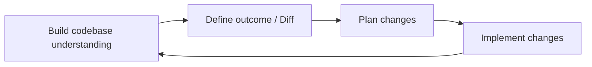

# Large Codebases
Source: https://docs.cursor.com/en/guides/advanced/large-codebases

How to work with large codebases in Cursor

Working with large codebases introduces a new set of challenges than working on smaller projects. Drawing from both our experience scaling Cursor's own codebase and insights from customers managing massive codebases, we've discovered some useful patterns for handling increased complexity.

In this guide, we'll walk through some of these techniques that we've found be useful for large codebases.

---

← Previous: [Data Science](./data-science.md) | [Index](./index.md) | Next: [Working with Documentation](./working-with-documentation.md) →