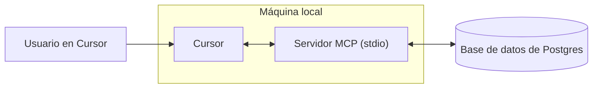

# Cómo crear un servidor MCP
Source: https://docs.cursor.com/es/guides/tutorials/building-mcp-server

Aprende a crear un servidor del Model Context Protocol (MCP) con integración de PostgreSQL para Cursor

<div id="introduction">
  ## Introducción
</div>

Los servidores MCP te permiten conectar fuentes de datos personalizadas y hacerlas disponibles para usarlas dentro de Cursor. Esto es especialmente útil cuando necesitás contexto de lugares como navegadores, bases de datos o registros de errores y del sistema. Configurar un servidor MCP es sencillo y, con Cursor, podés hacerlo rápido.

En esta guía, vamos a ver cómo crear un servidor MCP para Postgres. Nuestro objetivo es habilitar que Cursor ejecute consultas SQL directamente contra una base de datos Postgres y exponer los esquemas de tablas de forma estructurada.

<Note>
  Este tutorial está diseñado para enseñar los fundamentos de cómo crear servidores MCP.
</Note>

<video autoPlay loop muted playsInline controls>
  <source src="https://mintcdn.com/cursor/Qpa6MBK62Try_xlf/images/guides/tutorials/building-mcp-server/demo.mp4?fit=max&auto=format&n=Qpa6MBK62Try_xlf&q=85&s=8e02b011bd0956d62135db5779f7ead5" type="video/mp4" data-path="images/guides/tutorials/building-mcp-server/demo.mp4" />
</video>



<div id="what-is-an-mcp-server">
  ## ¿Qué es un servidor MCP?
</div>

Un [servidor MCP](/es/context/mcp) es un proceso que se comunica con Cursor y proporciona acceso a datos o acciones externas. Se puede implementar de varias maneras, pero aquí usaremos el método más simple: un servidor que se ejecuta localmente en tu computadora sobre [stdio](https://en.wikipedia.org/wiki/Standard_streams) (flujos estándar de entrada/salida). Esto evita consideraciones de seguridad complicadas y nos permite enfocarnos en la lógica de MCP en sí.

Uno de los casos de uso más comunes de MCP es el acceso a bases de datos. Al crear dashboards, ejecutar análisis o crear migraciones, a menudo es necesario consultar e inspeccionar una base de datos. Nuestro servidor MCP de Postgres admitirá dos capacidades fundamentales: ejecutar consultas arbitrarias y listar los esquemas de tablas.

Aunque ambas tareas podrían realizarse con SQL puro, MCP ofrece funciones que las hacen más potentes y, en general, más útiles. Las herramientas proporcionan una forma de exponer acciones como ejecutar consultas, mientras que los recursos nos permiten compartir contexto estandarizado, como la información de esquemas. Más adelante en esta guía también veremos prompts, que habilitan flujos de trabajo más avanzados.

Bajo el capó, usaremos el paquete npm postgres para ejecutar sentencias SQL contra la base de datos. El SDK de MCP actuará como un contenedor alrededor de estas llamadas, permitiéndonos integrar la funcionalidad de Postgres sin fricciones en Cursor.

<div id="how-to-build-the-mcp-server">
  ## Cómo crear el servidor MCP
</div>

El primer paso para crear el servidor es configurar un proyecto nuevo. Vamos a empezar creando una carpeta nueva e inicializando un proyecto de Bun

```bash  theme={null}
> mkdir postgres-mcp-server
> Bun init
```

Desde aquí, vamos a seleccionar el proyecto `Blank`. Una vez que nuestro boilerplate esté configurado, necesitamos instalar las dependencias necesarias. `zod` es necesario para definir esquemas de i/o en el SDK de MCP

```bash  theme={null}
bun add postgres @modelcontextprotocol/sdk zod
```

Desde aquí, iremos a los repositorios de cada una de las librerías y obtendremos el enlace al contenido sin procesar de los respectivos archivos README. Usaremos esos como contexto al construir el servidor

* `postgres`
  * Repo:  [https://github.com/porsager/postgres](https://github.com/porsager/postgres),
  * README: [https://raw.githubusercontent.com/porsager/postgres/refs/heads/master/README.md](https://raw.githubusercontent.com/porsager/postgres/refs/heads/master/README.md)
* `@modelcontextprotocol/sdk`:
  * Repo: [https://github.com/modelcontextprotocol/typescript-sdk](https://github.com/modelcontextprotocol/typescript-sdk)
  * README: [https://raw.githubusercontent.com/modelcontextprotocol/typescript-sdk/refs/heads/main/README.md](https://raw.githubusercontent.com/modelcontextprotocol/typescript-sdk/refs/heads/main/README.md)

Ahora definiremos cómo queremos que se comporte el servidor. Para hacerlo, crearemos un `spec.md` y escribiremos los objetivos generales

```markdown  theme={null}

---

← Previous: [Diagramas de arquitectura](./diagramas-de-arquitectura.md) | [Index](./index.md) | Next: [Desarrollo web](./desarrollo-web.md) →