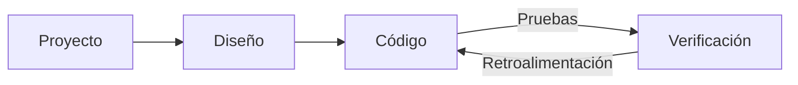

# Desarrollo web
Source: https://docs.cursor.com/es/guides/tutorials/web-development

Cómo configurar Cursor para el desarrollo web

export const McpInstallButtonPrimary = ({server, showIcon = true, prompt = null}) => {
  const [showModal, setShowModal] = useState(false);
  const generateDeepLink = () => {
    if (!server || !server.name || !server.install) {
      return null;
    }
    try {
      if (typeof server.install === 'string') {
        return server.install;
      }
      if (server.install.url) {
        const config = {
          ...server.install
        };
        const jsonString = JSON.stringify(config);
        const utf8Bytes = new TextEncoder().encode(jsonString);
        const base64Config = btoa(Array.from(utf8Bytes).map(b => String.fromCharCode(b)).join(''));
        const safeBase64Config = base64Config.replace(/\+/g, '%2B');
        return `cursor://anysphere.cursor-deeplink/mcp/install?name=${encodeURIComponent(server.name)}&config=${encodeURIComponent(safeBase64Config)}`;
      }
      if (server.install.command) {
        let config = {
          command: server.install.command,
          ...server.install.args && ({
            args: server.install.args
          }),
          ...server.install.env && ({
            env: server.install.env
          })
        };
        if (config.command && config.args) {
          const argsString = config.args.join(" ");
          config.command = `${config.command} ${argsString}`;
          delete config.args;
        }
        const jsonString = JSON.stringify(config);
        const utf8Bytes = new TextEncoder().encode(jsonString);
        const base64Config = btoa(Array.from(utf8Bytes).map(b => String.fromCharCode(b)).join(''));
        const safeBase64Config = base64Config.replace(/\+/g, '%2B');
        return `cursor://anysphere.cursor-deeplink/mcp/install?name=${encodeURIComponent(server.name)}&config=${encodeURIComponent(safeBase64Config)}`;
      }
      return null;
    } catch (e) {
      console.error("Error generating deep link:", e);
      return null;
    }
  };
  const handleButtonClick = () => {
    setShowModal(true);
  };
  const handleClose = () => {
    setShowModal(false);
  };
  const deepLink = generateDeepLink();
  const isDocumentationOnly = typeof server?.install === 'string';
  const hasConfirmation = prompt || isDocumentationOnly;
  const InstallModal = ({isOpen, onClose, deepLink, server, children}) => {
    useEffect(() => {
      const handleKeyDown = event => {
        if (event.key === 'Escape') {
          onClose();
        }
      };
      if (isOpen) {
        document.addEventListener('keydown', handleKeyDown);
      }
      return () => {
        document.removeEventListener('keydown', handleKeyDown);
      };
    }, [isOpen, onClose]);
    if (!isOpen) return null;
    return <div className="fixed inset-0 bg-black bg-opacity-50 flex items-center justify-center z-50 transition-opacity duration-200" onClick={onClose}>
        <div className="bg-white dark:bg-neutral-900 rounded-lg p-6 max-w-md w-full mx-4 border border-neutral-200 dark:border-neutral-700 transition-all duration-200 transform" onClick={e => e.stopPropagation()}>
          <div className="mb-4">
            <h3 className="text-lg font-semibold text-black dark:text-white mb-2">
              Install {server?.name}
            </h3>
            <div className="text-neutral-600 dark:text-neutral-400">
              {children}
            </div>
          </div>
          <div className="flex gap-3 justify-end">
            <button onClick={onClose} className="px-4 py-2 text-sm font-medium rounded-lg transition-colors duration-200 text-neutral-600 dark:text-neutral-400 hover:text-black dark:hover:text-white border border-neutral-200 dark:border-neutral-700 hover:bg-neutral-100 dark:hover:bg-neutral-800">
              Cancel
            </button>
            <a href={deepLink} onClick={onClose} target="_blank" className="px-4 py-2 text-sm font-medium rounded-lg transition-colors duration-200 bg-black text-white hover:bg-neutral-800 dark:bg-white dark:text-black dark:hover:bg-neutral-200 inline-flex items-center justify-center no-underline">
              Continue
            </a>
          </div>
        </div>
      </div>;
  };
  return <>
      {hasConfirmation ? <button onClick={handleButtonClick} className="inline-flex justify-center items-center gap-2 px-4 py-2 text-sm font-medium rounded-lg transition-colors duration-200 not-prose text-white bg-black hover:bg-neutral-800 dark:bg-white dark:text-black dark:hover:bg-neutral-200 border border-black dark:border-white">
          {showIcon && <Icon icon="plus" size={16} color="currentColor" />}
          Add to Cursor
        </button> : <a href={deepLink} className="inline-flex justify-center items-center gap-2 px-4 py-2 text-sm font-medium rounded-lg transition-colors duration-200 not-prose text-white bg-black hover:bg-neutral-800 dark:bg-white dark:text-black dark:hover:bg-neutral-200 border border-black dark:border-white">
          {showIcon && <Icon icon="plus" size={16} color="currentColor" />}
          Add to Cursor
        </a>}

      {hasConfirmation && <InstallModal isOpen={showModal} onClose={handleClose} deepLink={deepLink} server={server}>
          {prompt}
        </InstallModal>}
    </>;
};

El desarrollo web implica iteraciones rápidas y ciclos de feedback ajustados entre Cursor y herramientas externas como Figma o el navegador. En Cursor, hemos dado con flujos de trabajo que acortan este ciclo. Definir bien el alcance de las tareas, reutilizar componentes y apoyarse en sistemas de diseño ayuda a mantener todo rápido y consistente.

Esta guía explica cómo configurar Cursor para potenciar el desarrollo web y acortar el ciclo de feedback.



<div id="start-orchestrating-in-cursor">
  # Empieza a orquestar en Cursor
</div>

**Chat** va genial para poner en marcha cambios. Cuando las piezas principales ya están, pasar a **Inline Edit** y **Tab** te ayuda a mantener el flow.

Después de configurar Cursor, vas a poder orquestar flujos de trabajo entre distintas herramientas. Aquí tienes una demo de lo que se puede hacer: un juego de la serpiente creado combinando Linear, Figma y herramientas del navegador. Aunque los proyectos reales suelen ser más complejos, este ejemplo muestra el potencial de estos flujos de trabajo integrados.

<Frame>
  <video src="https://mintcdn.com/cursor/E7JVsKUF5L-IiJRB/images/guides/tutorials/web-development/snake.mp4?fit=max&auto=format&n=E7JVsKUF5L-IiJRB&q=85&s=e029fbdff2ec06e1e4393ac580824b5a" controls data-path="images/guides/tutorials/web-development/snake.mp4" />
</Frame>

<div id="connect-to-your-project-management-tools">
  # Conecta tus herramientas de gestión de proyectos
</div>

Podés integrar Cursor en tu software de gestión de proyectos existente usando distintas herramientas. En esta guía, vamos a ver cómo integrar Linear con su servidor MCP.

<div id="installation">
  ### Instalación
</div>

<McpInstallButtonPrimary
  server={{
name: "Linear",
install: {
command: "npx",
args: ["-y", "mcp-remote", "https://mcp.linear.app/sse"],
},
}}
/>

O agregá manualmente el servidor MCP de Linear en `mcp.json`:

```jsx  theme={null}
{
  "mcpServers": {
    "Linear": {
      "command": "npx",
      "args": [
        "-y",
        "mcp-remote",
        "https://mcp.linear.app/sse"
      ]
    }
  }
}
```

Then:

1. Asegúrate de habilitar Linear desde la configuración de MCP
2. Se abrirá el navegador web y se te pedirá que autorices con Linear
   <Info>
     Debido al estado actual de MCP, la configuración puede requerir varios intentos.
     Si la integración no está funcionando, intenta “Reload” del servidor desde la configuración de Cursor.
   </Info>

<div id="using-linear-in-cursor">
  ### Usar Linear en Cursor
</div>

Los servidores MCP de Linear exponen distintas herramientas que Cursor puede usar para leer y gestionar incidencias. Ve a la configuración de MCP y localiza el servidor de Linear para ver la lista de todas las herramientas. Para verificar, prueba este prompt en Chat:

```jsx  theme={null}
lista todos los issues relacionados con este proyecto
```

<Frame>
  
</Frame>

Debería devolver una lista de incidencias si la integración está configurada correctamente.

<div id="bring-in-your-figma-designs">
  # Importá tus diseños de Figma
</div>

Los diseños y los mockups son fundamentales para el desarrollo web. Con el servidor MCP oficial para Figma, podés acceder directamente a los archivos de diseño y trabajar con ellos en Cursor. Para empezar, seguí las instrucciones de configuración en [Figma Dev Mode MCP Server](https://help.figma.com/hc/en-us/articles/32132100833559-Guide-to-the-Dev-Mode-MCP-Server).

<div id="installation">
  ### Instalación
</div>

Podés hacer clic en el botón de abajo para instalar el servidor MCP.

<McpInstallButtonPrimary
  server={{
name: "Figma",
install: {
url: "http://127.0.0.1:3845/sse",
},
}}
/>

O agregalo manualmente a tu `mcp.json`:

```jsx  theme={null}
{
  "mcpServers": {
    "Figma": {
      "url": "http://127.0.0.1:3845/sse"
    }
  }
}
```

<div id="usage">
  ### Uso
</div>

El servidor expone varias herramientas que podés usar en tus prompts. Por ejemplo, probá pedir los diseños de la selección actual en Figma. Leé más en la [documentación](https://help.figma.com/hc/en-us/articles/32132100833559-Guide-to-the-Dev-Mode-MCP-Server).

<Frame>
  
</Frame>

<div id="keep-your-code-scaffolding-consistent">
  # Mantén coherente el scaffolding de tu código
</div>

Probablemente ya tengas código existente, un sistema de diseño o convenciones establecidas que quieres reutilizar. Al trabajar con modelos, es útil hacer referencia a patrones que ya están en tu codebase, como menús desplegables u otros componentes comunes.

Trabajando nosotros mismos en una codebase web grande, hemos descubierto que el código declarativo funciona especialmente bien, en particular con React y JSX.

Si tienes un sistema de diseño, puedes ayudar al agente a descubrirlo proporcionando una regla para ese sistema. Aquí tienes un archivo `ui-components.mdc` donde intentamos aplicar la reutilización de componentes siempre que sea posible:

```mdc components.mdc theme={null}
---
description: Implementar diseños y construir la UI
---
- reutiliza componentes de UI existentes de `/src/components/ui`. estos son los primitivos con los que podemos construir
- crea nuevos componentes orquestando componentes de UI si no encuentras ninguno existente que resuelva el problema
- pregúntale a la persona cómo quiere proceder cuando falten componentes o diseños
```

A medida que tu biblioteca de componentes crezca, ve añadiendo nuevas reglas según corresponda. Cuando las reglas sean demasiadas, plantéate dividirlas en categorías más específicas, como “aplicar solo cuando se trabaje con entradas de usuario”.

<Frame>
  
</Frame>

<div id="give-cursor-access-to-browser">
  # Dale a Cursor acceso al navegador
</div>

Para ampliar las capacidades de Cursor, podés configurar el servidor MCP de Browser Tools, que ofrece acceso a los registros de la consola y a las solicitudes de red. Una vez configurado, podés verificar tus cambios monitoreando la salida de la consola y la actividad de la red. Esta configuración ayuda a garantizar que tu implementación coincida con tu intención. Seguí las instrucciones acá para configurar el servidor MCP: [https://browsertools.agentdesk.ai/installation](https://browsertools.agentdesk.ai/installation)

<Frame>
  
</Frame>

<Note>
  Estamos trabajando para que sea más fácil integrarlo de forma nativa en Cursor.
</Note>

<div id="takeaways">
  # Conclusiones
</div>

* Los ciclos de feedback rápidos son esenciales en el desarrollo web. Usá Cursor junto con herramientas como Figma, Linear y el navegador para moverte rápido y mantener el flow.
* Los servidores MCP te permiten integrar sistemas externos directamente en Cursor, reduciendo el cambio de contexto y mejorando la ejecución de tareas.
* Reutilizar componentes y sistemas de diseño ayuda al modelo a producir código y resultados más limpios y consistentes.
* Tareas claras y bien acotadas llevan a mejores resultados. Sé intencional con cómo pedís y qué pedís.
* Si no estás obteniendo buenos resultados, intentá ajustar:
  * **Instrucciones:** Usá reglas, prompts y dale acceso a más contexto, por ejemplo, con servidores MCP.
  * **Sistemas:** Patrones, abstracciones y claridad facilitan que el modelo entienda, ayude y trabaje de forma más autónoma.
* Podés extender el contexto del modelo incluyendo info de runtime como logs de consola, requests de red y datos de elementos de UI.
* No todo tiene que estar automatizado. Si tu sistema se vuelve demasiado complejo, volvé a ediciones más quirúrgicas con Tab e Inline Edit.
* Cursor es más potente cuando es copiloto, no piloto automático. Usalo para mejorar, no para reemplazar, tu propia toma de decisiones.

---

← Previous: [Cómo crear un servidor MCP](./cmo-crear-un-servidor-mcp.md) | [Index](./index.md) | Next: [Working with Context](./working-with-context.md) →