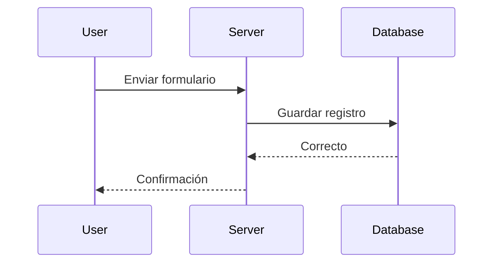
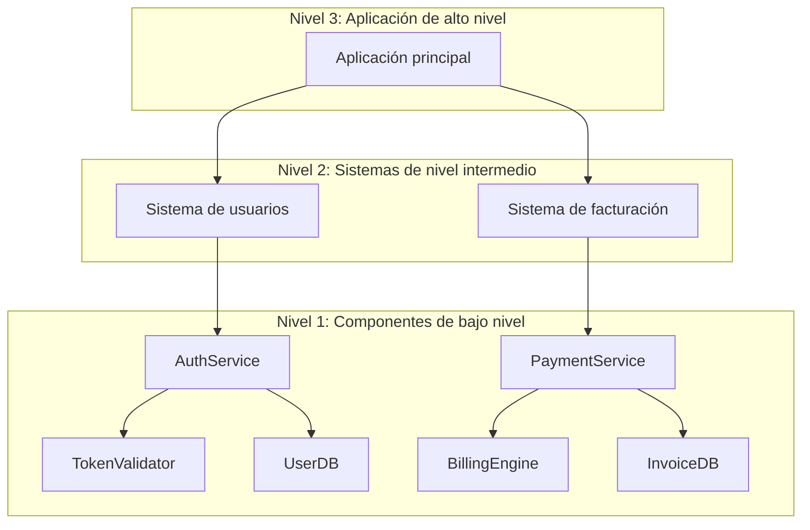

# Diagramas de arquitectura
Source: https://docs.cursor.com/es/guides/tutorials/architectural-diagrams

Aprende a generar diagramas de arquitectura con Mermaid para visualizar la estructura del sistema y el flujo de datos

Los diagramas de arquitectura te ayudan a entender cómo funciona tu sistema. Podés usarlos para explorar la lógica, seguir el recorrido de los datos y comunicar la estructura. Cursor permite generar estos diagramas directamente con herramientas como Mermaid, así que podés pasar de código a visual en solo unos pocos prompts.

<Frame>
  
</Frame>

  ## Por qué importan los diagramas

Los diagramas aclaran cómo fluye la información y cómo interactúan los componentes. Son útiles cuando:

* Quieres entender el control de flujo en tu base de código
* Necesitas trazar el linaje de datos desde la entrada hasta la salida
* Estás incorporando a otras personas o documentando tu sistema

También son muy útiles para depurar y hacer preguntas más inteligentes. Las visualizaciones te ayudan (a ti y al modelo) a ver el panorama completo.

  ## Dos dimensiones a considerar

Hay varias maneras de enfocarlo:

* **Propósito**: ¿estás mapeando la lógica, el flujo de datos, la infraestructura u otra cosa?
* **Formato**: ¿quieres algo rápido (como un diagrama de Mermaid) o algo formal (como UML)?

  ## Cómo hacer prompts

Empieza con un objetivo claro. Aquí tienes algunas formas comunes de preguntar:

* **Control de flujo**: "Muéstrame cómo pasan las solicitudes del controlador a la base de datos."
* **Trazabilidad de datos**: "Sigue esta variable desde donde entra hasta donde termina."
* **Estructura**: "Dame una vista a nivel de componentes de este servicio."

Puedes incluir puntos de inicio y fin, o pedirle a Cursor que encuentre la ruta completa.

  ## Trabajar con Mermaid

Mermaid es fácil de aprender y se renderiza directamente en Markdown (con la extensión adecuada). Cursor puede generar diagramas como:

* `flowchart` para lógica y secuencias
* `sequenceDiagram` para interacciones
* `classDiagram` para estructuras de objetos
* `graph TD` para mapas direccionales simples

Puedes instalar la [extensión Mermaid](https://marketplace.cursorapi.com/items?itemName=bierner.markdown-mermaid) para obtener una vista previa de los diagramas.

1. Ve a la pestaña Extensions
2. Busca Mermaid
3. Instálala

<Frame>
  
</Frame>

  ## Estrategia de diagramas

Empieza en pequeño. No intentes mapear todo de una.

* Elige una función, ruta o proceso
* Pídele a Cursor que diagrame esa parte usando Mermaid
* Cuando tengas varias, pídele que las combine

Esto sigue el **modelo C4**: empiezas en un nivel bajo (código o componentes) y vas subiendo hacia vistas de mayor nivel.

  ### Flujo recomendado

1. Empieza con un diagrama detallado y de bajo nivel
2. Resúmelo en una vista de nivel intermedio
3. Repite hasta llegar al nivel de abstracción que quieres
4. Pídele a Cursor que los fusione en un solo diagrama o mapa del sistema

  ## Conclusiones

* Usa diagramas para entender el flujo, la lógica y los datos
* Empieza con prompts pequeños y ve ampliando tu diagrama desde ahí
* Mermaid es el formato más fácil de usar en Cursor
* Empieza a bajo nivel y ve abstrayendo hacia arriba, igual que en el modelo C4
* Cursor puede ayudarte a generar, refinar y combinar diagramas con facilidad

---

← Previous: [VS Code](./vs-code.md) | [Index](./index.md) | Next: [Cómo crear un servidor MCP](./cmo-crear-un-servidor-mcp.md) →