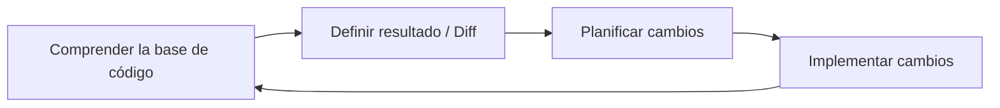
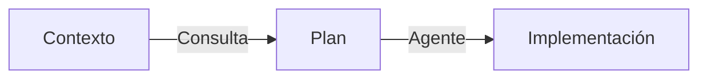
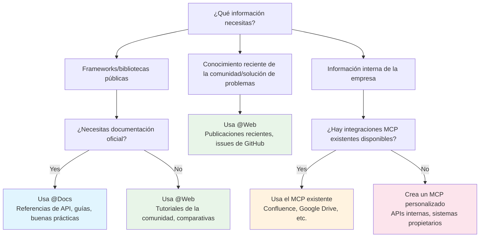
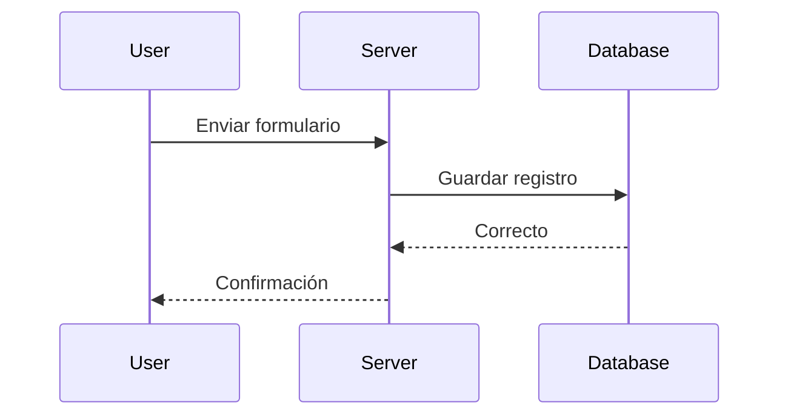
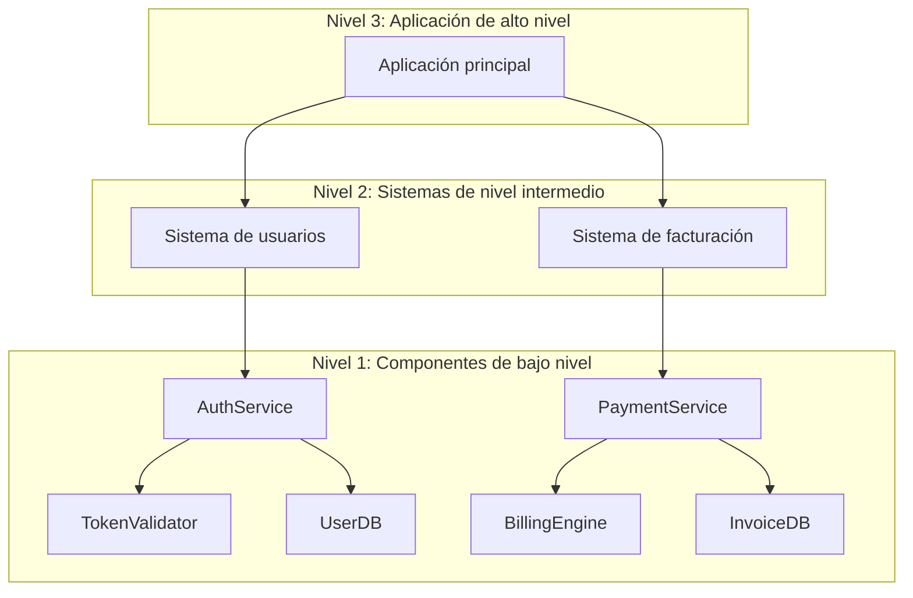
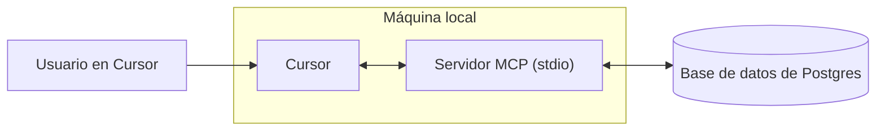
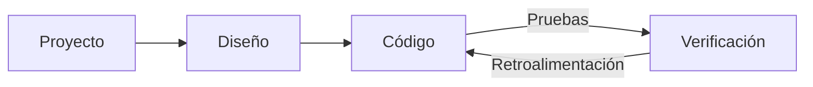
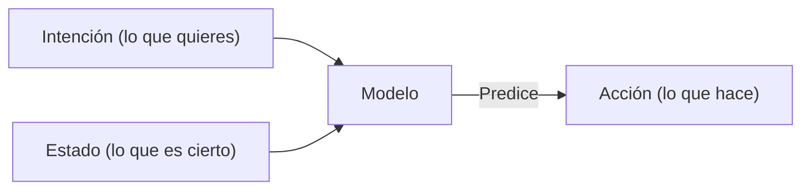

# Cursor Documentation (Spanish)

This is the complete formatted documentation for Cursor in Spanish, parsed and organized from the official documentation.

**Total Sections:** 112

---


# Seguridad del Agente
Source: https://docs.cursor.com/es/account/agent-security

Consideraciones de seguridad para usar Cursor Agent

La inyección de prompts, las alucinaciones de IA y otros problemas pueden hacer que la IA se comporte de formas inesperadas y potencialmente maliciosas. Mientras seguimos trabajando para resolver la inyección de prompts a un nivel más fundamental, nuestra protección principal en los productos de Cursor son los rieles de seguridad sobre lo que un agente puede hacer, incluyendo exigir aprobación manual para acciones sensibles de forma predeterminada. El objetivo de este documento es explicar estos rieles de seguridad y qué pueden esperar los usuarios de ellos.

Todos los controles y comportamientos a continuación son nuestra configuración predeterminada y recomendada.

<div id="first-party-tool-calls">
  ## Llamadas a herramientas nativas
</div>

Cursor viene con herramientas integradas que le permiten al agente ayudarte a escribir código. Estas incluyen lectura de archivos, edición, ejecución de comandos de terminal, búsqueda de documentación en la web y otras.

Las herramientas de lectura no requieren aprobación (p. ej., leer archivos, buscar en el código). Puedes usar [.cursorignore](/es/context/ignore-files) para bloquear por completo el acceso del agente a archivos específicos, pero en caso contrario las lecturas generalmente están permitidas sin aprobación. Para acciones que conllevan riesgo de exfiltración de datos sensibles, requerimos aprobación explícita.

Modificar archivos dentro del espacio de trabajo actual no requiere aprobación explícita con algunas excepciones. Cuando un agente realiza cambios en archivos, estos se guardan inmediatamente en disco. Recomendamos ejecutar Cursor en espacios de trabajo con control de versiones, de modo que el contenido de los archivos pueda revertirse en cualquier momento. Requerimos aprobación explícita antes de cambiar archivos que modifiquen la configuración de nuestro IDE/CLI, como el archivo de configuración del espacio de trabajo del editor. Sin embargo, si tienes recarga automática al detectar cambios en archivos, ten en cuenta que los cambios del agente pueden activar ejecuciones automáticas antes de que hayas tenido oportunidad de revisarlos.

Cualquier comando de terminal sugerido por los agentes requiere aprobación de forma predeterminada. Recomendamos revisar cada comando antes de que el agente lo ejecute. Quienes acepten el riesgo pueden habilitar que el agente ejecute todos los comandos sin aprobación. Incluimos una [allowlist](/es/agent/tools) en Cursor, pero no la consideramos un control de seguridad. Algunas personas eligen permitir comandos específicos, pero es un sistema de mejor esfuerzo y pueden existir formas de eludirlo. No recomendamos "Run Everything", que omite cualquier allowlist configurada.

<div id="third-party-tool-calls">
  ## Llamadas a herramientas de terceros
</div>

Cursor permite conectar herramientas externas a través de [MCP](/es/context/mcp). Todas las conexiones MCP de terceros deben ser aprobadas explícitamente por el usuario. Una vez que el usuario aprueba un MCP, de forma predeterminada cada llamada de herramienta sugerida en Agent Mode para cualquier integración MCP externa debe ser aprobada explícitamente antes de su ejecución.

<div id="network-requests">
  ## Solicitudes de red
</div>

Un atacante podría usar las solicitudes de red para exfiltrar datos. Actualmente no admitimos que herramientas propias realicen solicitudes de red fuera de un conjunto muy selecto de hosts (p. ej., GitHub), la recuperación explícita de enlaces ni el uso de la búsqueda web más que con un conjunto selecto de proveedores. Con la configuración predeterminada se impiden las solicitudes de red arbitrarias por parte de agentes.

<div id="workspace-trust">
  ## Confianza del espacio de trabajo
</div>

El IDE de Cursor admite la función estándar de [workspace trust](https://code.visualstudio.com/docs/editing/workspaces/workspace-trust), que está *desactivada* de forma predeterminada. Workspace trust te muestra un aviso al abrir un nuevo espacio de trabajo para elegir entre modo normal o restringido. El modo restringido inutiliza la IA y otras funciones por las que normalmente usas Cursor. Te recomendamos usar otras herramientas, como un editor de texto básico, para trabajar con repos en los que no confíes.

Puedes habilitar workspace trust en la configuración de usuario siguiendo estos pasos:

1. Abre tu archivo de usuario settings.json
2. Agrega la siguiente configuración:
   ```json  theme={null}
   "security.workspace.trust.enabled": true
   ```

Esta configuración también puede aplicarse a nivel de organización mediante soluciones de Mobile Device Management (MDM).

<div id="responsible-disclosure">
  ## Divulgación responsable
</div>

Si crees que has encontrado una vulnerabilidad en Cursor, sigue la guía en nuestra página de seguridad de GitHub y envía el informe ahí. Si no puedes usar GitHub, también puedes escribirnos a [security@cursor.com](mailto:security@cursor.com).

Nos comprometemos a acusar recibo de los informes de vulnerabilidades en un plazo de 5 días hábiles y a resolverlos tan pronto como podamos. Publicaremos los resultados en forma de avisos de seguridad en nuestra página de seguridad de GitHub. Los incidentes críticos se comunicarán tanto en la página de seguridad de GitHub como por correo electrónico a todos los usuarios.

---


# Facturación
Source: https://docs.cursor.com/es/account/billing

Gestión de suscripciones, reembolsos y facturas de Cursor

<div id="how-do-i-access-billing-settings">
  ### How do I access billing settings?
</div>

Accede al portal de facturación desde el [Dashboard](https://cursor.com/dashboard) haciendo clic en "Billing" en tu dashboard. Se abrirá un portal seguro para todas las tareas de facturación.

<div id="what-are-cursors-billing-cycles">
  ### What are Cursor's billing cycles?
</div>

Los ciclos de facturación pueden ser mensuales o anuales y comienzan en la fecha de tu suscripción. Las cuentas de Teams se cobran por asiento, con prorrateo para miembros nuevos.

<div id="how-do-seats-work-for-teams-accounts">
  ### How do seats work for Teams accounts?
</div>

Las cuentas de Teams cobran por asiento (uno por cada miembro del equipo). Si agregas miembros a mitad de ciclo, solo se te cobra por el tiempo restante. Si un miembro ha usado créditos y lo quitas, su asiento permanece ocupado hasta el final del ciclo de facturación; no hay reembolsos prorrateados. Los administradores del equipo pueden gestionar los asientos desde el dashboard.

<div id="can-i-switch-between-monthly-and-annual-billing">
  ### Can I switch between monthly and annual billing?
</div>

¡Sí! Así es cómo:

**Pro plan**

1. Ve al [dashboard](https://cursor.com/dashboard) de Cursor
2. Haz clic en "Billing and Invoices" en la barra lateral izquierda para ir a la página de facturación
3. Haz clic en "Manage subscription"
4. Haz clic en "Update subscription"
5. Selecciona "Yearly" o "Monthly" y luego haz clic en "Continue"

**Teams plan**

1. Ve al [dashboard](https://cursor.com/dashboard) de Cursor
2. Haz clic en "Billing and Invoices" en la barra lateral izquierda para ir a la página de facturación
3. Haz clic en el botón "Upgrade Now" para cambiar a facturación anual

<Note>
  Solo puedes cambiar de facturación mensual a anual por tu cuenta. Para cambiar de anual a mensual, contáctanos en
  [hi@cursor.com](mailto:hi@cursor.com).
</Note>

<div id="where-can-i-find-my-invoices">
  ### Where can I find my invoices?
</div>

Encuentra todo tu historial de facturación en el portal de facturación. Puedes ver y descargar facturas actuales y pasadas.

<div id="can-i-get-invoices-automatically-emailed-to-me">
  ### Can I get invoices automatically emailed to me?
</div>

Las facturas deben descargarse manualmente desde el portal de facturación. Estamos desarrollando el envío automático por email. Podrás activar la opción cuando esté disponible.

<div id="how-do-i-update-my-billing-information">
  ### How do I update my billing information?
</div>

Actualiza el método de pago, el nombre de la empresa, la dirección y la información fiscal desde el portal de facturación. Usamos Stripe para transacciones seguras. Los cambios solo afectan a facturas futuras; no podemos modificar facturas anteriores.

<div id="how-do-i-cancel-my-subscription">
  ### How do I cancel my subscription?
</div>

Cancela tu suscripción desde la página "Billing and Invoices" haciendo clic en "Manage Subscription" y luego en el botón "Cancel subscription". Seguirás teniendo acceso hasta el final de tu período de facturación actual.

<div id="im-having-other-billing-issues-how-can-i-get-help">
  ### I'm having other billing issues. How can I get help?
</div>

Para consultas de facturación no cubiertas aquí, envía un email a [hi@cursor.com](mailto:hi@cursor.com) desde el email asociado a tu cuenta. Incluye los detalles de tu cuenta y tus inquietudes.

---


# Precios
Source: https://docs.cursor.com/es/account/pricing

Los planes de Cursor y sus precios

Podés probar Cursor gratis o comprar un plan individual o de equipo.

<div id="individual">
  ## Individual
</div>

Todos los planes individuales incluyen:

* Autocompletados en pestañas ilimitados
* Límites ampliados de uso de agentes en todos los modelos
* Acceso a Bugbot
* Acceso a Background Agents

Cada plan incluye uso facturado según los precios de inferencia del modelo [API prices](/es/models#model-pricing):

* Pro incluye \$20 de uso de API de agentes + uso adicional de bonificación
* Pro Plus incluye \$70 de uso de API de agentes + uso adicional de bonificación
* Ultra incluye \$400 de uso de API de agentes + uso adicional de bonificación

Trabajamos mucho para otorgar capacidad de bonificación adicional más allá del uso incluido garantizado. Como distintos modelos tienen diferentes costos de API, la selección de modelo afecta la salida de tokens y qué tan rápido se consume tu uso incluido. Puedes ver el uso y los desgloses de tokens en [tu panel](https://cursor.com/dashboard?tab=usage). Las notificaciones de límite se muestran de forma habitual en el editor.


<div id="how-much-usage-do-i-need">
  ### ¿Cuánto uso necesito?
</div>

Según nuestros datos de uso, puedes esperar los siguientes niveles:

* **Usuarios que usan Tab a diario**: Siempre se mantienen dentro de \$20
* **Usuarios con uso limitado de Agent**: A menudo se mantienen dentro de los \$20 incluidos
* **Usuarios que usan Agent a diario**: Normalmente $60–$100/mes de uso total
* **Usuarios avanzados (varios agents/automatización)**: A menudo \$200+/mes de uso total

Según nuestros datos de uso, los límites son aproximadamente equivalentes a lo siguiente para un *usuario mediano*:

* Pro: \~225 solicitudes de Sonnet 4, \~550 solicitudes de Gemini o \~500 solicitudes de GPT 5
* Pro+: \~675 solicitudes de Sonnet 4, \~1,650 solicitudes de Gemini o \~1,500 solicitudes de GPT 5
* Ultra: \~4,500 solicitudes de Sonnet 4, \~11,000 solicitudes de Gemini o \~10,000 solicitudes de GPT 5

<div id="what-happens-when-i-reach-my-limit">
  ### ¿Qué pasa cuando llego a mi límite?
</div>

Cuando superes tu uso mensual incluido, vas a recibir una notificación en el editor y podés elegir:

* **Agregar uso bajo demanda**: Seguí usando Cursor a las mismas tarifas de API con facturación por consumo
* **Actualizar tu plan**: Pasá a un nivel superior para tener más uso incluido

El uso bajo demanda se factura mensualmente a las mismas tarifas que tu uso incluido. Las solicitudes nunca se degradan en calidad ni velocidad.

<div id="teams">
  ## Teams
</div>

Hay dos planes para equipos: Teams (\$40/usuario/mes) y Enterprise (Personalizado).

Los planes de Teams incluyen funciones adicionales como:

* Aplicación del Privacy Mode
* Panel de administración con estadísticas de uso
* Facturación centralizada del equipo
* SSO con SAML/OIDC

Recomendamos Teams para cualquier cliente que esté cómodo autoatendiéndose. Recomendamos [Enterprise](/es/contact-sales) para clientes que necesiten soporte prioritario, uso compartido, facturación, SCIM o controles de seguridad avanzados.

Obtén más información sobre los [precios de Teams](/es/account/teams/pricing).

<div id="auto">
  ## Auto
</div>

Activar Auto permite que Cursor elija el modelo premium más adecuado para la tarea inmediata y con la mayor fiabilidad según la demanda actual. Esta función puede detectar una degradación en el rendimiento de salida y cambiar de modelo automáticamente para solucionarlo.

<Frame>
  
</Frame>

<Note>Hemos invertido mucho en la calidad y el rendimiento general de Auto. A partir de tu próxima renovación de facturación después del 15 de septiembre, Auto consumirá a las siguientes tarifas de API.</Note>

* **Input + Cache Write**: \$1.25 por 1M de tokens
* **Output**: \$6.00 por 1M de tokens
* **Cache Read**: \$0.25 por 1M de tokens

Tanto el editor como el panel mostrarán tu consumo, que incluye Auto. Si prefieres seleccionar un modelo directamente, el consumo se cobrará al precio de lista de la API de ese modelo.

<div id="max-mode">
  ## Modo Max
</div>

Algunos modelos pueden usar [Max Mode](/es/models#max-mode), lo que permite razonamientos más extensos y ventanas de contexto más grandes, de hasta 1M tokens. Aunque la mayoría de las tareas de programación no necesitan usar Max Mode, puede ser útil para consultas más complejas, especialmente con archivos o codebases grandes. Usar Max Mode consumirá más cuota. Puedes ver todas las solicitudes y el desglose de tokens en [tu panel](https://cursor.com/dashboard?tab=usage).

<div id="bugbot">
  ## Bugbot
</div>

Bugbot es un producto independiente de las suscripciones de Cursor y tiene su propio plan de precios.

* **Pro** (40 \$/mes): Revisiones ilimitadas en hasta 200 PR/mes, acceso ilimitado a Cursor Ask, integración con Cursor para corregir bugs y acceso a Bugbot Rules
* **Teams** (40 \$/usuario/mes): Revisiones de código ilimitadas en todos los PR, acceso ilimitado a Cursor Ask, uso compartido entre tu equipo y reglas y configuraciones avanzadas
* **Enterprise** (Personalizado): Todo lo de Teams, más analíticas y reportes avanzados, soporte prioritario y gestión de cuentas

Más información sobre los [precios de Bugbot](https://cursor.com/bugbot#pricing).

<div id="background-agent">
  ## Agente en segundo plano
</div>

Los agentes en segundo plano se cobran según los precios de la API para el [modelo](/es/models) seleccionado. Cuando empieces a usarlos por primera vez, se te pedirá que establezcas un límite de gasto para los agentes en segundo plano.

<Info>
  El cómputo de la máquina virtual (VM) para agentes en segundo plano se tarificará en el futuro.
</Info>

---


# Admin API
Source: https://docs.cursor.com/es/account/teams/admin-api

Accedé a métricas del equipo, datos de uso e información de gastos vía API

La Admin API te permite acceder de forma programática a los datos de tu equipo, incluyendo información de miembros, métricas de uso y detalles de gastos. Creá dashboards personalizados, herramientas de monitoreo o integrá con tus workflows existentes.

<Note>
  La API está en su primera versión. Estamos ampliando capacidades según el feedback: ¡contanos qué endpoints necesitás!
</Note>

<div id="authentication">
  ## Autenticación
</div>

Todas las solicitudes a la API requieren autenticación con una clave de API. Solo los administradores del equipo pueden crear y gestionar claves de API.

Las claves de API están vinculadas a la organización, son visibles para todos los administradores y no se ven afectadas por el estado de la cuenta de quien las creó originalmente.

<div id="creating-an-api-key">
  ### Crear una clave de API
</div>

1. Ve a **cursor.com/dashboard** → pestaña **Settings** → **Cursor Admin API Keys**
2. Haz clic en **Create New API Key**
3. Dale a tu clave un nombre descriptivo (p. ej., "Integración del panel de uso")
4. Copia la clave generada de inmediato: no la volverás a ver

Formato: `key_xxxxxxxxxxxxxxxxxxxxxxxxxxxxxxxxxxxxxxxxxxxxxxxxxxxxxxxxxxxxxxxx`

<div id="using-your-api-key">
  ### Usar tu clave de API
</div>

Usa tu clave de API como nombre de usuario en la autenticación básica:

**Usar curl con autenticación básica:**

```bash  theme={null}
curl https://api.cursor.com/{route} -u API_KEY:
```

**O bien establece directamente el encabezado Authorization:**

```bash  theme={null}
Authorization: Basic {base64_encode('API_KEY:')}
```

<div id="base-url">
  ## URL base
</div>

Todos los endpoints de la API utilizan:

```
https://api.cursor.com
```

<div id="endpoints">
  ## Endpoints
</div>

<div id="get-team-members">
  ### Obtener miembros del equipo
</div>

Obtén todos los miembros del equipo y sus detalles.

```
GET /teams/members
```

#### Respuesta

Devuelve un array de objetos de miembros del equipo:

```typescript  theme={null}
{
  teamMembers: {
    name: string;
    email: string;
    role: 'owner' | 'member' | 'free-owner';
  }[];
}
```

#### Respuesta de ejemplo

```json  theme={null}
{
  "teamMembers": [
    {
      "name": "Alex",
      "email": "developer@company.com",
      "role": "miembro"
    },
    {
      "name": "Sam",
      "email": "admin@company.com",
      "role": "dueño"
    }
  ]
}

```

#### Ejemplo de solicitud

```bash  theme={null}
curl -X GET https://api.cursor.com/teams/members \
  -u TU_CLAVE_API:
```

<div id="get-daily-usage-data">
  ### Obtener datos de uso diario
</div>

Obtén métricas diarias detalladas para tu equipo en un rango de fechas. Ofrece información sobre ediciones de código, uso de la IA de asistencia y tasas de aceptación.

```
POST /teams/uso-diario
```

#### Cuerpo de la solicitud

<div className="full-width-table">
  | Parámetro   | Tipo   | Requerido | Descripción                              |
  | :---------- | :----- | :-------- | :--------------------------------------- |
  | `startDate` | number | Sí        | Fecha de inicio en milisegundos de época |
  | `endDate`   | number | Sí        | Fecha de fin en milisegundos de época    |
</div>

<Note>
  El rango de fechas no puede superar los 90 días. Haz varias solicitudes para periodos más largos.
</Note>

#### Respuesta

```typescript  theme={null}
{
  data: {
    date: number;
    isActive: boolean;
    totalLinesAdded: number;
    totalLinesDeleted: number;
    acceptedLinesAdded: number;
    acceptedLinesDeleted: number;
    totalApplies: number;
    totalAccepts: number;
    totalRejects: number;
    totalTabsShown: number;
    totalTabsAccepted: number;
    composerRequests: number;
    chatRequests: number;
    agentRequests: number;
    cmdkUsages: number;
    subscriptionIncludedReqs: number;
    apiKeyReqs: number;
    usageBasedReqs: number;
    bugbotUsages: number;
    mostUsedModel: string;
    applyMostUsedExtension?: string;
    tabMostUsedExtension?: string;
    clientVersion?: string;
    email?: string;
  }[];
  period: {
    startDate: number;
    endDate: number;
  };
}
```

<div id="response-fields">
  #### Campos de respuesta
</div>

<div className="full-width-table">
  | Field                      | Description                                      |
  | :------------------------- | :----------------------------------------------- |
  | `date`                     | Fecha en milisegundos desde la época (epoch)     |
  | `isActive`                 | Usuario activo ese día                           |
  | `totalLinesAdded`          | Líneas de código añadidas                        |
  | `totalLinesDeleted`        | Líneas de código eliminadas                      |
  | `acceptedLinesAdded`       | Líneas añadidas de sugerencias de IA aceptadas   |
  | `acceptedLinesDeleted`     | Líneas eliminadas de sugerencias de IA aceptadas |
  | `totalApplies`             | Operaciones de apply                             |
  | `totalAccepts`             | Sugerencias aceptadas                            |
  | `totalRejects`             | Sugerencias rechazadas                           |
  | `totalTabsShown`           | Autocompletados por tab mostrados                |
  | `totalTabsAccepted`        | Autocompletados por tab aceptados                |
  | `composerRequests`         | Solicitudes del Composer                         |
  | `chatRequests`             | Solicitudes de chat                              |
  | `agentRequests`            | Solicitudes del agente                           |
  | `cmdkUsages`               | Usos de la paleta de comandos (Cmd+K)            |
  | `subscriptionIncludedReqs` | Solicitudes incluidas en la suscripción          |
  | `apiKeyReqs`               | Solicitudes con clave de API                     |
  | `usageBasedReqs`           | Solicitudes de pago por uso                      |
  | `bugbotUsages`             | Usos del detector de bugs                        |
  | `mostUsedModel`            | Modelo de IA más usado                           |
  | `applyMostUsedExtension`   | Extensión de archivo más usada en applies        |
  | `tabMostUsedExtension`     | Extensión de archivo más usada en tabs           |
  | `clientVersion`            | Versión de Cursor                                |
  | `email`                    | Correo electrónico del usuario                   |
</div>

#### Ejemplo de respuesta

```json  theme={null}
{
  "data": [
    {
      "date": 1710720000000,
      "isActive": true,
      "totalLinesAdded": 1543,
      "totalLinesDeleted": 892,
      "acceptedLinesAdded": 1102,
      "acceptedLinesDeleted": 645,
      "totalApplies": 87,
      "totalAccepts": 73,
      "totalRejects": 14,
      "totalTabsShown": 342,
      "totalTabsAccepted": 289,
      "composerRequests": 45,
      "chatRequests": 128,
      "agentRequests": 12,
      "cmdkUsages": 67,
      "subscriptionIncludedReqs": 180,
      "apiKeyReqs": 0,
      "usageBasedReqs": 5,
      "bugbotUsages": 3,
      "mostUsedModel": "gpt-4",
      "applyMostUsedExtension": ".tsx",
      "tabMostUsedExtension": ".ts",
      "clientVersion": "0.25.1",
      "email": "developer@company.com"
    },
    {
      "date": 1710806400000,
      "isActive": true,
      "totalLinesAdded": 2104,
      "totalLinesDeleted": 1203,
      "acceptedLinesAdded": 1876,
      "acceptedLinesDeleted": 987,
      "totalApplies": 102,
      "totalAccepts": 91,
      "totalRejects": 11,
      "totalTabsShown": 456,
      "totalTabsAccepted": 398,
      "composerRequests": 67,
      "chatRequests": 156,
      "agentRequests": 23,
      "cmdkUsages": 89,
      "subscriptionIncludedReqs": 320,
      "apiKeyReqs": 15,
      "usageBasedReqs": 0,
      "bugbotUsages": 5,
      "mostUsedModel": "claude-3-opus",
      "applyMostUsedExtension": ".py",
      "tabMostUsedExtension": ".py",
      "clientVersion": "0.25.1",
      "email": "developer@company.com"
    }
  ],
  "period": {
    "startDate": 1710720000000,
    "endDate": 1710892800000
  }
}
```

#### Ejemplo de petición

```bash  theme={null}
curl -X POST https://api.cursor.com/teams/daily-usage-data \
  -u YOUR_API_KEY: \
  -H "Content-Type: application/json" \
  -d '{
    "startDate": 1710720000000,
    "endDate": 1710892800000
  }'
```

<div id="get-spending-data">
  ### Obtener datos de gastos
</div>

Obtén la información de gastos del mes calendario actual con búsqueda, ordenación y paginación.

```
POST /teams/spend
```

#### Cuerpo de la solicitud

<div className="full-width-table">
  | Parámetro       | Tipo   | Requerido | Descripción                                                  |
  | :-------------- | :----- | :-------- | :----------------------------------------------------------- |
  | `searchTerm`    | string | No        | Busca en nombres de usuario y direcciones de correo          |
  | `sortBy`        | string | No        | Ordena por: `amount`, `date`, `user`. Predeterminado: `date` |
  | `sortDirection` | string | No        | Dirección de orden: `asc`, `desc`. Predeterminado: `desc`    |
  | `page`          | number | No        | Número de página (indexado desde 1). Predeterminado: `1`     |
  | `pageSize`      | number | No        | Resultados por página                                        |
</div>

#### Respuesta

```typescript  theme={null}
{
  teamMemberSpend: {
    spendCents: number;
    fastPremiumRequests: number;
    name: string;
    email: string;
    role: 'owner' | 'member' | 'free-owner';
    hardLimitOverrideDollars: number;
  }[];
  subscriptionCycleStart: number;
  totalMembers: number;
  totalPages: number;
}
```

<div id="response-fields">
  #### Campos de respuesta
</div>

<div className="full-width-table">
  | Campo                      | Descripción                                                   |
  | :------------------------- | :------------------------------------------------------------ |
  | `spendCents`               | Gasto total en centavos                                       |
  | `fastPremiumRequests`      | Solicitudes al modelo premium rápido                          |
  | `name`                     | Nombre del miembro                                            |
  | `email`                    | Correo electrónico del miembro                                |
  | `role`                     | Rol en el equipo                                              |
  | `hardLimitOverrideDollars` | Anulación del límite de gasto personalizado                   |
  | `subscriptionCycleStart`   | Inicio del ciclo de suscripción (milisegundos desde la época) |
  | `totalMembers`             | Total de miembros del equipo                                  |
  | `totalPages`               | Total de páginas                                              |
</div>

#### Ejemplo de respuesta

```json  theme={null}
{
  "teamMemberSpend": [
    {
      "spendCents": 2450,
      "fastPremiumRequests": 1250,
      "name": "Alex",
      "email": "developer@company.com",
      "role": "miembro",
      "hardLimitOverrideDollars": 100
    },
    {
      "spendCents": 1875,
      "fastPremiumRequests": 980,
      "name": "Sam",
      "email": "admin@company.com",
      "role": "propietario",
      "hardLimitOverrideDollars": 0
    },
  ],
  "subscriptionCycleStart": 1708992000000,
  "totalMembers": 15,
  "totalPages": 1
}
```

#### Solicitudes de ejemplo

**Datos básicos de gastos:**

```bash  theme={null}
curl -X POST https://api.cursor.com/teams/spend \
  -u YOUR_API_KEY: \
  -H "Content-Type: application/json" \
  -d '{}'
```

**Buscar a un usuario específico con paginación:**

```bash  theme={null}
curl -X POST https://api.cursor.com/teams/spend \
  -u YOUR_API_KEY: \
  -H "Content-Type: application/json" \
  -d '{
    "searchTerm": "alex@company.com",
    "page": 2,
    "pageSize": 25
  }'
```

<div id="get-usage-events-data">
  ### Obtener datos de eventos de uso
</div>

Obtén eventos de uso detallados para tu equipo con opciones completas de filtrado, búsqueda y paginación. Este endpoint ofrece información granular sobre llamadas individuales a la API, uso de modelos, consumo de tokens y costos.

```
POST /teams/filtered-usage-events
```

#### Cuerpo de la solicitud

<div className="full-width-table">
  | Parámetro   | Tipo   | Requerido | Descripción                                                |
  | :---------- | :----- | :-------- | :--------------------------------------------------------- |
  | `startDate` | number | No        | Fecha de inicio en milisegundos de época (epoch)           |
  | `endDate`   | number | No        | Fecha de fin en milisegundos de época (epoch)              |
  | `userId`    | number | No        | Filtrar por ID de usuario específico                       |
  | `page`      | number | No        | Número de página (con índice desde 1). Predeterminado: `1` |
  | `pageSize`  | number | No        | Cantidad de resultados por página. Predeterminado: `10`    |
  | `email`     | string | No        | Filtrar por correo electrónico del usuario                 |
</div>

#### Respuesta

```typescript  theme={null}
{
  totalUsageEventsCount: number;
  pagination: {
    numPages: number;
    currentPage: number;
    pageSize: number;
    hasNextPage: boolean;
    hasPreviousPage: boolean;
  };
  usageEvents: {
    timestamp: string;
    model: string;
    kind: string;
    maxMode: boolean;
    requestsCosts: number;
    isTokenBasedCall: boolean;
    tokenUsage?: {
      inputTokens: number;
      outputTokens: number;
      cacheWriteTokens: number;
      cacheReadTokens: number;
      totalCents: number;
    };
    isFreeBugbot: boolean;
    userEmail: string;
  }[];
  period: {
    startDate: number;
    endDate: number;
  };
}
```

<div id="response-fields">
  #### Campos de respuesta
</div>

<div className="full-width-table">
  | Campo                   | Descripción                                                              |
  | :---------------------- | :----------------------------------------------------------------------- |
  | `totalUsageEventsCount` | Número total de eventos de uso que coinciden con la consulta             |
  | `pagination`            | Metadatos de paginación para navegar los resultados                      |
  | `timestamp`             | Marca de tiempo del evento en milisegundos desde el epoch                |
  | `model`                 | Modelo de IA usado para la solicitud                                     |
  | `kind`                  | Categoría de uso (p. ej., "Usage-based", "Included in Business")         |
  | `maxMode`               | Si el modo máximo estaba habilitado                                      |
  | `requestsCosts`         | Costo en unidades de solicitud                                           |
  | `isTokenBasedCall`      | True cuando el evento se cobra como evento basado en uso                 |
  | `tokenUsage`            | Consumo detallado de tokens (disponible cuando isTokenBasedCall es true) |
  | `isFreeBugbot`          | Si fue un uso gratuito de bugbot                                         |
  | `userEmail`             | Correo del usuario que hizo la solicitud                                 |
  | `period`                | Rango de fechas de los datos consultados                                 |
</div>

#### Ejemplo de respuesta

```json  theme={null}
{
  "totalUsageEventsCount": 113,
  "pagination": {
    "numPages": 12,
    "currentPage": 1,
    "pageSize": 10,
    "hasNextPage": true,
    "hasPreviousPage": false
  },
  "usageEvents": [
    {
      "timestamp": "1750979225854",
      "model": "claude-4-opus",
      "kind": "Según uso",
      "maxMode": true,
      "requestsCosts": 5,
      "isTokenBasedCall": true,
      "tokenUsage": {
        "inputTokens": 126,
        "outputTokens": 450,
        "cacheWriteTokens": 6112,
        "cacheReadTokens": 11964,
        "totalCents": 20.18232
      },
      "isFreeBugbot": false,
      "userEmail": "developer@company.com"
    },
    {
      "timestamp": "1750979173824",
      "model": "claude-4-opus",
      "kind": "Según uso",
      "maxMode": true,
      "requestsCosts": 10,
      "isTokenBasedCall": true,
      "tokenUsage": {
        "inputTokens": 5805,
        "outputTokens": 311,
        "cacheWriteTokens": 11964,
        "cacheReadTokens": 0,
        "totalCents": 40.16699999999999
      },
      "isFreeBugbot": false,
      "userEmail": "developer@company.com"
    },
    {
      "timestamp": "1750978339901",
      "model": "claude-4-sonnet-thinking",
      "kind": "Incluido en Business"
      "maxMode": true,
      "requestsCosts": 1.4,
      "isTokenBasedCall": false,
      "isFreeBugbot": false,
      "userEmail": "admin@company.com"
    }
  ],
  "period": {
    "startDate": 1748411762359,
    "endDate": 1751003762359
  }
}
```

<div id="example-requests">
  #### Ejemplos de solicitudes
</div>

**Obtener todos los eventos de uso con la paginación por defecto:**

```bash  theme={null}
curl -X POST https://api.cursor.com/teams/filtered-usage-events \
  -u YOUR_API_KEY: \
  -H "Content-Type: application/json" \
  -d '{}'
```

**Filtrar por intervalo de fechas y usuario específico:**

```bash  theme={null}
curl -X POST https://api.cursor.com/teams/filtered-usage-events \
  -u YOUR_API_KEY: \
  -H "Content-Type: application/json" \
  -d '{
    "startDate": 1748411762359,
    "endDate": 1751003762359,
    "email": "developer@company.com",
    "page": 1,
    "pageSize": 25
  }'
```

**Obtén eventos de uso de un usuario específico con paginación personalizada:**

```bash  theme={null}
curl -X POST https://api.cursor.com/teams/filtered-usage-events \
  -u YOUR_API_KEY: \
  -H "Content-Type: application/json" \
  -d '{
    "userId": 12345,
    "page": 2,
    "pageSize": 50
  }'
```

<div id="set-user-spend-limit">
  ### Establecer límite de gasto por usuario
</div>

Establece límites de gasto para miembros específicos del equipo. Esto te permite controlar cuánto puede gastar cada usuario en uso de IA dentro de tu equipo.

```
POST /teams/user-spend-limit
```

<Note>
  **Limitación de frecuencia:** 60 solicitudes por minuto por equipo
</Note>

#### Cuerpo de la solicitud

<div className="full-width-table">
  | Parámetro           | Tipo   | Obligatorio | Descripción                                                       |
  | :------------------ | :----- | :---------- | :---------------------------------------------------------------- |
  | `userEmail`         | string | Sí          | Dirección de correo del miembro del equipo                        |
  | `spendLimitDollars` | number | Sí          | Límite de gasto en dólares (solo números enteros, sin decimales). |
</div>

<Note>
  * El usuario ya debe ser miembro de tu equipo
  * Solo se aceptan valores enteros (sin decimales)
  * Establecer `spendLimitDollars` en 0 fija el límite en \$0
</Note>

#### Respuesta

Devuelve una respuesta estandarizada que indica si hubo éxito o error:

```typescript  theme={null}
{
  outcome: 'success' | 'error';
  message: string;
}
```

<div id="example-responses">
  #### Respuestas de ejemplo
</div>

**Límite establecido correctamente:**

```json  theme={null}
{
  "outcome": "success",
  "message": "Límite de gasto configurado en $100 para el usuario developer@company.com"
}
```

**Respuesta de error:**

```json  theme={null}
{
  "outcome": "error",
  "message": "Formato de correo electrónico inválido"
}
```

<div id="example-requests">
  #### Ejemplos de solicitudes
</div>

**Configurar un límite de gasto:**

```bash  theme={null}
curl -X POST https://api.cursor.com/teams/user-spend-limit \
  -u TU_API_KEY: \
  -H "Content-Type: application/json" \
  -d '{
    "userEmail": "developer@company.com",
    "spendLimitDollars": 100
  }'
```

<div id="repo-blocklists-api">
  ### API de listas de bloqueo de repos
</div>

Agrega repos y usa patrones para evitar que archivos o directorios se indexen o se usen como contexto para tu equipo.

<div id="get-team-repo-blocklists">
  #### Obtener las blocklists de repos del equipo
</div>

Obtén todas las blocklists de repos configuradas para tu equipo.

```
GET /settings/repo-blocklists/repos
```

<div id="response">
  ##### Respuesta
</div>

Devuelve un array de objetos de lista de bloqueo del repositorio:

```typescript  theme={null}
{
  repos: {
    id: string;
    url: string;
    patterns: string[];
  }[];
}
```

<div id="example-response">
  ##### Ejemplo de respuesta
</div>

```json  theme={null}
{
  "repos": [
    {
      "id": "repo_123",
      "url": "https://github.com/company/sensitive-repo",
      "patterns": ["*.env", "config/*", "secrets/**"]
    },
    {
      "id": "repo_456",
      "url": "https://github.com/company/internal-tools",
      "patterns": ["*"]
    }
  ]
}
```

##### Ejemplo de petición

```bash  theme={null}
curl -X GET https://api.cursor.com/settings/repo-blocklists/repos \
  -u TU_CLAVE_API:
```

<div id="upsert-repo-blocklists">
  #### Upsert de listas de bloqueo de repos
</div>

Reemplaza las listas de bloqueo de repositorios existentes para los repos proporcionados.
*Nota: Este endpoint solo sobrescribirá los patrones de los repositorios proporcionados. Todos los demás repos no se verán afectados.*

```
POST /settings/repo-blocklists/repos/upsert
```

<div id="request-body">
  ##### Cuerpo de la solicitud
</div>

| Parámetro | Tipo  | Requerido | Descripción                                 |
| --------- | ----- | --------- | ------------------------------------------- |
| repos     | array | Sí        | Lista de objetos de bloqueo de repositorios |

Cada objeto de repositorio debe contener:

| Campo    | Tipo      | Requerido | Descripción                                                         |
| -------- | --------- | --------- | ------------------------------------------------------------------- |
| url      | string    | Sí        | URL del repositorio a bloquear                                      |
| patterns | string\[] | Sí        | Lista de patrones de archivos a bloquear (se admiten patrones glob) |

<div id="response">
  ##### Respuesta
</div>

Devuelve la lista actualizada de listas de bloqueo del repositorio:

```typescript  theme={null}
{
  repos: {
    id: string;
    url: string;
    patterns: string[];
  }[];
}
```

<div id="example-request">
  ##### Ejemplo de solicitud
</div>

```bash  theme={null}
curl -X POST https://api.cursor.com/settings/repo-blocklists/repos/upsert \
  -u TU_CLAVE_DE_API: \
  -H "Content-Type: application/json" \
  -d '{
    "repos": [
      {
        "url": "https://github.com/company/sensitive-repo",
        "patterns": ["*.env", "config/*", "secrets/**"]
      },
      {
        "url": "https://github.com/company/internal-tools", 
        "patterns": ["*"]
      }
    ]
  }'
```

<div id="delete-repo-blocklist">
  #### Eliminar la lista de bloqueo de repositorios
</div>

Quita un repositorio específico de la lista de bloqueo.

```
DELETE /settings/repo-blocklists/repos/:repoId
```

<div id="parameters">
  ##### Parámetros
</div>

| Parámetro | Tipo   | Obligatorio | Descripción                                                    |
| --------- | ------ | ----------- | -------------------------------------------------------------- |
| repoId    | string | Sí          | ID de la lista de bloqueo del repositorio que se va a eliminar |

<div id="response">
  ##### Respuesta
</div>

Devuelve 204 No Content si la eliminación se realiza correctamente.

##### Ejemplo de petición

```bash  theme={null}
curl -X DELETE https://api.cursor.com/settings/repo-blocklists/repos/repo_123 \
  -u TU_API_KEY:
```

<div id="pattern-examples">
  #### Ejemplos de patrones
</div>

Patrones comunes de la blocklist:

* `*` - Bloquear todo el repositorio
* `*.env` - Bloquear todos los archivos .env
* `config/*` - Bloquear todos los archivos del directorio config
* `**/*.secret` - Bloquear todos los archivos .secret en cualquier subdirectorio
* `src/api/keys.ts` - Bloquear un archivo específico

---


# API de seguimiento de código con IA
Source: https://docs.cursor.com/es/account/teams/ai-code-tracking-api

Accede a analíticas de código generadas por IA para los repositorios de tu equipo

Accede a analíticas de código generadas por IA para los repositorios de tu equipo. Incluye uso de IA por commit y cambios de IA aceptados a nivel granular.

<Note>
  La API está en su primera versión. Estamos ampliando funcionalidades según el feedback; ¡cuéntanos qué endpoints necesitas!
</Note>

* **Disponibilidad**: Solo para equipos Enterprise
* **Estado**: Alpha (las estructuras y los campos de la respuesta pueden cambiar)

<div id="authentication">
  ## Autenticación
</div>

Todas las solicitudes a la API requieren autenticación con una clave de API. Esta API usa el mismo método de autenticación del Admin API que otros endpoints.

Para ver instrucciones detalladas de autenticación, consulta [Autenticación del Admin API](/es/account/teams/admin-api#authentication).

<div id="base-url">
  ## URL base
</div>

Todas las rutas de la API usan:

```
https://api.cursor.com
```

<div id="rate-limits">
  ## Límites de uso
</div>

* 5 solicitudes por minuto por equipo y por endpoint

<div id="query-parameters">
  ## Parámetros de consulta
</div>

Todos los endpoints a continuación aceptan los mismos parámetros a través del query string:

<div className="full-width-table">
  | Parámetro   | Tipo   | Obligatorio | Descripción                                                                                                                                                                            |                                                                                                                              |
  | :---------- | :----- | :---------- | :------------------------------------------------------------------------------------------------------------------------------------------------------------------------------------- | ---------------------------------------------------------------------------------------------------------------------------- |
  | `startDate` | string | date        | No                                                                                                                                                                                     | Cadena de fecha ISO, el literal "now" o días relativos como "7d" (equivale a ahora - 7 días). Predeterminado: ahora - 7 días |
  | `endDate`   | string | date        | No                                                                                                                                                                                     | Cadena de fecha ISO, el literal "now" o días relativos como "0d". Predeterminado: ahora                                      |
  | `page`      | number | No          | Número de página (base 1). Predeterminado: 1                                                                                                                                           |                                                                                                                              |
  | `pageSize`  | number | No          | Resultados por página. Predeterminado: 100, máx.: 1000                                                                                                                                 |                                                                                                                              |
  | `user`      | string | No          | Filtro opcional por un único usuario. Acepta email (p. ej., [developer@company.com](mailto:developer@company.com)), ID codificado (p. ej., user\_abc123...) o ID numérico (p. ej., 42) |                                                                                                                              |
</div>

<Note>
  Las respuestas devuelven userId como un ID externo codificado con el prefijo user\_. Esto es estable para el consumo por API.
</Note>

<div id="semantics-and-how-metrics-are-computed">
  ## Semántica y cómo se calculan las métricas
</div>

* **Origen**: "TAB" representa las completions en línea aceptadas; "COMPOSER" representa diffs aceptados desde Composer
* **Métricas de líneas**: tabLinesAdded/Deleted y composerLinesAdded/Deleted se cuentan por separado; nonAiLinesAdded/Deleted se calculan como max(0, totalLines - AI lines)
* **Modo de privacidad**: Si está habilitado en el cliente, puede omitirse cierta metadata (como fileName)
* **Información de la rama**: isPrimaryBranch es true cuando la rama actual es igual a la rama predeterminada del repo; puede ser undefined si la info del repo no está disponible

Podés escanear ese archivo para entender cómo se detectan y reportan los commits y cambios.

<div id="endpoints">
  ## Endpoints
</div>

<div id="get-ai-commit-metrics-json-paginated">
  ### Obtener métricas de commits con IA (JSON, paginadas)
</div>

Obtén métricas agregadas por commit que atribuyen líneas a TAB, COMPOSER y no IA.

```
GET /analytics/ai-code/commits
```

<div id="response">
  #### Respuesta
</div>

```typescript  theme={null}
{
  items: MetricasDeCommitAI[];
  totalCount: number;
  page: number;
  pageSize: number;
}
```

<div id="aicommitmetric-fields">
  #### Campos de AiCommitMetric
</div>

<div className="full-width-table">
  | Campo                  | Tipo    | Descripción                                       |                                          |
  | :--------------------- | :------ | :------------------------------------------------ | ---------------------------------------- |
  | `commitHash`           | string  | Hash del commit de Git                            |                                          |
  | `userId`               | string  | ID de usuario codificado (p. ej., user\_abc123)   |                                          |
  | `userEmail`            | string  | Dirección de correo electrónico del usuario       |                                          |
  | `repoName`             | string  | null                                              | Nombre del repositorio                   |
  | `branchName`           | string  | null                                              | Nombre de la rama                        |
  | `isPrimaryBranch`      | boolean | null                                              | Indica si es la rama principal           |
  | `totalLinesAdded`      | number  | Total de líneas añadidas en el commit             |                                          |
  | `totalLinesDeleted`    | number  | Total de líneas eliminadas en el commit           |                                          |
  | `tabLinesAdded`        | number  | Líneas añadidas mediante autocompletado con TAB   |                                          |
  | `tabLinesDeleted`      | number  | Líneas eliminadas mediante autocompletado con TAB |                                          |
  | `composerLinesAdded`   | number  | Líneas añadidas mediante Composer                 |                                          |
  | `composerLinesDeleted` | number  | Líneas eliminadas mediante Composer               |                                          |
  | `nonAiLinesAdded`      | number  | null                                              | Líneas no generadas por IA añadidas      |
  | `nonAiLinesDeleted`    | number  | null                                              | Líneas no generadas por IA eliminadas    |
  | `message`              | string  | null                                              | Mensaje del commit                       |
  | `commitTs`             | string  | null                                              | Marca de tiempo del commit (formato ISO) |
  | `createdAt`            | string  | Marca de tiempo de ingesta (formato ISO)          |                                          |
</div>

<div id="example-response">
  #### Ejemplo de respuesta
</div>

```json  theme={null}
{
  "items": [
    {
      "commitHash": "a1b2c3d4",
      "userId": "user_3k9x8q...",
      "userEmail": "developer@company.com",
      "repoName": "company/repo",
      "branchName": "main",
      "isPrimaryBranch": true,
      "totalLinesAdded": 120,
      "totalLinesDeleted": 30,
      "tabLinesAdded": 50,
      "tabLinesDeleted": 10,
      "composerLinesAdded": 40,
      "composerLinesDeleted": 5,
      "nonAiLinesAdded": 30,
      "nonAiLinesDeleted": 15,
      "message": "Refactor: extraer cliente de analíticas",
      "commitTs": "2025-07-30T14:12:03.000Z",
      "createdAt": "2025-07-30T14:12:30.000Z"
    }
  ],
  "totalCount": 42,
  "page": 1,
  "pageSize": 100
}
```

<div id="example-requests">
  #### Ejemplos de solicitudes
</div>

**Solicitud básica:**

```bash  theme={null}
curl -X GET "https://api.cursor.com/analytics/ai-code/commits?startDate=7d&endDate=now&page=1&pageSize=100" \
  -u TU_API_KEY:
```

**Filtrar por usuario (correo):**

```bash  theme={null}
curl -X GET "https://api.cursor.com/analytics/ai-code/commits?startDate=2025-06-01T00:00:00Z&endDate=now&user=developer@company.com" \
  -u TU_API_KEY:
```

<div id="download-ai-commit-metrics-csv-streaming">
  ### Descargar métricas de commits con IA (CSV, streaming)
</div>

Descarga métricas de commits en formato CSV para extracciones de datos de gran volumen.

```
GET /analytics/ai-code/commits.csv
```

<div id="response">
  #### Respuesta
</div>

Encabezados:

* Content-Type: text/csv; charset=utf-8

<div id="csv-columns">
  #### Columnas del CSV
</div>

<div className="full-width-table">
  | Columna                  | Tipo    | Descripción                                  |
  | :----------------------- | :------ | :------------------------------------------- |
  | `commit_hash`            | string  | Hash del commit de Git                       |
  | `user_id`                | string  | ID de usuario codificado                     |
  | `user_email`             | string  | Dirección de correo electrónico del usuario  |
  | `repo_name`              | string  | Nombre del repositorio                       |
  | `branch_name`            | string  | Nombre de la rama                            |
  | `is_primary_branch`      | boolean | Si es la rama principal                      |
  | `total_lines_added`      | number  | Total de líneas añadidas en el commit        |
  | `total_lines_deleted`    | number  | Total de líneas eliminadas en el commit      |
  | `tab_lines_added`        | number  | Líneas añadidas con autocompletado por TAB   |
  | `tab_lines_deleted`      | number  | Líneas eliminadas con autocompletado por TAB |
  | `composer_lines_added`   | number  | Líneas añadidas con Composer                 |
  | `composer_lines_deleted` | number  | Líneas eliminadas con Composer               |
  | `non_ai_lines_added`     | number  | Líneas no generadas por IA añadidas          |
  | `non_ai_lines_deleted`   | number  | Líneas no generadas por IA eliminadas        |
  | `message`                | string  | Mensaje del commit                           |
  | `commit_ts`              | string  | Marca de tiempo del commit (formato ISO)     |
  | `created_at`             | string  | Marca de tiempo de ingesta (formato ISO)     |
</div>

#### Ejemplo de salida CSV

```csv  theme={null}
commit_hash,user_id,user_email,repo_name,branch_name,is_primary_branch,total_lines_added,total_lines_deleted,tab_lines_added,tab_lines_deleted,composer_lines_added,composer_lines_deleted,non_ai_lines_added,non_ai_lines_deleted,message,commit_ts,created_at
a1b2c3d4,user_3k9x8q...,developer@company.com,company/repo,main,true,120,30,50,10,40,5,30,15,"Refactor: extraer cliente de analítica",2025-07-30T14:12:03.000Z,2025-07-30T14:12:30.000Z
e5f6g7h8,user_3k9x8q...,developer@company.com,company/repo,feature-branch,false,85,15,30,5,25,3,30,7,"Añadir manejo de errores",2025-07-30T13:45:21.000Z,2025-07-30T13:45:45.000Z
```

<div id="example-request">
  #### Ejemplo de solicitud
</div>

```bash  theme={null}
curl -L "https://api.cursor.com/analytics/ai-code/commits.csv?startDate=2025-07-01T00:00:00Z&endDate=now&user=user_3k9x8q..." \
  -u TU_API_KEY: \
  -o commits.csv
```

<div id="get-ai-code-change-metrics-json-paginated">
  ### Obtener métricas de cambios de IA (JSON, paginadas)
</div>

Obtén cambios de IA aceptados a nivel granular, agrupados por un changeId determinista. Útil para analizar eventos de IA aceptados de forma independiente a los commits.

```
GET /analytics/ai-code/changes
```

<div id="response">
  #### Respuesta
</div>

```typescript  theme={null}
{
  items: MetricaCambioCodigoIA[];
  totalCount: number;
  page: number;
  pageSize: number;
}
```

<div id="aicodechangemetric-fields">
  #### Campos de AiCodeChangeMetric
</div>

<div className="full-width-table">
  | Campo               | Tipo   | Descripción                                                              |                                   |
  | :------------------ | :----- | :----------------------------------------------------------------------- | --------------------------------- |
  | `changeId`          | string | ID determinista del cambio                                               |                                   |
  | `userId`            | string | ID de usuario codificado (p. ej., user\_abc123)                          |                                   |
  | `userEmail`         | string | Dirección de correo del usuario                                          |                                   |
  | `source`            | "TAB"  | "COMPOSER"                                                               | Origen del cambio generado por IA |
  | `model`             | string | null                                                                     | Modelo de IA usado                |
  | `totalLinesAdded`   | number | Total de líneas añadidas                                                 |                                   |
  | `totalLinesDeleted` | number | Total de líneas eliminadas                                               |                                   |
  | `createdAt`         | string | Marca de tiempo de ingesta (formato ISO)                                 |                                   |
  | `metadata`          | Array  | Metadatos del archivo (fileName puede omitirse en el modo de privacidad) |                                   |
</div>

#### Respuesta de ejemplo

```json  theme={null}
{
  "items": [
    {
      "changeId": "749356201",
      "userId": "user_3k9x8q...",
      "userEmail": "developer@company.com",
      "source": "COMPOSER",
      "model": null,
      "totalLinesAdded": 18,
      "totalLinesDeleted": 4,
      "createdAt": "2025-07-30T15:10:12.000Z",
      "metadata": [
        { "fileName": "src/analytics/report.ts", "fileExtension": "ts", "linesAdded": 12, "linesDeleted": 3 },
        { "fileName": "src/analytics/ui.tsx", "fileExtension": "tsx", "linesAdded": 6, "linesDeleted": 1 }
      ]
    }
  ],
  "totalCount": 128,
  "page": 1,
  "pageSize": 200
}
```

<div id="example-requests">
  #### Ejemplos de solicitudes
</div>

**Solicitud básica:**

```bash  theme={null}
curl -X GET "https://api.cursor.com/analytics/ai-code/changes?startDate=14d&endDate=now&page=1&pageSize=200" \
  -u TU_API_KEY:
```

**Filtrar por usuario (ID codificado):**

```bash  theme={null}
curl -X GET "https://api.cursor.com/analytics/ai-code/changes?user=user_3k9x8q..." \
  -u TU_API_KEY:
```

**Filtrar por usuario (correo):**

```bash  theme={null}
curl -X GET "https://api.cursor.com/analytics/ai-code/changes?user=developer@company.com" \
  -u TU_CLAVE_DE_API:
```

<div id="download-ai-code-change-metrics-csv-streaming">
  ### Descargar métricas de cambios de código con IA (CSV, streaming)
</div>

Descarga métricas de cambios en formato CSV para extracciones de datos a gran escala.

```
GET /analytics/ai-code/changes.csv
```

<div id="response">
  #### Respuesta
</div>

Encabezados:

* Content-Type: text/csv; charset=utf-8

<div id="csv-columns">
  #### Columnas del CSV
</div>

<div className="full-width-table">
  | Columna               | Tipo   | Descripción                                          |
  | :-------------------- | :----- | :--------------------------------------------------- |
  | `change_id`           | string | ID determinista del cambio                           |
  | `user_id`             | string | ID de usuario codificado                             |
  | `user_email`          | string | Dirección de correo del usuario                      |
  | `source`              | string | Origen del cambio de IA (TAB o COMPOSER)             |
  | `model`               | string | Modelo de IA utilizado                               |
  | `total_lines_added`   | number | Total de líneas agregadas                            |
  | `total_lines_deleted` | number | Total de líneas eliminadas                           |
  | `created_at`          | string | Marca de tiempo de ingesta (formato ISO)             |
  | `metadata_json`       | string | Arreglo de entradas de metadatos serializado en JSON |
</div>

<div id="notes">
  #### Notas
</div>

* metadata\_json es un arreglo de entradas de metadatos serializado en JSON (puede omitir fileName en modo de privacidad)
* Al consumir CSV, asegúrate de analizar los campos entre comillas

<div id="sample-csv-output">
  #### Salida de ejemplo en CSV
</div>

```csv  theme={null}
change_id,user_id,user_email,source,model,total_lines_added,total_lines_deleted,created_at,metadata_json
749356201,user_3k9x8q...,developer@company.com,COMPOSER,gpt-4o,18,4,2025-07-30T15:10:12.000Z,"[{""fileName"":""src/analytics/report.ts"",""fileExtension"":""ts"",""linesAdded"":12,""linesDeleted"":3},{""fileName"":""src/analytics/ui.tsx"",""fileExtension"":""tsx"",""linesAdded"":6,""linesDeleted"":1}]"
749356202,user_3k9x8q...,developer@company.com,TAB,,8,2,2025-07-30T15:08:45.000Z,"[{""fileName"":""src/utils/helpers.ts"",""fileExtension"":""ts"",""linesAdded"":8,""linesDeleted"":2}]"
```

<div id="example-request">
  #### Ejemplo de solicitud
</div>

```bash  theme={null}
curl -L "https://api.cursor.com/analytics/ai-code/changes.csv?startDate=30d&endDate=now" \
  -u TU_API_KEY: \
  -o changes.csv
```

<div id="tips">
  ## Consejos
</div>

* Usa el parámetro `user` para filtrar rápido a un solo usuario en todos los endpoints
* Para extracciones de datos grandes, prefiere los endpoints CSV: hacen streaming en páginas de 10.000 registros del lado del servidor
* `isPrimaryBranch` puede ser `undefined` si el cliente no pudo resolver la rama predeterminada
* `commitTs` es la marca de tiempo del commit; `createdAt` es la hora de ingesta en nuestros servidores
* Algunos campos pueden estar ausentes cuando el modo de privacidad está habilitado en el cliente

<div id="changelog">
  ## Registro de cambios
</div>

* **Versión alfa**: Endpoints iniciales para commits y cambios. Las formas de las respuestas pueden evolucionar según el feedback

---


# Analytics
Source: https://docs.cursor.com/es/account/teams/analytics

Haz seguimiento del uso del equipo y las métrricas de actividad

Los admins del equipo pueden ver métricas desde el [dashboard](/es/account/teams/dashboard).

<Frame>
  
</Frame>

<div id="total-usage">
  ### Uso total
</div>

Consulta métricas agregadas de tu equipo, incluidas pestañas totales y solicitudes premium. En equipos con menos de 30 días, las métricas muestran el uso desde la creación, incluida la actividad previa al ingreso de los miembros del equipo.

<div id="per-active-user">
  ### Por usuario activo
</div>

Mira los promedios por usuario activo: pestañas aceptadas, líneas de código y solicitudes premium.

<div id="user-activity">
  ### Actividad de usuarios
</div>

Haz seguimiento de usuarios activos semanales y mensuales.

<div id="analytics-report-headers">
  ## Encabezados del informe de analíticas
</div>

Cuando exportas datos de analíticas desde el panel, el informe incluye métricas detalladas sobre el comportamiento de los usuarios y el uso de funcionalidades. Esto es lo que significa cada encabezado:

<div id="user-information">
  ### Información del usuario
</div>

<ResponseField name="Date" type="ISO 8601 timestamp">
  La fecha en que se registraron los datos de analíticas (p. ej., 2024-01-15T04:30:00.000Z)
</ResponseField>

<ResponseField name="User ID" type="string">
  Identificador único de cada usuario en el sistema
</ResponseField>

<ResponseField name="Email" type="string">
  Dirección de correo del usuario asociada a su cuenta
</ResponseField>

<ResponseField name="Is Active" type="boolean">
  Indica si el usuario estuvo activo en esta fecha
</ResponseField>

<div id="ai-generated-code-metrics">
  ### Métricas de código generado por IA
</div>

<ResponseField name="Chat Suggested Lines Added" type="number">
  Total de líneas de código sugeridas por la función de chat con IA
</ResponseField>

<ResponseField name="Chat Suggested Lines Deleted" type="number">
  Total de líneas de código sugeridas para eliminación por el chat con IA
</ResponseField>

<ResponseField name="Chat Accepted Lines Added" type="number">
  Líneas sugeridas por IA que el usuario aceptó y añadió a su código
</ResponseField>

<ResponseField name="Chat Accepted Lines Deleted" type="number">
  Eliminaciones sugeridas por IA que el usuario aceptó
</ResponseField>

<div id="feature-usage-metrics">
  ### Métricas de uso de funcionalidades
</div>

<ResponseField name="Chat Total Applies" type="number">
  Veces que un usuario aplicó cambios generados por IA desde el chat
</ResponseField>

<ResponseField name="Chat Total Accepts" type="number">
  Veces que un usuario aceptó sugerencias de IA
</ResponseField>

<ResponseField name="Chat Total Rejects" type="number">
  Veces que un usuario rechazó sugerencias de IA
</ResponseField>

<ResponseField name="Chat Tabs Shown" type="number">
  Veces que se mostraron al usuario pestañas de sugerencias de IA
</ResponseField>

<ResponseField name="Tabs Accepted" type="number">
  Pestañas de sugerencias de IA aceptadas por el usuario
</ResponseField>

<div id="request-type-metrics">
  ### Métricas por tipo de solicitud
</div>

<ResponseField name="Edit Requests" type="number">
  Solicitudes realizadas a través de la función de composer/edición (Cmd+K ediciones en línea)
</ResponseField>

<ResponseField name="Ask Requests" type="number">
  Solicitudes de chat donde los usuarios hicieron preguntas a la IA
</ResponseField>

<ResponseField name="Agent Requests" type="number">
  Solicitudes realizadas a agentes de IA (asistentes de IA especializados)
</ResponseField>

<ResponseField name="Cmd+K Usages" type="number">
  Veces que se usó la paleta de comandos Cmd+K (o Ctrl+K)
</ResponseField>

<div id="subscription-and-api-metrics">
  ### Métricas de suscripción y API
</div>

<ResponseField name="Subscription Included Reqs" type="number">
  Solicitudes a la IA cubiertas por el plan de suscripción del usuario
</ResponseField>

<ResponseField name="API Key Reqs" type="number">
  Solicitudes realizadas usando claves de API para acceso programático
</ResponseField>

<ResponseField name="Usage-Based Reqs" type="number">
  Solicitudes que computan para la facturación basada en uso
</ResponseField>

<div id="additional-features">
  ### Funcionalidades adicionales
</div>

<ResponseField name="Bugbot Usages" type="number">
  Veces que se usó la función de detección/corrección de errores con IA
</ResponseField>

<div id="configuration-information">
  ### Información de configuración
</div>

<ResponseField name="Most Used Model" type="string">
  El modelo de IA que el usuario usó con mayor frecuencia (p. ej., GPT-4, Claude)
</ResponseField>

<ResponseField name="Most Used Apply Extension" type="string">
  Extensión de archivo más usada al aplicar sugerencias de IA (p. ej., .ts,
  .py, .java)
</ResponseField>

<ResponseField name="Most Used Tab Extension" type="string">
  Extensión de archivo más usada con las funciones de autocompletado por pestañas
</ResponseField>

<ResponseField name="Client Version" type="string">
  Versión del editor Cursor en uso
</ResponseField>

<div id="calculated-metrics">
  ### Métricas calculadas
</div>

El informe también incluye datos procesados que ayudan a entender la contribución de código de la IA:

* Total de líneas agregadas/eliminadas: conteo bruto de todos los cambios de código
* Líneas aceptadas agregadas/eliminadas: líneas que se originaron en sugerencias de IA y fueron aceptadas
* Solicitudes del compositor: solicitudes realizadas a través de la función de compositor en línea
* Solicitudes de chat: solicitudes realizadas a través de la interfaz de chat

<Note>
  Todos los valores numéricos por defecto son 0 si no están presentes, los valores booleanos por defecto son false y los valores de cadena por defecto son cadenas vacías. Las métricas se agregan a nivel diario por usuario.
</Note>

---


# Analytics V2
Source: https://docs.cursor.com/es/account/teams/analyticsV2

Seguimiento avanzado de métricas de uso y actividad del equipo

Estamos trabajando en el lanzamiento de la V2 de nuestra infraestructura de analytics. Esto incluye un refactor de cómo rastreamos varias métricas.

A partir del **1 de septiembre de 2025**, y para usuarios en **Cursor versión 1.5**, analytics utilizará nuestra infraestructura V2. Las versiones anteriores habrían infracontabilizado varias métricas, incluidas:

* Total de líneas de código aceptadas
* Total de líneas de código sugeridas
* Total de pestañas aceptadas

Mantente al tanto mientras seguimos invirtiendo en analytics y lanzando nuevas funciones en este espacio.

---


# Panel
Source: https://docs.cursor.com/es/account/teams/dashboard

Administra la facturación, el uso y la configuración del equipo desde tu panel

El panel te permite acceder a la facturación, configurar precios basados en uso y administrar tu equipo.

<div id="overview">
  ## Resumen
</div>

Obtén un resumen rápido de la actividad de tu equipo, las estadísticas de uso y los cambios recientes. La página de resumen ofrece una visión general inmediata de tu espacio de trabajo.

<Frame>
  
</Frame>

<div id="settings">
  ## Configuración
</div>

<Frame>
  
</Frame>

Configura las preferencias y la seguridad de todo el equipo. La página de configuración incluye:

<div id="teams-enterprise-settings">
  ## Configuración de Teams y Enterprise
</div>

<AccordionGroup>
  <Accordion title="Privacy Settings">
    Controla las preferencias de uso compartido de datos de tu equipo. Configura políticas de retención cero con proveedores de IA (OpenAI, Anthropic, Google Vertex AI, xAI Grok) y gestiona la aplicación de la privacidad a nivel de equipo.
  </Accordion>

  {" "}

  <Accordion title="Usage-Based Pricing Settings">
    Activa la facturación basada en uso y establece límites de gasto. Configura límites de gasto mensuales del equipo y límites opcionales por usuario. Controla si solo los admins pueden modificar esta configuración.
  </Accordion>

  {" "}

  <Accordion title="Bedrock IAM Role">
    Configura roles de AWS Bedrock IAM para una integración segura en la nube.
  </Accordion>

  {" "}

  <Accordion title="Single Sign-On (SSO)">
    Configura la autenticación SSO para equipos Enterprise y agiliza el acceso de los usuarios y la seguridad.
  </Accordion>

  {" "}

  <Accordion title="Cursor Admin API Keys">
    Crea y gestiona claves de API para el acceso programático a las funciones de administración de Cursor.
  </Accordion>

  {" "}

  <Accordion title="Active Sessions">
    Supervisa y gestiona las sesiones activas de usuarios en todo tu equipo.
  </Accordion>

  <Accordion title="Invite Code Management">
    Crea y gestiona códigos de invitación para añadir nuevas personas al equipo.
  </Accordion>

  <Accordion title="API Endpoints">
    Accede a los endpoints de la REST API de Cursor para la integración programática. Todos los endpoints de la API están disponibles en los planes Team y Enterprise, excepto la [AI Code Tracking API](/es/docs/account/teams/ai-code-tracking-api), que requiere una suscripción Enterprise.
  </Accordion>
</AccordionGroup>

<div id="enterprise-only-settings">
  ## Configuraciones exclusivas de Enterprise
</div>

<AccordionGroup>
  {" "}

  <Accordion title="Model Access Control">
    Controla qué modelos de IA están disponibles para los miembros del equipo. Establece restricciones en
    modelos específicos o niveles de modelo para gestionar costos y garantizar un uso adecuado
    en toda tu organización.
  </Accordion>

  {" "}

  <Accordion title="Auto Run Configuration (0.49+)">
    Configura los ajustes de ejecución automática de comandos para Cursor versión 0.49 y
    posteriores. Controla qué comandos pueden ejecutarse automáticamente y define políticas de seguridad
    para la ejecución de código.
  </Accordion>

  <Accordion title="Repository Blocklist">
    Evita el acceso a repositorios específicos por razones de seguridad o cumplimiento.
  </Accordion>

  {" "}

  <Accordion title="MCP Configuration (0.51+)">
    Configura los ajustes de Model Context Protocol para Cursor versión 0.51 y posteriores.
    Administra cómo los modelos acceden y procesan el contexto desde tu entorno de
    desarrollo.
  </Accordion>

  {" "}

  <Accordion title="Cursor Ignore Configuration (0.50+)">
    Configura patrones de exclusión para archivos y directorios en Cursor versión 0.50 y
    posteriores. Controla qué archivos y directorios se excluyen del análisis de IA y de
    las sugerencias.
  </Accordion>

  <Accordion title=".cursor Directory Protection (0.51+)">
    Protege el directorio .cursor contra accesos no autorizados en la versión 0.51 y posteriores. Asegura que los archivos sensibles de configuración y caché permanezcan protegidos.
  </Accordion>

  <Accordion title="AI Code Tracking API">
    Accede a analíticas detalladas del código generado por IA para los repositorios de tu equipo. Obtén métricas de uso de IA por commit y cambios de IA aceptados a nivel granular mediante endpoints de la API REST. Requiere un plan Enterprise. Encuentra más información [aquí](/es/account/teams/ai-code-tracking-api).
  </Accordion>
</AccordionGroup>

<Note>
  El aprovisionamiento **SCIM** (System for Cross-domain Identity Management) también está
  disponible para planes Enterprise. Consulta nuestra [documentación de SCIM](/es/account/teams/scim)
  para obtener instrucciones de configuración.
</Note>

<div id="members">
  ## Miembros
</div>

Administra a los miembros de tu equipo, invita a nuevos usuarios y controla los permisos de acceso. Configura permisos por rol y monitorea la actividad de los miembros.

<Frame>
  
</Frame>

<div id="integrations">
  ## Integraciones
</div>

<Frame>
  
</Frame>

{" "}

Conecta Cursor con tus herramientas y servicios favoritos. Configura integraciones con sistemas de control de versiones, herramientas de gestión de proyectos y otros servicios para desarrolladores.

<div id="background-agents">
  ## Agentes en segundo plano
</div>

<Frame>
  
</Frame>

{" "}

Monitorea y gestiona los agentes en segundo plano que se ejecutan en tu espacio de trabajo. Revisa el estado de los agentes, los registros y el uso de recursos.

<div id="bugbot">
  ## Bugbot
</div>

Accedé a funciones automatizadas para detectar y corregir bugs. Bugbot te ayuda a identificar y resolver problemas comunes en tu codebase automáticamente.

<Frame>
  
</Frame>

<div id="active-directory-management">
  ## Gestión de Active Directory
</div>

Para equipos empresariales, gestiona la autenticación de usuarios y el acceso mediante la integración con Active Directory. Configura SSO y el aprovisionamiento de usuarios.

<div id="usage">
  ## Uso
</div>

Haz un seguimiento detallado de métricas de uso, como solicitudes a la IA, uso de modelos y consumo de recursos. Supervisa el uso entre los miembros del equipo y los proyectos.

<Frame>
  
</Frame>

<div id="billing-invoices">
  ## Facturación e facturas
</div>

Gestiona tu suscripción, actualiza los métodos de pago y accede al historial de facturación. Descarga las facturas y administra la configuración de precios según el uso.

<Frame>
  
</Frame>

---


# Ajustes de empresa
Source: https://docs.cursor.com/es/account/teams/enterprise-settings

Administra centralmente los ajustes de Cursor para tu organización

<div id="enterprise-settings">
  # Configuración para empresas
</div>

Podés gestionar de forma centralizada funciones específicas de Cursor mediante soluciones de administración de dispositivos para asegurarte de que cumpla con las necesidades de tu organización. Cuando especificás una política de Cursor, su valor reemplaza la configuración correspondiente de Cursor en los dispositivos de los usuarios.

Editor de configuración que muestra que la opción 'Extensions: Allowed' está gestionada por la organización.

Actualmente, Cursor ofrece políticas para controlar las siguientes funciones administradas por el equipo de TI:

| Policy            | Description                                                                                                                         | Cursor setting           | Available since |
| ----------------- | ----------------------------------------------------------------------------------------------------------------------------------- | ------------------------ | --------------- |
| AllowedExtensions | Controla qué extensiones se pueden instalar.                                                                                        | extensions.allowed       | 1.2             |
| AllowedTeamId     | Controla qué IDs de equipo pueden iniciar sesión. Los usuarios con IDs de equipo no autorizados se cierran sesión de forma forzosa. | cursorAuth.allowedTeamId | 1.3             |

<div id="configure-allowed-extensions">
  ## Configurar extensiones permitidas
</div>

La configuración de Cursor `extensions.allowed` controla qué extensiones se pueden instalar. Esta configuración acepta un objeto JSON donde las claves son nombres de publishers y los valores son booleanos que indican si se permiten las extensiones de ese publisher.

Por ejemplo, establecer `extensions.allowed` en `{"anysphere": true, "github": true}` permite extensiones de los publishers Anysphere y GitHub, mientras que configurarlo en `{"anysphere": false}` bloquea las extensiones de Anysphere.

Para gestionar de forma centralizada las extensiones permitidas para tu organización, configura la política `AllowedExtensions` usando tu solución de administración de dispositivos. Esta política reemplaza la configuración `extensions.allowed` en los dispositivos de los usuarios. El valor de esta política es una cadena JSON que define los publishers permitidos.

Si quieres saber más sobre las extensiones en Cursor, consulta la documentación de extensiones.

<div id="configure-allowed-team-ids">
  ## Configurar IDs de equipo permitidos
</div>

La configuración de Cursor `cursorAuth.allowedTeamId` controla qué IDs de equipo pueden iniciar sesión en Cursor. Esta configuración acepta una lista de IDs de equipo autorizados separada por comas.

Por ejemplo, establecer `cursorAuth.allowedTeamId` en "1,3,7" permite que usuarios de esos IDs de equipo específicos inicien sesión.

Cuando un usuario intenta iniciar sesión con un ID de equipo que no está en la lista permitida:

* Se cierra su sesión de forma inmediata
* Se muestra un mensaje de error
* La aplicación bloquea más intentos de autenticación hasta que se use un ID de equipo válido

Para gestionar de forma centralizada los IDs de equipo permitidos de tu organización, configura la directiva `AllowedTeamId` usando tu solución de gestión de dispositivos. Esta directiva reemplaza la configuración `cursorAuth.allowedTeamId` en los dispositivos de los usuarios. El valor de esta directiva es una cadena que contiene la lista de IDs de equipo autorizados separada por comas.

<div id="group-policy-on-windows">
  ## Directiva de grupo en Windows
</div>

Cursor es compatible con la Directiva de grupo basada en el Registro de Windows. Cuando se instalan las definiciones de directiva, los administradores pueden usar el Editor de directivas de grupo local para gestionar los valores de las directivas.

Para agregar una directiva:

1. Copia los archivos ADMX y ADML de `AppData\Local\Programs\cursor\policies`.
2. Pega el archivo ADMX en `C:\Windows\PolicyDefinitions` y el archivo ADML en `C:\Windows\PolicyDefinitions\<your-locale>\`.
3. Reinicia el Editor de directivas de grupo local.
4. Establece los valores de directiva correspondientes (p. ej., `{"anysphere": true, "github": true}` para la directiva `AllowedExtensions`) en el Editor de directivas de grupo local.

Las directivas se pueden establecer tanto a nivel de equipo como a nivel de usuario. Si ambos están configurados, el nivel de equipo tendrá prioridad. Cuando se establece un valor de directiva, ese valor reemplaza el valor de configuración de Cursor establecido en cualquier nivel (predeterminado, usuario, espacio de trabajo, etc.).

<div id="configuration-profiles-on-macos">
  ## Perfiles de configuración en macOS
</div>

Los perfiles de configuración administran ajustes en dispositivos macOS. Un perfil es un archivo XML con pares clave/valor que corresponden a las políticas disponibles. Estos perfiles pueden desplegarse con soluciones de Mobile Device Management (MDM) o instalarse manualmente.

<Accordion title="Archivo .mobileconfig de ejemplo">
  A continuación se muestra un archivo `.mobileconfig` de ejemplo para macOS:

  ```
  <?xml version="1.0" encoding="UTF-8"?>
  <!DOCTYPE plist PUBLIC "-//Apple//DTD PLIST 1.0//EN" "http://www.apple.com/DTDs/PropertyList-1.0.dtd">
  <plist version="1.0">
  	<dict>
  		<key>PayloadContent</key>
  		<array>
  			<dict>
  				<key>PayloadDisplayName</key>
  				<string>Cursor</string>
  				<key>PayloadIdentifier</key>
  				<string>com.todesktop.230313mzl4w4u92.J6B5723A-6539-4F31-8A4E-3CC96E51F48C</string>
  				<key>PayloadType</key>
  				<string>com.todesktop.230313mzl4w4u92</string>
  				<key>PayloadUUID</key>
  				<string>J6B5723A-6539-4F31-8A4E-3CC96E51F48C</string>
  				<key>PayloadVersion</key>
  				<integer>1</integer>
  				<key>AllowedExtensions</key>
  				<string>{"anysphere":true}</string>
  				<key>AllowedTeamId</key>
  				<string>1,2</string>
  			</dict>
  		</array>
  		<key>PayloadDescription</key>
  		<string>This profile manages Cursor.</string>
  		<key>PayloadDisplayName</key>
  		<string>Cursor</string>
  		<key>PayloadIdentifier</key>
  		<string>com.todesktop.230313mzl4w4u92</string>
  		<key>PayloadOrganization</key>
  		<string>Anysphere</string>
  		<key>PayloadType</key>
  		<string>Configuration</string>
  		<key>PayloadUUID</key>
  		<string>F2C1A7B3-9D4E-4B2C-8E1F-7A6C5D4B3E2F</string>
  		<key>PayloadVersion</key>
  		<integer>1</integer>
  		<key>TargetDeviceType</key>
  		<integer>5</integer>
  	</dict>
  </plist>
  ```
</Accordion>

<div id="string-policies">
  ### Políticas de tipo string
</div>

El ejemplo de abajo muestra cómo configurar la política `AllowedExtensions`. El valor de la política comienza vacío en el archivo de ejemplo (no se permite ninguna extensión).

```
<key>AllowedExtensions</key>
<string></string>
```

Agrega la cadena JSON adecuada que defina tu policy entre las etiquetas `<string>`.

```
<key>AllowedExtensions</key>
<string>{"anysphere": true, "github": true}</string>
```

Para la directiva `AllowedTeamId`, agrega la lista de IDs de equipo separadas por comas:

```
<key>AllowedTeamId</key>
<string>1,3,7</string>
```

**Importante:** El archivo `.mobileconfig` proporcionado inicializa **todas** las políticas disponibles en esa versión de Cursor. Elimina cualquier política que no necesites.

Si no editas o eliminas una política del `.mobileconfig` de muestra, esa política se aplicará con su valor predeterminado (restrictivo).

Instala manualmente un perfil de configuración haciendo doble clic en el perfil `.mobileconfig` en Finder y luego habilitándolo en Preferencias del Sistema en **General** > **Administración de dispositivos**. Al quitar el perfil desde Preferencias del Sistema, se eliminarán las políticas de Cursor.

Para obtener más información sobre los perfiles de configuración, consulta la documentación de Apple.

<div id="additional-policies">
  ## Políticas adicionales
</div>

La idea es promover las configuraciones actuales de Cursor como políticas y ceñirse de cerca a las existentes, para que la nomenclatura y el comportamiento sean consistentes. Si querés proponer más políticas, abrí un issue en el repositorio de GitHub de Cursor. El equipo va a determinar si ya existe una configuración correspondiente para ese comportamiento o si se debería crear una nueva para controlar el comportamiento deseado.

<div id="frequently-asked-questions">
  ## Preguntas frecuentes
</div>

<div id="does-cursor-support-configuration-profiles-on-linux">
  ### ¿Cursor admite perfiles de configuración en Linux?
</div>

El soporte para Linux no está en la hoja de ruta. Si te interesan los perfiles de configuración en Linux, abre un issue en el repositorio de GitHub de Cursor y comparte detalles sobre tu caso.

---


# Miembros y roles
Source: https://docs.cursor.com/es/account/teams/members

Administra los miembros y roles del equipo

Los equipos de Cursor tienen tres roles:

<div id="roles">
  ## Roles
</div>

**Miembros** es el rol predeterminado con acceso a las funciones Pro de Cursor.

* Acceso completo a las funciones Pro de Cursor
* Sin acceso a la configuración de facturación ni al panel de administración
* Pueden ver su propio uso y el presupuesto restante según el uso

**Admins** controlan la gestión del equipo y la configuración de seguridad.

* Acceso completo a las funciones Pro
* Agregar/quitar miembros, modificar roles, configurar SSO
* Configurar precios basados en uso y límites de gasto
* Acceso a analíticas del equipo

**Admins no pagados** gestionan equipos sin ocupar un asiento de pago; ideal para personal de TI o finanzas que no necesita acceso a Cursor.

* No facturables, sin funciones Pro
* Las mismas capacidades administrativas que los Admins

<Info>Los Admins no pagados requieren al menos un usuario de pago en el equipo.</Info>

<div id="role-comparison">
  ## Comparación de roles
</div>

<div className="full-width-table">
  | Capacidades                 | Miembro | Admin | Admin sin pago |
  | --------------------------- | :-----: | :---: | :------------: |
  | Usar funciones de Cursor    |    ✓    |   ✓   |                |
  | Invitar miembros            |    ✓    |   ✓   |        ✓       |
  | Quitar miembros             |         |   ✓   |        ✓       |
  | Cambiar rol de usuario      |         |   ✓   |        ✓       |
  | Panel de administración     |         |   ✓   |        ✓       |
  | Configurar SSO/seguridad    |         |   ✓   |        ✓       |
  | Gestionar facturación       |         |   ✓   |        ✓       |
  | Ver analíticas              |         |   ✓   |        ✓       |
  | Gestionar acceso            |         |   ✓   |        ✓       |
  | Establecer controles de uso |         |   ✓   |        ✓       |
  | Requiere asiento de pago    |    ✓    |   ✓   |                |
</div>

<div id="managing-members">
  ## Gestión de miembros
</div>

Todos los miembros del equipo pueden invitar a otras personas. Actualmente no controlamos las invitaciones.

<div id="add-member">
  ### Agregar miembro
</div>

Podés agregar miembros de tres maneras:

1. **Invitación por email**

   * Hacé clic en `Invite Members`
   * Ingresá direcciones de email
   * Les usuaries reciben invitaciones por email

2. **Enlace de invitación**

   * Hacé clic en `Invite Members`
   * Copiá `Invite Link`
   * Compartilo con miembros del equipo

3. **SSO**
   * Configurá SSO en el [admin dashboard](/es/account/teams/sso)
   * Les usuaries se unen automáticamente al iniciar sesión con el email de SSO

<Warning>
  Los enlaces de invitación tienen una fecha de vencimiento larga: cualquiera con el enlace puede unirse.
  Revocalos o usá [SSO](/es/account/teams/sso)
</Warning>

<div id="remove-member">
  ### Eliminar miembro
</div>

Les admins pueden eliminar miembros en cualquier momento mediante el menú contextual → "Remove". Si un miembro usó créditos, su asiento permanece ocupado hasta el final del ciclo de facturación.

<div id="change-role">
  ### Cambiar rol
</div>

Les admins pueden cambiar los roles de otres miembros haciendo clic en el menú contextual y luego usando la opción "Change role".<br />

Debe haber al menos un admin y un miembro de pago en el equipo en todo momento.

<div id="security-sso">
  ## Seguridad y SSO
</div>

El inicio de sesión único (SSO) con SAML 2.0 está disponible en los planes Team. Las funciones clave incluyen:

* Configurar conexiones de SSO ([más info](/es/account/teams/sso))
* Configurar la verificación de dominio
* Alta automática de usuarios
* Opciones para exigir SSO
* Integración con el proveedor de identidad (Okta, etc.)

<Note>
  <p className="!mb-0">La verificación de dominio es necesaria para habilitar SSO.</p>
</Note>

<Frame>
  
</Frame>

<div id="usage-controls">
  ## Controles de uso
</div>

Accede a la configuración de uso para:

* Habilitar la facturación basada en el uso
* Habilitar para modelos premium
* Permitir modificaciones solo para administradores
* Establecer límites de gasto mensuales
* Supervisar el uso de todo el equipo

<Frame>
  
</Frame>

<div id="billing">
  ## Facturación
</div>

Al agregar miembros al equipo:

* Cada miembro o admin suma un asiento facturable (ver [pricing](https://cursor.com/pricing))
* A los nuevos miembros se les cobra de forma prorrateada por el tiempo restante del período de facturación
* Los asientos de admin no pago no se cuentan

Las altas a mitad de mes solo cobran por los días usados. Al quitar miembros que ya usaron créditos, su asiento queda ocupado hasta el final del ciclo de facturación: no hay reembolsos prorrateados.

Los cambios de rol (p. ej., de Admin a Admin no pago) ajustan la facturación desde la fecha del cambio. Elegí facturación mensual o anual.

La renovación mensual/anual ocurre en tu fecha original de registro, sin importar los cambios de miembros.

<div id="switch-to-yearly-billing">
  ### Cambiar a facturación anual
</div>

Ahorrá un **20%** al pasar de mensual a anual:

1. Andá al [Dashboard](https://cursor.com/dashboard)
2. En la sección de cuenta, hacé clic en "Advanced" y luego en "Upgrade to yearly billing"

<Note>
  Solo podés cambiar de mensual a anual desde el dashboard. Para cambiar de
  anual a mensual, escribí a [hi@cursor.com](mailto:hi@cursor.com).
</Note>

---


# SCIM
Source: https://docs.cursor.com/es/account/teams/scim

Configurá el aprovisionamiento de SCIM para la gestión automatizada de usuarios y grupos

<div id="overview">
  ## Descripción general
</div>

El aprovisionamiento con SCIM 2.0 gestiona automáticamente los miembros de tu equipo y los grupos del directorio a través de tu proveedor de identidad. Disponible en planes Enterprise con SSO activado.

<product_visual type="screenshot">
  Panel de SCIM que muestra la configuración de Active Directory Management
</product_visual>

<div id="prerequisites">
  ## Requisitos previos
</div>

* Plan de Cursor Enterprise
* Primero debe configurarse el SSO: **SCIM requiere una conexión SSO activa**
* Acceso de administrador a tu proveedor de identidad (Okta, Azure AD, etc.)
* Acceso de administrador a tu organización de Cursor

<div id="how-it-works">
  ## Cómo funciona
</div>

<div id="user-provisioning">
  ### Aprovisionamiento de usuarios
</div>

Los usuarios se añaden automáticamente a Cursor cuando los asignas a la aplicación SCIM en tu proveedor de identidad. Al desasignarlos, se eliminan. Los cambios se sincronizan en tiempo real.

<div id="directory-groups">
  ### Grupos de directorio
</div>

Los grupos de directorio y su pertenencia se sincronizan desde tu proveedor de identidad. La gestión de grupos y usuarios debe hacerse a través de tu proveedor de identidad; Cursor muestra esta información como de solo lectura.

<div id="spend-management">
  ### Gestión del gasto
</div>

Configura distintos límites de gasto por usuario para cada grupo de directorio. Los límites de los grupos de directorio tienen prioridad sobre los límites a nivel de equipo. Los usuarios que pertenezcan a varios grupos reciben el límite de gasto más alto aplicable.

<div id="setup">
  ## Configuración
</div>

<Steps>
  <Step title="Asegurate de tener SSO configurado">
    SCIM requiere que primero configures SSO. Si aún no lo hiciste,
    seguí la [guía de configuración de SSO](/es/account/teams/sso) antes de continuar.
  </Step>

  <Step title="Accedé a Active Directory Management">
    Navegá a
    [cursor.com/dashboard?tab=active-directory](https://www.cursor.com/dashboard?tab=active-directory)
    con una cuenta de admin, o andá a la configuración de tu dashboard y seleccioná la
    "Active Directory Management" tab.
  </Step>

  <Step title="Iniciá la configuración de SCIM">
    Una vez verificado SSO, vas a ver un enlace para la configuración de SCIM paso a paso. Hacé clic
    para iniciar el asistente de configuración.
  </Step>

  <Step title="Configurá SCIM en tu proveedor de identidad">
    En tu proveedor de identidad: Creá o configurá tu aplicación SCIM. Usá
    el endpoint y el token de SCIM provistos por Cursor. Activá el aprovisionamiento de usuarios y el envío de grupos.
    Probá la conexión.
  </Step>

  <Step title="Configurá límites de gasto (opcional)">
    De vuelta en la página de Active Directory Management de Cursor: Mirá tus grupos de directorio sincronizados.
    Configurá límites de gasto por usuario para grupos específicos según sea necesario.
    Revisá qué límites aplican a usuarios en múltiples grupos.
  </Step>
</Steps>

<div id="identity-provider-setup">
  ### Configuración del proveedor de identidad
</div>

Para instrucciones específicas del proveedor:

<Card title="Guías del proveedor de identidad" icon="book" href="https://workos.com/docs/integrations">
  Instrucciones de configuración para Okta, Azure AD, Google Workspace y más.
</Card>

<div id="managing-users-and-groups">
  ## Gestión de usuarios y grupos
</div>

<Warning>
  Toda la gestión de usuarios y grupos debe hacerse a través de tu proveedor de identidad.
  Los cambios que realices en tu proveedor de identidad se sincronizan automáticamente con Cursor, pero
  no puedes modificar usuarios ni grupos directamente en Cursor.
</Warning>

<div id="user-management">
  ### Gestión de usuarios
</div>

* Agrega usuarios asignándolos a tu aplicación SCIM en tu proveedor de identidad
* Elimina usuarios quitándolos de la asignación de la aplicación SCIM
* Los cambios en el perfil del usuario (nombre, correo) se sincronizan automáticamente desde tu proveedor de identidad

<div id="group-management">
  ### Gestión de grupos
</div>

* Los grupos del directorio se sincronizan automáticamente desde tu proveedor de identidad
* Los cambios en la pertenencia a grupos se reflejan en tiempo real
* Usa grupos para organizar usuarios y establecer distintos límites de gasto

<div id="spend-limits">
  ### Límites de gasto
</div>

* Establece distintos límites por usuario para cada grupo del directorio
* Los usuarios heredan el límite de gasto más alto de sus grupos
* Los límites de grupo reemplazan el límite predeterminado por usuario del equipo

<div id="faq">
  ## Preguntas frecuentes
</div>

<div id="why-isnt-scim-management-showing-up-in-my-dashboard">
  ### ¿Por qué la administración de SCIM no aparece en mi panel?
</div>

Asegurate de que SSO esté configurado correctamente y funcionando antes de configurar SCIM. SCIM requiere una conexión de SSO activa para funcionar.

<div id="why-arent-users-syncing">
  ### ¿Por qué los usuarios no se están sincronizando?
</div>

Verificá que los usuarios estén asignados a la aplicación de SCIM en tu proveedor de identidad. Los usuarios tienen que estar asignados explícitamente para aparecer en Cursor.

<div id="why-arent-groups-appearing">
  ### ¿Por qué los grupos no aparecen?
</div>

Comprobá que el aprovisionamiento de grupos por push esté habilitado en la configuración de SCIM de tu proveedor de identidad. La sincronización de grupos se configura por separado de la sincronización de usuarios.

<div id="why-arent-spend-limits-applying">
  ### ¿Por qué no se aplican los límites de gasto?
</div>

Confirmá que los usuarios estén correctamente asignados a los grupos correspondientes en tu proveedor de identidad. La pertenencia a grupos determina qué límites de gasto se aplican.

<div id="can-i-manage-scim-users-and-groups-directly-in-cursor">
  ### ¿Puedo administrar usuarios y grupos de SCIM directamente en Cursor?
</div>

No. Toda la administración de usuarios y grupos se tiene que hacer a través de tu proveedor de identidad. Cursor muestra esta información como de solo lectura.

<div id="how-quickly-do-changes-sync">
  ### ¿Qué tan rápido se sincronizan los cambios?
</div>

Los cambios realizados en tu proveedor de identidad se sincronizan con Cursor en tiempo real. Puede haber una breve demora en operaciones masivas.

---


# Primeros pasos
Source: https://docs.cursor.com/es/account/teams/setup

Crea y configura un equipo de Cursor

<div id="cursor-for-teams">
  ## Cursor para equipos
</div>

Cursor funciona para personas y equipos. El plan Teams ofrece herramientas para organizaciones: SSO, gestión de equipos, controles de acceso y análisis de uso.

<div id="creating-a-team">
  ## Crear un equipo
</div>

Crea un equipo siguiendo estos pasos:

<Steps>
  <Step title="Configurar el plan Teams">
    Para crear un equipo, sigue estos pasos:

    1. **Para usuarios nuevos**: Visita [cursor.com/team/new-team](https://cursor.com/team/new-team) para crear una cuenta y un equipo nuevos
    2. **Para usuarios existentes**: Ve a tu [panel](/es/account/dashboard) y haz clic en "Upgrade to Teams"
  </Step>

  <Step title="Ingresar detalles del equipo">
    Elige un nombre para el equipo y el ciclo de facturación

    <Frame>
      
    </Frame>
  </Step>

  <Step title="Invitar miembros">
    Invita a miembros del equipo. Los usuarios se prorratean: solo pagas por el tiempo que son miembros.

    <Frame>
      
    </Frame>
  </Step>

  <Step title="Habilitar SSO (opcional)">
    Habilita el [SSO](/es/account/teams/sso) para mayor seguridad y onboarding automatizado.

    <Frame>
      
    </Frame>
  </Step>
</Steps>

<div id="faq">
  ## Preguntas frecuentes
</div>

<AccordionGroup>
  <Accordion title="Mi equipo usa Zscaler / un proxy / una VPN, ¿funcionará Cursor?">
    Cursor usa HTTP/2 de forma predeterminada. Algunos proxies y VPN lo bloquean.

    Activa la opción de usar HTTP/1.1 como respaldo en la configuración.
  </Accordion>

  <Accordion title="¿Cómo puedo comprar licencias para mi empresa?">
    Cursor factura por usuario activo, no por plazas. Agrega o quita usuarios en cualquier momento: a los nuevos miembros se les cobra de forma prorrateada por el tiempo restante. Si un usuario eliminado ha usado créditos, su plaza sigue ocupada hasta el final del ciclo de facturación.

    Tu fecha de renovación no cambia.
  </Accordion>

  <Accordion title="¿Cómo puedo configurar un equipo si no estoy usando Cursor?">
    Ponte como [Unpaid Admin](/es/account/teams/members) para administrar sin una licencia.

    <Warning>
      Los equipos necesitan al menos un miembro de pago. Puedes configurar, invitar a un miembro y luego cambiar tu rol antes de la facturación.
    </Warning>
  </Accordion>

  <Accordion title="¿Cómo puedo agregar Cursor al MDM de mi empresa?">
    Los enlaces de descarga para todas las plataformas están disponibles en [cursor.com/downloads](https://cursor.com/downloads).

    Instrucciones de MDM:

    * [Omnissa Workspace ONE](https://docs.omnissa.com/bundle/MobileApplicationManagementVSaaS/page/DeployInternalApplications.html) (antes VMware)
    * [Microsoft Intune (Windows)](https://learn.microsoft.com/en-us/mem/intune-service/apps/apps-win32-app-management)
    * [Microsoft Intune (Mac)](https://learn.microsoft.com/en-us/mem/intune-service/apps/lob-apps-macos-dmg)
    * [Kandji MDM](https://support.kandji.io/kb/custom-apps-overview)
  </Accordion>
</AccordionGroup>

---


# SSO
Source: https://docs.cursor.com/es/account/teams/sso

Configura el inicio de sesión único para tu equipo

<div id="overview">
  ## Descripción general
</div>

El SSO con SAML 2.0 está disponible sin costo adicional en los planes Business. Usa tu proveedor de identidad (IdP) existente para autenticar a los miembros del equipo sin que necesiten cuentas independientes de Cursor.

<Frame>
  
</Frame>

<div id="prerequisites">
  ## Requisitos previos
</div>

* Plan Cursor Team
* Acceso de admin a tu proveedor de identidad (p. ej., Okta)
* Acceso de admin a tu organización de Cursor

<div id="configuration-steps">
  ## Pasos de configuración
</div>

<Steps>
  <Step title="Inicia sesión en tu cuenta de Cursor">
    Ve a [cursor.com/dashboard?tab=settings](https://www.cursor.com/dashboard?tab=settings) con una cuenta de admin.
  </Step>

  <Step title="Ubica la configuración de SSO">
    Busca la sección "Single Sign-On (SSO)" y ábrela.
  </Step>

  <Step title="Comienza el proceso de configuración">
    Haz clic en el botón "SSO Provider Connection settings" para iniciar la configuración de SSO y sigue el asistente.
  </Step>

  <Step title="Configura tu proveedor de identidad">
    En tu proveedor de identidad (p. ej., Okta):

    * Crea una nueva aplicación SAML
    * Configura los parámetros de SAML usando la información de Cursor
    * Configura el aprovisionamiento Just‑in‑Time (JIT)
  </Step>

  <Step title="Verifica el dominio">
    Verifica el dominio de tus usuarios en Cursor haciendo clic en el botón "Domain verification settings".
  </Step>
</Steps>

<div id="identity-provider-setup-guides">
  ### Guías de configuración del proveedor de identidad
</div>

Para instrucciones de configuración específicas por proveedor:

<Card title="Guías del proveedor de identidad" icon="book" href="https://workos.com/docs/integrations">
  Instrucciones de configuración para Okta, Azure AD, Google Workspace y más.
</Card>

<div id="additional-settings">
  ## Configuraciones adicionales
</div>

* Controla la aplicación forzosa de SSO desde el panel de administración
* Los nuevos usuarios se registran automáticamente al iniciar sesión con SSO
* Administra a los usuarios a través de tu proveedor de identidad

<div id="troubleshooting">
  ## Solución de problemas
</div>

Si tienes problemas:

* Verifica que el dominio esté validado en Cursor
* Asegúrate de que los atributos SAML estén asignados correctamente
* Comprueba que el SSO esté habilitado en el panel de administración
* Asegúrate de que nombre y apellido coincidan entre el proveedor de identidad y Cursor
* Revisa las guías específicas del proveedor de más arriba
* Escríbenos a [hi@cursor.com](mailto:hi@cursor.com) si el problema persiste

---


# Acceso a actualizaciones
Source: https://docs.cursor.com/es/account/update-access

Elige con qué frecuencia quieres recibir actualizaciones

export const Kbd = ({children, tooltip, os}) => {
  const keysInput = typeof children === 'string' && children.trim() !== '' ? children : null;
  if (!keysInput) {
    return null;
  }
  const isModifier = key => {
    const modifiers = ['⌘', '⇧', '⌥', '⌃', '⏎', '⌫', '⌦', '⎋', '⇥', '⌁', '←', '→', '↑', '↓', 'Ctrl', 'Shift', 'Alt', 'Cmd', 'Opt', 'Return', 'Backspace', 'Delete', 'Escape', 'Tab', 'Space', 'Enter', 'Esc', 'ArrowLeft', 'ArrowRight', 'ArrowUp', 'ArrowDown', 'Left', 'Right', 'Up', 'Down'];
    return modifiers.includes(key.trim());
  };
  const capitalizeFirstLetter = string => {
    return string.charAt(0).toUpperCase() + string.slice(1);
  };
  const isMac = os ? os.toLowerCase() === 'mac' || os.toLowerCase() === 'macos' : typeof navigator !== 'undefined' && (navigator.platform.toUpperCase().indexOf('MAC') >= 0 || navigator.userAgent.toUpperCase().indexOf('MAC') >= 0);
  const convertToSymbols = shortcut => {
    if (isMac) {
      return shortcut.replace(/⌘|Cmd|CMD/gi, '⌘').replace(/⌥|Opt|OPT/gi, '⌥').replace(/⌃|Ctrl/gi, '⌃').replace(/⇧|Shift/gi, '⇧').replace(/⏎|Return/gi, '⏎').replace(/⌫|Backspace/gi, '⌫').replace(/⌦|Delete/gi, '⌦').replace(/␛|Escape/gi, '␛').replace(/⇥|Tab/gi, '⇥').replace(/⌁|Space/gi, '⌁').replace(/←|Arrow\s*Left|ArrowLeft|Left/gi, '←').replace(/→|Arrow\s*Right|ArrowRight|Right/gi, '→').replace(/↑|Arrow\s*Up|ArrowUp|Up/gi, '↑').replace(/↓|Arrow\s*Down|ArrowDown|Down/gi, '↓');
    } else {
      const converted = shortcut.replace(/⌘|Cmd|CMD/gi, 'Ctrl').replace(/⌥|Opt|OPT/gi, 'Alt').replace(/⌃|Ctrl/gi, 'Ctrl').replace(/⇧|Shift/gi, 'Shift').replace(/⏎|Return/gi, 'Enter').replace(/⌫|Backspace/gi, 'Backspace').replace(/⌦|Delete/gi, 'Delete').replace(/⎋|Escape/gi, 'Esc').replace(/⇥|Tab/gi, 'Tab').replace(/⌁|Space/gi, 'Space').replace(/←|Arrow\s*Left|ArrowLeft|Left/gi, 'Arrow-Left').replace(/→|Arrow\s*Right|ArrowRight|Right/gi, 'Arrow-Right').replace(/↑|Arrow\s*Up|ArrowUp|Up/gi, 'Arrow-Up').replace(/↓|Arrow\s*Down|ArrowDown|Down/gi, 'Arrow-Down');
      const keyList = converted.split(/[\+\s]+/).filter(key => key.trim());
      return keyList.join('+');
    }
  };
  const convertToReadableText = shortcut => {
    const converted = shortcut.replace(/⌘|Cmd|CMD/gi, 'Cmd').replace(/⌥|Opt|OPT/gi, 'Opt').replace(/⌃|Ctrl/gi, 'Ctrl').replace(/⇧|Shift/gi, 'Shift').replace(/⏎|Return/gi, 'Return').replace(/⌫|Backspace/gi, 'Backspace').replace(/⌦|Delete/gi, 'Delete').replace(/⎋|Escape/gi, 'Escape').replace(/⇥|Tab/gi, 'Tab').replace(/⌁|Space/gi, 'Space').replace(/←|Arrow\s*Left|ArrowLeft|Left/gi, 'Arrow-Left').replace(/→|Arrow\s*Right|ArrowRight|Right/gi, 'Arrow-Right').replace(/↑|Arrow\s*Up|ArrowUp|Up/gi, 'Arrow-Up').replace(/↓|Arrow\s*Down|ArrowDown|Down/gi, 'Arrow-Down');
    const keyList = converted.split(/[\+\s]+/).filter(key => key.trim());
    return keyList.map(key => {
      const trimmedKey = key.trim();
      return isModifier(trimmedKey) ? trimmedKey : capitalizeFirstLetter(trimmedKey);
    }).join('+');
  };
  const displayShortcut = convertToSymbols(keysInput);
  const tooltipText = isMac ? tooltip ? `${convertToReadableText(keysInput)}: ${tooltip}` : convertToReadableText(keysInput) : tooltip || null;
  const processedKeys = isMac ? displayShortcut.split(/[\+\s]+/).filter(key => key.trim()).map(key => {
    const trimmedKey = key.trim();
    return isModifier(trimmedKey) ? trimmedKey : capitalizeFirstLetter(trimmedKey);
  }).join('') : displayShortcut.split('+').map(key => {
    const trimmedKey = key.trim();
    return isModifier(trimmedKey) ? trimmedKey : capitalizeFirstLetter(trimmedKey);
  }).join('+');
  return tooltipText ? <Tooltip tip={tooltipText}>
      <kbd>
        {processedKeys}
      </kbd>
    </Tooltip> : <kbd>
      {processedKeys}
    </kbd>;
};

Cursor tiene dos canales de actualización.

<Tabs>
  <Tab title="Default">
    El canal de actualización predeterminado con versiones comprobadas.

    * Versiones estables
    * Correcciones de errores de las pruebas previas al lanzamiento
    * Predeterminado para todos los usuarios
    * Única opción para usuarios de equipo

    <Note>
      Las cuentas de equipo y empresariales usan el modo Default.
    </Note>
  </Tab>

  <Tab title="Early Access">
    Versiones preliminares con nuevas funciones.

    <Warning>
      Las versiones de Early Access pueden tener errores o problemas de estabilidad.
    </Warning>

    * Acceso a funciones en desarrollo
    * Puede contener errores
    * No disponible para cuentas de equipo
  </Tab>
</Tabs>

<div id="change-update-channel">
  ## Cambiar el canal de actualización
</div>

1. **Abrir configuración**: Presiona <Kbd>Cmd+Shift+J</Kbd>
2. **Ir a Beta**: Selecciona Beta en la barra lateral
3. **Seleccionar canal**: Elige Default o Early Access

<Frame>
  
</Frame>

Reporta problemas de Early Access en el [Forum](https://forum.cursor.com).

---


# Apply
Source: https://docs.cursor.com/es/agent/apply

Aprende a aplicar, aceptar o rechazar sugerencias de código desde el chat con Apply

<div id="how-apply-works">
  ## Cómo funciona Apply
</div>

Apply es un modelo especializado de Cursor que toma el código generado en el chat y lo integra en tus archivos. Procesa los bloques de código de las conversaciones y aplica los cambios a tu código.

Apply no genera código por sí mismo. El modelo de chat genera el código y Apply se encarga de integrarlo en los archivos existentes. Puede procesar cambios en múltiples archivos y en bases de código grandes.

<div id="apply-code-blocks">
  ## Aplicar bloques de código
</div>

Para aplicar una sugerencia de bloque de código, haz clic en el botón de reproducir en la esquina superior derecha del bloque.

<Frame>
  
</Frame>

---


# Checkpoints
Source: https://docs.cursor.com/es/agent/chat/checkpoints

Guarda y restaura estados anteriores después de cambios del Agent

Los checkpoints son instantáneas automáticas de los cambios que el Agent hace en tu base de código. Te permiten deshacer las modificaciones del Agent cuando lo necesites.

<Frame>
  <video src="https://mintcdn.com/cursor/BfJOqJ1Wb8EvuXyr/images/chat/restore-checkpoint.mp4?fit=max&auto=format&n=BfJOqJ1Wb8EvuXyr&q=85&s=7cededf7892f15a6342a81953ea0aa38" autoPlay loop muted playsInline controls data-path="images/chat/restore-checkpoint.mp4" />
</Frame>

<div id="restoring-checkpoints">
  ## Restaurar checkpoints
</div>

Dos formas de restaurar:

1. **Desde el cuadro de entrada**: haz clic en el botón `Restore Checkpoint` en solicitudes anteriores
2. **Desde el mensaje**: haz clic en el botón + al pasar el cursor sobre un mensaje

<Warning>
  Los checkpoints no son control de versiones. Usa Git para el historial permanente.
</Warning>

<div id="how-they-work">
  ## Cómo funcionan
</div>

* Se guardan localmente, aparte de Git
* Solo registran cambios del Agent (no ediciones manuales)
* Se limpian automáticamente

<Note>
  Las ediciones manuales no se registran. Usa checkpoints solo para cambios del Agent.
</Note>

<div id="faq">
  ## Preguntas frecuentes
</div>

<AccordionGroup>
  <Accordion title="¿Los checkpoints afectan a Git?">
    No. Son independientes del historial de Git.
  </Accordion>

  {" "}

  <Accordion title="¿Cuánto tiempo se conservan?">
    Solo durante la sesión actual y el historial reciente. Se eliminan automáticamente.
  </Accordion>

  <Accordion title="¿Puedo crearlos manualmente?">
    No. Cursor los crea automáticamente.
  </Accordion>
</AccordionGroup>

{" "}

---


# Comandos
Source: https://docs.cursor.com/es/agent/chat/commands

Define comandos para flujos de trabajo reutilizables

Los comandos personalizados te permiten crear flujos de trabajo reutilizables que se pueden activar con un simple prefijo `/` en el cuadro de entrada del chat. Estos comandos ayudan a estandarizar procesos en tu equipo y hacen más eficientes las tareas comunes.

<Frame>
    
</Frame>

<Info>
  Los comandos están actualmente en versión beta. La función y la sintaxis pueden cambiar a medida que seguimos mejorándola.
</Info>

<div id="how-commands-work">
  ## Cómo funcionan los comandos
</div>

Los comandos se definen como archivos Markdown de texto plano que se pueden guardar en dos ubicaciones:

1. **Comandos del proyecto**: almacenados en el directorio `.cursor/commands` de tu proyecto
2. **Comandos globales**: almacenados en el directorio `~/.cursor/commands` de tu directorio de inicio

Cuando escribes `/` en el cuadro de entrada del chat, Cursor detecta y muestra automáticamente los comandos disponibles de ambos directorios, haciéndolos accesibles al instante en todo tu flujo de trabajo.

<div id="creating-commands">
  ## Creación de comandos
</div>

1. Crea un directorio `.cursor/commands` en la raíz de tu proyecto
2. Añade archivos `.md` con nombres descriptivos (p. ej., `review-code.md`, `write-tests.md`)
3. Escribe contenido en Markdown sencillo que describa lo que debe hacer el comando
4. Los comandos aparecerán automáticamente en el chat cuando escribas `/`

Aquí tienes un ejemplo de cómo podría verse la estructura de tu directorio de comandos:

```
.cursor/
└── commands/
    ├── atender-comentarios-de-pr-de-github.md
    ├── lista-de-verificación-para-revisión-de-código.md
    ├── crear-pr.md
    ├── revisión-ligera-de-diffs-existentes.md
    ├── incorporación-de-nuevo-desarrollador.md
    ├── ejecutar-todas-las-pruebas-y-corregir.md
    ├── auditoría-de-seguridad.md
    └── configurar-nueva-función.md
```

<div id="examples">
  ## Ejemplos
</div>

Prueba estos comandos en tus proyectos para hacerte una idea de cómo funcionan.

<AccordionGroup>
  <Accordion title="Lista de verificación para revisión de código">
    ```markdown  theme={null}
    # Lista de verificación para revisión de código

    ## Descripción general
    Lista de verificación completa para realizar revisiones de código exhaustivas y garantizar calidad, seguridad y mantenibilidad.

    ## Categorías de revisión

    ### Funcionalidad
    - [ ] El código hace lo que debe
    - [ ] Se contemplan los casos límite
    - [ ] El manejo de errores es adecuado
    - [ ] No hay errores obvios ni fallos de lógica

    ### Calidad del código
    - [ ] El código es legible y está bien estructurado
    - [ ] Las funciones son pequeñas y enfocadas
    - [ ] Los nombres de variables son descriptivos
    - [ ] No hay duplicación de código
    - [ ] Sigue las convenciones del proyecto

    ### Seguridad
    - [ ] No hay vulnerabilidades de seguridad evidentes
    - [ ] Hay validación de entradas
    - [ ] Los datos sensibles se manejan correctamente
    - [ ] No hay secretos codificados en duro
    ```
  </Accordion>

  <Accordion title="Auditoría de seguridad">
    ```markdown  theme={null}
    # Auditoría de seguridad

    ## Descripción general
    Revisión de seguridad integral para identificar y corregir vulnerabilidades en la base de código.

    ## Pasos
    1. **Auditoría de dependencias**
       - Detectar vulnerabilidades conocidas
       - Actualizar paquetes desactualizados
       - Revisar dependencias de terceros

    2. **Revisión de seguridad del código**
       - Detectar vulnerabilidades comunes
       - Revisar autenticación/autorización
       - Auditar prácticas de manejo de datos

    3. **Seguridad de la infraestructura**
       - Revisar variables de entorno
       - Verificar controles de acceso
       - Auditar la seguridad de la red

    ## Lista de verificación de seguridad
    - [ ] Dependencias actualizadas y seguras
    - [ ] Sin secretos hardcodeados
    - [ ] Validación de entradas implementada
    - [ ] Autenticación segura
    - [ ] Autorización configurada correctamente
    ```
  </Accordion>

  <Accordion title="Configurar nueva función">
    ```markdown  theme={null}
    # Configurar nueva feature

    ## Descripción general
    Configura sistemáticamente una nueva feature, desde la planificación inicial hasta la estructura de implementación.

    ## Pasos
    1. **Definir requisitos**
       - Aclarar el alcance y los objetivos de la feature
       - Identificar historias de usuario y criterios de aceptación
       - Planificar el enfoque técnico

    2. **Crear rama de la feature**
       - Ramificar desde main/develop
       - Configurar el entorno de desarrollo local
       - Configurar cualquier dependencia nueva

    3. **Planificar la arquitectura**
       - Diseñar modelos de datos y APIs
       - Planificar componentes de UI y flujos
       - Definir la estrategia de testing

    ## Checklist de configuración de la feature
    - [ ] Requisitos documentados
    - [ ] Historias de usuario redactadas
    - [ ] Enfoque técnico definido
    - [ ] Rama de la feature creada
    - [ ] Entorno de desarrollo listo
    ```
  </Accordion>

  <Accordion title="Crear pull request">
    ```markdown  theme={null}
    # Crear PR

    ## Descripción general
    Crea un pull request bien estructurado con una descripción clara, etiquetas y revisores.

    ## Pasos
    1. **Preparar la rama**
       - Asegúrate de que todos los cambios estén confirmados
       - Envía la rama al remoto
       - Verifica que la rama esté actualizada con main

    2. **Escribir la descripción del PR**
       - Resume los cambios de forma clara
       - Incluye contexto y motivación
       - Enumera cualquier cambio incompatible
       - Agrega capturas de pantalla si hay cambios en la UI

    3. **Configurar el PR**
       - Crea el PR con un título descriptivo
       - Agrega etiquetas adecuadas
       - Asigna revisores
       - Vincula issues relacionados

    ## Plantilla de PR
    - [ ] Funcionalidad A
    - [ ] Corrección de bug B
    - [ ] Pruebas unitarias aprobadas
    - [ ] Pruebas manuales completadas
    ```
  </Accordion>

  <Accordion title="Ejecuta las pruebas y corrige los fallos">
    ```markdown  theme={null}
    # Ejecuta todas las pruebas y corrige los errores

    ## Descripción general
    Ejecuta toda la batería de pruebas y corrige de forma sistemática cualquier error, garantizando la calidad y la funcionalidad del código.

    ## Pasos
    1. **Ejecuta la batería de pruebas**
       - Ejecuta todas las pruebas del proyecto
       - Captura la salida e identifica los errores
       - Revisa tanto las pruebas unitarias como las de integración

    2. **Analiza los errores**
       - Clasifícalos por tipo: intermitentes, rotos, nuevos
       - Prioriza las correcciones según el impacto
       - Revisa si los errores están relacionados con cambios recientes

    3. **Corrige los problemas de forma sistemática**
       - Empieza por los errores más críticos
       - Corrige un problema a la vez
       - Vuelve a ejecutar las pruebas después de cada corrección
    ```
  </Accordion>

  <Accordion title="Incorporar a un nuevo developer">
    ```markdown  theme={null}
    # Incorporar a un nuevo developer

    ## Descripción general
    Proceso completo de onboarding para que un developer nuevo arranque y quede listo rápido.

    ## Pasos
    1. **Configuración del entorno**
       - Instalar las herramientas requeridas
       - Configurar el entorno de desarrollo
       - Configurar el IDE y las extensiones
       - Configurar git y las claves SSH

    2. **Familiarización con el proyecto**
       - Revisar la estructura del proyecto
       - Entender la arquitectura
       - Leer la documentación clave
       - Configurar la base de datos local

    ## Lista de verificación de onboarding
    - [ ] Entorno de desarrollo listo
    - [ ] Todas las pruebas pasando
    - [ ] Puedes ejecutar la app localmente
    - [ ] Base de datos configurada y funcionando
    - [ ] Primer PR enviado
    ```
  </Accordion>
</AccordionGroup>

---


# Compacto
Source: https://docs.cursor.com/es/agent/chat/compact

Ahorra espacio en el chat con la interfaz en modo compacto

El modo compacto ofrece una interfaz de chat más limpia al reducir el ruido visual y aprovechar al máximo el espacio para las conversaciones.

<div id="overview">
  ## Descripción general
</div>

Cuando está activado, el modo compacto transforma la interfaz del chat al:

* **Ocultar iconos** para una apariencia más limpia y minimalista
* **Plegar automáticamente los diffs** para reducir el ruido visual
* **Plegar automáticamente el campo de entrada** para maximizar el espacio de la conversación

Esta configuración es especialmente útil cuando trabajas en pantallas más pequeñas o cuando prefieres una experiencia de chat enfocada y sin distracciones.

<div id="before-and-after">
  ## Antes y después
</div>

<div id="default-mode">
  ### Modo predeterminado
</div>

<Frame>
  
</Frame>

<div id="compact-mode">
  ### Modo compacto
</div>

<Frame>
  
</Frame>

<div id="enabling-compact-mode">
  ## Activar el modo compacto
</div>

Para activar el modo compacto:

1. Abre la configuración de Cursor
2. Ve a la sección de **Chat**
3. Activa **Compact Mode** para habilitarlo

La interfaz se actualizará de inmediato a una vista más compacta, dándote más espacio para concentrarte en tus conversaciones.

---


# Duplicar
Source: https://docs.cursor.com/es/agent/chat/duplicate

Crea ramas desde cualquier punto de una conversación

Duplica o crea forks de chats para explorar soluciones alternativas sin perder tu conversación actual.

<Frame>
  <video src="https://mintcdn.com/cursor/BfJOqJ1Wb8EvuXyr/images/chat/duplicate-chat.mp4?fit=max&auto=format&n=BfJOqJ1Wb8EvuXyr&q=85&s=29fdb23214ba3e2c5b94ccefc01f7615" autoPlay loop muted playsInline controls data-path="images/chat/duplicate-chat.mp4" />
</Frame>

<div id="how-to-duplicate">
  ## Cómo duplicar
</div>

1. Encuentra dónde quieres crear una rama
2. Haz clic en los tres puntos del mensaje
3. Selecciona "Duplicate Chat"

<div id="what-happens">
  ## Qué pasa
</div>

* Se mantiene el contexto hasta ese punto
* La conversación original no cambia
* Ambos chats conservan historiales separados

---


# Exportar
Source: https://docs.cursor.com/es/agent/chat/export

Exportar chats en formato Markdown

Exporta los chats del Agent como archivos Markdown para compartir o documentar.

<Frame>
  <video src="https://mintcdn.com/cursor/BfJOqJ1Wb8EvuXyr/images/chat/export-chat.mp4?fit=max&auto=format&n=BfJOqJ1Wb8EvuXyr&q=85&s=c6aa9d23a6a80ffae5864cd494907961" autoPlay loop muted playsInline controls data-path="images/chat/export-chat.mp4" />
</Frame>

<div id="whats-exported">
  ## Qué se exporta
</div>

* Todos los mensajes y respuestas
* Bloques de código con resaltado de sintaxis
* Referencias a archivos y contexto
* Flujo cronológico de la conversación

<div id="how-to-export">
  ## Cómo exportar
</div>

1. Ve al chat que quieres exportar
2. Haz clic en el menú contextual → "Export Chat"
3. Guarda el archivo localmente

<Warning>
  Revisa las exportaciones en busca de datos sensibles: claves de API, URL internas, código propietario,
  información personal
</Warning>

---


# Historial
Source: https://docs.cursor.com/es/agent/chat/history

Ver y gestionar conversaciones de chat

export const Kbd = ({children, tooltip, os}) => {
  const keysInput = typeof children === 'string' && children.trim() !== '' ? children : null;
  if (!keysInput) {
    return null;
  }
  const isModifier = key => {
    const modifiers = ['⌘', '⇧', '⌥', '⌃', '⏎', '⌫', '⌦', '⎋', '⇥', '⌁', '←', '→', '↑', '↓', 'Ctrl', 'Shift', 'Alt', 'Cmd', 'Opt', 'Return', 'Backspace', 'Delete', 'Escape', 'Tab', 'Space', 'Enter', 'Esc', 'ArrowLeft', 'ArrowRight', 'ArrowUp', 'ArrowDown', 'Left', 'Right', 'Up', 'Down'];
    return modifiers.includes(key.trim());
  };
  const capitalizeFirstLetter = string => {
    return string.charAt(0).toUpperCase() + string.slice(1);
  };
  const isMac = os ? os.toLowerCase() === 'mac' || os.toLowerCase() === 'macos' : typeof navigator !== 'undefined' && (navigator.platform.toUpperCase().indexOf('MAC') >= 0 || navigator.userAgent.toUpperCase().indexOf('MAC') >= 0);
  const convertToSymbols = shortcut => {
    if (isMac) {
      return shortcut.replace(/⌘|Cmd|CMD/gi, '⌘').replace(/⌥|Opt|OPT/gi, '⌥').replace(/⌃|Ctrl/gi, '⌃').replace(/⇧|Shift/gi, '⇧').replace(/⏎|Return/gi, '⏎').replace(/⌫|Backspace/gi, '⌫').replace(/⌦|Delete/gi, '⌦').replace(/␛|Escape/gi, '␛').replace(/⇥|Tab/gi, '⇥').replace(/⌁|Space/gi, '⌁').replace(/←|Arrow\s*Left|ArrowLeft|Left/gi, '←').replace(/→|Arrow\s*Right|ArrowRight|Right/gi, '→').replace(/↑|Arrow\s*Up|ArrowUp|Up/gi, '↑').replace(/↓|Arrow\s*Down|ArrowDown|Down/gi, '↓');
    } else {
      const converted = shortcut.replace(/⌘|Cmd|CMD/gi, 'Ctrl').replace(/⌥|Opt|OPT/gi, 'Alt').replace(/⌃|Ctrl/gi, 'Ctrl').replace(/⇧|Shift/gi, 'Shift').replace(/⏎|Return/gi, 'Enter').replace(/⌫|Backspace/gi, 'Backspace').replace(/⌦|Delete/gi, 'Delete').replace(/⎋|Escape/gi, 'Esc').replace(/⇥|Tab/gi, 'Tab').replace(/⌁|Space/gi, 'Space').replace(/←|Arrow\s*Left|ArrowLeft|Left/gi, 'Arrow-Left').replace(/→|Arrow\s*Right|ArrowRight|Right/gi, 'Arrow-Right').replace(/↑|Arrow\s*Up|ArrowUp|Up/gi, 'Arrow-Up').replace(/↓|Arrow\s*Down|ArrowDown|Down/gi, 'Arrow-Down');
      const keyList = converted.split(/[\+\s]+/).filter(key => key.trim());
      return keyList.join('+');
    }
  };
  const convertToReadableText = shortcut => {
    const converted = shortcut.replace(/⌘|Cmd|CMD/gi, 'Cmd').replace(/⌥|Opt|OPT/gi, 'Opt').replace(/⌃|Ctrl/gi, 'Ctrl').replace(/⇧|Shift/gi, 'Shift').replace(/⏎|Return/gi, 'Return').replace(/⌫|Backspace/gi, 'Backspace').replace(/⌦|Delete/gi, 'Delete').replace(/⎋|Escape/gi, 'Escape').replace(/⇥|Tab/gi, 'Tab').replace(/⌁|Space/gi, 'Space').replace(/←|Arrow\s*Left|ArrowLeft|Left/gi, 'Arrow-Left').replace(/→|Arrow\s*Right|ArrowRight|Right/gi, 'Arrow-Right').replace(/↑|Arrow\s*Up|ArrowUp|Up/gi, 'Arrow-Up').replace(/↓|Arrow\s*Down|ArrowDown|Down/gi, 'Arrow-Down');
    const keyList = converted.split(/[\+\s]+/).filter(key => key.trim());
    return keyList.map(key => {
      const trimmedKey = key.trim();
      return isModifier(trimmedKey) ? trimmedKey : capitalizeFirstLetter(trimmedKey);
    }).join('+');
  };
  const displayShortcut = convertToSymbols(keysInput);
  const tooltipText = isMac ? tooltip ? `${convertToReadableText(keysInput)}: ${tooltip}` : convertToReadableText(keysInput) : tooltip || null;
  const processedKeys = isMac ? displayShortcut.split(/[\+\s]+/).filter(key => key.trim()).map(key => {
    const trimmedKey = key.trim();
    return isModifier(trimmedKey) ? trimmedKey : capitalizeFirstLetter(trimmedKey);
  }).join('') : displayShortcut.split('+').map(key => {
    const trimmedKey = key.trim();
    return isModifier(trimmedKey) ? trimmedKey : capitalizeFirstLetter(trimmedKey);
  }).join('+');
  return tooltipText ? <Tooltip tip={tooltipText}>
      <kbd>
        {processedKeys}
      </kbd>
    </Tooltip> : <kbd>
      {processedKeys}
    </kbd>;
};

Accede a conversaciones anteriores del agente desde el panel de historial.

<Frame>
  
</Frame>

<div id="opening-history">
  ## Abrir el historial
</div>

* Haz clic en el icono de historial en el panel lateral de Agent
* Presiona <Kbd tooltip="Open chat history">Opt Cmd '</Kbd>

<div id="managing-chats">
  ## Administrar chats
</div>

* **Editar títulos**: Haz clic para cambiar el nombre
* **Eliminar**: Borra los chats que no necesitas
* **Abrir**: Haz clic para revisar la conversación completa

El historial de chats se guarda localmente en una base de datos SQLite en tu equipo.

<Note>
  Para conservar los chats, [expórtalos](/es/agent/chats/export) como Markdown.
</Note>

<div id="background-agents">
  ## Agentes en segundo plano
</div>

Los chats de agentes en segundo plano no aparecen en el historial habitual; en su lugar, se guardan en una base de datos remota. Usa <Kbd tooltip="Open background agent control panel">Cmd E</Kbd> para verlos.

<div id="referencing-past-chats">
  ## Referenciar chats anteriores
</div>

Usa [@Past Chats](/es/context/@-symbols/@-past-chats) para incluir contexto de conversaciones anteriores en tu chat actual.

---


# Resumen
Source: https://docs.cursor.com/es/agent/chat/summarization

Gestión del contexto para conversaciones largas en el chat

<div id="message-summarization">
  ## Resumen de mensajes
</div>

A medida que las conversaciones crecen, Cursor resume y gestiona el contexto automáticamente para mantener tus chats eficientes. Aprende a usar el menú contextual y a entender cómo se condensan los archivos para ajustarse a las ventanas de contexto del modelo.

<div id="using-the-summarize-command">
  ### Usar el comando /summarize
</div>

Podés activar manualmente un resumen usando el comando `/summarize` en el chat. Este comando ayuda a gestionar el contexto cuando las conversaciones se hacen demasiado largas, así podés seguir trabajando de forma eficiente sin perder información importante.

<Info>
  Para profundizar en cómo funciona el contexto en Cursor, mirá nuestra guía [Working with
  Context](/es/guides/working-with-context).
</Info>

<div id="how-summarization-works">
  ### Cómo funciona el resumen
</div>

Cuando las conversaciones se alargan, superan el límite de la ventana de contexto del modelo:

<Frame>
  <div className="font-mono text-xs w-full bg-neutral-100 p-4 rounded-lg">
    <div className="relative">
      <div className="bg-white px-3 py-2 mb-2 rounded border border-dashed border-neutral-400 w-full">
        <div className="text-xs text-neutral-700 font-medium">User</div>
      </div>

      <div className="bg-white px-3 py-2 mb-2 rounded border border-dashed border-neutral-400 w-full">
        <div className="text-xs text-neutral-700 font-medium">Cursor</div>
      </div>

      <div className="bg-white px-3 py-2 mb-2 rounded border border-dashed border-neutral-400 w-full">
        <div className="text-xs text-neutral-700 font-medium">User</div>
      </div>

      <div className="relative my-4">
        <div className="absolute top-0 left-1/2 transform -translate-x-1/2 -translate-y-1/2 text-center text-xs text-black bg-neutral-100 px-2">Límite de la ventana de contexto</div>

        <div className="w-full h-px bg-black" />
      </div>

      <div className="bg-white px-3 py-2 mb-2 rounded border border-neutral-400 w-full">
        <div className="text-xs text-neutral-700 font-medium">Cursor</div>
      </div>

      <div className="bg-white px-3 py-2 mb-2 rounded border border-neutral-400 w-full">
        <div className="text-xs text-neutral-700 font-medium">User</div>
      </div>

      <div className="bg-white px-3 py-2 mb-2 rounded border border-neutral-400 w-full">
        <div className="text-xs text-neutral-700 font-medium">Cursor</div>
      </div>
    </div>
  </div>
</Frame>

Para resolver esto, Cursor resume los mensajes más antiguos para hacer espacio a conversaciones nuevas.

<Frame>
  <div className="font-mono text-xs w-full bg-neutral-100 p-4 rounded-lg">
    <div className="relative">
      <div className="relative my-4">
        <div className="absolute top-0 left-1/2 transform -translate-x-1/2 -translate-y-1/2 text-center text-xs text-black bg-neutral-100 px-2">
          Límite de la ventana de contexto
        </div>

        <div className="w-full h-px bg-black" />
      </div>

      <div className="bg-neutral-100 px-3 py-2 mb-2 rounded border border-dashed border-neutral-400 w-full">
        <div className="text-xs text-neutral-700 font-medium">
          Mensajes resumidos
        </div>
      </div>

      <div className="bg-white px-3 py-2 mb-2 rounded border border-neutral-400 w-full">
        <div className="text-xs text-neutral-700 font-medium">Cursor</div>
      </div>

      <div className="bg-white px-3 py-2 mb-2 rounded border border-neutral-400 w-full">
        <div className="text-xs text-neutral-700 font-medium">User</div>
      </div>

      <div className="bg-white px-3 py-2 mb-2 rounded border border-neutral-400 w-full">
        <div className="text-xs text-neutral-700 font-medium">Cursor</div>
      </div>
    </div>
  </div>
</Frame>

<div id="file-folder-condensation">
  ## Condensación de archivos y carpetas
</div>

Aunque el resumen del chat se encarga de conversaciones largas, Cursor usa una estrategia distinta para manejar archivos y carpetas grandes: **condensación inteligente**. Cuando incluyes archivos en tu conversación, Cursor decide la mejor forma de presentarlos según su tamaño y el espacio de contexto disponible.

Estos son los diferentes estados en los que puede estar un archivo o carpeta:

<div id="condensed">
  ### Resumen
</div>

Cuando los archivos o carpetas son demasiado grandes para entrar en la ventana de contexto, Cursor los condensa automáticamente. Al condensar, el modelo ve elementos estructurales clave como firmas de funciones, clases y métodos. Desde esta vista condensada, el modelo puede elegir expandir archivos específicos si hace falta. Este enfoque maximiza el uso efectivo de la ventana de contexto disponible.

<Frame>
  
</Frame>

<div id="significantly-condensed">
  ### Significativamente comprimido
</div>

Cuando un nombre de archivo aparece con la etiqueta “Significantly Condensed”, significa que el archivo es demasiado grande para incluirlo completo, incluso en una versión comprimida. Solo se mostrará el nombre del archivo al modelo.

<div id="not-included">
  ### No incluido
</div>

Cuando aparece un icono de advertencia junto a un archivo o carpeta, el elemento es demasiado grande para incluirlo en la ventana de contexto, incluso en versión condensada. Esto te ayuda a entender qué partes de tu codebase son accesibles para el modelo.

<Frame>
  
</Frame>

---


# Pestañas
Source: https://docs.cursor.com/es/agent/chat/tabs

Ejecuta varias conversaciones del Agente a la vez

export const Kbd = ({children, tooltip, os}) => {
  const keysInput = typeof children === 'string' && children.trim() !== '' ? children : null;
  if (!keysInput) {
    return null;
  }
  const isModifier = key => {
    const modifiers = ['⌘', '⇧', '⌥', '⌃', '⏎', '⌫', '⌦', '⎋', '⇥', '⌁', '←', '→', '↑', '↓', 'Ctrl', 'Shift', 'Alt', 'Cmd', 'Opt', 'Return', 'Backspace', 'Delete', 'Escape', 'Tab', 'Space', 'Enter', 'Esc', 'ArrowLeft', 'ArrowRight', 'ArrowUp', 'ArrowDown', 'Left', 'Right', 'Up', 'Down'];
    return modifiers.includes(key.trim());
  };
  const capitalizeFirstLetter = string => {
    return string.charAt(0).toUpperCase() + string.slice(1);
  };
  const isMac = os ? os.toLowerCase() === 'mac' || os.toLowerCase() === 'macos' : typeof navigator !== 'undefined' && (navigator.platform.toUpperCase().indexOf('MAC') >= 0 || navigator.userAgent.toUpperCase().indexOf('MAC') >= 0);
  const convertToSymbols = shortcut => {
    if (isMac) {
      return shortcut.replace(/⌘|Cmd|CMD/gi, '⌘').replace(/⌥|Opt|OPT/gi, '⌥').replace(/⌃|Ctrl/gi, '⌃').replace(/⇧|Shift/gi, '⇧').replace(/⏎|Return/gi, '⏎').replace(/⌫|Backspace/gi, '⌫').replace(/⌦|Delete/gi, '⌦').replace(/␛|Escape/gi, '␛').replace(/⇥|Tab/gi, '⇥').replace(/⌁|Space/gi, '⌁').replace(/←|Arrow\s*Left|ArrowLeft|Left/gi, '←').replace(/→|Arrow\s*Right|ArrowRight|Right/gi, '→').replace(/↑|Arrow\s*Up|ArrowUp|Up/gi, '↑').replace(/↓|Arrow\s*Down|ArrowDown|Down/gi, '↓');
    } else {
      const converted = shortcut.replace(/⌘|Cmd|CMD/gi, 'Ctrl').replace(/⌥|Opt|OPT/gi, 'Alt').replace(/⌃|Ctrl/gi, 'Ctrl').replace(/⇧|Shift/gi, 'Shift').replace(/⏎|Return/gi, 'Enter').replace(/⌫|Backspace/gi, 'Backspace').replace(/⌦|Delete/gi, 'Delete').replace(/⎋|Escape/gi, 'Esc').replace(/⇥|Tab/gi, 'Tab').replace(/⌁|Space/gi, 'Space').replace(/←|Arrow\s*Left|ArrowLeft|Left/gi, 'Arrow-Left').replace(/→|Arrow\s*Right|ArrowRight|Right/gi, 'Arrow-Right').replace(/↑|Arrow\s*Up|ArrowUp|Up/gi, 'Arrow-Up').replace(/↓|Arrow\s*Down|ArrowDown|Down/gi, 'Arrow-Down');
      const keyList = converted.split(/[\+\s]+/).filter(key => key.trim());
      return keyList.join('+');
    }
  };
  const convertToReadableText = shortcut => {
    const converted = shortcut.replace(/⌘|Cmd|CMD/gi, 'Cmd').replace(/⌥|Opt|OPT/gi, 'Opt').replace(/⌃|Ctrl/gi, 'Ctrl').replace(/⇧|Shift/gi, 'Shift').replace(/⏎|Return/gi, 'Return').replace(/⌫|Backspace/gi, 'Backspace').replace(/⌦|Delete/gi, 'Delete').replace(/⎋|Escape/gi, 'Escape').replace(/⇥|Tab/gi, 'Tab').replace(/⌁|Space/gi, 'Space').replace(/←|Arrow\s*Left|ArrowLeft|Left/gi, 'Arrow-Left').replace(/→|Arrow\s*Right|ArrowRight|Right/gi, 'Arrow-Right').replace(/↑|Arrow\s*Up|ArrowUp|Up/gi, 'Arrow-Up').replace(/↓|Arrow\s*Down|ArrowDown|Down/gi, 'Arrow-Down');
    const keyList = converted.split(/[\+\s]+/).filter(key => key.trim());
    return keyList.map(key => {
      const trimmedKey = key.trim();
      return isModifier(trimmedKey) ? trimmedKey : capitalizeFirstLetter(trimmedKey);
    }).join('+');
  };
  const displayShortcut = convertToSymbols(keysInput);
  const tooltipText = isMac ? tooltip ? `${convertToReadableText(keysInput)}: ${tooltip}` : convertToReadableText(keysInput) : tooltip || null;
  const processedKeys = isMac ? displayShortcut.split(/[\+\s]+/).filter(key => key.trim()).map(key => {
    const trimmedKey = key.trim();
    return isModifier(trimmedKey) ? trimmedKey : capitalizeFirstLetter(trimmedKey);
  }).join('') : displayShortcut.split('+').map(key => {
    const trimmedKey = key.trim();
    return isModifier(trimmedKey) ? trimmedKey : capitalizeFirstLetter(trimmedKey);
  }).join('+');
  return tooltipText ? <Tooltip tip={tooltipText}>
      <kbd>
        {processedKeys}
      </kbd>
    </Tooltip> : <kbd>
      {processedKeys}
    </kbd>;
};

<Frame>
  <video src="https://mintcdn.com/cursor/GnTEh_6SKR7li-hM/images/chat/chat-tabs.mp4?fit=max&auto=format&n=GnTEh_6SKR7li-hM&q=85&s=57fd5305279dc0a3139055b353ce4b7a" autoPlay loop muted playsInline controls data-path="images/chat/chat-tabs.mp4" />
</Frame>

<div id="overview">
  ## Descripción general
</div>

Presiona <Kbd>Cmd+T</Kbd> para crear pestañas nuevas. Cada pestaña mantiene por separado el historial de la conversación, el contexto y la selección de modelo.

<Tip>
  Para trabajar en paralelo, prueba los [Background Agents](/es/background-agents)
</Tip>

<div id="managing-tabs">
  ## Gestión de pestañas
</div>

* Creá nuevas pestañas con <Kbd>Cmd+T</Kbd>. Cada pestaña inicia una conversación nueva y mantiene su propio contexto.

* Cambiá entre pestañas haciendo clic en sus encabezados o usando <Kbd>Ctrl+Tab</Kbd> para recorrerlas.

* Los títulos de las pestañas se generan automáticamente después del primer mensaje, pero podés renombrarlos con el botón derecho en el encabezado de la pestaña.

<Tip>
  Usá una tarea por pestaña, brindá descripciones iniciales claras y cerrá las
  pestañas terminadas para mantener tu espacio de trabajo organizado.
</Tip>

<div id="conflicts">
  ### Conflictos
</div>

Cursor evita que varias pestañas editen los mismos archivos. Se te pedirá que resuelvas los conflictos.

<div id="reference-other-chats">
  ## Referenciar otros chats
</div>

Usa [@Past Chats](/es/context/@-symbols/@-past-chats) para incluir contexto de otras pestañas o sesiones anteriores.

---


# Modos
Source: https://docs.cursor.com/es/agent/modes

Elige el modo adecuado para tu tarea: de codificación autónoma a ediciones enfocadas

export const Kbd = ({children, tooltip, os}) => {
  const keysInput = typeof children === 'string' && children.trim() !== '' ? children : null;
  if (!keysInput) {
    return null;
  }
  const isModifier = key => {
    const modifiers = ['⌘', '⇧', '⌥', '⌃', '⏎', '⌫', '⌦', '⎋', '⇥', '⌁', '←', '→', '↑', '↓', 'Ctrl', 'Shift', 'Alt', 'Cmd', 'Opt', 'Return', 'Backspace', 'Delete', 'Escape', 'Tab', 'Space', 'Enter', 'Esc', 'ArrowLeft', 'ArrowRight', 'ArrowUp', 'ArrowDown', 'Left', 'Right', 'Up', 'Down'];
    return modifiers.includes(key.trim());
  };
  const capitalizeFirstLetter = string => {
    return string.charAt(0).toUpperCase() + string.slice(1);
  };
  const isMac = os ? os.toLowerCase() === 'mac' || os.toLowerCase() === 'macos' : typeof navigator !== 'undefined' && (navigator.platform.toUpperCase().indexOf('MAC') >= 0 || navigator.userAgent.toUpperCase().indexOf('MAC') >= 0);
  const convertToSymbols = shortcut => {
    if (isMac) {
      return shortcut.replace(/⌘|Cmd|CMD/gi, '⌘').replace(/⌥|Opt|OPT/gi, '⌥').replace(/⌃|Ctrl/gi, '⌃').replace(/⇧|Shift/gi, '⇧').replace(/⏎|Return/gi, '⏎').replace(/⌫|Backspace/gi, '⌫').replace(/⌦|Delete/gi, '⌦').replace(/␛|Escape/gi, '␛').replace(/⇥|Tab/gi, '⇥').replace(/⌁|Space/gi, '⌁').replace(/←|Arrow\s*Left|ArrowLeft|Left/gi, '←').replace(/→|Arrow\s*Right|ArrowRight|Right/gi, '→').replace(/↑|Arrow\s*Up|ArrowUp|Up/gi, '↑').replace(/↓|Arrow\s*Down|ArrowDown|Down/gi, '↓');
    } else {
      const converted = shortcut.replace(/⌘|Cmd|CMD/gi, 'Ctrl').replace(/⌥|Opt|OPT/gi, 'Alt').replace(/⌃|Ctrl/gi, 'Ctrl').replace(/⇧|Shift/gi, 'Shift').replace(/⏎|Return/gi, 'Enter').replace(/⌫|Backspace/gi, 'Backspace').replace(/⌦|Delete/gi, 'Delete').replace(/⎋|Escape/gi, 'Esc').replace(/⇥|Tab/gi, 'Tab').replace(/⌁|Space/gi, 'Space').replace(/←|Arrow\s*Left|ArrowLeft|Left/gi, 'Arrow-Left').replace(/→|Arrow\s*Right|ArrowRight|Right/gi, 'Arrow-Right').replace(/↑|Arrow\s*Up|ArrowUp|Up/gi, 'Arrow-Up').replace(/↓|Arrow\s*Down|ArrowDown|Down/gi, 'Arrow-Down');
      const keyList = converted.split(/[\+\s]+/).filter(key => key.trim());
      return keyList.join('+');
    }
  };
  const convertToReadableText = shortcut => {
    const converted = shortcut.replace(/⌘|Cmd|CMD/gi, 'Cmd').replace(/⌥|Opt|OPT/gi, 'Opt').replace(/⌃|Ctrl/gi, 'Ctrl').replace(/⇧|Shift/gi, 'Shift').replace(/⏎|Return/gi, 'Return').replace(/⌫|Backspace/gi, 'Backspace').replace(/⌦|Delete/gi, 'Delete').replace(/⎋|Escape/gi, 'Escape').replace(/⇥|Tab/gi, 'Tab').replace(/⌁|Space/gi, 'Space').replace(/←|Arrow\s*Left|ArrowLeft|Left/gi, 'Arrow-Left').replace(/→|Arrow\s*Right|ArrowRight|Right/gi, 'Arrow-Right').replace(/↑|Arrow\s*Up|ArrowUp|Up/gi, 'Arrow-Up').replace(/↓|Arrow\s*Down|ArrowDown|Down/gi, 'Arrow-Down');
    const keyList = converted.split(/[\+\s]+/).filter(key => key.trim());
    return keyList.map(key => {
      const trimmedKey = key.trim();
      return isModifier(trimmedKey) ? trimmedKey : capitalizeFirstLetter(trimmedKey);
    }).join('+');
  };
  const displayShortcut = convertToSymbols(keysInput);
  const tooltipText = isMac ? tooltip ? `${convertToReadableText(keysInput)}: ${tooltip}` : convertToReadableText(keysInput) : tooltip || null;
  const processedKeys = isMac ? displayShortcut.split(/[\+\s]+/).filter(key => key.trim()).map(key => {
    const trimmedKey = key.trim();
    return isModifier(trimmedKey) ? trimmedKey : capitalizeFirstLetter(trimmedKey);
  }).join('') : displayShortcut.split('+').map(key => {
    const trimmedKey = key.trim();
    return isModifier(trimmedKey) ? trimmedKey : capitalizeFirstLetter(trimmedKey);
  }).join('+');
  return tooltipText ? <Tooltip tip={tooltipText}>
      <kbd>
        {processedKeys}
      </kbd>
    </Tooltip> : <kbd>
      {processedKeys}
    </kbd>;
};

Agent ofrece distintos modos optimizados para tareas específicas. Cada modo tiene diferentes capacidades y herramientas activadas para adaptarse a tu flujo de trabajo.

<div className="full-width-table">
  | Modo                  | Para                                       | Capacidades                                          | Herramientas                     |
  | :-------------------- | :----------------------------------------- | :--------------------------------------------------- | :------------------------------- |
  | **[Agent](#agent)**   | Funcionalidades complejas, refactorización | Exploración autónoma, edición en múltiples archivos  | Todas las herramientas activadas |
  | **[Ask](#ask)**       | Aprendizaje, planificación, preguntas      | Exploración de solo lectura, sin cambios automáticos | Solo herramientas de búsqueda    |
  | **[Custom](#custom)** | Flujos de trabajo especializados           | Capacidades definidas por el usuario                 | Configurable                     |
</div>

<div id="agent">
  ## Agent
</div>

El modo predeterminado para tareas de programación complejas. Agent explora tu base de código de forma autónoma, edita varios archivos, ejecuta comandos y corrige errores para completar tus solicitudes.

<Frame>
  
</Frame>

<div id="ask">
  ## Ask
</div>

Modo de solo lectura para aprender y explorar. Ask busca en tu código y te da respuestas sin hacer ningún cambio: perfecto para entender el código antes de modificarlo.

<Frame>
  
</Frame>

<div id="custom">
  ## Personalizado
</div>

Crea tus propios modos con combinaciones específicas de herramientas e instrucciones. Mezcla capacidades según lo que mejor encaje con tu flujo de trabajo.

<Note>
  Los modos personalizados están en beta. Actívalos en `Cursor Settings` → `Chat` → `Custom
      Modes`
</Note>

<div id="examples">
  ### Ejemplos
</div>

<AccordionGroup>
  <Accordion title="Learn">
    **Herramientas:** All Search\
    **Instrucciones:** Enfócate en explicar los conceptos a fondo y haz preguntas para aclarar
  </Accordion>

  {" "}

  <Accordion title="Refactor">
    **Herramientas:** Edit & Reapply **Instrucciones:** Mejora la estructura del código sin
    agregar nueva funcionalidad
  </Accordion>

  {" "}

  <Accordion title="Plan">
    **Herramientas:** Codebase, Read file, Terminal **Instrucciones:** Crea planes de implementación detallados en `plan.md`
  </Accordion>

  <Accordion title="Debug">
    **Herramientas:** All Search, Terminal, Edit & Reapply\
    **Instrucciones:** Investiga a fondo los problemas antes de proponer soluciones
  </Accordion>
</AccordionGroup>

<div id="switching-modes">
  ## Cambiar de modo
</div>

* Usa el menú desplegable del selector de modo en Agent
* Presiona <Kbd>Cmd+.</Kbd> para cambiar rápidamente
* Configura los atajos de teclado en [configuración](#settings)

<div id="settings">
  ## Configuración
</div>

Todos los modos comparten opciones de configuración comunes:

<div className="full-width-table">
  | Configuración     | Descripción                            |
  | :---------------- | :------------------------------------- |
  | Modelo            | Elige qué modelo de IA usar            |
  | Atajos de teclado | Define atajos para cambiar entre modos |
</div>

Configuraciones específicas por modo:

<div className="full-width-table">
  | Modo       | Configuraciones               | Descripción                                                 |
  | :--------- | :---------------------------- | :---------------------------------------------------------- |
  | **Agent**  | Auto-run y Auto-fix Errors    | Ejecuta comandos automáticamente y corrige errores          |
  | **Ask**    | Search Codebase               | Encuentra automáticamente los archivos relevantes           |
  | **Custom** | Tool selection & Instructions | Configura [tools](/es/agent/tools) y prompts personalizados |
</div>

---


# Descripción general
Source: https://docs.cursor.com/es/agent/overview

Asistente para tareas de programación autónomas, comandos de terminal y edición de código

export const Kbd = ({children, tooltip, os}) => {
  const keysInput = typeof children === 'string' && children.trim() !== '' ? children : null;
  if (!keysInput) {
    return null;
  }
  const isModifier = key => {
    const modifiers = ['⌘', '⇧', '⌥', '⌃', '⏎', '⌫', '⌦', '⎋', '⇥', '⌁', '←', '→', '↑', '↓', 'Ctrl', 'Shift', 'Alt', 'Cmd', 'Opt', 'Return', 'Backspace', 'Delete', 'Escape', 'Tab', 'Space', 'Enter', 'Esc', 'ArrowLeft', 'ArrowRight', 'ArrowUp', 'ArrowDown', 'Left', 'Right', 'Up', 'Down'];
    return modifiers.includes(key.trim());
  };
  const capitalizeFirstLetter = string => {
    return string.charAt(0).toUpperCase() + string.slice(1);
  };
  const isMac = os ? os.toLowerCase() === 'mac' || os.toLowerCase() === 'macos' : typeof navigator !== 'undefined' && (navigator.platform.toUpperCase().indexOf('MAC') >= 0 || navigator.userAgent.toUpperCase().indexOf('MAC') >= 0);
  const convertToSymbols = shortcut => {
    if (isMac) {
      return shortcut.replace(/⌘|Cmd|CMD/gi, '⌘').replace(/⌥|Opt|OPT/gi, '⌥').replace(/⌃|Ctrl/gi, '⌃').replace(/⇧|Shift/gi, '⇧').replace(/⏎|Return/gi, '⏎').replace(/⌫|Backspace/gi, '⌫').replace(/⌦|Delete/gi, '⌦').replace(/␛|Escape/gi, '␛').replace(/⇥|Tab/gi, '⇥').replace(/⌁|Space/gi, '⌁').replace(/←|Arrow\s*Left|ArrowLeft|Left/gi, '←').replace(/→|Arrow\s*Right|ArrowRight|Right/gi, '→').replace(/↑|Arrow\s*Up|ArrowUp|Up/gi, '↑').replace(/↓|Arrow\s*Down|ArrowDown|Down/gi, '↓');
    } else {
      const converted = shortcut.replace(/⌘|Cmd|CMD/gi, 'Ctrl').replace(/⌥|Opt|OPT/gi, 'Alt').replace(/⌃|Ctrl/gi, 'Ctrl').replace(/⇧|Shift/gi, 'Shift').replace(/⏎|Return/gi, 'Enter').replace(/⌫|Backspace/gi, 'Backspace').replace(/⌦|Delete/gi, 'Delete').replace(/⎋|Escape/gi, 'Esc').replace(/⇥|Tab/gi, 'Tab').replace(/⌁|Space/gi, 'Space').replace(/←|Arrow\s*Left|ArrowLeft|Left/gi, 'Arrow-Left').replace(/→|Arrow\s*Right|ArrowRight|Right/gi, 'Arrow-Right').replace(/↑|Arrow\s*Up|ArrowUp|Up/gi, 'Arrow-Up').replace(/↓|Arrow\s*Down|ArrowDown|Down/gi, 'Arrow-Down');
      const keyList = converted.split(/[\+\s]+/).filter(key => key.trim());
      return keyList.join('+');
    }
  };
  const convertToReadableText = shortcut => {
    const converted = shortcut.replace(/⌘|Cmd|CMD/gi, 'Cmd').replace(/⌥|Opt|OPT/gi, 'Opt').replace(/⌃|Ctrl/gi, 'Ctrl').replace(/⇧|Shift/gi, 'Shift').replace(/⏎|Return/gi, 'Return').replace(/⌫|Backspace/gi, 'Backspace').replace(/⌦|Delete/gi, 'Delete').replace(/⎋|Escape/gi, 'Escape').replace(/⇥|Tab/gi, 'Tab').replace(/⌁|Space/gi, 'Space').replace(/←|Arrow\s*Left|ArrowLeft|Left/gi, 'Arrow-Left').replace(/→|Arrow\s*Right|ArrowRight|Right/gi, 'Arrow-Right').replace(/↑|Arrow\s*Up|ArrowUp|Up/gi, 'Arrow-Up').replace(/↓|Arrow\s*Down|ArrowDown|Down/gi, 'Arrow-Down');
    const keyList = converted.split(/[\+\s]+/).filter(key => key.trim());
    return keyList.map(key => {
      const trimmedKey = key.trim();
      return isModifier(trimmedKey) ? trimmedKey : capitalizeFirstLetter(trimmedKey);
    }).join('+');
  };
  const displayShortcut = convertToSymbols(keysInput);
  const tooltipText = isMac ? tooltip ? `${convertToReadableText(keysInput)}: ${tooltip}` : convertToReadableText(keysInput) : tooltip || null;
  const processedKeys = isMac ? displayShortcut.split(/[\+\s]+/).filter(key => key.trim()).map(key => {
    const trimmedKey = key.trim();
    return isModifier(trimmedKey) ? trimmedKey : capitalizeFirstLetter(trimmedKey);
  }).join('') : displayShortcut.split('+').map(key => {
    const trimmedKey = key.trim();
    return isModifier(trimmedKey) ? trimmedKey : capitalizeFirstLetter(trimmedKey);
  }).join('+');
  return tooltipText ? <Tooltip tip={tooltipText}>
      <kbd>
        {processedKeys}
      </kbd>
    </Tooltip> : <kbd>
      {processedKeys}
    </kbd>;
};

Agent es el asistente de Cursor que puede completar tareas de programación complejas por sí solo, ejecutar comandos en la terminal y editar código. Accede desde el panel lateral con <Kbd>Cmd+I</Kbd>.

<Frame caption="Agent en el panel lateral">
  <video src="https://mintcdn.com/cursor/BfJOqJ1Wb8EvuXyr/images/chat/overview.mp4?fit=max&auto=format&n=BfJOqJ1Wb8EvuXyr&q=85&s=b17d6a1225b4992ea19978b6a6c259e1" autoPlay loop muted playsInline data-path="images/chat/overview.mp4" />
</Frame>

<div className="mt-24 flex flex-col gap-12">
  <Columns className="gap-4">
    <div>
      <h2 className="text-lg font-medium mb-2">
        <a href="/es/agent/modes" className="hover:text-primary transition-colors">
          Modos
        </a>
      </h2>

      <p className="text-sm">
        Elegí entre Agent, Ask o creá modos personalizados. Cada modo ofrece
        distintas capacidades y herramientas para adaptarse a tu flujo de trabajo.
      </p>
    </div>

    <Frame>
      
    </Frame>
  </Columns>

  <Columns className="gap-4">
    <div>
      <h3 className="text-lg font-medium mb-2">
        <a href="/es/agent/tools" className="hover:text-primary transition-colors">
          Herramientas
        </a>
      </h3>

      <p className="text-sm">
        Agent utiliza herramientas para buscar, editar y ejecutar comandos. Desde la
        búsqueda semántica en la base de código hasta la ejecución en la terminal, estas
        herramientas permiten completar tareas de forma autónoma.
      </p>
    </div>

    <div>
      <Frame>
        
      </Frame>
    </div>
  </Columns>

  <Columns className="gap-4">
    <div>
      <h3 className="text-lg font-medium mb-2">
        <a href="/es/agent/apply" className="hover:text-primary transition-colors">
          Aplicar cambios
        </a>
      </h3>

      <p className="text-sm">
        Integra bloques de código sugeridos por IA en tu codebase. Apply gestiona
        cambios a gran escala de forma eficiente sin perder precisión.
      </p>
    </div>

    <div>
      <Frame>
        
      </Frame>
    </div>
  </Columns>

  <Columns className="gap-4">
    <div>
      <h3 className="text-lg font-medium mb-2">
        <a href="/es/agent/review" className="hover:text-primary transition-colors">
          Revisar diffs
        </a>
      </h3>

      <p className="text-sm">
        Revisa los cambios antes de aceptarlos. La interfaz de revisión muestra añadidos
        y eliminaciones con líneas codificadas por color para que tengas control sobre las modificaciones.
      </p>
    </div>

    <div>
      <Frame>
        <video src="https://mintcdn.com/cursor/BfJOqJ1Wb8EvuXyr/images/chat/review/review-bar.mp4?fit=max&auto=format&n=BfJOqJ1Wb8EvuXyr&q=85&s=5dca0fe7aba3c79e6760cb264821a617" autoPlay loop muted playsInline controls data-path="images/chat/review/review-bar.mp4" />
      </Frame>
    </div>
  </Columns>

  <Columns className="gap-4">
    <div>
      <h3 className="text-lg font-medium mb-2">
        <a href="/es/agent/chats/tabs" className="hover:text-primary transition-colors">
          Pestañas de chat
        </a>
      </h3>

      <p className="text-sm">
        Lleva varias conversaciones a la vez con <Kbd>Cmd+T</Kbd>. Cada pestaña
        mantiene su propio contexto, historial y modelo seleccionado.
      </p>
    </div>

    <div>
      <Frame>
        <video src="https://mintcdn.com/cursor/GnTEh_6SKR7li-hM/images/chat/chat-tabs.mp4?fit=max&auto=format&n=GnTEh_6SKR7li-hM&q=85&s=57fd5305279dc0a3139055b353ce4b7a" autoPlay loop muted playsInline controls data-path="images/chat/chat-tabs.mp4" />
      </Frame>
    </div>
  </Columns>

  <Columns className="gap-4">
    <div>
      <h3 className="text-lg font-medium mb-2">
        <a href="/es/agent/chats/checkpoints" className="hover:text-primary transition-colors">
          Checkpoints
        </a>
      </h3>

      <p className="text-sm">
        Las instantáneas automáticas registran los cambios del Agent. Restaura estados anteriores si
        los cambios no funcionan como esperabas o para probar enfoques distintos.
      </p>
    </div>

    <div>
      <Frame>
        <video src="https://mintcdn.com/cursor/BfJOqJ1Wb8EvuXyr/images/chat/restore-checkpoint.mp4?fit=max&auto=format&n=BfJOqJ1Wb8EvuXyr&q=85&s=7cededf7892f15a6342a81953ea0aa38" autoPlay loop muted playsInline controls data-path="images/chat/restore-checkpoint.mp4" />
      </Frame>
    </div>
  </Columns>

  <Columns className="gap-4">
    <div>
      <h3 className="text-lg font-medium mb-2">
        <a href="/es/agent/terminal" className="hover:text-primary transition-colors">
          Integración con la terminal
        </a>
      </h3>

      <p className="text-sm">
        Agent ejecuta comandos en la terminal, supervisa la salida y gestiona procesos
        de varios pasos. Configura la ejecución automática para flujos de trabajo de
        confianza o pide confirmación por seguridad.
      </p>
    </div>

    <div>
      <Frame>
        
      </Frame>
    </div>
  </Columns>

  <Columns className="gap-4">
    <div>
      <h3 className="text-lg font-medium mb-2">
        <a href="/es/agent/chats/history" className="hover:text-primary transition-colors">
          Historial de chat
        </a>
      </h3>

      <p className="text-sm">
        Accede a conversaciones anteriores con <Kbd>Opt Cmd '</Kbd>. Revisa
        chats previos, sigue tus sesiones de código y consulta el contexto de
        conversaciones anteriores.
      </p>
    </div>

    <div>
      <Frame>
        
      </Frame>
    </div>
  </Columns>

  <Columns className="gap-4">
    <div>
      <h3 className="text-lg font-medium mb-2">
        <a href="/es/agent/chats/export" className="hover:text-primary transition-colors">
          Exportar chats
        </a>
      </h3>

      <p className="text-sm">
        Exporta conversaciones en formato Markdown. Comparte soluciones con tu equipo, documenta decisiones o crea bases de conocimiento a partir de sesiones de programación.
      </p>
    </div>

    <div>
      <Frame>
        <video src="https://mintcdn.com/cursor/BfJOqJ1Wb8EvuXyr/images/chat/export-chat.mp4?fit=max&auto=format&n=BfJOqJ1Wb8EvuXyr&q=85&s=c6aa9d23a6a80ffae5864cd494907961" autoPlay loop muted playsInline controls data-path="images/chat/export-chat.mp4" />
      </Frame>
    </div>
  </Columns>

  <Columns className="gap-4">
    <div>
      <h3 className="text-lg font-medium mb-2">
        <a href="/es/context/rules" className="hover:text-primary transition-colors">
          Reglas
        </a>
      </h3>

      <p className="text-sm">
        Define instrucciones personalizadas para el comportamiento de Agent. Las reglas ayudan a mantener estándares de codificación, aplicar patrones y personalizar cómo Agent te asiste en tu proyecto.
      </p>
    </div>

    <div>
      <Frame>
        
      </Frame>
    </div>
  </Columns>
</div>

---


# Planificación
Source: https://docs.cursor.com/es/agent/planning

Cómo Agent planifica y gestiona tareas complejas con to-dos y colas

export const Kbd = ({children, tooltip, os}) => {
  const keysInput = typeof children === 'string' && children.trim() !== '' ? children : null;
  if (!keysInput) {
    return null;
  }
  const isModifier = key => {
    const modifiers = ['⌘', '⇧', '⌥', '⌃', '⏎', '⌫', '⌦', '⎋', '⇥', '⌁', '←', '→', '↑', '↓', 'Ctrl', 'Shift', 'Alt', 'Cmd', 'Opt', 'Return', 'Backspace', 'Delete', 'Escape', 'Tab', 'Space', 'Enter', 'Esc', 'ArrowLeft', 'ArrowRight', 'ArrowUp', 'ArrowDown', 'Left', 'Right', 'Up', 'Down'];
    return modifiers.includes(key.trim());
  };
  const capitalizeFirstLetter = string => {
    return string.charAt(0).toUpperCase() + string.slice(1);
  };
  const isMac = os ? os.toLowerCase() === 'mac' || os.toLowerCase() === 'macos' : typeof navigator !== 'undefined' && (navigator.platform.toUpperCase().indexOf('MAC') >= 0 || navigator.userAgent.toUpperCase().indexOf('MAC') >= 0);
  const convertToSymbols = shortcut => {
    if (isMac) {
      return shortcut.replace(/⌘|Cmd|CMD/gi, '⌘').replace(/⌥|Opt|OPT/gi, '⌥').replace(/⌃|Ctrl/gi, '⌃').replace(/⇧|Shift/gi, '⇧').replace(/⏎|Return/gi, '⏎').replace(/⌫|Backspace/gi, '⌫').replace(/⌦|Delete/gi, '⌦').replace(/␛|Escape/gi, '␛').replace(/⇥|Tab/gi, '⇥').replace(/⌁|Space/gi, '⌁').replace(/←|Arrow\s*Left|ArrowLeft|Left/gi, '←').replace(/→|Arrow\s*Right|ArrowRight|Right/gi, '→').replace(/↑|Arrow\s*Up|ArrowUp|Up/gi, '↑').replace(/↓|Arrow\s*Down|ArrowDown|Down/gi, '↓');
    } else {
      const converted = shortcut.replace(/⌘|Cmd|CMD/gi, 'Ctrl').replace(/⌥|Opt|OPT/gi, 'Alt').replace(/⌃|Ctrl/gi, 'Ctrl').replace(/⇧|Shift/gi, 'Shift').replace(/⏎|Return/gi, 'Enter').replace(/⌫|Backspace/gi, 'Backspace').replace(/⌦|Delete/gi, 'Delete').replace(/⎋|Escape/gi, 'Esc').replace(/⇥|Tab/gi, 'Tab').replace(/⌁|Space/gi, 'Space').replace(/←|Arrow\s*Left|ArrowLeft|Left/gi, 'Arrow-Left').replace(/→|Arrow\s*Right|ArrowRight|Right/gi, 'Arrow-Right').replace(/↑|Arrow\s*Up|ArrowUp|Up/gi, 'Arrow-Up').replace(/↓|Arrow\s*Down|ArrowDown|Down/gi, 'Arrow-Down');
      const keyList = converted.split(/[\+\s]+/).filter(key => key.trim());
      return keyList.join('+');
    }
  };
  const convertToReadableText = shortcut => {
    const converted = shortcut.replace(/⌘|Cmd|CMD/gi, 'Cmd').replace(/⌥|Opt|OPT/gi, 'Opt').replace(/⌃|Ctrl/gi, 'Ctrl').replace(/⇧|Shift/gi, 'Shift').replace(/⏎|Return/gi, 'Return').replace(/⌫|Backspace/gi, 'Backspace').replace(/⌦|Delete/gi, 'Delete').replace(/⎋|Escape/gi, 'Escape').replace(/⇥|Tab/gi, 'Tab').replace(/⌁|Space/gi, 'Space').replace(/←|Arrow\s*Left|ArrowLeft|Left/gi, 'Arrow-Left').replace(/→|Arrow\s*Right|ArrowRight|Right/gi, 'Arrow-Right').replace(/↑|Arrow\s*Up|ArrowUp|Up/gi, 'Arrow-Up').replace(/↓|Arrow\s*Down|ArrowDown|Down/gi, 'Arrow-Down');
    const keyList = converted.split(/[\+\s]+/).filter(key => key.trim());
    return keyList.map(key => {
      const trimmedKey = key.trim();
      return isModifier(trimmedKey) ? trimmedKey : capitalizeFirstLetter(trimmedKey);
    }).join('+');
  };
  const displayShortcut = convertToSymbols(keysInput);
  const tooltipText = isMac ? tooltip ? `${convertToReadableText(keysInput)}: ${tooltip}` : convertToReadableText(keysInput) : tooltip || null;
  const processedKeys = isMac ? displayShortcut.split(/[\+\s]+/).filter(key => key.trim()).map(key => {
    const trimmedKey = key.trim();
    return isModifier(trimmedKey) ? trimmedKey : capitalizeFirstLetter(trimmedKey);
  }).join('') : displayShortcut.split('+').map(key => {
    const trimmedKey = key.trim();
    return isModifier(trimmedKey) ? trimmedKey : capitalizeFirstLetter(trimmedKey);
  }).join('+');
  return tooltipText ? <Tooltip tip={tooltipText}>
      <kbd>
        {processedKeys}
      </kbd>
    </Tooltip> : <kbd>
      {processedKeys}
    </kbd>;
};

Agent puede planificar con anticipación y gestionar tareas complejas con listas de tareas estructuradas y cola de mensajes, lo que facilita entender y hacer seguimiento de tareas de largo plazo.

<div id="agent-to-dos">
  ## Tareas pendientes de Agent
</div>

Agent puede dividir tareas largas en pasos manejables con dependencias, creando un plan estructurado que se actualiza conforme avanza el trabajo.

<video autoPlay loop muted playsInline controls>
  <source src="https://mintcdn.com/cursor/GnTEh_6SKR7li-hM/images/agent/planning/agent-todo.mp4?fit=max&auto=format&n=GnTEh_6SKR7li-hM&q=85&s=b0285913832a3ef123fe149516ee37ea" type="video/mp4" data-path="images/agent/planning/agent-todo.mp4" />
</video>

<div id="how-it-works">
  ### Cómo funciona
</div>

* Agent crea automáticamente listas de pendientes para tareas complejas
* Cada ítem puede depender de otras tareas
* La lista se actualiza en tiempo real a medida que avanza el trabajo
* Las tareas completadas se marcan automáticamente

<div id="visibility">
  ### Visibilidad
</div>

* Las tareas pendientes aparecen en la interfaz del chat
* Si la [integración con Slack](/es/slack) está configurada, las tareas también se ven ahí
* Podés ver el desglose completo de la tarea en cualquier momento

<Tip>
  Para planificar mejor, describí claramente tu objetivo final. Agent creará desgloses de tareas más
  precisos cuando entienda el alcance completo.
</Tip>

<Note>La planificación y las tareas pendientes no están disponibles actualmente en el modo auto.</Note>

<div id="queued-messages">
  ## Mensajes en cola
</div>

Pon mensajes de seguimiento en cola mientras Agent trabaja en la tarea actual. Tus instrucciones esperan su turno y se ejecutan automáticamente cuando estén listas.

<video autoPlay loop muted playsInline controls>
  <source src="https://mintcdn.com/cursor/GnTEh_6SKR7li-hM/images/agent/planning/agent-queue.mp4?fit=max&auto=format&n=GnTEh_6SKR7li-hM&q=85&s=4cdd6a7d1e12c67e520bc3ba67a42e0d" type="video/mp4" data-path="images/agent/planning/agent-queue.mp4" />
</video>

<div id="using-the-queue">
  ### Uso de la cola
</div>

1. Mientras Agent está trabajando, escribe tu siguiente instrucción
2. Pulsa <Kbd>Ctrl+Enter</Kbd> para añadirla a la cola
3. Los mensajes aparecen en orden debajo de la tarea activa
4. Reordena los mensajes en cola haciendo clic en la flecha
5. Agent los procesa secuencialmente al terminar

<div id="override-the-queue">
  ### Omitir la cola
</div>

Para poner tu mensaje en cola en lugar de usar la mensajería predeterminada, usa <Kbd>Ctrl+Enter</Kbd>. Para enviar un mensaje de inmediato sin ponerlo en cola, usa <Kbd>Cmd+Enter</Kbd>. Esto “empuja” tu mensaje a la fuerza, omitiendo la cola para ejecutarlo de inmediato.

<div id="default-messaging">
  ## Mensajería predeterminada
</div>

De forma predeterminada, los mensajes se envían lo más rápido posible, generalmente apareciendo justo después de que Agent complete una llamada a una herramienta. Esto ofrece la experiencia más ágil.

<div id="how-default-messaging-works">
  ### Cómo funciona la mensajería predeterminada
</div>

* Tu mensaje se añade al mensaje de usuario más reciente en el chat
* Los mensajes suelen adjuntarse a los resultados de las herramientas y se envían en cuanto están listos
* Esto crea un flujo de conversación más natural sin interrumpir el trabajo actual de Agent
* Por defecto, esto ocurre cuando presionas Enter mientras Agent está trabajando

---


# Diffs y revisión
Source: https://docs.cursor.com/es/agent/review

Revisa y gestiona los cambios de código generados por el agente de IA

Cuando Agent genera cambios de código, se muestran en una interfaz de revisión que marca adiciones y eliminaciones con líneas codificadas por color. Esto te permite revisar y controlar qué cambios se aplican a tu base de código.

La interfaz de revisión muestra los cambios de código en un formato diff familiar:

<div id="diffs">
  ## Diffs
</div>

<div className="full-width-table">
  | Tipo                   | Significado                      | Ejemplo                                                                                               |
  | :--------------------- | :------------------------------- | :---------------------------------------------------------------------------------------------------- |
  | **Líneas añadidas**    | Nuevas incorporaciones de código | <code className="bg-green-100 text-green-800 px-2 py-1 rounded">+ const newVariable = 'hello';</code> |
  | **Líneas eliminadas**  | Eliminaciones de código          | <code className="bg-red-100 text-red-800 px-2 py-1 rounded">- const oldVariable = 'goodbye';</code>   |
  | **Líneas de contexto** | Código circundante sin cambios   | <code className="bg-gray-100 text-gray-600 px-2 py-1 rounded"> function example() {}</code>           |
</div>

<div id="review">
  ## Revisión
</div>

Cuando termine la generación, vas a ver un aviso para revisar todos los cambios antes de continuar. Esto te da una vista general de lo que se va a modificar.

<Frame>
  
</Frame>

<div id="file-by-file">
  ### Archivo por archivo
</div>

Aparece una barra de revisión flotante en la parte inferior de tu pantalla que te permite:

* **Aceptar** o **rechazar** cambios del archivo actual
* Ir al **siguiente archivo** con cambios pendientes
  <Frame>
    <video src="https://mintcdn.com/cursor/BfJOqJ1Wb8EvuXyr/images/chat/review/review-bar.mp4?fit=max&auto=format&n=BfJOqJ1Wb8EvuXyr&q=85&s=5dca0fe7aba3c79e6760cb264821a617" autoPlay loop muted playsInline controls data-path="images/chat/review/review-bar.mp4">
      Tu navegador no admite la etiqueta de video.
    </video>
  </Frame>

<div id="selective-acceptance">
  ### Aceptación selectiva
</div>

Para un control más preciso:

* Para aceptar la mayoría de los cambios: rechazá las líneas que no querés y después hacé clic en **Aceptar todo**
* Para rechazar la mayoría de los cambios: aceptá las líneas que sí querés y después hacé clic en **Rechazar todo**

<div id="review-changes">
  ## Revisar cambios
</div>

Al final de la respuesta del agente, haz clic en el botón **Revisar cambios** para ver el diff completo de las modificaciones.

<Frame>
  <video src="https://www.cursor.com/changelog/049/review-ui.mp4" autoPlay loop muted playsInline controls />
</Frame>

---


# Terminal
Source: https://docs.cursor.com/es/agent/terminal

Ejecuta comandos de la terminal automáticamente como parte de las operaciones del agente

El agente ejecuta comandos en la terminal nativa de Cursor y conserva el historial. Haz clic en Skip para enviar <kbd>Ctrl+C</kbd> y detener los comandos.

<div id="troubleshooting">
  ## Solución de problemas
</div>

<Info>
  Algunos temas de shell (por ejemplo, Powerlevel9k/Powerlevel10k) pueden interferir con
  la salida del terminal en línea. Si la salida de tu comando aparece truncada o
  con un formato incorrecto, desactiva el tema o cambia a un prompt más simple cuando se ejecute Agent.
</Info>

<div id="disable-heavy-prompts-for-agent-sessions">
  ### Desactiva prompts pesados para sesiones de Agent
</div>

Usa la variable de entorno `CURSOR_AGENT` en la configuración de tu shell para detectar cuándo
se está ejecutando Agent y saltarte la inicialización de prompts/temas vistosos.

```zsh  theme={null}

---


# Herramientas
Source: https://docs.cursor.com/es/agent/tools

Herramientas disponibles para que los agentes busquen, editen y ejecuten código

Una lista de todas las herramientas disponibles para los modos dentro de [Agent](/es/agent/overview), que podés habilitar o deshabilitar al crear tus propios [modos personalizados](/es/agent/modes#custom).

<Note>
  No hay límite en la cantidad de llamadas a herramientas que Agent puede hacer durante una tarea. Agent seguirá usando herramientas según sea necesario para completar tu pedido.
</Note>

<div id="search">
  ## Búsqueda
</div>

Herramientas para buscar en tu código y en la web y encontrar información relevante.

<AccordionGroup>
  <Accordion title="Read File" icon="file-lines">
    Lee hasta 250 líneas (750 en modo máximo) de un archivo.
  </Accordion>

  <Accordion title="List Directory" icon="folder-open">
    Lee la estructura de un directorio sin leer el contenido de los archivos.
  </Accordion>

  <Accordion title="Codebase" icon="database">
    Realiza búsquedas semánticas en tu [código
    indexado](/es/context/codebase-indexing).
  </Accordion>

  <Accordion title="Grep" icon="magnifying-glass">
    Busca palabras clave o patrones exactos dentro de archivos.
  </Accordion>

  <Accordion title="Search Files" icon="file-magnifying-glass">
    Encuentra archivos por nombre usando coincidencia difusa.
  </Accordion>

  <Accordion title="Web" icon="globe">
    Genera consultas y realiza búsquedas en la web.
  </Accordion>

  <Accordion title="Fetch Rules" icon="gavel">
    Obtén [reglas](/es/context/rules) específicas según el tipo y la descripción.
  </Accordion>
</AccordionGroup>

<div id="edit">
  ## Editar
</div>

Herramientas para hacer cambios específicos en tus archivos y tu código.

<AccordionGroup>
  <Accordion title="Editar y reaplicar" icon="pencil">
    Sugiere cambios en archivos y [aplícalos](/es/agent/apply) automáticamente.
  </Accordion>

  <Accordion title="Eliminar archivo" icon="trash">
    Elimina archivos de forma autónoma (puedes desactivarlo en la configuración).
  </Accordion>
</AccordionGroup>

<div id="run">
  ## Ejecutar
</div>

Chat puede interactuar con tu terminal.

<AccordionGroup>
  <Accordion title="Terminal" icon="terminal">
    Ejecuta comandos en la terminal y monitorea la salida.
  </Accordion>
</AccordionGroup>

<Note>De forma predeterminada, Cursor usa el primer perfil de terminal disponible.</Note>

Para establecer tu perfil de terminal preferido:

1. Abre la paleta de comandos (`Cmd/Ctrl+Shift+P`)
2. Busca "Terminal: Select Default Profile"
3. Elige el perfil que quieras

<div id="mcp">
  ## MCP
</div>

Chat puede usar servidores MCP configurados para interactuar con servicios externos, como bases de datos o API de terceros.

<AccordionGroup>
  <Accordion title="Activar/desactivar servidores MCP" icon="server">
    Activa o desactiva los servidores MCP disponibles. Respeta la configuración de ejecución automática.
  </Accordion>
</AccordionGroup>

Aprende más sobre el [Model Context Protocol](/es/context/model-context-protocol) y explora los servidores disponibles en el [directorio de MCP](/es/tools).

<div id="advanced-options">
  ## Opciones avanzadas
</div>

<AccordionGroup>
  <Accordion title="Aplicar ediciones automáticamente" icon="check">
    Aplica las ediciones automáticamente sin confirmación manual.
  </Accordion>

  <Accordion title="Ejecución automática" icon="play">
    Ejecuta automáticamente comandos de terminal y acepta ediciones. Útil para ejecutar suites de pruebas y verificar cambios.

    <Frame>
      
    </Frame>
  </Accordion>

  <Accordion title="Guardrails" icon="shield">
    Configura listas de permitidos para especificar qué herramientas pueden ejecutarse automáticamente. Estas listas mejoran la seguridad al definir explícitamente las operaciones permitidas.
  </Accordion>

  <Accordion title="Corregir errores automáticamente" icon="wrench">
    Resuelve automáticamente los errores y advertencias del linter cuando el Agent los encuentre.
  </Accordion>
</AccordionGroup>

---


# Agentes en segundo plano
Source: https://docs.cursor.com/es/background-agent

Agentes remotos asíncronos en Cursor

export const Kbd = ({children, tooltip, os}) => {
  const keysInput = typeof children === 'string' && children.trim() !== '' ? children : null;
  if (!keysInput) {
    return null;
  }
  const isModifier = key => {
    const modifiers = ['⌘', '⇧', '⌥', '⌃', '⏎', '⌫', '⌦', '⎋', '⇥', '⌁', '←', '→', '↑', '↓', 'Ctrl', 'Shift', 'Alt', 'Cmd', 'Opt', 'Return', 'Backspace', 'Delete', 'Escape', 'Tab', 'Space', 'Enter', 'Esc', 'ArrowLeft', 'ArrowRight', 'ArrowUp', 'ArrowDown', 'Left', 'Right', 'Up', 'Down'];
    return modifiers.includes(key.trim());
  };
  const capitalizeFirstLetter = string => {
    return string.charAt(0).toUpperCase() + string.slice(1);
  };
  const isMac = os ? os.toLowerCase() === 'mac' || os.toLowerCase() === 'macos' : typeof navigator !== 'undefined' && (navigator.platform.toUpperCase().indexOf('MAC') >= 0 || navigator.userAgent.toUpperCase().indexOf('MAC') >= 0);
  const convertToSymbols = shortcut => {
    if (isMac) {
      return shortcut.replace(/⌘|Cmd|CMD/gi, '⌘').replace(/⌥|Opt|OPT/gi, '⌥').replace(/⌃|Ctrl/gi, '⌃').replace(/⇧|Shift/gi, '⇧').replace(/⏎|Return/gi, '⏎').replace(/⌫|Backspace/gi, '⌫').replace(/⌦|Delete/gi, '⌦').replace(/␛|Escape/gi, '␛').replace(/⇥|Tab/gi, '⇥').replace(/⌁|Space/gi, '⌁').replace(/←|Arrow\s*Left|ArrowLeft|Left/gi, '←').replace(/→|Arrow\s*Right|ArrowRight|Right/gi, '→').replace(/↑|Arrow\s*Up|ArrowUp|Up/gi, '↑').replace(/↓|Arrow\s*Down|ArrowDown|Down/gi, '↓');
    } else {
      const converted = shortcut.replace(/⌘|Cmd|CMD/gi, 'Ctrl').replace(/⌥|Opt|OPT/gi, 'Alt').replace(/⌃|Ctrl/gi, 'Ctrl').replace(/⇧|Shift/gi, 'Shift').replace(/⏎|Return/gi, 'Enter').replace(/⌫|Backspace/gi, 'Backspace').replace(/⌦|Delete/gi, 'Delete').replace(/⎋|Escape/gi, 'Esc').replace(/⇥|Tab/gi, 'Tab').replace(/⌁|Space/gi, 'Space').replace(/←|Arrow\s*Left|ArrowLeft|Left/gi, 'Arrow-Left').replace(/→|Arrow\s*Right|ArrowRight|Right/gi, 'Arrow-Right').replace(/↑|Arrow\s*Up|ArrowUp|Up/gi, 'Arrow-Up').replace(/↓|Arrow\s*Down|ArrowDown|Down/gi, 'Arrow-Down');
      const keyList = converted.split(/[\+\s]+/).filter(key => key.trim());
      return keyList.join('+');
    }
  };
  const convertToReadableText = shortcut => {
    const converted = shortcut.replace(/⌘|Cmd|CMD/gi, 'Cmd').replace(/⌥|Opt|OPT/gi, 'Opt').replace(/⌃|Ctrl/gi, 'Ctrl').replace(/⇧|Shift/gi, 'Shift').replace(/⏎|Return/gi, 'Return').replace(/⌫|Backspace/gi, 'Backspace').replace(/⌦|Delete/gi, 'Delete').replace(/⎋|Escape/gi, 'Escape').replace(/⇥|Tab/gi, 'Tab').replace(/⌁|Space/gi, 'Space').replace(/←|Arrow\s*Left|ArrowLeft|Left/gi, 'Arrow-Left').replace(/→|Arrow\s*Right|ArrowRight|Right/gi, 'Arrow-Right').replace(/↑|Arrow\s*Up|ArrowUp|Up/gi, 'Arrow-Up').replace(/↓|Arrow\s*Down|ArrowDown|Down/gi, 'Arrow-Down');
    const keyList = converted.split(/[\+\s]+/).filter(key => key.trim());
    return keyList.map(key => {
      const trimmedKey = key.trim();
      return isModifier(trimmedKey) ? trimmedKey : capitalizeFirstLetter(trimmedKey);
    }).join('+');
  };
  const displayShortcut = convertToSymbols(keysInput);
  const tooltipText = isMac ? tooltip ? `${convertToReadableText(keysInput)}: ${tooltip}` : convertToReadableText(keysInput) : tooltip || null;
  const processedKeys = isMac ? displayShortcut.split(/[\+\s]+/).filter(key => key.trim()).map(key => {
    const trimmedKey = key.trim();
    return isModifier(trimmedKey) ? trimmedKey : capitalizeFirstLetter(trimmedKey);
  }).join('') : displayShortcut.split('+').map(key => {
    const trimmedKey = key.trim();
    return isModifier(trimmedKey) ? trimmedKey : capitalizeFirstLetter(trimmedKey);
  }).join('+');
  return tooltipText ? <Tooltip tip={tooltipText}>
      <kbd>
        {processedKeys}
      </kbd>
    </Tooltip> : <kbd>
      {processedKeys}
    </kbd>;
};

Con los agentes en segundo plano, podés lanzar agentes asíncronos que editen y ejecuten código en un entorno remoto. Mirá su estado, mandá seguimientos o tomá el control en cualquier momento.

<div id="how-to-use">
  ## Cómo usar
</div>

Podés acceder a los agentes en segundo plano de dos maneras:

1. **Barra lateral de agentes en segundo plano**: Usá la pestaña de agentes en segundo plano en la barra lateral nativa de Cursor para ver todos los agentes en segundo plano asociados con tu cuenta, buscar agentes existentes y arrancar nuevos.
2. **Modo de agente en segundo plano**: Presioná <Kbd tooltip="Trigger background agent mode">Cmd E</Kbd> para activar el modo de agente en segundo plano en la UI.

Después de enviar un prompt, seleccioná tu agente de la lista para ver el estado y entrar a la máquina.

<Note>
  <p className="!mb-0">
    Los agentes en segundo plano requieren retener datos por unos pocos días.
  </p>
</Note>

<div id="setup">
  ## Configuración
</div>

Por defecto, los agentes en segundo plano se ejecutan en una máquina aislada basada en Ubuntu. Tienen acceso a Internet y pueden instalar paquetes.

<div id="github-connection">
  #### Conexión con GitHub
</div>

Los agentes en segundo plano clonan tu repositorio desde GitHub y trabajan en una rama aparte, haciendo push a tu repositorio para facilitar la entrega.

Concede permisos de lectura y escritura a tu repositorio (y a cualquier repositorio dependiente o submódulo). En el futuro, admitiremos otros proveedores (GitLab, Bitbucket, etc.).

<div id="ip-allow-list-configuration">
  ##### Configuración de la lista de IP permitidas
</div>

Si tu organización usa la función de lista de IP permitidas de GitHub, vas a tener que configurar el acceso para los agentes en segundo plano. Consulta la [documentación de la integración con GitHub](/es/integrations/github#ip-allow-list-configuration) para ver las instrucciones completas de configuración, incluida la información de contacto y las direcciones IP.

<div id="base-environment-setup">
  #### Configuración base del entorno
</div>

Para casos avanzados, configura el entorno por tu cuenta. Consigue una instancia del IDE conectada a la máquina remota. Prepara tu máquina, instala herramientas y paquetes, y luego toma un snapshot. Configura los ajustes de runtime:

* El comando de instalación se ejecuta antes de que arranque un agente e instala las dependencias de runtime. Esto puede implicar ejecutar `npm install` o `bazel build`.
* Los terminales ejecutan procesos en segundo plano mientras el agente trabaja, como iniciar un servidor web o compilar archivos protobuf.

Para los casos más avanzados, usa un Dockerfile para configurar la máquina. El Dockerfile te permite configurar dependencias a nivel del sistema: instalar versiones específicas de compiladores, depuradores o cambiar la imagen base del SO. No hagas `COPY` de todo el proyecto: nosotros gestionamos el workspace y hacemos checkout del commit correcto. Aun así, gestiona la instalación de dependencias en el script de instalación.

Ingresa cualquier secreto requerido para tu entorno de desarrollo: se almacenan cifrados en reposo (usando KMS) en nuestra base de datos y se proporcionan en el entorno del agente en segundo plano.

La configuración de la máquina vive en `.cursor/environment.json`, que puedes commitear en tu repo (recomendado) o almacenar de forma privada. El flujo de configuración te guía para crear `environment.json`.

<div id="maintenance-commands">
  #### Comandos de mantenimiento
</div>

Al configurar una máquina nueva, empezamos desde el entorno base y luego ejecutamos el comando `install` de tu `environment.json`. Este comando es el que ejecutaría un desarrollador al cambiar de rama: instalar cualquier dependencia nueva.

Para la mayoría, el comando `install` es `npm install` o `bazel build`.

Para asegurar un arranque rápido de la máquina, almacenamos en caché el estado del disco después de que se ejecute el comando `install`. Diseñalo para que pueda ejecutarse varias veces. Solo persiste el estado del disco desde el comando `install`: los procesos iniciados aquí no seguirán en ejecución cuando el agente arranque.

<div id="startup-commands">
  #### Comandos de inicio
</div>

Después de ejecutar `install`, la máquina arranca y ejecutamos el comando `start`, seguido de iniciar cualquier `terminals`. Esto levanta procesos que deberían estar en ejecución cuando se ejecute el agente.

El comando `start` a menudo se puede omitir. Úsalo si tu entorno de dev depende de Docker: pon `sudo service docker start` en el comando `start`.

Los `terminals` son para código de la app. Estos terminales se ejecutan en una sesión de `tmux` disponible para ti y para el agente. Por ejemplo, muchos repos de sitios web ponen `npm run watch` como un terminal.

<div id="the-environmentjson-spec">
  #### La especificación de `environment.json`
</div>

El archivo `environment.json` puede tener este aspecto:

```json  theme={null}
{
  "snapshot": "POPULATED_FROM_SETTINGS",
  "install": "npm install",
  "terminals": [
    {
      "name": "Iniciar Next.js",
      "command": "npm run dev"
    }
  ]
}
```

Formalmente, la especificación se [define aquí](https://www.cursor.com/schemas/environment.schema.json).

<div id="models">
  ## Modelos
</div>

Solo los modelos compatibles con [Max Mode](/es/context/max-mode) están disponibles para los agentes en segundo plano.

<div id="pricing">
  ## Precios
</div>

Conocé más sobre los [precios de Background Agent](/es/account/pricing#background-agent).

<div id="security">
  ## Seguridad
</div>

Los Background Agents están disponibles en Privacy Mode. Nunca entrenamos con tu código y solo lo conservamos para ejecutar el agente. [Más información sobre Privacy Mode](https://www.cursor.com/privacy-overview).

Lo que deberías saber:

1. Concede privilegios de lectura y escritura a nuestra app de GitHub en los repos que quieras editar. Usamos esto para clonar el repo y hacer cambios.
2. Tu código se ejecuta dentro de nuestra infraestructura en AWS, en VMs aisladas, y se almacena en discos de VM mientras el agente está activo.
3. El agente tiene acceso a Internet.
4. El agente ejecuta automáticamente todos los comandos de terminal, lo que le permite iterar en las pruebas. Esto difiere del foreground agent, que requiere tu aprobación para cada comando. La ejecución automática introduce riesgo de exfiltración de datos: atacantes podrían lanzar ataques de prompt injection, engañando al agente para que suba código a sitios web maliciosos. Consulta la [explicación de OpenAI sobre los riesgos de prompt injection para background agents](https://platform.openai.com/docs/codex/agent-network#risks-of-agent-internet-access).
5. Si Privacy Mode está deshabilitado, recopilamos prompts y entornos de desarrollo para mejorar el producto.
6. Si deshabilitas Privacy Mode al iniciar un background agent y luego lo habilitas durante la ejecución, el agente sigue con Privacy Mode deshabilitado hasta que termine.

<div id="dashboard-settings">
  ## Configuración del dashboard
</div>

Los admins del workspace pueden configurar opciones adicionales desde la pestaña Background Agents en el dashboard.

<div id="defaults-settings">
  ### Configuración predeterminada
</div>

* **Modelo predeterminado** – el modelo que se usa cuando una ejecución no especifica ninguno. Elige cualquier modelo compatible con Max Mode.
* **Repositorio predeterminado** – si está vacío, los agentes te piden que elijas un repo. Indicar un repo aquí te permite saltarte ese paso.
* **Rama base** – la rama desde la que los agentes crean un fork al abrir pull requests. Déjala en blanco para usar la rama predeterminada del repositorio.

<div id="security-settings">
  ### Configuración de seguridad
</div>

Todas las opciones de seguridad requieren privilegios de admin.

* **Restricciones de usuario** – elige *Ninguna* (todos los miembros pueden iniciar agentes en segundo plano) o *Lista de permitidos*. Cuando está en *Lista de permitidos*, especificas exactamente qué compas de equipo pueden crear agentes.
* **Seguimientos del equipo** – cuando está activado, cualquiera en el espacio de trabajo puede añadir mensajes de seguimiento a un agente que inició otra persona. Apágalo para restringir los seguimientos al propietario del agente y a los admins.
* **Mostrar resumen del agente** – controla si Cursor muestra las imágenes de diferencias de archivos del agente y los fragmentos de código. Desactívalo si prefieres no exponer rutas de archivo o código en la barra lateral.
* **Mostrar resumen del agente en canales externos** – extiende la opción anterior a Slack o cualquier canal externo que tengas conectado.

Los cambios se guardan al instante y se aplican de inmediato a los nuevos agentes.

---


# Agregar seguimiento
Source: https://docs.cursor.com/es/background-agent/api/add-followup

en/background-agent/api/openapi.yaml post /v0/agents/{id}/followup
Envía una instrucción adicional a un agente en segundo plano que está en ejecución.

---


# Conversación del agente
Source: https://docs.cursor.com/es/background-agent/api/agent-conversation

en/background-agent/api/openapi.yaml get /v0/agents/{id}/conversation
Recupera el historial de conversaciones de un agente en segundo plano.

Si el agente en segundo plano se eliminó, no vas a poder acceder a la conversación.

---


# Estado del agente
Source: https://docs.cursor.com/es/background-agent/api/agent-status

en/background-agent/api/openapi.yaml get /v0/agents/{id}
Obtén el estado actual y los resultados de un agente específico en segundo plano.

---


# Información de la clave de API
Source: https://docs.cursor.com/es/background-agent/api/api-key-info

en/background-agent/api/openapi.yaml get /v0/me
Obtén metadatos sobre la clave de API utilizada para la autenticación.

---


# Eliminar un agente
Source: https://docs.cursor.com/es/background-agent/api/delete-agent

en/background-agent/api/openapi.yaml delete /v0/agents/{id}
Eliminar permanentemente un agente en segundo plano y sus recursos asociados.

---


# Iniciar un agente
Source: https://docs.cursor.com/es/background-agent/api/launch-an-agent

en/background-agent/api/openapi.yaml post /v0/agents
Inicia un nuevo agente en segundo plano para trabajar en tu repositorio.

---


# Listar agentes
Source: https://docs.cursor.com/es/background-agent/api/list-agents

en/background-agent/api/openapi.yaml get /v0/agents
Obtén una lista paginada de todos los agentes en segundo plano del usuario autenticado.

---


# Listar modelos
Source: https://docs.cursor.com/es/background-agent/api/list-models

en/background-agent/api/openapi.yaml get /v0/models
Obtén una lista de modelos recomendados para agentes en segundo plano.

Si querés definir el modelo del agente en segundo plano al crearlo, podés usar este endpoint para ver una lista de modelos recomendados.

En ese caso, también te recomendamos ofrecer una opción "Auto", en la que no envíes un nombre de modelo al endpoint de creación y nosotros elegimos el modelo más adecuado.

---


# Listar repositorios de GitHub
Source: https://docs.cursor.com/es/background-agent/api/list-repositories

en/background-agent/api/openapi.yaml get /v0/repositories
Obtén una lista de repositorios de GitHub a los que tiene acceso el usuario autenticado.

<Warning>
  **Este endpoint tiene límites de tasa muy estrictos.**

  Limita las solicitudes a **1/usuario/minuto** y **30/usuario/hora**.

  Esta solicitud puede tardar decenas de segundos en responder para usuarios con acceso a muchos repositorios.

  Asegúrate de manejar correctamente cuando esta información no esté disponible.
</Warning>

---


# Descripción general
Source: https://docs.cursor.com/es/background-agent/api/overview

Crea y administra por programación agentes en segundo plano que trabajen en tus repositorios

<div id="background-agents-api">
  # API de Background Agents
</div>

<Badge variant="beta">Beta</Badge>

La API de Background Agents te permite crear y gestionar de forma programática agentes de codificación con IA que trabajan de manera autónoma en tus repositorios.
Podés usar la API para responder automáticamente al feedback de usuarios, corregir bugs, actualizar la documentación y mucho más.

<Info>
  La API de Background Agents está en beta, ¡nos encantaría tu feedback!
</Info>

<div id="key-features">
  ## Funcionalidades clave
</div>

* **Generación de código autónoma** - Crea agentes que entiendan tu prompt y hagan cambios en tu base de código
* **Integración con repositorios** - Trabaja directamente con repositorios de GitHub
* Prompts de seguimiento - Añade instrucciones adicionales a agentes en ejecución
* **Precios según uso** - Paga solo por los tokens que uses
* **Escalable** - Compatible con hasta 256 agentes activos por clave de API

<div id="quick-start">
  ## Inicio rápido
</div>

<div id="1-get-your-api-key">
  ### 1. Obtén tu clave de API
</div>

**Ve** a [Cursor Dashboard → Integrations](https://cursor.com/dashboard?tab=integrations) para crear tu clave de API.

<div id="2-start-using-the-api">
  ### 2. Empieza a usar la API
</div>

Todos los endpoints de la API son relativos a:

```
https://api.cursor.com
```

Consulta la [referencia de la API](/es/background-agent/api/launch-an-agent) para obtener una lista detallada de endpoints.

<div id="authentication">
  ## Autenticación
</div>

Todas las solicitudes a la API requieren autenticación con un token Bearer:

```
Authorization: Bearer TU_CLAVE_DE_API
```

Las claves de API se crean en el [Cursor Dashboard](https://cursor.com/dashboard?tab=integrations). Las claves están asociadas a tu cuenta y te permiten crear y administrar agentes (según los límites de tu plan y el acceso a los repositorios).

<div id="pricing">
  ## Precios
</div>

La API está actualmente en beta y tiene la misma tarifa que Background Agents. Los precios pueden cambiar a medida que escalemos el servicio. Consulta [Background Agent pricing](/es/account/pricing#background-agent).

<div id="next-steps">
  ## Próximos pasos
</div>

* Lee la [introducción general a Background Agents](/es/background-agent) para entender entornos, permisos y flujos de trabajo.
* Prueba Background Agents desde [web y móvil](/es/background-agent/web-and-mobile).
* Únete a la discusión en [Discord #background-agent](https://discord.gg/jfgpZtYpmb) o escribe a [background-agent-feedback@cursor.com](mailto:background-agent-feedback@cursor.com).

---


# Webhooks
Source: https://docs.cursor.com/es/background-agent/api/webhooks

Recibe notificaciones en tiempo real sobre cambios en el estado del agente en segundo plano

<div id="webhooks">
  # Webhooks
</div>

Cuando creas un agente con una URL de webhook, Cursor enviará solicitudes HTTP POST para notificarte sobre cambios de estado. Actualmente, solo se admiten eventos `statusChange`, específicamente cuando un agente entra en estado `ERROR` o `FINISHED`.

<div id="webhook-verification">
  ## Verificación de webhooks
</div>

Para asegurarte de que las solicitudes de webhook provienen auténticamente de Cursor, verificá la firma incluida con cada solicitud:

<div id="headers">
  ### Encabezados
</div>

Cada solicitud de webhook incluye los siguientes encabezados:

* **`X-Webhook-Signature`** – Contiene la firma HMAC-SHA256 con el formato `sha256=<hex_digest>`
* **`X-Webhook-ID`** – Un identificador único para esta entrega (útil para el logging)
* **`X-Webhook-Event`** – El tipo de evento (actualmente solo `statusChange`)
* **`User-Agent`** – Siempre establecido en `Cursor-Agent-Webhook/1.0`

<div id="signature-verification">
  ### Verificación de firma
</div>

Para verificar la firma del webhook, calculá la firma esperada y comparala con la firma recibida:

```javascript  theme={null}
const crypto = require('crypto');

function verifyWebhook(secret, rawBody, signature) {
  const firmaEsperada = 'sha256=' +
    crypto.createHmac('sha256', secret)
          .update(rawBody)
          .digest('hex');
  
  return signature === expectedSignature;
}
```

```python  theme={null}
import hmac
import hashlib

def verify_webhook(secret, raw_body, signature):
    firma_esperada = 'sha256=' + hmac.new(
        secret.encode(),
        raw_body,
        hashlib.sha256
    ).hexdigest()
    
    return signature == expected_signature
```

Usa siempre el cuerpo sin procesar de la solicitud (antes de cualquier parsing) al calcular la firma.

<div id="payload-format">
  ## Formato del payload
</div>

El payload del webhook se envía como JSON con la siguiente estructura:

```json  theme={null}
{
  "event": "statusChange",
  "timestamp": "2024-01-15T10:30:00Z",
  "id": "bc_abc123",
  "status": "FINISHED",
  "source": {
    "repository": "https://github.com/your-org/your-repo",
    "ref": "main"
  },
  "target": {
    "url": "https://cursor.com/agents?id=bc_abc123",
    "branchName": "cursor/add-readme-1234",
    "prUrl": "https://github.com/your-org/your-repo/pull/1234"
  },
  "summary": "Se agregó README.md con instrucciones de instalación"
}
```

Ten en cuenta que algunos campos son opcionales y solo se incluirán cuando estén disponibles.

<div id="best-practices">
  ## Mejores prácticas
</div>

* **Verifica las firmas** – Verifica siempre la firma del webhook para asegurarte de que la solicitud venga de Cursor
* **Maneja los reintentos** – Los webhooks pueden reintentarse si tu endpoint devuelve un código de estado de error
* **Responde rápido** – Devuelve un código de estado 2xx lo antes posible
* **Usa HTTPS** – Usa siempre URLs HTTPS para los endpoints de webhooks en producción
* **Almacena el payload sin procesar** – Guarda el payload del webhook sin procesar para depuración y verificación futuras

---


# Web y móvil
Source: https://docs.cursor.com/es/background-agent/web-and-mobile

Ejecuta agentes de código desde cualquier dispositivo con traspaso fluido al escritorio

<div id="overview">
  ## Descripción general
</div>

El agente de Cursor en la web lleva un potente asistente de código a cualquier dispositivo. Ya sea que estés con el teléfono mientras caminás o trabajando en el navegador, ahora podés arrancar agentes de código potentes que trabajan en segundo plano.
Cuando terminen, retomá su trabajo en Cursor, revisá y mergeá cambios, o compartí enlaces con tu equipo para colaborar.

Empezá en [cursor.com/agents](https://cursor.com/agents).

<Frame></Frame>

<div id="getting-started">
  ## Primeros pasos
</div>

<div id="quick-setup">
  ### Configuración rápida
</div>

1. **Visita la app web**: Entra a [cursor.com/agents](https://cursor.com/agents) desde cualquier dispositivo
2. **Inicia sesión**: Accede con tu cuenta de Cursor
3. **Conecta GitHub**: Vincula tu cuenta de GitHub para acceder a los repositorios
4. **Inicia tu primer agente**: Escribe una tarea y mira cómo el agente se pone a trabajar

<div id="mobile-installation">
  ### Instalación en móvil
</div>

Para la mejor experiencia en móvil, instala Cursor como una app web progresiva (PWA):

* **iOS**: Abre [cursor.com/agents](https://cursor.com/agents) en Safari, toca el botón de compartir y luego “Add to Home Screen”
* **Android**: Abre la URL en Chrome, toca el menú y luego “Add to Home Screen” o “Install App”

<Tip>
  Instalar como PWA ofrece una experiencia similar a una app nativa con: - Interfaz de pantalla completa - Arranques más rápidos - Ícono de la app en tu pantalla de inicio
</Tip>

<div id="working-across-devices">
  ## Trabajar en varios dispositivos
</div>

El Web and Mobile Agent está diseñado para funcionar con tu flujo de trabajo en el escritorio; haz clic en "Open in Cursor" para continuar el trabajo del agente en tu IDE.

<Frame></Frame>

<div id="team-collaboration">
  ### Colaboración en equipo
</div>

* **Acceso compartido**: Comparte enlaces con miembros del equipo para colaborar en ejecuciones del agente.
* **Proceso de revisión**: Los colaboradores pueden revisar diffs y dar feedback.
* **Gestión de pull requests**: Crea, revisa y fusiona pull requests directamente desde la interfaz web.

<div id="slack-integration">
  ### Integración con Slack
</div>

Lanza agentes directamente desde Slack mencionando `@Cursor`, y, al iniciar agentes desde la web o el móvil, elige recibir notificaciones de Slack al finalizar.

<Card title="Usar Cursor en Slack" icon="slack" href="/es/slack">
  Obtén más información sobre cómo configurar y usar la integración con Slack, incluyendo
  cómo disparar agentes y recibir notificaciones.
</Card>

<div id="pricing">
  ## Precios
</div>

Los agentes web y móviles usan el mismo modelo de precios que los Agentes en Segundo Plano.

Obtén más información sobre los [precios de los Agentes en Segundo Plano](/es/account/pricing#background-agent).

<div id="troubleshooting">
  ## Solución de problemas
</div>

<AccordionGroup>
  <Accordion title="Agent runs are not starting">
    * Asegúrate de haber iniciado sesión y de tener conectada tu cuenta de GitHub. - Revisa
      que tengas los permisos necesarios en el repositorio. - También necesitas
      estar en una Prueba Pro o en un plan de pago con la facturación por uso habilitada. Para habilitar
      la facturación por uso, ve a la pestaña de configuración de tu
      [Dashboard](https://www.cursor.com/dashboard?tab=settings).
  </Accordion>

  <Accordion title="Can't see agent runs on mobile">
    Intenta actualizar la página o borrar la caché de tu navegador. Asegúrate de usar
    la misma cuenta en todos tus dispositivos.
  </Accordion>

  <Accordion title="Slack integration not working">
    Verifica que el administrador de tu espacio de trabajo haya instalado la app de Slack de Cursor y que
    tengas los permisos necesarios.
  </Accordion>
</AccordionGroup>

---


# Bugbot
Source: https://docs.cursor.com/es/bugbot

Revisión de código con IA para pull requests

Bugbot revisa pull requests e identifica bugs, problemas de seguridad y de calidad de código.

<Tip>
  Bugbot incluye un plan gratuito: cada usuario recibe una cantidad limitada de revisiones de PR gratis cada mes. Cuando alcanzas el límite, las revisiones se pausan hasta tu próximo ciclo de facturación. Podés actualizar en cualquier momento a una prueba Pro gratuita de 14 días para revisiones ilimitadas (sujeto a controles estándar contra abusos).
</Tip>

<Frame>
  <video src="https://mintcdn.com/cursor/GnTEh_6SKR7li-hM/images/bugbot/bugbot-report-cropped.mp4?fit=max&auto=format&n=GnTEh_6SKR7li-hM&q=85&s=013060fbd22f397ac81f2c32bb8b6b14" alt="Bugbot dejando comentarios en un PR" autoPlay loop muted playsInline controls data-path="images/bugbot/bugbot-report-cropped.mp4" />
</Frame>

<div id="how-it-works">
  ## Cómo funciona
</div>

Bugbot analiza los diffs de los PR y deja comentarios con explicaciones y sugerencias de corrección. Se ejecuta automáticamente en cada actualización del PR o manualmente cuando se activa.

* Ejecuta **revisiones automáticas** en cada actualización del PR
* **Disparo manual** comentando `cursor review` o `bugbot run` en cualquier PR
* Los enlaces **Fix in Cursor** abren issues directamente en Cursor
* Los enlaces **Fix in Web** abren issues directamente en [cursor.com/agents](https://cursor.com/agents)

<div id="setup">
  ## Configuración
</div>

Requiere acceso de admin en Cursor y acceso de admin en la organización de GitHub.

1. Ve a [cursor.com/dashboard](https://cursor.com/dashboard?tab=bugbot)
2. Entra a la pestaña Bugbot
3. Haz clic en `Connect GitHub` (o en `Manage Connections` si ya está conectado)
4. Sigue el flujo de instalación de GitHub
5. Vuelve al dashboard para habilitar Bugbot en repositorios específicos

<Frame>
  <video src="https://mintcdn.com/cursor/GnTEh_6SKR7li-hM/images/bugbot/bugbot-install.mp4?fit=max&auto=format&n=GnTEh_6SKR7li-hM&q=85&s=75745d4464b183c306a44571db86a0c4" alt="Configuración de Bugbot en GitHub" autoPlay loop muted playsInline controls data-path="images/bugbot/bugbot-install.mp4" />
</Frame>

<div id="setup">
  ## Configuración
</div>

<Tabs defaultValue="Team">
  <Tab title="Individual">
    ### Configuración del repositorio

    Activa o desactiva Bugbot por repositorio desde tu lista de instalaciones. Bugbot solo se ejecuta en PR que tú crees.

    ### Configuración personal

    * Ejecutar **solo cuando se le mencione** comentando `cursor review` o `bugbot run`
    * Ejecutar **solo una vez** por PR, omitiendo commits posteriores
  </Tab>

  <Tab title="Team">
    ### Configuración del repositorio

    Los administradores del equipo pueden activar Bugbot por repositorio, configurar listas de permitidos/denegados para revisores y definir:

    * Ejecutar **solo una vez** por PR y por instalación, omitiendo commits posteriores
    * **Desactivar las revisiones en línea** para evitar que Bugbot deje comentarios directamente en las líneas de código

    Bugbot se ejecuta para todas las personas que contribuyan en los repositorios habilitados, sin importar la pertenencia al equipo.

    ### Configuración personal

    Los miembros del equipo pueden anular la configuración para sus propios PR:

    * Ejecutar **solo cuando se le mencione** comentando `cursor review` o `bugbot run`
    * Ejecutar **solo una vez** por PR, omitiendo commits posteriores
    * **Habilitar revisiones en PR en borrador** para incluir pull requests en borrador en las revisiones automáticas
  </Tab>
</Tabs>

<div id="analytics">
  ### Analítica
</div>

<Frame>
  
</Frame>

<div id="rules">
  ## Reglas
</div>

Crea archivos `.cursor/BUGBOT.md` para aportar contexto específico del proyecto en las revisiones. Bugbot siempre incluye el archivo raíz `.cursor/BUGBOT.md` y cualquier archivo adicional que encuentre al recorrer hacia arriba desde los archivos modificados.

```
project/
  .cursor/BUGBOT.md          # Siempre incluido (reglas a nivel de proyecto)
  backend/
    .cursor/BUGBOT.md        # Incluido al revisar archivos del backend
    api/
      .cursor/BUGBOT.md      # Incluido al revisar archivos del API
  frontend/
    .cursor/BUGBOT.md        # Incluido al revisar archivos del frontend
```

<AccordionGroup>
  <Accordion title="Ejemplo .cursor/BUGBOT.md">
    ```markdown  theme={null}
    # Guías para la revisión del proyecto

    ## Enfoques de seguridad

    - Validar la entrada del usuario en los endpoints de la API
    - Revisar vulnerabilidades de inyección SQL en las consultas a la base de datos
    - Garantizar una autenticación adecuada en las rutas protegidas

    ## Patrones de arquitectura

    - Usar inyección de dependencias para los servicios
    - Seguir el patrón de repositorio para el acceso a datos
    - Implementar un manejo de errores adecuado con clases de error personalizadas

    ## Problemas comunes

    - Fugas de memoria en componentes de React (revisa la limpieza de useEffect)
    - Falta de límites de error (error boundaries) en componentes de UI
    - Convenciones de nombres inconsistentes (usa camelCase para las funciones)

    ```
  </Accordion>
</AccordionGroup>

<div id="pricing">
  ## Precios
</div>

Bugbot ofrece dos planes: **Gratis** y **Pro**.

<div id="free-tier">
  ### Free tier
</div>

Cada usuario obtiene una cantidad limitada de revisiones de PR gratis cada mes. En equipos, cada miembro del equipo recibe sus propias revisiones gratis. Cuando llegás al límite, las revisiones se pausan hasta tu próximo ciclo de facturación. Podés pasar en cualquier momento a la prueba Pro gratuita de 14 días para tener revisiones ilimitadas.

<div id="pro-tier">
  ### Plan Pro
</div>

<Tabs defaultValue="Teams">
  <Tab title="Individuals">
    ### Tarifa fija

    USD 40 al mes por revisiones ilimitadas de Bugbot en hasta 200 PR al mes en todos los repositorios.

    ### Primeros pasos

    Suscribite desde la configuración de tu cuenta.
  </Tab>

  <Tab title="Teams">
    ### Facturación por usuario

    Los equipos pagan USD 40 por usuario por mes por revisiones ilimitadas.

    Consideramos usuario a quien haya sido autor de PR revisados por Bugbot en un mes.

    Todas las licencias se liberan al inicio de cada ciclo de facturación y se asignan por orden de llegada. Si un usuario no autoriza ningún PR revisado por Bugbot en un mes, el cupo puede ser usado por otra persona.

    ### Límites de cupos

    Los admins del equipo pueden establecer un máximo de cupos de Bugbot por mes para controlar los costos.

    ### Primeros pasos

    Suscribite desde el panel de tu equipo para habilitar la facturación.

    ### Medidas contra abusos

    Para evitar abusos, tenemos un tope conjunto de 200 pull requests por mes por cada licencia de Bugbot. Si necesitás más de 200 pull requests por mes, contactanos en [hi@cursor.com](mailto:hi@cursor.com) y con gusto te ayudamos.

    Por ejemplo, si tu equipo tiene 100 usuarios, tu organización inicialmente podrá revisar 20.000 pull requests por mes. Si alcanzan ese límite de forma natural, por favor escribinos y con gusto aumentamos el límite.
  </Tab>
</Tabs>

<div id="troubleshooting">
  ## Solución de problemas
</div>

Si Bugbot no está funcionando:

1. **Activa el modo detallado** añadiendo un comentario `cursor review verbose=true` o `bugbot run verbose=true` para obtener logs detallados y el ID de la solicitud
2. **Revisa los permisos** para verificar que Bugbot tenga acceso al repositorio
3. **Verifica la instalación** para confirmar que la app de GitHub esté instalada y habilitada

Incluye el ID de la solicitud del modo detallado al reportar problemas.

<div id="faq">
  ## Preguntas frecuentes
</div>

<AccordionGroup>
  <Accordion title="¿Bugbot es compatible con el modo de privacidad?">
    Sí, Bugbot cumple las mismas normas de privacidad que Cursor y procesa los datos de la misma forma que otras solicitudes de Cursor.
  </Accordion>

  <Accordion title="¿Qué pasa cuando alcanzó el límite del plan gratuito?">
    Cuando llegas a tu límite mensual del plan gratuito, las revisiones de Bugbot se pausan hasta tu siguiente ciclo de facturación. Puedes pasar a la prueba Pro gratuita de 14 días para obtener revisiones ilimitadas (sujetas a las protecciones estándar contra abuso).
  </Accordion>
</AccordionGroup>

```
```

---


# Code Review
Source: https://docs.cursor.com/es/cli/cookbook/code-review

Crea un flujo de trabajo de GitHub Actions que use Cursor CLI para revisar automáticamente los pull requests y ofrecer comentarios

Este tutorial te muestra cómo configurar el code review usando Cursor CLI en GitHub Actions. El flujo de trabajo analizará los pull requests, identificará problemas y publicará comentarios como respuestas.

<Tip>
  Para la mayoría de usuarios, te recomendamos usar [Bugbot](/es/bugbot). Bugbot ofrece code review automatizado y gestionado sin necesidad de configuración. Este enfoque con la CLI es útil para explorar capacidades y para personalización avanzada.
</Tip>

<div className="space-y-4">
  <Expandable title="archivo completo del flujo de trabajo">
    ```yaml cursor-code-review.yml theme={null}
    name: Code Review

    on:
      pull_request:
        types: [opened, synchronize, reopened, ready_for_review]

    permissions:
      pull-requests: write
      contents: read
      issues: write

    jobs:
      code-review:
        runs-on: ubuntu-latest
        # Omitir la revisión de código automatizada para PR en borrador
        if: github.event.pull_request.draft == false
        steps:
          - name: Checkout repository
            uses: actions/checkout@v4
            with:
              fetch-depth: 0
              ref: ${{ github.event.pull_request.head.sha }}

          - name: Install Cursor CLI
            run: |
              curl https://cursor.com/install -fsS | bash
              echo "$HOME/.cursor/bin" >> $GITHUB_PATH

          - name: Configure git identity
            run: |
              git config user.name "Cursor Agent"
              git config user.email "cursoragent@cursor.com"

          - name: Perform automated code review
            env:
              CURSOR_API_KEY: ${{ secrets.CURSOR_API_KEY }}
              MODEL: gpt-5
              GH_TOKEN: ${{ secrets.GITHUB_TOKEN }}
              BLOCKING_REVIEW: ${{ vars.BLOCKING_REVIEW || 'false' }}
            run: |
              cursor-agent --force --model "$MODEL" --output-format=text --print 'Estás operando en un runner de GitHub Actions realizando una revisión de código automatizada. La CLI de gh está disponible y autenticada mediante GH_TOKEN. Puedes comentar en pull requests.

              Contexto:
              - Repo: ${{ github.repository }}
              - PR Number: ${{ github.event.pull_request.number }}
              - PR Head SHA: ${{ github.event.pull_request.head.sha }}
              - PR Base SHA: ${{ github.event.pull_request.base.sha }}
              - Blocking Review: ${{ env.BLOCKING_REVIEW }}

              Objetivos:
              1) Volver a revisar los comentarios existentes y responder resuelto cuando ya estén atendidos.
              2) Revisar el diff actual del PR y señalar solo problemas claros y de alta severidad.
              3) Dejar comentarios en línea muy breves (1‑2 frases) solo en las líneas modificadas y un breve resumen al final.

              Procedimiento:
              - Get existing comments: gh pr view --json comments
              - Get diff: gh pr diff
              - Get changed files with patches to compute inline positions: gh api repos/${{ github.repository }}/pulls/${{ github.event.pull_request.number }}/files --paginate --jq '.[] | {filename,patch}'
              - Calcular anclajes exactos en línea para cada problema (ruta de archivo + posición en el diff). Los comentarios DEBEN colocarse en línea en la línea modificada del diff, no como comentarios de nivel superior.
              - Detectar comentarios previos de nivel superior del tipo "sin problemas" escritos por este bot (coincidir cuerpos como: "✅ no issues", "No issues found", "LGTM").
              - Si la ejecución ACTUAL encuentra problemas y existe cualquier comentario previo de "sin problemas":
                - Preferir eliminarlos para evitar confusión:
                  - Try deleting top-level issue comments via: gh api -X DELETE repos/${{ github.repository }}/issues/comments/<comment_id>
                  - Si no es posible eliminarlos, minimízalos vía GraphQL (minimizeComment) o edítalos para anteponer "[Superseded by new findings]".
                - Si no es posible ni eliminar ni minimizar, responde a ese comentario: "⚠️ Superseded: issues were found in newer commits".
              - Si un problema reportado previamente parece estar corregido por cambios cercanos, responde: ✅ Este problema parece estar resuelto por los cambios recientes
              - Analizar SOLO:
                - Desreferencias de null/undefined
                - Fugas de recursos (archivos o conexiones sin cerrar)
                - Inyección (SQL/XSS)
                - Concurrencia/condiciones de carrera
                - Falta de manejo de errores en operaciones críticas
                - Errores lógicos evidentes con comportamiento incorrecto
                - Patrones claros anti‑rendimiento con impacto medible
                - Vulnerabilidades de seguridad definitivas
              - Evitar duplicados: omite si ya existe feedback similar en o cerca de las mismas líneas.

              Reglas para comentar:
              - Máximo 10 comentarios en línea en total; prioriza los problemas más críticos
              - Un problema por comentario; colócalo exactamente en la línea modificada
              - Todos los comentarios de problemas DEBEN ser en línea (anclados a un archivo y línea/posición en el diff del PR)
              - Tono natural, específico y accionable; no menciones que es automatizado ni el nivel de confianza
              - Usa emojis: 🚨 Crítico 🔒 Seguridad ⚡ Rendimiento ⚠️ Lógica ✅ Resuelto ✨ Mejora

              Envío:
              - Si NO hay problemas que reportar y ya existe un comentario de nivel superior indicando "sin problemas" (p. ej., "✅ no issues", "No issues found", "LGTM"), NO envíes otro comentario. Omite el envío para evitar redundancia.
              - Si NO hay problemas que reportar y NO existe un comentario previo de "sin problemas", envía un comentario de resumen breve indicando que no hay problemas.
              - Si HAY problemas que reportar y existe un comentario previo de "sin problemas", asegúrate de eliminar/minimizar/marcar como reemplazado el comentario previo antes de enviar la nueva revisión.
              - Si HAY problemas que reportar, envía UNA revisión que contenga SOLO comentarios en línea más un resumen conciso opcional. Usa la API de GitHub Reviews para asegurar que los comentarios sean en línea:
                - Build a JSON array of comments like: [{ "path": "<file>", "position": <diff_position>, "body": "..." }]
                - Submit via: gh api repos/${{ github.repository }}/pulls/${{ github.event.pull_request.number }}/reviews -f event=COMMENT -f body="$SUMMARY" -f comments='[$COMMENTS_JSON]'
              - NO uses: gh pr review --approve o --request-changes

              Comportamiento de bloqueo:
              - If BLOCKING_REVIEW is true and any 🚨 or 🔒 issues were posted: echo "CRITICAL_ISSUES_FOUND=true" >> $GITHUB_ENV
              - Otherwise: echo "CRITICAL_ISSUES_FOUND=false" >> $GITHUB_ENV
              - Always set CRITICAL_ISSUES_FOUND at the end
              '

          - name: Check blocking review results
            if: env.BLOCKING_REVIEW == 'true'
            run: |
              echo "Comprobando problemas críticos..."
              echo "CRITICAL_ISSUES_FOUND: ${CRITICAL_ISSUES_FOUND:-unset}"

              if [ "${CRITICAL_ISSUES_FOUND:-false}" = "true" ]; then
                echo "❌ Se encontraron problemas críticos y la revisión bloqueante está habilitada. Fallando el flujo de trabajo."
                exit 1
              else
                echo "✅ No se encontraron problemas bloqueantes."
              fi
    ```
  </Expandable>

  <Frame>
    
  </Frame>
</div>

<div id="configure-authentication">
  ## Configura la autenticación
</div>

[Configura tu API key y los secretos del repositorio](/es/cli/github-actions#authentication) para autenticar Cursor CLI en GitHub Actions.

<div id="set-up-agent-permissions">
  ## Configura los permisos del agente
</div>

Crea un archivo de configuración para controlar qué acciones puede realizar el agente. Esto evita operaciones no deseadas, como hacer push de código o crear pull requests.

Crea `.cursor/cli.json` en la raíz de tu repositorio:

```json  theme={null}
{
  "permissions": {
    "deny": [
      "Shell(git push)",
      "Shell(gh pr create)",
      "Escribir(**)"
    ]
  }
}
```

Esta configuración permite que el agente lea archivos y use la CLI de GitHub para comentarios, pero impide que haga cambios en tu repositorio. Consulta la [referencia de permisos](/es/cli/reference/permissions) para ver más opciones de configuración.

<div id="build-the-github-actions-workflow">
  ## Crea el flujo de trabajo de GitHub Actions
</div>

Ahora vamos a armar el flujo de trabajo paso a paso.

<div id="set-up-the-workflow-trigger">
  ### Configura el disparador del flujo de trabajo
</div>

Crea `.github/workflows/cursor-code-review.yml` y configúralo para ejecutarse en pull requests:

```yaml  theme={null}
name: Revisión de código de Cursor

on:
  pull_request:
    types: [opened, synchronize, reopened, ready_for_review]

jobs:
  code-review:
    runs-on: ubuntu-latest
    permissions:
      contents: read
      pull-requests: write
    
    steps:
```

<div id="checkout-the-repository">
  ### Revisa el repositorio
</div>

Agrega el paso de checkout para acceder al código del pull request:

```yaml  theme={null}
- name: Checkout del repositorio
  uses: actions/checkout@v4
  with:
    fetch-depth: 0
    ref: ${{ github.event.pull_request.head.sha }}
```

<div id="install-cursor-cli">
  ### Instala la CLI de Cursor
</div>

Agrega el paso de instalación de la CLI:

```yaml  theme={null}
- name: Instalar Cursor CLI
  run: |
    curl https://cursor.com/install -fsS | bash
    echo "$HOME/.cursor/bin" >> $GITHUB_PATH
```

<div id="configure-the-review-agent">
  ### Configura el agente de revisión
</div>

Antes de implementar el paso de revisión completo, entendamos la anatomía de nuestro prompt de revisión. Esta sección describe cómo queremos que se comporte el agente:

**Objetivo**:
Queremos que el agente revise el diff del PR actual y marque solo problemas claros y de alta severidad, luego deje comentarios en línea muy cortos (1-2 frases) solo en líneas modificadas, con un breve resumen al final. Esto mantiene una buena relación señal-ruido.

**Formato**:
Queremos comentarios breves y directos. Usamos emojis para facilitar el escaneo de los comentarios y queremos un resumen de alto nivel de la revisión completa al final.

**Envío**:
Cuando termine la revisión, queremos que el agente incluya un comentario corto basado en lo encontrado durante la revisión. El agente debe enviar una sola revisión que contenga comentarios en línea más un resumen conciso.

**Casos límite**:
Necesitamos manejar:

* Comentarios existentes resueltos: el agente debe marcarlos como listos cuando se aborden
* Evitar duplicados: el agente debe omitir comentar si ya existe feedback similar en o cerca de las mismas líneas

**Prompt final**:
El prompt completo combina todos estos requisitos de comportamiento para crear feedback enfocado y accionable

Ahora implementemos el paso del agente de revisión:

```yaml  theme={null}
- name: Realizar revisión de código
  env:
    CURSOR_API_KEY: ${{ secrets.CURSOR_API_KEY }}
    GH_TOKEN: ${{ github.token }}
  run: |
    cursor-agent --force --model "$MODEL" --output-format=text --print "Estás operando en un runner de GitHub Actions realizando una revisión de código automatizada. La CLI de gh está disponible y autenticada mediante GH_TOKEN. Podés comentar en pull requests.
    
    Contexto:
    - Repo: ${{ github.repository }}
    - PR Number: ${{ github.event.pull_request.number }}
    - PR Head SHA: ${{ github.event.pull_request.head.sha }}
    - PR Base SHA: ${{ github.event.pull_request.base.sha }}
    
    Objetivos:
    1) Volver a revisar los comentarios existentes y responder resuelto cuando estén atendidos
    2) Revisar el diff actual del PR y señalar solo problemas claros y de alta severidad
    3) Dejar comentarios en línea muy cortos (1-2 frases) solo en líneas modificadas y un resumen breve al final
    
    Procedimiento:
    - Obtener comentarios existentes: gh pr view --json comments
    - Obtener diff: gh pr diff
    - Si un problema reportado anteriormente parece solucionado por cambios cercanos, responder: ✅ Este problema parece estar resuelto por los cambios recientes
    - Evitar duplicados: omitir si ya existe feedback similar en o cerca de las mismas líneas
    
    Reglas para comentar:
    - Máximo 10 comentarios en línea en total; priorizar los problemas más críticos
    - Un problema por comentario; colocarlo en la línea exacta modificada
    - Tono natural, específico y accionable; no mencionar automatización ni alta confianza
    - Usar emojis: 🚨 Crítico 🔒 Seguridad ⚡ Rendimiento ⚠️ Lógica ✅ Resuelto ✨ Mejora
    
    Envío:
    - Enviar una sola revisión que contenga comentarios en línea más un resumen conciso
    - Usar solo: gh pr review --comment
    - No usar: gh pr review --approve o --request-changes"
```

```text  theme={null}
.
├── .cursor/
│   └── cli.json
├── .github/
│   └── workflows/
│       └── cursor-code-review.yml
```

<div id="test-your-reviewer">
  ## Prueba tu reviewer
</div>

Crea un pull request de prueba para verificar que el flujo de trabajo funcione y que el agente publique comentarios de revisión con emojis y feedback.

<Frame>
  
</Frame>

<div id="next-steps">
  ## Próximos pasos
</div>

Ahora tienes un sistema de revisión de código automatizada en marcha. Considera estas mejoras:

* Configura flujos de trabajo adicionales para [corregir fallos de CI](/es/cli/cookbook/fix-ci)
* Configura distintos niveles de revisión para diferentes ramas
* Intégralo con el proceso de revisión de código existente de tu equipo
* Personaliza el comportamiento del agente para distintos tipos de archivos o directorios

<Expandable title="Avanzado: Revisiones bloqueantes">
  Puedes configurar el flujo de trabajo para que falle si se encuentran problemas críticos, evitando que se fusione el pull request hasta que se aborden.

  **Añadir comportamiento bloqueante al prompt**

  Primero, actualiza el paso de tu agente de revisión para incluir la variable de entorno `BLOCKING_REVIEW` y añade este comportamiento bloqueante al prompt:

  ```
  Comportamiento bloqueante:
  - Si BLOCKING_REVIEW es true y se publicaron problemas 🚨 o 🔒: echo "CRITICAL_ISSUES_FOUND=true" >> $GITHUB_ENV
  - De lo contrario: echo "CRITICAL_ISSUES_FOUND=false" >> $GITHUB_ENV
  - Establece siempre CRITICAL_ISSUES_FOUND al final
  ```

  **Añadir el paso de verificación bloqueante**

  Luego, añade este nuevo paso después del paso de revisión de código:

  ```yaml  theme={null}
        - name: Check blocking review results
          if: env.BLOCKING_REVIEW == 'true'
          run: |
            echo "Checking for critical issues..."
            echo "CRITICAL_ISSUES_FOUND: ${CRITICAL_ISSUES_FOUND:-unset}"

            if [ "${CRITICAL_ISSUES_FOUND:-false}" = "true" ]; then
              echo "❌ Critical issues found and blocking review is enabled. Failing the workflow."
              exit 1
            else
              echo "✅ No blocking issues found."
            fi
  ```
</Expandable>

---


# Corregir fallos de CI
Source: https://docs.cursor.com/es/cli/cookbook/fix-ci

Corrige problemas de CI en un repositorio usando Cursor CLI en GitHub Actions

Corrige fallos de CI usando Cursor CLI en GitHub Actions. Este workflow analiza los fallos, aplica correcciones puntuales y crea una rama de fix con un enlace para crear un PR al instante.

Este workflow supervisa por nombre un workflow concreto. Actualiza la lista `workflows` para que coincida con el nombre real de tu workflow de CI.

<CodeGroup>
  ```yaml auto-fix-ci.yml theme={null}
  name: Fix CI Failures

  on:
    workflow_run:
      workflows: [Test]
      types: [completed]

  permissions:
    contents: write
    pull-requests: write
    actions: read

  jobs:
    attempt-fix:
      if: >-
        ${{ github.event.workflow_run.conclusion == 'failure' && github.event.workflow_run.name != 'Fix CI Failures' }}
      runs-on: ubuntu-latest
      steps:
        - name: Checkout repository
          uses: actions/checkout@v4
          with:
            fetch-depth: 0

        - name: Install Cursor CLI
          run: |
            curl https://cursor.com/install -fsS | bash
            echo "$HOME/.cursor/bin" >> $GITHUB_PATH

        - name: Configure git identity
          run: |
            git config user.name "Cursor Agent"
            git config user.email "cursoragent@cursor.com"

        - name: Fix CI failure
          env:
            CURSOR_API_KEY: ${{ secrets.CURSOR_API_KEY }}
            MODEL: gpt-5
            GH_TOKEN: ${{ secrets.GITHUB_TOKEN }}
            BRANCH_PREFIX: ci-fix
          run: |
            cursor-agent -p "You are operating in a GitHub Actions runner.

            The GitHub CLI is available as `gh` and authenticated via `GH_TOKEN`. Git is available. You have write access to repository contents and can comment on pull requests, but you must not create or edit PRs directly.

            # Context:
            - Repo: ${{ github.repository }}
            - Owner: ${{ github.repository_owner }}
            - Workflow Run ID: ${{ github.event.workflow_run.id }}
            - Workflow Run URL: ${{ github.event.workflow_run.html_url }}
            - Fix Branch Prefix: ${{ env.BRANCH_PREFIX }}

            # Goal:
            - Implement an end-to-end CI fix flow driven by the failing PR, creating a separate persistent fix branch and proposing a quick-create PR back into the original PR's branch.

            # Requirements:
            1) Identify the PR associated with the failed workflow run and determine its base and head branches. Let HEAD_REF be the PR's head branch (the contributor/origin branch).
            2) Maintain a persistent fix branch for this PR head using the Fix Branch Prefix from Context. Create it if missing, update it otherwise, and push changes to origin.
            3) Attempt to resolve the CI failure by making minimal, targeted edits consistent with the repo's style. Keep changes scoped and safe.
            4) You do NOT have permission to create PRs. Instead, post or update a single natural-language PR comment (1–2 sentences) that briefly explains the CI fix and includes an inline compare link to quick-create a PR.

            # Inputs and conventions:
            - Use `gh api`, `gh run view`, `gh pr view`, `gh pr diff`, `gh pr list`, `gh run download`, and git commands as needed to discover the failing PR and branches.
            - Avoid duplicate comments; if a previous bot comment exists, update it instead of posting a new one.
            - If no actionable fix is possible, make no changes and post no comment.

            # Deliverables when updates occur:
            - Pushed commits to the persistent fix branch for this PR head.
            - A single natural-language PR comment on the original PR that includes the inline compare link above.
            " --force --model "$MODEL" --output-format=text

  ```
</CodeGroup>

---


# Auditoría de secretos
Source: https://docs.cursor.com/es/cli/cookbook/secret-audit

Audita los secretos de un repositorio usando Cursor CLI en GitHub Actions

Audita tu repo para detectar vulnerabilidades de seguridad y exposición de secretos usando Cursor CLI. Este workflow busca posibles secretos, detecta patrones de workflow riesgosos y propone correcciones de seguridad.

<CodeGroup>
  ```yaml auto-secret-audit.yml theme={null}
  name: Secrets Audit

  on:
    schedule:
      - cron: "0 4 * * *"
    workflow_dispatch:

  permissions:
    contents: write
    pull-requests: write
    actions: read

  jobs:
    secrets-audit:
      runs-on: ubuntu-latest
      steps:
        - name: Checkout repository
          uses: actions/checkout@v4
          with:
            fetch-depth: 0

        - name: Install Cursor CLI
          run: |
            curl https://cursor.com/install -fsS | bash
            echo "$HOME/.cursor/bin" >> $GITHUB_PATH

        - name: Configure git identity
          run: |
            git config user.name "Cursor Agent"
            git config user.email "cursoragent@cursor.com"

        - name: Scan and propose hardening
          env:
            CURSOR_API_KEY: ${{ secrets.CURSOR_API_KEY }}
            MODEL: gpt-5
            GH_TOKEN: ${{ secrets.GITHUB_TOKEN }}
            BRANCH_PREFIX: audit
          run: |
            cursor-agent -p "You are operating in a GitHub Actions runner.

            The GitHub CLI is available as `gh` and authenticated via `GH_TOKEN`. Git is available. You have write access to repository contents and can comment on pull requests, but you must not create or edit PRs directly.

            # Context:
            - Repo: ${{ github.repository }}
             - Hardening Branch Prefix: ${{ env.BRANCH_PREFIX }}

            # Goal:
            - Perform a repository secrets exposure and workflow hardening audit on a schedule, and propose minimal safe fixes.

            # Requirements:
            1) Scan for potential secrets in tracked files and recent history; support allowlist patterns if present (e.g., .gitleaks.toml).
            2) Detect risky workflow patterns: unpinned actions, overbroad permissions, unsafe pull_request_target usage, secrets in forked PR contexts, deprecated insecure commands, missing permissions blocks.
            3) Maintain a persistent branch for this run using the Hardening Branch Prefix from Context. Create it if missing, update it otherwise, and push changes to origin.
            4) Propose minimal edits: redact literals where safe, add ignore rules, pin actions to SHA, reduce permissions, add guardrails to workflows, and add a SECURITY_LOG.md summarizing changes and remediation guidance.
            5) Push to origin.
            6) If there is at least one open PR in the repo, post or update a single natural-language comment (1–2 sentences) on the most recently updated open PR that briefly explains the hardening changes and includes an inline compare link to quick-create a PR.
            7) Avoid duplicate comments; update an existing bot comment if present. If no changes or no open PRs, post nothing.

            # Inputs and conventions:
            - Use `gh` to list PRs and to post comments. Avoid duplicate comments.

            # Deliverables when updates occur:
             - Pushed commits to the persistent hardening branch for this run.
            - A single natural-language PR comment with the compare link above (only if an open PR exists).
            " --force --model "$MODEL" --output-format=text

  ```
</CodeGroup>

---


# Traducir claves
Source: https://docs.cursor.com/es/cli/cookbook/translate-keys

Traduce claves de un repositorio usando Cursor CLI en GitHub Actions

Administra claves de traducción para internacionalización con Cursor CLI. Este workflow detecta claves i18n nuevas o modificadas en pull requests y completa las traducciones faltantes sin sobrescribir las existentes.

<CodeGroup>
  ```yaml auto-translate-keys.yml theme={null}
  name: Translate Keys

  on:
    pull_request:
      types: [opened, synchronize, reopened, ready_for_review]

  permissions:
    contents: write
    pull-requests: write

  jobs:
    i18n:
      if: ${{ !startsWith(github.head_ref, 'translate/') }}
      runs-on: ubuntu-latest
      steps:
        - name: Checkout repository
          uses: actions/checkout@v4
          with:
            fetch-depth: 0

        - name: Install Cursor CLI
          run: |
            curl https://cursor.com/install -fsS | bash
            echo "$HOME/.cursor/bin" >> $GITHUB_PATH

        - name: Configure git identity
          run: |
            git config user.name "Cursor Agent"
            git config user.email "cursoragent@cursor.com"

        - name: Propose i18n updates
          env:
            CURSOR_API_KEY: ${{ secrets.CURSOR_API_KEY }}
            MODEL: gpt-5
            GH_TOKEN: ${{ secrets.GITHUB_TOKEN }}
            BRANCH_PREFIX: translate
          run: |
            cursor-agent -p "You are operating in a GitHub Actions runner.

            The GitHub CLI is available as `gh` and authenticated via `GH_TOKEN`. Git is available. You have write access to repository contents and can comment on pull requests, but you must not create or edit PRs directly.

            # Context:
            - Repo: ${{ github.repository }}
            - PR Number: ${{ github.event.pull_request.number }}
            - Head Ref: ${{ github.head_ref }}
            - Translate Branch Prefix: ${{ env.BRANCH_PREFIX }}

            # Goal:
            - Detect i18n keys added or changed in the PR and fill only missing locales in message files. Never overwrite existing translations.

            # Requirements:
            1) Determine changed keys by inspecting the PR diff (source files and messages files).
            2) Compute missing keys per locale using the source/canonical locale as truth.
            3) Add entries only for missing keys. Preserve all existing values untouched.
            4) Validate JSON formatting and schemas.
            5) Maintain a persistent translate branch for this PR head using the Translate Branch Prefix from Context. Create it if missing, update it otherwise, and push changes to origin.
            6) Post or update a single PR comment on the original PR written in natural language (1–2 sentences) that briefly explains what was updated and why, and includes an inline compare link to quick-create a PR.
            7) Avoid duplicate comments; update a previous bot comment if present.
            8) If no changes are necessary, make no commits and post no comment.

            # Inputs and conventions:
            - Use `gh pr diff` and git history to detect changes.

            # Deliverables when updates occur:
            - Pushed commits to the persistent translate branch for this PR head.
            - A single natural-language PR comment on the original PR with the compare link above.
            " --force --model "$MODEL" --output-format=text

  ```
</CodeGroup>

---


# Actualizar docs
Source: https://docs.cursor.com/es/cli/cookbook/update-docs

Actualiza las docs de un repositorio usando Cursor CLI en GitHub Actions

Actualiza las docs usando Cursor CLI en GitHub Actions. Dos enfoques: autonomía total del agente o flujo de trabajo determinista con modificaciones de archivos solo por parte del agente.

<CodeGroup>
  ```yaml auto-update-docs.yml theme={null}
  name: Actualizar docs

  on:
    pull_request:
      types: [opened, synchronize, reopened, ready_for_review]

  permissions:
    contents: write
    pull-requests: write

  jobs:
    auto-docs:
      if: ${{ !startsWith(github.head_ref, 'docs/') }}
      runs-on: ubuntu-latest
      steps:
        - name: Checkout del repositorio
          uses: actions/checkout@v4
          with:
            fetch-depth: 0

        - name: Instalar Cursor CLI
          run: |
            curl https://cursor.com/install -fsS | bash
            echo "$HOME/.cursor/bin" >> $GITHUB_PATH

        - name: Configurar git
          run: |
            git config user.name "Cursor Agent"
            git config user.email "cursoragent@cursor.com"

        - name: Actualizar docs
          env:
            MODEL: gpt-5
            CURSOR_API_KEY: ${{ secrets.CURSOR_API_KEY }}
            GH_TOKEN: ${{ secrets.GITHUB_TOKEN }}
            BRANCH_PREFIX: docs
          run: |
            cursor-agent -p "Estás operando en un runner de GitHub Actions.

            La GitHub CLI está disponible como `gh` y está autenticada con `GH_TOKEN`. Git está disponible. Tenés acceso de escritura al contenido del repositorio y podés comentar en pull requests, pero no debés crear ni editar PR.

            # Contexto:
            - Repo: ${{ github.repository }}
            - Owner: ${{ github.repository_owner }}
            - PR Number: ${{ github.event.pull_request.number }}
            - Base Ref: ${{ github.base_ref }}
            - Head Ref: ${{ github.head_ref }}
            - Docs Branch Prefix: ${{ env.BRANCH_PREFIX }}

            # Objetivo:
            - Implementar un flujo de actualización de docs de extremo a extremo impulsado por cambios incrementales en el PR original.

            # Requisitos:
            1) Determinar qué cambió en el PR original y, si hubo múltiples pushes, calcular los diffs incrementales desde la última actualización de los docs.
            2) Actualizar solo los docs relevantes basados en esos cambios incrementales.
            3) Mantener la rama persistente de docs para esta head del PR usando el prefijo de rama de docs del Contexto. Creala si no existe; de lo contrario, actualizala y pusheá los cambios al origin.
            4) No tenés permiso para crear PR. En su lugar, publicá o actualizá un único comentario en lenguaje natural en el PR (1–2 oraciones) que explique brevemente las actualizaciones de los docs e incluya un enlace de comparación inline para crear rápido un PR

            # Entradas y convenciones:
            - Usá `gh pr diff` y el historial de git para detectar cambios y derivar rangos incrementales desde la última actualización de los docs.
            - No intentes crear ni editar PR directamente. Usá el formato de enlace de comparación anterior.
            - Mantené los cambios al mínimo y consistentes con el estilo del repo. Si no hacen falta actualizaciones de docs, no hagas cambios ni publiques comentarios.

            # Entregables cuando haya actualizaciones:
            - Commits pusheados a la rama persistente de docs para esta head del PR.
            - Un único comentario en lenguaje natural en el PR original que incluya el enlace de comparación inline anterior. Evitá publicar duplicados; actualizá un comentario previo del bot si existe.
            " --force --model "$MODEL" --output-format=text
  ```

  ```yaml auto-update-docs-deterministic.yml theme={null}
  name: Actualizar docs

  on:
    pull_request:
      types: [opened, synchronize, reopened, ready_for_review]

  permissions:
    contents: write
    pull-requests: write

  jobs:
    auto-docs:
      if: ${{ !startsWith(github.head_ref, 'docs/') }}
      runs-on: ubuntu-latest
      steps:
        - name: Checkout del repositorio
          uses: actions/checkout@v4
          with:
            fetch-depth: 0

        - name: Instalar Cursor CLI
          run: |
            curl https://cursor.com/install -fsS | bash
            echo "$HOME/.cursor/bin" >> $GITHUB_PATH

        - name: Configurar git
          run: |
            git config user.name "Cursor Agent"
            git config user.email "cursoragent@cursor.com"

        - name: Generar actualizaciones de docs (sin commit/push/comentario)
          env:
            MODEL: gpt-5
            CURSOR_API_KEY: ${{ secrets.CURSOR_API_KEY }}
            GH_TOKEN: ${{ secrets.GITHUB_TOKEN }}
            BRANCH_PREFIX: docs
          run: |
            cursor-agent -p "Estás operando en un runner de GitHub Actions.

            La CLI de GitHub está disponible como `gh` y autenticada con `GH_TOKEN`. Git está disponible.

            IMPORTANTE: No crees ramas ni hagas commit, push o publiques comentarios en el PR. Solo modifica los archivos en el directorio de trabajo según sea necesario. Un paso posterior del workflow se encarga de publicar los cambios y comentar en el PR.

            # Contexto:
            - Repo: ${{ github.repository }}
            - Owner: ${{ github.repository_owner }}
            - PR Number: ${{ github.event.pull_request.number }}
            - Base Ref: ${{ github.base_ref }}
            - Head Ref: ${{ github.head_ref }}

            # Objetivo:
            - Actualizar la documentación del repositorio según los cambios incrementales introducidos por este PR.

            # Requisitos:
            1) Determina qué cambió en el PR original (usa `gh pr diff` y el historial de git según sea necesario). Si existe una rama persistente de docs `${{ env.BRANCH_PREFIX }}/${{ github.head_ref }}`, podés usarla como referencia de solo lectura para entender actualizaciones previas.
            2) Actualizá solo la documentación relevante en función de esos cambios. Mantené las ediciones mínimas y consistentes con el estilo del repositorio.
            3) No hagas commit, push, crees ramas ni publiques comentarios en el PR. Dejá el árbol de trabajo solo con los archivos actualizados; un paso posterior publicará.

            # Entradas y convenciones:
            - Usá `gh pr diff` y el historial de git para detectar cambios y enfocar las ediciones de documentación en consecuencia.
            - Si no son necesarias actualizaciones de documentación, no hagas cambios ni generes salida.

            # Entregables cuando haya actualizaciones:
            - Archivos de documentación modificados solo en el directorio de trabajo (sin commits/push/comentarios).
            " --force --model "$MODEL" --output-format=text

        - name: Publicar rama de docs
          id: publish_docs
          env:
            BRANCH_PREFIX: docs
            HEAD_REF: ${{ github.head_ref }}
            PR_NUMBER: ${{ github.event.pull_request.number }}
          run: |
            echo "changes_published=false" >> "$GITHUB_OUTPUT"

            DOCS_BRANCH="${BRANCH_PREFIX}/${HEAD_REF}"

            # Asegurate de que estemos en una rama local que podamos pushear
            git fetch origin --prune

            # Crear/cambiar a la rama persistente de docs, manteniendo los cambios actuales en el árbol de trabajo
            git checkout -B "$DOCS_BRANCH"

            # Preparar y detectar cambios
            git add -A
            if git diff --staged --quiet; then
              echo "No hay cambios de docs para publicar. Omitiendo commit/push."
              exit 0
            fi

            COMMIT_MSG="docs: update for PR #${PR_NUMBER} (${HEAD_REF} @ $(git rev-parse --short HEAD))"
            git commit -m "$COMMIT_MSG"
            git push --set-upstream origin "$DOCS_BRANCH"

            echo "changes_published=true" >> "$GITHUB_OUTPUT"

        - name: Publicar o actualizar comentario del PR
          if: steps.publish_docs.outputs.changes_published == 'true'
          env:
            GH_TOKEN: ${{ secrets.GITHUB_TOKEN }}
            BRANCH_PREFIX: docs
            REPO: ${{ github.repository }}
            BASE_REF: ${{ github.base_ref }}
            HEAD_REF: ${{ github.head_ref }}
            PR_NUMBER: ${{ github.event.pull_request.number }}
          run: |

            DOCS_BRANCH="${BRANCH_PREFIX}/${HEAD_REF}"
            COMPARE_URL="https://github.com/${REPO}/compare/${BASE_REF}...${DOCS_BRANCH}?quick_pull=1&title=docs%3A+updates+for+PR+%23${PR_NUMBER}"

            COMMENT_FILE="${RUNNER_TEMP}/auto-docs-comment.md"
            {
              echo "Cursor actualizó la rama de docs: \`${DOCS_BRANCH}\`"
              echo "Ahora podés [ver el diff y crear rápidamente un PR para mergear estas actualizaciones de docs](${COMPARE_URL})."
              echo
              echo "_Este comentario se actualizará en ejecuciones posteriores a medida que cambie el PR._"
              echo
              echo "<!-- auto-update-docs-split -->"
            } > "$COMMENT_FILE"

            # Si editar el último comentario del bot falla (gh más antiguo), recurrí a crear un comentario nuevo
            if gh pr comment "$PR_NUMBER" --body-file "$COMMENT_FILE" --edit-last; then
              echo "Se actualizó el comentario existente del PR."
            else
              gh pr comment "$PR_NUMBER" --body-file "$COMMENT_FILE"
              echo "Se publicó un comentario nuevo en el PR."
            fi
  ```
</CodeGroup>

---


# GitHub Actions
Source: https://docs.cursor.com/es/cli/github-actions

Aprende a usar Cursor CLI en GitHub Actions y otros sistemas de integración continua

Usa Cursor CLI en GitHub Actions y otros sistemas CI/CD para automatizar tareas de desarrollo.

<div id="github-actions-integration">
  ## Integración con GitHub Actions
</div>

Configuración básica:

```yaml  theme={null}
- name: Instalar la CLI de Cursor
  run: |
    curl https://cursor.com/install -fsS | bash
    echo "$HOME/.cursor/bin" >> $GITHUB_PATH

- name: Ejecutar Cursor Agent
  env:
    CURSOR_API_KEY: ${{ secrets.CURSOR_API_KEY }}
  run: |
    cursor-agent -p "Escribe tu prompt aquí" --model gpt-5
```

<div id="cookbook-examples">
  ## Ejemplos de cookbook
</div>

Mira nuestros ejemplos de cookbook para flujos de trabajo prácticos: [actualizar documentación](/es/cli/cookbook/update-docs) y [corregir problemas de CI](/es/cli/cookbook/fix-ci).

<div id="other-ci-systems">
  ## Otros sistemas de CI
</div>

Usa Cursor CLI en cualquier sistema de CI/CD con:

* **Ejecución de scripts de shell** (bash, zsh, etc.)
* **Variables de entorno** para configurar la clave de API
* **Conexión a Internet** para acceder a la API de Cursor

<div id="autonomy-levels">
  ## Niveles de autonomía
</div>

Elige el nivel de autonomía de tu agente:

<div id="full-autonomy-approach">
  ### Enfoque de autonomía total
</div>

Dale al agente control completo sobre operaciones de Git, llamadas a APIs e interacciones externas. Configuración más simple; requiere más confianza.

**Ejemplo:** En nuestro cookbook [Update Documentation](/es/cli/cookbook/update-docs), el primer flujo de trabajo permite que el agente:

* Analice los cambios del PR
* Cree y administre ramas de Git
* Haga commits y haga push de cambios
* Publique comentarios en pull requests
* Maneje todos los escenarios de error

```yaml  theme={null}
- name: Actualizar docs (autonomía total)
  run: |
    cursor-agent -p "Tienes acceso completo a git, la CLI de GitHub y a las operaciones de PR. 
    Ocúpate de todo el flujo de actualización de la documentación, incluidos los commits, los pushes y los comentarios en PR."
```

<div id="restricted-autonomy-approach">
  ### Enfoque de autonomía restringida
</div>

<Note>
  Recomendamos usar este enfoque con **restricciones basadas en permisos** para flujos de trabajo de CI en producción. Te da lo mejor de ambos mundos: el agente puede manejar de forma inteligente análisis complejos y modificaciones de archivos, mientras que las operaciones críticas siguen siendo deterministas y auditables.
</Note>

Limita las operaciones del agente y mueve los pasos críticos a etapas separadas del flujo de trabajo. Mejor control y previsibilidad.

**Ejemplo:** El segundo flujo de trabajo de este mismo cookbook restringe al agente únicamente a realizar modificaciones de archivos:

```yaml  theme={null}
- name: Generar actualizaciones de docs (restringido)
  run: |
    cursor-agent -p "IMPORTANTE: NO crees ramas, no hagas commit ni push, ni publiques comentarios en PR. 
    Modifica únicamente los archivos en el directorio de trabajo. Un paso posterior del flujo se encarga de la publicación."

- name: Publicar rama de docs (determinista)
  run: |
    # Operaciones deterministas de git gestionadas por CI
    git checkout -B "docs/${{ github.head_ref }}"
    git add -A
    git commit -m "docs: actualización para PR"
    git push origin "docs/${{ github.head_ref }}"

- name: Publicar comentario en PR (determinista)  
  run: |
    # Comentarios de PR deterministas gestionados por CI
    gh pr comment ${{ github.event.pull_request.number }} --body "Docs actualizados"
```

<div id="permission-based-restrictions">
  ### Restricciones basadas en permisos
</div>

Usa las [configuraciones de permisos](/es/cli/reference/permissions) para imponer restricciones a nivel de la CLI:

```json  theme={null}
{
  "permissions": {
    "allow": [
      "Read(**/*.md)",
      "Write(docs/**/*)",
      "Shell(grep)",
      "Shell(find)"
    ],
    "deny": [
      "Shell(git)",
      "Shell(gh)", 
      "Write(.env*)",
      "Write(package.json)"
    ]
  }
}
```

<div id="authentication">
  ## Autenticación
</div>

<div id="generate-your-api-key">
  ### Genera tu clave de API
</div>

Primero, [genera una clave de API](/es/cli/reference/authentication#api-key-authentication) desde tu panel de Cursor.

<div id="configure-repository-secrets">
  ### Configura los secretos del repositorio
</div>

Guarda tu clave de API de Cursor de forma segura en tu repositorio:

1. Ve a tu repositorio de GitHub
2. Haz clic en **Settings** → **Secrets and variables** → **Actions**
3. Haz clic en **New repository secret**
4. Ponle el nombre `CURSOR_API_KEY`
5. Pega tu clave de API como valor
6. Haz clic en **Add secret**

<div id="use-in-workflows">
  ### Úsala en workflows
</div>

Configura tu variable de entorno `CURSOR_API_KEY`:

```yaml  theme={null}
env:
  CURSOR_API_KEY: ${{ secrets.CURSOR_API_KEY }}
```

---


# Uso de la CLI en modo headless
Source: https://docs.cursor.com/es/cli/headless

Aprende a escribir scripts con la CLI de Cursor para análisis de código automatizado, generación y modificación

Usa la CLI de Cursor en scripts y flujos de automatización para tareas de análisis, generación y refactorización de código.

<div id="how-it-works">
  ## Cómo funciona
</div>

Usa [print mode](/es/cli/using#non-interactive-mode) (`-p, --print`) para scripting y automatización no interactivos.

<div id="file-modification-in-scripts">
  ### Modificación de archivos en scripts
</div>

Combina `--print` con `--force` para modificar archivos desde scripts:

```bash  theme={null}

---


# Instalación
Source: https://docs.cursor.com/es/cli/installation

Instala y actualiza la CLI de Cursor

<div id="installation">
  ## Instalación
</div>

<div id="macos-linux-and-windows-wsl">
  ### macOS, Linux y Windows (WSL)
</div>

Instala la CLI de Cursor con un solo comando:

```bash  theme={null}
curl https://cursor.com/install -fsS | bash
```

<div id="verification">
  ### Verificación
</div>

Después de la instalación, confirma que Cursor CLI esté funcionando correctamente:

```bash  theme={null}
cursor-agent --version
```

<div id="post-installation-setup">
  ## Configuración posterior a la instalación
</div>

1. **Añade \~/.local/bin a tu PATH:**

   Para bash:

   ```bash  theme={null}
   echo 'export PATH="$HOME/.local/bin:$PATH"' >> ~/.bashrc
   source ~/.bashrc
   ```

   Para zsh:

   ```bash  theme={null}
   echo 'export PATH="$HOME/.local/bin:$PATH"' >> ~/.zshrc
   source ~/.zshrc
   ```

2. **Empieza a usar Cursor Agent:**
   ```bash  theme={null}
   cursor-agent
   ```

<div id="updates">
  ## Actualizaciones
</div>

De forma predeterminada, Cursor CLI intentará actualizarse automáticamente para que siempre tengas la versión más reciente.

Para actualizar manualmente Cursor CLI a la versión más reciente:

```bash  theme={null}
cursor-agent update

---


# MCP
Source: https://docs.cursor.com/es/cli/mcp

Usa servidores MCP con cursor-agent para conectar herramientas y fuentes de datos externas

export const Kbd = ({children, tooltip, os}) => {
  const keysInput = typeof children === 'string' && children.trim() !== '' ? children : null;
  if (!keysInput) {
    return null;
  }
  const isModifier = key => {
    const modifiers = ['⌘', '⇧', '⌥', '⌃', '⏎', '⌫', '⌦', '⎋', '⇥', '⌁', '←', '→', '↑', '↓', 'Ctrl', 'Shift', 'Alt', 'Cmd', 'Opt', 'Return', 'Backspace', 'Delete', 'Escape', 'Tab', 'Space', 'Enter', 'Esc', 'ArrowLeft', 'ArrowRight', 'ArrowUp', 'ArrowDown', 'Left', 'Right', 'Up', 'Down'];
    return modifiers.includes(key.trim());
  };
  const capitalizeFirstLetter = string => {
    return string.charAt(0).toUpperCase() + string.slice(1);
  };
  const isMac = os ? os.toLowerCase() === 'mac' || os.toLowerCase() === 'macos' : typeof navigator !== 'undefined' && (navigator.platform.toUpperCase().indexOf('MAC') >= 0 || navigator.userAgent.toUpperCase().indexOf('MAC') >= 0);
  const convertToSymbols = shortcut => {
    if (isMac) {
      return shortcut.replace(/⌘|Cmd|CMD/gi, '⌘').replace(/⌥|Opt|OPT/gi, '⌥').replace(/⌃|Ctrl/gi, '⌃').replace(/⇧|Shift/gi, '⇧').replace(/⏎|Return/gi, '⏎').replace(/⌫|Backspace/gi, '⌫').replace(/⌦|Delete/gi, '⌦').replace(/␛|Escape/gi, '␛').replace(/⇥|Tab/gi, '⇥').replace(/⌁|Space/gi, '⌁').replace(/←|Arrow\s*Left|ArrowLeft|Left/gi, '←').replace(/→|Arrow\s*Right|ArrowRight|Right/gi, '→').replace(/↑|Arrow\s*Up|ArrowUp|Up/gi, '↑').replace(/↓|Arrow\s*Down|ArrowDown|Down/gi, '↓');
    } else {
      const converted = shortcut.replace(/⌘|Cmd|CMD/gi, 'Ctrl').replace(/⌥|Opt|OPT/gi, 'Alt').replace(/⌃|Ctrl/gi, 'Ctrl').replace(/⇧|Shift/gi, 'Shift').replace(/⏎|Return/gi, 'Enter').replace(/⌫|Backspace/gi, 'Backspace').replace(/⌦|Delete/gi, 'Delete').replace(/⎋|Escape/gi, 'Esc').replace(/⇥|Tab/gi, 'Tab').replace(/⌁|Space/gi, 'Space').replace(/←|Arrow\s*Left|ArrowLeft|Left/gi, 'Arrow-Left').replace(/→|Arrow\s*Right|ArrowRight|Right/gi, 'Arrow-Right').replace(/↑|Arrow\s*Up|ArrowUp|Up/gi, 'Arrow-Up').replace(/↓|Arrow\s*Down|ArrowDown|Down/gi, 'Arrow-Down');
      const keyList = converted.split(/[\+\s]+/).filter(key => key.trim());
      return keyList.join('+');
    }
  };
  const convertToReadableText = shortcut => {
    const converted = shortcut.replace(/⌘|Cmd|CMD/gi, 'Cmd').replace(/⌥|Opt|OPT/gi, 'Opt').replace(/⌃|Ctrl/gi, 'Ctrl').replace(/⇧|Shift/gi, 'Shift').replace(/⏎|Return/gi, 'Return').replace(/⌫|Backspace/gi, 'Backspace').replace(/⌦|Delete/gi, 'Delete').replace(/⎋|Escape/gi, 'Escape').replace(/⇥|Tab/gi, 'Tab').replace(/⌁|Space/gi, 'Space').replace(/←|Arrow\s*Left|ArrowLeft|Left/gi, 'Arrow-Left').replace(/→|Arrow\s*Right|ArrowRight|Right/gi, 'Arrow-Right').replace(/↑|Arrow\s*Up|ArrowUp|Up/gi, 'Arrow-Up').replace(/↓|Arrow\s*Down|ArrowDown|Down/gi, 'Arrow-Down');
    const keyList = converted.split(/[\+\s]+/).filter(key => key.trim());
    return keyList.map(key => {
      const trimmedKey = key.trim();
      return isModifier(trimmedKey) ? trimmedKey : capitalizeFirstLetter(trimmedKey);
    }).join('+');
  };
  const displayShortcut = convertToSymbols(keysInput);
  const tooltipText = isMac ? tooltip ? `${convertToReadableText(keysInput)}: ${tooltip}` : convertToReadableText(keysInput) : tooltip || null;
  const processedKeys = isMac ? displayShortcut.split(/[\+\s]+/).filter(key => key.trim()).map(key => {
    const trimmedKey = key.trim();
    return isModifier(trimmedKey) ? trimmedKey : capitalizeFirstLetter(trimmedKey);
  }).join('') : displayShortcut.split('+').map(key => {
    const trimmedKey = key.trim();
    return isModifier(trimmedKey) ? trimmedKey : capitalizeFirstLetter(trimmedKey);
  }).join('+');
  return tooltipText ? <Tooltip tip={tooltipText}>
      <kbd>
        {processedKeys}
      </kbd>
    </Tooltip> : <kbd>
      {processedKeys}
    </kbd>;
};

<div id="overview">
  ## Descripción general
</div>

La CLI de Cursor es compatible con servidores del [Model Context Protocol (MCP)](/es/context/mcp), lo que te permite conectar herramientas externas y fuentes de datos a `cursor-agent`. **MCP en la CLI usa la misma configuración que el editor**: cualquier servidor MCP que hayas configurado funcionará sin problemas en ambos.

<Card title="Aprende sobre MCP" icon="link" href="/es/context/mcp">
  ¿Eres nuevo en MCP? Lee la guía completa sobre configuración, autenticación y servidores disponibles
</Card>

<div id="cli-commands">
  ## Comandos de CLI
</div>

Usa el comando `cursor-agent mcp` para administrar servidores MCP:

<div id="list-configured-servers">
  ### Listar servidores configurados
</div>

Consulta todos los servidores MCP configurados y su estado actual:

```bash  theme={null}
cursor-agent mcp list
```

Esto muestra:

* Nombres e identificadores de servidores
* Estado de la conexión (conectado/desconectado)
* Origen de la configuración (del proyecto o global)
* Método de transporte (stdio, HTTP, SSE)

<div id="list-available-tools">
  ### Listar herramientas disponibles
</div>

Ver las herramientas que proporciona un servidor MCP específico:

```bash  theme={null}
cursor-agent mcp list-tools <id>
```

Esto muestra:

* Nombres y descripciones de herramientas
* Parámetros obligatorios y opcionales
* Tipos de parámetros y restricciones

<div id="login-to-mcp-server">
  ### Inicia sesión en el servidor MCP
</div>

Autentícate con un servidor MCP configurado en tu `mcp.json`:

```bash  theme={null}
cursor-agent mcp login <id>
```

<div id="disable-mcp-server">
  ### Deshabilitar el servidor MCP
</div>

Quita un servidor MCP de la lista local de aprobados:

```bash  theme={null}
cursor-agent mcp disable <identifier>
```

<div id="using-mcp-with-agent">
  ## Usar MCP con Agent
</div>

Una vez que tengas configurados los servidores MCP (consulta la [guía principal de MCP](/es/context/mcp) para la configuración), `cursor-agent` detecta y utiliza automáticamente las herramientas disponibles cuando sean relevantes para tus solicitudes.

```bash  theme={null}

---


# Cursor CLI
Source: https://docs.cursor.com/es/cli/overview

Empieza con Cursor CLI para programar en tu terminal

Cursor CLI te permite interactuar con agentes de IA directamente desde tu terminal para escribir, revisar y modificar código. Ya sea que prefieras una interfaz de terminal interactiva o automatización con salida imprimible para scripts y pipelines de CI, la CLI ofrece una potente asistencia para programar justo donde trabajas.

```bash  theme={null}

---


# Autenticación
Source: https://docs.cursor.com/es/cli/reference/authentication

Autentica Cursor CLI con inicio de sesión en el navegador o claves de API

Cursor CLI admite dos métodos de autenticación: inicio de sesión en el navegador (recomendado) y claves de API.

<div id="browser-authentication-recommended">
  ## Autenticación en el navegador (recomendado)
</div>

Usa el flujo del navegador para la forma más sencilla de autenticarte:

```bash  theme={null}

---


# Configuración
Source: https://docs.cursor.com/es/cli/reference/configuration

Referencia de configuración de la Agent CLI para cli-config.json

Configura la Agent CLI usando el archivo `cli-config.json`.

<div id="file-location">
  ## Ubicación del archivo
</div>

<div class="full-width-table">
  | Tipo     | Plataforma  | Ruta                                       |
  | :------- | :---------- | :----------------------------------------- |
  | Global   | macOS/Linux | `~/.cursor/cli-config.json`                |
  | Global   | Windows     | `$env:USERPROFILE\.cursor\cli-config.json` |
  | Proyecto | Todas       | `<project>/.cursor/cli.json`               |
</div>

<Note>Solo los permisos pueden configurarse a nivel de proyecto. Todos los demás ajustes de la CLI deben configurarse globalmente.</Note>

Sobrescribir con variables de entorno:

* **`CURSOR_CONFIG_DIR`**: ruta de directorio personalizada
* **`XDG_CONFIG_HOME`** (Linux/BSD): usa `$XDG_CONFIG_HOME/cursor/cli-config.json`

<div id="schema">
  ## Esquema
</div>

<div id="required-fields">
  ### Campos obligatorios
</div>

<div class="full-width-table">
  | Campo               | Tipo      | Descripción                                                                       |
  | :------------------ | :-------- | :-------------------------------------------------------------------------------- |
  | `version`           | number    | Versión del esquema de configuración (actual: `1`)                                |
  | `editor.vimMode`    | boolean   | Activar keybindings de Vim (por defecto: `false`)                                 |
  | `permissions.allow` | string\[] | Operaciones permitidas (consulta [Permissions](/es/cli/reference/permissions))    |
  | `permissions.deny`  | string\[] | Operaciones no permitidas (consulta [Permissions](/es/cli/reference/permissions)) |
</div>

<div id="optional-fields">
  ### Campos opcionales
</div>

<div class="full-width-table">
  | Campo                    | Tipo    | Descripción                                            |
  | :----------------------- | :------ | :----------------------------------------------------- |
  | `model`                  | object  | Configuración del modelo seleccionado                  |
  | `hasChangedDefaultModel` | boolean | Indicador de override del modelo gestionado por la CLI |
</div>

<div id="examples">
  ## Ejemplos
</div>

<div id="minimal-config">
  ### Configuración mínima
</div>

```json  theme={null}
{
  "version": 1,
  "editor": { "vimMode": false },
  "permissions": { "allow": ["Shell(ls)"], "deny": [] }
}
```

<div id="enable-vim-mode">
  ### Habilitar el modo Vim
</div>

```json  theme={null}
{
  "version": 1,
  "editor": { "vimMode": true },
  "permissions": { "allow": ["Shell(ls)"], "deny": [] }
}
```

<div id="configure-permissions">
  ### Configurar permisos
</div>

```json  theme={null}
{
  "version": 1,
  "editor": { "vimMode": false },
  "permissions": {
    "allow": ["Shell(ls)", "Shell(echo)"],
    "deny": ["Shell(rm)"]
  }
}
```

Consulta [Permissions](/es/cli/reference/permissions) para conocer los tipos de permisos disponibles y ver ejemplos.

<div id="troubleshooting">
  ## Solución de problemas
</div>

**Errores de configuración**: Mueve el archivo a otro lado y reinicia:

```bash  theme={null}
mv ~/.cursor/cli-config.json ~/.cursor/cli-config.json.bad
```

**Los cambios no persisten**: Asegúrate de que el JSON sea válido y de tener permisos de escritura. Algunos campos los gestiona la CLI y pueden sobrescribirse.

<div id="notes">
  ## Notas
</div>

* Formato JSON puro (sin comentarios)
* La CLI se autorrepara cuando faltan campos
* Los archivos dañados se respaldan como `.bad` y se vuelven a crear
* Las entradas de permisos deben coincidir exactamente con la cadena (consulta [Permisos](/es/cli/reference/permissions) para más detalles)

---


# Formato de salida
Source: https://docs.cursor.com/es/cli/reference/output-format

Esquema de salida para formatos de texto, JSON y stream-JSON

La CLI de Cursor Agent ofrece múltiples formatos de salida con la opción `--output-format` cuando se combina con `--print`. Estos formatos incluyen formatos estructurados para uso programático (`json`, `stream-json`) y un formato de texto simplificado para seguir el progreso de forma legible para humanos.

<Note>
  El `--output-format` predeterminado es `stream-json`. Esta opción solo es válida al imprimir (`--print`) o cuando se infiere el modo de impresión (stdout no TTY o stdin canalizado).
</Note>

<div id="json-format">
  ## Formato JSON
</div>

El formato de salida `json` emite un único objeto JSON (seguido de un salto de línea) cuando la ejecución se completa correctamente. No se emiten deltas ni eventos de herramientas; el texto se agrega en el resultado final.

En caso de error, el proceso termina con un código distinto de cero y escribe un mensaje de error en stderr. No se emite ningún objeto JSON bien formado en casos de error.

<div id="success-response">
  ### Respuesta exitosa
</div>

Cuando se completa correctamente, la CLI imprime un objeto JSON con la siguiente estructura:

```json  theme={null}
{
  "type": "result",
  "subtype": "success",
  "is_error": false,
  "duration_ms": 1234,
  "duration_api_ms": 1234,
  "result": "<texto completo del asistente>",
  "session_id": "<uuid>",
  "request_id": "<id de la solicitud opcional>"
}
```

<div class="full-width-table">
  | Campo             | Descripción                                                                               |
  | ----------------- | ----------------------------------------------------------------------------------------- |
  | `type`            | Siempre `"result"` para resultados del terminal                                           |
  | `subtype`         | Siempre `"success"` para completaciones correctas                                         |
  | `is_error`        | Siempre `false` para respuestas correctas                                                 |
  | `duration_ms`     | Tiempo total de ejecución en milisegundos                                                 |
  | `duration_api_ms` | Tiempo de la solicitud a la API en milisegundos (actualmente igual a `duration_ms`)       |
  | `result`          | Texto completo de la respuesta del asistente (concatenación de todos los deltas de texto) |
  | `session_id`      | Identificador único de la sesión                                                          |
  | `request_id`      | Identificador opcional de la solicitud (puede omitirse)                                   |
</div>

<div id="stream-json-format">
  ## Formato JSON de streaming
</div>

El formato de salida `stream-json` emite JSON delimitado por saltos de línea (NDJSON). Cada línea contiene un único objeto JSON que representa un evento en tiempo real durante la ejecución.

El stream termina con un evento terminal `result` en caso de éxito. En caso de fallo, el proceso finaliza con un código distinto de cero y el stream puede terminar antes sin un evento terminal; se escribe un mensaje de error en stderr.

<div id="event-types">
  ### Tipos de eventos
</div>

<div id="system-initialization">
  #### Inicialización del sistema
</div>

Emitido una vez al inicio de cada sesión:

```json  theme={null}
{
  "type": "system",
  "subtype": "init",
  "apiKeySource": "env|flag|login",
  "cwd": "/ruta/absoluta",
  "session_id": "<uuid>",
  "model": "<nombre visible del modelo>",
  "permissionMode": "predeterminado"
}
```

<Note>
  En el futuro, podrían añadirse a este evento campos como `tools` y `mcp_servers`.
</Note>

<div id="user-message">
  #### Mensaje del usuario
</div>

Contiene el prompt que ingresó el usuario:

```json  theme={null}
{
  "type": "user",
  "message": {
    "role": "user",
    "content": [{ "type": "text", "text": "<prompt>" }]
  },
  "session_id": "<uuid>"
}
```

<div id="assistant-text-delta">
  #### Delta de texto del assistant
</div>

Se emite varias veces mientras el assistant genera su respuesta. Estos eventos contienen fragmentos de texto incrementales:

```json  theme={null}
{
  "type": "assistant",
  "message": {
    "role": "assistant",
    "content": [{ "type": "text", "text": "<fragmento delta>" }]
  },
  "session_id": "<uuid>"
}
```

<Note>
  Concatena todos los valores de `message.content[].text` en orden para reconstruir la respuesta completa del asistente.
</Note>

<div id="tool-call-events">
  #### Eventos de llamada a herramientas
</div>

Las llamadas a herramientas se registran con eventos de inicio y finalización:

**Inicio de llamada a herramienta:**

```json  theme={null}
{
  "type": "tool_call",
  "subtype": "started",
  "call_id": "<string id>",
  "tool_call": {
    "readToolCall": {
      "args": { "path": "file.txt" }
    }
  },
  "session_id": "<uuid>"
}
```

**Llamada de herramienta completada:**

```json  theme={null}
{
  "type": "tool_call",
  "subtype": "completed",
  "call_id": "<string id>",
  "tool_call": {
    "readToolCall": {
      "args": { "path": "file.txt" },
      "result": {
        "success": {
          "content": "contenido del archivo...",
          "isEmpty": false,
          "exceededLimit": false,
          "totalLines": 54,
          "totalChars": 1254
        }
      }
    }
  },
  "session_id": "<uuid>"
}
```

<div id="tool-call-types">
  #### Tipos de llamadas de herramienta
</div>

**Herramienta de lectura de archivos:**

* **Iniciada**: `tool_call.readToolCall.args` contiene `{ "path": "file.txt" }`
* **Completada**: `tool_call.readToolCall.result.success` incluye metadatos y contenido del archivo

**Herramienta de escritura de archivos:**

* **Iniciada**: `tool_call.writeToolCall.args` contiene `{ "path": "file.txt", "fileText": "content...", "toolCallId": "id" }`
* **Completada**: `tool_call.writeToolCall.result.success` incluye `{ "path": "/absolute/path", "linesCreated": 19, "fileSize": 942 }`

**Otras herramientas:**

* Puede usar la estructura `tool_call.function` con `{ "name": "tool_name", "arguments": "..." }`

<div id="terminal-result">
  #### Resultado del terminal
</div>

El evento final emitido al completarse correctamente:

```json  theme={null}
{
  "type": "result",
  "subtype": "correcto",
  "duration_ms": 1234,
  "duration_api_ms": 1234,
  "is_error": false,
  "result": "<texto completo del asistente>",
  "session_id": "<uuid>",
  "request_id": "<id de la solicitud opcional>"
}
```

<div id="example-sequence">
  ### Secuencia de ejemplo
</div>

Aquí tienes una secuencia NDJSON representativa que muestra el flujo típico de eventos:

```json  theme={null}
{"type":"system","subtype":"init","apiKeySource":"login","cwd":"/Users/user/project","session_id":"c6b62c6f-7ead-4fd6-9922-e952131177ff","model":"Claude 4 Sonnet","permissionMode":"default"}
{"type":"user","message":{"role":"user","content":[{"type":"text","text":"Lee el README.md y crea un resumen"}]},"session_id":"c6b62c6f-7ead-4fd6-9922-e952131177ff"}
{"type":"assistant","message":{"role":"assistant","content":[{"type":"text","text":"Voy a "}]},"session_id":"c6b62c6f-7ead-4fd6-9922-e952131177ff"}
{"type":"assistant","message":{"role":"assistant","content":[{"type":"text","text":"leer el archivo README.md"}]},"session_id":"c6b62c6f-7ead-4fd6-9922-e952131177ff"}
{"type":"tool_call","subtype":"started","call_id":"toolu_vrtx_01NnjaR886UcE8whekg2MGJd","tool_call":{"readToolCall":{"args":{"path":"README.md"}}},"session_id":"c6b62c6f-7ead-4fd6-9922-e952131177ff"}
{"type":"tool_call","subtype":"completed","call_id":"toolu_vrtx_01NnjaR886UcE8whekg2MGJd","tool_call":{"readToolCall":{"args":{"path":"README.md"},"result":{"success":{"content":"# Project\n\nThis is a sample project...","isEmpty":false,"exceededLimit":false,"totalLines":54,"totalChars":1254}}}},"session_id":"c6b62c6f-7ead-4fd6-9922-e952131177ff"}
{"type":"assistant","message":{"role":"assistant","content":[{"type":"text","text":" y crear un resumen"}]},"session_id":"c6b62c6f-7ead-4fd6-9922-e952131177ff"}
{"type":"tool_call","subtype":"started","call_id":"toolu_vrtx_01Q3VHVnWFSKygaRPT7WDxrv","tool_call":{"writeToolCall":{"args":{"path":"summary.txt","fileText":"# README Summary\n\nThis project contains...","toolCallId":"toolu_vrtx_01Q3VHVnWFSKygaRPT7WDxrv"}}},"session_id":"c6b62c6f-7ead-4fd6-9922-e952131177ff"}
{"type":"tool_call","subtype":"completed","call_id":"toolu_vrtx_01Q3VHVnWFSKygaRPT7WDxrv","tool_call":{"writeToolCall":{"args":{"path":"summary.txt","fileText":"# README Summary\n\nThis project contains...","toolCallId":"toolu_vrtx_01Q3VHVnWFSKygaRPT7WDxrv"},"result":{"success":{"path":"/Users/user/project/summary.txt","linesCreated":19,"fileSize":942}}}},"session_id":"c6b62c6f-7ead-4fd6-9922-e952131177ff"}
{"type":"result","subtype":"success","duration_ms":5234,"duration_api_ms":5234,"is_error":false,"result":"Voy a leer el archivo README.md y crear un resumen","session_id":"c6b62c6f-7ead-4fd6-9922-e952131177ff","request_id":"10e11780-df2f-45dc-a1ff-4540af32e9c0"}
```

<div id="text-format">
  ## Formato de texto
</div>

El formato de salida `text` ofrece un flujo simplificado y legible para humanos de las acciones del agente. En lugar de eventos JSON detallados, entrega descripciones de texto concisas sobre lo que el agente está haciendo en tiempo real.

Este formato sirve para monitorear el progreso del agente sin la carga de parsear datos estructurados, lo que lo hace ideal para logging, depuración o un seguimiento simple del progreso.

<div id="example-output">
  ### Ejemplo de salida
</div>

```
Leyó un archivo
Editó un archivo
Ejecutó un comando en la terminal
Creó un archivo nuevo
```

Cada acción aparece en una nueva línea a medida que el agente la ejecuta, ofreciendo feedback inmediato sobre el progreso del agente en la tarea.

<div id="implementation-notes">
  ## Notas de implementación
</div>

* Cada evento se emite como una única línea terminada en `\n`
* Los eventos `thinking` se suprimen en modo impresión y no aparecen en ninguno de los formatos de salida
* Se pueden agregar campos con el tiempo de forma retrocompatible (los consumidores deben ignorar los campos desconocidos)
* El formato de flujo (stream) ofrece actualizaciones en tiempo real, mientras que el formato JSON espera a que finalice para mostrar los resultados
* Concatena todos los deltas del mensaje de `assistant` para reconstruir la respuesta completa
* Los IDs de llamadas a herramientas pueden usarse para correlacionar los eventos de inicio y finalización
* Los IDs de sesión se mantienen consistentes durante una única ejecución del agente

---


# Parámetros
Source: https://docs.cursor.com/es/cli/reference/parameters

Referencia completa de comandos del CLI de Cursor Agent

<div id="global-options">
  ## Opciones globales
</div>

Las opciones globales se pueden usar con cualquier comando:

<div class="full-width-table">
  | Opción                     | Descripción                                                                                                                              |
  | -------------------------- | ---------------------------------------------------------------------------------------------------------------------------------------- |
  | `-v, --version`            | Muestra la versión                                                                                                                       |
  | `-a, --api-key <key>`      | Clave de API para autenticación (también se puede usar la variable de entorno `CURSOR_API_KEY`)                                          |
  | `-p, --print`              | Imprime las respuestas en la consola (para scripts o uso no interactivo). Tiene acceso a todas las herramientas, incluidas write y bash. |
  | `--output-format <format>` | Formato de salida (solo funciona con `--print`): `text`, `json` o `stream-json` (predeterminado: `stream-json`)                          |
  | `-b, --background`         | Inicia en modo en segundo plano (abre el selector del compositor al iniciar)                                                             |
  | `--fullscreen`             | Activa el modo de pantalla completa                                                                                                      |
  | `--resume [chatId]`        | Reanuda una sesión de chat                                                                                                               |
  | `-m, --model <model>`      | Modelo a utilizar                                                                                                                        |
  | `-f, --force`              | Fuerza permitir comandos salvo que se denieguen explícitamente                                                                           |
  | `-h, --help`               | Muestra la ayuda del comando                                                                                                             |
</div>

<div id="commands">
  ## Comandos
</div>

<div class="full-width-table">
  | Comando           | Descripción                                     | Uso                                            |
  | ----------------- | ----------------------------------------------- | ---------------------------------------------- |
  | `login`           | Autentícate con Cursor                          | `cursor-agent login`                           |
  | `logout`          | Cierra sesión y borra la autenticación guardada | `cursor-agent logout`                          |
  | `status`          | Consulta el estado de autenticación             | `cursor-agent status`                          |
  | `mcp`             | Administra servidores MCP                       | `cursor-agent mcp`                             |
  | `update\|upgrade` | Actualiza Cursor Agent a la última versión      | `cursor-agent update` o `cursor-agent upgrade` |
  | `ls`              | Reanuda una sesión de chat                      | `cursor-agent ls`                              |
  | `resume`          | Reanuda la última sesión de chat                | `cursor-agent resume`                          |
  | `help [command]`  | Muestra ayuda para el comando                   | `cursor-agent help [command]`                  |
</div>

<Note>
  Cuando no se especifica un comando, Cursor Agent se inicia en modo de chat interactivo de forma predeterminada.
</Note>

<div id="mcp">
  ## MCP
</div>

Administra servidores MCP configurados para Cursor Agent.

<div class="full-width-table">
  | Subcomando                | Descripción                                                                               | Uso                                        |
  | ------------------------- | ----------------------------------------------------------------------------------------- | ------------------------------------------ |
  | `login <identifier>`      | Autentícate con un servidor MCP configurado en `.cursor/mcp.json`                         | `cursor-agent mcp login <identifier>`      |
  | `list`                    | Lista los servidores MCP configurados y su estado                                         | `cursor-agent mcp list`                    |
  | `list-tools <identifier>` | Lista las herramientas disponibles y los nombres de sus argumentos para un MCP específico | `cursor-agent mcp list-tools <identifier>` |
</div>

Todos los comandos de MCP admiten `-h, --help` para ver ayuda específica de cada comando.

<div id="arguments">
  ## Argumentos
</div>

Al iniciar en el modo chat (comportamiento predeterminado), podés proporcionar un prompt inicial:

**Argumentos:**

* `prompt` — Prompt inicial para el agente

<div id="getting-help">
  ## Obtener ayuda
</div>

Todos los comandos admiten la opción global `-h, --help` para mostrar la ayuda específica del comando.

---


# Permisos
Source: https://docs.cursor.com/es/cli/reference/permissions

Tipos de permisos para controlar el acceso del agente a archivos y comandos

Configura qué puede hacer el agente usando tokens de permisos en tu configuración de la CLI. Los permisos se definen en `~/.cursor/cli-config.json` (global) o `<project>/.cursor/cli.json` (por proyecto).

<div id="permission-types">
  ## Tipos de permisos
</div>

<div id="shell-commands">
  ### Comandos de shell
</div>

**Formato:** `Shell(commandBase)`

Controla el acceso a comandos de shell. `commandBase` es el primer token de la línea de comandos.

<div class="full-width-table">
  | Ejemplo      | Descripción                                                           |
  | ------------ | --------------------------------------------------------------------- |
  | `Shell(ls)`  | Permitir ejecutar comandos `ls`                                       |
  | `Shell(git)` | Permitir cualquier subcomando de `git`                                |
  | `Shell(npm)` | Permitir comandos del gestor de paquetes npm                          |
  | `Shell(rm)`  | Denegar eliminaciones destructivas de archivos (comúnmente en `deny`) |
</div>

<div id="file-reads">
  ### Lecturas de archivos
</div>

**Formato:** `Read(pathOrGlob)`

Controla el acceso de lectura a archivos y directorios. Admite patrones glob.

<div class="full-width-table">
  | Ejemplo             | Descripción                                            |
  | ------------------- | ------------------------------------------------------ |
  | `Read(src/**/*.ts)` | Permitir leer archivos TypeScript en `src`             |
  | `Read(**/*.md)`     | Permitir leer archivos markdown en cualquier ubicación |
  | `Read(.env*)`       | Denegar la lectura de archivos de entorno              |
  | `Read(/etc/passwd)` | Denegar la lectura de archivos del sistema             |
</div>

<div id="file-writes">
  ### Escrituras de archivos
</div>

**Formato:** `Write(pathOrGlob)`

Controla el acceso de escritura a archivos y directorios. Admite patrones glob. Al usar en modo print, se requiere `--force` para escribir archivos.

<div class="full-width-table">
  | Ejemplo               | Descripción                                            |
  | --------------------- | ------------------------------------------------------ |
  | `Write(src/**)`       | Permitir escribir en cualquier archivo dentro de `src` |
  | `Write(package.json)` | Permitir modificar `package.json`                      |
  | `Write(**/*.key)`     | Denegar la escritura de archivos de claves privadas    |
  | `Write(**/.env*)`     | Denegar la escritura de archivos de entorno            |
</div>

<div id="configuration">
  ## Configuración
</div>

Agrega permisos al objeto `permissions` en tu archivo de configuración de la CLI:

```json  theme={null}
{
  "permissions": {
    "allow": [
      "Shell(ls)",
      "Shell(git)", 
      "Read(src/**/*.ts)",
      "Write(package.json)"
    ],
    "deny": [
      "Shell(rm)",
      "Read(.env*)",
      "Write(**/*.key)"
    ]
  }
}
```

<div id="pattern-matching">
  ## Coincidencia de patrones
</div>

* Los patrones glob usan los comodines `**`, `*` y `?`
* Las rutas relativas se limitan al espacio de trabajo actual
* Las rutas absolutas pueden apuntar a archivos fuera del proyecto
* Las reglas de denegación tienen prioridad sobre las reglas de permiso

---


# Comandos de barra
Source: https://docs.cursor.com/es/cli/reference/slash-commands

Acciones rápidas disponibles en sesiones de Cursor CLI

<div class="full-width-table">
  | Command               | Description                                                            |
  | --------------------- | ---------------------------------------------------------------------- |
  | `/model <model>`      | Configura o muestra los modelos                                        |
  | `/auto-run [state]`   | Activa/desactiva auto-run (por defecto) o establece \[on\|off\|status] |
  | `/new-chat`           | Inicia una nueva sesión de chat                                        |
  | `/vim`                | Activa/desactiva teclas de Vim                                         |
  | `/help [command]`     | Muestra ayuda (/help \[cmd])                                           |
  | `/feedback <message>` | Comparte feedback con el equipo                                        |
  | `/resume <chat>`      | Reanuda un chat anterior por nombre de carpeta                         |
  | `/copy-req-id`        | Copia el último ID de la solicitud                                     |
  | `/logout`             | Cierra sesión en Cursor                                                |
  | `/quit`               | Salir                                                                  |
</div>

---


# Modo Shell
Source: https://docs.cursor.com/es/cli/shell-mode

Ejecuta comandos de shell directamente desde la CLI sin salir de tu conversación

export const Kbd = ({children, tooltip, os}) => {
  const keysInput = typeof children === 'string' && children.trim() !== '' ? children : null;
  if (!keysInput) {
    return null;
  }
  const isModifier = key => {
    const modifiers = ['⌘', '⇧', '⌥', '⌃', '⏎', '⌫', '⌦', '⎋', '⇥', '⌁', '←', '→', '↑', '↓', 'Ctrl', 'Shift', 'Alt', 'Cmd', 'Opt', 'Return', 'Backspace', 'Delete', 'Escape', 'Tab', 'Space', 'Enter', 'Esc', 'ArrowLeft', 'ArrowRight', 'ArrowUp', 'ArrowDown', 'Left', 'Right', 'Up', 'Down'];
    return modifiers.includes(key.trim());
  };
  const capitalizeFirstLetter = string => {
    return string.charAt(0).toUpperCase() + string.slice(1);
  };
  const isMac = os ? os.toLowerCase() === 'mac' || os.toLowerCase() === 'macos' : typeof navigator !== 'undefined' && (navigator.platform.toUpperCase().indexOf('MAC') >= 0 || navigator.userAgent.toUpperCase().indexOf('MAC') >= 0);
  const convertToSymbols = shortcut => {
    if (isMac) {
      return shortcut.replace(/⌘|Cmd|CMD/gi, '⌘').replace(/⌥|Opt|OPT/gi, '⌥').replace(/⌃|Ctrl/gi, '⌃').replace(/⇧|Shift/gi, '⇧').replace(/⏎|Return/gi, '⏎').replace(/⌫|Backspace/gi, '⌫').replace(/⌦|Delete/gi, '⌦').replace(/␛|Escape/gi, '␛').replace(/⇥|Tab/gi, '⇥').replace(/⌁|Space/gi, '⌁').replace(/←|Arrow\s*Left|ArrowLeft|Left/gi, '←').replace(/→|Arrow\s*Right|ArrowRight|Right/gi, '→').replace(/↑|Arrow\s*Up|ArrowUp|Up/gi, '↑').replace(/↓|Arrow\s*Down|ArrowDown|Down/gi, '↓');
    } else {
      const converted = shortcut.replace(/⌘|Cmd|CMD/gi, 'Ctrl').replace(/⌥|Opt|OPT/gi, 'Alt').replace(/⌃|Ctrl/gi, 'Ctrl').replace(/⇧|Shift/gi, 'Shift').replace(/⏎|Return/gi, 'Enter').replace(/⌫|Backspace/gi, 'Backspace').replace(/⌦|Delete/gi, 'Delete').replace(/⎋|Escape/gi, 'Esc').replace(/⇥|Tab/gi, 'Tab').replace(/⌁|Space/gi, 'Space').replace(/←|Arrow\s*Left|ArrowLeft|Left/gi, 'Arrow-Left').replace(/→|Arrow\s*Right|ArrowRight|Right/gi, 'Arrow-Right').replace(/↑|Arrow\s*Up|ArrowUp|Up/gi, 'Arrow-Up').replace(/↓|Arrow\s*Down|ArrowDown|Down/gi, 'Arrow-Down');
      const keyList = converted.split(/[\+\s]+/).filter(key => key.trim());
      return keyList.join('+');
    }
  };
  const convertToReadableText = shortcut => {
    const converted = shortcut.replace(/⌘|Cmd|CMD/gi, 'Cmd').replace(/⌥|Opt|OPT/gi, 'Opt').replace(/⌃|Ctrl/gi, 'Ctrl').replace(/⇧|Shift/gi, 'Shift').replace(/⏎|Return/gi, 'Return').replace(/⌫|Backspace/gi, 'Backspace').replace(/⌦|Delete/gi, 'Delete').replace(/⎋|Escape/gi, 'Escape').replace(/⇥|Tab/gi, 'Tab').replace(/⌁|Space/gi, 'Space').replace(/←|Arrow\s*Left|ArrowLeft|Left/gi, 'Arrow-Left').replace(/→|Arrow\s*Right|ArrowRight|Right/gi, 'Arrow-Right').replace(/↑|Arrow\s*Up|ArrowUp|Up/gi, 'Arrow-Up').replace(/↓|Arrow\s*Down|ArrowDown|Down/gi, 'Arrow-Down');
    const keyList = converted.split(/[\+\s]+/).filter(key => key.trim());
    return keyList.map(key => {
      const trimmedKey = key.trim();
      return isModifier(trimmedKey) ? trimmedKey : capitalizeFirstLetter(trimmedKey);
    }).join('+');
  };
  const displayShortcut = convertToSymbols(keysInput);
  const tooltipText = isMac ? tooltip ? `${convertToReadableText(keysInput)}: ${tooltip}` : convertToReadableText(keysInput) : tooltip || null;
  const processedKeys = isMac ? displayShortcut.split(/[\+\s]+/).filter(key => key.trim()).map(key => {
    const trimmedKey = key.trim();
    return isModifier(trimmedKey) ? trimmedKey : capitalizeFirstLetter(trimmedKey);
  }).join('') : displayShortcut.split('+').map(key => {
    const trimmedKey = key.trim();
    return isModifier(trimmedKey) ? trimmedKey : capitalizeFirstLetter(trimmedKey);
  }).join('+');
  return tooltipText ? <Tooltip tip={tooltipText}>
      <kbd>
        {processedKeys}
      </kbd>
    </Tooltip> : <kbd>
      {processedKeys}
    </kbd>;
};

El modo Shell ejecuta comandos directamente desde la CLI sin salir de tu conversación. Úsalo para comandos rápidos y no interactivos, con comprobaciones de seguridad y el output mostrado en la conversación.

<Frame>
  <video src="https://mintcdn.com/cursor/BfJOqJ1Wb8EvuXyr/images/cli/shell-mode/cli-shell-mode.mp4?fit=max&auto=format&n=BfJOqJ1Wb8EvuXyr&q=85&s=5194392f1189eb1eba340d731e86bd5f" autoPlay loop muted playsInline controls data-path="images/cli/shell-mode/cli-shell-mode.mp4" />
</Frame>

<div id="command-execution">
  ## Ejecución de comandos
</div>

Los comandos se ejecutan en tu shell de inicio de sesión (`$SHELL`) con el directorio de trabajo y el entorno del CLI. Encadena comandos para ejecutarlos en otros directorios:

```bash  theme={null}
cd subdir && npm test
```

<div id="output">
  ## Salida
</div>

<product_visual type="screenshot">
  Salida del comando que muestra un encabezado con el código de salida, la visualización de stdout/stderr y controles de truncado
</product_visual>

Las salidas extensas se truncan automáticamente y los procesos de larga ejecución expiran por tiempo de espera para mantener el rendimiento.

<div id="limitations">
  ## Limitaciones
</div>

* Los comandos se agotan después de 30 segundos
* No se admiten procesos de larga ejecución, servidores ni prompts interactivos
* Usa comandos cortos y no interactivos para obtener mejores resultados

<div id="permissions">
  ## Permisos
</div>

Los comandos se comprueban contra tus permisos y la configuración del equipo antes de ejecutarse. Consulta [Permisos](/es/cli/reference/permissions) para ver la configuración detallada.

<product_visual type="screenshot">
  Banner de decisión con opciones de aprobación: Ejecutar, Rechazar/Proponer, Añadir a la allowlist y Autoejecutar
</product_visual>

Las políticas de administrador pueden bloquear ciertos comandos, y los comandos con redirección no pueden añadirse a la allowlist en línea.

<div id="usage-guidelines">
  ## Guías de uso
</div>

Shell Mode funciona bien para verificar estados, hacer compilaciones rápidas, operar con archivos e inspeccionar el entorno.

Evita servidores de larga ejecución, aplicaciones interactivas y comandos que requieran entrada.

Cada comando se ejecuta de forma independiente; usa `cd <dir> && ...` para ejecutar comandos en otros directorios.

<div id="troubleshooting">
  ## Solución de problemas
</div>

* Si un comando se queda colgado, cancélalo con <Kbd>Ctrl+C</Kbd> y agrega flags no interactivos
* Cuando se te pidan permisos, apruébalos una vez o añade a la allowlist con <Kbd>Tab</Kbd>
* Si la salida se trunca, usa <Kbd>Ctrl+O</Kbd> para expandirla
* Para ejecutar en diferentes directorios, usa `cd <dir> && ...` ya que los cambios no persisten
* El modo Shell es compatible con zsh y bash según tu variable `$SHELL`

<div id="faq">
  ## Preguntas frecuentes
</div>

<AccordionGroup>
  <Accordion title="¿`cd` persiste entre ejecuciones?">
    No. Cada comando se ejecuta de forma independiente. Usa `cd <dir> && ...` para ejecutar comandos en diferentes directorios.
  </Accordion>

  <Accordion title="¿Puedo cambiar el tiempo de espera?">
    No. Los comandos están limitados a 30 segundos y no es configurable.
  </Accordion>

  <Accordion title="¿Dónde se configuran los permisos?">
    Los permisos se gestionan desde la CLI y la configuración del equipo. Usa el banner de decisiones para agregar comandos a la allowlist.
  </Accordion>

  <Accordion title="¿Cómo salgo del modo Shell?">
    Presiona <Kbd>Escape</Kbd> cuando el campo de entrada esté vacío, <Kbd>Backspace</Kbd>/<Kbd>Delete</Kbd> con la entrada vacía, o <Kbd>Ctrl+C</Kbd> para limpiar y salir.
  </Accordion>
</AccordionGroup>

---


# Usar Agent en la CLI
Source: https://docs.cursor.com/es/cli/using

Solicita, revisa e itera de forma efectiva con Cursor CLI

export const Kbd = ({children, tooltip, os}) => {
  const keysInput = typeof children === 'string' && children.trim() !== '' ? children : null;
  if (!keysInput) {
    return null;
  }
  const isModifier = key => {
    const modifiers = ['⌘', '⇧', '⌥', '⌃', '⏎', '⌫', '⌦', '⎋', '⇥', '⌁', '←', '→', '↑', '↓', 'Ctrl', 'Shift', 'Alt', 'Cmd', 'Opt', 'Return', 'Backspace', 'Delete', 'Escape', 'Tab', 'Space', 'Enter', 'Esc', 'ArrowLeft', 'ArrowRight', 'ArrowUp', 'ArrowDown', 'Left', 'Right', 'Up', 'Down'];
    return modifiers.includes(key.trim());
  };
  const capitalizeFirstLetter = string => {
    return string.charAt(0).toUpperCase() + string.slice(1);
  };
  const isMac = os ? os.toLowerCase() === 'mac' || os.toLowerCase() === 'macos' : typeof navigator !== 'undefined' && (navigator.platform.toUpperCase().indexOf('MAC') >= 0 || navigator.userAgent.toUpperCase().indexOf('MAC') >= 0);
  const convertToSymbols = shortcut => {
    if (isMac) {
      return shortcut.replace(/⌘|Cmd|CMD/gi, '⌘').replace(/⌥|Opt|OPT/gi, '⌥').replace(/⌃|Ctrl/gi, '⌃').replace(/⇧|Shift/gi, '⇧').replace(/⏎|Return/gi, '⏎').replace(/⌫|Backspace/gi, '⌫').replace(/⌦|Delete/gi, '⌦').replace(/␛|Escape/gi, '␛').replace(/⇥|Tab/gi, '⇥').replace(/⌁|Space/gi, '⌁').replace(/←|Arrow\s*Left|ArrowLeft|Left/gi, '←').replace(/→|Arrow\s*Right|ArrowRight|Right/gi, '→').replace(/↑|Arrow\s*Up|ArrowUp|Up/gi, '↑').replace(/↓|Arrow\s*Down|ArrowDown|Down/gi, '↓');
    } else {
      const converted = shortcut.replace(/⌘|Cmd|CMD/gi, 'Ctrl').replace(/⌥|Opt|OPT/gi, 'Alt').replace(/⌃|Ctrl/gi, 'Ctrl').replace(/⇧|Shift/gi, 'Shift').replace(/⏎|Return/gi, 'Enter').replace(/⌫|Backspace/gi, 'Backspace').replace(/⌦|Delete/gi, 'Delete').replace(/⎋|Escape/gi, 'Esc').replace(/⇥|Tab/gi, 'Tab').replace(/⌁|Space/gi, 'Space').replace(/←|Arrow\s*Left|ArrowLeft|Left/gi, 'Arrow-Left').replace(/→|Arrow\s*Right|ArrowRight|Right/gi, 'Arrow-Right').replace(/↑|Arrow\s*Up|ArrowUp|Up/gi, 'Arrow-Up').replace(/↓|Arrow\s*Down|ArrowDown|Down/gi, 'Arrow-Down');
      const keyList = converted.split(/[\+\s]+/).filter(key => key.trim());
      return keyList.join('+');
    }
  };
  const convertToReadableText = shortcut => {
    const converted = shortcut.replace(/⌘|Cmd|CMD/gi, 'Cmd').replace(/⌥|Opt|OPT/gi, 'Opt').replace(/⌃|Ctrl/gi, 'Ctrl').replace(/⇧|Shift/gi, 'Shift').replace(/⏎|Return/gi, 'Return').replace(/⌫|Backspace/gi, 'Backspace').replace(/⌦|Delete/gi, 'Delete').replace(/⎋|Escape/gi, 'Escape').replace(/⇥|Tab/gi, 'Tab').replace(/⌁|Space/gi, 'Space').replace(/←|Arrow\s*Left|ArrowLeft|Left/gi, 'Arrow-Left').replace(/→|Arrow\s*Right|ArrowRight|Right/gi, 'Arrow-Right').replace(/↑|Arrow\s*Up|ArrowUp|Up/gi, 'Arrow-Up').replace(/↓|Arrow\s*Down|ArrowDown|Down/gi, 'Arrow-Down');
    const keyList = converted.split(/[\+\s]+/).filter(key => key.trim());
    return keyList.map(key => {
      const trimmedKey = key.trim();
      return isModifier(trimmedKey) ? trimmedKey : capitalizeFirstLetter(trimmedKey);
    }).join('+');
  };
  const displayShortcut = convertToSymbols(keysInput);
  const tooltipText = isMac ? tooltip ? `${convertToReadableText(keysInput)}: ${tooltip}` : convertToReadableText(keysInput) : tooltip || null;
  const processedKeys = isMac ? displayShortcut.split(/[\+\s]+/).filter(key => key.trim()).map(key => {
    const trimmedKey = key.trim();
    return isModifier(trimmedKey) ? trimmedKey : capitalizeFirstLetter(trimmedKey);
  }).join('') : displayShortcut.split('+').map(key => {
    const trimmedKey = key.trim();
    return isModifier(trimmedKey) ? trimmedKey : capitalizeFirstLetter(trimmedKey);
  }).join('+');
  return tooltipText ? <Tooltip tip={tooltipText}>
      <kbd>
        {processedKeys}
      </kbd>
    </Tooltip> : <kbd>
      {processedKeys}
    </kbd>;
};

<div id="prompting">
  ## Prompting
</div>

Se recomienda declarar la intención con claridad para obtener los mejores resultados. Por ejemplo, podés usar el prompt "do not write any code" para asegurarte de que el agente no modifique ningún archivo. Esto suele ser útil al planificar tareas antes de implementarlas.

El agente actualmente cuenta con herramientas para operaciones con archivos, búsqueda y ejecución de comandos de shell. Se están incorporando más herramientas, similares a las del agente del IDE.

<div id="mcp">
  ## MCP
</div>

Agent es compatible con [MCP (Model Context Protocol)](/es/tools/mcp) para ampliar funcionalidades e integraciones. La CLI detecta automáticamente y respeta tu archivo de configuración `mcp.json`, habilitando los mismos servidores y herramientas MCP que configuraste para el IDE.

<div id="rules">
  ## Reglas
</div>

El agente de la CLI admite el mismo [sistema de reglas](/es/context/rules) que el IDE. Puedes crear reglas en el directorio `.cursor/rules` para darle contexto y guía al agente. Estas reglas se cargarán y aplicarán automáticamente según su configuración, lo que te permite personalizar el comportamiento del agente para distintas partes de tu proyecto o tipos de archivo específicos.

<Note>
  La CLI también lee `AGENTS.md` y `CLAUDE.md` en la raíz del proyecto (si están presentes) y los aplica como reglas junto con `.cursor/rules`.
</Note>

<div id="working-with-agent">
  ## Trabajar con Agent
</div>

<div id="navigation">
  ### Navegación
</div>

Podés acceder a mensajes anteriores con la flecha arriba (<Kbd>ArrowUp</Kbd>) y recorrerlos.

<div id="review">
  ### Revisión
</div>

Revisá los cambios con <Kbd>Cmd+R</Kbd>. Presioná <Kbd>i</Kbd> para agregar instrucciones de seguimiento. Usá <Kbd>ArrowUp</Kbd>/<Kbd>ArrowDown</Kbd> para desplazarte y <Kbd>ArrowLeft</Kbd>/<Kbd>ArrowRight</Kbd> para cambiar de archivo.

<div id="selecting-context">
  ### Seleccionar contexto
</div>

Seleccioná archivos y carpetas para incluir en el contexto con <Kbd>@</Kbd>. Liberá espacio en la ventana de contexto ejecutando `/compress`. Consultá [Resumen](/es/agent/chat/summarization) para más detalles.

<div id="history">
  ## Historial
</div>

Continúa un hilo existente con `--resume [thread id]` para cargar el contexto previo.

Para reanudar la conversación más reciente, usa `cursor-agent resume`.

También podés ejecutar `cursor-agent ls` para ver una lista de conversaciones anteriores.

<div id="command-approval">
  ## Aprobación de comandos
</div>

Antes de ejecutar comandos en la terminal, la CLI te pedirá que apruebes (<Kbd>y</Kbd>) o rechaces (<Kbd>n</Kbd>) la ejecución.

<div id="non-interactive-mode">
  ## Modo no interactivo
</div>

Usa `-p` o `--print` para ejecutar Agent en modo no interactivo. Esto imprimirá la respuesta en la consola.

Con el modo no interactivo, puedes invocar Agent de forma no interactiva. Esto te permite integrarlo en scripts, pipelines de CI, etc.

Puedes combinarlo con `--output-format` para controlar el formato de la salida. Por ejemplo, usa `--output-format json` para obtener una salida estructurada que sea más fácil de analizar en scripts, o `--output-format text` para una salida de texto plano.

<Note>
  Cursor tiene acceso de escritura completo en modo no interactivo.
</Note>

---


# Atajos de teclado
Source: https://docs.cursor.com/es/configuration/kbd

Atajos de teclado y combinaciones de teclas en Cursor

export const Kbd = ({children, tooltip, os}) => {
  const keysInput = typeof children === 'string' && children.trim() !== '' ? children : null;
  if (!keysInput) {
    return null;
  }
  const isModifier = key => {
    const modifiers = ['⌘', '⇧', '⌥', '⌃', '⏎', '⌫', '⌦', '⎋', '⇥', '⌁', '←', '→', '↑', '↓', 'Ctrl', 'Shift', 'Alt', 'Cmd', 'Opt', 'Return', 'Backspace', 'Delete', 'Escape', 'Tab', 'Space', 'Enter', 'Esc', 'ArrowLeft', 'ArrowRight', 'ArrowUp', 'ArrowDown', 'Left', 'Right', 'Up', 'Down'];
    return modifiers.includes(key.trim());
  };
  const capitalizeFirstLetter = string => {
    return string.charAt(0).toUpperCase() + string.slice(1);
  };
  const isMac = os ? os.toLowerCase() === 'mac' || os.toLowerCase() === 'macos' : typeof navigator !== 'undefined' && (navigator.platform.toUpperCase().indexOf('MAC') >= 0 || navigator.userAgent.toUpperCase().indexOf('MAC') >= 0);
  const convertToSymbols = shortcut => {
    if (isMac) {
      return shortcut.replace(/⌘|Cmd|CMD/gi, '⌘').replace(/⌥|Opt|OPT/gi, '⌥').replace(/⌃|Ctrl/gi, '⌃').replace(/⇧|Shift/gi, '⇧').replace(/⏎|Return/gi, '⏎').replace(/⌫|Backspace/gi, '⌫').replace(/⌦|Delete/gi, '⌦').replace(/␛|Escape/gi, '␛').replace(/⇥|Tab/gi, '⇥').replace(/⌁|Space/gi, '⌁').replace(/←|Arrow\s*Left|ArrowLeft|Left/gi, '←').replace(/→|Arrow\s*Right|ArrowRight|Right/gi, '→').replace(/↑|Arrow\s*Up|ArrowUp|Up/gi, '↑').replace(/↓|Arrow\s*Down|ArrowDown|Down/gi, '↓');
    } else {
      const converted = shortcut.replace(/⌘|Cmd|CMD/gi, 'Ctrl').replace(/⌥|Opt|OPT/gi, 'Alt').replace(/⌃|Ctrl/gi, 'Ctrl').replace(/⇧|Shift/gi, 'Shift').replace(/⏎|Return/gi, 'Enter').replace(/⌫|Backspace/gi, 'Backspace').replace(/⌦|Delete/gi, 'Delete').replace(/⎋|Escape/gi, 'Esc').replace(/⇥|Tab/gi, 'Tab').replace(/⌁|Space/gi, 'Space').replace(/←|Arrow\s*Left|ArrowLeft|Left/gi, 'Arrow-Left').replace(/→|Arrow\s*Right|ArrowRight|Right/gi, 'Arrow-Right').replace(/↑|Arrow\s*Up|ArrowUp|Up/gi, 'Arrow-Up').replace(/↓|Arrow\s*Down|ArrowDown|Down/gi, 'Arrow-Down');
      const keyList = converted.split(/[\+\s]+/).filter(key => key.trim());
      return keyList.join('+');
    }
  };
  const convertToReadableText = shortcut => {
    const converted = shortcut.replace(/⌘|Cmd|CMD/gi, 'Cmd').replace(/⌥|Opt|OPT/gi, 'Opt').replace(/⌃|Ctrl/gi, 'Ctrl').replace(/⇧|Shift/gi, 'Shift').replace(/⏎|Return/gi, 'Return').replace(/⌫|Backspace/gi, 'Backspace').replace(/⌦|Delete/gi, 'Delete').replace(/⎋|Escape/gi, 'Escape').replace(/⇥|Tab/gi, 'Tab').replace(/⌁|Space/gi, 'Space').replace(/←|Arrow\s*Left|ArrowLeft|Left/gi, 'Arrow-Left').replace(/→|Arrow\s*Right|ArrowRight|Right/gi, 'Arrow-Right').replace(/↑|Arrow\s*Up|ArrowUp|Up/gi, 'Arrow-Up').replace(/↓|Arrow\s*Down|ArrowDown|Down/gi, 'Arrow-Down');
    const keyList = converted.split(/[\+\s]+/).filter(key => key.trim());
    return keyList.map(key => {
      const trimmedKey = key.trim();
      return isModifier(trimmedKey) ? trimmedKey : capitalizeFirstLetter(trimmedKey);
    }).join('+');
  };
  const displayShortcut = convertToSymbols(keysInput);
  const tooltipText = isMac ? tooltip ? `${convertToReadableText(keysInput)}: ${tooltip}` : convertToReadableText(keysInput) : tooltip || null;
  const processedKeys = isMac ? displayShortcut.split(/[\+\s]+/).filter(key => key.trim()).map(key => {
    const trimmedKey = key.trim();
    return isModifier(trimmedKey) ? trimmedKey : capitalizeFirstLetter(trimmedKey);
  }).join('') : displayShortcut.split('+').map(key => {
    const trimmedKey = key.trim();
    return isModifier(trimmedKey) ? trimmedKey : capitalizeFirstLetter(trimmedKey);
  }).join('+');
  return tooltipText ? <Tooltip tip={tooltipText}>
      <kbd>
        {processedKeys}
      </kbd>
    </Tooltip> : <kbd>
      {processedKeys}
    </kbd>;
};

Descripción general de los atajos de teclado en Cursor. Mira todos los atajos de teclado presionando <Kbd>Cmd R</Kbd> y luego <Kbd>Cmd S</Kbd>, o abriendo la paleta de comandos con <Kbd>Cmd Shift P</Kbd> y buscando `Keyboard Shortcuts`.

Aprende más sobre los atajos de teclado en Cursor usando [Key Bindings for VS Code](https://code.visualstudio.com/docs/getstarted/keybindings) como referencia base para los keybindings de Cursor.

Todos los keybindings de Cursor, incluidas las funciones específicas de Cursor, se pueden reasignar en la configuración de Keyboard Shortcuts.

<div id="general">
  ## General
</div>

<div className="full-width-table equal-table-columns">
  | Atajo                  | Acción                                                              |
  | ---------------------- | ------------------------------------------------------------------- |
  | <Kbd>Cmd I</Kbd>       | Mostrar/ocultar panel lateral (a menos que esté asociado a un modo) |
  | <Kbd>Cmd L</Kbd>       | Mostrar/ocultar panel lateral (a menos que esté asociado a un modo) |
  | <Kbd>Cmd E</Kbd>       | Panel de control del agente en segundo plano                        |
  | <Kbd>Cmd .</Kbd>       | Menú de modos                                                       |
  | <Kbd>Cmd /</Kbd>       | Alternar entre modelos de IA                                        |
  | <Kbd>Cmd Shift J</Kbd> | Ajustes de Cursor                                                   |
  | <Kbd>Cmd ,</Kbd>       | Ajustes generales                                                   |
  | <Kbd>Cmd Shift P</Kbd> | Paleta de comandos                                                  |
</div>

<div id="chat">
  ## Chat
</div>

Atajos para la caja de entrada del chat.

<div className="full-width-table equal-table-columns">
  | Shortcut                                             | Action                                                     |
  | ---------------------------------------------------- | ---------------------------------------------------------- |
  | <Kbd>Return</Kbd>                                    | Nudge (predeterminado)                                     |
  | <Kbd>Ctrl Return</Kbd>                               | Poner el mensaje en cola                                   |
  | <Kbd>Cmd Return</Kbd> when typing                    | Forzar envío del mensaje                                   |
  | <Kbd>Cmd Shift Backspace</Kbd>                       | Cancelar la generación                                     |
  | <Kbd>Cmd Shift L</Kbd> with code selected            | Agregar el código seleccionado como contexto               |
  | <Kbd>Cmd V</Kbd> with code or log in clipboard       | Agregar el contenido del portapapeles como contexto        |
  | <Kbd>Cmd Shift V</Kbd> with code or log in clipboard | Agregar el contenido del portapapeles a la caja de entrada |
  | <Kbd>Cmd Return</Kbd> with suggested changes         | Aceptar todos los cambios                                  |
  | <Kbd>Cmd Backspace</Kbd>                             | Rechazar todos los cambios                                 |
  | <Kbd>Tab</Kbd>                                       | Pasar al siguiente mensaje                                 |
  | <Kbd>Shift Tab</Kbd>                                 | Volver al mensaje anterior                                 |
  | <Kbd>Cmd Opt /</Kbd>                                 | Alternar modelo                                            |
  | <Kbd>Cmd N</Kbd> / <Kbd>Cmd R</Kbd>                  | Nuevo chat                                                 |
  | <Kbd>Cmd T</Kbd>                                     | Nueva pestaña de chat                                      |
  | <Kbd>Cmd \[</Kbd>                                    | Chat anterior                                              |
  | <Kbd>Cmd ]</Kbd>                                     | Siguiente chat                                             |
  | <Kbd>Cmd W</Kbd>                                     | Cerrar chat                                                |
  | <Kbd>Escape</Kbd>                                    | Quitar el foco del campo                                   |
</div>

<div id="inline-edit">
  ## Edición inline
</div>

<div className="full-width-table equal-table-columns">
  | Atajo                          | Acción                     |
  | ------------------------------ | -------------------------- |
  | <Kbd>Cmd K</Kbd>               | Abrir                      |
  | <Kbd>Cmd Shift K</Kbd>         | Alternar el foco del campo |
  | <Kbd>Return</Kbd>              | Enviar                     |
  | <Kbd>Cmd Shift Backspace</Kbd> | Cancelar                   |
  | <Kbd>Opt Return</Kbd>          | Hacer una pregunta rápida  |
</div>

<div id="code-selection-context">
  ## Selección de código y contexto
</div>

<div className="full-width-table equal-table-columns">
  | Atajo                                                 | Acción                                             |
  | ----------------------------------------------------- | -------------------------------------------------- |
  | <Kbd>@</Kbd>                                          | [símbolos @](/es/context/@-symbols/)               |
  | <Kbd>#</Kbd>                                          | Archivos                                           |
  | <Kbd>/</Kbd>                                          | Comandos rápidos                                   |
  | <Kbd>Cmd Shift L</Kbd>                                | Agregar selección al chat                          |
  | <Kbd>Cmd Shift K</Kbd>                                | Agregar selección a Edit                           |
  | <Kbd>Cmd L</Kbd>                                      | Agregar selección a un chat nuevo                  |
  | <Kbd>Cmd M</Kbd>                                      | Alternar estrategias de lectura de archivos        |
  | <Kbd>Cmd →</Kbd>                                      | Aceptar la siguiente palabra de la sugerencia      |
  | <Kbd>Cmd Return</Kbd>                                 | Buscar en la base de código dentro del chat        |
  | Select code, <Kbd>Cmd C</Kbd>, <Kbd>Cmd V</Kbd>       | Agregar código de referencia copiado como contexto |
  | Select code, <Kbd>Cmd C</Kbd>, <Kbd>Cmd Shift V</Kbd> | Agregar código copiado como contexto de texto      |
</div>

<div id="tab">
  ## Tab
</div>

<div className="full-width-table equal-table-columns">
  | Atajo            | Acción                       |
  | ---------------- | ---------------------------- |
  | <Kbd>Tab</Kbd>   | Aceptar sugerencia           |
  | <Kbd>Cmd →</Kbd> | Aceptar la siguiente palabra |
</div>

<div id="terminal">
  ## Terminal
</div>

<div className="full-width-table equal-table-columns">
  | Shortcut              | Acción                                   |
  | --------------------- | ---------------------------------------- |
  | <Kbd>Cmd K</Kbd>      | Abrir la barra de solicitud del terminal |
  | <Kbd>Cmd Return</Kbd> | Ejecutar el comando generado             |
  | <Kbd>Escape</Kbd>     | Aceptar el comando                       |
</div>

---


# Comandos de shell
Source: https://docs.cursor.com/es/configuration/shell

Instala y usa los comandos de shell de Cursor

Cursor ofrece herramientas de línea de comandos para abrir archivos y carpetas desde tu terminal. Instala los comandos `cursor` y `code` para integrar Cursor en tu flujo de trabajo de desarrollo.

<div id="installing-cli-commands">
  ## Instalación de los comandos de la CLI
</div>

Instala los comandos de la CLI desde la Command Palette:

1. Abre la Command Palette (Cmd/Ctrl + P)
2. Escribe "Install" para filtrar los comandos de instalación
3. Selecciona y ejecuta `Install 'cursor' to shell`
4. Repite y selecciona `Install 'code' to shell`

<product_visual type="screenshot">
  Command Palette mostrando opciones de instalación de la CLI
</product_visual>

<div id="using-the-cli-commands">
  ## Uso de los comandos de la CLI
</div>

Después de la instalación, usa cualquiera de estos comandos para abrir archivos o carpetas en Cursor:

```bash  theme={null}

---


# Temas
Source: https://docs.cursor.com/es/configuration/themes

Personaliza la apariencia de Cursor

Cursor admite temas claros y oscuros para tu entorno de desarrollo. Cursor hereda las capacidades de tematización de VS Code: usa cualquier tema de VS Code, crea temas personalizados e instala extensiones de temas desde el marketplace.

<div id="changing-theme">
  ## Cambiar el tema
</div>

1. Abre la Paleta de comandos (Cmd/Ctrl + P)
2. Escribe "theme" para filtrar los comandos
3. Selecciona "Preferences: Color Theme"
4. Elige un tema

<Frame>
  
</Frame>

<div id="faq">
  ## Preguntas frecuentes
</div>

<AccordionGroup>
  <Accordion title="¿Puedo usar mis temas de VS Code en Cursor?">
    ¡Sí! Cursor es compatible con los temas de VS Code. Instala cualquier tema del Marketplace de VS Code o copia tus archivos de temas personalizados.
  </Accordion>

  <Accordion title="¿Cómo creo un tema personalizado?">
    Crea temas personalizados igual que en VS Code. Usa "Developer: Generate Color Theme From Current Settings" para partir de tu configuración actual, o sigue la guía de creación de temas de VS Code.
  </Accordion>
</AccordionGroup>

---


# @Code
Source: https://docs.cursor.com/es/context/@-symbols/@-code

Haz referencia a fragmentos de código específicos en Cursor usando @Code

Haz referencia a secciones específicas de código usando el símbolo `@Code`. Esto te da un control más granular que [`@Files & Folders`](/es/context/@-symbols/@-files-and-folders), permitiéndote seleccionar fragmentos de código precisos en lugar de archivos completos.

<Frame>
  
</Frame>

---


# @Cursor Rules
Source: https://docs.cursor.com/es/context/@-symbols/@-cursor-rules

Aplica reglas y pautas específicas del proyecto

El símbolo `@Cursor Rules` te da acceso a las [reglas del proyecto](/es/context/rules) y a las pautas que configuraste, para que puedas aplicarlas explícitamente a tu contexto.

<Frame>
  
</Frame>

---


# @Files & Folders
Source: https://docs.cursor.com/es/context/@-symbols/@-files-and-folders

Referencia archivos y carpetas como contexto en Chat y Inline Edit

export const Kbd = ({children, tooltip, os}) => {
  const keysInput = typeof children === 'string' && children.trim() !== '' ? children : null;
  if (!keysInput) {
    return null;
  }
  const isModifier = key => {
    const modifiers = ['⌘', '⇧', '⌥', '⌃', '⏎', '⌫', '⌦', '⎋', '⇥', '⌁', '←', '→', '↑', '↓', 'Ctrl', 'Shift', 'Alt', 'Cmd', 'Opt', 'Return', 'Backspace', 'Delete', 'Escape', 'Tab', 'Space', 'Enter', 'Esc', 'ArrowLeft', 'ArrowRight', 'ArrowUp', 'ArrowDown', 'Left', 'Right', 'Up', 'Down'];
    return modifiers.includes(key.trim());
  };
  const capitalizeFirstLetter = string => {
    return string.charAt(0).toUpperCase() + string.slice(1);
  };
  const isMac = os ? os.toLowerCase() === 'mac' || os.toLowerCase() === 'macos' : typeof navigator !== 'undefined' && (navigator.platform.toUpperCase().indexOf('MAC') >= 0 || navigator.userAgent.toUpperCase().indexOf('MAC') >= 0);
  const convertToSymbols = shortcut => {
    if (isMac) {
      return shortcut.replace(/⌘|Cmd|CMD/gi, '⌘').replace(/⌥|Opt|OPT/gi, '⌥').replace(/⌃|Ctrl/gi, '⌃').replace(/⇧|Shift/gi, '⇧').replace(/⏎|Return/gi, '⏎').replace(/⌫|Backspace/gi, '⌫').replace(/⌦|Delete/gi, '⌦').replace(/␛|Escape/gi, '␛').replace(/⇥|Tab/gi, '⇥').replace(/⌁|Space/gi, '⌁').replace(/←|Arrow\s*Left|ArrowLeft|Left/gi, '←').replace(/→|Arrow\s*Right|ArrowRight|Right/gi, '→').replace(/↑|Arrow\s*Up|ArrowUp|Up/gi, '↑').replace(/↓|Arrow\s*Down|ArrowDown|Down/gi, '↓');
    } else {
      const converted = shortcut.replace(/⌘|Cmd|CMD/gi, 'Ctrl').replace(/⌥|Opt|OPT/gi, 'Alt').replace(/⌃|Ctrl/gi, 'Ctrl').replace(/⇧|Shift/gi, 'Shift').replace(/⏎|Return/gi, 'Enter').replace(/⌫|Backspace/gi, 'Backspace').replace(/⌦|Delete/gi, 'Delete').replace(/⎋|Escape/gi, 'Esc').replace(/⇥|Tab/gi, 'Tab').replace(/⌁|Space/gi, 'Space').replace(/←|Arrow\s*Left|ArrowLeft|Left/gi, 'Arrow-Left').replace(/→|Arrow\s*Right|ArrowRight|Right/gi, 'Arrow-Right').replace(/↑|Arrow\s*Up|ArrowUp|Up/gi, 'Arrow-Up').replace(/↓|Arrow\s*Down|ArrowDown|Down/gi, 'Arrow-Down');
      const keyList = converted.split(/[\+\s]+/).filter(key => key.trim());
      return keyList.join('+');
    }
  };
  const convertToReadableText = shortcut => {
    const converted = shortcut.replace(/⌘|Cmd|CMD/gi, 'Cmd').replace(/⌥|Opt|OPT/gi, 'Opt').replace(/⌃|Ctrl/gi, 'Ctrl').replace(/⇧|Shift/gi, 'Shift').replace(/⏎|Return/gi, 'Return').replace(/⌫|Backspace/gi, 'Backspace').replace(/⌦|Delete/gi, 'Delete').replace(/⎋|Escape/gi, 'Escape').replace(/⇥|Tab/gi, 'Tab').replace(/⌁|Space/gi, 'Space').replace(/←|Arrow\s*Left|ArrowLeft|Left/gi, 'Arrow-Left').replace(/→|Arrow\s*Right|ArrowRight|Right/gi, 'Arrow-Right').replace(/↑|Arrow\s*Up|ArrowUp|Up/gi, 'Arrow-Up').replace(/↓|Arrow\s*Down|ArrowDown|Down/gi, 'Arrow-Down');
    const keyList = converted.split(/[\+\s]+/).filter(key => key.trim());
    return keyList.map(key => {
      const trimmedKey = key.trim();
      return isModifier(trimmedKey) ? trimmedKey : capitalizeFirstLetter(trimmedKey);
    }).join('+');
  };
  const displayShortcut = convertToSymbols(keysInput);
  const tooltipText = isMac ? tooltip ? `${convertToReadableText(keysInput)}: ${tooltip}` : convertToReadableText(keysInput) : tooltip || null;
  const processedKeys = isMac ? displayShortcut.split(/[\+\s]+/).filter(key => key.trim()).map(key => {
    const trimmedKey = key.trim();
    return isModifier(trimmedKey) ? trimmedKey : capitalizeFirstLetter(trimmedKey);
  }).join('') : displayShortcut.split('+').map(key => {
    const trimmedKey = key.trim();
    return isModifier(trimmedKey) ? trimmedKey : capitalizeFirstLetter(trimmedKey);
  }).join('+');
  return tooltipText ? <Tooltip tip={tooltipText}>
      <kbd>
        {processedKeys}
      </kbd>
    </Tooltip> : <kbd>
      {processedKeys}
    </kbd>;
};

<div id="files">
  ## Archivos
</div>

Hace referencia a archivos completos en Chat e Inline Edit seleccionando `@Files & Folders` y luego el nombre del archivo para buscarlos. También podés arrastrar archivos desde la barra lateral directamente a Agent para agregarlos como contexto.

<Frame>
  
</Frame>

<div id="folders">
  ## Carpetas
</div>

Al hacer referencia a carpetas con `@Folders`, Cursor proporciona la ruta de la carpeta y un resumen de su contenido para ayudar a la IA a entender qué hay disponible.

<Tip>
  Después de seleccionar una carpeta, escribe “/” para navegar a niveles más profundos y ver todas las subcarpetas.
</Tip>

<Frame>
  
</Frame>

<div id="full-folder-content">
  ### Contenido completo de la carpeta
</div>

Activa **Contenido completo de la carpeta** en la configuración. Cuando está activado, Cursor intenta incluir todos los archivos de la carpeta en el contexto.

<Frame>
  
</Frame>

Para carpetas grandes que exceden la ventana de contexto, aparece una vista de esquema con un tooltip que muestra cuántos archivos se incluyeron mientras Cursor gestiona el espacio de contexto disponible.

<Note>
  Usar contenido completo de carpeta con el [modo Max activado](/es/context/max-mode)
  aumenta significativamente los costos de la solicitud, ya que se consumen más tokens de entrada.
</Note>

<div id="context-management">
  ## Gestión del contexto
</div>

Los archivos y carpetas grandes se condensan automáticamente para ajustarse a los límites de contexto. Consulta [condensación de archivos y carpetas](/es/agent/chats/summarization#file--folder-condensation) para más detalles.

---


# @Git
Source: https://docs.cursor.com/es/context/@-symbols/@-git

Consulta cambios de Git y diferencias entre ramas

<Frame>
  
</Frame>

* `@Commit`: Consulta los cambios del estado de trabajo actual respecto al último commit. Muestra todos los archivos modificados, agregados y eliminados que aún no se han confirmado.
* `@Branch`: Compara los cambios de tu rama actual con la rama main. Muestra todos los commits y cambios que están en tu rama pero no en main.

---


# @Link
Source: https://docs.cursor.com/es/context/@-symbols/@-link

Incluye contenido web pegando URLs

Cuando pegas una URL en Chat, Cursor la etiqueta automáticamente como `@Link` y obtiene el contenido para usarlo como contexto. Esto incluye compatibilidad con documentos PDF: Cursor extrae y analiza el texto de cualquier URL de PDF de acceso público.

<Frame>
  
</Frame>

<div id="unlink">
  ## Desvincular
</div>

Para usar una URL como texto sin formato sin recuperar su contenido:

* Haz clic en el enlace con etiqueta y selecciona `Desvincular`
* O pega mientras mantienes presionado `Shift` para evitar el etiquetado automático

<Frame>
  
</Frame>

---


# @Linter Errors
Source: https://docs.cursor.com/es/context/@-symbols/@-linter-errors

Accede y consulta errores de linting en tu codebase

El símbolo `@Linter Errors` captura automáticamente y aporta contexto sobre errores y advertencias de linting del archivo activo. [Agent](/es/agent/overview) puede ver errores de lint por defecto.

<Note>
  Para que se vean los errores del linter, necesitas tener instalado y
  configurado el language server adecuado para tu lenguaje de programación.
  Cursor detecta y usa automáticamente los language servers instalados, pero
  puede que necesites instalar extensiones o herramientas adicionales para
  lenguajes específicos.
</Note>

<Frame>
  
</Frame>

---


# @Past Chats
Source: https://docs.cursor.com/es/context/@-symbols/@-past-chats

Incluye chats del historial en versión resumida

When working on complex tasks in [Chat](/es/chat), you might need to reference context or decisions from previous conversations. The `@Past Chats` symbol includes summarized versions of previous chats as context.

Particularly useful when:

* You have a long Chat session with important context to reference
* You're starting a new related task and want continuity
* You want to share reasoning or decisions from a previous session

<Frame>
  
</Frame>

---


# @Recent Changes
Source: https://docs.cursor.com/es/context/@-symbols/@-recent-changes

Incluye código modificado recientemente como contexto

El símbolo `@Recent Changes` incluye cambios de código recientes como contexto en conversaciones con la IA.

* Los cambios se ordenan cronológicamente
* Da prioridad a los últimos 10 cambios
* Respeta la configuración de `.cursorignore`

<Frame>
  
</Frame>

---


# @Web
Source: https://docs.cursor.com/es/context/@-symbols/@-web

Buscar en la web información actualizada

Con `@Web`, Cursor busca en la web usando [exa.ai](https://exa.ai) para encontrar información al día y añadirla como contexto. También puede extraer contenido de archivos PDF a partir de enlaces directos.

<Note>
  La búsqueda en la web está deshabilitada de forma predeterminada. Actívala en Settings → Features → Web Search.
</Note>

<Frame>
  
</Frame>

---


# Descripción general
Source: https://docs.cursor.com/es/context/@-symbols/overview

Referencia código, archivos y documentación usando símbolos @

Navega las sugerencias con las teclas de flecha. Pulsa `Enter` para seleccionar. Si la sugerencia es una categoría como `Files`, las sugerencias se filtrarán para mostrar los elementos más relevantes dentro de esa categoría.

<Frame>
  
</Frame>

Esta es la lista de todos los símbolos @ disponibles:

* [@Files](/es/context/@-symbols/@-files) - Hace referencia a archivos específicos de tu proyecto
* [@Folders](/es/context/@-symbols/@-folders) - Hace referencia a carpetas completas para aportar más contexto
* [@Code](/es/context/@-symbols/@-code) - Hace referencia a fragmentos de código o símbolos específicos de tu codebase
* [@Docs](/es/context/@-symbols/@-docs) - Accede a documentación y guías
* [@Git](/es/context/@-symbols/@-git) - Accede al historial y a los cambios de Git
* [@Past Chats](/es/context/@-symbols/@-past-chats) - Trabaja con sesiones del compositor resumidas
* [@Cursor Rules](/es/context/@-symbols/@-cursor-rules) - Trabaja con las reglas de Cursor
* [@Web](/es/context/@-symbols/@-web) - Hace referencia a recursos web externos y documentación
* [@Link (paste)](/es/context/@-symbols/@-link) - Crea enlaces a código o documentación específicos
* [@Recent Changes](/es/context/@-symbols/@-recent-changes) - Crea enlaces a código o documentación específicos
* [@Lint Errors](/es/context/@-symbols/@-lint-errors) - Hace referencia a errores de lint (solo [Chat](/es/chat/overview))
* [@Definitions](/es/context/@-symbols/@-definitions) - Busca definiciones de símbolos (solo [Inline Edit](/es/inline-edit/overview))
* [# Files](/es/context/@-symbols/pill-files) - Agrega archivos al contexto sin referenciarlos
* [/ Commands](/es/context/@-symbols/slash-commands) - Agrega archivos abiertos y activos al contexto

---


# #Files
Source: https://docs.cursor.com/es/context/@-symbols/pill-files

Selecciona archivos específicos usando el prefijo #

Usa `#` seguido del nombre de un archivo para centrarte en archivos específicos. Combínalo con `@` para un control de contexto más preciso.

<Frame>
  
</Frame>

---


# /command
Source: https://docs.cursor.com/es/context/@-symbols/slash-commands

Comandos rápidos para agregar archivos y controlar el contexto

El comando `/` te da acceso rápido a las pestañas abiertas del editor y te permite agregar varios archivos como contexto.

<Frame>
  
</Frame>

<div id="commands">
  ## Comandos
</div>

* **`/Reset Context`**: Restablece el contexto al estado predeterminado
* **`/Generate Cursor Rules`**: Genera reglas para que Cursor las siga
* **`/Disable Iterate on Lints`**: No intentará corregir errores y advertencias del linter
* **`/Add Open Files to Context`**: Incluye todas las pestañas del editor que están abiertas actualmente
* **`/Add Active Files to Context`**: Incluye todas las pestañas del editor actualmente visibles (útil con vistas divididas)

---


# Indexación del codebase
Source: https://docs.cursor.com/es/context/codebase-indexing

Cómo Cursor aprende tu codebase para entenderla mejor

Cursor indexa tu codebase calculando embeddings para cada archivo. Esto mejora las respuestas generadas por IA sobre tu código. Cuando abres un proyecto, Cursor empieza a indexar automáticamente. Los archivos nuevos se indexan de forma incremental.
Revisa el estado de la indexación en: `Cursor Settings` > `Indexing & Docs`

<Frame>
  
</Frame>

<div id="configuration">
  ## Configuración
</div>

Cursor indexa todos los archivos excepto los que estén en [archivos de ignorados](/es/context/ignore-files) (p. ej., `.gitignore`, `.cursorignore`).

Haz clic en `Show Settings` para:

* Habilitar la indexación automática para repositorios nuevos
* Configurar qué archivos ignorar

<Tip>
  [Ignorar archivos de contenido grandes](/es/context/ignore-files) mejora la
  precisión de las respuestas.
</Tip>

<div id="view-indexed-files">
  ### Ver archivos indexados
</div>

Para ver las rutas de los archivos indexados: `Cursor Settings` > `Indexing & Docs` > `View included files`

Esto abre un archivo `.txt` con el listado de todos los archivos indexados.

<div id="multi-root-workspaces">
  ## Espacios de trabajo de múltiples raíces
</div>

Cursor admite [espacios de trabajo de múltiples raíces](https://code.visualstudio.com/docs/editor/workspaces#_multiroot-workspaces), lo que te permite trabajar con varias bases de código:

* Todas las bases de código se indexan automáticamente
* El contexto de cada base de código está disponible para la IA
* `.cursor/rules` funciona en todas las carpetas

<div id="pr-search">
  ## Búsqueda de PR
</div>

La búsqueda de PR te ayuda a entender la evolución de tu base de código al hacer que los cambios históricos sean consultables y accesibles con IA.

<div id="how-it-works">
  ### Cómo funciona
</div>

Cursor **indexa automáticamente todos los PR mergeados** del historial de tu repositorio. Los resúmenes aparecen en los resultados de búsqueda semántica, con filtrado inteligente para priorizar los cambios recientes.

Agent puede **traer PR, commits, issues o ramas** al contexto usando `@[PR number]`, `@[commit hash]` o `@[branch name]`. Incluye comentarios de GitHub y revisiones de Bugbot cuando está conectado.

**Compatibilidad de la plataforma**: GitHub, GitHub Enterprise y Bitbucket. GitLab no está actualmente disponible.

<Note>
  Usuarios de GitHub Enterprise: La herramienta de fetch recurre a comandos de git debido a
  limitaciones de autenticación de VSCode.
</Note>

<div id="using-pr-search">
  ### Uso de la búsqueda de PR
</div>

Haz preguntas como "¿Cómo se implementan los servicios en otros PR?" y Agent traerá automáticamente PR relevantes al contexto para ofrecer respuestas completas basadas en el historial de tu repositorio.

<div id="faq">
  ## Preguntas frecuentes
</div>

<AccordionGroup>
  <Accordion title="Where can I see all indexed codebases?">
    Aún no existe una lista global. Revisa cada proyecto por separado abriéndolo en
    Cursor y consultando la configuración de Codebase Indexing.
  </Accordion>

  <Accordion title="How do I delete all indexed codebases?">
    Elimina tu cuenta de Cursor desde Settings para borrar todas las bases de código indexadas.
    Si no, elimina las bases de código individualmente desde la configuración de Codebase Indexing
    de cada proyecto.
  </Accordion>

  <Accordion title="How long are indexed codebases retained?">
    Las bases de código indexadas se eliminan tras 6 semanas de inactividad. Al reabrir el
    proyecto, se vuelve a indexar.
  </Accordion>

  <Accordion title="Is my source code stored on Cursor servers?">
    No. Cursor crea embeddings sin almacenar nombres de archivo ni código fuente. Los nombres de archivo se ofuscan y los fragmentos de código se cifran.

    Cuando Agent busca en la base de código, Cursor recupera los embeddings del servidor y descifra los fragmentos.
  </Accordion>
</AccordionGroup>

---


# Ignorar archivos
Source: https://docs.cursor.com/es/context/ignore-files

Control del acceso a archivos con .cursorignore y .cursorindexingignore

<div id="overview">
  ## Descripción general
</div>

Cursor lee e indexa el código de tu proyecto para habilitar sus funciones. Controla a qué directorios y archivos puede acceder Cursor usando un archivo `.cursorignore` en tu directorio raíz.

Cursor bloquea el acceso a los archivos listados en `.cursorignore` para:

* Indexación del código base
* Código accesible por [Tab](/es/tab/overview), [Agent](/es/agent/overview) y [Inline Edit](/es/inline-edit/overview)
* Código accesible mediante [referencias con el símbolo @](/es/context/@-symbols/overview)

<Warning>
  Las llamadas a herramientas iniciadas por Agent, como la terminal y los servidores MCP, no pueden bloquear
  el acceso al código gobernado por `.cursorignore`
</Warning>

<div id="why-ignore-files">
  ## ¿Por qué ignorar archivos?
</div>

**Seguridad**: Restringe el acceso a claves de API, credenciales y secretos. Aunque Cursor bloquea los archivos ignorados, no se puede garantizar una protección total debido a la imprevisibilidad de los LLM.

**Rendimiento**: En bases de código grandes o monorepos, excluye partes irrelevantes para un indexado más rápido y una detección de archivos más precisa.

<div id="global-ignore-files">
  ## Archivos globales de ignore
</div>

Configura patrones de ignore para todos los proyectos en la configuración de usuario y así excluir archivos sensibles sin tener que configurar cada proyecto por separado.

<Frame>
  
</Frame>

Los patrones predeterminados incluyen:

* Archivos de entorno: `**/.env`, `**/.env.*`
* Credenciales: `**/credentials.json`, `**/secrets.json`
* Claves: `**/*.key`, `**/*.pem`, `**/id_rsa`

<div id="configuring-cursorignore">
  ## Configurar `.cursorignore`
</div>

Crea un archivo `.cursorignore` en tu directorio raíz usando la sintaxis de `.gitignore`.

<div id="pattern-examples">
  ### Ejemplos de patrones
</div>

```sh  theme={null}
config.json      # Archivo específico
dist/           # Directorio
*.log           # Extensión de archivo
**/logs         # Directorios anidados
!app/           # Quitar de la lista de ignorados (negación)
```

<div id="hierarchical-ignore">
  ### Ignorar jerárquico
</div>

Activa `Cursor Settings` > `Features` > `Editor` > `Hierarchical Cursor Ignore` para buscar en los directorios superiores archivos `.cursorignore`.

**Notas**: Los comentarios empiezan con `#`. Los patrones posteriores reemplazan a los anteriores. Los patrones son relativos a la ubicación del archivo.

<div id="limit-indexing-with-cursorindexingignore">
  ## Limita la indexación con `.cursorindexingignore`
</div>

Usa `.cursorindexingignore` para excluir archivos únicamente de la indexación. Estos archivos siguen estando disponibles para las funciones de IA, pero no aparecerán en las búsquedas del código.

<div id="files-ignored-by-default">
  ## Archivos ignorados de forma predeterminada
</div>

Cursor ignora automáticamente los archivos de `.gitignore` y la lista de ignorados predeterminada de abajo. Podés anular esto con el prefijo `!` en `.cursorignore`.

<Accordion title="Lista de ignorados predeterminada">
  Solo para indexación, estos archivos se ignoran además de los que estén en tu `.gitignore`, `.cursorignore` y `.cursorindexingignore`:

  ```sh  theme={null}
  package-lock.json
  pnpm-lock.yaml
  yarn.lock
  composer.lock
  Gemfile.lock
  bun.lockb
  .env*
  .git/
  .svn/
  .hg/
  *.lock
  *.bak
  *.tmp
  *.bin
  *.exe
  *.dll
  *.so
  *.lockb
  *.qwoff
  *.isl
  *.csv
  *.pdf
  *.doc
  *.doc
  *.xls
  *.xlsx
  *.ppt
  *.pptx
  *.odt
  *.ods
  *.odp
  *.odg
  *.odf
  *.sxw
  *.sxc
  *.sxi
  *.sxd
  *.sdc
  *.jpg
  *.jpeg
  *.png
  *.gif
  *.bmp
  *.tif
  *.mp3
  *.wav
  *.wma
  *.ogg
  *.flac
  *.aac
  *.mp4
  *.mov
  *.wmv
  *.flv
  *.avi
  *.zip
  *.tar
  *.gz
  *.7z
  *.rar
  *.tgz
  *.dmg
  *.iso
  *.cue
  *.mdf
  *.mds
  *.vcd
  *.toast
  *.img
  *.apk
  *.msi
  *.cab
  *.tar.gz
  *.tar.xz
  *.tar.bz2
  *.tar.lzma
  *.tar.Z
  *.tar.sz
  *.lzma
  *.ttf
  *.otf
  *.pak
  *.woff
  *.woff2
  *.eot
  *.webp
  *.vsix
  *.rmeta
  *.rlib
  *.parquet
  *.svg
  .egg-info/
  .venv/
  node_modules/
  __pycache__/
  .next/
  .nuxt/
  .cache/
  .sass-cache/
  .gradle/
  .DS_Store/
  .ipynb_checkpoints/
  .pytest_cache/
  .mypy_cache/
  .tox/
  .git/
  .hg/
  .svn/
  .bzr/
  .lock-wscript/
  .Python/
  .jupyter/
  .history/
  .yarn/
  .yarn-cache/
  .eslintcache/
  .parcel-cache/
  .cache-loader/
  .nyc_output/
  .node_repl_history/
  .pnp.js/
  .pnp/
  ```
</Accordion>

<div id="negation-pattern-limitations">
  ### Limitaciones de los patrones de negación
</div>

Al usar patrones de negación (con el prefijo `!`), no podés volver a incluir un archivo si un directorio padre está excluido mediante `*`.

```sh  theme={null}

---


# Protocolo de Contexto del Modelo (MCP)
Source: https://docs.cursor.com/es/context/mcp

Conecta herramientas externas y fuentes de datos a Cursor con MCP

export const Kbd = ({children, tooltip, os}) => {
  const keysInput = typeof children === 'string' && children.trim() !== '' ? children : null;
  if (!keysInput) {
    return null;
  }
  const isModifier = key => {
    const modifiers = ['⌘', '⇧', '⌥', '⌃', '⏎', '⌫', '⌦', '⎋', '⇥', '⌁', '←', '→', '↑', '↓', 'Ctrl', 'Shift', 'Alt', 'Cmd', 'Opt', 'Return', 'Backspace', 'Delete', 'Escape', 'Tab', 'Space', 'Enter', 'Esc', 'ArrowLeft', 'ArrowRight', 'ArrowUp', 'ArrowDown', 'Left', 'Right', 'Up', 'Down'];
    return modifiers.includes(key.trim());
  };
  const capitalizeFirstLetter = string => {
    return string.charAt(0).toUpperCase() + string.slice(1);
  };
  const isMac = os ? os.toLowerCase() === 'mac' || os.toLowerCase() === 'macos' : typeof navigator !== 'undefined' && (navigator.platform.toUpperCase().indexOf('MAC') >= 0 || navigator.userAgent.toUpperCase().indexOf('MAC') >= 0);
  const convertToSymbols = shortcut => {
    if (isMac) {
      return shortcut.replace(/⌘|Cmd|CMD/gi, '⌘').replace(/⌥|Opt|OPT/gi, '⌥').replace(/⌃|Ctrl/gi, '⌃').replace(/⇧|Shift/gi, '⇧').replace(/⏎|Return/gi, '⏎').replace(/⌫|Backspace/gi, '⌫').replace(/⌦|Delete/gi, '⌦').replace(/␛|Escape/gi, '␛').replace(/⇥|Tab/gi, '⇥').replace(/⌁|Space/gi, '⌁').replace(/←|Arrow\s*Left|ArrowLeft|Left/gi, '←').replace(/→|Arrow\s*Right|ArrowRight|Right/gi, '→').replace(/↑|Arrow\s*Up|ArrowUp|Up/gi, '↑').replace(/↓|Arrow\s*Down|ArrowDown|Down/gi, '↓');
    } else {
      const converted = shortcut.replace(/⌘|Cmd|CMD/gi, 'Ctrl').replace(/⌥|Opt|OPT/gi, 'Alt').replace(/⌃|Ctrl/gi, 'Ctrl').replace(/⇧|Shift/gi, 'Shift').replace(/⏎|Return/gi, 'Enter').replace(/⌫|Backspace/gi, 'Backspace').replace(/⌦|Delete/gi, 'Delete').replace(/⎋|Escape/gi, 'Esc').replace(/⇥|Tab/gi, 'Tab').replace(/⌁|Space/gi, 'Space').replace(/←|Arrow\s*Left|ArrowLeft|Left/gi, 'Arrow-Left').replace(/→|Arrow\s*Right|ArrowRight|Right/gi, 'Arrow-Right').replace(/↑|Arrow\s*Up|ArrowUp|Up/gi, 'Arrow-Up').replace(/↓|Arrow\s*Down|ArrowDown|Down/gi, 'Arrow-Down');
      const keyList = converted.split(/[\+\s]+/).filter(key => key.trim());
      return keyList.join('+');
    }
  };
  const convertToReadableText = shortcut => {
    const converted = shortcut.replace(/⌘|Cmd|CMD/gi, 'Cmd').replace(/⌥|Opt|OPT/gi, 'Opt').replace(/⌃|Ctrl/gi, 'Ctrl').replace(/⇧|Shift/gi, 'Shift').replace(/⏎|Return/gi, 'Return').replace(/⌫|Backspace/gi, 'Backspace').replace(/⌦|Delete/gi, 'Delete').replace(/⎋|Escape/gi, 'Escape').replace(/⇥|Tab/gi, 'Tab').replace(/⌁|Space/gi, 'Space').replace(/←|Arrow\s*Left|ArrowLeft|Left/gi, 'Arrow-Left').replace(/→|Arrow\s*Right|ArrowRight|Right/gi, 'Arrow-Right').replace(/↑|Arrow\s*Up|ArrowUp|Up/gi, 'Arrow-Up').replace(/↓|Arrow\s*Down|ArrowDown|Down/gi, 'Arrow-Down');
    const keyList = converted.split(/[\+\s]+/).filter(key => key.trim());
    return keyList.map(key => {
      const trimmedKey = key.trim();
      return isModifier(trimmedKey) ? trimmedKey : capitalizeFirstLetter(trimmedKey);
    }).join('+');
  };
  const displayShortcut = convertToSymbols(keysInput);
  const tooltipText = isMac ? tooltip ? `${convertToReadableText(keysInput)}: ${tooltip}` : convertToReadableText(keysInput) : tooltip || null;
  const processedKeys = isMac ? displayShortcut.split(/[\+\s]+/).filter(key => key.trim()).map(key => {
    const trimmedKey = key.trim();
    return isModifier(trimmedKey) ? trimmedKey : capitalizeFirstLetter(trimmedKey);
  }).join('') : displayShortcut.split('+').map(key => {
    const trimmedKey = key.trim();
    return isModifier(trimmedKey) ? trimmedKey : capitalizeFirstLetter(trimmedKey);
  }).join('+');
  return tooltipText ? <Tooltip tip={tooltipText}>
      <kbd>
        {processedKeys}
      </kbd>
    </Tooltip> : <kbd>
      {processedKeys}
    </kbd>;
};

<div id="what-is-mcp">
  ## ¿Qué es MCP?
</div>

[Model Context Protocol (MCP)](https://modelcontextprotocol.io/introduction) permite que Cursor se conecte con herramientas externas y fuentes de datos.

<Frame>
  <video src="https://mintcdn.com/cursor/BfJOqJ1Wb8EvuXyr/images/context/mcp/simple-mcp-call.mp4?fit=max&auto=format&n=BfJOqJ1Wb8EvuXyr&q=85&s=08c642babc501c939ecbec9ef5124ce7" autoPlay loop muted playsInline controls data-path="images/context/mcp/simple-mcp-call.mp4" />
</Frame>

<div id="why-use-mcp">
  ### ¿Por qué usar MCP?
</div>

MCP conecta Cursor con sistemas y datos externos. En lugar de explicar la estructura de tu proyecto una y otra vez, intégrate directamente con tus herramientas.

Escribe servidores MCP en cualquier lenguaje que pueda imprimir en `stdout` o exponer un endpoint HTTP: Python, JavaScript, Go, etc.

<div id="how-it-works">
  ### Cómo funciona
</div>

Los servidores MCP exponen capacidades a través del protocolo, conectando Cursor con herramientas externas y fuentes de datos.

Cursor admite tres métodos de transporte:

<div className="full-width-table">
  | Transporte                                                       | Entorno de ejecución | Implementación            | Usuarios        | Entrada                | Autenticación |
  | :--------------------------------------------------------------- | :------------------- | :------------------------ | :-------------- | :--------------------- | :------------ |
  | **<span className="whitespace-nowrap">`stdio`</span>**           | Local                | Gestionado por Cursor     | Un solo usuario | Comando de shell       | Manual        |
  | **<span className="whitespace-nowrap">`SSE`</span>**             | Local/Remoto         | Implementar como servidor | Varios usuarios | URL a un endpoint SSE  | OAuth         |
  | **<span className="whitespace-nowrap">`Streamable HTTP`</span>** | Local/Remoto         | Implementar como servidor | Varios usuarios | URL a un endpoint HTTP | OAuth         |
</div>

<div id="protocol-support">
  ### Compatibilidad con el protocolo
</div>

Cursor admite estas capacidades del protocolo MCP:

<div className="full-width-table">
  | Función         | Compatibilidad | Descripción                                                                                              |
  | :-------------- | :------------- | :------------------------------------------------------------------------------------------------------- |
  | **Tools**       | Compatible     | Funciones que el modelo de IA puede ejecutar                                                             |
  | **Prompts**     | Compatible     | Mensajes y flujos de trabajo con plantillas para usuaries                                                |
  | **Resources**   | Compatible     | Fuentes de datos estructuradas que se pueden leer y consultar                                            |
  | **Roots**       | Compatible     | Consultas iniciadas por el servidor sobre los límites de URI o del sistema de archivos en los que operar |
  | **Elicitation** | Compatible     | Solicitudes iniciadas por el servidor para obtener información adicional de les usuaries                 |
</div>

<div id="installing-mcp-servers">
  ## Instalación de servidores MCP
</div>

<div id="one-click-installation">
  ### Instalación con un clic
</div>

Instala servidores MCP de nuestra colección y autentícate con OAuth.

<Columns cols={2}>
  <Card title="Browse MCP Tools" icon="table" horizontal href="/es/tools">
    Explora los servidores MCP disponibles
  </Card>

  <Card title="Add to Cursor Button" icon="plus" horizontal href="/es/deeplinks">
    Crea un botón “Add to Cursor”
  </Card>
</Columns>

<div id="using-mcpjson">
  ### Uso de `mcp.json`
</div>

Configura servidores MCP personalizados con un archivo JSON:

<CodeGroup>
  ```json CLI Server - Node.js theme={null}
  {
    "mcpServers": {
      "server-name": {
        "command": "npx",
        "args": ["-y", "mcp-server"],
        "env": {
          "API_KEY": "value"
        }
      }
    }
  }
  ```

  ```json CLI Server - Python theme={null}
  {
    "mcpServers": {
      "server-name": {
        "command": "python",
        "args": ["mcp-server.py"],
        "env": {
          "API_KEY": "value"
        }
      }
    }
  }
  ```

  ```json Remote Server theme={null}
  // Servidor MCP vía HTTP o SSE: se ejecuta de forma remota
  {
    "mcpServers": {
      "server-name": {
        "url": "http://localhost:3000/mcp",
        "headers": {
          "API_KEY": "value"
        }
      }
    }
  }
  ```
</CodeGroup>

<div id="stdio-server-configuration">
  ### Configuración del servidor STDIO
</div>

Para servidores STDIO (servidores locales de línea de comandos), configura estos campos en tu `mcp.json`:

<div className="full-width-table">
  | Campo       | Requerido | Descripción                                                                                                                          | Ejemplos                                  |
  | :---------- | :-------- | :----------------------------------------------------------------------------------------------------------------------------------- | :---------------------------------------- |
  | **type**    | Sí        | Tipo de conexión del servidor                                                                                                        | `"stdio"`                                 |
  | **command** | Sí        | Comando para iniciar el ejecutable del servidor. Debe estar disponible en la variable PATH de tu sistema o incluir su ruta completa. | `"npx"`, `"node"`, `"python"`, `"docker"` |
  | **args**    | No        | Lista de argumentos pasados al comando                                                                                               | `["server.py", "--port", "3000"]`         |
  | **env**     | No        | Variables de entorno para el servidor                                                                                                | `{"API_KEY": "${input:api-key}"}`         |
  | **envFile** | No        | Ruta a un archivo de entorno para cargar más variables                                                                               | `".env"`, `"${workspaceFolder}/.env"`     |
</div>

<div id="using-the-extension-api">
  ### Uso de la API de extensión
</div>

Para registrar servidores MCP de forma programática, Cursor ofrece una API de extensión que permite una configuración dinámica sin modificar archivos `mcp.json`. Esto es especialmente útil en entornos empresariales y en flujos de configuración automatizados.

<Card title="Referencia de la API de extensión de MCP" icon="code" href="/es/context/mcp-extension-api">
  Aprende a registrar servidores MCP de forma programática usando `vscode.cursor.mcp.registerServer()`
</Card>

<div id="configuration-locations">
  ### Ubicaciones de configuración
</div>

<CardGroup cols={2}>
  <Card title="Configuración del proyecto" icon="folder-tree">
    Crea `.cursor/mcp.json` en tu proyecto para herramientas específicas del proyecto.
  </Card>

  <Card title="Configuración global" icon="globe">
    Crea `~/.cursor/mcp.json` en tu directorio personal para tener las herramientas disponibles en cualquier lugar.
  </Card>
</CardGroup>

<div id="config-interpolation">
  ### Interpolación de configuración
</div>

Usa variables en los valores de `mcp.json`. Cursor resuelve variables en estos campos: `command`, `args`, `env`, `url` y `headers`.

Sintaxis admitida:

* `${env:NAME}` variables de entorno
* `${userHome}` ruta a tu carpeta personal
* `${workspaceFolder}` raíz del proyecto (la carpeta que contiene `.cursor/mcp.json`)
* `${workspaceFolderBasename}` nombre de la carpeta raíz del proyecto
* `${pathSeparator}` y `${/}` separador de rutas del sistema operativo

Ejemplos

```json  theme={null}
{
  "mcpServers": {
    "local-server": {
      "command": "python",
      "args": ["${workspaceFolder}/tools/mcp_server.py"],
      "env": {
        "API_KEY": "${env:API_KEY}"
      }
    }
  }
}
```

```json  theme={null}
{
  "mcpServers": {
    "remote-server": {
      "url": "https://api.example.com/mcp",
      "headers": {
        "Authorization": "Bearer ${env:MY_SERVICE_TOKEN}"
      }
    }
  }
}
```

<div id="authentication">
  ### Autenticación
</div>

Los servidores MCP usan variables de entorno para la autenticación. Pasa las claves de API y los tokens a través de la configuración.

Cursor admite OAuth para los servidores que lo requieran.

<div id="using-mcp-in-chat">
  ## Usar MCP en el chat
</div>

El Composer Agent utiliza automáticamente las herramientas MCP que aparecen en `Available Tools` cuando corresponde. Pide una herramienta específica por su nombre o describe lo que necesitas. Activa o desactiva herramientas desde Settings.

<div id="toggling-tools">
  ### Activar o desactivar herramientas
</div>

Activa o desactiva herramientas MCP directamente desde la interfaz del chat. Haz clic en el nombre de una herramienta en la lista para activarla o desactivarla. Las herramientas desactivadas no se cargarán en el contexto ni estarán disponibles para Agent.

<Frame>
  <video src="https://mintcdn.com/cursor/BfJOqJ1Wb8EvuXyr/images/context/mcp/tool-toggle.mp4?fit=max&auto=format&n=BfJOqJ1Wb8EvuXyr&q=85&s=0fa3060f593cae3e5fb7c7d2f041a715" autoPlay loop muted playsInline controls data-path="images/context/mcp/tool-toggle.mp4" />
</Frame>

<div id="tool-approval">
  ### Aprobación de herramientas
</div>

De forma predeterminada, el agente solicita aprobación antes de usar herramientas MCP. Haz clic en la flecha junto al nombre de la herramienta para ver los argumentos.

<Frame></Frame>

<div id="auto-run">
  #### Auto-run
</div>

Activa Auto-run para que Agent use las herramientas MCP sin pedir confirmación. Funciona como comandos de terminal. Lee más sobre la configuración de Auto-run [aquí](/es/agent/tools#auto-run).

<div id="tool-response">
  ### Respuesta de la herramienta
</div>

Cursor muestra la respuesta en el chat con vistas desplegables de los argumentos y las respuestas:

<Frame></Frame>

<div id="images-as-context">
  ### Imágenes como contexto
</div>

Los servidores MCP pueden devolver imágenes —capturas de pantalla, diagramas, etc.—. Devuélvelas como cadenas codificadas en base64:

```js  theme={null}
const RED_CIRCLE_BASE64 = "/9j/4AAQSkZJRgABAgEASABIAAD/2w...";
// ^ base64 completo omitido para mejorar la legibilidad

server.tool("generate_image", async (params) => {
  return {
    content: [
      {
        type: "image",
        data: RED_CIRCLE_BASE64,
        mimeType: "image/jpeg",
      },
    ],
  };
});
```

Consulta este [servidor de ejemplo](https://github.com/msfeldstein/mcp-test-servers/blob/main/src/image-server.js) para ver los detalles de implementación. Cursor adjunta las imágenes devueltas al chat. Si el modelo admite imágenes, las analiza.

<div id="security-considerations">
  ## Consideraciones de seguridad
</div>

Al instalar servidores MCP, ten en cuenta estas prácticas de seguridad:

* **Verifica el origen**: Instala servidores MCP solo de desarrolladores y repositorios de confianza
* **Revisa los permisos**: Comprueba a qué datos y APIs tendrá acceso el servidor
* **Limita las claves de API**: Usa claves de API restringidas con los permisos mínimos necesarios
* **Audita el código**: Para integraciones críticas, revisa el código fuente del servidor

Recuerda que los servidores MCP pueden acceder a servicios externos y ejecutar código en tu nombre. Asegúrate de entender qué hace un servidor antes de instalarlo.

<div id="real-world-examples">
  ## Ejemplos del mundo real
</div>

Para ver ejemplos prácticos de MCP en acción, consulta nuestra [guía de desarrollo web](/es/guides/tutorials/web-development), donde mostramos cómo integrar Linear, Figma y herramientas del navegador en tu flujo de trabajo de desarrollo.

<div id="faq">
  ## Preguntas frecuentes
</div>

<AccordionGroup>
  <Accordion title="¿Para qué sirven los servidores MCP?">
    Los servidores MCP conectan Cursor con herramientas externas como Google Drive, Notion y
    otros servicios para incorporar documentos y requisitos a tu flujo de trabajo de código.
  </Accordion>

  {" "}

  <Accordion title="¿Cómo depuro problemas con servidores MCP?">
    Revisa los logs de MCP así: 1. Abre el panel Output en Cursor (<Kbd>Cmd+Shift+U</Kbd>) 2. Selecciona "MCP Logs" en el menú desplegable 3. Busca errores de conexión, problemas de autenticación o caídas del servidor. Los logs muestran la inicialización del servidor, llamadas a herramientas y mensajes de error.
  </Accordion>

  {" "}

  <Accordion title="¿Puedo desactivar temporalmente un servidor MCP?">
    ¡Sí! Activa o desactiva servidores sin quitarlos: 1. Abre Settings (<Kbd>Cmd+Shift+J</Kbd>) 2. Ve a Features → Model Context Protocol 3. Haz clic en el interruptor junto a cualquier servidor para habilitar o deshabilitar. Los servidores deshabilitados no se cargan ni aparecen en el chat. Esto es útil para depurar o reducir el ruido de herramientas.
  </Accordion>

  {" "}

  <Accordion title="¿Qué pasa si un servidor MCP se bloquea o supera el tiempo de espera?">
    Si un servidor MCP falla: - Cursor muestra un mensaje de error en el chat - La llamada a la herramienta se marca como fallida - Puedes reintentar la operación o revisar los logs para ver detalles - Otros servidores MCP siguen funcionando con normalidad. Cursor aísla las fallas de servidores para evitar que uno afecte a los demás.
  </Accordion>

  {" "}

  <Accordion title="¿Cómo actualizo un servidor MCP?">
    Para servidores basados en npm: 1. Quita el servidor desde Settings 2. Limpia la caché de npm: `npm cache clean --force` 3. Vuelve a agregar el servidor para obtener la versión más reciente. Para servidores personalizados, actualiza tus archivos locales y reinicia Cursor.
  </Accordion>

  <Accordion title="¿Puedo usar servidores MCP con datos sensibles?">
    Sí, pero sigue las mejores prácticas de seguridad: - Usa variables de entorno para secretos; nunca los hardcodees - Ejecuta servidores sensibles localmente con transporte `stdio` - Limita los permisos de las API keys al mínimo necesario - Revisa el código del servidor antes de conectarlo a sistemas sensibles - Considera ejecutar los servidores en entornos aislados
  </Accordion>
</AccordionGroup>

---


# Memories
Source: https://docs.cursor.com/es/context/memories


Las Memories son reglas generadas automáticamente a partir de tus conversaciones en Chat. Estas Memories se limitan a tu proyecto y mantienen el contexto entre sesiones.

<Frame>
  <video src="https://mintcdn.com/cursor/BfJOqJ1Wb8EvuXyr/images/context/rules/memories.mp4?fit=max&auto=format&n=BfJOqJ1Wb8EvuXyr&q=85&s=d10452508d962d7a9ec37de1c22245d1" alt="Memories en Cursor" controls data-path="images/context/rules/memories.mp4" />
</Frame>

<div id="how-memories-are-created">
  ## Cómo se crean los recuerdos
</div>

1. **Observación con sidecar**: Cursor usa un enfoque de sidecar en el que otro modelo observa tus conversaciones y extrae automáticamente recuerdos relevantes. Esto ocurre de forma pasiva en segundo plano mientras trabajas. Los recuerdos generados en segundo plano requieren tu aprobación antes de guardarse, lo que garantiza confianza y control sobre lo que se recuerda.

2. **Llamadas a herramientas**: Agent puede crear recuerdos directamente mediante llamadas a herramientas cuando le pides explícitamente que recuerde algo o cuando detecta información importante que debería conservarse para sesiones futuras.

<div id="manage-memories">
  ## Administrar memorias
</div>

Podés administrar las memorias desde Cursor Settings → Rules.

---


# Reglas
Source: https://docs.cursor.com/es/context/rules

Controla cómo se comporta el modelo Agent con instrucciones reutilizables y con alcance.

Las reglas proporcionan instrucciones a nivel de sistema para Agent e Inline Edit. Pensalas como contexto, preferencias o flujos de trabajo persistentes para tus proyectos.

Cursor admite cuatro tipos de reglas:

<CardGroup cols={2}>
  <Card title="Project Rules" icon="folder-tree">
    Almacenadas en `.cursor/rules`, con control de versiones y aplicadas al alcance de tu base de código.
  </Card>

  <Card title="User Rules" icon="user">
    Globales para tu entorno de Cursor. Definidas en la configuración y siempre aplicadas.
  </Card>

  <Card title="AGENTS.md" icon="robot">
    Instrucciones para Agent en formato Markdown. Alternativa simple a `.cursor/rules`.
  </Card>

  <Card title=".cursorrules (Legacy)" icon="clock-rotate-left">
    Aún compatibles, pero obsoletas. Usá Project Rules en su lugar.
  </Card>
</CardGroup>

<div id="how-rules-work">
  ## Cómo funcionan las reglas
</div>

Los modelos de lenguaje grandes no retienen memoria entre completions. Las reglas proporcionan contexto persistente y reutilizable a nivel de prompt.

Cuando se aplican, los contenidos de las reglas se incluyen al inicio del contexto del modelo. Esto le da a la IA una guía coherente para generar código, interpretar ediciones o ayudar con flujos de trabajo.

<Frame>
  
</Frame>

<Info>
  Las reglas se aplican a [Chat](/es/chat/overview) y a [Inline Edit](/es/inline-edit/overview). Las reglas activas se muestran en la barra lateral del agente.
</Info>

<div id="project-rules">
  ## Reglas del proyecto
</div>

Las reglas del proyecto se encuentran en `.cursor/rules`. Cada regla es un archivo y está bajo control de versiones. Pueden limitarse mediante patrones de ruta, invocarse manualmente o incluirse según su relevancia. Los subdirectorios pueden incluir su propio directorio `.cursor/rules` con alcance limitado a esa carpeta.

Usa las reglas del proyecto para:

* Codificar conocimiento específico del dominio sobre tu base de código
* Automatizar flujos de trabajo o plantillas específicos del proyecto
* Estandarizar decisiones de estilo o de arquitectura

<div id="rule-anatomy">
  ### Anatomía de una regla
</div>

Cada archivo de regla está escrito en **MDC** (`.mdc`), un formato que admite metadatos y contenido. Controla cómo se aplican las reglas desde el menú desplegable de tipo, que modifica las propiedades `description`, `globs`, `alwaysApply`.

| <span class="no-wrap">Rule Type</span>         | Description                                                                       |
| :--------------------------------------------- | :-------------------------------------------------------------------------------- |
| <span class="no-wrap">`Always`</span>          | Siempre incluida en el contexto del modelo                                        |
| <span class="no-wrap">`Auto Attached`</span>   | Incluida cuando se referencian archivos que coinciden con un patrón glob          |
| <span class="no-wrap">`Agent Requested`</span> | Disponible para la IA, que decide si incluirla. Debe proporcionar una descripción |
| <span class="no-wrap">`Manual`</span>          | Solo se incluye cuando se menciona explícitamente usando `@ruleName`              |

```
---
description: Plantilla de servicio RPC
globs:
alwaysApply: false
---

- Usa nuestro patrón interno de RPC al definir servicios
- Usa siempre snake_case para los nombres de los servicios.

@service-template.ts
```

<div id="nested-rules">
  ### Reglas anidadas
</div>

Organiza las reglas colocándolas en directorios `.cursor/rules` a lo largo de tu proyecto. Las reglas anidadas se aplican automáticamente cuando se hace referencia a archivos dentro de su directorio.

```
project/
  .cursor/rules/        # Reglas para todo el proyecto
  backend/
    server/
      .cursor/rules/    # Reglas específicas del backend
  frontend/
    .cursor/rules/      # Reglas específicas del frontend
```

<div id="creating-a-rule">
  ### Crear una regla
</div>

Crea reglas con el comando `New Cursor Rule` o desde `Cursor Settings > Rules`. Esto crea un nuevo archivo de regla en `.cursor/rules`. Desde la configuración puedes ver todas las reglas y su estado.

<Frame>
  
</Frame>

<div id="generating-rules">
  ### Generar reglas
</div>

Genera reglas directamente en las conversaciones usando el comando `/Generate Cursor Rules`. Útil cuando ya definiste el comportamiento del agente y quieres reutilizarlo.

<Frame>
  <video src="https://www.cursor.com/changelog/049/generate-rules.mp4" controls>
    Tu navegador no admite la etiqueta de video.
  </video>
</Frame>

<div id="best-practices">
  ## Mejores prácticas
</div>

Las buenas reglas son concretas, accionables y bien acotadas.

* Mantén las reglas por debajo de 500 líneas
* Divide las reglas grandes en varias reglas componibles
* Proporciona ejemplos concretos o archivos de referencia
* Evita las indicaciones vagas. Escribe las reglas como documentación interna clara
* Reutiliza reglas cuando repitas prompts en el chat

<div id="examples">
  ## Ejemplos
</div>

<AccordionGroup>
  <Accordion title="Estándares para componentes de frontend y validación de API">
    Esta regla define estándares para componentes de frontend:

    Al trabajar en el directorio de components:

    * Usa siempre Tailwind para estilos
    * Usa Framer Motion para animaciones
    * Sigue las convenciones de nomenclatura de componentes

    Esta regla aplica validación para endpoints de API:

    En el directorio de API:

    * Usa zod para toda la validación
    * Define los tipos de retorno con esquemas de zod
    * Exporta los tipos generados a partir de los esquemas
  </Accordion>

  <Accordion title="Plantillas para servicios de Express y componentes de React">
    Esta regla proporciona una plantilla para servicios de Express:

    Usa esta plantilla al crear un servicio de Express:

    * Sigue los principios RESTful
    * Incluye middleware de manejo de errores
    * Configura un logging adecuado

    @express-service-template.ts

    Esta regla define la estructura de los componentes de React:

    Los componentes de React deben seguir este esquema:

    * Interfaz de Props al inicio
    * Componente como export nombrado
    * Estilos al final

    @component-template.tsx
  </Accordion>

  <Accordion title="Automatización de flujos de desarrollo y generación de documentación">
    Esta regla automatiza el análisis de la app:

    Cuando te pidan analizar la app:

    1. Ejecuta el servidor de desarrollo con `npm run dev`
    2. Obtén los logs de la consola
    3. Sugiere mejoras de rendimiento

    Esta regla ayuda a generar documentación:

    Ayuda a redactar documentación:

    * Extrayendo comentarios del código
    * Analizando README.md
    * Generando documentación en Markdown
  </Accordion>

  <Accordion title="Añadir una nueva configuración en Cursor">
    Primero crea una propiedad con toggle en `@reactiveStorageTypes.ts`.

    Añade el valor por defecto en `INIT_APPLICATION_USER_PERSISTENT_STORAGE` en `@reactiveStorageService.tsx`.

    Para funciones beta, agrega el toggle en `@settingsBetaTab.tsx`; de lo contrario, agrégalo en `@settingsGeneralTab.tsx`. Los toggles se pueden añadir como `<SettingsSubSection>` para checkboxes generales. Revisa el resto del archivo para ver ejemplos.

    ```
    <SettingsSubSection
    				label="Your feature name"
    				description="Your feature description"
    				value={
    					vsContext.reactiveStorageService.applicationUserPersistentStorage
    						.myNewProperty ?? false
    				}
    				onChange={(newVal) => {
    					vsContext.reactiveStorageService.setApplicationUserPersistentStorage(
    						'myNewProperty',
    						newVal
    					);
    				}}
    			/>
    ```

    Para usarlo en la app, importa reactiveStorageService y usa la propiedad:

    ```
    const flagIsEnabled = vsContext.reactiveStorageService.applicationUserPersistentStorage.myNewProperty
    ```
  </Accordion>
</AccordionGroup>

Hay muchos ejemplos disponibles de proveedores y frameworks. Las reglas aportadas por la comunidad se encuentran en colecciones y repositorios colaborativos en línea.

<div id="agentsmd">
  ## AGENTS.md
</div>

`AGENTS.md` es un archivo markdown simple para definir instrucciones de agentes. Ponlo en la raíz de tu proyecto como alternativa a `.cursor/rules` para casos de uso sencillos.

A diferencia de las Reglas del proyecto, `AGENTS.md` es un archivo markdown sin metadatos ni configuraciones complejas. Es perfecto para proyectos que necesitan instrucciones simples y fáciles de leer, sin la sobrecarga de reglas estructuradas.

```markdown  theme={null}

---


# Conceptos
Source: https://docs.cursor.com/es/get-started/concepts

Conoce las funciones clave que hacen que Cursor sea tan potente

export const Kbd = ({children, tooltip, os}) => {
  const keysInput = typeof children === 'string' && children.trim() !== '' ? children : null;
  if (!keysInput) {
    return null;
  }
  const isModifier = key => {
    const modifiers = ['⌘', '⇧', '⌥', '⌃', '⏎', '⌫', '⌦', '⎋', '⇥', '⌁', '←', '→', '↑', '↓', 'Ctrl', 'Shift', 'Alt', 'Cmd', 'Opt', 'Return', 'Backspace', 'Delete', 'Escape', 'Tab', 'Space', 'Enter', 'Esc', 'ArrowLeft', 'ArrowRight', 'ArrowUp', 'ArrowDown', 'Left', 'Right', 'Up', 'Down'];
    return modifiers.includes(key.trim());
  };
  const capitalizeFirstLetter = string => {
    return string.charAt(0).toUpperCase() + string.slice(1);
  };
  const isMac = os ? os.toLowerCase() === 'mac' || os.toLowerCase() === 'macos' : typeof navigator !== 'undefined' && (navigator.platform.toUpperCase().indexOf('MAC') >= 0 || navigator.userAgent.toUpperCase().indexOf('MAC') >= 0);
  const convertToSymbols = shortcut => {
    if (isMac) {
      return shortcut.replace(/⌘|Cmd|CMD/gi, '⌘').replace(/⌥|Opt|OPT/gi, '⌥').replace(/⌃|Ctrl/gi, '⌃').replace(/⇧|Shift/gi, '⇧').replace(/⏎|Return/gi, '⏎').replace(/⌫|Backspace/gi, '⌫').replace(/⌦|Delete/gi, '⌦').replace(/␛|Escape/gi, '␛').replace(/⇥|Tab/gi, '⇥').replace(/⌁|Space/gi, '⌁').replace(/←|Arrow\s*Left|ArrowLeft|Left/gi, '←').replace(/→|Arrow\s*Right|ArrowRight|Right/gi, '→').replace(/↑|Arrow\s*Up|ArrowUp|Up/gi, '↑').replace(/↓|Arrow\s*Down|ArrowDown|Down/gi, '↓');
    } else {
      const converted = shortcut.replace(/⌘|Cmd|CMD/gi, 'Ctrl').replace(/⌥|Opt|OPT/gi, 'Alt').replace(/⌃|Ctrl/gi, 'Ctrl').replace(/⇧|Shift/gi, 'Shift').replace(/⏎|Return/gi, 'Enter').replace(/⌫|Backspace/gi, 'Backspace').replace(/⌦|Delete/gi, 'Delete').replace(/⎋|Escape/gi, 'Esc').replace(/⇥|Tab/gi, 'Tab').replace(/⌁|Space/gi, 'Space').replace(/←|Arrow\s*Left|ArrowLeft|Left/gi, 'Arrow-Left').replace(/→|Arrow\s*Right|ArrowRight|Right/gi, 'Arrow-Right').replace(/↑|Arrow\s*Up|ArrowUp|Up/gi, 'Arrow-Up').replace(/↓|Arrow\s*Down|ArrowDown|Down/gi, 'Arrow-Down');
      const keyList = converted.split(/[\+\s]+/).filter(key => key.trim());
      return keyList.join('+');
    }
  };
  const convertToReadableText = shortcut => {
    const converted = shortcut.replace(/⌘|Cmd|CMD/gi, 'Cmd').replace(/⌥|Opt|OPT/gi, 'Opt').replace(/⌃|Ctrl/gi, 'Ctrl').replace(/⇧|Shift/gi, 'Shift').replace(/⏎|Return/gi, 'Return').replace(/⌫|Backspace/gi, 'Backspace').replace(/⌦|Delete/gi, 'Delete').replace(/⎋|Escape/gi, 'Escape').replace(/⇥|Tab/gi, 'Tab').replace(/⌁|Space/gi, 'Space').replace(/←|Arrow\s*Left|ArrowLeft|Left/gi, 'Arrow-Left').replace(/→|Arrow\s*Right|ArrowRight|Right/gi, 'Arrow-Right').replace(/↑|Arrow\s*Up|ArrowUp|Up/gi, 'Arrow-Up').replace(/↓|Arrow\s*Down|ArrowDown|Down/gi, 'Arrow-Down');
    const keyList = converted.split(/[\+\s]+/).filter(key => key.trim());
    return keyList.map(key => {
      const trimmedKey = key.trim();
      return isModifier(trimmedKey) ? trimmedKey : capitalizeFirstLetter(trimmedKey);
    }).join('+');
  };
  const displayShortcut = convertToSymbols(keysInput);
  const tooltipText = isMac ? tooltip ? `${convertToReadableText(keysInput)}: ${tooltip}` : convertToReadableText(keysInput) : tooltip || null;
  const processedKeys = isMac ? displayShortcut.split(/[\+\s]+/).filter(key => key.trim()).map(key => {
    const trimmedKey = key.trim();
    return isModifier(trimmedKey) ? trimmedKey : capitalizeFirstLetter(trimmedKey);
  }).join('') : displayShortcut.split('+').map(key => {
    const trimmedKey = key.trim();
    return isModifier(trimmedKey) ? trimmedKey : capitalizeFirstLetter(trimmedKey);
  }).join('+');
  return tooltipText ? <Tooltip tip={tooltipText}>
      <kbd>
        {processedKeys}
      </kbd>
    </Tooltip> : <kbd>
      {processedKeys}
    </kbd>;
};

<div className="flex flex-col gap-12">
  <Columns className="gap-4">
    <div>
      <h2 className="text-lg font-medium mb-2">
        <a href="/es/tab/overview" className="hover:text-primary transition-colors">
          Tab
        </a>
      </h2>

      <p className="text-sm">
        Autocompletado de código que predice modificaciones de varias líneas. Presiona Tab para aceptar
        sugerencias basadas en tu código actual y en los cambios recientes.
      </p>
    </div>

    <Frame>
      
    </Frame>
  </Columns>

  <Columns className="gap-4">
    <div>
      <h3 className="text-lg font-medium mb-2">
        <a href="/es/agent/overview" className="hover:text-primary transition-colors">
          Agent
        </a>
      </h3>

      <p className="text-sm">
        Una IA que puede leer y modificar código en varios archivos. Describe
        los cambios en lenguaje natural y Agent los ejecuta.
      </p>
    </div>

    <div>
      <Frame>
        
      </Frame>
    </div>
  </Columns>

  <Columns className="gap-4">
    <div>
      <h3 className="text-lg font-medium mb-2">
        <a href="/es/background-agent" className="hover:text-primary transition-colors">
          Agente en segundo plano
        </a>
      </h3>

      <p className="text-sm">
        Ejecuta tareas de forma asíncrona mientras sigues trabajando. Puedes acceder
        desde el editor o mediante integraciones externas como Slack.
      </p>
    </div>

    <div>
      <Frame>
        
      </Frame>
    </div>
  </Columns>

  <Columns className="gap-4">
    <div>
      <h3 className="text-lg font-medium mb-2">
        <a href="/es/inline-edit/overview" className="hover:text-primary transition-colors">
          Edición en línea
        </a>
      </h3>

      <p className="text-sm">
        Edita el código seleccionado con lenguaje natural. Presiona <Kbd>Cmd+K</Kbd> para
        describir los cambios y ver cómo se aplican ahí mismo.
      </p>
    </div>

    <div>
      <Frame>
        
      </Frame>
    </div>
  </Columns>

  <Columns className="gap-4">
    <div>
      <h3 className="text-lg font-medium mb-2">
        <a href="/es/agent/chats/tabs" className="hover:text-primary transition-colors">
          Chat
        </a>
      </h3>

      <p className="text-sm">
        Interfaz para conversaciones con IA. Admite múltiples pestañas, historial
        de conversaciones, checkpoints y exportación.
      </p>
    </div>

    <div>
      <Frame>
        <video src="https://mintcdn.com/cursor/GnTEh_6SKR7li-hM/images/chat/chat-tabs.mp4?fit=max&auto=format&n=GnTEh_6SKR7li-hM&q=85&s=57fd5305279dc0a3139055b353ce4b7a" autoPlay loop muted playsInline controls data-path="images/chat/chat-tabs.mp4" />
      </Frame>
    </div>
  </Columns>

  <Columns className="gap-4">
    <div>
      <h3 className="text-lg font-medium mb-2">
        <a href="/es/context/rules" className="hover:text-primary transition-colors">
          Reglas
        </a>
      </h3>

      <p className="text-sm">
        Instrucciones personalizadas que definen el comportamiento de la IA. Configurá estándares de código,
        preferencias de frameworks y convenciones específicas del proyecto.
      </p>
    </div>

    <div>
      <Frame>
        
      </Frame>
    </div>
  </Columns>

  <Columns className="gap-4">
    <div>
      <h3 className="text-lg font-medium mb-2">
        <a href="/es/context/memories" className="hover:text-primary transition-colors">
          Memories
        </a>
      </h3>

      <p className="text-sm">
        Almacenamiento persistente del contexto del proyecto y de las decisiones tomadas en conversaciones anteriores. Se usa automáticamente como referencia en interacciones futuras.
      </p>
    </div>

    <div>
      <Frame>
        <video src="https://mintcdn.com/cursor/BfJOqJ1Wb8EvuXyr/images/context/rules/memories.mp4?fit=max&auto=format&n=BfJOqJ1Wb8EvuXyr&q=85&s=d10452508d962d7a9ec37de1c22245d1" autoPlay loop muted playsInline controls data-path="images/context/rules/memories.mp4" />
      </Frame>
    </div>
  </Columns>

  <Columns className="gap-4">
    <div>
      <h3 className="text-lg font-medium mb-2">
        <a href="/es/context/codebase-indexing" className="hover:text-primary transition-colors">
          Indexación del codebase
        </a>
      </h3>

      <p className="text-sm">
        Análisis semántico de tu codebase. Permite buscar código, encontrar referencias y ofrecer sugerencias con contexto.
      </p>
    </div>

    <div>
      <Frame>
        
      </Frame>
    </div>
  </Columns>

  <Columns className="gap-4">
    <div>
      <h3 className="text-lg font-medium mb-2">
        <a href="/es/context/mcp" className="hover:text-primary transition-colors">
          MCP
        </a>
      </h3>

      <p className="text-sm">
        Model Context Protocol para integrar herramientas externas. Se conecta con
        bases de datos, API y fuentes de documentación.
      </p>
    </div>

    <div>
      <Frame>
        <video src="https://mintcdn.com/cursor/BfJOqJ1Wb8EvuXyr/images/context/mcp/simple-mcp-call.mp4?fit=max&auto=format&n=BfJOqJ1Wb8EvuXyr&q=85&s=08c642babc501c939ecbec9ef5124ce7" autoPlay loop muted playsInline controls data-path="images/context/mcp/simple-mcp-call.mp4" />
      </Frame>
    </div>
  </Columns>

  <Columns className="gap-4">
    <div>
      <h3 className="text-lg font-medium mb-2">
        <a href="/es/guides/working-with-context" className="hover:text-primary transition-colors">
          Contexto
        </a>
      </h3>

      <p className="text-sm">
        Información que se le proporciona a los modelos de IA durante la generación de código. Incluye archivos,
        símbolos y el historial de la conversación.
      </p>
    </div>

    <div>
      <Frame>
        
      </Frame>
    </div>
  </Columns>

  <Columns className="gap-4">
    <div>
      <h3 className="text-lg font-medium mb-2">
        <a href="/es/models" className="hover:text-primary transition-colors">
          Modelos
        </a>
      </h3>

      <p className="text-sm">
        Modelos de IA disponibles para generar código. Cada modelo tiene
        características distintas en velocidad y capacidad.
      </p>
    </div>

    <div>
      <Frame>
        
      </Frame>
    </div>
  </Columns>
</div>

---


# Instalación
Source: https://docs.cursor.com/es/get-started/installation

Instala Cursor en tu computadora en solo unos minutos

export const Kbd = ({children, tooltip, os}) => {
  const keysInput = typeof children === 'string' && children.trim() !== '' ? children : null;
  if (!keysInput) {
    return null;
  }
  const isModifier = key => {
    const modifiers = ['⌘', '⇧', '⌥', '⌃', '⏎', '⌫', '⌦', '⎋', '⇥', '⌁', '←', '→', '↑', '↓', 'Ctrl', 'Shift', 'Alt', 'Cmd', 'Opt', 'Return', 'Backspace', 'Delete', 'Escape', 'Tab', 'Space', 'Enter', 'Esc', 'ArrowLeft', 'ArrowRight', 'ArrowUp', 'ArrowDown', 'Left', 'Right', 'Up', 'Down'];
    return modifiers.includes(key.trim());
  };
  const capitalizeFirstLetter = string => {
    return string.charAt(0).toUpperCase() + string.slice(1);
  };
  const isMac = os ? os.toLowerCase() === 'mac' || os.toLowerCase() === 'macos' : typeof navigator !== 'undefined' && (navigator.platform.toUpperCase().indexOf('MAC') >= 0 || navigator.userAgent.toUpperCase().indexOf('MAC') >= 0);
  const convertToSymbols = shortcut => {
    if (isMac) {
      return shortcut.replace(/⌘|Cmd|CMD/gi, '⌘').replace(/⌥|Opt|OPT/gi, '⌥').replace(/⌃|Ctrl/gi, '⌃').replace(/⇧|Shift/gi, '⇧').replace(/⏎|Return/gi, '⏎').replace(/⌫|Backspace/gi, '⌫').replace(/⌦|Delete/gi, '⌦').replace(/␛|Escape/gi, '␛').replace(/⇥|Tab/gi, '⇥').replace(/⌁|Space/gi, '⌁').replace(/←|Arrow\s*Left|ArrowLeft|Left/gi, '←').replace(/→|Arrow\s*Right|ArrowRight|Right/gi, '→').replace(/↑|Arrow\s*Up|ArrowUp|Up/gi, '↑').replace(/↓|Arrow\s*Down|ArrowDown|Down/gi, '↓');
    } else {
      const converted = shortcut.replace(/⌘|Cmd|CMD/gi, 'Ctrl').replace(/⌥|Opt|OPT/gi, 'Alt').replace(/⌃|Ctrl/gi, 'Ctrl').replace(/⇧|Shift/gi, 'Shift').replace(/⏎|Return/gi, 'Enter').replace(/⌫|Backspace/gi, 'Backspace').replace(/⌦|Delete/gi, 'Delete').replace(/⎋|Escape/gi, 'Esc').replace(/⇥|Tab/gi, 'Tab').replace(/⌁|Space/gi, 'Space').replace(/←|Arrow\s*Left|ArrowLeft|Left/gi, 'Arrow-Left').replace(/→|Arrow\s*Right|ArrowRight|Right/gi, 'Arrow-Right').replace(/↑|Arrow\s*Up|ArrowUp|Up/gi, 'Arrow-Up').replace(/↓|Arrow\s*Down|ArrowDown|Down/gi, 'Arrow-Down');
      const keyList = converted.split(/[\+\s]+/).filter(key => key.trim());
      return keyList.join('+');
    }
  };
  const convertToReadableText = shortcut => {
    const converted = shortcut.replace(/⌘|Cmd|CMD/gi, 'Cmd').replace(/⌥|Opt|OPT/gi, 'Opt').replace(/⌃|Ctrl/gi, 'Ctrl').replace(/⇧|Shift/gi, 'Shift').replace(/⏎|Return/gi, 'Return').replace(/⌫|Backspace/gi, 'Backspace').replace(/⌦|Delete/gi, 'Delete').replace(/⎋|Escape/gi, 'Escape').replace(/⇥|Tab/gi, 'Tab').replace(/⌁|Space/gi, 'Space').replace(/←|Arrow\s*Left|ArrowLeft|Left/gi, 'Arrow-Left').replace(/→|Arrow\s*Right|ArrowRight|Right/gi, 'Arrow-Right').replace(/↑|Arrow\s*Up|ArrowUp|Up/gi, 'Arrow-Up').replace(/↓|Arrow\s*Down|ArrowDown|Down/gi, 'Arrow-Down');
    const keyList = converted.split(/[\+\s]+/).filter(key => key.trim());
    return keyList.map(key => {
      const trimmedKey = key.trim();
      return isModifier(trimmedKey) ? trimmedKey : capitalizeFirstLetter(trimmedKey);
    }).join('+');
  };
  const displayShortcut = convertToSymbols(keysInput);
  const tooltipText = isMac ? tooltip ? `${convertToReadableText(keysInput)}: ${tooltip}` : convertToReadableText(keysInput) : tooltip || null;
  const processedKeys = isMac ? displayShortcut.split(/[\+\s]+/).filter(key => key.trim()).map(key => {
    const trimmedKey = key.trim();
    return isModifier(trimmedKey) ? trimmedKey : capitalizeFirstLetter(trimmedKey);
  }).join('') : displayShortcut.split('+').map(key => {
    const trimmedKey = key.trim();
    return isModifier(trimmedKey) ? trimmedKey : capitalizeFirstLetter(trimmedKey);
  }).join('+');
  return tooltipText ? <Tooltip tip={tooltipText}>
      <kbd>
        {processedKeys}
      </kbd>
    </Tooltip> : <kbd>
      {processedKeys}
    </kbd>;
};

<div id="download-cursor">
  ## Descargar Cursor
</div>

Empezar es fácil:

1. Ve a [cursor.com](https://cursor.com) y haz clic en “Download”
2. Ejecuta el instalador cuando termine de descargarse
3. Abre Cursor cuando finalice la instalación

<Info>
  ¿Necesitas una versión específica? Encuentra todas las plataformas y métodos de instalación en
  [cursor.com/downloads](https://cursor.com/downloads)
</Info>

<div id="first-time-setup">
  ## Configuración inicial
</div>

Cuando abras Cursor por primera vez, te vamos a guiar por una configuración rápida:

* Elegí atajos de teclado que te resulten familiares
* Elegí un tema que te guste
* Configurá tus preferencias del terminal

<Frame>
  <video controls width="100%">
    <source src="https://mintcdn.com/cursor/E7JVsKUF5L-IiJRB/images/get-started/cursor-onboarding.mp4?fit=max&auto=format&n=E7JVsKUF5L-IiJRB&q=85&s=cda00fa83569cd85c6b7322c34f4843e" type="video/mp4" data-path="images/get-started/cursor-onboarding.mp4" />

    Tu navegador no admite la etiqueta de video.
  </video>
</Frame>

<Tip>
  Podés volver al asistente de configuración en cualquier momento presionando <Kbd>Cmd Shift P</Kbd>{" "}
  y buscando `Cursor: Start Onboarding`.
</Tip>

Leé más sobre [Atajos de teclado](/es/kbd), [Temas](/es/settings/themes) y [Comandos de shell](/es/settings/shell)

<CardGroup cols={3}>
  <Card title="Atajos de teclado" href="/es/configuration/kbd" arrow>
    Ver atajos de teclado
  </Card>

  <Card title="Temas" href="/es/configuration/themes" arrow>
    Elegir un tema en Cursor
  </Card>

  <Card title="Comandos de shell" href="/es/configuration/shell" arrow>
    Instalar comandos de shell
  </Card>
</CardGroup>

<div id="moving-from-another-editor">
  ## ¿Vienes de otro editor?
</div>

Si ya usas otro editor de código, te lo ponemos fácil para cambiarte:

<CardGroup cols={2}>
  <Card title="VS Code" href="/es/guides/migration/vscode" arrow>
    Importa directamente la configuración de VS Code
  </Card>

  <Card title="Jetbrains" href="/es/guides/migration/jetbrains" arrow>
    Guías de migración para JetBrains, Eclipse, Neovim y Sublime
  </Card>
</CardGroup>

Pronto habrá más guías de migración.

<div id="language-support">
  ## Compatibilidad con idiomas
</div>

Cursor funciona con todos los lenguajes de programación principales. Aquí van algunos populares con soporte de IA mejorado:

<CardGroup cols={4}>
  <Card
    title="TypeScript"
    href="/es/guides/languages/javascript"
    icon={<svg xmlns="http://www.w3.org/2000/svg" viewBox="0 0 512 512" fill="none">
<rect width={512} height={512} fill="#3178c6" rx={50} />
<rect width={512} height={512} fill="#3178c6" rx={50} />
<path
fill="#fff"
fillRule="evenodd"
d="M316.939 407.424v50.061c8.138 4.172 17.763 7.3 28.875 9.386S368.637 470 380.949 470c11.999 0 23.397-1.147 34.196-3.442 10.799-2.294 20.268-6.075 28.406-11.342 8.138-5.266 14.581-12.15 19.328-20.65S470 415.559 470 403.044c0-9.074-1.356-17.026-4.069-23.857s-6.625-12.906-11.738-18.225c-5.112-5.319-11.242-10.091-18.389-14.315s-15.207-8.213-24.18-11.967c-6.573-2.712-12.468-5.345-17.685-7.9-5.217-2.556-9.651-5.163-13.303-7.822-3.652-2.66-6.469-5.476-8.451-8.448-1.982-2.973-2.974-6.336-2.974-10.091 0-3.441.887-6.544 2.661-9.308s4.278-5.136 7.512-7.118c3.235-1.981 7.199-3.52 11.894-4.615 4.696-1.095 9.912-1.642 15.651-1.642 4.173 0 8.581.313 13.224.938 4.643.626 9.312 1.591 14.008 2.894a97.514 97.514 0 0 1 13.694 4.928c4.434 1.982 8.529 4.276 12.285 6.884v-46.776c-7.616-2.92-15.937-5.084-24.962-6.492S415.797 238 404.112 238c-11.895 0-23.163 1.278-33.805 3.833s-20.006 6.544-28.093 11.967c-8.086 5.424-14.476 12.333-19.171 20.729-4.695 8.395-7.043 18.433-7.043 30.114 0 14.914 4.304 27.638 12.912 38.172 8.607 10.533 21.675 19.45 39.204 26.751 6.886 2.816 13.303 5.579 19.25 8.291s11.086 5.528 15.415 8.448c4.33 2.92 7.747 6.101 10.252 9.543 2.504 3.441 3.756 7.352 3.756 11.733 0 3.233-.783 6.231-2.348 8.995s-3.939 5.162-7.121 7.196-7.147 3.624-11.894 4.771c-4.748 1.148-10.303 1.721-16.668 1.721-10.851 0-21.597-1.903-32.24-5.71-10.642-3.806-20.502-9.516-29.579-17.13zM232.78 284.082H297V243H118v41.082h63.906V467h50.874z"
clipRule="evenodd"
/>
</svg>}
    arrow
  />

  <Card
    title="Java"
    href="/es/guides/languages/java"
    icon={ <svg
xmlns="http://www.w3.org/2000/svg"
fill="none"
aria-label="Java"
viewBox="0 0 512 512"
width="32"

>

<rect width={512} height={512} fill="#fff" rx="15%" />
<path
fill="#f8981d"
d="M274 235c18 21-5 40-5 40s47-24 25-54-35-42 48-90c0-1-131 32-68 104m20-182s40 40-38 100c-62 49-14 77 0 109-36-33-63-61-45-88 27-40 99-59 83-121"
/>
<path
fill="#5382a1"
d="M206 347s-15 8 10 11 46 3 79-3a137 137 0 0 0 21 10c-74 32-169-1-110-18m-9-42s-16 12 9 15 58 4 102-5a45 45 0 0 0 16 10c-91 26-192 2-127-20m175 73s11 9-12 16c-43 13-179 17-217 1-14-6 15-17 33-17-17-10-98 21-42 30 153 24 278-12 238-30M213 262s-69 16-25 22c19 3 57 2 92-1s57-8 57-8a122 122 0 0 0-17 9c-70 18-206 10-167-9s60-13 60-13m124 69c73-37 39-80 7-66 36-30 101 36-9 68v-2M220 432c69 4 174-2 176-35 0 0-5 12-57 22s-131 10-174 3c1 0 10 7 55 10"
/>

</svg>}
    arrow
  />

  <Card
    title="Python"
    href="/es/guides/languages/python"
    icon={
<svg
xmlns="http://www.w3.org/2000/svg"
width="24"
height="24"
fill="none"
viewBox="0 0 32 32"
>
<path
fill="url(#a)"
fillRule="evenodd"
d="M13.016 2C10.82 2 9.038 3.725 9.038 5.852v2.667h6.886v.74H5.978C3.781 9.26 2 10.984 2 13.111v5.778c0 2.127 1.781 3.852 3.978 3.852h2.295v-3.26c0-2.127 1.781-3.851 3.978-3.851h7.345c1.859 0 3.366-1.46 3.366-3.26V5.852C22.962 3.725 21.18 2 18.984 2h-5.968Zm-.918 4.74c.76 0 1.377-.596 1.377-1.333 0-.736-.616-1.333-1.377-1.333-.76 0-1.377.597-1.377 1.333 0 .737.617 1.334 1.377 1.334Z"
clipRule="evenodd"
/>
<path
fill="url(#b)"
fillRule="evenodd"
d="M18.983 30c2.197 0 3.979-1.724 3.979-3.852v-2.666h-6.886v-.741h9.946c2.197 0 3.978-1.725 3.978-3.852V13.11c0-2.127-1.781-3.852-3.978-3.852h-2.295v3.26c0 2.127-1.782 3.851-3.979 3.851h-7.344c-1.859 0-3.366 1.46-3.366 3.26v6.518c0 2.128 1.781 3.852 3.978 3.852h5.967Zm.918-4.74c-.76 0-1.377.596-1.377 1.333 0 .736.617 1.333 1.377 1.333.761 0 1.378-.597 1.378-1.333 0-.737-.617-1.334-1.378-1.334Z"
clipRule="evenodd"
/>
<defs>
<linearGradient
id="a"
x1={12.481}
x2={12.481}
y1={2}
y2={22.741}
gradientUnits="userSpaceOnUse"
>
<stop stopColor="#327EBD" />
<stop offset={1} stopColor="#1565A7" />
</linearGradient>
<linearGradient
id="b"
x1={19.519}
x2={19.519}
y1={9.259}
y2={30}
gradientUnits="userSpaceOnUse"
>
<stop stopColor="#FFDA4B" />
<stop offset={1} stopColor="#F9C600" />
</linearGradient>
</defs>
</svg>
}
    arrow
  />

  <Card
    title="Swift"
    href="/es/guides/languages/swift"
    icon={
<svg
xmlns="http://www.w3.org/2000/svg"
xmlSpace="preserve"
width="24"
height="24"
viewBox="0 0 59.391 59.391"
>
<path
fill="#F05138"
d="M59.387 16.45a82.463 82.463 0 0 0-.027-1.792c-.035-1.301-.112-2.614-.343-3.9-.234-1.307-.618-2.523-1.222-3.71a12.464 12.464 0 0 0-5.453-5.452C51.156.992 49.941.609 48.635.374c-1.288-.232-2.6-.308-3.902-.343a85.714 85.714 0 0 0-1.792-.027C42.23 0 41.52 0 40.813 0H18.578c-.71 0-1.419 0-2.128.004-.597.004-1.195.01-1.792.027-.325.009-.651.02-.978.036-.978.047-1.959.133-2.924.307-.98.176-1.908.436-2.811.81A12.503 12.503 0 0 0 3.89 3.89a12.46 12.46 0 0 0-2.294 3.158C.992 8.235.61 9.45.374 10.758c-.231 1.286-.308 2.599-.343 3.9a85.767 85.767 0 0 0-.027 1.792C-.001 17.16 0 17.869 0 18.578v22.235c0 .71 0 1.418.004 2.128.004.597.01 1.194.027 1.791.035 1.302.112 2.615.343 3.901.235 1.307.618 2.523 1.222 3.71a12.457 12.457 0 0 0 5.453 5.453c1.186.603 2.401.986 3.707 1.22 1.287.232 2.6.31 3.902.344.597.016 1.195.023 1.793.027.709.005 1.417.004 2.127.004h22.235c.709 0 1.418 0 2.128-.004.597-.004 1.194-.011 1.792-.027 1.302-.035 2.614-.112 3.902-.343 1.306-.235 2.521-.618 3.707-1.222a12.461 12.461 0 0 0 5.453-5.452c.604-1.187.987-2.403 1.222-3.71.231-1.286.308-2.6.343-3.9.016-.598.023-1.194.027-1.792.004-.71.004-1.419.004-2.129V18.578c0-.71 0-1.419-.004-2.128z"
/>
<path
fill="#FFF"
d="m47.06 36.66-.004-.004c.066-.224.134-.446.191-.675 2.465-9.821-3.55-21.432-13.731-27.546 4.461 6.048 6.434 13.374 4.681 19.78-.156.571-.344 1.12-.552 1.653-.225-.148-.51-.316-.89-.527 0 0-10.127-6.252-21.103-17.312-.288-.29 5.852 8.777 12.822 16.14-3.284-1.843-12.434-8.5-18.227-13.802.712 1.187 1.558 2.33 2.489 3.43C17.573 23.932 23.882 31.5 31.44 37.314c-5.31 3.25-12.814 3.502-20.285.003a30.646 30.646 0 0 1-5.193-3.098c3.162 5.058 8.033 9.423 13.96 11.97 7.07 3.039 14.1 2.833 19.336.05l-.004.007c.024-.016.055-.032.08-.047.214-.116.428-.234.636-.358 2.516-1.306 7.485-2.63 10.152 2.559.654 1.27 2.041-5.46-3.061-11.74z"
/>
</svg>
}
    arrow
  />
</CardGroup>

Podés agregar soporte para más lenguajes mediante extensiones, igual que en VS Code.

<div id="creating-your-account">
  ## Crear tu cuenta
</div>

Aunque Cursor funciona sin una cuenta, registrarte desbloquea todas las funciones de IA:

1. Se te pedirá que te registres durante la configuración, o puedes hacerlo después en Settings (<Kbd>Cmd Shift J</Kbd>)
2. Una vez que te registres, administra tu cuenta en [cursor.com/dashboard](https://cursor.com/dashboard)

<div id="understanding-codebase-indexing">
  ## Cómo funciona la indexación del código
</div>

Cuando abres un proyecto, Cursor empieza a aprender sobre tu código. A esto se le llama “indexación” y es lo que hace que las sugerencias de la IA sean precisas.

<Frame>
  
</Frame>

* La indexación empieza automáticamente cuando abres un proyecto
* Tarda entre 1 y 15 minutos según el tamaño de tu proyecto
* Cuanto más aprende Cursor sobre tu código, más inteligentes se vuelven sus sugerencias
* Los equipos pueden compartir índices entre sí para ahorrar tiempo
* Puedes revisar el progreso de la indexación en Settings (<Kbd>Cmd Shift J</Kbd>) → Indexing & Docs

¿Quieres saber más? Consulta [cómo funciona la indexación](/es/context/codebase-indexing)

<div id="next-steps">
  ## Próximos pasos
</div>

Ahora que instalaste Cursor, ya estás listo para probar la programación con IA:

* Sigue nuestra [guía de inicio rápido](/es/get-started/quickstart) para aprender lo básico en 5 minutos
* Lee sobre [conceptos clave](/es/get-started/concepts) para entender cómo funciona Cursor
* [Explora las guías](/es/guides) para descubrir qué puedes crear con Cursor
* Si te topas con problemas, [pide ayuda](/es/troubleshooting/common-issues) en nuestra guía de solución de problemas
* [Únete a nuestra comunidad](https://cursor.com/community) para conectarte con otros usuarios de Cursor

---


# Guía rápida
Source: https://docs.cursor.com/es/get-started/quickstart

Comenzá con Cursor en 5 minutos

export const Kbd = ({children, tooltip, os}) => {
  const keysInput = typeof children === 'string' && children.trim() !== '' ? children : null;
  if (!keysInput) {
    return null;
  }
  const isModifier = key => {
    const modifiers = ['⌘', '⇧', '⌥', '⌃', '⏎', '⌫', '⌦', '⎋', '⇥', '⌁', '←', '→', '↑', '↓', 'Ctrl', 'Shift', 'Alt', 'Cmd', 'Opt', 'Return', 'Backspace', 'Delete', 'Escape', 'Tab', 'Space', 'Enter', 'Esc', 'ArrowLeft', 'ArrowRight', 'ArrowUp', 'ArrowDown', 'Left', 'Right', 'Up', 'Down'];
    return modifiers.includes(key.trim());
  };
  const capitalizeFirstLetter = string => {
    return string.charAt(0).toUpperCase() + string.slice(1);
  };
  const isMac = os ? os.toLowerCase() === 'mac' || os.toLowerCase() === 'macos' : typeof navigator !== 'undefined' && (navigator.platform.toUpperCase().indexOf('MAC') >= 0 || navigator.userAgent.toUpperCase().indexOf('MAC') >= 0);
  const convertToSymbols = shortcut => {
    if (isMac) {
      return shortcut.replace(/⌘|Cmd|CMD/gi, '⌘').replace(/⌥|Opt|OPT/gi, '⌥').replace(/⌃|Ctrl/gi, '⌃').replace(/⇧|Shift/gi, '⇧').replace(/⏎|Return/gi, '⏎').replace(/⌫|Backspace/gi, '⌫').replace(/⌦|Delete/gi, '⌦').replace(/␛|Escape/gi, '␛').replace(/⇥|Tab/gi, '⇥').replace(/⌁|Space/gi, '⌁').replace(/←|Arrow\s*Left|ArrowLeft|Left/gi, '←').replace(/→|Arrow\s*Right|ArrowRight|Right/gi, '→').replace(/↑|Arrow\s*Up|ArrowUp|Up/gi, '↑').replace(/↓|Arrow\s*Down|ArrowDown|Down/gi, '↓');
    } else {
      const converted = shortcut.replace(/⌘|Cmd|CMD/gi, 'Ctrl').replace(/⌥|Opt|OPT/gi, 'Alt').replace(/⌃|Ctrl/gi, 'Ctrl').replace(/⇧|Shift/gi, 'Shift').replace(/⏎|Return/gi, 'Enter').replace(/⌫|Backspace/gi, 'Backspace').replace(/⌦|Delete/gi, 'Delete').replace(/⎋|Escape/gi, 'Esc').replace(/⇥|Tab/gi, 'Tab').replace(/⌁|Space/gi, 'Space').replace(/←|Arrow\s*Left|ArrowLeft|Left/gi, 'Arrow-Left').replace(/→|Arrow\s*Right|ArrowRight|Right/gi, 'Arrow-Right').replace(/↑|Arrow\s*Up|ArrowUp|Up/gi, 'Arrow-Up').replace(/↓|Arrow\s*Down|ArrowDown|Down/gi, 'Arrow-Down');
      const keyList = converted.split(/[\+\s]+/).filter(key => key.trim());
      return keyList.join('+');
    }
  };
  const convertToReadableText = shortcut => {
    const converted = shortcut.replace(/⌘|Cmd|CMD/gi, 'Cmd').replace(/⌥|Opt|OPT/gi, 'Opt').replace(/⌃|Ctrl/gi, 'Ctrl').replace(/⇧|Shift/gi, 'Shift').replace(/⏎|Return/gi, 'Return').replace(/⌫|Backspace/gi, 'Backspace').replace(/⌦|Delete/gi, 'Delete').replace(/⎋|Escape/gi, 'Escape').replace(/⇥|Tab/gi, 'Tab').replace(/⌁|Space/gi, 'Space').replace(/←|Arrow\s*Left|ArrowLeft|Left/gi, 'Arrow-Left').replace(/→|Arrow\s*Right|ArrowRight|Right/gi, 'Arrow-Right').replace(/↑|Arrow\s*Up|ArrowUp|Up/gi, 'Arrow-Up').replace(/↓|Arrow\s*Down|ArrowDown|Down/gi, 'Arrow-Down');
    const keyList = converted.split(/[\+\s]+/).filter(key => key.trim());
    return keyList.map(key => {
      const trimmedKey = key.trim();
      return isModifier(trimmedKey) ? trimmedKey : capitalizeFirstLetter(trimmedKey);
    }).join('+');
  };
  const displayShortcut = convertToSymbols(keysInput);
  const tooltipText = isMac ? tooltip ? `${convertToReadableText(keysInput)}: ${tooltip}` : convertToReadableText(keysInput) : tooltip || null;
  const processedKeys = isMac ? displayShortcut.split(/[\+\s]+/).filter(key => key.trim()).map(key => {
    const trimmedKey = key.trim();
    return isModifier(trimmedKey) ? trimmedKey : capitalizeFirstLetter(trimmedKey);
  }).join('') : displayShortcut.split('+').map(key => {
    const trimmedKey = key.trim();
    return isModifier(trimmedKey) ? trimmedKey : capitalizeFirstLetter(trimmedKey);
  }).join('+');
  return tooltipText ? <Tooltip tip={tooltipText}>
      <kbd>
        {processedKeys}
      </kbd>
    </Tooltip> : <kbd>
      {processedKeys}
    </kbd>;
};

Esta guía rápida te llevará por un proyecto usando las funciones principales de Cursor. Al final, ya estarás familiarizado con Tab, Inline Edit y Agent.

<div id="open-a-project-in-cursor">
  ## Abre un proyecto en Cursor
</div>

Usa un proyecto existente o clona nuestro ejemplo:

<Tabs>
  <Tab title="Clona el proyecto de ejemplo">
    1. Asegúrate de tener git instalado
    2. Clona el proyecto de ejemplo:

    ```bash  theme={null}
    git clone git@github.com:voxelize/voxelize.git && \
    cd voxelize && \
    cursor .
    ```
  </Tab>

  <Tab title="Usa un proyecto existente">
    1. Abre Cursor
    2. Abre una carpeta de proyecto con <Kbd>Cmd O</Kbd> o `cursor <ruta-al-proyecto>`
  </Tab>
</Tabs>

Vamos a mostrarlo con el proyecto de ejemplo, pero puedes usar cualquier proyecto que tengas en local.

<div id="autocomplete-with-tab">
  ## Autocomplete con [Tab](/es/kbd#tab)
</div>

Tab es el modelo de autocompletado que entrenamos internamente. Es una gran forma de empezar con el código asistido por IA si no estás acostumbrado. Con Tab, podés:

* Autocompletar **múltiples líneas y bloques** de código
* Saltar **dentro** y **entre** archivos a la siguiente sugerencia de autocompletado

1. Empezá a escribir el comienzo de una función:
   ```javascript  theme={null}
   function calculate
   ```
2. Las sugerencias de Tab aparecen automáticamente
3. Presioná Tab para aceptar la sugerencia
4. Cursor sugiere parámetros y cuerpos de funciones

<div id="inline-edit-a-selection">
  ## [Edición en línea](/es/inline-edit) de una selección
</div>

1. Selecciona la función que acabas de crear
2. Presiona <Kbd>Cmd K</Kbd>
3. Escribe "make this function calculate Fibonacci numbers"
4. Presiona <Kbd>Return</Kbd> para aplicar los cambios
5. Cursor agrega imports y documentación

<div id="chat-with-agent">
  ## Chatea con [Agent](/es/agent)
</div>

1. Abre el panel de chat (<Kbd>Cmd I</Kbd>)
2. Di: "Add tests for this function and run them"
3. Agent creará un archivo de pruebas, escribirá casos de prueba y los ejecutará por ti

<div id="bonus">
  ## Bonus
</div>

Funciones avanzadas:

<AccordionGroup>
  <Accordion title="Delegar trabajo a Background Agent">
    1. Abre el panel de control de Background Agent (<Kbd>Cmd E</Kbd>)
    2. Pide: "Find and fix a bug in this project"
    3. [Background Agent](/es/background-agent) hará lo siguiente:
       * Crear una máquina virtual (VM) remota
       * Explorar tu proyecto
       * Detectar errores
       * Proponer correcciones

    Revisa y aplica los cambios.
  </Accordion>

  {" "}

  <Accordion title="Escribir una regla">
    1. Abre la paleta de comandos (<Kbd>Cmd Shift P</Kbd>) 2. Busca: "New Cursor
       Rule" 3. Ponle un nombre (p. ej., `style-guide`) 4. Selecciona el tipo de regla "Always" 5. Define
       tu estilo: `Prefer using camelCase for variable names`
  </Accordion>

  <Accordion title="Configurar un servidor MCP">
    1. Visita nuestro [directorio de MCP](https://docs.cursor.com/tools)
    2. Elige una herramienta
    3. Haz clic en "Install"

    Los servidores también se pueden instalar manualmente:

    1. Abre Cursor Settings (<Kbd>Cmd Shift J</Kbd>)
    2. Ve a "Tools & Integrations"
    3. Haz clic en "New MCP Server"
  </Accordion>
</AccordionGroup>

<div id="next-steps">
  ## Próximos pasos
</div>

Explora estas guías para aprender más:

<CardGroup cols={2}>
  <Card title="Working with Context" href="/es/guides/working-with-context">
    Proporciona un buen contexto para obtener mejores resultados
  </Card>

  <Card title="Selecting Models" href="/es/guides/selecting-models">
    Elige el modelo adecuado para tu tarea
  </Card>
</CardGroup>

Aprende todos los [conceptos de Cursor](/es/get-started/concepts) y ¡empieza a crear!

---


# Ciencia de datos
Source: https://docs.cursor.com/es/guides/advanced/datascience

Aprende a configurar Cursor para flujos de trabajo de ciencia de datos, incluidos Python, R y SQL, con notebooks, entornos remotos y análisis con IA

export const Kbd = ({children, tooltip, os}) => {
  const keysInput = typeof children === 'string' && children.trim() !== '' ? children : null;
  if (!keysInput) {
    return null;
  }
  const isModifier = key => {
    const modifiers = ['⌘', '⇧', '⌥', '⌃', '⏎', '⌫', '⌦', '⎋', '⇥', '⌁', '←', '→', '↑', '↓', 'Ctrl', 'Shift', 'Alt', 'Cmd', 'Opt', 'Return', 'Backspace', 'Delete', 'Escape', 'Tab', 'Space', 'Enter', 'Esc', 'ArrowLeft', 'ArrowRight', 'ArrowUp', 'ArrowDown', 'Left', 'Right', 'Up', 'Down'];
    return modifiers.includes(key.trim());
  };
  const capitalizeFirstLetter = string => {
    return string.charAt(0).toUpperCase() + string.slice(1);
  };
  const isMac = os ? os.toLowerCase() === 'mac' || os.toLowerCase() === 'macos' : typeof navigator !== 'undefined' && (navigator.platform.toUpperCase().indexOf('MAC') >= 0 || navigator.userAgent.toUpperCase().indexOf('MAC') >= 0);
  const convertToSymbols = shortcut => {
    if (isMac) {
      return shortcut.replace(/⌘|Cmd|CMD/gi, '⌘').replace(/⌥|Opt|OPT/gi, '⌥').replace(/⌃|Ctrl/gi, '⌃').replace(/⇧|Shift/gi, '⇧').replace(/⏎|Return/gi, '⏎').replace(/⌫|Backspace/gi, '⌫').replace(/⌦|Delete/gi, '⌦').replace(/␛|Escape/gi, '␛').replace(/⇥|Tab/gi, '⇥').replace(/⌁|Space/gi, '⌁').replace(/←|Arrow\s*Left|ArrowLeft|Left/gi, '←').replace(/→|Arrow\s*Right|ArrowRight|Right/gi, '→').replace(/↑|Arrow\s*Up|ArrowUp|Up/gi, '↑').replace(/↓|Arrow\s*Down|ArrowDown|Down/gi, '↓');
    } else {
      const converted = shortcut.replace(/⌘|Cmd|CMD/gi, 'Ctrl').replace(/⌥|Opt|OPT/gi, 'Alt').replace(/⌃|Ctrl/gi, 'Ctrl').replace(/⇧|Shift/gi, 'Shift').replace(/⏎|Return/gi, 'Enter').replace(/⌫|Backspace/gi, 'Backspace').replace(/⌦|Delete/gi, 'Delete').replace(/⎋|Escape/gi, 'Esc').replace(/⇥|Tab/gi, 'Tab').replace(/⌁|Space/gi, 'Space').replace(/←|Arrow\s*Left|ArrowLeft|Left/gi, 'Arrow-Left').replace(/→|Arrow\s*Right|ArrowRight|Right/gi, 'Arrow-Right').replace(/↑|Arrow\s*Up|ArrowUp|Up/gi, 'Arrow-Up').replace(/↓|Arrow\s*Down|ArrowDown|Down/gi, 'Arrow-Down');
      const keyList = converted.split(/[\+\s]+/).filter(key => key.trim());
      return keyList.join('+');
    }
  };
  const convertToReadableText = shortcut => {
    const converted = shortcut.replace(/⌘|Cmd|CMD/gi, 'Cmd').replace(/⌥|Opt|OPT/gi, 'Opt').replace(/⌃|Ctrl/gi, 'Ctrl').replace(/⇧|Shift/gi, 'Shift').replace(/⏎|Return/gi, 'Return').replace(/⌫|Backspace/gi, 'Backspace').replace(/⌦|Delete/gi, 'Delete').replace(/⎋|Escape/gi, 'Escape').replace(/⇥|Tab/gi, 'Tab').replace(/⌁|Space/gi, 'Space').replace(/←|Arrow\s*Left|ArrowLeft|Left/gi, 'Arrow-Left').replace(/→|Arrow\s*Right|ArrowRight|Right/gi, 'Arrow-Right').replace(/↑|Arrow\s*Up|ArrowUp|Up/gi, 'Arrow-Up').replace(/↓|Arrow\s*Down|ArrowDown|Down/gi, 'Arrow-Down');
    const keyList = converted.split(/[\+\s]+/).filter(key => key.trim());
    return keyList.map(key => {
      const trimmedKey = key.trim();
      return isModifier(trimmedKey) ? trimmedKey : capitalizeFirstLetter(trimmedKey);
    }).join('+');
  };
  const displayShortcut = convertToSymbols(keysInput);
  const tooltipText = isMac ? tooltip ? `${convertToReadableText(keysInput)}: ${tooltip}` : convertToReadableText(keysInput) : tooltip || null;
  const processedKeys = isMac ? displayShortcut.split(/[\+\s]+/).filter(key => key.trim()).map(key => {
    const trimmedKey = key.trim();
    return isModifier(trimmedKey) ? trimmedKey : capitalizeFirstLetter(trimmedKey);
  }).join('') : displayShortcut.split('+').map(key => {
    const trimmedKey = key.trim();
    return isModifier(trimmedKey) ? trimmedKey : capitalizeFirstLetter(trimmedKey);
  }).join('+');
  return tooltipText ? <Tooltip tip={tooltipText}>
      <kbd>
        {processedKeys}
      </kbd>
    </Tooltip> : <kbd>
      {processedKeys}
    </kbd>;
};

Cursor ofrece herramientas integradas para el desarrollo de ciencia de datos mediante entornos reproducibles, compatibilidad con notebooks y asistencia de código impulsada por IA. Esta guía cubre patrones esenciales de configuración para flujos de trabajo en Python, R y SQL.

<div id="notebook-development">
  ## Desarrollo con notebooks
</div>

<Note>
  Para obtener compatibilidad completa con notebooks, descarga la extensión Jupyter (id: ms-toolsai.jupyter), publicada por ms-toolsai.
</Note>

Cursor es compatible con archivos `.ipynb` y `.py` con ejecución de celdas integrada. Tab, Inline Edit y Agents
funcionan en notebooks, igual que en otros archivos de código.

Funciones clave:

* La **ejecución de celdas en línea** corre código directamente en la interfaz del editor
* **Tab, Inline Edit y Agent** entienden bibliotecas de ciencia de datos como pandas, NumPy, scikit-learn y comandos mágicos de SQL

<div id="database-integration">
  ## Integración de bases de datos
</div>

Puedes integrar bases de datos con Cursor de dos formas principales: servidores MCP y extensiones.

* **Servidores MCP** permiten que tus agentes se conecten a tus bases de datos
* **Extensiones** integran tu IDE en general con tus bases de datos

<div id="via-mcp">
  ### Vía MCP
</div>

Los servidores MCP permiten que tu agente haga consultas directamente a tu base de datos. Esto le permite decidir consultar tu base de datos, escribir la consulta adecuada, ejecutar el comando y analizar los resultados, todo como parte de una tarea en curso.

Por ejemplo, puedes conectar una base de datos de Postgres a tu instancia de Cursor agregando la siguiente [configuración de MCP](https://github.com/modelcontextprotocol/servers-archived/tree/main/src/postgres) a Cursor:

```json  theme={null}
{
  "mcpServers": {
    "postgres": {
      "command": "npx",
      "args": [
        "-y",
        "@modelcontextprotocol/server-postgres",
        "postgresql://localhost/mibase"
      ]
    }
  }
}
```

Para más información sobre MCP, consulta nuestra [documentación de MCP](/es/tools/mcp).

<Frame>
  <video autoPlay loop muted playsInline controls width="100%">
    <source src="https://mintcdn.com/cursor/E7JVsKUF5L-IiJRB/images/guides/advanced/datascience/postgres-mcp.mp4?fit=max&auto=format&n=E7JVsKUF5L-IiJRB&q=85&s=334439f58b7d88b16d97134cf9c147aa" type="video/mp4" data-path="images/guides/advanced/datascience/postgres-mcp.mp4" />

    Tu navegador no admite la etiqueta de video.
  </video>
</Frame>

<div id="via-extensions">
  ### Mediante extensiones
</div>

Instala extensiones específicas para bases de datos (PostgreSQL, BigQuery, SQLite, Snowflake) para ejecutar consultas directamente desde el editor. Esto evita cambiar de contexto entre herramientas y habilita la asistencia de IA para optimizar consultas.

```sql  theme={null}
-- Cursor sugiere índices, funciones de ventana y optimizaciones de consultas
SELECT
    user_id,
    event_type,
    COUNT(*) AS total_eventos,
    RANK() OVER (PARTITION BY user_id ORDER BY COUNT(*) DESC) AS ranking_frecuencia
FROM events
WHERE created_at >= NOW() - INTERVAL '7 days'
GROUP BY user_id, event_type;
```

Usa Agents para analizar consultas lentas, sugerir mejoras de rendimiento o generar código de visualización para los resultados de las consultas. Cursor entiende el contexto de SQL y puede recomendar tipos de gráficos adecuados según la estructura de tus datos.

<Frame>
  
</Frame>

<div id="data-visualization">
  ## Visualización de datos
</div>

La asistencia de IA de Cursor se extiende a bibliotecas de visualización de datos como Matplotlib, Plotly y Seaborn. El agente puede generar código para visualización de datos, ayudándote a explorar datos rápida y fácilmente, mientras crea un artefacto replicable y compartible.

```python  theme={null}
import plotly.express as px
import pandas as pd

---


# Large Codebases
Source: https://docs.cursor.com/es/guides/advanced/large-codebases

Cómo trabajar con bases de código grandes en Cursor

Trabajar con bases de código grandes introduce un conjunto distinto de desafíos frente a los proyectos más pequeños. A partir de nuestra experiencia escalando la base de código de Cursor y de los aprendizajes de clientes que gestionan bases masivas, descubrimos patrones útiles para manejar la complejidad creciente.

En esta guía, vamos a recorrer algunas de las técnicas que nos han resultado útiles para bases de código grandes.



<div id="use-chat-to-quickly-get-up-to-speed-on-unfamiliar-code">
  # Usa Chat para ponerte al día rápidamente con código que no conoces
</div>

Recorrer una base de código grande, sobre todo si es nueva para ti, puede ser todo un reto. A menudo haces grep, buscas y haces clic por todas partes para dar con las partes específicas que necesitas. Con [Chat](/es/chat/overview), puedes empezar a hacer preguntas para encontrar lo que buscas y obtener una explicación detallada de cómo funciona.

Aquí pedimos ayuda para encontrar detalles de implementación del indexado de la base de código en Cursor, e incluso solicitamos algunos ejemplos para que sea más fácil de entender.

<Frame>
  <video src="https://mintcdn.com/cursor/E7JVsKUF5L-IiJRB/images/guides/advanced/large-codebases/qa.mp4?fit=max&auto=format&n=E7JVsKUF5L-IiJRB&q=85&s=d749be91cb35a3d13fa9df4210622029" controls data-path="images/guides/advanced/large-codebases/qa.mp4" />
</Frame>

<div id="write-rules-for-domain-specific-knowledge">
  # Escribe reglas para el conocimiento específico del dominio
</div>

Si estuvieras incorporando a un nuevo colaborador a tu base de código, ¿qué contexto le darías para asegurarte de que pueda empezar a hacer contribuciones significativas?

Tu respuesta a esta pregunta probablemente sea información valiosa para que Cursor también la entienda. En cada organización o proyecto hay conocimiento latente que puede no estar completamente reflejado en tu documentación. Usar reglas de forma efectiva es la mejor manera de asegurarte de que Cursor tenga el panorama completo.

Por ejemplo, si estás escribiendo instrucciones sobre cómo implementar una nueva funcionalidad o servicio, considera escribir una regla breve para documentarlo para la posteridad.

```mdc Plantilla theme={null}
---
description: Agrega un nuevo servicio de frontend de VSCode
---

1. **Definición de la interfaz:**
   - Define una nueva interfaz de servicio con `createDecorator` y asegúrate de incluir `_serviceBrand` para evitar errores.

2. **Implementación del servicio:**
   - Implementa el servicio en un nuevo archivo de TypeScript, extiende `Disposable` y regístralo como singleton con `registerSingleton`.

3. **Contribución del servicio:**
   - Crea un archivo de contribución para importar y cargar el servicio y regístralo en el punto de entrada principal.

4. **Integración en el contexto:**
   - Actualiza el contexto para incluir el nuevo servicio y permitir su acceso en toda la aplicación.
```

Si hay patrones de formato comunes que quieres que Cursor respete, considera autoadjuntar reglas basadas en patrones glob.

```mdc Formato theme={null}
---
globs: *.ts
---
- Usa bun como gestor de paquetes. Consulta [package.json](mdc:backend/reddit-eval-tool/package.json) para ver los scripts
- Usa kebab-case para los nombres de archivos
- Usa camelCase para los nombres de funciones y variables
- Usa UPPERCASE_SNAKE_CASE para las constantes codificadas de forma fija
- Prefiere `function foo()` en lugar de `const foo = () =>`
- Usa `Array<T>` en lugar de `T[]`
- Usa exportaciones con nombre en lugar de exportaciones por defecto, p. ej. (`export const variable ...`, `export function `)
```

<div id="stay-close-to-the-plan-creation-process">
  # Mantente cerca del proceso de creación del plan
</div>

Para cambios más grandes, dedicar más reflexión de lo habitual para crear un plan preciso y bien acotado puede mejorar significativamente los resultados de Cursor.

Si ves que no estás obteniendo el resultado que quieres tras algunas variaciones del mismo prompt, considera tomar perspectiva y crear un plan más detallado desde cero, como si estuvieras redactando un PRD para un compañero. A menudo **lo difícil es decidir qué** cambio se debe hacer, una tarea muy adecuada para las personas. Con las instrucciones correctas, podemos delegar algunas partes de la implementación a Cursor.

Una forma de usar la IA para fortalecer el proceso de creación del plan es usar el modo Ask. Para crear un plan, activa el modo Ask en Cursor y vuelca cualquier contexto que tengas de tus sistemas de gestión de proyectos, documentación interna o ideas sueltas. Piensa en qué archivos y dependencias tienes en el código base que ya sabes que quieres incluir. Puede ser un archivo que contenga fragmentos de código con los que quieras integrarte o, quizá, una carpeta completa.

Aquí tienes un ejemplo de prompt:

```mdc Indicaciones de planificación theme={null}
- crea un plan sobre cómo deberíamos implementar una nueva feature (igual que @existingfeature.ts)
- hazme preguntas (máx. 3) si algo no está claro
- asegúrate de buscar en el codebase

@Chats anteriores (mis prompts de exploración previos)

aquí tienes más contexto de [project management tool]:
[descripción del ticket pegada]
```

Le estamos pidiendo al modelo que elabore un plan y reúna contexto haciendo preguntas a la persona, referenciando cualquier prompt de exploración anterior y también las descripciones del ticket. Se recomienda usar un modelo de razonamiento como `claude-3.7-sonnet`, `gemini-2.5-pro` u `o3`, ya que pueden comprender la intención del cambio y sintetizar un plan de manera más efectiva.

A partir de esto, podés ir formulando el plan de manera iterativa con la ayuda de Cursor antes de iniciar la implementación.



<div id="pick-the-right-tool-for-the-job">
  # Elige la herramienta adecuada para la tarea
</div>

Una de las habilidades más importantes para usar Cursor de forma efectiva es elegir la herramienta adecuada para la tarea. Piensa en lo que quieres lograr y elige el enfoque que te mantenga en flow.

| **Tool**                                    | **Use case**                   | **Strength**                                        | **Limitation**                      |
| :------------------------------------------ | :----------------------------- | :-------------------------------------------------- | :---------------------------------- |
| **[Tab](/es/tab/overview)**                 | Cambios rápidos y manuales     | Control total, muy rápido                           | Un solo archivo                     |
| **[Inline Edit](/es/inline-edit/overview)** | Cambios acotados en un archivo | Ediciones focalizadas                               | Un solo archivo                     |
| **[Chat](/es/chat/overview)**               | Cambios grandes multiarchivo   | Reúne contexto automáticamente, ediciones profundas | Más lento, dependiente del contexto |

Cada herramienta tiene su punto ideal:

* Tab es tu opción para ediciones rápidas cuando quieres ir al volante
* Inline Edit brilla cuando necesitas hacer cambios puntuales en una sección específica del código
* Chat es perfecto para esos cambios más grandes donde necesitas que Cursor entienda el contexto más amplio

Cuando uses el modo Chat (que puede sentirse un poco más lento pero es increíblemente potente), ayúdalo dándole buen contexto. Usa [@files](/es/context/@-symbols/@-files) para señalar código similar que quieras emular, o [@folder](/es/context/@-symbols/@-folders) para darle un mejor entendimiento de la estructura de tu proyecto. Y no tengas miedo de dividir cambios más grandes en partes más pequeñas: empezar chats nuevos ayuda a mantener todo enfocado y eficiente.

<div id="takeaways">
  # Conclusiones
</div>

* Acota los cambios y no intentes hacer demasiado de una vez
* Incluye el contexto relevante cuando puedas
* Usa Chat, Inline Edit y Tab para lo que mejor se les da
* Crea chats nuevos con frecuencia
* Planifica con [Ask mode](/es/chat/ask) e implementa con [Agent mode](/es/chat/agent)

---


# Trabajar con la documentación
Source: https://docs.cursor.com/es/guides/advanced/working-with-documentation

Cómo sacar el máximo partido a la documentación en Cursor mediante indicaciones, fuentes externas y contexto interno

export const ChatInput = ({content = []}) => {
  const renderContent = () => {
    return content.map((item, index) => {
      if (item.type === 'mention') {
        return <span key={index} className="mention bg-blue-500/20 px-1 py-0.5 rounded-sm">
                        {item.text}
                    </span>;
      }
      return item.text;
    });
  };
  return <>
            <div className="flex flex-col items-stretch border border-neutral-500 rounded-lg p-3 gap-2 bg-neutral-800 relative transition-all duration-100 ease-in-out hover:border-neutral-500">
                <div className="flex flex-col gap-1">
                    <div className="flex flex-col gap-1 outline-none overflow-hidden">
                        <div className="flex-1 flex items-center gap-2">
                            <div className="w-full box-border max-h-10 overflow-hidden">
                                <div className="flex items-center gap-2 w-full flex-nowrap">
                                    <div className="cursor-pointer flex items-center justify-center p-1 h-5 w-5 rounded border border-neutral-600 outline-none flex-shrink-0 hover:bg-neutral-700 bg-neutral-750">
                                        <span className="text-neutral-400 text-sm font-semibold">@</span>
                                    </div>
                                </div>
                            </div>
                        </div>
                    </div>
                </div>

                <div className="relative pt-0">
                    <div className="min-h-6 w-full max-h-60">
                        <div className="relative overflow-y-hidden w-full">
                            <div className="w-full flex flex-wrap overflow-hidden min-h-6">
                                <div className="inline-block w-full min-h-full">
                                    <div className="w-full overflow-visible h-full min-h-6">
                                        <div className="grid relative grid-cols-1 w-full">

                                            <div className="leading-6 text-sm text-neutral-200 bg-transparent block break-words p-0 whitespace-pre-wrap font-medium min-h-6">
                                                {content.length > 0 ? renderContent() : <span className="text-neutral-500">Plan, search, build anything</span>}
                                            </div>

                                        </div>
                                    </div>
                                </div>
                            </div>
                        </div>
                    </div>

                    <div className="flex items-center justify-between gap-3 flex-shrink-0 mt-6">
                        <div className="flex-1 w-full h-full flex items-center flex-col gap-1">
                            <div className="flex items-center justify-between gap-2 flex-shrink-0 w-full">
                                <div className="flex items-center justify-between w-full">
                                    <div className="flex items-center gap-3 flex-shrink min-w-0">
                                        <div className="flex gap-1 text-xs items-center min-w-0 max-w-full px-1.5 py-0.5 flex-shrink-0 cursor-pointer bg-neutral-700 hover:bg-neutral-600 rounded-full">
                                            <div className="flex items-center gap-1 min-w-0 max-w-full overflow-hidden">
                                                <div className="text-xs flex-shrink-0 w-3 h-3 flex items-center justify-center text-neutral-400">
                                                    ∞
                                                </div>
                                                <div className="min-w-0 max-w-full overflow-hidden text-ellipsis whitespace-nowrap flex items-center gap-1 font-medium">
                                                    <span className="text-neutral-300">Agent</span>
                                                    <span className="text-neutral-500 text-[10px]">⌘I</span>
                                                </div>
                                                <Icon icon="chevron-down" size={6} color="currentColor" />
                                            </div>
                                        </div>

                                        <div className="flex gap-2 text-xs items-center cursor-pointer min-w-0 max-w-full px-0 py-1 opacity-90 rounded hover:text-neutral-200">
                                            <div className="flex items-center gap-2 min-w-0 max-w-full overflow-x-hidden">
                                                <div className="min-w-0 text-ellipsis whitespace-nowrap text-neutral-300 flex items-center gap-2 overflow-hidden">
                                                    <div className="overflow-hidden inline-flex gap-2 items-center">
                                                        <span className="whitespace-nowrap overflow-x-hidden text-ellipsis text-xs">
                                                            Auto
                                                        </span>
                                                    </div>
                                                </div>
                                                <Icon icon="chevron-down" size={8} color="currentColor" />
                                            </div>
                                        </div>
                                    </div>

                                    <div className="flex items-center gap-3 justify-end">
                                        <button className="bg-white/80 border-none text-neutral-500 flex w-5 h-5 items-center justify-center hover:text-neutral-400 hover:bg-white/90 rounded-full disabled:opacity-50" disabled={content.length === 0 || !content.some(item => item.text.trim())}>
                                            <span className="text-sm">↑</span>
                                        </button>
                                    </div>
                                </div>
                            </div>
                        </div>
                    </div>
                </div>
            </div>
        </>;
};

<div id="why-documentation-matters">
  # Por qué la documentación importa
</div>

La documentación proporciona contexto actualizado y preciso. Sin ella, los modelos usan datos de entrenamiento obsoletos o incompletos. La documentación ayuda a los modelos a entender cosas como:

* APIs y parámetros vigentes
* Mejores prácticas
* Convenciones de la organización
* Terminología del dominio

Y mucho más. Sigue leyendo para aprender a usar la documentación directamente en Cursor sin tener que cambiar de contexto.

<div id="model-knowledge-cutoff">
  ## Límite de conocimiento del modelo
</div>

Los modelos de lenguaje grandes se entrenan con datos hasta un punto específico en el tiempo, llamado "límite de conocimiento". Esto implica:

* Es posible que las actualizaciones recientes de bibliotecas no estén reflejadas
* Es probable que frameworks o herramientas nuevos no sean conocidos
* Los cambios de API posteriores a la fecha de corte no se contemplan
* Las buenas prácticas pueden haber evolucionado desde el entrenamiento

Por ejemplo, si el límite de conocimiento de un modelo es a inicios de 2024, no conocerá funciones lanzadas a finales de 2024, incluso en frameworks populares.

<div id="which-tool-should-i-use">
  # ¿Qué herramienta debería usar?
</div>

Usa este árbol de decisión para determinar rápidamente el mejor enfoque para tus necesidades de documentación:



<div id="mental-model">
  ## Modelo mental
</div>

<div className="full-width-table">
  | Herramienta | Modelo mental                                |
  | ----------- | -------------------------------------------- |
  | **`@Docs`** | Como navegar y leer la documentación oficial |
  | **`@Web`**  | Como buscar soluciones en internet           |
  | **MCP**     | Como acceder a tu documentación interna      |
</div>

<div id="public-documentation">
  # Documentación pública
</div>

La documentación externa abarca información pública sobre la que los modelos pueden tener un conocimiento limitado o desactualizado. Cursor ofrece dos formas principales de acceder a esta información.

<div id="using-docs">
  ## Uso de @Docs
</div>

`@Docs` conecta Cursor con la documentación oficial de herramientas y frameworks populares. Úsalo cuando necesites información actual y autorizada sobre:

* **Referencias de API**: Firmas de funciones, parámetros, tipos de retorno
* **Guías de introducción**: Configuración, ajustes, uso básico
* **Mejores prácticas**: Patrones recomendados por la fuente oficial
* **Depuración específica de frameworks**: Guías oficiales de solución de problemas

<ChatInput
  content={[
{ type: 'mention', text: '@Docs Next.js' },
{ type: 'text', text: ' How do I set up dynamic routing with catch-all routes?' }
]}
/>

<div id="using-web">
  ## Uso de @Web
</div>

`@Web` busca en la web información actual, entradas de blog y discusiones de la comunidad. Úsalo cuando necesites:

* **Tutoriales recientes**: contenido y ejemplos generados por la comunidad
* **Comparaciones**: artículos que comparan diferentes enfoques
* **Novedades recientes**: actualizaciones o anuncios muy recientes
* **Múltiples perspectivas**: distintos enfoques para resolver problemas

<ChatInput
  content={[
{ type: 'mention', text: '@Web' },
{ type: 'text', text: ' latest performance optimizations for React 19' }
]}
/>

<div id="internal-documentation">
  # Documentación interna
</div>

La documentación interna incluye información específica de tu organización que los modelos de IA nunca han visto durante su entrenamiento. Esto puede incluir:

* **APIs internas**: Servicios y microservicios personalizados
* **Estándares de la empresa**: Convenciones de codificación, patrones de arquitectura
* **Sistemas propietarios**: Herramientas, bases de datos y flujos de trabajo personalizados
* **Conocimiento del dominio**: Lógica de negocio, requisitos de cumplimiento normativo

<div id="accessing-internal-docs-with-mcp">
  ## Acceder a documentación interna con MCP
</div>

Model Context Protocol (MCP) proporciona una forma estandarizada de incorporar tu documentación y sistemas privados en Cursor. MCP actúa como una capa ligera entre Cursor y tus recursos internos.

**Por qué MCP importa:**

* Los modelos no pueden adivinar tus convenciones internas
* La documentación de las APIs de servicios personalizados no está disponible públicamente
* La lógica de negocio y el conocimiento del dominio son exclusivos de tu organización
* Los requisitos de cumplimiento y seguridad varían según la empresa

<div id="common-mcp-integrations">
  ### Integraciones comunes de MCP
</div>

| Integración      | Acceso                                 | Ejemplos                                                                                                                                        |
| ---------------- | -------------------------------------- | ----------------------------------------------------------------------------------------------------------------------------------------------- |
| **Confluence**   | Espacios de Confluence de la empresa   | Documentación de arquitectura, especificaciones de API para servicios internos, estándares y guías de codificación, documentación de procesos   |
| **Google Drive** | Documentos y carpetas compartidos      | Documentos de especificación, notas de reuniones y registros de decisiones, documentos de diseño y requisitos, bases de conocimiento del equipo |
| **Notion**       | Bases de datos y páginas del workspace | Documentación de proyectos, wikis de equipo, bases de conocimiento, requisitos de producto, especificaciones técnicas                           |
| **Custom**       | Sistemas y bases de datos internos     | APIs propietarias, sistemas de documentación heredados, bases de conocimiento personalizadas, herramientas y flujos de trabajo especializados   |

<div id="custom-solutions">
  #### Soluciones personalizadas
</div>

Para necesidades específicas, puedes crear servidores MCP personalizados que:

* Hagan scraping de sitios web o portales internos
* Se conecten a bases de datos propietarias
* Accedan a sistemas de documentación personalizados
* Extraigan información de wikis internos o bases de conocimiento

<Tip>Si creas un servidor MCP personalizado, también puedes exponer herramientas para que Cursor actualice la documentación</Tip>

Ejemplo de servidor MCP personalizado para hacer scraping de documentación interna:

<CodeGroup>
  ```javascript TypeScript theme={null}
  import { McpServer, ResourceTemplate } from "@modelcontextprotocol/sdk/server/mcp.js";
  import { StdioServerTransport } from "@modelcontextprotocol/sdk/server/stdio.js";
  import { z } from "zod";
  import TurndownService from "turndown";

  // Create an MCP server for scraping internal docs
  const server = new McpServer({
    name: "internal-docs",
    version: "1.0.0"
  });

  const turndownService = new TurndownService();

  // Add tool to scrape internal documentation
  server.tool("get_doc",
    { url: z.string() },
    async ({ url }) => {
      try {
        const response = await fetch(url);
        const html = await response.text();
        
        // Convert HTML to markdown
        const markdown = turndownService.turndown(html);
        
        return {
          content: [{ type: "text", text: markdown }]
        };
      } catch (error) {
        return {
          content: [{ type: "text", text: `Error scraping ${url}: ${error.message}` }]
        };
      }
    }
  );

  // Start receiving messages on stdin and sending messages on stdout
  const transport = new StdioServerTransport();
  await server.connect(transport);
  ```

  ```python Python theme={null}
  # server.py
  import os
  import asyncio
  from mcp.server.fastmcp import FastMCP
  import aiohttp
  from markdownify import markdownify as md

  # Create an MCP server for scraping internal docs
  mcp = FastMCP("internal-docs")

  @mcp.tool()
  async def get_doc(url: str) -> dict:
      """Scrape internal documentation from a URL"""
      try:
          async with aiohttp.ClientSession() as session:
              async with session.get(url) as response:
                  html = await response.text()
          
          # Convert HTML to markdown
          markdown = md(html)
          
          return {
              "content": [{"type": "text", "text": markdown}]
          }
      except Exception as error:
          return {
              "content": [{"type": "text", "text": f"Error scraping {url}: {str(error)}"}]
          }
  ```
</CodeGroup>

<div id="keeping-docs-up-to-date">
  # Mantener la documentación actualizada
</div>

La documentación se queda obsoleta rápido. Cursor puede ayudarte a mantenerla al día y útil, generándola y actualizándola a partir de tu código real y de tus conversaciones de desarrollo.

<div id="from-existing-code">
  ## Desde código existente
</div>

Usa Cursor para generar documentación directamente desde tu código:

<Tabs>
  <Tab title="Documentación de API">
    <ChatInput
      content={[
    { type: 'text', text: 'Genera documentación de la API para este router de Express, incluyendo todos los endpoints, parámetros y formatos de respuesta' }
  ]}
    />
  </Tab>

  <Tab title="Comentarios JSDoc">
    <ChatInput
      content={[
    { type: 'text', text: 'Agrega comentarios JSDoc detallados a esta clase, documentando todos los métodos y sus parámetros' }
  ]}
    />
  </Tab>

  <Tab title="Creación de README">
    <ChatInput
      content={[
    { type: 'text', text: 'Crea un README para este proyecto que incluya instrucciones de instalación, ejemplos de uso y una visión general de la API' }
  ]}
    />
  </Tab>
</Tabs>

<div id="from-chat-sessions">
  ## Desde sesiones de chat
</div>

Tus conversaciones con Cursor contienen información valiosa que puede convertirse en documentación.

<Tabs>
  <Tab title="Resolución de problemas">
    **Después de resolver un problema complejo:**

    <ChatInput
      content={[
    { type: 'text', text: 'Resume nuestra conversación sobre cómo configurar la autenticación en una guía paso a paso para el wiki del equipo' }
  ]}
    />
  </Tab>

  <Tab title="Arquitectura">
    **Después de tomar decisiones de arquitectura:**

    <ChatInput
      content={[
    { type: 'text', text: 'Crea documentación que explique por qué elegimos este diseño de base de datos, incluyendo los compromisos que discutimos' }
  ]}
    />
  </Tab>

  <Tab title="Depuración">
    **Después de sesiones de depuración:**

    <ChatInput
      content={[
    { type: 'text', text: 'Escribe una guía de solución de problemas basada en este bug que acabamos de corregir, incluyendo los síntomas y los pasos para resolverlo' }
  ]}
    />
  </Tab>
</Tabs>

<div id="takeaways">
  ## Puntos clave
</div>

* Usar la documentación como contexto hace que Cursor sea más preciso y esté al día
* Usa `@Docs` para la documentación oficial y `@Web` para el conocimiento de la comunidad
* MCP conecta Cursor con tus sistemas internos
* Genera documentación a partir del código y las conversaciones para mantener el conocimiento actualizado
* Combina documentación externa e interna para una comprensión completa

---


# Java
Source: https://docs.cursor.com/es/guides/languages/java

Configura el desarrollo en Java con el JDK, extensiones y herramientas de build

Esta guía te ayuda a configurar Cursor para desarrollar en Java: preparar el JDK, instalar extensiones necesarias, depurar, ejecutar aplicaciones Java e integrar herramientas de build como Maven y Gradle. También cubre funciones de flujo de trabajo similares a IntelliJ o VS Code.

<Note>
  Antes de empezar, asegúrate de tener Cursor instalado y actualizado a la última versión.
</Note>

<div id="setting-up-java-for-cursor">
  ## Configurar Java para Cursor
</div>

<div id="java-installation">
  ### Instalación de Java
</div>

Antes de configurar Cursor, necesitas tener Java instalado en tu equipo.

<Warning>
  Cursor no incluye un compilador de Java, así que necesitas instalar un JDK si
  aún no lo tienes.
</Warning>

<CardGroup cols={1}>
  <Card title="Instalación en Windows" icon="windows">
    Descarga e instala un JDK (p. ej., OpenJDK, Oracle JDK, Microsoft Build of
    OpenJDK).

    <br />

    Configura JAVA\_HOME y agrega JAVA\_HOME\bin a tu PATH.
  </Card>

  <Card title="Instalación en macOS" icon="apple">
    Instala con Homebrew (`brew install openjdk`) o descarga un instalador.

    <br />

    Asegúrate de que JAVA\_HOME apunte al JDK instalado.
  </Card>

  <Card title="Instalación en Linux" icon="linux">
    Usa tu gestor de paquetes (`sudo apt install openjdk-17-jdk` o equivalente)
    o instala con SDKMAN.
  </Card>
</CardGroup>

Para comprobar la instalación, ejecuta:

```bash  theme={null}
java -version
javac -version
```

<Info>
  Si Cursor no detecta tu JDK, configúralo manualmente en settings.json:
</Info>

```json  theme={null}
{
  "java.jdt.ls.java.home": "/path/to/jdk",
  "java.configuration.runtimes": [
    {
      "name": "JavaSE-17",
      "path": "/path/to/jdk-17",
      "default": true
    }
  ]
}
```

<Warning>Reinicia Cursor para aplicar los cambios.</Warning>

<div id="cursor-setup">
  ### Configuración de Cursor
</div>

<Info>Cursor es compatible con extensiones de VS Code. Instala las siguientes manualmente:</Info>

<CardGroup cols={2}>
  <Card title="Extension Pack for Java" icon="java" href="cursor:extension/vscjava.vscode-java-pack">
    Incluye soporte para el lenguaje Java, depurador, ejecutor de pruebas, soporte para Maven y
    administrador de proyectos
  </Card>

  <Card title="Gradle for Java" icon="gears" href="cursor:extension/vscjava.vscode-gradle">
    Esencial para trabajar con el sistema de compilación Gradle
  </Card>

  <Card title="Spring Boot Extension Pack" icon="leaf" href="cursor:extension/vmware.vscode-boot-dev-pack">
    Requisito para el desarrollo con Spring Boot
  </Card>

  <Card title="Kotlin" icon="window" href="cursor:extension/fwcd.kotlin">
    Necesario para el desarrollo de aplicaciones en Kotlin
  </Card>
</CardGroup>

<div id="configure-build-tools">
  ### Configurar herramientas de compilación
</div>

<div id="maven">
  #### Maven
</div>

Asegúrate de que Maven esté instalado (`mvn -version`). Instálalo desde [maven.apache.org](https://maven.apache.org/download.cgi) si es necesario:

1. Descarga el archivo binario
2. Extráelo en la ubicación deseada
3. Configura la variable de entorno MAVEN\_HOME al directorio extraído
4. Agrega %MAVEN\_HOME%\bin (Windows) o \$MAVEN\_HOME/bin (Unix) al PATH

<div id="gradle">
  #### Gradle
</div>

Asegúrate de que Gradle esté instalado (`gradle -version`). Instálalo desde [gradle.org](https://gradle.org/install/) si es necesario:

1. Descarga la distribución binaria
2. Extráela en la ubicación deseada
3. Configura la variable de entorno GRADLE\_HOME al directorio extraído
4. Agrega %GRADLE\_HOME%\bin (Windows) o \$GRADLE\_HOME/bin (Unix) al PATH

Como alternativa, usa el Gradle Wrapper, que descargará y usará automáticamente la versión correcta de Gradle:

<div id="running-and-debugging">
  ## Ejecución y depuración
</div>

Ahora que ya está todo listo, es momento de ejecutar y depurar tu código Java.
Según lo que necesites, podés usar los siguientes métodos:

<CardGroup cols={2}>
  <Card title="Run" icon="play">
    Hacé clic en el enlace "Run" que aparece sobre cualquier método main para ejecutar
    tu programa rápidamente
  </Card>

  <Card title="Debug" icon="bug">
    Abrí el panel lateral "Run and Debug" y usá el botón "Run" para iniciar tu
    aplicación
  </Card>
</CardGroup>

<CardGroup cols={1}>
  <Card title="Terminal" icon="terminal">
    Ejecutá desde la línea de comandos usando Maven o Gradle
  </Card>

  <Card title="Spring Boot" icon="leaf">
    Iniciá aplicaciones Spring Boot directamente desde la extensión "Spring Boot Dashboard"
  </Card>
</CardGroup>

<div id="java-x-cursor-workflow">
  ## Flujo de trabajo de Java x Cursor
</div>

Las funciones con IA de Cursor pueden mejorar significativamente tu flujo de trabajo de desarrollo en Java. Aquí tienes algunas formas de aprovechar las capacidades de Cursor específicamente para Java:

<CardGroup cols={2}>
  <Card title="Tab Completion" icon="arrow-right">
    <div className="text-sm">
      Completado inteligente para métodos, firmas y boilerplate de Java como
      getters/setters.
    </div>
  </Card>

  <Card title="Agent Mode" icon="pen-to-square">
    <div className="text-sm">
      Implementa patrones de diseño, refactoriza código o genera clases con
      la herencia adecuada.
    </div>
  </Card>

  <Card title="Inline Edit" icon="code">
    <div className="text-sm">
      Ediciones rápidas en línea en métodos, corrige errores o genera pruebas unitarias sin
      romper el flujo.
    </div>
  </Card>

  <Card title="Chat" icon="message">
    <div className="text-sm">
      Obtén ayuda con conceptos de Java, depura excepciones o comprende características de
      frameworks.
    </div>
  </Card>
</CardGroup>

<div id="example-workflows">
  ### Flujos de trabajo de ejemplo
</div>

1. **Generar boilerplate de Java**\
   Usa [Tab completion](/es/tab/overview) para generar rápidamente constructores, getters/setters, métodos equals/hashCode y otros patrones repetitivos de Java.

2. **Depurar excepciones complejas de Java**\
   Cuando te encuentres con un stack trace críptico de Java, selecciónalo y usa [Ask](/es/chat/overview) para explicar la causa raíz y sugerir posibles soluciones.

3. **Refactorizar código legado de Java**\
   Usa [Agent mode](/es/chat/agent) para modernizar código antiguo de Java: convierte clases anónimas en lambdas, actualiza a nuevas características del lenguaje Java o implementa patrones de diseño.

4. **Desarrollo con frameworks**\
   Agrega tu documentación al contexto de Cursor con @docs y genera código específico del framework en todo Cursor.

---


# JavaScript & TypeScript
Source: https://docs.cursor.com/es/guides/languages/javascript

Desarrollo de JavaScript y TypeScript con soporte para frameworks

¡Bienvenido al desarrollo de JavaScript y TypeScript en Cursor! El editor ofrece soporte excepcional para el desarrollo en JS/TS a través de su ecosistema de extensiones. Esto es lo que necesitas saber para sacarle el máximo partido a Cursor.

<div id="essential-extensions">
  ## Extensiones esenciales
</div>

Aunque Cursor funciona muy bien con cualquier extensión que prefieras, recomendamos estas si apenas estás empezando:

* **ESLint** - Necesario para las funciones de corrección de lint con IA de Cursor
* **JavaScript and TypeScript Language Features** - Compatibilidad de lenguaje e IntelliSense mejoradas
* **Path Intellisense** - Autocompletado inteligente de rutas de archivos

<div id="cursor-features">
  ## Funciones de Cursor
</div>

Cursor potencia tu flujo de trabajo en JavaScript/TypeScript con:

* **Tab Completions**: autocompletados con contexto que entienden la estructura de tu proyecto
* **Automatic Imports**: Tab puede importar bibliotecas automáticamente en cuanto las usas
* **Inline Editing**: usa `CMD+K` en cualquier línea para editar con sintaxis perfecta
* **Composer Guidance**: planifica y edita tu código en múltiples archivos con el Composer

<div id="framework-intelligence-with-docs">
  ### Inteligencia de frameworks con @Docs
</div>

La función @Docs de Cursor te permite potenciar tu desarrollo en JavaScript agregando fuentes de documentación personalizadas que la IA puede consultar. Agrega documentación de MDN, Node.js o tu framework favorito para obtener sugerencias de código más precisas y con más contexto.

<Card title="Learn more about @Docs" icon="book" href="/es/context/@-symbols/@-docs">
  Descubre cómo agregar y gestionar fuentes de documentación personalizadas en Cursor.
</Card>

<div id="automatic-linting-resolution">
  ### Resolución automática de lint
</div>

Una de las funciones destacadas de Cursor es su integración fluida con extensiones de linters.
Asegúrate de tener configurado un linter, como ESLint, y habilita la opción "Iterate on Lints".

Luego, cuando uses el modo Agent en Composer, una vez que la IA haya intentado responder tu consulta y haya realizado cambios en el código, leerá automáticamente la salida del linter e intentará corregir cualquier error de lint que quizá no haya detectado.

<div id="framework-support">
  ## Compatibilidad con frameworks
</div>

Cursor funciona sin problemas con los principales frameworks y librerías de JavaScript, como:

### React & Next.js

* Soporte completo para JSX/TSX con sugerencias inteligentes de componentes
* Inteligencia para server components y rutas de API en Next.js
* Recomendado: extensión [**React Developer Tools**](cursor:extension/msjsdiag.vscode-react-native)

<div id="vuejs">
  ### Vue.js
</div>

* Soporte de sintaxis de plantillas con integración de Volar
* Autocompletado de componentes y comprobación de tipos
* Recomendado: [**Vue Language Features**](cursor:extension/vue.volar)

<div id="angular">
  ### Angular
</div>

* Validación de plantillas y soporte para decoradores de TypeScript
* Generación de componentes y servicios
* Recomendado: [**Angular Language Service**](cursor:extension/Angular.ng-template)

<div id="svelte">
  ### Svelte
</div>

* Resaltado de sintaxis de componentes y sugerencias inteligentes
* Sugerencias para sentencias reactivas y stores
* Recomendado: [**Svelte for VS Code**](cursor:extension/svelte.svelte-vscode)

<div id="backend-frameworks-expressnestjs">
  ### Frameworks de backend (Express/NestJS)
</div>

* Inteligencia para rutas y middleware
* Soporte para decoradores de TypeScript en NestJS
* Integración con herramientas de prueba de APIs

Recuerda: las funciones de IA de Cursor funcionan bien con todos estos frameworks, entienden sus patrones y mejores prácticas para ofrecer sugerencias relevantes. La IA puede ayudarte con todo, desde la creación de componentes hasta refactorizaciones complejas, respetando los patrones existentes de tu proyecto.

---


# Python
Source: https://docs.cursor.com/es/guides/languages/python

Configura el desarrollo en Python con extensiones y herramientas de linting

<Note>
  Esta guía se inspiró mucho en [Jack Fields](https://x.com/OrdinaryInds)
  y su
  [artículo](https://medium.com/ordinaryindustries/the-ultimate-vs-code-setup-for-python-538026b34d94)
  sobre cómo configurar VS Code para desarrollar en Python. Échale un vistazo a su artículo para
  más detalles.
</Note>

<div id="prerequisites">
  ## Requisitos previos
</div>

Antes de empezar, asegúrate de tener:

* [Python](https://python.org) instalado (se recomienda 3.8 o superior)
* [Git](https://git-scm.com/) para control de versiones
* Cursor instalado y actualizado a la última versión

<div id="essential-extensions">
  ## Extensiones esenciales
</div>

Las siguientes extensiones configuran Cursor para que quede completamente equipado para el desarrollo en Python. Te ofrecen resaltado de sintaxis, linting, depuración y pruebas unitarias.

<CardGroup cols={2}>
  <Card title="Python" icon="python" href="cursor:extension/ms-python.python">
    Compatibilidad básica del lenguaje por parte de Microsoft
  </Card>

  <Card title="Cursor Pyright" icon="bolt" href="cursor:extension/anysphere.cursorpyright">
    Servidor de lenguaje para Python, rápido
  </Card>

  <Card title="Python Debugger" icon="bug" href="cursor:extension/ms-python.debugpy">
    Capacidades de depuración mejoradas
  </Card>

  <Card title="Ruff" icon="wand-magic-sparkles" href="cursor:extension/charliermarsh.ruff">
    Linter y formateador para Python
  </Card>
</CardGroup>

<div id="advanced-python-tooling">
  ### Herramientas avanzadas para Python
</div>

Aunque las extensiones anteriores han sido las más populares para el desarrollo en Python en Cursor, también agregamos algunas adicionales que pueden ayudarte a sacarle el máximo partido a tu desarrollo en Python.

<div id="uv-python-environment-manager">
  #### `uv` - Gestor de entornos de Python
</div>

[uv](https://github.com/astral-sh/uv) es un gestor moderno de paquetes de Python que puede usarse para crear y administrar entornos virtuales, además de reemplazar pip como gestor de paquetes predeterminado.

Para instalar uv, ejecuta el siguiente comando en tu terminal:

```bash  theme={null}
pip install uv
```

<div id="ruff-python-linter-and-formatter">
  #### `ruff` - Linter y formateador de Python
</div>

[Ruff](https://docs.astral.sh/ruff/) es un linter y formateador moderno para Python que podés usar para detectar errores de programación, hacer cumplir estándares de código y sugerir refactorizaciones. Podés usarlo junto con Black para el formateo del código.

Para instalar Ruff, ejecutá el siguiente comando en tu terminal:

```bash  theme={null}
pip install ruff
```

<div id="cursor-configuration">
  ## Configuración de Cursor
</div>

<div id="1-python-interpreter">
  ### 1. Intérprete de Python
</div>

Configura tu intérprete de Python en Cursor:

1. Abre la paleta de comandos (Cmd/Ctrl + Shift + P)
2. Busca "Python: Select Interpreter"
3. Elige tu intérprete de Python (o el entorno virtual si estás usando uno)

<div id="2-code-formatting">
  ### 2. Formateo de código
</div>

Configura el formateo automático de código con Black:

<Note>
  Black es un formateador que aplica automáticamente un estilo consistente a tu código.
  No requiere configuración y está ampliamente adoptado en la comunidad de Python.
</Note>

Para instalar Black, ejecuta el siguiente comando en tu terminal:

```bash  theme={null}
pip install black
```

Luego, configura Cursor para usar Black como formateador de código, agregando lo siguiente a tu archivo `settings.json`:

```json  theme={null}
{
  "python.formatting.provider": "black",
  "editor.formatOnSave": true,
  "python.formatting.blackArgs": ["--line-length", "88"]
}
```

<div id="3-linting">
  ### 3. Linting
</div>

Podemos usar PyLint para detectar errores de programación, hacer cumplir los estándares de código y sugerir refactorizaciones.

Para instalar PyLint, ejecuta el siguiente comando en tu terminal:

```bash  theme={null}
pip install pylint
```

```json  theme={null}
{
  "python.linting.enabled": true,
  "python.linting.pylintEnabled": true,
  "python.linting.lintOnSave": true
}
```

<div id="4-type-checking">
  ### 4. Comprobación de tipos
</div>

Además del linting, podemos usar MyPy para verificar errores de tipo.

Para instalar MyPy, ejecuta el siguiente comando en tu terminal:

```bash  theme={null}
pip install mypy
```

```json  theme={null}
{
  "python.linting.mypyEnabled": true
}
```

<div id="debugging">
  ## Depuración
</div>

Cursor ofrece potentes funciones de depuración para Python:

1. Colocá puntos de interrupción haciendo clic en el gutter
2. Usá el panel Debug (Cmd/Ctrl + Shift + D)
3. Configurá `launch.json` para definir configuraciones de depuración personalizadas

<div id="recommended-features">
  ## Funciones recomendadas
</div>

<CardGroup cols={3}>
  <Card title="Tab Completion" icon="wand-magic-sparkles" href="/es/tab/overview">
    Sugerencias de código inteligentes que entienden lo que haces
  </Card>

  <Card title="Chat" icon="comments" href="/es/chat/overview">
    Explora y comprende el código mediante conversaciones naturales
  </Card>

  <Card title="Agent" icon="robot" href="/es/chat/agent">
    Resuelve tareas de desarrollo complejas con ayuda de IA
  </Card>

  <Card title="Context" icon="network-wired" href="/es/context/model-context-protocol">
    Trae contexto de sistemas de terceros
  </Card>

  <Card title="Auto-Imports" icon="file-import" href="/es/tab/auto-import">
    Importa módulos automáticamente mientras programas
  </Card>

  <Card title="AI Review" icon="check-double" href="/es/tab/overview#quality">
    Cursor revisa tu código constantemente con IA
  </Card>
</CardGroup>

<div id="framework-support">
  ## Compatibilidad con frameworks
</div>

Cursor funciona a la perfección con los frameworks más populares de Python:

* **Frameworks web**: Django, Flask, FastAPI
* **Ciencia de datos**: Jupyter, NumPy, Pandas
* **Aprendizaje automático**: TensorFlow, PyTorch, scikit-learn
* **Pruebas**: pytest, unittest
* **API**: requests, aiohttp
* **Bases de datos**: SQLAlchemy, psycopg2

---


# iOS y macOS (Swift)
Source: https://docs.cursor.com/es/guides/languages/swift

Integra Cursor con Xcode para desarrollo en Swift

¡Bienvenido al desarrollo de Swift en Cursor! Ya sea que estés creando apps para iOS, aplicaciones para macOS o proyectos de Swift del lado del servidor, te tenemos cubierto. Esta guía te ayudará a configurar tu entorno de Swift en Cursor, empezando por lo básico y pasando a funciones más avanzadas.

<div id="basic-workflow">
  ## Flujo de trabajo básico
</div>

La forma más sencilla de usar Cursor con Swift es tratarlo como tu editor de código principal y seguir usando Xcode para compilar y ejecutar tus apps. Vas a obtener funciones geniales como:

* Autocompletado inteligente de código
* Asistencia de código con IA (prueba [CMD+K](/es/inline-edit/overview) en cualquier línea)
* Acceso rápido a la documentación con [@Docs](/es/context/@-symbols/@-docs)
* Resaltado de sintaxis
* Navegación básica de código

Cuando necesites compilar o ejecutar tu app, simplemente cambia a Xcode. Este flujo de trabajo es perfecto para desarrolladores que quieren aprovechar las capacidades de IA de Cursor mientras se quedan con las herramientas conocidas de Xcode para depuración y distribución.

<div id="hot-reloading">
  ### Recarga en caliente
</div>

Cuando usas workspaces o proyectos de Xcode (en lugar de abrir una carpeta directamente en Xcode), Xcode a menudo puede ignorar cambios en tus archivos que se hicieron en Cursor, o fuera de Xcode en general.

Aunque puedes abrir la carpeta en Xcode para resolver esto, puede que necesites usar un proyecto para tu flujo de trabajo de desarrollo en Swift.

Una gran solución es usar [Inject](https://github.com/krzysztofzablocki/Inject), una librería de recarga en caliente para Swift que permite que tu app haga “hot reload” y se actualice en cuanto detecta cambios, en tiempo real. Esto no sufre los efectos secundarios del problema de los workspaces/proyectos de Xcode y te permite hacer cambios en Cursor y verlos reflejados en tu app al instante.

<CardGroup cols={1}>
  <Card title="Inject - Recarga en caliente para Swift" horizontal icon="fire" href="https://github.com/krzysztofzablocki/Inject">
    Aprende más sobre Inject y cómo usarlo en tus proyectos Swift.
  </Card>
</CardGroup>

<div id="advanced-swift-development">
  ## Desarrollo avanzado con Swift
</div>

<Note>
  Esta sección de la guía está muy inspirada en [Thomas
  Ricouard](https://x.com/Dimillian) y su
  [artículo](https://dimillian.medium.com/how-to-use-cursor-for-ios-development-54b912c23941)
  sobre cómo usar Cursor para desarrollo en iOS. Échale un ojo a su artículo para más
  detalles y síguelo para más contenido sobre Swift.
</Note>

Si quieres tener solo un editor abierto a la vez y evitar cambiar entre Xcode y Cursor, puedes usar una extensión como [Sweetpad](https://sweetpad.hyzyla.dev/) para integrar Cursor directamente con el sistema de compilación de Xcode.

Sweetpad es una extensión potente que te permite compilar, ejecutar y depurar tus proyectos Swift directamente en Cursor, sin renunciar a las funcionalidades de Xcode.

Para empezar con Sweetpad, aún necesitas tener Xcode instalado en tu Mac: es la base del desarrollo con Swift. Puedes descargar Xcode desde la [Mac App Store](https://apps.apple.com/us/app/xcode/id497799835). Una vez que tengas Xcode configurado, vamos a potenciar tu experiencia de desarrollo en Cursor con algunas herramientas esenciales.

Abre tu terminal y ejecuta:

```bash  theme={null}

---


# JetBrains
Source: https://docs.cursor.com/es/guides/migration/jetbrains

Migra de los IDE de JetBrains a Cursor con herramientas familiares

Cursor ofrece una experiencia de programación moderna con IA que puede reemplazar tus IDE de JetBrains. Aunque el cambio pueda sentirse distinto al principio, la base de Cursor en VS Code ofrece funciones potentes y amplias opciones de personalización.

<div id="editor-components">
  ## Componentes del editor
</div>

<div id="extensions">
  ### Extensiones
</div>

Los IDE de JetBrains son herramientas geniales, ya que vienen preconfigurados para los lenguajes y frameworks para los que están pensados.

Cursor es diferente: como un lienzo en blanco desde el principio, podés personalizarlo a tu gusto, sin estar limitado por los lenguajes y frameworks para los que el IDE fue pensado.

Cursor tiene acceso a un vasto ecosistema de extensiones, y casi todas las funcionalidades (¡y más!) que ofrecen los IDE de JetBrains se pueden recrear mediante estas extensiones.

Mirá algunas de estas extensiones populares a continuación:

<CardGroup cols={4}>
  <Card title="Remote SSH" icon="network-wired" href="cursor:extension/anysphere.remote-ssh">
    Extensión SSH
  </Card>

  <Card title="Project Manager" icon="folder-tree" href="cursor:extension/alefragnani.project-manager">
    Gestioná múltiples proyectos
  </Card>

  <Card title="GitLens" icon="git" href="cursor:extension/eamodio.gitlens">
    Integración de Git mejorada
  </Card>

  <Card title="Local History" icon="clock-rotate-left" href="cursor:extension/xyz.local-history">
    Rastreá cambios locales de archivos
  </Card>

  <Card title="Error Lens" icon="bug" href="cursor:extension/usernamehw.errorlens">
    Resaltado de errores en línea
  </Card>

  <Card title="ESLint" icon="code-compare" href="cursor:extension/dbaeumer.vscode-eslint">
    Linting de código
  </Card>

  <Card title="Prettier" icon="wand-magic-sparkles" href="cursor:extension/esbenp.prettier-vscode">
    Formateo de código
  </Card>

  <Card title="Todo Tree" icon="folder-tree" href="cursor:extension/Gruntfuggly.todo-tree">
    Rastreá TODO y FIXME
  </Card>
</CardGroup>

<div id="keyboard-shortcuts">
  ### Atajos de teclado
</div>

Cursor tiene un gestor de atajos de teclado incorporado que te permite mapear tus atajos favoritos a acciones.

Con esta extensión, podés traer casi todos los atajos de los IDE de JetBrains directamente a Cursor.
Asegurate de leer la documentación de la extensión para aprender cómo configurarla a tu gusto:

<Card title="IntelliJ IDEA Keybindings" icon="keyboard" href="cursor:extension/k--kato.intellij-idea-keybindings">
  Instalá esta extensión para traer los atajos de los IDE de JetBrains a Cursor.
</Card>

<Note>
  Atajos comunes que difieren:

  * Find Action: ⌘/Ctrl+Shift+P  (vs. ⌘/Ctrl+Shift+A)
  * Quick Fix: ⌘/Ctrl+.  (vs. Alt+Enter)
  * Go to File: ⌘/Ctrl+P  (vs. ⌘/Ctrl+Shift+N)
</Note>

<div id="themes">
  ### Temas
</div>

Recreá la apariencia y la sensación de tus IDE favoritos de JetBrains en Cursor con estos temas de la comunidad.

Elegí entre el tema estándar Darcula o seleccioná un tema que coincida con el resaltado de sintaxis de tus herramientas de JetBrains.

<CardGroup cols={1}>
  <Card title="JetBrains - Darcula Theme" icon="moon" horizontal href="cursor:extension/rokoroku.vscode-theme-darcula">
    Experimentá el clásico tema oscuro Darcula de JetBrains
  </Card>
</CardGroup>

<CardGroup cols={2}>
  <Card title="JetBrains PyCharm" icon="python" horizontal href="cursor:extension/gabemahoney.pycharm-dark-theme-for-python" />

  <Card title="IntelliJ" icon="java" horizontal href="cursor:extension/compassak.intellij-idea-new-ui" />

  <Card title="JetBrains Fleet" icon="code" horizontal href="cursor:extension/MichaelZhou.fleet-theme" />

  <Card title="JetBrains Rider" icon="hashtag" horizontal href="cursor:extension/muhammad-sammy.rider-theme" />
</CardGroup>

<CardGroup cols={1}>
  <Card title="JetBrains Icons" icon="icons" horizontal href="cursor:extension/ardonplay.vscode-jetbrains-icon-theme">
    Obtené los íconos de archivos y carpetas de JetBrains que ya conocés
  </Card>
</CardGroup>

<div id="font">
  ### Fuente
</div>

Para completar tu experiencia al estilo JetBrains, podés usar la fuente oficial JetBrains Mono:

1. Descargá e instalá la fuente JetBrains Mono en tu sistema:

<CardGroup cols={1}>
  <Card title="Download JetBrains Mono" icon="link" horizontal href="https://www.jetbrains.com/lp/mono/" />
</CardGroup>

2. Reiniciá Cursor después de instalar la fuente
3. Abrí Settings en Cursor (⌘/Ctrl + ,)
4. Buscá "Font Family"
5. Configurá la familia tipográfica en `'JetBrains Mono'`

<Note>
  Para una mejor experiencia, también podés habilitar las ligaduras tipográficas configurando "editor.fontLigatures": true en tus ajustes.
</Note>

<div id="ide-specific-migration">
  ## Migración específica del IDE
</div>

A muchxs usuarixs les encantaban los IDE de JetBrains por su soporte listo para usar para los lenguajes y frameworks para los que fueron diseñados. Cursor es diferente: como un lienzo en blanco desde el inicio, podés personalizarlo a tu gusto, sin estar limitadx por los lenguajes y frameworks para los que el IDE fue pensado.

Cursor ya tiene acceso al ecosistema de extensiones de VS Code, y casi toda la funcionalidad (¡y más!) que ofrecen los IDE de JetBrains se puede recrear mediante estas extensiones.

Echale un vistazo a las siguientes extensiones sugeridas para cada IDE de JetBrains.

<div id="intellij-idea-java">
  ### IntelliJ IDEA (Java)
</div>

<CardGroup cols={2}>
  <Card title="Language Support for Java" icon="java" href="cursor:extension/redhat.java">
    Funcionalidades básicas del lenguaje Java
  </Card>

  <Card title="Debugger for Java" icon="bug" href="cursor:extension/vscjava.vscode-java-debug">
    Soporte de depuración para Java
  </Card>

  <Card title="Test Runner for Java" icon="vial" href="cursor:extension/vscjava.vscode-java-test">
    Ejecutá y depurá tests de Java
  </Card>

  <Card title="Maven for Java" icon="box" href="cursor:extension/vscjava.vscode-maven">
    Soporte para Maven
  </Card>
</CardGroup>

<CardGroup cols={1}>
  <Card title="Project Manager for Java" icon="folder-tree" href="cursor:extension/vscjava.vscode-java-dependency" horizontal>
    Herramientas de gestión de proyectos
  </Card>
</CardGroup>

<Warning>
  Diferencias clave:

  * Las configuraciones de Build/Run se gestionan mediante launch.json
  * Herramientas de Spring Boot disponibles a través de la extensión ["Spring Boot Extension Pack"](cursor:extension/vmware.vscode-boot-dev-pack)
  * Soporte para Gradle mediante la extensión ["Gradle for Java"](cursor:extension/vscjava.vscode-gradle)
</Warning>

<div id="pycharm-python">
  ### PyCharm (Python)
</div>

<CardGroup cols={2}>
  <Card title="Python" icon="python" href="cursor:extension/ms-python.python">
    Soporte básico para Python
  </Card>

  <Card title="Cursor Pyright" icon="bolt" href="cursor:extension/anysphere.cursorpyright">
    Chequeo de tipos rápido
  </Card>

  <Card title="Jupyter" icon="notebook" href="cursor:extension/ms-toolsai.jupyter">
    Soporte para notebooks
  </Card>

  <Card title="Ruff" icon="wand-magic-sparkles" href="cursor:extension/charliermarsh.ruff">
    Formateador y linter de Python
  </Card>
</CardGroup>

<Note>
  Diferencias clave:

  * Entornos virtuales gestionados desde la paleta de comandos
  * Configuraciones de depuración en launch.json
  * Gestión de dependencias con requirements.txt o Poetry
</Note>

<div id="webstorm-javascripttypescript">
  ### WebStorm (JavaScript/TypeScript)
</div>

<CardGroup cols={2}>
  <Card title="JavaScript and TypeScript Nightly" icon="js" href="cursor:extension/ms-vscode.vscode-typescript-next">
    Últimas funcionalidades del lenguaje
  </Card>

  <Card title="ES7+ React/Redux Snippets" icon="react" href="cursor:extension/dsznajder.es7-react-js-snippets">
    Desarrollo con React
  </Card>

  <Card title="Vue Language Features" icon="vuejs" href="cursor:extension/Vue.volar">
    Soporte para Vue.js
  </Card>

  <Card title="Angular Language Service" icon="angular" href="cursor:extension/Angular.ng-template">
    Desarrollo con Angular
  </Card>
</CardGroup>

<Info>
  La mayoría de las funcionalidades de WebStorm están integradas en Cursor/VS Code, incluidas:

  * Vista de scripts de npm
  * Depuración
  * Integración con Git
  * Soporte para TypeScript
</Info>

<div id="phpstorm-php">
  ### PhpStorm (PHP)
</div>

<CardGroup cols={2}>
  <Card title="PHP Intelephense" icon="php" href="cursor:extension/bmewburn.vscode-intelephense-client">
    Servidor de lenguaje para PHP
  </Card>

  <Card title="PHP Debug" icon="bug" href="cursor:extension/xdebug.php-debug">
    Integración con Xdebug
  </Card>

  <Card title="PHP Intellisense" icon="brain" href="cursor:extension/felixfbecker.php-intellisense">
    Inteligencia de código
  </Card>

  <Card title="PHP DocBlocker" icon="comment-dots" href="cursor:extension/neilbrayfield.php-docblocker">
    Herramientas de documentación
  </Card>
</CardGroup>

<Note>
  Diferencias clave:

  * Configuración de Xdebug mediante launch.json
  * Integración con Composer vía terminal
  * Herramientas de base de datos a través de la extensión ["SQLTools"](cursor:extension/mtxr.sqltools)
</Note>

<div id="rider-net">
  ### Rider (.NET)
</div>

<CardGroup cols={2}>
  <Card title="C#" icon="code" href="cursor:extension/anysphere.csharp">
    Compatibilidad básica con C#
  </Card>

  <Card title="DotRush" icon="toolbox" href="cursor:extension/nromanov.dotrush">
    Entorno de desarrollo C# de código abierto
  </Card>

  <Card title="ReSharper Plugin" icon="box" href="https://www.jetbrains.com/help/resharper-vscode/Get_started.html#installation">
    Complemento de JetBrains para C#
  </Card>

  <Card title=".NET Install Tool" icon="box-open" href="cursor:extension/ms-dotnettools.vscode-dotnet-runtime">
    Gestión del SDK de .NET
  </Card>
</CardGroup>

<Warning>
  Diferencias clave:

  * Explorador de soluciones a través del explorador de archivos
  * Gestión de paquetes NuGet mediante CLI o extensiones
  * Integración del runner de tests a través del explorador de tests
</Warning>

<div id="goland-go">
  ### GoLand (Go)
</div>

<CardGroup cols={1}>
  <Card title="Go" icon="golang" href="cursor:extension/golang.Go">
    Extensión oficial de Go
  </Card>
</CardGroup>

<Note>
  Diferencias clave:

  * Instalación de herramientas de Go solicitada automáticamente
  * Depuración mediante launch.json
  * Gestión de paquetes integrada con go.mod
</Note>

<div id="tips-for-a-smooth-transition">
  ## Consejos para una transición fluida
</div>

<Steps>
  <Step title="Usa la paleta de comandos">
    Presiona <kbd>⌘</kbd>/<kbd>Ctrl</kbd> + <kbd>Shift</kbd> + <kbd>P</kbd> para buscar comandos
  </Step>

  <Step title="Funciones de IA">
    Aprovecha las funciones de IA de Cursor para autocompletar y refactorizar código
  </Step>

  <Step title="Personaliza la configuración">
    Ajusta tu settings.json para un flujo de trabajo óptimo
  </Step>

  <Step title="Integración del terminal">
    Usa el terminal integrado para operaciones en la línea de comandos
  </Step>

  <Step title="Extensiones">
    Explora el Marketplace de VS Code para herramientas adicionales
  </Step>
</Steps>

<Info>
  Recuerda que, aunque algunos flujos de trabajo pueden ser diferentes, Cursor ofrece potentes funciones de programación asistida por IA que pueden aumentar tu productividad más allá de las capacidades de los IDE tradicionales.
</Info>

---


# VS Code
Source: https://docs.cursor.com/es/guides/migration/vscode

Importa la configuración y las extensiones de VS Code con un clic

Cursor se basa en la base de código de VS Code, lo que nos permite enfocarnos en ofrecer la mejor experiencia de programación con IA mientras mantenemos un entorno de edición familiar. Esto hace que sea fácil migrar tu configuración de VS Code a Cursor.

<div id="profile-migration">
  ## Migración de perfil
</div>

<div id="one-click-import">
  ### Importación con un clic
</div>

Así puedes traer toda tu configuración de VS Code en un solo clic:

1. Abre la configuración de Cursor (<kbd>⌘</kbd>/<kbd>Ctrl</kbd> + <kbd>Shift</kbd> + <kbd>J</kbd>)
2. Ve a General > Account
3. En "VS Code Import", haz clic en el botón Import

<Frame>
  
</Frame>

Esto transferirá tus:

* Extensiones
* Temas
* Configuraciones
* Atajos de teclado

<div id="manual-profile-migration">
  ### Migración manual del perfil
</div>

Si estás cambiando de máquina o quieres más control sobre tu configuración, puedes migrar tu perfil manualmente.

<div id="exporting-a-profile">
  #### Exportar un perfil
</div>

1. En tu instancia de VS Code, abre la Command Palette (<kbd>⌘</kbd>/<kbd>Ctrl</kbd> + <kbd>Shift</kbd> + <kbd>P</kbd>)
2. Busca "Preferences: Open Profiles (UI)"
3. Encuentra el perfil que quieres exportar en la barra lateral izquierda
4. Haz clic en el menú de 3 puntos y selecciona "Export Profile"
5. Elige exportarlo a tu equipo local o a un GitHub Gist

<div id="importing-a-profile">
  #### Importar un perfil
</div>

1. En tu instancia de Cursor, abre la Command Palette (<kbd>⌘</kbd>/<kbd>Ctrl</kbd> + <kbd>Shift</kbd> + <kbd>P</kbd>)
2. Busca "Preferences: Open Profiles (UI)"
3. Haz clic en el menú desplegable junto a "New Profile" y luego en "Import Profile"
4. Pega la URL del GitHub Gist o elige "Select File" para subir un archivo local
5. Haz clic en "Import" en la parte inferior del cuadro de diálogo para guardar el perfil
6. Por último, en la barra lateral, elige el nuevo perfil y haz clic en el ícono de check para activarlo

<div id="settings-and-interface">
  ## Configuración e interfaz
</div>

<div id="settings-menus">
  ### Menús de configuración
</div>

<CardGroup>
  <Card title="Cursor Settings" icon="gear">
    Accedé desde la Command Palette (<kbd>⌘</kbd>/<kbd>Ctrl</kbd> + <kbd>Shift</kbd>{" "}

    * <kbd>P</kbd>), luego escribí "Cursor Settings"
  </Card>

  <Card title="VS Code Settings" icon="code">
    Accedé desde la Command Palette (<kbd>⌘</kbd>/<kbd>Ctrl</kbd> + <kbd>Shift</kbd>{" "}

    * <kbd>P</kbd>), luego escribí "Preferences: Open Settings (UI)"
  </Card>
</CardGroup>

<div id="version-updates">
  ### Actualizaciones de versión
</div>

<Card title="Actualizaciones de versión" icon="code-merge">
  Regularmente rebasemos Cursor sobre la última versión de VS Code para mantenernos al día
  con las funciones y correcciones. Para garantizar la estabilidad, Cursor suele usar versiones
  de VS Code ligeramente anteriores.
</Card>

<div id="activity-bar-orientation">
  ### Orientación de la Activity Bar
</div>

<Frame>
  
</Frame>

La pusimos horizontal para optimizar el espacio de la interfaz de chat con IA. Si la preferís vertical:

1. Abrí la Command Palette (<kbd>⌘</kbd>/<kbd>Ctrl</kbd> + <kbd>Shift</kbd> + <kbd>P</kbd>)
2. Buscá "Preferences: Open Settings (UI)"
3. Buscá `workbench.activityBar.orientation`
4. Configurá el valor en `vertical`
5. Reiniciá Cursor

---


# Diagramas de arquitectura
Source: https://docs.cursor.com/es/guides/tutorials/architectural-diagrams

Aprende a generar diagramas de arquitectura con Mermaid para visualizar la estructura del sistema y el flujo de datos

Los diagramas de arquitectura te ayudan a entender cómo funciona tu sistema. Podés usarlos para explorar la lógica, seguir el recorrido de los datos y comunicar la estructura. Cursor permite generar estos diagramas directamente con herramientas como Mermaid, así que podés pasar de código a visual en solo unos pocos prompts.

<Frame>
  
</Frame>

<div id="why-diagrams-matter">
  ## Por qué importan los diagramas
</div>

Los diagramas aclaran cómo fluye la información y cómo interactúan los componentes. Son útiles cuando:

* Quieres entender el control de flujo en tu base de código
* Necesitas trazar el linaje de datos desde la entrada hasta la salida
* Estás incorporando a otras personas o documentando tu sistema

También son muy útiles para depurar y hacer preguntas más inteligentes. Las visualizaciones te ayudan (a ti y al modelo) a ver el panorama completo.

<div id="two-dimensions-to-consider">
  ## Dos dimensiones a considerar
</div>

Hay varias maneras de enfocarlo:

* **Propósito**: ¿estás mapeando la lógica, el flujo de datos, la infraestructura u otra cosa?
* **Formato**: ¿quieres algo rápido (como un diagrama de Mermaid) o algo formal (como UML)?

<div id="how-to-prompt">
  ## Cómo hacer prompts
</div>

Empieza con un objetivo claro. Aquí tienes algunas formas comunes de preguntar:

* **Control de flujo**: "Muéstrame cómo pasan las solicitudes del controlador a la base de datos."
* **Trazabilidad de datos**: "Sigue esta variable desde donde entra hasta donde termina."
* **Estructura**: "Dame una vista a nivel de componentes de este servicio."

Puedes incluir puntos de inicio y fin, o pedirle a Cursor que encuentre la ruta completa.

<div id="working-with-mermaid">
  ## Trabajar con Mermaid
</div>

Mermaid es fácil de aprender y se renderiza directamente en Markdown (con la extensión adecuada). Cursor puede generar diagramas como:

* `flowchart` para lógica y secuencias
* `sequenceDiagram` para interacciones
* `classDiagram` para estructuras de objetos
* `graph TD` para mapas direccionales simples



Puedes instalar la [extensión Mermaid](https://marketplace.cursorapi.com/items?itemName=bierner.markdown-mermaid) para obtener una vista previa de los diagramas.

1. Ve a la pestaña Extensions
2. Busca Mermaid
3. Instálala

<Frame>
  
</Frame>

<div id="diagram-strategy">
  ## Estrategia de diagramas
</div>

Empieza en pequeño. No intentes mapear todo de una.

* Elige una función, ruta o proceso
* Pídele a Cursor que diagrame esa parte usando Mermaid
* Cuando tengas varias, pídele que las combine

Esto sigue el **modelo C4**: empiezas en un nivel bajo (código o componentes) y vas subiendo hacia vistas de mayor nivel.

<div id="recommended-flow">
  ### Flujo recomendado
</div>

1. Empieza con un diagrama detallado y de bajo nivel
2. Resúmelo en una vista de nivel intermedio
3. Repite hasta llegar al nivel de abstracción que quieres
4. Pídele a Cursor que los fusione en un solo diagrama o mapa del sistema



<div id="takeaways">
  ## Conclusiones
</div>

* Usa diagramas para entender el flujo, la lógica y los datos
* Empieza con prompts pequeños y ve ampliando tu diagrama desde ahí
* Mermaid es el formato más fácil de usar en Cursor
* Empieza a bajo nivel y ve abstrayendo hacia arriba, igual que en el modelo C4
* Cursor puede ayudarte a generar, refinar y combinar diagramas con facilidad

---


# Cómo crear un servidor MCP
Source: https://docs.cursor.com/es/guides/tutorials/building-mcp-server

Aprende a crear un servidor del Model Context Protocol (MCP) con integración de PostgreSQL para Cursor

<div id="introduction">
  ## Introducción
</div>

Los servidores MCP te permiten conectar fuentes de datos personalizadas y hacerlas disponibles para usarlas dentro de Cursor. Esto es especialmente útil cuando necesitás contexto de lugares como navegadores, bases de datos o registros de errores y del sistema. Configurar un servidor MCP es sencillo y, con Cursor, podés hacerlo rápido.

En esta guía, vamos a ver cómo crear un servidor MCP para Postgres. Nuestro objetivo es habilitar que Cursor ejecute consultas SQL directamente contra una base de datos Postgres y exponer los esquemas de tablas de forma estructurada.

<Note>
  Este tutorial está diseñado para enseñar los fundamentos de cómo crear servidores MCP.
</Note>

<video autoPlay loop muted playsInline controls>
  <source src="https://mintcdn.com/cursor/Qpa6MBK62Try_xlf/images/guides/tutorials/building-mcp-server/demo.mp4?fit=max&auto=format&n=Qpa6MBK62Try_xlf&q=85&s=8e02b011bd0956d62135db5779f7ead5" type="video/mp4" data-path="images/guides/tutorials/building-mcp-server/demo.mp4" />
</video>



<div id="what-is-an-mcp-server">
  ## ¿Qué es un servidor MCP?
</div>

Un [servidor MCP](/es/context/mcp) es un proceso que se comunica con Cursor y proporciona acceso a datos o acciones externas. Se puede implementar de varias maneras, pero aquí usaremos el método más simple: un servidor que se ejecuta localmente en tu computadora sobre [stdio](https://en.wikipedia.org/wiki/Standard_streams) (flujos estándar de entrada/salida). Esto evita consideraciones de seguridad complicadas y nos permite enfocarnos en la lógica de MCP en sí.

Uno de los casos de uso más comunes de MCP es el acceso a bases de datos. Al crear dashboards, ejecutar análisis o crear migraciones, a menudo es necesario consultar e inspeccionar una base de datos. Nuestro servidor MCP de Postgres admitirá dos capacidades fundamentales: ejecutar consultas arbitrarias y listar los esquemas de tablas.

Aunque ambas tareas podrían realizarse con SQL puro, MCP ofrece funciones que las hacen más potentes y, en general, más útiles. Las herramientas proporcionan una forma de exponer acciones como ejecutar consultas, mientras que los recursos nos permiten compartir contexto estandarizado, como la información de esquemas. Más adelante en esta guía también veremos prompts, que habilitan flujos de trabajo más avanzados.

Bajo el capó, usaremos el paquete npm postgres para ejecutar sentencias SQL contra la base de datos. El SDK de MCP actuará como un contenedor alrededor de estas llamadas, permitiéndonos integrar la funcionalidad de Postgres sin fricciones en Cursor.

<div id="how-to-build-the-mcp-server">
  ## Cómo crear el servidor MCP
</div>

El primer paso para crear el servidor es configurar un proyecto nuevo. Vamos a empezar creando una carpeta nueva e inicializando un proyecto de Bun

```bash  theme={null}
> mkdir postgres-mcp-server
> Bun init
```

Desde aquí, vamos a seleccionar el proyecto `Blank`. Una vez que nuestro boilerplate esté configurado, necesitamos instalar las dependencias necesarias. `zod` es necesario para definir esquemas de i/o en el SDK de MCP

```bash  theme={null}
bun add postgres @modelcontextprotocol/sdk zod
```

Desde aquí, iremos a los repositorios de cada una de las librerías y obtendremos el enlace al contenido sin procesar de los respectivos archivos README. Usaremos esos como contexto al construir el servidor

* `postgres`
  * Repo:  [https://github.com/porsager/postgres](https://github.com/porsager/postgres),
  * README: [https://raw.githubusercontent.com/porsager/postgres/refs/heads/master/README.md](https://raw.githubusercontent.com/porsager/postgres/refs/heads/master/README.md)
* `@modelcontextprotocol/sdk`:
  * Repo: [https://github.com/modelcontextprotocol/typescript-sdk](https://github.com/modelcontextprotocol/typescript-sdk)
  * README: [https://raw.githubusercontent.com/modelcontextprotocol/typescript-sdk/refs/heads/main/README.md](https://raw.githubusercontent.com/modelcontextprotocol/typescript-sdk/refs/heads/main/README.md)

Ahora definiremos cómo queremos que se comporte el servidor. Para hacerlo, crearemos un `spec.md` y escribiremos los objetivos generales

```markdown  theme={null}

---


# Desarrollo web
Source: https://docs.cursor.com/es/guides/tutorials/web-development

Cómo configurar Cursor para el desarrollo web

export const McpInstallButtonPrimary = ({server, showIcon = true, prompt = null}) => {
  const [showModal, setShowModal] = useState(false);
  const generateDeepLink = () => {
    if (!server || !server.name || !server.install) {
      return null;
    }
    try {
      if (typeof server.install === 'string') {
        return server.install;
      }
      if (server.install.url) {
        const config = {
          ...server.install
        };
        const jsonString = JSON.stringify(config);
        const utf8Bytes = new TextEncoder().encode(jsonString);
        const base64Config = btoa(Array.from(utf8Bytes).map(b => String.fromCharCode(b)).join(''));
        const safeBase64Config = base64Config.replace(/\+/g, '%2B');
        return `cursor://anysphere.cursor-deeplink/mcp/install?name=${encodeURIComponent(server.name)}&config=${encodeURIComponent(safeBase64Config)}`;
      }
      if (server.install.command) {
        let config = {
          command: server.install.command,
          ...server.install.args && ({
            args: server.install.args
          }),
          ...server.install.env && ({
            env: server.install.env
          })
        };
        if (config.command && config.args) {
          const argsString = config.args.join(" ");
          config.command = `${config.command} ${argsString}`;
          delete config.args;
        }
        const jsonString = JSON.stringify(config);
        const utf8Bytes = new TextEncoder().encode(jsonString);
        const base64Config = btoa(Array.from(utf8Bytes).map(b => String.fromCharCode(b)).join(''));
        const safeBase64Config = base64Config.replace(/\+/g, '%2B');
        return `cursor://anysphere.cursor-deeplink/mcp/install?name=${encodeURIComponent(server.name)}&config=${encodeURIComponent(safeBase64Config)}`;
      }
      return null;
    } catch (e) {
      console.error("Error generating deep link:", e);
      return null;
    }
  };
  const handleButtonClick = () => {
    setShowModal(true);
  };
  const handleClose = () => {
    setShowModal(false);
  };
  const deepLink = generateDeepLink();
  const isDocumentationOnly = typeof server?.install === 'string';
  const hasConfirmation = prompt || isDocumentationOnly;
  const InstallModal = ({isOpen, onClose, deepLink, server, children}) => {
    useEffect(() => {
      const handleKeyDown = event => {
        if (event.key === 'Escape') {
          onClose();
        }
      };
      if (isOpen) {
        document.addEventListener('keydown', handleKeyDown);
      }
      return () => {
        document.removeEventListener('keydown', handleKeyDown);
      };
    }, [isOpen, onClose]);
    if (!isOpen) return null;
    return <div className="fixed inset-0 bg-black bg-opacity-50 flex items-center justify-center z-50 transition-opacity duration-200" onClick={onClose}>
        <div className="bg-white dark:bg-neutral-900 rounded-lg p-6 max-w-md w-full mx-4 border border-neutral-200 dark:border-neutral-700 transition-all duration-200 transform" onClick={e => e.stopPropagation()}>
          <div className="mb-4">
            <h3 className="text-lg font-semibold text-black dark:text-white mb-2">
              Install {server?.name}
            </h3>
            <div className="text-neutral-600 dark:text-neutral-400">
              {children}
            </div>
          </div>
          <div className="flex gap-3 justify-end">
            <button onClick={onClose} className="px-4 py-2 text-sm font-medium rounded-lg transition-colors duration-200 text-neutral-600 dark:text-neutral-400 hover:text-black dark:hover:text-white border border-neutral-200 dark:border-neutral-700 hover:bg-neutral-100 dark:hover:bg-neutral-800">
              Cancel
            </button>
            <a href={deepLink} onClick={onClose} target="_blank" className="px-4 py-2 text-sm font-medium rounded-lg transition-colors duration-200 bg-black text-white hover:bg-neutral-800 dark:bg-white dark:text-black dark:hover:bg-neutral-200 inline-flex items-center justify-center no-underline">
              Continue
            </a>
          </div>
        </div>
      </div>;
  };
  return <>
      {hasConfirmation ? <button onClick={handleButtonClick} className="inline-flex justify-center items-center gap-2 px-4 py-2 text-sm font-medium rounded-lg transition-colors duration-200 not-prose text-white bg-black hover:bg-neutral-800 dark:bg-white dark:text-black dark:hover:bg-neutral-200 border border-black dark:border-white">
          {showIcon && <Icon icon="plus" size={16} color="currentColor" />}
          Add to Cursor
        </button> : <a href={deepLink} className="inline-flex justify-center items-center gap-2 px-4 py-2 text-sm font-medium rounded-lg transition-colors duration-200 not-prose text-white bg-black hover:bg-neutral-800 dark:bg-white dark:text-black dark:hover:bg-neutral-200 border border-black dark:border-white">
          {showIcon && <Icon icon="plus" size={16} color="currentColor" />}
          Add to Cursor
        </a>}

      {hasConfirmation && <InstallModal isOpen={showModal} onClose={handleClose} deepLink={deepLink} server={server}>
          {prompt}
        </InstallModal>}
    </>;
};

El desarrollo web implica iteraciones rápidas y ciclos de feedback ajustados entre Cursor y herramientas externas como Figma o el navegador. En Cursor, hemos dado con flujos de trabajo que acortan este ciclo. Definir bien el alcance de las tareas, reutilizar componentes y apoyarse en sistemas de diseño ayuda a mantener todo rápido y consistente.

Esta guía explica cómo configurar Cursor para potenciar el desarrollo web y acortar el ciclo de feedback.



<div id="start-orchestrating-in-cursor">
  # Empieza a orquestar en Cursor
</div>

**Chat** va genial para poner en marcha cambios. Cuando las piezas principales ya están, pasar a **Inline Edit** y **Tab** te ayuda a mantener el flow.

Después de configurar Cursor, vas a poder orquestar flujos de trabajo entre distintas herramientas. Aquí tienes una demo de lo que se puede hacer: un juego de la serpiente creado combinando Linear, Figma y herramientas del navegador. Aunque los proyectos reales suelen ser más complejos, este ejemplo muestra el potencial de estos flujos de trabajo integrados.

<Frame>
  <video src="https://mintcdn.com/cursor/E7JVsKUF5L-IiJRB/images/guides/tutorials/web-development/snake.mp4?fit=max&auto=format&n=E7JVsKUF5L-IiJRB&q=85&s=e029fbdff2ec06e1e4393ac580824b5a" controls data-path="images/guides/tutorials/web-development/snake.mp4" />
</Frame>

<div id="connect-to-your-project-management-tools">
  # Conecta tus herramientas de gestión de proyectos
</div>

Podés integrar Cursor en tu software de gestión de proyectos existente usando distintas herramientas. En esta guía, vamos a ver cómo integrar Linear con su servidor MCP.

<div id="installation">
  ### Instalación
</div>

<McpInstallButtonPrimary
  server={{
name: "Linear",
install: {
command: "npx",
args: ["-y", "mcp-remote", "https://mcp.linear.app/sse"],
},
}}
/>

O agregá manualmente el servidor MCP de Linear en `mcp.json`:

```jsx  theme={null}
{
  "mcpServers": {
    "Linear": {
      "command": "npx",
      "args": [
        "-y",
        "mcp-remote",
        "https://mcp.linear.app/sse"
      ]
    }
  }
}
```

Then:

1. Asegúrate de habilitar Linear desde la configuración de MCP
2. Se abrirá el navegador web y se te pedirá que autorices con Linear
   <Info>
     Debido al estado actual de MCP, la configuración puede requerir varios intentos.
     Si la integración no está funcionando, intenta “Reload” del servidor desde la configuración de Cursor.
   </Info>

<div id="using-linear-in-cursor">
  ### Usar Linear en Cursor
</div>

Los servidores MCP de Linear exponen distintas herramientas que Cursor puede usar para leer y gestionar incidencias. Ve a la configuración de MCP y localiza el servidor de Linear para ver la lista de todas las herramientas. Para verificar, prueba este prompt en Chat:

```jsx  theme={null}
lista todos los issues relacionados con este proyecto
```

<Frame>
  
</Frame>

Debería devolver una lista de incidencias si la integración está configurada correctamente.

<div id="bring-in-your-figma-designs">
  # Importá tus diseños de Figma
</div>

Los diseños y los mockups son fundamentales para el desarrollo web. Con el servidor MCP oficial para Figma, podés acceder directamente a los archivos de diseño y trabajar con ellos en Cursor. Para empezar, seguí las instrucciones de configuración en [Figma Dev Mode MCP Server](https://help.figma.com/hc/en-us/articles/32132100833559-Guide-to-the-Dev-Mode-MCP-Server).

<div id="installation">
  ### Instalación
</div>

Podés hacer clic en el botón de abajo para instalar el servidor MCP.

<McpInstallButtonPrimary
  server={{
name: "Figma",
install: {
url: "http://127.0.0.1:3845/sse",
},
}}
/>

O agregalo manualmente a tu `mcp.json`:

```jsx  theme={null}
{
  "mcpServers": {
    "Figma": {
      "url": "http://127.0.0.1:3845/sse"
    }
  }
}
```

<div id="usage">
  ### Uso
</div>

El servidor expone varias herramientas que podés usar en tus prompts. Por ejemplo, probá pedir los diseños de la selección actual en Figma. Leé más en la [documentación](https://help.figma.com/hc/en-us/articles/32132100833559-Guide-to-the-Dev-Mode-MCP-Server).

<Frame>
  
</Frame>

<div id="keep-your-code-scaffolding-consistent">
  # Mantén coherente el scaffolding de tu código
</div>

Probablemente ya tengas código existente, un sistema de diseño o convenciones establecidas que quieres reutilizar. Al trabajar con modelos, es útil hacer referencia a patrones que ya están en tu codebase, como menús desplegables u otros componentes comunes.

Trabajando nosotros mismos en una codebase web grande, hemos descubierto que el código declarativo funciona especialmente bien, en particular con React y JSX.

Si tienes un sistema de diseño, puedes ayudar al agente a descubrirlo proporcionando una regla para ese sistema. Aquí tienes un archivo `ui-components.mdc` donde intentamos aplicar la reutilización de componentes siempre que sea posible:

```mdc components.mdc theme={null}
---
description: Implementar diseños y construir la UI
---
- reutiliza componentes de UI existentes de `/src/components/ui`. estos son los primitivos con los que podemos construir
- crea nuevos componentes orquestando componentes de UI si no encuentras ninguno existente que resuelva el problema
- pregúntale a la persona cómo quiere proceder cuando falten componentes o diseños
```

A medida que tu biblioteca de componentes crezca, ve añadiendo nuevas reglas según corresponda. Cuando las reglas sean demasiadas, plantéate dividirlas en categorías más específicas, como “aplicar solo cuando se trabaje con entradas de usuario”.

<Frame>
  
</Frame>

<div id="give-cursor-access-to-browser">
  # Dale a Cursor acceso al navegador
</div>

Para ampliar las capacidades de Cursor, podés configurar el servidor MCP de Browser Tools, que ofrece acceso a los registros de la consola y a las solicitudes de red. Una vez configurado, podés verificar tus cambios monitoreando la salida de la consola y la actividad de la red. Esta configuración ayuda a garantizar que tu implementación coincida con tu intención. Seguí las instrucciones acá para configurar el servidor MCP: [https://browsertools.agentdesk.ai/installation](https://browsertools.agentdesk.ai/installation)

<Frame>
  
</Frame>

<Note>
  Estamos trabajando para que sea más fácil integrarlo de forma nativa en Cursor.
</Note>

<div id="takeaways">
  # Conclusiones
</div>

* Los ciclos de feedback rápidos son esenciales en el desarrollo web. Usá Cursor junto con herramientas como Figma, Linear y el navegador para moverte rápido y mantener el flow.
* Los servidores MCP te permiten integrar sistemas externos directamente en Cursor, reduciendo el cambio de contexto y mejorando la ejecución de tareas.
* Reutilizar componentes y sistemas de diseño ayuda al modelo a producir código y resultados más limpios y consistentes.
* Tareas claras y bien acotadas llevan a mejores resultados. Sé intencional con cómo pedís y qué pedís.
* Si no estás obteniendo buenos resultados, intentá ajustar:
  * **Instrucciones:** Usá reglas, prompts y dale acceso a más contexto, por ejemplo, con servidores MCP.
  * **Sistemas:** Patrones, abstracciones y claridad facilitan que el modelo entienda, ayude y trabaje de forma más autónoma.
* Podés extender el contexto del modelo incluyendo info de runtime como logs de consola, requests de red y datos de elementos de UI.
* No todo tiene que estar automatizado. Si tu sistema se vuelve demasiado complejo, volvé a ediciones más quirúrgicas con Tab e Inline Edit.
* Cursor es más potente cuando es copiloto, no piloto automático. Usalo para mejorar, no para reemplazar, tu propia toma de decisiones.

---


# Working with Context
Source: https://docs.cursor.com/es/guides/working-with-context

Cómo trabajar con el contexto en Cursor

Primero, ¿qué es una ventana de contexto? ¿Y cómo se relaciona con programar de forma efectiva con Cursor?

Tomando un poco de perspectiva, un modelo de lenguaje grande (LLM) es un modelo de inteligencia artificial entrenado para predecir y generar texto aprendiendo patrones a partir de conjuntos de datos masivos. Impulsa herramientas como Cursor al entender tu entrada y sugerir código o texto según lo que ha visto antes.

Los tokens son las entradas y salidas de estos modelos. Son fragmentos de texto, a menudo una parte de una palabra, que un LLM procesa uno por uno. Los modelos no leen oraciones completas de una vez; predicen el siguiente token en función de los anteriores.

Para ver cómo se tokeniza un texto, puedes usar un tokenizador como [este](https://tiktokenizer.vercel.app/).


<div id="what-is-context">
  # ¿Qué es el contexto?
</div>

Cuando generamos una sugerencia de código en Cursor, “contexto” se refiere a la información que se le proporciona al modelo (en forma de “tokens de entrada”) y que el modelo usa para predecir la información siguiente (en forma de “tokens de salida”).

Hay dos tipos de contexto:

1. **Contexto de intención** define lo que el usuario quiere obtener del modelo. Por ejemplo, un system prompt normalmente sirve como instrucciones de alto nivel sobre cómo el usuario quiere que el modelo se comporte. La mayor parte del “prompting” que se hace en Cursor es contexto de intención. “Cambia ese botón de azul a verde” es un ejemplo de intención declarada; es prescriptivo.
2. **Contexto de estado** describe el estado del mundo actual. Proporcionar a Cursor mensajes de error, registros de consola, imágenes y fragmentos de código son ejemplos de contexto relacionado con el estado. Es descriptivo, no prescriptivo.

Juntos, estos dos tipos de contexto trabajan en armonía al describir el estado actual y el estado futuro deseado, lo que permite a Cursor hacer sugerencias de código útiles.



<div id="providing-context-in-cursor">
  # Proporcionar contexto en Cursor
</div>

Cuanto más contexto relevante le des a un modelo, más útil será. Si no se proporciona suficiente contexto en Cursor, el modelo intentará resolver la tarea sin la información necesaria. Esto suele resultar en:

1. Alucinaciones donde el modelo intenta hacer pattern matching (cuando no hay un patrón), lo que provoca resultados inesperados. Esto puede suceder con frecuencia en modelos como `claude-3.5-sonnet` cuando no reciben suficiente contexto.
2. El Agent intentando reunir contexto por su cuenta buscando en el código, leyendo archivos y llamando a herramientas. Un modelo con strong thinking (como `claude-3.7-sonnet`) puede llegar bastante lejos con esta estrategia, y proporcionar el contexto inicial correcto marcará la trayectoria.

La buena noticia es que Cursor está construido con conciencia contextual en su núcleo y está diseñado para requerir una intervención mínima por parte del usuario. Cursor extrae automáticamente las partes de tu base de código que el modelo estima relevantes, como el archivo actual, patrones semánticamente similares en otros archivos y otra información de tu sesión.

Aun así, hay mucho contexto del que se puede tirar, así que especificar manualmente el contexto que sabes que es relevante para la tarea es una forma útil de orientar a los modelos en la dirección correcta.

<div id="symbol">
  ## Símbolo @
</div>

La forma más fácil de aportar contexto explícito es con el símbolo @. Van genial cuando sabes exactamente qué archivo, carpeta, sitio web u otro elemento de contexto quieres incluir. Cuanto más específico puedas ser, mejor. Aquí tienes un desglose de cómo ser más preciso con el contexto:

| Símbolo   | Ejemplo              | Caso de uso                                                                               | Desventaja                                                                         |
| --------- | -------------------- | ----------------------------------------------------------------------------------------- | ---------------------------------------------------------------------------------- |
| `@code`   | `@LRUCachedFunction` | Sabes qué función, constante o símbolo es relevante para el resultado que estás generando | Requiere conocer muy bien la base de código                                        |
| `@file`   | `cache.ts`           | Sabes qué archivo debe leerse o editarse, pero no exactamente en qué parte del archivo    | Puede incluir mucho contexto irrelevante para la tarea en cuestión según el tamaño |
| `@folder` | `utils/`             | Todo o la mayoría de los archivos de una carpeta son relevantes                           | Puede incluir mucho contexto irrelevante para la tarea en cuestión                 |


<div id="rules">
  ## Reglas
</div>

Pensá en las reglas como una memoria a largo plazo a la que querés que vos u otros miembros de tu equipo puedan acceder. Capturar contexto específico del dominio —incluidos flujos de trabajo, formatos y otras convenciones— es un excelente punto de partida para redactar reglas.

También podés generar reglas a partir de conversaciones existentes usando `/Generate Cursor Rules`. Si tuviste una conversación larga, con mucho ida y vuelta y muchos prompts, probablemente haya directrices útiles o reglas generales que quieras reutilizar después.


<div id="mcp">
  ## MCP
</div>

[Model Context Protocol](https://modelcontextprotocol.io/introduction) es una capa de extensibilidad donde podés darle a Cursor capacidades para ejecutar acciones e incorporar contexto externo.

Según tu entorno de desarrollo, quizá quieras aprovechar distintos tipos de servidores, pero dos categorías que vimos especialmente útiles son:

* **Documentación interna**: p. ej., Notion, Confluence, Google Docs
* **Gestión de proyectos**: p. ej., Linear, Jira

Si ya tenés herramientas para acceder a contexto y ejecutar acciones mediante una API, podés construir un servidor MCP para eso. Acá hay una guía breve sobre cómo crear [servidores MCP](https://modelcontextprotocol.io/tutorials/building-mcp-with-llms).


<div id="self-gathering-context">
  ## Auto-recolección de contexto
</div>

Un patrón potente que muchxs usuarios están adoptando es dejar que el Agent escriba herramientas efímeras que luego pueda ejecutar para reunir más contexto. Esto es especialmente efectivo en flujos con humano en el bucle (human-in-the-loop) donde revisas el código antes de que se ejecute.

Por ejemplo, añadir sentencias de depuración a tu código, ejecutarlo y dejar que el modelo inspeccione la salida le da acceso a contexto dinámico que no podría inferir de forma estática.

En Python, puedes hacer esto pidiéndole al Agent que:

1. Añada print("debugging: ...") en partes relevantes del código
2. Ejecute el código o las pruebas usando la terminal

El Agent leerá la salida de la terminal y decidirá qué hacer después. La idea central es darle al Agent acceso al comportamiento real en tiempo de ejecución, no solo al código estático.


<div id="takeaways">
  # Conclusiones
</div>

* El contexto es la base de una codificación con IA efectiva y está compuesto por la intención (lo que querés) y el estado (lo que existe). Incluir ambos ayuda a Cursor a hacer predicciones precisas.
* Usá contexto quirúrgico con símbolos @ (@code, @file, @folder) para guiar a Cursor con precisión, en vez de depender solo de la recolección automática de contexto.
* Capturá el conocimiento repetible en reglas para reutilizarlo a nivel de equipo y ampliá las capacidades de Cursor con Model Context Protocol para conectar sistemas externos.
* Un contexto insuficiente lleva a alucinaciones o ineficiencia, mientras que demasiado contexto irrelevante diluye la señal. Encontrá el equilibrio adecuado para obtener resultados óptimos.

---


# Edición inline
Source: https://docs.cursor.com/es/inline-edit/overview

Edita y pregunta con Edición inline (Cmd/Ctrl+K) en Cursor

export const Kbd = ({children, tooltip, os}) => {
  const keysInput = typeof children === 'string' && children.trim() !== '' ? children : null;
  if (!keysInput) {
    return null;
  }
  const isModifier = key => {
    const modifiers = ['⌘', '⇧', '⌥', '⌃', '⏎', '⌫', '⌦', '⎋', '⇥', '⌁', '←', '→', '↑', '↓', 'Ctrl', 'Shift', 'Alt', 'Cmd', 'Opt', 'Return', 'Backspace', 'Delete', 'Escape', 'Tab', 'Space', 'Enter', 'Esc', 'ArrowLeft', 'ArrowRight', 'ArrowUp', 'ArrowDown', 'Left', 'Right', 'Up', 'Down'];
    return modifiers.includes(key.trim());
  };
  const capitalizeFirstLetter = string => {
    return string.charAt(0).toUpperCase() + string.slice(1);
  };
  const isMac = os ? os.toLowerCase() === 'mac' || os.toLowerCase() === 'macos' : typeof navigator !== 'undefined' && (navigator.platform.toUpperCase().indexOf('MAC') >= 0 || navigator.userAgent.toUpperCase().indexOf('MAC') >= 0);
  const convertToSymbols = shortcut => {
    if (isMac) {
      return shortcut.replace(/⌘|Cmd|CMD/gi, '⌘').replace(/⌥|Opt|OPT/gi, '⌥').replace(/⌃|Ctrl/gi, '⌃').replace(/⇧|Shift/gi, '⇧').replace(/⏎|Return/gi, '⏎').replace(/⌫|Backspace/gi, '⌫').replace(/⌦|Delete/gi, '⌦').replace(/␛|Escape/gi, '␛').replace(/⇥|Tab/gi, '⇥').replace(/⌁|Space/gi, '⌁').replace(/←|Arrow\s*Left|ArrowLeft|Left/gi, '←').replace(/→|Arrow\s*Right|ArrowRight|Right/gi, '→').replace(/↑|Arrow\s*Up|ArrowUp|Up/gi, '↑').replace(/↓|Arrow\s*Down|ArrowDown|Down/gi, '↓');
    } else {
      const converted = shortcut.replace(/⌘|Cmd|CMD/gi, 'Ctrl').replace(/⌥|Opt|OPT/gi, 'Alt').replace(/⌃|Ctrl/gi, 'Ctrl').replace(/⇧|Shift/gi, 'Shift').replace(/⏎|Return/gi, 'Enter').replace(/⌫|Backspace/gi, 'Backspace').replace(/⌦|Delete/gi, 'Delete').replace(/⎋|Escape/gi, 'Esc').replace(/⇥|Tab/gi, 'Tab').replace(/⌁|Space/gi, 'Space').replace(/←|Arrow\s*Left|ArrowLeft|Left/gi, 'Arrow-Left').replace(/→|Arrow\s*Right|ArrowRight|Right/gi, 'Arrow-Right').replace(/↑|Arrow\s*Up|ArrowUp|Up/gi, 'Arrow-Up').replace(/↓|Arrow\s*Down|ArrowDown|Down/gi, 'Arrow-Down');
      const keyList = converted.split(/[\+\s]+/).filter(key => key.trim());
      return keyList.join('+');
    }
  };
  const convertToReadableText = shortcut => {
    const converted = shortcut.replace(/⌘|Cmd|CMD/gi, 'Cmd').replace(/⌥|Opt|OPT/gi, 'Opt').replace(/⌃|Ctrl/gi, 'Ctrl').replace(/⇧|Shift/gi, 'Shift').replace(/⏎|Return/gi, 'Return').replace(/⌫|Backspace/gi, 'Backspace').replace(/⌦|Delete/gi, 'Delete').replace(/⎋|Escape/gi, 'Escape').replace(/⇥|Tab/gi, 'Tab').replace(/⌁|Space/gi, 'Space').replace(/←|Arrow\s*Left|ArrowLeft|Left/gi, 'Arrow-Left').replace(/→|Arrow\s*Right|ArrowRight|Right/gi, 'Arrow-Right').replace(/↑|Arrow\s*Up|ArrowUp|Up/gi, 'Arrow-Up').replace(/↓|Arrow\s*Down|ArrowDown|Down/gi, 'Arrow-Down');
    const keyList = converted.split(/[\+\s]+/).filter(key => key.trim());
    return keyList.map(key => {
      const trimmedKey = key.trim();
      return isModifier(trimmedKey) ? trimmedKey : capitalizeFirstLetter(trimmedKey);
    }).join('+');
  };
  const displayShortcut = convertToSymbols(keysInput);
  const tooltipText = isMac ? tooltip ? `${convertToReadableText(keysInput)}: ${tooltip}` : convertToReadableText(keysInput) : tooltip || null;
  const processedKeys = isMac ? displayShortcut.split(/[\+\s]+/).filter(key => key.trim()).map(key => {
    const trimmedKey = key.trim();
    return isModifier(trimmedKey) ? trimmedKey : capitalizeFirstLetter(trimmedKey);
  }).join('') : displayShortcut.split('+').map(key => {
    const trimmedKey = key.trim();
    return isModifier(trimmedKey) ? trimmedKey : capitalizeFirstLetter(trimmedKey);
  }).join('+');
  return tooltipText ? <Tooltip tip={tooltipText}>
      <kbd>
        {processedKeys}
      </kbd>
    </Tooltip> : <kbd>
      {processedKeys}
    </kbd>;
};

Inline Edit te permite editar código o hacer preguntas directamente en tu editor con <Kbd>Cmd+K</Kbd>, lo que abre un campo de entrada donde el código que selecciones y tus instrucciones forman tu solicitud.

<Frame>
  
</Frame>

<div id="modes">
  ## Modos
</div>

<div id="edit-selection">
  ### Editar selección
</div>

Con código seleccionado, <Kbd>Cmd+K</Kbd> edita ese código específico según tus instrucciones.

<Frame>
  
</Frame>

Sin selección, Cursor genera código nuevo en la posición del cursor. La IA incluye el código circundante relevante como contexto. Por ejemplo, activarlo sobre el nombre de una función incluye la función completa.

<div id="quick-question">
  ### Pregunta rápida
</div>

Presiona <Kbd>Opt+Return</Kbd> en el editor en línea para hacer preguntas sobre el código seleccionado.

Después de obtener una respuesta, escribe "do it" u otra frase similar para convertir la sugerencia en código. Esto te permite explorar ideas antes de implementarlas.

<Frame>
  
</Frame>

<div id="full-file-edits">
  ### Ediciones de archivo completo
</div>

Para cambios en todo el archivo, usa <Kbd>Cmd+Shift+Return</Kbd>. Este modo permite cambios de gran alcance manteniendo el control.

<Frame>
  
</Frame>

<div id="send-to-chat">
  ### Enviar al chat
</div>

Para ediciones en múltiples archivos o funciones avanzadas, usa <Kbd>Cmd+L</Kbd> para enviar el código seleccionado a [Chat](/es/agent/modes#agent). Esto ofrece edición en múltiples archivos, explicaciones detalladas y capacidades avanzadas de IA.

<Frame>
  <video src="https://mintcdn.com/cursor/E7JVsKUF5L-IiJRB/images/inline-edit/send-to-chat.mp4?fit=max&auto=format&n=E7JVsKUF5L-IiJRB&q=85&s=04a84c73c8736a733f1748fd86ac437f" autoPlay loop muted playsInline controls data-path="images/inline-edit/send-to-chat.mp4" />
</Frame>

<div id="follow-up-instructions">
  ## Instrucciones de seguimiento
</div>

Después de cada edición, afina los resultados añadiendo instrucciones y presionando <Kbd>Return</Kbd>. La IA aplicará los cambios según tu feedback.

<div id="default-context">
  ## Contexto predeterminado
</div>

Inline Edit incluye contexto predeterminado para mejorar la generación de código más allá de cualquier [símbolo @](/es/context/@-symbols/@-files) que agregues.

Esto incluye archivos relacionados, código que viste recientemente e información relevante. Cursor prioriza el contexto más relevante para obtener mejores resultados.

---


# Terminal
Source: https://docs.cursor.com/es/inline-edit/terminal

Generá comandos de terminal con Cmd/Ctrl+K

export const Kbd = ({children, tooltip, os}) => {
  const keysInput = typeof children === 'string' && children.trim() !== '' ? children : null;
  if (!keysInput) {
    return null;
  }
  const isModifier = key => {
    const modifiers = ['⌘', '⇧', '⌥', '⌃', '⏎', '⌫', '⌦', '⎋', '⇥', '⌁', '←', '→', '↑', '↓', 'Ctrl', 'Shift', 'Alt', 'Cmd', 'Opt', 'Return', 'Backspace', 'Delete', 'Escape', 'Tab', 'Space', 'Enter', 'Esc', 'ArrowLeft', 'ArrowRight', 'ArrowUp', 'ArrowDown', 'Left', 'Right', 'Up', 'Down'];
    return modifiers.includes(key.trim());
  };
  const capitalizeFirstLetter = string => {
    return string.charAt(0).toUpperCase() + string.slice(1);
  };
  const isMac = os ? os.toLowerCase() === 'mac' || os.toLowerCase() === 'macos' : typeof navigator !== 'undefined' && (navigator.platform.toUpperCase().indexOf('MAC') >= 0 || navigator.userAgent.toUpperCase().indexOf('MAC') >= 0);
  const convertToSymbols = shortcut => {
    if (isMac) {
      return shortcut.replace(/⌘|Cmd|CMD/gi, '⌘').replace(/⌥|Opt|OPT/gi, '⌥').replace(/⌃|Ctrl/gi, '⌃').replace(/⇧|Shift/gi, '⇧').replace(/⏎|Return/gi, '⏎').replace(/⌫|Backspace/gi, '⌫').replace(/⌦|Delete/gi, '⌦').replace(/␛|Escape/gi, '␛').replace(/⇥|Tab/gi, '⇥').replace(/⌁|Space/gi, '⌁').replace(/←|Arrow\s*Left|ArrowLeft|Left/gi, '←').replace(/→|Arrow\s*Right|ArrowRight|Right/gi, '→').replace(/↑|Arrow\s*Up|ArrowUp|Up/gi, '↑').replace(/↓|Arrow\s*Down|ArrowDown|Down/gi, '↓');
    } else {
      const converted = shortcut.replace(/⌘|Cmd|CMD/gi, 'Ctrl').replace(/⌥|Opt|OPT/gi, 'Alt').replace(/⌃|Ctrl/gi, 'Ctrl').replace(/⇧|Shift/gi, 'Shift').replace(/⏎|Return/gi, 'Enter').replace(/⌫|Backspace/gi, 'Backspace').replace(/⌦|Delete/gi, 'Delete').replace(/⎋|Escape/gi, 'Esc').replace(/⇥|Tab/gi, 'Tab').replace(/⌁|Space/gi, 'Space').replace(/←|Arrow\s*Left|ArrowLeft|Left/gi, 'Arrow-Left').replace(/→|Arrow\s*Right|ArrowRight|Right/gi, 'Arrow-Right').replace(/↑|Arrow\s*Up|ArrowUp|Up/gi, 'Arrow-Up').replace(/↓|Arrow\s*Down|ArrowDown|Down/gi, 'Arrow-Down');
      const keyList = converted.split(/[\+\s]+/).filter(key => key.trim());
      return keyList.join('+');
    }
  };
  const convertToReadableText = shortcut => {
    const converted = shortcut.replace(/⌘|Cmd|CMD/gi, 'Cmd').replace(/⌥|Opt|OPT/gi, 'Opt').replace(/⌃|Ctrl/gi, 'Ctrl').replace(/⇧|Shift/gi, 'Shift').replace(/⏎|Return/gi, 'Return').replace(/⌫|Backspace/gi, 'Backspace').replace(/⌦|Delete/gi, 'Delete').replace(/⎋|Escape/gi, 'Escape').replace(/⇥|Tab/gi, 'Tab').replace(/⌁|Space/gi, 'Space').replace(/←|Arrow\s*Left|ArrowLeft|Left/gi, 'Arrow-Left').replace(/→|Arrow\s*Right|ArrowRight|Right/gi, 'Arrow-Right').replace(/↑|Arrow\s*Up|ArrowUp|Up/gi, 'Arrow-Up').replace(/↓|Arrow\s*Down|ArrowDown|Down/gi, 'Arrow-Down');
    const keyList = converted.split(/[\+\s]+/).filter(key => key.trim());
    return keyList.map(key => {
      const trimmedKey = key.trim();
      return isModifier(trimmedKey) ? trimmedKey : capitalizeFirstLetter(trimmedKey);
    }).join('+');
  };
  const displayShortcut = convertToSymbols(keysInput);
  const tooltipText = isMac ? tooltip ? `${convertToReadableText(keysInput)}: ${tooltip}` : convertToReadableText(keysInput) : tooltip || null;
  const processedKeys = isMac ? displayShortcut.split(/[\+\s]+/).filter(key => key.trim()).map(key => {
    const trimmedKey = key.trim();
    return isModifier(trimmedKey) ? trimmedKey : capitalizeFirstLetter(trimmedKey);
  }).join('') : displayShortcut.split('+').map(key => {
    const trimmedKey = key.trim();
    return isModifier(trimmedKey) ? trimmedKey : capitalizeFirstLetter(trimmedKey);
  }).join('+');
  return tooltipText ? <Tooltip tip={tooltipText}>
      <kbd>
        {processedKeys}
      </kbd>
    </Tooltip> : <kbd>
      {processedKeys}
    </kbd>;
};

En la terminal de Cursor, presiona <Kbd>Cmd+K</Kbd> para abrir una barra de comandos en la parte inferior.
Describe la acción que quieres y Inline Edit generará un comando.

<Frame>
  
</Frame>

Inline Edit en la terminal usa tu historial reciente, tus instrucciones y el contenido del prompt como contexto.

---


# Git
Source: https://docs.cursor.com/es/integrations/git

Funcionalidades de Git con IA, incluida la generación de mensajes de commit y la resolución de conflictos de merge

export const Kbd = ({children, tooltip, os}) => {
  const keysInput = typeof children === 'string' && children.trim() !== '' ? children : null;
  if (!keysInput) {
    return null;
  }
  const isModifier = key => {
    const modifiers = ['⌘', '⇧', '⌥', '⌃', '⏎', '⌫', '⌦', '⎋', '⇥', '⌁', '←', '→', '↑', '↓', 'Ctrl', 'Shift', 'Alt', 'Cmd', 'Opt', 'Return', 'Backspace', 'Delete', 'Escape', 'Tab', 'Space', 'Enter', 'Esc', 'ArrowLeft', 'ArrowRight', 'ArrowUp', 'ArrowDown', 'Left', 'Right', 'Up', 'Down'];
    return modifiers.includes(key.trim());
  };
  const capitalizeFirstLetter = string => {
    return string.charAt(0).toUpperCase() + string.slice(1);
  };
  const isMac = os ? os.toLowerCase() === 'mac' || os.toLowerCase() === 'macos' : typeof navigator !== 'undefined' && (navigator.platform.toUpperCase().indexOf('MAC') >= 0 || navigator.userAgent.toUpperCase().indexOf('MAC') >= 0);
  const convertToSymbols = shortcut => {
    if (isMac) {
      return shortcut.replace(/⌘|Cmd|CMD/gi, '⌘').replace(/⌥|Opt|OPT/gi, '⌥').replace(/⌃|Ctrl/gi, '⌃').replace(/⇧|Shift/gi, '⇧').replace(/⏎|Return/gi, '⏎').replace(/⌫|Backspace/gi, '⌫').replace(/⌦|Delete/gi, '⌦').replace(/␛|Escape/gi, '␛').replace(/⇥|Tab/gi, '⇥').replace(/⌁|Space/gi, '⌁').replace(/←|Arrow\s*Left|ArrowLeft|Left/gi, '←').replace(/→|Arrow\s*Right|ArrowRight|Right/gi, '→').replace(/↑|Arrow\s*Up|ArrowUp|Up/gi, '↑').replace(/↓|Arrow\s*Down|ArrowDown|Down/gi, '↓');
    } else {
      const converted = shortcut.replace(/⌘|Cmd|CMD/gi, 'Ctrl').replace(/⌥|Opt|OPT/gi, 'Alt').replace(/⌃|Ctrl/gi, 'Ctrl').replace(/⇧|Shift/gi, 'Shift').replace(/⏎|Return/gi, 'Enter').replace(/⌫|Backspace/gi, 'Backspace').replace(/⌦|Delete/gi, 'Delete').replace(/⎋|Escape/gi, 'Esc').replace(/⇥|Tab/gi, 'Tab').replace(/⌁|Space/gi, 'Space').replace(/←|Arrow\s*Left|ArrowLeft|Left/gi, 'Arrow-Left').replace(/→|Arrow\s*Right|ArrowRight|Right/gi, 'Arrow-Right').replace(/↑|Arrow\s*Up|ArrowUp|Up/gi, 'Arrow-Up').replace(/↓|Arrow\s*Down|ArrowDown|Down/gi, 'Arrow-Down');
      const keyList = converted.split(/[\+\s]+/).filter(key => key.trim());
      return keyList.join('+');
    }
  };
  const convertToReadableText = shortcut => {
    const converted = shortcut.replace(/⌘|Cmd|CMD/gi, 'Cmd').replace(/⌥|Opt|OPT/gi, 'Opt').replace(/⌃|Ctrl/gi, 'Ctrl').replace(/⇧|Shift/gi, 'Shift').replace(/⏎|Return/gi, 'Return').replace(/⌫|Backspace/gi, 'Backspace').replace(/⌦|Delete/gi, 'Delete').replace(/⎋|Escape/gi, 'Escape').replace(/⇥|Tab/gi, 'Tab').replace(/⌁|Space/gi, 'Space').replace(/←|Arrow\s*Left|ArrowLeft|Left/gi, 'Arrow-Left').replace(/→|Arrow\s*Right|ArrowRight|Right/gi, 'Arrow-Right').replace(/↑|Arrow\s*Up|ArrowUp|Up/gi, 'Arrow-Up').replace(/↓|Arrow\s*Down|ArrowDown|Down/gi, 'Arrow-Down');
    const keyList = converted.split(/[\+\s]+/).filter(key => key.trim());
    return keyList.map(key => {
      const trimmedKey = key.trim();
      return isModifier(trimmedKey) ? trimmedKey : capitalizeFirstLetter(trimmedKey);
    }).join('+');
  };
  const displayShortcut = convertToSymbols(keysInput);
  const tooltipText = isMac ? tooltip ? `${convertToReadableText(keysInput)}: ${tooltip}` : convertToReadableText(keysInput) : tooltip || null;
  const processedKeys = isMac ? displayShortcut.split(/[\+\s]+/).filter(key => key.trim()).map(key => {
    const trimmedKey = key.trim();
    return isModifier(trimmedKey) ? trimmedKey : capitalizeFirstLetter(trimmedKey);
  }).join('') : displayShortcut.split('+').map(key => {
    const trimmedKey = key.trim();
    return isModifier(trimmedKey) ? trimmedKey : capitalizeFirstLetter(trimmedKey);
  }).join('+');
  return tooltipText ? <Tooltip tip={tooltipText}>
      <kbd>
        {processedKeys}
      </kbd>
    </Tooltip> : <kbd>
      {processedKeys}
    </kbd>;
};

Cursor ofrece funciones de Git con IA para agilizar tu flujo de trabajo, incluido el autogenerado de mensajes de commit y la resolución inteligente de conflictos de merge.

<div id="ai-commit-message">
  ## Mensaje de commit con IA
</div>

Cursor genera mensajes de commit a partir de los cambios en stage.

1. Pon en stage los archivos que quieras commitear
2. Abrí la pestaña de Git en la barra lateral
3. Hacé clic en el ícono de brillo (✨) junto al campo del mensaje de commit

Los mensajes generados usan los cambios en stage y el historial de Git del repositorio. Si usás convenciones como [Conventional Commits](https://www.conventionalcommits.org/), los mensajes siguen el mismo patrón.

<div id="add-shortcut">
  ### Agregar atajo
</div>

Para asignarlo a un atajo de teclado:

1. Andá a Atajos de Teclado (<Kbd>Cmd+R Cmd+S</Kbd> o <Kbd>Cmd+Shift+P</Kbd> y buscá "Open Keyboard Shortcuts (JSON)")
2. Agregá este binding para <Kbd>Cmd+M</Kbd>:
   ```json  theme={null}
   {
     "key": "cmd+m",
     "command": "cursor.generateGitCommitMessage"
   }
   ```
3. Guardá

<Info>
  No podés personalizar la generación del mensaje de commit. Cursor se adapta a tu estilo de commits.
</Info>

<div id="ai-resolve-conflicts">
  ## Resolver conflictos con IA
</div>

Cuando se producen conflictos de merge, Cursor Agent puede ayudar a resolverlos al comprender ambos lados del conflicto y proponer una resolución.

<div id="how-to-use">
  ### Cómo usarlo
</div>

1. Cuando se produzca un conflicto de merge, verás los marcadores de conflicto en tu archivo
2. Haz clic en el botón **Resolve in Chat** que aparece en la interfaz del conflicto de merge
3. Agent analizará ambas versiones y sugerirá una resolución
4. Revisa los cambios propuestos y aplícalos

---


# GitHub
Source: https://docs.cursor.com/es/integrations/github

App oficial de Cursor para GitHub para agentes en segundo plano

[Background Agents](/es/background-agent) y [Bugbot](/es/bugbot) necesitan la app de GitHub de Cursor para clonar repositorios y enviar cambios.

<div id="installation">
  ## Instalación
</div>

1. Ve a [Integrations in Dashboard](https://cursor.com/dashboard?tab=integrations)
2. Haz clic en **Connect** junto a GitHub
3. Elige entre **All repositories** o **Selected repositories**

Para desconectar tu cuenta de GitHub, vuelve al panel de integraciones y haz clic en **Disconnect Account**.

<div id="using-agent-in-github">
  ## Usar Agent en GitHub
</div>

La integración con GitHub habilita flujos de trabajo de agentes en segundo plano directamente desde pull requests e issues. Podés activar un agente para leer el contexto, aplicar correcciones y hacer push de commits comentando `@cursor [prompt]` en cualquier PR o issue.

Si tenés [Bugbot](/es/bugbot) habilitado, podés comentar `@cursor fix` para leer la corrección sugerida por Bugbot y activar un agente en segundo plano que resuelva el problema.

<div id="permissions">
  ## Permisos
</div>

La app de GitHub requiere permisos específicos para trabajar con agentes en segundo plano:

<div className="full-width-table">
  | Permiso                   | Propósito                                                                  |
  | ------------------------- | -------------------------------------------------------------------------- |
  | **Acceso al repositorio** | Clonar tu código y crear ramas de trabajo                                  |
  | **Pull requests**         | Crear PR con cambios del agente para tu revisión                           |
  | **Issues**                | Hacer seguimiento de errores y tareas que los agentes descubren o corrigen |
  | **Checks and statuses**   | Informar sobre la calidad del código y los resultados de las pruebas       |
  | **Actions and workflows** | Supervisar pipelines de CI/CD y el estado del despliegue                   |
</div>

Todos los permisos siguen el principio de mínimo privilegio necesario para la funcionalidad de los agentes en segundo plano.

<div id="ip-allow-list-configuration">
  ## Configuración de la lista de IP permitidas
</div>

Si tu organización usa la función de lista de IP permitidas de GitHub para restringir el acceso a tus repositorios, primero tienes que contactar al soporte para habilitar esta funcionalidad para tu equipo.

<div id="contact-support">
  ### Contactar al soporte
</div>

Antes de configurar las listas de IP permitidas, contacta a [hi@cursor.com](mailto:hi@cursor.com) para habilitar esta función para tu equipo. Esto es obligatorio para ambos métodos de configuración a continuación.

<div id="enable-ip-allow-list-configuration-for-installed-github-apps-recommended">
  ### Habilitar la configuración de la lista de IP permitidas para las GitHub Apps instaladas (recomendado)
</div>

La app de GitHub de Cursor ya tiene la lista de IP preconfigurada. Puedes habilitar la lista de permitidos para las apps instaladas y heredar automáticamente esta lista. Este es el **enfoque recomendado**, ya que nos permite actualizar la lista y tu organización recibe las actualizaciones automáticamente.

Para habilitar esto:

1. Ve a la configuración de Seguridad de tu organización
2. Ve a la configuración de la lista de IP permitidas
3. Marca **"Allow access by GitHub Apps"**

Para ver instrucciones detalladas, consulta la [documentación de GitHub](https://docs.github.com/en/enterprise-cloud@latest/organizations/keeping-your-organization-secure/managing-security-settings-for-your-organization/managing-allowed-ip-addresses-for-your-organization#allowing-access-by-github-apps).

<div id="add-ips-directly-to-your-allowlist">
  ### Agregar IP directamente a tu lista de permitidos
</div>

Si tu organización usa listas de permitidos definidas por un IdP en GitHub o por algún motivo no puede usar la lista preconfigurada, puedes agregar manualmente las direcciones IP:

```
184.73.225.134
3.209.66.12
52.44.113.131
```

<Note>
  La lista de direcciones IP puede cambiar esporádicamente. A los equipos que usan listas de permitidos de IP se les avisará con anticipación antes de agregar o quitar direcciones IP.
</Note>

<div id="troubleshooting">
  ## Solución de problemas
</div>

<AccordionGroup>
  <Accordion title="El agente no puede acceder al repositorio">
    * Instala la app de GitHub con acceso al repositorio
    * Revisa los permisos del repositorio para repos privados
    * Verifica los permisos de tu cuenta de GitHub
  </Accordion>

  <Accordion title="Permiso denegado para pull requests">
    * Dale a la app acceso de escritura a los pull requests
    * Revisa las reglas de protección de ramas
    * Reinstala si la instalación de la app venció
  </Accordion>

  <Accordion title="La app no aparece en la configuración de GitHub">
    * Revisa si está instalada a nivel de organización
    * Reinstala desde [github.com/apps/cursor](https://github.com/apps/cursor)
    * Contacta al soporte si la instalación está dañada
  </Accordion>
</AccordionGroup>

---


# Linear
Source: https://docs.cursor.com/es/integrations/linear

Trabaja con Background Agents desde Linear

Usa [Background Agents](/es/background-agent) directamente desde Linear delegando tareas a Cursor o mencionando `@Cursor` en los comentarios.

<Frame>
  <video src="https://mintcdn.com/cursor/E7JVsKUF5L-IiJRB/images/integrations/linear/linear-agent.mp4?fit=max&auto=format&n=E7JVsKUF5L-IiJRB&q=85&s=ac4bacf6bf42c541f45325ba72f8c25f" controls autoPlay muted loop playsInline data-path="images/integrations/linear/linear-agent.mp4" />
</Frame>

<div id="get-started">
  ## Empezá
</div>

<div id="installation">
  ### Instalación
</div>

<Note>
  Tenés que ser admin de Cursor para conectar la integración con Linear. Otras configuraciones del equipo están disponibles para miembros que no son admins.
</Note>

1. Andá a [Integraciones de Cursor](https://www.cursor.com/en/dashboard?tab=integrations)
2. Hacé clic en *Connect* junto a Linear
3. Conectá tu workspace de Linear y seleccioná el team
4. Hacé clic en *Authorize*
5. Completá cualquier configuración pendiente del Background Agent en Cursor:
   * Conectá GitHub y seleccioná el repositorio predeterminado
   * Activá el pricing basado en uso
   * Confirmá la configuración de privacidad

<div id="account-linking">
  ### Vinculación de cuenta
</div>

En el primer uso se te pide vincular las cuentas entre Cursor y Linear. Se requiere la conexión a GitHub para crear PR.

<div id="how-to-use">
  ## Cómo usar
</div>

Delegá issues a Cursor o mencioná `@Cursor` en los comentarios. Cursor analiza los issues y filtra automáticamente el trabajo que no es de desarrollo.

<div id="delegating-issues">
  ### Delegar issues
</div>

1. Abrí el issue en Linear
2. Hacé clic en el campo de asignación
3. Seleccioná "Cursor"

<Frame>
  
</Frame>

<div id="mentioning-cursor">
  ### Mencionar a Cursor
</div>

Mencioná `@Cursor` en un comentario para asignar un nuevo agente o dar instrucciones adicionales, por ejemplo: `@Cursor, solucioná el bug de autenticación descrito arriba`.

<div id="workflow">
  ## Flujo de trabajo
</div>

Los Background Agents muestran el estado en tiempo real en Linear y crean PR automáticamente cuando finalizan. Seguí el progreso en el [dashboard de Cursor](https://www.cursor.com/dashboard?tab=background-agents).

<Frame>
  
</Frame>

<div id="follow-up-instructions">
  ### Instrucciones de seguimiento
</div>

Podés responder en la sesión del agente y se enviará como un seguimiento al propio agente. Simplemente mencioná `@Cursor` en un comentario de Linear para darle indicaciones adicionales a un Background Agent en ejecución.

<div id="configuration">
  ## Configuración
</div>

Configurá los ajustes de Background Agents desde [Dashboard → Background Agents](https://www.cursor.com/dashboard?tab=background-agents).

<div className="full-width-table">
  | Setting                | Location         | Description                                                                |
  | :--------------------- | :--------------- | :------------------------------------------------------------------------- |
  | **Default Repository** | Cursor Dashboard | Repositorio principal cuando no hay un repositorio de proyecto configurado |
  | **Default Model**      | Cursor Dashboard | Modelo de IA para Background Agents                                        |
  | **Base Branch**        | Cursor Dashboard | Rama desde la que crear PR (normalmente `main` o `develop`)                |
</div>

<div id="configuration-options">
  ### Opciones de configuración
</div>

Podés configurar el comportamiento de Background Agents usando varios métodos:

**Descripción del issue o comentarios**: Usá la sintaxis `[key=value]`, por ejemplo:

* `@cursor please fix [repo=anysphere/everysphere]`
* `@cursor implement feature [model=claude-3.5-sonnet] [branch=feature-branch]`

**Etiquetas del issue**: Usá una estructura de etiquetas padre-hijo donde la etiqueta padre es la clave de configuración y la etiqueta hija es el valor.

**Etiquetas del proyecto**: Misma estructura padre-hijo que las etiquetas del issue, aplicada a nivel de proyecto.

Claves de configuración admitidas:

* `repo`: Especificá el repositorio de destino (p. ej., `owner/repository`)
* `branch`: Especificá la rama base para la creación del PR
* `model`: Especificá el modelo de IA a usar

<div id="repository-selection">
  ### Selección de repositorio
</div>

Cursor determina en qué repositorio trabajar usando este orden de prioridad:

1. **Descripción/comentarios del issue**: Sintaxis `[repo=owner/repository]` en el texto del issue o comentarios
2. **Etiquetas del issue**: Etiquetas de repositorio asociadas al issue específico de Linear
3. **Etiquetas del proyecto**: Etiquetas de repositorio asociadas al proyecto de Linear
4. **Repositorio predeterminado**: Repositorio especificado en la configuración del dashboard de Cursor

<div id="setting-up-repository-labels">
  #### Configuración de etiquetas de repositorio
</div>

Para crear etiquetas de repositorio en Linear:

1. Andá a **Settings** en tu espacio de trabajo de Linear
2. Hacé clic en **Labels**
3. Hacé clic en **New group**
4. Nombrá el grupo "repo" (no distingue mayúsculas/minúsculas; debe ser exactamente "repo", no "Repository" ni otras variaciones)
5. Dentro de ese grupo, creá etiquetas para cada repositorio usando el formato `owner/repo`

Después podés asignar estas etiquetas a issues o proyectos para especificar en qué repositorio debería trabajar el Background Agent.

<Frame>
  
</Frame>

{/* ### Getting help

  Check [agent activity](https://www.cursor.com/dashboard?tab=background-agents) and include request IDs when contacting support.

  ## Feedback

  Share feedback through Linear comments or your Cursor dashboard support channels. */}

---


# Slack
Source: https://docs.cursor.com/es/integrations/slack

Trabajá con agentes en segundo plano desde Slack

export const SlackThread = ({messages = []}) => {
  const MessageWithMentions = ({text}) => {
    const parts = text.split(/(@\w+)/g);
    return <>
        {parts.map((part, index) => {
      if (part.startsWith('@')) {
        return <span key={index} className="text-[#1264A3] bg-[#1264A3]/10 dark:bg-[#1264A3]/25 px-0.5 py-0.5 rounded hover:bg-[#1264A3]/20 cursor-pointer transition-colors">
                {part}
              </span>;
      }
      return <span key={index}>{part}</span>;
    })}
      </>;
  };
  return <div className="border border-neutral-200 dark:border-neutral-700 rounded-lg bg-neutral-50 dark:bg-neutral-900/50 py-4 overflow-hidden">
      {messages.map((msg, index) => <div key={index} className={`group hover:bg-[#f0f0f0] dark:hover:bg-[#333] px-6 py-2 -mx-2 -my-1 transition-colors`}>
          <div className="flex items-start gap-3">
            <div className="w-9 h-9 rounded-md bg-neutral-300 dark:bg-neutral-800 flex items-center justify-center text-white text-sm font-semibold flex-shrink-0">
              {msg.name ? msg.name.charAt(0).toUpperCase() : 'U'}
            </div>

            <div className="flex-1 min-w-0">
              <div className="flex items-baseline gap-2">
                <span className="font-semibold text-neutral-900 dark:text-neutral-100 text-sm">
                  {msg.name || 'User'}
                </span>
                <span className="text-xs text-neutral-500 dark:text-neutral-400">
                  {msg.timestamp || ''}
                </span>
              </div>
              <div className="text-neutral-900 dark:text-neutral-100 text-[15px] leading-relaxed">
                <MessageWithMentions text={msg.message} />
              </div>

              {msg.reactions && msg.reactions.length > 0 && <div className="flex gap-1 mt-1">
                  {msg.reactions.map((reaction, rIndex) => <div key={rIndex} className="inline-flex items-center gap-0.5 px-1.5 py-0.5 bg-white dark:bg-neutral-800 border border-neutral-200 dark:border-neutral-700 rounded text-xs hover:bg-neutral-100 dark:hover:bg-neutral-700 transition-colors cursor-pointer">
                      <span>{reaction.emoji}</span>
                      <span className="text-neutral-600 dark:text-neutral-400">{reaction.count}</span>
                    </div>)}
                </div>}
            </div>
          </div>
        </div>)}
    </div>;
};

export const SlackInlineMessage = ({message}) => {
  const MessageWithMentions = ({text}) => {
    const parts = text.split(/(@\w+)/g);
    return <>
        {parts.map((part, index) => {
      if (part.startsWith('@')) {
        return <span key={index} className="text-[#1264A3] hover:bg-[#1264A3]/10 dark:hover:bg-[#1264A3]/25 px-0.5 rounded">
                {part}
              </span>;
      }
      return <span key={index}>{part}</span>;
    })}
      </>;
  };
  return <span className="inline rounded p-0.5 bg-neutral-50 dark:bg-neutral-800/30">
      <MessageWithMentions text={message} />
    </span>;
};

export const SlackUserMessage = ({message, reactions = [], replies = null}) => {
  const MessageWithMentions = ({text}) => {
    const parts = text.split(/(@\w+)/g);
    return <>
        {parts.map((part, index) => {
      if (part.startsWith('@')) {
        return <span key={index} className="text-[#1264A3] bg-[#1264A3]/10 dark:bg-[#1264A3]/25 px-0.5 py-0.5 rounded hover:bg-[#1264A3]/20 cursor-pointer transition-colors">
                {part}
              </span>;
      }
      return <span key={index}>{part}</span>;
    })}
      </>;
  };
  return <div className="border border-neutral-200 dark:border-neutral-700 rounded-lg hover:bg-neutral-50 dark:hover:bg-neutral-800/50 transition-colors px-5 py-3 group">
      <div className="text-neutral-900 dark:text-neutral-100 text-[15px] leading-relaxed">
        <MessageWithMentions text={message} />
      </div>

      {reactions.length > 0 && <div className="flex gap-1 mt-1">
          {reactions.map((reaction, index) => <div key={index} className="inline-flex items-center gap-0.5 px-1.5 py-0.5 bg-neutral-100 dark:bg-neutral-800 rounded text-xs hover:bg-neutral-200 dark:hover:bg-neutral-700 transition-colors cursor-pointer">
              <span>{reaction.emoji}</span>
              <span className="text-neutral-600 dark:text-neutral-400">{reaction.count}</span>
            </div>)}
        </div>}

      {replies && <div className="flex items-center gap-1.5 mt-2 text-[#1264A3] hover:underline cursor-pointer">
          <svg className="w-4 h-4" fill="currentColor" viewBox="0 0 20 20">
            <path d="M7.707 10.293a1 1 0 10-1.414 1.414l3 3a1 1 0 001.414 0l3-3a1 1 0 00-1.414-1.414L11 11.586V6h5a2 2 0 012 2v7a2 2 0 01-2 2H4a2 2 0 01-2-2V8a2 2 0 012-2h5v5.586l-1.293-1.293z" />
          </svg>
          <span className="text-sm font-medium">{replies.count} {replies.count === 1 ? 'reply' : 'replies'}</span>
          {replies.lastReplyTime && <span className="text-xs text-neutral-500 dark:text-neutral-400">{replies.lastReplyTime}</span>}
        </div>}
    </div>;
};

Con la integración de Cursor para Slack, podés usar [Background Agents](/es/background-agent) para trabajar en tus tareas directamente desde Slack mencionando <SlackInlineMessage message="@Cursor" /> junto con un prompt.

<Frame>
  <video src="https://mintcdn.com/cursor/GnTEh_6SKR7li-hM/images/background-agent/slack/slack-agent.mp4?fit=max&auto=format&n=GnTEh_6SKR7li-hM&q=85&s=aa7aa2681db1e363047334c6a8e33f72" controls autoplay muted loop data-path="images/background-agent/slack/slack-agent.mp4" />
</Frame>

<div id="get-started">
  ## Empezá
</div>

<div id="installation">
  ### Instalación
</div>

1. Andá a [Cursor integrations](https://www.cursor.com/en/dashboard?tab=integrations)

2. Hacé clic en *Connect* junto a Slack o andá a la [installation page](https://cursor.com/api/install-slack-app) desde acá

3. Se te va a pedir que instales la app de Cursor para Slack en tu workspace.

4. Después de instalar en Slack, vas a ser redirigido a Cursor para finalizar la configuración

   1. Conectá GitHub (si todavía no está conectado) y elegí un repositorio predeterminado
   2. Activá el pricing basado en uso
   3. Confirmá la configuración de privacidad

5. Empezá a usar Background Agents en Slack mencionando <SlackInlineMessage message="@Cursor" />

<Frame>
  <video src="https://mintcdn.com/cursor/GnTEh_6SKR7li-hM/images/background-agent/slack/cursor-slack-install.mp4?fit=max&auto=format&n=GnTEh_6SKR7li-hM&q=85&s=bd5b3c65b1a0de08b46c90515b6056a6" controls autoplay muted loop data-path="images/background-agent/slack/cursor-slack-install.mp4" />
</Frame>

<div id="how-to-use">
  ## Cómo usar
</div>

Mencioná a <SlackInlineMessage message="@Cursor" /> y pasale tu prompt. Esto cubre la mayoría de los casos de uso, pero también podés usar los comandos de abajo para personalizar tu agente.

Por ejemplo, mencioná <SlackInlineMessage message="@Cursor fix the login bug" /> directamente en la conversación, o usá comandos específicos como <SlackInlineMessage message="@Cursor [repo=torvalds/linux] fix bug" /> para apuntar a un repositorio en particular.

<div id="commands">
  ### Comandos
</div>

Ejecutá <SlackInlineMessage message="@Cursor help" /> para ver una lista de comandos actualizada.

<div className="full-width-table">
  | Command                                                     | Description                                                                                      |
  | :---------------------------------------------------------- | :----------------------------------------------------------------------------------------------- |
  | <SlackInlineMessage message="@Cursor [prompt]" />           | Inicia un Background Agent. En hilos con agentes existentes, agrega instrucciones de seguimiento |
  | <SlackInlineMessage message="@Cursor settings" />           | Configurá los valores predeterminados y el repositorio predeterminado del canal                  |
  | <SlackInlineMessage message="@Cursor [options] [prompt]" /> | Usá opciones avanzadas: `branch`, `model`, `repo`                                                |
  | <SlackInlineMessage message="@Cursor agent [prompt]" />     | Forzá la creación de un agente nuevo en un hilo                                                  |
  | <SlackInlineMessage message="@Cursor list my agents" />     | Mostrá tus agentes en ejecución                                                                  |
</div>

<div id="options">
  #### Opciones
</div>

Personalizá el comportamiento del Background Agent con estas opciones:

<div className="full-width-table">
  | Option   | Description                                       | Example           |
  | :------- | :------------------------------------------------ | :---------------- |
  | `branch` | Especificá la rama base                           | `branch=main`     |
  | `model`  | Elegí el modelo de IA                             | `model=o3`        |
  | `repo`   | Apuntá a un repositorio específico                | `repo=owner/repo` |
  | `autopr` | Habilitá/deshabilitá la creación automática de PR | `autopr=false`    |
</div>

<div id="syntax-formats">
  ##### Formatos de sintaxis
</div>

Podés usar las opciones de varias maneras:

1. **Formato con corchetes**

   <SlackInlineMessage message="@Cursor [branch=dev, model=o3, repo=owner/repo, autopr=false] Fix the login bug" />

2. **Formato inline**
   <SlackInlineMessage message="@Cursor branch=dev model=o3 repo=owner/repo autopr=false Fix the login bug" />

<div id="option-precedence">
  ##### Precedencia de opciones
</div>

Al combinar opciones:

* Los valores explícitos sobrescriben los predeterminados
* Los valores posteriores sobrescriben a los anteriores si están duplicados
* Las opciones inline tienen prioridad sobre los valores predeterminados del modal de configuración

El bot analiza opciones desde cualquier parte del mensaje, permitiendo escribir comandos de forma natural.

<div id="using-thread-context">
  #### Uso del contexto del hilo
</div>

Los Background Agents entienden y usan el contexto de las discusiones existentes en el hilo. Es útil cuando tu equipo está discutiendo un problema y querés que el agente implemente la solución basada en esa conversación.

<SlackThread
  messages={[
{
  message:
    "Hey team, we're getting reports that users can't log in after the latest deploy",
  timestamp: "2:30 PM",
  name: "Sarah",
},
{
  message:
    "I checked the logs - looks like the auth token validation is failing on line 247 of auth.js",
  timestamp: "2:32 PM",
  name: "Mike",
},
{
  message:
    "Oh, I think it's because we changed the token format but didn't update the validation regex",
  timestamp: "2:33 PM",
  name: "Alex",
},
{
  message:
    "Yeah, the regex still expects the old format. We need to update it to handle both old and new formats for backwards compatibility",
  timestamp: "2:35 PM",
  name: "Sarah",
},
{
  message: "@Cursor fix this",
  timestamp: "2:36 PM",
  name: "You",
  reactions: [{ emoji: "⏳", count: 1 }],
},
]}
/>

<Note>
  Los Background Agents leen el hilo completo para obtener contexto cuando se invocan,
  entendiendo e implementando soluciones basadas en la discusión del equipo.
</Note>

<div id="when-to-use-force-commands">
  #### Cuándo usar comandos forzados
</div>

**¿Cuándo necesito <SlackInlineMessage message="@Cursor agent" />?**

En hilos con agentes existentes, <SlackInlineMessage message="@Cursor [prompt]" /> agrega instrucciones de seguimiento (solo funciona si sos el dueño del agente). Usá <SlackInlineMessage message="@Cursor agent [prompt]" /> para lanzar un agente aparte.

**¿Cuándo necesito `Add follow-up` (desde el menú contextual)?**

Usá el menú contextual (⋯) en la respuesta de un agente para dar instrucciones de seguimiento. Es útil cuando hay varios agentes en un hilo y necesitás especificar a cuál darle seguimiento.

<div id="status-updates-handoff">
  ### Actualizaciones de estado y handoff
</div>

Cuando se ejecuta el Background Agent, primero vas a ver la opción *Open in Cursor*.

<Frame>
  
</Frame>

Cuando Background Agent termina, recibes una notificación en Slack y la opción de ver el PR creado en GitHub.

<Frame>
  
</Frame>

<div id="managing-agents">
  ### Administración de agentes
</div>

Para ver todos los agentes en ejecución, ejecuta <SlackInlineMessage message="@Cursor list my agents" />.

Gestiona los Background Agents usando el menú contextual haciendo clic en los tres puntos (⋯) en cualquier mensaje del agente.

<Frame>
  
</Frame>

Opciones disponibles:

* **Add follow-up**: agregar instrucciones a un agente existente
* **Delete**: detener y archivar el Background Agent
* **View request ID**: ver el ID de solicitud único para solucionar problemas (inclúyelo al contactar con soporte)
* **Give feedback**: enviar comentarios sobre el rendimiento del agente

<div id="configuration">
  ## Configuración
</div>

Administra la configuración predeterminada y las opciones de privacidad desde [Dashboard → Background Agents](https://www.cursor.com/dashboard?tab=background-agents).

<div id="settings">
  ### Configuración
</div>

<div id="default-model">
  #### Modelo predeterminado
</div>

Se usa cuando no se especifica explícitamente un modelo con <SlackInlineMessage message="@Cursor [model=...]" />. Consulta la [configuración](https://www.cursor.com/dashboard?tab=background-agents) para ver las opciones disponibles.

<div id="default-repository">
  #### Repositorio predeterminado
</div>

Se usa cuando no se especifica un repositorio. Usa estos formatos:

* `https://github.com/org/repository`
* `org/repository`

<Note>
  Si haces referencia a un repositorio que no existe, parecerá que no tienes
  acceso. Esto se muestra en el mensaje de error cuando Background Agent no logra iniciarse.
</Note>

<div id="base-branch">
  #### Rama base
</div>

Rama inicial para Background Agent. Déjalo en blanco para usar la rama predeterminada del repositorio (normalmente `main`)

<div id="channel-settings">
  ### Configuración del canal
</div>

Configura valores predeterminados a nivel de canal usando <SlackInlineMessage message="@Cursor settings" />. Estas configuraciones son por equipo y sustituyen tus valores predeterminados personales para ese canal.

Es especialmente útil cuando:

* Distintos canales trabajan en diferentes repositorios
* Los equipos quieren configuraciones coherentes para todos los miembros
* Quieres evitar especificar el repositorio en cada comando

Para configurar la configuración del canal:

1. Ejecuta <SlackInlineMessage message="@Cursor settings" /> en el canal deseado
2. Establece el repositorio predeterminado para ese canal
3. Todos los miembros del equipo que usen Background Agents en ese canal usarán estos valores predeterminados

<Note>
  La configuración del canal tiene prioridad sobre los valores predeterminados personales, pero puede sobrescribirse
  con opciones explícitas como{" "}

  <SlackInlineMessage message="@Cursor [repo=...] [prompt]" />
</Note>

<div id="privacy">
  ### Privacidad
</div>

Los Background Agents admiten el Modo de Privacidad.

Lee más sobre el [Modo de Privacidad](https://www.cursor.com/privacy-overview) o administra tu [configuración de privacidad](https://www.cursor.com/dashboard?tab=background-agents).

<Warning>
  El Modo de Privacidad (Legacy) no es compatible. Los Background Agents requieren
  almacenamiento temporal de código mientras se ejecutan.
</Warning>

<div id="display-agent-summary">
  #### Mostrar resumen del agente
</div>

Muestra resúmenes del agente e imágenes de diferencias. Puede contener rutas de archivos o fragmentos de código. Se puede activar/desactivar.

<div id="display-agent-summary-in-external-channels">
  #### Mostrar resumen del agente en canales externos
</div>

Para Slack Connect con otros espacios de trabajo o canales con miembros externos como invitados, elige si quieres mostrar resúmenes del agente en canales externos.

<div id="permissions">
  ## Permisos
</div>

Cursor solicita estos permisos de Slack para que los Background Agents funcionen en tu espacio de trabajo:

<div className="full-width-table">
  | Permission          | Description                                                                                                    |
  | :------------------ | :------------------------------------------------------------------------------------------------------------- |
  | `app_mentions:read` | Detecta @mentions para iniciar Background Agents y responder a solicitudes                                     |
  | `channels:history`  | Lee mensajes anteriores en hilos para aportar contexto al agregar instrucciones de seguimiento                 |
  | `channels:join`     | Se une automáticamente a canales públicos cuando lo invitan o lo solicitan                                     |
  | `channels:read`     | Accede a metadatos de canales (IDs y nombres) para publicar respuestas y actualizaciones                       |
  | `chat:write`        | Envía actualizaciones de estado, notificaciones de finalización y enlaces a PR cuando los agentes terminan     |
  | `files:read`        | Descarga archivos compartidos (logs, capturas de pantalla, ejemplos de código) para aportar contexto adicional |
  | `files:write`       | Sube resúmenes visuales de los cambios del agente para una revisión rápida                                     |
  | `groups:history`    | Lee mensajes anteriores en canales privados para contexto en conversaciones de varios turnos                   |
  | `groups:read`       | Accede a metadatos de canales privados para publicar respuestas y mantener el flujo de la conversación         |
  | `im:history`        | Accede al historial de mensajes directos para contexto en conversaciones continuadas                           |
  | `im:read`           | Lee metadatos de MD para identificar participantes y mantener el encadenamiento correcto                       |
  | `im:write`          | Inicia mensajes directos para notificaciones privadas o comunicación individual                                |
  | `mpim:history`      | Accede al historial de MD grupales para conversaciones con múltiples participantes                             |
  | `mpim:read`         | Lee metadatos de MD grupales para dirigirse a los participantes y asegurar una entrega adecuada                |
  | `reactions:read`    | Observa reacciones de emoji para feedback del usuario y señales de estado                                      |
  | `reactions:write`   | Agrega reacciones de emoji para marcar el estado: ⏳ en ejecución, ✅ completado, ❌ con error                    |
  | `team:read`         | Identifica detalles del espacio de trabajo para separar instalaciones y aplicar configuraciones                |
  | `users:read`        | Asocia usuarios de Slack con cuentas de Cursor para permisos y acceso seguro                                   |
</div>

---


# Modelos
Source: https://docs.cursor.com/es/models

Modelos disponibles en Cursor

export const ModelsTable = ({isPricing}) => {
  const MODEL_LIST = [{
    "id": "claude-4-sonnet",
    "name": "Claude 4 Sonnet",
    "provider": "Anthropic",
    "link": "https://www.anthropic.com/claude/sonnet",
    "isAgent": true,
    "requests": 1,
    "tokenInput": 3,
    "tokenInputCached": 0.3,
    "tokenOutput": 15,
    "contextWindow": "200k",
    "maxContextWindow": "-",
    "isMax": false,
    "thinking": true,
    "badges": [],
    "notes": [],
    "subRows": [{
      "id": "claude-4-sonnet-thinking",
      "name": "Thinking",
      "requests": 2
    }]
  }, {
    "id": "claude-4-sonnet-1m",
    "name": "Claude 4 Sonnet 1M",
    "provider": "Anthropic",
    "link": "https://www.anthropic.com/claude/sonnet",
    "isAgent": true,
    "requests": 1,
    "tokenInput": 3,
    "tokenInputCached": 0.3,
    "tokenOutput": 15,
    "contextWindow": "-",
    "maxContextWindow": "1M",
    "isMax": "only",
    "thinking": true,
    "badges": [],
    "notes": ["This model can be very expensive due to the large context window", "The cost is 2x when the input exceeds 200k tokens"],
    "subRows": [{
      "id": "claude-4-sonnet-1m-thinking",
      "name": "Thinking",
      "requests": 2
    }]
  }, {
    "id": "claude-4-opus",
    "name": "Claude 4 Opus",
    "provider": "Anthropic",
    "link": "https://www.anthropic.com/claude/sonnet",
    "isAgent": true,
    "requests": 0.75,
    "tokenInput": 15,
    "tokenInputCached": 1.5,
    "tokenOutput": 75,
    "contextWindow": "-",
    "maxContextWindow": "200k",
    "isMax": "only",
    "thinking": true,
    "hidden": true,
    "badges": [],
    "notes": []
  }, {
    "id": "claude-4.1-opus",
    "name": "Claude 4.1 Opus",
    "provider": "Anthropic",
    "link": "https://www.anthropic.com/claude/opus",
    "isAgent": true,
    "requests": 0.75,
    "tokenInput": 15,
    "tokenInputCached": 1.5,
    "tokenOutput": 75,
    "contextWindow": "-",
    "maxContextWindow": "200k",
    "isMax": "only",
    "thinking": true,
    "badges": [],
    "notes": []
  }, {
    "id": "claude-3.7-sonnet",
    "name": "Claude 3.7 Sonnet",
    "provider": "Anthropic",
    "link": "https://www.anthropic.com/claude/sonnet",
    "isAgent": true,
    "requests": 1,
    "tokenInput": 3,
    "tokenInputCached": 0.3,
    "tokenOutput": 15,
    "contextWindow": "200k",
    "maxContextWindow": "-",
    "isMax": false,
    "thinking": true,
    "badges": [],
    "notes": [],
    "trait": "Powerful but eager to make changes",
    "hidden": true,
    "subRows": [{
      "id": "claude-3.7-sonnet-thinking",
      "name": "Thinking",
      "requests": 2,
      "notes": ["More requests due to token intensive"]
    }]
  }, {
    "id": "claude-3.5-sonnet",
    "name": "Claude 3.5 Sonnet",
    "provider": "Anthropic",
    "link": "https://www.anthropic.com/claude/sonnet",
    "isAgent": true,
    "requests": 1,
    "tokenInput": 3,
    "tokenInputCached": 0.3,
    "tokenOutput": 15,
    "contextWindow": "200k",
    "maxContextWindow": "-",
    "isMax": false,
    "thinking": true,
    "badges": [],
    "notes": [],
    "trait": "Great all rounder for most tasks",
    "hidden": true
  }, {
    "id": "claude-3.5-haiku",
    "name": "Claude 3.5 Haiku",
    "provider": "Anthropic",
    "link": "https://www.anthropic.com/claude/haiku",
    "isAgent": false,
    "requests": 0.3333333333333333,
    "contextWindow": "60k",
    "maxContextWindow": "-",
    "isMax": false,
    "thinking": false,
    "badges": [],
    "notes": [],
    "hidden": true
  }, {
    "id": "claude-3-opus",
    "name": "Claude 3 Opus",
    "provider": "Anthropic",
    "link": "https://www.anthropic.com/news/claude-3-family",
    "isAgent": false,
    "requests": 2.5,
    "contextWindow": "60k",
    "maxContextWindow": "-",
    "isMax": false,
    "thinking": true,
    "badges": [],
    "notes": [],
    "hidden": true
  }, {
    "id": "cursor-small",
    "name": "Cursor Small",
    "provider": "Cursor",
    "link": null,
    "isAgent": false,
    "requests": 0,
    "contextWindow": "60k",
    "maxContextWindow": "-",
    "isMax": false,
    "thinking": false,
    "badges": [],
    "notes": [],
    "hidden": true
  }, {
    "id": "deepseek-v3",
    "name": "Deepseek V3",
    "provider": "DeepSeek",
    "link": "https://www.deepseek.com/",
    "isAgent": true,
    "requests": 0.3333333333333333,
    "contextWindow": "60k",
    "maxContextWindow": "-",
    "isMax": false,
    "thinking": false,
    "badges": [],
    "notes": [],
    "hidden": true
  }, {
    "id": "deepseek-v3-1",
    "name": "Deepseek V3.1",
    "provider": "DeepSeek",
    "link": "https://www.deepseek.com/",
    "isAgent": true,
    "requests": 0.3333333333333333,
    "contextWindow": "60k",
    "maxContextWindow": "-",
    "isMax": false,
    "thinking": false,
    "badges": [],
    "notes": [],
    "hidden": true
  }, {
    "id": "deepseek-r1",
    "name": "Deepseek R1",
    "provider": "DeepSeek",
    "link": "https://www.deepseek.com/",
    "isAgent": false,
    "requests": 1,
    "tokenInput": 1,
    "tokenInputCached": 2,
    "tokenOutput": 1,
    "contextWindow": "60k",
    "maxContextWindow": "-",
    "isMax": false,
    "thinking": true,
    "badges": [],
    "notes": [],
    "hidden": true
  }, {
    "id": "deepseek-r1-0528",
    "name": "Deepseek R1 (05/28)",
    "provider": "DeepSeek",
    "link": "https://www.deepseek.com/",
    "isAgent": false,
    "requests": 1,
    "tokenInput": 1,
    "tokenInputCached": 2,
    "tokenOutput": 1,
    "contextWindow": "60k",
    "maxContextWindow": "-",
    "isMax": false,
    "thinking": true,
    "badges": [],
    "notes": [],
    "hidden": true
  }, {
    "id": "gemini-2.5-pro-exp",
    "name": "Gemini 2.5 Pro",
    "provider": "Google",
    "link": "https://blog.google/technology/google-deepmind/gemini-model-thinking-updates-march-2025/",
    "isAgent": true,
    "requests": 1,
    "tokenInput": 1.25,
    "tokenInputCached": 0.31,
    "tokenOutput": 10,
    "docs": "https://ai.google.dev/gemini-api/docs/pricing",
    "contextWindow": "200k",
    "maxContextWindow": "1M",
    "thinking": true,
    "isMax": true,
    "badges": [],
    "notes": [],
    "trait": "Careful and precise",
    "subRows": [{
      "id": "gemini-2.5-pro-exp-long",
      "name": "Long Context (>200k)",
      "tokenInput": 2.5,
      "tokenInputCached": 0.625,
      "tokenOutput": 15,
      "isMax": true
    }]
  }, {
    "id": "gemini-2.5-flash-preview-5-20",
    "name": "Gemini 2.5 Flash",
    "provider": "Google",
    "link": "https://developers.googleblog.com/en/start-building-with-gemini-25-flash/",
    "isAgent": true,
    "thinking": true,
    "requests": 0,
    "tokenInput": 0.15,
    "tokenInputCached": 0.0375,
    "tokenOutput": 3.5,
    "docs": "https://ai.google.dev/gemini-api/docs/pricing",
    "contextWindow": "-",
    "maxContextWindow": "1M",
    "isMax": "only",
    "badges": [],
    "notes": []
  }, {
    "id": "gemini-2.0-pro-exp",
    "name": "Gemini 2.0 Pro (exp)",
    "provider": "Google",
    "link": "https://blog.google/technology/google-deepmind/gemini-model-updates-february-2025/",
    "isAgent": false,
    "requests": 1,
    "contextWindow": "60k",
    "maxContextWindow": "-",
    "thinking": true,
    "isMax": false,
    "badges": [],
    "notes": [],
    "hidden": true
  }, {
    "id": "gpt-4o",
    "name": "GPT-4o",
    "provider": "OpenAI",
    "link": "https://openai.com/index/hello-gpt-4o/",
    "isAgent": true,
    "requests": 1,
    "tokenInput": 2.5,
    "tokenInputCached": 1.25,
    "tokenOutput": 10,
    "docs": "https://platform.openai.com/docs/models/gpt-4o",
    "contextWindow": "128k",
    "maxContextWindow": "-",
    "isMax": false,
    "thinking": true,
    "badges": [],
    "notes": [],
    "hidden": true
  }, {
    "id": "gpt-4o-mini",
    "name": "GPT-4o mini",
    "provider": "OpenAI",
    "link": "https://openai.com/gpt-4o-mini",
    "isAgent": false,
    "requests": 0,
    "tokenInput": 0.15,
    "tokenInputCached": 0.075,
    "tokenOutput": 0.6,
    "docs": "https://platform.openai.com/docs/models/gpt-4o-mini",
    "contextWindow": "60k",
    "maxContextWindow": "-",
    "isMax": false,
    "thinking": false,
    "badges": [],
    "notes": ["500 requests/day with free plan"],
    "hidden": true
  }, {
    "id": "gpt-4.5-preview",
    "name": "GPT 4.5 Preview",
    "provider": "OpenAI",
    "link": "https://openai.com/index/introducing-gpt-4-5/",
    "isAgent": false,
    "requests": 50,
    "contextWindow": "60k",
    "maxContextWindow": "-",
    "isMax": false,
    "thinking": true,
    "badges": [],
    "notes": [],
    "hidden": true
  }, {
    "id": "gpt-4.1",
    "name": "GPT 4.1",
    "provider": "OpenAI",
    "link": "https://openai.com/index/gpt-4-1/",
    "isAgent": true,
    "requests": 1,
    "tokenInput": 2,
    "tokenInputCached": 0.5,
    "tokenOutput": 8,
    "contextWindow": "200k",
    "maxContextWindow": "1M",
    "thinking": false,
    "isMax": true,
    "badges": [],
    "notes": []
  }, {
    "id": "gpt-5",
    "name": "GPT-5",
    "provider": "OpenAI",
    "link": "https://openai.com/index/gpt-5/",
    "isAgent": true,
    "requests": 1,
    "tokenInput": 3,
    "tokenInputCached": 0.75,
    "tokenOutput": 15,
    "docs": "https://platform.openai.com/docs/models/gpt-5",
    "contextWindow": "272k",
    "maxContextWindow": "-",
    "isMax": false,
    "thinking": true,
    "badges": [],
    "notes": ["Agentic and reasoning capabilities", "Available reasoning effort variant is gpt-5-high"],
    "trait": "Advanced reasoning and agent capabilities"
  }, {
    "id": "gpt-5-nano",
    "name": "GPT-5 Nano",
    "provider": "OpenAI",
    "link": "https://openai.com/index/gpt-5/",
    "isAgent": true,
    "requests": 0.25,
    "tokenInput": 3,
    "tokenInputCached": 0.75,
    "tokenOutput": 15,
    "docs": "https://platform.openai.com/docs/models/gpt-5",
    "contextWindow": "272k",
    "maxContextWindow": "-",
    "isMax": false,
    "thinking": true,
    "hidden": true,
    "badges": [],
    "notes": []
  }, {
    "id": "gpt-5-mini",
    "name": "GPT-5 Mini",
    "provider": "OpenAI",
    "link": "https://openai.com/index/gpt-5/",
    "isAgent": true,
    "requests": 0.5,
    "tokenInput": 3,
    "tokenInputCached": 0.75,
    "tokenOutput": 15,
    "docs": "https://platform.openai.com/docs/models/gpt-5",
    "contextWindow": "272k",
    "maxContextWindow": "-",
    "isMax": false,
    "thinking": true,
    "hidden": true,
    "badges": [],
    "notes": []
  }, {
    "id": "gpt-5-fast",
    "name": "GPT-5 Fast",
    "provider": "OpenAI",
    "link": "https://openai.com/index/gpt-5/",
    "isAgent": true,
    "requests": 0.75,
    "tokenInput": 3,
    "tokenInputCached": 0.75,
    "tokenOutput": 15,
    "docs": "https://platform.openai.com/docs/models/gpt-5",
    "contextWindow": "272k",
    "maxContextWindow": "-",
    "isMax": false,
    "thinking": true,
    "badges": [],
    "notes": ["Faster speed but 2x price", "Available reasoning effort variants are gpt-5-high-fast, gpt-5-low-fast"]
  }, {
    "id": "o1",
    "name": "o1",
    "provider": "OpenAI",
    "link": "https://openai.com/index/learning-to-reason-with-llms/",
    "isAgent": false,
    "requests": 10,
    "contextWindow": "200k",
    "maxContextWindow": "-",
    "thinking": true,
    "badges": [],
    "notes": [],
    "hidden": true
  }, {
    "id": "o1-mini",
    "name": "o1 Mini",
    "provider": "OpenAI",
    "link": "https://openai.com/index/openai-o1-mini-advancing-cost-efficient-reasoning/",
    "isAgent": false,
    "requests": 2.5,
    "contextWindow": "128k",
    "maxContextWindow": "-",
    "thinking": true,
    "badges": [],
    "notes": [],
    "hidden": true
  }, {
    "id": "o3",
    "name": "o3",
    "provider": "OpenAI",
    "link": "https://openai.com/index/introducing-o3-and-o4-mini/",
    "isAgent": true,
    "requests": 1,
    "tokenInput": 2,
    "tokenInputCached": 0.5,
    "tokenOutput": 8,
    "docs": "https://platform.openai.com/docs/models/o3",
    "contextWindow": "200k",
    "maxContextWindow": "-",
    "thinking": true,
    "isMax": true,
    "badges": [],
    "hidden": true,
    "notes": ["High reasoning effort"],
    "description": "For the most complex tasks"
  }, {
    "id": "o3-mini",
    "name": "o3-mini",
    "provider": "OpenAI",
    "link": "https://openai.com/index/openai-o3-mini/",
    "isAgent": true,
    "requests": 0.25,
    "tokenInput": 1.1,
    "tokenInputCached": 0.55,
    "tokenOutput": 4.4,
    "contextWindow": "200k",
    "maxContextWindow": "-",
    "thinking": true,
    "badges": [],
    "notes": ["High reasoning effort"],
    "hidden": true
  }, {
    "id": "o4-mini",
    "name": "o4-mini",
    "provider": "OpenAI",
    "link": "https://openai.com/index/introducing-o3-and-o4-mini/",
    "isAgent": true,
    "requests": 1,
    "tokenInput": 1.1,
    "tokenInputCached": 0.275,
    "tokenOutput": 4.4,
    "contextWindow": "200k",
    "maxContextWindow": "-",
    "isMax": true,
    "hidden": true,
    "thinking": true,
    "badges": [],
    "notes": ["High reasoning effort"]
  }, {
    "id": "grok-2",
    "name": "Grok 2",
    "provider": "xAI",
    "link": "https://x.ai/blog/grok-1212",
    "isAgent": false,
    "requests": 1,
    "contextWindow": "60k",
    "maxContextWindow": "-",
    "thinking": false,
    "badges": [],
    "notes": [],
    "hidden": true
  }, {
    "id": "grok-3-beta",
    "name": "Grok 3 Beta",
    "provider": "xAI",
    "link": "https://x.ai/news/grok-3",
    "isAgent": true,
    "requests": 1,
    "tokenInput": 3,
    "tokenOutput": 15,
    "contextWindow": "132k",
    "maxContextWindow": "-",
    "thinking": true,
    "isMax": true,
    "badges": [],
    "hidden": true,
    "notes": [],
    "docs": "https://docs.x.ai/docs/models#models-and-pricing"
  }, {
    "id": "grok-3-mini",
    "name": "Grok 3 Mini",
    "provider": "xAI",
    "link": "https://x.ai/news/grok-3",
    "isAgent": true,
    "requests": 0,
    "contextWindow": "132k",
    "maxContextWindow": "-",
    "thinking": false,
    "isMax": true,
    "tokenInput": 0.3,
    "tokenInputCached": 0.3,
    "tokenOutput": 1,
    "hidden": true,
    "badges": [],
    "notes": [],
    "docs": "https://docs.x.ai/docs/models#models-and-pricing"
  }, {
    "id": "grok-4",
    "name": "Grok 4",
    "provider": "xAI",
    "link": "https://docs.x.ai/docs/models/grok-4",
    "isAgent": true,
    "requests": 1,
    "tokenInput": 3,
    "tokenInputCached": 0.75,
    "tokenOutput": 15,
    "contextWindow": "256k",
    "maxContextWindow": "-",
    "thinking": true,
    "isMax": true,
    "hidden": true,
    "badges": [],
    "notes": [],
    "docs": "https://docs.x.ai/docs/models/grok-4"
  }, {
    "id": "grok-code-fast-1",
    "name": "Grok Code",
    "provider": "xAI",
    "isAgent": true,
    "link": "https://docs.x.ai/docs/models#models-and-pricing",
    "requests": 1,
    "tokenInput": 0.2,
    "tokenInputCached": 0.02,
    "tokenOutput": 1.5,
    "contextWindow": "256k",
    "maxContextWindow": "-",
    "thinking": true,
    "isMax": false,
    "badges": [],
    "hidden": false,
    "notes": [],
    "docs": "https://docs.x.ai/docs/models#models-and-pricing"
  }];
  const calculateRequestsFromCost = costPerMillionTokens => {
    const margin = 0.2;
    let reqs = costPerMillionTokens / 0.04 * (1 + margin);
    reqs = Number(reqs).toFixed(2);
    reqs = parseFloat(reqs).toString();
    return <><span className="font-medium">{reqs}</span></>;
  };
  const parseContextWindow = contextString => {
    if (!contextString) return 0;
    const value = parseFloat(contextString);
    const unit = contextString.slice(-1).toUpperCase();
    if (unit === 'k') {
      return value * 1000;
    } else if (unit === 'M') {
      return value * 1000000;
    } else {
      return value;
    }
  };
  const [showHidden, setShowHidden] = useState(false);
  const [sortConfig, setSortConfig] = useState({
    key: 'name',
    direction: 'ascending'
  });
  const requestSort = key => {
    let direction = 'ascending';
    if (sortConfig.key === key && sortConfig.direction === 'ascending') {
      direction = 'descending';
    }
    setSortConfig({
      key,
      direction
    });
  };
  const getSortIndicator = key => {
    const isActive = sortConfig.key === key;
    return <span className="inline-flex w-4 h-4 ml-0.5" style={{
      transform: "translateY(4px)"
    }}>
        {isActive ? sortConfig.direction === "ascending" ? <svg className="w-full h-full" viewBox="0 0 24 24" fill="currentColor">
              <path d="M7.41 15.41L12 10.83l4.59 4.58L18 14l-6-6-6 6z"></path>
            </svg> : <svg className="w-full h-full" viewBox="0 0 24 24" fill="currentColor">
              <path d="M7.41 8.59L12 13.17l4.59-4.58L18 10l-6 6-6-6 1.41-1.41z"></path>
            </svg> : <svg className="w-full h-full opacity-0" viewBox="0 0 24 24">
            <path d="M7.41 15.41L12 10.83l4.59 4.58L18 14l-6-6-6 6z"></path>
          </svg>}
      </span>;
  };
  const Badge = ({badge, style}) => {
    return <span key={badge} style={style} className="flex-inline capitalize items-center px-1 py-0.5 rounded-sm text-xs font-medium">{badge}</span>;
  };
  const renderBadge = badge => {
    const badgeLower = badge.toLowerCase();
    const badgeStyles = {
      new: {
        backgroundColor: 'rgb(219 234 254)',
        color: 'rgb(30 64 175)',
        darkBackgroundColor: 'rgb(30 58 138)',
        darkColor: 'rgb(191 219 254)'
      },
      trending: {
        backgroundColor: 'rgb(243 232 255)',
        color: 'rgb(107 33 168)',
        darkBackgroundColor: 'rgb(88 28 135)',
        darkColor: 'rgb(233 213 255)'
      },
      recommended: {
        backgroundColor: 'rgb(197, 41, 176)',
        color: 'rgb(255 255 255)',
        darkBackgroundColor: 'rgb(197, 53, 101)',
        darkColor: 'rgb(255 255 255)'
      }
    };
    const style = badgeStyles[badgeLower] || ({
      backgroundColor: 'rgb(229 229 229)',
      color: 'rgb(38 38 38)',
      darkBackgroundColor: 'rgb(64 64 64)',
      darkColor: 'rgb(229 229 229)'
    });
    return <Badge badge={badge} style={{
      backgroundColor: style.backgroundColor,
      color: style.color,
      '@media (prefers-color-scheme: dark)': {
        backgroundColor: style.darkBackgroundColor,
        color: style.darkColor
      }
    }} />;
  };
  const getProviderSymbol = provider => {
    const urlPrefix = "https://mintlify.s3.us-west-1.amazonaws.com/cursor";
    switch (provider.toLowerCase()) {
      case 'openai':
        return <Tooltip tip="OpenAI">
          
          
        </Tooltip>;
      case 'anthropic':
        return <Tooltip tip="Anthropic">
          
          
        </Tooltip>;
      case 'google':
        return <Tooltip tip="Google">
          
        </Tooltip>;
      case 'deepseek':
        return <Tooltip tip="DeepSeek">
          
        </Tooltip>;
      case 'xai':
        return <Tooltip tip="xAI">
          
          
        </Tooltip>;
      case 'cursor':
        return <Tooltip tip="Cursor"></Tooltip>;
      default:
        return <Tooltip tip={provider}><span>{provider[0]}</span></Tooltip>;
    }
  };
  const renderTableContent = isMaxMode => {
    const COLUMNS = {
      NAME: {
        id: 'name',
        style: {
          minWidth: '200px'
        },
        label: 'Name',
        sortable: true,
        render: model => {
          const isMaxOnly = !isMaxMode && model.isMax === "only";
          return <div className="flex items-center flex-wrap gap-1">
              <span className="mr-1 flex items-center">{getProviderSymbol(model.provider)}</span>
              {model.name}
              {model.notes.length > 0 && !isMaxOnly && <Tooltip tip={model.notes.join(', ')}>
                  <span className="relative inline-block ml-2">
                    <span className="w-4 h-4 bg-neutral-100 dark:bg-neutral-700 rounded-full inline-flex items-center justify-center text-xs font-bold text-neutral-600 dark:text-neutral-300">
                      <Icon icon="info" size={8} />
                    </span>
                  </span>
                </Tooltip>}
            </div>;
        }
      },
      CONTEXT: {
        id: 'contextWindow',
        label: 'Default Context',
        sortable: true,
        render: model => {
          if (model.isMax === "only") {
            return '-';
          }
          return <span>{model.contextWindow}</span>;
        }
      },
      MAX_CONTEXT: {
        id: 'maxContextWindow',
        label: 'Max Mode',
        sortable: true,
        render: model => {
          return <span>{model.maxContextWindow}</span>;
        }
      },
      TOKEN_INPUT: {
        id: 'tokenInput',
        label: `Input (MTok)`,
        tooltip: "Requests / 1M input tokens",
        render: model => model.isMax && model.hasOwnProperty('tokenInput') ? calculateRequestsFromCost(model.tokenInput) : ""
      },
      TOKEN_INPUT_CACHED: {
        id: 'tokenInputCached',
        label: `Cached Input (MTok)`,
        tooltip: "Requests / 1M cached input tokens",
        render: model => model.isMax && model.hasOwnProperty("tokenInputCached") ? calculateRequestsFromCost(model.tokenInputCached) : ""
      },
      TOKEN_OUTPUT: {
        id: 'tokenOutput',
        label: `Output (MTok)`,
        tooltip: "Requests / 1M output tokens",
        render: model => model.isMax ? calculateRequestsFromCost(model.tokenOutput) : ""
      },
      COST: {
        id: 'requests',
        label: `Cost (requests/message)`,
        sortable: true,
        tooltip: 'How resources are counted towards your quota',
        render: model => {
          if (isMaxMode && model.isMax) {
            return null;
          }
          if (!isMaxMode && model.isMax === "only") {
            return null;
          }
          return <>{model.requests === 0 ? 'Free' : `${Number(Number(model.requests).toFixed(2))}`}</>;
        }
      },
      CAPABILITIES: {
        id: 'capabilities',
        label: 'Capabilities',
        sortable: true,
        tooltip: 'Capabilities are the features and functionalities that an AI model can perform. These capabilities are determined by the model\'s design and training data.',
        render: model => {
          return <div className="grid grid-cols-3 gap-1 max-w-16">
              {model.isAgent ? <Tooltip tip="Agent: Can use tools">
                <svg width="14" height="7" viewBox="0 0 14 7" fill="none" className="text-black dark:text-white">
                  <path d="M0.432617 3.47461C0.432617 2.85938 0.55306 2.32389 0.793945 1.86816C1.03809 1.41243 1.37826 1.05924 1.81445 0.808594C2.25065 0.554688 2.75521 0.427734 3.32812 0.427734C3.78711 0.427734 4.2168 0.527018 4.61719 0.725586C5.02083 0.920898 5.42936 1.21712 5.84277 1.61426L7 2.73242L8.15723 1.61426C8.57064 1.21712 8.97917 0.920898 9.38281 0.725586C9.78646 0.527018 10.2161 0.427734 10.6719 0.427734C11.2448 0.427734 11.7493 0.554688 12.1855 0.808594C12.6217 1.05924 12.9603 1.41243 13.2012 1.86816C13.4453 2.32389 13.5674 2.85938 13.5674 3.47461C13.5674 4.08984 13.4453 4.62533 13.2012 5.08105C12.9603 5.53678 12.6217 5.8916 12.1855 6.14551C11.7493 6.39616 11.2448 6.52148 10.6719 6.52148C10.2161 6.52148 9.78646 6.42383 9.38281 6.22852C8.97917 6.02995 8.57064 5.7321 8.15723 5.33496L7 4.2168L5.84277 5.33496C5.42936 5.7321 5.02083 6.02995 4.61719 6.22852C4.2168 6.42383 3.78711 6.52148 3.32812 6.52148C2.75521 6.52148 2.25065 6.39616 1.81445 6.14551C1.37826 5.8916 1.03809 5.53678 0.793945 5.08105C0.55306 4.62533 0.432617 4.08984 0.432617 3.47461ZM1.52637 3.47461C1.52637 3.86849 1.60124 4.21354 1.75098 4.50977C1.90397 4.80273 2.11556 5.02897 2.38574 5.18848C2.65592 5.34798 2.97005 5.42773 3.32812 5.42773C3.6276 5.42773 3.91732 5.35449 4.19727 5.20801C4.47721 5.06152 4.77018 4.84505 5.07617 4.55859L6.2334 3.47461L5.08105 2.39062C4.77181 2.10417 4.47721 1.8877 4.19727 1.74121C3.91732 1.59473 3.6276 1.52148 3.32812 1.52148C2.97005 1.52148 2.65592 1.60124 2.38574 1.76074C2.11556 1.92025 1.90397 2.14648 1.75098 2.43945C1.60124 2.73242 1.52637 3.07747 1.52637 3.47461ZM7.7666 3.47461L8.92383 4.55859C9.22982 4.84505 9.52279 5.06152 9.80273 5.20801C10.0827 5.35449 10.3724 5.42773 10.6719 5.42773C11.0299 5.42773 11.3441 5.34798 11.6143 5.18848C11.8844 5.02897 12.0944 4.80273 12.2441 4.50977C12.3971 4.21354 12.4736 3.86849 12.4736 3.47461C12.4736 3.07747 12.3971 2.73242 12.2441 2.43945C12.0944 2.14648 11.8844 1.92025 11.6143 1.76074C11.3441 1.60124 11.0299 1.52148 10.6719 1.52148C10.3724 1.52148 10.0827 1.59473 9.80273 1.74121C9.52279 1.8877 9.22819 2.10417 8.91895 2.39062L7.7666 3.47461Z" fill="currentColor" />
                  <path d="M0.432617 3.47461C0.432617 2.85938 0.55306 2.32389 0.793945 1.86816C1.03809 1.41243 1.37826 1.05924 1.81445 0.808594C2.25065 0.554688 2.75521 0.427734 3.32812 0.427734C3.78711 0.427734 4.2168 0.527018 4.61719 0.725586C5.02083 0.920898 5.42936 1.21712 5.84277 1.61426L7 2.73242L8.15723 1.61426C8.57064 1.21712 8.97917 0.920898 9.38281 0.725586C9.78646 0.527018 10.2161 0.427734 10.6719 0.427734C11.2448 0.427734 11.7493 0.554688 12.1855 0.808594C12.6217 1.05924 12.9603 1.41243 13.2012 1.86816C13.4453 2.32389 13.5674 2.85938 13.5674 3.47461C13.5674 4.08984 13.4453 4.62533 13.2012 5.08105C12.9603 5.53678 12.6217 5.8916 12.1855 6.14551C11.7493 6.39616 11.2448 6.52148 10.6719 6.52148C10.2161 6.52148 9.78646 6.42383 9.38281 6.22852C8.97917 6.02995 8.57064 5.7321 8.15723 5.33496L7 4.2168L5.84277 5.33496C5.42936 5.7321 5.02083 6.02995 4.61719 6.22852C4.2168 6.42383 3.78711 6.52148 3.32812 6.52148C2.75521 6.52148 2.25065 6.39616 1.81445 6.14551C1.37826 5.8916 1.03809 5.53678 0.793945 5.08105C0.55306 4.62533 0.432617 4.08984 0.432617 3.47461ZM1.52637 3.47461C1.52637 3.86849 1.60124 4.21354 1.75098 4.50977C1.90397 4.80273 2.11556 5.02897 2.38574 5.18848C2.65592 5.34798 2.97005 5.42773 3.32812 5.42773C3.6276 5.42773 3.91732 5.35449 4.19727 5.20801C4.47721 5.06152 4.77018 4.84505 5.07617 4.55859L6.2334 3.47461L5.08105 2.39062C4.77181 2.10417 4.47721 1.8877 4.19727 1.74121C3.91732 1.59473 3.6276 1.52148 3.32812 1.52148C2.97005 1.52148 2.65592 1.60124 2.38574 1.76074C2.11556 1.92025 1.90397 2.14648 1.75098 2.43945C1.60124 2.73242 1.52637 3.07747 1.52637 3.47461ZM7.7666 3.47461L8.92383 4.55859C9.22982 4.84505 9.52279 5.06152 9.80273 5.20801C10.0827 5.35449 10.3724 5.42773 10.6719 5.42773C11.0299 5.42773 11.3441 5.34798 11.6143 5.18848C11.8844 5.02897 12.0944 4.80273 12.2441 4.50977C12.3971 4.21354 12.4736 3.86849 12.4736 3.47461C12.4736 3.07747 12.3971 2.73242 12.2441 2.43945C12.0944 2.14648 11.8844 1.92025 11.6143 1.76074C11.3441 1.60124 11.0299 1.52148 10.6719 1.52148C10.3724 1.52148 10.0827 1.59473 9.80273 1.74121C9.52279 1.8877 9.22819 2.10417 8.91895 2.39062L7.7666 3.47461Z" fill="currentColor" />
                </svg>
              </Tooltip> : <span />}
              {model.thinking ? <Tooltip tip="Thinking: Uses reasoning tokens">
                <svg width="12" height="10" viewBox="0 0 12 10" fill="none" className="text-black dark:text-white">
                  <path opacity="0.65" d="M0.503906 4.95312C0.503906 4.64583 0.55599 4.35156 0.660156 4.07031C0.764323 3.78646 0.91276 3.52995 1.10547 3.30078C1.29818 3.06901 1.52865 2.8776 1.79688 2.72656L2.25781 3.49609C1.98958 3.64193 1.77865 3.84505 1.625 4.10547C1.47396 4.36328 1.39844 4.64453 1.39844 4.94922C1.39844 5.28516 1.47005 5.57812 1.61328 5.82812C1.75911 6.07552 1.96224 6.26823 2.22266 6.40625C2.48307 6.54427 2.78776 6.61328 3.13672 6.61328C3.47526 6.61328 3.77083 6.55469 4.02344 6.4375C4.27604 6.31771 4.47266 6.15104 4.61328 5.9375C4.75391 5.72396 4.82422 5.47396 4.82422 5.1875C4.82422 5.05469 4.80599 4.9375 4.76953 4.83594C4.73307 4.73438 4.67969 4.65104 4.60938 4.58594C4.52083 4.5026 4.45052 4.4375 4.39844 4.39062C4.34635 4.34375 4.30859 4.29688 4.28516 4.25C4.26172 4.20052 4.25 4.13542 4.25 4.05469C4.25 3.9401 4.29036 3.84505 4.37109 3.76953C4.45443 3.69401 4.5599 3.65625 4.6875 3.65625C4.77083 3.65625 4.84635 3.67188 4.91406 3.70312C4.98438 3.73177 5.0638 3.78385 5.15234 3.85938C5.32943 4.00781 5.46484 4.19792 5.55859 4.42969C5.65495 4.65885 5.70312 4.91667 5.70312 5.20312C5.70312 5.66146 5.59505 6.0638 5.37891 6.41016C5.16536 6.75391 4.86458 7.02214 4.47656 7.21484C4.08854 7.40495 3.63672 7.5 3.12109 7.5C2.60026 7.5 2.14323 7.39453 1.75 7.18359C1.35677 6.97005 1.05078 6.67318 0.832031 6.29297C0.613281 5.91016 0.503906 5.46354 0.503906 4.95312ZM1.55859 2.8125C1.55859 2.47917 1.64062 2.1849 1.80469 1.92969C1.96875 1.67188 2.1901 1.47005 2.46875 1.32422C2.75 1.17578 3.0638 1.10156 3.41016 1.10156C3.65495 1.10156 3.89974 1.14323 4.14453 1.22656C4.39193 1.3099 4.6224 1.4349 4.83594 1.60156L4.30859 2.33203C4.16797 2.21745 4.02083 2.13281 3.86719 2.07812C3.71354 2.02083 3.55859 1.99219 3.40234 1.99219C3.22005 1.99219 3.05729 2.02734 2.91406 2.09766C2.77083 2.16797 2.65755 2.26432 2.57422 2.38672C2.49349 2.50911 2.45312 2.65104 2.45312 2.8125C2.45312 2.96094 2.48568 3.09115 2.55078 3.20312C2.61589 3.3151 2.70964 3.40365 2.83203 3.46875C2.95443 3.53125 3.09896 3.5625 3.26562 3.5625C3.38802 3.5625 3.49219 3.60677 3.57812 3.69531C3.66667 3.78125 3.71094 3.88542 3.71094 4.00781C3.71094 4.13021 3.66667 4.23568 3.57812 4.32422C3.49219 4.41016 3.38802 4.45312 3.26562 4.45312C2.92188 4.45312 2.6224 4.38411 2.36719 4.24609C2.11198 4.10807 1.91276 3.91536 1.76953 3.66797C1.62891 3.42057 1.55859 3.13542 1.55859 2.8125ZM3.71875 2.66016C3.72656 2.26172 3.82292 1.91016 4.00781 1.60547C4.19271 1.30078 4.44141 1.0625 4.75391 0.890625C5.06901 0.71875 5.42318 0.632812 5.81641 0.632812C6.09505 0.632812 6.35938 0.6875 6.60938 0.796875C6.85938 0.903646 7.07161 1.05208 7.24609 1.24219C7.29036 1.23438 7.33203 1.22786 7.37109 1.22266C7.41276 1.21745 7.44922 1.21484 7.48047 1.21484C7.76172 1.21484 8.02734 1.26823 8.27734 1.375C8.52734 1.48177 8.7474 1.63281 8.9375 1.82812C9.1276 2.02083 9.27604 2.25 9.38281 2.51562C9.49219 2.77865 9.54688 3.06641 9.54688 3.37891C9.54688 3.77474 9.48568 4.10677 9.36328 4.375C9.24349 4.64062 9.08854 4.86458 8.89844 5.04688C8.70833 5.22917 8.50651 5.38672 8.29297 5.51953C8.07943 5.65234 7.8776 5.77995 7.6875 5.90234C7.4974 6.02214 7.34115 6.15495 7.21875 6.30078C7.09896 6.44661 7.03906 6.625 7.03906 6.83594C7.03906 7.09375 7.14323 7.28776 7.35156 7.41797C7.5625 7.54557 7.84766 7.60938 8.20703 7.60938C8.27734 7.60938 8.33724 7.60938 8.38672 7.60938C8.4362 7.60677 8.47917 7.60547 8.51562 7.60547C8.57031 7.60547 8.61328 7.62109 8.64453 7.65234C8.67839 7.68359 8.69531 7.72526 8.69531 7.77734C8.69531 7.94922 8.71615 8.11589 8.75781 8.27734C8.80208 8.4388 8.86719 8.57031 8.95312 8.67188C9.03906 8.77604 9.14453 8.82812 9.26953 8.82812C9.39714 8.82812 9.51562 8.76562 9.625 8.64062C9.73438 8.51823 9.82292 8.33984 9.89062 8.10547C9.95833 7.87109 9.99219 7.58854 9.99219 7.25781C9.99219 7.04167 9.98307 6.84766 9.96484 6.67578C9.94922 6.5013 9.93099 6.32552 9.91016 6.14844L10.7969 5.90625C10.8203 6.09115 10.8398 6.28776 10.8555 6.49609C10.8711 6.70443 10.8789 6.96224 10.8789 7.26953C10.8789 7.60547 10.8424 7.92188 10.7695 8.21875C10.6966 8.51562 10.5911 8.77604 10.4531 9C10.3151 9.22656 10.1458 9.40365 9.94531 9.53125C9.7474 9.65885 9.52214 9.72266 9.26953 9.72266C9.04297 9.72266 8.83984 9.66276 8.66016 9.54297C8.48047 9.42318 8.33073 9.26302 8.21094 9.0625C8.09375 8.86458 8.01172 8.64583 7.96484 8.40625C7.9362 8.40885 7.90625 8.41016 7.875 8.41016C7.84635 8.41276 7.81771 8.41406 7.78906 8.41406C7.46094 8.41406 7.16927 8.35026 6.91406 8.22266C6.65885 8.09766 6.45833 7.92057 6.3125 7.69141C6.16927 7.45964 6.09766 7.1888 6.09766 6.87891C6.09766 6.56641 6.15885 6.30339 6.28125 6.08984C6.40625 5.8737 6.5651 5.6875 6.75781 5.53125C6.95312 5.375 7.15885 5.22917 7.375 5.09375C7.59375 4.95573 7.79948 4.8112 7.99219 4.66016C8.1875 4.50911 8.34635 4.33203 8.46875 4.12891C8.59375 3.92318 8.65625 3.67318 8.65625 3.37891C8.65625 3.12891 8.59635 2.91016 8.47656 2.72266C8.35938 2.53255 8.20443 2.38411 8.01172 2.27734C7.81901 2.16797 7.61068 2.11198 7.38672 2.10938C7.32161 2.10938 7.25651 2.11328 7.19141 2.12109C7.12891 2.12891 7.06901 2.14062 7.01172 2.15625C6.94922 2.16927 6.89583 2.17057 6.85156 2.16016C6.80729 2.14714 6.77083 2.11458 6.74219 2.0625C6.66927 1.90104 6.54818 1.77083 6.37891 1.67188C6.20964 1.57292 6.02083 1.52344 5.8125 1.52344C5.58333 1.52344 5.37891 1.57422 5.19922 1.67578C5.02214 1.77734 4.88021 1.91667 4.77344 2.09375C4.66927 2.26823 4.61328 2.47005 4.60547 2.69922C4.59766 2.83464 4.55208 2.94271 4.46875 3.02344C4.38802 3.10156 4.28516 3.14062 4.16016 3.14062C4.03255 3.14062 3.92578 3.09635 3.83984 3.00781C3.75651 2.91667 3.71615 2.80078 3.71875 2.66016ZM8.44141 6.63672C8.44141 6.51172 8.48568 6.40365 8.57422 6.3125C8.66536 6.22135 8.77344 6.18099 8.89844 6.19141C9.35677 6.23307 9.72266 6.14062 9.99609 5.91406C10.2695 5.6875 10.4062 5.36719 10.4062 4.95312C10.4062 4.5599 10.2839 4.2487 10.0391 4.01953C9.79688 3.79036 9.47656 3.6888 9.07812 3.71484L9.23047 2.80469C9.63932 2.84896 9.9987 2.96875 10.3086 3.16406C10.6211 3.35938 10.8646 3.61198 11.0391 3.92188C11.2135 4.22917 11.3008 4.57292 11.3008 4.95312C11.3008 5.41146 11.1992 5.80599 10.9961 6.13672C10.793 6.46745 10.5104 6.71615 10.1484 6.88281C9.78646 7.04948 9.36458 7.11589 8.88281 7.08203C8.75781 7.07422 8.65234 7.02865 8.56641 6.94531C8.48307 6.86198 8.44141 6.75911 8.44141 6.63672ZM6.51172 6.98438L6.82031 7.83984C6.61979 7.90755 6.41667 7.95833 6.21094 7.99219C6.00521 8.02344 5.80469 8.03906 5.60938 8.03906C5.19531 8.03906 4.8138 7.97135 4.46484 7.83594C4.11849 7.69792 3.83203 7.51302 3.60547 7.28125L4.46875 6.66406C4.54948 6.76562 4.65495 6.85286 4.78516 6.92578C4.91536 6.99609 5.0599 7.05078 5.21875 7.08984C5.38021 7.12891 5.54427 7.14844 5.71094 7.14844C5.84635 7.14844 5.98307 7.13411 6.12109 7.10547C6.26172 7.07682 6.39193 7.03646 6.51172 6.98438ZM5.00391 4.33203C5.38672 4.29557 5.66016 4.19661 5.82422 4.03516C5.98828 3.87109 6.0638 3.6276 6.05078 3.30469C6.04557 3.18229 6.08594 3.07812 6.17188 2.99219C6.25781 2.90365 6.36198 2.85938 6.48438 2.85938C6.60677 2.85938 6.71354 2.90365 6.80469 2.99219C6.89583 3.07812 6.94271 3.18229 6.94531 3.30469C6.95833 3.82552 6.82552 4.2474 6.54688 4.57031C6.27083 4.89323 5.85807 5.10156 5.30859 5.19531L5.00391 4.33203Z" fill="currentColor" />
                </svg>
              </Tooltip> : <span />}
            </div>;
        }
      },
      TRAIT: {
        id: 'trait',
        label: 'Description',
        sortable: true,
        tooltip: 'Model behaviour and goot to know',
        render: model => {
          return <div className="flex text-sm flex-col items-start gap-2"><p className="text-balance">{model.trait}</p>
            {!isPricing && model.badges.length === 1 && model.badges.map(renderBadge)}</div>;
        }
      }
    };
    const columns = isPricing ? isMaxMode ? [COLUMNS.NAME, COLUMNS.TOKEN_INPUT, COLUMNS.TOKEN_INPUT_CACHED, COLUMNS.TOKEN_OUTPUT] : [COLUMNS.NAME, COLUMNS.COST] : [COLUMNS.NAME, COLUMNS.CONTEXT, COLUMNS.MAX_CONTEXT, COLUMNS.CAPABILITIES];
    const sortedModels = useMemo(() => {
      let sortableItems = [...MODEL_LIST];
      sortableItems.sort((a, b) => {
        const hiddenA = a && a.hasOwnProperty('hidden');
        const hiddenB = b && b.hasOwnProperty('hidden');
        if (!showHidden) {
          if (hiddenA && !hiddenB) {
            return 1;
          }
          if (!hiddenA && hiddenB) {
            return -1;
          }
        }
        if (sortConfig !== null) {
          const aValue = a[sortConfig.key];
          const bValue = b[sortConfig.key];
          let comparison = 0;
          if (sortConfig.key === 'contextWindow' || sortConfig.key === 'maxContextWindow') {
            comparison = parseContextWindow(aValue) - parseContextWindow(bValue);
          } else if (typeof aValue === 'number' && typeof bValue === 'number') {
            comparison = aValue - bValue;
          } else if (typeof aValue === 'boolean' && typeof bValue === 'boolean') {
            comparison = aValue === bValue ? 0 : aValue ? -1 : 1;
          } else {
            comparison = String(aValue).toLowerCase().localeCompare(String(bValue).toLowerCase());
          }
          return sortConfig.direction === 'ascending' ? comparison : comparison * -1;
        }
        return 0;
      });
      return sortableItems.filter(model => {
        if (!showHidden && model.hasOwnProperty('hidden') && model.hidden === true) {
          return false;
        }
        return true;
      });
    }, [MODEL_LIST, sortConfig, showHidden]);
    return <div className="space-y-4">
        {isPricing && <div>
            {isMaxMode ? "Cost in requests per 1M token (MTok) from provider" : "Cost in requests per message"}
          </div>}

        <div className="overflow-x-auto border dark:border-neutral-700 rounded-md">
          <table className="min-w-full divide-y divide-neutral-200 dark:divide-neutral-700 bg-white dark:bg-neutral-900">
            <thead className="dark:text-neutral-300">
              <tr>
                {columns.map(column => <th scope="col" style={column.style} className="px-4 py-3 text-left text-xs font-medium whitespace-nowrap cursor-pointer" onClick={() => requestSort(column.id)}>
                      {column.tooltip ? <Tooltip tip={column.tooltip}>
                          <span>{column.label}</span>
                        </Tooltip> : <span>{column.label}</span>}
                      {getSortIndicator(column.id)}
                    </th>)}
              </tr>
            </thead>
            <tbody className="divide-y divide-neutral-200 dark:divide-neutral-700">
              {sortedModels.map(model => <>
                  <tr key={model.id} className="align-text-top">
                    {columns.map(column => <td key={column.id} className="px-4 py-4 text-sm whitespace-nowrap text-black dark:text-white">
                        {column.id === 'name' && isPricing && model.subRows && model.subRows.some(subRow => subRow.hasOwnProperty(!isMaxMode ? 'requests' : 'tokenInput')) ? <div className="flex flex-col gap-1">
                            <div>{column.render ? column.render(model) : model[column.id]}</div>
                            {model.subRows.map(subRow => <div key={subRow.id} className="flex items-center gap-2 text-neutral-500 dark:text-neutral-400">
                                <span className="ml-6">{subRow.name}</span>
                                {subRow.notes?.map((note, index) => <Tooltip key={index} tip={note}>
                                    <span className="relative inline-block">
                                      <span className="w-4 h-4 bg-neutral-100 dark:bg-neutral-700 rounded-full inline-flex items-center justify-center text-xs font-bold text-neutral-600 dark:text-neutral-300">
                                        <Icon icon="info" size={8} />
                                      </span>
                                    </span>
                                  </Tooltip>)}
                              </div>)}
                          </div> : isPricing && model.subRows && model.subRows.some(subRow => subRow.hasOwnProperty(!isMaxMode ? 'requests' : 'tokenInput')) ? <div className="flex flex-col gap-1">
                            <div>{column.render ? column.render(model) : model[column.id]}</div>
                            {model.subRows.map(subRow => <div key={subRow.id} className="text-neutral-500 dark:text-neutral-400">
                                {column.render ? column.render(subRow) : subRow[column.id]}
                              </div>)}
                          </div> : column.render ? column.render(model) : model[column.id]}
                      </td>)}
                  </tr>
                </>)}
            </tbody>
          </table>
        </div>

        <div className="flex justify-center mt-4">
          <button onClick={() => setShowHidden(!showHidden)} className="px-3 py-1 text-sm text-neutral-800 dark:text-neutral-200 rounded-full hover:bg-neutral-300 dark:hover:bg-neutral-600 transition-colors border border-neutral-200 dark:border-neutral-500">
            {showHidden ? "Hide models" : "Show more models"}
          </button>
        </div>
      </div>;
  };
  return <div className="not-prose space-y-4">{renderTableContent(false)}</div>;
};

Cursor es compatible con todos los modelos de vanguardia para programación de todos los principales proveedores.

<ModelsTable />

<div className="hidden">
  

  

  

  

  

  

  

  

  
</div>

<div id="model-pricing">
  ## Precios de modelos
</div>

Los [planes](/es/account/pricing) de Cursor incluyen uso a las tarifas del API de modelos. Por ejemplo, los \$20 de uso incluido en el plan Pro se consumirán según el modelo que elijas y su precio.

En el editor se muestran los límites de uso según tu consumo actual. Para ver todas las tarifas del API de modelos, consulta la documentación del proveedor:

* [Precios de OpenAI](https://openai.com/api/pricing/)
* [Precios de Anthropic](https://www.anthropic.com/pricing#api)
* [Precios de Google Gemini](https://ai.google.dev/gemini-api/docs/pricing)
* [Precios de xAI](https://docs.x.ai/docs/models)

<div id="auto">
  ## Auto
</div>

Al activar Auto, Cursor elige el modelo premium más adecuado para la tarea en curso y con la mayor confiabilidad según la demanda actual. Esta función puede detectar una caída en el rendimiento de salida y cambiar de modelo automáticamente para solucionarlo.

<Frame>
  
</Frame>

<div id="context-windows">
  ## Ventanas de contexto
</div>

Una [ventana de contexto](/es/guides/working-with-context) es el máximo rango de tokens (texto y código) que un LLM puede considerar a la vez, incluyendo tanto el prompt de entrada como la salida generada por el modelo.

Cada chat en Cursor mantiene su propia ventana de contexto. Cuantos más prompts, archivos adjuntos y respuestas se incluyan en una sesión, más grande se vuelve la ventana de contexto.

Aprende más sobre [cómo trabajar con el contexto](/es/guides/working-with-context) en Cursor.

<div id="max-mode">
  ## Max Mode
</div>

Normalmente, Cursor usa una ventana de contexto de 200k tokens (\~15.000 líneas de código). Max Mode amplía la ventana de contexto al máximo disponible para unos cuantos modelos. Esto será un poco más lento y más costoso. Es especialmente relevante para Gemini 2.5 Flash, Gemini 2.5 Pro, GPT 4.1 y Grok 4, que tienen ventanas de contexto superiores a 200k.

<div id="faq">
  ## Preguntas frecuentes
</div>

<AccordionGroup>
  <Accordion title="¿Dónde están alojados los modelos?">
    Los modelos se alojan en infraestructura ubicada en EE. UU. por el proveedor del modelo, un socio de confianza o directamente por Cursor.

    Cuando el Modo de privacidad está activado, ni Cursor ni los proveedores de modelos almacenan tus datos. Todos los datos se eliminan después de cada solicitud. Para más detalles, consulta nuestras páginas de [Privacidad](/es/account/privacy), [Política de privacidad](https://cursor.com/privacy) y [Seguridad](https://cursor.com/security).
  </Accordion>
</AccordionGroup>

---


# API Keys
Source: https://docs.cursor.com/es/settings/api-keys

Usa tu propio proveedor de LLM

Usa tus propias claves de API para enviar mensajes de IA ilimitados por tu cuenta. Cuando lo configures, Cursor usará tus claves de API para llamar directamente a los proveedores de LLM.

Para usar tu clave de API, ve a `Cursor Settings` > `Models` y escribe tus claves de API. Haz clic en **Verify**. Una vez validada, tu clave de API quedará habilitada.

<Warning>
  Las claves de API personalizadas solo funcionan con modelos de chat estándar. Las funciones que requieren modelos especializados (como Tab Completion) seguirán usando los modelos integrados de Cursor.
</Warning>

<div id="supported-providers">
  ## Proveedores compatibles
</div>

* **OpenAI** - Solo modelos de chat estándar, sin razonamiento. El selector de modelos mostrará los modelos de OpenAI disponibles.
* **Anthropic** - Todos los modelos de Claude disponibles a través de la API de Anthropic.
* **Google** - Modelos Gemini disponibles a través de la API de Google AI.
* **Azure OpenAI** - Modelos implementados en tu instancia de Azure OpenAI Service.
* **AWS Bedrock** - Usa claves de acceso de AWS, claves secretas o roles de IAM. Funciona con los modelos disponibles en tu configuración de Bedrock.

Se genera un ID externo único tras validar tu rol de IAM de Bedrock, que puedes añadir a la política de confianza de tu rol de IAM para mayor seguridad.

<div id="faq">
  ## Preguntas frecuentes
</div>

<AccordionGroup>
  <Accordion title="¿Mi clave de API se almacenará o saldrá de mi dispositivo?">
    Tu clave de API no se almacena, pero se envía a nuestro servidor con cada solicitud. Todas las solicitudes pasan por nuestro backend para el ensamblado final del prompt.
  </Accordion>
</AccordionGroup>

---


# Tab
Source: https://docs.cursor.com/es/tab/overview

Autocompletado con ediciones multilínea, sugerencias entre archivos y completado de código con reconocimiento de contexto

export const Kbd = ({children, tooltip, os}) => {
  const keysInput = typeof children === 'string' && children.trim() !== '' ? children : null;
  if (!keysInput) {
    return null;
  }
  const isModifier = key => {
    const modifiers = ['⌘', '⇧', '⌥', '⌃', '⏎', '⌫', '⌦', '⎋', '⇥', '⌁', '←', '→', '↑', '↓', 'Ctrl', 'Shift', 'Alt', 'Cmd', 'Opt', 'Return', 'Backspace', 'Delete', 'Escape', 'Tab', 'Space', 'Enter', 'Esc', 'ArrowLeft', 'ArrowRight', 'ArrowUp', 'ArrowDown', 'Left', 'Right', 'Up', 'Down'];
    return modifiers.includes(key.trim());
  };
  const capitalizeFirstLetter = string => {
    return string.charAt(0).toUpperCase() + string.slice(1);
  };
  const isMac = os ? os.toLowerCase() === 'mac' || os.toLowerCase() === 'macos' : typeof navigator !== 'undefined' && (navigator.platform.toUpperCase().indexOf('MAC') >= 0 || navigator.userAgent.toUpperCase().indexOf('MAC') >= 0);
  const convertToSymbols = shortcut => {
    if (isMac) {
      return shortcut.replace(/⌘|Cmd|CMD/gi, '⌘').replace(/⌥|Opt|OPT/gi, '⌥').replace(/⌃|Ctrl/gi, '⌃').replace(/⇧|Shift/gi, '⇧').replace(/⏎|Return/gi, '⏎').replace(/⌫|Backspace/gi, '⌫').replace(/⌦|Delete/gi, '⌦').replace(/␛|Escape/gi, '␛').replace(/⇥|Tab/gi, '⇥').replace(/⌁|Space/gi, '⌁').replace(/←|Arrow\s*Left|ArrowLeft|Left/gi, '←').replace(/→|Arrow\s*Right|ArrowRight|Right/gi, '→').replace(/↑|Arrow\s*Up|ArrowUp|Up/gi, '↑').replace(/↓|Arrow\s*Down|ArrowDown|Down/gi, '↓');
    } else {
      const converted = shortcut.replace(/⌘|Cmd|CMD/gi, 'Ctrl').replace(/⌥|Opt|OPT/gi, 'Alt').replace(/⌃|Ctrl/gi, 'Ctrl').replace(/⇧|Shift/gi, 'Shift').replace(/⏎|Return/gi, 'Enter').replace(/⌫|Backspace/gi, 'Backspace').replace(/⌦|Delete/gi, 'Delete').replace(/⎋|Escape/gi, 'Esc').replace(/⇥|Tab/gi, 'Tab').replace(/⌁|Space/gi, 'Space').replace(/←|Arrow\s*Left|ArrowLeft|Left/gi, 'Arrow-Left').replace(/→|Arrow\s*Right|ArrowRight|Right/gi, 'Arrow-Right').replace(/↑|Arrow\s*Up|ArrowUp|Up/gi, 'Arrow-Up').replace(/↓|Arrow\s*Down|ArrowDown|Down/gi, 'Arrow-Down');
      const keyList = converted.split(/[\+\s]+/).filter(key => key.trim());
      return keyList.join('+');
    }
  };
  const convertToReadableText = shortcut => {
    const converted = shortcut.replace(/⌘|Cmd|CMD/gi, 'Cmd').replace(/⌥|Opt|OPT/gi, 'Opt').replace(/⌃|Ctrl/gi, 'Ctrl').replace(/⇧|Shift/gi, 'Shift').replace(/⏎|Return/gi, 'Return').replace(/⌫|Backspace/gi, 'Backspace').replace(/⌦|Delete/gi, 'Delete').replace(/⎋|Escape/gi, 'Escape').replace(/⇥|Tab/gi, 'Tab').replace(/⌁|Space/gi, 'Space').replace(/←|Arrow\s*Left|ArrowLeft|Left/gi, 'Arrow-Left').replace(/→|Arrow\s*Right|ArrowRight|Right/gi, 'Arrow-Right').replace(/↑|Arrow\s*Up|ArrowUp|Up/gi, 'Arrow-Up').replace(/↓|Arrow\s*Down|ArrowDown|Down/gi, 'Arrow-Down');
    const keyList = converted.split(/[\+\s]+/).filter(key => key.trim());
    return keyList.map(key => {
      const trimmedKey = key.trim();
      return isModifier(trimmedKey) ? trimmedKey : capitalizeFirstLetter(trimmedKey);
    }).join('+');
  };
  const displayShortcut = convertToSymbols(keysInput);
  const tooltipText = isMac ? tooltip ? `${convertToReadableText(keysInput)}: ${tooltip}` : convertToReadableText(keysInput) : tooltip || null;
  const processedKeys = isMac ? displayShortcut.split(/[\+\s]+/).filter(key => key.trim()).map(key => {
    const trimmedKey = key.trim();
    return isModifier(trimmedKey) ? trimmedKey : capitalizeFirstLetter(trimmedKey);
  }).join('') : displayShortcut.split('+').map(key => {
    const trimmedKey = key.trim();
    return isModifier(trimmedKey) ? trimmedKey : capitalizeFirstLetter(trimmedKey);
  }).join('+');
  return tooltipText ? <Tooltip tip={tooltipText}>
      <kbd>
        {processedKeys}
      </kbd>
    </Tooltip> : <kbd>
      {processedKeys}
    </kbd>;
};

Tab es un modelo especializado de Cursor para autocompletado. Cuanto más lo uses, mejor se vuelve, porque incorporás intención al aceptar sugerencias con <Kbd>Tab</Kbd> o rechazarlas con <Kbd>Escape</Kbd>. Con Tab, podés:

* Modificar varias líneas a la vez
* Agregar sentencias de import cuando falten
* Saltar dentro de un archivo y entre archivos para hacer ediciones coordinadas
* Obtener sugerencias basadas en cambios recientes, errores del linter y ediciones aceptadas

<Frame>
  <video src="https://mintcdn.com/cursor/kWfPDXl84scQFWmx/images/tab/simple-tab.mp4?fit=max&auto=format&n=kWfPDXl84scQFWmx&q=85&s=0532505f07a7c78595f86d15ea1cae2f" autoPlay loop muted playsInline controls data-path="images/tab/simple-tab.mp4" />
</Frame>

<div id="suggestions">
  ## Sugerencias
</div>

Al agregar texto, las completions aparecen como texto fantasma semitransparente. Al modificar código existente, se muestran como un popup de diff a la derecha de tu línea actual.

<Frame className="flex items-stretch justify-center">
  

  
</Frame>

Acepta sugerencias con <Kbd>Tab</Kbd>, recházalas con <Kbd>Escape</Kbd> o acepta palabra por palabra con <Kbd>Cmd+Arrow Right</Kbd>. Sigue escribiendo o presiona <Kbd>Escape</Kbd> para ocultar las sugerencias.

<div id="jump-in-file">
  ### Saltar en el archivo
</div>

Tab predice tu próximo punto de edición en el archivo y sugiere saltos. Después de aceptar una edición, presiona <Kbd>Tab</Kbd> otra vez para saltar a la siguiente ubicación.

<Frame>
  
</Frame>

<div id="jump-across-files">
  ### Saltar entre archivos
</div>

Tab predice ediciones con contexto entre archivos. Aparece una ventana de portal en la parte inferior cuando se sugiere un salto entre archivos.

<Frame>
  
</Frame>

<div id="auto-import">
  ### Autoimport
</div>

En TypeScript y Python, Tab agrega automáticamente sentencias de import cuando faltan. Usa un método de otro archivo y Tab sugiere el import. Al aceptar, lo agrega sin interrumpir tu flujo.

Si el autoimport no funciona:

* Asegúrate de que tu proyecto tenga el language server o las extensiones correctas
* Prueba con <Kbd>Cmd .</Kbd> para verificar si el import aparece en *Quick Fix*

<Frame>
  
</Frame>

<div id="tab-in-peek">
  ### Tab en Peek
</div>

Tab funciona en las vistas de peek de *Go to Definition* o *Go to Type Definition*. Útil para modificar firmas de funciones y arreglar call sites.

<Frame>
  
</Frame>

En Vim, úsalo con `gd` para saltar a definiciones, modificar y resolver referencias en un solo flujo.

<div id="partial-accepts">
  ### Aceptaciones parciales
</div>

Acepta una palabra a la vez con <Kbd>Cmd Right</Kbd>, o configura tu keybinding con `editor.action.inlineSuggest.acceptNextWord`. Actívalo en: `Cursor Settings` → `Tab`.

<div id="settings">
  ## Configuración
</div>

<div className="full-width-table">
  | Configuración                      | Descripción                                                                           |
  | :--------------------------------- | :------------------------------------------------------------------------------------ |
  | **Cursor Tab**                     | Sugerencias contextuales y multilínea cerca del cursor basadas en ediciones recientes |
  | **Aceptaciones parciales**         | Acepta la siguiente palabra de una sugerencia con <Kbd>Cmd Right</Kbd>                |
  | **Sugerencias al comentar**        | Habilita Tab dentro de bloques de comentarios                                         |
  | **Sugerencias solo de espacio**    | Permite ediciones que solo afectan al formato                                         |
  | **Imports**                        | Habilita el auto-import para TypeScript                                               |
  | **Auto Import para Python (beta)** | Habilita el auto-import para proyectos de Python                                      |
</div>

<div id="toggling">
  ### Conmutación
</div>

Usa la barra de estado (abajo a la derecha) para:

* **Snooze**: desactiva temporalmente Tab por un tiempo determinado
* **Desactivar globalmente**: desactiva Tab para todos los archivos
* **Desactivar por extensiones**: desactiva Tab para extensiones de archivo específicas (p. ej., Markdown o JSON)

<div id="faq">
  ## Preguntas frecuentes
</div>

<AccordionGroup>
  <Accordion title="Tab se interpone al escribir comentarios, ¿qué puedo hacer?">
    Desactiva Tab en comentarios yendo a `Cursor Settings` → `Tab Completion` y desmarcando **Trigger in comments**.
  </Accordion>

  <Accordion title="¿Puedo cambiar el atajo de teclado para las sugerencias de Tab?">
    Reasigna las acciones de aceptar y rechazar sugerencias a cualquier tecla usando `Accept Cursor Tab Suggestions` en `Keyboard Shortcuts`.
  </Accordion>

  <Accordion title="¿Cómo genera sugerencias Tab?">
    Cursor incluye una parte del código relevante en la ventana de contexto. El contexto se cifra y se envía a nuestro backend. Nuestro backend lo descifra y lo lee de forma segura. Luego, el modelo de Cursor Tab predice una sugerencia de código y la devuelve al cliente para mostrarla en el editor.
  </Accordion>
</AccordionGroup>

---


# Desarrolladores
Source: https://docs.cursor.com/es/tools/developers

Genera enlaces de instalación para Tools y servidores MCP

export const McpInstallLinkGenerator = () => {
  const [config, setConfig] = useState("");
  const [error, setError] = useState("");
  const [showOverlay, setShowOverlay] = useState(null);
  const [extractedServerName, setExtractedServerName] = useState("");
  const debounceTimerRef = useRef(null);
  useEffect(() => {
    return () => {
      if (debounceTimerRef.current) {
        clearTimeout(debounceTimerRef.current);
      }
    };
  }, []);
  const handleConfigChange = e => {
    const configValue = e.target.value;
    setConfig(configValue);
    setError("");
    setExtractedServerName("");
    if (debounceTimerRef.current) {
      clearTimeout(debounceTimerRef.current);
    }
    if (configValue.trim()) {
      debounceTimerRef.current = setTimeout(() => {
        validateConfigWithValue(configValue);
      }, 500);
    }
  };
  const handleBlur = () => {
    if (debounceTimerRef.current) {
      clearTimeout(debounceTimerRef.current);
      debounceTimerRef.current = null;
    }
    if (config.trim()) {
      validateConfig();
    }
  };
  const validateConfig = () => {
    return validateConfigWithValue(config);
  };
  const validateConfigWithValue = configValue => {
    try {
      if (!configValue.trim()) {
        setError("");
        setExtractedServerName("");
        return false;
      }
      const parsedConfig = JSON.parse(configValue);
      if (typeof parsedConfig !== 'object' || parsedConfig === null) {
        throw new Error("Config must be a JSON object");
      }
      const configToUse = parsedConfig.mcpServers || parsedConfig;
      const serverName = Object.keys(configToUse)[0];
      if (!serverName) {
        throw new Error("No server configuration found");
      }
      const serverConfig = configToUse[serverName];
      if (typeof serverConfig !== 'object' || serverConfig === null) {
        throw new Error("Server config must be an object");
      }
      if (!serverConfig.command && !serverConfig.url) {
        throw new Error("Server config must have either 'command' or 'url' property");
      }
      if (serverConfig.command && typeof serverConfig.command !== 'string') {
        throw new Error("'command' must be a string");
      }
      if (serverConfig.url && typeof serverConfig.url !== 'string') {
        throw new Error("'url' must be a string");
      }
      if (serverConfig.args && !Array.isArray(serverConfig.args)) {
        throw new Error("'args' must be an array");
      }
      if (serverConfig.env && (typeof serverConfig.env !== 'object' || serverConfig.env === null)) {
        throw new Error("'env' must be an object");
      }
      setError("");
      setExtractedServerName(serverName);
      return true;
    } catch (e) {
      setError(e.message || "Invalid JSON configuration");
      setExtractedServerName("");
      return false;
    }
  };
  const INSTALL_BUTTON_IMAGE_URL = {
    DARK: "https://cursor.com/deeplink/mcp-install-dark.svg",
    LIGHT: "https://cursor.com/deeplink/mcp-install-light.svg"
  };
  const generateDeepLink = () => {
    if (!config.trim()) {
      setError("Config is required");
      return null;
    }
    try {
      const parsedConfig = JSON.parse(config);
      const configToUse = parsedConfig.mcpServers || parsedConfig;
      const serverName = Object.keys(configToUse)[0];
      let serverConfig = {
        ...configToUse[serverName]
      };
      if (serverConfig.command && serverConfig.args) {
        const argsString = serverConfig.args.join(" ");
        serverConfig.command = `${serverConfig.command} ${argsString}`;
        delete serverConfig.args;
      }
      const jsonString = JSON.stringify(serverConfig);
      const utf8Bytes = new TextEncoder().encode(jsonString);
      const base64Config = btoa(Array.from(utf8Bytes).map(b => String.fromCharCode(b)).join(''));
      const safeBase64Config = base64Config.replace(/\+/g, '%2B');
      const protocol = window.location.hostname === 'localhost' ? 'cursor-dev' : 'cursor';
      return `${protocol}://anysphere.cursor-deeplink/mcp/install?name=${encodeURIComponent(serverName)}&config=${encodeURIComponent(safeBase64Config)}`;
    } catch (e) {
      setError(e.message || "Invalid JSON configuration");
      return null;
    }
  };
  const generateWebLink = () => {
    if (!config.trim()) {
      setError("Config is required");
      return null;
    }
    try {
      const parsedConfig = JSON.parse(config);
      const configToUse = parsedConfig.mcpServers || parsedConfig;
      const serverName = Object.keys(configToUse)[0];
      let serverConfig = {
        ...configToUse[serverName]
      };
      if (serverConfig.command && serverConfig.args) {
        const argsString = serverConfig.args.join(" ");
        serverConfig.command = `${serverConfig.command} ${argsString}`;
        delete serverConfig.args;
      }
      const jsonString = JSON.stringify(serverConfig);
      const utf8Bytes = new TextEncoder().encode(jsonString);
      const base64Config = btoa(Array.from(utf8Bytes).map(b => String.fromCharCode(b)).join(''));
      return `https://cursor.com/en/install-mcp?name=${encodeURIComponent(serverName)}&config=${encodeURIComponent(base64Config)}`;
    } catch (e) {
      setError(e.message || "Invalid JSON configuration");
      return null;
    }
  };
  const copyDeepLink = () => {
    const link = generateDeepLink();
    if (link) {
      navigator.clipboard.writeText(link);
      setShowOverlay('link');
      setTimeout(() => setShowOverlay(null), 1500);
    }
  };
  const copyWebLink = () => {
    const link = generateWebLink();
    if (link) {
      navigator.clipboard.writeText(link);
      setShowOverlay('weblink');
      setTimeout(() => setShowOverlay(null), 1500);
    }
  };
  const copyHtmlLink = theme => {
    const link = generateWebLink();
    if (link) {
      const imageUrl = INSTALL_BUTTON_IMAGE_URL[theme];
      const htmlLink = `<a href="${link}"></a>`;
      navigator.clipboard.writeText(htmlLink);
      setShowOverlay(theme.toLowerCase());
      setTimeout(() => setShowOverlay(null), 1500);
    }
  };
  const copyMarkdownLink = theme => {
    const link = generateWebLink();
    if (link) {
      const imageUrl = INSTALL_BUTTON_IMAGE_URL[theme];
      const markdownLink = `[](${link})`;
      navigator.clipboard.writeText(markdownLink);
      setShowOverlay(`${theme.toLowerCase()}-md`);
      setTimeout(() => setShowOverlay(null), 1500);
    }
  };
  const copyJsxLink = theme => {
    const link = generateWebLink();
    if (link) {
      const imageUrl = INSTALL_BUTTON_IMAGE_URL[theme];
      const jsxLink = `<a href="${link}"></a>`;
      navigator.clipboard.writeText(jsxLink);
      setShowOverlay(`${theme.toLowerCase()}-jsx`);
      setTimeout(() => setShowOverlay(null), 1500);
    }
  };
  return <div className="flex flex-col gap-3 w-full">
      <div className="relative">
        <textarea value={config} onChange={handleConfigChange} onBlur={handleBlur} placeholder={`{
  "postgres": {
    "command": "npx",
    "args": [
      "-y",
      "@modelcontextprotocol/server-postgres",
      "postgresql://localhost/mydb"
    ]
  }
}`} className="font-mono h-[250px] p-2 rounded border text-sm w-full rounded-t-xl border-neutral-300 dark:border-neutral-600 bg-white dark:bg-neutral-900 text-black dark:text-white placeholder-neutral-400 dark:placeholder-neutral-500" />
        {error && <div className="absolute bottom-5 px-2 py-1 text-red-500 rounded-lg left-3 bg-red-100 text-sm animate-in fade-in-0 slide-in-from-bottom-1 duration-200">
            {error}
          </div>}
      </div>
      <div className="flex flex-col sm:flex-row sm:items-center sm:justify-between gap-2 py-2 px-4 pr-2 border border-neutral-200 dark:border-neutral-500 rounded-lg transition-all duration-200">
        <div className="flex items-center gap-2 font-medium capitalize transition-colors duration-200">
          {extractedServerName.length > 0 ? <span className="animate-in fade-in-0 slide-in-from-left-2 duration-300">
              {extractedServerName}
            </span> : <span className="text-neutral-300">No server detected</span>}
        </div>
        <div className="flex gap-2">
          <div className="relative">
            <button onClick={copyDeepLink} disabled={!extractedServerName} className="border border-neutral-300 dark:border-neutral-600 text-neutral-700 dark:text-neutral-300 py-1 px-2 rounded-lg hover:bg-neutral-100 dark:hover:bg-neutral-800 bg-white dark:bg-neutral-900 text-sm transition-all duration-200 disabled:opacity-50 disabled:cursor-not-allowed">
              Copy deeplink
            </button>
            {showOverlay === 'link' && <div className="absolute inset-0 border border-neutral-300 bg-neutral-100 dark:bg-neutral-800 rounded-lg flex items-center justify-center animate-in fade-in-0 zoom-in-95 duration-200">
                <Icon icon="check" size={16} />
                <span className="text-sm">Copied</span>
              </div>}
          </div>
          <div className="relative">
            <button onClick={copyWebLink} disabled={!extractedServerName} className="border border-neutral-300 dark:border-neutral-600 text-neutral-700 dark:text-neutral-300 py-1 px-2 rounded-lg hover:bg-neutral-100 dark:hover:bg-neutral-800 bg-white dark:bg-neutral-900 text-sm transition-all duration-200 disabled:opacity-50 disabled:cursor-not-allowed">
              Copy web link
            </button>
            {showOverlay === 'weblink' && <div className="absolute inset-0 border border-neutral-300 bg-neutral-100 dark:bg-neutral-800 rounded-lg flex items-center justify-center animate-in fade-in-0 zoom-in-95 duration-200">
                <Icon icon="check" size={16} />
                <span className="text-sm">Copied</span>
              </div>}
          </div>
        </div>
      </div>
      <div className="flex flex-col gap-2 p-1">
        <div className="flex flex-col gap-2">
          <Tabs>
            <Tab title="Markdown">
              <div className="flex flex-col sm:flex-row gap-2 justify-center pt-2">
                <div className="flex flex-col gap-1 items-center">
                  <div className="relative">
                    <button onClick={() => copyMarkdownLink("DARK")} className="p-2 border border-neutral-200 border-dashed rounded hover:opacity-90">
                      <div style={{
    backgroundImage: `url(${INSTALL_BUTTON_IMAGE_URL.DARK})`,
    backgroundSize: "cover",
    backgroundPosition: "center",
    backgroundRepeat: "no-repeat"
  }}>
                        
                      </div>
                    </button>
                    {showOverlay === 'dark-md' && <div className="top-2 right-2 bottom-2 left-2 absolute inset-0 border border-neutral-200 border-dashed bg-neutral-800 rounded flex items-center justify-center animate-in fade-in-0 zoom-in-95 duration-200 gap-2">
                        <Icon icon="check" size={16} color="white" />
                        <span className="text-sm text-white">Copied</span>
                      </div>}
                  </div>
                </div>
                <div className="flex flex-col gap-1 items-center">
                  <div className="relative">
                    <button onClick={() => copyMarkdownLink("LIGHT")} className="p-2 border border-neutral-200 border-dashed rounded hover:opacity-90">
                      <div style={{
    backgroundImage: `url(${INSTALL_BUTTON_IMAGE_URL.LIGHT})`,
    backgroundSize: "cover",
    backgroundPosition: "center",
    backgroundRepeat: "no-repeat"
  }}>
                        
                      </div>
                    </button>
                    {showOverlay === 'light-md' && <div className="absolute top-2 right-2 bottom-2 left-2 inset-0 border border-neutral-200 border-dashed bg-white dark:bg-neutral-800 rounded flex items-center justify-center animate-in fade-in-0 zoom-in-95 duration-200 gap-2">
                        <Icon icon="check" size={16} className="text-black dark:text-white" />
                        <span className="text-sm text-black dark:text-white">Copied</span>
                      </div>}
                  </div>
                </div>
              </div>
              <p className="text-center mt-3 mb-2">Click to copy. Paste in README</p>
            </Tab>
            <Tab title="HTML">
              <div className="flex flex-col sm:flex-row gap-2 justify-center pt-2">
                <div className="flex flex-col gap-1 items-center">
                  <div className="relative">
                    <button onClick={() => copyHtmlLink("DARK")} className="p-2 border border-neutral-200 border-dashed rounded hover:opacity-90">
                      <div style={{
    backgroundImage: `url(${INSTALL_BUTTON_IMAGE_URL.DARK})`,
    backgroundSize: "cover",
    backgroundPosition: "center",
    backgroundRepeat: "no-repeat"
  }}>
                        
                      </div>
                    </button>
                    {showOverlay === 'dark' && <div className="absolute top-2 right-2 bottom-2 left-2 inset-0 border border-neutral-200 border-dashed bg-neutral-800 rounded flex items-center justify-center animate-in fade-in-0 zoom-in-95 duration-200 gap-2">
                        <Icon icon="check" size={16} color="white" />
                        <span className="text-sm text-white">Copied</span>
                      </div>}
                  </div>
                </div>
                <div className="flex flex-col gap-1 items-center">
                  <div className="relative">
                    <button onClick={() => copyHtmlLink("LIGHT")} className="p-2 border border-neutral-200 border-dashed rounded hover:opacity-90">
                      <div style={{
    backgroundImage: `url(${INSTALL_BUTTON_IMAGE_URL.LIGHT})`,
    backgroundSize: "cover",
    backgroundPosition: "center",
    backgroundRepeat: "no-repeat"
  }}>
                        
                      </div>
                    </button>
                    {showOverlay === 'light' && <div className="absolute top-2 right-2 bottom-2 left-2 inset-0 border border-neutral-200 border-dashed bg-white dark:bg-neutral-800 rounded flex items-center justify-center animate-in fade-in-0 zoom-in-95 duration-200 gap-2">
                        <Icon icon="check" size={16} className="text-black dark:text-white" />
                        <span className="text-sm text-black dark:text-white">Copied</span>
                      </div>}
                  </div>
                </div>
              </div>
              <p className="text-center mt-3 mb-2">Click to copy. Paste in README</p>
            </Tab>
            <Tab title="JSX">
              <div className="flex flex-col sm:flex-row gap-2 justify-center pt-2">
                <div className="flex flex-col gap-1 items-center">
                  <div className="relative">
                    <button onClick={() => copyJsxLink("DARK")} className="p-2 border border-neutral-200 border-dashed rounded hover:opacity-90">
                      <div style={{
    backgroundImage: `url(${INSTALL_BUTTON_IMAGE_URL.DARK})`,
    backgroundSize: "cover",
    backgroundPosition: "center",
    backgroundRepeat: "no-repeat"
  }}>
                        
                      </div>
                    </button>
                    {showOverlay === 'dark-jsx' && <div className="absolute top-2 right-2 bottom-2 left-2 inset-0 border border-neutral-200 border-dashed bg-neutral-800 rounded flex items-center justify-center animate-in fade-in-0 zoom-in-95 duration-200 gap-2">
                        <Icon icon="check" size={16} color="white" />
                        <span className="text-sm text-white">Copied</span>
                      </div>}
                  </div>
                </div>
                <div className="flex flex-col gap-1 items-center">
                  <div className="relative">
                    <button onClick={() => copyJsxLink("LIGHT")} className="p-2 border border-neutral-200 border-dashed rounded hover:opacity-90">
                      <div style={{
    backgroundImage: `url(${INSTALL_BUTTON_IMAGE_URL.LIGHT})`,
    backgroundSize: "cover",
    backgroundPosition: "center",
    backgroundRepeat: "no-repeat"
  }}>
                        
                      </div>
                    </button>
                    {showOverlay === 'light-jsx' && <div className="absolute top-2 right-2 bottom-2 left-2 inset-0 border border-neutral-200 border-dashed bg-white dark:bg-neutral-800 rounded flex items-center justify-center animate-in fade-in-0 zoom-in-95 duration-200 gap-2">
                        <Icon icon="check" size={16} className="text-black dark:text-white" />
                        <span className="text-sm text-black dark:text-white">Copied</span>
                      </div>}
                  </div>
                </div>
              </div>
              <p className="text-center mt-3 mb-2">Click to copy. Paste in JSX components</p>
            </Tab>

          </Tabs>
        </div>
      </div>
    </div>;
};

<div id="mcp-servers">
  # Servidores MCP
</div>

Podés instalar servidores MCP con deeplinks de Cursor. Usan el mismo formato que [`mcp.json`](/es/context/model-context-protocol.mdx), con un nombre y una configuración de transporte.

Enlaces de instalación:

```
cursor://anysphere.cursor-deeplink/mcp/install?name=$NAME&config=$CONFIG_BASE64
```

<div className="full-width-table">
  | Componente                  | Descripción                                                           |
  | :-------------------------- | :-------------------------------------------------------------------- |
  | `cursor://`                 | Esquema de protocolo                                                  |
  | `anysphere.cursor-deeplink` | Manejador de deep link                                                |
  | `/mcp/install`              | Ruta                                                                  |
  | `name`                      | Parámetro de consulta para el nombre del servidor                     |
  | `config`                    | Parámetro de consulta para la configuración JSON codificada en Base64 |
</div>

<div id="generate-install-link">
  ## Generar enlace de instalación
</div>

1. Obtén el nombre y la configuración JSON del servidor
2. Aplica `JSON.stringify` a la configuración y luego codíficala en base64
3. Reemplaza `$NAME` y `$BASE64_ENCODED_CONFIG` por el nombre y la configuración codificada

Herramienta para generar enlaces:

<Frame>
  <McpInstallLinkGenerator />
</Frame>

<div id="example">
  ## Ejemplo
</div>

Prueba este JSON en el generador de enlaces para instalar MCP:

```json Configuración de un único servidor MCP theme={null}
{
  "postgres": {
    "command": "npx",
    "args": [
      "-y",
      "@modelcontextprotocol/server-postgres",
      "postgresql://localhost/mibd"
    ]
  }
}
```

Result:

<div className="full-width-table mcp-install-examples">
  | Formato         | Ejemplo                                                                                                                                                                                                                                                                                                                                                                   |
  | --------------- | ------------------------------------------------------------------------------------------------------------------------------------------------------------------------------------------------------------------------------------------------------------------------------------------------------------------------------------------------------------------------- |
  | Enlace de texto | [cursor://anysphere.curs...](cursor://anysphere.cursor-deeplink/mcp/install?name=postgres\&config=eyJjb21tYW5kIjoibnB4IiwiYXJncyI6WyIteSIsIkBtb2RlbGNvbnRleHRwcm90b2NvbC9zZXJ2ZXItcG9zdGdyZXMiLCJwb3N0Z3Jlc3FsOi8vbG9jYWxob3N0L215ZGIiXX0=)                                                                                                                               |
  | Botón oscuro    | <a href="cursor://anysphere.cursor-deeplink/mcp/install?name=postgres&config=eyJjb21tYW5kIjoibnB4IiwiYXJncyI6WyIteSIsIkBtb2RlbGNvbnRleHRwcm90b2NvbC9zZXJ2ZXItcG9zdGdyZXMiLCJwb3N0Z3Jlc3FsOi8vbG9jYWxob3N0L215ZGIiXX0=">  </a>  |
  | Botón claro     | <a href="cursor://anysphere.cursor-deeplink/mcp/install?name=postgres&config=eyJjb21tYW5kIjoibnB4IiwiYXJncyI6WyIteSIsIkBtb2RlbGNvbnRleHRwcm90b2NvbC9zZXJ2ZXItcG9zdGdyZXMiLCJwb3N0Z3Jlc3FsOi8vbG9jYWxob3N0L215ZGIiXX0=">  </a> |
</div>

<div id="install-server">
  ## Instalar el servidor
</div>

1. Haz clic en el enlace o pégalo en el navegador
2. Cursor te pedirá instalar el servidor
3. Usa el servidor en Cursor

---


# Servidores MCP
Source: https://docs.cursor.com/es/tools/mcp

Explora e instala servidores MCP para Cursor

export const McpInstallButton = ({server, showIcon = true, prompt = null}) => {
  const [showModal, setShowModal] = useState(false);
  const InstallModal = ({isOpen, onClose, deepLink, server, children}) => {
    useEffect(() => {
      const handleKeyDown = event => {
        if (event.key === 'Escape') {
          onClose();
        }
      };
      if (isOpen) {
        document.addEventListener('keydown', handleKeyDown);
      }
      return () => {
        document.removeEventListener('keydown', handleKeyDown);
      };
    }, [isOpen, onClose]);
    if (!isOpen) return null;
    return <div className="fixed inset-0 bg-black bg-opacity-50 flex items-center justify-center z-50 transition-opacity duration-200" onClick={onClose}>
        <div className="bg-white dark:bg-neutral-900 rounded-lg p-6 max-w-md w-full mx-4 border border-neutral-200 dark:border-neutral-700 transition-all duration-200 transform" onClick={e => e.stopPropagation()}>
          <div className="mb-4">
            <h3 className="text-lg font-semibold text-black dark:text-white m-0 mb-2">
              Note
            </h3>
            <div className="text-neutral-600 dark:text-neutral-400">
              {children}
            </div>
          </div>
          <div className="flex gap-2 justify-end">
            <button onClick={onClose} className="px-3 py-1.5 text-xs font-medium rounded-md transition-colors duration-200 text-neutral-600 dark:text-neutral-400 hover:text-black dark:hover:text-white border border-neutral-200 dark:border-neutral-700 hover:bg-neutral-100 dark:hover:bg-neutral-800">
              Cancel
            </button>
            <a href={deepLink} onClick={onClose} target="_blank" className="px-3 py-1.5 text-xs font-medium rounded-md transition-colors duration-200 bg-black text-white hover:bg-neutral-800 dark:bg-neutral-800 dark:text-white dark:hover:bg-neutral-700 inline-flex items-center justify-center no-underline border-none !border-none">
              Continue
            </a>
          </div>
        </div>
      </div>;
  };
  const generateDeepLink = () => {
    if (!server || !server.name || !server.install) {
      return null;
    }
    try {
      if (typeof server.install === 'string') {
        return server.install;
      }
      if (server.install.url) {
        const config = {
          ...server.install
        };
        const jsonString = JSON.stringify(config);
        const utf8Bytes = new TextEncoder().encode(jsonString);
        const base64Config = btoa(Array.from(utf8Bytes).map(b => String.fromCharCode(b)).join(''));
        const safeBase64Config = base64Config.replace(/\+/g, '%2B');
        return `cursor://anysphere.cursor-deeplink/mcp/install?name=${encodeURIComponent(server.name)}&config=${encodeURIComponent(safeBase64Config)}`;
      }
      if (server.install.command) {
        let config = {
          command: server.install.command,
          ...server.install.args && ({
            args: server.install.args
          }),
          ...server.install.env && ({
            env: server.install.env
          })
        };
        if (config.command && config.args) {
          const argsString = config.args.join(" ");
          config.command = `${config.command} ${argsString}`;
          delete config.args;
        }
        const jsonString = JSON.stringify(config);
        const utf8Bytes = new TextEncoder().encode(jsonString);
        const base64Config = btoa(Array.from(utf8Bytes).map(b => String.fromCharCode(b)).join(''));
        const safeBase64Config = base64Config.replace(/\+/g, '%2B');
        return `cursor://anysphere.cursor-deeplink/mcp/install?name=${encodeURIComponent(server.name)}&config=${encodeURIComponent(safeBase64Config)}`;
      }
      return null;
    } catch (e) {
      console.error("Error generating deep link:", e);
      return null;
    }
  };
  const handleButtonClick = () => {
    setShowModal(true);
  };
  const handleClose = () => {
    setShowModal(false);
  };
  const deepLink = generateDeepLink();
  const isDocumentationOnly = typeof server?.install === 'string';
  const hasConfirmation = prompt || isDocumentationOnly;
  return <>
      {hasConfirmation ? <button onClick={handleButtonClick} className="inline-flex justify-center items-center gap-2 px-4 py-2 text-sm font-medium rounded-lg transition-colors duration-200 not-prose text-black dark:text-white bg-white dark:bg-black border border-neutral-200 dark:border-neutral-700 hover:bg-neutral-100 dark:hover:bg-neutral-800">
          {showIcon && <Icon icon="plus" size={16} color="currentColor" />}
          Add to Cursor
        </button> : <a href={deepLink} className="inline-flex justify-center items-center gap-2 px-4 py-2 text-sm font-medium rounded-lg transition-colors duration-200 not-prose text-black dark:text-white bg-white dark:bg-black border border-neutral-200 dark:border-neutral-700 hover:bg-neutral-100 dark:hover:bg-neutral-800">
          {showIcon && <Icon icon="plus" size={16} color="currentColor" />}
          Add to Cursor
        </a>}

      {hasConfirmation && <InstallModal isOpen={showModal} onClose={handleClose} deepLink={deepLink} server={server}>
          {prompt}
        </InstallModal>}
    </>;
};

Explora e instala servidores MCP para Cursor
Los developers pueden [crear un botón “Add to Cursor”](/es/tools/developers#generate-install-link) y enlazarlo en tu documentación para developers para que la instalación en Cursor sea fácil

<div id="mcp-servers" className="grid gap-4 md:grid-cols-3">
  <Card>
    <div>
      <div className="size-7 mb-3 text-neutral-900 dark:text-white aspect-square server-icon">
        <svg xmlns="http://www.w3.org/2000/svg" fill="none" viewBox="0 0 32 32" width="auto" height="100%">
          <path fill="#fff" fillRule="evenodd" d="m5.716 29.218-3.44-4.285A5.753 5.753 0 0 1 1 21.33V5.815c0-1.954 1.564-3.576 3.58-3.714l15.952-1.089a5.2 5.2 0 0 1 3.263.873l5.604 3.789A3.59 3.59 0 0 1 31 8.644v17.64c0 1.912-1.537 3.495-3.512 3.617L9.783 30.99c-1.576.097-3.099-.567-4.067-1.773Z" clipRule="evenodd" />

          <path fill="#000" d="M11.248 13.579v-.203c0-.515.413-.942.944-.978l3.871-.258 5.354 7.883v-6.919l-1.378-.184v-.096c0-.521.422-.95.96-.978l3.523-.18v.506a.495.495 0 0 1-.42.483l-.848.143v11.206l-1.063.365c-.89.306-1.879-.021-2.387-.789l-5.198-7.843v7.486l1.6.306-.022.148c-.07.465-.472.817-.957.838l-3.979.178c-.053-.5.322-.947.839-1.002l.523-.055v-9.98l-1.362-.077Z" />

          <path fill="#000" fillRule="evenodd" d="M20.675 2.967 4.723 4.056c-.955.065-1.696.833-1.696 1.759V21.33c0 .87.3 1.715.851 2.402l3.44 4.285a2.778 2.778 0 0 0 2.336 1.018l17.705-1.09c.907-.055 1.613-.783 1.613-1.662V8.644a1.65 1.65 0 0 0-.735-1.364l-5.604-3.79a3.12 3.12 0 0 0-1.958-.523Zm-15.16 3.09c-.222-.164-.117-.506.162-.526l15.105-1.084c.482-.034.96.098 1.349.374l3.03 2.147c.116.082.062.258-.08.265l-15.997.87a2.076 2.076 0 0 1-1.347-.4L5.514 6.056Zm2.819 4.774c0-.52.42-.95.956-.978l16.913-.922c.523-.028.964.374.964.88v15.274c0 .519-.419.948-.954.978l-16.806.957c-.582.033-1.073-.415-1.073-.979v-15.21Z" clipRule="evenodd" />
        </svg>
      </div>

      <div className="flex items-baseline gap-2">
        <h2 className="m-0 text-neutral-900 dark:text-white">Notion</h2>

        <Icon icon="badge-check" iconType="solid" size={14} color="rgb(56, 100, 246)" />
      </div>

      <p className="m-0">Espacio de trabajo todo en uno para notas, documentos y gestión de proyectos.</p>
    </div>

    <McpInstallButton full server={{"name":"Notion","install":{"url":"https://mcp.notion.com/mcp"}}} />
  </Card>

  <Card>
    <div>
      <div className="size-7 mb-3 text-neutral-900 dark:text-white aspect-square server-icon">
        <svg xmlns="http://www.w3.org/2000/svg" fill="none" viewBox="0 0 24 24" {...props}>
          <path stroke="currentColor" strokeLinecap="round" strokeLinejoin="round" strokeWidth={2} d="M12 3H9a3 3 0 0 0 0 6m3-6v6m0-6h3a3 3 0 1 1 0 6m-3 0H9m3 0h3m-3 0v6M9 9a3 3 0 1 0 0 6m6-6a3 3 0 1 1 0 6 3 3 0 0 1 0-6Zm-3 6H9m3 0v3a3 3 0 1 1-3-3" />
        </svg>
      </div>

      <div className="flex items-baseline gap-2">
        <h2 className="m-0 text-neutral-900 dark:text-white">Figma</h2>

        <Icon icon="badge-check" iconType="solid" size={14} color="rgb(56, 100, 246)" />
      </div>

      <p className="m-0">Plataforma de diseño y colaboración para equipos.</p>
    </div>

    <McpInstallButton
      full
      server={{"name":"Figma","install":{"url":"http://127.0.0.1:3845/mcp"}}}
      prompt={<>
Descarga la última versión de la <a href="https://www.figma.com/downloads/" target="_blank">app de escritorio de Figma</a> para alojar el servidor MCP de Figma. Consulta la <a href="https://help.figma.com/hc/en-us/articles/32132100833559-Guide-to-the-Dev-Mode-MCP-Server" target="_blank">guía oficial de configuración de Figma</a> para ver las instrucciones de instalación
</>}
    />
  </Card>

  <Card>
    <div>
      <div className="size-7 mb-3 text-neutral-900 dark:text-white aspect-square server-icon">
        <svg xmlns="http://www.w3.org/2000/svg" fill="none" className="-m-1" viewBox="0 0 24 24" {...props}>
          <path fill="currentColor" d="M3.035 12.943a8.963 8.963 0 0 0 2.587 5.421 8.963 8.963 0 0 0 5.42 2.587l-8.007-8.008ZM3 11.494l9.492 9.492a9.016 9.016 0 0 0 2.378-.459L3.46 9.115A9.016 9.016 0 0 0 3 11.494ZM3.867 8.11l12.009 12.009a8.948 8.948 0 0 0 1.773-1.123L4.99 6.336A8.95 8.95 0 0 0 3.867 8.11ZM5.663 5.595a9 9 0 0 1 12.728 12.728L5.663 5.595Z" />
        </svg>
      </div>

      <div className="flex items-baseline gap-2">
        <h2 className="m-0 text-neutral-900 dark:text-white">Linear</h2>

        <Icon icon="badge-check" iconType="solid" size={14} color="rgb(56, 100, 246)" />
      </div>

      <p className="m-0">Seguimiento de incidencias y gestión de proyectos para equipos de desarrollo.</p>
    </div>

    <McpInstallButton full server={{"name":"Linear","install":{"url":"https://mcp.linear.app/sse"}}} />
  </Card>

  <Card>
    <div>
      <div className="size-7 mb-3 text-neutral-900 dark:text-white aspect-square server-icon">
        <svg xmlns="http://www.w3.org/2000/svg" viewBox="0 0 20 20" width="auto" height="100%">
          <path fill="currentColor" fillRule="evenodd" d="M10 0c5.523 0 10 4.59 10 10.253 0 4.529-2.862 8.371-6.833 9.728-.507.101-.687-.219-.687-.492 0-.338.012-1.442.012-2.814 0-.956-.32-1.58-.679-1.898 2.227-.254 4.567-1.121 4.567-5.059 0-1.12-.388-2.034-1.03-2.752.104-.259.447-1.302-.098-2.714 0 0-.838-.275-2.747 1.051A9.396 9.396 0 0 0 10 4.958a9.375 9.375 0 0 0-2.503.345C5.586 3.977 4.746 4.252 4.746 4.252c-.543 1.412-.2 2.455-.097 2.714-.639.718-1.03 1.632-1.03 2.752 0 3.928 2.335 4.808 4.556 5.067-.286.256-.545.708-.635 1.371-.57.262-2.018.715-2.91-.852 0 0-.529-.985-1.533-1.057 0 0-.975-.013-.068.623 0 0 .655.315 1.11 1.5 0 0 .587 1.83 3.369 1.21.005.857.014 1.665.014 1.909 0 .271-.184.588-.683.493C2.865 18.627 0 14.783 0 10.253 0 4.59 4.478 0 10 0" />
        </svg>
      </div>

      <div className="flex items-baseline gap-2">
        <h2 className="m-0 text-neutral-900 dark:text-white">GitHub</h2>

        <Icon icon="badge-check" iconType="solid" size={14} color="rgb(56, 100, 246)" />
      </div>

      <p className="m-0">Plataforma de control de versiones y desarrollo en equipo.</p>
    </div>

    <McpInstallButton full server={{"name":"GitHub","install":{"command":"docker","args":["run","-i","--rm","-e","GITHUB_PERSONAL_ACCESS_TOKEN","ghcr.io/github/github-mcp-server"],"env":{"GITHUB_PERSONAL_ACCESS_TOKEN":""}}}} />
  </Card>

  <Card>
    <div>
      <div className="size-7 mb-3 text-neutral-900 dark:text-white aspect-square server-icon">
        <svg xmlns="http://www.w3.org/2000/svg" fill="none" width="auto" height="auto">
          <path fill="currentColor" opacity={0.8} d="M7.996 13.142c-.877.249-1.453.685-1.832 1.121.363-.317.85-.609 1.506-.795.67-.19 1.243-.189 1.716-.098V13a3.786 3.786 0 0 0-1.39.142Zm-1.872-3.11-3.258.858s.06.084.17.196l2.762-.728s-.04.505-.38.956c.643-.487.706-1.282.706-1.282Zm2.727 7.657c-4.585 1.235-7.01-4.079-7.745-6.837C.766 9.58.62 8.615.58 7.993a1.054 1.054 0 0 1 .002-.169c-.237.015-.351.138-.328.495.04.622.188 1.586.527 2.86.734 2.757 3.16 8.07 7.745 6.836.998-.27 1.747-.759 2.31-1.384a4.75 4.75 0 0 1-1.984 1.058ZM9.713 6.78v.326h1.798c-.037-.115-.074-.22-.111-.326H9.713Z" />

          <path fill="currentColor" opacity={0.8} d="M11.913 9.467c.809.23 1.236.797 1.462 1.299l.902.256s-.123-1.756-1.711-2.207c-1.486-.423-2.4.825-2.512.987.432-.308 1.063-.56 1.859-.335Zm7.178 1.307c-1.487-.424-2.402.826-2.511.986.433-.308 1.063-.56 1.859-.334.807.23 1.234.797 1.461 1.299l.903.257s-.125-1.756-1.712-2.208Zm-.896 4.63-7.501-2.097s.08.412.392.945l6.316 1.766c.52-.301.793-.614.793-.614Zm-5.2 4.514c-5.94-1.592-5.222-9.16-4.261-12.746.396-1.478.802-2.577 1.14-3.313-.201-.041-.368.065-.533.4-.358.726-.816 1.91-1.26 3.565-.96 3.586-1.679 11.154 4.26 12.747 2.8.75 4.981-.39 6.607-2.18-1.543 1.397-3.513 2.181-5.954 1.527Z" />

          <path fill="currentColor" opacity={0.8} d="M9.713 15.915v-1.527l-4.244 1.203s.314-1.822 2.527-2.45c.671-.19 1.244-.188 1.717-.097V6.78h2.124a12.727 12.727 0 0 0-.643-1.647c-.31-.633-.63-.214-1.353.391-.51.426-1.798 1.334-3.736 1.857-1.938.522-3.505.384-4.16.27-.926-.16-1.41-.363-1.365.342.039.622.187 1.586.526 2.86.735 2.757 3.16 8.07 7.745 6.835 1.198-.322 2.043-.96 2.63-1.773H9.712ZM2.866 10.89l3.258-.858s-.095 1.253-1.317 1.575c-1.221.322-1.941-.717-1.941-.717Z" />

          <path fill="currentColor" d="M21.975 6.853c-.847.148-2.879.333-5.39-.34-2.512-.673-4.178-1.85-4.839-2.402-.936-.784-1.347-1.33-1.752-.505-.359.727-.817 1.91-1.26 3.566-.96 3.586-1.679 11.154 4.26 12.746 5.938 1.591 9.1-5.322 10.06-8.908.444-1.656.638-2.91.692-3.718.061-.916-.568-.65-1.77-.44ZM10.042 9.819s.936-1.455 2.523-1.004c1.589.451 1.712 2.207 1.712 2.207L10.042 9.82Zm3.875 6.533c-2.792-.818-3.223-3.045-3.223-3.045l7.501 2.098s-1.514 1.755-4.278.947Zm2.652-4.576s.935-1.455 2.522-1.002c1.587.452 1.712 2.208 1.712 2.208l-4.234-1.206Z" />

          <path fill="currentColor" opacity={0.6} d="m8.23 14.809-2.76.782s.3-1.708 2.333-2.385L6.24 7.34l-.135.04c-1.939.523-3.506.385-4.16.272-.926-.16-1.411-.364-1.366.341.04.622.188 1.586.527 2.86.734 2.757 3.16 8.07 7.745 6.835l.135-.042-.756-2.837ZM2.866 10.89l3.258-.858s-.095 1.253-1.316 1.575c-1.222.322-1.942-.717-1.942-.717Z" />

          <path fill="currentColor" opacity={0.9} d="m14.043 16.383-.126-.031c-2.793-.818-3.223-3.045-3.223-3.045l3.868 1.082 2.048-7.87-.025-.006c-2.512-.673-4.179-1.85-4.839-2.402-.936-.784-1.348-1.33-1.753-.505-.358.727-.816 1.91-1.26 3.566-.96 3.586-1.678 11.154 4.261 12.746l.122.028.927-3.563Zm-4.001-6.564s.936-1.455 2.523-1.004c1.589.451 1.712 2.207 1.712 2.207L10.042 9.82Z" />

          <path fill="currentColor" opacity={0.7} d="m8.37 14.768-.74.21c.175.986.483 1.932.967 2.768.084-.018.168-.034.254-.058.225-.06.433-.136.634-.217-.54-.803-.899-1.727-1.114-2.703Zm-.289-6.944c-.38 1.42-.72 3.464-.627 5.514.168-.073.345-.14.542-.197l.137-.03c-.167-2.19.194-4.421.601-5.94.103-.383.206-.74.31-1.073a9.589 9.589 0 0 1-.549.325c-.137.424-.276.887-.414 1.401Z" />
        </svg>
      </div>

      <div className="flex items-baseline gap-2">
        <h2 className="m-0 text-neutral-900 dark:text-white">Playwright</h2>

        <Icon icon="badge-check" iconType="solid" size={14} color="rgb(56, 100, 246)" />
      </div>

      <p className="m-0">Pruebas end-to-end en el navegador.</p>
    </div>

    <McpInstallButton full server={{"name":"Playwright","install":{"command":"npx","args":["-y","@playwright/mcp@latest"]}}} />
  </Card>

  <Card>
    <div>
      <div className="size-7 mb-3 text-neutral-900 dark:text-white aspect-square server-icon">
        <svg xmlns="http://www.w3.org/2000/svg" viewBox="0 0 50 44" {...props}>
          <path fill="currentColor" d="M29 2.26a4.67 4.67 0 0 0-8 0l-6.58 11.27a32.21 32.21 0 0 1 17.75 26.66h-4.62a27.68 27.68 0 0 0-15.46-22.72L6 28a15.92 15.92 0 0 1 9.23 12.17H4.62A.76.76 0 0 1 4 39.06l2.94-5a10.74 10.74 0 0 0-3.36-1.9l-2.91 5a4.54 4.54 0 0 0 1.69 6.24 4.66 4.66 0 0 0 2.26.6h14.53a19.4 19.4 0 0 0-8-17.31l2.31-4A23.87 23.87 0 0 1 23.76 44h12.31a35.88 35.88 0 0 0-16.41-31.8l4.67-8a.77.77 0 0 1 1.05-.27c.53.29 20.29 34.77 20.66 35.17a.76.76 0 0 1-.68 1.13H40.6q.09 1.91 0 3.81h4.78A4.59 4.59 0 0 0 50 39.43a4.49 4.49 0 0 0-.62-2.28Z" />
        </svg>
      </div>

      <div className="flex items-baseline gap-2">
        <h2 className="m-0 text-neutral-900 dark:text-white">Sentry</h2>

        <Icon icon="badge-check" iconType="solid" size={14} color="rgb(56, 100, 246)" />
      </div>

      <p className="m-0">Seguimiento de errores y monitorización del rendimiento.</p>
    </div>

    <McpInstallButton full server={{"name":"Sentry","install":{"url":"https://mcp.sentry.dev/mcp"}}} />
  </Card>

  <Card>
    <div>
      <div className="size-7 mb-3 text-neutral-900 dark:text-white aspect-square server-icon">
        <svg width="100%" height="auto" viewBox="0 0 141 103" fill="none" xmlns="http://www.w3.org/2000/svg">
          <path d="M3.55765 71.4015C3.55765 71.4015 43.0229 99.6146 45.4222 101.021C47.7389 102.428 51.1311 102.759 54.1096 101.6C57.0881 100.442 59.3219 97.7944 59.9838 95.1468C60.7285 92.4993 69.7467 44.8431 69.7467 44.8431C69.8295 44.1812 70.0777 42.2783 69.0848 40.4581C67.6783 37.976 64.5343 36.6522 61.7213 37.4796C59.4874 38.1415 58.3291 39.7962 57.9982 40.3753C57.5018 41.2854 56.5917 42.7747 54.9369 44.0985C53.6959 45.0913 52.4548 45.6705 51.8757 45.9187C46.8288 47.9871 41.2027 46.2496 37.976 42.1128C35.9903 39.548 32.4326 38.5551 29.2887 39.7962C26.1447 41.0372 24.3245 44.264 24.5727 47.4907C25.1518 52.6203 22.2561 57.75 17.1264 59.8184C14.3961 60.894 11.5003 60.894 8.93551 60.0666C8.35636 59.9011 6.28795 59.4047 4.21954 60.563C1.65471 61.8868 0.330932 65.0308 0.992823 67.8438C1.48924 69.7468 2.9785 70.9878 3.55765 71.4015Z" fill="currentColor" />

          <path d="M69.3329 9.59742C69.3329 9.59742 83.3981 56.0953 84.3909 58.5773C85.3837 61.1422 87.8658 63.4588 90.9271 64.3689C93.9883 65.279 97.3805 64.5344 99.5317 62.8796C101.683 61.2249 138.004 29.0405 138.004 29.0405C138.5 28.6268 139.824 27.2203 140.155 25.1519C140.569 22.3388 138.831 19.3603 136.184 18.2847C134.033 17.4574 132.047 18.0365 131.468 18.2847C130.558 18.6984 128.903 19.2776 126.835 19.3603C125.18 19.443 123.939 19.1121 123.277 18.9466C118.065 17.4574 114.59 12.6587 114.59 7.44627C114.507 4.21956 112.356 1.24105 109.129 0.330947C105.82 -0.579153 102.427 0.827365 100.69 3.55767C97.9597 8.02543 92.5818 10.2593 87.2867 8.77006C84.4736 7.94269 82.157 6.20523 80.6678 3.97135C80.2541 3.47493 78.9303 1.8202 76.6137 1.40652C73.8007 0.910102 70.7394 2.56483 69.5811 5.12966C68.671 7.11533 69.1674 8.93553 69.3329 9.59742Z" fill="currentColor" />
        </svg>
      </div>

      <div className="flex items-baseline gap-2">
        <h2 className="m-0 text-neutral-900 dark:text-white">DuckDB</h2>

        <Icon icon="badge-check" iconType="solid" size={14} color="rgb(56, 100, 246)" />
      </div>

      <p className="m-0">Base de datos OLAP SQL en proceso para análisis local.</p>
    </div>

    <McpInstallButton full server={{"name":"DuckDB","install":{"command":"uvx","args":["mcp-server-motherduck","--db-path",":memory:"],"env":{"motherduck_token":""}}}} />
  </Card>

  <Card>
    <div>
      <div className="size-7 mb-3 text-neutral-900 dark:text-white aspect-square server-icon">
        <svg width="auto" height="100%" viewBox="0 0 256 256" xmlns="http://www.w3.org/2000/svg" fill="currentColor">
          <path d="M128 32L240 224H16L128 32z" />
        </svg>
      </div>

      <div className="flex items-baseline gap-2">
        <h2 className="m-0 text-neutral-900 dark:text-white">Vercel</h2>

        <Icon icon="badge-check" iconType="solid" size={14} color="rgb(56, 100, 246)" />
      </div>

      <p className="m-0">Gestiona proyectos y deployments en Vercel.</p>
    </div>

    <McpInstallButton full server={{"name":"Vercel","install":{"url":"https://mcp.vercel.com"}}} />
  </Card>

  <Card>
    <div>
      <div className="size-7 mb-3 text-neutral-900 dark:text-white aspect-square server-icon">
        <svg height="100%" viewBox="0 0 380 380" width="auto" xmlns="http://www.w3.org/2000/svg">
          <path d="m265.26416 174.37243-.2134-.55822-21.19899-55.30908c-.4236-1.08359-1.18542-1.99642-2.17699-2.62689-.98837-.63373-2.14749-.93253-3.32305-.87014-1.1689.06239-2.29195.48925-3.20809 1.21821-.90957.73554-1.56629 1.73047-1.87493 2.85346l-14.31327 43.80662h-57.90965l-14.31327-43.80662c-.30864-1.12299-.96536-2.11791-1.87493-2.85346-.91614-.72895-2.03911-1.15582-3.20809-1.21821-1.17548-.06239-2.33468.23641-3.32297.87014-.99166.63047-1.75348 1.5433-2.17707 2.62689l-21.19891 55.31237-.21348.55493c-6.28158 16.38521-.92929 34.90803 13.05891 45.48782.02621.01641.04922.03611.07552.05582l.18719.14119 32.29094 24.17392 15.97151 12.09024 9.71951 7.34871c2.34117 1.77316 5.57877 1.77316 7.92002 0l9.71943-7.34871 15.96822-12.09024 32.48142-24.31511c.02958-.02299.05588-.04269.08538-.06568 13.97834-10.57977 19.32735-29.09604 13.04905-45.47796z" fill="#374151" />

          <path d="m265.26416 174.37243-.2134-.55822c-10.5174 2.16062-20.20405 6.6099-28.49844 12.81593-.1346.0985-25.20497 19.05805-46.55171 35.19699 15.84998 11.98517 29.6477 22.40405 29.6477 22.40405l32.48142-24.31511c.02958-.02299.05588-.04269.08538-.06568 13.97834-10.57977 19.32735-29.09604 13.04905-45.47796z" fill="#374151" />

          <path d="m160.34962 244.23117 15.97151 12.09024 9.71951 7.34871c2.34117 1.77316 5.57877 1.77316 7.92002 0l9.71943-7.34871 15.96822-12.09024s-13.79772-10.41888-29.6477-22.40405c-15.85327 11.98517-29.65099 22.40405-29.65099 22.40405z" fill="#374151" />

          <path d="m143.44561 186.63014c-8.29111-6.20274-17.97446-10.65531-28.49507-12.81264l-.21348.55493c-6.28158 16.38521-.92929 34.90803 13.05891 45.48782.02621.01641.04922.03611.07552.05582l.18719.14119 32.29094 24.17392s13.79772-10.41888 29.65099-22.40405c-21.34673-16.13894-46.42031-35.09848-46.55499-35.19699z" fill="#374151" />
        </svg>
      </div>

      <div className="flex items-baseline gap-2">
        <h2 className="m-0 text-neutral-900 dark:text-white">GitLab</h2>

        <Icon icon="badge-check" iconType="solid" size={14} color="rgb(56, 100, 246)" />
      </div>

      <p className="m-0">Plataforma DevSecOps para código, CI/CD y seguridad.</p>
    </div>

    <McpInstallButton full server={{"name":"GitLab","install":{"command":"npx","args":["mcp-remote","https://your-gitlab-instance.com/api/v4/mcp"]}}} />
  </Card>

  <Card>
    <div>
      <div className="size-7 mb-3 text-neutral-900 dark:text-white aspect-square server-icon">
        <svg xmlns="http://www.w3.org/2000/svg" viewBox="0 0 24 24" fill="currentColor" width="auto" height="100%">
          <path d="M19.31 23.957h-3.6a1.26 1.26 0 0 1-1.312-.792c-1.332-2.665-2.78-5.288-3.987-8.046a15.25 15.25 0 0 1 .885-14.47c.166-.281.52-.625.791-.625s.593.375.74.666q5.444 10.89 10.898 21.788c.542 1.041.292 1.468-.905 1.479zm-14.573 0H1.04c-1.041 0-1.27-.417-.812-1.333q2.8-5.538 5.549-11.055c=.5-1.041.895-1.041 1.592-.177a12.221 12.221 0 0 1 2.51 11.17c-.344 1.322-.532 1.405-1.864 1.405z" />
        </svg>
      </div>

      <div className="flex items-baseline gap-2">
        <h2 className="m-0 text-neutral-900 dark:text-white">Atlassian</h2>

        <Icon icon="badge-check" iconType="solid" size={14} color="rgb(56, 100, 246)" />
      </div>

      <p className="m-0">Herramientas de gestión de proyectos y colaboración, incluidas Jira y Confluence.</p>
    </div>

    <McpInstallButton full server={{"name":"Atlassian","install":{"command":"npx","args":["mcp-remote","https://mcp.atlassian.com/v1/sse"]}}} />
  </Card>

  <Card>
    <div>
      <div className="size-7 mb-3 text-neutral-900 dark:text-white aspect-square server-icon">
        <svg width="100%" height="auto" viewBox="0 0 50 30" fill="none" xmlns="http://www.w3.org/2000/svg">
          <path d="M10.8914 17.2057c-.3685.7371-1.42031.7371-1.78884 0L8.2212 15.443c-.14077-.2815-.14077-.6129 0-.8944l.88136-1.7627c.36853-.7371 1.42034-.7371 1.78884 0l.8814 1.7627c.1407.2815.1407.6129 0 .8944l-.8814 1.7627zM10.8914 27.2028c-.3685.737-1.42031.737-1.78884 0L8.2212 25.44c-.14077-.2815-.14077-.6129 0-.8944l.88136-1.7627c.36853-.7371 1.42034-.7371 1.78884 0l.8814 1.7627c.1407.2815.1407.6129 0 .8944l-.8814 1.7628z" fill="currentColor" />

          <path d="M0 23.4082c0-.8909 1.07714-1.3371 1.70711-.7071l4.58338 4.5834c.62997.63.1838 1.7071-.7071 1.7071H.999999c-.552284 0-.999999-.4477-.999999-1v-4.5834zm0-4.8278c0 .2652.105357.5196.292893.7071l9.411217 9.4112c.18753.1875.44189.2929.70709.2929h5.1692c.8909 0 1.3371-1.0771.7071-1.7071L1.70711 12.7041C1.07714 12.0741 0 12.5203 0 13.4112v5.1692zm0-9.99701c0 .26521.105357.51957.292893.7071L19.7011 28.6987c.1875.1875.4419.2929.7071.2929h5.1692c.8909 0 1.3371-1.0771.7071-1.7071L1.70711 2.70711C1.07715 2.07715 0 2.52331 0 3.41421v5.16918zm9.997 0c0 .26521.1054.51957.2929.7071l17.994 17.99401c.63.63 1.7071.1838 1.7071-.7071v-5.1692c0-.2652-.1054-.5196-.2929-.7071l-17.994-17.994c-.63-.62996-1.7071-.18379-1.7071.70711v5.16918zm11.7041-5.87628c-.63-.62997-1.7071-.1838-1.7071.7071v5.16918c0 .26521.1054.51957.2929.7071l7.997 7.99701c.63.63 1.7071.1838 1.7071-.7071v-5.1692c0-.2652-.1054-.5196-.2929-.7071l-7.997-7.99699z" fill="currentColor" />

          <path d="M42.5248 23.5308l-9.4127-9.4127c-.63-.63-1.7071-.1838-1.7071.7071v13.1664c0 .5523.4477 1 1 1h14.5806c.5523 0 1-.4477 1-1v-1.199c0-.5523-.4496-.9934-.9973-1.0647-1.6807-.2188-3.2528-.9864-4.4635-2.1971zm-6.3213 2.2618c-.8829 0-1.5995-.7166-1.5995-1.5996 0-.8829.7166-1.5995 1.5995-1.5995.883 0 1.5996.7166 1.5996 1.5995 0 .883-.7166 1.5996-1.5996 1.5996z" fill="currentColor" />

          <path d="M0 27.9916c0 .5523.447715 1 1 1h4.58339c.8909 0 1.33707-1.0771.70711-1.7071l-4.58339-4.5834C1.07714 22.0711 0 22.5173 0 23.4082v4.5834zM9.997 10.997L1.70711 2.70711C1.07714 2.07714 0 2.52331 0 3.41421v5.16918c0 .26521.105357.51957.292893.7071L9.997 18.9946V10.997zM1.70711 12.7041C1.07714 12.0741 0 12.5203 0 13.4112v5.1692c0 .2652.105357.5196.292893.7071L9.997 28.9916V20.994l-8.28989-8.2899z" fill="currentColor" />

          <path d="M19.994 11.4112c0-.2652-.1053-.5196-.2929-.7071l-7.997-7.99699c-.6299-.62997-1.70709-.1838-1.70709.7071v5.16918c0 .26521.10539.51957.29289.7071l9.7041 9.70411v-7.5834zM9.99701 28.9916h5.58339c.8909 0 1.3371-1.0771.7071-1.7071L9.99701 20.994v7.9976zM9.99701 10.997v7.5834c0 .2652.10539.5196.29289.7071l9.7041 9.7041v-7.5834c0-.2652-.1053-.5196-.2929-.7071L9.99701 10.997z" fill="currentColor" />
        </svg>
      </div>

      <div className="flex items-baseline gap-2">
        <h2 className="m-0 text-neutral-900 dark:text-white">PostHog</h2>

        <Icon icon="badge-check" iconType="solid" size={14} color="rgb(56, 100, 246)" />
      </div>

      <p className="m-0">Analítica, monitoreo de errores y flags de funcionalidades.</p>
    </div>

    <McpInstallButton full server={{"name":"PostHog","install":{"command":"npx","args":["-y","mcp-remote@latest","https://mcp.posthog.com/sse","--header","Authorization:${POSTHOG_AUTH_HEADER}"],"env":{"POSTHOG_AUTH_HEADER":"Bearer {INSERT_YOUR_PERSONAL_API_KEY_HERE}"}}}} />
  </Card>

  <Card>
    <div>
      <div className="size-7 mb-3 text-neutral-900 dark:text-white aspect-square server-icon">
        <svg width="auto" height="100%" viewBox="0 0 1024 1024" fill="none" xmlns="http://www.w3.org/2000/svg">
          <path d="M100,0 L924,0 A100,100 0 0,1 1024,100 L1024,924 A100,100 0 0,1 924,1024 L100,1024 A100,100 0 0,1 0,924 L0,100 A100,100 0 0,1 100,0 Z" fill="currentColor" />

          <path fillRule="evenodd" clipRule="evenodd" d="M472.75 400.75C472.75 377.25 492 368 524 368C570 368 628 382 674 406.75V264.75C623.75 244.75 574.25 237 524.25 237C401.5 237 320 301 320 408C320 574.75 549.75 548.25 549.75 620.25C549.75 648 525.5 657 491.75 657C441.5 657 377.5 636.5 326.75 608.75V752.5C383 776.75 439.75 787 491.75 787C617.5 787 704 724.75 704 616.5C703 436.5 472.75 468.5 472.75 400.75Z" fill="white" />
        </svg>
      </div>

      <div className="flex items-baseline gap-2">
        <h2 className="m-0 text-neutral-900 dark:text-white">Stripe</h2>

        <Icon icon="badge-check" iconType="solid" size={14} color="rgb(56, 100, 246)" />
      </div>

      <p className="m-0">APIs para procesar pagos.</p>
    </div>

    <McpInstallButton full server={{"name":"Stripe","install":{"url":"https://mcp.stripe.com/"}}} />
  </Card>

  <Card>
    <div>
      <div className="size-7 mb-3 text-neutral-900 dark:text-white aspect-square server-icon">
        <svg fill="currentColor" width="auto" height="100%" viewBox="0 0 512 512" id="Layer_1" data-name="Layer 1" xmlns="http://www.w3.org/2000/svg">
          <path d="M424.81,148.79c-.43,2.76-.93,5.58-1.49,8.48-19.17,98-84.76,131.8-168.54,131.8H212.13a20.67,20.67,0,0,0-20.47,17.46L169.82,444.37l-6.18,39.07a10.86,10.86,0,0,0,9.07,12.42,10.72,10.72,0,0,0,1.7.13h75.65a18.18,18.18,0,0,0,18-15.27l.74-3.83,14.24-90,.91-4.94a18.16,18.16,0,0,1,18-15.3h11.31c73.3,0,130.67-29.62,147.44-115.32,7-35.8,3.38-65.69-15.16-86.72A72.27,72.27,0,0,0,424.81,148.79Z" />

          <path d="M385.52,51.09C363.84,26.52,324.71,16,274.63,16H129.25a20.75,20.75,0,0,0-20.54,17.48l-60.55,382a12.43,12.43,0,0,0,10.39,14.22,12.58,12.58,0,0,0,1.94.15h89.76l22.54-142.29-.7,4.46a20.67,20.67,0,0,1,20.47-17.46h42.65c83.77,0,149.36-33.86,168.54-131.8.57-2.9,1.05-5.72,1.49-8.48h0C410.94,98.06,405.19,73.41,385.52,51.09Z" />
        </svg>
      </div>

      <div className="flex items-baseline gap-2">
        <h2 className="m-0 text-neutral-900 dark:text-white">PayPal</h2>

        <Icon icon="badge-check" iconType="solid" size={14} color="rgb(56, 100, 246)" />
      </div>

      <p className="m-0">APIs de pagos.</p>
    </div>

    <McpInstallButton full server={{"name":"PayPal","install":{"command":"npx","args":["-y","mcp-remote","https://mcp.paypal.com/sse"]}}} />
  </Card>

  <Card>
    <div>
      <div className="size-7 mb-3 text-neutral-900 dark:text-white aspect-square server-icon">
        <svg width="100%" height="auto" viewBox="0 0 205 190" fill="none" xmlns="http://www.w3.org/2000/svg">
          <path d="M196.416 158.896C193.808 158.896 192 157.056 192 154.448C192 151.856 193.824 150 196.416 150C199.008 150 200.832 151.856 200.832 154.448C200.832 157.056 199.024 158.896 196.416 158.896ZM196.416 158.112C198.528 158.112 199.952 156.56 199.952 154.448C199.952 152.336 198.528 150.8 196.416 150.8C194.304 150.8 192.88 152.336 192.88 154.448C192.88 156.56 194.304 158.112 196.416 158.112ZM194.944 156.64V152.192H196.72C197.648 152.192 198.128 152.72 198.128 153.504C198.128 154.224 197.648 154.736 196.896 154.736H196.864L198.4 156.624V156.64H197.344L195.792 154.688H195.776V156.64H194.944ZM195.776 154.144H196.608C197.04 154.144 197.28 153.888 197.28 153.52C197.28 153.168 197.024 152.928 196.608 152.928H195.776V154.144Z" fill="currentColor" />

          <path d="M158.184 2.16438C166.564 -2.6797 175.59 1.19557 182.359 7.97729C189.45 15.082 192.351 22.8325 187.839 31.5518C186.227 34.7812 167.209 67.721 161.407 77.0863C158.184 82.2533 156.572 88.7121 156.572 94.8479C156.572 100.984 158.184 107.443 161.407 112.933C167.209 121.975 186.227 155.238 187.839 158.467C192.351 167.509 189.128 174.291 182.681 181.396C175.267 188.823 167.854 192.698 158.828 187.854C155.605 185.917 65.3511 133.924 65.3511 133.924C66.9627 144.581 72.7648 154.269 80.1785 160.082C79.2115 160.405 34.5761 186.232 31.5058 187.854C23.0444 192.326 15.3286 189.336 8.62001 183.01C1.04465 175.867 -2.66173 167.509 2.1733 158.79C3.78498 155.56 22.8028 122.298 28.2825 113.255C31.5058 107.765 33.4398 101.63 33.4398 95.1709C33.4398 88.7121 31.5058 82.5762 28.2825 77.4092C22.8028 67.721 3.78498 34.1354 2.1733 31.2289C-2.66173 22.5096 1.22016 13.1436 7.97534 7.00847C15.6327 0.0538926 22.8028 -2.03382 31.5058 2.16438C34.0845 3.1332 124.016 56.4182 124.016 56.4182C123.049 46.0841 117.892 36.7189 109.511 30.2601C110.156 29.9372 154.96 3.45614 158.184 2.16438ZM98.2293 110.995L111.123 98.0773C112.734 96.4626 112.734 93.8791 111.123 91.9415L98.2293 79.0239C96.2953 77.0863 93.7166 77.0863 91.7826 79.0239L78.8892 91.9415C77.2775 93.5562 77.2775 96.4626 78.8892 98.0773L91.7826 110.995C93.3942 112.61 96.2953 112.61 98.2293 110.995Z" fill="currentColor" />
        </svg>
      </div>

      <div className="flex items-baseline gap-2">
        <h2 className="m-0 text-neutral-900 dark:text-white">dbt Labs</h2>

        <Icon icon="badge-check" iconType="solid" size={14} color="rgb(56, 100, 246)" />
      </div>

      <p className="m-0">dbt CLI, capa semántica y Discovery API.</p>
    </div>

    <McpInstallButton full server={{"name":"dbt Labs","install":{"command":"uvx","args":["dbt-mcp"],"env":{"DBT_MCP_HOST":"cloud.getdbt.com","MULTICELL_ACCOUNT_PREFIX":"optional-account-prefix","DBT_TOKEN":"your-service-token","DBT_PROD_ENV_ID":"your-production-environment-id","DBT_DEV_ENV_ID":"your-development-environment-id","DBT_USER_ID":"your-user-id","DBT_PROJECT_DIR":"/path/to/your/dbt/project","DBT_PATH":"/path/to/your/dbt/executable","DISABLE_DBT_CLI":"false","DISABLE_SEMANTIC_LAYER":"false","DISABLE_DISCOVERY":"false","DISABLE_REMOTE":"false"}}}} />
  </Card>

  <Card>
    <div>
      <div className="size-7 mb-3 text-neutral-900 dark:text-white aspect-square server-icon">
        <svg width="auto" height="100%" viewBox="0 0 100 100" fill="none" xmlns="http://www.w3.org/2000/svg">
          <path d="M0 0H100V100H0V0Z" fill="currentColor" />

          <path d="M36 72.2222V27.7778H51.2381C57.5873 27.7778 62.6667 32.8571 62.6667 39.2063V41.746C62.6667 44.6667 61.5873 47.3968 59.7461 49.3651C62.2858 51.4603 63.9366 54.6349 63.9366 58.254V60.7936C63.9366 67.1428 58.8572 72.2222 52.508 72.2222H36ZM42.3493 65.873H52.508C55.3651 65.873 57.5873 63.6508 57.5873 60.7936V58.254C57.5873 55.3968 55.3651 53.1746 52.508 53.1746H42.3493V65.873ZM42.3493 46.8254H51.2381C54.0953 46.8254 56.3175 44.6032 56.3175 41.746V39.2063C56.3175 36.3492 54.0953 34.127 51.2381 34.127H42.3493V46.8254Z" fill="white" />
        </svg>
      </div>

      <div className="flex items-baseline gap-2">
        <h2 className="m-0 text-neutral-900 dark:text-white">Browserbase</h2>

        <Icon icon="badge-check" iconType="solid" size={14} color="rgb(56, 100, 246)" />
      </div>

      <p className="m-0">Sesiones de navegador sin cabeza para agentes.</p>
    </div>

    <McpInstallButton full server={{"name":"Browserbase","install":{"command":"npx","args":["@browserbasehq/mcp"],"env":{"BROWSERBASE_API_KEY":"","BROWSERBASE_PROJECT_ID":""}}}} />
  </Card>

  <Card>
    <div>
      <div className="size-7 mb-3 text-neutral-900 dark:text-white aspect-square server-icon">
        <svg width="auto" height="100%" viewBox="0 0 128 128" fill="none" xmlns="http://www.w3.org/2000/svg">
          <path d="M125.189 54.7739L73.2261 2.81074L71.2959 0.885028L69.1612 0H58.8388L56.7041 0.885028L54.7739 2.81074L2.81074 54.7739L0.885028 56.7041L0 58.8388V69.1612L0.885028 71.2959L2.81074 73.2261L54.7739 125.189L56.7041 127.115L58.8388 128H69.1612L71.2959 127.115L73.2261 125.189L125.189 73.2261L127.115 71.2959L128 69.1612V58.8388L127.115 56.7041L125.189 54.7739Z" fill="white" />

          <path d="M59.3681 116.019V91.0556L60.0307 90.393H67.9737L68.6364 91.0556V116.019L67.9737 116.681H60.0307L59.3681 116.019Z" fill="currentColor" opacity={0.7} />

          <path d="M59.3681 36.9444V11.9812L60.0307 11.3186H67.9737L68.6364 11.9812V36.9444L67.9737 37.607H60.0307L59.3681 36.9444Z" fill="currentColor" opacity={0.7} />

          <path d="M38.3898 97.5221H37.2957L31.8388 92.0652V90.9711L39.1102 83.6952L44.8874 83.6997L45.6612 84.4691V90.2462L38.3898 97.5221Z" fill="currentColor" opacity={0.7} />

          <path d="M31.8388 37.3046V36.215L37.2957 30.7536H38.3853L45.6612 38.0295V43.8022L44.8918 44.5805H39.1147L31.8388 37.3046Z" fill="currentColor" opacity={0.7} />

          <path d="M9.85984 59.3547H37.9361L38.5988 60.0174V67.9693L37.9361 68.632H9.85984L9.19718 67.9693V60.0174L9.85984 59.3547Z" fill="currentColor" opacity={0.7} />

          <path d="M78.8831 80.5376H70.9446L70.2819 79.8749V61.2938C70.2864 57.9849 68.9877 55.4232 64.994 55.3387C62.9437 55.2854 60.5911 55.3387 58.0828 55.441L57.7047 55.8279L57.7092 79.8749L57.0465 80.5376H49.108L48.4453 79.8749V48.1251L49.108 47.4624H66.9686C73.911 47.4624 79.5369 53.0884 79.5369 60.0307V79.8749L78.8743 80.5376H78.8831Z" fill="currentColor" opacity={0.9} />

          <path d="M118.14 68.6453H90.0639L89.4012 67.9826V60.0307L90.0639 59.3681H118.14L118.803 60.0307V67.9826L118.14 68.6453Z" fill="currentColor" opacity={0.7} />
        </svg>
      </div>

      <div className="flex items-baseline gap-2">
        <h2 className="m-0 text-neutral-900 dark:text-white">Netlify</h2>

        <Icon icon="badge-check" iconType="solid" size={14} color="rgb(56, 100, 246)" />
      </div>

      <p className="m-0">Crea y publica proyectos web.</p>
    </div>

    <McpInstallButton full server={{"name":"Netlify","install":{"command":"npx","args":["-y","@netlify/mcp"]}}} />
  </Card>

  <Card>
    <div>
      <div className="size-7 mb-3 text-neutral-900 dark:text-white aspect-square server-icon">
        <svg width="100%" height="auto" viewBox="0 0 54 24" fill="none" xmlns="http://www.w3.org/2000/svg">
          <path d="M15.1276 23.942L21.2027 22.4322C21.2027 22.4322 18.5871 4.74835 18.5704 4.62703C18.5538 4.50572 18.4478 4.4384 18.3598 4.43106C18.2725 4.42373 16.5621 4.39773 16.5621 4.39773C16.5621 4.39773 15.5196 3.38523 15.1276 3.00195V23.942Z" fill="currentColor" />

          <path d="M14.4664 2.79999C14.4651 2.80065 14.1978 2.88331 13.7478 3.02262C13.6725 2.77866 13.5619 2.4787 13.4039 2.17742C12.8946 1.20557 12.1488 0.69165 11.2476 0.690317C11.2462 0.690317 11.2456 0.690317 11.2442 0.690317C11.1816 0.690317 11.1196 0.696316 11.0569 0.701649C11.0303 0.669654 11.0036 0.638325 10.9756 0.607663C10.583 0.187729 10.0798 -0.0169056 9.47652 0.00109163C8.3127 0.0344197 7.15355 0.874955 6.21369 2.36805C5.55246 3.41856 5.04921 4.73835 4.90657 5.76019C3.57011 6.17413 2.63559 6.46341 2.61492 6.47008C1.94036 6.68205 1.91903 6.70271 1.83105 7.33861C1.76506 7.8192 0 21.4677 0 21.4677L14.6437 24V2.76999C14.5717 2.77466 14.5071 2.78799 14.4664 2.79999ZM11.0849 3.84716C10.3097 4.08712 9.46385 4.34908 8.61532 4.6117C8.85395 3.69785 9.30654 2.78799 9.86246 2.19142C10.0691 1.96945 10.3584 1.72216 10.701 1.58084C11.0229 2.25274 11.0929 3.20392 11.0849 3.84716ZM9.49918 0.775637C9.77247 0.769638 10.0024 0.829629 10.1991 0.958942C9.88445 1.12225 9.5805 1.35688 9.29521 1.66283C8.55599 2.45604 7.98942 3.68718 7.76345 4.875C7.0589 5.09296 6.36967 5.30693 5.7351 5.5029C6.13571 3.63319 7.70279 0.827629 9.49918 0.775637ZM7.23487 11.4266C7.31352 12.6724 10.591 12.9444 10.775 15.8626C10.9196 18.1582 9.55717 19.7287 7.59415 19.8526C5.23785 20.0013 3.94072 18.6108 3.94072 18.6108L4.43997 16.4865C4.43997 16.4865 5.74577 17.4717 6.79094 17.4057C7.4735 17.3624 7.71746 16.8071 7.6928 16.4145C7.59015 14.7894 4.92123 14.8854 4.75259 12.2152C4.61061 9.9682 6.08638 7.69122 9.34254 7.48592C10.597 7.4066 11.2396 7.72722 11.2396 7.72722L10.495 10.5128C10.495 10.5128 9.66449 10.1348 8.67998 10.1968C7.23553 10.2881 7.2202 11.1987 7.23487 11.4266ZM11.8588 3.60786C11.8501 3.01862 11.7802 2.19875 11.5055 1.49019C12.3887 1.6575 12.8233 2.65668 13.0073 3.25258C12.6667 3.35723 12.2787 3.47721 11.8588 3.60786Z" fill="currentColor" />

          <path d="M30.8618 17.1243C30.2818 17.1243 29.7564 16.9751 29.2858 16.6768C28.8185 16.3752 28.4473 15.9328 28.1722 15.3494C27.9004 14.7628 27.7645 14.0436 27.7645 13.1918C27.7645 12.3168 27.9053 11.5893 28.1871 11.0092C28.4688 10.4259 28.8433 9.99006 29.3107 9.7017C29.7813 9.41004 30.2967 9.2642 30.8568 9.2642C31.2844 9.2642 31.6407 9.33712 31.9257 9.48295C32.2141 9.62547 32.4461 9.80445 32.6217 10.0199C32.8007 10.232 32.9366 10.4408 33.0294 10.6463H33.094V6.81818H35.207V17H33.1189V15.777H33.0294C32.93 15.9891 32.7891 16.1996 32.6068 16.4084C32.4278 16.6139 32.1942 16.7846 31.9058 16.9205C31.6208 17.0563 31.2728 17.1243 30.8618 17.1243ZM31.533 15.4389C31.8743 15.4389 32.1627 15.3461 32.398 15.1605C32.6366 14.9716 32.8189 14.7081 32.9449 14.37C33.0741 14.032 33.1388 13.6359 33.1388 13.1818C33.1388 12.7277 33.0758 12.3333 32.9499 11.9986C32.8239 11.6638 32.6416 11.4053 32.403 11.223C32.1643 11.0407 31.8743 10.9496 31.533 10.9496C31.1849 10.9496 30.8916 11.044 30.653 11.233C30.4143 11.4219 30.2337 11.6837 30.1111 12.0185C29.9884 12.3532 29.9271 12.741 29.9271 13.1818C29.9271 13.6259 29.9884 14.0187 30.1111 14.3601C30.237 14.6982 30.4177 14.9633 30.653 15.1555C30.8916 15.3445 31.1849 15.4389 31.533 15.4389ZM40.4284 17.1491C39.6429 17.1491 38.9667 16.9901 38.4 16.6719C37.8365 16.3504 37.4023 15.8963 37.0974 15.3097C36.7925 14.7197 36.64 14.022 36.64 13.2166C36.64 12.4311 36.7925 11.7417 37.0974 11.1484C37.4023 10.5552 37.8315 10.0928 38.385 9.76136C38.9419 9.42992 39.5948 9.2642 40.3439 9.2642C40.8476 9.2642 41.3166 9.34541 41.7508 9.50781C42.1883 9.6669 42.5695 9.9072 42.8943 10.2287C43.2224 10.5502 43.4776 10.9545 43.6599 11.4418C43.8422 11.9257 43.9333 12.4924 43.9333 13.142V13.7237H37.4852V12.4112H41.9397C41.9397 12.1063 41.8734 11.8362 41.7409 11.6009C41.6083 11.3655 41.4243 11.1816 41.189 11.049C40.957 10.9131 40.6869 10.8452 40.3787 10.8452C40.0572 10.8452 39.7721 10.9197 39.5235 11.0689C39.2783 11.2147 39.086 11.4119 38.9468 11.6605C38.8076 11.9058 38.7364 12.1792 38.7331 12.4808V13.7287C38.7331 14.1065 38.8027 14.433 38.9419 14.7081C39.0844 14.9832 39.2849 15.1953 39.5434 15.3445C39.802 15.4936 40.1085 15.5682 40.4632 15.5682C40.6985 15.5682 40.9139 15.535 41.1095 15.4688C41.305 15.4025 41.4724 15.303 41.6116 15.1705C41.7508 15.0379 41.8569 14.8755 41.9298 14.6832L43.8886 14.8125C43.7892 15.2831 43.5853 15.6941 43.2771 16.0455C42.9722 16.3935 42.5778 16.6652 42.0939 16.8608C41.6133 17.053 41.0581 17.1491 40.4284 17.1491ZM52.2297 9.36364L49.5599 17H47.1736L44.5038 9.36364H46.7411L48.327 14.8274H48.4065L49.9875 9.36364H52.2297Z" fill="currentColor" />
        </svg>
      </div>

      <div className="flex items-baseline gap-2">
        <h2 className="m-0 text-neutral-900 dark:text-white">Shopify</h2>

        <Icon icon="badge-check" iconType="solid" size={14} color="rgb(56, 100, 246)" />
      </div>

      <p className="m-0">Herramientas para el desarrollo de apps de Shopify.</p>
    </div>

    <McpInstallButton full server={{"name":"Shopify","install":{"command":"npx","args":["-y","@shopify/dev-mcp@latest"]}}} />
  </Card>

  <Card>
    <div>
      <div className="size-7 mb-3 text-neutral-900 dark:text-white aspect-square server-icon">
        <svg width="100%" height="auto" viewBox="0 0 108 49" fill="none" xmlns="http://www.w3.org/2000/svg">
          <path d="M29.6881 10.8457C29.2898 10.7342 28.873 10.6226 28.4378 10.5164C28.5752 11.0368 28.6513 11.5718 28.6646 12.1102V12.4927L26.8446 17.4282C27.7678 25.9736 27.3167 27.1398 27.169 27.5223C26.9343 28.1306 26.3065 29.1161 25.254 30.5505L26.288 40.1718L30.0494 37.457C30.2029 37.3463 30.328 37.2004 30.4142 37.0313C30.5004 36.8622 30.5454 36.6749 30.5453 36.4848V11.9933C30.5443 11.7345 30.4603 11.483 30.3058 11.2762C30.1514 11.0694 29.9347 10.9184 29.6881 10.8457V10.8457Z" fill="currentColor" />

          <path d="M30.5453 36.4875C30.5454 36.6775 30.5004 36.8649 30.4142 37.034C30.328 37.2031 30.2029 37.349 30.0494 37.4597L26.288 40.1745L25.254 30.5532C26.3091 29.1241 26.9343 28.1333 27.169 27.525C27.3167 27.1424 27.7678 25.9763 26.8446 17.4308L28.6646 12.4954V12.1128C28.6513 11.5745 28.5752 11.0395 28.4378 10.519C28.873 10.6253 29.2898 10.7369 29.6881 10.8484C29.9351 10.9213 30.1521 11.0727 30.3066 11.28C30.4612 11.4873 30.5449 11.7394 30.5453 11.9986V36.4875Z" fill="currentColor" />

          <path d="M12.1863 11.3505C14.2016 10.7573 16.3434 10.7573 18.3587 11.3505L18.5934 10.9627L18.8572 9.16436C17.9577 9.12186 16.4067 9.05811 15.3015 9.05811C14.096 9.05811 12.8906 9.09264 11.7036 9.15639L11.9674 10.9627L12.1863 11.3505Z" fill="currentColor" />

          <path d="M15.2936 9.06079C16.3989 9.06079 17.9499 9.12455 18.8493 9.16705L18.5856 10.9654L18.3508 11.3532C16.3355 10.76 14.1937 10.76 12.1785 11.3532L11.9437 10.9681L11.6799 9.16173C12.8827 9.09532 14.0882 9.06079 15.2936 9.06079Z" fill="currentColor" />

          <path d="M3.70073 17.4308L1.88596 12.498V12.1128C1.89919 11.5746 1.97443 11.0398 2.11017 10.519C1.67758 10.6253 1.25818 10.7369 0.862517 10.8484C0.615259 10.9209 0.398021 11.0722 0.243438 11.2796C0.0888543 11.487 0.00527281 11.7393 0.00524908 11.9986V36.4875C0.00519177 36.6775 0.0501517 36.8649 0.136396 37.034C0.22264 37.2031 0.347683 37.349 0.501147 37.4597L4.2784 40.1931L5.31503 30.5824C4.25993 29.1374 3.61896 28.1386 3.38156 27.525C3.22858 27.1398 2.77752 25.9737 3.70073 17.4308Z" fill="currentColor" />

          <path d="M4.27842 40.1931L0.495894 37.4623C0.34243 37.3517 0.217387 37.2057 0.131143 37.0366C0.0448986 36.8676 -5.72526e-05 36.6802 5.47205e-08 36.4901V11.9986C2.37898e-05 11.7393 0.0836052 11.487 0.238188 11.2796C0.392772 11.0722 0.610009 10.9209 0.857267 10.8484C1.25293 10.7369 1.67233 10.6253 2.10492 10.519C1.96917 11.0398 1.89393 11.5746 1.88071 12.1128V12.498L3.70076 17.4308C2.77755 25.9737 3.2286 27.1398 3.37631 27.525C3.61371 28.1386 4.24677 29.1374 5.30978 30.5824L4.27842 40.1931Z" fill="currentColor" />

          <path d="M25.7123 26.9565C26.0077 26.1941 25.8389 22.5895 25.2586 17.3113V17.2316L27.105 12.2138V12.1129C27.105 9.92404 24.2905 4.0668 22.6208 0.956219L22.1883 0.159316C22.162 0.110132 22.1209 0.0705487 22.071 0.0461972C22.0211 0.0218457 21.9648 0.0139612 21.9102 0.0236692C21.8556 0.0333772 21.8054 0.060187 21.7667 0.100276C21.7281 0.140365 21.703 0.191693 21.695 0.246971L20.086 11.5046L19.0546 13.2126L18.7908 13.1249C17.6513 12.7293 16.4585 12.5107 15.2536 12.4768C14.0525 12.5054 12.8633 12.7241 11.7296 13.1249L11.4658 13.2126L10.4503 11.5046L8.84654 0.225724C8.83928 0.169606 8.81442 0.117286 8.77557 0.076394C8.73673 0.0355016 8.68593 0.00816903 8.63058 -0.00161504C8.57523 -0.0113991 8.51822 -0.00312518 8.46787 0.0219992C8.41751 0.0471237 8.37644 0.0877858 8.35064 0.13806L7.92069 0.934963C6.25627 4.05085 3.43652 9.90809 3.43652 12.0916V12.1926L5.28295 17.2104V17.2901C4.70264 22.5682 4.53383 26.1729 4.82925 26.9353C5.09303 27.6179 6.14812 29.0816 7.02386 30.2477L5.7551 42.0552L7.01858 42.9663L7.96553 43.649L14.1959 48.1621C14.5094 48.3881 14.8852 48.5097 15.2708 48.5097C15.6563 48.5097 16.0322 48.3881 16.3457 48.1621L24.0426 42.6157L24.8102 42.0605L23.5414 30.2424C24.4145 29.0816 25.4511 27.6365 25.7123 26.9565ZM22.6077 7.29957L22.8081 5.8917C22.8154 5.84699 22.8364 5.80572 22.8683 5.77376C22.9002 5.7418 22.9413 5.72079 22.9857 5.71372C23.0301 5.70666 23.0756 5.7139 23.1157 5.73441C23.1559 5.75492 23.1885 5.78766 23.2091 5.82795C24.2299 7.97162 25.2138 10.3198 25.3193 11.393C25.3215 11.4246 25.3171 11.4563 25.3061 11.486L24.8128 12.8141C24.7993 12.8515 24.7756 12.8844 24.7444 12.9089C24.7133 12.9334 24.6759 12.9485 24.6366 12.9527C24.5973 12.9569 24.5576 12.9498 24.522 12.9323C24.4865 12.9149 24.4566 12.8877 24.4356 12.854C23.2091 10.9095 22.729 8.14163 22.6129 7.35269C22.609 7.33437 22.6072 7.31565 22.6077 7.29691V7.29957ZM17.712 21.1365C18.2765 20.5733 19.2947 19.7897 20.574 19.7897C22.2779 19.7897 21.2967 21.1019 20.9643 21.4951C20.9396 21.5242 20.9088 21.5476 20.8742 21.5637C20.8396 21.5797 20.802 21.588 20.7639 21.588H17.8966C17.845 21.5873 17.7947 21.5713 17.752 21.5421C17.7093 21.5129 17.6761 21.4716 17.6564 21.4236C17.6368 21.3755 17.6316 21.3227 17.6414 21.2716C17.6513 21.2206 17.6759 21.1736 17.712 21.1365ZM19.1786 23.575C19.2219 23.6846 19.2937 23.7805 19.3866 23.8525C19.4794 23.9245 19.5898 23.9699 19.7061 23.9841C19.871 24.0074 20.0386 23.9674 20.1755 23.8719C20.3124 23.7764 20.4085 23.6324 20.4447 23.4687C20.3488 23.4672 20.2566 23.4314 20.1846 23.3676C20.1126 23.3038 20.0655 23.2163 20.0517 23.1207C20.043 23.0585 20.049 22.995 20.0691 22.9355C20.0893 22.876 20.1231 22.822 20.1677 22.7781L20.1493 22.7621H21.302V22.8206C21.3085 23.0235 21.2742 23.2256 21.2011 23.4148C21.1281 23.604 21.0179 23.7764 20.877 23.9216C20.7362 24.0668 20.5676 24.1818 20.3815 24.2598C20.1954 24.3377 19.9955 24.377 19.794 24.3752C19.5924 24.3734 19.3933 24.3306 19.2085 24.2494C19.0238 24.1681 18.8573 24.0501 18.719 23.9024C18.5807 23.7547 18.4735 23.5804 18.4038 23.3899C18.3341 23.1995 18.3034 22.9968 18.3134 22.794V22.7621H19.4503C19.3163 22.843 19.2151 22.9689 19.1644 23.1176C19.1137 23.2664 19.1169 23.4284 19.1733 23.575H19.1786ZM9.98077 19.7897C11.2654 19.7897 12.2782 20.5733 12.8427 21.1365C12.8792 21.1739 12.9038 21.2214 12.9135 21.2729C12.9232 21.3245 12.9176 21.3777 12.8972 21.426C12.8769 21.4743 12.8429 21.5155 12.7994 21.5443C12.7559 21.5731 12.7049 21.5884 12.6528 21.588H9.79877C9.76067 21.588 9.72302 21.5797 9.68841 21.5637C9.65381 21.5476 9.62306 21.5242 9.5983 21.4951C9.25275 21.1019 8.27151 19.7897 9.97549 19.7897H9.98077ZM10.5083 23.1207C10.4923 23.2144 10.4442 23.2994 10.3724 23.361C10.3006 23.4227 10.2096 23.457 10.1153 23.4581C10.1474 23.6251 10.242 23.7732 10.3794 23.8721C10.5168 23.9709 10.6866 24.0129 10.8539 23.9894C10.9614 23.975 11.0636 23.9333 11.1508 23.8682C11.238 23.8032 11.3074 23.7169 11.3524 23.6175C11.4203 23.47 11.4326 23.3027 11.3869 23.1468C11.3413 22.9908 11.2409 22.857 11.1044 22.7701H12.2097C12.2179 22.7707 12.2256 22.7743 12.2314 22.7801C12.2372 22.786 12.2407 22.7937 12.2413 22.802C12.2514 23.0047 12.2206 23.2074 12.1509 23.3979C12.0812 23.5884 11.974 23.7627 11.8357 23.9104C11.6974 24.0581 11.5309 24.1761 11.3462 24.2573C11.1615 24.3386 10.9623 24.3814 10.7608 24.3832C10.5592 24.385 10.3594 24.3457 10.1732 24.2678C9.98713 24.1898 9.81858 24.0748 9.67772 23.9296C9.53687 23.7844 9.42661 23.612 9.35358 23.4228C9.28055 23.2336 9.24625 23.0314 9.25275 22.8286V22.7701H10.4054L10.387 22.786C10.4314 22.8286 10.4655 22.881 10.4866 22.9391C10.5076 22.9972 10.5151 23.0593 10.5083 23.1207V23.1207ZM6.15076 12.8593C6.12941 12.8929 6.0992 12.9199 6.06351 12.9372C6.02782 12.9545 5.98805 12.9615 5.94864 12.9574C5.90923 12.9532 5.87175 12.9381 5.84036 12.9138C5.80898 12.8894 5.78494 12.8568 5.77093 12.8195L5.28031 11.4913C5.26808 11.4619 5.26354 11.4299 5.26712 11.3983C5.36735 10.3358 6.35123 7.97693 7.37732 5.83326C7.39721 5.79249 7.42955 5.75922 7.4696 5.73832C7.50964 5.71741 7.55528 5.70998 7.59983 5.71711C7.64437 5.72424 7.68548 5.74556 7.71711 5.77794C7.74875 5.81031 7.76925 5.85205 7.77561 5.89702L7.97608 7.30488C7.97871 7.32516 7.97871 7.3457 7.97608 7.36598C7.85475 8.14694 7.37468 10.9149 6.15076 12.8593ZM9.8779 36.6601C9.0391 34.3465 9.02854 31.1084 9.02854 30.9703V30.7498L8.89138 30.5771C8.53001 30.1282 8.10006 29.573 7.65955 28.9833C7.63336 28.9491 7.61586 28.909 7.60854 28.8664C7.60123 28.8238 7.60433 28.7801 7.61758 28.739C7.63083 28.698 7.65383 28.6608 7.68459 28.6306C7.71534 28.6005 7.75292 28.5784 7.79408 28.5662L10.0546 27.9022C10.1026 27.888 10.1456 27.8603 10.1786 27.8225L12.3363 25.3441C12.3709 25.3044 12.4165 25.276 12.4673 25.2625C12.5181 25.2491 12.5717 25.2512 12.6213 25.2686C12.6708 25.286 12.7141 25.3179 12.7456 25.3602C12.777 25.4025 12.7953 25.4534 12.7979 25.5062L13.1751 32.6092C13.1772 32.667 13.1605 32.7239 13.1276 32.7712C12.9772 32.9944 12.5473 33.6691 12.5473 34.0835C12.5473 34.6148 13.3254 35.3107 14.093 35.8659C14.1016 35.8433 14.1113 35.8211 14.122 35.7995C14.3858 35.316 14.7419 35.2284 14.9134 35.6003C14.9719 35.875 14.9923 36.1566 14.974 36.437H14.9872V37.0905C14.9874 37.1309 14.9784 37.1709 14.9608 37.2073C14.821 37.4916 14.1431 38.7082 12.7003 38.7082C12.0699 38.7268 10.5558 38.5249 9.8779 36.6601V36.6601ZM16.3087 39.3563C16.3307 39.3559 16.3522 39.3624 16.3703 39.3749C16.3884 39.3874 16.4022 39.4053 16.4097 39.426C16.4173 39.4468 16.4182 39.4694 16.4124 39.4907C16.4066 39.512 16.3943 39.531 16.3773 39.5449C16.0601 39.7896 15.6717 39.9222 15.2721 39.9222C14.8725 39.9222 14.4841 39.7896 14.1669 39.5449C14.15 39.5311 14.1379 39.5124 14.132 39.4913C14.1261 39.4703 14.1268 39.4479 14.134 39.4273C14.1412 39.4067 14.1546 39.3888 14.1723 39.3761C14.19 39.3634 14.2111 39.3565 14.2328 39.3563H16.3087ZM18.2369 40.1346C17.9486 40.6741 17.5206 41.1249 16.9984 41.4391C16.4761 41.7533 15.8791 41.9192 15.2708 41.9192C14.6624 41.9192 14.0654 41.7533 13.5432 41.4391C13.0209 41.1249 12.5929 40.6741 12.3046 40.1346C12.2818 40.0929 12.2706 40.0458 12.2721 39.9982C12.2736 39.9507 12.2877 39.9044 12.3131 39.8642C12.3384 39.824 12.374 39.7914 12.4161 39.7698C12.4583 39.7482 12.5054 39.7385 12.5526 39.7415H12.7108C12.8777 39.7427 13.0442 39.724 13.2067 39.6857C13.2579 39.6732 13.3116 39.6763 13.361 39.6948C13.4103 39.7133 13.4531 39.7462 13.4837 39.7893C13.6861 40.0782 13.9544 40.3139 14.2661 40.4765C14.5778 40.6392 14.9237 40.7241 15.2747 40.7241C15.6258 40.7241 15.9717 40.6392 16.2834 40.4765C16.595 40.3139 16.8634 40.0782 17.0658 39.7893C17.0964 39.7462 17.1391 39.7133 17.1885 39.6948C17.2378 39.6763 17.2916 39.6732 17.3427 39.6857C17.5154 39.7276 17.6926 39.7482 17.8703 39.7468H17.9942C18.0405 39.7448 18.0864 39.7551 18.1274 39.7767C18.1684 39.7982 18.2031 39.8302 18.2279 39.8695C18.2528 39.9088 18.2669 39.954 18.269 40.0005C18.271 40.047 18.2609 40.0933 18.2396 40.1346H18.2369ZM22.9189 28.9939C22.481 29.573 22.0485 30.1282 21.6871 30.5877L21.5499 30.7604V30.9809C21.5499 31.119 21.5499 34.3571 20.7006 36.6708C20.0253 38.5302 18.5086 38.7374 17.8887 38.7374C16.4459 38.7374 15.7785 37.5208 15.6308 37.2366C15.6124 37.2004 15.6025 37.1604 15.6018 37.1197V36.4662H15.615C15.5967 36.1858 15.6171 35.9042 15.6757 35.6295C15.8366 35.2576 16.1874 35.3452 16.467 35.8287C16.467 35.85 16.4855 35.8739 16.496 35.8951C17.2636 35.3399 18.0417 34.644 18.0417 34.1127C18.0417 33.6983 17.6091 33.0236 17.4588 32.8005C17.4268 32.7528 17.4111 32.6959 17.4139 32.6384L17.7885 25.5354C17.7911 25.4826 17.8093 25.4318 17.8408 25.3894C17.8723 25.3471 17.9155 25.3152 17.9651 25.2978C18.0147 25.2804 18.0683 25.2783 18.1191 25.2918C18.1698 25.3052 18.2155 25.3336 18.2501 25.3733L20.4078 27.8517C20.4415 27.89 20.4855 27.9177 20.5344 27.9314L22.7923 28.5955C22.8298 28.6095 22.8637 28.6319 22.8914 28.661C22.9191 28.6902 22.9398 28.6952 22.952 28.7636C22.9642 28.802 22.9676 28.8427 22.9618 28.8826C22.9561 28.9225 22.9414 28.9606 22.9189 28.9939V28.9939Z" fill="currentColor" />

          <path d="M96.6754 24.7701H96.2365V32.262H90.7899V13.6089L96.2365 5.19971V22.6041C97.3207 21.2918 100.973 16.31 100.973 16.31H107.698L101.322 22.9736L107.917 32.2747H101.038L96.6754 24.7701ZM81.4969 23.547L83.7298 16.361H89.1249L82.8005 32.211C80.9161 36.9762 78.2186 40.1997 74.1916 40.1997C72.6428 40.1997 71.3392 39.8047 70.6552 39.4225L72.8235 36.1098C73.1462 36.148 73.4818 36.1608 73.8173 36.1608C75.6759 36.1608 77.0699 34.377 77.9734 32.262L71.3392 16.361H77.4442L79.8319 23.4578C80.2966 24.8084 80.6322 27.3821 80.6322 27.3821C80.6322 27.3821 81.0581 24.8976 81.4969 23.547ZM65.0407 23.1775C65.0407 21.1007 64.1114 20.1196 62.3432 20.1196C61.4784 20.1196 60.5749 20.3617 59.9554 20.7312V32.262H54.5087V16.5139L59.8392 16.0807L59.7102 18.6544H59.8909C61.0396 17.1254 62.9885 15.966 65.3117 15.966C68.0996 15.966 70.5132 17.6733 70.5132 21.7123V32.262H65.0407V23.1775ZM38.9172 31.4465L39.4077 27.7771C41.1114 28.6052 43.0345 29.0002 44.6479 29.0002C45.8224 29.0002 46.5968 28.6052 46.5968 27.9045C46.5968 25.8914 39.2528 26.3755 39.2528 21.1134C39.2528 17.7498 42.3763 15.9787 46.287 15.9787C48.236 15.9787 50.2494 16.5011 51.553 16.9598L51.0239 20.5656C49.6557 20.0432 47.7971 19.559 46.2483 19.559C45.2932 19.559 44.5188 19.8903 44.5188 20.5019C44.5188 22.4895 52.0177 22.0945 52.0177 27.2292C52.0177 30.6438 48.9459 32.606 44.7382 32.606C42.415 32.606 40.5306 32.211 38.9172 31.4465Z" fill="currentColor" />
        </svg>
      </div>

      <div className="flex items-baseline gap-2">
        <h2 className="m-0 text-neutral-900 dark:text-white">snyk</h2>

        <Icon icon="badge-check" iconType="solid" size={14} color="rgb(56, 100, 246)" />
      </div>

      <p className="m-0">Análisis de vulnerabilidades en tu código.</p>
    </div>

    <McpInstallButton full server={{"name":"snyk","install":{"command":"npx","args":["-y","snyk@latest","mcp","-t","stdio"]}}} />
  </Card>

  <Card>
    <div>
      <div className="size-7 mb-3 text-neutral-900 dark:text-white aspect-square server-icon">
        <svg width="100%" height="auto" viewBox="0 0 401 400" fill="none" xmlns="http://www.w3.org/2000/svg">
          <path d="M0.526367 0h400v400h-400z" fill="currentColor" />

          <path d="M200.526367 0c110.457 0 200 89.543 200 200s-89.543 200-200 200c-110.457 0-200-89.543-200-200S90.069367 0 200.526367 0z" fill="currentColor" />

          <path d="M56.8003 220.362L56.7432 220.181L92.8062 187.166V171.258H34.9491V187.166H69.5072L69.5643 187.318L33.8536 220.362V236.269H93.3873V220.362H56.8003Z" fill="white" opacity={0.9} />

          <path d="M128.897 169.748C122.223 169.748 116.784 170.754 112.58 172.767C108.664 174.522 105.365 177.412 103.112 181.064C100.956 184.74 99.6023 188.83 99.1397 193.066L116.695 195.533C117.33 191.793 118.6 189.142 120.505 187.579C122.671 185.946 125.339 185.12 128.049 185.246C131.612 185.246 134.196 186.198 135.803 188.103C137.394 190.008 138.203 192.647 138.203 196.124V197.857H121.324C112.732 197.857 106.56 199.762 102.807 203.573C99.0539 207.383 97.1806 212.412 97.1869 218.661C97.1869 225.062 99.0603 229.825 102.807 232.949C106.554 236.073 111.265 237.626 116.943 237.607C123.985 237.607 129.402 235.184 133.193 230.339C135.432 227.361 137.031 223.953 137.889 220.328H138.527L140.947 236.235H156.854V195.952C156.854 187.627 154.66 181.178 150.272 176.606C145.884 172.034 138.759 169.748 128.897 169.748ZM134.46 219.404C131.935 221.509 128.63 222.557 124.515 222.557C121.124 222.557 118.768 221.963 117.447 220.775C116.804 220.214 116.292 219.517 115.948 218.735C115.604 217.953 115.436 217.105 115.457 216.251C115.419 215.445 115.546 214.641 115.829 213.886C116.112 213.131 116.546 212.442 117.105 211.86C117.708 211.294 118.42 210.856 119.198 210.572C119.976 210.289 120.803 210.166 121.629 210.212H138.232V211.307C138.265 212.856 137.943 214.391 137.289 215.795C136.635 217.199 135.667 218.433 134.46 219.404Z" fill="white" opacity={0.9} />

          <path d="M253.012 171.258H234.218V236.279H253.012V171.258Z" fill="white" opacity={0.9} />

          <path d="M364.046 171.258C358.738 171.258 354.553 173.132 351.492 176.878C349.295 179.571 347.625 183.549 346.482 188.814H345.929L343.472 171.258H327.421V236.269H346.215V202.93C346.215 198.726 347.199 195.504 349.168 193.262C351.136 191.02 354.769 189.9 360.065 189.9H367.199V171.258H364.046Z" fill="white" opacity={0.9} />

          <path d="M308.708 173.379C304.32 170.769 298.786 169.468 292.106 169.474C281.59 169.474 273.36 172.468 267.416 178.456C261.472 184.445 258.5 192.7 258.5 203.222C258.349 209.584 259.738 215.888 262.548 221.597C265.121 226.684 269.128 230.906 274.074 233.742C279.053 236.618 284.974 238.06 291.839 238.066C297.777 238.066 302.736 237.152 306.718 235.323C310.461 233.68 313.721 231.106 316.186 227.845C318.533 224.645 320.277 221.042 321.33 217.215L305.136 212.681C304.455 215.17 303.143 217.44 301.326 219.273C299.497 221.101 296.433 222.016 292.134 222.016C287.022 222.016 283.212 220.552 280.704 217.625C278.884 215.51 277.741 212.491 277.237 208.576H321.577C321.758 206.747 321.853 205.213 321.853 203.975V199.927C321.961 194.488 320.837 189.096 318.567 184.152C316.442 179.649 313.006 175.894 308.708 173.379ZM291.563 184.972C299.183 184.972 303.504 188.721 304.527 196.221H277.57C277.998 193.719 279.035 191.36 280.589 189.353C283.06 186.426 286.717 184.965 291.563 184.972Z" fill="white" opacity={0.9} />

          <path d="M243.839 145.056C242.425 145.007 241.016 145.244 239.695 145.751C238.374 146.259 237.169 147.026 236.151 148.009C235.147 149 234.36 150.19 233.841 151.502C233.321 152.814 233.079 154.22 233.131 155.63C233.081 157.049 233.323 158.464 233.843 159.785C234.364 161.107 235.151 162.307 236.155 163.311C237.16 164.315 238.361 165.101 239.683 165.62C241.005 166.139 242.42 166.38 243.839 166.328C245.249 166.381 246.655 166.14 247.967 165.62C249.28 165.1 250.469 164.313 251.46 163.308C252.443 162.293 253.211 161.089 253.717 159.77C254.222 158.45 254.456 157.042 254.404 155.63C254.469 154.226 254.24 152.824 253.733 151.513C253.226 150.203 252.451 149.012 251.457 148.018C250.464 147.024 249.274 146.248 247.964 145.74C246.654 145.231 245.243 144.992 243.839 145.056Z" fill="white" opacity={0.9} />

          <path d="M205.013 169.474C198.612 169.474 193.469 171.484 189.582 175.503C186.706 178.482 184.594 182.927 183.248 188.839H182.648L180.19 171.284H164.14V254.955H182.934V220.492H183.619C184.193 222.79 184.997 225.024 186.02 227.16C187.61 230.639 190.217 233.555 193.497 235.523C196.899 237.379 200.73 238.302 204.604 238.199C212.472 238.199 218.463 235.135 222.578 229.008C226.693 222.88 228.751 214.329 228.751 203.356C228.751 192.757 226.76 184.46 222.778 178.466C218.797 172.471 212.875 169.474 205.013 169.474ZM206.919 216.586C204.728 219.761 201.299 221.349 196.631 221.349C194.707 221.438 192.789 221.067 191.036 220.267C189.284 219.467 187.747 218.261 186.553 216.748C184.121 213.694 182.908 209.512 182.915 204.203V202.965C182.915 197.574 184.127 193.446 186.553 190.582C188.979 187.718 192.338 186.302 196.631 186.334C201.381 186.334 204.832 187.842 206.985 190.858C209.138 193.875 210.214 198.082 210.214 203.479C210.227 209.061 209.135 213.43 206.938 216.586H206.919Z" fill="white" opacity={0.9} />
        </svg>
      </div>

      <div className="flex items-baseline gap-2">
        <h2 className="m-0 text-neutral-900 dark:text-white">Zapier</h2>

        <Icon icon="badge-check" iconType="solid" size={14} color="rgb(56, 100, 246)" />
      </div>

      <p className="m-0">Automatizá los flujos de trabajo entre apps.</p>
    </div>

    <McpInstallButton full server={{"name":"Zapier","install":"https://help.zapier.com/hc/en-us/articles/36265392843917-Use-Zapier-MCP-with-your-client#h_01JT58SDFENNA3R8906YD3T820"}} prompt={"Cada servidor es único para el usuario que haya iniciado sesión y requiere configuración. Haz clic en “Continue” para ir a la página de configuración de Zapier y empezar."} />
  </Card>

  <Card>
    <div>
      <div className="size-7 mb-3 text-neutral-900 dark:text-white aspect-square server-icon">
        <svg xmlns="http://www.w3.org/2000/svg" viewBox="290 280 150 150" width="auto" height="100%">
          <path fill="currentColor" d="M405.32,297.05h-90.64c-6.26,0-11.33,5.07-11.33,11.33v103.23c0,6.26,5.07,11.33,11.33,11.33h90.64c6.26,0,11.33-5.07,11.33-11.33v-103.23c0-6.26-5.07-11.33-11.33-11.33ZM410.36,411.62c0,2.78-2.26,5.04-5.04,5.04h-90.64c-2.78,0-5.04-2.26-5.04-5.04v-103.23c0-2.78,2.26-5.04,5.04-5.04h90.64c2.78,0,5.04,2.26,5.04,5.04v103.23Z" />

          <polygon fill="currentColor" points="331.67 404.06 345.84 391.47 331.67 378.88 331.67 404.06" />

          <path fill="currentColor" d="M382.85,353.04c-2.54-2.57-7.2-5.63-14.98-5.63-8.53,0-17.32,2.22-23.61,4.27v-35.74h-12.59v54.59l8.89-4.03c.14-.07,14.5-6.5,27.3-6.5,6.39,0,7.81,3.53,7.87,6.47v37.6h12.59v-37.77c0-.81-.07-7.78-5.48-13.26Z" />

          <path fill="currentColor" d="M366.29,336.39h12.59c5.69-6.45,8.59-13.31,9.44-20.46h-12.59c-1.39,7.14-4.49,13.97-9.44,20.46Z" />
        </svg>
      </div>

      <div className="flex items-baseline gap-2">
        <h2 className="m-0 text-neutral-900 dark:text-white">Heroku</h2>

        <Icon icon="badge-check" iconType="solid" size={14} color="rgb(56, 100, 246)" />
      </div>

      <p className="m-0">Administra tus apps y recursos de Heroku.</p>
    </div>

    <McpInstallButton full server={{"name":"Heroku","install":{"command":"npx","args":["-y","@heroku/mcp-server"],"env":{"HEROKU_API_KEY":""}}}} />
  </Card>

  <Card>
    <div>
      <div className="size-7 mb-3 text-neutral-900 dark:text-white aspect-square server-icon">
        <svg xmlns="http://www.w3.org/2000/svg" width="100%" height="auto" viewBox="0 0 500 463" fill="none" className="no-invert">
          <path d="M496.592 369.699C500.563 381.093 499.61 393.227 494.315 403.778C490.503 411.48 485.05 417.441 478.379 422.769C470.331 429.099 460.324 434.48 448.253 439.65C433.852 445.77 416.274 451.52 408.226 453.63C387.63 458.958 367.829 462.334 347.762 462.493C319.066 462.756 294.34 456.004 276.762 438.753C267.656 439.861 258.443 440.494 249.178 440.494C240.389 440.494 231.706 439.967 223.076 438.912C205.445 456.057 180.825 462.756 152.234 462.493C132.168 462.334 112.366 458.958 91.7177 453.63C83.7229 451.52 66.145 445.77 51.7439 439.65C39.6723 434.48 29.6656 429.099 21.6708 422.769C14.9467 417.441 9.49334 411.48 5.68127 403.778C0.439661 393.227 -0.566304 381.093 3.45755 369.699C-0.248631 360.994 -1.20165 351.024 1.71035 339.998C3.03399 334.987 5.20476 330.344 7.95792 326.229C7.37552 324.067 6.89901 321.851 6.58134 319.424C4.56941 304.97 9.59923 291.781 19.0765 281.547C23.7357 276.43 28.7655 272.895 34.0071 270.627C30.1421 254.273 28.1302 237.445 28.1302 220.247C28.1302 98.5969 127.085 0 249.178 0C291.111 0 330.343 11.6058 363.805 31.8633C369.84 35.5561 375.77 39.5126 381.436 43.7329C384.242 45.8431 387.048 48.006 389.748 50.2744C392.501 52.49 395.201 54.8112 397.796 57.1851C405.632 64.3069 412.991 71.9562 419.715 80.133C421.992 82.8235 424.163 85.6194 426.28 88.4681C430.569 94.1128 434.54 99.9685 438.193 106.035C443.752 115.109 448.623 124.604 452.859 134.469C455.665 141.064 458.101 147.816 460.271 154.727C463.501 165.067 465.99 175.723 467.684 186.696C468.213 190.336 468.69 194.028 469.06 197.721C469.802 205.107 470.225 212.598 470.225 220.247C470.225 237.234 468.213 253.904 464.454 269.994C470.278 272.262 475.784 275.955 480.92 281.547C490.397 291.781 495.427 305.022 493.415 319.477C493.098 321.851 492.621 324.067 492.039 326.229C494.792 330.344 496.963 334.987 498.286 339.998C501.198 351.024 500.245 360.994 496.592 369.699Z" fill="white" />

          <path d="M433.839 221.75C433.839 120.838 351.531 39.0323 250 39.0323C148.469 39.0323 66.1613 120.838 66.1613 221.75C66.1613 322.662 148.469 404.468 250 404.468C351.531 404.468 433.839 322.662 433.839 221.75ZM45 221.75C45 109.222 136.782 18 250 18C363.218 18 455 109.222 455 221.75C455 334.278 363.218 425.5 250 425.5C136.782 425.5 45 334.278 45 221.75Z" fill="black" />

          <path d="M250 405.5C352.173 405.5 435 323.232 435 221.75C435 120.268 352.173 38 250 38C147.827 38 65 120.268 65 221.75C65 323.232 147.827 405.5 250 405.5Z" fill="white" />

          <path d="M202.198 404.174C216.789 383.118 215.755 367.316 195.735 347.627C175.715 327.943 164.062 299.145 164.062 299.145C164.062 299.145 159.709 282.419 149.794 283.958C139.88 285.497 132.6 310.492 153.368 325.783C174.135 341.069 149.232 351.456 141.242 337.099C133.252 322.741 111.435 285.831 100.121 278.772C88.8117 271.713 80.8483 275.668 83.5151 290.218C86.182 304.769 133.48 340.036 128.878 347.668C124.276 355.296 108.058 338.7 108.058 338.7C108.058 338.7 57.3079 293.255 46.2587 305.097C35.2096 316.94 54.641 326.863 82.3328 343.359C110.03 359.85 112.177 364.206 108.248 370.446C104.314 376.685 43.1836 325.971 37.4417 347.47C31.705 368.969 99.8291 375.209 95.6247 390.051C91.4203 404.899 47.6372 361.958 38.6823 378.689C29.7221 395.425 100.465 415.088 101.038 415.234C123.889 421.067 181.924 433.426 202.198 404.174Z" fill="white" />

          <path d="M90.9935 255C82.4744 255 74.8603 258.477 69.551 264.784C66.2675 268.69 62.8367 274.986 62.5578 284.414C58.985 283.394 55.5489 282.824 52.3391 282.824C44.183 282.824 36.8163 285.93 31.6069 291.573C24.9137 298.815 21.9407 307.715 23.2351 316.62C23.8508 320.861 25.2768 324.663 27.4079 328.182C22.9142 331.795 19.6044 336.826 18.0047 342.876C16.7524 347.619 15.4685 357.497 22.1722 367.673C21.746 368.337 21.3461 369.027 20.9725 369.733C16.9418 377.336 16.684 385.927 20.2411 393.928C25.6346 406.054 39.0368 415.608 65.0625 425.863C81.2536 432.242 96.0661 436.321 96.1976 436.357C117.603 441.874 136.962 444.677 153.721 444.677C184.525 444.677 206.578 435.301 219.27 416.811C239.697 387.036 236.776 359.803 210.346 333.552C195.717 319.026 185.993 297.607 183.967 292.906C179.884 278.986 169.086 263.513 151.138 263.513H151.133C149.622 263.513 148.096 263.633 146.592 263.869C138.73 265.097 131.858 269.595 126.949 276.361C121.65 269.814 116.504 264.606 111.847 261.667C104.827 257.243 97.813 255 90.9935 255ZM90.9935 275.917C93.6771 275.917 96.9553 277.051 100.57 279.331C111.794 286.406 133.452 323.403 141.382 337.793C144.039 342.614 148.581 344.654 152.669 344.654C160.783 344.654 167.118 336.638 153.411 326.451C132.8 311.124 140.03 286.072 149.87 284.529C150.301 284.461 150.727 284.43 151.138 284.43C160.083 284.43 164.03 299.751 164.03 299.751C164.03 299.751 175.595 328.616 195.465 348.346C215.334 368.08 216.36 383.919 201.879 405.024C192.002 419.415 173.096 421.292 153.721 421.292C133.626 421.292 112.99 417.772 101.445 414.796C100.877 414.65 30.7019 396.255 39.5946 379.48C41.089 376.661 43.5516 375.532 46.6509 375.532C59.1744 375.532 81.9535 394.054 91.746 394.054C93.935 394.054 95.5662 392.371 96.1976 390.112C100.555 374.522 32.6646 369.738 38.3633 348.189C39.3683 344.377 42.094 342.829 45.9248 342.834C62.4737 342.834 99.6021 371.756 107.385 371.756C107.979 371.756 108.405 371.584 108.637 371.218C112.536 364.964 110.74 359.872 83.257 343.343C55.7738 326.808 36.1428 317.588 47.114 305.718C48.3768 304.347 50.1659 303.741 52.3391 303.741C69.0248 303.746 108.447 339.398 108.447 339.398C108.447 339.398 119.087 350.395 125.523 350.395C127.001 350.395 128.259 349.815 129.111 348.382C133.673 340.737 86.7366 305.388 84.0898 290.804C82.2955 280.921 85.3474 275.917 90.9935 275.917Z" fill="black" />

          <path d="M296.9 404.174C282.31 383.118 283.343 367.316 303.363 347.627C323.383 327.943 335.037 299.145 335.037 299.145C335.037 299.145 339.39 282.419 349.304 283.958C359.219 285.497 366.498 310.492 345.731 325.783C324.963 341.069 349.866 351.456 357.856 337.099C365.846 322.741 387.663 285.831 398.978 278.772C410.287 271.713 418.25 275.668 415.583 290.218C412.916 304.769 365.618 340.036 370.22 347.668C374.822 355.296 391.041 338.7 391.041 338.7C391.041 338.7 441.791 293.255 452.84 305.097C463.889 316.94 444.457 326.863 416.766 343.359C389.068 359.85 386.921 364.206 390.85 370.446C394.784 376.685 455.915 325.971 461.657 347.47C467.393 368.969 399.269 375.209 403.474 390.051C407.678 404.899 451.461 361.958 460.416 378.689C469.376 395.425 398.633 415.088 398.06 415.234C375.209 421.067 317.175 433.426 296.9 404.174Z" fill="white" />

          <path d="M408.105 255C416.624 255 424.238 258.477 429.547 264.784C432.831 268.69 436.262 274.986 436.541 284.414C440.113 283.394 443.549 282.824 446.759 282.824C454.915 282.824 462.282 285.93 467.491 291.573C474.185 298.815 477.158 307.715 475.863 316.62C475.248 320.861 473.822 324.663 471.69 328.182C476.184 331.795 479.494 336.826 481.094 342.876C482.346 347.619 483.63 357.497 476.926 367.673C477.352 368.337 477.752 369.027 478.126 369.733C482.157 377.336 482.414 385.927 478.857 393.928C473.464 406.054 460.062 415.608 434.036 425.863C417.845 432.242 403.032 436.321 402.901 436.357C381.495 441.874 362.136 444.677 345.377 444.677C314.573 444.677 292.52 435.301 279.829 416.811C259.402 387.036 262.322 359.803 288.753 333.552C303.381 319.026 313.105 297.607 315.131 292.906C319.214 278.986 330.012 263.513 347.961 263.513H347.966C349.476 263.513 351.002 263.633 352.507 263.869C360.368 265.097 367.24 269.595 372.15 276.361C377.449 269.814 382.595 264.606 387.252 261.667C394.271 257.243 401.285 255 408.105 255ZM408.105 275.917C405.421 275.917 402.143 277.051 398.528 279.331C387.304 286.406 365.646 323.403 357.716 337.793C355.059 342.614 350.518 344.654 346.429 344.654C338.315 344.654 331.98 336.638 345.687 326.451C366.299 311.124 359.069 286.072 349.229 284.529C348.797 284.461 348.371 284.43 347.961 284.43C339.015 284.43 335.069 299.751 335.069 299.751C335.069 299.751 323.503 328.616 303.634 348.346C283.764 368.08 282.738 383.919 297.219 405.024C307.096 419.415 326.002 421.292 345.377 421.292C365.472 421.292 386.108 417.772 397.653 414.796C398.221 414.65 468.397 396.255 459.504 379.48C458.009 376.661 455.547 375.532 452.447 375.532C439.924 375.532 417.145 394.054 407.352 394.054C405.163 394.054 403.532 392.371 402.901 390.112C398.543 374.522 466.434 369.738 460.735 348.189C459.73 344.377 457.004 342.829 453.174 342.834C436.625 342.834 399.496 371.756 391.714 371.756C391.119 371.756 390.693 371.584 390.461 371.218C386.562 364.964 388.358 359.872 415.841 343.343C443.325 326.808 462.956 317.588 451.984 305.718C450.722 304.347 448.932 303.741 446.759 303.741C430.074 303.746 390.651 339.398 390.651 339.398C390.651 339.398 380.011 350.395 373.576 350.395C372.097 350.395 370.84 349.815 369.987 348.382C365.425 340.737 412.362 305.388 415.009 290.804C416.803 280.921 413.751 275.917 408.105 275.917Z" fill="black" />

          <path d="M319.277 228.901C319.277 205.236 288.585 241.304 250.637 241.465C212.692 241.306 182 205.238 182 228.901C182 244.591 189.507 270.109 209.669 285.591C213.681 271.787 235.726 260.729 238.877 262.317C243.364 264.578 243.112 270.844 250.637 276.365C258.163 270.844 257.911 264.58 262.398 262.317C265.551 260.729 287.594 271.787 291.605 285.591C311.767 270.109 319.275 244.591 319.275 228.903L319.277 228.901Z" fill="#0E1116" />

          <path d="M262.4 262.315C257.913 264.576 258.165 270.842 250.639 276.363C243.114 270.842 243.366 264.578 238.879 262.315C235.726 260.727 213.683 271.785 209.672 285.589C219.866 293.417 233.297 298.678 250.627 298.806C250.631 298.806 250.635 298.806 250.641 298.806C250.646 298.806 250.65 298.806 250.656 298.806C267.986 298.68 281.417 293.417 291.611 285.589C287.6 271.785 265.555 260.727 262.404 262.315H262.4Z" fill="#FF323D" />

          <path d="M373 196C382.389 196 390 188.389 390 179C390 169.611 382.389 162 373 162C363.611 162 356 169.611 356 179C356 188.389 363.611 196 373 196Z" fill="black" />

          <path d="M128 196C137.389 196 145 188.389 145 179C145 169.611 137.389 162 128 162C118.611 162 111 169.611 111 179C111 188.389 118.611 196 128 196Z" fill="black" />

          <path d="M313.06 171.596C319.796 173.968 322.476 187.779 329.281 184.171C342.167 177.337 347.06 161.377 340.208 148.524C333.356 135.671 317.354 130.792 304.467 137.626C291.58 144.46 286.688 160.419 293.54 173.272C296.774 179.339 307.039 169.475 313.06 171.596Z" fill="#0E1116" />

          <path d="M188.554 171.596C181.818 173.968 179.138 187.779 172.334 184.171C159.447 177.337 154.555 161.377 161.407 148.524C168.259 135.671 184.26 130.792 197.147 137.626C210.034 144.46 214.926 160.419 208.074 173.272C204.84 179.339 194.575 169.475 188.554 171.596Z" fill="#0E1116" />
        </svg>
      </div>

      <div className="flex items-baseline gap-2">
        <h2 className="m-0 text-neutral-900 dark:text-white">Hugging Face</h2>

        <Icon icon="badge-check" iconType="solid" size={14} color="rgb(56, 100, 246)" />
      </div>

      <p className="m-0">Accede al Hub de Hugging Face y a los servidores MCP de Gradio.</p>
    </div>

    <McpInstallButton full server={{"name":"Hugging Face","install":{"url":"https://hf.co/mcp"}}} />
  </Card>

  <Card>
    <div>
      <div className="size-7 mb-3 text-neutral-900 dark:text-white aspect-square server-icon">
        <svg xmlns="http://www.w3.org/2000/svg" viewBox="0 0 400.000000 400.000000" preserveAspectRatio="xMidYMid meet" width="auto" height="100%">
          <g transform="translate(0.000000,400.000000) scale(0.100000,-0.100000)" fill="currentColor" stroke="none">
            <path d="M823 2423 c3 -10 50 -215 104 -455 l98 -438 52 0 c83 0 143 33 165 90 5 14 40 168 77 343 38 175 71 321 75 324 3 4 10 2 15 -3 5 -5 41 -156 79 -336 75 -350 83 -372 146 -402 27 -13 146 -24 146 -13 0 1 45 200 100 442 55 241 100 445 100 452 0 9 -15 13 -49 13 -54 0 -92 -23 -115 -68 -7 -15 -39 -145 -72 -289 -32 -145 -61 -263 -64 -263 -4 0 -31 116 -60 257 -36 170 -61 267 -75 286 -33 49 -69 70 -129 75 -65 5 -125 -23 -157 -74 -16 -26 -128 -504 -129 -548 0 -32 -17 31 -71 269 -33 148 -67 281 -75 296 -19 38 -62 59 -119 59 -39 0 -46 -3 -42 -17z" />

            <path d="M2126 2409 l-26 -31 0 -424 0 -424 40 0 c21 0 51 5 65 12 54 25 55 32 55 483 l0 415 -54 0 c-48 0 -57 -3 -80 -31z" />

            <path d="M2526 2214 c84 -125 150 -232 147 -238 -4 -6 -70 -103 -146 -216 -77 -112 -141 -210 -144 -217 -7 -18 132 -18 167 0 14 7 66 73 117 147 51 73 97 138 102 143 5 5 47 -48 100 -126 50 -75 103 -145 117 -156 22 -17 41 -21 105 -21 44 0 79 2 79 5 0 3 -67 105 -150 226 -82 122 -150 223 -150 225 0 1 68 102 150 223 83 122 150 223 150 226 0 10 -149 5 -172 -6 -13 -5 -68 -75 -122 -154 -54 -80 -101 -143 -105 -141 -4 3 -47 64 -96 136 -48 72 -100 140 -113 151 -20 15 -41 19 -108 19 l-82 0 154 -226z" />
          </g>
        </svg>
      </div>

      <div className="flex items-baseline gap-2">
        <h2 className="m-0 text-neutral-900 dark:text-white">Wix</h2>

        <Icon icon="badge-check" iconType="solid" size={14} color="rgb(56, 100, 246)" />
      </div>

      <p className="m-0">Crea y gestiona sitios en Wix.</p>
    </div>

    <McpInstallButton full server={{"name":"Wix","install":{"url":"https://mcp.wix.com/mcp"}}} />
  </Card>

  <Card>
    <div>
      <div className="size-7 mb-3 text-neutral-900 dark:text-white aspect-square server-icon">
        <svg role="img" xmlns="http://www.w3.org/2000/svg" viewBox="0 0 24 24" fill="currentColor" width="auto" height="100%">
          <path d="M4.6875 7.3125C2.0987 7.3125 0 9.4112 0 12s2.0987 4.6875 4.6875 4.6875c1.4821 0 2.8027-.6886 3.6617-1.7625l.0015.002c.0265-.0332.0514-.0677.0768-.1017.009-.0118.018-.0236.0268-.0355.009-.012.0183-.0238.027-.036.176-.2303.303-.4317.4228-.7047a4.6657 4.6657 0 0 0 .0797-.1741h.1568c-.034.14-.0816.2773-.1403.4165a8.5776 8.5776 0 0 1-.4594.8488c-.0027.0043-.0048.0081-.0075.0125A4.6875 4.6875 0 0 0 12 16.6875a4.6875 4.6875 0 0 0 3.4666-1.5347c-.0027-.0043-.0047-.0081-.0074-.0124a8.5745 8.5745 0 0 1-.4595-.849c-.0587-.139-.1064-.2764-.1403-.4164h.1568c.0256.0586.0518.1168.0797.1741.1198.273.2468.4744.4227.7048.0088.0121.0182.0238.027.0359.0089.012.018.0237.0269.0355.0254.034.0503.0685.0768.1017l.0016-.002c.859 1.074 2.1795 1.7625 3.6616 1.7625C21.9013 16.6875 24 14.5888 24 12s-2.0987-4.6875-4.6875-4.6875a4.6875 4.6875 0 0 0-3.4811 1.5487c.287.4639.5002.8121.6452 1.17h-.1641c-.2862-.4674-.3844-.6523-.656-.9645-.0003.0002-.0005.0006-.0007.0009-.8591-1.0697-2.177-1.7551-3.6558-1.7551s-2.7967.6854-3.6558 1.755l-.0006-.0008c-.2717.3122-.37.4971-.6561.9645h-.164c.1449-.3579.358-.7061.6451-1.17a4.6875 4.6875 0 0 0-3.4811-1.5487zm0 2.0625c1.4497 0 2.625 1.1753 2.625 2.625s-1.1753 2.625-2.625 2.625-2.625-1.1753-2.625-2.625 1.1753-2.625 2.625-2.625zm7.3125 0c1.4497 0 2.625 1.1753 2.625 2.625S13.4497 14.625 12 14.625 9.375 13.4497 9.375 12c0-.0453.0011-.0903.0034-.135.0703-1.387 1.2172-2.49 2.6216-2.49zm7.3125 0c1.4497 0 2.625 1.1753 2.625 2.625s-1.1753 2.625-2.625 2.625-2.625-1.1753-2.625-2.625 1.1753-2.625 2.625-2.625z" />
        </svg>
      </div>

      <div className="flex items-baseline gap-2">
        <h2 className="m-0 text-neutral-900 dark:text-white">Semgrep</h2>

        <Icon icon="badge-check" iconType="solid" size={14} color="rgb(56, 100, 246)" />
      </div>

      <p className="m-0">Escanea el código en busca de vulnerabilidades de seguridad.</p>
    </div>

    <McpInstallButton full server={{"name":"Semgrep","install":{"url":"https://mcp.semgrep.ai/mcp"}}} />
  </Card>

  <Card>
    <div>
      <div className="size-7 mb-3 text-neutral-900 dark:text-white aspect-square server-icon">
        <svg id="Layer_1" xmlns="http://www.w3.org/2000/svg" viewBox="0 0 1080 1080" fill="currentColor" width="auto" height="100%">
          <path d="M943.45,943.21l76.8-299.53-103.68-103.68,103.68-104.16-76.8-299.53-299.53-76.8-103.68,104.16-104.16-103.68-299.53,76.8L59.75,436.32l104.16,103.68-104.16,104.16,76.8,299.53,299.53,76.8,104.16-104.16,103.68,103.68,299.53-76.8ZM599.28,856.33l98.88-98.88,125.76,125.76-157.44,40.32-67.2-67.2h0ZM440.88,381.12l98.88-98.88,98.88,98.88-98.88,98.88-98.88-98.88h0ZM480.72,539.52l-98.88,98.88-98.88-98.88,98.88-98.88,98.88,98.88ZM698.16,440.64l98.88,98.88-98.88,98.88-98.88-98.88,98.88-98.88ZM639.12,697.92l-98.88,98.88-98.88-98.88,98.88-98.88,98.88,98.88ZM413.04,923.53l-157.44-40.32,125.76-125.76,98.88,98.88-67.2,67.2h0ZM223.43,599.04l98.88,98.88-125.76,125.76-40.32-157.44,67.2-67.2ZM196.07,255.36l125.76,125.76-98.4,99.36-67.2-67.2,39.84-157.92ZM480.72,223.19l-98.88,98.88-125.76-125.76,157.44-40.32,67.2,67.2ZM666.48,155.51l157.44,40.32-125.76,125.76-98.88-98.4,67.2-67.68ZM856.57,480.48l-98.88-98.88,125.76-125.76,40.32,157.44-67.2,67.2h0ZM883.45,824.16l-125.76-125.76,98.88-98.88,67.2,67.2-40.32,157.44h0Z" />
        </svg>
      </div>

      <div className="flex items-baseline gap-2">
        <h2 className="m-0 text-neutral-900 dark:text-white">Plaid</h2>

        <Icon icon="badge-check" iconType="solid" size={14} color="rgb(56, 100, 246)" />
      </div>

      <p className="m-0">Accede a datos de cuentas financieras.</p>
    </div>

    <McpInstallButton full server={{"name":"Plaid","install":{"url":"https://api.dashboard.plaid.com/mcp/sse"}}} />
  </Card>

  <Card>
    <div>
      <div className="size-7 mb-3 text-neutral-900 dark:text-white aspect-square server-icon">
        <svg viewBox="0 0 74 53" xmlnsXlink="http://www.w3.org/1999/xlink" xmlns="http://www.w3.org/2000/svg" width="100%" height="auto" fill="none">
          <path fill="#000000" d="M74 26.079v-1.441C74 11.068 57.433 0 37 0S0 11.067 0 24.638v1.441c0 14.402 14.48 26.06 37 26.06 22.656 0 37-11.658 37-26.06Zm-1.67-4.176c-8.038 1.82-14.035 4.462-15.542 5.146-3.51-3.122-11.622-10.3-13.818-11.982-1.252-.96-2.114-1.469-2.867-1.7a4.729 4.729 0 0 0-1.406-.221c-.563 0-1.162.101-1.788.305-1.424.461-2.84 1.598-4.2 2.706l-.073.056c-1.27 1.034-2.595 2.097-3.593 2.328-.436.101-.88.148-1.325.148-1.116 0-2.123-.333-2.495-.823-.063-.083-.018-.212.127-.397l.018-.028 3.085-3.39c2.423-2.466 4.7-4.785 9.962-4.915h.264c3.275 0 6.541 1.497 6.913 1.663 3.067 1.524 6.233 2.3 9.418 2.3 3.312 0 6.732-.83 10.316-2.512 3.766 3.233 6.252 7.104 7.005 11.316ZM37.01 1.45c10.841 0 20.55 3.169 27.073 8.148-3.157 1.386-6.16 2.088-9.064 2.088-2.967 0-5.934-.73-8.819-2.162-.154-.073-3.765-1.81-7.522-1.81h-.299c-4.418.101-6.904 1.7-8.574 3.104-1.624.037-3.03.443-4.282.794-1.116.314-2.078.591-3.013.591-.39 0-1.08-.037-1.143-.037-1.08-.036-6.487-1.385-10.806-3.048 6.515-4.711 15.95-7.668 26.448-7.668ZM9.281 10.106c4.51 1.876 9.99 3.335 11.722 3.446.481.037.998.093 1.515.093 1.153 0 2.296-.324 3.403-.647a26.08 26.08 0 0 1 2.141-.536c-.2.203-.408.407-.608.62l-3.14 3.454c-.244.25-.78.933-.426 1.765.137.332.427.655.826.933.744.508 2.087.859 3.33.859.472 0 .916-.046 1.324-.139 1.316-.295 2.695-1.422 4.156-2.605 1.161-.942 2.822-2.134 4.083-2.485.354-.102.79-.157 1.143-.157.109 0 .2 0 .29.018.835.111 1.643.398 3.094 1.497 2.577 1.968 13.973 12.12 14.082 12.222.009.01.735.647.68 1.709-.027.591-.354 1.118-.907 1.478-.49.314-.989.471-1.497.471-.762 0-1.288-.36-1.325-.388-.045-.037-3.947-3.676-5.38-4.905-.227-.194-.454-.37-.671-.37a.38.38 0 0 0-.3.148c-.227.287.027.675.327.933l4.563 4.665c.01.01.572.545.636 1.257.036.776-.327 1.422-1.08 1.921-.535.36-1.08.545-1.615.545a2.255 2.255 0 0 1-1.298-.406l-.653-.656c-1.198-1.201-2.431-2.439-3.339-3.206-.217-.184-.453-.36-.68-.36a.37.37 0 0 0-.29.13c-.1.12-.173.323.081.674.1.138.227.258.227.258l3.33 3.806c.027.037.69.832.072 1.626l-.118.148c-.1.111-.208.213-.308.305-.572.471-1.325.527-1.624.527-.163 0-.318-.019-.454-.037-.327-.056-.553-.157-.653-.277l-.046-.047c-.18-.194-1.86-1.93-3.248-3.113-.181-.157-.408-.35-.644-.35a.384.384 0 0 0-.3.138c-.271.305.137.766.318.933l2.84 3.187c0 .027-.036.092-.109.194-.1.138-.444.49-1.479.628a2.64 2.64 0 0 1-.38.028c-1.062 0-2.196-.527-2.777-.84a4.406 4.406 0 0 0 .408-1.83c0-2.384-1.896-4.314-4.228-4.314h-.154c.073-1.09-.073-3.141-2.15-4.047-.6-.258-1.189-.397-1.77-.397-.453 0-.889.083-1.297.24-.427-.85-1.143-1.468-2.069-1.792a4.495 4.495 0 0 0-1.524-.268c-.862 0-1.66.259-2.368.776a3.566 3.566 0 0 0-2.785-1.367c-.944 0-1.851.388-2.532 1.063-.88-.684-4.391-2.957-13.773-5.128-.444-.101-1.46-.397-2.105-.59.871-4.306 3.548-8.223 7.513-11.438Zm17.402 24.87-.1-.093h-.1c-.081 0-.172.037-.29.12-.48.342-.935.508-1.406.508-.254 0-.518-.055-.78-.157-2.178-.86-2.006-2.956-1.897-3.584.018-.13-.018-.231-.09-.296l-.155-.13-.145.14a2.23 2.23 0 0 1-1.56.646c-1.244 0-2.26-1.035-2.26-2.3 0-1.266 1.016-2.3 2.26-2.3 1.124 0 2.086.858 2.222 2.004l.082.619.336-.527c.036-.064.952-1.468 2.63-1.468.318 0 .645.055.98.157 1.334.415 1.561 1.653 1.598 2.161.027.296.235.314.272.314.118 0 .2-.073.263-.138a2.258 2.258 0 0 1 1.66-.712c.39 0 .817.093 1.243.287 2.123.933 1.162 3.677 1.153 3.704-.182.453-.191.656-.019.776l.082.037h.064c.09 0 .217-.037.408-.11.29-.102.726-.26 1.134-.26 1.597.02 2.903 1.35 2.903 2.957 0 1.626-1.306 2.947-2.903 2.947a2.901 2.901 0 0 1-2.894-2.818c0-.138-.018-.499-.318-.499-.118 0-.227.074-.354.185-.345.323-.78.656-1.424.656-.29 0-.608-.065-.935-.203-1.651-.684-1.67-1.838-1.606-2.3.028-.102.028-.231-.054-.324ZM1.434 24.618c0-.517.036-1.025.081-1.533.154.037 1.715.416 2.042.49 9.58 2.17 12.747 4.424 13.283 4.85a3.718 3.718 0 0 0-.273 1.404c0 2.014 1.606 3.658 3.593 3.658.218 0 .445-.019.663-.065.3 1.488 1.252 2.605 2.713 3.187a3.5 3.5 0 0 0 1.279.25c.272 0 .544-.037.816-.102.273.693.871 1.561 2.232 2.125a3.73 3.73 0 0 0 1.407.296c.372 0 .744-.065 1.098-.204.644 1.608 2.195 2.68 3.91 2.68a4.172 4.172 0 0 0 3.03-1.312c.681.388 2.124 1.09 3.584 1.09.19 0 .363-.01.545-.037 1.442-.185 2.123-.767 2.431-1.21.055-.074.11-.157.154-.25.345.102.717.185 1.153.185.79 0 1.551-.277 2.314-.84.753-.555 1.288-1.35 1.37-2.024v-.028c.254.056.517.084.77.084.817 0 1.616-.26 2.378-.767 1.479-.989 1.733-2.273 1.706-3.114.263.056.526.084.789.084.762 0 1.515-.231 2.232-.703.916-.59 1.47-1.505 1.551-2.568a3.566 3.566 0 0 0-.49-2.078c2.468-1.081 8.112-3.178 14.753-4.702.028.378.046.766.046 1.154 0 12.795-15.933 23.17-35.576 23.17-19.661.009-35.584-10.375-35.584-23.17Z" />
        </svg>
      </div>

      <div className="flex items-baseline gap-2">
        <h2 className="m-0 text-neutral-900 dark:text-white">Mercado Pago</h2>

        <Icon icon="badge-check" iconType="solid" size={14} color="rgb(56, 100, 246)" />
      </div>

      <p className="m-0">Accedé a la documentación de Mercado Pago.</p>
    </div>

    <McpInstallButton full server={{"name":"Mercado Pago","install":{"url":"https://mcp.mercadopago.com/mcp","headers":{"Authorization":"Bearer <ACCESS_TOKEN>"}}}} />
  </Card>

  <Card>
    <div>
      <div className="size-7 mb-3 text-neutral-900 dark:text-white aspect-square server-icon">
        <svg preserveAspectRatio="xMidYMid" viewBox="-.00348466 0 256.88728835 255.31014671" xmlns="http://www.w3.org/2000/svg" width="100%" height="auto">
          <path fill="currentColor" d="m129.865 255.306a5.637 5.637 0 0 1 -5.073-3.157 5.355 5.355 0 0 1 .507-5.637l59.98-82.584-105.02 42.899a5.778 5.778 0 0 1 -2.255.479 5.637 5.637 0 0 1 -5.384-4.059 5.412 5.412 0 0 1 2.311-6.172l92.365-54.54-162.632-9.357a5.637 5.637 0 0 1 0-11.106l162.717-9.33-92.393-54.538a5.412 5.412 0 0 1 -2.311-6.173 5.637 5.637 0 0 1 5.355-4.059c.78-.003 1.55.17 2.255.507l105.048 42.955-59.98-82.555a5.355 5.355 0 0 1 -.507-5.638 5.637 5.637 0 0 1 5.046-3.241c1.48.01 2.894.62 3.917 1.691l119.536 119.509a9.076 9.076 0 0 1 0 12.824l-119.592 119.648a5.442 5.442 0 0 1 -3.89 1.634z" />
        </svg>
      </div>

      <div className="flex items-baseline gap-2">
        <h2 className="m-0 text-neutral-900 dark:text-white">LaunchDarkly</h2>

        <Icon icon="badge-check" iconType="solid" size={14} color="rgb(56, 100, 246)" />
      </div>

      <p className="m-0">Feature flags como servicio.</p>
    </div>

    <McpInstallButton full server={{"name":"LaunchDarkly","install":{"command":"npx","args":["-y","--package","@launchdarkly/mcp-server","--","mcp","start","--api-key","api-xxxxxxxx-xxxx-xxxx-xxxx-xxxxxxxxxxxx"]}}} />
  </Card>

  <Card>
    <div>
      <div className="size-7 mb-3 text-neutral-900 dark:text-white aspect-square server-icon">
        <svg viewBox="0 0 74 75" fill="none" xmlns="http://www.w3.org/2000/svg" width="auto" height="100%">
          <rect width={74} height={74} transform="translate(0 0.27832)" fill="currentColor" />

          <path d="M27.9415 40.599C27.9415 46.535 25.5335 51.491 21.6135 56.055H30.7415L30.7415 60.479H16.7415V56.279C21.0255 51.435 22.6775 47.487 22.6775 40.599L27.9415 40.599Z" fill="white" />

          <path d="M46.0586 40.599C46.0586 46.535 48.4666 51.491 52.3866 56.055H43.2586V60.479H57.2586V56.279C52.9746 51.435 51.3226 47.487 51.3226 40.599H46.0586Z" fill="white" />

          <path d="M27.9415 33.9576C27.9415 28.0216 25.5335 23.0656 21.6135 18.5016L30.7415 18.5016V14.0776L16.7415 14.0776V18.2776C21.0255 23.1216 22.6775 27.0696 22.6775 33.9576L27.9415 33.9576Z" fill="white" />

          <path d="M46.0586 33.9576C46.0586 28.0216 48.4667 23.0656 52.3867 18.5016L43.2586 18.5016L43.2587 14.0776L57.2586 14.0776V18.2776C52.9746 23.1216 51.3226 27.0696 51.3226 33.9576H46.0586Z" fill="white" />
        </svg>
      </div>

      <div className="flex items-baseline gap-2">
        <h2 className="m-0 text-neutral-900 dark:text-white">Context7</h2>

        <Icon icon="badge-check" iconType="solid" size={14} color="rgb(56, 100, 246)" />
      </div>

      <p className="m-0">Documentación de código al día.</p>
    </div>

    <McpInstallButton full server={{"name":"Context7","install":{"url":"https://mcp.context7.com/mcp"}}} />
  </Card>

  <Card>
    <div>
      <div className="size-7 mb-3 text-neutral-900 dark:text-white aspect-square server-icon">
        <svg id="Layer_1" xmlns="http://www.w3.org/2000/svg" viewBox="0 0 320 320" width="auto" height="100%">
          <path fill="currentColor" d="M94.4,135.4c0,3.7.4,6.7,1.1,8.9.8,2.2,1.8,4.6,3.2,7.2.5.8.7,1.6.7,2.3,0,1.1-.6,2-1.9,3l-6.3,4.2c-.9.6-1.8.9-2.6.9s-2-.5-3-1.4c-1.4-1.4-2.6-2.9-3.6-4.6s-2-3.6-3.1-5.9c-7.8,9.2-17.6,13.8-29.4,13.8s-15-2.4-20-7.2c-4.9-4.8-7.4-11.2-7.4-19.2s3-15.4,9.1-20.6c6.1-5.2,14.2-7.8,24.5-7.8s6.9.3,10.6.8c3.7.5,7.5,1.3,11.5,2.2v-7.3c0-7.6-1.6-12.9-4.7-16-3.2-3.1-8.6-4.6-16.3-4.6s-7.1.4-10.8,1.3c-3.7.9-7.3,2-10.8,3.4-1.6.7-2.8,1.1-3.5,1.3s-1.2.3-1.6.3c-1.4,0-2.1-1-2.1-3.1v-4.9c0-1.6.2-2.8.7-3.5.5-.7,1.4-1.4,2.8-2.1,3.5-1.8,7.7-3.3,12.6-4.6,4.9-1.3,10.1-1.9,15.6-1.9,11.9,0,20.6,2.7,26.2,8.1,5.5,5.4,8.3,13.6,8.3,24.6v32.5h0ZM53.8,150.6c3.3,0,6.7-.6,10.3-1.8,3.6-1.2,6.8-3.3,9.5-6.4,1.6-1.9,2.8-4,3.4-6.4s1-5.3,1-8.7v-4.2c-2.9-.7-6-1.2-9.2-1.7s-6.3-.6-9.4-.6c-6.7,0-11.6,1.3-14.9,4-3.3,2.7-4.9,6.5-4.9,11.6s1.2,8.2,3.7,10.6c2.5,2.4,6,3.6,10.5,3.6h0ZM134.1,161.4c-1.8,0-3-.3-3.8-1-.8-.6-1.5-1.9-2.1-3.9l-23.5-77.3c-.6-2-.9-3.3-.9-4,0-1.6.8-2.5,2.4-2.5h9.8c1.9,0,3.2.3,3.9,1s1.4,2,2,3.9l16.8,66.1,15.6-66.2c.5-2,1.1-3.3,1.9-3.9.8-.6,2.2-1,4-1h8.1c1.9,0,3.2.3,4,1,.8.6,1.5,2,1.9,3.9l15.8,67,17.3-67c.6-2,1.2-3.3,2-3.9.8-.6,2.1-1,3.9-1h9.3c1.6,0,2.4.8,2.4,2.4s0,1-.2,1.6c-.1.6-.4,1.4-.7,2.5l-24.1,77.4c-.6,2-1.3,3.3-2.1,3.9-.8.6-2.1,1-3.9,1h-8.6c-1.9,0-3.2-.3-4-1.1-.8-.7-1.5-2-1.9-4l-15.6-64.4-15.4,64.4c-.5,2-1.1,3.3-1.9,4-.8.7-2.2,1.1-4,1.1h-8.6,0ZM262.6,164.1c-5.2,0-10.4-.6-15.4-1.8-5-1.2-8.9-2.5-11.6-4-1.6-.9-2.7-1.9-3.1-2.8-.4-.9-.6-1.9-.6-2.8v-5.1c0-2.1.8-3.2,2.3-3.2s1.2.1,1.8.3c.6.2,1.5.6,2.5,1.1,3.4,1.5,7.1,2.7,11,3.5,4,.8,7.9,1.2,11.9,1.2,6.3,0,11.2-1.1,14.6-3.3,3.4-2.2,5.2-5.4,5.2-9.4s-.9-5.1-2.7-7-5.2-3.6-10.1-5.2l-14.5-4.5c-7.4-2.3-12.7-5.7-16-10.1-3.3-4.4-5-9.3-5-14.5s.9-7.9,2.7-11.1c1.8-3.2,4.2-5.9,7.2-8.2,3-2.3,6.4-4,10.4-5.2,4-1.2,8.2-1.8,12.6-1.8s4.5.2,6.7.4c2.3.3,4.4.7,6.5,1.1,2,.5,3.9,1,5.7,1.6,1.8.6,3.1,1.2,4.2,1.8,1.4.8,2.4,1.6,3,2.5.6.8.9,1.9.9,3.3v4.7c0,2.1-.8,3.1-2.3,3.1s-2.1-.4-3.9-1.2c-5.7-2.6-12.1-3.9-19.2-3.9s-10.1.9-13.3,2.8c-3.1,1.9-4.7,4.8-4.7,8.9s1,5.2,3,7.1c2,1.9,5.7,3.8,11,5.5l14.2,4.5c7.2,2.3,12.4,5.5,15.5,9.6,3.1,4.1,4.6,8.8,4.6,14s-.9,8.2-2.6,11.6-4.2,6.4-7.3,8.8c-3.1,2.4-6.8,4.3-11.1,5.6-4.3,1.3-9,1.9-14.2,1.9h0ZM276.7,205c-36.9,15.7-77,23.2-113.5,23.2-54.1,0-106.5-14.8-148.8-39.5-3.7-2.2-6.4,1.7-3.4,4.4,39.3,35.5,91.1,56.7,148.7,56.7s88.8-12.9,121.8-37.2c5.5-4,.8-10.1-4.8-7.7h0ZM286.5,234.6c-1.2,3,1.4,4.2,4.1,1.9,17.7-14.8,22.2-45.7,18.6-50.2-3.6-4.4-34.5-8.2-53.3,5-2.9,2-2.4,4.8.8,4.5,10.6-1.3,34.2-4.1,38.5,1.3,4.2,5.4-4.7,27.6-8.7,37.5h0Z" />
        </svg>
      </div>

      <div className="flex items-baseline gap-2">
        <h2 className="m-0 text-neutral-900 dark:text-white">Documentación de AWS</h2>

        <Icon icon="badge-check" iconType="solid" size={14} color="rgb(56, 100, 246)" />
      </div>

      <p className="m-0">
        Accede a la documentación de AWS, haz búsquedas y recibe recomendaciones.
      </p>
    </div>

    <McpInstallButton full server={{"name":"AWS Documentation","install":{"command":"uvx","args":["awslabs.aws-documentation-mcp-server@latest"],"env":{"FASTMCP_LOG_LEVEL":"ERROR","AWS_DOCUMENTATION_PARTITION":"aws"}}}} />
  </Card>

  <Card>
    <div>
      <div className="size-7 mb-3 text-neutral-900 dark:text-white aspect-square server-icon">
        <svg id="Layer_1" data-name="Layer 1" xmlns="http://www.w3.org/2000/svg" viewBox="0 0 193 245" width="auto" height="100%">
          <path fill="currentColor" d="M88.28,132.23h26.38v-19.79h-26.38v-9.84h40.45v-20.03h-64.08v49.68h23.63Z" />

          <path fill="currentColor" d="M128.74,143.18h-40.39v20.03h40.39v-20.03Z" />

          <path fill="white" d="M82.2,153.2c0-6.55-5.3-11.86-11.86-11.86s-11.85,5.3-11.85,11.86,5.3,11.86,11.85,11.86h.01c6.55,0,11.86-5.32,11.86-11.86h-.01Z" />
        </svg>
      </div>

      <div className="flex items-baseline gap-2">
        <h2 className="m-0 text-neutral-900 dark:text-white">Endor Labs</h2>

        <Icon icon="badge-check" iconType="solid" size={14} color="rgb(56, 100, 246)" />
      </div>

      <p className="m-0">Información sobre riesgos de seguridad en el código.</p>
    </div>

    <McpInstallButton full server={{"name":"Endor Labs","install":{"command":"endorctl","args":["ai-tools","mcp-server"]}}} />
  </Card>

  <Card>
    <div>
      <div className="size-7 mb-3 text-neutral-900 dark:text-white aspect-square server-icon">
        <svg viewBox="0 0 512 512" fill="none" xmlns="http://www.w3.org/2000/svg" width="auto" height="100%">
          <rect width={512} height={512} fill="currentColor" />

          <rect x={97.0973} y={91.3297} width={140} height={330} fill="white" />
        </svg>
      </div>

      <div className="flex items-baseline gap-2">
        <h2 className="m-0 text-neutral-900 dark:text-white">InstantDB</h2>

        <Icon icon="badge-check" iconType="solid" size={14} color="rgb(56, 100, 246)" />
      </div>

      <p className="m-0">Consulta y gestiona InstantDB.</p>
    </div>

    <McpInstallButton full server={{"name":"InstantDB","install":{"url":"https://mcp.instantdb.com/mcp"}}} />
  </Card>

  <Card>
    <div>
      <div className="size-7 mb-3 text-neutral-900 dark:text-white aspect-square server-icon">
        <svg viewBox="0 0 192 192" fill="none" xmlns="http://www.w3.org/2000/svg" width="auto" height="100%">
          <rect width={192} height={192} fill="currentColor" />

          <path opacity={0.6} d="M140 56.2176L110.031 48L99.4904 71.5584L140 56.2176ZM111.336 114.317L83.9011 104.506L67.7935 144L111.336 114.317Z" fill="white" />

          <path d="M44.0002 90.2144L111.33 114.31L122.369 62.816L44.0002 90.2144Z" fill="white" />
        </svg>
      </div>

      <div className="flex items-baseline gap-2">
        <h2 className="m-0 text-neutral-900 dark:text-white">Tinybird</h2>

        <Icon icon="badge-check" iconType="solid" size={14} color="rgb(56, 100, 246)" />
      </div>

      <p className="m-0">APIs de analítica en tiempo real.</p>
    </div>

    <McpInstallButton full server={{"name":"Tinybird","install":{"command":"npx","args":["-y","mcp-remote","https://cloud.tinybird.co/mcp?token=TB_TOKEN"]}}} />
  </Card>

  <Card>
    <div>
      <div className="size-7 mb-3 text-neutral-900 dark:text-white aspect-square server-icon">
        <svg viewBox="-8 0 31 32" fill="none" xmlns="http://www.w3.org/2000/svg" role="img" aria-hidden="true" width="auto" height="100%">
          <path d="M10.2779 3.56801C8.93285 1.97392 7.76219 0.354933 7.52557 0.0186807C7.50066 -0.00622689 7.4633 -0.00622689 7.43839 0.0186807C7.20177 0.354933 6.04357 1.97392 4.69856 3.56801C-6.8461 18.2759 6.51681 28.1891 6.51681 28.1891L6.6289 28.2639C6.72853 29.7957 6.9776 32 6.9776 32H7.47576H7.97391C7.97391 32 8.22298 29.8081 8.32261 28.2639L8.4347 28.1767C8.44715 28.1891 21.8225 18.2759 10.2779 3.56801ZM7.48821 27.9774C7.48821 27.9774 6.89043 27.4668 6.72853 27.2053V27.1804L7.45085 11.1648C7.45085 11.115 7.52557 11.115 7.52557 11.1648L8.24789 27.1804V27.2053C8.08599 27.4668 7.48821 27.9774 7.48821 27.9774Z" fill="currentColor" />
        </svg>
      </div>

      <div className="flex items-baseline gap-2">
        <h2 className="m-0 text-neutral-900 dark:text-white">MongoDB</h2>

        <Icon icon="badge-check" iconType="solid" size={14} color="rgb(56, 100, 246)" />
      </div>

      <p className="m-0">Gestiona datos y despliegues de MongoDB.</p>
    </div>

    <McpInstallButton full server={{"name":"MongoDB","install":{"command":"npx","args":["-y","mongodb-mcp-server"]}}} />
  </Card>

  <Card>
    <div>
      <div className="size-7 mb-3 text-neutral-900 dark:text-white aspect-square server-icon">
        <svg width="auto" height="100%" viewBox="0 0 58 58" fill="none" xmlns="http://www.w3.org/2000/svg" role="img" aria-hidden="true">
          <path fillRule="evenodd" clipRule="evenodd" d="M0 10C0 4.47715 4.47705 0 9.99976 0H47.9989C53.5216 0 57.9986 4.47715 57.9986 10V42.3189C57.9986 48.0326 50.7684 50.5124 47.2618 46.0014L36.2991 31.8988V49C36.2991 53.9706 32.2698 58 27.2993 58H9.99976C4.47705 58 0 53.5228 0 48V10ZM9.99976 8C8.89522 8 7.99981 8.89543 7.99981 10V48C7.99981 49.1046 8.89522 50 9.99976 50H27.5993C28.1516 50 28.2993 49.5523 28.2993 49V26.0673C28.2993 20.3536 35.5295 17.8738 39.0361 22.3848L49.9988 36.4874V10C49.9988 8.89543 50.1034 8 48.9988 8H9.99976Z" fill="currentColor" />
        </svg>
      </div>

      <div className="flex items-baseline gap-2">
        <h2 className="m-0 text-neutral-900 dark:text-white">Neon</h2>

        <Icon icon="badge-check" iconType="solid" size={14} color="rgb(56, 100, 246)" />
      </div>

      <p className="m-0">Administra Neon Postgres.</p>
    </div>

    <McpInstallButton full server={{"name":"Neon","install":{"command":"npx","args":["-y","mcp-remote","https://mcp.neon.tech/mcp"]}}} />
  </Card>

  <Card>
    <div>
      <div className="size-7 mb-3 text-neutral-900 dark:text-white aspect-square server-icon">
        <svg xmlns="http://www.w3.org/2000/svg" viewBox="0 0 76.32 76.32" role="img" aria-hidden="true" width="auto" height="100%">
          <path d="M51.48,35.35c0-3.5-.64-6.86-1.9-9.99-.25.11-.45.21-.59.27,0,0,0,0-.01,0-.57.29-.89.92-.82,1.55.15,1.3.25,2.82.25,4.19,0,6.4-2.07,12.54-5.82,17.29-3.55,4.49-8.31,7.38-13.49,8.2.01,0,.03.02.04.02,3.03,1.73,6.73,1.83,9.86.3,7.32-3.6,12.47-12.03,12.47-21.84Z" fill="currentColor" opacity={1} />

          <path d="M52.9,24.7c-.48-.02-.94.02-1.36.09,1.31,3.32,1.97,6.88,1.97,10.56,0,11-6.13,20.76-15.08,24.32.45.03.91.05,1.37.05.02,0,.04,0,.07,0,4.31-.01,8.4-1.98,11.11-5.34,3.43-4.24,5.53-9.95,5.53-16.22,0-4.85-1.24-9.49-3.6-13.46Z" fill="currentColor" opacity={0.7} />

          <path d="M61.36,38.16c0-2.93-.58-5.72-1.64-8.26-.49-1.17-1.17-2.25-2.07-3.14-.5-.5-1.05-.92-1.63-1.22-.15-.08-.3-.15-.46-.22,1.95,3.89,2.98,8.31,2.98,12.84,0,6.37-2.07,12.5-5.75,17.2,5.2-3.93,8.57-10.17,8.57-17.2Z" fill="currentColor" opacity={0.7} />

          <path d="M55.27,23.14c-3.92-4.03-9.4-6.54-15.46-6.54-11.91,0-21.68,9.87-21.55,21.78.03,2.91.64,5.69,1.71,8.21-.35-.05-.71-.06-1.07-.05-.97.05-2.33-.3-2.95-.48-.6-.17-1.17.32-.92.9,0,0,0,.01,0,.02,2.14,4.9,6.88,8.09,11.41,8.08,0,0,0,0,0,0,0,0,0,0,0,0,.3,0,.6-.02.9-.05,10.6-.81,19.02-11.1,19.02-23.65,0-.79-.03-1.58-.1-2.36-.04-.43-.58-.58-.84-.24,0,0,0,0,0,0-2.93,3.88-7.28,10.71-12.71,7.15-2.08-1.36-3.21-4.3-2.58-7.29,1.13-5.37,7.39-8.89,10.14-7.79.21.09.99.4,1.25,1.1.4,1.08-.81,1.97-1.43,3.88-.67,2.07-.29,4.26.18,4.36.52.11,1.4-1.81,3.56-3.56,1.57-1.27,2.76-1.62,3.5-2.96.72-1.3-.56-2.69-.13-2.81.44-.12.84,1.38,2.13,2.13,1.08.63,2.05.23,3.47.18,0,0,.61-.02,1.58.12,0,0,.28.04.72.13.16.03.26-.16.15-.27ZM39.2,39.76c.16-.19.47-.54.98-.59.1-.01.61-.06.96.27.51.48.37,1.42-.08,1.96-.42.5-1.24.83-1.82.45-.49-.32-.51-.98-.51-1.04,0-.52.3-.87.46-1.06Z" fill="currentColor" opacity={0.9} />
        </svg>
      </div>

      <div className="flex items-baseline gap-2">
        <h2 className="m-0 text-neutral-900 dark:text-white">SonarQube</h2>

        <Icon icon="badge-check" iconType="solid" size={14} color="rgb(56, 100, 246)" />
      </div>

      <p className="m-0">Analiza código con SonarQube.</p>
    </div>

    <McpInstallButton full server={{"name":"SonarQube","install":{"command":"docker","args":["run","-i","--rm","-e","SONARQUBE_TOKEN","-e","SONARQUBE_URL","mcp/sonarqube"],"env":{"SONARQUBE_TOKEN":"","SONARQUBE_URL":""}}}} />
  </Card>

  <Card>
    <div>
      <div className="size-7 mb-3 text-neutral-900 dark:text-white aspect-square server-icon">
        <svg clipRule="evenodd" fillRule="evenodd" strokeLinejoin="round" strokeMiterlimit={2} viewBox="0 0 1000 1000" xmlns="http://www.w3.org/2000/svg" width="auto" height="100%">
          <path d="m309.906 170.343h355.43v653.648h-355.43z" fill="#fff" />

          <path d="m122.03 465.44c0 246.666 157.434 456.53 377.69 534.53 109.84-38.788 204.467-110.833 271.395-203.758 67.352-93.197 106.855-207.303 106.855-330.772v-329.061l-378.114-136.409-377.689 136.409v329.061zm312.186-253.758h175.344l-53.716 182.864h95.491l-261.031 393.575 61.958-285.742h-103.733z" fill="currentColor" />
        </svg>
      </div>

      <div className="flex items-baseline gap-2">
        <h2 className="m-0 text-neutral-900 dark:text-white">Socket</h2>

        <Icon icon="badge-check" iconType="solid" size={14} color="rgb(56, 100, 246)" />
      </div>

      <p className="m-0">Analiza y protege tus dependencias.</p>
    </div>

    <McpInstallButton full server={{"name":"Socket","install":{"url":"https://mcp.socket.dev/"}}} />
  </Card>

  <Card>
    <div>
      <div className="size-7 mb-3 text-neutral-900 dark:text-white aspect-square server-icon">
        <svg width="auto" height="100%" viewBox="0 0 80 80" fill="none" xmlns="http://www.w3.org/2000/svg">
          <path d="M40.4502 51.801L27.5534 73.5895L16.9014 67.5893L29.7961 45.7916H4V33.7979H29.7961L16.9014 12.0002L27.5534 6L40.4502 27.7885L53.3421 6.00028L63.9936 12.0002L51.0989 33.7979H76.8906V45.7916H51.0989L63.9936 67.5893L53.3421 73.5892L40.4502 51.801Z" fill="currentColor" />
        </svg>
      </div>

      <div className="flex items-baseline gap-2">
        <h2 className="m-0 text-neutral-900 dark:text-white">Select Star</h2>

        <Icon icon="badge-check" iconType="solid" size={14} color="rgb(56, 100, 246)" />
      </div>

      <p className="m-0">Catálogo de datos, trazabilidad y contexto.</p>
    </div>

    <McpInstallButton full server={{"name":"Select Star","install":{"command":"npx","args":["-y","mcp-remote@latest","https://mcp.production.selectstar.com/mcp","--header","Authorization:${SELECT_STAR_TOKEN}"],"env":{"SELECT_STAR_TOKEN":""}}}} />
  </Card>

  <Card>
    <div>
      <div className="size-7 mb-3 text-neutral-900 dark:text-white aspect-square server-icon">
        <svg xmlns="http://www.w3.org/2000/svg" viewBox="0 0 600 600" fill="none" width="auto" height="100%">
          <path fill="currentColor" fillRule="evenodd" d="M456.472 259.345c0 29.698-3.165 55.523-9.47 77.423-6.33 21.9-15.142 40.104-26.46 54.586-11.319 14.482-25.068 25.242-41.223 32.306-16.155 7.064-34.082 10.583-53.757 10.583-14.393.11-28.734-1.764-42.615-5.57-13.167-3.722-25.169-10.963-35.931-21.723l-1.671.557 1.114 45.117v61.827H159V93.3588l60.72-3.899 16.712 29.5212c12.046-10.868 26.03-19.3709 41.223-25.0652 16.024-6.0179 33.019-9.0388 50.135-8.912 20.789 0 39.172 3.0635 55.15 9.1905 15.952 6.1267 29.423 15.9507 40.387 29.5207 10.964 13.546 19.219 31.471 24.789 53.751 5.571 22.28 8.356 49.573 8.356 81.879Zm-89.687-.557c0-19.318-1.215-35.268-3.621-47.902-2.405-12.634-6.128-22.559-11.141-29.8-4.695-6.996-11.538-12.274-19.497-15.039-9.079-2.953-18.587-4.365-28.132-4.177-11.643-.219-23.178 2.259-33.703 7.241-9.85 4.81-17.927 11.52-24.232 20.052v144.82c5.191 8.178 12.433 15.039 21.726 20.609 9.292 5.57 20.788 8.355 34.538 8.355 8.902.122 17.759-1.291 26.182-4.178 7.799-2.785 14.483-7.975 20.054-15.596 5.571-7.595 9.926-18.203 13.091-31.749 3.165-13.545 4.735-31.09 4.735-52.636Z" clipRule="evenodd" />
        </svg>
      </div>

      <div className="flex items-baseline gap-2">
        <h2 className="m-0 text-neutral-900 dark:text-white">Pipedream</h2>

        <Icon icon="badge-check" iconType="solid" size={14} color="rgb(56, 100, 246)" />
      </div>

      <p className="m-0">Conecta con APIs y flujos de trabajo.</p>
    </div>

    <McpInstallButton full server={{"name":"Pipedream","install":{"url":"https://mcp.pipedream.net/<uuid>/<app>"}}} />
  </Card>

  <Card>
    <div>
      <div className="size-7 mb-3 text-neutral-900 dark:text-white aspect-square server-icon">
        <svg xmlns="http://www.w3.org/2000/svg" width="auto" height="100%" viewBox="0 0 400 400">
          <path d="M0 0 C0.90943359 0.0932959 1.81886719 0.1865918 2.75585938 0.28271484 C31.61000655 3.55291518 59.91605469 10.98351239 87.25 20.625 C88.93452271 21.21812988 88.93452271 21.21812988 90.65307617 21.82324219 C115.5361531 30.87299028 115.5361531 30.87299028 122.109375 43.12109375 C124.98485252 49.4658974 125.48463246 54.77627492 125.47802734 61.64868164 C125.48474457 62.65589767 125.49146179 63.66311371 125.49838257 64.70085144 C125.51733653 68.02067025 125.52128493 71.34028675 125.5234375 74.66015625 C125.52986529 76.97130923 125.53659363 79.2824614 125.54360962 81.59361267 C125.55557447 86.43295174 125.55929105 91.27221945 125.55810547 96.11157227 C125.55790188 102.31472548 125.58524891 108.5174226 125.61964989 114.72046757 C125.64187225 119.49110522 125.6459445 124.26163209 125.64488602 129.03231621 C125.64724728 131.31968196 125.6561002 133.60705052 125.67155075 135.89436531 C125.69112356 139.09014171 125.68540735 142.2849208 125.67333984 145.48071289 C125.68457886 146.42578705 125.69581787 147.37086121 125.70739746 148.34457397 C125.66653168 152.59861311 125.56481136 154.88996835 123.28344727 158.57844543 C119.85640177 161.72034458 116.6903814 161.59466589 112.1875 161.5 C108.92079925 161.17968222 105.76667769 160.57871686 102.5625 159.875 C101.69004639 159.68969727 100.81759277 159.50439453 99.91870117 159.31347656 C62.97663623 151.17708406 30.35181881 128.73593705 9.8046875 96.86328125 C-6.23043106 71.23807078 -14.81657335 42.02626747 -15 11.6875 C-15.01417969 10.60855469 -15.02835938 9.52960937 -15.04296875 8.41796875 C-14.81067329 5.47687205 -14.51456898 3.88933974 -12.8125 1.5 C-9.07949436 -1.53827755 -4.47941659 -0.47192031 0 0 Z " fill="currentColor" transform="translate(225.8125,16.5)" />

          <path d="M0 0 C4.04489294 4.85387153 2.16838693 12.04378931 1.66308594 18.00292969 C-2.40438485 61.88274701 -19.36477597 100.087181 -53.46044922 128.94873047 C-71.09730505 143.15139888 -91.52799339 152.4237592 -113.54296875 157.2109375 C-114.549646 157.43483154 -115.55632324 157.65872559 -116.59350586 157.8894043 C-128.83332039 160.37794678 -128.83332039 160.37794678 -134.10546875 158.2734375 C-137.3091449 155.31999482 -138.37338979 153.03677103 -138.61340332 148.79121399 C-138.63712418 146.96683635 -138.63878261 145.14209094 -138.62304688 143.31762695 C-138.63005615 142.31858841 -138.63706543 141.31954987 -138.64428711 140.29023743 C-138.66188508 136.98878131 -138.65023299 133.68818357 -138.63671875 130.38671875 C-138.6394142 128.08611385 -138.64329705 125.78551006 -138.64831543 123.48490906 C-138.65421384 118.66048346 -138.64564011 113.83635405 -138.62695312 109.01196289 C-138.60422786 102.8462133 -138.61724423 96.68116266 -138.64124298 90.51543903 C-138.65574624 85.76172185 -138.65107306 81.00816833 -138.64073181 76.25444603 C-138.63807371 73.98239241 -138.64130183 71.71032367 -138.65065002 69.43828773 C-138.66088272 66.25053644 -138.6452172 63.06389036 -138.62304688 59.8762207 C-138.6311438 58.94755188 -138.63924072 58.01888306 -138.64758301 57.06207275 C-138.52343919 47.35895834 -135.05925931 38.19611279 -128.10546875 31.2734375 C-121.23354556 26.29312833 -113.60197799 23.2516114 -105.66796875 20.3984375 C-104.49492188 19.97208008 -103.321875 19.54572266 -102.11328125 19.10644531 C-14.79736479 -12.13438819 -14.79736479 -12.13438819 0 0 Z " fill="currentColor" transform="translate(187.10546875,18.7265625)" />

          <path d="M0 0 C1.00426025 0.22260498 2.00852051 0.44520996 3.04321289 0.67456055 C38.2236404 8.79738145 70.42236018 27.03702033 90.25 57.9375 C109.99094624 90.52499142 116.16870111 128.29776247 116.75 165.9375 C116.7960437 167.65598145 116.7960437 167.65598145 116.84301758 169.40917969 C116.84478823 177.18354308 116.84478823 177.18354308 114.03125 180.75 C111.25 181.9375 111.25 181.9375 108.92578125 182.015625 C105.02449607 180.44372032 101.82888456 178.15227464 98.4375 175.6875 C97.69266357 175.15318359 96.94782715 174.61886719 96.18041992 174.06835938 C88.27894351 168.33759991 80.72528808 162.20909088 73.25 155.9375 C72.65622559 155.44282227 72.06245117 154.94814453 71.45068359 154.43847656 C52.8392074 138.90383488 35.10458303 122.16107804 20.25 102.9375 C19.84249512 102.41317383 19.43499023 101.88884766 19.01513672 101.34863281 C-2.41579482 73.58418902 -22.42757949 39.12400255 -23.24609375 3.109375 C-22.75 0.9375 -22.75 0.9375 -21.22265625 -0.859375 C-14.71650979 -4.02508292 -6.7231324 -1.49459836 0 0 Z " fill="currentColor" transform="translate(72.75,202.0625)" />

          <path d="M0 0 C2.44617953 2.79563375 2.07097822 4.83889938 1.9140625 8.4375 C-3.17644225 52.48594924 -28.24698278 89.76597617 -57.46875 121.75 C-58.68111328 123.11898437 -58.68111328 123.11898437 -59.91796875 124.515625 C-69.92489734 135.70423873 -80.82907724 146.10697921 -92.58203125 155.453125 C-94.79079344 157.21057042 -96.9690873 158.98986719 -99.13671875 160.796875 C-105.9609401 166.46426355 -112.87782526 171.92406789 -120.15625 177 C-120.81520264 177.46583496 -121.47415527 177.93166992 -122.15307617 178.41162109 C-128.61380297 182.82671536 -128.61380297 182.82671536 -132.46875 182.75 C-135.25 181.5625 -135.25 181.5625 -137.46875 178.75 C-138.20092578 174.74571121 -138.07748057 170.80813293 -137.96875 166.75 C-137.95030029 165.55536133 -137.93185059 164.36072266 -137.9128418 163.12988281 C-136.95485457 122.70968332 -129.427837 78.50073801 -102.46875 46.75 C-101.74042969 45.88375 -101.01210937 45.0175 -100.26171875 44.125 C-83.15258768 24.46897551 -27.86313604 -14.10791698 0 0 Z " fill="currentColor" transform="translate(348.46875,201.25)" />
        </svg>
      </div>

      <div className="flex items-baseline gap-2">
        <h2 className="m-0 text-neutral-900 dark:text-white">Auth0</h2>

        <Icon icon="badge-check" iconType="solid" size={14} color="rgb(56, 100, 246)" />
      </div>

      <p className="m-0">Gestiona los recursos de Auth0.</p>
    </div>

    <McpInstallButton full server={{"name":"Auth0","install":{"command":"npx","args":["-y","@auth0/auth0-mcp-server","run"],"env":{"DEBUG":"auth0-mcp"}}}} />
  </Card>

  <Card>
    <div>
      <div className="size-7 mb-3 text-neutral-900 dark:text-white aspect-square server-icon">
        <svg xmlns="http://www.w3.org/2000/svg" viewBox="0 0 23 23" width="auto" height="100%">
          <path fill="currentColor" d="M1 1h10v10H1zM12 1h10v10H12zM1 12h10v10H1zM12 12h10v10H12z" />
        </svg>
      </div>

      <div className="flex items-baseline gap-2">
        <h2 className="m-0 text-neutral-900 dark:text-white">MS Learn Docs</h2>

        <Icon icon="badge-check" iconType="solid" size={14} color="rgb(56, 100, 246)" />
      </div>

      <p className="m-0">Busca en la documentación de Microsoft.</p>
    </div>

    <McpInstallButton full server={{"name":"MS Learn Docs","install":{"url":"https://learn.microsoft.com/api/mcp"}}} />
  </Card>

  <Card>
    <div>
      <div className="size-7 mb-3 text-neutral-900 dark:text-white aspect-square server-icon">
        <svg viewBox="0 0 74 53" xmlnsXlink="http://www.w3.org/1999/xlink" xmlns="http://www.w3.org/2000/svg" width="100%" height="auto" fill="none">
          <path fill="#000000" d="M74 26.079v-1.441C74 11.068 57.433 0 37 0S0 11.067 0 24.638v1.441c0 14.402 14.48 26.06 37 26.06 22.656 0 37-11.658 37-26.06Zm-1.67-4.176c-8.038 1.82-14.035 4.462-15.542 5.146-3.51-3.122-11.622-10.3-13.818-11.982-1.252-.96-2.114-1.469-2.867-1.7a4.729 4.729 0 0 0-1.406-.221c-.563 0-1.162.101-1.788.305-1.424.461-2.84 1.598-4.2 2.706l-.073.056c-1.27 1.034-2.595 2.097-3.593 2.328-.436.101-.88.148-1.325.148-1.116 0-2.123-.333-2.495-.823-.063-.083-.018-.212.127-.397l.018-.028 3.085-3.39c2.423-2.466 4.7-4.785 9.962-4.915h.264c3.275 0 6.541 1.497 6.913 1.663 3.067 1.524 6.233 2.3 9.418 2.3 3.312 0 6.732-.83 10.316-2.512 3.766 3.233 6.252 7.104 7.005 11.316ZM37.01 1.45c10.841 0 20.55 3.169 27.073 8.148-3.157 1.386-6.16 2.088-9.064 2.088-2.967 0-5.934-.73-8.819-2.162-.154-.073-3.765-1.81-7.522-1.81h-.299c-4.418.101-6.904 1.7-8.574 3.104-1.624.037-3.03.443-4.282.794-1.116.314-2.078.591-3.013.591-.39 0-1.08-.037-1.143-.037-1.08-.036-6.487-1.385-10.806-3.048 6.515-4.711 15.95-7.668 26.448-7.668ZM9.281 10.106c4.51 1.876 9.99 3.335 11.722 3.446.481.037.998.093 1.515.093 1.153 0 2.296-.324 3.403-.647a26.08 26.08 0 0 1 2.141-.536c-.2.203-.408.407-.608.62l-3.14 3.454c-.244.25-.78.933-.426 1.765.137.332.427.655.826.933.744.508 2.087.859 3.33.859.472 0 .916-.046 1.324-.139 1.316-.295 2.695-1.422 4.156-2.605 1.161-.942 2.822-2.134 4.083-2.485.354-.102.79-.157 1.143-.157.109 0 .2 0 .29.018.835.111 1.643.398 3.094 1.497 2.577 1.968 13.973 12.12 14.082 12.222.009.01.735.647.68 1.709-.027.591-.354 1.118-.907 1.478-.49.314-.989.471-1.497.471-.762 0-1.288-.36-1.325-.388-.045-.037-3.947-3.676-5.38-4.905-.227-.194-.454-.37-.671-.37a.38.38 0 0 0-.3.148c-.227.287.027.675.327.933l4.563 4.665c.01.01.572.545.636 1.257.036.776-.327 1.422-1.08 1.921-.535.36-1.08.545-1.615.545a2.255 2.255 0 0 1-1.298-.406l-.653-.656c-1.198-1.201-2.431-2.439-3.339-3.206-.217-.184-.453-.36-.68-.36a.37.37 0 0 0-.29.13c-.1.12-.173.323.081.674.1.138.227.258.227.258l3.33 3.806c.027.037.69.832.072 1.626l-.118.148c-.1.111-.208.213-.308.305-.572.471-1.325.527-1.624.527-.163 0-.318-.019-.454-.037-.327-.056-.553-.157-.653-.277l-.046-.047c-.18-.194-1.86-1.93-3.248-3.113-.181-.157-.408-.35-.644-.35a.384.384 0 0 0-.3.138c-.271.305.137.766.318.933l2.84 3.187c0 .027-.036.092-.109.194-.1.138-.444.49-1.479.628a2.64 2.64 0 0 1-.38.028c-1.062 0-2.196-.527-2.777-.84a4.406 4.406 0 0 0 .408-1.83c0-2.384-1.896-4.314-4.228-4.314h-.154c.073-1.09-.073-3.141-2.15-4.047-.6-.258-1.189-.397-1.77-.397-.453 0-.889.083-1.297.24-.427-.85-1.143-1.468-2.069-1.792a4.495 4.495 0 0 0-1.524-.268c-.862 0-1.66.259-2.368.776a3.566 3.566 0 0 0-2.785-1.367c-.944 0-1.851.388-2.532 1.063-.88-.684-4.391-2.957-13.773-5.128-.444-.101-1.46-.397-2.105-.59.871-4.306 3.548-8.223 7.513-11.438Zm17.402 24.87-.1-.093h-.1c-.081 0-.172.037-.29.12-.48.342-.935.508-1.406.508-.254 0-.518-.055-.78-.157-2.178-.86-2.006-2.956-1.897-3.584.018-.13-.018-.231-.09-.296l-.155-.13-.145.14a2.23 2.23 0 0 1-1.56.646c-1.244 0-2.26-1.035-2.26-2.3 0-1.266 1.016-2.3 2.26-2.3 1.124 0 2.086.858 2.222 2.004l.082.619.336-.527c.036-.064.952-1.468 2.63-1.468.318 0 .645.055.98.157 1.334.415 1.561 1.653 1.598 2.161.027.296.235.314.272.314.118 0 .2-.073.263-.138a2.258 2.258 0 0 1 1.66-.712c.39 0 .817.093 1.243.287 2.123.933 1.162 3.677 1.153 3.704-.182.453-.191.656-.019.776l.082.037h.064c.09 0 .217-.037.408-.11.29-.102.726-.26 1.134-.26 1.597.02 2.903 1.35 2.903 2.957 0 1.626-1.306 2.947-2.903 2.947a2.901 2.901 0 0 1-2.894-2.818c0-.138-.018-.499-.318-.499-.118 0-.227.074-.354.185-.345.323-.78.656-1.424.656-.29 0-.608-.065-.935-.203-1.651-.684-1.67-1.838-1.606-2.3.028-.102.028-.231-.054-.324ZM1.434 24.618c0-.517.036-1.025.081-1.533.154.037 1.715.416 2.042.49 9.58 2.17 12.747 4.424 13.283 4.85a3.718 3.718 0 0 0-.273 1.404c0 2.014 1.606 3.658 3.593 3.658.218 0 .445-.019.663-.065.3 1.488 1.252 2.605 2.713 3.187a3.5 3.5 0 0 0 1.279.25c.272 0 .544-.037.816-.102.273.693.871 1.561 2.232 2.125a3.73 3.73 0 0 0 1.407.296c.372 0 .744-.065 1.098-.204.644 1.608 2.195 2.68 3.91 2.68a4.172 4.172 0 0 0 3.03-1.312c.681.388 2.124 1.09 3.584 1.09.19 0 .363-.01.545-.037 1.442-.185 2.123-.767 2.431-1.21.055-.074.11-.157.154-.25.345.102.717.185 1.153.185.79 0 1.551-.277 2.314-.84.753-.555 1.288-1.35 1.37-2.024v-.028c.254.056.517.084.77.084.817 0 1.616-.26 2.378-.767 1.479-.989 1.733-2.273 1.706-3.114.263.056.526.084.789.084.762 0 1.515-.231 2.232-.703.916-.59 1.47-1.505 1.551-2.568a3.566 3.566 0 0 0-.49-2.078c2.468-1.081 8.112-3.178 14.753-4.702.028.378.046.766.046 1.154 0 12.795-15.933 23.17-35.576 23.17-19.661.009-35.584-10.375-35.584-23.17Z" />
        </svg>
      </div>

      <div className="flex items-baseline gap-2">
        <h2 className="m-0 text-neutral-900 dark:text-white">Mercado Libre</h2>

        <Icon icon="badge-check" iconType="solid" size={14} color="rgb(56, 100, 246)" />
      </div>

      <p className="m-0">Accede a la documentación de Mercado Libre.</p>
    </div>

    <McpInstallButton full server={{"name":"Mercado Libre","install":{"url":"https://mcp.mercadolibre.com/mcp","headers":{"Authorization":"Bearer AUTH_TOKEN"}}}} />
  </Card>

  <Card>
    <div>
      <div className="size-7 mb-3 text-neutral-900 dark:text-white aspect-square server-icon">
        <svg width="100%" height="auto" viewBox="0 0 116 110" fill="none" xmlns="http://www.w3.org/2000/svg">
          <g clipPath="url(#clip0_108_382)">
            <path d="M93.8703 66.1834H86.803C85.7337 66.1468 84.6704 66.3571 83.6956 66.7981C82.8223 67.0827 82.0177 67.5454 81.3327 68.1569V56.9304H78.4734V91.6667H81.4621V75.6736C81.4842 73.8755 82.1947 72.1543 83.4474 70.8638C84.7076 69.6191 86.4018 68.9116 88.1733 68.8902H92.4029C93.2786 68.8921 94.1453 69.0675 94.9527 69.4062C95.7602 69.745 96.4925 70.2404 97.1072 70.8638C97.7381 71.4958 98.2381 72.2459 98.5787 73.0712C98.9194 73.8965 99.094 74.7808 99.0925 75.6736V91.5804H102.081V74.3255C102.093 73.2398 101.878 72.1636 101.449 71.1661C101.019 70.1687 100.386 69.2722 99.5888 68.5343C98.8638 67.7507 97.9766 67.1344 96.989 66.7283C96.0014 66.3223 94.9371 66.1363 93.8703 66.1834Z" fill="currentColor" />

            <path d="M59.6778 74.9402L69.6906 92.4647L59.6778 110H39.7708L29.7687 92.4647L39.7708 74.9402H59.6778Z" fill="currentColor" />

            <path d="M59.6778 32.6334L69.6906 50.1579L59.6778 67.6932H39.7708L29.7687 50.1579L39.7708 32.6334H59.6778Z" fill="currentColor" />

            <path d="M24.4387 56.8118L32.5957 71.3059L24.4387 85.8216H8.15701L0 71.3059L8.15701 56.8118H24.4387Z" fill="currentColor" />

            <path d="M103.009 0L115.957 22.949L103.009 45.9304H76.9845L64.0369 22.949L76.9845 0H103.009Z" fill="currentColor" />
          </g>

          <defs>
            <clipPath id="clip0_108_382">
              <rect width={116} height={110} fill="white" />
            </clipPath>
          </defs>
        </svg>
      </div>

      <div className="flex items-baseline gap-2">
        <h2 className="m-0 text-neutral-900 dark:text-white">Honeycomb</h2>

        <Icon icon="badge-check" iconType="solid" size={14} color="rgb(56, 100, 246)" />
      </div>

      <p className="m-0">Consulta datos de observabilidad y SLO.</p>
    </div>

    <McpInstallButton full server={{"name":"Honeycomb","install":{"url":"https://mcp.honeycomb.io/mcp"}}} />
  </Card>

  <Card>
    <div>
      <div className="size-7 mb-3 text-neutral-900 dark:text-white aspect-square server-icon">
        <svg xmlns="http://www.w3.org/2000/svg" xmlnsXlink="http://www.w3.org/1999/xlink" width="auto" height="100%" viewBox="0 0 1080 1080" xmlSpace="preserve">
          <desc>
            {"Created with Fabric.js 5.2.4"}
          </desc>

          <defs />

          <rect x={0} y={0} width="100%" height="100%" fill="transparent" />

          <g transform="matrix(1 0 0 1 540 540)" id="8bd1325b-6f95-4ff2-93f6-fbfaffbd41d0">
            <rect style={{ stroke: "none", strokeWidth: 1, strokeDasharray: "none", strokeLinecap: "butt", strokeDashoffset: 0, strokeLinejoin: "miter", strokeMiterlimit: 4, fill: "rgb(255,255,255)", fillRule: "nonzero", opacity: 1, visibility: "hidden" }} vectorEffect="non-scaling-stroke" x={-540} y={-540} rx={0} ry={0} width={1080} height={1080} />
          </g>

          <g transform="matrix(1 0 0 1 540 540)" id="983c6776-0d2f-47f1-94b2-3beeaebd5099" />

          <g transform="matrix(5.73 0 0 5.73 562.95 540)">
            <g style={{}} vectorEffect="non-scaling-stroke">
              <g transform="matrix(1 0 0 1 -47.45 64.2)">
                <rect style={{ stroke: "none", strokeWidth: 1, strokeDasharray: "none", strokeLinecap: "butt", strokeDashoffset: 0, strokeLinejoin: "miter", strokeMiterlimit: 4, fill: "currentColor", fillRule: "nonzero", opacity: 1 }} vectorEffect="non-scaling-stroke" x={-12.85} y={-23.3} rx={0} ry={0} width={25.7} height={46.6} />
              </g>

              <g transform="matrix(1 0 0 1 0 -34.45)">
                <path style={{ stroke: "none", strokeWidth: 1, strokeDasharray: "none", strokeLinecap: "butt", strokeDashoffset: 0, strokeLinejoin: "miter", strokeMiterlimit: 4, fill: "currentColor", fillRule: "nonzero", opacity: 1 }} vectorEffect="non-scaling-stroke" transform=" translate(-60.3, -53.05)" d="M 96.5 8.6 C 82.8 1.2 73.2 0 50.7 0 L 0 0 L 0 106.1 L 25.7 106.1 L 29 106.1 L 50.5 106.1 C 70.5 106.1 85.5 104.89999999999999 98.7 96.1 C 113.10000000000001 86.6 120.6 70.69999999999999 120.6 52.3 C 120.6 32.5 111.4 16.6 96.5 8.6 z M 56.4 83.9 L 25.7 83.9 L 25.7 22.7 L 54.7 22.5 C 81.1 22.3 94.30000000000001 31.5 94.30000000000001 52.6 C 94.3 75.3 77.9 83.9 56.4 83.9 z" strokeLinecap="round" />
              </g>
            </g>
          </g>
        </svg>
      </div>

      <div className="flex items-baseline gap-2">
        <h2 className="m-0 text-neutral-900 dark:text-white">PagerDuty</h2>

        <Icon icon="badge-check" iconType="solid" size={14} color="rgb(56, 100, 246)" />
      </div>

      <p className="m-0">Gestiona incidentes y alertas.</p>
    </div>

    <McpInstallButton full server={{"name":"PagerDuty","install":{"command":"uvx","args":["pagerduty-mcp","--enable-write-tools"],"env":{"PAGERDUTY_USER_API_KEY":"","PAGERDUTY_API_HOST":"https://api.pagerduty.com"}}}} />
  </Card>

  <Card>
    <div>
      <div className="size-7 mb-3 text-neutral-900 dark:text-white aspect-square server-icon">
        <svg xmlns="http://www.w3.org/2000/svg" viewBox="0 0 600 600" width="auto" height="100%">
          <g>
            <path fill="currentColor" d="M353.7945,99.2365l-200.7635,53.7944-53.7945,200.7635,146.9691,146.9691,200.7635-53.7944,53.7945-200.7635-146.969-146.9691ZM386.6024,449.9997h-173.2048l-86.6023-149.9997,86.6023-149.9997h173.2048l86.6023,149.9997-86.6023,149.9997Z" />

            <polygon fill="currentColor" points="400.5128 199.4872 263.2098 162.697 162.697 263.2098 199.4873 400.5128 336.7903 437.3029 437.303 336.7902 400.5128 199.4872" />
          </g>
        </svg>
      </div>

      <div className="flex items-baseline gap-2">
        <h2 className="m-0 text-neutral-900 dark:text-white">Graphite</h2>

        <Icon icon="badge-check" iconType="solid" size={14} color="rgb(56, 100, 246)" />
      </div>

      <p className="m-0">Crea y administra PR apiladas.</p>
    </div>

    <McpInstallButton full server={{"name":"Graphite","install":{"command":"gt","args":["mcp"]}}} />
  </Card>

  <Card>
    <div>
      <div className="size-7 mb-3 text-neutral-900 dark:text-white aspect-square server-icon">
        <svg xmlns="http://www.w3.org/2000/svg" fill="none" viewBox="0 0 1024 1024" width="auto" height="100%">
          <path fill="currentColor" d="M4.8 438.2A520.7 520.7 0 0 0 0 489.7h777.8c-2.7-5.3-6.4-10-10-14.7-133-171.8-204.5-157-306.9-161.3-34-1.4-57.2-2-193-2-72.7 0-151.7.2-228.6.4A621 621 0 0 0 15 386.3h398.6v51.9H4.8zm779.1 103.5H.4c.8 13.8 2.1 27.5 4 41h723.4c32.2 0 50.3-18.3 56.1-41zM45 724.3s120 294.5 466.5 299.7c207 0 385-123 465.9-299.7H45z" />

          <path fill="currentColor" d="M511.5 0A512.2 512.2 0 0 0 65.3 260.6l202.7-.2c158.4 0 164.2.6 195.2 2l19.1.6c66.7 2.3 148.7 9.4 213.2 58.2 35 26.5 85.6 85 115.7 126.5 27.9 38.5 35.9 82.8 17 125.2-17.5 39-55 62.2-100.4 62.2H16.7s4.2 18 10.6 37.8h970.6a510.4 510.4 0 0 0 26.1-160.7A512.4 512.4 0 0 0 511.5 0z" />
        </svg>
      </div>

      <div className="flex items-baseline gap-2">
        <h2 className="m-0 text-neutral-900 dark:text-white">Railway</h2>

        <Icon icon="badge-check" iconType="solid" size={14} color="rgb(56, 100, 246)" />
      </div>

      <p className="m-0">Despliega apps, bases de datos y servicios.</p>
    </div>

    <McpInstallButton full server={{"name":"Railway","install":{"command":"npx","args":["-y","@railway/mcp-server"]}}} />
  </Card>

  <Card>
    <div>
      <div className="size-7 mb-3 text-neutral-900 dark:text-white aspect-square server-icon">
        <svg xmlns="http://www.w3.org/2000/svg" width="auto" height="100%" viewBox="0 0 64 64">
          <path d="M57.327 12.44a32 32 0 1 0-5.761 44.88c13.98-10.804 16.56-30.895 5.76-44.88z" fill="currentColor" />

          <path d="M42.793 20.388L29.3 33.988l-3.813-3.92c13.28-13.28 14.613-12.08 17.307-9.68z" fill="white" />

          <path d="M29.3 34.36a.48.48 0 0 1-.32-.133l-3.84-3.84a.48.48 0 0 1 0-.667c13.093-13.093 14.88-12.48 17.973-9.68.105.084.164.212.16.347.02.13-.03.263-.133.347L29.647 34.228c-.095.087-.218.134-.347.133zm-3.147-4.293l3.147 3.147 12.8-12.8a2.88 2.88 0 0 0-3.787-.64c-2.32 1.04-6.053 4.213-12.16 10.293z" fill="currentColor" />

          <path d="M33.167 37.748l-3.68-3.76L42.98 20.654c3.627 3.547-1.76 9.467-9.813 17.093z" fill="white" />

          <path d="M33.167 38.228a.56.56 0 0 1-.32-.133l-3.76-3.68a.56.56 0 0 1 0-.427c-.04-.112-.04-.235 0-.347L42.58 20.148c.195-.183.498-.183.693 0 .885.814 1.37 1.972 1.333 3.173 0 3.6-4.107 8.133-11.093 14.747a.56.56 0 0 1-.347.16zm-2.987-4.24L33.193 37c5.333-5.04 10.427-10.24 10.453-13.76a3.04 3.04 0 0 0-.693-2.053z" fill="currentColor" />

          <path d="M25.593 30.148l2.667 2.667a.16.16 0 0 1 0 .24l-5.627 1.2c-.233.05-.47-.062-.582-.272s-.07-.47.102-.635l3.28-3.253s.107 0 .16.053z" fill="white" />

          <path d="M22.5 34.788a1.04 1.04 0 0 1-.88-.507c-.21-.397-.135-.886.187-1.2l3.253-3.28a.64.64 0 0 1 .853 0l2.667 2.667c.158.15.22.377.16.587s-.236.377-.453.427l-5.627 1.2zm2.987-4.053l-3.013 3.013 4.987-1.067zm.24-.24z" fill="currentColor" />

          <path d="M49.967 12.894c-1.93-1.862-4.962-1.94-6.986-.183s-2.37 4.773-.794 6.943 4.547 2.778 6.847 1.4l-3.627-3.627z" fill="white" />

          <path d="M46.367 22.28a5.65 5.65 0 0 1-5.156-3.508c-.86-2.098-.384-4.506 1.2-6.118a5.71 5.71 0 0 1 8 0c.102.086.16.213.16.347a.46.46 0 0 1-.16.347l-4.32 4.08 3.28 3.227a.45.45 0 0 1 .133.4.48.48 0 0 1-.213.347 5.8 5.8 0 0 1-2.933.88zm0-10.347c-1.9.01-3.6 1.153-4.313 2.9s-.325 3.758 1.007 5.1c1.356 1.363 3.4 1.755 5.173.987l-3.147-3.147c-.105-.084-.164-.212-.16-.347.004-.125.062-.242.16-.32l4.16-4.187c-.827-.634-1.838-.98-2.88-.987z" fill="currentColor" />

          <path d="M50.047 12.974l-4.56 4.533 3.627 3.627a5.52 5.52 0 0 0 1.013-.747c1.976-2.1 1.94-5.368-.08-7.413z" fill="white" />

          <path d="M49.033 21.534a.4.4 0 0 1-.32-.133l-3.627-3.627c-.105-.084-.164-.212-.16-.347.004-.125.062-.242.16-.32l4.533-4.453a.48.48 0 0 1 .8 0 5.6 5.6 0 0 1 0 8 4.88 4.88 0 0 1-1.067.853.43.43 0 0 1-.32.027zM46.1 17.428l3.013 3.013a5.12 5.12 0 0 0 .587-.48 4.72 4.72 0 0 0 1.387-3.333 4.58 4.58 0 0 0-1.147-3.04z" fill="currentColor" />

          <path d="M43.353 20.948c-.75-.704-1.917-.704-2.667 0L28.607 33l2 2.027 12.773-11.2c.395-.377.616-.9.61-1.446s-.236-1.065-.637-1.434z" fill="white" />

          <path d="M30.5 35.508a.48.48 0 0 1-.32-.133l-2.027-2.027a.48.48 0 0 1 0-.667l12.08-12.027c.958-.956 2.51-.956 3.467 0 .48.48.74 1.135.72 1.813-.028.674-.326 1.308-.827 1.76l-12.773 11.2c-.093.066-.207.094-.32.08zM29.087 33l1.333 1.36 12.533-10.907c.31-.27.495-.656.507-1.067s-.15-.813-.453-1.093c-.583-.58-1.524-.58-2.107 0z" fill="currentColor" />

          <path d="M19.247 46.734a.27.27 0 0 0 0 .32l.533 2.32c.046.277-.087.553-.332.7a.65.65 0 0 1-.762-.077l-3.653-3.52L26.42 35h3.947l2.667 2.667a60.54 60.54 0 0 1-13.787 9.067z" fill="white" />

          <path d="M19.007 50.654c-.302-.006-.6-.13-.8-.347l-3.493-3.493c-.105-.084-.164-.212-.16-.347.004-.125.062-.242.16-.32L26.18 34.654a.45.45 0 0 1 .24-.133h3.973a.48.48 0 0 1 .32 0l2.667 2.667c.103.095.153.235.133.373a.43.43 0 0 1-.16.347l-.213.187a65.33 65.33 0 0 1-13.68 8.773l.507 2.16a1.15 1.15 0 0 1-1.093 1.413zm-3.253-4.187L18.9 49.64a.16.16 0 0 0 .213 0 .16.16 0 0 0 0-.187l-.533-2.32c-.086-.343.08-.7.4-.853a65.56 65.56 0 0 0 13.333-8.587l-2.187-2.187h-3.573zm3.84.48z" fill="currentColor" />

          <path d="M12.287 49.214l2.667-2.667 4.107 4.107-6.533-.453c-.23-.017-.425-.18-.48-.406s.042-.46.24-.58z" fill="white" />

          <path d="M19.14 51.054l-6.507-.453c-.386-.036-.718-.3-.854-.653s-.053-.772.214-1.054l2.667-2.667a.48.48 0 0 1 .667 0l4.08 4.08c.116.16.116.374 0 .533-.062.1-.156.175-.267.213zm-6.507-1.493l5.333.347-2.933-2.747z" fill="currentColor" />

          <path d="M30.74 35.322l-5.387.827 3.12-3.093z" fill="white" />

          <path d="M25.353 36.654c-.183.005-.35-.1-.427-.267a.45.45 0 0 1 0-.533l3.093-3.12c.195-.183.498-.183.693 0L30.98 35a.45.45 0 0 1 0 .48.47.47 0 0 1-.373.347l-5.333.827zm3.12-2.907L26.74 35.48l2.987-.453z" fill="currentColor" />

          <path d="M30.74 35.32l-3.76.48a.48.48 0 0 1-.453-.8l1.947-1.947z" fill="white" />

          <path d="M26.873 36.308c-.355-.003-.68-.197-.853-.507a.96.96 0 0 1 .16-1.147l1.947-1.947c.195-.183.498-.183.693 0l2.267 2.267a.48.48 0 0 1-.293.827l-3.733.48zm0-.987l2.827-.347-1.253-1.253-1.6 1.6zm23.2-19.28a.4.4 0 0 0-.507-.16.37.37 0 0 0-.186.22c-.03.095-.02.198.026.287.187.393.135.858-.133 1.2-.07.066-.1.157-.1.253a.38.38 0 0 0 .1.253.29.29 0 0 0 .213 0 .35.35 0 0 0 .347-.107 1.84 1.84 0 0 0 .24-1.947z" fill="currentColor" />
        </svg>
      </div>

      <div className="flex items-baseline gap-2">
        <h2 className="m-0 text-neutral-900 dark:text-white">Postman</h2>

        <Icon icon="badge-check" iconType="solid" size={14} color="rgb(56, 100, 246)" />
      </div>

      <p className="m-0">Colaboración y test de API.</p>
    </div>

    <McpInstallButton full server={{"name":"Postman","install":{"url":"https://mcp.postman.com/minimal","headers":{"Authorization":"Bearer YOUR_API_KEY"}}}} />
  </Card>
</div>

<div className="text-left mb-16 mt-4 max-w-[52rem] mx-auto flex flex-col gap-3 px-4 items-start text-sm">
  <p className="text-neutral-600 dark:text-neutral-400">
    Este es un conjunto seleccionado de herramientas MCP para desarrolladores, de proveedores oficiales.
    Si tu empresa o herramienta ofrece un servidor MCP oficial y quieres que se
    incluya, por favor{" "}

    <a target="_blank" href="https://github.com/cursor/mcp-servers" className="text-black dark:text-white inline underline decoration-neutral-200 underline-offset-4 font-medium hover:decoration-neutral-400 transition-colors">
      crea un PR o un issue en GitHub
    </a>

    {" "}

    y lo revisaremos para su inclusión.
  </p>
</div>

---


# Problemas comunes
Source: https://docs.cursor.com/es/troubleshooting/common-issues

Soluciones para problemas habituales y preguntas frecuentes

A continuación encontrarás problemas comunes y sus soluciones.

<div id="networking-issues">
  ### Problemas de red
</div>

Primero, verifica tu conectividad de red. Ve a `Cursor Settings` > `Network` y haz clic en `Run Diagnostics`. Esto probará tu conexión con los servidores de Cursor y ayudará a identificar cualquier problema de red que pueda estar afectando las funciones de IA, las actualizaciones u otras funcionalidades en línea.

Cursor depende de HTTP/2 para las funciones de IA porque maneja las respuestas en streaming de forma eficiente. Si tu red no admite HTTP/2, podrías experimentar fallos de indexación y problemas con las funciones de IA.

Esto puede ocurrir en redes corporativas, VPN o al usar proxies como Zscaler.

Para solucionarlo, habilita la conmutación a HTTP/1.1 en la configuración de la app (no en la configuración de Cursor): presiona `CMD/CTRL + ,`, busca `HTTP/2` y activa `Disable HTTP/2`. Esto fuerza el uso de HTTP/1.1 y resuelve el problema.

Planeamos añadir detección y conmutación automáticas.

<div id="resource-issues-cpu-ram-etc">
  ### Problemas de recursos (CPU, RAM, etc.)
</div>

Un uso elevado de CPU o RAM puede ralentizar tu equipo o activar advertencias de recursos.

Aunque los repos grandes requieren más recursos, el consumo alto normalmente se debe a extensiones o a problemas de configuración.

<Note>
  Si ves una advertencia de poca RAM en **macOS**, ten en cuenta que hay un bug para algunos usuarios que puede mostrar valores totalmente incorrectos. Si te pasa, abre Activity Monitor y mira la pestaña "Memory" para ver el uso correcto de memoria.
</Note>

Si estás experimentando un uso alto de CPU o RAM, prueba estos pasos:

<AccordionGroup>
  <Accordion title="Check Your Extensions">
    Las extensiones pueden afectar el rendimiento.

    El Extension Monitor muestra el consumo de recursos de todas tus extensiones instaladas y las integradas.

    Activa el monitor de extensiones desde `Settings` > `Application` > `Experimental` y habilita `Extension Monitor: Enabled`. Se te pedirá reiniciar Cursor.

    Ábrelo: `Cmd/Ctrl + Shift + P` → `Developer: Open Extension Monitor`.

    Cursor ejecuta tus extensiones en uno o más **extension hosts**. Por lo general, la mayoría de tus extensiones se ejecutan en el mismo extension host, lo que significa que una extensión que consuma mucho tiempo de CPU puede asfixiar a sus extensiones vecinas.

    El Extension Monitor muestra:

    * Cada proceso de larga duración lanzado por una extensión (solo macOS y Linux).
    * **% Ext Host**: El porcentaje del tiempo total del extension host consumido por esa extensión. Ayuda a identificar qué extensiones usan más tiempo en relación con las demás.
    * **Max Blocking**: El bloqueo continuo más largo de ejecución de una extensión, por intervalo de monitoreo.
    * **% CPU**:
      * Para extensiones: El porcentaje del uso total de CPU atribuido al código de la extensión.
      * Para procesos: El porcentaje del uso total de CPU atribuido al proceso lanzado (solo macOS y Linux).
    * **Memory**:
      * Para extensiones: La cantidad de memoria de heap de JS utilizada por el código de la extensión (no incluye asignaciones externas).
      * Para procesos: La cantidad de memoria del sistema utilizada por el proceso lanzado (solo macOS y Linux).

    También puedes probar ejecutando `cursor --disable-extensions` desde la línea de comandos. Si el rendimiento mejora, vuelve a habilitar las extensiones una por una para identificar las problemáticas.

    Prueba Extension Bisect para identificar extensiones problemáticas. Lee más [aquí](https://code.visualstudio.com/blogs/2021/02/16/extension-bisect#_welcome-extension-bisect). Nota: esto funciona mejor para problemas inmediatos, no para degradación gradual del rendimiento.
  </Accordion>

  <Accordion title="Use the Process Explorer">
    El Process Explorer muestra qué procesos consumen recursos.

    Ábrelo: Command Palette (`Cmd/Ctrl + Shift + P`) → `Developer: Open Process Explorer`.

    Revisa los procesos:

    * **`extensionHost`**: Problemas relacionados con extensiones
    * **`ptyHost`**: Consumo de recursos del terminal

    El Process Explorer muestra cada terminal y sus comandos en ejecución para diagnóstico.

    Para otros procesos con alto uso, repórtalo en el [foro](https://forum.cursor.com/).
  </Accordion>

  <Accordion title="Monitor System Resources">
    Usa las herramientas de monitoreo de tu sistema operativo para determinar si el problema es específico de Cursor o de todo el sistema.
  </Accordion>

  <Accordion title="Testing a Minimal Installation">
    Si los problemas persisten, prueba una instalación mínima de Cursor.
  </Accordion>
</AccordionGroup>

<div id="general-faqs">
  ## Preguntas frecuentes generales
</div>

<AccordionGroup>
  <Accordion title="Veo una actualización en el changelog pero Cursor no se actualiza">
    Las actualizaciones se lanzan de forma escalonada: a algunos usuarios aleatorios les llegan primero. Deberías recibirla en unos días.
  </Accordion>

  <Accordion title="Tengo problemas con mi inicio de sesión de GitHub en Cursor / ¿Cómo cierro sesión de GitHub en Cursor?">
    Usa `Sign Out of GitHub` desde la paleta de comandos `Ctrl/⌘ + Shift + P`.
  </Accordion>

  <Accordion title="No puedo usar GitHub Codespaces">
    GitHub Codespaces todavía no es compatible.
  </Accordion>

  <Accordion title="Tengo errores al conectarme a Remote SSH">
    No se admite SSH a máquinas Mac o Windows. Para otros problemas, repórtalo en el [foro](https://forum.cursor.com/) con logs.
  </Accordion>

  <Accordion title="Problemas de conexión SSH en Windows">
    Si ves "SSH is only supported in Microsoft versions of VS Code":

    1. Desinstala Remote-SSH:
       * Abre la vista de Extensiones (`Ctrl + Shift + X`)
       * Busca "Remote-SSH"
       * Haz clic en el ícono de engranaje → "Uninstall"

    2. Instala Anysphere Remote SSH:
       * Abre el marketplace de Cursor
       * Busca "SSH"
       * Instala la extensión Anysphere Remote SSH

    3. Después de la instalación:
       * Cierra todas las instancias de VS Code con conexiones SSH activas
       * Reinicia Cursor
       * Vuelve a conectarte por SSH

    Verifica que tu configuración y claves SSH estén configuradas correctamente.
  </Accordion>

  <Accordion title="Cursor Tab e Inline Edit no funcionan detrás de mi proxy corporativo">
    Cursor Tab e Inline Edit usan HTTP/2 para menor latencia y uso de recursos. Algunos proxys corporativos (p. ej., Zscaler) bloquean HTTP/2. Solución: establece `"cursor.general.disableHttp2": true` en Ajustes (`Cmd/Ctrl + ,`, busca `http2`).
  </Accordion>

  <Accordion title="Acabo de suscribirme a Pro pero aún estoy en el plan gratuito en la app">
    Cierra sesión y vuelve a iniciarla desde Cursor Settings.
  </Accordion>

  <Accordion title="¿Cuándo se restablecerá mi uso otra vez?">
    Suscriptores Pro: haz clic en `Manage Subscription` en el [Dashboard](https://cursor.com/dashboard) para ver tu fecha de renovación.

    Usuarios gratuitos: revisa la fecha de tu primer correo de Cursor. El uso se restablece mensualmente a partir de esa fecha.
  </Accordion>

  <Accordion title="Mi historial de Chat/Composer desapareció después de una actualización">
    El poco espacio en disco puede hacer que Cursor borre datos históricos durante las actualizaciones. Para evitarlo:

    1. Mantén suficiente espacio libre en disco antes de actualizar
    2. Limpia regularmente archivos del sistema que no necesites
    3. Haz una copia de seguridad de conversaciones importantes antes de actualizar
  </Accordion>

  <Accordion title="¿Cómo desinstalo Cursor?">
    Sigue [esta guía](https://code.visualstudio.com/docs/setup/uninstall). Reemplaza "VS Code" o "Code" por "Cursor", y ".vscode" por ".cursor".
  </Accordion>

  <Accordion title="¿Cómo elimino mi cuenta?">
    Haz clic en `Delete Account` en el [Dashboard](https://cursor.com/dashboard). Esto elimina permanentemente tu cuenta y todos los datos asociados.
  </Accordion>

  <Accordion title="¿Cómo abro Cursor desde la línea de comandos?">
    Ejecuta `cursor` en tu terminal. Si falta el comando:

    1. Abre la paleta de comandos `⌘⇧P`
    2. Escribe `install command`
    3. Selecciona `Install 'cursor' command` (opcionalmente instala el comando `code` para reemplazar el de VS Code)
  </Accordion>

  <Accordion title="No puedo iniciar sesión en Cursor">
    Si al hacer clic en Sign In te redirige a cursor.com pero no inicia sesión, desactiva tu firewall o antivirus; pueden estar bloqueando el proceso de inicio de sesión.
  </Accordion>

  <Accordion title="Mensaje de actividad sospechosa">
    Debido al aumento reciente de uso indebido de nuestro sistema, es posible que tu solicitud haya sido bloqueada como medida de seguridad. Así puedes resolverlo:

    Primero, revisa tu VPN. Si estás usando una, intenta apagarla, ya que las VPN a veces activan nuestros sistemas de seguridad.

    Si eso no lo resuelve, puedes probar:

    * Crear un nuevo chat
    * Esperar un poco e intentarlo más tarde
    * Crear una cuenta nueva usando autenticación con Google o GitHub
    * Pasarte a Cursor Pro
  </Accordion>
</AccordionGroup>

---


# Obtener un ID de solicitud
Source: https://docs.cursor.com/es/troubleshooting/request-reporting

Encuentra IDs de solicitud para soporte técnico

Cuando el equipo de Cursor investiga un problema técnico, es posible que te pidamos un “ID de solicitud”.

<div id="what-is-a-request-id">
  ## ¿Qué es un ID de petición?
</div>

Un ID de petición identifica de manera única cada petición a Cursor en nuestros sistemas internos.

Ejemplo de formato: `8f2a5b91-4d3e-47c6-9f12-5e8d94ca7d23`

<div id="how-do-i-find-a-request-id">
  ## ¿Cómo encuentro un ID de solicitud?
</div>

<Warning>
  Los ID de solicitud están limitados cuando el Modo de Privacidad está activado. Desactivá el Modo de Privacidad al reportar problemas.

  Nota: En el plan Business, el Modo de Privacidad está activado de forma predeterminada por el administrador de la organización.
</Warning>

<div id="getting-your-current-request-id">
  ### Obtener tu ID de solicitud actual
</div>

Para reportar un problema con tu conversación actual o reciente:

Con la conversación abierta en la barra lateral de Chat, abrí el menú de contexto (arriba a la derecha) y seleccioná `Copy Request ID`.

<Frame>
  
</Frame>

Enviá el ID de solicitud copiado por el foro o por email, según se solicite.

<div id="getting-a-request-id-from-a-previous-action">
  ### Obtener un ID de solicitud de una acción anterior
</div>

Recuperá ID de solicitud anteriores usando el comando `Report AI Action`:

1. Abrí la paleta de comandos `⌘⇧P`
2. Escribí `Report AI Action`
3. Seleccioná la opción `Report AI Action`

Esto muestra tus acciones recientes de IA en Chat, CMD+K y Apply.

<Frame>
  
</Frame>

Seleccioná la acción haciendo coincidir su hora y característica. Copiá el ID de solicitud y enviánoslo.

---


# Guía de solución de problemas
Source: https://docs.cursor.com/es/troubleshooting/troubleshooting-guide

Pasos para solucionar problemas y reportar errores

Los problemas de Cursor pueden deberse a extensiones, datos de la app o fallas del sistema. Prueba estos pasos de solución de problemas.

<CardGroup cols={1}>
  <Card horizontal title="Reportar un problema" icon="bug" href="#reporting-an-issue">
    Pasos para reportar un problema al equipo de Cursor
  </Card>
</CardGroup>

<div id="troubleshooting">
  ## Solución de problemas
</div>

<Steps>
  <Step title="Check network connectivity">
    Primero verifica si Cursor puede conectarse a sus servicios.

    **Ejecuta diagnósticos de red:** Ve a `Cursor Settings` > `Network` y haz clic en `Run Diagnostics`. Esto prueba tu conexión con los servidores de Cursor e identifica problemas de red que afecten las funciones de IA, las actualizaciones u otras funcionalidades en línea.

    Si los diagnósticos detectan problemas de conectividad, revisa la configuración del firewall, el proxy o las restricciones de red que puedan estar bloqueando el acceso de Cursor.
  </Step>

  <Step title="Clearing extension data">
    Para problemas con extensiones:

    **Desactiva temporalmente todas las extensiones:** Ejecuta `cursor --disable-extensions` desde la línea de comandos. Si el problema se resuelve, vuelve a habilitarlas una por una para identificar cuál causa el fallo.

    **Restablece los datos de la extensión:** Desinstala y vuelve a instalar las extensiones problemáticas para restablecer sus datos almacenados. Revisa si hay configuración de la extensión que persista tras la reinstalación.
  </Step>

  <Step title="Clearing app data">
    <Warning>
      Esto elimina tus datos de la app, incluidas extensiones, temas, snippets y datos relacionados con la instalación. Exporta tu perfil primero para conservarlos.
    </Warning>

    Cursor guarda datos de la app fuera de la aplicación para poder restaurarlos entre actualizaciones y reinstalaciones.

    Para borrar los datos de la app:

    **Windows:** Ejecuta estos comandos en el Símbolo del sistema:

    ```txt  theme={null}
    rd /s /q "%USERPROFILE%\AppData\Local\Programs\Cursor"
    rd /s /q "%USERPROFILE%\AppData\Local\Cursor"
    rd /s /q "%USERPROFILE%\AppData\Roaming\Cursor"
    del /f /q "%USERPROFILE%\.cursor*"
    rd /s /q "%USERPROFILE%\.cursor"
    ```

    **MacOS:** Ejecuta `sudo rm -rf ~/Library/Application\ Support/Cursor` y `rm -f ~/.cursor.json` en Terminal.

    **Linux:** Ejecuta `rm -rf ~/.cursor ~/.config/Cursor/` en Terminal.
  </Step>

  <Step title="Uninstalling Cursor">
    Para desinstalar Cursor:

    <CardGroup cols={1}>
      <Card horizontal title="Windows" icon="windows">
        Busca "Add or Remove Programs" en el menú Inicio, encuentra "Cursor" y haz clic en "Uninstall".
      </Card>

      <Card horizontal title="MacOS" icon="apple">
        Abre la carpeta Applications, haz clic derecho en "Cursor" y selecciona "Move to Trash".
      </Card>

      <Card horizontal title="Linux" icon="linux">
        **Para paquetes .deb:** `sudo apt remove cursor`

        **Para paquetes .rpm:** `sudo dnf remove cursor` o `sudo yum remove cursor`

        **Para AppImage:** Elimina el archivo Cursor.appimage de su ubicación.
      </Card>
    </CardGroup>
  </Step>

  <Step title="Reinstalling Cursor">
    Reinstala desde la [página de descargas](https://www.cursor.com/downloads). Si no borras los datos de la app, Cursor se restaurará a su estado anterior. De lo contrario, obtendrás una instalación limpia.
  </Step>
</Steps>

<div id="reporting-an-issue">
  ## Reportar un problema
</div>

Si estos pasos no te ayudan, repórtalo en el [foro](https://forum.cursor.com/).

<Card horizontal title="Cursor Forum" icon="message" href="https://forum.cursor.com/">
  Reporta un bug o problema en el foro de Cursor
</Card>

Para resolverlo más rápido, proporciona:

<CardGroup cols={2}>
  <Card title="Screenshot of Issue" icon="image">
    Toma una captura de pantalla y oculta la información sensible.
  </Card>

  <Card title="Steps to Reproduce" icon="list-check">
    Documenta los pasos exactos para reproducir el problema.
  </Card>

  <Card title="System Information" icon="computer">
    Obtén la información del sistema desde:

    <br />

    `Cursor` > `Help` > `About`
  </Card>

  <Card title="Request IDs" icon="shield-halved" href="/es/troubleshooting/request-reporting">
    Haz clic para ver nuestra guía sobre cómo recopilar IDs de solicitud
  </Card>

  <Card title="Console Errors" icon="bug">
    Revisa la consola de desarrollador: <br />
    `Developer: Toggle Developer Tools`
  </Card>

  <Card title="Logs" icon="file-lines">
    Accede a los registros: <br />
    `Developer: Open Logs Folder`
  </Card>
</CardGroup>

---


# Bienvenido
Source: https://docs.cursor.com/es/welcome

Conoce Cursor y cómo empezar

Cursor es un editor de código con IA que entiende tu repositorio y te ayuda a programar más rápido con lenguaje natural. Solo describe lo que quieres construir o cambiar y Cursor generará el código por ti.

<Frame>
  
</Frame>

<CardGroup cols={3}>
  <Card title="Empieza" icon="rocket" href="/es/get-started/installation">
    <div>
      Descarga, instala y ponte a crear con Cursor en minutos
    </div>
  </Card>

  <Card title="Changelog" icon="sparkles" href="https://www.cursor.com/changelog">
    <div>
      Mantente al día con las últimas funciones y mejoras
    </div>
  </Card>

  <Card title="CLI" icon="terminal" href="/es/cli/overview">
    <div>
      Usa Cursor en tu terminal
    </div>
  </Card>

  <Card title="Conceptos" icon="lightbulb" href="/es/get-started/concepts">
    <div>
      Comprende los conceptos y funciones clave que impulsan Cursor
    </div>
  </Card>

  <Card title="Modelos" icon="brain" href="/es/models">
    <div>
      Explora los modelos de IA disponibles y cómo elegir el adecuado
    </div>
  </Card>

  <Card title="Guías" icon="book" href="/es/guides/working-with-context">
    <div>
      Aprende buenas prácticas y flujos de trabajo para distintos casos de uso
    </div>
  </Card>

  <Card title="Descargas" icon="download" href="https://cursor.com/downloads" arrow>
    <div>
      Consigue Cursor para tu computadora
    </div>
  </Card>

  <Card title="Foro" icon="message" href="https://forum.cursor.com">
    <div>
      Para consultas técnicas y para compartir experiencias, visita nuestro foro
    </div>
  </Card>

  <Card title="Soporte" icon="headset" href="mailto:hi@cursor.com">
    <div>
      Para preguntas sobre cuenta y facturación, escribe a nuestro equipo de soporte
    </div>
  </Card>
</CardGroup>

---
