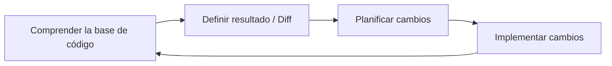
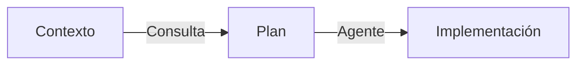

# Large Codebases
Source: https://docs.cursor.com/es/guides/advanced/large-codebases

Cómo trabajar con bases de código grandes en Cursor

Trabajar con bases de código grandes introduce un conjunto distinto de desafíos frente a los proyectos más pequeños. A partir de nuestra experiencia escalando la base de código de Cursor y de los aprendizajes de clientes que gestionan bases masivas, descubrimos patrones útiles para manejar la complejidad creciente.

En esta guía, vamos a recorrer algunas de las técnicas que nos han resultado útiles para bases de código grandes.



<div id="use-chat-to-quickly-get-up-to-speed-on-unfamiliar-code">
  # Usa Chat para ponerte al día rápidamente con código que no conoces
</div>

Recorrer una base de código grande, sobre todo si es nueva para ti, puede ser todo un reto. A menudo haces grep, buscas y haces clic por todas partes para dar con las partes específicas que necesitas. Con [Chat](/es/chat/overview), puedes empezar a hacer preguntas para encontrar lo que buscas y obtener una explicación detallada de cómo funciona.

Aquí pedimos ayuda para encontrar detalles de implementación del indexado de la base de código en Cursor, e incluso solicitamos algunos ejemplos para que sea más fácil de entender.

<Frame>
  <video src="https://mintcdn.com/cursor/E7JVsKUF5L-IiJRB/images/guides/advanced/large-codebases/qa.mp4?fit=max&auto=format&n=E7JVsKUF5L-IiJRB&q=85&s=d749be91cb35a3d13fa9df4210622029" controls data-path="images/guides/advanced/large-codebases/qa.mp4" />
</Frame>

<div id="write-rules-for-domain-specific-knowledge">
  # Escribe reglas para el conocimiento específico del dominio
</div>

Si estuvieras incorporando a un nuevo colaborador a tu base de código, ¿qué contexto le darías para asegurarte de que pueda empezar a hacer contribuciones significativas?

Tu respuesta a esta pregunta probablemente sea información valiosa para que Cursor también la entienda. En cada organización o proyecto hay conocimiento latente que puede no estar completamente reflejado en tu documentación. Usar reglas de forma efectiva es la mejor manera de asegurarte de que Cursor tenga el panorama completo.

Por ejemplo, si estás escribiendo instrucciones sobre cómo implementar una nueva funcionalidad o servicio, considera escribir una regla breve para documentarlo para la posteridad.

```mdc Plantilla theme={null}
---
description: Agrega un nuevo servicio de frontend de VSCode
---

1. **Definición de la interfaz:**
   - Define una nueva interfaz de servicio con `createDecorator` y asegúrate de incluir `_serviceBrand` para evitar errores.

2. **Implementación del servicio:**
   - Implementa el servicio en un nuevo archivo de TypeScript, extiende `Disposable` y regístralo como singleton con `registerSingleton`.

3. **Contribución del servicio:**
   - Crea un archivo de contribución para importar y cargar el servicio y regístralo en el punto de entrada principal.

4. **Integración en el contexto:**
   - Actualiza el contexto para incluir el nuevo servicio y permitir su acceso en toda la aplicación.
```

Si hay patrones de formato comunes que quieres que Cursor respete, considera autoadjuntar reglas basadas en patrones glob.

```mdc Formato theme={null}
---
globs: *.ts
---
- Usa bun como gestor de paquetes. Consulta [package.json](mdc:backend/reddit-eval-tool/package.json) para ver los scripts
- Usa kebab-case para los nombres de archivos
- Usa camelCase para los nombres de funciones y variables
- Usa UPPERCASE_SNAKE_CASE para las constantes codificadas de forma fija
- Prefiere `function foo()` en lugar de `const foo = () =>`
- Usa `Array<T>` en lugar de `T[]`
- Usa exportaciones con nombre en lugar de exportaciones por defecto, p. ej. (`export const variable ...`, `export function `)
```

<div id="stay-close-to-the-plan-creation-process">
  # Mantente cerca del proceso de creación del plan
</div>

Para cambios más grandes, dedicar más reflexión de lo habitual para crear un plan preciso y bien acotado puede mejorar significativamente los resultados de Cursor.

Si ves que no estás obteniendo el resultado que quieres tras algunas variaciones del mismo prompt, considera tomar perspectiva y crear un plan más detallado desde cero, como si estuvieras redactando un PRD para un compañero. A menudo **lo difícil es decidir qué** cambio se debe hacer, una tarea muy adecuada para las personas. Con las instrucciones correctas, podemos delegar algunas partes de la implementación a Cursor.

Una forma de usar la IA para fortalecer el proceso de creación del plan es usar el modo Ask. Para crear un plan, activa el modo Ask en Cursor y vuelca cualquier contexto que tengas de tus sistemas de gestión de proyectos, documentación interna o ideas sueltas. Piensa en qué archivos y dependencias tienes en el código base que ya sabes que quieres incluir. Puede ser un archivo que contenga fragmentos de código con los que quieras integrarte o, quizá, una carpeta completa.

Aquí tienes un ejemplo de prompt:

```mdc Indicaciones de planificación theme={null}
- crea un plan sobre cómo deberíamos implementar una nueva feature (igual que @existingfeature.ts)
- hazme preguntas (máx. 3) si algo no está claro
- asegúrate de buscar en el codebase

@Chats anteriores (mis prompts de exploración previos)

aquí tienes más contexto de [project management tool]:
[descripción del ticket pegada]
```

Le estamos pidiendo al modelo que elabore un plan y reúna contexto haciendo preguntas a la persona, referenciando cualquier prompt de exploración anterior y también las descripciones del ticket. Se recomienda usar un modelo de razonamiento como `claude-3.7-sonnet`, `gemini-2.5-pro` u `o3`, ya que pueden comprender la intención del cambio y sintetizar un plan de manera más efectiva.

A partir de esto, podés ir formulando el plan de manera iterativa con la ayuda de Cursor antes de iniciar la implementación.



<div id="pick-the-right-tool-for-the-job">
  # Elige la herramienta adecuada para la tarea
</div>

Una de las habilidades más importantes para usar Cursor de forma efectiva es elegir la herramienta adecuada para la tarea. Piensa en lo que quieres lograr y elige el enfoque que te mantenga en flow.

| **Tool**                                    | **Use case**                   | **Strength**                                        | **Limitation**                      |
| :------------------------------------------ | :----------------------------- | :-------------------------------------------------- | :---------------------------------- |
| **[Tab](/es/tab/overview)**                 | Cambios rápidos y manuales     | Control total, muy rápido                           | Un solo archivo                     |
| **[Inline Edit](/es/inline-edit/overview)** | Cambios acotados en un archivo | Ediciones focalizadas                               | Un solo archivo                     |
| **[Chat](/es/chat/overview)**               | Cambios grandes multiarchivo   | Reúne contexto automáticamente, ediciones profundas | Más lento, dependiente del contexto |

Cada herramienta tiene su punto ideal:

* Tab es tu opción para ediciones rápidas cuando quieres ir al volante
* Inline Edit brilla cuando necesitas hacer cambios puntuales en una sección específica del código
* Chat es perfecto para esos cambios más grandes donde necesitas que Cursor entienda el contexto más amplio

Cuando uses el modo Chat (que puede sentirse un poco más lento pero es increíblemente potente), ayúdalo dándole buen contexto. Usa [@files](/es/context/@-symbols/@-files) para señalar código similar que quieras emular, o [@folder](/es/context/@-symbols/@-folders) para darle un mejor entendimiento de la estructura de tu proyecto. Y no tengas miedo de dividir cambios más grandes en partes más pequeñas: empezar chats nuevos ayuda a mantener todo enfocado y eficiente.

<div id="takeaways">
  # Conclusiones
</div>

* Acota los cambios y no intentes hacer demasiado de una vez
* Incluye el contexto relevante cuando puedas
* Usa Chat, Inline Edit y Tab para lo que mejor se les da
* Crea chats nuevos con frecuencia
* Planifica con [Ask mode](/es/chat/ask) e implementa con [Agent mode](/es/chat/agent)

---

← Previous: [Ciencia de datos](./ciencia-de-datos.md) | [Index](./index.md) | Next: [Trabajar con la documentación](./trabajar-con-la-documentacin.md) →