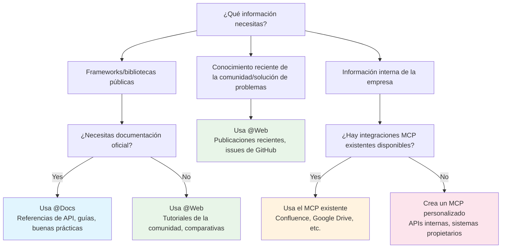

# Trabajar con la documentación
Source: https://docs.cursor.com/es/guides/advanced/working-with-documentation

Cómo sacar el máximo partido a la documentación en Cursor mediante indicaciones, fuentes externas y contexto interno

export const ChatInput = ({content = []}) => {
  const renderContent = () => {
    return content.map((item, index) => {
      if (item.type === 'mention') {
        return <span key={index} className="mention bg-blue-500/20 px-1 py-0.5 rounded-sm">
                        {item.text}
                    </span>;
      }
      return item.text;
    });
  };
  return <>
            <div className="flex flex-col items-stretch border border-neutral-500 rounded-lg p-3 gap-2 bg-neutral-800 relative transition-all duration-100 ease-in-out hover:border-neutral-500">
                <div className="flex flex-col gap-1">
                    <div className="flex flex-col gap-1 outline-none overflow-hidden">
                        <div className="flex-1 flex items-center gap-2">
                            <div className="w-full box-border max-h-10 overflow-hidden">
                                <div className="flex items-center gap-2 w-full flex-nowrap">
                                    <div className="cursor-pointer flex items-center justify-center p-1 h-5 w-5 rounded border border-neutral-600 outline-none flex-shrink-0 hover:bg-neutral-700 bg-neutral-750">
                                        <span className="text-neutral-400 text-sm font-semibold">@</span>
                                    </div>
                                </div>
                            </div>
                        </div>
                    </div>
                </div>

                <div className="relative pt-0">
                    <div className="min-h-6 w-full max-h-60">
                        <div className="relative overflow-y-hidden w-full">
                            <div className="w-full flex flex-wrap overflow-hidden min-h-6">
                                <div className="inline-block w-full min-h-full">
                                    <div className="w-full overflow-visible h-full min-h-6">
                                        <div className="grid relative grid-cols-1 w-full">

                                            <div className="leading-6 text-sm text-neutral-200 bg-transparent block break-words p-0 whitespace-pre-wrap font-medium min-h-6">
                                                {content.length > 0 ? renderContent() : <span className="text-neutral-500">Plan, search, build anything</span>}
                                            </div>

                                        </div>
                                    </div>
                                </div>
                            </div>
                        </div>
                    </div>

                    <div className="flex items-center justify-between gap-3 flex-shrink-0 mt-6">
                        <div className="flex-1 w-full h-full flex items-center flex-col gap-1">
                            <div className="flex items-center justify-between gap-2 flex-shrink-0 w-full">
                                <div className="flex items-center justify-between w-full">
                                    <div className="flex items-center gap-3 flex-shrink min-w-0">
                                        <div className="flex gap-1 text-xs items-center min-w-0 max-w-full px-1.5 py-0.5 flex-shrink-0 cursor-pointer bg-neutral-700 hover:bg-neutral-600 rounded-full">
                                            <div className="flex items-center gap-1 min-w-0 max-w-full overflow-hidden">
                                                <div className="text-xs flex-shrink-0 w-3 h-3 flex items-center justify-center text-neutral-400">
                                                    ∞
                                                </div>
                                                <div className="min-w-0 max-w-full overflow-hidden text-ellipsis whitespace-nowrap flex items-center gap-1 font-medium">
                                                    <span className="text-neutral-300">Agent</span>
                                                    <span className="text-neutral-500 text-[10px]">⌘I</span>
                                                </div>
                                                <Icon icon="chevron-down" size={6} color="currentColor" />
                                            </div>
                                        </div>

                                        <div className="flex gap-2 text-xs items-center cursor-pointer min-w-0 max-w-full px-0 py-1 opacity-90 rounded hover:text-neutral-200">
                                            <div className="flex items-center gap-2 min-w-0 max-w-full overflow-x-hidden">
                                                <div className="min-w-0 text-ellipsis whitespace-nowrap text-neutral-300 flex items-center gap-2 overflow-hidden">
                                                    <div className="overflow-hidden inline-flex gap-2 items-center">
                                                        <span className="whitespace-nowrap overflow-x-hidden text-ellipsis text-xs">
                                                            Auto
                                                        </span>
                                                    </div>
                                                </div>
                                                <Icon icon="chevron-down" size={8} color="currentColor" />
                                            </div>
                                        </div>
                                    </div>

                                    <div className="flex items-center gap-3 justify-end">
                                        <button className="bg-white/80 border-none text-neutral-500 flex w-5 h-5 items-center justify-center hover:text-neutral-400 hover:bg-white/90 rounded-full disabled:opacity-50" disabled={content.length === 0 || !content.some(item => item.text.trim())}>
                                            <span className="text-sm">↑</span>
                                        </button>
                                    </div>
                                </div>
                            </div>
                        </div>
                    </div>
                </div>
            </div>
        </>;
};

<div id="why-documentation-matters">
  # Por qué la documentación importa
</div>

La documentación proporciona contexto actualizado y preciso. Sin ella, los modelos usan datos de entrenamiento obsoletos o incompletos. La documentación ayuda a los modelos a entender cosas como:

* APIs y parámetros vigentes
* Mejores prácticas
* Convenciones de la organización
* Terminología del dominio

Y mucho más. Sigue leyendo para aprender a usar la documentación directamente en Cursor sin tener que cambiar de contexto.

<div id="model-knowledge-cutoff">
  ## Límite de conocimiento del modelo
</div>

Los modelos de lenguaje grandes se entrenan con datos hasta un punto específico en el tiempo, llamado "límite de conocimiento". Esto implica:

* Es posible que las actualizaciones recientes de bibliotecas no estén reflejadas
* Es probable que frameworks o herramientas nuevos no sean conocidos
* Los cambios de API posteriores a la fecha de corte no se contemplan
* Las buenas prácticas pueden haber evolucionado desde el entrenamiento

Por ejemplo, si el límite de conocimiento de un modelo es a inicios de 2024, no conocerá funciones lanzadas a finales de 2024, incluso en frameworks populares.

<div id="which-tool-should-i-use">
  # ¿Qué herramienta debería usar?
</div>

Usa este árbol de decisión para determinar rápidamente el mejor enfoque para tus necesidades de documentación:



<div id="mental-model">
  ## Modelo mental
</div>

<div className="full-width-table">
  | Herramienta | Modelo mental                                |
  | ----------- | -------------------------------------------- |
  | **`@Docs`** | Como navegar y leer la documentación oficial |
  | **`@Web`**  | Como buscar soluciones en internet           |
  | **MCP**     | Como acceder a tu documentación interna      |
</div>

<div id="public-documentation">
  # Documentación pública
</div>

La documentación externa abarca información pública sobre la que los modelos pueden tener un conocimiento limitado o desactualizado. Cursor ofrece dos formas principales de acceder a esta información.

<div id="using-docs">
  ## Uso de @Docs
</div>

`@Docs` conecta Cursor con la documentación oficial de herramientas y frameworks populares. Úsalo cuando necesites información actual y autorizada sobre:

* **Referencias de API**: Firmas de funciones, parámetros, tipos de retorno
* **Guías de introducción**: Configuración, ajustes, uso básico
* **Mejores prácticas**: Patrones recomendados por la fuente oficial
* **Depuración específica de frameworks**: Guías oficiales de solución de problemas

<ChatInput
  content={[
{ type: 'mention', text: '@Docs Next.js' },
{ type: 'text', text: ' How do I set up dynamic routing with catch-all routes?' }
]}
/>

<div id="using-web">
  ## Uso de @Web
</div>

`@Web` busca en la web información actual, entradas de blog y discusiones de la comunidad. Úsalo cuando necesites:

* **Tutoriales recientes**: contenido y ejemplos generados por la comunidad
* **Comparaciones**: artículos que comparan diferentes enfoques
* **Novedades recientes**: actualizaciones o anuncios muy recientes
* **Múltiples perspectivas**: distintos enfoques para resolver problemas

<ChatInput
  content={[
{ type: 'mention', text: '@Web' },
{ type: 'text', text: ' latest performance optimizations for React 19' }
]}
/>

<div id="internal-documentation">
  # Documentación interna
</div>

La documentación interna incluye información específica de tu organización que los modelos de IA nunca han visto durante su entrenamiento. Esto puede incluir:

* **APIs internas**: Servicios y microservicios personalizados
* **Estándares de la empresa**: Convenciones de codificación, patrones de arquitectura
* **Sistemas propietarios**: Herramientas, bases de datos y flujos de trabajo personalizados
* **Conocimiento del dominio**: Lógica de negocio, requisitos de cumplimiento normativo

<div id="accessing-internal-docs-with-mcp">
  ## Acceder a documentación interna con MCP
</div>

Model Context Protocol (MCP) proporciona una forma estandarizada de incorporar tu documentación y sistemas privados en Cursor. MCP actúa como una capa ligera entre Cursor y tus recursos internos.

**Por qué MCP importa:**

* Los modelos no pueden adivinar tus convenciones internas
* La documentación de las APIs de servicios personalizados no está disponible públicamente
* La lógica de negocio y el conocimiento del dominio son exclusivos de tu organización
* Los requisitos de cumplimiento y seguridad varían según la empresa

<div id="common-mcp-integrations">
  ### Integraciones comunes de MCP
</div>

| Integración      | Acceso                                 | Ejemplos                                                                                                                                        |
| ---------------- | -------------------------------------- | ----------------------------------------------------------------------------------------------------------------------------------------------- |
| **Confluence**   | Espacios de Confluence de la empresa   | Documentación de arquitectura, especificaciones de API para servicios internos, estándares y guías de codificación, documentación de procesos   |
| **Google Drive** | Documentos y carpetas compartidos      | Documentos de especificación, notas de reuniones y registros de decisiones, documentos de diseño y requisitos, bases de conocimiento del equipo |
| **Notion**       | Bases de datos y páginas del workspace | Documentación de proyectos, wikis de equipo, bases de conocimiento, requisitos de producto, especificaciones técnicas                           |
| **Custom**       | Sistemas y bases de datos internos     | APIs propietarias, sistemas de documentación heredados, bases de conocimiento personalizadas, herramientas y flujos de trabajo especializados   |

<div id="custom-solutions">
  #### Soluciones personalizadas
</div>

Para necesidades específicas, puedes crear servidores MCP personalizados que:

* Hagan scraping de sitios web o portales internos
* Se conecten a bases de datos propietarias
* Accedan a sistemas de documentación personalizados
* Extraigan información de wikis internos o bases de conocimiento

<Tip>Si creas un servidor MCP personalizado, también puedes exponer herramientas para que Cursor actualice la documentación</Tip>

Ejemplo de servidor MCP personalizado para hacer scraping de documentación interna:

<CodeGroup>
  ```javascript TypeScript theme={null}
  import { McpServer, ResourceTemplate } from "@modelcontextprotocol/sdk/server/mcp.js";
  import { StdioServerTransport } from "@modelcontextprotocol/sdk/server/stdio.js";
  import { z } from "zod";
  import TurndownService from "turndown";

  // Create an MCP server for scraping internal docs
  const server = new McpServer({
    name: "internal-docs",
    version: "1.0.0"
  });

  const turndownService = new TurndownService();

  // Add tool to scrape internal documentation
  server.tool("get_doc",
    { url: z.string() },
    async ({ url }) => {
      try {
        const response = await fetch(url);
        const html = await response.text();
        
        // Convert HTML to markdown
        const markdown = turndownService.turndown(html);
        
        return {
          content: [{ type: "text", text: markdown }]
        };
      } catch (error) {
        return {
          content: [{ type: "text", text: `Error scraping ${url}: ${error.message}` }]
        };
      }
    }
  );

  // Start receiving messages on stdin and sending messages on stdout
  const transport = new StdioServerTransport();
  await server.connect(transport);
  ```

  ```python Python theme={null}
  # server.py
  import os
  import asyncio
  from mcp.server.fastmcp import FastMCP
  import aiohttp
  from markdownify import markdownify as md

  # Create an MCP server for scraping internal docs
  mcp = FastMCP("internal-docs")

  @mcp.tool()
  async def get_doc(url: str) -> dict:
      """Scrape internal documentation from a URL"""
      try:
          async with aiohttp.ClientSession() as session:
              async with session.get(url) as response:
                  html = await response.text()
          
          # Convert HTML to markdown
          markdown = md(html)
          
          return {
              "content": [{"type": "text", "text": markdown}]
          }
      except Exception as error:
          return {
              "content": [{"type": "text", "text": f"Error scraping {url}: {str(error)}"}]
          }
  ```
</CodeGroup>

<div id="keeping-docs-up-to-date">
  # Mantener la documentación actualizada
</div>

La documentación se queda obsoleta rápido. Cursor puede ayudarte a mantenerla al día y útil, generándola y actualizándola a partir de tu código real y de tus conversaciones de desarrollo.

<div id="from-existing-code">
  ## Desde código existente
</div>

Usa Cursor para generar documentación directamente desde tu código:

<Tabs>
  <Tab title="Documentación de API">
    <ChatInput
      content={[
    { type: 'text', text: 'Genera documentación de la API para este router de Express, incluyendo todos los endpoints, parámetros y formatos de respuesta' }
  ]}
    />
  </Tab>

  <Tab title="Comentarios JSDoc">
    <ChatInput
      content={[
    { type: 'text', text: 'Agrega comentarios JSDoc detallados a esta clase, documentando todos los métodos y sus parámetros' }
  ]}
    />
  </Tab>

  <Tab title="Creación de README">
    <ChatInput
      content={[
    { type: 'text', text: 'Crea un README para este proyecto que incluya instrucciones de instalación, ejemplos de uso y una visión general de la API' }
  ]}
    />
  </Tab>
</Tabs>

<div id="from-chat-sessions">
  ## Desde sesiones de chat
</div>

Tus conversaciones con Cursor contienen información valiosa que puede convertirse en documentación.

<Tabs>
  <Tab title="Resolución de problemas">
    **Después de resolver un problema complejo:**

    <ChatInput
      content={[
    { type: 'text', text: 'Resume nuestra conversación sobre cómo configurar la autenticación en una guía paso a paso para el wiki del equipo' }
  ]}
    />
  </Tab>

  <Tab title="Arquitectura">
    **Después de tomar decisiones de arquitectura:**

    <ChatInput
      content={[
    { type: 'text', text: 'Crea documentación que explique por qué elegimos este diseño de base de datos, incluyendo los compromisos que discutimos' }
  ]}
    />
  </Tab>

  <Tab title="Depuración">
    **Después de sesiones de depuración:**

    <ChatInput
      content={[
    { type: 'text', text: 'Escribe una guía de solución de problemas basada en este bug que acabamos de corregir, incluyendo los síntomas y los pasos para resolverlo' }
  ]}
    />
  </Tab>
</Tabs>

<div id="takeaways">
  ## Puntos clave
</div>

* Usar la documentación como contexto hace que Cursor sea más preciso y esté al día
* Usa `@Docs` para la documentación oficial y `@Web` para el conocimiento de la comunidad
* MCP conecta Cursor con tus sistemas internos
* Genera documentación a partir del código y las conversaciones para mantener el conocimiento actualizado
* Combina documentación externa e interna para una comprensión completa

---

← Previous: [Large Codebases](./large-codebases.md) | [Index](./index.md) | Next: [Java](./java.md) →