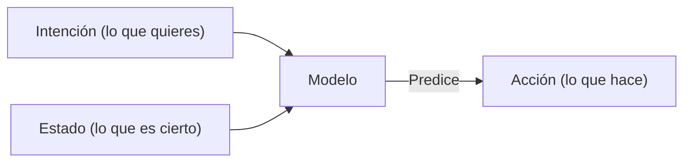

# Working with Context
Source: https://docs.cursor.com/es/guides/working-with-context

Cómo trabajar con el contexto en Cursor

Primero, ¿qué es una ventana de contexto? ¿Y cómo se relaciona con programar de forma efectiva con Cursor?

Tomando un poco de perspectiva, un modelo de lenguaje grande (LLM) es un modelo de inteligencia artificial entrenado para predecir y generar texto aprendiendo patrones a partir de conjuntos de datos masivos. Impulsa herramientas como Cursor al entender tu entrada y sugerir código o texto según lo que ha visto antes.

Los tokens son las entradas y salidas de estos modelos. Son fragmentos de texto, a menudo una parte de una palabra, que un LLM procesa uno por uno. Los modelos no leen oraciones completas de una vez; predicen el siguiente token en función de los anteriores.

Para ver cómo se tokeniza un texto, puedes usar un tokenizador como [este](https://tiktokenizer.vercel.app/).

  # ¿Qué es el contexto?

Cuando generamos una sugerencia de código en Cursor, “contexto” se refiere a la información que se le proporciona al modelo (en forma de “tokens de entrada”) y que el modelo usa para predecir la información siguiente (en forma de “tokens de salida”).

Hay dos tipos de contexto:

1. **Contexto de intención** define lo que el usuario quiere obtener del modelo. Por ejemplo, un system prompt normalmente sirve como instrucciones de alto nivel sobre cómo el usuario quiere que el modelo se comporte. La mayor parte del “prompting” que se hace en Cursor es contexto de intención. “Cambia ese botón de azul a verde” es un ejemplo de intención declarada; es prescriptivo.
2. **Contexto de estado** describe el estado del mundo actual. Proporcionar a Cursor mensajes de error, registros de consola, imágenes y fragmentos de código son ejemplos de contexto relacionado con el estado. Es descriptivo, no prescriptivo.

Juntos, estos dos tipos de contexto trabajan en armonía al describir el estado actual y el estado futuro deseado, lo que permite a Cursor hacer sugerencias de código útiles.

  # Proporcionar contexto en Cursor

Cuanto más contexto relevante le des a un modelo, más útil será. Si no se proporciona suficiente contexto en Cursor, el modelo intentará resolver la tarea sin la información necesaria. Esto suele resultar en:

1. Alucinaciones donde el modelo intenta hacer pattern matching (cuando no hay un patrón), lo que provoca resultados inesperados. Esto puede suceder con frecuencia en modelos como `claude-3.5-sonnet` cuando no reciben suficiente contexto.
2. El Agent intentando reunir contexto por su cuenta buscando en el código, leyendo archivos y llamando a herramientas. Un modelo con strong thinking (como `claude-3.7-sonnet`) puede llegar bastante lejos con esta estrategia, y proporcionar el contexto inicial correcto marcará la trayectoria.

La buena noticia es que Cursor está construido con conciencia contextual en su núcleo y está diseñado para requerir una intervención mínima por parte del usuario. Cursor extrae automáticamente las partes de tu base de código que el modelo estima relevantes, como el archivo actual, patrones semánticamente similares en otros archivos y otra información de tu sesión.

Aun así, hay mucho contexto del que se puede tirar, así que especificar manualmente el contexto que sabes que es relevante para la tarea es una forma útil de orientar a los modelos en la dirección correcta.

  ## Símbolo @

La forma más fácil de aportar contexto explícito es con el símbolo @. Van genial cuando sabes exactamente qué archivo, carpeta, sitio web u otro elemento de contexto quieres incluir. Cuanto más específico puedas ser, mejor. Aquí tienes un desglose de cómo ser más preciso con el contexto:

| Símbolo   | Ejemplo              | Caso de uso                                                                               | Desventaja                                                                         |
| --------- | -------------------- | ----------------------------------------------------------------------------------------- | ---------------------------------------------------------------------------------- |
| `@code`   | `@LRUCachedFunction` | Sabes qué función, constante o símbolo es relevante para el resultado que estás generando | Requiere conocer muy bien la base de código                                        |
| `@file`   | `cache.ts`           | Sabes qué archivo debe leerse o editarse, pero no exactamente en qué parte del archivo    | Puede incluir mucho contexto irrelevante para la tarea en cuestión según el tamaño |
| `@folder` | `utils/`             | Todo o la mayoría de los archivos de una carpeta son relevantes                           | Puede incluir mucho contexto irrelevante para la tarea en cuestión                 |

  ## Reglas

Pensá en las reglas como una memoria a largo plazo a la que querés que vos u otros miembros de tu equipo puedan acceder. Capturar contexto específico del dominio —incluidos flujos de trabajo, formatos y otras convenciones— es un excelente punto de partida para redactar reglas.

También podés generar reglas a partir de conversaciones existentes usando `/Generate Cursor Rules`. Si tuviste una conversación larga, con mucho ida y vuelta y muchos prompts, probablemente haya directrices útiles o reglas generales que quieras reutilizar después.

  ## MCP

[Model Context Protocol](https://modelcontextprotocol.io/introduction) es una capa de extensibilidad donde podés darle a Cursor capacidades para ejecutar acciones e incorporar contexto externo.

Según tu entorno de desarrollo, quizá quieras aprovechar distintos tipos de servidores, pero dos categorías que vimos especialmente útiles son:

* **Documentación interna**: p. ej., Notion, Confluence, Google Docs
* **Gestión de proyectos**: p. ej., Linear, Jira

Si ya tenés herramientas para acceder a contexto y ejecutar acciones mediante una API, podés construir un servidor MCP para eso. Acá hay una guía breve sobre cómo crear [servidores MCP](https://modelcontextprotocol.io/tutorials/building-mcp-with-llms).

  ## Auto-recolección de contexto

Un patrón potente que muchxs usuarios están adoptando es dejar que el Agent escriba herramientas efímeras que luego pueda ejecutar para reunir más contexto. Esto es especialmente efectivo en flujos con humano en el bucle (human-in-the-loop) donde revisas el código antes de que se ejecute.

Por ejemplo, añadir sentencias de depuración a tu código, ejecutarlo y dejar que el modelo inspeccione la salida le da acceso a contexto dinámico que no podría inferir de forma estática.

En Python, puedes hacer esto pidiéndole al Agent que:

1. Añada print("debugging: ...") en partes relevantes del código
2. Ejecute el código o las pruebas usando la terminal

El Agent leerá la salida de la terminal y decidirá qué hacer después. La idea central es darle al Agent acceso al comportamiento real en tiempo de ejecución, no solo al código estático.

  # Conclusiones

* El contexto es la base de una codificación con IA efectiva y está compuesto por la intención (lo que querés) y el estado (lo que existe). Incluir ambos ayuda a Cursor a hacer predicciones precisas.
* Usá contexto quirúrgico con símbolos @ (@code, @file, @folder) para guiar a Cursor con precisión, en vez de depender solo de la recolección automática de contexto.
* Capturá el conocimiento repetible en reglas para reutilizarlo a nivel de equipo y ampliá las capacidades de Cursor con Model Context Protocol para conectar sistemas externos.
* Un contexto insuficiente lleva a alucinaciones o ineficiencia, mientras que demasiado contexto irrelevante diluye la señal. Encontrá el equilibrio adecuado para obtener resultados óptimos.

---

← Previous: [Desarrollo web](./desarrollo-web.md) | [Index](./index.md) | Next: [Edición inline](./edicin-inline.md) →