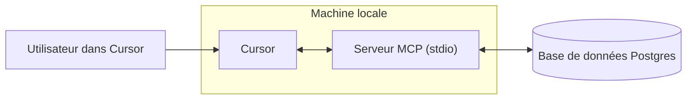

# Créer un serveur MCP
Source: https://docs.cursor.com/fr/guides/tutorials/building-mcp-server

Apprends à créer un serveur Model Context Protocol (MCP) avec intégration à PostgreSQL pour Cursor

<div id="introduction">
  ## Introduction
</div>

Les serveurs MCP te permettent de connecter des sources de données personnalisées et de les rendre disponibles dans Cursor. C’est particulièrement utile quand tu as besoin de contexte depuis un navigateur, une base de données ou des journaux d’erreurs et système. Configurer un serveur MCP est simple, et avec Cursor, ça se fait rapidement.

Dans ce guide, on va voir comment créer un serveur MCP pour Postgres. L’objectif est de permettre à Cursor d’exécuter des requêtes SQL directement sur une base de données Postgres et d’exposer les schémas de tables de façon structurée.

<Note>
  Ce tutoriel est conçu pour enseigner les bases de la création de serveurs MCP.
</Note>

<video autoPlay loop muted playsInline controls>
  <source src="https://mintcdn.com/cursor/Qpa6MBK62Try_xlf/images/guides/tutorials/building-mcp-server/demo.mp4?fit=max&auto=format&n=Qpa6MBK62Try_xlf&q=85&s=8e02b011bd0956d62135db5779f7ead5" type="video/mp4" data-path="images/guides/tutorials/building-mcp-server/demo.mp4" />
</video>



<div id="what-is-an-mcp-server">
  ## Qu’est-ce qu’un serveur MCP ?
</div>

Un [serveur MCP](/fr/context/mcp) est un processus qui communique avec Cursor et donne accès à des données ou actions externes. Il peut être implémenté de plusieurs façons, mais ici on va utiliser la méthode la plus simple : un serveur qui tourne en local sur ton ordinateur via [stdio](https://en.wikipedia.org/wiki/Standard_streams) (flux standard d’entrée/sortie). Ça évite des considérations de sécurité complexes et nous permet de nous concentrer sur la logique MCP elle-même.

L’un des cas d’usage les plus courants de MCP est l’accès aux bases de données. Quand tu construis des dashboards, exécutes des analyses ou crées des migrations, il est souvent nécessaire d’interroger et d’inspecter une base de données. Notre serveur MCP pour Postgres prendra en charge deux capacités principales : exécuter des requêtes arbitraires et lister les schémas de tables.

Même si ces deux tâches pourraient être réalisées en SQL « pur », MCP offre des fonctionnalités qui les rendent plus puissantes et plus largement utiles. Les outils permettent d’exposer des actions comme l’exécution de requêtes, tandis que les ressources nous permettent de partager un contexte standardisé, par exemple des informations de schéma. Plus loin dans ce guide, on verra aussi les prompts, qui permettent des workflows plus avancés.

Sous le capot, on va s’appuyer sur le package npm postgres pour exécuter des instructions SQL sur la base de données. Le SDK MCP servira de wrapper autour de ces appels, ce qui nous permet d’intégrer les fonctionnalités de Postgres de manière transparente dans Cursor.

<div id="how-to-build-the-mcp-server">
  ## Comment créer le serveur MCP
</div>

La première étape pour créer le serveur, c’est de configurer un nouveau projet. On commence par créer un nouveau dossier et initialiser un projet Bun

```bash  theme={null}
> mkdir postgres-mcp-server
> Bun init
```

À partir d’ici, on va sélectionner le projet `Blank`. Une fois notre boilerplate en place, on doit installer les dépendances nécessaires. `zod` est requis pour définir des schémas d’E/S dans le SDK MCP

```bash  theme={null}
bun add postgres @modelcontextprotocol/sdk zod
```

À partir d’ici, on va aller sur les dépôts de chacune des bibliothèques et récupérer le lien vers le contenu brut de leurs README respectifs. On s’en servira comme contexte pour construire le serveur

* `postgres`
  * Repo:  [https://github.com/porsager/postgres](https://github.com/porsager/postgres),
  * README: [https://raw.githubusercontent.com/porsager/postgres/refs/heads/master/README.md](https://raw.githubusercontent.com/porsager/postgres/refs/heads/master/README.md)
* `@modelcontextprotocol/sdk`:
  * Repo: [https://github.com/modelcontextprotocol/typescript-sdk](https://github.com/modelcontextprotocol/typescript-sdk)
  * README: [https://raw.githubusercontent.com/modelcontextprotocol/typescript-sdk/refs/heads/main/README.md](https://raw.githubusercontent.com/modelcontextprotocol/typescript-sdk/refs/heads/main/README.md)

Maintenant, on va définir le comportement attendu du serveur. Pour ça, on va créer un `spec.md` et décrire les objectifs de haut niveau

```markdown  theme={null}

---

← Previous: [Schémas d’architecture](./schmas-darchitecture.md) | [Index](./index.md) | Next: [Développement web](./dveloppement-web.md) →