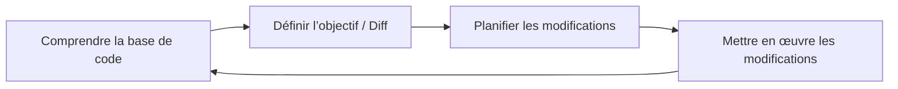
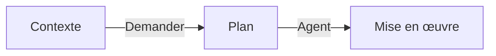
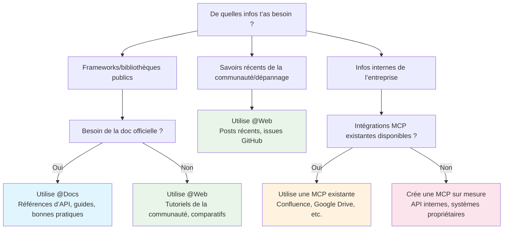
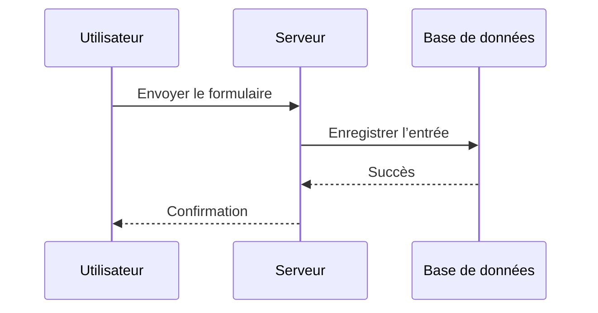
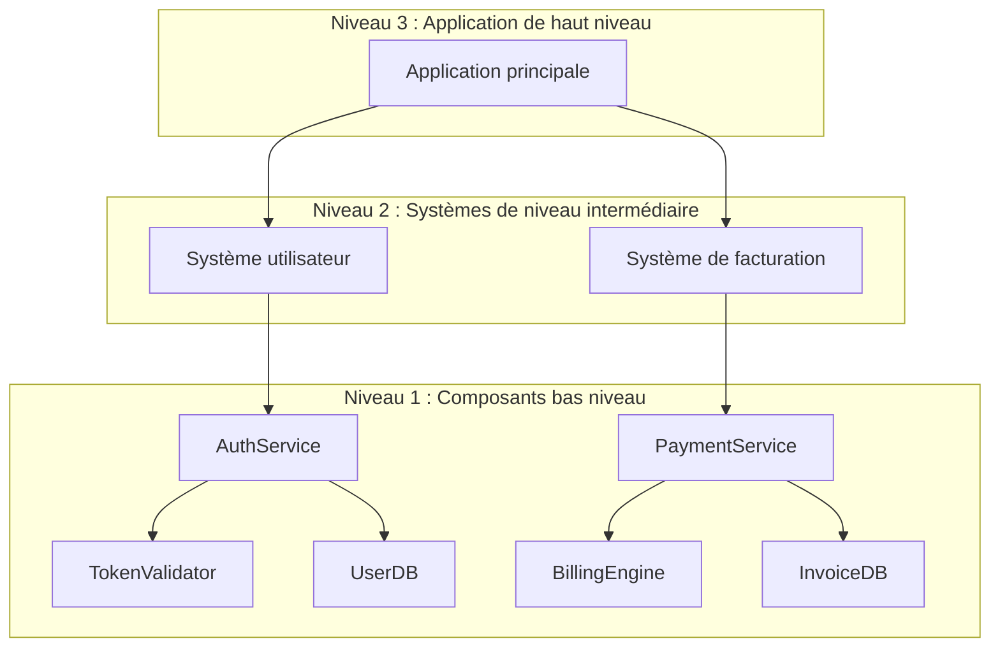
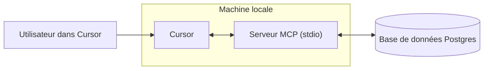
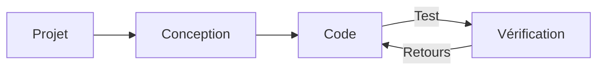
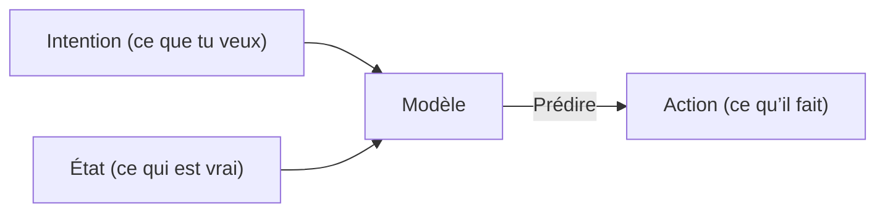

# Cursor Documentation (French)

This is the complete formatted documentation for Cursor in French, parsed and organized from the official documentation.

**Total Sections:** 112

---


# Sécurité de l’agent
Source: https://docs.cursor.com/fr/account/agent-security

Considérations de sécurité pour l’utilisation de Cursor Agent

Les attaques par injection de prompt, les hallucinations de l’IA et d’autres problèmes peuvent amener une IA à se comporter de manière inattendue et potentiellement malveillante. Pendant qu’on continue de travailler à résoudre l’injection de prompt à un niveau plus fondamental, notre protection principale dans les produits Cursor repose sur des garde-fous autour de ce qu’un agent peut faire, notamment l’exigence, activée par défaut, d’une approbation manuelle pour les actions sensibles. L’objectif de ce document est d’expliquer ces garde-fous et ce à quoi tu peux t’attendre.

Tous les contrôles et comportements ci-dessous correspondent à nos paramètres par défaut et recommandés.

<div id="first-party-tool-calls">
  ## Appels d’outils first‑party
</div>

Cursor est livré avec des outils qui permettent à l’agent d’aider nos utilisateurs à écrire du code. Ceux‑ci incluent la lecture de fichiers, les modifications, l’exécution de commandes dans le terminal, la recherche de documentation sur le web, et d’autres.

Les outils de lecture ne nécessitent pas d’approbation (c.-à-d. lecture de fichiers, recherche dans le code). Les utilisateurs peuvent utiliser [.cursorignore](/fr/context/ignore-files) pour empêcher l’agent d’accéder à des fichiers spécifiques, mais sinon les lectures sont généralement autorisées sans approbation. Pour les actions présentant un risque d’exfiltration de données sensibles, nous exigeons une approbation explicite.

La modification de fichiers dans l’espace de travail actuel ne nécessite pas d’approbation explicite, avec quelques exceptions. Quand un agent modifie des fichiers, ils sont immédiatement enregistrés sur le disque. Nous recommandons d’exécuter Cursor dans des espaces de travail sous contrôle de version, afin que le contenu des fichiers puisse être rétabli à tout moment. Nous exigeons une approbation explicite avant de modifier des fichiers qui changent la configuration de notre IDE/CLI, comme le fichier de paramètres de l’éditeur pour l’espace de travail. Cependant, les utilisateurs dont l’application se recharge automatiquement à la modification de fichiers doivent savoir que les changements de l’agent peuvent déclencher une exécution automatique avant qu’ils aient eu la chance de les revoir.

Toute commande de terminal suggérée par les agents nécessite une approbation par défaut. Nous recommandons que les utilisateurs relisent chaque commande avant que l’agent ne l’exécute. Les utilisateurs qui acceptent le risque peuvent choisir d’autoriser l’agent à exécuter toutes les commandes sans approbation. Nous incluons une fonctionnalité d’[allowlist](/fr/agent/tools) dans Cursor, mais nous ne la considérons pas comme un contrôle de sécurité. Certains utilisateurs choisissent d’autoriser des commandes spécifiques, mais c’est un système best effort et des contournements restent possibles. Nous ne recommandons pas « Run Everything », qui contourne toute allowlist configurée.

<div id="third-party-tool-calls">
  ## Appels d’outils tiers
</div>

Cursor permet de connecter des outils externes via le [MCP](/fr/context/mcp). Toutes les connexions MCP tierces doivent être explicitement approuvées par l’utilisateur. Une fois qu’un utilisateur a approuvé un MCP, par défaut chaque appel d’outil suggéré en mode Agent pour chaque intégration MCP externe doit être explicitement approuvé avant exécution.

<div id="network-requests">
  ## Requêtes réseau
</div>

Des requêtes réseau peuvent être utilisées par un attaquant pour exfiltrer des données. À l’heure actuelle, nous ne prenons pas en charge d’outils propriétaires effectuant des requêtes réseau en dehors d’un ensemble très restreint d’hôtes (par ex. GitHub), de la récupération explicite de liens, ni de la recherche web qu’avec un nombre limité de fournisseurs. Les requêtes réseau arbitraires des agents sont bloquées avec les paramètres par défaut.

<div id="workspace-trust">
  ## Confiance de l’espace de travail
</div>

L’IDE Cursor prend en charge la fonctionnalité standard de [confiance de l’espace de travail](https://code.visualstudio.com/docs/editing/workspaces/workspace-trust), qui est désactivée par défaut. À l’ouverture d’un nouvel espace de travail, une invite te propose de choisir entre le mode normal ou le mode restreint. Le mode restreint désactive l’IA et d’autres fonctionnalités pour lesquelles les gens utilisent généralement Cursor. On recommande d’utiliser d’autres outils, comme un éditeur de texte simple, pour travailler avec des dépôts auxquels tu ne fais pas confiance.

Tu peux activer la confiance de l’espace de travail dans tes paramètres en suivant ces étapes :

1. Ouvre ton fichier user settings.json
2. Ajoute la configuration suivante :
   ```json  theme={null}
   "security.workspace.trust.enabled": true
   ```

Ce paramètre peut aussi être imposé à l’échelle de l’organisation via des solutions de Mobile Device Management (MDM).

<div id="responsible-disclosure">
  ## Divulgation responsable
</div>

Si tu penses avoir trouvé une vulnérabilité dans Cursor, suis le guide sur notre page GitHub Security et dépose ton rapport là-bas. Si tu peux pas utiliser GitHub, écris-nous aussi à [security@cursor.com](mailto:security@cursor.com).

On s’engage à accuser réception des signalements de vulnérabilité sous 5 jours ouvrables et à les traiter dès qu’on le peut. On publiera les résultats sous forme d’avis de sécurité sur notre page GitHub Security. Les incidents critiques seront communiqués à la fois sur la page GitHub Security et par e‑mail à tous les utilisateurs.

---


# Facturation
Source: https://docs.cursor.com/fr/account/billing

Gestion des abonnements, remboursements et factures Cursor 

<div id="how-do-i-access-billing-settings">
  ### Comment accéder aux paramètres de facturation ?
</div>

Accède au portail de facturation via le [dashboard](https://cursor.com/dashboard) en cliquant sur « Billing » dans ton dashboard. Ça ouvre un portail sécurisé pour toutes les tâches de facturation.

<div id="what-are-cursors-billing-cycles">
  ### Quels sont les cycles de facturation de Cursor ?
</div>

Les cycles de facturation sont mensuels ou annuels, à partir de la date de ton abonnement. Les comptes Teams sont facturés par siège avec une facturation au prorata pour les nouveaux membres.

<div id="how-do-seats-work-for-teams-accounts">
  ### Comment fonctionnent les sièges pour les comptes Teams ?
</div>

Les comptes Teams facturent par siège (un par membre de l’équipe). Quand tu ajoutes des membres en cours de cycle, tu es facturé uniquement pour leur temps restant. Si un membre a utilisé des crédits et est retiré, son siège reste occupé jusqu’à la fin du cycle de facturation — aucun remboursement au prorata n’est accordé. Les admins d’équipe peuvent gérer les sièges via le dashboard.

<div id="can-i-switch-between-monthly-and-annual-billing">
  ### Puis-je basculer entre la facturation mensuelle et annuelle ?
</div>

Oui ! Voici comment faire :

**Pro plan**

1. Va sur le [dashboard](https://cursor.com/dashboard) Cursor
2. Clique sur « Billing and Invoices » dans la barre latérale gauche pour accéder à la page de facturation
3. Clique sur « Manage subscription »
4. Clique sur « Update subscription »
5. Sélectionne « Yearly » ou « Monthly », puis clique sur « Continue »

**Teams plan**

1. Va sur le [dashboard](https://cursor.com/dashboard) Cursor
2. Clique sur « Billing and Invoices » dans la barre latérale gauche pour accéder à la page de facturation
3. Clique sur le bouton « Upgrade Now » pour passer à la facturation annuelle

<Note>
  Tu peux seulement passer de la facturation mensuelle à annuelle en self-serve. Pour passer de annuelle à mensuelle, contacte-nous à
  [hi@cursor.com](mailto:hi@cursor.com).
</Note>

<div id="where-can-i-find-my-invoices">
  ### Où puis-je trouver mes factures ?
</div>

Retrouve tout l’historique de facturation dans le portail de facturation. Consulte et télécharge les factures actuelles et passées.

<div id="can-i-get-invoices-automatically-emailed-to-me">
  ### Puis-je recevoir automatiquement mes factures par email ?
</div>

Les factures doivent être téléchargées manuellement depuis le portail de facturation. On développe l’envoi automatique des factures par email. Tu pourras t’y inscrire dès que ce sera disponible.

<div id="how-do-i-update-my-billing-information">
  ### Comment mettre à jour mes informations de facturation ?
</div>

Mets à jour le mode de paiement, le nom de l’entreprise, l’adresse et les informations fiscales via le portail de facturation. On utilise Stripe pour des transactions sécurisées. Les modifications n’affectent que les factures futures, on ne peut pas modifier les factures historiques.

<div id="how-do-i-cancel-my-subscription">
  ### Comment annuler mon abonnement ?
</div>

Annule ton abonnement via la page Billing and Invoices en cliquant sur « Manage Subscription », puis sur le bouton « Cancel subscription ». L’accès continue jusqu’à la fin de ta période de facturation en cours.

<div id="im-having-other-billing-issues-how-can-i-get-help">
  ### J’ai d’autres problèmes de facturation. Comment obtenir de l’aide ?
</div>

Pour les questions de facturation non couvertes ici, envoie un email à [hi@cursor.com](mailto:hi@cursor.com) depuis l’adresse liée à ton compte. Merci d’inclure les détails de ton compte et tes préoccupations.

---


# Tarification
Source: https://docs.cursor.com/fr/account/pricing

Offres Cursor et leurs tarifs

Tu peux essayer Cursor gratuitement ou choisir une offre individuelle ou une offre équipe.

<div id="individual">
  ## Individuel
</div>

Tous les forfaits individuels incluent :

* Complétions d’onglets illimitées
* Limites d’utilisation de l’agent étendues sur tous les modèles
* Accès à Bugbot
* Accès aux agents en arrière-plan

Chaque forfait inclut une utilisation facturée aux [tarifs de l’API](/fr/models#model-pricing) d’inférence des modèles :

* Pro inclut 20 \$ d’utilisation d’agent via l’API + utilisation bonus supplémentaire
* Pro Plus inclut 70 \$ d’utilisation d’agent via l’API + utilisation bonus supplémentaire
* Ultra inclut 400 \$ d’utilisation d’agent via l’API + utilisation bonus supplémentaire

On travaille dur pour offrir une capacité bonus supplémentaire au-delà de l’utilisation incluse garantie. Comme les différents modèles ont des coûts d’API différents, ton choix de modèle affecte la sortie en tokens et la vitesse à laquelle ton utilisation incluse est consommée. Tu peux consulter l’utilisation et la répartition des tokens sur [ton tableau de bord](https://cursor.com/dashboard?tab=usage). Des notifications de limite s’affichent régulièrement dans l’éditeur.


<div id="how-much-usage-do-i-need">
  ### De quel volume d’utilisation ai-je besoin ?
</div>

D’après nos données d’utilisation, tu peux t’attendre aux niveaux suivants :

* **Utilisateurs quotidiens de Tab** : Toujours sous 20 \$
* **Utilisateurs Agent occasionnels** : Souvent dans les 20 \$ inclus
* **Utilisateurs Agent au quotidien** : En général 60–100 \$/mo d’utilisation totale
* **Power users (agents multiples/automatisation)** : Souvent 200 \$+/mo d’utilisation totale

Selon nos données d’utilisation, les limites correspondent à peu près à ce qui suit pour un *utilisateur médian* :

* Pro : \~225 requêtes Sonnet 4, \~550 requêtes Gemini, ou \~500 requêtes GPT 5
* Pro+ : \~675 requêtes Sonnet 4, \~1 650 requêtes Gemini, ou \~1 500 requêtes GPT 5
* Ultra : \~4 500 requêtes Sonnet 4, \~11 000 requêtes Gemini, ou \~10 000 requêtes GPT 5

<div id="what-happens-when-i-reach-my-limit">
  ### Que se passe-t-il quand j’atteins ma limite ?
</div>

Quand tu dépasses ton quota mensuel inclus, tu recevras une notification dans l’éditeur et tu pourras choisir de :

* **Ajouter de l’usage à la demande** : continuer à utiliser Cursor aux mêmes tarifs API avec une facturation à l’usage
* **Mettre à niveau ton forfait** : passer à un palier supérieur pour bénéficier de plus d’usage inclus

L’usage à la demande est facturé mensuellement aux mêmes tarifs que ton usage inclus. Les requêtes ne sont jamais dégradées en qualité ni en vitesse.

<div id="teams">
  ## Teams
</div>

Il existe deux offres d’équipe : Teams (40 \$ par utilisateur et par mois) et Enterprise (personnalisée).

Les offres Teams incluent des fonctionnalités supplémentaires comme :

* Application du mode confidentialité
* Tableau de bord admin avec statistiques d’utilisation
* Facturation d’équipe centralisée
* SSO SAML/OIDC

On recommande Teams à tout client à l’aise avec l’auto-gestion. On recommande [Enterprise](/fr/contact-sales) aux clients qui ont besoin d’un support prioritaire, d’une utilisation mutualisée, de facturation, de SCIM ou de contrôles de sécurité avancés.

En savoir plus sur la [tarification Teams](/fr/account/teams/pricing).

<div id="auto">
  ## Auto
</div>

Activer Auto permet à Cursor de choisir le modèle premium le mieux adapté à la tâche en cours et le plus fiable selon la demande actuelle. Cette fonctionnalité peut détecter une dégradation des performances de sortie et basculer automatiquement de modèle pour y remédier.

<Frame>
  
</Frame>

<Note>On a beaucoup investi dans la qualité et les performances globales d’Auto. À partir de ton prochain renouvellement de facturation après le 15 septembre, Auto consommera au tarif API suivant.</Note>

* **Entrée + écriture en cache** : 1,25 \$ par 1 M de tokens
* **Sortie** : 6,00 \$ par 1 M de tokens
* **Lecture en cache** : 0,25 \$ par 1 M de tokens

L’éditeur et le tableau de bord afficheront ta consommation, Auto inclus. Si tu préfères sélectionner un modèle directement, la consommation est facturée au prix API catalogue de ce modèle.

<div id="max-mode">
  ## Mode Max
</div>

Certains modèles peuvent utiliser le [Mode Max](/fr/models#max-mode), ce qui permet un raisonnement plus long et des fenêtres de contexte plus vastes, jusqu’à 1 M de tokens. Même si la plupart des tâches de code n’ont pas besoin du Mode Max, il peut être utile pour des requêtes plus complexes, surtout avec de gros fichiers ou de larges bases de code. Utiliser le Mode Max consommera davantage de ressources. Tu peux voir toutes les requêtes et la répartition des tokens sur [ton tableau de bord](https://cursor.com/dashboard?tab=usage).

<div id="bugbot">
  ## Bugbot
</div>

Bugbot est un produit distinct des abonnements Cursor et a son propre plan tarifaire.

* **Pro** (40 \$/mois) : relectures illimitées sur jusqu’à 200 PR/mois, accès illimité à Cursor Ask, intégration avec Cursor pour corriger les bugs, et accès à Bugbot Rules
* **Teams** (40 \$/utilisateur/mois) : relectures de code illimitées sur toutes les PR, accès illimité à Cursor Ask, utilisation mutualisée pour ton équipe, et règles et réglages avancés
* **Enterprise** (Sur mesure) : tout ce qui est inclus dans Teams, plus analyses et rapports avancés, support prioritaire et gestion de compte

En savoir plus sur la [tarification de Bugbot](https://cursor.com/bugbot#pricing).

<div id="background-agent">
  ## Agent en arrière-plan
</div>

Les agents en arrière-plan sont facturés au tarif API du [modèle](/fr/models) sélectionné. On te demandera de définir une limite de dépenses pour les agents en arrière-plan quand tu commenceras à les utiliser.

<Info>
  Le calcul (compute) sur machine virtuelle (VM) pour les agents en arrière-plan sera facturé ultérieurement.
</Info>

---


# API Admin
Source: https://docs.cursor.com/fr/account/teams/admin-api

Accède aux métriques d’équipe, aux données d’usage et aux informations de dépenses via l’API

L’API Admin te permet d’accéder par programmation aux données de ton équipe, y compris les infos membres, les métriques d’usage et les détails de dépenses. Crée des tableaux de bord personnalisés, des outils de monitoring, ou intègre-la à tes workflows existants.

<Note>
  L’API en est à sa première version. On étend les capacités selon les retours — dis-nous quels endpoints il te faut !
</Note>

<div id="authentication">
  ## Authentification
</div>

Toutes les requêtes à l’API nécessitent une authentification au moyen d’une clé API. Seuls les administrateurs de l’équipe peuvent créer et gérer des clés API.

Les clés API sont liées à l’organisation, visibles par tous les administrateurs, et ne sont pas affectées par l’état du compte du créateur initial.

<div id="creating-an-api-key">
  ### Créer une clé API
</div>

1. Va sur **cursor.com/dashboard** → onglet **Settings** → **Cursor Admin API Keys**
2. Clique sur **Create New API Key**
3. Donne à ta clé un nom explicite (p. ex. « Usage Dashboard Integration »)
4. Copie la clé générée tout de suite — tu ne la verras plus après

Format : `key_xxxxxxxxxxxxxxxxxxxxxxxxxxxxxxxxxxxxxxxxxxxxxxxxxxxxxxxxxxxxxxxx`

<div id="using-your-api-key">
  ### Utiliser ta clé API
</div>

Utilise ta clé API comme nom d’utilisateur dans l’authentification basique :

**Utiliser curl avec une authentification basique :**

```bash  theme={null}
curl https://api.cursor.com/{route} -u CLÉ_API:
```

**Ou définis directement l’en-tête Authorization :**

```bash  theme={null}
Authorization : Basic {base64_encode('API_KEY:')}
```

<div id="base-url">
  ## URL de base
</div>

Tous les points de terminaison de l’API utilisent :

```
https://api.cursor.com
```

<div id="endpoints">
  ## Points de terminaison
</div>

<div id="get-team-members">
  ### Obtenir les membres de l’équipe
</div>

Récupère tous les membres de l’équipe et leurs informations.

```
GET /teams/members
```

#### Réponse

Renvoie un tableau d’objets représentant des membres de l’équipe :

```typescript  theme={null}
{
  teamMembers: {
    name: string;
    email: string;
    role: 'owner' | 'member' | 'free-owner';
  }[];
}
```

#### Exemple de réponse

```json  theme={null}
{
  "teamMembers": [
    {
      "name": "Alex",
      "email": "developer@company.com",
      "role": "membre"
    },
    {
      "name": "Sam",
      "email": "admin@company.com",
      "role": "propriétaire"
    }
  ]
}

```

#### Exemple de demande

```bash  theme={null}
curl -X GET https://api.cursor.com/teams/members \
  -u TA_CLÉ_API:
```

### Obtenir les données d'utilisation quotidiennes

Récupère des métriques d'utilisation quotidiennes détaillées pour ton équipe sur une plage de dates. Fournit des informations sur les modifications de code, l'utilisation de l'assistance IA et les taux d'acceptation.

```
POST /teams/daily-usage-data
```

#### Corps de la requête

<div className="full-width-table">
  | Paramètre   | Type   | Obligatoire | Description                                    |
  | :---------- | :----- | :---------- | :--------------------------------------------- |
  | `startDate` | number | Oui         | Date de début en millisecondes depuis l'époque |
  | `endDate`   | number | Oui         | Date de fin en millisecondes depuis l'époque   |
</div>

<Note>
  L’intervalle de dates ne peut pas dépasser 90 jours. Fais plusieurs requêtes pour des périodes plus longues.
</Note>

#### Réponse

```typescript  theme={null}
{
  data: {
    date: number;
    isActive: boolean;
    totalLinesAdded: number;
    totalLinesDeleted: number;
    acceptedLinesAdded: number;
    acceptedLinesDeleted: number;
    totalApplies: number;
    totalAccepts: number;
    totalRejects: number;
    totalTabsShown: number;
    totalTabsAccepted: number;
    composerRequests: number;
    chatRequests: number;
    agentRequests: number;
    cmdkUsages: number;
    subscriptionIncludedReqs: number;
    apiKeyReqs: number;
    usageBasedReqs: number;
    bugbotUsages: number;
    mostUsedModel: string;
    applyMostUsedExtension?: string;
    tabMostUsedExtension?: string;
    clientVersion?: string;
    email?: string;
  }[];
  period: {
    startDate: number;
    endDate: number;
  };
}
```

<div id="response-fields">
  #### Champs de réponse
</div>

<div className="full-width-table">
  | Champ                      | Description                                            |
  | :------------------------- | :----------------------------------------------------- |
  | `date`                     | Date en millisecondes Unix                             |
  | `isActive`                 | Utilisateur actif ce jour-là                           |
  | `totalLinesAdded`          | Lignes de code ajoutées                                |
  | `totalLinesDeleted`        | Lignes de code supprimées                              |
  | `acceptedLinesAdded`       | Lignes ajoutées à partir de suggestions IA acceptées   |
  | `acceptedLinesDeleted`     | Lignes supprimées à partir de suggestions IA acceptées |
  | `totalApplies`             | Opérations d’application                               |
  | `totalAccepts`             | Suggestions acceptées                                  |
  | `totalRejects`             | Suggestions rejetées                                   |
  | `totalTabsShown`           | Autocomplétions d’onglet affichées                     |
  | `totalTabsAccepted`        | Autocomplétions d’onglet acceptées                     |
  | `composerRequests`         | Requêtes du Composer                                   |
  | `chatRequests`             | Requêtes de chat                                       |
  | `agentRequests`            | Requêtes de l’agent                                    |
  | `cmdkUsages`               | Utilisations de la palette de commandes (Cmd+K)        |
  | `subscriptionIncludedReqs` | Requêtes incluses dans l’abonnement                    |
  | `apiKeyReqs`               | Requêtes via clé API                                   |
  | `usageBasedReqs`           | Requêtes à l’usage                                     |
  | `bugbotUsages`             | Utilisations de Bugbot                                 |
  | `mostUsedModel`            | Modèle d’IA le plus utilisé                            |
  | `applyMostUsedExtension`   | Extension de fichier la plus utilisée pour les apply   |
  | `tabMostUsedExtension`     | Extension de fichier la plus utilisée pour les tabs    |
  | `clientVersion`            | Version de Cursor                                      |
  | `email`                    | E-mail de l’utilisateur                                |
</div>

#### Exemple de réponse

```json  theme={null}
{
  "data": [
    {
      "date": 1710720000000,
      "isActive": true,
      "totalLinesAdded": 1543,
      "totalLinesDeleted": 892,
      "acceptedLinesAdded": 1102,
      "acceptedLinesDeleted": 645,
      "totalApplies": 87,
      "totalAccepts": 73,
      "totalRejects": 14,
      "totalTabsShown": 342,
      "totalTabsAccepted": 289,
      "composerRequests": 45,
      "chatRequests": 128,
      "agentRequests": 12,
      "cmdkUsages": 67,
      "subscriptionIncludedReqs": 180,
      "apiKeyReqs": 0,
      "usageBasedReqs": 5,
      "bugbotUsages": 3,
      "mostUsedModel": "gpt-4",
      "applyMostUsedExtension": ".tsx",
      "tabMostUsedExtension": ".ts",
      "clientVersion": "0.25.1",
      "email": "developer@company.com"
    },
    {
      "date": 1710806400000,
      "isActive": true,
      "totalLinesAdded": 2104,
      "totalLinesDeleted": 1203,
      "acceptedLinesAdded": 1876,
      "acceptedLinesDeleted": 987,
      "totalApplies": 102,
      "totalAccepts": 91,
      "totalRejects": 11,
      "totalTabsShown": 456,
      "totalTabsAccepted": 398,
      "composerRequests": 67,
      "chatRequests": 156,
      "agentRequests": 23,
      "cmdkUsages": 89,
      "subscriptionIncludedReqs": 320,
      "apiKeyReqs": 15,
      "usageBasedReqs": 0,
      "bugbotUsages": 5,
      "mostUsedModel": "claude-3-opus",
      "applyMostUsedExtension": ".py",
      "tabMostUsedExtension": ".py",
      "clientVersion": "0.25.1",
      "email": "developer@company.com"
    }
  ],
  "period": {
    "startDate": 1710720000000,
    "endDate": 1710892800000
  }
}
```

#### Exemple de demande

```bash  theme={null}
curl -X POST https://api.cursor.com/teams/daily-usage-data \
  -u YOUR_API_KEY: \
  -H "Content-Type: application/json" \
  -d '{
    "startDate": 1710720000000,
    "endDate": 1710892800000
  }'
```

<div id="get-spending-data">
  ### Récupérer les données de dépenses
</div>

Récupère les informations de dépenses pour le mois calendaire en cours, avec recherche, tri et pagination.

```
POST /teams/spend
```

#### Corps de la requête

<div className="full-width-table">
  | Paramètre       | Type   | Obligatoire | Description                                               |
  | :-------------- | :----- | :---------- | :-------------------------------------------------------- |
  | `searchTerm`    | string | Non         | Recherche dans les noms d’utilisateur et les e-mails      |
  | `sortBy`        | string | Non         | Trier par : `amount`, `date`, `user`. Par défaut : `date` |
  | `sortDirection` | string | Non         | Ordre de tri : `asc`, `desc`. Par défaut : `desc`         |
  | `page`          | number | Non         | Numéro de page (indexé à partir de 1). Par défaut : `1`   |
  | `pageSize`      | number | Non         | Résultats par page                                        |
</div>

#### Réponse

```typescript  theme={null}
{
  teamMemberSpend: {
    spendCents: number;
    fastPremiumRequests: number;
    name: string;
    email: string;
    role: 'owner' | 'member' | 'free-owner';
    hardLimitOverrideDollars: number;
  }[];
  subscriptionCycleStart: number;
  totalMembers: number;
  totalPages: number;
}
```

<div id="response-fields">
  #### Champs de réponse
</div>

<div className="full-width-table">
  | Champ                      | Description                                       |
  | :------------------------- | :------------------------------------------------ |
  | `spendCents`               | Dépense totale en centimes                        |
  | `fastPremiumRequests`      | Requêtes du modèle premium rapide                 |
  | `name`                     | Nom du membre                                     |
  | `email`                    | E-mail du membre                                  |
  | `role`                     | Rôle dans l’équipe                                |
  | `hardLimitOverrideDollars` | Dérogation personnalisée à la limite de dépense   |
  | `subscriptionCycleStart`   | Début du cycle d’abonnement (millisecondes epoch) |
  | `totalMembers`             | Nombre total de membres de l’équipe               |
  | `totalPages`               | Nombre total de pages                             |
</div>

#### Exemple de réponse

```json  theme={null}
{
  "teamMemberSpend": [
    {
      "spendCents": 2450,
      "fastPremiumRequests": 1250,
      "name": "Alex",
      "email": "developer@company.com",
      "role": "membre",
      "hardLimitOverrideDollars": 100
    },
    {
      "spendCents": 1875,
      "fastPremiumRequests": 980,
      "name": "Sam",
      "email": "admin@company.com",
      "role": "propriétaire",
      "hardLimitOverrideDollars": 0
    },
  ],
  "subscriptionCycleStart": 1708992000000,
  "totalMembers": 15,
  "totalPages": 1
}
```

<div id="example-requests">
  #### Exemples de requêtes
</div>

**Données de dépenses de base :**

```bash  theme={null}
curl -X POST https://api.cursor.com/teams/spend \
  -u YOUR_API_KEY: \
  -H "Content-Type: application/json" \
  -d '{}'
```

**Rechercher un utilisateur précis avec pagination :**

```bash  theme={null}
curl -X POST https://api.cursor.com/teams/spend \
  -u YOUR_API_KEY: \
  -H "Content-Type: application/json" \
  -d '{
    "searchTerm": "alex@company.com",
    "page": 2,
    "pageSize": 25
  }'
```

<div id="get-usage-events-data">
  ### Obtenir les données d’événements d’usage
</div>

Récupère des événements d’usage détaillés pour ton équipe avec des options complètes de filtrage, de recherche et de pagination. Cet endpoint fournit des informations granulaires sur les appels API individuels, l’usage des modèles, la consommation de jetons et les coûts.

```
POST /teams/filtered-usage-events
```

#### Corps de la requête

<div className="full-width-table">
  | Paramètre   | Type   | Requis | Description                                             |
  | :---------- | :----- | :----- | :------------------------------------------------------ |
  | `startDate` | number | Non    | Date de début en millisecondes depuis l’époque (epoch)  |
  | `endDate`   | number | Non    | Date de fin en millisecondes depuis l’époque (epoch)    |
  | `userId`    | number | Non    | Filtrer par ID utilisateur spécifique                   |
  | `page`      | number | Non    | Numéro de page (indexé à partir de 1). Par défaut : `1` |
  | `pageSize`  | number | Non    | Nombre de résultats par page. Par défaut : `10`         |
  | `email`     | string | Non    | Filtrer par adresse e-mail de l’utilisateur             |
</div>

#### Réponse

```typescript  theme={null}
{
  totalUsageEventsCount: number;
  pagination: {
    numPages: number;
    currentPage: number;
    pageSize: number;
    hasNextPage: boolean;
    hasPreviousPage: boolean;
  };
  usageEvents: {
    timestamp: string;
    model: string;
    kind: string;
    maxMode: boolean;
    requestsCosts: number;
    isTokenBasedCall: boolean;
    tokenUsage?: {
      inputTokens: number;
      outputTokens: number;
      cacheWriteTokens: number;
      cacheReadTokens: number;
      totalCents: number;
    };
    isFreeBugbot: boolean;
    userEmail: string;
  }[];
  period: {
    startDate: number;
    endDate: number;
  };
}
```

<div id="response-fields-explained">
  #### Explication des champs de réponse
</div>

<div className="full-width-table">
  | Champ                   | Description                                                                        |
  | :---------------------- | :--------------------------------------------------------------------------------- |
  | `totalUsageEventsCount` | Nombre total d’événements d’utilisation correspondant à la requête                 |
  | `pagination`            | Métadonnées de pagination pour naviguer dans les résultats                         |
  | `timestamp`             | Horodatage de l’événement en millisecondes Unix (epoch)                            |
  | `model`                 | Modèle d’IA utilisé pour la requête                                                |
  | `kind`                  | Catégorie d’utilisation (p. ex. « Usage-based », « Included in Business »)         |
  | `maxMode`               | Indique si le mode max était activé                                                |
  | `requestsCosts`         | Coût en unités de requête                                                          |
  | `isTokenBasedCall`      | true lorsque l’événement est facturé comme un événement à l’usage                  |
  | `tokenUsage`            | Détail de la consommation de jetons (disponible lorsque isTokenBasedCall est true) |
  | `isFreeBugbot`          | Indique s’il s’agissait d’une utilisation gratuite de bugbot                       |
  | `userEmail`             | E-mail de l’utilisateur ayant effectué la requête                                  |
  | `period`                | Intervalle de dates des données interrogées                                        |
</div>

#### Exemple de réponse

```json  theme={null}
{
  "totalUsageEventsCount": 113,
  "pagination": {
    "numPages": 12,
    "currentPage": 1,
    "pageSize": 10,
    "hasNextPage": true,
    "hasPreviousPage": false
  },
  "usageEvents": [
    {
      "timestamp": "1750979225854",
      "model": "claude-4-opus",
      "kind": "À l'usage",
      "maxMode": true,
      "requestsCosts": 5,
      "isTokenBasedCall": true,
      "tokenUsage": {
        "inputTokens": 126,
        "outputTokens": 450,
        "cacheWriteTokens": 6112,
        "cacheReadTokens": 11964,
        "totalCents": 20.18232
      },
      "isFreeBugbot": false,
      "userEmail": "developer@company.com"
    },
    {
      "timestamp": "1750979173824",
      "model": "claude-4-opus",
      "kind": "Usage-based",
      "maxMode": true,
      "requestsCosts": 10,
      "isTokenBasedCall": true,
      "tokenUsage": {
        "inputTokens": 5805,
        "outputTokens": 311,
        "cacheWriteTokens": 11964,
        "cacheReadTokens": 0,
        "totalCents": 40.16699999999999
      },
      "isFreeBugbot": false,
      "userEmail": "developer@company.com"
    },
    {
      "timestamp": "1750978339901",
      "model": "claude-4-sonnet-thinking",
      "kind": "Inclus dans l’offre Business"
      "maxMode": true,
      "requestsCosts": 1.4,
      "isTokenBasedCall": false,
      "isFreeBugbot": false,
      "userEmail": "admin@company.com"
    }
  ],
  "period": {
    "startDate": 1748411762359,
    "endDate": 1751003762359
  }
}
```

<div id="example-requests">
  #### Exemples de requêtes
</div>

**Récupérer tous les événements d’utilisation avec la pagination par défaut :**

```bash  theme={null}
curl -X POST https://api.cursor.com/teams/filtered-usage-events \
  -u YOUR_API_KEY: \
  -H "Content-Type: application/json" \
  -d '{}'
```

**Filtrer par plage de dates et par utilisateur spécifique :**

```bash  theme={null}
curl -X POST https://api.cursor.com/teams/filtered-usage-events \
  -u YOUR_API_KEY: \
  -H "Content-Type: application/json" \
  -d '{
    "startDate": 1748411762359,
    "endDate": 1751003762359,
    "email": "developer@company.com",
    "page": 1,
    "pageSize": 25
  }'
```

**Récupérer les événements d’usage d’un utilisateur spécifique avec une pagination personnalisée :**

```bash  theme={null}
curl -X POST https://api.cursor.com/teams/filtered-usage-events \
  -u YOUR_API_KEY: \
  -H "Content-Type: application/json" \
  -d '{
    "userId": 12345,
    "page": 2,
    "pageSize": 50
  }'
```

<div id="set-user-spend-limit">
  ### Définir la limite de dépenses par utilisateur
</div>

Définis des limites de dépenses pour chaque membre de l'équipe. Ça te permet de contrôler combien chaque utilisateur peut dépenser pour l'utilisation de l'IA au sein de ton équipe.

```
POST /teams/user-spend-limit
```

<Note>
  **Limitation du débit :** 60 requêtes par minute et par équipe
</Note>

#### Corps de la requête

<div className="full-width-table">
  | Paramètre           | Type   | Obligatoire | Description                                                           |
  | :------------------ | :----- | :---------- | :-------------------------------------------------------------------- |
  | `userEmail`         | string | Oui         | Adresse e-mail du membre de l'équipe                                  |
  | `spendLimitDollars` | number | Oui         | Plafond de dépenses en dollars (entier uniquement, pas de décimales). |
</div>

<Note>
  * L'utilisateur doit déjà faire partie de ton équipe
  * Seules les valeurs entières sont acceptées (aucun montant décimal)
  * Définir `spendLimitDollars` sur 0 fixe la limite à 0 \$
</Note>

#### Réponse

Retourne une réponse normalisée indiquant un succès ou un échec :

```typescript  theme={null}
{
  outcome: 'success' | 'error';
  message: string;
}
```

<div id="example-responses">
  #### Exemples de réponses
</div>

**Limite définie avec succès :**

```json  theme={null}
{
  "outcome": "succès",
  "message": "Limite de dépenses définie à 100 $ pour l’utilisateur developer@company.com"
}
```

**Réponse d’erreur :**

```json  theme={null}
{
  "outcome": "error",
  "message": "Format d’e-mail invalide"
}
```

<div id="example-requests">
  #### Exemples de requêtes
</div>

**Définir une limite de dépenses :**

```bash  theme={null}
curl -X POST https://api.cursor.com/teams/user-spend-limit \
  -u YOUR_API_KEY: \
  -H "Content-Type: application/json" \
  -d '{
    "userEmail": "developer@company.com",
    "spendLimitDollars": 100
  }'
```

<div id="repo-blocklists-api">
  ### API des listes de blocage de dépôts
</div>

Ajoute des dépôts et des motifs pour empêcher l’indexation de certains fichiers ou répertoires, ou leur utilisation comme contexte pour ton équipe.

#### Obtenir les listes de blocage des dépôts de l'équipe

Récupère toutes les listes de blocage de dépôts configurées pour ton équipe.

```
GET /settings/repo-blocklists/repos
```

<div id="response">
  ##### Réponse
</div>

Renvoie un tableau d’objets de liste de blocage de dépôt :

```typescript  theme={null}
{
  repos: {
    id: string;
    url: string;
    patterns: string[];
  }[];
}
```

<div id="example-response">
  ##### Exemple de réponse
</div>

```json  theme={null}
{
  "repos": [
    {
      "id": "repo_123",
      "url": "https://github.com/company/sensitive-repo",
      "patterns": ["*.env", "config/*", "secrets/**"]
    },
    {
      "id": "repo_456",
      "url": "https://github.com/company/internal-tools",
      "patterns": ["*"]
    }
  ]
}
```

<div id="example-request">
  ##### Exemple de demande
</div>

```bash  theme={null}
curl -X GET https://api.cursor.com/settings/repo-blocklists/repos \
  -u TA_CLE_API:
```

<div id="upsert-repo-blocklists">
  #### Upsert des listes de blocage de dépôts
</div>

Remplace les listes de blocage de dépôts existantes pour les dépôts fournis.
*Remarque : cet endpoint ne remplacera que les patterns pour les dépôts fournis. Tous les autres dépôts ne seront pas affectés.*

```
POST /settings/repo-blocklists/repos/upsert
```

<div id="request-body">
  ##### Corps de la requête
</div>

| Paramètre | Type  | Requis | Description                             |
| --------- | ----- | ------ | --------------------------------------- |
| repos     | array | Oui    | Tableau d’objets de blocklist de dépôts |

Chaque objet de dépôt doit contenir :

| Champ    | Type      | Requis | Description                                                           |
| -------- | --------- | ------ | --------------------------------------------------------------------- |
| url      | string    | Oui    | URL du dépôt à ajouter à la blocklist                                 |
| patterns | string\[] | Oui    | Tableau de modèles de fichiers à bloquer (motifs glob pris en charge) |

<div id="response">
  ##### Réponse
</div>

Renvoie la liste mise à jour des blocklists de dépôts :

```typescript  theme={null}
{
  repos: {
    id: string;
    url: string;
    patterns: string[];
  }[];
}
```

<div id="example-request">
  ##### Exemple de demande
</div>

```bash  theme={null}
curl -X POST https://api.cursor.com/settings/repo-blocklists/repos/upsert \
  -u YOUR_API_KEY: \
  -H "Content-Type: application/json" \
  -d '{
    "repos": [
      {
        "url": "https://github.com/company/sensitive-repo",
        "patterns": ["*.env", "config/*", "secrets/**"]
      },
      {
        "url": "https://github.com/company/internal-tools", 
        "patterns": ["*"]
      }
    ]
  }'
```

<div id="delete-repo-blocklist">
  #### Supprimer un dépôt de la blocklist
</div>

Supprime un dépôt spécifique de la blocklist.

```
DELETE /settings/repo-blocklists/repos/:repoId
```

<div id="parameters">
  ##### Paramètres
</div>

| Paramètre | Type   | Requis | Description                             |
| --------- | ------ | ------ | --------------------------------------- |
| repoId    | string | Oui    | ID de la blocklist du dépôt à supprimer |

<div id="response">
  ##### Réponse
</div>

Renvoie 204 No Content en cas de suppression réussie.

<div id="example-request">
  ##### Exemple de demande
</div>

```bash  theme={null}
curl -X DELETE https://api.cursor.com/settings/repo-blocklists/repos/repo_123 \
  -u TA_CLÉ_API:
```

<div id="pattern-examples">
  #### Exemples de modèles
</div>

Modèles courants de liste de blocage :

* `*` - Bloquer tout le dépôt
* `*.env` - Bloquer tous les fichiers .env
* `config/*` - Bloquer tous les fichiers du répertoire config
* `**/*.secret` - Bloquer tous les fichiers .secret dans n’importe quel sous-répertoire
* `src/api/keys.ts` - Bloquer un fichier spécifique

---


# API de suivi de code par IA
Source: https://docs.cursor.com/fr/account/teams/ai-code-tracking-api

Accède aux analytics de code générées par l’IA pour les dépôts de ton équipe

Accède aux analytics de code générées par l’IA pour les dépôts de ton équipe. Ça inclut l’usage de l’IA par commit ainsi que le détail des modifications d’IA acceptées.

<Note>
  L’API est en première release. On étend les capacités selon les retours — dis-nous quels endpoints tu veux !
</Note>

* **Disponibilité**: Réservée aux équipes Enterprise
* **Statut**: Alpha (la structure des réponses et les champs peuvent changer)

<div id="authentication">
  ## Authentification
</div>

Toutes les requêtes à l’API nécessitent une authentification avec une clé d’API. Cette API utilise le même mécanisme d’authentification de l’Admin API que les autres endpoints.

Pour des instructions détaillées sur l’authentification, vois [Admin API authentication](/fr/account/teams/admin-api#authentication).

<div id="base-url">
  ## URL de base
</div>

Toutes les routes de l’API utilisent :

```
https://api.cursor.com
```

<div id="rate-limits">
  ## Limites de débit
</div>

* 5 requêtes par minute et par équipe, par endpoint

<div id="query-parameters">
  ## Paramètres de requête
</div>

Tous les endpoints ci-dessous acceptent les mêmes paramètres via la chaîne de requête :

<div className="full-width-table">
  | Paramètre   | Type   | Requis | Description                                                                                                                                                                                                |                                                                                                                                              |
  | :---------- | :----- | :----- | :--------------------------------------------------------------------------------------------------------------------------------------------------------------------------------------------------------- | -------------------------------------------------------------------------------------------------------------------------------------------- |
  | `startDate` | string | date   | Non                                                                                                                                                                                                        | Chaîne de date ISO, le littéral "now", ou des jours relatifs comme "7d" (équivaut à maintenant - 7 jours). Par défaut : maintenant - 7 jours |
  | `endDate`   | string | date   | Non                                                                                                                                                                                                        | Chaîne de date ISO, le littéral "now", ou des jours relatifs comme "0d". Par défaut : maintenant                                             |
  | `page`      | number | Non    | Numéro de page (indexé à partir de 1). Par défaut : 1                                                                                                                                                      |                                                                                                                                              |
  | `pageSize`  | number | Non    | Résultats par page. Par défaut : 100, max : 1000                                                                                                                                                           |                                                                                                                                              |
  | `user`      | string | Non    | Filtre optionnel par un seul utilisateur. Accepte une adresse e-mail (p. ex. [developer@company.com](mailto:developer@company.com)), un ID encodé (p. ex. user\_abc123...), ou un ID numérique (p. ex. 42) |                                                                                                                                              |
</div>

<Note>
  Les réponses renvoient userId comme ID externe encodé avec le préfixe user\_. C’est stable pour une consommation via l’API.
</Note>

<div id="semantics-and-how-metrics-are-computed">
  ## Sémantique et calcul des métriques
</div>

* **Sources** : "TAB" correspond aux complétions en ligne acceptées ; "COMPOSER" correspond aux diffs acceptés depuis Composer
* **Métriques de lignes** : tabLinesAdded/Deleted et composerLinesAdded/Deleted sont comptées séparément ; nonAiLinesAdded/Deleted sont calculées comme max(0, totalLines - AI lines)
* **Mode confidentialité** : S’il est activé côté client, certaines métadonnées (comme fileName) peuvent être omises
* **Infos de branche** : isPrimaryBranch vaut true lorsque la branche actuelle est la branche par défaut du dépôt ; peut être undefined si les infos du dépôt ne sont pas disponibles

Tu peux parcourir ce fichier pour comprendre comment les commits et les modifications sont détectés et signalés.

<div id="endpoints">
  ## Endpoints
</div>

<div id="get-ai-commit-metrics-json-paginated">
  ### Récupérer les métriques de commits IA (JSON, paginées)
</div>

Récupère des métriques agrégées par commit attribuant les lignes à TAB, COMPOSER et au non-IA.

```
GET /analytics/ai-code/commits
```

<div id="response">
  #### Réponses
</div>

```typescript  theme={null}
{
  items: AiCommitMetric[];
  totalCount: number;
  page: number;
  pageSize: number;
}
```

<div id="aicommitmetric-fields">
  #### Champs AiCommitMetric
</div>

<div className="full-width-table">
  | Champ                  | Type    | Description                                      |                                              |
  | :--------------------- | :------ | :----------------------------------------------- | -------------------------------------------- |
  | `commitHash`           | string  | Hachage du commit Git                            |                                              |
  | `userId`               | string  | ID utilisateur encodé (p. ex. user\_abc123)      |                                              |
  | `userEmail`            | string  | Adresse e-mail de l’utilisateur                  |                                              |
  | `repoName`             | string  | null                                             | Nom du dépôt                                 |
  | `branchName`           | string  | null                                             | Nom de la branche                            |
  | `isPrimaryBranch`      | boolean | null                                             | Indique s’il s’agit de la branche principale |
  | `totalLinesAdded`      | number  | Nombre total de lignes ajoutées dans le commit   |                                              |
  | `totalLinesDeleted`    | number  | Nombre total de lignes supprimées dans le commit |                                              |
  | `tabLinesAdded`        | number  | Lignes ajoutées via des complétions Tab          |                                              |
  | `tabLinesDeleted`      | number  | Lignes supprimées via des complétions Tab        |                                              |
  | `composerLinesAdded`   | number  | Lignes ajoutées via Composer                     |                                              |
  | `composerLinesDeleted` | number  | Lignes supprimées via Composer                   |                                              |
  | `nonAiLinesAdded`      | number  | null                                             | Lignes non AI ajoutées                       |
  | `nonAiLinesDeleted`    | number  | null                                             | Lignes non AI supprimées                     |
  | `message`              | string  | null                                             | Message de commit                            |
  | `commitTs`             | string  | null                                             | Horodatage du commit (format ISO)            |
  | `createdAt`            | string  | Horodatage d’ingestion (format ISO)              |                                              |
</div>

<div id="example-response">
  #### Exemple de réponse
</div>

```json  theme={null}
{
  "items": [
    {
      "commitHash": "a1b2c3d4",
      "userId": "user_3k9x8q...",
      "userEmail": "developer@company.com",
      "repoName": "company/repo",
      "branchName": "main",
      "isPrimaryBranch": true,
      "totalLinesAdded": 120,
      "totalLinesDeleted": 30,
      "tabLinesAdded": 50,
      "tabLinesDeleted": 10,
      "composerLinesAdded": 40,
      "composerLinesDeleted": 5,
      "nonAiLinesAdded": 30,
      "nonAiLinesDeleted": 15,
      "message": "Refactor : extraire le client d’analytics"
      "commitTs": "2025-07-30T14:12:03.000Z",
      "createdAt": "2025-07-30T14:12:30.000Z"
    }
  ],
  "totalCount": 42,
  "page": 1,
  "pageSize": 100
}
```

<div id="example-requests">
  #### Exemples de demandes
</div>

**Demande simple :**

```bash  theme={null}
curl -X GET "https://api.cursor.com/analytics/ai-code/commits?startDate=7d&endDate=now&page=1&pageSize=100" \
  -u TA_CLÉ_API:
```

**Filtrer par utilisateur (e-mail) :**

```bash  theme={null}
curl -X GET "https://api.cursor.com/analytics/ai-code/commits?startDate=2025-06-01T00:00:00Z&endDate=now&user=developer@company.com" \
  -u TA_CLEF_API:
```

<div id="download-ai-commit-metrics-csv-streaming">
  ### Télécharger les métriques de commits IA (CSV, streaming)
</div>

Télécharge les métriques de commits au format CSV pour des extractions de données volumineuses.

```
GET /analytics/ai-code/commits.csv
```

#### Réponse

En-têtes :

* Content-Type: text/csv; charset=utf-8

<div id="csv-columns">
  #### Colonnes CSV
</div>

<div className="full-width-table">
  | Colonne                  | Type    | Description                                      |
  | :----------------------- | :------ | :----------------------------------------------- |
  | `commit_hash`            | string  | Hash de commit Git                               |
  | `user_id`                | string  | ID utilisateur encodé                            |
  | `user_email`             | string  | Adresse e-mail de l’utilisateur                  |
  | `repo_name`              | string  | Nom du dépôt                                     |
  | `branch_name`            | string  | Nom de la branche                                |
  | `is_primary_branch`      | boolean | Indique s’il s’agit de la branche par défaut     |
  | `total_lines_added`      | number  | Nombre total de lignes ajoutées dans le commit   |
  | `total_lines_deleted`    | number  | Nombre total de lignes supprimées dans le commit |
  | `tab_lines_added`        | number  | Lignes ajoutées via les complétions Tab          |
  | `tab_lines_deleted`      | number  | Lignes supprimées via les complétions Tab        |
  | `composer_lines_added`   | number  | Lignes ajoutées via Composer                     |
  | `composer_lines_deleted` | number  | Lignes supprimées via Composer                   |
  | `non_ai_lines_added`     | number  | Lignes non IA ajoutées                           |
  | `non_ai_lines_deleted`   | number  | Lignes non IA supprimées                         |
  | `message`                | string  | Message de commit                                |
  | `commit_ts`              | string  | Horodatage du commit (format ISO)                |
  | `created_at`             | string  | Horodatage d’ingestion (format ISO)              |
</div>

<div id="sample-csv-output">
  #### Exemple de sortie CSV
</div>

```csv  theme={null}
commit_hash,user_id,user_email,repo_name,branch_name,is_primary_branch,total_lines_added,total_lines_deleted,tab_lines_added,tab_lines_deleted,composer_lines_added,composer_lines_deleted,non_ai_lines_added,non_ai_lines_deleted,message,commit_ts,created_at
a1b2c3d4,user_3k9x8q...,developer@company.com,company/repo,main,true,120,30,50,10,40,5,30,15,"Refactorisation : extraction du client d’analytics",2025-07-30T14:12:03.000Z,2025-07-30T14:12:30.000Z
e5f6g7h8,user_3k9x8q...,developer@company.com,company/repo,feature-branch,false,85,15,30,5,25,3,30,7,"Ajout de la gestion des erreurs",2025-07-30T13:45:21.000Z,2025-07-30T13:45:45.000Z
```

<div id="example-request">
  #### Exemple de demande
</div>

```bash  theme={null}
curl -L "https://api.cursor.com/analytics/ai-code/commits.csv?startDate=2025-07-01T00:00:00Z&endDate=now&user=user_3k9x8q..." \
  -u TA_CLÉ_API: \
  -o commits.csv
```

<div id="get-ai-code-change-metrics-json-paginated">
  ### Obtenir des métriques sur les changements de code IA (JSON, paginées)
</div>

Récupère des changements IA acceptés à un niveau granulaire, regroupés par changeId déterministe. Utile pour analyser les événements IA acceptés indépendamment des commits.

```
GET /analytics/ai-code/changes
```

<div id="response">
  #### Réponses
</div>

```typescript  theme={null}
{
  items: AiCodeChangeMetric[];
  totalCount: number;
  page: number;
  pageSize: number;
}
```

<div id="aicodechangemetric-fields">
  #### Champs AiCodeChangeMetric
</div>

<div className="full-width-table">
  | Champ               | Type   | Description                                                              |                                     |
  | :------------------ | :----- | :----------------------------------------------------------------------- | ----------------------------------- |
  | `changeId`          | string | ID déterministe de la modification                                       |                                     |
  | `userId`            | string | ID utilisateur encodé (p. ex. user\_abc123)                              |                                     |
  | `userEmail`         | string | Adresse e-mail de l’utilisateur                                          |                                     |
  | `source`            | "TAB"  | "COMPOSER"                                                               | Origine de la modification par l’IA |
  | `model`             | string | null                                                                     | Modèle d’IA utilisé                 |
  | `totalLinesAdded`   | number | Nombre total de lignes ajoutées                                          |                                     |
  | `totalLinesDeleted` | number | Nombre total de lignes supprimées                                        |                                     |
  | `createdAt`         | string | Horodatage d’ingestion (format ISO)                                      |                                     |
  | `metadata`          | Array  | Métadonnées de fichier (fileName peut être omis en mode confidentialité) |                                     |
</div>

<div id="example-response">
  #### Exemple de réponse
</div>

```json  theme={null}
{
  "items": [
    {
      "changeId": "749356201",
      "userId": "user_3k9x8q...",
      "userEmail": "developer@company.com",
      "source": "COMPOSER",
      "model": null,
      "totalLinesAdded": 18,
      "totalLinesDeleted": 4,
      "createdAt": "2025-07-30T15:10:12.000Z",
      "metadata": [
        { "fileName": "src/analytics/report.ts", "fileExtension": "ts", "linesAdded": 12, "linesDeleted": 3 },
        { "fileName": "src/analytics/ui.tsx", "fileExtension": "tsx", "linesAdded": 6, "linesDeleted": 1 }
      ]
    }
  ],
  "totalCount": 128,
  "page": 1,
  "pageSize": 200
}
```

<div id="example-requests">
  #### Exemples de demandes
</div>

**Demande de base :**

```bash  theme={null}
curl -X GET "https://api.cursor.com/analytics/ai-code/changes?startDate=14d&endDate=now&page=1&pageSize=200" \
  -u VOTRE_CLÉ_API:
```

**Filtrer par utilisateur (ID encodé) :**

```bash  theme={null}
curl -X GET "https://api.cursor.com/analytics/ai-code/changes?user=user_3k9x8q..." \
  -u TA_CLÉ_API:
```

**Filtrer par utilisateur (e-mail) :**

```bash  theme={null}
curl -X GET "https://api.cursor.com/analytics/ai-code/changes?user=developer@company.com" \
  -u VOTRE_CLE_API:
```

<div id="download-ai-code-change-metrics-csv-streaming">
  ### Télécharger les métriques de modifications de code IA (CSV, streaming)
</div>

Télécharge les métriques de modifications au format CSV pour de larges extractions de données.

```
GET /analytics/ai-code/changes.csv
```

#### Réponse

En-têtes :

* Content-Type: text/csv; charset=utf-8

<div id="csv-columns">
  #### Colonnes CSV
</div>

<div className="full-width-table">
  | Colonne               | Type   | Description                                           |
  | :-------------------- | :----- | :---------------------------------------------------- |
  | `change_id`           | string | ID déterministe de la modification                    |
  | `user_id`             | string | ID utilisateur encodé                                 |
  | `user_email`          | string | Adresse e-mail de l’utilisateur                       |
  | `source`              | string | Origine de la modification par l’IA (TAB ou COMPOSER) |
  | `model`               | string | Modèle d’IA utilisé                                   |
  | `total_lines_added`   | number | Nombre total de lignes ajoutées                       |
  | `total_lines_deleted` | number | Nombre total de lignes supprimées                     |
  | `created_at`          | string | Horodatage d’ingestion (format ISO)                   |
  | `metadata_json`       | string | Tableau de métadonnées sérialisé en JSON              |
</div>

<div id="notes">
  #### Notes
</div>

* metadata\_json est un tableau de métadonnées sérialisé en JSON (peut omettre fileName en mode confidentialité)
* Lors de la lecture du CSV, pense à parser les champs entre guillemets

<div id="sample-csv-output">
  #### Exemple de sortie CSV
</div>

```csv  theme={null}
change_id,user_id,user_email,source,model,total_lines_added,total_lines_deleted,created_at,metadata_json
749356201,user_3k9x8q...,developer@company.com,COMPOSER,gpt-4o,18,4,2025-07-30T15:10:12.000Z,"[{""fileName"":""src/analytics/report.ts"",""fileExtension"":""ts"",""linesAdded"":12,""linesDeleted"":3},{""fileName"":""src/analytics/ui.tsx"",""fileExtension"":""tsx"",""linesAdded"":6,""linesDeleted"":1}]"
749356202,user_3k9x8q...,developer@company.com,TAB,,8,2,2025-07-30T15:08:45.000Z,"[{""fileName"":""src/utils/helpers.ts"",""fileExtension"":""ts"",""linesAdded"":8,""linesDeleted"":2}]"
```

<div id="example-request">
  #### Exemple de demande
</div>

```bash  theme={null}
curl -L "https://api.cursor.com/analytics/ai-code/changes.csv?startDate=30d&endDate=now" \
  -u TA_CLE_API: \
  -o changes.csv
```

<div id="tips">
  ## Conseils
</div>

* Utilise le paramètre `user` pour filtrer rapidement un utilisateur donné sur tous les endpoints
* Pour de larges extractions de données, privilégie les endpoints CSV — ils diffusent côté serveur par pages de 10 000 enregistrements
* `isPrimaryBranch` peut être indéfini si le client n’a pas pu déterminer la branche par défaut
* `commitTs` est l’horodatage du commit ; `createdAt` est l’heure d’ingestion sur nos serveurs
* Certains champs peuvent être absents lorsque le mode confidentialité est activé côté client

<div id="changelog">
  ## Journal des modifications
</div>

* **Version alpha** : Premiers endpoints pour les commits et les modifications. Les formats de réponse pourront évoluer en fonction des retours

---


# Analytics
Source: https://docs.cursor.com/fr/account/teams/analytics

Suivre l’usage de l’équipe et les métriques d’activité

Les admins d’équipe peuvent suivre les métriques depuis le [dashboard](/fr/account/teams/dashboard).

<Frame>
  
</Frame>

<div id="total-usage">
  ### Utilisation totale
</div>

Consulte les métriques agrégées de ton équipe, dont le nombre total d’onglets et les requêtes premium. Pour les équipes de moins de 30 jours, les métriques reflètent l’usage depuis la création, y compris l’activité avant l’arrivée des membres.

<div id="per-active-user">
  ### Par utilisateur actif
</div>

Consulte les métriques moyennes par utilisateur actif : onglets acceptés, lignes de code et requêtes premium.

<div id="user-activity">
  ### Activité des utilisateurs
</div>

Suis les utilisateurs actifs hebdomadaires et mensuels.

<div id="analytics-report-headers">
  ## En-têtes du rapport d’analytics
</div>

Quand tu exportes des données d’analytics depuis le tableau de bord, le rapport inclut des métriques détaillées sur le comportement des utilisateurs et l’utilisation des fonctionnalités. Voici ce que signifie chaque en-tête :

<div id="user-information">
  ### Informations utilisateur
</div>

<ResponseField name="Date" type="ISO 8601 timestamp">
  La date à laquelle les données d’analytics ont été enregistrées (p. ex., 2024-01-15T04:30:00.000Z)
</ResponseField>

<ResponseField name="User ID" type="string">
  Identifiant unique de chaque utilisateur dans le système
</ResponseField>

<ResponseField name="Email" type="string">
  Adresse e-mail de l’utilisateur associée à son compte
</ResponseField>

<ResponseField name="Is Active" type="boolean">
  Indique si l’utilisateur était actif à cette date
</ResponseField>

<div id="ai-generated-code-metrics">
  ### Métriques de code généré par l’IA
</div>

<ResponseField name="Chat Suggested Lines Added" type="number">
  Nombre total de lignes de code suggérées par la fonctionnalité de chat IA
</ResponseField>

<ResponseField name="Chat Suggested Lines Deleted" type="number">
  Nombre total de lignes de code suggérées pour suppression par le chat IA
</ResponseField>

<ResponseField name="Chat Accepted Lines Added" type="number">
  Lignes suggérées par l’IA que l’utilisateur a acceptées et ajoutées à son code
</ResponseField>

<ResponseField name="Chat Accepted Lines Deleted" type="number">
  Suppressions suggérées par l’IA que l’utilisateur a acceptées
</ResponseField>

<div id="feature-usage-metrics">
  ### Métriques d’utilisation des fonctionnalités
</div>

<ResponseField name="Chat Total Applies" type="number">
  Nombre de fois où un utilisateur a appliqué des modifications générées par l’IA depuis le chat
</ResponseField>

<ResponseField name="Chat Total Accepts" type="number">
  Nombre de fois où un utilisateur a accepté des suggestions de l’IA
</ResponseField>

<ResponseField name="Chat Total Rejects" type="number">
  Nombre de fois où un utilisateur a rejeté des suggestions de l’IA
</ResponseField>

<ResponseField name="Chat Tabs Shown" type="number">
  Nombre de fois où des onglets de suggestions IA ont été affichés à l’utilisateur
</ResponseField>

<ResponseField name="Tabs Accepted" type="number">
  Onglets de suggestions IA acceptés par l’utilisateur
</ResponseField>

<div id="request-type-metrics">
  ### Métriques par type de requête
</div>

<ResponseField name="Edit Requests" type="number">
  Requêtes effectuées via la fonctionnalité composer/edit (Cmd+K, modifications inline)
</ResponseField>

<ResponseField name="Ask Requests" type="number">
  Requêtes de chat où les utilisateurs posent des questions à l’IA
</ResponseField>

<ResponseField name="Agent Requests" type="number">
  Requêtes envoyées aux agents IA (assistants IA spécialisés)
</ResponseField>

<ResponseField name="Cmd+K Usages" type="number">
  Nombre de fois où la palette de commandes Cmd+K (ou Ctrl+K) a été utilisée
</ResponseField>

<div id="subscription-and-api-metrics">
  ### Métriques d’abonnement et d’API
</div>

<ResponseField name="Subscription Included Reqs" type="number">
  Requêtes à l’IA couvertes par l’abonnement de l’utilisateur
</ResponseField>

<ResponseField name="API Key Reqs" type="number">
  Requêtes effectuées avec des clés d’API pour un accès programmatique
</ResponseField>

<ResponseField name="Usage-Based Reqs" type="number">
  Requêtes comptabilisées pour la facturation à l’usage
</ResponseField>

<div id="additional-features">
  ### Fonctionnalités supplémentaires
</div>

<ResponseField name="Bugbot Usages" type="number">
  Nombre de fois où la fonctionnalité IA de détection/correction de bugs a été utilisée
</ResponseField>

<div id="configuration-information">
  ### Informations de configuration
</div>

<ResponseField name="Most Used Model" type="string">
  Modèle d’IA le plus utilisé par l’utilisateur (p. ex., GPT-4, Claude)
</ResponseField>

<ResponseField name="Most Used Apply Extension" type="string">
  Extension de fichier la plus utilisée lors de l’application des suggestions de l’IA (p. ex., .ts,
  .py, .java)
</ResponseField>

<ResponseField name="Most Used Tab Extension" type="string">
  Extension de fichier la plus utilisée avec les fonctionnalités de complétion par tabulation
</ResponseField>

<ResponseField name="Client Version" type="string">
  Version de l’éditeur Cursor utilisée
</ResponseField>

<div id="calculated-metrics">
  ### Métriques calculées
</div>

Le rapport inclut aussi des données traitées qui aident à comprendre la contribution de l’IA au code :

* Total des lignes ajoutées/supprimées : comptage brut de toutes les modifications de code
* Lignes ajoutées/supprimées acceptées : lignes issues de suggestions de l’IA et acceptées
* Requêtes du composer : requêtes effectuées via la fonctionnalité de composer inline
* Requêtes de chat : requêtes effectuées via l’interface de chat

<Note>
  Toutes les valeurs numériques valent 0 par défaut si absentes, les valeurs booléennes valent
  false par défaut, et les chaînes de caractères valent par défaut des chaînes vides. Les métriques
  sont agrégées par utilisateur à la journée.
</Note>

---


# Analytics V2
Source: https://docs.cursor.com/fr/account/teams/analyticsV2

Suivi avancé des indicateurs d’utilisation et d’activité de l’équipe

On prépare une V2 de notre infrastructure d’analytics. Ça inclut une refonte de la façon dont on suit différents indicateurs.

À partir du **1er septembre 2025**, et pour les utilisateurs sur **Cursor version 1.5**, les analytics utiliseront notre infrastructure V2. Les versions précédentes sous-comptaient plusieurs indicateurs, notamment :

* Total Accepted Lines of Code
* Total Suggested Lines of Code
* Total Tabs Accepted

Reste à l’écoute, on continue d’investir dans les analytics et de sortir de nouvelles fonctionnalités dans ce domaine.

---


# Dashboard
Source: https://docs.cursor.com/fr/account/teams/dashboard

Gère la facturation, l’usage et les paramètres d’équipe depuis ton dashboard

Le dashboard te permet d’accéder à la facturation, de configurer une tarification basée sur l’usage et de gérer ton équipe.

<div id="overview">
  ## Aperçu
</div>

Obtiens un résumé rapide de l’activité de ton équipe, des statistiques d’utilisation et des modifications récentes. La page d’aperçu offre une vue d’ensemble instantanée de ton espace de travail.

<Frame>
  
</Frame>

<div id="settings">
  ## Paramètres
</div>

<Frame>
  
</Frame>

Configure les préférences et la sécurité à l’échelle de l’équipe. La page Paramètres comprend :

## Paramètres Teams & Enterprise

<AccordionGroup>
  <Accordion title="Paramètres de confidentialité">
    Gère les préférences de partage de données pour ton équipe. Configure une politique de non-conservation des données avec les fournisseurs d’IA (OpenAI, Anthropic, Google Vertex AI, xAI Grok) et applique des règles de confidentialité à l’échelle de l’équipe.
  </Accordion>

  {" "}

  <Accordion title="Paramètres de tarification à l’usage">
    Active la tarification à l’usage et fixe des plafonds de dépenses. Configure des limites de dépenses mensuelles pour l’équipe et, en option, par utilisateur. Choisis si seuls les admins peuvent
    modifier ces paramètres.
  </Accordion>

  {" "}

  <Accordion title="Rôle IAM Bedrock">
    Configure des rôles IAM AWS Bedrock pour une intégration cloud sécurisée.
  </Accordion>

  {" "}

  <Accordion title="Single Sign-On (SSO)">
    Configure l’authentification SSO pour les équipes Enterprise afin de simplifier l’accès utilisateur et
    d’améliorer la sécurité.
  </Accordion>

  {" "}

  <Accordion title="Clés API d’administration Cursor">
    Crée et gère des clés API pour un accès programmatique aux fonctionnalités d’admin de Cursor.
  </Accordion>

  {" "}

  <Accordion title="Sessions actives">
    Surveille et gère les sessions utilisateur actives au sein de ton équipe.
  </Accordion>

  <Accordion title="Gestion des codes d’invitation">
    Crée et gère des codes d’invitation pour ajouter de nouveaux membres à l’équipe.
  </Accordion>

  <Accordion title="Endpoints API">
    Accède aux endpoints REST de l’API Cursor pour une intégration programmatique. Tous les endpoints de l’API sont disponibles sur les offres Team et Enterprise, à l’exception de l’[API AI Code Tracking](/fr/docs/account/teams/ai-code-tracking-api) qui nécessite une offre Enterprise.
  </Accordion>
</AccordionGroup>

<div id="enterprise-only-settings">
  ## Paramètres réservés à l’Enterprise
</div>

<AccordionGroup>
  {" "}

  <Accordion title="Model Access Control">
    Choisis quels modèles d’IA sont disponibles pour les membres de l’équipe. Défini des restrictions sur
    des modèles spécifiques ou des niveaux de modèles pour gérer les coûts et garantir une utilisation appropriée
    dans toute ton organisation.
  </Accordion>

  {" "}

  <Accordion title="Auto Run Configuration (0.49+)">
    Configure les paramètres d’exécution automatique des commandes pour Cursor version 0.49 et
    supérieures. Contrôle quelles commandes peuvent s’exécuter automatiquement et définis des règles de sécurité
    pour l’exécution du code.
  </Accordion>

  <Accordion title="Repository Blocklist">
    Empêche l’accès à certains dépôts pour des raisons de sécurité ou de conformité.
  </Accordion>

  {" "}

  <Accordion title="MCP Configuration (0.51+)">
    Configure les paramètres du Model Context Protocol pour Cursor version 0.51 et supérieures.
    Gère la façon dont les modèles accèdent au contexte et le traitent depuis ton
    environnement de développement.
  </Accordion>

  {" "}

  <Accordion title="Cursor Ignore Configuration (0.50+)">
    Configure des modèles d’exclusion pour les fichiers et dossiers dans Cursor version 0.50 et
    supérieures. Contrôle quels fichiers et dossiers sont exclus de l’analyse
    et des suggestions de l’IA.
  </Accordion>

  <Accordion title=".cursor Directory Protection (0.51+)">
    Protège le répertoire .cursor contre les accès non autorisés à partir de la version 0.51 et supérieures. Assure que les fichiers sensibles de configuration et de cache restent protégés.
  </Accordion>

  <Accordion title="AI Code Tracking API">
    Accède à des analyses détaillées du code généré par l’IA pour les dépôts de ton équipe. Récupère des métriques d’utilisation de l’IA par commit et des modifications acceptées issues de l’IA, de façon granulaire, via des endpoints d’API REST. Nécessite l’offre Enterprise. Plus d’informations [ici](/fr/account/teams/ai-code-tracking-api).
  </Accordion>
</AccordionGroup>

<Note>
  **SCIM** (System for Cross-domain Identity Management) est aussi
  disponible pour les offres Enterprise. Consulte notre [documentation SCIM](/fr/account/teams/scim) pour les instructions de configuration.
</Note>

<div id="members">
  ## Membres
</div>

Gère les membres de ton équipe, invite de nouveaux utilisateurs et contrôle les autorisations d’accès. Définis des autorisations par rôle et suis l’activité des membres.

<Frame>
  
</Frame>

<div id="integrations">
  ## Intégrations
</div>

<Frame>
  
</Frame>

{" "}

Connecte Cursor à tes outils et services préférés. Configure des intégrations avec des systèmes de contrôle de version, des outils de gestion de projet et d'autres services pour développeurs.

<div id="background-agents">
  ## Agents en arrière-plan
</div>

<Frame>
  
</Frame>

{" "}

Surveille et gère les agents en arrière-plan qui s’exécutent dans ton espace de travail. Consulte l’état des agents, les journaux et l’utilisation des ressources.

<div id="bugbot">
  ## Bugbot
</div>

Accède à des fonctionnalités automatisées de détection et de correction de bugs. Bugbot t’aide à identifier et à résoudre automatiquement les problèmes courants dans ton codebase.

<Frame>
  
</Frame>

<div id="active-directory-management">
  ## Gestion d’Active Directory
</div>

Pour les équipes entreprise, gère l’authentification et les accès des utilisateurs via l’intégration à Active Directory. Configure le SSO et le provisioning des utilisateurs.

<div id="usage">
  ## Utilisation
</div>

Suis des métriques d’utilisation détaillées, y compris les requêtes IA, l’utilisation des modèles et la consommation de ressources. Surveille l’utilisation au sein des membres de l’équipe et des projets.

<Frame>
  
</Frame>

## Facturation & Factures

Gère ton abonnement, mets à jour tes moyens de paiement et accède à l’historique de facturation. Télécharge des factures et gère les paramètres de tarification à l’usage.

<Frame>
  
</Frame>

---


# Paramètres Enterprise
Source: https://docs.cursor.com/fr/account/teams/enterprise-settings

Gère de façon centralisée les paramètres de Cursor pour ton organisation

<div id="enterprise-settings">
  # Paramètres d’entreprise
</div>

Tu peux gérer de façon centralisée certaines fonctionnalités de Cursor via des solutions de gestion d’appareils pour t’assurer qu’il répond aux besoins de ton organisation. Quand tu définis une règle Cursor, sa valeur remplace le paramètre Cursor correspondant sur les appareils des utilisateurs.

Éditeur de paramètres indiquant que le paramètre « Extensions : autorisées » est géré par l’organisation.

Cursor propose actuellement des règles pour contrôler les fonctionnalités suivantes administrées par les équipes IT :

| Règle             | Description                                                                                                                                | Paramètre Cursor         | Disponible depuis |
| ----------------- | ------------------------------------------------------------------------------------------------------------------------------------------ | ------------------------ | ----------------- |
| AllowedExtensions | Contrôle quelles extensions peuvent être installées.                                                                                       | extensions.allowed       | 1.2               |
| AllowedTeamId     | Contrôle quels IDs d’équipe sont autorisés à se connecter. Les utilisateurs avec des IDs d’équipe non autorisés sont déconnectés de force. | cursorAuth.allowedTeamId | 1.3               |

<div id="configure-allowed-extensions">
  ## Configurer les extensions autorisées
</div>

Le paramètre Cursor `extensions.allowed` contrôle quelles extensions peuvent être installées. Ce paramètre accepte un objet JSON dont les clés sont des noms d’éditeurs et les valeurs des booléens indiquant si les extensions de cet éditeur sont autorisées.

Par exemple, définir `extensions.allowed` sur `{"anysphere": true, "github": true}` autorise les extensions des éditeurs Anysphere et GitHub, tandis que le définir sur `{"anysphere": false}` bloque les extensions d’Anysphere.

Pour gérer de façon centralisée les extensions autorisées pour ton organisation, configure la stratégie `AllowedExtensions` via ta solution de gestion des appareils. Cette stratégie remplace le paramètre `extensions.allowed` sur les appareils des utilisateurs. La valeur de cette stratégie est une chaîne JSON qui définit les éditeurs autorisés.

Si tu veux en savoir plus sur les extensions dans Cursor, consulte la documentation des extensions.

<div id="configure-allowed-team-ids">
  ## Configurer les IDs d’équipe autorisés
</div>

Le paramètre Cursor `cursorAuth.allowedTeamId` détermine quels IDs d’équipe sont autorisés à se connecter à Cursor. Ce paramètre accepte une liste d’IDs d’équipe, séparés par des virgules, qui sont autorisés à accéder.

Par exemple, définir `cursorAuth.allowedTeamId` sur `"1,3,7"` permet aux utilisateurs appartenant à ces IDs d’équipe spécifiques de se connecter.

Quand un utilisateur essaie de se connecter avec un ID d’équipe qui n’est pas dans la liste autorisée :

* Il est immédiatement déconnecté de force
* Un message d’erreur s’affiche
* L’application bloque toute nouvelle tentative d’authentification jusqu’à l’utilisation d’un ID d’équipe valide

Pour gérer de manière centralisée les IDs d’équipe autorisés pour ton organisation, configure la stratégie `AllowedTeamId` via ta solution de gestion des appareils. Cette stratégie remplace le paramètre `cursorAuth.allowedTeamId` sur les appareils des utilisateurs. La valeur de cette stratégie est une chaîne contenant la liste, séparée par des virgules, des IDs d’équipe autorisés.

<div id="group-policy-on-windows">
  ## Stratégie de groupe sur Windows
</div>

Cursor prend en charge la stratégie de groupe basée sur le Registre Windows. Lorsque les définitions de stratégie sont installées, les admins peuvent utiliser l’Éditeur de stratégie de groupe locale pour gérer les valeurs de stratégie.

Pour ajouter une stratégie :

1. Copie les fichiers ADMX et ADML de stratégie depuis `AppData\Local\Programs\cursor\policies`.
2. Colle le fichier ADMX dans le répertoire `C:\Windows\PolicyDefinitions`, et le fichier ADML dans le répertoire `C:\Windows\PolicyDefinitions\<your-locale>\`.
3. Redémarre l’Éditeur de stratégie de groupe locale.
4. Définit les valeurs de stratégie appropriées (p. ex. `{"anysphere": true, "github": true}` pour la stratégie `AllowedExtensions`) dans l’Éditeur de stratégie de groupe locale.

Les stratégies peuvent être définies à la fois au niveau Ordinateur et au niveau Utilisateur. Si les deux sont définies, le niveau Ordinateur a la priorité. Lorsqu’une valeur de stratégie est définie, elle remplace la valeur du paramètre Cursor configurée à n’importe quel niveau (par défaut, utilisateur, espace de travail, etc.).

<div id="configuration-profiles-on-macos">
  ## Profils de configuration sur macOS
</div>

Les profils de configuration gèrent les paramètres sur les appareils macOS. Un profil est un fichier XML avec des paires clé/valeur correspondant aux stratégies disponibles. Ces profils peuvent être déployés via des solutions de gestion des appareils mobiles (MDM) ou installés manuellement.

<Accordion title="Exemple de fichier .mobileconfig">
  Un exemple de fichier `.mobileconfig` pour macOS est présenté ci-dessous :

  ```
  <?xml version="1.0" encoding="UTF-8"?>
  <!DOCTYPE plist PUBLIC "-//Apple//DTD PLIST 1.0//EN" "http://www.apple.com/DTDs/PropertyList-1.0.dtd">
  <plist version="1.0">
  	<dict>
  		<key>PayloadContent</key>
  		<array>
  			<dict>
  				<key>PayloadDisplayName</key>
  				<string>Cursor</string>
  				<key>PayloadIdentifier</key>
  				<string>com.todesktop.230313mzl4w4u92.J6B5723A-6539-4F31-8A4E-3CC96E51F48C</string>
  				<key>PayloadType</key>
  				<string>com.todesktop.230313mzl4w4u92</string>
  				<key>PayloadUUID</key>
  				<string>J6B5723A-6539-4F31-8A4E-3CC96E51F48C</string>
  				<key>PayloadVersion</key>
  				<integer>1</integer>
  				<key>AllowedExtensions</key>
  				<string>{"anysphere":true}</string>
  				<key>AllowedTeamId</key>
  				<string>1,2</string>
  			</dict>
  		</array>
  		<key>PayloadDescription</key>
  		<string>This profile manages Cursor.</string>
  		<key>PayloadDisplayName</key>
  		<string>Cursor</string>
  		<key>PayloadIdentifier</key>
  		<string>com.todesktop.230313mzl4w4u92</string>
  		<key>PayloadOrganization</key>
  		<string>Anysphere</string>
  		<key>PayloadType</key>
  		<string>Configuration</string>
  		<key>PayloadUUID</key>
  		<string>F2C1A7B3-9D4E-4B2C-8E1F-7A6C5D4B3E2F</string>
  		<key>PayloadVersion</key>
  		<integer>1</integer>
  		<key>TargetDeviceType</key>
  		<integer>5</integer>
  	</dict>
  </plist>
  ```
</Accordion>

<div id="string-policies">
  ### Stratégies de type chaîne
</div>

L’exemple ci-dessous illustre la configuration de la stratégie `AllowedExtensions`. La valeur de la stratégie est vide dans le fichier d’exemple (aucune extension n’est autorisée).

```
<key>ExtensionsAutorisées</key>
<string></string>
```

Ajoute la chaîne JSON appropriée qui définit ta politique entre les balises `<string>`.

```
<key>AllowedExtensions</key>
<string>{"anysphere": true, "github": true}</string>
```

Pour la règle `AllowedTeamId`, ajoute la liste des IDs d’équipe séparés par des virgules :

```
<key>AllowedTeamId</key>
<string>1,3,7</string>
```

**Important :** Le fichier `.mobileconfig` fourni initialise **toutes** les stratégies disponibles dans cette version de Cursor. Supprime toutes celles dont t’as pas besoin.

Si tu n’édites pas ou ne supprimes pas une stratégie dans l’exemple `.mobileconfig`, elle sera appliquée avec sa valeur par défaut (restrictive).

Installe manuellement un profil de configuration en double-cliquant sur le fichier `.mobileconfig` dans le Finder, puis active-le dans Réglages Système sous **Général** > **Gestion des appareils**. Supprimer le profil depuis Réglages Système retirera les stratégies de Cursor.

Pour en savoir plus sur les profils de configuration, consulte la documentation d’Apple.

<div id="additional-policies">
  ## Politiques supplémentaires
</div>

L’objectif est d’élever les réglages actuels de Cursor au rang de politiques et de s’aligner étroitement sur les réglages existants, afin que la nomenclature et le comportement restent cohérents. Si tu veux proposer davantage de politiques, ouvre une issue sur le dépôt GitHub de Cursor. L’équipe déterminera s’il existe déjà un réglage correspondant pour ce comportement ou s’il faut créer un nouveau réglage pour contrôler le comportement souhaité.

<div id="frequently-asked-questions">
  ## Foire aux questions
</div>

<div id="does-cursor-support-configuration-profiles-on-linux">
  ### Cursor prend-il en charge les profils de configuration sous Linux ?
</div>

La prise en charge de Linux n’est pas prévue sur la feuille de route. Si t’es intéressé par les profils de configuration sous Linux, ouvre une issue sur le dépôt GitHub de Cursor et partage les détails de ton cas d’usage.

---


# Membres et rôles
Source: https://docs.cursor.com/fr/account/teams/members

Gérer les membres et les rôles de l’équipe

Les équipes Cursor ont trois rôles :

<div id="roles">
  ## Rôles
</div>

Les **Membres** sont le rôle par défaut avec accès aux fonctionnalités Pro de Cursor.

* Accès complet aux fonctionnalités Pro de Cursor
* Pas d’accès aux paramètres de facturation ni au tableau de bord d’admin
* Peuvent voir leur propre utilisation et leur budget restant basé sur l’utilisation

Les **Admins** gèrent la gestion d’équipe et les paramètres de sécurité.

* Accès complet aux fonctionnalités Pro
* Ajout/suppression de membres, modification des rôles, configuration du SSO
* Configuration de la tarification à l’usage et des plafonds de dépenses
* Accès aux analyses d’équipe

Les **Admins non payants** gèrent des équipes sans occuper de place payante — idéal pour le personnel IT ou finance qui n’a pas besoin d’accéder à Cursor.

* Non facturés, pas de fonctionnalités Pro
* Même périmètre administratif que les Admins

<Info>Les Admins non payants nécessitent au moins un utilisateur payant dans l’équipe.</Info>

<div id="role-comparison">
  ## Comparaison des rôles
</div>

<div className="full-width-table">
  | Fonctionnalité                         | Membre | Admin | Admin non payant |
  | -------------------------------------- | :----: | :---: | :--------------: |
  | Utiliser les fonctionnalités de Cursor |    ✓   |   ✓   |                  |
  | Inviter des membres                    |    ✓   |   ✓   |         ✓        |
  | Retirer des membres                    |        |   ✓   |         ✓        |
  | Modifier le rôle d’un utilisateur      |        |   ✓   |         ✓        |
  | Tableau de bord Admin                  |        |   ✓   |         ✓        |
  | Configurer le SSO/la sécurité          |        |   ✓   |         ✓        |
  | Gérer la facturation                   |        |   ✓   |         ✓        |
  | Consulter les analytics                |        |   ✓   |         ✓        |
  | Gérer les accès                        |        |   ✓   |         ✓        |
  | Définir les contrôles d’utilisation    |        |   ✓   |         ✓        |
  | Nécessite une licence payante          |    ✓   |   ✓   |                  |
</div>

<div id="managing-members">
  ## Gérer les membres
</div>

Tous les membres de l'équipe peuvent inviter d'autres personnes. Pour l’instant, on ne restreint pas les invitations.

<div id="add-member">
  ### Ajouter un membre
</div>

Ajoute des membres de trois façons :

1. **Invitation par e-mail**

   * Clique sur `Invite Members`
   * Saisis des adresses e-mail
   * Les utilisateurs reçoivent une invitation par e-mail

2. **Lien d'invitation**

   * Clique sur `Invite Members`
   * Copie `Invite Link`
   * Partage le lien avec les membres de l'équipe

3. **SSO**
   * Configure le SSO dans le [tableau de bord d’admin](/fr/account/teams/sso)
   * Les utilisateurs rejoignent automatiquement en se connectant avec leur e-mail SSO

<Warning>
  Les liens d'invitation expirent très tard — toute personne ayant le lien peut rejoindre.
  Révoque-les ou utilise le [SSO](/fr/account/teams/sso)
</Warning>

<div id="remove-member">
  ### Retirer un membre
</div>

Les admins peuvent retirer des membres à tout moment via le menu contextuel → "Remove". Si un membre a utilisé des crédits, son siège reste occupé jusqu'à la fin du cycle de facturation.

<div id="change-role">
  ### Changer le rôle
</div>

Les admins peuvent changer le rôle d'autres membres en cliquant sur le menu contextuel puis sur l'option "Change role".<br />

Il doit toujours y avoir au moins un Admin et au moins un membre payant dans l'équipe.

## Sécurité & SSO

Le Single Sign-On (SSO) SAML 2.0 est dispo sur les offres Team. Fonctionnalités clés :

* Configurer des connexions SSO ([en savoir plus](/fr/account/teams/sso))
* Mettre en place la vérification de domaine
* Inscription automatique des utilisateurs
* Options d’application du SSO
* Intégration avec un fournisseur d’identité (Okta, etc.)

<Note>
  <p className="!mb-0">La vérification de domaine est requise pour activer le SSO.</p>
</Note>

<Frame>
  
</Frame>

<div id="usage-controls">
  ## Contrôles d’utilisation
</div>

Accède aux paramètres d’utilisation pour :

* Activer la tarification à l’usage
* Activer pour les modèles premium
* Limiter les modifications aux admins
* Définir des plafonds de dépense mensuels
* Suivre l’utilisation à l’échelle de l’équipe

<Frame>
  
</Frame>

<div id="billing">
  ## Facturation
</div>

Quand tu ajoutes des membres à l’équipe :

* Chaque membre ou admin occupe une place facturable (voir [tarifs](https://cursor.com/pricing))
* Les nouveaux membres sont facturés au prorata du temps restant dans la période de facturation
* Les places d’admin non payées ne sont pas comptabilisées

Les ajouts en cours de mois ne facturent que les jours utilisés. Quand tu retires des membres qui ont utilisé des crédits, leur place reste occupée jusqu’à la fin du cycle de facturation — aucun remboursement au prorata n’est accordé.

Les changements de rôle (p. ex. Admin vers Admin non payé) ajustent la facturation à partir de la date du changement. Choisis une facturation mensuelle ou annuelle.

Le renouvellement mensuel/annuel a lieu à ta date d’inscription initiale, quels que soient les changements de membres.

<div id="switch-to-yearly-billing">
  ### Passer à la facturation annuelle
</div>

Économise **20 %** en passant du mensuel à l’annuel :

1. Va sur le [Dashboard](https://cursor.com/dashboard)
2. Dans la section Compte, clique sur « Advanced » puis « Upgrade to yearly billing »

<Note>
  Tu peux uniquement passer du mensuel à l’annuel via le dashboard. Pour passer de
  l’annuel au mensuel, contacte [hi@cursor.com](mailto:hi@cursor.com).
</Note>

---


# SCIM
Source: https://docs.cursor.com/fr/account/teams/scim

Configurer l’approvisionnement SCIM pour la gestion automatisée des utilisateurs et des groupes

<div id="overview">
  ## Aperçu
</div>

Le provisionnement SCIM 2.0 gère automatiquement les membres de ton équipe et les groupes d’annuaire via ton fournisseur d’identité. Disponible sur les offres Enterprise avec SSO activé.

<product_visual type="screenshot">
  Tableau de bord des paramètres SCIM affichant la configuration de gestion d’Active Directory
</product_visual>

<div id="prerequisites">
  ## Prérequis
</div>

* Abonnement Cursor Enterprise
* Le SSO doit être configuré au préalable — **SCIM nécessite une connexion SSO active**
* Accès admin à ton fournisseur d’identité (Okta, Azure AD, etc.)
* Accès admin à ton organisation Cursor

<div id="how-it-works">
  ## Comment ça marche
</div>

<div id="user-provisioning">
  ### Provisioning des utilisateurs
</div>

Les utilisateurs sont automatiquement ajoutés à Cursor quand ils sont affectés à l’application SCIM dans ton fournisseur d’identité. Quand ils sont désaffectés, ils sont supprimés. Les changements se synchronisent en temps réel.

<div id="directory-groups">
  ### Groupes d’annuaire
</div>

Les groupes d’annuaire et leurs membres se synchronisent depuis ton fournisseur d’identité. La gestion des groupes et des utilisateurs doit se faire via ton fournisseur d’identité — Cursor affiche ces infos en lecture seule.

<div id="spend-management">
  ### Gestion des dépenses
</div>

Définis des limites de dépenses par utilisateur pour chaque groupe d’annuaire. Les limites des groupes d’annuaire priment sur les limites au niveau de l’équipe. Les utilisateurs appartenant à plusieurs groupes reçoivent la limite de dépenses la plus élevée applicable.

<div id="setup">
  ## Configuration
</div>

<Steps>
  <Step title="Vérifie que le SSO est configuré">
    SCIM nécessite que le SSO soit configuré en premier. Si t’as pas encore configuré le SSO,
    suis le [guide de configuration du SSO](/fr/account/teams/sso) avant de continuer.
  </Step>

  <Step title="Accède à Active Directory Management">
    Va sur
    [cursor.com/dashboard?tab=active-directory](https://www.cursor.com/dashboard?tab=active-directory)
    avec un compte admin, ou ouvre les paramètres de ton dashboard et sélectionne l’onglet
    « Active Directory Management ».
  </Step>

  <Step title="Lance la configuration SCIM">
    Une fois le SSO vérifié, tu verras un lien pour une configuration SCIM pas à pas. Clique
    dessus pour lancer l’assistant de configuration.
  </Step>

  <Step title="Configure SCIM dans ton fournisseur d’identité">
    Dans ton fournisseur d’identité : - Crée ou configure ton application SCIM - Utilise
    l’endpoint SCIM et le token fournis par Cursor - Active le provisioning des utilisateurs et la synchronisation des groupes - Teste la connexion
  </Step>

  <Step title="Configure les limites de dépenses (optionnel)">
    De retour sur la page Active Directory Management de Cursor : - Consulte tes groupes d’annuaire synchronisés - Défini des limites de dépenses par utilisateur pour des groupes spécifiques si nécessaire -
    Vérifie quelles limites s’appliquent aux utilisateurs appartenant à plusieurs groupes
  </Step>
</Steps>

<div id="identity-provider-setup">
  ### Configuration du fournisseur d’identité
</div>

Pour des instructions de configuration spécifiques au fournisseur :

<Card title="Guides des fournisseurs d’identité" icon="book" href="https://workos.com/docs/integrations">
  Instructions de configuration pour Okta, Azure AD, Google Workspace et plus encore.
</Card>

<div id="managing-users-and-groups">
  ## Gestion des utilisateurs et des groupes
</div>

<Warning>
  Toute la gestion des utilisateurs et des groupes doit être effectuée via ton fournisseur d'identité.
  Les modifications effectuées dans ton fournisseur d'identité se synchronisent automatiquement avec Cursor, mais
  tu ne peux pas modifier les utilisateurs ou les groupes directement dans Cursor.
</Warning>

<div id="user-management">
  ### Gestion des utilisateurs
</div>

* Ajoute des utilisateurs en les assignant à ton application SCIM dans ton fournisseur d'identité
* Supprime des utilisateurs en les retirant de l'application SCIM
* Les modifications du profil utilisateur (nom, e-mail) se synchronisent automatiquement depuis ton fournisseur d'identité

<div id="group-management">
  ### Gestion des groupes
</div>

* Les groupes de l'annuaire sont automatiquement synchronisés depuis ton fournisseur d'identité
* Les changements d'appartenance aux groupes sont pris en compte en temps réel
* Utilise les groupes pour organiser les utilisateurs et définir différents plafonds de dépenses

<div id="spend-limits">
  ### Plafonds de dépenses
</div>

* Définit des plafonds par utilisateur différents pour chaque groupe de l'annuaire
* Les utilisateurs héritent du plafond de dépenses le plus élevé parmi leurs groupes
* Les plafonds de groupe remplacent le plafond par utilisateur par défaut au niveau de l'équipe

<div id="faq">
  ## FAQ
</div>

<div id="why-isnt-scim-management-showing-up-in-my-dashboard">
  ### Pourquoi la gestion SCIM n’apparaît-elle pas dans mon tableau de bord ?
</div>

Assure-toi que le SSO est correctement configuré et opérationnel avant de configurer SCIM. SCIM nécessite une connexion SSO active pour fonctionner.

<div id="why-arent-users-syncing">
  ### Pourquoi les utilisateurs ne se synchronisent-ils pas ?
</div>

Vérifie que les utilisateurs sont affectés à l’application SCIM dans ton fournisseur d’identité. Les utilisateurs doivent être explicitement affectés pour apparaître dans Cursor.

<div id="why-arent-groups-appearing">
  ### Pourquoi les groupes n’apparaissent-ils pas ?
</div>

Vérifie que l’approvisionnement des groupes par push est activé dans les paramètres SCIM de ton fournisseur d’identité. La synchronisation des groupes doit être configurée séparément de celle des utilisateurs.

<div id="why-arent-spend-limits-applying">
  ### Pourquoi les limites de dépenses ne s’appliquent-elles pas ?
</div>

Confirme que les utilisateurs sont correctement affectés aux groupes attendus dans ton fournisseur d’identité. L’appartenance à un groupe détermine quelles limites de dépenses s’appliquent.

<div id="can-i-manage-scim-users-and-groups-directly-in-cursor">
  ### Puis-je gérer les utilisateurs et les groupes SCIM directement dans Cursor ?
</div>

Non. Toute la gestion des utilisateurs et des groupes doit se faire via ton fournisseur d’identité. Cursor affiche ces informations en lecture seule.

<div id="how-quickly-do-changes-sync">
  ### À quelle vitesse les modifications se synchronisent-elles ?
</div>

Les modifications effectuées dans ton fournisseur d’identité se synchronisent avec Cursor en temps réel. Il peut y avoir un léger délai pour les opérations en masse de grande taille.

---


# Bien démarrer
Source: https://docs.cursor.com/fr/account/teams/setup

Créer et configurer une équipe Cursor

<div id="cursor-for-teams">
  ## Cursor pour les équipes
</div>

Cursor marche aussi bien pour les personnes solo que pour les équipes. L’offre Teams propose des outils pour les organisations : SSO, gestion d’équipe, contrôles d’accès et analytics d’utilisation.

<div id="creating-a-team">
  ## Créer une équipe
</div>

Crée une équipe en suivant ces étapes :

<Steps>
  <Step title="Configurer l’offre Teams">
    Pour créer une équipe, suis ces étapes :

    1. **Nouveaux utilisateurs** : rends-toi sur [cursor.com/team/new-team](https://cursor.com/team/new-team) pour créer un nouveau compte et une équipe
    2. **Utilisateurs existants** : va sur ton [dashboard](/fr/account/dashboard) et clique sur « Upgrade to Teams »
  </Step>

  <Step title="Renseigner les informations de l’équipe">
    Choisis un nom d’équipe et un cycle de facturation

    <Frame>
      
    </Frame>
  </Step>

  <Step title="Inviter des membres">
    Invite des membres de l’équipe. Le nombre d’utilisateurs est calculé au prorata : tu ne paies que pour la période où ils font partie de l’équipe.

    <Frame>
      
    </Frame>
  </Step>

  <Step title="Activer le SSO (optionnel)">
    Active le [SSO](/fr/account/teams/sso) pour plus de sécurité et un onboarding automatisé.

    <Frame>
      
    </Frame>
  </Step>
</Steps>

<div id="faq">
  ## FAQ
</div>

<AccordionGroup>
  <Accordion title="Mon équipe utilise Zscaler / un proxy / un VPN, est-ce que Cursor va marcher ?">
    Cursor utilise HTTP/2 par défaut. Certains proxies et VPN le bloquent.

    Active l’option de repli en HTTP/1.1 dans les paramètres pour utiliser HTTP/1.1 à la place.
  </Accordion>

  <Accordion title="Comment acheter des licences pour mon entreprise ?">
    Cursor facture par utilisateur actif, pas par siège. Ajoute ou retire des utilisateurs à tout moment — les nouveaux membres sont facturés au prorata pour le temps restant. Si un utilisateur retiré a utilisé des crédits, son siège reste occupé jusqu’à la fin du cycle de facturation.

    Ta date de renouvellement ne change pas.
  </Accordion>

  <Accordion title="Comment configurer une équipe quand j’utilise pas Cursor ?">
    Définis-toi comme [Unpaid Admin](/fr/account/teams/members) pour gérer sans licence.

    <Warning>
      Les équipes doivent avoir au moins un membre payant. Tu peux faire la configuration, inviter un membre, puis changer ton rôle avant la facturation.
    </Warning>
  </Accordion>

  <Accordion title="Comment ajouter Cursor au MDM de mon entreprise ?">
    Les liens de téléchargement pour toutes les plateformes sont dispo sur [cursor.com/downloads](https://cursor.com/downloads).

    Instructions MDM :

    * [Omnissa Workspace ONE](https://docs.omnissa.com/bundle/MobileApplicationManagementVSaaS/page/DeployInternalApplications.html) (anciennement VMware)
    * [Microsoft Intune (Windows)](https://learn.microsoft.com/en-us/mem/intune-service/apps/apps-win32-app-management)
    * [Microsoft Intune (Mac)](https://learn.microsoft.com/en-us/mem/intune-service/apps/lob-apps-macos-dmg)
    * [Kandji MDM](https://support.kandji.io/kb/custom-apps-overview)
  </Accordion>
</AccordionGroup>

---


# SSO
Source: https://docs.cursor.com/fr/account/teams/sso

Configure l’authentification unique pour ton équipe

<div id="overview">
  ## Vue d’ensemble
</div>

Le SSO SAML 2.0 est disponible sans frais supplémentaires sur les plans Business. Utilise ton fournisseur d’identité (IdP) existant pour authentifier les membres de ton équipe sans créer de comptes Cursor séparés.

<Frame>
  
</Frame>

<div id="prerequisites">
  ## Prérequis
</div>

* Forfait Cursor Team
* Accès admin à ton fournisseur d’identité (p. ex. Okta)
* Accès admin à ton organisation Cursor

<div id="configuration-steps">
  ## Étapes de configuration
</div>

<Steps>
  <Step title="Connecte-toi à ton compte Cursor">
    Va sur [cursor.com/dashboard?tab=settings](https://www.cursor.com/dashboard?tab=settings) avec un compte admin.
  </Step>

  <Step title="Trouve la configuration SSO">
    Repère la section « Single Sign-On (SSO) » et déplie-la.
  </Step>

  <Step title="Lance la configuration">
    Clique sur le bouton « SSO Provider Connection settings » pour démarrer la config SSO et suis l’assistant.
  </Step>

  <Step title="Configure ton fournisseur d’identité">
    Dans ton fournisseur d’identité (p. ex. Okta) :

    * Crée une nouvelle application SAML
    * Configure les paramètres SAML en utilisant les informations de Cursor
    * Mets en place le provisioning Just-in-Time (JIT)
  </Step>

  <Step title="Vérifie le domaine">
    Vérifie le domaine de tes utilisateurs dans Cursor en cliquant sur le bouton « Domain verification settings ».
  </Step>
</Steps>

<div id="identity-provider-setup-guides">
  ### Guides de configuration des fournisseurs d’identité
</div>

Pour des instructions de configuration propres à chaque fournisseur :

<Card title="Guides des fournisseurs d’identité" icon="book" href="https://workos.com/docs/integrations">
  Instructions de configuration pour Okta, Azure AD, Google Workspace et plus encore.
</Card>

<div id="additional-settings">
  ## Paramètres supplémentaires
</div>

* Gère l’application du SSO depuis le tableau de bord admin
* Les nouveaux utilisateurs sont inscrits automatiquement lorsqu’ils se connectent via SSO
* Gère les utilisateurs depuis ton fournisseur d’identité

<div id="troubleshooting">
  ## Dépannage
</div>

Si tu rencontres des problèmes :

* Vérifie que le domaine est validé dans Cursor
* Assure-toi que les attributs SAML sont correctement mis en correspondance
* Vérifie que le SSO est activé dans le tableau de bord admin
* Assure la correspondance des prénoms et noms entre le fournisseur d’identité et Cursor
* Consulte les guides spécifiques au fournisseur ci-dessus
* Contacte [hi@cursor.com](mailto:hi@cursor.com) si le problème persiste

---


# Accès aux mises à jour
Source: https://docs.cursor.com/fr/account/update-access

Choisis à quelle fréquence tu reçois des mises à jour

export const Kbd = ({children, tooltip, os}) => {
  const keysInput = typeof children === 'string' && children.trim() !== '' ? children : null;
  if (!keysInput) {
    return null;
  }
  const isModifier = key => {
    const modifiers = ['⌘', '⇧', '⌥', '⌃', '⏎', '⌫', '⌦', '⎋', '⇥', '⌁', '←', '→', '↑', '↓', 'Ctrl', 'Shift', 'Alt', 'Cmd', 'Opt', 'Return', 'Backspace', 'Delete', 'Escape', 'Tab', 'Space', 'Enter', 'Esc', 'ArrowLeft', 'ArrowRight', 'ArrowUp', 'ArrowDown', 'Left', 'Right', 'Up', 'Down'];
    return modifiers.includes(key.trim());
  };
  const capitalizeFirstLetter = string => {
    return string.charAt(0).toUpperCase() + string.slice(1);
  };
  const isMac = os ? os.toLowerCase() === 'mac' || os.toLowerCase() === 'macos' : typeof navigator !== 'undefined' && (navigator.platform.toUpperCase().indexOf('MAC') >= 0 || navigator.userAgent.toUpperCase().indexOf('MAC') >= 0);
  const convertToSymbols = shortcut => {
    if (isMac) {
      return shortcut.replace(/⌘|Cmd|CMD/gi, '⌘').replace(/⌥|Opt|OPT/gi, '⌥').replace(/⌃|Ctrl/gi, '⌃').replace(/⇧|Shift/gi, '⇧').replace(/⏎|Return/gi, '⏎').replace(/⌫|Backspace/gi, '⌫').replace(/⌦|Delete/gi, '⌦').replace(/␛|Escape/gi, '␛').replace(/⇥|Tab/gi, '⇥').replace(/⌁|Space/gi, '⌁').replace(/←|Arrow\s*Left|ArrowLeft|Left/gi, '←').replace(/→|Arrow\s*Right|ArrowRight|Right/gi, '→').replace(/↑|Arrow\s*Up|ArrowUp|Up/gi, '↑').replace(/↓|Arrow\s*Down|ArrowDown|Down/gi, '↓');
    } else {
      const converted = shortcut.replace(/⌘|Cmd|CMD/gi, 'Ctrl').replace(/⌥|Opt|OPT/gi, 'Alt').replace(/⌃|Ctrl/gi, 'Ctrl').replace(/⇧|Shift/gi, 'Shift').replace(/⏎|Return/gi, 'Enter').replace(/⌫|Backspace/gi, 'Backspace').replace(/⌦|Delete/gi, 'Delete').replace(/⎋|Escape/gi, 'Esc').replace(/⇥|Tab/gi, 'Tab').replace(/⌁|Space/gi, 'Space').replace(/←|Arrow\s*Left|ArrowLeft|Left/gi, 'Arrow-Left').replace(/→|Arrow\s*Right|ArrowRight|Right/gi, 'Arrow-Right').replace(/↑|Arrow\s*Up|ArrowUp|Up/gi, 'Arrow-Up').replace(/↓|Arrow\s*Down|ArrowDown|Down/gi, 'Arrow-Down');
      const keyList = converted.split(/[\+\s]+/).filter(key => key.trim());
      return keyList.join('+');
    }
  };
  const convertToReadableText = shortcut => {
    const converted = shortcut.replace(/⌘|Cmd|CMD/gi, 'Cmd').replace(/⌥|Opt|OPT/gi, 'Opt').replace(/⌃|Ctrl/gi, 'Ctrl').replace(/⇧|Shift/gi, 'Shift').replace(/⏎|Return/gi, 'Return').replace(/⌫|Backspace/gi, 'Backspace').replace(/⌦|Delete/gi, 'Delete').replace(/⎋|Escape/gi, 'Escape').replace(/⇥|Tab/gi, 'Tab').replace(/⌁|Space/gi, 'Space').replace(/←|Arrow\s*Left|ArrowLeft|Left/gi, 'Arrow-Left').replace(/→|Arrow\s*Right|ArrowRight|Right/gi, 'Arrow-Right').replace(/↑|Arrow\s*Up|ArrowUp|Up/gi, 'Arrow-Up').replace(/↓|Arrow\s*Down|ArrowDown|Down/gi, 'Arrow-Down');
    const keyList = converted.split(/[\+\s]+/).filter(key => key.trim());
    return keyList.map(key => {
      const trimmedKey = key.trim();
      return isModifier(trimmedKey) ? trimmedKey : capitalizeFirstLetter(trimmedKey);
    }).join('+');
  };
  const displayShortcut = convertToSymbols(keysInput);
  const tooltipText = isMac ? tooltip ? `${convertToReadableText(keysInput)}: ${tooltip}` : convertToReadableText(keysInput) : tooltip || null;
  const processedKeys = isMac ? displayShortcut.split(/[\+\s]+/).filter(key => key.trim()).map(key => {
    const trimmedKey = key.trim();
    return isModifier(trimmedKey) ? trimmedKey : capitalizeFirstLetter(trimmedKey);
  }).join('') : displayShortcut.split('+').map(key => {
    const trimmedKey = key.trim();
    return isModifier(trimmedKey) ? trimmedKey : capitalizeFirstLetter(trimmedKey);
  }).join('+');
  return tooltipText ? <Tooltip tip={tooltipText}>
      <kbd>
        {processedKeys}
      </kbd>
    </Tooltip> : <kbd>
      {processedKeys}
    </kbd>;
};

Cursor propose deux canaux de mise à jour.

<Tabs>
  <Tab title="Default">
    Le canal de mise à jour par défaut avec des versions testées.

    * Versions stables
    * Corrections de bugs issues des tests préversion
    * Par défaut pour tous les utilisateurs
    * Seule option pour les utilisateurs d’équipe

    <Note>
      Les comptes Team et Business utilisent le mode Default.
    </Note>
  </Tab>

  <Tab title="Early Access">
    Versions préversion avec de nouvelles fonctionnalités.

    <Warning>
      Les versions Early Access peuvent comporter des bugs ou des problèmes de stabilité.
    </Warning>

    * Accès aux fonctionnalités en cours de développement
    * Peut contenir des bugs
    * Non disponible pour les comptes d’équipe
  </Tab>
</Tabs>

<div id="change-update-channel">
  ## Changer de canal de mise à jour
</div>

1. **Ouvre les paramètres** : Appuie sur <Kbd>Cmd+Shift+J</Kbd>
2. **Va dans Beta** : Sélectionne Beta dans la barre latérale
3. **Sélectionne le canal** : Choisis Default ou Early Access

<Frame>
  
</Frame>

Signale les problèmes liés à Early Access sur le [forum](https://forum.cursor.com).

---


# Apply
Source: https://docs.cursor.com/fr/agent/apply

Découvre comment appliquer, accepter ou refuser des suggestions de code depuis le chat avec Apply

<div id="how-apply-works">
  ## Comment fonctionne Apply
</div>

Apply est un modèle Cursor spécialisé qui prend le code généré par le chat et l’intègre dans tes fichiers. Il traite les blocs de code issus des conversations et applique les modifications à ton codebase.

Apply ne génère pas de code lui-même. Le modèle de chat génère le code, et Apply se charge de l’intégration dans les fichiers existants. Il peut traiter des modifications sur plusieurs fichiers et de grands codebases.

<div id="apply-code-blocks">
  ## Appliquer des blocs de code
</div>

Pour appliquer une suggestion de bloc de code, appuie sur le bouton lecture en haut à droite du bloc.

<Frame>
  
</Frame>

---


# Points de contrôle
Source: https://docs.cursor.com/fr/agent/chat/checkpoints

Enregistrer et restaurer des états antérieurs après des changements de l’Agent

Les points de contrôle sont des instantanés automatiques des changements de l’Agent dans ta base de code. Ils te permettent d’annuler les modifications de l’Agent si besoin.

<Frame>
  <video src="https://mintcdn.com/cursor/BfJOqJ1Wb8EvuXyr/images/chat/restore-checkpoint.mp4?fit=max&auto=format&n=BfJOqJ1Wb8EvuXyr&q=85&s=7cededf7892f15a6342a81953ea0aa38" autoPlay loop muted playsInline controls data-path="images/chat/restore-checkpoint.mp4" />
</Frame>

<div id="restoring-checkpoints">
  ## Restauration des checkpoints
</div>

Deux façons de restaurer :

1. **Depuis la zone de saisie** : clique sur le bouton `Restore Checkpoint` sur les requêtes précédentes
2. **Depuis un message** : clique sur le bouton + en survolant un message

<Warning>
  Les checkpoints ne remplacent pas le contrôle de version. Utilise Git pour conserver un historique permanent.
</Warning>

<div id="how-they-work">
  ## Comment ça fonctionne
</div>

* Stockés localement, séparément de Git
* Ne suivent que les changements de l’Agent (pas les modifications manuelles)
* Nettoyés automatiquement

<Note>
  Les modifications manuelles ne sont pas suivies. Utilise les checkpoints uniquement pour les changements de l’Agent.
</Note>

<div id="faq">
  ## FAQ
</div>

<AccordionGroup>
  <Accordion title="Les checkpoints affectent-ils Git ?">
    Non. Ils sont distincts de l’historique Git.
  </Accordion>

  {" "}

  <Accordion title="Combien de temps sont-ils conservés ?">
    Pendant la session en cours et l’historique récent. Nettoyage automatique.
  </Accordion>

  <Accordion title="Puis-je les créer manuellement ?">
    Non. Cursor les crée automatiquement.
  </Accordion>
</AccordionGroup>

{" "}

---


# Commandes
Source: https://docs.cursor.com/fr/agent/chat/commands

Définir des commandes pour des flux de travail réutilisables

Les commandes personnalisées te permettent de créer des workflows réutilisables, déclenchables avec un simple préfixe « / » dans la zone de saisie du chat. Elles aident à standardiser les processus au sein de ton équipe et rendent les tâches courantes plus efficaces.

<Frame>
    
</Frame>

<Info>
  Les commandes sont actuellement en bêta. La fonctionnalité et la syntaxe peuvent évoluer au fur et à mesure que nous les améliorons.
</Info>

<div id="how-commands-work">
  ## Comment fonctionnent les commandes
</div>

Les commandes sont définies comme de simples fichiers Markdown et peuvent être stockées à deux emplacements :

1. **Commandes de projet** : stockées dans le répertoire `.cursor/commands` de ton projet
2. **Commandes globales** : stockées dans le répertoire `~/.cursor/commands` de ton dossier personnel

Quand tu tapes `/` dans le champ de saisie du chat, Cursor détecte et affiche automatiquement les commandes disponibles dans les deux répertoires, ce qui les rend instantanément accessibles dans tout ton workflow.

<div id="creating-commands">
  ## Créer des commandes
</div>

1. Crée un répertoire `.cursor/commands` à la racine de ton projet
2. Ajoute des fichiers `.md` avec des noms explicites (p. ex. `review-code.md`, `write-tests.md`)
3. Écris du contenu Markdown simple décrivant ce que la commande doit faire
4. Les commandes s’afficheront automatiquement dans le chat quand tu tapes `/`

Voici un exemple de la structure que pourrait avoir ton répertoire de commandes :

```
.cursor/
└── commands/
    ├── traiter-les-commentaires-des-PR-GitHub.md
    ├── liste-de-contrôle-revue-de-code.md
    ├── créer-une-PR.md
    ├── revue-rapide-des-diffs-existants.md
    ├── onboard-un-nouveau-développeur.md
    ├── exécuter-tous-les-tests-et-corriger.md
    ├── audit-de-sécurité.md
    └── configurer-une-nouvelle-fonctionnalité.md
```

<div id="examples">
  ## Exemples
</div>

Essaie ces commandes dans tes projets pour te faire une idée de leur fonctionnement.

<AccordionGroup>
  <Accordion title="Liste de contrôle pour la revue de code">
    ```markdown  theme={null}
    # Checklist de revue de code

    ## Vue d’ensemble
    Checklist complète pour mener des revues de code approfondies afin de garantir la qualité, la sécurité et la maintenabilité.

    ## Catégories de revue

    ### Fonctionnalité
    - [ ] Le code fait ce qu’il est censé faire
    - [ ] Les cas limites sont correctement gérés
    - [ ] La gestion des erreurs est appropriée
    - [ ] Pas de bugs évidents ni d’erreurs logiques

    ### Qualité du code
    - [ ] Le code est lisible et bien structuré
    - [ ] Les fonctions sont courtes et ciblées
    - [ ] Les noms de variables sont explicites
    - [ ] Pas de duplication de code
    - [ ] Respecte les conventions du projet

    ### Sécurité
    - [ ] Pas de vulnérabilités de sécurité évidentes
    - [ ] La validation des entrées est en place
    - [ ] Les données sensibles sont correctement traitées
    - [ ] Pas de secrets codés en dur
    ```
  </Accordion>

  <Accordion title="Audit de sécurité">
    ```markdown  theme={null}
    # Audit de sécurité

    ## Vue d’ensemble
    Revue de sécurité complète pour identifier et corriger les vulnérabilités dans la base de code.

    ## Étapes
    1. **Audit des dépendances**
       - Vérifier les vulnérabilités connues
       - Mettre à jour les paquets obsolètes
       - Passer en revue les dépendances tierces

    2. **Revue de la sécurité du code**
       - Rechercher les vulnérabilités courantes
       - Passer en revue l’authentification et l’autorisation
       - Auditer les pratiques de gestion des données

    3. **Sécurité de l’infrastructure**
       - Passer en revue les variables d’environnement
       - Vérifier les contrôles d’accès
       - Auditer la sécurité réseau

    ## Liste de vérification de sécurité
    - [ ] Dépendances à jour et sécurisées
    - [ ] Aucun secret en dur dans le code
    - [ ] Validation des entrées mise en œuvre
    - [ ] Authentification sécurisée
    - [ ] Autorisation correctement configurée
    ```
  </Accordion>

  <Accordion title="Configurer une nouvelle fonctionnalité">
    ```markdown  theme={null}
    # Configurer une nouvelle fonctionnalité

    ## Vue d’ensemble
    Mettre en place une nouvelle fonctionnalité de façon systématique, de la planification initiale jusqu’à la structure d’implémentation.

    ## Étapes
    1. **Définir les exigences**
       - Clarifier le périmètre et les objectifs de la fonctionnalité
       - Identifier les user stories et les critères d’acceptation
       - Planifier l’approche technique

    2. **Créer une branche de fonctionnalité**
       - Partir de main/develop
       - Configurer l’environnement de développement local
       - Configurer toute nouvelle dépendance

    3. **Concevoir l’architecture**
       - Concevoir les modèles de données et les API
       - Planifier les composants UI et les flux
       - Définir la stratégie de test

    ## Liste de contrôle de configuration de la fonctionnalité
    - [ ] Exigences documentées
    - [ ] User stories rédigées
    - [ ] Approche technique définie
    - [ ] Branche de fonctionnalité créée
    - [ ] Environnement de développement prêt
    ```
  </Accordion>

  <Accordion title="Créer une pull request">
    ```markdown  theme={null}
    # Créer une PR

    ## Vue d’ensemble
    Créer une pull request bien structurée avec une description claire, des labels et des reviewers.

    ## Étapes
    1. **Préparer la branche**
       - S’assurer que toutes les modifications sont commitées
       - Pousser la branche vers le dépôt distant
       - Vérifier que la branche est à jour avec main

    2. **Rédiger la description de la PR**
       - Résumer clairement les changements
       - Inclure le contexte et la motivation
       - Lister toute modification cassante
       - Ajouter des captures d’écran si l’UI change

    3. **Configurer la PR**
       - Créer la PR avec un titre descriptif
       - Ajouter les labels appropriés
       - Assigner des reviewers
       - Lier les issues associées

    ## Modèle de PR
    - [ ] Fonctionnalité A
    - [ ] Correction de bug B
    - [ ] Les tests unitaires passent
    - [ ] Tests manuels terminés
    ```
  </Accordion>

  <Accordion title="Lance les tests et corrige les échecs">
    ```markdown  theme={null}
    # Exécuter tous les tests et corriger les échecs

    ## Vue d’ensemble
    Exécuter l’ensemble de la suite de tests et corriger systématiquement tous les échecs afin de garantir la qualité et la fonctionnalité du code.

    ## Étapes
    1. **Exécuter la suite de tests**
       - Exécuter tous les tests du projet
       - Capturer la sortie et identifier les échecs
       - Vérifier les tests unitaires et d’intégration

    2. **Analyser les échecs**
       - Catégoriser par type : instables, cassés, nouveaux échecs
       - Prioriser les correctifs selon l’impact
       - Vérifier si les échecs sont liés aux changements récents

    3. **Corriger les problèmes de manière systématique**
       - Commencer par les échecs les plus critiques
       - Corriger un problème à la fois
       - Relancer les tests après chaque correctif
    ```
  </Accordion>

  <Accordion title="Intégrer un·e nouveau·elle développeur·euse">
    ```markdown  theme={null}
    # Intégrer un·e nouveau·elle développeur·euse

    ## Vue d’ensemble
    Processus d’onboarding complet pour permettre à un·e nouveau·elle développeur·euse d’être opérationnel·le rapidement.

    ## Étapes
    1. **Configuration de l’environnement**
       - Installer les outils requis
       - Configurer l’environnement de développement
       - Configurer l’IDE et les extensions
       - Configurer Git et les clés SSH

    2. **Prise en main du projet**
       - Passer en revue la structure du projet
       - Comprendre l’architecture
       - Lire la documentation principale
       - Configurer la base de données locale

    ## Checklist d’onboarding
    - [ ] Environnement de développement prêt
    - [ ] Tous les tests passent
    - [ ] Peut exécuter l’application en local
    - [ ] Base de données configurée et fonctionnelle
    - [ ] Première PR soumise
    ```
  </Accordion>
</AccordionGroup>

---


# Compact
Source: https://docs.cursor.com/fr/agent/chat/compact

Gagne de la place dans le chat avec l’interface du mode compact

Le mode compact propose une interface de chat épurée en réduisant le bruit visuel et en maximisant l’espace disponible pour les conversations.

<div id="overview">
  ## Aperçu
</div>

Une fois activé, le mode compact transforme l’interface de chat en :

* **Masquant les icônes** pour une apparence plus épurée et minimaliste
* **Repliant automatiquement les diffs** pour réduire le bruit visuel
* **Repliant automatiquement le champ de saisie** pour maximiser l’espace de conversation

Ce réglage est particulièrement utile sur les petits écrans ou quand tu préfères une expérience de chat focalisée et sans distractions.

<div id="before-and-after">
  ## Avant/après
</div>

<div id="default-mode">
  ### Mode par défaut
</div>

<Frame>
  
</Frame>

<div id="compact-mode">
  ### Mode compact
</div>

<Frame>
  
</Frame>

<div id="enabling-compact-mode">
  ## Activer le mode compact
</div>

Pour activer le mode compact :

1. Ouvre les paramètres de Cursor
2. Va dans **Chat**
3. Active **Mode compact**

L’interface se met à jour instantanément avec une vue épurée, te laissant plus d’espace pour te concentrer sur tes conversations.

---


# Dupliquer
Source: https://docs.cursor.com/fr/agent/chat/duplicate

Crée des branches à partir de n'importe quel point d'une conversation

Duplique ou crée un fork de chats pour explorer des pistes alternatives sans perdre ta conversation actuelle.

<Frame>
  <video src="https://mintcdn.com/cursor/BfJOqJ1Wb8EvuXyr/images/chat/duplicate-chat.mp4?fit=max&auto=format&n=BfJOqJ1Wb8EvuXyr&q=85&s=29fdb23214ba3e2c5b94ccefc01f7615" autoPlay loop muted playsInline controls data-path="images/chat/duplicate-chat.mp4" />
</Frame>

<div id="how-to-duplicate">
  ## Comment dupliquer
</div>

1. Trouve l’endroit où tu veux créer une branche
2. Clique sur les trois points du message
3. Sélectionne « Duplicate Chat »

<div id="what-happens">
  ## Ce qui se passe
</div>

* Le contexte jusqu’à ce point est conservé
* La conversation d’origine reste inchangée
* Les deux discussions conservent des historiques séparés

---


# Export
Source: https://docs.cursor.com/fr/agent/chat/export

Exporter des chats au format Markdown

Exporte les chats d’Agent en fichiers Markdown pour les partager ou les documenter.

<Frame>
  <video src="https://mintcdn.com/cursor/BfJOqJ1Wb8EvuXyr/images/chat/export-chat.mp4?fit=max&auto=format&n=BfJOqJ1Wb8EvuXyr&q=85&s=c6aa9d23a6a80ffae5864cd494907961" autoPlay loop muted playsInline controls data-path="images/chat/export-chat.mp4" />
</Frame>

<div id="whats-exported">
  ## Ce qui est exporté
</div>

* Tous les messages et les réponses
* Blocs de code avec surlignage syntaxique
* Références de fichiers et contexte
* Déroulé chronologique de la conversation

<div id="how-to-export">
  ## Comment exporter
</div>

1. Va sur le chat à exporter
2. Clique sur le menu contextuel → « Export Chat »
3. Enregistre le fichier en local

<Warning>
  Vérifie les exports pour des données sensibles : clés d’API, URL internes, code propriétaire,
  informations personnelles
</Warning>

---


# Historique
Source: https://docs.cursor.com/fr/agent/chat/history

Voir et gérer les conversations de chat

export const Kbd = ({children, tooltip, os}) => {
  const keysInput = typeof children === 'string' && children.trim() !== '' ? children : null;
  if (!keysInput) {
    return null;
  }
  const isModifier = key => {
    const modifiers = ['⌘', '⇧', '⌥', '⌃', '⏎', '⌫', '⌦', '⎋', '⇥', '⌁', '←', '→', '↑', '↓', 'Ctrl', 'Shift', 'Alt', 'Cmd', 'Opt', 'Return', 'Backspace', 'Delete', 'Escape', 'Tab', 'Space', 'Enter', 'Esc', 'ArrowLeft', 'ArrowRight', 'ArrowUp', 'ArrowDown', 'Left', 'Right', 'Up', 'Down'];
    return modifiers.includes(key.trim());
  };
  const capitalizeFirstLetter = string => {
    return string.charAt(0).toUpperCase() + string.slice(1);
  };
  const isMac = os ? os.toLowerCase() === 'mac' || os.toLowerCase() === 'macos' : typeof navigator !== 'undefined' && (navigator.platform.toUpperCase().indexOf('MAC') >= 0 || navigator.userAgent.toUpperCase().indexOf('MAC') >= 0);
  const convertToSymbols = shortcut => {
    if (isMac) {
      return shortcut.replace(/⌘|Cmd|CMD/gi, '⌘').replace(/⌥|Opt|OPT/gi, '⌥').replace(/⌃|Ctrl/gi, '⌃').replace(/⇧|Shift/gi, '⇧').replace(/⏎|Return/gi, '⏎').replace(/⌫|Backspace/gi, '⌫').replace(/⌦|Delete/gi, '⌦').replace(/␛|Escape/gi, '␛').replace(/⇥|Tab/gi, '⇥').replace(/⌁|Space/gi, '⌁').replace(/←|Arrow\s*Left|ArrowLeft|Left/gi, '←').replace(/→|Arrow\s*Right|ArrowRight|Right/gi, '→').replace(/↑|Arrow\s*Up|ArrowUp|Up/gi, '↑').replace(/↓|Arrow\s*Down|ArrowDown|Down/gi, '↓');
    } else {
      const converted = shortcut.replace(/⌘|Cmd|CMD/gi, 'Ctrl').replace(/⌥|Opt|OPT/gi, 'Alt').replace(/⌃|Ctrl/gi, 'Ctrl').replace(/⇧|Shift/gi, 'Shift').replace(/⏎|Return/gi, 'Enter').replace(/⌫|Backspace/gi, 'Backspace').replace(/⌦|Delete/gi, 'Delete').replace(/⎋|Escape/gi, 'Esc').replace(/⇥|Tab/gi, 'Tab').replace(/⌁|Space/gi, 'Space').replace(/←|Arrow\s*Left|ArrowLeft|Left/gi, 'Arrow-Left').replace(/→|Arrow\s*Right|ArrowRight|Right/gi, 'Arrow-Right').replace(/↑|Arrow\s*Up|ArrowUp|Up/gi, 'Arrow-Up').replace(/↓|Arrow\s*Down|ArrowDown|Down/gi, 'Arrow-Down');
      const keyList = converted.split(/[\+\s]+/).filter(key => key.trim());
      return keyList.join('+');
    }
  };
  const convertToReadableText = shortcut => {
    const converted = shortcut.replace(/⌘|Cmd|CMD/gi, 'Cmd').replace(/⌥|Opt|OPT/gi, 'Opt').replace(/⌃|Ctrl/gi, 'Ctrl').replace(/⇧|Shift/gi, 'Shift').replace(/⏎|Return/gi, 'Return').replace(/⌫|Backspace/gi, 'Backspace').replace(/⌦|Delete/gi, 'Delete').replace(/⎋|Escape/gi, 'Escape').replace(/⇥|Tab/gi, 'Tab').replace(/⌁|Space/gi, 'Space').replace(/←|Arrow\s*Left|ArrowLeft|Left/gi, 'Arrow-Left').replace(/→|Arrow\s*Right|ArrowRight|Right/gi, 'Arrow-Right').replace(/↑|Arrow\s*Up|ArrowUp|Up/gi, 'Arrow-Up').replace(/↓|Arrow\s*Down|ArrowDown|Down/gi, 'Arrow-Down');
    const keyList = converted.split(/[\+\s]+/).filter(key => key.trim());
    return keyList.map(key => {
      const trimmedKey = key.trim();
      return isModifier(trimmedKey) ? trimmedKey : capitalizeFirstLetter(trimmedKey);
    }).join('+');
  };
  const displayShortcut = convertToSymbols(keysInput);
  const tooltipText = isMac ? tooltip ? `${convertToReadableText(keysInput)}: ${tooltip}` : convertToReadableText(keysInput) : tooltip || null;
  const processedKeys = isMac ? displayShortcut.split(/[\+\s]+/).filter(key => key.trim()).map(key => {
    const trimmedKey = key.trim();
    return isModifier(trimmedKey) ? trimmedKey : capitalizeFirstLetter(trimmedKey);
  }).join('') : displayShortcut.split('+').map(key => {
    const trimmedKey = key.trim();
    return isModifier(trimmedKey) ? trimmedKey : capitalizeFirstLetter(trimmedKey);
  }).join('+');
  return tooltipText ? <Tooltip tip={tooltipText}>
      <kbd>
        {processedKeys}
      </kbd>
    </Tooltip> : <kbd>
      {processedKeys}
    </kbd>;
};

Accède aux conversations de l’Agent dans le panneau Historique.

<Frame>
  
</Frame>

<div id="opening-history">
  ## Ouvrir l’historique
</div>

* Clique sur l’icône Historique dans le panneau latéral Agent
* Appuie sur <Kbd tooltip="Open chat history">Opt Cmd '</Kbd>

<div id="managing-chats">
  ## Gérer les chats
</div>

* **Modifier les titres** : Clique pour renommer
* **Supprimer** : Supprime les chats inutiles
* **Ouvrir** : Clique pour afficher toute la conversation

L’historique des chats est stocké localement dans une base de données SQLite sur ta machine.

<Note>
  Pour conserver les chats, [exporte-les](/fr/agent/chats/export) au format Markdown.
</Note>

<div id="background-agents">
  ## Agents en arrière-plan
</div>

Les conversations des agents en arrière-plan n’apparaissent pas dans l’historique habituel, elles sont stockées dans une base de données distante. Utilise <Kbd tooltip="Open background agent control panel">Cmd E</Kbd> pour les afficher.

<div id="referencing-past-chats">
  ## Référencer des discussions passées
</div>

Utilise [@Past Chats](/fr/context/@-symbols/@-past-chats) pour ajouter du contexte de conversations précédentes à ton chat actuel.

---


# Synthèse
Source: https://docs.cursor.com/fr/agent/chat/summarization

Gestion du contexte pour les longues conversations de chat

<div id="message-summarization">
  ## Résumé des messages
</div>

À mesure que les conversations s’allongent, Cursor résume automatiquement et gère le contexte pour que tes chats restent efficaces. Découvre comment utiliser le menu contextuel et comment les fichiers sont condensés pour tenir dans les fenêtres de contexte du modèle.

<div id="using-the-summarize-command">
  ### Utiliser la commande /summarize
</div>

Tu peux lancer manuellement un résumé avec la commande `/summarize` dans le chat. Cette commande aide à gérer le contexte quand les conversations deviennent trop longues, te permettant de continuer à travailler efficacement sans perdre d’informations importantes.

<Info>
  Pour aller plus loin sur le fonctionnement du contexte dans Cursor, consulte notre guide [Working with
  Context](/fr/guides/working-with-context).
</Info>

<div id="how-summarization-works">
  ### Comment fonctionne la synthèse
</div>

Quand les conversations s’allongent, elles finissent par dépasser la limite de la fenêtre de contexte du modèle :

<Frame>
  <div className="font-mono text-xs w-full bg-neutral-100 p-4 rounded-lg">
    <div className="relative">
      <div className="bg-white px-3 py-2 mb-2 rounded border border-dashed border-neutral-400 w-full">
        <div className="text-xs text-neutral-700 font-medium">User</div>
      </div>

      <div className="bg-white px-3 py-2 mb-2 rounded border border-dashed border-neutral-400 w-full">
        <div className="text-xs text-neutral-700 font-medium">Cursor</div>
      </div>

      <div className="bg-white px-3 py-2 mb-2 rounded border border-dashed border-neutral-400 w-full">
        <div className="text-xs text-neutral-700 font-medium">User</div>
      </div>

      <div className="relative my-4">
        <div className="absolute top-0 left-1/2 transform -translate-x-1/2 -translate-y-1/2 text-center text-xs text-black bg-neutral-100 px-2">Limite de la fenêtre de contexte</div>

        <div className="w-full h-px bg-black" />
      </div>

      <div className="bg-white px-3 py-2 mb-2 rounded border border-neutral-400 w-full">
        <div className="text-xs text-neutral-700 font-medium">Cursor</div>
      </div>

      <div className="bg-white px-3 py-2 mb-2 rounded border border-neutral-400 w-full">
        <div className="text-xs text-neutral-700 font-medium">User</div>
      </div>

      <div className="bg-white px-3 py-2 mb-2 rounded border border-neutral-400 w-full">
        <div className="text-xs text-neutral-700 font-medium">Cursor</div>
      </div>
    </div>
  </div>
</Frame>

Pour gérer ça, Cursor résume les anciens messages pour faire de la place aux nouvelles discussions.

<Frame>
  <div className="font-mono text-xs w-full bg-neutral-100 p-4 rounded-lg">
    <div className="relative">
      <div className="relative my-4">
        <div className="absolute top-0 left-1/2 transform -translate-x-1/2 -translate-y-1/2 text-center text-xs text-black bg-neutral-100 px-2">
          Limite de la fenêtre de contexte
        </div>

        <div className="w-full h-px bg-black" />
      </div>

      <div className="bg-neutral-100 px-3 py-2 mb-2 rounded border border-dashed border-neutral-400 w-full">
        <div className="text-xs text-neutral-700 font-medium">
          Messages synthétisés
        </div>
      </div>

      <div className="bg-white px-3 py-2 mb-2 rounded border border-neutral-400 w-full">
        <div className="text-xs text-neutral-700 font-medium">Cursor</div>
      </div>

      <div className="bg-white px-3 py-2 mb-2 rounded border border-neutral-400 w-full">
        <div className="text-xs text-neutral-700 font-medium">User</div>
      </div>

      <div className="bg-white px-3 py-2 mb-2 rounded border border-neutral-400 w-full">
        <div className="text-xs text-neutral-700 font-medium">Cursor</div>
      </div>
    </div>
  </div>
</Frame>

<div id="file-folder-condensation">
  ## Condensation des fichiers et des dossiers
</div>

Tandis que le résumé de chat gère les longues conversations, Cursor utilise une autre stratégie pour traiter les fichiers et dossiers volumineux : la **condensation intelligente**. Quand tu ajoutes des fichiers à ta conversation, Cursor détermine la meilleure façon de les présenter en fonction de leur taille et de l’espace de contexte disponible.

Voici les différents états possibles pour un fichier ou un dossier :

<div id="condensed">
  ### Condensé
</div>

Quand des fichiers ou des dossiers sont trop volumineux pour tenir dans la fenêtre de contexte, Cursor les condense automatiquement. Le condensé expose au modèle les éléments structurants clés comme les signatures de fonctions, les classes et les méthodes. Depuis cette vue condensée, le modèle peut choisir d’agrandir des fichiers précis si besoin. Cette approche optimise l’usage de la fenêtre de contexte disponible.

<Frame>
  
</Frame>

<div id="significantly-condensed">
  ### Fortement condensé
</div>

Quand un nom de fichier apparaît avec la mention « Fortement condensé », le fichier est trop volumineux pour être inclus en entier, même sous forme condensée. Seul le nom du fichier sera affiché au modèle.

<div id="not-included">
  ### Non inclus
</div>

Lorsqu’une icône d’avertissement apparaît à côté d’un fichier ou d’un dossier, l’élément est trop volumineux pour être inclus dans la fenêtre de contexte, même sous forme condensée. Ça t’aide à voir quelles parties de ta base de code sont accessibles au modèle.

<Frame>
  
</Frame>

---


# Onglets
Source: https://docs.cursor.com/fr/agent/chat/tabs

Exécuter plusieurs conversations avec l’Agent simultanément

export const Kbd = ({children, tooltip, os}) => {
  const keysInput = typeof children === 'string' && children.trim() !== '' ? children : null;
  if (!keysInput) {
    return null;
  }
  const isModifier = key => {
    const modifiers = ['⌘', '⇧', '⌥', '⌃', '⏎', '⌫', '⌦', '⎋', '⇥', '⌁', '←', '→', '↑', '↓', 'Ctrl', 'Shift', 'Alt', 'Cmd', 'Opt', 'Return', 'Backspace', 'Delete', 'Escape', 'Tab', 'Space', 'Enter', 'Esc', 'ArrowLeft', 'ArrowRight', 'ArrowUp', 'ArrowDown', 'Left', 'Right', 'Up', 'Down'];
    return modifiers.includes(key.trim());
  };
  const capitalizeFirstLetter = string => {
    return string.charAt(0).toUpperCase() + string.slice(1);
  };
  const isMac = os ? os.toLowerCase() === 'mac' || os.toLowerCase() === 'macos' : typeof navigator !== 'undefined' && (navigator.platform.toUpperCase().indexOf('MAC') >= 0 || navigator.userAgent.toUpperCase().indexOf('MAC') >= 0);
  const convertToSymbols = shortcut => {
    if (isMac) {
      return shortcut.replace(/⌘|Cmd|CMD/gi, '⌘').replace(/⌥|Opt|OPT/gi, '⌥').replace(/⌃|Ctrl/gi, '⌃').replace(/⇧|Shift/gi, '⇧').replace(/⏎|Return/gi, '⏎').replace(/⌫|Backspace/gi, '⌫').replace(/⌦|Delete/gi, '⌦').replace(/␛|Escape/gi, '␛').replace(/⇥|Tab/gi, '⇥').replace(/⌁|Space/gi, '⌁').replace(/←|Arrow\s*Left|ArrowLeft|Left/gi, '←').replace(/→|Arrow\s*Right|ArrowRight|Right/gi, '→').replace(/↑|Arrow\s*Up|ArrowUp|Up/gi, '↑').replace(/↓|Arrow\s*Down|ArrowDown|Down/gi, '↓');
    } else {
      const converted = shortcut.replace(/⌘|Cmd|CMD/gi, 'Ctrl').replace(/⌥|Opt|OPT/gi, 'Alt').replace(/⌃|Ctrl/gi, 'Ctrl').replace(/⇧|Shift/gi, 'Shift').replace(/⏎|Return/gi, 'Enter').replace(/⌫|Backspace/gi, 'Backspace').replace(/⌦|Delete/gi, 'Delete').replace(/⎋|Escape/gi, 'Esc').replace(/⇥|Tab/gi, 'Tab').replace(/⌁|Space/gi, 'Space').replace(/←|Arrow\s*Left|ArrowLeft|Left/gi, 'Arrow-Left').replace(/→|Arrow\s*Right|ArrowRight|Right/gi, 'Arrow-Right').replace(/↑|Arrow\s*Up|ArrowUp|Up/gi, 'Arrow-Up').replace(/↓|Arrow\s*Down|ArrowDown|Down/gi, 'Arrow-Down');
      const keyList = converted.split(/[\+\s]+/).filter(key => key.trim());
      return keyList.join('+');
    }
  };
  const convertToReadableText = shortcut => {
    const converted = shortcut.replace(/⌘|Cmd|CMD/gi, 'Cmd').replace(/⌥|Opt|OPT/gi, 'Opt').replace(/⌃|Ctrl/gi, 'Ctrl').replace(/⇧|Shift/gi, 'Shift').replace(/⏎|Return/gi, 'Return').replace(/⌫|Backspace/gi, 'Backspace').replace(/⌦|Delete/gi, 'Delete').replace(/⎋|Escape/gi, 'Escape').replace(/⇥|Tab/gi, 'Tab').replace(/⌁|Space/gi, 'Space').replace(/←|Arrow\s*Left|ArrowLeft|Left/gi, 'Arrow-Left').replace(/→|Arrow\s*Right|ArrowRight|Right/gi, 'Arrow-Right').replace(/↑|Arrow\s*Up|ArrowUp|Up/gi, 'Arrow-Up').replace(/↓|Arrow\s*Down|ArrowDown|Down/gi, 'Arrow-Down');
    const keyList = converted.split(/[\+\s]+/).filter(key => key.trim());
    return keyList.map(key => {
      const trimmedKey = key.trim();
      return isModifier(trimmedKey) ? trimmedKey : capitalizeFirstLetter(trimmedKey);
    }).join('+');
  };
  const displayShortcut = convertToSymbols(keysInput);
  const tooltipText = isMac ? tooltip ? `${convertToReadableText(keysInput)}: ${tooltip}` : convertToReadableText(keysInput) : tooltip || null;
  const processedKeys = isMac ? displayShortcut.split(/[\+\s]+/).filter(key => key.trim()).map(key => {
    const trimmedKey = key.trim();
    return isModifier(trimmedKey) ? trimmedKey : capitalizeFirstLetter(trimmedKey);
  }).join('') : displayShortcut.split('+').map(key => {
    const trimmedKey = key.trim();
    return isModifier(trimmedKey) ? trimmedKey : capitalizeFirstLetter(trimmedKey);
  }).join('+');
  return tooltipText ? <Tooltip tip={tooltipText}>
      <kbd>
        {processedKeys}
      </kbd>
    </Tooltip> : <kbd>
      {processedKeys}
    </kbd>;
};

<Frame>
  <video src="https://mintcdn.com/cursor/GnTEh_6SKR7li-hM/images/chat/chat-tabs.mp4?fit=max&auto=format&n=GnTEh_6SKR7li-hM&q=85&s=57fd5305279dc0a3139055b353ce4b7a" autoPlay loop muted playsInline controls data-path="images/chat/chat-tabs.mp4" />
</Frame>

<div id="overview">
  ## Vue d’ensemble
</div>

Appuie sur <Kbd>Cmd+T</Kbd> pour créer de nouveaux onglets. Chaque onglet conserve séparément l’historique de conversation, le contexte et le modèle sélectionné.

<Tip>
  Pour des workflows parallèles, essaie [Background Agents](/fr/background-agents)
</Tip>

<div id="managing-tabs">
  ## Gérer les onglets
</div>

* Crée de nouveaux onglets avec <Kbd>Cmd+T</Kbd>. Chaque onglet démarre une nouvelle conversation et conserve son propre contexte.

* Passe d’un onglet à l’autre en cliquant sur leur en-tête ou en utilisant <Kbd>Ctrl+Tab</Kbd> pour les parcourir.

* Les titres des onglets sont générés automatiquement après le premier message, mais tu peux les renommer en faisant un clic droit sur l’en-tête de l’onglet.

<Tip>
  Utilise une tâche par onglet, fournis des descriptions initiales claires et ferme les
  onglets terminés pour garder ton espace de travail organisé.
</Tip>

<div id="conflicts">
  ### Conflits
</div>

Cursor empêche plusieurs onglets de modifier les mêmes fichiers. Tu devras résoudre les conflits lorsqu’ils surviennent.

## Référencer d'autres chats

Utilise [@Past Chats](/fr/context/@-symbols/@-past-chats) pour inclure du contexte provenant d'autres onglets ou de sessions précédentes.

---


# Modes
Source: https://docs.cursor.com/fr/agent/modes

Choisis le mode adapté à ta tâche – du codage autonome aux éditions ciblées

export const Kbd = ({children, tooltip, os}) => {
  const keysInput = typeof children === 'string' && children.trim() !== '' ? children : null;
  if (!keysInput) {
    return null;
  }
  const isModifier = key => {
    const modifiers = ['⌘', '⇧', '⌥', '⌃', '⏎', '⌫', '⌦', '⎋', '⇥', '⌁', '←', '→', '↑', '↓', 'Ctrl', 'Shift', 'Alt', 'Cmd', 'Opt', 'Return', 'Backspace', 'Delete', 'Escape', 'Tab', 'Space', 'Enter', 'Esc', 'ArrowLeft', 'ArrowRight', 'ArrowUp', 'ArrowDown', 'Left', 'Right', 'Up', 'Down'];
    return modifiers.includes(key.trim());
  };
  const capitalizeFirstLetter = string => {
    return string.charAt(0).toUpperCase() + string.slice(1);
  };
  const isMac = os ? os.toLowerCase() === 'mac' || os.toLowerCase() === 'macos' : typeof navigator !== 'undefined' && (navigator.platform.toUpperCase().indexOf('MAC') >= 0 || navigator.userAgent.toUpperCase().indexOf('MAC') >= 0);
  const convertToSymbols = shortcut => {
    if (isMac) {
      return shortcut.replace(/⌘|Cmd|CMD/gi, '⌘').replace(/⌥|Opt|OPT/gi, '⌥').replace(/⌃|Ctrl/gi, '⌃').replace(/⇧|Shift/gi, '⇧').replace(/⏎|Return/gi, '⏎').replace(/⌫|Backspace/gi, '⌫').replace(/⌦|Delete/gi, '⌦').replace(/␛|Escape/gi, '␛').replace(/⇥|Tab/gi, '⇥').replace(/⌁|Space/gi, '⌁').replace(/←|Arrow\s*Left|ArrowLeft|Left/gi, '←').replace(/→|Arrow\s*Right|ArrowRight|Right/gi, '→').replace(/↑|Arrow\s*Up|ArrowUp|Up/gi, '↑').replace(/↓|Arrow\s*Down|ArrowDown|Down/gi, '↓');
    } else {
      const converted = shortcut.replace(/⌘|Cmd|CMD/gi, 'Ctrl').replace(/⌥|Opt|OPT/gi, 'Alt').replace(/⌃|Ctrl/gi, 'Ctrl').replace(/⇧|Shift/gi, 'Shift').replace(/⏎|Return/gi, 'Enter').replace(/⌫|Backspace/gi, 'Backspace').replace(/⌦|Delete/gi, 'Delete').replace(/⎋|Escape/gi, 'Esc').replace(/⇥|Tab/gi, 'Tab').replace(/⌁|Space/gi, 'Space').replace(/←|Arrow\s*Left|ArrowLeft|Left/gi, 'Arrow-Left').replace(/→|Arrow\s*Right|ArrowRight|Right/gi, 'Arrow-Right').replace(/↑|Arrow\s*Up|ArrowUp|Up/gi, 'Arrow-Up').replace(/↓|Arrow\s*Down|ArrowDown|Down/gi, 'Arrow-Down');
      const keyList = converted.split(/[\+\s]+/).filter(key => key.trim());
      return keyList.join('+');
    }
  };
  const convertToReadableText = shortcut => {
    const converted = shortcut.replace(/⌘|Cmd|CMD/gi, 'Cmd').replace(/⌥|Opt|OPT/gi, 'Opt').replace(/⌃|Ctrl/gi, 'Ctrl').replace(/⇧|Shift/gi, 'Shift').replace(/⏎|Return/gi, 'Return').replace(/⌫|Backspace/gi, 'Backspace').replace(/⌦|Delete/gi, 'Delete').replace(/⎋|Escape/gi, 'Escape').replace(/⇥|Tab/gi, 'Tab').replace(/⌁|Space/gi, 'Space').replace(/←|Arrow\s*Left|ArrowLeft|Left/gi, 'Arrow-Left').replace(/→|Arrow\s*Right|ArrowRight|Right/gi, 'Arrow-Right').replace(/↑|Arrow\s*Up|ArrowUp|Up/gi, 'Arrow-Up').replace(/↓|Arrow\s*Down|ArrowDown|Down/gi, 'Arrow-Down');
    const keyList = converted.split(/[\+\s]+/).filter(key => key.trim());
    return keyList.map(key => {
      const trimmedKey = key.trim();
      return isModifier(trimmedKey) ? trimmedKey : capitalizeFirstLetter(trimmedKey);
    }).join('+');
  };
  const displayShortcut = convertToSymbols(keysInput);
  const tooltipText = isMac ? tooltip ? `${convertToReadableText(keysInput)}: ${tooltip}` : convertToReadableText(keysInput) : tooltip || null;
  const processedKeys = isMac ? displayShortcut.split(/[\+\s]+/).filter(key => key.trim()).map(key => {
    const trimmedKey = key.trim();
    return isModifier(trimmedKey) ? trimmedKey : capitalizeFirstLetter(trimmedKey);
  }).join('') : displayShortcut.split('+').map(key => {
    const trimmedKey = key.trim();
    return isModifier(trimmedKey) ? trimmedKey : capitalizeFirstLetter(trimmedKey);
  }).join('+');
  return tooltipText ? <Tooltip tip={tooltipText}>
      <kbd>
        {processedKeys}
      </kbd>
    </Tooltip> : <kbd>
      {processedKeys}
    </kbd>;
};

Agent propose différents modes optimisés pour des tâches spécifiques. Chaque mode offre des capacités et des outils différents, activés pour s’adapter à ton workflow.

<div className="full-width-table">
  | Mode                  | Pour                                    | Capacités                                                  | Outils                         |
  | :-------------------- | :-------------------------------------- | :--------------------------------------------------------- | :----------------------------- |
  | **[Agent](#agent)**   | Fonctionnalités complexes, refactoring  | Exploration autonome, modifications multi‑fichiers         | Tous les outils activés        |
  | **[Ask](#ask)**       | Apprentissage, planification, questions | Exploration en lecture seule, aucun changement automatique | Outils de recherche uniquement |
  | **[Custom](#custom)** | Workflows spécialisés                   | Capacités définies par l’utilisateur                       | Configurable                   |
</div>

<div id="agent">
  ## Agent
</div>

Le mode par défaut pour les tâches de codage complexes. Agent explore ta base de code de manière autonome, modifie plusieurs fichiers, exécute des commandes et corrige les erreurs pour répondre à tes demandes.

<Frame>
  
</Frame>

<div id="ask">
  ## Ask
</div>

Mode lecture seule pour apprendre et explorer. Ask parcourt ton code et fournit des réponses sans rien modifier — parfait pour comprendre le code avant d’y toucher.

<Frame>
  
</Frame>

<div id="custom">
  ## Personnalisé
</div>

Crée tes propres modes avec des combinaisons d’outils et des instructions spécifiques. Combine les capacités pour les adapter à ton workflow.

<Note>
  Les modes personnalisés sont en bêta. Active-les dans `Cursor Settings` → `Chat` → `Custom
      Modes`
</Note>

<div id="examples">
  ### Exemples
</div>

<AccordionGroup>
  <Accordion title="Learn">
    **Outils :** All Search\
    **Instructions :** Explique les concepts en profondeur et pose des questions pour clarifier
  </Accordion>

  {" "}

  <Accordion title="Refactor">
    **Outils :** Edit & Reapply **Instructions :** Améliore la structure du code sans
    ajouter de nouvelles fonctionnalités
  </Accordion>

  {" "}

  <Accordion title="Plan">
    **Outils :** Codebase, Read file, Terminal **Instructions :** Crée des plans d’implémentation détaillés dans `plan.md`
  </Accordion>

  <Accordion title="Debug">
    **Outils :** All Search, Terminal, Edit & Reapply\
    **Instructions :** Analyse les problèmes en profondeur avant de proposer des correctifs
  </Accordion>
</AccordionGroup>

<div id="switching-modes">
  ## Changer de mode
</div>

* Utilise le sélecteur de mode (menu déroulant) dans Agent
* Appuie sur <Kbd>Cmd+.</Kbd> pour basculer rapidement
* Configure des raccourcis clavier dans les [réglages](#settings)

<div id="settings">
  ## Paramètres
</div>

Tous les modes partagent des options de configuration communes :

<div className="full-width-table">
  | Paramètre          | Description                                |
  | :----------------- | :----------------------------------------- |
  | Modèle             | Choisir le modèle d’IA à utiliser          |
  | Raccourcis clavier | Définir des raccourcis pour passer de mode |
</div>

Paramètres propres à chaque mode :

<div className="full-width-table">
  | Mode       | Paramètres                        | Description                                                           |
  | :--------- | :-------------------------------- | :-------------------------------------------------------------------- |
  | **Agent**  | Exécution auto et correction auto | Exécuter automatiquement les commandes et corriger les erreurs        |
  | **Ask**    | Recherche dans le codebase        | Trouver automatiquement les fichiers pertinents                       |
  | **Custom** | Sélection d’outils & instructions | Configurer les [outils](/fr/agent/tools) et des prompts personnalisés |
</div>

---


# Vue d’ensemble
Source: https://docs.cursor.com/fr/agent/overview

Assistant pour les tâches de code autonomes, les commandes du terminal et l’édition de code

export const Kbd = ({children, tooltip, os}) => {
  const keysInput = typeof children === 'string' && children.trim() !== '' ? children : null;
  if (!keysInput) {
    return null;
  }
  const isModifier = key => {
    const modifiers = ['⌘', '⇧', '⌥', '⌃', '⏎', '⌫', '⌦', '⎋', '⇥', '⌁', '←', '→', '↑', '↓', 'Ctrl', 'Shift', 'Alt', 'Cmd', 'Opt', 'Return', 'Backspace', 'Delete', 'Escape', 'Tab', 'Space', 'Enter', 'Esc', 'ArrowLeft', 'ArrowRight', 'ArrowUp', 'ArrowDown', 'Left', 'Right', 'Up', 'Down'];
    return modifiers.includes(key.trim());
  };
  const capitalizeFirstLetter = string => {
    return string.charAt(0).toUpperCase() + string.slice(1);
  };
  const isMac = os ? os.toLowerCase() === 'mac' || os.toLowerCase() === 'macos' : typeof navigator !== 'undefined' && (navigator.platform.toUpperCase().indexOf('MAC') >= 0 || navigator.userAgent.toUpperCase().indexOf('MAC') >= 0);
  const convertToSymbols = shortcut => {
    if (isMac) {
      return shortcut.replace(/⌘|Cmd|CMD/gi, '⌘').replace(/⌥|Opt|OPT/gi, '⌥').replace(/⌃|Ctrl/gi, '⌃').replace(/⇧|Shift/gi, '⇧').replace(/⏎|Return/gi, '⏎').replace(/⌫|Backspace/gi, '⌫').replace(/⌦|Delete/gi, '⌦').replace(/␛|Escape/gi, '␛').replace(/⇥|Tab/gi, '⇥').replace(/⌁|Space/gi, '⌁').replace(/←|Arrow\s*Left|ArrowLeft|Left/gi, '←').replace(/→|Arrow\s*Right|ArrowRight|Right/gi, '→').replace(/↑|Arrow\s*Up|ArrowUp|Up/gi, '↑').replace(/↓|Arrow\s*Down|ArrowDown|Down/gi, '↓');
    } else {
      const converted = shortcut.replace(/⌘|Cmd|CMD/gi, 'Ctrl').replace(/⌥|Opt|OPT/gi, 'Alt').replace(/⌃|Ctrl/gi, 'Ctrl').replace(/⇧|Shift/gi, 'Shift').replace(/⏎|Return/gi, 'Enter').replace(/⌫|Backspace/gi, 'Backspace').replace(/⌦|Delete/gi, 'Delete').replace(/⎋|Escape/gi, 'Esc').replace(/⇥|Tab/gi, 'Tab').replace(/⌁|Space/gi, 'Space').replace(/←|Arrow\s*Left|ArrowLeft|Left/gi, 'Arrow-Left').replace(/→|Arrow\s*Right|ArrowRight|Right/gi, 'Arrow-Right').replace(/↑|Arrow\s*Up|ArrowUp|Up/gi, 'Arrow-Up').replace(/↓|Arrow\s*Down|ArrowDown|Down/gi, 'Arrow-Down');
      const keyList = converted.split(/[\+\s]+/).filter(key => key.trim());
      return keyList.join('+');
    }
  };
  const convertToReadableText = shortcut => {
    const converted = shortcut.replace(/⌘|Cmd|CMD/gi, 'Cmd').replace(/⌥|Opt|OPT/gi, 'Opt').replace(/⌃|Ctrl/gi, 'Ctrl').replace(/⇧|Shift/gi, 'Shift').replace(/⏎|Return/gi, 'Return').replace(/⌫|Backspace/gi, 'Backspace').replace(/⌦|Delete/gi, 'Delete').replace(/⎋|Escape/gi, 'Escape').replace(/⇥|Tab/gi, 'Tab').replace(/⌁|Space/gi, 'Space').replace(/←|Arrow\s*Left|ArrowLeft|Left/gi, 'Arrow-Left').replace(/→|Arrow\s*Right|ArrowRight|Right/gi, 'Arrow-Right').replace(/↑|Arrow\s*Up|ArrowUp|Up/gi, 'Arrow-Up').replace(/↓|Arrow\s*Down|ArrowDown|Down/gi, 'Arrow-Down');
    const keyList = converted.split(/[\+\s]+/).filter(key => key.trim());
    return keyList.map(key => {
      const trimmedKey = key.trim();
      return isModifier(trimmedKey) ? trimmedKey : capitalizeFirstLetter(trimmedKey);
    }).join('+');
  };
  const displayShortcut = convertToSymbols(keysInput);
  const tooltipText = isMac ? tooltip ? `${convertToReadableText(keysInput)}: ${tooltip}` : convertToReadableText(keysInput) : tooltip || null;
  const processedKeys = isMac ? displayShortcut.split(/[\+\s]+/).filter(key => key.trim()).map(key => {
    const trimmedKey = key.trim();
    return isModifier(trimmedKey) ? trimmedKey : capitalizeFirstLetter(trimmedKey);
  }).join('') : displayShortcut.split('+').map(key => {
    const trimmedKey = key.trim();
    return isModifier(trimmedKey) ? trimmedKey : capitalizeFirstLetter(trimmedKey);
  }).join('+');
  return tooltipText ? <Tooltip tip={tooltipText}>
      <kbd>
        {processedKeys}
      </kbd>
    </Tooltip> : <kbd>
      {processedKeys}
    </kbd>;
};

Agent est l’assistant de Cursor qui peut accomplir de façon autonome des tâches de code complexes, exécuter des commandes dans le terminal et modifier du code. Accès dans le panneau latéral avec <Kbd>Cmd+I</Kbd>.

<Frame caption="Agent dans le panneau latéral">
  <video src="https://mintcdn.com/cursor/BfJOqJ1Wb8EvuXyr/images/chat/overview.mp4?fit=max&auto=format&n=BfJOqJ1Wb8EvuXyr&q=85&s=b17d6a1225b4992ea19978b6a6c259e1" autoPlay loop muted playsInline data-path="images/chat/overview.mp4" />
</Frame>

<div className="mt-24 flex flex-col gap-12">
  <Columns className="gap-4">
    <div>
      <h2 className="text-lg font-medium mb-2">
        <a href="/fr/agent/modes" className="hover:text-primary transition-colors">
          Modes
        </a>
      </h2>

      <p className="text-sm">
        Choisis entre Agent, Ask, ou crée des modes personnalisés. Chaque mode offre
        des fonctionnalités et des outils différents pour s’adapter à ton workflow.
      </p>
    </div>

    <Frame>
      
    </Frame>
  </Columns>

  <Columns className="gap-4">
    <div>
      <h3 className="text-lg font-medium mb-2">
        <a href="/fr/agent/tools" className="hover:text-primary transition-colors">
          Outils
        </a>
      </h3>

      <p className="text-sm">
        Agent s’appuie sur des outils pour chercher, modifier et exécuter des commandes. De la recherche sémantique dans le code à l’exécution dans le terminal, ces outils permettent d’accomplir des tâches de façon autonome.
      </p>
    </div>

    <div>
      <Frame>
        
      </Frame>
    </div>
  </Columns>

  <Columns className="gap-4">
    <div>
      <h3 className="text-lg font-medium mb-2">
        <a href="/fr/agent/apply" className="hover:text-primary transition-colors">
          Appliquer les modifications
        </a>
      </h3>

      <p className="text-sm">
        Intègre des blocs de code proposés par l’IA à ta base de code. Apply gère
        les modifications à grande échelle avec efficacité tout en restant précis.
      </p>
    </div>

    <div>
      <Frame>
        
      </Frame>
    </div>
  </Columns>

  <Columns className="gap-4">
    <div>
      <h3 className="text-lg font-medium mb-2">
        <a href="/fr/agent/review" className="hover:text-primary transition-colors">
          Examiner les diffs
        </a>
      </h3>

      <p className="text-sm">
        Examine les changements avant de les accepter. L’interface de revue affiche les ajouts
        et les suppressions avec un code couleur pour garder le contrôle sur les modifications.
      </p>
    </div>

    <div>
      <Frame>
        <video src="https://mintcdn.com/cursor/BfJOqJ1Wb8EvuXyr/images/chat/review/review-bar.mp4?fit=max&auto=format&n=BfJOqJ1Wb8EvuXyr&q=85&s=5dca0fe7aba3c79e6760cb264821a617" autoPlay loop muted playsInline controls data-path="images/chat/review/review-bar.mp4" />
      </Frame>
    </div>
  </Columns>

  <Columns className="gap-4">
    <div>
      <h3 className="text-lg font-medium mb-2">
        <a href="/fr/agent/chats/tabs" className="hover:text-primary transition-colors">
          Onglets de chat
        </a>
      </h3>

      <p className="text-sm">
        Lance plusieurs conversations en parallèle avec <Kbd>Cmd+T</Kbd>. Chaque onglet
        garde son propre contexte, son historique et son modèle sélectionné.
      </p>
    </div>

    <div>
      <Frame>
        <video src="https://mintcdn.com/cursor/GnTEh_6SKR7li-hM/images/chat/chat-tabs.mp4?fit=max&auto=format&n=GnTEh_6SKR7li-hM&q=85&s=57fd5305279dc0a3139055b353ce4b7a" autoPlay loop muted playsInline controls data-path="images/chat/chat-tabs.mp4" />
      </Frame>
    </div>
  </Columns>

  <Columns className="gap-4">
    <div>
      <h3 className="text-lg font-medium mb-2">
        <a href="/fr/agent/chats/checkpoints" className="hover:text-primary transition-colors">
          Points de contrôle
        </a>
      </h3>

      <p className="text-sm">
        Des captures automatiques suivent les modifications de l’Agent. Restaure un état précédent si
        les changements ne fonctionnent pas comme prévu, ou pour essayer d’autres approches.
      </p>
    </div>

    <div>
      <Frame>
        <video src="https://mintcdn.com/cursor/BfJOqJ1Wb8EvuXyr/images/chat/restore-checkpoint.mp4?fit=max&auto=format&n=BfJOqJ1Wb8EvuXyr&q=85&s=7cededf7892f15a6342a81953ea0aa38" autoPlay loop muted playsInline controls data-path="images/chat/restore-checkpoint.mp4" />
      </Frame>
    </div>
  </Columns>

  <Columns className="gap-4">
    <div>
      <h3 className="text-lg font-medium mb-2">
        <a href="/fr/agent/terminal" className="hover:text-primary transition-colors">
          Intégration au terminal
        </a>
      </h3>

      <p className="text-sm">
        Agent exécute des commandes dans le terminal, suit la sortie et gère les
        processus en plusieurs étapes. Configure l’exécution auto pour les workflows de confiance ou demande
        une confirmation pour plus de sécurité.
      </p>
    </div>

    <div>
      <Frame>
        
      </Frame>
    </div>
  </Columns>

  <Columns className="gap-4">
    <div>
      <h3 className="text-lg font-medium mb-2">
        <a href="/fr/agent/chats/history" className="hover:text-primary transition-colors">
          Historique des conversations
        </a>
      </h3>

      <p className="text-sm">
        Accède aux conversations précédentes avec <Kbd>Opt Cmd '</Kbd>. Passe en revue
        les discussions passées, suis tes sessions de code et retrouve le contexte des
        échanges antérieurs.
      </p>
    </div>

    <div>
      <Frame>
        
      </Frame>
    </div>
  </Columns>

  <Columns className="gap-4">
    <div>
      <h3 className="text-lg font-medium mb-2">
        <a href="/fr/agent/chats/export" className="hover:text-primary transition-colors">
          Exporter des chats
        </a>
      </h3>

      <p className="text-sm">
        Exporte des conversations au format Markdown. Partage des solutions avec ton équipe,
        documente des décisions ou crée des bases de connaissances à partir de sessions de code.
      </p>
    </div>

    <div>
      <Frame>
        <video src="https://mintcdn.com/cursor/BfJOqJ1Wb8EvuXyr/images/chat/export-chat.mp4?fit=max&auto=format&n=BfJOqJ1Wb8EvuXyr&q=85&s=c6aa9d23a6a80ffae5864cd494907961" autoPlay loop muted playsInline controls data-path="images/chat/export-chat.mp4" />
      </Frame>
    </div>
  </Columns>

  <Columns className="gap-4">
    <div>
      <h3 className="text-lg font-medium mb-2">
        <a href="/fr/context/rules" className="hover:text-primary transition-colors">
          Règles
        </a>
      </h3>

      <p className="text-sm">
        Définis des instructions personnalisées pour le comportement d’Agent. Les règles aident à maintenir
        les normes de code, à faire respecter des patterns, et à personnaliser la façon dont Agent t’aide sur
        ton projet.
      </p>
    </div>

    <div>
      <Frame>
        
      </Frame>
    </div>
  </Columns>
</div>

---


# Planification
Source: https://docs.cursor.com/fr/agent/planning

Comment Agent planifie et gère des tâches complexes avec des tâches à faire et la mise en file d’attente

export const Kbd = ({children, tooltip, os}) => {
  const keysInput = typeof children === 'string' && children.trim() !== '' ? children : null;
  if (!keysInput) {
    return null;
  }
  const isModifier = key => {
    const modifiers = ['⌘', '⇧', '⌥', '⌃', '⏎', '⌫', '⌦', '⎋', '⇥', '⌁', '←', '→', '↑', '↓', 'Ctrl', 'Shift', 'Alt', 'Cmd', 'Opt', 'Return', 'Backspace', 'Delete', 'Escape', 'Tab', 'Space', 'Enter', 'Esc', 'ArrowLeft', 'ArrowRight', 'ArrowUp', 'ArrowDown', 'Left', 'Right', 'Up', 'Down'];
    return modifiers.includes(key.trim());
  };
  const capitalizeFirstLetter = string => {
    return string.charAt(0).toUpperCase() + string.slice(1);
  };
  const isMac = os ? os.toLowerCase() === 'mac' || os.toLowerCase() === 'macos' : typeof navigator !== 'undefined' && (navigator.platform.toUpperCase().indexOf('MAC') >= 0 || navigator.userAgent.toUpperCase().indexOf('MAC') >= 0);
  const convertToSymbols = shortcut => {
    if (isMac) {
      return shortcut.replace(/⌘|Cmd|CMD/gi, '⌘').replace(/⌥|Opt|OPT/gi, '⌥').replace(/⌃|Ctrl/gi, '⌃').replace(/⇧|Shift/gi, '⇧').replace(/⏎|Return/gi, '⏎').replace(/⌫|Backspace/gi, '⌫').replace(/⌦|Delete/gi, '⌦').replace(/␛|Escape/gi, '␛').replace(/⇥|Tab/gi, '⇥').replace(/⌁|Space/gi, '⌁').replace(/←|Arrow\s*Left|ArrowLeft|Left/gi, '←').replace(/→|Arrow\s*Right|ArrowRight|Right/gi, '→').replace(/↑|Arrow\s*Up|ArrowUp|Up/gi, '↑').replace(/↓|Arrow\s*Down|ArrowDown|Down/gi, '↓');
    } else {
      const converted = shortcut.replace(/⌘|Cmd|CMD/gi, 'Ctrl').replace(/⌥|Opt|OPT/gi, 'Alt').replace(/⌃|Ctrl/gi, 'Ctrl').replace(/⇧|Shift/gi, 'Shift').replace(/⏎|Return/gi, 'Enter').replace(/⌫|Backspace/gi, 'Backspace').replace(/⌦|Delete/gi, 'Delete').replace(/⎋|Escape/gi, 'Esc').replace(/⇥|Tab/gi, 'Tab').replace(/⌁|Space/gi, 'Space').replace(/←|Arrow\s*Left|ArrowLeft|Left/gi, 'Arrow-Left').replace(/→|Arrow\s*Right|ArrowRight|Right/gi, 'Arrow-Right').replace(/↑|Arrow\s*Up|ArrowUp|Up/gi, 'Arrow-Up').replace(/↓|Arrow\s*Down|ArrowDown|Down/gi, 'Arrow-Down');
      const keyList = converted.split(/[\+\s]+/).filter(key => key.trim());
      return keyList.join('+');
    }
  };
  const convertToReadableText = shortcut => {
    const converted = shortcut.replace(/⌘|Cmd|CMD/gi, 'Cmd').replace(/⌥|Opt|OPT/gi, 'Opt').replace(/⌃|Ctrl/gi, 'Ctrl').replace(/⇧|Shift/gi, 'Shift').replace(/⏎|Return/gi, 'Return').replace(/⌫|Backspace/gi, 'Backspace').replace(/⌦|Delete/gi, 'Delete').replace(/⎋|Escape/gi, 'Escape').replace(/⇥|Tab/gi, 'Tab').replace(/⌁|Space/gi, 'Space').replace(/←|Arrow\s*Left|ArrowLeft|Left/gi, 'Arrow-Left').replace(/→|Arrow\s*Right|ArrowRight|Right/gi, 'Arrow-Right').replace(/↑|Arrow\s*Up|ArrowUp|Up/gi, 'Arrow-Up').replace(/↓|Arrow\s*Down|ArrowDown|Down/gi, 'Arrow-Down');
    const keyList = converted.split(/[\+\s]+/).filter(key => key.trim());
    return keyList.map(key => {
      const trimmedKey = key.trim();
      return isModifier(trimmedKey) ? trimmedKey : capitalizeFirstLetter(trimmedKey);
    }).join('+');
  };
  const displayShortcut = convertToSymbols(keysInput);
  const tooltipText = isMac ? tooltip ? `${convertToReadableText(keysInput)}: ${tooltip}` : convertToReadableText(keysInput) : tooltip || null;
  const processedKeys = isMac ? displayShortcut.split(/[\+\s]+/).filter(key => key.trim()).map(key => {
    const trimmedKey = key.trim();
    return isModifier(trimmedKey) ? trimmedKey : capitalizeFirstLetter(trimmedKey);
  }).join('') : displayShortcut.split('+').map(key => {
    const trimmedKey = key.trim();
    return isModifier(trimmedKey) ? trimmedKey : capitalizeFirstLetter(trimmedKey);
  }).join('+');
  return tooltipText ? <Tooltip tip={tooltipText}>
      <kbd>
        {processedKeys}
      </kbd>
    </Tooltip> : <kbd>
      {processedKeys}
    </kbd>;
};

Agent peut anticiper et gérer des tâches complexes grâce à des listes de tâches structurées et à la mise en file d’attente des messages, ce qui rend les tâches de longue haleine plus faciles à comprendre et à suivre.

<div id="agent-to-dos">
  ## To-dos de l’Agent
</div>

Agent peut découper des tâches longues en étapes gérables avec des dépendances et créer un plan structuré qui se met à jour au fur et à mesure de l’avancement.

<video autoPlay loop muted playsInline controls>
  <source src="https://mintcdn.com/cursor/GnTEh_6SKR7li-hM/images/agent/planning/agent-todo.mp4?fit=max&auto=format&n=GnTEh_6SKR7li-hM&q=85&s=b0285913832a3ef123fe149516ee37ea" type="video/mp4" data-path="images/agent/planning/agent-todo.mp4" />
</video>

<div id="how-it-works">
  ### Comment ça marche
</div>

* Agent génère automatiquement des listes de to-dos pour les tâches complexes
* Chaque élément peut dépendre d’autres tâches
* La liste se met à jour en temps réel à mesure que le travail progresse
* Les tâches terminées sont automatiquement cochées

<div id="visibility">
  ### Visibilité
</div>

* Les to-dos apparaissent dans l’interface de chat
* Si l’intégration [Slack](/fr/slack) est configurée, les to-dos y sont visibles aussi
* Tu peux consulter le découpage complet de la tâche à tout moment

<Tip>
  Pour une meilleure planification, décris clairement ton objectif final. Agent créera des
  découpages de tâches plus précis quand il comprend l’ensemble du périmètre.
</Tip>

<Note>La planification et les to-dos ne sont pas pris en charge pour le mode auto pour le moment.</Note>

## Messages en file d'attente

Mets en file d'attente des messages de suivi pendant qu'Agent travaille sur la tâche en cours. Tes instructions attendent leur tour et s'exécutent automatiquement dès qu'elles sont prêtes.

<video autoPlay loop muted playsInline controls>
  <source src="https://mintcdn.com/cursor/GnTEh_6SKR7li-hM/images/agent/planning/agent-queue.mp4?fit=max&auto=format&n=GnTEh_6SKR7li-hM&q=85&s=4cdd6a7d1e12c67e520bc3ba67a42e0d" type="video/mp4" data-path="images/agent/planning/agent-queue.mp4" />
</video>

### Utiliser la file d'attente

1. Pendant qu'Agent travaille, tape ta prochaine instruction
2. Appuie sur <Kbd>Ctrl+Enter</Kbd> pour l’ajouter à la file d’attente
3. Les messages apparaissent dans l’ordre sous la tâche active
4. Réorganise les messages en file d’attente en cliquant sur la flèche
5. Agent les traite séquentiellement après avoir terminé

### Outrepasser la file d'attente

Pour mettre ton message en file d’attente au lieu d’utiliser la messagerie par défaut, utilise <Kbd>Ctrl+Enter</Kbd>. Pour envoyer un message immédiatement sans le mettre en file d’attente, utilise <Kbd>Cmd+Enter</Kbd>. Cela force l’envoi de ton message, en contournant la file d’attente pour l’exécuter tout de suite.

<div id="default-messaging">
  ## Messagerie par défaut
</div>

Par défaut, les messages sont envoyés aussi vite que possible et apparaissent généralement juste après qu’Agent a terminé un appel d’outil. Ça offre l’expérience la plus réactive.

<div id="how-default-messaging-works">
  ### Comment fonctionne la messagerie par défaut
</div>

* Ton message est ajouté au dernier message de l’utilisateur dans le chat
* Les messages se rattachent généralement aux résultats d’outil et s’envoient immédiatement dès qu’ils sont prêts
* Ça crée un flux de conversation plus naturel sans interrompre le travail en cours d’Agent
* Par défaut, ça se produit quand tu appuies sur Entrée pendant qu’Agent travaille

---


# Diffs & Review
Source: https://docs.cursor.com/fr/agent/review

Examiner et gérer les modifications de code générées par l’agent IA

Quand Agent génère des modifications de code, elles s’affichent dans une interface de revue qui montre ajouts et suppressions avec des lignes colorées. Ça te permet d’examiner et de contrôler quelles modifications sont appliquées à ton codebase.

L’interface de revue affiche les modifications de code dans un format diff familier :

<div id="diffs">
  ## Diffs
</div>

<div className="full-width-table">
  | Type              | Signification             | Exemple                                                                                               |
  | :---------------- | :------------------------ | :---------------------------------------------------------------------------------------------------- |
  | **Added lines**   | Ajouts de code            | <code className="bg-green-100 text-green-800 px-2 py-1 rounded">+ const newVariable = 'hello';</code> |
  | **Deleted lines** | Suppressions de code      | <code className="bg-red-100 text-red-800 px-2 py-1 rounded">- const oldVariable = 'goodbye';</code>   |
  | **Context lines** | Code de contexte inchangé | <code className="bg-gray-100 text-gray-600 px-2 py-1 rounded"> function example() {}</code>           |
</div>

<div id="review">
  ## Revue
</div>

Une fois la génération terminée, tu verras une invite pour passer en revue tous les changements avant de continuer. Ça te donne un aperçu de ce qui va être modifié.

<Frame>
  
</Frame>

<div id="file-by-file">
  ### Fichier par fichier
</div>

Une barre de revue flottante apparaît en bas de ton écran, te permettant de :

* **Accepter** ou **rejeter** les changements pour le fichier en cours
* Passer au **fichier suivant** avec des changements en attente
  <Frame>
    <video src="https://mintcdn.com/cursor/BfJOqJ1Wb8EvuXyr/images/chat/review/review-bar.mp4?fit=max&auto=format&n=BfJOqJ1Wb8EvuXyr&q=85&s=5dca0fe7aba3c79e6760cb264821a617" autoPlay loop muted playsInline controls data-path="images/chat/review/review-bar.mp4">
      Your browser does not support the video tag.
    </video>
  </Frame>

<div id="selective-acceptance">
  ### Acceptation sélective
</div>

Pour un contrôle fin :

* Pour accepter la plupart des changements : rejette les lignes indésirables, puis clique sur **Tout accepter**
* Pour rejeter la plupart des changements : accepte les lignes souhaitées, puis clique sur **Tout rejeter**

<div id="review-changes">
  ## Passer en revue les modifications
</div>

À la fin de la réponse de l’agent, clique sur le bouton **Review changes** pour afficher le diff complet des modifications.

<Frame>
  <video src="https://www.cursor.com/changelog/049/review-ui.mp4" autoPlay loop muted playsInline controls />
</Frame>

---


# Terminal
Source: https://docs.cursor.com/fr/agent/terminal

Exécuter automatiquement des commandes du terminal dans le cadre des opérations de l’agent

L’agent exécute des commandes dans le terminal natif de Cursor en conservant l’historique. Clique sur Skip pour envoyer <kbd>Ctrl+C</kbd> et interrompre les commandes.

<div id="troubleshooting">
  ## Dépannage
</div>

<Info>
  Certains thèmes de shell (par exemple Powerlevel9k/Powerlevel10k) peuvent perturber
  l’affichage du terminal intégré. Si la sortie de ta commande paraît tronquée ou
  mal mise en forme, désactive le thème ou passe à une invite plus simple pendant l’exécution d’Agent.
</Info>

<div id="disable-heavy-prompts-for-agent-sessions">
  ### Désactiver les invites lourdes pour les sessions Agent
</div>

Utilise la variable d’environnement `CURSOR_AGENT` dans ta config shell pour détecter quand
Agent tourne et ignorer l’initialisation des invites/thèmes sophistiqués.

```zsh  theme={null}

---


# Outils
Source: https://docs.cursor.com/fr/agent/tools

Outils disponibles pour les agents pour rechercher, modifier et exécuter du code

La liste de tous les outils disponibles pour les modes de l’[Agent](/fr/agent/overview), que tu peux activer ou désactiver lorsque tu crées tes propres [modes personnalisés](/fr/agent/modes#custom).

<Note>
  Il n’y a aucune limite au nombre d’appels d’outils que l’Agent peut effectuer pendant une tâche. L’Agent continuera d’utiliser les outils nécessaires pour accomplir ta demande.
</Note>

<div id="search">
  ## Recherche
</div>

Outils pour explorer ta base de code et le web afin de trouver des infos pertinentes.

<AccordionGroup>
  <Accordion title="Read File" icon="file-lines">
    Lit jusqu’à 250 lignes (750 en mode max) d’un fichier.
  </Accordion>

  <Accordion title="List Directory" icon="folder-open">
    Lit la structure d’un répertoire sans lire le contenu des fichiers.
  </Accordion>

  <Accordion title="Codebase" icon="database">
    Effectue des recherches sémantiques dans ta [base de code
    indexée](/fr/context/codebase-indexing).
  </Accordion>

  <Accordion title="Grep" icon="magnifying-glass">
    Cherche des mots-clés ou des motifs exacts dans les fichiers.
  </Accordion>

  <Accordion title="Search Files" icon="file-magnifying-glass">
    Trouve des fichiers par nom via une correspondance approximative (fuzzy matching).
  </Accordion>

  <Accordion title="Web" icon="globe">
    Génère des requêtes et effectue des recherches sur le web.
  </Accordion>

  <Accordion title="Fetch Rules" icon="gavel">
    Récupère des [règles](/fr/context/rules) spécifiques selon le type et la description.
  </Accordion>
</AccordionGroup>

<div id="edit">
  ## Modification
</div>

Outils pour apporter des modifications ciblées à tes fichiers et à ton codebase.

<AccordionGroup>
  <Accordion title="Modifier et réappliquer" icon="pencil">
    Suggère des modifications aux fichiers et [applique](/fr/agent/apply) ces modifications automatiquement.
  </Accordion>

  <Accordion title="Supprimer des fichiers" icon="trash">
    Supprime des fichiers de façon autonome (désactivable dans les paramètres).
  </Accordion>
</AccordionGroup>

<div id="run">
  ## Exécution
</div>

Le chat peut interagir avec ton terminal.

<AccordionGroup>
  <Accordion title="Terminal" icon="terminal">
    Exécute des commandes dans le terminal et surveille la sortie.
  </Accordion>
</AccordionGroup>

<Note>Par défaut, Cursor utilise le premier profil de terminal disponible.</Note>

Pour définir ton profil de terminal préféré :

1. Ouvre la palette de commandes (`Cmd/Ctrl+Shift+P`)
2. Recherche « Terminal : Select Default Profile »
3. Choisis le profil que tu veux

<div id="mcp">
  ## MCP
</div>

Chat peut utiliser des serveurs MCP configurés pour interagir avec des services externes, comme des bases de données ou des API tierces.

<AccordionGroup>
  <Accordion title="Activer/désactiver les serveurs MCP" icon="server">
    Active ou désactive les serveurs MCP disponibles. Respecte la configuration d’exécution automatique.
  </Accordion>
</AccordionGroup>

En savoir plus sur le [Model Context Protocol](/fr/context/model-context-protocol) et explore les serveurs disponibles dans l’[annuaire MCP](/fr/tools).

<div id="advanced-options">
  ## Options avancées
</div>

<AccordionGroup>
  <Accordion title="Application auto des modifications" icon="check">
    Appliquer automatiquement les modifications sans confirmation manuelle.
  </Accordion>

  <Accordion title="Exécution auto" icon="play">
    Exécuter automatiquement les commandes du terminal et accepter les modifications. Pratique pour lancer des suites de tests et vérifier les changements.

    <Frame>
      
    </Frame>
  </Accordion>

  <Accordion title="Garde-fous" icon="shield">
    Configurer des listes autorisées pour spécifier quels outils peuvent s’exécuter automatiquement. Les listes autorisées renforcent la sécurité en définissant explicitement les opérations permises.
  </Accordion>

  <Accordion title="Correction auto des erreurs" icon="wrench">
    Corriger automatiquement les erreurs et avertissements du linter lorsqu’Agent les rencontre.
  </Accordion>
</AccordionGroup>

---


# Agents en arrière-plan
Source: https://docs.cursor.com/fr/background-agent

Agents distants asynchrones dans Cursor

export const Kbd = ({children, tooltip, os}) => {
  const keysInput = typeof children === 'string' && children.trim() !== '' ? children : null;
  if (!keysInput) {
    return null;
  }
  const isModifier = key => {
    const modifiers = ['⌘', '⇧', '⌥', '⌃', '⏎', '⌫', '⌦', '⎋', '⇥', '⌁', '←', '→', '↑', '↓', 'Ctrl', 'Shift', 'Alt', 'Cmd', 'Opt', 'Return', 'Backspace', 'Delete', 'Escape', 'Tab', 'Space', 'Enter', 'Esc', 'ArrowLeft', 'ArrowRight', 'ArrowUp', 'ArrowDown', 'Left', 'Right', 'Up', 'Down'];
    return modifiers.includes(key.trim());
  };
  const capitalizeFirstLetter = string => {
    return string.charAt(0).toUpperCase() + string.slice(1);
  };
  const isMac = os ? os.toLowerCase() === 'mac' || os.toLowerCase() === 'macos' : typeof navigator !== 'undefined' && (navigator.platform.toUpperCase().indexOf('MAC') >= 0 || navigator.userAgent.toUpperCase().indexOf('MAC') >= 0);
  const convertToSymbols = shortcut => {
    if (isMac) {
      return shortcut.replace(/⌘|Cmd|CMD/gi, '⌘').replace(/⌥|Opt|OPT/gi, '⌥').replace(/⌃|Ctrl/gi, '⌃').replace(/⇧|Shift/gi, '⇧').replace(/⏎|Return/gi, '⏎').replace(/⌫|Backspace/gi, '⌫').replace(/⌦|Delete/gi, '⌦').replace(/␛|Escape/gi, '␛').replace(/⇥|Tab/gi, '⇥').replace(/⌁|Space/gi, '⌁').replace(/←|Arrow\s*Left|ArrowLeft|Left/gi, '←').replace(/→|Arrow\s*Right|ArrowRight|Right/gi, '→').replace(/↑|Arrow\s*Up|ArrowUp|Up/gi, '↑').replace(/↓|Arrow\s*Down|ArrowDown|Down/gi, '↓');
    } else {
      const converted = shortcut.replace(/⌘|Cmd|CMD/gi, 'Ctrl').replace(/⌥|Opt|OPT/gi, 'Alt').replace(/⌃|Ctrl/gi, 'Ctrl').replace(/⇧|Shift/gi, 'Shift').replace(/⏎|Return/gi, 'Enter').replace(/⌫|Backspace/gi, 'Backspace').replace(/⌦|Delete/gi, 'Delete').replace(/⎋|Escape/gi, 'Esc').replace(/⇥|Tab/gi, 'Tab').replace(/⌁|Space/gi, 'Space').replace(/←|Arrow\s*Left|ArrowLeft|Left/gi, 'Arrow-Left').replace(/→|Arrow\s*Right|ArrowRight|Right/gi, 'Arrow-Right').replace(/↑|Arrow\s*Up|ArrowUp|Up/gi, 'Arrow-Up').replace(/↓|Arrow\s*Down|ArrowDown|Down/gi, 'Arrow-Down');
      const keyList = converted.split(/[\+\s]+/).filter(key => key.trim());
      return keyList.join('+');
    }
  };
  const convertToReadableText = shortcut => {
    const converted = shortcut.replace(/⌘|Cmd|CMD/gi, 'Cmd').replace(/⌥|Opt|OPT/gi, 'Opt').replace(/⌃|Ctrl/gi, 'Ctrl').replace(/⇧|Shift/gi, 'Shift').replace(/⏎|Return/gi, 'Return').replace(/⌫|Backspace/gi, 'Backspace').replace(/⌦|Delete/gi, 'Delete').replace(/⎋|Escape/gi, 'Escape').replace(/⇥|Tab/gi, 'Tab').replace(/⌁|Space/gi, 'Space').replace(/←|Arrow\s*Left|ArrowLeft|Left/gi, 'Arrow-Left').replace(/→|Arrow\s*Right|ArrowRight|Right/gi, 'Arrow-Right').replace(/↑|Arrow\s*Up|ArrowUp|Up/gi, 'Arrow-Up').replace(/↓|Arrow\s*Down|ArrowDown|Down/gi, 'Arrow-Down');
    const keyList = converted.split(/[\+\s]+/).filter(key => key.trim());
    return keyList.map(key => {
      const trimmedKey = key.trim();
      return isModifier(trimmedKey) ? trimmedKey : capitalizeFirstLetter(trimmedKey);
    }).join('+');
  };
  const displayShortcut = convertToSymbols(keysInput);
  const tooltipText = isMac ? tooltip ? `${convertToReadableText(keysInput)}: ${tooltip}` : convertToReadableText(keysInput) : tooltip || null;
  const processedKeys = isMac ? displayShortcut.split(/[\+\s]+/).filter(key => key.trim()).map(key => {
    const trimmedKey = key.trim();
    return isModifier(trimmedKey) ? trimmedKey : capitalizeFirstLetter(trimmedKey);
  }).join('') : displayShortcut.split('+').map(key => {
    const trimmedKey = key.trim();
    return isModifier(trimmedKey) ? trimmedKey : capitalizeFirstLetter(trimmedKey);
  }).join('+');
  return tooltipText ? <Tooltip tip={tooltipText}>
      <kbd>
        {processedKeys}
      </kbd>
    </Tooltip> : <kbd>
      {processedKeys}
    </kbd>;
};

Avec les background agents, lance des agents asynchrones qui éditent et exécutent du code dans un environnement distant. Consulte leur état, envoie des relances ou reprends la main à tout moment.

## Comment l'utiliser

Tu peux accéder aux background agents de deux façons :

1. **Barre latérale des background agents** : utilise l'onglet des background agents dans la barre latérale native de Cursor pour voir tous les background agents associés à ton compte, rechercher des agents existants et en démarrer de nouveaux.
2. **Mode background agent** : appuie sur <Kbd tooltip="Trigger background agent mode">Cmd E</Kbd> pour activer le mode background agent dans l’UI.

Après avoir soumis un prompt, sélectionne ton agent dans la liste pour voir l’état et entrer dans la machine.

<Note>
  <p className="!mb-0">
    Les background agents nécessitent une conservation des données de l’ordre de quelques jours.
  </p>
</Note>

<div id="setup">
  ## Configuration
</div>

Par défaut, les agents d’arrière-plan s’exécutent dans une machine Ubuntu isolée. Ils ont accès à Internet et peuvent installer des packages.

<div id="github-connection">
  #### Connexion à GitHub
</div>

Les agents en arrière-plan clonent ton repo depuis GitHub et bossent sur une branche dédiée, puis poussent vers ton repo pour un handoff facile.

Accorde des droits en lecture/écriture à ton repo (et à tous les repos ou sous-modules dépendants). On prendra en charge d’autres fournisseurs (GitLab, Bitbucket, etc.) à l’avenir.

<div id="ip-allow-list-configuration">
  ##### Configuration de la liste d’autorisation IP
</div>

Si ton organisation utilise la fonctionnalité de liste d’autorisation IP de GitHub, tu dois configurer l’accès pour les agents en arrière-plan. Consulte la [documentation d’intégration GitHub](/fr/integrations/github#ip-allow-list-configuration) pour des instructions de configuration complètes, y compris les coordonnées et les adresses IP.

<div id="base-environment-setup">
  #### Configuration de l’environnement de base
</div>

Pour les cas avancés, configure l’environnement toi‑même. Ouvre une instance d’IDE connectée à la machine distante. Prépare ta machine, installe les outils et packages, puis prends un snapshot. Configure les paramètres d’exécution :

* La commande d’installation s’exécute avant le démarrage d’un agent et installe les dépendances d’exécution. Ça peut vouloir dire lancer `npm install` ou `bazel build`.
* Les terminaux exécutent des processus en arrière‑plan pendant que l’agent travaille — par exemple démarrer un serveur web ou compiler des fichiers protobuf.

Pour les cas les plus avancés, utilise un Dockerfile pour configurer la machine. Le Dockerfile te permet d’installer des dépendances au niveau système : versions spécifiques de compilateurs, débogueurs, ou changement de l’image OS de base. Ne fais pas de `COPY` de tout le projet — on gère l’espace de travail et on récupère le commit correct. Gère quand même l’installation des dépendances dans le script d’installation.

Saisis les secrets requis pour ton environnement de dev — ils sont stockés chiffrés au repos (via KMS) dans notre base de données et fournis dans l’environnement de l’agent en arrière‑plan.

La configuration de la machine se trouve dans `.cursor/environment.json`, qui peut être commit dans ton repo (recommandé) ou stocké en privé. Le flux de configuration te guide pour créer `environment.json`.

<div id="maintenance-commands">
  #### Commandes de maintenance
</div>

Lors de la configuration d’une nouvelle machine, on part de l’environnement de base, puis on exécute la commande `install` depuis ton `environment.json`. C’est la commande qu’un·e dev lancerait en changeant de branche — pour installer toutes les nouvelles dépendances.

Pour la plupart, la commande `install` est `npm install` ou `bazel build`.

Pour garantir un démarrage rapide, on met en cache l’état du disque après l’exécution de la commande `install`. Conçois-la pour pouvoir l’exécuter plusieurs fois. Seul l’état du disque persiste après la commande `install` — les processus démarrés ici ne seront pas en cours d’exécution quand l’agent démarrera.

<div id="startup-commands">
  #### Commandes de démarrage
</div>

Après avoir exécuté `install`, la machine démarre, on lance la commande `start`, puis on démarre les `terminals`. Ça lance les processus qui doivent rester actifs quand l’agent s’exécute.

La commande `start` peut souvent être sautée. Utilise-la si ton environnement de dev dépend de Docker — mets `sudo service docker start` dans la commande `start`.

Les `terminals` servent pour le code de l’app. Ces terminaux tournent dans une session `tmux` accessible pour toi et pour l’agent. Par exemple, beaucoup de dépôts de sites web mettent `npm run watch` comme terminal.

<div id="the-environmentjson-spec">
  #### La spécification de `environment.json`
</div>

Le fichier `environment.json` peut ressembler à :

```json  theme={null}
{
  "snapshot": "RÉCUPÉRÉ_DEPUIS_LES_PARAMÈTRES",
  "install": "npm install",
  "terminals": [
    {
      "name": "Exécuter Next.js",
      "command": "npm run dev"
    }
  ]
}
```

Formellement, la spec est [définie ici](https://www.cursor.com/schemas/environment.schema.json).

<div id="models">
  ## Modèles
</div>

Seuls les modèles compatibles avec le [mode Max](/fr/context/max-mode) sont disponibles pour les agents en arrière-plan.

<div id="pricing">
  ## Tarifs
</div>

En savoir plus sur les [tarifs de Background Agent](/fr/account/pricing#background-agent).

<div id="security">
  ## Sécurité
</div>

Les Background Agents sont disponibles en mode confidentialité. On n’entraîne jamais nos modèles sur ton code et on ne conserve ton code que pour exécuter l’agent. [En savoir plus sur le mode confidentialité](https://www.cursor.com/privacy-overview).

Ce que tu dois savoir :

1. Accorde des droits lecture/écriture à notre application GitHub pour les dépôts que tu veux modifier. On s’en sert pour cloner le dépôt et faire des changements.
2. Ton code s’exécute dans notre infrastructure AWS, dans des VM isolées, et reste stocké sur les disques des VM tant que l’agent est actif.
3. L’agent a accès à internet.
4. L’agent exécute automatiquement toutes les commandes du terminal, ce qui lui permet d’itérer sur les tests. Ça diffère de l’agent au premier plan, qui demande l’approbation de l’utilisateur pour chaque commande. L’exécution automatique introduit un risque d’exfiltration de données : des attaquants peuvent lancer des attaques par injection de prompt et tromper l’agent pour qu’il téléverse du code vers des sites malveillants. Voir [l’explication d’OpenAI sur les risques d’injection de prompt pour les agents en arrière-plan](https://platform.openai.com/docs/codex/agent-network#risks-of-agent-internet-access).
5. Si le mode confidentialité est désactivé, on collecte les prompts et les environnements de dev pour améliorer le produit.
6. Si tu désactives le mode confidentialité au démarrage d’un agent en arrière-plan puis que tu l’actives pendant son exécution, l’agent continue avec le mode confidentialité désactivé jusqu’à la fin.

<div id="dashboard-settings">
  ## Paramètres du tableau de bord
</div>

Les admins de l’espace de travail peuvent configurer des paramètres supplémentaires depuis l’onglet Background Agents du tableau de bord.

<div id="defaults-settings">
  ### Paramètres par défaut
</div>

* **Modèle par défaut** – le modèle utilisé lorsqu’une exécution n’en précise pas. Choisis n’importe quel modèle compatible avec Max Mode.
* **Dépôt par défaut** – s’il est vide, les agents te demanderont de choisir un dépôt. Renseigner un dépôt ici permet de passer cette étape.
* **Branche de base** – la branche à partir de laquelle les agents créent un fork lors de la création des pull requests. Laisse vide pour utiliser la branche par défaut du dépôt.

<div id="security-settings">
  ### Paramètres de sécurité
</div>

Toutes les options de sécurité nécessitent des privilèges d’admin.

* **Restrictions utilisateur** – choisis *Aucune* (tous les membres peuvent lancer des agents en arrière-plan) ou *Liste autorisée*. Quand *Liste autorisée* est activé, tu définis précisément quels équipiers peuvent créer des agents.
* **Relances d’équipe** – lorsqu’il est activé, n’importe qui dans l’espace de travail peut ajouter des messages de suivi à un agent lancé par quelqu’un d’autre. Désactive-le pour limiter les suivis au propriétaire de l’agent et aux admins.
* **Afficher le résumé de l’agent** – détermine si Cursor affiche les images de diff de fichiers et les extraits de code de l’agent. Désactive-le si tu préfères ne pas exposer les chemins de fichiers ou du code dans la barre latérale.
* **Afficher le résumé de l’agent dans les canaux externes** – étend le réglage précédent à Slack ou à tout canal externe que tu as connecté.

Les modifications sont enregistrées instantanément et s’appliquent immédiatement aux nouveaux agents.

---


# Ajouter un suivi
Source: https://docs.cursor.com/fr/background-agent/api/add-followup

en/background-agent/api/openapi.yaml post /v0/agents/{id}/followup
Envoyer une instruction supplémentaire à un agent d’arrière-plan en cours d’exécution.

---


# Conversation de l’agent
Source: https://docs.cursor.com/fr/background-agent/api/agent-conversation

en/background-agent/api/openapi.yaml get /v0/agents/{id}/conversation
Récupère l’historique de conversation d’un agent en arrière-plan.

Si l’agent en arrière-plan a été supprimé, tu ne peux pas accéder à la conversation.

---


# Statut de l’agent
Source: https://docs.cursor.com/fr/background-agent/api/agent-status

en/background-agent/api/openapi.yaml get /v0/agents/{id}
Récupère l’état actuel et les résultats d’un agent en arrière-plan spécifique.

---


# Infos sur la clé API
Source: https://docs.cursor.com/fr/background-agent/api/api-key-info

en/background-agent/api/openapi.yaml get /v0/me
Récupérer les métadonnées de la clé API utilisée pour l’authentification.

---


# Supprimer un agent
Source: https://docs.cursor.com/fr/background-agent/api/delete-agent

en/background-agent/api/openapi.yaml delete /v0/agents/{id}
Supprimer définitivement un agent d’arrière-plan et ses ressources associées.

---


# Lancer un agent
Source: https://docs.cursor.com/fr/background-agent/api/launch-an-agent

en/background-agent/api/openapi.yaml post /v0/agents
Lance un nouvel agent en arrière-plan pour travailler sur ton dépôt.

---


# Liste des agents
Source: https://docs.cursor.com/fr/background-agent/api/list-agents

en/background-agent/api/openapi.yaml get /v0/agents
Récupère la liste paginée de tous les agents en arrière-plan de l’utilisateur authentifié.

---


# Liste des modèles
Source: https://docs.cursor.com/fr/background-agent/api/list-models

en/background-agent/api/openapi.yaml get /v0/models
Récupère une liste de modèles recommandés pour les agents en arrière-plan.

Si tu veux définir le modèle de l’agent en arrière-plan lors de sa création, tu peux utiliser cet endpoint pour consulter la liste des modèles recommandés.

Dans ce cas, on te recommande aussi de proposer une option « Auto » : tu n’indiques pas de nom de modèle à l’endpoint de création, et on sélectionne le modèle le plus adapté.

---


# Lister les dépôts GitHub
Source: https://docs.cursor.com/fr/background-agent/api/list-repositories

en/background-agent/api/openapi.yaml get /v0/repositories
Récupère la liste des dépôts GitHub accessibles à l'utilisateur authentifié.

<Warning>
  **Cet endpoint a des limites de taux très strictes.**

  Limite les requêtes à **1 / utilisateur / minute** et **30 / utilisateur / heure**.

  Cette requête peut prendre plusieurs dizaines de secondes pour les utilisateurs ayant accès à de nombreux dépôts.

  Assure-toi de gérer correctement le cas où cette information n'est pas disponible.
</Warning>

---


# Aperçu
Source: https://docs.cursor.com/fr/background-agent/api/overview

Crée et gère par programmation des agents en arrière-plan qui travaillent sur tes dépôts

<div id="background-agents-api">
  # API des Background Agents
</div>

<Badge variant="beta">Bêta</Badge>

L'API des Background Agents te permet de créer et de gérer par code des agents de programmation alimentés par l’IA, qui travaillent de façon autonome sur tes dépôts.
Tu peux utiliser l’API pour répondre automatiquement aux retours utilisateurs, corriger des bugs, mettre à jour la doc, et bien plus encore !

<Info>
  L’API des Background Agents est actuellement en bêta, on adorerait avoir ton retour !
</Info>

<div id="key-features">
  ## Fonctionnalités clés
</div>

* **Génération de code autonome** - Crée des agents qui comprennent ton prompt et apportent des modifications à ton codebase
* **Intégration aux dépôts** - Travaille directement avec des dépôts GitHub
* Prompts de suivi - Ajoute des instructions supplémentaires aux agents en cours d’exécution
* **Tarification à l’usage** - Ne paie que pour les tokens que tu utilises
* **Scalabilité** - Prise en charge de jusqu’à 256 agents actifs par clé d’API

<div id="quick-start">
  ## Démarrage rapide
</div>

<div id="1-get-your-api-key">
  ### 1. Récupère ta clé d’API
</div>

**Va** sur [Cursor Dashboard → Integrations](https://cursor.com/dashboard?tab=integrations) pour créer ta clé d’API.

<div id="2-start-using-the-api">
  ### 2. Commence à utiliser l’API
</div>

Tous les points de terminaison de l’API sont relatifs à :

```
https://api.cursor.com
```

Consulte la [référence de l’API](/fr/background-agent/api/launch-an-agent) pour la liste détaillée des points de terminaison.

<div id="authentication">
  ## Authentification
</div>

Toutes les requêtes à l’API nécessitent une authentification avec un jeton Bearer :

```
Authorization: Bearer VOTRE_CLEF_API
```

Les clés API sont créées dans le [tableau de bord Cursor](https://cursor.com/dashboard?tab=integrations). Elles sont propres à ton compte et te permettent de créer et de gérer des agents (dans les limites de ton abonnement et selon les accès à tes dépôts).

<div id="pricing">
  ## Tarification
</div>

L’API est actuellement en bêta avec la même tarification que les Background Agents. Les prix peuvent évoluer à mesure qu’on fait monter le service en charge. Voir la [tarification des Background Agents](/fr/account/pricing#background-agent).

<div id="next-steps">
  ## Prochaines étapes
</div>

* Lis la [présentation de Background Agents](/fr/background-agent) pour comprendre les environnements, les autorisations et les workflows.
* Essaie Background Agents sur le [web et mobile](/fr/background-agent/web-and-mobile).
* Rejoins la discussion sur [Discord #background-agent](https://discord.gg/jfgpZtYpmb) ou envoie un e-mail à [background-agent-feedback@cursor.com](mailto:background-agent-feedback@cursor.com).

---


# Webhooks
Source: https://docs.cursor.com/fr/background-agent/api/webhooks

Recevoir des notifications en temps réel sur les changements d’état de l’agent en arrière-plan

<div id="webhooks">
  # Webhooks
</div>

Quand tu crées un agent avec une URL de webhook, Cursor envoie des requêtes HTTP POST pour te notifier des changements d’état. Pour l’instant, seuls les événements `statusChange` sont pris en charge, notamment quand un agent passe en état `ERROR` ou `FINISHED`.

<div id="webhook-verification">
  ## Vérification du webhook
</div>

Pour t’assurer que les requêtes de webhook proviennent bien de Cursor, vérifie la signature incluse avec chaque requête :

<div id="headers">
  ### En-têtes
</div>

Chaque requête de webhook inclut les en-têtes suivants :

* **`X-Webhook-Signature`** – Contient la signature HMAC-SHA256 au format `sha256=<hex_digest>`
* **`X-Webhook-ID`** – Un identifiant unique pour cette livraison (utile pour les logs)
* **`X-Webhook-Event`** – Le type d’événement (actuellement uniquement `statusChange`)
* **`User-Agent`** – Toujours défini sur `Cursor-Agent-Webhook/1.0`

<div id="signature-verification">
  ### Vérification de la signature
</div>

Pour vérifier la signature du webhook, calcule la signature attendue et compare-la à la signature reçue :

```javascript  theme={null}
const crypto = require('crypto');

function verifyWebhook(secret, rawBody, signature) {
  const expectedSignature = 'sha256=' +
    crypto.createHmac('sha256', secret)
          .update(rawBody)
          .digest('hex');
  
  return signature === expectedSignature;
}
```

```python  theme={null}
import hmac
import hashlib

def verify_webhook(secret, raw_body, signature):
    signature_attendue = 'sha256=' + hmac.new(
        secret.encode(),
        raw_body,
        hashlib.sha256
    ).hexdigest()
    
    return signature == expected_signature
```

Utilise toujours le corps brut de la requête (avant toute analyse) pour calculer la signature.

<div id="payload-format">
  ## Format de la charge utile
</div>

La charge utile du webhook est envoyée au format JSON avec la structure suivante :

```json  theme={null}
{
  "event": "statusChange",
  "timestamp": "2024-01-15T10:30:00Z",
  "id": "bc_abc123",
  "status": "FINISHED",
  "source": {
    "repository": "https://github.com/your-org/your-repo",
    "ref": "main"
  },
  "target": {
    "url": "https://cursor.com/agents?id=bc_abc123",
    "branchName": "cursor/add-readme-1234",
    "prUrl": "https://github.com/your-org/your-repo/pull/1234"
  },
  "summary": "Ajout de README.md avec des instructions d’installation"
}
```

Note que certains champs sont facultatifs et ne seront inclus que s’ils sont disponibles.

<div id="best-practices">
  ## Bonnes pratiques
</div>

* **Vérifie les signatures** – Vérifie toujours la signature du webhook pour t’assurer que la requête vient de Cursor
* **Gère les retentatives** – Les webhooks peuvent être renvoyés si ton endpoint renvoie un code d’erreur
* **Réponds rapidement** – Renvoie un code de statut 2xx dès que possible
* **Utilise HTTPS** – Utilise toujours des URL HTTPS pour les endpoints de webhook en production
* **Stocke les payloads bruts** – Stocke le payload brut du webhook pour le débogage et de futures vérifications

---


# Web & Mobile
Source: https://docs.cursor.com/fr/background-agent/web-and-mobile

Lance des agents de code depuis n’importe quel appareil, avec un passage fluide vers le desktop

<div id="overview">
  ## Aperçu
</div>

L’agent de Cursor sur le web apporte un assistant de code puissant sur tous tes appareils. Que tu sois sur ton téléphone pendant une balade ou en train de bosser dans ton navigateur, tu peux maintenant lancer des agents de code performants qui tournent en arrière-plan.
Quand ils ont terminé, récupère leur travail dans Cursor, passe en revue et fusionne les modifications, ou partage des liens avec ton équipe pour collaborer.

Commence sur [cursor.com/agents](https://cursor.com/agents).

<Frame></Frame>

<div id="getting-started">
  ## Prise en main
</div>

<div id="quick-setup">
  ### Configuration rapide
</div>

1. **Va sur l’app web** : Ouvre [cursor.com/agents](https://cursor.com/agents) depuis n’importe quel appareil
2. **Connecte-toi** : Connecte-toi avec ton compte Cursor
3. **Connecte GitHub** : Associe ton compte GitHub pour accéder aux dépôts
4. **Lance ton premier agent** : Saisis une tâche et regarde l’agent se mettre au travail

<div id="mobile-installation">
  ### Installation mobile
</div>

Pour une meilleure expérience mobile, installe Cursor en tant que Progressive Web App (PWA) :

* **iOS** : Ouvre [cursor.com/agents](https://cursor.com/agents) dans Safari, appuie sur le bouton de partage, puis « Ajouter à l’écran d’accueil »
* **Android** : Ouvre l’URL dans Chrome, appuie sur le menu, puis « Ajouter à l’écran d’accueil » ou « Installer l’app »

<Tip>
  Installer en PWA offre une expérience proche d’une app native avec : - Interface en plein écran

  * Démarrage plus rapide - Icône d’app sur ton écran d’accueil
</Tip>

<div id="working-across-devices">
  ## Travailler sur plusieurs appareils
</div>

Le Web and Mobile Agent est conçu pour s’intégrer à ton workflow sur desktop ; clique sur « Open in Cursor » pour poursuivre le travail de l’agent dans ton IDE.

<Frame></Frame>

<div id="team-collaboration">
  ### Collaboration en équipe
</div>

* **Accès partagé** : Partage des liens avec les membres de ton équipe pour collaborer sur les exécutions de l’agent.
* **Processus de revue** : Les collaborateurs peuvent passer en revue les diffs et donner leur feedback.
* **Gestion des pull requests** : Crée, review et fusionne des pull requests directement depuis l’interface web.

<div id="slack-integration">
  ### Intégration Slack
</div>

Déclenche des agents directement depuis Slack en mentionnant `@Cursor`, et, lorsque tu lances des agents depuis le web ou le mobile, choisis de recevoir des notifications Slack à la fin de l’exécution.

<Card title="Use Cursor in Slack" icon="slack" href="/fr/slack">
  En savoir plus sur la configuration et l’utilisation de l’intégration Slack, y compris
  le déclenchement d’agents et la réception de notifications.
</Card>

<div id="pricing">
  ## Tarification
</div>

Les agents web et mobiles utilisent le même modèle de tarification que les Background Agents.

En savoir plus sur la [tarification des Background Agents](/fr/account/pricing#background-agent).

<div id="troubleshooting">
  ## Dépannage
</div>

<AccordionGroup>
  <Accordion title="Les exécutions de l’agent ne démarrent pas">
    * Assure-toi d’être connecté et d’avoir associé ton compte GitHub. - Vérifie
      que tu as les autorisations nécessaires sur le dépôt. - Tu dois aussi être sur
      un essai Pro ou un abonnement payant avec la tarification à l’usage activée.
      Pour activer la tarification à l’usage, va dans l’onglet paramètres de ton
      [Dashboard](https://www.cursor.com/dashboard?tab=settings).
  </Accordion>

  <Accordion title="Impossible de voir les exécutions de l’agent sur mobile">
    Essaie d’actualiser la page ou de vider le cache de ton navigateur. Assure-toi
    d’utiliser le même compte sur tous tes appareils.
  </Accordion>

  <Accordion title="L’intégration Slack ne fonctionne pas">
    Vérifie que l’admin de ton espace de travail a installé l’app Slack de
    Cursor et que tu as les autorisations adéquates.
  </Accordion>
</AccordionGroup>

---


# Bugbot
Source: https://docs.cursor.com/fr/bugbot

Revue de code IA pour les pull requests

Bugbot passe en revue les pull requests et repère les bugs, les failles de sécurité et les problèmes de qualité du code.

<Tip>
  Bugbot inclut une offre gratuite : chaque utilisateur a droit à un nombre limité de revues de PR gratuites chaque mois. Quand tu atteins la limite, les revues sont mises en pause jusqu’à ton prochain cycle de facturation. Tu peux passer à tout moment à un essai Pro gratuit de 14 jours pour des revues illimitées (avec les garde‑fous anti‑abus standard).
</Tip>

<Frame>
  <video src="https://mintcdn.com/cursor/GnTEh_6SKR7li-hM/images/bugbot/bugbot-report-cropped.mp4?fit=max&auto=format&n=GnTEh_6SKR7li-hM&q=85&s=013060fbd22f397ac81f2c32bb8b6b14" alt="Bugbot laisse des commentaires sur une PR" autoPlay loop muted playsInline controls data-path="images/bugbot/bugbot-report-cropped.mp4" />
</Frame>

<div id="how-it-works">
  ## Comment ça marche
</div>

Bugbot analyse les diffs de PR et laisse des commentaires avec des explications et des propositions de correction. Il s’exécute automatiquement à chaque mise à jour de PR ou manuellement quand tu le déclenches.

* Lance des **revues automatiques** à chaque mise à jour de PR
* **Déclenchement manuel** en commentant `cursor review` ou `bugbot run` sur n’importe quelle PR
* Les liens **Fix in Cursor** ouvrent les tickets directement dans Cursor
* Les liens **Fix in Web** ouvrent les tickets directement sur [cursor.com/agents](https://cursor.com/agents)

<div id="setup">
  ## Configuration
</div>

Nécessite des droits admin sur Cursor et sur l’org GitHub.

1. Va sur [cursor.com/dashboard](https://cursor.com/dashboard?tab=bugbot)
2. Ouvre l’onglet Bugbot
3. Clique sur `Connect GitHub` (ou `Manage Connections` si tu es déjà connecté·e)
4. Suis le processus d’installation GitHub
5. Reviens sur le dashboard pour activer Bugbot sur des dépôts spécifiques

<Frame>
  <video src="https://mintcdn.com/cursor/GnTEh_6SKR7li-hM/images/bugbot/bugbot-install.mp4?fit=max&auto=format&n=GnTEh_6SKR7li-hM&q=85&s=75745d4464b183c306a44571db86a0c4" alt="Configuration GitHub de Bugbot" autoPlay loop muted playsInline controls data-path="images/bugbot/bugbot-install.mp4" />
</Frame>

<div id="setup">
  ## Configuration
</div>

<Tabs defaultValue="Team">
  <Tab title="Individual">
    ### Paramètres du dépôt

    Active ou désactive Bugbot par dépôt depuis ta liste d’installations. Bugbot ne s’exécute que sur les PR que tu ouvres.

    ### Paramètres personnels

    * S’exécuter **uniquement quand il est mentionné** en commentant `cursor review` ou `bugbot run`
    * S’exécuter **une seule fois** par PR, en ignorant les commits suivants
  </Tab>

  <Tab title="Team">
    ### Paramètres du dépôt

    Les admins d’équipe peuvent activer Bugbot par dépôt, configurer des listes d’autorisation/interdiction pour les reviewers et définir :

    * S’exécuter **une seule fois** par PR et par installation, en ignorant les commits suivants
    * **Désactiver les revues en ligne** pour empêcher Bugbot de laisser des commentaires directement sur les lignes de code

    Bugbot s’exécute pour tous les contributeurs des dépôts activés, quelle que soit leur appartenance à l’équipe.

    ### Paramètres personnels

    Les membres de l’équipe peuvent surcharger les paramètres pour leurs propres PR :

    * S’exécuter **uniquement quand il est mentionné** en commentant `cursor review` ou `bugbot run`
    * S’exécuter **une seule fois** par PR, en ignorant les commits suivants
    * **Activer les revues sur les PR en draft** pour inclure les pull requests en brouillon dans les revues automatiques
  </Tab>
</Tabs>

<div id="analytics">
  ### Analytics
</div>

<Frame>
  
</Frame>

<div id="rules">
  ## Règles
</div>

Crée des fichiers `.cursor/BUGBOT.md` pour fournir un contexte spécifique au projet lors des revues. Bugbot inclut toujours le fichier racine `.cursor/BUGBOT.md` ainsi que tous les fichiers supplémentaires trouvés en remontant l’arborescence à partir des fichiers modifiés.

```
project/
  .cursor/BUGBOT.md          # Toujours inclus (règles globales au projet)
  backend/
    .cursor/BUGBOT.md        # Inclus lors de la revue des fichiers backend
    api/
      .cursor/BUGBOT.md      # Inclus lors de la revue des fichiers API
  frontend/
    .cursor/BUGBOT.md        # Inclus lors de la revue des fichiers frontend
```

<AccordionGroup>
  <Accordion title="Exemple .cursor/BUGBOT.md">
    ```markdown  theme={null}
    # Directives pour la revue de projet

    ## Points clés de sécurité

    - Valider les entrées utilisateur dans les endpoints d’API
    - Vérifier les vulnérabilités d’injection SQL dans les requêtes de base de données
    - Garantir une authentification correcte sur les routes protégées

    ## Modèles d’architecture

    - Utiliser l’injection de dépendances pour les services
    - Suivre le pattern Repository pour l’accès aux données
    - Mettre en place une gestion des erreurs robuste avec des classes d’erreurs personnalisées

    ## Problèmes fréquents

    - Fuites de mémoire dans les composants React (vérifier le nettoyage de useEffect)
    - Absence de Error Boundaries dans les composants UI
    - Conventions de nommage incohérentes (utiliser le camelCase pour les fonctions)

    ```
  </Accordion>
</AccordionGroup>

<div id="pricing">
  ## Tarifs
</div>

Bugbot propose deux offres : **Gratuit** et **Pro**.

<div id="free-tier">
  ### Offre gratuite
</div>

Chaque utilisateur a droit à un nombre limité de revues de PR gratuites chaque mois. Pour les équipes, chaque membre bénéficie de ses propres revues gratuites. Quand tu atteins la limite, les revues sont mises en pause jusqu’à ton prochain cycle de facturation. Tu peux passer à tout moment à l’essai Pro gratuit de 14 jours pour des revues illimitées.

<div id="pro-tier">
  ### Offre Pro
</div>

<Tabs defaultValue="Teams">
  <Tab title="Individuals">
    ### Forfait fixe

    40 \$ par mois pour des revues Bugbot illimitées sur jusqu’à 200 PR par mois, tous dépôts confondus.

    ### Pour commencer

    Abonne-toi depuis les paramètres de ton compte.
  </Tab>

  <Tab title="Teams">
    ### Facturation par utilisateur

    Les équipes paient 40 \$ par utilisateur et par mois pour des revues illimitées.

    On considère comme utilisateur toute personne ayant créé des PR examinées par Bugbot au cours d’un mois.

    Toutes les licences sont libérées au début de chaque cycle de facturation et sont attribuées selon le principe du premier arrivé, premier servi. Si un utilisateur ne crée aucune PR examinée par Bugbot au cours d’un mois, la place peut être utilisée par quelqu’un d’autre.

    ### Limites de places

    Les admins d’équipe peuvent définir un nombre maximal de places Bugbot par mois pour maîtriser les coûts.

    ### Pour commencer

    Abonne-toi depuis le tableau de bord de ton équipe pour activer la facturation.

    ### Garde-fous contre les abus

    Pour prévenir les abus, nous appliquons un plafond mutualisé de 200 pull requests par mois pour chaque licence Bugbot. Si tu as besoin de plus de 200 pull requests par mois, contacte-nous à [hi@cursor.com](mailto:hi@cursor.com) et on se fera un plaisir de t’aider.

    Par exemple, si ton équipe compte 100 utilisateurs, ton organisation pourra initialement examiner 20 000 pull requests par mois. Si tu atteins cette limite naturellement, contacte-nous et on sera ravis d’augmenter le plafond.
  </Tab>
</Tabs>

<div id="troubleshooting">
  ## Dépannage
</div>

Si Bugbot ne fonctionne pas :

1. **Active le mode verbeux** en laissant un commentaire `cursor review verbose=true` ou `bugbot run verbose=true` pour obtenir des logs détaillés et l’ID de requête
2. **Vérifie les autorisations** pour t’assurer que Bugbot a accès au dépôt
3. **Vérifie l’installation** pour confirmer que l’application GitHub est installée et activée

Inclue l’ID de requête obtenu en mode verbeux quand tu signales un problème.

<div id="faq">
  ## FAQ
</div>

<AccordionGroup>
  <Accordion title="Bugbot est-il conforme au mode confidentialité ?">
    Oui, Bugbot respecte les mêmes exigences de confidentialité que Cursor et traite les données de manière identique aux autres requêtes Cursor.
  </Accordion>

  <Accordion title="Que se passe-t-il quand j’atteins la limite du palier gratuit ?">
    Quand t’atteins ta limite mensuelle du palier gratuit, les revues Bugbot sont mises en pause jusqu’à ton prochain cycle de facturation. Tu peux passer à l’essai Pro gratuit de 14 jours pour des revues illimitées (avec les garde-fous standard contre les abus).
  </Accordion>
</AccordionGroup>

```
```

---


# Revue de code
Source: https://docs.cursor.com/fr/cli/cookbook/code-review

Crée un workflow GitHub Actions qui utilise Cursor CLI pour examiner automatiquement les pull requests et fournir des commentaires

Ce tutoriel te montre comment configurer une revue de code avec Cursor CLI dans GitHub Actions. Le workflow analysera les pull requests, identifiera les problèmes et publiera des commentaires.

<Tip>
  Pour la plupart des utilisateurs, on recommande plutôt d’utiliser [Bugbot](/fr/bugbot). Bugbot propose une revue de code automatisée gérée, sans aucune configuration. Cette approche via la CLI est utile pour explorer les capacités et pour des personnalisations avancées.
</Tip>

<div className="space-y-4">
  <Expandable title="fichier de workflow complet">
    ```yaml cursor-code-review.yml theme={null}
    name: Revue de code

    on:
      pull_request:
        types: [opened, synchronize, reopened, ready_for_review]

    permissions:
      pull-requests: write
      contents: read
      issues: write

    jobs:
      code-review:
        runs-on: ubuntu-latest
        # Ignorer la revue de code automatisée pour les PR en brouillon
        if: github.event.pull_request.draft == false
        steps:
          - name: Récupérer le dépôt
            uses: actions/checkout@v4
            with:
              fetch-depth: 0
              ref: ${{ github.event.pull_request.head.sha }}

          - name: Installer le CLI Cursor
            run: |
              curl https://cursor.com/install -fsS | bash
              echo "$HOME/.cursor/bin" >> $GITHUB_PATH

          - name: Configurer l’identité Git
            run: |
              git config user.name "Cursor Agent"
              git config user.email "cursoragent@cursor.com"

          - name: Effectuer une revue de code automatisée
            env:
              CURSOR_API_KEY: ${{ secrets.CURSOR_API_KEY }}
              MODEL: gpt-5
              GH_TOKEN: ${{ secrets.GITHUB_TOKEN }}
              BLOCKING_REVIEW: ${{ vars.BLOCKING_REVIEW || 'false' }}
            run: |
              cursor-agent --force --model "$MODEL" --output-format=text --print 'Tu tournes dans un runner GitHub Actions qui effectue une revue de code automatisée. Le CLI gh est disponible et authentifié via GH_TOKEN. Tu peux commenter les pull requests.

              Contexte :
              - Repo: ${{ github.repository }}
              - PR Number: ${{ github.event.pull_request.number }}
              - PR Head SHA: ${{ github.event.pull_request.head.sha }}
              - PR Base SHA: ${{ github.event.pull_request.base.sha }}
              - Blocking Review: ${{ env.BLOCKING_REVIEW }}

              Objectifs :
              1) Revérifie les commentaires de revue existants et réponds resolved quand c’est traité.
              2) Passe en revue le diff actuel de la PR et ne signale que les problèmes clairs et à haute gravité.
              3) Laisse des commentaires en ligne très courts (1–2 phrases) uniquement sur les lignes modifiées, plus un bref résumé à la fin.

              Procédure :
              - Récupérer les commentaires existants : gh pr view --json comments
              - Récupérer le diff : gh pr diff
              - Récupérer les fichiers modifiés avec leurs patchs pour calculer les positions en ligne : gh api repos/${{ github.repository }}/pulls/${{ github.event.pull_request.number }}/files --paginate --jq '.[] | {filename,patch}'
              - Calculer des ancres en ligne exactes pour chaque problème (chemin de fichier + position dans le diff). Les commentaires DOIVENT être placés en ligne sur la ligne modifiée du diff, pas en commentaires de niveau supérieur.
              - Détecter les commentaires précédents de niveau supérieur de type « no issues » rédigés par ce bot (correspondances de corps comme : "✅ no issues", "No issues found", "LGTM").
              - Si l’exécution ACTUELLE trouve des problèmes et que des commentaires « no issues » existent :
                - Privilégier leur suppression pour éviter toute confusion :
                  - Tenter de supprimer les commentaires de niveau supérieur via : gh api -X DELETE repos/${{ github.repository }}/issues/comments/<comment_id>
                  - Si la suppression n’est pas possible, les minimiser via GraphQL (minimizeComment) ou les éditer pour préfixer "[Superseded by new findings]".
                - Si ni la suppression ni la minimisation n’est possible, répondre à ce commentaire : "⚠️ Superseded: issues were found in newer commits".
              - Si un problème signalé précédemment semble corrigé par des changements proches, répondre : ✅ This issue appears to be resolved by the recent changes
              - Analyser UNIQUEMENT :
                - Déréférencements de null/undefined
                - Fuites de ressources (fichiers ou connexions non fermés)
                - Injections (SQL/XSS)
                - Problèmes de concurrence/conditions de course
                - Absence de gestion d’erreurs pour des opérations critiques
                - Erreurs logiques évidentes avec comportement incorrect
                - Anti‑patterns de performance clairs avec impact mesurable
                - Vulnérabilités de sécurité avérées
              - Éviter les doublons : ignorer si un retour similaire existe déjà sur ou près des mêmes lignes.

              Règles de commentaire :
              - Maximum 10 commentaires en ligne au total ; prioriser les problèmes les plus critiques
              - Un problème par commentaire ; placer le commentaire exactement sur la ligne modifiée
              - Tous les commentaires de problème DOIVENT être en ligne (ancrés à un fichier et à une ligne/position dans le diff de la PR)
              - Ton naturel, spécifique et actionnable ; ne mentionne pas l’automatisation ni le niveau de confiance
              - Utiliser des émojis : 🚨 Critique 🔒 Sécurité ⚡ Performance ⚠️ Logique ✅ Résolu ✨ Amélioration

              Soumission :
              - S’il n’y a AUCUN problème à signaler et qu’un commentaire de niveau supérieur indiquant "no issues" existe déjà (p. ex., "✅ no issues", "No issues found", "LGTM"), ne soumets PAS un autre commentaire. Passe la soumission pour éviter la redondance.
              - S’il n’y a AUCUN problème à signaler et qu’AUCUN commentaire « no issues » antérieur n’existe, soumets un bref commentaire récapitulatif indiquant qu’il n’y a pas de problème.
              - S’IL Y A des problèmes à signaler et qu’un commentaire « no issues » antérieur existe, assure-toi que ce commentaire est supprimé/minimisé/marqué comme remplacé avant de soumettre la nouvelle revue.
              - S’IL Y A des problèmes à signaler, soumets UNE revue contenant UNIQUEMENT des commentaires en ligne, plus un corps de résumé concis optionnel. Utilise l’API GitHub Reviews pour garantir que les commentaires sont en ligne :
                - Build a JSON array of comments like: [{ "path": "<file>", "position": <diff_position>, "body": "..." }]
                - Submit via: gh api repos/${{ github.repository }}/pulls/${{ github.event.pull_request.number }}/reviews -f event=COMMENT -f body="$SUMMARY" -f comments='[$COMMENTS_JSON]'
              - NE PAS utiliser : gh pr review --approve ou --request-changes

              Comportement bloquant :
              - Si BLOCKING_REVIEW est true et que des problèmes 🚨 ou 🔒 ont été postés : echo "CRITICAL_ISSUES_FOUND=true" >> $GITHUB_ENV
              - Sinon : echo "CRITICAL_ISSUES_FOUND=false" >> $GITHUB_ENV
              - Toujours définir CRITICAL_ISSUES_FOUND à la fin
              '

          - name: Vérifier les résultats de la revue bloquante
            if: env.BLOCKING_REVIEW == 'true'
            run: |
              echo "Vérification des problèmes critiques..."
              echo "CRITICAL_ISSUES_FOUND: ${CRITICAL_ISSUES_FOUND:-unset}"

              if [ "${CRITICAL_ISSUES_FOUND:-false}" = "true" ]; then
                echo "❌ Des problèmes critiques ont été trouvés et la revue bloquante est activée. Échec du workflow."
                exit 1
              else
                echo "✅ Aucun problème bloquant trouvé."
              fi
    ```
  </Expandable>

  <Frame>
    
  </Frame>
</div>

<div id="configure-authentication">
  ## Configurer l’authentification
</div>

[Configure ta clé d’API et les secrets du dépôt](/fr/cli/github-actions#authentication) pour authentifier Cursor CLI dans GitHub Actions.

<div id="set-up-agent-permissions">
  ## Configurer les autorisations de l’agent
</div>

Crée un fichier de configuration pour contrôler les actions que l’agent peut effectuer. Ça évite des opérations non intentionnelles comme pousser du code ou créer des pull requests.

Crée `.cursor/cli.json` à la racine de ton dépôt :

```json  theme={null}
{
  "permissions": {
    "interdire": [
      "Shell(git push)",
      "Shell(gh pr create)",
      "Write(**)"
    ]
  }
}
```

Cette configuration permet à l’agent de lire des fichiers et d’utiliser l’outil en ligne de commande GitHub (CLI) pour les commentaires, mais l’empêche d’apporter des modifications à ton dépôt. Consulte la [référence des autorisations](/fr/cli/reference/permissions) pour davantage d’options de configuration.

<div id="build-the-github-actions-workflow">
  ## Créer le workflow GitHub Actions
</div>

Construisons maintenant le workflow étape par étape.

<div id="set-up-the-workflow-trigger">
  ### Configurer le déclencheur du workflow
</div>

Crée le fichier `.github/workflows/cursor-code-review.yml` et configure-le pour s’exécuter sur les pull requests :

```yaml  theme={null}
name: Revue de code Cursor

on:
  pull_request:
    types: [opened, synchronize, reopened, ready_for_review]

jobs:
  code-review:
    runs-on: ubuntu-latest
    permissions:
      contents: read
      pull-requests: write
    
    steps:
```

<div id="checkout-the-repository">
  ### Récupère le dépôt
</div>

Ajoute l’étape de checkout pour accéder au code de la pull request :

```yaml  theme={null}
- name: Récupérer le dépôt
  uses: actions/checkout@v4
  with:
    fetch-depth: 0
    ref: ${{ github.event.pull_request.head.sha }}
```

<div id="install-cursor-cli">
  ### Installer le CLI Cursor
</div>

Ajoute l’étape d’installation du CLI :

```yaml  theme={null}
- name: Installer l’interface CLI de Cursor
  run: |
    curl https://cursor.com/install -fsS | bash
    echo "$HOME/.cursor/bin" >> $GITHUB_PATH
```

<div id="configure-the-review-agent">
  ### Configurer l’agent de review
</div>

Avant d’implémenter l’étape de review complète, on va décortiquer l’anatomie de notre prompt de review. Cette section explique comment on veut que l’agent se comporte :

**Objectif** :
On veut que l’agent analyse le diff du PR actuel et ne signale que les problèmes clairs et à forte gravité, puis laisse de très courts commentaires inline (1–2 phrases) uniquement sur les lignes modifiées, avec un bref récap à la fin. Ça maintient un bon ratio signal/bruit.

**Format** :
On veut des commentaires courts et directs. On utilise des émojis pour faciliter le scan des commentaires, et on veut un récapitulatif global de la review complète à la fin.

**Soumission** :
Quand la review est terminée, on veut que l’agent ajoute un court commentaire basé sur ce qui a été trouvé pendant la review. L’agent doit soumettre une seule review contenant des commentaires inline plus un résumé concis.

**Cas limites** :
On doit gérer :

* Commentaires existants résolus : l’agent doit les marquer comme terminés quand ils ont été adressés
* Éviter les doublons : l’agent doit s’abstenir de commenter si un retour similaire existe déjà sur ou près des mêmes lignes

**Prompt final** :
Le prompt complet combine toutes ces exigences de comportement pour produire un feedback ciblé et exploitable

Maintenant, implémentons l’étape de l’agent de review :

```yaml  theme={null}
- name: Effectuer une revue de code
  env:
    CURSOR_API_KEY: ${{ secrets.CURSOR_API_KEY }}
    GH_TOKEN: ${{ github.token }}
  run: |
    cursor-agent --force --model "$MODEL" --output-format=text --print "Tu es en train d’exécuter un job GitHub Actions pour une revue de code automatisée. L’interface de ligne de commande gh est disponible et authentifiée via GH_TOKEN. Tu peux commenter les pull requests.
    
    Contexte :
    - Référentiel : ${{ github.repository }}
    - Numéro de PR : ${{ github.event.pull_request.number }}
    - SHA de tête de la PR : ${{ github.event.pull_request.head.sha }}
    - SHA de base de la PR : ${{ github.event.pull_request.base.sha }}
    
    Objectifs :
    1) Revoir les commentaires existants et répondre « Résolu » lorsqu’ils ont été pris en compte
    2) Examiner le diff actuel de la PR et ne relever que les problèmes évidents et de gravité élevée
    3) Laisser des commentaires en ligne très courts (1 à 2 phrases) uniquement sur les lignes modifiées, puis un bref résumé à la fin
    
    Procédure :
    - Récupérer les commentaires existants : gh pr view --json comments
    - Récupérer le diff : gh pr diff
    - Si un problème signalé précédemment semble corrigé par des changements proches, répondre : ✅ Ce problème semble avoir été résolu par les changements récents
    - Éviter les doublons : ignorer si un retour similaire existe déjà sur ou à proximité des mêmes lignes
    
    Règles de commentaire :
    - Maximum 10 commentaires en ligne au total ; prioriser les problèmes les plus critiques
    - Un seul problème par commentaire ; le placer exactement sur la ligne modifiée
    - Ton naturel, précis et exploitable ; ne pas mentionner l’automatisation ni un niveau de confiance élevé
    - Utiliser des émojis : 🚨 Critique 🔒 Sécurité ⚡ Performance ⚠️ Logique ✅ Résolu ✨ Amélioration
    
    Soumission :
    - Soumettre une seule revue contenant des commentaires en ligne plus un résumé concis
    - Utiliser uniquement : gh pr review --comment
    - Ne pas utiliser : gh pr review --approve ou --request-changes"
```

```text  theme={null}
.
├── .cursor/
│   └── cli.json
├── .github/
│   └── workflows/
│       └── cursor-code-review.yml
```

<div id="test-your-reviewer">
  ## Teste ton reviewer
</div>

Crée une pull request de test pour vérifier que le workflow fonctionne et que l’agent publie des commentaires de review avec des retours en émojis.

<Frame>
  
</Frame>

<div id="next-steps">
  ## Prochaines étapes
</div>

Tu as maintenant un système automatisé de revue de code opérationnel. Pense à ces améliorations :

* Mettre en place des workflows supplémentaires pour [corriger les échecs CI](/fr/cli/cookbook/fix-ci)
* Configurer différents niveaux de revue selon les branches
* Intégrer ça au processus de revue de code existant de ton équipe
* Personnaliser le comportement de l’agent selon les types de fichiers ou les répertoires

<Expandable title="Avancé : revues bloquantes">
  Tu peux configurer le workflow pour échouer en cas de problèmes critiques, empêchant la fusion de la pull request tant qu’ils ne sont pas résolus.

  **Ajouter un comportement bloquant au prompt**

  D’abord, mets à jour l’étape de ton agent de revue pour inclure la variable d’environnement `BLOCKING_REVIEW` et ajoute ce comportement bloquant au prompt :

  ```
  Blocking behavior:
  - If BLOCKING_REVIEW is true and any 🚨 or 🔒 issues were posted: echo "CRITICAL_ISSUES_FOUND=true" >> $GITHUB_ENV
  - Otherwise: echo "CRITICAL_ISSUES_FOUND=false" >> $GITHUB_ENV
  - Always set CRITICAL_ISSUES_FOUND at the end
  ```

  **Ajouter l’étape de vérification de blocage**

  Ajoute ensuite cette nouvelle étape après ton étape de revue de code :

  ```yaml  theme={null}
        - name: Check blocking review results
          if: env.BLOCKING_REVIEW == 'true'
          run: |
            echo "Checking for critical issues..."
            echo "CRITICAL_ISSUES_FOUND: ${CRITICAL_ISSUES_FOUND:-unset}"

            if [ "${CRITICAL_ISSUES_FOUND:-false}" = "true" ]; then
              echo "❌ Critical issues found and blocking review is enabled. Failing the workflow."
              exit 1
            else
              echo "✅ No blocking issues found."
            fi
  ```
</Expandable>

---


# Corriger les échecs CI
Source: https://docs.cursor.com/fr/cli/cookbook/fix-ci

Corrige les problèmes de CI d’un dépôt en utilisant Cursor CLI dans GitHub Actions

Corrige les échecs de CI avec Cursor CLI dans GitHub Actions. Ce workflow analyse les échecs, applique des correctifs ciblés et crée une branche de correctif avec un lien de PR à création rapide.

Ce workflow surveille un workflow spécifique par son nom. Mets à jour la liste `workflows` pour correspondre au nom réel de ton workflow de CI.

<CodeGroup>
  ```yaml auto-fix-ci.yml theme={null}
  name: Fix CI Failures

  on:
    workflow_run:
      workflows: [Test]
      types: [completed]

  permissions:
    contents: write
    pull-requests: write
    actions: read

  jobs:
    attempt-fix:
      if: >-
        ${{ github.event.workflow_run.conclusion == 'failure' && github.event.workflow_run.name != 'Fix CI Failures' }}
      runs-on: ubuntu-latest
      steps:
        - name: Checkout repository
          uses: actions/checkout@v4
          with:
            fetch-depth: 0

        - name: Install Cursor CLI
          run: |
            curl https://cursor.com/install -fsS | bash
            echo "$HOME/.cursor/bin" >> $GITHUB_PATH

        - name: Configure git identity
          run: |
            git config user.name "Cursor Agent"
            git config user.email "cursoragent@cursor.com"

        - name: Fix CI failure
          env:
            CURSOR_API_KEY: ${{ secrets.CURSOR_API_KEY }}
            MODEL: gpt-5
            GH_TOKEN: ${{ secrets.GITHUB_TOKEN }}
            BRANCH_PREFIX: ci-fix
          run: |
            cursor-agent -p "You are operating in a GitHub Actions runner.

            The GitHub CLI is available as `gh` and authenticated via `GH_TOKEN`. Git is available. You have write access to repository contents and can comment on pull requests, but you must not create or edit PRs directly.

            # Context:
            - Repo: ${{ github.repository }}
            - Owner: ${{ github.repository_owner }}
            - Workflow Run ID: ${{ github.event.workflow_run.id }}
            - Workflow Run URL: ${{ github.event.workflow_run.html_url }}
            - Fix Branch Prefix: ${{ env.BRANCH_PREFIX }}

            # Goal:
            - Implement an end-to-end CI fix flow driven by the failing PR, creating a separate persistent fix branch and proposing a quick-create PR back into the original PR's branch.

            # Requirements:
            1) Identify the PR associated with the failed workflow run and determine its base and head branches. Let HEAD_REF be the PR's head branch (the contributor/origin branch).
            2) Maintain a persistent fix branch for this PR head using the Fix Branch Prefix from Context. Create it if missing, update it otherwise, and push changes to origin.
            3) Attempt to resolve the CI failure by making minimal, targeted edits consistent with the repo's style. Keep changes scoped and safe.
            4) You do NOT have permission to create PRs. Instead, post or update a single natural-language PR comment (1–2 sentences) that briefly explains the CI fix and includes an inline compare link to quick-create a PR.

            # Inputs and conventions:
            - Use `gh api`, `gh run view`, `gh pr view`, `gh pr diff`, `gh pr list`, `gh run download`, and git commands as needed to discover the failing PR and branches.
            - Avoid duplicate comments; if a previous bot comment exists, update it instead of posting a new one.
            - If no actionable fix is possible, make no changes and post no comment.

            # Deliverables when updates occur:
            - Pushed commits to the persistent fix branch for this PR head.
            - A single natural-language PR comment on the original PR that includes the inline compare link above.
            " --force --model "$MODEL" --output-format=text

  ```
</CodeGroup>

---


# Audit des secrets
Source: https://docs.cursor.com/fr/cli/cookbook/secret-audit

Audite les secrets d’un dépôt avec Cursor CLI dans GitHub Actions

Analyse ton dépôt pour détecter des vulnérabilités de sécurité et des fuites de secrets avec Cursor CLI. Ce workflow recherche des secrets potentiels, repère des schémas de workflows à risque et propose des correctifs de sécurité.

<CodeGroup>
  ```yaml auto-secret-audit.yml theme={null}
  name: Secrets Audit

  on:
    schedule:
      - cron: "0 4 * * *"
    workflow_dispatch:

  permissions:
    contents: write
    pull-requests: write
    actions: read

  jobs:
    secrets-audit:
      runs-on: ubuntu-latest
      steps:
        - name: Checkout repository
          uses: actions/checkout@v4
          with:
            fetch-depth: 0

        - name: Install Cursor CLI
          run: |
            curl https://cursor.com/install -fsS | bash
            echo "$HOME/.cursor/bin" >> $GITHUB_PATH

        - name: Configure git identity
          run: |
            git config user.name "Cursor Agent"
            git config user.email "cursoragent@cursor.com"

        - name: Scan and propose hardening
          env:
            CURSOR_API_KEY: ${{ secrets.CURSOR_API_KEY }}
            MODEL: gpt-5
            GH_TOKEN: ${{ secrets.GITHUB_TOKEN }}
            BRANCH_PREFIX: audit
          run: |
            cursor-agent -p "You are operating in a GitHub Actions runner.

            The GitHub CLI is available as `gh` and authenticated via `GH_TOKEN`. Git is available. You have write access to repository contents and can comment on pull requests, but you must not create or edit PRs directly.

            # Context:
            - Repo: ${{ github.repository }}
             - Hardening Branch Prefix: ${{ env.BRANCH_PREFIX }}

            # Goal:
            - Perform a repository secrets exposure and workflow hardening audit on a schedule, and propose minimal safe fixes.

            # Requirements:
            1) Scan for potential secrets in tracked files and recent history; support allowlist patterns if present (e.g., .gitleaks.toml).
            2) Detect risky workflow patterns: unpinned actions, overbroad permissions, unsafe pull_request_target usage, secrets in forked PR contexts, deprecated insecure commands, missing permissions blocks.
            3) Maintain a persistent branch for this run using the Hardening Branch Prefix from Context. Create it if missing, update it otherwise, and push changes to origin.
            4) Propose minimal edits: redact literals where safe, add ignore rules, pin actions to SHA, reduce permissions, add guardrails to workflows, and add a SECURITY_LOG.md summarizing changes and remediation guidance.
            5) Push to origin.
            6) If there is at least one open PR in the repo, post or update a single natural-language comment (1–2 sentences) on the most recently updated open PR that briefly explains the hardening changes and includes an inline compare link to quick-create a PR.
            7) Avoid duplicate comments; update an existing bot comment if present. If no changes or no open PRs, post nothing.

            # Inputs and conventions:
            - Use `gh` to list PRs and to post comments. Avoid duplicate comments.

            # Deliverables when updates occur:
             - Pushed commits to the persistent hardening branch for this run.
            - A single natural-language PR comment with the compare link above (only if an open PR exists).
            " --force --model "$MODEL" --output-format=text

  ```
</CodeGroup>

---


# Traduire des clés
Source: https://docs.cursor.com/fr/cli/cookbook/translate-keys

Traduire les clés d’un dépôt avec Cursor CLI dans GitHub Actions

Gère les clés de traduction pour l’internationalisation avec Cursor CLI. Ce workflow détecte les nouvelles clés i18n ou celles modifiées dans les pull requests et complète les traductions manquantes sans écraser celles qui existent déjà.

<CodeGroup>
  ```yaml auto-translate-keys.yml theme={null}
  name: Translate Keys

  on:
    pull_request:
      types: [opened, synchronize, reopened, ready_for_review]

  permissions:
    contents: write
    pull-requests: write

  jobs:
    i18n:
      if: ${{ !startsWith(github.head_ref, 'translate/') }}
      runs-on: ubuntu-latest
      steps:
        - name: Checkout repository
          uses: actions/checkout@v4
          with:
            fetch-depth: 0

        - name: Install Cursor CLI
          run: |
            curl https://cursor.com/install -fsS | bash
            echo "$HOME/.cursor/bin" >> $GITHUB_PATH

        - name: Configure git identity
          run: |
            git config user.name "Cursor Agent"
            git config user.email "cursoragent@cursor.com"

        - name: Propose i18n updates
          env:
            CURSOR_API_KEY: ${{ secrets.CURSOR_API_KEY }}
            MODEL: gpt-5
            GH_TOKEN: ${{ secrets.GITHUB_TOKEN }}
            BRANCH_PREFIX: translate
          run: |
            cursor-agent -p "You are operating in a GitHub Actions runner.

            The GitHub CLI is available as `gh` and authenticated via `GH_TOKEN`. Git is available. You have write access to repository contents and can comment on pull requests, but you must not create or edit PRs directly.

            # Context:
            - Repo: ${{ github.repository }}
            - PR Number: ${{ github.event.pull_request.number }}
            - Head Ref: ${{ github.head_ref }}
            - Translate Branch Prefix: ${{ env.BRANCH_PREFIX }}

            # Goal:
            - Detect i18n keys added or changed in the PR and fill only missing locales in message files. Never overwrite existing translations.

            # Requirements:
            1) Determine changed keys by inspecting the PR diff (source files and messages files).
            2) Compute missing keys per locale using the source/canonical locale as truth.
            3) Add entries only for missing keys. Preserve all existing values untouched.
            4) Validate JSON formatting and schemas.
            5) Maintain a persistent translate branch for this PR head using the Translate Branch Prefix from Context. Create it if missing, update it otherwise, and push changes to origin.
            6) Post or update a single PR comment on the original PR written in natural language (1–2 sentences) that briefly explains what was updated and why, and includes an inline compare link to quick-create a PR.
            7) Avoid duplicate comments; update a previous bot comment if present.
            8) If no changes are necessary, make no commits and post no comment.

            # Inputs and conventions:
            - Use `gh pr diff` and git history to detect changes.

            # Deliverables when updates occur:
            - Pushed commits to the persistent translate branch for this PR head.
            - A single natural-language PR comment on the original PR with the compare link above.
            " --force --model "$MODEL" --output-format=text

  ```
</CodeGroup>

---


# Mettre à jour la doc
Source: https://docs.cursor.com/fr/cli/cookbook/update-docs

Mets à jour la doc d’un dépôt avec Cursor CLI dans GitHub Actions

Mets à jour la doc avec Cursor CLI dans GitHub Actions. Deux approches : autonomie complète de l’agent ou workflow déterministe où seul l’agent modifie les fichiers.

<CodeGroup>
  ```yaml auto-update-docs.yml theme={null}
  name: Mettre à jour la doc

  on:
    pull_request:
      types: [opened, synchronize, reopened, ready_for_review]

  permissions:
    contents: write
    pull-requests: write

  jobs:
    auto-docs:
      if: ${{ !startsWith(github.head_ref, 'docs/') }}
      runs-on: ubuntu-latest
      steps:
        - name: Cloner le dépôt
          uses: actions/checkout@v4
          with:
            fetch-depth: 0

        - name: Installer l’interface en ligne de commande Cursor
          run: |
            curl https://cursor.com/install -fsS | bash
            echo "$HOME/.cursor/bin" >> $GITHUB_PATH

        - name: Configurer Git
          run: |
            git config user.name "Cursor Agent"
            git config user.email "cursoragent@cursor.com"

        - name: Mettre à jour la doc
          env:
            MODEL: gpt-5
            CURSOR_API_KEY: ${{ secrets.CURSOR_API_KEY }}
            GH_TOKEN: ${{ secrets.GITHUB_TOKEN }}
            BRANCH_PREFIX: docs
          run: |
            cursor-agent -p "Tu tournes dans un runner GitHub Actions.

            Le CLI GitHub est disponible sous `gh` et authentifié via `GH_TOKEN`. Git est disponible. Tu as un accès en écriture au contenu du dépôt et tu peux commenter les pull requests, mais tu ne dois pas créer ni modifier de PR.

            # Contexte :
            - Repo: ${{ github.repository }}
            - Owner: ${{ github.repository_owner }}
            - PR Number: ${{ github.event.pull_request.number }}
            - Base Ref: ${{ github.base_ref }}
            - Head Ref: ${{ github.head_ref }}
            - Docs Branch Prefix: ${{ env.BRANCH_PREFIX }}

            # Objectif :
            - Mettre en place un flux de mise à jour de la doc de bout en bout, piloté par les changements incrémentaux de la PR d’origine.

            # Exigences :
            1) Déterminer ce qui a changé dans la PR d’origine et, s’il y a eu plusieurs pushs, calculer les diffs incrémentiels depuis la dernière mise à jour de la doc réussie.
            2) Mettre à jour uniquement la doc pertinente en fonction de ces changements incrémentiels.
            3) Maintenir la branche de doc persistante pour le head de cette PR en utilisant le préfixe de branche Docs indiqué dans le Contexte. La créer si elle est absente, sinon la mettre à jour, puis pousser les changements vers origin.
            4) Tu n’as PAS la permission de créer des PR. À la place, publie ou mets à jour un unique commentaire en langage naturel sur la PR (1–2 phrases) qui explique brièvement les mises à jour de la doc et inclut un lien de comparaison en ligne pour créer rapidement une PR.

            # Entrées et conventions :
            - Utilise `gh pr diff` et l’historique Git pour détecter les changements et dériver les plages incrémentielles depuis la dernière mise à jour de la doc.
            - N’essaie pas de créer ou de modifier des PR directement. Utilise le format de lien de comparaison ci-dessus.
            - Garde les changements minimaux et cohérents avec le style du dépôt. S’il n’y a pas de mises à jour de doc nécessaires, ne fais aucun changement et ne publie aucun commentaire.

            # Livrables en cas de mises à jour :
            - Commits poussés vers la branche de doc persistante pour le head de cette PR.
            - Un unique commentaire en langage naturel sur la PR d’origine qui inclut le lien de comparaison en ligne ci-dessus. Évite les doublons ; mets à jour un précédent commentaire du bot s’il existe.
            " --force --model "$MODEL" --output-format=text
  ```

  ```yaml auto-update-docs-deterministic.yml theme={null}
  name: Mettre à jour la doc

  on:
    pull_request:
      types: [opened, synchronize, reopened, ready_for_review]

  permissions:
    contents: write
    pull-requests: write

  jobs:
    auto-docs:
      if: ${{ !startsWith(github.head_ref, 'docs/') }}
      runs-on: ubuntu-latest
      steps:
        - name: Récupérer le dépôt
          uses: actions/checkout@v4
          with:
            fetch-depth: 0

        - name: Installer le CLI Cursor
          run: |
            curl https://cursor.com/install -fsS | bash
            echo "$HOME/.cursor/bin" >> $GITHUB_PATH

        - name: Configurer git
          run: |
            git config user.name "Cursor Agent"
            git config user.email "cursoragent@cursor.com"

        - name: Générer les mises à jour de la doc (pas de commit/push/commentaire)
          env:
            MODEL: gpt-5
            CURSOR_API_KEY: ${{ secrets.CURSOR_API_KEY }}
            GH_TOKEN: ${{ secrets.GITHUB_TOKEN }}
            BRANCH_PREFIX: docs
          run: |
            cursor-agent -p "Tu es en train d’exécuter dans un runner GitHub Actions.

            Le CLI GitHub est disponible sous `gh` et authentifié via `GH_TOKEN`. Git est disponible.

            IMPORTANT : Ne crée pas de branches, ne fais pas de commit, ne push pas et ne poste pas de commentaires sur la PR. Modifie uniquement les fichiers dans le répertoire de travail si nécessaire. Une étape ultérieure du workflow publiera les changements et commentera la PR.

            # Contexte :
            - Repo: ${{ github.repository }}
            - Owner: ${{ github.repository_owner }}
            - PR Number: ${{ github.event.pull_request.number }}
            - Base Ref: ${{ github.base_ref }}
            - Head Ref: ${{ github.head_ref }}

            # Objectif :
            - Mettre à jour la documentation du dépôt en fonction des changements incrémentaux introduits par cette PR.

            # Exigences :
            1) Détermine ce qui a changé dans la PR d’origine (utilise `gh pr diff` et l’historique git si nécessaire). Si une branche de doc persistante `${{ env.BRANCH_PREFIX }}/${{ github.head_ref }}` existe, tu peux l’utiliser comme point de référence en lecture seule pour comprendre les mises à jour précédentes.
            2) Mets à jour uniquement la doc pertinente en fonction de ces changements. Garde les modifications minimales et conformes au style du dépôt.
            3) Ne fais pas de commit, ne push pas, ne crée pas de branches et ne poste pas de commentaires sur la PR. Laisse l’arbre de travail avec uniquement les fichiers mis à jour ; une étape ultérieure publiera.

            # Entrées et conventions :
            - Utilise `gh pr diff` et l’historique git pour détecter les changements et cibler les modifications de la doc en conséquence.
            - Si aucune mise à jour de la doc n’est nécessaire, ne fais aucun changement et ne produis aucune sortie.

            # Livrables lorsque des mises à jour ont lieu :
            - Fichiers de doc modifiés dans le répertoire de travail uniquement (pas de commits/push/commentaires).
            " --force --model "$MODEL" --output-format=text

        - name: Publier la branche de doc
          id: publish_docs
          env:
            BRANCH_PREFIX: docs
            HEAD_REF: ${{ github.head_ref }}
            PR_NUMBER: ${{ github.event.pull_request.number }}
          run: |
            echo "changes_published=false" >> "$GITHUB_OUTPUT"

            DOCS_BRANCH="${BRANCH_PREFIX}/${HEAD_REF}"

            # Assure-toi d’être sur une branche locale que l’on peut pousser
            git fetch origin --prune

            # Crée/bascule vers la branche persistante de doc, en conservant les changements actuels de l’arborescence de travail
            git checkout -B "$DOCS_BRANCH"

            # Indexer et détecter les changements
            git add -A
            if git diff --staged --quiet; then
              echo "Aucun changement de doc à publier. On saute le commit/push."
              exit 0
            fi

            COMMIT_MSG="docs: update for PR #${PR_NUMBER} (${HEAD_REF} @ $(git rev-parse --short HEAD))"
            git commit -m "$COMMIT_MSG"
            git push --set-upstream origin "$DOCS_BRANCH"

            echo "changes_published=true" >> "$GITHUB_OUTPUT"

        - name: Publier ou mettre à jour le commentaire de la PR
          if: steps.publish_docs.outputs.changes_published == 'true'
          env:
            GH_TOKEN: ${{ secrets.GITHUB_TOKEN }}
            BRANCH_PREFIX: docs
            REPO: ${{ github.repository }}
            BASE_REF: ${{ github.base_ref }}
            HEAD_REF: ${{ github.head_ref }}
            PR_NUMBER: ${{ github.event.pull_request.number }}
          run: |

            DOCS_BRANCH="${BRANCH_PREFIX}/${HEAD_REF}"
            COMPARE_URL="https://github.com/${REPO}/compare/${BASE_REF}...${DOCS_BRANCH}?quick_pull=1&title=docs%3A+updates+for+PR+%23${PR_NUMBER}"

            COMMENT_FILE="${RUNNER_TEMP}/auto-docs-comment.md"
            {
              echo "Cursor a mis à jour la branche de doc : \`${DOCS_BRANCH}\`"
              echo "Tu peux maintenant [voir le diff et créer rapidement une PR pour fusionner ces mises à jour de doc](${COMPARE_URL})."
              echo
              echo "_Ce commentaire sera mis à jour lors des exécutions suivantes au fur et à mesure que la PR évolue._"
              echo
              echo "<!-- auto-update-docs-split -->"
            } > "$COMMENT_FILE"

            # Si la modification du dernier commentaire du bot échoue (gh plus ancien), on revient à la création d’un nouveau commentaire
            if gh pr comment "$PR_NUMBER" --body-file "$COMMENT_FILE" --edit-last; then
              echo "Commentaire de PR existant mis à jour."
            else
              gh pr comment "$PR_NUMBER" --body-file "$COMMENT_FILE"
              echo "Nouveau commentaire de PR publié."
            fi
  ```
</CodeGroup>

---


# GitHub Actions
Source: https://docs.cursor.com/fr/cli/github-actions

Découvre comment utiliser la CLI de Cursor dans GitHub Actions et d'autres systèmes d'intégration continue

Utilise la CLI de Cursor dans GitHub Actions et d'autres systèmes CI/CD pour automatiser des tâches de développement.

<div id="github-actions-integration">
  ## Intégration de GitHub Actions
</div>

Configuration de base :

```yaml  theme={null}
- name: Installer l’outil en ligne de commande Cursor
  run: |
    curl https://cursor.com/install -fsS | bash
    echo "$HOME/.cursor/bin" >> $GITHUB_PATH

- name: Exécuter Cursor Agent
  env:
    CURSOR_API_KEY: ${{ secrets.CURSOR_API_KEY }}
  run: |
    cursor-agent -p "Ton prompt ici" --model gpt-5
```

<div id="cookbook-examples">
  ## Exemples de recettes
</div>

Découvre nos exemples de recettes pour des workflows concrets : [mise à jour de la doc](/fr/cli/cookbook/update-docs) et [correction des problèmes de CI](/fr/cli/cookbook/fix-ci).

<div id="other-ci-systems">
  ## Autres systèmes CI
</div>

Utilise le CLI Cursor dans n’importe quel système CI/CD avec :

* **Exécution de scripts shell** (bash, zsh, etc.)
* **Variables d’environnement** pour configurer la clé API
* **Connexion Internet** pour accéder à l’API de Cursor

## Niveaux d'autonomie

Choisis le niveau d'autonomie de ton agent :

<div id="full-autonomy-approach">
  ### Autonomie totale
</div>

Donne à l'agent le contrôle complet des opérations Git, des appels API et des interactions externes. Configuration plus simple, mais nécessite davantage de confiance.

**Exemple :** Dans notre cookbook [Update Documentation](/fr/cli/cookbook/update-docs), le premier workflow permet à l'agent de :

* Analyser les changements du PR
* Créer et gérer des branches Git
* Commit et push des changements
* Publier des commentaires sur les pull requests
* Gérer tous les scénarios d’erreur

```yaml  theme={null}
- name: Mettre à jour la doc (autonomie totale)
  run: |
    cursor-agent -p "Tu as un accès complet à git, au CLI GitHub et aux opérations de PR. 
    Gère tout le workflow de mise à jour de la doc, y compris les commits, les push et les commentaires de PR."
```

<div id="restricted-autonomy-approach">
  ### Approche d’autonomie restreinte
</div>

<Note>
  On recommande d’utiliser cette approche avec des **restrictions fondées sur des permissions** pour les workflows CI en production. Ça te donne le meilleur des deux mondes : l’agent peut gérer intelligemment des analyses complexes et des modifications de fichiers, tandis que les opérations critiques restent déterministes et auditables.
</Note>

Limite les opérations de l’agent tout en traitant les étapes critiques dans des étapes de workflow séparées. Meilleur contrôle et meilleure prévisibilité.

**Exemple :** Le deuxième workflow du même cookbook restreint l’agent aux seules modifications de fichiers :

```yaml  theme={null}
- name: Générer des mises à jour de la doc (restreint)
  run: |
    cursor-agent -p "IMPORTANT : Ne crée pas de branches, ne fais pas de commit, ne fais pas de push et ne publie pas de commentaires sur les PR.
    Modifie uniquement les fichiers dans le répertoire de travail. Une étape ultérieure du workflow s’occupe de la publication."

- name: Publier la branche de doc (déterministe)
  run: |
    # Opérations git déterministes gérées par le CI
    git checkout -B "docs/${{ github.head_ref }}"
    git add -A
    git commit -m "docs: mise à jour pour la PR"
    git push origin "docs/${{ github.head_ref }}"

- name: Publier un commentaire de PR (déterministe)  
  run: |
    # Publication de commentaires de PR déterministe gérée par le CI
    gh pr comment ${{ github.event.pull_request.number }} --body "Docs mises à jour"
```

<div id="permission-based-restrictions">
  ### Restrictions basées sur les permissions
</div>

Utilise les [configurations d’autorisations](/fr/cli/reference/permissions) pour appliquer des restrictions au niveau du CLI :

```json  theme={null}
{
  "permissions": {
    "allow": [
      "Read(**/*.md)",
      "Write(docs/**/*)",
      "Shell(grep)",
      "Shell(find)"
    ],
    "deny": [
      "Shell(git)",
      "Shell(gh)", 
      "Write(.env*)",
      "Write(package.json)"
    ]
  }
}
```

<div id="authentication">
  ## Authentification
</div>

<div id="generate-your-api-key">
  ### Générer ta clé API
</div>

D’abord, [génère une clé API](/fr/cli/reference/authentication#api-key-authentication) depuis ton tableau de bord Cursor.

<div id="configure-repository-secrets">
  ### Configurer les secrets du dépôt
</div>

Stocke ta clé API Cursor en toute sécurité dans ton dépôt :

1. Va sur ton dépôt GitHub
2. Clique sur **Settings** → **Secrets and variables** → **Actions**
3. Clique sur **New repository secret**
4. Nomme-la `CURSOR_API_KEY`
5. Colle ta clé API comme valeur
6. Clique sur **Add secret**

<div id="use-in-workflows">
  ### Utiliser dans les workflows
</div>

Définis ta variable d’environnement `CURSOR_API_KEY` :

```yaml  theme={null}
env:
  CURSOR_API_KEY: ${{ secrets.CURSOR_API_KEY }}
```

---


# Utiliser le CLI en mode headless
Source: https://docs.cursor.com/fr/cli/headless

Découvre comment écrire des scripts avec Cursor CLI pour l’analyse, la génération et la modification automatisées de code

Utilise Cursor CLI dans des scripts et des workflows d’automatisation pour des tâches d’analyse de code, de génération et de refactorisation.

<div id="how-it-works">
  ## Comment ça marche
</div>

Utilise le [mode d’impression](/fr/cli/using#non-interactive-mode) (`-p, --print`) pour les scripts non interactifs et l’automatisation.

<div id="file-modification-in-scripts">
  ### Modification de fichiers dans des scripts
</div>

Combine `--print` avec `--force` pour modifier des fichiers dans des scripts :

```bash  theme={null}

---


# Installation
Source: https://docs.cursor.com/fr/cli/installation

Installer et mettre à jour l’interface en ligne de commande (CLI) Cursor

<div id="installation">
  ## Installation
</div>

<div id="macos-linux-and-windows-wsl">
  ### macOS, Linux et Windows (WSL)
</div>

Installe la CLI Cursor avec une seule commande :

```bash  theme={null}
curl https://cursor.com/install -fsS | bash
```

<div id="verification">
  ### Vérification
</div>

Après l’installation, vérifie que le CLI Cursor fonctionne correctement :

```bash  theme={null}
cursor-agent --version
```

<div id="post-installation-setup">
  ## Configuration après installation
</div>

1. **Ajoute \~/.local/bin à ton PATH :**

   Pour bash :

   ```bash  theme={null}
   echo 'export PATH="$HOME/.local/bin:$PATH"' >> ~/.bashrc
   source ~/.bashrc
   ```

   Pour zsh :

   ```bash  theme={null}
   echo 'export PATH="$HOME/.local/bin:$PATH"' >> ~/.zshrc
   source ~/.zshrc
   ```

2. **Commence à utiliser Cursor Agent :**
   ```bash  theme={null}
   cursor-agent
   ```

<div id="updates">
  ## Mises à jour
</div>

Par défaut, Cursor CLI essaie de se mettre à jour automatiquement pour que t’aies toujours la dernière version.

Pour mettre à jour manuellement Cursor CLI vers la dernière version :

```bash  theme={null}
cursor-agent update

---


# MCP
Source: https://docs.cursor.com/fr/cli/mcp

Utilise des serveurs MCP avec cursor-agent pour te connecter à des outils externes et à des sources de données

export const Kbd = ({children, tooltip, os}) => {
  const keysInput = typeof children === 'string' && children.trim() !== '' ? children : null;
  if (!keysInput) {
    return null;
  }
  const isModifier = key => {
    const modifiers = ['⌘', '⇧', '⌥', '⌃', '⏎', '⌫', '⌦', '⎋', '⇥', '⌁', '←', '→', '↑', '↓', 'Ctrl', 'Shift', 'Alt', 'Cmd', 'Opt', 'Return', 'Backspace', 'Delete', 'Escape', 'Tab', 'Space', 'Enter', 'Esc', 'ArrowLeft', 'ArrowRight', 'ArrowUp', 'ArrowDown', 'Left', 'Right', 'Up', 'Down'];
    return modifiers.includes(key.trim());
  };
  const capitalizeFirstLetter = string => {
    return string.charAt(0).toUpperCase() + string.slice(1);
  };
  const isMac = os ? os.toLowerCase() === 'mac' || os.toLowerCase() === 'macos' : typeof navigator !== 'undefined' && (navigator.platform.toUpperCase().indexOf('MAC') >= 0 || navigator.userAgent.toUpperCase().indexOf('MAC') >= 0);
  const convertToSymbols = shortcut => {
    if (isMac) {
      return shortcut.replace(/⌘|Cmd|CMD/gi, '⌘').replace(/⌥|Opt|OPT/gi, '⌥').replace(/⌃|Ctrl/gi, '⌃').replace(/⇧|Shift/gi, '⇧').replace(/⏎|Return/gi, '⏎').replace(/⌫|Backspace/gi, '⌫').replace(/⌦|Delete/gi, '⌦').replace(/␛|Escape/gi, '␛').replace(/⇥|Tab/gi, '⇥').replace(/⌁|Space/gi, '⌁').replace(/←|Arrow\s*Left|ArrowLeft|Left/gi, '←').replace(/→|Arrow\s*Right|ArrowRight|Right/gi, '→').replace(/↑|Arrow\s*Up|ArrowUp|Up/gi, '↑').replace(/↓|Arrow\s*Down|ArrowDown|Down/gi, '↓');
    } else {
      const converted = shortcut.replace(/⌘|Cmd|CMD/gi, 'Ctrl').replace(/⌥|Opt|OPT/gi, 'Alt').replace(/⌃|Ctrl/gi, 'Ctrl').replace(/⇧|Shift/gi, 'Shift').replace(/⏎|Return/gi, 'Enter').replace(/⌫|Backspace/gi, 'Backspace').replace(/⌦|Delete/gi, 'Delete').replace(/⎋|Escape/gi, 'Esc').replace(/⇥|Tab/gi, 'Tab').replace(/⌁|Space/gi, 'Space').replace(/←|Arrow\s*Left|ArrowLeft|Left/gi, 'Arrow-Left').replace(/→|Arrow\s*Right|ArrowRight|Right/gi, 'Arrow-Right').replace(/↑|Arrow\s*Up|ArrowUp|Up/gi, 'Arrow-Up').replace(/↓|Arrow\s*Down|ArrowDown|Down/gi, 'Arrow-Down');
      const keyList = converted.split(/[\+\s]+/).filter(key => key.trim());
      return keyList.join('+');
    }
  };
  const convertToReadableText = shortcut => {
    const converted = shortcut.replace(/⌘|Cmd|CMD/gi, 'Cmd').replace(/⌥|Opt|OPT/gi, 'Opt').replace(/⌃|Ctrl/gi, 'Ctrl').replace(/⇧|Shift/gi, 'Shift').replace(/⏎|Return/gi, 'Return').replace(/⌫|Backspace/gi, 'Backspace').replace(/⌦|Delete/gi, 'Delete').replace(/⎋|Escape/gi, 'Escape').replace(/⇥|Tab/gi, 'Tab').replace(/⌁|Space/gi, 'Space').replace(/←|Arrow\s*Left|ArrowLeft|Left/gi, 'Arrow-Left').replace(/→|Arrow\s*Right|ArrowRight|Right/gi, 'Arrow-Right').replace(/↑|Arrow\s*Up|ArrowUp|Up/gi, 'Arrow-Up').replace(/↓|Arrow\s*Down|ArrowDown|Down/gi, 'Arrow-Down');
    const keyList = converted.split(/[\+\s]+/).filter(key => key.trim());
    return keyList.map(key => {
      const trimmedKey = key.trim();
      return isModifier(trimmedKey) ? trimmedKey : capitalizeFirstLetter(trimmedKey);
    }).join('+');
  };
  const displayShortcut = convertToSymbols(keysInput);
  const tooltipText = isMac ? tooltip ? `${convertToReadableText(keysInput)}: ${tooltip}` : convertToReadableText(keysInput) : tooltip || null;
  const processedKeys = isMac ? displayShortcut.split(/[\+\s]+/).filter(key => key.trim()).map(key => {
    const trimmedKey = key.trim();
    return isModifier(trimmedKey) ? trimmedKey : capitalizeFirstLetter(trimmedKey);
  }).join('') : displayShortcut.split('+').map(key => {
    const trimmedKey = key.trim();
    return isModifier(trimmedKey) ? trimmedKey : capitalizeFirstLetter(trimmedKey);
  }).join('+');
  return tooltipText ? <Tooltip tip={tooltipText}>
      <kbd>
        {processedKeys}
      </kbd>
    </Tooltip> : <kbd>
      {processedKeys}
    </kbd>;
};

<div id="overview">
  ## Vue d’ensemble
</div>

La CLI de Cursor prend en charge les serveurs [Model Context Protocol (MCP)](/fr/context/mcp), te permettant de connecter des outils externes et des sources de données à `cursor-agent`. **MCP dans la CLI utilise la même configuration que l’éditeur** — tous les serveurs MCP que t’as configurés fonctionneront sans accroc avec les deux.

<Card title="Découvrir MCP" icon="link" href="/fr/context/mcp">
  Nouveau sur MCP ? Lis le guide complet sur la configuration, l’authentification et les serveurs disponibles
</Card>

<div id="cli-commands">
  ## Commandes CLI
</div>

Utilise la commande `cursor-agent mcp` pour gérer les serveurs MCP :

<div id="list-configured-servers">
  ### Lister les serveurs configurés
</div>

Affiche tous les serveurs MCP configurés et leur état actuel :

```bash  theme={null}
cursor-agent mcp list
```

Cela affiche :

* Noms et identifiants des serveurs
* État de la connexion (connecté/déconnecté)
* Source de la configuration (projet ou global)
* Méthode de transport (stdio, HTTP, SSE)

<div id="list-available-tools">
  ### Lister les outils disponibles
</div>

Voir les outils fournis par un serveur MCP donné :

```bash  theme={null}
cursor-agent mcp list-tools <identifiant>
```

Cela affiche :

* Noms et descriptions des outils
* Paramètres requis et facultatifs
* Types de paramètres et contraintes

<div id="login-to-mcp-server">
  ### Connexion au serveur MCP
</div>

Authentifie-toi auprès d’un serveur MCP configuré dans ton `mcp.json` :

```bash  theme={null}
cursor-agent mcp login <identifiant>
```

<div id="disable-mcp-server">
  ### Désactiver un serveur MCP
</div>

Retire un serveur MCP de la liste locale des serveurs approuvés :

```bash  theme={null}
cursor-agent mcp disable <ID>
```

<div id="using-mcp-with-agent">
  ## Utiliser MCP avec Agent
</div>

Une fois que tu as configuré des serveurs MCP (voir le [guide MCP principal](/fr/context/mcp) pour la configuration), `cursor-agent` détecte automatiquement et utilise les outils disponibles lorsqu’ils sont pertinents pour tes requêtes.

```bash  theme={null}

---


# Cursor CLI
Source: https://docs.cursor.com/fr/cli/overview

Commence avec Cursor CLI pour coder dans ton terminal

Cursor CLI te permet d’interagir avec des agents IA directement depuis ton terminal pour écrire, relire et modifier du code. Que tu préfères une interface terminal interactive ou l’automatisation en sortie texte pour des scripts et des pipelines CI, la CLI t’apporte une aide puissante, là où tu travailles.

```bash  theme={null}

---


# Authentification
Source: https://docs.cursor.com/fr/cli/reference/authentication

Authentifie Cursor CLI via la connexion navigateur ou des clés API

Cursor CLI prend en charge deux méthodes d'authentification : la connexion via le navigateur (recommandée) et les clés API.

<div id="browser-authentication-recommended">
  ## Authentification via le navigateur (recommandé)
</div>

Utilise le parcours via le navigateur pour une expérience d’authentification ultra simple :

```bash  theme={null}

---


# Configuration
Source: https://docs.cursor.com/fr/cli/reference/configuration

Référence de configuration de l’Agent CLI pour cli-config.json

Configure l’Agent CLI à l’aide du fichier `cli-config.json`.

<div id="file-location">
  ## Emplacement du fichier
</div>

<div class="full-width-table">
  | Type   | Plateforme  | Chemin                                     |
  | :----- | :---------- | :----------------------------------------- |
  | Global | macOS/Linux | `~/.cursor/cli-config.json`                |
  | Global | Windows     | `$env:USERPROFILE\.cursor\cli-config.json` |
  | Projet | Tous        | `<project>/.cursor/cli.json`               |
</div>

<Note>Seules les autorisations peuvent être configurées au niveau du projet. Tous les autres réglages du CLI doivent être définis globalement.</Note>

Remplacer via des variables d’environnement :

* **`CURSOR_CONFIG_DIR`** : chemin de répertoire personnalisé
* **`XDG_CONFIG_HOME`** (Linux/BSD) : utilise `$XDG_CONFIG_HOME/cursor/cli-config.json`

<div id="schema">
  ## Schéma
</div>

<div id="required-fields">
  ### Champs requis
</div>

<div class="full-width-table">
  | Champ               | Type      | Description                                                               |
  | :------------------ | :-------- | :------------------------------------------------------------------------ |
  | `version`           | number    | Version du schéma de configuration (actuelle : `1`)                       |
  | `editor.vimMode`    | boolean   | Activer les raccourcis Vim (par défaut : `false`)                         |
  | `permissions.allow` | string\[] | Opérations autorisées (voir [Permissions](/fr/cli/reference/permissions)) |
  | `permissions.deny`  | string\[] | Opérations interdites (voir [Permissions](/fr/cli/reference/permissions)) |
</div>

<div id="optional-fields">
  ### Champs optionnels
</div>

<div class="full-width-table">
  | Champ                    | Type    | Description                                          |
  | :----------------------- | :------ | :--------------------------------------------------- |
  | `model`                  | object  | Configuration du modèle sélectionné                  |
  | `hasChangedDefaultModel` | boolean | Indicateur de remplacement du modèle géré par la CLI |
</div>

<div id="examples">
  ## Exemples
</div>

<div id="minimal-config">
  ### Configuration minimale
</div>

```json  theme={null}
{
  "version": 1,
  "editor": { "vimMode": false },
  "permissions": { "allow": ["Shell(ls)"], "deny": [] }
}
```

<div id="enable-vim-mode">
  ### Activer le mode Vim
</div>

```json  theme={null}
{
  "version": 1,
  "editor": { "vimMode": true },
  "permissions": { "allow": ["Shell(ls)"], "deny": [] }
}
```

<div id="configure-permissions">
  ### Configurer les permissions
</div>

```json  theme={null}
{
  "version": 1,
  "editor": { "vimMode": false },
  "permissions": {
    "allow": ["Shell(ls)", "Shell(echo)"],
    "deny": ["Shell(rm)"]
  }
}
```

Consulte [Permissions](/fr/cli/reference/permissions) pour les types d’autorisations disponibles et des exemples.

<div id="troubleshooting">
  ## Dépannage
</div>

**Erreurs de configuration** : Mets le fichier de côté et redémarre :

```bash  theme={null}
mv ~/.cursor/cli-config.json ~/.cursor/cli-config.json.bad
```

**Les modifications ne sont pas conservées** : Assure-toi que le JSON est valide et que tu as les autorisations d’écriture. Certains champs sont gérés par la CLI et peuvent être écrasés.

<div id="notes">
  ## Notes
</div>

* Format JSON pur (sans commentaires)
* La CLI répare automatiquement les champs manquants
* Les fichiers corrompus sont sauvegardés en `.bad` puis recréés
* Les entrées d’autorisations sont des chaînes exactes (voir [Permissions](/fr/cli/reference/permissions) pour plus de détails)

---


# Format de sortie
Source: https://docs.cursor.com/fr/cli/reference/output-format

Schéma de sortie pour les formats texte, JSON et stream-JSON

Le CLI Cursor Agent propose plusieurs formats de sortie via l’option `--output-format` lorsqu’elle est utilisée avec `--print`. Ces formats incluent des formats structurés pour un usage programmatique (`json`, `stream-json`) et un format texte simplifié pour suivre l’avancement de manière lisible.

<Note>
  Le `--output-format` par défaut est `stream-json`. Cette option n’est valable que lors de l’impression (`--print`) ou lorsque le mode impression est déduit (stdout non TTY ou stdin passé en pipe).
</Note>

<div id="json-format">
  ## Format JSON
</div>

Le format de sortie `json` émet un seul objet JSON (suivi d’un saut de ligne) lorsque l’exécution se termine avec succès. Aucune delta ni aucun événement d’outil n’est émis ; le texte est agrégé dans le résultat final.

En cas d’échec, le processus se termine avec un code non nul et écrit un message d’erreur sur stderr. Aucun objet JSON valide n’est émis en cas d’échec.

<div id="success-response">
  ### Réponse en cas de succès
</div>

En cas de réussite, la CLI affiche un objet JSON avec la structure suivante :

```json  theme={null}
{
  "type": "result",
  "subtype": "success",
  "is_error": false,
  "duration_ms": 1234,
  "duration_api_ms": 1234,
  "result": "<texte intégral de l’assistant>",
  "session_id": "<uuid>",
  "request_id": "<ID de requête (optionnel)>"
}
```

<div class="full-width-table">
  | Champ             | Description                                                                            |
  | ----------------- | -------------------------------------------------------------------------------------- |
  | `type`            | Toujours `"result"` pour les résultats du terminal                                     |
  | `subtype`         | Toujours `"success"` pour les exécutions réussies                                      |
  | `is_error`        | Toujours `false` pour les réponses réussies                                            |
  | `duration_ms`     | Durée totale d’exécution en millisecondes                                              |
  | `duration_api_ms` | Durée de la requête API en millisecondes (actuellement égale à `duration_ms`)          |
  | `result`          | Texte complet de la réponse de l’assistant (concaténation de tous les deltas de texte) |
  | `session_id`      | Identifiant de session unique                                                          |
  | `request_id`      | Identifiant de requête facultatif (peut être omis)                                     |
</div>

<div id="stream-json-format">
  ## Format JSON de flux
</div>

Le format de sortie `stream-json` émet du JSON délimité par des retours à la ligne (NDJSON). Chaque ligne contient un unique objet JSON représentant un événement en temps réel pendant l'exécution.

Le flux se termine par un événement final `result` en cas de réussite. En cas d'échec, le processus se termine avec un code différent de zéro et le flux peut s'arrêter plus tôt sans événement final ; un message d'erreur est écrit sur stderr.

### Types d'événements

<div id="system-initialization">
  #### Initialisation du système
</div>

Émis une fois au début de chaque session :

```json  theme={null}
{
  "type": "system",
  "subtype": "init",
  "apiKeySource": "env|flag|login",
  "cwd": "/chemin/absolu",
  "session_id": "<uuid>",
  "model": "<nom d’affichage du modèle>",
  "permissionMode": "par défaut"
}
```

<Note>
  Des champs comme `tools` et `mcp_servers` pourraient être ajoutés à cet événement à l’avenir.
</Note>

<div id="user-message">
  #### Message utilisateur
</div>

Contient l’invite saisie par l’utilisateur :

```json  theme={null}
{
  "type": "user",
  "message": {
    "role": "user",
    "content": [{ "type": "text", "text": "<prompt>" }]
  },
  "session_id": "<uuid>"
}
```

<div id="assistant-text-delta">
  #### Delta de texte de l’assistant
</div>

Émis plusieurs fois pendant que l’assistant génère sa réponse. Ces événements contiennent des fragments de texte au fil de l’eau :

```json  theme={null}
{
  "type": "assistant",
  "message": {
    "role": "assistant",
    "content": [{ "type": "text", "text": "<fragment delta>" }]
  },
  "session_id": "<uuid>"
}
```

<Note>
  Concatène toutes les valeurs `message.content[].text`, dans l’ordre, pour reconstruire la réponse complète de l’assistant.
</Note>

<div id="tool-call-events">
  #### Événements d’appel d’outil
</div>

Les appels d’outil sont suivis par des événements de démarrage et d’achèvement :

**Appel d’outil démarré :**

```json  theme={null}
{
  "type": "tool_call",
  "subtype": "started",
  "call_id": "<string id>",
  "tool_call": {
    "readToolCall": {
      "args": { "path": "file.txt" }
    }
  },
  "session_id": "<uuid>"
}
```

**Appel d’outil terminé :**

```json  theme={null}
{
  "type": "tool_call",
  "subtype": "completed",
  "call_id": "<string id>",
  "tool_call": {
    "readToolCall": {
      "args": { "path": "file.txt" },
      "result": {
        "success": {
          "content": "contenu du fichier…",
          "isEmpty": false,
          "exceededLimit": false,
          "totalLines": 54,
          "totalChars": 1254
        }
      }
    }
  },
  "session_id": "<uuid>"
}
```

<div id="tool-call-types">
  #### Types d’appels d’outils
</div>

**Outil de lecture de fichier :**

* **Démarrage** : `tool_call.readToolCall.args` contient `{ "path": "file.txt" }`
* **Achèvement** : `tool_call.readToolCall.result.success` contient les métadonnées et le contenu du fichier

**Outil d’écriture de fichier :**

* **Démarrage** : `tool_call.writeToolCall.args` contient `{ "path": "file.txt", "fileText": "content...", "toolCallId": "id" }`
* **Achèvement** : `tool_call.writeToolCall.result.success` contient `{ "path": "/absolute/path", "linesCreated": 19, "fileSize": 942 }`

**Autres outils :**

* Peut utiliser la structure `tool_call.function` avec `{ "name": "tool_name", "arguments": "..." }`

<div id="terminal-result">
  #### Résultat du terminal
</div>

L’événement final émis en cas de réussite :

```json  theme={null}
{
  "type": "result",
  "subtype": "réussite",
  "duration_ms": 1234,
  "duration_api_ms": 1234,
  "is_error": false,
  "result": "<texte complet de l’assistant>",
  "session_id": "<uuid>",
  "request_id": "<ID de requête (optionnel)>"
}
```

<div id="example-sequence">
  ### Exemple de séquence
</div>

Voici une séquence NDJSON représentative illustrant le déroulement typique des événements :

```json  theme={null}
{"type":"system","subtype":"init","apiKeySource":"login","cwd":"/Users/user/project","session_id":"c6b62c6f-7ead-4fd6-9922-e952131177ff","model":"Claude 4 Sonnet","permissionMode":"default"}
{"type":"user","message":{"role":"user","content":[{"type":"text","text":"Lis README.md et fais un résumé"}]},"session_id":"c6b62c6f-7ead-4fd6-9922-e952131177ff"}
{"type":"assistant","message":{"role":"assistant","content":[{"type":"text","text":"Je vais "}]},"session_id":"c6b62c6f-7ead-4fd6-9922-e952131177ff"}
{"type":"assistant","message":{"role":"assistant","content":[{"type":"text","text":"lire le fichier README.md"}]},"session_id":"c6b62c6f-7ead-4fd6-9922-e952131177ff"}
{"type":"tool_call","subtype":"started","call_id":"toolu_vrtx_01NnjaR886UcE8whekg2MGJd","tool_call":{"readToolCall":{"args":{"path":"README.md"}}},"session_id":"c6b62c6f-7ead-4fd6-9922-e952131177ff"}
{"type":"tool_call","subtype":"completed","call_id":"toolu_vrtx_01NnjaR886UcE8whekg2MGJd","tool_call":{"readToolCall":{"args":{"path":"README.md"},"result":{"success":{"content":"# Project\n\nThis is a sample project...","isEmpty":false,"exceededLimit":false,"totalLines":54,"totalChars":1254}}}},"session_id":"c6b62c6f-7ead-4fd6-9922-e952131177ff"}
{"type":"assistant","message":{"role":"assistant","content":[{"type":"text","text":" et faire un résumé"}]},"session_id":"c6b62c6f-7ead-4fd6-9922-e952131177ff"}
{"type":"tool_call","subtype":"started","call_id":"toolu_vrtx_01Q3VHVnWFSKygaRPT7WDxrv","tool_call":{"writeToolCall":{"args":{"path":"summary.txt","fileText":"# README Summary\n\nThis project contains...","toolCallId":"toolu_vrtx_01Q3VHVnWFSKygaRPT7WDxrv"}}},"session_id":"c6b62c6f-7ead-4fd6-9922-e952131177ff"}
{"type":"tool_call","subtype":"completed","call_id":"toolu_vrtx_01Q3VHVnWFSKygaRPT7WDxrv","tool_call":{"writeToolCall":{"args":{"path":"summary.txt","fileText":"# README Summary\n\nThis project contains...","toolCallId":"toolu_vrtx_01Q3VHVnWFSKygaRPT7WDxrv"},"result":{"success":{"path":"/Users/user/project/summary.txt","linesCreated":19,"fileSize":942}}}},"session_id":"c6b62c6f-7ead-4fd6-9922-e952131177ff"}
{"type":"result","subtype":"success","duration_ms":5234,"duration_api_ms":5234,"is_error":false,"result":"Je vais lire le fichier README.md et faire un résumé","session_id":"c6b62c6f-7ead-4fd6-9922-e952131177ff","request_id":"10e11780-df2f-45dc-a1ff-4540af32e9c0"}
```

<div id="text-format">
  ## Format texte
</div>

Le format de sortie `text` fournit un flux simplifié et lisible des actions de l’agent. Au lieu d’événements JSON détaillés, il produit des descriptions concises de ce que fait l’agent en temps réel.

Ce format est utile pour suivre la progression de l’agent sans le coût d’analyse de données structurées, ce qui le rend idéal pour la journalisation, le débogage ou un simple suivi de l’avancement.

<div id="example-output">
  ### Exemple de sortie
</div>

```
Fichier lu
Fichier modifié
Commande de terminal exécutée
Nouveau fichier créé
```

Chaque action s’affiche sur une nouvelle ligne à mesure que l’agent l’exécute, offrant un retour immédiat sur l’avancement de l’agent dans la tâche.

<div id="implementation-notes">
  ## Notes d’implémentation
</div>

* Chaque événement est émis sur une seule ligne terminée par `\n`
* Les événements `thinking` sont masqués en mode impression et n’apparaissent dans aucun des formats de sortie
* Des champs peuvent être ajoutés au fil du temps de manière rétrocompatible (les consommateurs doivent ignorer les champs inconnus)
* Le format stream fournit des mises à jour en temps réel, tandis que le format JSON attend la fin avant d’afficher les résultats
* Concatène tous les deltas du message `assistant` pour reconstituer la réponse complète
* Les IDs d’appels d’outils peuvent être utilisés pour faire correspondre les événements de début et de fin
* Les IDs de session restent identiques tout au long d’une exécution unique de l’agent

---


# Paramètres
Source: https://docs.cursor.com/fr/cli/reference/parameters

Référence complète des commandes du CLI Cursor Agent

<div id="global-options">
  ## Options globales
</div>

Les options globales peuvent être utilisées avec n'importe quelle commande :

<div class="full-width-table">
  | Option                     | Description                                                                                                                            |
  | -------------------------- | -------------------------------------------------------------------------------------------------------------------------------------- |
  | `-v, --version`            | Affiche le numéro de version                                                                                                           |
  | `-a, --api-key <key>`      | Clé API pour l'authentification (tu peux aussi utiliser la variable d'env `CURSOR_API_KEY`)                                            |
  | `-p, --print`              | Affiche les réponses dans la console (pour les scripts ou l'usage non interactif). A accès à tous les outils, y compris write et bash. |
  | `--output-format <format>` | Format de sortie (ne fonctionne qu'avec `--print`) : `text`, `json` ou `stream-json` (par défaut : `stream-json`)                      |
  | `-b, --background`         | Démarre en arrière-plan (ouvre le sélecteur de composition au lancement)                                                               |
  | `--fullscreen`             | Active le mode plein écran                                                                                                             |
  | `--resume [chatId]`        | Rétablit une session de chat                                                                                                           |
  | `-m, --model <model>`      | Modèle à utiliser                                                                                                                      |
  | `-f, --force`              | Force l'autorisation des commandes sauf refus explicite                                                                                |
  | `-h, --help`               | Affiche l'aide de la commande                                                                                                          |
</div>

<div id="commands">
  ## Commandes
</div>

<div class="full-width-table">
  | Commande          | Description                                            | Utilisation                                     |
  | ----------------- | ------------------------------------------------------ | ----------------------------------------------- |
  | `login`           | S’authentifier avec Cursor                             | `cursor-agent login`                            |
  | `logout`          | Se déconnecter et effacer les identifiants enregistrés | `cursor-agent logout`                           |
  | `status`          | Vérifier l’état de l’authentification                  | `cursor-agent status`                           |
  | `mcp`             | Gérer les serveurs MCP                                 | `cursor-agent mcp`                              |
  | `update\|upgrade` | Mettre à jour Cursor Agent vers la dernière version    | `cursor-agent update` ou `cursor-agent upgrade` |
  | `ls`              | Reprendre une session de chat                          | `cursor-agent ls`                               |
  | `resume`          | Reprendre la dernière session de chat                  | `cursor-agent resume`                           |
  | `help [command]`  | Afficher l’aide d’une commande                         | `cursor-agent help [command]`                   |
</div>

<Note>
  Si tu ne précises aucune commande, Cursor Agent démarre par défaut en mode chat interactif.
</Note>

<div id="mcp">
  ## MCP
</div>

Gère les serveurs MCP configurés pour Cursor Agent.

<div class="full-width-table">
  | Sous-commande             | Description                                                                   | Utilisation                                |
  | ------------------------- | ----------------------------------------------------------------------------- | ------------------------------------------ |
  | `login <identifier>`      | S’authentifie auprès d’un serveur MCP défini dans `.cursor/mcp.json`          | `cursor-agent mcp login <identifier>`      |
  | `list`                    | Liste les serveurs MCP configurés et leur état                                | `cursor-agent mcp list`                    |
  | `list-tools <identifier>` | Liste les outils disponibles et les noms de leurs arguments pour un MCP donné | `cursor-agent mcp list-tools <identifier>` |
</div>

Toutes les commandes MCP acceptent `-h, --help` pour obtenir l’aide spécifique à la commande.

<div id="arguments">
  ## Arguments
</div>

Quand tu démarres en mode chat (comportement par défaut), tu peux fournir un prompt initial :

**Arguments :**

* `prompt` — Prompt initial pour l’agent

<div id="getting-help">
  ## Obtenir de l’aide
</div>

Toutes les commandes prennent en charge l’option globale `-h, --help` pour afficher l’aide propre à chaque commande.

---


# Permissions
Source: https://docs.cursor.com/fr/cli/reference/permissions

Types d’autorisations pour contrôler l’accès de l’agent aux fichiers et aux commandes

Configure ce que l’agent est autorisé à faire en utilisant des jetons d’autorisation dans ta configuration CLI. Les autorisations se définissent dans `~/.cursor/cli-config.json` (global) ou `<project>/.cursor/cli.json` (spécifique au projet).

<div id="permission-types">
  ## Types d’autorisations
</div>

<div id="shell-commands">
  ### Commandes shell
</div>

**Format :** `Shell(commandBase)`

Contrôle l’accès aux commandes shell. Le `commandBase` est le premier jeton de la ligne de commande.

<div class="full-width-table">
  | Exemple      | Description                                                           |
  | ------------ | --------------------------------------------------------------------- |
  | `Shell(ls)`  | Autoriser l’exécution des commandes `ls`                              |
  | `Shell(git)` | Autoriser toutes les sous-commandes `git`                             |
  | `Shell(npm)` | Autoriser les commandes du gestionnaire de paquets npm                |
  | `Shell(rm)`  | Refuser la suppression destructrice de fichiers (souvent dans `deny`) |
</div>

<div id="file-reads">
  ### Lectures de fichiers
</div>

**Format :** `Read(pathOrGlob)`

Contrôle l’accès en lecture aux fichiers et aux répertoires. Prend en charge les motifs glob.

<div class="full-width-table">
  | Exemple             | Description                                             |
  | ------------------- | ------------------------------------------------------- |
  | `Read(src/**/*.ts)` | Autoriser la lecture des fichiers TypeScript dans `src` |
  | `Read(**/*.md)`     | Autoriser la lecture des fichiers Markdown partout      |
  | `Read(.env*)`       | Refuser la lecture des fichiers d’environnement         |
  | `Read(/etc/passwd)` | Refuser la lecture des fichiers système                 |
</div>

<div id="file-writes">
  ### Écritures de fichiers
</div>

**Format :** `Write(pathOrGlob)`

Contrôle l’accès en écriture aux fichiers et aux répertoires. Prend en charge les motifs glob. En mode impression, `--force` est requis pour écrire des fichiers.

<div class="full-width-table">
  | Exemple               | Description                                                 |
  | --------------------- | ----------------------------------------------------------- |
  | `Write(src/**)`       | Autoriser l’écriture dans n’importe quel fichier sous `src` |
  | `Write(package.json)` | Autoriser la modification de `package.json`                 |
  | `Write(**/*.key)`     | Refuser l’écriture de fichiers de clés privées              |
  | `Write(**/.env*)`     | Refuser l’écriture des fichiers d’environnement             |
</div>

<div id="configuration">
  ## Configuration
</div>

Ajoute des permissions à l’objet `permissions` dans ton fichier de configuration du CLI :

```json  theme={null}
{
  "permissions": {
    "allow": [
      "Shell(ls)",
      "Shell(git)", 
      "Read(src/**/*.ts)",
      "Write(package.json)"
    ],
    "deny": [
      "Shell(rm)",
      "Read(.env*)",
      "Write(**/*.key)"
    ]
  }
}
```

<div id="pattern-matching">
  ## Correspondance de motifs
</div>

* Les motifs glob utilisent les caractères génériques `**`, `*` et `?`
* Les chemins relatifs sont limités à l’espace de travail actuel
* Les chemins absolus peuvent cibler des fichiers en dehors du projet
* Les règles de refus priment sur les règles d’autorisation

---


# Commandes slash
Source: https://docs.cursor.com/fr/cli/reference/slash-commands

Actions rapides disponibles dans les sessions CLI de Cursor

<div class="full-width-table">
  | Commande              | Description                                                             |
  | --------------------- | ----------------------------------------------------------------------- |
  | `/model <model>`      | Définir ou lister les modèles                                           |
  | `/auto-run [state]`   | Activer/désactiver l’auto-run (par défaut) ou régler \[on\|off\|status] |
  | `/new-chat`           | Démarrer une nouvelle session de chat                                   |
  | `/vim`                | Activer/désactiver les touches Vim                                      |
  | `/help [command]`     | Afficher l’aide (/help \[cmd])                                          |
  | `/feedback <message>` | Envoyer un feedback à l’équipe                                          |
  | `/resume <chat>`      | Reprendre un chat précédent par nom de dossier                          |
  | `/copy-req-id`        | Copier le dernier ID de requête                                         |
  | `/logout`             | Se déconnecter de Cursor                                                |
  | `/quit`               | Quitter                                                                 |
</div>

---


# Mode Shell
Source: https://docs.cursor.com/fr/cli/shell-mode

Exécute des commandes shell directement depuis le CLI sans quitter ta conversation

export const Kbd = ({children, tooltip, os}) => {
  const keysInput = typeof children === 'string' && children.trim() !== '' ? children : null;
  if (!keysInput) {
    return null;
  }
  const isModifier = key => {
    const modifiers = ['⌘', '⇧', '⌥', '⌃', '⏎', '⌫', '⌦', '⎋', '⇥', '⌁', '←', '→', '↑', '↓', 'Ctrl', 'Shift', 'Alt', 'Cmd', 'Opt', 'Return', 'Backspace', 'Delete', 'Escape', 'Tab', 'Space', 'Enter', 'Esc', 'ArrowLeft', 'ArrowRight', 'ArrowUp', 'ArrowDown', 'Left', 'Right', 'Up', 'Down'];
    return modifiers.includes(key.trim());
  };
  const capitalizeFirstLetter = string => {
    return string.charAt(0).toUpperCase() + string.slice(1);
  };
  const isMac = os ? os.toLowerCase() === 'mac' || os.toLowerCase() === 'macos' : typeof navigator !== 'undefined' && (navigator.platform.toUpperCase().indexOf('MAC') >= 0 || navigator.userAgent.toUpperCase().indexOf('MAC') >= 0);
  const convertToSymbols = shortcut => {
    if (isMac) {
      return shortcut.replace(/⌘|Cmd|CMD/gi, '⌘').replace(/⌥|Opt|OPT/gi, '⌥').replace(/⌃|Ctrl/gi, '⌃').replace(/⇧|Shift/gi, '⇧').replace(/⏎|Return/gi, '⏎').replace(/⌫|Backspace/gi, '⌫').replace(/⌦|Delete/gi, '⌦').replace(/␛|Escape/gi, '␛').replace(/⇥|Tab/gi, '⇥').replace(/⌁|Space/gi, '⌁').replace(/←|Arrow\s*Left|ArrowLeft|Left/gi, '←').replace(/→|Arrow\s*Right|ArrowRight|Right/gi, '→').replace(/↑|Arrow\s*Up|ArrowUp|Up/gi, '↑').replace(/↓|Arrow\s*Down|ArrowDown|Down/gi, '↓');
    } else {
      const converted = shortcut.replace(/⌘|Cmd|CMD/gi, 'Ctrl').replace(/⌥|Opt|OPT/gi, 'Alt').replace(/⌃|Ctrl/gi, 'Ctrl').replace(/⇧|Shift/gi, 'Shift').replace(/⏎|Return/gi, 'Enter').replace(/⌫|Backspace/gi, 'Backspace').replace(/⌦|Delete/gi, 'Delete').replace(/⎋|Escape/gi, 'Esc').replace(/⇥|Tab/gi, 'Tab').replace(/⌁|Space/gi, 'Space').replace(/←|Arrow\s*Left|ArrowLeft|Left/gi, 'Arrow-Left').replace(/→|Arrow\s*Right|ArrowRight|Right/gi, 'Arrow-Right').replace(/↑|Arrow\s*Up|ArrowUp|Up/gi, 'Arrow-Up').replace(/↓|Arrow\s*Down|ArrowDown|Down/gi, 'Arrow-Down');
      const keyList = converted.split(/[\+\s]+/).filter(key => key.trim());
      return keyList.join('+');
    }
  };
  const convertToReadableText = shortcut => {
    const converted = shortcut.replace(/⌘|Cmd|CMD/gi, 'Cmd').replace(/⌥|Opt|OPT/gi, 'Opt').replace(/⌃|Ctrl/gi, 'Ctrl').replace(/⇧|Shift/gi, 'Shift').replace(/⏎|Return/gi, 'Return').replace(/⌫|Backspace/gi, 'Backspace').replace(/⌦|Delete/gi, 'Delete').replace(/⎋|Escape/gi, 'Escape').replace(/⇥|Tab/gi, 'Tab').replace(/⌁|Space/gi, 'Space').replace(/←|Arrow\s*Left|ArrowLeft|Left/gi, 'Arrow-Left').replace(/→|Arrow\s*Right|ArrowRight|Right/gi, 'Arrow-Right').replace(/↑|Arrow\s*Up|ArrowUp|Up/gi, 'Arrow-Up').replace(/↓|Arrow\s*Down|ArrowDown|Down/gi, 'Arrow-Down');
    const keyList = converted.split(/[\+\s]+/).filter(key => key.trim());
    return keyList.map(key => {
      const trimmedKey = key.trim();
      return isModifier(trimmedKey) ? trimmedKey : capitalizeFirstLetter(trimmedKey);
    }).join('+');
  };
  const displayShortcut = convertToSymbols(keysInput);
  const tooltipText = isMac ? tooltip ? `${convertToReadableText(keysInput)}: ${tooltip}` : convertToReadableText(keysInput) : tooltip || null;
  const processedKeys = isMac ? displayShortcut.split(/[\+\s]+/).filter(key => key.trim()).map(key => {
    const trimmedKey = key.trim();
    return isModifier(trimmedKey) ? trimmedKey : capitalizeFirstLetter(trimmedKey);
  }).join('') : displayShortcut.split('+').map(key => {
    const trimmedKey = key.trim();
    return isModifier(trimmedKey) ? trimmedKey : capitalizeFirstLetter(trimmedKey);
  }).join('+');
  return tooltipText ? <Tooltip tip={tooltipText}>
      <kbd>
        {processedKeys}
      </kbd>
    </Tooltip> : <kbd>
      {processedKeys}
    </kbd>;
};

Le mode Shell exécute des commandes shell directement depuis le CLI sans quitter ta conversation. Utilise-le pour des commandes rapides et non interactives, avec des garde-fous et un affichage des résultats directement dans la conversation.

<Frame>
  <video src="https://mintcdn.com/cursor/BfJOqJ1Wb8EvuXyr/images/cli/shell-mode/cli-shell-mode.mp4?fit=max&auto=format&n=BfJOqJ1Wb8EvuXyr&q=85&s=5194392f1189eb1eba340d731e86bd5f" autoPlay loop muted playsInline controls data-path="images/cli/shell-mode/cli-shell-mode.mp4" />
</Frame>

<div id="command-execution">
  ## Exécution des commandes
</div>

Les commandes s’exécutent dans ton shell de connexion (`$SHELL`) avec le répertoire de travail et l’environnement du CLI. Enchaîne les commandes pour les exécuter dans d’autres répertoires :

```bash  theme={null}
cd subdir && npm test
```

<div id="output">
  ## Sortie
</div>

<product_visual type="screenshot">
  Sortie de commande affichant un en-tête avec le code de retour, l’affichage de stdout/stderr et des contrôles de troncature
</product_visual>

Les sorties volumineuses sont automatiquement tronquées et les processus longue durée expirent pour maintenir les performances.

<div id="limitations">
  ## Limitations
</div>

* Les commandes expirent au bout de 30 secondes
* Les processus longue durée, les serveurs et les invites interactives ne sont pas pris en charge
* Utilise des commandes courtes et non interactives pour de meilleurs résultats

<div id="permissions">
  ## Permissions
</div>

Les commandes sont vérifiées par rapport à tes permissions et aux paramètres de ton équipe avant exécution. Consulte [Permissions](/fr/cli/reference/permissions) pour une configuration détaillée.

<product_visual type="screenshot">
  Bandeau de décision affichant les options d’approbation : Run, Reject/Propose, Add to allowlist et Auto‑run
</product_visual>

Les politiques d’admin peuvent bloquer certaines commandes, et les commandes avec redirection ne peuvent pas être ajoutées à la allowlist en ligne.

<div id="usage-guidelines">
  ## Recommandations d’utilisation
</div>

Le mode Shell est idéal pour les vérifications d’état, les builds rapides, les opérations sur les fichiers et l’inspection de l’environnement.

Évite les serveurs longue durée, les applications interactives et les commandes nécessitant une entrée.

Chaque commande s’exécute indépendamment — utilise `cd <dir> && ...` pour lancer des commandes dans d’autres répertoires.

<div id="troubleshooting">
  ## Dépannage
</div>

* Si une commande se fige, annule avec <Kbd>Ctrl+C</Kbd> et ajoute des options non interactives
* Quand on te demande des autorisations, approuve une fois ou ajoute à la allowlist avec <Kbd>Tab</Kbd>
* Si la sortie est tronquée, utilise <Kbd>Ctrl+O</Kbd> pour l’étendre
* Pour exécuter dans d’autres répertoires, utilise `cd <dir> && ...` car les changements ne persistent pas
* Le mode Shell prend en charge zsh et bash d’après ta variable `$SHELL`

<div id="faq">
  ## FAQ
</div>

<AccordionGroup>
  <Accordion title="Est-ce que `cd` persiste entre les exécutions ?">
    Non. Chaque commande s'exécute indépendamment. Utilise `cd <dir> && ...` pour lancer des commandes dans différents répertoires.
  </Accordion>

  <Accordion title="Puis-je changer le délai d'expiration ?">
    Non. Les commandes sont limitées à 30 secondes et ce n'est pas configurable.
  </Accordion>

  <Accordion title="Où configure-t-on les autorisations ?">
    Les autorisations sont gérées par la configuration du CLI et de l'équipe. Utilise la bannière de décision pour ajouter des commandes aux listes d'autorisation.
  </Accordion>

  <Accordion title="Comment quitter le mode Shell ?">
    Appuie sur <Kbd>Échap</Kbd> quand le champ est vide, sur <Kbd>Retour arrière</Kbd>/<Kbd>Suppr</Kbd> quand l'entrée est vide, ou <Kbd>Ctrl+C</Kbd> pour tout effacer et quitter.
  </Accordion>
</AccordionGroup>

---


# Utiliser Agent dans le CLI
Source: https://docs.cursor.com/fr/cli/using

Exécute des prompts, révise et itère efficacement avec le CLI Cursor

export const Kbd = ({children, tooltip, os}) => {
  const keysInput = typeof children === 'string' && children.trim() !== '' ? children : null;
  if (!keysInput) {
    return null;
  }
  const isModifier = key => {
    const modifiers = ['⌘', '⇧', '⌥', '⌃', '⏎', '⌫', '⌦', '⎋', '⇥', '⌁', '←', '→', '↑', '↓', 'Ctrl', 'Shift', 'Alt', 'Cmd', 'Opt', 'Return', 'Backspace', 'Delete', 'Escape', 'Tab', 'Space', 'Enter', 'Esc', 'ArrowLeft', 'ArrowRight', 'ArrowUp', 'ArrowDown', 'Left', 'Right', 'Up', 'Down'];
    return modifiers.includes(key.trim());
  };
  const capitalizeFirstLetter = string => {
    return string.charAt(0).toUpperCase() + string.slice(1);
  };
  const isMac = os ? os.toLowerCase() === 'mac' || os.toLowerCase() === 'macos' : typeof navigator !== 'undefined' && (navigator.platform.toUpperCase().indexOf('MAC') >= 0 || navigator.userAgent.toUpperCase().indexOf('MAC') >= 0);
  const convertToSymbols = shortcut => {
    if (isMac) {
      return shortcut.replace(/⌘|Cmd|CMD/gi, '⌘').replace(/⌥|Opt|OPT/gi, '⌥').replace(/⌃|Ctrl/gi, '⌃').replace(/⇧|Shift/gi, '⇧').replace(/⏎|Return/gi, '⏎').replace(/⌫|Backspace/gi, '⌫').replace(/⌦|Delete/gi, '⌦').replace(/␛|Escape/gi, '␛').replace(/⇥|Tab/gi, '⇥').replace(/⌁|Space/gi, '⌁').replace(/←|Arrow\s*Left|ArrowLeft|Left/gi, '←').replace(/→|Arrow\s*Right|ArrowRight|Right/gi, '→').replace(/↑|Arrow\s*Up|ArrowUp|Up/gi, '↑').replace(/↓|Arrow\s*Down|ArrowDown|Down/gi, '↓');
    } else {
      const converted = shortcut.replace(/⌘|Cmd|CMD/gi, 'Ctrl').replace(/⌥|Opt|OPT/gi, 'Alt').replace(/⌃|Ctrl/gi, 'Ctrl').replace(/⇧|Shift/gi, 'Shift').replace(/⏎|Return/gi, 'Enter').replace(/⌫|Backspace/gi, 'Backspace').replace(/⌦|Delete/gi, 'Delete').replace(/⎋|Escape/gi, 'Esc').replace(/⇥|Tab/gi, 'Tab').replace(/⌁|Space/gi, 'Space').replace(/←|Arrow\s*Left|ArrowLeft|Left/gi, 'Arrow-Left').replace(/→|Arrow\s*Right|ArrowRight|Right/gi, 'Arrow-Right').replace(/↑|Arrow\s*Up|ArrowUp|Up/gi, 'Arrow-Up').replace(/↓|Arrow\s*Down|ArrowDown|Down/gi, 'Arrow-Down');
      const keyList = converted.split(/[\+\s]+/).filter(key => key.trim());
      return keyList.join('+');
    }
  };
  const convertToReadableText = shortcut => {
    const converted = shortcut.replace(/⌘|Cmd|CMD/gi, 'Cmd').replace(/⌥|Opt|OPT/gi, 'Opt').replace(/⌃|Ctrl/gi, 'Ctrl').replace(/⇧|Shift/gi, 'Shift').replace(/⏎|Return/gi, 'Return').replace(/⌫|Backspace/gi, 'Backspace').replace(/⌦|Delete/gi, 'Delete').replace(/⎋|Escape/gi, 'Escape').replace(/⇥|Tab/gi, 'Tab').replace(/⌁|Space/gi, 'Space').replace(/←|Arrow\s*Left|ArrowLeft|Left/gi, 'Arrow-Left').replace(/→|Arrow\s*Right|ArrowRight|Right/gi, 'Arrow-Right').replace(/↑|Arrow\s*Up|ArrowUp|Up/gi, 'Arrow-Up').replace(/↓|Arrow\s*Down|ArrowDown|Down/gi, 'Arrow-Down');
    const keyList = converted.split(/[\+\s]+/).filter(key => key.trim());
    return keyList.map(key => {
      const trimmedKey = key.trim();
      return isModifier(trimmedKey) ? trimmedKey : capitalizeFirstLetter(trimmedKey);
    }).join('+');
  };
  const displayShortcut = convertToSymbols(keysInput);
  const tooltipText = isMac ? tooltip ? `${convertToReadableText(keysInput)}: ${tooltip}` : convertToReadableText(keysInput) : tooltip || null;
  const processedKeys = isMac ? displayShortcut.split(/[\+\s]+/).filter(key => key.trim()).map(key => {
    const trimmedKey = key.trim();
    return isModifier(trimmedKey) ? trimmedKey : capitalizeFirstLetter(trimmedKey);
  }).join('') : displayShortcut.split('+').map(key => {
    const trimmedKey = key.trim();
    return isModifier(trimmedKey) ? trimmedKey : capitalizeFirstLetter(trimmedKey);
  }).join('+');
  return tooltipText ? <Tooltip tip={tooltipText}>
      <kbd>
        {processedKeys}
      </kbd>
    </Tooltip> : <kbd>
      {processedKeys}
    </kbd>;
};

<div id="prompting">
  ## Prompting
</div>

Énoncer clairement ton intention est recommandé pour obtenir les meilleurs résultats. Par exemple, tu peux utiliser l’invite « do not write any code » pour t’assurer que l’agent n’éditera aucun fichier. C’est généralement utile quand tu planifies des tâches avant de les implémenter.

L’agent dispose actuellement d’outils pour les opérations sur les fichiers, la recherche et l’exécution de commandes shell. D’autres outils sont en cours d’ajout, similaires à ceux de l’agent IDE.

<div id="mcp">
  ## MCP
</div>

Agent prend en charge le [MCP (Model Context Protocol)](/fr/tools/mcp) pour des fonctionnalités étendues et des intégrations. Le CLI détecte automatiquement et respecte ton fichier de configuration `mcp.json`, ce qui active les mêmes serveurs et outils MCP que t’as configurés pour l’IDE.

<div id="rules">
  ## Règles
</div>

L’agent CLI prend en charge le même [système de règles](/fr/context/rules) que l’IDE. Tu peux créer des règles dans le répertoire `.cursor/rules` pour fournir du contexte et des indications à l’agent. Ces règles sont automatiquement chargées et appliquées selon leur configuration, ce qui te permet de personnaliser le comportement de l’agent pour différentes parties de ton projet ou pour des types de fichiers spécifiques.

<Note>
  Le CLI lit aussi `AGENTS.md` et `CLAUDE.md` à la racine du projet (s’ils sont présents) et les applique comme règles, en complément de `.cursor/rules`.
</Note>

<div id="working-with-agent">
  ## Travailler avec Agent
</div>

<div id="navigation">
  ### Navigation
</div>

Parcours les messages précédents avec la flèche haut (<Kbd>ArrowUp</Kbd>).

<div id="review">
  ### Relecture
</div>

Passe en revue les modifications avec <Kbd>Cmd+R</Kbd>. Appuie sur <Kbd>i</Kbd> pour ajouter des instructions complémentaires. Utilise <Kbd>ArrowUp</Kbd>/<Kbd>ArrowDown</Kbd> pour faire défiler, et <Kbd>ArrowLeft</Kbd>/<Kbd>ArrowRight</Kbd> pour changer de fichier.

<div id="selecting-context">
  ### Sélection du contexte
</div>

Sélectionne des fichiers et des dossiers à inclure dans le contexte avec <Kbd>@</Kbd>. Libère de l’espace dans la fenêtre de contexte en exécutant `/compress`. Consulte [Summarization](/fr/agent/chat/summarization) pour plus de détails.

<div id="history">
  ## Historique
</div>

Reprends un fil existant avec `--resume [thread id]` pour charger le contexte précédent.

Pour reprendre la conversation la plus récente, utilise `cursor-agent resume`.

Tu peux aussi lancer `cursor-agent ls` pour voir la liste des conversations précédentes.

<div id="command-approval">
  ## Validation des commandes
</div>

Avant d'exécuter des commandes dans le terminal, le CLI te demandera de valider (<Kbd>y</Kbd>) ou d'annuler (<Kbd>n</Kbd>) l'exécution.

<div id="non-interactive-mode">
  ## Mode non interactif
</div>

Utilise `-p` ou `--print` pour lancer Agent en mode non interactif. Ça affichera la réponse dans la console.

En mode non interactif, tu peux invoquer Agent sans interaction. Ça te permet de l’intégrer à des scripts, des pipelines CI, etc.

Tu peux combiner ça avec `--output-format` pour contrôler le format de la sortie. Par exemple, utilise `--output-format json` pour une sortie structurée plus simple à analyser dans des scripts, ou `--output-format text` pour une sortie en texte brut.

<Note>
  Cursor dispose d’un accès en écriture complet en mode non interactif.
</Note>

---


# Raccourcis clavier
Source: https://docs.cursor.com/fr/configuration/kbd

Raccourcis clavier et raccourcis de touches dans Cursor

export const Kbd = ({children, tooltip, os}) => {
  const keysInput = typeof children === 'string' && children.trim() !== '' ? children : null;
  if (!keysInput) {
    return null;
  }
  const isModifier = key => {
    const modifiers = ['⌘', '⇧', '⌥', '⌃', '⏎', '⌫', '⌦', '⎋', '⇥', '⌁', '←', '→', '↑', '↓', 'Ctrl', 'Shift', 'Alt', 'Cmd', 'Opt', 'Return', 'Backspace', 'Delete', 'Escape', 'Tab', 'Space', 'Enter', 'Esc', 'ArrowLeft', 'ArrowRight', 'ArrowUp', 'ArrowDown', 'Left', 'Right', 'Up', 'Down'];
    return modifiers.includes(key.trim());
  };
  const capitalizeFirstLetter = string => {
    return string.charAt(0).toUpperCase() + string.slice(1);
  };
  const isMac = os ? os.toLowerCase() === 'mac' || os.toLowerCase() === 'macos' : typeof navigator !== 'undefined' && (navigator.platform.toUpperCase().indexOf('MAC') >= 0 || navigator.userAgent.toUpperCase().indexOf('MAC') >= 0);
  const convertToSymbols = shortcut => {
    if (isMac) {
      return shortcut.replace(/⌘|Cmd|CMD/gi, '⌘').replace(/⌥|Opt|OPT/gi, '⌥').replace(/⌃|Ctrl/gi, '⌃').replace(/⇧|Shift/gi, '⇧').replace(/⏎|Return/gi, '⏎').replace(/⌫|Backspace/gi, '⌫').replace(/⌦|Delete/gi, '⌦').replace(/␛|Escape/gi, '␛').replace(/⇥|Tab/gi, '⇥').replace(/⌁|Space/gi, '⌁').replace(/←|Arrow\s*Left|ArrowLeft|Left/gi, '←').replace(/→|Arrow\s*Right|ArrowRight|Right/gi, '→').replace(/↑|Arrow\s*Up|ArrowUp|Up/gi, '↑').replace(/↓|Arrow\s*Down|ArrowDown|Down/gi, '↓');
    } else {
      const converted = shortcut.replace(/⌘|Cmd|CMD/gi, 'Ctrl').replace(/⌥|Opt|OPT/gi, 'Alt').replace(/⌃|Ctrl/gi, 'Ctrl').replace(/⇧|Shift/gi, 'Shift').replace(/⏎|Return/gi, 'Enter').replace(/⌫|Backspace/gi, 'Backspace').replace(/⌦|Delete/gi, 'Delete').replace(/⎋|Escape/gi, 'Esc').replace(/⇥|Tab/gi, 'Tab').replace(/⌁|Space/gi, 'Space').replace(/←|Arrow\s*Left|ArrowLeft|Left/gi, 'Arrow-Left').replace(/→|Arrow\s*Right|ArrowRight|Right/gi, 'Arrow-Right').replace(/↑|Arrow\s*Up|ArrowUp|Up/gi, 'Arrow-Up').replace(/↓|Arrow\s*Down|ArrowDown|Down/gi, 'Arrow-Down');
      const keyList = converted.split(/[\+\s]+/).filter(key => key.trim());
      return keyList.join('+');
    }
  };
  const convertToReadableText = shortcut => {
    const converted = shortcut.replace(/⌘|Cmd|CMD/gi, 'Cmd').replace(/⌥|Opt|OPT/gi, 'Opt').replace(/⌃|Ctrl/gi, 'Ctrl').replace(/⇧|Shift/gi, 'Shift').replace(/⏎|Return/gi, 'Return').replace(/⌫|Backspace/gi, 'Backspace').replace(/⌦|Delete/gi, 'Delete').replace(/⎋|Escape/gi, 'Escape').replace(/⇥|Tab/gi, 'Tab').replace(/⌁|Space/gi, 'Space').replace(/←|Arrow\s*Left|ArrowLeft|Left/gi, 'Arrow-Left').replace(/→|Arrow\s*Right|ArrowRight|Right/gi, 'Arrow-Right').replace(/↑|Arrow\s*Up|ArrowUp|Up/gi, 'Arrow-Up').replace(/↓|Arrow\s*Down|ArrowDown|Down/gi, 'Arrow-Down');
    const keyList = converted.split(/[\+\s]+/).filter(key => key.trim());
    return keyList.map(key => {
      const trimmedKey = key.trim();
      return isModifier(trimmedKey) ? trimmedKey : capitalizeFirstLetter(trimmedKey);
    }).join('+');
  };
  const displayShortcut = convertToSymbols(keysInput);
  const tooltipText = isMac ? tooltip ? `${convertToReadableText(keysInput)}: ${tooltip}` : convertToReadableText(keysInput) : tooltip || null;
  const processedKeys = isMac ? displayShortcut.split(/[\+\s]+/).filter(key => key.trim()).map(key => {
    const trimmedKey = key.trim();
    return isModifier(trimmedKey) ? trimmedKey : capitalizeFirstLetter(trimmedKey);
  }).join('') : displayShortcut.split('+').map(key => {
    const trimmedKey = key.trim();
    return isModifier(trimmedKey) ? trimmedKey : capitalizeFirstLetter(trimmedKey);
  }).join('+');
  return tooltipText ? <Tooltip tip={tooltipText}>
      <kbd>
        {processedKeys}
      </kbd>
    </Tooltip> : <kbd>
      {processedKeys}
    </kbd>;
};

Aperçu des raccourcis clavier dans Cursor. Vois tous les raccourcis clavier en appuyant sur <Kbd>Cmd R</Kbd> puis <Kbd>Cmd S</Kbd>, ou en ouvrant la palette de commandes avec <Kbd>Cmd Shift P</Kbd> et en cherchant `Keyboard Shortcuts`.

Pour en savoir plus sur les raccourcis clavier dans Cursor, utilise [Key Bindings for VS Code](https://code.visualstudio.com/docs/getstarted/keybindings) comme référence de base pour les raccourcis de Cursor.

Tous les raccourcis de Cursor, y compris les fonctionnalités spécifiques à Cursor, peuvent être remappés dans les paramètres Keyboard Shortcuts.

<div id="general">
  ## Général
</div>

<div className="full-width-table equal-table-columns">
  | Raccourci              | Action                                                          |
  | ---------------------- | --------------------------------------------------------------- |
  | <Kbd>Cmd I</Kbd>       | Afficher/masquer le panneau latéral (sauf si associé à un mode) |
  | <Kbd>Cmd L</Kbd>       | Afficher/masquer le panneau latéral (sauf si associé à un mode) |
  | <Kbd>Cmd E</Kbd>       | Panneau de contrôle de l’agent en arrière-plan                  |
  | <Kbd>Cmd .</Kbd>       | Menu des modes                                                  |
  | <Kbd>Cmd /</Kbd>       | Basculer entre les modèles d’IA                                 |
  | <Kbd>Cmd Shift J</Kbd> | Paramètres de Cursor                                            |
  | <Kbd>Cmd ,</Kbd>       | Paramètres généraux                                             |
  | <Kbd>Cmd Shift P</Kbd> | Palette de commandes                                            |
</div>

<div id="chat">
  ## Chat
</div>

Raccourcis pour la zone de saisie du chat.

<div className="full-width-table equal-table-columns">
  | Raccourci                                            | Action                                                      |
  | ---------------------------------------------------- | ----------------------------------------------------------- |
  | <Kbd>Return</Kbd>                                    | Nudge (par défaut)                                          |
  | <Kbd>Ctrl Return</Kbd>                               | Mettre le message en file d’attente                         |
  | <Kbd>Cmd Return</Kbd> when typing                    | Forcer l’envoi du message                                   |
  | <Kbd>Cmd Shift Backspace</Kbd>                       | Annuler la génération                                       |
  | <Kbd>Cmd Shift L</Kbd> with code selected            | Ajouter le code sélectionné au contexte                     |
  | <Kbd>Cmd V</Kbd> with code or log in clipboard       | Ajouter le contenu du presse‑papiers au contexte            |
  | <Kbd>Cmd Shift V</Kbd> with code or log in clipboard | Ajouter le contenu du presse‑papiers dans la zone de saisie |
  | <Kbd>Cmd Return</Kbd> with suggested changes         | Accepter toutes les modifications                           |
  | <Kbd>Cmd Backspace</Kbd>                             | Rejeter toutes les modifications                            |
  | <Kbd>Tab</Kbd>                                       | Passer au message suivant                                   |
  | <Kbd>Shift Tab</Kbd>                                 | Revenir au message précédent                                |
  | <Kbd>Cmd Opt /</Kbd>                                 | Basculer de modèle                                          |
  | <Kbd>Cmd N</Kbd> / <Kbd>Cmd R</Kbd>                  | Nouveau chat                                                |
  | <Kbd>Cmd T</Kbd>                                     | Nouvel onglet de chat                                       |
  | <Kbd>Cmd \[</Kbd>                                    | Chat précédent                                              |
  | <Kbd>Cmd ]</Kbd>                                     | Chat suivant                                                |
  | <Kbd>Cmd W</Kbd>                                     | Fermer le chat                                              |
  | <Kbd>Escape</Kbd>                                    | Retirer le focus du champ                                   |
</div>

<div id="inline-edit">
  ## Édition en ligne
</div>

<div className="full-width-table equal-table-columns">
  | Raccourci                      | Action                        |
  | ------------------------------ | ----------------------------- |
  | <Kbd>Cmd K</Kbd>               | Ouvrir                        |
  | <Kbd>Cmd Shift K</Kbd>         | Basculer le focus de l’entrée |
  | <Kbd>Return</Kbd>              | Valider                       |
  | <Kbd>Cmd Shift Backspace</Kbd> | Annuler                       |
  | <Kbd>Opt Return</Kbd>          | Poser une question rapide     |
</div>

<div id="code-selection-context">
  ## Sélection de code et contexte
</div>

<div className="full-width-table equal-table-columns">
  | Raccourci                                                     | Action                                            |
  | ------------------------------------------------------------- | ------------------------------------------------- |
  | <Kbd>@</Kbd>                                                  | [Symboles @](/fr/context/@-symbols/)              |
  | <Kbd>#</Kbd>                                                  | Fichiers                                          |
  | <Kbd>/</Kbd>                                                  | Commandes rapides                                 |
  | <Kbd>Cmd Shift L</Kbd>                                        | Ajouter la sélection au chat                      |
  | <Kbd>Cmd Shift K</Kbd>                                        | Ajouter la sélection à Edit                       |
  | <Kbd>Cmd L</Kbd>                                              | Ajouter la sélection à une nouvelle discussion    |
  | <Kbd>Cmd M</Kbd>                                              | Basculer la stratégie de lecture des fichiers     |
  | <Kbd>Cmd →</Kbd>                                              | Accepter le mot suivant de la suggestion          |
  | <Kbd>Cmd Return</Kbd>                                         | Rechercher la base de code dans le chat           |
  | Sélectionne du code, <Kbd>Cmd C</Kbd>, <Kbd>Cmd V</Kbd>       | Ajouter le code de référence copié comme contexte |
  | Sélectionne du code, <Kbd>Cmd C</Kbd>, <Kbd>Cmd Shift V</Kbd> | Ajouter le code copié comme contexte texte        |
</div>

<div id="tab">
  ## Tab
</div>

<div className="full-width-table equal-table-columns">
  | Raccourci        | Action                  |
  | ---------------- | ----------------------- |
  | <Kbd>Tab</Kbd>   | Accepter la suggestion  |
  | <Kbd>Cmd →</Kbd> | Accepter le mot suivant |
</div>

<div id="terminal">
  ## Terminal
</div>

<div className="full-width-table equal-table-columns">
  | Raccourci             | Action                               |
  | --------------------- | ------------------------------------ |
  | <Kbd>Cmd K</Kbd>      | Ouvrir la barre d’invite du terminal |
  | <Kbd>Cmd Return</Kbd> | Exécuter la commande générée         |
  | <Kbd>Escape</Kbd>     | Valider la commande                  |
</div>

---


# Commandes shell
Source: https://docs.cursor.com/fr/configuration/shell

Installer et utiliser les commandes shell de Cursor

Cursor fournit des outils en ligne de commande pour ouvrir des fichiers et des dossiers depuis ton terminal. Installe les commandes `cursor` et `code` pour intégrer Cursor à ton flux de travail de développement.

<div id="installing-cli-commands">
  ## Installation des commandes CLI
</div>

Installe les commandes CLI via la palette de commandes :

1. Ouvre la palette de commandes (Cmd/Ctrl + P)
2. Tape « Install » pour filtrer les commandes d’installation
3. Sélectionne et exécute `Install 'cursor' to shell`
4. Répète et sélectionne `Install 'code' to shell`

<product_visual type="screenshot">
  Palette de commandes affichant les options d’installation CLI
</product_visual>

<div id="using-the-cli-commands">
  ## Utiliser les commandes CLI
</div>

Après l’installation, utilise l’une de ces commandes pour ouvrir des fichiers ou des dossiers dans Cursor :

```bash  theme={null}

---


# Thèmes
Source: https://docs.cursor.com/fr/configuration/themes

Personnalise l’apparence de Cursor

Cursor prend en charge les thèmes clair et sombre pour ton environnement de code. Cursor hérite des fonctionnalités de thème de VS Code : utilise n’importe quel thème VS Code, crée des thèmes personnalisés et installe des extensions de thème depuis la marketplace.

<div id="changing-theme">
  ## Changer de thème
</div>

1. Ouvre la palette de commandes (Cmd/Ctrl + P)
2. Tape « theme » pour filtrer les commandes
3. Sélectionne « Preferences: Color Theme »
4. Choisis un thème

<Frame>
  
</Frame>

<div id="faq">
  ## FAQ
</div>

<AccordionGroup>
  <Accordion title="Puis-je utiliser mes thèmes VS Code dans Cursor ?">
    Oui ! Cursor est compatible avec les thèmes VS Code. Installe n’importe quel thème du Marketplace VS Code ou copie des fichiers de thème personnalisés.
  </Accordion>

  <Accordion title="Comment créer un thème personnalisé ?">
    Crée des thèmes personnalisés comme dans VS Code. Utilise « Developer: Generate Color Theme From Current Settings » pour partir de tes paramètres actuels, ou suis le guide de création de thèmes VS Code.
  </Accordion>
</AccordionGroup>

---


# @Code
Source: https://docs.cursor.com/fr/context/@-symbols/@-code

Référence des extraits de code spécifiques dans Cursor avec @Code

Référence des sections de code spécifiques avec le symbole `@Code`. Ça te donne un contrôle plus fin que [`@Files & Folders`](/fr/context/@-symbols/@-files-and-folders), et te permet de sélectionner des extraits de code précis plutôt que des fichiers entiers.

<Frame>
  
</Frame>

---


# @Cursor Rules
Source: https://docs.cursor.com/fr/context/@-symbols/@-cursor-rules

Appliquer des règles et des consignes propres au projet

Le symbole `@Cursor Rules` te donne accès aux [règles du projet](/fr/context/rules) et aux consignes que tu as configurées, pour que tu puisses les appliquer explicitement à ton contexte.

<Frame>
  
</Frame>

---


# @Files & Folders
Source: https://docs.cursor.com/fr/context/@-symbols/@-files-and-folders

Référencer des fichiers et des dossiers comme contexte dans Chat et Inline Edit

export const Kbd = ({children, tooltip, os}) => {
  const keysInput = typeof children === 'string' && children.trim() !== '' ? children : null;
  if (!keysInput) {
    return null;
  }
  const isModifier = key => {
    const modifiers = ['⌘', '⇧', '⌥', '⌃', '⏎', '⌫', '⌦', '⎋', '⇥', '⌁', '←', '→', '↑', '↓', 'Ctrl', 'Shift', 'Alt', 'Cmd', 'Opt', 'Return', 'Backspace', 'Delete', 'Escape', 'Tab', 'Space', 'Enter', 'Esc', 'ArrowLeft', 'ArrowRight', 'ArrowUp', 'ArrowDown', 'Left', 'Right', 'Up', 'Down'];
    return modifiers.includes(key.trim());
  };
  const capitalizeFirstLetter = string => {
    return string.charAt(0).toUpperCase() + string.slice(1);
  };
  const isMac = os ? os.toLowerCase() === 'mac' || os.toLowerCase() === 'macos' : typeof navigator !== 'undefined' && (navigator.platform.toUpperCase().indexOf('MAC') >= 0 || navigator.userAgent.toUpperCase().indexOf('MAC') >= 0);
  const convertToSymbols = shortcut => {
    if (isMac) {
      return shortcut.replace(/⌘|Cmd|CMD/gi, '⌘').replace(/⌥|Opt|OPT/gi, '⌥').replace(/⌃|Ctrl/gi, '⌃').replace(/⇧|Shift/gi, '⇧').replace(/⏎|Return/gi, '⏎').replace(/⌫|Backspace/gi, '⌫').replace(/⌦|Delete/gi, '⌦').replace(/␛|Escape/gi, '␛').replace(/⇥|Tab/gi, '⇥').replace(/⌁|Space/gi, '⌁').replace(/←|Arrow\s*Left|ArrowLeft|Left/gi, '←').replace(/→|Arrow\s*Right|ArrowRight|Right/gi, '→').replace(/↑|Arrow\s*Up|ArrowUp|Up/gi, '↑').replace(/↓|Arrow\s*Down|ArrowDown|Down/gi, '↓');
    } else {
      const converted = shortcut.replace(/⌘|Cmd|CMD/gi, 'Ctrl').replace(/⌥|Opt|OPT/gi, 'Alt').replace(/⌃|Ctrl/gi, 'Ctrl').replace(/⇧|Shift/gi, 'Shift').replace(/⏎|Return/gi, 'Enter').replace(/⌫|Backspace/gi, 'Backspace').replace(/⌦|Delete/gi, 'Delete').replace(/⎋|Escape/gi, 'Esc').replace(/⇥|Tab/gi, 'Tab').replace(/⌁|Space/gi, 'Space').replace(/←|Arrow\s*Left|ArrowLeft|Left/gi, 'Arrow-Left').replace(/→|Arrow\s*Right|ArrowRight|Right/gi, 'Arrow-Right').replace(/↑|Arrow\s*Up|ArrowUp|Up/gi, 'Arrow-Up').replace(/↓|Arrow\s*Down|ArrowDown|Down/gi, 'Arrow-Down');
      const keyList = converted.split(/[\+\s]+/).filter(key => key.trim());
      return keyList.join('+');
    }
  };
  const convertToReadableText = shortcut => {
    const converted = shortcut.replace(/⌘|Cmd|CMD/gi, 'Cmd').replace(/⌥|Opt|OPT/gi, 'Opt').replace(/⌃|Ctrl/gi, 'Ctrl').replace(/⇧|Shift/gi, 'Shift').replace(/⏎|Return/gi, 'Return').replace(/⌫|Backspace/gi, 'Backspace').replace(/⌦|Delete/gi, 'Delete').replace(/⎋|Escape/gi, 'Escape').replace(/⇥|Tab/gi, 'Tab').replace(/⌁|Space/gi, 'Space').replace(/←|Arrow\s*Left|ArrowLeft|Left/gi, 'Arrow-Left').replace(/→|Arrow\s*Right|ArrowRight|Right/gi, 'Arrow-Right').replace(/↑|Arrow\s*Up|ArrowUp|Up/gi, 'Arrow-Up').replace(/↓|Arrow\s*Down|ArrowDown|Down/gi, 'Arrow-Down');
    const keyList = converted.split(/[\+\s]+/).filter(key => key.trim());
    return keyList.map(key => {
      const trimmedKey = key.trim();
      return isModifier(trimmedKey) ? trimmedKey : capitalizeFirstLetter(trimmedKey);
    }).join('+');
  };
  const displayShortcut = convertToSymbols(keysInput);
  const tooltipText = isMac ? tooltip ? `${convertToReadableText(keysInput)}: ${tooltip}` : convertToReadableText(keysInput) : tooltip || null;
  const processedKeys = isMac ? displayShortcut.split(/[\+\s]+/).filter(key => key.trim()).map(key => {
    const trimmedKey = key.trim();
    return isModifier(trimmedKey) ? trimmedKey : capitalizeFirstLetter(trimmedKey);
  }).join('') : displayShortcut.split('+').map(key => {
    const trimmedKey = key.trim();
    return isModifier(trimmedKey) ? trimmedKey : capitalizeFirstLetter(trimmedKey);
  }).join('+');
  return tooltipText ? <Tooltip tip={tooltipText}>
      <kbd>
        {processedKeys}
      </kbd>
    </Tooltip> : <kbd>
      {processedKeys}
    </kbd>;
};

<div id="files">
  ## Fichiers
</div>

Réfère des fichiers entiers dans Chat et Inline Edit en sélectionnant `@Files & Folders`, puis le nom du fichier à rechercher. Tu peux aussi faire glisser des fichiers depuis la barre latérale directement dans Agent pour les ajouter au contexte.

<Frame>
  
</Frame>

<div id="folders">
  ## Dossiers
</div>

Quand tu fais référence à des dossiers avec `@Folders`, Cursor fournit le chemin du dossier et un aperçu de son contenu pour aider l’IA à comprendre ce qui est disponible.

<Tip>
  Après avoir sélectionné un dossier, tape « / » pour descendre dans l’arborescence et voir tous les sous-dossiers.
</Tip>

<Frame>
  
</Frame>

<div id="full-folder-content">
  ### Contenu intégral du dossier
</div>

Active **Contenu intégral du dossier** dans les paramètres. Une fois activé, Cursor tente d’inclure tous les fichiers du dossier dans le contexte.

<Frame>
  
</Frame>

Pour les dossiers volumineux dépassant la fenêtre de contexte, une vue d’ensemble apparaît avec une info-bulle indiquant le nombre de fichiers inclus, tandis que Cursor gère l’espace de contexte disponible.

<Note>
  Utiliser le contenu intégral du dossier avec le [mode Max activé](/fr/context/max-mode)
  augmente sensiblement le coût des requêtes, car davantage de tokens d’entrée sont consommés.
</Note>

<div id="context-management">
  ## Gestion du contexte
</div>

Les fichiers et dossiers volumineux sont automatiquement condensés pour respecter les limites de contexte. Consulte [condensation des fichiers et dossiers](/fr/agent/chats/summarization#file--folder-condensation) pour plus de détails.

---


# @Git
Source: https://docs.cursor.com/fr/context/@-symbols/@-git

Référencer les changements Git et les différences entre branches

<Frame>
  
</Frame>

* `@Commit`: Référence les changements de ton espace de travail actuel par rapport au dernier commit. Affiche tous les fichiers modifiés, ajoutés et supprimés qui ne sont pas encore commités.
* `@Branch`: Compare les changements de ta branche actuelle avec la branche main. Affiche tous les commits et changements présents dans ta branche mais pas dans main.

---


# @Link
Source: https://docs.cursor.com/fr/context/@-symbols/@-link

Inclure du contenu web en collant des URL

Quand tu colles une URL dans Chat, Cursor l’identifie automatiquement comme un `@Link` et récupère le contenu pour l’utiliser comme contexte. Ça inclut la prise en charge des PDF — Cursor extrait et analyse le texte de toute URL de PDF accessible publiquement.

<Frame>
  
</Frame>

<div id="unlink">
  ## Dissocier
</div>

Pour utiliser une URL comme texte brut sans en récupérer le contenu :

* Clique sur le lien balisé et sélectionne `Dissocier`
* Ou colle en maintenant `Maj` pour empêcher le balisage automatique

<Frame>
  
</Frame>

---


# @Linter Errors
Source: https://docs.cursor.com/fr/context/@-symbols/@-linter-errors

Accéder aux erreurs de lint et t’y référer dans ta base de code

Le symbole `@Linter Errors` capture automatiquement et fournit du contexte sur les erreurs et avertissements de lint dans ton fichier actif. Par défaut, [Agent](/fr/agent/overview) peut voir les erreurs de lint.

<Note>
  Pour rendre les erreurs du linter visibles, tu dois avoir le language server approprié
  installé et configuré pour ton langage de programmation. Cursor détecte
  automatiquement et utilise les language servers installés, mais tu pourrais avoir besoin d’installer
  des extensions ou des outils supplémentaires pour certains langages.
</Note>

<Frame>
  
</Frame>

---


# @Past Chats
Source: https://docs.cursor.com/fr/context/@-symbols/@-past-chats

Inclure des chats résumés depuis l’historique

Quand tu bosses sur des tâches complexes dans [Chat](/fr/chat), tu peux avoir besoin de te référer au contexte ou aux décisions prises lors de conversations précédentes. Le symbole `@Past Chats` inclut des versions résumées des chats précédents comme contexte.

Particulièrement utile quand :

* Tu as une longue session de Chat avec un contexte important à retrouver
* Tu démarres une nouvelle tâche liée et tu veux garder de la continuité
* Tu veux partager le raisonnement ou les décisions d’une session précédente

<Frame>
  
</Frame>

---


# @Recent Changes
Source: https://docs.cursor.com/fr/context/@-symbols/@-recent-changes

Inclure le code récemment modifié comme contexte

Le symbole `@Recent Changes` inclut les modifications de code récentes comme contexte dans les conversations avec l’IA.

* Modifications triées par ordre chronologique
* Met en priorité les 10 dernières modifications
* Respecte les réglages de `.cursorignore`

<Frame>
  
</Frame>

---


# @Web
Source: https://docs.cursor.com/fr/context/@-symbols/@-web

Rechercher des informations récentes sur le Web

Avec `@Web`, Cursor effectue des recherches sur le Web via [exa.ai](https://exa.ai) pour trouver des informations à jour et les ajouter au contexte. Ça inclut aussi l’analyse de fichiers PDF à partir de liens directs.

<Note>
  La recherche Web est désactivée par défaut. Active-la dans Settings → Features → Web
  Search.
</Note>

<Frame>
  
</Frame>

---


# Vue d’ensemble
Source: https://docs.cursor.com/fr/context/@-symbols/overview

Référence du code, des fichiers et de la documentation avec des symboles @

Navigue dans les suggestions avec les flèches. Appuie sur `Enter` pour sélectionner. Si la suggestion est une catégorie comme `Files`, les suggestions se filtrent pour afficher les éléments les plus pertinents dans cette catégorie.

<Frame>
  
</Frame>

Voici la liste de tous les symboles @ disponibles :

* [@Files](/fr/context/@-symbols/@-files) - Référence des fichiers précis dans ton projet
* [@Folders](/fr/context/@-symbols/@-folders) - Référence des dossiers entiers pour un contexte plus large
* [@Code](/fr/context/@-symbols/@-code) - Référence des extraits ou des symboles spécifiques de ta base de code
* [@Docs](/fr/context/@-symbols/@-docs) - Accède à la documentation et aux guides
* [@Git](/fr/context/@-symbols/@-git) - Accède à l’historique et aux modifications Git
* [@Past Chats](/fr/context/@-symbols/@-past-chats) - Travaille avec des sessions de compositeur résumées
* [@Cursor Rules](/fr/context/@-symbols/@-cursor-rules) - Travaille avec les règles Cursor
* [@Web](/fr/context/@-symbols/@-web) - Référence des ressources web externes et de la documentation
* [@Link (paste)](/fr/context/@-symbols/@-link) - Crée des liens vers du code ou de la documentation spécifiques
* [@Recent Changes](/fr/context/@-symbols/@-recent-changes) - Crée des liens vers du code ou de la documentation spécifiques
* [@Lint Errors](/fr/context/@-symbols/@-lint-errors) - Référence des erreurs de lint ([Chat](/fr/chat/overview) uniquement)
* [@Definitions](/fr/context/@-symbols/@-definitions) - Recherche des définitions de symboles ([Inline Edit](/fr/inline-edit/overview) uniquement)
* [# Files](/fr/context/@-symbols/pill-files) - Ajoute des fichiers au contexte sans les référencer
* [/ Commands](/fr/context/@-symbols/slash-commands) - Ajoute les fichiers ouverts et actifs au contexte

---


# #Files
Source: https://docs.cursor.com/fr/context/@-symbols/pill-files

Sélectionne des fichiers précis avec le préfixe #

Utilise « # » suivi d’un nom de fichier pour cibler des fichiers précis. Combine avec les symboles « @ » pour un contrôle de contexte précis.

<Frame>
  
</Frame>

---


# /command
Source: https://docs.cursor.com/fr/context/@-symbols/slash-commands

Commandes rapides pour ajouter des fichiers et gérer le contexte

La commande « / » te donne un accès rapide à tes onglets d’éditeur ouverts et te permet d’ajouter plusieurs fichiers au contexte.

<Frame>
  
</Frame>

<div id="commands">
  ## Commandes
</div>

* **`/Reset Context`**: Réinitialise le contexte à l’état par défaut
* **`/Generate Cursor Rules`**: Génère des règles que Cursor devra suivre
* **`/Disable Iterate on Lints`**: N’essaiera pas de corriger les erreurs et avertissements du linter
* **`/Add Open Files to Context`**: Ajoute tous les onglets de l’éditeur actuellement ouverts au contexte
* **`/Add Active Files to Context`**: Ajoute au contexte tous les onglets de l’éditeur actuellement visibles (pratique avec une mise en page en panneaux)

---


# Indexation de la base de code
Source: https://docs.cursor.com/fr/context/codebase-indexing

Comment Cursor apprend ta base de code pour mieux la comprendre

Cursor indexe ta base de code en calculant des embeddings pour chaque fichier. Ça améliore les réponses générées par l’IA sur ton code. Quand tu ouvres un projet, Cursor commence l’indexation automatiquement. Les nouveaux fichiers sont indexés au fil de l’eau.
Vérifie l’état de l’indexation dans : `Cursor Settings` > `Indexing & Docs`

<Frame>
  
</Frame>

<div id="configuration">
  ## Configuration
</div>

Cursor indexe tous les fichiers, sauf ceux dans les [fichiers d’exclusion](/fr/context/ignore-files) (p. ex. `.gitignore`, `.cursorignore`).

Clique sur `Show Settings` pour :

* Activer l’indexation automatique pour les nouveaux dépôts
* Configurer les fichiers à ignorer

<Tip>
  [Ignorer les fichiers volumineux](/fr/context/ignore-files) améliore la précision des réponses.
</Tip>

<div id="view-indexed-files">
  ### Voir les fichiers indexés
</div>

Pour voir les chemins des fichiers indexés : `Cursor Settings` > `Indexing & Docs` > `View included files`

Ça ouvre un fichier `.txt` listant tous les fichiers indexés.

<div id="multi-root-workspaces">
  ## Espaces de travail multi-racines
</div>

Cursor prend en charge les [espaces de travail multi‑racines](https://code.visualstudio.com/docs/editor/workspaces#_multiroot-workspaces), ce qui te permet de bosser avec plusieurs bases de code :

* Toutes les bases de code sont indexées automatiquement
* Le contexte de chaque base de code est accessible à l’IA
* `.cursor/rules` s’applique dans tous les dossiers

<div id="pr-search">
  ## Recherche de PR
</div>

La recherche de PR t’aide à comprendre l’évolution de ta base de code en rendant les changements historiques consultables et accessibles via l’IA.

<div id="how-it-works">
  ### Comment ça marche
</div>

Cursor **indexe automatiquement toutes les PR fusionnées** dans l’historique de ton dépôt. Des résumés apparaissent dans les résultats de recherche sémantique, avec un filtrage intelligent pour donner la priorité aux changements récents.

Agent peut **ajouter des PR, commits, issues ou branches** au contexte en utilisant `@[PR number]`, `@[commit hash]` ou `@[branch name]`. Inclut les commentaires GitHub et les revues Bugbot lorsqu’il est connecté.

**Plateformes prises en charge** : GitHub, GitHub Enterprise et Bitbucket. GitLab n’est pas encore pris en charge.

<Note>
  Utilisateurs GitHub Enterprise : l’outil de récupération bascule sur des commandes git en raison
  des limitations d’authentification de VSCode.
</Note>

<div id="using-pr-search">
  ### Utiliser la recherche de PR
</div>

Pose des questions comme « Comment les services sont-ils implémentés dans d’autres PR ? » et Agent récupérera automatiquement les PR pertinentes dans le contexte pour fournir des réponses complètes basées sur l’historique de ton dépôt.

<div id="faq">
  ## FAQ
</div>

<AccordionGroup>
  <Accordion title="Where can I see all indexed codebases?">
    Il n’existe pas encore de liste globale. Vérifie chaque projet individuellement en l’ouvrant dans
    Cursor et en consultant les paramètres de Codebase Indexing.
  </Accordion>

  <Accordion title="How do I delete all indexed codebases?">
    Supprime ton compte Cursor depuis Settings pour retirer toutes les bases de code indexées.
    Sinon, supprime les bases de code individuellement dans les paramètres de Codebase Indexing
    de chaque projet.
  </Accordion>

  <Accordion title="How long are indexed codebases retained?">
    Les bases de code indexées sont supprimées après 6 semaines d’inactivité. La réouverture du
    projet déclenche un réindexage.
  </Accordion>

  <Accordion title="Is my source code stored on Cursor servers?">
    Non. Cursor crée des embeddings sans stocker les noms de fichiers ni le code source. Les noms de fichiers sont masqués et les fragments de code sont chiffrés.

    Quand Agent recherche dans la base de code, Cursor récupère les embeddings depuis le serveur et déchiffre les fragments.
  </Accordion>
</AccordionGroup>

---


# Ignorer des fichiers
Source: https://docs.cursor.com/fr/context/ignore-files

Gérer l’accès aux fichiers avec .cursorignore et .cursorindexingignore

<div id="overview">
  ## Vue d’ensemble
</div>

Cursor lit et indexe le code de ton projet pour alimenter ses fonctionnalités. Contrôle les répertoires et fichiers auxquels Cursor peut accéder avec un fichier `.cursorignore` à la racine de ton projet.

Cursor bloque l’accès aux fichiers listés dans `.cursorignore` pour :

* L’indexation du codebase
* Le code accessible via [Tab](/fr/tab/overview), [Agent](/fr/agent/overview) et [Inline Edit](/fr/inline-edit/overview)
* Le code accessible via les [références avec le symbole @](/fr/context/@-symbols/overview)

<Warning>
  Les appels d’outils lancés par Agent, comme le terminal et les serveurs MCP, ne peuvent pas bloquer
  l’accès au code régi par `.cursorignore`
</Warning>

<div id="why-ignore-files">
  ## Pourquoi ignorer des fichiers ?
</div>

**Sécurité** : Restreins l’accès aux clés d’API, identifiants et secrets. Même si Cursor bloque les fichiers ignorés, une protection totale n’est pas garantie à cause de l’imprévisibilité des LLM.

**Performance** : Dans de grandes bases de code ou des monorepos, exclue les parties non pertinentes pour un indexage plus rapide et une découverte de fichiers plus précise.

<div id="global-ignore-files">
  ## Fichiers d’ignore globaux
</div>

Définis des patterns d’exclusion pour tous les projets dans tes paramètres utilisateur afin d’écarter les fichiers sensibles sans configurer chaque projet individuellement.

<Frame>
  
</Frame>

Les patterns par défaut incluent :

* Fichiers d’environnement : `**/.env`, `**/.env.*`
* Identifiants : `**/credentials.json`, `**/secrets.json`
* Clés : `**/*.key`, `**/*.pem`, `**/id_rsa`

<div id="configuring-cursorignore">
  ## Configurer `.cursorignore`
</div>

Crée un fichier `.cursorignore` à la racine de ton projet en utilisant la syntaxe de `.gitignore`.

<div id="pattern-examples">
  ### Exemples de modèles
</div>

```sh  theme={null}
config.json      # Fichier spécifique
dist/           # Répertoire
*.log           # Extension de fichier
**/logs         # Répertoires imbriqués
!app/           # Annuler l’ignorance (négation)
```

<div id="hierarchical-ignore">
  ### Ignorer hiérarchique
</div>

Active `Cursor Settings` > `Features` > `Editor` > `Hierarchical Cursor Ignore` pour rechercher des fichiers `.cursorignore` dans les répertoires parents.

**Notes** : Les commentaires commencent par `#`. Les règles définies plus tard écrasent les précédentes. Les règles sont relatives à l’emplacement du fichier.

<div id="limit-indexing-with-cursorindexingignore">
  ## Limiter l’indexation avec `.cursorindexingignore`
</div>

Utilise `.cursorindexingignore` pour exclure des fichiers de l’indexation uniquement. Ces fichiers restent accessibles aux fonctionnalités d’IA, mais n’apparaîtront pas dans les recherches du codebase.

<div id="files-ignored-by-default">
  ## Fichiers ignorés par défaut
</div>

Cursor ignore automatiquement les fichiers listés dans `.gitignore` ainsi que la liste d’exclusion par défaut ci-dessous. Tu peux les rétablir avec le préfixe `!` dans `.cursorignore`.

<Accordion title="Liste d’exclusion par défaut">
  Uniquement pour l’indexation, ces fichiers sont ignorés en plus de ceux présents dans ton `.gitignore`, `.cursorignore` et `.cursorindexingignore` :

  ```sh  theme={null}
  package-lock.json
  pnpm-lock.yaml
  yarn.lock
  composer.lock
  Gemfile.lock
  bun.lockb
  .env*
  .git/
  .svn/
  .hg/
  *.lock
  *.bak
  *.tmp
  *.bin
  *.exe
  *.dll
  *.so
  *.lockb
  *.qwoff
  *.isl
  *.csv
  *.pdf
  *.doc
  *.doc
  *.xls
  *.xlsx
  *.ppt
  *.pptx
  *.odt
  *.ods
  *.odp
  *.odg
  *.odf
  *.sxw
  *.sxc
  *.sxi
  *.sxd
  *.sdc
  *.jpg
  *.jpeg
  *.png
  *.gif
  *.bmp
  *.tif
  *.mp3
  *.wav
  *.wma
  *.ogg
  *.flac
  *.aac
  *.mp4
  *.mov
  *.wmv
  *.flv
  *.avi
  *.zip
  *.tar
  *.gz
  *.7z
  *.rar
  *.tgz
  *.dmg
  *.iso
  *.cue
  *.mdf
  *.mds
  *.vcd
  *.toast
  *.img
  *.apk
  *.msi
  *.cab
  *.tar.gz
  *.tar.xz
  *.tar.bz2
  *.tar.lzma
  *.tar.Z
  *.tar.sz
  *.lzma
  *.ttf
  *.otf
  *.pak
  *.woff
  *.woff2
  *.eot
  *.webp
  *.vsix
  *.rmeta
  *.rlib
  *.parquet
  *.svg
  .egg-info/
  .venv/
  node_modules/
  __pycache__/
  .next/
  .nuxt/
  .cache/
  .sass-cache/
  .gradle/
  .DS_Store/
  .ipynb_checkpoints/
  .pytest_cache/
  .mypy_cache/
  .tox/
  .git/
  .hg/
  .svn/
  .bzr/
  .lock-wscript/
  .Python/
  .jupyter/
  .history/
  .yarn/
  .yarn-cache/
  .eslintcache/
  .parcel-cache/
  .cache-loader/
  .nyc_output/
  .node_repl_history/
  .pnp.js/
  .pnp/
  ```
</Accordion>

<div id="negation-pattern-limitations">
  ### Limitations des motifs de négation
</div>

Quand tu utilises des motifs de négation (préfixés par `!`), tu ne peux pas réinclure un fichier si un répertoire parent est exclu via \*.

```sh  theme={null}

---


# Model Context Protocol (MCP)
Source: https://docs.cursor.com/fr/context/mcp

Connecte des outils externes et des sources de données à Cursor via MCP

export const Kbd = ({children, tooltip, os}) => {
  const keysInput = typeof children === 'string' && children.trim() !== '' ? children : null;
  if (!keysInput) {
    return null;
  }
  const isModifier = key => {
    const modifiers = ['⌘', '⇧', '⌥', '⌃', '⏎', '⌫', '⌦', '⎋', '⇥', '⌁', '←', '→', '↑', '↓', 'Ctrl', 'Shift', 'Alt', 'Cmd', 'Opt', 'Return', 'Backspace', 'Delete', 'Escape', 'Tab', 'Space', 'Enter', 'Esc', 'ArrowLeft', 'ArrowRight', 'ArrowUp', 'ArrowDown', 'Left', 'Right', 'Up', 'Down'];
    return modifiers.includes(key.trim());
  };
  const capitalizeFirstLetter = string => {
    return string.charAt(0).toUpperCase() + string.slice(1);
  };
  const isMac = os ? os.toLowerCase() === 'mac' || os.toLowerCase() === 'macos' : typeof navigator !== 'undefined' && (navigator.platform.toUpperCase().indexOf('MAC') >= 0 || navigator.userAgent.toUpperCase().indexOf('MAC') >= 0);
  const convertToSymbols = shortcut => {
    if (isMac) {
      return shortcut.replace(/⌘|Cmd|CMD/gi, '⌘').replace(/⌥|Opt|OPT/gi, '⌥').replace(/⌃|Ctrl/gi, '⌃').replace(/⇧|Shift/gi, '⇧').replace(/⏎|Return/gi, '⏎').replace(/⌫|Backspace/gi, '⌫').replace(/⌦|Delete/gi, '⌦').replace(/␛|Escape/gi, '␛').replace(/⇥|Tab/gi, '⇥').replace(/⌁|Space/gi, '⌁').replace(/←|Arrow\s*Left|ArrowLeft|Left/gi, '←').replace(/→|Arrow\s*Right|ArrowRight|Right/gi, '→').replace(/↑|Arrow\s*Up|ArrowUp|Up/gi, '↑').replace(/↓|Arrow\s*Down|ArrowDown|Down/gi, '↓');
    } else {
      const converted = shortcut.replace(/⌘|Cmd|CMD/gi, 'Ctrl').replace(/⌥|Opt|OPT/gi, 'Alt').replace(/⌃|Ctrl/gi, 'Ctrl').replace(/⇧|Shift/gi, 'Shift').replace(/⏎|Return/gi, 'Enter').replace(/⌫|Backspace/gi, 'Backspace').replace(/⌦|Delete/gi, 'Delete').replace(/⎋|Escape/gi, 'Esc').replace(/⇥|Tab/gi, 'Tab').replace(/⌁|Space/gi, 'Space').replace(/←|Arrow\s*Left|ArrowLeft|Left/gi, 'Arrow-Left').replace(/→|Arrow\s*Right|ArrowRight|Right/gi, 'Arrow-Right').replace(/↑|Arrow\s*Up|ArrowUp|Up/gi, 'Arrow-Up').replace(/↓|Arrow\s*Down|ArrowDown|Down/gi, 'Arrow-Down');
      const keyList = converted.split(/[\+\s]+/).filter(key => key.trim());
      return keyList.join('+');
    }
  };
  const convertToReadableText = shortcut => {
    const converted = shortcut.replace(/⌘|Cmd|CMD/gi, 'Cmd').replace(/⌥|Opt|OPT/gi, 'Opt').replace(/⌃|Ctrl/gi, 'Ctrl').replace(/⇧|Shift/gi, 'Shift').replace(/⏎|Return/gi, 'Return').replace(/⌫|Backspace/gi, 'Backspace').replace(/⌦|Delete/gi, 'Delete').replace(/⎋|Escape/gi, 'Escape').replace(/⇥|Tab/gi, 'Tab').replace(/⌁|Space/gi, 'Space').replace(/←|Arrow\s*Left|ArrowLeft|Left/gi, 'Arrow-Left').replace(/→|Arrow\s*Right|ArrowRight|Right/gi, 'Arrow-Right').replace(/↑|Arrow\s*Up|ArrowUp|Up/gi, 'Arrow-Up').replace(/↓|Arrow\s*Down|ArrowDown|Down/gi, 'Arrow-Down');
    const keyList = converted.split(/[\+\s]+/).filter(key => key.trim());
    return keyList.map(key => {
      const trimmedKey = key.trim();
      return isModifier(trimmedKey) ? trimmedKey : capitalizeFirstLetter(trimmedKey);
    }).join('+');
  };
  const displayShortcut = convertToSymbols(keysInput);
  const tooltipText = isMac ? tooltip ? `${convertToReadableText(keysInput)}: ${tooltip}` : convertToReadableText(keysInput) : tooltip || null;
  const processedKeys = isMac ? displayShortcut.split(/[\+\s]+/).filter(key => key.trim()).map(key => {
    const trimmedKey = key.trim();
    return isModifier(trimmedKey) ? trimmedKey : capitalizeFirstLetter(trimmedKey);
  }).join('') : displayShortcut.split('+').map(key => {
    const trimmedKey = key.trim();
    return isModifier(trimmedKey) ? trimmedKey : capitalizeFirstLetter(trimmedKey);
  }).join('+');
  return tooltipText ? <Tooltip tip={tooltipText}>
      <kbd>
        {processedKeys}
      </kbd>
    </Tooltip> : <kbd>
      {processedKeys}
    </kbd>;
};

<div id="what-is-mcp">
  ## C’est quoi MCP ?
</div>

[Model Context Protocol (MCP)](https://modelcontextprotocol.io/introduction) permet à Cursor de se connecter à des outils et des sources de données externes.

<Frame>
  <video src="https://mintcdn.com/cursor/BfJOqJ1Wb8EvuXyr/images/context/mcp/simple-mcp-call.mp4?fit=max&auto=format&n=BfJOqJ1Wb8EvuXyr&q=85&s=08c642babc501c939ecbec9ef5124ce7" autoPlay loop muted playsInline controls data-path="images/context/mcp/simple-mcp-call.mp4" />
</Frame>

<div id="why-use-mcp">
  ### Pourquoi utiliser MCP ?
</div>

MCP relie Cursor à des systèmes et données externes. Au lieu de réexpliquer la structure de ton projet en boucle, connecte-toi directement à tes outils.

Écris des serveurs MCP dans n’importe quel langage capable d’écrire sur `stdout` ou d’exposer un endpoint HTTP — Python, JavaScript, Go, etc.

<div id="how-it-works">
  ### Comment ça marche
</div>

Les serveurs MCP exposent des fonctionnalités via le protocole, ce qui connecte Cursor à des outils externes ou à des sources de données.

Cursor prend en charge trois méthodes de transport :

<div className="full-width-table">
  | Transport                                                        | Environnement d’exécution | Déploiement                 | Utilisateurs           | Entrée                 | Authentification |
  | :--------------------------------------------------------------- | :------------------------ | :-------------------------- | :--------------------- | :--------------------- | :--------------- |
  | **<span className="whitespace-nowrap">`stdio`</span>**           | Local                     | Géré par Cursor             | Un seul utilisateur    | Commande shell         | Manuelle         |
  | **<span className="whitespace-nowrap">`SSE`</span>**             | Local/Remote              | Déployé en tant que serveur | Plusieurs utilisateurs | URL d’un endpoint SSE  | OAuth            |
  | **<span className="whitespace-nowrap">`Streamable HTTP`</span>** | Local/Remote              | Déployé en tant que serveur | Plusieurs utilisateurs | URL d’un endpoint HTTP | OAuth            |
</div>

<div id="protocol-support">
  ### Prise en charge du protocole
</div>

Cursor prend en charge les capacités suivantes du protocole MCP :

<div className="full-width-table">
  | Fonctionnalité  | Prise en charge | Description                                                                                                         |
  | :-------------- | :-------------- | :------------------------------------------------------------------------------------------------------------------ |
  | **Tools**       | Pris en charge  | Fonctions que le modèle d’IA peut exécuter                                                                          |
  | **Prompts**     | Pris en charge  | Messages et workflows paramétrés pour les utilisateurs                                                              |
  | **Resources**   | Pris en charge  | Sources de données structurées pouvant être lues et référencées                                                     |
  | **Roots**       | Pris en charge  | Requêtes initiées par le serveur pour déterminer les limites d’URI ou du système de fichiers dans lesquelles opérer |
  | **Elicitation** | Pris en charge  | Demandes initiées par le serveur pour obtenir des informations supplémentaires auprès des utilisateurs              |
</div>

<div id="installing-mcp-servers">
  ## Installation de serveurs MCP
</div>

<div id="one-click-installation">
  ### Installation en un clic
</div>

Installe des serveurs MCP depuis notre collection et authentifie-toi via OAuth.

<Columns cols={2}>
  <Card title="Parcourir les outils MCP" icon="table" horizontal href="/fr/tools">
    Parcours les serveurs MCP disponibles
  </Card>

  <Card title="Bouton « Ajouter à Cursor »" icon="plus" horizontal href="/fr/deeplinks">
    Crée un bouton « Ajouter à Cursor »
  </Card>
</Columns>

<div id="using-mcpjson">
  ### Utiliser `mcp.json`
</div>

Configure des serveurs MCP personnalisés avec un fichier JSON :

<CodeGroup>
  ```json CLI Server - Node.js theme={null}
  {
    "mcpServers": {
      "server-name": {
        "command": "npx",
        "args": ["-y", "mcp-server"],
        "env": {
          "API_KEY": "value"
        }
      }
    }
  }
  ```

  ```json CLI Server - Python theme={null}
  {
    "mcpServers": {
      "server-name": {
        "command": "python",
        "args": ["mcp-server.py"],
        "env": {
          "API_KEY": "value"
        }
      }
    }
  }
  ```

  ```json Remote Server theme={null}
  // Serveur MCP via HTTP ou SSE — s’exécute sur un serveur
  {
    "mcpServers": {
      "server-name": {
        "url": "http://localhost:3000/mcp",
        "headers": {
          "API_KEY": "value"
        }
      }
    }
  }
  ```
</CodeGroup>

<div id="stdio-server-configuration">
  ### Configuration du serveur STDIO
</div>

Pour les serveurs STDIO (serveurs locaux en ligne de commande), configure ces champs dans ton `mcp.json` :

<div className="full-width-table">
  | Champ       | Requis | Description                                                                                                             | Exemples                                  |
  | :---------- | :----- | :---------------------------------------------------------------------------------------------------------------------- | :---------------------------------------- |
  | **type**    | Oui    | Type de connexion du serveur                                                                                            | `"stdio"`                                 |
  | **command** | Oui    | Commande pour lancer l’exécutable du serveur. Doit être disponible dans ton PATH système ou inclure son chemin complet. | `"npx"`, `"node"`, `"python"`, `"docker"` |
  | **args**    | Non    | Tableau d’arguments passés à la commande                                                                                | `["server.py", "--port", "3000"]`         |
  | **env**     | Non    | Variables d’environnement pour le serveur                                                                               | `{"API_KEY": "${input:api-key}"}`         |
  | **envFile** | Non    | Chemin vers un fichier d’environnement pour charger d’autres variables                                                  | `".env"`, `"${workspaceFolder}/.env"`     |
</div>

<div id="using-the-extension-api">
  ### Utiliser l’API d’extension
</div>

Pour enregistrer des serveurs MCP par programmation, Cursor fournit une API d’extension qui permet une configuration dynamique sans modifier les fichiers `mcp.json`. C’est particulièrement utile dans les environnements d’entreprise et pour les workflows d’installation automatisés.

<Card title="Référence de l’API d’extension MCP" icon="code" href="/fr/context/mcp-extension-api">
  Découvre comment enregistrer des serveurs MCP par programmation avec `vscode.cursor.mcp.registerServer()`
</Card>

<div id="configuration-locations">
  ### Emplacements de configuration
</div>

<CardGroup cols={2}>
  <Card title="Configuration du projet" icon="folder-tree">
    Crée le fichier `.cursor/mcp.json` dans ton projet pour des outils spécifiques à ce projet.
  </Card>

  <Card title="Configuration globale" icon="globe">
    Crée le fichier `~/.cursor/mcp.json` dans ton dossier personnel pour des outils disponibles partout.
  </Card>
</CardGroup>

<div id="config-interpolation">
  ### Interpolation de configuration
</div>

Utilise des variables dans les valeurs de `mcp.json`. Cursor résout les variables dans ces champs : `command`, `args`, `env`, `url` et `headers`.

Syntaxe prise en charge :

* `${env:NAME}` variables d’environnement
* `${userHome}` chemin vers ton dossier personnel
* `${workspaceFolder}` racine du projet (le dossier qui contient `.cursor/mcp.json`)
* `${workspaceFolderBasename}` nom de la racine du projet
* `${pathSeparator}` et `${/}` séparateur de chemins du système d’exploitation

Exemples

```json  theme={null}
{
  "mcpServers": {
    "local-server": {
      "command": "python",
      "args": ["${workspaceFolder}/tools/mcp_server.py"],
      "env": {
        "API_KEY": "${env:API_KEY}"
      }
    }
  }
}
```

```json  theme={null}
{
  "mcpServers": {
    "remote-server": {
      "url": "https://api.example.com/mcp",
      "headers": {
        "Authorization": "Bearer ${env:MY_SERVICE_TOKEN}"
      }
    }
  }
}
```

<div id="authentication">
  ### Authentification
</div>

Les serveurs MCP utilisent des variables d’environnement pour l’authentification. Passe les clés d’API et les jetons via la config.

Cursor prend en charge OAuth pour les serveurs qui en ont besoin.

<div id="using-mcp-in-chat">
  ## Utiliser MCP dans le chat
</div>

Le Composer Agent utilise automatiquement les outils MCP répertoriés sous `Available Tools` quand c’est pertinent. Demande un outil précis par son nom ou décris ce dont tu as besoin. Active ou désactive des outils dans les paramètres.

<div id="toggling-tools">
  ### Activer/désactiver des outils
</div>

Active ou désactive des outils MCP directement depuis l’interface de chat. Clique sur le nom d’un outil dans la liste pour l’activer ou le désactiver. Les outils désactivés ne seront pas chargés dans le contexte et ne seront pas disponibles pour Agent.

<Frame>
  <video src="https://mintcdn.com/cursor/BfJOqJ1Wb8EvuXyr/images/context/mcp/tool-toggle.mp4?fit=max&auto=format&n=BfJOqJ1Wb8EvuXyr&q=85&s=0fa3060f593cae3e5fb7c7d2f041a715" autoPlay loop muted playsInline controls data-path="images/context/mcp/tool-toggle.mp4" />
</Frame>

<div id="tool-approval">
  ### Approbation des outils
</div>

Par défaut, l’agent demande une approbation avant d’utiliser les outils MCP. Clique sur la flèche à côté du nom de l’outil pour afficher les arguments.

<Frame></Frame>

<div id="auto-run">
  #### Exécution automatique
</div>

Active l’exécution automatique pour que Agent utilise les outils MCP sans te demander. Fonctionne comme des commandes de terminal. En savoir plus sur les paramètres d’exécution automatique [ici](/fr/agent/tools#auto-run).

<div id="tool-response">
  ### Réponse de l’outil
</div>

Cursor affiche la réponse dans le chat avec des volets déroulants pour les arguments et les réponses :

<Frame></Frame>

<div id="images-as-context">
  ### Images comme contexte
</div>

Les serveurs MCP peuvent retourner des images — captures d’écran, schémas, etc. Retourne-les sous forme de chaînes encodées en base64 :

```js  theme={null}
const RED_CIRCLE_BASE64 = "/9j/4AAQSkZJRgABAgEASABIAAD/2w...";
// ^ base64 complet supprimé pour plus de lisibilité

server.tool("generate_image", async (params) => {
  return {
    content: [
      {
        type: "image",
        data: RED_CIRCLE_BASE64,
        mimeType: "image/jpeg",
      },
    ],
  };
});
```

Consulte cet [exemple de serveur](https://github.com/msfeldstein/mcp-test-servers/blob/main/src/image-server.js) pour les détails de l’implémentation. Cursor joint les images renvoyées à la conversation. Si le modèle prend en charge les images, il les analyse.

<div id="security-considerations">
  ## Considérations de sécurité
</div>

Quand t’installes des serveurs MCP, garde en tête ces bonnes pratiques :

* **Vérifie la source** : installe uniquement des serveurs MCP provenant de développeurs et de dépôts fiables
* **Passe en revue les autorisations** : regarde à quelles données et quelles API le serveur aura accès
* **Limite les clés API** : utilise des clés API restreintes avec le minimum d’autorisations nécessaire
* **Audit du code** : pour les intégrations critiques, examine le code source du serveur

Souviens-toi que les serveurs MCP peuvent accéder à des services externes et exécuter du code en ton nom. Assure-toi toujours de comprendre ce que fait un serveur avant de l’installer.

<div id="real-world-examples">
  ## Exemples concrets
</div>

Pour des exemples pratiques de MCP en action, consulte notre [guide de développement web](/fr/guides/tutorials/web-development), qui montre comment intégrer Linear, Figma et des outils de navigateur dans ton workflow de développement.

<div id="faq">
  ## FAQ
</div>

<AccordionGroup>
  <Accordion title="À quoi servent les serveurs MCP ?">
    Les serveurs MCP connectent Cursor à des outils externes comme Google Drive, Notion,
    et d'autres services pour intégrer des docs et des specs dans ton workflow de code.
  </Accordion>

  {" "}

  <Accordion title="Comment déboguer des problèmes de serveur MCP ?">
    Consulte les logs MCP de cette façon : 1. Ouvre le panneau Output dans Cursor (<Kbd>Cmd+Shift+U</Kbd>) 2. Sélectionne "MCP Logs" dans le menu déroulant 3. Vérifie les erreurs de connexion, les problèmes d'authentification ou les crashs serveur. Les logs affichent l'initialisation du serveur, les appels d'outils et les messages d'erreur.
  </Accordion>

  {" "}

  <Accordion title="Puis-je désactiver temporairement un serveur MCP ?">
    Oui ! Active/désactive des serveurs sans les supprimer : 1. Ouvre Settings (<Kbd>Cmd+Shift+J</Kbd>) 2. Va dans Features → Model Context Protocol 3. Clique sur le toggle à côté de n'importe quel serveur pour l'activer/désactiver. Les serveurs désactivés ne se chargent pas et n'apparaissent pas dans le chat. C'est utile pour dépanner ou réduire l'encombrement des outils.
  </Accordion>

  {" "}

  <Accordion title="Que se passe-t-il si un serveur MCP plante ou expire ?">
    Si un serveur MCP échoue : Cursor affiche un message d'erreur dans le chat. L'appel d'outil est marqué comme échoué. Tu peux réessayer l'opération ou consulter les logs pour plus de détails. Les autres serveurs MCP continuent de fonctionner normalement. Cursor isole les échecs des serveurs pour éviter qu'un serveur n'affecte les autres.
  </Accordion>

  {" "}

  <Accordion title="Comment mettre à jour un serveur MCP ?">
    Pour les serveurs basés sur npm : 1. Supprime le serveur dans les paramètres 2. Vide le cache npm : `npm cache clean --force` 3. Ajoute à nouveau le serveur pour obtenir la dernière version. Pour les serveurs custom, mets à jour tes fichiers locaux et redémarre Cursor.
  </Accordion>

  <Accordion title="Puis-je utiliser des serveurs MCP avec des données sensibles ?">
    Oui, mais suis les bonnes pratiques de sécu : utilise des variables d'environnement pour les secrets, ne les hard-code jamais ; exécute les serveurs sensibles en local avec le transport `stdio` ; limite les permissions des clés API au strict nécessaire ; passe en revue le code du serveur avant de le connecter à des systèmes sensibles ; et envisage d'exécuter les serveurs dans des environnements isolés.
  </Accordion>
</AccordionGroup>

---


# Memories
Source: https://docs.cursor.com/fr/context/memories


Les Memories sont des règles générées automatiquement à partir de tes conversations dans Chat. Elles sont propres à ton projet et conservent le contexte d’une session à l’autre.

<Frame>
  <video src="https://mintcdn.com/cursor/BfJOqJ1Wb8EvuXyr/images/context/rules/memories.mp4?fit=max&auto=format&n=BfJOqJ1Wb8EvuXyr&q=85&s=d10452508d962d7a9ec37de1c22245d1" alt="Memories dans Cursor" controls data-path="images/context/rules/memories.mp4" />
</Frame>

<div id="how-memories-are-created">
  ## Comment les souvenirs sont créés
</div>

1. **Observation en sidecar** : Cursor utilise une approche sidecar où un autre modèle observe tes conversations et extrait automatiquement des souvenirs pertinents. Ça se fait passivement en arrière-plan pendant que tu travailles. Les souvenirs générés en arrière-plan nécessitent ton approbation avant d’être enregistrés, garantissant la confiance et le contrôle sur ce qui est retenu.

2. **Appels d’outils** : l’agent peut créer directement des souvenirs via des appels d’outils quand tu lui demandes explicitement de retenir quelque chose ou quand il repère des informations importantes qui devraient être conservées pour de futures sessions.

<div id="manage-memories">
  ## Gérer les mémoires
</div>

Tu peux gérer les mémoires dans Cursor → Settings → Rules.

---


# Règles
Source: https://docs.cursor.com/fr/context/rules

Contrôle le comportement du modèle Agent avec des instructions réutilisables et à portée définie.

Les règles fournissent des instructions au niveau système à Agent et Inline Edit. Pense-les comme un contexte persistant, des préférences ou des workflows pour tes projets.

Cursor prend en charge quatre types de règles :

<CardGroup cols={2}>
  <Card title="Project Rules" icon="folder-tree">
    Stockées dans `.cursor/rules`, versionnées et limitées à ta base de code.
  </Card>

  <Card title="User Rules" icon="user">
    Globales à ton environnement Cursor. Définies dans les paramètres et toujours appliquées.
  </Card>

  <Card title="AGENTS.md" icon="robot">
    Instructions d’Agent au format Markdown. Alternative simple à `.cursor/rules`.
  </Card>

  <Card title=".cursorrules (Legacy)" icon="clock-rotate-left">
    Toujours pris en charge, mais obsolète. Utilise plutôt les Project Rules.
  </Card>
</CardGroup>

<div id="how-rules-work">
  ## Comment fonctionnent les règles
</div>

Les grands modèles de langage ne gardent pas de mémoire entre les complétions. Les règles fournissent un contexte persistant et réutilisable au niveau du prompt.

Quand elles sont appliquées, le contenu des règles est inclus au début du contexte du modèle. Ça donne à l’IA des consignes cohérentes pour générer du code, interpréter des modifications ou aider dans les workflows.

<Frame>
  
</Frame>

<Info>
  Les règles s’appliquent à [Chat](/fr/chat/overview) et à [Inline
  Edit](/fr/inline-edit/overview). Les règles actives s’affichent dans la barre latérale de l’Agent.
</Info>

<div id="project-rules">
  ## Règles du projet
</div>

Les règles du projet se trouvent dans `.cursor/rules`. Chaque règle est un fichier versionné. Elles peuvent être ciblées via des motifs de chemin, invoquées manuellement, ou incluses en fonction de leur pertinence. Les sous-répertoires peuvent inclure leur propre dossier `.cursor/rules` limité à ce dossier.

Utilise les règles du projet pour :

* Encoder des connaissances spécifiques à ton codebase
* Automatiser des workflows ou des templates propres au projet
* Standardiser les décisions de style ou d’architecture

<div id="rule-anatomy">
  ### Anatomie d’une règle
</div>

Chaque fichier de règle est écrit en **MDC** (`.mdc`), un format qui prend en charge les métadonnées et le contenu. Gère comment les règles sont appliquées via la liste déroulante du type, qui modifie les propriétés `description`, `globs`, `alwaysApply`.

| <span class="no-wrap">Rule Type</span>         | Description                                                                        |
| :--------------------------------------------- | :--------------------------------------------------------------------------------- |
| <span class="no-wrap">`Always`</span>          | Toujours inclus dans le contexte du modèle                                         |
| <span class="no-wrap">`Auto Attached`</span>   | Inclus quand des fichiers correspondant à un motif glob sont référencés            |
| <span class="no-wrap">`Agent Requested`</span> | Disponible pour l’IA, qui décide s’il faut l’inclure. Doit fournir une description |
| <span class="no-wrap">`Manual`</span>          | Inclus uniquement quand il est explicitement mentionné avec `@ruleName`            |

```
---
description: Modèle de service RPC
globs:
alwaysApply: false
---

- Utilise notre schéma RPC interne pour définir les services
- Utilise toujours snake_case pour les noms de services.

@service-template.ts
```

<div id="nested-rules">
  ### Règles imbriquées
</div>

Organise les règles en les plaçant dans des répertoires `.cursor/rules` à travers ton projet. Les règles imbriquées s’appliquent automatiquement quand des fichiers de leur répertoire sont référencés.

```
project/
  .cursor/rules/        # Règles à l’échelle du projet
  backend/
    server/
      .cursor/rules/    # Règles spécifiques au backend
  frontend/
    .cursor/rules/      # Règles spécifiques au frontend
```

<div id="creating-a-rule">
  ### Créer une règle
</div>

Crée des règles avec la commande `New Cursor Rule` ou via `Cursor Settings > Rules`. Ça crée un nouveau fichier de règle dans `.cursor/rules`. Depuis les paramètres, tu peux voir toutes les règles et leur état.

<Frame>
  
</Frame>

<div id="generating-rules">
  ### Génération de règles
</div>

Génère des règles directement dans les conversations avec la commande `/Generate Cursor Rules`. Pratique quand t’as défini le comportement de l’agent et que tu veux le réutiliser.

<Frame>
  <video src="https://www.cursor.com/changelog/049/generate-rules.mp4" controls>
    Ton navigateur ne prend pas en charge la balise vidéo.
  </video>
</Frame>

<div id="best-practices">
  ## Bonnes pratiques
</div>

De bonnes règles sont ciblées, actionnables et bien délimitées.

* Garde les règles sous la barre des 500 lignes
* Scinde les règles volumineuses en plusieurs règles composables
* Fournis des exemples concrets ou des fichiers de référence
* Évite les consignes vagues. Écris les règles comme une doc interne claire
* Réutilise les règles quand tu répètes des prompts dans le chat

<div id="examples">
  ## Exemples
</div>

<AccordionGroup>
  <Accordion title="Normes pour les composants frontend et la validation d’API">
    Cette règle définit des normes pour les composants frontend :

    Dans le répertoire components :

    * Utilise toujours Tailwind pour le style
    * Utilise Framer Motion pour les animations
    * Suis les conventions de nommage des composants

    Cette règle impose la validation des endpoints d’API :

    Dans le répertoire API :

    * Utilise zod pour toute validation
    * Définit les types de retour avec des schémas zod
    * Exporte les types générés à partir des schémas
  </Accordion>

  <Accordion title="Modèles pour les services Express et les composants React">
    Cette règle fournit un modèle pour les services Express :

    Utilise ce modèle lors de la création d’un service Express :

    * Suis les principes RESTful
    * Inclue un middleware de gestion des erreurs
    * Mets en place une journalisation adéquate

    @express-service-template.ts

    Cette règle définit la structure des composants React :

    Les composants React doivent suivre cette structure :

    * Interface des props en haut
    * Composant exporté nommément
    * Styles en bas

    @component-template.tsx
  </Accordion>

  <Accordion title="Automatisation des workflows de dev et génération de documentation">
    Cette règle automatise l’analyse de l’app :

    Quand on te demande d’analyser l’app :

    1. Lance le serveur de dev avec `npm run dev`
    2. Récupère les logs depuis la console
    3. Propose des améliorations de performance

    Cette règle aide à générer la documentation :

    Aide à rédiger la doc en :

    * Extrayant les commentaires de code
    * Analysant README.md
    * Générant de la documentation Markdown
  </Accordion>

  <Accordion title="Ajouter un nouveau réglage dans Cursor">
    Commence par créer une propriété à basculer dans `@reactiveStorageTypes.ts`.

    Ajoute une valeur par défaut dans `INIT_APPLICATION_USER_PERSISTENT_STORAGE` dans `@reactiveStorageService.tsx`.

    Pour les fonctionnalités bêta, ajoute un toggle dans `@settingsBetaTab.tsx`, sinon ajoute-le dans `@settingsGeneralTab.tsx`. Les toggles peuvent être ajoutés comme `<SettingsSubSection>` pour les cases à cocher générales. Regarde le reste du fichier pour des exemples.

    ```
    <SettingsSubSection
    				label="Your feature name"
    				description="Your feature description"
    				value={
    					vsContext.reactiveStorageService.applicationUserPersistentStorage
    						.myNewProperty ?? false
    				}
    				onChange={(newVal) => {
    					vsContext.reactiveStorageService.setApplicationUserPersistentStorage(
    						'myNewProperty',
    						newVal
    					);
    				}}
    			/>
    ```

    Pour l’utiliser dans l’app, importe reactiveStorageService et utilise la propriété :

    ```
    const flagIsEnabled = vsContext.reactiveStorageService.applicationUserPersistentStorage.myNewProperty
    ```
  </Accordion>
</AccordionGroup>

De nombreux exemples sont disponibles auprès des fournisseurs et des frameworks. Des règles proposées par la communauté se trouvent dans des collections et dépôts collaboratifs en ligne.

<div id="agentsmd">
  ## AGENTS.md
</div>

`AGENTS.md` est un simple fichier Markdown pour définir des instructions d’agent. Place-le à la racine de ton projet comme alternative à `.cursor/rules` pour des cas d’usage simples.

Contrairement aux règles de projet, `AGENTS.md` est un fichier Markdown brut, sans métadonnées ni configurations complexes. C’est parfait pour les projets qui ont besoin d’instructions simples et lisibles, sans le surcoût de règles structurées.

```markdown  theme={null}

---


# Concepts
Source: https://docs.cursor.com/fr/get-started/concepts

Découvre les fonctionnalités clés qui rendent Cursor si puissant

export const Kbd = ({children, tooltip, os}) => {
  const keysInput = typeof children === 'string' && children.trim() !== '' ? children : null;
  if (!keysInput) {
    return null;
  }
  const isModifier = key => {
    const modifiers = ['⌘', '⇧', '⌥', '⌃', '⏎', '⌫', '⌦', '⎋', '⇥', '⌁', '←', '→', '↑', '↓', 'Ctrl', 'Shift', 'Alt', 'Cmd', 'Opt', 'Return', 'Backspace', 'Delete', 'Escape', 'Tab', 'Space', 'Enter', 'Esc', 'ArrowLeft', 'ArrowRight', 'ArrowUp', 'ArrowDown', 'Left', 'Right', 'Up', 'Down'];
    return modifiers.includes(key.trim());
  };
  const capitalizeFirstLetter = string => {
    return string.charAt(0).toUpperCase() + string.slice(1);
  };
  const isMac = os ? os.toLowerCase() === 'mac' || os.toLowerCase() === 'macos' : typeof navigator !== 'undefined' && (navigator.platform.toUpperCase().indexOf('MAC') >= 0 || navigator.userAgent.toUpperCase().indexOf('MAC') >= 0);
  const convertToSymbols = shortcut => {
    if (isMac) {
      return shortcut.replace(/⌘|Cmd|CMD/gi, '⌘').replace(/⌥|Opt|OPT/gi, '⌥').replace(/⌃|Ctrl/gi, '⌃').replace(/⇧|Shift/gi, '⇧').replace(/⏎|Return/gi, '⏎').replace(/⌫|Backspace/gi, '⌫').replace(/⌦|Delete/gi, '⌦').replace(/␛|Escape/gi, '␛').replace(/⇥|Tab/gi, '⇥').replace(/⌁|Space/gi, '⌁').replace(/←|Arrow\s*Left|ArrowLeft|Left/gi, '←').replace(/→|Arrow\s*Right|ArrowRight|Right/gi, '→').replace(/↑|Arrow\s*Up|ArrowUp|Up/gi, '↑').replace(/↓|Arrow\s*Down|ArrowDown|Down/gi, '↓');
    } else {
      const converted = shortcut.replace(/⌘|Cmd|CMD/gi, 'Ctrl').replace(/⌥|Opt|OPT/gi, 'Alt').replace(/⌃|Ctrl/gi, 'Ctrl').replace(/⇧|Shift/gi, 'Shift').replace(/⏎|Return/gi, 'Enter').replace(/⌫|Backspace/gi, 'Backspace').replace(/⌦|Delete/gi, 'Delete').replace(/⎋|Escape/gi, 'Esc').replace(/⇥|Tab/gi, 'Tab').replace(/⌁|Space/gi, 'Space').replace(/←|Arrow\s*Left|ArrowLeft|Left/gi, 'Arrow-Left').replace(/→|Arrow\s*Right|ArrowRight|Right/gi, 'Arrow-Right').replace(/↑|Arrow\s*Up|ArrowUp|Up/gi, 'Arrow-Up').replace(/↓|Arrow\s*Down|ArrowDown|Down/gi, 'Arrow-Down');
      const keyList = converted.split(/[\+\s]+/).filter(key => key.trim());
      return keyList.join('+');
    }
  };
  const convertToReadableText = shortcut => {
    const converted = shortcut.replace(/⌘|Cmd|CMD/gi, 'Cmd').replace(/⌥|Opt|OPT/gi, 'Opt').replace(/⌃|Ctrl/gi, 'Ctrl').replace(/⇧|Shift/gi, 'Shift').replace(/⏎|Return/gi, 'Return').replace(/⌫|Backspace/gi, 'Backspace').replace(/⌦|Delete/gi, 'Delete').replace(/⎋|Escape/gi, 'Escape').replace(/⇥|Tab/gi, 'Tab').replace(/⌁|Space/gi, 'Space').replace(/←|Arrow\s*Left|ArrowLeft|Left/gi, 'Arrow-Left').replace(/→|Arrow\s*Right|ArrowRight|Right/gi, 'Arrow-Right').replace(/↑|Arrow\s*Up|ArrowUp|Up/gi, 'Arrow-Up').replace(/↓|Arrow\s*Down|ArrowDown|Down/gi, 'Arrow-Down');
    const keyList = converted.split(/[\+\s]+/).filter(key => key.trim());
    return keyList.map(key => {
      const trimmedKey = key.trim();
      return isModifier(trimmedKey) ? trimmedKey : capitalizeFirstLetter(trimmedKey);
    }).join('+');
  };
  const displayShortcut = convertToSymbols(keysInput);
  const tooltipText = isMac ? tooltip ? `${convertToReadableText(keysInput)}: ${tooltip}` : convertToReadableText(keysInput) : tooltip || null;
  const processedKeys = isMac ? displayShortcut.split(/[\+\s]+/).filter(key => key.trim()).map(key => {
    const trimmedKey = key.trim();
    return isModifier(trimmedKey) ? trimmedKey : capitalizeFirstLetter(trimmedKey);
  }).join('') : displayShortcut.split('+').map(key => {
    const trimmedKey = key.trim();
    return isModifier(trimmedKey) ? trimmedKey : capitalizeFirstLetter(trimmedKey);
  }).join('+');
  return tooltipText ? <Tooltip tip={tooltipText}>
      <kbd>
        {processedKeys}
      </kbd>
    </Tooltip> : <kbd>
      {processedKeys}
    </kbd>;
};

<div className="flex flex-col gap-12">
  <Columns className="gap-4">
    <div>
      <h2 className="text-lg font-medium mb-2">
        <a href="/fr/tab/overview" className="hover:text-primary transition-colors">
          Tab
        </a>
      </h2>

      <p className="text-sm">
        Complétion de code qui prédit des modifications sur plusieurs lignes. Appuie sur Tab pour accepter
        des suggestions basées sur ton code actuel et tes changements récents.
      </p>
    </div>

    <Frame>
      
    </Frame>
  </Columns>

  <Columns className="gap-4">
    <div>
      <h3 className="text-lg font-medium mb-2">
        <a href="/fr/agent/overview" className="hover:text-primary transition-colors">
          Agent
        </a>
      </h3>

      <p className="text-sm">
        Une IA capable de lire et de modifier du code dans plusieurs fichiers. Décris
        les changements en langage naturel et Agent les exécute.
      </p>
    </div>

    <div>
      <Frame>
        
      </Frame>
    </div>
  </Columns>

  <Columns className="gap-4">
    <div>
      <h3 className="text-lg font-medium mb-2">
        <a href="/fr/background-agent" className="hover:text-primary transition-colors">
          Agent en arrière-plan
        </a>
      </h3>

      <p className="text-sm">
        Lance des tâches de façon asynchrone pendant que tu continues à travailler. Accessible
        depuis l’éditeur ou via des intégrations externes comme Slack.
      </p>
    </div>

    <div>
      <Frame>
        
      </Frame>
    </div>
  </Columns>

  <Columns className="gap-4">
    <div>
      <h3 className="text-lg font-medium mb-2">
        <a href="/fr/inline-edit/overview" className="hover:text-primary transition-colors">
          Édition inline
        </a>
      </h3>

      <p className="text-sm">
        Modifie le code sélectionné en langage naturel. Appuie sur <Kbd>Cmd+K</Kbd> pour
        décrire les modifications et les voir appliquées directement.
      </p>
    </div>

    <div>
      <Frame>
        
      </Frame>
    </div>
  </Columns>

  <Columns className="gap-4">
    <div>
      <h3 className="text-lg font-medium mb-2">
        <a href="/fr/agent/chats/tabs" className="hover:text-primary transition-colors">
          Chat
        </a>
      </h3>

      <p className="text-sm">
        Interface de conversations avec l’IA. Prend en charge plusieurs onglets, l’historique des conversations, des checkpoints et l’export.
      </p>
    </div>

    <div>
      <Frame>
        <video src="https://mintcdn.com/cursor/GnTEh_6SKR7li-hM/images/chat/chat-tabs.mp4?fit=max&auto=format&n=GnTEh_6SKR7li-hM&q=85&s=57fd5305279dc0a3139055b353ce4b7a" autoPlay loop muted playsInline controls data-path="images/chat/chat-tabs.mp4" />
      </Frame>
    </div>
  </Columns>

  <Columns className="gap-4">
    <div>
      <h3 className="text-lg font-medium mb-2">
        <a href="/fr/context/rules" className="hover:text-primary transition-colors">
          Règles
        </a>
      </h3>

      <p className="text-sm">
        Instructions personnalisées qui définissent le comportement de l’IA. Définis des normes de codage,
        des préférences de framework et des conventions propres au projet.
      </p>
    </div>

    <div>
      <Frame>
        
      </Frame>
    </div>
  </Columns>

  <Columns className="gap-4">
    <div>
      <h3 className="text-lg font-medium mb-2">
        <a href="/fr/context/memories" className="hover:text-primary transition-colors">
          Mémoires
        </a>
      </h3>

      <p className="text-sm">
        Stockage persistant du contexte du projet et des décisions prises lors de
        conversations précédentes. Référencées automatiquement dans les interactions à venir.
      </p>
    </div>

    <div>
      <Frame>
        <video src="https://mintcdn.com/cursor/BfJOqJ1Wb8EvuXyr/images/context/rules/memories.mp4?fit=max&auto=format&n=BfJOqJ1Wb8EvuXyr&q=85&s=d10452508d962d7a9ec37de1c22245d1" autoPlay loop muted playsInline controls data-path="images/context/rules/memories.mp4" />
      </Frame>
    </div>
  </Columns>

  <Columns className="gap-4">
    <div>
      <h3 className="text-lg font-medium mb-2">
        <a href="/fr/context/codebase-indexing" className="hover:text-primary transition-colors">
          Indexation du codebase
        </a>
      </h3>

      <p className="text-sm">
        Analyse sémantique de ton codebase. Active la recherche dans le code, la
        découverte de références et des suggestions contextuelles.
      </p>
    </div>

    <div>
      <Frame>
        
      </Frame>
    </div>
  </Columns>

  <Columns className="gap-4">
    <div>
      <h3 className="text-lg font-medium mb-2">
        <a href="/fr/context/mcp" className="hover:text-primary transition-colors">
          MCP
        </a>
      </h3>

      <p className="text-sm">
        Model Context Protocol pour intégrer des outils externes. Se connecte à des
        bases de données, des API et des sources de documentation.
      </p>
    </div>

    <div>
      <Frame>
        <video src="https://mintcdn.com/cursor/BfJOqJ1Wb8EvuXyr/images/context/mcp/simple-mcp-call.mp4?fit=max&auto=format&n=BfJOqJ1Wb8EvuXyr&q=85&s=08c642babc501c939ecbec9ef5124ce7" autoPlay loop muted playsInline controls data-path="images/context/mcp/simple-mcp-call.mp4" />
      </Frame>
    </div>
  </Columns>

  <Columns className="gap-4">
    <div>
      <h3 className="text-lg font-medium mb-2">
        <a href="/fr/guides/working-with-context" className="hover:text-primary transition-colors">
          Contexte
        </a>
      </h3>

      <p className="text-sm">
        Données fournies aux modèles d’IA lors de la génération de code : fichiers,
        symboles et historique de conversation.
      </p>
    </div>

    <div>
      <Frame>
        
      </Frame>
    </div>
  </Columns>

  <Columns className="gap-4">
    <div>
      <h3 className="text-lg font-medium mb-2">
        <a href="/fr/models" className="hover:text-primary transition-colors">
          Modèles
        </a>
      </h3>

      <p className="text-sm">
        Différents modèles d’IA sont disponibles pour la génération de code. Chaque modèle a
        des caractéristiques distinctes en termes de vitesse et de capacités.
      </p>
    </div>

    <div>
      <Frame>
        
      </Frame>
    </div>
  </Columns>
</div>

---


# Installation
Source: https://docs.cursor.com/fr/get-started/installation

Installe Cursor sur ton ordinateur en quelques minutes

export const Kbd = ({children, tooltip, os}) => {
  const keysInput = typeof children === 'string' && children.trim() !== '' ? children : null;
  if (!keysInput) {
    return null;
  }
  const isModifier = key => {
    const modifiers = ['⌘', '⇧', '⌥', '⌃', '⏎', '⌫', '⌦', '⎋', '⇥', '⌁', '←', '→', '↑', '↓', 'Ctrl', 'Shift', 'Alt', 'Cmd', 'Opt', 'Return', 'Backspace', 'Delete', 'Escape', 'Tab', 'Space', 'Enter', 'Esc', 'ArrowLeft', 'ArrowRight', 'ArrowUp', 'ArrowDown', 'Left', 'Right', 'Up', 'Down'];
    return modifiers.includes(key.trim());
  };
  const capitalizeFirstLetter = string => {
    return string.charAt(0).toUpperCase() + string.slice(1);
  };
  const isMac = os ? os.toLowerCase() === 'mac' || os.toLowerCase() === 'macos' : typeof navigator !== 'undefined' && (navigator.platform.toUpperCase().indexOf('MAC') >= 0 || navigator.userAgent.toUpperCase().indexOf('MAC') >= 0);
  const convertToSymbols = shortcut => {
    if (isMac) {
      return shortcut.replace(/⌘|Cmd|CMD/gi, '⌘').replace(/⌥|Opt|OPT/gi, '⌥').replace(/⌃|Ctrl/gi, '⌃').replace(/⇧|Shift/gi, '⇧').replace(/⏎|Return/gi, '⏎').replace(/⌫|Backspace/gi, '⌫').replace(/⌦|Delete/gi, '⌦').replace(/␛|Escape/gi, '␛').replace(/⇥|Tab/gi, '⇥').replace(/⌁|Space/gi, '⌁').replace(/←|Arrow\s*Left|ArrowLeft|Left/gi, '←').replace(/→|Arrow\s*Right|ArrowRight|Right/gi, '→').replace(/↑|Arrow\s*Up|ArrowUp|Up/gi, '↑').replace(/↓|Arrow\s*Down|ArrowDown|Down/gi, '↓');
    } else {
      const converted = shortcut.replace(/⌘|Cmd|CMD/gi, 'Ctrl').replace(/⌥|Opt|OPT/gi, 'Alt').replace(/⌃|Ctrl/gi, 'Ctrl').replace(/⇧|Shift/gi, 'Shift').replace(/⏎|Return/gi, 'Enter').replace(/⌫|Backspace/gi, 'Backspace').replace(/⌦|Delete/gi, 'Delete').replace(/⎋|Escape/gi, 'Esc').replace(/⇥|Tab/gi, 'Tab').replace(/⌁|Space/gi, 'Space').replace(/←|Arrow\s*Left|ArrowLeft|Left/gi, 'Arrow-Left').replace(/→|Arrow\s*Right|ArrowRight|Right/gi, 'Arrow-Right').replace(/↑|Arrow\s*Up|ArrowUp|Up/gi, 'Arrow-Up').replace(/↓|Arrow\s*Down|ArrowDown|Down/gi, 'Arrow-Down');
      const keyList = converted.split(/[\+\s]+/).filter(key => key.trim());
      return keyList.join('+');
    }
  };
  const convertToReadableText = shortcut => {
    const converted = shortcut.replace(/⌘|Cmd|CMD/gi, 'Cmd').replace(/⌥|Opt|OPT/gi, 'Opt').replace(/⌃|Ctrl/gi, 'Ctrl').replace(/⇧|Shift/gi, 'Shift').replace(/⏎|Return/gi, 'Return').replace(/⌫|Backspace/gi, 'Backspace').replace(/⌦|Delete/gi, 'Delete').replace(/⎋|Escape/gi, 'Escape').replace(/⇥|Tab/gi, 'Tab').replace(/⌁|Space/gi, 'Space').replace(/←|Arrow\s*Left|ArrowLeft|Left/gi, 'Arrow-Left').replace(/→|Arrow\s*Right|ArrowRight|Right/gi, 'Arrow-Right').replace(/↑|Arrow\s*Up|ArrowUp|Up/gi, 'Arrow-Up').replace(/↓|Arrow\s*Down|ArrowDown|Down/gi, 'Arrow-Down');
    const keyList = converted.split(/[\+\s]+/).filter(key => key.trim());
    return keyList.map(key => {
      const trimmedKey = key.trim();
      return isModifier(trimmedKey) ? trimmedKey : capitalizeFirstLetter(trimmedKey);
    }).join('+');
  };
  const displayShortcut = convertToSymbols(keysInput);
  const tooltipText = isMac ? tooltip ? `${convertToReadableText(keysInput)}: ${tooltip}` : convertToReadableText(keysInput) : tooltip || null;
  const processedKeys = isMac ? displayShortcut.split(/[\+\s]+/).filter(key => key.trim()).map(key => {
    const trimmedKey = key.trim();
    return isModifier(trimmedKey) ? trimmedKey : capitalizeFirstLetter(trimmedKey);
  }).join('') : displayShortcut.split('+').map(key => {
    const trimmedKey = key.trim();
    return isModifier(trimmedKey) ? trimmedKey : capitalizeFirstLetter(trimmedKey);
  }).join('+');
  return tooltipText ? <Tooltip tip={tooltipText}>
      <kbd>
        {processedKeys}
      </kbd>
    </Tooltip> : <kbd>
      {processedKeys}
    </kbd>;
};

<div id="download-cursor">
  ## Télécharger Cursor
</div>

C’est super simple de commencer :

1. Va sur [cursor.com](https://cursor.com) et clique sur « Download »
2. Lance l’installateur une fois le téléchargement terminé
3. Ouvre Cursor quand l’installation est terminée

<Info>
  Tu as besoin d’une version précise ? Retrouve toutes les plateformes et les méthodes d’installation sur
  [cursor.com/downloads](https://cursor.com/downloads)
</Info>

<div id="first-time-setup">
  ## Première configuration
</div>

Quand tu ouvres Cursor pour la première fois, on te guide à travers une configuration rapide :

* Choisis des raccourcis clavier familiers
* Choisis un thème qui te plaît
* Configure tes préférences de terminal

<Frame>
  <video controls width="100%">
    <source src="https://mintcdn.com/cursor/E7JVsKUF5L-IiJRB/images/get-started/cursor-onboarding.mp4?fit=max&auto=format&n=E7JVsKUF5L-IiJRB&q=85&s=cda00fa83569cd85c6b7322c34f4843e" type="video/mp4" data-path="images/get-started/cursor-onboarding.mp4" />

    Your browser does not support the video tag.
  </video>
</Frame>

<Tip>
  Tu peux relancer l’assistant de configuration à tout moment en appuyant sur <Kbd>Cmd Shift P</Kbd>{" "}
  et en recherchant `Cursor: Start Onboarding`.
</Tip>

En savoir plus sur les [raccourcis clavier](/fr/kbd), les [thèmes](/fr/settings/themes) et les [commandes shell](/fr/settings/shell)

<CardGroup cols={3}>
  <Card title="Keyboard shortcuts" href="/fr/configuration/kbd" arrow>
    Voir les raccourcis clavier
  </Card>

  <Card title="Themes" href="/fr/configuration/themes" arrow>
    Choisir un thème dans Cursor
  </Card>

  <Card title="Shell Commands" href="/fr/configuration/shell" arrow>
    Installer les commandes shell
  </Card>
</CardGroup>

<div id="moving-from-another-editor">
  ## Tu viens d’un autre éditeur ?
</div>

Si tu utilises déjà un autre éditeur de code, on te facilite le passage :

<CardGroup cols={2}>
  <Card title="VS Code" href="/fr/guides/migration/vscode" arrow>
    Importe directement tes réglages VS Code
  </Card>

  <Card title="Jetbrains" href="/fr/guides/migration/jetbrains" arrow>
    Guides de migration pour JetBrains, Eclipse, Neovim et Sublime
  </Card>
</CardGroup>

D’autres guides de migration arrivent bientôt.

<div id="language-support">
  ## Prise en charge des langages
</div>

Cursor fonctionne avec tous les principaux langages de programmation. Voici quelques langages populaires bénéficiant d’une prise en charge IA améliorée :

<CardGroup cols={4}>
  <Card
    title="TypeScript"
    href="/fr/guides/languages/javascript"
    icon={<svg xmlns="http://www.w3.org/2000/svg" viewBox="0 0 512 512" fill="none">
<rect width={512} height={512} fill="#3178c6" rx={50} />
<rect width={512} height={512} fill="#3178c6" rx={50} />
<path
fill="#fff"
fillRule="evenodd"
d="M316.939 407.424v50.061c8.138 4.172 17.763 7.3 28.875 9.386S368.637 470 380.949 470c11.999 0 23.397-1.147 34.196-3.442 10.799-2.294 20.268-6.075 28.406-11.342 8.138-5.266 14.581-12.15 19.328-20.65S470 415.559 470 403.044c0-9.074-1.356-17.026-4.069-23.857s-6.625-12.906-11.738-18.225c-5.112-5.319-11.242-10.091-18.389-14.315s-15.207-8.213-24.18-11.967c-6.573-2.712-12.468-5.345-17.685-7.9-5.217-2.556-9.651-5.163-13.303-7.822-3.652-2.66-6.469-5.476-8.451-8.448-1.982-2.973-2.974-6.336-2.974-10.091 0-3.441.887-6.544 2.661-9.308s4.278-5.136 7.512-7.118c3.235-1.981 7.199-3.52 11.894-4.615 4.696-1.095 9.912-1.642 15.651-1.642 4.173 0 8.581.313 13.224.938 4.643.626 9.312 1.591 14.008 2.894a97.514 97.514 0 0 1 13.694 4.928c4.434 1.982 8.529 4.276 12.285 6.884v-46.776c-7.616-2.92-15.937-5.084-24.962-6.492S415.797 238 404.112 238c-11.895 0-23.163 1.278-33.805 3.833s-20.006 6.544-28.093 11.967c-8.086 5.424-14.476 12.333-19.171 20.729-4.695 8.395-7.043 18.433-7.043 30.114 0 14.914 4.304 27.638 12.912 38.172 8.607 10.533 21.675 19.45 39.204 26.751 6.886 2.816 13.303 5.579 19.25 8.291s11.086 5.528 15.415 8.448c4.33 2.92 7.747 6.101 10.252 9.543 2.504 3.441 3.756 7.352 3.756 11.733 0 3.233-.783 6.231-2.348 8.995s-3.939 5.162-7.121 7.196-7.147 3.624-11.894 4.771c-4.748 1.148-10.303 1.721-16.668 1.721-10.851 0-21.597-1.903-32.24-5.71-10.642-3.806-20.502-9.516-29.579-17.13zM232.78 284.082H297V243H118v41.082h63.906V467h50.874z"
clipRule="evenodd"
/>
</svg>}
    arrow
  />

  <Card
    title="Java"
    href="/fr/guides/languages/java"
    icon={ <svg
xmlns="http://www.w3.org/2000/svg"
fill="none"
aria-label="Java"
viewBox="0 0 512 512"
width="32"

>

<rect width={512} height={512} fill="#fff" rx="15%" />
<path
fill="#f8981d"
d="M274 235c18 21-5 40-5 40s47-24 25-54-35-42 48-90c0-1-131 32-68 104m20-182s40 40-38 100c-62 49-14 77 0 109-36-33-63-61-45-88 27-40 99-59 83-121"
/>
<path
fill="#5382a1"
d="M206 347s-15 8 10 11 46 3 79-3a137 137 0 0 0 21 10c-74 32-169-1-110-18m-9-42s-16 12 9 15 58 4 102-5a45 45 0 0 0 16 10c-91 26-192 2-127-20m175 73s11 9-12 16c-43 13-179 17-217 1-14-6 15-17 33-17-17-10-98 21-42 30 153 24 278-12 238-30M213 262s-69 16-25 22c19 3 57 2 92-1s57-8 57-8a122 122 0 0 0-17 9c-70 18-206 10-167-9s60-13 60-13m124 69c73-37 39-80 7-66 36-30 101 36-9 68v-2M220 432c69 4 174-2 176-35 0 0-5 12-57 22s-131 10-174 3c1 0 10 7 55 10"
/>

</svg>}
    arrow
  />

  <Card
    title="Python"
    href="/fr/guides/languages/python"
    icon={
<svg
xmlns="http://www.w3.org/2000/svg"
width="24"
height="24"
fill="none"
viewBox="0 0 32 32"
>
<path
fill="url(#a)"
fillRule="evenodd"
d="M13.016 2C10.82 2 9.038 3.725 9.038 5.852v2.667h6.886v.74H5.978C3.781 9.26 2 10.984 2 13.111v5.778c0 2.127 1.781 3.852 3.978 3.852h2.295v-3.26c0-2.127 1.781-3.851 3.978-3.851h7.345c1.859 0 3.366-1.46 3.366-3.26V5.852C22.962 3.725 21.18 2 18.984 2h-5.968Zm-.918 4.74c.76 0 1.377-.596 1.377-1.333 0-.736-.616-1.333-1.377-1.333-.76 0-1.377.597-1.377 1.333 0 .737.617 1.334 1.377 1.334Z"
clipRule="evenodd"
/>
<path
fill="url(#b)"
fillRule="evenodd"
d="M18.983 30c2.197 0 3.979-1.724 3.979-3.852v-2.666h-6.886v-.741h9.946c2.197 0 3.978-1.725 3.978-3.852V13.11c0-2.127-1.781-3.852-3.978-3.852h-2.295v3.26c0 2.127-1.782 3.851-3.979 3.851h-7.344c-1.859 0-3.366 1.46-3.366 3.26v6.518c0 2.128 1.781 3.852 3.978 3.852h5.967Zm.918-4.74c-.76 0-1.377.596-1.377 1.333 0 .736.617 1.333 1.377 1.333.761 0 1.378-.597 1.378-1.333 0-.737-.617-1.334-1.378-1.334Z"
clipRule="evenodd"
/>
<defs>
<linearGradient
id="a"
x1={12.481}
x2={12.481}
y1={2}
y2={22.741}
gradientUnits="userSpaceOnUse"
>
<stop stopColor="#327EBD" />
<stop offset={1} stopColor="#1565A7" />
</linearGradient>
<linearGradient
id="b"
x1={19.519}
x2={19.519}
y1={9.259}
y2={30}
gradientUnits="userSpaceOnUse"
>
<stop stopColor="#FFDA4B" />
<stop offset={1} stopColor="#F9C600" />
</linearGradient>
</defs>
</svg>
}
    arrow
  />

  <Card
    title="Swift"
    href="/fr/guides/languages/swift"
    icon={
<svg
xmlns="http://www.w3.org/2000/svg"
xmlSpace="preserve"
width="24"
height="24"
viewBox="0 0 59.391 59.391"
>
<path
fill="#F05138"
d="M59.387 16.45a82.463 82.463 0 0 0-.027-1.792c-.035-1.301-.112-2.614-.343-3.9-.234-1.307-.618-2.523-1.222-3.71a12.464 12.464 0 0 0-5.453-5.452C51.156.992 49.941.609 48.635.374c-1.288-.232-2.6-.308-3.902-.343a85.714 85.714 0 0 0-1.792-.027C42.23 0 41.52 0 40.813 0H18.578c-.71 0-1.419 0-2.128.004-.597.004-1.195.01-1.792.027-.325.009-.651.02-.978.036-.978.047-1.959.133-2.924.307-.98.176-1.908.436-2.811.81A12.503 12.503 0 0 0 3.89 3.89a12.46 12.46 0 0 0-2.294 3.158C.992 8.235.61 9.45.374 10.758c-.231 1.286-.308 2.599-.343 3.9a85.767 85.767 0 0 0-.027 1.792C-.001 17.16 0 17.869 0 18.578v22.235c0 .71 0 1.418.004 2.128.004.597.01 1.194.027 1.791.035 1.302.112 2.615.343 3.901.235 1.307.618 2.523 1.222 3.71a12.457 12.457 0 0 0 5.453 5.453c1.186.603 2.401.986 3.707 1.22 1.287.232 2.6.31 3.902.344.597.016 1.195.023 1.793.027.709.005 1.417.004 2.127.004h22.235c.709 0 1.418 0 2.128-.004.597-.004 1.194-.011 1.792-.027 1.302-.035 2.614-.112 3.902-.343 1.306-.235 2.521-.618 3.707-1.222a12.461 12.461 0 0 0 5.453-5.452c.604-1.187.987-2.403 1.222-3.71.231-1.286.308-2.6.343-3.9.016-.598.023-1.194.027-1.792.004-.71.004-1.419.004-2.129V18.578c0-.71 0-1.419-.004-2.128z"
/>
<path
fill="#FFF"
d="m47.06 36.66-.004-.004c.066-.224.134-.446.191-.675 2.465-9.821-3.55-21.432-13.731-27.546 4.461 6.048 6.434 13.374 4.681 19.78-.156.571-.344 1.12-.552 1.653-.225-.148-.51-.316-.89-.527 0 0-10.127-6.252-21.103-17.312-.288-.29 5.852 8.777 12.822 16.14-3.284-1.843-12.434-8.5-18.227-13.802.712 1.187 1.558 2.33 2.489 3.43C17.573 23.932 23.882 31.5 31.44 37.314c-5.31 3.25-12.814 3.502-20.285.003a30.646 30.646 0 0 1-5.193-3.098c3.162 5.058 8.033 9.423 13.96 11.97 7.07 3.039 14.1 2.833 19.336.05l-.004.007c.024-.016.055-.032.08-.047.214-.116.428-.234.636-.358 2.516-1.306 7.485-2.63 10.152 2.559.654 1.27 2.041-5.46-3.061-11.74z"
/>
</svg>
}
    arrow
  />
</CardGroup>

Tu peux ajouter la prise en charge de langues supplémentaires via des extensions, comme dans VS Code.

<div id="creating-your-account">
  ## Créer ton compte
</div>

Même si Cursor fonctionne sans compte, t’inscrire débloque toutes les fonctionnalités d’IA :

1. On te proposera de t’inscrire pendant la configuration, ou tu peux le faire plus tard dans Settings (<Kbd>Cmd Shift J</Kbd>)
2. Une fois inscrit·e, gère ton compte sur [cursor.com/dashboard](https://cursor.com/dashboard)

<div id="understanding-codebase-indexing">
  ## Comprendre l’indexation de la base de code
</div>

Quand tu ouvres un projet, Cursor commence à apprendre ton code. C’est ce qu’on appelle « l’indexation » et c’est ce qui rend les suggestions de l’IA pertinentes.

<Frame>
  
</Frame>

* L’indexation démarre automatiquement quand tu ouvres un projet
* Ça prend environ 1 à 15 minutes selon la taille de ton projet
* Plus Cursor apprend ton code, plus ses suggestions deviennent pertinentes
* Les équipes peuvent partager leurs index entre elles pour gagner du temps
* Tu peux vérifier la progression de l’indexation dans Settings (<Kbd>Cmd Shift J</Kbd>) → Indexing & Docs

Tu veux en savoir plus ? Consulte [comment fonctionne l’indexation](/fr/context/codebase-indexing)

<div id="next-steps">
  ## Prochaines étapes
</div>

Maintenant que Cursor est installé, tu es prêt·e à découvrir le code assisté par l’IA :

* Suis notre [guide de démarrage rapide](/fr/get-started/quickstart) pour apprendre les bases en 5 minutes
* Découvre les [concepts clés](/fr/get-started/concepts) pour comprendre comment Cursor fonctionne
* [Parcours les guides](/fr/guides) pour explorer ce que tu peux créer avec Cursor
* Si tu rencontres des problèmes, [obtiens de l’aide](/fr/troubleshooting/common-issues) grâce à notre guide de dépannage
* [Rejoins notre communauté](https://cursor.com/community) pour échanger avec d’autres utilisateurs de Cursor

---


# Démarrage rapide
Source: https://docs.cursor.com/fr/get-started/quickstart

Prends en main Cursor en 5 minutes

export const Kbd = ({children, tooltip, os}) => {
  const keysInput = typeof children === 'string' && children.trim() !== '' ? children : null;
  if (!keysInput) {
    return null;
  }
  const isModifier = key => {
    const modifiers = ['⌘', '⇧', '⌥', '⌃', '⏎', '⌫', '⌦', '⎋', '⇥', '⌁', '←', '→', '↑', '↓', 'Ctrl', 'Shift', 'Alt', 'Cmd', 'Opt', 'Return', 'Backspace', 'Delete', 'Escape', 'Tab', 'Space', 'Enter', 'Esc', 'ArrowLeft', 'ArrowRight', 'ArrowUp', 'ArrowDown', 'Left', 'Right', 'Up', 'Down'];
    return modifiers.includes(key.trim());
  };
  const capitalizeFirstLetter = string => {
    return string.charAt(0).toUpperCase() + string.slice(1);
  };
  const isMac = os ? os.toLowerCase() === 'mac' || os.toLowerCase() === 'macos' : typeof navigator !== 'undefined' && (navigator.platform.toUpperCase().indexOf('MAC') >= 0 || navigator.userAgent.toUpperCase().indexOf('MAC') >= 0);
  const convertToSymbols = shortcut => {
    if (isMac) {
      return shortcut.replace(/⌘|Cmd|CMD/gi, '⌘').replace(/⌥|Opt|OPT/gi, '⌥').replace(/⌃|Ctrl/gi, '⌃').replace(/⇧|Shift/gi, '⇧').replace(/⏎|Return/gi, '⏎').replace(/⌫|Backspace/gi, '⌫').replace(/⌦|Delete/gi, '⌦').replace(/␛|Escape/gi, '␛').replace(/⇥|Tab/gi, '⇥').replace(/⌁|Space/gi, '⌁').replace(/←|Arrow\s*Left|ArrowLeft|Left/gi, '←').replace(/→|Arrow\s*Right|ArrowRight|Right/gi, '→').replace(/↑|Arrow\s*Up|ArrowUp|Up/gi, '↑').replace(/↓|Arrow\s*Down|ArrowDown|Down/gi, '↓');
    } else {
      const converted = shortcut.replace(/⌘|Cmd|CMD/gi, 'Ctrl').replace(/⌥|Opt|OPT/gi, 'Alt').replace(/⌃|Ctrl/gi, 'Ctrl').replace(/⇧|Shift/gi, 'Shift').replace(/⏎|Return/gi, 'Enter').replace(/⌫|Backspace/gi, 'Backspace').replace(/⌦|Delete/gi, 'Delete').replace(/⎋|Escape/gi, 'Esc').replace(/⇥|Tab/gi, 'Tab').replace(/⌁|Space/gi, 'Space').replace(/←|Arrow\s*Left|ArrowLeft|Left/gi, 'Arrow-Left').replace(/→|Arrow\s*Right|ArrowRight|Right/gi, 'Arrow-Right').replace(/↑|Arrow\s*Up|ArrowUp|Up/gi, 'Arrow-Up').replace(/↓|Arrow\s*Down|ArrowDown|Down/gi, 'Arrow-Down');
      const keyList = converted.split(/[\+\s]+/).filter(key => key.trim());
      return keyList.join('+');
    }
  };
  const convertToReadableText = shortcut => {
    const converted = shortcut.replace(/⌘|Cmd|CMD/gi, 'Cmd').replace(/⌥|Opt|OPT/gi, 'Opt').replace(/⌃|Ctrl/gi, 'Ctrl').replace(/⇧|Shift/gi, 'Shift').replace(/⏎|Return/gi, 'Return').replace(/⌫|Backspace/gi, 'Backspace').replace(/⌦|Delete/gi, 'Delete').replace(/⎋|Escape/gi, 'Escape').replace(/⇥|Tab/gi, 'Tab').replace(/⌁|Space/gi, 'Space').replace(/←|Arrow\s*Left|ArrowLeft|Left/gi, 'Arrow-Left').replace(/→|Arrow\s*Right|ArrowRight|Right/gi, 'Arrow-Right').replace(/↑|Arrow\s*Up|ArrowUp|Up/gi, 'Arrow-Up').replace(/↓|Arrow\s*Down|ArrowDown|Down/gi, 'Arrow-Down');
    const keyList = converted.split(/[\+\s]+/).filter(key => key.trim());
    return keyList.map(key => {
      const trimmedKey = key.trim();
      return isModifier(trimmedKey) ? trimmedKey : capitalizeFirstLetter(trimmedKey);
    }).join('+');
  };
  const displayShortcut = convertToSymbols(keysInput);
  const tooltipText = isMac ? tooltip ? `${convertToReadableText(keysInput)}: ${tooltip}` : convertToReadableText(keysInput) : tooltip || null;
  const processedKeys = isMac ? displayShortcut.split(/[\+\s]+/).filter(key => key.trim()).map(key => {
    const trimmedKey = key.trim();
    return isModifier(trimmedKey) ? trimmedKey : capitalizeFirstLetter(trimmedKey);
  }).join('') : displayShortcut.split('+').map(key => {
    const trimmedKey = key.trim();
    return isModifier(trimmedKey) ? trimmedKey : capitalizeFirstLetter(trimmedKey);
  }).join('+');
  return tooltipText ? <Tooltip tip={tooltipText}>
      <kbd>
        {processedKeys}
      </kbd>
    </Tooltip> : <kbd>
      {processedKeys}
    </kbd>;
};

Ce guide de démarrage rapide te fera parcourir un projet qui utilise les fonctionnalités clés de Cursor. À la fin, tu seras à l’aise avec Tab, Inline Edit et Agent.

<div id="open-a-project-in-cursor">
  ## Ouvre un projet dans Cursor
</div>

Utilise un projet existant ou clone notre exemple :

<Tabs>
  <Tab title="Cloner le projet d’exemple">
    1. Assure-toi que git est installé
    2. Clone le projet d’exemple :

    ```bash  theme={null}
    git clone git@github.com:voxelize/voxelize.git && \
    cd voxelize && \
    cursor .
    ```
  </Tab>

  <Tab title="Utiliser un projet existant">
    1. Ouvre Cursor
    2. Ouvre un dossier de projet avec <Kbd>Cmd O</Kbd> ou `cursor <path-to-project>`
  </Tab>
</Tabs>

On va montrer l’exemple avec le projet d’exemple, mais tu peux utiliser n’importe quel projet que tu as en local.

<div id="autocomplete-with-tab">
  ## Autocomplete avec [Tab](/fr/kbd#tab)
</div>

Tab est le modèle d'autocomplétion qu'on a entraîné en interne. C'est un super moyen d'entrer en douceur dans le codage assisté par l'IA si t'y es pas encore habitué. Avec Tab, tu peux :

* Autocompléter **plusieurs lignes et blocs** de code
* Passer **dans** et **entre** les fichiers jusqu'à la prochaine suggestion d'autocomplétion

1. Commence à taper le début d'une fonction :
   ```javascript  theme={null}
   function calculate
   ```
2. Les suggestions Tab apparaissent automatiquement
3. Appuie sur Tab pour accepter la suggestion
4. Cursor propose des paramètres et des corps de fonction

<div id="inline-edit-a-selection">
  ## [Inline Edit](/fr/inline-edit) d’une sélection
</div>

1. Sélectionne la fonction que tu viens de créer
2. Appuie sur <Kbd>Cmd K</Kbd>
3. Tape « make this function calculate fibonacci numbers »
4. Appuie sur <Kbd>Return</Kbd> pour appliquer les modifications
5. Cursor ajoute les imports et la documentation

<div id="chat-with-agent">
  ## Discuter avec [Agent](/fr/agent)
</div>

1. Ouvre le panneau Chat (<Kbd>Cmd I</Kbd>)
2. Demande : « Ajoute des tests pour cette fonction et exécute-les »
3. Agent va créer un fichier de test, écrire des tests et les lancer pour toi

<div id="bonus">
  ## Bonus
</div>

Fonctionnalités avancées :

<AccordionGroup>
  <Accordion title="Confier le travail au Background Agent">
    1. Ouvre le panneau de contrôle du Background Agent (<Kbd>Cmd E</Kbd>)
    2. Demande : « Find and fix a bug in this project »
    3. [Background Agent](/fr/background-agent) va :
       * Créer une machine virtuelle (VM) distante
       * Explorer ton projet
       * Détecter des bugs
       * Proposer des correctifs

    Passe en revue et applique les modifications.
  </Accordion>

  {" "}

  <Accordion title="Écrire une règle">
    1. Ouvre la palette de commandes (<Kbd>Cmd Shift P</Kbd>) 2. Recherche : « New Cursor
       Rule » 3. Donne-lui un nom (p. ex. : `style-guide`) 4. Sélectionne le type de règle « Always » 5. Définis
       ton style : `Prefer using camelCase for variable names`
  </Accordion>

  <Accordion title="Configurer un serveur MCP">
    1. Va sur notre [répertoire MCP](https://docs.cursor.com/tools)
    2. Choisis un outil
    3. Clique sur « Install »

    Les serveurs peuvent aussi être installés manuellement :

    1. Ouvre les paramètres de Cursor (<Kbd>Cmd Shift J</Kbd>)
    2. Va dans « Tools & Integrations »
    3. Clique sur « New MCP Server »
  </Accordion>
</AccordionGroup>

<div id="next-steps">
  ## Prochaines étapes
</div>

Parcours ces guides pour en savoir plus :

<CardGroup cols={2}>
  <Card title="Working with Context" href="/fr/guides/working-with-context">
    Fournis un contexte pertinent pour de meilleurs résultats
  </Card>

  <Card title="Selecting Models" href="/fr/guides/selecting-models">
    Choisis le bon modèle pour ta tâche
  </Card>
</CardGroup>

Découvre tous les [concepts de Cursor](/fr/get-started/concepts) et lance-toi !

---


# Data Science
Source: https://docs.cursor.com/fr/guides/advanced/datascience

Découvre comment configurer Cursor pour des workflows de data science, incluant Python, R et SQL, avec des notebooks, des environnements distants et des analyses propulsées par l’IA

export const Kbd = ({children, tooltip, os}) => {
  const keysInput = typeof children === 'string' && children.trim() !== '' ? children : null;
  if (!keysInput) {
    return null;
  }
  const isModifier = key => {
    const modifiers = ['⌘', '⇧', '⌥', '⌃', '⏎', '⌫', '⌦', '⎋', '⇥', '⌁', '←', '→', '↑', '↓', 'Ctrl', 'Shift', 'Alt', 'Cmd', 'Opt', 'Return', 'Backspace', 'Delete', 'Escape', 'Tab', 'Space', 'Enter', 'Esc', 'ArrowLeft', 'ArrowRight', 'ArrowUp', 'ArrowDown', 'Left', 'Right', 'Up', 'Down'];
    return modifiers.includes(key.trim());
  };
  const capitalizeFirstLetter = string => {
    return string.charAt(0).toUpperCase() + string.slice(1);
  };
  const isMac = os ? os.toLowerCase() === 'mac' || os.toLowerCase() === 'macos' : typeof navigator !== 'undefined' && (navigator.platform.toUpperCase().indexOf('MAC') >= 0 || navigator.userAgent.toUpperCase().indexOf('MAC') >= 0);
  const convertToSymbols = shortcut => {
    if (isMac) {
      return shortcut.replace(/⌘|Cmd|CMD/gi, '⌘').replace(/⌥|Opt|OPT/gi, '⌥').replace(/⌃|Ctrl/gi, '⌃').replace(/⇧|Shift/gi, '⇧').replace(/⏎|Return/gi, '⏎').replace(/⌫|Backspace/gi, '⌫').replace(/⌦|Delete/gi, '⌦').replace(/␛|Escape/gi, '␛').replace(/⇥|Tab/gi, '⇥').replace(/⌁|Space/gi, '⌁').replace(/←|Arrow\s*Left|ArrowLeft|Left/gi, '←').replace(/→|Arrow\s*Right|ArrowRight|Right/gi, '→').replace(/↑|Arrow\s*Up|ArrowUp|Up/gi, '↑').replace(/↓|Arrow\s*Down|ArrowDown|Down/gi, '↓');
    } else {
      const converted = shortcut.replace(/⌘|Cmd|CMD/gi, 'Ctrl').replace(/⌥|Opt|OPT/gi, 'Alt').replace(/⌃|Ctrl/gi, 'Ctrl').replace(/⇧|Shift/gi, 'Shift').replace(/⏎|Return/gi, 'Enter').replace(/⌫|Backspace/gi, 'Backspace').replace(/⌦|Delete/gi, 'Delete').replace(/⎋|Escape/gi, 'Esc').replace(/⇥|Tab/gi, 'Tab').replace(/⌁|Space/gi, 'Space').replace(/←|Arrow\s*Left|ArrowLeft|Left/gi, 'Arrow-Left').replace(/→|Arrow\s*Right|ArrowRight|Right/gi, 'Arrow-Right').replace(/↑|Arrow\s*Up|ArrowUp|Up/gi, 'Arrow-Up').replace(/↓|Arrow\s*Down|ArrowDown|Down/gi, 'Arrow-Down');
      const keyList = converted.split(/[\+\s]+/).filter(key => key.trim());
      return keyList.join('+');
    }
  };
  const convertToReadableText = shortcut => {
    const converted = shortcut.replace(/⌘|Cmd|CMD/gi, 'Cmd').replace(/⌥|Opt|OPT/gi, 'Opt').replace(/⌃|Ctrl/gi, 'Ctrl').replace(/⇧|Shift/gi, 'Shift').replace(/⏎|Return/gi, 'Return').replace(/⌫|Backspace/gi, 'Backspace').replace(/⌦|Delete/gi, 'Delete').replace(/⎋|Escape/gi, 'Escape').replace(/⇥|Tab/gi, 'Tab').replace(/⌁|Space/gi, 'Space').replace(/←|Arrow\s*Left|ArrowLeft|Left/gi, 'Arrow-Left').replace(/→|Arrow\s*Right|ArrowRight|Right/gi, 'Arrow-Right').replace(/↑|Arrow\s*Up|ArrowUp|Up/gi, 'Arrow-Up').replace(/↓|Arrow\s*Down|ArrowDown|Down/gi, 'Arrow-Down');
    const keyList = converted.split(/[\+\s]+/).filter(key => key.trim());
    return keyList.map(key => {
      const trimmedKey = key.trim();
      return isModifier(trimmedKey) ? trimmedKey : capitalizeFirstLetter(trimmedKey);
    }).join('+');
  };
  const displayShortcut = convertToSymbols(keysInput);
  const tooltipText = isMac ? tooltip ? `${convertToReadableText(keysInput)}: ${tooltip}` : convertToReadableText(keysInput) : tooltip || null;
  const processedKeys = isMac ? displayShortcut.split(/[\+\s]+/).filter(key => key.trim()).map(key => {
    const trimmedKey = key.trim();
    return isModifier(trimmedKey) ? trimmedKey : capitalizeFirstLetter(trimmedKey);
  }).join('') : displayShortcut.split('+').map(key => {
    const trimmedKey = key.trim();
    return isModifier(trimmedKey) ? trimmedKey : capitalizeFirstLetter(trimmedKey);
  }).join('+');
  return tooltipText ? <Tooltip tip={tooltipText}>
      <kbd>
        {processedKeys}
      </kbd>
    </Tooltip> : <kbd>
      {processedKeys}
    </kbd>;
};

Cursor fournit des outils intégrés pour le développement en data science, avec des environnements reproductibles, la prise en charge des notebooks et une assistance au code propulsée par l’IA. Ce guide présente les configurations essentielles pour les workflows Python, R et SQL.

<div id="notebook-development">
  ## Développement de notebooks
</div>

<Note>
  Pour une prise en charge complète des notebooks, télécharge l’extension Jupyter (id : ms-toolsai.jupyter), publiée par ms-toolsai.
</Note>

Cursor prend en charge les fichiers `.ipynb` et `.py` avec exécution de cellules intégrée. Tab, Inline Edit et Agents
fonctionnent dans les notebooks, comme dans les autres fichiers de code.

Fonctionnalités clés :

* **L’exécution de cellules en ligne** lance le code directement dans l’interface de l’éditeur
* **Tab, Inline Edit et Agent** comprennent les bibliothèques de data science, notamment pandas, NumPy, scikit-learn, ainsi que les commandes magiques SQL

<div id="database-integration">
  ## Intégration des bases de données
</div>

Les bases de données peuvent être intégrées à Cursor via deux mécanismes principaux : les serveurs MCP et les extensions.

* Les **serveurs MCP** permettent à tes agents de se connecter à tes bases de données
* Les **extensions** intègrent ton IDE au sens large avec tes bases de données

<div id="via-mcp">
  ### Via MCP
</div>

Les serveurs MCP permettent à ton agent d’exécuter des requêtes directement sur ta base de données. Ça permet à ton agent de choisir d’interroger la base, d’écrire la requête appropriée, d’exécuter la commande et d’analyser les résultats, le tout dans le cadre d’une tâche en cours.

Par exemple, tu peux connecter une base de données Postgres à ton instance Cursor en ajoutant la [config MCP](https://github.com/modelcontextprotocol/servers-archived/tree/main/src/postgres) suivante à Cursor :

```json  theme={null}
{
  "mcpServers": {
    "postgres": {
      "command": "npx",
      "args": [
        "-y",
        "@modelcontextprotocol/server-postgres",
        "postgresql://localhost/ma_bdd"
      ]
    }
  }
}
```

Pour en savoir plus sur MCP, consulte notre [documentation MCP](/fr/tools/mcp).

<Frame>
  <video autoPlay loop muted playsInline controls width="100%">
    <source src="https://mintcdn.com/cursor/E7JVsKUF5L-IiJRB/images/guides/advanced/datascience/postgres-mcp.mp4?fit=max&auto=format&n=E7JVsKUF5L-IiJRB&q=85&s=334439f58b7d88b16d97134cf9c147aa" type="video/mp4" data-path="images/guides/advanced/datascience/postgres-mcp.mp4" />

    Ton navigateur ne prend pas en charge la balise vidéo.
  </video>
</Frame>

<div id="via-extensions">
  ### Via des extensions
</div>

Installe des extensions spécifiques aux bases de données (PostgreSQL, BigQuery, SQLite, Snowflake) pour exécuter des requêtes directement depuis l’éditeur. Ça évite de jongler entre les outils et permet à l’IA d’aider à optimiser tes requêtes.

```sql  theme={null}
-- Cursor suggère des index, des fonctions de fenêtre et des optimisations de requêtes
SELECT
    user_id,
    event_type,
    COUNT(*) AS nombre_d’événements,
    RANK() OVER (PARTITION BY user_id ORDER BY COUNT(*) DESC) AS rang_de_fréquence
FROM events
WHERE created_at >= NOW() - INTERVAL '7 days'
GROUP BY user_id, event_type;
```

Utilise les Agents pour analyser des requêtes lentes, proposer des optimisations de performance ou générer du code de visualisation pour les résultats. Cursor comprend le contexte SQL et peut recommander des types de graphiques adaptés à ta structure de données.

<Frame>
  
</Frame>

<div id="data-visualization">
  ## Visualisation de données
</div>

L’assistant IA de Cursor fonctionne avec des bibliothèques de visualisation comme Matplotlib, Plotly et Seaborn. L’agent peut générer du code de visualisation pour t’aider à explorer rapidement tes données, tout en créant un artefact reproductible et partageable.

```python  theme={null}
import plotly.express as px
import pandas as pd

---


# Grandes bases de code
Source: https://docs.cursor.com/fr/guides/advanced/large-codebases

Comment travailler avec de grandes bases de code dans Cursor

Travailler avec de grandes bases de code pose des défis différents de ceux des petits projets. Forts de notre expérience à faire évoluer la base de code de Cursor et des retours de clients gérant des bases de code massives, on a identifié des approches utiles pour gérer la complexité croissante.

Dans ce guide, on va parcourir quelques techniques qu’on a trouvées utiles pour les grandes bases de code.



<div id="use-chat-to-quickly-get-up-to-speed-on-unfamiliar-code">
  # Utilise Chat pour te mettre rapidement à jour sur un code que tu ne connais pas
</div>

Parcourir une grande base de code, surtout si elle est nouvelle pour toi, peut être difficile. Tu vas souvent greper, chercher et cliquer un peu partout pour trouver les parties spécifiques qui t’intéressent. Avec [Chat](/fr/chat/overview), tu peux poser des questions pour trouver ce que tu cherches et obtenir une explication détaillée de son fonctionnement.

Ici, on demande de l’aide pour trouver des détails d’implémentation de l’indexation de la base de code dans Cursor, et on demande même des exemples pour que ce soit plus facile à comprendre.

<Frame>
  <video src="https://mintcdn.com/cursor/E7JVsKUF5L-IiJRB/images/guides/advanced/large-codebases/qa.mp4?fit=max&auto=format&n=E7JVsKUF5L-IiJRB&q=85&s=d749be91cb35a3d13fa9df4210622029" controls data-path="images/guides/advanced/large-codebases/qa.mp4" />
</Frame>

<div id="write-rules-for-domain-specific-knowledge">
  # Écris des règles pour les connaissances spécifiques au domaine
</div>

Si tu accueillais un·e nouveau·elle collaborateur·rice dans ta base de code, quel contexte lui donnerais-tu pour qu’il·elle puisse commencer à apporter des contributions utiles ?

Ta réponse à cette question est probablement une information précieuse pour aider Cursor à comprendre aussi. Dans chaque organisation ou projet, il existe des connaissances latentes qui ne sont pas forcément entièrement reflétées dans ta documentation. Utiliser des règles de manière efficace est le meilleur moyen de s’assurer que Cursor ait une vision complète.

Par exemple, si tu écris des instructions sur la manière d’implémenter une nouvelle fonctionnalité ou un nouveau service, pense à rédiger une courte règle pour la documenter et la pérenniser.

```mdc Modèle standard theme={null}
---
description: Ajouter un nouveau service frontend VSCode
---

1. **Définition de l’interface :**
   - Définir une nouvelle interface de service avec `createDecorator` et s’assurer que `_serviceBrand` est présent pour éviter les erreurs.

2. **Implémentation du service :**
   - Implémenter le service dans un nouveau fichier TypeScript, en étendant `Disposable`, puis l’enregistrer comme singleton avec `registerSingleton`.

3. **Contribution du service :**
   - Créer un fichier de contribution pour importer et charger le service, puis l’enregistrer dans le point d’entrée principal.

4. **Intégration au contexte :**
   - Mettre à jour le contexte pour inclure le nouveau service, afin de le rendre accessible dans toute l’application.
```

S'il existe des modèles de mise en forme courants que tu veux que Cursor respecte, envisage d'attacher automatiquement des règles basées sur des motifs glob.

```mdc Mise en forme theme={null}
---
globs: *.ts
---
- Utilise bun comme gestionnaire de packages. Voir [package.json](mdc:backend/reddit-eval-tool/package.json) pour les scripts
- Utilise le kebab-case pour les noms de fichiers
- Utilise le camelCase pour les noms de fonctions et de variables
- Utilise UPPERCASE_SNAKE_CASE pour les constantes codées en dur
- Préfère `function foo()` à `const foo = () =>`
- Utilise `Array<T>` plutôt que `T[]`
- Utilise des exports nommés plutôt que des exports par défaut, p. ex. (`export const variable ...`, `export function `)
```

<div id="stay-close-to-the-plan-creation-process">
  # Reste proche du processus de création du plan
</div>

Pour des changements plus importants, passer plus de temps que d’habitude à élaborer un plan précis et bien délimité peut améliorer considérablement les résultats de Cursor.

Si tu constates que tu n’obtiens pas le résultat voulu après quelques variantes du même prompt, pense à prendre du recul et à créer un plan plus détaillé depuis zéro, comme si tu rédigeais un PRD pour un collègue. Souvent, **le plus difficile est de déterminer quelle** modification doit être apportée, une tâche qui convient bien aux humains. Avec les bonnes instructions, on peut déléguer certaines parties de la mise en œuvre à Cursor.

Une façon d’utiliser l’IA pour renforcer le processus de création du plan est d’utiliser le mode Ask. Pour créer un plan, active le mode Ask dans Cursor et balance tout le contexte que tu as depuis tes outils de gestion de projet, tes docs internes ou tes idées en vrac. Réfléchis aux fichiers et dépendances de la base de code que tu sais déjà vouloir inclure. Ça peut être un fichier contenant des portions de code avec lesquelles tu veux t’intégrer, ou même un dossier entier.

Voici un exemple de prompt :

```mdc Invite de planification theme={null}
- prépare un plan pour la création d’une nouvelle fonctionnalité (comme @existingfeature.ts)
- pose-moi des questions (max 3) si quelque chose n’est pas clair
- pense à chercher dans la base de code

@Past Chats (mes prompts d’exploration précédents)

voici un peu plus de contexte depuis [outil de gestion de projet] :
[description du ticket]
```

On demande au modèle d’élaborer un plan et de rassembler du contexte en posant des questions à l’humain, en se référant aux éventuelles invites d’exploration précédentes ainsi qu’aux descriptions des tickets. L’utilisation d’un modèle de raisonnement comme `claude-3.7-sonnet`, `gemini-2.5-pro` ou `o3` est recommandée, car ces modèles comprennent l’intention de la modification et synthétisent plus efficacement un plan.

À partir de là, tu peux affiner le plan de manière itérative avec l’aide de Cursor avant de commencer l’implémentation.



<div id="pick-the-right-tool-for-the-job">
  # Choisis le bon outil pour la bonne tâche
</div>

L’une des compétences clés pour utiliser Cursor efficacement, c’est de choisir le bon outil pour la bonne tâche. Pense à ce que tu veux accomplir et choisis l’approche qui te garde dans le flow.

| **Tool**                                    | **Use case**                             | **Strength**                                                      | **Limitation**               |
| :------------------------------------------ | :--------------------------------------- | :---------------------------------------------------------------- | :--------------------------- |
| **[Tab](/fr/tab/overview)**                 | Petites modifications manuelles          | Contrôle total, rapidité                                          | Un seul fichier              |
| **[Inline Edit](/fr/inline-edit/overview)** | Modifications ciblées dans un fichier    | Modifications focalisées                                          | Un seul fichier              |
| **[Chat](/fr/chat/overview)**               | Modifications plus larges multi-fichiers | Regroupe automatiquement le contexte, modifications en profondeur | Plus lent, lourd en contexte |

Chaque outil a sa zone de confort :

* Tab est ton go-to pour des modifs rapides où tu veux garder la main
* Inline Edit brille quand tu dois apporter des changements ciblés à une section précise du code
* Chat est parfait pour les gros changements où Cursor doit comprendre le contexte global

Quand tu utilises le mode Chat (qui peut paraître un peu plus lent mais est super puissant), aide-le en donnant un bon contexte. Utilise [@files](/fr/context/@-symbols/@-files) pour pointer vers du code similaire à reproduire, ou [@folder](/fr/context/@-symbols/@-folders) pour lui donner une meilleure compréhension de la structure de ton projet. Et n’aie pas peur de découper les gros changements en plus petits morceaux — démarrer des chats tout neufs aide à garder le focus et l’efficacité.

<div id="takeaways">
  # Points clés
</div>

* Réduis la portée des changements et n’essaie pas d’en faire trop d’un coup
* Ajoute du contexte pertinent quand tu peux
* Utilise Chat, Inline Edit et Tab pour ce à quoi ils sont le plus adaptés
* Crée souvent de nouveaux chats
* Planifie avec le [mode Ask](/fr/chat/ask), implémente avec le [mode Agent](/fr/chat/agent)

---


# Travailler avec la documentation
Source: https://docs.cursor.com/fr/guides/advanced/working-with-documentation

Comment exploiter efficacement la documentation dans Cursor grâce aux prompts, aux sources externes et au contexte interne

export const ChatInput = ({content = []}) => {
  const renderContent = () => {
    return content.map((item, index) => {
      if (item.type === 'mention') {
        return <span key={index} className="mention bg-blue-500/20 px-1 py-0.5 rounded-sm">
                        {item.text}
                    </span>;
      }
      return item.text;
    });
  };
  return <>
            <div className="flex flex-col items-stretch border border-neutral-500 rounded-lg p-3 gap-2 bg-neutral-800 relative transition-all duration-100 ease-in-out hover:border-neutral-500">
                <div className="flex flex-col gap-1">
                    <div className="flex flex-col gap-1 outline-none overflow-hidden">
                        <div className="flex-1 flex items-center gap-2">
                            <div className="w-full box-border max-h-10 overflow-hidden">
                                <div className="flex items-center gap-2 w-full flex-nowrap">
                                    <div className="cursor-pointer flex items-center justify-center p-1 h-5 w-5 rounded border border-neutral-600 outline-none flex-shrink-0 hover:bg-neutral-700 bg-neutral-750">
                                        <span className="text-neutral-400 text-sm font-semibold">@</span>
                                    </div>
                                </div>
                            </div>
                        </div>
                    </div>
                </div>

                <div className="relative pt-0">
                    <div className="min-h-6 w-full max-h-60">
                        <div className="relative overflow-y-hidden w-full">
                            <div className="w-full flex flex-wrap overflow-hidden min-h-6">
                                <div className="inline-block w-full min-h-full">
                                    <div className="w-full overflow-visible h-full min-h-6">
                                        <div className="grid relative grid-cols-1 w-full">

                                            <div className="leading-6 text-sm text-neutral-200 bg-transparent block break-words p-0 whitespace-pre-wrap font-medium min-h-6">
                                                {content.length > 0 ? renderContent() : <span className="text-neutral-500">Plan, search, build anything</span>}
                                            </div>

                                        </div>
                                    </div>
                                </div>
                            </div>
                        </div>
                    </div>

                    <div className="flex items-center justify-between gap-3 flex-shrink-0 mt-6">
                        <div className="flex-1 w-full h-full flex items-center flex-col gap-1">
                            <div className="flex items-center justify-between gap-2 flex-shrink-0 w-full">
                                <div className="flex items-center justify-between w-full">
                                    <div className="flex items-center gap-3 flex-shrink min-w-0">
                                        <div className="flex gap-1 text-xs items-center min-w-0 max-w-full px-1.5 py-0.5 flex-shrink-0 cursor-pointer bg-neutral-700 hover:bg-neutral-600 rounded-full">
                                            <div className="flex items-center gap-1 min-w-0 max-w-full overflow-hidden">
                                                <div className="text-xs flex-shrink-0 w-3 h-3 flex items-center justify-center text-neutral-400">
                                                    ∞
                                                </div>
                                                <div className="min-w-0 max-w-full overflow-hidden text-ellipsis whitespace-nowrap flex items-center gap-1 font-medium">
                                                    <span className="text-neutral-300">Agent</span>
                                                    <span className="text-neutral-500 text-[10px]">⌘I</span>
                                                </div>
                                                <Icon icon="chevron-down" size={6} color="currentColor" />
                                            </div>
                                        </div>

                                        <div className="flex gap-2 text-xs items-center cursor-pointer min-w-0 max-w-full px-0 py-1 opacity-90 rounded hover:text-neutral-200">
                                            <div className="flex items-center gap-2 min-w-0 max-w-full overflow-x-hidden">
                                                <div className="min-w-0 text-ellipsis whitespace-nowrap text-neutral-300 flex items-center gap-2 overflow-hidden">
                                                    <div className="overflow-hidden inline-flex gap-2 items-center">
                                                        <span className="whitespace-nowrap overflow-x-hidden text-ellipsis text-xs">
                                                            Auto
                                                        </span>
                                                    </div>
                                                </div>
                                                <Icon icon="chevron-down" size={8} color="currentColor" />
                                            </div>
                                        </div>
                                    </div>

                                    <div className="flex items-center gap-3 justify-end">
                                        <button className="bg-white/80 border-none text-neutral-500 flex w-5 h-5 items-center justify-center hover:text-neutral-400 hover:bg-white/90 rounded-full disabled:opacity-50" disabled={content.length === 0 || !content.some(item => item.text.trim())}>
                                            <span className="text-sm">↑</span>
                                        </button>
                                    </div>
                                </div>
                            </div>
                        </div>
                    </div>
                </div>
            </div>
        </>;
};

<div id="why-documentation-matters">
  # Pourquoi la documentation compte
</div>

La documentation fournit un contexte à jour et précis. Sans elle, les modèles s'appuient sur des données d’entraînement obsolètes ou incomplètes. La documentation aide les modèles à comprendre, par exemple :

* Les API et leurs paramètres actuels
* Les bonnes pratiques
* Les conventions de l’organisation
* La terminologie du domaine

Et bien plus encore. Lis la suite pour découvrir comment utiliser la documentation directement dans Cursor, sans avoir à changer de contexte.

<div id="model-knowledge-cutoff">
  ## Date de coupure des connaissances du modèle
</div>

Les grands modèles de langage sont entraînés sur des données jusqu'à un moment précis, appelé « date de coupure des connaissances ». Ça veut dire que :

* Les mises à jour récentes des bibliothèques peuvent ne pas être prises en compte
* De nouveaux frameworks ou outils peuvent être inconnus
* Les changements d’API après la date de coupure passent à la trappe
* Les bonnes pratiques ont peut-être évolué depuis l’entraînement

Par exemple, si la date de coupure des connaissances d’un modèle est début 2024, il ne saura rien des fonctionnalités sorties fin 2024, même pour des frameworks populaires.

<div id="which-tool-should-i-use">
  # Quel outil utiliser ?
</div>

Utilise cet arbre de décision pour déterminer rapidement la meilleure approche pour ta documentation :



<div id="mental-model">
  ## Modèle mental
</div>

<div className="full-width-table">
  | Outil       | Modèle mental                             |
  | ----------- | ----------------------------------------- |
  | **`@Docs`** | Comme parcourir et lire la doc officielle |
  | **`@Web`**  | Comme chercher des solutions sur le web   |
  | **MCP**     | Comme accéder à ta doc interne            |
</div>

<div id="public-documentation">
  # Documentation publique
</div>

La documentation externe couvre des informations publiques dont les modèles peuvent avoir une connaissance limitée ou obsolète. Cursor propose deux principales façons d’y accéder.

<div id="using-docs">
  ## Utiliser @Docs
</div>

`@Docs` relie Cursor à la doc officielle des outils et frameworks populaires. Utilise-le quand t’as besoin d’infos à jour et fiables sur :

* **Références d’API** : Signatures de fonctions, paramètres, types de retour
* **Guides de prise en main** : Installation, configuration, usage de base
* **Bonnes pratiques** : Patterns recommandés par la source
* **Débogage spécifique aux frameworks** : Guides de dépannage officiels

<ChatInput
  content={[
{ type: 'mention', text: '@Docs Next.js' },
{ type: 'text', text: ' How do I set up dynamic routing with catch-all routes?' }
]}
/>

<div id="using-web">
  ## Utiliser @Web
</div>

`@Web` parcourt le web en temps réel pour trouver des informations à jour, des articles de blog et des discussions de la communauté. Utilise-le quand tu as besoin de :

* **Tutoriels récents** : contenu et exemples issus de la communauté
* **Comparaisons** : articles qui comparent différentes approches
* **Mises à jour récentes** : annonces ou nouveautés toutes fraîches
* **Multiples points de vue** : différentes façons d’aborder un problème

<ChatInput
  content={[
{ type: 'mention', text: '@Web' },
{ type: 'text', text: ' dernières optimisations de performance pour React 19' }
]}
/>

<div id="internal-documentation">
  # Documentation interne
</div>

La documentation interne comprend des informations propres à ton organisation que les modèles d’IA n’ont jamais vues pendant leur entraînement. Ça peut être :

* **API internes** : Services et microservices personnalisés
* **Standards de l’entreprise** : Conventions de code, patterns d’architecture
* **Systèmes propriétaires** : Outils, bases de données, workflows personnalisés
* **Connaissances métier** : Logique métier, exigences de conformité

<div id="accessing-internal-docs-with-mcp">
  ## Accéder à la doc interne avec MCP
</div>

Le Model Context Protocol (MCP) offre un moyen standardisé d’intégrer ta documentation privée et tes systèmes dans Cursor. MCP sert de fine couche entre Cursor et tes ressources internes.

**Pourquoi MCP compte :**

* Les modèles ne peuvent pas deviner tes conventions internes
* La doc d’API pour des services custom n’est pas publique
* La logique métier et la connaissance du domaine sont propres à ton organisation
* Les exigences de conformité et de sécurité varient selon les entreprises

<div id="common-mcp-integrations">
  ### Intégrations MCP courantes
</div>

| Intégration      | Accès                                         | Exemples                                                                                                               |
| ---------------- | --------------------------------------------- | ---------------------------------------------------------------------------------------------------------------------- |
| **Confluence**   | Espaces Confluence de l’entreprise            | Doc d’architecture, spécifications d’API pour les services internes, standards et guidelines de code, doc de processus |
| **Google Drive** | Documents et dossiers partagés                | Docs de spécification, notes de réunion et décisions, docs de conception et exigences, bases de connaissances d’équipe |
| **Notion**       | Bases de données et pages d’espace de travail | Doc de projet, wikis d’équipe, bases de connaissances, exigences produit, specs techniques                             |
| **Custom**       | Systèmes et bases de données internes         | APIs propriétaires, systèmes de doc hérités, bases de connaissances custom, outils et workflows spécialisés            |

<div id="custom-solutions">
  #### Solutions custom
</div>

Pour des besoins spécifiques, tu peux construire des serveurs MCP custom qui :

* Scrappent des sites web ou portails internes
* Se connectent à des bases de données propriétaires
* Accèdent à des systèmes de doc personnalisés
* Récupèrent des contenus depuis des wikis internes ou des bases de connaissances

<Tip>Si tu construis un serveur MCP custom, tu peux aussi exposer des tools pour que Cursor mette à jour la doc</Tip>

Exemple de serveur MCP custom pour scraper la doc interne :

<CodeGroup>
  ```javascript TypeScript theme={null}
  import { McpServer, ResourceTemplate } from "@modelcontextprotocol/sdk/server/mcp.js";
  import { StdioServerTransport } from "@modelcontextprotocol/sdk/server/stdio.js";
  import { z } from "zod";
  import TurndownService from "turndown";

  // Create an MCP server for scraping internal docs
  const server = new McpServer({
    name: "internal-docs",
    version: "1.0.0"
  });

  const turndownService = new TurndownService();

  // Add tool to scrape internal documentation
  server.tool("get_doc",
    { url: z.string() },
    async ({ url }) => {
      try {
        const response = await fetch(url);
        const html = await response.text();
        
        // Convert HTML to markdown
        const markdown = turndownService.turndown(html);
        
        return {
          content: [{ type: "text", text: markdown }]
        };
      } catch (error) {
        return {
          content: [{ type: "text", text: `Error scraping ${url}: ${error.message}` }]
        };
      }
    }
  );

  // Start receiving messages on stdin and sending messages on stdout
  const transport = new StdioServerTransport();
  await server.connect(transport);
  ```

  ```python Python theme={null}
  # server.py
  import os
  import asyncio
  from mcp.server.fastmcp import FastMCP
  import aiohttp
  from markdownify import markdownify as md

  # Create an MCP server for scraping internal docs
  mcp = FastMCP("internal-docs")

  @mcp.tool()
  async def get_doc(url: str) -> dict:
      """Scrape internal documentation from a URL"""
      try:
          async with aiohttp.ClientSession() as session:
              async with session.get(url) as response:
                  html = await response.text()
          
          # Convert HTML to markdown
          markdown = md(html)
          
          return {
              "content": [{"type": "text", "text": markdown}]
          }
      except Exception as error:
          return {
              "content": [{"type": "text", "text": f"Error scraping {url}: {str(error)}"}]
          }
  ```
</CodeGroup>

<div id="keeping-docs-up-to-date">
  # Garder la doc à jour
</div>

La documentation devient vite obsolète. Cursor peut t’aider à maintenir une documentation à jour et utile en la générant et en la mettant à jour à partir de ton code et de tes conversations de développement.

<div id="from-existing-code">
  ## À partir du code existant
</div>

Utilise Cursor pour générer de la documentation directement depuis ton code :

<Tabs>
  <Tab title="Documentation API">
    <ChatInput
      content={[
    { type: 'text', text: 'Génère la documentation API pour ce routeur Express, en incluant tous les endpoints, les paramètres et les formats de réponse' }
  ]}
    />
  </Tab>

  <Tab title="Commentaires JSDoc">
    <ChatInput
      content={[
    { type: 'text', text: 'Ajoute des commentaires JSDoc complets à cette classe, en documentant toutes les méthodes et leurs paramètres' }
  ]}
    />
  </Tab>

  <Tab title="Création du README">
    <ChatInput
      content={[
    { type: 'text', text: 'Crée un README pour ce projet qui inclut les instructions d’installation, des exemples d’utilisation et une vue d’ensemble de l’API' }
  ]}
    />
  </Tab>
</Tabs>

<div id="from-chat-sessions">
  ## À partir des sessions de chat
</div>

Tes conversations avec Cursor contiennent des informations précieuses qui peuvent être transformées en documentation.

<Tabs>
  <Tab title="Problem Solving">
    **Après avoir résolu un problème complexe :**

    <ChatInput
      content={[
    { type: 'text', text: 'Résume notre conversation sur la mise en place de l’authentification en un guide étape par étape pour le wiki de l’équipe' }
  ]}
    />
  </Tab>

  <Tab title="Architecture">
    **Après des décisions d’architecture :**

    <ChatInput
      content={[
    { type: 'text', text: 'Crée une documentation expliquant pourquoi on a choisi ce schéma de base de données, avec les compromis qu’on a discutés' }
  ]}
    />
  </Tab>

  <Tab title="Debugging">
    **Après des sessions de débogage :**

    <ChatInput
      content={[
    { type: 'text', text: 'Écris un guide de dépannage à partir du bug qu’on vient de corriger, avec les symptômes et les étapes de résolution' }
  ]}
    />
  </Tab>
</Tabs>

<div id="takeaways">
  ## Points à retenir
</div>

* Utiliser la documentation comme contexte rend Cursor plus précis et à jour
* Utilise `@Docs` pour la doc officielle et `@Web` pour la connaissance de la communauté
* MCP fait le lien entre Cursor et tes systèmes internes
* Génère de la documentation à partir du code et des conversations pour garder la connaissance à jour
* Combine des sources de doc externes et internes pour une compréhension globale

---


# Java
Source: https://docs.cursor.com/fr/guides/languages/java

Configurer le développement Java avec le JDK, des extensions et des outils de build

Ce guide t’aide à configurer Cursor pour le développement Java : installer et configurer le JDK, ajouter les extensions nécessaires, déboguer, exécuter des applications Java, et intégrer des outils de build comme Maven et Gradle. Il couvre aussi des fonctionnalités de workflow similaires à IntelliJ ou VS Code.

<Note>
  Avant de commencer, assure-toi d’avoir installé Cursor et de l’avoir mis à jour
  vers la dernière version.
</Note>

<div id="setting-up-java-for-cursor">
  ## Configuration de Java pour Cursor
</div>

<div id="java-installation">
  ### Installation de Java
</div>

Avant de configurer Cursor, tu dois avoir Java installé sur ta machine.

<Warning>
  Cursor n’embarque pas de compilateur Java, donc tu dois installer un JDK si tu
  ne l’as pas déjà fait.
</Warning>

<CardGroup cols={1}>
  <Card title="Installation sur Windows" icon="windows">
    Télécharge et installe un JDK (p. ex. OpenJDK, Oracle JDK, Microsoft Build of
    OpenJDK).

    <br />

    Configure JAVA\_HOME et ajoute JAVA\_HOME\bin à ton PATH.
  </Card>

  <Card title="Installation sur macOS" icon="apple">
    Installe via Homebrew (`brew install openjdk`) ou télécharge un programme d’installation.

    <br />

    Assure-toi que JAVA\_HOME pointe vers le JDK installé.
  </Card>

  <Card title="Installation sur Linux" icon="linux">
    Utilise ton gestionnaire de paquets (`sudo apt install openjdk-17-jdk` ou équivalent)
    ou installe via SDKMAN.
  </Card>
</CardGroup>

Pour vérifier l’installation, exécute :

```bash  theme={null}
java -version
javac -version
```

<Info>
  Si Cursor ne détecte pas ton JDK, configure-le manuellement dans settings.json :
</Info>

```json  theme={null}
{
  "java.jdt.ls.java.home": "/chemin/vers/jdk",
  "java.configuration.runtimes": [
    {
      "name": "JavaSE-17",
      "path": "/chemin/vers/jdk-17",
      "default": true
    }
  ]
}
```

<Warning>Redémarre Cursor pour appliquer les changements.</Warning>

<div id="cursor-setup">
  ### Configuration de Cursor
</div>

<Info>Cursor est compatible avec les extensions VS Code. Installe celles-ci manuellement :</Info>

<CardGroup cols={2}>
  <Card title="Extension Pack for Java" icon="java" href="cursor:extension/vscjava.vscode-java-pack">
    Inclut la prise en charge du langage Java, le débogueur, l’exécution de tests, la prise en charge de Maven et
    le gestionnaire de projets
  </Card>

  <Card title="Gradle for Java" icon="gears" href="cursor:extension/vscjava.vscode-gradle">
    Indispensable pour travailler avec le système de build Gradle
  </Card>

  <Card title="Spring Boot Extension Pack" icon="leaf" href="cursor:extension/vmware.vscode-boot-dev-pack">
    Requis pour le développement Spring Boot
  </Card>

  <Card title="Kotlin" icon="window" href="cursor:extension/fwcd.kotlin">
    Nécessaire pour développer des applications Kotlin
  </Card>
</CardGroup>

<div id="configure-build-tools">
  ### Configurer les outils de build
</div>

<div id="maven">
  #### Maven
</div>

Assure-toi que Maven est installé (`mvn -version`). Installe-le depuis [maven.apache.org](https://maven.apache.org/download.cgi) si besoin :

1. Télécharge l’archive binaire
2. Extrais-la à l’emplacement souhaité
3. Définis la variable d’environnement MAVEN\_HOME sur le dossier extrait
4. Ajoute %MAVEN\_HOME%\bin (Windows) ou \$MAVEN\_HOME/bin (Unix) au PATH

<div id="gradle">
  #### Gradle
</div>

Assure-toi que Gradle est installé (`gradle -version`). Installe-le depuis [gradle.org](https://gradle.org/install/) si besoin :

1. Télécharge la distribution binaire
2. Extrais-la à l’emplacement souhaité
3. Définis la variable d’environnement GRADLE\_HOME sur le dossier extrait
4. Ajoute %GRADLE\_HOME%\bin (Windows) ou \$GRADLE\_HOME/bin (Unix) au PATH

Sinon, utilise le Gradle Wrapper, qui téléchargera et utilisera automatiquement la bonne version de Gradle :

<div id="running-and-debugging">
  ## Exécution et débogage
</div>

Maintenant que tout est en place, il est temps d’exécuter et de déboguer ton code Java.
Selon tes besoins, tu peux utiliser les méthodes suivantes :

<CardGroup cols={2}>
  <Card title="Run" icon="play">
    Clique sur le lien « Run » qui apparaît au-dessus de n’importe quelle méthode main pour exécuter rapidement
    ton programme
  </Card>

  <Card title="Debug" icon="bug">
    Ouvre le panneau latéral « Run and Debug » et utilise le bouton « Run » pour démarrer ton
    application
  </Card>
</CardGroup>

<CardGroup cols={1}>
  <Card title="Terminal" icon="terminal">
    Exécute depuis la ligne de commande avec des commandes Maven ou Gradle
  </Card>

  <Card title="Spring Boot" icon="leaf">
    Lance des applications Spring Boot directement depuis l’extension « Spring Boot Dashboard »
  </Card>
</CardGroup>

<div id="java-x-cursor-workflow">
  ## Java x Cursor : flux de travail
</div>

Les fonctionnalités IA de Cursor peuvent nettement booster ton flux de travail en Java. Voici quelques façons de tirer parti des capacités de Cursor spécifiquement pour Java :

<CardGroup cols={2}>
  <Card title="Tab Completion" icon="arrow-right">
    <div className="text-sm">
      Des complétions intelligentes pour les méthodes, les signatures et le
      boilerplate Java, comme les getters/setters.
    </div>
  </Card>

  <Card title="Agent Mode" icon="pen-to-square">
    <div className="text-sm">
      Implémente des patrons de conception, refactorise du code ou génère des classes
      avec une bonne hiérarchie d’héritage.
    </div>
  </Card>

  <Card title="Inline Edit" icon="code">
    <div className="text-sm">
      Fais des modifications rapides en ligne sur des méthodes, corrige des erreurs
      ou génère des tests unitaires sans casser ton flux.
    </div>
  </Card>

  <Card title="Chat" icon="message">
    <div className="text-sm">
      Obtiens de l’aide sur des concepts Java, débogue des exceptions ou
      comprends des fonctionnalités de frameworks.
    </div>
  </Card>
</CardGroup>

<div id="example-workflows">
  ### Exemples de flux de travail
</div>

1. **Générer du boilerplate Java**\
   Utilise la [tab completion](/fr/tab/overview) pour générer rapidement des constructeurs, des getters/setters, des méthodes equals/hashCode et d’autres motifs Java répétitifs.

2. **Déboguer des exceptions Java complexes**\
   Face à une stack trace Java cryptique, surligne-la et utilise [Ask](/fr/chat/overview) pour expliquer la cause racine et proposer des correctifs possibles.

3. **Refactoriser du code Java legacy**\
   Utilise le [mode Agent](/fr/chat/agent) pour moderniser du code Java ancien : convertis des classes anonymes en lambdas, migre vers des fonctionnalités plus récentes du langage Java ou implémente des patrons de conception.

4. **Développement avec des frameworks**\
   Ajoute ta doc au contexte de Cursor avec @docs et génère du code spécifique aux frameworks partout dans Cursor.

---


# JavaScript & TypeScript
Source: https://docs.cursor.com/fr/guides/languages/javascript

Développement JavaScript et TypeScript avec prise en charge des frameworks

Bienvenue dans le développement JavaScript et TypeScript avec Cursor ! L’éditeur offre une excellente prise en charge du dev JS/TS grâce à son écosystème d’extensions. Voici ce qu’il faut savoir pour tirer le meilleur parti de Cursor.

<div id="essential-extensions">
  ## Extensions essentielles
</div>

Même si Cursor fonctionne très bien avec les extensions que tu préfères, on te recommande celles-ci pour bien démarrer :

* **ESLint** - Requis pour les capacités de correction de lint propulsées par l'IA de Cursor
* **JavaScript and TypeScript Language Features** - Prise en charge du langage améliorée et IntelliSense
* **Path Intellisense** - Autocomplétion intelligente des chemins de fichiers

<div id="cursor-features">
  ## Fonctionnalités de Cursor
</div>

Cursor améliore ton workflow JavaScript/TypeScript avec :

* **Complétions par tabulation** : des propositions de code contextuelles qui comprennent la structure de ton projet
* **Imports automatiques** : Tab peut importer automatiquement les bibliothèques dès que tu les utilises
* **Édition inline** : utilise `CMD+K` sur n’importe quelle ligne pour modifier avec une syntaxe parfaite
* **Assistance du Composer** : planifie et édite ton code sur plusieurs fichiers avec le Composer

<div id="framework-intelligence-with-docs">
  ### Intelligence des frameworks avec @Docs
</div>

La fonctionnalité @Docs de Cursor te permet de booster ton développement JavaScript en ajoutant des sources de documentation personnalisées que l’IA peut consulter. Ajoute de la documentation depuis MDN, Node.js ou ton framework préféré pour obtenir des suggestions de code plus précises et contextuelles.

<Card title="En savoir plus sur @Docs" icon="book" href="/fr/context/@-symbols/@-docs">
  Découvre comment ajouter et gérer des sources de documentation personnalisées dans Cursor.
</Card>

<div id="automatic-linting-resolution">
  ### Résolution automatique des lints
</div>

L’une des fonctionnalités phares de Cursor est son intégration fluide avec les extensions de linter.
Assure-toi d’avoir configuré un linter, comme ESLint, et active le paramètre « Iterate on Lints ».

Ensuite, quand tu utilises le mode Agent dans le Composer, une fois que l’IA a tenté de répondre à ta requête et a apporté des modifications au code, elle lira automatiquement la sortie du linter et tentera de corriger les erreurs de lint qu’elle n’aurait pas détectées.

<div id="framework-support">
  ## Prise en charge des frameworks
</div>

Cursor fonctionne parfaitement avec tous les principaux frameworks et bibliothèques JavaScript, comme :

### React & Next.js

* Prise en charge complète de JSX/TSX avec des suggestions de composants intelligentes
* Intelligence pour les Server Components et les routes API dans Next.js
* Recommandé : extension [**React Developer Tools**](cursor:extension/msjsdiag.vscode-react-native)

<div id="vuejs">
  ### Vue.js
</div>

* Prise en charge de la syntaxe des templates avec intégration Volar
* Auto-complétion des composants et vérification des types
* Recommandé : [**Vue Language Features**](cursor:extension/vue.volar)

<div id="angular">
  ### Angular
</div>

* Validation des templates et prise en charge des décorateurs TypeScript
* Génération de composants et de services
* Recommandé : [**Angular Language Service**](cursor:extension/Angular.ng-template)

<div id="svelte">
  ### Svelte
</div>

* Surlignage de la syntaxe des composants et complétions intelligentes
* Suggestions pour les statements réactifs et les stores
* Recommandé : [**Svelte for VS Code**](cursor:extension/svelte.svelte-vscode)

<div id="backend-frameworks-expressnestjs">
  ### Frameworks backend (Express/NestJS)
</div>

* Intelligence pour les routes et les middlewares
* Prise en charge des décorateurs TypeScript pour NestJS
* Intégration d’outils de test d’API

N’oublie pas : les fonctionnalités d’IA de Cursor fonctionnent avec tous ces frameworks, comprennent leurs patterns et bonnes pratiques, et fournissent des suggestions pertinentes. L’IA peut t’aider pour tout, de la création de composants aux refactorings complexes, tout en respectant les patterns existants de ton projet.

---


# Python
Source: https://docs.cursor.com/fr/guides/languages/python

Configurer un environnement Python avec des extensions et des outils de linting

<Note>
  Ce guide s’inspire largement de [Jack Fields](https://x.com/OrdinaryInds)
  et de son
  [article](https://medium.com/ordinaryindustries/the-ultimate-vs-code-setup-for-python-538026b34d94)
  sur la configuration de VS Code pour le développement Python. Va lire son article pour
  plus de détails.
</Note>

<div id="prerequisites">
  ## Prérequis
</div>

Avant de commencer, assure-toi d’avoir :

* [Python](https://python.org) installé (3.8 ou version ultérieure recommandée)
* [Git](https://git-scm.com/) pour le contrôle de version
* Cursor installé et à jour avec la dernière version

<div id="essential-extensions">
  ## Extensions essentielles
</div>

Les extensions suivantes configurent Cursor pour offrir un environnement Python complet. Elles te fournissent la coloration syntaxique, le linting, le débogage et les tests unitaires.

<CardGroup cols={2}>
  <Card title="Python" icon="python" href="cursor:extension/ms-python.python">
    Prise en charge principale du langage par Microsoft
  </Card>

  <Card title="Cursor Pyright" icon="bolt" href="cursor:extension/anysphere.cursorpyright">
    Serveur de langage Python ultra-rapide
  </Card>

  <Card title="Python Debugger" icon="bug" href="cursor:extension/ms-python.debugpy">
    Capacités de débogage avancées
  </Card>

  <Card title="Ruff" icon="wand-magic-sparkles" href="cursor:extension/charliermarsh.ruff">
    Linter et formateur pour Python
  </Card>
</CardGroup>

<div id="advanced-python-tooling">
  ### Outils Python avancés
</div>

Même si les extensions ci-dessus ont longtemps été les plus populaires pour le développement Python dans Cursor, on a aussi ajouté d’autres extensions pour t’aider à tirer le maximum de ton workflow Python.

<div id="uv-python-environment-manager">
  #### `uv` - Gestionnaire d’environnements Python
</div>

[uv](https://github.com/astral-sh/uv) est un gestionnaire de paquets Python moderne qui permet de créer et gérer des environnements virtuels, et peut remplacer pip comme gestionnaire de paquets par défaut.

Pour installer uv, exécute la commande suivante dans ton terminal :

```bash  theme={null}
pip install uv
```

<div id="ruff-python-linter-and-formatter">
  #### `ruff` - Linter et formateur Python
</div>

[Ruff](https://docs.astral.sh/ruff/) est un linter et formateur Python moderne qui permet de détecter des erreurs de programmation, d’appliquer les conventions de code et de suggérer des refactorings. Il peut être utilisé avec Black pour le formatage du code.

Pour installer Ruff, exécute la commande suivante dans ton terminal :

```bash  theme={null}
pip install ruff
```

<div id="cursor-configuration">
  ## Configuration de Cursor
</div>

<div id="1-python-interpreter">
  ### 1. Interpréteur Python
</div>

Configure ton interpréteur Python dans Cursor :

1. Ouvre la palette de commandes (Cmd/Ctrl + Shift + P)
2. Cherche « Python: Select Interpreter »
3. Choisis ton interpréteur Python (ou ton environnement virtuel si tu en utilises un)

<div id="2-code-formatting">
  ### 2. Formatage du code
</div>

Mets en place le formatage automatique du code avec Black :

<Note>
  Black est un formateur qui aligne automatiquement ton code sur un
  style cohérent. Il ne nécessite aucune configuration et est largement adopté par la
  communauté Python.
</Note>

Pour installer Black, exécute la commande suivante dans ton terminal :

```bash  theme={null}
pip install black
```

Ensuite, configure Cursor pour utiliser Black pour le formatage du code en ajoutant ce qui suit à ton fichier `settings.json` :

```json  theme={null}
{
  "python.formatting.provider": "black",
  "editor.formatOnSave": true,
  "python.formatting.blackArgs": ["--line-length", "88"]
}
```

<div id="3-linting">
  ### 3. Linting
</div>

On peut utiliser PyLint pour détecter les erreurs de programmation, faire respecter les conventions de code et suggérer des refactorisations.

Pour installer PyLint, exécute la commande suivante dans ton terminal :

```bash  theme={null}
pip install pylint
```

```json  theme={null}
{
  "python.linting.enabled": true,
  "python.linting.pylintEnabled": true,
  "python.linting.lintOnSave": true
}
```

<div id="4-type-checking">
  ### 4. Vérification des types
</div>

En plus du linting, on peut utiliser MyPy pour détecter les erreurs de type.

Pour installer MyPy, exécute la commande suivante dans ton terminal :

```bash  theme={null}
pip install mypy
```

```json  theme={null}
{
  "python.linting.mypyEnabled": true
}
```

<div id="debugging">
  ## Débogage
</div>

Cursor offre de puissantes fonctionnalités de débogage pour Python :

1. Place des points d’arrêt en cliquant dans la gouttière
2. Utilise le panneau Débogage (Cmd/Ctrl + Shift + D)
3. Configure `launch.json` pour des configurations de débogage personnalisées

<div id="recommended-features">
  ## Fonctionnalités recommandées
</div>

<CardGroup cols={3}>
  <Card title="Tab Completion" icon="wand-magic-sparkles" href="/fr/tab/overview">
    Des suggestions de code intelligentes qui comprennent ce que tu fais
  </Card>

  <Card title="Chat" icon="comments" href="/fr/chat/overview">
    Explore et comprends le code grâce à des conversations naturelles
  </Card>

  <Card title="Agent" icon="robot" href="/fr/chat/agent">
    Gère des tâches de développement complexes avec l’aide de l’IA
  </Card>

  <Card title="Context" icon="network-wired" href="/fr/context/model-context-protocol">
    Récupère du contexte depuis des systèmes tiers
  </Card>

  <Card title="Auto-Imports" icon="file-import" href="/fr/tab/auto-import">
    Importe automatiquement les modules pendant que tu codes
  </Card>

  <Card title="AI Review" icon="check-double" href="/fr/tab/overview#quality">
    Cursor passe ton code en revue en continu grâce à l’IA
  </Card>
</CardGroup>

<div id="framework-support">
  ## Prise en charge des frameworks
</div>

Cursor s’intègre parfaitement aux principaux frameworks Python :

* **Frameworks web** : Django, Flask, FastAPI
* **Data science** : Jupyter, NumPy, Pandas
* **Machine learning** : TensorFlow, PyTorch, scikit-learn
* **Tests** : pytest, unittest
* **API** : requests, aiohttp
* **Bases de données** : SQLAlchemy, psycopg2

---


# iOS & macOS (Swift)
Source: https://docs.cursor.com/fr/guides/languages/swift

Intègre Cursor à Xcode pour le développement Swift

Bienvenue dans le développement Swift avec Cursor ! Que tu crées des apps iOS, des applications macOS ou des projets Swift côté serveur, on a ce qu’il te faut. Ce guide t’aidera à configurer ton environnement Swift dans Cursor, en commençant par les bases avant de passer à des fonctionnalités plus avancées.

<div id="basic-workflow">
  ## Flux de travail de base
</div>

La façon la plus simple d'utiliser Cursor avec Swift, c'est d'en faire ton éditeur de code principal tout en t'appuyant sur Xcode pour la compilation et l'exécution de tes apps. Tu profiteras de fonctionnalités au top comme :

* Complétion de code intelligente
* Assistance de codage par IA (essaie [CMD+K](/fr/inline-edit/overview) sur n'importe quelle ligne)
* Accès rapide à la doc avec [@Docs](/fr/context/@-symbols/@-docs)
* Coloration syntaxique
* Navigation de code basique

Quand tu dois builder ou lancer ton app, bascule simplement sur Xcode. Ce flux de travail est parfait si tu veux tirer parti des capacités d'IA de Cursor tout en gardant tes outils Xcode habituels pour le débogage et le déploiement.

<div id="hot-reloading">
  ### Hot Reloading
</div>

Quand tu utilises des workspaces ou des projets Xcode (au lieu d'ouvrir directement un dossier dans Xcode), Xcode peut souvent ignorer les modifications apportées à tes fichiers depuis Cursor, ou plus généralement en dehors de Xcode.

Même si ouvrir le dossier dans Xcode peut régler ça, tu peux avoir besoin d'utiliser un projet pour ton flux de travail Swift.

Une super solution, c'est d'utiliser [Inject](https://github.com/krzysztofzablocki/Inject), une bibliothèque de hot reloading pour Swift qui permet à ton app de “hot reload” et de se mettre à jour en temps réel dès que tu fais des changements. Cette approche n'est pas sujette aux effets de bord liés aux workspaces/projets Xcode et te permet de modifier ton code dans Cursor et de voir les changements reflétés immédiatement dans ton app.

<CardGroup cols={1}>
  <Card title="Inject - Hot Reloading pour Swift" horizontal icon="fire" href="https://github.com/krzysztofzablocki/Inject">
    En savoir plus sur Inject et comment l'utiliser dans tes projets Swift.
  </Card>
</CardGroup>

<div id="advanced-swift-development">
  ## Développement Swift avancé
</div>

<Note>
  Cette section du guide s’inspire largement de [Thomas
  Ricouard](https://x.com/Dimillian) et de son
  [article](https://dimillian.medium.com/how-to-use-cursor-for-ios-development-54b912c23941)
  sur l’utilisation de Cursor pour le développement iOS. Va lire son article pour plus
  de détails et abonne-toi pour plus de contenu Swift.
</Note>

Si tu veux n’avoir qu’un seul éditeur ouvert à la fois et éviter d’alterner entre Xcode et Cursor, tu peux utiliser une extension comme [Sweetpad](https://sweetpad.hyzyla.dev/) pour intégrer Cursor directement au système de build sous-jacent de Xcode.

Sweetpad est une extension puissante qui te permet de compiler, lancer et déboguer tes projets Swift directement dans Cursor, sans rien sacrifier des fonctionnalités de Xcode.

Pour démarrer avec Sweetpad, tu auras quand même besoin d’avoir Xcode installé sur ton Mac — c’est la base du développement Swift. Tu peux télécharger Xcode depuis le [Mac App Store](https://apps.apple.com/us/app/xcode/id497799835). Une fois Xcode configuré, on va améliorer ton expérience de dev dans Cursor avec quelques outils essentiels.

Ouvre ton terminal et exécute :

```bash  theme={null}

---


# JetBrains
Source: https://docs.cursor.com/fr/guides/migration/jetbrains

Passe des IDE JetBrains à Cursor avec des outils familiers

Cursor offre une expérience de développement moderne, alimentée par l’IA, qui peut remplacer tes IDE JetBrains. Même si la transition peut sembler déroutante au début, la base de Cursor sur VS Code apporte des fonctionnalités puissantes et de vastes options de personnalisation.

<div id="editor-components">
  ## Composants de l’éditeur
</div>

<div id="extensions">
  ### Extensions
</div>

Les IDE JetBrains sont d’excellents outils, car ils arrivent déjà préconfigurés pour les langages et frameworks auxquels ils sont destinés.

Cursor est différent — c’est une toile vierge dès l’installation : tu peux le personnaliser comme tu veux, sans être limité par les langages et frameworks pour lesquels l’IDE a été conçu.

Cursor a accès à un vaste écosystème d’extensions, et presque toutes les fonctionnalités (et plus encore !) offertes par les IDE JetBrains peuvent être reproduites via ces extensions.

Jette un œil à quelques-unes des extensions populaires ci-dessous :

<CardGroup cols={4}>
  <Card title="Remote SSH" icon="network-wired" href="cursor:extension/anysphere.remote-ssh">
    Extension SSH
  </Card>

  <Card title="Project Manager" icon="folder-tree" href="cursor:extension/alefragnani.project-manager">
    Gérer plusieurs projets
  </Card>

  <Card title="GitLens" icon="git" href="cursor:extension/eamodio.gitlens">
    Intégration Git avancée
  </Card>

  <Card title="Local History" icon="clock-rotate-left" href="cursor:extension/xyz.local-history">
    Suivre les modifications locales des fichiers
  </Card>

  <Card title="Error Lens" icon="bug" href="cursor:extension/usernamehw.errorlens">
    Surlignage des erreurs en ligne
  </Card>

  <Card title="ESLint" icon="code-compare" href="cursor:extension/dbaeumer.vscode-eslint">
    Linting du code
  </Card>

  <Card title="Prettier" icon="wand-magic-sparkles" href="cursor:extension/esbenp.prettier-vscode">
    Formatage du code
  </Card>

  <Card title="Todo Tree" icon="folder-tree" href="cursor:extension/Gruntfuggly.todo-tree">
    Suivre les TODO et FIXME
  </Card>
</CardGroup>

<div id="keyboard-shortcuts">
  ### Raccourcis clavier
</div>

Cursor dispose d’un gestionnaire intégré de raccourcis clavier qui te permet d’associer tes raccourcis préférés à des actions.

Avec cette extension, tu peux retrouver presque tous les raccourcis des IDE JetBrains directement dans Cursor !
Assure-toi de lire la doc de l’extension pour apprendre à la configurer comme tu veux :

<Card title="IntelliJ IDEA Keybindings" icon="keyboard" href="cursor:extension/k--kato.intellij-idea-keybindings">
  Installe cette extension pour retrouver les raccourcis clavier des IDE JetBrains dans Cursor.
</Card>

<Note>
  Raccourcis courants qui diffèrent :

  * Find Action : ⌘/Ctrl+Shift+P  (vs ⌘/Ctrl+Shift+A)
  * Quick Fix : ⌘/Ctrl+.  (vs Alt+Enter)
  * Go to File : ⌘/Ctrl+P  (vs ⌘/Ctrl+Shift+N)
</Note>

<div id="themes">
  ### Thèmes
</div>

Recrée l’apparence de tes IDE JetBrains préférés dans Cursor avec ces thèmes de la communauté.

Choisis le thème standard Darcula, ou prends un thème qui correspond à la coloration syntaxique de tes outils JetBrains.

<CardGroup cols={1}>
  <Card title="JetBrains - Darcula Theme" icon="moon" horizontal href="cursor:extension/rokoroku.vscode-theme-darcula">
    Découvre le classique thème sombre JetBrains Darcula
  </Card>
</CardGroup>

<CardGroup cols={2}>
  <Card title="JetBrains PyCharm" icon="python" horizontal href="cursor:extension/gabemahoney.pycharm-dark-theme-for-python" />

  <Card title="IntelliJ" icon="java" horizontal href="cursor:extension/compassak.intellij-idea-new-ui" />

  <Card title="JetBrains Fleet" icon="code" horizontal href="cursor:extension/MichaelZhou.fleet-theme" />

  <Card title="JetBrains Rider" icon="hashtag" horizontal href="cursor:extension/muhammad-sammy.rider-theme" />
</CardGroup>

<CardGroup cols={1}>
  <Card title="JetBrains Icons" icon="icons" horizontal href="cursor:extension/ardonplay.vscode-jetbrains-icon-theme">
    Retrouve les icônes de fichiers et dossiers familières de JetBrains
  </Card>
</CardGroup>

<div id="font">
  ### Police
</div>

Pour compléter ton expérience façon JetBrains, tu peux utiliser la police officielle JetBrains Mono :

1. Télécharge et installe la police JetBrains Mono sur ton système :

<CardGroup cols={1}>
  <Card title="Download JetBrains Mono" icon="link" horizontal href="https://www.jetbrains.com/lp/mono/" />
</CardGroup>

2. Redémarre Cursor après l’installation de la police
3. Ouvre les paramètres de Cursor (⌘/Ctrl+,)
4. Recherche « Font Family »
5. Définis la famille de polices sur `'JetBrains Mono'`

<Note>
  Pour une meilleure expérience, tu peux aussi activer les ligatures de police en ajoutant « "editor.fontLigatures": true » dans tes paramètres.
</Note>

<div id="ide-specific-migration">
  ## Migration spécifique à chaque IDE
</div>

Beaucoup d'utilisateurs adoraient les IDE JetBrains pour leur prise en charge prête à l'emploi des langages et frameworks auxquels ils étaient destinés. Cursor est différent : c’est une toile vierge dès l’installation, tu peux le personnaliser comme tu veux, sans être limité par les langages et frameworks pour lesquels l’IDE était prévu.

Cursor a déjà accès à l’écosystème d’extensions de VS Code, et presque toutes les fonctionnalités (et plus encore !) offertes par les IDE JetBrains peuvent être recréées via ces extensions.

Jette un œil aux extensions recommandées ci-dessous pour chaque IDE JetBrains.

<div id="intellij-idea-java">
  ### IntelliJ IDEA (Java)
</div>

<CardGroup cols={2}>
  <Card title="Language Support for Java" icon="java" href="cursor:extension/redhat.java">
    Fonctionnalités de base du langage Java
  </Card>

  <Card title="Debugger for Java" icon="bug" href="cursor:extension/vscjava.vscode-java-debug">
    Prise en charge du débogage Java
  </Card>

  <Card title="Test Runner for Java" icon="vial" href="cursor:extension/vscjava.vscode-java-test">
    Exécuter et déboguer des tests Java
  </Card>

  <Card title="Maven for Java" icon="box" href="cursor:extension/vscjava.vscode-maven">
    Prise en charge de Maven
  </Card>
</CardGroup>

<CardGroup cols={1}>
  <Card title="Project Manager for Java" icon="folder-tree" href="cursor:extension/vscjava.vscode-java-dependency" horizontal>
    Outils de gestion de projet
  </Card>
</CardGroup>

<Warning>
  Principales différences :

  * Les configurations Build/Run sont gérées via launch.json
  * Outils Spring Boot disponibles via l’extension ["Spring Boot Extension Pack"](cursor:extension/vmware.vscode-boot-dev-pack)
  * Prise en charge de Gradle via l’extension ["Gradle for Java"](cursor:extension/vscjava.vscode-gradle)
</Warning>

<div id="pycharm-python">
  ### PyCharm (Python)
</div>

<CardGroup cols={2}>
  <Card title="Python" icon="python" href="cursor:extension/ms-python.python">
    Prise en charge de base de Python
  </Card>

  <Card title="Cursor Pyright" icon="bolt" href="cursor:extension/anysphere.cursorpyright">
    Vérification de types rapide
  </Card>

  <Card title="Jupyter" icon="notebook" href="cursor:extension/ms-toolsai.jupyter">
    Prise en charge des notebooks
  </Card>

  <Card title="Ruff" icon="wand-magic-sparkles" href="cursor:extension/charliermarsh.ruff">
    Formateur et linter Python
  </Card>
</CardGroup>

<Note>
  Principales différences :

  * Environnements virtuels gérés via la palette de commandes
  * Configurations de débogage dans launch.json
  * Gestion des dépendances via requirements.txt ou Poetry
</Note>

<div id="webstorm-javascripttypescript">
  ### WebStorm (JavaScript/TypeScript)
</div>

<CardGroup cols={2}>
  <Card title="JavaScript and TypeScript Nightly" icon="js" href="cursor:extension/ms-vscode.vscode-typescript-next">
    Dernières fonctionnalités du langage
  </Card>

  <Card title="ES7+ React/Redux Snippets" icon="react" href="cursor:extension/dsznajder.es7-react-js-snippets">
    Développement React
  </Card>

  <Card title="Vue Language Features" icon="vuejs" href="cursor:extension/Vue.volar">
    Prise en charge de Vue.js
  </Card>

  <Card title="Angular Language Service" icon="angular" href="cursor:extension/Angular.ng-template">
    Développement Angular
  </Card>
</CardGroup>

<Info>
  La plupart des fonctionnalités de WebStorm sont intégrées à Cursor/VS Code, notamment :

  * Vue des scripts npm
  * Débogage
  * Intégration Git
  * Prise en charge de TypeScript
</Info>

<div id="phpstorm-php">
  ### PhpStorm (PHP)
</div>

<CardGroup cols={2}>
  <Card title="PHP Intelephense" icon="php" href="cursor:extension/bmewburn.vscode-intelephense-client">
    Serveur de langage PHP
  </Card>

  <Card title="PHP Debug" icon="bug" href="cursor:extension/xdebug.php-debug">
    Intégration Xdebug
  </Card>

  <Card title="PHP Intellisense" icon="brain" href="cursor:extension/felixfbecker.php-intellisense">
    Intelligence de code
  </Card>

  <Card title="PHP DocBlocker" icon="comment-dots" href="cursor:extension/neilbrayfield.php-docblocker">
    Outils de documentation
  </Card>
</CardGroup>

<Note>
  Principales différences :

  * Configuration de Xdebug via launch.json
  * Intégration de Composer via le terminal
  * Outils de base de données via l’extension ["SQLTools"](cursor:extension/mtxr.sqltools)
</Note>

<div id="rider-net">
  ### Rider (.NET)
</div>

<CardGroup cols={2}>
  <Card title="C#" icon="code" href="cursor:extension/anysphere.csharp">
    Prise en charge C# essentielle
  </Card>

  <Card title="DotRush" icon="toolbox" href="cursor:extension/nromanov.dotrush">
    Environnement de développement C# open source
  </Card>

  <Card title="ReSharper Plugin" icon="box" href="https://www.jetbrains.com/help/resharper-vscode/Get_started.html#installation">
    Plugin C# JetBrains
  </Card>

  <Card title=".NET Install Tool" icon="box-open" href="cursor:extension/ms-dotnettools.vscode-dotnet-runtime">
    Gestion du SDK .NET
  </Card>
</CardGroup>

<Warning>
  Principales différences :

  * Explorateur de solutions via l’explorateur de fichiers
  * Gestion des packages NuGet via la CLI ou des extensions
  * Intégration du test runner via l’explorateur de tests
</Warning>

<div id="goland-go">
  ### GoLand (Go)
</div>

<CardGroup cols={1}>
  <Card title="Go" icon="golang" href="cursor:extension/golang.Go">
    Extension Go officielle
  </Card>
</CardGroup>

<Note>
  Principales différences :

  * Installation des outils Go proposée automatiquement
  * Débogage via launch.json
  * Gestion des packages intégrée avec go.mod
</Note>

<div id="tips-for-a-smooth-transition">
  ## Conseils pour une transition fluide
</div>

<Steps>
  <Step title="Use Command Palette">
    Appuie sur <kbd>⌘</kbd>/<kbd>Ctrl</kbd> + <kbd>Shift</kbd> + <kbd>P</kbd> pour rechercher des commandes
  </Step>

  <Step title="AI Features">
    Exploite les fonctionnalités d’IA de Cursor pour l’autocomplétion et le refactoring de code
  </Step>

  <Step title="Customize Settings">
    Peaufine ton settings.json pour un workflow optimal
  </Step>

  <Step title="Terminal Integration">
    Utilise le terminal intégré pour les opérations en ligne de commande
  </Step>

  <Step title="Extensions">
    Parcours la marketplace de VS Code pour des outils supplémentaires
  </Step>
</Steps>

<Info>
  Souviens-toi que même si certains workflows peuvent être différents, Cursor propose de puissantes fonctionnalités de codage assisté par IA qui peuvent booster ta productivité au-delà des capacités d’un IDE traditionnel.
</Info>

---


# VS Code
Source: https://docs.cursor.com/fr/guides/migration/vscode

Importer les paramètres et extensions de VS Code en un clic

Cursor est basé sur la base de code de VS Code, ce qui nous permet de nous concentrer sur la meilleure expérience de codage propulsée par l’IA tout en conservant un environnement d’édition familier. Ça te permet de migrer facilement tes paramètres VS Code existants vers Cursor.

<div id="profile-migration">
  ## Migration de profil
</div>

<div id="one-click-import">
  ### Import en un clic
</div>

Voici comment récupérer toute ta config VS Code en un clic :

1. Ouvre les paramètres de Cursor (<kbd>⌘</kbd>/<kbd>Ctrl</kbd> + <kbd>Shift</kbd> + <kbd>J</kbd>)
2. Va dans General > Account
3. Sous "VS Code Import", clique sur le bouton Import

<Frame>
  
</Frame>

Ça va transférer tes :

* Extensions
* Thèmes
* Paramètres
* Raccourcis clavier

<div id="manual-profile-migration">
  ### Migration manuelle du profil
</div>

Si tu passes d’une machine à une autre, ou si tu veux plus de contrôle sur tes paramètres, tu peux migrer ton profil manuellement.

<div id="exporting-a-profile">
  #### Exporter un profil
</div>

1. Dans ton instance VS Code, ouvre la Command Palette (<kbd>⌘</kbd>/<kbd>Ctrl</kbd> + <kbd>Shift</kbd> + <kbd>P</kbd>)
2. Recherche "Preferences: Open Profiles (UI)"
3. Trouve le profil que tu veux exporter dans la barre latérale gauche
4. Clique sur le menu à 3 points et sélectionne "Export Profile"
5. Choisis de l’exporter soit sur ta machine locale, soit vers un GitHub Gist

<div id="importing-a-profile">
  #### Importer un profil
</div>

1. Dans ton instance Cursor, ouvre la Command Palette (<kbd>⌘</kbd>/<kbd>Ctrl</kbd> + <kbd>Shift</kbd> + <kbd>P</kbd>)
2. Recherche "Preferences: Open Profiles (UI)"
3. Clique sur le menu déroulant à côté de "New Profile" et clique sur "Import Profile"
4. Colle l’URL du GitHub Gist ou choisis "Select File" pour importer un fichier local
5. Clique sur "Import" en bas de la boîte de dialogue pour enregistrer le profil
6. Enfin, dans la barre latérale, sélectionne le nouveau profil et clique sur l’icône en forme de coche pour l’activer

<div id="settings-and-interface">
  ## Paramètres et interface
</div>

<div id="settings-menus">
  ### Menus des paramètres
</div>

<CardGroup>
  <Card title="Cursor Settings" icon="gear">
    Accède à la Command Palette (<kbd>⌘</kbd>/<kbd>Ctrl</kbd> + <kbd>Shift</kbd>{" "}

    * <kbd>P</kbd>), puis tape "Cursor Settings"
  </Card>

  <Card title="VS Code Settings" icon="code">
    Accède à la Command Palette (<kbd>⌘</kbd>/<kbd>Ctrl</kbd> + <kbd>Shift</kbd>{" "}

    * <kbd>P</kbd>), puis tape "Preferences: Open Settings (UI)"
  </Card>
</CardGroup>

<div id="version-updates">
  ### Mises à jour de version
</div>

<Card title="Version Updates" icon="code-merge">
  On rebase régulièrement Cursor sur la dernière version de VS Code pour rester à jour
  avec les fonctionnalités et correctifs. Pour garantir la stabilité, Cursor utilise souvent des versions de
  VS Code légèrement plus anciennes.
</Card>

<div id="activity-bar-orientation">
  ### Orientation de la barre d’activité
</div>

<Frame>
  
</Frame>

On l’a mise à l’horizontale pour optimiser l’espace de l’interface de chat IA. Si tu préfères en vertical :

1. Ouvre la Command Palette (<kbd>⌘</kbd>/<kbd>Ctrl</kbd> + <kbd>Shift</kbd> + <kbd>P</kbd>)
2. Recherche "Preferences: Open Settings (UI)"
3. Recherche `workbench.activityBar.orientation`
4. Défini la valeur sur `vertical`
5. Redémarre Cursor

---


# Schémas d’architecture
Source: https://docs.cursor.com/fr/guides/tutorials/architectural-diagrams

Apprends à générer des schémas d’architecture avec Mermaid pour visualiser la structure du système et les flux de données

Les schémas d’architecture t’aident à comprendre le fonctionnement de ton système. Tu peux t’en servir pour explorer la logique, suivre les données et communiquer la structure. Cursor permet de générer ces schémas directement avec des outils comme Mermaid, pour passer du code au visuel en seulement quelques prompts.

<Frame>
  
</Frame>

<div id="why-diagrams-matter">
  ## Pourquoi les diagrammes comptent
</div>

Les diagrammes clarifient comment les données circulent et comment les composants interagissent. Ils sont utiles quand tu :

* Veux comprendre le contrôle de flux dans ton codebase
* Dois retracer la lignée des données de l’entrée à la sortie
* Fais l’onboarding d’autres personnes ou documentes ton système

Ils sont aussi super pour déboguer et poser de meilleures questions. Les visuels t’aident (toi et le modèle) à voir l’ensemble.

<div id="two-dimensions-to-consider">
  ## Deux dimensions à prendre en compte
</div>

Il y a plusieurs angles à considérer :

* **Objectif** : Est-ce que tu représentes la logique, le flux de données, l’infrastructure, ou autre chose ?
* **Format** : Tu veux quelque chose de rapide (comme un diagramme Mermaid) ou de plus formel (comme UML) ?

<div id="how-to-prompt">
  ## Comment formuler une requête
</div>

Commence avec un objectif clair. Voici quelques façons courantes de demander :

* **Contrôle du flux** : « Montre-moi comment les requêtes passent du contrôleur à la base de données. »
* **Traçabilité des données** : « Retrace cette variable depuis son point d’entrée jusqu’à sa destination. »
* **Structure** : « Donne-moi une vue au niveau des composants de ce service. »

Tu peux inclure des points de départ et d’arrivée, ou demander à Cursor de retrouver le chemin complet.

<div id="working-with-mermaid">
  ## Travailler avec Mermaid
</div>

Mermaid est facile à apprendre et se rend directement dans Markdown (avec la bonne extension). Cursor peut générer des diagrammes comme :

* `flowchart` pour la logique et les séquences
* `sequenceDiagram` pour les interactions
* `classDiagram` pour la structure des objets
* `graph TD` pour des graphes directionnels simples



Tu peux installer l’[extension Mermaid](https://marketplace.cursorapi.com/items?itemName=bierner.markdown-mermaid) pour afficher un aperçu des diagrammes.

1. Va dans l’onglet Extensions
2. Cherche « Mermaid »
3. Clique sur Installer

<Frame>
  
</Frame>

<div id="diagram-strategy">
  ## Stratégie de diagramme
</div>

Commence petit. N’essaie pas de tout modéliser d’un coup.

* Choisis une fonction, une route ou un processus
* Demande à Cursor de diagrammer cette partie avec Mermaid
* Une fois que t’en as quelques-uns, demande-lui de les combiner

Ça reprend le **modèle C4** — où tu pars d’un niveau bas (code ou composants) et tu montes vers des vues de plus haut niveau.

<div id="recommended-flow">
  ### Parcours recommandé
</div>

1. Commence par un diagramme détaillé de bas niveau
2. Résume-le en une vue de niveau intermédiaire
3. Répète jusqu’à atteindre le niveau d’abstraction que tu veux
4. Demande à Cursor de les fusionner en un seul diagramme ou une carte du système



<div id="takeaways">
  ## Points clés
</div>

* Utilise des diagrammes pour comprendre les flux, la logique et les données
* Commence avec de petits prompts et fais évoluer ton diagramme à partir de là
* Mermaid est le format le plus simple à utiliser dans Cursor
* Pars du bas niveau et abstrais vers le haut, comme dans le modèle C4
* Cursor peut t’aider à générer, affiner et combiner des diagrammes facilement

---


# Créer un serveur MCP
Source: https://docs.cursor.com/fr/guides/tutorials/building-mcp-server

Apprends à créer un serveur Model Context Protocol (MCP) avec intégration à PostgreSQL pour Cursor

<div id="introduction">
  ## Introduction
</div>

Les serveurs MCP te permettent de connecter des sources de données personnalisées et de les rendre disponibles dans Cursor. C’est particulièrement utile quand tu as besoin de contexte depuis un navigateur, une base de données ou des journaux d’erreurs et système. Configurer un serveur MCP est simple, et avec Cursor, ça se fait rapidement.

Dans ce guide, on va voir comment créer un serveur MCP pour Postgres. L’objectif est de permettre à Cursor d’exécuter des requêtes SQL directement sur une base de données Postgres et d’exposer les schémas de tables de façon structurée.

<Note>
  Ce tutoriel est conçu pour enseigner les bases de la création de serveurs MCP.
</Note>

<video autoPlay loop muted playsInline controls>
  <source src="https://mintcdn.com/cursor/Qpa6MBK62Try_xlf/images/guides/tutorials/building-mcp-server/demo.mp4?fit=max&auto=format&n=Qpa6MBK62Try_xlf&q=85&s=8e02b011bd0956d62135db5779f7ead5" type="video/mp4" data-path="images/guides/tutorials/building-mcp-server/demo.mp4" />
</video>



<div id="what-is-an-mcp-server">
  ## Qu’est-ce qu’un serveur MCP ?
</div>

Un [serveur MCP](/fr/context/mcp) est un processus qui communique avec Cursor et donne accès à des données ou actions externes. Il peut être implémenté de plusieurs façons, mais ici on va utiliser la méthode la plus simple : un serveur qui tourne en local sur ton ordinateur via [stdio](https://en.wikipedia.org/wiki/Standard_streams) (flux standard d’entrée/sortie). Ça évite des considérations de sécurité complexes et nous permet de nous concentrer sur la logique MCP elle-même.

L’un des cas d’usage les plus courants de MCP est l’accès aux bases de données. Quand tu construis des dashboards, exécutes des analyses ou crées des migrations, il est souvent nécessaire d’interroger et d’inspecter une base de données. Notre serveur MCP pour Postgres prendra en charge deux capacités principales : exécuter des requêtes arbitraires et lister les schémas de tables.

Même si ces deux tâches pourraient être réalisées en SQL « pur », MCP offre des fonctionnalités qui les rendent plus puissantes et plus largement utiles. Les outils permettent d’exposer des actions comme l’exécution de requêtes, tandis que les ressources nous permettent de partager un contexte standardisé, par exemple des informations de schéma. Plus loin dans ce guide, on verra aussi les prompts, qui permettent des workflows plus avancés.

Sous le capot, on va s’appuyer sur le package npm postgres pour exécuter des instructions SQL sur la base de données. Le SDK MCP servira de wrapper autour de ces appels, ce qui nous permet d’intégrer les fonctionnalités de Postgres de manière transparente dans Cursor.

<div id="how-to-build-the-mcp-server">
  ## Comment créer le serveur MCP
</div>

La première étape pour créer le serveur, c’est de configurer un nouveau projet. On commence par créer un nouveau dossier et initialiser un projet Bun

```bash  theme={null}
> mkdir postgres-mcp-server
> Bun init
```

À partir d’ici, on va sélectionner le projet `Blank`. Une fois notre boilerplate en place, on doit installer les dépendances nécessaires. `zod` est requis pour définir des schémas d’E/S dans le SDK MCP

```bash  theme={null}
bun add postgres @modelcontextprotocol/sdk zod
```

À partir d’ici, on va aller sur les dépôts de chacune des bibliothèques et récupérer le lien vers le contenu brut de leurs README respectifs. On s’en servira comme contexte pour construire le serveur

* `postgres`
  * Repo:  [https://github.com/porsager/postgres](https://github.com/porsager/postgres),
  * README: [https://raw.githubusercontent.com/porsager/postgres/refs/heads/master/README.md](https://raw.githubusercontent.com/porsager/postgres/refs/heads/master/README.md)
* `@modelcontextprotocol/sdk`:
  * Repo: [https://github.com/modelcontextprotocol/typescript-sdk](https://github.com/modelcontextprotocol/typescript-sdk)
  * README: [https://raw.githubusercontent.com/modelcontextprotocol/typescript-sdk/refs/heads/main/README.md](https://raw.githubusercontent.com/modelcontextprotocol/typescript-sdk/refs/heads/main/README.md)

Maintenant, on va définir le comportement attendu du serveur. Pour ça, on va créer un `spec.md` et décrire les objectifs de haut niveau

```markdown  theme={null}

---


# Développement web
Source: https://docs.cursor.com/fr/guides/tutorials/web-development

Comment configurer Cursor pour le développement web

export const McpInstallButtonPrimary = ({server, showIcon = true, prompt = null}) => {
  const [showModal, setShowModal] = useState(false);
  const generateDeepLink = () => {
    if (!server || !server.name || !server.install) {
      return null;
    }
    try {
      if (typeof server.install === 'string') {
        return server.install;
      }
      if (server.install.url) {
        const config = {
          ...server.install
        };
        const jsonString = JSON.stringify(config);
        const utf8Bytes = new TextEncoder().encode(jsonString);
        const base64Config = btoa(Array.from(utf8Bytes).map(b => String.fromCharCode(b)).join(''));
        const safeBase64Config = base64Config.replace(/\+/g, '%2B');
        return `cursor://anysphere.cursor-deeplink/mcp/install?name=${encodeURIComponent(server.name)}&config=${encodeURIComponent(safeBase64Config)}`;
      }
      if (server.install.command) {
        let config = {
          command: server.install.command,
          ...server.install.args && ({
            args: server.install.args
          }),
          ...server.install.env && ({
            env: server.install.env
          })
        };
        if (config.command && config.args) {
          const argsString = config.args.join(" ");
          config.command = `${config.command} ${argsString}`;
          delete config.args;
        }
        const jsonString = JSON.stringify(config);
        const utf8Bytes = new TextEncoder().encode(jsonString);
        const base64Config = btoa(Array.from(utf8Bytes).map(b => String.fromCharCode(b)).join(''));
        const safeBase64Config = base64Config.replace(/\+/g, '%2B');
        return `cursor://anysphere.cursor-deeplink/mcp/install?name=${encodeURIComponent(server.name)}&config=${encodeURIComponent(safeBase64Config)}`;
      }
      return null;
    } catch (e) {
      console.error("Error generating deep link:", e);
      return null;
    }
  };
  const handleButtonClick = () => {
    setShowModal(true);
  };
  const handleClose = () => {
    setShowModal(false);
  };
  const deepLink = generateDeepLink();
  const isDocumentationOnly = typeof server?.install === 'string';
  const hasConfirmation = prompt || isDocumentationOnly;
  const InstallModal = ({isOpen, onClose, deepLink, server, children}) => {
    useEffect(() => {
      const handleKeyDown = event => {
        if (event.key === 'Escape') {
          onClose();
        }
      };
      if (isOpen) {
        document.addEventListener('keydown', handleKeyDown);
      }
      return () => {
        document.removeEventListener('keydown', handleKeyDown);
      };
    }, [isOpen, onClose]);
    if (!isOpen) return null;
    return <div className="fixed inset-0 bg-black bg-opacity-50 flex items-center justify-center z-50 transition-opacity duration-200" onClick={onClose}>
        <div className="bg-white dark:bg-neutral-900 rounded-lg p-6 max-w-md w-full mx-4 border border-neutral-200 dark:border-neutral-700 transition-all duration-200 transform" onClick={e => e.stopPropagation()}>
          <div className="mb-4">
            <h3 className="text-lg font-semibold text-black dark:text-white mb-2">
              Install {server?.name}
            </h3>
            <div className="text-neutral-600 dark:text-neutral-400">
              {children}
            </div>
          </div>
          <div className="flex gap-3 justify-end">
            <button onClick={onClose} className="px-4 py-2 text-sm font-medium rounded-lg transition-colors duration-200 text-neutral-600 dark:text-neutral-400 hover:text-black dark:hover:text-white border border-neutral-200 dark:border-neutral-700 hover:bg-neutral-100 dark:hover:bg-neutral-800">
              Cancel
            </button>
            <a href={deepLink} onClick={onClose} target="_blank" className="px-4 py-2 text-sm font-medium rounded-lg transition-colors duration-200 bg-black text-white hover:bg-neutral-800 dark:bg-white dark:text-black dark:hover:bg-neutral-200 inline-flex items-center justify-center no-underline">
              Continue
            </a>
          </div>
        </div>
      </div>;
  };
  return <>
      {hasConfirmation ? <button onClick={handleButtonClick} className="inline-flex justify-center items-center gap-2 px-4 py-2 text-sm font-medium rounded-lg transition-colors duration-200 not-prose text-white bg-black hover:bg-neutral-800 dark:bg-white dark:text-black dark:hover:bg-neutral-200 border border-black dark:border-white">
          {showIcon && <Icon icon="plus" size={16} color="currentColor" />}
          Add to Cursor
        </button> : <a href={deepLink} className="inline-flex justify-center items-center gap-2 px-4 py-2 text-sm font-medium rounded-lg transition-colors duration-200 not-prose text-white bg-black hover:bg-neutral-800 dark:bg-white dark:text-black dark:hover:bg-neutral-200 border border-black dark:border-white">
          {showIcon && <Icon icon="plus" size={16} color="currentColor" />}
          Add to Cursor
        </a>}

      {hasConfirmation && <InstallModal isOpen={showModal} onClose={handleClose} deepLink={deepLink} server={server}>
          {prompt}
        </InstallModal>}
    </>;
};

Le développement web implique des itérations rapides et des boucles de feedback rapprochées entre Cursor et des outils externes comme Figma ou le navigateur. Chez Cursor, on a identifié des workflows qui resserrent cette boucle. Une bonne définition des tâches, la réutilisation des composants et l’utilisation de design systems permettent de rester rapide et cohérent.

Ce guide explique comment configurer Cursor pour le développement web et resserrer la boucle de feedback.



<div id="start-orchestrating-in-cursor">
  # Commence à orchestrer dans Cursor
</div>

**Chat** est top pour amorcer des changements. Une fois les éléments majeurs en place, passer à **Inline Edit** et **Tab** t’aide à rester dans le flow.

Après avoir configuré Cursor, tu pourras orchestrer des workflows avec différents outils. Ci-dessous, une démo de ce qui est possible : un jeu Snake créé en combinant Linear, Figma et des outils de navigateur. Même si les projets réels sont généralement plus complexes, cet exemple illustre le potentiel de ces workflows intégrés.

<Frame>
  <video src="https://mintcdn.com/cursor/E7JVsKUF5L-IiJRB/images/guides/tutorials/web-development/snake.mp4?fit=max&auto=format&n=E7JVsKUF5L-IiJRB&q=85&s=e029fbdff2ec06e1e4393ac580824b5a" controls data-path="images/guides/tutorials/web-development/snake.mp4" />
</Frame>

<div id="connect-to-your-project-management-tools">
  # Connecte tes outils de gestion de projet
</div>

Tu peux intégrer Cursor à ton logiciel de gestion de projet existant à l’aide de différents outils. Dans ce guide, on va voir comment intégrer Linear avec son serveur MCP.

<div id="installation">
  ### Installation
</div>

<McpInstallButtonPrimary
  server={{
name: "Linear",
install: {
command: "npx",
args: ["-y", "mcp-remote", "https://mcp.linear.app/sse"],
},
}}
/>

Ou ajoute manuellement le serveur MCP de Linear dans `mcp.json` :

```jsx  theme={null}
{
  "mcpServers": {
    "Linear": {
      "command": "npx",
      "args": [
        "-y",
        "mcp-remote",
        "https://mcp.linear.app/sse"
      ]
    }
  }
}
```

Then:

1. Assure-toi d’activer Linear dans les paramètres MCP
2. Le navigateur web s’ouvrira et tu seras invité·e à autoriser Linear
   <Info>
     En raison de l’état actuel de MCP, la configuration peut nécessiter plusieurs tentatives.
     Si l’intégration ne fonctionne pas, essaie de « Reload » le serveur depuis les paramètres
     de Cursor.
   </Info>

<div id="using-linear-in-cursor">
  ### Utiliser Linear dans Cursor
</div>

Les serveurs MCP de Linear exposent différents outils que Cursor peut utiliser pour lire et gérer les tickets. Va dans les paramètres MCP et repère le serveur Linear pour voir la liste de tous les outils. Pour vérifier, essaie cette invite dans Chat :

```jsx  theme={null}
liste toutes les issues liées à ce projet
```

<Frame>
  
</Frame>

Ça devrait renvoyer une liste de tickets si l’intégration est correctement configurée.

<div id="bring-in-your-figma-designs">
  # Importer tes designs Figma
</div>

Les designs et maquettes sont au cœur du développement web. Avec le serveur MCP officiel pour Figma, tu peux accéder directement aux fichiers de design et travailler dessus dans Cursor. Pour commencer, suis les instructions de configuration sur [Figma Dev Mode MCP Server](https://help.figma.com/hc/en-us/articles/32132100833559-Guide-to-the-Dev-Mode-MCP-Server).

<div id="installation">
  ### Installation
</div>

Tu peux cliquer sur le bouton ci-dessous pour installer le serveur MCP.

<McpInstallButtonPrimary
  server={{
name: "Figma",
install: {
url: "http://127.0.0.1:3845/sse",
},
}}
/>

Ou ajoute-le manuellement à ton `mcp.json` :

```jsx  theme={null}
{
  "mcpServers": {
    "Figma": {
      "url": "http://127.0.0.1:3845/sse"
    }
  }
}
```

<div id="usage">
  ### Utilisation
</div>

Le serveur met à disposition plusieurs outils que tu peux utiliser dans tes prompts. Par exemple, essaie de demander les designs de la sélection en cours dans Figma. En savoir plus dans la [documentation](https://help.figma.com/hc/en-us/articles/32132100833559-Guide-to-the-Dev-Mode-MCP-Server).

<Frame>
  
</Frame>

<div id="keep-your-code-scaffolding-consistent">
  # Garde ton scaffolding de code cohérent
</div>

Tu as probablement déjà du code, un design system ou des conventions établies que tu veux réutiliser. Quand tu bosses avec des modèles, c’est utile de t’appuyer sur les patterns déjà présents dans ta codebase, comme des menus déroulants ou d’autres composants courants.

En bossant nous-mêmes sur une grosse codebase web, on a constaté que le code déclaratif marche particulièrement bien, surtout pour React et JSX.

Si t’as un design system, tu peux aider l’agent à le découvrir en lui fournissant une règle. Voici un fichier `ui-components.mdc` où on essaie de faire respecter la réutilisation des composants quand c’est possible :

```mdc components.mdc theme={null}
---
description: Implémenter les designs et construire l’UI
---
- réutilise les composants d’UI existants de `/src/components/ui`. ce sont les primitives sur lesquelles on peut s’appuyer
- crée de nouveaux composants en orchestrant des composants d’UI si tu n’en trouves aucun qui résout le problème
- demande à l’humain comment il veut procéder lorsqu’il manque des composants et des designs
```

Au fur et à mesure que ta bibliothèque de composants s’étoffe, ajoute de nouvelles règles en conséquence. Quand elles deviennent trop nombreuses, pense à les répartir en catégories plus spécifiques, par exemple « à appliquer uniquement lors de la gestion des saisies utilisateur ».

<Frame>
  
</Frame>

<div id="give-cursor-access-to-browser">
  # Donner à Cursor l’accès au navigateur
</div>

Pour étendre les capacités de Cursor, tu peux configurer le serveur MCP de Browser Tools, qui donne accès aux journaux de console et aux requêtes réseau. Une fois configuré, tu peux valider tes modifications en surveillant la sortie de la console et l’activité réseau. Cette configuration aide à s’assurer que ton implémentation correspond à ton intention. Suis les instructions ici pour configurer le serveur MCP : [https://browsertools.agentdesk.ai/installation](https://browsertools.agentdesk.ai/installation)

<Frame>
  
</Frame>

<Note>
  On travaille à rendre ça plus simple à intégrer nativement dans Cursor.
</Note>

<div id="takeaways">
  # Points clés
</div>

* Des boucles de feedback rapides sont essentielles en développement web. Utilise Cursor avec des outils comme Figma, Linear et le navigateur pour avancer vite et rester dans le flow.
* Les serveurs MCP te permettent d’intégrer des systèmes externes directement dans Cursor, réduisant le switch de contexte et améliorant l’exécution des tâches.
* Réutiliser des composants et des design systems aide le modèle à produire un code et des résultats plus propres et plus cohérents.
* Des tâches claires et bien cadrées donnent de meilleurs résultats. Sois intentionnel dans la façon dont tu rédiges tes prompts et ce que tu demandes.
* Si tu n’obtiens pas de bons résultats, essaie d’ajuster :
  * **Instructions :** Utilise des règles, des prompts, et donne accès à plus de contexte, p. ex. avec des serveurs MCP.
  * **Systèmes :** Des patterns, des abstractions et de la clarté facilitent la compréhension du modèle, son aide et un fonctionnement plus autonome.
* Tu peux étendre le contexte du modèle en incluant des infos d’exécution comme des logs de console, des requêtes réseau et des données d’éléments d’UI.
* Tout n’a pas besoin d’être automatisé. Si ton système devient trop complexe, reviens à des modifications plus chirurgicales avec Tab et Inline Edit.
* Cursor est le plus puissant quand c’est un copilote, pas un autopilote. Utilise-le pour améliorer — pas remplacer — ta propre prise de décision.

---


# Travailler avec le contexte
Source: https://docs.cursor.com/fr/guides/working-with-context

Comment travailler avec le contexte dans Cursor

D’abord, c’est quoi une fenêtre de contexte ? Et quel rapport avec le fait de coder efficacement avec Cursor ?

Pour prendre un peu de recul, un large language model (LLM) est un modèle d’IA entraîné à prédire et générer du texte en apprenant des motifs à partir d’énormes jeux de données. Il alimente des outils comme Cursor en comprenant ce que tu saisis et en suggérant du code ou du texte en fonction de ce qu’il a déjà vu.

Les tokens sont les entrées et sorties de ces modèles. Ce sont des morceaux de texte, souvent des fragments de mots, qu’un LLM traite un par un. Les modèles ne lisent pas des phrases entières d’un coup ; ils prédisent le token suivant à partir de ceux qui le précèdent.

Pour voir comment du texte est tokenisé, tu peux utiliser un tokenizer comme [celui-ci](https://tiktokenizer.vercel.app/).


<div id="what-is-context">
  # C’est quoi le contexte ?
</div>

Quand on génère une suggestion de code dans Cursor, le « contexte » désigne les informations fournies au modèle (sous forme de « jetons d’entrée ») que le modèle utilise ensuite pour prédire la suite (sous forme de « jetons de sortie »).

Il existe deux types de contexte :

1. **Contexte d’intention**: ce que tu veux obtenir du modèle. Par exemple, un system prompt sert généralement d’instructions de haut niveau sur la façon dont tu veux que le modèle se comporte. La plupart du « prompting » dans Cursor relève du contexte d’intention. « Passe ce bouton du bleu au vert » est un exemple d’intention explicite ; c’est prescriptif.
2. **Contexte d’état**: l’état du monde à l’instant T. Fournir à Cursor des messages d’erreur, des logs de console, des images ou des extraits de code sont des exemples de contexte lié à l’état. C’est descriptif, pas prescriptif.

Ensemble, ces deux types de contexte fonctionnent de concert en décrivant l’état actuel et l’état futur souhaité, ce qui permet à Cursor de proposer des suggestions de code pertinentes.



<div id="providing-context-in-cursor">
  # Fournir du contexte dans Cursor
</div>

Plus tu fournis de contexte pertinent à un modèle, plus il sera utile. Si le contexte donné dans Cursor est insuffisant, le modèle va tenter de résoudre le problème sans les infos nécessaires. Ça mène généralement à :

1. Des hallucinations où le modèle essaie de faire du pattern matching (alors qu’il n’y a pas de pattern), entraînant des résultats inattendus. Ça peut arriver souvent avec des modèles comme `claude-3.5-sonnet` quand ils n’ont pas assez de contexte.
2. L’Agent qui cherche à réunir le contexte par lui-même en explorant la codebase, en lisant des fichiers et en appelant des outils. Un modèle avec de fortes capacités de raisonnement (comme `claude-3.7-sonnet`) peut aller assez loin avec cette stratégie, et fournir le bon contexte initial va en déterminer la trajectoire.

La bonne nouvelle, c’est que Cursor est conçu avec la conscience du contexte au cœur et vise à nécessiter un minimum d’intervention de ta part. Cursor récupère automatiquement les parties de ta codebase que le modèle estime pertinentes, comme le fichier en cours, des patterns sémantiquement similaires dans d’autres fichiers, et d’autres infos de ta session.

Cependant, il y a énormément de contexte possible à exploiter, donc préciser manuellement le contexte que tu sais pertinent pour la tâche est une bonne façon d’orienter les modèles dans la bonne direction.

<div id="symbol">
  ## Symbole @
</div>

La façon la plus simple de fournir un contexte explicite, c’est d’utiliser le symbole @. C’est idéal quand tu sais précisément quel fichier, dossier, site web ou autre élément de contexte tu veux inclure. Plus tu es précis, mieux c’est. Voici comment affiner le contexte de manière plus ciblée :

| Symbole   | Exemple              | Cas d’usage                                                                             | Inconvénient                                                                             |
| --------- | -------------------- | --------------------------------------------------------------------------------------- | ---------------------------------------------------------------------------------------- |
| `@code`   | `@LRUCachedFunction` | Tu sais quelle fonction, constante ou quel symbole est pertinent pour la sortie générée | Nécessite une bonne connaissance de la base de code                                      |
| `@file`   | `cache.ts`           | Tu sais quel fichier doit être lu ou modifié, mais pas exactement où dans le fichier    | Peut inclure beaucoup de contexte non pertinent pour la tâche selon la taille du fichier |
| `@folder` | `utils/`             | Tous ou la majorité des fichiers d’un dossier sont pertinents                           | Peut inclure beaucoup de contexte non pertinent pour la tâche                            |


<div id="rules">
  ## Règles
</div>

Pense aux règles comme à une mémoire à long terme à laquelle toi ou les autres membres de ton équipe pouvez accéder. Capturer le contexte spécifique à ton domaine — workflows, formatage et autres conventions — est un excellent point de départ pour rédiger des règles.

Tu peux aussi générer des règles à partir de conversations existantes avec `/Generate Cursor Rules`. Si tu as eu une longue conversation en aller-retour avec beaucoup de prompts, il y a probablement des directives utiles ou des règles générales que tu voudras réutiliser plus tard.


<div id="mcp">
  ## MCP
</div>

Le [Model Context Protocol](https://modelcontextprotocol.io/introduction) est une couche d’extensibilité qui permet à Cursor d’exécuter des actions et d’ingérer du contexte externe.

Selon ta config de développement, tu peux t’appuyer sur différents types de serveurs, mais deux catégories qu’on trouve particulièrement utiles sont :

* **Documentation interne** : p. ex. Notion, Confluence, Google Docs
* **Gestion de projet** : p. ex. Linear, Jira

Si tu as déjà des outils pour accéder au contexte et exécuter des actions via une API, tu peux créer un serveur MCP pour ça. Voici un court guide pour construire des [serveurs MCP](https://modelcontextprotocol.io/tutorials/building-mcp-with-llms).


<div id="self-gathering-context">
  ## Auto-collecte de contexte
</div>

Un modèle d’utilisation puissant que beaucoup d’utilisateurs adoptent consiste à laisser l’Agent écrire de petits outils temporaires qu’il peut ensuite exécuter pour rassembler plus de contexte. C’est particulièrement efficace dans des workflows avec humain dans la boucle, où tu passes en revue le code avant son exécution.

Par exemple, ajouter des instructions de débogage à ton code, l’exécuter, puis laisser le modèle inspecter la sortie lui donne accès à un contexte dynamique qu’il ne pourrait pas déduire de manière statique.

En Python, tu peux faire ça en demandant à l’Agent de :

1. Ajouter des print("debugging: ...") aux endroits pertinents du code
2. Exécuter le code ou les tests via le terminal

L’Agent lira la sortie du terminal et décidera de la suite. L’idée centrale est de donner à l’Agent accès au comportement réel à l’exécution, pas seulement au code statique.


<div id="takeaways">
  # Points clés
</div>

* Le contexte est la base d’un codage IA efficace. Il se compose de l’intention (ce que tu veux) et de l’état (ce qui existe). Fournir les deux aide Cursor à faire des prédictions précises.
* Utilise un contexte chirurgical avec les symboles @ (@code, @file, @folder) pour guider Cursor avec précision, plutôt que de te reposer uniquement sur la collecte automatique de contexte.
* Capture les connaissances récurrentes dans des règles pour les réutiliser à l’échelle de l’équipe, et étends les capacités de Cursor avec le Model Context Protocol pour connecter des systèmes externes.
* Un contexte insuffisant mène à des hallucinations ou à de l’inefficacité, tandis qu’un excès de contexte non pertinent dilue le signal. Trouve le bon équilibre pour des résultats optimaux.

---


# Modification en ligne
Source: https://docs.cursor.com/fr/inline-edit/overview

Modifie et pose des questions avec la modification en ligne (Cmd/Ctrl+K) dans Cursor

export const Kbd = ({children, tooltip, os}) => {
  const keysInput = typeof children === 'string' && children.trim() !== '' ? children : null;
  if (!keysInput) {
    return null;
  }
  const isModifier = key => {
    const modifiers = ['⌘', '⇧', '⌥', '⌃', '⏎', '⌫', '⌦', '⎋', '⇥', '⌁', '←', '→', '↑', '↓', 'Ctrl', 'Shift', 'Alt', 'Cmd', 'Opt', 'Return', 'Backspace', 'Delete', 'Escape', 'Tab', 'Space', 'Enter', 'Esc', 'ArrowLeft', 'ArrowRight', 'ArrowUp', 'ArrowDown', 'Left', 'Right', 'Up', 'Down'];
    return modifiers.includes(key.trim());
  };
  const capitalizeFirstLetter = string => {
    return string.charAt(0).toUpperCase() + string.slice(1);
  };
  const isMac = os ? os.toLowerCase() === 'mac' || os.toLowerCase() === 'macos' : typeof navigator !== 'undefined' && (navigator.platform.toUpperCase().indexOf('MAC') >= 0 || navigator.userAgent.toUpperCase().indexOf('MAC') >= 0);
  const convertToSymbols = shortcut => {
    if (isMac) {
      return shortcut.replace(/⌘|Cmd|CMD/gi, '⌘').replace(/⌥|Opt|OPT/gi, '⌥').replace(/⌃|Ctrl/gi, '⌃').replace(/⇧|Shift/gi, '⇧').replace(/⏎|Return/gi, '⏎').replace(/⌫|Backspace/gi, '⌫').replace(/⌦|Delete/gi, '⌦').replace(/␛|Escape/gi, '␛').replace(/⇥|Tab/gi, '⇥').replace(/⌁|Space/gi, '⌁').replace(/←|Arrow\s*Left|ArrowLeft|Left/gi, '←').replace(/→|Arrow\s*Right|ArrowRight|Right/gi, '→').replace(/↑|Arrow\s*Up|ArrowUp|Up/gi, '↑').replace(/↓|Arrow\s*Down|ArrowDown|Down/gi, '↓');
    } else {
      const converted = shortcut.replace(/⌘|Cmd|CMD/gi, 'Ctrl').replace(/⌥|Opt|OPT/gi, 'Alt').replace(/⌃|Ctrl/gi, 'Ctrl').replace(/⇧|Shift/gi, 'Shift').replace(/⏎|Return/gi, 'Enter').replace(/⌫|Backspace/gi, 'Backspace').replace(/⌦|Delete/gi, 'Delete').replace(/⎋|Escape/gi, 'Esc').replace(/⇥|Tab/gi, 'Tab').replace(/⌁|Space/gi, 'Space').replace(/←|Arrow\s*Left|ArrowLeft|Left/gi, 'Arrow-Left').replace(/→|Arrow\s*Right|ArrowRight|Right/gi, 'Arrow-Right').replace(/↑|Arrow\s*Up|ArrowUp|Up/gi, 'Arrow-Up').replace(/↓|Arrow\s*Down|ArrowDown|Down/gi, 'Arrow-Down');
      const keyList = converted.split(/[\+\s]+/).filter(key => key.trim());
      return keyList.join('+');
    }
  };
  const convertToReadableText = shortcut => {
    const converted = shortcut.replace(/⌘|Cmd|CMD/gi, 'Cmd').replace(/⌥|Opt|OPT/gi, 'Opt').replace(/⌃|Ctrl/gi, 'Ctrl').replace(/⇧|Shift/gi, 'Shift').replace(/⏎|Return/gi, 'Return').replace(/⌫|Backspace/gi, 'Backspace').replace(/⌦|Delete/gi, 'Delete').replace(/⎋|Escape/gi, 'Escape').replace(/⇥|Tab/gi, 'Tab').replace(/⌁|Space/gi, 'Space').replace(/←|Arrow\s*Left|ArrowLeft|Left/gi, 'Arrow-Left').replace(/→|Arrow\s*Right|ArrowRight|Right/gi, 'Arrow-Right').replace(/↑|Arrow\s*Up|ArrowUp|Up/gi, 'Arrow-Up').replace(/↓|Arrow\s*Down|ArrowDown|Down/gi, 'Arrow-Down');
    const keyList = converted.split(/[\+\s]+/).filter(key => key.trim());
    return keyList.map(key => {
      const trimmedKey = key.trim();
      return isModifier(trimmedKey) ? trimmedKey : capitalizeFirstLetter(trimmedKey);
    }).join('+');
  };
  const displayShortcut = convertToSymbols(keysInput);
  const tooltipText = isMac ? tooltip ? `${convertToReadableText(keysInput)}: ${tooltip}` : convertToReadableText(keysInput) : tooltip || null;
  const processedKeys = isMac ? displayShortcut.split(/[\+\s]+/).filter(key => key.trim()).map(key => {
    const trimmedKey = key.trim();
    return isModifier(trimmedKey) ? trimmedKey : capitalizeFirstLetter(trimmedKey);
  }).join('') : displayShortcut.split('+').map(key => {
    const trimmedKey = key.trim();
    return isModifier(trimmedKey) ? trimmedKey : capitalizeFirstLetter(trimmedKey);
  }).join('+');
  return tooltipText ? <Tooltip tip={tooltipText}>
      <kbd>
        {processedKeys}
      </kbd>
    </Tooltip> : <kbd>
      {processedKeys}
    </kbd>;
};

Inline Edit te permet de modifier du code ou de poser des questions directement dans ton éditeur avec <Kbd>Cmd+K</Kbd>. Ça ouvre un champ de saisie où le code que tu as sélectionné et tes instructions forment ta requête.

<Frame>
  
</Frame>

<div id="modes">
  ## Modes
</div>

<div id="edit-selection">
  ### Modifier la sélection
</div>

Avec du code sélectionné, <Kbd>Cmd+K</Kbd> modifie ce code précis selon tes instructions.

<Frame>
  
</Frame>

Sans sélection, Cursor génère du nouveau code à la position de ton curseur. L’IA inclut le code environnant pertinent pour le contexte. Par exemple, déclencher sur un nom de fonction inclut toute la fonction.

<div id="quick-question">
  ### Question rapide
</div>

Appuie sur <Kbd>Opt+Return</Kbd> dans l’éditeur inline pour poser des questions sur le code sélectionné.

Après avoir obtenu une réponse, tape « do it » ou une formulation similaire pour convertir la suggestion en code. Ça te permet d’explorer des idées avant de les implémenter.

<Frame>
  
</Frame>

<div id="full-file-edits">
  ### Modifications du fichier complet
</div>

Pour des changements à l’échelle du fichier, utilise <Kbd>Cmd+Shift+Return</Kbd>. Ce mode permet des modifications globales tout en gardant le contrôle.

<Frame>
  
</Frame>

<div id="send-to-chat">
  ### Envoyer au chat
</div>

Pour des modifications multi-fichiers ou des fonctionnalités avancées, utilise <Kbd>Cmd+L</Kbd> pour envoyer le code sélectionné au [Chat](/fr/agent/modes#agent). Ça offre l’édition multi-fichiers, des explications détaillées et des capacités d’IA avancées.

<Frame>
  <video src="https://mintcdn.com/cursor/E7JVsKUF5L-IiJRB/images/inline-edit/send-to-chat.mp4?fit=max&auto=format&n=E7JVsKUF5L-IiJRB&q=85&s=04a84c73c8736a733f1748fd86ac437f" autoPlay loop muted playsInline controls data-path="images/inline-edit/send-to-chat.mp4" />
</Frame>

<div id="follow-up-instructions">
  ## Instructions de suivi
</div>

Après chaque modification, affine le résultat en ajoutant des instructions, puis appuie sur <Kbd>Return</Kbd>. L’IA met à jour les changements en fonction de ton retour.

<div id="default-context">
  ## Contexte par défaut
</div>

Inline Edit inclut un contexte par défaut pour améliorer la génération de code, en plus de tous les [symboles @](/fr/context/@-symbols/@-files) que tu ajoutes.

Cela inclut des fichiers connexes, du code récemment consulté et des informations pertinentes. Cursor privilégie le contexte le plus pertinent pour de meilleurs résultats.

---


# Terminal
Source: https://docs.cursor.com/fr/inline-edit/terminal

Génère des commandes pour le terminal avec Cmd/Ctrl+K

export const Kbd = ({children, tooltip, os}) => {
  const keysInput = typeof children === 'string' && children.trim() !== '' ? children : null;
  if (!keysInput) {
    return null;
  }
  const isModifier = key => {
    const modifiers = ['⌘', '⇧', '⌥', '⌃', '⏎', '⌫', '⌦', '⎋', '⇥', '⌁', '←', '→', '↑', '↓', 'Ctrl', 'Shift', 'Alt', 'Cmd', 'Opt', 'Return', 'Backspace', 'Delete', 'Escape', 'Tab', 'Space', 'Enter', 'Esc', 'ArrowLeft', 'ArrowRight', 'ArrowUp', 'ArrowDown', 'Left', 'Right', 'Up', 'Down'];
    return modifiers.includes(key.trim());
  };
  const capitalizeFirstLetter = string => {
    return string.charAt(0).toUpperCase() + string.slice(1);
  };
  const isMac = os ? os.toLowerCase() === 'mac' || os.toLowerCase() === 'macos' : typeof navigator !== 'undefined' && (navigator.platform.toUpperCase().indexOf('MAC') >= 0 || navigator.userAgent.toUpperCase().indexOf('MAC') >= 0);
  const convertToSymbols = shortcut => {
    if (isMac) {
      return shortcut.replace(/⌘|Cmd|CMD/gi, '⌘').replace(/⌥|Opt|OPT/gi, '⌥').replace(/⌃|Ctrl/gi, '⌃').replace(/⇧|Shift/gi, '⇧').replace(/⏎|Return/gi, '⏎').replace(/⌫|Backspace/gi, '⌫').replace(/⌦|Delete/gi, '⌦').replace(/␛|Escape/gi, '␛').replace(/⇥|Tab/gi, '⇥').replace(/⌁|Space/gi, '⌁').replace(/←|Arrow\s*Left|ArrowLeft|Left/gi, '←').replace(/→|Arrow\s*Right|ArrowRight|Right/gi, '→').replace(/↑|Arrow\s*Up|ArrowUp|Up/gi, '↑').replace(/↓|Arrow\s*Down|ArrowDown|Down/gi, '↓');
    } else {
      const converted = shortcut.replace(/⌘|Cmd|CMD/gi, 'Ctrl').replace(/⌥|Opt|OPT/gi, 'Alt').replace(/⌃|Ctrl/gi, 'Ctrl').replace(/⇧|Shift/gi, 'Shift').replace(/⏎|Return/gi, 'Enter').replace(/⌫|Backspace/gi, 'Backspace').replace(/⌦|Delete/gi, 'Delete').replace(/⎋|Escape/gi, 'Esc').replace(/⇥|Tab/gi, 'Tab').replace(/⌁|Space/gi, 'Space').replace(/←|Arrow\s*Left|ArrowLeft|Left/gi, 'Arrow-Left').replace(/→|Arrow\s*Right|ArrowRight|Right/gi, 'Arrow-Right').replace(/↑|Arrow\s*Up|ArrowUp|Up/gi, 'Arrow-Up').replace(/↓|Arrow\s*Down|ArrowDown|Down/gi, 'Arrow-Down');
      const keyList = converted.split(/[\+\s]+/).filter(key => key.trim());
      return keyList.join('+');
    }
  };
  const convertToReadableText = shortcut => {
    const converted = shortcut.replace(/⌘|Cmd|CMD/gi, 'Cmd').replace(/⌥|Opt|OPT/gi, 'Opt').replace(/⌃|Ctrl/gi, 'Ctrl').replace(/⇧|Shift/gi, 'Shift').replace(/⏎|Return/gi, 'Return').replace(/⌫|Backspace/gi, 'Backspace').replace(/⌦|Delete/gi, 'Delete').replace(/⎋|Escape/gi, 'Escape').replace(/⇥|Tab/gi, 'Tab').replace(/⌁|Space/gi, 'Space').replace(/←|Arrow\s*Left|ArrowLeft|Left/gi, 'Arrow-Left').replace(/→|Arrow\s*Right|ArrowRight|Right/gi, 'Arrow-Right').replace(/↑|Arrow\s*Up|ArrowUp|Up/gi, 'Arrow-Up').replace(/↓|Arrow\s*Down|ArrowDown|Down/gi, 'Arrow-Down');
    const keyList = converted.split(/[\+\s]+/).filter(key => key.trim());
    return keyList.map(key => {
      const trimmedKey = key.trim();
      return isModifier(trimmedKey) ? trimmedKey : capitalizeFirstLetter(trimmedKey);
    }).join('+');
  };
  const displayShortcut = convertToSymbols(keysInput);
  const tooltipText = isMac ? tooltip ? `${convertToReadableText(keysInput)}: ${tooltip}` : convertToReadableText(keysInput) : tooltip || null;
  const processedKeys = isMac ? displayShortcut.split(/[\+\s]+/).filter(key => key.trim()).map(key => {
    const trimmedKey = key.trim();
    return isModifier(trimmedKey) ? trimmedKey : capitalizeFirstLetter(trimmedKey);
  }).join('') : displayShortcut.split('+').map(key => {
    const trimmedKey = key.trim();
    return isModifier(trimmedKey) ? trimmedKey : capitalizeFirstLetter(trimmedKey);
  }).join('+');
  return tooltipText ? <Tooltip tip={tooltipText}>
      <kbd>
        {processedKeys}
      </kbd>
    </Tooltip> : <kbd>
      {processedKeys}
    </kbd>;
};

Dans le terminal de Cursor, appuie sur <Kbd>Cmd+K</Kbd> pour ouvrir une barre de commande en bas.
Décris l’action que tu veux effectuer et Inline Edit génère la commande.

<Frame>
  
</Frame>

Dans le terminal, Inline Edit utilise ton historique récent, tes instructions et le contenu de ta demande comme contexte.

---


# Git
Source: https://docs.cursor.com/fr/integrations/git

Fonctionnalités Git propulsées par l’IA, notamment la génération de messages de commit et la résolution de conflits de fusion

export const Kbd = ({children, tooltip, os}) => {
  const keysInput = typeof children === 'string' && children.trim() !== '' ? children : null;
  if (!keysInput) {
    return null;
  }
  const isModifier = key => {
    const modifiers = ['⌘', '⇧', '⌥', '⌃', '⏎', '⌫', '⌦', '⎋', '⇥', '⌁', '←', '→', '↑', '↓', 'Ctrl', 'Shift', 'Alt', 'Cmd', 'Opt', 'Return', 'Backspace', 'Delete', 'Escape', 'Tab', 'Space', 'Enter', 'Esc', 'ArrowLeft', 'ArrowRight', 'ArrowUp', 'ArrowDown', 'Left', 'Right', 'Up', 'Down'];
    return modifiers.includes(key.trim());
  };
  const capitalizeFirstLetter = string => {
    return string.charAt(0).toUpperCase() + string.slice(1);
  };
  const isMac = os ? os.toLowerCase() === 'mac' || os.toLowerCase() === 'macos' : typeof navigator !== 'undefined' && (navigator.platform.toUpperCase().indexOf('MAC') >= 0 || navigator.userAgent.toUpperCase().indexOf('MAC') >= 0);
  const convertToSymbols = shortcut => {
    if (isMac) {
      return shortcut.replace(/⌘|Cmd|CMD/gi, '⌘').replace(/⌥|Opt|OPT/gi, '⌥').replace(/⌃|Ctrl/gi, '⌃').replace(/⇧|Shift/gi, '⇧').replace(/⏎|Return/gi, '⏎').replace(/⌫|Backspace/gi, '⌫').replace(/⌦|Delete/gi, '⌦').replace(/␛|Escape/gi, '␛').replace(/⇥|Tab/gi, '⇥').replace(/⌁|Space/gi, '⌁').replace(/←|Arrow\s*Left|ArrowLeft|Left/gi, '←').replace(/→|Arrow\s*Right|ArrowRight|Right/gi, '→').replace(/↑|Arrow\s*Up|ArrowUp|Up/gi, '↑').replace(/↓|Arrow\s*Down|ArrowDown|Down/gi, '↓');
    } else {
      const converted = shortcut.replace(/⌘|Cmd|CMD/gi, 'Ctrl').replace(/⌥|Opt|OPT/gi, 'Alt').replace(/⌃|Ctrl/gi, 'Ctrl').replace(/⇧|Shift/gi, 'Shift').replace(/⏎|Return/gi, 'Enter').replace(/⌫|Backspace/gi, 'Backspace').replace(/⌦|Delete/gi, 'Delete').replace(/⎋|Escape/gi, 'Esc').replace(/⇥|Tab/gi, 'Tab').replace(/⌁|Space/gi, 'Space').replace(/←|Arrow\s*Left|ArrowLeft|Left/gi, 'Arrow-Left').replace(/→|Arrow\s*Right|ArrowRight|Right/gi, 'Arrow-Right').replace(/↑|Arrow\s*Up|ArrowUp|Up/gi, 'Arrow-Up').replace(/↓|Arrow\s*Down|ArrowDown|Down/gi, 'Arrow-Down');
      const keyList = converted.split(/[\+\s]+/).filter(key => key.trim());
      return keyList.join('+');
    }
  };
  const convertToReadableText = shortcut => {
    const converted = shortcut.replace(/⌘|Cmd|CMD/gi, 'Cmd').replace(/⌥|Opt|OPT/gi, 'Opt').replace(/⌃|Ctrl/gi, 'Ctrl').replace(/⇧|Shift/gi, 'Shift').replace(/⏎|Return/gi, 'Return').replace(/⌫|Backspace/gi, 'Backspace').replace(/⌦|Delete/gi, 'Delete').replace(/⎋|Escape/gi, 'Escape').replace(/⇥|Tab/gi, 'Tab').replace(/⌁|Space/gi, 'Space').replace(/←|Arrow\s*Left|ArrowLeft|Left/gi, 'Arrow-Left').replace(/→|Arrow\s*Right|ArrowRight|Right/gi, 'Arrow-Right').replace(/↑|Arrow\s*Up|ArrowUp|Up/gi, 'Arrow-Up').replace(/↓|Arrow\s*Down|ArrowDown|Down/gi, 'Arrow-Down');
    const keyList = converted.split(/[\+\s]+/).filter(key => key.trim());
    return keyList.map(key => {
      const trimmedKey = key.trim();
      return isModifier(trimmedKey) ? trimmedKey : capitalizeFirstLetter(trimmedKey);
    }).join('+');
  };
  const displayShortcut = convertToSymbols(keysInput);
  const tooltipText = isMac ? tooltip ? `${convertToReadableText(keysInput)}: ${tooltip}` : convertToReadableText(keysInput) : tooltip || null;
  const processedKeys = isMac ? displayShortcut.split(/[\+\s]+/).filter(key => key.trim()).map(key => {
    const trimmedKey = key.trim();
    return isModifier(trimmedKey) ? trimmedKey : capitalizeFirstLetter(trimmedKey);
  }).join('') : displayShortcut.split('+').map(key => {
    const trimmedKey = key.trim();
    return isModifier(trimmedKey) ? trimmedKey : capitalizeFirstLetter(trimmedKey);
  }).join('+');
  return tooltipText ? <Tooltip tip={tooltipText}>
      <kbd>
        {processedKeys}
      </kbd>
    </Tooltip> : <kbd>
      {processedKeys}
    </kbd>;
};

Cursor propose des fonctionnalités Git boostées par l’IA pour fluidifier ton workflow, comme la génération automatique de messages de commit et la résolution intelligente des conflits de merge.

<div id="ai-commit-message">
  ## Message de commit IA
</div>

Cursor génère des messages de commit à partir des modifications indexées.

1. Indexe les fichiers à committer
2. Ouvre l’onglet Git dans la barre latérale
3. Clique sur l’icône scintillante (✨) à côté du champ du message de commit

Les messages générés s’appuient sur les modifications indexées et l’historique Git du dépôt. Si tu utilises des conventions comme [Conventional Commits](https://www.conventionalcommits.org/), les messages suivent le même format.

<div id="add-shortcut">
  ### Ajouter un raccourci
</div>

Pour l’associer à un raccourci clavier :

1. Va dans Keyboard Shortcuts (<Kbd>Cmd+R Cmd+S</Kbd> ou <Kbd>Cmd+Shift+P</Kbd> puis recherche "Open Keyboard Shortcuts (JSON)")
2. Ajoute cette association pour <Kbd>Cmd+M</Kbd> :
   ```json  theme={null}
   {
     "key": "cmd+m",
     "command": "cursor.generateGitCommitMessage"
   }
   ```
3. Enregistre

<Info>
  Tu ne peux pas personnaliser la génération des messages de commit. Cursor s’adapte à ton style de commit actuel.
</Info>

<div id="ai-resolve-conflicts">
  ## Résoudre les conflits avec l’IA
</div>

Quand des conflits de fusion surviennent, Cursor Agent peut aider à les résoudre en comprenant les deux côtés du conflit et en proposant une résolution.

<div id="how-to-use">
  ### Comment l’utiliser
</div>

1. Quand un conflit de fusion se produit, tu verras les marqueurs de conflit dans ton fichier
2. Clique sur le bouton **Resolve in Chat** qui apparaît dans l’interface de résolution de conflit
3. L’Agent analysera les deux versions et proposera une résolution
4. Passe en revue les modifications proposées et applique-les

---


# GitHub
Source: https://docs.cursor.com/fr/integrations/github

Application GitHub officielle de Cursor pour les agents en arrière-plan

[Background Agents](/fr/background-agent) et [Bugbot](/fr/bugbot) requièrent l’application GitHub de Cursor pour cloner des dépôts et pousser des modifications.

<div id="installation">
  ## Installation
</div>

1. Va sur [Intégrations dans le tableau de bord](https://cursor.com/dashboard?tab=integrations)
2. Clique sur **Connect** à côté de GitHub
3. Choisis le dépôt : **All repositories** ou **Selected repositories**

Pour déconnecter ton compte GitHub, retourne sur le tableau de bord des intégrations et clique sur **Disconnect Account**.

<div id="using-agent-in-github">
  ## Utiliser Agent dans GitHub
</div>

L’intégration GitHub permet d’exécuter des workflows d’agent en arrière‑plan directement depuis les pull requests et les issues. Tu peux déclencher un agent pour lire le contexte, appliquer des correctifs et pousser des commits en commentant `@cursor [prompt]` sur n’importe quel PR ou issue.

Si tu as [Bugbot](/fr/bugbot) activé, tu peux commenter `@cursor fix` pour lire la correction suggérée par Bugbot et déclencher un agent en arrière‑plan pour traiter le problème.

<div id="permissions">
  ## Permissions
</div>

L’appli GitHub a besoin d’autorisations spécifiques pour fonctionner avec les agents en arrière-plan :

<div className="full-width-table">
  | Permission                | Purpose                                                                     |
  | ------------------------- | --------------------------------------------------------------------------- |
  | **Repository access**     | Cloner ton code et créer des branches de travail                            |
  | **Pull requests**         | Créer des PR avec les changements des agents pour que tu puisses les relire |
  | **Issues**                | Suivre les bugs et les tâches que les agents découvrent ou corrigent        |
  | **Checks and statuses**   | Rendre compte de la qualité du code et des résultats de tests               |
  | **Actions and workflows** | Surveiller les pipelines CI/CD et l’état des déploiements                   |
</div>

Toutes les autorisations respectent le principe du moindre privilège nécessaire au fonctionnement des agents en arrière-plan.

<div id="ip-allow-list-configuration">
  ## Configuration de la liste d’autorisation d’IP
</div>

Si ton organisation utilise la fonctionnalité de liste d’autorisation d’IP de GitHub pour restreindre l’accès à tes dépôts, tu dois d’abord contacter le support pour activer la fonctionnalité de liste d’autorisation d’IP pour ton équipe.

<div id="contact-support">
  ### Contacter le support
</div>

Avant de configurer des listes d’autorisation d’IP, contacte [hi@cursor.com](mailto:hi@cursor.com) pour activer cette fonctionnalité pour ton équipe. C’est requis pour les deux méthodes de configuration ci-dessous.

<div id="enable-ip-allow-list-configuration-for-installed-github-apps-recommended">
  ### Activer la configuration de la liste d’autorisation d’IP pour les applications GitHub installées (recommandé)
</div>

L’application GitHub Cursor a déjà la liste d’IP préconfigurée. Tu peux activer la liste d’autorisation pour les applications installées afin d’hériter automatiquement de cette liste. C’est l’approche **recommandée**, car elle nous permet de mettre à jour la liste et ton organisation reçoit les mises à jour automatiquement.

Pour l’activer :

1. Va dans les paramètres de sécurité de ton organisation
2. Accède aux paramètres de la liste d’autorisation d’IP
3. Coche **« Allow access by GitHub Apps »**

Pour des instructions détaillées, consulte [la documentation de GitHub](https://docs.github.com/en/enterprise-cloud@latest/organizations/keeping-your-organization-secure/managing-security-settings-for-your-organization/managing-allowed-ip-addresses-for-your-organization#allowing-access-by-github-apps).

<div id="add-ips-directly-to-your-allowlist">
  ### Ajouter des IP directement à ta liste d’autorisation
</div>

Si ton organisation utilise des listes d’autorisation définies par un IdP dans GitHub ou ne peut pas utiliser la liste d’autorisation préconfigurée, tu peux ajouter les adresses IP manuellement :

```
184.73.225.134
3.209.66.12
52.44.113.131
```

<Note>
  La liste d’adresses IP peut occasionnellement changer. Les équipes utilisant des listes d’autorisation d’IP seront prévenues à l’avance avant tout ajout ou suppression d’adresses IP.
</Note>

<div id="troubleshooting">
  ## Dépannage
</div>

<AccordionGroup>
  <Accordion title="L'agent ne peut pas accéder au dépôt">
    * Installe l'app GitHub avec accès au dépôt
    * Vérifie les permissions du dépôt pour les dépôts privés
    * Vérifie les permissions de ton compte GitHub
  </Accordion>

  <Accordion title="Accès refusé pour les pull requests">
    * Accorde à l'app l'accès en écriture aux pull requests
    * Vérifie les règles de protection de branches
    * Réinstalle si l'installation de l'app a expiré
  </Accordion>

  <Accordion title="App non visible dans les paramètres GitHub">
    * Vérifie si elle est installée au niveau de l'organisation
    * Réinstalle depuis [github.com/apps/cursor](https://github.com/apps/cursor)
    * Contacte le support si l'installation est corrompue
  </Accordion>
</AccordionGroup>

---


# Linear
Source: https://docs.cursor.com/fr/integrations/linear

Utilise des Background Agents depuis Linear

Utilise les [Background Agents](/fr/background-agent) directement depuis Linear en déléguant des tickets à Cursor ou en mentionnant `@Cursor` dans les commentaires.

<Frame>
  <video src="https://mintcdn.com/cursor/E7JVsKUF5L-IiJRB/images/integrations/linear/linear-agent.mp4?fit=max&auto=format&n=E7JVsKUF5L-IiJRB&q=85&s=ac4bacf6bf42c541f45325ba72f8c25f" controls autoPlay muted loop playsInline data-path="images/integrations/linear/linear-agent.mp4" />
</Frame>

<div id="get-started">
  ## Pour commencer
</div>

<div id="installation">
  ### Installation
</div>

<Note>
  Tu dois être admin Cursor pour connecter l’intégration Linear. D’autres réglages d’équipe sont disponibles pour les membres non admins.
</Note>

1. Va sur [Cursor integrations](https://www.cursor.com/en/dashboard?tab=integrations)
2. Clique sur *Connect* à côté de Linear
3. Connecte ton espace de travail Linear et sélectionne l’équipe
4. Clique sur *Authorize*
5. Termine la configuration restante de Background Agent dans Cursor :
   * Connecte GitHub et sélectionne le dépôt par défaut
   * Active la tarification à l’usage
   * Confirme les paramètres de confidentialité

<div id="account-linking">
  ### Association de compte
</div>

La première utilisation déclenche l’association de compte entre Cursor et Linear. Connexion à GitHub requise pour créer des PR.

<div id="how-to-use">
  ## Comment l’utiliser
</div>

Délègue des tickets à Cursor ou mentionne `@Cursor` dans les commentaires. Cursor analyse les tickets et filtre automatiquement les tâches non liées au développement.

<div id="delegating-issues">
  ### Déléguer des tickets
</div>

1. Ouvre le ticket Linear
2. Clique sur le champ d’assignation
3. Sélectionne « Cursor »

<Frame>
  
</Frame>

<div id="mentioning-cursor">
  ### Mentionner Cursor
</div>

Mentionne `@Cursor` dans un commentaire pour créer un nouvel agent ou fournir des instructions supplémentaires, par exemple : `@Cursor corrige le bug d’authentification décrit ci-dessus`.

<div id="workflow">
  ## Flux de travail
</div>

Les Background Agents affichent leur statut en temps réel dans Linear et créent des PR automatiquement une fois terminés. Suis l’avancement dans le [dashboard Cursor](https://www.cursor.com/dashboard?tab=background-agents).

<Frame>
  
</Frame>

<div id="follow-up-instructions">
  ### Instructions de suivi
</div>

Tu peux répondre dans la session de l’agent et ton message sera envoyé comme suivi à l’agent. Mentionne simplement `@Cursor` dans un commentaire Linear pour donner des indications supplémentaires à un Background Agent en cours d’exécution.

<div id="configuration">
  ## Configuration
</div>

Configure les paramètres de Background Agents depuis [Dashboard → Background Agents](https://www.cursor.com/dashboard?tab=background-agents).

<div className="full-width-table">
  | Paramètre             | Emplacement      | Description                                                                  |
  | :-------------------- | :--------------- | :--------------------------------------------------------------------------- |
  | **Dépôt par défaut**  | Cursor Dashboard | Dépôt principal lorsqu’aucun dépôt de projet n’est configuré                 |
  | **Modèle par défaut** | Cursor Dashboard | Modèle d’IA pour les Background Agents                                       |
  | **Branche de base**   | Cursor Dashboard | Branche à partir de laquelle créer les PR (généralement `main` ou `develop`) |
</div>

<div id="configuration-options">
  ### Options de configuration
</div>

Tu peux configurer le comportement de Background Agents via plusieurs méthodes :

**Description de l’issue ou commentaires** : utilise la syntaxe `[key=value]`, par exemple :

* `@cursor please fix [repo=anysphere/everysphere]`
* `@cursor implement feature [model=claude-3.5-sonnet] [branch=feature-branch]`

**Labels d’issue** : utilise une structure parent-enfant où le label parent est la clé de configuration et le label enfant est la valeur.

**Labels de projet** : même structure parent-enfant que les labels d’issue, appliquée au niveau du projet.

Clés de configuration prises en charge :

* `repo` : spécifie le dépôt cible (p. ex. `owner/repository`)
* `branch` : spécifie la branche de base pour la création de PR
* `model` : spécifie le modèle d’IA à utiliser

<div id="repository-selection">
  ### Sélection du dépôt
</div>

Cursor détermine sur quel dépôt travailler selon cet ordre de priorité :

1. **Description/commentaires de l’issue** : syntaxe `[repo=owner/repository]` dans le texte de l’issue ou les commentaires
2. **Labels d’issue** : labels de dépôt attachés à l’issue Linear concernée
3. **Labels de projet** : labels de dépôt attachés au projet Linear
4. **Dépôt par défaut** : dépôt spécifié dans les paramètres du dashboard Cursor

<div id="setting-up-repository-labels">
  #### Configuration des labels de dépôt
</div>

Pour créer des labels de dépôt dans Linear :

1. Va dans **Settings** de ton workspace Linear
2. Clique sur **Labels**
3. Clique sur **New group**
4. Nomme le groupe "repo" (insensible à la casse — doit être exactement "repo", pas "Repository" ni d’autres variantes)
5. Dans ce groupe, crée des labels pour chaque dépôt au format `owner/repo`

Ces labels peuvent ensuite être assignés aux issues ou aux projets pour indiquer sur quel dépôt les Background Agents doivent travailler.

<Frame>
  
</Frame>

{/* ### Getting help

  Check [agent activity](https://www.cursor.com/dashboard?tab=background-agents) and include request IDs when contacting support.

  ## Feedback

  Share feedback through Linear comments or your Cursor dashboard support channels. */}

---


# Slack
Source: https://docs.cursor.com/fr/integrations/slack

Utiliser les Background Agents depuis Slack

export const SlackThread = ({messages = []}) => {
  const MessageWithMentions = ({text}) => {
    const parts = text.split(/(@\w+)/g);
    return <>
        {parts.map((part, index) => {
      if (part.startsWith('@')) {
        return <span key={index} className="text-[#1264A3] bg-[#1264A3]/10 dark:bg-[#1264A3]/25 px-0.5 py-0.5 rounded hover:bg-[#1264A3]/20 cursor-pointer transition-colors">
                {part}
              </span>;
      }
      return <span key={index}>{part}</span>;
    })}
      </>;
  };
  return <div className="border border-neutral-200 dark:border-neutral-700 rounded-lg bg-neutral-50 dark:bg-neutral-900/50 py-4 overflow-hidden">
      {messages.map((msg, index) => <div key={index} className={`group hover:bg-[#f0f0f0] dark:hover:bg-[#333] px-6 py-2 -mx-2 -my-1 transition-colors`}>
          <div className="flex items-start gap-3">
            <div className="w-9 h-9 rounded-md bg-neutral-300 dark:bg-neutral-800 flex items-center justify-center text-white text-sm font-semibold flex-shrink-0">
              {msg.name ? msg.name.charAt(0).toUpperCase() : 'U'}
            </div>

            <div className="flex-1 min-w-0">
              <div className="flex items-baseline gap-2">
                <span className="font-semibold text-neutral-900 dark:text-neutral-100 text-sm">
                  {msg.name || 'User'}
                </span>
                <span className="text-xs text-neutral-500 dark:text-neutral-400">
                  {msg.timestamp || ''}
                </span>
              </div>
              <div className="text-neutral-900 dark:text-neutral-100 text-[15px] leading-relaxed">
                <MessageWithMentions text={msg.message} />
              </div>

              {msg.reactions && msg.reactions.length > 0 && <div className="flex gap-1 mt-1">
                  {msg.reactions.map((reaction, rIndex) => <div key={rIndex} className="inline-flex items-center gap-0.5 px-1.5 py-0.5 bg-white dark:bg-neutral-800 border border-neutral-200 dark:border-neutral-700 rounded text-xs hover:bg-neutral-100 dark:hover:bg-neutral-700 transition-colors cursor-pointer">
                      <span>{reaction.emoji}</span>
                      <span className="text-neutral-600 dark:text-neutral-400">{reaction.count}</span>
                    </div>)}
                </div>}
            </div>
          </div>
        </div>)}
    </div>;
};

export const SlackInlineMessage = ({message}) => {
  const MessageWithMentions = ({text}) => {
    const parts = text.split(/(@\w+)/g);
    return <>
        {parts.map((part, index) => {
      if (part.startsWith('@')) {
        return <span key={index} className="text-[#1264A3] hover:bg-[#1264A3]/10 dark:hover:bg-[#1264A3]/25 px-0.5 rounded">
                {part}
              </span>;
      }
      return <span key={index}>{part}</span>;
    })}
      </>;
  };
  return <span className="inline rounded p-0.5 bg-neutral-50 dark:bg-neutral-800/30">
      <MessageWithMentions text={message} />
    </span>;
};

export const SlackUserMessage = ({message, reactions = [], replies = null}) => {
  const MessageWithMentions = ({text}) => {
    const parts = text.split(/(@\w+)/g);
    return <>
        {parts.map((part, index) => {
      if (part.startsWith('@')) {
        return <span key={index} className="text-[#1264A3] bg-[#1264A3]/10 dark:bg-[#1264A3]/25 px-0.5 py-0.5 rounded hover:bg-[#1264A3]/20 cursor-pointer transition-colors">
                {part}
              </span>;
      }
      return <span key={index}>{part}</span>;
    })}
      </>;
  };
  return <div className="border border-neutral-200 dark:border-neutral-700 rounded-lg hover:bg-neutral-50 dark:hover:bg-neutral-800/50 transition-colors px-5 py-3 group">
      <div className="text-neutral-900 dark:text-neutral-100 text-[15px] leading-relaxed">
        <MessageWithMentions text={message} />
      </div>

      {reactions.length > 0 && <div className="flex gap-1 mt-1">
          {reactions.map((reaction, index) => <div key={index} className="inline-flex items-center gap-0.5 px-1.5 py-0.5 bg-neutral-100 dark:bg-neutral-800 rounded text-xs hover:bg-neutral-200 dark:hover:bg-neutral-700 transition-colors cursor-pointer">
              <span>{reaction.emoji}</span>
              <span className="text-neutral-600 dark:text-neutral-400">{reaction.count}</span>
            </div>)}
        </div>}

      {replies && <div className="flex items-center gap-1.5 mt-2 text-[#1264A3] hover:underline cursor-pointer">
          <svg className="w-4 h-4" fill="currentColor" viewBox="0 0 20 20">
            <path d="M7.707 10.293a1 1 0 10-1.414 1.414l3 3a1 1 0 001.414 0l3-3a1 1 0 00-1.414-1.414L11 11.586V6h5a2 2 0 012 2v7a2 2 0 01-2 2H4a2 2 0 01-2-2V8a2 2 0 012-2h5v5.586l-1.293-1.293z" />
          </svg>
          <span className="text-sm font-medium">{replies.count} {replies.count === 1 ? 'reply' : 'replies'}</span>
          {replies.lastReplyTime && <span className="text-xs text-neutral-500 dark:text-neutral-400">{replies.lastReplyTime}</span>}
        </div>}
    </div>;
};

Avec l’intégration de Cursor pour Slack, tu peux utiliser les [Background Agents](/fr/background-agent) pour bosser sur tes tâches directement depuis Slack en mentionnant <SlackInlineMessage message="@Cursor" /> avec un prompt.

<Frame>
  <video src="https://mintcdn.com/cursor/GnTEh_6SKR7li-hM/images/background-agent/slack/slack-agent.mp4?fit=max&auto=format&n=GnTEh_6SKR7li-hM&q=85&s=aa7aa2681db1e363047334c6a8e33f72" controls autoplay muted loop data-path="images/background-agent/slack/slack-agent.mp4" />
</Frame>

<div id="get-started">
  ## Bien démarrer
</div>

<div id="installation">
  ### Installation
</div>

1. Va sur [Cursor integrations](https://www.cursor.com/en/dashboard?tab=integrations)

2. Clique sur *Connect* à côté de Slack ou ouvre la [page d’installation](https://cursor.com/api/install-slack-app) depuis ici

3. On te demandera d’installer l’app Cursor pour Slack dans ton espace de travail.

4. Après l’installation dans Slack, tu seras redirigé vers Cursor pour finaliser la configuration

   1. Connecte GitHub (si ce n’est pas déjà fait) et choisis un dépôt par défaut
   2. Active la tarification à l’usage
   3. Confirme les paramètres de confidentialité

5. Commence à utiliser les Background Agents dans Slack en mentionnant <SlackInlineMessage message="@Cursor" />

<Frame>
  <video src="https://mintcdn.com/cursor/GnTEh_6SKR7li-hM/images/background-agent/slack/cursor-slack-install.mp4?fit=max&auto=format&n=GnTEh_6SKR7li-hM&q=85&s=bd5b3c65b1a0de08b46c90515b6056a6" controls autoplay muted loop data-path="images/background-agent/slack/cursor-slack-install.mp4" />
</Frame>

<div id="how-to-use">
  ## Comment utiliser
</div>

Mentionne <SlackInlineMessage message="@Cursor" /> et donne ton prompt. Ça couvre la plupart des cas d’usage, mais tu peux aussi utiliser les commandes ci-dessous pour personnaliser ton agent.

Par exemple, mentionne <SlackInlineMessage message="@Cursor fix the login bug" /> directement dans la conversation, ou utilise des commandes spécifiques comme <SlackInlineMessage message="@Cursor [repo=torvalds/linux] fix bug" /> pour cibler un dépôt particulier.

<div id="commands">
  ### Commandes
</div>

Lance <SlackInlineMessage message="@Cursor help" /> pour obtenir la liste de commandes à jour.

<div className="full-width-table">
  | Commande                                                    | Description                                                                                            |
  | :---------------------------------------------------------- | :----------------------------------------------------------------------------------------------------- |
  | <SlackInlineMessage message="@Cursor [prompt]" />           | Démarre un Background Agent. Dans les fils avec des agents existants, ajoute des instructions de suivi |
  | <SlackInlineMessage message="@Cursor settings" />           | Configure les paramètres par défaut et le dépôt par défaut du canal                                    |
  | <SlackInlineMessage message="@Cursor [options] [prompt]" /> | Utilise des options avancées : `branch`, `model`, `repo`                                               |
  | <SlackInlineMessage message="@Cursor agent [prompt]" />     | Force la création d’un nouvel agent dans un fil                                                        |
  | <SlackInlineMessage message="@Cursor list my agents" />     | Affiche tes agents en cours d’exécution                                                                |
</div>

<div id="options">
  #### Options
</div>

Personnalise le comportement du Background Agent avec ces options :

<div className="full-width-table">
  | Option   | Description                                    | Exemple           |
  | :------- | :--------------------------------------------- | :---------------- |
  | `branch` | Spécifie la branche de base                    | `branch=main`     |
  | `model`  | Choisis le modèle d’IA                         | `model=o3`        |
  | `repo`   | Cible un dépôt spécifique                      | `repo=owner/repo` |
  | `autopr` | Active/désactive la création automatique de PR | `autopr=false`    |
</div>

<div id="syntax-formats">
  ##### Formats de syntaxe
</div>

Utilise les options de plusieurs manières :

1. Format entre crochets

   <SlackInlineMessage message="@Cursor [branch=dev, model=o3, repo=owner/repo, autopr=false] Fix the login bug" />

2. Format inline
   <SlackInlineMessage message="@Cursor branch=dev model=o3 repo=owner/repo autopr=false Fix the login bug" />

<div id="option-precedence">
  ##### Priorité des options
</div>

Quand tu combines des options :

* Les valeurs explicites remplacent les valeurs par défaut
* Les valeurs plus tardives remplacent les précédentes en cas de duplication
* Les options inline priment sur les valeurs par défaut du modal de paramètres

Le bot analyse les options où qu’elles se trouvent dans le message, ce qui permet d’écrire des commandes naturellement.

<div id="using-thread-context">
  #### Utiliser le contexte du fil
</div>

Les Background Agents comprennent et utilisent le contexte des discussions existantes du fil. Pratique quand ton équipe discute d’un problème et que tu veux que l’agent implémente la solution en se basant sur cette conversation.

<SlackThread
  messages={[
{
  message:
    "Hey team, we're getting reports that users can't log in after the latest deploy",
  timestamp: "2:30 PM",
  name: "Sarah",
},
{
  message:
    "I checked the logs - looks like the auth token validation is failing on line 247 of auth.js",
  timestamp: "2:32 PM",
  name: "Mike",
},
{
  message:
    "Oh, I think it's because we changed the token format but didn't update the validation regex",
  timestamp: "2:33 PM",
  name: "Alex",
},
{
  message:
    "Yeah, the regex still expects the old format. We need to update it to handle both old and new formats for backwards compatibility",
  timestamp: "2:35 PM",
  name: "Sarah",
},
{
  message: "@Cursor fix this",
  timestamp: "2:36 PM",
  name: "You",
  reactions: [{ emoji: "⏳", count: 1 }],
},
]}
/>

<Note>
  Les Background Agents lisent l’intégralité du fil pour le contexte lors de l’invocation
  et comprennent puis implémentent des solutions en se basant sur la discussion de l’équipe.
</Note>

<div id="when-to-use-force-commands">
  #### Quand utiliser les commandes de forçage
</div>

Quand ai-je besoin de <SlackInlineMessage message="@Cursor agent" /> ?

Dans les fils avec des agents existants, <SlackInlineMessage message="@Cursor [prompt]" /> ajoute des instructions de suivi (ne fonctionne que si tu es propriétaire de l’agent). Utilise <SlackInlineMessage message="@Cursor agent [prompt]" /> pour lancer un agent distinct.

Quand ai-je besoin de Add follow-up (depuis le menu contextuel) ?

Utilise le menu contextuel (⋯) sur la réponse d’un agent pour ajouter des instructions de suivi. Pratique quand plusieurs agents existent dans un fil et que tu dois préciser lequel relancer.

<div id="status-updates-handoff">
  ### Mises à jour de statut et passation
</div>

Quand le Background Agent s’exécute, tu vois d’abord l’option Open in Cursor.

<Frame>
  
</Frame>

Quand Background Agent a fini, tu reçois une notif dans Slack et tu peux ouvrir la PR créée sur GitHub.

<Frame>
  
</Frame>

<div id="managing-agents">
  ### Gérer les agents
</div>

Pour voir tous les agents en cours, lance <SlackInlineMessage message="@Cursor list my agents" />.

Gère les Background Agents via le menu contextuel en cliquant sur les trois points (⋯) d’un message de l’agent.

<Frame>
  
</Frame>

Options disponibles :

* **Add follow-up**: Ajouter des instructions à un agent existant
* **Delete**: Arrêter et archiver le Background Agent
* **View request ID**: Afficher l’ID de requête unique pour le dépannage (à inclure quand tu contactes le support)
* **Give feedback**: Donner un feedback sur les performances de l’agent

<div id="configuration">
  ## Configuration
</div>

Gère les paramètres par défaut et les options de confidentialité depuis [Dashboard → Background Agents](https://www.cursor.com/dashboard?tab=background-agents).

<div id="settings">
  ### Paramètres
</div>

<div id="default-model">
  #### Modèle par défaut
</div>

Utilisé quand aucun modèle n’est explicitement spécifié avec <SlackInlineMessage message="@Cursor [model=...]" />. Consulte les [paramètres](https://www.cursor.com/dashboard?tab=background-agents) pour les options disponibles.

<div id="default-repository">
  #### Dépôt par défaut
</div>

Utilisé quand aucun dépôt n’est spécifié. Utilise ces formats :

* `https://github.com/org/repository`
* `org/repository`

<Note>
  Si tu fais référence à un dépôt inexistant, ça peut donner l’impression que tu n’as pas
  accès. L’erreur s’affiche quand Background Agent ne parvient pas à démarrer.
</Note>

<div id="base-branch">
  #### Branche de base
</div>

Branche de départ pour Background Agent. Laisse vide pour utiliser la branche par défaut du dépôt (souvent `main`)

<div id="channel-settings">
  ### Paramètres de canal
</div>

Configure des paramètres par défaut au niveau du canal avec <SlackInlineMessage message="@Cursor settings" />. Ces paramètres sont définis par équipe et remplacent tes valeurs par défaut personnelles pour ce canal.

Particulièrement utile quand :

* Différents canaux travaillent sur différents dépôts
* Les équipes veulent des paramètres cohérents pour tous les membres
* Tu veux éviter de spécifier le dépôt dans chaque commande

Pour configurer les paramètres du canal :

1. Exécute <SlackInlineMessage message="@Cursor settings" /> dans le canal souhaité
2. Définit le dépôt par défaut pour ce canal
3. Tous les membres de l’équipe qui utilisent Background Agents dans ce canal utilisent ces valeurs par défaut

<Note>
  Les paramètres du canal priment sur les paramètres personnels mais peuvent être remplacés
  par des options explicites comme{" "}

  <SlackInlineMessage message="@Cursor [repo=...] [prompt]" />
</Note>

<div id="privacy">
  ### Confidentialité
</div>

Les Background Agents prennent en charge le mode Confidentialité.

En savoir plus sur le [mode Confidentialité](https://www.cursor.com/privacy-overview) ou gère tes [paramètres de confidentialité](https://www.cursor.com/dashboard?tab=background-agents).

<Warning>
  Le mode Confidentialité (héritage) n’est pas pris en charge. Les Background Agents nécessitent
  un stockage temporaire du code pendant l’exécution.
</Warning>

<div id="display-agent-summary">
  #### Afficher le résumé de l’agent
</div>

Affiche les résumés d’agent et les images de diff. Peut contenir des chemins de fichiers ou des extraits de code. Peut être activé/désactivé.

<div id="display-agent-summary-in-external-channels">
  #### Afficher le résumé de l’agent dans les canaux externes
</div>

Pour Slack Connect avec d’autres espaces de travail ou des canaux avec des membres externes comme des invités, choisis d’afficher les résumés d’agent dans les canaux externes.

<div id="permissions">
  ## Permissions
</div>

Cursor demande ces permissions Slack pour que les Background Agents fonctionnent dans ton espace de travail :

<div className="full-width-table">
  | Permission          | Description                                                                                                     |
  | :------------------ | :-------------------------------------------------------------------------------------------------------------- |
  | `app_mentions:read` | Détecte les @mentions pour lancer les Background Agents et répondre aux demandes                                |
  | `channels:history`  | Lit les messages précédents dans les fils pour le contexte lors de l’ajout d’instructions de suivi              |
  | `channels:join`     | Rejoint automatiquement les canaux publics lorsqu’il est invité ou sollicité                                    |
  | `channels:read`     | Accède aux métadonnées des canaux (ID et noms) pour publier des réponses et des mises à jour                    |
  | `chat:write`        | Envoie des mises à jour de statut, des notifications d’achèvement et des liens de PR quand les agents ont fini  |
  | `files:read`        | Télécharge les fichiers partagés (journaux, captures d’écran, extraits de code) pour un contexte supplémentaire |
  | `files:write`       | Met en ligne des résumés visuels des changements des agents pour une revue rapide                               |
  | `groups:history`    | Lit les messages précédents dans les canaux privés pour le contexte des conversations multi‑tours               |
  | `groups:read`       | Accède aux métadonnées des canaux privés pour publier des réponses et maintenir le flux de conversation         |
  | `im:history`        | Accède à l’historique des messages directs pour le contexte des conversations en continu                        |
  | `im:read`           | Lit les métadonnées des MD pour identifier les participants et maintenir le bon fil de discussion               |
  | `im:write`          | Démarre des messages directs pour des notifications privées ou une communication individuelle                   |
  | `mpim:history`      | Accède à l’historique des MD de groupe pour des conversations multi‑participants                                |
  | `mpim:read`         | Lit les métadonnées des MD de groupe pour s’adresser aux participants et assurer une bonne livraison            |
  | `reactions:read`    | Observe les réactions émoji pour les retours utilisateur et les signaux de statut                               |
  | `reactions:write`   | Ajoute des réactions émoji pour marquer le statut : ⏳ en cours, ✅ terminé, ❌ échec                              |
  | `team:read`         | Identifie les détails de l’espace de travail pour séparer les installations et appliquer les paramètres         |
  | `users:read`        | Fait correspondre les utilisateurs Slack aux comptes Cursor pour les permissions et un accès sécurisé           |
</div>

---


# Modèles
Source: https://docs.cursor.com/fr/models

Modèles disponibles dans Cursor

export const ModelsTable = ({isPricing}) => {
  const MODEL_LIST = [{
    "id": "claude-4-sonnet",
    "name": "Claude 4 Sonnet",
    "provider": "Anthropic",
    "link": "https://www.anthropic.com/claude/sonnet",
    "isAgent": true,
    "requests": 1,
    "tokenInput": 3,
    "tokenInputCached": 0.3,
    "tokenOutput": 15,
    "contextWindow": "200k",
    "maxContextWindow": "-",
    "isMax": false,
    "thinking": true,
    "badges": [],
    "notes": [],
    "subRows": [{
      "id": "claude-4-sonnet-thinking",
      "name": "Thinking",
      "requests": 2
    }]
  }, {
    "id": "claude-4-sonnet-1m",
    "name": "Claude 4 Sonnet 1M",
    "provider": "Anthropic",
    "link": "https://www.anthropic.com/claude/sonnet",
    "isAgent": true,
    "requests": 1,
    "tokenInput": 3,
    "tokenInputCached": 0.3,
    "tokenOutput": 15,
    "contextWindow": "-",
    "maxContextWindow": "1M",
    "isMax": "only",
    "thinking": true,
    "badges": [],
    "notes": ["This model can be very expensive due to the large context window", "The cost is 2x when the input exceeds 200k tokens"],
    "subRows": [{
      "id": "claude-4-sonnet-1m-thinking",
      "name": "Thinking",
      "requests": 2
    }]
  }, {
    "id": "claude-4-opus",
    "name": "Claude 4 Opus",
    "provider": "Anthropic",
    "link": "https://www.anthropic.com/claude/sonnet",
    "isAgent": true,
    "requests": 0.75,
    "tokenInput": 15,
    "tokenInputCached": 1.5,
    "tokenOutput": 75,
    "contextWindow": "-",
    "maxContextWindow": "200k",
    "isMax": "only",
    "thinking": true,
    "hidden": true,
    "badges": [],
    "notes": []
  }, {
    "id": "claude-4.1-opus",
    "name": "Claude 4.1 Opus",
    "provider": "Anthropic",
    "link": "https://www.anthropic.com/claude/opus",
    "isAgent": true,
    "requests": 0.75,
    "tokenInput": 15,
    "tokenInputCached": 1.5,
    "tokenOutput": 75,
    "contextWindow": "-",
    "maxContextWindow": "200k",
    "isMax": "only",
    "thinking": true,
    "badges": [],
    "notes": []
  }, {
    "id": "claude-3.7-sonnet",
    "name": "Claude 3.7 Sonnet",
    "provider": "Anthropic",
    "link": "https://www.anthropic.com/claude/sonnet",
    "isAgent": true,
    "requests": 1,
    "tokenInput": 3,
    "tokenInputCached": 0.3,
    "tokenOutput": 15,
    "contextWindow": "200k",
    "maxContextWindow": "-",
    "isMax": false,
    "thinking": true,
    "badges": [],
    "notes": [],
    "trait": "Powerful but eager to make changes",
    "hidden": true,
    "subRows": [{
      "id": "claude-3.7-sonnet-thinking",
      "name": "Thinking",
      "requests": 2,
      "notes": ["More requests due to token intensive"]
    }]
  }, {
    "id": "claude-3.5-sonnet",
    "name": "Claude 3.5 Sonnet",
    "provider": "Anthropic",
    "link": "https://www.anthropic.com/claude/sonnet",
    "isAgent": true,
    "requests": 1,
    "tokenInput": 3,
    "tokenInputCached": 0.3,
    "tokenOutput": 15,
    "contextWindow": "200k",
    "maxContextWindow": "-",
    "isMax": false,
    "thinking": true,
    "badges": [],
    "notes": [],
    "trait": "Great all rounder for most tasks",
    "hidden": true
  }, {
    "id": "claude-3.5-haiku",
    "name": "Claude 3.5 Haiku",
    "provider": "Anthropic",
    "link": "https://www.anthropic.com/claude/haiku",
    "isAgent": false,
    "requests": 0.3333333333333333,
    "contextWindow": "60k",
    "maxContextWindow": "-",
    "isMax": false,
    "thinking": false,
    "badges": [],
    "notes": [],
    "hidden": true
  }, {
    "id": "claude-3-opus",
    "name": "Claude 3 Opus",
    "provider": "Anthropic",
    "link": "https://www.anthropic.com/news/claude-3-family",
    "isAgent": false,
    "requests": 2.5,
    "contextWindow": "60k",
    "maxContextWindow": "-",
    "isMax": false,
    "thinking": true,
    "badges": [],
    "notes": [],
    "hidden": true
  }, {
    "id": "cursor-small",
    "name": "Cursor Small",
    "provider": "Cursor",
    "link": null,
    "isAgent": false,
    "requests": 0,
    "contextWindow": "60k",
    "maxContextWindow": "-",
    "isMax": false,
    "thinking": false,
    "badges": [],
    "notes": [],
    "hidden": true
  }, {
    "id": "deepseek-v3",
    "name": "Deepseek V3",
    "provider": "DeepSeek",
    "link": "https://www.deepseek.com/",
    "isAgent": true,
    "requests": 0.3333333333333333,
    "contextWindow": "60k",
    "maxContextWindow": "-",
    "isMax": false,
    "thinking": false,
    "badges": [],
    "notes": [],
    "hidden": true
  }, {
    "id": "deepseek-v3-1",
    "name": "Deepseek V3.1",
    "provider": "DeepSeek",
    "link": "https://www.deepseek.com/",
    "isAgent": true,
    "requests": 0.3333333333333333,
    "contextWindow": "60k",
    "maxContextWindow": "-",
    "isMax": false,
    "thinking": false,
    "badges": [],
    "notes": [],
    "hidden": true
  }, {
    "id": "deepseek-r1",
    "name": "Deepseek R1",
    "provider": "DeepSeek",
    "link": "https://www.deepseek.com/",
    "isAgent": false,
    "requests": 1,
    "tokenInput": 1,
    "tokenInputCached": 2,
    "tokenOutput": 1,
    "contextWindow": "60k",
    "maxContextWindow": "-",
    "isMax": false,
    "thinking": true,
    "badges": [],
    "notes": [],
    "hidden": true
  }, {
    "id": "deepseek-r1-0528",
    "name": "Deepseek R1 (05/28)",
    "provider": "DeepSeek",
    "link": "https://www.deepseek.com/",
    "isAgent": false,
    "requests": 1,
    "tokenInput": 1,
    "tokenInputCached": 2,
    "tokenOutput": 1,
    "contextWindow": "60k",
    "maxContextWindow": "-",
    "isMax": false,
    "thinking": true,
    "badges": [],
    "notes": [],
    "hidden": true
  }, {
    "id": "gemini-2.5-pro-exp",
    "name": "Gemini 2.5 Pro",
    "provider": "Google",
    "link": "https://blog.google/technology/google-deepmind/gemini-model-thinking-updates-march-2025/",
    "isAgent": true,
    "requests": 1,
    "tokenInput": 1.25,
    "tokenInputCached": 0.31,
    "tokenOutput": 10,
    "docs": "https://ai.google.dev/gemini-api/docs/pricing",
    "contextWindow": "200k",
    "maxContextWindow": "1M",
    "thinking": true,
    "isMax": true,
    "badges": [],
    "notes": [],
    "trait": "Careful and precise",
    "subRows": [{
      "id": "gemini-2.5-pro-exp-long",
      "name": "Long Context (>200k)",
      "tokenInput": 2.5,
      "tokenInputCached": 0.625,
      "tokenOutput": 15,
      "isMax": true
    }]
  }, {
    "id": "gemini-2.5-flash-preview-5-20",
    "name": "Gemini 2.5 Flash",
    "provider": "Google",
    "link": "https://developers.googleblog.com/en/start-building-with-gemini-25-flash/",
    "isAgent": true,
    "thinking": true,
    "requests": 0,
    "tokenInput": 0.15,
    "tokenInputCached": 0.0375,
    "tokenOutput": 3.5,
    "docs": "https://ai.google.dev/gemini-api/docs/pricing",
    "contextWindow": "-",
    "maxContextWindow": "1M",
    "isMax": "only",
    "badges": [],
    "notes": []
  }, {
    "id": "gemini-2.0-pro-exp",
    "name": "Gemini 2.0 Pro (exp)",
    "provider": "Google",
    "link": "https://blog.google/technology/google-deepmind/gemini-model-updates-february-2025/",
    "isAgent": false,
    "requests": 1,
    "contextWindow": "60k",
    "maxContextWindow": "-",
    "thinking": true,
    "isMax": false,
    "badges": [],
    "notes": [],
    "hidden": true
  }, {
    "id": "gpt-4o",
    "name": "GPT-4o",
    "provider": "OpenAI",
    "link": "https://openai.com/index/hello-gpt-4o/",
    "isAgent": true,
    "requests": 1,
    "tokenInput": 2.5,
    "tokenInputCached": 1.25,
    "tokenOutput": 10,
    "docs": "https://platform.openai.com/docs/models/gpt-4o",
    "contextWindow": "128k",
    "maxContextWindow": "-",
    "isMax": false,
    "thinking": true,
    "badges": [],
    "notes": [],
    "hidden": true
  }, {
    "id": "gpt-4o-mini",
    "name": "GPT-4o mini",
    "provider": "OpenAI",
    "link": "https://openai.com/gpt-4o-mini",
    "isAgent": false,
    "requests": 0,
    "tokenInput": 0.15,
    "tokenInputCached": 0.075,
    "tokenOutput": 0.6,
    "docs": "https://platform.openai.com/docs/models/gpt-4o-mini",
    "contextWindow": "60k",
    "maxContextWindow": "-",
    "isMax": false,
    "thinking": false,
    "badges": [],
    "notes": ["500 requests/day with free plan"],
    "hidden": true
  }, {
    "id": "gpt-4.5-preview",
    "name": "GPT 4.5 Preview",
    "provider": "OpenAI",
    "link": "https://openai.com/index/introducing-gpt-4-5/",
    "isAgent": false,
    "requests": 50,
    "contextWindow": "60k",
    "maxContextWindow": "-",
    "isMax": false,
    "thinking": true,
    "badges": [],
    "notes": [],
    "hidden": true
  }, {
    "id": "gpt-4.1",
    "name": "GPT 4.1",
    "provider": "OpenAI",
    "link": "https://openai.com/index/gpt-4-1/",
    "isAgent": true,
    "requests": 1,
    "tokenInput": 2,
    "tokenInputCached": 0.5,
    "tokenOutput": 8,
    "contextWindow": "200k",
    "maxContextWindow": "1M",
    "thinking": false,
    "isMax": true,
    "badges": [],
    "notes": []
  }, {
    "id": "gpt-5",
    "name": "GPT-5",
    "provider": "OpenAI",
    "link": "https://openai.com/index/gpt-5/",
    "isAgent": true,
    "requests": 1,
    "tokenInput": 3,
    "tokenInputCached": 0.75,
    "tokenOutput": 15,
    "docs": "https://platform.openai.com/docs/models/gpt-5",
    "contextWindow": "272k",
    "maxContextWindow": "-",
    "isMax": false,
    "thinking": true,
    "badges": [],
    "notes": ["Agentic and reasoning capabilities", "Available reasoning effort variant is gpt-5-high"],
    "trait": "Advanced reasoning and agent capabilities"
  }, {
    "id": "gpt-5-nano",
    "name": "GPT-5 Nano",
    "provider": "OpenAI",
    "link": "https://openai.com/index/gpt-5/",
    "isAgent": true,
    "requests": 0.25,
    "tokenInput": 3,
    "tokenInputCached": 0.75,
    "tokenOutput": 15,
    "docs": "https://platform.openai.com/docs/models/gpt-5",
    "contextWindow": "272k",
    "maxContextWindow": "-",
    "isMax": false,
    "thinking": true,
    "hidden": true,
    "badges": [],
    "notes": []
  }, {
    "id": "gpt-5-mini",
    "name": "GPT-5 Mini",
    "provider": "OpenAI",
    "link": "https://openai.com/index/gpt-5/",
    "isAgent": true,
    "requests": 0.5,
    "tokenInput": 3,
    "tokenInputCached": 0.75,
    "tokenOutput": 15,
    "docs": "https://platform.openai.com/docs/models/gpt-5",
    "contextWindow": "272k",
    "maxContextWindow": "-",
    "isMax": false,
    "thinking": true,
    "hidden": true,
    "badges": [],
    "notes": []
  }, {
    "id": "gpt-5-fast",
    "name": "GPT-5 Fast",
    "provider": "OpenAI",
    "link": "https://openai.com/index/gpt-5/",
    "isAgent": true,
    "requests": 0.75,
    "tokenInput": 3,
    "tokenInputCached": 0.75,
    "tokenOutput": 15,
    "docs": "https://platform.openai.com/docs/models/gpt-5",
    "contextWindow": "272k",
    "maxContextWindow": "-",
    "isMax": false,
    "thinking": true,
    "badges": [],
    "notes": ["Faster speed but 2x price", "Available reasoning effort variants are gpt-5-high-fast, gpt-5-low-fast"]
  }, {
    "id": "o1",
    "name": "o1",
    "provider": "OpenAI",
    "link": "https://openai.com/index/learning-to-reason-with-llms/",
    "isAgent": false,
    "requests": 10,
    "contextWindow": "200k",
    "maxContextWindow": "-",
    "thinking": true,
    "badges": [],
    "notes": [],
    "hidden": true
  }, {
    "id": "o1-mini",
    "name": "o1 Mini",
    "provider": "OpenAI",
    "link": "https://openai.com/index/openai-o1-mini-advancing-cost-efficient-reasoning/",
    "isAgent": false,
    "requests": 2.5,
    "contextWindow": "128k",
    "maxContextWindow": "-",
    "thinking": true,
    "badges": [],
    "notes": [],
    "hidden": true
  }, {
    "id": "o3",
    "name": "o3",
    "provider": "OpenAI",
    "link": "https://openai.com/index/introducing-o3-and-o4-mini/",
    "isAgent": true,
    "requests": 1,
    "tokenInput": 2,
    "tokenInputCached": 0.5,
    "tokenOutput": 8,
    "docs": "https://platform.openai.com/docs/models/o3",
    "contextWindow": "200k",
    "maxContextWindow": "-",
    "thinking": true,
    "isMax": true,
    "badges": [],
    "hidden": true,
    "notes": ["High reasoning effort"],
    "description": "For the most complex tasks"
  }, {
    "id": "o3-mini",
    "name": "o3-mini",
    "provider": "OpenAI",
    "link": "https://openai.com/index/openai-o3-mini/",
    "isAgent": true,
    "requests": 0.25,
    "tokenInput": 1.1,
    "tokenInputCached": 0.55,
    "tokenOutput": 4.4,
    "contextWindow": "200k",
    "maxContextWindow": "-",
    "thinking": true,
    "badges": [],
    "notes": ["High reasoning effort"],
    "hidden": true
  }, {
    "id": "o4-mini",
    "name": "o4-mini",
    "provider": "OpenAI",
    "link": "https://openai.com/index/introducing-o3-and-o4-mini/",
    "isAgent": true,
    "requests": 1,
    "tokenInput": 1.1,
    "tokenInputCached": 0.275,
    "tokenOutput": 4.4,
    "contextWindow": "200k",
    "maxContextWindow": "-",
    "isMax": true,
    "hidden": true,
    "thinking": true,
    "badges": [],
    "notes": ["High reasoning effort"]
  }, {
    "id": "grok-2",
    "name": "Grok 2",
    "provider": "xAI",
    "link": "https://x.ai/blog/grok-1212",
    "isAgent": false,
    "requests": 1,
    "contextWindow": "60k",
    "maxContextWindow": "-",
    "thinking": false,
    "badges": [],
    "notes": [],
    "hidden": true
  }, {
    "id": "grok-3-beta",
    "name": "Grok 3 Beta",
    "provider": "xAI",
    "link": "https://x.ai/news/grok-3",
    "isAgent": true,
    "requests": 1,
    "tokenInput": 3,
    "tokenOutput": 15,
    "contextWindow": "132k",
    "maxContextWindow": "-",
    "thinking": true,
    "isMax": true,
    "badges": [],
    "hidden": true,
    "notes": [],
    "docs": "https://docs.x.ai/docs/models#models-and-pricing"
  }, {
    "id": "grok-3-mini",
    "name": "Grok 3 Mini",
    "provider": "xAI",
    "link": "https://x.ai/news/grok-3",
    "isAgent": true,
    "requests": 0,
    "contextWindow": "132k",
    "maxContextWindow": "-",
    "thinking": false,
    "isMax": true,
    "tokenInput": 0.3,
    "tokenInputCached": 0.3,
    "tokenOutput": 1,
    "hidden": true,
    "badges": [],
    "notes": [],
    "docs": "https://docs.x.ai/docs/models#models-and-pricing"
  }, {
    "id": "grok-4",
    "name": "Grok 4",
    "provider": "xAI",
    "link": "https://docs.x.ai/docs/models/grok-4",
    "isAgent": true,
    "requests": 1,
    "tokenInput": 3,
    "tokenInputCached": 0.75,
    "tokenOutput": 15,
    "contextWindow": "256k",
    "maxContextWindow": "-",
    "thinking": true,
    "isMax": true,
    "hidden": true,
    "badges": [],
    "notes": [],
    "docs": "https://docs.x.ai/docs/models/grok-4"
  }, {
    "id": "grok-code-fast-1",
    "name": "Grok Code",
    "provider": "xAI",
    "isAgent": true,
    "link": "https://docs.x.ai/docs/models#models-and-pricing",
    "requests": 1,
    "tokenInput": 0.2,
    "tokenInputCached": 0.02,
    "tokenOutput": 1.5,
    "contextWindow": "256k",
    "maxContextWindow": "-",
    "thinking": true,
    "isMax": false,
    "badges": [],
    "hidden": false,
    "notes": [],
    "docs": "https://docs.x.ai/docs/models#models-and-pricing"
  }];
  const calculateRequestsFromCost = costPerMillionTokens => {
    const margin = 0.2;
    let reqs = costPerMillionTokens / 0.04 * (1 + margin);
    reqs = Number(reqs).toFixed(2);
    reqs = parseFloat(reqs).toString();
    return <><span className="font-medium">{reqs}</span></>;
  };
  const parseContextWindow = contextString => {
    if (!contextString) return 0;
    const value = parseFloat(contextString);
    const unit = contextString.slice(-1).toUpperCase();
    if (unit === 'k') {
      return value * 1000;
    } else if (unit === 'M') {
      return value * 1000000;
    } else {
      return value;
    }
  };
  const [showHidden, setShowHidden] = useState(false);
  const [sortConfig, setSortConfig] = useState({
    key: 'name',
    direction: 'ascending'
  });
  const requestSort = key => {
    let direction = 'ascending';
    if (sortConfig.key === key && sortConfig.direction === 'ascending') {
      direction = 'descending';
    }
    setSortConfig({
      key,
      direction
    });
  };
  const getSortIndicator = key => {
    const isActive = sortConfig.key === key;
    return <span className="inline-flex w-4 h-4 ml-0.5" style={{
      transform: "translateY(4px)"
    }}>
        {isActive ? sortConfig.direction === "ascending" ? <svg className="w-full h-full" viewBox="0 0 24 24" fill="currentColor">
              <path d="M7.41 15.41L12 10.83l4.59 4.58L18 14l-6-6-6 6z"></path>
            </svg> : <svg className="w-full h-full" viewBox="0 0 24 24" fill="currentColor">
              <path d="M7.41 8.59L12 13.17l4.59-4.58L18 10l-6 6-6-6 1.41-1.41z"></path>
            </svg> : <svg className="w-full h-full opacity-0" viewBox="0 0 24 24">
            <path d="M7.41 15.41L12 10.83l4.59 4.58L18 14l-6-6-6 6z"></path>
          </svg>}
      </span>;
  };
  const Badge = ({badge, style}) => {
    return <span key={badge} style={style} className="flex-inline capitalize items-center px-1 py-0.5 rounded-sm text-xs font-medium">{badge}</span>;
  };
  const renderBadge = badge => {
    const badgeLower = badge.toLowerCase();
    const badgeStyles = {
      new: {
        backgroundColor: 'rgb(219 234 254)',
        color: 'rgb(30 64 175)',
        darkBackgroundColor: 'rgb(30 58 138)',
        darkColor: 'rgb(191 219 254)'
      },
      trending: {
        backgroundColor: 'rgb(243 232 255)',
        color: 'rgb(107 33 168)',
        darkBackgroundColor: 'rgb(88 28 135)',
        darkColor: 'rgb(233 213 255)'
      },
      recommended: {
        backgroundColor: 'rgb(197, 41, 176)',
        color: 'rgb(255 255 255)',
        darkBackgroundColor: 'rgb(197, 53, 101)',
        darkColor: 'rgb(255 255 255)'
      }
    };
    const style = badgeStyles[badgeLower] || ({
      backgroundColor: 'rgb(229 229 229)',
      color: 'rgb(38 38 38)',
      darkBackgroundColor: 'rgb(64 64 64)',
      darkColor: 'rgb(229 229 229)'
    });
    return <Badge badge={badge} style={{
      backgroundColor: style.backgroundColor,
      color: style.color,
      '@media (prefers-color-scheme: dark)': {
        backgroundColor: style.darkBackgroundColor,
        color: style.darkColor
      }
    }} />;
  };
  const getProviderSymbol = provider => {
    const urlPrefix = "https://mintlify.s3.us-west-1.amazonaws.com/cursor";
    switch (provider.toLowerCase()) {
      case 'openai':
        return <Tooltip tip="OpenAI">
          
          
        </Tooltip>;
      case 'anthropic':
        return <Tooltip tip="Anthropic">
          
          
        </Tooltip>;
      case 'google':
        return <Tooltip tip="Google">
          
        </Tooltip>;
      case 'deepseek':
        return <Tooltip tip="DeepSeek">
          
        </Tooltip>;
      case 'xai':
        return <Tooltip tip="xAI">
          
          
        </Tooltip>;
      case 'cursor':
        return <Tooltip tip="Cursor"></Tooltip>;
      default:
        return <Tooltip tip={provider}><span>{provider[0]}</span></Tooltip>;
    }
  };
  const renderTableContent = isMaxMode => {
    const COLUMNS = {
      NAME: {
        id: 'name',
        style: {
          minWidth: '200px'
        },
        label: 'Name',
        sortable: true,
        render: model => {
          const isMaxOnly = !isMaxMode && model.isMax === "only";
          return <div className="flex items-center flex-wrap gap-1">
              <span className="mr-1 flex items-center">{getProviderSymbol(model.provider)}</span>
              {model.name}
              {model.notes.length > 0 && !isMaxOnly && <Tooltip tip={model.notes.join(', ')}>
                  <span className="relative inline-block ml-2">
                    <span className="w-4 h-4 bg-neutral-100 dark:bg-neutral-700 rounded-full inline-flex items-center justify-center text-xs font-bold text-neutral-600 dark:text-neutral-300">
                      <Icon icon="info" size={8} />
                    </span>
                  </span>
                </Tooltip>}
            </div>;
        }
      },
      CONTEXT: {
        id: 'contextWindow',
        label: 'Default Context',
        sortable: true,
        render: model => {
          if (model.isMax === "only") {
            return '-';
          }
          return <span>{model.contextWindow}</span>;
        }
      },
      MAX_CONTEXT: {
        id: 'maxContextWindow',
        label: 'Max Mode',
        sortable: true,
        render: model => {
          return <span>{model.maxContextWindow}</span>;
        }
      },
      TOKEN_INPUT: {
        id: 'tokenInput',
        label: `Input (MTok)`,
        tooltip: "Requests / 1M input tokens",
        render: model => model.isMax && model.hasOwnProperty('tokenInput') ? calculateRequestsFromCost(model.tokenInput) : ""
      },
      TOKEN_INPUT_CACHED: {
        id: 'tokenInputCached',
        label: `Cached Input (MTok)`,
        tooltip: "Requests / 1M cached input tokens",
        render: model => model.isMax && model.hasOwnProperty("tokenInputCached") ? calculateRequestsFromCost(model.tokenInputCached) : ""
      },
      TOKEN_OUTPUT: {
        id: 'tokenOutput',
        label: `Output (MTok)`,
        tooltip: "Requests / 1M output tokens",
        render: model => model.isMax ? calculateRequestsFromCost(model.tokenOutput) : ""
      },
      COST: {
        id: 'requests',
        label: `Cost (requests/message)`,
        sortable: true,
        tooltip: 'How resources are counted towards your quota',
        render: model => {
          if (isMaxMode && model.isMax) {
            return null;
          }
          if (!isMaxMode && model.isMax === "only") {
            return null;
          }
          return <>{model.requests === 0 ? 'Free' : `${Number(Number(model.requests).toFixed(2))}`}</>;
        }
      },
      CAPABILITIES: {
        id: 'capabilities',
        label: 'Capabilities',
        sortable: true,
        tooltip: 'Capabilities are the features and functionalities that an AI model can perform. These capabilities are determined by the model\'s design and training data.',
        render: model => {
          return <div className="grid grid-cols-3 gap-1 max-w-16">
              {model.isAgent ? <Tooltip tip="Agent: Can use tools">
                <svg width="14" height="7" viewBox="0 0 14 7" fill="none" className="text-black dark:text-white">
                  <path d="M0.432617 3.47461C0.432617 2.85938 0.55306 2.32389 0.793945 1.86816C1.03809 1.41243 1.37826 1.05924 1.81445 0.808594C2.25065 0.554688 2.75521 0.427734 3.32812 0.427734C3.78711 0.427734 4.2168 0.527018 4.61719 0.725586C5.02083 0.920898 5.42936 1.21712 5.84277 1.61426L7 2.73242L8.15723 1.61426C8.57064 1.21712 8.97917 0.920898 9.38281 0.725586C9.78646 0.527018 10.2161 0.427734 10.6719 0.427734C11.2448 0.427734 11.7493 0.554688 12.1855 0.808594C12.6217 1.05924 12.9603 1.41243 13.2012 1.86816C13.4453 2.32389 13.5674 2.85938 13.5674 3.47461C13.5674 4.08984 13.4453 4.62533 13.2012 5.08105C12.9603 5.53678 12.6217 5.8916 12.1855 6.14551C11.7493 6.39616 11.2448 6.52148 10.6719 6.52148C10.2161 6.52148 9.78646 6.42383 9.38281 6.22852C8.97917 6.02995 8.57064 5.7321 8.15723 5.33496L7 4.2168L5.84277 5.33496C5.42936 5.7321 5.02083 6.02995 4.61719 6.22852C4.2168 6.42383 3.78711 6.52148 3.32812 6.52148C2.75521 6.52148 2.25065 6.39616 1.81445 6.14551C1.37826 5.8916 1.03809 5.53678 0.793945 5.08105C0.55306 4.62533 0.432617 4.08984 0.432617 3.47461ZM1.52637 3.47461C1.52637 3.86849 1.60124 4.21354 1.75098 4.50977C1.90397 4.80273 2.11556 5.02897 2.38574 5.18848C2.65592 5.34798 2.97005 5.42773 3.32812 5.42773C3.6276 5.42773 3.91732 5.35449 4.19727 5.20801C4.47721 5.06152 4.77018 4.84505 5.07617 4.55859L6.2334 3.47461L5.08105 2.39062C4.77181 2.10417 4.47721 1.8877 4.19727 1.74121C3.91732 1.59473 3.6276 1.52148 3.32812 1.52148C2.97005 1.52148 2.65592 1.60124 2.38574 1.76074C2.11556 1.92025 1.90397 2.14648 1.75098 2.43945C1.60124 2.73242 1.52637 3.07747 1.52637 3.47461ZM7.7666 3.47461L8.92383 4.55859C9.22982 4.84505 9.52279 5.06152 9.80273 5.20801C10.0827 5.35449 10.3724 5.42773 10.6719 5.42773C11.0299 5.42773 11.3441 5.34798 11.6143 5.18848C11.8844 5.02897 12.0944 4.80273 12.2441 4.50977C12.3971 4.21354 12.4736 3.86849 12.4736 3.47461C12.4736 3.07747 12.3971 2.73242 12.2441 2.43945C12.0944 2.14648 11.8844 1.92025 11.6143 1.76074C11.3441 1.60124 11.0299 1.52148 10.6719 1.52148C10.3724 1.52148 10.0827 1.59473 9.80273 1.74121C9.52279 1.8877 9.22819 2.10417 8.91895 2.39062L7.7666 3.47461Z" fill="currentColor" />
                  <path d="M0.432617 3.47461C0.432617 2.85938 0.55306 2.32389 0.793945 1.86816C1.03809 1.41243 1.37826 1.05924 1.81445 0.808594C2.25065 0.554688 2.75521 0.427734 3.32812 0.427734C3.78711 0.427734 4.2168 0.527018 4.61719 0.725586C5.02083 0.920898 5.42936 1.21712 5.84277 1.61426L7 2.73242L8.15723 1.61426C8.57064 1.21712 8.97917 0.920898 9.38281 0.725586C9.78646 0.527018 10.2161 0.427734 10.6719 0.427734C11.2448 0.427734 11.7493 0.554688 12.1855 0.808594C12.6217 1.05924 12.9603 1.41243 13.2012 1.86816C13.4453 2.32389 13.5674 2.85938 13.5674 3.47461C13.5674 4.08984 13.4453 4.62533 13.2012 5.08105C12.9603 5.53678 12.6217 5.8916 12.1855 6.14551C11.7493 6.39616 11.2448 6.52148 10.6719 6.52148C10.2161 6.52148 9.78646 6.42383 9.38281 6.22852C8.97917 6.02995 8.57064 5.7321 8.15723 5.33496L7 4.2168L5.84277 5.33496C5.42936 5.7321 5.02083 6.02995 4.61719 6.22852C4.2168 6.42383 3.78711 6.52148 3.32812 6.52148C2.75521 6.52148 2.25065 6.39616 1.81445 6.14551C1.37826 5.8916 1.03809 5.53678 0.793945 5.08105C0.55306 4.62533 0.432617 4.08984 0.432617 3.47461ZM1.52637 3.47461C1.52637 3.86849 1.60124 4.21354 1.75098 4.50977C1.90397 4.80273 2.11556 5.02897 2.38574 5.18848C2.65592 5.34798 2.97005 5.42773 3.32812 5.42773C3.6276 5.42773 3.91732 5.35449 4.19727 5.20801C4.47721 5.06152 4.77018 4.84505 5.07617 4.55859L6.2334 3.47461L5.08105 2.39062C4.77181 2.10417 4.47721 1.8877 4.19727 1.74121C3.91732 1.59473 3.6276 1.52148 3.32812 1.52148C2.97005 1.52148 2.65592 1.60124 2.38574 1.76074C2.11556 1.92025 1.90397 2.14648 1.75098 2.43945C1.60124 2.73242 1.52637 3.07747 1.52637 3.47461ZM7.7666 3.47461L8.92383 4.55859C9.22982 4.84505 9.52279 5.06152 9.80273 5.20801C10.0827 5.35449 10.3724 5.42773 10.6719 5.42773C11.0299 5.42773 11.3441 5.34798 11.6143 5.18848C11.8844 5.02897 12.0944 4.80273 12.2441 4.50977C12.3971 4.21354 12.4736 3.86849 12.4736 3.47461C12.4736 3.07747 12.3971 2.73242 12.2441 2.43945C12.0944 2.14648 11.8844 1.92025 11.6143 1.76074C11.3441 1.60124 11.0299 1.52148 10.6719 1.52148C10.3724 1.52148 10.0827 1.59473 9.80273 1.74121C9.52279 1.8877 9.22819 2.10417 8.91895 2.39062L7.7666 3.47461Z" fill="currentColor" />
                </svg>
              </Tooltip> : <span />}
              {model.thinking ? <Tooltip tip="Thinking: Uses reasoning tokens">
                <svg width="12" height="10" viewBox="0 0 12 10" fill="none" className="text-black dark:text-white">
                  <path opacity="0.65" d="M0.503906 4.95312C0.503906 4.64583 0.55599 4.35156 0.660156 4.07031C0.764323 3.78646 0.91276 3.52995 1.10547 3.30078C1.29818 3.06901 1.52865 2.8776 1.79688 2.72656L2.25781 3.49609C1.98958 3.64193 1.77865 3.84505 1.625 4.10547C1.47396 4.36328 1.39844 4.64453 1.39844 4.94922C1.39844 5.28516 1.47005 5.57812 1.61328 5.82812C1.75911 6.07552 1.96224 6.26823 2.22266 6.40625C2.48307 6.54427 2.78776 6.61328 3.13672 6.61328C3.47526 6.61328 3.77083 6.55469 4.02344 6.4375C4.27604 6.31771 4.47266 6.15104 4.61328 5.9375C4.75391 5.72396 4.82422 5.47396 4.82422 5.1875C4.82422 5.05469 4.80599 4.9375 4.76953 4.83594C4.73307 4.73438 4.67969 4.65104 4.60938 4.58594C4.52083 4.5026 4.45052 4.4375 4.39844 4.39062C4.34635 4.34375 4.30859 4.29688 4.28516 4.25C4.26172 4.20052 4.25 4.13542 4.25 4.05469C4.25 3.9401 4.29036 3.84505 4.37109 3.76953C4.45443 3.69401 4.5599 3.65625 4.6875 3.65625C4.77083 3.65625 4.84635 3.67188 4.91406 3.70312C4.98438 3.73177 5.0638 3.78385 5.15234 3.85938C5.32943 4.00781 5.46484 4.19792 5.55859 4.42969C5.65495 4.65885 5.70312 4.91667 5.70312 5.20312C5.70312 5.66146 5.59505 6.0638 5.37891 6.41016C5.16536 6.75391 4.86458 7.02214 4.47656 7.21484C4.08854 7.40495 3.63672 7.5 3.12109 7.5C2.60026 7.5 2.14323 7.39453 1.75 7.18359C1.35677 6.97005 1.05078 6.67318 0.832031 6.29297C0.613281 5.91016 0.503906 5.46354 0.503906 4.95312ZM1.55859 2.8125C1.55859 2.47917 1.64062 2.1849 1.80469 1.92969C1.96875 1.67188 2.1901 1.47005 2.46875 1.32422C2.75 1.17578 3.0638 1.10156 3.41016 1.10156C3.65495 1.10156 3.89974 1.14323 4.14453 1.22656C4.39193 1.3099 4.6224 1.4349 4.83594 1.60156L4.30859 2.33203C4.16797 2.21745 4.02083 2.13281 3.86719 2.07812C3.71354 2.02083 3.55859 1.99219 3.40234 1.99219C3.22005 1.99219 3.05729 2.02734 2.91406 2.09766C2.77083 2.16797 2.65755 2.26432 2.57422 2.38672C2.49349 2.50911 2.45312 2.65104 2.45312 2.8125C2.45312 2.96094 2.48568 3.09115 2.55078 3.20312C2.61589 3.3151 2.70964 3.40365 2.83203 3.46875C2.95443 3.53125 3.09896 3.5625 3.26562 3.5625C3.38802 3.5625 3.49219 3.60677 3.57812 3.69531C3.66667 3.78125 3.71094 3.88542 3.71094 4.00781C3.71094 4.13021 3.66667 4.23568 3.57812 4.32422C3.49219 4.41016 3.38802 4.45312 3.26562 4.45312C2.92188 4.45312 2.6224 4.38411 2.36719 4.24609C2.11198 4.10807 1.91276 3.91536 1.76953 3.66797C1.62891 3.42057 1.55859 3.13542 1.55859 2.8125ZM3.71875 2.66016C3.72656 2.26172 3.82292 1.91016 4.00781 1.60547C4.19271 1.30078 4.44141 1.0625 4.75391 0.890625C5.06901 0.71875 5.42318 0.632812 5.81641 0.632812C6.09505 0.632812 6.35938 0.6875 6.60938 0.796875C6.85938 0.903646 7.07161 1.05208 7.24609 1.24219C7.29036 1.23438 7.33203 1.22786 7.37109 1.22266C7.41276 1.21745 7.44922 1.21484 7.48047 1.21484C7.76172 1.21484 8.02734 1.26823 8.27734 1.375C8.52734 1.48177 8.7474 1.63281 8.9375 1.82812C9.1276 2.02083 9.27604 2.25 9.38281 2.51562C9.49219 2.77865 9.54688 3.06641 9.54688 3.37891C9.54688 3.77474 9.48568 4.10677 9.36328 4.375C9.24349 4.64062 9.08854 4.86458 8.89844 5.04688C8.70833 5.22917 8.50651 5.38672 8.29297 5.51953C8.07943 5.65234 7.8776 5.77995 7.6875 5.90234C7.4974 6.02214 7.34115 6.15495 7.21875 6.30078C7.09896 6.44661 7.03906 6.625 7.03906 6.83594C7.03906 7.09375 7.14323 7.28776 7.35156 7.41797C7.5625 7.54557 7.84766 7.60938 8.20703 7.60938C8.27734 7.60938 8.33724 7.60938 8.38672 7.60938C8.4362 7.60677 8.47917 7.60547 8.51562 7.60547C8.57031 7.60547 8.61328 7.62109 8.64453 7.65234C8.67839 7.68359 8.69531 7.72526 8.69531 7.77734C8.69531 7.94922 8.71615 8.11589 8.75781 8.27734C8.80208 8.4388 8.86719 8.57031 8.95312 8.67188C9.03906 8.77604 9.14453 8.82812 9.26953 8.82812C9.39714 8.82812 9.51562 8.76562 9.625 8.64062C9.73438 8.51823 9.82292 8.33984 9.89062 8.10547C9.95833 7.87109 9.99219 7.58854 9.99219 7.25781C9.99219 7.04167 9.98307 6.84766 9.96484 6.67578C9.94922 6.5013 9.93099 6.32552 9.91016 6.14844L10.7969 5.90625C10.8203 6.09115 10.8398 6.28776 10.8555 6.49609C10.8711 6.70443 10.8789 6.96224 10.8789 7.26953C10.8789 7.60547 10.8424 7.92188 10.7695 8.21875C10.6966 8.51562 10.5911 8.77604 10.4531 9C10.3151 9.22656 10.1458 9.40365 9.94531 9.53125C9.7474 9.65885 9.52214 9.72266 9.26953 9.72266C9.04297 9.72266 8.83984 9.66276 8.66016 9.54297C8.48047 9.42318 8.33073 9.26302 8.21094 9.0625C8.09375 8.86458 8.01172 8.64583 7.96484 8.40625C7.9362 8.40885 7.90625 8.41016 7.875 8.41016C7.84635 8.41276 7.81771 8.41406 7.78906 8.41406C7.46094 8.41406 7.16927 8.35026 6.91406 8.22266C6.65885 8.09766 6.45833 7.92057 6.3125 7.69141C6.16927 7.45964 6.09766 7.1888 6.09766 6.87891C6.09766 6.56641 6.15885 6.30339 6.28125 6.08984C6.40625 5.8737 6.5651 5.6875 6.75781 5.53125C6.95312 5.375 7.15885 5.22917 7.375 5.09375C7.59375 4.95573 7.79948 4.8112 7.99219 4.66016C8.1875 4.50911 8.34635 4.33203 8.46875 4.12891C8.59375 3.92318 8.65625 3.67318 8.65625 3.37891C8.65625 3.12891 8.59635 2.91016 8.47656 2.72266C8.35938 2.53255 8.20443 2.38411 8.01172 2.27734C7.81901 2.16797 7.61068 2.11198 7.38672 2.10938C7.32161 2.10938 7.25651 2.11328 7.19141 2.12109C7.12891 2.12891 7.06901 2.14062 7.01172 2.15625C6.94922 2.16927 6.89583 2.17057 6.85156 2.16016C6.80729 2.14714 6.77083 2.11458 6.74219 2.0625C6.66927 1.90104 6.54818 1.77083 6.37891 1.67188C6.20964 1.57292 6.02083 1.52344 5.8125 1.52344C5.58333 1.52344 5.37891 1.57422 5.19922 1.67578C5.02214 1.77734 4.88021 1.91667 4.77344 2.09375C4.66927 2.26823 4.61328 2.47005 4.60547 2.69922C4.59766 2.83464 4.55208 2.94271 4.46875 3.02344C4.38802 3.10156 4.28516 3.14062 4.16016 3.14062C4.03255 3.14062 3.92578 3.09635 3.83984 3.00781C3.75651 2.91667 3.71615 2.80078 3.71875 2.66016ZM8.44141 6.63672C8.44141 6.51172 8.48568 6.40365 8.57422 6.3125C8.66536 6.22135 8.77344 6.18099 8.89844 6.19141C9.35677 6.23307 9.72266 6.14062 9.99609 5.91406C10.2695 5.6875 10.4062 5.36719 10.4062 4.95312C10.4062 4.5599 10.2839 4.2487 10.0391 4.01953C9.79688 3.79036 9.47656 3.6888 9.07812 3.71484L9.23047 2.80469C9.63932 2.84896 9.9987 2.96875 10.3086 3.16406C10.6211 3.35938 10.8646 3.61198 11.0391 3.92188C11.2135 4.22917 11.3008 4.57292 11.3008 4.95312C11.3008 5.41146 11.1992 5.80599 10.9961 6.13672C10.793 6.46745 10.5104 6.71615 10.1484 6.88281C9.78646 7.04948 9.36458 7.11589 8.88281 7.08203C8.75781 7.07422 8.65234 7.02865 8.56641 6.94531C8.48307 6.86198 8.44141 6.75911 8.44141 6.63672ZM6.51172 6.98438L6.82031 7.83984C6.61979 7.90755 6.41667 7.95833 6.21094 7.99219C6.00521 8.02344 5.80469 8.03906 5.60938 8.03906C5.19531 8.03906 4.8138 7.97135 4.46484 7.83594C4.11849 7.69792 3.83203 7.51302 3.60547 7.28125L4.46875 6.66406C4.54948 6.76562 4.65495 6.85286 4.78516 6.92578C4.91536 6.99609 5.0599 7.05078 5.21875 7.08984C5.38021 7.12891 5.54427 7.14844 5.71094 7.14844C5.84635 7.14844 5.98307 7.13411 6.12109 7.10547C6.26172 7.07682 6.39193 7.03646 6.51172 6.98438ZM5.00391 4.33203C5.38672 4.29557 5.66016 4.19661 5.82422 4.03516C5.98828 3.87109 6.0638 3.6276 6.05078 3.30469C6.04557 3.18229 6.08594 3.07812 6.17188 2.99219C6.25781 2.90365 6.36198 2.85938 6.48438 2.85938C6.60677 2.85938 6.71354 2.90365 6.80469 2.99219C6.89583 3.07812 6.94271 3.18229 6.94531 3.30469C6.95833 3.82552 6.82552 4.2474 6.54688 4.57031C6.27083 4.89323 5.85807 5.10156 5.30859 5.19531L5.00391 4.33203Z" fill="currentColor" />
                </svg>
              </Tooltip> : <span />}
            </div>;
        }
      },
      TRAIT: {
        id: 'trait',
        label: 'Description',
        sortable: true,
        tooltip: 'Model behaviour and goot to know',
        render: model => {
          return <div className="flex text-sm flex-col items-start gap-2"><p className="text-balance">{model.trait}</p>
            {!isPricing && model.badges.length === 1 && model.badges.map(renderBadge)}</div>;
        }
      }
    };
    const columns = isPricing ? isMaxMode ? [COLUMNS.NAME, COLUMNS.TOKEN_INPUT, COLUMNS.TOKEN_INPUT_CACHED, COLUMNS.TOKEN_OUTPUT] : [COLUMNS.NAME, COLUMNS.COST] : [COLUMNS.NAME, COLUMNS.CONTEXT, COLUMNS.MAX_CONTEXT, COLUMNS.CAPABILITIES];
    const sortedModels = useMemo(() => {
      let sortableItems = [...MODEL_LIST];
      sortableItems.sort((a, b) => {
        const hiddenA = a && a.hasOwnProperty('hidden');
        const hiddenB = b && b.hasOwnProperty('hidden');
        if (!showHidden) {
          if (hiddenA && !hiddenB) {
            return 1;
          }
          if (!hiddenA && hiddenB) {
            return -1;
          }
        }
        if (sortConfig !== null) {
          const aValue = a[sortConfig.key];
          const bValue = b[sortConfig.key];
          let comparison = 0;
          if (sortConfig.key === 'contextWindow' || sortConfig.key === 'maxContextWindow') {
            comparison = parseContextWindow(aValue) - parseContextWindow(bValue);
          } else if (typeof aValue === 'number' && typeof bValue === 'number') {
            comparison = aValue - bValue;
          } else if (typeof aValue === 'boolean' && typeof bValue === 'boolean') {
            comparison = aValue === bValue ? 0 : aValue ? -1 : 1;
          } else {
            comparison = String(aValue).toLowerCase().localeCompare(String(bValue).toLowerCase());
          }
          return sortConfig.direction === 'ascending' ? comparison : comparison * -1;
        }
        return 0;
      });
      return sortableItems.filter(model => {
        if (!showHidden && model.hasOwnProperty('hidden') && model.hidden === true) {
          return false;
        }
        return true;
      });
    }, [MODEL_LIST, sortConfig, showHidden]);
    return <div className="space-y-4">
        {isPricing && <div>
            {isMaxMode ? "Cost in requests per 1M token (MTok) from provider" : "Cost in requests per message"}
          </div>}

        <div className="overflow-x-auto border dark:border-neutral-700 rounded-md">
          <table className="min-w-full divide-y divide-neutral-200 dark:divide-neutral-700 bg-white dark:bg-neutral-900">
            <thead className="dark:text-neutral-300">
              <tr>
                {columns.map(column => <th scope="col" style={column.style} className="px-4 py-3 text-left text-xs font-medium whitespace-nowrap cursor-pointer" onClick={() => requestSort(column.id)}>
                      {column.tooltip ? <Tooltip tip={column.tooltip}>
                          <span>{column.label}</span>
                        </Tooltip> : <span>{column.label}</span>}
                      {getSortIndicator(column.id)}
                    </th>)}
              </tr>
            </thead>
            <tbody className="divide-y divide-neutral-200 dark:divide-neutral-700">
              {sortedModels.map(model => <>
                  <tr key={model.id} className="align-text-top">
                    {columns.map(column => <td key={column.id} className="px-4 py-4 text-sm whitespace-nowrap text-black dark:text-white">
                        {column.id === 'name' && isPricing && model.subRows && model.subRows.some(subRow => subRow.hasOwnProperty(!isMaxMode ? 'requests' : 'tokenInput')) ? <div className="flex flex-col gap-1">
                            <div>{column.render ? column.render(model) : model[column.id]}</div>
                            {model.subRows.map(subRow => <div key={subRow.id} className="flex items-center gap-2 text-neutral-500 dark:text-neutral-400">
                                <span className="ml-6">{subRow.name}</span>
                                {subRow.notes?.map((note, index) => <Tooltip key={index} tip={note}>
                                    <span className="relative inline-block">
                                      <span className="w-4 h-4 bg-neutral-100 dark:bg-neutral-700 rounded-full inline-flex items-center justify-center text-xs font-bold text-neutral-600 dark:text-neutral-300">
                                        <Icon icon="info" size={8} />
                                      </span>
                                    </span>
                                  </Tooltip>)}
                              </div>)}
                          </div> : isPricing && model.subRows && model.subRows.some(subRow => subRow.hasOwnProperty(!isMaxMode ? 'requests' : 'tokenInput')) ? <div className="flex flex-col gap-1">
                            <div>{column.render ? column.render(model) : model[column.id]}</div>
                            {model.subRows.map(subRow => <div key={subRow.id} className="text-neutral-500 dark:text-neutral-400">
                                {column.render ? column.render(subRow) : subRow[column.id]}
                              </div>)}
                          </div> : column.render ? column.render(model) : model[column.id]}
                      </td>)}
                  </tr>
                </>)}
            </tbody>
          </table>
        </div>

        <div className="flex justify-center mt-4">
          <button onClick={() => setShowHidden(!showHidden)} className="px-3 py-1 text-sm text-neutral-800 dark:text-neutral-200 rounded-full hover:bg-neutral-300 dark:hover:bg-neutral-600 transition-colors border border-neutral-200 dark:border-neutral-500">
            {showHidden ? "Hide models" : "Show more models"}
          </button>
        </div>
      </div>;
  };
  return <div className="not-prose space-y-4">{renderTableContent(false)}</div>;
};

Cursor prend en charge tous les modèles de pointe pour le code proposés par tous les principaux fournisseurs.

<ModelsTable />

<div className="hidden">
  

  

  

  

  

  

  

  

  
</div>

<div id="model-pricing">
  ## Tarification des modèles
</div>

Les [offres](/fr/account/pricing) de Cursor incluent une utilisation facturée aux tarifs des API de modèles. Par exemple, 20 \$ d'utilisation incluse dans l’offre Pro seront consommés selon le modèle que tu choisis et son prix.

Les limites d'utilisation s'affichent dans l’éditeur en fonction de ta consommation actuelle. Pour consulter l’ensemble des tarifs des API de modèles, vois la documentation des fournisseurs :

* [Tarifs OpenAI](https://openai.com/api/pricing/)
* [Tarifs Anthropic](https://www.anthropic.com/pricing#api)
* [Tarifs Google Gemini](https://ai.google.dev/gemini-api/docs/pricing)
* [Tarifs xAI](https://docs.x.ai/docs/models)

<div id="auto">
  ## Auto
</div>

Activer Auto permet à Cursor de choisir le modèle premium le mieux adapté à la tâche en cours et le plus fiable selon la demande actuelle. Cette fonctionnalité peut détecter une baisse de performance des réponses et basculer automatiquement de modèle pour y remédier.

<Frame>
  
</Frame>

<div id="context-windows">
  ## Fenêtres de contexte
</div>

Une [fenêtre de contexte](/fr/guides/working-with-context) est l’étendue maximale de tokens (texte et code) qu’un LLM peut prendre en compte en une seule fois, incluant à la fois le prompt d’entrée et la sortie générée par le modèle.

Chaque chat dans Cursor possède sa propre fenêtre de contexte. Plus une session inclut de prompts, de fichiers joints et de réponses, plus la fenêtre de contexte s’agrandit.

Découvre-en plus sur la [gestion du contexte](/fr/guides/working-with-context) dans Cursor.

<div id="max-mode">
  ## Mode Max
</div>

Normalement, Cursor utilise une fenêtre de contexte de 200 k tokens (\~15 000 lignes de code). Le mode Max étend cette fenêtre au maximum disponible pour quelques modèles. Ce sera un peu plus lent et plus coûteux. C’est particulièrement pertinent pour Gemini 2.5 Flash, Gemini 2.5 Pro, GPT‑4.1 et Grok 4, qui disposent de fenêtres de contexte supérieures à 200 k.

<div id="faq">
  ## FAQ
</div>

<AccordionGroup>
  <Accordion title="Où les modèles sont-ils hébergés ?">
    Les modèles sont hébergés sur une infrastructure située aux États‑Unis, par le fournisseur du modèle, un partenaire de confiance ou directement par Cursor.

    Quand le mode Confidentialité est activé, ni Cursor ni les fournisseurs de modèles ne conservent tes données. Toutes les données sont supprimées après chaque requête. Pour plus de détails, consulte nos pages [Confidentialité](/fr/account/privacy), [Politique de confidentialité](https://cursor.com/privacy) et [Sécurité](https://cursor.com/security).
  </Accordion>
</AccordionGroup>

---


# Clés API
Source: https://docs.cursor.com/fr/settings/api-keys

Utilise ton propre fournisseur de LLM

Utilise tes propres clés API pour envoyer un nombre illimité de messages IA à tes frais. Une fois configuré, Cursor utilisera tes clés API pour appeler directement les fournisseurs de LLM.

Pour utiliser ta clé API, va dans `Cursor Settings` > `Models` et saisis tes clés API. Clique sur **Verify**. Une fois validée, ta clé API est activée.

<Warning>
  Les clés API personnalisées ne fonctionnent qu’avec les modèles de chat standard. Les fonctionnalités qui nécessitent des modèles spécialisés (comme Tab Completion) continueront d’utiliser les modèles intégrés de Cursor.
</Warning>

<div id="supported-providers">
  ## Fournisseurs pris en charge
</div>

* **OpenAI** - Uniquement des modèles de chat standard, sans raisonnement. Le sélecteur de modèles affichera les modèles OpenAI disponibles.
* **Anthropic** - Tous les modèles Claude disponibles via l’API Anthropic.
* **Google** - Modèles Gemini disponibles via l’API Google AI.
* **Azure OpenAI** - Modèles déployés dans ton instance Azure OpenAI Service.
* **AWS Bedrock** - Utilise des clés d’accès AWS, des clés secrètes ou des rôles IAM. Fonctionne avec les modèles disponibles dans ta configuration Bedrock.

Un ID externe unique est généré après validation de ton rôle IAM Bedrock, que tu peux ajouter à la stratégie d’approbation (trust policy) de ton rôle IAM pour renforcer la sécurité.

<div id="faq">
  ## FAQ
</div>

<AccordionGroup>
  <Accordion title="Est-ce que ma clé API sera stockée ou quittera mon appareil ?">
    Ta clé API n'est pas stockée, mais elle est envoyée à notre serveur à chaque requête. Toutes les requêtes passent par notre backend pour l'assemblage final du prompt.
  </Accordion>
</AccordionGroup>

---


# Tab
Source: https://docs.cursor.com/fr/tab/overview

Autocomplétion avec modifications multilignes, suggestions interfichiers et complétions de code contextuelles

export const Kbd = ({children, tooltip, os}) => {
  const keysInput = typeof children === 'string' && children.trim() !== '' ? children : null;
  if (!keysInput) {
    return null;
  }
  const isModifier = key => {
    const modifiers = ['⌘', '⇧', '⌥', '⌃', '⏎', '⌫', '⌦', '⎋', '⇥', '⌁', '←', '→', '↑', '↓', 'Ctrl', 'Shift', 'Alt', 'Cmd', 'Opt', 'Return', 'Backspace', 'Delete', 'Escape', 'Tab', 'Space', 'Enter', 'Esc', 'ArrowLeft', 'ArrowRight', 'ArrowUp', 'ArrowDown', 'Left', 'Right', 'Up', 'Down'];
    return modifiers.includes(key.trim());
  };
  const capitalizeFirstLetter = string => {
    return string.charAt(0).toUpperCase() + string.slice(1);
  };
  const isMac = os ? os.toLowerCase() === 'mac' || os.toLowerCase() === 'macos' : typeof navigator !== 'undefined' && (navigator.platform.toUpperCase().indexOf('MAC') >= 0 || navigator.userAgent.toUpperCase().indexOf('MAC') >= 0);
  const convertToSymbols = shortcut => {
    if (isMac) {
      return shortcut.replace(/⌘|Cmd|CMD/gi, '⌘').replace(/⌥|Opt|OPT/gi, '⌥').replace(/⌃|Ctrl/gi, '⌃').replace(/⇧|Shift/gi, '⇧').replace(/⏎|Return/gi, '⏎').replace(/⌫|Backspace/gi, '⌫').replace(/⌦|Delete/gi, '⌦').replace(/␛|Escape/gi, '␛').replace(/⇥|Tab/gi, '⇥').replace(/⌁|Space/gi, '⌁').replace(/←|Arrow\s*Left|ArrowLeft|Left/gi, '←').replace(/→|Arrow\s*Right|ArrowRight|Right/gi, '→').replace(/↑|Arrow\s*Up|ArrowUp|Up/gi, '↑').replace(/↓|Arrow\s*Down|ArrowDown|Down/gi, '↓');
    } else {
      const converted = shortcut.replace(/⌘|Cmd|CMD/gi, 'Ctrl').replace(/⌥|Opt|OPT/gi, 'Alt').replace(/⌃|Ctrl/gi, 'Ctrl').replace(/⇧|Shift/gi, 'Shift').replace(/⏎|Return/gi, 'Enter').replace(/⌫|Backspace/gi, 'Backspace').replace(/⌦|Delete/gi, 'Delete').replace(/⎋|Escape/gi, 'Esc').replace(/⇥|Tab/gi, 'Tab').replace(/⌁|Space/gi, 'Space').replace(/←|Arrow\s*Left|ArrowLeft|Left/gi, 'Arrow-Left').replace(/→|Arrow\s*Right|ArrowRight|Right/gi, 'Arrow-Right').replace(/↑|Arrow\s*Up|ArrowUp|Up/gi, 'Arrow-Up').replace(/↓|Arrow\s*Down|ArrowDown|Down/gi, 'Arrow-Down');
      const keyList = converted.split(/[\+\s]+/).filter(key => key.trim());
      return keyList.join('+');
    }
  };
  const convertToReadableText = shortcut => {
    const converted = shortcut.replace(/⌘|Cmd|CMD/gi, 'Cmd').replace(/⌥|Opt|OPT/gi, 'Opt').replace(/⌃|Ctrl/gi, 'Ctrl').replace(/⇧|Shift/gi, 'Shift').replace(/⏎|Return/gi, 'Return').replace(/⌫|Backspace/gi, 'Backspace').replace(/⌦|Delete/gi, 'Delete').replace(/⎋|Escape/gi, 'Escape').replace(/⇥|Tab/gi, 'Tab').replace(/⌁|Space/gi, 'Space').replace(/←|Arrow\s*Left|ArrowLeft|Left/gi, 'Arrow-Left').replace(/→|Arrow\s*Right|ArrowRight|Right/gi, 'Arrow-Right').replace(/↑|Arrow\s*Up|ArrowUp|Up/gi, 'Arrow-Up').replace(/↓|Arrow\s*Down|ArrowDown|Down/gi, 'Arrow-Down');
    const keyList = converted.split(/[\+\s]+/).filter(key => key.trim());
    return keyList.map(key => {
      const trimmedKey = key.trim();
      return isModifier(trimmedKey) ? trimmedKey : capitalizeFirstLetter(trimmedKey);
    }).join('+');
  };
  const displayShortcut = convertToSymbols(keysInput);
  const tooltipText = isMac ? tooltip ? `${convertToReadableText(keysInput)}: ${tooltip}` : convertToReadableText(keysInput) : tooltip || null;
  const processedKeys = isMac ? displayShortcut.split(/[\+\s]+/).filter(key => key.trim()).map(key => {
    const trimmedKey = key.trim();
    return isModifier(trimmedKey) ? trimmedKey : capitalizeFirstLetter(trimmedKey);
  }).join('') : displayShortcut.split('+').map(key => {
    const trimmedKey = key.trim();
    return isModifier(trimmedKey) ? trimmedKey : capitalizeFirstLetter(trimmedKey);
  }).join('+');
  return tooltipText ? <Tooltip tip={tooltipText}>
      <kbd>
        {processedKeys}
      </kbd>
    </Tooltip> : <kbd>
      {processedKeys}
    </kbd>;
};

Tab est un modèle Cursor spécialisé dans l’autocomplétion. Plus tu l’utilises, meilleur il devient, car tu transmets ton intention en acceptant les suggestions avec <Kbd>Tab</Kbd> ou en les rejetant avec <Kbd>Escape</Kbd>. Avec Tab, tu peux :

* Modifier plusieurs lignes à la fois
* Ajouter des imports quand ils manquent
* Naviguer dans un fichier et entre plusieurs fichiers pour des modifications coordonnées
* Obtenir des suggestions basées sur les changements récents, les erreurs du linter et les modifications acceptées

<Frame>
  <video src="https://mintcdn.com/cursor/kWfPDXl84scQFWmx/images/tab/simple-tab.mp4?fit=max&auto=format&n=kWfPDXl84scQFWmx&q=85&s=0532505f07a7c78595f86d15ea1cae2f" autoPlay loop muted playsInline controls data-path="images/tab/simple-tab.mp4" />
</Frame>

<div id="suggestions">
  ## Suggestions
</div>

Quand tu ajoutes du texte, les complétions apparaissent sous forme de texte fantôme semi-opaque. Quand tu modifies du code existant, elles s’affichent sous forme de popup de diff à droite de ta ligne actuelle.

<Frame className="flex items-stretch justify-center">
  

  
</Frame>

Accepte les suggestions avec <Kbd>Tab</Kbd>, rejette-les avec <Kbd>Escape</Kbd>, ou accepte mot par mot avec <Kbd>Cmd+Arrow Right</Kbd>. Continue à taper ou appuie sur <Kbd>Escape</Kbd> pour masquer les suggestions.

<div id="jump-in-file">
  ### Sauts dans le fichier
</div>

Tab prédit ton prochain emplacement d’édition dans le fichier et suggère des sauts. Après avoir accepté une modification, appuie à nouveau sur <Kbd>Tab</Kbd> pour passer à l’emplacement suivant.

<Frame>
  
</Frame>

<div id="jump-across-files">
  ### Sauts entre fichiers
</div>

Tab prédit des modifications contextuelles à travers les fichiers. Une fenêtre portail apparaît en bas lorsqu’un saut inter-fichiers est suggéré.

<Frame>
  
</Frame>

<div id="auto-import">
  ### Auto-import
</div>

En TypeScript et Python, Tab ajoute automatiquement les instructions d’import quand elles manquent. Utilise une méthode d’un autre fichier et Tab suggère l’import. En l’acceptant, il est ajouté sans casser ton flow.

Si l’auto-import ne fonctionne pas :

* Assure-toi que ton projet dispose du bon serveur de langage ou des bonnes extensions
* Teste avec <Kbd>Cmd .</Kbd> pour vérifier si l’import apparaît dans les suggestions Quick Fix

<Frame>
  
</Frame>

<div id="tab-in-peek">
  ### Tab dans Peek
</div>

Tab fonctionne dans les vues Peek *Go to Definition* et *Go to Type Definition*. Pratique pour modifier des signatures de fonctions et corriger les call sites.

<Frame>
  
</Frame>

Dans Vim, utilise-le avec `gd` pour aller aux définitions, modifier et résoudre les références en un seul flow.

<div id="partial-accepts">
  ### Acceptations partielles
</div>

Accepte un mot à la fois avec <Kbd>Cmd Right</Kbd>, ou configure ton raccourci via `editor.action.inlineSuggest.acceptNextWord`. Active-le dans : `Cursor Settings` → `Tab`.

<div id="settings">
  ## Paramètres
</div>

<div className="full-width-table">
  | Paramètre                                | Description                                                                                         |
  | :--------------------------------------- | :-------------------------------------------------------------------------------------------------- |
  | **Cursor Tab**                           | Suggestions contextuelles multi‑lignes autour de ton curseur, basées sur tes modifications récentes |
  | **Acceptations partielles**              | Accepter le mot suivant d’une suggestion via <Kbd>Cmd Right</Kbd>                                   |
  | **Suggestions pendant les commentaires** | Activer Tab à l’intérieur des blocs de commentaires                                                 |
  | **Suggestions limitées aux espaces**     | Autoriser les modifications n’affectant que le formatage                                            |
  | **Imports**                              | Activer l’auto‑import pour TypeScript                                                               |
  | **Auto‑import pour Python (bêta)**       | Activer l’auto‑import pour les projets Python                                                       |
</div>

<div id="toggling">
  ### Activation/désactivation
</div>

Utilise la barre d’état (en bas à droite) pour :

* **Snooze** : désactiver temporairement Tab pendant une durée choisie
* **Désactiver globalement** : désactiver Tab pour tous les fichiers
* **Désactiver pour des extensions** : désactiver Tab pour certaines extensions de fichier (p. ex. Markdown ou JSON)

<div id="faq">
  ## FAQ
</div>

<AccordionGroup>
  <Accordion title="Tab gêne quand j’écris des commentaires, je fais quoi ?">
    Désactive Tab dans les commentaires en allant dans `Cursor Settings` → `Tab Completion` et en décochant **Trigger in comments**.
  </Accordion>

  <Accordion title="Je peux changer le raccourci clavier pour les suggestions avec Tab ?">
    Re-map l’acceptation et le rejet des suggestions sur n’importe quelle touche via `Accept Cursor Tab Suggestions` dans les paramètres `Keyboard Shortcuts`.
  </Accordion>

  <Accordion title="Comment Tab génère des suggestions ?">
    Cursor inclut une petite portion de code pertinent dans la fenêtre de contexte. Le contexte est chiffré et envoyé à notre backend. Le backend le déchiffre et lit le contexte en toute sécurité. Ensuite, le modèle Cursor Tab prédit une suggestion de code et la renvoie au client pour l’afficher dans l’éditeur.
  </Accordion>
</AccordionGroup>

---


# Développeurs
Source: https://docs.cursor.com/fr/tools/developers

Génère des liens d’installation pour les outils et les serveurs MCP

export const McpInstallLinkGenerator = () => {
  const [config, setConfig] = useState("");
  const [error, setError] = useState("");
  const [showOverlay, setShowOverlay] = useState(null);
  const [extractedServerName, setExtractedServerName] = useState("");
  const debounceTimerRef = useRef(null);
  useEffect(() => {
    return () => {
      if (debounceTimerRef.current) {
        clearTimeout(debounceTimerRef.current);
      }
    };
  }, []);
  const handleConfigChange = e => {
    const configValue = e.target.value;
    setConfig(configValue);
    setError("");
    setExtractedServerName("");
    if (debounceTimerRef.current) {
      clearTimeout(debounceTimerRef.current);
    }
    if (configValue.trim()) {
      debounceTimerRef.current = setTimeout(() => {
        validateConfigWithValue(configValue);
      }, 500);
    }
  };
  const handleBlur = () => {
    if (debounceTimerRef.current) {
      clearTimeout(debounceTimerRef.current);
      debounceTimerRef.current = null;
    }
    if (config.trim()) {
      validateConfig();
    }
  };
  const validateConfig = () => {
    return validateConfigWithValue(config);
  };
  const validateConfigWithValue = configValue => {
    try {
      if (!configValue.trim()) {
        setError("");
        setExtractedServerName("");
        return false;
      }
      const parsedConfig = JSON.parse(configValue);
      if (typeof parsedConfig !== 'object' || parsedConfig === null) {
        throw new Error("Config must be a JSON object");
      }
      const configToUse = parsedConfig.mcpServers || parsedConfig;
      const serverName = Object.keys(configToUse)[0];
      if (!serverName) {
        throw new Error("No server configuration found");
      }
      const serverConfig = configToUse[serverName];
      if (typeof serverConfig !== 'object' || serverConfig === null) {
        throw new Error("Server config must be an object");
      }
      if (!serverConfig.command && !serverConfig.url) {
        throw new Error("Server config must have either 'command' or 'url' property");
      }
      if (serverConfig.command && typeof serverConfig.command !== 'string') {
        throw new Error("'command' must be a string");
      }
      if (serverConfig.url && typeof serverConfig.url !== 'string') {
        throw new Error("'url' must be a string");
      }
      if (serverConfig.args && !Array.isArray(serverConfig.args)) {
        throw new Error("'args' must be an array");
      }
      if (serverConfig.env && (typeof serverConfig.env !== 'object' || serverConfig.env === null)) {
        throw new Error("'env' must be an object");
      }
      setError("");
      setExtractedServerName(serverName);
      return true;
    } catch (e) {
      setError(e.message || "Invalid JSON configuration");
      setExtractedServerName("");
      return false;
    }
  };
  const INSTALL_BUTTON_IMAGE_URL = {
    DARK: "https://cursor.com/deeplink/mcp-install-dark.svg",
    LIGHT: "https://cursor.com/deeplink/mcp-install-light.svg"
  };
  const generateDeepLink = () => {
    if (!config.trim()) {
      setError("Config is required");
      return null;
    }
    try {
      const parsedConfig = JSON.parse(config);
      const configToUse = parsedConfig.mcpServers || parsedConfig;
      const serverName = Object.keys(configToUse)[0];
      let serverConfig = {
        ...configToUse[serverName]
      };
      if (serverConfig.command && serverConfig.args) {
        const argsString = serverConfig.args.join(" ");
        serverConfig.command = `${serverConfig.command} ${argsString}`;
        delete serverConfig.args;
      }
      const jsonString = JSON.stringify(serverConfig);
      const utf8Bytes = new TextEncoder().encode(jsonString);
      const base64Config = btoa(Array.from(utf8Bytes).map(b => String.fromCharCode(b)).join(''));
      const safeBase64Config = base64Config.replace(/\+/g, '%2B');
      const protocol = window.location.hostname === 'localhost' ? 'cursor-dev' : 'cursor';
      return `${protocol}://anysphere.cursor-deeplink/mcp/install?name=${encodeURIComponent(serverName)}&config=${encodeURIComponent(safeBase64Config)}`;
    } catch (e) {
      setError(e.message || "Invalid JSON configuration");
      return null;
    }
  };
  const generateWebLink = () => {
    if (!config.trim()) {
      setError("Config is required");
      return null;
    }
    try {
      const parsedConfig = JSON.parse(config);
      const configToUse = parsedConfig.mcpServers || parsedConfig;
      const serverName = Object.keys(configToUse)[0];
      let serverConfig = {
        ...configToUse[serverName]
      };
      if (serverConfig.command && serverConfig.args) {
        const argsString = serverConfig.args.join(" ");
        serverConfig.command = `${serverConfig.command} ${argsString}`;
        delete serverConfig.args;
      }
      const jsonString = JSON.stringify(serverConfig);
      const utf8Bytes = new TextEncoder().encode(jsonString);
      const base64Config = btoa(Array.from(utf8Bytes).map(b => String.fromCharCode(b)).join(''));
      return `https://cursor.com/en/install-mcp?name=${encodeURIComponent(serverName)}&config=${encodeURIComponent(base64Config)}`;
    } catch (e) {
      setError(e.message || "Invalid JSON configuration");
      return null;
    }
  };
  const copyDeepLink = () => {
    const link = generateDeepLink();
    if (link) {
      navigator.clipboard.writeText(link);
      setShowOverlay('link');
      setTimeout(() => setShowOverlay(null), 1500);
    }
  };
  const copyWebLink = () => {
    const link = generateWebLink();
    if (link) {
      navigator.clipboard.writeText(link);
      setShowOverlay('weblink');
      setTimeout(() => setShowOverlay(null), 1500);
    }
  };
  const copyHtmlLink = theme => {
    const link = generateWebLink();
    if (link) {
      const imageUrl = INSTALL_BUTTON_IMAGE_URL[theme];
      const htmlLink = `<a href="${link}"></a>`;
      navigator.clipboard.writeText(htmlLink);
      setShowOverlay(theme.toLowerCase());
      setTimeout(() => setShowOverlay(null), 1500);
    }
  };
  const copyMarkdownLink = theme => {
    const link = generateWebLink();
    if (link) {
      const imageUrl = INSTALL_BUTTON_IMAGE_URL[theme];
      const markdownLink = `[](${link})`;
      navigator.clipboard.writeText(markdownLink);
      setShowOverlay(`${theme.toLowerCase()}-md`);
      setTimeout(() => setShowOverlay(null), 1500);
    }
  };
  const copyJsxLink = theme => {
    const link = generateWebLink();
    if (link) {
      const imageUrl = INSTALL_BUTTON_IMAGE_URL[theme];
      const jsxLink = `<a href="${link}"></a>`;
      navigator.clipboard.writeText(jsxLink);
      setShowOverlay(`${theme.toLowerCase()}-jsx`);
      setTimeout(() => setShowOverlay(null), 1500);
    }
  };
  return <div className="flex flex-col gap-3 w-full">
      <div className="relative">
        <textarea value={config} onChange={handleConfigChange} onBlur={handleBlur} placeholder={`{
  "postgres": {
    "command": "npx",
    "args": [
      "-y",
      "@modelcontextprotocol/server-postgres",
      "postgresql://localhost/mydb"
    ]
  }
}`} className="font-mono h-[250px] p-2 rounded border text-sm w-full rounded-t-xl border-neutral-300 dark:border-neutral-600 bg-white dark:bg-neutral-900 text-black dark:text-white placeholder-neutral-400 dark:placeholder-neutral-500" />
        {error && <div className="absolute bottom-5 px-2 py-1 text-red-500 rounded-lg left-3 bg-red-100 text-sm animate-in fade-in-0 slide-in-from-bottom-1 duration-200">
            {error}
          </div>}
      </div>
      <div className="flex flex-col sm:flex-row sm:items-center sm:justify-between gap-2 py-2 px-4 pr-2 border border-neutral-200 dark:border-neutral-500 rounded-lg transition-all duration-200">
        <div className="flex items-center gap-2 font-medium capitalize transition-colors duration-200">
          {extractedServerName.length > 0 ? <span className="animate-in fade-in-0 slide-in-from-left-2 duration-300">
              {extractedServerName}
            </span> : <span className="text-neutral-300">No server detected</span>}
        </div>
        <div className="flex gap-2">
          <div className="relative">
            <button onClick={copyDeepLink} disabled={!extractedServerName} className="border border-neutral-300 dark:border-neutral-600 text-neutral-700 dark:text-neutral-300 py-1 px-2 rounded-lg hover:bg-neutral-100 dark:hover:bg-neutral-800 bg-white dark:bg-neutral-900 text-sm transition-all duration-200 disabled:opacity-50 disabled:cursor-not-allowed">
              Copy deeplink
            </button>
            {showOverlay === 'link' && <div className="absolute inset-0 border border-neutral-300 bg-neutral-100 dark:bg-neutral-800 rounded-lg flex items-center justify-center animate-in fade-in-0 zoom-in-95 duration-200">
                <Icon icon="check" size={16} />
                <span className="text-sm">Copied</span>
              </div>}
          </div>
          <div className="relative">
            <button onClick={copyWebLink} disabled={!extractedServerName} className="border border-neutral-300 dark:border-neutral-600 text-neutral-700 dark:text-neutral-300 py-1 px-2 rounded-lg hover:bg-neutral-100 dark:hover:bg-neutral-800 bg-white dark:bg-neutral-900 text-sm transition-all duration-200 disabled:opacity-50 disabled:cursor-not-allowed">
              Copy web link
            </button>
            {showOverlay === 'weblink' && <div className="absolute inset-0 border border-neutral-300 bg-neutral-100 dark:bg-neutral-800 rounded-lg flex items-center justify-center animate-in fade-in-0 zoom-in-95 duration-200">
                <Icon icon="check" size={16} />
                <span className="text-sm">Copied</span>
              </div>}
          </div>
        </div>
      </div>
      <div className="flex flex-col gap-2 p-1">
        <div className="flex flex-col gap-2">
          <Tabs>
            <Tab title="Markdown">
              <div className="flex flex-col sm:flex-row gap-2 justify-center pt-2">
                <div className="flex flex-col gap-1 items-center">
                  <div className="relative">
                    <button onClick={() => copyMarkdownLink("DARK")} className="p-2 border border-neutral-200 border-dashed rounded hover:opacity-90">
                      <div style={{
    backgroundImage: `url(${INSTALL_BUTTON_IMAGE_URL.DARK})`,
    backgroundSize: "cover",
    backgroundPosition: "center",
    backgroundRepeat: "no-repeat"
  }}>
                        
                      </div>
                    </button>
                    {showOverlay === 'dark-md' && <div className="top-2 right-2 bottom-2 left-2 absolute inset-0 border border-neutral-200 border-dashed bg-neutral-800 rounded flex items-center justify-center animate-in fade-in-0 zoom-in-95 duration-200 gap-2">
                        <Icon icon="check" size={16} color="white" />
                        <span className="text-sm text-white">Copied</span>
                      </div>}
                  </div>
                </div>
                <div className="flex flex-col gap-1 items-center">
                  <div className="relative">
                    <button onClick={() => copyMarkdownLink("LIGHT")} className="p-2 border border-neutral-200 border-dashed rounded hover:opacity-90">
                      <div style={{
    backgroundImage: `url(${INSTALL_BUTTON_IMAGE_URL.LIGHT})`,
    backgroundSize: "cover",
    backgroundPosition: "center",
    backgroundRepeat: "no-repeat"
  }}>
                        
                      </div>
                    </button>
                    {showOverlay === 'light-md' && <div className="absolute top-2 right-2 bottom-2 left-2 inset-0 border border-neutral-200 border-dashed bg-white dark:bg-neutral-800 rounded flex items-center justify-center animate-in fade-in-0 zoom-in-95 duration-200 gap-2">
                        <Icon icon="check" size={16} className="text-black dark:text-white" />
                        <span className="text-sm text-black dark:text-white">Copied</span>
                      </div>}
                  </div>
                </div>
              </div>
              <p className="text-center mt-3 mb-2">Click to copy. Paste in README</p>
            </Tab>
            <Tab title="HTML">
              <div className="flex flex-col sm:flex-row gap-2 justify-center pt-2">
                <div className="flex flex-col gap-1 items-center">
                  <div className="relative">
                    <button onClick={() => copyHtmlLink("DARK")} className="p-2 border border-neutral-200 border-dashed rounded hover:opacity-90">
                      <div style={{
    backgroundImage: `url(${INSTALL_BUTTON_IMAGE_URL.DARK})`,
    backgroundSize: "cover",
    backgroundPosition: "center",
    backgroundRepeat: "no-repeat"
  }}>
                        
                      </div>
                    </button>
                    {showOverlay === 'dark' && <div className="absolute top-2 right-2 bottom-2 left-2 inset-0 border border-neutral-200 border-dashed bg-neutral-800 rounded flex items-center justify-center animate-in fade-in-0 zoom-in-95 duration-200 gap-2">
                        <Icon icon="check" size={16} color="white" />
                        <span className="text-sm text-white">Copied</span>
                      </div>}
                  </div>
                </div>
                <div className="flex flex-col gap-1 items-center">
                  <div className="relative">
                    <button onClick={() => copyHtmlLink("LIGHT")} className="p-2 border border-neutral-200 border-dashed rounded hover:opacity-90">
                      <div style={{
    backgroundImage: `url(${INSTALL_BUTTON_IMAGE_URL.LIGHT})`,
    backgroundSize: "cover",
    backgroundPosition: "center",
    backgroundRepeat: "no-repeat"
  }}>
                        
                      </div>
                    </button>
                    {showOverlay === 'light' && <div className="absolute top-2 right-2 bottom-2 left-2 inset-0 border border-neutral-200 border-dashed bg-white dark:bg-neutral-800 rounded flex items-center justify-center animate-in fade-in-0 zoom-in-95 duration-200 gap-2">
                        <Icon icon="check" size={16} className="text-black dark:text-white" />
                        <span className="text-sm text-black dark:text-white">Copied</span>
                      </div>}
                  </div>
                </div>
              </div>
              <p className="text-center mt-3 mb-2">Click to copy. Paste in README</p>
            </Tab>
            <Tab title="JSX">
              <div className="flex flex-col sm:flex-row gap-2 justify-center pt-2">
                <div className="flex flex-col gap-1 items-center">
                  <div className="relative">
                    <button onClick={() => copyJsxLink("DARK")} className="p-2 border border-neutral-200 border-dashed rounded hover:opacity-90">
                      <div style={{
    backgroundImage: `url(${INSTALL_BUTTON_IMAGE_URL.DARK})`,
    backgroundSize: "cover",
    backgroundPosition: "center",
    backgroundRepeat: "no-repeat"
  }}>
                        
                      </div>
                    </button>
                    {showOverlay === 'dark-jsx' && <div className="absolute top-2 right-2 bottom-2 left-2 inset-0 border border-neutral-200 border-dashed bg-neutral-800 rounded flex items-center justify-center animate-in fade-in-0 zoom-in-95 duration-200 gap-2">
                        <Icon icon="check" size={16} color="white" />
                        <span className="text-sm text-white">Copied</span>
                      </div>}
                  </div>
                </div>
                <div className="flex flex-col gap-1 items-center">
                  <div className="relative">
                    <button onClick={() => copyJsxLink("LIGHT")} className="p-2 border border-neutral-200 border-dashed rounded hover:opacity-90">
                      <div style={{
    backgroundImage: `url(${INSTALL_BUTTON_IMAGE_URL.LIGHT})`,
    backgroundSize: "cover",
    backgroundPosition: "center",
    backgroundRepeat: "no-repeat"
  }}>
                        
                      </div>
                    </button>
                    {showOverlay === 'light-jsx' && <div className="absolute top-2 right-2 bottom-2 left-2 inset-0 border border-neutral-200 border-dashed bg-white dark:bg-neutral-800 rounded flex items-center justify-center animate-in fade-in-0 zoom-in-95 duration-200 gap-2">
                        <Icon icon="check" size={16} className="text-black dark:text-white" />
                        <span className="text-sm text-black dark:text-white">Copied</span>
                      </div>}
                  </div>
                </div>
              </div>
              <p className="text-center mt-3 mb-2">Click to copy. Paste in JSX components</p>
            </Tab>

          </Tabs>
        </div>
      </div>
    </div>;
};

<div id="mcp-servers">
  # Serveurs MCP
</div>

Tu peux installer des serveurs MCP avec des deeplinks Cursor. Ils utilisent le même format que [`mcp.json`](/fr/context/model-context-protocol.mdx), avec un nom et une configuration de transport.

Liens d’installation :

```
cursor://anysphere.cursor-deeplink/mcp/install?name=$NAME&config=$BASE64_ENCODED_CONFIG
```

<div className="full-width-table">
  | Composant                   | Description                                                       |
  | :-------------------------- | :---------------------------------------------------------------- |
  | `cursor://`                 | Schéma de protocole                                               |
  | `anysphere.cursor-deeplink` | Gestionnaire de deeplink                                          |
  | `/mcp/install`              | Chemin                                                            |
  | `name`                      | Paramètre de requête pour le nom du serveur                       |
  | `config`                    | Paramètre de requête pour la configuration JSON encodée en base64 |
</div>

<div id="generate-install-link">
  ## Générer un lien d’installation
</div>

1. Récupère le nom et la configuration JSON du serveur
2. Fais un `JSON.stringify` de la config puis encode-la en base64
3. Remplace `$NAME` et `$BASE64_ENCODED_CONFIG` par le nom et la config encodée

Outil pour générer des liens :

<Frame>
  <McpInstallLinkGenerator />
</Frame>

<div id="example">
  ## Exemple
</div>

Essaie ce JSON dans le générateur de liens d’installation MCP :

```json Configuration d’un seul serveur MCP theme={null}
{
  "postgres": {
    "command": "npx",
    "args": [
      "-y",
      "@modelcontextprotocol/server-postgres",
      "postgresql://localhost/ma_base"
    ]
  }
}
```

Résultat :

<div className="full-width-table mcp-install-examples">
  | Format       | Exemple                                                                                                                                                                                                                                                                                                                                                               |
  | ------------ | --------------------------------------------------------------------------------------------------------------------------------------------------------------------------------------------------------------------------------------------------------------------------------------------------------------------------------------------------------------------- |
  | Lien texte   | [cursor://anysphere.curs...](cursor://anysphere.cursor-deeplink/mcp/install?name=postgres\&config=eyJjb21tYW5kIjoibnB4IiwiYXJncyI6WyIteSIsIkBtb2RlbGNvbnRleHRwcm90b2NvbC9zZXJ2ZXItcG9zdGdyZXMiLCJwb3N0Z3Jlc3FsOi8vbG9jYWxob3N0L215ZGIiXX0=)                                                                                                                           |
  | Bouton foncé | <a href="cursor://anysphere.cursor-deeplink/mcp/install?name=postgres&config=eyJjb21tYW5kIjoibnB4IiwiYXJncyI6WyIteSIsIkBtb2RlbGNvbnRleHRwcm90b2NvbC9zZXJ2ZXItcG9zdGryZXMiLCJwb3N0Z3Jlc3FsOi8vbG9jYWxob3N0L215ZGIiXX0=">  </a>  |
  | Bouton clair | <a href="cursor://anysphere.cursor-deeplink/mcp/install?name=postgres&config=eyJjb21tYW5kIjoibnB4IiwiYXJncyI6WyIteSIsIkBtb2RlbGNvbnRleHRwcm90b2NvbC9zZXJ2ZXItcG9zdGryZXMiLCJwb3N0Z3Jlc3FsOi8vbG9jYWxob3N0L215ZGIiXX0=">  </a> |
</div>

<div id="install-server">
  ## Installer le serveur
</div>

1. Clique sur le lien ou colle-le dans ton navigateur
2. Cursor te propose d’installer le serveur
3. Utilise le serveur dans Cursor

---


# Serveurs MCP
Source: https://docs.cursor.com/fr/tools/mcp

Découvrir et installer des serveurs MCP pour Cursor

export const McpInstallButton = ({server, showIcon = true, prompt = null}) => {
  const [showModal, setShowModal] = useState(false);
  const InstallModal = ({isOpen, onClose, deepLink, server, children}) => {
    useEffect(() => {
      const handleKeyDown = event => {
        if (event.key === 'Escape') {
          onClose();
        }
      };
      if (isOpen) {
        document.addEventListener('keydown', handleKeyDown);
      }
      return () => {
        document.removeEventListener('keydown', handleKeyDown);
      };
    }, [isOpen, onClose]);
    if (!isOpen) return null;
    return <div className="fixed inset-0 bg-black bg-opacity-50 flex items-center justify-center z-50 transition-opacity duration-200" onClick={onClose}>
        <div className="bg-white dark:bg-neutral-900 rounded-lg p-6 max-w-md w-full mx-4 border border-neutral-200 dark:border-neutral-700 transition-all duration-200 transform" onClick={e => e.stopPropagation()}>
          <div className="mb-4">
            <h3 className="text-lg font-semibold text-black dark:text-white m-0 mb-2">
              Note
            </h3>
            <div className="text-neutral-600 dark:text-neutral-400">
              {children}
            </div>
          </div>
          <div className="flex gap-2 justify-end">
            <button onClick={onClose} className="px-3 py-1.5 text-xs font-medium rounded-md transition-colors duration-200 text-neutral-600 dark:text-neutral-400 hover:text-black dark:hover:text-white border border-neutral-200 dark:border-neutral-700 hover:bg-neutral-100 dark:hover:bg-neutral-800">
              Cancel
            </button>
            <a href={deepLink} onClick={onClose} target="_blank" className="px-3 py-1.5 text-xs font-medium rounded-md transition-colors duration-200 bg-black text-white hover:bg-neutral-800 dark:bg-neutral-800 dark:text-white dark:hover:bg-neutral-700 inline-flex items-center justify-center no-underline border-none !border-none">
              Continue
            </a>
          </div>
        </div>
      </div>;
  };
  const generateDeepLink = () => {
    if (!server || !server.name || !server.install) {
      return null;
    }
    try {
      if (typeof server.install === 'string') {
        return server.install;
      }
      if (server.install.url) {
        const config = {
          ...server.install
        };
        const jsonString = JSON.stringify(config);
        const utf8Bytes = new TextEncoder().encode(jsonString);
        const base64Config = btoa(Array.from(utf8Bytes).map(b => String.fromCharCode(b)).join(''));
        const safeBase64Config = base64Config.replace(/\+/g, '%2B');
        return `cursor://anysphere.cursor-deeplink/mcp/install?name=${encodeURIComponent(server.name)}&config=${encodeURIComponent(safeBase64Config)}`;
      }
      if (server.install.command) {
        let config = {
          command: server.install.command,
          ...server.install.args && ({
            args: server.install.args
          }),
          ...server.install.env && ({
            env: server.install.env
          })
        };
        if (config.command && config.args) {
          const argsString = config.args.join(" ");
          config.command = `${config.command} ${argsString}`;
          delete config.args;
        }
        const jsonString = JSON.stringify(config);
        const utf8Bytes = new TextEncoder().encode(jsonString);
        const base64Config = btoa(Array.from(utf8Bytes).map(b => String.fromCharCode(b)).join(''));
        const safeBase64Config = base64Config.replace(/\+/g, '%2B');
        return `cursor://anysphere.cursor-deeplink/mcp/install?name=${encodeURIComponent(server.name)}&config=${encodeURIComponent(safeBase64Config)}`;
      }
      return null;
    } catch (e) {
      console.error("Error generating deep link:", e);
      return null;
    }
  };
  const handleButtonClick = () => {
    setShowModal(true);
  };
  const handleClose = () => {
    setShowModal(false);
  };
  const deepLink = generateDeepLink();
  const isDocumentationOnly = typeof server?.install === 'string';
  const hasConfirmation = prompt || isDocumentationOnly;
  return <>
      {hasConfirmation ? <button onClick={handleButtonClick} className="inline-flex justify-center items-center gap-2 px-4 py-2 text-sm font-medium rounded-lg transition-colors duration-200 not-prose text-black dark:text-white bg-white dark:bg-black border border-neutral-200 dark:border-neutral-700 hover:bg-neutral-100 dark:hover:bg-neutral-800">
          {showIcon && <Icon icon="plus" size={16} color="currentColor" />}
          Add to Cursor
        </button> : <a href={deepLink} className="inline-flex justify-center items-center gap-2 px-4 py-2 text-sm font-medium rounded-lg transition-colors duration-200 not-prose text-black dark:text-white bg-white dark:bg-black border border-neutral-200 dark:border-neutral-700 hover:bg-neutral-100 dark:hover:bg-neutral-800">
          {showIcon && <Icon icon="plus" size={16} color="currentColor" />}
          Add to Cursor
        </a>}

      {hasConfirmation && <InstallModal isOpen={showModal} onClose={handleClose} deepLink={deepLink} server={server}>
          {prompt}
        </InstallModal>}
    </>;
};

Explore et installe des serveurs MCP pour Cursor
Les développeurs peuvent [créer un bouton « Add to Cursor »](/fr/tools/developers#generate-install-link) et y lier leur documentation développeur pour une installation simplifiée dans Cursor

<div id="mcp-servers" className="grid gap-4 md:grid-cols-3">
  <Card>
    <div>
      <div className="size-7 mb-3 text-neutral-900 dark:text-white aspect-square server-icon">
        <svg xmlns="http://www.w3.org/2000/svg" fill="none" viewBox="0 0 32 32" width="auto" height="100%">
          <path fill="#fff" fillRule="evenodd" d="m5.716 29.218-3.44-4.285A5.753 5.753 0 0 1 1 21.33V5.815c0-1.954 1.564-3.576 3.58-3.714l15.952-1.089a5.2 5.2 0 0 1 3.263.873l5.604 3.789A3.59 3.59 0 0 1 31 8.644v17.64c0 1.912-1.537 3.495-3.512 3.617L9.783 30.99c-1.576.097-3.099-.567-4.067-1.773Z" clipRule="evenodd" />

          <path fill="#000" d="M11.248 13.579v-.203c0-.515.413-.942.944-.978l3.871-.258 5.354 7.883v-6.919l-1.378-.184v-.096c0-.521.422-.95.96-.978l3.523-.18v.506a.495.495 0 0 1-.42.483l-.848.143v11.206l-1.063.365c-.89.306-1.879-.021-2.387-.789l-5.198-7.843v7.486l1.6.306-.022.148c-.07.465-.472.817-.957.838l-3.979.178c-.053-.5.322-.947.839-1.002l.523-.055v-9.98l-1.362-.077Z" />

          <path fill="#000" fillRule="evenodd" d="M20.675 2.967 4.723 4.056c-.955.065-1.696.833-1.696 1.759V21.33c0 .87.3 1.715.851 2.402l3.44 4.285a2.778 2.778 0 0 0 2.336 1.018l17.705-1.09c.907-.055 1.613-.783 1.613-1.662V8.644a1.65 1.65 0 0 0-.735-1.364l-5.604-3.79a3.12 3.12 0 0 0-1.958-.523Zm-15.16 3.09c-.222-.164-.117-.506.162-.526l15.105-1.084c.482-.034.96.098 1.349.374l3.03 2.147c.116.082.062.258-.08.265l-15.997.87a2.076 2.076 0 0 1-1.347-.4L5.514 6.056Zm2.819 4.774c0-.52.42-.95.956-.978l16.913-.922c.523-.028.964.374.964.88v15.274c0 .519-.419.948-.954.978l-16.806.957c-.582.033-1.073-.415-1.073-.979v-15.21Z" clipRule="evenodd" />
        </svg>
      </div>

      <div className="flex items-baseline gap-2">
        <h2 className="m-0 text-neutral-900 dark:text-white">Notion</h2>

        <Icon icon="badge-check" iconType="solid" size={14} color="rgb(56, 100, 246)" />
      </div>

      <p className="m-0">Espace de travail tout-en-un pour les notes, les documents et la gestion de projet.</p>
    </div>

    <McpInstallButton full server={{"name":"Notion","install":{"url":"https://mcp.notion.com/mcp"}}} />
  </Card>

  <Card>
    <div>
      <div className="size-7 mb-3 text-neutral-900 dark:text-white aspect-square server-icon">
        <svg xmlns="http://www.w3.org/2000/svg" fill="none" viewBox="0 0 24 24" {...props}>
          <path stroke="currentColor" strokeLinecap="round" strokeLinejoin="round" strokeWidth={2} d="M12 3H9a3 3 0 0 0 0 6m3-6v6m0-6h3a3 3 0 1 1 0 6m-3 0H9m3 0h3m-3 0v6M9 9a3 3 0 1 0 0 6m6-6a3 3 0 1 1 0 6 3 3 0 0 1 0-6Zm-3 6H9m3 0v3a3 3 0 1 1-3-3" />
        </svg>
      </div>

      <div className="flex items-baseline gap-2">
        <h2 className="m-0 text-neutral-900 dark:text-white">Figma</h2>

        <Icon icon="badge-check" iconType="solid" size={14} color="rgb(56, 100, 246)" />
      </div>

      <p className="m-0">Plateforme de conception et de collaboration pour les équipes.</p>
    </div>

    <McpInstallButton
      full
      server={{"name":"Figma","install":{"url":"http://127.0.0.1:3845/mcp"}}}
      prompt={<>
Télécharge la dernière version de l’<a href="https://www.figma.com/downloads/" target="_blank">application Figma pour ordinateur</a> pour héberger le serveur MCP Figma. Consulte le <a href="https://help.figma.com/hc/en-us/articles/32132100833559-Guide-to-the-Dev-Mode-MCP-Server" target="_blank">guide officiel de configuration Figma</a> pour les instructions d’installation.
</>}
    />
  </Card>

  <Card>
    <div>
      <div className="size-7 mb-3 text-neutral-900 dark:text-white aspect-square server-icon">
        <svg xmlns="http://www.w3.org/2000/svg" fill="none" className="-m-1" viewBox="0 0 24 24" {...props}>
          <path fill="currentColor" d="M3.035 12.943a8.963 8.963 0 0 0 2.587 5.421 8.963 8.963 0 0 0 5.42 2.587l-8.007-8.008ZM3 11.494l9.492 9.492a9.016 9.016 0 0 0 2.378-.459L3.46 9.115A9.016 9.016 0 0 0 3 11.494ZM3.867 8.11l12.009 12.009a8.948 8.948 0 0 0 1.773-1.123L4.99 6.336A8.95 8.95 0 0 0 3.867 8.11ZM5.663 5.595a9 9 0 0 1 12.728 12.728L5.663 5.595Z" />
        </svg>
      </div>

      <div className="flex items-baseline gap-2">
        <h2 className="m-0 text-neutral-900 dark:text-white">Linear</h2>

        <Icon icon="badge-check" iconType="solid" size={14} color="rgb(56, 100, 246)" />
      </div>

      <p className="m-0">Suivi des tickets et gestion de projet pour les équipes de développement.</p>
    </div>

    <McpInstallButton full server={{"name":"Linear","install":{"url":"https://mcp.linear.app/sse"}}} />
  </Card>

  <Card>
    <div>
      <div className="size-7 mb-3 text-neutral-900 dark:text-white aspect-square server-icon">
        <svg xmlns="http://www.w3.org/2000/svg" viewBox="0 0 20 20" width="auto" height="100%">
          <path fill="currentColor" fillRule="evenodd" d="M10 0c5.523 0 10 4.59 10 10.253 0 4.529-2.862 8.371-6.833 9.728-.507.101-.687-.219-.687-.492 0-.338.012-1.442.012-2.814 0-.956-.32-1.58-.679-1.898 2.227-.254 4.567-1.121 4.567-5.059 0-1.12-.388-2.034-1.03-2.752.104-.259.447-1.302-.098-2.714 0 0-.838-.275-2.747 1.051A9.396 9.396 0 0 0 10 4.958a9.375 9.375 0 0 0-2.503.345C5.586 3.977 4.746 4.252 4.746 4.252c-.543 1.412-.2 2.455-.097 2.714-.639.718-1.03 1.632-1.03 2.752 0 3.928 2.335 4.808 4.556 5.067-.286.256-.545.708-.635 1.371-.57.262-2.018.715-2.91-.852 0 0-.529-.985-1.533-1.057 0 0-.975-.013-.068.623 0 0 .655.315 1.11 1.5 0 0 .587 1.83 3.369 1.21.005.857.014 1.665.014 1.909 0 .271-.184.588-.683.493C2.865 18.627 0 14.783 0 10.253 0 4.59 4.478 0 10 0" />
        </svg>
      </div>

      <div className="flex items-baseline gap-2">
        <h2 className="m-0 text-neutral-900 dark:text-white">GitHub</h2>

        <Icon icon="badge-check" iconType="solid" size={14} color="rgb(56, 100, 246)" />
      </div>

      <p className="m-0">Plateforme de gestion de versions et de développement collaboratif.</p>
    </div>

    <McpInstallButton full server={{"name":"GitHub","install":{"command":"docker","args":["run","-i","--rm","-e","GITHUB_PERSONAL_ACCESS_TOKEN","ghcr.io/github/github-mcp-server"],"env":{"GITHUB_PERSONAL_ACCESS_TOKEN":""}}}} />
  </Card>

  <Card>
    <div>
      <div className="size-7 mb-3 text-neutral-900 dark:text-white aspect-square server-icon">
        <svg xmlns="http://www.w3.org/2000/svg" fill="none" width="auto" height="auto">
          <path fill="currentColor" opacity={0.8} d="M7.996 13.142c-.877.249-1.453.685-1.832 1.121.363-.317.85-.609 1.506-.795.67-.19 1.243-.189 1.716-.098V13a3.786 3.786 0 0 0-1.39.142Zm-1.872-3.11-3.258.858s.06.084.17.196l2.762-.728s-.04.505-.38.956c.643-.487.706-1.282.706-1.282Zm2.727 7.657c-4.585 1.235-7.01-4.079-7.745-6.837C.766 9.58.62 8.615.58 7.993a1.054 1.054 0 0 1 .002-.169c-.237.015-.351.138-.328.495.04.622.188 1.586.527 2.86.734 2.757 3.16 8.07 7.745 6.836.998-.27 1.747-.759 2.31-1.384a4.75 4.75 0 0 1-1.984 1.058ZM9.713 6.78v.326h1.798c-.037-.115-.074-.22-.111-.326H9.713Z" />

          <path fill="currentColor" opacity={0.8} d="M11.913 9.467c.809.23 1.236.797 1.462 1.299l.902.256s-.123-1.756-1.711-2.207c-1.486-.423-2.4.825-2.512.987.432-.308 1.063-.56 1.859-.335Zm7.178 1.307c-1.487-.424-2.402.826-2.511.986.433-.308 1.063-.56 1.859-.334.807.23 1.234.797 1.461 1.299l.903.257s-.125-1.756-1.712-2.208Zm-.896 4.63-7.501-2.097s.08.412.392.945l6.316 1.766c.52-.301.793-.614.793-.614Zm-5.2 4.514c-5.94-1.592-5.222-9.16-4.261-12.746.396-1.478.802-2.577 1.14-3.313-.201-.041-.368.065-.533.4-.358.726-.816 1.91-1.26 3.565-.96 3.586-1.679 11.154 4.26 12.747 2.8.75 4.981-.39 6.607-2.18-1.543 1.397-3.513 2.181-5.954 1.527Z" />

          <path fill="currentColor" opacity={0.8} d="M9.713 15.915v-1.527l-4.244 1.203s.314-1.822 2.527-2.45c.671-.19 1.244-.188 1.717-.097V6.78h2.124a12.727 12.727 0 0 0-.643-1.647c-.31-.633-.63-.214-1.353.391-.51.426-1.798 1.334-3.736 1.857-1.938.522-3.505.384-4.16.27-.926-.16-1.41-.363-1.365.342.039.622.187 1.586.526 2.86.735 2.757 3.16 8.07 7.745 6.835 1.198-.322 2.043-.96 2.63-1.773H9.712ZM2.866 10.89l3.258-.858s-.095 1.253-1.317 1.575c-1.221.322-1.941-.717-1.941-.717Z" />

          <path fill="currentColor" d="M21.975 6.853c-.847.148-2.879.333-5.39-.34-2.512-.673-4.178-1.85-4.839-2.402-.936-.784-1.347-1.33-1.752-.505-.359.727-.817 1.91-1.26 3.566-.96 3.586-1.679 11.154 4.26 12.746 5.938 1.591 9.1-5.322 10.06-8.908.444-1.656.638-2.91.692-3.718.061-.916-.568-.65-1.77-.44ZM10.042 9.819s.936-1.455 2.523-1.004c1.589.451 1.712 2.207 1.712 2.207L10.042 9.82Zm3.875 6.533c-2.792-.818-3.223-3.045-3.223-3.045l7.501 2.098s-1.514 1.755-4.278.947Zm2.652-4.576s.935-1.455 2.522-1.002c1.587.452 1.712 2.208 1.712 2.208l-4.234-1.206Z" />

          <path fill="currentColor" opacity={0.6} d="m8.23 14.809-2.76.782s.3-1.708 2.333-2.385L6.24 7.34l-.135.04c-1.939.523-3.506.385-4.16.272-.926-.16-1.411-.364-1.366.341.04.622.188 1.586.527 2.86.734 2.757 3.16 8.07 7.745 6.835l.135-.042-.756-2.837ZM2.866 10.89l3.258-.858s-.095 1.253-1.316 1.575c-1.222.322-1.942-.717-1.942-.717Z" />

          <path fill="currentColor" opacity={0.9} d="m14.043 16.383-.126-.031c-2.793-.818-3.223-3.045-3.223-3.045l3.868 1.082 2.048-7.87-.025-.006c-2.512-.673-4.179-1.85-4.839-2.402-.936-.784-1.348-1.33-1.753-.505-.358.727-.816 1.91-1.26 3.566-.96 3.586-1.678 11.154 4.261 12.746l.122.028.927-3.563Zm-4.001-6.564s.936-1.455 2.523-1.004c1.589.451 1.712 2.207 1.712 2.207L10.042 9.82Z" />

          <path fill="currentColor" opacity={0.7} d="m8.37 14.768-.74.21c.175.986.483 1.932.967 2.768.084-.018.168-.034.254-.058.225-.06.433-.136.634-.217-.54-.803-.899-1.727-1.114-2.703Zm-.289-6.944c-.38 1.42-.72 3.464-.627 5.514.168-.073.345-.14.542-.197l.137-.03c-.167-2.19.194-4.421.601-5.94.103-.383.206-.74.31-1.073a9.589 9.589 0 0 1-.549.325c-.137.424-.276.887-.414 1.401Z" />
        </svg>
      </div>

      <div className="flex items-baseline gap-2">
        <h2 className="m-0 text-neutral-900 dark:text-white">Playwright</h2>

        <Icon icon="badge-check" iconType="solid" size={14} color="rgb(56, 100, 246)" />
      </div>

      <p className="m-0">Tests de navigateur end-to-end.</p>
    </div>

    <McpInstallButton full server={{"name":"Playwright","install":{"command":"npx","args":["-y","@playwright/mcp@latest"]}}} />
  </Card>

  <Card>
    <div>
      <div className="size-7 mb-3 text-neutral-900 dark:text-white aspect-square server-icon">
        <svg xmlns="http://www.w3.org/2000/svg" viewBox="0 0 50 44" {...props}>
          <path fill="currentColor" d="M29 2.26a4.67 4.67 0 0 0-8 0l-6.58 11.27a32.21 32.21 0 0 1 17.75 26.66h-4.62a27.68 27.68 0 0 0-15.46-22.72L6 28a15.92 15.92 0 0 1 9.23 12.17H4.62A.76.76 0 0 1 4 39.06l2.94-5a10.74 10.74 0 0 0-3.36-1.9l-2.91 5a4.54 4.54 0 0 0 1.69 6.24 4.66 4.66 0 0 0 2.26.6h14.53a19.4 19.4 0 0 0-8-17.31l2.31-4A23.87 23.87 0 0 1 23.76 44h12.31a35.88 35.88 0 0 0-16.41-31.8l4.67-8a.77.77 0 0 1 1.05-.27c.53.29 20.29 34.77 20.66 35.17a.76.76 0 0 1-.68 1.13H40.6q.09 1.91 0 3.81h4.78A4.59 4.59 0 0 0 50 39.43a4.49 4.49 0 0 0-.62-2.28Z" />
        </svg>
      </div>

      <div className="flex items-baseline gap-2">
        <h2 className="m-0 text-neutral-900 dark:text-white">Sentry</h2>

        <Icon icon="badge-check" iconType="solid" size={14} color="rgb(56, 100, 246)" />
      </div>

      <p className="m-0">Suivi des erreurs et monitoring des performances.</p>
    </div>

    <McpInstallButton full server={{"name":"Sentry","install":{"url":"https://mcp.sentry.dev/mcp"}}} />
  </Card>

  <Card>
    <div>
      <div className="size-7 mb-3 text-neutral-900 dark:text-white aspect-square server-icon">
        <svg width="100%" height="auto" viewBox="0 0 141 103" fill="none" xmlns="http://www.w3.org/2000/svg">
          <path d="M3.55765 71.4015C3.55765 71.4015 43.0229 99.6146 45.4222 101.021C47.7389 102.428 51.1311 102.759 54.1096 101.6C57.0881 100.442 59.3219 97.7944 59.9838 95.1468C60.7285 92.4993 69.7467 44.8431 69.7467 44.8431C69.8295 44.1812 70.0777 42.2783 69.0848 40.4581C67.6783 37.976 64.5343 36.6522 61.7213 37.4796C59.4874 38.1415 58.3291 39.7962 57.9982 40.3753C57.5018 41.2854 56.5917 42.7747 54.9369 44.0985C53.6959 45.0913 52.4548 45.6705 51.8757 45.9187C46.8288 47.9871 41.2027 46.2496 37.976 42.1128C35.9903 39.548 32.4326 38.5551 29.2887 39.7962C26.1447 41.0372 24.3245 44.264 24.5727 47.4907C25.1518 52.6203 22.2561 57.75 17.1264 59.8184C14.3961 60.894 11.5003 60.894 8.93551 60.0666C8.35636 59.9011 6.28795 59.4047 4.21954 60.563C1.65471 61.8868 0.330932 65.0308 0.992823 67.8438C1.48924 69.7468 2.9785 70.9878 3.55765 71.4015Z" fill="currentColor" />

          <path d="M69.3329 9.59742C69.3329 9.59742 83.3981 56.0953 84.3909 58.5773C85.3837 61.1422 87.8658 63.4588 90.9271 64.3689C93.9883 65.279 97.3805 64.5344 99.5317 62.8796C101.683 61.2249 138.004 29.0405 138.004 29.0405C138.5 28.6268 139.824 27.2203 140.155 25.1519C140.569 22.3388 138.831 19.3603 136.184 18.2847C134.033 17.4574 132.047 18.0365 131.468 18.2847C130.558 18.6984 128.903 19.2776 126.835 19.3603C125.18 19.443 123.939 19.1121 123.277 18.9466C118.065 17.4574 114.59 12.6587 114.59 7.44627C114.507 4.21956 112.356 1.24105 109.129 0.330947C105.82 -0.579153 102.427 0.827365 100.69 3.55767C97.9597 8.02543 92.5818 10.2593 87.2867 8.77006C84.4736 7.94269 82.157 6.20523 80.6678 3.97135C80.2541 3.47493 78.9303 1.8202 76.6137 1.40652C73.8007 0.910102 70.7394 2.56483 69.5811 5.12966C68.671 7.11533 69.1674 8.93553 69.3329 9.59742Z" fill="currentColor" />
        </svg>
      </div>

      <div className="flex items-baseline gap-2">
        <h2 className="m-0 text-neutral-900 dark:text-white">DuckDB</h2>

        <Icon icon="badge-check" iconType="solid" size={14} color="rgb(56, 100, 246)" />
      </div>

      <p className="m-0">Base de données OLAP SQL intégrée au processus pour l’analytique locale.</p>
    </div>

    <McpInstallButton full server={{"name":"DuckDB","install":{"command":"uvx","args":["mcp-server-motherduck","--db-path",":memory:"],"env":{"motherduck_token":""}}}} />
  </Card>

  <Card>
    <div>
      <div className="size-7 mb-3 text-neutral-900 dark:text-white aspect-square server-icon">
        <svg width="auto" height="100%" viewBox="0 0 256 256" xmlns="http://www.w3.org/2000/svg" fill="currentColor">
          <path d="M128 32L240 224H16L128 32z" />
        </svg>
      </div>

      <div className="flex items-baseline gap-2">
        <h2 className="m-0 text-neutral-900 dark:text-white">Vercel</h2>

        <Icon icon="badge-check" iconType="solid" size={14} color="rgb(56, 100, 246)" />
      </div>

      <p className="m-0">Gère tes projets et déploiements sur Vercel.</p>
    </div>

    <McpInstallButton full server={{"name":"Vercel","install":{"url":"https://mcp.vercel.com"}}} />
  </Card>

  <Card>
    <div>
      <div className="size-7 mb-3 text-neutral-900 dark:text-white aspect-square server-icon">
        <svg height="100%" viewBox="0 0 380 380" width="auto" xmlns="http://www.w3.org/2000/svg">
          <path d="m265.26416 174.37243-.2134-.55822-21.19899-55.30908c-.4236-1.08359-1.18542-1.99642-2.17699-2.62689-.98837-.63373-2.14749-.93253-3.32305-.87014-1.1689.06239-2.29195.48925-3.20809 1.21821-.90957.73554-1.56629 1.73047-1.87493 2.85346l-14.31327 43.80662h-57.90965l-14.31327-43.80662c-.30864-1.12299-.96536-2.11791-1.87493-2.85346-.91614-.72895-2.03911-1.15582-3.20809-1.21821-1.17548-.06239-2.33468.23641-3.32297.87014-.99166.63047-1.75348 1.5433-2.17707 2.62689l-21.19891 55.31237-.21348.55493c-6.28158 16.38521-.92929 34.90803 13.05891 45.48782.02621.01641.04922.03611.07552.05582l.18719.14119 32.29094 24.17392 15.97151 12.09024 9.71951 7.34871c2.34117 1.77316 5.57877 1.77316 7.92002 0l9.71943-7.34871 15.96822-12.09024 32.48142-24.31511c.02958-.02299.05588-.04269.08538-.06568 13.97834-10.57977 19.32735-29.09604 13.04905-45.47796z" fill="#374151" />

          <path d="m265.26416 174.37243-.2134-.55822c-10.5174 2.16062-20.20405 6.6099-28.49844 12.81593-.1346.0985-25.20497 19.05805-46.55171 35.19699 15.84998 11.98517 29.6477 22.40405 29.6477 22.40405l32.48142-24.31511c.02958-.02299.05588-.04269.08538-.06568 13.97834-10.57977 19.32735-29.09604 13.04905-45.47796z" fill="#374151" />

          <path d="m160.34962 244.23117 15.97151 12.09024 9.71951 7.34871c2.34117 1.77316 5.57877 1.77316 7.92002 0l9.71943-7.34871 15.96822-12.09024s-13.79772-10.41888-29.6477-22.40405c-15.85327 11.98517-29.65099 22.40405-29.65099 22.40405z" fill="#374151" />

          <path d="m143.44561 186.63014c-8.29111-6.20274-17.97446-10.65531-28.49507-12.81264l-.21348.55493c-6.28158 16.38521-.92929 34.90803 13.05891 45.48782.02621.01641.04922.03611.07552.05582l.18719.14119 32.29094 24.17392s13.79772-10.41888 29.65099-22.40405c-21.34673-16.13894-46.42031-35.09848-46.55499-35.19699z" fill="#374151" />
        </svg>
      </div>

      <div className="flex items-baseline gap-2">
        <h2 className="m-0 text-neutral-900 dark:text-white">GitLab</h2>

        <Icon icon="badge-check" iconType="solid" size={14} color="rgb(56, 100, 246)" />
      </div>

      <p className="m-0">Plateforme DevSecOps pour le code, le CI/CD et la sécurité.</p>
    </div>

    <McpInstallButton full server={{"name":"GitLab","install":{"command":"npx","args":["mcp-remote","https://your-gitlab-instance.com/api/v4/mcp"]}}} />
  </Card>

  <Card>
    <div>
      <div className="size-7 mb-3 text-neutral-900 dark:text-white aspect-square server-icon">
        <svg xmlns="http://www.w3.org/2000/svg" viewBox="0 0 24 24" fill="currentColor" width="auto" height="100%">
          <path d="M19.31 23.957h-3.6a1.26 1.26 0 0 1-1.312-.792c-1.332-2.665-2.78-5.288-3.987-8.046a15.25 15.25 0 0 1 .885-14.47c.166-.281.52-.625.791-.625s.593.375.74.666q5.444 10.89 10.898 21.788c.542 1.041.292 1.468-.905 1.479zm-14.573 0H1.04c-1.041 0-1.27-.417-.812-1.333q2.8-5.538 5.549-11.055c.5-1.041.895-1.041 1.592-.177a12.221 12.221 0 0 1 2.51 11.17c-.344 1.322-.532 1.405-1.864 1.405z" />
        </svg>
      </div>

      <div className="flex items-baseline gap-2">
        <h2 className="m-0 text-neutral-900 dark:text-white">Atlassian</h2>

        <Icon icon="badge-check" iconType="solid" size={14} color="rgb(56, 100, 246)" />
      </div>

      <p className="m-0">Outils de gestion de projet et de collaboration, dont Jira et Confluence.</p>
    </div>

    <McpInstallButton full server={{"name":"Atlassian","install":{"command":"npx","args":["mcp-remote","https://mcp.atlassian.com/v1/sse"]}}} />
  </Card>

  <Card>
    <div>
      <div className="size-7 mb-3 text-neutral-900 dark:text-white aspect-square server-icon">
        <svg width="100%" height="auto" viewBox="0 0 50 30" fill="none" xmlns="http://www.w3.org/2000/svg">
          <path d="M10.8914 17.2057c-.3685.7371-1.42031.7371-1.78884 0L8.2212 15.443c-.14077-.2815-.14077-.6129 0-.8944l.88136-1.7627c.36853-.7371 1.42034-.7371 1.78884 0l.8814 1.7627c.1407.2815.1407.6129 0 .8944l-.8814 1.7627zM10.8914 27.2028c-.3685.737-1.42031.737-1.78884 0L8.2212 25.44c-.14077-.2815-.14077-.6129 0-.8944l.88136-1.7627c.36853-.7371 1.42034-.7371 1.78884 0l.8814 1.7627c.1407.2815.1407.6129 0 .8944l-.8814 1.7628z" fill="currentColor" />

          <path d="M0 23.4082c0-.8909 1.07714-1.3371 1.70711-.7071l4.58338 4.5834c.62997.63.1838 1.7071-.7071 1.7071H.999999c-.552284 0-.999999-.4477-.999999-1v-4.5834zm0-4.8278c0 .2652.105357.5196.292893.7071l9.411217 9.4112c.18753.1875.44189.2929.70709.2929h5.1692c.8909 0 1.3371-1.0771.7071-1.7071L1.70711 12.7041C1.07714 12.0741 0 12.5203 0 13.4112v5.1692zm0-9.99701c0 .26521.105357.51957.292893.7071L19.7011 28.6987c.1875.1875.4419.2929.7071.2929h5.1692c.8909 0 1.3371-1.0771.7071-1.7071L1.70711 2.70711C1.07715 2.07715 0 2.52331 0 3.41421v5.16918zm9.997 0c0 .26521.1054.51957.2929.7071l17.994 17.99401c.63.63 1.7071.1838 1.7071-.7071v-5.1692c0-.2652-.1054-.5196-.2929-.7071l-17.994-17.994c-.63-.62996-1.7071-.18379-1.7071.70711v5.16918zm11.7041-5.87628c-.63-.62997-1.7071-.1838-1.7071.7071v5.16918c0 .26521.1054.51957.2929.7071l7.997 7.99701c.63.63 1.7071.1838 1.7071-.7071v-5.1692c0-.2652-.1054-.5196-.2929-.7071l-7.997-7.99699z" fill="currentColor" />

          <path d="M42.5248 23.5308l-9.4127-9.4127c-.63-.63-1.7071-.1838-1.7071.7071v13.1664c0 .5523.4477 1 1 1h14.5806c.5523 0 1-.4477 1-1v-1.199c0-.5523-.4496-.9934-.9973-1.0647-1.6807-.2188-3.2528-.9864-4.4635-2.1971zm-6.3213 2.2618c-.8829 0-1.5995-.7166-1.5995-1.5996 0-.8829.7166-1.5995 1.5995-1.5995.883 0 1.5996.7166 1.5996 1.5995 0 .883-.7166 1.5996-1.5996 1.5996z" fill="currentColor" />

          <path d="M0 27.9916c0 .5523.447715 1 1 1h4.58339c.8909 0 1.33707-1.0771.70711-1.7071l-4.58339-4.5834C1.07714 22.0711 0 22.5173 0 23.4082v4.5834zM9.997 10.997L1.70711 2.70711C1.07714 2.07714 0 2.52331 0 3.41421v5.16918c0 .26521.105357.51957.292893.7071L9.997 18.9946V10.997zM1.70711 12.7041C1.07714 12.0741 0 12.5203 0 13.4112v5.1692c0 .2652.105357.5196.292893.7071L9.997 28.9916V20.994l-8.28989-8.2899z" fill="currentColor" />

          <path d="M19.994 11.4112c0-.2652-.1053-.5196-.2929-.7071l-7.997-7.99699c-.6299-.62997-1.70709-.1838-1.70709.7071v5.16918c0 .26521.10539.51957.29289.7071l9.7041 9.70411v-7.5834zM9.99701 28.9916h5.58339c.8909 0 1.3371-1.0771.7071-1.7071L9.99701 20.994v7.9976zM9.99701 10.997v7.5834c0 .2652.10539.5196.29289.7071l9.7041 9.7041v-7.5834c0-.2652-.1053-.5196-.2929-.7071L9.99701 10.997z" fill="currentColor" />
        </svg>
      </div>

      <div className="flex items-baseline gap-2">
        <h2 className="m-0 text-neutral-900 dark:text-white">PostHog</h2>

        <Icon icon="badge-check" iconType="solid" size={14} color="rgb(56, 100, 246)" />
      </div>

      <p className="m-0">Analyses, suivi des erreurs et indicateurs de fonctionnalités.</p>
    </div>

    <McpInstallButton full server={{"name":"PostHog","install":{"command":"npx","args":["-y","mcp-remote@latest","https://mcp.posthog.com/sse","--header","Authorization:${POSTHOG_AUTH_HEADER}"],"env":{"POSTHOG_AUTH_HEADER":"Bearer {INSERT_YOUR_PERSONAL_API_KEY_HERE}"}}}} />
  </Card>

  <Card>
    <div>
      <div className="size-7 mb-3 text-neutral-900 dark:text-white aspect-square server-icon">
        <svg width="auto" height="100%" viewBox="0 0 1024 1024" fill="none" xmlns="http://www.w3.org/2000/svg">
          <path d="M100,0 L924,0 A100,100 0 0,1 1024,100 L1024,924 A100,100 0 0,1 924,1024 L100,1024 A100,100 0 0,1 0,924 L0,100 A100,100 0 0,1 100,0 Z" fill="currentColor" />

          <path fillRule="evenodd" clipRule="evenodd" d="M472.75 400.75C472.75 377.25 492 368 524 368C570 368 628 382 674 406.75V264.75C623.75 244.75 574.25 237 524.25 237C401.5 237 320 301 320 408C320 574.75 549.75 548.25 549.75 620.25C549.75 648 525.5 657 491.75 657C441.5 657 377.5 636.5 326.75 608.75V752.5C383 776.75 439.75 787 491.75 787C617.5 787 704 724.75 704 616.5C703 436.5 472.75 468.5 472.75 400.75Z" fill="white" />
        </svg>
      </div>

      <div className="flex items-baseline gap-2">
        <h2 className="m-0 text-neutral-900 dark:text-white">Stripe</h2>

        <Icon icon="badge-check" iconType="solid" size={14} color="rgb(56, 100, 246)" />
      </div>

      <p className="m-0">APIs de paiement.</p>
    </div>

    <McpInstallButton full server={{"name":"Stripe","install":{"url":"https://mcp.stripe.com/"}}} />
  </Card>

  <Card>
    <div>
      <div className="size-7 mb-3 text-neutral-900 dark:text-white aspect-square server-icon">
        <svg fill="currentColor" width="auto" height="100%" viewBox="0 0 512 512" id="Layer_1" data-name="Layer 1" xmlns="http://www.w3.org/2000/svg">
          <path d="M424.81,148.79c-.43,2.76-.93,5.58-1.49,8.48-19.17,98-84.76,131.8-168.54,131.8H212.13a20.67,20.67,0,0,0-20.47,17.46L169.82,444.37l-6.18,39.07a10.86,10.86,0,0,0,9.07,12.42,10.72,10.72,0,0,0,1.7.13h75.65a18.18,18.18,0,0,0,18-15.27l.74-3.83,14.24-90,.91-4.94a18.16,18.16,0,0,1,18-15.3h11.31c73.3,0,130.67-29.62,147.44-115.32,7-35.8,3.38-65.69-15.16-86.72A72.27,72.27,0,0,0,424.81,148.79Z" />

          <path d="M385.52,51.09C363.84,26.52,324.71,16,274.63,16H129.25a20.75,20.75,0,0,0-20.54,17.48l-60.55,382a12.43,12.43,0,0,0,10.39,14.22,12.58,12.58,0,0,0,1.94.15h89.76l22.54-142.29-.7,4.46a20.67,20.67,0,0,1,20.47-17.46h42.65c83.77,0,149.36-33.86,168.54-131.8.57-2.9,1.05-5.72,1.49-8.48h0C410.94,98.06,405.19,73.41,385.52,51.09Z" />
        </svg>
      </div>

      <div className="flex items-baseline gap-2">
        <h2 className="m-0 text-neutral-900 dark:text-white">PayPal</h2>

        <Icon icon="badge-check" iconType="solid" size={14} color="rgb(56, 100, 246)" />
      </div>

      <p className="m-0">API de paiement.</p>
    </div>

    <McpInstallButton full server={{"name":"PayPal","install":{"command":"npx","args":["-y","mcp-remote","https://mcp.paypal.com/sse"]}}} />
  </Card>

  <Card>
    <div>
      <div className="size-7 mb-3 text-neutral-900 dark:text-white aspect-square server-icon">
        <svg width="100%" height="auto" viewBox="0 0 205 190" fill="none" xmlns="http://www.w3.org/2000/svg">
          <path d="M196.416 158.896C193.808 158.896 192 157.056 192 154.448C192 151.856 193.824 150 196.416 150C199.008 150 200.832 151.856 200.832 154.448C200.832 157.056 199.024 158.896 196.416 158.896ZM196.416 158.112C198.528 158.112 199.952 156.56 199.952 154.448C199.952 152.336 198.528 150.8 196.416 150.8C194.304 150.8 192.88 152.336 192.88 154.448C192.88 156.56 194.304 158.112 196.416 158.112ZM194.944 156.64V152.192H196.72C197.648 152.192 198.128 152.72 198.128 153.504C198.128 154.224 197.648 154.736 196.896 154.736H196.864L198.4 156.624V156.64H197.344L195.792 154.688H195.776V156.64H194.944ZM195.776 154.144H196.608C197.04 154.144 197.28 153.888 197.28 153.52C197.28 153.168 197.024 152.928 196.608 152.928H195.776V154.144Z" fill="currentColor" />

          <path d="M158.184 2.16438C166.564 -2.6797 175.59 1.19557 182.359 7.97729C189.45 15.082 192.351 22.8325 187.839 31.5518C186.227 34.7812 167.209 67.721 161.407 77.0863C158.184 82.2533 156.572 88.7121 156.572 94.8479C156.572 100.984 158.184 107.443 161.407 112.933C167.209 121.975 186.227 155.238 187.839 158.467C192.351 167.509 189.128 174.291 182.681 181.396C175.267 188.823 167.854 192.698 158.828 187.854C155.605 185.917 65.3511 133.924 65.3511 133.924C66.9627 144.581 72.7648 154.269 80.1785 160.082C79.2115 160.405 34.5761 186.232 31.5058 187.854C23.0444 192.326 15.3286 189.336 8.62001 183.01C1.04465 175.867 -2.66173 167.509 2.1733 158.79C3.78498 155.56 22.8028 122.298 28.2825 113.255C31.5058 107.765 33.4398 101.63 33.4398 95.1709C33.4398 88.7121 31.5058 82.5762 28.2825 77.4092C22.8028 67.721 3.78498 34.1354 2.1733 31.2289C-2.66173 22.5096 1.22016 13.1436 7.97534 7.00847C15.6327 0.0538926 22.8028 -2.03382 31.5058 2.16438C34.0845 3.1332 124.016 56.4182 124.016 56.4182C123.049 46.0841 117.892 36.7189 109.511 30.2601C110.156 29.9372 154.96 3.45614 158.184 2.16438ZM98.2293 110.995L111.123 98.0773C112.734 96.4626 112.734 93.8791 111.123 91.9415L98.2293 79.0239C96.2953 77.0863 93.7166 77.0863 91.7826 79.0239L78.8892 91.9415C77.2775 93.5562 77.2775 96.4626 78.8892 98.0773L91.7826 110.995C93.3942 112.61 96.2953 112.61 98.2293 110.995Z" fill="currentColor" />
        </svg>
      </div>

      <div className="flex items-baseline gap-2">
        <h2 className="m-0 text-neutral-900 dark:text-white">dbt Labs</h2>

        <Icon icon="badge-check" iconType="solid" size={14} color="rgb(56, 100, 246)" />
      </div>

      <p className="m-0">dbt CLI, Semantic Layer et Discovery API.</p>
    </div>

    <McpInstallButton full server={{"name":"dbt Labs","install":{"command":"uvx","args":["dbt-mcp"],"env":{"DBT_MCP_HOST":"cloud.getdbt.com","MULTICELL_ACCOUNT_PREFIX":"optional-account-prefix","DBT_TOKEN":"your-service-token","DBT_PROD_ENV_ID":"your-production-environment-id","DBT_DEV_ENV_ID":"your-development-environment-id","DBT_USER_ID":"your-user-id","DBT_PROJECT_DIR":"/path/to/your/dbt/project","DBT_PATH":"/path/to/your/dbt/executable","DISABLE_DBT_CLI":"false","DISABLE_SEMANTIC_LAYER":"false","DISABLE_DISCOVERY":"false","DISABLE_REMOTE":"false"}}}} />
  </Card>

  <Card>
    <div>
      <div className="size-7 mb-3 text-neutral-900 dark:text-white aspect-square server-icon">
        <svg width="auto" height="100%" viewBox="0 0 100 100" fill="none" xmlns="http://www.w3.org/2000/svg">
          <path d="M0 0H100V100H0V0Z" fill="currentColor" />

          <path d="M36 72.2222V27.7778H51.2381C57.5873 27.7778 62.6667 32.8571 62.6667 39.2063V41.746C62.6667 44.6667 61.5873 47.3968 59.7461 49.3651C62.2858 51.4603 63.9366 54.6349 63.9366 58.254V60.7936C63.9366 67.1428 58.8572 72.2222 52.508 72.2222H36ZM42.3493 65.873H52.508C55.3651 65.873 57.5873 63.6508 57.5873 60.7936V58.254C57.5873 55.3968 55.3651 53.1746 52.508 53.1746H42.3493V65.873ZM42.3493 46.8254H51.2381C54.0953 46.8254 56.3175 44.6032 56.3175 41.746V39.2063C56.3175 36.3492 54.0953 34.127 51.2381 34.127H42.3493V46.8254Z" fill="white" />
        </svg>
      </div>

      <div className="flex items-baseline gap-2">
        <h2 className="m-0 text-neutral-900 dark:text-white">Browserbase</h2>

        <Icon icon="badge-check" iconType="solid" size={14} color="rgb(56, 100, 246)" />
      </div>

      <p className="m-0">Sessions de navigateur sans interface pour les agents.</p>
    </div>

    <McpInstallButton full server={{"name":"Browserbase","install":{"command":"npx","args":["@browserbasehq/mcp"],"env":{"BROWSERBASE_API_KEY":"","BROWSERBASE_PROJECT_ID":""}}}} />
  </Card>

  <Card>
    <div>
      <div className="size-7 mb-3 text-neutral-900 dark:text-white aspect-square server-icon">
        <svg width="auto" height="100%" viewBox="0 0 128 128" fill="none" xmlns="http://www.w3.org/2000/svg">
          <path d="M125.189 54.7739L73.2261 2.81074L71.2959 0.885028L69.1612 0H58.8388L56.7041 0.885028L54.7739 2.81074L2.81074 54.7739L0.885028 56.7041L0 58.8388V69.1612L0.885028 71.2959L2.81074 73.2261L54.7739 125.189L56.7041 127.115L58.8388 128H69.1612L71.2959 127.115L73.2261 125.189L125.189 73.2261L127.115 71.2959L128 69.1612V58.8388L127.115 56.7041L125.189 54.7739Z" fill="white" />

          <path d="M59.3681 116.019V91.0556L60.0307 90.393H67.9737L68.6364 91.0556V116.019L67.9737 116.681H60.0307L59.3681 116.019Z" fill="currentColor" opacity={0.7} />

          <path d="M59.3681 36.9444V11.9812L60.0307 11.3186H67.9737L68.6364 11.9812V36.9444L67.9737 37.607H60.0307L59.3681 36.9444Z" fill="currentColor" opacity={0.7} />

          <path d="M38.3898 97.5221H37.2957L31.8388 92.0652V90.9711L39.1102 83.6952L44.8874 83.6997L45.6612 84.4691V90.2462L38.3898 97.5221Z" fill="currentColor" opacity={0.7} />

          <path d="M31.8388 37.3046V36.215L37.2957 30.7536H38.3853L45.6612 38.0295V43.8022L44.8918 44.5805H39.1147L31.8388 37.3046Z" fill="currentColor" opacity={0.7} />

          <path d="M9.85984 59.3547H37.9361L38.5988 60.0174V67.9693L37.9361 68.632H9.85984L9.19718 67.9693V60.0174L9.85984 59.3547Z" fill="currentColor" opacity={0.7} />

          <path d="M78.8831 80.5376H70.9446L70.2819 79.8749V61.2938C70.2864 57.9849 68.9877 55.4232 64.994 55.3387C62.9437 55.2854 60.5911 55.3387 58.0828 55.441L57.7047 55.8279L57.7092 79.8749L57.0465 80.5376H49.108L48.4453 79.8749V48.1251L49.108 47.4624H66.9686C73.911 47.4624 79.5369 53.0884 79.5369 60.0307V79.8749L78.8743 80.5376H78.8831Z" fill="currentColor" opacity={0.9} />

          <path d="M118.14 68.6453H90.0639L89.4012 67.9826V60.0307L90.0639 59.3681H118.14L118.803 60.0307V67.9826L118.14 68.6453Z" fill="currentColor" opacity={0.7} />
        </svg>
      </div>

      <div className="flex items-baseline gap-2">
        <h2 className="m-0 text-neutral-900 dark:text-white">Netlify</h2>

        <Icon icon="badge-check" iconType="solid" size={14} color="rgb(56, 100, 246)" />
      </div>

      <p className="m-0">Crée et déploie des projets web.</p>
    </div>

    <McpInstallButton full server={{"name":"Netlify","install":{"command":"npx","args":["-y","@netlify/mcp"]}}} />
  </Card>

  <Card>
    <div>
      <div className="size-7 mb-3 text-neutral-900 dark:text-white aspect-square server-icon">
        <svg width="100%" height="auto" viewBox="0 0 54 24" fill="none" xmlns="http://www.w3.org/2000/svg">
          <path d="M15.1276 23.942L21.2027 22.4322C21.2027 22.4322 18.5871 4.74835 18.5704 4.62703C18.5538 4.50572 18.4478 4.4384 18.3598 4.43106C18.2725 4.42373 16.5621 4.39773 16.5621 4.39773C16.5621 4.39773 15.5196 3.38523 15.1276 3.00195V23.942Z" fill="currentColor" />

          <path d="M14.4664 2.79999C14.4651 2.80065 14.1978 2.88331 13.7478 3.02262C13.6725 2.77866 13.5619 2.4787 13.4039 2.17742C12.8946 1.20557 12.1488 0.69165 11.2476 0.690317C11.2462 0.690317 11.2456 0.690317 11.2442 0.690317C11.1816 0.690317 11.1196 0.696316 11.0569 0.701649C11.0303 0.669654 11.0036 0.638325 10.9756 0.607663C10.583 0.187729 10.0798 -0.0169056 9.47652 0.00109163C8.3127 0.0344197 7.15355 0.874955 6.21369 2.36805C5.55246 3.41856 5.04921 4.73835 4.90657 5.76019C3.57011 6.17413 2.63559 6.46341 2.61492 6.47008C1.94036 6.68205 1.91903 6.70271 1.83105 7.33861C1.76506 7.8192 0 21.4677 0 21.4677L14.6437 24V2.76999C14.5717 2.77466 14.5071 2.78799 14.4664 2.79999ZM11.0849 3.84716C10.3097 4.08712 9.46385 4.34908 8.61532 4.6117C8.85395 3.69785 9.30654 2.78799 9.86246 2.19142C10.0691 1.96945 10.3584 1.72216 10.701 1.58084C11.0229 2.25274 11.0929 3.20392 11.0849 3.84716ZM9.49918 0.775637C9.77247 0.769638 10.0024 0.829629 10.1991 0.958942C9.88445 1.12225 9.5805 1.35688 9.29521 1.66283C8.55599 2.45604 7.98942 3.68718 7.76345 4.875C7.0589 5.09296 6.36967 5.30693 5.7351 5.5029C6.13571 3.63319 7.70279 0.827629 9.49918 0.775637ZM7.23487 11.4266C7.31352 12.6724 10.591 12.9444 10.775 15.8626C10.9196 18.1582 9.55717 19.7287 7.59415 19.8526C5.23785 20.0013 3.94072 18.6108 3.94072 18.6108L4.43997 16.4865C4.43997 16.4865 5.74577 17.4717 6.79094 17.4057C7.4735 17.3624 7.71746 16.8071 7.6928 16.4145C7.59015 14.7894 4.92123 14.8854 4.75259 12.2152C4.61061 9.9682 6.08638 7.69122 9.34254 7.48592C10.597 7.4066 11.2396 7.72722 11.2396 7.72722L10.495 10.5128C10.495 10.5128 9.66449 10.1348 8.67998 10.1968C7.23553 10.2881 7.2202 11.1987 7.23487 11.4266ZM11.8588 3.60786C11.8501 3.01862 11.7802 2.19875 11.5055 1.49019C12.3887 1.6575 12.8233 2.65668 13.0073 3.25258C12.6667 3.35723 12.2787 3.47721 11.8588 3.60786Z" fill="currentColor" />

          <path d="M30.8618 17.1243C30.2818 17.1243 29.7564 16.9751 29.2858 16.6768C28.8185 16.3752 28.4473 15.9328 28.1722 15.3494C27.9004 14.7628 27.7645 14.0436 27.7645 13.1918C27.7645 12.3168 27.9053 11.5893 28.1871 11.0092C28.4688 10.4259 28.8433 9.99006 29.3107 9.7017C29.7813 9.41004 30.2967 9.2642 30.8568 9.2642C31.2844 9.2642 31.6407 9.33712 31.9257 9.48295C32.2141 9.62547 32.4461 9.80445 32.6217 10.0199C32.8007 10.232 32.9366 10.4408 33.0294 10.6463H33.094V6.81818H35.207V17H33.1189V15.777H33.0294C32.93 15.9891 32.7891 16.1996 32.6068 16.4084C32.4278 16.6139 32.1942 16.7846 31.9058 16.9205C31.6208 17.0563 31.2728 17.1243 30.8618 17.1243ZM31.533 15.4389C31.8743 15.4389 32.1627 15.3461 32.398 15.1605C32.6366 14.9716 32.8189 14.7081 32.9449 14.37C33.0741 14.032 33.1388 13.6359 33.1388 13.1818C33.1388 12.7277 33.0758 12.3333 32.9499 11.9986C32.8239 11.6638 32.6416 11.4053 32.403 11.223C32.1643 11.0407 31.8743 10.9496 31.533 10.9496C31.1849 10.9496 30.8916 11.044 30.653 11.233C30.4143 11.4219 30.2337 11.6837 30.1111 12.0185C29.9884 12.3532 29.9271 12.741 29.9271 13.1818C29.9271 13.6259 29.9884 14.0187 30.1111 14.3601C30.237 14.6982 30.4177 14.9633 30.653 15.1555C30.8916 15.3445 31.1849 15.4389 31.533 15.4389ZM40.4284 17.1491C39.6429 17.1491 38.9667 16.9901 38.4 16.6719C37.8365 16.3504 37.4023 15.8963 37.0974 15.3097C36.7925 14.7197 36.64 14.022 36.64 13.2166C36.64 12.4311 36.7925 11.7417 37.0974 11.1484C37.4023 10.5552 37.8315 10.0928 38.385 9.76136C38.9419 9.42992 39.5948 9.2642 40.3439 9.2642C40.8476 9.2642 41.3166 9.34541 41.7508 9.50781C42.1883 9.6669 42.5695 9.9072 42.8943 10.2287C43.2224 10.5502 43.4776 10.9545 43.6599 11.4418C43.8422 11.9257 43.9333 12.4924 43.9333 13.142V13.7237H37.4852V12.4112H41.9397C41.9397 12.1063 41.8734 11.8362 41.7409 11.6009C41.6083 11.3655 41.4243 11.1816 41.189 11.049C40.957 10.9131 40.6869 10.8452 40.3787 10.8452C40.0572 10.8452 39.7721 10.9197 39.5235 11.0689C39.2783 11.2147 39.086 11.4119 38.9468 11.6605C38.8076 11.9058 38.7364 12.1792 38.7331 12.4808V13.7287C38.7331 14.1065 38.8027 14.433 38.9419 14.7081C39.0844 14.9832 39.2849 15.1953 39.5434 15.3445C39.802 15.4936 40.1085 15.5682 40.4632 15.5682C40.6985 15.5682 40.9139 15.535 41.1095 15.4688C41.305 15.4025 41.4724 15.303 41.6116 15.1705C41.7508 15.0379 41.8569 14.8755 41.9298 14.6832L43.8886 14.8125C43.7892 15.2831 43.5853 15.6941 43.2771 16.0455C42.9722 16.3935 42.5778 16.6652 42.0939 16.8608C41.6133 17.053 41.0581 17.1491 40.4284 17.1491ZM52.2297 9.36364L49.5599 17H47.1736L44.5038 9.36364H46.7411L48.327 14.8274H48.4065L49.9875 9.36364H52.2297Z" fill="currentColor" />
        </svg>
      </div>

      <div className="flex items-baseline gap-2">
        <h2 className="m-0 text-neutral-900 dark:text-white">Shopify</h2>

        <Icon icon="badge-check" iconType="solid" size={14} color="rgb(56, 100, 246)" />
      </div>

      <p className="m-0">Outils pour développer des applications Shopify.</p>
    </div>

    <McpInstallButton full server={{"name":"Shopify","install":{"command":"npx","args":["-y","@shopify/dev-mcp@latest"]}}} />
  </Card>

  <Card>
    <div>
      <div className="size-7 mb-3 text-neutral-900 dark:text-white aspect-square server-icon">
        <svg width="100%" height="auto" viewBox="0 0 108 49" fill="none" xmlns="http://www.w3.org/2000/svg">
          <path d="M29.6881 10.8457C29.2898 10.7342 28.873 10.6226 28.4378 10.5164C28.5752 11.0368 28.6513 11.5718 28.6646 12.1102V12.4927L26.8446 17.4282C27.7678 25.9736 27.3167 27.1398 27.169 27.5223C26.9343 28.1306 26.3065 29.1161 25.254 30.5505L26.288 40.1718L30.0494 37.457C30.2029 37.3463 30.328 37.2004 30.4142 37.0313C30.5004 36.8622 30.5454 36.6749 30.5453 36.4848V11.9933C30.5443 11.7345 30.4603 11.483 30.3058 11.2762C30.1514 11.0694 29.9347 10.9184 29.6881 10.8457V10.8457Z" fill="currentColor" />

          <path d="M30.5453 36.4875C30.5454 36.6775 30.5004 36.8649 30.4142 37.034C30.328 37.2031 30.2029 37.349 30.0494 37.4597L26.288 40.1745L25.254 30.5532C26.3091 29.1241 26.9343 28.1333 27.169 27.525C27.3167 27.1424 27.7678 25.9763 26.8446 17.4308L28.6646 12.4954V12.1128C28.6513 11.5745 28.5752 11.0395 28.4378 10.519C28.873 10.6253 29.2898 10.7369 29.6881 10.8484C29.9351 10.9213 30.1521 11.0727 30.3066 11.28C30.4612 11.4873 30.5449 11.7394 30.5453 11.9986V36.4875Z" fill="currentColor" />

          <path d="M12.1863 11.3505C14.2016 10.7573 16.3434 10.7573 18.3587 11.3505L18.5934 10.9627L18.8572 9.16436C17.9577 9.12186 16.4067 9.05811 15.3015 9.05811C14.096 9.05811 12.8906 9.09264 11.7036 9.15639L11.9674 10.9627L12.1863 11.3505Z" fill="currentColor" />

          <path d="M15.2936 9.06079C16.3989 9.06079 17.9499 9.12455 18.8493 9.16705L18.5856 10.9654L18.3508 11.3532C16.3355 10.76 14.1937 10.76 12.1785 11.3532L11.9437 10.9681L11.6799 9.16173C12.8827 9.09532 14.0882 9.06079 15.2936 9.06079Z" fill="currentColor" />

          <path d="M3.70073 17.4308L1.88596 12.498V12.1128C1.89919 11.5746 1.97443 11.0398 2.11017 10.519C1.67758 10.6253 1.25818 10.7369 0.862517 10.8484C0.615259 10.9209 0.398021 11.0722 0.243438 11.2796C0.0888543 11.487 0.00527281 11.7393 0.00524908 11.9986V36.4875C0.00519177 36.6775 0.0501517 36.8649 0.136396 37.034C0.22264 37.2031 0.347683 37.349 0.501147 37.4597L4.2784 40.1931L5.31503 30.5824C4.25993 29.1374 3.61896 28.1386 3.38156 27.525C3.22858 27.1398 2.77752 25.9737 3.70073 17.4308Z" fill="currentColor" />

          <path d="M4.27842 40.1931L0.495894 37.4623C0.34243 37.3517 0.217387 37.2057 0.131143 37.0366C0.0448986 36.8676 -5.72526e-05 36.6802 5.47205e-08 36.4901V11.9986C2.37898e-05 11.7393 0.0836052 11.487 0.238188 11.2796C0.392772 11.0722 0.610009 10.9209 0.857267 10.8484C1.25293 10.7369 1.67233 10.6253 2.10492 10.519C1.96917 11.0398 1.89393 11.5746 1.88071 12.1128V12.498L3.70076 17.4308C2.77755 25.9737 3.2286 27.1398 3.37631 27.525C3.61371 28.1386 4.24677 29.1374 5.30978 30.5824L4.27842 40.1931Z" fill="currentColor" />

          <path d="M25.7123 26.9565C26.0077 26.1941 25.8389 22.5895 25.2586 17.3113V17.2316L27.105 12.2138V12.1129C27.105 9.92404 24.2905 4.0668 22.6208 0.956219L22.1883 0.159316C22.162 0.110132 22.1209 0.0705487 22.071 0.0461972C22.0211 0.0218457 21.9648 0.0139612 21.9102 0.0236692C21.8556 0.0333772 21.8054 0.060187 21.7667 0.100276C21.7281 0.140365 21.703 0.191693 21.695 0.246971L20.086 11.5046L19.0546 13.2126L18.7908 13.1249C17.6513 12.7293 16.4585 12.5107 15.2536 12.4768C14.0525 12.5054 12.8633 12.7241 11.7296 13.1249L11.4658 13.2126L10.4503 11.5046L8.84654 0.225724C8.83928 0.169606 8.81442 0.117286 8.77557 0.076394C8.73673 0.0355016 8.68593 0.00816903 8.63058 -0.00161504C8.57523 -0.0113991 8.51822 -0.00312518 8.46787 0.0219992C8.41751 0.0471237 8.37644 0.0877858 8.35064 0.13806L7.92069 0.934963C6.25627 4.05085 3.43652 9.90809 3.43652 12.0916V12.1926L5.28295 17.2104V17.2901C4.70264 22.5682 4.53383 26.1729 4.82925 26.9353C5.09303 27.6179 6.14812 29.0816 7.02386 30.2477L5.7551 42.0552L7.01858 42.9663L7.96553 43.649L14.1959 48.1621C14.5094 48.3881 14.8852 48.5097 15.2708 48.5097C15.6563 48.5097 16.0322 48.3881 16.3457 48.1621L24.0426 42.6157L24.8102 42.0605L23.5414 30.2424C24.4145 29.0816 25.4511 27.6365 25.7123 26.9565ZM22.6077 7.29957L22.8081 5.8917C22.8154 5.84699 22.8364 5.80572 22.8683 5.77376C22.9002 5.7418 22.9413 5.72079 22.9857 5.71372C23.0301 5.70666 23.0756 5.7139 23.1157 5.73441C23.1559 5.75492 23.1885 5.78766 23.2091 5.82795C24.2299 7.97162 25.2138 10.3198 25.3193 11.393C25.3215 11.4246 25.3171 11.4563 25.3061 11.486L24.8128 12.8141C24.7993 12.8515 24.7756 12.8844 24.7444 12.9089C24.7133 12.9334 24.6759 12.9485 24.6366 12.9527C24.5973 12.9569 24.5576 12.9498 24.522 12.9323C24.4865 12.9149 24.4566 12.8877 24.4356 12.854C23.2091 10.9095 22.729 8.14163 22.6129 7.35269C22.609 7.33437 22.6072 7.31565 22.6077 7.29691V7.29957ZM17.712 21.1365C18.2765 20.5733 19.2947 19.7897 20.574 19.7897C22.2779 19.7897 21.2967 21.1019 20.9643 21.4951C20.9396 21.5242 20.9088 21.5476 20.8742 21.5637C20.8396 21.5797 20.802 21.588 20.7639 21.588H17.8966C17.845 21.5873 17.7947 21.5713 17.752 21.5421C17.7093 21.5129 17.6761 21.4716 17.6564 21.4236C17.6368 21.3755 17.6316 21.3227 17.6414 21.2716C17.6513 21.2206 17.6759 21.1736 17.712 21.1365ZM19.1786 23.575C19.2219 23.6846 19.2937 23.7805 19.3866 23.8525C19.4794 23.9245 19.5898 23.9699 19.7061 23.9841C19.871 24.0074 20.0386 23.9674 20.1755 23.8719C20.3124 23.7764 20.4085 23.6324 20.4447 23.4687C20.3488 23.4672 20.2566 23.4314 20.1846 23.3676C20.1126 23.3038 20.0655 23.2163 20.0517 23.1207C20.043 23.0585 20.049 22.995 20.0691 22.9355C20.0893 22.876 20.1231 22.822 20.1677 22.7781L20.1493 22.7621H21.302V22.8206C21.3085 23.0235 21.2742 23.2256 21.2011 23.4148C21.1281 23.604 21.0179 23.7764 20.877 23.9216C20.7362 24.0668 20.5676 24.1818 20.3815 24.2598C20.1954 24.3377 19.9955 24.377 19.794 24.3752C19.5924 24.3734 19.3933 24.3306 19.2085 24.2494C19.0238 24.1681 18.8573 24.0501 18.719 23.9024C18.5807 23.7547 18.4735 23.5804 18.4038 23.3899C18.3341 23.1995 18.3034 22.9968 18.3134 22.794V22.7621H19.4503C19.3163 22.843 19.2151 22.9689 19.1644 23.1176C19.1137 23.2664 19.1169 23.4284 19.1733 23.575H19.1786ZM9.98077 19.7897C11.2654 19.7897 12.2782 20.5733 12.8427 21.1365C12.8792 21.1739 12.9038 21.2214 12.9135 21.2729C12.9232 21.3245 12.9176 21.3777 12.8972 21.426C12.8769 21.4743 12.8429 21.5155 12.7994 21.5443C12.7559 21.5731 12.7049 21.5884 12.6528 21.588H9.79877C9.76067 21.588 9.72302 21.5797 9.68841 21.5637C9.65381 21.5476 9.62306 21.5242 9.5983 21.4951C9.25275 21.1019 8.27151 19.7897 9.97549 19.7897H9.98077ZM10.5083 23.1207C10.4923 23.2144 10.4442 23.2994 10.3724 23.361C10.3006 23.4227 10.2096 23.457 10.1153 23.4581C10.1474 23.6251 10.242 23.7732 10.3794 23.8721C10.5168 23.9709 10.6866 24.0129 10.8539 23.9894C10.9614 23.975 11.0636 23.9333 11.1508 23.8682C11.238 23.8032 11.3074 23.7169 11.3524 23.6175C11.4203 23.47 11.4326 23.3027 11.3869 23.1468C11.3413 22.9908 11.2409 22.857 11.1044 22.7701H12.2097C12.2179 22.7707 12.2256 22.7743 12.2314 22.7801C12.2372 22.786 12.2407 22.7937 12.2413 22.802C12.2514 23.0047 12.2206 23.2074 12.1509 23.3979C12.0812 23.5884 11.974 23.7627 11.8357 23.9104C11.6974 24.0581 11.5309 24.1761 11.3462 24.2573C11.1615 24.3386 10.9623 24.3814 10.7608 24.3832C10.5592 24.385 10.3594 24.3457 10.1732 24.2678C9.98713 24.1898 9.81858 24.0748 9.67772 23.9296C9.53687 23.7844 9.42661 23.612 9.35358 23.4228C9.28055 23.2336 9.24625 23.0314 9.25275 22.8286V22.7701H10.4054L10.387 22.786C10.4314 22.8286 10.4655 22.881 10.4866 22.9391C10.5076 22.9972 10.5151 23.0593 10.5083 23.1207V23.1207ZM6.15076 12.8593C6.12941 12.8929 6.0992 12.9199 6.06351 12.9372C6.02782 12.9545 5.98805 12.9615 5.94864 12.9574C5.90923 12.9532 5.87175 12.9381 5.84036 12.9138C5.80898 12.8894 5.78494 12.8568 5.77093 12.8195L5.28031 11.4913C5.26808 11.4619 5.26354 11.4299 5.26712 11.3983C5.36735 10.3358 6.35123 7.97693 7.37732 5.83326C7.39721 5.79249 7.42955 5.75922 7.4696 5.73832C7.50964 5.71741 7.55528 5.70998 7.59983 5.71711C7.64437 5.72424 7.68548 5.74556 7.71711 5.77794C7.74875 5.81031 7.76925 5.85205 7.77561 5.89702L7.97608 7.30488C7.97871 7.32516 7.97871 7.3457 7.97608 7.36598C7.85475 8.14694 7.37468 10.9149 6.15076 12.8593ZM9.8779 36.6601C9.0391 34.3465 9.02854 31.1084 9.02854 30.9703V30.7498L8.89138 30.5771C8.53001 30.1282 8.10006 29.573 7.65955 28.9833C7.63336 28.9491 7.61586 28.909 7.60854 28.8664C7.60123 28.8238 7.60433 28.7801 7.61758 28.739C7.63083 28.698 7.65383 28.6608 7.68459 28.6306C7.71534 28.6005 7.75292 28.5784 7.79408 28.5662L10.0546 27.9022C10.1026 27.888 10.1456 27.8603 10.1786 27.8225L12.3363 25.3441C12.3709 25.3044 12.4165 25.276 12.4673 25.2625C12.5181 25.2491 12.5717 25.2512 12.6213 25.2686C12.6708 25.286 12.7141 25.3179 12.7456 25.3602C12.777 25.4025 12.7953 25.4534 12.7979 25.5062L13.1751 32.6092C13.1772 32.667 13.1605 32.7239 13.1276 32.7712C12.9772 32.9944 12.5473 33.6691 12.5473 34.0835C12.5473 34.6148 13.3254 35.3107 14.093 35.8659C14.1016 35.8433 14.1113 35.8211 14.122 35.7995C14.3858 35.316 14.7419 35.2284 14.9134 35.6003C14.9719 35.875 14.9923 36.1566 14.974 36.437H14.9872V37.0905C14.9874 37.1309 14.9784 37.1709 14.9608 37.2073C14.821 37.4916 14.1431 38.7082 12.7003 38.7082C12.0699 38.7268 10.5558 38.5249 9.8779 36.6601V36.6601ZM16.3087 39.3563C16.3307 39.3559 16.3522 39.3624 16.3703 39.3749C16.3884 39.3874 16.4022 39.4053 16.4097 39.426C16.4173 39.4468 16.4182 39.4694 16.4124 39.4907C16.4066 39.512 16.3943 39.531 16.3773 39.5449C16.0601 39.7896 15.6717 39.9222 15.2721 39.9222C14.8725 39.9222 14.4841 39.7896 14.1669 39.5449C14.15 39.5311 14.1379 39.5124 14.132 39.4913C14.1261 39.4703 14.1268 39.4479 14.134 39.4273C14.1412 39.4067 14.1546 39.3888 14.1723 39.3761C14.19 39.3634 14.2111 39.3565 14.2328 39.3563H16.3087ZM18.2369 40.1346C17.9486 40.6741 17.5206 41.1249 16.9984 41.4391C16.4761 41.7533 15.8791 41.9192 15.2708 41.9192C14.6624 41.9192 14.0654 41.7533 13.5432 41.4391C13.0209 41.1249 12.5929 40.6741 12.3046 40.1346C12.2818 40.0929 12.2706 40.0458 12.2721 39.9982C12.2736 39.9507 12.2877 39.9044 12.3131 39.8642C12.3384 39.824 12.374 39.7914 12.4161 39.7698C12.4583 39.7482 12.5054 39.7385 12.5526 39.7415H12.7108C12.8777 39.7427 13.0442 39.724 13.2067 39.6857C13.2579 39.6732 13.3116 39.6763 13.361 39.6948C13.4103 39.7133 13.4531 39.7462 13.4837 39.7893C13.6861 40.0782 13.9544 40.3139 14.2661 40.4765C14.5778 40.6392 14.9237 40.7241 15.2747 40.7241C15.6258 40.7241 15.9717 40.6392 16.2834 40.4765C16.595 40.3139 16.8634 40.0782 17.0658 39.7893C17.0964 39.7462 17.1391 39.7133 17.1885 39.6948C17.2378 39.6763 17.2916 39.6732 17.3427 39.6857C17.5154 39.7276 17.6926 39.7482 17.8703 39.7468H17.9942C18.0405 39.7448 18.0864 39.7551 18.1274 39.7767C18.1684 39.7982 18.2031 39.8302 18.2279 39.8695C18.2528 39.9088 18.2669 39.954 18.269 40.0005C18.271 40.047 18.2609 40.0933 18.2396 40.1346H18.2369ZM22.9189 28.9939C22.481 29.573 22.0485 30.1282 21.6871 30.5877L21.5499 30.7604V30.9809C21.5499 31.119 21.5499 34.3571 20.7006 36.6708C20.0253 38.5302 18.5086 38.7374 17.8887 38.7374C16.4459 38.7374 15.7785 37.5208 15.6308 37.2366C15.6124 37.2004 15.6025 37.1604 15.6018 37.1197V36.4662H15.615C15.5967 36.1858 15.6171 35.9042 15.6757 35.6295C15.8366 35.2576 16.1874 35.3452 16.467 35.8287C16.467 35.85 16.4855 35.8739 16.496 35.8951C17.2636 35.3399 18.0417 34.644 18.0417 34.1127C18.0417 33.6983 17.6091 33.0236 17.4588 32.8005C17.4268 32.7528 17.4111 32.6959 17.4139 32.6384L17.7885 25.5354C17.7911 25.4826 17.8093 25.4318 17.8408 25.3894C17.8723 25.3471 17.9155 25.3152 17.9651 25.2978C18.0147 25.2804 18.0683 25.2783 18.1191 25.2918C18.1698 25.3052 18.2155 25.3336 18.2501 25.3733L20.4078 27.8517C20.4415 27.89 20.4855 27.9177 20.5344 27.9314L22.7923 28.5955C22.8298 28.6095 22.8637 28.6319 22.8914 28.661C22.9191 28.6902 22.9398 28.6952 22.952 28.7636C22.9642 28.802 22.9676 28.8427 22.9618 28.8826C22.9561 28.9225 22.9414 28.9606 22.9189 28.9939V28.9939Z" fill="currentColor" />

          <path d="M96.6754 24.7701H96.2365V32.262H90.7899V13.6089L96.2365 5.19971V22.6041C97.3207 21.2918 100.973 16.31 100.973 16.31H107.698L101.322 22.9736L107.917 32.2747H101.038L96.6754 24.7701ZM81.4969 23.547L83.7298 16.361H89.1249L82.8005 32.211C80.9161 36.9762 78.2186 40.1997 74.1916 40.1997C72.6428 40.1997 71.3392 39.8047 70.6552 39.4225L72.8235 36.1098C73.1462 36.148 73.4818 36.1608 73.8173 36.1608C75.6759 36.1608 77.0699 34.377 77.9734 32.262L71.3392 16.361H77.4442L79.8319 23.4578C80.2966 24.8084 80.6322 27.3821 80.6322 27.3821C80.6322 27.3821 81.0581 24.8976 81.4969 23.547ZM65.0407 23.1775C65.0407 21.1007 64.1114 20.1196 62.3432 20.1196C61.4784 20.1196 60.5749 20.3617 59.9554 20.7312V32.262H54.5087V16.5139L59.8392 16.0807L59.7102 18.6544H59.8909C61.0396 17.1254 62.9885 15.966 65.3117 15.966C68.0996 15.966 70.5132 17.6733 70.5132 21.7123V32.262H65.0407V23.1775ZM38.9172 31.4465L39.4077 27.7771C41.1114 28.6052 43.0345 29.0002 44.6479 29.0002C45.8224 29.0002 46.5968 28.6052 46.5968 27.9045C46.5968 25.8914 39.2528 26.3755 39.2528 21.1134C39.2528 17.7498 42.3763 15.9787 46.287 15.9787C48.236 15.9787 50.2494 16.5011 51.553 16.9598L51.0239 20.5656C49.6557 20.0432 47.7971 19.559 46.2483 19.559C45.2932 19.559 44.5188 19.8903 44.5188 20.5019C44.5188 22.4895 52.0177 22.0945 52.0177 27.2292C52.0177 30.6438 48.9459 32.606 44.7382 32.606C42.415 32.606 40.5306 32.211 38.9172 31.4465Z" fill="currentColor" />
        </svg>
      </div>

      <div className="flex items-baseline gap-2">
        <h2 className="m-0 text-neutral-900 dark:text-white">snyk</h2>

        <Icon icon="badge-check" iconType="solid" size={14} color="rgb(56, 100, 246)" />
      </div>

      <p className="m-0">Analyse des vulnérabilités de ton code.</p>
    </div>

    <McpInstallButton full server={{"name":"snyk","install":{"command":"npx","args":["-y","snyk@latest","mcp","-t","stdio"]}}} />
  </Card>

  <Card>
    <div>
      <div className="size-7 mb-3 text-neutral-900 dark:text-white aspect-square server-icon">
        <svg width="100%" height="auto" viewBox="0 0 401 400" fill="none" xmlns="http://www.w3.org/2000/svg">
          <path d="M0.526367 0h400v400h-400z" fill="currentColor" />

          <path d="M200.526367 0c110.457 0 200 89.543 200 200s-89.543 200-200 200c-110.457 0-200-89.543-200-200S90.069367 0 200.526367 0z" fill="currentColor" />

          <path d="M56.8003 220.362L56.7432 220.181L92.8062 187.166V171.258H34.9491V187.166H69.5072L69.5643 187.318L33.8536 220.362V236.269H93.3873V220.362H56.8003Z" fill="white" opacity={0.9} />

          <path d="M128.897 169.748C122.223 169.748 116.784 170.754 112.58 172.767C108.664 174.522 105.365 177.412 103.112 181.064C100.956 184.74 99.6023 188.83 99.1397 193.066L116.695 195.533C117.33 191.793 118.6 189.142 120.505 187.579C122.671 185.946 125.339 185.12 128.049 185.246C131.612 185.246 134.196 186.198 135.803 188.103C137.394 190.008 138.203 192.647 138.203 196.124V197.857H121.324C112.732 197.857 106.56 199.762 102.807 203.573C99.0539 207.383 97.1806 212.412 97.1869 218.661C97.1869 225.062 99.0603 229.825 102.807 232.949C106.554 236.073 111.265 237.626 116.943 237.607C123.985 237.607 129.402 235.184 133.193 230.339C135.432 227.361 137.031 223.953 137.889 220.328H138.527L140.947 236.235H156.854V195.952C156.854 187.627 154.66 181.178 150.272 176.606C145.884 172.034 138.759 169.748 128.897 169.748ZM134.46 219.404C131.935 221.509 128.63 222.557 124.515 222.557C121.124 222.557 118.768 221.963 117.447 220.775C116.804 220.214 116.292 219.517 115.948 218.735C115.604 217.953 115.436 217.105 115.457 216.251C115.419 215.445 115.546 214.641 115.829 213.886C116.112 213.131 116.546 212.442 117.105 211.86C117.708 211.294 118.42 210.856 119.198 210.572C119.976 210.289 120.803 210.166 121.629 210.212H138.232V211.307C138.265 212.856 137.943 214.391 137.289 215.795C136.635 217.199 135.667 218.433 134.46 219.404Z" fill="white" opacity={0.9} />

          <path d="M253.012 171.258H234.218V236.279H253.012V171.258Z" fill="white" opacity={0.9} />

          <path d="M364.046 171.258C358.738 171.258 354.553 173.132 351.492 176.878C349.295 179.571 347.625 183.549 346.482 188.814H345.929L343.472 171.258H327.421V236.269H346.215V202.93C346.215 198.726 347.199 195.504 349.168 193.262C351.136 191.02 354.769 189.9 360.065 189.9H367.199V171.258H364.046Z" fill="white" opacity={0.9} />

          <path d="M308.708 173.379C304.32 170.769 298.786 169.468 292.106 169.474C281.59 169.474 273.36 172.468 267.416 178.456C261.472 184.445 258.5 192.7 258.5 203.222C258.349 209.584 259.738 215.888 262.548 221.597C265.121 226.684 269.128 230.906 274.074 233.742C279.053 236.618 284.974 238.06 291.839 238.066C297.777 238.066 302.736 237.152 306.718 235.323C310.461 233.68 313.721 231.106 316.186 227.845C318.533 224.645 320.277 221.042 321.33 217.215L305.136 212.681C304.455 215.17 303.143 217.44 301.326 219.273C299.497 221.101 296.433 222.016 292.134 222.016C287.022 222.016 283.212 220.552 280.704 217.625C278.884 215.51 277.741 212.491 277.237 208.576H321.577C321.758 206.747 321.853 205.213 321.853 203.975V199.927C321.961 194.488 320.837 189.096 318.567 184.152C316.442 179.649 313.006 175.894 308.708 173.379ZM291.563 184.972C299.183 184.972 303.504 188.721 304.527 196.221H277.57C277.998 193.719 279.035 191.36 280.589 189.353C283.06 186.426 286.717 184.965 291.563 184.972Z" fill="white" opacity={0.9} />

          <path d="M243.839 145.056C242.425 145.007 241.016 145.244 239.695 145.751C238.374 146.259 237.169 147.026 236.151 148.009C235.147 149 234.36 150.19 233.841 151.502C233.321 152.814 233.079 154.22 233.131 155.63C233.081 157.049 233.323 158.464 233.843 159.785C234.364 161.107 235.151 162.307 236.155 163.311C237.16 164.315 238.361 165.101 239.683 165.62C241.005 166.139 242.42 166.38 243.839 166.328C245.249 166.381 246.655 166.14 247.967 165.62C249.28 165.1 250.469 164.313 251.46 163.308C252.443 162.293 253.211 161.089 253.717 159.77C254.222 158.45 254.456 157.042 254.404 155.63C254.469 154.226 254.24 152.824 253.733 151.513C253.226 150.203 252.451 149.012 251.457 148.018C250.464 147.024 249.274 146.248 247.964 145.74C246.654 145.231 245.243 144.992 243.839 145.056Z" fill="white" opacity={0.9} />

          <path d="M205.013 169.474C198.612 169.474 193.469 171.484 189.582 175.503C186.706 178.482 184.594 182.927 183.248 188.839H182.648L180.19 171.284H164.14V254.955H182.934V220.492H183.619C184.193 222.79 184.997 225.024 186.02 227.16C187.61 230.639 190.217 233.555 193.497 235.523C196.899 237.379 200.73 238.302 204.604 238.199C212.472 238.199 218.463 235.135 222.578 229.008C226.693 222.88 228.751 214.329 228.751 203.356C228.751 192.757 226.76 184.46 222.778 178.466C218.797 172.471 212.875 169.474 205.013 169.474ZM206.919 216.586C204.728 219.761 201.299 221.349 196.631 221.349C194.707 221.438 192.789 221.067 191.036 220.267C189.284 219.467 187.747 218.261 186.553 216.748C184.121 213.694 182.908 209.512 182.915 204.203V202.965C182.915 197.574 184.127 193.446 186.553 190.582C188.979 187.718 192.338 186.302 196.631 186.334C201.381 186.334 204.832 187.842 206.985 190.858C209.138 193.875 210.214 198.082 210.214 203.479C210.227 209.061 209.135 213.43 206.938 216.586H206.919Z" fill="white" opacity={0.9} />
        </svg>
      </div>

      <div className="flex items-baseline gap-2">
        <h2 className="m-0 text-neutral-900 dark:text-white">Zapier</h2>

        <Icon icon="badge-check" iconType="solid" size={14} color="rgb(56, 100, 246)" />
      </div>

      <p className="m-0">Automatise les workflows entre les apps.</p>
    </div>

    <McpInstallButton full server={{"name":"Zapier","install":"https://help.zapier.com/hc/en-us/articles/36265392843917-Use-Zapier-MCP-with-your-client#h_01JT58SDFENNA3R8906YD3T820"}} prompt={"Chaque serveur est propre à l’utilisateur connecté et nécessite une configuration. Clique sur « Continuer » pour accéder à la page de configuration de Zapier et démarrer."} />
  </Card>

  <Card>
    <div>
      <div className="size-7 mb-3 text-neutral-900 dark:text-white aspect-square server-icon">
        <svg xmlns="http://www.w3.org/2000/svg" viewBox="290 280 150 150" width="auto" height="100%">
          <path fill="currentColor" d="M405.32,297.05h-90.64c-6.26,0-11.33,5.07-11.33,11.33v103.23c0,6.26,5.07,11.33,11.33,11.33h90.64c6.26,0,11.33-5.07,11.33-11.33v-103.23c0-6.26-5.07-11.33-11.33-11.33ZM410.36,411.62c0,2.78-2.26,5.04-5.04,5.04h-90.64c-2.78,0-5.04-2.26-5.04-5.04v-103.23c0-2.78,2.26-5.04,5.04-5.04h90.64c2.78,0,5.04,2.26,5.04,5.04v103.23Z" />

          <polygon fill="currentColor" points="331.67 404.06 345.84 391.47 331.67 378.88 331.67 404.06" />

          <path fill="currentColor" d="M382.85,353.04c-2.54-2.57-7.2-5.63-14.98-5.63-8.53,0-17.32,2.22-23.61,4.27v-35.74h-12.59v54.59l8.89-4.03c.14-.07,14.5-6.5,27.3-6.5,6.39,0,7.81,3.53,7.87,6.47v37.6h12.59v-37.77c0-.81-.07-7.78-5.48-13.26Z" />

          <path fill="currentColor" d="M366.29,336.39h12.59c5.69-6.45,8.59-13.31,9.44-20.46h-12.59c-1.39,7.14-4.49,13.97-9.44,20.46Z" />
        </svg>
      </div>

      <div className="flex items-baseline gap-2">
        <h2 className="m-0 text-neutral-900 dark:text-white">Heroku</h2>

        <Icon icon="badge-check" iconType="solid" size={14} color="rgb(56, 100, 246)" />
      </div>

      <p className="m-0">Gère tes apps et ressources Heroku.</p>
    </div>

    <McpInstallButton full server={{"name":"Heroku","install":{"command":"npx","args":["-y","@heroku/mcp-server"],"env":{"HEROKU_API_KEY":""}}}} />
  </Card>

  <Card>
    <div>
      <div className="size-7 mb-3 text-neutral-900 dark:text-white aspect-square server-icon">
        <svg xmlns="http://www.w3.org/2000/svg" width="100%" height="auto" viewBox="0 0 500 463" fill="none" className="no-invert">
          <path d="M496.592 369.699C500.563 381.093 499.61 393.227 494.315 403.778C490.503 411.48 485.05 417.441 478.379 422.769C470.331 429.099 460.324 434.48 448.253 439.65C433.852 445.77 416.274 451.52 408.226 453.63C387.63 458.958 367.829 462.334 347.762 462.493C319.066 462.756 294.34 456.004 276.762 438.753C267.656 439.861 258.443 440.494 249.178 440.494C240.389 440.494 231.706 439.967 223.076 438.912C205.445 456.057 180.825 462.756 152.234 462.493C132.168 462.334 112.366 458.958 91.7177 453.63C83.7229 451.52 66.145 445.77 51.7439 439.65C39.6723 434.48 29.6656 429.099 21.6708 422.769C14.9467 417.441 9.49334 411.48 5.68127 403.778C0.439661 393.227 -0.566304 381.093 3.45755 369.699C-0.248631 360.994 -1.20165 351.024 1.71035 339.998C3.03399 334.987 5.20476 330.344 7.95792 326.229C7.37552 324.067 6.89901 321.851 6.58134 319.424C4.56941 304.97 9.59923 291.781 19.0765 281.547C23.7357 276.43 28.7655 272.895 34.0071 270.627C30.1421 254.273 28.1302 237.445 28.1302 220.247C28.1302 98.5969 127.085 0 249.178 0C291.111 0 330.343 11.6058 363.805 31.8633C369.84 35.5561 375.77 39.5126 381.436 43.7329C384.242 45.8431 387.048 48.006 389.748 50.2744C392.501 52.49 395.201 54.8112 397.796 57.1851C405.632 64.3069 412.991 71.9562 419.715 80.133C421.992 82.8235 424.163 85.6194 426.28 88.4681C430.569 94.1128 434.54 99.9685 438.193 106.035C443.752 115.109 448.623 124.604 452.859 134.469C455.665 141.064 458.101 147.816 460.271 154.727C463.501 165.067 465.99 175.723 467.684 186.696C468.213 190.336 468.69 194.028 469.06 197.721C469.802 205.107 470.225 212.598 470.225 220.247C470.225 237.234 468.213 253.904 464.454 269.994C470.278 272.262 475.784 275.955 480.92 281.547C490.397 291.781 495.427 305.022 493.415 319.477C493.098 321.851 492.621 324.067 492.039 326.229C494.792 330.344 496.963 334.987 498.286 339.998C501.198 351.024 500.245 360.994 496.592 369.699Z" fill="white" />

          <path d="M433.839 221.75C433.839 120.838 351.531 39.0323 250 39.0323C148.469 39.0323 66.1613 120.838 66.1613 221.75C66.1613 322.662 148.469 404.468 250 404.468C351.531 404.468 433.839 322.662 433.839 221.75ZM45 221.75C45 109.222 136.782 18 250 18C363.218 18 455 109.222 455 221.75C455 334.278 363.218 425.5 250 425.5C136.782 425.5 45 334.278 45 221.75Z" fill="black" />

          <path d="M250 405.5C352.173 405.5 435 323.232 435 221.75C435 120.268 352.173 38 250 38C147.827 38 65 120.268 65 221.75C65 323.232 147.827 405.5 250 405.5Z" fill="white" />

          <path d="M202.198 404.174C216.789 383.118 215.755 367.316 195.735 347.627C175.715 327.943 164.062 299.145 164.062 299.145C164.062 299.145 159.709 282.419 149.794 283.958C139.88 285.497 132.6 310.492 153.368 325.783C174.135 341.069 149.232 351.456 141.242 337.099C133.252 322.741 111.435 285.831 100.121 278.772C88.8117 271.713 80.8483 275.668 83.5151 290.218C86.182 304.769 133.48 340.036 128.878 347.668C124.276 355.296 108.058 338.7 108.058 338.7C108.058 338.7 57.3079 293.255 46.2587 305.097C35.2096 316.94 54.641 326.863 82.3328 343.359C110.03 359.85 112.177 364.206 108.248 370.446C104.314 376.685 43.1836 325.971 37.4417 347.47C31.705 368.969 99.8291 375.209 95.6247 390.051C91.4203 404.899 47.6372 361.958 38.6823 378.689C29.7221 395.425 100.465 415.088 101.038 415.234C123.889 421.067 181.924 433.426 202.198 404.174Z" fill="white" />

          <path d="M90.9935 255C82.4744 255 74.8603 258.477 69.551 264.784C66.2675 268.69 62.8367 274.986 62.5578 284.414C58.985 283.394 55.5489 282.824 52.3391 282.824C44.183 282.824 36.8163 285.93 31.6069 291.573C24.9137 298.815 21.9407 307.715 23.2351 316.62C23.8508 320.861 25.2768 324.663 27.4079 328.182C22.9142 331.795 19.6044 336.826 18.0047 342.876C16.7524 347.619 15.4685 357.497 22.1722 367.673C21.746 368.337 21.3461 369.027 20.9725 369.733C16.9418 377.336 16.684 385.927 20.2411 393.928C25.6346 406.054 39.0368 415.608 65.0625 425.863C81.2536 432.242 96.0661 436.321 96.1976 436.357C117.603 441.874 136.962 444.677 153.721 444.677C184.525 444.677 206.578 435.301 219.27 416.811C239.697 387.036 236.776 359.803 210.346 333.552C195.717 319.026 185.993 297.607 183.967 292.906C179.884 278.986 169.086 263.513 151.138 263.513H151.133C149.622 263.513 148.096 263.633 146.592 263.869C138.73 265.097 131.858 269.595 126.949 276.361C121.65 269.814 116.504 264.606 111.847 261.667C104.827 257.243 97.813 255 90.9935 255ZM90.9935 275.917C93.6771 275.917 96.9553 277.051 100.57 279.331C111.794 286.406 133.452 323.403 141.382 337.793C144.039 342.614 148.581 344.654 152.669 344.654C160.783 344.654 167.118 336.638 153.411 326.451C132.8 311.124 140.03 286.072 149.87 284.529C150.301 284.461 150.727 284.43 151.138 284.43C160.083 284.43 164.03 299.751 164.03 299.751C164.03 299.751 175.595 328.616 195.465 348.346C215.334 368.08 216.36 383.919 201.879 405.024C192.002 419.415 173.096 421.292 153.721 421.292C133.626 421.292 112.99 417.772 101.445 414.796C100.877 414.65 30.7019 396.255 39.5946 379.48C41.089 376.661 43.5516 375.532 46.6509 375.532C59.1744 375.532 81.9535 394.054 91.746 394.054C93.935 394.054 95.5662 392.371 96.1976 390.112C100.555 374.522 32.6646 369.738 38.3633 348.189C39.3683 344.377 42.094 342.829 45.9248 342.834C62.4737 342.834 99.6021 371.756 107.385 371.756C107.979 371.756 108.405 371.584 108.637 371.218C112.536 364.964 110.74 359.872 83.257 343.343C55.7738 326.808 36.1428 317.588 47.114 305.718C48.3768 304.347 50.1659 303.741 52.3391 303.741C69.0248 303.746 108.447 339.398 108.447 339.398C108.447 339.398 119.087 350.395 125.523 350.395C127.001 350.395 128.259 349.815 129.111 348.382C133.673 340.737 86.7366 305.388 84.0898 290.804C82.2955 280.921 85.3474 275.917 90.9935 275.917Z" fill="black" />

          <path d="M296.9 404.174C282.31 383.118 283.343 367.316 303.363 347.627C323.383 327.943 335.037 299.145 335.037 299.145C335.037 299.145 339.39 282.419 349.304 283.958C359.219 285.497 366.498 310.492 345.731 325.783C324.963 341.069 349.866 351.456 357.856 337.099C365.846 322.741 387.663 285.831 398.978 278.772C410.287 271.713 418.25 275.668 415.583 290.218C412.916 304.769 365.618 340.036 370.22 347.668C374.822 355.296 391.041 338.7 391.041 338.7C391.041 338.7 441.791 293.255 452.84 305.097C463.889 316.94 444.457 326.863 416.766 343.359C389.068 359.85 386.921 364.206 390.85 370.446C394.784 376.685 455.915 325.971 461.657 347.47C467.393 368.969 399.269 375.209 403.474 390.051C407.678 404.899 451.461 361.958 460.416 378.689C469.376 395.425 398.633 415.088 398.06 415.234C375.209 421.067 317.175 433.426 296.9 404.174Z" fill="white" />

          <path d="M408.105 255C416.624 255 424.238 258.477 429.547 264.784C432.831 268.69 436.262 274.986 436.541 284.414C440.113 283.394 443.549 282.824 446.759 282.824C454.915 282.824 462.282 285.93 467.491 291.573C474.185 298.815 477.158 307.715 475.863 316.62C475.248 320.861 473.822 324.663 471.69 328.182C476.184 331.795 479.494 336.826 481.094 342.876C482.346 347.619 483.63 357.497 476.926 367.673C477.352 368.337 477.752 369.027 478.126 369.733C482.157 377.336 482.414 385.927 478.857 393.928C473.464 406.054 460.062 415.608 434.036 425.863C417.845 432.242 403.032 436.321 402.901 436.357C381.495 441.874 362.136 444.677 345.377 444.677C314.573 444.677 292.52 435.301 279.829 416.811C259.402 387.036 262.322 359.803 288.753 333.552C303.381 319.026 313.105 297.607 315.131 292.906C319.214 278.986 330.012 263.513 347.961 263.513H347.966C349.476 263.513 351.002 263.633 352.507 263.869C360.368 265.097 367.24 269.595 372.15 276.361C377.449 269.814 382.595 264.606 387.252 261.667C394.271 257.243 401.285 255 408.105 255ZM408.105 275.917C405.421 275.917 402.143 277.051 398.528 279.331C387.304 286.406 365.646 323.403 357.716 337.793C355.059 342.614 350.518 344.654 346.429 344.654C338.315 344.654 331.98 336.638 345.687 326.451C366.299 311.124 359.069 286.072 349.229 284.529C348.797 284.461 348.371 284.43 347.961 284.43C339.015 284.43 335.069 299.751 335.069 299.751C335.069 299.751 323.503 328.616 303.634 348.346C283.764 368.08 282.738 383.919 297.219 405.024C307.096 419.415 326.002 421.292 345.377 421.292C365.472 421.292 386.108 417.772 397.653 414.796C398.221 414.65 468.397 396.255 459.504 379.48C458.009 376.661 455.547 375.532 452.447 375.532C439.924 375.532 417.145 394.054 407.352 394.054C405.163 394.054 403.532 392.371 402.901 390.112C398.543 374.522 466.434 369.738 460.735 348.189C459.73 344.377 457.004 342.829 453.174 342.834C436.625 342.834 399.496 371.756 391.714 371.756C391.119 371.756 390.693 371.584 390.461 371.218C386.562 364.964 388.358 359.872 415.841 343.343C443.325 326.808 462.956 317.588 451.984 305.718C450.722 304.347 448.932 303.741 446.759 303.741C430.074 303.746 390.651 339.398 390.651 339.398C390.651 339.398 380.011 350.395 373.576 350.395C372.097 350.395 370.84 349.815 369.987 348.382C365.425 340.737 412.362 305.388 415.009 290.804C416.803 280.921 413.751 275.917 408.105 275.917Z" fill="black" />

          <path d="M319.277 228.901C319.277 205.236 288.585 241.304 250.637 241.465C212.692 241.306 182 205.238 182 228.901C182 244.591 189.507 270.109 209.669 285.591C213.681 271.787 235.726 260.729 238.877 262.317C243.364 264.578 243.112 270.844 250.637 276.365C258.163 270.844 257.911 264.58 262.398 262.317C265.551 260.729 287.594 271.787 291.605 285.591C311.767 270.109 319.275 244.591 319.275 228.903L319.277 228.901Z" fill="#0E1116" />

          <path d="M262.4 262.315C257.913 264.576 258.165 270.842 250.639 276.363C243.114 270.842 243.366 264.578 238.879 262.315C235.726 260.727 213.683 271.785 209.672 285.589C219.866 293.417 233.297 298.678 250.627 298.806C250.631 298.806 250.635 298.806 250.641 298.806C250.646 298.806 250.65 298.806 250.656 298.806C267.986 298.68 281.417 293.417 291.611 285.589C287.6 271.785 265.555 260.727 262.404 262.315H262.4Z" fill="#FF323D" />

          <path d="M373 196C382.389 196 390 188.389 390 179C390 169.611 382.389 162 373 162C363.611 162 356 169.611 356 179C356 188.389 363.611 196 373 196Z" fill="black" />

          <path d="M128 196C137.389 196 145 188.389 145 179C145 169.611 137.389 162 128 162C118.611 162 111 169.611 111 179C111 188.389 118.611 196 128 196Z" fill="black" />

          <path d="M313.06 171.596C319.796 173.968 322.476 187.779 329.281 184.171C342.167 177.337 347.06 161.377 340.208 148.524C333.356 135.671 317.354 130.792 304.467 137.626C291.58 144.46 286.688 160.419 293.54 173.272C296.774 179.339 307.039 169.475 313.06 171.596Z" fill="#0E1116" />

          <path d="M188.554 171.596C181.818 173.968 179.138 187.779 172.334 184.171C159.447 177.337 154.555 161.377 161.407 148.524C168.259 135.671 184.26 130.792 197.147 137.626C210.034 144.46 214.926 160.419 208.074 173.272C204.84 179.339 194.575 169.475 188.554 171.596Z" fill="#0E1116" />
        </svg>
      </div>

      <div className="flex items-baseline gap-2">
        <h2 className="m-0 text-neutral-900 dark:text-white">Hugging Face</h2>

        <Icon icon="badge-check" iconType="solid" size={14} color="rgb(56, 100, 246)" />
      </div>

      <p className="m-0">Accède au Hub Hugging Face et aux serveurs MCP de Gradio.</p>
    </div>

    <McpInstallButton full server={{"name":"Hugging Face","install":{"url":"https://hf.co/mcp"}}} />
  </Card>

  <Card>
    <div>
      <div className="size-7 mb-3 text-neutral-900 dark:text-white aspect-square server-icon">
        <svg xmlns="http://www.w3.org/2000/svg" viewBox="0 0 400.000000 400.000000" preserveAspectRatio="xMidYMid meet" width="auto" height="100%">
          <g transform="translate(0.000000,400.000000) scale(0.100000,-0.100000)" fill="currentColor" stroke="none">
            <path d="M823 2423 c3 -10 50 -215 104 -455 l98 -438 52 0 c83 0 143 33 165 90 5 14 40 168 77 343 38 175 71 321 75 324 3 4 10 2 15 -3 5 -5 41 -156 79 -336 75 -350 83 -372 146 -402 27 -13 146 -24 146 -13 0 1 45 200 100 442 55 241 100 445 100 452 0 9 -15 13 -49 13 -54 0 -92 -23 -115 -68 -7 -15 -39 -145 -72 -289 -32 -145 -61 -263 -64 -263 -4 0 -31 116 -60 257 -36 170 -61 267 -75 286 -33 49 -69 70 -129 75 -65 5 -125 -23 -157 -74 -16 -26 -128 -504 -129 -548 0 -32 -17 31 -71 269 -33 148 -67 281 -75 296 -19 38 -62 59 -119 59 -39 0 -46 -3 -42 -17z" />

            <path d="M2126 2409 l-26 -31 0 -424 0 -424 40 0 c21 0 51 5 65 12 54 25 55 32 55 483 l0 415 -54 0 c-48 0 -57 -3 -80 -31z" />

            <path d="M2526 2214 c84 -125 150 -232 147 -238 -4 -6 -70 -103 -146 -216 -77 -112 -141 -210 -144 -217 -7 -18 132 -18 167 0 14 7 66 73 117 147 51 73 97 138 102 143 5 5 47 -48 100 -126 50 -75 103 -145 117 -156 22 -17 41 -21 105 -21 44 0 79 2 79 5 0 3 -67 105 -150 226 -82 122 -150 223 -150 225 0 1 68 102 150 223 83 122 150 223 150 226 0 10 -149 5 -172 -6 -13 -5 -68 -75 -122 -154 -54 -80 -101 -143 -105 -141 -4 3 -47 64 -96 136 -48 72 -100 140 -113 151 -20 15 -41 19 -108 19 l-82 0 154 -226z" />
          </g>
        </svg>
      </div>

      <div className="flex items-baseline gap-2">
        <h2 className="m-0 text-neutral-900 dark:text-white">Wix</h2>

        <Icon icon="badge-check" iconType="solid" size={14} color="rgb(56, 100, 246)" />
      </div>

      <p className="m-0">Crée et gère des sites Wix.</p>
    </div>

    <McpInstallButton full server={{"name":"Wix","install":{"url":"https://mcp.wix.com/mcp"}}} />
  </Card>

  <Card>
    <div>
      <div className="size-7 mb-3 text-neutral-900 dark:text-white aspect-square server-icon">
        <svg role="img" xmlns="http://www.w3.org/2000/svg" viewBox="0 0 24 24" fill="currentColor" width="auto" height="100%">
          <path d="M4.6875 7.3125C2.0987 7.3125 0 9.4112 0 12s2.0987 4.6875 4.6875 4.6875c1.4821 0 2.8027-.6886 3.6617-1.7625l.0015.002c.0265-.0332.0514-.0677.0768-.1017.009-.0118.018-.0236.0268-.0355.009-.012.0183-.0238.027-.036.176-.2303.303-.4317.4228-.7047a4.6657 4.6657 0 0 0 .0797-.1741h.1568c-.034.14-.0816.2773-.1403.4165a8.5776 8.5776 0 0 1-.4594.8488c-.0027.0043-.0048.0081-.0075.0125A4.6875 4.6875 0 0 0 12 16.6875a4.6875 4.6875 0 0 0 3.4666-1.5347c-.0027-.0043-.0047-.0081-.0074-.0124a8.5745 8.5745 0 0 1-.4595-.849c-.0587-.139-.1064-.2764-.1403-.4164h.1568c.0256.0586.0518.1168.0797.1741.1198.273.2468.4744.4227.7048.0088.0121.0182.0238.027.0359.0089.012.018.0237.0269.0355.0254.034.0503.0685.0768.1017l.0016-.002c.859 1.074 2.1795 1.7625 3.6616 1.7625C21.9013 16.6875 24 14.5888 24 12s-2.0987-4.6875-4.6875-4.6875a4.6875 4.6875 0 0 0-3.4811 1.5487c.287.4639.5002.8121.6452 1.17h-.1641c-.2862-.4674-.3844-.6523-.656-.9645-.0003.0002-.0005.0006-.0007.0009-.8591-1.0697-2.177-1.7551-3.6558-1.7551s-2.7967.6854-3.6558 1.755l-.0006-.0008c-.2717.3122-.37.4971-.6561.9645h-.164c.1449-.3579.358-.7061.6451-1.17a4.6875 4.6875 0 0 0-3.4811-1.5487zm0 2.0625c1.4497 0 2.625 1.1753 2.625 2.625s-1.1753 2.625-2.625 2.625-2.625-1.1753-2.625-2.625 1.1753-2.625 2.625-2.625zm7.3125 0c1.4497 0 2.625 1.1753 2.625 2.625S13.4497 14.625 12 14.625 9.375 13.4497 9.375 12c0-.0453.0011-.0903.0034-.135.0703-1.387 1.2172-2.49 2.6216-2.49zm7.3125 0c1.4497 0 2.625 1.1753 2.625 2.625s-1.1753 2.625-2.625 2.625-2.625-1.1753-2.625-2.625 1.1753-2.625 2.625-2.625z" />
        </svg>
      </div>

      <div className="flex items-baseline gap-2">
        <h2 className="m-0 text-neutral-900 dark:text-white">Semgrep</h2>

        <Icon icon="badge-check" iconType="solid" size={14} color="rgb(56, 100, 246)" />
      </div>

      <p className="m-0">Analyse le code pour détecter des vulnérabilités de sécurité.</p>
    </div>

    <McpInstallButton full server={{"name":"Semgrep","install":{"url":"https://mcp.semgrep.ai/mcp"}}} />
  </Card>

  <Card>
    <div>
      <div className="size-7 mb-3 text-neutral-900 dark:text-white aspect-square server-icon">
        <svg id="Layer_1" xmlns="http://www.w3.org/2000/svg" viewBox="0 0 1080 1080" fill="currentColor" width="auto" height="100%">
          <path d="M943.45,943.21l76.8-299.53-103.68-103.68,103.68-104.16-76.8-299.53-299.53-76.8-103.68,104.16-104.16-103.68-299.53,76.8L59.75,436.32l104.16,103.68-104.16,104.16,76.8,299.53,299.53,76.8,104.16-104.16,103.68,103.68,299.53-76.8ZM599.28,856.33l98.88-98.88,125.76,125.76-157.44,40.32-67.2-67.2h0ZM440.88,381.12l98.88-98.88,98.88,98.88-98.88,98.88-98.88-98.88h0ZM480.72,539.52l-98.88,98.88-98.88-98.88,98.88-98.88,98.88,98.88ZM698.16,440.64l98.88,98.88-98.88,98.88-98.88-98.88,98.88-98.88ZM639.12,697.92l-98.88,98.88-98.88-98.88,98.88-98.88,98.88,98.88ZM413.04,923.53l-157.44-40.32,125.76-125.76,98.88,98.88-67.2,67.2h0ZM223.43,599.04l98.88,98.88-125.76,125.76-40.32-157.44,67.2-67.2ZM196.07,255.36l125.76,125.76-98.4,99.36-67.2-67.2,39.84-157.92ZM480.72,223.19l-98.88,98.88-125.76-125.76,157.44-40.32,67.2,67.2ZM666.48,155.51l157.44,40.32-125.76,125.76-98.88-98.4,67.2-67.68ZM856.57,480.48l-98.88-98.88,125.76-125.76,40.32,157.44-67.2,67.2h0ZM883.45,824.16l-125.76-125.76,98.88-98.88,67.2,67.2-40.32,157.44h0Z" />
        </svg>
      </div>

      <div className="flex items-baseline gap-2">
        <h2 className="m-0 text-neutral-900 dark:text-white">Plaid</h2>

        <Icon icon="badge-check" iconType="solid" size={14} color="rgb(56, 100, 246)" />
      </div>

      <p className="m-0">Accède aux données de comptes financiers.</p>
    </div>

    <McpInstallButton full server={{"name":"Plaid","install":{"url":"https://api.dashboard.plaid.com/mcp/sse"}}} />
  </Card>

  <Card>
    <div>
      <div className="size-7 mb-3 text-neutral-900 dark:text-white aspect-square server-icon">
        <svg viewBox="0 0 74 53" xmlnsXlink="http://www.w3.org/1999/xlink" xmlns="http://www.w3.org/2000/svg" width="100%" height="auto" fill="none">
          <path fill="#000000" d="M74 26.079v-1.441C74 11.068 57.433 0 37 0S0 11.067 0 24.638v1.441c0 14.402 14.48 26.06 37 26.06 22.656 0 37-11.658 37-26.06Zm-1.67-4.176c-8.038 1.82-14.035 4.462-15.542 5.146-3.51-3.122-11.622-10.3-13.818-11.982-1.252-.96-2.114-1.469-2.867-1.7a4.729 4.729 0 0 0-1.406-.221c-.563 0-1.162.101-1.788.305-1.424.461-2.84 1.598-4.2 2.706l-.073.056c-1.27 1.034-2.595 2.097-3.593 2.328-.436.101-.88.148-1.325.148-1.116 0-2.123-.333-2.495-.823-.063-.083-.018-.212.127-.397l.018-.028 3.085-3.39c2.423-2.466 4.7-4.785 9.962-4.915h.264c3.275 0 6.541 1.497 6.913 1.663 3.067 1.524 6.233 2.3 9.418 2.3 3.312 0 6.732-.83 10.316-2.512 3.766 3.233 6.252 7.104 7.005 11.316ZM37.01 1.45c10.841 0 20.55 3.169 27.073 8.148-3.157 1.386-6.16 2.088-9.064 2.088-2.967 0-5.934-.73-8.819-2.162-.154-.073-3.765-1.81-7.522-1.81h-.299c-4.418.101-6.904 1.7-8.574 3.104-1.624.037-3.03.443-4.282.794-1.116.314-2.078.591-3.013.591-.39 0-1.08-.037-1.143-.037-1.08-.036-6.487-1.385-10.806-3.048 6.515-4.711 15.95-7.668 26.448-7.668ZM9.281 10.106c4.51 1.876 9.99 3.335 11.722 3.446.481.037.998.093 1.515.093 1.153 0 2.296-.324 3.403-.647a26.08 26.08 0 0 1 2.141-.536c-.2.203-.408.407-.608.62l-3.14 3.454c-.244.25-.78.933-.426 1.765.137.332.427.655.826.933.744.508 2.087.859 3.33.859.472 0 .916-.046 1.324-.139 1.316-.295 2.695-1.422 4.156-2.605 1.161-.942 2.822-2.134 4.083-2.485.354-.102.79-.157 1.143-.157.109 0 .2 0 .29.018.835.111 1.643.398 3.094 1.497 2.577 1.968 13.973 12.12 14.082 12.222.009.01.735.647.68 1.709-.027.591-.354 1.118-.907 1.478-.49.314-.989.471-1.497.471-.762 0-1.288-.36-1.325-.388-.045-.037-3.947-3.676-5.38-4.905-.227-.194-.454-.37-.671-.37a.38.38 0 0 0-.3.148c-.227.287.027.675.327.933l4.563 4.665c.01.01.572.545.636 1.257.036.776-.327 1.422-1.08 1.921-.535.36-1.08.545-1.615.545a2.255 2.255 0 0 1-1.298-.406l-.653-.656c-1.198-1.201-2.431-2.439-3.339-3.206-.217-.184-.453-.36-.68-.36a.37.37 0 0 0-.29.13c-.1.12-.173.323.081.674.1.138.227.258.227.258l3.33 3.806c.027.037.69.832.072 1.626l-.118.148c-.1.111-.208.213-.308.305-.572.471-1.325.527-1.624.527-.163 0-.318-.019-.454-.037-.327-.056-.553-.157-.653-.277l-.046-.047c-.18-.194-1.86-1.93-3.248-3.113-.181-.157-.408-.35-.644-.35a.384.384 0 0 0-.3.138c-.271.305.137.766.318.933l2.84 3.187c0 .027-.036.092-.109.194-.1.138-.444.49-1.479.628a2.64 2.64 0 0 1-.38.028c-1.062 0-2.196-.527-2.777-.84a4.406 4.406 0 0 0 .408-1.83c0-2.384-1.896-4.314-4.228-4.314h-.154c.073-1.09-.073-3.141-2.15-4.047-.6-.258-1.189-.397-1.77-.397-.453 0-.889.083-1.297.24-.427-.85-1.143-1.468-2.069-1.792a4.495 4.495 0 0 0-1.524-.268c-.862 0-1.66.259-2.368.776a3.566 3.566 0 0 0-2.785-1.367c-.944 0-1.851.388-2.532 1.063-.88-.684-4.391-2.957-13.773-5.128-.444-.101-1.46-.397-2.105-.59.871-4.306 3.548-8.223 7.513-11.438Zm17.402 24.87-.1-.093h-.1c-.081 0-.172.037-.29.12-.48.342-.935.508-1.406.508-.254 0-.518-.055-.78-.157-2.178-.86-2.006-2.956-1.897-3.584.018-.13-.018-.231-.09-.296l-.155-.13-.145.14a2.23 2.23 0 0 1-1.56.646c-1.244 0-2.26-1.035-2.26-2.3 0-1.266 1.016-2.3 2.26-2.3 1.124 0 2.086.858 2.222 2.004l.082.619.336-.527c.036-.064.952-1.468 2.63-1.468.318 0 .645.055.98.157 1.334.415 1.561 1.653 1.598 2.161.027.296.235.314.272.314.118 0 .2-.073.263-.138a2.258 2.258 0 0 1 1.66-.712c.39 0 .817.093 1.243.287 2.123.933 1.162 3.677 1.153 3.704-.182.453-.191.656-.019.776l.082.037h.064c.09 0 .217-.037.408-.11.29-.102.726-.26 1.134-.26 1.597.02 2.903 1.35 2.903 2.957 0 1.626-1.306 2.947-2.903 2.947a2.901 2.901 0 0 1-2.894-2.818c0-.138-.018-.499-.318-.499-.118 0-.227.074-.354.185-.345.323-.78.656-1.424.656-.29 0-.608-.065-.935-.203-1.651-.684-1.67-1.838-1.606-2.3.028-.102.028-.231-.054-.324ZM1.434 24.618c0-.517.036-1.025.081-1.533.154.037 1.715.416 2.042.49 9.58 2.17 12.747 4.424 13.283 4.85a3.718 3.718 0 0 0-.273 1.404c0 2.014 1.606 3.658 3.593 3.658.218 0 .445-.019.663-.065.3 1.488 1.252 2.605 2.713 3.187a3.5 3.5 0 0 0 1.279.25c.272 0 .544-.037.816-.102.273.693.871 1.561 2.232 2.125a3.73 3.73 0 0 0 1.407.296c.372 0 .744-.065 1.098-.204.644 1.608 2.195 2.68 3.91 2.68a4.172 4.172 0 0 0 3.03-1.312c.681.388 2.124 1.09 3.584 1.09.19 0 .363-.01.545-.037 1.442-.185 2.123-.767 2.431-1.21.055-.074.11-.157.154-.25.345.102.717.185 1.153.185.79 0 1.551-.277 2.314-.84.753-.555 1.288-1.35 1.37-2.024v-.028c.254.056.517.084.77.084.817 0 1.616-.26 2.378-.767 1.479-.989 1.733-2.273 1.706-3.114.263.056.526.084.789.084.762 0 1.515-.231 2.232-.703.916-.59 1.47-1.505 1.551-2.568a3.566 3.566 0 0 0-.49-2.078c2.468-1.081 8.112-3.178 14.753-4.702.028.378.046.766.046 1.154 0 12.795-15.933 23.17-35.576 23.17-19.661.009-35.584-10.375-35.584-23.17Z" />
        </svg>
      </div>

      <div className="flex items-baseline gap-2">
        <h2 className="m-0 text-neutral-900 dark:text-white">Mercado Pago</h2>

        <Icon icon="badge-check" iconType="solid" size={14} color="rgb(56, 100, 246)" />
      </div>

      <p className="m-0">Accède à la documentation de Mercado Pago.</p>
    </div>

    <McpInstallButton full server={{"name":"Mercado Pago","install":{"url":"https://mcp.mercadopago.com/mcp","headers":{"Authorization":"Bearer <ACCESS_TOKEN>"}}}} />
  </Card>

  <Card>
    <div>
      <div className="size-7 mb-3 text-neutral-900 dark:text-white aspect-square server-icon">
        <svg preserveAspectRatio="xMidYMid" viewBox="-.00348466 0 256.88728835 255.31014671" xmlns="http://www.w3.org/2000/svg" width="100%" height="auto">
          <path fill="currentColor" d="m129.865 255.306a5.637 5.637 0 0 1 -5.073-3.157 5.355 5.355 0 0 1 .507-5.637l59.98-82.584-105.02 42.899a5.778 5.778 0 0 1 -2.255.479 5.637 5.637 0 0 1 -5.384-4.059 5.412 5.412 0 0 1 2.311-6.172l92.365-54.54-162.632-9.357a5.637 5.637 0 0 1 0-11.106l162.717-9.33-92.393-54.538a5.412 5.412 0 0 1 -2.311-6.173 5.637 5.637 0 0 1 5.355-4.059c.78-.003 1.55.17 2.255.507l105.048 42.955-59.98-82.555a5.355 5.355 0 0 1 -.507-5.638 5.637 5.637 0 0 1 5.046-3.241c1.48.01 2.894.62 3.917 1.691l119.536 119.509a9.076 9.076 0 0 1 0 12.824l-119.592 119.648a5.442 5.442 0 0 1 -3.89 1.634z" />
        </svg>
      </div>

      <div className="flex items-baseline gap-2">
        <h2 className="m-0 text-neutral-900 dark:text-white">LaunchDarkly</h2>

        <Icon icon="badge-check" iconType="solid" size={14} color="rgb(56, 100, 246)" />
      </div>

      <p className="m-0">Feature flags en service.</p>
    </div>

    <McpInstallButton full server={{"name":"LaunchDarkly","install":{"command":"npx","args":["-y","--package","@launchdarkly/mcp-server","--","mcp","start","--api-key","api-xxxxxxxx-xxxx-xxxx-xxxx-xxxxxxxxxxxx"]}}} />
  </Card>

  <Card>
    <div>
      <div className="size-7 mb-3 text-neutral-900 dark:text-white aspect-square server-icon">
        <svg viewBox="0 0 74 75" fill="none" xmlns="http://www.w3.org/2000/svg" width="auto" height="100%">
          <rect width={74} height={74} transform="translate(0 0.27832)" fill="currentColor" />

          <path d="M27.9415 40.599C27.9415 46.535 25.5335 51.491 21.6135 56.055H30.7415L30.7415 60.479H16.7415V56.279C21.0255 51.435 22.6775 47.487 22.6775 40.599L27.9415 40.599Z" fill="white" />

          <path d="M46.0586 40.599C46.0586 46.535 48.4666 51.491 52.3866 56.055H43.2586V60.479H57.2586V56.279C52.9746 51.435 51.3226 47.487 51.3226 40.599H46.0586Z" fill="white" />

          <path d="M27.9415 33.9576C27.9415 28.0216 25.5335 23.0656 21.6135 18.5016L30.7415 18.5016V14.0776L16.7415 14.0776V18.2776C21.0255 23.1216 22.6775 27.0696 22.6775 33.9576L27.9415 33.9576Z" fill="white" />

          <path d="M46.0586 33.9576C46.0586 28.0216 48.4667 23.0656 52.3867 18.5016L43.2586 18.5016L43.2587 14.0776L57.2586 14.0776V18.2776C52.9746 23.1216 51.3226 27.0696 51.3226 33.9576H46.0586Z" fill="white" />
        </svg>
      </div>

      <div className="flex items-baseline gap-2">
        <h2 className="m-0 text-neutral-900 dark:text-white">Context7</h2>

        <Icon icon="badge-check" iconType="solid" size={14} color="rgb(56, 100, 246)" />
      </div>

      <p className="m-0">Documentation du code toujours à jour.</p>
    </div>

    <McpInstallButton full server={{"name":"Context7","install":{"url":"https://mcp.context7.com/mcp"}}} />
  </Card>

  <Card>
    <div>
      <div className="size-7 mb-3 text-neutral-900 dark:text-white aspect-square server-icon">
        <svg id="Layer_1" xmlns="http://www.w3.org/2000/svg" viewBox="0 0 320 320" width="auto" height="100%">
          <path fill="currentColor" d="M94.4,135.4c0,3.7.4,6.7,1.1,8.9.8,2.2,1.8,4.6,3.2,7.2.5.8.7,1.6.7,2.3,0,1.1-.6,2-1.9,3l-6.3,4.2c-.9.6-1.8.9-2.6.9s-2-.5-3-1.4c-1.4-1.4-2.6-2.9-3.6-4.6s-2-3.6-3.1-5.9c-7.8,9.2-17.6,13.8-29.4,13.8s-15-2.4-20-7.2c-4.9-4.8-7.4-11.2-7.4-19.2s3-15.4,9.1-20.6c6.1-5.2,14.2-7.8,24.5-7.8s6.9.3,10.6.8c3.7.5,7.5,1.3,11.5,2.2v-7.3c0-7.6-1.6-12.9-4.7-16-3.2-3.1-8.6-4.6-16.3-4.6s-7.1.4-10.8,1.3c-3.7.9-7.3,2-10.8,3.4-1.6.7-2.8,1.1-3.5,1.3s-1.2.3-1.6.3c-1.4,0-2.1-1-2.1-3.1v-4.9c0-1.6.2-2.8.7-3.5.5-.7,1.4-1.4,2.8-2.1,3.5-1.8,7.7-3.3,12.6-4.6,4.9-1.3,10.1-1.9,15.6-1.9,11.9,0,20.6,2.7,26.2,8.1,5.5,5.4,8.3,13.6,8.3,24.6v32.5h0ZM53.8,150.6c3.3,0,6.7-.6,10.3-1.8,3.6-1.2,6.8-3.3,9.5-6.4,1.6-1.9,2.8-4,3.4-6.4s1-5.3,1-8.7v-4.2c-2.9-.7-6-1.2-9.2-1.7s-6.3-.6-9.4-.6c-6.7,0-11.6,1.3-14.9,4-3.3,2.7-4.9,6.5-4.9,11.6s1.2,8.2,3.7,10.6c2.5,2.4,6,3.6,10.5,3.6h0ZM134.1,161.4c-1.8,0-3-.3-3.8-1-.8-.6-1.5-1.9-2.1-3.9l-23.5-77.3c-.6-2-.9-3.3-.9-4,0-1.6.8-2.5,2.4-2.5h9.8c1.9,0,3.2.3,3.9,1s1.4,2,2,3.9l16.8,66.1,15.6-66.2c.5-2,1.1-3.3,1.9-3.9.8-.6,2.2-1,4-1h8.1c1.9,0,3.2.3,4,1,.8.6,1.5,2,1.9,3.9l15.8,67,17.3-67c.6-2,1.2-3.3,2-3.9.8-.6,2.1-1,3.9-1h9.3c1.6,0,2.4.8,2.4,2.4s0,1-.2,1.6c-.1.6-.4,1.4-.7,2.5l-24.1,77.4c-.6,2-1.3,3.3-2.1,3.9-.8.6-2.1,1-3.9,1h-8.6c-1.9,0-3.2-.3-4-1.1-.8-.7-1.5-2-1.9-4l-15.6-64.4-15.4,64.4c-.5,2-1.1,3.3-1.9,4-.8.7-2.2,1.1-4,1.1h-8.6,0ZM262.6,164.1c-5.2,0-10.4-.6-15.4-1.8-5-1.2-8.9-2.5-11.6-4-1.6-.9-2.7-1.9-3.1-2.8-.4-.9-.6-1.9-.6-2.8v-5.1c0-2.1.8-3.2,2.3-3.2s1.2.1,1.8.3c.6.2,1.5.6,2.5,1.1,3.4,1.5,7.1,2.7,11,3.5,4,.8,7.9,1.2,11.9,1.2,6.3,0,11.2-1.1,14.6-3.3,3.4-2.2,5.2-5.4,5.2-9.4s-.9-5.1-2.7-7-5.2-3.6-10.1-5.2l-14.5-4.5c-7.4-2.3-12.7-5.7-16-10.1-3.3-4.4-5-9.3-5-14.5s.9-7.9,2.7-11.1c1.8-3.2,4.2-5.9,7.2-8.2,3-2.3,6.4-4,10.4-5.2,4-1.2,8.2-1.8,12.6-1.8s4.5.2,6.7.4c2.3.3,4.4.7,6.5,1.1,2,.5,3.9,1,5.7,1.6,1.8.6,3.1,1.2,4.2,1.8,1.4.8,2.4,1.6,3,2.5.6.8.9,1.9.9,3.3v4.7c0,2.1-.8,3.1-2.3,3.1s-2.1-.4-3.9-1.2c-5.7-2.6-12.1-3.9-19.2-3.9s-10.1.9-13.3,2.8c-3.1,1.9-4.7,4.8-4.7,8.9s1,5.2,3,7.1c2,1.9,5.7,3.8,11,5.5l14.2,4.5c7.2,2.3,12.4,5.5,15.5,9.6,3.1,4.1,4.6,8.8,4.6,14s-.9,8.2-2.6,11.6-4.2,6.4-7.3,8.8c-3.1,2.4-6.8,4.3-11.1,5.6-4.3,1.3-9,1.9-14.2,1.9h0ZM276.7,205c-36.9,15.7-77,23.2-113.5,23.2-54.1,0-106.5-14.8-148.8-39.5-3.7-2.2-6.4,1.7-3.4,4.4,39.3,35.5,91.1,56.7,148.7,56.7s88.8-12.9,121.8-37.2c5.5-4,.8-10.1-4.8-7.7h0ZM286.5,234.6c-1.2,3,1.4,4.2,4.1,1.9,17.7-14.8,22.2-45.7,18.6-50.2-3.6-4.4-34.5-8.2-53.3,5-2.9,2-2.4,4.8.8,4.5,10.6-1.3,34.2-4.1,38.5,1.3,4.2,5.4-4.7,27.6-8.7,37.5h0Z" />
        </svg>
      </div>

      <div className="flex items-baseline gap-2">
        <h2 className="m-0 text-neutral-900 dark:text-white">Documentation d’AWS</h2>

        <Icon icon="badge-check" iconType="solid" size={14} color="rgb(56, 100, 246)" />
      </div>

      <p className="m-0">
        Accède à la doc AWS, lance des recherches et reçois des recommandations.
      </p>
    </div>

    <McpInstallButton full server={{"name":"AWS Documentation","install":{"command":"uvx","args":["awslabs.aws-documentation-mcp-server@latest"],"env":{"FASTMCP_LOG_LEVEL":"ERROR","AWS_DOCUMENTATION_PARTITION":"aws"}}}} />
  </Card>

  <Card>
    <div>
      <div className="size-7 mb-3 text-neutral-900 dark:text-white aspect-square server-icon">
        <svg id="Layer_1" data-name="Layer 1" xmlns="http://www.w3.org/2000/svg" viewBox="0 0 193 245" width="auto" height="100%">
          <path fill="currentColor" d="M88.28,132.23h26.38v-19.79h-26.38v-9.84h40.45v-20.03h-64.08v49.68h23.63Z" />

          <path fill="currentColor" d="M128.74,143.18h-40.39v20.03h40.39v-20.03Z" />

          <path fill="white" d="M82.2,153.2c0-6.55-5.3-11.86-11.86-11.86s-11.85,5.3-11.85,11.86,5.3,11.86,11.85,11.86h.01c6.55,0,11.86-5.32,11.86-11.86h-.01Z" />
        </svg>
      </div>

      <div className="flex items-baseline gap-2">
        <h2 className="m-0 text-neutral-900 dark:text-white">Endor Labs</h2>

        <Icon icon="badge-check" iconType="solid" size={14} color="rgb(56, 100, 246)" />
      </div>

      <p className="m-0">Analyses des risques de sécurité pour le code.</p>
    </div>

    <McpInstallButton full server={{"name":"Endor Labs","install":{"command":"endorctl","args":["ai-tools","mcp-server"]}}} />
  </Card>

  <Card>
    <div>
      <div className="size-7 mb-3 text-neutral-900 dark:text-white aspect-square server-icon">
        <svg viewBox="0 0 512 512" fill="none" xmlns="http://www.w3.org/2000/svg" width="auto" height="100%">
          <rect width={512} height={512} fill="currentColor" />

          <rect x={97.0973} y={91.3297} width={140} height={330} fill="white" />
        </svg>
      </div>

      <div className="flex items-baseline gap-2">
        <h2 className="m-0 text-neutral-900 dark:text-white">InstantDB</h2>

        <Icon icon="badge-check" iconType="solid" size={14} color="rgb(56, 100, 246)" />
      </div>

      <p className="m-0">Interroger et administrer InstantDB.</p>
    </div>

    <McpInstallButton full server={{"name":"InstantDB","install":{"url":"https://mcp.instantdb.com/mcp"}}} />
  </Card>

  <Card>
    <div>
      <div className="size-7 mb-3 text-neutral-900 dark:text-white aspect-square server-icon">
        <svg viewBox="0 0 192 192" fill="none" xmlns="http://www.w3.org/2000/svg" width="auto" height="100%">
          <rect width={192} height={192} fill="currentColor" />

          <path opacity={0.6} d="M140 56.2176L110.031 48L99.4904 71.5584L140 56.2176ZM111.336 114.317L83.9011 104.506L67.7935 144L111.336 114.317Z" fill="white" />

          <path d="M44.0002 90.2144L111.33 114.31L122.369 62.816L44.0002 90.2144Z" fill="white" />
        </svg>
      </div>

      <div className="flex items-baseline gap-2">
        <h2 className="m-0 text-neutral-900 dark:text-white">Tinybird</h2>

        <Icon icon="badge-check" iconType="solid" size={14} color="rgb(56, 100, 246)" />
      </div>

      <p className="m-0">API d’analytique en temps réel.</p>
    </div>

    <McpInstallButton full server={{"name":"Tinybird","install":{"command":"npx","args":["-y","mcp-remote","https://cloud.tinybird.co/mcp?token=TB_TOKEN"]}}} />
  </Card>

  <Card>
    <div>
      <div className="size-7 mb-3 text-neutral-900 dark:text-white aspect-square server-icon">
        <svg viewBox="-8 0 31 32" fill="none" xmlns="http://www.w3.org/2000/svg" role="img" aria-hidden="true" width="auto" height="100%">
          <path d="M10.2779 3.56801C8.93285 1.97392 7.76219 0.354933 7.52557 0.0186807C7.50066 -0.00622689 7.4633 -0.00622689 7.43839 0.0186807C7.20177 0.354933 6.04357 1.97392 4.69856 3.56801C-6.8461 18.2759 6.51681 28.1891 6.51681 28.1891L6.6289 28.2639C6.72853 29.7957 6.9776 32 6.9776 32H7.47576H7.97391C7.97391 32 8.22298 29.8081 8.32261 28.2639L8.4347 28.1767C8.44715 28.1891 21.8225 18.2759 10.2779 3.56801ZM7.48821 27.9774C7.48821 27.9774 6.89043 27.4668 6.72853 27.2053V27.1804L7.45085 11.1648C7.45085 11.115 7.52557 11.115 7.52557 11.1648L8.24789 27.1804V27.2053C8.08599 27.4668 7.48821 27.9774 7.48821 27.9774Z" fill="currentColor" />
        </svg>
      </div>

      <div className="flex items-baseline gap-2">
        <h2 className="m-0 text-neutral-900 dark:text-white">MongoDB</h2>

        <Icon icon="badge-check" iconType="solid" size={14} color="rgb(56, 100, 246)" />
      </div>

      <p className="m-0">Gère tes données et déploiements MongoDB.</p>
    </div>

    <McpInstallButton full server={{"name":"MongoDB","install":{"command":"npx","args":["-y","mongodb-mcp-server"]}}} />
  </Card>

  <Card>
    <div>
      <div className="size-7 mb-3 text-neutral-900 dark:text-white aspect-square server-icon">
        <svg width="auto" height="100%" viewBox="0 0 58 58" fill="none" xmlns="http://www.w3.org/2000/svg" role="img" aria-hidden="true">
          <path fillRule="evenodd" clipRule="evenodd" d="M0 10C0 4.47715 4.47705 0 9.99976 0H47.9989C53.5216 0 57.9986 4.47715 57.9986 10V42.3189C57.9986 48.0326 50.7684 50.5124 47.2618 46.0014L36.2991 31.8988V49C36.2991 53.9706 32.2698 58 27.2993 58H9.99976C4.47705 58 0 53.5228 0 48V10ZM9.99976 8C8.89522 8 7.99981 8.89543 7.99981 10V48C7.99981 49.1046 8.89522 50 9.99976 50H27.5993C28.1516 50 28.2993 49.5523 28.2993 49V26.0673C28.2993 20.3536 35.5295 17.8738 39.0361 22.3848L49.9988 36.4874V10C49.9988 8.89543 50.1034 8 48.9988 8H9.99976Z" fill="currentColor" />
        </svg>
      </div>

      <div className="flex items-baseline gap-2">
        <h2 className="m-0 text-neutral-900 dark:text-white">Neon</h2>

        <Icon icon="badge-check" iconType="solid" size={14} color="rgb(56, 100, 246)" />
      </div>

      <p className="m-0">Gérer Neon Postgres.</p>
    </div>

    <McpInstallButton full server={{"name":"Neon","install":{"command":"npx","args":["-y","mcp-remote","https://mcp.neon.tech/mcp"]}}} />
  </Card>

  <Card>
    <div>
      <div className="size-7 mb-3 text-neutral-900 dark:text-white aspect-square server-icon">
        <svg xmlns="http://www.w3.org/2000/svg" viewBox="0 0 76.32 76.32" role="img" aria-hidden="true" width="auto" height="100%">
          <path d="M51.48,35.35c0-3.5-.64-6.86-1.9-9.99-.25.11-.45.21-.59.27,0,0,0,0-.01,0-.57.29-.89.92-.82,1.55.15,1.3.25,2.82.25,4.19,0,6.4-2.07,12.54-5.82,17.29-3.55,4.49-8.31,7.38-13.49,8.2.01,0,.03.02.04.02,3.03,1.73,6.73,1.83,9.86.3,7.32-3.6,12.47-12.03,12.47-21.84Z" fill="currentColor" opacity={1} />

          <path d="M52.9,24.7c-.48-.02-.94.02-1.36.09,1.31,3.32,1.97,6.88,1.97,10.56,0,11-6.13,20.76-15.08,24.32.45.03.91.05,1.37.05.02,0,.04,0,.07,0,4.31-.01,8.4-1.98,11.11-5.34,3.43-4.24,5.53-9.95,5.53-16.22,0-4.85-1.24-9.49-3.6-13.46Z" fill="currentColor" opacity={0.7} />

          <path d="M61.36,38.16c0-2.93-.58-5.72-1.64-8.26-.49-1.17-1.17-2.25-2.07-3.14-.5-.5-1.05-.92-1.63-1.22-.15-.08-.3-.15-.46-.22,1.95,3.89,2.98,8.31,2.98,12.84,0,6.37-2.07,12.5-5.75,17.2,5.2-3.93,8.57-10.17,8.57-17.2Z" fill="currentColor" opacity={0.7} />

          <path d="M55.27,23.14c-3.92-4.03-9.4-6.54-15.46-6.54-11.91,0-21.68,9.87-21.55,21.78.03,2.91.64,5.69,1.71,8.21-.35-.05-.71-.06-1.07-.05-.97.05-2.33-.3-2.95-.48-.6-.17-1.17.32-.92.9,0,0,0,.01,0,.02,2.14,4.9,6.88,8.09,11.41,8.08,0,0,0,0,0,0,0,0,0,0,0,0,.3,0,.6-.02.9-.05,10.6-.81,19.02-11.1,19.02-23.65,0-.79-.03-1.58-.1-2.36-.04-.43-.58-.58-.84-.24,0,0,0,0,0,0-2.93,3.88-7.28,10.71-12.71,7.15-2.08-1.36-3.21-4.3-2.58-7.29,1.13-5.37,7.39-8.89,10.14-7.79.21.09.99.4,1.25,1.1.4,1.08-.81,1.97-1.43,3.88-.67,2.07-.29,4.26.18,4.36.52.11,1.4-1.81,3.56-3.56,1.57-1.27,2.76-1.62,3.5-2.96.72-1.3-.56-2.69-.13-2.81.44-.12.84,1.38,2.13,2.13,1.08.63,2.05.23,3.47.18,0,0,.61-.02,1.58.12,0,0,.28.04.72.13.16.03.26-.16.15-.27ZM39.2,39.76c.16-.19.47-.54.98-.59.1-.01.61-.06.96.27.51.48.37,1.42-.08,1.96-.42.5-1.24.83-1.82.45-.49-.32-.51-.98-.51-1.04,0-.52.3-.87.46-1.06Z" fill="currentColor" opacity={0.9} />
        </svg>
      </div>

      <div className="flex items-baseline gap-2">
        <h2 className="m-0 text-neutral-900 dark:text-white">SonarQube</h2>

        <Icon icon="badge-check" iconType="solid" size={14} color="rgb(56, 100, 246)" />
      </div>

      <p className="m-0">Analyse le code avec SonarQube.</p>
    </div>

    <McpInstallButton full server={{"name":"SonarQube","install":{"command":"docker","args":["run","-i","--rm","-e","SONARQUBE_TOKEN","-e","SONARQUBE_URL","mcp/sonarqube"],"env":{"SONARQUBE_TOKEN":"","SONARQUBE_URL":""}}}} />
  </Card>

  <Card>
    <div>
      <div className="size-7 mb-3 text-neutral-900 dark:text-white aspect-square server-icon">
        <svg clipRule="evenodd" fillRule="evenodd" strokeLinejoin="round" strokeMiterlimit={2} viewBox="0 0 1000 1000" xmlns="http://www.w3.org/2000/svg" width="auto" height="100%">
          <path d="m309.906 170.343h355.43v653.648h-355.43z" fill="#fff" />

          <path d="m122.03 465.44c0 246.666 157.434 456.53 377.69 534.53 109.84-38.788 204.467-110.833 271.395-203.758 67.352-93.197 106.855-207.303 106.855-330.772v-329.061l-378.114-136.409-377.689 136.409v329.061zm312.186-253.758h175.344l-53.716 182.864h95.491l-261.031 393.575 61.958-285.742h-103.733z" fill="currentColor" />
        </svg>
      </div>

      <div className="flex items-baseline gap-2">
        <h2 className="m-0 text-neutral-900 dark:text-white">Socket</h2>

        <Icon icon="badge-check" iconType="solid" size={14} color="rgb(56, 100, 246)" />
      </div>

      <p className="m-0">Analyse et sécurise tes dépendances.</p>
    </div>

    <McpInstallButton full server={{"name":"Socket","install":{"url":"https://mcp.socket.dev/"}}} />
  </Card>

  <Card>
    <div>
      <div className="size-7 mb-3 text-neutral-900 dark:text-white aspect-square server-icon">
        <svg width="auto" height="100%" viewBox="0 0 80 80" fill="none" xmlns="http://www.w3.org/2000/svg">
          <path d="M40.4502 51.801L27.5534 73.5895L16.9014 67.5893L29.7961 45.7916H4V33.7979H29.7961L16.9014 12.0002L27.5534 6L40.4502 27.7885L53.3421 6.00028L63.9936 12.0002L51.0989 33.7979H76.8906V45.7916H51.0989L63.9936 67.5893L53.3421 73.5892L40.4502 51.801Z" fill="currentColor" />
        </svg>
      </div>

      <div className="flex items-baseline gap-2">
        <h2 className="m-0 text-neutral-900 dark:text-white">Select Star</h2>

        <Icon icon="badge-check" iconType="solid" size={14} color="rgb(56, 100, 246)" />
      </div>

      <p className="m-0">Catalogue de données, traçabilité et contexte.</p>
    </div>

    <McpInstallButton full server={{"name":"Select Star","install":{"command":"npx","args":["-y","mcp-remote@latest","https://mcp.production.selectstar.com/mcp","--header","Authorization:${SELECT_STAR_TOKEN}"],"env":{"SELECT_STAR_TOKEN":""}}}} />
  </Card>

  <Card>
    <div>
      <div className="size-7 mb-3 text-neutral-900 dark:text-white aspect-square server-icon">
        <svg xmlns="http://www.w3.org/2000/svg" viewBox="0 0 600 600" fill="none" width="auto" height="100%">
          <path fill="currentColor" fillRule="evenodd" d="M456.472 259.345c0 29.698-3.165 55.523-9.47 77.423-6.33 21.9-15.142 40.104-26.46 54.586-11.319 14.482-25.068 25.242-41.223 32.306-16.155 7.064-34.082 10.583-53.757 10.583-14.393.11-28.734-1.764-42.615-5.57-13.167-3.722-25.169-10.963-35.931-21.723l-1.671.557 1.114 45.117v61.827H159V93.3588l60.72-3.899 16.712 29.5212c12.046-10.868 26.03-19.3709 41.223-25.0652 16.024-6.0179 33.019-9.0388 50.135-8.912 20.789 0 39.172 3.0635 55.15 9.1905 15.952 6.1267 29.423 15.9507 40.387 29.5207 10.964 13.546 19.219 31.471 24.789 53.751 5.571 22.28 8.356 49.573 8.356 81.879Zm-89.687-.557c0-19.318-1.215-35.268-3.621-47.902-2.405-12.634-6.128-22.559-11.141-29.8-4.695-6.996-11.538-12.274-19.497-15.039-9.079-2.953-18.587-4.365-28.132-4.177-11.643-.219-23.178 2.259-33.703 7.241-9.85 4.81-17.927 11.52-24.232 20.052v144.82c5.191 8.178 12.433 15.039 21.726 20.609 9.292 5.57 20.788 8.355 34.538 8.355 8.902.122 17.759-1.291 26.182-4.178 7.799-2.785 14.483-7.975 20.054-15.596 5.571-7.595 9.926-18.203 13.091-31.749 3.165-13.545 4.735-31.09 4.735-52.636Z" clipRule="evenodd" />
        </svg>
      </div>

      <div className="flex items-baseline gap-2">
        <h2 className="m-0 text-neutral-900 dark:text-white">Pipedream</h2>

        <Icon icon="badge-check" iconType="solid" size={14} color="rgb(56, 100, 246)" />
      </div>

      <p className="m-0">Connecte des API et des workflows.</p>
    </div>

    <McpInstallButton full server={{"name":"Pipedream","install":{"url":"https://mcp.pipedream.net/<uuid>/<app>"}}} />
  </Card>

  <Card>
    <div>
      <div className="size-7 mb-3 text-neutral-900 dark:text-white aspect-square server-icon">
        <svg xmlns="http://www.w3.org/2000/svg" width="auto" height="100%" viewBox="0 0 400 400">
          <path d="M0 0 C0.90943359 0.0932959 1.81886719 0.1865918 2.75585938 0.28271484 C31.61000655 3.55291518 59.91605469 10.98351239 87.25 20.625 C88.93452271 21.21812988 88.93452271 21.21812988 90.65307617 21.82324219 C115.5361531 30.87299028 115.5361531 30.87299028 122.109375 43.12109375 C124.98485252 49.4658974 125.48463246 54.77627492 125.47802734 61.64868164 C125.48474457 62.65589767 125.49146179 63.66311371 125.49838257 64.70085144 C125.51733653 68.02067025 125.52128493 71.34028675 125.5234375 74.66015625 C125.52986529 76.97130923 125.53659363 79.2824614 125.54360962 81.59361267 C125.55557447 86.43295174 125.55929105 91.27221945 125.55810547 96.11157227 C125.55790188 102.31472548 125.58524891 108.5174226 125.61964989 114.72046757 C125.64187225 119.49110522 125.6459445 124.26163209 125.64488602 129.03231621 C125.64724728 131.31968196 125.6561002 133.60705052 125.67155075 135.89436531 C125.69112356 139.09014171 125.68540735 142.2849208 125.67333984 145.48071289 C125.68457886 146.42578705 125.69581787 147.37086121 125.70739746 148.34457397 C125.66653168 152.59861311 125.56481136 154.88996835 123.28344727 158.57844543 C119.85640177 161.72034458 116.6903814 161.59466589 112.1875 161.5 C108.92079925 161.17968222 105.76667769 160.57871686 102.5625 159.875 C101.69004639 159.68969727 100.81759277 159.50439453 99.91870117 159.31347656 C62.97663623 151.17708406 30.35181881 128.73593705 9.8046875 96.86328125 C-6.23043106 71.23807078 -14.81657335 42.02626747 -15 11.6875 C-15.01417969 10.60855469 -15.02835938 9.52960937 -15.04296875 8.41796875 C-14.81067329 5.47687205 -14.51456898 3.88933974 -12.8125 1.5 C-9.07949436 -1.53827755 -4.47941659 -0.47192031 0 0 Z " fill="currentColor" transform="translate(225.8125,16.5)" />

          <path d="M0 0 C4.04489294 4.85387153 2.16838693 12.04378931 1.66308594 18.00292969 C-2.40438485 61.88274701 -19.36477597 100.087181 -53.46044922 128.94873047 C-71.09730505 143.15139888 -91.52799339 152.4237592 -113.54296875 157.2109375 C-114.549646 157.43483154 -115.55632324 157.65872559 -116.59350586 157.8894043 C-128.83332039 160.37794678 -128.83332039 160.37794678 -134.10546875 158.2734375 C-137.3091449 155.31999482 -138.37338979 153.03677103 -138.61340332 148.79121399 C-138.63712418 146.96683635 -138.63878261 145.14209094 -138.62304688 143.31762695 C-138.63005615 142.31858841 -138.63706543 141.31954987 -138.64428711 140.29023743 C-138.66188508 136.98878131 -138.65023299 133.68818357 -138.63671875 130.38671875 C-138.6394142 128.08611385 -138.64329705 125.78551006 -138.64831543 123.48490906 C-138.65421384 118.66048346 -138.64564011 113.83635405 -138.62695312 109.01196289 C-138.60422786 102.8462133 -138.61724423 96.68116266 -138.64124298 90.51543903 C-138.65574624 85.76172185 -138.65107306 81.00816833 -138.64073181 76.25444603 C-138.63807371 73.98239241 -138.64130183 71.71032367 -138.65065002 69.43828773 C-138.66088272 66.25053644 -138.6452172 63.06389036 -138.62304688 59.8762207 C-138.6311438 58.94755188 -138.63924072 58.01888306 -138.64758301 57.06207275 C-138.52343919 47.35895834 -135.05925931 38.19611279 -128.10546875 31.2734375 C-121.23354556 26.29312833 -113.60197799 23.2516114 -105.66796875 20.3984375 C-104.49492188 19.97208008 -103.321875 19.54572266 -102.11328125 19.10644531 C-14.79736479 -12.13438819 -14.79736479 -12.13438819 0 0 Z " fill="currentColor" transform="translate(187.10546875,18.7265625)" />

          <path d="M0 0 C1.00426025 0.22260498 2.00852051 0.44520996 3.04321289 0.67456055 C38.2236404 8.79738145 70.42236018 27.03702033 90.25 57.9375 C109.99094624 90.52499142 116.16870111 128.29776247 116.75 165.9375 C116.7960437 167.65598145 116.7960437 167.65598145 116.84301758 169.40917969 C116.84478823 177.18354308 116.84478823 177.18354308 114.03125 180.75 C111.25 181.9375 111.25 181.9375 108.92578125 182.015625 C105.02449607 180.44372032 101.82888456 178.15227464 98.4375 175.6875 C97.69266357 175.15318359 96.94782715 174.61886719 96.18041992 174.06835938 C88.27894351 168.33759991 80.72528808 162.20909088 73.25 155.9375 C72.65622559 155.44282227 72.06245117 154.94814453 71.45068359 154.43847656 C52.8392074 138.90383488 35.10458303 122.16107804 20.25 102.9375 C19.84249512 102.41317383 19.43499023 101.88884766 19.01513672 101.34863281 C-2.41579482 73.58418902 -22.42757949 39.12400255 -23.24609375 3.109375 C-22.75 0.9375 -22.75 0.9375 -21.22265625 -0.859375 C-14.71650979 -4.02508292 -6.7231324 -1.49459836 0 0 Z " fill="currentColor" transform="translate(72.75,202.0625)" />

          <path d="M0 0 C2.44617953 2.79563375 2.07097822 4.83889938 1.9140625 8.4375 C-3.17644225 52.48594924 -28.24698278 89.76597617 -57.46875 121.75 C-58.68111328 123.11898437 -58.68111328 123.11898437 -59.91796875 124.515625 C-69.92489734 135.70423873 -80.82907724 146.10697921 -92.58203125 155.453125 C-94.79079344 157.21057042 -96.9690873 158.98986719 -99.13671875 160.796875 C-105.9609401 166.46426355 -112.87782526 171.92406789 -120.15625 177 C-120.81520264 177.46583496 -121.47415527 177.93166992 -122.15307617 178.41162109 C-128.61380297 182.82671536 -128.61380297 182.82671536 -132.46875 182.75 C-135.25 181.5625 -135.25 181.5625 -137.46875 178.75 C-138.20092578 174.74571121 -138.07748057 170.80813293 -137.96875 166.75 C-137.95030029 165.55536133 -137.93185059 164.36072266 -137.9128418 163.12988281 C-136.95485457 122.70968332 -129.427837 78.50073801 -102.46875 46.75 C-101.74042969 45.88375 -101.01210937 45.0175 -100.26171875 44.125 C-83.15258768 24.46897551 -27.86313604 -14.10791698 0 0 Z " fill="currentColor" transform="translate(348.46875,201.25)" />
        </svg>
      </div>

      <div className="flex items-baseline gap-2">
        <h2 className="m-0 text-neutral-900 dark:text-white">Auth0</h2>

        <Icon icon="badge-check" iconType="solid" size={14} color="rgb(56, 100, 246)" />
      </div>

      <p className="m-0">Gère les ressources Auth0.</p>
    </div>

    <McpInstallButton full server={{"name":"Auth0","install":{"command":"npx","args":["-y","@auth0/auth0-mcp-server","run"],"env":{"DEBUG":"auth0-mcp"}}}} />
  </Card>

  <Card>
    <div>
      <div className="size-7 mb-3 text-neutral-900 dark:text-white aspect-square server-icon">
        <svg xmlns="http://www.w3.org/2000/svg" viewBox="0 0 23 23" width="auto" height="100%">
          <path fill="currentColor" d="M1 1h10v10H1zM12 1h10v10H12zM1 12h10v10H1zM12 12h10v10H12z" />
        </svg>
      </div>

      <div className="flex items-baseline gap-2">
        <h2 className="m-0 text-neutral-900 dark:text-white">MS Learn Docs</h2>

        <Icon icon="badge-check" iconType="solid" size={14} color="rgb(56, 100, 246)" />
      </div>

      <p className="m-0">Rechercher dans la documentation Microsoft.</p>
    </div>

    <McpInstallButton full server={{"name":"MS Learn Docs","install":{"url":"https://learn.microsoft.com/api/mcp"}}} />
  </Card>

  <Card>
    <div>
      <div className="size-7 mb-3 text-neutral-900 dark:text-white aspect-square server-icon">
        <svg viewBox="0 0 74 53" xmlnsXlink="http://www.w3.org/1999/xlink" xmlns="http://www.w3.org/2000/svg" width="100%" height="auto" fill="none">
          <path fill="#000000" d="M74 26.079v-1.441C74 11.068 57.433 0 37 0S0 11.067 0 24.638v1.441c0 14.402 14.48 26.06 37 26.06 22.656 0 37-11.658 37-26.06Zm-1.67-4.176c-8.038 1.82-14.035 4.462-15.542 5.146-3.51-3.122-11.622-10.3-13.818-11.982-1.252-.96-2.114-1.469-2.867-1.7a4.729 4.729 0 0 0-1.406-.221c-.563 0-1.162.101-1.788.305-1.424.461-2.84 1.598-4.2 2.706l-.073.056c-1.27 1.034-2.595 2.097-3.593 2.328-.436.101-.88.148-1.325.148-1.116 0-2.123-.333-2.495-.823-.063-.083-.018-.212.127-.397l.018-.028 3.085-3.39c2.423-2.466 4.7-4.785 9.962-4.915h.264c3.275 0 6.541 1.497 6.913 1.663 3.067 1.524 6.233 2.3 9.418 2.3 3.312 0 6.732-.83 10.316-2.512 3.766 3.233 6.252 7.104 7.005 11.316ZM37.01 1.45c10.841 0 20.55 3.169 27.073 8.148-3.157 1.386-6.16 2.088-9.064 2.088-2.967 0-5.934-.73-8.819-2.162-.154-.073-3.765-1.81-7.522-1.81h-.299c-4.418.101-6.904 1.7-8.574 3.104-1.624.037-3.03.443-4.282.794-1.116.314-2.078.591-3.013.591-.39 0-1.08-.037-1.143-.037-1.08-.036-6.487-1.385-10.806-3.048 6.515-4.711 15.95-7.668 26.448-7.668ZM9.281 10.106c4.51 1.876 9.99 3.335 11.722 3.446.481.037.998.093 1.515.093 1.153 0 2.296-.324 3.403-.647a26.08 26.08 0 0 1 2.141-.536c-.2.203-.408.407-.608.62l-3.14 3.454c-.244.25-.78.933-.426 1.765.137.332.427.655.826.933.744.508 2.087.859 3.33.859.472 0 .916-.046 1.324-.139 1.316-.295 2.695-1.422 4.156-2.605 1.161-.942 2.822-2.134 4.083-2.485.354-.102.79-.157 1.143-.157.109 0 .2 0 .29.018.835.111 1.643.398 3.094 1.497 2.577 1.968 13.973 12.12 14.082 12.222.009.01.735.647.68 1.709-.027.591-.354 1.118-.907 1.478-.49.314-.989.471-1.497.471-.762 0-1.288-.36-1.325-.388-.045-.037-3.947-3.676-5.38-4.905-.227-.194-.454-.37-.671-.37a.38.38 0 0 0-.3.148c-.227.287.027.675.327.933l4.563 4.665c.01.01.572.545.636 1.257.036.776-.327 1.422-1.08 1.921-.535.36-1.08.545-1.615.545a2.255 2.255 0 0 1-1.298-.406l-.653-.656c-1.198-1.201-2.431-2.439-3.339-3.206-.217-.184-.453-.36-.68-.36a.37.37 0 0 0-.29.13c-.1.12-.173.323.081.674.1.138.227.258.227.258l3.33 3.806c.027.037.69.832.072 1.626l-.118.148c-.1.111-.208.213-.308.305-.572.471-1.325.527-1.624.527-.163 0-.318-.019-.454-.037-.327-.056-.553-.157-.653-.277l-.046-.047c-.18-.194-1.86-1.93-3.248-3.113-.181-.157-.408-.35-.644-.35a.384.384 0 0 0-.3.138c-.271.305.137.766.318.933l2.84 3.187c0 .027-.036.092-.109.194-.1.138-.444.49-1.479.628a2.64 2.64 0 0 1-.38.028c-1.062 0-2.196-.527-2.777-.84a4.406 4.406 0 0 0 .408-1.83c0-2.384-1.896-4.314-4.228-4.314h-.154c.073-1.09-.073-3.141-2.15-4.047-.6-.258-1.189-.397-1.77-.397-.453 0-.889.083-1.297.24-.427-.85-1.143-1.468-2.069-1.792a4.495 4.495 0 0 0-1.524-.268c-.862 0-1.66.259-2.368.776a3.566 3.566 0 0 0-2.785-1.367c-.944 0-1.851.388-2.532 1.063-.88-.684-4.391-2.957-13.773-5.128-.444-.101-1.46-.397-2.105-.59.871-4.306 3.548-8.223 7.513-11.438Zm17.402 24.87-.1-.093h-.1c-.081 0-.172.037-.29.12-.48.342-.935.508-1.406.508-.254 0-.518-.055-.78-.157-2.178-.86-2.006-2.956-1.897-3.584.018-.13-.018-.231-.09-.296l-.155-.13-.145.14a2.23 2.23 0 0 1-1.56.646c-1.244 0-2.26-1.035-2.26-2.3 0-1.266 1.016-2.3 2.26-2.3 1.124 0 2.086.858 2.222 2.004l.082.619.336-.527c.036-.064.952-1.468 2.63-1.468.318 0 .645.055.98.157 1.334.415 1.561 1.653 1.598 2.161.027.296.235.314.272.314.118 0 .2-.073.263-.138a2.258 2.258 0 0 1 1.66-.712c.39 0 .817.093 1.243.287 2.123.933 1.162 3.677 1.153 3.704-.182.453-.191.656-.019.776l.082.037h.064c.09 0 .217-.037.408-.11.29-.102.726-.26 1.134-.26 1.597.02 2.903 1.35 2.903 2.957 0 1.626-1.306 2.947-2.903 2.947a2.901 2.901 0 0 1-2.894-2.818c0-.138-.018-.499-.318-.499-.118 0-.227.074-.354.185-.345.323-.78.656-1.424.656-.29 0-.608-.065-.935-.203-1.651-.684-1.67-1.838-1.606-2.3.028-.102.028-.231-.054-.324ZM1.434 24.618c0-.517.036-1.025.081-1.533.154.037 1.715.416 2.042.49 9.58 2.17 12.747 4.424 13.283 4.85a3.718 3.718 0 0 0-.273 1.404c0 2.014 1.606 3.658 3.593 3.658.218 0 .445-.019.663-.065.3 1.488 1.252 2.605 2.713 3.187a3.5 3.5 0 0 0 1.279.25c.272 0 .544-.037.816-.102.273.693.871 1.561 2.232 2.125a3.73 3.73 0 0 0 1.407.296c.372 0 .744-.065 1.098-.204.644 1.608 2.195 2.68 3.91 2.68a4.172 4.172 0 0 0 3.03-1.312c.681.388 2.124 1.09 3.584 1.09.19 0 .363-.01.545-.037 1.442-.185 2.123-.767 2.431-1.21.055-.074.11-.157.154-.25.345.102.717.185 1.153.185.79 0 1.551-.277 2.314-.84.753-.555 1.288-1.35 1.37-2.024v-.028c.254.056.517.084.77.084.817 0 1.616-.26 2.378-.767 1.479-.989 1.733-2.273 1.706-3.114.263.056.526.084.789.084.762 0 1.515-.231 2.232-.703.916-.59 1.47-1.505 1.551-2.568a3.566 3.566 0 0 0-.49-2.078c2.468-1.081 8.112-3.178 14.753-4.702.028.378.046.766.046 1.154 0 12.795-15.933 23.17-35.576 23.17-19.661.009-35.584-10.375-35.584-23.17Z" />
        </svg>
      </div>

      <div className="flex items-baseline gap-2">
        <h2 className="m-0 text-neutral-900 dark:text-white">Mercado Libre</h2>

        <Icon icon="badge-check" iconType="solid" size={14} color="rgb(56, 100, 246)" />
      </div>

      <p className="m-0">Accède à la doc Mercado Libre.</p>
    </div>

    <McpInstallButton full server={{"name":"Mercado Libre","install":{"url":"https://mcp.mercadolibre.com/mcp","headers":{"Authorization":"Bearer AUTH_TOKEN"}}}} />
  </Card>

  <Card>
    <div>
      <div className="size-7 mb-3 text-neutral-900 dark:text-white aspect-square server-icon">
        <svg width="100%" height="auto" viewBox="0 0 116 110" fill="none" xmlns="http://www.w3.org/2000/svg">
          <g clipPath="url(#clip0_108_382)">
            <path d="M93.8703 66.1834H86.803C85.7337 66.1468 84.6704 66.3571 83.6956 66.7981C82.8223 67.0827 82.0177 67.5454 81.3327 68.1569V56.9304H78.4734V91.6667H81.4621V75.6736C81.4842 73.8755 82.1947 72.1543 83.4474 70.8638C84.7076 69.6191 86.4018 68.9116 88.1733 68.8902H92.4029C93.2786 68.8921 94.1453 69.0675 94.9527 69.4062C95.7602 69.745 96.4925 70.2404 97.1072 70.8638C97.7381 71.4958 98.2381 72.2459 98.5787 73.0712C98.9194 73.8965 99.094 74.7808 99.0925 75.6736V91.5804H102.081V74.3255C102.093 73.2398 101.878 72.1636 101.449 71.1661C101.019 70.1687 100.386 69.2722 99.5888 68.5343C98.8638 67.7507 97.9766 67.1344 96.989 66.7283C96.0014 66.3223 94.9371 66.1363 93.8703 66.1834Z" fill="currentColor" />

            <path d="M59.6778 74.9402L69.6906 92.4647L59.6778 110H39.7708L29.7687 92.4647L39.7708 74.9402H59.6778Z" fill="currentColor" />

            <path d="M59.6778 32.6334L69.6906 50.1579L59.6778 67.6932H39.7708L29.7687 50.1579L39.7708 32.6334H59.6778Z" fill="currentColor" />

            <path d="M24.4387 56.8118L32.5957 71.3059L24.4387 85.8216H8.15701L0 71.3059L8.15701 56.8118H24.4387Z" fill="currentColor" />

            <path d="M103.009 0L115.957 22.949L103.009 45.9304H76.9845L64.0369 22.949L76.9845 0H103.009Z" fill="currentColor" />
          </g>

          <defs>
            <clipPath id="clip0_108_382">
              <rect width={116} height={110} fill="white" />
            </clipPath>
          </defs>
        </svg>
      </div>

      <div className="flex items-baseline gap-2">
        <h2 className="m-0 text-neutral-900 dark:text-white">Honeycomb</h2>

        <Icon icon="badge-check" iconType="solid" size={14} color="rgb(56, 100, 246)" />
      </div>

      <p className="m-0">Interroge des données d’observabilité et des SLO.</p>
    </div>

    <McpInstallButton full server={{"name":"Honeycomb","install":{"url":"https://mcp.honeycomb.io/mcp"}}} />
  </Card>

  <Card>
    <div>
      <div className="size-7 mb-3 text-neutral-900 dark:text-white aspect-square server-icon">
        <svg xmlns="http://www.w3.org/2000/svg" xmlnsXlink="http://www.w3.org/1999/xlink" width="auto" height="100%" viewBox="0 0 1080 1080" xmlSpace="preserve">
          <desc>
            {"Created with Fabric.js 5.2.4"}
          </desc>

          <defs />

          <rect x={0} y={0} width="100%" height="100%" fill="transparent" />

          <g transform="matrix(1 0 0 1 540 540)" id="8bd1325b-6f95-4ff2-93f6-fbfaffbd41d0">
            <rect style={{ stroke: "none", strokeWidth: 1, strokeDasharray: "none", strokeLinecap: "butt", strokeDashoffset: 0, strokeLinejoin: "miter", strokeMiterlimit: 4, fill: "rgb(255,255,255)", fillRule: "nonzero", opacity: 1, visibility: "hidden" }} vectorEffect="non-scaling-stroke" x={-540} y={-540} rx={0} ry={0} width={1080} height={1080} />
          </g>

          <g transform="matrix(1 0 0 1 540 540)" id="983c6776-0d2f-47f1-94b2-3beeaebd5099" />

          <g transform="matrix(5.73 0 0 5.73 562.95 540)">
            <g style={{}} vectorEffect="non-scaling-stroke">
              <g transform="matrix(1 0 0 1 -47.45 64.2)">
                <rect style={{ stroke: "none", strokeWidth: 1, strokeDasharray: "none", strokeLinecap: "butt", strokeDashoffset: 0, strokeLinejoin: "miter", strokeMiterlimit: 4, fill: "currentColor", fillRule: "nonzero", opacity: 1 }} vectorEffect="non-scaling-stroke" x={-12.85} y={-23.3} rx={0} ry={0} width={25.7} height={46.6} />
              </g>

              <g transform="matrix(1 0 0 1 0 -34.45)">
                <path style={{ stroke: "none", strokeWidth: 1, strokeDasharray: "none", strokeLinecap: "butt", strokeDashoffset: 0, strokeLinejoin: "miter", strokeMiterlimit: 4, fill: "currentColor", fillRule: "nonzero", opacity: 1 }} vectorEffect="non-scaling-stroke" transform=" translate(-60.3, -53.05)" d="M 96.5 8.6 C 82.8 1.2 73.2 0 50.7 0 L 0 0 L 0 106.1 L 25.7 106.1 L 29 106.1 L 50.5 106.1 C 70.5 106.1 85.5 104.89999999999999 98.7 96.1 C 113.10000000000001 86.6 120.6 70.69999999999999 120.6 52.3 C 120.6 32.5 111.4 16.6 96.5 8.6 z M 56.4 83.9 L 25.7 83.9 L 25.7 22.7 L 54.7 22.5 C 81.1 22.3 94.30000000000001 31.5 94.30000000000001 52.6 C 94.3 75.3 77.9 83.9 56.4 83.9 z" strokeLinecap="round" />
              </g>
            </g>
          </g>
        </svg>
      </div>

      <div className="flex items-baseline gap-2">
        <h2 className="m-0 text-neutral-900 dark:text-white">PagerDuty</h2>

        <Icon icon="badge-check" iconType="solid" size={14} color="rgb(56, 100, 246)" />
      </div>

      <p className="m-0">Gérer les incidents et les alertes.</p>
    </div>

    <McpInstallButton full server={{"name":"PagerDuty","install":{"command":"uvx","args":["pagerduty-mcp","--enable-write-tools"],"env":{"PAGERDUTY_USER_API_KEY":"","PAGERDUTY_API_HOST":"https://api.pagerduty.com"}}}} />
  </Card>

  <Card>
    <div>
      <div className="size-7 mb-3 text-neutral-900 dark:text-white aspect-square server-icon">
        <svg xmlns="http://www.w3.org/2000/svg" viewBox="0 0 600 600" width="auto" height="100%">
          <g>
            <path fill="currentColor" d="M353.7945,99.2365l-200.7635,53.7944-53.7945,200.7635,146.9691,146.9691,200.7635-53.7944,53.7945-200.7635-146.969-146.9691ZM386.6024,449.9997h-173.2048l-86.6023-149.9997,86.6023-149.9997h173.2048l86.6023,149.9997-86.6023,149.9997Z" />

            <polygon fill="currentColor" points="400.5128 199.4872 263.2098 162.697 162.697 263.2098 199.4873 400.5128 336.7903 437.3029 437.303 336.7902 400.5128 199.4872" />
          </g>
        </svg>
      </div>

      <div className="flex items-baseline gap-2">
        <h2 className="m-0 text-neutral-900 dark:text-white">Graphite</h2>

        <Icon icon="badge-check" iconType="solid" size={14} color="rgb(56, 100, 246)" />
      </div>

      <p className="m-0">Crée et gère des PRs empilées.</p>
    </div>

    <McpInstallButton full server={{"name":"Graphite","install":{"command":"gt","args":["mcp"]}}} />
  </Card>

  <Card>
    <div>
      <div className="size-7 mb-3 text-neutral-900 dark:text-white aspect-square server-icon">
        <svg xmlns="http://www.w3.org/2000/svg" fill="none" viewBox="0 0 1024 1024" width="auto" height="100%">
          <path fill="currentColor" d="M4.8 438.2A520.7 520.7 0 0 0 0 489.7h777.8c-2.7-5.3-6.4-10-10-14.7-133-171.8-204.5-157-306.9-161.3-34-1.4-57.2-2-193-2-72.7 0-151.7.2-228.6.4A621 621 0 0 0 15 386.3h398.6v51.9H4.8zm779.1 103.5H.4c.8 13.8 2.1 27.5 4 41h723.4c32.2 0 50.3-18.3 56.1-41zM45 724.3s120 294.5 466.5 299.7c207 0 385-123 465.9-299.7H45z" />

          <path fill="currentColor" d="M511.5 0A512.2 512.2 0 0 0 65.3 260.6l202.7-.2c158.4 0 164.2.6 195.2 2l19.1.6c66.7 2.3 148.7 9.4 213.2 58.2 35 26.5 85.6 85 115.7 126.5 27.9 38.5 35.9 82.8 17 125.2-17.5 39-55 62.2-100.4 62.2H16.7s4.2 18 10.6 37.8h970.6a510.4 510.4 0 0 0 26.1-160.7A512.4 512.4 0 0 0 511.5 0z" />
        </svg>
      </div>

      <div className="flex items-baseline gap-2">
        <h2 className="m-0 text-neutral-900 dark:text-white">Railway</h2>

        <Icon icon="badge-check" iconType="solid" size={14} color="rgb(56, 100, 246)" />
      </div>

      <p className="m-0">Déploie des applications, des bases de données et des services.</p>
    </div>

    <McpInstallButton full server={{"name":"Railway","install":{"command":"npx","args":["-y","@railway/mcp-server"]}}} />
  </Card>

  <Card>
    <div>
      <div className="size-7 mb-3 text-neutral-900 dark:text-white aspect-square server-icon">
        <svg xmlns="http://www.w3.org/2000/svg" width="auto" height="100%" viewBox="0 0 64 64">
          <path d="M57.327 12.44a32 32 0 1 0-5.761 44.88c13.98-10.804 16.56-30.895 5.76-44.88z" fill="currentColor" />

          <path d="M42.793 20.388L29.3 33.988l-3.813-3.92c13.28-13.28 14.613-12.08 17.307-9.68z" fill="white" />

          <path d="M29.3 34.36a.48.48 0 0 1-.32-.133l-3.84-3.84a.48.48 0 0 1 0-.667c13.093-13.093 14.88-12.48 17.973-9.68.105.084.164.212.16.347.02.13-.03.263-.133.347L29.647 34.228c-.095.087-.218.134-.347.133zm-3.147-4.293l3.147 3.147 12.8-12.8a2.88 2.88 0 0 0-3.787-.64c-2.32 1.04-6.053 4.213-12.16 10.293z" fill="currentColor" />

          <path d="M33.167 37.748l-3.68-3.76L42.98 20.654c3.627 3.547-1.76 9.467-9.813 17.093z" fill="white" />

          <path d="M33.167 38.228a.56.56 0 0 1-.32-.133l-3.76-3.68a.56.56 0 0 1 0-.427c-.04-.112-.04-.235 0-.347L42.58 20.148c.195-.183.498-.183.693 0 .885.814 1.37 1.972 1.333 3.173 0 3.6-4.107 8.133-11.093 14.747a.56.56 0 0 1-.347.16zm-2.987-4.24L33.193 37c5.333-5.04 10.427-10.24 10.453-13.76a3.04 3.04 0 0 0-.693-2.053z" fill="currentColor" />

          <path d="M25.593 30.148l2.667 2.667a.16.16 0 0 1 0 .24l-5.627 1.2c-.233.05-.47-.062-.582-.272s-.07-.47.102-.635l3.28-3.253s.107 0 .16.053z" fill="white" />

          <path d="M22.5 34.788a1.04 1.04 0 0 1-.88-.507c-.21-.397-.135-.886.187-1.2l3.253-3.28a.64.64 0 0 1 .853 0l2.667 2.667c.158.15.22.377.16.587s-.236.377-.453.427l-5.627 1.2zm2.987-4.053l-3.013 3.013 4.987-1.067zm.24-.24z" fill="currentColor" />

          <path d="M49.967 12.894c-1.93-1.862-4.962-1.94-6.986-.183s-2.37 4.773-.794 6.943 4.547 2.778 6.847 1.4l-3.627-3.627z" fill="white" />

          <path d="M46.367 22.28a5.65 5.65 0 0 1-5.156-3.508c-.86-2.098-.384-4.506 1.2-6.118a5.71 5.71 0 0 1 8 0c.102.086.16.213.16.347a.46.46 0 0 1-.16.347l-4.32 4.08 3.28 3.227a.45.45 0 0 1 .133.4.48.48 0 0 1-.213.347 5.8 5.8 0 0 1-2.933.88zm0-10.347c-1.9.01-3.6 1.153-4.313 2.9s-.325 3.758 1.007 5.1c1.356 1.363 3.4 1.755 5.173.987l-3.147-3.147c-.105-.084-.164-.212-.16-.347.004-.125.062-.242.16-.32l4.16-4.187c-.827-.634-1.838-.98-2.88-.987z" fill="currentColor" />

          <path d="M50.047 12.974l-4.56 4.533 3.627 3.627a5.52 5.52 0 0 0 1.013-.747c1.976-2.1 1.94-5.368-.08-7.413z" fill="white" />

          <path d="M49.033 21.534a.4.4 0 0 1-.32-.133l-3.627-3.627c-.105-.084-.164-.212-.16-.347.004-.125.062-.242.16-.32l4.533-4.453a.48.48 0 0 1 .8 0 5.6 5.6 0 0 1 0 8 4.88 4.88 0 0 1-1.067.853.43.43 0 0 1-.32.027zM46.1 17.428l3.013 3.013a5.12 5.12 0 0 0 .587-.48 4.72 4.72 0 0 0 1.387-3.333 4.58 4.58 0 0 0-1.147-3.04z" fill="currentColor" />

          <path d="M43.353 20.948c-.75-.704-1.917-.704-2.667 0L28.607 33l2 2.027 12.773-11.2c.395-.377.616-.9.61-1.446s-.236-1.065-.637-1.434z" fill="white" />

          <path d="M30.5 35.508a.48.48 0 0 1-.32-.133l-2.027-2.027a.48.48 0 0 1 0-.667l12.08-12.027c.958-.956 2.51-.956 3.467 0 .48.48.74 1.135.72 1.813-.028.674-.326 1.308-.827 1.76l-12.773 11.2c-.093.066-.207.094-.32.08zM29.087 33l1.333 1.36 12.533-10.907c.31-.27.495-.656.507-1.067s-.15-.813-.453-1.093c-.583-.58-1.524-.58-2.107 0z" fill="currentColor" />

          <path d="M19.247 46.734a.27.27 0 0 0 0 .32l.533 2.32c.046.277-.087.553-.332.7a.65.65 0 0 1-.762-.077l-3.653-3.52L26.42 35h3.947l2.667 2.667a60.54 60.54 0 0 1-13.787 9.067z" fill="white" />

          <path d="M19.007 50.654c-.302-.006-.6-.13-.8-.347l-3.493-3.493c-.105-.084-.164-.212-.16-.347.004-.125.062-.242.16-.32L26.18 34.654a.45.45 0 0 1 .24-.133h3.973a.48.48 0 0 1 .32 0l2.667 2.667c.103.095.153.235.133.373a.43.43 0 0 1-.16.347l-.213.187a65.33 65.33 0 0 1-13.68 8.773l.507 2.16a1.15 1.15 0 0 1-1.093 1.413zm-3.253-4.187L18.9 49.64a.16.16 0 0 0 .213 0 .16.16 0 0 0 0-.187l-.533-2.32c-.086-.343.08-.7.4-.853a65.56 65.56 0 0 0 13.333-8.587l-2.187-2.187h-3.573zm3.84.48z" fill="currentColor" />

          <path d="M12.287 49.214l2.667-2.667 4.107 4.107-6.533-.453c-.23-.017-.425-.18-.48-.406s.042-.46.24-.58z" fill="white" />

          <path d="M19.14 51.054l-6.507-.453c-.386-.036-.718-.3-.854-.653s-.053-.772.214-1.054l2.667-2.667a.48.48 0 0 1 .667 0l4.08 4.08c.116.16.116.374 0 .533-.062.1-.156.175-.267.213zm-6.507-1.493l5.333.347-2.933-2.747z" fill="currentColor" />

          <path d="M30.74 35.322l-5.387.827 3.12-3.093z" fill="white" />

          <path d="M25.353 36.654c-.183.005-.35-.1-.427-.267a.45.45 0 0 1 0-.533l3.093-3.12c.195-.183.498-.183.693 0L30.98 35a.45.45 0 0 1 0 .48.47.47 0 0 1-.373.347l-5.333.827zm3.12-2.907L26.74 35.48l2.987-.453z" fill="currentColor" />

          <path d="M30.74 35.32l-3.76.48a.48.48 0 0 1-.453-.8l1.947-1.947z" fill="white" />

          <path d="M26.873 36.308c-.355-.003-.68-.197-.853-.507a.96.96 0 0 1 .16-1.147l1.947-1.947c.195-.183.498-.183.693 0l2.267 2.267a.48.48 0 0 1-.293.827l-3.733.48zm0-.987l2.827-.347-1.253-1.253-1.6 1.6zm23.2-19.28a.4.4 0 0 0-.507-.16.37.37 0 0 0-.186.22c-.03.095-.02.198.026.287.187.393.135.858-.133 1.2-.07.066-.1.157-.1.253a.38.38 0 0 0 .1.253.29.29 0 0 0 .213 0 .35.35 0 0 0 .347-.107 1.84 1.84 0 0 0 .24-1.947z" fill="currentColor" />
        </svg>
      </div>

      <div className="flex items-baseline gap-2">
        <h2 className="m-0 text-neutral-900 dark:text-white">Postman</h2>

        <Icon icon="badge-check" iconType="solid" size={14} color="rgb(56, 100, 246)" />
      </div>

      <p className="m-0">Collaboration et tests API.</p>
    </div>

    <McpInstallButton full server={{"name":"Postman","install":{"url":"https://mcp.postman.com/minimal","headers":{"Authorization":"Bearer YOUR_API_KEY"}}}} />
  </Card>
</div>

<div className="text-left mb-16 mt-4 max-w-[52rem] mx-auto flex flex-col gap-3 px-4 items-start text-sm">
  <p className="text-neutral-600 dark:text-neutral-400">
    Voici un ensemble sélectionné d’outils MCP pour les développeurs, fournis par des éditeurs officiels.
    Si ta boîte ou ton outil propose un serveur MCP officiel et que tu veux qu’il soit
    inclus, merci de{" "}

    <a target="_blank" href="https://github.com/cursor/mcp-servers" className="text-black dark:text-white inline underline decoration-neutral-200 underline-offset-4 font-medium hover:decoration-neutral-400 transition-colors">
      créer une PR ou ouvrir un ticket sur GitHub
    </a>

    {" "}

    et on l’examinera pour l’inclure.
  </p>
</div>

---


# Problèmes courants
Source: https://docs.cursor.com/fr/troubleshooting/common-issues

Solutions aux problèmes fréquents et FAQ

Voici les problèmes courants et leurs solutions.

<div id="networking-issues">
  ### Problèmes réseau
</div>

Commence par vérifier ta connectivité réseau. Va dans `Cursor Settings` > `Network` et clique sur `Run Diagnostics`. Ça testera ta connexion aux serveurs de Cursor et aidera à identifier tout problème réseau pouvant affecter les fonctionnalités d'IA, les mises à jour ou d'autres fonctions en ligne.

Cursor s'appuie sur HTTP/2 pour les fonctionnalités d'IA, car il gère efficacement les réponses en streaming. Si ton réseau ne prend pas en charge HTTP/2, tu peux rencontrer des échecs d'indexation et des problèmes avec les fonctionnalités d'IA.

Ça arrive sur les réseaux d'entreprise, via des VPN, ou quand tu utilises des proxys comme Zscaler.

Pour résoudre ça, active le repli en HTTP/1.1 dans les paramètres de l'app (pas dans les paramètres de Cursor) : appuie sur `CMD/CTRL + ,`, cherche `HTTP/2`, puis active `Disable HTTP/2`. Ça force l'utilisation de HTTP/1.1 et règle le problème.

On prévoit d'ajouter une détection et un repli automatiques.

<div id="resource-issues-cpu-ram-etc">
  ### Problèmes de ressources (CPU, RAM, etc.)
</div>

Une forte utilisation du CPU ou de la RAM peut ralentir ta machine ou déclencher des alertes de ressources.

Même si les grands codebases nécessitent plus de ressources, une utilisation élevée provient généralement des extensions ou de certains réglages.

<Note>
  Si tu vois un avertissement de faible RAM sur **macOS**, sache qu'il existe un bug chez certains utilisateurs qui peut afficher des valeurs totalement incorrectes. Si tu vois ça, ouvre Moniteur d’activité et regarde l’onglet « Memory » pour voir l'utilisation réelle de la mémoire.
</Note>

Si tu constates une forte utilisation du CPU ou de la RAM, essaie ces étapes :

<AccordionGroup>
  <Accordion title="Vérifie tes extensions">
    Les extensions peuvent impacter les performances.

    L’Extension Monitor affiche la consommation de ressources de toutes tes extensions installées et intégrées.

    Active l’Extension Monitor depuis `Settings` > `Application` > `Experimental` et bascule `Extension Monitor: Enabled`. Tu devras redémarrer Cursor.

    Ouvre-le : `Cmd/Ctrl + Shift + P` → `Developer: Open Extension Monitor`.

    Cursor exécute tes extensions dans un ou plusieurs **extension hosts**. En général, la plupart de tes extensions s’exécutent dans le même extension host, ce qui signifie qu’une extension qui consomme beaucoup de temps CPU peut étouffer ses voisines !

    L’Extension Monitor affiche :

    * Chaque processus de longue durée lancé par une extension (macOS et Linux uniquement).
    * **% Ext Host** : le pourcentage du temps total de l’extension host consommé par cette extension. Aide à identifier quelles extensions utilisent le plus de temps par rapport aux autres.
    * **Max Blocking** : le plus long blocage continu d’une extension, par intervalle de surveillance.
    * **% CPU** :
      * Pour les extensions : le pourcentage de l’utilisation CPU totale attribuée au code de l’extension.
      * Pour les processus : le pourcentage de l’utilisation CPU totale attribuée au processus lancé (macOS et Linux uniquement).
    * **Memory** :
      * Pour les extensions : la quantité de mémoire de tas JS utilisée par le code de l’extension (allocations externes non comptabilisées).
      * Pour les processus : la quantité de mémoire système utilisée par le processus lancé (macOS et Linux uniquement).

    Tu peux aussi tester en lançant `cursor --disable-extensions` depuis la ligne de commande. Si les performances s’améliorent, réactive les extensions une par une pour trouver celles qui posent problème.

    Essaie Extension Bisect pour identifier les extensions problématiques. En savoir plus [ici](https://code.visualstudio.com/blogs/2021/02/16/extension-bisect#_welcome-extension-bisect). Remarque : ça marche mieux pour les problèmes immédiats, pas pour une dégradation progressive des performances.
  </Accordion>

  <Accordion title="Utilise le Process Explorer">
    Le Process Explorer montre quels processus consomment des ressources.

    Ouvre-le : Command Palette (`Cmd/Ctrl + Shift + P`) → `Developer: Open Process Explorer`.

    Examine les processus suivants :

    * **`extensionHost`** : problèmes liés aux extensions
    * **`ptyHost`** : consommation de ressources du terminal

    Le Process Explorer affiche chaque terminal et ses commandes en cours d’exécution pour le diagnostic.

    Pour les autres processus très gourmands, rapporte-les sur le [forum](https://forum.cursor.com/).
  </Accordion>

  <Accordion title="Surveille les ressources système">
    Utilise les outils de monitoring de ton système d’exploitation pour déterminer si le problème est spécifique à Cursor ou global au système.
  </Accordion>

  <Accordion title="Teste une installation minimale">
    Si les problèmes persistent, teste une installation minimale de Cursor.
  </Accordion>
</AccordionGroup>

<div id="general-faqs">
  ## FAQ générales
</div>

<AccordionGroup>
  <Accordion title="Je vois une mise à jour dans le changelog mais Cursor ne se met pas à jour">
    Les nouvelles versions sont déployées progressivement — des utilisateurs choisis aléatoirement les reçoivent en premier. Ta mise à jour devrait arriver d'ici quelques jours.
  </Accordion>

  <Accordion title="J'ai des problèmes avec ma connexion GitHub dans Cursor / Comment me déconnecter de GitHub dans Cursor ?">
    Utilise `Sign Out of GitHub` depuis la palette de commandes `Ctrl/⌘ + Shift + P`.
  </Accordion>

  <Accordion title="Je ne peux pas utiliser GitHub Codespaces">
    GitHub Codespaces n'est pas encore pris en charge.
  </Accordion>

  <Accordion title="J'ai des erreurs lors de la connexion à Remote SSH">
    La connexion SSH aux machines Mac ou Windows n'est pas prise en charge. Pour d'autres problèmes, signale-les sur le [forum](https://forum.cursor.com/) avec des logs.
  </Accordion>

  <Accordion title="Problèmes de connexion SSH sur Windows">
    Si tu vois "SSH is only supported in Microsoft versions of VS Code":

    1. Désinstalle Remote-SSH :
       * Ouvre la vue Extensions (`Ctrl + Shift + X`)
       * Cherche "Remote-SSH"
       * Clique sur l'icône d'engrenage → "Uninstall"

    2. Installe Anysphere Remote SSH :

    * Ouvre le marketplace de Cursor
    * Cherche "SSH"
    * Installe l'extension Anysphere Remote SSH

    3. Après l'installation :

    * Ferme toutes les instances de VS Code avec des connexions SSH actives
    * Redémarre Cursor
    * Reconnecte-toi via SSH

    Vérifie que ta configuration SSH et tes clés sont correctement configurées.
  </Accordion>

  <Accordion title="Cursor Tab et Inline Edit ne fonctionnent pas derrière mon proxy d'entreprise">
    Cursor Tab et Inline Edit utilisent HTTP/2 pour réduire la latence et l'utilisation des ressources. Certains proxies d'entreprise (p. ex. Zscaler) bloquent HTTP/2. Corrige en définissant `"cursor.general.disableHttp2": true` dans les paramètres (`Cmd/Ctrl + ,`, recherche `http2`).
  </Accordion>

  <Accordion title="Je viens de m'abonner à Pro mais je suis toujours sur le plan gratuit dans l'app">
    Déconnecte-toi puis reconnecte-toi depuis les paramètres de Cursor.
  </Accordion>

  <Accordion title="Quand mon utilisation sera-t-elle réinitialisée ?">
    Abonné·e Pro : Clique sur `Manage Subscription` dans le [Dashboard](https://cursor.com/dashboard) pour voir ta date de renouvellement.

    Utilisateur·rice gratuit·e : Vérifie la date de ton premier email de Cursor. L'utilisation est réinitialisée chaque mois à partir de cette date.
  </Accordion>

  <Accordion title="L'historique Chat/Composer a disparu après une mise à jour">
    Un espace disque insuffisant peut amener Cursor à effacer des données historiques lors des mises à jour. Pour éviter ça :

    1. Garde suffisamment d'espace disque libre avant les mises à jour
    2. Nettoie régulièrement les fichiers système inutiles
    3. Sauvegarde les conversations importantes avant de mettre à jour
  </Accordion>

  <Accordion title="Comment désinstaller Cursor ?">
    Suis [ce guide](https://code.visualstudio.com/docs/setup/uninstall). Remplace "VS Code" ou "Code" par "Cursor", et ".vscode" par ".cursor".
  </Accordion>

  <Accordion title="Comment supprimer mon compte ?">
    Clique sur `Delete Account` dans le [Dashboard](https://cursor.com/dashboard). Ça supprime définitivement ton compte et toutes les données associées.
  </Accordion>

  <Accordion title="Comment ouvrir Cursor depuis la ligne de commande ?">
    Exécute `cursor` dans ton terminal. Si la commande est absente :

    1. Ouvre la palette de commandes `⌘⇧P`
    2. Tape `install command`
    3. Sélectionne `Install 'cursor' command` (tu peux aussi installer la commande `code` pour remplacer celle de VS Code)
  </Accordion>

  <Accordion title="Impossible de se connecter à Cursor">
    Si cliquer sur Sign In te redirige vers cursor.com sans te connecter, désactive ton pare-feu ou ton antivirus — ils peuvent bloquer le processus d'authentification.
  </Accordion>

  <Accordion title="Message d'activité suspecte">
    Suite à une récente augmentation des abus, ta requête a pu être bloquée par mesure de sécurité. Voici comment résoudre ça :

    D'abord, vérifie ton VPN. Si tu en utilises un, essaie de le désactiver, car les VPN peuvent parfois déclencher nos systèmes de sécurité.

    Si ça ne résout pas le problème, tu peux essayer :

    * Créer un nouveau chat
    * Attendre un peu et réessayer plus tard
    * Créer un nouveau compte en utilisant l'authentification Google ou GitHub
    * Passer à Cursor Pro
  </Accordion>
</AccordionGroup>

---


# Récupérer un ID de requête
Source: https://docs.cursor.com/fr/troubleshooting/request-reporting

Retrouver des IDs de requête pour l’assistance technique

Quand l’équipe Cursor enquête sur un problème technique, on peut te demander un « ID de requête ».

<div id="what-is-a-request-id">
  ## C’est quoi un ID de requête ?
</div>

Un ID de requête identifie de façon unique chaque requête envoyée à Cursor dans nos systèmes internes.

Exemple de format : `8f2a5b91-4d3e-47c6-9f12-5e8d94ca7d23`

<div id="how-do-i-find-a-request-id">
  ## Comment trouver un ID de requête ?
</div>

<Warning>
  Les ID de requête sont limités quand le mode Confidentialité est activé. Désactive le mode Confidentialité quand tu signales un problème.

  Remarque : pour les utilisateurs du plan Business, le mode Confidentialité est activé par défaut par l’admin de leur organisation.
</Warning>

<div id="getting-your-current-request-id">
  ### Obtenir ton ID de requête actuel
</div>

Pour signaler un problème avec ta conversation actuelle ou récente :

Avec la conversation ouverte dans la barre latérale Chat, utilise le menu contextuel (en haut à droite) et sélectionne `Copy Request ID`.

<Frame>
  
</Frame>

Envoie-nous l’ID de requête copié via le forum ou par e-mail, comme demandé.

<div id="getting-a-request-id-from-a-previous-action">
  ### Obtenir un ID de requête depuis une action précédente
</div>

Récupère des ID de requête historiques avec la commande `Report AI Action` :

1. Ouvre la palette de commandes `⌘⇧P`
2. Tape `Report AI Action`
3. Sélectionne l’option `Report AI Action`

Ça affiche tes actions récentes de l’IA dans Chat, CMD+K et Apply.

<Frame>
  
</Frame>

Sélectionne l’action en faisant correspondre l’heure et la fonctionnalité. Copie l’ID de requête et envoie-le-nous.

---


# Guide de dépannage
Source: https://docs.cursor.com/fr/troubleshooting/troubleshooting-guide

Étapes pour résoudre les problèmes et signaler des bugs

Les problèmes de Cursor peuvent venir des extensions, des données de l’app ou du système. Essaie ces étapes de dépannage.

<CardGroup cols={1}>
  <Card horizontal title="Signaler un problème" icon="bug" href="#reporting-an-issue">
    Étapes pour signaler un problème à l’équipe Cursor
  </Card>
</CardGroup>

<div id="troubleshooting">
  ## Dépannage
</div>

<Steps>
  <Step title="Vérifier la connectivité réseau">
    Commence par vérifier si Cursor peut se connecter à ses services.

    **Lance un diagnostic réseau :** Va dans `Cursor Settings` > `Network` et clique sur `Run Diagnostics`. Ça teste ta connexion aux serveurs de Cursor et identifie les problèmes réseau qui affectent les fonctionnalités d’IA, les mises à jour ou d’autres fonctions en ligne.

    Si les diagnostics révèlent des problèmes de connectivité, vérifie les paramètres du pare-feu, la configuration du proxy ou les restrictions réseau qui bloquent l’accès de Cursor.
  </Step>

  <Step title="Effacer les données des extensions">
    Pour les problèmes liés aux extensions :

    **Désactive temporairement toutes les extensions :** Exécute `cursor --disable-extensions` depuis la ligne de commande. Si les problèmes disparaissent, réactive les extensions une par une pour identifier celle qui pose problème.

    **Réinitialiser les données des extensions :** Désinstalle et réinstalle les extensions problématiques pour réinitialiser leurs données stockées. Vérifie les réglages de l’extension qui peuvent persister après réinstallation.
  </Step>

  <Step title="Effacer les données de l’application">
    <Warning>
      Ça supprime les données de ton application, y compris les extensions, thèmes, snippets et les données liées à l’installation. Exporte d’abord ton profil pour conserver ces données.
    </Warning>

    Cursor stocke les données de l’application en dehors de l’app pour permettre la restauration entre les mises à jour et les réinstallations.

    Pour effacer les données de l’app :

    **Windows :** Exécute ces commandes dans l’Invite de commandes :

    ```txt  theme={null}
    rd /s /q "%USERPROFILE%\AppData\Local\Programs\Cursor"
    rd /s /q "%USERPROFILE%\AppData\Local\Cursor"
    rd /s /q "%USERPROFILE%\AppData\Roaming\Cursor"
    del /f /q "%USERPROFILE%\.cursor*"
    rd /s /q "%USERPROFILE%\.cursor"
    ```

    **macOS :** Exécute `sudo rm -rf ~/Library/Application\ Support/Cursor` et `rm -f ~/.cursor.json` dans le Terminal.

    **Linux :** Exécute `rm -rf ~/.cursor ~/.config/Cursor/` dans le Terminal.
  </Step>

  <Step title="Désinstaller Cursor">
    Pour désinstaller Cursor :

    <CardGroup cols={1}>
      <Card horizontal title="Windows" icon="windows">
        Recherche « Add or Remove Programs » dans le menu Démarrer, trouve « Cursor », clique sur « Uninstall ».
      </Card>

      <Card horizontal title="macOS" icon="apple">
        Ouvre le dossier Applications, clique droit sur « Cursor », sélectionne « Move to Trash ».
      </Card>

      <Card horizontal title="Linux" icon="linux">
        **Pour les paquets .deb :** `sudo apt remove cursor`

        **Pour les paquets .rpm :** `sudo dnf remove cursor` ou `sudo yum remove cursor`

        **Pour AppImage :** Supprime le fichier Cursor.appimage à son emplacement.
      </Card>
    </CardGroup>
  </Step>

  <Step title="Réinstaller Cursor">
    Réinstalle depuis la [page de téléchargement](https://www.cursor.com/downloads). Sans effacer les données de l’app, Cursor est restauré à son état précédent. Sinon, tu obtiens une installation neuve.
  </Step>
</Steps>

<div id="reporting-an-issue">
  ## Signaler un problème
</div>

Si ces étapes ne suffisent pas, signale-le sur le [forum](https://forum.cursor.com/).

<Card horizontal title="Forum Cursor" icon="message" href="https://forum.cursor.com/">
  Signale un bug ou un problème sur le forum Cursor
</Card>

Pour une résolution rapide, fournis :

<CardGroup cols={2}>
  <Card title="Capture d’écran du problème" icon="image">
    Prends une capture d’écran et masque les informations sensibles.
  </Card>

  <Card title="Étapes de reproduction" icon="list-check">
    Documente précisément les étapes pour reproduire le problème.
  </Card>

  <Card title="Informations système" icon="computer">
    Récupère les infos système depuis :

    <br />

    `Cursor` > `Help` > `About`
  </Card>

  <Card title="ID de requête" icon="shield-halved" href="/fr/troubleshooting/request-reporting">
    Clique pour voir notre guide sur la collecte des ID de requête
  </Card>

  <Card title="Erreurs de console" icon="bug">
    Vérifie la console de développement : <br />
    `Developer: Toggle Developer Tools`
  </Card>

  <Card title="Journaux" icon="file-lines">
    Accède aux logs : <br />
    `Developer: Open Logs Folder`
  </Card>
</CardGroup>

---


# Bienvenue
Source: https://docs.cursor.com/fr/welcome

Découvre Cursor et comment bien démarrer

Cursor est un éditeur de code propulsé par l’IA qui comprend ta base de code et t’aide à coder plus vite en langage naturel. Décris simplement ce que tu veux construire ou modifier et Cursor générera le code pour toi.

<Frame>
  
</Frame>

<CardGroup cols={3}>
  <Card title="Bien démarrer" icon="rocket" href="/fr/get-started/installation">
    <div>
      Télécharge, installe et lance-toi avec Cursor en quelques minutes
    </div>
  </Card>

  <Card title="Changelog" icon="sparkles" href="https://www.cursor.com/changelog">
    <div>
      Reste à jour sur les dernières fonctionnalités et améliorations
    </div>
  </Card>

  <Card title="CLI" icon="terminal" href="/fr/cli/overview">
    <div>
      Utilise Cursor dans ton terminal
    </div>
  </Card>

  <Card title="Concepts" icon="lightbulb" href="/fr/get-started/concepts">
    <div>
      Comprends les concepts et fonctionnalités clés qui font tourner Cursor
    </div>
  </Card>

  <Card title="Modèles" icon="brain" href="/fr/models">
    <div>
      Explore les modèles d’IA disponibles et comment choisir le bon
    </div>
  </Card>

  <Card title="Guides" icon="book" href="/fr/guides/working-with-context">
    <div>
      Découvre les bonnes pratiques et workflows pour différents cas d’usage
    </div>
  </Card>

  <Card title="Téléchargements" icon="download" href="https://cursor.com/downloads" arrow>
    <div>
      Télécharge Cursor pour ton ordinateur
    </div>
  </Card>

  <Card title="Forum" icon="message" href="https://forum.cursor.com">
    <div>
      Pour les questions techniques et partager ton expérience, visite notre forum
    </div>
  </Card>

  <Card title="Support" icon="headset" href="mailto:hi@cursor.com">
    <div>
      Pour les questions de compte et de facturation, écris à notre équipe support
    </div>
  </Card>
</CardGroup>

---
