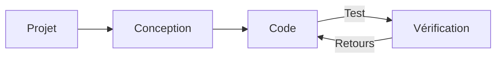

# Développement web
Source: https://docs.cursor.com/fr/guides/tutorials/web-development

Comment configurer Cursor pour le développement web

export const McpInstallButtonPrimary = ({server, showIcon = true, prompt = null}) => {
  const [showModal, setShowModal] = useState(false);
  const generateDeepLink = () => {
    if (!server || !server.name || !server.install) {
      return null;
    }
    try {
      if (typeof server.install === 'string') {
        return server.install;
      }
      if (server.install.url) {
        const config = {
          ...server.install
        };
        const jsonString = JSON.stringify(config);
        const utf8Bytes = new TextEncoder().encode(jsonString);
        const base64Config = btoa(Array.from(utf8Bytes).map(b => String.fromCharCode(b)).join(''));
        const safeBase64Config = base64Config.replace(/\+/g, '%2B');
        return `cursor://anysphere.cursor-deeplink/mcp/install?name=${encodeURIComponent(server.name)}&config=${encodeURIComponent(safeBase64Config)}`;
      }
      if (server.install.command) {
        let config = {
          command: server.install.command,
          ...server.install.args && ({
            args: server.install.args
          }),
          ...server.install.env && ({
            env: server.install.env
          })
        };
        if (config.command && config.args) {
          const argsString = config.args.join(" ");
          config.command = `${config.command} ${argsString}`;
          delete config.args;
        }
        const jsonString = JSON.stringify(config);
        const utf8Bytes = new TextEncoder().encode(jsonString);
        const base64Config = btoa(Array.from(utf8Bytes).map(b => String.fromCharCode(b)).join(''));
        const safeBase64Config = base64Config.replace(/\+/g, '%2B');
        return `cursor://anysphere.cursor-deeplink/mcp/install?name=${encodeURIComponent(server.name)}&config=${encodeURIComponent(safeBase64Config)}`;
      }
      return null;
    } catch (e) {
      console.error("Error generating deep link:", e);
      return null;
    }
  };
  const handleButtonClick = () => {
    setShowModal(true);
  };
  const handleClose = () => {
    setShowModal(false);
  };
  const deepLink = generateDeepLink();
  const isDocumentationOnly = typeof server?.install === 'string';
  const hasConfirmation = prompt || isDocumentationOnly;
  const InstallModal = ({isOpen, onClose, deepLink, server, children}) => {
    useEffect(() => {
      const handleKeyDown = event => {
        if (event.key === 'Escape') {
          onClose();
        }
      };
      if (isOpen) {
        document.addEventListener('keydown', handleKeyDown);
      }
      return () => {
        document.removeEventListener('keydown', handleKeyDown);
      };
    }, [isOpen, onClose]);
    if (!isOpen) return null;
    return <div className="fixed inset-0 bg-black bg-opacity-50 flex items-center justify-center z-50 transition-opacity duration-200" onClick={onClose}>
        <div className="bg-white dark:bg-neutral-900 rounded-lg p-6 max-w-md w-full mx-4 border border-neutral-200 dark:border-neutral-700 transition-all duration-200 transform" onClick={e => e.stopPropagation()}>
          <div className="mb-4">
            <h3 className="text-lg font-semibold text-black dark:text-white mb-2">
              Install {server?.name}
            </h3>
            <div className="text-neutral-600 dark:text-neutral-400">
              {children}
            </div>
          </div>
          <div className="flex gap-3 justify-end">
            <button onClick={onClose} className="px-4 py-2 text-sm font-medium rounded-lg transition-colors duration-200 text-neutral-600 dark:text-neutral-400 hover:text-black dark:hover:text-white border border-neutral-200 dark:border-neutral-700 hover:bg-neutral-100 dark:hover:bg-neutral-800">
              Cancel
            </button>
            <a href={deepLink} onClick={onClose} target="_blank" className="px-4 py-2 text-sm font-medium rounded-lg transition-colors duration-200 bg-black text-white hover:bg-neutral-800 dark:bg-white dark:text-black dark:hover:bg-neutral-200 inline-flex items-center justify-center no-underline">
              Continue
            </a>
          </div>
        </div>
      </div>;
  };
  return <>
      {hasConfirmation ? <button onClick={handleButtonClick} className="inline-flex justify-center items-center gap-2 px-4 py-2 text-sm font-medium rounded-lg transition-colors duration-200 not-prose text-white bg-black hover:bg-neutral-800 dark:bg-white dark:text-black dark:hover:bg-neutral-200 border border-black dark:border-white">
          {showIcon && <Icon icon="plus" size={16} color="currentColor" />}
          Add to Cursor
        </button> : <a href={deepLink} className="inline-flex justify-center items-center gap-2 px-4 py-2 text-sm font-medium rounded-lg transition-colors duration-200 not-prose text-white bg-black hover:bg-neutral-800 dark:bg-white dark:text-black dark:hover:bg-neutral-200 border border-black dark:border-white">
          {showIcon && <Icon icon="plus" size={16} color="currentColor" />}
          Add to Cursor
        </a>}

      {hasConfirmation && <InstallModal isOpen={showModal} onClose={handleClose} deepLink={deepLink} server={server}>
          {prompt}
        </InstallModal>}
    </>;
};

Le développement web implique des itérations rapides et des boucles de feedback rapprochées entre Cursor et des outils externes comme Figma ou le navigateur. Chez Cursor, on a identifié des workflows qui resserrent cette boucle. Une bonne définition des tâches, la réutilisation des composants et l’utilisation de design systems permettent de rester rapide et cohérent.

Ce guide explique comment configurer Cursor pour le développement web et resserrer la boucle de feedback.



<div id="start-orchestrating-in-cursor">
  # Commence à orchestrer dans Cursor
</div>

**Chat** est top pour amorcer des changements. Une fois les éléments majeurs en place, passer à **Inline Edit** et **Tab** t’aide à rester dans le flow.

Après avoir configuré Cursor, tu pourras orchestrer des workflows avec différents outils. Ci-dessous, une démo de ce qui est possible : un jeu Snake créé en combinant Linear, Figma et des outils de navigateur. Même si les projets réels sont généralement plus complexes, cet exemple illustre le potentiel de ces workflows intégrés.

<Frame>
  <video src="https://mintcdn.com/cursor/E7JVsKUF5L-IiJRB/images/guides/tutorials/web-development/snake.mp4?fit=max&auto=format&n=E7JVsKUF5L-IiJRB&q=85&s=e029fbdff2ec06e1e4393ac580824b5a" controls data-path="images/guides/tutorials/web-development/snake.mp4" />
</Frame>

<div id="connect-to-your-project-management-tools">
  # Connecte tes outils de gestion de projet
</div>

Tu peux intégrer Cursor à ton logiciel de gestion de projet existant à l’aide de différents outils. Dans ce guide, on va voir comment intégrer Linear avec son serveur MCP.

<div id="installation">
  ### Installation
</div>

<McpInstallButtonPrimary
  server={{
name: "Linear",
install: {
command: "npx",
args: ["-y", "mcp-remote", "https://mcp.linear.app/sse"],
},
}}
/>

Ou ajoute manuellement le serveur MCP de Linear dans `mcp.json` :

```jsx  theme={null}
{
  "mcpServers": {
    "Linear": {
      "command": "npx",
      "args": [
        "-y",
        "mcp-remote",
        "https://mcp.linear.app/sse"
      ]
    }
  }
}
```

Then:

1. Assure-toi d’activer Linear dans les paramètres MCP
2. Le navigateur web s’ouvrira et tu seras invité·e à autoriser Linear
   <Info>
     En raison de l’état actuel de MCP, la configuration peut nécessiter plusieurs tentatives.
     Si l’intégration ne fonctionne pas, essaie de « Reload » le serveur depuis les paramètres
     de Cursor.
   </Info>

<div id="using-linear-in-cursor">
  ### Utiliser Linear dans Cursor
</div>

Les serveurs MCP de Linear exposent différents outils que Cursor peut utiliser pour lire et gérer les tickets. Va dans les paramètres MCP et repère le serveur Linear pour voir la liste de tous les outils. Pour vérifier, essaie cette invite dans Chat :

```jsx  theme={null}
liste toutes les issues liées à ce projet
```

<Frame>
  
</Frame>

Ça devrait renvoyer une liste de tickets si l’intégration est correctement configurée.

<div id="bring-in-your-figma-designs">
  # Importer tes designs Figma
</div>

Les designs et maquettes sont au cœur du développement web. Avec le serveur MCP officiel pour Figma, tu peux accéder directement aux fichiers de design et travailler dessus dans Cursor. Pour commencer, suis les instructions de configuration sur [Figma Dev Mode MCP Server](https://help.figma.com/hc/en-us/articles/32132100833559-Guide-to-the-Dev-Mode-MCP-Server).

<div id="installation">
  ### Installation
</div>

Tu peux cliquer sur le bouton ci-dessous pour installer le serveur MCP.

<McpInstallButtonPrimary
  server={{
name: "Figma",
install: {
url: "http://127.0.0.1:3845/sse",
},
}}
/>

Ou ajoute-le manuellement à ton `mcp.json` :

```jsx  theme={null}
{
  "mcpServers": {
    "Figma": {
      "url": "http://127.0.0.1:3845/sse"
    }
  }
}
```

<div id="usage">
  ### Utilisation
</div>

Le serveur met à disposition plusieurs outils que tu peux utiliser dans tes prompts. Par exemple, essaie de demander les designs de la sélection en cours dans Figma. En savoir plus dans la [documentation](https://help.figma.com/hc/en-us/articles/32132100833559-Guide-to-the-Dev-Mode-MCP-Server).

<Frame>
  
</Frame>

<div id="keep-your-code-scaffolding-consistent">
  # Garde ton scaffolding de code cohérent
</div>

Tu as probablement déjà du code, un design system ou des conventions établies que tu veux réutiliser. Quand tu bosses avec des modèles, c’est utile de t’appuyer sur les patterns déjà présents dans ta codebase, comme des menus déroulants ou d’autres composants courants.

En bossant nous-mêmes sur une grosse codebase web, on a constaté que le code déclaratif marche particulièrement bien, surtout pour React et JSX.

Si t’as un design system, tu peux aider l’agent à le découvrir en lui fournissant une règle. Voici un fichier `ui-components.mdc` où on essaie de faire respecter la réutilisation des composants quand c’est possible :

```mdc components.mdc theme={null}
---
description: Implémenter les designs et construire l’UI
---
- réutilise les composants d’UI existants de `/src/components/ui`. ce sont les primitives sur lesquelles on peut s’appuyer
- crée de nouveaux composants en orchestrant des composants d’UI si tu n’en trouves aucun qui résout le problème
- demande à l’humain comment il veut procéder lorsqu’il manque des composants et des designs
```

Au fur et à mesure que ta bibliothèque de composants s’étoffe, ajoute de nouvelles règles en conséquence. Quand elles deviennent trop nombreuses, pense à les répartir en catégories plus spécifiques, par exemple « à appliquer uniquement lors de la gestion des saisies utilisateur ».

<Frame>
  
</Frame>

<div id="give-cursor-access-to-browser">
  # Donner à Cursor l’accès au navigateur
</div>

Pour étendre les capacités de Cursor, tu peux configurer le serveur MCP de Browser Tools, qui donne accès aux journaux de console et aux requêtes réseau. Une fois configuré, tu peux valider tes modifications en surveillant la sortie de la console et l’activité réseau. Cette configuration aide à s’assurer que ton implémentation correspond à ton intention. Suis les instructions ici pour configurer le serveur MCP : [https://browsertools.agentdesk.ai/installation](https://browsertools.agentdesk.ai/installation)

<Frame>
  
</Frame>

<Note>
  On travaille à rendre ça plus simple à intégrer nativement dans Cursor.
</Note>

<div id="takeaways">
  # Points clés
</div>

* Des boucles de feedback rapides sont essentielles en développement web. Utilise Cursor avec des outils comme Figma, Linear et le navigateur pour avancer vite et rester dans le flow.
* Les serveurs MCP te permettent d’intégrer des systèmes externes directement dans Cursor, réduisant le switch de contexte et améliorant l’exécution des tâches.
* Réutiliser des composants et des design systems aide le modèle à produire un code et des résultats plus propres et plus cohérents.
* Des tâches claires et bien cadrées donnent de meilleurs résultats. Sois intentionnel dans la façon dont tu rédiges tes prompts et ce que tu demandes.
* Si tu n’obtiens pas de bons résultats, essaie d’ajuster :
  * **Instructions :** Utilise des règles, des prompts, et donne accès à plus de contexte, p. ex. avec des serveurs MCP.
  * **Systèmes :** Des patterns, des abstractions et de la clarté facilitent la compréhension du modèle, son aide et un fonctionnement plus autonome.
* Tu peux étendre le contexte du modèle en incluant des infos d’exécution comme des logs de console, des requêtes réseau et des données d’éléments d’UI.
* Tout n’a pas besoin d’être automatisé. Si ton système devient trop complexe, reviens à des modifications plus chirurgicales avec Tab et Inline Edit.
* Cursor est le plus puissant quand c’est un copilote, pas un autopilote. Utilise-le pour améliorer — pas remplacer — ta propre prise de décision.

---

← Previous: [Créer un serveur MCP](./crer-un-serveur-mcp.md) | [Index](./index.md) | Next: [Travailler avec le contexte](./travailler-avec-le-contexte.md) →