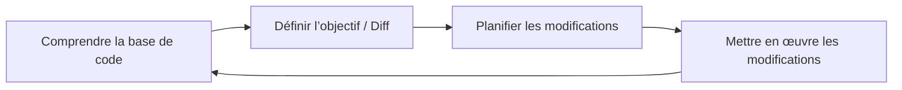
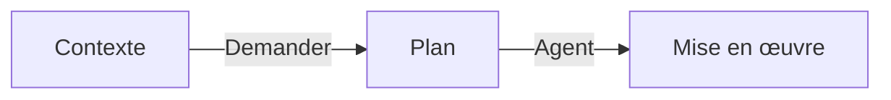

# Grandes bases de code
Source: https://docs.cursor.com/fr/guides/advanced/large-codebases

Comment travailler avec de grandes bases de code dans Cursor

Travailler avec de grandes bases de code pose des défis différents de ceux des petits projets. Forts de notre expérience à faire évoluer la base de code de Cursor et des retours de clients gérant des bases de code massives, on a identifié des approches utiles pour gérer la complexité croissante.

Dans ce guide, on va parcourir quelques techniques qu’on a trouvées utiles pour les grandes bases de code.



<div id="use-chat-to-quickly-get-up-to-speed-on-unfamiliar-code">
  # Utilise Chat pour te mettre rapidement à jour sur un code que tu ne connais pas
</div>

Parcourir une grande base de code, surtout si elle est nouvelle pour toi, peut être difficile. Tu vas souvent greper, chercher et cliquer un peu partout pour trouver les parties spécifiques qui t’intéressent. Avec [Chat](/fr/chat/overview), tu peux poser des questions pour trouver ce que tu cherches et obtenir une explication détaillée de son fonctionnement.

Ici, on demande de l’aide pour trouver des détails d’implémentation de l’indexation de la base de code dans Cursor, et on demande même des exemples pour que ce soit plus facile à comprendre.

<Frame>
  <video src="https://mintcdn.com/cursor/E7JVsKUF5L-IiJRB/images/guides/advanced/large-codebases/qa.mp4?fit=max&auto=format&n=E7JVsKUF5L-IiJRB&q=85&s=d749be91cb35a3d13fa9df4210622029" controls data-path="images/guides/advanced/large-codebases/qa.mp4" />
</Frame>

<div id="write-rules-for-domain-specific-knowledge">
  # Écris des règles pour les connaissances spécifiques au domaine
</div>

Si tu accueillais un·e nouveau·elle collaborateur·rice dans ta base de code, quel contexte lui donnerais-tu pour qu’il·elle puisse commencer à apporter des contributions utiles ?

Ta réponse à cette question est probablement une information précieuse pour aider Cursor à comprendre aussi. Dans chaque organisation ou projet, il existe des connaissances latentes qui ne sont pas forcément entièrement reflétées dans ta documentation. Utiliser des règles de manière efficace est le meilleur moyen de s’assurer que Cursor ait une vision complète.

Par exemple, si tu écris des instructions sur la manière d’implémenter une nouvelle fonctionnalité ou un nouveau service, pense à rédiger une courte règle pour la documenter et la pérenniser.

```mdc Modèle standard theme={null}
---
description: Ajouter un nouveau service frontend VSCode
---

1. **Définition de l’interface :**
   - Définir une nouvelle interface de service avec `createDecorator` et s’assurer que `_serviceBrand` est présent pour éviter les erreurs.

2. **Implémentation du service :**
   - Implémenter le service dans un nouveau fichier TypeScript, en étendant `Disposable`, puis l’enregistrer comme singleton avec `registerSingleton`.

3. **Contribution du service :**
   - Créer un fichier de contribution pour importer et charger le service, puis l’enregistrer dans le point d’entrée principal.

4. **Intégration au contexte :**
   - Mettre à jour le contexte pour inclure le nouveau service, afin de le rendre accessible dans toute l’application.
```

S'il existe des modèles de mise en forme courants que tu veux que Cursor respecte, envisage d'attacher automatiquement des règles basées sur des motifs glob.

```mdc Mise en forme theme={null}
---
globs: *.ts
---
- Utilise bun comme gestionnaire de packages. Voir [package.json](mdc:backend/reddit-eval-tool/package.json) pour les scripts
- Utilise le kebab-case pour les noms de fichiers
- Utilise le camelCase pour les noms de fonctions et de variables
- Utilise UPPERCASE_SNAKE_CASE pour les constantes codées en dur
- Préfère `function foo()` à `const foo = () =>`
- Utilise `Array<T>` plutôt que `T[]`
- Utilise des exports nommés plutôt que des exports par défaut, p. ex. (`export const variable ...`, `export function `)
```

<div id="stay-close-to-the-plan-creation-process">
  # Reste proche du processus de création du plan
</div>

Pour des changements plus importants, passer plus de temps que d’habitude à élaborer un plan précis et bien délimité peut améliorer considérablement les résultats de Cursor.

Si tu constates que tu n’obtiens pas le résultat voulu après quelques variantes du même prompt, pense à prendre du recul et à créer un plan plus détaillé depuis zéro, comme si tu rédigeais un PRD pour un collègue. Souvent, **le plus difficile est de déterminer quelle** modification doit être apportée, une tâche qui convient bien aux humains. Avec les bonnes instructions, on peut déléguer certaines parties de la mise en œuvre à Cursor.

Une façon d’utiliser l’IA pour renforcer le processus de création du plan est d’utiliser le mode Ask. Pour créer un plan, active le mode Ask dans Cursor et balance tout le contexte que tu as depuis tes outils de gestion de projet, tes docs internes ou tes idées en vrac. Réfléchis aux fichiers et dépendances de la base de code que tu sais déjà vouloir inclure. Ça peut être un fichier contenant des portions de code avec lesquelles tu veux t’intégrer, ou même un dossier entier.

Voici un exemple de prompt :

```mdc Invite de planification theme={null}
- prépare un plan pour la création d’une nouvelle fonctionnalité (comme @existingfeature.ts)
- pose-moi des questions (max 3) si quelque chose n’est pas clair
- pense à chercher dans la base de code

@Past Chats (mes prompts d’exploration précédents)

voici un peu plus de contexte depuis [outil de gestion de projet] :
[description du ticket]
```

On demande au modèle d’élaborer un plan et de rassembler du contexte en posant des questions à l’humain, en se référant aux éventuelles invites d’exploration précédentes ainsi qu’aux descriptions des tickets. L’utilisation d’un modèle de raisonnement comme `claude-3.7-sonnet`, `gemini-2.5-pro` ou `o3` est recommandée, car ces modèles comprennent l’intention de la modification et synthétisent plus efficacement un plan.

À partir de là, tu peux affiner le plan de manière itérative avec l’aide de Cursor avant de commencer l’implémentation.



<div id="pick-the-right-tool-for-the-job">
  # Choisis le bon outil pour la bonne tâche
</div>

L’une des compétences clés pour utiliser Cursor efficacement, c’est de choisir le bon outil pour la bonne tâche. Pense à ce que tu veux accomplir et choisis l’approche qui te garde dans le flow.

| **Tool**                                    | **Use case**                             | **Strength**                                                      | **Limitation**               |
| :------------------------------------------ | :--------------------------------------- | :---------------------------------------------------------------- | :--------------------------- |
| **[Tab](/fr/tab/overview)**                 | Petites modifications manuelles          | Contrôle total, rapidité                                          | Un seul fichier              |
| **[Inline Edit](/fr/inline-edit/overview)** | Modifications ciblées dans un fichier    | Modifications focalisées                                          | Un seul fichier              |
| **[Chat](/fr/chat/overview)**               | Modifications plus larges multi-fichiers | Regroupe automatiquement le contexte, modifications en profondeur | Plus lent, lourd en contexte |

Chaque outil a sa zone de confort :

* Tab est ton go-to pour des modifs rapides où tu veux garder la main
* Inline Edit brille quand tu dois apporter des changements ciblés à une section précise du code
* Chat est parfait pour les gros changements où Cursor doit comprendre le contexte global

Quand tu utilises le mode Chat (qui peut paraître un peu plus lent mais est super puissant), aide-le en donnant un bon contexte. Utilise [@files](/fr/context/@-symbols/@-files) pour pointer vers du code similaire à reproduire, ou [@folder](/fr/context/@-symbols/@-folders) pour lui donner une meilleure compréhension de la structure de ton projet. Et n’aie pas peur de découper les gros changements en plus petits morceaux — démarrer des chats tout neufs aide à garder le focus et l’efficacité.

<div id="takeaways">
  # Points clés
</div>

* Réduis la portée des changements et n’essaie pas d’en faire trop d’un coup
* Ajoute du contexte pertinent quand tu peux
* Utilise Chat, Inline Edit et Tab pour ce à quoi ils sont le plus adaptés
* Crée souvent de nouveaux chats
* Planifie avec le [mode Ask](/fr/chat/ask), implémente avec le [mode Agent](/fr/chat/agent)

---

← Previous: [Data Science](./data-science.md) | [Index](./index.md) | Next: [Travailler avec la documentation](./travailler-avec-la-documentation.md) →