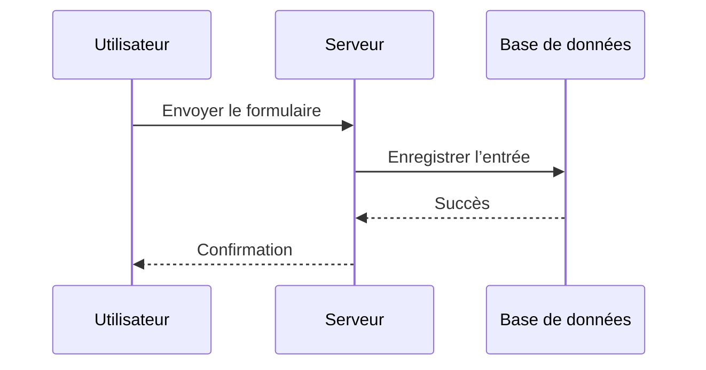
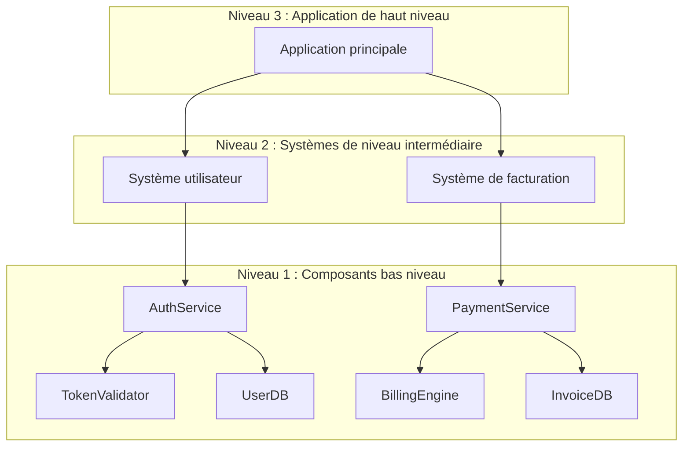

# Schémas d’architecture
Source: https://docs.cursor.com/fr/guides/tutorials/architectural-diagrams

Apprends à générer des schémas d’architecture avec Mermaid pour visualiser la structure du système et les flux de données

Les schémas d’architecture t’aident à comprendre le fonctionnement de ton système. Tu peux t’en servir pour explorer la logique, suivre les données et communiquer la structure. Cursor permet de générer ces schémas directement avec des outils comme Mermaid, pour passer du code au visuel en seulement quelques prompts.

<Frame>
  
</Frame>

  ## Pourquoi les diagrammes comptent

Les diagrammes clarifient comment les données circulent et comment les composants interagissent. Ils sont utiles quand tu :

* Veux comprendre le contrôle de flux dans ton codebase
* Dois retracer la lignée des données de l’entrée à la sortie
* Fais l’onboarding d’autres personnes ou documentes ton système

Ils sont aussi super pour déboguer et poser de meilleures questions. Les visuels t’aident (toi et le modèle) à voir l’ensemble.

  ## Deux dimensions à prendre en compte

Il y a plusieurs angles à considérer :

* **Objectif** : Est-ce que tu représentes la logique, le flux de données, l’infrastructure, ou autre chose ?
* **Format** : Tu veux quelque chose de rapide (comme un diagramme Mermaid) ou de plus formel (comme UML) ?

  ## Comment formuler une requête

Commence avec un objectif clair. Voici quelques façons courantes de demander :

* **Contrôle du flux** : « Montre-moi comment les requêtes passent du contrôleur à la base de données. »
* **Traçabilité des données** : « Retrace cette variable depuis son point d’entrée jusqu’à sa destination. »
* **Structure** : « Donne-moi une vue au niveau des composants de ce service. »

Tu peux inclure des points de départ et d’arrivée, ou demander à Cursor de retrouver le chemin complet.

  ## Travailler avec Mermaid

Mermaid est facile à apprendre et se rend directement dans Markdown (avec la bonne extension). Cursor peut générer des diagrammes comme :

* `flowchart` pour la logique et les séquences
* `sequenceDiagram` pour les interactions
* `classDiagram` pour la structure des objets
* `graph TD` pour des graphes directionnels simples

Tu peux installer l’[extension Mermaid](https://marketplace.cursorapi.com/items?itemName=bierner.markdown-mermaid) pour afficher un aperçu des diagrammes.

1. Va dans l’onglet Extensions
2. Cherche « Mermaid »
3. Clique sur Installer

<Frame>
  
</Frame>

  ## Stratégie de diagramme

Commence petit. N’essaie pas de tout modéliser d’un coup.

* Choisis une fonction, une route ou un processus
* Demande à Cursor de diagrammer cette partie avec Mermaid
* Une fois que t’en as quelques-uns, demande-lui de les combiner

Ça reprend le **modèle C4** — où tu pars d’un niveau bas (code ou composants) et tu montes vers des vues de plus haut niveau.

  ### Parcours recommandé

1. Commence par un diagramme détaillé de bas niveau
2. Résume-le en une vue de niveau intermédiaire
3. Répète jusqu’à atteindre le niveau d’abstraction que tu veux
4. Demande à Cursor de les fusionner en un seul diagramme ou une carte du système

  ## Points clés

* Utilise des diagrammes pour comprendre les flux, la logique et les données
* Commence avec de petits prompts et fais évoluer ton diagramme à partir de là
* Mermaid est le format le plus simple à utiliser dans Cursor
* Pars du bas niveau et abstrais vers le haut, comme dans le modèle C4
* Cursor peut t’aider à générer, affiner et combiner des diagrammes facilement

---

← Previous: [VS Code](./vs-code.md) | [Index](./index.md) | Next: [Créer un serveur MCP](./crer-un-serveur-mcp.md) →