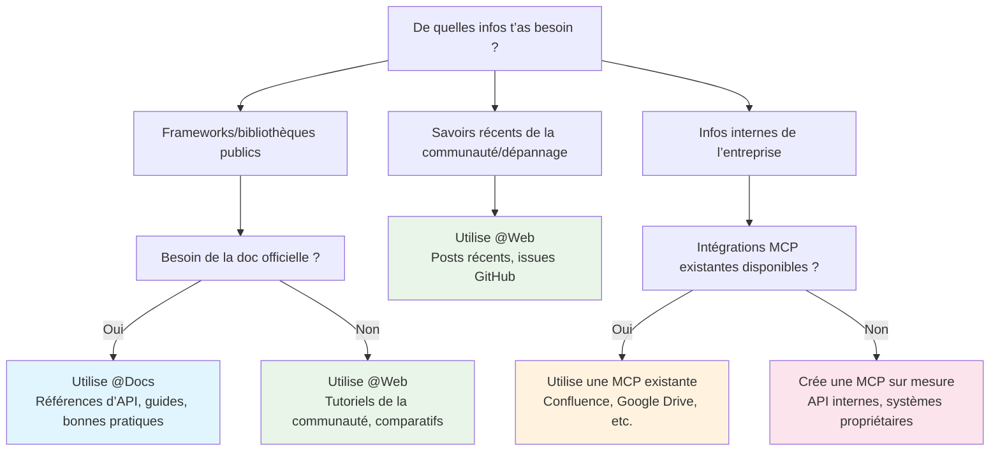

# Travailler avec la documentation
Source: https://docs.cursor.com/fr/guides/advanced/working-with-documentation

Comment exploiter efficacement la documentation dans Cursor grâce aux prompts, aux sources externes et au contexte interne

export const ChatInput = ({content = []}) => {
  const renderContent = () => {
    return content.map((item, index) => {
      if (item.type === 'mention') {
        return <span key={index} className="mention bg-blue-500/20 px-1 py-0.5 rounded-sm">
                        {item.text}
                    </span>;
      }
      return item.text;
    });
  };
  return <>
            <div className="flex flex-col items-stretch border border-neutral-500 rounded-lg p-3 gap-2 bg-neutral-800 relative transition-all duration-100 ease-in-out hover:border-neutral-500">
                <div className="flex flex-col gap-1">
                    <div className="flex flex-col gap-1 outline-none overflow-hidden">
                        <div className="flex-1 flex items-center gap-2">
                            <div className="w-full box-border max-h-10 overflow-hidden">
                                <div className="flex items-center gap-2 w-full flex-nowrap">
                                    <div className="cursor-pointer flex items-center justify-center p-1 h-5 w-5 rounded border border-neutral-600 outline-none flex-shrink-0 hover:bg-neutral-700 bg-neutral-750">
                                        <span className="text-neutral-400 text-sm font-semibold">@</span>
                                    </div>
                                </div>
                            </div>
                        </div>
                    </div>
                </div>

                <div className="relative pt-0">
                    <div className="min-h-6 w-full max-h-60">
                        <div className="relative overflow-y-hidden w-full">
                            <div className="w-full flex flex-wrap overflow-hidden min-h-6">
                                <div className="inline-block w-full min-h-full">
                                    <div className="w-full overflow-visible h-full min-h-6">
                                        <div className="grid relative grid-cols-1 w-full">

                                            <div className="leading-6 text-sm text-neutral-200 bg-transparent block break-words p-0 whitespace-pre-wrap font-medium min-h-6">
                                                {content.length > 0 ? renderContent() : <span className="text-neutral-500">Plan, search, build anything</span>}
                                            </div>

                                        </div>
                                    </div>
                                </div>
                            </div>
                        </div>
                    </div>

                    <div className="flex items-center justify-between gap-3 flex-shrink-0 mt-6">
                        <div className="flex-1 w-full h-full flex items-center flex-col gap-1">
                            <div className="flex items-center justify-between gap-2 flex-shrink-0 w-full">
                                <div className="flex items-center justify-between w-full">
                                    <div className="flex items-center gap-3 flex-shrink min-w-0">
                                        <div className="flex gap-1 text-xs items-center min-w-0 max-w-full px-1.5 py-0.5 flex-shrink-0 cursor-pointer bg-neutral-700 hover:bg-neutral-600 rounded-full">
                                            <div className="flex items-center gap-1 min-w-0 max-w-full overflow-hidden">
                                                <div className="text-xs flex-shrink-0 w-3 h-3 flex items-center justify-center text-neutral-400">
                                                    ∞
                                                </div>
                                                <div className="min-w-0 max-w-full overflow-hidden text-ellipsis whitespace-nowrap flex items-center gap-1 font-medium">
                                                    <span className="text-neutral-300">Agent</span>
                                                    <span className="text-neutral-500 text-[10px]">⌘I</span>
                                                </div>
                                                <Icon icon="chevron-down" size={6} color="currentColor" />
                                            </div>
                                        </div>

                                        <div className="flex gap-2 text-xs items-center cursor-pointer min-w-0 max-w-full px-0 py-1 opacity-90 rounded hover:text-neutral-200">
                                            <div className="flex items-center gap-2 min-w-0 max-w-full overflow-x-hidden">
                                                <div className="min-w-0 text-ellipsis whitespace-nowrap text-neutral-300 flex items-center gap-2 overflow-hidden">
                                                    <div className="overflow-hidden inline-flex gap-2 items-center">
                                                        <span className="whitespace-nowrap overflow-x-hidden text-ellipsis text-xs">
                                                            Auto
                                                        </span>
                                                    </div>
                                                </div>
                                                <Icon icon="chevron-down" size={8} color="currentColor" />
                                            </div>
                                        </div>
                                    </div>

                                    <div className="flex items-center gap-3 justify-end">
                                        <button className="bg-white/80 border-none text-neutral-500 flex w-5 h-5 items-center justify-center hover:text-neutral-400 hover:bg-white/90 rounded-full disabled:opacity-50" disabled={content.length === 0 || !content.some(item => item.text.trim())}>
                                            <span className="text-sm">↑</span>
                                        </button>
                                    </div>
                                </div>
                            </div>
                        </div>
                    </div>
                </div>
            </div>
        </>;
};

<div id="why-documentation-matters">
  # Pourquoi la documentation compte
</div>

La documentation fournit un contexte à jour et précis. Sans elle, les modèles s'appuient sur des données d’entraînement obsolètes ou incomplètes. La documentation aide les modèles à comprendre, par exemple :

* Les API et leurs paramètres actuels
* Les bonnes pratiques
* Les conventions de l’organisation
* La terminologie du domaine

Et bien plus encore. Lis la suite pour découvrir comment utiliser la documentation directement dans Cursor, sans avoir à changer de contexte.

<div id="model-knowledge-cutoff">
  ## Date de coupure des connaissances du modèle
</div>

Les grands modèles de langage sont entraînés sur des données jusqu'à un moment précis, appelé « date de coupure des connaissances ». Ça veut dire que :

* Les mises à jour récentes des bibliothèques peuvent ne pas être prises en compte
* De nouveaux frameworks ou outils peuvent être inconnus
* Les changements d’API après la date de coupure passent à la trappe
* Les bonnes pratiques ont peut-être évolué depuis l’entraînement

Par exemple, si la date de coupure des connaissances d’un modèle est début 2024, il ne saura rien des fonctionnalités sorties fin 2024, même pour des frameworks populaires.

<div id="which-tool-should-i-use">
  # Quel outil utiliser ?
</div>

Utilise cet arbre de décision pour déterminer rapidement la meilleure approche pour ta documentation :



<div id="mental-model">
  ## Modèle mental
</div>

<div className="full-width-table">
  | Outil       | Modèle mental                             |
  | ----------- | ----------------------------------------- |
  | **`@Docs`** | Comme parcourir et lire la doc officielle |
  | **`@Web`**  | Comme chercher des solutions sur le web   |
  | **MCP**     | Comme accéder à ta doc interne            |
</div>

<div id="public-documentation">
  # Documentation publique
</div>

La documentation externe couvre des informations publiques dont les modèles peuvent avoir une connaissance limitée ou obsolète. Cursor propose deux principales façons d’y accéder.

<div id="using-docs">
  ## Utiliser @Docs
</div>

`@Docs` relie Cursor à la doc officielle des outils et frameworks populaires. Utilise-le quand t’as besoin d’infos à jour et fiables sur :

* **Références d’API** : Signatures de fonctions, paramètres, types de retour
* **Guides de prise en main** : Installation, configuration, usage de base
* **Bonnes pratiques** : Patterns recommandés par la source
* **Débogage spécifique aux frameworks** : Guides de dépannage officiels

<ChatInput
  content={[
{ type: 'mention', text: '@Docs Next.js' },
{ type: 'text', text: ' How do I set up dynamic routing with catch-all routes?' }
]}
/>

<div id="using-web">
  ## Utiliser @Web
</div>

`@Web` parcourt le web en temps réel pour trouver des informations à jour, des articles de blog et des discussions de la communauté. Utilise-le quand tu as besoin de :

* **Tutoriels récents** : contenu et exemples issus de la communauté
* **Comparaisons** : articles qui comparent différentes approches
* **Mises à jour récentes** : annonces ou nouveautés toutes fraîches
* **Multiples points de vue** : différentes façons d’aborder un problème

<ChatInput
  content={[
{ type: 'mention', text: '@Web' },
{ type: 'text', text: ' dernières optimisations de performance pour React 19' }
]}
/>

<div id="internal-documentation">
  # Documentation interne
</div>

La documentation interne comprend des informations propres à ton organisation que les modèles d’IA n’ont jamais vues pendant leur entraînement. Ça peut être :

* **API internes** : Services et microservices personnalisés
* **Standards de l’entreprise** : Conventions de code, patterns d’architecture
* **Systèmes propriétaires** : Outils, bases de données, workflows personnalisés
* **Connaissances métier** : Logique métier, exigences de conformité

<div id="accessing-internal-docs-with-mcp">
  ## Accéder à la doc interne avec MCP
</div>

Le Model Context Protocol (MCP) offre un moyen standardisé d’intégrer ta documentation privée et tes systèmes dans Cursor. MCP sert de fine couche entre Cursor et tes ressources internes.

**Pourquoi MCP compte :**

* Les modèles ne peuvent pas deviner tes conventions internes
* La doc d’API pour des services custom n’est pas publique
* La logique métier et la connaissance du domaine sont propres à ton organisation
* Les exigences de conformité et de sécurité varient selon les entreprises

<div id="common-mcp-integrations">
  ### Intégrations MCP courantes
</div>

| Intégration      | Accès                                         | Exemples                                                                                                               |
| ---------------- | --------------------------------------------- | ---------------------------------------------------------------------------------------------------------------------- |
| **Confluence**   | Espaces Confluence de l’entreprise            | Doc d’architecture, spécifications d’API pour les services internes, standards et guidelines de code, doc de processus |
| **Google Drive** | Documents et dossiers partagés                | Docs de spécification, notes de réunion et décisions, docs de conception et exigences, bases de connaissances d’équipe |
| **Notion**       | Bases de données et pages d’espace de travail | Doc de projet, wikis d’équipe, bases de connaissances, exigences produit, specs techniques                             |
| **Custom**       | Systèmes et bases de données internes         | APIs propriétaires, systèmes de doc hérités, bases de connaissances custom, outils et workflows spécialisés            |

<div id="custom-solutions">
  #### Solutions custom
</div>

Pour des besoins spécifiques, tu peux construire des serveurs MCP custom qui :

* Scrappent des sites web ou portails internes
* Se connectent à des bases de données propriétaires
* Accèdent à des systèmes de doc personnalisés
* Récupèrent des contenus depuis des wikis internes ou des bases de connaissances

<Tip>Si tu construis un serveur MCP custom, tu peux aussi exposer des tools pour que Cursor mette à jour la doc</Tip>

Exemple de serveur MCP custom pour scraper la doc interne :

<CodeGroup>
  ```javascript TypeScript theme={null}
  import { McpServer, ResourceTemplate } from "@modelcontextprotocol/sdk/server/mcp.js";
  import { StdioServerTransport } from "@modelcontextprotocol/sdk/server/stdio.js";
  import { z } from "zod";
  import TurndownService from "turndown";

  // Create an MCP server for scraping internal docs
  const server = new McpServer({
    name: "internal-docs",
    version: "1.0.0"
  });

  const turndownService = new TurndownService();

  // Add tool to scrape internal documentation
  server.tool("get_doc",
    { url: z.string() },
    async ({ url }) => {
      try {
        const response = await fetch(url);
        const html = await response.text();
        
        // Convert HTML to markdown
        const markdown = turndownService.turndown(html);
        
        return {
          content: [{ type: "text", text: markdown }]
        };
      } catch (error) {
        return {
          content: [{ type: "text", text: `Error scraping ${url}: ${error.message}` }]
        };
      }
    }
  );

  // Start receiving messages on stdin and sending messages on stdout
  const transport = new StdioServerTransport();
  await server.connect(transport);
  ```

  ```python Python theme={null}
  # server.py
  import os
  import asyncio
  from mcp.server.fastmcp import FastMCP
  import aiohttp
  from markdownify import markdownify as md

  # Create an MCP server for scraping internal docs
  mcp = FastMCP("internal-docs")

  @mcp.tool()
  async def get_doc(url: str) -> dict:
      """Scrape internal documentation from a URL"""
      try:
          async with aiohttp.ClientSession() as session:
              async with session.get(url) as response:
                  html = await response.text()
          
          # Convert HTML to markdown
          markdown = md(html)
          
          return {
              "content": [{"type": "text", "text": markdown}]
          }
      except Exception as error:
          return {
              "content": [{"type": "text", "text": f"Error scraping {url}: {str(error)}"}]
          }
  ```
</CodeGroup>

<div id="keeping-docs-up-to-date">
  # Garder la doc à jour
</div>

La documentation devient vite obsolète. Cursor peut t’aider à maintenir une documentation à jour et utile en la générant et en la mettant à jour à partir de ton code et de tes conversations de développement.

<div id="from-existing-code">
  ## À partir du code existant
</div>

Utilise Cursor pour générer de la documentation directement depuis ton code :

<Tabs>
  <Tab title="Documentation API">
    <ChatInput
      content={[
    { type: 'text', text: 'Génère la documentation API pour ce routeur Express, en incluant tous les endpoints, les paramètres et les formats de réponse' }
  ]}
    />
  </Tab>

  <Tab title="Commentaires JSDoc">
    <ChatInput
      content={[
    { type: 'text', text: 'Ajoute des commentaires JSDoc complets à cette classe, en documentant toutes les méthodes et leurs paramètres' }
  ]}
    />
  </Tab>

  <Tab title="Création du README">
    <ChatInput
      content={[
    { type: 'text', text: 'Crée un README pour ce projet qui inclut les instructions d’installation, des exemples d’utilisation et une vue d’ensemble de l’API' }
  ]}
    />
  </Tab>
</Tabs>

<div id="from-chat-sessions">
  ## À partir des sessions de chat
</div>

Tes conversations avec Cursor contiennent des informations précieuses qui peuvent être transformées en documentation.

<Tabs>
  <Tab title="Problem Solving">
    **Après avoir résolu un problème complexe :**

    <ChatInput
      content={[
    { type: 'text', text: 'Résume notre conversation sur la mise en place de l’authentification en un guide étape par étape pour le wiki de l’équipe' }
  ]}
    />
  </Tab>

  <Tab title="Architecture">
    **Après des décisions d’architecture :**

    <ChatInput
      content={[
    { type: 'text', text: 'Crée une documentation expliquant pourquoi on a choisi ce schéma de base de données, avec les compromis qu’on a discutés' }
  ]}
    />
  </Tab>

  <Tab title="Debugging">
    **Après des sessions de débogage :**

    <ChatInput
      content={[
    { type: 'text', text: 'Écris un guide de dépannage à partir du bug qu’on vient de corriger, avec les symptômes et les étapes de résolution' }
  ]}
    />
  </Tab>
</Tabs>

<div id="takeaways">
  ## Points à retenir
</div>

* Utiliser la documentation comme contexte rend Cursor plus précis et à jour
* Utilise `@Docs` pour la doc officielle et `@Web` pour la connaissance de la communauté
* MCP fait le lien entre Cursor et tes systèmes internes
* Génère de la documentation à partir du code et des conversations pour garder la connaissance à jour
* Combine des sources de doc externes et internes pour une compréhension globale

---

← Previous: [Grandes bases de code](./grandes-bases-de-code.md) | [Index](./index.md) | Next: [Java](./java.md) →