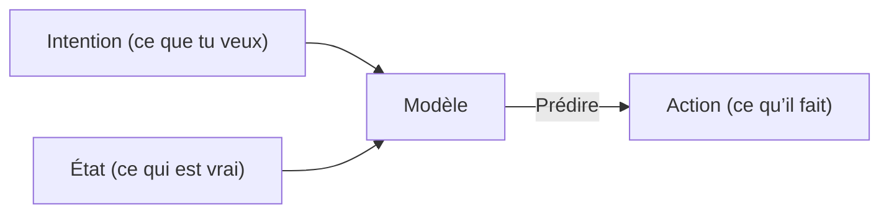

# Travailler avec le contexte
Source: https://docs.cursor.com/fr/guides/working-with-context

Comment travailler avec le contexte dans Cursor

D’abord, c’est quoi une fenêtre de contexte ? Et quel rapport avec le fait de coder efficacement avec Cursor ?

Pour prendre un peu de recul, un large language model (LLM) est un modèle d’IA entraîné à prédire et générer du texte en apprenant des motifs à partir d’énormes jeux de données. Il alimente des outils comme Cursor en comprenant ce que tu saisis et en suggérant du code ou du texte en fonction de ce qu’il a déjà vu.

Les tokens sont les entrées et sorties de ces modèles. Ce sont des morceaux de texte, souvent des fragments de mots, qu’un LLM traite un par un. Les modèles ne lisent pas des phrases entières d’un coup ; ils prédisent le token suivant à partir de ceux qui le précèdent.

Pour voir comment du texte est tokenisé, tu peux utiliser un tokenizer comme [celui-ci](https://tiktokenizer.vercel.app/).

  # C’est quoi le contexte ?

Quand on génère une suggestion de code dans Cursor, le « contexte » désigne les informations fournies au modèle (sous forme de « jetons d’entrée ») que le modèle utilise ensuite pour prédire la suite (sous forme de « jetons de sortie »).

Il existe deux types de contexte :

1. **Contexte d’intention**: ce que tu veux obtenir du modèle. Par exemple, un system prompt sert généralement d’instructions de haut niveau sur la façon dont tu veux que le modèle se comporte. La plupart du « prompting » dans Cursor relève du contexte d’intention. « Passe ce bouton du bleu au vert » est un exemple d’intention explicite ; c’est prescriptif.
2. **Contexte d’état**: l’état du monde à l’instant T. Fournir à Cursor des messages d’erreur, des logs de console, des images ou des extraits de code sont des exemples de contexte lié à l’état. C’est descriptif, pas prescriptif.

Ensemble, ces deux types de contexte fonctionnent de concert en décrivant l’état actuel et l’état futur souhaité, ce qui permet à Cursor de proposer des suggestions de code pertinentes.

  # Fournir du contexte dans Cursor

Plus tu fournis de contexte pertinent à un modèle, plus il sera utile. Si le contexte donné dans Cursor est insuffisant, le modèle va tenter de résoudre le problème sans les infos nécessaires. Ça mène généralement à :

1. Des hallucinations où le modèle essaie de faire du pattern matching (alors qu’il n’y a pas de pattern), entraînant des résultats inattendus. Ça peut arriver souvent avec des modèles comme `claude-3.5-sonnet` quand ils n’ont pas assez de contexte.
2. L’Agent qui cherche à réunir le contexte par lui-même en explorant la codebase, en lisant des fichiers et en appelant des outils. Un modèle avec de fortes capacités de raisonnement (comme `claude-3.7-sonnet`) peut aller assez loin avec cette stratégie, et fournir le bon contexte initial va en déterminer la trajectoire.

La bonne nouvelle, c’est que Cursor est conçu avec la conscience du contexte au cœur et vise à nécessiter un minimum d’intervention de ta part. Cursor récupère automatiquement les parties de ta codebase que le modèle estime pertinentes, comme le fichier en cours, des patterns sémantiquement similaires dans d’autres fichiers, et d’autres infos de ta session.

Cependant, il y a énormément de contexte possible à exploiter, donc préciser manuellement le contexte que tu sais pertinent pour la tâche est une bonne façon d’orienter les modèles dans la bonne direction.

  ## Symbole @

La façon la plus simple de fournir un contexte explicite, c’est d’utiliser le symbole @. C’est idéal quand tu sais précisément quel fichier, dossier, site web ou autre élément de contexte tu veux inclure. Plus tu es précis, mieux c’est. Voici comment affiner le contexte de manière plus ciblée :

| Symbole   | Exemple              | Cas d’usage                                                                             | Inconvénient                                                                             |
| --------- | -------------------- | --------------------------------------------------------------------------------------- | ---------------------------------------------------------------------------------------- |
| `@code`   | `@LRUCachedFunction` | Tu sais quelle fonction, constante ou quel symbole est pertinent pour la sortie générée | Nécessite une bonne connaissance de la base de code                                      |
| `@file`   | `cache.ts`           | Tu sais quel fichier doit être lu ou modifié, mais pas exactement où dans le fichier    | Peut inclure beaucoup de contexte non pertinent pour la tâche selon la taille du fichier |
| `@folder` | `utils/`             | Tous ou la majorité des fichiers d’un dossier sont pertinents                           | Peut inclure beaucoup de contexte non pertinent pour la tâche                            |

  ## Règles

Pense aux règles comme à une mémoire à long terme à laquelle toi ou les autres membres de ton équipe pouvez accéder. Capturer le contexte spécifique à ton domaine — workflows, formatage et autres conventions — est un excellent point de départ pour rédiger des règles.

Tu peux aussi générer des règles à partir de conversations existantes avec `/Generate Cursor Rules`. Si tu as eu une longue conversation en aller-retour avec beaucoup de prompts, il y a probablement des directives utiles ou des règles générales que tu voudras réutiliser plus tard.

  ## MCP

Le [Model Context Protocol](https://modelcontextprotocol.io/introduction) est une couche d’extensibilité qui permet à Cursor d’exécuter des actions et d’ingérer du contexte externe.

Selon ta config de développement, tu peux t’appuyer sur différents types de serveurs, mais deux catégories qu’on trouve particulièrement utiles sont :

* **Documentation interne** : p. ex. Notion, Confluence, Google Docs
* **Gestion de projet** : p. ex. Linear, Jira

Si tu as déjà des outils pour accéder au contexte et exécuter des actions via une API, tu peux créer un serveur MCP pour ça. Voici un court guide pour construire des [serveurs MCP](https://modelcontextprotocol.io/tutorials/building-mcp-with-llms).

  ## Auto-collecte de contexte

Un modèle d’utilisation puissant que beaucoup d’utilisateurs adoptent consiste à laisser l’Agent écrire de petits outils temporaires qu’il peut ensuite exécuter pour rassembler plus de contexte. C’est particulièrement efficace dans des workflows avec humain dans la boucle, où tu passes en revue le code avant son exécution.

Par exemple, ajouter des instructions de débogage à ton code, l’exécuter, puis laisser le modèle inspecter la sortie lui donne accès à un contexte dynamique qu’il ne pourrait pas déduire de manière statique.

En Python, tu peux faire ça en demandant à l’Agent de :

1. Ajouter des print("debugging: ...") aux endroits pertinents du code
2. Exécuter le code ou les tests via le terminal

L’Agent lira la sortie du terminal et décidera de la suite. L’idée centrale est de donner à l’Agent accès au comportement réel à l’exécution, pas seulement au code statique.

  # Points clés

* Le contexte est la base d’un codage IA efficace. Il se compose de l’intention (ce que tu veux) et de l’état (ce qui existe). Fournir les deux aide Cursor à faire des prédictions précises.
* Utilise un contexte chirurgical avec les symboles @ (@code, @file, @folder) pour guider Cursor avec précision, plutôt que de te reposer uniquement sur la collecte automatique de contexte.
* Capture les connaissances récurrentes dans des règles pour les réutiliser à l’échelle de l’équipe, et étends les capacités de Cursor avec le Model Context Protocol pour connecter des systèmes externes.
* Un contexte insuffisant mène à des hallucinations ou à de l’inefficacité, tandis qu’un excès de contexte non pertinent dilue le signal. Trouve le bon équilibre pour des résultats optimaux.

---

← Previous: [Développement web](./dveloppement-web.md) | [Index](./index.md) | Next: [Modification en ligne](./modification-en-ligne.md) →