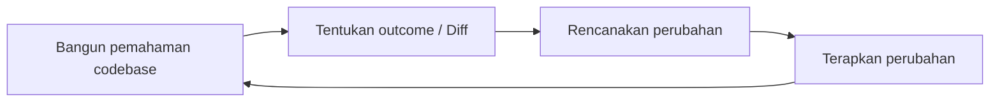

# Basis Kode Skala Besar
Source: https://docs.cursor.com/id/guides/advanced/large-codebases

Cara bekerja dengan basis kode skala besar di Cursor

Bekerja dengan basis kode skala besar menghadirkan serangkaian tantangan baru dibandingkan proyek yang lebih kecil. Berdasarkan pengalaman kami menskalakan basis kode Cursor sendiri dan wawasan dari pelanggan yang mengelola basis kode masif, kami menemukan beberapa pola berguna untuk menangani kompleksitas yang meningkat.

Di panduan ini, kami bakal ngejelasin beberapa teknik yang kami temukan berguna buat basis kode skala besar.



<div id="use-chat-to-quickly-get-up-to-speed-on-unfamiliar-code">
  # Pakai Chat buat cepat paham kode yang belum familiar
</div>

Menavigasi codebase besar, apalagi kalau baru, memang menantang. Kamu sering harus grep, cari, dan klik sana-sini buat nemuin bagian spesifik yang kamu butuhin. Dengan [Chat](/id/chat/overview), kamu bisa langsung tanya buat nyari yang kamu cari dan dapet penjelasan detail tentang cara kerjanya.

Di sini kita minta bantuan buat nemuin detail implementasi indexing codebase di Cursor, dan bahkan minta beberapa contoh biar lebih gampang dipahami.

<Frame>
  <video src="https://mintcdn.com/cursor/E7JVsKUF5L-IiJRB/images/guides/advanced/large-codebases/qa.mp4?fit=max&auto=format&n=E7JVsKUF5L-IiJRB&q=85&s=d749be91cb35a3d13fa9df4210622029" controls data-path="images/guides/advanced/large-codebases/qa.mp4" />
</Frame>

<div id="write-rules-for-domain-specific-knowledge">
  # Tulis rule untuk pengetahuan domain-spesifik
</div>

Kalau kamu lagi onboarding kolaborator baru ke codebase kamu, konteks apa yang bakal kamu kasih supaya mereka bisa mulai ngasih kontribusi yang bermakna?

Jawaban kamu untuk pertanyaan ini kemungkinan besar juga berharga buat Cursor. Di setiap organisasi atau proyek, selalu ada pengetahuan tersirat yang mungkin belum sepenuhnya tertuang di dokumentasi kamu. Memakai rule secara efektif adalah cara terbaik buat memastikan Cursor mendapatkan gambaran yang utuh.

Misalnya, kalau kamu lagi nulis instruksi tentang cara mengimplementasikan fitur atau layanan baru, pertimbangkan buat nulis rule singkat untuk mendokumentasikannya sebagai rujukan ke depannya.

```mdc Templat dasar theme={null}
---
description: Tambahkan layanan frontend VSCode baru
---

1. **Definisi Antarmuka:**
   - Definisikan antarmuka layanan baru menggunakan `createDecorator` dan pastikan `_serviceBrand` disertakan untuk menghindari galat.

2. **Implementasi Layanan:**
   - Implementasikan layanan dalam file TypeScript baru, memperluas `Disposable`, dan daftarkan sebagai singleton dengan `registerSingleton`.

3. **Kontribusi Layanan:**
   - Buat file kontribusi untuk mengimpor dan memuat layanan, lalu daftarkan di entry point utama.

4. **Integrasi Konteks:**
   - Perbarui konteks untuk menyertakan layanan baru, sehingga bisa diakses di seluruh aplikasi.
```

Kalau ada pola pemformatan umum yang pengin kamu pastikan dipatuhi Cursor, pertimbangkan buat otomatis melampirkan rules berdasarkan pola glob.

```mdc Pemformatan theme={null}
---
globs: *.ts
---
- Gunakan bun sebagai pengelola paket. Lihat [package.json](mdc:backend/reddit-eval-tool/package.json) untuk skripnya
- Gunakan kebab-case untuk nama file
- Gunakan camelCase untuk nama fungsi dan variabel
- Gunakan UPPERCASE_SNAKE_CASE untuk konstanta yang di-hardcode
- Lebih utamakan `function foo()` daripada `const foo = () =>`
- Gunakan `Array<T>` alih-alih `T[]`
- Gunakan named export alih-alih default export, mis. (`export const variable ...`, `export function `)
```

<div id="stay-close-to-the-plan-creation-process">
  # Tetap dekat dengan proses penyusunan rencana
</div>

Untuk perubahan yang lebih besar, meluangkan waktu dan pemikiran ekstra untuk menyusun rencana yang presisi dan terdefinisi dengan jelas bisa secara signifikan meningkatkan output Cursor.

Kalau ngerasa hasilnya belum sesuai setelah beberapa variasi dari prompt yang sama, coba zoom out dan bikin rencana yang lebih detail dari nol, seolah-olah lagi bikin PRD buat rekan kerja. Sering kali **bagian tersulit adalah mencari tahu perubahan apa** yang harus dibuat—tugas yang memang lebih cocok untuk manusia. Dengan instruksi yang tepat, sebagian implementasi bisa didelegasikan ke Cursor.

Salah satu cara pakai AI untuk membantu proses penyusunan rencana adalah dengan pakai Ask mode. Untuk bikin rencana, nyalain Ask mode di Cursor dan tuangkan konteks apa pun yang kamu punya dari sistem manajemen proyek, dokumen internal, atau catatan lepas. Pikirin file dan dependency apa yang ada di codebase yang sudah kamu tahu mau kamu sertakan. Ini bisa berupa file yang berisi potongan kode yang mau kamu integrasikan, atau bahkan satu folder penuh.

Berikut contoh prompt:

```mdc Prompt perencanaan theme={null}
- bikin rencana gimana kita mau bikin fitur baru (kayak @existingfeature.ts)
- tanya aku (maks 3) kalau ada yang kurang jelas
- jangan lupa cari di codebase

@Past Chats (prompt eksplorasi aku sebelumnya)

ini ada konteks tambahan dari [project management tool]:
[deskripsi tiket yang ditempel]
```

Kita minta model untuk bikin rencana dan ngumpulin konteks dengan nanya ke manusia, merujuk prompt eksplorasi sebelumnya, dan juga deskripsi tiket. Disarankan pakai thinking model seperti `claude-3.7-sonnet`, `gemini-2.5-pro`, atau `o3` karena model-model ini bisa paham intent perubahan dan lebih bagus dalam menyintesis rencana.

Dari sini, kamu bisa nyusun rencana secara iteratif bareng Cursor sebelum mulai implementasi.

```mermaid  theme={null}
diagram alir LR
    A[Konteks] -- Tanya --> B[Rencana]
    B -- Agen --> C[Implementasi]
```

<div id="pick-the-right-tool-for-the-job">
  # Pilih tool yang tepat buat tugasnya
</div>

Salah satu skill terpenting buat make Cursor secara efektif adalah milih tool yang tepat buat tugasnya. Pikirin apa yang lagi kamu coba capai dan pilih pendekatan yang bikin kamu tetap in flow.

| **Tool**                                    | **Use case**                   | **Strength**                              | **Limitation**              |
| :------------------------------------------ | :----------------------------- | :---------------------------------------- | :-------------------------- |
| **[Tab](/id/tab/overview)**                 | Perubahan cepat, manual        | Kontrol penuh, cepat                      | Satu file                   |
| **[Inline Edit](/id/inline-edit/overview)** | Perubahan terarah di satu file | Edit terfokus                             | Satu file                   |
| **[Chat](/id/chat/overview)**               | Perubahan besar, multi-file    | Otomatis ngumpulin konteks, edit mendalam | Lebih lambat, berat konteks |

Setiap tool punya sweet spot:

* Tab adalah andalan kamu buat edit cepat ketika kamu pengin tetap pegang kendali
* Inline Edit paling pas saat kamu perlu ngelakuin perubahan terfokus di bagian kode tertentu
* Chat cocok banget buat perubahan yang lebih besar ketika kamu butuh Cursor paham konteks yang lebih luas

Saat kamu pakai mode Chat (yang bisa kerasa agak lambat tapi super powerful), bantu dengan ngasih konteks yang bagus. Pakai [@files](/id/context/@-symbols/@-files) buat nunjukin kode serupa yang pengin kamu tiru, atau [@folder](/id/context/@-symbols/@-folders) buat ngasih pemahaman yang lebih baik tentang struktur proyek kamu. Dan jangan ragu buat mecah perubahan besar jadi bagian yang lebih kecil — mulai chat baru bantu bikin semuanya tetap fokus dan efisien.

<div id="takeaways">
  # Intisari
</div>

* Batasi ruang perubahan dan jangan coba ngerjain terlalu banyak sekaligus
* Sertakan konteks yang relevan kapan pun bisa
* Pakai Chat, Inline Edit, & Tab sesuai keunggulannya masing-masing
* Sering bikin chat baru
* Rencanakan dengan [Ask mode](/id/chat/ask), eksekusi dengan [Agent mode](/id/chat/agent)

---

← Previous: [Data Science](./data-science.md) | [Index](./index.md) | Next: [Bekerja dengan Dokumentasi](./bekerja-dengan-dokumentasi.md) →