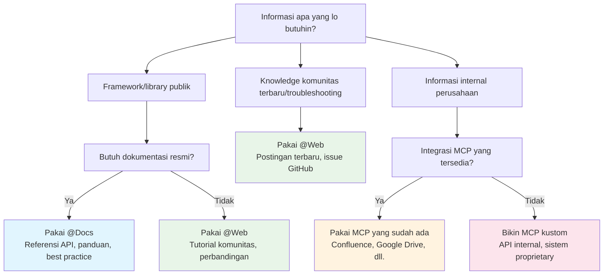

# Bekerja dengan Dokumentasi
Source: https://docs.cursor.com/id/guides/advanced/working-with-documentation

Cara memanfaatkan dokumentasi secara efektif di Cursor melalui prompting, sumber eksternal, dan konteks internal

export const ChatInput = ({content = []}) => {
  const renderContent = () => {
    return content.map((item, index) => {
      if (item.type === 'mention') {
        return <span key={index} className="mention bg-blue-500/20 px-1 py-0.5 rounded-sm">
                        {item.text}
                    </span>;
      }
      return item.text;
    });
  };
  return <>
            <div className="flex flex-col items-stretch border border-neutral-500 rounded-lg p-3 gap-2 bg-neutral-800 relative transition-all duration-100 ease-in-out hover:border-neutral-500">
                <div className="flex flex-col gap-1">
                    <div className="flex flex-col gap-1 outline-none overflow-hidden">
                        <div className="flex-1 flex items-center gap-2">
                            <div className="w-full box-border max-h-10 overflow-hidden">
                                <div className="flex items-center gap-2 w-full flex-nowrap">
                                    <div className="cursor-pointer flex items-center justify-center p-1 h-5 w-5 rounded border border-neutral-600 outline-none flex-shrink-0 hover:bg-neutral-700 bg-neutral-750">
                                        <span className="text-neutral-400 text-sm font-semibold">@</span>
                                    </div>
                                </div>
                            </div>
                        </div>
                    </div>
                </div>

                <div className="relative pt-0">
                    <div className="min-h-6 w-full max-h-60">
                        <div className="relative overflow-y-hidden w-full">
                            <div className="w-full flex flex-wrap overflow-hidden min-h-6">
                                <div className="inline-block w-full min-h-full">
                                    <div className="w-full overflow-visible h-full min-h-6">
                                        <div className="grid relative grid-cols-1 w-full">

                                            <div className="leading-6 text-sm text-neutral-200 bg-transparent block break-words p-0 whitespace-pre-wrap font-medium min-h-6">
                                                {content.length > 0 ? renderContent() : <span className="text-neutral-500">Plan, search, build anything</span>}
                                            </div>

                                        </div>
                                    </div>
                                </div>
                            </div>
                        </div>
                    </div>

                    <div className="flex items-center justify-between gap-3 flex-shrink-0 mt-6">
                        <div className="flex-1 w-full h-full flex items-center flex-col gap-1">
                            <div className="flex items-center justify-between gap-2 flex-shrink-0 w-full">
                                <div className="flex items-center justify-between w-full">
                                    <div className="flex items-center gap-3 flex-shrink min-w-0">
                                        <div className="flex gap-1 text-xs items-center min-w-0 max-w-full px-1.5 py-0.5 flex-shrink-0 cursor-pointer bg-neutral-700 hover:bg-neutral-600 rounded-full">
                                            <div className="flex items-center gap-1 min-w-0 max-w-full overflow-hidden">
                                                <div className="text-xs flex-shrink-0 w-3 h-3 flex items-center justify-center text-neutral-400">
                                                    ∞
                                                </div>
                                                <div className="min-w-0 max-w-full overflow-hidden text-ellipsis whitespace-nowrap flex items-center gap-1 font-medium">
                                                    <span className="text-neutral-300">Agent</span>
                                                    <span className="text-neutral-500 text-[10px]">⌘I</span>
                                                </div>
                                                <Icon icon="chevron-down" size={6} color="currentColor" />
                                            </div>
                                        </div>

                                        <div className="flex gap-2 text-xs items-center cursor-pointer min-w-0 max-w-full px-0 py-1 opacity-90 rounded hover:text-neutral-200">
                                            <div className="flex items-center gap-2 min-w-0 max-w-full overflow-x-hidden">
                                                <div className="min-w-0 text-ellipsis whitespace-nowrap text-neutral-300 flex items-center gap-2 overflow-hidden">
                                                    <div className="overflow-hidden inline-flex gap-2 items-center">
                                                        <span className="whitespace-nowrap overflow-x-hidden text-ellipsis text-xs">
                                                            Auto
                                                        </span>
                                                    </div>
                                                </div>
                                                <Icon icon="chevron-down" size={8} color="currentColor" />
                                            </div>
                                        </div>
                                    </div>

                                    <div className="flex items-center gap-3 justify-end">
                                        <button className="bg-white/80 border-none text-neutral-500 flex w-5 h-5 items-center justify-center hover:text-neutral-400 hover:bg-white/90 rounded-full disabled:opacity-50" disabled={content.length === 0 || !content.some(item => item.text.trim())}>
                                            <span className="text-sm">↑</span>
                                        </button>
                                    </div>
                                </div>
                            </div>
                        </div>
                    </div>
                </div>
            </div>
        </>;
};

<div id="why-documentation-matters">
  # Kenapa dokumentasi itu penting
</div>

Dokumentasi ngasih konteks yang up-to-date dan akurat. Tanpanya, model bakal pakai data pelatihan yang sudah ketinggalan atau nggak lengkap. Dokumentasi bantu model ngerti hal-hal seperti:

* API dan parameter yang berlaku saat ini
* Praktik terbaik
* Konvensi organisasi
* Istilah-istilah dalam domain

Dan masih banyak lagi. Lanjut baca buat tahu cara pakai dokumentasi langsung di Cursor tanpa harus ganti konteks.

<div id="model-knowledge-cutoff">
  ## Batas pengetahuan model
</div>

Model bahasa besar dilatih pada data sampai titik waktu tertentu, yang disebut “knowledge cutoff.” Ini berarti:

* Pembaruan library terbaru mungkin belum tercermin
* Framework atau tool baru bisa jadi belum diketahui
* Perubahan API setelah tanggal cutoff akan terlewat
* Best practice mungkin sudah berkembang sejak pelatihan

Contohnya, kalau batas pengetahuan model ada di awal 2024, model nggak akan tahu fitur yang dirilis di akhir 2024, bahkan untuk framework populer.

<div id="which-tool-should-i-use">
  # Harus pakai tool yang mana?
</div>

Pakai pohon keputusan ini buat cepat nentuin pendekatan terbaik buat kebutuhan dokumentasi lo:



<div id="mental-model">
  ## Model mental
</div>

<div className="full-width-table">
  | Tool        | Model mental                                   |
  | ----------- | ---------------------------------------------- |
  | **`@Docs`** | Mirip menjelajah dan membaca dokumentasi resmi |
  | **`@Web`**  | Mirip mencari solusi di internet               |
  | **MCP**     | Mirip mengakses dokumentasi internal kamu      |
</div>

<div id="public-documentation">
  # Dokumentasi publik
</div>

Dokumentasi eksternal mencakup informasi yang tersedia untuk umum yang mungkin pengetahuan model tentangnya terbatas atau sudah kedaluwarsa. Cursor menyediakan dua cara utama untuk mengakses informasi ini.

<div id="using-docs">
  ## Menggunakan @Docs
</div>

`@Docs` menghubungkan Cursor ke dokumentasi resmi dari tool dan framework populer. Pakai ini saat butuh info terbaru dan tepercaya tentang:

* **Referensi API**: Signature fungsi, parameter, tipe return
* **Panduan memulai**: Setup, konfigurasi, penggunaan dasar
* **Praktik terbaik**: Pola yang direkomendasikan dari sumber resmi
* **Debugging khusus framework**: Panduan troubleshooting resmi

<ChatInput
  content={[
{ type: 'mention', text: '@Docs Next.js' },
{ type: 'text', text: ' How do I set up dynamic routing with catch-all routes?' }
]}
/>

<div id="using-web">
  ## Menggunakan @Web
</div>

`@Web` mencari internet secara real-time untuk informasi terbaru, postingan blog, dan diskusi komunitas. Pakai ini pas lo butuh:

* **Tutorial terbaru**: Konten dan contoh dari komunitas
* **Perbandingan**: Artikel yang membandingkan berbagai pendekatan
* **Pembaru­an terkini**: Update atau pengumuman yang sangat baru
* **Berbagai perspektif**: Pendekatan berbeda untuk suatu masalah

<ChatInput
  content={[
{ type: 'mention', text: '@Web' },
{ type: 'text', text: ' latest performance optimizations for React 19' }
]}
/>

<div id="internal-documentation">
  # Dokumentasi internal
</div>

Dokumentasi internal mencakup informasi khusus untuk organisasimu yang belum pernah ditemui model AI saat pelatihan. Ini bisa berupa:

* **API internal**: Layanan kustom dan mikroservis
* **Standar perusahaan**: Konvensi penulisan kode, pola arsitektur
* **Sistem proprietary**: Alat kustom, basis data, alur kerja
* **Pengetahuan domain**: Logika bisnis, persyaratan kepatuhan

<div id="accessing-internal-docs-with-mcp">
  ## Mengakses dokumentasi internal dengan MCP
</div>

Model Context Protocol (MCP) menyediakan cara standar buat ngebawa dokumentasi dan sistem privat lo ke Cursor. MCP bertindak sebagai lapisan tipis antara Cursor dan resource internal lo.

**Kenapa MCP penting:**

* Model nggak bisa nebak konvensi internal lo
* Dokumentasi API untuk layanan kustom nggak tersedia publik
* Business logic dan domain knowledge itu unik buat organisasi lo
* Kebutuhan compliance dan keamanan beda-beda tiap perusahaan

<div id="common-mcp-integrations">
  ### Integrasi MCP yang umum
</div>

| Integrasi        | Akses                          | Contoh                                                                                                         |
| ---------------- | ------------------------------ | -------------------------------------------------------------------------------------------------------------- |
| **Confluence**   | Space Confluence perusahaan    | Dokumentasi arsitektur, spesifikasi API untuk layanan internal, standar dan pedoman coding, dokumentasi proses |
| **Google Drive** | Dokumen dan folder bersama     | Dokumen spesifikasi, catatan meeting dan keputusan, dokumen desain dan requirement, knowledge base tim         |
| **Notion**       | Database dan halaman workspace | Dokumentasi proyek, wiki tim, knowledge base, product requirement, spesifikasi teknis                          |
| **Custom**       | Sistem dan database internal   | API proprietari, sistem dokumentasi legacy, knowledge base kustom, tool dan workflow khusus                    |

<div id="custom-solutions">
  #### Solusi kustom
</div>

Buat kebutuhan unik, lo bisa bikin server MCP kustom yang:

* Nge-scrape situs atau portal internal
* Tersambung ke database proprietari
* Akses sistem dokumentasi kustom
* Narik data dari wiki internal atau knowledge base

<Tip>Kalau lo bikin server MCP kustom, lo juga bisa ngekspos tools biar Cursor bisa ngupdate dokumentasi</Tip>

Contoh server MCP kustom buat scraping dokumen internal:

<CodeGroup>
  ```javascript TypeScript theme={null}
  import { McpServer, ResourceTemplate } from "@modelcontextprotocol/sdk/server/mcp.js";
  import { StdioServerTransport } from "@modelcontextprotocol/sdk/server/stdio.js";
  import { z } from "zod";
  import TurndownService from "turndown";

  // Create an MCP server for scraping internal docs
  const server = new McpServer({
    name: "internal-docs",
    version: "1.0.0"
  });

  const turndownService = new TurndownService();

  // Add tool to scrape internal documentation
  server.tool("get_doc",
    { url: z.string() },
    async ({ url }) => {
      try {
        const response = await fetch(url);
        const html = await response.text();
        
        // Convert HTML to markdown
        const markdown = turndownService.turndown(html);
        
        return {
          content: [{ type: "text", text: markdown }]
        };
      } catch (error) {
        return {
          content: [{ type: "text", text: `Error scraping ${url}: ${error.message}` }]
        };
      }
    }
  );

  // Start receiving messages on stdin and sending messages on stdout
  const transport = new StdioServerTransport();
  await server.connect(transport);
  ```

  ```python Python theme={null}
  # server.py
  import os
  import asyncio
  from mcp.server.fastmcp import FastMCP
  import aiohttp
  from markdownify import markdownify as md

  # Create an MCP server for scraping internal docs
  mcp = FastMCP("internal-docs")

  @mcp.tool()
  async def get_doc(url: str) -> dict:
      """Scrape internal documentation from a URL"""
      try:
          async with aiohttp.ClientSession() as session:
              async with session.get(url) as response:
                  html = await response.text()
          
          # Convert HTML to markdown
          markdown = md(html)
          
          return {
              "content": [{"type": "text", "text": markdown}]
          }
      except Exception as error:
          return {
              "content": [{"type": "text", "text": f"Error scraping {url}: {str(error)}"}]
          }
  ```
</CodeGroup>

<div id="keeping-docs-up-to-date">
  # Menjaga dokumentasi tetap mutakhir
</div>

Dokumentasi cepat ketinggalan zaman. Cursor bisa bantu lo ngerawat dokumentasi yang up-to-date dan berguna dengan ngembangin serta nge-update-nya berdasarkan kode lo yang sebenarnya dan percakapan lo selama pengembangan.

<div id="from-existing-code">
  ## Dari kode yang sudah ada
</div>

Gunakan Cursor buat bikin dokumentasi langsung dari codebase lo:

<Tabs>
  <Tab title="API Documentation">
    <ChatInput
      content={[
    { type: 'text', text: 'Generate API documentation for this Express router, including all endpoints, parameters, and response formats' }
  ]}
    />
  </Tab>

  <Tab title="JSDoc Comments">
    <ChatInput
      content={[
    { type: 'text', text: 'Add comprehensive JSDoc comments to this class, documenting all methods and their parameters' }
  ]}
    />
  </Tab>

  <Tab title="README Creation">
    <ChatInput
      content={[
    { type: 'text', text: 'Create a README for this project that includes setup instructions, usage examples, and API overview' }
  ]}
    />
  </Tab>
</Tabs>

<div id="from-chat-sessions">
  ## Dari sesi chat
</div>

Percakapan lo dengan Cursor punya konteks intent berharga yang bisa diubah jadi dokumentasi.

<Tabs>
  <Tab title="Problem Solving">
    **Setelah menyelesaikan masalah kompleks:**

    <ChatInput
      content={[
    { type: 'text', text: 'Ringkas percakapan kita tentang setup authentication jadi panduan langkah demi langkah buat wiki tim' }
  ]}
    />
  </Tab>

  <Tab title="Architecture">
    **Setelah ada keputusan arsitektur:**

    <ChatInput
      content={[
    { type: 'text', text: 'Bikin dokumentasi yang jelasin kenapa kita milih desain database ini, termasuk trade-off yang kita bahas' }
  ]}
    />
  </Tab>

  <Tab title="Debugging">
    **Setelah sesi debugging:**

    <ChatInput
      content={[
    { type: 'text', text: 'Tulis panduan troubleshooting berdasarkan bug yang baru aja kita perbaiki, termasuk gejala dan langkah penyelesaiannya' }
  ]}
    />
  </Tab>
</Tabs>

<div id="takeaways">
  ## Intisari
</div>

* Dokumentasi sebagai konteks bikin Cursor lebih akurat dan mutakhir
* Pakai `@Docs` buat dokumentasi resmi dan `@Web` buat pengetahuan komunitas
* MCP menjembatani jarak antara Cursor dan sistem internal lo
* Hasilkan dokumentasi dari kode dan percakapan biar pengetahuan tetap up-to-date
* Gabungkan sumber dokumentasi eksternal dan internal buat pemahaman yang menyeluruh

---

← Previous: [Basis Kode Skala Besar](./basis-kode-skala-besar.md) | [Index](./index.md) | Next: [Java](./java.md) →