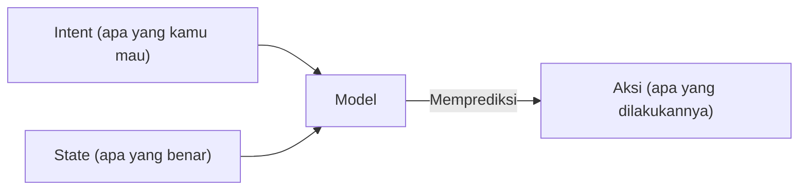

# Bekerja dengan Konteks
Source: https://docs.cursor.com/id/guides/working-with-context

Cara bekerja dengan konteks di Cursor

Pertama, apa itu context window? Dan gimana hubungannya dengan ngoding lebih efektif pakai Cursor?

Biar lihat gambaran besarnya dulu: large language model (LLM) adalah model AI yang dilatih buat memprediksi dan menghasilkan teks dengan belajar pola dari dataset yang sangat besar. Ini yang menggerakkan tool seperti Cursor dengan ngerti input kamu dan nyaranin kode atau teks berdasarkan yang pernah dilihat sebelumnya.

Token adalah input dan output dari model-model ini. Token berupa potongan teks, sering kali fragmen kata, yang diproses LLM satu per satu. Model nggak baca satu kalimat penuh sekaligus; mereka memprediksi token berikutnya berdasarkan token-token sebelumnya.

Buat lihat gimana sebuah teks di-tokenize, kamu bisa pakai tokenizer seperti [yang ini](https://tiktokenizer.vercel.app/).

  # Apa itu konteks?

Saat kita menghasilkan saran kode di Cursor, “konteks” mengacu pada informasi yang diberikan ke model (dalam bentuk "input tokens") yang kemudian dipakai model untuk memprediksi informasi berikutnya (dalam bentuk “output tokens”).

Ada dua jenis konteks:

1. **Konteks intent** menjelaskan apa yang user pengin dari model. Misalnya, system prompt biasanya berfungsi sebagai instruksi tingkat tinggi tentang gimana user pengin model berperilaku. Kebanyakan "prompting" yang dilakukan di Cursor adalah konteks intent. “Ubah tombol itu dari biru jadi hijau” adalah contoh intent yang dinyatakan; sifatnya preskriptif.
2. **Konteks state** menggambarkan keadaan dunia saat ini. Ngasih Cursor pesan error, log console, gambar, dan potongan kode adalah contoh konteks yang terkait dengan state. Ini deskriptif, bukan preskriptif.

Dua jenis konteks ini bekerja bareng dengan menggambarkan keadaan saat ini dan keadaan yang diinginkan ke depan, sehingga bantu Cursor ngasih saran coding yang berguna.

  # Memberikan konteks di Cursor

Semakin relevan konteks yang kamu kasih ke model, semakin berguna hasilnya. Kalau konteks yang dikasih di Cursor kurang, model bakal coba nyelesain tanpa informasi yang relevan. Biasanya ini bikin:

1. Halusinasi, di mana model coba ngepasin pola (padahal nggak ada polanya) dan hasilnya jadi nggak terduga. Ini bisa sering kejadian di model kayak `claude-3.5-sonnet` kalau nggak dikasih konteks yang cukup.
2. Agent coba ngumpulin konteks sendiri dengan nyari di codebase, baca file, dan manggil tools. Model dengan kemampuan berpikir yang kuat (kayak `claude-3.7-sonnet`) bisa melangkah cukup jauh dengan strategi ini, dan ngasih konteks awal yang tepat bakal nentuin trajektorinya.

Kabar baiknya, Cursor dibangun dengan kesadaran konteks sebagai inti dan didesain supaya butuh intervensi minimal dari pengguna. Cursor otomatis narik bagian-bagian dari codebase kamu yang diperkirakan relevan oleh model, seperti file yang lagi kamu buka, pola yang secara semantik mirip di file lain, dan informasi lain dari sesi kamu.

Tapi karena ada banyak sumber konteks yang bisa ditarik, ngeset konteks secara manual yang kamu tahu relevan buat task itu cara yang efektif buat ngarahin model ke arah yang benar.

  ## Simbol @

Cara paling gampang buat ngasih konteks eksplisit adalah pakai simbol @. Ini cocok kalau lo udah tahu persis file, folder, website, atau bagian konteks lain yang mau disertakan. Makin spesifik, makin bagus. Berikut rincian cara bikin konteks jadi lebih presisi:

| Symbol    | Example              | Use case                                                                                 | Drawback                                                                          |
| --------- | -------------------- | ---------------------------------------------------------------------------------------- | --------------------------------------------------------------------------------- |
| `@code`   | `@LRUCachedFunction` | Lo tahu fungsi, konstanta, atau simbol mana yang relevan buat output yang lagi lo bikin  | Butuh banyak pengetahuan tentang codebase                                         |
| `@file`   | `cache.ts`           | Lo tahu file mana yang harus dibaca atau diedit, tapi belum pasti di bagian mana di file | Bisa nyertain banyak konteks yang nggak relevan buat tugas tergantung ukuran file |
| `@folder` | `utils/`             | Semua atau sebagian besar file di dalam satu folder relevan                              | Bisa nyertain banyak konteks yang nggak relevan buat tugas yang lagi dikerjain    |

  ## Aturan

Anggap aturan sebagai memori jangka panjang yang pengin kamu atau anggota tim lain bisa akses. Menangkap konteks spesifik domain, termasuk alur kerja, pemformatan, dan konvensi lainnya, adalah titik awal yang bagus buat nulis aturan.

Aturan juga bisa dihasilkan dari percakapan yang sudah ada dengan pakai `/Generate Cursor Rules`. Kalau kamu punya percakapan panjang bolak-balik dengan banyak prompt, kemungkinan ada beberapa arahan atau aturan umum yang berguna yang mungkin pengin kamu pakai lagi nanti.

  ## MCP

[Model Context Protocol](https://modelcontextprotocol.io/introduction) adalah lapisan ekstensi yang bikin Cursor bisa menjalankan aksi dan ngambil konteks eksternal.

Tergantung setup pengembangan lo, lo mungkin mau pakai tipe server yang berbeda, tapi dua kategori yang menurut kami paling berguna adalah:

* **Dokumentasi internal**: misalnya Notion, Confluence, Google Docs
* **Manajemen proyek**: misalnya Linear, Jira

Kalau lo sudah punya tooling buat ngakses konteks dan ngejalanin aksi lewat API, lo bisa bikin server MCP buat itu. Ini panduan singkat tentang cara bikin [server MCP](https://modelcontextprotocol.io/tutorials/building-mcp-with-llms).

  ## Mengumpulkan konteks secara mandiri

Salah satu pola ampuh yang banyak dipakai pengguna adalah membiarkan Agent menulis tool berumur pendek yang bisa dijalankan untuk mengumpulkan konteks tambahan. Ini khususnya efektif dalam alur kerja human-in-the-loop, di mana kamu meninjau kode sebelum dieksekusi.

Misalnya, menambahkan pernyataan debugging ke kodenmu, menjalankannya, dan membiarkan model memeriksa output memberi akses ke konteks dinamis yang nggak bisa disimpulkan secara statis.

Di Python, kamu bisa melakukan ini dengan meminta Agent untuk:

1. Menambahkan pernyataan print("debugging: ...") di bagian kode yang relevan
2. Menjalankan kode atau test menggunakan terminal

Agent akan membaca output terminal dan memutuskan langkah berikutnya. Inti idenya adalah memberi Agent akses ke perilaku saat runtime, bukan cuma kode statis.

  # Ringkasan

* Konteks adalah dasar coding AI yang efektif, terdiri dari intent (apa yang kamu inginkan) dan state (apa yang sudah ada). Memberikan keduanya membantu Cursor membuat prediksi yang akurat.
* Gunakan konteks yang presisi dengan simbol @ (@code, @file, @folder) untuk mengarahkan Cursor secara tepat, alih-alih hanya mengandalkan pengumpulan konteks otomatis.
* Tangkap pengetahuan yang bisa diulang dalam rules agar bisa dipakai seluruh tim, dan perluas kemampuan Cursor dengan Model Context Protocol untuk menghubungkan sistem eksternal.
* Konteks yang kurang memadai bisa memicu halusinasi atau inefisiensi, sementara terlalu banyak konteks yang tidak relevan akan mengaburkan sinyal. Temukan keseimbangan yang pas untuk hasil optimal.

---

← Previous: [Pengembangan Web](./pengembangan-web.md) | [Index](./index.md) | Next: [Edit Inline](./edit-inline.md) →