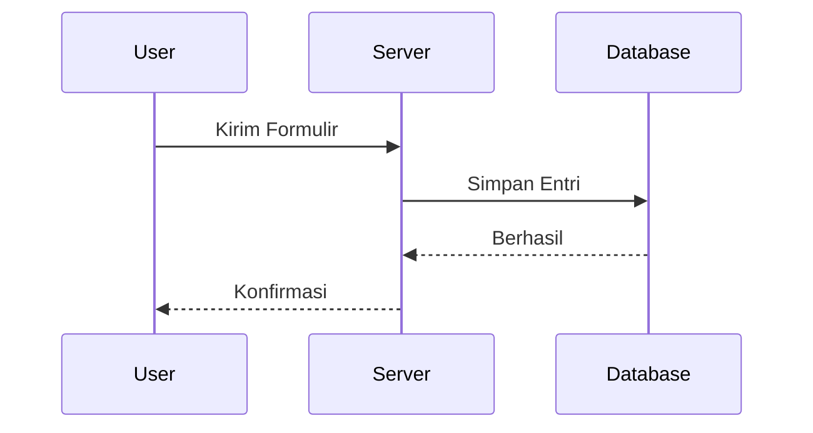
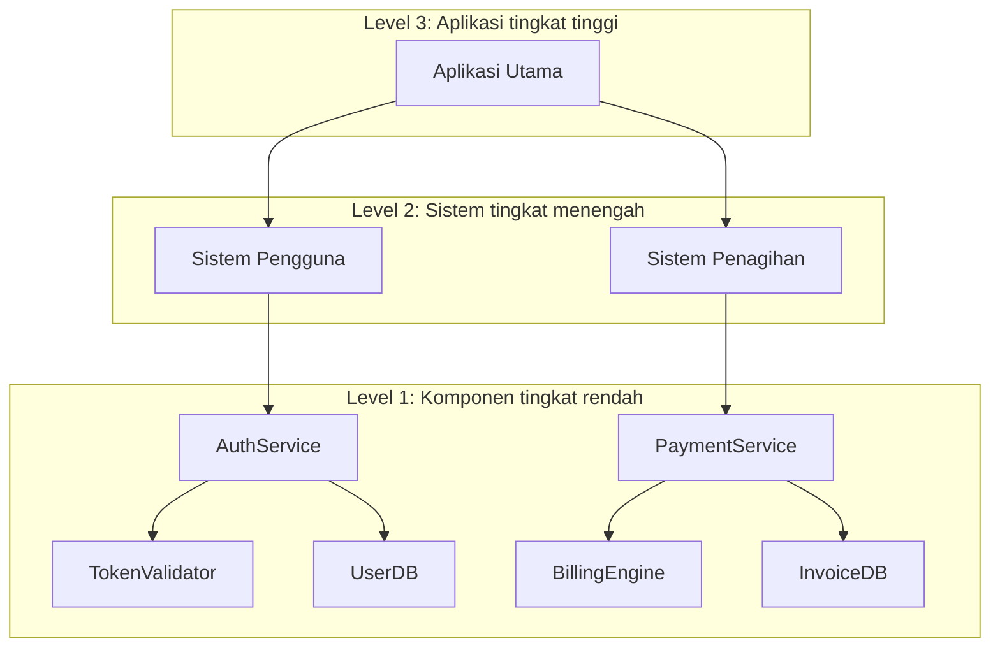

# Diagram Arsitektur
Source: https://docs.cursor.com/id/guides/tutorials/architectural-diagrams

Pelajari cara bikin diagram arsitektur pakai Mermaid untuk memvisualisasikan struktur sistem dan alur data

Diagram arsitektur bantu lo ngeh gimana sistem lo bekerja. Lo bisa pakai ini buat ngeksplor logika, ngelacak data, dan ngejelasin struktur. Cursor dukung bikin diagram ini langsung pakai tool kayak Mermaid, jadi lo bisa dari kode ke visual cuma dalam beberapa prompt.

<Frame>
  
</Frame>

  ## Kenapa diagram penting

Diagram ngebantu ngejelasin gimana data ngalir dan gimana komponen saling berinteraksi. Diagram berguna ketika lo:

* Pengen ngerti flow control di codebase lo
* Perlu ngelacak data lineage dari input sampai output
* Lagi onboarding orang lain atau lagi mendokumentasikan sistem lo

Diagram juga kece buat debugging dan ngebantu lo nanya pertanyaan yang lebih cerdas. Visual ngebantu lo (dan model) ngeliat gambaran besar.

  ## Dua dimensi yang perlu dipertimbangkan

Ada beberapa sudut pandang yang bisa kamu ambil:

* **Tujuan**: Kamu lagi memetakan logika, alur data, infrastruktur, atau yang lain?
* **Format**: Kamu butuh yang cepat (misalnya diagram Mermaid) atau yang formal (seperti UML)?

  ## Cara membuat prompt

Mulai dengan tujuan yang jelas. Berikut beberapa cara umum buat nanya:

* **Alur eksekusi**: "Tunjukin gimana request jalan dari controller ke database."
* **Asal-usul data (data lineage)**: "Lacak variabel ini dari titik masuk sampai ke tujuan akhirnya."
* **Struktur**: "Kasih gue view per komponen dari service ini."

Lo bisa tentuin titik awal dan akhir, atau minta Cursor buat nemuin jalur lengkapnya.

  ## Bekerja dengan Mermaid

Mermaid mudah dipelajari dan bisa dirender langsung di Markdown (dengan ekstensi yang tepat). Cursor bisa menghasilkan diagram seperti:

* `flowchart` untuk logika dan alur
* `sequenceDiagram` untuk interaksi
* `classDiagram` untuk struktur objek
* `graph TD` untuk peta berarah sederhana

Kamu bisa pasang [ekstensi Mermaid](https://marketplace.cursorapi.com/items?itemName=bierner.markdown-mermaid) buat nge-preview diagram.

1. Buka tab Extensions
2. Cari Mermaid
3. Pasang

<Frame>
  
</Frame>

  ## Strategi diagram

Mulai kecil dulu. Jangan coba memetakan semuanya sekaligus.

* Pilih satu fungsi, rute, atau proses
* Minta Cursor membuat diagram bagian itu dengan Mermaid
* Setelah kamu punya beberapa, minta untuk menggabungkannya

Ini selaras dengan **model C4** – kamu mulai dari level rendah (kode atau komponen) lalu naik ke ringkasan level yang lebih tinggi.

  ### Alur yang direkomendasikan

1. Mulai dengan diagram detail level rendah
2. Ringkas jadi tampilan level menengah
3. Ulangi sampai mencapai tingkat abstraksi yang kamu inginkan
4. Minta Cursor menggabungkannya jadi satu diagram atau peta sistem

  ## Ringkasan

* Gunakan diagram untuk memahami alur, logika, dan data
* Mulai dengan prompt kecil dan kembangkan diagram dari sana
* Mermaid adalah format yang paling mudah digunakan di Cursor
* Mulai dari level rendah lalu naikkan abstraksinya, seperti di model C4
* Cursor bisa bantu kamu membuat, menyempurnakan, dan menggabungkan diagram dengan mudah

---

← Previous: [VS Code](./vs-code.md) | [Index](./index.md) | Next: [Membangun Server MCP](./membangun-server-mcp.md) →