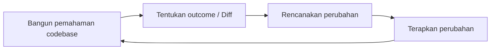
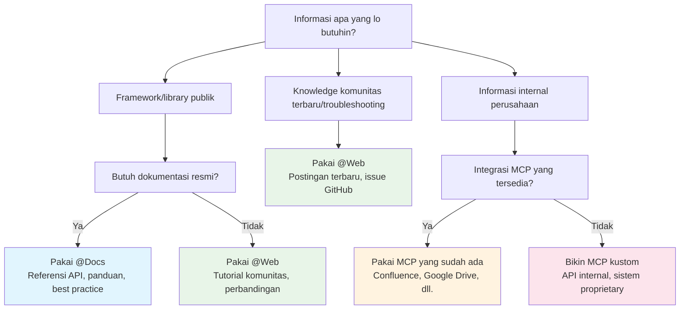
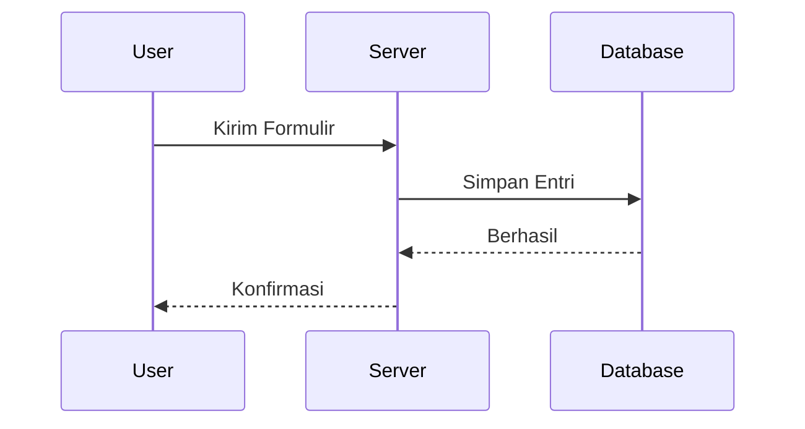
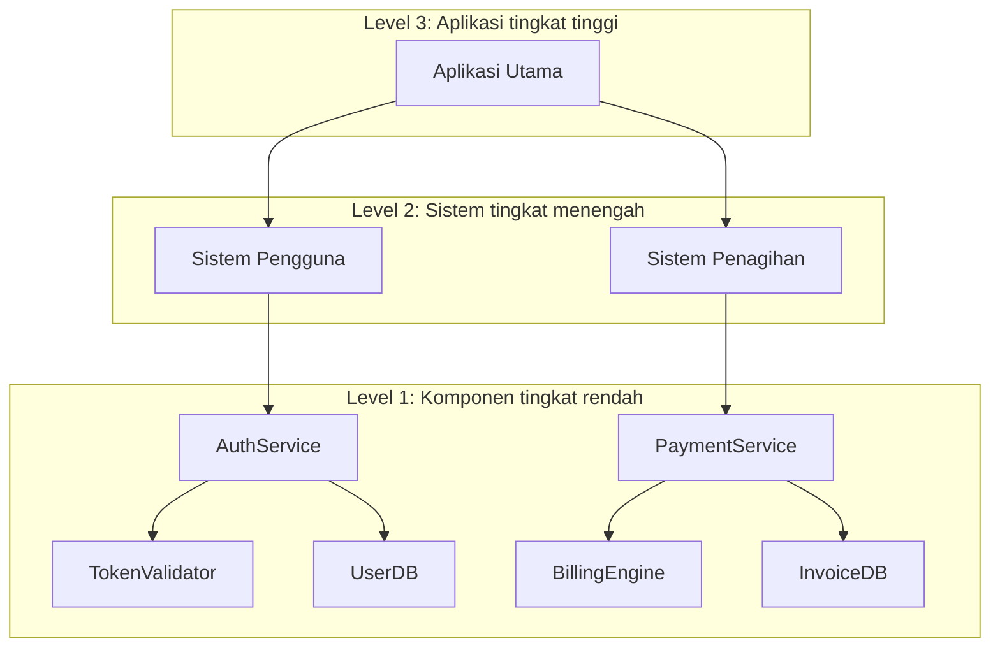
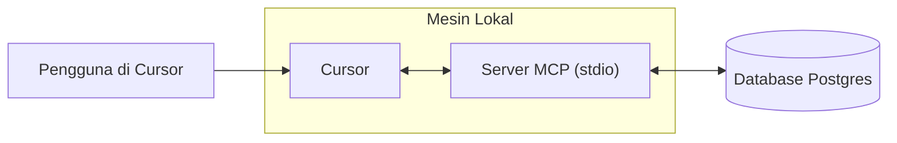
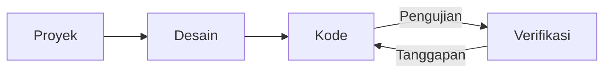
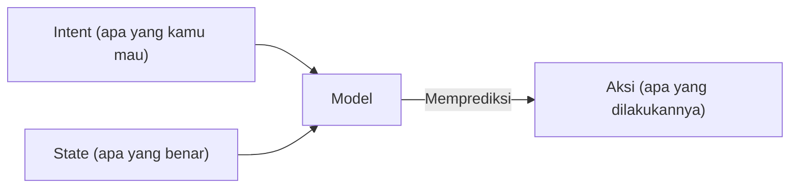

# Cursor Documentation (Indonesian)

This is the complete formatted documentation for Cursor in Indonesian, parsed and organized from the official documentation.

**Total Sections:** 112

---


# Keamanan Agent
Source: https://docs.cursor.com/id/account/agent-security

Pertimbangan keamanan saat menggunakan Cursor Agent

Prompt injection, halusinasi AI, dan masalah lain bisa bikin AI bertingkah di luar dugaan dan berpotensi berbahaya. Sambil terus ngejar solusi prompt injection di level yang lebih mendasar, perlindungan utama di produk Cursor adalah guardrail tentang apa yang boleh dilakukan agent, termasuk mewajibkan persetujuan manual untuk tindakan sensitif secara default. Tujuan dokumen ini adalah menjelaskan guardrail kami dan apa yang bisa lo harapkan dari itu.

Semua kontrol dan perilaku di bawah ini adalah pengaturan default sekaligus yang kami rekomendasikan.

<div id="first-party-tool-calls">
  ## Panggilan tool pihak pertama
</div>

Cursor dibekali dengan tool yang memungkinkan agent bantu pengguna nulis kode. Ini termasuk baca file, edit, jalanin perintah terminal, nyari dokumentasi di web, dan lainnya.

Tool baca tidak butuh persetujuan (mis. membaca file, mencari di seluruh kode). Pengguna bisa pakai [.cursorignore](/id/context/ignore-files) buat ngeblokir agent mengakses file tertentu sama sekali, tapi selain itu pembacaan umumnya diizinkan tanpa persetujuan. Untuk tindakan yang berisiko mengekfiltrasi data sensitif, kami butuh persetujuan eksplisit.

Mengubah file di workspace saat ini tidak butuh persetujuan eksplisit dengan beberapa pengecualian. Begitu agent mengubah file, perubahan langsung disimpan ke disk. Kami rekomendasikan menjalankan Cursor di workspace yang pakai version control, biar isi file bisa dibalikin kapan aja. Kami butuh persetujuan eksplisit sebelum mengubah file yang memodifikasi konfigurasi IDE/CLI kami, seperti file pengaturan workspace editor. Namun, pengguna yang auto-reload saat file berubah perlu sadar kalau perubahan agent ke file bisa memicu eksekusi otomatis sebelum sempat meninjau perubahan.

Perintah terminal apa pun yang disaranin agent butuh persetujuan secara default. Kami rekomendasikan pengguna meninjau tiap perintah sebelum agent jalanin. Pengguna yang menerima risikonya bisa milih ngizinin agent jalanin semua perintah tanpa persetujuan. Kami menyertakan fitur [allowlist](/id/agent/tools) di Cursor, tapi kami tidak menganggapnya sebagai kontrol keamanan. Beberapa pengguna milih ngizinin perintah tertentu, tapi ini sistem best effort dan bypass mungkin terjadi. Kami tidak merekomendasikan "Run Everything", yang melewati allowlist apa pun yang dikonfigurasi.

<div id="third-party-tool-calls">
  ## Panggilan tool pihak ketiga
</div>

Cursor memungkinkan menghubungkan tool eksternal lewat [MCP](/id/context/mcp). Semua koneksi MCP pihak ketiga harus disetujui secara eksplisit oleh pengguna. Setelah pengguna menyetujui sebuah MCP, secara default setiap panggilan tool yang disarankan di Agent Mode untuk setiap integrasi MCP eksternal harus disetujui secara eksplisit sebelum dijalankan.

<div id="network-requests">
  ## Permintaan jaringan
</div>

Permintaan jaringan bisa dimanfaatkan penyerang untuk mengekfiltrasi data. Saat ini kami tidak mendukung alat first‑party apa pun yang membuat permintaan jaringan ke luar sejumlah kecil host terpilih (mis. GitHub), pengambilan tautan secara eksplisit, serta dukungan penelusuran web dengan penyedia tertentu yang dipilih. Permintaan jaringan agen yang sewenang‑wenang diblokir dengan pengaturan default.

<div id="workspace-trust">
  ## Kepercayaan workspace
</div>

Cursor IDE mendukung fitur standar [workspace trust](https://code.visualstudio.com/docs/editing/workspaces/workspace-trust) yang secara default *nonaktif*. Workspace trust bakal nampilin prompt saat lo buka workspace baru untuk milih mode normal atau mode terbatas. Mode terbatas bakal bikin AI dan fitur lain yang biasanya dipakai di Cursor jadi nggak berfungsi. Kami saranin pakai tool lain, seperti text editor basic, buat kerjaan dengan repo yang lo nggak percaya.

Workspace trust bisa diaktifin di pengaturan pengguna dengan langkah-langkah ini:

1. Buka file user settings.json lo
2. Tambahin konfigurasi berikut:
   ```json  theme={null}
   "security.workspace.trust.enabled": true
   ```

Pengaturan ini juga bisa dipaksain di seluruh organisasi lewat solusi Mobile Device Management (MDM).

<div id="responsible-disclosure">
  ## Pengungkapan yang bertanggung jawab
</div>

Kalau kamu menemukan kerentanan di Cursor, ikuti panduan di halaman GitHub Security kami dan kirim laporannya di sana. Kalau nggak bisa pakai GitHub, kamu juga bisa hubungi kami di [security@cursor.com](mailto:security@cursor.com).

Kami berkomitmen untuk mengakui penerimaan laporan kerentanan dalam 5 hari kerja dan menangani laporan tersebut secepatnya. Kami akan memublikasikan hasilnya dalam bentuk security advisory di halaman GitHub Security kami. Insiden kritis akan dikomunikasikan di halaman GitHub Security dan juga lewat email ke semua pengguna.

---


# Billing
Source: https://docs.cursor.com/id/account/billing

Ngatur langganan Cursor, refund, dan invoice 

<div id="how-do-i-access-billing-settings">
  ### Gimana cara akses pengaturan billing?
</div>

Akses portal billing lewat [Dashboard](https://cursor.com/dashboard) dengan klik "Billing" di Dashboard. Ini bakal ngebuka portal aman buat semua urusan billing.

<div id="what-are-cursors-billing-cycles">
  ### Apa aja siklus billing Cursor?
</div>

Siklus billing berjalan bulanan atau tahunan, mulai dari tanggal langganan lo. Akun Teams dikenai biaya per seat dengan billing prorata buat member baru.

<div id="how-do-seats-work-for-teams-accounts">
  ### Gimana cara kerja seat buat akun Teams?
</div>

Akun Teams ngecas per seat (satu per member Team). Kalau nambah member di tengah siklus, lo cuma ditagih buat sisa waktunya. Kalau ada member yang udah pakai kredit dan dihapus, seat mereka tetap kepake sampai akhir siklus billing—nggak ada refund prorata. Admin Team bisa ngatur seat lewat dashboard.

<div id="can-i-switch-between-monthly-and-annual-billing">
  ### Bisa nggak pindah antara billing bulanan dan tahunan?
</div>

Bisa! Caranya:

**Pro plan**

1. Buka [dashboard](https://cursor.com/dashboard) Cursor
2. Klik "Billing and Invoices" di sidebar kiri buat ke halaman billing
3. Klik "Manage subscription"
4. Klik "Update subscription"
5. Pilih "Yearly" atau "Monthly", terus klik "Continue"

**Teams plan**

1. Buka [dashboard](https://cursor.com/dashboard) Cursor
2. Klik "Billing and Invoices" di sidebar kiri buat ke halaman billing
3. Klik tombol "Upgrade Now" buat pindah ke billing tahunan

<Note>
  Lo cuma bisa pindah dari billing bulanan ke tahunan secara self-serve. Buat pindah dari tahunan ke bulanan, hubungi kami di
  [hi@cursor.com](mailto:hi@cursor.com).
</Note>

<div id="where-can-i-find-my-invoices">
  ### Di mana gue bisa nemuin invoice?
</div>

Semua riwayat billing ada di portal billing. Lo bisa lihat dan download invoice yang sekarang maupun yang lama.

<div id="can-i-get-invoices-automatically-emailed-to-me">
  ### Bisa nggak invoice dikirim otomatis ke email?
</div>

Invoice untuk saat ini harus didownload manual dari portal billing. Kita lagi ngembangin email invoice otomatis. Lo bakal bisa opt-in begitu tersedia.

<div id="how-do-i-update-my-billing-information">
  ### Gimana cara update informasi billing?
</div>

Update metode pembayaran, nama perusahaan, alamat, dan info pajak lewat portal billing. Kita pakai Stripe buat transaksi yang aman. Perubahan cuma ngaruh ke invoice berikutnya, kita nggak bisa ubah invoice yang sudah terbit.

<div id="how-do-i-cancel-my-subscription">
  ### Gimana cara batalin langganan?
</div>

Batalin langganan lewat halaman Billing and Invoices dengan klik "Manage Subscription" terus tombol "Cancel subscription". Akses tetap aktif sampai akhir periode billing lo saat ini.

<div id="im-having-other-billing-issues-how-can-i-get-help">
  ### Gue punya masalah billing lain. Gimana cara minta bantuan?
</div>

Kalau ada pertanyaan billing yang belum kejawab di sini, email ke [hi@cursor.com](mailto:hi@cursor.com) dari email yang terhubung ke akun lo. Sertakan detail akun dan concern lo.

---


# Harga
Source: https://docs.cursor.com/id/account/pricing

Paket dan harga Cursor

Kamu bisa coba Cursor gratis atau beli paket individu atau tim.

<div id="individual">
  ## Individual
</div>

Semua paket individual mencakup:

* Tab completion tanpa batas
* Batas penggunaan agent yang diperluas di semua model
* Akses ke Bugbot
* Akses ke Background Agents

Setiap paket menyertakan penggunaan yang ditagihkan sesuai harga inferensi model [API prices](/id/models#model-pricing):

* Pro mencakup penggunaan agent API senilai \$20 + bonus penggunaan tambahan
* Pro Plus mencakup penggunaan agent API senilai \$70 + bonus penggunaan tambahan
* Ultra mencakup penggunaan agent API senilai \$400 + bonus penggunaan tambahan

Kami bekerja keras buat ngasih kapasitas bonus di luar penggunaan yang dijamin. Karena tiap model punya biaya API yang berbeda, pilihan model kamu memengaruhi output token dan seberapa cepat jatah penggunaan kamu kepakai. Kamu bisa lihat penggunaan dan rincian token di [dashboard kamu](https://cursor.com/dashboard?tab=usage). Notifikasi batas rutin ditampilkan di editor.


<div id="how-much-usage-do-i-need">
  ### Seberapa banyak penggunaan yang gue butuhin?
</div>

Berdasarkan data penggunaan kami, lo bisa expect level penggunaan berikut:

* **Pengguna Tab harian**: Selalu di bawah \$20
* **Pengguna Agent terbatas**: Sering cukup dengan \$20 yang udah termasuk
* **Pengguna Agent harian**: Biasanya total penggunaan $60–$100/bulan
* **Power user (multiple agents/automation)**: Sering total penggunaan \$200+/bulan

Berdasarkan data penggunaan kami, limit kira-kira setara dengan berikut untuk *pengguna median*:

* Pro: \~225 request Sonnet 4, \~550 request Gemini, atau \~500 request GPT 5
* Pro+: \~675 request Sonnet 4, \~1.650 request Gemini, atau \~1.500 request GPT 5
* Ultra: \~4.500 request Sonnet 4, \~11.000 request Gemini, atau \~10.000 request GPT 5

<div id="what-happens-when-i-reach-my-limit">
  ### Apa yang terjadi kalau gue mencapai limit?
</div>

Kalau lo melewati kuota penggunaan bulanan yang termasuk, lo bakal dikasih tahu di editor dan bisa pilih untuk:

* **Tambah penggunaan on-demand**: Tetap pakai Cursor dengan rate API yang sama pakai penagihan pay-as-you-go
* **Upgrade plan lo**: Naik ke tier yang lebih tinggi buat kuota penggunaan yang lebih besar

Penggunaan on-demand ditagih bulanan dengan rate yang sama seperti penggunaan yang termasuk. Request nggak pernah diturunin kualitas atau kecepatannya.

<div id="teams">
  ## Teams
</div>

Ada dua paket Teams: Teams (\$40/user/bulan) dan Enterprise (Kustom).

Paket Teams nyediain fitur tambahan seperti:

* Penegakan Privacy Mode
* Admin Dashboard dengan statistik penggunaan
* Penagihan tim terpusat
* SAML/OIDC SSO

Kami nyaranin Teams buat siapa pun yang nyaman melayani diri sendiri. Kami nyaranin [Enterprise](/id/contact-sales) buat yang butuh dukungan prioritas, pooled usage, penagihan via invoice, SCIM, atau kontrol keamanan tingkat lanjut.

Pelajari lebih lanjut tentang [harga Teams](/id/account/teams/pricing).

<div id="auto">
  ## Auto
</div>

Mengaktifkan Auto memungkinkan Cursor memilih model premium yang paling sesuai untuk tugas saat ini dengan reliabilitas tertinggi berdasarkan permintaan terkini. Fitur ini bisa mendeteksi penurunan kualitas output dan otomatis mengganti model untuk mengatasinya.

<Frame>
  
</Frame>

<Note>Kami telah banyak berinvestasi pada kualitas dan performa keseluruhan Auto. Mulai pada pembaruan tagihan berikutnya setelah 15 September, Auto akan mengonsumsi penggunaan dengan tarif API berikut.</Note>

* **Input + Cache Write**: \$1.25 per 1M token
* **Output**: \$6.00 per 1M token
* **Cache Read**: \$0.25 per 1M token

Baik editor maupun dashboard bakal menampilkan penggunaan kamu, termasuk Auto. Kalau kamu lebih suka memilih model secara langsung, penggunaan akan dikenakan sesuai harga API model tersebut.

<div id="max-mode">
  ## Max Mode
</div>

Model tertentu bisa pakai [Max Mode](/id/models#max-mode), yang memungkinkan penalaran lebih panjang dan jendela konteks lebih besar hingga 1M token. Walaupun sebagian besar tugas coding nggak perlu Max Mode, fitur ini bisa membantu buat kueri yang lebih kompleks, terutama untuk file atau codebase yang besar. Menggunakan Max Mode bakal mengonsumsi lebih banyak kuota. Kamu bisa lihat semua request dan rincian token di [dashboard kamu](https://cursor.com/dashboard?tab=usage).

<div id="bugbot">
  ## Bugbot
</div>

Bugbot adalah produk terpisah dari langganan Cursor dan punya paket harga sendiri.

* **Pro** (\$40/bulan): Review tanpa batas untuk hingga 200 PR/bulan, akses tanpa batas ke Cursor Ask, integrasi dengan Cursor untuk memperbaiki bug, dan akses ke Bugbot Rules
* **Teams** (\$40/pengguna/bulan): Code review tanpa batas untuk semua PR, akses tanpa batas ke Cursor Ask, penggunaan bersama di seluruh tim, serta aturan dan pengaturan lanjutan
* **Enterprise** (Kustom): Semua yang ada di Teams plus analitik dan pelaporan lanjutan, dukungan prioritas, dan manajemen akun

Pelajari lebih lanjut tentang [harga Bugbot](https://cursor.com/bugbot#pricing).

<div id="background-agent">
  ## Background Agent
</div>

Background Agent dikenakan biaya sesuai harga API untuk [model](/id/models) yang dipilih. Kamu bakal diminta menetapkan batas pengeluaran untuk Background Agent saat pertama kali mulai pakai mereka.

<Info>
  Komputasi Virtual Machine (VM) untuk background agent akan diberi harga di masa mendatang.
</Info>

---


# Admin API
Source: https://docs.cursor.com/id/account/teams/admin-api

Akses metrik tim, data penggunaan, dan informasi pengeluaran lewat API

Admin API bikin lo bisa ngeakses data tim lo secara terprogram, termasuk info member, metrik penggunaan, dan detail pengeluaran. Bangun dashboard kustom, alat monitoring, atau integrasiin ke workflow yang udah ada.

<Note>
  API ini baru rilis pertama. Kita lagi nambahin kapabilitas berdasarkan feedback — kasih tahu kita endpoint apa yang lo butuhin!
</Note>

<div id="authentication">
  ## Autentikasi
</div>

Semua permintaan API memerlukan autentikasi menggunakan kunci API. Hanya admin tim yang bisa membuat dan mengelola kunci API.

Kunci API terikat ke organisasi, dapat dilihat oleh semua admin, dan tidak terpengaruh oleh status akun pembuatnya.

<div id="creating-an-api-key">
  ### Membuat API Key
</div>

1. Buka **cursor.com/dashboard** → tab **Settings** → **Cursor Admin API Keys**
2. Klik **Create New API Key**
3. Kasih nama yang deskriptif buat key lo (misalnya, "Usage Dashboard Integration")
4. Segera salin key yang dihasilkan — lo nggak bakal bisa lihat itu lagi

Format: `key_xxxxxxxxxxxxxxxxxxxxxxxxxxxxxxxxxxxxxxxxxxxxxxxxxxxxxxxxxxxxxxxx`

<div id="using-your-api-key">
  ### Pakai API key lo
</div>

Pakai API key lo sebagai username di basic authentication:

**Pakai curl dengan basic auth:**

```bash  theme={null}
curl https://api.cursor.com/{route} -u API_KEY:
```

**Atau atur header Authorization secara langsung:**

```bash  theme={null}
Authorization: Basic {base64_encode('API_KEY:')}
```

<div id="base-url">
  ## URL Dasar
</div>

Semua endpoint API menggunakan:

```
https://api.cursor.com
```

<div id="endpoints">
  ## Endpoint
</div>

<div id="get-team-members">
  ### Ambil Anggota Tim
</div>

Mengambil semua anggota tim beserta detailnya.

```
GET /teams/members
```

#### Respons

Mengembalikan array objek anggota tim:

```typescript  theme={null}
{
  teamMembers: {
    name: string;
    email: string;
    role: 'owner' | 'member' | 'free-owner';
  }[];
}
```

#### Contoh Tanggapan

```json  theme={null}
{
  "teamMembers": [
    {
      "name": "Alex",
      "email": "developer@company.com",
      "role": "member"
    },
    {
      "name": "Sam",
      "email": "admin@company.com",
      "role": "owner"
    }
  ]
}

```

<div id="example-requests">
  #### Contoh Permintaan
</div>

```bash  theme={null}
curl -X GET https://api.cursor.com/teams/members \
  -u API_KEY_KAMU:
```

<div id="get-daily-usage-data">
  ### Dapatkan Data Penggunaan Harian
</div>

Ambil metrik penggunaan harian yang detail buat tim lo dalam rentang tanggal tertentu. Ngasih insight tentang pengeditan kode, penggunaan bantuan AI, dan tingkat penerimaan.

```
POST /teams/daily-usage-data
```

#### Body Request

<div className="full-width-table">
  | Parameter   | Type   | Required | Description                         |
  | :---------- | :----- | :------- | :---------------------------------- |
  | `startDate` | number | Yes      | Tanggal mulai dalam milidetik epoch |
  | `endDate`   | number | Yes      | Tanggal akhir dalam milidetik epoch |
</div>

<Note>
  Rentang tanggal nggak boleh lebih dari 90 hari. Buat beberapa request untuk periode yang lebih panjang.
</Note>

#### Respons

```typescript  theme={null}
{
  data: {
    date: number;
    isActive: boolean;
    totalLinesAdded: number;
    totalLinesDeleted: number;
    acceptedLinesAdded: number;
    acceptedLinesDeleted: number;
    totalApplies: number;
    totalAccepts: number;
    totalRejects: number;
    totalTabsShown: number;
    totalTabsAccepted: number;
    composerRequests: number;
    chatRequests: number;
    agentRequests: number;
    cmdkUsages: number;
    subscriptionIncludedReqs: number;
    apiKeyReqs: number;
    usageBasedReqs: number;
    bugbotUsages: number;
    mostUsedModel: string;
    applyMostUsedExtension?: string;
    tabMostUsedExtension?: string;
    clientVersion?: string;
    email?: string;
  }[];
  period: {
    startDate: number;
    endDate: number;
  };
}
```

<div id="response-fields">
  #### Kolom Respons
</div>

<div className="full-width-table">
  | Field                      | Description                                              |
  | :------------------------- | :------------------------------------------------------- |
  | `date`                     | Tanggal dalam milidetik epoch                            |
  | `isActive`                 | Pengguna aktif pada hari tersebut                        |
  | `totalLinesAdded`          | Jumlah baris kode yang ditambahkan                       |
  | `totalLinesDeleted`        | Jumlah baris kode yang dihapus                           |
  | `acceptedLinesAdded`       | Jumlah baris dari saran AI yang diterima dan ditambahkan |
  | `acceptedLinesDeleted`     | Jumlah baris dari saran AI yang diterima dan dihapus     |
  | `totalApplies`             | Operasi apply                                            |
  | `totalAccepts`             | Saran yang diterima                                      |
  | `totalRejects`             | Saran yang ditolak                                       |
  | `totalTabsShown`           | Tab completion yang ditampilkan                          |
  | `totalTabsAccepted`        | Tab completion yang diterima                             |
  | `composerRequests`         | Permintaan Composer                                      |
  | `chatRequests`             | Permintaan Chat                                          |
  | `agentRequests`            | Permintaan Agent                                         |
  | `cmdkUsages`               | Penggunaan Command Palette (Cmd+K)                       |
  | `subscriptionIncludedReqs` | Permintaan yang termasuk dalam langganan                 |
  | `apiKeyReqs`               | Permintaan API key                                       |
  | `usageBasedReqs`           | Permintaan bayar per penggunaan                          |
  | `bugbotUsages`             | Penggunaan deteksi bug                                   |
  | `mostUsedModel`            | Model AI yang paling sering digunakan                    |
  | `applyMostUsedExtension`   | Ekstensi file yang paling sering digunakan untuk apply   |
  | `tabMostUsedExtension`     | Ekstensi file yang paling sering digunakan untuk tab     |
  | `clientVersion`            | Versi Cursor                                             |
  | `email`                    | Email pengguna                                           |
</div>

#### Contoh Tanggapan

```json  theme={null}
{
  "data": [
    {
      "date": 1710720000000,
      "isActive": true,
      "totalLinesAdded": 1543,
      "totalLinesDeleted": 892,
      "acceptedLinesAdded": 1102,
      "acceptedLinesDeleted": 645,
      "totalApplies": 87,
      "totalAccepts": 73,
      "totalRejects": 14,
      "totalTabsShown": 342,
      "totalTabsAccepted": 289,
      "composerRequests": 45,
      "chatRequests": 128,
      "agentRequests": 12,
      "cmdkUsages": 67,
      "subscriptionIncludedReqs": 180,
      "apiKeyReqs": 0,
      "usageBasedReqs": 5,
      "bugbotUsages": 3,
      "mostUsedModel": "gpt-4",
      "applyMostUsedExtension": ".tsx",
      "tabMostUsedExtension": ".ts",
      "clientVersion": "0.25.1",
      "email": "developer@company.com"
    },
    {
      "date": 1710806400000,
      "isActive": true,
      "totalLinesAdded": 2104,
      "totalLinesDeleted": 1203,
      "acceptedLinesAdded": 1876,
      "acceptedLinesDeleted": 987,
      "totalApplies": 102,
      "totalAccepts": 91,
      "totalRejects": 11,
      "totalTabsShown": 456,
      "totalTabsAccepted": 398,
      "composerRequests": 67,
      "chatRequests": 156,
      "agentRequests": 23,
      "cmdkUsages": 89,
      "subscriptionIncludedReqs": 320,
      "apiKeyReqs": 15,
      "usageBasedReqs": 0,
      "bugbotUsages": 5,
      "mostUsedModel": "claude-3-opus",
      "applyMostUsedExtension": ".py",
      "tabMostUsedExtension": ".py",
      "clientVersion": "0.25.1",
      "email": "developer@company.com"
    }
  ],
  "period": {
    "startDate": 1710720000000,
    "endDate": 1710892800000
  }
}
```

<div id="example-requests">
  #### Contoh Permintaan
</div>

```bash  theme={null}
curl -X POST https://api.cursor.com/teams/daily-usage-data \
  -u API_KEY_KAMU: \
  -H "Content-Type: application/json" \
  -d '{
    "startDate": 1710720000000,
    "endDate": 1710892800000
  }'
```

<div id="get-spending-data">
  ### Dapatkan Data Pengeluaran
</div>

Ambil data pengeluaran untuk bulan kalender berjalan, lengkap dengan pencarian, penyortiran, dan pagination.

```
POST /teams/spend
```

#### Request Body

<div className="full-width-table">
  | Parameter       | Type   | Required | Description                                                |
  | :-------------- | :----- | :------- | :--------------------------------------------------------- |
  | `searchTerm`    | string | No       | Cari di nama dan email pengguna                            |
  | `sortBy`        | string | No       | Urutkan menurut: `amount`, `date`, `user`. Default: `date` |
  | `sortDirection` | string | No       | Arah pengurutan: `asc`, `desc`. Default: `desc`            |
  | `page`          | number | No       | Nomor halaman (indeks mulai 1). Default: `1`               |
  | `pageSize`      | number | No       | Jumlah hasil per halaman                                   |
</div>

#### Respons

```typescript  theme={null}
{
  teamMemberSpend: {
    spendCents: number;
    fastPremiumRequests: number;
    name: string;
    email: string;
    role: 'owner' | 'member' | 'free-owner';
    hardLimitOverrideDollars: number;
  }[];
  subscriptionCycleStart: number;
  totalMembers: number;
  totalPages: number;
}
```

#### Field Respons

<div className="full-width-table">
  | Field                      | Description                              |
  | :------------------------- | :--------------------------------------- |
  | `spendCents`               | Total pengeluaran dalam sen              |
  | `fastPremiumRequests`      | Permintaan model premium cepat           |
  | `name`                     | Nama anggota                             |
  | `email`                    | Email anggota                            |
  | `role`                     | Peran dalam tim                          |
  | `hardLimitOverrideDollars` | Penggantian batas pengeluaran kustom     |
  | `subscriptionCycleStart`   | Mulai siklus langganan (milidetik epoch) |
  | `totalMembers`             | Total anggota tim                        |
  | `totalPages`               | Total halaman                            |
</div>

#### Contoh Tanggapan

```json  theme={null}
{
  "teamMemberSpend": [
    {
      "spendCents": 2450,
      "fastPremiumRequests": 1250,
      "name": "Alex",
      "email": "developer@company.com",
      "role": "member",
      "hardLimitOverrideDollars": 100
    },
    {
      "spendCents": 1875,
      "fastPremiumRequests": 980,
      "name": "Sam",
      "email": "admin@company.com",
      "role": "owner"
      "hardLimitOverrideDollars": 0
    },
  ],
  "subscriptionCycleStart": 1708992000000,
  "totalMembers": 15,
  "totalPages": 1
}
```

<div id="example-requests">
  #### Contoh Permintaan
</div>

**Data pengeluaran dasar:**

```bash  theme={null}
curl -X POST https://api.cursor.com/teams/spend \
  -u YOUR_API_KEY: \
  -H "Content-Type: application/json" \
  -d '{}'
```

**Cari pengguna tertentu dengan paginasi:**

```bash  theme={null}
curl -X POST https://api.cursor.com/teams/spend \
  -u YOUR_API_KEY: \
  -H "Content-Type: application/json" \
  -d '{
    "searchTerm": "alex@company.com",
    "page": 2,
    "pageSize": 25
  }'
```

<div id="get-usage-events-data">
  ### Dapatkan Data Event Penggunaan
</div>

Ambil data event penggunaan yang detail untuk tim lo, dengan opsi filter, pencarian, dan paginasi yang lengkap. Endpoint ini ngasih insight granular tentang panggilan API per request, penggunaan model, konsumsi token, dan biaya.

```
POST /teams/filtered-usage-events
```

<div id="request-body">
  #### Body Permintaan
</div>

<div className="full-width-table">
  | Parameter   | Tipe   | Wajib | Deskripsi                                     |
  | :---------- | :----- | :---- | :-------------------------------------------- |
  | `startDate` | number | Tidak | Tanggal mulai dalam milidetik epoch           |
  | `endDate`   | number | Tidak | Tanggal akhir dalam milidetik epoch           |
  | `userId`    | number | Tidak | Filter berdasarkan ID pengguna tertentu       |
  | `page`      | number | Tidak | Nomor halaman (diindeks dari 1). Default: `1` |
  | `pageSize`  | number | Tidak | Jumlah hasil per halaman. Default: `10`       |
  | `email`     | string | Tidak | Filter berdasarkan alamat email pengguna      |
</div>

#### Respons

```typescript  theme={null}
{
  totalUsageEventsCount: number;
  pagination: {
    numPages: number;
    currentPage: number;
    pageSize: number;
    hasNextPage: boolean;
    hasPreviousPage: boolean;
  };
  usageEvents: {
    timestamp: string;
    model: string;
    kind: string;
    maxMode: boolean;
    requestsCosts: number;
    isTokenBasedCall: boolean;
    tokenUsage?: {
      inputTokens: number;
      outputTokens: number;
      cacheWriteTokens: number;
      cacheReadTokens: number;
      totalCents: number;
    };
    isFreeBugbot: boolean;
    userEmail: string;
  }[];
  period: {
    startDate: number;
    endDate: number;
  };
}
```

<div id="response-fields-explained">
  #### Penjelasan Field Respons
</div>

<div className="full-width-table">
  | Field                   | Description                                                           |
  | :---------------------- | :-------------------------------------------------------------------- |
  | `totalUsageEventsCount` | Jumlah total event penggunaan yang sesuai dengan query                |
  | `pagination`            | Metadata paginasi untuk menavigasi hasil                              |
  | `timestamp`             | Stempel waktu event dalam epoch millisecond                           |
  | `model`                 | Model AI yang dipakai untuk request                                   |
  | `kind`                  | Kategori penggunaan (mis., "Usage-based", "Included in Business")     |
  | `maxMode`               | Apakah max mode diaktifkan                                            |
  | `requestsCosts`         | Biaya dalam unit request                                              |
  | `isTokenBasedCall`      | True saat event ditagihkan sebagai event berbasis penggunaan          |
  | `tokenUsage`            | Rincian konsumsi token (tersedia saat isTokenBasedCall bernilai true) |
  | `isFreeBugbot`          | Apakah ini penggunaan bugbot gratis                                   |
  | `userEmail`             | Email user yang membuat request                                       |
  | `period`                | Rentang tanggal dari data yang di-query                               |
</div>

#### Contoh Tanggapan

```json  theme={null}
{
  "totalUsageEventsCount": 113,
  "pagination": {
    "numPages": 12,
    "currentPage": 1,
    "pageSize": 10,
    "hasNextPage": true,
    "hasPreviousPage": false
  },
  "usageEvents": [
    {
      "timestamp": "1750979225854",
      "model": "claude-4-opus",
      "kind": "Berbasis penggunaan",
      "maxMode": true,
      "requestsCosts": 5,
      "isTokenBasedCall": true,
      "tokenUsage": {
        "inputTokens": 126,
        "outputTokens": 450,
        "cacheWriteTokens": 6112,
        "cacheReadTokens": 11964,
        "totalCents": 20.18232
      },
      "isFreeBugbot": false,
      "userEmail": "developer@company.com"
    },
    {
      "timestamp": "1750979173824",
      "model": "claude-4-opus",
      "kind": "Usage-based",
      "maxMode": true,
      "requestsCosts": 10,
      "isTokenBasedCall": true,
      "tokenUsage": {
        "inputTokens": 5805,
        "outputTokens": 311,
        "cacheWriteTokens": 11964,
        "cacheReadTokens": 0,
        "totalCents": 40.16699999999999
      },
      "isFreeBugbot": false,
      "userEmail": "developer@company.com"
    },
    {
      "timestamp": "1750978339901",
      "model": "claude-4-sonnet-thinking",
      "kind": "Termasuk dalam Paket Business"
      "maxMode": true,
      "requestsCosts": 1.4,
      "isTokenBasedCall": false,
      "isFreeBugbot": false,
      "userEmail": "admin@company.com"
    }
  ],
  "period": {
    "startDate": 1748411762359,
    "endDate": 1751003762359
  }
}
```

<div id="example-requests">
  #### Contoh Permintaan
</div>

**Ambil semua peristiwa penggunaan dengan paginasi default:**

```bash  theme={null}
curl -X POST https://api.cursor.com/teams/filtered-usage-events \
  -u YOUR_API_KEY: \
  -H "Content-Type: application/json" \
  -d '{}'
```

**Filter berdasarkan rentang tanggal dan pengguna tertentu:**

```bash  theme={null}
curl -X POST https://api.cursor.com/teams/filtered-usage-events \
  -u API_KEY_KAMU: \
  -H "Content-Type: application/json" \
  -d '{
    "startDate": 1748411762359,
    "endDate": 1751003762359,
    "email": "developer@company.com",
    "page": 1,
    "pageSize": 25
  }'
```

**Ambil event penggunaan untuk user tertentu dengan paginasi kustom:**

```bash  theme={null}
curl -X POST https://api.cursor.com/teams/filtered-usage-events \
  -u YOUR_API_KEY: \
  -H "Content-Type: application/json" \
  -d '{
    "userId": 12345,
    "page": 2,
    "pageSize": 50
  }'
```

<div id="set-user-spend-limit">
  ### Set Batas Pengeluaran Pengguna
</div>

Atur batas pengeluaran buat tiap anggota tim. Ini bikin lo bisa ngatur seberapa banyak tiap user boleh ngehabisin buat penggunaan AI di tim lo.

```
POST /teams/batas-pengeluaran-user
```

<Note>
  **Batas laju:** 60 permintaan per menit per tim
</Note>

#### Request Body

<div className="full-width-table">
  | Parameter           | Type   | Required | Description                                                          |
  | :------------------ | :----- | :------- | :------------------------------------------------------------------- |
  | `userEmail`         | string | Yes      | Alamat email anggota tim                                             |
  | `spendLimitDollars` | number | Yes      | Batas pengeluaran dalam dolar (hanya bilangan bulat, tanpa desimal). |
</div>

<Note>
  * Pengguna harus sudah menjadi anggota tim kamu
  * Hanya nilai bilangan bulat yang diterima (tanpa angka desimal)
  * Mengatur `spendLimitDollars` ke 0 akan menetapkan batas menjadi \$0
</Note>

#### Respons

Mengembalikan respons standar yang menunjukkan apakah operasi berhasil atau gagal:

```typescript  theme={null}
{
  outcome: 'sukses' | 'error';
  message: string;
}
```

<div id="example-responses">
  #### Contoh Respons
</div>

**Berhasil mengatur batas:**

```json  theme={null}
{
  "outcome": "sukses",
  "message": "Batas pengeluaran ditetapkan menjadi $100 untuk pengguna developer@company.com"
}
```

**Respons kesalahan:**

```json  theme={null}
{
  "outcome": "error",
  "message": "Format email tidak valid"
}
```

<div id="example-requests">
  #### Contoh Permintaan
</div>

**Atur batas pengeluaran:**

```bash  theme={null}
curl -X POST https://api.cursor.com/teams/user-spend-limit \
  -u YOUR_API_KEY: \
  -H "Content-Type: application/json" \
  -d '{
    "userEmail": "developer@company.com",
    "spendLimitDollars": 100
  }'
```

<div id="repo-blocklists-api">
  ### Repo Blocklists API
</div>

Tambahkan repositori dan terapkan pola untuk mencegah file atau direktori diindeks atau digunakan sebagai konteks buat tim.

<div id="get-team-repo-blocklists">
  #### Dapatkan Blocklist Repo Tim
</div>

Ambil semua blocklist repository yang dikonfigurasi untuk tim lo.

```
GET /settings/repo-blocklists/repos
```

<div id="response">
  ##### Respons
</div>

Mengembalikan array objek daftar blokir repositori:

```typescript  theme={null}
{
  repos: {
    id: string;
    url: string;
    patterns: string[];
  }[];
}
```

<div id="example-response">
  ##### Contoh Tanggapan
</div>

```json  theme={null}
{
  "repos": [
    {
      "id": "repo_123",
      "url": "https://github.com/company/sensitive-repo",
      "patterns": ["*.env", "config/*", "secrets/**"]
    },
    {
      "id": "repo_456",
      "url": "https://github.com/company/internal-tools",
      "patterns": ["*"]
    }
  ]
}
```

<div id="example-request">
  ##### Contoh Permintaan
</div>

```bash  theme={null}
curl -X GET https://api.cursor.com/settings/repo-blocklists/repos \
  -u API_KEY_KAMU:
```

<div id="upsert-repo-blocklists">
  #### Upsert Repo Blocklists
</div>

Ganti blocklist repo yang sudah ada untuk repo yang diberikan.
*Catatan: Endpoint ini cuma bakal menimpa pola untuk repo yang diberikan. Repo lainnya nggak akan terpengaruh.*

```
POST /settings/repo-blocklists/repos/upsert
```

##### Request Body

| Parameter | Type  | Required | Description                      |
| --------- | ----- | -------- | -------------------------------- |
| repos     | array | Yes      | Array objek blocklist repository |

Setiap objek repository harus berisi:

| Field    | Type      | Required | Description                                              |
| -------- | --------- | -------- | -------------------------------------------------------- |
| url      | string    | Yes      | URL repository untuk dimasukkan ke blocklist             |
| patterns | string\[] | Yes      | Array pola file yang akan diblokir (mendukung pola glob) |

<div id="response">
  ##### Respons
</div>

Mengembalikan daftar blocklist repositori yang diperbarui:

```typescript  theme={null}
{
  repos: {
    id: string;
    url: string;
    patterns: string[];
  }[];
}
```

<div id="example-request">
  ##### Contoh Permintaan
</div>

```bash  theme={null}
curl -X POST https://api.cursor.com/settings/repo-blocklists/repos/upsert \
  -u API_KEY_KAMU: \
  -H "Content-Type: application/json" \
  -d '{
    "repos": [
      {
        "url": "https://github.com/company/sensitive-repo",
        "patterns": ["*.env", "config/*", "secrets/**"]
      },
      {
        "url": "https://github.com/company/internal-tools", 
        "patterns": ["*"]
      }
    ]
  }'
```

<div id="delete-repo-blocklist">
  #### Hapus Daftar Blokir Repo
</div>

Hapus repositori tertentu dari daftar blokir.

```
DELETE /settings/repo-blocklists/repos/:repoId
```

<div id="parameters">
  ##### Parameter
</div>

| Parameter | Tipe   | Wajib | Deskripsi                                 |
| --------- | ------ | ----- | ----------------------------------------- |
| repoId    | string | Ya    | ID blocklist repositori yang akan dihapus |

<div id="response">
  ##### Respons
</div>

Mengembalikan 204 No Content ketika penghapusan berhasil.

<div id="example-request">
  ##### Contoh Permintaan
</div>

```bash  theme={null}
curl -X DELETE https://api.cursor.com/settings/repo-blocklists/repos/repo_123 \
  -u KUNCI_API_LO:
```

<div id="pattern-examples">
  #### Contoh Pola
</div>

Pola blocklist yang umum:

* `*` - Blokir seluruh repository
* `*.env` - Blokir semua file .env
* `config/*` - Blokir semua file di direktori config
* `**/*.secret` - Blokir semua file .secret di subdirektori mana pun
* `src/api/keys.ts` - Blokir file tertentu

---


# API Pelacakan Kode AI
Source: https://docs.cursor.com/id/account/teams/ai-code-tracking-api

Akses analitik kode berbasis AI buat repositori tim lo

Akses analitik kode berbasis AI buat repositori tim lo. Ini mencakup penggunaan AI per commit serta perubahan AI yang diterima secara granular.

<Note>
  API ini baru rilis pertama. Kami lagi nambah kapabilitas berdasarkan feedback—kasih tahu kami endpoint apa yang lo butuhin!
</Note>

* **Ketersediaan**: Hanya buat tim enterprise
* **Status**: Alpha (bentuk respons dan field bisa berubah)

<div id="authentication">
  ## Autentikasi
</div>

Semua request ke API harus diautentikasi pakai API key. API ini menggunakan skema autentikasi Admin API yang sama seperti endpoint lainnya.

Untuk panduan autentikasi yang lebih rinci, lihat [Admin API authentication](/id/account/teams/admin-api#authentication).

<div id="base-url">
  ## URL Dasar
</div>

Semua endpoint API menggunakan:

```
https://api.cursor.com
```

<div id="rate-limits">
  ## Batas Permintaan
</div>

* 5 permintaan per menit per tim, per endpoint

<div id="query-parameters">
  ## Parameter Query
</div>

Semua endpoint di bawah menerima parameter query yang sama lewat query string:

<div className="full-width-table">
  | Parameter   | Type   | Required | Description                                                                                                                                                                         |                                                                                                                           |
  | :---------- | :----- | :------- | :---------------------------------------------------------------------------------------------------------------------------------------------------------------------------------- | ------------------------------------------------------------------------------------------------------------------------- |
  | `startDate` | string | date     | No                                                                                                                                                                                  | String tanggal ISO, literal "now", atau hari relatif seperti "7d" (berarti sekarang - 7 hari). Default: sekarang - 7 hari |
  | `endDate`   | string | date     | No                                                                                                                                                                                  | String tanggal ISO, literal "now", atau hari relatif seperti "0d". Default: sekarang                                      |
  | `page`      | number | No       | Nomor halaman (basis 1). Default: 1                                                                                                                                                 |                                                                                                                           |
  | `pageSize`  | number | No       | Jumlah hasil per halaman. Default: 100, Maks: 1000                                                                                                                                  |                                                                                                                           |
  | `user`      | string | No       | Filter opsional untuk satu pengguna. Menerima email (mis., [developer@company.com](mailto:developer@company.com)), ID terenkode (mis., user\_abc123...), atau ID numerik (mis., 42) |                                                                                                                           |
</div>

<Note>
  Respons mengembalikan userId sebagai ID eksternal terenkode dengan prefiks user\_. Nilai ini stabil untuk konsumsi API.
</Note>

<div id="semantics-and-how-metrics-are-computed">
  ## Semantik dan Cara Perhitungan Metrik
</div>

* **Sumber**: "TAB" merepresentasikan inline completions yang diterima; "COMPOSER" merepresentasikan diff yang diterima dari Composer
* **Metrik baris**: tabLinesAdded/Deleted dan composerLinesAdded/Deleted dihitung terpisah; nonAiLinesAdded/Deleted diturunkan sebagai max(0, totalLines - AI lines)
* **Mode privasi**: Jika diaktifkan di klien, beberapa metadata (seperti fileName) mungkin dihilangkan
* **Info branch**: isPrimaryBranch bernilai true ketika branch saat ini sama dengan default branch repo; bisa undefined jika info repo tidak tersedia

Lo bisa nge-scan file itu buat paham gimana commit dan perubahan dideteksi dan dilaporkan.

<div id="endpoints">
  ## Endpoint
</div>

<div id="get-ai-commit-metrics-json-paginated">
  ### Dapatkan Metrik Commit AI (JSON, dengan pagination)
</div>

Ambil metrik agregat per-commit yang mengatribusikan baris ke TAB, COMPOSER, dan non-AI.

```
GET /analytics/ai-code/commits
```

#### Respons

```typescript  theme={null}
{
  items: AiCommitMetric[];
  totalCount: number;
  page: number;
  pageSize: number;
}
```

<div id="aicommitmetric-fields">
  #### Field AiCommitMetric
</div>

<div className="full-width-table">
  | Field                  | Type    | Description                                   |                                   |
  | :--------------------- | :------ | :-------------------------------------------- | --------------------------------- |
  | `commitHash`           | string  | Hash commit Git                               |                                   |
  | `userId`               | string  | ID pengguna terenkode (mis., user\_abc123)    |                                   |
  | `userEmail`            | string  | Alamat email pengguna                         |                                   |
  | `repoName`             | string  | null                                          | Nama repositori                   |
  | `branchName`           | string  | null                                          | Nama branch                       |
  | `isPrimaryBranch`      | boolean | null                                          | Apakah ini branch utama           |
  | `totalLinesAdded`      | number  | Total baris yang ditambahkan dalam commit     |                                   |
  | `totalLinesDeleted`    | number  | Total baris yang dihapus dalam commit         |                                   |
  | `tabLinesAdded`        | number  | Baris yang ditambahkan lewat penyelesaian TAB |                                   |
  | `tabLinesDeleted`      | number  | Baris yang dihapus lewat penyelesaian TAB     |                                   |
  | `composerLinesAdded`   | number  | Baris yang ditambahkan lewat Composer         |                                   |
  | `composerLinesDeleted` | number  | Baris yang dihapus lewat Composer             |                                   |
  | `nonAiLinesAdded`      | number  | null                                          | Baris non-AI yang ditambahkan     |
  | `nonAiLinesDeleted`    | number  | null                                          | Baris non-AI yang dihapus         |
  | `message`              | string  | null                                          | Pesan commit                      |
  | `commitTs`             | string  | null                                          | Stempel waktu commit (format ISO) |
  | `createdAt`            | string  | Stempel waktu ingestion (format ISO)          |                                   |
</div>

<div id="example-response">
  #### Contoh Respons
</div>

```json  theme={null}
{
  "items": [
    {
      "commitHash": "a1b2c3d4",
      "userId": "user_3k9x8q...",
      "userEmail": "developer@company.com",
      "repoName": "company/repo",
      "branchName": "main",
      "isPrimaryBranch": true,
      "totalLinesAdded": 120,
      "totalLinesDeleted": 30,
      "tabLinesAdded": 50,
      "tabLinesDeleted": 10,
      "composerLinesAdded": 40,
      "composerLinesDeleted": 5,
      "nonAiLinesAdded": 30,
      "nonAiLinesDeleted": 15,
      "message": "Refactor: ekstraksi klien analytics"
      "commitTs": "2025-07-30T14:12:03.000Z",
      "createdAt": "2025-07-30T14:12:30.000Z"
    }
  ],
  "totalCount": 42,
  "page": 1,
  "pageSize": 100
}
```

<div id="example-requests">
  #### Contoh Permintaan
</div>

**Permintaan dasar:**

```bash  theme={null}
curl -X GET "https://api.cursor.com/analytics/ai-code/commits?startDate=7d&endDate=now&page=1&pageSize=100" \
  -u API_KEY_KAMU:
```

**Filter berdasarkan pengguna (email):**

```bash  theme={null}
curl -X GET "https://api.cursor.com/analytics/ai-code/commits?startDate=2025-06-01T00:00:00Z&endDate=now&user=developer@company.com" \
  -u API_KEY_KAMU:
```

<div id="download-ai-commit-metrics-csv-streaming">
  ### Download Metrik Commit AI (CSV, streaming)
</div>

Unduh data metrik commit dalam format CSV untuk ekstraksi data berskala besar.

```
GET /analytics/ai-code/commits.csv
```

#### Respons

Header:

* Content-Type: text/csv; charset=utf-8

<div id="csv-columns">
  #### Kolom CSV
</div>

<div className="full-width-table">
  | Kolom                    | Tipe    | Deskripsi                                    |
  | :----------------------- | :------ | :------------------------------------------- |
  | `commit_hash`            | string  | Hash commit Git                              |
  | `user_id`                | string  | ID pengguna yang dienkode                    |
  | `user_email`             | string  | Alamat email pengguna                        |
  | `repo_name`              | string  | Nama repositori                              |
  | `branch_name`            | string  | Nama branch                                  |
  | `is_primary_branch`      | boolean | Apakah ini branch utama                      |
  | `total_lines_added`      | number  | Total baris yang ditambahkan dalam commit    |
  | `total_lines_deleted`    | number  | Total baris yang dihapus dalam commit        |
  | `tab_lines_added`        | number  | Baris yang ditambahkan lewat pelengkapan TAB |
  | `tab_lines_deleted`      | number  | Baris yang dihapus lewat pelengkapan TAB     |
  | `composer_lines_added`   | number  | Baris yang ditambahkan lewat Composer        |
  | `composer_lines_deleted` | number  | Baris yang dihapus lewat Composer            |
  | `non_ai_lines_added`     | number  | Baris non-AI yang ditambahkan                |
  | `non_ai_lines_deleted`   | number  | Baris non-AI yang dihapus                    |
  | `message`                | string  | Pesan commit                                 |
  | `commit_ts`              | string  | Timestamp commit (format ISO)                |
  | `created_at`             | string  | Timestamp ingest (format ISO)                |
</div>

<div id="sample-csv-output">
  #### Contoh Output CSV
</div>

```csv  theme={null}
commit_hash,user_id,user_email,repo_name,branch_name,is_primary_branch,total_lines_added,total_lines_deleted,tab_lines_added,tab_lines_deleted,composer_lines_added,composer_lines_deleted,non_ai_lines_added,non_ai_lines_deleted,message,commit_ts,created_at
a1b2c3d4,user_3k9x8q...,developer@company.com,company/repo,main,true,120,30,50,10,40,5,30,15,"Refactor: ekstraksi klien analitik",2025-07-30T14:12:03.000Z,2025-07-30T14:12:30.000Z
e5f6g7h8,user_3k9x8q...,developer@company.com,company/repo,feature-branch,false,85,15,30,5,25,3,30,7,"Tambahkan penanganan error",2025-07-30T13:45:21.000Z,2025-07-30T13:45:45.000Z
```

<div id="example-requests">
  #### Contoh Permintaan
</div>

```bash  theme={null}
curl -L "https://api.cursor.com/analytics/ai-code/commits.csv?startDate=2025-07-01T00:00:00Z&endDate=now&user=user_3k9x8q..." \
  -u API_KEY_KAMU: \
  -o commits.csv
```

<div id="get-ai-code-change-metrics-json-paginated">
  ### Dapatkan Metrik Perubahan Kode AI (JSON, paginasi)
</div>

Ambil perubahan AI terperinci yang diterima, dikelompokkan berdasarkan changeId deterministik. Berguna buat nganalisis event AI yang diterima secara independen dari commit.

```
GET /analytics/ai-code/changes
```

<div id="response">
  #### Tanggapan
</div>

```typescript  theme={null}
{
  items: AiCodeChangeMetric[];
  totalCount: number;
  page: number;
  pageSize: number;
}
```

<div id="aicodechangemetric-fields">
  #### Field AiCodeChangeMetric
</div>

<div className="full-width-table">
  | Field               | Type   | Description                                                  |                         |
  | :------------------ | :----- | :----------------------------------------------------------- | ----------------------- |
  | `changeId`          | string | ID deterministik untuk perubahan                             |                         |
  | `userId`            | string | ID pengguna yang dienkode (misalnya, user\_abc123)           |                         |
  | `userEmail`         | string | Alamat email pengguna                                        |                         |
  | `source`            | "TAB"  | "COMPOSER"                                                   | Sumber perubahan AI     |
  | `model`             | string | null                                                         | Model AI yang digunakan |
  | `totalLinesAdded`   | number | Total baris yang ditambahkan                                 |                         |
  | `totalLinesDeleted` | number | Total baris yang dihapus                                     |                         |
  | `createdAt`         | string | Timestamp ingestion (format ISO)                             |                         |
  | `metadata`          | Array  | Metadata file (fileName bisa dihilangkan dalam mode privasi) |                         |
</div>

<div id="example-response">
  #### Contoh Respons
</div>

```json  theme={null}
{
  "items": [
    {
      "changeId": "749356201",
      "userId": "user_3k9x8q...",
      "userEmail": "developer@company.com",
      "source": "COMPOSER",
      "model": null,
      "totalLinesAdded": 18,
      "totalLinesDeleted": 4,
      "createdAt": "2025-07-30T15:10:12.000Z",
      "metadata": [
        { "fileName": "src/analytics/report.ts", "fileExtension": "ts", "linesAdded": 12, "linesDeleted": 3 },
        { "fileName": "src/analytics/ui.tsx", "fileExtension": "tsx", "linesAdded": 6, "linesDeleted": 1 }
      ]
    }
  ],
  "totalCount": 128,
  "page": 1,
  "pageSize": 200
}
```

<div id="example-requests">
  #### Contoh Permintaan
</div>

**Permintaan dasar:**

```bash  theme={null}
curl -X GET "https://api.cursor.com/analytics/ai-code/changes?startDate=14d&endDate=now&page=1&pageSize=200" \
  -u API_KEY_KAMU:
```

**Filter berdasarkan pengguna (ID terenkripsi):**

```bash  theme={null}
curl -X GET "https://api.cursor.com/analytics/ai-code/changes?user=user_3k9x8q..." \
  -u API_KEY_KAMU:
```

**Filter berdasarkan pengguna (email):**

```bash  theme={null}
curl -X GET "https://api.cursor.com/analytics/ai-code/changes?user=developer@company.com" \
  -u KUNCI_API_LO:
```

<div id="download-ai-code-change-metrics-csv-streaming">
  ### Unduh Metrik Perubahan Kode AI (CSV, streaming)
</div>

Unduh data metrik perubahan dalam format CSV untuk ekstraksi data berskala besar.

```
GET /analytics/ai-code/changes.csv
```

#### Respons

Header:

* Content-Type: text/csv; charset=utf-8

<div id="csv-columns">
  #### Kolom CSV
</div>

<div className="full-width-table">
  | Kolom                 | Tipe   | Deskripsi                                       |
  | :-------------------- | :----- | :---------------------------------------------- |
  | `change_id`           | string | ID deterministik untuk perubahan                |
  | `user_id`             | string | ID pengguna yang dienkode                       |
  | `user_email`          | string | Alamat email pengguna                           |
  | `source`              | string | Sumber perubahan AI (TAB atau COMPOSER)         |
  | `model`               | string | Model AI yang digunakan                         |
  | `total_lines_added`   | number | Total baris yang ditambahkan                    |
  | `total_lines_deleted` | number | Total baris yang dihapus                        |
  | `created_at`          | string | Timestamp ingestion (format ISO)                |
  | `metadata_json`       | string | Array entri metadata yang dijadikan string JSON |
</div>

<div id="notes">
  #### Catatan
</div>

* metadata\_json adalah array entri metadata yang dijadikan string JSON (mungkin menghilangkan fileName dalam mode privasi)
* Saat memproses CSV, pastikan untuk mengurai field yang diapit tanda kutip

<div id="sample-csv-output">
  #### Contoh Output CSV
</div>

```csv  theme={null}
change_id,user_id,user_email,source,model,total_lines_added,total_lines_deleted,created_at,metadata_json
749356201,user_3k9x8q...,developer@company.com,COMPOSER,gpt-4o,18,4,2025-07-30T15:10:12.000Z,"[{""fileName"":""src/analytics/report.ts"",""fileExtension"":""ts"",""linesAdded"":12,""linesDeleted"":3},{""fileName"":""src/analytics/ui.tsx"",""fileExtension"":""tsx"",""linesAdded"":6,""linesDeleted"":1}]"
749356202,user_3k9x8q...,developer@company.com,TAB,,8,2,2025-07-30T15:08:45.000Z,"[{""fileName"":""src/utils/helpers.ts"",""fileExtension"":""ts"",""linesAdded"":8,""linesDeleted"":2}]"
```

<div id="example-requests">
  #### Contoh Permintaan
</div>

```bash  theme={null}
curl -L "https://api.cursor.com/analytics/ai-code/changes.csv?startDate=30d&endDate=now" \
  -u API_KEY_KAMU: \
  -o changes.csv
```

<div id="tips">
  ## Tips
</div>

* Pakai parameter `user` buat cepat filter satu user di semua endpoint
* Buat ekstraksi data besar, pilih endpoint CSV—mereka nge-stream per halaman 10.000 record di sisi server
* `isPrimaryBranch` bisa undefined kalau client nggak bisa resolve default branch
* `commitTs` adalah timestamp commit; `createdAt` adalah waktu ingestion di server kami
* Beberapa field mungkin nggak ada kalau privacy mode diaktifkan di client

<div id="changelog">
  ## Changelog
</div>

* **Rilis alpha**: Endpoint awal untuk commit dan perubahan. Bentuk respons bisa berubah seiring masukan

---


# Analytics
Source: https://docs.cursor.com/id/account/teams/analytics

Lacak metrik penggunaan dan aktivitas tim

Admin tim bisa ngelacak metrik dari [dashboard](/id/account/teams/dashboard).

<Frame>
  
</Frame>

<div id="total-usage">
  ### Total Usage
</div>

Lihat metrik gabungan di seluruh tim, termasuk total tab dan permintaan premium. Buat tim yang umurnya kurang dari 30 hari, metrik nunjukin penggunaan sejak tim dibuat, termasuk aktivitas anggota sebelum gabung.

<div id="per-active-user">
  ### Per Active User
</div>

Lihat rata-rata per pengguna aktif: tab yang diterima, jumlah baris kode, dan permintaan premium.

<div id="user-activity">
  ### User Activity
</div>

Lacak pengguna aktif mingguan dan bulanan.

<div id="analytics-report-headers">
  ## Header Laporan Analytics
</div>

Saat kamu mengekspor data analytics dari dashboard, laporan menyertakan metrik terperinci tentang perilaku pengguna dan penggunaan fitur. Berikut arti tiap header:

<div id="user-information">
  ### Informasi Pengguna
</div>

<ResponseField name="Date" type="ISO 8601 timestamp">
  Tanggal saat data analytics direkam (mis., 2024-01-15T04:30:00.000Z)
</ResponseField>

<ResponseField name="User ID" type="string">
  Pengidentifikasi unik untuk setiap pengguna di sistem
</ResponseField>

<ResponseField name="Email" type="string">
  Alamat email pengguna yang terhubung ke akun mereka
</ResponseField>

<ResponseField name="Is Active" type="boolean">
  Menunjukkan apakah pengguna aktif pada tanggal tersebut
</ResponseField>

<div id="ai-generated-code-metrics">
  ### Metrik Kode yang Dihasilkan AI
</div>

<ResponseField name="Chat Suggested Lines Added" type="number">
  Total baris kode yang disarankan oleh fitur chat AI
</ResponseField>

<ResponseField name="Chat Suggested Lines Deleted" type="number">
  Total baris kode yang disarankan untuk dihapus oleh chat AI
</ResponseField>

<ResponseField name="Chat Accepted Lines Added" type="number">
  Baris yang disarankan AI dan diterima lalu ditambahkan ke kode
</ResponseField>

<ResponseField name="Chat Accepted Lines Deleted" type="number">
  Penghapusan yang disarankan AI dan diterima
</ResponseField>

<div id="feature-usage-metrics">
  ### Metrik Penggunaan Fitur
</div>

<ResponseField name="Chat Total Applies" type="number">
  Jumlah penerapan perubahan yang dihasilkan AI dari chat
</ResponseField>

<ResponseField name="Chat Total Accepts" type="number">
  Jumlah penerimaan saran AI
</ResponseField>

<ResponseField name="Chat Total Rejects" type="number">
  Jumlah penolakan saran AI
</ResponseField>

<ResponseField name="Chat Tabs Shown" type="number">
  Jumlah tampilan tab saran AI kepada pengguna
</ResponseField>

<ResponseField name="Tabs Accepted" type="number">
  Jumlah tab saran AI yang diterima
</ResponseField>

<div id="request-type-metrics">
  ### Metrik Jenis Permintaan
</div>

<ResponseField name="Edit Requests" type="number">
  Permintaan yang dibuat lewat fitur composer/edit (Cmd+K inline edits)
</ResponseField>

<ResponseField name="Ask Requests" type="number">
  Permintaan chat saat pengguna mengajukan pertanyaan ke AI
</ResponseField>

<ResponseField name="Agent Requests" type="number">
  Permintaan ke AI agent (asisten AI khusus)
</ResponseField>

<ResponseField name="Cmd+K Usages" type="number">
  Jumlah penggunaan command palette Cmd+K (atau Ctrl+K)
</ResponseField>

<div id="subscription-and-api-metrics">
  ### Metrik Langganan dan API
</div>

<ResponseField name="Subscription Included Reqs" type="number">
  Permintaan AI yang tercakup dalam paket langganan pengguna
</ResponseField>

<ResponseField name="API Key Reqs" type="number">
  Permintaan yang dibuat menggunakan API key untuk akses terprogram
</ResponseField>

<ResponseField name="Usage-Based Reqs" type="number">
  Permintaan yang dihitung dalam penagihan berbasis penggunaan
</ResponseField>

<div id="additional-features">
  ### Fitur Tambahan
</div>

<ResponseField name="Bugbot Usages" type="number">
  Jumlah penggunaan fitur AI deteksi/perbaikan bug
</ResponseField>

<div id="configuration-information">
  ### Informasi Konfigurasi
</div>

<ResponseField name="Most Used Model" type="string">
  Model AI yang paling sering digunakan oleh pengguna (mis., GPT-4, Claude)
</ResponseField>

<ResponseField name="Most Used Apply Extension" type="string">
  Ekstensi file yang paling sering digunakan saat menerapkan saran AI (mis., .ts,
  .py, .java)
</ResponseField>

<ResponseField name="Most Used Tab Extension" type="string">
  Ekstensi file yang paling sering digunakan dengan fitur tab completion
</ResponseField>

<ResponseField name="Client Version" type="string">
  Versi editor Cursor yang digunakan
</ResponseField>

<div id="calculated-metrics">
  ### Metrik Terkalkulasi
</div>

Laporan juga menyertakan data terproses yang membantu memahami kontribusi kode AI:

* Total Lines Added/Deleted: Hitungan mentah semua perubahan kode
* Accepted Lines Added/Deleted: Baris yang berasal dari saran AI dan diterima
* Composer Requests: Permintaan yang dibuat lewat fitur inline composer
* Chat Requests: Permintaan yang dibuat lewat antarmuka chat

<Note>
  Semua nilai numerik default ke 0 jika tidak ada, nilai boolean default ke
  false, dan nilai string default ke string kosong. Metrik diagregasi
  harian per pengguna.
</Note>

---


# Analytics V2
Source: https://docs.cursor.com/id/account/teams/analyticsV2

Pelacakan metrik penggunaan dan aktivitas tim tingkat lanjut

Kami sedang mengerjakan rilis V2 untuk infrastruktur analytics kami. Ini mencakup refactor terhadap cara kami melacak berbagai metrik.

Per **1 September 2025**, buat pengguna di **Cursor versi 1.5**, analytics akan menggunakan infrastruktur V2 kami. Versi sebelumnya cenderung mengurangi hitungan beberapa metrik, termasuk:

* Total Accepted Lines of Code
* Total Suggested Lines of Code
* Total Tabs Accepted

Tetap ikuti perkembangannya, kami akan terus berinvestasi di analytics dan merilis fitur-fitur baru di area ini.

---


# Dashboard
Source: https://docs.cursor.com/id/account/teams/dashboard

Kelola penagihan, penggunaan, dan pengaturan tim dari dashboard lo

Dashboard ngebantu lo ngakses penagihan, ngaktifin pricing berbasis penggunaan, dan ngatur tim lo.

<div id="overview">
  ## Ikhtisar
</div>

Dapatkan ringkasan cepat tentang aktivitas tim, statistik penggunaan, dan perubahan terbaru. Halaman Ikhtisar ngasih lo insight sekilas tentang workspace lo.

<Frame>
  
</Frame>

<div id="settings">
  ## Pengaturan
</div>

<Frame>
  
</Frame>

Atur preferensi dan keamanan untuk seluruh tim. Halaman Pengaturan mencakup:

## Pengaturan Teams & Enterprise

<AccordionGroup>
  <Accordion title="Privacy Settings">
    Atur preferensi berbagi data buat tim. Konfigurasikan kebijakan tanpa retensi data dengan penyedia AI (OpenAI, Anthropic, Google Vertex AI, xAi Grok) dan kelola penegakan privasi di seluruh tim.
  </Accordion>

  {" "}

  <Accordion title="Usage-Based Pricing Settings">
    Aktifkan penetapan harga berbasis penggunaan dan tetapkan batas pengeluaran. Atur batas pengeluaran bulanan tim dan opsi batas per pengguna. Kontrol apakah cuma admin yang bisa mengubah pengaturan ini.
  </Accordion>

  {" "}

  <Accordion title="Bedrock IAM Role">
    Konfigurasikan role AWS Bedrock IAM untuk integrasi cloud yang aman.
  </Accordion>

  {" "}

  <Accordion title="Single Sign-On (SSO)">
    Siapkan autentikasi SSO untuk tim enterprise biar akses pengguna lebih simpel dan keamanan meningkat.
  </Accordion>

  {" "}

  <Accordion title="Cursor Admin API Keys">
    Buat dan kelola API key untuk akses terprogram ke fitur admin Cursor.
  </Accordion>

  {" "}

  <Accordion title="Active Sessions">
    Pantau dan kelola sesi pengguna aktif di seluruh tim.
  </Accordion>

  <Accordion title="Invite Code Management">
    Buat dan kelola kode undangan buat nambahin anggota tim baru.
  </Accordion>

  <Accordion title="API Endpoints">
    Akses endpoint REST API Cursor untuk integrasi terprogram. Semua endpoint API tersedia di paket Team dan Enterprise, kecuali [AI Code Tracking API](/id/docs/account/teams/ai-code-tracking-api) yang memerlukan langganan Enterprise.
  </Accordion>
</AccordionGroup>

<div id="enterprise-only-settings">
  ## Pengaturan Khusus Enterprise
</div>

<AccordionGroup>
  {" "}

  <Accordion title="Model Access Control">
    Kendalikan model AI yang tersedia untuk anggota tim. Tetapkan pembatasan pada
    model tertentu atau tier model untuk mengelola biaya dan memastikan penggunaan yang tepat
    di seluruh organisasi.
  </Accordion>

  {" "}

  <Accordion title="Auto Run Configuration (0.49+)">
    Konfigurasikan pengaturan eksekusi perintah otomatis untuk Cursor versi 0.49 ke atas.
    Kendalikan perintah mana yang bisa dieksekusi otomatis dan tetapkan kebijakan
    keamanan untuk eksekusi kode.
  </Accordion>

  <Accordion title="Repository Blocklist">
    Cegah akses ke repositori tertentu untuk alasan keamanan atau kepatuhan.
  </Accordion>

  {" "}

  <Accordion title="MCP Configuration (0.51+)">
    Konfigurasikan pengaturan Model Context Protocol untuk Cursor versi 0.51 ke atas.
    Kelola cara model mengakses dan memproses konteks dari
    lingkungan pengembangan kamu.
  </Accordion>

  {" "}

  <Accordion title="Cursor Ignore Configuration (0.50+)">
    Siapkan pola ignore untuk file dan direktori di Cursor versi 0.50 ke atas.
    Kendalikan file dan direktori mana yang dikecualikan dari analisis AI dan
    rekomendasi.
  </Accordion>

  <Accordion title=".cursor Directory Protection (0.51+)">
    Lindungi direktori .cursor dari akses tidak sah di versi 0.51 ke atas. Pastikan file konfigurasi dan cache sensitif tetap aman.
  </Accordion>

  <Accordion title="AI Code Tracking API">
    Akses analitik kode yang dihasilkan AI secara mendetail untuk repositori tim kamu. Dapatkan metrik penggunaan AI per commit dan perubahan AI yang diterima secara granular melalui endpoint REST API. Memerlukan paket Enterprise. Info selengkapnya [di sini](/id/account/teams/ai-code-tracking-api).
  </Accordion>
</AccordionGroup>

<Note>
  Penyediaan **SCIM** (System for Cross-domain Identity Management) juga
  tersedia untuk paket Enterprise. Lihat [dokumentasi SCIM](/id/account/teams/scim)
  untuk petunjuk penyiapan.
</Note>

<div id="members">
  ## Anggota
</div>

Kelola anggota tim, undang pengguna baru, dan kendalikan izin akses. Atur izin berbasis peran dan pantau aktivitas anggota.

<Frame>
  
</Frame>

<div id="integrations">
  ## Integrations
</div>

<Frame>
  
</Frame>

{" "}

Hubungkan Cursor dengan tool dan layanan favorit kamu. Atur integrasi dengan version control system, project management tool, dan layanan developer lainnya.

<div id="background-agents">
  ## Agen Latar Belakang
</div>

<Frame>
  
</Frame>

{" "}

Pantau dan kelola agen latar belakang yang berjalan di workspace lo. Lihat status, log, dan penggunaan resource agen.

<div id="bugbot">
  ## Bugbot
</div>

Akses kemampuan pendeteksian dan perbaikan bug otomatis. Bugbot bantu ngidentifikasi dan menyelesaikan masalah umum di codebase kamu secara otomatis.

<Frame>
  
</Frame>

<div id="active-directory-management">
  ## Manajemen Active Directory
</div>

Buat tim enterprise, kelola autentikasi dan akses pengguna lewat integrasi Active Directory. Konfigurasikan SSO dan provisioning pengguna.

<div id="usage">
  ## Penggunaan
</div>

Lacak metrik penggunaan secara detail, termasuk permintaan ke AI, penggunaan model, dan konsumsi sumber daya. Pantau penggunaan di seluruh anggota tim dan proyek.

<Frame>
  
</Frame>

## Penagihan & Faktur

Kelola langganan, perbarui metode pembayaran, dan akses riwayat penagihan. Unduh faktur dan kelola setelan harga berbasis penggunaan.

<Frame>
  
</Frame>

---


# Pengaturan Enterprise
Source: https://docs.cursor.com/id/account/teams/enterprise-settings

Kelola pengaturan Cursor secara terpusat untuk organisasimu

<div id="enterprise-settings">
  # Pengaturan enterprise
</div>

Kamu bisa mengelola fitur tertentu di Cursor secara terpusat lewat solusi manajemen perangkat supaya sesuai dengan kebutuhan organisasi kamu. Saat kamu menetapkan kebijakan Cursor, nilainya akan menimpa pengaturan Cursor yang terkait di perangkat pengguna.

Editor pengaturan yang menunjukkan bahwa pengaturan 'Extensions: Allowed' dikelola oleh organisasi.

Saat ini Cursor menyediakan kebijakan untuk mengontrol fitur-fitur yang dikelola admin berikut:

| Policy            | Description                                                                                                         | Cursor setting           | Available since |
| ----------------- | ------------------------------------------------------------------------------------------------------------------- | ------------------------ | --------------- |
| AllowedExtensions | Mengontrol ekstensi mana yang boleh diinstal.                                                                       | extensions.allowed       | 1.2             |
| AllowedTeamId     | Mengontrol ID tim mana yang diizinkan untuk login. Pengguna dengan ID tim yang tidak diizinkan akan dipaksa logout. | cursorAuth.allowedTeamId | 1.3             |

<div id="configure-allowed-extensions">
  ## Konfigurasi ekstensi yang diizinkan
</div>

Pengaturan Cursor `extensions.allowed` mengontrol ekstensi mana yang bisa dipasang. Pengaturan ini menerima objek JSON dengan key berupa nama publisher dan value berupa boolean yang menunjukkan apakah ekstensi dari publisher tersebut diizinkan.

Contohnya, menyetel `extensions.allowed` ke `{"anysphere": true, "github": true}` mengizinkan ekstensi dari publisher Anysphere dan GitHub, sedangkan menyetelnya ke `{"anysphere": false}` memblokir ekstensi dari Anysphere.

Untuk mengelola ekstensi yang diizinkan secara terpusat buat organisasimu, konfigurasikan kebijakan `AllowedExtensions` menggunakan solusi manajemen perangkat lo. Kebijakan ini menimpa pengaturan `extensions.allowed` di perangkat pengguna. Nilai kebijakan ini adalah string JSON yang mendefinisikan publisher yang diizinkan.

Kalau lo mau belajar lebih lanjut tentang ekstensi di Cursor, lihat dokumentasi ekstensi.

<div id="configure-allowed-team-ids">
  ## Konfigurasi ID tim yang diizinkan
</div>

Pengaturan Cursor `cursorAuth.allowedTeamId` ngatur ID tim mana yang boleh login ke Cursor. Pengaturan ini nerima daftar ID tim yang dipisahkan koma yang diotorisasi buat akses.

Misalnya, ngeset `cursorAuth.allowedTeamId` ke `"1,3,7"` ngebolehin pengguna dari ID tim tersebut buat login.

Kalau pengguna coba login pakai ID tim yang nggak ada di daftar yang diizinkan:

* Mereka langsung dipaksa logout
* Muncul pesan error
* Aplikasi ngeblok percobaan autentikasi berikutnya sampai ID tim yang valid dipakai

Buat ngatur ID tim yang diizinkan secara terpusat buat organisasi lo, konfigurasikan kebijakan `AllowedTeamId` pakai solusi manajemen perangkat lo. Kebijakan ini ngeganti pengaturan `cursorAuth.allowedTeamId` di perangkat pengguna. Nilai kebijakan ini berupa string yang berisi daftar ID tim yang diotorisasi dan dipisahkan koma.

<div id="group-policy-on-windows">
  ## Group Policy di Windows
</div>

Cursor mendukung Group Policy berbasis Windows Registry. Saat definisi kebijakan dipasang, admin bisa pakai Local Group Policy Editor buat ngatur nilai kebijakan.

Cara nambahin kebijakan:

1. Salin file ADMX dan ADML kebijakan dari `AppData\Local\Programs\cursor\policies`.
2. Tempel file ADMX ke direktori `C:\Windows\PolicyDefinitions`, dan file ADML ke direktori `C:\Windows\PolicyDefinitions\<your-locale>\`.
3. Restart Local Group Policy Editor.
4. Setel nilai kebijakan yang sesuai (contoh: `{"anysphere": true, "github": true}` untuk kebijakan `AllowedExtensions`) di Local Group Policy Editor.

Kebijakan bisa disetel di level Computer maupun User. Kalau dua-duanya disetel, level Computer bakal jadi prioritas. Saat nilai kebijakan disetel, nilai itu akan menimpa nilai pengaturan Cursor yang dikonfigurasi di level mana pun (default, user, workspace, dll.).

<div id="configuration-profiles-on-macos">
  ## Profil konfigurasi di macOS
</div>

Profil konfigurasi mengelola pengaturan di perangkat macOS. Profil adalah file XML berisi pasangan key/value yang sesuai dengan kebijakan yang tersedia. Profil bisa didistribusikan lewat solusi Mobile Device Management (MDM) atau dipasang manual.

<Accordion title="Contoh file .mobileconfig">
  Contoh file `.mobileconfig` untuk macOS ada di bawah:

  ```
  <?xml version="1.0" encoding="UTF-8"?>
  <!DOCTYPE plist PUBLIC "-//Apple//DTD PLIST 1.0//EN" "http://www.apple.com/DTDs/PropertyList-1.0.dtd">
  <plist version="1.0">
  	<dict>
  		<key>PayloadContent</key>
  		<array>
  			<dict>
  				<key>PayloadDisplayName</key>
  				<string>Cursor</string>
  				<key>PayloadIdentifier</key>
  				<string>com.todesktop.230313mzl4w4u92.J6B5723A-6539-4F31-8A4E-3CC96E51F48C</string>
  				<key>PayloadType</key>
  				<string>com.todesktop.230313mzl4w4u92</string>
  				<key>PayloadUUID</key>
  				<string>J6B5723A-6539-4F31-8A4E-3CC96E51F48C</string>
  				<key>PayloadVersion</key>
  				<integer>1</integer>
  				<key>AllowedExtensions</key>
  				<string>{"anysphere":true}</string>
  				<key>AllowedTeamId</key>
  				<string>1,2</string>
  			</dict>
  		</array>
  		<key>PayloadDescription</key>
  		<string>This profile manages Cursor.</string>
  		<key>PayloadDisplayName</key>
  		<string>Cursor</string>
  		<key>PayloadIdentifier</key>
  		<string>com.todesktop.230313mzl4w4u92</string>
  		<key>PayloadOrganization</key>
  		<string>Anysphere</string>
  		<key>PayloadType</key>
  		<string>Configuration</string>
  		<key>PayloadUUID</key>
  		<string>F2C1A7B3-9D4E-4B2C-8E1F-7A6C5D4B3E2F</string>
  		<key>PayloadVersion</key>
  		<integer>1</integer>
  		<key>TargetDeviceType</key>
  		<integer>5</integer>
  	</dict>
  </plist>
  ```
</Accordion>

<div id="string-policies">
  ### Kebijakan string
</div>

Contoh berikut menunjukkan konfigurasi kebijakan `AllowedExtensions`. Nilai kebijakan di file sampel awalnya kosong (tidak ada ekstensi yang diizinkan).

```
<key>EkstensiDiizinkan</key>
<string></string>
```

Tambahkan string JSON yang sesuai yang mendefinisikan policy lo di antara tag `<string>`.

```
<key>AllowedExtensions</key>
<string>{"anysphere": true, "github": true}</string>
```

Untuk kebijakan `AllowedTeamId`, tambahkan daftar ID tim yang dipisahkan koma:

```
<key>AllowedTeamId</key>
<string>1,3,7</string>
```

**Penting:** File `.mobileconfig` yang disediakan menginisialisasi **semua** kebijakan yang tersedia di versi Cursor tersebut. Hapus kebijakan yang nggak kamu butuhkan.

Kalau kamu nggak mengedit atau menghapus suatu kebijakan dari contoh `.mobileconfig`, kebijakan itu bakal diterapkan dengan nilai default (lebih ketat).

Pasang profil konfigurasi secara manual dengan mengklik dua kali profil `.mobileconfig` di Finder, lalu aktifkan di System Settings lewat **General** > **Device Management**. Menghapus profil dari System Settings bakal menghapus kebijakan dari Cursor.

Untuk info selengkapnya tentang profil konfigurasi, lihat dokumentasi Apple.

<div id="additional-policies">
  ## Kebijakan tambahan
</div>

Tujuannya adalah mengangkat pengaturan Cursor saat ini menjadi kebijakan dan mengikuti pengaturan yang ada dengan ketat, supaya penamaan dan perilakunya konsisten. Kalau ada permintaan untuk menerapkan lebih banyak kebijakan, buka issue di repositori GitHub Cursor. Tim bakal menentukan apakah sudah ada pengaturan yang sesuai untuk perilaku tersebut atau perlu dibuat pengaturan baru untuk mengontrol perilaku yang diinginkan.

<div id="frequently-asked-questions">
  ## Pertanyaan yang sering diajukan
</div>

<div id="does-cursor-support-configuration-profiles-on-linux">
  ### Apakah Cursor mendukung profil konfigurasi di Linux?
</div>

Dukungan untuk Linux belum ada di roadmap. Kalau lo tertarik sama profil konfigurasi di Linux, buka issue di repositori GitHub Cursor dan ceritain detail skenario lo.

---


# Anggota & Peran
Source: https://docs.cursor.com/id/account/teams/members

Kelola anggota tim dan peran

Tim Cursor punya tiga jenis peran:

<div id="roles">
  ## Peran
</div>

**Member** adalah peran default dengan akses ke fitur Pro-nya Cursor.

* Akses penuh ke fitur Pro Cursor
* Nggak punya akses ke pengaturan penagihan atau dashboard admin
* Bisa lihat pemakaian sendiri dan sisa budget berbasis penggunaan

**Admin** ngatur manajemen tim dan pengaturan keamanan.

* Akses penuh ke fitur Pro
* Tambah/hapus member, ubah peran, setup SSO
* Atur harga berbasis penggunaan dan batas pengeluaran
* Akses ke analitik tim

**Unpaid Admin** nge-manage tim tanpa pakai seat berbayar — ideal buat staf IT atau finance yang nggak butuh akses ke Cursor.

* Nggak ditagih, nggak dapat fitur Pro
* Kapabilitas administratif sama seperti Admin

<Info>Unpaid Admin butuh minimal satu user berbayar di tim.</Info>

<div id="role-comparison">
  ## Perbandingan Peran
</div>

<div className="full-width-table">
  | Kemampuan                | Member | Admin | Admin Tanpa Biaya |
  | ------------------------ | :----: | :---: | :---------------: |
  | Pakai fitur Cursor       |    ✓   |   ✓   |                   |
  | Undang member            |    ✓   |   ✓   |         ✓         |
  | Hapus member             |        |   ✓   |         ✓         |
  | Ubah peran pengguna      |        |   ✓   |         ✓         |
  | Dasbor admin             |        |   ✓   |         ✓         |
  | Konfigurasi SSO/Keamanan |        |   ✓   |         ✓         |
  | Kelola penagihan         |        |   ✓   |         ✓         |
  | Lihat analitik           |        |   ✓   |         ✓         |
  | Kelola akses             |        |   ✓   |         ✓         |
  | Atur kontrol penggunaan  |        |   ✓   |         ✓         |
  | Perlu kursi berbayar     |    ✓   |   ✓   |                   |
</div>

<div id="managing-members">
  ## Mengelola anggota
</div>

Semua anggota tim bisa mengundang orang lain. Saat ini undangan belum dibatasi.

<div id="add-member">
  ### Tambah anggota
</div>

Tambah anggota dengan tiga cara:

1. **Undangan email**

   * Klik `Invite Members`
   * Masukkan alamat email
   * Pengguna akan menerima undangan lewat email

2. **Tautan undangan**

   * Klik `Invite Members`
   * Salin `Invite Link`
   * Bagikan ke anggota tim

3. **SSO**
   * Konfigurasi SSO di [admin dashboard](/id/account/teams/sso)
   * Pengguna otomatis bergabung saat login menggunakan email SSO

<Warning>
  Tautan undangan memiliki masa berlaku yang panjang — siapa pun yang memiliki tautan tersebut bisa bergabung.
  Cabut tautannya atau gunakan [SSO](/id/account/teams/sso)
</Warning>

<div id="remove-member">
  ### Hapus anggota
</div>

Admin bisa menghapus anggota kapan saja lewat menu konteks → "Remove". Jika anggota sudah memakai kredit apa pun, kursinya tetap terpakai sampai akhir siklus penagihan.

<div id="change-role">
  ### Ubah peran
</div>

Admin bisa mengubah peran anggota lain dengan mengklik menu konteks lalu memilih opsi "Change role".<br />

Harus selalu ada setidaknya satu Admin dan satu anggota berbayar dalam tim.

## Keamanan & SSO

SAML 2.0 Single Sign-On (SSO) tersedia di paket Team. Fitur utamanya meliputi:

* Mengonfigurasi koneksi SSO ([pelajari lebih lanjut](/id/account/teams/sso))
* Menyiapkan verifikasi domain
* Pendaftaran pengguna otomatis
* Opsi penegakan SSO
* Integrasi penyedia identitas (Okta, dll.)

<Note>
  <p className="!mb-0">Verifikasi domain wajib untuk mengaktifkan SSO.</p>
</Note>

<Frame>
  
</Frame>

<div id="usage-controls">
  ## Kontrol Penggunaan
</div>

Buka pengaturan penggunaan buat:

* Mengaktifkan penagihan berbasis penggunaan
* Mengaktifkan model premium
* Mengatur perubahan khusus admin
* Menetapkan batas pengeluaran bulanan
* Memantau penggunaan seluruh tim

<Frame>
  
</Frame>

<div id="billing">
  ## Penagihan
</div>

Saat nambah anggota tim:

* Setiap member atau admin nambah satu kursi berbayar (lihat [pricing](https://cursor.com/pricing))
* Member baru dikenai biaya pro-rata untuk sisa waktu di periode penagihan
* Kursi admin yang Unpaid nggak dihitung

Penambahan di tengah bulan cuma ditagih untuk hari yang dipakai. Kalau ngehapus member yang udah pakai kredit, kursinya tetap kepakai sampai akhir siklus penagihan — nggak ada refund pro-rata.

Perubahan role (mis., Admin ke Unpaid Admin) ngubah penagihan mulai dari tanggal perubahan. Pilih penagihan bulanan atau tahunan.

Perpanjangan bulanan/tahunan terjadi di tanggal pendaftaran awal, terlepas dari perubahan member.

<div id="switch-to-yearly-billing">
  ### Beralih ke penagihan tahunan
</div>

Hemat **20%** dengan beralih dari bulanan ke tahunan:

1. Buka [Dashboard](https://cursor.com/dashboard)
2. Di bagian akun, klik "Advanced" lalu "Upgrade to yearly billing"

<Note>
  Kamu cuma bisa beralih dari bulanan ke tahunan lewat dashboard. Untuk beralih dari
  tahunan ke bulanan, hubungi [hi@cursor.com](mailto:hi@cursor.com).
</Note>

---


# SCIM
Source: https://docs.cursor.com/id/account/teams/scim

Siapkan provisioning SCIM untuk otomatisasi pengelolaan pengguna dan grup

<div id="overview">
  ## Gambaran Umum
</div>

Provisioning SCIM 2.0 otomatis ngatur anggota tim dan grup direktori lewat identity provider lo. Tersedia di paket Enterprise dengan SSO diaktifkan.

<product_visual type="screenshot">
  Dasbor pengaturan SCIM yang menampilkan konfigurasi Active Directory Management
</product_visual>

<div id="prerequisites">
  ## Prasyarat
</div>

* Paket Cursor Enterprise
* SSO harus dikonfigurasi dulu — **SCIM perlu koneksi SSO yang aktif**
* Akses admin ke penyedia identitas lo (Okta, Azure AD, dll.)
* Akses admin ke organisasi Cursor lo

<div id="how-it-works">
  ## Cara kerjanya
</div>

<div id="user-provisioning">
  ### Provisioning pengguna
</div>

Pengguna otomatis ditambahkan ke Cursor saat ditetapkan ke aplikasi SCIM di identity provider kamu. Saat penetapan dicabut, mereka akan dihapus. Perubahan disinkronkan secara real-time.

<div id="directory-groups">
  ### Grup direktori
</div>

Grup direktori beserta keanggotaannya disinkronkan dari identity provider kamu. Pengelolaan grup dan pengguna harus dilakukan melalui identity provider kamu—Cursor menampilkan informasi ini sebagai read-only.

<div id="spend-management">
  ### Manajemen pengeluaran
</div>

Atur batas pengeluaran per pengguna yang berbeda untuk setiap grup direktori. Batas grup direktori memiliki prioritas dibanding batas di tingkat tim. Pengguna yang berada di beberapa grup akan menerima batas pengeluaran tertinggi yang berlaku.

<div id="setup">
  ## Penyiapan
</div>

<Steps>
  <Step title="Pastikan SSO sudah dikonfigurasi">
    SCIM memerlukan SSO disiapkan terlebih dulu. Kalau kamu belum mengonfigurasi SSO,
    ikuti [panduan penyiapan SSO](/id/account/teams/sso) sebelum lanjut.
  </Step>

  <Step title="Akses Active Directory Management">
    Buka
    [cursor.com/dashboard?tab=active-directory](https://www.cursor.com/dashboard?tab=active-directory)
    dengan akun admin, atau masuk ke pengaturan dashboard dan pilih tab
    "Active Directory Management".
  </Step>

  <Step title="Mulai penyiapan SCIM">
    Setelah SSO terverifikasi, kamu bakal lihat tautan untuk penyiapan SCIM langkah demi langkah. Klik
    ini untuk mulai wizard konfigurasi.
  </Step>

  <Step title="Konfigurasikan SCIM di identity provider kamu">
    Di identity provider kamu: Buat atau konfigurasikan aplikasi SCIM. Gunakan
    SCIM endpoint dan token yang disediakan Cursor. Aktifkan provisioning pengguna dan push grup.
    Uji koneksinya.
  </Step>

  <Step title="Atur batas pengeluaran (opsional)">
    Kembali ke halaman Active Directory Management di Cursor: Lihat grup direktori
    yang tersinkron. Setel batas pengeluaran per pengguna untuk grup tertentu sesuai kebutuhan.
    Tinjau batas yang berlaku untuk pengguna yang ada di beberapa grup.
  </Step>
</Steps>

<div id="identity-provider-setup">
  ### Penyiapan identity provider
</div>

Untuk instruksi penyiapan spesifik per provider:

<Card title="Panduan Identity Provider" icon="book" href="https://workos.com/docs/integrations">
  Instruksi penyiapan untuk Okta, Azure AD, Google Workspace, dan lainnya.
</Card>

<div id="managing-users-and-groups">
  ## Mengelola pengguna dan grup
</div>

<Warning>
  Semua pengelolaan pengguna dan grup harus dilakukan lewat identity provider lo.
  Perubahan yang lo buat di identity provider bakal otomatis tersinkron ke Cursor, tapi
  lo nggak bisa langsung ngubah pengguna atau grup di Cursor.
</Warning>

<div id="user-management">
  ### Manajemen pengguna
</div>

* Tambahin pengguna dengan nge-assign mereka ke aplikasi SCIM lo di identity provider
* Hapus pengguna dengan nge-unassign mereka dari aplikasi SCIM
* Perubahan profil pengguna (nama, email) bakal otomatis tersinkron dari identity provider lo

<div id="group-management">
  ### Manajemen grup
</div>

* Grup direktori otomatis disinkronkan dari identity provider lo
* Perubahan keanggotaan grup bakal keliatan secara real-time
* Pakai grup buat ngatur pengguna dan ngeset batas pengeluaran yang berbeda

<div id="spend-limits">
  ### Batas pengeluaran
</div>

* Set batas per pengguna yang berbeda untuk tiap grup direktori
* Pengguna bakal mewarisi batas pengeluaran tertinggi dari grup mereka
* Batas grup bakal nge-override batas default per pengguna di seluruh tim

<div id="faq">
  ## FAQ
</div>

<div id="why-isnt-scim-management-showing-up-in-my-dashboard">
  ### Kenapa manajemen SCIM nggak muncul di dashboard?
</div>

Pastikan SSO udah dikonfigurasi dengan benar dan jalan sebelum nyetel SCIM. SCIM butuh koneksi SSO yang aktif buat berfungsi.

<div id="why-arent-users-syncing">
  ### Kenapa pengguna nggak ke-sync?
</div>

Pastikan pengguna udah ditetapkan (assigned) ke aplikasi SCIM di identity provider. Pengguna harus ditetapkan secara eksplisit biar muncul di Cursor.

<div id="why-arent-groups-appearing">
  ### Kenapa grup nggak muncul?
</div>

Cek apakah push group provisioning diaktifkan di pengaturan SCIM di identity provider. Sinkronisasi grup harus dikonfigurasi terpisah dari sinkronisasi pengguna.

<div id="why-arent-spend-limits-applying">
  ### Kenapa batas pengeluaran nggak kepakai?
</div>

Pastikan pengguna udah ditetapkan ke grup yang sesuai di identity provider. Keanggotaan grup yang nentuin batas pengeluaran mana yang berlaku.

<div id="can-i-manage-scim-users-and-groups-directly-in-cursor">
  ### Bisa nggak ngelola pengguna dan grup SCIM langsung di Cursor?
</div>

Nggak. Semua manajemen pengguna dan grup harus dilakukan lewat identity provider. Cursor nampilin info ini sebagai read-only.

<div id="how-quickly-do-changes-sync">
  ### Perubahan ke-sync secepat apa?
</div>

Perubahan yang dibuat di identity provider bakal ke-sync ke Cursor secara real-time. Mungkin ada jeda singkat buat operasi bulk yang besar.

---


# Mulai
Source: https://docs.cursor.com/id/account/teams/setup

Buat dan atur tim Cursor

<div id="cursor-for-teams">
  ## Cursor untuk Tim
</div>

Cursor bisa dipakai oleh individu maupun tim. Paket Tim menyediakan alat untuk organisasi: SSO, manajemen tim, kontrol akses, dan analitik penggunaan.

<div id="creating-a-team">
  ## Membuat Tim
</div>

Bikin tim dengan langkah-langkah berikut:

<Steps>
  <Step title="Siapkan paket Teams">
    Untuk bikin Tim, ikuti langkah-langkah ini:

    1. **Buat pengguna baru**: Kunjungi [cursor.com/team/new-team](https://cursor.com/team/new-team) buat bikin akun dan tim baru
    2. **Buat pengguna yang sudah punya akun**: Buka [dashboard](/id/account/dashboard) dan klik "Upgrade to Teams"
  </Step>

  <Step title="Masukkan detail Tim">
    Pilih nama Tim dan siklus penagihan

    <Frame>
      
    </Frame>
  </Step>

  <Step title="Undang anggota">
    Undang anggota tim. Jumlah pengguna dihitung prorata — lo cuma bayar selama mereka jadi anggota.

    <Frame>
      
    </Frame>
  </Step>

  <Step title="Aktifkan SSO (opsional)">
    Aktifkan [SSO](/id/account/teams/sso) buat keamanan dan onboarding otomatis.

    <Frame>
      
    </Frame>
  </Step>
</Steps>

<div id="faq">
  ## FAQ
</div>

<AccordionGroup>
  <Accordion title="Tim aku pakai Zscaler / proxy / VPN, apa Cursor bakal jalan?">
    Cursor pakai HTTP/2 secara default. Beberapa proxy dan VPN ngeblok protokol ini.

    Aktifin fallback HTTP/1.1 di settings biar pakai HTTP/1.1.
  </Accordion>

  <Accordion title="Gimana cara beli lisensi buat perusahaan aku?">
    Cursor menagih per pengguna aktif, bukan per seat. Tambah atau hapus pengguna kapan aja — member baru ditagih pro-rata untuk sisa periode. Kalau pengguna yang dihapus udah pakai kredit, seat mereka tetap kepakai sampai akhir siklus tagihan.

    Tanggal perpanjangan kamu tetap sama.
  </Accordion>

  <Accordion title="Gimana cara bikin tim kalau aku lagi nggak pakai Cursor?">
    Set diri kamu sebagai [Unpaid Admin](/id/account/teams/members) biar bisa nge-manage tanpa lisensi.

    <Warning>
      Tim perlu minimal satu member berbayar. Kamu bisa setup dulu, undang member, lalu ubah role kamu sebelum penagihan.
    </Warning>
  </Accordion>

  <Accordion title="Gimana cara nambahin Cursor ke MDM perusahaan aku?">
    Link download untuk semua platform ada di [cursor.com/downloads](https://cursor.com/downloads).

    Instruksi MDM:

    * [Omnissa Workspace ONE](https://docs.omnissa.com/bundle/MobileApplicationManagementVSaaS/page/DeployInternalApplications.html) (sebelumnya VMware)
    * [Microsoft Intune (Windows)](https://learn.microsoft.com/en-us/mem/intune-service/apps/apps-win32-app-management)
    * [Microsoft Intune (Mac)](https://learn.microsoft.com/en-us/mem/intune-service/apps/lob-apps-macos-dmg)
    * [Kandji MDM](https://support.kandji.io/kb/custom-apps-overview)
  </Accordion>
</AccordionGroup>

---


# SSO
Source: https://docs.cursor.com/id/account/teams/sso

Setel single sign-on buat tim lo

<div id="overview">
  ## Ikhtisar
</div>

SSO SAML 2.0 tersedia tanpa biaya tambahan di paket Business. Pakai identity provider (IdP) yang sudah ada buat mengautentikasi anggota tim tanpa perlu akun Cursor terpisah.

<Frame>
  
</Frame>

<div id="prerequisites">
  ## Prasyarat
</div>

* Paket Cursor Team
* Akses admin ke penyedia identitas lo (misalnya Okta)
* Akses admin ke organisasi Cursor lo

<div id="configuration-steps">
  ## Langkah Konfigurasi
</div>

<Steps>
  <Step title="Masuk ke akun Cursor lo">
    Buka [cursor.com/dashboard?tab=settings](https://www.cursor.com/dashboard?tab=settings) pakai akun admin.
  </Step>

  <Step title="Cari konfigurasi SSO">
    Temuin bagian "Single Sign-On (SSO)" lalu buka.
  </Step>

  <Step title="Mulai proses setup">
    Klik tombol "SSO Provider Connection settings" buat mulai setup SSO dan ikutin wizard.
  </Step>

  <Step title="Konfigurasi identity provider lo">
    Di identity provider lo (misalnya Okta):

    * Bikin aplikasi SAML baru
    * Konfigurasi pengaturan SAML pakai info dari Cursor
    * Set up Just-in-Time (JIT) provisioning
  </Step>

  <Step title="Verifikasi domain">
    Verifikasi domain user lo di Cursor dengan klik tombol "Domain verification settings".
  </Step>
</Steps>

<div id="identity-provider-setup-guides">
  ### Panduan Setup Identity Provider
</div>

Buat instruksi setup per provider:

<Card title="Panduan Identity Provider" icon="book" href="https://workos.com/docs/integrations">
  Instruksi setup untuk Okta, Azure AD, Google Workspace, dan lainnya.
</Card>

<div id="additional-settings">
  ## Pengaturan Tambahan
</div>

* Atur penerapan SSO lewat dasbor admin
* Pengguna baru otomatis terdaftar saat masuk lewat SSO
* Kelola pengguna lewat penyedia identitas lo

<div id="troubleshooting">
  ## Pemecahan Masalah
</div>

Kalau ada masalah:

* Pastikan domain sudah terverifikasi di Cursor
* Pastikan atribut SAML dipetakan dengan benar
* Cek SSO sudah diaktifkan di dasbor admin
* Samakan nama depan dan belakang antara identity provider dan Cursor
* Cek panduan khusus penyedia di atas
* Hubungi [hi@cursor.com](mailto:hi@cursor.com) kalau masalah tetap berlanjut

---


# Akses Pembaruan
Source: https://docs.cursor.com/id/account/update-access

Pilih seberapa sering kamu mau menerima pembaruan

export const Kbd = ({children, tooltip, os}) => {
  const keysInput = typeof children === 'string' && children.trim() !== '' ? children : null;
  if (!keysInput) {
    return null;
  }
  const isModifier = key => {
    const modifiers = ['⌘', '⇧', '⌥', '⌃', '⏎', '⌫', '⌦', '⎋', '⇥', '⌁', '←', '→', '↑', '↓', 'Ctrl', 'Shift', 'Alt', 'Cmd', 'Opt', 'Return', 'Backspace', 'Delete', 'Escape', 'Tab', 'Space', 'Enter', 'Esc', 'ArrowLeft', 'ArrowRight', 'ArrowUp', 'ArrowDown', 'Left', 'Right', 'Up', 'Down'];
    return modifiers.includes(key.trim());
  };
  const capitalizeFirstLetter = string => {
    return string.charAt(0).toUpperCase() + string.slice(1);
  };
  const isMac = os ? os.toLowerCase() === 'mac' || os.toLowerCase() === 'macos' : typeof navigator !== 'undefined' && (navigator.platform.toUpperCase().indexOf('MAC') >= 0 || navigator.userAgent.toUpperCase().indexOf('MAC') >= 0);
  const convertToSymbols = shortcut => {
    if (isMac) {
      return shortcut.replace(/⌘|Cmd|CMD/gi, '⌘').replace(/⌥|Opt|OPT/gi, '⌥').replace(/⌃|Ctrl/gi, '⌃').replace(/⇧|Shift/gi, '⇧').replace(/⏎|Return/gi, '⏎').replace(/⌫|Backspace/gi, '⌫').replace(/⌦|Delete/gi, '⌦').replace(/␛|Escape/gi, '␛').replace(/⇥|Tab/gi, '⇥').replace(/⌁|Space/gi, '⌁').replace(/←|Arrow\s*Left|ArrowLeft|Left/gi, '←').replace(/→|Arrow\s*Right|ArrowRight|Right/gi, '→').replace(/↑|Arrow\s*Up|ArrowUp|Up/gi, '↑').replace(/↓|Arrow\s*Down|ArrowDown|Down/gi, '↓');
    } else {
      const converted = shortcut.replace(/⌘|Cmd|CMD/gi, 'Ctrl').replace(/⌥|Opt|OPT/gi, 'Alt').replace(/⌃|Ctrl/gi, 'Ctrl').replace(/⇧|Shift/gi, 'Shift').replace(/⏎|Return/gi, 'Enter').replace(/⌫|Backspace/gi, 'Backspace').replace(/⌦|Delete/gi, 'Delete').replace(/⎋|Escape/gi, 'Esc').replace(/⇥|Tab/gi, 'Tab').replace(/⌁|Space/gi, 'Space').replace(/←|Arrow\s*Left|ArrowLeft|Left/gi, 'Arrow-Left').replace(/→|Arrow\s*Right|ArrowRight|Right/gi, 'Arrow-Right').replace(/↑|Arrow\s*Up|ArrowUp|Up/gi, 'Arrow-Up').replace(/↓|Arrow\s*Down|ArrowDown|Down/gi, 'Arrow-Down');
      const keyList = converted.split(/[\+\s]+/).filter(key => key.trim());
      return keyList.join('+');
    }
  };
  const convertToReadableText = shortcut => {
    const converted = shortcut.replace(/⌘|Cmd|CMD/gi, 'Cmd').replace(/⌥|Opt|OPT/gi, 'Opt').replace(/⌃|Ctrl/gi, 'Ctrl').replace(/⇧|Shift/gi, 'Shift').replace(/⏎|Return/gi, 'Return').replace(/⌫|Backspace/gi, 'Backspace').replace(/⌦|Delete/gi, 'Delete').replace(/⎋|Escape/gi, 'Escape').replace(/⇥|Tab/gi, 'Tab').replace(/⌁|Space/gi, 'Space').replace(/←|Arrow\s*Left|ArrowLeft|Left/gi, 'Arrow-Left').replace(/→|Arrow\s*Right|ArrowRight|Right/gi, 'Arrow-Right').replace(/↑|Arrow\s*Up|ArrowUp|Up/gi, 'Arrow-Up').replace(/↓|Arrow\s*Down|ArrowDown|Down/gi, 'Arrow-Down');
    const keyList = converted.split(/[\+\s]+/).filter(key => key.trim());
    return keyList.map(key => {
      const trimmedKey = key.trim();
      return isModifier(trimmedKey) ? trimmedKey : capitalizeFirstLetter(trimmedKey);
    }).join('+');
  };
  const displayShortcut = convertToSymbols(keysInput);
  const tooltipText = isMac ? tooltip ? `${convertToReadableText(keysInput)}: ${tooltip}` : convertToReadableText(keysInput) : tooltip || null;
  const processedKeys = isMac ? displayShortcut.split(/[\+\s]+/).filter(key => key.trim()).map(key => {
    const trimmedKey = key.trim();
    return isModifier(trimmedKey) ? trimmedKey : capitalizeFirstLetter(trimmedKey);
  }).join('') : displayShortcut.split('+').map(key => {
    const trimmedKey = key.trim();
    return isModifier(trimmedKey) ? trimmedKey : capitalizeFirstLetter(trimmedKey);
  }).join('+');
  return tooltipText ? <Tooltip tip={tooltipText}>
      <kbd>
        {processedKeys}
      </kbd>
    </Tooltip> : <kbd>
      {processedKeys}
    </kbd>;
};

Cursor punya dua kanal pembaruan.

<Tabs>
  <Tab title="Default">
    Kanal pembaruan standar dengan rilis yang sudah diuji.

    * Rilis stabil
    * Perbaikan bug dari pengujian pra-rilis
    * Standar untuk semua pengguna
    * Satu-satunya opsi untuk pengguna tim

    <Note>
      Akun tim dan bisnis pakai mode Default.
    </Note>
  </Tab>

  <Tab title="Early Access">
    Versi pra-rilis dengan fitur baru.

    <Warning>
      Build Early Access bisa mengandung bug atau masalah stabilitas.
    </Warning>

    * Akses ke fitur yang masih dikembangkan
    * Mungkin mengandung bug
    * Tidak tersedia untuk akun tim
  </Tab>
</Tabs>

<div id="change-update-channel">
  ## Ubah kanal pembaruan
</div>

1. **Buka pengaturan**: Tekan <Kbd>Cmd+Shift+J</Kbd>
2. **Buka Beta**: Pilih Beta di sidebar
3. **Pilih kanal**: Pilih Default atau Early Access

<Frame>
  
</Frame>

Laporkan masalah Early Access di [Forum](https://forum.cursor.com).

---


# Apply
Source: https://docs.cursor.com/id/agent/apply

Pelajari cara menerapkan, menerima, atau menolak saran kode dari chat menggunakan Apply

<div id="how-apply-works">
  ## Cara kerja Apply
</div>

Apply adalah model khusus di Cursor yang mengambil kode yang dihasilkan oleh chat dan mengintegrasikannya ke file lo. Model ini memproses blok kode dari percakapan chat dan menerapkan perubahan tersebut ke codebase lo.

Apply tidak menghasilkan kode sendiri. Model chat yang menghasilkan kode, sementara Apply menangani integrasinya ke file yang sudah ada. Model ini bisa memproses perubahan di banyak file dan pada codebase yang besar.

<div id="apply-code-blocks">
  ## Menerapkan blok kode
</div>

Untuk menerapkan saran pada blok kode, tekan tombol play di pojok kanan atas blok kode.

<Frame>
  
</Frame>

---


# Checkpoints
Source: https://docs.cursor.com/id/agent/chat/checkpoints

Simpan dan pulihkan state sebelumnya setelah perubahan Agent

Checkpoints adalah snapshot otomatis dari perubahan Agent ke codebase lo. Fitur ini bikin lo bisa nge-undo modifikasi Agent kalau perlu.

<Frame>
  <video src="https://mintcdn.com/cursor/BfJOqJ1Wb8EvuXyr/images/chat/restore-checkpoint.mp4?fit=max&auto=format&n=BfJOqJ1Wb8EvuXyr&q=85&s=7cededf7892f15a6342a81953ea0aa38" autoPlay loop muted playsInline controls data-path="images/chat/restore-checkpoint.mp4" />
</Frame>

<div id="restoring-checkpoints">
  ## Memulihkan checkpoint
</div>

Ada dua cara untuk memulihkan:

1. **Dari kotak input**: Klik tombol `Restore Checkpoint` pada permintaan sebelumnya
2. **Dari pesan**: Klik tombol + saat mengarahkan kursor ke sebuah pesan

<Warning>
  Checkpoint bukan sistem version control. Pakai Git untuk riwayat permanen.
</Warning>

<div id="how-they-work">
  ## Cara kerjanya
</div>

* Disimpan secara lokal, terpisah dari Git
* Hanya melacak perubahan Agent (bukan edit manual)
* Dibersihkan secara otomatis

<Note>
  Edit manual nggak dilacak. Pakai checkpoint cuma untuk perubahan Agent.
</Note>

<div id="faq">
  ## FAQ
</div>

<AccordionGroup>
  <Accordion title="Apakah checkpoint berpengaruh ke Git?">
    Nggak. Mereka terpisah dari riwayat Git.
  </Accordion>

  {" "}

  <Accordion title="Berapa lama disimpan?">
    Buat sesi saat ini dan riwayat terbaru. Dibersihkan otomatis.
  </Accordion>

  <Accordion title="Bisa bikin manual?">
    Nggak. Mereka dibuat otomatis oleh Cursor.
  </Accordion>
</AccordionGroup>

{" "}

---


# Perintah
Source: https://docs.cursor.com/id/agent/chat/commands

Tentukan perintah untuk alur kerja yang dapat digunakan ulang

Perintah kustom memungkinkan lo bikin alur kerja yang bisa dipakai ulang dan dipicu dengan awalan sederhana `/` di kotak input chat. Perintah ini bantu nyeragamin proses di seluruh tim lo dan bikin tugas-tugas umum jadi lebih efisien.

<Frame>
    
</Frame>

<Info>
  Perintah saat ini masih beta. Fitur dan sintaksnya bisa berubah seiring kami terus ningkatin fiturnya.
</Info>

<div id="how-commands-work">
  ## Cara kerja command
</div>

Command didefinisikan sebagai file Markdown biasa yang bisa disimpan di dua lokasi:

1. **Project commands**: Disimpan di direktori `.cursor/commands` di project lo
2. **Global commands**: Disimpan di direktori `~/.cursor/commands` di home directory lo

Saat lo ngetik `/` di kotak input chat, Cursor bakal otomatis mendeteksi dan nampilin command yang tersedia dari kedua direktori tersebut, jadi langsung bisa diakses di seluruh workflow lo.

<div id="creating-commands">
  ## Membuat command
</div>

1. Bikin direktori `.cursor/commands` di root project
2. Tambahin file `.md` dengan nama yang deskriptif (misalnya, `review-code.md`, `write-tests.md`)
3. Tulis konten Markdown biasa yang ngejelasin apa yang harus dilakukan command
4. Command bakal otomatis muncul di chat pas lo ngetik `/`

Nih contoh struktur direktori command lo:

```
.cursor/
└── commands/
    ├── tanggapi-komentar-pr-github.md
    ├── daftar-periksa-code-review.md
    ├── buat-pr.md
    ├── review-ringan-diff-yang-ada.md
    ├── onboarding-developer-baru.md
    ├── jalankan-semua-test-dan-perbaiki.md
    ├── audit-keamanan.md
    └── setup-fitur-baru.md
```

<div id="examples">
  ## Contoh
</div>

Coba perintah ini di proyek lo biar kerasa cara kerjanya.

<AccordionGroup>
  <Accordion title="Checklist code review">
    ```markdown  theme={null}
    # Daftar Periksa Code Review

    ## Ikhtisar
    Daftar periksa komprehensif untuk melakukan code review menyeluruh demi memastikan kualitas, keamanan, dan kemudahan pemeliharaan.

    ## Kategori Review

    ### Fungsionalitas
    - [ ] Kode berfungsi sesuai yang diharapkan
    - [ ] Kasus tepi ditangani
    - [ ] Penanganan error sudah tepat
    - [ ] Tidak ada bug atau kesalahan logika yang jelas

    ### Kualitas Kode
    - [ ] Kode mudah dibaca dan terstruktur dengan baik
    - [ ] Fungsi kecil dan fokus
    - [ ] Nama variabel deskriptif
    - [ ] Tidak ada duplikasi kode
    - [ ] Mengikuti konvensi proyek

    ### Keamanan
    - [ ] Tidak ada kerentanan keamanan yang jelas
    - [ ] Validasi input diterapkan
    - [ ] Data sensitif ditangani dengan benar
    - [ ] Tidak ada secret yang di-hardcode
    ```
  </Accordion>

  <Accordion title="Audit keamanan">
    ```markdown  theme={null}
    # Audit Keamanan

    ## Ringkasan
    Tinjauan keamanan menyeluruh untuk mengidentifikasi dan memperbaiki kerentanan pada codebase.

    ## Langkah
    1. **Audit dependensi**
       - Periksa kerentanan yang diketahui
       - Perbarui paket yang usang
       - Tinjau dependensi pihak ketiga

    2. **Tinjauan keamanan kode**
       - Periksa kerentanan umum
       - Tinjau autentikasi/otorisasi
       - Audit praktik penanganan data

    3. **Keamanan infrastruktur**
       - Tinjau variabel lingkungan
       - Periksa kontrol akses
       - Audit keamanan jaringan

    ## Daftar Periksa Keamanan
    - [ ] Dependensi diperbarui dan aman
    - [ ] Tidak ada secret yang di-hardcode
    - [ ] Validasi input diimplementasikan
    - [ ] Autentikasi aman
    - [ ] Otorisasi dikonfigurasi dengan benar
    ```
  </Accordion>

  <Accordion title="Siapkan fitur baru">
    ```markdown  theme={null}
    # Menyiapkan Fitur Baru

    ## Ringkasan
    Menyiapkan fitur baru secara sistematis dari perencanaan awal hingga struktur implementasinya.

    ## Langkah
    1. **Tentukan requirement**
       - Perjelas cakupan dan tujuan fitur
       - Identifikasi user story dan acceptance criteria
       - Rencanakan pendekatan teknis

    2. **Buat feature branch**
       - Branch dari main/develop
       - Siapkan environment pengembangan lokal
       - Konfigurasi dependensi baru (jika ada)

    3. **Rencanakan arsitektur**
       - Rancang model data dan API
       - Rencanakan komponen UI dan alurnya
       - Pertimbangkan strategi pengujian

    ## Checklist Setup Fitur
    - [ ] Requirement terdokumentasi
    - [ ] User story ditulis
    - [ ] Pendekatan teknis direncanakan
    - [ ] Feature branch dibuat
    - [ ] Environment pengembangan siap
    ```
  </Accordion>

  <Accordion title="Buat pull request">
    ```markdown  theme={null}
    # Buat PR

    ## Ringkasan
    Bikin pull request yang terstruktur rapi dengan deskripsi, label, dan reviewer yang tepat.

    ## Langkah
    1. **Siapkan branch**
       - Pastikan semua perubahan sudah di-commit
       - Push branch ke remote
       - Pastikan branch sudah up-to-date dengan main

    2. **Tulis deskripsi PR**
       - Ringkas perubahan dengan jelas
       - Sertakan konteks dan motivasi
       - Cantumkan perubahan yang bersifat breaking
       - Tambahkan screenshot kalau ada perubahan UI

    3. **Setelan PR**
       - Bikin PR dengan judul yang deskriptif
       - Tambahkan label yang sesuai
       - Assign reviewer
       - Tautkan issue terkait

    ## Template PR
    - [ ] Fitur A
    - [ ] Perbaikan bug B
    - [ ] Unit test lulus
    - [ ] Pengujian manual selesai
    ```
  </Accordion>

  <Accordion title="Jalankan test dan perbaiki kegagalan">
    ```markdown  theme={null}
    # Jalankan Semua Tes dan Perbaiki Kegagalan

    ## Ringkasan
    Jalankan seluruh suite pengujian dan perbaiki kegagalan secara sistematis untuk memastikan kualitas dan fungsionalitas kode.

    ## Langkah
    1. **Jalankan suite pengujian**
       - Jalankan semua tes di proyek
       - Simpan output dan identifikasi kegagalan
       - Periksa baik unit test maupun integration test

    2. **Analisis kegagalan**
       - Kategorikan berdasarkan jenis: flaky, broken, failure baru
       - Prioritaskan perbaikan berdasarkan dampaknya
       - Cek apakah kegagalan terkait perubahan terbaru

    3. **Perbaiki masalah secara sistematis**
       - Mulai dari kegagalan yang paling kritis
       - Perbaiki satu masalah dalam satu waktu
       - Jalankan ulang tes setelah setiap perbaikan
    ```
  </Accordion>

  <Accordion title="Onboard developer baru">
    ```markdown  theme={null}
    # Onboarding Developer Baru

    ## Ringkasan
    Proses onboarding komprehensif agar developer baru bisa segera siap dan produktif.

    ## Langkah
    1. **Penyiapan environment**
       - Instal tool yang diperlukan
       - Siapkan environment pengembangan
       - Konfigurasi IDE dan ekstensi
       - Siapkan git dan key SSH

    2. **Pengenalan proyek**
       - Tinjau struktur proyek
       - Pahami arsitektur
       - Baca dokumentasi utama
       - Siapkan database lokal

    ## Daftar Periksa Onboarding
    - [ ] Environment pengembangan siap
    - [ ] Semua test lulus
    - [ ] Bisa menjalankan aplikasi secara lokal
    - [ ] Database disiapkan dan berjalan
    - [ ] PR pertama diajukan
    ```
  </Accordion>
</AccordionGroup>

---


# Compact
Source: https://docs.cursor.com/id/agent/chat/compact

Hemat ruang di chat dengan antarmuka mode compact

Mode compact nyediain antarmuka chat yang ringkas dengan ngurangin distraksi visual dan memaksimalkan ruang buat percakapan.

<div id="overview">
  ## Ikhtisar
</div>

Saat diaktifkan, mode ringkas mengubah antarmuka chat dengan:

* **Menyembunyikan ikon** untuk tampilan yang lebih bersih dan minimalis
* **Secara otomatis menciutkan diff** untuk mengurangi kebisingan visual
* **Secara otomatis menciutkan input** untuk memaksimalkan ruang percakapan

Pengaturan ini sangat berguna saat bekerja di layar yang lebih kecil atau kalau kamu lebih suka pengalaman chat yang fokus dan bebas distraksi.

<div id="before-and-after">
  ## Sebelum dan Sesudah
</div>

<div id="default-mode">
  ### Mode bawaan
</div>

<Frame>
  
</Frame>

<div id="compact-mode">
  ### Mode ringkas
</div>

<Frame>
  
</Frame>

<div id="enabling-compact-mode">
  ## Mengaktifkan mode ringkas
</div>

Untuk mengaktifkan mode ringkas:

1. Buka Cursor Settings
2. Buka pengaturan **Chat**
3. Aktifkan **Compact Mode**

Antarmuka akan langsung beralih ke tampilan yang lebih ringkas, ngasih kamu lebih banyak ruang buat fokus ke percakapan.

---


# Duplikat
Source: https://docs.cursor.com/id/agent/chat/duplicate

Bikin branch dari titik mana pun dalam percakapan

Duplikasi/fork chat buat ngeksplor solusi alternatif tanpa kehilangan percakapan yang lagi jalan.

<Frame>
  <video src="https://mintcdn.com/cursor/BfJOqJ1Wb8EvuXyr/images/chat/duplicate-chat.mp4?fit=max&auto=format&n=BfJOqJ1Wb8EvuXyr&q=85&s=29fdb23214ba3e2c5b94ccefc01f7615" autoPlay loop muted playsInline controls data-path="images/chat/duplicate-chat.mp4" />
</Frame>

<div id="how-to-duplicate">
  ## Cara menduplikasi
</div>

1. Tentukan titik tempat kamu mau mulai branch
2. Klik ikon tiga titik pada pesan
3. Pilih "Duplicate Chat"

<div id="what-happens">
  ## Apa yang terjadi
</div>

* Konteks sampai titik itu tetap tersimpan
* Percakapan asli tetap apa adanya
* Kedua chat menyimpan riwayatnya masing-masing

---


# Ekspor
Source: https://docs.cursor.com/id/agent/chat/export

Ekspor obrolan ke format Markdown

Ekspor obrolan Agent sebagai file Markdown untuk dibagikan atau didokumentasikan.

<Frame>
  <video src="https://mintcdn.com/cursor/BfJOqJ1Wb8EvuXyr/images/chat/export-chat.mp4?fit=max&auto=format&n=BfJOqJ1Wb8EvuXyr&q=85&s=c6aa9d23a6a80ffae5864cd494907961" autoPlay loop muted playsInline controls data-path="images/chat/export-chat.mp4" />
</Frame>

<div id="whats-exported">
  ## Apa yang diekspor
</div>

* Semua pesan dan respons
* Blok kode dengan penyorotan sintaks
* Referensi file dan konteks
* Alur percakapan secara kronologis

<div id="how-to-export">
  ## Cara mengekspor
</div>

1. Buka chat yang ingin diekspor
2. Klik menu konteks → "Export Chat"
3. Simpan file ke lokal

<Warning>
  Periksa hasil ekspor untuk data sensitif: kunci API, URL internal, kode berpemilik,
  informasi pribadi
</Warning>

---


# Riwayat
Source: https://docs.cursor.com/id/agent/chat/history

Lihat dan kelola percakapan chat

export const Kbd = ({children, tooltip, os}) => {
  const keysInput = typeof children === 'string' && children.trim() !== '' ? children : null;
  if (!keysInput) {
    return null;
  }
  const isModifier = key => {
    const modifiers = ['⌘', '⇧', '⌥', '⌃', '⏎', '⌫', '⌦', '⎋', '⇥', '⌁', '←', '→', '↑', '↓', 'Ctrl', 'Shift', 'Alt', 'Cmd', 'Opt', 'Return', 'Backspace', 'Delete', 'Escape', 'Tab', 'Space', 'Enter', 'Esc', 'ArrowLeft', 'ArrowRight', 'ArrowUp', 'ArrowDown', 'Left', 'Right', 'Up', 'Down'];
    return modifiers.includes(key.trim());
  };
  const capitalizeFirstLetter = string => {
    return string.charAt(0).toUpperCase() + string.slice(1);
  };
  const isMac = os ? os.toLowerCase() === 'mac' || os.toLowerCase() === 'macos' : typeof navigator !== 'undefined' && (navigator.platform.toUpperCase().indexOf('MAC') >= 0 || navigator.userAgent.toUpperCase().indexOf('MAC') >= 0);
  const convertToSymbols = shortcut => {
    if (isMac) {
      return shortcut.replace(/⌘|Cmd|CMD/gi, '⌘').replace(/⌥|Opt|OPT/gi, '⌥').replace(/⌃|Ctrl/gi, '⌃').replace(/⇧|Shift/gi, '⇧').replace(/⏎|Return/gi, '⏎').replace(/⌫|Backspace/gi, '⌫').replace(/⌦|Delete/gi, '⌦').replace(/␛|Escape/gi, '␛').replace(/⇥|Tab/gi, '⇥').replace(/⌁|Space/gi, '⌁').replace(/←|Arrow\s*Left|ArrowLeft|Left/gi, '←').replace(/→|Arrow\s*Right|ArrowRight|Right/gi, '→').replace(/↑|Arrow\s*Up|ArrowUp|Up/gi, '↑').replace(/↓|Arrow\s*Down|ArrowDown|Down/gi, '↓');
    } else {
      const converted = shortcut.replace(/⌘|Cmd|CMD/gi, 'Ctrl').replace(/⌥|Opt|OPT/gi, 'Alt').replace(/⌃|Ctrl/gi, 'Ctrl').replace(/⇧|Shift/gi, 'Shift').replace(/⏎|Return/gi, 'Enter').replace(/⌫|Backspace/gi, 'Backspace').replace(/⌦|Delete/gi, 'Delete').replace(/⎋|Escape/gi, 'Esc').replace(/⇥|Tab/gi, 'Tab').replace(/⌁|Space/gi, 'Space').replace(/←|Arrow\s*Left|ArrowLeft|Left/gi, 'Arrow-Left').replace(/→|Arrow\s*Right|ArrowRight|Right/gi, 'Arrow-Right').replace(/↑|Arrow\s*Up|ArrowUp|Up/gi, 'Arrow-Up').replace(/↓|Arrow\s*Down|ArrowDown|Down/gi, 'Arrow-Down');
      const keyList = converted.split(/[\+\s]+/).filter(key => key.trim());
      return keyList.join('+');
    }
  };
  const convertToReadableText = shortcut => {
    const converted = shortcut.replace(/⌘|Cmd|CMD/gi, 'Cmd').replace(/⌥|Opt|OPT/gi, 'Opt').replace(/⌃|Ctrl/gi, 'Ctrl').replace(/⇧|Shift/gi, 'Shift').replace(/⏎|Return/gi, 'Return').replace(/⌫|Backspace/gi, 'Backspace').replace(/⌦|Delete/gi, 'Delete').replace(/⎋|Escape/gi, 'Escape').replace(/⇥|Tab/gi, 'Tab').replace(/⌁|Space/gi, 'Space').replace(/←|Arrow\s*Left|ArrowLeft|Left/gi, 'Arrow-Left').replace(/→|Arrow\s*Right|ArrowRight|Right/gi, 'Arrow-Right').replace(/↑|Arrow\s*Up|ArrowUp|Up/gi, 'Arrow-Up').replace(/↓|Arrow\s*Down|ArrowDown|Down/gi, 'Arrow-Down');
    const keyList = converted.split(/[\+\s]+/).filter(key => key.trim());
    return keyList.map(key => {
      const trimmedKey = key.trim();
      return isModifier(trimmedKey) ? trimmedKey : capitalizeFirstLetter(trimmedKey);
    }).join('+');
  };
  const displayShortcut = convertToSymbols(keysInput);
  const tooltipText = isMac ? tooltip ? `${convertToReadableText(keysInput)}: ${tooltip}` : convertToReadableText(keysInput) : tooltip || null;
  const processedKeys = isMac ? displayShortcut.split(/[\+\s]+/).filter(key => key.trim()).map(key => {
    const trimmedKey = key.trim();
    return isModifier(trimmedKey) ? trimmedKey : capitalizeFirstLetter(trimmedKey);
  }).join('') : displayShortcut.split('+').map(key => {
    const trimmedKey = key.trim();
    return isModifier(trimmedKey) ? trimmedKey : capitalizeFirstLetter(trimmedKey);
  }).join('+');
  return tooltipText ? <Tooltip tip={tooltipText}>
      <kbd>
        {processedKeys}
      </kbd>
    </Tooltip> : <kbd>
      {processedKeys}
    </kbd>;
};

Akses percakapan Agent yang lalu dari panel riwayat.

<Frame>
  
</Frame>

<div id="opening-history">
  ## Membuka histori
</div>

* Klik ikon histori di panel samping Agent
* Tekan <Kbd tooltip="Open chat history">Opt Cmd '</Kbd>

<div id="managing-chats">
  ## Mengelola chat
</div>

* **Edit judul**: Klik untuk mengganti nama
* **Hapus**: Hapus chat yang nggak diperlukan
* **Buka**: Klik untuk meninjau percakapan lengkap

Riwayat chat disimpan secara lokal di database SQLite di mesin kamu.

<Note>
  Biar chat tetap tersimpan, [ekspor](/id/agent/chats/export) sebagai markdown.
</Note>

<div id="background-agents">
  ## Background Agents
</div>

Obrolan background agent nggak muncul di riwayat biasa, tapi disimpan di database remote. Pakai <Kbd tooltip="Open background agent control panel">Cmd E</Kbd> buat ngeliatnya.

<div id="referencing-past-chats">
  ## Mereferensikan chat sebelumnya
</div>

Gunakan [@Past Chats](/id/context/@-symbols/@-past-chats) buat masukin konteks dari percakapan sebelumnya ke chat lo yang sekarang.

---


# Ringkasan
Source: https://docs.cursor.com/id/agent/chat/summarization

Pengelolaan konteks untuk percakapan panjang di chat

<div id="message-summarization">
  ## Perangkuman pesan
</div>

Saat percakapan makin panjang, Cursor otomatis meringkas dan mengelola konteks supaya chat tetap efisien. Pelajari cara pakai context menu dan pahami bagaimana file diringkas agar muat dalam window konteks model.

<div id="using-the-summarize-command">
  ### Menggunakan perintah /summarize
</div>

Kamu bisa menjalankan peringkasan secara manual pakai perintah `/summarize` di chat. Perintah ini membantu ngatur konteks saat percakapan jadi terlalu panjang, jadi kamu bisa tetap lanjut kerja dengan efisien tanpa kehilangan info penting.

<Info>
  Buat bahasan lebih mendalam tentang cara kerja konteks di Cursor, cek panduan [Bekerja dengan Konteks](/id/guides/working-with-context).
</Info>

<div id="how-summarization-works">
  ### Cara kerja peringkasan
</div>

Saat percakapan makin panjang, percakapan itu bisa melampaui batas context window model:

<Frame>
  <div className="font-mono text-xs w-full bg-neutral-100 p-4 rounded-lg">
    <div className="relative">
      <div className="bg-white px-3 py-2 mb-2 rounded border border-dashed border-neutral-400 w-full">
        <div className="text-xs text-neutral-700 font-medium">User</div>
      </div>

      <div className="bg-white px-3 py-2 mb-2 rounded border border-dashed border-neutral-400 w-full">
        <div className="text-xs text-neutral-700 font-medium">Cursor</div>
      </div>

      <div className="bg-white px-3 py-2 mb-2 rounded border border-dashed border-neutral-400 w-full">
        <div className="text-xs text-neutral-700 font-medium">User</div>
      </div>

      <div className="relative my-4">
        <div className="absolute top-0 left-1/2 transform -translate-x-1/2 -translate-y-1/2 text-center text-xs text-black bg-neutral-100 px-2">Batas context window</div>

        <div className="w-full h-px bg-black" />
      </div>

      <div className="bg-white px-3 py-2 mb-2 rounded border border-neutral-400 w-full">
        <div className="text-xs text-neutral-700 font-medium">Cursor</div>
      </div>

      <div className="bg-white px-3 py-2 mb-2 rounded border border-neutral-400 w-full">
        <div className="text-xs text-neutral-700 font-medium">User</div>
      </div>

      <div className="bg-white px-3 py-2 mb-2 rounded border border-neutral-400 w-full">
        <div className="text-xs text-neutral-700 font-medium">Cursor</div>
      </div>
    </div>
  </div>
</Frame>

Buat ngatasi ini, Cursor meringkas pesan yang lebih lama supaya ada ruang untuk percakapan baru.

<Frame>
  <div className="font-mono text-xs w-full bg-neutral-100 p-4 rounded-lg">
    <div className="relative">
      <div className="relative my-4">
        <div className="absolute top-0 left-1/2 transform -translate-x-1/2 -translate-y-1/2 text-center text-xs text-black bg-neutral-100 px-2">
          Batas context window
        </div>

        <div className="w-full h-px bg-black" />
      </div>

      <div className="bg-neutral-100 px-3 py-2 mb-2 rounded border border-dashed border-neutral-400 w-full">
        <div className="text-xs text-neutral-700 font-medium">
          Pesan yang Dirangkum
        </div>
      </div>

      <div className="bg-white px-3 py-2 mb-2 rounded border border-neutral-400 w-full">
        <div className="text-xs text-neutral-700 font-medium">Cursor</div>
      </div>

      <div className="bg-white px-3 py-2 mb-2 rounded border border-neutral-400 w-full">
        <div className="text-xs text-neutral-700 font-medium">User</div>
      </div>

      <div className="bg-white px-3 py-2 mb-2 rounded border border-neutral-400 w-full">
        <div className="text-xs text-neutral-700 font-medium">Cursor</div>
      </div>
    </div>
  </div>
</Frame>

## Kondensasi file & folder

Kalau peringkasan chat ngurusin percakapan panjang, Cursor pakai strategi beda buat nge-handle file dan folder yang besar: **kondensasi cerdas**. Kalau lo nyertakan file dalam percakapan, Cursor bakal nentuin cara terbaik buat nampilin file itu berdasarkan ukurannya dan ruang konteks yang tersedia.

Berikut berbagai status yang bisa dimiliki file/folder:

<div id="condensed">
  ### Ringkas
</div>

Saat file atau folder terlalu besar untuk dimuat dalam jendela konteks, Cursor otomatis meringkasnya. Peringkasan menampilkan ke model elemen struktural penting seperti tanda tangan fungsi, kelas, dan metode. Dari tampilan ringkas ini, model bisa memilih buat memperluas file tertentu kalau diperlukan. Pendekatan ini memaksimalkan pemanfaatan jendela konteks yang tersedia.

<Frame>
  
</Frame>

<div id="significantly-condensed">
  ### Dipadatkan secara signifikan
</div>

Saat nama file muncul dengan label "Dipadatkan secara signifikan", berarti file tersebut terlalu besar untuk disertakan secara penuh, bahkan dalam bentuk ringkas. Hanya nama file yang akan ditampilkan ke model.

<div id="not-included">
  ### Tidak disertakan
</div>

Kalau ikon peringatan muncul di sebelah file atau folder, berarti item itu terlalu besar buat dimasukin ke jendela konteks, bahkan dalam bentuk ringkas. Ini bantu lo ngerti bagian mana dari codebase yang bisa diakses model.

<Frame>
  
</Frame>

---


# Tab
Source: https://docs.cursor.com/id/agent/chat/tabs

Jalankan beberapa percakapan Agent sekaligus

export const Kbd = ({children, tooltip, os}) => {
  const keysInput = typeof children === 'string' && children.trim() !== '' ? children : null;
  if (!keysInput) {
    return null;
  }
  const isModifier = key => {
    const modifiers = ['⌘', '⇧', '⌥', '⌃', '⏎', '⌫', '⌦', '⎋', '⇥', '⌁', '←', '→', '↑', '↓', 'Ctrl', 'Shift', 'Alt', 'Cmd', 'Opt', 'Return', 'Backspace', 'Delete', 'Escape', 'Tab', 'Space', 'Enter', 'Esc', 'ArrowLeft', 'ArrowRight', 'ArrowUp', 'ArrowDown', 'Left', 'Right', 'Up', 'Down'];
    return modifiers.includes(key.trim());
  };
  const capitalizeFirstLetter = string => {
    return string.charAt(0).toUpperCase() + string.slice(1);
  };
  const isMac = os ? os.toLowerCase() === 'mac' || os.toLowerCase() === 'macos' : typeof navigator !== 'undefined' && (navigator.platform.toUpperCase().indexOf('MAC') >= 0 || navigator.userAgent.toUpperCase().indexOf('MAC') >= 0);
  const convertToSymbols = shortcut => {
    if (isMac) {
      return shortcut.replace(/⌘|Cmd|CMD/gi, '⌘').replace(/⌥|Opt|OPT/gi, '⌥').replace(/⌃|Ctrl/gi, '⌃').replace(/⇧|Shift/gi, '⇧').replace(/⏎|Return/gi, '⏎').replace(/⌫|Backspace/gi, '⌫').replace(/⌦|Delete/gi, '⌦').replace(/␛|Escape/gi, '␛').replace(/⇥|Tab/gi, '⇥').replace(/⌁|Space/gi, '⌁').replace(/←|Arrow\s*Left|ArrowLeft|Left/gi, '←').replace(/→|Arrow\s*Right|ArrowRight|Right/gi, '→').replace(/↑|Arrow\s*Up|ArrowUp|Up/gi, '↑').replace(/↓|Arrow\s*Down|ArrowDown|Down/gi, '↓');
    } else {
      const converted = shortcut.replace(/⌘|Cmd|CMD/gi, 'Ctrl').replace(/⌥|Opt|OPT/gi, 'Alt').replace(/⌃|Ctrl/gi, 'Ctrl').replace(/⇧|Shift/gi, 'Shift').replace(/⏎|Return/gi, 'Enter').replace(/⌫|Backspace/gi, 'Backspace').replace(/⌦|Delete/gi, 'Delete').replace(/⎋|Escape/gi, 'Esc').replace(/⇥|Tab/gi, 'Tab').replace(/⌁|Space/gi, 'Space').replace(/←|Arrow\s*Left|ArrowLeft|Left/gi, 'Arrow-Left').replace(/→|Arrow\s*Right|ArrowRight|Right/gi, 'Arrow-Right').replace(/↑|Arrow\s*Up|ArrowUp|Up/gi, 'Arrow-Up').replace(/↓|Arrow\s*Down|ArrowDown|Down/gi, 'Arrow-Down');
      const keyList = converted.split(/[\+\s]+/).filter(key => key.trim());
      return keyList.join('+');
    }
  };
  const convertToReadableText = shortcut => {
    const converted = shortcut.replace(/⌘|Cmd|CMD/gi, 'Cmd').replace(/⌥|Opt|OPT/gi, 'Opt').replace(/⌃|Ctrl/gi, 'Ctrl').replace(/⇧|Shift/gi, 'Shift').replace(/⏎|Return/gi, 'Return').replace(/⌫|Backspace/gi, 'Backspace').replace(/⌦|Delete/gi, 'Delete').replace(/⎋|Escape/gi, 'Escape').replace(/⇥|Tab/gi, 'Tab').replace(/⌁|Space/gi, 'Space').replace(/←|Arrow\s*Left|ArrowLeft|Left/gi, 'Arrow-Left').replace(/→|Arrow\s*Right|ArrowRight|Right/gi, 'Arrow-Right').replace(/↑|Arrow\s*Up|ArrowUp|Up/gi, 'Arrow-Up').replace(/↓|Arrow\s*Down|ArrowDown|Down/gi, 'Arrow-Down');
    const keyList = converted.split(/[\+\s]+/).filter(key => key.trim());
    return keyList.map(key => {
      const trimmedKey = key.trim();
      return isModifier(trimmedKey) ? trimmedKey : capitalizeFirstLetter(trimmedKey);
    }).join('+');
  };
  const displayShortcut = convertToSymbols(keysInput);
  const tooltipText = isMac ? tooltip ? `${convertToReadableText(keysInput)}: ${tooltip}` : convertToReadableText(keysInput) : tooltip || null;
  const processedKeys = isMac ? displayShortcut.split(/[\+\s]+/).filter(key => key.trim()).map(key => {
    const trimmedKey = key.trim();
    return isModifier(trimmedKey) ? trimmedKey : capitalizeFirstLetter(trimmedKey);
  }).join('') : displayShortcut.split('+').map(key => {
    const trimmedKey = key.trim();
    return isModifier(trimmedKey) ? trimmedKey : capitalizeFirstLetter(trimmedKey);
  }).join('+');
  return tooltipText ? <Tooltip tip={tooltipText}>
      <kbd>
        {processedKeys}
      </kbd>
    </Tooltip> : <kbd>
      {processedKeys}
    </kbd>;
};

<Frame>
  <video src="https://mintcdn.com/cursor/GnTEh_6SKR7li-hM/images/chat/chat-tabs.mp4?fit=max&auto=format&n=GnTEh_6SKR7li-hM&q=85&s=57fd5305279dc0a3139055b353ce4b7a" autoPlay loop muted playsInline controls data-path="images/chat/chat-tabs.mp4" />
</Frame>

<div id="overview">
  ## Ikhtisar
</div>

Tekan <Kbd>Cmd+T</Kbd> untuk membuat tab baru. Setiap tab punya riwayat percakapan, konteks, dan pilihan modelnya sendiri.

<Tip>
  Buat alur kerja paralel, coba [Background Agents](/id/background-agents)
</Tip>

<div id="managing-tabs">
  ## Mengelola tab
</div>

* Bikin tab baru dengan <Kbd>Cmd+T</Kbd>. Setiap tab dimulai dengan percakapan baru dan punya konteksnya sendiri.

* Pindah antartab dengan klik header-nya atau pakai <Kbd>Ctrl+Tab</Kbd> buat ganti tab satu per satu.

* Judul tab dibuat otomatis setelah pesan pertama, tapi lo bisa ganti dengan klik kanan di header tab.

<Tip>
  Pakai satu task per tab, kasih deskripsi awal yang jelas, dan tutup tab
  yang sudah selesai biar workspace lo tetap rapi.
</Tip>

<div id="conflicts">
  ### Konflik
</div>

Cursor mencegah beberapa tab ngedit file yang sama. Lo bakal diminta buat menyelesaikan konflik.

<div id="reference-other-chats">
  ## Rujuk obrolan lain
</div>

Gunakan [@Past Chats](/id/context/@-symbols/@-past-chats) buat nyertain konteks dari tab lain atau sesi sebelumnya.

---


# Mode
Source: https://docs.cursor.com/id/agent/modes

Pilih mode yang pas buat tugasmu—dari coding otonom sampai edit yang fokus

export const Kbd = ({children, tooltip, os}) => {
  const keysInput = typeof children === 'string' && children.trim() !== '' ? children : null;
  if (!keysInput) {
    return null;
  }
  const isModifier = key => {
    const modifiers = ['⌘', '⇧', '⌥', '⌃', '⏎', '⌫', '⌦', '⎋', '⇥', '⌁', '←', '→', '↑', '↓', 'Ctrl', 'Shift', 'Alt', 'Cmd', 'Opt', 'Return', 'Backspace', 'Delete', 'Escape', 'Tab', 'Space', 'Enter', 'Esc', 'ArrowLeft', 'ArrowRight', 'ArrowUp', 'ArrowDown', 'Left', 'Right', 'Up', 'Down'];
    return modifiers.includes(key.trim());
  };
  const capitalizeFirstLetter = string => {
    return string.charAt(0).toUpperCase() + string.slice(1);
  };
  const isMac = os ? os.toLowerCase() === 'mac' || os.toLowerCase() === 'macos' : typeof navigator !== 'undefined' && (navigator.platform.toUpperCase().indexOf('MAC') >= 0 || navigator.userAgent.toUpperCase().indexOf('MAC') >= 0);
  const convertToSymbols = shortcut => {
    if (isMac) {
      return shortcut.replace(/⌘|Cmd|CMD/gi, '⌘').replace(/⌥|Opt|OPT/gi, '⌥').replace(/⌃|Ctrl/gi, '⌃').replace(/⇧|Shift/gi, '⇧').replace(/⏎|Return/gi, '⏎').replace(/⌫|Backspace/gi, '⌫').replace(/⌦|Delete/gi, '⌦').replace(/␛|Escape/gi, '␛').replace(/⇥|Tab/gi, '⇥').replace(/⌁|Space/gi, '⌁').replace(/←|Arrow\s*Left|ArrowLeft|Left/gi, '←').replace(/→|Arrow\s*Right|ArrowRight|Right/gi, '→').replace(/↑|Arrow\s*Up|ArrowUp|Up/gi, '↑').replace(/↓|Arrow\s*Down|ArrowDown|Down/gi, '↓');
    } else {
      const converted = shortcut.replace(/⌘|Cmd|CMD/gi, 'Ctrl').replace(/⌥|Opt|OPT/gi, 'Alt').replace(/⌃|Ctrl/gi, 'Ctrl').replace(/⇧|Shift/gi, 'Shift').replace(/⏎|Return/gi, 'Enter').replace(/⌫|Backspace/gi, 'Backspace').replace(/⌦|Delete/gi, 'Delete').replace(/⎋|Escape/gi, 'Esc').replace(/⇥|Tab/gi, 'Tab').replace(/⌁|Space/gi, 'Space').replace(/←|Arrow\s*Left|ArrowLeft|Left/gi, 'Arrow-Left').replace(/→|Arrow\s*Right|ArrowRight|Right/gi, 'Arrow-Right').replace(/↑|Arrow\s*Up|ArrowUp|Up/gi, 'Arrow-Up').replace(/↓|Arrow\s*Down|ArrowDown|Down/gi, 'Arrow-Down');
      const keyList = converted.split(/[\+\s]+/).filter(key => key.trim());
      return keyList.join('+');
    }
  };
  const convertToReadableText = shortcut => {
    const converted = shortcut.replace(/⌘|Cmd|CMD/gi, 'Cmd').replace(/⌥|Opt|OPT/gi, 'Opt').replace(/⌃|Ctrl/gi, 'Ctrl').replace(/⇧|Shift/gi, 'Shift').replace(/⏎|Return/gi, 'Return').replace(/⌫|Backspace/gi, 'Backspace').replace(/⌦|Delete/gi, 'Delete').replace(/⎋|Escape/gi, 'Escape').replace(/⇥|Tab/gi, 'Tab').replace(/⌁|Space/gi, 'Space').replace(/←|Arrow\s*Left|ArrowLeft|Left/gi, 'Arrow-Left').replace(/→|Arrow\s*Right|ArrowRight|Right/gi, 'Arrow-Right').replace(/↑|Arrow\s*Up|ArrowUp|Up/gi, 'Arrow-Up').replace(/↓|Arrow\s*Down|ArrowDown|Down/gi, 'Arrow-Down');
    const keyList = converted.split(/[\+\s]+/).filter(key => key.trim());
    return keyList.map(key => {
      const trimmedKey = key.trim();
      return isModifier(trimmedKey) ? trimmedKey : capitalizeFirstLetter(trimmedKey);
    }).join('+');
  };
  const displayShortcut = convertToSymbols(keysInput);
  const tooltipText = isMac ? tooltip ? `${convertToReadableText(keysInput)}: ${tooltip}` : convertToReadableText(keysInput) : tooltip || null;
  const processedKeys = isMac ? displayShortcut.split(/[\+\s]+/).filter(key => key.trim()).map(key => {
    const trimmedKey = key.trim();
    return isModifier(trimmedKey) ? trimmedKey : capitalizeFirstLetter(trimmedKey);
  }).join('') : displayShortcut.split('+').map(key => {
    const trimmedKey = key.trim();
    return isModifier(trimmedKey) ? trimmedKey : capitalizeFirstLetter(trimmedKey);
  }).join('+');
  return tooltipText ? <Tooltip tip={tooltipText}>
      <kbd>
        {processedKeys}
      </kbd>
    </Tooltip> : <kbd>
      {processedKeys}
    </kbd>;
};

Agent punya beberapa mode yang dioptimalkan buat tugas tertentu. Tiap mode punya kapabilitas dan tools berbeda yang diaktifkan biar sesuai kebutuhan workflow lo.

<div className="full-width-table">
  | Mode                  | Untuk                             | Kapabilitas                                    | Tools                |
  | :-------------------- | :-------------------------------- | :--------------------------------------------- | :------------------- |
  | **[Agent](#agent)**   | Fitur kompleks, refactoring       | Eksplorasi otonom, edit multi-file             | Semua tools aktif    |
  | **[Ask](#ask)**       | Belajar, perencanaan, tanya-jawab | Eksplorasi read-only, tanpa perubahan otomatis | Tools pencarian saja |
  | **[Custom](#custom)** | Workflow khusus                   | Kapabilitas yang ditentukan pengguna           | Bisa dikonfigurasi   |
</div>

<div id="agent">
  ## Agent
</div>

Mode bawaan untuk tugas coding yang kompleks. Agent secara otomatis menelusuri codebase, mengedit banyak file, menjalankan perintah, dan memperbaiki error buat nyelesaiin permintaan lo.

<Frame>
  
</Frame>

<div id="ask">
  ## Ask
</div>

Mode baca-saja untuk belajar dan eksplorasi. Ask menelusuri codebase lo dan kasih jawaban tanpa bikin perubahan apa pun—pas banget buat paham kode sebelum ngedit.

<Frame>
  
</Frame>

<div id="custom">
  ## Kustom
</div>

Bikin mode sendiri dengan kombinasi tool dan instruksi spesifik. Mix and match kapabilitas biar pas sama workflow-mu.

<Note>
  Mode kustom masih beta. Aktifkan di `Cursor Settings` → `Chat` → `Custom
      Modes`
</Note>

<div id="examples">
  ### Contoh
</div>

<AccordionGroup>
  <Accordion title="Learn">
    **Tools:** All Search\
    **Instructions:** Fokus menjelaskan konsep secara menyeluruh dan ajukan pertanyaan klarifikasi
  </Accordion>

  {" "}

  <Accordion title="Refactor">
    **Tools:** Edit & Reapply **Instructions:** Perbaiki struktur kode tanpa
    nambah fungsionalitas baru
  </Accordion>

  {" "}

  <Accordion title="Plan">
    **Tools:** Codebase, Read file, Terminal **Instructions:** Bikin rencana implementasi yang detail di `plan.md`
  </Accordion>

  <Accordion title="Debug">
    **Tools:** All Search, Terminal, Edit & Reapply\
    **Instructions:** Investigasi masalah secara menyeluruh sebelum ngasih solusi
  </Accordion>
</AccordionGroup>

<div id="switching-modes">
  ## Mengganti mode
</div>

* Pakai dropdown pemilih mode di Agent
* Tekan <Kbd>Cmd+.</Kbd> untuk beralih cepat
* Atur pintasan keyboard di [settings](#settings)

<div id="settings">
  ## Settings
</div>

Semua mode punya opsi konfigurasi yang sama:

<div className="full-width-table">
  | Setting            | Description                         |
  | :----------------- | :---------------------------------- |
  | Model              | Pilih model AI yang dipakai         |
  | Keyboard shortcuts | Set shortcut buat pindah antar mode |
</div>

Pengaturan khusus per mode:

<div className="full-width-table">
  | Mode       | Settings                      | Description                                            |
  | :--------- | :---------------------------- | :----------------------------------------------------- |
  | **Agent**  | Auto-run and Auto-fix Errors  | Jalanin perintah otomatis dan benerin error            |
  | **Ask**    | Search Codebase               | Otomatis nyari file yang relevan                       |
  | **Custom** | Tool selection & Instructions | Konfigurasi [tools](/id/agent/tools) dan prompt khusus |
</div>

---


# Ikhtisar
Source: https://docs.cursor.com/id/agent/overview

Asisten untuk tugas pengkodean otonom, perintah terminal, dan penyuntingan kode

export const Kbd = ({children, tooltip, os}) => {
  const keysInput = typeof children === 'string' && children.trim() !== '' ? children : null;
  if (!keysInput) {
    return null;
  }
  const isModifier = key => {
    const modifiers = ['⌘', '⇧', '⌥', '⌃', '⏎', '⌫', '⌦', '⎋', '⇥', '⌁', '←', '→', '↑', '↓', 'Ctrl', 'Shift', 'Alt', 'Cmd', 'Opt', 'Return', 'Backspace', 'Delete', 'Escape', 'Tab', 'Space', 'Enter', 'Esc', 'ArrowLeft', 'ArrowRight', 'ArrowUp', 'ArrowDown', 'Left', 'Right', 'Up', 'Down'];
    return modifiers.includes(key.trim());
  };
  const capitalizeFirstLetter = string => {
    return string.charAt(0).toUpperCase() + string.slice(1);
  };
  const isMac = os ? os.toLowerCase() === 'mac' || os.toLowerCase() === 'macos' : typeof navigator !== 'undefined' && (navigator.platform.toUpperCase().indexOf('MAC') >= 0 || navigator.userAgent.toUpperCase().indexOf('MAC') >= 0);
  const convertToSymbols = shortcut => {
    if (isMac) {
      return shortcut.replace(/⌘|Cmd|CMD/gi, '⌘').replace(/⌥|Opt|OPT/gi, '⌥').replace(/⌃|Ctrl/gi, '⌃').replace(/⇧|Shift/gi, '⇧').replace(/⏎|Return/gi, '⏎').replace(/⌫|Backspace/gi, '⌫').replace(/⌦|Delete/gi, '⌦').replace(/␛|Escape/gi, '␛').replace(/⇥|Tab/gi, '⇥').replace(/⌁|Space/gi, '⌁').replace(/←|Arrow\s*Left|ArrowLeft|Left/gi, '←').replace(/→|Arrow\s*Right|ArrowRight|Right/gi, '→').replace(/↑|Arrow\s*Up|ArrowUp|Up/gi, '↑').replace(/↓|Arrow\s*Down|ArrowDown|Down/gi, '↓');
    } else {
      const converted = shortcut.replace(/⌘|Cmd|CMD/gi, 'Ctrl').replace(/⌥|Opt|OPT/gi, 'Alt').replace(/⌃|Ctrl/gi, 'Ctrl').replace(/⇧|Shift/gi, 'Shift').replace(/⏎|Return/gi, 'Enter').replace(/⌫|Backspace/gi, 'Backspace').replace(/⌦|Delete/gi, 'Delete').replace(/⎋|Escape/gi, 'Esc').replace(/⇥|Tab/gi, 'Tab').replace(/⌁|Space/gi, 'Space').replace(/←|Arrow\s*Left|ArrowLeft|Left/gi, 'Arrow-Left').replace(/→|Arrow\s*Right|ArrowRight|Right/gi, 'Arrow-Right').replace(/↑|Arrow\s*Up|ArrowUp|Up/gi, 'Arrow-Up').replace(/↓|Arrow\s*Down|ArrowDown|Down/gi, 'Arrow-Down');
      const keyList = converted.split(/[\+\s]+/).filter(key => key.trim());
      return keyList.join('+');
    }
  };
  const convertToReadableText = shortcut => {
    const converted = shortcut.replace(/⌘|Cmd|CMD/gi, 'Cmd').replace(/⌥|Opt|OPT/gi, 'Opt').replace(/⌃|Ctrl/gi, 'Ctrl').replace(/⇧|Shift/gi, 'Shift').replace(/⏎|Return/gi, 'Return').replace(/⌫|Backspace/gi, 'Backspace').replace(/⌦|Delete/gi, 'Delete').replace(/⎋|Escape/gi, 'Escape').replace(/⇥|Tab/gi, 'Tab').replace(/⌁|Space/gi, 'Space').replace(/←|Arrow\s*Left|ArrowLeft|Left/gi, 'Arrow-Left').replace(/→|Arrow\s*Right|ArrowRight|Right/gi, 'Arrow-Right').replace(/↑|Arrow\s*Up|ArrowUp|Up/gi, 'Arrow-Up').replace(/↓|Arrow\s*Down|ArrowDown|Down/gi, 'Arrow-Down');
    const keyList = converted.split(/[\+\s]+/).filter(key => key.trim());
    return keyList.map(key => {
      const trimmedKey = key.trim();
      return isModifier(trimmedKey) ? trimmedKey : capitalizeFirstLetter(trimmedKey);
    }).join('+');
  };
  const displayShortcut = convertToSymbols(keysInput);
  const tooltipText = isMac ? tooltip ? `${convertToReadableText(keysInput)}: ${tooltip}` : convertToReadableText(keysInput) : tooltip || null;
  const processedKeys = isMac ? displayShortcut.split(/[\+\s]+/).filter(key => key.trim()).map(key => {
    const trimmedKey = key.trim();
    return isModifier(trimmedKey) ? trimmedKey : capitalizeFirstLetter(trimmedKey);
  }).join('') : displayShortcut.split('+').map(key => {
    const trimmedKey = key.trim();
    return isModifier(trimmedKey) ? trimmedKey : capitalizeFirstLetter(trimmedKey);
  }).join('+');
  return tooltipText ? <Tooltip tip={tooltipText}>
      <kbd>
        {processedKeys}
      </kbd>
    </Tooltip> : <kbd>
      {processedKeys}
    </kbd>;
};

Agent adalah asisten Cursor yang bisa menyelesaikan tugas coding yang kompleks secara mandiri, menjalankan perintah terminal, dan mengedit kode. Akses lewat sidepane dengan <Kbd>Cmd+I</Kbd>.

<Frame caption="Agent di sidepane">
  <video src="https://mintcdn.com/cursor/BfJOqJ1Wb8EvuXyr/images/chat/overview.mp4?fit=max&auto=format&n=BfJOqJ1Wb8EvuXyr&q=85&s=b17d6a1225b4992ea19978b6a6c259e1" autoPlay loop muted playsInline data-path="images/chat/overview.mp4" />
</Frame>

<div className="mt-24 flex flex-col gap-12">
  <Columns className="gap-4">
    <div>
      <h2 className="text-lg font-medium mb-2">
        <a href="/id/agent/modes" className="hover:text-primary transition-colors">
          Mode
        </a>
      </h2>

      <p className="text-sm">
        Pilih antara Agent, Ask, atau bikin mode kustom. Tiap mode punya
        kapabilitas dan tools yang beda-beda biar cocok sama workflow lo.
      </p>
    </div>

    <Frame>
      
    </Frame>
  </Columns>

  <Columns className="gap-4">
    <div>
      <h3 className="text-lg font-medium mb-2">
        <a href="/id/agent/tools" className="hover:text-primary transition-colors">
          Tools
        </a>
      </h3>

      <p className="text-sm">
        Agent menggunakan tools untuk mencari, mengedit, dan menjalankan perintah. Mulai dari pencarian codebase semantik hingga eksekusi di terminal, tools ini memungkinkan penyelesaian tugas secara otonom.
      </p>
    </div>

    <div>
      <Frame>
        
      </Frame>
    </div>
  </Columns>

  <Columns className="gap-4">
    <div>
      <h3 className="text-lg font-medium mb-2">
        <a href="/id/agent/apply" className="hover:text-primary transition-colors">
          Terapkan Perubahan
        </a>
      </h3>

      <p className="text-sm">
        Integrasikan blok kode yang direkomendasikan AI ke codebase lo. Apply menangani
        perubahan berskala besar secara efisien sambil tetap presisi.
      </p>
    </div>

    <div>
      <Frame>
        
      </Frame>
    </div>
  </Columns>

  <Columns className="gap-4">
    <div>
      <h3 className="text-lg font-medium mb-2">
        <a href="/id/agent/review" className="hover:text-primary transition-colors">
          Tinjau Diff
        </a>
      </h3>

      <p className="text-sm">
        Cek perubahan sebelum menyetujuinya. Antarmuka peninjauan menampilkan penambahan
        dan penghapusan dengan baris berwarna agar kamu bisa mengontrol modifikasi.
      </p>
    </div>

    <div>
      <Frame>
        <video src="https://mintcdn.com/cursor/BfJOqJ1Wb8EvuXyr/images/chat/review/review-bar.mp4?fit=max&auto=format&n=BfJOqJ1Wb8EvuXyr&q=85&s=5dca0fe7aba3c79e6760cb264821a617" autoPlay loop muted playsInline controls data-path="images/chat/review/review-bar.mp4" />
      </Frame>
    </div>
  </Columns>

  <Columns className="gap-4">
    <div>
      <h3 className="text-lg font-medium mb-2">
        <a href="/id/agent/chats/tabs" className="hover:text-primary transition-colors">
          Tab Obrolan
        </a>
      </h3>

      <p className="text-sm">
        Jalankan beberapa percakapan sekaligus dengan <Kbd>Cmd+T</Kbd>. Setiap tab
        mempertahankan konteks, riwayat, dan pilihan modelnya sendiri.
      </p>
    </div>

    <div>
      <Frame>
        <video src="https://mintcdn.com/cursor/GnTEh_6SKR7li-hM/images/chat/chat-tabs.mp4?fit=max&auto=format&n=GnTEh_6SKR7li-hM&q=85&s=57fd5305279dc0a3139055b353ce4b7a" autoPlay loop muted playsInline controls data-path="images/chat/chat-tabs.mp4" />
      </Frame>
    </div>
  </Columns>

  <Columns className="gap-4">
    <div>
      <h3 className="text-lg font-medium mb-2">
        <a href="/id/agent/chats/checkpoints" className="hover:text-primary transition-colors">
          Checkpoints
        </a>
      </h3>

      <p className="text-sm">
        Snapshot otomatis ngelacak perubahan Agent. Balikin ke status sebelumnya kalau
        perubahan nggak jalan sesuai ekspektasi atau buat nyoba pendekatan lain.
      </p>
    </div>

    <div>
      <Frame>
        <video src="https://mintcdn.com/cursor/BfJOqJ1Wb8EvuXyr/images/chat/restore-checkpoint.mp4?fit=max&auto=format&n=BfJOqJ1Wb8EvuXyr&q=85&s=7cededf7892f15a6342a81953ea0aa38" autoPlay loop muted playsInline controls data-path="images/chat/restore-checkpoint.mp4" />
      </Frame>
    </div>
  </Columns>

  <Columns className="gap-4">
    <div>
      <h3 className="text-lg font-medium mb-2">
        <a href="/id/agent/terminal" className="hover:text-primary transition-colors">
          Integrasi Terminal
        </a>
      </h3>

      <p className="text-sm">
        Agent mengeksekusi perintah terminal, memantau output, dan menangani proses
        multi-tahap. Atur auto-run untuk alur kerja tepercaya atau minta
        konfirmasi demi keamanan.
      </p>
    </div>

    <div>
      <Frame>
        
      </Frame>
    </div>
  </Columns>

  <Columns className="gap-4">
    <div>
      <h3 className="text-lg font-medium mb-2">
        <a href="/id/agent/chats/history" className="hover:text-primary transition-colors">
          Riwayat Chat
        </a>
      </h3>

      <p className="text-sm">
        Akses percakapan sebelumnya dengan <Kbd>Opt Cmd '</Kbd>. Tinjau
        diskusi terdahulu, lacak sesi ngoding, dan rujuk konteks dari chat
        sebelumnya.
      </p>
    </div>

    <div>
      <Frame>
        
      </Frame>
    </div>
  </Columns>

  <Columns className="gap-4">
    <div>
      <h3 className="text-lg font-medium mb-2">
        <a href="/id/agent/chats/export" className="hover:text-primary transition-colors">
          Ekspor Chat
        </a>
      </h3>

      <p className="text-sm">
        Ekspor percakapan ke format Markdown. Bagikan solusi ke anggota tim, dokumentasikan keputusan, atau bikin knowledge base dari sesi ngoding.
      </p>
    </div>

    <div>
      <Frame>
        <video src="https://mintcdn.com/cursor/BfJOqJ1Wb8EvuXyr/images/chat/export-chat.mp4?fit=max&auto=format&n=BfJOqJ1Wb8EvuXyr&q=85&s=c6aa9d23a6a80ffae5864cd494907961" autoPlay loop muted playsInline controls data-path="images/chat/export-chat.mp4" />
      </Frame>
    </div>
  </Columns>

  <Columns className="gap-4">
    <div>
      <h3 className="text-lg font-medium mb-2">
        <a href="/id/context/rules" className="hover:text-primary transition-colors">
          Aturan
        </a>
      </h3>

      <p className="text-sm">
        Tentukan instruksi khusus buat perilaku Agent. Aturan bantu ngejaga standar
        penulisan kode, menegakkan pola, dan ngepersonalisasi cara Agent ngebantu
        proyek lo.
      </p>
    </div>

    <div>
      <Frame>
        
      </Frame>
    </div>
  </Columns>
</div>

---


# Perencanaan
Source: https://docs.cursor.com/id/agent/planning

Cara Agent merencanakan dan mengelola tugas kompleks dengan to-do dan antrean

export const Kbd = ({children, tooltip, os}) => {
  const keysInput = typeof children === 'string' && children.trim() !== '' ? children : null;
  if (!keysInput) {
    return null;
  }
  const isModifier = key => {
    const modifiers = ['⌘', '⇧', '⌥', '⌃', '⏎', '⌫', '⌦', '⎋', '⇥', '⌁', '←', '→', '↑', '↓', 'Ctrl', 'Shift', 'Alt', 'Cmd', 'Opt', 'Return', 'Backspace', 'Delete', 'Escape', 'Tab', 'Space', 'Enter', 'Esc', 'ArrowLeft', 'ArrowRight', 'ArrowUp', 'ArrowDown', 'Left', 'Right', 'Up', 'Down'];
    return modifiers.includes(key.trim());
  };
  const capitalizeFirstLetter = string => {
    return string.charAt(0).toUpperCase() + string.slice(1);
  };
  const isMac = os ? os.toLowerCase() === 'mac' || os.toLowerCase() === 'macos' : typeof navigator !== 'undefined' && (navigator.platform.toUpperCase().indexOf('MAC') >= 0 || navigator.userAgent.toUpperCase().indexOf('MAC') >= 0);
  const convertToSymbols = shortcut => {
    if (isMac) {
      return shortcut.replace(/⌘|Cmd|CMD/gi, '⌘').replace(/⌥|Opt|OPT/gi, '⌥').replace(/⌃|Ctrl/gi, '⌃').replace(/⇧|Shift/gi, '⇧').replace(/⏎|Return/gi, '⏎').replace(/⌫|Backspace/gi, '⌫').replace(/⌦|Delete/gi, '⌦').replace(/␛|Escape/gi, '␛').replace(/⇥|Tab/gi, '⇥').replace(/⌁|Space/gi, '⌁').replace(/←|Arrow\s*Left|ArrowLeft|Left/gi, '←').replace(/→|Arrow\s*Right|ArrowRight|Right/gi, '→').replace(/↑|Arrow\s*Up|ArrowUp|Up/gi, '↑').replace(/↓|Arrow\s*Down|ArrowDown|Down/gi, '↓');
    } else {
      const converted = shortcut.replace(/⌘|Cmd|CMD/gi, 'Ctrl').replace(/⌥|Opt|OPT/gi, 'Alt').replace(/⌃|Ctrl/gi, 'Ctrl').replace(/⇧|Shift/gi, 'Shift').replace(/⏎|Return/gi, 'Enter').replace(/⌫|Backspace/gi, 'Backspace').replace(/⌦|Delete/gi, 'Delete').replace(/⎋|Escape/gi, 'Esc').replace(/⇥|Tab/gi, 'Tab').replace(/⌁|Space/gi, 'Space').replace(/←|Arrow\s*Left|ArrowLeft|Left/gi, 'Arrow-Left').replace(/→|Arrow\s*Right|ArrowRight|Right/gi, 'Arrow-Right').replace(/↑|Arrow\s*Up|ArrowUp|Up/gi, 'Arrow-Up').replace(/↓|Arrow\s*Down|ArrowDown|Down/gi, 'Arrow-Down');
      const keyList = converted.split(/[\+\s]+/).filter(key => key.trim());
      return keyList.join('+');
    }
  };
  const convertToReadableText = shortcut => {
    const converted = shortcut.replace(/⌘|Cmd|CMD/gi, 'Cmd').replace(/⌥|Opt|OPT/gi, 'Opt').replace(/⌃|Ctrl/gi, 'Ctrl').replace(/⇧|Shift/gi, 'Shift').replace(/⏎|Return/gi, 'Return').replace(/⌫|Backspace/gi, 'Backspace').replace(/⌦|Delete/gi, 'Delete').replace(/⎋|Escape/gi, 'Escape').replace(/⇥|Tab/gi, 'Tab').replace(/⌁|Space/gi, 'Space').replace(/←|Arrow\s*Left|ArrowLeft|Left/gi, 'Arrow-Left').replace(/→|Arrow\s*Right|ArrowRight|Right/gi, 'Arrow-Right').replace(/↑|Arrow\s*Up|ArrowUp|Up/gi, 'Arrow-Up').replace(/↓|Arrow\s*Down|ArrowDown|Down/gi, 'Arrow-Down');
    const keyList = converted.split(/[\+\s]+/).filter(key => key.trim());
    return keyList.map(key => {
      const trimmedKey = key.trim();
      return isModifier(trimmedKey) ? trimmedKey : capitalizeFirstLetter(trimmedKey);
    }).join('+');
  };
  const displayShortcut = convertToSymbols(keysInput);
  const tooltipText = isMac ? tooltip ? `${convertToReadableText(keysInput)}: ${tooltip}` : convertToReadableText(keysInput) : tooltip || null;
  const processedKeys = isMac ? displayShortcut.split(/[\+\s]+/).filter(key => key.trim()).map(key => {
    const trimmedKey = key.trim();
    return isModifier(trimmedKey) ? trimmedKey : capitalizeFirstLetter(trimmedKey);
  }).join('') : displayShortcut.split('+').map(key => {
    const trimmedKey = key.trim();
    return isModifier(trimmedKey) ? trimmedKey : capitalizeFirstLetter(trimmedKey);
  }).join('+');
  return tooltipText ? <Tooltip tip={tooltipText}>
      <kbd>
        {processedKeys}
      </kbd>
    </Tooltip> : <kbd>
      {processedKeys}
    </kbd>;
};

Agent bisa merencanakan terlebih dulu dan mengelola tugas kompleks dengan daftar tugas yang terstruktur serta antrian pesan, sehingga tugas berjangka panjang lebih mudah dipahami dan dipantau.

<div id="agent-to-dos">
  ## To-do Agent
</div>

Agent bisa memecah tugas panjang menjadi langkah-langkah yang mudah dikelola dengan dependensi, sehingga terbentuk rencana terstruktur yang terus diperbarui seiring progres kerja.

<video autoPlay loop muted playsInline controls>
  <source src="https://mintcdn.com/cursor/GnTEh_6SKR7li-hM/images/agent/planning/agent-todo.mp4?fit=max&auto=format&n=GnTEh_6SKR7li-hM&q=85&s=b0285913832a3ef123fe149516ee37ea" type="video/mp4" data-path="images/agent/planning/agent-todo.mp4" />
</video>

<div id="how-it-works">
  ### Cara kerja
</div>

* Agent otomatis membuat daftar to-do untuk tugas kompleks
* Tiap item bisa punya dependensi pada tugas lain
* Daftar diperbarui secara real-time seiring progres berjalan
* Tugas yang selesai ditandai otomatis

<div id="visibility">
  ### Visibilitas
</div>

* To-do muncul di antarmuka chat
* Kalau [integrasi Slack](/id/slack) disetel, to-do juga keliatan di sana
* Kamu bisa melihat rincian pemecahan tugas lengkap kapan aja

<Tip>
  Biar perencanaannya lebih bagus, jelasin tujuan akhirnya dengan jelas. Agent bakal bikin
  pemecahan tugas yang lebih akurat kalau paham cakupan penuh.
</Tip>

<Note>Perencanaan dan to-do saat ini belum didukung di mode otomatis.</Note>

<div id="queued-messages">
  ## Pesan dalam antrean
</div>

Antre pesan lanjutan sementara Agent ngerjain tugas saat ini. Instruksi lo nunggu di antrean dan jalan otomatis begitu siap.

<video autoPlay loop muted playsInline controls>
  <source src="https://mintcdn.com/cursor/GnTEh_6SKR7li-hM/images/agent/planning/agent-queue.mp4?fit=max&auto=format&n=GnTEh_6SKR7li-hM&q=85&s=4cdd6a7d1e12c67e520bc3ba67a42e0d" type="video/mp4" data-path="images/agent/planning/agent-queue.mp4" />
</video>

<div id="using-the-queue">
  ### Menggunakan antrean
</div>

1. Sambil Agent bekerja, ketik instruksi berikutnya
2. Tekan <Kbd>Ctrl+Enter</Kbd> buat nambahkannya ke antrean
3. Pesan muncul berurutan di bawah tugas aktif
4. Ubah urutan pesan yang diantrikan dengan klik panah
5. Agent bakal memprosesnya satu per satu setelah selesai

<div id="override-the-queue">
  ### Mengabaikan antrean
</div>

Buat masukin pesan lo ke antrean alih-alih pakai pengiriman default, gunakan <Kbd>Ctrl+Enter</Kbd>. Buat ngirim pesan langsung tanpa diantrikan, gunakan <Kbd>Cmd+Enter</Kbd>. Ini bakal “memaksa” pesan lo dikirim, ngelewatin antrean supaya langsung dieksekusi.

<div id="default-messaging">
  ## Pesan default
</div>

Secara default, pesan dikirim secepat mungkin, biasanya muncul tepat setelah Agent selesai menjalankan pemanggilan tool. Ini bikin pengalaman jadi paling responsif.

<div id="how-default-messaging-works">
  ### Cara kerja pesan default
</div>

* Pesan lo bakal digabung ke pesan user terbaru di chat
* Pesan biasanya menempel ke hasil tool dan langsung dikirim begitu siap
* Ini bikin alur percakapan lebih natural tanpa mengganggu kerja Agent saat ini
* Secara default, ini kejadian saat lo menekan Enter sementara Agent lagi bekerja

---


# Diffs & Review
Source: https://docs.cursor.com/id/agent/review

Tinjau dan kelola perubahan kode yang dihasilkan oleh agen AI

Saat Agent menghasilkan perubahan kode, perubahan tersebut ditampilkan dalam antarmuka review yang menandai penambahan dan penghapusan dengan baris berwarna. Ini memungkinkan kamu meninjau dan menentukan perubahan mana yang diterapkan ke codebase kamu.

Antarmuka review menampilkan perubahan kode dalam format diff yang familiar:

<div id="diffs">
  ## Diffs
</div>

<div className="full-width-table">
  | Type              | Meaning                         | Example                                                                                               |
  | :---------------- | :------------------------------ | :---------------------------------------------------------------------------------------------------- |
  | **Added lines**   | Penambahan kode baru            | <code className="bg-green-100 text-green-800 px-2 py-1 rounded">+ const newVariable = 'hello';</code> |
  | **Deleted lines** | Penghapusan kode                | <code className="bg-red-100 text-red-800 px-2 py-1 rounded">- const oldVariable = 'goodbye';</code>   |
  | **Context lines** | Kode konteks yang tidak berubah | <code className="bg-gray-100 text-gray-600 px-2 py-1 rounded"> function example() {}</code>           |
</div>

<div id="review">
  ## Review
</div>

Setelah proses generasi selesai, bakal muncul prompt buat nge-review semua perubahan sebelum lanjut. Ini ngasih gambaran umum tentang apa aja yang bakal diubah.

<Frame>
  
</Frame>

<div id="file-by-file">
  ### Per berkas
</div>

Bilah review mengambang bakal muncul di bagian bawah layar, bikin lo bisa:

* **Accept** atau **Reject** perubahan untuk berkas saat ini
* Pindah ke **next file** yang masih punya perubahan tertunda
  <Frame>
    <video src="https://mintcdn.com/cursor/BfJOqJ1Wb8EvuXyr/images/chat/review/review-bar.mp4?fit=max&auto=format&n=BfJOqJ1Wb8EvuXyr&q=85&s=5dca0fe7aba3c79e6760cb264821a617" autoPlay loop muted playsInline controls data-path="images/chat/review/review-bar.mp4">
      Browser lo nggak mendukung tag video.
    </video>
  </Frame>

<div id="selective-acceptance">
  ### Penerimaan selektif
</div>

Buat kontrol yang lebih detail:

* Buat nerima sebagian besar perubahan: tolak baris yang nggak diinginkan, lalu klik **Accept all**
* Buat nolak sebagian besar perubahan: terima baris yang diinginkan, lalu klik **Reject all**

<div id="review-changes">
  ## Tinjau perubahan
</div>

Di akhir respons agent, klik tombol **Tinjau perubahan** untuk melihat diff lengkap dari perubahan.

<Frame>
  <video src="https://www.cursor.com/changelog/049/review-ui.mp4" autoPlay loop muted playsInline controls />
</Frame>

---


# Terminal
Source: https://docs.cursor.com/id/agent/terminal

Jalankan perintah terminal secara otomatis sebagai bagian dari operasi agen

Agen mengeksekusi perintah di terminal native Cursor dengan riwayat yang tetap tersimpan. Klik Skip untuk mengirim <kbd>Ctrl+C</kbd> dan menghentikan perintah.

<div id="troubleshooting">
  ## Pemecahan Masalah
</div>

<Info>
  Beberapa tema shell (misalnya Powerlevel9k/Powerlevel10k) bisa mengganggu
  output terminal inline. Kalau output perintah kelihatan terpotong atau
  salah format, nonaktifkan temanya atau ganti ke prompt yang lebih sederhana saat Agent berjalan.
</Info>

<div id="disable-heavy-prompts-for-agent-sessions">
  ### Nonaktifkan prompt berat untuk sesi Agent
</div>

Pakai variabel lingkungan `CURSOR_AGENT` di konfigurasi shell buat mendeteksi kapan
Agent lagi berjalan dan lewati inisialisasi prompt/tema yang “fancy”.

```zsh  theme={null}

---


# Tools
Source: https://docs.cursor.com/id/agent/tools

Tools yang tersedia untuk agen buat nyari, ngedit, dan ngejalanin kode

Daftar semua tools yang tersedia buat mode di dalam [Agent](/id/agent/overview), yang bisa lo aktifin atau nonaktifin waktu bikin [custom modes](/id/agent/modes#custom) lo sendiri.

<Note>
  Nggak ada batas jumlah panggilan tool yang bisa dilakukan Agent selama suatu tugas. Agent bakal terus pakai tools sesuai kebutuhan sampai permintaan lo kelar.
</Note>

<div id="search">
  ## Pencarian
</div>

Alat untuk menelusuri codebase dan web demi menemukan informasi yang relevan.

<AccordionGroup>
  <Accordion title="Read File" icon="file-lines">
    Membaca hingga 250 baris (750 dalam mode maksimum) dari sebuah file.
  </Accordion>

  <Accordion title="List Directory" icon="folder-open">
    Membaca struktur direktori tanpa membaca isi file.
  </Accordion>

  <Accordion title="Codebase" icon="database">
    Melakukan pencarian semantik dalam [codebase
    yang terindeks](/id/context/codebase-indexing).
  </Accordion>

  <Accordion title="Grep" icon="magnifying-glass">
    Mencari kata kunci atau pola yang persis di dalam file.
  </Accordion>

  <Accordion title="Search Files" icon="file-magnifying-glass">
    Menemukan file berdasarkan nama menggunakan fuzzy matching.
  </Accordion>

  <Accordion title="Web" icon="globe">
    Membuat kueri pencarian dan melakukan penelusuran web.
  </Accordion>

  <Accordion title="Fetch Rules" icon="gavel">
    Mengambil [rules](/id/context/rules) tertentu berdasarkan tipe dan deskripsinya.
  </Accordion>
</AccordionGroup>

<div id="edit">
  ## Edit
</div>

Alat buat ngelakuin edit spesifik ke file dan codebase lo.

<AccordionGroup>
  <Accordion title="Edit & Reapply" icon="pencil">
    Ngasih saran edit ke file dan [nge-apply](/id/agent/apply) secara otomatis.
  </Accordion>

  <Accordion title="Delete File" icon="trash">
    Hapus file secara otomatis (bisa dimatiin di settings).
  </Accordion>
</AccordionGroup>

<div id="run">
  ## Run
</div>

Chat bisa berinteraksi langsung dengan terminal lo.

<AccordionGroup>
  <Accordion title="Terminal" icon="terminal">
    Jalanin perintah terminal dan pantau output-nya.
  </Accordion>
</AccordionGroup>

<Note>Secara default, Cursor bakal pakai profil terminal pertama yang tersedia.</Note>

Buat ngatur profil terminal yang lo pengin:

1. Buka Command Palette (`Cmd/Ctrl+Shift+P`)
2. Cari "Terminal: Select Default Profile"
3. Pilih profil yang lo mau

<div id="mcp">
  ## MCP
</div>

Chat bisa pakai server MCP yang sudah dikonfigurasi buat berinteraksi dengan layanan eksternal, seperti database atau API pihak ketiga.

<AccordionGroup>
  <Accordion title="Toggle MCP Servers" icon="server">
    Nyalakan/nonaktifkan server MCP yang tersedia. Mengikuti konfigurasi auto-run.
  </Accordion>
</AccordionGroup>

Pelajari lebih lanjut tentang [Model Context Protocol](/id/context/model-context-protocol) dan jelajahi server yang tersedia di [direktori MCP](/id/tools).

<div id="advanced-options">
  ## Opsi lanjutan
</div>

<AccordionGroup>
  <Accordion title="Auto-apply Edits" icon="check">
    Terapkan perubahan secara otomatis tanpa konfirmasi manual.
  </Accordion>

  <Accordion title="Auto-run" icon="play">
    Jalankan perintah terminal dan terima perubahan secara otomatis. Berguna untuk menjalankan test suite dan memverifikasi perubahan.

    <Frame>
      
    </Frame>
  </Accordion>

  <Accordion title="Guardrails" icon="shield">
    Konfigurasikan allow list untuk menentukan tool mana yang boleh berjalan otomatis. Allow list meningkatkan keamanan dengan secara eksplisit mendefinisikan operasi yang diizinkan.
  </Accordion>

  <Accordion title="Auto-fix Errors" icon="wrench">
    Secara otomatis memperbaiki error dan peringatan linter saat ditemui oleh Agent.
  </Accordion>
</AccordionGroup>

---


# Agen Latar Belakang
Source: https://docs.cursor.com/id/background-agent

Agen jarak jauh asinkron di Cursor

export const Kbd = ({children, tooltip, os}) => {
  const keysInput = typeof children === 'string' && children.trim() !== '' ? children : null;
  if (!keysInput) {
    return null;
  }
  const isModifier = key => {
    const modifiers = ['⌘', '⇧', '⌥', '⌃', '⏎', '⌫', '⌦', '⎋', '⇥', '⌁', '←', '→', '↑', '↓', 'Ctrl', 'Shift', 'Alt', 'Cmd', 'Opt', 'Return', 'Backspace', 'Delete', 'Escape', 'Tab', 'Space', 'Enter', 'Esc', 'ArrowLeft', 'ArrowRight', 'ArrowUp', 'ArrowDown', 'Left', 'Right', 'Up', 'Down'];
    return modifiers.includes(key.trim());
  };
  const capitalizeFirstLetter = string => {
    return string.charAt(0).toUpperCase() + string.slice(1);
  };
  const isMac = os ? os.toLowerCase() === 'mac' || os.toLowerCase() === 'macos' : typeof navigator !== 'undefined' && (navigator.platform.toUpperCase().indexOf('MAC') >= 0 || navigator.userAgent.toUpperCase().indexOf('MAC') >= 0);
  const convertToSymbols = shortcut => {
    if (isMac) {
      return shortcut.replace(/⌘|Cmd|CMD/gi, '⌘').replace(/⌥|Opt|OPT/gi, '⌥').replace(/⌃|Ctrl/gi, '⌃').replace(/⇧|Shift/gi, '⇧').replace(/⏎|Return/gi, '⏎').replace(/⌫|Backspace/gi, '⌫').replace(/⌦|Delete/gi, '⌦').replace(/␛|Escape/gi, '␛').replace(/⇥|Tab/gi, '⇥').replace(/⌁|Space/gi, '⌁').replace(/←|Arrow\s*Left|ArrowLeft|Left/gi, '←').replace(/→|Arrow\s*Right|ArrowRight|Right/gi, '→').replace(/↑|Arrow\s*Up|ArrowUp|Up/gi, '↑').replace(/↓|Arrow\s*Down|ArrowDown|Down/gi, '↓');
    } else {
      const converted = shortcut.replace(/⌘|Cmd|CMD/gi, 'Ctrl').replace(/⌥|Opt|OPT/gi, 'Alt').replace(/⌃|Ctrl/gi, 'Ctrl').replace(/⇧|Shift/gi, 'Shift').replace(/⏎|Return/gi, 'Enter').replace(/⌫|Backspace/gi, 'Backspace').replace(/⌦|Delete/gi, 'Delete').replace(/⎋|Escape/gi, 'Esc').replace(/⇥|Tab/gi, 'Tab').replace(/⌁|Space/gi, 'Space').replace(/←|Arrow\s*Left|ArrowLeft|Left/gi, 'Arrow-Left').replace(/→|Arrow\s*Right|ArrowRight|Right/gi, 'Arrow-Right').replace(/↑|Arrow\s*Up|ArrowUp|Up/gi, 'Arrow-Up').replace(/↓|Arrow\s*Down|ArrowDown|Down/gi, 'Arrow-Down');
      const keyList = converted.split(/[\+\s]+/).filter(key => key.trim());
      return keyList.join('+');
    }
  };
  const convertToReadableText = shortcut => {
    const converted = shortcut.replace(/⌘|Cmd|CMD/gi, 'Cmd').replace(/⌥|Opt|OPT/gi, 'Opt').replace(/⌃|Ctrl/gi, 'Ctrl').replace(/⇧|Shift/gi, 'Shift').replace(/⏎|Return/gi, 'Return').replace(/⌫|Backspace/gi, 'Backspace').replace(/⌦|Delete/gi, 'Delete').replace(/⎋|Escape/gi, 'Escape').replace(/⇥|Tab/gi, 'Tab').replace(/⌁|Space/gi, 'Space').replace(/←|Arrow\s*Left|ArrowLeft|Left/gi, 'Arrow-Left').replace(/→|Arrow\s*Right|ArrowRight|Right/gi, 'Arrow-Right').replace(/↑|Arrow\s*Up|ArrowUp|Up/gi, 'Arrow-Up').replace(/↓|Arrow\s*Down|ArrowDown|Down/gi, 'Arrow-Down');
    const keyList = converted.split(/[\+\s]+/).filter(key => key.trim());
    return keyList.map(key => {
      const trimmedKey = key.trim();
      return isModifier(trimmedKey) ? trimmedKey : capitalizeFirstLetter(trimmedKey);
    }).join('+');
  };
  const displayShortcut = convertToSymbols(keysInput);
  const tooltipText = isMac ? tooltip ? `${convertToReadableText(keysInput)}: ${tooltip}` : convertToReadableText(keysInput) : tooltip || null;
  const processedKeys = isMac ? displayShortcut.split(/[\+\s]+/).filter(key => key.trim()).map(key => {
    const trimmedKey = key.trim();
    return isModifier(trimmedKey) ? trimmedKey : capitalizeFirstLetter(trimmedKey);
  }).join('') : displayShortcut.split('+').map(key => {
    const trimmedKey = key.trim();
    return isModifier(trimmedKey) ? trimmedKey : capitalizeFirstLetter(trimmedKey);
  }).join('+');
  return tooltipText ? <Tooltip tip={tooltipText}>
      <kbd>
        {processedKeys}
      </kbd>
    </Tooltip> : <kbd>
      {processedKeys}
    </kbd>;
};

Dengan background agents, spawn agen asinkron yang mengedit dan menjalankan kode di lingkungan remote. Lihat status mereka, kirim tindak lanjut, atau ambil alih kapan saja.

<div id="how-to-use">
  ## Cara Menggunakan
</div>

Lo bisa akses background agent dengan dua cara:

1. **Background Agent Sidebar**: Pakai tab background agent di sidebar native Cursor buat lihat semua background agent yang terhubung ke akun lo, cari agent yang udah ada, dan mulai yang baru.
2. **Background Agent Mode**: Pencet <Kbd tooltip="Trigger background agent mode">Cmd E</Kbd> buat ngaktifin background agent mode di UI.

Abis submit prompt, pilih agent lo dari daftar buat lihat status dan masuk ke mesin.

<Note>
  <p className="!mb-0">
    Background agent butuh retensi data selama beberapa hari.
  </p>
</Note>

<div id="setup">
  ## Setup
</div>

Background agent berjalan di mesin Ubuntu terisolasi secara default. Agent punya akses internet dan bisa memasang paket.

<div id="github-connection">
  #### Koneksi GitHub
</div>

Agen latar belakang nge-clone repo lo dari GitHub dan kerja di branch terpisah, terus nge-push ke repo lo biar gampang dioper.

Kasih hak akses read-write ke repo lo (dan repo atau submodule yang jadi dependensi). Kita bakal dukung penyedia lain (GitLab, Bitbucket, dll.) ke depannya.

<div id="ip-allow-list-configuration">
  ##### Konfigurasi Daftar Izin IP
</div>

Kalau organisasi lo pakai fitur daftar izin IP GitHub, lo perlu ngatur akses buat agen background. Lihat [dokumentasi integrasi GitHub](/id/integrations/github#ip-allow-list-configuration) buat petunjuk setup lengkap, termasuk info kontak dan alamat IP.

<div id="base-environment-setup">
  #### Penyiapan Lingkungan Dasar
</div>

Untuk kasus yang lebih advanced, atur sendiri lingkungannya. Dapatkan instance IDE yang terhubung ke mesin remote. Siapkan mesin kamu, instal tools dan paket, lalu ambil snapshot. Konfigurasikan pengaturan runtime:

* Perintah install berjalan sebelum agent mulai dan memasang dependensi runtime. Ini bisa berarti menjalankan `npm install` atau `bazel build`.
* Terminal menjalankan proses background saat agent bekerja—misalnya menjalankan server web atau mengompilasi file protobuf.

Untuk kasus paling advanced, gunakan Dockerfile untuk penyiapan mesin. Dockerfile memungkinkan kamu menyiapkan dependensi tingkat sistem: memasang versi compiler tertentu, debugger, atau mengganti base OS image. Jangan `COPY` seluruh proyek—kami yang mengelola workspace dan checkout commit yang tepat. Tetap lakukan instalasi dependensi di install script.

Masukkan secrets yang diperlukan untuk lingkungan dev kamu—secrets disimpan terenkripsi at rest (menggunakan KMS) di database kami dan disediakan ke environment agent di background.

Penyiapan mesin ada di `.cursor/environment.json`, yang bisa kamu commit ke repo (direkomendasikan) atau simpan privat. Alur penyiapan akan memandu kamu membuat `environment.json`.

<div id="maintenance-commands">
  #### Perintah Maintenance
</div>

Saat nyiapin mesin baru, kita mulai dari base environment, lalu jalanin perintah `install` dari `environment.json` lo. Perintah ini yang biasa dijalanin developer saat pindah branch—buat install dependency baru.

Buat kebanyakan orang, perintah `install` itu `npm install` atau `bazel build`.

Biar startup mesin cepet, kita nge-cache state disk setelah perintah `install` jalan. Rancang biar bisa dijalanin berkali-kali. Cuma state disk yang ke-persist dari perintah `install`—proses yang dimulai di sini nggak bakal hidup waktu agent mulai.

<div id="startup-commands">
  #### Perintah Startup
</div>

Setelah menjalankan `install`, mesin akan menyala dan kita menjalankan perintah `start`, lalu menyalakan semua `terminals`. Ini memulai proses yang harus tetap berjalan saat agen aktif.

Perintah `start` sering bisa dilewati. Pakai ini kalau environment dev kamu bergantung pada Docker—taruh `sudo service docker start` di perintah `start`.

`terminals` dipakai untuk kode aplikasi. Terminal-terminal ini berjalan dalam sesi `tmux` yang bisa diakses kamu dan agen. Misalnya, banyak repo website menaruh `npm run watch` sebagai sebuah terminal.

<div id="the-environmentjson-spec">
  #### Spesifikasi `environment.json`
</div>

File `environment.json` bisa berbentuk seperti:

```json  theme={null}
{
  "snapshot": "POPULATED_FROM_SETTINGS",
  "install": "npm install",
  "terminals": [
    {
      "name": "Menjalankan Next.js",
      "command": "npm run dev"
    }
  ]
}
```

Secara formal, spesifikasinya [didefinisikan di sini](https://www.cursor.com/schemas/environment.schema.json).

<div id="models">
  ## Model
</div>

Hanya model yang kompatibel dengan [Max Mode](/id/context/max-mode) yang tersedia untuk agen background.

<div id="pricing">
  ## Harga
</div>

Pelajari lebih lanjut tentang [penetapan harga Background Agent](/id/account/pricing#background-agent).

<div id="security">
  ## Keamanan
</div>

Background Agents tersedia dalam Privacy Mode. Kami nggak pernah melatih model pakai kode lo dan cuma nyimpen kode buat ngejalanin agent. [Pelajari lebih lanjut tentang Privacy Mode](https://www.cursor.com/privacy-overview).

Hal yang perlu lo tahu:

1. Kasih hak akses read-write ke app GitHub kami untuk repo yang mau lo edit. Ini dipakai buat nge-clone repo dan nge-apply perubahan.
2. Kode lo jalan di infrastruktur AWS kami dalam VM yang terisolasi dan disimpan di disk VM selama agent masih aktif.
3. Agent punya akses internet.
4. Agent otomatis ngejalanin semua perintah terminal, biar bisa iterasi di pengujian. Ini beda dari foreground agent, yang butuh persetujuan user untuk setiap perintah. Auto-run bisa memperkenalkan risiko kebocoran data: penyerang bisa ngejalanin prompt injection, ngejebak agent buat mengunggah kode ke situs berbahaya. Lihat [penjelasan OpenAI tentang risiko prompt injection untuk background agents](https://platform.openai.com/docs/codex/agent-network#risks-of-agent-internet-access).
5. Kalau Privacy Mode dimatikan, kami ngumpulin prompt dan environment dev buat ningkatin produk.
6. Kalau lo matiin Privacy Mode saat mulai background agent, lalu lo nyalain lagi di tengah jalan, agent bakal lanjut dengan Privacy Mode nonaktif sampai selesai.

<div id="dashboard-settings">
  ## Pengaturan dashboard
</div>

Admin workspace bisa mengonfigurasi pengaturan tambahan lewat tab Background Agents di dashboard.

<div id="defaults-settings">
  ### Pengaturan Default
</div>

* **Model default** – model yang dipakai saat sebuah run nggak nentuin model. Pilih model apa pun yang mendukung Max Mode.
* **Repositori default** – kalau kosong, agen bakal minta pengguna milih repo. Ngisi repo di sini bikin pengguna bisa lewatin langkah itu.
* **Branch dasar** – branch yang jadi asal fork agen saat bikin pull request. Biarkan kosong untuk pakai branch default repositori.

<div id="security-settings">
  ### Pengaturan Keamanan
</div>

Semua opsi keamanan butuh privilese admin.

* **Pembatasan pengguna** – pilih *Tidak ada* (semua member bisa mulai agen latar belakang) atau *Allow list*. Kalau diset ke *Allow list*, lo nentuin persis siapa aja rekan tim yang boleh bikin agen.
* **Tindak lanjut tim** – kalau aktif, siapa pun di workspace bisa nambah pesan tindak lanjut ke agen yang dimulai orang lain. Matikan untuk ngebates tindak lanjut cuma ke pemilik agen dan admin.
* **Tampilkan ringkasan agen** – ngatur apakah Cursor nampilin gambar file-diff dan potongan kode agen. Nonaktifkan ini kalau lo nggak mau nge-ekspose path file atau kode di sidebar.
* **Tampilkan ringkasan agen di kanal eksternal** – memperluas toggle sebelumnya ke Slack atau kanal eksternal apa pun yang udah lo sambungin.

Perubahan kesimpen instan dan langsung ngefek ke agen baru.

---


# Tambahkan Tindak Lanjut
Source: https://docs.cursor.com/id/background-agent/api/add-followup

en/background-agent/api/openapi.yaml post /v0/agents/{id}/followup
Kirim instruksi tambahan ke agen latar belakang yang sedang berjalan.

---


# Percakapan Agen
Source: https://docs.cursor.com/id/background-agent/api/agent-conversation

en/background-agent/api/openapi.yaml get /v0/agents/{id}/conversation
Ambil riwayat percakapan dari agen latar.

Kalau agen latar sudah dihapus, kamu nggak bisa lagi mengakses percakapannya.

---


# Status Agen
Source: https://docs.cursor.com/id/background-agent/api/agent-status

en/background-agent/api/openapi.yaml get /v0/agents/{id}
Dapatkan status dan hasil saat ini dari agen latar belakang tertentu.

---


# Informasi Kunci API
Source: https://docs.cursor.com/id/background-agent/api/api-key-info

en/background-agent/api/openapi.yaml get /v0/me
Mengambil metadata tentang kunci API yang digunakan untuk autentikasi.

---


# Hapus Agen
Source: https://docs.cursor.com/id/background-agent/api/delete-agent

en/background-agent/api/openapi.yaml delete /v0/agents/{id}
Hapus agen latar belakang beserta sumber daya terkait secara permanen.

---


# Meluncurkan Agent
Source: https://docs.cursor.com/id/background-agent/api/launch-an-agent

en/background-agent/api/openapi.yaml post /v0/agents
Mulai agent latar belakang baru untuk bekerja di repositorimu.

---


# Daftar Agen
Source: https://docs.cursor.com/id/background-agent/api/list-agents

en/background-agent/api/openapi.yaml get /v0/agents
Mengambil daftar berhalaman dari semua agen latar belakang untuk pengguna yang diautentikasi.

---


# Daftar Model
Source: https://docs.cursor.com/id/background-agent/api/list-models

en/background-agent/api/openapi.yaml get /v0/models
Ambil daftar model yang direkomendasikan untuk background agent.

Kalau kamu mau menetapkan model background agent saat pembuatan, kamu bisa pakai endpoint ini untuk melihat daftar model yang direkomendasikan.

Dalam kasus itu, kami juga menyarankan menyediakan opsi "Auto", di mana kamu nggak mengirimkan nama model ke endpoint pembuatan,
dan kami akan memilih model yang paling sesuai.

---


# Daftar Repositori GitHub
Source: https://docs.cursor.com/id/background-agent/api/list-repositories

en/background-agent/api/openapi.yaml get /v0/repositories
Ambil daftar repositori GitHub yang bisa diakses oleh pengguna terautentikasi.

<Warning>
  **Endpoint ini punya rate limit yang sangat ketat.**

  Batasin request ke **1 / pengguna / menit**, dan **30 / pengguna / jam.**

  Request ini bisa butuh puluhan detik buat ngerespons kalau pengguna punya akses ke banyak repositori.

  Pastikan lo nangani kondisi saat informasi ini nggak tersedia dengan baik.
</Warning>

---


# Ikhtisar
Source: https://docs.cursor.com/id/background-agent/api/overview

Buat dan kelola agent latar belakang yang bekerja di repositori kamu secara terprogram

<div id="background-agents-api">
  # Background Agents API
</div>

<Badge variant="beta">Beta</Badge>

Background Agents API memungkinkan lo bikin dan ngelola agen coding bertenaga AI secara terprogram yang bekerja secara otonom di repositori lo.
Lo bisa pakai API ini buat otomatis nanggepin masukan pengguna, benerin bug, update dokumentasi, dan banyak lagi!

<Info>
  Background Agents API saat ini masih beta, kami bakal seneng banget nerima masukan dari lo!
</Info>

<div id="key-features">
  ## Fitur utama
</div>

* **Pembuatan kode otonom** - Bikin agen yang bisa paham prompt lo dan ngeubah codebase lo
* **Integrasi repository** - Kerja langsung dengan repository GitHub
* Follow-up prompt - Tambahin instruksi tambahan ke agen yang lagi jalan
* **Harga berbasis penggunaan** - Bayar cuma buat token yang lo pakai
* **Skalabel** - Dukungan sampai 256 agen aktif per API key

<div id="quick-start">
  ## Mulai cepat
</div>

<div id="1-get-your-api-key">
  ### 1. Dapatkan kunci API-mu
</div>

**Buka** [Cursor Dashboard → Integrations](https://cursor.com/dashboard?tab=integrations) untuk membuat kunci API-mu.

<div id="2-start-using-the-api">
  ### 2. Mulai pakai API
</div>

Semua endpoint API relatif terhadap:

```
https://api.cursor.com
```

Lihat [referensi API](/id/background-agent/api/launch-an-agent) buat daftar endpoint yang lengkap.

<div id="authentication">
  ## Autentikasi
</div>

Semua request API perlu autentikasi dengan token Bearer:

```
Authorization: Bearer KUNCI_API_LO
```

Kunci API dibuat di [Cursor Dashboard](https://cursor.com/dashboard?tab=integrations). Kunci ini terikat ke akun lo dan memberi izin untuk membuat serta mengelola agent (tergantung batas paket lo dan akses repositori).

<div id="pricing">
  ## Harga
</div>

API saat ini masih dalam beta dengan harga yang sama seperti Background Agents. Harga bisa berubah seiring pertumbuhan layanan. Lihat [harga Background Agent](/id/account/pricing#background-agent).

<div id="next-steps">
  ## Langkah berikutnya
</div>

* Baca [ikhtisar utama Background Agents](/id/background-agent) untuk memahami environment, permissions, dan workflows.
* Coba Background Agents di [web & mobile](/id/background-agent/web-and-mobile).
* Gabung diskusi di [Discord #background-agent](https://discord.gg/jfgpZtYpmb) atau kirim email ke [background-agent-feedback@cursor.com](mailto:background-agent-feedback@cursor.com).

---


# Webhooks
Source: https://docs.cursor.com/id/background-agent/api/webhooks

Dapatkan notifikasi real-time tentang perubahan status agen latar belakang

<div id="webhooks">
  # Webhooks
</div>

Saat bikin agent dengan URL webhook, Cursor bakal ngirim request HTTP POST buat ngasih tahu perubahan status. Saat ini, cuma event `statusChange` yang didukung, khususnya ketika agent masuk ke state `ERROR` atau `FINISHED`.

<div id="webhook-verification">
  ## Verifikasi webhook
</div>

Biar yakin request webhook benar-benar dari Cursor, verifikasi signature yang disertakan di setiap request:

<div id="headers">
  ### Headers
</div>

Setiap request webhook menyertakan header berikut:

* **`X-Webhook-Signature`** – Berisi signature HMAC-SHA256 dengan format `sha256=<hex_digest>`
* **`X-Webhook-ID`** – Identifier unik untuk delivery ini (berguna buat logging)
* **`X-Webhook-Event`** – Jenis event (saat ini hanya `statusChange`)
* **`User-Agent`** – Selalu di-set ke `Cursor-Agent-Webhook/1.0`

<div id="signature-verification">
  ### Verifikasi signature
</div>

Buat verifikasi signature webhook, hitung signature yang diharapkan lalu bandingkan dengan signature yang diterima:

```javascript  theme={null}
const crypto = require('crypto');

function verifyWebhook(secret, rawBody, signature) {
  const expectedSignature = 'sha256=' + 
    crypto.createHmac('sha256', secret)
          .update(rawBody)
          .digest('hex');
  
  return signature === expectedSignature;
}
```

```python  theme={null}
import hmac
import hashlib

def verify_webhook(secret, raw_body, signature):
    expected_signature = 'sha256=' + hmac.new(
        secret.encode(),
        raw_body,
        hashlib.sha256
    ).hexdigest()
    
    return signature == expected_signature
```

Selalu gunakan body request mentah (sebelum pemrosesan atau parsing apa pun) saat menghitung signature.

<div id="payload-format">
  ## Format payload
</div>

Payload webhook dikirim dalam bentuk JSON dengan struktur berikut:

```json  theme={null}
{
  "event": "statusChange",
  "timestamp": "2024-01-15T10:30:00Z",
  "id": "bc_abc123",
  "status": "FINISHED",
  "source": {
    "repository": "https://github.com/your-org/your-repo",
    "ref": "main"
  },
  "target": {
    "url": "https://cursor.com/agents?id=bc_abc123",
    "branchName": "cursor/add-readme-1234",
    "prUrl": "https://github.com/your-org/your-repo/pull/1234"
  },
  "summary": "Menambahkan README.md berisi panduan instalasi"
}
```

Perlu dicatat, beberapa field itu opsional dan cuma bakal disertakan kalau tersedia.

<div id="best-practices">
  ## Praktik terbaik
</div>

* **Verifikasi signature** – Selalu verifikasi signature webhook buat memastikan permintaan itu dari Cursor
* **Tangani retry** – Webhook bisa dicoba ulang kalau endpoint kamu ngembaliin status code error
* **Balas cepat** – Balikin status code 2xx secepat mungkin
* **Pakai HTTPS** – Selalu pakai URL HTTPS buat endpoint webhook di production
* **Simpan payload mentah** – Simpan payload webhook mentah buat debugging dan verifikasi ke depannya

---


# Web & Mobile
Source: https://docs.cursor.com/id/background-agent/web-and-mobile

Jalankan agen coding dari perangkat apa pun dengan handoff mulus ke desktop

<div id="overview">
  ## Gambaran Umum
</div>

Agent Cursor di web menghadirkan asisten coding yang powerful ke setiap perangkat. Baik lagi pakai HP sambil jalan, atau kerja di browser, sekarang kamu bisa ngejalanin agent coding powerfull yang bekerja di latar belakang.
Begitu selesai, lanjutkan hasil kerja mereka di Cursor, review dan merge perubahan, atau bagikan tautan ke tim buat kolaborasi.

Mulai di [cursor.com/agents](https://cursor.com/agents).

<Frame></Frame>

<div id="getting-started">
  ## Memulai
</div>

<div id="quick-setup">
  ### Penyiapan cepat
</div>

1. **Kunjungi web app**: Buka [cursor.com/agents](https://cursor.com/agents) di perangkat apa pun
2. **Masuk**: Login dengan akun Cursor
3. **Hubungkan GitHub**: Tautkan akun GitHub buat akses repositori
4. **Mulai agent pertamamu**: Ketik tugas dan lihat agent mulai bekerja

<div id="mobile-installation">
  ### Instalasi mobile
</div>

Biar pengalaman mobile maksimal, install Cursor sebagai Progressive Web App (PWA):

* **iOS**: Buka [cursor.com/agents](https://cursor.com/agents) di Safari, ketuk tombol bagikan, lalu "Add to Home Screen"
* **Android**: Buka URL di Chrome, ketuk menu, lalu "Add to Home Screen" atau "Install App"

<Tip>
  Menginstal sebagai PWA memberikan pengalaman mirip native dengan: - Antarmuka layar penuh - Waktu mulai lebih cepat - Ikon app di layar beranda
</Tip>

<div id="working-across-devices">
  ## Bekerja lintas perangkat
</div>

Web dan Mobile Agent dirancang buat nyatu sama alur kerja desktop lo; klik "Open in Cursor" buat nerusin kerja agent di IDE lo.

<Frame></Frame>

<div id="team-collaboration">
  ### Kolaborasi tim
</div>

* **Akses bersama**: Share tautan ke anggota tim buat kolaborasi di run agent.
* **Proses review**: Kolaborator bisa nge-review diff dan ngasih feedback.
* **Manajemen pull request**: Bikin, review, dan merge pull request langsung dari antarmuka web.

<div id="slack-integration">
  ### Integrasi Slack
</div>

Trigger agent langsung dari Slack dengan nyebut `@Cursor`, dan pas mulai agent dari web atau mobile, pilih buat nerima notifikasi Slack setelah selesai.

<Card title="Pakai Cursor di Slack" icon="slack" href="/id/slack">
  Pelajari lebih lanjut soal nyetel dan pakai integrasi Slack, termasuk
  nge-trigger agent dan nerima notifikasi.
</Card>

<div id="pricing">
  ## Harga
</div>

Agen web dan mobile pakai model harga yang sama seperti Background Agents.

Pelajari lebih lanjut tentang [harga Background Agent](/id/account/pricing#background-agent).

<div id="troubleshooting">
  ## Pemecahan masalah
</div>

<AccordionGroup>
  <Accordion title="Agent runs are not starting">
    * Pastikan lo udah login dan udah nyambungin akun GitHub lo. - Cek
      kalau lo punya permission repository yang diperlukan - Lo juga perlu
      ada di Pro Trial atau paket berbayar dengan usage-based pricing diaktifin. Buat ngaktifin
      usage-based pricing, buka tab settings di
      [Dashboard](https://www.cursor.com/dashboard?tab=settings).
  </Accordion>

  <Accordion title="Can't see agent runs on mobile">
    Coba refresh halaman atau bersihin cache browser. Pastikan lo pakai
    akun yang sama di semua perangkat.
  </Accordion>

  <Accordion title="Slack integration not working">
    Pastikan admin workspace lo udah install app Cursor Slack dan
    lo punya permission yang sesuai.
  </Accordion>
</AccordionGroup>

---


# Bugbot
Source: https://docs.cursor.com/id/bugbot

Tinjauan kode AI untuk pull request

Bugbot meninjau pull request dan mengidentifikasi bug, isu keamanan, dan masalah kualitas kode.

<Tip>
  Bugbot punya paket gratis: setiap user dapat jatah tinjauan PR gratis tiap bulan. Saat mencapai batas, tinjauan akan dijeda sampai siklus penagihan berikutnya. Lo bisa upgrade kapan aja ke uji coba Pro gratis 14 hari untuk tinjauan tanpa batas (dengan guardrail anti-penyalahgunaan standar).
</Tip>

<Frame>
  <video src="https://mintcdn.com/cursor/GnTEh_6SKR7li-hM/images/bugbot/bugbot-report-cropped.mp4?fit=max&auto=format&n=GnTEh_6SKR7li-hM&q=85&s=013060fbd22f397ac81f2c32bb8b6b14" alt="Bugbot ninggalin komentar di PR" autoPlay loop muted playsInline controls data-path="images/bugbot/bugbot-report-cropped.mp4" />
</Frame>

<div id="how-it-works">
  ## Cara kerjanya
</div>

Bugbot menganalisis diff PR dan meninggalkan komentar berisi penjelasan serta saran perbaikan. Ini berjalan otomatis di setiap pembaruan PR atau bisa dijalankan manual saat dipicu.

* Menjalankan **review otomatis** di setiap pembaruan PR
* **Pemicu manual** dengan komentar `cursor review` atau `bugbot run` di PR mana pun
* Tautan **Fix in Cursor** membuka issue langsung di Cursor
* Tautan **Fix in Web** membuka issue langsung di [cursor.com/agents](https://cursor.com/agents)

<div id="setup">
  ## Setup
</div>

Butuh akses admin Cursor dan admin untuk organisasi GitHub.

1. Buka [cursor.com/dashboard](https://cursor.com/dashboard?tab=bugbot)
2. Buka tab Bugbot
3. Klik `Connect GitHub` (atau `Manage Connections` kalau sudah terhubung)
4. Ikuti alur instalasi GitHub
5. Balik ke dashboard untuk mengaktifkan Bugbot di repositori tertentu

<Frame>
  <video src="https://mintcdn.com/cursor/GnTEh_6SKR7li-hM/images/bugbot/bugbot-install.mp4?fit=max&auto=format&n=GnTEh_6SKR7li-hM&q=85&s=75745d4464b183c306a44571db86a0c4" alt="Pengaturan Bugbot di GitHub" autoPlay loop muted playsInline controls data-path="images/bugbot/bugbot-install.mp4" />
</Frame>

<div id="configuration">
  ## Konfigurasi
</div>

<Tabs defaultValue="Team">
  <Tab title="Individual">
    ### Pengaturan repositori

    Aktifkan atau nonaktifkan Bugbot per repositori dari daftar instalasi lo. Bugbot cuma jalan di PR yang lo bikin.

    ### Pengaturan personal

    * Jalan **hanya kalau disebut** dengan komentar `cursor review` atau `bugbot run`
    * Jalan **hanya sekali** per PR, ngelewatin commit berikutnya
  </Tab>

  <Tab title="Team">
    ### Pengaturan repositori

    Admin tim bisa ngaktifin Bugbot per repositori, nyetel allow/deny list buat reviewer, dan ngatur:

    * Jalan **hanya sekali** per PR per instalasi, ngelewatin commit berikutnya
    * **Nonaktifkan inline review** biar Bugbot gak ninggalin komentar langsung di baris kode

    Bugbot jalan buat semua kontributor di repositori yang diaktifkan, terlepas dari keanggotaan tim.

    ### Pengaturan personal

    Anggota tim bisa override pengaturan buat PR mereka sendiri:

    * Jalan **hanya kalau disebut** dengan komentar `cursor review` atau `bugbot run`
    * Jalan **hanya sekali** per PR, ngelewatin commit berikutnya
    * **Aktifkan review di draft PR** buat nyertain draft pull request dalam review otomatis
  </Tab>
</Tabs>

<div id="analytics">
  ### Analitik
</div>

<Frame>
  
</Frame>

<div id="rules">
  ## Aturan
</div>

Buat file `.cursor/BUGBOT.md` untuk ngasih konteks spesifik proyek buat review. Bugbot selalu nyertakan file `.cursor/BUGBOT.md` di root dan file tambahan apa pun yang ketemu saat menelusuri naik dari file yang diubah.

```
project/
  .cursor/BUGBOT.md          # Selalu disertakan (aturan tingkat proyek)
  backend/
    .cursor/BUGBOT.md        # Disertakan saat meninjau file backend
    api/
      .cursor/BUGBOT.md      # Disertakan saat meninjau file API
  frontend/
    .cursor/BUGBOT.md        # Disertakan saat meninjau file frontend
```

<AccordionGroup>
  <Accordion title="Contoh .cursor/BUGBOT.md">
    ```markdown  theme={null}
    # Pedoman peninjauan proyek

    ## Fokus keamanan

    - Validasi input pengguna di endpoint API
    - Periksa kerentanan SQL injection dalam kueri database
    - Pastikan autentikasi yang benar pada rute yang dilindungi

    ## Pola arsitektur

    - Gunakan dependency injection untuk layanan
    - Ikuti pola repository untuk akses data
    - Terapkan penanganan error yang tepat dengan kelas error kustom

    ## Masalah umum

    - Kebocoran memori di komponen React (cek cleanup di useEffect)
    - Tidak ada error boundary di komponen UI
    - Konvensi penamaan tidak konsisten (gunakan camelCase untuk fungsi)

    ```
  </Accordion>
</AccordionGroup>

<div id="pricing">
  ## Harga
</div>

Bugbot menawarkan dua paket: **Gratis** dan **Pro**.

<div id="free-tier">
  ### Paket gratis
</div>

Setiap user dapat jatah terbatas untuk review PR gratis tiap bulan. Buat tim, tiap anggota tim punya jatah review gratisnya sendiri. Begitu nyentuh batas, review bakal ke-pause sampai siklus penagihan berikutnya. Kamu bisa upgrade kapan aja ke uji coba Pro 14 hari gratis buat review tanpa batas.

<div id="pro-tier">
  ### Paket Pro
</div>

<Tabs defaultValue="Teams">
  <Tab title="Individuals">
    ### Tarif tetap

    \$40 per bulan untuk review Bugbot tanpa batas pada hingga 200 PR per bulan di semua repositori.

    ### Memulai

    Berlangganan lewat pengaturan akun.
  </Tab>

  <Tab title="Teams">
    ### Penagihan per pengguna

    Tim membayar \$40 per pengguna per bulan untuk review tanpa batas.

    Kami menganggap pengguna sebagai seseorang yang membuat PR yang direview oleh Bugbot dalam satu bulan.

    Semua lisensi dilepas di awal setiap siklus penagihan, dan akan dialokasikan berdasarkan urutan pendaftaran. Kalau seorang pengguna nggak membuat PR apa pun yang direview oleh Bugbot dalam satu bulan, kursi tersebut bisa dipakai oleh pengguna lain.

    ### Batas kursi

    Admin tim bisa menetapkan jumlah maksimum kursi Bugbot per bulan untuk mengontrol biaya.

    ### Memulai

    Berlangganan lewat dasbor tim untuk mengaktifkan penagihan.

    ### Pembatasan penyalahgunaan

    Untuk mencegah penyalahgunaan, kami punya batas gabungan 200 pull request per bulan untuk setiap lisensi Bugbot. Kalau kamu butuh lebih dari 200 pull request per bulan, hubungi kami di [hi@cursor.com](mailto:hi@cursor.com) dan kami dengan senang hati bakal bantu.

    Misalnya, kalau tim kamu punya 100 pengguna, organisasi kamu awalnya bisa mereview 20.000 pull request per bulan. Kalau kamu mencapai batas itu secara natural, silakan hubungi kami dan kami dengan senang hati akan menaikkan batasnya.
  </Tab>
</Tabs>

<div id="troubleshooting">
  ## Pemecahan Masalah
</div>

Kalau Bugbot nggak jalan:

1. **Aktifin mode verbose** dengan nge-comment `cursor review verbose=true` atau `bugbot run verbose=true` buat log detail dan request ID
2. **Cek permissions** buat mastihin Bugbot punya akses ke repository
3. **Cek instalasi** buat mastihin GitHub app ke-install dan aktif

Sertakan request ID dari mode verbose waktu ngelaporin masalah.

<div id="faq">
  ## FAQ
</div>

<AccordionGroup>
  <Accordion title="Apakah Bugbot sesuai dengan mode privasi?">
    Ya, Bugbot mengikuti kepatuhan privasi yang sama seperti Cursor dan memproses data dengan cara yang sama seperti permintaan Cursor lainnya.
  </Accordion>

  <Accordion title="Apa yang terjadi saat aku mencapai batas paket gratis?">
    Saat kamu mencapai batas paket gratis bulanan, peninjauan Bugbot akan dijeda sampai siklus penagihan berikutnya. Kamu bisa upgrade ke uji coba Pro gratis 14 hari untuk peninjauan tanpa batas (dengan perlindungan penyalahgunaan standar).
  </Accordion>
</AccordionGroup>

```
```

---


# Code Review
Source: https://docs.cursor.com/id/cli/cookbook/code-review

Bangun workflow GitHub Actions yang menggunakan Cursor CLI untuk secara otomatis meninjau pull request dan memberikan masukan

Tutorial ini nunjukin cara nyetel code review pakai Cursor CLI di GitHub Actions. Workflow-nya bakal menganalisis pull request, nemuin masalah, dan ngepost masukan sebagai komentar.

<Tip>
  Buat kebanyakan pengguna, kami nyaranin pakai [Bugbot](/id/bugbot) aja. Bugbot ngasih automated code review terkelola tanpa perlu setup. Pendekatan CLI ini berguna buat ngejelajahi kapabilitas dan kustomisasi tingkat lanjut.
</Tip>

<div className="space-y-4">
  <Expandable title="file workflow lengkap">
    ```yaml cursor-code-review.yml theme={null}
    name: Code Review

    on:
      pull_request:
        types: [opened, synchronize, reopened, ready_for_review]

    permissions:
      pull-requests: write
      contents: read
      issues: write

    jobs:
      code-review:
        runs-on: ubuntu-latest
        # Lewati tinjauan kode otomatis untuk PR draft
        if: github.event.pull_request.draft == false
        steps:
          - name: Checkout repositori
            uses: actions/checkout@v4
            with:
              fetch-depth: 0
              ref: ${{ github.event.pull_request.head.sha }}

          - name: Pasang Cursor CLI
            run: |
              curl https://cursor.com/install -fsS | bash
              echo "$HOME/.cursor/bin" >> $GITHUB_PATH

          - name: Konfigurasikan identitas git
            run: |
              git config user.name "Cursor Agent"
              git config user.email "cursoragent@cursor.com"

          - name: Lakukan tinjauan kode otomatis
            env:
              CURSOR_API_KEY: ${{ secrets.CURSOR_API_KEY }}
              MODEL: gpt-5
              GH_TOKEN: ${{ secrets.GITHUB_TOKEN }}
              BLOCKING_REVIEW: ${{ vars.BLOCKING_REVIEW || 'false' }}
            run: |
              cursor-agent --force --model "$MODEL" --output-format=text --print 'Kamu berjalan di runner GitHub Actions untuk melakukan tinjauan kode otomatis. gh CLI tersedia dan telah diautentikasi lewat GH_TOKEN. Kamu boleh berkomentar di pull request.

              Konteks:
              - Repo: ${{ github.repository }}
              - PR Number: ${{ github.event.pull_request.number }}
              - PR Head SHA: ${{ github.event.pull_request.head.sha }}
              - PR Base SHA: ${{ github.event.pull_request.base.sha }}
              - Tinjauan yang Memblokir: ${{ env.BLOCKING_REVIEW }}

              Tujuan:
              1) Cek ulang komentar tinjauan yang sudah ada dan balas resolved saat sudah ditangani.
              2) Tinjau diff PR saat ini dan tandai hanya isu yang jelas dengan tingkat keparahan tinggi.
              3) Tinggalkan komentar inline yang sangat singkat (1–2 kalimat) hanya pada baris yang diubah, plus ringkasan singkat di akhir.

              Prosedur:
              - Ambil komentar yang ada: gh pr view --json comments
              - Ambil diff: gh pr diff
              - Ambil file yang berubah beserta patch untuk menghitung posisi inline: gh api repos/${{ github.repository }}/pulls/${{ github.event.pull_request.number }}/files --paginate --jq '.[] | {filename,patch}'
              - Hitung anchor inline yang tepat untuk tiap isu (path file + posisi diff). Komentar HARUS ditempatkan inline pada baris yang diubah di diff, bukan sebagai komentar tingkat atas.
              - Deteksi komentar tingkat atas sebelumnya bergaya "tidak ada isu" yang dibuat oleh bot ini (cocokkan isi seperti: "✅ no issues", "No issues found", "LGTM").
              - Jika run SAAT INI menemukan isu dan ada komentar "tidak ada isu" sebelumnya:
                - Lebih baik hapus untuk menghindari kebingungan:
                  - Coba hapus komentar tingkat atas itu via: gh api -X DELETE repos/${{ github.repository }}/issues/comments/<comment_id>
                  - Jika penghapusan tidak memungkinkan, minimalkan via GraphQL (minimizeComment) atau edit dengan menambahkan awalan "[Digantikan oleh temuan baru]".
                - Jika tidak bisa dihapus atau diminimalkan, balas komentar itu: "⚠️ Digantikan: isu ditemukan pada commit yang lebih baru".
              - Jika isu yang dilaporkan sebelumnya tampak sudah diperbaiki oleh perubahan terbaru di sekitarnya, balas: ✅ Isu ini tampaknya telah terselesaikan oleh perubahan terbaru
              - Analisis HANYA untuk:
                - Dereferensi null/undefined
                - Kebocoran sumber daya (file atau koneksi tidak ditutup)
                - Injeksi (SQL/XSS)
                - Concurrency/race condition
                - Kurangnya penanganan error untuk operasi kritis
                - Kesalahan logika yang jelas dengan perilaku tidak benar
                - Pola antiperkinerja yang jelas dengan dampak terukur
                - Kerentanan keamanan yang pasti
              - Hindari duplikasi: lewati jika umpan balik serupa sudah ada pada atau dekat baris yang sama.

              Aturan komentar:
              - Maks 10 komentar inline total; prioritaskan isu yang paling kritis
              - Satu isu per komentar; tempatkan tepat pada baris yang diubah
              - Semua komentar isu HARUS inline (ditautkan ke file dan baris/posisi di diff PR)
              - Nada natural, spesifik, dan actionable; jangan sebut otomatis atau tingkat kepercayaan tinggi
              - Gunakan emoji: 🚨 Kritis 🔒 Keamanan ⚡ Performa ⚠️ Logika ✅ Terselesaikan ✨ Peningkatan

              Pengiriman:
              - Jika TIDAK ada isu untuk dilaporkan dan komentar tingkat atas yang menyatakan "tidak ada isu" sudah ada (misalnya, "✅ no issues", "No issues found", "LGTM"), JANGAN kirim komentar baru. Lewati pengiriman untuk menghindari redundansi.
              - Jika TIDAK ada isu untuk dilaporkan dan TIDAK ada komentar "tidak ada isu" sebelumnya, kirim satu komentar ringkas yang menyatakan tidak ada isu.
              - Jika ADA isu untuk dilaporkan dan ada komentar "tidak ada isu" sebelumnya, pastikan komentar sebelumnya dihapus/diminimalkan/diberi tanda sudah digantikan sebelum mengirim tinjauan baru.
              - Jika ADA isu untuk dilaporkan, kirim SATU tinjauan yang HANYA berisi komentar inline plus ringkasan singkat opsional. Gunakan GitHub Reviews API untuk memastikan komentar bersifat inline:
                - Bangun array JSON komentar seperti: [{ "path": "<file>", "position": <diff_position>, "body": "..." }]
                - Kirim lewat: gh api repos/${{ github.repository }}/pulls/${{ github.event.pull_request.number }}/reviews -f event=COMMENT -f body="$SUMMARY" -f comments='[$COMMENTS_JSON]'
              - JANGAN gunakan: gh pr review --approve atau --request-changes

              Perilaku pemblokiran:
              - Jika BLOCKING_REVIEW bernilai true dan ada isu 🚨 atau 🔒 yang diposting: echo "CRITICAL_ISSUES_FOUND=true" >> $GITHUB_ENV
              - Jika tidak: echo "CRITICAL_ISSUES_FOUND=false" >> $GITHUB_ENV
              - Selalu set CRITICAL_ISSUES_FOUND di akhir
              '

          - name: Check blocking review results
            if: env.BLOCKING_REVIEW == 'true'
            run: |
              echo "Memeriksa isu kritis..."
              echo "CRITICAL_ISSUES_FOUND: ${CRITICAL_ISSUES_FOUND:-unset}"

              if [ "${CRITICAL_ISSUES_FOUND:-false}" = "true" ]; then
                echo "❌ Isu kritis ditemukan dan peninjauan pemblokiran diaktifkan. Menggagalkan workflow."
                exit 1
              else
                echo "✅ Tidak ada isu yang memblokir."
              fi
    ```
  </Expandable>

  <Frame>
    
  </Frame>
</div>

<div id="configure-authentication">
  ## Konfigurasi autentikasi
</div>

[Siapkan API key dan secret repositori](/id/cli/github-actions#authentication) untuk mengautentikasi Cursor CLI di GitHub Actions.

<div id="set-up-agent-permissions">
  ## Menyiapkan izin agen
</div>

Bikin file konfigurasi buat ngontrol tindakan yang bisa dilakukan agen. Ini mencegah operasi yang nggak diinginkan seperti nge-push kode atau bikin pull request.

Bikin `.cursor/cli.json` di root repositori lo:

```json  theme={null}
{
  "izin": {
    "tolak": [
      "Shell(git push)",
      "Shell(gh pr create)",
      "Tulis(**)"
    ]
  }
}
```

Konfigurasi ini bikin agent bisa baca file dan pakai GitHub CLI buat komentar, tapi ngeblok dia buat ngubah apa pun di repositori lo. Lihat [permissions reference](/id/cli/reference/permissions) buat opsi konfigurasi lainnya.

<div id="build-the-github-actions-workflow">
  ## Bangun workflow GitHub Actions
</div>

Sekarang kita bangun workflow-nya langkah demi langkah.

<div id="set-up-the-workflow-trigger">
  ### Setel trigger workflow
</div>

Bikin `.github/workflows/cursor-code-review.yml` dan konfigurasikan supaya jalan saat ada pull request:

```yaml  theme={null}
name: Tinjauan Kode Cursor

on:
  pull_request:
    types: [opened, synchronize, reopened, ready_for_review]

jobs:
  code-review:
    runs-on: ubuntu-latest
    permissions:
      contents: read
      pull-requests: write
    
    steps:
```

<div id="checkout-the-repository">
  ### Checkout repositori
</div>

Tambahkan langkah checkout untuk mengakses kode pada pull request:

```yaml  theme={null}
- name: Checkout repository
  uses: actions/checkout@v4
  with:
    fetch-depth: 0
    ref: ${{ github.event.pull_request.head.sha }}
```

<div id="install-cursor-cli">
  ### Instal CLI Cursor
</div>

Tambahkan langkah instalasi CLI:

```yaml  theme={null}
- name: Instal Cursor CLI
  run: |
    curl https://cursor.com/install -fsS | bash
    echo "$HOME/.cursor/bin" >> $GITHUB_PATH
```

<div id="configure-the-review-agent">
  ### Konfigurasi review agent
</div>

Sebelum nerapin langkah full review, yuk pahami anatomi review prompt kita. Bagian ini ngejelasin gimana kita pengin agent berperilaku:

**Objective**:
Kita pengin agent nge-review PR diff saat ini dan cuma nandain isu yang jelas dengan tingkat keparahan tinggi, lalu ninggalin komentar inline yang sangat singkat (1–2 kalimat) hanya di baris yang berubah, dengan ringkasan singkat di akhir. Ini bantu jaga rasio signal-to-noise tetap seimbang.

**Format**:
Kita pengin komentar yang pendek dan to the point. Kita pakai emoji biar nge-scan komentar lebih gampang, dan kita mau ringkasan high-level dari full review di bagian akhir.

**Submission**:
Saat review selesai, kita pengin agent nyertakan komentar pendek berdasarkan temuan selama review. Agent harus submit satu review yang berisi komentar inline plus ringkasan yang ringkas.

**Edge cases**:
Kita perlu nangani:

* Komentar yang sudah ada dan udah diselesaikan: agent harus nandain sebagai selesai ketika sudah di-address
* Hindari duplikasi: agent harus skip komentar kalau feedback serupa sudah ada di atau dekat baris yang sama

**Final prompt**:
Prompt lengkap ini nggabungin semua requirement perilaku buat bikin feedback yang fokus dan bisa ditindaklanjuti

Sekarang yuk implement langkah review agent:

```yaml  theme={null}
- name: Lakukan code review
  env:
    CURSOR_API_KEY: ${{ secrets.CURSOR_API_KEY }}
    GH_TOKEN: ${{ github.token }}
  run: |
    cursor-agent --force --model "$MODEL" --output-format=text --print "Kamu berjalan di GitHub Actions runner yang melakukan code review otomatis. gh CLI tersedia dan sudah diautentikasi via GH_TOKEN. Kamu boleh berkomentar di pull request.
    
    Context:
    - Repo: ${{ github.repository }}
    - PR Number: ${{ github.event.pull_request.number }}
    - PR Head SHA: ${{ github.event.pull_request.head.sha }}
    - PR Base SHA: ${{ github.event.pull_request.base.sha }}
    
    Objectives:
    1) Cek ulang komentar review yang sudah ada dan balas resolved kalau sudah ditangani
    2) Review diff PR saat ini dan tandai hanya isu yang jelas dengan tingkat keparahan tinggi
    3) Tinggalkan komentar inline yang sangat singkat (1–2 kalimat) hanya pada baris yang berubah, plus ringkasan singkat di akhir
    
    Procedure:
    - Dapatkan komentar yang ada: gh pr view --json comments
    - Dapatkan diff: gh pr diff
    - Jika isu yang dilaporkan sebelumnya tampak sudah diperbaiki oleh perubahan di sekitarnya, balas: ✅ Isu ini tampaknya sudah terselesaikan oleh perubahan terbaru
    - Hindari duplikasi: lewati jika umpan balik serupa sudah ada pada atau dekat baris yang sama
    
    Commenting rules:
    - Maksimal 10 komentar inline total; prioritaskan isu yang paling kritis
    - Satu isu per komentar; tempatkan tepat pada baris yang berubah
    - Nada santai, spesifik, dan dapat ditindaklanjuti; jangan sebutkan otomatis atau tingkat keyakinan tinggi
    - Gunakan emoji: 🚨 Kritis 🔒 Keamanan ⚡ Performa ⚠️ Logika ✅ Terselesaikan ✨ Peningkatan
    
    Submission:
    - Kirim satu review yang berisi komentar inline plus ringkasan singkat
    - Hanya gunakan: gh pr review --comment
    - Jangan gunakan: gh pr review --approve atau --request-changes"
```

```text  theme={null}
.
├── .cursor/
│   └── cli.json
├── .github/
│   └── workflows/
│       └── cursor-code-review.yml
```

<div id="test-your-reviewer">
  ## Tes reviewer lo
</div>

Bikin pull request percobaan buat ngecek workflow-nya jalan dan agen ngepost komentar review dengan feedback emoji.

<Frame>
  
</Frame>

<div id="next-steps">
  ## Langkah berikutnya
</div>

Sekarang kamu sudah punya sistem code review otomatis yang berfungsi. Pertimbangkan peningkatan berikut:

* Siapkan workflow tambahan untuk [memperbaiki kegagalan CI](/id/cli/cookbook/fix-ci)
* Konfigurasikan level review yang berbeda untuk branch yang berbeda
* Integrasikan dengan proses code review tim kamu yang sudah ada
* Kustomisasi perilaku agent untuk tipe file atau direktori yang berbeda

<Expandable title="Advanced: Blocking reviews">
  Kamu bisa mengonfigurasi workflow agar gagal kalau ditemukan isu kritis, sehingga pull request nggak bisa di-merge sampai ditangani.

  **Tambahkan perilaku blocking ke prompt**

  Pertama, update langkah review agent kamu untuk menyertakan variabel lingkungan `BLOCKING_REVIEW` dan tambahkan perilaku blocking ini ke prompt:

  ```
  Blocking behavior:
  - If BLOCKING_REVIEW is true and any 🚨 or 🔒 issues were posted: echo "CRITICAL_ISSUES_FOUND=true" >> $GITHUB_ENV
  - Otherwise: echo "CRITICAL_ISSUES_FOUND=false" >> $GITHUB_ENV
  - Always set CRITICAL_ISSUES_FOUND at the end
  ```

  **Tambahkan langkah pemeriksaan blocking**

  Lalu tambahkan langkah baru ini setelah langkah code review kamu:

  ```yaml  theme={null}
        - name: Check blocking review results
          if: env.BLOCKING_REVIEW == 'true'
          run: |
            echo "Checking for critical issues..."
            echo "CRITICAL_ISSUES_FOUND: ${CRITICAL_ISSUES_FOUND:-unset}"

            if [ "${CRITICAL_ISSUES_FOUND:-false}" = "true" ]; then
              echo "❌ Critical issues found and blocking review is enabled. Failing the workflow."
              exit 1
            else
              echo "✅ No blocking issues found."
            fi
  ```
</Expandable>

---


# Perbaiki Kegagalan CI
Source: https://docs.cursor.com/id/cli/cookbook/fix-ci

Perbaiki masalah CI untuk sebuah repositori dengan Cursor CLI di GitHub Actions

Perbaiki kegagalan CI menggunakan Cursor CLI di GitHub Actions. Workflow ini menganalisis kegagalan, melakukan perbaikan terarah, dan membuat branch perbaikan dengan tautan PR quick-create.

Workflow ini memantau workflow tertentu berdasarkan nama. Perbarui daftar `workflows` agar sesuai dengan nama workflow CI yang sebenarnya.

<CodeGroup>
  ```yaml auto-fix-ci.yml theme={null}
  name: Fix CI Failures

  on:
    workflow_run:
      workflows: [Test]
      types: [completed]

  permissions:
    contents: write
    pull-requests: write
    actions: read

  jobs:
    attempt-fix:
      if: >-
        ${{ github.event.workflow_run.conclusion == 'failure' && github.event.workflow_run.name != 'Fix CI Failures' }}
      runs-on: ubuntu-latest
      steps:
        - name: Checkout repository
          uses: actions/checkout@v4
          with:
            fetch-depth: 0

        - name: Install Cursor CLI
          run: |
            curl https://cursor.com/install -fsS | bash
            echo "$HOME/.cursor/bin" >> $GITHUB_PATH

        - name: Configure git identity
          run: |
            git config user.name "Cursor Agent"
            git config user.email "cursoragent@cursor.com"

        - name: Fix CI failure
          env:
            CURSOR_API_KEY: ${{ secrets.CURSOR_API_KEY }}
            MODEL: gpt-5
            GH_TOKEN: ${{ secrets.GITHUB_TOKEN }}
            BRANCH_PREFIX: ci-fix
          run: |
            cursor-agent -p "You are operating in a GitHub Actions runner.

            The GitHub CLI is available as `gh` and authenticated via `GH_TOKEN`. Git is available. You have write access to repository contents and can comment on pull requests, but you must not create or edit PRs directly.

            # Context:
            - Repo: ${{ github.repository }}
            - Owner: ${{ github.repository_owner }}
            - Workflow Run ID: ${{ github.event.workflow_run.id }}
            - Workflow Run URL: ${{ github.event.workflow_run.html_url }}
            - Fix Branch Prefix: ${{ env.BRANCH_PREFIX }}

            # Goal:
            - Implement an end-to-end CI fix flow driven by the failing PR, creating a separate persistent fix branch and proposing a quick-create PR back into the original PR's branch.

            # Requirements:
            1) Identify the PR associated with the failed workflow run and determine its base and head branches. Let HEAD_REF be the PR's head branch (the contributor/origin branch).
            2) Maintain a persistent fix branch for this PR head using the Fix Branch Prefix from Context. Create it if missing, update it otherwise, and push changes to origin.
            3) Attempt to resolve the CI failure by making minimal, targeted edits consistent with the repo's style. Keep changes scoped and safe.
            4) You do NOT have permission to create PRs. Instead, post or update a single natural-language PR comment (1–2 sentences) that briefly explains the CI fix and includes an inline compare link to quick-create a PR.

            # Inputs and conventions:
            - Use `gh api`, `gh run view`, `gh pr view`, `gh pr diff`, `gh pr list`, `gh run download`, and git commands as needed to discover the failing PR and branches.
            - Avoid duplicate comments; if a previous bot comment exists, update it instead of posting a new one.
            - If no actionable fix is possible, make no changes and post no comment.

            # Deliverables when updates occur:
            - Pushed commits to the persistent fix branch for this PR head.
            - A single natural-language PR comment on the original PR that includes the inline compare link above.
            " --force --model "$MODEL" --output-format=text

  ```
</CodeGroup>

---


# Audit Secret
Source: https://docs.cursor.com/id/cli/cookbook/secret-audit

Audit secret untuk sebuah repository menggunakan Cursor CLI di GitHub Actions

Audit repository-mu untuk kerentanan keamanan dan kebocoran secret pakai Cursor CLI. Workflow ini memindai potensi secret, mendeteksi pola workflow berisiko, dan mengusulkan perbaikan keamanan.

<CodeGroup>
  ```yaml auto-secret-audit.yml theme={null}
  name: Secrets Audit

  on:
    schedule:
      - cron: "0 4 * * *"
    workflow_dispatch:

  permissions:
    contents: write
    pull-requests: write
    actions: read

  jobs:
    secrets-audit:
      runs-on: ubuntu-latest
      steps:
        - name: Checkout repository
          uses: actions/checkout@v4
          with:
            fetch-depth: 0

        - name: Install Cursor CLI
          run: |
            curl https://cursor.com/install -fsS | bash
            echo "$HOME/.cursor/bin" >> $GITHUB_PATH

        - name: Configure git identity
          run: |
            git config user.name "Cursor Agent"
            git config user.email "cursoragent@cursor.com"

        - name: Scan and propose hardening
          env:
            CURSOR_API_KEY: ${{ secrets.CURSOR_API_KEY }}
            MODEL: gpt-5
            GH_TOKEN: ${{ secrets.GITHUB_TOKEN }}
            BRANCH_PREFIX: audit
          run: |
            cursor-agent -p "You are operating in a GitHub Actions runner.

            The GitHub CLI is available as `gh` and authenticated via `GH_TOKEN`. Git is available. You have write access to repository contents and can comment on pull requests, but you must not create or edit PRs directly.

            # Context:
            - Repo: ${{ github.repository }}
             - Hardening Branch Prefix: ${{ env.BRANCH_PREFIX }}

            # Goal:
            - Perform a repository secrets exposure and workflow hardening audit on a schedule, and propose minimal safe fixes.

            # Requirements:
            1) Scan for potential secrets in tracked files and recent history; support allowlist patterns if present (e.g., .gitleaks.toml).
            2) Detect risky workflow patterns: unpinned actions, overbroad permissions, unsafe pull_request_target usage, secrets in forked PR contexts, deprecated insecure commands, missing permissions blocks.
            3) Maintain a persistent branch for this run using the Hardening Branch Prefix from Context. Create it if missing, update it otherwise, and push changes to origin.
            4) Propose minimal edits: redact literals where safe, add ignore rules, pin actions to SHA, reduce permissions, add guardrails to workflows, and add a SECURITY_LOG.md summarizing changes and remediation guidance.
            5) Push to origin.
            6) If there is at least one open PR in the repo, post or update a single natural-language comment (1–2 sentences) on the most recently updated open PR that briefly explains the hardening changes and includes an inline compare link to quick-create a PR.
            7) Avoid duplicate comments; update an existing bot comment if present. If no changes or no open PRs, post nothing.

            # Inputs and conventions:
            - Use `gh` to list PRs and to post comments. Avoid duplicate comments.

            # Deliverables when updates occur:
             - Pushed commits to the persistent hardening branch for this run.
            - A single natural-language PR comment with the compare link above (only if an open PR exists).
            " --force --model "$MODEL" --output-format=text

  ```
</CodeGroup>

---


# Translate Keys
Source: https://docs.cursor.com/id/cli/cookbook/translate-keys

Terjemahkan key untuk repositori dengan Cursor CLI di GitHub Actions

Kelola key terjemahan untuk internasionalisasi menggunakan Cursor CLI. Workflow ini mendeteksi key i18n baru atau yang berubah di pull request dan mengisi terjemahan yang belum ada tanpa menimpa terjemahan yang sudah ada.

<CodeGroup>
  ```yaml auto-translate-keys.yml theme={null}
  name: Translate Keys

  on:
    pull_request:
      types: [opened, synchronize, reopened, ready_for_review]

  permissions:
    contents: write
    pull-requests: write

  jobs:
    i18n:
      if: ${{ !startsWith(github.head_ref, 'translate/') }}
      runs-on: ubuntu-latest
      steps:
        - name: Checkout repository
          uses: actions/checkout@v4
          with:
            fetch-depth: 0

        - name: Install Cursor CLI
          run: |
            curl https://cursor.com/install -fsS | bash
            echo "$HOME/.cursor/bin" >> $GITHUB_PATH

        - name: Configure git identity
          run: |
            git config user.name "Cursor Agent"
            git config user.email "cursoragent@cursor.com"

        - name: Propose i18n updates
          env:
            CURSOR_API_KEY: ${{ secrets.CURSOR_API_KEY }}
            MODEL: gpt-5
            GH_TOKEN: ${{ secrets.GITHUB_TOKEN }}
            BRANCH_PREFIX: translate
          run: |
            cursor-agent -p "You are operating in a GitHub Actions runner.

            The GitHub CLI is available as `gh` and authenticated via `GH_TOKEN`. Git is available. You have write access to repository contents and can comment on pull requests, but you must not create or edit PRs directly.

            # Context:
            - Repo: ${{ github.repository }}
            - PR Number: ${{ github.event.pull_request.number }}
            - Head Ref: ${{ github.head_ref }}
            - Translate Branch Prefix: ${{ env.BRANCH_PREFIX }}

            # Goal:
            - Detect i18n keys added or changed in the PR and fill only missing locales in message files. Never overwrite existing translations.

            # Requirements:
            1) Determine changed keys by inspecting the PR diff (source files and messages files).
            2) Compute missing keys per locale using the source/canonical locale as truth.
            3) Add entries only for missing keys. Preserve all existing values untouched.
            4) Validate JSON formatting and schemas.
            5) Maintain a persistent translate branch for this PR head using the Translate Branch Prefix from Context. Create it if missing, update it otherwise, and push changes to origin.
            6) Post or update a single PR comment on the original PR written in natural language (1–2 sentences) that briefly explains what was updated and why, and includes an inline compare link to quick-create a PR.
            7) Avoid duplicate comments; update a previous bot comment if present.
            8) If no changes are necessary, make no commits and post no comment.

            # Inputs and conventions:
            - Use `gh pr diff` and git history to detect changes.

            # Deliverables when updates occur:
            - Pushed commits to the persistent translate branch for this PR head.
            - A single natural-language PR comment on the original PR with the compare link above.
            " --force --model "$MODEL" --output-format=text

  ```
</CodeGroup>

---


# Update Docs
Source: https://docs.cursor.com/id/cli/cookbook/update-docs

Perbarui dokumen untuk sebuah repositori menggunakan Cursor CLI di GitHub Actions

Perbarui dokumentasi menggunakan Cursor CLI di GitHub Actions. Ada dua pendekatan: otonomi agen penuh atau alur kerja deterministik dengan modifikasi file hanya oleh agen.

<CodeGroup>
  ```yaml auto-update-docs.yml theme={null}
  name: Perbarui Docs

  on:
    pull_request:
      types: [opened, synchronize, reopened, ready_for_review]

  permissions:
    contents: write
    pull-requests: write

  jobs:
    auto-docs:
      if: ${{ !startsWith(github.head_ref, 'docs/') }}
      runs-on: ubuntu-latest
      steps:
        - name: Checkout repository
          uses: actions/checkout@v4
          with:
            fetch-depth: 0

        - name: Install Cursor CLI
          run: |
            curl https://cursor.com/install -fsS | bash
            echo "$HOME/.cursor/bin" >> $GITHUB_PATH

        - name: Konfigurasi git
          run: |
            git config user.name "Cursor Agent"
            git config user.email "cursoragent@cursor.com"

        - name: Perbarui docs
          env:
            MODEL: gpt-5
            CURSOR_API_KEY: ${{ secrets.CURSOR_API_KEY }}
            GH_TOKEN: ${{ secrets.GITHUB_TOKEN }}
            BRANCH_PREFIX: docs
          run: |
            cursor-agent -p "Kamu lagi berjalan di runner GitHub Actions.

            GitHub CLI tersedia sebagai `gh` dan sudah diautentikasi lewat `GH_TOKEN`. Git tersedia. Kamu punya akses tulis ke konten repository dan bisa komentar di pull request, tapi kamu nggak boleh bikin atau ngedit PR.

            # Context:
            - Repo: ${{ github.repository }}
            - Owner: ${{ github.repository_owner }}
            - PR Number: ${{ github.event.pull_request.number }}
            - Base Ref: ${{ github.base_ref }}
            - Head Ref: ${{ github.head_ref }}
            - Docs Branch Prefix: ${{ env.BRANCH_PREFIX }}

            # Goal:
            - Terapkan alur pembaruan docs end-to-end yang dipicu oleh perubahan inkremental pada PR asli.

            # Requirements:
            1) Tentukan apa yang berubah di PR asli dan, kalau ada beberapa push, hitung diff inkremental sejak pembaruan docs sukses terakhir.
            2) Perbarui hanya docs yang relevan berdasarkan perubahan inkremental tersebut.
            3) Pertahankan branch docs yang persisten untuk head PR ini dengan Prefix Branch Docs dari Context. Buat kalau belum ada, perbarui kalau sudah ada, dan push perubahan ke origin.
            4) Kamu TIDAK punya izin buat bikin PR. Sebagai gantinya, kirim atau perbarui satu komentar PR berbahasa natural (1–2 kalimat) yang singkat menjelaskan pembaruan docs dan menyertakan tautan compare inline untuk cepat bikin PR

            # Inputs and conventions:
            - Gunakan `gh pr diff` dan riwayat git untuk mendeteksi perubahan dan menurunkan rentang inkremental sejak pembaruan docs terakhir.
            - Jangan coba bikin atau ngedit PR secara langsung. Gunakan format tautan compare di atas.
            - Jaga perubahan seminimal mungkin dan konsisten dengan gaya repo. Kalau nggak ada pembaruan docs yang diperlukan, jangan buat perubahan dan jangan kirim komentar.

            # Deliverables when updates occur:
            - Commit yang dipush ke branch docs persisten untuk head PR ini.
            - Satu komentar PR berbahasa natural di PR asli yang menyertakan tautan compare inline di atas. Hindari kirim duplikat; perbarui komentar bot sebelumnya kalau ada.
            " --force --model "$MODEL" --output-format=text
  ```

  ```yaml auto-update-docs-deterministic.yml theme={null}
  name: Perbarui Docs

  on:
    pull_request:
      types: [opened, synchronize, reopened, ready_for_review]

  permissions:
    contents: write
    pull-requests: write

  jobs:
    auto-docs:
      if: ${{ !startsWith(github.head_ref, 'docs/') }}
      runs-on: ubuntu-latest
      steps:
        - name: Checkout repository
          uses: actions/checkout@v4
          with:
            fetch-depth: 0

        - name: Instal Cursor CLI
          run: |
            curl https://cursor.com/install -fsS | bash
            echo "$HOME/.cursor/bin" >> $GITHUB_PATH

        - name: Konfigurasi git
          run: |
            git config user.name "Cursor Agent"
            git config user.email "cursoragent@cursor.com"

        - name: Hasilkan pembaruan docs (tanpa commit/push/komentar)
          env:
            MODEL: gpt-5
            CURSOR_API_KEY: ${{ secrets.CURSOR_API_KEY }}
            GH_TOKEN: ${{ secrets.GITHUB_TOKEN }}
            BRANCH_PREFIX: docs
          run: |
            cursor-agent -p "Kamu sedang berjalan di runner GitHub Actions.

            GitHub CLI tersedia sebagai `gh` dan sudah diautentikasi via `GH_TOKEN`. Git tersedia.

            PENTING: Jangan membuat branch, commit, push, atau mem-posting komentar PR. Hanya ubah file di working directory seperlunya. Langkah workflow berikutnya yang akan mempublikasikan perubahan dan mengomentari PR.

            # Context:
            - Repo: ${{ github.repository }}
            - Owner: ${{ github.repository_owner }}
            - PR Number: ${{ github.event.pull_request.number }}
            - Base Ref: ${{ github.base_ref }}
            - Head Ref: ${{ github.head_ref }}

            # Goal:
            - Perbarui dokumentasi repository berdasarkan perubahan inkremental yang diperkenalkan oleh PR ini.

            # Requirements:
            1) Tentukan apa yang berubah di PR asli (gunakan `gh pr diff` dan riwayat git jika perlu). Jika branch docs persisten `${{ env.BRANCH_PREFIX }}/${{ github.head_ref }}` sudah ada, kamu boleh menggunakannya sebagai titik referensi read-only untuk memahami pembaruan sebelumnya.
            2) Perbarui hanya docs yang relevan berdasarkan perubahan tersebut. Jaga edit seminimal mungkin dan konsisten dengan gaya repo.
            3) Jangan commit, push, membuat branch, atau mem-posting komentar PR. Biarkan working tree hanya dengan file yang sudah diperbarui; langkah berikutnya yang akan mempublikasikan.

            # Inputs and conventions:
            - Gunakan `gh pr diff` dan riwayat git untuk mendeteksi perubahan dan memfokuskan penyuntingan docs sesuai.
            - Jika tidak ada pembaruan docs yang diperlukan, jangan lakukan perubahan dan jangan menghasilkan output.

            # Deliverables when updates occur:
            - File docs yang dimodifikasi hanya di working directory (tanpa commit/push/komentar).
            " --force --model "$MODEL" --output-format=text

        - name: Publikasikan branch docs
          id: publish_docs
          env:
            BRANCH_PREFIX: docs
            HEAD_REF: ${{ github.head_ref }}
            PR_NUMBER: ${{ github.event.pull_request.number }}
          run: |
            echo "changes_published=false" >> "$GITHUB_OUTPUT"

            DOCS_BRANCH="${BRANCH_PREFIX}/${HEAD_REF}"

            # Pastikan kita berada di branch lokal yang bisa kita push
            git fetch origin --prune

            # Buat/berpindah ke branch docs persisten, sambil mempertahankan perubahan working tree saat ini
            git checkout -B "$DOCS_BRANCH"

            # Stage dan deteksi perubahan
            git add -A
            if git diff --staged --quiet; then
              echo "Tidak ada perubahan docs untuk dipublikasikan. Melewati commit/push."
              exit 0
            fi

            COMMIT_MSG="docs: update for PR #${PR_NUMBER} (${HEAD_REF} @ $(git rev-parse --short HEAD))"
            git commit -m "$COMMIT_MSG"
            git push --set-upstream origin "$DOCS_BRANCH"

            echo "changes_published=true" >> "$GITHUB_OUTPUT"

        - name: Posting atau perbarui komentar PR
          if: steps.publish_docs.outputs.changes_published == 'true'
          env:
            GH_TOKEN: ${{ secrets.GITHUB_TOKEN }}
            BRANCH_PREFIX: docs
            REPO: ${{ github.repository }}
            BASE_REF: ${{ github.base_ref }}
            HEAD_REF: ${{ github.head_ref }}
            PR_NUMBER: ${{ github.event.pull_request.number }}
          run: |

            DOCS_BRANCH="${BRANCH_PREFIX}/${HEAD_REF}"
            COMPARE_URL="https://github.com/${REPO}/compare/${BASE_REF}...${DOCS_BRANCH}?quick_pull=1&title=docs%3A+updates+for+PR+%23${PR_NUMBER}"

            COMMENT_FILE="${RUNNER_TEMP}/auto-docs-comment.md"
            {
              echo "Cursor memperbarui branch docs: \`${DOCS_BRANCH}\`"
              echo "Sekarang kamu bisa [melihat diff dan cepat membuat PR untuk menggabungkan pembaruan docs ini](${COMPARE_URL})."
              echo
              echo "_Komentar ini akan diperbarui pada run berikutnya saat PR berubah._"
              echo
              echo "<!-- auto-update-docs-split -->"
            } > "$COMMENT_FILE"

            # Jika mengedit komentar bot terakhir gagal (versi gh lebih lama), fallback ke membuat komentar baru
            if gh pr comment "$PR_NUMBER" --body-file "$COMMENT_FILE" --edit-last; then
              echo "Komentar PR yang ada telah diperbarui."
            else
              gh pr comment "$PR_NUMBER" --body-file "$COMMENT_FILE"
              echo "Komentar PR baru telah diposting."
            fi
  ```
</CodeGroup>

---


# GitHub Actions
Source: https://docs.cursor.com/id/cli/github-actions

Pelajari cara menggunakan Cursor CLI di GitHub Actions dan sistem integrasi berkelanjutan lainnya

Gunakan Cursor CLI di GitHub Actions dan sistem CI/CD lainnya untuk mengotomatiskan tugas pengembangan.

<div id="github-actions-integration">
  ## Integrasi GitHub Actions
</div>

Konfigurasi dasar:

```yaml  theme={null}
- name: Instal Cursor CLI
  run: |
    curl https://cursor.com/install -fsS | bash
    echo "$HOME/.cursor/bin" >> $GITHUB_PATH

- name: Jalankan Cursor Agent
  env:
    CURSOR_API_KEY: ${{ secrets.CURSOR_API_KEY }}
  run: |
    cursor-agent -p "Prompt kamu di sini" --model gpt-5
```

<div id="cookbook-examples">
  ## Contoh cookbook
</div>

Lihat contoh cookbook kami untuk alur kerja praktis: [memperbarui dokumentasi](/id/cli/cookbook/update-docs) dan [memperbaiki isu CI](/id/cli/cookbook/fix-ci).

<div id="other-ci-systems">
  ## Sistem CI lainnya
</div>

Pakai Cursor CLI di sistem CI/CD apa pun dengan:

* **Eksekusi skrip shell** (bash, zsh, dll.)
* **Variabel lingkungan** untuk konfigurasi API key
* **Koneksi internet** untuk mengakses API Cursor

<div id="autonomy-levels">
  ## Tingkat otonomi
</div>

Pilih tingkat otonomi agent lo:

<div id="full-autonomy-approach">
  ### Pendekatan otonomi penuh
</div>

Kasih agent kontrol penuh atas operasi git, panggilan API, dan interaksi eksternal. Setup lebih simpel, tapi butuh kepercayaan lebih.

**Contoh:** Di cookbook [Update Documentation](/id/cli/cookbook/update-docs) kita, workflow pertama bikin agent bisa:

* Menganalisis perubahan PR
* Bikin dan ngelola branch git
* Commit dan push perubahan
* Ngepost komentar di pull request
* Nanganin semua skenario error

```yaml  theme={null}
- name: Perbarui dokumentasi (otonomi penuh)
  run: |
    cursor-agent -p "Kamu punya akses penuh ke git, GitHub CLI, dan operasi PR. 
    Tangani seluruh alur pembaruan dokumentasi, termasuk commit, push, dan komentar PR."
```

<div id="restricted-autonomy-approach">
  ### Pendekatan otonomi terbatas
</div>

<Note>
  Kami merekomendasikan pakai pendekatan ini dengan **pembatasan berbasis izin** untuk alur kerja CI produksi. Ini ngasih kamu yang terbaik dari dua sisi: agen bisa dengan cerdas menangani analisis kompleks dan modifikasi file, sementara operasi kritis tetap deterministik dan bisa diaudit.
</Note>

Batasi operasi agen, sementara langkah-langkah kritis ditangani di langkah alur kerja terpisah. Kontrol dan prediktabilitas jadi lebih baik.

**Contoh:** Alur kerja kedua di cookbook yang sama membatasi agen hanya untuk modifikasi file:

```yaml  theme={null}
- name: Hasilkan pembaruan docs (terbatas)
  run: |
    cursor-agent -p "PENTING: Jangan membuat branch, commit, push, atau mengirim komentar PR. 
    Hanya ubah file di direktori kerja. Langkah workflow selanjutnya yang akan menangani publikasi."

- name: Publikasikan branch docs (deterministik)
  run: |
    # Operasi git deterministik ditangani oleh CI
    git checkout -B "docs/${{ github.head_ref }}"
    git add -A
    git commit -m "docs: update untuk PR"
    git push origin "docs/${{ github.head_ref }}"

- name: Kirim komentar PR (deterministik)  
  run: |
    # Komentar PR deterministik ditangani oleh CI
    gh pr comment ${{ github.event.pull_request.number }} --body "Docs diperbarui"
```

<div id="permission-based-restrictions">
  ### Pembatasan berbasis izin
</div>

Gunakan [konfigurasi izin](/id/cli/reference/permissions) untuk menegakkan pembatasan pada tingkat CLI:

```json  theme={null}
{
  "permissions": {
    "allow": [
      "Read(**/*.md)",
      "Write(docs/**/*)",
      "Shell(grep)",
      "Shell(find)"
    ],
    "deny": [
      "Shell(git)",
      "Shell(gh)", 
      "Write(.env*)",
      "Write(package.json)"
    ]
  }
}
```

<div id="authentication">
  ## Autentikasi
</div>

<div id="generate-your-api-key">
  ### Generate API key
</div>

Pertama, [generate API key](/id/cli/reference/authentication#api-key-authentication) dari dashboard Cursor.

<div id="configure-repository-secrets">
  ### Konfigurasikan repository secrets
</div>

Simpan API key Cursor dengan aman di repository:

1. Buka repository GitHub lo
2. Klik **Settings** → **Secrets and variables** → **Actions**
3. Klik **New repository secret**
4. Kasih nama `CURSOR_API_KEY`
5. Tempel API key lo sebagai value
6. Klik **Add secret**

<div id="use-in-workflows">
  ### Gunakan di workflows
</div>

Set environment variable `CURSOR_API_KEY`:

```yaml  theme={null}
env:
  CURSOR_API_KEY: ${{ secrets.CURSOR_API_KEY }}
```

---


# Menggunakan Headless CLI
Source: https://docs.cursor.com/id/cli/headless

Pelajari cara menulis skrip menggunakan Cursor CLI untuk analisis kode, pembuatan, dan modifikasi otomatis

Pakai Cursor CLI di skrip dan alur otomatis buat analisis kode, pembuatan, dan refactoring.

<div id="how-it-works">
  ## Cara kerjanya
</div>

Gunakan [print mode](/id/cli/using#non-interactive-mode) (`-p, --print`) untuk skrip non-interaktif dan otomatisasi.

<div id="file-modification-in-scripts">
  ### Modifikasi file di skrip
</div>

Padukan `--print` dengan `--force` untuk mengubah file di skrip:

```bash  theme={null}

---


# Instalasi
Source: https://docs.cursor.com/id/cli/installation

Menginstal dan memperbarui Cursor CLI

<div id="installation">
  ## Instalasi
</div>

<div id="macos-linux-and-windows-wsl">
  ### macOS, Linux, dan Windows (WSL)
</div>

Instal CLI Cursor dengan satu perintah:

```bash  theme={null}
curl https://cursor.com/install -fsS | bash
```

<div id="verification">
  ### Verifikasi
</div>

Setelah instalasi, pastikan Cursor CLI berfungsi dengan benar:

```bash  theme={null}
cursor-agent --version
```

<div id="post-installation-setup">
  ## Penyiapan setelah instalasi
</div>

1. **Tambah \~/.local/bin ke PATH lo:**

   Untuk bash:

   ```bash  theme={null}
   echo 'export PATH="$HOME/.local/bin:$PATH"' >> ~/.bashrc
   source ~/.bashrc
   ```

   Untuk zsh:

   ```bash  theme={null}
   echo 'export PATH="$HOME/.local/bin:$PATH"' >> ~/.zshrc
   source ~/.zshrc
   ```

2. **Mulai pakai Cursor Agent:**
   ```bash  theme={null}
   cursor-agent
   ```

<div id="updates">
  ## Pembaruan
</div>

Secara default, Cursor CLI bakal coba memperbarui otomatis biar kamu selalu pakai versi terbaru.

Untuk memperbarui Cursor CLI ke versi terbaru secara manual:

```bash  theme={null}
cursor-agent update

---


# MCP
Source: https://docs.cursor.com/id/cli/mcp

Gunakan server MCP dengan cursor-agent untuk terhubung ke alat eksternal dan sumber data

export const Kbd = ({children, tooltip, os}) => {
  const keysInput = typeof children === 'string' && children.trim() !== '' ? children : null;
  if (!keysInput) {
    return null;
  }
  const isModifier = key => {
    const modifiers = ['⌘', '⇧', '⌥', '⌃', '⏎', '⌫', '⌦', '⎋', '⇥', '⌁', '←', '→', '↑', '↓', 'Ctrl', 'Shift', 'Alt', 'Cmd', 'Opt', 'Return', 'Backspace', 'Delete', 'Escape', 'Tab', 'Space', 'Enter', 'Esc', 'ArrowLeft', 'ArrowRight', 'ArrowUp', 'ArrowDown', 'Left', 'Right', 'Up', 'Down'];
    return modifiers.includes(key.trim());
  };
  const capitalizeFirstLetter = string => {
    return string.charAt(0).toUpperCase() + string.slice(1);
  };
  const isMac = os ? os.toLowerCase() === 'mac' || os.toLowerCase() === 'macos' : typeof navigator !== 'undefined' && (navigator.platform.toUpperCase().indexOf('MAC') >= 0 || navigator.userAgent.toUpperCase().indexOf('MAC') >= 0);
  const convertToSymbols = shortcut => {
    if (isMac) {
      return shortcut.replace(/⌘|Cmd|CMD/gi, '⌘').replace(/⌥|Opt|OPT/gi, '⌥').replace(/⌃|Ctrl/gi, '⌃').replace(/⇧|Shift/gi, '⇧').replace(/⏎|Return/gi, '⏎').replace(/⌫|Backspace/gi, '⌫').replace(/⌦|Delete/gi, '⌦').replace(/␛|Escape/gi, '␛').replace(/⇥|Tab/gi, '⇥').replace(/⌁|Space/gi, '⌁').replace(/←|Arrow\s*Left|ArrowLeft|Left/gi, '←').replace(/→|Arrow\s*Right|ArrowRight|Right/gi, '→').replace(/↑|Arrow\s*Up|ArrowUp|Up/gi, '↑').replace(/↓|Arrow\s*Down|ArrowDown|Down/gi, '↓');
    } else {
      const converted = shortcut.replace(/⌘|Cmd|CMD/gi, 'Ctrl').replace(/⌥|Opt|OPT/gi, 'Alt').replace(/⌃|Ctrl/gi, 'Ctrl').replace(/⇧|Shift/gi, 'Shift').replace(/⏎|Return/gi, 'Enter').replace(/⌫|Backspace/gi, 'Backspace').replace(/⌦|Delete/gi, 'Delete').replace(/⎋|Escape/gi, 'Esc').replace(/⇥|Tab/gi, 'Tab').replace(/⌁|Space/gi, 'Space').replace(/←|Arrow\s*Left|ArrowLeft|Left/gi, 'Arrow-Left').replace(/→|Arrow\s*Right|ArrowRight|Right/gi, 'Arrow-Right').replace(/↑|Arrow\s*Up|ArrowUp|Up/gi, 'Arrow-Up').replace(/↓|Arrow\s*Down|ArrowDown|Down/gi, 'Arrow-Down');
      const keyList = converted.split(/[\+\s]+/).filter(key => key.trim());
      return keyList.join('+');
    }
  };
  const convertToReadableText = shortcut => {
    const converted = shortcut.replace(/⌘|Cmd|CMD/gi, 'Cmd').replace(/⌥|Opt|OPT/gi, 'Opt').replace(/⌃|Ctrl/gi, 'Ctrl').replace(/⇧|Shift/gi, 'Shift').replace(/⏎|Return/gi, 'Return').replace(/⌫|Backspace/gi, 'Backspace').replace(/⌦|Delete/gi, 'Delete').replace(/⎋|Escape/gi, 'Escape').replace(/⇥|Tab/gi, 'Tab').replace(/⌁|Space/gi, 'Space').replace(/←|Arrow\s*Left|ArrowLeft|Left/gi, 'Arrow-Left').replace(/→|Arrow\s*Right|ArrowRight|Right/gi, 'Arrow-Right').replace(/↑|Arrow\s*Up|ArrowUp|Up/gi, 'Arrow-Up').replace(/↓|Arrow\s*Down|ArrowDown|Down/gi, 'Arrow-Down');
    const keyList = converted.split(/[\+\s]+/).filter(key => key.trim());
    return keyList.map(key => {
      const trimmedKey = key.trim();
      return isModifier(trimmedKey) ? trimmedKey : capitalizeFirstLetter(trimmedKey);
    }).join('+');
  };
  const displayShortcut = convertToSymbols(keysInput);
  const tooltipText = isMac ? tooltip ? `${convertToReadableText(keysInput)}: ${tooltip}` : convertToReadableText(keysInput) : tooltip || null;
  const processedKeys = isMac ? displayShortcut.split(/[\+\s]+/).filter(key => key.trim()).map(key => {
    const trimmedKey = key.trim();
    return isModifier(trimmedKey) ? trimmedKey : capitalizeFirstLetter(trimmedKey);
  }).join('') : displayShortcut.split('+').map(key => {
    const trimmedKey = key.trim();
    return isModifier(trimmedKey) ? trimmedKey : capitalizeFirstLetter(trimmedKey);
  }).join('+');
  return tooltipText ? <Tooltip tip={tooltipText}>
      <kbd>
        {processedKeys}
      </kbd>
    </Tooltip> : <kbd>
      {processedKeys}
    </kbd>;
};

<div id="overview">
  ## Ikhtisar
</div>

CLI Cursor mendukung server [Model Context Protocol (MCP)](/id/context/mcp), yang bikin lo bisa nyambungin tool eksternal dan sumber data ke `cursor-agent`. **MCP di CLI pakai konfigurasi yang sama kayak editor** — server MCP apa pun yang udah lo set bakal jalan mulus di keduanya.

<Card title="Pelajari tentang MCP" icon="link" href="/id/context/mcp">
  Baru kenal MCP? Baca panduan lengkap soal konfigurasi, autentikasi, dan server yang tersedia
</Card>

<div id="cli-commands">
  ## Perintah CLI
</div>

Gunakan perintah `cursor-agent mcp` buat ngelola server MCP:

<div id="list-configured-servers">
  ### Daftar server yang tersetup
</div>

Lihat semua server MCP yang tersetup dan statusnya saat ini:

```bash  theme={null}
cursor-agent mcp list
```

Ini menampilkan:

* Nama server dan pengenal
* Status koneksi (terhubung/terputus)
* Sumber konfigurasi (proyek atau global)
* Metode transport (stdio, HTTP, SSE)

<div id="list-available-tools">
  ### Lihat daftar tool yang tersedia
</div>

Lihat tool yang disediakan oleh server MCP tertentu:

```bash  theme={null}
cursor-agent mcp list-tools <identifier>
```

Ini menampilkan:

* Nama dan deskripsi tool
* Parameter wajib dan opsional
* Jenis parameter dan batasannya

<div id="login-to-mcp-server">
  ### Login ke server MCP
</div>

Lakukan autentikasi ke server MCP yang dikonfigurasi di `mcp.json`:

```bash  theme={null}
cursor-agent mcp login <identifier>
```

<div id="disable-mcp-server">
  ### Nonaktifkan server MCP
</div>

Hapus server MCP dari daftar lokal yang disetujui:

```bash  theme={null}
cursor-agent mcp disable <identifier>
```

<div id="using-mcp-with-agent">
  ## Menggunakan MCP bareng Agent
</div>

Begitu lo udah ngonfigurasi server MCP (lihat [panduan MCP utama](/id/context/mcp) buat setup), `cursor-agent` bakal otomatis nemuin dan make tools yang tersedia kalau relevan sama permintaan lo.

```bash  theme={null}

---


# Cursor CLI
Source: https://docs.cursor.com/id/cli/overview

Mulai pakai Cursor CLI buat ngoding di terminal

Cursor CLI bikin lo bisa berinteraksi sama agen AI langsung dari terminal buat nulis, nge-review, dan ngubah kode. Mau pakai antarmuka terminal interaktif atau output non-interaktif buat otomatisasi di script dan pipeline CI, CLI ngasih bantuan ngoding yang powerful tepat di tempat lo kerja.

```bash  theme={null}

---


# Autentikasi
Source: https://docs.cursor.com/id/cli/reference/authentication

Autentikasi Cursor CLI lewat alur browser atau kunci API

Cursor CLI mendukung dua metode autentikasi: login via browser (disarankan) dan kunci API.

<div id="browser-authentication-recommended">
  ## Autentikasi lewat browser (disarankan)
</div>

Pakai flow via browser buat pengalaman autentikasi yang paling mudah:

```bash  theme={null}

---


# Konfigurasi
Source: https://docs.cursor.com/id/cli/reference/configuration

Referensi konfigurasi Agent CLI untuk cli-config.json

Atur Agent CLI menggunakan file `cli-config.json`.

<div id="file-location">
  ## Lokasi file
</div>

<div class="full-width-table">
  | Tipe   | Platform    | Path                                       |
  | :----- | :---------- | :----------------------------------------- |
  | Global | macOS/Linux | `~/.cursor/cli-config.json`                |
  | Global | Windows     | `$env:USERPROFILE\.cursor\cli-config.json` |
  | Proyek | Semua       | `<project>/.cursor/cli.json`               |
</div>

<Note>Cuma izin yang bisa dikonfigurasi di level proyek. Semua pengaturan CLI lainnya harus diatur secara global.</Note>

Override dengan variabel lingkungan:

* **`CURSOR_CONFIG_DIR`**: path direktori kustom
* **`XDG_CONFIG_HOME`** (Linux/BSD): memakai `$XDG_CONFIG_HOME/cursor/cli-config.json`

<div id="schema">
  ## Skema
</div>

<div id="required-fields">
  ### Field wajib
</div>

<div class="full-width-table">
  | Field               | Type      | Deskripsi                                                                   |
  | :------------------ | :-------- | :-------------------------------------------------------------------------- |
  | `version`           | number    | Versi skema konfigurasi (saat ini: `1`)                                     |
  | `editor.vimMode`    | boolean   | Mengaktifkan keybinding Vim (default: `false`)                              |
  | `permissions.allow` | string\[] | Operasi yang diizinkan (lihat [Permissions](/id/cli/reference/permissions)) |
  | `permissions.deny`  | string\[] | Operasi yang dilarang (lihat [Permissions](/id/cli/reference/permissions))  |
</div>

<div id="optional-fields">
  ### Field opsional
</div>

<div class="full-width-table">
  | Field                    | Type    | Deskripsi                             |
  | :----------------------- | :------ | :------------------------------------ |
  | `model`                  | object  | Konfigurasi model yang dipilih        |
  | `hasChangedDefaultModel` | boolean | Flag override model yang dikelola CLI |
</div>

<div id="examples">
  ## Contoh
</div>

<div id="minimal-config">
  ### Konfigurasi minimal
</div>

```json  theme={null}
{
  "version": 1,
  "editor": { "vimMode": false },
  "permissions": { "allow": ["Shell(ls)"], "deny": [] }
}
```

<div id="enable-vim-mode">
  ### Aktifkan Mode Vim
</div>

```json  theme={null}
{
  "version": 1,
  "editor": { "vimMode": true },
  "permissions": { "allow": ["Shell(ls)"], "deny": [] }
}
```

<div id="configure-permissions">
  ### Konfigurasikan izin
</div>

```json  theme={null}
{
  "version": 1,
  "editor": { "vimMode": false },
  "permissions": {
    "allow": ["Shell(ls)", "Shell(echo)"],
    "deny": ["Shell(rm)"]
  }
}
```

Lihat [Permissions](/id/cli/reference/permissions) untuk jenis izin yang tersedia dan contohnya.

<div id="troubleshooting">
  ## Pemecahan Masalah
</div>

**Error konfigurasi**: Pindahin file-nya dulu ke lokasi lain, lalu restart:

```bash  theme={null}
mv ~/.cursor/cli-config.json ~/.cursor/cli-config.json.bad
```

**Perubahan nggak tersimpan**: Pastikan JSON valid dan punya izin tulis. Beberapa field dikelola CLI dan bisa ke-overwrite.

<div id="notes">
  ## Catatan
</div>

* Format JSON murni (tanpa komentar)
* CLI melakukan perbaikan otomatis untuk field yang hilang
* File yang rusak dicadangkan sebagai `.bad` dan dibuat ulang
* Entri izin harus berupa string yang persis sama (lihat [Permissions](/id/cli/reference/permissions) untuk detail)

---


# Format output
Source: https://docs.cursor.com/id/cli/reference/output-format

Skema output untuk format teks, JSON, dan stream-JSON

Cursor Agent CLI menyediakan beberapa format output melalui opsi `--output-format` saat digabungkan dengan `--print`. Format ini mencakup format terstruktur untuk penggunaan terprogram (`json`, `stream-json`) dan format teks yang lebih sederhana untuk pelacakan progres yang mudah dibaca manusia.

<Note>
  Nilai default `--output-format` adalah `stream-json`. Opsi ini hanya berlaku saat melakukan print (`--print`) atau ketika mode print diinferensikan (stdout non-TTY atau stdin yang dipipe).
</Note>

<div id="json-format">
  ## Format JSON
</div>

Format output `json` menghasilkan satu objek JSON (diikuti baris baru) saat run selesai dengan sukses. Delta dan event tool tidak dikeluarkan; teks digabungkan ke hasil akhir.

Jika gagal, proses keluar dengan kode non-zero dan menulis pesan error ke stderr. Tidak ada objek JSON yang terformat dengan benar yang dikeluarkan dalam kasus kegagalan.

<div id="success-response">
  ### Respons sukses
</div>

Saat berhasil, CLI mengeluarkan objek JSON dengan struktur berikut:

```json  theme={null}
{
  "type": "result",
  "subtype": "success",
  "is_error": false,
  "duration_ms": 1234,
  "duration_api_ms": 1234,
  "result": "<teks lengkap asisten>",
  "session_id": "<uuid>",
  "request_id": "<id permintaan (opsional)>"
}
```

<div class="full-width-table">
  | Field             | Deskripsi                                                                 |
  | ----------------- | ------------------------------------------------------------------------- |
  | `type`            | Selalu `"result"` untuk hasil di terminal                                 |
  | `subtype`         | Selalu `"success"` untuk penyelesaian yang sukses                         |
  | `is_error`        | Selalu `false` untuk respons yang sukses                                  |
  | `duration_ms`     | Total waktu eksekusi dalam milidetik                                      |
  | `duration_api_ms` | Waktu permintaan API dalam milidetik (saat ini sama dengan `duration_ms`) |
  | `result`          | Teks respons asisten lengkap (penggabungan semua delta teks)              |
  | `session_id`      | Identifier sesi unik                                                      |
  | `request_id`      | Identifier permintaan opsional (bisa dihilangkan)                         |
</div>

<div id="stream-json-format">
  ## Format JSON stream
</div>

Format output `stream-json` menghasilkan JSON yang dipisahkan baris baru (NDJSON). Setiap baris berisi satu objek JSON yang merepresentasikan event real-time selama eksekusi.

Stream berakhir dengan event terminal `result` saat berhasil. Jika gagal, proses keluar dengan kode non-nol dan stream bisa berakhir lebih awal tanpa event terminal; pesan error ditulis ke stderr.

<div id="event-types">
  ### Jenis event
</div>

<div id="system-initialization">
  #### Inisialisasi sistem
</div>

Dikirim sekali di awal setiap sesi:

```json  theme={null}
{
  "type": "system",
  "subtype": "init",
  "apiKeySource": "env|flag|login",
  "cwd": "/absolute/path",
  "session_id": "<uuid>",
  "model": "<model display name>",
  "permissionMode": "default"
}
```

<Note>
  Di masa mendatang, bidang seperti `tools` dan `mcp_servers` mungkin akan ditambahkan ke event ini.
</Note>

<div id="user-message">
  #### Pesan pengguna
</div>

Berisi prompt yang dimasukkan pengguna:

```json  theme={null}
{
  "type": "user",
  "message": {
    "role": "user",
    "content": [{ "type": "text", "text": "<prompt>" }]
  },
  "session_id": "<uuid>"
}
```

<div id="assistant-text-delta">
  #### Delta teks asisten
</div>

Dipancarkan beberapa kali saat asisten menghasilkan responsnya. Event ini berisi potongan teks bertahap:

```json  theme={null}
{
  "type": "assistant",
  "message": {
    "role": "assistant",
    "content": [{ "type": "text", "text": "<cuplikan delta>" }]
  },
  "session_id": "<uuid>"
}
```

<Note>
  Gabungkan semua nilai `message.content[].text` secara berurutan untuk menyusun ulang respons lengkap asisten.
</Note>

<div id="tool-call-events">
  #### Peristiwa pemanggilan alat
</div>

Pemanggilan alat dilacak dengan peristiwa mulai dan selesai:

**Pemanggilan alat dimulai:**

```json  theme={null}
{
  "type": "tool_call",
  "subtype": "started",
  "call_id": "<string id>",
  "tool_call": {
    "readToolCall": {
      "args": { "path": "file.txt" }
    }
  },
  "session_id": "<uuid>"
}
```

**Panggilan alat selesai:**

```json  theme={null}
{
  "type": "tool_call",
  "subtype": "completed",
  "call_id": "<string id>",
  "tool_call": {
    "readToolCall": {
      "args": { "path": "file.txt" },
      "result": {
        "success": {
          "content": "konten file...",
          "isEmpty": false,
          "exceededLimit": false,
          "totalLines": 54,
          "totalChars": 1254
        }
      }
    }
  },
  "session_id": "<uuid>"
}
```

<div id="tool-call-types">
  #### Jenis pemanggilan tool
</div>

**Tool baca file:**

* **Dimulai**: `tool_call.readToolCall.args` memuat `{ "path": "file.txt" }`
* **Selesai**: `tool_call.readToolCall.result.success` memuat metadata dan konten file

**Tool tulis file:**

* **Dimulai**: `tool_call.writeToolCall.args` memuat `{ "path": "file.txt", "fileText": "content...", "toolCallId": "id" }`
* **Selesai**: `tool_call.writeToolCall.result.success` memuat `{ "path": "/absolute/path", "linesCreated": 19, "fileSize": 942 }`

**Tool lainnya:**

* Bisa menggunakan struktur `tool_call.function` dengan `{ "name": "tool_name", "arguments": "..." }`

<div id="terminal-result">
  #### Hasil terminal
</div>

Event terakhir yang dipancarkan saat berhasil selesai:

```json  theme={null}
{
  "type": "result",
  "subtype": "success",
  "duration_ms": 1234,
  "duration_api_ms": 1234,
  "is_error": false,
  "result": "<teks lengkap asisten>",
  "session_id": "<uuid>",
  "request_id": "<opsional id permintaan>"
}
```

<div id="example-sequence">
  ### Contoh urutan
</div>

Berikut adalah urutan NDJSON representatif yang menunjukkan alur kejadian yang khas:

```json  theme={null}
{"type":"system","subtype":"init","apiKeySource":"login","cwd":"/Users/user/project","session_id":"c6b62c6f-7ead-4fd6-9922-e952131177ff","model":"Claude 4 Sonnet","permissionMode":"default"}
{"type":"user","message":{"role":"user","content":[{"type":"text","text":"Baca README.md dan buat ringkasan"}]},"session_id":"c6b62c6f-7ead-4fd6-9922-e952131177ff"}
{"type":"assistant","message":{"role":"assistant","content":[{"type":"text","text":"Aku akan "}]},"session_id":"c6b62c6f-7ead-4fd6-9922-e952131177ff"}
{"type":"assistant","message":{"role":"assistant","content":[{"type":"text","text":"membaca berkas README.md"}]},"session_id":"c6b62c6f-7ead-4fd6-9922-e952131177ff"}
{"type":"tool_call","subtype":"started","call_id":"toolu_vrtx_01NnjaR886UcE8whekg2MGJd","tool_call":{"readToolCall":{"args":{"path":"README.md"}}},"session_id":"c6b62c6f-7ead-4fd6-9922-e952131177ff"}
{"type":"tool_call","subtype":"completed","call_id":"toolu_vrtx_01NnjaR886UcE8whekg2MGJd","tool_call":{"readToolCall":{"args":{"path":"README.md"},"result":{"success":{"content":"# Proyek\n\nIni adalah proyek contoh...","isEmpty":false,"exceededLimit":false,"totalLines":54,"totalChars":1254}}}},"session_id":"c6b62c6f-7ead-4fd6-9922-e952131177ff"}
{"type":"assistant","message":{"role":"assistant","content":[{"type":"text","text":" dan membuat ringkasan"}]},"session_id":"c6b62c6f-7ead-4fd6-9922-e952131177ff"}
{"type":"tool_call","subtype":"started","call_id":"toolu_vrtx_01Q3VHVnWFSKygaRPT7WDxrv","tool_call":{"writeToolCall":{"args":{"path":"summary.txt","fileText":"# Ringkasan README\n\nProyek ini berisi...","toolCallId":"toolu_vrtx_01Q3VHVnWFSKygaRPT7WDxrv"}}},"session_id":"c6b62c6f-7ead-4fd6-9922-e952131177ff"}
{"type":"tool_call","subtype":"completed","call_id":"toolu_vrtx_01Q3VHVnWFSKygaRPT7WDxrv","tool_call":{"writeToolCall":{"args":{"path":"summary.txt","fileText":"# Ringkasan README\n\nProyek ini berisi...","toolCallId":"toolu_vrtx_01Q3VHVnWFSKygaRPT7WDxrv"},"result":{"success":{"path":"/Users/user/project/summary.txt","linesCreated":19,"fileSize":942}}}},"session_id":"c6b62c6f-7ead-4fd6-9922-e952131177ff"}
{"type":"result","subtype":"success","duration_ms":5234,"duration_api_ms":5234,"is_error":false,"result":"Aku akan membaca berkas README.md dan membuat ringkasan","session_id":"c6b62c6f-7ead-4fd6-9922-e952131177ff","request_id":"10e11780-df2f-45dc-a1ff-4540af32e9c0"}
```

<div id="text-format">
  ## Format teks
</div>

Format output `text` menyajikan rangkaian tindakan agen yang disederhanakan dan mudah dibaca. Alih-alih event JSON yang detail, format ini menampilkan deskripsi teks ringkas tentang apa yang lagi dilakukan agen secara real-time.

Format ini berguna buat memantau progress agen tanpa overhead parsing data terstruktur, jadi ideal buat logging, debugging, atau pelacakan progress sederhana.

<div id="example-output">
  ### Contoh output
</div>

```
Membaca file
Mengedit file
Menjalankan perintah di terminal
Membuat file baru
```

Setiap aksi muncul di baris baru saat agen mengeksekusinya, memberi umpan balik instan tentang progres agen dalam menyelesaikan tugas.

<div id="implementation-notes">
  ## Catatan implementasi
</div>

* Setiap event dipancarkan sebagai satu baris yang diakhiri dengan `\n`
* Event `thinking` disembunyikan dalam mode cetak dan tidak akan muncul di kedua format output
* Penambahan field dapat terjadi dari waktu ke waktu dengan cara yang kompatibel mundur (konsumen harus mengabaikan field yang tidak dikenal)
* Format stream memberikan pembaruan waktu nyata, sementara format JSON menunggu hingga selesai sebelum mengeluarkan hasil
* Gabungkan semua delta pesan `assistant` untuk merekonstruksi respons lengkap
* ID pemanggilan tool dapat digunakan untuk mengorelasikan event mulai/selesai
* ID sesi tetap konsisten sepanjang satu eksekusi agen

---


# Parameter
Source: https://docs.cursor.com/id/cli/reference/parameters

Referensi lengkap perintah untuk Cursor Agent CLI

<div id="global-options">
  ## Opsi global
</div>

Opsi global bisa dipakai dengan perintah apa pun:

<div class="full-width-table">
  | Opsi                       | Deskripsi                                                                                                                |
  | -------------------------- | ------------------------------------------------------------------------------------------------------------------------ |
  | `-v, --version`            | Tampilkan nomor versi                                                                                                    |
  | `-a, --api-key <key>`      | API key untuk autentikasi (juga bisa pakai variabel lingkungan `CURSOR_API_KEY`)                                         |
  | `-p, --print`              | Cetak respons ke konsol (buat skrip atau penggunaan non-interaktif). Punya akses ke semua tool, termasuk write dan bash. |
  | `--output-format <format>` | Format output (hanya berfungsi dengan `--print`): `text`, `json`, atau `stream-json` (default: `stream-json`)            |
  | `-b, --background`         | Mulai dalam mode latar belakang (buka composer picker saat diluncurkan)                                                  |
  | `--fullscreen`             | Aktifkan mode layar penuh                                                                                                |
  | `--resume [chatId]`        | Lanjutkan sesi chat                                                                                                      |
  | `-m, --model <model>`      | Model yang dipakai                                                                                                       |
  | `-f, --force`              | Paksa izinkan perintah kecuali yang secara eksplisit ditolak                                                             |
  | `-h, --help`               | Tampilkan bantuan untuk perintah                                                                                         |
</div>

<div id="commands">
  ## Perintah
</div>

<div class="full-width-table">
  | Perintah          | Deskripsi                                   | Penggunaan                                        |
  | ----------------- | ------------------------------------------- | ------------------------------------------------- |
  | `login`           | Autentikasi dengan Cursor                   | `cursor-agent login`                              |
  | `logout`          | Keluar dan hapus autentikasi yang tersimpan | `cursor-agent logout`                             |
  | `status`          | Cek status autentikasi                      | `cursor-agent status`                             |
  | `mcp`             | Kelola server MCP                           | `cursor-agent mcp`                                |
  | `update\|upgrade` | Perbarui Cursor Agent ke versi terbaru      | `cursor-agent update` atau `cursor-agent upgrade` |
  | `ls`              | Lanjutkan sesi chat                         | `cursor-agent ls`                                 |
  | `resume`          | Lanjutkan sesi chat terbaru                 | `cursor-agent resume`                             |
  | `help [command]`  | Tampilkan bantuan untuk perintah            | `cursor-agent help [command]`                     |
</div>

<Note>
  Kalau nggak ada perintah yang ditentukan, Cursor Agent bakal mulai dalam mode chat interaktif secara default.
</Note>

<div id="mcp">
  ## MCP
</div>

Kelola server MCP yang dikonfigurasi untuk Cursor Agent.

<div class="full-width-table">
  | Subcommand                | Deskripsi                                                              | Penggunaan                                 |
  | ------------------------- | ---------------------------------------------------------------------- | ------------------------------------------ |
  | `login <identifier>`      | Masuk ke server MCP yang dikonfigurasi di `.cursor/mcp.json`           | `cursor-agent mcp login <identifier>`      |
  | `list`                    | Lihat daftar server MCP yang dikonfigurasi beserta statusnya           | `cursor-agent mcp list`                    |
  | `list-tools <identifier>` | Lihat daftar tool yang tersedia dan nama argumennya untuk MCP tertentu | `cursor-agent mcp list-tools <identifier>` |
</div>

Semua perintah MCP mendukung `-h, --help` untuk bantuan khusus perintah.

<div id="arguments">
  ## Argumen
</div>

Saat mulai dalam mode chat (perilaku default), lo bisa ngasih prompt awal:

**Argumen:**

* `prompt` — Prompt awal buat agen

<div id="getting-help">
  ## Mendapatkan bantuan
</div>

Semua perintah mendukung opsi global `-h, --help` untuk menampilkan bantuan khusus untuk perintah tersebut.

---


# Permissions
Source: https://docs.cursor.com/id/cli/reference/permissions

Jenis izin untuk mengontrol akses agen ke file dan perintah

Atur apa yang boleh dilakukan agen pakai token izin di konfigurasi CLI lo. Izin disetel di `~/.cursor/cli-config.json` (global) atau `<project>/.cursor/cli.json` (spesifik proyek).

<div id="permission-types">
  ## Jenis izin
</div>

<div id="shell-commands">
  ### Perintah shell
</div>

**Format:** `Shell(commandBase)`

Mengontrol akses ke perintah shell. `commandBase` adalah token pertama di baris perintah.

<div class="full-width-table">
  | Contoh       | Deskripsi                                                  |
  | ------------ | ---------------------------------------------------------- |
  | `Shell(ls)`  | Izinkan menjalankan perintah `ls`                          |
  | `Shell(git)` | Izinkan subperintah `git` apa pun                          |
  | `Shell(npm)` | Izinkan perintah pengelola paket npm                       |
  | `Shell(rm)`  | Tolak penghapusan file yang destruktif (umumnya di `deny`) |
</div>

<div id="file-reads">
  ### Pembacaan file
</div>

**Format:** `Read(pathOrGlob)`

Mengontrol akses baca ke file dan direktori. Mendukung pola glob.

<div class="full-width-table">
  | Contoh              | Deskripsi                                 |
  | ------------------- | ----------------------------------------- |
  | `Read(src/**/*.ts)` | Izinkan membaca file TypeScript di `src`  |
  | `Read(**/*.md)`     | Izinkan membaca file Markdown di mana pun |
  | `Read(.env*)`       | Tolak membaca file environment            |
  | `Read(/etc/passwd)` | Tolak membaca file sistem                 |
</div>

<div id="file-writes">
  ### Penulisan file
</div>

**Format:** `Write(pathOrGlob)`

Mengontrol akses tulis ke file dan direktori. Mendukung pola glob. Saat digunakan dalam mode print, `--force` diperlukan untuk menulis file.

<div class="full-width-table">
  | Contoh                | Deskripsi                                      |
  | --------------------- | ---------------------------------------------- |
  | `Write(src/**)`       | Izinkan menulis ke file apa pun di bawah `src` |
  | `Write(package.json)` | Izinkan memodifikasi package.json              |
  | `Write(**/*.key)`     | Tolak menulis file kunci privat                |
  | `Write(**/.env*)`     | Tolak menulis file environment                 |
</div>

<div id="configuration">
  ## Konfigurasi
</div>

Tambah izin ke objek `permissions` di file konfigurasi CLI lo:

```json  theme={null}
{
  "permissions": {
    "allow": [
      "Shell(ls)",
      "Shell(git)", 
      "Read(src/**/*.ts)",
      "Write(package.json)"
    ],
    "deny": [
      "Shell(rm)",
      "Read(.env*)",
      "Write(**/*.key)"
    ]
  }
}
```

<div id="pattern-matching">
  ## Pencocokan pola
</div>

* Pola glob menggunakan wildcard `**`, `*`, dan `?`
* Path relatif berlaku dalam workspace saat ini
* Path absolut bisa menargetkan file di luar proyek
* Aturan deny memiliki prioritas dibanding aturan allow

---


# Perintah slash
Source: https://docs.cursor.com/id/cli/reference/slash-commands

Aksi cepat yang tersedia di sesi Cursor CLI

<div class="full-width-table">
  | Command               | Description                                           |
  | --------------------- | ----------------------------------------------------- |
  | `/model <model>`      | Set atau lihat daftar model                           |
  | `/auto-run [state]`   | Toggle auto-run (default) atau set \[on\|off\|status] |
  | `/new-chat`           | Mulai sesi chat baru                                  |
  | `/vim`                | Toggle tombol Vim                                     |
  | `/help [command]`     | Tampilkan bantuan (/help \[cmd])                      |
  | `/feedback <message>` | Kirim feedback ke tim                                 |
  | `/resume <chat>`      | Lanjutkan chat sebelumnya berdasarkan nama folder     |
  | `/copy-req-id`        | Salin ID request terakhir                             |
  | `/logout`             | Sign out dari Cursor                                  |
  | `/quit`               | Keluar                                                |
</div>

---


# Mode Shell
Source: https://docs.cursor.com/id/cli/shell-mode

Jalanin perintah shell langsung dari CLI tanpa ninggalin percakapan

export const Kbd = ({children, tooltip, os}) => {
  const keysInput = typeof children === 'string' && children.trim() !== '' ? children : null;
  if (!keysInput) {
    return null;
  }
  const isModifier = key => {
    const modifiers = ['⌘', '⇧', '⌥', '⌃', '⏎', '⌫', '⌦', '⎋', '⇥', '⌁', '←', '→', '↑', '↓', 'Ctrl', 'Shift', 'Alt', 'Cmd', 'Opt', 'Return', 'Backspace', 'Delete', 'Escape', 'Tab', 'Space', 'Enter', 'Esc', 'ArrowLeft', 'ArrowRight', 'ArrowUp', 'ArrowDown', 'Left', 'Right', 'Up', 'Down'];
    return modifiers.includes(key.trim());
  };
  const capitalizeFirstLetter = string => {
    return string.charAt(0).toUpperCase() + string.slice(1);
  };
  const isMac = os ? os.toLowerCase() === 'mac' || os.toLowerCase() === 'macos' : typeof navigator !== 'undefined' && (navigator.platform.toUpperCase().indexOf('MAC') >= 0 || navigator.userAgent.toUpperCase().indexOf('MAC') >= 0);
  const convertToSymbols = shortcut => {
    if (isMac) {
      return shortcut.replace(/⌘|Cmd|CMD/gi, '⌘').replace(/⌥|Opt|OPT/gi, '⌥').replace(/⌃|Ctrl/gi, '⌃').replace(/⇧|Shift/gi, '⇧').replace(/⏎|Return/gi, '⏎').replace(/⌫|Backspace/gi, '⌫').replace(/⌦|Delete/gi, '⌦').replace(/␛|Escape/gi, '␛').replace(/⇥|Tab/gi, '⇥').replace(/⌁|Space/gi, '⌁').replace(/←|Arrow\s*Left|ArrowLeft|Left/gi, '←').replace(/→|Arrow\s*Right|ArrowRight|Right/gi, '→').replace(/↑|Arrow\s*Up|ArrowUp|Up/gi, '↑').replace(/↓|Arrow\s*Down|ArrowDown|Down/gi, '↓');
    } else {
      const converted = shortcut.replace(/⌘|Cmd|CMD/gi, 'Ctrl').replace(/⌥|Opt|OPT/gi, 'Alt').replace(/⌃|Ctrl/gi, 'Ctrl').replace(/⇧|Shift/gi, 'Shift').replace(/⏎|Return/gi, 'Enter').replace(/⌫|Backspace/gi, 'Backspace').replace(/⌦|Delete/gi, 'Delete').replace(/⎋|Escape/gi, 'Esc').replace(/⇥|Tab/gi, 'Tab').replace(/⌁|Space/gi, 'Space').replace(/←|Arrow\s*Left|ArrowLeft|Left/gi, 'Arrow-Left').replace(/→|Arrow\s*Right|ArrowRight|Right/gi, 'Arrow-Right').replace(/↑|Arrow\s*Up|ArrowUp|Up/gi, 'Arrow-Up').replace(/↓|Arrow\s*Down|ArrowDown|Down/gi, 'Arrow-Down');
      const keyList = converted.split(/[\+\s]+/).filter(key => key.trim());
      return keyList.join('+');
    }
  };
  const convertToReadableText = shortcut => {
    const converted = shortcut.replace(/⌘|Cmd|CMD/gi, 'Cmd').replace(/⌥|Opt|OPT/gi, 'Opt').replace(/⌃|Ctrl/gi, 'Ctrl').replace(/⇧|Shift/gi, 'Shift').replace(/⏎|Return/gi, 'Return').replace(/⌫|Backspace/gi, 'Backspace').replace(/⌦|Delete/gi, 'Delete').replace(/⎋|Escape/gi, 'Escape').replace(/⇥|Tab/gi, 'Tab').replace(/⌁|Space/gi, 'Space').replace(/←|Arrow\s*Left|ArrowLeft|Left/gi, 'Arrow-Left').replace(/→|Arrow\s*Right|ArrowRight|Right/gi, 'Arrow-Right').replace(/↑|Arrow\s*Up|ArrowUp|Up/gi, 'Arrow-Up').replace(/↓|Arrow\s*Down|ArrowDown|Down/gi, 'Arrow-Down');
    const keyList = converted.split(/[\+\s]+/).filter(key => key.trim());
    return keyList.map(key => {
      const trimmedKey = key.trim();
      return isModifier(trimmedKey) ? trimmedKey : capitalizeFirstLetter(trimmedKey);
    }).join('+');
  };
  const displayShortcut = convertToSymbols(keysInput);
  const tooltipText = isMac ? tooltip ? `${convertToReadableText(keysInput)}: ${tooltip}` : convertToReadableText(keysInput) : tooltip || null;
  const processedKeys = isMac ? displayShortcut.split(/[\+\s]+/).filter(key => key.trim()).map(key => {
    const trimmedKey = key.trim();
    return isModifier(trimmedKey) ? trimmedKey : capitalizeFirstLetter(trimmedKey);
  }).join('') : displayShortcut.split('+').map(key => {
    const trimmedKey = key.trim();
    return isModifier(trimmedKey) ? trimmedKey : capitalizeFirstLetter(trimmedKey);
  }).join('+');
  return tooltipText ? <Tooltip tip={tooltipText}>
      <kbd>
        {processedKeys}
      </kbd>
    </Tooltip> : <kbd>
      {processedKeys}
    </kbd>;
};

Shell Mode ngejalanin perintah shell langsung dari CLI tanpa keluar dari percakapan. Pakai buat perintah cepat yang non-interaktif dengan safety check, dan output-nya bakal ditampilin di percakapan.

<Frame>
  <video src="https://mintcdn.com/cursor/BfJOqJ1Wb8EvuXyr/images/cli/shell-mode/cli-shell-mode.mp4?fit=max&auto=format&n=BfJOqJ1Wb8EvuXyr&q=85&s=5194392f1189eb1eba340d731e86bd5f" autoPlay loop muted playsInline controls data-path="images/cli/shell-mode/cli-shell-mode.mp4" />
</Frame>

<div id="command-execution">
  ## Eksekusi perintah
</div>

Perintah dijalankan di shell login lo (`$SHELL`) dengan direktori kerja dan environment milik CLI. Rangkaikan perintah buat dijalankan di direktori lain:

```bash  theme={null}
cd subdir && npm test
```

<div id="output">
  ## Output
</div>

<product_visual type="screenshot">
  Output perintah menampilkan header dengan kode keluar (exit code), tampilan stdout/stderr, dan kontrol pemendekan
</product_visual>

Output yang besar dipendekkan secara otomatis, dan proses yang berjalan lama akan di-timeout untuk menjaga performa.

<div id="limitations">
  ## Keterbatasan
</div>

* Perintah akan timeout setelah 30 detik
* Proses jangka panjang, server, dan prompt interaktif tidak didukung
* Gunakan perintah singkat yang non-interaktif untuk hasil terbaik

<div id="permissions">
  ## Permissions
</div>

Perintah bakal diperiksa berdasarkan permissions dan pengaturan tim kamu sebelum dijalankan. Lihat [Permissions](/id/cli/reference/permissions) untuk konfigurasi mendetail.

<product_visual type="screenshot">
  Banner keputusan yang menampilkan opsi persetujuan: Run, Reject/Propose, Add to allowlist, dan Auto-run
</product_visual>

Kebijakan admin bisa memblokir perintah tertentu, dan perintah dengan redirection nggak bisa dimasukkan ke allowlist secara inline.

<div id="usage-guidelines">
  ## Pedoman penggunaan
</div>

Shell Mode cocok untuk pengecekan status, build cepat, operasi file, dan inspeksi environment.

Hindari server yang berjalan lama, aplikasi interaktif, dan perintah yang memerlukan input.

Setiap perintah berjalan secara independen — pakai `cd <dir> && ...` untuk menjalankan perintah di direktori lain.

<div id="troubleshooting">
  ## Pemecahan masalah
</div>

* Kalau perintah ngegantung, batalin dengan <Kbd>Ctrl+C</Kbd> dan tambahin flag non-interaktif
* Kalau diminta izin, setujui sekali atau tambahin ke allowlist pakai <Kbd>Tab</Kbd>
* Kalau output kepotong, pakai <Kbd>Ctrl+O</Kbd> buat nge-expand
* Buat jalanin di direktori lain, pakai `cd <dir> && ...` soalnya perubahan nggak ke-save
* Shell Mode dukung zsh dan bash sesuai variabel `$SHELL` kamu

<div id="faq">
  ## FAQ
</div>

<AccordionGroup>
  <Accordion title="Apakah `cd` bertahan antar run?">
    Nggak. Tiap perintah jalan sendiri. Pakai `cd <dir> && ...` buat jalanin perintah di direktori yang beda.
  </Accordion>

  <Accordion title="Bisa nggak aku ubah timeout?">
    Nggak. Perintah dibatasi 30 detik dan ini nggak bisa dikonfigurasi.
  </Accordion>

  <Accordion title="Izin dikonfigurasinya di mana?">
    Izin dikelola lewat konfigurasi CLI dan tim. Pakai decision banner buat nambahin perintah ke allowlist.
  </Accordion>

  <Accordion title="Gimana cara keluar dari Shell Mode?">
    Tekan <Kbd>Escape</Kbd> waktu input kosong, <Kbd>Backspace</Kbd>/<Kbd>Delete</Kbd> pas input kosong, atau <Kbd>Ctrl+C</Kbd> buat nge-clear dan keluar.
  </Accordion>
</AccordionGroup>

---


# Menggunakan Agent di CLI
Source: https://docs.cursor.com/id/cli/using

Meminta, meninjau, dan beriterasi secara efektif dengan Cursor CLI

export const Kbd = ({children, tooltip, os}) => {
  const keysInput = typeof children === 'string' && children.trim() !== '' ? children : null;
  if (!keysInput) {
    return null;
  }
  const isModifier = key => {
    const modifiers = ['⌘', '⇧', '⌥', '⌃', '⏎', '⌫', '⌦', '⎋', '⇥', '⌁', '←', '→', '↑', '↓', 'Ctrl', 'Shift', 'Alt', 'Cmd', 'Opt', 'Return', 'Backspace', 'Delete', 'Escape', 'Tab', 'Space', 'Enter', 'Esc', 'ArrowLeft', 'ArrowRight', 'ArrowUp', 'ArrowDown', 'Left', 'Right', 'Up', 'Down'];
    return modifiers.includes(key.trim());
  };
  const capitalizeFirstLetter = string => {
    return string.charAt(0).toUpperCase() + string.slice(1);
  };
  const isMac = os ? os.toLowerCase() === 'mac' || os.toLowerCase() === 'macos' : typeof navigator !== 'undefined' && (navigator.platform.toUpperCase().indexOf('MAC') >= 0 || navigator.userAgent.toUpperCase().indexOf('MAC') >= 0);
  const convertToSymbols = shortcut => {
    if (isMac) {
      return shortcut.replace(/⌘|Cmd|CMD/gi, '⌘').replace(/⌥|Opt|OPT/gi, '⌥').replace(/⌃|Ctrl/gi, '⌃').replace(/⇧|Shift/gi, '⇧').replace(/⏎|Return/gi, '⏎').replace(/⌫|Backspace/gi, '⌫').replace(/⌦|Delete/gi, '⌦').replace(/␛|Escape/gi, '␛').replace(/⇥|Tab/gi, '⇥').replace(/⌁|Space/gi, '⌁').replace(/←|Arrow\s*Left|ArrowLeft|Left/gi, '←').replace(/→|Arrow\s*Right|ArrowRight|Right/gi, '→').replace(/↑|Arrow\s*Up|ArrowUp|Up/gi, '↑').replace(/↓|Arrow\s*Down|ArrowDown|Down/gi, '↓');
    } else {
      const converted = shortcut.replace(/⌘|Cmd|CMD/gi, 'Ctrl').replace(/⌥|Opt|OPT/gi, 'Alt').replace(/⌃|Ctrl/gi, 'Ctrl').replace(/⇧|Shift/gi, 'Shift').replace(/⏎|Return/gi, 'Enter').replace(/⌫|Backspace/gi, 'Backspace').replace(/⌦|Delete/gi, 'Delete').replace(/⎋|Escape/gi, 'Esc').replace(/⇥|Tab/gi, 'Tab').replace(/⌁|Space/gi, 'Space').replace(/←|Arrow\s*Left|ArrowLeft|Left/gi, 'Arrow-Left').replace(/→|Arrow\s*Right|ArrowRight|Right/gi, 'Arrow-Right').replace(/↑|Arrow\s*Up|ArrowUp|Up/gi, 'Arrow-Up').replace(/↓|Arrow\s*Down|ArrowDown|Down/gi, 'Arrow-Down');
      const keyList = converted.split(/[\+\s]+/).filter(key => key.trim());
      return keyList.join('+');
    }
  };
  const convertToReadableText = shortcut => {
    const converted = shortcut.replace(/⌘|Cmd|CMD/gi, 'Cmd').replace(/⌥|Opt|OPT/gi, 'Opt').replace(/⌃|Ctrl/gi, 'Ctrl').replace(/⇧|Shift/gi, 'Shift').replace(/⏎|Return/gi, 'Return').replace(/⌫|Backspace/gi, 'Backspace').replace(/⌦|Delete/gi, 'Delete').replace(/⎋|Escape/gi, 'Escape').replace(/⇥|Tab/gi, 'Tab').replace(/⌁|Space/gi, 'Space').replace(/←|Arrow\s*Left|ArrowLeft|Left/gi, 'Arrow-Left').replace(/→|Arrow\s*Right|ArrowRight|Right/gi, 'Arrow-Right').replace(/↑|Arrow\s*Up|ArrowUp|Up/gi, 'Arrow-Up').replace(/↓|Arrow\s*Down|ArrowDown|Down/gi, 'Arrow-Down');
    const keyList = converted.split(/[\+\s]+/).filter(key => key.trim());
    return keyList.map(key => {
      const trimmedKey = key.trim();
      return isModifier(trimmedKey) ? trimmedKey : capitalizeFirstLetter(trimmedKey);
    }).join('+');
  };
  const displayShortcut = convertToSymbols(keysInput);
  const tooltipText = isMac ? tooltip ? `${convertToReadableText(keysInput)}: ${tooltip}` : convertToReadableText(keysInput) : tooltip || null;
  const processedKeys = isMac ? displayShortcut.split(/[\+\s]+/).filter(key => key.trim()).map(key => {
    const trimmedKey = key.trim();
    return isModifier(trimmedKey) ? trimmedKey : capitalizeFirstLetter(trimmedKey);
  }).join('') : displayShortcut.split('+').map(key => {
    const trimmedKey = key.trim();
    return isModifier(trimmedKey) ? trimmedKey : capitalizeFirstLetter(trimmedKey);
  }).join('+');
  return tooltipText ? <Tooltip tip={tooltipText}>
      <kbd>
        {processedKeys}
      </kbd>
    </Tooltip> : <kbd>
      {processedKeys}
    </kbd>;
};

<div id="prompting">
  ## Prompting
</div>

Ngasih tahu intent dengan jelas itu disarankan biar hasilnya maksimal. Misalnya, lo bisa pakai prompt "do not write any code" buat memastikan agent nggak bakal ngedit file apa pun. Ini biasanya membantu waktu ngerencanain task sebelum ngejalaninnya.

Agent saat ini punya tools buat operasi file, pencarian, dan ngejalanin perintah shell. Lebih banyak tools bakal ditambahin, mirip kayak agent di IDE.

<div id="mcp">
  ## MCP
</div>

Agent mendukung [MCP (Model Context Protocol)](/id/tools/mcp) untuk fungsionalitas dan integrasi yang lebih luas. CLI bakal otomatis mendeteksi dan mengikuti file konfigurasi `mcp.json` lo, jadi server dan tool MCP yang sama kayak yang udah lo set di IDE bakal aktif juga.

<div id="rules">
  ## Rules
</div>

Agen CLI mendukung [sistem rules](/id/context/rules) yang sama seperti di IDE. Kamu bisa bikin rules di direktori `.cursor/rules` buat ngasih konteks dan panduan ke agen. Rules ini bakal otomatis dimuat dan diterapkan sesuai konfigurasinya, jadi kamu bisa ngustom perilaku agen buat bagian-bagian tertentu di proyekmu atau tipe file tertentu.

<Note>
  CLI juga baca `AGENTS.md` dan `CLAUDE.md` di root proyek (kalau ada) dan nerapinnya sebagai rules bareng `.cursor/rules`.
</Note>

<div id="working-with-agent">
  ## Bekerja dengan Agent
</div>

<div id="navigation">
  ### Navigasi
</div>

Pesan sebelumnya bisa diakses pakai panah atas (<Kbd>ArrowUp</Kbd>) dan kamu bisa menelusurinya satu per satu.

<div id="review">
  ### Review
</div>

Review perubahan dengan <Kbd>Cmd+R</Kbd>. Tekan <Kbd>i</Kbd> buat nambah instruksi lanjutan. Pakai <Kbd>ArrowUp</Kbd>/<Kbd>ArrowDown</Kbd> buat nge-scroll, dan <Kbd>ArrowLeft</Kbd>/<Kbd>ArrowRight</Kbd> buat pindah file.

<div id="selecting-context">
  ### Memilih konteks
</div>

Pilih file dan folder buat disertakan ke konteks dengan <Kbd>@</Kbd>. Bebasin ruang di jendela konteks dengan menjalankan `/compress`. Lihat [Summarization](/id/agent/chat/summarization) buat detailnya.

<div id="history">
  ## Riwayat
</div>

Lanjutkan dari thread yang sudah ada dengan `--resume [thread id]` untuk memuat konteks sebelumnya.

Untuk melanjutkan percakapan terbaru, gunakan `cursor-agent resume`.

Kamu juga bisa menjalankan `cursor-agent ls` untuk melihat daftar percakapan sebelumnya.

<div id="command-approval">
  ## Persetujuan perintah
</div>

Sebelum ngejalanin perintah di terminal, CLI bakal minta lo buat nyetujuin (<Kbd>y</Kbd>) atau nolak (<Kbd>n</Kbd>) eksekusinya.

<div id="non-interactive-mode">
  ## Mode non-interaktif
</div>

Gunakan `-p` atau `--print` buat jalanin Agent dalam mode non-interaktif. Ini bakal nge-print respons ke konsol.

Dengan mode non-interaktif, lo bisa manggil Agent tanpa interaksi. Ini bikin lo bisa ngintegrasiin Agent ke skrip, pipeline CI, dll.

Lo bisa nggabungin ini dengan `--output-format` buat ngontrol format output. Misalnya, pakai `--output-format json` buat output terstruktur yang lebih gampang di-parse di skrip, atau `--output-format text` buat output teks polos.

<Note>
  Cursor punya akses tulis penuh dalam mode non-interaktif.
</Note>

---


# Pintasan Keyboard
Source: https://docs.cursor.com/id/configuration/kbd

Pintasan keyboard dan pemetaan tombol di Cursor

export const Kbd = ({children, tooltip, os}) => {
  const keysInput = typeof children === 'string' && children.trim() !== '' ? children : null;
  if (!keysInput) {
    return null;
  }
  const isModifier = key => {
    const modifiers = ['⌘', '⇧', '⌥', '⌃', '⏎', '⌫', '⌦', '⎋', '⇥', '⌁', '←', '→', '↑', '↓', 'Ctrl', 'Shift', 'Alt', 'Cmd', 'Opt', 'Return', 'Backspace', 'Delete', 'Escape', 'Tab', 'Space', 'Enter', 'Esc', 'ArrowLeft', 'ArrowRight', 'ArrowUp', 'ArrowDown', 'Left', 'Right', 'Up', 'Down'];
    return modifiers.includes(key.trim());
  };
  const capitalizeFirstLetter = string => {
    return string.charAt(0).toUpperCase() + string.slice(1);
  };
  const isMac = os ? os.toLowerCase() === 'mac' || os.toLowerCase() === 'macos' : typeof navigator !== 'undefined' && (navigator.platform.toUpperCase().indexOf('MAC') >= 0 || navigator.userAgent.toUpperCase().indexOf('MAC') >= 0);
  const convertToSymbols = shortcut => {
    if (isMac) {
      return shortcut.replace(/⌘|Cmd|CMD/gi, '⌘').replace(/⌥|Opt|OPT/gi, '⌥').replace(/⌃|Ctrl/gi, '⌃').replace(/⇧|Shift/gi, '⇧').replace(/⏎|Return/gi, '⏎').replace(/⌫|Backspace/gi, '⌫').replace(/⌦|Delete/gi, '⌦').replace(/␛|Escape/gi, '␛').replace(/⇥|Tab/gi, '⇥').replace(/⌁|Space/gi, '⌁').replace(/←|Arrow\s*Left|ArrowLeft|Left/gi, '←').replace(/→|Arrow\s*Right|ArrowRight|Right/gi, '→').replace(/↑|Arrow\s*Up|ArrowUp|Up/gi, '↑').replace(/↓|Arrow\s*Down|ArrowDown|Down/gi, '↓');
    } else {
      const converted = shortcut.replace(/⌘|Cmd|CMD/gi, 'Ctrl').replace(/⌥|Opt|OPT/gi, 'Alt').replace(/⌃|Ctrl/gi, 'Ctrl').replace(/⇧|Shift/gi, 'Shift').replace(/⏎|Return/gi, 'Enter').replace(/⌫|Backspace/gi, 'Backspace').replace(/⌦|Delete/gi, 'Delete').replace(/⎋|Escape/gi, 'Esc').replace(/⇥|Tab/gi, 'Tab').replace(/⌁|Space/gi, 'Space').replace(/←|Arrow\s*Left|ArrowLeft|Left/gi, 'Arrow-Left').replace(/→|Arrow\s*Right|ArrowRight|Right/gi, 'Arrow-Right').replace(/↑|Arrow\s*Up|ArrowUp|Up/gi, 'Arrow-Up').replace(/↓|Arrow\s*Down|ArrowDown|Down/gi, 'Arrow-Down');
      const keyList = converted.split(/[\+\s]+/).filter(key => key.trim());
      return keyList.join('+');
    }
  };
  const convertToReadableText = shortcut => {
    const converted = shortcut.replace(/⌘|Cmd|CMD/gi, 'Cmd').replace(/⌥|Opt|OPT/gi, 'Opt').replace(/⌃|Ctrl/gi, 'Ctrl').replace(/⇧|Shift/gi, 'Shift').replace(/⏎|Return/gi, 'Return').replace(/⌫|Backspace/gi, 'Backspace').replace(/⌦|Delete/gi, 'Delete').replace(/⎋|Escape/gi, 'Escape').replace(/⇥|Tab/gi, 'Tab').replace(/⌁|Space/gi, 'Space').replace(/←|Arrow\s*Left|ArrowLeft|Left/gi, 'Arrow-Left').replace(/→|Arrow\s*Right|ArrowRight|Right/gi, 'Arrow-Right').replace(/↑|Arrow\s*Up|ArrowUp|Up/gi, 'Arrow-Up').replace(/↓|Arrow\s*Down|ArrowDown|Down/gi, 'Arrow-Down');
    const keyList = converted.split(/[\+\s]+/).filter(key => key.trim());
    return keyList.map(key => {
      const trimmedKey = key.trim();
      return isModifier(trimmedKey) ? trimmedKey : capitalizeFirstLetter(trimmedKey);
    }).join('+');
  };
  const displayShortcut = convertToSymbols(keysInput);
  const tooltipText = isMac ? tooltip ? `${convertToReadableText(keysInput)}: ${tooltip}` : convertToReadableText(keysInput) : tooltip || null;
  const processedKeys = isMac ? displayShortcut.split(/[\+\s]+/).filter(key => key.trim()).map(key => {
    const trimmedKey = key.trim();
    return isModifier(trimmedKey) ? trimmedKey : capitalizeFirstLetter(trimmedKey);
  }).join('') : displayShortcut.split('+').map(key => {
    const trimmedKey = key.trim();
    return isModifier(trimmedKey) ? trimmedKey : capitalizeFirstLetter(trimmedKey);
  }).join('+');
  return tooltipText ? <Tooltip tip={tooltipText}>
      <kbd>
        {processedKeys}
      </kbd>
    </Tooltip> : <kbd>
      {processedKeys}
    </kbd>;
};

Ikhtisar pintasan keyboard di Cursor. Lihat semua pintasan keyboard dengan menekan <Kbd>Cmd R</Kbd> lalu <Kbd>Cmd S</Kbd> atau dengan membuka command palette <Kbd>Cmd Shift P</Kbd> dan mencari `Keyboard Shortcuts`.

Pelajari lebih lanjut tentang pintasan keyboard di Cursor dengan [Key Bindings for VS Code](https://code.visualstudio.com/docs/getstarted/keybindings) sebagai acuan dasar untuk keybinding Cursor.

Semua keybinding di Cursor, termasuk fitur khusus Cursor, bisa diubah di pengaturan Keyboard Shortcuts.

<div id="general">
  ## Umum
</div>

<div className="full-width-table equal-table-columns">
  | Pintasan               | Aksi                                            |
  | ---------------------- | ----------------------------------------------- |
  | <Kbd>Cmd I</Kbd>       | Alihkan Panel Samping (kecuali terikat ke mode) |
  | <Kbd>Cmd L</Kbd>       | Alihkan Panel Samping (kecuali terikat ke mode) |
  | <Kbd>Cmd E</Kbd>       | Panel kontrol Background Agent                  |
  | <Kbd>Cmd .</Kbd>       | Menu Mode                                       |
  | <Kbd>Cmd /</Kbd>       | Berpindah di antara model AI                    |
  | <Kbd>Cmd Shift J</Kbd> | Pengaturan Cursor                               |
  | <Kbd>Cmd ,</Kbd>       | Pengaturan umum                                 |
  | <Kbd>Cmd Shift P</Kbd> | Palet perintah                                  |
</div>

<div id="chat">
  ## Chat
</div>

Shortcut untuk kotak input chat.

<div className="full-width-table equal-table-columns">
  | Shortcut                                             | Aksi                                        |
  | ---------------------------------------------------- | ------------------------------------------- |
  | <Kbd>Return</Kbd>                                    | Nudge (default)                             |
  | <Kbd>Ctrl Return</Kbd>                               | Antrikan pesan                              |
  | <Kbd>Cmd Return</Kbd> when typing                    | Paksa kirim pesan                           |
  | <Kbd>Cmd Shift Backspace</Kbd>                       | Batalkan pembuatan                          |
  | <Kbd>Cmd Shift L</Kbd> with code selected            | Tambahkan kode yang dipilih sebagai konteks |
  | <Kbd>Cmd V</Kbd> with code or log in clipboard       | Tambahkan isi clipboard sebagai konteks     |
  | <Kbd>Cmd Shift V</Kbd> with code or log in clipboard | Tambahkan isi clipboard ke kotak input      |
  | <Kbd>Cmd Return</Kbd> with suggested changes         | Terima semua perubahan                      |
  | <Kbd>Cmd Backspace</Kbd>                             | Tolak semua perubahan                       |
  | <Kbd>Tab</Kbd>                                       | Pindah ke pesan berikutnya                  |
  | <Kbd>Shift Tab</Kbd>                                 | Pindah ke pesan sebelumnya                  |
  | <Kbd>Cmd Opt /</Kbd>                                 | Ganti model                                 |
  | <Kbd>Cmd N</Kbd> / <Kbd>Cmd R</Kbd>                  | Chat baru                                   |
  | <Kbd>Cmd T</Kbd>                                     | Tab chat baru                               |
  | <Kbd>Cmd \[</Kbd>                                    | Chat sebelumnya                             |
  | <Kbd>Cmd ]</Kbd>                                     | Chat berikutnya                             |
  | <Kbd>Cmd W</Kbd>                                     | Tutup chat                                  |
  | <Kbd>Escape</Kbd>                                    | Lepas fokus bidang                          |
</div>

<div id="inline-edit">
  ## Edit Inline
</div>

<div className="full-width-table equal-table-columns">
  | Pintasan                       | Aksi                    |
  | ------------------------------ | ----------------------- |
  | <Kbd>Cmd K</Kbd>               | Buka                    |
  | <Kbd>Cmd Shift K</Kbd>         | Alihkan fokus input     |
  | <Kbd>Return</Kbd>              | Kirim                   |
  | <Kbd>Cmd Shift Backspace</Kbd> | Batalkan                |
  | <Kbd>Opt Return</Kbd>          | Ajukan pertanyaan cepat |
</div>

## Pemilihan Kode & Konteks

<div className="full-width-table equal-table-columns">
  | Pintasan                                             | Aksi                                                  |
  | ---------------------------------------------------- | ----------------------------------------------------- |
  | <Kbd>@</Kbd>                                         | [Simbol @](/id/context/@-symbols/)                    |
  | <Kbd>#</Kbd>                                         | File                                                  |
  | <Kbd>/</Kbd>                                         | Perintah pintasan                                     |
  | <Kbd>Cmd Shift L</Kbd>                               | Tambahkan pilihan ke Chat                             |
  | <Kbd>Cmd Shift K</Kbd>                               | Tambahkan pilihan ke Edit                             |
  | <Kbd>Cmd L</Kbd>                                     | Tambahkan pilihan ke chat baru                        |
  | <Kbd>Cmd M</Kbd>                                     | Ganti strategi pembacaan file                         |
  | <Kbd>Cmd →</Kbd>                                     | Terima kata berikutnya dari saran                     |
  | <Kbd>Cmd Return</Kbd>                                | Cari codebase di chat                                 |
  | Pilih kode, <Kbd>Cmd C</Kbd>, <Kbd>Cmd V</Kbd>       | Tambahkan kode referensi yang disalin sebagai konteks |
  | Pilih kode, <Kbd>Cmd C</Kbd>, <Kbd>Cmd Shift V</Kbd> | Tambahkan kode yang disalin sebagai konteks teks      |
</div>

<div id="tab">
  ## Tab
</div>

<div className="full-width-table equal-table-columns">
  | Pintasan         | Aksi                    |
  | ---------------- | ----------------------- |
  | <Kbd>Tab</Kbd>   | Terima saran            |
  | <Kbd>Cmd →</Kbd> | Terima kata selanjutnya |
</div>

<div id="terminal">
  ## Terminal
</div>

<div className="full-width-table equal-table-columns">
  | Shortcut              | Aksi                          |
  | --------------------- | ----------------------------- |
  | <Kbd>Cmd K</Kbd>      | Buka bar prompt terminal      |
  | <Kbd>Cmd Return</Kbd> | Jalankan perintah yang dibuat |
  | <Kbd>Escape</Kbd>     | Terima perintah               |
</div>

---


# Perintah Shell
Source: https://docs.cursor.com/id/configuration/shell

Instal dan gunakan perintah shell Cursor

Cursor menyediakan alat command-line untuk membuka file dan folder dari terminal. Instal perintah `cursor` dan `code` untuk mengintegrasikan Cursor ke alur kerja pengembangan lo.

<div id="installing-cli-commands">
  ## Menginstal perintah CLI
</div>

Pasang perintah CLI lewat Command Palette:

1. Buka Command Palette (Cmd/Ctrl + P)
2. Ketik "Install" untuk memfilter perintah instalasi
3. Pilih dan jalankan `Install 'cursor' to shell`
4. Ulangi dan pilih `Install 'code' to shell`

<product_visual type="screenshot">
  Command Palette menampilkan opsi pemasangan CLI
</product_visual>

<div id="using-the-cli-commands">
  ## Menggunakan perintah CLI
</div>

Setelah instalasi, gunakan salah satu perintah berikut untuk membuka file atau folder di Cursor:

```bash  theme={null}

---


# Tema
Source: https://docs.cursor.com/id/configuration/themes

Kustomisasi tampilan Cursor

Cursor mendukung tema terang dan gelap buat lingkungan ngoding kamu. Cursor mewarisi kapabilitas tema dari VS Code—pakai tema VS Code apa pun, bikin tema kustom, dan pasang ekstensi tema dari marketplace.

<div id="changing-theme">
  ## Mengganti tema
</div>

1. Buka Command Palette (Cmd/Ctrl + P)
2. Ketik "theme" untuk memfilter perintah
3. Pilih "Preferences: Color Theme"
4. Pilih tema

<Frame>
  
</Frame>

<div id="faq">
  ## FAQ
</div>

<AccordionGroup>
  <Accordion title="Bisa nggak aku pakai tema VS Code di Cursor?">
    Bisa! Cursor kompatibel dengan tema VS Code. Install tema apa pun dari VS Code Marketplace atau salin file tema kustom.
  </Accordion>

  <Accordion title="Gimana cara bikin tema kustom?">
    Bikin tema kustom sama kayak di VS Code. Pakai "Developer: Generate Color Theme From Current Settings" buat mulai dari pengaturan saat ini, atau ikutin panduan pembuatan tema VS Code.
  </Accordion>
</AccordionGroup>

---


# @Code
Source: https://docs.cursor.com/id/context/@-symbols/@-code

Referensi cuplikan kode spesifik di Cursor pakai @Code

Referensi bagian kode tertentu pakai simbol `@Code`. Ini ngasih kontrol yang lebih detail dibanding [`@Files & Folders`](/id/context/@-symbols/@-files-and-folders), jadi kamu bisa milih cuplikan kode yang tepat, bukan seluruh file.

<Frame>
  
</Frame>

---


# @Cursor Rules
Source: https://docs.cursor.com/id/context/@-symbols/@-cursor-rules

Terapkan aturan dan pedoman khusus proyek

Simbol `@Cursor Rules` ngasih akses ke [aturan proyek](/id/context/rules) dan pedoman yang udah lo set, jadi lo bisa menerapkannya secara eksplisit ke konteks lo.

<Frame>
  
</Frame>

---


# @Files & Folders
Source: https://docs.cursor.com/id/context/@-symbols/@-files-and-folders

Gunakan file dan folder sebagai konteks di Chat dan Inline Edit

export const Kbd = ({children, tooltip, os}) => {
  const keysInput = typeof children === 'string' && children.trim() !== '' ? children : null;
  if (!keysInput) {
    return null;
  }
  const isModifier = key => {
    const modifiers = ['⌘', '⇧', '⌥', '⌃', '⏎', '⌫', '⌦', '⎋', '⇥', '⌁', '←', '→', '↑', '↓', 'Ctrl', 'Shift', 'Alt', 'Cmd', 'Opt', 'Return', 'Backspace', 'Delete', 'Escape', 'Tab', 'Space', 'Enter', 'Esc', 'ArrowLeft', 'ArrowRight', 'ArrowUp', 'ArrowDown', 'Left', 'Right', 'Up', 'Down'];
    return modifiers.includes(key.trim());
  };
  const capitalizeFirstLetter = string => {
    return string.charAt(0).toUpperCase() + string.slice(1);
  };
  const isMac = os ? os.toLowerCase() === 'mac' || os.toLowerCase() === 'macos' : typeof navigator !== 'undefined' && (navigator.platform.toUpperCase().indexOf('MAC') >= 0 || navigator.userAgent.toUpperCase().indexOf('MAC') >= 0);
  const convertToSymbols = shortcut => {
    if (isMac) {
      return shortcut.replace(/⌘|Cmd|CMD/gi, '⌘').replace(/⌥|Opt|OPT/gi, '⌥').replace(/⌃|Ctrl/gi, '⌃').replace(/⇧|Shift/gi, '⇧').replace(/⏎|Return/gi, '⏎').replace(/⌫|Backspace/gi, '⌫').replace(/⌦|Delete/gi, '⌦').replace(/␛|Escape/gi, '␛').replace(/⇥|Tab/gi, '⇥').replace(/⌁|Space/gi, '⌁').replace(/←|Arrow\s*Left|ArrowLeft|Left/gi, '←').replace(/→|Arrow\s*Right|ArrowRight|Right/gi, '→').replace(/↑|Arrow\s*Up|ArrowUp|Up/gi, '↑').replace(/↓|Arrow\s*Down|ArrowDown|Down/gi, '↓');
    } else {
      const converted = shortcut.replace(/⌘|Cmd|CMD/gi, 'Ctrl').replace(/⌥|Opt|OPT/gi, 'Alt').replace(/⌃|Ctrl/gi, 'Ctrl').replace(/⇧|Shift/gi, 'Shift').replace(/⏎|Return/gi, 'Enter').replace(/⌫|Backspace/gi, 'Backspace').replace(/⌦|Delete/gi, 'Delete').replace(/⎋|Escape/gi, 'Esc').replace(/⇥|Tab/gi, 'Tab').replace(/⌁|Space/gi, 'Space').replace(/←|Arrow\s*Left|ArrowLeft|Left/gi, 'Arrow-Left').replace(/→|Arrow\s*Right|ArrowRight|Right/gi, 'Arrow-Right').replace(/↑|Arrow\s*Up|ArrowUp|Up/gi, 'Arrow-Up').replace(/↓|Arrow\s*Down|ArrowDown|Down/gi, 'Arrow-Down');
      const keyList = converted.split(/[\+\s]+/).filter(key => key.trim());
      return keyList.join('+');
    }
  };
  const convertToReadableText = shortcut => {
    const converted = shortcut.replace(/⌘|Cmd|CMD/gi, 'Cmd').replace(/⌥|Opt|OPT/gi, 'Opt').replace(/⌃|Ctrl/gi, 'Ctrl').replace(/⇧|Shift/gi, 'Shift').replace(/⏎|Return/gi, 'Return').replace(/⌫|Backspace/gi, 'Backspace').replace(/⌦|Delete/gi, 'Delete').replace(/⎋|Escape/gi, 'Escape').replace(/⇥|Tab/gi, 'Tab').replace(/⌁|Space/gi, 'Space').replace(/←|Arrow\s*Left|ArrowLeft|Left/gi, 'Arrow-Left').replace(/→|Arrow\s*Right|ArrowRight|Right/gi, 'Arrow-Right').replace(/↑|Arrow\s*Up|ArrowUp|Up/gi, 'Arrow-Up').replace(/↓|Arrow\s*Down|ArrowDown|Down/gi, 'Arrow-Down');
    const keyList = converted.split(/[\+\s]+/).filter(key => key.trim());
    return keyList.map(key => {
      const trimmedKey = key.trim();
      return isModifier(trimmedKey) ? trimmedKey : capitalizeFirstLetter(trimmedKey);
    }).join('+');
  };
  const displayShortcut = convertToSymbols(keysInput);
  const tooltipText = isMac ? tooltip ? `${convertToReadableText(keysInput)}: ${tooltip}` : convertToReadableText(keysInput) : tooltip || null;
  const processedKeys = isMac ? displayShortcut.split(/[\+\s]+/).filter(key => key.trim()).map(key => {
    const trimmedKey = key.trim();
    return isModifier(trimmedKey) ? trimmedKey : capitalizeFirstLetter(trimmedKey);
  }).join('') : displayShortcut.split('+').map(key => {
    const trimmedKey = key.trim();
    return isModifier(trimmedKey) ? trimmedKey : capitalizeFirstLetter(trimmedKey);
  }).join('+');
  return tooltipText ? <Tooltip tip={tooltipText}>
      <kbd>
        {processedKeys}
      </kbd>
    </Tooltip> : <kbd>
      {processedKeys}
    </kbd>;
};

<div id="files">
  ## Files
</div>

Rujuk seluruh file di Chat dan Inline Edit dengan memilih `@Files & Folders`, lalu ketik nama file untuk mencari. Lo juga bisa menyeret file dari sidebar langsung ke Agent buat nambahinnya sebagai konteks.

<Frame>
  
</Frame>

<div id="folders">
  ## Folder
</div>

Saat ngerujuk folder pakai `@Folders`, Cursor ngasih path folder dan ringkasan isinya biar AI paham apa aja yang tersedia.

<Tip>
  Setelah milih folder, ketik "/" buat masuk lebih dalam dan lihat semua subfolder.
</Tip>

<Frame>
  
</Frame>

<div id="full-folder-content">
  ### Konten folder lengkap
</div>

Aktifin **Konten Folder Lengkap** di pengaturan. Kalau diaktifkan, Cursor bakal nyoba nyertakan semua file dari folder ke dalam konteks.

<Frame>
  
</Frame>

Untuk folder besar yang melebihi jendela konteks, tampilan outline bakal muncul dengan tooltip yang nunjukin berapa banyak file yang disertakan, sementara Cursor ngatur ruang konteks yang tersedia.

<Note>
  Pakai konten folder lengkap bareng [Mode Maks diaktifkan](/id/context/max-mode)
  bisa ningkatin biaya request secara signifikan karena lebih banyak token input kepake.
</Note>

<div id="context-management">
  ## Manajemen konteks
</div>

File dan folder berukuran besar otomatis diringkas agar tetap dalam batas konteks. Lihat [pengondensasian file & folder](/id/agent/chats/summarization#file--folder-condensation) untuk detailnya.

---


# @Git
Source: https://docs.cursor.com/id/context/@-symbols/@-git

Rujuk perubahan Git dan perbedaan branch

<Frame>
  
</Frame>

* `@Commit`: Merujuk perubahan di state kerja saat ini dibanding commit terakhir. Menampilkan semua file yang dimodifikasi, ditambahkan, dan dihapus yang belum di-commit.
* `@Branch`: Bandingkan perubahan di branch kamu saat ini dengan branch main. Menampilkan semua commit dan perubahan di branch kamu yang belum ada di main.

---


# @Link
Source: https://docs.cursor.com/id/context/@-symbols/@-link

Sertakan konten web dengan menempelkan URL

Saat lo menempelkan URL di Chat, Cursor otomatis menandainya sebagai `@Link` dan mengambil kontennya untuk dipakai sebagai konteks. Ini juga mendukung dokumen PDF — Cursor mengekstrak dan mengurai konten teks dari URL PDF yang dapat diakses publik.

<Frame>
  
</Frame>

<div id="unlink">
  ## Hapus Tautan
</div>

Gunakan URL sebagai teks biasa tanpa mengambil kontennya:

* Klik tautan yang ditandai dan pilih `Unlink`
* Atau tempel sambil menahan `Shift` untuk mencegah penandaan otomatis

<Frame>
  
</Frame>

---


# @Linter Errors
Source: https://docs.cursor.com/id/context/@-symbols/@-linter-errors

Akses dan rujuk error linting di codebase lo

Simbol `@Linter Errors` otomatis nangkep dan ngasih konteks tentang error dan peringatan linting dari file aktif lo saat ini. [Agent](/id/agent/overview) bisa lihat lint errors secara default.

<Note>
  Biar linter errors kelihatan, lo perlu language server yang sesuai
  dipasang dan dikonfigurasi buat bahasa pemrograman lo. Cursor otomatis
  mendeteksi dan pakai language server yang terpasang, tapi lo mungkin perlu
  pasang ekstensi atau tools tambahan buat bahasa tertentu.
</Note>

<Frame>
  
</Frame>

---


# @Past Chats
Source: https://docs.cursor.com/id/context/@-symbols/@-past-chats

Sertakan obrolan yang diringkas dari riwayat

Saat ngerjain tugas kompleks di [Chat](/id/chat), kadang kamu perlu merujuk konteks atau keputusan dari percakapan sebelumnya. Simbol `@Past Chats` nyediain versi ringkas dari obrolan sebelumnya sebagai konteks.

Khususnya berguna ketika:

* Kamu punya sesi Chat panjang dengan konteks penting yang perlu dirujuk
* Kamu mulai tugas baru yang terkait dan pengin kontinuitas
* Kamu pengin berbagi alasan atau keputusan dari sesi sebelumnya

<Frame>
  
</Frame>

---


# @Recent Changes
Source: https://docs.cursor.com/id/context/@-symbols/@-recent-changes

Sertakan kode yang baru dimodifikasi sebagai konteks

Simbol `@Recent Changes` menyertakan perubahan kode terbaru sebagai konteks dalam percakapan AI.

* Perubahan diurutkan secara kronologis
* Memprioritaskan 10 perubahan terakhir
* Mengikuti pengaturan `.cursorignore`

<Frame>
  
</Frame>

---


# @Web
Source: https://docs.cursor.com/id/context/@-symbols/@-web

Cari di web untuk informasi terkini

Dengan `@Web`, Cursor menelusuri web menggunakan [exa.ai](https://exa.ai) untuk menemukan informasi paling mutakhir dan menambahkannya sebagai konteks. Fitur ini juga bisa memproses file PDF dari tautan langsung.

<Note>
  Penelusuran web nonaktif secara default. Aktifkan di Settings → Features → Web
  Search.
</Note>

<Frame>
  
</Frame>

---


# Gambaran Umum
Source: https://docs.cursor.com/id/context/@-symbols/overview

Referensikan kode, file, dan dokumentasi pakai simbol @

Navigasi saran pakai tombol panah. Tekan `Enter` buat milih. Kalau sarannya kategori kayak `Files`, daftar saran bakal kefilter buat nampilin item paling relevan di kategori itu.

<Frame>
  
</Frame>

Ini daftar semua simbol @ yang tersedia:

* [@Files](/id/context/@-symbols/@-files) - Referensikan file tertentu di project lo
* [@Folders](/id/context/@-symbols/@-folders) - Referensikan seluruh folder buat konteks yang lebih luas
* [@Code](/id/context/@-symbols/@-code) - Referensikan cuplikan kode atau simbol tertentu dari codebase lo
* [@Docs](/id/context/@-symbols/@-docs) - Akses dokumentasi dan panduan
* [@Git](/id/context/@-symbols/@-git) - Akses riwayat dan perubahan git
* [@Past Chats](/id/context/@-symbols/@-past-chats) - Kerja bareng sesi composer yang sudah diringkas
* [@Cursor Rules](/id/context/@-symbols/@-cursor-rules) - Kerja bareng aturan Cursor
* [@Web](/id/context/@-symbols/@-web) - Referensikan sumber daya web eksternal dan dokumentasi
* [@Link (paste)](/id/context/@-symbols/@-link) - Bikin link ke kode atau dokumentasi tertentu
* [@Recent Changes](/id/context/@-symbols/@-recent-changes) - Lihat perubahan terbaru di kode atau dokumentasi
* [@Lint Errors](/id/context/@-symbols/@-lint-errors) - Referensikan error lint (khusus [Chat](/id/chat/overview))
* [@Definitions](/id/context/@-symbols/@-definitions) - Cari definisi simbol (khusus [Inline Edit](/id/inline-edit/overview))
* [# Files](/id/context/@-symbols/pill-files) - Tambahin file ke konteks tanpa referensi
* [/ Commands](/id/context/@-symbols/slash-commands) - Tambahin file yang kebuka dan aktif ke konteks

---


# #Files
Source: https://docs.cursor.com/id/context/@-symbols/pill-files

Pilih file tertentu dengan awalan #

Gunakan `#` diikuti nama file untuk menargetkan file tertentu. Padukan dengan simbol `@` untuk kontrol konteks yang lebih presisi.

<Frame>
  
</Frame>

---


# /command
Source: https://docs.cursor.com/id/context/@-symbols/slash-commands

Perintah cepat untuk menambahkan file dan mengontrol konteks

Perintah `/` ngasih akses cepat ke tab editor yang lagi kebuka, jadi lo bisa nambahin banyak file sebagai konteks.

<Frame>
  
</Frame>

<div id="commands">
  ## Perintah
</div>

* **`/Reset Context`**: Mengatur ulang konteks ke keadaan default
* **`/Generate Cursor Rules`**: Membuat aturan yang akan diikuti Cursor
* **`/Disable Iterate on Lints`**: Nggak akan mencoba memperbaiki error dan peringatan dari linter
* **`/Add Open Files to Context`**: Merujuk semua tab editor yang lagi terbuka
* **`/Add Active Files to Context`**: Merujuk semua tab editor yang lagi kelihatan (berguna buat tata letak terpisah)

---


# Pengindeksan Codebase
Source: https://docs.cursor.com/id/context/codebase-indexing

Cara Cursor mempelajari codebase kamu untuk pemahaman yang lebih baik

Cursor mengindeks codebase kamu dengan menghitung embedding untuk setiap file. Ini meningkatkan kualitas jawaban AI tentang kodenya. Saat kamu membuka proyek, Cursor mulai mengindeks secara otomatis. File baru diindeks secara bertahap.
Cek status pengindeksan di: `Cursor Settings` > `Indexing & Docs`

<Frame>
  
</Frame>

<div id="configuration">
  ## Konfigurasi
</div>

Cursor mengindeks semua file kecuali yang ada di [ignore files](/id/context/ignore-files) (misalnya `.gitignore`, `.cursorignore`).

Klik `Show Settings` untuk:

* Mengaktifkan pengindeksan otomatis untuk repositori baru
* Menentukan file mana yang ingin diabaikan

<Tip>
  [Mengabaikan file konten berukuran besar](/id/context/ignore-files) dapat meningkatkan akurasi jawaban.
</Tip>

<div id="view-indexed-files">
  ### Lihat file yang diindeks
</div>

Untuk melihat path file yang diindeks: `Cursor Settings` > `Indexing & Docs` > `View included files`

Ini akan membuka file `.txt` yang mencantumkan semua file yang diindeks.

<div id="multi-root-workspaces">
  ## Workspace multi-root
</div>

Cursor mendukung [workspace multi-root](https://code.visualstudio.com/docs/editor/workspaces#_multiroot-workspaces), bikin lo bisa kerja bareng banyak codebase:

* Semua codebase keindeks otomatis
* Konteks tiap codebase tersedia buat AI
* `.cursor/rules` jalan di semua folder

<div id="pr-search">
  ## Pencarian PR
</div>

Pencarian PR bantu lo ngerti evolusi codebase lo dengan bikin perubahan historis bisa dicari dan diakses lewat AI.

<div id="how-it-works">
  ### Cara kerjanya
</div>

Cursor otomatis **mengindeks semua PR yang sudah di-merge** dari riwayat repositori lo. Ringkasan muncul di hasil pencarian semantik, dengan penyaringan pintar yang memprioritaskan perubahan terbaru.

Agent bisa **ngambil PR, commit, issue, atau branch** ke konteks pakai `@[PR number]`, `@[commit hash]`, atau `@[branch name]`. Termasuk komentar GitHub dan review Bugbot kalau terhubung.

**Dukungan platform** mencakup GitHub, GitHub Enterprise, dan Bitbucket. GitLab saat ini belum didukung.

<Note>
  Pengguna GitHub Enterprise: Tool fetch bakal fallback ke perintah git karena
  keterbatasan autentikasi VSCode.
</Note>

<div id="using-pr-search">
  ### Menggunakan pencarian PR
</div>

Tanyain hal-hal kayak "Gimana layanan diimplementasi di PR lain?" dan Agent bakal otomatis ngambil PR yang relevan ke konteks buat ngasih jawaban komprehensif berdasarkan riwayat repositori lo.

<div id="faq">
  ## FAQ
</div>

<AccordionGroup>
  <Accordion title="Di mana aku bisa lihat semua codebase yang terindeks?">
    Belum ada daftar global. Cek tiap proyek satu per satu dengan membukanya di
    Cursor dan mengecek pengaturan Codebase Indexing.
  </Accordion>

  <Accordion title="Gimana cara hapus semua codebase yang terindeks?">
    Hapus akun Cursor kamu dari Settings untuk menghapus semua codebase yang terindeks.
    Atau, hapus codebase satu per satu dari pengaturan Codebase Indexing di tiap proyek.
  </Accordion>

  <Accordion title="Berapa lama codebase yang terindeks dipertahankan?">
    Codebase yang terindeks akan dihapus setelah 6 minggu tanpa aktivitas. Membuka kembali
    proyek akan memicu reindexing.
  </Accordion>

  <Accordion title="Apakah source code-ku disimpan di server Cursor?">
    Tidak. Cursor membuat embedding tanpa menyimpan nama file atau source code. Nama file diobfuski dan potongan kode dienkripsi.

    Saat Agent mencari di codebase, Cursor mengambil embedding dari server dan mendekripsi potongan tersebut.
  </Accordion>
</AccordionGroup>

---


# Mengabaikan file
Source: https://docs.cursor.com/id/context/ignore-files

Kendalikan akses file dengan .cursorignore dan .cursorindexingignore

<div id="overview">
  ## Gambaran Umum
</div>

Cursor membaca dan mengindeks codebase proyekmu untuk mendukung fitur-fiturnya. Atur direktori dan file mana yang boleh diakses Cursor pakai file `.cursorignore` di direktori root.

Cursor memblokir akses ke file yang tercantum di `.cursorignore` dari:

* Pengindeksan codebase
* Kode yang bisa diakses oleh [Tab](/id/tab/overview), [Agent](/id/agent/overview), dan [Inline Edit](/id/inline-edit/overview)
* Kode yang bisa diakses lewat [referensi simbol @](/id/context/@-symbols/overview)

<Warning>
  Panggilan tool yang dijalankan oleh Agent, seperti terminal dan server MCP, nggak bisa memblokir
  akses ke kode yang diatur oleh `.cursorignore`
</Warning>

<div id="why-ignore-files">
  ## Kenapa nge-ignore file?
</div>

**Keamanan**: Batasi akses ke API key, kredensial, dan secret. Meski Cursor ngeblokir file yang di-ignore, perlindungan penuh tetap nggak bisa dijamin karena ketidakpastian LLM.

**Performa**: Di codebase besar atau monorepo, exclude bagian yang nggak relevan biar indexing lebih cepat dan penemuan file lebih akurat.

<div id="global-ignore-files">
  ## Global ignore files
</div>

Atur pola ignore untuk semua project di user settings biar file sensitif otomatis dikecualikan tanpa perlu konfigurasi per project.

<Frame>
  
</Frame>

Pola default mencakup:

* File environment: `**/.env`, `**/.env.*`
* Kredensial: `**/credentials.json`, `**/secrets.json`
* Kunci: `**/*.key`, `**/*.pem`, `**/id_rsa`

<div id="configuring-cursorignore">
  ## Mengonfigurasi `.cursorignore`
</div>

Buat file `.cursorignore` di direktori root kamu dengan sintaks `.gitignore`.

<div id="pattern-examples">
  ### Contoh pola
</div>

```sh  theme={null}
config.json      # File spesifik
dist/           # Direktori
*.log           # Ekstensi file
**/logs         # Direktori bertingkat
!app/           # Jangan diabaikan (negasi)
```

<div id="hierarchical-ignore">
  ### Pengabaian hierarkis
</div>

Aktifkan `Cursor Settings` > `Features` > `Editor` > `Hierarchical Cursor Ignore` untuk mencari file `.cursorignore` di direktori induk.

**Catatan**: Komentar diawali dengan `#`. Pola yang muncul belakangan akan menimpa yang lebih awal. Pola bersifat relatif terhadap lokasi file.

<div id="limit-indexing-with-cursorindexingignore">
  ## Batasi pengindeksan dengan `.cursorindexingignore`
</div>

Gunakan `.cursorindexingignore` untuk mengecualikan file hanya dari pengindeksan. File ini tetap bisa diakses oleh fitur AI, tapi nggak akan muncul di pencarian codebase.

<div id="files-ignored-by-default">
  ## File yang diabaikan secara default
</div>

Cursor otomatis mengabaikan file di `.gitignore` dan daftar abaikan default di bawah. Kamu bisa menimpanya dengan awalan `!` di `.cursorignore`.

<Accordion title="Daftar Abaikan Default">
  Hanya untuk pengindeksan, file-file berikut diabaikan selain yang ada di `.gitignore`, `.cursorignore`, dan `.cursorindexingignore` kamu:

  ```sh  theme={null}
  package-lock.json
  pnpm-lock.yaml
  yarn.lock
  composer.lock
  Gemfile.lock
  bun.lockb
  .env*
  .git/
  .svn/
  .hg/
  *.lock
  *.bak
  *.tmp
  *.bin
  *.exe
  *.dll
  *.so
  *.lockb
  *.qwoff
  *.isl
  *.csv
  *.pdf
  *.doc
  *.doc
  *.xls
  *.xlsx
  *.ppt
  *.pptx
  *.odt
  *.ods
  *.odp
  *.odg
  *.odf
  *.sxw
  *.sxc
  *.sxi
  *.sxd
  *.sdc
  *.jpg
  *.jpeg
  *.png
  *.gif
  *.bmp
  *.tif
  *.mp3
  *.wav
  *.wma
  *.ogg
  *.flac
  *.aac
  *.mp4
  *.mov
  *.wmv
  *.flv
  *.avi
  *.zip
  *.tar
  *.gz
  *.7z
  *.rar
  *.tgz
  *.dmg
  *.iso
  *.cue
  *.mdf
  *.mds
  *.vcd
  *.toast
  *.img
  *.apk
  *.msi
  *.cab
  *.tar.gz
  *.tar.xz
  *.tar.bz2
  *.tar.lzma
  *.tar.Z
  *.tar.sz
  *.lzma
  *.ttf
  *.otf
  *.pak
  *.woff
  *.woff2
  *.eot
  *.webp
  *.vsix
  *.rmeta
  *.rlib
  *.parquet
  *.svg
  .egg-info/
  .venv/
  node_modules/
  __pycache__/
  .next/
  .nuxt/
  .cache/
  .sass-cache/
  .gradle/
  .DS_Store/
  .ipynb_checkpoints/
  .pytest_cache/
  .mypy_cache/
  .tox/
  .git/
  .hg/
  .svn/
  .bzr/
  .lock-wscript/
  .Python/
  .jupyter/
  .history/
  .yarn/
  .yarn-cache/
  .eslintcache/
  .parcel-cache/
  .cache-loader/
  .nyc_output/
  .node_repl_history/
  .pnp.js/
  .pnp/
  ```
</Accordion>

<div id="negation-pattern-limitations">
  ### Batasan pola negasi
</div>

Saat pakai pola negasi (diawali `!`), lo nggak bisa menyertakan ulang file kalau direktori induknya dikecualikan pakai \*.

```sh  theme={null}

---


# Model Context Protocol (MCP)
Source: https://docs.cursor.com/id/context/mcp

Hubungkan alat eksternal dan sumber data ke Cursor menggunakan MCP

export const Kbd = ({children, tooltip, os}) => {
  const keysInput = typeof children === 'string' && children.trim() !== '' ? children : null;
  if (!keysInput) {
    return null;
  }
  const isModifier = key => {
    const modifiers = ['⌘', '⇧', '⌥', '⌃', '⏎', '⌫', '⌦', '⎋', '⇥', '⌁', '←', '→', '↑', '↓', 'Ctrl', 'Shift', 'Alt', 'Cmd', 'Opt', 'Return', 'Backspace', 'Delete', 'Escape', 'Tab', 'Space', 'Enter', 'Esc', 'ArrowLeft', 'ArrowRight', 'ArrowUp', 'ArrowDown', 'Left', 'Right', 'Up', 'Down'];
    return modifiers.includes(key.trim());
  };
  const capitalizeFirstLetter = string => {
    return string.charAt(0).toUpperCase() + string.slice(1);
  };
  const isMac = os ? os.toLowerCase() === 'mac' || os.toLowerCase() === 'macos' : typeof navigator !== 'undefined' && (navigator.platform.toUpperCase().indexOf('MAC') >= 0 || navigator.userAgent.toUpperCase().indexOf('MAC') >= 0);
  const convertToSymbols = shortcut => {
    if (isMac) {
      return shortcut.replace(/⌘|Cmd|CMD/gi, '⌘').replace(/⌥|Opt|OPT/gi, '⌥').replace(/⌃|Ctrl/gi, '⌃').replace(/⇧|Shift/gi, '⇧').replace(/⏎|Return/gi, '⏎').replace(/⌫|Backspace/gi, '⌫').replace(/⌦|Delete/gi, '⌦').replace(/␛|Escape/gi, '␛').replace(/⇥|Tab/gi, '⇥').replace(/⌁|Space/gi, '⌁').replace(/←|Arrow\s*Left|ArrowLeft|Left/gi, '←').replace(/→|Arrow\s*Right|ArrowRight|Right/gi, '→').replace(/↑|Arrow\s*Up|ArrowUp|Up/gi, '↑').replace(/↓|Arrow\s*Down|ArrowDown|Down/gi, '↓');
    } else {
      const converted = shortcut.replace(/⌘|Cmd|CMD/gi, 'Ctrl').replace(/⌥|Opt|OPT/gi, 'Alt').replace(/⌃|Ctrl/gi, 'Ctrl').replace(/⇧|Shift/gi, 'Shift').replace(/⏎|Return/gi, 'Enter').replace(/⌫|Backspace/gi, 'Backspace').replace(/⌦|Delete/gi, 'Delete').replace(/⎋|Escape/gi, 'Esc').replace(/⇥|Tab/gi, 'Tab').replace(/⌁|Space/gi, 'Space').replace(/←|Arrow\s*Left|ArrowLeft|Left/gi, 'Arrow-Left').replace(/→|Arrow\s*Right|ArrowRight|Right/gi, 'Arrow-Right').replace(/↑|Arrow\s*Up|ArrowUp|Up/gi, 'Arrow-Up').replace(/↓|Arrow\s*Down|ArrowDown|Down/gi, 'Arrow-Down');
      const keyList = converted.split(/[\+\s]+/).filter(key => key.trim());
      return keyList.join('+');
    }
  };
  const convertToReadableText = shortcut => {
    const converted = shortcut.replace(/⌘|Cmd|CMD/gi, 'Cmd').replace(/⌥|Opt|OPT/gi, 'Opt').replace(/⌃|Ctrl/gi, 'Ctrl').replace(/⇧|Shift/gi, 'Shift').replace(/⏎|Return/gi, 'Return').replace(/⌫|Backspace/gi, 'Backspace').replace(/⌦|Delete/gi, 'Delete').replace(/⎋|Escape/gi, 'Escape').replace(/⇥|Tab/gi, 'Tab').replace(/⌁|Space/gi, 'Space').replace(/←|Arrow\s*Left|ArrowLeft|Left/gi, 'Arrow-Left').replace(/→|Arrow\s*Right|ArrowRight|Right/gi, 'Arrow-Right').replace(/↑|Arrow\s*Up|ArrowUp|Up/gi, 'Arrow-Up').replace(/↓|Arrow\s*Down|ArrowDown|Down/gi, 'Arrow-Down');
    const keyList = converted.split(/[\+\s]+/).filter(key => key.trim());
    return keyList.map(key => {
      const trimmedKey = key.trim();
      return isModifier(trimmedKey) ? trimmedKey : capitalizeFirstLetter(trimmedKey);
    }).join('+');
  };
  const displayShortcut = convertToSymbols(keysInput);
  const tooltipText = isMac ? tooltip ? `${convertToReadableText(keysInput)}: ${tooltip}` : convertToReadableText(keysInput) : tooltip || null;
  const processedKeys = isMac ? displayShortcut.split(/[\+\s]+/).filter(key => key.trim()).map(key => {
    const trimmedKey = key.trim();
    return isModifier(trimmedKey) ? trimmedKey : capitalizeFirstLetter(trimmedKey);
  }).join('') : displayShortcut.split('+').map(key => {
    const trimmedKey = key.trim();
    return isModifier(trimmedKey) ? trimmedKey : capitalizeFirstLetter(trimmedKey);
  }).join('+');
  return tooltipText ? <Tooltip tip={tooltipText}>
      <kbd>
        {processedKeys}
      </kbd>
    </Tooltip> : <kbd>
      {processedKeys}
    </kbd>;
};

<div id="what-is-mcp">
  ## Apa itu MCP?
</div>

[Model Context Protocol (MCP)](https://modelcontextprotocol.io/introduction) memungkinkan Cursor terhubung ke alat eksternal dan sumber data.

<Frame>
  <video src="https://mintcdn.com/cursor/BfJOqJ1Wb8EvuXyr/images/context/mcp/simple-mcp-call.mp4?fit=max&auto=format&n=BfJOqJ1Wb8EvuXyr&q=85&s=08c642babc501c939ecbec9ef5124ce7" autoPlay loop muted playsInline controls data-path="images/context/mcp/simple-mcp-call.mp4" />
</Frame>

<div id="why-use-mcp">
  ### Kenapa pakai MCP?
</div>

MCP menghubungkan Cursor ke sistem dan data eksternal. Daripada ngejelasin struktur proyek berulang kali, integrasiin langsung sama tool yang dipakai.

Tulis server MCP pakai bahasa apa pun yang bisa nge-print ke `stdout` atau nyediain endpoint HTTP — Python, JavaScript, Go, dll.

<div id="how-it-works">
  ### Cara kerjanya
</div>

Server MCP mengekspos kemampuan melalui protokol, menghubungkan Cursor ke alat atau sumber data eksternal.

Cursor mendukung tiga metode transport:

<div className="full-width-table">
  | Transport                                                        | Lingkungan eksekusi | Deployment              | Pengguna        | Input                | Auth   |
  | :--------------------------------------------------------------- | :------------------ | :---------------------- | :-------------- | :------------------- | :----- |
  | **<span className="whitespace-nowrap">`stdio`</span>**           | Lokal               | Dikelola oleh Cursor    | Satu pengguna   | Perintah shell       | Manual |
  | **<span className="whitespace-nowrap">`SSE`</span>**             | Lokal/Jarak jauh    | Dideploy sebagai server | Banyak pengguna | URL ke endpoint SSE  | OAuth  |
  | **<span className="whitespace-nowrap">`Streamable HTTP`</span>** | Lokal/Jarak jauh    | Dideploy sebagai server | Banyak pengguna | URL ke endpoint HTTP | OAuth  |
</div>

<div id="protocol-support">
  ### Dukungan protokol
</div>

Cursor mendukung kapabilitas protokol MCP berikut:

<div className="full-width-table">
  | Fitur           | Dukungan | Deskripsi                                                                              |
  | :-------------- | :------- | :------------------------------------------------------------------------------------- |
  | **Tools**       | Didukung | Fungsi yang dieksekusi oleh model AI                                                   |
  | **Prompts**     | Didukung | Pesan dan alur kerja bertemplate untuk pengguna                                        |
  | **Resources**   | Didukung | Sumber data terstruktur yang dapat dibaca dan dirujuk                                  |
  | **Roots**       | Didukung | Kueri yang diprakarsai server ke batas URI atau sistem berkas tempat operasi dilakukan |
  | **Elicitation** | Didukung | Permintaan yang diprakarsai server untuk informasi tambahan dari pengguna              |
</div>

<div id="installing-mcp-servers">
  ## Menginstal server MCP
</div>

<div id="one-click-installation">
  ### Instal sekali klik
</div>

Instal server MCP dari koleksi kami dan lakukan autentikasi dengan OAuth.

<Columns cols={2}>
  <Card title="Browse MCP Tools" icon="table" horizontal href="/id/tools">
    Jelajahi server MCP yang tersedia
  </Card>

  <Card title="Add to Cursor Button" icon="plus" horizontal href="/id/deeplinks">
    Bikin tombol "Add to Cursor"
  </Card>
</Columns>

<div id="using-mcpjson">
  ### Menggunakan `mcp.json`
</div>

Konfigurasikan server MCP kustom dengan file JSON:

<CodeGroup>
  ```json CLI Server - Node.js theme={null}
  {
    "mcpServers": {
      "server-name": {
        "command": "npx",
        "args": ["-y", "mcp-server"],
        "env": {
          "API_KEY": "value"
        }
      }
    }
  }
  ```

  ```json CLI Server - Python theme={null}
  {
    "mcpServers": {
      "server-name": {
        "command": "python",
        "args": ["mcp-server.py"],
        "env": {
          "API_KEY": "value"
        }
      }
    }
  }
  ```

  ```json Remote Server theme={null}
  // Server MCP menggunakan HTTP atau SSE - berjalan di server
  {
    "mcpServers": {
      "server-name": {
        "url": "http://localhost:3000/mcp",
        "headers": {
          "API_KEY": "value"
        }
      }
    }
  }
  ```
</CodeGroup>

<div id="stdio-server-configuration">
  ### Konfigurasi server STDIO
</div>

Untuk server STDIO (server command line lokal), atur field berikut di `mcp.json`:

<div className="full-width-table">
  | Field       | Wajib | Deskripsi                                                                                     | Contoh                                    |
  | :---------- | :---- | :-------------------------------------------------------------------------------------------- | :---------------------------------------- |
  | **type**    | Ya    | Jenis koneksi server                                                                          | `"stdio"`                                 |
  | **command** | Ya    | Perintah untuk menjalankan executable server. Harus ada di system path atau pakai path penuh. | `"npx"`, `"node"`, `"python"`, `"docker"` |
  | **args**    | Nggak | Array argumen yang dikirim ke perintah                                                        | `["server.py", "--port", "3000"]`         |
  | **env**     | Nggak | Variabel environment untuk server                                                             | `{"API_KEY": "${input:api-key}"}`         |
  | **envFile** | Nggak | Path ke file environment untuk memuat lebih banyak variabel                                   | `".env"`, `"${workspaceFolder}/.env"`     |
</div>

<div id="using-the-extension-api">
  ### Menggunakan Extension API
</div>

Buat pendaftaran server MCP secara terprogram, Cursor nyediain Extension API yang memungkinkan konfigurasi dinamis tanpa perlu ngubah file `mcp.json`. Ini khususnya berguna buat lingkungan enterprise dan workflow setup otomatis.

<Card title="Referensi MCP Extension API" icon="code" href="/id/context/mcp-extension-api">
  Pelajari cara nge-register server MCP secara terprogram pakai `vscode.cursor.mcp.registerServer()`
</Card>

<div id="configuration-locations">
  ### Lokasi konfigurasi
</div>

<CardGroup cols={2}>
  <Card title="Konfigurasi Proyek" icon="folder-tree">
    Bikin `.cursor/mcp.json` di proyek lo buat alat yang khusus proyek.
  </Card>

  <Card title="Konfigurasi Global" icon="globe">
    Bikin `~/.cursor/mcp.json` di direktori home lo buat alat yang tersedia di mana-mana.
  </Card>
</CardGroup>

<div id="config-interpolation">
  ### Interpolasi konfigurasi
</div>

Gunakan variabel dalam nilai `mcp.json`. Cursor me-resolve variabel di bidang berikut: `command`, `args`, `env`, `url`, dan `headers`.

Sintaks yang didukung:

* `${env:NAME}` variabel environment
* `${userHome}` jalur ke folder home kamu
* `${workspaceFolder}` root proyek (folder yang berisi `.cursor/mcp.json`)
* `${workspaceFolderBasename}` nama root proyek
* `${pathSeparator}` dan `${/}` pemisah jalur OS

Contoh

```json  theme={null}
{
  "mcpServers": {
    "local-server": {
      "command": "python",
      "args": ["${workspaceFolder}/tools/mcp_server.py"],
      "env": {
        "API_KEY": "${env:API_KEY}"
      }
    }
  }
}
```

```json  theme={null}
{
  "mcpServers": {
    "remote-server": {
      "url": "https://api.example.com/mcp",
      "headers": {
        "Authorization": "Bearer ${env:MY_SERVICE_TOKEN}"
      }
    }
  }
}
```

<div id="authentication">
  ### Autentikasi
</div>

Server MCP menggunakan variabel lingkungan untuk autentikasi. Lewatkan kunci API dan token lewat konfigurasi.

Cursor mendukung OAuth untuk server yang memerlukannya.

<div id="using-mcp-in-chat">
  ## Menggunakan MCP di chat
</div>

Composer Agent otomatis pakai tool MCP yang tercantum di `Available Tools` saat relevan. Minta tool tertentu berdasarkan nama atau jelasin apa yang lo butuhin. Aktifin atau nonaktifin tool dari Settings.

<div id="toggling-tools">
  ### Mengaktifkan/nonaktifkan tool
</div>

Aktifkan atau nonaktifkan tool MCP langsung dari antarmuka chat. Klik nama tool di daftar tool untuk menyalakan atau mematikannya. Tool yang dinonaktifkan nggak akan dimuat ke konteks atau tersedia buat Agent.

<Frame>
  <video src="https://mintcdn.com/cursor/BfJOqJ1Wb8EvuXyr/images/context/mcp/tool-toggle.mp4?fit=max&auto=format&n=BfJOqJ1Wb8EvuXyr&q=85&s=0fa3060f593cae3e5fb7c7d2f041a715" autoPlay loop muted playsInline controls data-path="images/context/mcp/tool-toggle.mp4" />
</Frame>

<div id="tool-approval">
  ### Persetujuan tool
</div>

Secara default, Agent bakal minta persetujuan sebelum pakai tool MCP. Klik panah di sebelah nama tool buat lihat argumen.

<Frame></Frame>

<div id="auto-run">
  #### Auto-run
</div>

Aktifkan auto-run biar Agent bisa pakai tool MCP tanpa perlu konfirmasi. Cara kerjanya mirip perintah terminal. Baca selengkapnya tentang pengaturan Auto-run [di sini](/id/agent/tools#auto-run).

<div id="tool-response">
  ### Respons tool
</div>

Cursor menampilkan respons di chat dengan tampilan argumen dan respons yang bisa diperluas:

<Frame></Frame>

<div id="images-as-context">
  ### Gambar sebagai konteks
</div>

Server MCP bisa mengembalikan gambar—screenshot, diagram, dan sebagainya. Kembalikan gambar sebagai string yang dienkode base64:

```js  theme={null}
const RED_CIRCLE_BASE64 = "/9j/4AAQSkZJRgABAgEASABIAAD/2w...";
// ^ seluruh base64 dipangkas untuk keterbacaan

server.tool("generate_image", async (params) => {
  return {
    content: [
      {
        type: "image",
        data: RED_CIRCLE_BASE64,
        mimeType: "image/jpeg",
      },
    ],
  };
});
```

Lihat [server contoh](https://github.com/msfeldstein/mcp-test-servers/blob/main/src/image-server.js) ini untuk detail implementasi. Cursor menautkan gambar yang dikembalikan ke obrolan. Kalau model mendukung gambar, model bakal menganalisisnya.

<div id="security-considerations">
  ## Pertimbangan keamanan
</div>

Saat menginstal server MCP, pertimbangkan praktik keamanan berikut:

* **Verifikasi sumber**: Hanya pasang server MCP dari pengembang dan repositori tepercaya
* **Tinjau perizinan**: Periksa data dan API apa yang akan diakses server
* **Batasi kunci API**: Gunakan kunci API dengan batasan dan izin minimum yang dibutuhkan
* **Audit kode**: Untuk integrasi yang krusial, tinjau kode sumber server

Ingat, server MCP bisa mengakses layanan eksternal dan mengeksekusi kode atas namamu. Selalu pahami apa yang dilakukan server sebelum menginstalnya.

<div id="real-world-examples">
  ## Contoh dunia nyata
</div>

Untuk contoh praktis MCP yang benar-benar digunakan, lihat [panduan Web Development](/id/guides/tutorials/web-development) yang menunjukkan cara mengintegrasikan Linear, Figma, dan alat peramban ke dalam workflow pengembangan lo.

<div id="faq">
  ## FAQ
</div>

<AccordionGroup>
  <Accordion title="Apa gunanya server MCP?">
    Server MCP menghubungkan Cursor ke tool eksternal seperti Google Drive, Notion,
    dan layanan lain untuk memasukkan dokumen dan requirement ke alur kerja pengkodean Anda.
  </Accordion>

  {" "}

  <Accordion title="Gimana cara debug masalah server MCP?">
    Lihat log MCP dengan: 1. Buka panel Output di Cursor (<Kbd>Cmd+Shift+U</Kbd>) 2.
    Pilih "MCP Logs" dari dropdown 3. Cek error koneksi, masalah autentikasi, atau server
    crash. Log menampilkan inisialisasi server, pemanggilan tool, dan pesan error.
  </Accordion>

  {" "}

  <Accordion title="Bisa nggak gue nonaktifin server MCP sementara?">
    Bisa! Toggle server on/off tanpa menghapusnya: 1. Buka Settings (<Kbd>Cmd+Shift+J</Kbd>) 2.
    Masuk ke Features → Model Context Protocol 3. Klik toggle di samping server mana pun untuk
    mengaktifkan/menonaktifkan. Server yang dinonaktifkan tidak akan dimuat atau muncul di chat.
    Ini berguna untuk troubleshooting atau mengurangi clutter tool.
  </Accordion>

  {" "}

  <Accordion title="Apa yang terjadi kalau server MCP crash atau timeout?">
    Jika server MCP gagal: Cursor menampilkan pesan error di chat. Pemanggilan tool ditandai gagal.
    Anda bisa mencoba ulang operasi atau memeriksa log untuk detailnya. Server MCP lain tetap bekerja normal.
    Cursor mengisolasi kegagalan server agar satu server tidak memengaruhi yang lain.
  </Accordion>

  {" "}

  <Accordion title="Gimana cara update server MCP?">
    Untuk server berbasis npm: 1. Hapus server dari settings 2. Bersihkan cache npm:
    `npm cache clean --force` 3. Tambahkan kembali server untuk mendapatkan versi terbaru. Untuk server kustom,
    perbarui file lokal Anda dan restart Cursor.
  </Accordion>

  <Accordion title="Bisa nggak pakai server MCP dengan data sensitif?">
    Bisa, tapi ikuti praktik keamanan terbaik: gunakan environment variables untuk
    secret dan jangan pernah hardcode; jalankan server sensitif secara lokal dengan transport `stdio`;
    batasi izin API key seminimal mungkin; tinjau kode server sebelum menyambungkan ke sistem sensitif;
    pertimbangkan menjalankan server di lingkungan terisolasi.
  </Accordion>
</AccordionGroup>

---


# Memories
Source: https://docs.cursor.com/id/context/memories


Memories adalah aturan yang otomatis dibuat berdasarkan obrolan lo di Chat. Memories ini berlaku pada proyek lo dan tetap menjaga konteks di seluruh sesi.

<Frame>
  <video src="https://mintcdn.com/cursor/BfJOqJ1Wb8EvuXyr/images/context/rules/memories.mp4?fit=max&auto=format&n=BfJOqJ1Wb8EvuXyr&q=85&s=d10452508d962d7a9ec37de1c22245d1" alt="Memories di Cursor" controls data-path="images/context/rules/memories.mp4" />
</Frame>

<div id="how-memories-are-created">
  ## Cara memori dibuat
</div>

1. **Observasi sidecar**: Cursor pakai pendekatan sidecar, di mana model lain mengamati obrolan lo dan otomatis mengekstrak memori yang relevan. Ini terjadi pasif di latar belakang saat lo kerja. Memori yang dihasilkan di latar belakang butuh persetujuan lo sebelum disimpan, biar lo tetap punya kontrol dan rasa aman atas apa yang diingat.

2. **Panggilan tool**: Agent bisa langsung bikin memori lewat panggilan tool ketika lo secara eksplisit minta buat nginget sesuatu atau ketika Agent sadar ada informasi penting yang perlu dipertahankan buat sesi berikutnya.

<div id="manage-memories">
  ## Kelola memori
</div>

Kamu bisa mengelola memori lewat Cursor Settings → Rules.

---


# Rules
Source: https://docs.cursor.com/id/context/rules

Kendalikan perilaku model Agent dengan instruksi yang reusable dan scoped.

Rules ngasih instruksi level sistem buat Agent dan Inline Edit. Anggap aja ini sebagai konteks, preferensi, atau workflow yang persistent buat proyek lo.

Cursor mendukung empat jenis rules:

<CardGroup cols={2}>
  <Card title="Project Rules" icon="folder-tree">
    Disimpan di `.cursor/rules`, di-version control dan di-scope ke codebase lo.
  </Card>

  <Card title="User Rules" icon="user">
    Global buat environment Cursor lo. Didefinisikan di settings dan selalu diterapkan.
  </Card>

  <Card title="AGENTS.md" icon="robot">
    Instruksi Agent dalam format markdown. Alternatif simpel buat `.cursor/rules`.
  </Card>

  <Card title=".cursorrules (Legacy)" icon="clock-rotate-left">
    Masih didukung, tapi deprecated. Mending pake Project Rules.
  </Card>
</CardGroup>

<div id="how-rules-work">
  ## Cara kerja rules
</div>

Large language models nggak nyimpen memori antar completion. Rules ngasih konteks yang persisten dan bisa dipakai ulang di level prompt.

Saat diterapkan, isi rule bakal disertakan di awal konteks model. Ini kasih panduan yang konsisten buat AI untuk ngasilin kode, ngeinterpretasi edit, atau bantuin workflow.

<Frame>
  
</Frame>

<Info>
  Rules berlaku untuk [Chat](/id/chat/overview) dan [Inline
  Edit](/id/inline-edit/overview). Rules yang aktif bakal muncul di sidebar Agent.
</Info>

<div id="project-rules">
  ## Aturan proyek
</div>

Aturan proyek ada di `.cursor/rules`. Setiap aturan adalah sebuah file dan dilacak dengan kontrol versi. Aturan bisa dibatasi dengan pola path, dipanggil secara manual, atau disertakan berdasarkan relevansi. Subdirektori bisa memiliki direktori `.cursor/rules` sendiri yang cakupannya hanya folder tersebut.

Gunakan aturan proyek untuk:

* Menyandikan pengetahuan domain-spesifik tentang codebase kamu
* Mengotomatiskan alur kerja atau templat khusus proyek
* Menyeragamkan keputusan gaya atau arsitektur

<div id="rule-anatomy">
  ### Anatomi rule
</div>

Setiap file rule ditulis dalam **MDC** (`.mdc`), format yang mendukung metadata dan konten. Atur bagaimana rule diterapkan lewat dropdown tipe yang mengubah properti `description`, `globs`, `alwaysApply`.

| <span class="no-wrap">Tipe Rule</span>         | Deskripsi                                                                                  |
| :--------------------------------------------- | :----------------------------------------------------------------------------------------- |
| <span class="no-wrap">`Always`</span>          | Selalu disertakan dalam konteks model                                                      |
| <span class="no-wrap">`Auto Attached`</span>   | Disertakan saat file yang cocok dengan pola glob direferensikan                            |
| <span class="no-wrap">`Agent Requested`</span> | Tersedia untuk AI, yang memutuskan apakah akan menyertakannya. Harus menyertakan deskripsi |
| <span class="no-wrap">`Manual`</span>          | Hanya disertakan saat disebutkan secara eksplisit menggunakan `@ruleName`                  |

```
---
description: Boilerplate layanan RPC
globs:
alwaysApply: false
---

- Gunakan pola RPC internal kami saat mendefinisikan layanan
- Selalu gunakan snake_case untuk nama layanan.

@service-template.ts
```

<div id="nested-rules">
  ### Aturan bertingkat
</div>

Susun aturan dengan menaruhnya di direktori `.cursor/rules` di seluruh proyek lo. Aturan bertingkat bakal otomatis nempel saat file di direktori itu direferensiin.

```
project/
  .cursor/rules/        # Aturan untuk seluruh proyek
  backend/
    server/
      .cursor/rules/    # Aturan khusus backend
  frontend/
    .cursor/rules/      # Aturan khusus frontend
```

<div id="creating-a-rule">
  ### Membuat rule
</div>

Bikin rule pakai perintah `New Cursor Rule` atau lewat `Cursor Settings > Rules`. Ini bakal bikin file rule baru di `.cursor/rules`. Dari Settings kamu bisa lihat semua rule beserta statusnya.

<Frame>
  
</Frame>

<div id="creating-a-rule">
  ### Membuat rule
</div>

Bikin rule langsung di percakapan pakai perintah `/Generate Cursor Rules`. Berguna kalau kamu udah nentuin perilaku agent dan pengin pakai ulang.

<Frame>
  <video src="https://www.cursor.com/changelog/049/generate-rules.mp4" controls>
    Browser kamu tidak mendukung tag video.
  </video>
</Frame>

<div id="best-practices">
  ## Praktik terbaik
</div>

Aturan yang bagus itu fokus, bisa dieksekusi, dan jelas ruang lingkupnya.

* Jaga aturan tetap di bawah 500 baris
* Pecah aturan besar jadi beberapa aturan yang bisa dikomposisikan
* Sertakan contoh konkret atau file rujukan
* Hindari panduan yang samar. Tulis aturan seperti dok internal yang jelas
* Pakai ulang aturan saat ngeulang prompt di chat

<div id="examples">
  ## Contoh
</div>

<AccordionGroup>
  <Accordion title="Standar untuk komponen frontend dan validasi API">
    Aturan ini menetapkan standar untuk komponen frontend:

    Saat bekerja di direktori components:

    * Selalu pakai Tailwind untuk styling
    * Pakai Framer Motion untuk animasi
    * Ikuti konvensi penamaan komponen

    Aturan ini juga menegakkan validasi untuk endpoint API:

    Di direktori API:

    * Pakai zod untuk semua validasi
    * Definisikan return type dengan skema zod
    * Ekspor tipe yang dihasilkan dari skema
  </Accordion>

  <Accordion title="Template untuk layanan Express dan komponen React">
    Aturan ini menyediakan template untuk layanan Express:

    Pakai template ini saat bikin layanan Express:

    * Ikuti prinsip RESTful
    * Sertakan middleware penanganan error
    * Siapkan logging yang proper

    @express-service-template.ts

    Aturan ini mendefinisikan struktur komponen React:

    Komponen React harus mengikuti layout berikut:

    * Interface Props di bagian atas
    * Komponen sebagai named export
    * Styles di bagian bawah

    @component-template.tsx
  </Accordion>

  <Accordion title="Mengotomatiskan alur kerja pengembangan dan pembuatan dokumentasi">
    Aturan ini mengotomatiskan analisis app:

    Saat diminta menganalisis app:

    1. Jalankan dev server dengan `npm run dev`
    2. Ambil log dari console
    3. Sarankan peningkatan performa

    Aturan ini membantu generasi dokumentasi:

    Bantu menyusun dokumentasi dengan:

    * Mengekstrak komentar kode
    * Menganalisis README.md
    * Menghasilkan dokumentasi markdown
  </Accordion>

  <Accordion title="Menambahkan pengaturan baru di Cursor">
    Pertama, bikin properti toggle di `@reactiveStorageTypes.ts`.

    Tambahkan nilai default di `INIT_APPLICATION_USER_PERSISTENT_STORAGE` dalam `@reactiveStorageService.tsx`.

    Untuk fitur beta, tambahkan toggle di `@settingsBetaTab.tsx`, kalau bukan, tambahkan di `@settingsGeneralTab.tsx`. Toggle bisa ditambahkan sebagai `<SettingsSubSection>` untuk checkbox umum. Lihat bagian lain file untuk contoh.

    ```
    <SettingsSubSection
    				label="Nama fitur kamu"
    				description="Deskripsi fitur kamu"
    				value={
    					vsContext.reactiveStorageService.applicationUserPersistentStorage
    						.myNewProperty ?? false
    				}
    				onChange={(newVal) => {
    					vsContext.reactiveStorageService.setApplicationUserPersistentStorage(
    						'myNewProperty',
    						newVal
    					);
    				}}
    			/>
    ```

    Untuk dipakai di app, import reactiveStorageService dan gunakan propertinya:

    ```
    const flagIsEnabled = vsContext.reactiveStorageService.applicationUserPersistentStorage.myNewProperty
    ```
  </Accordion>
</AccordionGroup>

Banyak contoh tersedia dari berbagai provider dan framework. Aturan yang dikontribusikan komunitas bisa ditemukan di beragam koleksi dan repositori crowdsourced online.

<div id="agentsmd">
  ## AGENTS.md
</div>

`AGENTS.md` adalah file markdown sederhana untuk mendefinisikan instruksi agent. Simpan di root proyek sebagai alternatif `.cursor/rules` untuk use case yang straightforward.

Berbeda dari Project Rules, `AGENTS.md` adalah file markdown polos tanpa metadata atau konfigurasi yang kompleks. Pas banget buat proyek yang butuh instruksi sederhana, mudah dibaca, tanpa overhead aturan terstruktur.

```markdown  theme={null}

---


# Konsep
Source: https://docs.cursor.com/id/get-started/concepts

Pelajari fitur-fitur kunci yang membuat Cursor begitu powerful

export const Kbd = ({children, tooltip, os}) => {
  const keysInput = typeof children === 'string' && children.trim() !== '' ? children : null;
  if (!keysInput) {
    return null;
  }
  const isModifier = key => {
    const modifiers = ['⌘', '⇧', '⌥', '⌃', '⏎', '⌫', '⌦', '⎋', '⇥', '⌁', '←', '→', '↑', '↓', 'Ctrl', 'Shift', 'Alt', 'Cmd', 'Opt', 'Return', 'Backspace', 'Delete', 'Escape', 'Tab', 'Space', 'Enter', 'Esc', 'ArrowLeft', 'ArrowRight', 'ArrowUp', 'ArrowDown', 'Left', 'Right', 'Up', 'Down'];
    return modifiers.includes(key.trim());
  };
  const capitalizeFirstLetter = string => {
    return string.charAt(0).toUpperCase() + string.slice(1);
  };
  const isMac = os ? os.toLowerCase() === 'mac' || os.toLowerCase() === 'macos' : typeof navigator !== 'undefined' && (navigator.platform.toUpperCase().indexOf('MAC') >= 0 || navigator.userAgent.toUpperCase().indexOf('MAC') >= 0);
  const convertToSymbols = shortcut => {
    if (isMac) {
      return shortcut.replace(/⌘|Cmd|CMD/gi, '⌘').replace(/⌥|Opt|OPT/gi, '⌥').replace(/⌃|Ctrl/gi, '⌃').replace(/⇧|Shift/gi, '⇧').replace(/⏎|Return/gi, '⏎').replace(/⌫|Backspace/gi, '⌫').replace(/⌦|Delete/gi, '⌦').replace(/␛|Escape/gi, '␛').replace(/⇥|Tab/gi, '⇥').replace(/⌁|Space/gi, '⌁').replace(/←|Arrow\s*Left|ArrowLeft|Left/gi, '←').replace(/→|Arrow\s*Right|ArrowRight|Right/gi, '→').replace(/↑|Arrow\s*Up|ArrowUp|Up/gi, '↑').replace(/↓|Arrow\s*Down|ArrowDown|Down/gi, '↓');
    } else {
      const converted = shortcut.replace(/⌘|Cmd|CMD/gi, 'Ctrl').replace(/⌥|Opt|OPT/gi, 'Alt').replace(/⌃|Ctrl/gi, 'Ctrl').replace(/⇧|Shift/gi, 'Shift').replace(/⏎|Return/gi, 'Enter').replace(/⌫|Backspace/gi, 'Backspace').replace(/⌦|Delete/gi, 'Delete').replace(/⎋|Escape/gi, 'Esc').replace(/⇥|Tab/gi, 'Tab').replace(/⌁|Space/gi, 'Space').replace(/←|Arrow\s*Left|ArrowLeft|Left/gi, 'Arrow-Left').replace(/→|Arrow\s*Right|ArrowRight|Right/gi, 'Arrow-Right').replace(/↑|Arrow\s*Up|ArrowUp|Up/gi, 'Arrow-Up').replace(/↓|Arrow\s*Down|ArrowDown|Down/gi, 'Arrow-Down');
      const keyList = converted.split(/[\+\s]+/).filter(key => key.trim());
      return keyList.join('+');
    }
  };
  const convertToReadableText = shortcut => {
    const converted = shortcut.replace(/⌘|Cmd|CMD/gi, 'Cmd').replace(/⌥|Opt|OPT/gi, 'Opt').replace(/⌃|Ctrl/gi, 'Ctrl').replace(/⇧|Shift/gi, 'Shift').replace(/⏎|Return/gi, 'Return').replace(/⌫|Backspace/gi, 'Backspace').replace(/⌦|Delete/gi, 'Delete').replace(/⎋|Escape/gi, 'Escape').replace(/⇥|Tab/gi, 'Tab').replace(/⌁|Space/gi, 'Space').replace(/←|Arrow\s*Left|ArrowLeft|Left/gi, 'Arrow-Left').replace(/→|Arrow\s*Right|ArrowRight|Right/gi, 'Arrow-Right').replace(/↑|Arrow\s*Up|ArrowUp|Up/gi, 'Arrow-Up').replace(/↓|Arrow\s*Down|ArrowDown|Down/gi, 'Arrow-Down');
    const keyList = converted.split(/[\+\s]+/).filter(key => key.trim());
    return keyList.map(key => {
      const trimmedKey = key.trim();
      return isModifier(trimmedKey) ? trimmedKey : capitalizeFirstLetter(trimmedKey);
    }).join('+');
  };
  const displayShortcut = convertToSymbols(keysInput);
  const tooltipText = isMac ? tooltip ? `${convertToReadableText(keysInput)}: ${tooltip}` : convertToReadableText(keysInput) : tooltip || null;
  const processedKeys = isMac ? displayShortcut.split(/[\+\s]+/).filter(key => key.trim()).map(key => {
    const trimmedKey = key.trim();
    return isModifier(trimmedKey) ? trimmedKey : capitalizeFirstLetter(trimmedKey);
  }).join('') : displayShortcut.split('+').map(key => {
    const trimmedKey = key.trim();
    return isModifier(trimmedKey) ? trimmedKey : capitalizeFirstLetter(trimmedKey);
  }).join('+');
  return tooltipText ? <Tooltip tip={tooltipText}>
      <kbd>
        {processedKeys}
      </kbd>
    </Tooltip> : <kbd>
      {processedKeys}
    </kbd>;
};

<div className="flex flex-col gap-12">
  <Columns className="gap-4">
    <div>
      <h2 className="text-lg font-medium mb-2">
        <a href="/id/tab/overview" className="hover:text-primary transition-colors">
          Tab
        </a>
      </h2>

      <p className="text-sm">
        Pelengkapan kode yang memprediksi perubahan multi-baris. Tekan Tab untuk menerima
        saran berdasarkan kode kamu saat ini dan perubahan terbaru.
      </p>
    </div>

    <Frame>
      
    </Frame>
  </Columns>

  <Columns className="gap-4">
    <div>
      <h3 className="text-lg font-medium mb-2">
        <a href="/id/agent/overview" className="hover:text-primary transition-colors">
          Agent
        </a>
      </h3>

      <p className="text-sm">
        AI yang bisa membaca dan mengubah kode di banyak file. Jelasin
        perubahan pakai bahasa natural, nanti Agent yang eksekusi.
      </p>
    </div>

    <div>
      <Frame>
        
      </Frame>
    </div>
  </Columns>

  <Columns className="gap-4">
    <div>
      <h3 className="text-lg font-medium mb-2">
        <a href="/id/background-agent" className="hover:text-primary transition-colors">
          Background Agent
        </a>
      </h3>

      <p className="text-sm">
        Menjalankan tugas secara asinkron saat kamu tetap bekerja. Bisa diakses
        lewat editor atau integrasi eksternal seperti Slack.
      </p>
    </div>

    <div>
      <Frame>
        
      </Frame>
    </div>
  </Columns>

  <Columns className="gap-4">
    <div>
      <h3 className="text-lg font-medium mb-2">
        <a href="/id/inline-edit/overview" className="hover:text-primary transition-colors">
          Inline Edit
        </a>
      </h3>

      <p className="text-sm">
        Edit kode yang dipilih pakai bahasa natural. Tekan <Kbd>Cmd+K</Kbd> buat
        jelasin perubahan dan lihat hasilnya diterapkan langsung di tempat.
      </p>
    </div>

    <div>
      <Frame>
        
      </Frame>
    </div>
  </Columns>

  <Columns className="gap-4">
    <div>
      <h3 className="text-lg font-medium mb-2">
        <a href="/id/agent/chats/tabs" className="hover:text-primary transition-colors">
          Chat
        </a>
      </h3>

      <p className="text-sm">
        Antarmuka untuk percakapan AI. Mendukung banyak tab, riwayat
        percakapan, checkpoint, dan fitur ekspor.
      </p>
    </div>

    <div>
      <Frame>
        <video src="https://mintcdn.com/cursor/GnTEh_6SKR7li-hM/images/chat/chat-tabs.mp4?fit=max&auto=format&n=GnTEh_6SKR7li-hM&q=85&s=57fd5305279dc0a3139055b353ce4b7a" autoPlay loop muted playsInline controls data-path="images/chat/chat-tabs.mp4" />
      </Frame>
    </div>
  </Columns>

  <Columns className="gap-4">
    <div>
      <h3 className="text-lg font-medium mb-2">
        <a href="/id/context/rules" className="hover:text-primary transition-colors">
          Rules
        </a>
      </h3>

      <p className="text-sm">
        Instruksi khusus yang menentukan perilaku AI. Atur standar penulisan kode,
        preferensi framework, dan konvensi khusus proyek.
      </p>
    </div>

    <div>
      <Frame>
        
      </Frame>
    </div>
  </Columns>

  <Columns className="gap-4">
    <div>
      <h3 className="text-lg font-medium mb-2">
        <a href="/id/context/memories" className="hover:text-primary transition-colors">
          Memories
        </a>
      </h3>

      <p className="text-sm">
        Penyimpanan berkelanjutan untuk konteks proyek dan keputusan dari
        percakapan sebelumnya. Secara otomatis dijadikan referensi dalam interaksi berikutnya.
      </p>
    </div>

    <div>
      <Frame>
        <video src="https://mintcdn.com/cursor/BfJOqJ1Wb8EvuXyr/images/context/rules/memories.mp4?fit=max&auto=format&n=BfJOqJ1Wb8EvuXyr&q=85&s=d10452508d962d7a9ec37de1c22245d1" autoPlay loop muted playsInline controls data-path="images/context/rules/memories.mp4" />
      </Frame>
    </div>
  </Columns>

  <Columns className="gap-4">
    <div>
      <h3 className="text-lg font-medium mb-2">
        <a href="/id/context/codebase-indexing" className="hover:text-primary transition-colors">
          Pengindeksan Codebase
        </a>
      </h3>

      <p className="text-sm">
        Analisis semantik untuk codebase lo. Memungkinkan pencarian kode, pelacakan referensi, dan saran yang peka konteks.
      </p>
    </div>

    <div>
      <Frame>
        
      </Frame>
    </div>
  </Columns>

  <Columns className="gap-4">
    <div>
      <h3 className="text-lg font-medium mb-2">
        <a href="/id/context/mcp" className="hover:text-primary transition-colors">
          MCP
        </a>
      </h3>

      <p className="text-sm">
        Model Context Protocol untuk mengintegrasikan alat eksternal. Terhubung ke
        basis data, API, dan sumber dokumentasi.
      </p>
    </div>

    <div>
      <Frame>
        <video src="https://mintcdn.com/cursor/BfJOqJ1Wb8EvuXyr/images/context/mcp/simple-mcp-call.mp4?fit=max&auto=format&n=BfJOqJ1Wb8EvuXyr&q=85&s=08c642babc501c939ecbec9ef5124ce7" autoPlay loop muted playsInline controls data-path="images/context/mcp/simple-mcp-call.mp4" />
      </Frame>
    </div>
  </Columns>

  <Columns className="gap-4">
    <div>
      <h3 className="text-lg font-medium mb-2">
        <a href="/id/guides/working-with-context" className="hover:text-primary transition-colors">
          Context
        </a>
      </h3>

      <p className="text-sm">
        Informasi yang diberikan ke model AI saat menghasilkan kode. Mencakup file,
        simbol, dan riwayat percakapan.
      </p>
    </div>

    <div>
      <Frame>
        
      </Frame>
    </div>
  </Columns>

  <Columns className="gap-4">
    <div>
      <h3 className="text-lg font-medium mb-2">
        <a href="/id/models" className="hover:text-primary transition-colors">
          Model
        </a>
      </h3>

      <p className="text-sm">
        Tersedia beragam model AI untuk menghasilkan kode. Tiap model punya
        karakteristik kecepatan dan kemampuan yang berbeda.
      </p>
    </div>

    <div>
      <Frame>
        
      </Frame>
    </div>
  </Columns>
</div>

---


# Instalasi
Source: https://docs.cursor.com/id/get-started/installation

Instal Cursor di komputermu dalam beberapa menit

export const Kbd = ({children, tooltip, os}) => {
  const keysInput = typeof children === 'string' && children.trim() !== '' ? children : null;
  if (!keysInput) {
    return null;
  }
  const isModifier = key => {
    const modifiers = ['⌘', '⇧', '⌥', '⌃', '⏎', '⌫', '⌦', '⎋', '⇥', '⌁', '←', '→', '↑', '↓', 'Ctrl', 'Shift', 'Alt', 'Cmd', 'Opt', 'Return', 'Backspace', 'Delete', 'Escape', 'Tab', 'Space', 'Enter', 'Esc', 'ArrowLeft', 'ArrowRight', 'ArrowUp', 'ArrowDown', 'Left', 'Right', 'Up', 'Down'];
    return modifiers.includes(key.trim());
  };
  const capitalizeFirstLetter = string => {
    return string.charAt(0).toUpperCase() + string.slice(1);
  };
  const isMac = os ? os.toLowerCase() === 'mac' || os.toLowerCase() === 'macos' : typeof navigator !== 'undefined' && (navigator.platform.toUpperCase().indexOf('MAC') >= 0 || navigator.userAgent.toUpperCase().indexOf('MAC') >= 0);
  const convertToSymbols = shortcut => {
    if (isMac) {
      return shortcut.replace(/⌘|Cmd|CMD/gi, '⌘').replace(/⌥|Opt|OPT/gi, '⌥').replace(/⌃|Ctrl/gi, '⌃').replace(/⇧|Shift/gi, '⇧').replace(/⏎|Return/gi, '⏎').replace(/⌫|Backspace/gi, '⌫').replace(/⌦|Delete/gi, '⌦').replace(/␛|Escape/gi, '␛').replace(/⇥|Tab/gi, '⇥').replace(/⌁|Space/gi, '⌁').replace(/←|Arrow\s*Left|ArrowLeft|Left/gi, '←').replace(/→|Arrow\s*Right|ArrowRight|Right/gi, '→').replace(/↑|Arrow\s*Up|ArrowUp|Up/gi, '↑').replace(/↓|Arrow\s*Down|ArrowDown|Down/gi, '↓');
    } else {
      const converted = shortcut.replace(/⌘|Cmd|CMD/gi, 'Ctrl').replace(/⌥|Opt|OPT/gi, 'Alt').replace(/⌃|Ctrl/gi, 'Ctrl').replace(/⇧|Shift/gi, 'Shift').replace(/⏎|Return/gi, 'Enter').replace(/⌫|Backspace/gi, 'Backspace').replace(/⌦|Delete/gi, 'Delete').replace(/⎋|Escape/gi, 'Esc').replace(/⇥|Tab/gi, 'Tab').replace(/⌁|Space/gi, 'Space').replace(/←|Arrow\s*Left|ArrowLeft|Left/gi, 'Arrow-Left').replace(/→|Arrow\s*Right|ArrowRight|Right/gi, 'Arrow-Right').replace(/↑|Arrow\s*Up|ArrowUp|Up/gi, 'Arrow-Up').replace(/↓|Arrow\s*Down|ArrowDown|Down/gi, 'Arrow-Down');
      const keyList = converted.split(/[\+\s]+/).filter(key => key.trim());
      return keyList.join('+');
    }
  };
  const convertToReadableText = shortcut => {
    const converted = shortcut.replace(/⌘|Cmd|CMD/gi, 'Cmd').replace(/⌥|Opt|OPT/gi, 'Opt').replace(/⌃|Ctrl/gi, 'Ctrl').replace(/⇧|Shift/gi, 'Shift').replace(/⏎|Return/gi, 'Return').replace(/⌫|Backspace/gi, 'Backspace').replace(/⌦|Delete/gi, 'Delete').replace(/⎋|Escape/gi, 'Escape').replace(/⇥|Tab/gi, 'Tab').replace(/⌁|Space/gi, 'Space').replace(/←|Arrow\s*Left|ArrowLeft|Left/gi, 'Arrow-Left').replace(/→|Arrow\s*Right|ArrowRight|Right/gi, 'Arrow-Right').replace(/↑|Arrow\s*Up|ArrowUp|Up/gi, 'Arrow-Up').replace(/↓|Arrow\s*Down|ArrowDown|Down/gi, 'Arrow-Down');
    const keyList = converted.split(/[\+\s]+/).filter(key => key.trim());
    return keyList.map(key => {
      const trimmedKey = key.trim();
      return isModifier(trimmedKey) ? trimmedKey : capitalizeFirstLetter(trimmedKey);
    }).join('+');
  };
  const displayShortcut = convertToSymbols(keysInput);
  const tooltipText = isMac ? tooltip ? `${convertToReadableText(keysInput)}: ${tooltip}` : convertToReadableText(keysInput) : tooltip || null;
  const processedKeys = isMac ? displayShortcut.split(/[\+\s]+/).filter(key => key.trim()).map(key => {
    const trimmedKey = key.trim();
    return isModifier(trimmedKey) ? trimmedKey : capitalizeFirstLetter(trimmedKey);
  }).join('') : displayShortcut.split('+').map(key => {
    const trimmedKey = key.trim();
    return isModifier(trimmedKey) ? trimmedKey : capitalizeFirstLetter(trimmedKey);
  }).join('+');
  return tooltipText ? <Tooltip tip={tooltipText}>
      <kbd>
        {processedKeys}
      </kbd>
    </Tooltip> : <kbd>
      {processedKeys}
    </kbd>;
};

<div id="download-cursor">
  ## Download Cursor
</div>

Mulai itu gampang:

1. Kunjungi [cursor.com](https://cursor.com) lalu klik "Download"
2. Jalankan installer setelah selesai diunduh
3. Buka Cursor begitu instalasi selesai

<Info>
  Butuh versi tertentu? Cek semua platform dan metode instalasi di
  [cursor.com/downloads](https://cursor.com/downloads)
</Info>

<div id="first-time-setup">
  ## Penyiapan pertama kali
</div>

Saat kamu membuka Cursor untuk pertama kali, kami bakal ngarahin kamu lewat penyiapan singkat:

* Pilih pintasan keyboard yang familiar
* Pilih tema yang kamu suka
* Atur preferensi terminal kamu

<Frame>
  <video controls width="100%">
    <source src="https://mintcdn.com/cursor/E7JVsKUF5L-IiJRB/images/get-started/cursor-onboarding.mp4?fit=max&auto=format&n=E7JVsKUF5L-IiJRB&q=85&s=cda00fa83569cd85c6b7322c34f4843e" type="video/mp4" data-path="images/get-started/cursor-onboarding.mp4" />

    Browser kamu tidak mendukung tag video.
  </video>
</Frame>

<Tip>
  Kamu bisa membuka lagi wizard penyiapan kapan saja dengan menekan <Kbd>Cmd Shift P</Kbd>{" "}
  lalu mencari `Cursor: Start Onboarding`.
</Tip>

Baca selengkapnya tentang [Keyboard Shortcuts](/id/kbd), [Themes](/id/settings/themes), dan [Shell Commands](/id/settings/shell)

<CardGroup cols={3}>
  <Card title="Keyboard shortcuts" href="/id/configuration/kbd" arrow>
    Lihat pintasan keyboard
  </Card>

  <Card title="Themes" href="/id/configuration/themes" arrow>
    Memilih tema di Cursor
  </Card>

  <Card title="Shell Commands" href="/id/configuration/shell" arrow>
    Pasang perintah shell
  </Card>
</CardGroup>

<div id="moving-from-another-editor">
  ## Pindah dari editor lain?
</div>

Kalau kamu sudah pakai editor kode lain, kita bikin proses pindahnya mudah:

<CardGroup cols={2}>
  <Card title="VS Code" href="/id/guides/migration/vscode" arrow>
    Impor pengaturan VS Code secara langsung
  </Card>

  <Card title="Jetbrains" href="/id/guides/migration/jetbrains" arrow>
    Panduan migrasi untuk JetBrains, Eclipse, Neovim, dan Sublime
  </Card>
</CardGroup>

Panduan migrasi lainnya akan segera hadir.

<div id="language-support">
  ## Dukungan bahasa
</div>

Cursor mendukung semua bahasa pemrograman utama. Berikut beberapa yang populer dengan dukungan AI yang lebih canggih:

<CardGroup cols={4}>
  <Card
    title="TypeScript"
    href="/id/guides/languages/javascript"
    icon={<svg xmlns="http://www.w3.org/2000/svg" viewBox="0 0 512 512" fill="none">
<rect width={512} height={512} fill="#3178c6" rx={50} />
<rect width={512} height={512} fill="#3178c6" rx={50} />
<path
fill="#fff"
fillRule="evenodd"
d="M316.939 407.424v50.061c8.138 4.172 17.763 7.3 28.875 9.386S368.637 470 380.949 470c11.999 0 23.397-1.147 34.196-3.442 10.799-2.294 20.268-6.075 28.406-11.342 8.138-5.266 14.581-12.15 19.328-20.65S470 415.559 470 403.044c0-9.074-1.356-17.026-4.069-23.857s-6.625-12.906-11.738-18.225c-5.112-5.319-11.242-10.091-18.389-14.315s-15.207-8.213-24.18-11.967c-6.573-2.712-12.468-5.345-17.685-7.9-5.217-2.556-9.651-5.163-13.303-7.822-3.652-2.66-6.469-5.476-8.451-8.448-1.982-2.973-2.974-6.336-2.974-10.091 0-3.441.887-6.544 2.661-9.308s4.278-5.136 7.512-7.118c3.235-1.981 7.199-3.52 11.894-4.615 4.696-1.095 9.912-1.642 15.651-1.642 4.173 0 8.581.313 13.224.938 4.643.626 9.312 1.591 14.008 2.894a97.514 97.514 0 0 1 13.694 4.928c4.434 1.982 8.529 4.276 12.285 6.884v-46.776c-7.616-2.92-15.937-5.084-24.962-6.492S415.797 238 404.112 238c-11.895 0-23.163 1.278-33.805 3.833s-20.006 6.544-28.093 11.967c-8.086 5.424-14.476 12.333-19.171 20.729-4.695 8.395-7.043 18.433-7.043 30.114 0 14.914 4.304 27.638 12.912 38.172 8.607 10.533 21.675 19.45 39.204 26.751 6.886 2.816 13.303 5.579 19.25 8.291s11.086 5.528 15.415 8.448c4.33 2.92 7.747 6.101 10.252 9.543 2.504 3.441 3.756 7.352 3.756 11.733 0 3.233-.783 6.231-2.348 8.995s-3.939 5.162-7.121 7.196-7.147 3.624-11.894 4.771c-4.748 1.148-10.303 1.721-16.668 1.721-10.851 0-21.597-1.903-32.24-5.71-10.642-3.806-20.502-9.516-29.579-17.13zM232.78 284.082H297V243H118v41.082h63.906V467h50.874z"
clipRule="evenodd"
/>
</svg>}
    arrow
  />

  <Card
    title="Java"
    href="/id/guides/languages/java"
    icon={ <svg
xmlns="http://www.w3.org/2000/svg"
fill="none"
aria-label="Java"
viewBox="0 0 512 512"
width="32"

>

<rect width={512} height={512} fill="#fff" rx="15%" />
<path
fill="#f8981d"
d="M274 235c18 21-5 40-5 40s47-24 25-54-35-42 48-90c0-1-131 32-68 104m20-182s40 40-38 100c-62 49-14 77 0 109-36-33-63-61-45-88 27-40 99-59 83-121"
/>
<path
fill="#5382a1"
d="M206 347s-15 8 10 11 46 3 79-3a137 137 0 0 0 21 10c-74 32-169-1-110-18m-9-42s-16 12 9 15 58 4 102-5a45 45 0 0 0 16 10c-91 26-192 2-127-20m175 73s11 9-12 16c-43 13-179 17-217 1-14-6 15-17 33-17-17-10-98 21-42 30 153 24 278-12 238-30M213 262s-69 16-25 22c19 3 57 2 92-1s57-8 57-8a122 122 0 0 0-17 9c-70 18-206 10-167-9s60-13 60-13m124 69c73-37 39-80 7-66 36-30 101 36-9 68v-2M220 432c69 4 174-2 176-35 0 0-5 12-57 22s-131 10-174 3c1 0 10 7 55 10"
/>

</svg>}
    arrow
  />

  <Card
    title="Python"
    href="/id/guides/languages/python"
    icon={
<svg
xmlns="http://www.w3.org/2000/svg"
width="24"
height="24"
fill="none"
viewBox="0 0 32 32"
>
<path
fill="url(#a)"
fillRule="evenodd"
d="M13.016 2C10.82 2 9.038 3.725 9.038 5.852v2.667h6.886v.74H5.978C3.781 9.26 2 10.984 2 13.111v5.778c0 2.127 1.781 3.852 3.978 3.852h2.295v-3.26c0-2.127 1.781-3.851 3.978-3.851h7.345c1.859 0 3.366-1.46 3.366-3.26V5.852C22.962 3.725 21.18 2 18.984 2h-5.968Zm-.918 4.74c.76 0 1.377-.596 1.377-1.333 0-.736-.616-1.333-1.377-1.333-.76 0-1.377.597-1.377 1.333 0 .737.617 1.334 1.377 1.334Z"
clipRule="evenodd"
/>
<path
fill="url(#b)"
fillRule="evenodd"
d="M18.983 30c2.197 0 3.979-1.724 3.979-3.852v-2.666h-6.886v-.741h9.946c2.197 0 3.978-1.725 3.978-3.852V13.11c0-2.127-1.781-3.852-3.978-3.852h-2.295v3.26c0 2.127-1.782 3.851-3.979 3.851h-7.344c-1.859 0-3.366 1.46-3.366 3.26v6.518c0 2.128 1.781 3.852 3.978 3.852h5.967Zm.918-4.74c-.76 0-1.377.596-1.377 1.333 0 .736.617 1.333 1.377 1.333.761 0 1.378-.597 1.378-1.333 0-.737-.617-1.334-1.378-1.334Z"
clipRule="evenodd"
/>
<defs>
<linearGradient
id="a"
x1={12.481}
x2={12.481}
y1={2}
y2={22.741}
gradientUnits="userSpaceOnUse"
>
<stop stopColor="#327EBD" />
<stop offset={1} stopColor="#1565A7" />
</linearGradient>
<linearGradient
id="b"
x1={19.519}
x2={19.519}
y1={9.259}
y2={30}
gradientUnits="userSpaceOnUse"
>
<stop stopColor="#FFDA4B" />
<stop offset={1} stopColor="#F9C600" />
</linearGradient>
</defs>
</svg>
}
    arrow
  />

  <Card
    title="Swift"
    href="/id/guides/languages/swift"
    icon={
<svg
xmlns="http://www.w3.org/2000/svg"
xmlSpace="preserve"
width="24"
height="24"
viewBox="0 0 59.391 59.391"
>
<path
fill="#F05138"
d="M59.387 16.45a82.463 82.463 0 0 0-.027-1.792c-.035-1.301-.112-2.614-.343-3.9-.234-1.307-.618-2.523-1.222-3.71a12.464 12.464 0 0 0-5.453-5.452C51.156.992 49.941.609 48.635.374c-1.288-.232-2.6-.308-3.902-.343a85.714 85.714 0 0 0-1.792-.027C42.23 0 41.52 0 40.813 0H18.578c-.71 0-1.419 0-2.128.004-.597.004-1.195.01-1.792.027-.325.009-.651.02-.978.036-.978.047-1.959.133-2.924.307-.98.176-1.908.436-2.811.81A12.503 12.503 0 0 0 3.89 3.89a12.46 12.46 0 0 0-2.294 3.158C.992 8.235.61 9.45.374 10.758c-.231 1.286-.308 2.599-.343 3.9a85.767 85.767 0 0 0-.027 1.792C-.001 17.16 0 17.869 0 18.578v22.235c0 .71 0 1.418.004 2.128.004.597.01 1.194.027 1.791.035 1.302.112 2.615.343 3.901.235 1.307.618 2.523 1.222 3.71a12.457 12.457 0 0 0 5.453 5.453c1.186.603 2.401.986 3.707 1.22 1.287.232 2.6.31 3.902.344.597.016 1.195.023 1.793.027.709.005 1.417.004 2.127.004h22.235c.709 0 1.418 0 2.128-.004.597-.004 1.194-.011 1.792-.027 1.302-.035 2.614-.112 3.902-.343 1.306-.235 2.521-.618 3.707-1.222a12.461 12.461 0 0 0 5.453-5.452c.604-1.187.987-2.403 1.222-3.71.231-1.286.308-2.6.343-3.9.016-.598.023-1.194.027-1.792.004-.71.004-1.419.004-2.129V18.578c0-.71 0-1.419-.004-2.128z"
/>
<path
fill="#FFF"
d="m47.06 36.66-.004-.004c.066-.224.134-.446.191-.675 2.465-9.821-3.55-21.432-13.731-27.546 4.461 6.048 6.434 13.374 4.681 19.78-.156.571-.344 1.12-.552 1.653-.225-.148-.51-.316-.89-.527 0 0-10.127-6.252-21.103-17.312-.288-.29 5.852 8.777 12.822 16.14-3.284-1.843-12.434-8.5-18.227-13.802.712 1.187 1.558 2.33 2.489 3.43C17.573 23.932 23.882 31.5 31.44 37.314c-5.31 3.25-12.814 3.502-20.285.003a30.646 30.646 0 0 1-5.193-3.098c3.162 5.058 8.033 9.423 13.96 11.97 7.07 3.039 14.1 2.833 19.336.05l-.004.007c.024-.016.055-.032.08-.047.214-.116.428-.234.636-.358 2.516-1.306 7.485-2.63 10.152 2.559.654 1.27 2.041-5.46-3.061-11.74z"
/>
</svg>
}
    arrow
  />
</CardGroup>

Kamu bisa nambahin dukungan untuk lebih banyak bahasa lewat ekstensi, sama kayak di VS Code.

<div id="creating-your-account">
  ## Bikin akun lo
</div>

Walau Cursor bisa dipakai tanpa akun, daftar bakal ngebuka semua fitur AI:

1. Lo bakal diminta buat daftar waktu setup, atau bisa nanti lewat Settings (<Kbd>Cmd Shift J</Kbd>)
2. Setelah daftar, kelola akun lo di [cursor.com/dashboard](https://cursor.com/dashboard)

<div id="understanding-codebase-indexing">
  ## Memahami pengindeksan codebase
</div>

Saat kamu membuka sebuah project, Cursor mulai mempelajari kodenya. Ini disebut “pengindeksan” dan inilah yang membuat saran AI jadi akurat.

<Frame>
  
</Frame>

* Pengindeksan mulai otomatis saat kamu membuka sebuah project
* Butuh sekitar 1–15 menit tergantung ukuran project kamu
* Semakin banyak yang dipelajari Cursor tentang kodenya, semakin pintar sarannya
* Tim bisa saling berbagi indeks untuk menghemat waktu
* Kamu bisa cek progres pengindeksan di Settings (<Kbd>Cmd Shift J</Kbd>) → Indexing & Docs

Mau belajar lebih lanjut? Lihat [cara kerja pengindeksan](/id/context/codebase-indexing)

<div id="next-steps">
  ## Langkah selanjutnya
</div>

Sekarang Cursor udah terpasang, siap buat ngerasain coding bertenaga AI:

* Ikutin [panduan cepat](/id/get-started/quickstart) buat belajar dasar-dasarnya dalam 5 menit
* Baca [konsep-konsep utama](/id/get-started/concepts) biar paham cara kerja Cursor
* [Jelajahi panduan](/id/guides) buat eksplor apa aja yang bisa kamu bangun dengan Cursor
* Kalau ketemu masalah, [minta bantuan](/id/troubleshooting/common-issues) dari panduan troubleshooting kami
* [Gabung komunitas kami](https://cursor.com/community) buat nyambung dengan pengguna Cursor lainnya

---


# Quickstart
Source: https://docs.cursor.com/id/get-started/quickstart

Mulai dengan Cursor dalam 5 menit

export const Kbd = ({children, tooltip, os}) => {
  const keysInput = typeof children === 'string' && children.trim() !== '' ? children : null;
  if (!keysInput) {
    return null;
  }
  const isModifier = key => {
    const modifiers = ['⌘', '⇧', '⌥', '⌃', '⏎', '⌫', '⌦', '⎋', '⇥', '⌁', '←', '→', '↑', '↓', 'Ctrl', 'Shift', 'Alt', 'Cmd', 'Opt', 'Return', 'Backspace', 'Delete', 'Escape', 'Tab', 'Space', 'Enter', 'Esc', 'ArrowLeft', 'ArrowRight', 'ArrowUp', 'ArrowDown', 'Left', 'Right', 'Up', 'Down'];
    return modifiers.includes(key.trim());
  };
  const capitalizeFirstLetter = string => {
    return string.charAt(0).toUpperCase() + string.slice(1);
  };
  const isMac = os ? os.toLowerCase() === 'mac' || os.toLowerCase() === 'macos' : typeof navigator !== 'undefined' && (navigator.platform.toUpperCase().indexOf('MAC') >= 0 || navigator.userAgent.toUpperCase().indexOf('MAC') >= 0);
  const convertToSymbols = shortcut => {
    if (isMac) {
      return shortcut.replace(/⌘|Cmd|CMD/gi, '⌘').replace(/⌥|Opt|OPT/gi, '⌥').replace(/⌃|Ctrl/gi, '⌃').replace(/⇧|Shift/gi, '⇧').replace(/⏎|Return/gi, '⏎').replace(/⌫|Backspace/gi, '⌫').replace(/⌦|Delete/gi, '⌦').replace(/␛|Escape/gi, '␛').replace(/⇥|Tab/gi, '⇥').replace(/⌁|Space/gi, '⌁').replace(/←|Arrow\s*Left|ArrowLeft|Left/gi, '←').replace(/→|Arrow\s*Right|ArrowRight|Right/gi, '→').replace(/↑|Arrow\s*Up|ArrowUp|Up/gi, '↑').replace(/↓|Arrow\s*Down|ArrowDown|Down/gi, '↓');
    } else {
      const converted = shortcut.replace(/⌘|Cmd|CMD/gi, 'Ctrl').replace(/⌥|Opt|OPT/gi, 'Alt').replace(/⌃|Ctrl/gi, 'Ctrl').replace(/⇧|Shift/gi, 'Shift').replace(/⏎|Return/gi, 'Enter').replace(/⌫|Backspace/gi, 'Backspace').replace(/⌦|Delete/gi, 'Delete').replace(/⎋|Escape/gi, 'Esc').replace(/⇥|Tab/gi, 'Tab').replace(/⌁|Space/gi, 'Space').replace(/←|Arrow\s*Left|ArrowLeft|Left/gi, 'Arrow-Left').replace(/→|Arrow\s*Right|ArrowRight|Right/gi, 'Arrow-Right').replace(/↑|Arrow\s*Up|ArrowUp|Up/gi, 'Arrow-Up').replace(/↓|Arrow\s*Down|ArrowDown|Down/gi, 'Arrow-Down');
      const keyList = converted.split(/[\+\s]+/).filter(key => key.trim());
      return keyList.join('+');
    }
  };
  const convertToReadableText = shortcut => {
    const converted = shortcut.replace(/⌘|Cmd|CMD/gi, 'Cmd').replace(/⌥|Opt|OPT/gi, 'Opt').replace(/⌃|Ctrl/gi, 'Ctrl').replace(/⇧|Shift/gi, 'Shift').replace(/⏎|Return/gi, 'Return').replace(/⌫|Backspace/gi, 'Backspace').replace(/⌦|Delete/gi, 'Delete').replace(/⎋|Escape/gi, 'Escape').replace(/⇥|Tab/gi, 'Tab').replace(/⌁|Space/gi, 'Space').replace(/←|Arrow\s*Left|ArrowLeft|Left/gi, 'Arrow-Left').replace(/→|Arrow\s*Right|ArrowRight|Right/gi, 'Arrow-Right').replace(/↑|Arrow\s*Up|ArrowUp|Up/gi, 'Arrow-Up').replace(/↓|Arrow\s*Down|ArrowDown|Down/gi, 'Arrow-Down');
    const keyList = converted.split(/[\+\s]+/).filter(key => key.trim());
    return keyList.map(key => {
      const trimmedKey = key.trim();
      return isModifier(trimmedKey) ? trimmedKey : capitalizeFirstLetter(trimmedKey);
    }).join('+');
  };
  const displayShortcut = convertToSymbols(keysInput);
  const tooltipText = isMac ? tooltip ? `${convertToReadableText(keysInput)}: ${tooltip}` : convertToReadableText(keysInput) : tooltip || null;
  const processedKeys = isMac ? displayShortcut.split(/[\+\s]+/).filter(key => key.trim()).map(key => {
    const trimmedKey = key.trim();
    return isModifier(trimmedKey) ? trimmedKey : capitalizeFirstLetter(trimmedKey);
  }).join('') : displayShortcut.split('+').map(key => {
    const trimmedKey = key.trim();
    return isModifier(trimmedKey) ? trimmedKey : capitalizeFirstLetter(trimmedKey);
  }).join('+');
  return tooltipText ? <Tooltip tip={tooltipText}>
      <kbd>
        {processedKeys}
      </kbd>
    </Tooltip> : <kbd>
      {processedKeys}
    </kbd>;
};

Quickstart ini bakal ngebimbing lo lewat sebuah proyek yang pakai fitur inti Cursor. Di akhir, lo bakal familiar dengan Tab, Inline Edit, dan Agent.

<div id="open-a-project-in-cursor">
  ## Buka proyek di Cursor
</div>

Pakai proyek yang sudah ada atau clone contoh dari kami:

<Tabs>
  <Tab title="Clone example project">
    1. Pastikan git sudah terpasang
    2. Clone proyek contoh:

    ```bash  theme={null}
    git clone git@github.com:voxelize/voxelize.git && \
    cd voxelize && \
    cursor .
    ```
  </Tab>

  <Tab title="Use existing project">
    1. Buka Cursor
    2. Buka folder proyek dengan <Kbd>Cmd O</Kbd> atau `cursor <path-to-project>`
  </Tab>
</Tabs>

Kita bakal demo pakai proyek contoh, tapi lo bisa pakai proyek apa pun yang lo punya secara lokal.

<div id="autocomplete-with-tab">
  ## Autocomplete dengan [Tab](/id/kbd#tab)
</div>

Tab adalah model autocomplete yang kami latih sendiri. Ini cara yang pas buat mulai pakai coding berbantuan AI kalau kamu belum terbiasa. Dengan Tab, kamu bisa:

* Melengkapi **banyak baris dan blok** kode
* Melompat **di dalam** dan **antar** file ke saran autocomplete berikutnya

1. Mulai mengetik awal sebuah fungsi:
   ```javascript  theme={null}
   function calculate
   ```
2. Saran Tab muncul otomatis
3. Tekan Tab untuk menerima saran
4. Cursor menyarankan parameter dan body fungsi

<div id="inline-edit-a-selection">
  ## [Inline Edit](/id/inline-edit) pada sebuah pilihan
</div>

1. Pilih fungsi yang baru aja kamu buat
2. Tekan <Kbd>Cmd K</Kbd>
3. Ketik "make this function calculate fibonacci numbers"
4. Tekan <Kbd>Return</Kbd> untuk menerapkan perubahan
5. Cursor menambahkan import dan dokumentasi

<div id="chat-with-agent">
  ## Ngobrol dengan [Agent](/id/agent)
</div>

1. Buka panel Chat (<Kbd>Cmd I</Kbd>)
2. Tanyain: "Add tests for this function and run them"
3. Agent bakal bikin file test, nulis test case, dan ngejalaninnya buat lo

<div id="bonus">
  ## Bonus
</div>

Fitur lanjutan:

<AccordionGroup>
  <Accordion title="Serahkan pekerjaan ke Background Agent">
    1. Buka panel kontrol Background Agent (<Kbd>Cmd E</Kbd>)
    2. Tanyakan: "Find and fix a bug in this project"
    3. [Background Agent](/id/background-agent) akan:
       * Membuat Virtual Machine (VM) remote
       * Menjelajahi proyek lo
       * Mendeteksi bug
       * Mengusulkan perbaikan

    Tinjau dan terapkan perubahan.
  </Accordion>

  {" "}

  <Accordion title="Tulis rule">
    1. Buka command palette (<Kbd>Cmd Shift P</Kbd>) 2. Cari: "New Cursor
       Rule" 3. Kasih nama (mis., `style-guide`) 4. Pilih Rule Type "Always" 5. Tentukan
       gaya lo: `Prefer using camelCase for variable names`
  </Accordion>

  <Accordion title="Siapkan server MCP">
    1. Kunjungi [direktori MCP](https://docs.cursor.com/tools) kami
    2. Pilih tool
    3. Klik "Install"

    Server juga bisa diinstal secara manual:

    1. Buka Cursor Settings (<Kbd>Cmd Shift J</Kbd>)
    2. Masuk ke "Tools & Integrations"
    3. Klik "New MCP Server"
  </Accordion>
</AccordionGroup>

<div id="next-steps">
  ## Langkah berikutnya
</div>

Jelajahi panduan ini untuk belajar lebih lanjut:

<CardGroup cols={2}>
  <Card title="Working with Context" href="/id/guides/working-with-context">
    Kasih konteks yang efektif biar hasilnya lebih bagus
  </Card>

  <Card title="Selecting Models" href="/id/guides/selecting-models">
    Pilih model yang pas buat tugas lo
  </Card>
</CardGroup>

Pelajari semua [konsep Cursor](/id/get-started/concepts) dan mulai berkarya!

---


# Data Science
Source: https://docs.cursor.com/id/guides/advanced/datascience

Pelajari cara menyiapkan Cursor untuk workflow data science mencakup Python, R, dan SQL dengan notebook, environment remote, dan analisis bertenaga AI

export const Kbd = ({children, tooltip, os}) => {
  const keysInput = typeof children === 'string' && children.trim() !== '' ? children : null;
  if (!keysInput) {
    return null;
  }
  const isModifier = key => {
    const modifiers = ['⌘', '⇧', '⌥', '⌃', '⏎', '⌫', '⌦', '⎋', '⇥', '⌁', '←', '→', '↑', '↓', 'Ctrl', 'Shift', 'Alt', 'Cmd', 'Opt', 'Return', 'Backspace', 'Delete', 'Escape', 'Tab', 'Space', 'Enter', 'Esc', 'ArrowLeft', 'ArrowRight', 'ArrowUp', 'ArrowDown', 'Left', 'Right', 'Up', 'Down'];
    return modifiers.includes(key.trim());
  };
  const capitalizeFirstLetter = string => {
    return string.charAt(0).toUpperCase() + string.slice(1);
  };
  const isMac = os ? os.toLowerCase() === 'mac' || os.toLowerCase() === 'macos' : typeof navigator !== 'undefined' && (navigator.platform.toUpperCase().indexOf('MAC') >= 0 || navigator.userAgent.toUpperCase().indexOf('MAC') >= 0);
  const convertToSymbols = shortcut => {
    if (isMac) {
      return shortcut.replace(/⌘|Cmd|CMD/gi, '⌘').replace(/⌥|Opt|OPT/gi, '⌥').replace(/⌃|Ctrl/gi, '⌃').replace(/⇧|Shift/gi, '⇧').replace(/⏎|Return/gi, '⏎').replace(/⌫|Backspace/gi, '⌫').replace(/⌦|Delete/gi, '⌦').replace(/␛|Escape/gi, '␛').replace(/⇥|Tab/gi, '⇥').replace(/⌁|Space/gi, '⌁').replace(/←|Arrow\s*Left|ArrowLeft|Left/gi, '←').replace(/→|Arrow\s*Right|ArrowRight|Right/gi, '→').replace(/↑|Arrow\s*Up|ArrowUp|Up/gi, '↑').replace(/↓|Arrow\s*Down|ArrowDown|Down/gi, '↓');
    } else {
      const converted = shortcut.replace(/⌘|Cmd|CMD/gi, 'Ctrl').replace(/⌥|Opt|OPT/gi, 'Alt').replace(/⌃|Ctrl/gi, 'Ctrl').replace(/⇧|Shift/gi, 'Shift').replace(/⏎|Return/gi, 'Enter').replace(/⌫|Backspace/gi, 'Backspace').replace(/⌦|Delete/gi, 'Delete').replace(/⎋|Escape/gi, 'Esc').replace(/⇥|Tab/gi, 'Tab').replace(/⌁|Space/gi, 'Space').replace(/←|Arrow\s*Left|ArrowLeft|Left/gi, 'Arrow-Left').replace(/→|Arrow\s*Right|ArrowRight|Right/gi, 'Arrow-Right').replace(/↑|Arrow\s*Up|ArrowUp|Up/gi, 'Arrow-Up').replace(/↓|Arrow\s*Down|ArrowDown|Down/gi, 'Arrow-Down');
      const keyList = converted.split(/[\+\s]+/).filter(key => key.trim());
      return keyList.join('+');
    }
  };
  const convertToReadableText = shortcut => {
    const converted = shortcut.replace(/⌘|Cmd|CMD/gi, 'Cmd').replace(/⌥|Opt|OPT/gi, 'Opt').replace(/⌃|Ctrl/gi, 'Ctrl').replace(/⇧|Shift/gi, 'Shift').replace(/⏎|Return/gi, 'Return').replace(/⌫|Backspace/gi, 'Backspace').replace(/⌦|Delete/gi, 'Delete').replace(/⎋|Escape/gi, 'Escape').replace(/⇥|Tab/gi, 'Tab').replace(/⌁|Space/gi, 'Space').replace(/←|Arrow\s*Left|ArrowLeft|Left/gi, 'Arrow-Left').replace(/→|Arrow\s*Right|ArrowRight|Right/gi, 'Arrow-Right').replace(/↑|Arrow\s*Up|ArrowUp|Up/gi, 'Arrow-Up').replace(/↓|Arrow\s*Down|ArrowDown|Down/gi, 'Arrow-Down');
    const keyList = converted.split(/[\+\s]+/).filter(key => key.trim());
    return keyList.map(key => {
      const trimmedKey = key.trim();
      return isModifier(trimmedKey) ? trimmedKey : capitalizeFirstLetter(trimmedKey);
    }).join('+');
  };
  const displayShortcut = convertToSymbols(keysInput);
  const tooltipText = isMac ? tooltip ? `${convertToReadableText(keysInput)}: ${tooltip}` : convertToReadableText(keysInput) : tooltip || null;
  const processedKeys = isMac ? displayShortcut.split(/[\+\s]+/).filter(key => key.trim()).map(key => {
    const trimmedKey = key.trim();
    return isModifier(trimmedKey) ? trimmedKey : capitalizeFirstLetter(trimmedKey);
  }).join('') : displayShortcut.split('+').map(key => {
    const trimmedKey = key.trim();
    return isModifier(trimmedKey) ? trimmedKey : capitalizeFirstLetter(trimmedKey);
  }).join('+');
  return tooltipText ? <Tooltip tip={tooltipText}>
      <kbd>
        {processedKeys}
      </kbd>
    </Tooltip> : <kbd>
      {processedKeys}
    </kbd>;
};

Cursor menyediakan alat terintegrasi untuk pengembangan data science melalui lingkungan yang dapat direplikasi, dukungan notebook, dan bantuan kode berbasis AI. Panduan ini membahas pola penyiapan penting untuk alur kerja Python, R, dan SQL.

<div id="notebook-development">
  ## Pengembangan notebook
</div>

<Note>
  Untuk dukungan notebook lengkap, unduh ekstensi Jupyter (id: ms-toolsai.jupyter) yang dipublikasikan oleh ms-toolsai.
</Note>

Cursor mendukung file `.ipynb` dan `.py` dengan eksekusi sel terintegrasi. Tab, Inline Edit, dan Agent
berfungsi di dalam notebook, sama seperti di file kode lainnya.

Kemampuan utama:

* **Eksekusi sel inline** menjalankan kode langsung di dalam antarmuka editor
* **Tab, Inline Edit, dan Agent** semuanya memahami pustaka data science termasuk pandas, NumPy, scikit-learn, dan perintah SQL magic

<div id="database-integration">
  ## Integrasi database
</div>

Database bisa diintegrasikan dengan Cursor lewat dua mekanisme utama: server MCP dan ekstensi.

* **Server MCP** bikin agent lo bisa terhubung ke database lo
* **Ekstensi** ngintegrasiin IDE lo secara lebih luas dengan database lo

<div id="via-mcp">
  ### Lewat MCP
</div>

Server MCP memungkinkan agent lo buat ngejalanin kueri langsung ke database lo. Ini bikin agent lo bisa milih buat ngekueri database lo, nulis kueri yang sesuai, ngejalanin perintah, dan nganalisis output, semuanya sebagai bagian dari task yang lagi berjalan.

Misalnya, lo bisa nyambungin database Postgres ke instance Cursor lo dengan nambahin [konfigurasi MCP](https://github.com/modelcontextprotocol/servers-archived/tree/main/src/postgres) berikut ke Cursor:

```json  theme={null}
{
  "mcpServers": {
    "postgres": {
      "command": "npx",
      "args": [
        "-y",
        "@modelcontextprotocol/server-postgres",
        "postgresql://localhost/mydb"
      ]
    }
  }
}
```

Untuk info lebih lanjut tentang MCP, lihat [dokumentasi MCP](/id/tools/mcp) kami.

<Frame>
  <video autoPlay loop muted playsInline controls width="100%">
    <source src="https://mintcdn.com/cursor/E7JVsKUF5L-IiJRB/images/guides/advanced/datascience/postgres-mcp.mp4?fit=max&auto=format&n=E7JVsKUF5L-IiJRB&q=85&s=334439f58b7d88b16d97134cf9c147aa" type="video/mp4" data-path="images/guides/advanced/datascience/postgres-mcp.mp4" />

    Browser lo nggak mendukung tag video.
  </video>
</Frame>

<div id="via-extensions">
  ### Via Extensions
</div>

Install ekstensi khusus database (PostgreSQL, BigQuery, SQLite, Snowflake) buat ngejalanin query langsung dari editor. Ini ngilangin context switching antar alat dan bikin AI bisa bantu ngeoptimalin query.

```sql  theme={null}
-- Cursor ngasih saran buat indeks, window function, dan optimasi kueri
SELECT
    user_id,
    event_type,
    COUNT(*) as jumlah_event,
    RANK() OVER (PARTITION BY user_id ORDER BY COUNT(*) DESC) as peringkat_frekuensi
FROM events
WHERE created_at >= NOW() - INTERVAL '7 hari'
GROUP BY user_id, event_type;
```

Gunakan Agents untuk menganalisis query yang lambat, ngasih saran peningkatan performa, atau ngehasilin kode visualisasi buat hasil query. Cursor paham konteks SQL dan bisa ngerekomendasiin tipe chart yang pas berdasarkan struktur data lo.

<Frame>
  
</Frame>

<div id="data-visualization">
  ## Visualisasi data
</div>

Bantuan AI dari Cursor mencakup pustaka visualisasi data seperti Matplotlib, Plotly, dan Seaborn. Agen bisa ngasilin kode buat visualisasi data, bantu lo eksplor data dengan cepat dan mudah, sambil bikin artefak yang bisa direplikasi dan dibagikan.

```python  theme={null}
import plotly.express as px
import pandas as pd

---


# Basis Kode Skala Besar
Source: https://docs.cursor.com/id/guides/advanced/large-codebases

Cara bekerja dengan basis kode skala besar di Cursor

Bekerja dengan basis kode skala besar menghadirkan serangkaian tantangan baru dibandingkan proyek yang lebih kecil. Berdasarkan pengalaman kami menskalakan basis kode Cursor sendiri dan wawasan dari pelanggan yang mengelola basis kode masif, kami menemukan beberapa pola berguna untuk menangani kompleksitas yang meningkat.

Di panduan ini, kami bakal ngejelasin beberapa teknik yang kami temukan berguna buat basis kode skala besar.



<div id="use-chat-to-quickly-get-up-to-speed-on-unfamiliar-code">
  # Pakai Chat buat cepat paham kode yang belum familiar
</div>

Menavigasi codebase besar, apalagi kalau baru, memang menantang. Kamu sering harus grep, cari, dan klik sana-sini buat nemuin bagian spesifik yang kamu butuhin. Dengan [Chat](/id/chat/overview), kamu bisa langsung tanya buat nyari yang kamu cari dan dapet penjelasan detail tentang cara kerjanya.

Di sini kita minta bantuan buat nemuin detail implementasi indexing codebase di Cursor, dan bahkan minta beberapa contoh biar lebih gampang dipahami.

<Frame>
  <video src="https://mintcdn.com/cursor/E7JVsKUF5L-IiJRB/images/guides/advanced/large-codebases/qa.mp4?fit=max&auto=format&n=E7JVsKUF5L-IiJRB&q=85&s=d749be91cb35a3d13fa9df4210622029" controls data-path="images/guides/advanced/large-codebases/qa.mp4" />
</Frame>

<div id="write-rules-for-domain-specific-knowledge">
  # Tulis rule untuk pengetahuan domain-spesifik
</div>

Kalau kamu lagi onboarding kolaborator baru ke codebase kamu, konteks apa yang bakal kamu kasih supaya mereka bisa mulai ngasih kontribusi yang bermakna?

Jawaban kamu untuk pertanyaan ini kemungkinan besar juga berharga buat Cursor. Di setiap organisasi atau proyek, selalu ada pengetahuan tersirat yang mungkin belum sepenuhnya tertuang di dokumentasi kamu. Memakai rule secara efektif adalah cara terbaik buat memastikan Cursor mendapatkan gambaran yang utuh.

Misalnya, kalau kamu lagi nulis instruksi tentang cara mengimplementasikan fitur atau layanan baru, pertimbangkan buat nulis rule singkat untuk mendokumentasikannya sebagai rujukan ke depannya.

```mdc Templat dasar theme={null}
---
description: Tambahkan layanan frontend VSCode baru
---

1. **Definisi Antarmuka:**
   - Definisikan antarmuka layanan baru menggunakan `createDecorator` dan pastikan `_serviceBrand` disertakan untuk menghindari galat.

2. **Implementasi Layanan:**
   - Implementasikan layanan dalam file TypeScript baru, memperluas `Disposable`, dan daftarkan sebagai singleton dengan `registerSingleton`.

3. **Kontribusi Layanan:**
   - Buat file kontribusi untuk mengimpor dan memuat layanan, lalu daftarkan di entry point utama.

4. **Integrasi Konteks:**
   - Perbarui konteks untuk menyertakan layanan baru, sehingga bisa diakses di seluruh aplikasi.
```

Kalau ada pola pemformatan umum yang pengin kamu pastikan dipatuhi Cursor, pertimbangkan buat otomatis melampirkan rules berdasarkan pola glob.

```mdc Pemformatan theme={null}
---
globs: *.ts
---
- Gunakan bun sebagai pengelola paket. Lihat [package.json](mdc:backend/reddit-eval-tool/package.json) untuk skripnya
- Gunakan kebab-case untuk nama file
- Gunakan camelCase untuk nama fungsi dan variabel
- Gunakan UPPERCASE_SNAKE_CASE untuk konstanta yang di-hardcode
- Lebih utamakan `function foo()` daripada `const foo = () =>`
- Gunakan `Array<T>` alih-alih `T[]`
- Gunakan named export alih-alih default export, mis. (`export const variable ...`, `export function `)
```

<div id="stay-close-to-the-plan-creation-process">
  # Tetap dekat dengan proses penyusunan rencana
</div>

Untuk perubahan yang lebih besar, meluangkan waktu dan pemikiran ekstra untuk menyusun rencana yang presisi dan terdefinisi dengan jelas bisa secara signifikan meningkatkan output Cursor.

Kalau ngerasa hasilnya belum sesuai setelah beberapa variasi dari prompt yang sama, coba zoom out dan bikin rencana yang lebih detail dari nol, seolah-olah lagi bikin PRD buat rekan kerja. Sering kali **bagian tersulit adalah mencari tahu perubahan apa** yang harus dibuat—tugas yang memang lebih cocok untuk manusia. Dengan instruksi yang tepat, sebagian implementasi bisa didelegasikan ke Cursor.

Salah satu cara pakai AI untuk membantu proses penyusunan rencana adalah dengan pakai Ask mode. Untuk bikin rencana, nyalain Ask mode di Cursor dan tuangkan konteks apa pun yang kamu punya dari sistem manajemen proyek, dokumen internal, atau catatan lepas. Pikirin file dan dependency apa yang ada di codebase yang sudah kamu tahu mau kamu sertakan. Ini bisa berupa file yang berisi potongan kode yang mau kamu integrasikan, atau bahkan satu folder penuh.

Berikut contoh prompt:

```mdc Prompt perencanaan theme={null}
- bikin rencana gimana kita mau bikin fitur baru (kayak @existingfeature.ts)
- tanya aku (maks 3) kalau ada yang kurang jelas
- jangan lupa cari di codebase

@Past Chats (prompt eksplorasi aku sebelumnya)

ini ada konteks tambahan dari [project management tool]:
[deskripsi tiket yang ditempel]
```

Kita minta model untuk bikin rencana dan ngumpulin konteks dengan nanya ke manusia, merujuk prompt eksplorasi sebelumnya, dan juga deskripsi tiket. Disarankan pakai thinking model seperti `claude-3.7-sonnet`, `gemini-2.5-pro`, atau `o3` karena model-model ini bisa paham intent perubahan dan lebih bagus dalam menyintesis rencana.

Dari sini, kamu bisa nyusun rencana secara iteratif bareng Cursor sebelum mulai implementasi.

```mermaid  theme={null}
diagram alir LR
    A[Konteks] -- Tanya --> B[Rencana]
    B -- Agen --> C[Implementasi]
```

<div id="pick-the-right-tool-for-the-job">
  # Pilih tool yang tepat buat tugasnya
</div>

Salah satu skill terpenting buat make Cursor secara efektif adalah milih tool yang tepat buat tugasnya. Pikirin apa yang lagi kamu coba capai dan pilih pendekatan yang bikin kamu tetap in flow.

| **Tool**                                    | **Use case**                   | **Strength**                              | **Limitation**              |
| :------------------------------------------ | :----------------------------- | :---------------------------------------- | :-------------------------- |
| **[Tab](/id/tab/overview)**                 | Perubahan cepat, manual        | Kontrol penuh, cepat                      | Satu file                   |
| **[Inline Edit](/id/inline-edit/overview)** | Perubahan terarah di satu file | Edit terfokus                             | Satu file                   |
| **[Chat](/id/chat/overview)**               | Perubahan besar, multi-file    | Otomatis ngumpulin konteks, edit mendalam | Lebih lambat, berat konteks |

Setiap tool punya sweet spot:

* Tab adalah andalan kamu buat edit cepat ketika kamu pengin tetap pegang kendali
* Inline Edit paling pas saat kamu perlu ngelakuin perubahan terfokus di bagian kode tertentu
* Chat cocok banget buat perubahan yang lebih besar ketika kamu butuh Cursor paham konteks yang lebih luas

Saat kamu pakai mode Chat (yang bisa kerasa agak lambat tapi super powerful), bantu dengan ngasih konteks yang bagus. Pakai [@files](/id/context/@-symbols/@-files) buat nunjukin kode serupa yang pengin kamu tiru, atau [@folder](/id/context/@-symbols/@-folders) buat ngasih pemahaman yang lebih baik tentang struktur proyek kamu. Dan jangan ragu buat mecah perubahan besar jadi bagian yang lebih kecil — mulai chat baru bantu bikin semuanya tetap fokus dan efisien.

<div id="takeaways">
  # Intisari
</div>

* Batasi ruang perubahan dan jangan coba ngerjain terlalu banyak sekaligus
* Sertakan konteks yang relevan kapan pun bisa
* Pakai Chat, Inline Edit, & Tab sesuai keunggulannya masing-masing
* Sering bikin chat baru
* Rencanakan dengan [Ask mode](/id/chat/ask), eksekusi dengan [Agent mode](/id/chat/agent)

---


# Bekerja dengan Dokumentasi
Source: https://docs.cursor.com/id/guides/advanced/working-with-documentation

Cara memanfaatkan dokumentasi secara efektif di Cursor melalui prompting, sumber eksternal, dan konteks internal

export const ChatInput = ({content = []}) => {
  const renderContent = () => {
    return content.map((item, index) => {
      if (item.type === 'mention') {
        return <span key={index} className="mention bg-blue-500/20 px-1 py-0.5 rounded-sm">
                        {item.text}
                    </span>;
      }
      return item.text;
    });
  };
  return <>
            <div className="flex flex-col items-stretch border border-neutral-500 rounded-lg p-3 gap-2 bg-neutral-800 relative transition-all duration-100 ease-in-out hover:border-neutral-500">
                <div className="flex flex-col gap-1">
                    <div className="flex flex-col gap-1 outline-none overflow-hidden">
                        <div className="flex-1 flex items-center gap-2">
                            <div className="w-full box-border max-h-10 overflow-hidden">
                                <div className="flex items-center gap-2 w-full flex-nowrap">
                                    <div className="cursor-pointer flex items-center justify-center p-1 h-5 w-5 rounded border border-neutral-600 outline-none flex-shrink-0 hover:bg-neutral-700 bg-neutral-750">
                                        <span className="text-neutral-400 text-sm font-semibold">@</span>
                                    </div>
                                </div>
                            </div>
                        </div>
                    </div>
                </div>

                <div className="relative pt-0">
                    <div className="min-h-6 w-full max-h-60">
                        <div className="relative overflow-y-hidden w-full">
                            <div className="w-full flex flex-wrap overflow-hidden min-h-6">
                                <div className="inline-block w-full min-h-full">
                                    <div className="w-full overflow-visible h-full min-h-6">
                                        <div className="grid relative grid-cols-1 w-full">

                                            <div className="leading-6 text-sm text-neutral-200 bg-transparent block break-words p-0 whitespace-pre-wrap font-medium min-h-6">
                                                {content.length > 0 ? renderContent() : <span className="text-neutral-500">Plan, search, build anything</span>}
                                            </div>

                                        </div>
                                    </div>
                                </div>
                            </div>
                        </div>
                    </div>

                    <div className="flex items-center justify-between gap-3 flex-shrink-0 mt-6">
                        <div className="flex-1 w-full h-full flex items-center flex-col gap-1">
                            <div className="flex items-center justify-between gap-2 flex-shrink-0 w-full">
                                <div className="flex items-center justify-between w-full">
                                    <div className="flex items-center gap-3 flex-shrink min-w-0">
                                        <div className="flex gap-1 text-xs items-center min-w-0 max-w-full px-1.5 py-0.5 flex-shrink-0 cursor-pointer bg-neutral-700 hover:bg-neutral-600 rounded-full">
                                            <div className="flex items-center gap-1 min-w-0 max-w-full overflow-hidden">
                                                <div className="text-xs flex-shrink-0 w-3 h-3 flex items-center justify-center text-neutral-400">
                                                    ∞
                                                </div>
                                                <div className="min-w-0 max-w-full overflow-hidden text-ellipsis whitespace-nowrap flex items-center gap-1 font-medium">
                                                    <span className="text-neutral-300">Agent</span>
                                                    <span className="text-neutral-500 text-[10px]">⌘I</span>
                                                </div>
                                                <Icon icon="chevron-down" size={6} color="currentColor" />
                                            </div>
                                        </div>

                                        <div className="flex gap-2 text-xs items-center cursor-pointer min-w-0 max-w-full px-0 py-1 opacity-90 rounded hover:text-neutral-200">
                                            <div className="flex items-center gap-2 min-w-0 max-w-full overflow-x-hidden">
                                                <div className="min-w-0 text-ellipsis whitespace-nowrap text-neutral-300 flex items-center gap-2 overflow-hidden">
                                                    <div className="overflow-hidden inline-flex gap-2 items-center">
                                                        <span className="whitespace-nowrap overflow-x-hidden text-ellipsis text-xs">
                                                            Auto
                                                        </span>
                                                    </div>
                                                </div>
                                                <Icon icon="chevron-down" size={8} color="currentColor" />
                                            </div>
                                        </div>
                                    </div>

                                    <div className="flex items-center gap-3 justify-end">
                                        <button className="bg-white/80 border-none text-neutral-500 flex w-5 h-5 items-center justify-center hover:text-neutral-400 hover:bg-white/90 rounded-full disabled:opacity-50" disabled={content.length === 0 || !content.some(item => item.text.trim())}>
                                            <span className="text-sm">↑</span>
                                        </button>
                                    </div>
                                </div>
                            </div>
                        </div>
                    </div>
                </div>
            </div>
        </>;
};

<div id="why-documentation-matters">
  # Kenapa dokumentasi itu penting
</div>

Dokumentasi ngasih konteks yang up-to-date dan akurat. Tanpanya, model bakal pakai data pelatihan yang sudah ketinggalan atau nggak lengkap. Dokumentasi bantu model ngerti hal-hal seperti:

* API dan parameter yang berlaku saat ini
* Praktik terbaik
* Konvensi organisasi
* Istilah-istilah dalam domain

Dan masih banyak lagi. Lanjut baca buat tahu cara pakai dokumentasi langsung di Cursor tanpa harus ganti konteks.

<div id="model-knowledge-cutoff">
  ## Batas pengetahuan model
</div>

Model bahasa besar dilatih pada data sampai titik waktu tertentu, yang disebut “knowledge cutoff.” Ini berarti:

* Pembaruan library terbaru mungkin belum tercermin
* Framework atau tool baru bisa jadi belum diketahui
* Perubahan API setelah tanggal cutoff akan terlewat
* Best practice mungkin sudah berkembang sejak pelatihan

Contohnya, kalau batas pengetahuan model ada di awal 2024, model nggak akan tahu fitur yang dirilis di akhir 2024, bahkan untuk framework populer.

<div id="which-tool-should-i-use">
  # Harus pakai tool yang mana?
</div>

Pakai pohon keputusan ini buat cepat nentuin pendekatan terbaik buat kebutuhan dokumentasi lo:



<div id="mental-model">
  ## Model mental
</div>

<div className="full-width-table">
  | Tool        | Model mental                                   |
  | ----------- | ---------------------------------------------- |
  | **`@Docs`** | Mirip menjelajah dan membaca dokumentasi resmi |
  | **`@Web`**  | Mirip mencari solusi di internet               |
  | **MCP**     | Mirip mengakses dokumentasi internal kamu      |
</div>

<div id="public-documentation">
  # Dokumentasi publik
</div>

Dokumentasi eksternal mencakup informasi yang tersedia untuk umum yang mungkin pengetahuan model tentangnya terbatas atau sudah kedaluwarsa. Cursor menyediakan dua cara utama untuk mengakses informasi ini.

<div id="using-docs">
  ## Menggunakan @Docs
</div>

`@Docs` menghubungkan Cursor ke dokumentasi resmi dari tool dan framework populer. Pakai ini saat butuh info terbaru dan tepercaya tentang:

* **Referensi API**: Signature fungsi, parameter, tipe return
* **Panduan memulai**: Setup, konfigurasi, penggunaan dasar
* **Praktik terbaik**: Pola yang direkomendasikan dari sumber resmi
* **Debugging khusus framework**: Panduan troubleshooting resmi

<ChatInput
  content={[
{ type: 'mention', text: '@Docs Next.js' },
{ type: 'text', text: ' How do I set up dynamic routing with catch-all routes?' }
]}
/>

<div id="using-web">
  ## Menggunakan @Web
</div>

`@Web` mencari internet secara real-time untuk informasi terbaru, postingan blog, dan diskusi komunitas. Pakai ini pas lo butuh:

* **Tutorial terbaru**: Konten dan contoh dari komunitas
* **Perbandingan**: Artikel yang membandingkan berbagai pendekatan
* **Pembaru­an terkini**: Update atau pengumuman yang sangat baru
* **Berbagai perspektif**: Pendekatan berbeda untuk suatu masalah

<ChatInput
  content={[
{ type: 'mention', text: '@Web' },
{ type: 'text', text: ' latest performance optimizations for React 19' }
]}
/>

<div id="internal-documentation">
  # Dokumentasi internal
</div>

Dokumentasi internal mencakup informasi khusus untuk organisasimu yang belum pernah ditemui model AI saat pelatihan. Ini bisa berupa:

* **API internal**: Layanan kustom dan mikroservis
* **Standar perusahaan**: Konvensi penulisan kode, pola arsitektur
* **Sistem proprietary**: Alat kustom, basis data, alur kerja
* **Pengetahuan domain**: Logika bisnis, persyaratan kepatuhan

<div id="accessing-internal-docs-with-mcp">
  ## Mengakses dokumentasi internal dengan MCP
</div>

Model Context Protocol (MCP) menyediakan cara standar buat ngebawa dokumentasi dan sistem privat lo ke Cursor. MCP bertindak sebagai lapisan tipis antara Cursor dan resource internal lo.

**Kenapa MCP penting:**

* Model nggak bisa nebak konvensi internal lo
* Dokumentasi API untuk layanan kustom nggak tersedia publik
* Business logic dan domain knowledge itu unik buat organisasi lo
* Kebutuhan compliance dan keamanan beda-beda tiap perusahaan

<div id="common-mcp-integrations">
  ### Integrasi MCP yang umum
</div>

| Integrasi        | Akses                          | Contoh                                                                                                         |
| ---------------- | ------------------------------ | -------------------------------------------------------------------------------------------------------------- |
| **Confluence**   | Space Confluence perusahaan    | Dokumentasi arsitektur, spesifikasi API untuk layanan internal, standar dan pedoman coding, dokumentasi proses |
| **Google Drive** | Dokumen dan folder bersama     | Dokumen spesifikasi, catatan meeting dan keputusan, dokumen desain dan requirement, knowledge base tim         |
| **Notion**       | Database dan halaman workspace | Dokumentasi proyek, wiki tim, knowledge base, product requirement, spesifikasi teknis                          |
| **Custom**       | Sistem dan database internal   | API proprietari, sistem dokumentasi legacy, knowledge base kustom, tool dan workflow khusus                    |

<div id="custom-solutions">
  #### Solusi kustom
</div>

Buat kebutuhan unik, lo bisa bikin server MCP kustom yang:

* Nge-scrape situs atau portal internal
* Tersambung ke database proprietari
* Akses sistem dokumentasi kustom
* Narik data dari wiki internal atau knowledge base

<Tip>Kalau lo bikin server MCP kustom, lo juga bisa ngekspos tools biar Cursor bisa ngupdate dokumentasi</Tip>

Contoh server MCP kustom buat scraping dokumen internal:

<CodeGroup>
  ```javascript TypeScript theme={null}
  import { McpServer, ResourceTemplate } from "@modelcontextprotocol/sdk/server/mcp.js";
  import { StdioServerTransport } from "@modelcontextprotocol/sdk/server/stdio.js";
  import { z } from "zod";
  import TurndownService from "turndown";

  // Create an MCP server for scraping internal docs
  const server = new McpServer({
    name: "internal-docs",
    version: "1.0.0"
  });

  const turndownService = new TurndownService();

  // Add tool to scrape internal documentation
  server.tool("get_doc",
    { url: z.string() },
    async ({ url }) => {
      try {
        const response = await fetch(url);
        const html = await response.text();
        
        // Convert HTML to markdown
        const markdown = turndownService.turndown(html);
        
        return {
          content: [{ type: "text", text: markdown }]
        };
      } catch (error) {
        return {
          content: [{ type: "text", text: `Error scraping ${url}: ${error.message}` }]
        };
      }
    }
  );

  // Start receiving messages on stdin and sending messages on stdout
  const transport = new StdioServerTransport();
  await server.connect(transport);
  ```

  ```python Python theme={null}
  # server.py
  import os
  import asyncio
  from mcp.server.fastmcp import FastMCP
  import aiohttp
  from markdownify import markdownify as md

  # Create an MCP server for scraping internal docs
  mcp = FastMCP("internal-docs")

  @mcp.tool()
  async def get_doc(url: str) -> dict:
      """Scrape internal documentation from a URL"""
      try:
          async with aiohttp.ClientSession() as session:
              async with session.get(url) as response:
                  html = await response.text()
          
          # Convert HTML to markdown
          markdown = md(html)
          
          return {
              "content": [{"type": "text", "text": markdown}]
          }
      except Exception as error:
          return {
              "content": [{"type": "text", "text": f"Error scraping {url}: {str(error)}"}]
          }
  ```
</CodeGroup>

<div id="keeping-docs-up-to-date">
  # Menjaga dokumentasi tetap mutakhir
</div>

Dokumentasi cepat ketinggalan zaman. Cursor bisa bantu lo ngerawat dokumentasi yang up-to-date dan berguna dengan ngembangin serta nge-update-nya berdasarkan kode lo yang sebenarnya dan percakapan lo selama pengembangan.

<div id="from-existing-code">
  ## Dari kode yang sudah ada
</div>

Gunakan Cursor buat bikin dokumentasi langsung dari codebase lo:

<Tabs>
  <Tab title="API Documentation">
    <ChatInput
      content={[
    { type: 'text', text: 'Generate API documentation for this Express router, including all endpoints, parameters, and response formats' }
  ]}
    />
  </Tab>

  <Tab title="JSDoc Comments">
    <ChatInput
      content={[
    { type: 'text', text: 'Add comprehensive JSDoc comments to this class, documenting all methods and their parameters' }
  ]}
    />
  </Tab>

  <Tab title="README Creation">
    <ChatInput
      content={[
    { type: 'text', text: 'Create a README for this project that includes setup instructions, usage examples, and API overview' }
  ]}
    />
  </Tab>
</Tabs>

<div id="from-chat-sessions">
  ## Dari sesi chat
</div>

Percakapan lo dengan Cursor punya konteks intent berharga yang bisa diubah jadi dokumentasi.

<Tabs>
  <Tab title="Problem Solving">
    **Setelah menyelesaikan masalah kompleks:**

    <ChatInput
      content={[
    { type: 'text', text: 'Ringkas percakapan kita tentang setup authentication jadi panduan langkah demi langkah buat wiki tim' }
  ]}
    />
  </Tab>

  <Tab title="Architecture">
    **Setelah ada keputusan arsitektur:**

    <ChatInput
      content={[
    { type: 'text', text: 'Bikin dokumentasi yang jelasin kenapa kita milih desain database ini, termasuk trade-off yang kita bahas' }
  ]}
    />
  </Tab>

  <Tab title="Debugging">
    **Setelah sesi debugging:**

    <ChatInput
      content={[
    { type: 'text', text: 'Tulis panduan troubleshooting berdasarkan bug yang baru aja kita perbaiki, termasuk gejala dan langkah penyelesaiannya' }
  ]}
    />
  </Tab>
</Tabs>

<div id="takeaways">
  ## Intisari
</div>

* Dokumentasi sebagai konteks bikin Cursor lebih akurat dan mutakhir
* Pakai `@Docs` buat dokumentasi resmi dan `@Web` buat pengetahuan komunitas
* MCP menjembatani jarak antara Cursor dan sistem internal lo
* Hasilkan dokumentasi dari kode dan percakapan biar pengetahuan tetap up-to-date
* Gabungkan sumber dokumentasi eksternal dan internal buat pemahaman yang menyeluruh

---


# Java
Source: https://docs.cursor.com/id/guides/languages/java

Menyiapkan pengembangan Java dengan JDK, ekstensi, dan alat build

Panduan ini bantu lo ngonfigurasi Cursor buat pengembangan Java, termasuk nyiapin JDK, install ekstensi yang diperlukan, debugging, ngejalanin aplikasi Java, dan integrasi alat build kayak Maven dan Gradle. Panduan ini juga ngebahas fitur alur kerja yang mirip IntelliJ atau VS Code.

<Note>
  Sebelum mulai, pastiin lo udah install Cursor dan update ke versi terbaru.
</Note>

<div id="setting-up-java-for-cursor">
  ## Menyiapkan Java untuk Cursor
</div>

<div id="java-installation">
  ### Instalasi Java
</div>

Sebelum menyiapkan Cursor, kamu perlu punya Java terpasang di mesinmu.

<Warning>
  Cursor nggak menyertakan kompiler Java, jadi kamu perlu menginstal JDK kalau
  belum ada.
</Warning>

<CardGroup cols={1}>
  <Card title="Instalasi Windows" icon="windows">
    Unduh dan instal JDK (misalnya OpenJDK, Oracle JDK, Microsoft Build of
    OpenJDK).

    <br />

    Setel JAVA\_HOME dan tambahkan JAVA\_HOME\bin ke PATH kamu.
  </Card>

  <Card title="Instalasi macOS" icon="apple">
    Instal via Homebrew (`brew install openjdk`) atau unduh installer.

    <br />

    Pastikan JAVA\_HOME mengarah ke JDK yang terpasang.
  </Card>

  <Card title="Instalasi Linux" icon="linux">
    Pakai manajer paket kamu (`sudo apt install openjdk-17-jdk` atau yang setara)
    atau instal via SDKMAN.
  </Card>
</CardGroup>

Untuk mengecek instalasi, jalankan:

```bash  theme={null}
java -version
javac -version
```

<Info>
  Kalau Cursor nggak mendeteksi JDK kamu, atur sendiri di settings.json:
</Info>

```json  theme={null}
{
  "java.jdt.ls.java.home": "/path/to/jdk",
  "java.configuration.runtimes": [
    {
      "name": "JavaSE-17",
      "path": "/path/to/jdk-17",
      "default": true
    }
  ]
}
```

<Warning>Restart Cursor untuk menerapkan perubahan.</Warning>

<div id="cursor-setup">
  ### Penyiapan Cursor
</div>

<Info>Cursor mendukung ekstensi VS Code. Instal yang berikut ini secara manual:</Info>

<CardGroup cols={2}>
  <Card title="Extension Pack for Java" icon="java" href="cursor:extension/vscjava.vscode-java-pack">
    Mencakup dukungan bahasa Java, debugger, test runner, dukungan Maven, dan
    manajer proyek
  </Card>

  <Card title="Gradle for Java" icon="gears" href="cursor:extension/vscjava.vscode-gradle">
    Penting untuk bekerja dengan sistem build Gradle
  </Card>

  <Card title="Spring Boot Extension Pack" icon="leaf" href="cursor:extension/vmware.vscode-boot-dev-pack">
    Diperlukan untuk pengembangan Spring Boot
  </Card>

  <Card title="Kotlin" icon="window" href="cursor:extension/fwcd.kotlin">
    Diperlukan untuk pengembangan aplikasi Kotlin
  </Card>
</CardGroup>

<div id="configure-build-tools">
  ### Konfigurasi Alat Build
</div>

<div id="maven">
  #### Maven
</div>

Pastikan Maven terpasang (`mvn -version`). Instal dari [maven.apache.org](https://maven.apache.org/download.cgi) jika perlu:

1. Unduh arsip biner
2. Ekstrak ke lokasi yang diinginkan
3. Setel variabel lingkungan MAVEN\_HOME ke folder hasil ekstraksi
4. Tambahkan %MAVEN\_HOME%\bin (Windows) atau \$MAVEN\_HOME/bin (Unix) ke PATH

<div id="gradle">
  #### Gradle
</div>

Pastikan Gradle terpasang (`gradle -version`). Instal dari [gradle.org](https://gradle.org/install/) jika perlu:

1. Unduh distribusi biner
2. Ekstrak ke lokasi yang diinginkan
3. Setel variabel lingkungan GRADLE\_HOME ke folder hasil ekstraksi
4. Tambahkan %GRADLE\_HOME%\bin (Windows) atau \$GRADLE\_HOME/bin (Unix) ke PATH

Atau gunakan Gradle Wrapper yang akan otomatis mengunduh dan memakai versi Gradle yang tepat:

<div id="running-and-debugging">
  ## Menjalankan dan Debugging
</div>

Sekarang semuanya sudah siap, saatnya nge-run dan nge-debug kode Java lo.
Tergantung kebutuhan lo, lo bisa pakai cara berikut:

<CardGroup cols={2}>
  <Card title="Run" icon="play">
    Klik tautan "Run" yang muncul di atas method main mana pun buat cepat ngejalanin
    program lo
  </Card>

  <Card title="Debug" icon="bug">
    Buka panel sidebar Run and Debug dan pakai tombol Run buat mulai
    aplikasi lo
  </Card>
</CardGroup>

<CardGroup cols={1}>
  <Card title="Terminal" icon="terminal">
    Jalanin dari command line pakai perintah Maven atau Gradle
  </Card>

  <Card title="Spring Boot" icon="leaf">
    Launch aplikasi Spring Boot langsung dari ekstensi Spring Boot Dashboard
  </Card>
</CardGroup>

<div id="java-x-cursor-workflow">
  ## Alur Kerja Java x Cursor
</div>

Fitur bertenaga AI dari Cursor bisa secara signifikan ningkatin alur kerja pengembangan Java. Berikut beberapa cara buat ngegunain kemampuan Cursor khusus buat Java:

<CardGroup cols={2}>
  <Card title="Tab Completion" icon="arrow-right">
    <div className="text-sm">
      Saran cerdas buat method, signature, dan boilerplate Java kayak
      getter/setter.
    </div>
  </Card>

  <Card title="Agent Mode" icon="pen-to-square">
    <div className="text-sm">
      Nerapin design pattern, refactor kode, atau ngegenerasi class dengan
      inheritance yang bener.
    </div>
  </Card>

  <Card title="Inline Edit" icon="code">
    <div className="text-sm">
      Edit inline cepat buat method, benerin error, atau ngegenerasi unit test tanpa
      ganggu flow.
    </div>
  </Card>

  <Card title="Chat" icon="message">
    <div className="text-sm">
      Dapet bantuan soal konsep Java, debug exception, atau paham fitur
      framework.
    </div>
  </Card>
</CardGroup>

<div id="example-workflows">
  ### Contoh Alur Kerja
</div>

1. **Generate Java Boilerplate**\
   Pakai [Tab completion](/id/tab/overview) buat cepat ngegenerasi constructor, getter/setter, method equals/hashCode, dan pola Java repetitif lainnya.

2. **Debug Exception Java yang Kompleks**\
   Pas nemu stack trace Java yang susah dimengerti, highlight dan pakai [Ask](/id/chat/overview) buat jelasin akar masalah dan ngasih saran perbaikan.

3. **Refactor Kode Java Legacy**\
   Pakai [Agent mode](/id/chat/agent) buat modernisasi kode Java lama—ubah anonymous class jadi lambda, upgrade ke fitur bahasa Java yang lebih baru, atau nerapin design pattern.

4. **Pengembangan Framework**\
   Tambahin dokumentasi ke konteks Cursor dengan @docs, dan ngegenerasi kode spesifik framework langsung di Cursor.

---


# JavaScript & TypeScript
Source: https://docs.cursor.com/id/guides/languages/javascript

Pengembangan JavaScript dan TypeScript dengan dukungan framework

Selamat datang di pengembangan JavaScript dan TypeScript di Cursor! Editor ini punya dukungan yang sangat baik untuk pengembangan JS/TS lewat ekosistem ekstensi. Berikut yang perlu kamu tahu untuk memaksimalkan penggunaan Cursor.

<div id="essential-extensions">
  ## Ekstensi Esensial
</div>

Meski Cursor bekerja lancar dengan ekstensi apa pun yang kamu pakai, kami rekomendasikan yang ini buat kamu yang baru mulai:

* **ESLint** - Diperlukan untuk kemampuan perbaikan lint berbasis AI di Cursor
* **JavaScript and TypeScript Language Features** - Dukungan bahasa dan IntelliSense yang lebih kaya
* **Path Intellisense** - Pelengkapan jalur cerdas untuk path file

<div id="cursor-features">
  ## Fitur Cursor
</div>

Cursor ngasih tenaga ke alur kerja JavaScript/TypeScript yang sudah kamu pakai dengan:

* **Tab Completions**: Saran kode kontekstual yang paham struktur proyek kamu
* **Automatic Imports**: Tab bisa otomatis mengimpor library begitu kamu pakai
* **Inline Editing**: Pakai `CMD+K` di baris mana pun untuk ngedit dengan sintaks yang rapi
* **Composer Guidance**: Rencanakan dan edit kode kamu lintas banyak file dengan Composer

<div id="framework-intelligence-with-docs">
  ### Framework Intelligence dengan @Docs
</div>

Fitur @Docs dari Cursor bikin pengembangan JavaScript kamu makin ngebut dengan nambahin sumber dokumentasi kustom yang bisa dirujuk AI. Tambahin dokumentasi dari MDN, Node.js, atau framework favorit kamu biar saran kode jadi lebih akurat dan kontekstual.

<Card title="Pelajari lebih lanjut tentang @Docs" icon="book" href="/id/context/@-symbols/@-docs">
  Pelajari cara nambah dan ngelola sumber dokumentasi kustom di Cursor.
</Card>

<div id="automatic-linting-resolution">
  ### Penyelesaian Linting Otomatis
</div>

Salah satu fitur unggulan Cursor adalah integrasi mulusnya dengan ekstensi linter.
Pastikan kamu punya linter seperti ESLint yang sudah disetel, dan aktifkan pengaturan 'Iterate on Lints'.

Terus, pas kamu pakai Agent mode di Composer, begitu AI nyoba jawab pertanyaan kamu dan bikin perubahan kode, AI bakal otomatis baca output dari linter dan coba benerin error lint yang mungkin belum ketangkep sebelumnya.

<div id="framework-support">
  ## Dukungan Framework
</div>

Cursor bekerja mulus dengan semua framework dan library JavaScript utama, seperti:

### React & Next.js

* Dukungan penuh JSX/TSX dengan saran komponen yang cerdas
* Kecerdasan untuk server component dan rute API di Next.js
* Rekomendasi: ekstensi [**React Developer Tools**](cursor:extension/msjsdiag.vscode-react-native)

<div id="vuejs">
  ### Vue.js
</div>

* Dukungan sintaks template dengan integrasi Volar
* Pelengkapan otomatis komponen dan pemeriksaan tipe
* Rekomendasi: [**Vue Language Features**](cursor:extension/vue.volar)

<div id="angular">
  ### Angular
</div>

* Validasi template dan dukungan decorator TypeScript
* Pembuatan komponen dan service
* Rekomendasi: [**Angular Language Service**](cursor:extension/Angular.ng-template)

<div id="svelte">
  ### Svelte
</div>

* Highlighting sintaks komponen dan pelengkapan cerdas
* Saran untuk reactive statement dan store
* Rekomendasi: [**Svelte for VS Code**](cursor:extension/svelte.svelte-vscode)

<div id="backend-frameworks-expressnestjs">
  ### Backend Frameworks (Express/NestJS)
</div>

* Kecerdasan untuk route dan middleware
* Dukungan decorator TypeScript untuk NestJS
* Integrasi alat pengujian API

Ingat, fitur AI Cursor bekerja dengan baik di semua framework ini, memahami pola dan best practice mereka untuk ngasih saran yang relevan. AI bisa bantu dari pembuatan komponen sampai refactoring yang kompleks, sambil tetap menghormati pola yang sudah ada di proyek lo.

---


# Python
Source: https://docs.cursor.com/id/guides/languages/python

Menyiapkan pengembangan Python dengan ekstensi dan alat linting

<Note>
  Panduan ini banyak terinspirasi oleh [Jack Fields](https://x.com/OrdinaryInds)
  dan
  [artikelnya](https://medium.com/ordinaryindustries/the-ultimate-vs-code-setup-for-python-538026b34d94)
  tentang setup VS Code untuk pengembangan Python. Cek artikelnya buat
  detail lebih lanjut.
</Note>

<div id="prerequisites">
  ## Prasyarat
</div>

Sebelum mulai, pastikan kamu punya:

* [Python](https://python.org) terinstal (disarankan versi 3.8 atau lebih baru)
* [Git](https://git-scm.com/) untuk kontrol versi
* Cursor terinstal dan diperbarui ke versi terbaru

<div id="essential-extensions">
  ## Ekstensi Esensial
</div>

Ekstensi berikut menyiapkan Cursor agar lengkap untuk pengembangan Python. Ekstensi ini ngasih kamu syntax highlighting, linting, debugging, dan unit testing.

<CardGroup cols={2}>
  <Card title="Python" icon="python" href="cursor:extension/ms-python.python">
    Dukungan bahasa inti dari Microsoft
  </Card>

  <Card title="Cursor Pyright" icon="bolt" href="cursor:extension/anysphere.cursorpyright">
    Server bahasa Python yang cepat
  </Card>

  <Card title="Python Debugger" icon="bug" href="cursor:extension/ms-python.debugpy">
    Kemampuan debugging yang lebih kaya
  </Card>

  <Card title="Ruff" icon="wand-magic-sparkles" href="cursor:extension/charliermarsh.ruff">
    Linter dan formatter untuk Python
  </Card>
</CardGroup>

<div id="advanced-python-tooling">
  ### Tooling Python Lanjutan
</div>

Walaupun ekstensi di atas sebelumnya jadi yang paling populer buat pengembangan Python di Cursor, kami juga nambahin beberapa ekstensi tambahan yang bisa bantu kamu maksimalin workflow Python kamu.

<div id="uv-python-environment-manager">
  #### `uv` - Pengelola Environment Python
</div>

[uv](https://github.com/astral-sh/uv) adalah package manager Python modern yang bisa dipakai untuk bikin dan ngelola virtual environment, sekaligus bisa gantiin pip sebagai package manager default.

Untuk instal uv, jalanin perintah berikut di terminal kamu:

```bash  theme={null}
pip install uv
```

<div id="ruff-python-linter-and-formatter">
  #### `ruff` - Linter dan Formatter Python
</div>

[Ruff](https://docs.astral.sh/ruff/) adalah linter dan formatter Python modern yang bisa dipakai buat memeriksa kesalahan pemrograman, membantu menegakkan standar penulisan kode, dan menyarankan refactoring. Ruff bisa dipakai bareng Black untuk formatting kode.

Buat memasang Ruff, jalanin perintah berikut di terminal:

```bash  theme={null}
pip install ruff
```

<div id="cursor-configuration">
  ## Konfigurasi Cursor
</div>

<div id="1-python-interpreter">
  ### 1. Interpreter Python
</div>

Atur interpreter Python kamu di Cursor:

1. Buka Command Palette (Cmd/Ctrl + Shift + P)
2. Cari "Python: Select Interpreter"
3. Pilih interpreter Python kamu (atau virtual environment kalau kamu memakainya)

<div id="2-code-formatting">
  ### 2. Pemformatan Kode
</div>

Siapkan pemformatan kode otomatis dengan Black:

<Note>
  Black adalah pemformat kode yang secara otomatis merapikan kode kamu agar mengikuti
  gaya yang konsisten. Black tidak memerlukan konfigurasi dan sudah banyak diadopsi oleh
  komunitas Python.
</Note>

Untuk menginstal Black, jalankan perintah berikut di terminal kamu:

```bash  theme={null}
pip install black
```

Lalu, atur Cursor buat pakai Black untuk format kode, dengan nambahin yang berikut ke file `settings.json` lo:

```json  theme={null}
{
  "python.formatting.provider": "black",
  "editor.formatOnSave": true,
  "python.formatting.blackArgs": ["--line-length", "88"]
}
```

<div id="3-linting">
  ### 3. Linting
</div>

Kita bisa pakai PyLint buat ngecek error pemrograman, bantu menegakkan standar penulisan kode, dan ngasih saran refactoring.

Untuk menginstal PyLint, jalankan perintah berikut di terminal:

```bash  theme={null}
pip install pylint
```

```json  theme={null}
{
  "python.linting.enabled": true,
  "python.linting.pylintEnabled": true,
  "python.linting.lintOnSave": true
}
```

<div id="4-type-checking">
  ### 4. Pemeriksaan Tipe
</div>

Selain linting, kita bisa pakai MyPy buat ngecek error tipe.

Untuk memasang MyPy, jalanin perintah berikut di terminal:

```bash  theme={null}
pip install mypy
```

```json  theme={null}
{
  "python.linting.mypyEnabled": true
}
```

<div id="debugging">
  ## Debugging
</div>

Cursor menyediakan kemampuan debugging yang powerful untuk Python:

1. Pasang breakpoint dengan klik di gutter
2. Buka panel Debug (Cmd/Ctrl + Shift + D)
3. Atur `launch.json` untuk konfigurasi debug kustom

<div id="recommended-features">
  ## Fitur Rekomendasi
</div>

<CardGroup cols={3}>
  <Card title="Tab Completion" icon="wand-magic-sparkles" href="/id/tab/overview">
    Saran kode cerdas yang paham konteks dan tindakan lo
  </Card>

  <Card title="Chat" icon="comments" href="/id/chat/overview">
    Jelajahi dan pahami kode lewat percakapan natural
  </Card>

  <Card title="Agent" icon="robot" href="/id/chat/agent">
    Tangani tugas pengembangan kompleks dengan bantuan AI
  </Card>

  <Card title="Context" icon="network-wired" href="/id/context/model-context-protocol">
    Ambil konteks dari sistem pihak ketiga
  </Card>

  <Card title="Auto-Imports" icon="file-import" href="/id/tab/auto-import">
    Impor modul otomatis saat lo ngoding
  </Card>

  <Card title="AI Review" icon="check-double" href="/id/tab/overview#quality">
    Cursor terus nge-review kode lo pakai AI
  </Card>
</CardGroup>

<div id="framework-support">
  ## Dukungan Framework
</div>

Cursor bekerja mulus dengan berbagai framework Python populer:

* **Web Frameworks**: Django, Flask, FastAPI
* **Data Science**: Jupyter, NumPy, Pandas
* **Machine Learning**: TensorFlow, PyTorch, scikit-learn
* **Testing**: pytest, unittest
* **API**: requests, aiohttp
* **Database**: SQLAlchemy, psycopg2

---


# iOS & macOS (Swift)
Source: https://docs.cursor.com/id/guides/languages/swift

Integrasikan Cursor dengan Xcode untuk pengembangan Swift

Selamat datang di pengembangan Swift di Cursor! Mau bikin app iOS, aplikasi macOS, atau proyek Swift sisi server, semuanya aman. Panduan ini bakal bantu lo nyiapin environment Swift di Cursor, mulai dari dasar sampai fitur yang lebih advanced.

<div id="basic-workflow">
  ## Alur Dasar
</div>

Cara paling sederhana buat pakai Cursor dengan Swift adalah menjadikannya editor kode utama sambil tetap mengandalkan Xcode untuk build dan ngejalanin app. Kamu bakal dapat fitur-fitur keren seperti:

* Pelengkapan kode pintar
* Bantuan ngoding bertenaga AI (coba [CMD+K](/id/inline-edit/overview) di baris mana pun)
* Akses cepat ke dokumentasi lewat [@Docs](/id/context/@-symbols/@-docs)
* Highlighting sintaks
* Navigasi kode dasar

Kalau perlu build atau jalanin app, cukup pindah ke Xcode. Alur kerja ini pas buat developer yang mau manfaatin kapabilitas AI dari Cursor sambil tetap pakai tool Xcode yang familiar buat debugging dan deployment.

<div id="hot-reloading">
  ### Hot Reloading
</div>

Saat pakai workspace atau project Xcode (bukannya buka folder langsung di Xcode), Xcode sering kali bisa ngeabaikan perubahan pada file kamu yang dibuat di Cursor, atau di luar Xcode pada umumnya.

Walau kamu bisa buka foldernya di Xcode buat beresin ini, kamu mungkin perlu tetap pakai project untuk alur kerja pengembangan Swift.

Solusi yang oke adalah pakai [Inject](https://github.com/krzysztofzablocki/Inject), library hot reloading untuk Swift yang memungkinkan app kamu “hot reload” dan ke-update seketika begitu ada perubahan secara real-time. Ini gak kena efek samping dari masalah workspace/project Xcode, dan memungkinkan kamu ngelakuin perubahan di Cursor lalu langsung tercermin di app kamu.

<CardGroup cols={1}>
  <Card title="Inject - Hot Reloading untuk Swift" horizontal icon="fire" href="https://github.com/krzysztofzablocki/Inject">
    Pelajari lebih lanjut tentang Inject dan cara makainya di project Swift kamu.
  </Card>
</CardGroup>

<div id="advanced-swift-development">
  ## Pengembangan Swift Lanjutan
</div>

<Note>
  Bagian panduan ini banyak terinspirasi dari [Thomas
  Ricouard](https://x.com/Dimillian) dan
  [artikelnya](https://dimillian.medium.com/how-to-use-cursor-for-ios-development-54b912c23941)
  tentang penggunaan Cursor untuk pengembangan iOS. Cek artikelnya buat
  detail lebih lanjut dan follow dia untuk konten Swift lainnya.
</Note>

Kalau kamu pengin cuma buka satu editor sekaligus dan mau ngindarin bolak-balik antara Xcode dan Cursor, kamu bisa pakai ekstensi seperti [Sweetpad](https://sweetpad.hyzyla.dev/) buat mengintegrasikan Cursor langsung dengan sistem build inti Xcode.

Sweetpad adalah ekstensi yang powerful yang memungkinkan kamu build, run, dan debug proyek Swift langsung di Cursor, tanpa mengorbankan fitur-fitur Xcode.

Buat mulai pakai Sweetpad, kamu tetap perlu Xcode terpasang di Mac kamu—itu fondasi pengembangan Swift. Kamu bisa mengunduh Xcode dari [Mac App Store](https://apps.apple.com/us/app/xcode/id497799835). Setelah Xcode siap, yuk tingkatkan pengalaman pengembangan kamu di Cursor dengan beberapa tool penting.

Buka terminal kamu dan jalankan:

```bash  theme={null}

---


# JetBrains
Source: https://docs.cursor.com/id/guides/migration/jetbrains

Migrasi dari IDE JetBrains ke Cursor dengan alat yang sudah familier

Cursor menawarkan pengalaman ngoding modern bertenaga AI yang bisa menggantikan IDE JetBrains. Meski perpindahannya mungkin terasa berbeda di awal, fondasi Cursor yang berbasis VS Code menghadirkan fitur-fitur canggih dan opsi kustomisasi yang luas.

<div id="editor-components">
  ## Komponen Editor
</div>

<div id="extensions">
  ### Ekstensi
</div>

JetBrains IDE adalah alat yang keren, karena sudah dikonfigurasi sebelumnya untuk bahasa dan framework yang dituju.

Cursor berbeda — sebagai kanvas kosong sejak awal, kamu bisa menyesuaikannya sesuka hati, tanpa dibatasi oleh bahasa dan framework yang ditargetkan IDE.

Cursor punya akses ke ekosistem ekstensi yang luas, dan hampir semua fungsionalitas (bahkan lebih!) yang ditawarkan JetBrains IDE bisa direplikasi lewat ekstensi-ekstensi ini.

Lihat beberapa ekstensi populer berikut:

<CardGroup cols={4}>
  <Card title="Remote SSH" icon="network-wired" href="cursor:extension/anysphere.remote-ssh">
    Ekstensi SSH
  </Card>

  <Card title="Project Manager" icon="folder-tree" href="cursor:extension/alefragnani.project-manager">
    Kelola banyak proyek
  </Card>

  <Card title="GitLens" icon="git" href="cursor:extension/eamodio.gitlens">
    Integrasi Git yang lebih kaya
  </Card>

  <Card title="Local History" icon="clock-rotate-left" href="cursor:extension/xyz.local-history">
    Lacak perubahan file lokal
  </Card>

  <Card title="Error Lens" icon="bug" href="cursor:extension/usernamehw.errorlens">
    Sorotan error inline
  </Card>

  <Card title="ESLint" icon="code-compare" href="cursor:extension/dbaeumer.vscode-eslint">
    Linting kode
  </Card>

  <Card title="Prettier" icon="wand-magic-sparkles" href="cursor:extension/esbenp.prettier-vscode">
    Pemformatan kode
  </Card>

  <Card title="Todo Tree" icon="folder-tree" href="cursor:extension/Gruntfuggly.todo-tree">
    Lacak TODO dan FIXME
  </Card>
</CardGroup>

<div id="keyboard-shortcuts">
  ### Pintasan Keyboard
</div>

Cursor punya manajer pintasan keyboard bawaan yang memungkinkan kamu memetakan pintasan favorit ke aksi-aksi.

Dengan ekstensi ini, kamu bisa membawa hampir semua pintasan JetBrains IDE langsung ke Cursor!
Pastikan baca dokumentasi ekstensi untuk tahu cara mengonfigurasinya sesuai selera:

<Card title="IntelliJ IDEA Keybindings" icon="keyboard" href="cursor:extension/k--kato.intellij-idea-keybindings">
  Instal ekstensi ini untuk membawa pintasan keyboard JetBrains IDE ke Cursor.
</Card>

<Note>
  Pintasan umum yang berbeda:

  * Find Action: ⌘/Ctrl+Shift+P  (vs. ⌘/Ctrl+Shift+A)
  * Quick Fix: ⌘/Ctrl+.  (vs. Alt+Enter)
  * Go to File: ⌘/Ctrl+P  (vs. ⌘/Ctrl+Shift+N)
</Note>

<div id="themes">
  ### Tema
</div>

Reka ulang tampilan dan nuansa JetBrains IDE favorit kamu di Cursor dengan tema komunitas ini.

Pilih Darcula Theme standar, atau pilih tema yang cocok dengan penyorotan sintaks alat JetBrains kamu.

<CardGroup cols={1}>
  <Card title="JetBrains - Darcula Theme" icon="moon" horizontal href="cursor:extension/rokoroku.vscode-theme-darcula">
    Rasakan tema gelap klasik JetBrains Darcula
  </Card>
</CardGroup>

<CardGroup cols={2}>
  <Card title="JetBrains PyCharm" icon="python" horizontal href="cursor:extension/gabemahoney.pycharm-dark-theme-for-python" />

  <Card title="IntelliJ" icon="java" horizontal href="cursor:extension/compassak.intellij-idea-new-ui" />

  <Card title="JetBrains Fleet" icon="code" horizontal href="cursor:extension/MichaelZhou.fleet-theme" />

  <Card title="JetBrains Rider" icon="hashtag" horizontal href="cursor:extension/muhammad-sammy.rider-theme" />
</CardGroup>

<CardGroup cols={1}>
  <Card title="JetBrains Icons" icon="icons" horizontal href="cursor:extension/ardonplay.vscode-jetbrains-icon-theme">
    Dapatkan ikon file dan folder JetBrains yang familiar
  </Card>
</CardGroup>

<div id="font">
  ### Font
</div>

Untuk melengkapi pengalaman ala JetBrains, kamu bisa pakai font resmi JetBrains Mono:

1. Unduh dan instal font JetBrains Mono ke sistem kamu:

<CardGroup cols={1}>
  <Card title="Download JetBrains Mono" icon="link" horizontal href="https://www.jetbrains.com/lp/mono/" />
</CardGroup>

2. Restart Cursor setelah menginstal font
3. Buka Settings di Cursor (⌘/Ctrl + ,)
4. Cari "Font Family"
5. Setel font family ke `'JetBrains Mono'`

<Note>
  Biar makin optimal, lo juga bisa nyalain ligatur font dengan nge-set "editor.fontLigatures": true di settings lo.
</Note>

<div id="ide-specific-migration">
  ## Migrasi Spesifik IDE
</div>

Banyak pengguna suka JetBrains IDE karena dukungan bawaan untuk bahasa dan framework yang jadi fokusnya. Cursor beda—sebagai kanvas kosong sejak awal, kamu bisa ngustom sesuai selera, tanpa dibatasi bahasa dan framework yang jadi target IDE tersebut.

Cursor sudah punya akses ke ekosistem ekstensi VS Code, dan hampir semua fungsionalitas (bahkan lebih!) yang ditawarkan JetBrains IDE bisa direplikasi lewat ekstensi-ekstensi ini.

Lihat ekstensi yang disarankan untuk tiap JetBrains IDE di bawah.

<div id="intellij-idea-java">
  ### IntelliJ IDEA (Java)
</div>

<CardGroup cols={2}>
  <Card title="Language Support for Java" icon="java" href="cursor:extension/redhat.java">
    Fitur inti bahasa Java
  </Card>

  <Card title="Debugger for Java" icon="bug" href="cursor:extension/vscjava.vscode-java-debug">
    Dukungan debugging Java
  </Card>

  <Card title="Test Runner for Java" icon="vial" href="cursor:extension/vscjava.vscode-java-test">
    Menjalankan dan debugging test Java
  </Card>

  <Card title="Maven for Java" icon="box" href="cursor:extension/vscjava.vscode-maven">
    Dukungan Maven
  </Card>
</CardGroup>

<CardGroup cols={1}>
  <Card title="Project Manager for Java" icon="folder-tree" href="cursor:extension/vscjava.vscode-java-dependency" horizontal>
    Alat manajemen proyek
  </Card>
</CardGroup>

<Warning>
  Perbedaan utama:

  * Konfigurasi Build/Run dikelola lewat launch.json
  * Alat Spring Boot tersedia lewat ekstensi ["Spring Boot Extension Pack"](cursor:extension/vmware.vscode-boot-dev-pack)
  * Dukungan Gradle lewat ekstensi ["Gradle for Java"](cursor:extension/vscjava.vscode-gradle)
</Warning>

<div id="pycharm-python">
  ### PyCharm (Python)
</div>

<CardGroup cols={2}>
  <Card title="Python" icon="python" href="cursor:extension/ms-python.python">
    Dukungan Python inti
  </Card>

  <Card title="Cursor Pyright" icon="bolt" href="cursor:extension/anysphere.cursorpyright">
    Pengecekan tipe yang cepat
  </Card>

  <Card title="Jupyter" icon="notebook" href="cursor:extension/ms-toolsai.jupyter">
    Dukungan notebook
  </Card>

  <Card title="Ruff" icon="wand-magic-sparkles" href="cursor:extension/charliermarsh.ruff">
    Formatter dan linter Python
  </Card>
</CardGroup>

<Note>
  Perbedaan utama:

  * Virtual environment dikelola lewat command palette
  * Konfigurasi debugging di launch.json
  * Manajemen dependencies lewat requirements.txt atau Poetry
</Note>

<div id="webstorm-javascripttypescript">
  ### WebStorm (JavaScript/TypeScript)
</div>

<CardGroup cols={2}>
  <Card title="JavaScript and TypeScript Nightly" icon="js" href="cursor:extension/ms-vscode.vscode-typescript-next">
    Fitur bahasa terbaru
  </Card>

  <Card title="ES7+ React/Redux Snippets" icon="react" href="cursor:extension/dsznajder.es7-react-js-snippets">
    Pengembangan React
  </Card>

  <Card title="Vue Language Features" icon="vuejs" href="cursor:extension/Vue.volar">
    Dukungan Vue.js
  </Card>

  <Card title="Angular Language Service" icon="angular" href="cursor:extension/Angular.ng-template">
    Pengembangan Angular
  </Card>
</CardGroup>

<Info>
  Sebagian besar fitur WebStorm sudah built-in di Cursor/VS Code, termasuk:

  * Tampilan skrip npm
  * Debugging
  * Integrasi Git
  * Dukungan TypeScript
</Info>

<div id="phpstorm-php">
  ### PhpStorm (PHP)
</div>

<CardGroup cols={2}>
  <Card title="PHP Intelephense" icon="php" href="cursor:extension/bmewburn.vscode-intelephense-client">
    Server bahasa PHP
  </Card>

  <Card title="PHP Debug" icon="bug" href="cursor:extension/xdebug.php-debug">
    Integrasi Xdebug
  </Card>

  <Card title="PHP Intellisense" icon="brain" href="cursor:extension/felixfbecker.php-intellisense">
    Kecerdasan kode
  </Card>

  <Card title="PHP DocBlocker" icon="comment-dots" href="cursor:extension/neilbrayfield.php-docblocker">
    Alat dokumentasi
  </Card>
</CardGroup>

<Note>
  Perbedaan utama:

  * Konfigurasi Xdebug lewat launch.json
  * Integrasi Composer lewat terminal
  * Alat basis data lewat ekstensi ["SQLTools"](cursor:extension/mtxr.sqltools)
</Note>

<div id="rider-net">
  ### Rider (.NET)
</div>

<CardGroup cols={2}>
  <Card title="C#" icon="code" href="cursor:extension/anysphere.csharp">
    Dukungan inti C#
  </Card>

  <Card title="DotRush" icon="toolbox" href="cursor:extension/nromanov.dotrush">
    Lingkungan pengembangan C# open source
  </Card>

  <Card title="ReSharper Plugin" icon="box" href="https://www.jetbrains.com/help/resharper-vscode/Get_started.html#installation">
    Plugin C# dari JetBrains
  </Card>

  <Card title=".NET Install Tool" icon="box-open" href="cursor:extension/ms-dotnettools.vscode-dotnet-runtime">
    Pengelolaan .NET SDK
  </Card>
</CardGroup>

<Warning>
  Perbedaan utama:

  * Solution Explorer melalui File Explorer
  * Pengelolaan paket NuGet melalui CLI atau ekstensi
  * Integrasi test runner melalui Test Explorer
</Warning>

<div id="goland-go">
  ### GoLand (Go)
</div>

<CardGroup cols={1}>
  <Card title="Go" icon="golang" href="cursor:extension/golang.Go">
    Ekstensi resmi Go
  </Card>
</CardGroup>

<Note>
  Perbedaan utama:

  * Instalasi alat Go dipicu secara otomatis
  * Debugging melalui launch.json
  * Pengelolaan paket terintegrasi dengan go.mod
</Note>

<div id="tips-for-a-smooth-transition">
  ## Tips untuk Transisi yang Mulus
</div>

<Steps>
  <Step title="Gunakan Command Palette">
    Tekan <kbd>⌘</kbd>/<kbd>Ctrl</kbd> + <kbd>Shift</kbd> + <kbd>P</kbd> buat nyari perintah
  </Step>

  <Step title="Fitur AI">
    Manfaatkan fitur AI Cursor buat pelengkapan kode dan refactoring
  </Step>

  <Step title="Sesuaikan Settings">
    Fine-tune file settings.json biar workflow makin optimal
  </Step>

  <Step title="Integrasi Terminal">
    Gunakan terminal bawaan buat operasi command-line
  </Step>

  <Step title="Extensions">
    Jelajahi marketplace VS Code buat alat tambahan
  </Step>
</Steps>

<Info>
  Ingat, meskipun beberapa workflow mungkin beda, Cursor nawarin fitur coding berbasis AI yang powerful dan bisa ningkatin produktivitas melampaui kemampuan IDE tradisional.
</Info>

---


# VS Code
Source: https://docs.cursor.com/id/guides/migration/vscode

Impor pengaturan dan ekstensi VS Code dengan sekali klik

Cursor dibangun di atas codebase VS Code, jadi kita bisa fokus bikin pengalaman ngoding bertenaga AI yang maksimal sambil tetap mempertahankan lingkungan editor yang familiar. Ini memudahkan kamu buat migrasi pengaturan VS Code yang sudah ada ke Cursor.

<div id="profile-migration">
  ## Migrasi Profil
</div>

<div id="one-click-import">
  ### Impor Sekali Klik
</div>

Begini cara dapetin seluruh setup VS Code kamu dalam satu klik:

1. Buka Cursor Settings (<kbd>⌘</kbd>/<kbd>Ctrl</kbd> + <kbd>Shift</kbd> + <kbd>J</kbd>)
2. Masuk ke General > Account
3. Di bawah "VS Code Import", klik tombol Import

<Frame>
  
</Frame>

Ini bakal mindahin:

* Extensions
* Themes
* Settings
* Keybindings

<div id="manual-profile-migration">
  ### Migrasi Profil Manual
</div>

Kalau kamu pindah perangkat, atau pengen kontrol lebih atas pengaturan kamu, kamu bisa migrasi profil secara manual.

<div id="exporting-a-profile">
  #### Mengekspor Profil
</div>

1. Di VS Code kamu, buka Command Palette (<kbd>⌘</kbd>/<kbd>Ctrl</kbd> + <kbd>Shift</kbd> + <kbd>P</kbd>)
2. Cari "Preferences: Open Profiles (UI)"
3. Temukan profil yang mau diekspor di sidebar kiri
4. Klik menu 3 titik dan pilih "Export Profile"
5. Pilih untuk mengekspornya ke perangkat lokal kamu atau ke GitHub Gist

<div id="importing-a-profile">
  #### Mengimpor Profil
</div>

1. Di Cursor kamu, buka Command Palette (<kbd>⌘</kbd>/<kbd>Ctrl</kbd> + <kbd>Shift</kbd> + <kbd>P</kbd>)
2. Cari "Preferences: Open Profiles (UI)"
3. Klik menu dropdown di sebelah 'New Profile' dan klik 'Import Profile'
4. Tempel URL GitHub Gist atau pilih 'Select File' untuk mengunggah file lokal
5. Klik 'Import' di bagian bawah dialog untuk nyimpen profil
6. Terakhir, di sidebar, pilih profil baru dan klik ikon centang buat ngaktifinnya

<div id="settings-and-interface">
  ## Pengaturan dan Antarmuka
</div>

<div id="settings-menus">
  ### Menu Pengaturan
</div>

<CardGroup>
  <Card title="Cursor Settings" icon="gear">
    Akses via Command Palette (<kbd>⌘</kbd>/<kbd>Ctrl</kbd> + <kbd>Shift</kbd>{" "}

    * <kbd>P</kbd>), lalu ketik "Cursor Settings"
  </Card>

  <Card title="VS Code Settings" icon="code">
    Akses via Command Palette (<kbd>⌘</kbd>/<kbd>Ctrl</kbd> + <kbd>Shift</kbd>{" "}

    * <kbd>P</kbd>), lalu ketik "Preferences: Open Settings (UI)"
  </Card>
</CardGroup>

<div id="version-updates">
  ### Pembaruan Versi
</div>

<Card title="Version Updates" icon="code-merge">
  Kami rutin me-rebase Cursor ke versi VS Code terbaru supaya tetap mengikuti
  fitur dan perbaikan terkini. Demi stabilitas, Cursor sering memakai versi
  VS Code yang sedikit lebih lama.
</Card>

<div id="activity-bar-orientation">
  ### Orientasi Activity Bar
</div>

<Frame>
  
</Frame>

Kami bikin horizontal supaya ruang untuk antarmuka chat AI lebih optimal. Kalau lebih suka vertikal:

1. Buka Command Palette (<kbd>⌘</kbd>/<kbd>Ctrl</kbd> + <kbd>Shift</kbd> + <kbd>P</kbd>)
2. Cari "Preferences: Open Settings (UI)"
3. Cari `workbench.activityBar.orientation`
4. Set nilainya ke `vertical`
5. Restart Cursor

---


# Diagram Arsitektur
Source: https://docs.cursor.com/id/guides/tutorials/architectural-diagrams

Pelajari cara bikin diagram arsitektur pakai Mermaid untuk memvisualisasikan struktur sistem dan alur data

Diagram arsitektur bantu lo ngeh gimana sistem lo bekerja. Lo bisa pakai ini buat ngeksplor logika, ngelacak data, dan ngejelasin struktur. Cursor dukung bikin diagram ini langsung pakai tool kayak Mermaid, jadi lo bisa dari kode ke visual cuma dalam beberapa prompt.

<Frame>
  
</Frame>

<div id="why-diagrams-matter">
  ## Kenapa diagram penting
</div>

Diagram ngebantu ngejelasin gimana data ngalir dan gimana komponen saling berinteraksi. Diagram berguna ketika lo:

* Pengen ngerti flow control di codebase lo
* Perlu ngelacak data lineage dari input sampai output
* Lagi onboarding orang lain atau lagi mendokumentasikan sistem lo

Diagram juga kece buat debugging dan ngebantu lo nanya pertanyaan yang lebih cerdas. Visual ngebantu lo (dan model) ngeliat gambaran besar.

<div id="two-dimensions-to-consider">
  ## Dua dimensi yang perlu dipertimbangkan
</div>

Ada beberapa sudut pandang yang bisa kamu ambil:

* **Tujuan**: Kamu lagi memetakan logika, alur data, infrastruktur, atau yang lain?
* **Format**: Kamu butuh yang cepat (misalnya diagram Mermaid) atau yang formal (seperti UML)?

<div id="how-to-prompt">
  ## Cara membuat prompt
</div>

Mulai dengan tujuan yang jelas. Berikut beberapa cara umum buat nanya:

* **Alur eksekusi**: "Tunjukin gimana request jalan dari controller ke database."
* **Asal-usul data (data lineage)**: "Lacak variabel ini dari titik masuk sampai ke tujuan akhirnya."
* **Struktur**: "Kasih gue view per komponen dari service ini."

Lo bisa tentuin titik awal dan akhir, atau minta Cursor buat nemuin jalur lengkapnya.

<div id="working-with-mermaid">
  ## Bekerja dengan Mermaid
</div>

Mermaid mudah dipelajari dan bisa dirender langsung di Markdown (dengan ekstensi yang tepat). Cursor bisa menghasilkan diagram seperti:

* `flowchart` untuk logika dan alur
* `sequenceDiagram` untuk interaksi
* `classDiagram` untuk struktur objek
* `graph TD` untuk peta berarah sederhana



Kamu bisa pasang [ekstensi Mermaid](https://marketplace.cursorapi.com/items?itemName=bierner.markdown-mermaid) buat nge-preview diagram.

1. Buka tab Extensions
2. Cari Mermaid
3. Pasang

<Frame>
  
</Frame>

<div id="diagram-strategy">
  ## Strategi diagram
</div>

Mulai kecil dulu. Jangan coba memetakan semuanya sekaligus.

* Pilih satu fungsi, rute, atau proses
* Minta Cursor membuat diagram bagian itu dengan Mermaid
* Setelah kamu punya beberapa, minta untuk menggabungkannya

Ini selaras dengan **model C4** – kamu mulai dari level rendah (kode atau komponen) lalu naik ke ringkasan level yang lebih tinggi.

<div id="recommended-flow">
  ### Alur yang direkomendasikan
</div>

1. Mulai dengan diagram detail level rendah
2. Ringkas jadi tampilan level menengah
3. Ulangi sampai mencapai tingkat abstraksi yang kamu inginkan
4. Minta Cursor menggabungkannya jadi satu diagram atau peta sistem



<div id="takeaways">
  ## Ringkasan
</div>

* Gunakan diagram untuk memahami alur, logika, dan data
* Mulai dengan prompt kecil dan kembangkan diagram dari sana
* Mermaid adalah format yang paling mudah digunakan di Cursor
* Mulai dari level rendah lalu naikkan abstraksinya, seperti di model C4
* Cursor bisa bantu kamu membuat, menyempurnakan, dan menggabungkan diagram dengan mudah

---


# Membangun Server MCP
Source: https://docs.cursor.com/id/guides/tutorials/building-mcp-server

Pelajari cara membangun server Model Context Protocol (MCP) dengan integrasi PostgreSQL untuk Cursor

<div id="introduction">
  ## Pengantar
</div>

Server MCP memungkinkan lo menghubungkan sumber data kustom dan membuatnya bisa dipakai langsung di dalam Cursor. Ini khususnya berguna saat lo butuh konteks dari tempat seperti browser, database, atau log error dan sistem. Menyiapkan server MCP itu straightforward, dan dengan Cursor bisa dilakukan cepat.

Di panduan ini, kita bakal ngebahas cara bikin server MCP buat Postgres. Tujuan kita adalah memungkinkan Cursor ngejalanin query SQL langsung ke database Postgres dan ngekspos skema tabel secara terstruktur.

<Note>
  Tutorial ini dirancang buat ngajarin fundamental membangun server MCP.
</Note>

<video autoPlay loop muted playsInline controls>
  <source src="https://mintcdn.com/cursor/Qpa6MBK62Try_xlf/images/guides/tutorials/building-mcp-server/demo.mp4?fit=max&auto=format&n=Qpa6MBK62Try_xlf&q=85&s=8e02b011bd0956d62135db5779f7ead5" type="video/mp4" data-path="images/guides/tutorials/building-mcp-server/demo.mp4" />
</video>



<div id="what-is-an-mcp-server">
  ## Apa itu MCP Server?
</div>

[MCP server](/id/context/mcp) adalah proses yang berkomunikasi dengan Cursor dan menyediakan akses ke data atau tindakan eksternal. Ini bisa diimplementasikan dengan beberapa cara, tapi di sini kita bakal pakai metode paling sederhana: server yang berjalan lokal di komputermu lewat [stdio](https://en.wikipedia.org/wiki/Standard_streams) (aliran standar input/output). Ini menghindari pertimbangan keamanan yang rumit dan memungkinkan kita fokus pada logika MCP itu sendiri.

Salah satu use case paling umum untuk MCP adalah akses database. Saat membangun dashboard, menjalankan analisis, atau membuat migrasi, sering kali perlu menjalankan query dan menginspeksi database. Postgres MCP server kita akan mendukung dua kapabilitas inti: menjalankan query sewenang-wenang dan menampilkan daftar skema tabel.

Walaupun kedua tugas ini bisa dilakukan dengan SQL biasa, MCP menawarkan fitur yang bikin keduanya lebih kuat dan lebih umum berguna. Tools menyediakan cara untuk mengekspos tindakan seperti mengeksekusi query, sementara resources memungkinkan kita berbagi konteks terstandardisasi seperti informasi skema. Nanti di panduan ini kita juga akan melihat prompts, yang memungkinkan alur kerja yang lebih canggih.

Di balik layar, kita akan mengandalkan paket postgres dari npm untuk mengeksekusi pernyataan SQL ke database. MCP SDK akan berfungsi sebagai pembungkus di sekitar pemanggilan ini, memungkinkan kita mengintegrasikan fungsionalitas Postgres secara mulus ke dalam Cursor.

<div id="how-to-build-the-mcp-server">
  ## Cara Membangun Server MCP
</div>

Langkah pertama untuk membangun server adalah menyiapkan proyek baru. Kita mulai dengan membuat folder baru dan menginisialisasi proyek Bun

```bash  theme={null}
> mkdir postgres-mcp-server
> Bun init
```

Dari sini, kita bakal pilih proyek `Blank`. Setelah boilerplate siap, kita perlu install dependency yang diperlukan. `zod` wajib buat nentuin skema i/o di MCP SDK

```bash  theme={null}
bun add postgres @modelcontextprotocol/sdk zod
```

Dari sini, kita bakal masuk ke repositori masing-masing library dan ambil tautan ke konten mentah dari README masing-masing. Ini bakal kita pakai sebagai konteks waktu ngebangun server

* `postgres`
  * Repo:  [https://github.com/porsager/postgres](https://github.com/porsager/postgres),
  * README: [https://raw.githubusercontent.com/porsager/postgres/refs/heads/master/README.md](https://raw.githubusercontent.com/porsager/postgres/refs/heads/master/README.md)
* `@modelcontextprotocol/sdk`:
  * Repo: [https://github.com/modelcontextprotocol/typescript-sdk](https://github.com/modelcontextprotocol/typescript-sdk)
  * README: [https://raw.githubusercontent.com/modelcontextprotocol/typescript-sdk/refs/heads/main/README.md](https://raw.githubusercontent.com/modelcontextprotocol/typescript-sdk/refs/heads/main/README.md)

Sekarang, kita bakal nentuin gimana perilaku yang kita pengin dari server. Untuk itu, kita bakal bikin `spec.md` dan nulis tujuan tingkat-tingginya

```markdown  theme={null}

---


# Pengembangan Web
Source: https://docs.cursor.com/id/guides/tutorials/web-development

Cara mengonfigurasi Cursor untuk pengembangan web

export const McpInstallButtonPrimary = ({server, showIcon = true, prompt = null}) => {
  const [showModal, setShowModal] = useState(false);
  const generateDeepLink = () => {
    if (!server || !server.name || !server.install) {
      return null;
    }
    try {
      if (typeof server.install === 'string') {
        return server.install;
      }
      if (server.install.url) {
        const config = {
          ...server.install
        };
        const jsonString = JSON.stringify(config);
        const utf8Bytes = new TextEncoder().encode(jsonString);
        const base64Config = btoa(Array.from(utf8Bytes).map(b => String.fromCharCode(b)).join(''));
        const safeBase64Config = base64Config.replace(/\+/g, '%2B');
        return `cursor://anysphere.cursor-deeplink/mcp/install?name=${encodeURIComponent(server.name)}&config=${encodeURIComponent(safeBase64Config)}`;
      }
      if (server.install.command) {
        let config = {
          command: server.install.command,
          ...server.install.args && ({
            args: server.install.args
          }),
          ...server.install.env && ({
            env: server.install.env
          })
        };
        if (config.command && config.args) {
          const argsString = config.args.join(" ");
          config.command = `${config.command} ${argsString}`;
          delete config.args;
        }
        const jsonString = JSON.stringify(config);
        const utf8Bytes = new TextEncoder().encode(jsonString);
        const base64Config = btoa(Array.from(utf8Bytes).map(b => String.fromCharCode(b)).join(''));
        const safeBase64Config = base64Config.replace(/\+/g, '%2B');
        return `cursor://anysphere.cursor-deeplink/mcp/install?name=${encodeURIComponent(server.name)}&config=${encodeURIComponent(safeBase64Config)}`;
      }
      return null;
    } catch (e) {
      console.error("Error generating deep link:", e);
      return null;
    }
  };
  const handleButtonClick = () => {
    setShowModal(true);
  };
  const handleClose = () => {
    setShowModal(false);
  };
  const deepLink = generateDeepLink();
  const isDocumentationOnly = typeof server?.install === 'string';
  const hasConfirmation = prompt || isDocumentationOnly;
  const InstallModal = ({isOpen, onClose, deepLink, server, children}) => {
    useEffect(() => {
      const handleKeyDown = event => {
        if (event.key === 'Escape') {
          onClose();
        }
      };
      if (isOpen) {
        document.addEventListener('keydown', handleKeyDown);
      }
      return () => {
        document.removeEventListener('keydown', handleKeyDown);
      };
    }, [isOpen, onClose]);
    if (!isOpen) return null;
    return <div className="fixed inset-0 bg-black bg-opacity-50 flex items-center justify-center z-50 transition-opacity duration-200" onClick={onClose}>
        <div className="bg-white dark:bg-neutral-900 rounded-lg p-6 max-w-md w-full mx-4 border border-neutral-200 dark:border-neutral-700 transition-all duration-200 transform" onClick={e => e.stopPropagation()}>
          <div className="mb-4">
            <h3 className="text-lg font-semibold text-black dark:text-white mb-2">
              Install {server?.name}
            </h3>
            <div className="text-neutral-600 dark:text-neutral-400">
              {children}
            </div>
          </div>
          <div className="flex gap-3 justify-end">
            <button onClick={onClose} className="px-4 py-2 text-sm font-medium rounded-lg transition-colors duration-200 text-neutral-600 dark:text-neutral-400 hover:text-black dark:hover:text-white border border-neutral-200 dark:border-neutral-700 hover:bg-neutral-100 dark:hover:bg-neutral-800">
              Cancel
            </button>
            <a href={deepLink} onClick={onClose} target="_blank" className="px-4 py-2 text-sm font-medium rounded-lg transition-colors duration-200 bg-black text-white hover:bg-neutral-800 dark:bg-white dark:text-black dark:hover:bg-neutral-200 inline-flex items-center justify-center no-underline">
              Continue
            </a>
          </div>
        </div>
      </div>;
  };
  return <>
      {hasConfirmation ? <button onClick={handleButtonClick} className="inline-flex justify-center items-center gap-2 px-4 py-2 text-sm font-medium rounded-lg transition-colors duration-200 not-prose text-white bg-black hover:bg-neutral-800 dark:bg-white dark:text-black dark:hover:bg-neutral-200 border border-black dark:border-white">
          {showIcon && <Icon icon="plus" size={16} color="currentColor" />}
          Add to Cursor
        </button> : <a href={deepLink} className="inline-flex justify-center items-center gap-2 px-4 py-2 text-sm font-medium rounded-lg transition-colors duration-200 not-prose text-white bg-black hover:bg-neutral-800 dark:bg-white dark:text-black dark:hover:bg-neutral-200 border border-black dark:border-white">
          {showIcon && <Icon icon="plus" size={16} color="currentColor" />}
          Add to Cursor
        </a>}

      {hasConfirmation && <InstallModal isOpen={showModal} onClose={handleClose} deepLink={deepLink} server={server}>
          {prompt}
        </InstallModal>}
    </>;
};

Pengembangan web butuh iterasi cepat dan loop umpan balik yang ketat antara Cursor dan tool eksternal seperti Figma atau browser. Di Cursor, kami menemukan alur kerja yang mempersempit loop ini. Perumusan tugas yang jelas, reuse komponen, dan pemanfaatan design system membantu menjaga semuanya tetap cepat dan konsisten.

Panduan ini membahas cara menyiapkan Cursor untuk mendukung pengembangan web dan memperketat loop umpan balik.



<div id="start-orchestrating-in-cursor">
  # Mulai mengorkestrasi di Cursor
</div>

**Chat** mantap buat nge-bootstrap perubahan. Begitu komponen utama sudah siap, pindah ke **Inline Edit** dan **Tab** bakal bantu kamu tetap dalam flow.

Setelah nyiapin Cursor, kamu bisa mengorkestrasi alur kerja lintas berbagai tool. Di bawah ini contoh demo tentang apa yang bisa dilakukan: game snake yang dibuat dengan nggabungin Linear, Figma, dan tool browser. Walaupun proyek dunia nyata biasanya lebih kompleks, contoh ini nunjukin potensi dari alur kerja terintegrasi ini.

<Frame>
  <video src="https://mintcdn.com/cursor/E7JVsKUF5L-IiJRB/images/guides/tutorials/web-development/snake.mp4?fit=max&auto=format&n=E7JVsKUF5L-IiJRB&q=85&s=e029fbdff2ec06e1e4393ac580824b5a" controls data-path="images/guides/tutorials/web-development/snake.mp4" />
</Frame>

<div id="connect-to-your-project-management-tools">
  # Sambungkan ke tools manajemen proyek lo
</div>

Lo bisa ngintegrasiin Cursor ke software manajemen proyek yang udah lo pake lewat berbagai tooling. Di panduan ini, kita bakal lihat cara ngintegrasiin Linear dengan MCP server mereka.

<div id="installation">
  ### Instalasi
</div>

<McpInstallButtonPrimary
  server={{
name: "Linear",
install: {
command: "npx",
args: ["-y", "mcp-remote", "https://mcp.linear.app/sse"],
},
}}
/>

Atau tambahin Linear MCP server secara manual ke `mcp.json`:

```jsx  theme={null}
{
  "mcpServers": {
    "Linear": {
      "command": "npx",
      "args": [
        "-y",
        "mcp-remote",
        "https://mcp.linear.app/sse"
      ]
    }
  }
}
```

Lalu:

1. Pastikan ngaktifin Linear dari pengaturan MCP
2. Browser bakal kebuka dan lo bakal diminta buat otorisasi dengan Linear
   <Info>
     Karena kondisi MCP saat ini, setup bisa butuh beberapa kali percobaan.
     Kalau integrasinya nggak jalan, coba "Reload" server dari pengaturan
     Cursor.
   </Info>

<div id="using-linear-in-cursor">
  ### Pakai Linear di Cursor
</div>

Server MCP Linear nyediain berbagai tools yang bisa dipakai Cursor buat baca dan ngelola issue. Buka pengaturan MCP dan cari server Linear buat lihat daftar semua tools. Buat verifikasi, coba prompt ini di Chat:

```jsx  theme={null}
tampilkan semua issue yang terkait dengan proyek ini
```

<Frame>
  
</Frame>

Kalau integrasinya sudah dikonfigurasi dengan benar, ini bakal menampilkan daftar issue.

<div id="bring-in-your-figma-designs">
  # Bawa desain Figma lo
</div>

Desain dan mockup itu inti dari pengembangan web. Dengan server MCP resmi buat Figma, lo bisa langsung akses dan kerjain file desain di Cursor. Buat mulai, ikutin instruksi setup di [Figma Dev Mode MCP Server](https://help.figma.com/hc/en-us/articles/32132100833559-Guide-to-the-Dev-Mode-MCP-Server).

<div id="installation">
  ### Instalasi
</div>

Lo bisa klik tombol di bawah buat install server MCP.

<McpInstallButtonPrimary
  server={{
name: "Figma",
install: {
url: "http://127.0.0.1:3845/sse",
},
}}
/>

Atau tambahin manual ke `mcp.json` lo:

```jsx  theme={null}
{
  "mcpServers": {
    "Figma": {
      "url": "http://127.0.0.1:3845/sse"
    }
  }
}
```

<div id="usage">
  ### Penggunaan
</div>

Server mengekspose beberapa tool yang bisa kamu pakai di prompt. Misalnya, coba minta desain dari seleksi yang sedang dipilih di Figma. Baca selengkapnya di [dokumentasi](https://help.figma.com/hc/en-us/articles/32132100833559-Guide-to-the-Dev-Mode-MCP-Server).

<Frame>
  
</Frame>

<div id="keep-your-code-scaffolding-consistent">
  # Jaga scaffolding kode tetap konsisten
</div>

Mungkin kamu sudah punya kode yang ada, design system, atau konvensi yang sudah mapan dan ingin dipakai ulang. Saat bekerja dengan model, bakal membantu kalau merujuk pola yang sudah ada di codebase kamu, seperti menu dropdown atau komponen umum lainnya.

Di codebase web besar yang kami kerjakan, kami menemukan bahwa kode deklaratif bekerja sangat baik, terutama untuk React dan JSX.

Kalau kamu punya design system, kamu bisa bantu agent menemukannya dengan menyediakan aturan untuk itu. Berikut file `ui-components.mdc` di mana kami mencoba menegakkan reuse komponen sebisa mungkin:

```mdc components.mdc theme={null}
---
description: Mengimplementasikan desain dan membangun UI
---
- pakai ulang komponen UI yang sudah ada dari `/src/components/ui`. ini adalah primitive yang jadi dasar untuk kita bangun
- buat komponen baru dengan mengorkestrasikan komponen UI kalau kamu nggak menemukan yang sudah ada yang bisa menyelesaikan masalah
- tanya pengguna bagaimana mereka mau lanjut kalau ada komponen atau desain yang belum ada
```

Seiring pustaka komponenmu berkembang, tambahkan aturan baru sesuai kebutuhan. Kalau aturan sudah terlalu banyak, pertimbangkan untuk membaginya ke kategori yang lebih spesifik, misalnya “hanya diterapkan saat bekerja dengan input pengguna.”

<Frame>
  
</Frame>

<div id="give-cursor-access-to-browser">
  # Beri Cursor akses ke browser
</div>

Untuk memperluas kapabilitas Cursor, kamu bisa menyiapkan server MCP browser tools, yang memberi akses ke console log dan network request. Setelah dikonfigurasi, kamu bisa memverifikasi perubahan dengan memantau output console dan aktivitas jaringan. Setup ini membantu memastikan implementasimu sesuai dengan intent kamu. Ikuti instruksi di sini untuk menyiapkan server MCP: [https://browsertools.agentdesk.ai/installation](https://browsertools.agentdesk.ai/installation)

<Frame>
  
</Frame>

<Note>
  Kita lagi ngerjain supaya ini lebih gampang diintegrasikan secara native di Cursor.
</Note>

<div id="takeaways">
  # Ringkasan
</div>

* Loop umpan balik yang cepat itu krusial di pengembangan web. Pakai Cursor bareng alat seperti Figma, Linear, dan browser biar gerak cepat dan tetap in-flow.
* Server MCP bikin lo bisa mengintegrasikan sistem eksternal langsung ke Cursor, ngurangin context switching dan ningkatin eksekusi tugas.
* Ngegunain ulang komponen dan design system bantu model ngeluarin kode dan output yang lebih bersih dan konsisten.
* Tugas yang jelas dengan ruang lingkup yang terdefinisi ngasih hasil yang lebih bagus. Lebih sadar dalam cara lo nge-prompt dan apa yang lo minta.
* Kalau output-nya belum oke, coba sesuaikan:
  * **Instruksi:** Pakai rules, prompt, dan kasih akses ke lebih banyak konteks, misalnya lewat server MCP.
  * **Sistem:** Pola, abstraksi, dan kejelasan bikin model lebih gampang paham, bantu, dan kerja lebih otonom.
* Lo bisa ngeluasin konteks model dengan nyertain info runtime kayak console logs, network requests, dan data elemen UI.
* Nggak semua hal perlu diotomasi. Kalau sistem lo jadi terlalu kompleks, balik ke edit yang lebih presisi pakai Tab dan Inline Edit.
* Cursor paling kuat saat jadi co-pilot, bukan autopilot. Pakai buat ningkatin, bukan gantiin, pengambilan keputusan lo sendiri.

---


# Bekerja dengan Konteks
Source: https://docs.cursor.com/id/guides/working-with-context

Cara bekerja dengan konteks di Cursor

Pertama, apa itu context window? Dan gimana hubungannya dengan ngoding lebih efektif pakai Cursor?

Biar lihat gambaran besarnya dulu: large language model (LLM) adalah model AI yang dilatih buat memprediksi dan menghasilkan teks dengan belajar pola dari dataset yang sangat besar. Ini yang menggerakkan tool seperti Cursor dengan ngerti input kamu dan nyaranin kode atau teks berdasarkan yang pernah dilihat sebelumnya.

Token adalah input dan output dari model-model ini. Token berupa potongan teks, sering kali fragmen kata, yang diproses LLM satu per satu. Model nggak baca satu kalimat penuh sekaligus; mereka memprediksi token berikutnya berdasarkan token-token sebelumnya.

Buat lihat gimana sebuah teks di-tokenize, kamu bisa pakai tokenizer seperti [yang ini](https://tiktokenizer.vercel.app/).


<div id="what-is-context">
  # Apa itu konteks?
</div>

Saat kita menghasilkan saran kode di Cursor, “konteks” mengacu pada informasi yang diberikan ke model (dalam bentuk "input tokens") yang kemudian dipakai model untuk memprediksi informasi berikutnya (dalam bentuk “output tokens”).

Ada dua jenis konteks:

1. **Konteks intent** menjelaskan apa yang user pengin dari model. Misalnya, system prompt biasanya berfungsi sebagai instruksi tingkat tinggi tentang gimana user pengin model berperilaku. Kebanyakan "prompting" yang dilakukan di Cursor adalah konteks intent. “Ubah tombol itu dari biru jadi hijau” adalah contoh intent yang dinyatakan; sifatnya preskriptif.
2. **Konteks state** menggambarkan keadaan dunia saat ini. Ngasih Cursor pesan error, log console, gambar, dan potongan kode adalah contoh konteks yang terkait dengan state. Ini deskriptif, bukan preskriptif.

Dua jenis konteks ini bekerja bareng dengan menggambarkan keadaan saat ini dan keadaan yang diinginkan ke depan, sehingga bantu Cursor ngasih saran coding yang berguna.



<div id="providing-context-in-cursor">
  # Memberikan konteks di Cursor
</div>

Semakin relevan konteks yang kamu kasih ke model, semakin berguna hasilnya. Kalau konteks yang dikasih di Cursor kurang, model bakal coba nyelesain tanpa informasi yang relevan. Biasanya ini bikin:

1. Halusinasi, di mana model coba ngepasin pola (padahal nggak ada polanya) dan hasilnya jadi nggak terduga. Ini bisa sering kejadian di model kayak `claude-3.5-sonnet` kalau nggak dikasih konteks yang cukup.
2. Agent coba ngumpulin konteks sendiri dengan nyari di codebase, baca file, dan manggil tools. Model dengan kemampuan berpikir yang kuat (kayak `claude-3.7-sonnet`) bisa melangkah cukup jauh dengan strategi ini, dan ngasih konteks awal yang tepat bakal nentuin trajektorinya.

Kabar baiknya, Cursor dibangun dengan kesadaran konteks sebagai inti dan didesain supaya butuh intervensi minimal dari pengguna. Cursor otomatis narik bagian-bagian dari codebase kamu yang diperkirakan relevan oleh model, seperti file yang lagi kamu buka, pola yang secara semantik mirip di file lain, dan informasi lain dari sesi kamu.

Tapi karena ada banyak sumber konteks yang bisa ditarik, ngeset konteks secara manual yang kamu tahu relevan buat task itu cara yang efektif buat ngarahin model ke arah yang benar.

<div id="symbol">
  ## Simbol @
</div>

Cara paling gampang buat ngasih konteks eksplisit adalah pakai simbol @. Ini cocok kalau lo udah tahu persis file, folder, website, atau bagian konteks lain yang mau disertakan. Makin spesifik, makin bagus. Berikut rincian cara bikin konteks jadi lebih presisi:

| Symbol    | Example              | Use case                                                                                 | Drawback                                                                          |
| --------- | -------------------- | ---------------------------------------------------------------------------------------- | --------------------------------------------------------------------------------- |
| `@code`   | `@LRUCachedFunction` | Lo tahu fungsi, konstanta, atau simbol mana yang relevan buat output yang lagi lo bikin  | Butuh banyak pengetahuan tentang codebase                                         |
| `@file`   | `cache.ts`           | Lo tahu file mana yang harus dibaca atau diedit, tapi belum pasti di bagian mana di file | Bisa nyertain banyak konteks yang nggak relevan buat tugas tergantung ukuran file |
| `@folder` | `utils/`             | Semua atau sebagian besar file di dalam satu folder relevan                              | Bisa nyertain banyak konteks yang nggak relevan buat tugas yang lagi dikerjain    |


<div id="rules">
  ## Aturan
</div>

Anggap aturan sebagai memori jangka panjang yang pengin kamu atau anggota tim lain bisa akses. Menangkap konteks spesifik domain, termasuk alur kerja, pemformatan, dan konvensi lainnya, adalah titik awal yang bagus buat nulis aturan.

Aturan juga bisa dihasilkan dari percakapan yang sudah ada dengan pakai `/Generate Cursor Rules`. Kalau kamu punya percakapan panjang bolak-balik dengan banyak prompt, kemungkinan ada beberapa arahan atau aturan umum yang berguna yang mungkin pengin kamu pakai lagi nanti.


<div id="mcp">
  ## MCP
</div>

[Model Context Protocol](https://modelcontextprotocol.io/introduction) adalah lapisan ekstensi yang bikin Cursor bisa menjalankan aksi dan ngambil konteks eksternal.

Tergantung setup pengembangan lo, lo mungkin mau pakai tipe server yang berbeda, tapi dua kategori yang menurut kami paling berguna adalah:

* **Dokumentasi internal**: misalnya Notion, Confluence, Google Docs
* **Manajemen proyek**: misalnya Linear, Jira

Kalau lo sudah punya tooling buat ngakses konteks dan ngejalanin aksi lewat API, lo bisa bikin server MCP buat itu. Ini panduan singkat tentang cara bikin [server MCP](https://modelcontextprotocol.io/tutorials/building-mcp-with-llms).


<div id="self-gathering-context">
  ## Mengumpulkan konteks secara mandiri
</div>

Salah satu pola ampuh yang banyak dipakai pengguna adalah membiarkan Agent menulis tool berumur pendek yang bisa dijalankan untuk mengumpulkan konteks tambahan. Ini khususnya efektif dalam alur kerja human-in-the-loop, di mana kamu meninjau kode sebelum dieksekusi.

Misalnya, menambahkan pernyataan debugging ke kodenmu, menjalankannya, dan membiarkan model memeriksa output memberi akses ke konteks dinamis yang nggak bisa disimpulkan secara statis.

Di Python, kamu bisa melakukan ini dengan meminta Agent untuk:

1. Menambahkan pernyataan print("debugging: ...") di bagian kode yang relevan
2. Menjalankan kode atau test menggunakan terminal

Agent akan membaca output terminal dan memutuskan langkah berikutnya. Inti idenya adalah memberi Agent akses ke perilaku saat runtime, bukan cuma kode statis.


<div id="takeaways">
  # Ringkasan
</div>

* Konteks adalah dasar coding AI yang efektif, terdiri dari intent (apa yang kamu inginkan) dan state (apa yang sudah ada). Memberikan keduanya membantu Cursor membuat prediksi yang akurat.
* Gunakan konteks yang presisi dengan simbol @ (@code, @file, @folder) untuk mengarahkan Cursor secara tepat, alih-alih hanya mengandalkan pengumpulan konteks otomatis.
* Tangkap pengetahuan yang bisa diulang dalam rules agar bisa dipakai seluruh tim, dan perluas kemampuan Cursor dengan Model Context Protocol untuk menghubungkan sistem eksternal.
* Konteks yang kurang memadai bisa memicu halusinasi atau inefisiensi, sementara terlalu banyak konteks yang tidak relevan akan mengaburkan sinyal. Temukan keseimbangan yang pas untuk hasil optimal.

---


# Edit Inline
Source: https://docs.cursor.com/id/inline-edit/overview

Edit dan tanya langsung dengan Edit Inline (Cmd/Ctrl+K) di Cursor

export const Kbd = ({children, tooltip, os}) => {
  const keysInput = typeof children === 'string' && children.trim() !== '' ? children : null;
  if (!keysInput) {
    return null;
  }
  const isModifier = key => {
    const modifiers = ['⌘', '⇧', '⌥', '⌃', '⏎', '⌫', '⌦', '⎋', '⇥', '⌁', '←', '→', '↑', '↓', 'Ctrl', 'Shift', 'Alt', 'Cmd', 'Opt', 'Return', 'Backspace', 'Delete', 'Escape', 'Tab', 'Space', 'Enter', 'Esc', 'ArrowLeft', 'ArrowRight', 'ArrowUp', 'ArrowDown', 'Left', 'Right', 'Up', 'Down'];
    return modifiers.includes(key.trim());
  };
  const capitalizeFirstLetter = string => {
    return string.charAt(0).toUpperCase() + string.slice(1);
  };
  const isMac = os ? os.toLowerCase() === 'mac' || os.toLowerCase() === 'macos' : typeof navigator !== 'undefined' && (navigator.platform.toUpperCase().indexOf('MAC') >= 0 || navigator.userAgent.toUpperCase().indexOf('MAC') >= 0);
  const convertToSymbols = shortcut => {
    if (isMac) {
      return shortcut.replace(/⌘|Cmd|CMD/gi, '⌘').replace(/⌥|Opt|OPT/gi, '⌥').replace(/⌃|Ctrl/gi, '⌃').replace(/⇧|Shift/gi, '⇧').replace(/⏎|Return/gi, '⏎').replace(/⌫|Backspace/gi, '⌫').replace(/⌦|Delete/gi, '⌦').replace(/␛|Escape/gi, '␛').replace(/⇥|Tab/gi, '⇥').replace(/⌁|Space/gi, '⌁').replace(/←|Arrow\s*Left|ArrowLeft|Left/gi, '←').replace(/→|Arrow\s*Right|ArrowRight|Right/gi, '→').replace(/↑|Arrow\s*Up|ArrowUp|Up/gi, '↑').replace(/↓|Arrow\s*Down|ArrowDown|Down/gi, '↓');
    } else {
      const converted = shortcut.replace(/⌘|Cmd|CMD/gi, 'Ctrl').replace(/⌥|Opt|OPT/gi, 'Alt').replace(/⌃|Ctrl/gi, 'Ctrl').replace(/⇧|Shift/gi, 'Shift').replace(/⏎|Return/gi, 'Enter').replace(/⌫|Backspace/gi, 'Backspace').replace(/⌦|Delete/gi, 'Delete').replace(/⎋|Escape/gi, 'Esc').replace(/⇥|Tab/gi, 'Tab').replace(/⌁|Space/gi, 'Space').replace(/←|Arrow\s*Left|ArrowLeft|Left/gi, 'Arrow-Left').replace(/→|Arrow\s*Right|ArrowRight|Right/gi, 'Arrow-Right').replace(/↑|Arrow\s*Up|ArrowUp|Up/gi, 'Arrow-Up').replace(/↓|Arrow\s*Down|ArrowDown|Down/gi, 'Arrow-Down');
      const keyList = converted.split(/[\+\s]+/).filter(key => key.trim());
      return keyList.join('+');
    }
  };
  const convertToReadableText = shortcut => {
    const converted = shortcut.replace(/⌘|Cmd|CMD/gi, 'Cmd').replace(/⌥|Opt|OPT/gi, 'Opt').replace(/⌃|Ctrl/gi, 'Ctrl').replace(/⇧|Shift/gi, 'Shift').replace(/⏎|Return/gi, 'Return').replace(/⌫|Backspace/gi, 'Backspace').replace(/⌦|Delete/gi, 'Delete').replace(/⎋|Escape/gi, 'Escape').replace(/⇥|Tab/gi, 'Tab').replace(/⌁|Space/gi, 'Space').replace(/←|Arrow\s*Left|ArrowLeft|Left/gi, 'Arrow-Left').replace(/→|Arrow\s*Right|ArrowRight|Right/gi, 'Arrow-Right').replace(/↑|Arrow\s*Up|ArrowUp|Up/gi, 'Arrow-Up').replace(/↓|Arrow\s*Down|ArrowDown|Down/gi, 'Arrow-Down');
    const keyList = converted.split(/[\+\s]+/).filter(key => key.trim());
    return keyList.map(key => {
      const trimmedKey = key.trim();
      return isModifier(trimmedKey) ? trimmedKey : capitalizeFirstLetter(trimmedKey);
    }).join('+');
  };
  const displayShortcut = convertToSymbols(keysInput);
  const tooltipText = isMac ? tooltip ? `${convertToReadableText(keysInput)}: ${tooltip}` : convertToReadableText(keysInput) : tooltip || null;
  const processedKeys = isMac ? displayShortcut.split(/[\+\s]+/).filter(key => key.trim()).map(key => {
    const trimmedKey = key.trim();
    return isModifier(trimmedKey) ? trimmedKey : capitalizeFirstLetter(trimmedKey);
  }).join('') : displayShortcut.split('+').map(key => {
    const trimmedKey = key.trim();
    return isModifier(trimmedKey) ? trimmedKey : capitalizeFirstLetter(trimmedKey);
  }).join('+');
  return tooltipText ? <Tooltip tip={tooltipText}>
      <kbd>
        {processedKeys}
      </kbd>
    </Tooltip> : <kbd>
      {processedKeys}
    </kbd>;
};

Inline Edit ngebantu lo ngedit kode atau nanya langsung di editor lewat <Kbd>Cmd+K</Kbd>, yang bakal ngebuka input field tempat kode yang lo pilih dan instruksi lo ngejelasin permintaan lo.

<Frame>
  
</Frame>

<div id="modes">
  ## Mode
</div>

<div id="edit-selection">
  ### Edit Selection
</div>

Dengan kode yang dipilih, <Kbd>Cmd+K</Kbd> ngedit kode itu sesuai instruksi lo.

<Frame>
  
</Frame>

Tanpa seleksi, Cursor bakal ngehasilin kode baru di posisi kursor lo. AI bakal nyertain kode sekitar yang relevan sebagai konteks. Misalnya, nge-trigger di nama fungsi bakal nyertakan seluruh fungsi.

<div id="quick-question">
  ### Quick Question
</div>

Tekan <Kbd>Opt+Return</Kbd> di inline editor buat nanya soal kode yang dipilih.

Abis dapet jawaban, ketik "do it" atau frasa serupa buat ngeubah saran jadi kode. Ini bikin lo bisa eksplor ide dulu sebelum ngejalanin.

<Frame>
  
</Frame>

<div id="full-file-edits">
  ### Full File Edits
</div>

Buat perubahan satu file penuh, pakai <Kbd>Cmd+Shift+Return</Kbd>. Mode ini ngizinin perubahan komprehensif sambil tetap ngejaga kontrol.

<Frame>
  
</Frame>

<div id="send-to-chat">
  ### Send to Chat
</div>

Buat edit multi-file atau fitur lanjutan, pakai <Kbd>Cmd+L</Kbd> buat ngirim kode yang dipilih ke [Chat](/id/agent/modes#agent). Ini nyediain pengeditan multi-file, penjelasan mendetail, dan kapabilitas AI tingkat lanjut.

<Frame>
  <video src="https://mintcdn.com/cursor/E7JVsKUF5L-IiJRB/images/inline-edit/send-to-chat.mp4?fit=max&auto=format&n=E7JVsKUF5L-IiJRB&q=85&s=04a84c73c8736a733f1748fd86ac437f" autoPlay loop muted playsInline controls data-path="images/inline-edit/send-to-chat.mp4" />
</Frame>

<div id="follow-up-instructions">
  ## Instruksi lanjutan
</div>

Setelah setiap edit, halusin hasilnya dengan menambahkan instruksi lalu tekan <Kbd>Return</Kbd>. AI bakal ngupdate perubahan berdasarkan feedback lo.

<div id="default-context">
  ## Konteks bawaan
</div>

Inline Edit menyertakan konteks bawaan untuk meningkatkan generasi kode, di luar [@ symbols](/id/context/@-symbols/@-files) yang kamu tambahkan.

Ini mencakup file terkait, kode yang baru saja kamu lihat, dan informasi relevan. Cursor memprioritaskan konteks yang paling relevan untuk hasil yang lebih baik.

---


# Terminal
Source: https://docs.cursor.com/id/inline-edit/terminal

Buat perintah terminal dengan Cmd/Ctrl+K

export const Kbd = ({children, tooltip, os}) => {
  const keysInput = typeof children === 'string' && children.trim() !== '' ? children : null;
  if (!keysInput) {
    return null;
  }
  const isModifier = key => {
    const modifiers = ['⌘', '⇧', '⌥', '⌃', '⏎', '⌫', '⌦', '⎋', '⇥', '⌁', '←', '→', '↑', '↓', 'Ctrl', 'Shift', 'Alt', 'Cmd', 'Opt', 'Return', 'Backspace', 'Delete', 'Escape', 'Tab', 'Space', 'Enter', 'Esc', 'ArrowLeft', 'ArrowRight', 'ArrowUp', 'ArrowDown', 'Left', 'Right', 'Up', 'Down'];
    return modifiers.includes(key.trim());
  };
  const capitalizeFirstLetter = string => {
    return string.charAt(0).toUpperCase() + string.slice(1);
  };
  const isMac = os ? os.toLowerCase() === 'mac' || os.toLowerCase() === 'macos' : typeof navigator !== 'undefined' && (navigator.platform.toUpperCase().indexOf('MAC') >= 0 || navigator.userAgent.toUpperCase().indexOf('MAC') >= 0);
  const convertToSymbols = shortcut => {
    if (isMac) {
      return shortcut.replace(/⌘|Cmd|CMD/gi, '⌘').replace(/⌥|Opt|OPT/gi, '⌥').replace(/⌃|Ctrl/gi, '⌃').replace(/⇧|Shift/gi, '⇧').replace(/⏎|Return/gi, '⏎').replace(/⌫|Backspace/gi, '⌫').replace(/⌦|Delete/gi, '⌦').replace(/␛|Escape/gi, '␛').replace(/⇥|Tab/gi, '⇥').replace(/⌁|Space/gi, '⌁').replace(/←|Arrow\s*Left|ArrowLeft|Left/gi, '←').replace(/→|Arrow\s*Right|ArrowRight|Right/gi, '→').replace(/↑|Arrow\s*Up|ArrowUp|Up/gi, '↑').replace(/↓|Arrow\s*Down|ArrowDown|Down/gi, '↓');
    } else {
      const converted = shortcut.replace(/⌘|Cmd|CMD/gi, 'Ctrl').replace(/⌥|Opt|OPT/gi, 'Alt').replace(/⌃|Ctrl/gi, 'Ctrl').replace(/⇧|Shift/gi, 'Shift').replace(/⏎|Return/gi, 'Enter').replace(/⌫|Backspace/gi, 'Backspace').replace(/⌦|Delete/gi, 'Delete').replace(/⎋|Escape/gi, 'Esc').replace(/⇥|Tab/gi, 'Tab').replace(/⌁|Space/gi, 'Space').replace(/←|Arrow\s*Left|ArrowLeft|Left/gi, 'Arrow-Left').replace(/→|Arrow\s*Right|ArrowRight|Right/gi, 'Arrow-Right').replace(/↑|Arrow\s*Up|ArrowUp|Up/gi, 'Arrow-Up').replace(/↓|Arrow\s*Down|ArrowDown|Down/gi, 'Arrow-Down');
      const keyList = converted.split(/[\+\s]+/).filter(key => key.trim());
      return keyList.join('+');
    }
  };
  const convertToReadableText = shortcut => {
    const converted = shortcut.replace(/⌘|Cmd|CMD/gi, 'Cmd').replace(/⌥|Opt|OPT/gi, 'Opt').replace(/⌃|Ctrl/gi, 'Ctrl').replace(/⇧|Shift/gi, 'Shift').replace(/⏎|Return/gi, 'Return').replace(/⌫|Backspace/gi, 'Backspace').replace(/⌦|Delete/gi, 'Delete').replace(/⎋|Escape/gi, 'Escape').replace(/⇥|Tab/gi, 'Tab').replace(/⌁|Space/gi, 'Space').replace(/←|Arrow\s*Left|ArrowLeft|Left/gi, 'Arrow-Left').replace(/→|Arrow\s*Right|ArrowRight|Right/gi, 'Arrow-Right').replace(/↑|Arrow\s*Up|ArrowUp|Up/gi, 'Arrow-Up').replace(/↓|Arrow\s*Down|ArrowDown|Down/gi, 'Arrow-Down');
    const keyList = converted.split(/[\+\s]+/).filter(key => key.trim());
    return keyList.map(key => {
      const trimmedKey = key.trim();
      return isModifier(trimmedKey) ? trimmedKey : capitalizeFirstLetter(trimmedKey);
    }).join('+');
  };
  const displayShortcut = convertToSymbols(keysInput);
  const tooltipText = isMac ? tooltip ? `${convertToReadableText(keysInput)}: ${tooltip}` : convertToReadableText(keysInput) : tooltip || null;
  const processedKeys = isMac ? displayShortcut.split(/[\+\s]+/).filter(key => key.trim()).map(key => {
    const trimmedKey = key.trim();
    return isModifier(trimmedKey) ? trimmedKey : capitalizeFirstLetter(trimmedKey);
  }).join('') : displayShortcut.split('+').map(key => {
    const trimmedKey = key.trim();
    return isModifier(trimmedKey) ? trimmedKey : capitalizeFirstLetter(trimmedKey);
  }).join('+');
  return tooltipText ? <Tooltip tip={tooltipText}>
      <kbd>
        {processedKeys}
      </kbd>
    </Tooltip> : <kbd>
      {processedKeys}
    </kbd>;
};

Di terminal Cursor, tekan <Kbd>Cmd+K</Kbd> buat ngebuka prompt bar di bagian bawah.
Jelasin aksi yang lo mau, dan Inline Edit bakal ngeluarin perintah.

<Frame>
  
</Frame>

Inline Edit di terminal bakal pake riwayat terminal terbaru lo, instruksi, dan isi prompt sebagai konteks.

---


# Git
Source: https://docs.cursor.com/id/integrations/git

Fitur Git berbasis AI, termasuk pembuatan pesan commit dan penyelesaian konflik merge

export const Kbd = ({children, tooltip, os}) => {
  const keysInput = typeof children === 'string' && children.trim() !== '' ? children : null;
  if (!keysInput) {
    return null;
  }
  const isModifier = key => {
    const modifiers = ['⌘', '⇧', '⌥', '⌃', '⏎', '⌫', '⌦', '⎋', '⇥', '⌁', '←', '→', '↑', '↓', 'Ctrl', 'Shift', 'Alt', 'Cmd', 'Opt', 'Return', 'Backspace', 'Delete', 'Escape', 'Tab', 'Space', 'Enter', 'Esc', 'ArrowLeft', 'ArrowRight', 'ArrowUp', 'ArrowDown', 'Left', 'Right', 'Up', 'Down'];
    return modifiers.includes(key.trim());
  };
  const capitalizeFirstLetter = string => {
    return string.charAt(0).toUpperCase() + string.slice(1);
  };
  const isMac = os ? os.toLowerCase() === 'mac' || os.toLowerCase() === 'macos' : typeof navigator !== 'undefined' && (navigator.platform.toUpperCase().indexOf('MAC') >= 0 || navigator.userAgent.toUpperCase().indexOf('MAC') >= 0);
  const convertToSymbols = shortcut => {
    if (isMac) {
      return shortcut.replace(/⌘|Cmd|CMD/gi, '⌘').replace(/⌥|Opt|OPT/gi, '⌥').replace(/⌃|Ctrl/gi, '⌃').replace(/⇧|Shift/gi, '⇧').replace(/⏎|Return/gi, '⏎').replace(/⌫|Backspace/gi, '⌫').replace(/⌦|Delete/gi, '⌦').replace(/␛|Escape/gi, '␛').replace(/⇥|Tab/gi, '⇥').replace(/⌁|Space/gi, '⌁').replace(/←|Arrow\s*Left|ArrowLeft|Left/gi, '←').replace(/→|Arrow\s*Right|ArrowRight|Right/gi, '→').replace(/↑|Arrow\s*Up|ArrowUp|Up/gi, '↑').replace(/↓|Arrow\s*Down|ArrowDown|Down/gi, '↓');
    } else {
      const converted = shortcut.replace(/⌘|Cmd|CMD/gi, 'Ctrl').replace(/⌥|Opt|OPT/gi, 'Alt').replace(/⌃|Ctrl/gi, 'Ctrl').replace(/⇧|Shift/gi, 'Shift').replace(/⏎|Return/gi, 'Enter').replace(/⌫|Backspace/gi, 'Backspace').replace(/⌦|Delete/gi, 'Delete').replace(/⎋|Escape/gi, 'Esc').replace(/⇥|Tab/gi, 'Tab').replace(/⌁|Space/gi, 'Space').replace(/←|Arrow\s*Left|ArrowLeft|Left/gi, 'Arrow-Left').replace(/→|Arrow\s*Right|ArrowRight|Right/gi, 'Arrow-Right').replace(/↑|Arrow\s*Up|ArrowUp|Up/gi, 'Arrow-Up').replace(/↓|Arrow\s*Down|ArrowDown|Down/gi, 'Arrow-Down');
      const keyList = converted.split(/[\+\s]+/).filter(key => key.trim());
      return keyList.join('+');
    }
  };
  const convertToReadableText = shortcut => {
    const converted = shortcut.replace(/⌘|Cmd|CMD/gi, 'Cmd').replace(/⌥|Opt|OPT/gi, 'Opt').replace(/⌃|Ctrl/gi, 'Ctrl').replace(/⇧|Shift/gi, 'Shift').replace(/⏎|Return/gi, 'Return').replace(/⌫|Backspace/gi, 'Backspace').replace(/⌦|Delete/gi, 'Delete').replace(/⎋|Escape/gi, 'Escape').replace(/⇥|Tab/gi, 'Tab').replace(/⌁|Space/gi, 'Space').replace(/←|Arrow\s*Left|ArrowLeft|Left/gi, 'Arrow-Left').replace(/→|Arrow\s*Right|ArrowRight|Right/gi, 'Arrow-Right').replace(/↑|Arrow\s*Up|ArrowUp|Up/gi, 'Arrow-Up').replace(/↓|Arrow\s*Down|ArrowDown|Down/gi, 'Arrow-Down');
    const keyList = converted.split(/[\+\s]+/).filter(key => key.trim());
    return keyList.map(key => {
      const trimmedKey = key.trim();
      return isModifier(trimmedKey) ? trimmedKey : capitalizeFirstLetter(trimmedKey);
    }).join('+');
  };
  const displayShortcut = convertToSymbols(keysInput);
  const tooltipText = isMac ? tooltip ? `${convertToReadableText(keysInput)}: ${tooltip}` : convertToReadableText(keysInput) : tooltip || null;
  const processedKeys = isMac ? displayShortcut.split(/[\+\s]+/).filter(key => key.trim()).map(key => {
    const trimmedKey = key.trim();
    return isModifier(trimmedKey) ? trimmedKey : capitalizeFirstLetter(trimmedKey);
  }).join('') : displayShortcut.split('+').map(key => {
    const trimmedKey = key.trim();
    return isModifier(trimmedKey) ? trimmedKey : capitalizeFirstLetter(trimmedKey);
  }).join('+');
  return tooltipText ? <Tooltip tip={tooltipText}>
      <kbd>
        {processedKeys}
      </kbd>
    </Tooltip> : <kbd>
      {processedKeys}
    </kbd>;
};

Cursor menyediakan fitur Git berbasis AI untuk memperlancar workflow lo, termasuk pembuatan pesan commit otomatis dan penyelesaian konflik merge yang cerdas.

<div id="ai-commit-message">
  ## Pesan Commit AI
</div>

Cursor bikin pesan commit dari perubahan yang udah di-stage.

1. Stage file yang mau di-commit
2. Buka tab Git di sidebar
3. Klik ikon sparkle (✨) di samping input pesan commit

Pesan yang dihasilkan pakai perubahan yang di-stage dan riwayat git repository. Kalau lo pakai konvensi kayak [Conventional Commits](https://www.conventionalcommits.org/), pesannya bakal ngikutin pola yang sama.

<div id="add-shortcut">
  ### Tambahin shortcut
</div>

Buat nge-bind ke shortcut keyboard:

1. Buka Keyboard Shortcuts (<Kbd>Cmd+R Cmd+S</Kbd> atau <Kbd>Cmd+Shift+P</Kbd> dan cari "Open Keyboard Shortcuts (JSON)")
2. Tambahin binding ini buat <Kbd>Cmd+M</Kbd>:
   ```json  theme={null}
   {
     "key": "cmd+m",
     "command": "cursor.generateGitCommitMessage"
   }
   ```
3. Simpan

<Info>
  Lo nggak bisa ngustomisasi pembuatan pesan commit. Cursor bakal nyesuaiin sama gaya commit lo yang ada.
</Info>

<div id="ai-resolve-conflicts">
  ## AI Menyelesaikan Konflik
</div>

Saat terjadi konflik merge, Cursor Agent bisa bantu menyelesaikannya dengan memahami kedua sisi konflik dan mengusulkan resolusi.

<div id="how-to-use">
  ### Cara pakai
</div>

1. Saat konflik merge terjadi, kamu akan melihat conflict marker di file kamu
2. Klik tombol **Resolve in Chat** yang muncul di UI konflik merge
3. Agent akan menganalisis kedua versi dan menyarankan resolusi
4. Tinjau perubahan yang diusulkan dan terapkan

---


# GitHub
Source: https://docs.cursor.com/id/integrations/github

Aplikasi GitHub Cursor resmi untuk agen latar belakang

[Background Agents](/id/background-agent) dan [Bugbot](/id/bugbot) memerlukan aplikasi GitHub Cursor untuk mengklona repositori dan mendorong perubahan.

<div id="installation">
  ## Instalasi
</div>

1. Buka [Integrations di Dashboard](https://cursor.com/dashboard?tab=integrations)
2. Klik **Connect** di sebelah GitHub
3. Pilih repositori: **All repositories** atau **Selected repositories**

Untuk memutuskan sambungan akun GitHub, kembali ke dashboard Integrations dan klik **Disconnect Account**.

<div id="using-agent-in-github">
  ## Menggunakan Agent di GitHub
</div>

Integrasi GitHub memungkinkan alur kerja agent di latar belakang langsung dari pull request dan issue. Lo bisa memicu agent untuk membaca konteks, menerapkan perbaikan, dan nge-push commit dengan komentar `@cursor [prompt]` di PR atau issue apa pun.

Kalau lo ngaktifin [Bugbot](/id/bugbot), lo bisa komentar `@cursor fix` buat ngebaca perbaikan yang direkomendasi Bugbot dan nge-trigger agent di latar belakang buat nangani issue tersebut.

<div id="permissions">
  ## Permissions
</div>

Aplikasi GitHub memerlukan izin tertentu untuk bekerja dengan agen latar belakang:

<div className="full-width-table">
  | Permission                | Purpose                                                   |
  | ------------------------- | --------------------------------------------------------- |
  | **Repository access**     | Nge-clone kode lo dan bikin working branch                |
  | **Pull requests**         | Bikin PR berisi perubahan dari agen buat lo review        |
  | **Issues**                | Ngelacak bug dan task yang ditemukan atau diperbaiki agen |
  | **Checks and statuses**   | Ngelaporin kualitas kode dan hasil test                   |
  | **Actions and workflows** | Memonitor pipeline CI/CD dan status deployment            |
</div>

Semua izin mengikuti prinsip least privilege yang diperlukan untuk fungsionalitas agen latar belakang.

<div id="ip-allow-list-configuration">
  ## Konfigurasi Daftar Izinkan IP
</div>

Kalau organisasi lo pakai fitur daftar izinkan IP GitHub buat ngebatesin akses ke repositori, lo perlu kontak support dulu buat ngaktifin fungsionalitas daftar izinkan IP buat tim lo.

<div id="contact-support">
  ### Hubungi Support
</div>

Sebelum ngonfigurasi daftar izinkan IP, kontak [hi@cursor.com](mailto:hi@cursor.com) buat ngaktifin fitur ini buat tim lo. Ini wajib buat kedua metode konfigurasi di bawah.

<div id="enable-ip-allow-list-configuration-for-installed-github-apps-recommended">
  ### Aktifkan konfigurasi daftar izinkan IP untuk GitHub Apps yang terpasang (Direkomendasikan)
</div>

Aplikasi GitHub Cursor udah punya daftar IP yang preconfigured. Lo bisa ngaktifin allowlist buat aplikasi yang terpasang biar otomatis mewarisi daftar ini. Ini **pendekatan yang direkomendasikan**, karena memungkinkan kami memperbarui daftar dan organisasi lo bakal nerima pembaruan secara otomatis.

Untuk ngaktifinnya:

1. Buka pengaturan Security organisasi lo
2. Masuk ke pengaturan daftar izinkan IP
3. Centang **"Allow access by GitHub Apps"**

Buat instruksi lengkap, lihat [dokumentasi GitHub](https://docs.github.com/en/enterprise-cloud@latest/organizations/keeping-your-organization-secure/managing-security-settings-for-your-organization/managing-allowed-ip-addresses-for-your-organization#allowing-access-by-github-apps).

<div id="add-ips-directly-to-your-allowlist">
  ### Tambahin IP langsung ke allowlist lo
</div>

Kalau organisasi lo pakai allowlist yang ditentuin IdP di GitHub atau nggak bisa pakai allowlist yang preconfigured, lo bisa nambahin alamat IP secara manual:

```
184.73.225.134
3.209.66.12
52.44.113.131
```

<Note>
  Daftar alamat IP bisa sesekali berubah. Tim yang pakai allowlist IP bakal dapat pemberitahuan terlebih dulu sebelum alamat IP ditambahkan atau dihapus.
</Note>

<div id="troubleshooting">
  ## Pemecahan Masalah
</div>

<AccordionGroup>
  <Accordion title="Agent nggak bisa akses repository">
    * Install app GitHub dengan akses ke repository
    * Cek permission repository buat repo privat
    * Verifikasi permission akun GitHub lo
  </Accordion>

  <Accordion title="Permission ditolak buat pull request">
    * Kasih app akses write ke pull request
    * Cek aturan proteksi branch
    * Install ulang kalau instalasi app udah kedaluwarsa
  </Accordion>

  <Accordion title="App nggak kelihatan di pengaturan GitHub">
    * Cek apakah di-install di level organisasi
    * Install ulang dari [github.com/apps/cursor](https://github.com/apps/cursor)
    * Hubungi support kalau instalasinya corrupt
  </Accordion>
</AccordionGroup>

---


# Linear
Source: https://docs.cursor.com/id/integrations/linear

Gunakan Background Agents dari Linear

Pakai [Background Agents](/id/background-agent) langsung dari Linear dengan mendelegasikan isu ke Cursor atau menyebut `@Cursor` di komentar.

<Frame>
  <video src="https://mintcdn.com/cursor/E7JVsKUF5L-IiJRB/images/integrations/linear/linear-agent.mp4?fit=max&auto=format&n=E7JVsKUF5L-IiJRB&q=85&s=ac4bacf6bf42c541f45325ba72f8c25f" controls autoPlay muted loop playsInline data-path="images/integrations/linear/linear-agent.mp4" />
</Frame>

<div id="get-started">
  ## Mulai
</div>

<div id="installation">
  ### Instalasi
</div>

<Note>
  Kamu harus jadi admin Cursor untuk menyambungkan integrasi Linear. Pengaturan tim lainnya tersedia untuk anggota non-admin.
</Note>

1. Buka [integrasi Cursor](https://www.cursor.com/en/dashboard?tab=integrations)
2. Klik *Connect* di samping Linear
3. Sambungkan workspace Linear kamu dan pilih tim
4. Klik *Authorize*
5. Selesaikan sisa pengaturan Background Agent di Cursor:
   * Sambungkan GitHub dan pilih repositori default
   * Aktifkan penagihan berbasis penggunaan
   * Konfirmasi pengaturan privasi

<div id="account-linking">
  ### Penautan akun
</div>

Pertama kali dipakai, kamu akan diminta menautkan akun Cursor dan Linear. Koneksi GitHub diperlukan untuk membuat PR.

<div id="how-to-use">
  ## Cara menggunakan
</div>

Delegasikan issue ke Cursor atau mention `@Cursor` di komentar. Cursor bakal menganalisis issue dan otomatis nyaring pekerjaan non-development.

<div id="delegating-issues">
  ### Mendelegasikan issue
</div>

1. Buka issue di Linear
2. Klik field assignee
3. Pilih "Cursor"

<Frame>
  
</Frame>

<div id="mentioning-cursor">
  ### Mention Cursor
</div>

Mention `@Cursor` di komentar buat nge-assign agen baru atau kasih instruksi tambahan, misalnya: `@Cursor tolong perbaiki bug autentikasi yang dijelaskan di atas`.

<div id="workflow">
  ## Alur kerja
</div>

Background Agent menampilkan status real-time di Linear dan otomatis bikin PR saat selesai. Lacak progres di [dashboard Cursor](https://www.cursor.com/dashboard?tab=background-agents).

<Frame>
  
</Frame>

<div id="follow-up-instructions">
  ### Instruksi tindak lanjut
</div>

Lo bisa balas di sesi agent dan pesannya bakal dikirim sebagai tindak lanjut ke agent. Cukup mention `@Cursor` di komentar Linear buat ngasih panduan tambahan ke Background Agent yang lagi jalan.

<div id="configuration">
  ## Konfigurasi
</div>

Atur pengaturan Background Agent dari [Dashboard → Background Agents](https://www.cursor.com/dashboard?tab=background-agents).

<div className="full-width-table">
  | Setting                | Location         | Description                                                          |
  | :--------------------- | :--------------- | :------------------------------------------------------------------- |
  | **Default Repository** | Cursor Dashboard | Repository utama saat nggak ada repository proyek yang dikonfigurasi |
  | **Default Model**      | Cursor Dashboard | Model AI untuk Background Agents                                     |
  | **Base Branch**        | Cursor Dashboard | Branch asal untuk membuat PR (umumnya `main` atau `develop`)         |
</div>

<div id="configuration-options">
  ### Opsi konfigurasi
</div>

Kamu bisa ngatur perilaku Background Agent lewat beberapa cara:

**Deskripsi issue atau komentar**: Pakai sintaks `[key=value]`, misalnya:

* `@cursor please fix [repo=anysphere/everysphere]`
* `@cursor implement feature [model=claude-3.5-sonnet] [branch=feature-branch]`

**Label issue**: Pakai struktur label induk–anak, di mana label induk adalah key konfigurasi dan label anak adalah valuenya.

**Label proyek**: Struktur induk–anak yang sama seperti label issue, diterapkan di level proyek.

Key konfigurasi yang didukung:

* `repo`: Tentukan repository target (misalnya, `owner/repository`)
* `branch`: Tentukan base branch untuk pembuatan PR
* `model`: Tentukan model AI yang dipakai

<div id="repository-selection">
  ### Pemilihan repository
</div>

Cursor nentuin repository yang akan dikerjain pakai urutan prioritas ini:

1. **Deskripsi/komentar issue**: Sintaks `[repo=owner/repository]` di teks issue atau komentar
2. **Label issue**: Label repository yang ditempel ke issue Linear tersebut
3. **Label proyek**: Label repository yang ditempel ke proyek Linear
4. **Default repository**: Repository yang disetel di pengaturan Cursor Dashboard

<div id="setting-up-repository-labels">
  #### Menyiapkan label repository
</div>

Buat label repository di Linear dengan langkah berikut:

1. Buka **Settings** di workspace Linear kamu
2. Klik **Labels**
3. Klik **New group**
4. Kasih nama grup "repo" (nggak case-sensitive — harus persis "repo", bukan "Repository" atau variasi lain)
5. Di dalam grup itu, buat label untuk tiap repository pakai format `owner/repo`

Label ini bisa kamu pasang ke issue atau proyek buat nunjukin repository tempat Background Agent bakal kerja.

<Frame>
  
</Frame>

{/* ### Getting help

  Check [agent activity](https://www.cursor.com/dashboard?tab=background-agents) and include request IDs when contacting support.

  ## Feedback

  Share feedback through Linear comments or your Cursor dashboard support channels. */}

---


# Slack
Source: https://docs.cursor.com/id/integrations/slack

Gunakan Background Agents langsung dari Slack

export const SlackThread = ({messages = []}) => {
  const MessageWithMentions = ({text}) => {
    const parts = text.split(/(@\w+)/g);
    return <>
        {parts.map((part, index) => {
      if (part.startsWith('@')) {
        return <span key={index} className="text-[#1264A3] bg-[#1264A3]/10 dark:bg-[#1264A3]/25 px-0.5 py-0.5 rounded hover:bg-[#1264A3]/20 cursor-pointer transition-colors">
                {part}
              </span>;
      }
      return <span key={index}>{part}</span>;
    })}
      </>;
  };
  return <div className="border border-neutral-200 dark:border-neutral-700 rounded-lg bg-neutral-50 dark:bg-neutral-900/50 py-4 overflow-hidden">
      {messages.map((msg, index) => <div key={index} className={`group hover:bg-[#f0f0f0] dark:hover:bg-[#333] px-6 py-2 -mx-2 -my-1 transition-colors`}>
          <div className="flex items-start gap-3">
            <div className="w-9 h-9 rounded-md bg-neutral-300 dark:bg-neutral-800 flex items-center justify-center text-white text-sm font-semibold flex-shrink-0">
              {msg.name ? msg.name.charAt(0).toUpperCase() : 'U'}
            </div>

            <div className="flex-1 min-w-0">
              <div className="flex items-baseline gap-2">
                <span className="font-semibold text-neutral-900 dark:text-neutral-100 text-sm">
                  {msg.name || 'User'}
                </span>
                <span className="text-xs text-neutral-500 dark:text-neutral-400">
                  {msg.timestamp || ''}
                </span>
              </div>
              <div className="text-neutral-900 dark:text-neutral-100 text-[15px] leading-relaxed">
                <MessageWithMentions text={msg.message} />
              </div>

              {msg.reactions && msg.reactions.length > 0 && <div className="flex gap-1 mt-1">
                  {msg.reactions.map((reaction, rIndex) => <div key={rIndex} className="inline-flex items-center gap-0.5 px-1.5 py-0.5 bg-white dark:bg-neutral-800 border border-neutral-200 dark:border-neutral-700 rounded text-xs hover:bg-neutral-100 dark:hover:bg-neutral-700 transition-colors cursor-pointer">
                      <span>{reaction.emoji}</span>
                      <span className="text-neutral-600 dark:text-neutral-400">{reaction.count}</span>
                    </div>)}
                </div>}
            </div>
          </div>
        </div>)}
    </div>;
};

export const SlackInlineMessage = ({message}) => {
  const MessageWithMentions = ({text}) => {
    const parts = text.split(/(@\w+)/g);
    return <>
        {parts.map((part, index) => {
      if (part.startsWith('@')) {
        return <span key={index} className="text-[#1264A3] hover:bg-[#1264A3]/10 dark:hover:bg-[#1264A3]/25 px-0.5 rounded">
                {part}
              </span>;
      }
      return <span key={index}>{part}</span>;
    })}
      </>;
  };
  return <span className="inline rounded p-0.5 bg-neutral-50 dark:bg-neutral-800/30">
      <MessageWithMentions text={message} />
    </span>;
};

export const SlackUserMessage = ({message, reactions = [], replies = null}) => {
  const MessageWithMentions = ({text}) => {
    const parts = text.split(/(@\w+)/g);
    return <>
        {parts.map((part, index) => {
      if (part.startsWith('@')) {
        return <span key={index} className="text-[#1264A3] bg-[#1264A3]/10 dark:bg-[#1264A3]/25 px-0.5 py-0.5 rounded hover:bg-[#1264A3]/20 cursor-pointer transition-colors">
                {part}
              </span>;
      }
      return <span key={index}>{part}</span>;
    })}
      </>;
  };
  return <div className="border border-neutral-200 dark:border-neutral-700 rounded-lg hover:bg-neutral-50 dark:hover:bg-neutral-800/50 transition-colors px-5 py-3 group">
      <div className="text-neutral-900 dark:text-neutral-100 text-[15px] leading-relaxed">
        <MessageWithMentions text={message} />
      </div>

      {reactions.length > 0 && <div className="flex gap-1 mt-1">
          {reactions.map((reaction, index) => <div key={index} className="inline-flex items-center gap-0.5 px-1.5 py-0.5 bg-neutral-100 dark:bg-neutral-800 rounded text-xs hover:bg-neutral-200 dark:hover:bg-neutral-700 transition-colors cursor-pointer">
              <span>{reaction.emoji}</span>
              <span className="text-neutral-600 dark:text-neutral-400">{reaction.count}</span>
            </div>)}
        </div>}

      {replies && <div className="flex items-center gap-1.5 mt-2 text-[#1264A3] hover:underline cursor-pointer">
          <svg className="w-4 h-4" fill="currentColor" viewBox="0 0 20 20">
            <path d="M7.707 10.293a1 1 0 10-1.414 1.414l3 3a1 1 0 001.414 0l3-3a1 1 0 00-1.414-1.414L11 11.586V6h5a2 2 0 012 2v7a2 2 0 01-2 2H4a2 2 0 01-2-2V8a2 2 0 012-2h5v5.586l-1.293-1.293z" />
          </svg>
          <span className="text-sm font-medium">{replies.count} {replies.count === 1 ? 'reply' : 'replies'}</span>
          {replies.lastReplyTime && <span className="text-xs text-neutral-500 dark:text-neutral-400">{replies.lastReplyTime}</span>}
        </div>}
    </div>;
};

Dengan integrasi Cursor untuk Slack, lo bisa pakai [Background Agents](/id/background-agent) buat ngerjain tugas langsung dari Slack dengan nge-mention <SlackInlineMessage message="@Cursor" /> plus prompt.

<Frame>
  <video src="https://mintcdn.com/cursor/GnTEh_6SKR7li-hM/images/background-agent/slack/slack-agent.mp4?fit=max&auto=format&n=GnTEh_6SKR7li-hM&q=85&s=aa7aa2681db1e363047334c6a8e33f72" controls autoplay muted loop data-path="images/background-agent/slack/slack-agent.mp4" />
</Frame>

<div id="get-started">
  ## Mulai
</div>

<div id="installation">
  ### Instalasi
</div>

1. Buka [Cursor integrations](https://www.cursor.com/en/dashboard?tab=integrations)

2. Klik *Connect* di sebelah Slack atau langsung ke [halaman instalasi](https://cursor.com/api/install-slack-app) dari sini

3. Lo bakal diminta buat install aplikasi Cursor untuk Slack di workspace lo.

4. Setelah install di Slack, lo bakal diarahkan balik ke Cursor buat nyelesaiin setup

   1. Hubungin GitHub (kalau belum terhubung) dan pilih repo default
   2. Aktifin pricing berbasis usage
   3. Konfirmasi pengaturan privasi

5. Mulai pakai Background Agents di Slack dengan mention <SlackInlineMessage message="@Cursor" />

<Frame>
  <video src="https://mintcdn.com/cursor/GnTEh_6SKR7li-hM/images/background-agent/slack/cursor-slack-install.mp4?fit=max&auto=format&n=GnTEh_6SKR7li-hM&q=85&s=bd5b3c65b1a0de08b46c90515b6056a6" controls autoplay muted loop data-path="images/background-agent/slack/cursor-slack-install.mp4" />
</Frame>

<div id="how-to-use">
  ## Cara menggunakan
</div>

Mention <SlackInlineMessage message="@Cursor" /> dan kasih prompt lo. Ini udah ngurusin sebagian besar use case, tapi lo juga bisa pakai perintah di bawah buat ngekustom agen lo.

Contohnya, mention <SlackInlineMessage message="@Cursor fix the login bug" /> langsung di percakapan, atau pakai perintah spesifik kayak <SlackInlineMessage message="@Cursor [repo=torvalds/linux] fix bug" /> buat nargetin repository tertentu.

<div id="commands">
  ### Perintah
</div>

Jalankan <SlackInlineMessage message="@Cursor help" /> buat dapetin daftar perintah terbaru.

<div className="full-width-table">
  | Command                                                     | Description                                                                                |
  | :---------------------------------------------------------- | :----------------------------------------------------------------------------------------- |
  | <SlackInlineMessage message="@Cursor [prompt]" />           | Mulai Background Agent. Di thread yang sudah ada agennya, nambahin instruksi tindak lanjut |
  | <SlackInlineMessage message="@Cursor settings" />           | Konfigurasi default dan repository default channel                                         |
  | <SlackInlineMessage message="@Cursor [options] [prompt]" /> | Pakai opsi lanjutan: `branch`, `model`, `repo`                                             |
  | <SlackInlineMessage message="@Cursor agent [prompt]" />     | Paksa bikin agen baru di sebuah thread                                                     |
  | <SlackInlineMessage message="@Cursor list my agents" />     | Tampilkan agen lo yang lagi jalan                                                          |
</div>

<div id="options">
  #### Opsi
</div>

Kustomisasi perilaku Background Agent dengan opsi berikut:

<div className="full-width-table">
  | Option   | Description                              | Example           |
  | :------- | :--------------------------------------- | :---------------- |
  | `branch` | Tentuin base branch                      | `branch=main`     |
  | `model`  | Pilih model AI                           | `model=o3`        |
  | `repo`   | Nargetin repository tertentu             | `repo=owner/repo` |
  | `autopr` | Aktifin/nonaktifin pembuatan PR otomatis | `autopr=false`    |
</div>

<div id="syntax-formats">
  ##### Format sintaks
</div>

Pakai opsi dengan beberapa cara:

1. **Format bracket**

   <SlackInlineMessage message="@Cursor [branch=dev, model=o3, repo=owner/repo, autopr=false] Fix the login bug" />

2. **Format inline**
   <SlackInlineMessage message="@Cursor branch=dev model=o3 repo=owner/repo autopr=false Fix the login bug" />

<div id="option-precedence">
  ##### Prioritas opsi
</div>

Kalau nggabungin opsi:

* **Nilai eksplisit** ngeganti default
* **Nilai yang muncul belakangan** ngeganti yang lebih awal kalau duplikat
* **Opsi inline** punya prioritas dibanding default di settings modal

Bot nge-parse opsi dari mana pun di pesan, bikin lo bisa nulis perintah secara natural.

<div id="using-thread-context">
  #### Pakai konteks thread
</div>

Background Agents paham dan pakai konteks dari diskusi thread yang udah ada. Berguna pas tim lo ngebahas suatu issue dan lo mau agen nge-implement solusi berdasarkan percakapan itu.

<SlackThread
  messages={[
{
  message:
    "Hey team, we're getting reports that users can't log in after the latest deploy",
  timestamp: "2:30 PM",
  name: "Sarah",
},
{
  message:
    "I checked the logs - looks like the auth token validation is failing on line 247 of auth.js",
  timestamp: "2:32 PM",
  name: "Mike",
},
{
  message:
    "Oh, I think it's because we changed the token format but didn't update the validation regex",
  timestamp: "2:33 PM",
  name: "Alex",
},
{
  message:
    "Yeah, the regex still expects the old format. We need to update it to handle both old and new formats for backwards compatibility",
  timestamp: "2:35 PM",
  name: "Sarah",
},
{
  message: "@Cursor fix this",
  timestamp: "2:36 PM",
  name: "You",
  reactions: [{ emoji: "⏳", count: 1 }],
},
]}
/>

<Note>
  Background Agents bakal baca seluruh thread buat konteks saat dipanggil,
  ngerti dan ngejalanin solusi berdasarkan diskusi tim.
</Note>

<div id="when-to-use-force-commands">
  #### Kapan pakai perintah paksa
</div>

**Kapan gue perlu <SlackInlineMessage message="@Cursor agent" />?**

Di thread yang sudah ada agennya, <SlackInlineMessage message="@Cursor [prompt]" /> nambahin instruksi tindak lanjut (cuma jalan kalau lo pemilik agennya). Pakai <SlackInlineMessage message="@Cursor agent [prompt]" /> buat ngeluncurin agen terpisah.

**Kapan gue perlu `Add follow-up` (dari context menu)?**

Pakai context menu (⋯) di respons agen buat instruksi tindak lanjut. Berguna kalau ada banyak agen di satu thread dan lo perlu nentuin yang mana yang mau di-follow up.

### Status update & handoff

Saat Background Agent jalan, pertama lo bakal dapet opsi buat *Open in Cursor*.

<Frame>
  
</Frame>

Saat Background Agent selesai, kamu bakal dapat notifikasi di Slack dan opsi buat melihat PR yang dibuat di GitHub.

<Frame>
  
</Frame>

<div id="managing-agents">
  ### Mengelola agent
</div>

Buat lihat semua agent yang sedang berjalan, jalankan <SlackInlineMessage message="@Cursor list my agents" />.

Kelola Background Agents lewat menu konteks dengan klik tiga titik (⋯) di pesan agent mana pun.

<Frame>
  
</Frame>

Opsi yang tersedia:

* **Add follow-up**: Tambahkan instruksi ke agent yang sudah ada
* **Delete**: Hentikan dan arsipkan Background Agent
* **View request ID**: Lihat ID permintaan unik untuk troubleshooting (sertakan saat menghubungi support)
* **Give feedback**: Kasih feedback tentang performa agent

<div id="configuration">
  ## Konfigurasi
</div>

Kelola pengaturan default dan opsi privasi dari [Dashboard → Background Agents](https://www.cursor.com/dashboard?tab=background-agents).

<div id="settings">
  ### Pengaturan
</div>

<div id="default-model">
  #### Model Default
</div>

Digunakan ketika tidak ada model yang secara eksplisit ditentukan dengan <SlackInlineMessage message="@Cursor [model=...]" />. Lihat [pengaturan](https://www.cursor.com/dashboard?tab=background-agents) untuk opsi yang tersedia.

<div id="default-repository">
  #### Repositori Default
</div>

Digunakan ketika tidak ada repositori yang ditentukan. Gunakan format berikut:

* `https://github.com/org/repository`
* `org/repository`

<Note>
  Jika kamu mereferensikan repositori yang tidak ada, itu akan terlihat seolah-olah kamu
  tidak punya akses. Hal ini muncul di pesan error ketika Background Agent gagal memulai.
</Note>

<div id="base-branch">
  #### Base Branch
</div>

Branch awal untuk Background Agent. Biarkan kosong untuk menggunakan branch default repositori (biasanya `main`)

<div id="channel-settings">
  ### Pengaturan Channel
</div>

Konfigurasikan pengaturan default di level channel menggunakan <SlackInlineMessage message="@Cursor settings" />. Pengaturan ini per tim dan akan override default personal kamu untuk channel tersebut.

Sangat berguna ketika:

* Channel yang berbeda mengerjakan repositori yang berbeda
* Tim ingin pengaturan konsisten di semua anggota
* Kamu ingin menghindari menetapkan repositori di setiap perintah

Untuk mengonfigurasi pengaturan channel:

1. Jalankan <SlackInlineMessage message="@Cursor settings" /> di channel yang diinginkan
2. Tetapkan repositori default untuk channel tersebut
3. Semua anggota tim yang menggunakan Background Agents di channel itu akan memakai default ini

<Note>
  Pengaturan channel memiliki prioritas di atas default personal, tetapi bisa di-override
  oleh opsi eksplisit seperti{" "}

  <SlackInlineMessage message="@Cursor [repo=...] [prompt]" />
</Note>

<div id="privacy">
  ### Privasi
</div>

Background Agents mendukung Privacy Mode.

Baca lebih lanjut tentang [Privacy Mode](https://www.cursor.com/privacy-overview) atau kelola [pengaturan privasi](https://www.cursor.com/dashboard?tab=background-agents) kamu.

<Warning>
  Privacy Mode (Legacy) tidak didukung. Background Agents memerlukan penyimpanan
  kode sementara saat berjalan.
</Warning>

<div id="display-agent-summary">
  #### Tampilkan Ringkasan Agent
</div>

Tampilkan ringkasan agent dan gambar diff. Mungkin berisi path file atau potongan kode. Bisa dinyalakan/dimatikan.

<div id="display-agent-summary-in-external-channels">
  #### Tampilkan Ringkasan Agent di Channel Eksternal
</div>

Untuk Slack Connect dengan workspace lain atau channel dengan anggota eksternal seperti Guest, pilih untuk menampilkan ringkasan agent di channel eksternal.

<div id="permissions">
  ## Permissions
</div>

Cursor minta izin Slack berikut biar Background Agents bisa jalan di workspace lo:

<div className="full-width-table">
  | Permission          | Description                                                                       |
  | :------------------ | :-------------------------------------------------------------------------------- |
  | `app_mentions:read` | Ngedeteksi @mention buat mulai Background Agents dan ngerespons request           |
  | `channels:history`  | Baca pesan sebelumnya di thread buat konteks saat nambahin instruksi lanjutan     |
  | `channels:join`     | Otomatis join ke public channel saat diundang atau diminta                        |
  | `channels:read`     | Akses metadata channel (ID dan nama) buat ngepost balasan dan update              |
  | `chat:write`        | Kirim update status, notifikasi selesai, dan tautan PR saat agent kelar           |
  | `files:read`        | Download file yang dishare (log, screenshot, contoh kode) buat konteks tambahan   |
  | `files:write`       | Upload ringkasan visual dari perubahan agent buat review cepat                    |
  | `groups:history`    | Baca pesan sebelumnya di private channel buat konteks dalam percakapan multi-turn |
  | `groups:read`       | Akses metadata private channel buat ngepost respons dan jaga alur percakapan      |
  | `im:history`        | Akses riwayat direct message buat konteks percakapan yang berlanjut               |
  | `im:read`           | Baca metadata DM buat ngenalin peserta dan jaga threading yang bener              |
  | `im:write`          | Mulai direct message buat notifikasi privat atau komunikasi individual            |
  | `mpim:history`      | Akses riwayat group DM buat percakapan multi-participant                          |
  | `mpim:read`         | Baca metadata group DM buat nyebut peserta dan pastiin penyampaian yang tepat     |
  | `reactions:read`    | Liat reaksi emoji buat feedback pengguna dan sinyal status                        |
  | `reactions:write`   | Nambahin reaksi emoji buat nandain status — ⏳ lagi jalan, ✅ selesai, ❌ gagal      |
  | `team:read`         | Ngenalin detail workspace buat misahin instalasi dan terapin pengaturan           |
  | `users:read`        | Cocokin user Slack dengan akun Cursor buat permission dan akses yang aman         |
</div>

---


# Model
Source: https://docs.cursor.com/id/models

Model yang tersedia di Cursor

export const ModelsTable = ({isPricing}) => {
  const MODEL_LIST = [{
    "id": "claude-4-sonnet",
    "name": "Claude 4 Sonnet",
    "provider": "Anthropic",
    "link": "https://www.anthropic.com/claude/sonnet",
    "isAgent": true,
    "requests": 1,
    "tokenInput": 3,
    "tokenInputCached": 0.3,
    "tokenOutput": 15,
    "contextWindow": "200k",
    "maxContextWindow": "-",
    "isMax": false,
    "thinking": true,
    "badges": [],
    "notes": [],
    "subRows": [{
      "id": "claude-4-sonnet-thinking",
      "name": "Thinking",
      "requests": 2
    }]
  }, {
    "id": "claude-4-sonnet-1m",
    "name": "Claude 4 Sonnet 1M",
    "provider": "Anthropic",
    "link": "https://www.anthropic.com/claude/sonnet",
    "isAgent": true,
    "requests": 1,
    "tokenInput": 3,
    "tokenInputCached": 0.3,
    "tokenOutput": 15,
    "contextWindow": "-",
    "maxContextWindow": "1M",
    "isMax": "only",
    "thinking": true,
    "badges": [],
    "notes": ["This model can be very expensive due to the large context window", "The cost is 2x when the input exceeds 200k tokens"],
    "subRows": [{
      "id": "claude-4-sonnet-1m-thinking",
      "name": "Thinking",
      "requests": 2
    }]
  }, {
    "id": "claude-4-opus",
    "name": "Claude 4 Opus",
    "provider": "Anthropic",
    "link": "https://www.anthropic.com/claude/sonnet",
    "isAgent": true,
    "requests": 0.75,
    "tokenInput": 15,
    "tokenInputCached": 1.5,
    "tokenOutput": 75,
    "contextWindow": "-",
    "maxContextWindow": "200k",
    "isMax": "only",
    "thinking": true,
    "hidden": true,
    "badges": [],
    "notes": []
  }, {
    "id": "claude-4.1-opus",
    "name": "Claude 4.1 Opus",
    "provider": "Anthropic",
    "link": "https://www.anthropic.com/claude/opus",
    "isAgent": true,
    "requests": 0.75,
    "tokenInput": 15,
    "tokenInputCached": 1.5,
    "tokenOutput": 75,
    "contextWindow": "-",
    "maxContextWindow": "200k",
    "isMax": "only",
    "thinking": true,
    "badges": [],
    "notes": []
  }, {
    "id": "claude-3.7-sonnet",
    "name": "Claude 3.7 Sonnet",
    "provider": "Anthropic",
    "link": "https://www.anthropic.com/claude/sonnet",
    "isAgent": true,
    "requests": 1,
    "tokenInput": 3,
    "tokenInputCached": 0.3,
    "tokenOutput": 15,
    "contextWindow": "200k",
    "maxContextWindow": "-",
    "isMax": false,
    "thinking": true,
    "badges": [],
    "notes": [],
    "trait": "Powerful but eager to make changes",
    "hidden": true,
    "subRows": [{
      "id": "claude-3.7-sonnet-thinking",
      "name": "Thinking",
      "requests": 2,
      "notes": ["More requests due to token intensive"]
    }]
  }, {
    "id": "claude-3.5-sonnet",
    "name": "Claude 3.5 Sonnet",
    "provider": "Anthropic",
    "link": "https://www.anthropic.com/claude/sonnet",
    "isAgent": true,
    "requests": 1,
    "tokenInput": 3,
    "tokenInputCached": 0.3,
    "tokenOutput": 15,
    "contextWindow": "200k",
    "maxContextWindow": "-",
    "isMax": false,
    "thinking": true,
    "badges": [],
    "notes": [],
    "trait": "Great all rounder for most tasks",
    "hidden": true
  }, {
    "id": "claude-3.5-haiku",
    "name": "Claude 3.5 Haiku",
    "provider": "Anthropic",
    "link": "https://www.anthropic.com/claude/haiku",
    "isAgent": false,
    "requests": 0.3333333333333333,
    "contextWindow": "60k",
    "maxContextWindow": "-",
    "isMax": false,
    "thinking": false,
    "badges": [],
    "notes": [],
    "hidden": true
  }, {
    "id": "claude-3-opus",
    "name": "Claude 3 Opus",
    "provider": "Anthropic",
    "link": "https://www.anthropic.com/news/claude-3-family",
    "isAgent": false,
    "requests": 2.5,
    "contextWindow": "60k",
    "maxContextWindow": "-",
    "isMax": false,
    "thinking": true,
    "badges": [],
    "notes": [],
    "hidden": true
  }, {
    "id": "cursor-small",
    "name": "Cursor Small",
    "provider": "Cursor",
    "link": null,
    "isAgent": false,
    "requests": 0,
    "contextWindow": "60k",
    "maxContextWindow": "-",
    "isMax": false,
    "thinking": false,
    "badges": [],
    "notes": [],
    "hidden": true
  }, {
    "id": "deepseek-v3",
    "name": "Deepseek V3",
    "provider": "DeepSeek",
    "link": "https://www.deepseek.com/",
    "isAgent": true,
    "requests": 0.3333333333333333,
    "contextWindow": "60k",
    "maxContextWindow": "-",
    "isMax": false,
    "thinking": false,
    "badges": [],
    "notes": [],
    "hidden": true
  }, {
    "id": "deepseek-v3-1",
    "name": "Deepseek V3.1",
    "provider": "DeepSeek",
    "link": "https://www.deepseek.com/",
    "isAgent": true,
    "requests": 0.3333333333333333,
    "contextWindow": "60k",
    "maxContextWindow": "-",
    "isMax": false,
    "thinking": false,
    "badges": [],
    "notes": [],
    "hidden": true
  }, {
    "id": "deepseek-r1",
    "name": "Deepseek R1",
    "provider": "DeepSeek",
    "link": "https://www.deepseek.com/",
    "isAgent": false,
    "requests": 1,
    "tokenInput": 1,
    "tokenInputCached": 2,
    "tokenOutput": 1,
    "contextWindow": "60k",
    "maxContextWindow": "-",
    "isMax": false,
    "thinking": true,
    "badges": [],
    "notes": [],
    "hidden": true
  }, {
    "id": "deepseek-r1-0528",
    "name": "Deepseek R1 (05/28)",
    "provider": "DeepSeek",
    "link": "https://www.deepseek.com/",
    "isAgent": false,
    "requests": 1,
    "tokenInput": 1,
    "tokenInputCached": 2,
    "tokenOutput": 1,
    "contextWindow": "60k",
    "maxContextWindow": "-",
    "isMax": false,
    "thinking": true,
    "badges": [],
    "notes": [],
    "hidden": true
  }, {
    "id": "gemini-2.5-pro-exp",
    "name": "Gemini 2.5 Pro",
    "provider": "Google",
    "link": "https://blog.google/technology/google-deepmind/gemini-model-thinking-updates-march-2025/",
    "isAgent": true,
    "requests": 1,
    "tokenInput": 1.25,
    "tokenInputCached": 0.31,
    "tokenOutput": 10,
    "docs": "https://ai.google.dev/gemini-api/docs/pricing",
    "contextWindow": "200k",
    "maxContextWindow": "1M",
    "thinking": true,
    "isMax": true,
    "badges": [],
    "notes": [],
    "trait": "Careful and precise",
    "subRows": [{
      "id": "gemini-2.5-pro-exp-long",
      "name": "Long Context (>200k)",
      "tokenInput": 2.5,
      "tokenInputCached": 0.625,
      "tokenOutput": 15,
      "isMax": true
    }]
  }, {
    "id": "gemini-2.5-flash-preview-5-20",
    "name": "Gemini 2.5 Flash",
    "provider": "Google",
    "link": "https://developers.googleblog.com/en/start-building-with-gemini-25-flash/",
    "isAgent": true,
    "thinking": true,
    "requests": 0,
    "tokenInput": 0.15,
    "tokenInputCached": 0.0375,
    "tokenOutput": 3.5,
    "docs": "https://ai.google.dev/gemini-api/docs/pricing",
    "contextWindow": "-",
    "maxContextWindow": "1M",
    "isMax": "only",
    "badges": [],
    "notes": []
  }, {
    "id": "gemini-2.0-pro-exp",
    "name": "Gemini 2.0 Pro (exp)",
    "provider": "Google",
    "link": "https://blog.google/technology/google-deepmind/gemini-model-updates-february-2025/",
    "isAgent": false,
    "requests": 1,
    "contextWindow": "60k",
    "maxContextWindow": "-",
    "thinking": true,
    "isMax": false,
    "badges": [],
    "notes": [],
    "hidden": true
  }, {
    "id": "gpt-4o",
    "name": "GPT-4o",
    "provider": "OpenAI",
    "link": "https://openai.com/index/hello-gpt-4o/",
    "isAgent": true,
    "requests": 1,
    "tokenInput": 2.5,
    "tokenInputCached": 1.25,
    "tokenOutput": 10,
    "docs": "https://platform.openai.com/docs/models/gpt-4o",
    "contextWindow": "128k",
    "maxContextWindow": "-",
    "isMax": false,
    "thinking": true,
    "badges": [],
    "notes": [],
    "hidden": true
  }, {
    "id": "gpt-4o-mini",
    "name": "GPT-4o mini",
    "provider": "OpenAI",
    "link": "https://openai.com/gpt-4o-mini",
    "isAgent": false,
    "requests": 0,
    "tokenInput": 0.15,
    "tokenInputCached": 0.075,
    "tokenOutput": 0.6,
    "docs": "https://platform.openai.com/docs/models/gpt-4o-mini",
    "contextWindow": "60k",
    "maxContextWindow": "-",
    "isMax": false,
    "thinking": false,
    "badges": [],
    "notes": ["500 requests/day with free plan"],
    "hidden": true
  }, {
    "id": "gpt-4.5-preview",
    "name": "GPT 4.5 Preview",
    "provider": "OpenAI",
    "link": "https://openai.com/index/introducing-gpt-4-5/",
    "isAgent": false,
    "requests": 50,
    "contextWindow": "60k",
    "maxContextWindow": "-",
    "isMax": false,
    "thinking": true,
    "badges": [],
    "notes": [],
    "hidden": true
  }, {
    "id": "gpt-4.1",
    "name": "GPT 4.1",
    "provider": "OpenAI",
    "link": "https://openai.com/index/gpt-4-1/",
    "isAgent": true,
    "requests": 1,
    "tokenInput": 2,
    "tokenInputCached": 0.5,
    "tokenOutput": 8,
    "contextWindow": "200k",
    "maxContextWindow": "1M",
    "thinking": false,
    "isMax": true,
    "badges": [],
    "notes": []
  }, {
    "id": "gpt-5",
    "name": "GPT-5",
    "provider": "OpenAI",
    "link": "https://openai.com/index/gpt-5/",
    "isAgent": true,
    "requests": 1,
    "tokenInput": 3,
    "tokenInputCached": 0.75,
    "tokenOutput": 15,
    "docs": "https://platform.openai.com/docs/models/gpt-5",
    "contextWindow": "272k",
    "maxContextWindow": "-",
    "isMax": false,
    "thinking": true,
    "badges": [],
    "notes": ["Agentic and reasoning capabilities", "Available reasoning effort variant is gpt-5-high"],
    "trait": "Advanced reasoning and agent capabilities"
  }, {
    "id": "gpt-5-nano",
    "name": "GPT-5 Nano",
    "provider": "OpenAI",
    "link": "https://openai.com/index/gpt-5/",
    "isAgent": true,
    "requests": 0.25,
    "tokenInput": 3,
    "tokenInputCached": 0.75,
    "tokenOutput": 15,
    "docs": "https://platform.openai.com/docs/models/gpt-5",
    "contextWindow": "272k",
    "maxContextWindow": "-",
    "isMax": false,
    "thinking": true,
    "hidden": true,
    "badges": [],
    "notes": []
  }, {
    "id": "gpt-5-mini",
    "name": "GPT-5 Mini",
    "provider": "OpenAI",
    "link": "https://openai.com/index/gpt-5/",
    "isAgent": true,
    "requests": 0.5,
    "tokenInput": 3,
    "tokenInputCached": 0.75,
    "tokenOutput": 15,
    "docs": "https://platform.openai.com/docs/models/gpt-5",
    "contextWindow": "272k",
    "maxContextWindow": "-",
    "isMax": false,
    "thinking": true,
    "hidden": true,
    "badges": [],
    "notes": []
  }, {
    "id": "gpt-5-fast",
    "name": "GPT-5 Fast",
    "provider": "OpenAI",
    "link": "https://openai.com/index/gpt-5/",
    "isAgent": true,
    "requests": 0.75,
    "tokenInput": 3,
    "tokenInputCached": 0.75,
    "tokenOutput": 15,
    "docs": "https://platform.openai.com/docs/models/gpt-5",
    "contextWindow": "272k",
    "maxContextWindow": "-",
    "isMax": false,
    "thinking": true,
    "badges": [],
    "notes": ["Faster speed but 2x price", "Available reasoning effort variants are gpt-5-high-fast, gpt-5-low-fast"]
  }, {
    "id": "o1",
    "name": "o1",
    "provider": "OpenAI",
    "link": "https://openai.com/index/learning-to-reason-with-llms/",
    "isAgent": false,
    "requests": 10,
    "contextWindow": "200k",
    "maxContextWindow": "-",
    "thinking": true,
    "badges": [],
    "notes": [],
    "hidden": true
  }, {
    "id": "o1-mini",
    "name": "o1 Mini",
    "provider": "OpenAI",
    "link": "https://openai.com/index/openai-o1-mini-advancing-cost-efficient-reasoning/",
    "isAgent": false,
    "requests": 2.5,
    "contextWindow": "128k",
    "maxContextWindow": "-",
    "thinking": true,
    "badges": [],
    "notes": [],
    "hidden": true
  }, {
    "id": "o3",
    "name": "o3",
    "provider": "OpenAI",
    "link": "https://openai.com/index/introducing-o3-and-o4-mini/",
    "isAgent": true,
    "requests": 1,
    "tokenInput": 2,
    "tokenInputCached": 0.5,
    "tokenOutput": 8,
    "docs": "https://platform.openai.com/docs/models/o3",
    "contextWindow": "200k",
    "maxContextWindow": "-",
    "thinking": true,
    "isMax": true,
    "badges": [],
    "hidden": true,
    "notes": ["High reasoning effort"],
    "description": "For the most complex tasks"
  }, {
    "id": "o3-mini",
    "name": "o3-mini",
    "provider": "OpenAI",
    "link": "https://openai.com/index/openai-o3-mini/",
    "isAgent": true,
    "requests": 0.25,
    "tokenInput": 1.1,
    "tokenInputCached": 0.55,
    "tokenOutput": 4.4,
    "contextWindow": "200k",
    "maxContextWindow": "-",
    "thinking": true,
    "badges": [],
    "notes": ["High reasoning effort"],
    "hidden": true
  }, {
    "id": "o4-mini",
    "name": "o4-mini",
    "provider": "OpenAI",
    "link": "https://openai.com/index/introducing-o3-and-o4-mini/",
    "isAgent": true,
    "requests": 1,
    "tokenInput": 1.1,
    "tokenInputCached": 0.275,
    "tokenOutput": 4.4,
    "contextWindow": "200k",
    "maxContextWindow": "-",
    "isMax": true,
    "hidden": true,
    "thinking": true,
    "badges": [],
    "notes": ["High reasoning effort"]
  }, {
    "id": "grok-2",
    "name": "Grok 2",
    "provider": "xAI",
    "link": "https://x.ai/blog/grok-1212",
    "isAgent": false,
    "requests": 1,
    "contextWindow": "60k",
    "maxContextWindow": "-",
    "thinking": false,
    "badges": [],
    "notes": [],
    "hidden": true
  }, {
    "id": "grok-3-beta",
    "name": "Grok 3 Beta",
    "provider": "xAI",
    "link": "https://x.ai/news/grok-3",
    "isAgent": true,
    "requests": 1,
    "tokenInput": 3,
    "tokenOutput": 15,
    "contextWindow": "132k",
    "maxContextWindow": "-",
    "thinking": true,
    "isMax": true,
    "badges": [],
    "hidden": true,
    "notes": [],
    "docs": "https://docs.x.ai/docs/models#models-and-pricing"
  }, {
    "id": "grok-3-mini",
    "name": "Grok 3 Mini",
    "provider": "xAI",
    "link": "https://x.ai/news/grok-3",
    "isAgent": true,
    "requests": 0,
    "contextWindow": "132k",
    "maxContextWindow": "-",
    "thinking": false,
    "isMax": true,
    "tokenInput": 0.3,
    "tokenInputCached": 0.3,
    "tokenOutput": 1,
    "hidden": true,
    "badges": [],
    "notes": [],
    "docs": "https://docs.x.ai/docs/models#models-and-pricing"
  }, {
    "id": "grok-4",
    "name": "Grok 4",
    "provider": "xAI",
    "link": "https://docs.x.ai/docs/models/grok-4",
    "isAgent": true,
    "requests": 1,
    "tokenInput": 3,
    "tokenInputCached": 0.75,
    "tokenOutput": 15,
    "contextWindow": "256k",
    "maxContextWindow": "-",
    "thinking": true,
    "isMax": true,
    "hidden": true,
    "badges": [],
    "notes": [],
    "docs": "https://docs.x.ai/docs/models/grok-4"
  }, {
    "id": "grok-code-fast-1",
    "name": "Grok Code",
    "provider": "xAI",
    "isAgent": true,
    "link": "https://docs.x.ai/docs/models#models-and-pricing",
    "requests": 1,
    "tokenInput": 0.2,
    "tokenInputCached": 0.02,
    "tokenOutput": 1.5,
    "contextWindow": "256k",
    "maxContextWindow": "-",
    "thinking": true,
    "isMax": false,
    "badges": [],
    "hidden": false,
    "notes": [],
    "docs": "https://docs.x.ai/docs/models#models-and-pricing"
  }];
  const calculateRequestsFromCost = costPerMillionTokens => {
    const margin = 0.2;
    let reqs = costPerMillionTokens / 0.04 * (1 + margin);
    reqs = Number(reqs).toFixed(2);
    reqs = parseFloat(reqs).toString();
    return <><span className="font-medium">{reqs}</span></>;
  };
  const parseContextWindow = contextString => {
    if (!contextString) return 0;
    const value = parseFloat(contextString);
    const unit = contextString.slice(-1).toUpperCase();
    if (unit === 'k') {
      return value * 1000;
    } else if (unit === 'M') {
      return value * 1000000;
    } else {
      return value;
    }
  };
  const [showHidden, setShowHidden] = useState(false);
  const [sortConfig, setSortConfig] = useState({
    key: 'name',
    direction: 'ascending'
  });
  const requestSort = key => {
    let direction = 'ascending';
    if (sortConfig.key === key && sortConfig.direction === 'ascending') {
      direction = 'descending';
    }
    setSortConfig({
      key,
      direction
    });
  };
  const getSortIndicator = key => {
    const isActive = sortConfig.key === key;
    return <span className="inline-flex w-4 h-4 ml-0.5" style={{
      transform: "translateY(4px)"
    }}>
        {isActive ? sortConfig.direction === "ascending" ? <svg className="w-full h-full" viewBox="0 0 24 24" fill="currentColor">
              <path d="M7.41 15.41L12 10.83l4.59 4.58L18 14l-6-6-6 6z"></path>
            </svg> : <svg className="w-full h-full" viewBox="0 0 24 24" fill="currentColor">
              <path d="M7.41 8.59L12 13.17l4.59-4.58L18 10l-6 6-6-6 1.41-1.41z"></path>
            </svg> : <svg className="w-full h-full opacity-0" viewBox="0 0 24 24">
            <path d="M7.41 15.41L12 10.83l4.59 4.58L18 14l-6-6-6 6z"></path>
          </svg>}
      </span>;
  };
  const Badge = ({badge, style}) => {
    return <span key={badge} style={style} className="flex-inline capitalize items-center px-1 py-0.5 rounded-sm text-xs font-medium">{badge}</span>;
  };
  const renderBadge = badge => {
    const badgeLower = badge.toLowerCase();
    const badgeStyles = {
      new: {
        backgroundColor: 'rgb(219 234 254)',
        color: 'rgb(30 64 175)',
        darkBackgroundColor: 'rgb(30 58 138)',
        darkColor: 'rgb(191 219 254)'
      },
      trending: {
        backgroundColor: 'rgb(243 232 255)',
        color: 'rgb(107 33 168)',
        darkBackgroundColor: 'rgb(88 28 135)',
        darkColor: 'rgb(233 213 255)'
      },
      recommended: {
        backgroundColor: 'rgb(197, 41, 176)',
        color: 'rgb(255 255 255)',
        darkBackgroundColor: 'rgb(197, 53, 101)',
        darkColor: 'rgb(255 255 255)'
      }
    };
    const style = badgeStyles[badgeLower] || ({
      backgroundColor: 'rgb(229 229 229)',
      color: 'rgb(38 38 38)',
      darkBackgroundColor: 'rgb(64 64 64)',
      darkColor: 'rgb(229 229 229)'
    });
    return <Badge badge={badge} style={{
      backgroundColor: style.backgroundColor,
      color: style.color,
      '@media (prefers-color-scheme: dark)': {
        backgroundColor: style.darkBackgroundColor,
        color: style.darkColor
      }
    }} />;
  };
  const getProviderSymbol = provider => {
    const urlPrefix = "https://mintlify.s3.us-west-1.amazonaws.com/cursor";
    switch (provider.toLowerCase()) {
      case 'openai':
        return <Tooltip tip="OpenAI">
          
          
        </Tooltip>;
      case 'anthropic':
        return <Tooltip tip="Anthropic">
          
          
        </Tooltip>;
      case 'google':
        return <Tooltip tip="Google">
          
        </Tooltip>;
      case 'deepseek':
        return <Tooltip tip="DeepSeek">
          
        </Tooltip>;
      case 'xai':
        return <Tooltip tip="xAI">
          
          
        </Tooltip>;
      case 'cursor':
        return <Tooltip tip="Cursor"></Tooltip>;
      default:
        return <Tooltip tip={provider}><span>{provider[0]}</span></Tooltip>;
    }
  };
  const renderTableContent = isMaxMode => {
    const COLUMNS = {
      NAME: {
        id: 'name',
        style: {
          minWidth: '200px'
        },
        label: 'Name',
        sortable: true,
        render: model => {
          const isMaxOnly = !isMaxMode && model.isMax === "only";
          return <div className="flex items-center flex-wrap gap-1">
              <span className="mr-1 flex items-center">{getProviderSymbol(model.provider)}</span>
              {model.name}
              {model.notes.length > 0 && !isMaxOnly && <Tooltip tip={model.notes.join(', ')}>
                  <span className="relative inline-block ml-2">
                    <span className="w-4 h-4 bg-neutral-100 dark:bg-neutral-700 rounded-full inline-flex items-center justify-center text-xs font-bold text-neutral-600 dark:text-neutral-300">
                      <Icon icon="info" size={8} />
                    </span>
                  </span>
                </Tooltip>}
            </div>;
        }
      },
      CONTEXT: {
        id: 'contextWindow',
        label: 'Default Context',
        sortable: true,
        render: model => {
          if (model.isMax === "only") {
            return '-';
          }
          return <span>{model.contextWindow}</span>;
        }
      },
      MAX_CONTEXT: {
        id: 'maxContextWindow',
        label: 'Max Mode',
        sortable: true,
        render: model => {
          return <span>{model.maxContextWindow}</span>;
        }
      },
      TOKEN_INPUT: {
        id: 'tokenInput',
        label: `Input (MTok)`,
        tooltip: "Requests / 1M input tokens",
        render: model => model.isMax && model.hasOwnProperty('tokenInput') ? calculateRequestsFromCost(model.tokenInput) : ""
      },
      TOKEN_INPUT_CACHED: {
        id: 'tokenInputCached',
        label: `Cached Input (MTok)`,
        tooltip: "Requests / 1M cached input tokens",
        render: model => model.isMax && model.hasOwnProperty("tokenInputCached") ? calculateRequestsFromCost(model.tokenInputCached) : ""
      },
      TOKEN_OUTPUT: {
        id: 'tokenOutput',
        label: `Output (MTok)`,
        tooltip: "Requests / 1M output tokens",
        render: model => model.isMax ? calculateRequestsFromCost(model.tokenOutput) : ""
      },
      COST: {
        id: 'requests',
        label: `Cost (requests/message)`,
        sortable: true,
        tooltip: 'How resources are counted towards your quota',
        render: model => {
          if (isMaxMode && model.isMax) {
            return null;
          }
          if (!isMaxMode && model.isMax === "only") {
            return null;
          }
          return <>{model.requests === 0 ? 'Free' : `${Number(Number(model.requests).toFixed(2))}`}</>;
        }
      },
      CAPABILITIES: {
        id: 'capabilities',
        label: 'Capabilities',
        sortable: true,
        tooltip: 'Capabilities are the features and functionalities that an AI model can perform. These capabilities are determined by the model\'s design and training data.',
        render: model => {
          return <div className="grid grid-cols-3 gap-1 max-w-16">
              {model.isAgent ? <Tooltip tip="Agent: Can use tools">
                <svg width="14" height="7" viewBox="0 0 14 7" fill="none" className="text-black dark:text-white">
                  <path d="M0.432617 3.47461C0.432617 2.85938 0.55306 2.32389 0.793945 1.86816C1.03809 1.41243 1.37826 1.05924 1.81445 0.808594C2.25065 0.554688 2.75521 0.427734 3.32812 0.427734C3.78711 0.427734 4.2168 0.527018 4.61719 0.725586C5.02083 0.920898 5.42936 1.21712 5.84277 1.61426L7 2.73242L8.15723 1.61426C8.57064 1.21712 8.97917 0.920898 9.38281 0.725586C9.78646 0.527018 10.2161 0.427734 10.6719 0.427734C11.2448 0.427734 11.7493 0.554688 12.1855 0.808594C12.6217 1.05924 12.9603 1.41243 13.2012 1.86816C13.4453 2.32389 13.5674 2.85938 13.5674 3.47461C13.5674 4.08984 13.4453 4.62533 13.2012 5.08105C12.9603 5.53678 12.6217 5.8916 12.1855 6.14551C11.7493 6.39616 11.2448 6.52148 10.6719 6.52148C10.2161 6.52148 9.78646 6.42383 9.38281 6.22852C8.97917 6.02995 8.57064 5.7321 8.15723 5.33496L7 4.2168L5.84277 5.33496C5.42936 5.7321 5.02083 6.02995 4.61719 6.22852C4.2168 6.42383 3.78711 6.52148 3.32812 6.52148C2.75521 6.52148 2.25065 6.39616 1.81445 6.14551C1.37826 5.8916 1.03809 5.53678 0.793945 5.08105C0.55306 4.62533 0.432617 4.08984 0.432617 3.47461ZM1.52637 3.47461C1.52637 3.86849 1.60124 4.21354 1.75098 4.50977C1.90397 4.80273 2.11556 5.02897 2.38574 5.18848C2.65592 5.34798 2.97005 5.42773 3.32812 5.42773C3.6276 5.42773 3.91732 5.35449 4.19727 5.20801C4.47721 5.06152 4.77018 4.84505 5.07617 4.55859L6.2334 3.47461L5.08105 2.39062C4.77181 2.10417 4.47721 1.8877 4.19727 1.74121C3.91732 1.59473 3.6276 1.52148 3.32812 1.52148C2.97005 1.52148 2.65592 1.60124 2.38574 1.76074C2.11556 1.92025 1.90397 2.14648 1.75098 2.43945C1.60124 2.73242 1.52637 3.07747 1.52637 3.47461ZM7.7666 3.47461L8.92383 4.55859C9.22982 4.84505 9.52279 5.06152 9.80273 5.20801C10.0827 5.35449 10.3724 5.42773 10.6719 5.42773C11.0299 5.42773 11.3441 5.34798 11.6143 5.18848C11.8844 5.02897 12.0944 4.80273 12.2441 4.50977C12.3971 4.21354 12.4736 3.86849 12.4736 3.47461C12.4736 3.07747 12.3971 2.73242 12.2441 2.43945C12.0944 2.14648 11.8844 1.92025 11.6143 1.76074C11.3441 1.60124 11.0299 1.52148 10.6719 1.52148C10.3724 1.52148 10.0827 1.59473 9.80273 1.74121C9.52279 1.8877 9.22819 2.10417 8.91895 2.39062L7.7666 3.47461Z" fill="currentColor" />
                  <path d="M0.432617 3.47461C0.432617 2.85938 0.55306 2.32389 0.793945 1.86816C1.03809 1.41243 1.37826 1.05924 1.81445 0.808594C2.25065 0.554688 2.75521 0.427734 3.32812 0.427734C3.78711 0.427734 4.2168 0.527018 4.61719 0.725586C5.02083 0.920898 5.42936 1.21712 5.84277 1.61426L7 2.73242L8.15723 1.61426C8.57064 1.21712 8.97917 0.920898 9.38281 0.725586C9.78646 0.527018 10.2161 0.427734 10.6719 0.427734C11.2448 0.427734 11.7493 0.554688 12.1855 0.808594C12.6217 1.05924 12.9603 1.41243 13.2012 1.86816C13.4453 2.32389 13.5674 2.85938 13.5674 3.47461C13.5674 4.08984 13.4453 4.62533 13.2012 5.08105C12.9603 5.53678 12.6217 5.8916 12.1855 6.14551C11.7493 6.39616 11.2448 6.52148 10.6719 6.52148C10.2161 6.52148 9.78646 6.42383 9.38281 6.22852C8.97917 6.02995 8.57064 5.7321 8.15723 5.33496L7 4.2168L5.84277 5.33496C5.42936 5.7321 5.02083 6.02995 4.61719 6.22852C4.2168 6.42383 3.78711 6.52148 3.32812 6.52148C2.75521 6.52148 2.25065 6.39616 1.81445 6.14551C1.37826 5.8916 1.03809 5.53678 0.793945 5.08105C0.55306 4.62533 0.432617 4.08984 0.432617 3.47461ZM1.52637 3.47461C1.52637 3.86849 1.60124 4.21354 1.75098 4.50977C1.90397 4.80273 2.11556 5.02897 2.38574 5.18848C2.65592 5.34798 2.97005 5.42773 3.32812 5.42773C3.6276 5.42773 3.91732 5.35449 4.19727 5.20801C4.47721 5.06152 4.77018 4.84505 5.07617 4.55859L6.2334 3.47461L5.08105 2.39062C4.77181 2.10417 4.47721 1.8877 4.19727 1.74121C3.91732 1.59473 3.6276 1.52148 3.32812 1.52148C2.97005 1.52148 2.65592 1.60124 2.38574 1.76074C2.11556 1.92025 1.90397 2.14648 1.75098 2.43945C1.60124 2.73242 1.52637 3.07747 1.52637 3.47461ZM7.7666 3.47461L8.92383 4.55859C9.22982 4.84505 9.52279 5.06152 9.80273 5.20801C10.0827 5.35449 10.3724 5.42773 10.6719 5.42773C11.0299 5.42773 11.3441 5.34798 11.6143 5.18848C11.8844 5.02897 12.0944 4.80273 12.2441 4.50977C12.3971 4.21354 12.4736 3.86849 12.4736 3.47461C12.4736 3.07747 12.3971 2.73242 12.2441 2.43945C12.0944 2.14648 11.8844 1.92025 11.6143 1.76074C11.3441 1.60124 11.0299 1.52148 10.6719 1.52148C10.3724 1.52148 10.0827 1.59473 9.80273 1.74121C9.52279 1.8877 9.22819 2.10417 8.91895 2.39062L7.7666 3.47461Z" fill="currentColor" />
                </svg>
              </Tooltip> : <span />}
              {model.thinking ? <Tooltip tip="Thinking: Uses reasoning tokens">
                <svg width="12" height="10" viewBox="0 0 12 10" fill="none" className="text-black dark:text-white">
                  <path opacity="0.65" d="M0.503906 4.95312C0.503906 4.64583 0.55599 4.35156 0.660156 4.07031C0.764323 3.78646 0.91276 3.52995 1.10547 3.30078C1.29818 3.06901 1.52865 2.8776 1.79688 2.72656L2.25781 3.49609C1.98958 3.64193 1.77865 3.84505 1.625 4.10547C1.47396 4.36328 1.39844 4.64453 1.39844 4.94922C1.39844 5.28516 1.47005 5.57812 1.61328 5.82812C1.75911 6.07552 1.96224 6.26823 2.22266 6.40625C2.48307 6.54427 2.78776 6.61328 3.13672 6.61328C3.47526 6.61328 3.77083 6.55469 4.02344 6.4375C4.27604 6.31771 4.47266 6.15104 4.61328 5.9375C4.75391 5.72396 4.82422 5.47396 4.82422 5.1875C4.82422 5.05469 4.80599 4.9375 4.76953 4.83594C4.73307 4.73438 4.67969 4.65104 4.60938 4.58594C4.52083 4.5026 4.45052 4.4375 4.39844 4.39062C4.34635 4.34375 4.30859 4.29688 4.28516 4.25C4.26172 4.20052 4.25 4.13542 4.25 4.05469C4.25 3.9401 4.29036 3.84505 4.37109 3.76953C4.45443 3.69401 4.5599 3.65625 4.6875 3.65625C4.77083 3.65625 4.84635 3.67188 4.91406 3.70312C4.98438 3.73177 5.0638 3.78385 5.15234 3.85938C5.32943 4.00781 5.46484 4.19792 5.55859 4.42969C5.65495 4.65885 5.70312 4.91667 5.70312 5.20312C5.70312 5.66146 5.59505 6.0638 5.37891 6.41016C5.16536 6.75391 4.86458 7.02214 4.47656 7.21484C4.08854 7.40495 3.63672 7.5 3.12109 7.5C2.60026 7.5 2.14323 7.39453 1.75 7.18359C1.35677 6.97005 1.05078 6.67318 0.832031 6.29297C0.613281 5.91016 0.503906 5.46354 0.503906 4.95312ZM1.55859 2.8125C1.55859 2.47917 1.64062 2.1849 1.80469 1.92969C1.96875 1.67188 2.1901 1.47005 2.46875 1.32422C2.75 1.17578 3.0638 1.10156 3.41016 1.10156C3.65495 1.10156 3.89974 1.14323 4.14453 1.22656C4.39193 1.3099 4.6224 1.4349 4.83594 1.60156L4.30859 2.33203C4.16797 2.21745 4.02083 2.13281 3.86719 2.07812C3.71354 2.02083 3.55859 1.99219 3.40234 1.99219C3.22005 1.99219 3.05729 2.02734 2.91406 2.09766C2.77083 2.16797 2.65755 2.26432 2.57422 2.38672C2.49349 2.50911 2.45312 2.65104 2.45312 2.8125C2.45312 2.96094 2.48568 3.09115 2.55078 3.20312C2.61589 3.3151 2.70964 3.40365 2.83203 3.46875C2.95443 3.53125 3.09896 3.5625 3.26562 3.5625C3.38802 3.5625 3.49219 3.60677 3.57812 3.69531C3.66667 3.78125 3.71094 3.88542 3.71094 4.00781C3.71094 4.13021 3.66667 4.23568 3.57812 4.32422C3.49219 4.41016 3.38802 4.45312 3.26562 4.45312C2.92188 4.45312 2.6224 4.38411 2.36719 4.24609C2.11198 4.10807 1.91276 3.91536 1.76953 3.66797C1.62891 3.42057 1.55859 3.13542 1.55859 2.8125ZM3.71875 2.66016C3.72656 2.26172 3.82292 1.91016 4.00781 1.60547C4.19271 1.30078 4.44141 1.0625 4.75391 0.890625C5.06901 0.71875 5.42318 0.632812 5.81641 0.632812C6.09505 0.632812 6.35938 0.6875 6.60938 0.796875C6.85938 0.903646 7.07161 1.05208 7.24609 1.24219C7.29036 1.23438 7.33203 1.22786 7.37109 1.22266C7.41276 1.21745 7.44922 1.21484 7.48047 1.21484C7.76172 1.21484 8.02734 1.26823 8.27734 1.375C8.52734 1.48177 8.7474 1.63281 8.9375 1.82812C9.1276 2.02083 9.27604 2.25 9.38281 2.51562C9.49219 2.77865 9.54688 3.06641 9.54688 3.37891C9.54688 3.77474 9.48568 4.10677 9.36328 4.375C9.24349 4.64062 9.08854 4.86458 8.89844 5.04688C8.70833 5.22917 8.50651 5.38672 8.29297 5.51953C8.07943 5.65234 7.8776 5.77995 7.6875 5.90234C7.4974 6.02214 7.34115 6.15495 7.21875 6.30078C7.09896 6.44661 7.03906 6.625 7.03906 6.83594C7.03906 7.09375 7.14323 7.28776 7.35156 7.41797C7.5625 7.54557 7.84766 7.60938 8.20703 7.60938C8.27734 7.60938 8.33724 7.60938 8.38672 7.60938C8.4362 7.60677 8.47917 7.60547 8.51562 7.60547C8.57031 7.60547 8.61328 7.62109 8.64453 7.65234C8.67839 7.68359 8.69531 7.72526 8.69531 7.77734C8.69531 7.94922 8.71615 8.11589 8.75781 8.27734C8.80208 8.4388 8.86719 8.57031 8.95312 8.67188C9.03906 8.77604 9.14453 8.82812 9.26953 8.82812C9.39714 8.82812 9.51562 8.76562 9.625 8.64062C9.73438 8.51823 9.82292 8.33984 9.89062 8.10547C9.95833 7.87109 9.99219 7.58854 9.99219 7.25781C9.99219 7.04167 9.98307 6.84766 9.96484 6.67578C9.94922 6.5013 9.93099 6.32552 9.91016 6.14844L10.7969 5.90625C10.8203 6.09115 10.8398 6.28776 10.8555 6.49609C10.8711 6.70443 10.8789 6.96224 10.8789 7.26953C10.8789 7.60547 10.8424 7.92188 10.7695 8.21875C10.6966 8.51562 10.5911 8.77604 10.4531 9C10.3151 9.22656 10.1458 9.40365 9.94531 9.53125C9.7474 9.65885 9.52214 9.72266 9.26953 9.72266C9.04297 9.72266 8.83984 9.66276 8.66016 9.54297C8.48047 9.42318 8.33073 9.26302 8.21094 9.0625C8.09375 8.86458 8.01172 8.64583 7.96484 8.40625C7.9362 8.40885 7.90625 8.41016 7.875 8.41016C7.84635 8.41276 7.81771 8.41406 7.78906 8.41406C7.46094 8.41406 7.16927 8.35026 6.91406 8.22266C6.65885 8.09766 6.45833 7.92057 6.3125 7.69141C6.16927 7.45964 6.09766 7.1888 6.09766 6.87891C6.09766 6.56641 6.15885 6.30339 6.28125 6.08984C6.40625 5.8737 6.5651 5.6875 6.75781 5.53125C6.95312 5.375 7.15885 5.22917 7.375 5.09375C7.59375 4.95573 7.79948 4.8112 7.99219 4.66016C8.1875 4.50911 8.34635 4.33203 8.46875 4.12891C8.59375 3.92318 8.65625 3.67318 8.65625 3.37891C8.65625 3.12891 8.59635 2.91016 8.47656 2.72266C8.35938 2.53255 8.20443 2.38411 8.01172 2.27734C7.81901 2.16797 7.61068 2.11198 7.38672 2.10938C7.32161 2.10938 7.25651 2.11328 7.19141 2.12109C7.12891 2.12891 7.06901 2.14062 7.01172 2.15625C6.94922 2.16927 6.89583 2.17057 6.85156 2.16016C6.80729 2.14714 6.77083 2.11458 6.74219 2.0625C6.66927 1.90104 6.54818 1.77083 6.37891 1.67188C6.20964 1.57292 6.02083 1.52344 5.8125 1.52344C5.58333 1.52344 5.37891 1.57422 5.19922 1.67578C5.02214 1.77734 4.88021 1.91667 4.77344 2.09375C4.66927 2.26823 4.61328 2.47005 4.60547 2.69922C4.59766 2.83464 4.55208 2.94271 4.46875 3.02344C4.38802 3.10156 4.28516 3.14062 4.16016 3.14062C4.03255 3.14062 3.92578 3.09635 3.83984 3.00781C3.75651 2.91667 3.71615 2.80078 3.71875 2.66016ZM8.44141 6.63672C8.44141 6.51172 8.48568 6.40365 8.57422 6.3125C8.66536 6.22135 8.77344 6.18099 8.89844 6.19141C9.35677 6.23307 9.72266 6.14062 9.99609 5.91406C10.2695 5.6875 10.4062 5.36719 10.4062 4.95312C10.4062 4.5599 10.2839 4.2487 10.0391 4.01953C9.79688 3.79036 9.47656 3.6888 9.07812 3.71484L9.23047 2.80469C9.63932 2.84896 9.9987 2.96875 10.3086 3.16406C10.6211 3.35938 10.8646 3.61198 11.0391 3.92188C11.2135 4.22917 11.3008 4.57292 11.3008 4.95312C11.3008 5.41146 11.1992 5.80599 10.9961 6.13672C10.793 6.46745 10.5104 6.71615 10.1484 6.88281C9.78646 7.04948 9.36458 7.11589 8.88281 7.08203C8.75781 7.07422 8.65234 7.02865 8.56641 6.94531C8.48307 6.86198 8.44141 6.75911 8.44141 6.63672ZM6.51172 6.98438L6.82031 7.83984C6.61979 7.90755 6.41667 7.95833 6.21094 7.99219C6.00521 8.02344 5.80469 8.03906 5.60938 8.03906C5.19531 8.03906 4.8138 7.97135 4.46484 7.83594C4.11849 7.69792 3.83203 7.51302 3.60547 7.28125L4.46875 6.66406C4.54948 6.76562 4.65495 6.85286 4.78516 6.92578C4.91536 6.99609 5.0599 7.05078 5.21875 7.08984C5.38021 7.12891 5.54427 7.14844 5.71094 7.14844C5.84635 7.14844 5.98307 7.13411 6.12109 7.10547C6.26172 7.07682 6.39193 7.03646 6.51172 6.98438ZM5.00391 4.33203C5.38672 4.29557 5.66016 4.19661 5.82422 4.03516C5.98828 3.87109 6.0638 3.6276 6.05078 3.30469C6.04557 3.18229 6.08594 3.07812 6.17188 2.99219C6.25781 2.90365 6.36198 2.85938 6.48438 2.85938C6.60677 2.85938 6.71354 2.90365 6.80469 2.99219C6.89583 3.07812 6.94271 3.18229 6.94531 3.30469C6.95833 3.82552 6.82552 4.2474 6.54688 4.57031C6.27083 4.89323 5.85807 5.10156 5.30859 5.19531L5.00391 4.33203Z" fill="currentColor" />
                </svg>
              </Tooltip> : <span />}
            </div>;
        }
      },
      TRAIT: {
        id: 'trait',
        label: 'Description',
        sortable: true,
        tooltip: 'Model behaviour and goot to know',
        render: model => {
          return <div className="flex text-sm flex-col items-start gap-2"><p className="text-balance">{model.trait}</p>
            {!isPricing && model.badges.length === 1 && model.badges.map(renderBadge)}</div>;
        }
      }
    };
    const columns = isPricing ? isMaxMode ? [COLUMNS.NAME, COLUMNS.TOKEN_INPUT, COLUMNS.TOKEN_INPUT_CACHED, COLUMNS.TOKEN_OUTPUT] : [COLUMNS.NAME, COLUMNS.COST] : [COLUMNS.NAME, COLUMNS.CONTEXT, COLUMNS.MAX_CONTEXT, COLUMNS.CAPABILITIES];
    const sortedModels = useMemo(() => {
      let sortableItems = [...MODEL_LIST];
      sortableItems.sort((a, b) => {
        const hiddenA = a && a.hasOwnProperty('hidden');
        const hiddenB = b && b.hasOwnProperty('hidden');
        if (!showHidden) {
          if (hiddenA && !hiddenB) {
            return 1;
          }
          if (!hiddenA && hiddenB) {
            return -1;
          }
        }
        if (sortConfig !== null) {
          const aValue = a[sortConfig.key];
          const bValue = b[sortConfig.key];
          let comparison = 0;
          if (sortConfig.key === 'contextWindow' || sortConfig.key === 'maxContextWindow') {
            comparison = parseContextWindow(aValue) - parseContextWindow(bValue);
          } else if (typeof aValue === 'number' && typeof bValue === 'number') {
            comparison = aValue - bValue;
          } else if (typeof aValue === 'boolean' && typeof bValue === 'boolean') {
            comparison = aValue === bValue ? 0 : aValue ? -1 : 1;
          } else {
            comparison = String(aValue).toLowerCase().localeCompare(String(bValue).toLowerCase());
          }
          return sortConfig.direction === 'ascending' ? comparison : comparison * -1;
        }
        return 0;
      });
      return sortableItems.filter(model => {
        if (!showHidden && model.hasOwnProperty('hidden') && model.hidden === true) {
          return false;
        }
        return true;
      });
    }, [MODEL_LIST, sortConfig, showHidden]);
    return <div className="space-y-4">
        {isPricing && <div>
            {isMaxMode ? "Cost in requests per 1M token (MTok) from provider" : "Cost in requests per message"}
          </div>}

        <div className="overflow-x-auto border dark:border-neutral-700 rounded-md">
          <table className="min-w-full divide-y divide-neutral-200 dark:divide-neutral-700 bg-white dark:bg-neutral-900">
            <thead className="dark:text-neutral-300">
              <tr>
                {columns.map(column => <th scope="col" style={column.style} className="px-4 py-3 text-left text-xs font-medium whitespace-nowrap cursor-pointer" onClick={() => requestSort(column.id)}>
                      {column.tooltip ? <Tooltip tip={column.tooltip}>
                          <span>{column.label}</span>
                        </Tooltip> : <span>{column.label}</span>}
                      {getSortIndicator(column.id)}
                    </th>)}
              </tr>
            </thead>
            <tbody className="divide-y divide-neutral-200 dark:divide-neutral-700">
              {sortedModels.map(model => <>
                  <tr key={model.id} className="align-text-top">
                    {columns.map(column => <td key={column.id} className="px-4 py-4 text-sm whitespace-nowrap text-black dark:text-white">
                        {column.id === 'name' && isPricing && model.subRows && model.subRows.some(subRow => subRow.hasOwnProperty(!isMaxMode ? 'requests' : 'tokenInput')) ? <div className="flex flex-col gap-1">
                            <div>{column.render ? column.render(model) : model[column.id]}</div>
                            {model.subRows.map(subRow => <div key={subRow.id} className="flex items-center gap-2 text-neutral-500 dark:text-neutral-400">
                                <span className="ml-6">{subRow.name}</span>
                                {subRow.notes?.map((note, index) => <Tooltip key={index} tip={note}>
                                    <span className="relative inline-block">
                                      <span className="w-4 h-4 bg-neutral-100 dark:bg-neutral-700 rounded-full inline-flex items-center justify-center text-xs font-bold text-neutral-600 dark:text-neutral-300">
                                        <Icon icon="info" size={8} />
                                      </span>
                                    </span>
                                  </Tooltip>)}
                              </div>)}
                          </div> : isPricing && model.subRows && model.subRows.some(subRow => subRow.hasOwnProperty(!isMaxMode ? 'requests' : 'tokenInput')) ? <div className="flex flex-col gap-1">
                            <div>{column.render ? column.render(model) : model[column.id]}</div>
                            {model.subRows.map(subRow => <div key={subRow.id} className="text-neutral-500 dark:text-neutral-400">
                                {column.render ? column.render(subRow) : subRow[column.id]}
                              </div>)}
                          </div> : column.render ? column.render(model) : model[column.id]}
                      </td>)}
                  </tr>
                </>)}
            </tbody>
          </table>
        </div>

        <div className="flex justify-center mt-4">
          <button onClick={() => setShowHidden(!showHidden)} className="px-3 py-1 text-sm text-neutral-800 dark:text-neutral-200 rounded-full hover:bg-neutral-300 dark:hover:bg-neutral-600 transition-colors border border-neutral-200 dark:border-neutral-500">
            {showHidden ? "Hide models" : "Show more models"}
          </button>
        </div>
      </div>;
  };
  return <div className="not-prose space-y-4">{renderTableContent(false)}</div>;
};

Cursor mendukung semua model coding terdepan dari seluruh penyedia model utama.

<ModelsTable />

<div className="hidden">
  

  

  

  

  

  

  

  

  
</div>

<div id="model-pricing">
  ## Harga model
</div>

Paket [Cursor](/id/account/pricing) sudah termasuk penggunaan sesuai tarif API model. Misalnya, kredit penggunaan \$20 yang termasuk di paket Pro bakal kepakai sesuai pilihan model dan harganya.

Batas penggunaan ditampilin di editor berdasarkan konsumsi lo saat ini. Buat lihat semua harga API model, cek dokumentasi penyedia:

* [OpenAI Pricing](https://openai.com/api/pricing/)
* [Anthropic Pricing](https://www.anthropic.com/pricing#api)
* [Google Gemini Pricing](https://ai.google.dev/gemini-api/docs/pricing)
* [xAI Pricing](https://docs.x.ai/docs/models)

<div id="auto">
  ## Auto
</div>

Mengaktifkan Auto memungkinkan Cursor memilih model premium yang paling cocok untuk tugas saat itu dan paling andal berdasarkan permintaan terkini. Fitur ini bisa mendeteksi penurunan performa output dan otomatis beralih model untuk mengatasinya.

<Frame>
  
</Frame>

<div id="context-windows">
  ## Jendela konteks
</div>

[Jendela konteks](/id/guides/working-with-context) adalah rentang maksimum token (teks dan kode) yang bisa dipertimbangkan LLM sekaligus, mencakup prompt input dan output yang dihasilkan model.

Setiap chat di Cursor punya jendela konteksnya sendiri. Makin banyak prompt, file terlampir, dan respons yang disertakan dalam satu sesi, makin besar jendela konteksnya.

Pelajari lebih lanjut tentang [cara bekerja dengan konteks](/id/guides/working-with-context) di Cursor.

<div id="max-mode">
  ## Max Mode
</div>

Biasanya, Cursor pakai window konteks 200k token (\~15.000 baris kode). Max Mode nge-extend window konteks ke maksimum yang tersedia buat beberapa model. Ini bakal sedikit lebih lambat dan lebih mahal. Fitur ini paling relevan buat Gemini 2.5 Flash, Gemini 2.5 Pro, GPT 4.1, dan Grok 4, yang punya window konteks lebih besar dari 200k.

<div id="faq">
  ## FAQ
</div>

<AccordionGroup>
  <Accordion title="Model di-host di mana?">
    Model di-host di infrastruktur berbasis AS oleh penyedia model, mitra tepercaya, atau langsung oleh Cursor.

    Saat Privacy Mode diaktifkan, baik Cursor maupun penyedia model nggak nyimpen data lo. Semua data dihapus setelah setiap request. Buat detailnya, lihat halaman [Privacy](/id/account/privacy), [Privacy Policy](https://cursor.com/privacy), dan [Security](https://cursor.com/security).
  </Accordion>
</AccordionGroup>

---


# API Keys
Source: https://docs.cursor.com/id/settings/api-keys

Pakai penyedia LLM pilihanmu

Pakai API key kamu untuk ngirim pesan AI tanpa batas dengan biaya sendiri. Setelah disetel, Cursor bakal pakai API key kamu buat manggil penyedia LLM secara langsung.

Buat pakai API key, buka `Cursor Settings` > `Models` dan masukin API key kamu. Klik **Verify**. Setelah tervalidasi, API key kamu aktif.

<Warning>
  API key kustom cuma berfungsi dengan model chat standar. Fitur yang butuh model khusus (kayak Tab Completion) bakal tetap pakai model bawaan Cursor.
</Warning>

<div id="supported-providers">
  ## Penyedia yang didukung
</div>

* **OpenAI** - Hanya model chat standar, non-reasoning. Pemilih model akan menampilkan model OpenAI yang tersedia.
* **Anthropic** - Semua model Claude yang tersedia melalui Anthropic API.
* **Google** - Model Gemini yang tersedia melalui Google AI API.
* **Azure OpenAI** - Model yang dideploy di instance Azure OpenAI Service kamu.
* **AWS Bedrock** - Gunakan AWS access key, secret key, atau IAM role. Berfungsi dengan model yang tersedia dalam konfigurasi Bedrock kamu.

Sebuah external ID unik akan dihasilkan setelah IAM role Bedrock kamu tervalidasi, yang bisa kamu tambahkan ke IAM role trust policy untuk keamanan tambahan.

<div id="faq">
  ## FAQ
</div>

<AccordionGroup>
  <Accordion title="Apakah kunci API-ku akan disimpan atau keluar dari perangkatku?">
    Kunci API-ku nggak disimpan, tapi dikirim ke server kami di setiap request. Semua request dialihkan lewat backend kami untuk penyusunan prompt final.
  </Accordion>
</AccordionGroup>

---


# Tab
Source: https://docs.cursor.com/id/tab/overview

Pelengkapan otomatis dengan penyuntingan multi-baris, saran lintas file, dan pelengkapan kode yang kontekstual

export const Kbd = ({children, tooltip, os}) => {
  const keysInput = typeof children === 'string' && children.trim() !== '' ? children : null;
  if (!keysInput) {
    return null;
  }
  const isModifier = key => {
    const modifiers = ['⌘', '⇧', '⌥', '⌃', '⏎', '⌫', '⌦', '⎋', '⇥', '⌁', '←', '→', '↑', '↓', 'Ctrl', 'Shift', 'Alt', 'Cmd', 'Opt', 'Return', 'Backspace', 'Delete', 'Escape', 'Tab', 'Space', 'Enter', 'Esc', 'ArrowLeft', 'ArrowRight', 'ArrowUp', 'ArrowDown', 'Left', 'Right', 'Up', 'Down'];
    return modifiers.includes(key.trim());
  };
  const capitalizeFirstLetter = string => {
    return string.charAt(0).toUpperCase() + string.slice(1);
  };
  const isMac = os ? os.toLowerCase() === 'mac' || os.toLowerCase() === 'macos' : typeof navigator !== 'undefined' && (navigator.platform.toUpperCase().indexOf('MAC') >= 0 || navigator.userAgent.toUpperCase().indexOf('MAC') >= 0);
  const convertToSymbols = shortcut => {
    if (isMac) {
      return shortcut.replace(/⌘|Cmd|CMD/gi, '⌘').replace(/⌥|Opt|OPT/gi, '⌥').replace(/⌃|Ctrl/gi, '⌃').replace(/⇧|Shift/gi, '⇧').replace(/⏎|Return/gi, '⏎').replace(/⌫|Backspace/gi, '⌫').replace(/⌦|Delete/gi, '⌦').replace(/␛|Escape/gi, '␛').replace(/⇥|Tab/gi, '⇥').replace(/⌁|Space/gi, '⌁').replace(/←|Arrow\s*Left|ArrowLeft|Left/gi, '←').replace(/→|Arrow\s*Right|ArrowRight|Right/gi, '→').replace(/↑|Arrow\s*Up|ArrowUp|Up/gi, '↑').replace(/↓|Arrow\s*Down|ArrowDown|Down/gi, '↓');
    } else {
      const converted = shortcut.replace(/⌘|Cmd|CMD/gi, 'Ctrl').replace(/⌥|Opt|OPT/gi, 'Alt').replace(/⌃|Ctrl/gi, 'Ctrl').replace(/⇧|Shift/gi, 'Shift').replace(/⏎|Return/gi, 'Enter').replace(/⌫|Backspace/gi, 'Backspace').replace(/⌦|Delete/gi, 'Delete').replace(/⎋|Escape/gi, 'Esc').replace(/⇥|Tab/gi, 'Tab').replace(/⌁|Space/gi, 'Space').replace(/←|Arrow\s*Left|ArrowLeft|Left/gi, 'Arrow-Left').replace(/→|Arrow\s*Right|ArrowRight|Right/gi, 'Arrow-Right').replace(/↑|Arrow\s*Up|ArrowUp|Up/gi, 'Arrow-Up').replace(/↓|Arrow\s*Down|ArrowDown|Down/gi, 'Arrow-Down');
      const keyList = converted.split(/[\+\s]+/).filter(key => key.trim());
      return keyList.join('+');
    }
  };
  const convertToReadableText = shortcut => {
    const converted = shortcut.replace(/⌘|Cmd|CMD/gi, 'Cmd').replace(/⌥|Opt|OPT/gi, 'Opt').replace(/⌃|Ctrl/gi, 'Ctrl').replace(/⇧|Shift/gi, 'Shift').replace(/⏎|Return/gi, 'Return').replace(/⌫|Backspace/gi, 'Backspace').replace(/⌦|Delete/gi, 'Delete').replace(/⎋|Escape/gi, 'Escape').replace(/⇥|Tab/gi, 'Tab').replace(/⌁|Space/gi, 'Space').replace(/←|Arrow\s*Left|ArrowLeft|Left/gi, 'Arrow-Left').replace(/→|Arrow\s*Right|ArrowRight|Right/gi, 'Arrow-Right').replace(/↑|Arrow\s*Up|ArrowUp|Up/gi, 'Arrow-Up').replace(/↓|Arrow\s*Down|ArrowDown|Down/gi, 'Arrow-Down');
    const keyList = converted.split(/[\+\s]+/).filter(key => key.trim());
    return keyList.map(key => {
      const trimmedKey = key.trim();
      return isModifier(trimmedKey) ? trimmedKey : capitalizeFirstLetter(trimmedKey);
    }).join('+');
  };
  const displayShortcut = convertToSymbols(keysInput);
  const tooltipText = isMac ? tooltip ? `${convertToReadableText(keysInput)}: ${tooltip}` : convertToReadableText(keysInput) : tooltip || null;
  const processedKeys = isMac ? displayShortcut.split(/[\+\s]+/).filter(key => key.trim()).map(key => {
    const trimmedKey = key.trim();
    return isModifier(trimmedKey) ? trimmedKey : capitalizeFirstLetter(trimmedKey);
  }).join('') : displayShortcut.split('+').map(key => {
    const trimmedKey = key.trim();
    return isModifier(trimmedKey) ? trimmedKey : capitalizeFirstLetter(trimmedKey);
  }).join('+');
  return tooltipText ? <Tooltip tip={tooltipText}>
      <kbd>
        {processedKeys}
      </kbd>
    </Tooltip> : <kbd>
      {processedKeys}
    </kbd>;
};

Tab adalah model Cursor khusus untuk autolengkap. Semakin sering kamu pakai, semakin baik hasilnya karena kamu mengekspresikan intent dengan menerima saran lewat <Kbd>Tab</Kbd> atau menolak saran lewat <Kbd>Escape</Kbd>. Dengan Tab, kamu bisa:

* Memodifikasi banyak baris sekaligus
* Menambahkan statement import saat belum ada
* Melompat di dalam maupun antar-file untuk suntingan terkoordinasi
* Mendapatkan saran berdasarkan perubahan terbaru, error dari linter, dan suntingan yang kamu terima

<Frame>
  <video src="https://mintcdn.com/cursor/kWfPDXl84scQFWmx/images/tab/simple-tab.mp4?fit=max&auto=format&n=kWfPDXl84scQFWmx&q=85&s=0532505f07a7c78595f86d15ea1cae2f" autoPlay loop muted playsInline controls data-path="images/tab/simple-tab.mp4" />
</Frame>

<div id="suggestions">
  ## Saran
</div>

Saat nambahin teks, completion muncul sebagai teks hantu semi-transparan. Saat ngubah kode yang ada, itu muncul sebagai popup diff di sisi kanan baris lo saat ini.

<Frame className="flex items-stretch justify-center">
  

  
</Frame>

Terima saran dengan <Kbd>Tab</Kbd>, tolak dengan <Kbd>Escape</Kbd>, atau terima per kata pakai <Kbd>Cmd+Arrow Right</Kbd>. Tetap ngetik atau tekan <Kbd>Escape</Kbd> buat nyembunyiin saran.

<div id="jump-in-file">
  ### Loncat di file
</div>

Tab nebak lokasi edit berikutnya di file dan nyaranin lompatan. Setelah nerima edit, tekan <Kbd>Tab</Kbd> lagi buat loncat ke lokasi berikutnya.

<Frame>
  
</Frame>

<div id="jump-across-files">
  ### Loncat antar file
</div>

Tab nebak edit kontekstual lintas file. Jendela portal muncul di bagian bawah saat lompatan lintas file disaranin.

<Frame>
  
</Frame>

<div id="auto-import">
  ### Impor otomatis
</div>

Di TypeScript dan Python, Tab otomatis nambahin pernyataan import kalau belum ada. Pakai method dari file lain dan Tab bakal nyaranin import-nya. Kalau lo terima, itu bakal ditambah tanpa ganggu flow lo.

Kalau impor otomatis nggak jalan:

* Pastikan proyek lo punya language server atau ekstensi yang tepat
* Tes dengan <Kbd>Cmd .</Kbd> buat cek apakah import muncul di saran *Quick Fix*

<Frame>
  
</Frame>

<div id="tab-in-peek">
  ### Tab di Peek
</div>

Tab bisa dipakai di tampilan peek *Go to Definition* atau *Go to Type Definition*. Berguna buat ngubah signature fungsi dan benerin call site.

<Frame>
  
</Frame>

Di Vim, pakai bareng `gd` buat loncat ke definisi, ngubah, dan beresin referensi dalam satu alur.

<div id="partial-accepts">
  ### Partial Accepts
</div>

Terima satu kata sekaligus dengan <Kbd>Cmd Right</Kbd>, atau atur keybinding lewat `editor.action.inlineSuggest.acceptNextWord`. Aktifkan di: `Cursor Settings` → `Tab`.

<div id="settings">
  ## Pengaturan
</div>

<div className="full-width-table">
  | Setting                           | Deskripsi                                                                      |
  | :-------------------------------- | :----------------------------------------------------------------------------- |
  | **Cursor Tab**                    | Saran multi-baris yang kontekstual di sekitar kursor, berdasarkan edit terbaru |
  | **Partial Accepts**               | Terima kata berikutnya dari saran lewat <Kbd>Cmd Right</Kbd>                   |
  | **Suggestions While Commenting**  | Aktifkan Tab di dalam blok komentar                                            |
  | **Whitespace-Only Suggestions**   | Izinkan perubahan yang hanya memengaruhi pemformatan                           |
  | **Imports**                       | Aktifkan impor otomatis untuk TypeScript                                       |
  | **Auto Import for Python (beta)** | Aktifkan impor otomatis untuk proyek Python                                    |
</div>

<div id="toggling">
  ### Mengaktifkan/nonaktifkan
</div>

Gunakan status bar (kanan bawah) untuk:

* **Snooze**: Nonaktifkan Tab sementara untuk durasi yang dipilih
* **Disable globally**: Nonaktifkan Tab untuk semua file
* **Disable for extensions**: Nonaktifkan Tab untuk ekstensi file tertentu (mis. Markdown atau JSON)

<div id="faq">
  ## FAQ
</div>

<AccordionGroup>
  <Accordion title="Tab ganggu pas nulis komentar, harus gimana?">
    Matikan Tab buat komentar lewat `Cursor Settings` → `Tab Completion`, lalu hapus centang **Trigger in comments**.
  </Accordion>

  <Accordion title="Shortcut keyboard buat saran Tab bisa diganti?">
    Remap aksi menerima dan menolak saran ke tombol apa pun pakai `Accept Cursor Tab Suggestions` di pengaturan `Keyboard Shortcuts`.
  </Accordion>

  <Accordion title="Gimana Tab ngehasilin saran?">
    Cursor nyertain sebagian kecil kode yang relevan di context window. Context itu dienkripsi dan dikirim ke backend kami. Backend nge-dekripsi dan baca context-nya dengan aman. Habis itu, model Cursor Tab ngeprediksi saran kode dan ngirim balik ke client buat ditampilin di editor.
  </Accordion>
</AccordionGroup>

---


# Developers
Source: https://docs.cursor.com/id/tools/developers

Buat tautan instalasi untuk Tools & MCP Servers

export const McpInstallLinkGenerator = () => {
  const [config, setConfig] = useState("");
  const [error, setError] = useState("");
  const [showOverlay, setShowOverlay] = useState(null);
  const [extractedServerName, setExtractedServerName] = useState("");
  const debounceTimerRef = useRef(null);
  useEffect(() => {
    return () => {
      if (debounceTimerRef.current) {
        clearTimeout(debounceTimerRef.current);
      }
    };
  }, []);
  const handleConfigChange = e => {
    const configValue = e.target.value;
    setConfig(configValue);
    setError("");
    setExtractedServerName("");
    if (debounceTimerRef.current) {
      clearTimeout(debounceTimerRef.current);
    }
    if (configValue.trim()) {
      debounceTimerRef.current = setTimeout(() => {
        validateConfigWithValue(configValue);
      }, 500);
    }
  };
  const handleBlur = () => {
    if (debounceTimerRef.current) {
      clearTimeout(debounceTimerRef.current);
      debounceTimerRef.current = null;
    }
    if (config.trim()) {
      validateConfig();
    }
  };
  const validateConfig = () => {
    return validateConfigWithValue(config);
  };
  const validateConfigWithValue = configValue => {
    try {
      if (!configValue.trim()) {
        setError("");
        setExtractedServerName("");
        return false;
      }
      const parsedConfig = JSON.parse(configValue);
      if (typeof parsedConfig !== 'object' || parsedConfig === null) {
        throw new Error("Config must be a JSON object");
      }
      const configToUse = parsedConfig.mcpServers || parsedConfig;
      const serverName = Object.keys(configToUse)[0];
      if (!serverName) {
        throw new Error("No server configuration found");
      }
      const serverConfig = configToUse[serverName];
      if (typeof serverConfig !== 'object' || serverConfig === null) {
        throw new Error("Server config must be an object");
      }
      if (!serverConfig.command && !serverConfig.url) {
        throw new Error("Server config must have either 'command' or 'url' property");
      }
      if (serverConfig.command && typeof serverConfig.command !== 'string') {
        throw new Error("'command' must be a string");
      }
      if (serverConfig.url && typeof serverConfig.url !== 'string') {
        throw new Error("'url' must be a string");
      }
      if (serverConfig.args && !Array.isArray(serverConfig.args)) {
        throw new Error("'args' must be an array");
      }
      if (serverConfig.env && (typeof serverConfig.env !== 'object' || serverConfig.env === null)) {
        throw new Error("'env' must be an object");
      }
      setError("");
      setExtractedServerName(serverName);
      return true;
    } catch (e) {
      setError(e.message || "Invalid JSON configuration");
      setExtractedServerName("");
      return false;
    }
  };
  const INSTALL_BUTTON_IMAGE_URL = {
    DARK: "https://cursor.com/deeplink/mcp-install-dark.svg",
    LIGHT: "https://cursor.com/deeplink/mcp-install-light.svg"
  };
  const generateDeepLink = () => {
    if (!config.trim()) {
      setError("Config is required");
      return null;
    }
    try {
      const parsedConfig = JSON.parse(config);
      const configToUse = parsedConfig.mcpServers || parsedConfig;
      const serverName = Object.keys(configToUse)[0];
      let serverConfig = {
        ...configToUse[serverName]
      };
      if (serverConfig.command && serverConfig.args) {
        const argsString = serverConfig.args.join(" ");
        serverConfig.command = `${serverConfig.command} ${argsString}`;
        delete serverConfig.args;
      }
      const jsonString = JSON.stringify(serverConfig);
      const utf8Bytes = new TextEncoder().encode(jsonString);
      const base64Config = btoa(Array.from(utf8Bytes).map(b => String.fromCharCode(b)).join(''));
      const safeBase64Config = base64Config.replace(/\+/g, '%2B');
      const protocol = window.location.hostname === 'localhost' ? 'cursor-dev' : 'cursor';
      return `${protocol}://anysphere.cursor-deeplink/mcp/install?name=${encodeURIComponent(serverName)}&config=${encodeURIComponent(safeBase64Config)}`;
    } catch (e) {
      setError(e.message || "Invalid JSON configuration");
      return null;
    }
  };
  const generateWebLink = () => {
    if (!config.trim()) {
      setError("Config is required");
      return null;
    }
    try {
      const parsedConfig = JSON.parse(config);
      const configToUse = parsedConfig.mcpServers || parsedConfig;
      const serverName = Object.keys(configToUse)[0];
      let serverConfig = {
        ...configToUse[serverName]
      };
      if (serverConfig.command && serverConfig.args) {
        const argsString = serverConfig.args.join(" ");
        serverConfig.command = `${serverConfig.command} ${argsString}`;
        delete serverConfig.args;
      }
      const jsonString = JSON.stringify(serverConfig);
      const utf8Bytes = new TextEncoder().encode(jsonString);
      const base64Config = btoa(Array.from(utf8Bytes).map(b => String.fromCharCode(b)).join(''));
      return `https://cursor.com/en/install-mcp?name=${encodeURIComponent(serverName)}&config=${encodeURIComponent(base64Config)}`;
    } catch (e) {
      setError(e.message || "Invalid JSON configuration");
      return null;
    }
  };
  const copyDeepLink = () => {
    const link = generateDeepLink();
    if (link) {
      navigator.clipboard.writeText(link);
      setShowOverlay('link');
      setTimeout(() => setShowOverlay(null), 1500);
    }
  };
  const copyWebLink = () => {
    const link = generateWebLink();
    if (link) {
      navigator.clipboard.writeText(link);
      setShowOverlay('weblink');
      setTimeout(() => setShowOverlay(null), 1500);
    }
  };
  const copyHtmlLink = theme => {
    const link = generateWebLink();
    if (link) {
      const imageUrl = INSTALL_BUTTON_IMAGE_URL[theme];
      const htmlLink = `<a href="${link}"></a>`;
      navigator.clipboard.writeText(htmlLink);
      setShowOverlay(theme.toLowerCase());
      setTimeout(() => setShowOverlay(null), 1500);
    }
  };
  const copyMarkdownLink = theme => {
    const link = generateWebLink();
    if (link) {
      const imageUrl = INSTALL_BUTTON_IMAGE_URL[theme];
      const markdownLink = `[](${link})`;
      navigator.clipboard.writeText(markdownLink);
      setShowOverlay(`${theme.toLowerCase()}-md`);
      setTimeout(() => setShowOverlay(null), 1500);
    }
  };
  const copyJsxLink = theme => {
    const link = generateWebLink();
    if (link) {
      const imageUrl = INSTALL_BUTTON_IMAGE_URL[theme];
      const jsxLink = `<a href="${link}"></a>`;
      navigator.clipboard.writeText(jsxLink);
      setShowOverlay(`${theme.toLowerCase()}-jsx`);
      setTimeout(() => setShowOverlay(null), 1500);
    }
  };
  return <div className="flex flex-col gap-3 w-full">
      <div className="relative">
        <textarea value={config} onChange={handleConfigChange} onBlur={handleBlur} placeholder={`{
  "postgres": {
    "command": "npx",
    "args": [
      "-y",
      "@modelcontextprotocol/server-postgres",
      "postgresql://localhost/mydb"
    ]
  }
}`} className="font-mono h-[250px] p-2 rounded border text-sm w-full rounded-t-xl border-neutral-300 dark:border-neutral-600 bg-white dark:bg-neutral-900 text-black dark:text-white placeholder-neutral-400 dark:placeholder-neutral-500" />
        {error && <div className="absolute bottom-5 px-2 py-1 text-red-500 rounded-lg left-3 bg-red-100 text-sm animate-in fade-in-0 slide-in-from-bottom-1 duration-200">
            {error}
          </div>}
      </div>
      <div className="flex flex-col sm:flex-row sm:items-center sm:justify-between gap-2 py-2 px-4 pr-2 border border-neutral-200 dark:border-neutral-500 rounded-lg transition-all duration-200">
        <div className="flex items-center gap-2 font-medium capitalize transition-colors duration-200">
          {extractedServerName.length > 0 ? <span className="animate-in fade-in-0 slide-in-from-left-2 duration-300">
              {extractedServerName}
            </span> : <span className="text-neutral-300">No server detected</span>}
        </div>
        <div className="flex gap-2">
          <div className="relative">
            <button onClick={copyDeepLink} disabled={!extractedServerName} className="border border-neutral-300 dark:border-neutral-600 text-neutral-700 dark:text-neutral-300 py-1 px-2 rounded-lg hover:bg-neutral-100 dark:hover:bg-neutral-800 bg-white dark:bg-neutral-900 text-sm transition-all duration-200 disabled:opacity-50 disabled:cursor-not-allowed">
              Copy deeplink
            </button>
            {showOverlay === 'link' && <div className="absolute inset-0 border border-neutral-300 bg-neutral-100 dark:bg-neutral-800 rounded-lg flex items-center justify-center animate-in fade-in-0 zoom-in-95 duration-200">
                <Icon icon="check" size={16} />
                <span className="text-sm">Copied</span>
              </div>}
          </div>
          <div className="relative">
            <button onClick={copyWebLink} disabled={!extractedServerName} className="border border-neutral-300 dark:border-neutral-600 text-neutral-700 dark:text-neutral-300 py-1 px-2 rounded-lg hover:bg-neutral-100 dark:hover:bg-neutral-800 bg-white dark:bg-neutral-900 text-sm transition-all duration-200 disabled:opacity-50 disabled:cursor-not-allowed">
              Copy web link
            </button>
            {showOverlay === 'weblink' && <div className="absolute inset-0 border border-neutral-300 bg-neutral-100 dark:bg-neutral-800 rounded-lg flex items-center justify-center animate-in fade-in-0 zoom-in-95 duration-200">
                <Icon icon="check" size={16} />
                <span className="text-sm">Copied</span>
              </div>}
          </div>
        </div>
      </div>
      <div className="flex flex-col gap-2 p-1">
        <div className="flex flex-col gap-2">
          <Tabs>
            <Tab title="Markdown">
              <div className="flex flex-col sm:flex-row gap-2 justify-center pt-2">
                <div className="flex flex-col gap-1 items-center">
                  <div className="relative">
                    <button onClick={() => copyMarkdownLink("DARK")} className="p-2 border border-neutral-200 border-dashed rounded hover:opacity-90">
                      <div style={{
    backgroundImage: `url(${INSTALL_BUTTON_IMAGE_URL.DARK})`,
    backgroundSize: "cover",
    backgroundPosition: "center",
    backgroundRepeat: "no-repeat"
  }}>
                        
                      </div>
                    </button>
                    {showOverlay === 'dark-md' && <div className="top-2 right-2 bottom-2 left-2 absolute inset-0 border border-neutral-200 border-dashed bg-neutral-800 rounded flex items-center justify-center animate-in fade-in-0 zoom-in-95 duration-200 gap-2">
                        <Icon icon="check" size={16} color="white" />
                        <span className="text-sm text-white">Copied</span>
                      </div>}
                  </div>
                </div>
                <div className="flex flex-col gap-1 items-center">
                  <div className="relative">
                    <button onClick={() => copyMarkdownLink("LIGHT")} className="p-2 border border-neutral-200 border-dashed rounded hover:opacity-90">
                      <div style={{
    backgroundImage: `url(${INSTALL_BUTTON_IMAGE_URL.LIGHT})`,
    backgroundSize: "cover",
    backgroundPosition: "center",
    backgroundRepeat: "no-repeat"
  }}>
                        
                      </div>
                    </button>
                    {showOverlay === 'light-md' && <div className="absolute top-2 right-2 bottom-2 left-2 inset-0 border border-neutral-200 border-dashed bg-white dark:bg-neutral-800 rounded flex items-center justify-center animate-in fade-in-0 zoom-in-95 duration-200 gap-2">
                        <Icon icon="check" size={16} className="text-black dark:text-white" />
                        <span className="text-sm text-black dark:text-white">Copied</span>
                      </div>}
                  </div>
                </div>
              </div>
              <p className="text-center mt-3 mb-2">Click to copy. Paste in README</p>
            </Tab>
            <Tab title="HTML">
              <div className="flex flex-col sm:flex-row gap-2 justify-center pt-2">
                <div className="flex flex-col gap-1 items-center">
                  <div className="relative">
                    <button onClick={() => copyHtmlLink("DARK")} className="p-2 border border-neutral-200 border-dashed rounded hover:opacity-90">
                      <div style={{
    backgroundImage: `url(${INSTALL_BUTTON_IMAGE_URL.DARK})`,
    backgroundSize: "cover",
    backgroundPosition: "center",
    backgroundRepeat: "no-repeat"
  }}>
                        
                      </div>
                    </button>
                    {showOverlay === 'dark' && <div className="absolute top-2 right-2 bottom-2 left-2 inset-0 border border-neutral-200 border-dashed bg-neutral-800 rounded flex items-center justify-center animate-in fade-in-0 zoom-in-95 duration-200 gap-2">
                        <Icon icon="check" size={16} color="white" />
                        <span className="text-sm text-white">Copied</span>
                      </div>}
                  </div>
                </div>
                <div className="flex flex-col gap-1 items-center">
                  <div className="relative">
                    <button onClick={() => copyHtmlLink("LIGHT")} className="p-2 border border-neutral-200 border-dashed rounded hover:opacity-90">
                      <div style={{
    backgroundImage: `url(${INSTALL_BUTTON_IMAGE_URL.LIGHT})`,
    backgroundSize: "cover",
    backgroundPosition: "center",
    backgroundRepeat: "no-repeat"
  }}>
                        
                      </div>
                    </button>
                    {showOverlay === 'light' && <div className="absolute top-2 right-2 bottom-2 left-2 inset-0 border border-neutral-200 border-dashed bg-white dark:bg-neutral-800 rounded flex items-center justify-center animate-in fade-in-0 zoom-in-95 duration-200 gap-2">
                        <Icon icon="check" size={16} className="text-black dark:text-white" />
                        <span className="text-sm text-black dark:text-white">Copied</span>
                      </div>}
                  </div>
                </div>
              </div>
              <p className="text-center mt-3 mb-2">Click to copy. Paste in README</p>
            </Tab>
            <Tab title="JSX">
              <div className="flex flex-col sm:flex-row gap-2 justify-center pt-2">
                <div className="flex flex-col gap-1 items-center">
                  <div className="relative">
                    <button onClick={() => copyJsxLink("DARK")} className="p-2 border border-neutral-200 border-dashed rounded hover:opacity-90">
                      <div style={{
    backgroundImage: `url(${INSTALL_BUTTON_IMAGE_URL.DARK})`,
    backgroundSize: "cover",
    backgroundPosition: "center",
    backgroundRepeat: "no-repeat"
  }}>
                        
                      </div>
                    </button>
                    {showOverlay === 'dark-jsx' && <div className="absolute top-2 right-2 bottom-2 left-2 inset-0 border border-neutral-200 border-dashed bg-neutral-800 rounded flex items-center justify-center animate-in fade-in-0 zoom-in-95 duration-200 gap-2">
                        <Icon icon="check" size={16} color="white" />
                        <span className="text-sm text-white">Copied</span>
                      </div>}
                  </div>
                </div>
                <div className="flex flex-col gap-1 items-center">
                  <div className="relative">
                    <button onClick={() => copyJsxLink("LIGHT")} className="p-2 border border-neutral-200 border-dashed rounded hover:opacity-90">
                      <div style={{
    backgroundImage: `url(${INSTALL_BUTTON_IMAGE_URL.LIGHT})`,
    backgroundSize: "cover",
    backgroundPosition: "center",
    backgroundRepeat: "no-repeat"
  }}>
                        
                      </div>
                    </button>
                    {showOverlay === 'light-jsx' && <div className="absolute top-2 right-2 bottom-2 left-2 inset-0 border border-neutral-200 border-dashed bg-white dark:bg-neutral-800 rounded flex items-center justify-center animate-in fade-in-0 zoom-in-95 duration-200 gap-2">
                        <Icon icon="check" size={16} className="text-black dark:text-white" />
                        <span className="text-sm text-black dark:text-white">Copied</span>
                      </div>}
                  </div>
                </div>
              </div>
              <p className="text-center mt-3 mb-2">Click to copy. Paste in JSX components</p>
            </Tab>

          </Tabs>
        </div>
      </div>
    </div>;
};

<div id="mcp-servers">
  # Server MCP
</div>

Server MCP bisa diinstal lewat deeplink Cursor. Formatnya sama kayak [`mcp.json`](/id/context/model-context-protocol.mdx) dengan name dan konfigurasi transport.

Tautan instalasi:

```
cursor://anysphere.cursor-deeplink/mcp/install?name=$NAME&config=$BASE64_ENCODED_CONFIG
```

<div className="full-width-table">
  | Komponen                    | Deskripsi                                                    |
  | :-------------------------- | :----------------------------------------------------------- |
  | `cursor://`                 | Skema protokol                                               |
  | `anysphere.cursor-deeplink` | Penangan deeplink                                            |
  | `/mcp/install`              | Jalur                                                        |
  | `name`                      | Parameter kueri untuk nama server                            |
  | `config`                    | Parameter kueri untuk konfigurasi JSON yang dikodekan base64 |
</div>

<div id="generate-install-link">
  ## Buat tautan instalasi
</div>

1. Dapatkan nama dan konfigurasi JSON server
2. `JSON.stringify` konfigurasi lalu enkode ke base64
3. Ganti `$NAME` dan `$BASE64_ENCODED_CONFIG` dengan nama dan konfigurasi yang sudah dienkode

Pembuat tautan bantu:

<Frame>
  <McpInstallLinkGenerator />
</Frame>

<div id="example">
  ## Contoh
</div>

Coba JSON ini di pembuat tautan instal MCP:

```json Konfigurasi server MCP tunggal theme={null}
{
  "postgres": {
    "command": "npx",
    "args": [
      "-y",
      "@modelcontextprotocol/server-postgres",
      "postgresql://localhost/mydb"
    ]
  }
}
```

Result:

<div className="full-width-table mcp-install-examples">
  | Format       | Contoh                                                                                                                                                                                                                                                                                                                                                               |
  | ------------ | -------------------------------------------------------------------------------------------------------------------------------------------------------------------------------------------------------------------------------------------------------------------------------------------------------------------------------------------------------------------- |
  | Text link    | [cursor://anysphere.curs...](cursor://anysphere.cursor-deeplink/mcp/install?name=postgres\&config=eyJjb21tYW5kIjoibnB4IiwiYXJncyI6WyIteSIsIkBtb2RlbGNvbnRleHRwcm90b2NvbC9zZXJ2ZXItcG9zdGdyZXMiLCJwb3N0Z3Jlc3FsOi8vbG9jYWxob3N0L215ZGIiXX0=)                                                                                                                          |
  | Dark button  | <a href="cursor://anysphere.cursor-deeplink/mcp/install?name=postgres&config=eyJjb21tYW5kIjoibnB4IiwiYXJncyI6WyIteSIsIkBtb2RlbGNvbnRleHRwcm90b2NvbC9zZXJ2ZXItcG9zdGryZXMiLCJwb3N0Z3Jlc3FsOi8vbG9jYWxob3N0L215ZGIiXX0=">  </a>  |
  | Light button | <a href="cursor://anysphere.cursor-deeplink/mcp/install?name=postgres&config=eyJjb21tYW5kIjoibnB4IiwiYXJncyI6WyIteSIsIkBtb2RlbGNvbnRleHRwcm90b2NvbC9zZXJ2ZXItcG9zdGryZXMiLCJwb3N0Z3Jlc3FsOi8vbG9jYWxob3N0L215ZGIiXX0=">  </a> |
</div>

<div id="install-server">
  ## Instal server
</div>

1. Klik tautannya atau tempel di kolom alamat browser
2. Cursor akan menampilkan prompt untuk menginstal server
3. Pakai servernya di Cursor

---


# Server MCP
Source: https://docs.cursor.com/id/tools/mcp

Jelajahi dan pasang server MCP untuk Cursor

export const McpInstallButton = ({server, showIcon = true, prompt = null}) => {
  const [showModal, setShowModal] = useState(false);
  const InstallModal = ({isOpen, onClose, deepLink, server, children}) => {
    useEffect(() => {
      const handleKeyDown = event => {
        if (event.key === 'Escape') {
          onClose();
        }
      };
      if (isOpen) {
        document.addEventListener('keydown', handleKeyDown);
      }
      return () => {
        document.removeEventListener('keydown', handleKeyDown);
      };
    }, [isOpen, onClose]);
    if (!isOpen) return null;
    return <div className="fixed inset-0 bg-black bg-opacity-50 flex items-center justify-center z-50 transition-opacity duration-200" onClick={onClose}>
        <div className="bg-white dark:bg-neutral-900 rounded-lg p-6 max-w-md w-full mx-4 border border-neutral-200 dark:border-neutral-700 transition-all duration-200 transform" onClick={e => e.stopPropagation()}>
          <div className="mb-4">
            <h3 className="text-lg font-semibold text-black dark:text-white m-0 mb-2">
              Note
            </h3>
            <div className="text-neutral-600 dark:text-neutral-400">
              {children}
            </div>
          </div>
          <div className="flex gap-2 justify-end">
            <button onClick={onClose} className="px-3 py-1.5 text-xs font-medium rounded-md transition-colors duration-200 text-neutral-600 dark:text-neutral-400 hover:text-black dark:hover:text-white border border-neutral-200 dark:border-neutral-700 hover:bg-neutral-100 dark:hover:bg-neutral-800">
              Cancel
            </button>
            <a href={deepLink} onClick={onClose} target="_blank" className="px-3 py-1.5 text-xs font-medium rounded-md transition-colors duration-200 bg-black text-white hover:bg-neutral-800 dark:bg-neutral-800 dark:text-white dark:hover:bg-neutral-700 inline-flex items-center justify-center no-underline border-none !border-none">
              Continue
            </a>
          </div>
        </div>
      </div>;
  };
  const generateDeepLink = () => {
    if (!server || !server.name || !server.install) {
      return null;
    }
    try {
      if (typeof server.install === 'string') {
        return server.install;
      }
      if (server.install.url) {
        const config = {
          ...server.install
        };
        const jsonString = JSON.stringify(config);
        const utf8Bytes = new TextEncoder().encode(jsonString);
        const base64Config = btoa(Array.from(utf8Bytes).map(b => String.fromCharCode(b)).join(''));
        const safeBase64Config = base64Config.replace(/\+/g, '%2B');
        return `cursor://anysphere.cursor-deeplink/mcp/install?name=${encodeURIComponent(server.name)}&config=${encodeURIComponent(safeBase64Config)}`;
      }
      if (server.install.command) {
        let config = {
          command: server.install.command,
          ...server.install.args && ({
            args: server.install.args
          }),
          ...server.install.env && ({
            env: server.install.env
          })
        };
        if (config.command && config.args) {
          const argsString = config.args.join(" ");
          config.command = `${config.command} ${argsString}`;
          delete config.args;
        }
        const jsonString = JSON.stringify(config);
        const utf8Bytes = new TextEncoder().encode(jsonString);
        const base64Config = btoa(Array.from(utf8Bytes).map(b => String.fromCharCode(b)).join(''));
        const safeBase64Config = base64Config.replace(/\+/g, '%2B');
        return `cursor://anysphere.cursor-deeplink/mcp/install?name=${encodeURIComponent(server.name)}&config=${encodeURIComponent(safeBase64Config)}`;
      }
      return null;
    } catch (e) {
      console.error("Error generating deep link:", e);
      return null;
    }
  };
  const handleButtonClick = () => {
    setShowModal(true);
  };
  const handleClose = () => {
    setShowModal(false);
  };
  const deepLink = generateDeepLink();
  const isDocumentationOnly = typeof server?.install === 'string';
  const hasConfirmation = prompt || isDocumentationOnly;
  return <>
      {hasConfirmation ? <button onClick={handleButtonClick} className="inline-flex justify-center items-center gap-2 px-4 py-2 text-sm font-medium rounded-lg transition-colors duration-200 not-prose text-black dark:text-white bg-white dark:bg-black border border-neutral-200 dark:border-neutral-700 hover:bg-neutral-100 dark:hover:bg-neutral-800">
          {showIcon && <Icon icon="plus" size={16} color="currentColor" />}
          Add to Cursor
        </button> : <a href={deepLink} className="inline-flex justify-center items-center gap-2 px-4 py-2 text-sm font-medium rounded-lg transition-colors duration-200 not-prose text-black dark:text-white bg-white dark:bg-black border border-neutral-200 dark:border-neutral-700 hover:bg-neutral-100 dark:hover:bg-neutral-800">
          {showIcon && <Icon icon="plus" size={16} color="currentColor" />}
          Add to Cursor
        </a>}

      {hasConfirmation && <InstallModal isOpen={showModal} onClose={handleClose} deepLink={deepLink} server={server}>
          {prompt}
        </InstallModal>}
    </>;
};

Jelajahi dan pasang server MCP untuk Cursor
Developer bisa [membuat tombol Add to Cursor](/id/tools/developers#generate-install-link) dan menyertakan tautannya di dokumentasi developer kamu untuk memudahkan pemasangan di Cursor

<div id="mcp-servers" className="grid gap-4 md:grid-cols-3">
  <Card>
    <div>
      <div className="size-7 mb-3 text-neutral-900 dark:text-white aspect-square server-icon">
        <svg xmlns="http://www.w3.org/2000/svg" fill="none" viewBox="0 0 32 32" width="auto" height="100%">
          <path fill="#fff" fillRule="evenodd" d="m5.716 29.218-3.44-4.285A5.753 5.753 0 0 1 1 21.33V5.815c0-1.954 1.564-3.576 3.58-3.714l15.952-1.089a5.2 5.2 0 0 1 3.263.873l5.604 3.789A3.59 3.59 0 0 1 31 8.644v17.64c0 1.912-1.537 3.495-3.512 3.617L9.783 30.99c-1.576.097-3.099-.567-4.067-1.773Z" clipRule="evenodd" />

          <path fill="#000" d="M11.248 13.579v-.203c0-.515.413-.942.944-.978l3.871-.258 5.354 7.883v-6.919l-1.378-.184v-.096c0-.521.422-.95.96-.978l3.523-.18v.506a.495.495 0 0 1-.42.483l-.848.143v11.206l-1.063.365c-.89.306-1.879-.021-2.387-.789l-5.198-7.843v7.486l1.6.306-.022.148c-.07.465-.472.817-.957.838l-3.979.178c-.053-.5.322-.947.839-1.002l.523-.055v-9.98l-1.362-.077Z" />

          <path fill="#000" fillRule="evenodd" d="M20.675 2.967 4.723 4.056c-.955.065-1.696.833-1.696 1.759V21.33c0 .87.3 1.715.851 2.402l3.44 4.285a2.778 2.778 0 0 0 2.336 1.018l17.705-1.09c.907-.055 1.613-.783 1.613-1.662V8.644a1.65 1.65 0 0 0-.735-1.364l-5.604-3.79a3.12 3.12 0 0 0-1.958-.523Zm-15.16 3.09c-.222-.164-.117-.506.162-.526l15.105-1.084c.482-.034.96.098 1.349.374l3.03 2.147c.116.082.062.258-.08.265l-15.997.87a2.076 2.076 0 0 1-1.347-.4L5.514 6.056Zm2.819 4.774c0-.52.42-.95.956-.978l16.913-.922c.523-.028.964.374.964.88v15.274c0 .519-.419.948-.954.978l-16.806.957c-.582.033-1.073-.415-1.073-.979v-15.21Z" clipRule="evenodd" />
        </svg>
      </div>

      <div className="flex items-baseline gap-2">
        <h2 className="m-0 text-neutral-900 dark:text-white">Notion</h2>

        <Icon icon="badge-check" iconType="solid" size={14} color="rgb(56, 100, 246)" />
      </div>

      <p className="m-0">Workspace all-in-one untuk catatan, dokumen, dan manajemen proyek.</p>
    </div>

    <McpInstallButton full server={{"name":"Notion","install":{"url":"https://mcp.notion.com/mcp"}}} />
  </Card>

  <Card>
    <div>
      <div className="size-7 mb-3 text-neutral-900 dark:text-white aspect-square server-icon">
        <svg xmlns="http://www.w3.org/2000/svg" fill="none" viewBox="0 0 24 24" {...props}>
          <path stroke="currentColor" strokeLinecap="round" strokeLinejoin="round" strokeWidth={2} d="M12 3H9a3 3 0 0 0 0 6m3-6v6m0-6h3a3 3 0 1 1 0 6m-3 0H9m3 0h3m-3 0v6M9 9a3 3 0 1 0 0 6m6-6a3 3 0 1 1 0 6 3 3 0 0 1 0-6Zm-3 6H9m3 0v3a3 3 0 1 1-3-3" />
        </svg>
      </div>

      <div className="flex items-baseline gap-2">
        <h2 className="m-0 text-neutral-900 dark:text-white">Figma</h2>

        <Icon icon="badge-check" iconType="solid" size={14} color="rgb(56, 100, 246)" />
      </div>

      <p className="m-0">Platform desain dan kolaborasi untuk tim.</p>
    </div>

    <McpInstallButton
      full
      server={{"name":"Figma","install":{"url":"http://127.0.0.1:3845/mcp"}}}
      prompt={<>
Download versi terbaru <a href="https://www.figma.com/downloads/" target="_blank">aplikasi desktop Figma</a> buat nge-host server Figma MCP. Lihat <a href="https://help.figma.com/hc/en-us/articles/32132100833559-Guide-to-the-Dev-Mode-MCP-Server" target="_blank">panduan setup Figma</a> resmi buat instruksi instalasi
</>}
    />
  </Card>

  <Card>
    <div>
      <div className="size-7 mb-3 text-neutral-900 dark:text-white aspect-square server-icon">
        <svg xmlns="http://www.w3.org/2000/svg" fill="none" className="-m-1" viewBox="0 0 24 24" {...props}>
          <path fill="currentColor" d="M3.035 12.943a8.963 8.963 0 0 0 2.587 5.421 8.963 8.963 0 0 0 5.42 2.587l-8.007-8.008ZM3 11.494l9.492 9.492a9.016 9.016 0 0 0 2.378-.459L3.46 9.115A9.016 9.016 0 0 0 3 11.494ZM3.867 8.11l12.009 12.009a8.948 8.948 0 0 0 1.773-1.123L4.99 6.336A8.95 8.95 0 0 0 3.867 8.11ZM5.663 5.595a9 9 0 0 1 12.728 12.728L5.663 5.595Z" />
        </svg>
      </div>

      <div className="flex items-baseline gap-2">
        <h2 className="m-0 text-neutral-900 dark:text-white">Linear</h2>

        <Icon icon="badge-check" iconType="solid" size={14} color="rgb(56, 100, 246)" />
      </div>

      <p className="m-0">Pelacakan issue dan manajemen proyek untuk tim development.</p>
    </div>

    <McpInstallButton full server={{"name":"Linear","install":{"url":"https://mcp.linear.app/sse"}}} />
  </Card>

  <Card>
    <div>
      <div className="size-7 mb-3 text-neutral-900 dark:text-white aspect-square server-icon">
        <svg xmlns="http://www.w3.org/2000/svg" viewBox="0 0 20 20" width="auto" height="100%">
          <path fill="currentColor" fillRule="evenodd" d="M10 0c5.523 0 10 4.59 10 10.253 0 4.529-2.862 8.371-6.833 9.728-.507.101-.687-.219-.687-.492 0-.338.012-1.442.012-2.814 0-.956-.32-1.58-.679-1.898 2.227-.254 4.567-1.121 4.567-5.059 0-1.12-.388-2.034-1.03-2.752.104-.259.447-1.302-.098-2.714 0 0-.838-.275-2.747 1.051A9.396 9.396 0 0 0 10 4.958a9.375 9.375 0 0 0-2.503.345C5.586 3.977 4.746 4.252 4.746 4.252c-.543 1.412-.2 2.455-.097 2.714-.639.718-1.03 1.632-1.03 2.752 0 3.928 2.335 4.808 4.556 5.067-.286.256-.545.708-.635 1.371-.57.262-2.018.715-2.91-.852 0 0-.529-.985-1.533-1.057 0 0-.975-.013-.068.623 0 0 .655.315 1.11 1.5 0 0 .587 1.83 3.369 1.21.005.857.014 1.665.014 1.909 0 .271-.184.588-.683.493C2.865 18.627 0 14.783 0 10.253 0 4.59 4.478 0 10 0" />
        </svg>
      </div>

      <div className="flex items-baseline gap-2">
        <h2 className="m-0 text-neutral-900 dark:text-white">GitHub</h2>

        <Icon icon="badge-check" iconType="solid" size={14} color="rgb(56, 100, 246)" />
      </div>

      <p className="m-0">Platform kontrol versi dan pengembangan kolaboratif.</p>
    </div>

    <McpInstallButton full server={{"name":"GitHub","install":{"command":"docker","args":["run","-i","--rm","-e","GITHUB_PERSONAL_ACCESS_TOKEN","ghcr.io/github/github-mcp-server"],"env":{"GITHUB_PERSONAL_ACCESS_TOKEN":""}}}} />
  </Card>

  <Card>
    <div>
      <div className="size-7 mb-3 text-neutral-900 dark:text-white aspect-square server-icon">
        <svg xmlns="http://www.w3.org/2000/svg" fill="none" width="auto" height="auto">
          <path fill="currentColor" opacity={0.8} d="M7.996 13.142c-.877.249-1.453.685-1.832 1.121.363-.317.85-.609 1.506-.795.67-.19 1.243-.189 1.716-.098V13a3.786 3.786 0 0 0-1.39.142Zm-1.872-3.11-3.258.858s.06.084.17.196l2.762-.728s-.04.505-.38.956c.643-.487.706-1.282.706-1.282Zm2.727 7.657c-4.585 1.235-7.01-4.079-7.745-6.837C.766 9.58.62 8.615.58 7.993a1.054 1.054 0 0 1 .002-.169c-.237.015-.351.138-.328.495.04.622.188 1.586.527 2.86.734 2.757 3.16 8.07 7.745 6.836.998-.27 1.747-.759 2.31-1.384a4.75 4.75 0 0 1-1.984 1.058ZM9.713 6.78v.326h1.798c-.037-.115-.074-.22-.111-.326H9.713Z" />

          <path fill="currentColor" opacity={0.8} d="M11.913 9.467c.809.23 1.236.797 1.462 1.299l.902.256s-.123-1.756-1.711-2.207c-1.486-.423-2.4.825-2.512.987.432-.308 1.063-.56 1.859-.335Zm7.178 1.307c-1.487-.424-2.402.826-2.511.986.433-.308 1.063-.56 1.859-.334.807.23 1.234.797 1.461 1.299l.903.257s-.125-1.756-1.712-2.208Zm-.896 4.63-7.501-2.097s.08.412.392.945l6.316 1.766c.52-.301.793-.614.793-.614Zm-5.2 4.514c-5.94-1.592-5.222-9.16-4.261-12.746.396-1.478.802-2.577 1.14-3.313-.201-.041-.368.065-.533.4-.358.726-.816 1.91-1.26 3.565-.96 3.586-1.679 11.154 4.26 12.747 2.8.75 4.981-.39 6.607-2.18-1.543 1.397-3.513 2.181-5.954 1.527Z" />

          <path fill="currentColor" opacity={0.8} d="M9.713 15.915v-1.527l-4.244 1.203s.314-1.822 2.527-2.45c.671-.19 1.244-.188 1.717-.097V6.78h2.124a12.727 12.727 0 0 0-.643-1.647c-.31-.633-.63-.214-1.353.391-.51.426-1.798 1.334-3.736 1.857-1.938.522-3.505.384-4.16.27-.926-.16-1.41-.363-1.365.342.039.622.187 1.586.526 2.86.735 2.757 3.16 8.07 7.745 6.835 1.198-.322 2.043-.96 2.63-1.773H9.712ZM2.866 10.89l3.258-.858s-.095 1.253-1.317 1.575c-1.221.322-1.941-.717-1.941-.717Z" />

          <path fill="currentColor" d="M21.975 6.853c-.847.148-2.879.333-5.39-.34-2.512-.673-4.178-1.85-4.839-2.402-.936-.784-1.347-1.33-1.752-.505-.359.727-.817 1.91-1.26 3.566-.96 3.586-1.679 11.154 4.26 12.746 5.938 1.591 9.1-5.322 10.06-8.908.444-1.656.638-2.91.692-3.718.061-.916-.568-.65-1.77-.44ZM10.042 9.819s.936-1.455 2.523-1.004c1.589.451 1.712 2.207 1.712 2.207L10.042 9.82Zm3.875 6.533c-2.792-.818-3.223-3.045-3.223-3.045l7.501 2.098s-1.514 1.755-4.278.947Zm2.652-4.576s.935-1.455 2.522-1.002c1.587.452 1.712 2.208 1.712 2.208l-4.234-1.206Z" />

          <path fill="currentColor" opacity={0.6} d="m8.23 14.809-2.76.782s.3-1.708 2.333-2.385L6.24 7.34l-.135.04c-1.939.523-3.506.385-4.16.272-.926-.16-1.411-.364-1.366.341.04.622.188 1.586.527 2.86.734 2.757 3.16 8.07 7.745 6.835l.135-.042-.756-2.837ZM2.866 10.89l3.258-.858s-.095 1.253-1.316 1.575c-1.222.322-1.942-.717-1.942-.717Z" />

          <path fill="currentColor" opacity={0.9} d="m14.043 16.383-.126-.031c-2.793-.818-3.223-3.045-3.223-3.045l3.868 1.082 2.048-7.87-.025-.006c-2.512-.673-4.179-1.85-4.839-2.402-.936-.784-1.348-1.33-1.753-.505-.358.727-.816 1.91-1.26 3.566-.96 3.586-1.678 11.154 4.261 12.746l.122.028.927-3.563Zm-4.001-6.564s.936-1.455 2.523-1.004c1.589.451 1.712 2.207 1.712 2.207L10.042 9.82Z" />

          <path fill="currentColor" opacity={0.7} d="m8.37 14.768-.74.21c.175.986.483 1.932.967 2.768.084-.018.168-.034.254-.058.225-.06.433-.136.634-.217-.54-.803-.899-1.727-1.114-2.703Zm-.289-6.944c-.38 1.42-.72 3.464-.627 5.514.168-.073.345-.14.542-.197l.137-.03c-.167-2.19.194-4.421.601-5.94.103-.383.206-.74.31-1.073a9.589 9.589 0 0 1-.549.325c-.137.424-.276.887-.414 1.401Z" />
        </svg>
      </div>

      <div className="flex items-baseline gap-2">
        <h2 className="m-0 text-neutral-900 dark:text-white">Playwright</h2>

        <Icon icon="badge-check" iconType="solid" size={14} color="rgb(56, 100, 246)" />
      </div>

      <p className="m-0">Pengujian end-to-end pada browser.</p>
    </div>

    <McpInstallButton full server={{"name":"Playwright","install":{"command":"npx","args":["-y","@playwright/mcp@latest"]}}} />
  </Card>

  <Card>
    <div>
      <div className="size-7 mb-3 text-neutral-900 dark:text-white aspect-square server-icon">
        <svg xmlns="http://www.w3.org/2000/svg" viewBox="0 0 50 44" {...props}>
          <path fill="currentColor" d="M29 2.26a4.67 4.67 0 0 0-8 0l-6.58 11.27a32.21 32.21 0 0 1 17.75 26.66h-4.62a27.68 27.68 0 0 0-15.46-22.72L6 28a15.92 15.92 0 0 1 9.23 12.17H4.62A.76.76 0 0 1 4 39.06l2.94-5a10.74 10.74 0 0 0-3.36-1.9l-2.91 5a4.54 4.54 0 0 0 1.69 6.24 4.66 4.66 0 0 0 2.26.6h14.53a19.4 19.4 0 0 0-8-17.31l2.31-4A23.87 23.87 0 0 1 23.76 44h12.31a35.88 35.88 0 0 0-16.41-31.8l4.67-8a.77.77 0 0 1 1.05-.27c.53.29 20.29 34.77 20.66 35.17a.76.76 0 0 1-.68 1.13H40.6q.09 1.91 0 3.81h4.78A4.59 4.59 0 0 0 50 39.43a4.49 4.49 0 0 0-.62-2.28Z" />
        </svg>
      </div>

      <div className="flex items-baseline gap-2">
        <h2 className="m-0 text-neutral-900 dark:text-white">Sentry</h2>

        <Icon icon="badge-check" iconType="solid" size={14} color="rgb(56, 100, 246)" />
      </div>

      <p className="m-0">Pelacakan error dan pemantauan kinerja.</p>
    </div>

    <McpInstallButton full server={{"name":"Sentry","install":{"url":"https://mcp.sentry.dev/mcp"}}} />
  </Card>

  <Card>
    <div>
      <div className="size-7 mb-3 text-neutral-900 dark:text-white aspect-square server-icon">
        <svg width="100%" height="auto" viewBox="0 0 141 103" fill="none" xmlns="http://www.w3.org/2000/svg">
          <path d="M3.55765 71.4015C3.55765 71.4015 43.0229 99.6146 45.4222 101.021C47.7389 102.428 51.1311 102.759 54.1096 101.6C57.0881 100.442 59.3219 97.7944 59.9838 95.1468C60.7285 92.4993 69.7467 44.8431 69.7467 44.8431C69.8295 44.1812 70.0777 42.2783 69.0848 40.4581C67.6783 37.976 64.5343 36.6522 61.7213 37.4796C59.4874 38.1415 58.3291 39.7962 57.9982 40.3753C57.5018 41.2854 56.5917 42.7747 54.9369 44.0985C53.6959 45.0913 52.4548 45.6705 51.8757 45.9187C46.8288 47.9871 41.2027 46.2496 37.976 42.1128C35.9903 39.548 32.4326 38.5551 29.2887 39.7962C26.1447 41.0372 24.3245 44.264 24.5727 47.4907C25.1518 52.6203 22.2561 57.75 17.1264 59.8184C14.3961 60.894 11.5003 60.894 8.93551 60.0666C8.35636 59.9011 6.28795 59.4047 4.21954 60.563C1.65471 61.8868 0.330932 65.0308 0.992823 67.8438C1.48924 69.7468 2.9785 70.9878 3.55765 71.4015Z" fill="currentColor" />

          <path d="M69.3329 9.59742C69.3329 9.59742 83.3981 56.0953 84.3909 58.5773C85.3837 61.1422 87.8658 63.4588 90.9271 64.3689C93.9883 65.279 97.3805 64.5344 99.5317 62.8796C101.683 61.2249 138.004 29.0405 138.004 29.0405C138.5 28.6268 139.824 27.2203 140.155 25.1519C140.569 22.3388 138.831 19.3603 136.184 18.2847C134.033 17.4574 132.047 18.0365 131.468 18.2847C130.558 18.6984 128.903 19.2776 126.835 19.3603C125.18 19.443 123.939 19.1121 123.277 18.9466C118.065 17.4574 114.59 12.6587 114.59 7.44627C114.507 4.21956 112.356 1.24105 109.129 0.330947C105.82 -0.579153 102.427 0.827365 100.69 3.55767C97.9597 8.02543 92.5818 10.2593 87.2867 8.77006C84.4736 7.94269 82.157 6.20523 80.6678 3.97135C80.2541 3.47493 78.9303 1.8202 76.6137 1.40652C73.8007 0.910102 70.7394 2.56483 69.5811 5.12966C68.671 7.11533 69.1674 8.93553 69.3329 9.59742Z" fill="currentColor" />
        </svg>
      </div>

      <div className="flex items-baseline gap-2">
        <h2 className="m-0 text-neutral-900 dark:text-white">DuckDB</h2>

        <Icon icon="badge-check" iconType="solid" size={14} color="rgb(56, 100, 246)" />
      </div>

      <p className="m-0">Database OLAP SQL in-process untuk analitik lokal.</p>
    </div>

    <McpInstallButton full server={{"name":"DuckDB","install":{"command":"uvx","args":["mcp-server-motherduck","--db-path",":memory:"],"env":{"motherduck_token":""}}}} />
  </Card>

  <Card>
    <div>
      <div className="size-7 mb-3 text-neutral-900 dark:text-white aspect-square server-icon">
        <svg width="auto" height="100%" viewBox="0 0 256 256" xmlns="http://www.w3.org/2000/svg" fill="currentColor">
          <path d="M128 32L240 224H16L128 32z" />
        </svg>
      </div>

      <div className="flex items-baseline gap-2">
        <h2 className="m-0 text-neutral-900 dark:text-white">Vercel</h2>

        <Icon icon="badge-check" iconType="solid" size={14} color="rgb(56, 100, 246)" />
      </div>

      <p className="m-0">Kelola proyek dan penayangan (deployment) di Vercel.</p>
    </div>

    <McpInstallButton full server={{"name":"Vercel","install":{"url":"https://mcp.vercel.com"}}} />
  </Card>

  <Card>
    <div>
      <div className="size-7 mb-3 text-neutral-900 dark:text-white aspect-square server-icon">
        <svg height="100%" viewBox="0 0 380 380" width="auto" xmlns="http://www.w3.org/2000/svg">
          <path d="m265.26416 174.37243-.2134-.55822-21.19899-55.30908c-.4236-1.08359-1.18542-1.99642-2.17699-2.62689-.98837-.63373-2.14749-.93253-3.32305-.87014-1.1689.06239-2.29195.48925-3.20809 1.21821-.90957.73554-1.56629 1.73047-1.87493 2.85346l-14.31327 43.80662h-57.90965l-14.31327-43.80662c-.30864-1.12299-.96536-2.11791-1.87493-2.85346-.91614-.72895-2.03911-1.15582-3.20809-1.21821-1.17548-.06239-2.33468.23641-3.32297.87014-.99166.63047-1.75348 1.5433-2.17707 2.62689l-21.19891 55.31237-.21348.55493c-6.28158 16.38521-.92929 34.90803 13.05891 45.48782.02621.01641.04922.03611.07552.05582l.18719.14119 32.29094 24.17392 15.97151 12.09024 9.71951 7.34871c2.34117 1.77316 5.57877 1.77316 7.92002 0l9.71943-7.34871 15.96822-12.09024 32.48142-24.31511c.02958-.02299.05588-.04269.08538-.06568 13.97834-10.57977 19.32735-29.09604 13.04905-45.47796z" fill="#374151" />

          <path d="m265.26416 174.37243-.2134-.55822c-10.5174 2.16062-20.20405 6.6099-28.49844 12.81593-.1346.0985-25.20497 19.05805-46.55171 35.19699 15.84998 11.98517 29.6477 22.40405 29.6477 22.40405l32.48142-24.31511c.02958-.02299.05588-.04269.08538-.06568 13.97834-10.57977 19.32735-29.09604 13.04905-45.47796z" fill="#374151" />

          <path d="m160.34962 244.23117 15.97151 12.09024 9.71951 7.34871c2.34117 1.77316 5.57877 1.77316 7.92002 0l9.71943-7.34871 15.96822-12.09024s-13.79772-10.41888-29.6477-22.40405c-15.85327 11.98517-29.65099 22.40405-29.65099 22.40405z" fill="#374151" />

          <path d="m143.44561 186.63014c-8.29111-6.20274-17.97446-10.65531-28.49507-12.81264l-.21348.55493c-6.28158 16.38521-.92929 34.90803 13.05891 45.48782.02621.01641.04922.03611.07552.05582l.18719.14119 32.29094 24.17392s13.79772-10.41888 29.65099-22.40405c-21.34673-16.13894-46.42031-35.09848-46.55499-35.19699z" fill="#374151" />
        </svg>
      </div>

      <div className="flex items-baseline gap-2">
        <h2 className="m-0 text-neutral-900 dark:text-white">GitLab</h2>

        <Icon icon="badge-check" iconType="solid" size={14} color="rgb(56, 100, 246)" />
      </div>

      <p className="m-0">Platform DevSecOps untuk code, CI/CD, dan security.</p>
    </div>

    <McpInstallButton full server={{"name":"GitLab","install":{"command":"npx","args":["mcp-remote","https://your-gitlab-instance.com/api/v4/mcp"]}}} />
  </Card>

  <Card>
    <div>
      <div className="size-7 mb-3 text-neutral-900 dark:text-white aspect-square server-icon">
        <svg xmlns="http://www.w3.org/2000/svg" viewBox="0 0 24 24" fill="currentColor" width="auto" height="100%">
          <path d="M19.31 23.957h-3.6a1.26 1.26 0 0 1-1.312-.792c-1.332-2.665-2.78-5.288-3.987-8.046a15.25 15.25 0 0 1 .885-14.47c.166-.281.52-.625.791-.625s.593.375.74.666q5.444 10.89 10.898 21.788c.542 1.041.292 1.468-.905 1.479zm-14.573 0H1.04c-1.041 0-1.27-.417-.812-1.333q2.8-5.538 5.549-11.055c.5-1.041.895-1.041 1.592-.177a12.221 12.221 0 0 1 2.51 11.17c-.344 1.322-.532 1.405-1.864 1.405z" />
        </svg>
      </div>

      <div className="flex items-baseline gap-2">
        <h2 className="m-0 text-neutral-900 dark:text-white">Atlassian</h2>

        <Icon icon="badge-check" iconType="solid" size={14} color="rgb(56, 100, 246)" />
      </div>

      <p className="m-0">Alat manajemen proyek dan kolaborasi, termasuk Jira dan Confluence.</p>
    </div>

    <McpInstallButton full server={{"name":"Atlassian","install":{"command":"npx","args":["mcp-remote","https://mcp.atlassian.com/v1/sse"]}}} />
  </Card>

  <Card>
    <div>
      <div className="size-7 mb-3 text-neutral-900 dark:text-white aspect-square server-icon">
        <svg width="100%" height="auto" viewBox="0 0 50 30" fill="none" xmlns="http://www.w3.org/2000/svg">
          <path d="M10.8914 17.2057c-.3685.7371-1.42031.7371-1.78884 0L8.2212 15.443c-.14077-.2815-.14077-.6129 0-.8944l.88136-1.7627c.36853-.7371 1.42034-.7371 1.78884 0l.8814 1.7627c.1407.2815.1407.6129 0 .8944l-.8814 1.7627zM10.8914 27.2028c-.3685.737-1.42031.737-1.78884 0L8.2212 25.44c-.14077-.2815-.14077-.6129 0-.8944l.88136-1.7627c.36853-.7371 1.42034-.7371 1.78884 0l.8814 1.7627c.1407.2815.1407.6129 0 .8944l-.8814 1.7628z" fill="currentColor" />

          <path d="M0 23.4082c0-.8909 1.07714-1.3371 1.70711-.7071l4.58338 4.5834c.62997.63.1838 1.7071-.7071 1.7071H.999999c-.552284 0-.999999-.4477-.999999-1v-4.5834zm0-4.8278c0 .2652.105357.5196.292893.7071l9.411217 9.4112c.18753.1875.44189.2929.70709.2929h5.1692c.8909 0 1.3371-1.0771.7071-1.7071L1.70711 12.7041C1.07714 12.0741 0 12.5203 0 13.4112v5.1692zm0-9.99701c0 .26521.105357.51957.292893.7071L19.7011 28.6987c.1875.1875.4419.2929.7071.2929h5.1692c.8909 0 1.3371-1.0771.7071-1.7071L1.70711 2.70711C1.07715 2.07715 0 2.52331 0 3.41421v5.16918zm9.997 0c0 .26521.1054.51957.2929.7071l17.994 17.99401c.63.63 1.7071.1838 1.7071-.7071v-5.1692c0-.2652-.1054-.5196-.2929-.7071l-17.994-17.994c-.63-.62996-1.7071-.18379-1.7071.70711v5.16918zm11.7041-5.87628c-.63-.62997-1.7071-.1838-1.7071.7071v5.16918c0 .26521.1054.51957.2929.7071l7.997 7.99701c.63.63 1.7071.1838 1.7071-.7071v-5.1692c0-.2652-.1054-.5196-.2929-.7071l-7.997-7.99699z" fill="currentColor" />

          <path d="M42.5248 23.5308l-9.4127-9.4127c-.63-.63-1.7071-.1838-1.7071.7071v13.1664c0 .5523.4477 1 1 1h14.5806c.5523 0 1-.4477 1-1v-1.199c0-.5523-.4496-.9934-.9973-1.0647-1.6807-.2188-3.2528-.9864-4.4635-2.1971zm-6.3213 2.2618c-.8829 0-1.5995-.7166-1.5995-1.5996 0-.8829.7166-1.5995 1.5995-1.5995.883 0 1.5996.7166 1.5996 1.5995 0 .883-.7166 1.5996-1.5996 1.5996z" fill="currentColor" />

          <path d="M0 27.9916c0 .5523.447715 1 1 1h4.58339c.8909 0 1.33707-1.0771.70711-1.7071l-4.58339-4.5834C1.07714 22.0711 0 22.5173 0 23.4082v4.5834zM9.997 10.997L1.70711 2.70711C1.07714 2.07714 0 2.52331 0 3.41421v5.16918c0 .26521.105357.51957.292893.7071L9.997 18.9946V10.997zM1.70711 12.7041C1.07714 12.0741 0 12.5203 0 13.4112v5.1692c0 .2652.105357.5196.292893.7071L9.997 28.9916V20.994l-8.28989-8.2899z" fill="currentColor" />

          <path d="M19.994 11.4112c0-.2652-.1053-.5196-.2929-.7071l-7.997-7.99699c-.6299-.62997-1.70709-.1838-1.70709.7071v5.16918c0 .26521.10539.51957.29289.7071l9.7041 9.70411v-7.5834zM9.99701 28.9916h5.58339c.8909 0 1.3371-1.0771.7071-1.7071L9.99701 20.994v7.9976zM9.99701 10.997v7.5834c0 .2652.10539.5196.29289.7071l9.7041 9.7041v-7.5834c0-.2652-.1053-.5196-.2929-.7071L9.99701 10.997z" fill="currentColor" />
        </svg>
      </div>

      <div className="flex items-baseline gap-2">
        <h2 className="m-0 text-neutral-900 dark:text-white">PostHog</h2>

        <Icon icon="badge-check" iconType="solid" size={14} color="rgb(56, 100, 246)" />
      </div>

      <p className="m-0">Analitik, pelacakan kesalahan, dan fitur flag.</p>
    </div>

    <McpInstallButton full server={{"name":"PostHog","install":{"command":"npx","args":["-y","mcp-remote@latest","https://mcp.posthog.com/sse","--header","Authorization:${POSTHOG_AUTH_HEADER}"],"env":{"POSTHOG_AUTH_HEADER":"Bearer {INSERT_YOUR_PERSONAL_API_KEY_HERE}"}}}} />
  </Card>

  <Card>
    <div>
      <div className="size-7 mb-3 text-neutral-900 dark:text-white aspect-square server-icon">
        <svg width="auto" height="100%" viewBox="0 0 1024 1024" fill="none" xmlns="http://www.w3.org/2000/svg">
          <path d="M100,0 L924,0 A100,100 0 0,1 1024,100 L1024,924 A100,100 0 0,1 924,1024 L100,1024 A100,100 0 0,1 0,924 L0,100 A100,100 0 0,1 100,0 Z" fill="currentColor" />

          <path fillRule="evenodd" clipRule="evenodd" d="M472.75 400.75C472.75 377.25 492 368 524 368C570 368 628 382 674 406.75V264.75C623.75 244.75 574.25 237 524.25 237C401.5 237 320 301 320 408C320 574.75 549.75 548.25 549.75 620.25C549.75 648 525.5 657 491.75 657C441.5 657 377.5 636.5 326.75 608.75V752.5C383 776.75 439.75 787 491.75 787C617.5 787 704 724.75 704 616.5C703 436.5 472.75 468.5 472.75 400.75Z" fill="white" />
        </svg>
      </div>

      <div className="flex items-baseline gap-2">
        <h2 className="m-0 text-neutral-900 dark:text-white">Stripe</h2>

        <Icon icon="badge-check" iconType="solid" size={14} color="rgb(56, 100, 246)" />
      </div>

      <p className="m-0">API pemrosesan pembayaran.</p>
    </div>

    <McpInstallButton full server={{"name":"Stripe","install":{"url":"https://mcp.stripe.com/"}}} />
  </Card>

  <Card>
    <div>
      <div className="size-7 mb-3 text-neutral-900 dark:text-white aspect-square server-icon">
        <svg fill="currentColor" width="auto" height="100%" viewBox="0 0 512 512" id="Layer_1" data-name="Layer 1" xmlns="http://www.w3.org/2000/svg">
          <path d="M424.81,148.79c-.43,2.76-.93,5.58-1.49,8.48-19.17,98-84.76,131.8-168.54,131.8H212.13a20.67,20.67,0,0,0-20.47,17.46L169.82,444.37l-6.18,39.07a10.86,10.86,0,0,0,9.07,12.42,10.72,10.72,0,0,0,1.7.13h75.65a18.18,18.18,0,0,0,18-15.27l.74-3.83,14.24-90,.91-4.94a18.16,18.16,0,0,1,18-15.3h11.31c73.3,0,130.67-29.62,147.44-115.32,7-35.8,3.38-65.69-15.16-86.72A72.27,72.27,0,0,0,424.81,148.79Z" />

          <path d="M385.52,51.09C363.84,26.52,324.71,16,274.63,16H129.25a20.75,20.75,0,0,0-20.54,17.48l-60.55,382a12.43,12.43,0,0,0,10.39,14.22,12.58,12.58,0,0,0,1.94.15h89.76l22.54-142.29-.7,4.46a20.67,20.67,0,0,1,20.47-17.46h42.65c83.77,0,149.36-33.86,168.54-131.8.57-2.9,1.05-5.72,1.49-8.48h0C410.94,98.06,405.19,73.41,385.52,51.09Z" />
        </svg>
      </div>

      <div className="flex items-baseline gap-2">
        <h2 className="m-0 text-neutral-900 dark:text-white">PayPal</h2>

        <Icon icon="badge-check" iconType="solid" size={14} color="rgb(56, 100, 246)" />
      </div>

      <p className="m-0">API pembayaran</p>
    </div>

    <McpInstallButton full server={{"name":"PayPal","install":{"command":"npx","args":["-y","mcp-remote","https://mcp.paypal.com/sse"]}}} />
  </Card>

  <Card>
    <div>
      <div className="size-7 mb-3 text-neutral-900 dark:text-white aspect-square server-icon">
        <svg width="100%" height="auto" viewBox="0 0 205 190" fill="none" xmlns="http://www.w3.org/2000/svg">
          <path d="M196.416 158.896C193.808 158.896 192 157.056 192 154.448C192 151.856 193.824 150 196.416 150C199.008 150 200.832 151.856 200.832 154.448C200.832 157.056 199.024 158.896 196.416 158.896ZM196.416 158.112C198.528 158.112 199.952 156.56 199.952 154.448C199.952 152.336 198.528 150.8 196.416 150.8C194.304 150.8 192.88 152.336 192.88 154.448C192.88 156.56 194.304 158.112 196.416 158.112ZM194.944 156.64V152.192H196.72C197.648 152.192 198.128 152.72 198.128 153.504C198.128 154.224 197.648 154.736 196.896 154.736H196.864L198.4 156.624V156.64H197.344L195.792 154.688H195.776V156.64H194.944ZM195.776 154.144H196.608C197.04 154.144 197.28 153.888 197.28 153.52C197.28 153.168 197.024 152.928 196.608 152.928H195.776V154.144Z" fill="currentColor" />

          <path d="M158.184 2.16438C166.564 -2.6797 175.59 1.19557 182.359 7.97729C189.45 15.082 192.351 22.8325 187.839 31.5518C186.227 34.7812 167.209 67.721 161.407 77.0863C158.184 82.2533 156.572 88.7121 156.572 94.8479C156.572 100.984 158.184 107.443 161.407 112.933C167.209 121.975 186.227 155.238 187.839 158.467C192.351 167.509 189.128 174.291 182.681 181.396C175.267 188.823 167.854 192.698 158.828 187.854C155.605 185.917 65.3511 133.924 65.3511 133.924C66.9627 144.581 72.7648 154.269 80.1785 160.082C79.2115 160.405 34.5761 186.232 31.5058 187.854C23.0444 192.326 15.3286 189.336 8.62001 183.01C1.04465 175.867 -2.66173 167.509 2.1733 158.79C3.78498 155.56 22.8028 122.298 28.2825 113.255C31.5058 107.765 33.4398 101.63 33.4398 95.1709C33.4398 88.7121 31.5058 82.5762 28.2825 77.4092C22.8028 67.721 3.78498 34.1354 2.1733 31.2289C-2.66173 22.5096 1.22016 13.1436 7.97534 7.00847C15.6327 0.0538926 22.8028 -2.03382 31.5058 2.16438C34.0845 3.1332 124.016 56.4182 124.016 56.4182C123.049 46.0841 117.892 36.7189 109.511 30.2601C110.156 29.9372 154.96 3.45614 158.184 2.16438ZM98.2293 110.995L111.123 98.0773C112.734 96.4626 112.734 93.8791 111.123 91.9415L98.2293 79.0239C96.2953 77.0863 93.7166 77.0863 91.7826 79.0239L78.8892 91.9415C77.2775 93.5562 77.2775 96.4626 78.8892 98.0773L91.7826 110.995C93.3942 112.61 96.2953 112.61 98.2293 110.995Z" fill="currentColor" />
        </svg>
      </div>

      <div className="flex items-baseline gap-2">
        <h2 className="m-0 text-neutral-900 dark:text-white">dbt Labs</h2>

        <Icon icon="badge-check" iconType="solid" size={14} color="rgb(56, 100, 246)" />
      </div>

      <p className="m-0">dbt CLI, Semantic Layer, dan Discovery API.</p>
    </div>

    <McpInstallButton full server={{"name":"dbt Labs","install":{"command":"uvx","args":["dbt-mcp"],"env":{"DBT_MCP_HOST":"cloud.getdbt.com","MULTICELL_ACCOUNT_PREFIX":"optional-account-prefix","DBT_TOKEN":"your-service-token","DBT_PROD_ENV_ID":"your-production-environment-id","DBT_DEV_ENV_ID":"your-development-environment-id","DBT_USER_ID":"your-user-id","DBT_PROJECT_DIR":"/path/to/your/dbt/project","DBT_PATH":"/path/to/your/dbt/executable","DISABLE_DBT_CLI":"false","DISABLE_SEMANTIC_LAYER":"false","DISABLE_DISCOVERY":"false","DISABLE_REMOTE":"false"}}}} />
  </Card>

  <Card>
    <div>
      <div className="size-7 mb-3 text-neutral-900 dark:text-white aspect-square server-icon">
        <svg width="auto" height="100%" viewBox="0 0 100 100" fill="none" xmlns="http://www.w3.org/2000/svg">
          <path d="M0 0H100V100H0V0Z" fill="currentColor" />

          <path d="M36 72.2222V27.7778H51.2381C57.5873 27.7778 62.6667 32.8571 62.6667 39.2063V41.746C62.6667 44.6667 61.5873 47.3968 59.7461 49.3651C62.2858 51.4603 63.9366 54.6349 63.9366 58.254V60.7936C63.9366 67.1428 58.8572 72.2222 52.508 72.2222H36ZM42.3493 65.873H52.508C55.3651 65.873 57.5873 63.6508 57.5873 60.7936V58.254C57.5873 55.3968 55.3651 53.1746 52.508 53.1746H42.3493V65.873ZM42.3493 46.8254H51.2381C54.0953 46.8254 56.3175 44.6032 56.3175 41.746V39.2063C56.3175 36.3492 54.0953 34.127 51.2381 34.127H42.3493V46.8254Z" fill="white" />
        </svg>
      </div>

      <div className="flex items-baseline gap-2">
        <h2 className="m-0 text-neutral-900 dark:text-white">Browserbase</h2>

        <Icon icon="badge-check" iconType="solid" size={14} color="rgb(56, 100, 246)" />
      </div>

      <p className="m-0">Sesi browser headless untuk agen AI.</p>
    </div>

    <McpInstallButton full server={{"name":"Browserbase","install":{"command":"npx","args":["@browserbasehq/mcp"],"env":{"BROWSERBASE_API_KEY":"","BROWSERBASE_PROJECT_ID":""}}}} />
  </Card>

  <Card>
    <div>
      <div className="size-7 mb-3 text-neutral-900 dark:text-white aspect-square server-icon">
        <svg width="auto" height="100%" viewBox="0 0 128 128" fill="none" xmlns="http://www.w3.org/2000/svg">
          <path d="M125.189 54.7739L73.2261 2.81074L71.2959 0.885028L69.1612 0H58.8388L56.7041 0.885028L54.7739 2.81074L2.81074 54.7739L0.885028 56.7041L0 58.8388V69.1612L0.885028 71.2959L2.81074 73.2261L54.7739 125.189L56.7041 127.115L58.8388 128H69.1612L71.2959 127.115L73.2261 125.189L125.189 73.2261L127.115 71.2959L128 69.1612V58.8388L127.115 56.7041L125.189 54.7739Z" fill="white" />

          <path d="M59.3681 116.019V91.0556L60.0307 90.393H67.9737L68.6364 91.0556V116.019L67.9737 116.681H60.0307L59.3681 116.019Z" fill="currentColor" opacity={0.7} />

          <path d="M59.3681 36.9444V11.9812L60.0307 11.3186H67.9737L68.6364 11.9812V36.9444L67.9737 37.607H60.0307L59.3681 36.9444Z" fill="currentColor" opacity={0.7} />

          <path d="M38.3898 97.5221H37.2957L31.8388 92.0652V90.9711L39.1102 83.6952L44.8874 83.6997L45.6612 84.4691V90.2462L38.3898 97.5221Z" fill="currentColor" opacity={0.7} />

          <path d="M31.8388 37.3046V36.215L37.2957 30.7536H38.3853L45.6612 38.0295V43.8022L44.8918 44.5805H39.1147L31.8388 37.3046Z" fill="currentColor" opacity={0.7} />

          <path d="M9.85984 59.3547H37.9361L38.5988 60.0174V67.9693L37.9361 68.632H9.85984L9.19718 67.9693V60.0174L9.85984 59.3547Z" fill="currentColor" opacity={0.7} />

          <path d="M78.8831 80.5376H70.9446L70.2819 79.8749V61.2938C70.2864 57.9849 68.9877 55.4232 64.994 55.3387C62.9437 55.2854 60.5911 55.3387 58.0828 55.441L57.7047 55.8279L57.7092 79.8749L57.0465 80.5376H49.108L48.4453 79.8749V48.1251L49.108 47.4624H66.9686C73.911 47.4624 79.5369 53.0884 79.5369 60.0307V79.8749L78.8743 80.5376H78.8831Z" fill="currentColor" opacity={0.9} />

          <path d="M118.14 68.6453H90.0639L89.4012 67.9826V60.0307L90.0639 59.3681H118.14L118.803 60.0307V67.9826L118.14 68.6453Z" fill="currentColor" opacity={0.7} />
        </svg>
      </div>

      <div className="flex items-baseline gap-2">
        <h2 className="m-0 text-neutral-900 dark:text-white">Netlify</h2>

        <Icon icon="badge-check" iconType="solid" size={14} color="rgb(56, 100, 246)" />
      </div>

      <p className="m-0">Bangun dan deploy proyek web.</p>
    </div>

    <McpInstallButton full server={{"name":"Netlify","install":{"command":"npx","args":["-y","@netlify/mcp"]}}} />
  </Card>

  <Card>
    <div>
      <div className="size-7 mb-3 text-neutral-900 dark:text-white aspect-square server-icon">
        <svg width="100%" height="auto" viewBox="0 0 54 24" fill="none" xmlns="http://www.w3.org/2000/svg">
          <path d="M15.1276 23.942L21.2027 22.4322C21.2027 22.4322 18.5871 4.74835 18.5704 4.62703C18.5538 4.50572 18.4478 4.4384 18.3598 4.43106C18.2725 4.42373 16.5621 4.39773 16.5621 4.39773C16.5621 4.39773 15.5196 3.38523 15.1276 3.00195V23.942Z" fill="currentColor" />

          <path d="M14.4664 2.79999C14.4651 2.80065 14.1978 2.88331 13.7478 3.02262C13.6725 2.77866 13.5619 2.4787 13.4039 2.17742C12.8946 1.20557 12.1488 0.69165 11.2476 0.690317C11.2462 0.690317 11.2456 0.690317 11.2442 0.690317C11.1816 0.690317 11.1196 0.696316 11.0569 0.701649C11.0303 0.669654 11.0036 0.638325 10.9756 0.607663C10.583 0.187729 10.0798 -0.0169056 9.47652 0.00109163C8.3127 0.0344197 7.15355 0.874955 6.21369 2.36805C5.55246 3.41856 5.04921 4.73835 4.90657 5.76019C3.57011 6.17413 2.63559 6.46341 2.61492 6.47008C1.94036 6.68205 1.91903 6.70271 1.83105 7.33861C1.76506 7.8192 0 21.4677 0 21.4677L14.6437 24V2.76999C14.5717 2.77466 14.5071 2.78799 14.4664 2.79999ZM11.0849 3.84716C10.3097 4.08712 9.46385 4.34908 8.61532 4.6117C8.85395 3.69785 9.30654 2.78799 9.86246 2.19142C10.0691 1.96945 10.3584 1.72216 10.701 1.58084C11.0229 2.25274 11.0929 3.20392 11.0849 3.84716ZM9.49918 0.775637C9.77247 0.769638 10.0024 0.829629 10.1991 0.958942C9.88445 1.12225 9.5805 1.35688 9.29521 1.66283C8.55599 2.45604 7.98942 3.68718 7.76345 4.875C7.0589 5.09296 6.36967 5.30693 5.7351 5.5029C6.13571 3.63319 7.70279 0.827629 9.49918 0.775637ZM7.23487 11.4266C7.31352 12.6724 10.591 12.9444 10.775 15.8626C10.9196 18.1582 9.55717 19.7287 7.59415 19.8526C5.23785 20.0013 3.94072 18.6108 3.94072 18.6108L4.43997 16.4865C4.43997 16.4865 5.74577 17.4717 6.79094 17.4057C7.4735 17.3624 7.71746 16.8071 7.6928 16.4145C7.59015 14.7894 4.92123 14.8854 4.75259 12.2152C4.61061 9.9682 6.08638 7.69122 9.34254 7.48592C10.597 7.4066 11.2396 7.72722 11.2396 7.72722L10.495 10.5128C10.495 10.5128 9.66449 10.1348 8.67998 10.1968C7.23553 10.2881 7.2202 11.1987 7.23487 11.4266ZM11.8588 3.60786C11.8501 3.01862 11.7802 2.19875 11.5055 1.49019C12.3887 1.6575 12.8233 2.65668 13.0073 3.25258C12.6667 3.35723 12.2787 3.47721 11.8588 3.60786Z" fill="currentColor" />

          <path d="M30.8618 17.1243C30.2818 17.1243 29.7564 16.9751 29.2858 16.6768C28.8185 16.3752 28.4473 15.9328 28.1722 15.3494C27.9004 14.7628 27.7645 14.0436 27.7645 13.1918C27.7645 12.3168 27.9053 11.5893 28.1871 11.0092C28.4688 10.4259 28.8433 9.99006 29.3107 9.7017C29.7813 9.41004 30.2967 9.2642 30.8568 9.2642C31.2844 9.2642 31.6407 9.33712 31.9257 9.48295C32.2141 9.62547 32.4461 9.80445 32.6217 10.0199C32.8007 10.232 32.9366 10.4408 33.0294 10.6463H33.094V6.81818H35.207V17H33.1189V15.777H33.0294C32.93 15.9891 32.7891 16.1996 32.6068 16.4084C32.4278 16.6139 32.1942 16.7846 31.9058 16.9205C31.6208 17.0563 31.2728 17.1243 30.8618 17.1243ZM31.533 15.4389C31.8743 15.4389 32.1627 15.3461 32.398 15.1605C32.6366 14.9716 32.8189 14.7081 32.9449 14.37C33.0741 14.032 33.1388 13.6359 33.1388 13.1818C33.1388 12.7277 33.0758 12.3333 32.9499 11.9986C32.8239 11.6638 32.6416 11.4053 32.403 11.223C32.1643 11.0407 31.8743 10.9496 31.533 10.9496C31.1849 10.9496 30.8916 11.044 30.653 11.233C30.4143 11.4219 30.2337 11.6837 30.1111 12.0185C29.9884 12.3532 29.9271 12.741 29.9271 13.1818C29.9271 13.6259 29.9884 14.0187 30.1111 14.3601C30.237 14.6982 30.4177 14.9633 30.653 15.1555C30.8916 15.3445 31.1849 15.4389 31.533 15.4389ZM40.4284 17.1491C39.6429 17.1491 38.9667 16.9901 38.4 16.6719C37.8365 16.3504 37.4023 15.8963 37.0974 15.3097C36.7925 14.7197 36.64 14.022 36.64 13.2166C36.64 12.4311 36.7925 11.7417 37.0974 11.1484C37.4023 10.5552 37.8315 10.0928 38.385 9.76136C38.9419 9.42992 39.5948 9.2642 40.3439 9.2642C40.8476 9.2642 41.3166 9.34541 41.7508 9.50781C42.1883 9.6669 42.5695 9.9072 42.8943 10.2287C43.2224 10.5502 43.4776 10.9545 43.6599 11.4418C43.8422 11.9257 43.9333 12.4924 43.9333 13.142V13.7237H37.4852V12.4112H41.9397C41.9397 12.1063 41.8734 11.8362 41.7409 11.6009C41.6083 11.3655 41.4243 11.1816 41.189 11.049C40.957 10.9131 40.6869 10.8452 40.3787 10.8452C40.0572 10.8452 39.7721 10.9197 39.5235 11.0689C39.2783 11.2147 39.086 11.4119 38.9468 11.6605C38.8076 11.9058 38.7364 12.1792 38.7331 12.4808V13.7287C38.7331 14.1065 38.8027 14.433 38.9419 14.7081C39.0844 14.9832 39.2849 15.1953 39.5434 15.3445C39.802 15.4936 40.1085 15.5682 40.4632 15.5682C40.6985 15.5682 40.9139 15.535 41.1095 15.4688C41.305 15.4025 41.4724 15.303 41.6116 15.1705C41.7508 15.0379 41.8569 14.8755 41.9298 14.6832L43.8886 14.8125C43.7892 15.2831 43.5853 15.6941 43.2771 16.0455C42.9722 16.3935 42.5778 16.6652 42.0939 16.8608C41.6133 17.053 41.0581 17.1491 40.4284 17.1491ZM52.2297 9.36364L49.5599 17H47.1736L44.5038 9.36364H46.7411L48.327 14.8274H48.4065L49.9875 9.36364H52.2297Z" fill="currentColor" />
        </svg>
      </div>

      <div className="flex items-baseline gap-2">
        <h2 className="m-0 text-neutral-900 dark:text-white">Shopify</h2>

        <Icon icon="badge-check" iconType="solid" size={14} color="rgb(56, 100, 246)" />
      </div>

      <p className="m-0">Alat untuk mengembangkan aplikasi Shopify.</p>
    </div>

    <McpInstallButton full server={{"name":"Shopify","install":{"command":"npx","args":["-y","@shopify/dev-mcp@latest"]}}} />
  </Card>

  <Card>
    <div>
      <div className="size-7 mb-3 text-neutral-900 dark:text-white aspect-square server-icon">
        <svg width="100%" height="auto" viewBox="0 0 108 49" fill="none" xmlns="http://www.w3.org/2000/svg">
          <path d="M29.6881 10.8457C29.2898 10.7342 28.873 10.6226 28.4378 10.5164C28.5752 11.0368 28.6513 11.5718 28.6646 12.1102V12.4927L26.8446 17.4282C27.7678 25.9736 27.3167 27.1398 27.169 27.5223C26.9343 28.1306 26.3065 29.1161 25.254 30.5505L26.288 40.1718L30.0494 37.457C30.2029 37.3463 30.328 37.2004 30.4142 37.0313C30.5004 36.8622 30.5454 36.6749 30.5453 36.4848V11.9933C30.5443 11.7345 30.4603 11.483 30.3058 11.2762C30.1514 11.0694 29.9347 10.9184 29.6881 10.8457V10.8457Z" fill="currentColor" />

          <path d="M30.5453 36.4875C30.5454 36.6775 30.5004 36.8649 30.4142 37.034C30.328 37.2031 30.2029 37.349 30.0494 37.4597L26.288 40.1745L25.254 30.5532C26.3091 29.1241 26.9343 28.1333 27.169 27.525C27.3167 27.1424 27.7678 25.9763 26.8446 17.4308L28.6646 12.4954V12.1128C28.6513 11.5745 28.5752 11.0395 28.4378 10.519C28.873 10.6253 29.2898 10.7369 29.6881 10.8484C29.9351 10.9213 30.1521 11.0727 30.3066 11.28C30.4612 11.4873 30.5449 11.7394 30.5453 11.9986V36.4875Z" fill="currentColor" />

          <path d="M12.1863 11.3505C14.2016 10.7573 16.3434 10.7573 18.3587 11.3505L18.5934 10.9627L18.8572 9.16436C17.9577 9.12186 16.4067 9.05811 15.3015 9.05811C14.096 9.05811 12.8906 9.09264 11.7036 9.15639L11.9674 10.9627L12.1863 11.3505Z" fill="currentColor" />

          <path d="M15.2936 9.06079C16.3989 9.06079 17.9499 9.12455 18.8493 9.16705L18.5856 10.9654L18.3508 11.3532C16.3355 10.76 14.1937 10.76 12.1785 11.3532L11.9437 10.9681L11.6799 9.16173C12.8827 9.09532 14.0882 9.06079 15.2936 9.06079Z" fill="currentColor" />

          <path d="M3.70073 17.4308L1.88596 12.498V12.1128C1.89919 11.5746 1.97443 11.0398 2.11017 10.519C1.67758 10.6253 1.25818 10.7369 0.862517 10.8484C0.615259 10.9209 0.398021 11.0722 0.243438 11.2796C0.0888543 11.487 0.00527281 11.7393 0.00524908 11.9986V36.4875C0.00519177 36.6775 0.0501517 36.8649 0.136396 37.034C0.22264 37.2031 0.347683 37.349 0.501147 37.4597L4.2784 40.1931L5.31503 30.5824C4.25993 29.1374 3.61896 28.1386 3.38156 27.525C3.22858 27.1398 2.77752 25.9737 3.70073 17.4308Z" fill="currentColor" />

          <path d="M4.27842 40.1931L0.495894 37.4623C0.34243 37.3517 0.217387 37.2057 0.131143 37.0366C0.0448986 36.8676 -5.72526e-05 36.6802 5.47205e-08 36.4901V11.9986C2.37898e-05 11.7393 0.0836052 11.487 0.238188 11.2796C0.392772 11.0722 0.610009 10.9209 0.857267 10.8484C1.25293 10.7369 1.67233 10.6253 2.10492 10.519C1.96917 11.0398 1.89393 11.5746 1.88071 12.1128V12.498L3.70076 17.4308C2.77755 25.9737 3.2286 27.1398 3.37631 27.525C3.61371 28.1386 4.24677 29.1374 5.30978 30.5824L4.27842 40.1931Z" fill="currentColor" />

          <path d="M25.7123 26.9565C26.0077 26.1941 25.8389 22.5895 25.2586 17.3113V17.2316L27.105 12.2138V12.1129C27.105 9.92404 24.2905 4.0668 22.6208 0.956219L22.1883 0.159316C22.162 0.110132 22.1209 0.0705487 22.071 0.0461972C22.0211 0.0218457 21.9648 0.0139612 21.9102 0.0236692C21.8556 0.0333772 21.8054 0.060187 21.7667 0.100276C21.7281 0.140365 21.703 0.191693 21.695 0.246971L20.086 11.5046L19.0546 13.2126L18.7908 13.1249C17.6513 12.7293 16.4585 12.5107 15.2536 12.4768C14.0525 12.5054 12.8633 12.7241 11.7296 13.1249L11.4658 13.2126L10.4503 11.5046L8.84654 0.225724C8.83928 0.169606 8.81442 0.117286 8.77557 0.076394C8.73673 0.0355016 8.68593 0.00816903 8.63058 -0.00161504C8.57523 -0.0113991 8.51822 -0.00312518 8.46787 0.0219992C8.41751 0.0471237 8.37644 0.0877858 8.35064 0.13806L7.92069 0.934963C6.25627 4.05085 3.43652 9.90809 3.43652 12.0916V12.1926L5.28295 17.2104V17.2901C4.70264 22.5682 4.53383 26.1729 4.82925 26.9353C5.09303 27.6179 6.14812 29.0816 7.02386 30.2477L5.7551 42.0552L7.01858 42.9663L7.96553 43.649L14.1959 48.1621C14.5094 48.3881 14.8852 48.5097 15.2708 48.5097C15.6563 48.5097 16.0322 48.3881 16.3457 48.1621L24.0426 42.6157L24.8102 42.0605L23.5414 30.2424C24.4145 29.0816 25.4511 27.6365 25.7123 26.9565ZM22.6077 7.29957L22.8081 5.8917C22.8154 5.84699 22.8364 5.80572 22.8683 5.77376C22.9002 5.7418 22.9413 5.72079 22.9857 5.71372C23.0301 5.70666 23.0756 5.7139 23.1157 5.73441C23.1559 5.75492 23.1885 5.78766 23.2091 5.82795C24.2299 7.97162 25.2138 10.3198 25.3193 11.393C25.3215 11.4246 25.3171 11.4563 25.3061 11.486L24.8128 12.8141C24.7993 12.8515 24.7756 12.8844 24.7444 12.9089C24.7133 12.9334 24.6759 12.9485 24.6366 12.9527C24.5973 12.9569 24.5576 12.9498 24.522 12.9323C24.4865 12.9149 24.4566 12.8877 24.4356 12.854C23.2091 10.9095 22.729 8.14163 22.6129 7.35269C22.609 7.33437 22.6072 7.31565 22.6077 7.29691V7.29957ZM17.712 21.1365C18.2765 20.5733 19.2947 19.7897 20.574 19.7897C22.2779 19.7897 21.2967 21.1019 20.9643 21.4951C20.9396 21.5242 20.9088 21.5476 20.8742 21.5637C20.8396 21.5797 20.802 21.588 20.7639 21.588H17.8966C17.845 21.5873 17.7947 21.5713 17.752 21.5421C17.7093 21.5129 17.6761 21.4716 17.6564 21.4236C17.6368 21.3755 17.6316 21.3227 17.6414 21.2716C17.6513 21.2206 17.6759 21.1736 17.712 21.1365ZM19.1786 23.575C19.2219 23.6846 19.2937 23.7805 19.3866 23.8525C19.4794 23.9245 19.5898 23.9699 19.7061 23.9841C19.871 24.0074 20.0386 23.9674 20.1755 23.8719C20.3124 23.7764 20.4085 23.6324 20.4447 23.4687C20.3488 23.4672 20.2566 23.4314 20.1846 23.3676C20.1126 23.3038 20.0655 23.2163 20.0517 23.1207C20.043 23.0585 20.049 22.995 20.0691 22.9355C20.0893 22.876 20.1231 22.822 20.1677 22.7781L20.1493 22.7621H21.302V22.8206C21.3085 23.0235 21.2742 23.2256 21.2011 23.4148C21.1281 23.604 21.0179 23.7764 20.877 23.9216C20.7362 24.0668 20.5676 24.1818 20.3815 24.2598C20.1954 24.3377 19.9955 24.377 19.794 24.3752C19.5924 24.3734 19.3933 24.3306 19.2085 24.2494C19.0238 24.1681 18.8573 24.0501 18.719 23.9024C18.5807 23.7547 18.4735 23.5804 18.4038 23.3899C18.3341 23.1995 18.3034 22.9968 18.3134 22.794V22.7621H19.4503C19.3163 22.843 19.2151 22.9689 19.1644 23.1176C19.1137 23.2664 19.1169 23.4284 19.1733 23.575H19.1786ZM9.98077 19.7897C11.2654 19.7897 12.2782 20.5733 12.8427 21.1365C12.8792 21.1739 12.9038 21.2214 12.9135 21.2729C12.9232 21.3245 12.9176 21.3777 12.8972 21.426C12.8769 21.4743 12.8429 21.5155 12.7994 21.5443C12.7559 21.5731 12.7049 21.5884 12.6528 21.588H9.79877C9.76067 21.588 9.72302 21.5797 9.68841 21.5637C9.65381 21.5476 9.62306 21.5242 9.5983 21.4951C9.25275 21.1019 8.27151 19.7897 9.97549 19.7897H9.98077ZM10.5083 23.1207C10.4923 23.2144 10.4442 23.2994 10.3724 23.361C10.3006 23.4227 10.2096 23.457 10.1153 23.4581C10.1474 23.6251 10.242 23.7732 10.3794 23.8721C10.5168 23.9709 10.6866 24.0129 10.8539 23.9894C10.9614 23.975 11.0636 23.9333 11.1508 23.8682C11.238 23.8032 11.3074 23.7169 11.3524 23.6175C11.4203 23.47 11.4326 23.3027 11.3869 23.1468C11.3413 22.9908 11.2409 22.857 11.1044 22.7701H12.2097C12.2179 22.7707 12.2256 22.7743 12.2314 22.7801C12.2372 22.786 12.2407 22.7937 12.2413 22.802C12.2514 23.0047 12.2206 23.2074 12.1509 23.3979C12.0812 23.5884 11.974 23.7627 11.8357 23.9104C11.6974 24.0581 11.5309 24.1761 11.3462 24.2573C11.1615 24.3386 10.9623 24.3814 10.7608 24.3832C10.5592 24.385 10.3594 24.3457 10.1732 24.2678C9.98713 24.1898 9.81858 24.0748 9.67772 23.9296C9.53687 23.7844 9.42661 23.612 9.35358 23.4228C9.28055 23.2336 9.24625 23.0314 9.25275 22.8286V22.7701H10.4054L10.387 22.786C10.4314 22.8286 10.4655 22.881 10.4866 22.9391C10.5076 22.9972 10.5151 23.0593 10.5083 23.1207V23.1207ZM6.15076 12.8593C6.12941 12.8929 6.0992 12.9199 6.06351 12.9372C6.02782 12.9545 5.98805 12.9615 5.94864 12.9574C5.90923 12.9532 5.87175 12.9381 5.84036 12.9138C5.80898 12.8894 5.78494 12.8568 5.77093 12.8195L5.28031 11.4913C5.26808 11.4619 5.26354 11.4299 5.26712 11.3983C5.36735 10.3358 6.35123 7.97693 7.37732 5.83326C7.39721 5.79249 7.42955 5.75922 7.4696 5.73832C7.50964 5.71741 7.55528 5.70998 7.59983 5.71711C7.64437 5.72424 7.68548 5.74556 7.71711 5.77794C7.74875 5.81031 7.76925 5.85205 7.77561 5.89702L7.97608 7.30488C7.97871 7.32516 7.97871 7.3457 7.97608 7.36598C7.85475 8.14694 7.37468 10.9149 6.15076 12.8593ZM9.8779 36.6601C9.0391 34.3465 9.02854 31.1084 9.02854 30.9703V30.7498L8.89138 30.5771C8.53001 30.1282 8.10006 29.573 7.65955 28.9833C7.63336 28.9491 7.61586 28.909 7.60854 28.8664C7.60123 28.8238 7.60433 28.7801 7.61758 28.739C7.63083 28.698 7.65383 28.6608 7.68459 28.6306C7.71534 28.6005 7.75292 28.5784 7.79408 28.5662L10.0546 27.9022C10.1026 27.888 10.1456 27.8603 10.1786 27.8225L12.3363 25.3441C12.3709 25.3044 12.4165 25.276 12.4673 25.2625C12.5181 25.2491 12.5717 25.2512 12.6213 25.2686C12.6708 25.286 12.7141 25.3179 12.7456 25.3602C12.777 25.4025 12.7953 25.4534 12.7979 25.5062L13.1751 32.6092C13.1772 32.667 13.1605 32.7239 13.1276 32.7712C12.9772 32.9944 12.5473 33.6691 12.5473 34.0835C12.5473 34.6148 13.3254 35.3107 14.093 35.8659C14.1016 35.8433 14.1113 35.8211 14.122 35.7995C14.3858 35.316 14.7419 35.2284 14.9134 35.6003C14.9719 35.875 14.9923 36.1566 14.974 36.437H14.9872V37.0905C14.9874 37.1309 14.9784 37.1709 14.9608 37.2073C14.821 37.4916 14.1431 38.7082 12.7003 38.7082C12.0699 38.7268 10.5558 38.5249 9.8779 36.6601V36.6601ZM16.3087 39.3563C16.3307 39.3559 16.3522 39.3624 16.3703 39.3749C16.3884 39.3874 16.4022 39.4053 16.4097 39.426C16.4173 39.4468 16.4182 39.4694 16.4124 39.4907C16.4066 39.512 16.3943 39.531 16.3773 39.5449C16.0601 39.7896 15.6717 39.9222 15.2721 39.9222C14.8725 39.9222 14.4841 39.7896 14.1669 39.5449C14.15 39.5311 14.1379 39.5124 14.132 39.4913C14.1261 39.4703 14.1268 39.4479 14.134 39.4273C14.1412 39.4067 14.1546 39.3888 14.1723 39.3761C14.19 39.3634 14.2111 39.3565 14.2328 39.3563H16.3087ZM18.2369 40.1346C17.9486 40.6741 17.5206 41.1249 16.9984 41.4391C16.4761 41.7533 15.8791 41.9192 15.2708 41.9192C14.6624 41.9192 14.0654 41.7533 13.5432 41.4391C13.0209 41.1249 12.5929 40.6741 12.3046 40.1346C12.2818 40.0929 12.2706 40.0458 12.2721 39.9982C12.2736 39.9507 12.2877 39.9044 12.3131 39.8642C12.3384 39.824 12.374 39.7914 12.4161 39.7698C12.4583 39.7482 12.5054 39.7385 12.5526 39.7415H12.7108C12.8777 39.7427 13.0442 39.724 13.2067 39.6857C13.2579 39.6732 13.3116 39.6763 13.361 39.6948C13.4103 39.7133 13.4531 39.7462 13.4837 39.7893C13.6861 40.0782 13.9544 40.3139 14.2661 40.4765C14.5778 40.6392 14.9237 40.7241 15.2747 40.7241C15.6258 40.7241 15.9717 40.6392 16.2834 40.4765C16.595 40.3139 16.8634 40.0782 17.0658 39.7893C17.0964 39.7462 17.1391 39.7133 17.1885 39.6948C17.2378 39.6763 17.2916 39.6732 17.3427 39.6857C17.5154 39.7276 17.6926 39.7482 17.8703 39.7468H17.9942C18.0405 39.7448 18.0864 39.7551 18.1274 39.7767C18.1684 39.7982 18.2031 39.8302 18.2279 39.8695C18.2528 39.9088 18.2669 39.954 18.269 40.0005C18.271 40.047 18.2609 40.0933 18.2396 40.1346H18.2369ZM22.9189 28.9939C22.481 29.573 22.0485 30.1282 21.6871 30.5877L21.5499 30.7604V30.9809C21.5499 31.119 21.5499 34.3571 20.7006 36.6708C20.0253 38.5302 18.5086 38.7374 17.8887 38.7374C16.4459 38.7374 15.7785 37.5208 15.6308 37.2366C15.6124 37.2004 15.6025 37.1604 15.6018 37.1197V36.4662H15.615C15.5967 36.1858 15.6171 35.9042 15.6757 35.6295C15.8366 35.2576 16.1874 35.3452 16.467 35.8287C16.467 35.85 16.4855 35.8739 16.496 35.8951C17.2636 35.3399 18.0417 34.644 18.0417 34.1127C18.0417 33.6983 17.6091 33.0236 17.4588 32.8005C17.4268 32.7528 17.4111 32.6959 17.4139 32.6384L17.7885 25.5354C17.7911 25.4826 17.8093 25.4318 17.8408 25.3894C17.8723 25.3471 17.9155 25.3152 17.9651 25.2978C18.0147 25.2804 18.0683 25.2783 18.1191 25.2918C18.1698 25.3052 18.2155 25.3336 18.2501 25.3733L20.4078 27.8517C20.4415 27.89 20.4855 27.9177 20.5344 27.9314L22.7923 28.5955C22.8298 28.6095 22.8637 28.6319 22.8914 28.661C22.9191 28.6902 22.9398 28.6952 22.952 28.7636C22.9642 28.802 22.9676 28.8427 22.9618 28.8826C22.9561 28.9225 22.9414 28.9606 22.9189 28.9939V28.9939Z" fill="currentColor" />

          <path d="M96.6754 24.7701H96.2365V32.262H90.7899V13.6089L96.2365 5.19971V22.6041C97.3207 21.2918 100.973 16.31 100.973 16.31H107.698L101.322 22.9736L107.917 32.2747H101.038L96.6754 24.7701ZM81.4969 23.547L83.7298 16.361H89.1249L82.8005 32.211C80.9161 36.9762 78.2186 40.1997 74.1916 40.1997C72.6428 40.1997 71.3392 39.8047 70.6552 39.4225L72.8235 36.1098C73.1462 36.148 73.4818 36.1608 73.8173 36.1608C75.6759 36.1608 77.0699 34.377 77.9734 32.262L71.3392 16.361H77.4442L79.8319 23.4578C80.2966 24.8084 80.6322 27.3821 80.6322 27.3821C80.6322 27.3821 81.0581 24.8976 81.4969 23.547ZM65.0407 23.1775C65.0407 21.1007 64.1114 20.1196 62.3432 20.1196C61.4784 20.1196 60.5749 20.3617 59.9554 20.7312V32.262H54.5087V16.5139L59.8392 16.0807L59.7102 18.6544H59.8909C61.0396 17.1254 62.9885 15.966 65.3117 15.966C68.0996 15.966 70.5132 17.6733 70.5132 21.7123V32.262H65.0407V23.1775ZM38.9172 31.4465L39.4077 27.7771C41.1114 28.6052 43.0345 29.0002 44.6479 29.0002C45.8224 29.0002 46.5968 28.6052 46.5968 27.9045C46.5968 25.8914 39.2528 26.3755 39.2528 21.1134C39.2528 17.7498 42.3763 15.9787 46.287 15.9787C48.236 15.9787 50.2494 16.5011 51.553 16.9598L51.0239 20.5656C49.6557 20.0432 47.7971 19.559 46.2483 19.559C45.2932 19.559 44.5188 19.8903 44.5188 20.5019C44.5188 22.4895 52.0177 22.0945 52.0177 27.2292C52.0177 30.6438 48.9459 32.606 44.7382 32.606C42.415 32.606 40.5306 32.211 38.9172 31.4465Z" fill="currentColor" />
        </svg>
      </div>

      <div className="flex items-baseline gap-2">
        <h2 className="m-0 text-neutral-900 dark:text-white">snyk</h2>

        <Icon icon="badge-check" iconType="solid" size={14} color="rgb(56, 100, 246)" />
      </div>

      <p className="m-0">Pemindaian kerentanan di codebase lo.</p>
    </div>

    <McpInstallButton full server={{"name":"snyk","install":{"command":"npx","args":["-y","snyk@latest","mcp","-t","stdio"]}}} />
  </Card>

  <Card>
    <div>
      <div className="size-7 mb-3 text-neutral-900 dark:text-white aspect-square server-icon">
        <svg width="100%" height="auto" viewBox="0 0 401 400" fill="none" xmlns="http://www.w3.org/2000/svg">
          <path d="M0.526367 0h400v400h-400z" fill="currentColor" />

          <path d="M200.526367 0c110.457 0 200 89.543 200 200s-89.543 200-200 200c-110.457 0-200-89.543-200-200S90.069367 0 200.526367 0z" fill="currentColor" />

          <path d="M56.8003 220.362L56.7432 220.181L92.8062 187.166V171.258H34.9491V187.166H69.5072L69.5643 187.318L33.8536 220.362V236.269H93.3873V220.362H56.8003Z" fill="white" opacity={0.9} />

          <path d="M128.897 169.748C122.223 169.748 116.784 170.754 112.58 172.767C108.664 174.522 105.365 177.412 103.112 181.064C100.956 184.74 99.6023 188.83 99.1397 193.066L116.695 195.533C117.33 191.793 118.6 189.142 120.505 187.579C122.671 185.946 125.339 185.12 128.049 185.246C131.612 185.246 134.196 186.198 135.803 188.103C137.394 190.008 138.203 192.647 138.203 196.124V197.857H121.324C112.732 197.857 106.56 199.762 102.807 203.573C99.0539 207.383 97.1806 212.412 97.1869 218.661C97.1869 225.062 99.0603 229.825 102.807 232.949C106.554 236.073 111.265 237.626 116.943 237.607C123.985 237.607 129.402 235.184 133.193 230.339C135.432 227.361 137.031 223.953 137.889 220.328H138.527L140.947 236.235H156.854V195.952C156.854 187.627 154.66 181.178 150.272 176.606C145.884 172.034 138.759 169.748 128.897 169.748ZM134.46 219.404C131.935 221.509 128.63 222.557 124.515 222.557C121.124 222.557 118.768 221.963 117.447 220.775C116.804 220.214 116.292 219.517 115.948 218.735C115.604 217.953 115.436 217.105 115.457 216.251C115.419 215.445 115.546 214.641 115.829 213.886C116.112 213.131 116.546 212.442 117.105 211.86C117.708 211.294 118.42 210.856 119.198 210.572C119.976 210.289 120.803 210.166 121.629 210.212H138.232V211.307C138.265 212.856 137.943 214.391 137.289 215.795C136.635 217.199 135.667 218.433 134.46 219.404Z" fill="white" opacity={0.9} />

          <path d="M253.012 171.258H234.218V236.279H253.012V171.258Z" fill="white" opacity={0.9} />

          <path d="M364.046 171.258C358.738 171.258 354.553 173.132 351.492 176.878C349.295 179.571 347.625 183.549 346.482 188.814H345.929L343.472 171.258H327.421V236.269H346.215V202.93C346.215 198.726 347.199 195.504 349.168 193.262C351.136 191.02 354.769 189.9 360.065 189.9H367.199V171.258H364.046Z" fill="white" opacity={0.9} />

          <path d="M308.708 173.379C304.32 170.769 298.786 169.468 292.106 169.474C281.59 169.474 273.36 172.468 267.416 178.456C261.472 184.445 258.5 192.7 258.5 203.222C258.349 209.584 259.738 215.888 262.548 221.597C265.121 226.684 269.128 230.906 274.074 233.742C279.053 236.618 284.974 238.06 291.839 238.066C297.777 238.066 302.736 237.152 306.718 235.323C310.461 233.68 313.721 231.106 316.186 227.845C318.533 224.645 320.277 221.042 321.33 217.215L305.136 212.681C304.455 215.17 303.143 217.44 301.326 219.273C299.497 221.101 296.433 222.016 292.134 222.016C287.022 222.016 283.212 220.552 280.704 217.625C278.884 215.51 277.741 212.491 277.237 208.576H321.577C321.758 206.747 321.853 205.213 321.853 203.975V199.927C321.961 194.488 320.837 189.096 318.567 184.152C316.442 179.649 313.006 175.894 308.708 173.379ZM291.563 184.972C299.183 184.972 303.504 188.721 304.527 196.221H277.57C277.998 193.719 279.035 191.36 280.589 189.353C283.06 186.426 286.717 184.965 291.563 184.972Z" fill="white" opacity={0.9} />

          <path d="M243.839 145.056C242.425 145.007 241.016 145.244 239.695 145.751C238.374 146.259 237.169 147.026 236.151 148.009C235.147 149 234.36 150.19 233.841 151.502C233.321 152.814 233.079 154.22 233.131 155.63C233.081 157.049 233.323 158.464 233.843 159.785C234.364 161.107 235.151 162.307 236.155 163.311C237.16 164.315 238.361 165.101 239.683 165.62C241.005 166.139 242.42 166.38 243.839 166.328C245.249 166.381 246.655 166.14 247.967 165.62C249.28 165.1 250.469 164.313 251.46 163.308C252.443 162.293 253.211 161.089 253.717 159.77C254.222 158.45 254.456 157.042 254.404 155.63C254.469 154.226 254.24 152.824 253.733 151.513C253.226 150.203 252.451 149.012 251.457 148.018C250.464 147.024 249.274 146.248 247.964 145.74C246.654 145.231 245.243 144.992 243.839 145.056Z" fill="white" opacity={0.9} />

          <path d="M205.013 169.474C198.612 169.474 193.469 171.484 189.582 175.503C186.706 178.482 184.594 182.927 183.248 188.839H182.648L180.19 171.284H164.14V254.955H182.934V220.492H183.619C184.193 222.79 184.997 225.024 186.02 227.16C187.61 230.639 190.217 233.555 193.497 235.523C196.899 237.379 200.73 238.302 204.604 238.199C212.472 238.199 218.463 235.135 222.578 229.008C226.693 222.88 228.751 214.329 228.751 203.356C228.751 192.757 226.76 184.46 222.778 178.466C218.797 172.471 212.875 169.474 205.013 169.474ZM206.919 216.586C204.728 219.761 201.299 221.349 196.631 221.349C194.707 221.438 192.789 221.067 191.036 220.267C189.284 219.467 187.747 218.261 186.553 216.748C184.121 213.694 182.908 209.512 182.915 204.203V202.965C182.915 197.574 184.127 193.446 186.553 190.582C188.979 187.718 192.338 186.302 196.631 186.334C201.381 186.334 204.832 187.842 206.985 190.858C209.138 193.875 210.214 198.082 210.214 203.479C210.227 209.061 209.135 213.43 206.938 216.586H206.919Z" fill="white" opacity={0.9} />
        </svg>
      </div>

      <div className="flex items-baseline gap-2">
        <h2 className="m-0 text-neutral-900 dark:text-white">Zapier</h2>

        <Icon icon="badge-check" iconType="solid" size={14} color="rgb(56, 100, 246)" />
      </div>

      <p className="m-0">Otomatisasikan alur kerja antaraplikasi.</p>
    </div>

    <McpInstallButton full server={{"name":"Zapier","install":"https://help.zapier.com/hc/en-us/articles/36265392843917-Use-Zapier-MCP-with-your-client#h_01JT58SDFENNA3R8906YD3T820"}} prompt={"Setiap server itu unik buat user yang lagi login dan perlu dikonfigurasi. Klik 'Continue' untuk ke halaman setup Zapier dan mulai."} />
  </Card>

  <Card>
    <div>
      <div className="size-7 mb-3 text-neutral-900 dark:text-white aspect-square server-icon">
        <svg xmlns="http://www.w3.org/2000/svg" viewBox="290 280 150 150" width="auto" height="100%">
          <path fill="currentColor" d="M405.32,297.05h-90.64c-6.26,0-11.33,5.07-11.33,11.33v103.23c0,6.26,5.07,11.33,11.33,11.33h90.64c6.26,0,11.33-5.07,11.33-11.33v-103.23c0-6.26-5.07-11.33-11.33-11.33ZM410.36,411.62c0,2.78-2.26,5.04-5.04,5.04h-90.64c-2.78,0-5.04-2.26-5.04-5.04v-103.23c0-2.78,2.26-5.04,5.04-5.04h90.64c2.78,0,5.04,2.26,5.04,5.04v103.23Z" />

          <polygon fill="currentColor" points="331.67 404.06 345.84 391.47 331.67 378.88 331.67 404.06" />

          <path fill="currentColor" d="M382.85,353.04c-2.54-2.57-7.2-5.63-14.98-5.63-8.53,0-17.32,2.22-23.61,4.27v-35.74h-12.59v54.59l8.89-4.03c.14-.07,14.5-6.5,27.3-6.5,6.39,0,7.81,3.53,7.87,6.47v37.6h12.59v-37.77c0-.81-.07-7.78-5.48-13.26Z" />

          <path fill="currentColor" d="M366.29,336.39h12.59c5.69-6.45,8.59-13.31,9.44-20.46h-12.59c-1.39,7.14-4.49,13.97-9.44,20.46Z" />
        </svg>
      </div>

      <div className="flex items-baseline gap-2">
        <h2 className="m-0 text-neutral-900 dark:text-white">Heroku</h2>

        <Icon icon="badge-check" iconType="solid" size={14} color="rgb(56, 100, 246)" />
      </div>

      <p className="m-0">Kelola aplikasi dan sumber daya Heroku.</p>
    </div>

    <McpInstallButton full server={{"name":"Heroku","install":{"command":"npx","args":["-y","@heroku/mcp-server"],"env":{"HEROKU_API_KEY":""}}}} />
  </Card>

  <Card>
    <div>
      <div className="size-7 mb-3 text-neutral-900 dark:text-white aspect-square server-icon">
        <svg xmlns="http://www.w3.org/2000/svg" width="100%" height="auto" viewBox="0 0 500 463" fill="none" className="no-invert">
          <path d="M496.592 369.699C500.563 381.093 499.61 393.227 494.315 403.778C490.503 411.48 485.05 417.441 478.379 422.769C470.331 429.099 460.324 434.48 448.253 439.65C433.852 445.77 416.274 451.52 408.226 453.63C387.63 458.958 367.829 462.334 347.762 462.493C319.066 462.756 294.34 456.004 276.762 438.753C267.656 439.861 258.443 440.494 249.178 440.494C240.389 440.494 231.706 439.967 223.076 438.912C205.445 456.057 180.825 462.756 152.234 462.493C132.168 462.334 112.366 458.958 91.7177 453.63C83.7229 451.52 66.145 445.77 51.7439 439.65C39.6723 434.48 29.6656 429.099 21.6708 422.769C14.9467 417.441 9.49334 411.48 5.68127 403.778C0.439661 393.227 -0.566304 381.093 3.45755 369.699C-0.248631 360.994 -1.20165 351.024 1.71035 339.998C3.03399 334.987 5.20476 330.344 7.95792 326.229C7.37552 324.067 6.89901 321.851 6.58134 319.424C4.56941 304.97 9.59923 291.781 19.0765 281.547C23.7357 276.43 28.7655 272.895 34.0071 270.627C30.1421 254.273 28.1302 237.445 28.1302 220.247C28.1302 98.5969 127.085 0 249.178 0C291.111 0 330.343 11.6058 363.805 31.8633C369.84 35.5561 375.77 39.5126 381.436 43.7329C384.242 45.8431 387.048 48.006 389.748 50.2744C392.501 52.49 395.201 54.8112 397.796 57.1851C405.632 64.3069 412.991 71.9562 419.715 80.133C421.992 82.8235 424.163 85.6194 426.28 88.4681C430.569 94.1128 434.54 99.9685 438.193 106.035C443.752 115.109 448.623 124.604 452.859 134.469C455.665 141.064 458.101 147.816 460.271 154.727C463.501 165.067 465.99 175.723 467.684 186.696C468.213 190.336 468.69 194.028 469.06 197.721C469.802 205.107 470.225 212.598 470.225 220.247C470.225 237.234 468.213 253.904 464.454 269.994C470.278 272.262 475.784 275.955 480.92 281.547C490.397 291.781 495.427 305.022 493.415 319.477C493.098 321.851 492.621 324.067 492.039 326.229C494.792 330.344 496.963 334.987 498.286 339.998C501.198 351.024 500.245 360.994 496.592 369.699Z" fill="white" />

          <path d="M433.839 221.75C433.839 120.838 351.531 39.0323 250 39.0323C148.469 39.0323 66.1613 120.838 66.1613 221.75C66.1613 322.662 148.469 404.468 250 404.468C351.531 404.468 433.839 322.662 433.839 221.75ZM45 221.75C45 109.222 136.782 18 250 18C363.218 18 455 109.222 455 221.75C455 334.278 363.218 425.5 250 425.5C136.782 425.5 45 334.278 45 221.75Z" fill="black" />

          <path d="M250 405.5C352.173 405.5 435 323.232 435 221.75C435 120.268 352.173 38 250 38C147.827 38 65 120.268 65 221.75C65 323.232 147.827 405.5 250 405.5Z" fill="white" />

          <path d="M202.198 404.174C216.789 383.118 215.755 367.316 195.735 347.627C175.715 327.943 164.062 299.145 164.062 299.145C164.062 299.145 159.709 282.419 149.794 283.958C139.88 285.497 132.6 310.492 153.368 325.783C174.135 341.069 149.232 351.456 141.242 337.099C133.252 322.741 111.435 285.831 100.121 278.772C88.8117 271.713 80.8483 275.668 83.5151 290.218C86.182 304.769 133.48 340.036 128.878 347.668C124.276 355.296 108.058 338.7 108.058 338.7C108.058 338.7 57.3079 293.255 46.2587 305.097C35.2096 316.94 54.641 326.863 82.3328 343.359C110.03 359.85 112.177 364.206 108.248 370.446C104.314 376.685 43.1836 325.971 37.4417 347.47C31.705 368.969 99.8291 375.209 95.6247 390.051C91.4203 404.899 47.6372 361.958 38.6823 378.689C29.7221 395.425 100.465 415.088 101.038 415.234C123.889 421.067 181.924 433.426 202.198 404.174Z" fill="white" />

          <path d="M90.9935 255C82.4744 255 74.8603 258.477 69.551 264.784C66.2675 268.69 62.8367 274.986 62.5578 284.414C58.985 283.394 55.5489 282.824 52.3391 282.824C44.183 282.824 36.8163 285.93 31.6069 291.573C24.9137 298.815 21.9407 307.715 23.2351 316.62C23.8508 320.861 25.2768 324.663 27.4079 328.182C22.9142 331.795 19.6044 336.826 18.0047 342.876C16.7524 347.619 15.4685 357.497 22.1722 367.673C21.746 368.337 21.3461 369.027 20.9725 369.733C16.9418 377.336 16.684 385.927 20.2411 393.928C25.6346 406.054 39.0368 415.608 65.0625 425.863C81.2536 432.242 96.0661 436.321 96.1976 436.357C117.603 441.874 136.962 444.677 153.721 444.677C184.525 444.677 206.578 435.301 219.27 416.811C239.697 387.036 236.776 359.803 210.346 333.552C195.717 319.026 185.993 297.607 183.967 292.906C179.884 278.986 169.086 263.513 151.138 263.513H151.133C149.622 263.513 148.096 263.633 146.592 263.869C138.73 265.097 131.858 269.595 126.949 276.361C121.65 269.814 116.504 264.606 111.847 261.667C104.827 257.243 97.813 255 90.9935 255ZM90.9935 275.917C93.6771 275.917 96.9553 277.051 100.57 279.331C111.794 286.406 133.452 323.403 141.382 337.793C144.039 342.614 148.581 344.654 152.669 344.654C160.783 344.654 167.118 336.638 153.411 326.451C132.8 311.124 140.03 286.072 149.87 284.529C150.301 284.461 150.727 284.43 151.138 284.43C160.083 284.43 164.03 299.751 164.03 299.751C164.03 299.751 175.595 328.616 195.465 348.346C215.334 368.08 216.36 383.919 201.879 405.024C192.002 419.415 173.096 421.292 153.721 421.292C133.626 421.292 112.99 417.772 101.445 414.796C100.877 414.65 30.7019 396.255 39.5946 379.48C41.089 376.661 43.5516 375.532 46.6509 375.532C59.1744 375.532 81.9535 394.054 91.746 394.054C93.935 394.054 95.5662 392.371 96.1976 390.112C100.555 374.522 32.6646 369.738 38.3633 348.189C39.3683 344.377 42.094 342.829 45.9248 342.834C62.4737 342.834 99.6021 371.756 107.385 371.756C107.979 371.756 108.405 371.584 108.637 371.218C112.536 364.964 110.74 359.872 83.257 343.343C55.7738 326.808 36.1428 317.588 47.114 305.718C48.3768 304.347 50.1659 303.741 52.3391 303.741C69.0248 303.746 108.447 339.398 108.447 339.398C108.447 339.398 119.087 350.395 125.523 350.395C127.001 350.395 128.259 349.815 129.111 348.382C133.673 340.737 86.7366 305.388 84.0898 290.804C82.2955 280.921 85.3474 275.917 90.9935 275.917Z" fill="black" />

          <path d="M296.9 404.174C282.31 383.118 283.343 367.316 303.363 347.627C323.383 327.943 335.037 299.145 335.037 299.145C335.037 299.145 339.39 282.419 349.304 283.958C359.219 285.497 366.498 310.492 345.731 325.783C324.963 341.069 349.866 351.456 357.856 337.099C365.846 322.741 387.663 285.831 398.978 278.772C410.287 271.713 418.25 275.668 415.583 290.218C412.916 304.769 365.618 340.036 370.22 347.668C374.822 355.296 391.041 338.7 391.041 338.7C391.041 338.7 441.791 293.255 452.84 305.097C463.889 316.94 444.457 326.863 416.766 343.359C389.068 359.85 386.921 364.206 390.85 370.446C394.784 376.685 455.915 325.971 461.657 347.47C467.393 368.969 399.269 375.209 403.474 390.051C407.678 404.899 451.461 361.958 460.416 378.689C469.376 395.425 398.633 415.088 398.06 415.234C375.209 421.067 317.175 433.426 296.9 404.174Z" fill="white" />

          <path d="M408.105 255C416.624 255 424.238 258.477 429.547 264.784C432.831 268.69 436.262 274.986 436.541 284.414C440.113 283.394 443.549 282.824 446.759 282.824C454.915 282.824 462.282 285.93 467.491 291.573C474.185 298.815 477.158 307.715 475.863 316.62C475.248 320.861 473.822 324.663 471.69 328.182C476.184 331.795 479.494 336.826 481.094 342.876C482.346 347.619 483.63 357.497 476.926 367.673C477.352 368.337 477.752 369.027 478.126 369.733C482.157 377.336 482.414 385.927 478.857 393.928C473.464 406.054 460.062 415.608 434.036 425.863C417.845 432.242 403.032 436.321 402.901 436.357C381.495 441.874 362.136 444.677 345.377 444.677C314.573 444.677 292.52 435.301 279.829 416.811C259.402 387.036 262.322 359.803 288.753 333.552C303.381 319.026 313.105 297.607 315.131 292.906C319.214 278.986 330.012 263.513 347.961 263.513H347.966C349.476 263.513 351.002 263.633 352.507 263.869C360.368 265.097 367.24 269.595 372.15 276.361C377.449 269.814 382.595 264.606 387.252 261.667C394.271 257.243 401.285 255 408.105 255ZM408.105 275.917C405.421 275.917 402.143 277.051 398.528 279.331C387.304 286.406 365.646 323.403 357.716 337.793C355.059 342.614 350.518 344.654 346.429 344.654C338.315 344.654 331.98 336.638 345.687 326.451C366.299 311.124 359.069 286.072 349.229 284.529C348.797 284.461 348.371 284.43 347.961 284.43C339.015 284.43 335.069 299.751 335.069 299.751C335.069 299.751 323.503 328.616 303.634 348.346C283.764 368.08 282.738 383.919 297.219 405.024C307.096 419.415 326.002 421.292 345.377 421.292C365.472 421.292 386.108 417.772 397.653 414.796C398.221 414.65 468.397 396.255 459.504 379.48C458.009 376.661 455.547 375.532 452.447 375.532C439.924 375.532 417.145 394.054 407.352 394.054C405.163 394.054 403.532 392.371 402.901 390.112C398.543 374.522 466.434 369.738 460.735 348.189C459.73 344.377 457.004 342.829 453.174 342.834C436.625 342.834 399.496 371.756 391.714 371.756C391.119 371.756 390.693 371.584 390.461 371.218C386.562 364.964 388.358 359.872 415.841 343.343C443.325 326.808 462.956 317.588 451.984 305.718C450.722 304.347 448.932 303.741 446.759 303.741C430.074 303.746 390.651 339.398 390.651 339.398C390.651 339.398 380.011 350.395 373.576 350.395C372.097 350.395 370.84 349.815 369.987 348.382C365.425 340.737 412.362 305.388 415.009 290.804C416.803 280.921 413.751 275.917 408.105 275.917Z" fill="black" />

          <path d="M319.277 228.901C319.277 205.236 288.585 241.304 250.637 241.465C212.692 241.306 182 205.238 182 228.901C182 244.591 189.507 270.109 209.669 285.591C213.681 271.787 235.726 260.729 238.877 262.317C243.364 264.578 243.112 270.844 250.637 276.365C258.163 270.844 257.911 264.58 262.398 262.317C265.551 260.729 287.594 271.787 291.605 285.591C311.767 270.109 319.275 244.591 319.275 228.903L319.277 228.901Z" fill="#0E1116" />

          <path d="M262.4 262.315C257.913 264.576 258.165 270.842 250.639 276.363C243.114 270.842 243.366 264.578 238.879 262.315C235.726 260.727 213.683 271.785 209.672 285.589C219.866 293.417 233.297 298.678 250.627 298.806C250.631 298.806 250.635 298.806 250.641 298.806C250.646 298.806 250.65 298.806 250.656 298.806C267.986 298.68 281.417 293.417 291.611 285.589C287.6 271.785 265.555 260.727 262.404 262.315H262.4Z" fill="#FF323D" />

          <path d="M373 196C382.389 196 390 188.389 390 179C390 169.611 382.389 162 373 162C363.611 162 356 169.611 356 179C356 188.389 363.611 196 373 196Z" fill="black" />

          <path d="M128 196C137.389 196 145 188.389 145 179C145 169.611 137.389 162 128 162C118.611 162 111 169.611 111 179C111 188.389 118.611 196 128 196Z" fill="black" />

          <path d="M313.06 171.596C319.796 173.968 322.476 187.779 329.281 184.171C342.167 177.337 347.06 161.377 340.208 148.524C333.356 135.671 317.354 130.792 304.467 137.626C291.58 144.46 286.688 160.419 293.54 173.272C296.774 179.339 307.039 169.475 313.06 171.596Z" fill="#0E1116" />

          <path d="M188.554 171.596C181.818 173.968 179.138 187.779 172.334 184.171C159.447 177.337 154.555 161.377 161.407 148.524C168.259 135.671 184.26 130.792 197.147 137.626C210.034 144.46 214.926 160.419 208.074 173.272C204.84 179.339 194.575 169.475 188.554 171.596Z" fill="#0E1116" />
        </svg>
      </div>

      <div className="flex items-baseline gap-2">
        <h2 className="m-0 text-neutral-900 dark:text-white">Hugging Face</h2>

        <Icon icon="badge-check" iconType="solid" size={14} color="rgb(56, 100, 246)" />
      </div>

      <p className="m-0">Akses Hugging Face Hub dan server MCP Gradio.</p>
    </div>

    <McpInstallButton full server={{"name":"Hugging Face","install":{"url":"https://hf.co/mcp"}}} />
  </Card>

  <Card>
    <div>
      <div className="size-7 mb-3 text-neutral-900 dark:text-white aspect-square server-icon">
        <svg xmlns="http://www.w3.org/2000/svg" viewBox="0 0 400.000000 400.000000" preserveAspectRatio="xMidYMid meet" width="auto" height="100%">
          <g transform="translate(0.000000,400.000000) scale(0.100000,-0.100000)" fill="currentColor" stroke="none">
            <path d="M823 2423 c3 -10 50 -215 104 -455 l98 -438 52 0 c83 0 143 33 165 90 5 14 40 168 77 343 38 175 71 321 75 324 3 4 10 2 15 -3 5 -5 41 -156 79 -336 75 -350 83 -372 146 -402 27 -13 146 -24 146 -13 0 1 45 200 100 442 55 241 100 445 100 452 0 9 -15 13 -49 13 -54 0 -92 -23 -115 -68 -7 -15 -39 -145 -72 -289 -32 -145 -61 -263 -64 -263 -4 0 -31 116 -60 257 -36 170 -61 267 -75 286 -33 49 -69 70 -129 75 -65 5 -125 -23 -157 -74 -16 -26 -128 -504 -129 -548 0 -32 -17 31 -71 269 -33 148 -67 281 -75 296 -19 38 -62 59 -119 59 -39 0 -46 -3 -42 -17z" />

            <path d="M2126 2409 l-26 -31 0 -424 0 -424 40 0 c21 0 51 5 65 12 54 25 55 32 55 483 l0 415 -54 0 c-48 0 -57 -3 -80 -31z" />

            <path d="M2526 2214 c84 -125 150 -232 147 -238 -4 -6 -70 -103 -146 -216 -77 -112 -141 -210 -144 -217 -7 -18 132 -18 167 0 14 7 66 73 117 147 51 73 97 138 102 143 5 5 47 -48 100 -126 50 -75 103 -145 117 -156 22 -17 41 -21 105 -21 44 0 79 2 79 5 0 3 -67 105 -150 226 -82 122 -150 223 -150 225 0 1 68 102 150 223 83 122 150 223 150 226 0 10 -149 5 -172 -6 -13 -5 -68 -75 -122 -154 -54 -80 -101 -143 -105 -141 -4 3 -47 64 -96 136 -48 72 -100 140 -113 151 -20 15 -41 19 -108 19 l-82 0 154 -226z" />
          </g>
        </svg>
      </div>

      <div className="flex items-baseline gap-2">
        <h2 className="m-0 text-neutral-900 dark:text-white">Wix</h2>

        <Icon icon="badge-check" iconType="solid" size={14} color="rgb(56, 100, 246)" />
      </div>

      <p className="m-0">Buat dan kelola situs Wix.</p>
    </div>

    <McpInstallButton full server={{"name":"Wix","install":{"url":"https://mcp.wix.com/mcp"}}} />
  </Card>

  <Card>
    <div>
      <div className="size-7 mb-3 text-neutral-900 dark:text-white aspect-square server-icon">
        <svg role="img" xmlns="http://www.w3.org/2000/svg" viewBox="0 0 24 24" fill="currentColor" width="auto" height="100%">
          <path d="M4.6875 7.3125C2.0987 7.3125 0 9.4112 0 12s2.0987 4.6875 4.6875 4.6875c1.4821 0 2.8027-.6886 3.6617-1.7625l.0015.002c.0265-.0332.0514-.0677.0768-.1017.009-.0118.018-.0236.0268-.0355.009-.012.0183-.0238.027-.036.176-.2303.303-.4317.4228-.7047a4.6657 4.6657 0 0 0 .0797-.1741h.1568c-.034.14-.0816.2773-.1403.4165a8.5776 8.5776 0 0 1-.4594.8488c-.0027.0043-.0048.0081-.0075.0125A4.6875 4.6875 0 0 0 12 16.6875a4.6875 4.6875 0 0 0 3.4666-1.5347c-.0027-.0043-.0047-.0081-.0074-.0124a8.5745 8.5745 0 0 1-.4595-.849c-.0587-.139-.1064-.2764-.1403-.4164h.1568c.0256.0586.0518.1168.0797.1741.1198.273.2468.4744.4227.7048.0088.0121.0182.0238.027.0359.0089.012.018.0237.0269.0355.0254.034.0503.0685.0768.1017l.0016-.002c.859 1.074 2.1795 1.7625 3.6616 1.7625C21.9013 16.6875 24 14.5888 24 12s-2.0987-4.6875-4.6875-4.6875a4.6875 4.6875 0 0 0-3.4811 1.5487c.287.4639.5002.8121.6452 1.17h-.1641c-.2862-.4674-.3844-.6523-.656-.9645-.0003.0002-.0005.0006-.0007.0009-.8591-1.0697-2.177-1.7551-3.6558-1.7551s-2.7967.6854-3.6558 1.755l-.0006-.0008c-.2717.3122-.37.4971-.6561.9645h-.164c.1449-.3579.358-.7061.6451-1.17a4.6875 4.6875 0 0 0-3.4811-1.5487zm0 2.0625c1.4497 0 2.625 1.1753 2.625 2.625s-1.1753 2.625-2.625 2.625-2.625-1.1753-2.625-2.625 1.1753-2.625 2.625-2.625zm7.3125 0c1.4497 0 2.625 1.1753 2.625 2.625S13.4497 14.625 12 14.625 9.375 13.4497 9.375 12c0-.0453.0011-.0903.0034-.135.0703-1.387 1.2172-2.49 2.6216-2.49zm7.3125 0c1.4497 0 2.625 1.1753 2.625 2.625s-1.1753 2.625-2.625 2.625-2.625-1.1753-2.625-2.625 1.1753-2.625 2.625-2.625z" />
        </svg>
      </div>

      <div className="flex items-baseline gap-2">
        <h2 className="m-0 text-neutral-900 dark:text-white">Semgrep</h2>

        <Icon icon="badge-check" iconType="solid" size={14} color="rgb(56, 100, 246)" />
      </div>

      <p className="m-0">Pindai kode untuk mencari kerentanan keamanan.</p>
    </div>

    <McpInstallButton full server={{"name":"Semgrep","install":{"url":"https://mcp.semgrep.ai/mcp"}}} />
  </Card>

  <Card>
    <div>
      <div className="size-7 mb-3 text-neutral-900 dark:text-white aspect-square server-icon">
        <svg id="Layer_1" xmlns="http://www.w3.org/2000/svg" viewBox="0 0 1080 1080" fill="currentColor" width="auto" height="100%">
          <path d="M943.45,943.21l76.8-299.53-103.68-103.68,103.68-104.16-76.8-299.53-299.53-76.8-103.68,104.16-104.16-103.68-299.53,76.8L59.75,436.32l104.16,103.68-104.16,104.16,76.8,299.53,299.53,76.8,104.16-104.16,103.68,103.68,299.53-76.8ZM599.28,856.33l98.88-98.88,125.76,125.76-157.44,40.32-67.2-67.2h0ZM440.88,381.12l98.88-98.88,98.88,98.88-98.88,98.88-98.88-98.88h0ZM480.72,539.52l-98.88,98.88-98.88-98.88,98.88-98.88,98.88,98.88ZM698.16,440.64l98.88,98.88-98.88,98.88-98.88-98.88,98.88-98.88ZM639.12,697.92l-98.88,98.88-98.88-98.88,98.88-98.88,98.88,98.88ZM413.04,923.53l-157.44-40.32,125.76-125.76,98.88,98.88-67.2,67.2h0ZM223.43,599.04l98.88,98.88-125.76,125.76-40.32-157.44,67.2-67.2ZM196.07,255.36l125.76,125.76-98.4,99.36-67.2-67.2,39.84-157.92ZM480.72,223.19l-98.88,98.88-125.76-125.76,157.44-40.32,67.2,67.2ZM666.48,155.51l157.44,40.32-125.76,125.76-98.88-98.4,67.2-67.68ZM856.57,480.48l-98.88-98.88,125.76-125.76,40.32,157.44-67.2,67.2h0ZM883.45,824.16l-125.76-125.76,98.88-98.88,67.2,67.2-40.32,157.44h0Z" />
        </svg>
      </div>

      <div className="flex items-baseline gap-2">
        <h2 className="m-0 text-neutral-900 dark:text-white">Plaid</h2>

        <Icon icon="badge-check" iconType="solid" size={14} color="rgb(56, 100, 246)" />
      </div>

      <p className="m-0">Mengakses data akun keuangan.</p>
    </div>

    <McpInstallButton full server={{"name":"Plaid","install":{"url":"https://api.dashboard.plaid.com/mcp/sse"}}} />
  </Card>

  <Card>
    <div>
      <div className="size-7 mb-3 text-neutral-900 dark:text-white aspect-square server-icon">
        <svg viewBox="0 0 74 53" xmlnsXlink="http://www.w3.org/1999/xlink" xmlns="http://www.w3.org/2000/svg" width="100%" height="auto" fill="none">
          <path fill="#000000" d="M74 26.079v-1.441C74 11.068 57.433 0 37 0S0 11.067 0 24.638v1.441c0 14.402 14.48 26.06 37 26.06 22.656 0 37-11.658 37-26.06Zm-1.67-4.176c-8.038 1.82-14.035 4.462-15.542 5.146-3.51-3.122-11.622-10.3-13.818-11.982-1.252-.96-2.114-1.469-2.867-1.7a4.729 4.729 0 0 0-1.406-.221c-.563 0-1.162.101-1.788.305-1.424.461-2.84 1.598-4.2 2.706l-.073.056c-1.27 1.034-2.595 2.097-3.593 2.328-.436.101-.88.148-1.325.148-1.116 0-2.123-.333-2.495-.823-.063-.083-.018-.212.127-.397l.018-.028 3.085-3.39c2.423-2.466 4.7-4.785 9.962-4.915h.264c3.275 0 6.541 1.497 6.913 1.663 3.067 1.524 6.233 2.3 9.418 2.3 3.312 0 6.732-.83 10.316-2.512 3.766 3.233 6.252 7.104 7.005 11.316ZM37.01 1.45c10.841 0 20.55 3.169 27.073 8.148-3.157 1.386-6.16 2.088-9.064 2.088-2.967 0-5.934-.73-8.819-2.162-.154-.073-3.765-1.81-7.522-1.81h-.299c-4.418.101-6.904 1.7-8.574 3.104-1.624.037-3.03.443-4.282.794-1.116.314-2.078.591-3.013.591-.39 0-1.08-.037-1.143-.037-1.08-.036-6.487-1.385-10.806-3.048 6.515-4.711 15.95-7.668 26.448-7.668ZM9.281 10.106c4.51 1.876 9.99 3.335 11.722 3.446.481.037.998.093 1.515.093 1.153 0 2.296-.324 3.403-.647a26.08 26.08 0 0 1 2.141-.536c-.2.203-.408.407-.608.62l-3.14 3.454c-.244.25-.78.933-.426 1.765.137.332.427.655.826.933.744.508 2.087.859 3.33.859.472 0 .916-.046 1.324-.139 1.316-.295 2.695-1.422 4.156-2.605 1.161-.942 2.822-2.134 4.083-2.485.354-.102.79-.157 1.143-.157.109 0 .2 0 .29.018.835.111 1.643.398 3.094 1.497 2.577 1.968 13.973 12.12 14.082 12.222.009.01.735.647.68 1.709-.027.591-.354 1.118-.907 1.478-.49.314-.989.471-1.497.471-.762 0-1.288-.36-1.325-.388-.045-.037-3.947-3.676-5.38-4.905-.227-.194-.454-.37-.671-.37a.38.38 0 0 0-.3.148c-.227.287.027.675.327.933l4.563 4.665c.01.01.572.545.636 1.257.036.776-.327 1.422-1.08 1.921-.535.36-1.08.545-1.615.545a2.255 2.255 0 0 1-1.298-.406l-.653-.656c-1.198-1.201-2.431-2.439-3.339-3.206-.217-.184-.453-.36-.68-.36a.37.37 0 0 0-.29.13c-.1.12-.173.323.081.674.1.138.227.258.227.258l3.33 3.806c.027.037.69.832.072 1.626l-.118.148c-.1.111-.208.213-.308.305-.572.471-1.325.527-1.624.527-.163 0-.318-.019-.454-.037-.327-.056-.553-.157-.653-.277l-.046-.047c-.18-.194-1.86-1.93-3.248-3.113-.181-.157-.408-.35-.644-.35a.384.384 0 0 0-.3.138c-.271.305.137.766.318.933l2.84 3.187c0 .027-.036.092-.109.194-.1.138-.444.49-1.479.628a2.64 2.64 0 0 1-.38.028c-1.062 0-2.196-.527-2.777-.84a4.406 4.406 0 0 0 .408-1.83c0-2.384-1.896-4.314-4.228-4.314h-.154c.073-1.09-.073-3.141-2.15-4.047-.6-.258-1.189-.397-1.77-.397-.453 0-.889.083-1.297.24-.427-.85-1.143-1.468-2.069-1.792a4.495 4.495 0 0 0-1.524-.268c-.862 0-1.66.259-2.368.776a3.566 3.566 0 0 0-2.785-1.367c-.944 0-1.851.388-2.532 1.063-.88-.684-4.391-2.957-13.773-5.128-.444-.101-1.46-.397-2.105-.59.871-4.306 3.548-8.223 7.513-11.438Zm17.402 24.87-.1-.093h-.1c-.081 0-.172.037-.29.12-.48.342-.935.508-1.406.508-.254 0-.518-.055-.78-.157-2.178-.86-2.006-2.956-1.897-3.584.018-.13-.018-.231-.09-.296l-.155-.13-.145.14a2.23 2.23 0 0 1-1.56.646c-1.244 0-2.26-1.035-2.26-2.3 0-1.266 1.016-2.3 2.26-2.3 1.124 0 2.086.858 2.222 2.004l.082.619.336-.527c.036-.064.952-1.468 2.63-1.468.318 0 .645.055.98.157 1.334.415 1.561 1.653 1.598 2.161.027.296.235.314.272.314.118 0 .2-.073.263-.138a2.258 2.258 0 0 1 1.66-.712c.39 0 .817.093 1.243.287 2.123.933 1.162 3.677 1.153 3.704-.182.453-.191.656-.019.776l.082.037h.064c.09 0 .217-.037.408-.11.29-.102.726-.26 1.134-.26 1.597.02 2.903 1.35 2.903 2.957 0 1.626-1.306 2.947-2.903 2.947a2.901 2.901 0 0 1-2.894-2.818c0-.138-.018-.499-.318-.499-.118 0-.227.074-.354.185-.345.323-.78.656-1.424.656-.29 0-.608-.065-.935-.203-1.651-.684-1.67-1.838-1.606-2.3.028-.102.028-.231-.054-.324ZM1.434 24.618c0-.517.036-1.025.081-1.533.154.037 1.715.416 2.042.49 9.58 2.17 12.747 4.424 13.283 4.85a3.718 3.718 0 0 0-.273 1.404c0 2.014 1.606 3.658 3.593 3.658.218 0 .445-.019.663-.065.3 1.488 1.252 2.605 2.713 3.187a3.5 3.5 0 0 0 1.279.25c.272 0 .544-.037.816-.102.273.693.871 1.561 2.232 2.125a3.73 3.73 0 0 0 1.407.296c.372 0 .744-.065 1.098-.204.644 1.608 2.195 2.68 3.91 2.68a4.172 4.172 0 0 0 3.03-1.312c.681.388 2.124 1.09 3.584 1.09.19 0 .363-.01.545-.037 1.442-.185 2.123-.767 2.431-1.21.055-.074.11-.157.154-.25.345.102.717.185 1.153.185.79 0 1.551-.277 2.314-.84.753-.555 1.288-1.35 1.37-2.024v-.028c.254.056.517.084.77.084.817 0 1.616-.26 2.378-.767 1.479-.989 1.733-2.273 1.706-3.114.263.056.526.084.789.084.762 0 1.515-.231 2.232-.703.916-.59 1.47-1.505 1.551-2.568a3.566 3.566 0 0 0-.49-2.078c2.468-1.081 8.112-3.178 14.753-4.702.028.378.046.766.046 1.154 0 12.795-15.933 23.17-35.576 23.17-19.661.009-35.584-10.375-35.584-23.17Z" />
        </svg>
      </div>

      <div className="flex items-baseline gap-2">
        <h2 className="m-0 text-neutral-900 dark:text-white">Mercado Pago</h2>

        <Icon icon="badge-check" iconType="solid" size={14} color="rgb(56, 100, 246)" />
      </div>

      <p className="m-0">Buka dokumentasi Mercado Pago.</p>
    </div>

    <McpInstallButton full server={{"name":"Mercado Pago","install":{"url":"https://mcp.mercadopago.com/mcp","headers":{"Authorization":"Bearer <ACCESS_TOKEN>"}}}} />
  </Card>

  <Card>
    <div>
      <div className="size-7 mb-3 text-neutral-900 dark:text-white aspect-square server-icon">
        <svg preserveAspectRatio="xMidYMid" viewBox="-.00348466 0 256.88728835 255.31014671" xmlns="http://www.w3.org/2000/svg" width="100%" height="auto">
          <path fill="currentColor" d="m129.865 255.306a5.637 5.637 0 0 1 -5.073-3.157 5.355 5.355 0 0 1 .507-5.637l59.98-82.584-105.02 42.899a5.778 5.778 0 0 1 -2.255.479 5.637 5.637 0 0 1 -5.384-4.059 5.412 5.412 0 0 1 2.311-6.172l92.365-54.54-162.632-9.357a5.637 5.637 0 0 1 0-11.106l162.717-9.33-92.393-54.538a5.412 5.412 0 0 1 -2.311-6.173 5.637 5.637 0 0 1 5.355-4.059c.78-.003 1.55.17 2.255.507l105.048 42.955-59.98-82.555a5.355 5.355 0 0 1 -.507-5.638 5.637 5.637 0 0 1 5.046-3.241c1.48.01 2.894.62 3.917 1.691l119.536 119.509a9.076 9.076 0 0 1 0 12.824l-119.592 119.648a5.442 5.442 0 0 1 -3.89 1.634z" />
        </svg>
      </div>

      <div className="flex items-baseline gap-2">
        <h2 className="m-0 text-neutral-900 dark:text-white">LaunchDarkly</h2>

        <Icon icon="badge-check" iconType="solid" size={14} color="rgb(56, 100, 246)" />
      </div>

      <p className="m-0">Feature flag sebagai layanan.</p>
    </div>

    <McpInstallButton full server={{"name":"LaunchDarkly","install":{"command":"npx","args":["-y","--package","@launchdarkly/mcp-server","--","mcp","start","--api-key","api-xxxxxxxx-xxxx-xxxx-xxxx-xxxxxxxxxxxx"]}}} />
  </Card>

  <Card>
    <div>
      <div className="size-7 mb-3 text-neutral-900 dark:text-white aspect-square server-icon">
        <svg viewBox="0 0 74 75" fill="none" xmlns="http://www.w3.org/2000/svg" width="auto" height="100%">
          <rect width={74} height={74} transform="translate(0 0.27832)" fill="currentColor" />

          <path d="M27.9415 40.599C27.9415 46.535 25.5335 51.491 21.6135 56.055H30.7415L30.7415 60.479H16.7415V56.279C21.0255 51.435 22.6775 47.487 22.6775 40.599L27.9415 40.599Z" fill="white" />

          <path d="M46.0586 40.599C46.0586 46.535 48.4666 51.491 52.3866 56.055H43.2586V60.479H57.2586V56.279C52.9746 51.435 51.3226 47.487 51.3226 40.599H46.0586Z" fill="white" />

          <path d="M27.9415 33.9576C27.9415 28.0216 25.5335 23.0656 21.6135 18.5016L30.7415 18.5016V14.0776L16.7415 14.0776V18.2776C21.0255 23.1216 22.6775 27.0696 22.6775 33.9576L27.9415 33.9576Z" fill="white" />

          <path d="M46.0586 33.9576C46.0586 28.0216 48.4667 23.0656 52.3867 18.5016L43.2586 18.5016L43.2587 14.0776L57.2586 14.0776V18.2776C52.9746 23.1216 51.3226 27.0696 51.3226 33.9576H46.0586Z" fill="white" />
        </svg>
      </div>

      <div className="flex items-baseline gap-2">
        <h2 className="m-0 text-neutral-900 dark:text-white">Context7</h2>

        <Icon icon="badge-check" iconType="solid" size={14} color="rgb(56, 100, 246)" />
      </div>

      <p className="m-0">Dokumentasi kode yang selalu terbaru.</p>
    </div>

    <McpInstallButton full server={{"name":"Context7","install":{"url":"https://mcp.context7.com/mcp"}}} />
  </Card>

  <Card>
    <div>
      <div className="size-7 mb-3 text-neutral-900 dark:text-white aspect-square server-icon">
        <svg id="Layer_1" xmlns="http://www.w3.org/2000/svg" viewBox="0 0 320 320" width="auto" height="100%">
          <path fill="currentColor" d="M94.4,135.4c0,3.7.4,6.7,1.1,8.9.8,2.2,1.8,4.6,3.2,7.2.5.8.7,1.6.7,2.3,0,1.1-.6,2-1.9,3l-6.3,4.2c-.9.6-1.8.9-2.6.9s-2-.5-3-1.4c-1.4-1.4-2.6-2.9-3.6-4.6s-2-3.6-3.1-5.9c-7.8,9.2-17.6,13.8-29.4,13.8s-15-2.4-20-7.2c-4.9-4.8-7.4-11.2-7.4-19.2s3-15.4,9.1-20.6c6.1-5.2,14.2-7.8,24.5-7.8s6.9.3,10.6.8c3.7.5,7.5,1.3,11.5,2.2v-7.3c0-7.6-1.6-12.9-4.7-16-3.2-3.1-8.6-4.6-16.3-4.6s-7.1.4-10.8,1.3c-3.7.9-7.3,2-10.8,3.4-1.6.7-2.8,1.1-3.5,1.3s-1.2.3-1.6.3c-1.4,0-2.1-1-2.1-3.1v-4.9c0-1.6.2-2.8.7-3.5.5-.7,1.4-1.4,2.8-2.1,3.5-1.8,7.7-3.3,12.6-4.6,4.9-1.3,10.1-1.9,15.6-1.9,11.9,0,20.6,2.7,26.2,8.1,5.5,5.4,8.3,13.6,8.3,24.6v32.5h0ZM53.8,150.6c3.3,0,6.7-.6,10.3-1.8,3.6-1.2,6.8-3.3,9.5-6.4,1.6-1.9,2.8-4,3.4-6.4s1-5.3,1-8.7v-4.2c-2.9-.7-6-1.2-9.2-1.7s-6.3-.6-9.4-.6c-6.7,0-11.6,1.3-14.9,4-3.3,2.7-4.9,6.5-4.9,11.6s1.2,8.2,3.7,10.6c2.5,2.4,6,3.6,10.5,3.6h0ZM134.1,161.4c-1.8,0-3-.3-3.8-1-.8-.6-1.5-1.9-2.1-3.9l-23.5-77.3c-.6-2-.9-3.3-.9-4,0-1.6.8-2.5,2.4-2.5h9.8c1.9,0,3.2.3,3.9,1s1.4,2,2,3.9l16.8,66.1,15.6-66.2c.5-2,1.1-3.3,1.9-3.9.8-.6,2.2-1,4-1h8.1c1.9,0,3.2.3,4,1,.8.6,1.5,2,1.9,3.9l15.8,67,17.3-67c.6-2,1.2-3.3,2-3.9.8-.6,2.1-1,3.9-1h9.3c1.6,0,2.4.8,2.4,2.4s0,1-.2,1.6c-.1.6-.4,1.4-.7,2.5l-24.1,77.4c-.6,2-1.3,3.3-2.1,3.9-.8.6-2.1,1-3.9,1h-8.6c-1.9,0-3.2-.3-4-1.1-.8-.7-1.5-2-1.9-4l-15.6-64.4-15.4,64.4c-.5,2-1.1,3.3-1.9,4-.8.7-2.2,1.1-4,1.1h-8.6,0ZM262.6,164.1c-5.2,0-10.4-.6-15.4-1.8-5-1.2-8.9-2.5-11.6-4-1.6-.9-2.7-1.9-3.1-2.8-.4-.9-.6-1.9-.6-2.8v-5.1c0-2.1.8-3.2,2.3-3.2s1.2.1,1.8.3c.6.2,1.5.6,2.5,1.1,3.4,1.5,7.1,2.7,11,3.5,4,.8,7.9,1.2,11.9,1.2,6.3,0,11.2-1.1,14.6-3.3,3.4-2.2,5.2-5.4,5.2-9.4s-.9-5.1-2.7-7-5.2-3.6-10.1-5.2l-14.5-4.5c-7.4-2.3-12.7-5.7-16-10.1-3.3-4.4-5-9.3-5-14.5s.9-7.9,2.7-11.1c1.8-3.2,4.2-5.9,7.2-8.2,3-2.3,6.4-4,10.4-5.2,4-1.2,8.2-1.8,12.6-1.8s4.5.2,6.7.4c2.3.3,4.4.7,6.5,1.1,2,.5,3.9,1,5.7,1.6,1.8.6,3.1,1.2,4.2,1.8,1.4.8,2.4,1.6,3,2.5.6.8.9,1.9.9,3.3v4.7c0,2.1-.8,3.1-2.3,3.1s-2.1-.4-3.9-1.2c-5.7-2.6-12.1-3.9-19.2-3.9s-10.1.9-13.3,2.8c-3.1,1.9-4.7,4.8-4.7,8.9s1,5.2,3,7.1c2,1.9,5.7,3.8,11,5.5l14.2,4.5c7.2,2.3,12.4,5.5,15.5,9.6,3.1,4.1,4.6,8.8,4.6,14s-.9,8.2-2.6,11.6-4.2,6.4-7.3,8.8c-3.1,2.4-6.8,4.3-11.1,5.6-4.3,1.3-9,1.9-14.2,1.9h0ZM276.7,205c-36.9,15.7-77,23.2-113.5,23.2-54.1,0-106.5-14.8-148.8-39.5-3.7-2.2-6.4,1.7-3.4,4.4,39.3,35.5,91.1,56.7,148.7,56.7s88.8-12.9,121.8-37.2c5.5-4,.8-10.1-4.8-7.7h0ZM286.5,234.6c-1.2,3,1.4,4.2,4.1,1.9,17.7-14.8,22.2-45.7,18.6-50.2-3.6-4.4-34.5-8.2-53.3,5-2.9,2-2.4,4.8.8,4.5,10.6-1.3,34.2-4.1,38.5,1.3,4.2,5.4-4.7,27.6-8.7,37.5h0Z" />
        </svg>
      </div>

      <div className="flex items-baseline gap-2">
        <h2 className="m-0 text-neutral-900 dark:text-white">Dokumentasi AWS</h2>

        <Icon icon="badge-check" iconType="solid" size={14} color="rgb(56, 100, 246)" />
      </div>

      <p className="m-0">
        Akses dokumentasi AWS, lakukan pencarian, dan dapatkan rekomendasi.
      </p>
    </div>

    <McpInstallButton full server={{"name":"AWS Documentation","install":{"command":"uvx","args":["awslabs.aws-documentation-mcp-server@latest"],"env":{"FASTMCP_LOG_LEVEL":"ERROR","AWS_DOCUMENTATION_PARTITION":"aws"}}}} />
  </Card>

  <Card>
    <div>
      <div className="size-7 mb-3 text-neutral-900 dark:text-white aspect-square server-icon">
        <svg id="Layer_1" data-name="Layer 1" xmlns="http://www.w3.org/2000/svg" viewBox="0 0 193 245" width="auto" height="100%">
          <path fill="currentColor" d="M88.28,132.23h26.38v-19.79h-26.38v-9.84h40.45v-20.03h-64.08v49.68h23.63Z" />

          <path fill="currentColor" d="M128.74,143.18h-40.39v20.03h40.39v-20.03Z" />

          <path fill="white" d="M82.2,153.2c0-6.55-5.3-11.86-11.86-11.86s-11.85,5.3-11.85,11.86,5.3,11.86,11.85,11.86h.01c6.55,0,11.86-5.32,11.86-11.86h-.01Z" />
        </svg>
      </div>

      <div className="flex items-baseline gap-2">
        <h2 className="m-0 text-neutral-900 dark:text-white">Endor Labs</h2>

        <Icon icon="badge-check" iconType="solid" size={14} color="rgb(56, 100, 246)" />
      </div>

      <p className="m-0">Wawasan risiko keamanan untuk kode.</p>
    </div>

    <McpInstallButton full server={{"name":"Endor Labs","install":{"command":"endorctl","args":["ai-tools","mcp-server"]}}} />
  </Card>

  <Card>
    <div>
      <div className="size-7 mb-3 text-neutral-900 dark:text-white aspect-square server-icon">
        <svg viewBox="0 0 512 512" fill="none" xmlns="http://www.w3.org/2000/svg" width="auto" height="100%">
          <rect width={512} height={512} fill="currentColor" />

          <rect x={97.0973} y={91.3297} width={140} height={330} fill="white" />
        </svg>
      </div>

      <div className="flex items-baseline gap-2">
        <h2 className="m-0 text-neutral-900 dark:text-white">InstantDB</h2>

        <Icon icon="badge-check" iconType="solid" size={14} color="rgb(56, 100, 246)" />
      </div>

      <p className="m-0">Query dan kelola InstantDB.</p>
    </div>

    <McpInstallButton full server={{"name":"InstantDB","install":{"url":"https://mcp.instantdb.com/mcp"}}} />
  </Card>

  <Card>
    <div>
      <div className="size-7 mb-3 text-neutral-900 dark:text-white aspect-square server-icon">
        <svg viewBox="0 0 192 192" fill="none" xmlns="http://www.w3.org/2000/svg" width="auto" height="100%">
          <rect width={192} height={192} fill="currentColor" />

          <path opacity={0.6} d="M140 56.2176L110.031 48L99.4904 71.5584L140 56.2176ZM111.336 114.317L83.9011 104.506L67.7935 144L111.336 114.317Z" fill="white" />

          <path d="M44.0002 90.2144L111.33 114.31L122.369 62.816L44.0002 90.2144Z" fill="white" />
        </svg>
      </div>

      <div className="flex items-baseline gap-2">
        <h2 className="m-0 text-neutral-900 dark:text-white">Tinybird</h2>

        <Icon icon="badge-check" iconType="solid" size={14} color="rgb(56, 100, 246)" />
      </div>

      <p className="m-0">API analitik real-time.</p>
    </div>

    <McpInstallButton full server={{"name":"Tinybird","install":{"command":"npx","args":["-y","mcp-remote","https://cloud.tinybird.co/mcp?token=TB_TOKEN"]}}} />
  </Card>

  <Card>
    <div>
      <div className="size-7 mb-3 text-neutral-900 dark:text-white aspect-square server-icon">
        <svg viewBox="-8 0 31 32" fill="none" xmlns="http://www.w3.org/2000/svg" role="img" aria-hidden="true" width="auto" height="100%">
          <path d="M10.2779 3.56801C8.93285 1.97392 7.76219 0.354933 7.52557 0.0186807C7.50066 -0.00622689 7.4633 -0.00622689 7.43839 0.0186807C7.20177 0.354933 6.04357 1.97392 4.69856 3.56801C-6.8461 18.2759 6.51681 28.1891 6.51681 28.1891L6.6289 28.2639C6.72853 29.7957 6.9776 32 6.9776 32H7.47576H7.97391C7.97391 32 8.22298 29.8081 8.32261 28.2639L8.4347 28.1767C8.44715 28.1891 21.8225 18.2759 10.2779 3.56801ZM7.48821 27.9774C7.48821 27.9774 6.89043 27.4668 6.72853 27.2053V27.1804L7.45085 11.1648C7.45085 11.115 7.52557 11.115 7.52557 11.1648L8.24789 27.1804V27.2053C8.08599 27.4668 7.48821 27.9774 7.48821 27.9774Z" fill="currentColor" />
        </svg>
      </div>

      <div className="flex items-baseline gap-2">
        <h2 className="m-0 text-neutral-900 dark:text-white">MongoDB</h2>

        <Icon icon="badge-check" iconType="solid" size={14} color="rgb(56, 100, 246)" />
      </div>

      <p className="m-0">Kelola data dan deployment MongoDB.</p>
    </div>

    <McpInstallButton full server={{"name":"MongoDB","install":{"command":"npx","args":["-y","mongodb-mcp-server"]}}} />
  </Card>

  <Card>
    <div>
      <div className="size-7 mb-3 text-neutral-900 dark:text-white aspect-square server-icon">
        <svg width="auto" height="100%" viewBox="0 0 58 58" fill="none" xmlns="http://www.w3.org/2000/svg" role="img" aria-hidden="true">
          <path fillRule="evenodd" clipRule="evenodd" d="M0 10C0 4.47715 4.47705 0 9.99976 0H47.9989C53.5216 0 57.9986 4.47715 57.9986 10V42.3189C57.9986 48.0326 50.7684 50.5124 47.2618 46.0014L36.2991 31.8988V49C36.2991 53.9706 32.2698 58 27.2993 58H9.99976C4.47705 58 0 53.5228 0 48V10ZM9.99976 8C8.89522 8 7.99981 8.89543 7.99981 10V48C7.99981 49.1046 8.89522 50 9.99976 50H27.5993C28.1516 50 28.2993 49.5523 28.2993 49V26.0673C28.2993 20.3536 35.5295 17.8738 39.0361 22.3848L49.9988 36.4874V10C49.9988 8.89543 50.1034 8 48.9988 8H9.99976Z" fill="currentColor" />
        </svg>
      </div>

      <div className="flex items-baseline gap-2">
        <h2 className="m-0 text-neutral-900 dark:text-white">Neon</h2>

        <Icon icon="badge-check" iconType="solid" size={14} color="rgb(56, 100, 246)" />
      </div>

      <p className="m-0">Kelola Neon Postgres</p>
    </div>

    <McpInstallButton full server={{"name":"Neon","install":{"command":"npx","args":["-y","mcp-remote","https://mcp.neon.tech/mcp"]}}} />
  </Card>

  <Card>
    <div>
      <div className="size-7 mb-3 text-neutral-900 dark:text-white aspect-square server-icon">
        <svg xmlns="http://www.w3.org/2000/svg" viewBox="0 0 76.32 76.32" role="img" aria-hidden="true" width="auto" height="100%">
          <path d="M51.48,35.35c0-3.5-.64-6.86-1.9-9.99-.25.11-.45.21-.59.27,0,0,0,0-.01,0-.57.29-.89.92-.82,1.55.15,1.3.25,2.82.25,4.19,0,6.4-2.07,12.54-5.82,17.29-3.55,4.49-8.31,7.38-13.49,8.2.01,0,.03.02.04.02,3.03,1.73,6.73,1.83,9.86.3,7.32-3.6,12.47-12.03,12.47-21.84Z" fill="currentColor" opacity={1} />

          <path d="M52.9,24.7c-.48-.02-.94.02-1.36.09,1.31,3.32,1.97,6.88,1.97,10.56,0,11-6.13,20.76-15.08,24.32.45.03.91.05,1.37.05.02,0,.04,0,.07,0,4.31-.01,8.4-1.98,11.11-5.34,3.43-4.24,5.53-9.95,5.53-16.22,0-4.85-1.24-9.49-3.6-13.46Z" fill="currentColor" opacity={0.7} />

          <path d="M61.36,38.16c0-2.93-.58-5.72-1.64-8.26-.49-1.17-1.17-2.25-2.07-3.14-.5-.5-1.05-.92-1.63-1.22-.15-.08-.3-.15-.46-.22,1.95,3.89,2.98,8.31,2.98,12.84,0,6.37-2.07,12.5-5.75,17.2,5.2-3.93,8.57-10.17,8.57-17.2Z" fill="currentColor" opacity={0.7} />

          <path d="M55.27,23.14c-3.92-4.03-9.4-6.54-15.46-6.54-11.91,0-21.68,9.87-21.55,21.78.03,2.91.64,5.69,1.71,8.21-.35-.05-.71-.06-1.07-.05-.97.05-2.33-.3-2.95-.48-.6-.17-1.17.32-.92.9,0,0,0,.01,0,.02,2.14,4.9,6.88,8.09,11.41,8.08,0,0,0,0,0,0,0,0,0,0,0,0,.3,0,.6-.02.9-.05,10.6-.81,19.02-11.1,19.02-23.65,0-.79-.03-1.58-.1-2.36-.04-.43-.58-.58-.84-.24,0,0,0,0,0,0-2.93,3.88-7.28,10.71-12.71,7.15-2.08-1.36-3.21-4.3-2.58-7.29,1.13-5.37,7.39-8.89,10.14-7.79.21.09.99.4,1.25,1.1.4,1.08-.81,1.97-1.43,3.88-.67,2.07-.29,4.26.18,4.36.52.11,1.4-1.81,3.56-3.56,1.57-1.27,2.76-1.62,3.5-2.96.72-1.3-.56-2.69-.13-2.81.44-.12.84,1.38,2.13,2.13,1.08.63,2.05.23,3.47.18,0,0,.61-.02,1.58.12,0,0,.28.04.72.13.16.03.26-.16.15-.27ZM39.2,39.76c.16-.19.47-.54.98-.59.1-.01.61-.06.96.27.51.48.37,1.42-.08,1.96-.42.5-1.24.83-1.82.45-.49-.32-.51-.98-.51-1.04,0-.52.3-.87.46-1.06Z" fill="currentColor" opacity={0.9} />
        </svg>
      </div>

      <div className="flex items-baseline gap-2">
        <h2 className="m-0 text-neutral-900 dark:text-white">SonarQube</h2>

        <Icon icon="badge-check" iconType="solid" size={14} color="rgb(56, 100, 246)" />
      </div>

      <p className="m-0">Analisis kode pakai SonarQube.</p>
    </div>

    <McpInstallButton full server={{"name":"SonarQube","install":{"command":"docker","args":["run","-i","--rm","-e","SONARQUBE_TOKEN","-e","SONARQUBE_URL","mcp/sonarqube"],"env":{"SONARQUBE_TOKEN":"","SONARQUBE_URL":""}}}} />
  </Card>

  <Card>
    <div>
      <div className="size-7 mb-3 text-neutral-900 dark:text-white aspect-square server-icon">
        <svg clipRule="evenodd" fillRule="evenodd" strokeLinejoin="round" strokeMiterlimit={2} viewBox="0 0 1000 1000" xmlns="http://www.w3.org/2000/svg" width="auto" height="100%">
          <path d="m309.906 170.343h355.43v653.648h-355.43z" fill="#fff" />

          <path d="m122.03 465.44c0 246.666 157.434 456.53 377.69 534.53 109.84-38.788 204.467-110.833 271.395-203.758 67.352-93.197 106.855-207.303 106.855-330.772v-329.061l-378.114-136.409-377.689 136.409v329.061zm312.186-253.758h175.344l-53.716 182.864h95.491l-261.031 393.575 61.958-285.742h-103.733z" fill="currentColor" />
        </svg>
      </div>

      <div className="flex items-baseline gap-2">
        <h2 className="m-0 text-neutral-900 dark:text-white">Socket</h2>

        <Icon icon="badge-check" iconType="solid" size={14} color="rgb(56, 100, 246)" />
      </div>

      <p className="m-0">Analisis dan lindungi dependensi.</p>
    </div>

    <McpInstallButton full server={{"name":"Socket","install":{"url":"https://mcp.socket.dev/"}}} />
  </Card>

  <Card>
    <div>
      <div className="size-7 mb-3 text-neutral-900 dark:text-white aspect-square server-icon">
        <svg width="auto" height="100%" viewBox="0 0 80 80" fill="none" xmlns="http://www.w3.org/2000/svg">
          <path d="M40.4502 51.801L27.5534 73.5895L16.9014 67.5893L29.7961 45.7916H4V33.7979H29.7961L16.9014 12.0002L27.5534 6L40.4502 27.7885L53.3421 6.00028L63.9936 12.0002L51.0989 33.7979H76.8906V45.7916H51.0989L63.9936 67.5893L53.3421 73.5892L40.4502 51.801Z" fill="currentColor" />
        </svg>
      </div>

      <div className="flex items-baseline gap-2">
        <h2 className="m-0 text-neutral-900 dark:text-white">Select Star</h2>

        <Icon icon="badge-check" iconType="solid" size={14} color="rgb(56, 100, 246)" />
      </div>

      <p className="m-0">Katalog data, lineage, dan konteks.</p>
    </div>

    <McpInstallButton full server={{"name":"Select Star","install":{"command":"npx","args":["-y","mcp-remote@latest","https://mcp.production.selectstar.com/mcp","--header","Authorization:${SELECT_STAR_TOKEN}"],"env":{"SELECT_STAR_TOKEN":""}}}} />
  </Card>

  <Card>
    <div>
      <div className="size-7 mb-3 text-neutral-900 dark:text-white aspect-square server-icon">
        <svg xmlns="http://www.w3.org/2000/svg" viewBox="0 0 600 600" fill="none" width="auto" height="100%">
          <path fill="currentColor" fillRule="evenodd" d="M456.472 259.345c0 29.698-3.165 55.523-9.47 77.423-6.33 21.9-15.142 40.104-26.46 54.586-11.319 14.482-25.068 25.242-41.223 32.306-16.155 7.064-34.082 10.583-53.757 10.583-14.393.11-28.734-1.764-42.615-5.57-13.167-3.722-25.169-10.963-35.931-21.723l-1.671.557 1.114 45.117v61.827H159V93.3588l60.72-3.899 16.712 29.5212c12.046-10.868 26.03-19.3709 41.223-25.0652 16.024-6.0179 33.019-9.0388 50.135-8.912 20.789 0 39.172 3.0635 55.15 9.1905 15.952 6.1267 29.423 15.9507 40.387 29.5207 10.964 13.546 19.219 31.471 24.789 53.751 5.571 22.28 8.356 49.573 8.356 81.879Zm-89.687-.557c0-19.318-1.215-35.268-3.621-47.902-2.405-12.634-6.128-22.559-11.141-29.8-4.695-6.996-11.538-12.274-19.497-15.039-9.079-2.953-18.587-4.365-28.132-4.177-11.643-.219-23.178 2.259-33.703 7.241-9.85 4.81-17.927 11.52-24.232 20.052v144.82c5.191 8.178 12.433 15.039 21.726 20.609 9.292 5.57 20.788 8.355 34.538 8.355 8.902.122 17.759-1.291 26.182-4.178 7.799-2.785 14.483-7.975 20.054-15.596 5.571-7.595 9.926-18.203 13.091-31.749 3.165-13.545 4.735-31.09 4.735-52.636Z" clipRule="evenodd" />
        </svg>
      </div>

      <div className="flex items-baseline gap-2">
        <h2 className="m-0 text-neutral-900 dark:text-white">Pipedream</h2>

        <Icon icon="badge-check" iconType="solid" size={14} color="rgb(56, 100, 246)" />
      </div>

      <p className="m-0">Terhubung ke API dan alur kerja.</p>
    </div>

    <McpInstallButton full server={{"name":"Pipedream","install":{"url":"https://mcp.pipedream.net/<uuid>/<app>"}}} />
  </Card>

  <Card>
    <div>
      <div className="size-7 mb-3 text-neutral-900 dark:text-white aspect-square server-icon">
        <svg xmlns="http://www.w3.org/2000/svg" width="auto" height="100%" viewBox="0 0 400 400">
          <path d="M0 0 C0.90943359 0.0932959 1.81886719 0.1865918 2.75585938 0.28271484 C31.61000655 3.55291518 59.91605469 10.98351239 87.25 20.625 C88.93452271 21.21812988 88.93452271 21.21812988 90.65307617 21.82324219 C115.5361531 30.87299028 115.5361531 30.87299028 122.109375 43.12109375 C124.98485252 49.4658974 125.48463246 54.77627492 125.47802734 61.64868164 C125.48474457 62.65589767 125.49146179 63.66311371 125.49838257 64.70085144 C125.51733653 68.02067025 125.52128493 71.34028675 125.5234375 74.66015625 C125.52986529 76.97130923 125.53659363 79.2824614 125.54360962 81.59361267 C125.55557447 86.43295174 125.55929105 91.27221945 125.55810547 96.11157227 C125.55790188 102.31472548 125.58524891 108.5174226 125.61964989 114.72046757 C125.64187225 119.49110522 125.6459445 124.26163209 125.64488602 129.03231621 C125.64724728 131.31968196 125.6561002 133.60705052 125.67155075 135.89436531 C125.69112356 139.09014171 125.68540735 142.2849208 125.67333984 145.48071289 C125.68457886 146.42578705 125.69581787 147.37086121 125.70739746 148.34457397 C125.66653168 152.59861311 125.56481136 154.88996835 123.28344727 158.57844543 C119.85640177 161.72034458 116.6903814 161.59466589 112.1875 161.5 C108.92079925 161.17968222 105.76667769 160.57871686 102.5625 159.875 C101.69004639 159.68969727 100.81759277 159.50439453 99.91870117 159.31347656 C62.97663623 151.17708406 30.35181881 128.73593705 9.8046875 96.86328125 C-6.23043106 71.23807078 -14.81657335 42.02626747 -15 11.6875 C-15.01417969 10.60855469 -15.02835938 9.52960937 -15.04296875 8.41796875 C-14.81067329 5.47687205 -14.51456898 3.88933974 -12.8125 1.5 C-9.07949436 -1.53827755 -4.47941659 -0.47192031 0 0 Z " fill="currentColor" transform="translate(225.8125,16.5)" />

          <path d="M0 0 C4.04489294 4.85387153 2.16838693 12.04378931 1.66308594 18.00292969 C-2.40438485 61.88274701 -19.36477597 100.087181 -53.46044922 128.94873047 C-71.09730505 143.15139888 -91.52799339 152.4237592 -113.54296875 157.2109375 C-114.549646 157.43483154 -115.55632324 157.65872559 -116.59350586 157.8894043 C-128.83332039 160.37794678 -128.83332039 160.37794678 -134.10546875 158.2734375 C-137.3091449 155.31999482 -138.37338979 153.03677103 -138.61340332 148.79121399 C-138.63712418 146.96683635 -138.63878261 145.14209094 -138.62304688 143.31762695 C-138.63005615 142.31858841 -138.63706543 141.31954987 -138.64428711 140.29023743 C-138.66188508 136.98878131 -138.65023299 133.68818357 -138.63671875 130.38671875 C-138.6394142 128.08611385 -138.64329705 125.78551006 -138.64831543 123.48490906 C-138.65421384 118.66048346 -138.64564011 113.83635405 -138.62695312 109.01196289 C-138.60422786 102.8462133 -138.61724423 96.68116266 -138.64124298 90.51543903 C-138.65574624 85.76172185 -138.65107306 81.00816833 -138.64073181 76.25444603 C-138.63807371 73.98239241 -138.64130183 71.71032367 -138.65065002 69.43828773 C-138.66088272 66.25053644 -138.6452172 63.06389036 -138.62304688 59.8762207 C-138.6311438 58.94755188 -138.63924072 58.01888306 -138.64758301 57.06207275 C-138.52343919 47.35895834 -135.05925931 38.19611279 -128.10546875 31.2734375 C-121.23354556 26.29312833 -113.60197799 23.2516114 -105.66796875 20.3984375 C-104.49492188 19.97208008 -103.321875 19.54572266 -102.11328125 19.10644531 C-14.79736479 -12.13438819 -14.79736479 -12.13438819 0 0 Z " fill="currentColor" transform="translate(187.10546875,18.7265625)" />

          <path d="M0 0 C1.00426025 0.22260498 2.00852051 0.44520996 3.04321289 0.67456055 C38.2236404 8.79738145 70.42236018 27.03702033 90.25 57.9375 C109.99094624 90.52499142 116.16870111 128.29776247 116.75 165.9375 C116.7960437 167.65598145 116.7960437 167.65598145 116.84301758 169.40917969 C116.84478823 177.18354308 116.84478823 177.18354308 114.03125 180.75 C111.25 181.9375 111.25 181.9375 108.92578125 182.015625 C105.02449607 180.44372032 101.82888456 178.15227464 98.4375 175.6875 C97.69266357 175.15318359 96.94782715 174.61886719 96.18041992 174.06835938 C88.27894351 168.33759991 80.72528808 162.20909088 73.25 155.9375 C72.65622559 155.44282227 72.06245117 154.94814453 71.45068359 154.43847656 C52.8392074 138.90383488 35.10458303 122.16107804 20.25 102.9375 C19.84249512 102.41317383 19.43499023 101.88884766 19.01513672 101.34863281 C-2.41579482 73.58418902 -22.42757949 39.12400255 -23.24609375 3.109375 C-22.75 0.9375 -22.75 0.9375 -21.22265625 -0.859375 C-14.71650979 -4.02508292 -6.7231324 -1.49459836 0 0 Z " fill="currentColor" transform="translate(72.75,202.0625)" />

          <path d="M0 0 C2.44617953 2.79563375 2.07097822 4.83889938 1.9140625 8.4375 C-3.17644225 52.48594924 -28.24698278 89.76597617 -57.46875 121.75 C-58.68111328 123.11898437 -58.68111328 123.11898437 -59.91796875 124.515625 C-69.92489734 135.70423873 -80.82907724 146.10697921 -92.58203125 155.453125 C-94.79079344 157.21057042 -96.9690873 158.98986719 -99.13671875 160.796875 C-105.9609401 166.46426355 -112.87782526 171.92406789 -120.15625 177 C-120.81520264 177.46583496 -121.47415527 177.93166992 -122.15307617 178.41162109 C-128.61380297 182.82671536 -128.61380297 182.82671536 -132.46875 182.75 C-135.25 181.5625 -135.25 181.5625 -137.46875 178.75 C-138.20092578 174.74571121 -138.07748057 170.80813293 -137.96875 166.75 C-137.95030029 165.55536133 -137.93185059 164.36072266 -137.9128418 163.12988281 C-136.95485457 122.70968332 -129.427837 78.50073801 -102.46875 46.75 C-101.74042969 45.88375 -101.01210937 45.0175 -100.26171875 44.125 C-83.15258768 24.46897551 -27.86313604 -14.10791698 0 0 Z " fill="currentColor" transform="translate(348.46875,201.25)" />
        </svg>
      </div>

      <div className="flex items-baseline gap-2">
        <h2 className="m-0 text-neutral-900 dark:text-white">Auth0</h2>

        <Icon icon="badge-check" iconType="solid" size={14} color="rgb(56, 100, 246)" />
      </div>

      <p className="m-0">Kelola resource Auth0.</p>
    </div>

    <McpInstallButton full server={{"name":"Auth0","install":{"command":"npx","args":["-y","@auth0/auth0-mcp-server","run"],"env":{"DEBUG":"auth0-mcp"}}}} />
  </Card>

  <Card>
    <div>
      <div className="size-7 mb-3 text-neutral-900 dark:text-white aspect-square server-icon">
        <svg xmlns="http://www.w3.org/2000/svg" viewBox="0 0 23 23" width="auto" height="100%">
          <path fill="currentColor" d="M1 1h10v10H1zM12 1h10v10H12zM1 12h10v10H1zM12 12h10v10H12z" />
        </svg>
      </div>

      <div className="flex items-baseline gap-2">
        <h2 className="m-0 text-neutral-900 dark:text-white">MS Learn Docs</h2>

        <Icon icon="badge-check" iconType="solid" size={14} color="rgb(56, 100, 246)" />
      </div>

      <p className="m-0">Cari dokumentasi Microsoft Learn.</p>
    </div>

    <McpInstallButton full server={{"name":"MS Learn Docs","install":{"url":"https://learn.microsoft.com/api/mcp"}}} />
  </Card>

  <Card>
    <div>
      <div className="size-7 mb-3 text-neutral-900 dark:text-white aspect-square server-icon">
        <svg viewBox="0 0 74 53" xmlnsXlink="http://www.w3.org/1999/xlink" xmlns="http://www.w3.org/2000/svg" width="100%" height="auto" fill="none">
          <path fill="#000000" d="M74 26.079v-1.441C74 11.068 57.433 0 37 0S0 11.067 0 24.638v1.441c0 14.402 14.48 26.06 37 26.06 22.656 0 37-11.658 37-26.06Zm-1.67-4.176c-8.038 1.82-14.035 4.462-15.542 5.146-3.51-3.122-11.622-10.3-13.818-11.982-1.252-.96-2.114-1.469-2.867-1.7a4.729 4.729 0 0 0-1.406-.221c-.563 0-1.162.101-1.788.305-1.424.461-2.84 1.598-4.2 2.706l-.073.056c-1.27 1.034-2.595 2.097-3.593 2.328-.436.101-.88.148-1.325.148-1.116 0-2.123-.333-2.495-.823-.063-.083-.018-.212.127-.397l.018-.028 3.085-3.39c2.423-2.466 4.7-4.785 9.962-4.915h.264c3.275 0 6.541 1.497 6.913 1.663 3.067 1.524 6.233 2.3 9.418 2.3 3.312 0 6.732-.83 10.316-2.512 3.766 3.233 6.252 7.104 7.005 11.316ZM37.01 1.45c10.841 0 20.55 3.169 27.073 8.148-3.157 1.386-6.16 2.088-9.064 2.088-2.967 0-5.934-.73-8.819-2.162-.154-.073-3.765-1.81-7.522-1.81h-.299c-4.418.101-6.904 1.7-8.574 3.104-1.624.037-3.03.443-4.282.794-1.116.314-2.078.591-3.013.591-.39 0-1.08-.037-1.143-.037-1.08-.036-6.487-1.385-10.806-3.048 6.515-4.711 15.95-7.668 26.448-7.668ZM9.281 10.106c4.51 1.876 9.99 3.335 11.722 3.446.481.037.998.093 1.515.093 1.153 0 2.296-.324 3.403-.647a26.08 26.08 0 0 1 2.141-.536c-.2.203-.408.407-.608.62l-3.14 3.454c-.244.25-.78.933-.426 1.765.137.332.427.655.826.933.744.508 2.087.859 3.33.859.472 0 .916-.046 1.324-.139 1.316-.295 2.695-1.422 4.156-2.605 1.161-.942 2.822-2.134 4.083-2.485.354-.102.79-.157 1.143-.157.109 0 .2 0 .29.018.835.111 1.643.398 3.094 1.497 2.577 1.968 13.973 12.12 14.082 12.222.009.01.735.647.68 1.709-.027.591-.354 1.118-.907 1.478-.49.314-.989.471-1.497.471-.762 0-1.288-.36-1.325-.388-.045-.037-3.947-3.676-5.38-4.905-.227-.194-.454-.37-.671-.37a.38.38 0 0 0-.3.148c-.227.287.027.675.327.933l4.563 4.665c.01.01.572.545.636 1.257.036.776-.327 1.422-1.08 1.921-.535.36-1.08.545-1.615.545a2.255 2.255 0 0 1-1.298-.406l-.653-.656c-1.198-1.201-2.431-2.439-3.339-3.206-.217-.184-.453-.36-.68-.36a.37.37 0 0 0-.29.13c-.1.12-.173.323.081.674.1.138.227.258.227.258l3.33 3.806c.027.037.69.832.072 1.626l-.118.148c-.1.111-.208.213-.308.305-.572.471-1.325.527-1.624.527-.163 0-.318-.019-.454-.037-.327-.056-.553-.157-.653-.277l-.046-.047c-.18-.194-1.86-1.93-3.248-3.113-.181-.157-.408-.35-.644-.35a.384.384 0 0 0-.3.138c-.271.305.137.766.318.933l2.84 3.187c0 .027-.036.092-.109.194-.1.138-.444.49-1.479.628a2.64 2.64 0 0 1-.38.028c-1.062 0-2.196-.527-2.777-.84a4.406 4.406 0 0 0 .408-1.83c0-2.384-1.896-4.314-4.228-4.314h-.154c.073-1.09-.073-3.141-2.15-4.047-.6-.258-1.189-.397-1.77-.397-.453 0-.889.083-1.297.24-.427-.85-1.143-1.468-2.069-1.792a4.495 4.495 0 0 0-1.524-.268c-.862 0-1.66.259-2.368.776a3.566 3.566 0 0 0-2.785-1.367c-.944 0-1.851.388-2.532 1.063-.88-.684-4.391-2.957-13.773-5.128-.444-.101-1.46-.397-2.105-.59.871-4.306 3.548-8.223 7.513-11.438Zm17.402 24.87-.1-.093h-.1c-.081 0-.172.037-.29.12-.48.342-.935.508-1.406.508-.254 0-.518-.055-.78-.157-2.178-.86-2.006-2.956-1.897-3.584.018-.13-.018-.231-.09-.296l-.155-.13-.145.14a2.23 2.23 0 0 1-1.56.646c-1.244 0-2.26-1.035-2.26-2.3 0-1.266 1.016-2.3 2.26-2.3 1.124 0 2.086.858 2.222 2.004l.082.619.336-.527c.036-.064.952-1.468 2.63-1.468.318 0 .645.055.98.157 1.334.415 1.561 1.653 1.598 2.161.027.296.235.314.272.314.118 0 .2-.073.263-.138a2.258 2.258 0 0 1 1.66-.712c.39 0 .817.093 1.243.287 2.123.933 1.162 3.677 1.153 3.704-.182.453-.191.656-.019.776l.082.037h.064c.09 0 .217-.037.408-.11.29-.102.726-.26 1.134-.26 1.597.02 2.903 1.35 2.903 2.957 0 1.626-1.306 2.947-2.903 2.947a2.901 2.901 0 0 1-2.894-2.818c0-.138-.018-.499-.318-.499-.118 0-.227.074-.354.185-.345.323-.78.656-1.424.656-.29 0-.608-.065-.935-.203-1.651-.684-1.67-1.838-1.606-2.3.028-.102.028-.231-.054-.324ZM1.434 24.618c0-.517.036-1.025.081-1.533.154.037 1.715.416 2.042.49 9.58 2.17 12.747 4.424 13.283 4.85a3.718 3.718 0 0 0-.273 1.404c0 2.014 1.606 3.658 3.593 3.658.218 0 .445-.019.663-.065.3 1.488 1.252 2.605 2.713 3.187a3.5 3.5 0 0 0 1.279.25c.272 0 .544-.037.816-.102.273.693.871 1.561 2.232 2.125a3.73 3.73 0 0 0 1.407.296c.372 0 .744-.065 1.098-.204.644 1.608 2.195 2.68 3.91 2.68a4.172 4.172 0 0 0 3.03-1.312c.681.388 2.124 1.09 3.584 1.09.19 0 .363-.01.545-.037 1.442-.185 2.123-.767 2.431-1.21.055-.074.11-.157.154-.25.345.102.717.185 1.153.185.79 0 1.551-.277 2.314-.84.753-.555 1.288-1.35 1.37-2.024v-.028c.254.056.517.084.77.084.817 0 1.616-.26 2.378-.767 1.479-.989 1.733-2.273 1.706-3.114.263.056.526.084.789.084.762 0 1.515-.231 2.232-.703.916-.59 1.47-1.505 1.551-2.568a3.566 3.566 0 0 0-.49-2.078c2.468-1.081 8.112-3.178 14.753-4.702.028.378.046.766.046 1.154 0 12.795-15.933 23.17-35.576 23.17-19.661.009-35.584-10.375-35.584-23.17Z" />
        </svg>
      </div>

      <div className="flex items-baseline gap-2">
        <h2 className="m-0 text-neutral-900 dark:text-white">Mercado Libre</h2>

        <Icon icon="badge-check" iconType="solid" size={14} color="rgb(56, 100, 246)" />
      </div>

      <p className="m-0">Buka dokumentasi Mercado Libre.</p>
    </div>

    <McpInstallButton full server={{"name":"Mercado Libre","install":{"url":"https://mcp.mercadolibre.com/mcp","headers":{"Authorization":"Bearer AUTH_TOKEN"}}}} />
  </Card>

  <Card>
    <div>
      <div className="size-7 mb-3 text-neutral-900 dark:text-white aspect-square server-icon">
        <svg width="100%" height="auto" viewBox="0 0 116 110" fill="none" xmlns="http://www.w3.org/2000/svg">
          <g clipPath="url(#clip0_108_382)">
            <path d="M93.8703 66.1834H86.803C85.7337 66.1468 84.6704 66.3571 83.6956 66.7981C82.8223 67.0827 82.0177 67.5454 81.3327 68.1569V56.9304H78.4734V91.6667H81.4621V75.6736C81.4842 73.8755 82.1947 72.1543 83.4474 70.8638C84.7076 69.6191 86.4018 68.9116 88.1733 68.8902H92.4029C93.2786 68.8921 94.1453 69.0675 94.9527 69.4062C95.7602 69.745 96.4925 70.2404 97.1072 70.8638C97.7381 71.4958 98.2381 72.2459 98.5787 73.0712C98.9194 73.8965 99.094 74.7808 99.0925 75.6736V91.5804H102.081V74.3255C102.093 73.2398 101.878 72.1636 101.449 71.1661C101.019 70.1687 100.386 69.2722 99.5888 68.5343C98.8638 67.7507 97.9766 67.1344 96.989 66.7283C96.0014 66.3223 94.9371 66.1363 93.8703 66.1834Z" fill="currentColor" />

            <path d="M59.6778 74.9402L69.6906 92.4647L59.6778 110H39.7708L29.7687 92.4647L39.7708 74.9402H59.6778Z" fill="currentColor" />

            <path d="M59.6778 32.6334L69.6906 50.1579L59.6778 67.6932H39.7708L29.7687 50.1579L39.7708 32.6334H59.6778Z" fill="currentColor" />

            <path d="M24.4387 56.8118L32.5957 71.3059L24.4387 85.8216H8.15701L0 71.3059L8.15701 56.8118H24.4387Z" fill="currentColor" />

            <path d="M103.009 0L115.957 22.949L103.009 45.9304H76.9845L64.0369 22.949L76.9845 0H103.009Z" fill="currentColor" />
          </g>

          <defs>
            <clipPath id="clip0_108_382">
              <rect width={116} height={110} fill="white" />
            </clipPath>
          </defs>
        </svg>
      </div>

      <div className="flex items-baseline gap-2">
        <h2 className="m-0 text-neutral-900 dark:text-white">Honeycomb</h2>

        <Icon icon="badge-check" iconType="solid" size={14} color="rgb(56, 100, 246)" />
      </div>

      <p className="m-0">Query data observabilitas dan SLO.</p>
    </div>

    <McpInstallButton full server={{"name":"Honeycomb","install":{"url":"https://mcp.honeycomb.io/mcp"}}} />
  </Card>

  <Card>
    <div>
      <div className="size-7 mb-3 text-neutral-900 dark:text-white aspect-square server-icon">
        <svg xmlns="http://www.w3.org/2000/svg" xmlnsXlink="http://www.w3.org/1999/xlink" width="auto" height="100%" viewBox="0 0 1080 1080" xmlSpace="preserve">
          <desc>
            {"Created with Fabric.js 5.2.4"}
          </desc>

          <defs />

          <rect x={0} y={0} width="100%" height="100%" fill="transparent" />

          <g transform="matrix(1 0 0 1 540 540)" id="8bd1325b-6f95-4ff2-93f6-fbfaffbd41d0">
            <rect style={{ stroke: "none", strokeWidth: 1, strokeDasharray: "none", strokeLinecap: "butt", strokeDashoffset: 0, strokeLinejoin: "miter", strokeMiterlimit: 4, fill: "rgb(255,255,255)", fillRule: "nonzero", opacity: 1, visibility: "hidden" }} vectorEffect="non-scaling-stroke" x={-540} y={-540} rx={0} ry={0} width={1080} height={1080} />
          </g>

          <g transform="matrix(1 0 0 1 540 540)" id="983c6776-0d2f-47f1-94b2-3beeaebd5099" />

          <g transform="matrix(5.73 0 0 5.73 562.95 540)">
            <g style={{}} vectorEffect="non-scaling-stroke">
              <g transform="matrix(1 0 0 1 -47.45 64.2)">
                <rect style={{ stroke: "none", strokeWidth: 1, strokeDasharray: "none", strokeLinecap: "butt", strokeDashoffset: 0, strokeLinejoin: "miter", strokeMiterlimit: 4, fill: "currentColor", fillRule: "nonzero", opacity: 1 }} vectorEffect="non-scaling-stroke" x={-12.85} y={-23.3} rx={0} ry={0} width={25.7} height={46.6} />
              </g>

              <g transform="matrix(1 0 0 1 0 -34.45)">
                <path style={{ stroke: "none", strokeWidth: 1, strokeDasharray: "none", strokeLinecap: "butt", strokeDashoffset: 0, strokeLinejoin: "miter", strokeMiterlimit: 4, fill: "currentColor", fillRule: "nonzero", opacity: 1 }} vectorEffect="non-scaling-stroke" transform=" translate(-60.3, -53.05)" d="M 96.5 8.6 C 82.8 1.2 73.2 0 50.7 0 L 0 0 L 0 106.1 L 25.7 106.1 L 29 106.1 L 50.5 106.1 C 70.5 106.1 85.5 104.89999999999999 98.7 96.1 C 113.10000000000001 86.6 120.6 70.69999999999999 120.6 52.3 C 120.6 32.5 111.4 16.6 96.5 8.6 z M 56.4 83.9 L 25.7 83.9 L 25.7 22.7 L 54.7 22.5 C 81.1 22.3 94.30000000000001 31.5 94.30000000000001 52.6 C 94.3 75.3 77.9 83.9 56.4 83.9 z" strokeLinecap="round" />
              </g>
            </g>
          </g>
        </svg>
      </div>

      <div className="flex items-baseline gap-2">
        <h2 className="m-0 text-neutral-900 dark:text-white">PagerDuty</h2>

        <Icon icon="badge-check" iconType="solid" size={14} color="rgb(56, 100, 246)" />
      </div>

      <p className="m-0">Kelola insiden dan peringatan.</p>
    </div>

    <McpInstallButton full server={{"name":"PagerDuty","install":{"command":"uvx","args":["pagerduty-mcp","--enable-write-tools"],"env":{"PAGERDUTY_USER_API_KEY":"","PAGERDUTY_API_HOST":"https://api.pagerduty.com"}}}} />
  </Card>

  <Card>
    <div>
      <div className="size-7 mb-3 text-neutral-900 dark:text-white aspect-square server-icon">
        <svg xmlns="http://www.w3.org/2000/svg" viewBox="0 0 600 600" width="auto" height="100%">
          <g>
            <path fill="currentColor" d="M353.7945,99.2365l-200.7635,53.7944-53.7945,200.7635,146.9691,146.9691,200.7635-53.7944,53.7945-200.7635-146.969-146.9691ZM386.6024,449.9997h-173.2048l-86.6023-149.9997,86.6023-149.9997h173.2048l86.6023,149.9997-86.6023,149.9997Z" />

            <polygon fill="currentColor" points="400.5128 199.4872 263.2098 162.697 162.697 263.2098 199.4873 400.5128 336.7903 437.3029 437.303 336.7902 400.5128 199.4872" />
          </g>
        </svg>
      </div>

      <div className="flex items-baseline gap-2">
        <h2 className="m-0 text-neutral-900 dark:text-white">Graphite</h2>

        <Icon icon="badge-check" iconType="solid" size={14} color="rgb(56, 100, 246)" />
      </div>

      <p className="m-0">Bikin dan kelola stacked PR.</p>
    </div>

    <McpInstallButton full server={{"name":"Graphite","install":{"command":"gt","args":["mcp"]}}} />
  </Card>

  <Card>
    <div>
      <div className="size-7 mb-3 text-neutral-900 dark:text-white aspect-square server-icon">
        <svg xmlns="http://www.w3.org/2000/svg" fill="none" viewBox="0 0 1024 1024" width="auto" height="100%">
          <path fill="currentColor" d="M4.8 438.2A520.7 520.7 0 0 0 0 489.7h777.8c-2.7-5.3-6.4-10-10-14.7-133-171.8-204.5-157-306.9-161.3-34-1.4-57.2-2-193-2-72.7 0-151.7.2-228.6.4A621 621 0 0 0 15 386.3h398.6v51.9H4.8zm779.1 103.5H.4c.8 13.8 2.1 27.5 4 41h723.4c32.2 0 50.3-18.3 56.1-41zM45 724.3s120 294.5 466.5 299.7c207 0 385-123 465.9-299.7H45z" />

          <path fill="currentColor" d="M511.5 0A512.2 512.2 0 0 0 65.3 260.6l202.7-.2c158.4 0 164.2.6 195.2 2l19.1.6c66.7 2.3 148.7 9.4 213.2 58.2 35 26.5 85.6 85 115.7 126.5 27.9 38.5 35.9 82.8 17 125.2-17.5 39-55 62.2-100.4 62.2H16.7s4.2 18 10.6 37.8h970.6a510.4 510.4 0 0 0 26.1-160.7A512.4 512.4 0 0 0 511.5 0z" />
        </svg>
      </div>

      <div className="flex items-baseline gap-2">
        <h2 className="m-0 text-neutral-900 dark:text-white">Railway</h2>

        <Icon icon="badge-check" iconType="solid" size={14} color="rgb(56, 100, 246)" />
      </div>

      <p className="m-0">Deploy aplikasi, database, dan layanan.</p>
    </div>

    <McpInstallButton full server={{"name":"Railway","install":{"command":"npx","args":["-y","@railway/mcp-server"]}}} />
  </Card>

  <Card>
    <div>
      <div className="size-7 mb-3 text-neutral-900 dark:text-white aspect-square server-icon">
        <svg xmlns="http://www.w3.org/2000/svg" width="auto" height="100%" viewBox="0 0 64 64">
          <path d="M57.327 12.44a32 32 0 1 0-5.761 44.88c13.98-10.804 16.56-30.895 5.76-44.88z" fill="currentColor" />

          <path d="M42.793 20.388L29.3 33.988l-3.813-3.92c13.28-13.28 14.613-12.08 17.307-9.68z" fill="white" />

          <path d="M29.3 34.36a.48.48 0 0 1-.32-.133l-3.84-3.84a.48.48 0 0 1 0-.667c13.093-13.093 14.88-12.48 17.973-9.68.105.084.164.212.16.347.02.13-.03.263-.133.347L29.647 34.228c-.095.087-.218.134-.347.133zm-3.147-4.293l3.147 3.147 12.8-12.8a2.88 2.88 0 0 0-3.787-.64c-2.32 1.04-6.053 4.213-12.16 10.293z" fill="currentColor" />

          <path d="M33.167 37.748l-3.68-3.76L42.98 20.654c3.627 3.547-1.76 9.467-9.813 17.093z" fill="white" />

          <path d="M33.167 38.228a.56.56 0 0 1-.32-.133l-3.76-3.68a.56.56 0 0 1 0-.427c-.04-.112-.04-.235 0-.347L42.58 20.148c.195-.183.498-.183.693 0 .885.814 1.37 1.972 1.333 3.173 0 3.6-4.107 8.133-11.093 14.747a.56.56 0 0 1-.347.16zm-2.987-4.24L33.193 37c5.333-5.04 10.427-10.24 10.453-13.76a3.04 3.04 0 0 0-.693-2.053z" fill="currentColor" />

          <path d="M25.593 30.148l2.667 2.667a.16.16 0 0 1 0 .24l-5.627 1.2c-.233.05-.47-.062-.582-.272s-.07-.47.102-.635l3.28-3.253s.107 0 .16.053z" fill="white" />

          <path d="M22.5 34.788a1.04 1.04 0 0 1-.88-.507c-.21-.397-.135-.886.187-1.2l3.253-3.28a.64.64 0 0 1 .853 0l2.667 2.667c.158.15.22.377.16.587s-.236.377-.453.427l-5.627 1.2zm2.987-4.053l-3.013 3.013 4.987-1.067zm.24-.24z" fill="currentColor" />

          <path d="M49.967 12.894c-1.93-1.862-4.962-1.94-6.986-.183s-2.37 4.773-.794 6.943 4.547 2.778 6.847 1.4l-3.627-3.627z" fill="white" />

          <path d="M46.367 22.28a5.65 5.65 0 0 1-5.156-3.508c-.86-2.098-.384-4.506 1.2-6.118a5.71 5.71 0 0 1 8 0c.102.086.16.213.16.347a.46.46 0 0 1-.16.347l-4.32 4.08 3.28 3.227a.45.45 0 0 1 .133.4.48.48 0 0 1-.213.347 5.8 5.8 0 0 1-2.933.88zm0-10.347c-1.9.01-3.6 1.153-4.313 2.9s-.325 3.758 1.007 5.1c1.356 1.363 3.4 1.755 5.173.987l-3.147-3.147c-.105-.084-.164-.212-.16-.347.004-.125.062-.242.16-.32l4.16-4.187c-.827-.634-1.838-.98-2.88-.987z" fill="currentColor" />

          <path d="M50.047 12.974l-4.56 4.533 3.627 3.627a5.52 5.52 0 0 0 1.013-.747c1.976-2.1 1.94-5.368-.08-7.413z" fill="white" />

          <path d="M49.033 21.534a.4.4 0 0 1-.32-.133l-3.627-3.627c-.105-.084-.164-.212-.16-.347.004-.125.062-.242.16-.32l4.533-4.453a.48.48 0 0 1 .8 0 5.6 5.6 0 0 1 0 8 4.88 4.88 0 0 1-1.067.853.43.43 0 0 1-.32.027zM46.1 17.428l3.013 3.013a5.12 5.12 0 0 0 .587-.48 4.72 4.72 0 0 0 1.387-3.333 4.58 4.58 0 0 0-1.147-3.04z" fill="currentColor" />

          <path d="M43.353 20.948c-.75-.704-1.917-.704-2.667 0L28.607 33l2 2.027 12.773-11.2c.395-.377.616-.9.61-1.446s-.236-1.065-.637-1.434z" fill="white" />

          <path d="M30.5 35.508a.48.48 0 0 1-.32-.133l-2.027-2.027a.48.48 0 0 1 0-.667l12.08-12.027c.958-.956 2.51-.956 3.467 0 .48.48.74 1.135.72 1.813-.028.674-.326 1.308-.827 1.76l-12.773 11.2c-.093.066-.207.094-.32.08zM29.087 33l1.333 1.36 12.533-10.907c.31-.27.495-.656.507-1.067s-.15-.813-.453-1.093c-.583-.58-1.524-.58-2.107 0z" fill="currentColor" />

          <path d="M19.247 46.734a.27.27 0 0 0 0 .32l.533 2.32c.046.277-.087.553-.332.7a.65.65 0 0 1-.762-.077l-3.653-3.52L26.42 35h3.947l2.667 2.667a60.54 60.54 0 0 1-13.787 9.067z" fill="white" />

          <path d="M19.007 50.654c-.302-.006-.6-.13-.8-.347l-3.493-3.493c-.105-.084-.164-.212-.16-.347.004-.125.062-.242.16-.32L26.18 34.654a.45.45 0 0 1 .24-.133h3.973a.48.48 0 0 1 .32 0l2.667 2.667c.103.095.153.235.133.373a.43.43 0 0 1-.16.347l-.213.187a65.33 65.33 0 0 1-13.68 8.773l.507 2.16a1.15 1.15 0 0 1-1.093 1.413zm-3.253-4.187L18.9 49.64a.16.16 0 0 0 .213 0 .16.16 0 0 0 0-.187l-.533-2.32c-.086-.343.08-.7.4-.853a65.56 65.56 0 0 0 13.333-8.587l-2.187-2.187h-3.573zm3.84.48z" fill="currentColor" />

          <path d="M12.287 49.214l2.667-2.667 4.107 4.107-6.533-.453c-.23-.017-.425-.18-.48-.406s.042-.46.24-.58z" fill="white" />

          <path d="M19.14 51.054l-6.507-.453c-.386-.036-.718-.3-.854-.653s-.053-.772.214-1.054l2.667-2.667a.48.48 0 0 1 .667 0l4.08 4.08c.116.16.116.374 0 .533-.062.1-.156.175-.267.213zm-6.507-1.493l5.333.347-2.933-2.747z" fill="currentColor" />

          <path d="M30.74 35.322l-5.387.827 3.12-3.093z" fill="white" />

          <path d="M25.353 36.654c-.183.005-.35-.1-.427-.267a.45.45 0 0 1 0-.533l3.093-3.12c.195-.183.498-.183.693 0L30.98 35a.45.45 0 0 1 0 .48.47.47 0 0 1-.373.347l-5.333.827zm3.12-2.907L26.74 35.48l2.987-.453z" fill="currentColor" />

          <path d="M30.74 35.32l-3.76.48a.48.48 0 0 1-.453-.8l1.947-1.947z" fill="white" />

          <path d="M26.873 36.308c-.355-.003-.68-.197-.853-.507a.96.96 0 0 1 .16-1.147l1.947-1.947c.195-.183.498-.183.693 0l2.267 2.267a.48.48 0 0 1-.293.827l-3.733.48zm0-.987l2.827-.347-1.253-1.253-1.6 1.6zm23.2-19.28a.4.4 0 0 0-.507-.16.37.37 0 0 0-.186.22c-.03.095-.02.198.026.287.187.393.135.858-.133 1.2-.07.066-.1.157-.1.253a.38.38 0 0 0 .1.253.29.29 0 0 0 .213 0 .35.35 0 0 0 .347-.107 1.84 1.84 0 0 0 .24-1.947z" fill="currentColor" />
        </svg>
      </div>

      <div className="flex items-baseline gap-2">
        <h2 className="m-0 text-neutral-900 dark:text-white">Postman</h2>

        <Icon icon="badge-check" iconType="solid" size={14} color="rgb(56, 100, 246)" />
      </div>

      <p className="m-0">Kolaborasi dan pengujian API.</p>
    </div>

    <McpInstallButton full server={{"name":"Postman","install":{"url":"https://mcp.postman.com/minimal","headers":{"Authorization":"Bearer YOUR_API_KEY"}}}} />
  </Card>
</div>

<div className="text-left mb-16 mt-4 max-w-[52rem] mx-auto flex flex-col gap-3 px-4 items-start text-sm">
  <p className="text-neutral-600 dark:text-neutral-400">
    Ini adalah kumpulan MCP tools terkurasi untuk developer dari penyedia resmi.
    Kalau perusahaan atau tool kamu menyediakan MCP server resmi dan kamu ingin
    itu dimasukkan, silakan{" "}

    <a target="_blank" href="https://github.com/cursor/mcp-servers" className="text-black dark:text-white inline underline decoration-neutral-200 underline-offset-4 font-medium hover:decoration-neutral-400 transition-colors">
      buat PR atau issue di GitHub
    </a>

    {" "}

    dan kami akan meninjaunya untuk dimasukkan.
  </p>
</div>

---


# Masalah Umum
Source: https://docs.cursor.com/id/troubleshooting/common-issues

Solusi untuk masalah umum dan FAQ

Di bawah ini adalah masalah umum dan solusinya.

<div id="networking-issues">
  ### Masalah Jaringan
</div>

Pertama, cek konektivitas jaringan. Buka `Cursor Settings` > `Network` dan klik `Run Diagnostics`. Ini bakal ngetes koneksi ke server Cursor dan bantu ngidentifikasi masalah jaringan yang mungkin ngefek ke fitur AI, update, atau fungsionalitas online lainnya.

Cursor mengandalkan HTTP/2 buat fitur AI karena paling efisien buat respons streaming. Kalau jaringan lo nggak mendukung HTTP/2, lo mungkin bakal ngalamin kegagalan pengindeksan dan masalah di fitur AI.

Ini sering kejadian di jaringan kantor, VPN, atau kalau pakai proxy kayak Zscaler.

Buat ngatasinnya, aktifin fallback HTTP/1.1 di pengaturan aplikasi (bukan pengaturan Cursor): tekan `CMD/CTRL + ,`, cari `HTTP/2`, terus aktifin `Disable HTTP/2`. Ini maksa pakai HTTP/1.1 dan nge-resolve masalahnya.

Kita berencana nambahin deteksi dan fallback otomatis.

<div id="resource-issues-cpu-ram-etc">
  ### Masalah Sumber Daya (CPU, RAM, dll.)
</div>

Penggunaan CPU atau RAM yang tinggi bisa ngelemotin mesin lo atau munculin peringatan sumber daya.

Walaupun codebase besar butuh lebih banyak resource, penggunaan tinggi biasanya berasal dari ekstensi atau pengaturan.

<Note>
  Kalau lo ngeliat peringatan RAM rendah di **MacOS**, catat bahwa ada bug buat sebagian pengguna yang bisa nampilin nilai yang sangat nggak akurat. Kalau lo nemuin ini, buka Activity Monitor dan cek tab "Memory" buat liat penggunaan memori yang bener.
</Note>

Kalau lo ngalamin penggunaan CPU atau RAM tinggi, coba langkah-langkah ini:

<AccordionGroup>
  <Accordion title="Cek Ekstensi Lo">
    Ekstensi bisa ngaruh ke performa.

    Extension Monitor nunjukin konsumsi resource buat semua ekstensi yang terpasang dan bawaan.

    Aktifin Extension Monitor dari `Settings` > `Application` > `Experimental` dan toggle `Extension Monitor: Enabled`. Ini bakal minta lo buat restart Cursor.

    Buka: `Cmd/Ctrl + Shift + P` → `Developer: Open Extension Monitor`.

    Cursor ngejalanin ekstensi lo di satu atau lebih **extension host**. Biasanya, kebanyakan ekstensi lo bakal jalan di extension host yang sama, artinya ekstensi yang makan waktu CPU banyak bisa “ngesekik” ekstensi tetangganya!

    Extension Monitor bakal nunjukin:

    * Tiap proses jangka panjang yang diluncurin sama ekstensi (MacOS dan Linux doang).
    * **% Ext Host**: Persentase total waktu extension host yang dipakai ekstensi ini. Ngebantu ngidentifikasi ekstensi yang paling banyak makan waktu relatif ke yang lain.
    * **Max Blocking**: Durasi blok eksekusi kontinu terpanjang sebuah ekstensi per interval pemantauan.
    * **% CPU**:
      * Buat ekstensi: Persentase total penggunaan CPU yang dikaitin ke kode ekstensi.
      * Buat proses: Persentase total penggunaan CPU yang dikaitin ke proses yang diluncurin (MacOS dan Linux doang).
    * **Memory**:
      * Buat ekstensi: Jumlah memori heap JS yang dipakai kode ekstensi (alokasi eksternal nggak kehitung).
      * Buat proses: Jumlah memori sistem yang dipakai proses yang diluncurin (MacOS dan Linux doang).

    Lo juga bisa ngetes dengan jalanin `cursor --disable-extensions` dari command line. Kalau performa membaik, aktifin lagi ekstensi satu per satu buat nemuin mana yang bermasalah.

    Coba Extension Bisect buat ngidentifikasi ekstensi yang bermasalah. Baca lebih lanjut [di sini](https://code.visualstudio.com/blogs/2021/02/16/extension-bisect#_welcome-extension-bisect). Catatan: ini paling efektif buat masalah yang muncul langsung, bukan degradasi performa yang bertahap.
  </Accordion>

  <Accordion title="Pakai Process Explorer">
    Process Explorer nunjukin proses mana yang makan resource.

    Buka: Command Palette (`Cmd/Ctrl + Shift + P`) → `Developer: Open Process Explorer`.

    Tinjau proses di bawah:

    * **`extensionHost`**: Masalah terkait ekstensi
    * **`ptyHost`**: Konsumsi resource terminal

    Process Explorer nampilin tiap terminal dan perintah yang lagi jalan buat diagnosis.

    Buat proses lain yang penggunaan resource-nya tinggi, laporin ke [forum](https://forum.cursor.com/).
  </Accordion>

  <Accordion title="Pantau Sumber Daya Sistem">
    Pakai alat pemantauan sistem operasi lo buat nentuin apakah masalahnya spesifik ke Cursor atau ke seluruh sistem.
  </Accordion>

  <Accordion title="Tes Instalasi Minimal">
    Kalau masalah masih muncul, coba tes instalasi Cursor yang minimal.
  </Accordion>
</AccordionGroup>

<div id="general-faqs">
  ## FAQ Umum
</div>

<AccordionGroup>
  <Accordion title="Aku lihat update di changelog tapi Cursor nggak mau update">
    Update baru dirilis bertahap (staged rollout) — pengguna yang dipilih acak dapat duluan. Update-mu biasanya muncul dalam beberapa hari.
  </Accordion>

  <Accordion title="Aku ada masalah login GitHub di Cursor / Gimana cara logout dari GitHub di Cursor?">
    Pakai `Sign Out of GitHub` dari command palette `Ctrl/⌘ + Shift + P`.
  </Accordion>

  <Accordion title="Aku nggak bisa pakai GitHub Codespaces">
    GitHub Codespaces belum didukung.
  </Accordion>

  <Accordion title="Aku kena error saat konek ke Remote SSH">
    SSH ke mesin Mac atau Windows belum didukung. Untuk masalah lain, laporkan ke [forum](https://forum.cursor.com/) lengkap dengan log.
  </Accordion>

  <Accordion title="Masalah Koneksi SSH di Windows">
    Kalau kamu melihat "SSH is only supported in Microsoft versions of VS Code":

    1. Hapus instalasi Remote-SSH:
       * Buka tampilan Extensions (`Ctrl + Shift + X`)
       * Cari "Remote-SSH"
       * Klik ikon gear → "Uninstall"

    2. Pasang Anysphere Remote SSH:
       * Buka Cursor marketplace
       * Cari "SSH"
       * Instal ekstensi Anysphere Remote SSH

    3. Setelah instalasi:
       * Tutup semua instance VS Code dengan koneksi SSH aktif
       * Restart Cursor
       * Sambungkan lagi via SSH

    Pastikan konfigurasi dan key SSH kamu sudah di-setup dengan benar.
  </Accordion>

  <Accordion title="Cursor Tab dan Inline Edit nggak jalan di balik proxy kantor">
    Cursor Tab dan Inline Edit pakai HTTP/2 untuk latensi lebih rendah dan pemakaian resource yang lebih hemat. Beberapa proxy kantor (mis. Zscaler) memblokir HTTP/2. Perbaiki dengan set `"cursor.general.disableHttp2": true` di settings (`Cmd/Ctrl + ,`, cari `http2`).
  </Accordion>

  <Accordion title="Aku baru langganan Pro tapi di app masih gratis">
    Logout lalu login lagi dari Cursor Settings.
  </Accordion>

  <Accordion title="Kapan penggunaan aku ke-reset lagi?">
    Pelanggan Pro: Klik `Manage Subscription` di [Dashboard](https://cursor.com/dashboard) buat lihat tanggal perpanjangan.

    Pengguna gratis: Cek tanggal email Cursor pertamamu. Penggunaan ke-reset bulanan mulai dari tanggal itu.
  </Accordion>

  <Accordion title="Riwayat Chat/Composer aku hilang setelah update">
    Ruang disk yang menipis bisa bikin Cursor ngehapus data historis saat update. Biar nggak kejadian:

    1. Pastikan ruang disk bebas cukup sebelum update
    2. Rutin bersihin file sistem yang nggak perlu
    3. Backup percakapan penting sebelum update
  </Accordion>

  <Accordion title="Gimana cara uninstall Cursor?">
    Ikuti [panduan ini](https://code.visualstudio.com/docs/setup/uninstall). Ganti "VS Code" atau "Code" dengan "Cursor", dan ".vscode" dengan ".cursor".
  </Accordion>

  <Accordion title="Gimana cara hapus akun?">
    Klik `Delete Account` di [Dashboard](https://cursor.com/dashboard). Ini bakal menghapus akun dan semua data terkait secara permanen.
  </Accordion>

  <Accordion title="Gimana cara buka Cursor dari command line?">
    Jalankan `cursor` di terminal. Kalau perintahnya belum ada:

    1. Buka command palette `⌘⇧P`
    2. Ketik `install command`
    3. Pilih `Install 'cursor' command` (opsional: pasang perintah `code` untuk menimpa milik VS Code)
  </Accordion>

  <Accordion title="Nggak bisa Sign In ke Cursor">
    Kalau klik Sign In ngebuka cursor.com tapi kamu tetap nggak masuk, coba matikan firewall atau antivirus—mereka bisa ngeblokir proses sign-in.
  </Accordion>

  <Accordion title="Pesan Aktivitas Mencurigakan">
    Karena belakangan ada peningkatan penyalahgunaan, permintaanmu mungkin diblokir sebagai langkah keamanan. Begini cara beresinnya:

    Pertama, cek VPN-mu. Kalau kamu pakai, coba matikan, soalnya VPN kadang memicu sistem keamanan kami.

    Kalau masih belum kelar, kamu bisa coba:

    * Bikin chat baru
    * Tunggu sebentar lalu coba lagi
    * Bikin akun baru pakai autentikasi Google atau GitHub
    * Upgrade ke Cursor Pro
  </Accordion>
</AccordionGroup>

---


# Mendapatkan ID Permintaan
Source: https://docs.cursor.com/id/troubleshooting/request-reporting

Cari ID permintaan untuk dukungan teknis

Kalau tim Cursor lagi menyelidiki masalah teknis, kami mungkin akan minta "ID permintaan".

<div id="what-is-a-request-id">
  ## Apa itu ID permintaan?
</div>

ID permintaan secara unik mengidentifikasi setiap request ke Cursor di sistem internal kami.

Contoh format: `8f2a5b91-4d3e-47c6-9f12-5e8d94ca7d23`

<div id="how-do-i-find-a-request-id">
  ## Gimana cara nemuin request ID?
</div>

<Warning>
  Request ID bakal kebatas kalau Privacy Mode nyala. Matikan Privacy Mode waktu ngelaporin masalah.

  Catatan: Pengguna Business plan punya Privacy Mode yang otomatis nyala sama admin organisasinya.
</Warning>

<div id="getting-your-current-request-id">
  ### Ngambil request ID kamu saat ini
</div>

Buat ngelaporin masalah di obrolan yang lagi aktif atau baru:

Dengan obrolan kebuka di sidebar Chat, pakai menu konteks (pojok kanan atas) dan pilih `Copy Request ID`.

<Frame>
  
</Frame>

Kirim request ID yang udah disalin ke kita lewat forum atau email sesuai instruksi.

<div id="getting-a-request-id-from-a-previous-action">
  ### Ngambil request ID dari aksi sebelumnya
</div>

Dapetin request ID riwayat lewat perintah `Report AI Action`:

1. Buka command palette `⌘⇧P`
2. Ketik `Report AI Action`
3. Pilih opsi `Report AI Action`

Ini bakal nampilin aksi AI terbaru kamu di Chat, CMD+K, dan Apply.

<Frame>
  
</Frame>

Pilih aksinya dengan nyesuain waktu dan fiturnya. Salin request ID dan kirim ke kita.

---


# Panduan Pemecahan Masalah
Source: https://docs.cursor.com/id/troubleshooting/troubleshooting-guide

Langkah untuk memperbaiki masalah dan melaporkan bug

Masalah di Cursor bisa berasal dari ekstensi, data aplikasi, atau gangguan sistem. Coba langkah pemecahan masalah berikut.

<CardGroup cols={1}>
  <Card horizontal title="Melaporkan Masalah" icon="bug" href="#reporting-an-issue">
    Langkah untuk melaporkan masalah ke tim Cursor
  </Card>
</CardGroup>

<div id="troubleshooting">
  ## Pemecahan Masalah
</div>

<Steps>
  <Step title="Periksa konektivitas jaringan">
    Pertama, cek apakah Cursor bisa terhubung ke layanannya.

    **Jalankan diagnostik jaringan:** Buka `Cursor Settings` > `Network` dan klik `Run Diagnostics`. Ini akan menguji koneksi ke server Cursor dan mengidentifikasi masalah jaringan yang memengaruhi fitur AI, pembaruan, atau fungsionalitas online lainnya.

    Kalau diagnostik menunjukkan masalah konektivitas, cek pengaturan firewall, konfigurasi proxy, atau pembatasan jaringan yang memblokir akses Cursor.
  </Step>

  <Step title="Menghapus data ekstensi">
    Untuk masalah ekstensi:

    **Nonaktifkan semua ekstensi sementara:** Jalankan `cursor --disable-extensions` dari command line. Kalau masalahnya hilang, aktifkan lagi ekstensi satu per satu untuk menemukan yang bermasalah.

    **Reset data ekstensi:** Copot dan pasang ulang ekstensi yang bermasalah untuk mereset data yang tersimpan. Cek juga pengaturan ekstensi yang tetap bertahan setelah pemasangan ulang.
  </Step>

  <Step title="Menghapus data aplikasi">
    <Warning>
      Tindakan ini akan menghapus data aplikasi, termasuk ekstensi, tema, snippet, dan data terkait instalasi. Ekspor profil dulu biar data ini tetap tersimpan.
    </Warning>

    Cursor menyimpan data aplikasi di luar aplikasi agar bisa dipulihkan saat pembaruan atau pemasangan ulang.

    Untuk menghapus data aplikasi:

    **Windows:** Jalankan perintah berikut di Command Prompt:

    ```txt  theme={null}
    rd /s /q "%USERPROFILE%\AppData\Local\Programs\Cursor"
    rd /s /q "%USERPROFILE%\AppData\Local\Cursor"
    rd /s /q "%USERPROFILE%\AppData\Roaming\Cursor"
    del /f /q "%USERPROFILE%\.cursor*"
    rd /s /q "%USERPROFILE%\.cursor"
    ```

    **MacOS:** Jalankan `sudo rm -rf ~/Library/Application\ Support/Cursor` dan `rm -f ~/.cursor.json` di Terminal.

    **Linux:** Jalankan `rm -rf ~/.cursor ~/.config/Cursor/` di Terminal.
  </Step>

  <Step title="Menghapus instalasi Cursor">
    Untuk menghapus instalasi Cursor:

    <CardGroup cols={1}>
      <Card horizontal title="Windows" icon="windows">
        Cari "Add or Remove Programs" di Start Menu, temukan "Cursor", klik "Uninstall".
      </Card>

      <Card horizontal title="MacOS" icon="apple">
        Buka folder Applications, klik kanan "Cursor", pilih "Move to Trash".
      </Card>

      <Card horizontal title="Linux" icon="linux">
        **Untuk paket .deb:** `sudo apt remove cursor`

        **Untuk paket .rpm:** `sudo dnf remove cursor` atau `sudo yum remove cursor`

        **Untuk AppImage:** Hapus file Cursor.appimage dari lokasinya.
      </Card>
    </CardGroup>
  </Step>

  <Step title="Menginstal ulang Cursor">
    Instal ulang dari [halaman Downloads](https://www.cursor.com/downloads). Kalau kamu nggak menghapus data aplikasi, Cursor akan dipulihkan ke keadaan sebelumnya. Kalau dihapus, kamu bakal dapat instalasi yang benar-benar baru.
  </Step>
</Steps>

<div id="reporting-an-issue">
  ## Melaporkan Masalah
</div>

Kalau langkah-langkah ini nggak membantu, laporkan ke [forum](https://forum.cursor.com/).

<Card horizontal title="Cursor Forum" icon="message" href="https://forum.cursor.com/">
  Laporkan bug atau masalah di forum Cursor
</Card>

Biar cepat ditangani, sertakan:

<CardGroup cols={2}>
  <Card title="Screenshot of Issue" icon="image">
    Ambil screenshot, sembunyikan info sensitif.
  </Card>

  <Card title="Steps to Reproduce" icon="list-check">
    Dokumentasikan langkah-langkah persis untuk mereproduksi masalah.
  </Card>

  <Card title="System Information" icon="computer">
    Dapatkan info sistem dari:

    <br />

    `Cursor` > `Help` > `About`
  </Card>

  <Card title="Request IDs" icon="shield-halved" href="/id/troubleshooting/request-reporting">
    Klik untuk melihat panduan mengumpulkan Request ID
  </Card>

  <Card title="Console Errors" icon="bug">
    Cek developer console: <br />
    `Developer: Toggle Developer Tools`
  </Card>

  <Card title="Logs" icon="file-lines">
    Akses log: <br />
    `Developer: Open Logs Folder`
  </Card>
</CardGroup>

---


# Selamat datang
Source: https://docs.cursor.com/id/welcome

Kenalan dengan Cursor dan cara mulai pakai

Cursor adalah editor kode bertenaga AI yang paham codebase lo dan bantu lo ngoding lebih cepat lewat bahasa natural. Cukup jelasin apa yang mau lo bikin atau ubah, dan Cursor bakal ngehasilin kodenya buat lo.

<Frame>
  
</Frame>

<CardGroup cols={3}>
  <Card title="Mulai" icon="rocket" href="/id/get-started/installation">
    <div>
      Download, install, dan mulai ngebangun dengan Cursor dalam hitungan menit
    </div>
  </Card>

  <Card title="Changelog" icon="sparkles" href="https://www.cursor.com/changelog">
    <div>
      Tetap up-to-date dengan fitur dan peningkatan terbaru
    </div>
  </Card>

  <Card title="CLI" icon="terminal" href="/id/cli/overview">
    <div>
      Pakai Cursor di terminal lo
    </div>
  </Card>

  <Card title="Konsep" icon="lightbulb" href="/id/get-started/concepts">
    <div>
      Pahami konsep dan fitur inti yang ngejalanin Cursor
    </div>
  </Card>

  <Card title="Model" icon="brain" href="/id/models">
    <div>
      Jelajahi model AI yang tersedia dan cara milih yang pas
    </div>
  </Card>

  <Card title="Panduan" icon="book" href="/id/guides/working-with-context">
    <div>
      Pelajari best practices dan workflow buat berbagai use case
    </div>
  </Card>

  <Card title="Unduhan" icon="download" href="https://cursor.com/downloads" arrow>
    <div>
      Dapetin Cursor buat komputer lo
    </div>
  </Card>

  <Card title="Forum" icon="message" href="https://forum.cursor.com">
    <div>
      Buat pertanyaan teknis dan berbagi pengalaman, mampir ke forum kita
    </div>
  </Card>

  <Card title="Dukungan" icon="headset" href="mailto:hi@cursor.com">
    <div>
      Buat pertanyaan akun dan billing, email tim support kita
    </div>
  </Card>
</CardGroup>

---
