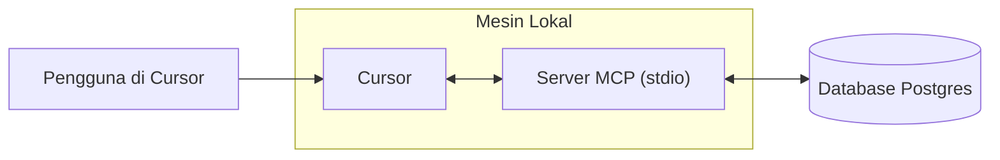

# Membangun Server MCP
Source: https://docs.cursor.com/id/guides/tutorials/building-mcp-server

Pelajari cara membangun server Model Context Protocol (MCP) dengan integrasi PostgreSQL untuk Cursor

<div id="introduction">
  ## Pengantar
</div>

Server MCP memungkinkan lo menghubungkan sumber data kustom dan membuatnya bisa dipakai langsung di dalam Cursor. Ini khususnya berguna saat lo butuh konteks dari tempat seperti browser, database, atau log error dan sistem. Menyiapkan server MCP itu straightforward, dan dengan Cursor bisa dilakukan cepat.

Di panduan ini, kita bakal ngebahas cara bikin server MCP buat Postgres. Tujuan kita adalah memungkinkan Cursor ngejalanin query SQL langsung ke database Postgres dan ngekspos skema tabel secara terstruktur.

<Note>
  Tutorial ini dirancang buat ngajarin fundamental membangun server MCP.
</Note>

<video autoPlay loop muted playsInline controls>
  <source src="https://mintcdn.com/cursor/Qpa6MBK62Try_xlf/images/guides/tutorials/building-mcp-server/demo.mp4?fit=max&auto=format&n=Qpa6MBK62Try_xlf&q=85&s=8e02b011bd0956d62135db5779f7ead5" type="video/mp4" data-path="images/guides/tutorials/building-mcp-server/demo.mp4" />
</video>



<div id="what-is-an-mcp-server">
  ## Apa itu MCP Server?
</div>

[MCP server](/id/context/mcp) adalah proses yang berkomunikasi dengan Cursor dan menyediakan akses ke data atau tindakan eksternal. Ini bisa diimplementasikan dengan beberapa cara, tapi di sini kita bakal pakai metode paling sederhana: server yang berjalan lokal di komputermu lewat [stdio](https://en.wikipedia.org/wiki/Standard_streams) (aliran standar input/output). Ini menghindari pertimbangan keamanan yang rumit dan memungkinkan kita fokus pada logika MCP itu sendiri.

Salah satu use case paling umum untuk MCP adalah akses database. Saat membangun dashboard, menjalankan analisis, atau membuat migrasi, sering kali perlu menjalankan query dan menginspeksi database. Postgres MCP server kita akan mendukung dua kapabilitas inti: menjalankan query sewenang-wenang dan menampilkan daftar skema tabel.

Walaupun kedua tugas ini bisa dilakukan dengan SQL biasa, MCP menawarkan fitur yang bikin keduanya lebih kuat dan lebih umum berguna. Tools menyediakan cara untuk mengekspos tindakan seperti mengeksekusi query, sementara resources memungkinkan kita berbagi konteks terstandardisasi seperti informasi skema. Nanti di panduan ini kita juga akan melihat prompts, yang memungkinkan alur kerja yang lebih canggih.

Di balik layar, kita akan mengandalkan paket postgres dari npm untuk mengeksekusi pernyataan SQL ke database. MCP SDK akan berfungsi sebagai pembungkus di sekitar pemanggilan ini, memungkinkan kita mengintegrasikan fungsionalitas Postgres secara mulus ke dalam Cursor.

<div id="how-to-build-the-mcp-server">
  ## Cara Membangun Server MCP
</div>

Langkah pertama untuk membangun server adalah menyiapkan proyek baru. Kita mulai dengan membuat folder baru dan menginisialisasi proyek Bun

```bash  theme={null}
> mkdir postgres-mcp-server
> Bun init
```

Dari sini, kita bakal pilih proyek `Blank`. Setelah boilerplate siap, kita perlu install dependency yang diperlukan. `zod` wajib buat nentuin skema i/o di MCP SDK

```bash  theme={null}
bun add postgres @modelcontextprotocol/sdk zod
```

Dari sini, kita bakal masuk ke repositori masing-masing library dan ambil tautan ke konten mentah dari README masing-masing. Ini bakal kita pakai sebagai konteks waktu ngebangun server

* `postgres`
  * Repo:  [https://github.com/porsager/postgres](https://github.com/porsager/postgres),
  * README: [https://raw.githubusercontent.com/porsager/postgres/refs/heads/master/README.md](https://raw.githubusercontent.com/porsager/postgres/refs/heads/master/README.md)
* `@modelcontextprotocol/sdk`:
  * Repo: [https://github.com/modelcontextprotocol/typescript-sdk](https://github.com/modelcontextprotocol/typescript-sdk)
  * README: [https://raw.githubusercontent.com/modelcontextprotocol/typescript-sdk/refs/heads/main/README.md](https://raw.githubusercontent.com/modelcontextprotocol/typescript-sdk/refs/heads/main/README.md)

Sekarang, kita bakal nentuin gimana perilaku yang kita pengin dari server. Untuk itu, kita bakal bikin `spec.md` dan nulis tujuan tingkat-tingginya

```markdown  theme={null}

---

← Previous: [Diagram Arsitektur](./diagram-arsitektur.md) | [Index](./index.md) | Next: [Pengembangan Web](./pengembangan-web.md) →