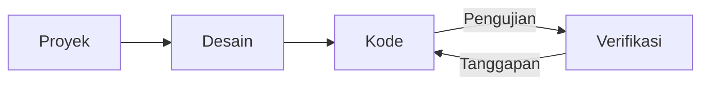

# Pengembangan Web
Source: https://docs.cursor.com/id/guides/tutorials/web-development

Cara mengonfigurasi Cursor untuk pengembangan web

export const McpInstallButtonPrimary = ({server, showIcon = true, prompt = null}) => {
  const [showModal, setShowModal] = useState(false);
  const generateDeepLink = () => {
    if (!server || !server.name || !server.install) {
      return null;
    }
    try {
      if (typeof server.install === 'string') {
        return server.install;
      }
      if (server.install.url) {
        const config = {
          ...server.install
        };
        const jsonString = JSON.stringify(config);
        const utf8Bytes = new TextEncoder().encode(jsonString);
        const base64Config = btoa(Array.from(utf8Bytes).map(b => String.fromCharCode(b)).join(''));
        const safeBase64Config = base64Config.replace(/\+/g, '%2B');
        return `cursor://anysphere.cursor-deeplink/mcp/install?name=${encodeURIComponent(server.name)}&config=${encodeURIComponent(safeBase64Config)}`;
      }
      if (server.install.command) {
        let config = {
          command: server.install.command,
          ...server.install.args && ({
            args: server.install.args
          }),
          ...server.install.env && ({
            env: server.install.env
          })
        };
        if (config.command && config.args) {
          const argsString = config.args.join(" ");
          config.command = `${config.command} ${argsString}`;
          delete config.args;
        }
        const jsonString = JSON.stringify(config);
        const utf8Bytes = new TextEncoder().encode(jsonString);
        const base64Config = btoa(Array.from(utf8Bytes).map(b => String.fromCharCode(b)).join(''));
        const safeBase64Config = base64Config.replace(/\+/g, '%2B');
        return `cursor://anysphere.cursor-deeplink/mcp/install?name=${encodeURIComponent(server.name)}&config=${encodeURIComponent(safeBase64Config)}`;
      }
      return null;
    } catch (e) {
      console.error("Error generating deep link:", e);
      return null;
    }
  };
  const handleButtonClick = () => {
    setShowModal(true);
  };
  const handleClose = () => {
    setShowModal(false);
  };
  const deepLink = generateDeepLink();
  const isDocumentationOnly = typeof server?.install === 'string';
  const hasConfirmation = prompt || isDocumentationOnly;
  const InstallModal = ({isOpen, onClose, deepLink, server, children}) => {
    useEffect(() => {
      const handleKeyDown = event => {
        if (event.key === 'Escape') {
          onClose();
        }
      };
      if (isOpen) {
        document.addEventListener('keydown', handleKeyDown);
      }
      return () => {
        document.removeEventListener('keydown', handleKeyDown);
      };
    }, [isOpen, onClose]);
    if (!isOpen) return null;
    return <div className="fixed inset-0 bg-black bg-opacity-50 flex items-center justify-center z-50 transition-opacity duration-200" onClick={onClose}>
        <div className="bg-white dark:bg-neutral-900 rounded-lg p-6 max-w-md w-full mx-4 border border-neutral-200 dark:border-neutral-700 transition-all duration-200 transform" onClick={e => e.stopPropagation()}>
          <div className="mb-4">
            <h3 className="text-lg font-semibold text-black dark:text-white mb-2">
              Install {server?.name}
            </h3>
            <div className="text-neutral-600 dark:text-neutral-400">
              {children}
            </div>
          </div>
          <div className="flex gap-3 justify-end">
            <button onClick={onClose} className="px-4 py-2 text-sm font-medium rounded-lg transition-colors duration-200 text-neutral-600 dark:text-neutral-400 hover:text-black dark:hover:text-white border border-neutral-200 dark:border-neutral-700 hover:bg-neutral-100 dark:hover:bg-neutral-800">
              Cancel
            </button>
            <a href={deepLink} onClick={onClose} target="_blank" className="px-4 py-2 text-sm font-medium rounded-lg transition-colors duration-200 bg-black text-white hover:bg-neutral-800 dark:bg-white dark:text-black dark:hover:bg-neutral-200 inline-flex items-center justify-center no-underline">
              Continue
            </a>
          </div>
        </div>
      </div>;
  };
  return <>
      {hasConfirmation ? <button onClick={handleButtonClick} className="inline-flex justify-center items-center gap-2 px-4 py-2 text-sm font-medium rounded-lg transition-colors duration-200 not-prose text-white bg-black hover:bg-neutral-800 dark:bg-white dark:text-black dark:hover:bg-neutral-200 border border-black dark:border-white">
          {showIcon && <Icon icon="plus" size={16} color="currentColor" />}
          Add to Cursor
        </button> : <a href={deepLink} className="inline-flex justify-center items-center gap-2 px-4 py-2 text-sm font-medium rounded-lg transition-colors duration-200 not-prose text-white bg-black hover:bg-neutral-800 dark:bg-white dark:text-black dark:hover:bg-neutral-200 border border-black dark:border-white">
          {showIcon && <Icon icon="plus" size={16} color="currentColor" />}
          Add to Cursor
        </a>}

      {hasConfirmation && <InstallModal isOpen={showModal} onClose={handleClose} deepLink={deepLink} server={server}>
          {prompt}
        </InstallModal>}
    </>;
};

Pengembangan web butuh iterasi cepat dan loop umpan balik yang ketat antara Cursor dan tool eksternal seperti Figma atau browser. Di Cursor, kami menemukan alur kerja yang mempersempit loop ini. Perumusan tugas yang jelas, reuse komponen, dan pemanfaatan design system membantu menjaga semuanya tetap cepat dan konsisten.

Panduan ini membahas cara menyiapkan Cursor untuk mendukung pengembangan web dan memperketat loop umpan balik.



<div id="start-orchestrating-in-cursor">
  # Mulai mengorkestrasi di Cursor
</div>

**Chat** mantap buat nge-bootstrap perubahan. Begitu komponen utama sudah siap, pindah ke **Inline Edit** dan **Tab** bakal bantu kamu tetap dalam flow.

Setelah nyiapin Cursor, kamu bisa mengorkestrasi alur kerja lintas berbagai tool. Di bawah ini contoh demo tentang apa yang bisa dilakukan: game snake yang dibuat dengan nggabungin Linear, Figma, dan tool browser. Walaupun proyek dunia nyata biasanya lebih kompleks, contoh ini nunjukin potensi dari alur kerja terintegrasi ini.

<Frame>
  <video src="https://mintcdn.com/cursor/E7JVsKUF5L-IiJRB/images/guides/tutorials/web-development/snake.mp4?fit=max&auto=format&n=E7JVsKUF5L-IiJRB&q=85&s=e029fbdff2ec06e1e4393ac580824b5a" controls data-path="images/guides/tutorials/web-development/snake.mp4" />
</Frame>

<div id="connect-to-your-project-management-tools">
  # Sambungkan ke tools manajemen proyek lo
</div>

Lo bisa ngintegrasiin Cursor ke software manajemen proyek yang udah lo pake lewat berbagai tooling. Di panduan ini, kita bakal lihat cara ngintegrasiin Linear dengan MCP server mereka.

<div id="installation">
  ### Instalasi
</div>

<McpInstallButtonPrimary
  server={{
name: "Linear",
install: {
command: "npx",
args: ["-y", "mcp-remote", "https://mcp.linear.app/sse"],
},
}}
/>

Atau tambahin Linear MCP server secara manual ke `mcp.json`:

```jsx  theme={null}
{
  "mcpServers": {
    "Linear": {
      "command": "npx",
      "args": [
        "-y",
        "mcp-remote",
        "https://mcp.linear.app/sse"
      ]
    }
  }
}
```

Lalu:

1. Pastikan ngaktifin Linear dari pengaturan MCP
2. Browser bakal kebuka dan lo bakal diminta buat otorisasi dengan Linear
   <Info>
     Karena kondisi MCP saat ini, setup bisa butuh beberapa kali percobaan.
     Kalau integrasinya nggak jalan, coba "Reload" server dari pengaturan
     Cursor.
   </Info>

<div id="using-linear-in-cursor">
  ### Pakai Linear di Cursor
</div>

Server MCP Linear nyediain berbagai tools yang bisa dipakai Cursor buat baca dan ngelola issue. Buka pengaturan MCP dan cari server Linear buat lihat daftar semua tools. Buat verifikasi, coba prompt ini di Chat:

```jsx  theme={null}
tampilkan semua issue yang terkait dengan proyek ini
```

<Frame>
  
</Frame>

Kalau integrasinya sudah dikonfigurasi dengan benar, ini bakal menampilkan daftar issue.

<div id="bring-in-your-figma-designs">
  # Bawa desain Figma lo
</div>

Desain dan mockup itu inti dari pengembangan web. Dengan server MCP resmi buat Figma, lo bisa langsung akses dan kerjain file desain di Cursor. Buat mulai, ikutin instruksi setup di [Figma Dev Mode MCP Server](https://help.figma.com/hc/en-us/articles/32132100833559-Guide-to-the-Dev-Mode-MCP-Server).

<div id="installation">
  ### Instalasi
</div>

Lo bisa klik tombol di bawah buat install server MCP.

<McpInstallButtonPrimary
  server={{
name: "Figma",
install: {
url: "http://127.0.0.1:3845/sse",
},
}}
/>

Atau tambahin manual ke `mcp.json` lo:

```jsx  theme={null}
{
  "mcpServers": {
    "Figma": {
      "url": "http://127.0.0.1:3845/sse"
    }
  }
}
```

<div id="usage">
  ### Penggunaan
</div>

Server mengekspose beberapa tool yang bisa kamu pakai di prompt. Misalnya, coba minta desain dari seleksi yang sedang dipilih di Figma. Baca selengkapnya di [dokumentasi](https://help.figma.com/hc/en-us/articles/32132100833559-Guide-to-the-Dev-Mode-MCP-Server).

<Frame>
  
</Frame>

<div id="keep-your-code-scaffolding-consistent">
  # Jaga scaffolding kode tetap konsisten
</div>

Mungkin kamu sudah punya kode yang ada, design system, atau konvensi yang sudah mapan dan ingin dipakai ulang. Saat bekerja dengan model, bakal membantu kalau merujuk pola yang sudah ada di codebase kamu, seperti menu dropdown atau komponen umum lainnya.

Di codebase web besar yang kami kerjakan, kami menemukan bahwa kode deklaratif bekerja sangat baik, terutama untuk React dan JSX.

Kalau kamu punya design system, kamu bisa bantu agent menemukannya dengan menyediakan aturan untuk itu. Berikut file `ui-components.mdc` di mana kami mencoba menegakkan reuse komponen sebisa mungkin:

```mdc components.mdc theme={null}
---
description: Mengimplementasikan desain dan membangun UI
---
- pakai ulang komponen UI yang sudah ada dari `/src/components/ui`. ini adalah primitive yang jadi dasar untuk kita bangun
- buat komponen baru dengan mengorkestrasikan komponen UI kalau kamu nggak menemukan yang sudah ada yang bisa menyelesaikan masalah
- tanya pengguna bagaimana mereka mau lanjut kalau ada komponen atau desain yang belum ada
```

Seiring pustaka komponenmu berkembang, tambahkan aturan baru sesuai kebutuhan. Kalau aturan sudah terlalu banyak, pertimbangkan untuk membaginya ke kategori yang lebih spesifik, misalnya “hanya diterapkan saat bekerja dengan input pengguna.”

<Frame>
  
</Frame>

<div id="give-cursor-access-to-browser">
  # Beri Cursor akses ke browser
</div>

Untuk memperluas kapabilitas Cursor, kamu bisa menyiapkan server MCP browser tools, yang memberi akses ke console log dan network request. Setelah dikonfigurasi, kamu bisa memverifikasi perubahan dengan memantau output console dan aktivitas jaringan. Setup ini membantu memastikan implementasimu sesuai dengan intent kamu. Ikuti instruksi di sini untuk menyiapkan server MCP: [https://browsertools.agentdesk.ai/installation](https://browsertools.agentdesk.ai/installation)

<Frame>
  
</Frame>

<Note>
  Kita lagi ngerjain supaya ini lebih gampang diintegrasikan secara native di Cursor.
</Note>

<div id="takeaways">
  # Ringkasan
</div>

* Loop umpan balik yang cepat itu krusial di pengembangan web. Pakai Cursor bareng alat seperti Figma, Linear, dan browser biar gerak cepat dan tetap in-flow.
* Server MCP bikin lo bisa mengintegrasikan sistem eksternal langsung ke Cursor, ngurangin context switching dan ningkatin eksekusi tugas.
* Ngegunain ulang komponen dan design system bantu model ngeluarin kode dan output yang lebih bersih dan konsisten.
* Tugas yang jelas dengan ruang lingkup yang terdefinisi ngasih hasil yang lebih bagus. Lebih sadar dalam cara lo nge-prompt dan apa yang lo minta.
* Kalau output-nya belum oke, coba sesuaikan:
  * **Instruksi:** Pakai rules, prompt, dan kasih akses ke lebih banyak konteks, misalnya lewat server MCP.
  * **Sistem:** Pola, abstraksi, dan kejelasan bikin model lebih gampang paham, bantu, dan kerja lebih otonom.
* Lo bisa ngeluasin konteks model dengan nyertain info runtime kayak console logs, network requests, dan data elemen UI.
* Nggak semua hal perlu diotomasi. Kalau sistem lo jadi terlalu kompleks, balik ke edit yang lebih presisi pakai Tab dan Inline Edit.
* Cursor paling kuat saat jadi co-pilot, bukan autopilot. Pakai buat ningkatin, bukan gantiin, pengambilan keputusan lo sendiri.

---

← Previous: [Membangun Server MCP](./membangun-server-mcp.md) | [Index](./index.md) | Next: [Bekerja dengan Konteks](./bekerja-dengan-konteks.md) →